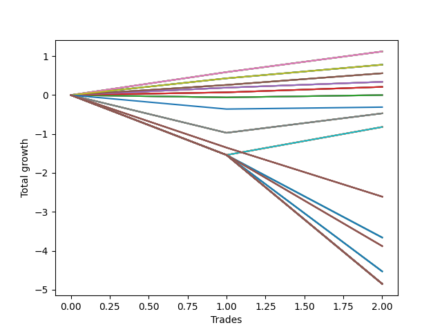

# Long Wallace Betterrerer 020 
- Symbol: AMZN_Unlimited
- Date Range: 03/23/2022 - 07/08/2022
- Trading Period: 7:20-12:30
- Number of Trades: 2



| Name | Win Percent | Profit | Avg Profit / Trade | Avg Time / Trade |      | Name | Win Percent | Profit | Avg Profit / Trade | Avg Time / Trade |
| ---- | ----------- | ------ | ------------------ | ---------------- | ---- | ---- | ----------- | ------ | ------------------ | ---------------- |
| Sorted By <br> Profit | | | | | | Sorted By <br> Win Percentage ||||
| Sixty-Eight | 100.00 | 560.00 | 280.00 | 24:35 |     | Sixty-Eight | 100.00 | 560.00 | 280.00 | 24:35 |
| Sixty | 100.00 | 560.00 | 280.00 | 24:35 |     | Sixty | 100.00 | 560.00 | 280.00 | 24:35 |
| Fifty-Two | 100.00 | 560.00 | 280.00 | 24:35 |     | Fifty-Two | 100.00 | 560.00 | 280.00 | 24:35 |
| Forty-Four | 100.00 | 560.00 | 280.00 | 24:35 |     | Forty-Four | 100.00 | 560.00 | 280.00 | 24:35 |
| Four | 100.00 | 560.00 | 280.00 | 24:35 |     | Four | 100.00 | 560.00 | 280.00 | 24:35 |
| Seventy | 100.00 | 390.00 | 195.00 | 19:52 |     | Seventy | 100.00 | 390.00 | 195.00 | 19:52 |
| Sixty-Two | 100.00 | 390.00 | 195.00 | 19:52 |     | Sixty-Two | 100.00 | 390.00 | 195.00 | 19:52 |
| Fifty-Four | 100.00 | 390.00 | 195.00 | 19:52 |     | Fifty-Four | 100.00 | 390.00 | 195.00 | 19:52 |
| Forty-Six | 100.00 | 390.00 | 195.00 | 19:52 |     | Forty-Six | 100.00 | 390.00 | 195.00 | 19:52 |
| Six | 100.00 | 390.00 | 195.00 | 19:52 |     | Six | 100.00 | 390.00 | 195.00 | 19:52 |
| Sixty-Seven | 100.00 | 280.00 | 140.00 | 15:00 |     | Sixty-Seven | 100.00 | 280.00 | 140.00 | 15:00 |
| Fifty-Nine | 100.00 | 280.00 | 140.00 | 15:00 |     | Fifty-Nine | 100.00 | 280.00 | 140.00 | 15:00 |
| Fifty-One | 100.00 | 280.00 | 140.00 | 15:00 |     | Fifty-One | 100.00 | 280.00 | 140.00 | 15:00 |
| Forty-Three | 100.00 | 280.00 | 140.00 | 15:00 |     | Forty-Three | 100.00 | 280.00 | 140.00 | 15:00 |
| Three | 100.00 | 280.00 | 140.00 | 15:00 |     | Three | 100.00 | 280.00 | 140.00 | 15:00 |
| Sixty-Six | 100.00 | 170.00 | 85.00 | 14:00 |     | Sixty-Six | 100.00 | 170.00 | 85.00 | 14:00 |
| Fifty-Eight | 100.00 | 170.00 | 85.00 | 14:00 |     | Fifty-Eight | 100.00 | 170.00 | 85.00 | 14:00 |
| Fifty | 100.00 | 170.00 | 85.00 | 14:00 |     | Fifty | 100.00 | 170.00 | 85.00 | 14:00 |
| Forty-Two | 100.00 | 170.00 | 85.00 | 14:00 |     | Forty-Two | 100.00 | 170.00 | 85.00 | 14:00 |
| Two | 100.00 | 170.00 | 85.00 | 14:00 |     | Two | 100.00 | 170.00 | 85.00 | 14:00 |
| Sixty-Five | 100.00 | 105.00 | 52.50 | 11:55 |     | Sixty-Five | 100.00 | 105.00 | 52.50 | 11:55 |
| Fifty-Seven | 100.00 | 105.00 | 52.50 | 11:55 |     | Fifty-Seven | 100.00 | 105.00 | 52.50 | 11:55 |
| Forty-Nine | 100.00 | 105.00 | 52.50 | 11:55 |     | Forty-Nine | 100.00 | 105.00 | 52.50 | 11:55 |
| Forty-One | 100.00 | 105.00 | 52.50 | 11:55 |     | Forty-One | 100.00 | 105.00 | 52.50 | 11:55 |
| One | 100.00 | 105.00 | 52.50 | 11:55 |     | One | 100.00 | 105.00 | 52.50 | 11:55 |
| Sixty-Four | 50.00 | 0.00 | 0.00 | 09:40 |     | Sixty-Four | 50.00 | 0.00 | 0.00 | 09:40 |
| Fifty-Six | 50.00 | 0.00 | 0.00 | 09:40 |     | Fifty-Six | 50.00 | 0.00 | 0.00 | 09:40 |
| Forty-Eight | 50.00 | 0.00 | 0.00 | 09:40 |     | Forty-Eight | 50.00 | 0.00 | 0.00 | 09:40 |
| Forty | 50.00 | 0.00 | 0.00 | 09:40 |     | Forty | 50.00 | 0.00 | 0.00 | 09:40 |
| Zero | 50.00 | 0.00 | 0.00 | 09:40 |     | Zero | 50.00 | 0.00 | 0.00 | 09:40 |
| Seventy-Three | 50.00 | -155.00 | -77.50 | 04:05 |     | Seventy-Three | 50.00 | -155.00 | -77.50 | 04:05 |
| Sixty-Nine | 50.00 | -235.00 | -117.50 | 107:37 |     | Sixty-Nine | 50.00 | -235.00 | -117.50 | 107:37 |
| Sixty-One | 50.00 | -235.00 | -117.50 | 107:37 |     | Sixty-One | 50.00 | -235.00 | -117.50 | 107:37 |
| Fifty-Three | 50.00 | -235.00 | -117.50 | 107:37 |     | Fifty-Three | 50.00 | -235.00 | -117.50 | 107:37 |
| Forty-Five | 50.00 | -235.00 | -117.50 | 107:37 |     | Forty-Five | 50.00 | -235.00 | -117.50 | 107:37 |
| Five | 50.00 | -235.00 | -117.50 | 107:37 |     | Five | 50.00 | -235.00 | -117.50 | 107:37 |
| Seventy-One | 50.00 | -410.00 | -205.00 | 160:25 |     | Seventy-One | 50.00 | -410.00 | -205.00 | 160:25 |
| Sixty-Three | 50.00 | -410.00 | -205.00 | 160:25 |     | Sixty-Three | 50.00 | -410.00 | -205.00 | 160:25 |
| Fifty-Five | 50.00 | -410.00 | -205.00 | 160:25 |     | Fifty-Five | 50.00 | -410.00 | -205.00 | 160:25 |
| Forty-Seven | 50.00 | -410.00 | -205.00 | 160:25 |     | Forty-Seven | 50.00 | -410.00 | -205.00 | 160:25 |
| Seven | 50.00 | -410.00 | -205.00 | 160:25 |     | Seven | 50.00 | -410.00 | -205.00 | 160:25 |
| One Hundred | 0.00 | -1305.00 | -652.50 | 128:57 |     | One Hundred | 0.00 | -1305.00 | -652.50 | 128:57 |
| Ninety-Nine | 0.00 | -1305.00 | -652.50 | 128:57 |     | Ninety-Nine | 0.00 | -1305.00 | -652.50 | 128:57 |
| Ninety-Eight | 0.00 | -1305.00 | -652.50 | 128:57 |     | Ninety-Eight | 0.00 | -1305.00 | -652.50 | 128:57 |
| Ninety-Seven | 0.00 | -1305.00 | -652.50 | 128:57 |     | Ninety-Seven | 0.00 | -1305.00 | -652.50 | 128:57 |
| Ninety-Six | 0.00 | -1305.00 | -652.50 | 128:57 |     | Ninety-Six | 0.00 | -1305.00 | -652.50 | 128:57 |
| Ninety-Five | 0.00 | -1830.00 | -915.00 | 258:10 |     | Ninety-Five | 0.00 | -1830.00 | -915.00 | 258:10 |
| Ninety-Four | 0.00 | -1830.00 | -915.00 | 258:10 |     | Ninety-Four | 0.00 | -1830.00 | -915.00 | 258:10 |
| Ninety-Three | 0.00 | -1830.00 | -915.00 | 258:10 |     | Ninety-Three | 0.00 | -1830.00 | -915.00 | 258:10 |
| Ninety-Two | 0.00 | -1830.00 | -915.00 | 258:10 |     | Ninety-Two | 0.00 | -1830.00 | -915.00 | 258:10 |
| Ninety-One | 0.00 | -1830.00 | -915.00 | 258:10 |     | Ninety-One | 0.00 | -1830.00 | -915.00 | 258:10 |
| One Hundred Ten | 0.00 | -1940.00 | -970.00 | 259:05 |     | One Hundred Ten | 0.00 | -1940.00 | -970.00 | 259:05 |
| One Hundred Nine | 0.00 | -1940.00 | -970.00 | 259:05 |     | One Hundred Nine | 0.00 | -1940.00 | -970.00 | 259:05 |
| One Hundred Eight | 0.00 | -1940.00 | -970.00 | 259:05 |     | One Hundred Eight | 0.00 | -1940.00 | -970.00 | 259:05 |
| One Hundred Seven | 0.00 | -1940.00 | -970.00 | 259:05 |     | One Hundred Seven | 0.00 | -1940.00 | -970.00 | 259:05 |
| One Hundred Six | 0.00 | -1940.00 | -970.00 | 259:05 |     | One Hundred Six | 0.00 | -1940.00 | -970.00 | 259:05 |
| One Hundred Five | 0.00 | -2265.00 | -1132.50 | 272:57 |     | One Hundred Five | 0.00 | -2265.00 | -1132.50 | 272:57 |
| One Hundred Four | 0.00 | -2265.00 | -1132.50 | 272:57 |     | One Hundred Four | 0.00 | -2265.00 | -1132.50 | 272:57 |
| One Hundred Three | 0.00 | -2265.00 | -1132.50 | 272:57 |     | One Hundred Three | 0.00 | -2265.00 | -1132.50 | 272:57 |
| One Hundred Two | 0.00 | -2265.00 | -1132.50 | 272:57 |     | One Hundred Two | 0.00 | -2265.00 | -1132.50 | 272:57 |
| One Hundred One | 0.00 | -2265.00 | -1132.50 | 272:57 |     | One Hundred One | 0.00 | -2265.00 | -1132.50 | 272:57 |
| One Hundred Thirty | 0.00 | -2425.00 | -1212.50 | 282:00 |     | One Hundred Thirty | 0.00 | -2425.00 | -1212.50 | 282:00 |
| One Hundred Twenty-Nine | 0.00 | -2425.00 | -1212.50 | 282:00 |     | One Hundred Twenty-Nine | 0.00 | -2425.00 | -1212.50 | 282:00 |
| One Hundred Twenty-Eight | 0.00 | -2425.00 | -1212.50 | 282:00 |     | One Hundred Twenty-Eight | 0.00 | -2425.00 | -1212.50 | 282:00 |
| One Hundred Twenty-Seven | 0.00 | -2425.00 | -1212.50 | 282:00 |     | One Hundred Twenty-Seven | 0.00 | -2425.00 | -1212.50 | 282:00 |
| One Hundred Twenty-Six | 0.00 | -2425.00 | -1212.50 | 282:00 |     | One Hundred Twenty-Six | 0.00 | -2425.00 | -1212.50 | 282:00 |
| One Hundred Twenty-Five | 0.00 | -2425.00 | -1212.50 | 282:00 |     | One Hundred Twenty-Five | 0.00 | -2425.00 | -1212.50 | 282:00 |
| One Hundred Twenty-Four | 0.00 | -2425.00 | -1212.50 | 282:00 |     | One Hundred Twenty-Four | 0.00 | -2425.00 | -1212.50 | 282:00 |
| One Hundred Twenty-Three | 0.00 | -2425.00 | -1212.50 | 282:00 |     | One Hundred Twenty-Three | 0.00 | -2425.00 | -1212.50 | 282:00 |
| One Hundred Twenty-Two | 0.00 | -2425.00 | -1212.50 | 282:00 |     | One Hundred Twenty-Two | 0.00 | -2425.00 | -1212.50 | 282:00 |
| One Hundred Twenty-One | 0.00 | -2425.00 | -1212.50 | 282:00 |     | One Hundred Twenty-One | 0.00 | -2425.00 | -1212.50 | 282:00 |
| One Hundred Twenty | 0.00 | -2425.00 | -1212.50 | 282:00 |     | One Hundred Twenty | 0.00 | -2425.00 | -1212.50 | 282:00 |
| One Hundred Ninteen | 0.00 | -2425.00 | -1212.50 | 282:00 |     | One Hundred Ninteen | 0.00 | -2425.00 | -1212.50 | 282:00 |
| One Hundred Eighteen | 0.00 | -2425.00 | -1212.50 | 282:00 |     | One Hundred Eighteen | 0.00 | -2425.00 | -1212.50 | 282:00 |
| One Hundred Seventeen | 0.00 | -2425.00 | -1212.50 | 282:00 |     | One Hundred Seventeen | 0.00 | -2425.00 | -1212.50 | 282:00 |
| One Hundred Sixteen | 0.00 | -2425.00 | -1212.50 | 282:00 |     | One Hundred Sixteen | 0.00 | -2425.00 | -1212.50 | 282:00 |
| One Hundred Fifteen | 0.00 | -2425.00 | -1212.50 | 282:00 |     | One Hundred Fifteen | 0.00 | -2425.00 | -1212.50 | 282:00 |
| One Hundred Fourteen | 0.00 | -2425.00 | -1212.50 | 282:00 |     | One Hundred Fourteen | 0.00 | -2425.00 | -1212.50 | 282:00 |
| One Hundred Thirteen | 0.00 | -2425.00 | -1212.50 | 282:00 |     | One Hundred Thirteen | 0.00 | -2425.00 | -1212.50 | 282:00 |
| One Hundred Twelve | 0.00 | -2425.00 | -1212.50 | 282:00 |     | One Hundred Twelve | 0.00 | -2425.00 | -1212.50 | 282:00 |
| One Hundred Eleven | 0.00 | -2425.00 | -1212.50 | 282:00 |     | One Hundred Eleven | 0.00 | -2425.00 | -1212.50 | 282:00 |
| Eighty-Five | 0.00 | -2425.00 | -1212.50 | 282:00 |     | Eighty-Five | 0.00 | -2425.00 | -1212.50 | 282:00 |
| Eighty-Four | 0.00 | -2425.00 | -1212.50 | 282:00 |     | Eighty-Four | 0.00 | -2425.00 | -1212.50 | 282:00 |
| Eighty-Three | 0.00 | -2425.00 | -1212.50 | 282:00 |     | Eighty-Three | 0.00 | -2425.00 | -1212.50 | 282:00 |
| Eighty-Two | 0.00 | -2425.00 | -1212.50 | 282:00 |     | Eighty-Two | 0.00 | -2425.00 | -1212.50 | 282:00 |
| Eighty-One | 0.00 | -2425.00 | -1212.50 | 282:00 |     | Eighty-One | 0.00 | -2425.00 | -1212.50 | 282:00 |

## NO STOPLOSS

### Test Zero
* Sell when price hits the middle line of the 20p bollinger
* No Stoploss
* Results:
```
Total Trades: 2
Percent Up: 50.00
Percent Down: 50.00
Total Points Moved Up: 0.00
Potential Profit: 0.00
Total Points Ups: 0.06 Count Ups: 1
Total Points Downs: -0.06 Count Downs: 1
```

<details><summary>Trades</summary>

<code>In: 2022-06-08 08:00:00		Out: 2022-06-08 08:08:15		Total Position Time: 08:15		Total Move Up: -0.06		Total to Date: -0.06</code> <br />
<code>In: 2022-06-09 08:10:00		Out: 2022-06-09 08:21:05		Total Position Time: 11:05		Total Move Up: 0.06		Total to Date: 0.00</code> <br />


</details>

### Test One
* Sell when the price hits the upper line of the 20p 1std bollinger
* No Stoploss
* Results:
```
Total Trades: 2
Percent Up: 100.00
Percent Down: 0.00
Total Points Moved Up: 0.21
Potential Profit: 105.00
Total Points Ups: 0.21 Count Ups: 2
Total Points Downs: 0.00 Count Downs: 0
```

<details><summary>Trades</summary>

<code>In: 2022-06-08 08:00:00		Out: 2022-06-08 08:11:10		Total Position Time: 11:10		Total Move Up: 0.07		Total to Date: 0.07</code> <br />
<code>In: 2022-06-09 08:10:00		Out: 2022-06-09 08:22:40		Total Position Time: 12:40		Total Move Up: 0.14		Total to Date: 0.21</code> <br />


</details>

### Test Two
* Sell when the price hits the upper line of the 20p 2std bollinger
* No Stoploss
* Results:
```
Total Trades: 2
Percent Up: 100.00
Percent Down: 0.00
Total Points Moved Up: 0.34
Potential Profit: 170.00
Total Points Ups: 0.34 Count Ups: 2
Total Points Downs: 0.00 Count Downs: 0
```

<details><summary>Trades</summary>

<code>In: 2022-06-08 08:00:00		Out: 2022-06-08 08:13:45		Total Position Time: 13:45		Total Move Up: 0.19		Total to Date: 0.19</code> <br />
<code>In: 2022-06-09 08:10:00		Out: 2022-06-09 08:24:15		Total Position Time: 14:15		Total Move Up: 0.15		Total to Date: 0.34</code> <br />


</details>

### Test Three
* Sell when price hits the middle line of the 50p bollinger
* No Stoploss
* Results:
```
Total Trades: 2
Percent Up: 100.00
Percent Down: 0.00
Total Points Moved Up: 0.56
Potential Profit: 280.00
Total Points Ups: 0.56 Count Ups: 2
Total Points Downs: 0.00 Count Downs: 0
```

<details><summary>Trades</summary>

<code>In: 2022-06-08 08:00:00		Out: 2022-06-08 08:15:05		Total Position Time: 15:05		Total Move Up: 0.26		Total to Date: 0.26</code> <br />
<code>In: 2022-06-09 08:10:00		Out: 2022-06-09 08:24:55		Total Position Time: 14:55		Total Move Up: 0.30		Total to Date: 0.56</code> <br />


</details>

### Test Four
* Sell when the price hits the upper line of the 50p 1std bollinger
* No Stoploss
* Results:
```
Total Trades: 2
Percent Up: 100.00
Percent Down: 0.00
Total Points Moved Up: 1.12
Potential Profit: 560.00
Total Points Ups: 1.12 Count Ups: 2
Total Points Downs: 0.00 Count Downs: 0
```

<details><summary>Trades</summary>

<code>In: 2022-06-08 08:00:00		Out: 2022-06-08 08:26:05		Total Position Time: 26:05		Total Move Up: 0.59		Total to Date: 0.59</code> <br />
<code>In: 2022-06-09 08:10:00		Out: 2022-06-09 08:33:05		Total Position Time: 23:05		Total Move Up: 0.53		Total to Date: 1.12</code> <br />


</details>

### Test Five
* Sell when the price hits the upper line of the 50p 2std bollinger
* No Stoploss
* Results:
```
Total Trades: 2
Percent Up: 50.00
Percent Down: 50.00
Total Points Moved Up: -0.47
Potential Profit: -235.00
Total Points Ups: 0.50 Count Ups: 1
Total Points Downs: -0.97 Count Downs: 1
```

<details><summary>Trades</summary>

<code>In: 2022-06-08 08:00:00		Out: 2022-06-08 11:03:40		Total Position Time: 183:40		Total Move Up: -0.97		Total to Date: -0.97</code> <br />
<code>In: 2022-06-09 08:10:00		Out: 2022-06-09 08:41:35		Total Position Time: 31:35		Total Move Up: 0.50		Total to Date: -0.47</code> <br />


</details>

### Test Six
* Sell when the price hits the middle line of the 1std VWAP
* No Stoploss
* Results:
```
Total Trades: 2
Percent Up: 100.00
Percent Down: 0.00
Total Points Moved Up: 0.78
Potential Profit: 390.00
Total Points Ups: 0.78 Count Ups: 2
Total Points Downs: 0.00 Count Downs: 0
```

<details><summary>Trades</summary>

<code>In: 2022-06-08 08:00:00		Out: 2022-06-08 08:16:50		Total Position Time: 16:50		Total Move Up: 0.43		Total to Date: 0.43</code> <br />
<code>In: 2022-06-09 08:10:00		Out: 2022-06-09 08:32:55		Total Position Time: 22:55		Total Move Up: 0.35		Total to Date: 0.78</code> <br />


</details>

### Test Seven
* Sell when the price hits the upper line of the 1std VWAP
* No Stoploss
* Results:
```
Total Trades: 2
Percent Up: 50.00
Percent Down: 50.00
Total Points Moved Up: -0.82
Potential Profit: -410.00
Total Points Ups: 0.72 Count Ups: 1
Total Points Downs: -1.54 Count Downs: 1
```

<details><summary>Trades</summary>

<code>In: 2022-06-08 08:00:00		Out: 2022-06-08 12:47:00		Total Position Time: 287:00		Total Move Up: -1.54		Total to Date: -1.54</code> <br />
<code>In: 2022-06-09 08:10:00		Out: 2022-06-09 08:43:50		Total Position Time: 33:50		Total Move Up: 0.72		Total to Date: -0.82</code> <br />


</details>

## STOPLOSS OF 5

### Test Forty
* Sell when price hits the middle line of the 20p bollinger
* Stoploss is 5 points
* Results:
```
Total Trades: 2
Percent Up: 50.00
Percent Down: 50.00
Total Points Moved Up: 0.00
Potential Profit: 0.00
Total Points Ups: 0.06 Count Ups: 1
Total Points Downs: -0.06 Count Downs: 1
```

<details><summary>Trades</summary>

<code>In: 2022-06-08 08:00:00		Out: 2022-06-08 08:08:15		Total Position Time: 08:15		Total Move Up: -0.06		Total to Date: -0.06</code> <br />
<code>In: 2022-06-09 08:10:00		Out: 2022-06-09 08:21:05		Total Position Time: 11:05		Total Move Up: 0.06		Total to Date: 0.00</code> <br />


</details>

### Test Forty-One
* Sell when the price hits the upper line of the 20p 1std bollinger
* Stoploss is 5 points
* Results:
```
Total Trades: 2
Percent Up: 100.00
Percent Down: 0.00
Total Points Moved Up: 0.21
Potential Profit: 105.00
Total Points Ups: 0.21 Count Ups: 2
Total Points Downs: 0.00 Count Downs: 0
```

<details><summary>Trades</summary>

<code>In: 2022-06-08 08:00:00		Out: 2022-06-08 08:11:10		Total Position Time: 11:10		Total Move Up: 0.07		Total to Date: 0.07</code> <br />
<code>In: 2022-06-09 08:10:00		Out: 2022-06-09 08:22:40		Total Position Time: 12:40		Total Move Up: 0.14		Total to Date: 0.21</code> <br />


</details>

### Test Forty-Two
* Sell when the price hits the upper line of the 20p 2std bollinger
* Stoploss is 5 points
* Results:
```
Total Trades: 2
Percent Up: 100.00
Percent Down: 0.00
Total Points Moved Up: 0.34
Potential Profit: 170.00
Total Points Ups: 0.34 Count Ups: 2
Total Points Downs: 0.00 Count Downs: 0
```

<details><summary>Trades</summary>

<code>In: 2022-06-08 08:00:00		Out: 2022-06-08 08:13:45		Total Position Time: 13:45		Total Move Up: 0.19		Total to Date: 0.19</code> <br />
<code>In: 2022-06-09 08:10:00		Out: 2022-06-09 08:24:15		Total Position Time: 14:15		Total Move Up: 0.15		Total to Date: 0.34</code> <br />


</details>

### Test Forty-Three
* Sell when price hits the middle line of the 50p bollinger
* Stoploss is 5 points
* Results:
```
Total Trades: 2
Percent Up: 100.00
Percent Down: 0.00
Total Points Moved Up: 0.56
Potential Profit: 280.00
Total Points Ups: 0.56 Count Ups: 2
Total Points Downs: 0.00 Count Downs: 0
```

<details><summary>Trades</summary>

<code>In: 2022-06-08 08:00:00		Out: 2022-06-08 08:15:05		Total Position Time: 15:05		Total Move Up: 0.26		Total to Date: 0.26</code> <br />
<code>In: 2022-06-09 08:10:00		Out: 2022-06-09 08:24:55		Total Position Time: 14:55		Total Move Up: 0.30		Total to Date: 0.56</code> <br />


</details>

### Test Forty-Four
* Sell when the price hits the upper line of the 50p 1std bollinger
* Stoploss is 5 points
* Results:
```
Total Trades: 2
Percent Up: 100.00
Percent Down: 0.00
Total Points Moved Up: 1.12
Potential Profit: 560.00
Total Points Ups: 1.12 Count Ups: 2
Total Points Downs: 0.00 Count Downs: 0
```

<details><summary>Trades</summary>

<code>In: 2022-06-08 08:00:00		Out: 2022-06-08 08:26:05		Total Position Time: 26:05		Total Move Up: 0.59		Total to Date: 0.59</code> <br />
<code>In: 2022-06-09 08:10:00		Out: 2022-06-09 08:33:05		Total Position Time: 23:05		Total Move Up: 0.53		Total to Date: 1.12</code> <br />


</details>

### Test Forty-Five
* Sell when the price hits the upper line of the 50p 2std bollinger
* Stoploss is 5 points
* Results:
```
Total Trades: 2
Percent Up: 50.00
Percent Down: 50.00
Total Points Moved Up: -0.47
Potential Profit: -235.00
Total Points Ups: 0.50 Count Ups: 1
Total Points Downs: -0.97 Count Downs: 1
```

<details><summary>Trades</summary>

<code>In: 2022-06-08 08:00:00		Out: 2022-06-08 11:03:40		Total Position Time: 183:40		Total Move Up: -0.97		Total to Date: -0.97</code> <br />
<code>In: 2022-06-09 08:10:00		Out: 2022-06-09 08:41:35		Total Position Time: 31:35		Total Move Up: 0.50		Total to Date: -0.47</code> <br />


</details>

### Test Forty-Six
* Sell when the price hits the middle line of the 1std VWAP
* Stoploss is 5 points
* Results:
```
Total Trades: 2
Percent Up: 100.00
Percent Down: 0.00
Total Points Moved Up: 0.78
Potential Profit: 390.00
Total Points Ups: 0.78 Count Ups: 2
Total Points Downs: 0.00 Count Downs: 0
```

<details><summary>Trades</summary>

<code>In: 2022-06-08 08:00:00		Out: 2022-06-08 08:16:50		Total Position Time: 16:50		Total Move Up: 0.43		Total to Date: 0.43</code> <br />
<code>In: 2022-06-09 08:10:00		Out: 2022-06-09 08:32:55		Total Position Time: 22:55		Total Move Up: 0.35		Total to Date: 0.78</code> <br />


</details>

### Test Forty-Seven
* Sell when the price hits the upper line of the 1std VWAP
* Stoploss is 5 points
* Results:
```
Total Trades: 2
Percent Up: 50.00
Percent Down: 50.00
Total Points Moved Up: -0.82
Potential Profit: -410.00
Total Points Ups: 0.72 Count Ups: 1
Total Points Downs: -1.54 Count Downs: 1
```

<details><summary>Trades</summary>

<code>In: 2022-06-08 08:00:00		Out: 2022-06-08 12:47:00		Total Position Time: 287:00		Total Move Up: -1.54		Total to Date: -1.54</code> <br />
<code>In: 2022-06-09 08:10:00		Out: 2022-06-09 08:43:50		Total Position Time: 33:50		Total Move Up: 0.72		Total to Date: -0.82</code> <br />


</details>

## TRAIL STOP OF 5

### Test Forty-Eight
* Sell when price hits the middle line of the 20p bollinger
* Trailing Stop is 5 points
* Results:
```
Total Trades: 2
Percent Up: 50.00
Percent Down: 50.00
Total Points Moved Up: 0.00
Potential Profit: 0.00
Total Points Ups: 0.06 Count Ups: 1
Total Points Downs: -0.06 Count Downs: 1
```

<details><summary>Trades</summary>

<code>In: 2022-06-08 08:00:00		Out: 2022-06-08 08:08:15		Total Position Time: 08:15		Total Move Up: -0.06		Total to Date: -0.06</code> <br />
<code>In: 2022-06-09 08:10:00		Out: 2022-06-09 08:21:05		Total Position Time: 11:05		Total Move Up: 0.06		Total to Date: 0.00</code> <br />


</details>

### Test Forty-Nine
* Sell when the price hits the upper line of the 20p 1std bollinger
* Trailing Stop is 5 points
* Results:
```
Total Trades: 2
Percent Up: 100.00
Percent Down: 0.00
Total Points Moved Up: 0.21
Potential Profit: 105.00
Total Points Ups: 0.21 Count Ups: 2
Total Points Downs: 0.00 Count Downs: 0
```

<details><summary>Trades</summary>

<code>In: 2022-06-08 08:00:00		Out: 2022-06-08 08:11:10		Total Position Time: 11:10		Total Move Up: 0.07		Total to Date: 0.07</code> <br />
<code>In: 2022-06-09 08:10:00		Out: 2022-06-09 08:22:40		Total Position Time: 12:40		Total Move Up: 0.14		Total to Date: 0.21</code> <br />


</details>

### Test Fifty
* Sell when the price hits the upper line of the 20p 2std bollinger
* Trailing Stop is 5 points
* Results:
```
Total Trades: 2
Percent Up: 100.00
Percent Down: 0.00
Total Points Moved Up: 0.34
Potential Profit: 170.00
Total Points Ups: 0.34 Count Ups: 2
Total Points Downs: 0.00 Count Downs: 0
```

<details><summary>Trades</summary>

<code>In: 2022-06-08 08:00:00		Out: 2022-06-08 08:13:45		Total Position Time: 13:45		Total Move Up: 0.19		Total to Date: 0.19</code> <br />
<code>In: 2022-06-09 08:10:00		Out: 2022-06-09 08:24:15		Total Position Time: 14:15		Total Move Up: 0.15		Total to Date: 0.34</code> <br />


</details>

### Test Fifty-One
* Sell when price hits the middle line of the 50p bollinger
* Trailing Stop is 5 points
* Results:
```
Total Trades: 2
Percent Up: 100.00
Percent Down: 0.00
Total Points Moved Up: 0.56
Potential Profit: 280.00
Total Points Ups: 0.56 Count Ups: 2
Total Points Downs: 0.00 Count Downs: 0
```

<details><summary>Trades</summary>

<code>In: 2022-06-08 08:00:00		Out: 2022-06-08 08:15:05		Total Position Time: 15:05		Total Move Up: 0.26		Total to Date: 0.26</code> <br />
<code>In: 2022-06-09 08:10:00		Out: 2022-06-09 08:24:55		Total Position Time: 14:55		Total Move Up: 0.30		Total to Date: 0.56</code> <br />


</details>

### Test Fifty-Two
* Sell when the price hits the upper line of the 50p 1std bollinger
* Trailing Stop is 5 points
* Results:
```
Total Trades: 2
Percent Up: 100.00
Percent Down: 0.00
Total Points Moved Up: 1.12
Potential Profit: 560.00
Total Points Ups: 1.12 Count Ups: 2
Total Points Downs: 0.00 Count Downs: 0
```

<details><summary>Trades</summary>

<code>In: 2022-06-08 08:00:00		Out: 2022-06-08 08:26:05		Total Position Time: 26:05		Total Move Up: 0.59		Total to Date: 0.59</code> <br />
<code>In: 2022-06-09 08:10:00		Out: 2022-06-09 08:33:05		Total Position Time: 23:05		Total Move Up: 0.53		Total to Date: 1.12</code> <br />


</details>

### Test Fifty-Three
* Sell when the price hits the upper line of the 50p 2std bollinger
* Trailing Stop is 5 points
* Results:
```
Total Trades: 2
Percent Up: 50.00
Percent Down: 50.00
Total Points Moved Up: -0.47
Potential Profit: -235.00
Total Points Ups: 0.50 Count Ups: 1
Total Points Downs: -0.97 Count Downs: 1
```

<details><summary>Trades</summary>

<code>In: 2022-06-08 08:00:00		Out: 2022-06-08 11:03:40		Total Position Time: 183:40		Total Move Up: -0.97		Total to Date: -0.97</code> <br />
<code>In: 2022-06-09 08:10:00		Out: 2022-06-09 08:41:35		Total Position Time: 31:35		Total Move Up: 0.50		Total to Date: -0.47</code> <br />


</details>

### Test Fifty-Four
* Sell when the price hits the middle line of the 1std VWAP
* Trailing Stop is 5 points
* Results:
```
Total Trades: 2
Percent Up: 100.00
Percent Down: 0.00
Total Points Moved Up: 0.78
Potential Profit: 390.00
Total Points Ups: 0.78 Count Ups: 2
Total Points Downs: 0.00 Count Downs: 0
```

<details><summary>Trades</summary>

<code>In: 2022-06-08 08:00:00		Out: 2022-06-08 08:16:50		Total Position Time: 16:50		Total Move Up: 0.43		Total to Date: 0.43</code> <br />
<code>In: 2022-06-09 08:10:00		Out: 2022-06-09 08:32:55		Total Position Time: 22:55		Total Move Up: 0.35		Total to Date: 0.78</code> <br />


</details>

### Test Fifty-Five
* Sell when the price hits the upper line of the 1std VWAP
* Trailing Stop is 5 points
* Results:
```
Total Trades: 2
Percent Up: 50.00
Percent Down: 50.00
Total Points Moved Up: -0.82
Potential Profit: -410.00
Total Points Ups: 0.72 Count Ups: 1
Total Points Downs: -1.54 Count Downs: 1
```

<details><summary>Trades</summary>

<code>In: 2022-06-08 08:00:00		Out: 2022-06-08 12:47:00		Total Position Time: 287:00		Total Move Up: -1.54		Total to Date: -1.54</code> <br />
<code>In: 2022-06-09 08:10:00		Out: 2022-06-09 08:43:50		Total Position Time: 33:50		Total Move Up: 0.72		Total to Date: -0.82</code> <br />


</details>

## STOPLOSS OF 10

### Test Fifty-Six
* Sell when price hits the middle line of the 20p bollinger
* Stoploss is 10 points
* Results:
```
Total Trades: 2
Percent Up: 50.00
Percent Down: 50.00
Total Points Moved Up: 0.00
Potential Profit: 0.00
Total Points Ups: 0.06 Count Ups: 1
Total Points Downs: -0.06 Count Downs: 1
```

<details><summary>Trades</summary>

<code>In: 2022-06-08 08:00:00		Out: 2022-06-08 08:08:15		Total Position Time: 08:15		Total Move Up: -0.06		Total to Date: -0.06</code> <br />
<code>In: 2022-06-09 08:10:00		Out: 2022-06-09 08:21:05		Total Position Time: 11:05		Total Move Up: 0.06		Total to Date: 0.00</code> <br />


</details>

### Test Fifty-Seven
* Sell when the price hits the upper line of the 20p 1std bollinger
* Stoploss is 10 points
* Results:
```
Total Trades: 2
Percent Up: 100.00
Percent Down: 0.00
Total Points Moved Up: 0.21
Potential Profit: 105.00
Total Points Ups: 0.21 Count Ups: 2
Total Points Downs: 0.00 Count Downs: 0
```

<details><summary>Trades</summary>

<code>In: 2022-06-08 08:00:00		Out: 2022-06-08 08:11:10		Total Position Time: 11:10		Total Move Up: 0.07		Total to Date: 0.07</code> <br />
<code>In: 2022-06-09 08:10:00		Out: 2022-06-09 08:22:40		Total Position Time: 12:40		Total Move Up: 0.14		Total to Date: 0.21</code> <br />


</details>

### Test Fifty-Eight
* Sell when the price hits the upper line of the 20p 2std bollinger
* Stoploss is 10 points
* Results:
```
Total Trades: 2
Percent Up: 100.00
Percent Down: 0.00
Total Points Moved Up: 0.34
Potential Profit: 170.00
Total Points Ups: 0.34 Count Ups: 2
Total Points Downs: 0.00 Count Downs: 0
```

<details><summary>Trades</summary>

<code>In: 2022-06-08 08:00:00		Out: 2022-06-08 08:13:45		Total Position Time: 13:45		Total Move Up: 0.19		Total to Date: 0.19</code> <br />
<code>In: 2022-06-09 08:10:00		Out: 2022-06-09 08:24:15		Total Position Time: 14:15		Total Move Up: 0.15		Total to Date: 0.34</code> <br />


</details>

### Test Fifty-Nine
* Sell when price hits the middle line of the 50p bollinger
* Stoploss is 10 points
* Results:
```
Total Trades: 2
Percent Up: 100.00
Percent Down: 0.00
Total Points Moved Up: 0.56
Potential Profit: 280.00
Total Points Ups: 0.56 Count Ups: 2
Total Points Downs: 0.00 Count Downs: 0
```

<details><summary>Trades</summary>

<code>In: 2022-06-08 08:00:00		Out: 2022-06-08 08:15:05		Total Position Time: 15:05		Total Move Up: 0.26		Total to Date: 0.26</code> <br />
<code>In: 2022-06-09 08:10:00		Out: 2022-06-09 08:24:55		Total Position Time: 14:55		Total Move Up: 0.30		Total to Date: 0.56</code> <br />


</details>

### Test Sixty
* Sell when the price hits the upper line of the 50p 1std bollinger
* Stoploss is 10 points
* Results:
```
Total Trades: 2
Percent Up: 100.00
Percent Down: 0.00
Total Points Moved Up: 1.12
Potential Profit: 560.00
Total Points Ups: 1.12 Count Ups: 2
Total Points Downs: 0.00 Count Downs: 0
```

<details><summary>Trades</summary>

<code>In: 2022-06-08 08:00:00		Out: 2022-06-08 08:26:05		Total Position Time: 26:05		Total Move Up: 0.59		Total to Date: 0.59</code> <br />
<code>In: 2022-06-09 08:10:00		Out: 2022-06-09 08:33:05		Total Position Time: 23:05		Total Move Up: 0.53		Total to Date: 1.12</code> <br />


</details>

### Test Sixty-One
* Sell when the price hits the upper line of the 50p 2std bollinger
* Stoploss is 10 points
* Results:
```
Total Trades: 2
Percent Up: 50.00
Percent Down: 50.00
Total Points Moved Up: -0.47
Potential Profit: -235.00
Total Points Ups: 0.50 Count Ups: 1
Total Points Downs: -0.97 Count Downs: 1
```

<details><summary>Trades</summary>

<code>In: 2022-06-08 08:00:00		Out: 2022-06-08 11:03:40		Total Position Time: 183:40		Total Move Up: -0.97		Total to Date: -0.97</code> <br />
<code>In: 2022-06-09 08:10:00		Out: 2022-06-09 08:41:35		Total Position Time: 31:35		Total Move Up: 0.50		Total to Date: -0.47</code> <br />


</details>

### Test Sixty-Two
* Sell when the price hits the middle line of the 1std VWAP
* Stoploss is 10 points
* Results:
```
Total Trades: 2
Percent Up: 100.00
Percent Down: 0.00
Total Points Moved Up: 0.78
Potential Profit: 390.00
Total Points Ups: 0.78 Count Ups: 2
Total Points Downs: 0.00 Count Downs: 0
```

<details><summary>Trades</summary>

<code>In: 2022-06-08 08:00:00		Out: 2022-06-08 08:16:50		Total Position Time: 16:50		Total Move Up: 0.43		Total to Date: 0.43</code> <br />
<code>In: 2022-06-09 08:10:00		Out: 2022-06-09 08:32:55		Total Position Time: 22:55		Total Move Up: 0.35		Total to Date: 0.78</code> <br />


</details>

### Test Sixty-Three
* Sell when the price hits the upper line of the 1std VWAP
* Stoploss is 10 points
* Results:
```
Total Trades: 2
Percent Up: 50.00
Percent Down: 50.00
Total Points Moved Up: -0.82
Potential Profit: -410.00
Total Points Ups: 0.72 Count Ups: 1
Total Points Downs: -1.54 Count Downs: 1
```

<details><summary>Trades</summary>

<code>In: 2022-06-08 08:00:00		Out: 2022-06-08 12:47:00		Total Position Time: 287:00		Total Move Up: -1.54		Total to Date: -1.54</code> <br />
<code>In: 2022-06-09 08:10:00		Out: 2022-06-09 08:43:50		Total Position Time: 33:50		Total Move Up: 0.72		Total to Date: -0.82</code> <br />


</details>

## TRAIL STOP OF 10

### Test Sixty-Four
* Sell when price hits the middle line of the 20p bollinger
* Trailing Stop is 10 points
* Results:
```
Total Trades: 2
Percent Up: 50.00
Percent Down: 50.00
Total Points Moved Up: 0.00
Potential Profit: 0.00
Total Points Ups: 0.06 Count Ups: 1
Total Points Downs: -0.06 Count Downs: 1
```

<details><summary>Trades</summary>

<code>In: 2022-06-08 08:00:00		Out: 2022-06-08 08:08:15		Total Position Time: 08:15		Total Move Up: -0.06		Total to Date: -0.06</code> <br />
<code>In: 2022-06-09 08:10:00		Out: 2022-06-09 08:21:05		Total Position Time: 11:05		Total Move Up: 0.06		Total to Date: 0.00</code> <br />


</details>

### Test Sixty-Five
* Sell when the price hits the upper line of the 20p 1std bollinger
* Trailing Stop is 10 points
* Results:
```
Total Trades: 2
Percent Up: 100.00
Percent Down: 0.00
Total Points Moved Up: 0.21
Potential Profit: 105.00
Total Points Ups: 0.21 Count Ups: 2
Total Points Downs: 0.00 Count Downs: 0
```

<details><summary>Trades</summary>

<code>In: 2022-06-08 08:00:00		Out: 2022-06-08 08:11:10		Total Position Time: 11:10		Total Move Up: 0.07		Total to Date: 0.07</code> <br />
<code>In: 2022-06-09 08:10:00		Out: 2022-06-09 08:22:40		Total Position Time: 12:40		Total Move Up: 0.14		Total to Date: 0.21</code> <br />


</details>

### Test Sixty-Six
* Sell when the price hits the upper line of the 20p 2std bollinger
* Trailing Stop is 10 points
* Results:
```
Total Trades: 2
Percent Up: 100.00
Percent Down: 0.00
Total Points Moved Up: 0.34
Potential Profit: 170.00
Total Points Ups: 0.34 Count Ups: 2
Total Points Downs: 0.00 Count Downs: 0
```

<details><summary>Trades</summary>

<code>In: 2022-06-08 08:00:00		Out: 2022-06-08 08:13:45		Total Position Time: 13:45		Total Move Up: 0.19		Total to Date: 0.19</code> <br />
<code>In: 2022-06-09 08:10:00		Out: 2022-06-09 08:24:15		Total Position Time: 14:15		Total Move Up: 0.15		Total to Date: 0.34</code> <br />


</details>

### Test Sixty-Seven
* Sell when price hits the middle line of the 50p bollinger
* Trailing Stop is 10 points
* Results:
```
Total Trades: 2
Percent Up: 100.00
Percent Down: 0.00
Total Points Moved Up: 0.56
Potential Profit: 280.00
Total Points Ups: 0.56 Count Ups: 2
Total Points Downs: 0.00 Count Downs: 0
```

<details><summary>Trades</summary>

<code>In: 2022-06-08 08:00:00		Out: 2022-06-08 08:15:05		Total Position Time: 15:05		Total Move Up: 0.26		Total to Date: 0.26</code> <br />
<code>In: 2022-06-09 08:10:00		Out: 2022-06-09 08:24:55		Total Position Time: 14:55		Total Move Up: 0.30		Total to Date: 0.56</code> <br />


</details>

### Test Sixty-Eight
* Sell when the price hits the upper line of the 50p 1std bollinger
* Trailing Stop is 10 points
* Results:
```
Total Trades: 2
Percent Up: 100.00
Percent Down: 0.00
Total Points Moved Up: 1.12
Potential Profit: 560.00
Total Points Ups: 1.12 Count Ups: 2
Total Points Downs: 0.00 Count Downs: 0
```

<details><summary>Trades</summary>

<code>In: 2022-06-08 08:00:00		Out: 2022-06-08 08:26:05		Total Position Time: 26:05		Total Move Up: 0.59		Total to Date: 0.59</code> <br />
<code>In: 2022-06-09 08:10:00		Out: 2022-06-09 08:33:05		Total Position Time: 23:05		Total Move Up: 0.53		Total to Date: 1.12</code> <br />


</details>

### Test Sixty-Nine
* Sell when the price hits the upper line of the 50p 2std bollinger
* Trailing Stop is 10 points
* Results:
```
Total Trades: 2
Percent Up: 50.00
Percent Down: 50.00
Total Points Moved Up: -0.47
Potential Profit: -235.00
Total Points Ups: 0.50 Count Ups: 1
Total Points Downs: -0.97 Count Downs: 1
```

<details><summary>Trades</summary>

<code>In: 2022-06-08 08:00:00		Out: 2022-06-08 11:03:40		Total Position Time: 183:40		Total Move Up: -0.97		Total to Date: -0.97</code> <br />
<code>In: 2022-06-09 08:10:00		Out: 2022-06-09 08:41:35		Total Position Time: 31:35		Total Move Up: 0.50		Total to Date: -0.47</code> <br />


</details>

### Test Seventy
* Sell when the price hits the middle line of the 1std VWAP
* Trailing Stop is 10 points
* Results:
```
Total Trades: 2
Percent Up: 100.00
Percent Down: 0.00
Total Points Moved Up: 0.78
Potential Profit: 390.00
Total Points Ups: 0.78 Count Ups: 2
Total Points Downs: 0.00 Count Downs: 0
```

<details><summary>Trades</summary>

<code>In: 2022-06-08 08:00:00		Out: 2022-06-08 08:16:50		Total Position Time: 16:50		Total Move Up: 0.43		Total to Date: 0.43</code> <br />
<code>In: 2022-06-09 08:10:00		Out: 2022-06-09 08:32:55		Total Position Time: 22:55		Total Move Up: 0.35		Total to Date: 0.78</code> <br />


</details>

### Test Seventy-One
* Sell when the price hits the upper line of the 1std VWAP
* Trailing Stop is 10 points
* Results:
```
Total Trades: 2
Percent Up: 50.00
Percent Down: 50.00
Total Points Moved Up: -0.82
Potential Profit: -410.00
Total Points Ups: 0.72 Count Ups: 1
Total Points Downs: -1.54 Count Downs: 1
```

<details><summary>Trades</summary>

<code>In: 2022-06-08 08:00:00		Out: 2022-06-08 12:47:00		Total Position Time: 287:00		Total Move Up: -1.54		Total to Date: -1.54</code> <br />
<code>In: 2022-06-09 08:10:00		Out: 2022-06-09 08:43:50		Total Position Time: 33:50		Total Move Up: 0.72		Total to Date: -0.82</code> <br />


</details>

## SPECIAL EXIT CONDITIONS 

### Test Seventy-Three
* Sell when the linear regression slope changes to negative
* No Stoploss
* Results:
```
Total Trades: 2
Percent Up: 50.00
Percent Down: 50.00
Total Points Moved Up: -0.31
Potential Profit: -155.00
Total Points Ups: 0.05 Count Ups: 1
Total Points Downs: -0.36 Count Downs: 1
```

<details><summary>Trades</summary>

<code>In: 2022-06-08 08:00:00		Out: 2022-06-08 08:03:05		Total Position Time: 03:05		Total Move Up: -0.36		Total to Date: -0.36</code> <br />
<code>In: 2022-06-09 08:10:00		Out: 2022-06-09 08:15:05		Total Position Time: 05:05		Total Move Up: 0.05		Total to Date: -0.31</code> <br />


</details>

## TAKE PROFIT

### Test Eighty-One
* Take Profit of 1 Point
* No Stoploss
* Results:
```
Total Trades: 2
Percent Up: 0.00
Percent Down: 100.00
Total Points Moved Up: -4.85
Potential Profit: -2425.00
Total Points Ups: 0.00 Count Ups: 0
Total Points Downs: -4.85 Count Downs: 2
```

<details><summary>Trades</summary>

<code>In: 2022-06-08 08:00:00		Out: 2022-06-08 12:47:00		Total Position Time: 287:00		Total Move Up: -1.54		Total to Date: -1.54</code> <br />
<code>In: 2022-06-09 08:10:00		Out: 2022-06-09 12:47:00		Total Position Time: 277:00		Total Move Up: -3.31		Total to Date: -4.85</code> <br />


</details>

### Test Eighty-Two
* Take Profit of 2 Point
* No Stoploss
* Results:
```
Total Trades: 2
Percent Up: 0.00
Percent Down: 100.00
Total Points Moved Up: -4.85
Potential Profit: -2425.00
Total Points Ups: 0.00 Count Ups: 0
Total Points Downs: -4.85 Count Downs: 2
```

<details><summary>Trades</summary>

<code>In: 2022-06-08 08:00:00		Out: 2022-06-08 12:47:00		Total Position Time: 287:00		Total Move Up: -1.54		Total to Date: -1.54</code> <br />
<code>In: 2022-06-09 08:10:00		Out: 2022-06-09 12:47:00		Total Position Time: 277:00		Total Move Up: -3.31		Total to Date: -4.85</code> <br />


</details>

### Test Eighty-Three
* Take Profit of 3 Point
* No Stoploss
* Results:
```
Total Trades: 2
Percent Up: 0.00
Percent Down: 100.00
Total Points Moved Up: -4.85
Potential Profit: -2425.00
Total Points Ups: 0.00 Count Ups: 0
Total Points Downs: -4.85 Count Downs: 2
```

<details><summary>Trades</summary>

<code>In: 2022-06-08 08:00:00		Out: 2022-06-08 12:47:00		Total Position Time: 287:00		Total Move Up: -1.54		Total to Date: -1.54</code> <br />
<code>In: 2022-06-09 08:10:00		Out: 2022-06-09 12:47:00		Total Position Time: 277:00		Total Move Up: -3.31		Total to Date: -4.85</code> <br />


</details>

### Test Eighty-Four
* Take Profit of 4 Point
* No Stoploss
* Results:
```
Total Trades: 2
Percent Up: 0.00
Percent Down: 100.00
Total Points Moved Up: -4.85
Potential Profit: -2425.00
Total Points Ups: 0.00 Count Ups: 0
Total Points Downs: -4.85 Count Downs: 2
```

<details><summary>Trades</summary>

<code>In: 2022-06-08 08:00:00		Out: 2022-06-08 12:47:00		Total Position Time: 287:00		Total Move Up: -1.54		Total to Date: -1.54</code> <br />
<code>In: 2022-06-09 08:10:00		Out: 2022-06-09 12:47:00		Total Position Time: 277:00		Total Move Up: -3.31		Total to Date: -4.85</code> <br />


</details>

### Test Eighty-Five
* Take Profit of 5 Point
* No Stoploss
* Results:
```
Total Trades: 2
Percent Up: 0.00
Percent Down: 100.00
Total Points Moved Up: -4.85
Potential Profit: -2425.00
Total Points Ups: 0.00 Count Ups: 0
Total Points Downs: -4.85 Count Downs: 2
```

<details><summary>Trades</summary>

<code>In: 2022-06-08 08:00:00		Out: 2022-06-08 12:47:00		Total Position Time: 287:00		Total Move Up: -1.54		Total to Date: -1.54</code> <br />
<code>In: 2022-06-09 08:10:00		Out: 2022-06-09 12:47:00		Total Position Time: 277:00		Total Move Up: -3.31		Total to Date: -4.85</code> <br />


</details>

## TAKE PROFIT Stoploss of Two

### Test Ninety-One
* Take Profit of 1 Point
* Stoploss is 2 points
* Results:
```
Total Trades: 2
Percent Up: 0.00
Percent Down: 100.00
Total Points Moved Up: -3.66
Potential Profit: -1830.00
Total Points Ups: 0.00 Count Ups: 0
Total Points Downs: -3.66 Count Downs: 2
```

<details><summary>Trades</summary>

<code>In: 2022-06-08 08:00:00		Out: 2022-06-08 12:47:00		Total Position Time: 287:00		Total Move Up: -1.54		Total to Date: -1.54</code> <br />
<code>In: 2022-06-09 08:10:00		Out: 2022-06-09 11:59:20		Total Position Time: 229:20		Total Move Up: -2.12		Total to Date: -3.66</code> <br />


</details>

### Test Ninety-Two
* Take Profit of 2 Point
* Stoploss is 2 points
* Results:
```
Total Trades: 2
Percent Up: 0.00
Percent Down: 100.00
Total Points Moved Up: -3.66
Potential Profit: -1830.00
Total Points Ups: 0.00 Count Ups: 0
Total Points Downs: -3.66 Count Downs: 2
```

<details><summary>Trades</summary>

<code>In: 2022-06-08 08:00:00		Out: 2022-06-08 12:47:00		Total Position Time: 287:00		Total Move Up: -1.54		Total to Date: -1.54</code> <br />
<code>In: 2022-06-09 08:10:00		Out: 2022-06-09 11:59:20		Total Position Time: 229:20		Total Move Up: -2.12		Total to Date: -3.66</code> <br />


</details>

### Test Ninety-Three
* Take Profit of 3 Point
* Stoploss is 2 points
* Results:
```
Total Trades: 2
Percent Up: 0.00
Percent Down: 100.00
Total Points Moved Up: -3.66
Potential Profit: -1830.00
Total Points Ups: 0.00 Count Ups: 0
Total Points Downs: -3.66 Count Downs: 2
```

<details><summary>Trades</summary>

<code>In: 2022-06-08 08:00:00		Out: 2022-06-08 12:47:00		Total Position Time: 287:00		Total Move Up: -1.54		Total to Date: -1.54</code> <br />
<code>In: 2022-06-09 08:10:00		Out: 2022-06-09 11:59:20		Total Position Time: 229:20		Total Move Up: -2.12		Total to Date: -3.66</code> <br />


</details>

### Test Ninety-Four
* Take Profit of 4 Point
* Stoploss is 2 points
* Results:
```
Total Trades: 2
Percent Up: 0.00
Percent Down: 100.00
Total Points Moved Up: -3.66
Potential Profit: -1830.00
Total Points Ups: 0.00 Count Ups: 0
Total Points Downs: -3.66 Count Downs: 2
```

<details><summary>Trades</summary>

<code>In: 2022-06-08 08:00:00		Out: 2022-06-08 12:47:00		Total Position Time: 287:00		Total Move Up: -1.54		Total to Date: -1.54</code> <br />
<code>In: 2022-06-09 08:10:00		Out: 2022-06-09 11:59:20		Total Position Time: 229:20		Total Move Up: -2.12		Total to Date: -3.66</code> <br />


</details>

### Test Ninety-Five
* Take Profit of 5 Point
* Stoploss is 2 points
* Results:
```
Total Trades: 2
Percent Up: 0.00
Percent Down: 100.00
Total Points Moved Up: -3.66
Potential Profit: -1830.00
Total Points Ups: 0.00 Count Ups: 0
Total Points Downs: -3.66 Count Downs: 2
```

<details><summary>Trades</summary>

<code>In: 2022-06-08 08:00:00		Out: 2022-06-08 12:47:00		Total Position Time: 287:00		Total Move Up: -1.54		Total to Date: -1.54</code> <br />
<code>In: 2022-06-09 08:10:00		Out: 2022-06-09 11:59:20		Total Position Time: 229:20		Total Move Up: -2.12		Total to Date: -3.66</code> <br />


</details>

## TAKE PROFIT Trailstop of Two

### Test Ninety-Six
* Take Profit of 1 Point
* Trailing stop is 2 points
* Results:
```
Total Trades: 2
Percent Up: 0.00
Percent Down: 100.00
Total Points Moved Up: -2.61
Potential Profit: -1305.00
Total Points Ups: 0.00 Count Ups: 0
Total Points Downs: -2.61 Count Downs: 2
```

<details><summary>Trades</summary>

<code>In: 2022-06-08 08:00:00		Out: 2022-06-08 09:42:40		Total Position Time: 102:40		Total Move Up: -1.35		Total to Date: -1.35</code> <br />
<code>In: 2022-06-09 08:10:00		Out: 2022-06-09 10:45:15		Total Position Time: 155:15		Total Move Up: -1.26		Total to Date: -2.61</code> <br />


</details>

### Test Ninety-Seven
* Take Profit of 2 Point
* Trailing stop is 2 points
* Results:
```
Total Trades: 2
Percent Up: 0.00
Percent Down: 100.00
Total Points Moved Up: -2.61
Potential Profit: -1305.00
Total Points Ups: 0.00 Count Ups: 0
Total Points Downs: -2.61 Count Downs: 2
```

<details><summary>Trades</summary>

<code>In: 2022-06-08 08:00:00		Out: 2022-06-08 09:42:40		Total Position Time: 102:40		Total Move Up: -1.35		Total to Date: -1.35</code> <br />
<code>In: 2022-06-09 08:10:00		Out: 2022-06-09 10:45:15		Total Position Time: 155:15		Total Move Up: -1.26		Total to Date: -2.61</code> <br />


</details>

### Test Ninety-Eight
* Take Profit of 3 Point
* Trailing stop is 2 points
* Results:
```
Total Trades: 2
Percent Up: 0.00
Percent Down: 100.00
Total Points Moved Up: -2.61
Potential Profit: -1305.00
Total Points Ups: 0.00 Count Ups: 0
Total Points Downs: -2.61 Count Downs: 2
```

<details><summary>Trades</summary>

<code>In: 2022-06-08 08:00:00		Out: 2022-06-08 09:42:40		Total Position Time: 102:40		Total Move Up: -1.35		Total to Date: -1.35</code> <br />
<code>In: 2022-06-09 08:10:00		Out: 2022-06-09 10:45:15		Total Position Time: 155:15		Total Move Up: -1.26		Total to Date: -2.61</code> <br />


</details>

### Test Ninety-Nine
* Take Profit of 4 Point
* Trailing stop is 2 points
* Results:
```
Total Trades: 2
Percent Up: 0.00
Percent Down: 100.00
Total Points Moved Up: -2.61
Potential Profit: -1305.00
Total Points Ups: 0.00 Count Ups: 0
Total Points Downs: -2.61 Count Downs: 2
```

<details><summary>Trades</summary>

<code>In: 2022-06-08 08:00:00		Out: 2022-06-08 09:42:40		Total Position Time: 102:40		Total Move Up: -1.35		Total to Date: -1.35</code> <br />
<code>In: 2022-06-09 08:10:00		Out: 2022-06-09 10:45:15		Total Position Time: 155:15		Total Move Up: -1.26		Total to Date: -2.61</code> <br />


</details>

### Test One Hundred
* Take Profit of 5 Point
* Trailing stop is 2 points
* Results:
```
Total Trades: 2
Percent Up: 0.00
Percent Down: 100.00
Total Points Moved Up: -2.61
Potential Profit: -1305.00
Total Points Ups: 0.00 Count Ups: 0
Total Points Downs: -2.61 Count Downs: 2
```

<details><summary>Trades</summary>

<code>In: 2022-06-08 08:00:00		Out: 2022-06-08 09:42:40		Total Position Time: 102:40		Total Move Up: -1.35		Total to Date: -1.35</code> <br />
<code>In: 2022-06-09 08:10:00		Out: 2022-06-09 10:45:15		Total Position Time: 155:15		Total Move Up: -1.26		Total to Date: -2.61</code> <br />


</details>

## TAKE PROFIT Stoploss of Three

### Test One Hundred One
* Take Profit of 1 Point
* Stoploss is 3 points
* Results:
```
Total Trades: 2
Percent Up: 0.00
Percent Down: 100.00
Total Points Moved Up: -4.53
Potential Profit: -2265.00
Total Points Ups: 0.00 Count Ups: 0
Total Points Downs: -4.53 Count Downs: 2
```

<details><summary>Trades</summary>

<code>In: 2022-06-08 08:00:00		Out: 2022-06-08 12:47:00		Total Position Time: 287:00		Total Move Up: -1.54		Total to Date: -1.54</code> <br />
<code>In: 2022-06-09 08:10:00		Out: 2022-06-09 12:28:55		Total Position Time: 258:55		Total Move Up: -2.99		Total to Date: -4.53</code> <br />


</details>

### Test One Hundred Two
* Take Profit of 2 Point
* Stoploss is 3 points
* Results:
```
Total Trades: 2
Percent Up: 0.00
Percent Down: 100.00
Total Points Moved Up: -4.53
Potential Profit: -2265.00
Total Points Ups: 0.00 Count Ups: 0
Total Points Downs: -4.53 Count Downs: 2
```

<details><summary>Trades</summary>

<code>In: 2022-06-08 08:00:00		Out: 2022-06-08 12:47:00		Total Position Time: 287:00		Total Move Up: -1.54		Total to Date: -1.54</code> <br />
<code>In: 2022-06-09 08:10:00		Out: 2022-06-09 12:28:55		Total Position Time: 258:55		Total Move Up: -2.99		Total to Date: -4.53</code> <br />


</details>

### Test One Hundred Three
* Take Profit of 3 Point
* Stoploss is 3 points
* Results:
```
Total Trades: 2
Percent Up: 0.00
Percent Down: 100.00
Total Points Moved Up: -4.53
Potential Profit: -2265.00
Total Points Ups: 0.00 Count Ups: 0
Total Points Downs: -4.53 Count Downs: 2
```

<details><summary>Trades</summary>

<code>In: 2022-06-08 08:00:00		Out: 2022-06-08 12:47:00		Total Position Time: 287:00		Total Move Up: -1.54		Total to Date: -1.54</code> <br />
<code>In: 2022-06-09 08:10:00		Out: 2022-06-09 12:28:55		Total Position Time: 258:55		Total Move Up: -2.99		Total to Date: -4.53</code> <br />


</details>

### Test One Hundred Four
* Take Profit of 4 Point
* Stoploss is 3 points
* Results:
```
Total Trades: 2
Percent Up: 0.00
Percent Down: 100.00
Total Points Moved Up: -4.53
Potential Profit: -2265.00
Total Points Ups: 0.00 Count Ups: 0
Total Points Downs: -4.53 Count Downs: 2
```

<details><summary>Trades</summary>

<code>In: 2022-06-08 08:00:00		Out: 2022-06-08 12:47:00		Total Position Time: 287:00		Total Move Up: -1.54		Total to Date: -1.54</code> <br />
<code>In: 2022-06-09 08:10:00		Out: 2022-06-09 12:28:55		Total Position Time: 258:55		Total Move Up: -2.99		Total to Date: -4.53</code> <br />


</details>

### Test One Hundred Five
* Take Profit of 5 Point
* Stoploss is 3 points
* Results:
```
Total Trades: 2
Percent Up: 0.00
Percent Down: 100.00
Total Points Moved Up: -4.53
Potential Profit: -2265.00
Total Points Ups: 0.00 Count Ups: 0
Total Points Downs: -4.53 Count Downs: 2
```

<details><summary>Trades</summary>

<code>In: 2022-06-08 08:00:00		Out: 2022-06-08 12:47:00		Total Position Time: 287:00		Total Move Up: -1.54		Total to Date: -1.54</code> <br />
<code>In: 2022-06-09 08:10:00		Out: 2022-06-09 12:28:55		Total Position Time: 258:55		Total Move Up: -2.99		Total to Date: -4.53</code> <br />


</details>

## TAKE PROFIT Trailstop of Three

### Test One Hundred Six
* Take Profit of 1 Point
* Trailing stop is 3 points
* Results:
```
Total Trades: 2
Percent Up: 0.00
Percent Down: 100.00
Total Points Moved Up: -3.88
Potential Profit: -1940.00
Total Points Ups: 0.00 Count Ups: 0
Total Points Downs: -3.88 Count Downs: 2
```

<details><summary>Trades</summary>

<code>In: 2022-06-08 08:00:00		Out: 2022-06-08 12:47:00		Total Position Time: 287:00		Total Move Up: -1.54		Total to Date: -1.54</code> <br />
<code>In: 2022-06-09 08:10:00		Out: 2022-06-09 12:01:10		Total Position Time: 231:10		Total Move Up: -2.34		Total to Date: -3.88</code> <br />


</details>

### Test One Hundred Seven
* Take Profit of 2 Point
* Trailing stop is 3 points
* Results:
```
Total Trades: 2
Percent Up: 0.00
Percent Down: 100.00
Total Points Moved Up: -3.88
Potential Profit: -1940.00
Total Points Ups: 0.00 Count Ups: 0
Total Points Downs: -3.88 Count Downs: 2
```

<details><summary>Trades</summary>

<code>In: 2022-06-08 08:00:00		Out: 2022-06-08 12:47:00		Total Position Time: 287:00		Total Move Up: -1.54		Total to Date: -1.54</code> <br />
<code>In: 2022-06-09 08:10:00		Out: 2022-06-09 12:01:10		Total Position Time: 231:10		Total Move Up: -2.34		Total to Date: -3.88</code> <br />


</details>

### Test One Hundred Eight
* Take Profit of 3 Point
* Trailing stop is 3 points
* Results:
```
Total Trades: 2
Percent Up: 0.00
Percent Down: 100.00
Total Points Moved Up: -3.88
Potential Profit: -1940.00
Total Points Ups: 0.00 Count Ups: 0
Total Points Downs: -3.88 Count Downs: 2
```

<details><summary>Trades</summary>

<code>In: 2022-06-08 08:00:00		Out: 2022-06-08 12:47:00		Total Position Time: 287:00		Total Move Up: -1.54		Total to Date: -1.54</code> <br />
<code>In: 2022-06-09 08:10:00		Out: 2022-06-09 12:01:10		Total Position Time: 231:10		Total Move Up: -2.34		Total to Date: -3.88</code> <br />


</details>

### Test One Hundred Nine
* Take Profit of 4 Point
* Trailing stop is 3 points
* Results:
```
Total Trades: 2
Percent Up: 0.00
Percent Down: 100.00
Total Points Moved Up: -3.88
Potential Profit: -1940.00
Total Points Ups: 0.00 Count Ups: 0
Total Points Downs: -3.88 Count Downs: 2
```

<details><summary>Trades</summary>

<code>In: 2022-06-08 08:00:00		Out: 2022-06-08 12:47:00		Total Position Time: 287:00		Total Move Up: -1.54		Total to Date: -1.54</code> <br />
<code>In: 2022-06-09 08:10:00		Out: 2022-06-09 12:01:10		Total Position Time: 231:10		Total Move Up: -2.34		Total to Date: -3.88</code> <br />


</details>

### Test One Hundred Ten
* Take Profit of 5 Point
* Trailing stop is 3 points
* Results:
```
Total Trades: 2
Percent Up: 0.00
Percent Down: 100.00
Total Points Moved Up: -3.88
Potential Profit: -1940.00
Total Points Ups: 0.00 Count Ups: 0
Total Points Downs: -3.88 Count Downs: 2
```

<details><summary>Trades</summary>

<code>In: 2022-06-08 08:00:00		Out: 2022-06-08 12:47:00		Total Position Time: 287:00		Total Move Up: -1.54		Total to Date: -1.54</code> <br />
<code>In: 2022-06-09 08:10:00		Out: 2022-06-09 12:01:10		Total Position Time: 231:10		Total Move Up: -2.34		Total to Date: -3.88</code> <br />


</details>

## TAKE PROFIT Stoploss of Five

### Test One Hundred Eleven
* Take Profit of 1 Point
* Stoploss is 5 points
* Results:
```
Total Trades: 2
Percent Up: 0.00
Percent Down: 100.00
Total Points Moved Up: -4.85
Potential Profit: -2425.00
Total Points Ups: 0.00 Count Ups: 0
Total Points Downs: -4.85 Count Downs: 2
```

<details><summary>Trades</summary>

<code>In: 2022-06-08 08:00:00		Out: 2022-06-08 12:47:00		Total Position Time: 287:00		Total Move Up: -1.54		Total to Date: -1.54</code> <br />
<code>In: 2022-06-09 08:10:00		Out: 2022-06-09 12:47:00		Total Position Time: 277:00		Total Move Up: -3.31		Total to Date: -4.85</code> <br />


</details>

### Test One Hundred Twelve
* Take Profit of 2 Point
* Stoploss is 5 points
* Results:
```
Total Trades: 2
Percent Up: 0.00
Percent Down: 100.00
Total Points Moved Up: -4.85
Potential Profit: -2425.00
Total Points Ups: 0.00 Count Ups: 0
Total Points Downs: -4.85 Count Downs: 2
```

<details><summary>Trades</summary>

<code>In: 2022-06-08 08:00:00		Out: 2022-06-08 12:47:00		Total Position Time: 287:00		Total Move Up: -1.54		Total to Date: -1.54</code> <br />
<code>In: 2022-06-09 08:10:00		Out: 2022-06-09 12:47:00		Total Position Time: 277:00		Total Move Up: -3.31		Total to Date: -4.85</code> <br />


</details>

### Test One Hundred Thirteen
* Take Profit of 3 Point
* Stoploss is 5 points
* Results:
```
Total Trades: 2
Percent Up: 0.00
Percent Down: 100.00
Total Points Moved Up: -4.85
Potential Profit: -2425.00
Total Points Ups: 0.00 Count Ups: 0
Total Points Downs: -4.85 Count Downs: 2
```

<details><summary>Trades</summary>

<code>In: 2022-06-08 08:00:00		Out: 2022-06-08 12:47:00		Total Position Time: 287:00		Total Move Up: -1.54		Total to Date: -1.54</code> <br />
<code>In: 2022-06-09 08:10:00		Out: 2022-06-09 12:47:00		Total Position Time: 277:00		Total Move Up: -3.31		Total to Date: -4.85</code> <br />


</details>

### Test One Hundred Fourteen
* Take Profit of 4 Point
* Stoploss is 5 points
* Results:
```
Total Trades: 2
Percent Up: 0.00
Percent Down: 100.00
Total Points Moved Up: -4.85
Potential Profit: -2425.00
Total Points Ups: 0.00 Count Ups: 0
Total Points Downs: -4.85 Count Downs: 2
```

<details><summary>Trades</summary>

<code>In: 2022-06-08 08:00:00		Out: 2022-06-08 12:47:00		Total Position Time: 287:00		Total Move Up: -1.54		Total to Date: -1.54</code> <br />
<code>In: 2022-06-09 08:10:00		Out: 2022-06-09 12:47:00		Total Position Time: 277:00		Total Move Up: -3.31		Total to Date: -4.85</code> <br />


</details>

### Test One Hundred Fifteen
* Take Profit of 5 Point
* Stoploss is 5 points
* Results:
```
Total Trades: 2
Percent Up: 0.00
Percent Down: 100.00
Total Points Moved Up: -4.85
Potential Profit: -2425.00
Total Points Ups: 0.00 Count Ups: 0
Total Points Downs: -4.85 Count Downs: 2
```

<details><summary>Trades</summary>

<code>In: 2022-06-08 08:00:00		Out: 2022-06-08 12:47:00		Total Position Time: 287:00		Total Move Up: -1.54		Total to Date: -1.54</code> <br />
<code>In: 2022-06-09 08:10:00		Out: 2022-06-09 12:47:00		Total Position Time: 277:00		Total Move Up: -3.31		Total to Date: -4.85</code> <br />


</details>

## TAKE PROFIT Trailstop of Five

### Test One Hundred Sixteen
* Take Profit of 1 Point
* Trailing stop is 5 points
* Results:
```
Total Trades: 2
Percent Up: 0.00
Percent Down: 100.00
Total Points Moved Up: -4.85
Potential Profit: -2425.00
Total Points Ups: 0.00 Count Ups: 0
Total Points Downs: -4.85 Count Downs: 2
```

<details><summary>Trades</summary>

<code>In: 2022-06-08 08:00:00		Out: 2022-06-08 12:47:00		Total Position Time: 287:00		Total Move Up: -1.54		Total to Date: -1.54</code> <br />
<code>In: 2022-06-09 08:10:00		Out: 2022-06-09 12:47:00		Total Position Time: 277:00		Total Move Up: -3.31		Total to Date: -4.85</code> <br />


</details>

### Test One Hundred Seventeen
* Take Profit of 2 Point
* Trailing stop is 5 points
* Results:
```
Total Trades: 2
Percent Up: 0.00
Percent Down: 100.00
Total Points Moved Up: -4.85
Potential Profit: -2425.00
Total Points Ups: 0.00 Count Ups: 0
Total Points Downs: -4.85 Count Downs: 2
```

<details><summary>Trades</summary>

<code>In: 2022-06-08 08:00:00		Out: 2022-06-08 12:47:00		Total Position Time: 287:00		Total Move Up: -1.54		Total to Date: -1.54</code> <br />
<code>In: 2022-06-09 08:10:00		Out: 2022-06-09 12:47:00		Total Position Time: 277:00		Total Move Up: -3.31		Total to Date: -4.85</code> <br />


</details>

### Test One Hundred Eighteen
* Take Profit of 3 Point
* Trailing stop is 5 points
* Results:
```
Total Trades: 2
Percent Up: 0.00
Percent Down: 100.00
Total Points Moved Up: -4.85
Potential Profit: -2425.00
Total Points Ups: 0.00 Count Ups: 0
Total Points Downs: -4.85 Count Downs: 2
```

<details><summary>Trades</summary>

<code>In: 2022-06-08 08:00:00		Out: 2022-06-08 12:47:00		Total Position Time: 287:00		Total Move Up: -1.54		Total to Date: -1.54</code> <br />
<code>In: 2022-06-09 08:10:00		Out: 2022-06-09 12:47:00		Total Position Time: 277:00		Total Move Up: -3.31		Total to Date: -4.85</code> <br />


</details>

### Test One Hundred Ninteen
* Take Profit of 4 Point
* Trailing stop is 5 points
* Results:
```
Total Trades: 2
Percent Up: 0.00
Percent Down: 100.00
Total Points Moved Up: -4.85
Potential Profit: -2425.00
Total Points Ups: 0.00 Count Ups: 0
Total Points Downs: -4.85 Count Downs: 2
```

<details><summary>Trades</summary>

<code>In: 2022-06-08 08:00:00		Out: 2022-06-08 12:47:00		Total Position Time: 287:00		Total Move Up: -1.54		Total to Date: -1.54</code> <br />
<code>In: 2022-06-09 08:10:00		Out: 2022-06-09 12:47:00		Total Position Time: 277:00		Total Move Up: -3.31		Total to Date: -4.85</code> <br />


</details>

### Test One Hundred Twenty
* Take Profit of 5 Point
* Trailing stop is 5 points
* Results:
```
Total Trades: 2
Percent Up: 0.00
Percent Down: 100.00
Total Points Moved Up: -4.85
Potential Profit: -2425.00
Total Points Ups: 0.00 Count Ups: 0
Total Points Downs: -4.85 Count Downs: 2
```

<details><summary>Trades</summary>

<code>In: 2022-06-08 08:00:00		Out: 2022-06-08 12:47:00		Total Position Time: 287:00		Total Move Up: -1.54		Total to Date: -1.54</code> <br />
<code>In: 2022-06-09 08:10:00		Out: 2022-06-09 12:47:00		Total Position Time: 277:00		Total Move Up: -3.31		Total to Date: -4.85</code> <br />


</details>

## TAKE PROFIT Stoploss of Ten

### Test One Hundred Twenty-One
* Take Profit of 1 Point
* Stoploss is 10 points
* Results:
```
Total Trades: 2
Percent Up: 0.00
Percent Down: 100.00
Total Points Moved Up: -4.85
Potential Profit: -2425.00
Total Points Ups: 0.00 Count Ups: 0
Total Points Downs: -4.85 Count Downs: 2
```

<details><summary>Trades</summary>

<code>In: 2022-06-08 08:00:00		Out: 2022-06-08 12:47:00		Total Position Time: 287:00		Total Move Up: -1.54		Total to Date: -1.54</code> <br />
<code>In: 2022-06-09 08:10:00		Out: 2022-06-09 12:47:00		Total Position Time: 277:00		Total Move Up: -3.31		Total to Date: -4.85</code> <br />


</details>

### Test One Hundred Twenty-Two
* Take Profit of 2 Point
* Stoploss is 10 points
* Results:
```
Total Trades: 2
Percent Up: 0.00
Percent Down: 100.00
Total Points Moved Up: -4.85
Potential Profit: -2425.00
Total Points Ups: 0.00 Count Ups: 0
Total Points Downs: -4.85 Count Downs: 2
```

<details><summary>Trades</summary>

<code>In: 2022-06-08 08:00:00		Out: 2022-06-08 12:47:00		Total Position Time: 287:00		Total Move Up: -1.54		Total to Date: -1.54</code> <br />
<code>In: 2022-06-09 08:10:00		Out: 2022-06-09 12:47:00		Total Position Time: 277:00		Total Move Up: -3.31		Total to Date: -4.85</code> <br />


</details>

### Test One Hundred Twenty-Three
* Take Profit of 3 Point
* Stoploss is 10 points
* Results:
```
Total Trades: 2
Percent Up: 0.00
Percent Down: 100.00
Total Points Moved Up: -4.85
Potential Profit: -2425.00
Total Points Ups: 0.00 Count Ups: 0
Total Points Downs: -4.85 Count Downs: 2
```

<details><summary>Trades</summary>

<code>In: 2022-06-08 08:00:00		Out: 2022-06-08 12:47:00		Total Position Time: 287:00		Total Move Up: -1.54		Total to Date: -1.54</code> <br />
<code>In: 2022-06-09 08:10:00		Out: 2022-06-09 12:47:00		Total Position Time: 277:00		Total Move Up: -3.31		Total to Date: -4.85</code> <br />


</details>

### Test One Hundred Twenty-Four
* Take Profit of 4 Point
* Stoploss is 10 points
* Results:
```
Total Trades: 2
Percent Up: 0.00
Percent Down: 100.00
Total Points Moved Up: -4.85
Potential Profit: -2425.00
Total Points Ups: 0.00 Count Ups: 0
Total Points Downs: -4.85 Count Downs: 2
```

<details><summary>Trades</summary>

<code>In: 2022-06-08 08:00:00		Out: 2022-06-08 12:47:00		Total Position Time: 287:00		Total Move Up: -1.54		Total to Date: -1.54</code> <br />
<code>In: 2022-06-09 08:10:00		Out: 2022-06-09 12:47:00		Total Position Time: 277:00		Total Move Up: -3.31		Total to Date: -4.85</code> <br />


</details>

### Test One Hundred Twenty-Five
* Take Profit of 5 Point
* Stoploss is 10 points
* Results:
```
Total Trades: 2
Percent Up: 0.00
Percent Down: 100.00
Total Points Moved Up: -4.85
Potential Profit: -2425.00
Total Points Ups: 0.00 Count Ups: 0
Total Points Downs: -4.85 Count Downs: 2
```

<details><summary>Trades</summary>

<code>In: 2022-06-08 08:00:00		Out: 2022-06-08 12:47:00		Total Position Time: 287:00		Total Move Up: -1.54		Total to Date: -1.54</code> <br />
<code>In: 2022-06-09 08:10:00		Out: 2022-06-09 12:47:00		Total Position Time: 277:00		Total Move Up: -3.31		Total to Date: -4.85</code> <br />


</details>

## TAKE PROFIT Trailstop of Ten

### Test One Hundred Twenty-Six
* Take Profit of 1 Point
* Trailing stop is 10 points
* Results:
```
Total Trades: 2
Percent Up: 0.00
Percent Down: 100.00
Total Points Moved Up: -4.85
Potential Profit: -2425.00
Total Points Ups: 0.00 Count Ups: 0
Total Points Downs: -4.85 Count Downs: 2
```

<details><summary>Trades</summary>

<code>In: 2022-06-08 08:00:00		Out: 2022-06-08 12:47:00		Total Position Time: 287:00		Total Move Up: -1.54		Total to Date: -1.54</code> <br />
<code>In: 2022-06-09 08:10:00		Out: 2022-06-09 12:47:00		Total Position Time: 277:00		Total Move Up: -3.31		Total to Date: -4.85</code> <br />


</details>

### Test One Hundred Twenty-Seven
* Take Profit of 2 Point
* Trailing stop is 10 points
* Results:
```
Total Trades: 2
Percent Up: 0.00
Percent Down: 100.00
Total Points Moved Up: -4.85
Potential Profit: -2425.00
Total Points Ups: 0.00 Count Ups: 0
Total Points Downs: -4.85 Count Downs: 2
```

<details><summary>Trades</summary>

<code>In: 2022-06-08 08:00:00		Out: 2022-06-08 12:47:00		Total Position Time: 287:00		Total Move Up: -1.54		Total to Date: -1.54</code> <br />
<code>In: 2022-06-09 08:10:00		Out: 2022-06-09 12:47:00		Total Position Time: 277:00		Total Move Up: -3.31		Total to Date: -4.85</code> <br />


</details>

### Test One Hundred Twenty-Eight
* Take Profit of 3 Point
* Trailing stop is 10 points
* Results:
```
Total Trades: 2
Percent Up: 0.00
Percent Down: 100.00
Total Points Moved Up: -4.85
Potential Profit: -2425.00
Total Points Ups: 0.00 Count Ups: 0
Total Points Downs: -4.85 Count Downs: 2
```

<details><summary>Trades</summary>

<code>In: 2022-06-08 08:00:00		Out: 2022-06-08 12:47:00		Total Position Time: 287:00		Total Move Up: -1.54		Total to Date: -1.54</code> <br />
<code>In: 2022-06-09 08:10:00		Out: 2022-06-09 12:47:00		Total Position Time: 277:00		Total Move Up: -3.31		Total to Date: -4.85</code> <br />


</details>

### Test One Hundred Twenty-Nine
* Take Profit of 4 Point
* Trailing stop is 10 points
* Results:
```
Total Trades: 2
Percent Up: 0.00
Percent Down: 100.00
Total Points Moved Up: -4.85
Potential Profit: -2425.00
Total Points Ups: 0.00 Count Ups: 0
Total Points Downs: -4.85 Count Downs: 2
```

<details><summary>Trades</summary>

<code>In: 2022-06-08 08:00:00		Out: 2022-06-08 12:47:00		Total Position Time: 287:00		Total Move Up: -1.54		Total to Date: -1.54</code> <br />
<code>In: 2022-06-09 08:10:00		Out: 2022-06-09 12:47:00		Total Position Time: 277:00		Total Move Up: -3.31		Total to Date: -4.85</code> <br />


</details>

### Test One Hundred Thirty
* Take Profit of 5 Point
* Trailing stop is 10 points
* Results:
```
Total Trades: 2
Percent Up: 0.00
Percent Down: 100.00
Total Points Moved Up: -4.85
Potential Profit: -2425.00
Total Points Ups: 0.00 Count Ups: 0
Total Points Downs: -4.85 Count Downs: 2
```

<details><summary>Trades</summary>

<code>In: 2022-06-08 08:00:00		Out: 2022-06-08 12:47:00		Total Position Time: 287:00		Total Move Up: -1.54		Total to Date: -1.54</code> <br />
<code>In: 2022-06-09 08:10:00		Out: 2022-06-09 12:47:00		Total Position Time: 277:00		Total Move Up: -3.31		Total to Date: -4.85</code> <br />


</details>