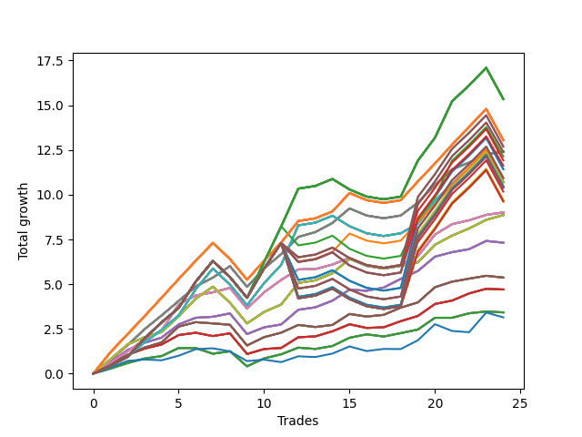

# Short Wallace Doodle 011 
- Symbol: AMZN_Unlimited
- Date Range: 03/23/2022 - 07/08/2022
- Trading Period: 7:20-12:30
- Number of Trades: 24



| Name | Win Percent | Profit | Avg Profit / Trade | Avg Time / Trade |      | Name | Win Percent | Profit | Avg Profit / Trade | Avg Time / Trade |
| ---- | ----------- | ------ | ------------------ | ---------------- | ---- | ---- | ----------- | ------ | ------------------ | ---------------- |
| Sorted By <br> Profit | | | | | | Sorted By <br> Win Percentage ||||
| One Hundred Twenty-Seven | 75.00 | 7673.50 | 319.73 | 102:18 |     | Sixty-Nine | 87.50 | 6204.25 | 258.51 | 42:49 |
| One Hundred Twenty-Two | 75.00 | 7673.50 | 319.73 | 102:18 |     | Sixty-One | 87.50 | 6204.25 | 258.51 | 42:49 |
| One Hundred Seventeen | 75.00 | 7673.50 | 319.73 | 102:18 |     | Fifty-Three | 87.50 | 6204.25 | 258.51 | 42:49 |
| One Hundred Twelve | 75.00 | 7673.50 | 319.73 | 102:18 |     | Forty-Five | 87.50 | 6204.25 | 258.51 | 42:49 |
| One Hundred Seven | 75.00 | 7673.50 | 319.73 | 102:18 |     | Five | 87.50 | 6204.25 | 258.51 | 42:49 |
| One Hundred Two | 75.00 | 7673.50 | 319.73 | 102:18 |     | Sixty-Eight | 87.50 | 4506.25 | 187.76 | 30:40 |
| Ninety-Two | 75.00 | 7673.50 | 319.73 | 102:18 |     | Sixty | 87.50 | 4506.25 | 187.76 | 30:40 |
| Eighty-Two | 75.00 | 7673.50 | 319.73 | 102:18 |     | Fifty-Two | 87.50 | 4506.25 | 187.76 | 30:40 |
| One Hundred Twenty-Six | 79.17 | 6522.75 | 271.78 | 59:35 |     | Forty-Four | 87.50 | 4506.25 | 187.76 | 30:40 |
| One Hundred Twenty-One | 79.17 | 6522.75 | 271.78 | 59:35 |     | Four | 87.50 | 4506.25 | 187.76 | 30:40 |
| One Hundred Sixteen | 79.17 | 6522.75 | 271.78 | 59:35 |     | Sixty-Six | 87.50 | 3658.75 | 152.45 | 24:18 |
| One Hundred Eleven | 79.17 | 6522.75 | 271.78 | 59:35 |     | Fifty-Eight | 87.50 | 3658.75 | 152.45 | 24:18 |
| One Hundred Six | 79.17 | 6522.75 | 271.78 | 59:35 |     | Fifty | 87.50 | 3658.75 | 152.45 | 24:18 |
| One Hundred One | 79.17 | 6522.75 | 271.78 | 59:35 |     | Forty-Two | 87.50 | 3658.75 | 152.45 | 24:18 |
| Ninety-One | 79.17 | 6522.75 | 271.78 | 59:35 |     | Two | 87.50 | 3658.75 | 152.45 | 24:18 |
| Eighty-One | 79.17 | 6522.75 | 271.78 | 59:35 |     | Seventy | 83.33 | 4432.25 | 184.68 | 40:49 |
| One Hundred Ten | 70.83 | 6346.00 | 264.42 | 120:19 |     | Sixty-Two | 83.33 | 4432.25 | 184.68 | 40:49 |
| One Hundred Nine | 70.83 | 6346.00 | 264.42 | 120:19 |     | Fifty-Four | 83.33 | 4432.25 | 184.68 | 40:49 |
| Sixty-Nine | 87.50 | 6204.25 | 258.51 | 42:49 |     | Forty-Six | 83.33 | 4432.25 | 184.68 | 40:49 |
| Sixty-One | 87.50 | 6204.25 | 258.51 | 42:49 |     | Six | 83.33 | 4432.25 | 184.68 | 40:49 |
| Fifty-Three | 87.50 | 6204.25 | 258.51 | 42:49 |     | Sixty-Five | 83.33 | 2351.50 | 97.98 | 14:51 |
| Forty-Five | 87.50 | 6204.25 | 258.51 | 42:49 |     | Fifty-Seven | 83.33 | 2351.50 | 97.98 | 14:51 |
| Five | 87.50 | 6204.25 | 258.51 | 42:49 |     | Forty-Nine | 83.33 | 2351.50 | 97.98 | 14:51 |
| One Hundred | 70.83 | 6196.50 | 258.19 | 112:05 |     | Forty-One | 83.33 | 2351.50 | 97.98 | 14:51 |
| Ninety-Nine | 70.83 | 6196.50 | 258.19 | 112:05 |     | One | 83.33 | 2351.50 | 97.98 | 14:51 |
| Ninety-Seven | 70.83 | 6071.50 | 252.98 | 94:35 |     | One Hundred Twenty-Six | 79.17 | 6522.75 | 271.78 | 59:35 |
| One Hundred Eight | 70.83 | 5961.00 | 248.37 | 118:38 |     | One Hundred Twenty-One | 79.17 | 6522.75 | 271.78 | 59:35 |
| Ninety-Eight | 70.83 | 5811.50 | 242.15 | 110:23 |     | One Hundred Sixteen | 79.17 | 6522.75 | 271.78 | 59:35 |
| Ninety-Five | 70.83 | 5712.50 | 238.02 | 120:53 |     | One Hundred Eleven | 79.17 | 6522.75 | 271.78 | 59:35 |
| Ninety-Four | 70.83 | 5712.50 | 238.02 | 120:53 |     | One Hundred Six | 79.17 | 6522.75 | 271.78 | 59:35 |
| One Hundred Twenty | 70.83 | 5471.25 | 227.97 | 121:12 |     | One Hundred One | 79.17 | 6522.75 | 271.78 | 59:35 |
| One Hundred Ninteen | 70.83 | 5471.25 | 227.97 | 121:12 |     | Ninety-One | 79.17 | 6522.75 | 271.78 | 59:35 |
| Ninety-Six | 75.00 | 5447.75 | 226.99 | 58:01 |     | Eighty-One | 79.17 | 6522.75 | 271.78 | 59:35 |
| Seventy-One | 75.00 | 5362.50 | 223.44 | 74:13 |     | One Hundred Twenty-Seven | 75.00 | 7673.50 | 319.73 | 102:18 |
| Sixty-Three | 75.00 | 5362.50 | 223.44 | 74:13 |     | One Hundred Twenty-Two | 75.00 | 7673.50 | 319.73 | 102:18 |
| Fifty-Five | 75.00 | 5362.50 | 223.44 | 74:13 |     | One Hundred Seventeen | 75.00 | 7673.50 | 319.73 | 102:18 |
| Forty-Seven | 75.00 | 5362.50 | 223.44 | 74:13 |     | One Hundred Twelve | 75.00 | 7673.50 | 319.73 | 102:18 |
| Seven | 75.00 | 5362.50 | 223.44 | 74:13 |     | One Hundred Seven | 75.00 | 7673.50 | 319.73 | 102:18 |
| Ninety-Three | 70.83 | 5327.50 | 221.98 | 119:11 |     | One Hundred Two | 75.00 | 7673.50 | 319.73 | 102:18 |
| One Hundred Five | 70.83 | 5240.75 | 218.36 | 121:27 |     | Ninety-Two | 75.00 | 7673.50 | 319.73 | 102:18 |
| One Hundred Four | 70.83 | 5240.75 | 218.36 | 121:27 |     | Eighty-Two | 75.00 | 7673.50 | 319.73 | 102:18 |
| One Hundred Thirty | 70.83 | 5200.75 | 216.70 | 122:50 |     | Ninety-Six | 75.00 | 5447.75 | 226.99 | 58:01 |
| One Hundred Twenty-Nine | 70.83 | 5200.75 | 216.70 | 122:50 |     | Seventy-One | 75.00 | 5362.50 | 223.44 | 74:13 |
| One Hundred Twenty-Five | 70.83 | 5200.75 | 216.70 | 122:50 |     | Sixty-Three | 75.00 | 5362.50 | 223.44 | 74:13 |
| One Hundred Twenty-Four | 70.83 | 5200.75 | 216.70 | 122:50 |     | Fifty-Five | 75.00 | 5362.50 | 223.44 | 74:13 |
| One Hundred Fifteen | 70.83 | 5200.75 | 216.70 | 122:50 |     | Forty-Seven | 75.00 | 5362.50 | 223.44 | 74:13 |
| One Hundred Fourteen | 70.83 | 5200.75 | 216.70 | 122:50 |     | Seven | 75.00 | 5362.50 | 223.44 | 74:13 |
| Eighty-Five | 70.83 | 5200.75 | 216.70 | 122:50 |     | Sixty-Seven | 75.00 | 2684.75 | 111.86 | 21:58 |
| Eighty-Four | 70.83 | 5200.75 | 216.70 | 122:50 |     | Fifty-Nine | 75.00 | 2684.75 | 111.86 | 21:58 |
| One Hundred Eighteen | 70.83 | 5086.25 | 211.93 | 119:31 |     | Fifty-One | 75.00 | 2684.75 | 111.86 | 21:58 |
| One Hundred Three | 70.83 | 4855.75 | 202.32 | 119:46 |     | Forty-Three | 75.00 | 2684.75 | 111.86 | 21:58 |
| One Hundred Twenty-Eight | 70.83 | 4815.75 | 200.66 | 121:08 |     | Three | 75.00 | 2684.75 | 111.86 | 21:58 |
| One Hundred Twenty-Three | 70.83 | 4815.75 | 200.66 | 121:08 |     | One Hundred Ten | 70.83 | 6346.00 | 264.42 | 120:19 |
| One Hundred Thirteen | 70.83 | 4815.75 | 200.66 | 121:08 |     | One Hundred Nine | 70.83 | 6346.00 | 264.42 | 120:19 |
| Eighty-Three | 70.83 | 4815.75 | 200.66 | 121:08 |     | One Hundred | 70.83 | 6196.50 | 258.19 | 112:05 |
| Sixty-Eight | 87.50 | 4506.25 | 187.76 | 30:40 |     | Ninety-Nine | 70.83 | 6196.50 | 258.19 | 112:05 |
| Sixty | 87.50 | 4506.25 | 187.76 | 30:40 |     | Ninety-Seven | 70.83 | 6071.50 | 252.98 | 94:35 |
| Fifty-Two | 87.50 | 4506.25 | 187.76 | 30:40 |     | One Hundred Eight | 70.83 | 5961.00 | 248.37 | 118:38 |
| Forty-Four | 87.50 | 4506.25 | 187.76 | 30:40 |     | Ninety-Eight | 70.83 | 5811.50 | 242.15 | 110:23 |
| Four | 87.50 | 4506.25 | 187.76 | 30:40 |     | Ninety-Five | 70.83 | 5712.50 | 238.02 | 120:53 |
| Seventy | 83.33 | 4432.25 | 184.68 | 40:49 |     | Ninety-Four | 70.83 | 5712.50 | 238.02 | 120:53 |
| Sixty-Two | 83.33 | 4432.25 | 184.68 | 40:49 |     | One Hundred Twenty | 70.83 | 5471.25 | 227.97 | 121:12 |
| Fifty-Four | 83.33 | 4432.25 | 184.68 | 40:49 |     | One Hundred Ninteen | 70.83 | 5471.25 | 227.97 | 121:12 |
| Forty-Six | 83.33 | 4432.25 | 184.68 | 40:49 |     | Ninety-Three | 70.83 | 5327.50 | 221.98 | 119:11 |
| Six | 83.33 | 4432.25 | 184.68 | 40:49 |     | One Hundred Five | 70.83 | 5240.75 | 218.36 | 121:27 |
| Sixty-Six | 87.50 | 3658.75 | 152.45 | 24:18 |     | One Hundred Four | 70.83 | 5240.75 | 218.36 | 121:27 |
| Fifty-Eight | 87.50 | 3658.75 | 152.45 | 24:18 |     | One Hundred Thirty | 70.83 | 5200.75 | 216.70 | 122:50 |
| Fifty | 87.50 | 3658.75 | 152.45 | 24:18 |     | One Hundred Twenty-Nine | 70.83 | 5200.75 | 216.70 | 122:50 |
| Forty-Two | 87.50 | 3658.75 | 152.45 | 24:18 |     | One Hundred Twenty-Five | 70.83 | 5200.75 | 216.70 | 122:50 |
| Two | 87.50 | 3658.75 | 152.45 | 24:18 |     | One Hundred Twenty-Four | 70.83 | 5200.75 | 216.70 | 122:50 |
| Sixty-Seven | 75.00 | 2684.75 | 111.86 | 21:58 |     | One Hundred Fifteen | 70.83 | 5200.75 | 216.70 | 122:50 |
| Fifty-Nine | 75.00 | 2684.75 | 111.86 | 21:58 |     | One Hundred Fourteen | 70.83 | 5200.75 | 216.70 | 122:50 |
| Fifty-One | 75.00 | 2684.75 | 111.86 | 21:58 |     | Eighty-Five | 70.83 | 5200.75 | 216.70 | 122:50 |
| Forty-Three | 75.00 | 2684.75 | 111.86 | 21:58 |     | Eighty-Four | 70.83 | 5200.75 | 216.70 | 122:50 |
| Three | 75.00 | 2684.75 | 111.86 | 21:58 |     | One Hundred Eighteen | 70.83 | 5086.25 | 211.93 | 119:31 |
| Sixty-Five | 83.33 | 2351.50 | 97.98 | 14:51 |     | One Hundred Three | 70.83 | 4855.75 | 202.32 | 119:46 |
| Fifty-Seven | 83.33 | 2351.50 | 97.98 | 14:51 |     | One Hundred Twenty-Eight | 70.83 | 4815.75 | 200.66 | 121:08 |
| Forty-Nine | 83.33 | 2351.50 | 97.98 | 14:51 |     | One Hundred Twenty-Three | 70.83 | 4815.75 | 200.66 | 121:08 |
| Forty-One | 83.33 | 2351.50 | 97.98 | 14:51 |     | One Hundred Thirteen | 70.83 | 4815.75 | 200.66 | 121:08 |
| One | 83.33 | 2351.50 | 97.98 | 14:51 |     | Eighty-Three | 70.83 | 4815.75 | 200.66 | 121:08 |
| Sixty-Four | 70.83 | 1711.50 | 71.31 | 10:09 |     | Sixty-Four | 70.83 | 1711.50 | 71.31 | 10:09 |
| Fifty-Six | 70.83 | 1711.50 | 71.31 | 10:09 |     | Fifty-Six | 70.83 | 1711.50 | 71.31 | 10:09 |
| Forty-Eight | 70.83 | 1711.50 | 71.31 | 10:09 |     | Forty-Eight | 70.83 | 1711.50 | 71.31 | 10:09 |
| Forty | 70.83 | 1711.50 | 71.31 | 10:09 |     | Forty | 70.83 | 1711.50 | 71.31 | 10:09 |
| Zero | 70.83 | 1711.50 | 71.31 | 10:09 |     | Zero | 70.83 | 1711.50 | 71.31 | 10:09 |
| Seventy-Three | 58.33 | 1572.25 | 65.51 | 13:27 |     | Seventy-Three | 58.33 | 1572.25 | 65.51 | 13:27 |

## NO STOPLOSS

### Test Zero
* Sell when price hits the middle line of the 20p bollinger
* No Stoploss
* Results:
```
Total Trades: 24
Percent Up: 29.17
Percent Down: 70.83
Total Points Moved Down: 3.42
Potential Profit: 1711.50
Total Points Ups: 1.41 Count Ups: 7
Total Points Downs: 4.83 Count Downs: 17
```

<details><summary>Trades</summary>

<code>In: 2022-03-25 11:57:00		Out: 2022-03-25 12:01:25		Total Position Time: 04:25		Total Move Down: 0.28		Total to Date: 0.28</code> <br />
<code>In: 2022-03-25 12:00:00		Out: 2022-03-25 12:01:25		Total Position Time: 01:25		Total Move Down: 0.31		Total to Date: 0.59</code> <br />
<code>In: 2022-03-31 12:04:00		Out: 2022-03-31 12:11:10		Total Position Time: 07:10		Total Move Down: 0.26		Total to Date: 0.85</code> <br />
<code>In: 2022-03-31 12:05:00		Out: 2022-03-31 12:11:10		Total Position Time: 06:10		Total Move Down: 0.14		Total to Date: 0.98</code> <br />
<code>In: 2022-04-06 12:02:00		Out: 2022-04-06 12:13:35		Total Position Time: 11:35		Total Move Down: 0.45		Total to Date: 1.43</code> <br />
<code>In: 2022-04-18 11:27:00		Out: 2022-04-18 11:43:15		Total Position Time: 16:15		Total Move Down: -0.00		Total to Date: 1.43</code> <br />
<code>In: 2022-04-18 11:28:00		Out: 2022-04-18 11:43:15		Total Position Time: 15:15		Total Move Down: -0.32		Total to Date: 1.11</code> <br />
<code>In: 2022-04-25 11:23:00		Out: 2022-04-25 11:36:20		Total Position Time: 13:20		Total Move Down: 0.14		Total to Date: 1.25</code> <br />
<code>In: 2022-05-02 12:15:00		Out: 2022-05-02 12:44:45		Total Position Time: 29:45		Total Move Down: -0.84		Total to Date: 0.41</code> <br />
<code>In: 2022-05-03 08:10:00		Out: 2022-05-03 08:17:15		Total Position Time: 07:15		Total Move Down: 0.44		Total to Date: 0.85</code> <br />
<code>In: 2022-05-03 08:11:00		Out: 2022-05-03 08:17:15		Total Position Time: 06:15		Total Move Down: 0.23		Total to Date: 1.08</code> <br />
<code>In: 2022-05-04 09:32:00		Out: 2022-05-04 09:43:05		Total Position Time: 11:05		Total Move Down: 0.37		Total to Date: 1.45</code> <br />
<code>In: 2022-05-23 11:13:00		Out: 2022-05-23 11:27:10		Total Position Time: 14:10		Total Move Down: -0.07		Total to Date: 1.38</code> <br />
<code>In: 2022-05-23 11:16:00		Out: 2022-05-23 11:27:10		Total Position Time: 11:10		Total Move Down: 0.16		Total to Date: 1.54</code> <br />
<code>In: 2022-05-24 08:50:00		Out: 2022-05-24 09:01:15		Total Position Time: 11:15		Total Move Down: 0.46		Total to Date: 2.00</code> <br />
<code>In: 2022-05-27 11:59:00		Out: 2022-05-27 12:03:15		Total Position Time: 04:15		Total Move Down: 0.19		Total to Date: 2.20</code> <br />
<code>In: 2022-05-27 12:10:00		Out: 2022-05-27 12:33:45		Total Position Time: 23:45		Total Move Down: -0.12		Total to Date: 2.08</code> <br />
<code>In: 2022-05-27 12:27:00		Out: 2022-05-27 12:33:45		Total Position Time: 06:45		Total Move Down: 0.19		Total to Date: 2.26</code> <br />
<code>In: 2022-06-09 08:45:00		Out: 2022-06-09 08:46:40		Total Position Time: 01:40		Total Move Down: 0.20		Total to Date: 2.46</code> <br />
<code>In: 2022-06-13 09:40:00		Out: 2022-06-13 09:47:55		Total Position Time: 07:55		Total Move Down: 0.66		Total to Date: 3.12</code> <br />
<code>In: 2022-06-14 10:12:00		Out: 2022-06-14 10:25:20		Total Position Time: 13:20		Total Move Down: -0.00		Total to Date: 3.12</code> <br />
<code>In: 2022-06-16 09:51:00		Out: 2022-06-16 09:55:20		Total Position Time: 04:20		Total Move Down: 0.25		Total to Date: 3.37</code> <br />
<code>In: 2022-06-16 10:32:00		Out: 2022-06-16 10:33:45		Total Position Time: 01:45		Total Move Down: 0.10		Total to Date: 3.47</code> <br />
<code>In: 2022-07-01 08:11:00		Out: 2022-07-01 08:24:25		Total Position Time: 13:25		Total Move Down: -0.05		Total to Date: 3.42</code> <br />


</details>

### Test One
* Sell when the price hits the upper line of the 20p 1std bollinger
* No Stoploss
* Results:
```
Total Trades: 24
Percent Up: 16.67
Percent Down: 83.33
Total Points Moved Down: 4.70
Potential Profit: 2351.50
Total Points Ups: 1.59 Count Ups: 4
Total Points Downs: 6.29 Count Downs: 20
```

<details><summary>Trades</summary>

<code>In: 2022-03-25 11:57:00		Out: 2022-03-25 12:02:10		Total Position Time: 05:10		Total Move Down: 0.51		Total to Date: 0.51</code> <br />
<code>In: 2022-03-25 12:00:00		Out: 2022-03-25 12:02:10		Total Position Time: 02:10		Total Move Down: 0.54		Total to Date: 1.05</code> <br />
<code>In: 2022-03-31 12:04:00		Out: 2022-03-31 12:16:25		Total Position Time: 12:25		Total Move Down: 0.35		Total to Date: 1.40</code> <br />
<code>In: 2022-03-31 12:05:00		Out: 2022-03-31 12:16:25		Total Position Time: 11:25		Total Move Down: 0.23		Total to Date: 1.63</code> <br />
<code>In: 2022-04-06 12:02:00		Out: 2022-04-06 12:17:55		Total Position Time: 15:55		Total Move Down: 0.53		Total to Date: 2.16</code> <br />
<code>In: 2022-04-18 11:27:00		Out: 2022-04-18 11:46:40		Total Position Time: 19:40		Total Move Down: 0.13		Total to Date: 2.29</code> <br />
<code>In: 2022-04-18 11:28:00		Out: 2022-04-18 11:46:40		Total Position Time: 18:40		Total Move Down: -0.19		Total to Date: 2.10</code> <br />
<code>In: 2022-04-25 11:23:00		Out: 2022-04-25 11:40:05		Total Position Time: 17:05		Total Move Down: 0.15		Total to Date: 2.25</code> <br />
<code>In: 2022-05-02 12:15:00		Out: 2022-05-02 12:47:00		Total Position Time: 32:00		Total Move Down: -1.16		Total to Date: 1.10</code> <br />
<code>In: 2022-05-03 08:10:00		Out: 2022-05-03 08:27:05		Total Position Time: 17:05		Total Move Down: 0.28		Total to Date: 1.38</code> <br />
<code>In: 2022-05-03 08:11:00		Out: 2022-05-03 08:27:05		Total Position Time: 16:05		Total Move Down: 0.06		Total to Date: 1.43</code> <br />
<code>In: 2022-05-04 09:32:00		Out: 2022-05-04 09:45:30		Total Position Time: 13:30		Total Move Down: 0.60		Total to Date: 2.03</code> <br />
<code>In: 2022-05-23 11:13:00		Out: 2022-05-23 11:29:25		Total Position Time: 16:25		Total Move Down: 0.05		Total to Date: 2.08</code> <br />
<code>In: 2022-05-23 11:16:00		Out: 2022-05-23 11:29:25		Total Position Time: 13:25		Total Move Down: 0.28		Total to Date: 2.37</code> <br />
<code>In: 2022-05-24 08:50:00		Out: 2022-05-24 09:04:05		Total Position Time: 14:05		Total Move Down: 0.39		Total to Date: 2.76</code> <br />
<code>In: 2022-05-27 11:59:00		Out: 2022-05-27 12:35:05		Total Position Time: 36:05		Total Move Down: -0.21		Total to Date: 2.55</code> <br />
<code>In: 2022-05-27 12:10:00		Out: 2022-05-27 12:35:05		Total Position Time: 25:05		Total Move Down: 0.04		Total to Date: 2.59</code> <br />
<code>In: 2022-05-27 12:27:00		Out: 2022-05-27 12:35:05		Total Position Time: 08:05		Total Move Down: 0.34		Total to Date: 2.93</code> <br />
<code>In: 2022-06-09 08:45:00		Out: 2022-06-09 08:48:05		Total Position Time: 03:05		Total Move Down: 0.29		Total to Date: 3.22</code> <br />
<code>In: 2022-06-13 09:40:00		Out: 2022-06-13 09:54:00		Total Position Time: 14:00		Total Move Down: 0.67		Total to Date: 3.89</code> <br />
<code>In: 2022-06-14 10:12:00		Out: 2022-06-14 10:26:40		Total Position Time: 14:40		Total Move Down: 0.19		Total to Date: 4.08</code> <br />
<code>In: 2022-06-16 09:51:00		Out: 2022-06-16 09:59:50		Total Position Time: 08:50		Total Move Down: 0.40		Total to Date: 4.48</code> <br />
<code>In: 2022-06-16 10:32:00		Out: 2022-06-16 10:35:20		Total Position Time: 03:20		Total Move Down: 0.26		Total to Date: 4.74</code> <br />
<code>In: 2022-07-01 08:11:00		Out: 2022-07-01 08:29:10		Total Position Time: 18:10		Total Move Down: -0.04		Total to Date: 4.70</code> <br />


</details>

### Test Two
* Sell when the price hits the upper line of the 20p 2std bollinger
* No Stoploss
* Results:
```
Total Trades: 24
Percent Up: 12.50
Percent Down: 87.50
Total Points Moved Down: 7.32
Potential Profit: 3658.75
Total Points Ups: 1.32 Count Ups: 3
Total Points Downs: 8.64 Count Downs: 21
```

<details><summary>Trades</summary>

<code>In: 2022-03-25 11:57:00		Out: 2022-03-25 12:21:05		Total Position Time: 24:05		Total Move Down: 0.64		Total to Date: 0.64</code> <br />
<code>In: 2022-03-25 12:00:00		Out: 2022-03-25 12:21:05		Total Position Time: 21:05		Total Move Down: 0.67		Total to Date: 1.31</code> <br />
<code>In: 2022-03-31 12:04:00		Out: 2022-03-31 12:20:05		Total Position Time: 16:05		Total Move Down: 0.41		Total to Date: 1.73</code> <br />
<code>In: 2022-03-31 12:05:00		Out: 2022-03-31 12:20:05		Total Position Time: 15:05		Total Move Down: 0.29		Total to Date: 2.01</code> <br />
<code>In: 2022-04-06 12:02:00		Out: 2022-04-06 12:20:15		Total Position Time: 18:15		Total Move Down: 0.74		Total to Date: 2.75</code> <br />
<code>In: 2022-04-18 11:27:00		Out: 2022-04-18 11:55:35		Total Position Time: 28:35		Total Move Down: 0.37		Total to Date: 3.12</code> <br />
<code>In: 2022-04-18 11:28:00		Out: 2022-04-18 11:55:35		Total Position Time: 27:35		Total Move Down: 0.06		Total to Date: 3.18</code> <br />
<code>In: 2022-04-25 11:23:00		Out: 2022-04-25 11:42:30		Total Position Time: 19:30		Total Move Down: 0.19		Total to Date: 3.37</code> <br />
<code>In: 2022-05-02 12:15:00		Out: 2022-05-02 12:47:00		Total Position Time: 32:00		Total Move Down: -1.16		Total to Date: 2.21</code> <br />
<code>In: 2022-05-03 08:10:00		Out: 2022-05-03 08:35:10		Total Position Time: 25:10		Total Move Down: 0.38		Total to Date: 2.59</code> <br />
<code>In: 2022-05-03 08:11:00		Out: 2022-05-03 08:35:10		Total Position Time: 24:10		Total Move Down: 0.16		Total to Date: 2.75</code> <br />
<code>In: 2022-05-04 09:32:00		Out: 2022-05-04 09:47:05		Total Position Time: 15:05		Total Move Down: 0.82		Total to Date: 3.57</code> <br />
<code>In: 2022-05-23 11:13:00		Out: 2022-05-23 12:12:35		Total Position Time: 59:35		Total Move Down: 0.14		Total to Date: 3.71</code> <br />
<code>In: 2022-05-23 11:16:00		Out: 2022-05-23 12:12:35		Total Position Time: 56:35		Total Move Down: 0.37		Total to Date: 4.08</code> <br />
<code>In: 2022-05-24 08:50:00		Out: 2022-05-24 09:06:15		Total Position Time: 16:15		Total Move Down: 0.61		Total to Date: 4.69</code> <br />
<code>In: 2022-05-27 11:59:00		Out: 2022-05-27 12:37:00		Total Position Time: 38:00		Total Move Down: -0.06		Total to Date: 4.63</code> <br />
<code>In: 2022-05-27 12:10:00		Out: 2022-05-27 12:37:00		Total Position Time: 27:00		Total Move Down: 0.18		Total to Date: 4.81</code> <br />
<code>In: 2022-05-27 12:27:00		Out: 2022-05-27 12:37:00		Total Position Time: 10:00		Total Move Down: 0.49		Total to Date: 5.30</code> <br />
<code>In: 2022-06-09 08:45:00		Out: 2022-06-09 08:48:20		Total Position Time: 03:20		Total Move Down: 0.44		Total to Date: 5.74</code> <br />
<code>In: 2022-06-13 09:40:00		Out: 2022-06-13 09:54:20		Total Position Time: 14:20		Total Move Down: 0.80		Total to Date: 6.54</code> <br />
<code>In: 2022-06-14 10:12:00		Out: 2022-06-14 10:29:40		Total Position Time: 17:40		Total Move Down: 0.25		Total to Date: 6.79</code> <br />
<code>In: 2022-06-16 09:51:00		Out: 2022-06-16 10:21:25		Total Position Time: 30:25		Total Move Down: 0.17		Total to Date: 6.96</code> <br />
<code>In: 2022-06-16 10:32:00		Out: 2022-06-16 10:36:10		Total Position Time: 04:10		Total Move Down: 0.46		Total to Date: 7.42</code> <br />
<code>In: 2022-07-01 08:11:00		Out: 2022-07-01 08:50:25		Total Position Time: 39:25		Total Move Down: -0.10		Total to Date: 7.32</code> <br />


</details>

### Test Three
* Sell when price hits the middle line of the 50p bollinger
* No Stoploss
* Results:
```
Total Trades: 24
Percent Up: 25.00
Percent Down: 75.00
Total Points Moved Down: 5.37
Potential Profit: 2684.75
Total Points Ups: 1.67 Count Ups: 6
Total Points Downs: 7.04 Count Downs: 18
```

<details><summary>Trades</summary>

<code>In: 2022-03-25 11:57:00		Out: 2022-03-25 12:02:10		Total Position Time: 05:10		Total Move Down: 0.51		Total to Date: 0.51</code> <br />
<code>In: 2022-03-25 12:00:00		Out: 2022-03-25 12:02:10		Total Position Time: 02:10		Total Move Down: 0.54		Total to Date: 1.05</code> <br />
<code>In: 2022-03-31 12:04:00		Out: 2022-03-31 12:20:05		Total Position Time: 16:05		Total Move Down: 0.41		Total to Date: 1.46</code> <br />
<code>In: 2022-03-31 12:05:00		Out: 2022-03-31 12:20:05		Total Position Time: 15:05		Total Move Down: 0.29		Total to Date: 1.74</code> <br />
<code>In: 2022-04-06 12:02:00		Out: 2022-04-06 12:20:35		Total Position Time: 18:35		Total Move Down: 0.89		Total to Date: 2.63</code> <br />
<code>In: 2022-04-18 11:27:00		Out: 2022-04-18 11:46:55		Total Position Time: 19:55		Total Move Down: 0.25		Total to Date: 2.88</code> <br />
<code>In: 2022-04-18 11:28:00		Out: 2022-04-18 11:46:55		Total Position Time: 18:55		Total Move Down: -0.07		Total to Date: 2.81</code> <br />
<code>In: 2022-04-25 11:23:00		Out: 2022-04-25 12:01:20		Total Position Time: 38:20		Total Move Down: -0.08		Total to Date: 2.73</code> <br />
<code>In: 2022-05-02 12:15:00		Out: 2022-05-02 12:47:00		Total Position Time: 32:00		Total Move Down: -1.16		Total to Date: 1.57</code> <br />
<code>In: 2022-05-03 08:10:00		Out: 2022-05-03 08:35:20		Total Position Time: 25:20		Total Move Down: 0.47		Total to Date: 2.04</code> <br />
<code>In: 2022-05-03 08:11:00		Out: 2022-05-03 08:35:20		Total Position Time: 24:20		Total Move Down: 0.25		Total to Date: 2.29</code> <br />
<code>In: 2022-05-04 09:32:00		Out: 2022-05-04 10:11:15		Total Position Time: 39:15		Total Move Down: 0.43		Total to Date: 2.72</code> <br />
<code>In: 2022-05-23 11:13:00		Out: 2022-05-23 11:51:45		Total Position Time: 38:45		Total Move Down: -0.12		Total to Date: 2.61</code> <br />
<code>In: 2022-05-23 11:16:00		Out: 2022-05-23 11:51:45		Total Position Time: 35:45		Total Move Down: 0.12		Total to Date: 2.72</code> <br />
<code>In: 2022-05-24 08:50:00		Out: 2022-05-24 09:06:15		Total Position Time: 16:15		Total Move Down: 0.61		Total to Date: 3.34</code> <br />
<code>In: 2022-05-27 11:59:00		Out: 2022-05-27 12:36:45		Total Position Time: 37:45		Total Move Down: -0.15		Total to Date: 3.19</code> <br />
<code>In: 2022-05-27 12:10:00		Out: 2022-05-27 12:36:45		Total Position Time: 26:45		Total Move Down: 0.10		Total to Date: 3.29</code> <br />
<code>In: 2022-05-27 12:27:00		Out: 2022-05-27 12:36:45		Total Position Time: 09:45		Total Move Down: 0.40		Total to Date: 3.69</code> <br />
<code>In: 2022-06-09 08:45:00		Out: 2022-06-09 08:48:05		Total Position Time: 03:05		Total Move Down: 0.29		Total to Date: 3.98</code> <br />
<code>In: 2022-06-13 09:40:00		Out: 2022-06-13 09:54:25		Total Position Time: 14:25		Total Move Down: 0.85		Total to Date: 4.83</code> <br />
<code>In: 2022-06-14 10:12:00		Out: 2022-06-14 10:29:45		Total Position Time: 17:45		Total Move Down: 0.31		Total to Date: 5.14</code> <br />
<code>In: 2022-06-16 09:51:00		Out: 2022-06-16 10:21:25		Total Position Time: 30:25		Total Move Down: 0.17		Total to Date: 5.31</code> <br />
<code>In: 2022-06-16 10:32:00		Out: 2022-06-16 10:34:00		Total Position Time: 02:00		Total Move Down: 0.16		Total to Date: 5.47</code> <br />
<code>In: 2022-07-01 08:11:00		Out: 2022-07-01 08:50:25		Total Position Time: 39:25		Total Move Down: -0.10		Total to Date: 5.37</code> <br />


</details>

### Test Four
* Sell when the price hits the upper line of the 50p 1std bollinger
* No Stoploss
* Results:
```
Total Trades: 24
Percent Up: 12.50
Percent Down: 87.50
Total Points Moved Down: 9.01
Potential Profit: 4506.25
Total Points Ups: 1.71 Count Ups: 3
Total Points Downs: 10.72 Count Downs: 21
```

<details><summary>Trades</summary>

<code>In: 2022-03-25 11:57:00		Out: 2022-03-25 12:20:30		Total Position Time: 23:30		Total Move Down: 0.61		Total to Date: 0.61</code> <br />
<code>In: 2022-03-25 12:00:00		Out: 2022-03-25 12:20:30		Total Position Time: 20:30		Total Move Down: 0.64		Total to Date: 1.24</code> <br />
<code>In: 2022-03-31 12:04:00		Out: 2022-03-31 12:21:35		Total Position Time: 17:35		Total Move Down: 0.65		Total to Date: 1.89</code> <br />
<code>In: 2022-03-31 12:05:00		Out: 2022-03-31 12:21:35		Total Position Time: 16:35		Total Move Down: 0.52		Total to Date: 2.41</code> <br />
<code>In: 2022-04-06 12:02:00		Out: 2022-04-06 12:30:30		Total Position Time: 28:30		Total Move Down: 1.46		Total to Date: 3.87</code> <br />
<code>In: 2022-04-18 11:27:00		Out: 2022-04-18 12:02:40		Total Position Time: 35:40		Total Move Down: 0.50		Total to Date: 4.37</code> <br />
<code>In: 2022-04-18 11:28:00		Out: 2022-04-18 12:02:40		Total Position Time: 34:40		Total Move Down: 0.18		Total to Date: 4.55</code> <br />
<code>In: 2022-04-25 11:23:00		Out: 2022-04-25 12:03:05		Total Position Time: 40:05		Total Move Down: 0.25		Total to Date: 4.79</code> <br />
<code>In: 2022-05-02 12:15:00		Out: 2022-05-02 12:47:00		Total Position Time: 32:00		Total Move Down: -1.16		Total to Date: 3.64</code> <br />
<code>In: 2022-05-03 08:10:00		Out: 2022-05-03 08:38:50		Total Position Time: 28:50		Total Move Down: 0.91		Total to Date: 4.55</code> <br />
<code>In: 2022-05-03 08:11:00		Out: 2022-05-03 08:38:50		Total Position Time: 27:50		Total Move Down: 0.69		Total to Date: 5.24</code> <br />
<code>In: 2022-05-04 09:32:00		Out: 2022-05-04 10:16:15		Total Position Time: 44:15		Total Move Down: 0.59		Total to Date: 5.82</code> <br />
<code>In: 2022-05-23 11:13:00		Out: 2022-05-23 12:03:55		Total Position Time: 50:55		Total Move Down: 0.02		Total to Date: 5.84</code> <br />
<code>In: 2022-05-23 11:16:00		Out: 2022-05-23 12:03:55		Total Position Time: 47:55		Total Move Down: 0.26		Total to Date: 6.10</code> <br />
<code>In: 2022-05-24 08:50:00		Out: 2022-05-24 09:34:45		Total Position Time: 44:45		Total Move Down: 0.37		Total to Date: 6.47</code> <br />
<code>In: 2022-05-27 11:59:00		Out: 2022-05-27 12:47:00		Total Position Time: 48:00		Total Move Down: -0.40		Total to Date: 6.07</code> <br />
<code>In: 2022-05-27 12:10:00		Out: 2022-05-27 12:47:00		Total Position Time: 37:00		Total Move Down: -0.15		Total to Date: 5.92</code> <br />
<code>In: 2022-05-27 12:27:00		Out: 2022-05-27 12:47:00		Total Position Time: 20:00		Total Move Down: 0.15		Total to Date: 6.07</code> <br />
<code>In: 2022-06-09 08:45:00		Out: 2022-06-09 08:48:40		Total Position Time: 03:40		Total Move Down: 0.49		Total to Date: 6.56</code> <br />
<code>In: 2022-06-13 09:40:00		Out: 2022-06-13 10:01:10		Total Position Time: 21:10		Total Move Down: 1.21		Total to Date: 7.77</code> <br />
<code>In: 2022-06-14 10:12:00		Out: 2022-06-14 10:34:05		Total Position Time: 22:05		Total Move Down: 0.58		Total to Date: 8.35</code> <br />
<code>In: 2022-06-16 09:51:00		Out: 2022-06-16 10:35:30		Total Position Time: 44:30		Total Move Down: 0.22		Total to Date: 8.57</code> <br />
<code>In: 2022-06-16 10:32:00		Out: 2022-06-16 10:35:30		Total Position Time: 03:30		Total Move Down: 0.30		Total to Date: 8.87</code> <br />
<code>In: 2022-07-01 08:11:00		Out: 2022-07-01 08:53:35		Total Position Time: 42:35		Total Move Down: 0.14		Total to Date: 9.01</code> <br />


</details>

### Test Five
* Sell when the price hits the upper line of the 50p 2std bollinger
* No Stoploss
* Results:
```
Total Trades: 24
Percent Up: 12.50
Percent Down: 87.50
Total Points Moved Down: 12.41
Potential Profit: 6204.25
Total Points Ups: 1.71 Count Ups: 3
Total Points Downs: 14.11 Count Downs: 21
```

<details><summary>Trades</summary>

<code>In: 2022-03-25 11:57:00		Out: 2022-03-25 12:21:40		Total Position Time: 24:40		Total Move Down: 0.78		Total to Date: 0.78</code> <br />
<code>In: 2022-03-25 12:00:00		Out: 2022-03-25 12:21:40		Total Position Time: 21:40		Total Move Down: 0.81		Total to Date: 1.58</code> <br />
<code>In: 2022-03-31 12:04:00		Out: 2022-03-31 12:27:25		Total Position Time: 23:25		Total Move Down: 0.90		Total to Date: 2.48</code> <br />
<code>In: 2022-03-31 12:05:00		Out: 2022-03-31 12:27:25		Total Position Time: 22:25		Total Move Down: 0.77		Total to Date: 3.25</code> <br />
<code>In: 2022-04-06 12:02:00		Out: 2022-04-06 12:47:00		Total Position Time: 45:00		Total Move Down: 0.81		Total to Date: 4.06</code> <br />
<code>In: 2022-04-18 11:27:00		Out: 2022-04-18 12:25:05		Total Position Time: 58:05		Total Move Down: 0.81		Total to Date: 4.87</code> <br />
<code>In: 2022-04-18 11:28:00		Out: 2022-04-18 12:25:05		Total Position Time: 57:05		Total Move Down: 0.49		Total to Date: 5.37</code> <br />
<code>In: 2022-04-25 11:23:00		Out: 2022-04-25 12:04:20		Total Position Time: 41:20		Total Move Down: 0.64		Total to Date: 6.01</code> <br />
<code>In: 2022-05-02 12:15:00		Out: 2022-05-02 12:47:00		Total Position Time: 32:00		Total Move Down: -1.16		Total to Date: 4.85</code> <br />
<code>In: 2022-05-03 08:10:00		Out: 2022-05-03 08:51:20		Total Position Time: 41:20		Total Move Down: 1.02		Total to Date: 5.88</code> <br />
<code>In: 2022-05-03 08:11:00		Out: 2022-05-03 08:51:20		Total Position Time: 40:20		Total Move Down: 0.81		Total to Date: 6.68</code> <br />
<code>In: 2022-05-04 09:32:00		Out: 2022-05-04 11:07:20		Total Position Time: 95:20		Total Move Down: 0.95		Total to Date: 7.64</code> <br />
<code>In: 2022-05-23 11:13:00		Out: 2022-05-23 12:13:15		Total Position Time: 60:15		Total Move Down: 0.27		Total to Date: 7.91</code> <br />
<code>In: 2022-05-23 11:16:00		Out: 2022-05-23 12:13:15		Total Position Time: 57:15		Total Move Down: 0.51		Total to Date: 8.42</code> <br />
<code>In: 2022-05-24 08:50:00		Out: 2022-05-24 09:49:15		Total Position Time: 59:15		Total Move Down: 0.81		Total to Date: 9.23</code> <br />
<code>In: 2022-05-27 11:59:00		Out: 2022-05-27 12:47:00		Total Position Time: 48:00		Total Move Down: -0.40		Total to Date: 8.84</code> <br />
<code>In: 2022-05-27 12:10:00		Out: 2022-05-27 12:47:00		Total Position Time: 37:00		Total Move Down: -0.15		Total to Date: 8.68</code> <br />
<code>In: 2022-05-27 12:27:00		Out: 2022-05-27 12:47:00		Total Position Time: 20:00		Total Move Down: 0.15		Total to Date: 8.84</code> <br />
<code>In: 2022-06-09 08:45:00		Out: 2022-06-09 08:50:20		Total Position Time: 05:20		Total Move Down: 0.72		Total to Date: 9.56</code> <br />
<code>In: 2022-06-13 09:40:00		Out: 2022-06-13 11:32:45		Total Position Time: 112:45		Total Move Down: 0.98		Total to Date: 10.54</code> <br />
<code>In: 2022-06-14 10:12:00		Out: 2022-06-14 10:39:45		Total Position Time: 27:45		Total Move Down: 0.88		Total to Date: 11.42</code> <br />
<code>In: 2022-06-16 09:51:00		Out: 2022-06-16 10:36:10		Total Position Time: 45:10		Total Move Down: 0.38		Total to Date: 11.80</code> <br />
<code>In: 2022-06-16 10:32:00		Out: 2022-06-16 10:36:10		Total Position Time: 04:10		Total Move Down: 0.46		Total to Date: 12.26</code> <br />
<code>In: 2022-07-01 08:11:00		Out: 2022-07-01 08:59:20		Total Position Time: 48:20		Total Move Down: 0.15		Total to Date: 12.41</code> <br />


</details>

### Test Six
* Sell when the price hits the middle line of the 1std VWAP
* No Stoploss
* Results:
```
Total Trades: 24
Percent Up: 16.67
Percent Down: 83.33
Total Points Moved Down: 8.86
Potential Profit: 4432.25
Total Points Ups: 2.61 Count Ups: 4
Total Points Downs: 11.47 Count Downs: 20
```

<details><summary>Trades</summary>

<code>In: 2022-03-25 11:57:00		Out: 2022-03-25 12:21:45		Total Position Time: 24:45		Total Move Down: 0.80		Total to Date: 0.80</code> <br />
<code>In: 2022-03-25 12:00:00		Out: 2022-03-25 12:21:45		Total Position Time: 21:45		Total Move Down: 0.83		Total to Date: 1.62</code> <br />
<code>In: 2022-03-31 12:04:00		Out: 2022-03-31 12:20:05		Total Position Time: 16:05		Total Move Down: 0.41		Total to Date: 2.03</code> <br />
<code>In: 2022-03-31 12:05:00		Out: 2022-03-31 12:20:05		Total Position Time: 15:05		Total Move Down: 0.29		Total to Date: 2.32</code> <br />
<code>In: 2022-04-06 12:02:00		Out: 2022-04-06 12:20:25		Total Position Time: 18:25		Total Move Down: 0.88		Total to Date: 3.20</code> <br />
<code>In: 2022-04-18 11:27:00		Out: 2022-04-18 12:30:40		Total Position Time: 63:40		Total Move Down: 0.99		Total to Date: 4.19</code> <br />
<code>In: 2022-04-18 11:28:00		Out: 2022-04-18 12:30:40		Total Position Time: 62:40		Total Move Down: 0.67		Total to Date: 4.86</code> <br />
<code>In: 2022-04-25 11:23:00		Out: 2022-04-25 12:47:00		Total Position Time: 84:00		Total Move Down: -0.90		Total to Date: 3.96</code> <br />
<code>In: 2022-05-02 12:15:00		Out: 2022-05-02 12:47:00		Total Position Time: 32:00		Total Move Down: -1.16		Total to Date: 2.81</code> <br />
<code>In: 2022-05-03 08:10:00		Out: 2022-05-03 08:38:05		Total Position Time: 28:05		Total Move Down: 0.64		Total to Date: 3.45</code> <br />
<code>In: 2022-05-03 08:11:00		Out: 2022-05-03 08:38:05		Total Position Time: 27:05		Total Move Down: 0.42		Total to Date: 3.87</code> <br />
<code>In: 2022-05-04 09:32:00		Out: 2022-05-04 11:07:40		Total Position Time: 95:40		Total Move Down: 1.20		Total to Date: 5.07</code> <br />
<code>In: 2022-05-23 11:13:00		Out: 2022-05-23 12:47:00		Total Position Time: 94:00		Total Move Down: 0.15		Total to Date: 5.22</code> <br />
<code>In: 2022-05-23 11:16:00		Out: 2022-05-23 12:47:00		Total Position Time: 91:00		Total Move Down: 0.39		Total to Date: 5.61</code> <br />
<code>In: 2022-05-24 08:50:00		Out: 2022-05-24 09:49:15		Total Position Time: 59:15		Total Move Down: 0.81		Total to Date: 6.42</code> <br />
<code>In: 2022-05-27 11:59:00		Out: 2022-05-27 12:47:00		Total Position Time: 48:00		Total Move Down: -0.40		Total to Date: 6.02</code> <br />
<code>In: 2022-05-27 12:10:00		Out: 2022-05-27 12:47:00		Total Position Time: 37:00		Total Move Down: -0.15		Total to Date: 5.87</code> <br />
<code>In: 2022-05-27 12:27:00		Out: 2022-05-27 12:47:00		Total Position Time: 20:00		Total Move Down: 0.15		Total to Date: 6.02</code> <br />
<code>In: 2022-06-09 08:45:00		Out: 2022-06-09 08:46:40		Total Position Time: 01:40		Total Move Down: 0.20		Total to Date: 6.22</code> <br />
<code>In: 2022-06-13 09:40:00		Out: 2022-06-13 09:56:50		Total Position Time: 16:50		Total Move Down: 0.98		Total to Date: 7.20</code> <br />
<code>In: 2022-06-14 10:12:00		Out: 2022-06-14 10:32:30		Total Position Time: 20:30		Total Move Down: 0.51		Total to Date: 7.71</code> <br />
<code>In: 2022-06-16 09:51:00		Out: 2022-06-16 10:36:30		Total Position Time: 45:30		Total Move Down: 0.40		Total to Date: 8.11</code> <br />
<code>In: 2022-06-16 10:32:00		Out: 2022-06-16 10:36:30		Total Position Time: 04:30		Total Move Down: 0.48		Total to Date: 8.59</code> <br />
<code>In: 2022-07-01 08:11:00		Out: 2022-07-01 09:03:10		Total Position Time: 52:10		Total Move Down: 0.27		Total to Date: 8.86</code> <br />


</details>

### Test Seven
* Sell when the price hits the upper line of the 1std VWAP
* No Stoploss
* Results:
```
Total Trades: 24
Percent Up: 25.00
Percent Down: 75.00
Total Points Moved Down: 10.72
Potential Profit: 5362.50
Total Points Ups: 4.94 Count Ups: 6
Total Points Downs: 15.67 Count Downs: 18
```

<details><summary>Trades</summary>

<code>In: 2022-03-25 11:57:00		Out: 2022-03-25 12:47:00		Total Position Time: 50:00		Total Move Down: 0.45		Total to Date: 0.45</code> <br />
<code>In: 2022-03-25 12:00:00		Out: 2022-03-25 12:47:00		Total Position Time: 47:00		Total Move Down: 0.48		Total to Date: 0.94</code> <br />
<code>In: 2022-03-31 12:04:00		Out: 2022-03-31 12:24:10		Total Position Time: 20:10		Total Move Down: 0.81		Total to Date: 1.75</code> <br />
<code>In: 2022-03-31 12:05:00		Out: 2022-03-31 12:24:10		Total Position Time: 19:10		Total Move Down: 0.69		Total to Date: 2.44</code> <br />
<code>In: 2022-04-06 12:02:00		Out: 2022-04-06 12:47:00		Total Position Time: 45:00		Total Move Down: 0.81		Total to Date: 3.25</code> <br />
<code>In: 2022-04-18 11:27:00		Out: 2022-04-18 12:47:00		Total Position Time: 80:00		Total Move Down: 1.47		Total to Date: 4.72</code> <br />
<code>In: 2022-04-18 11:28:00		Out: 2022-04-18 12:47:00		Total Position Time: 79:00		Total Move Down: 1.15		Total to Date: 5.88</code> <br />
<code>In: 2022-04-25 11:23:00		Out: 2022-04-25 12:47:00		Total Position Time: 84:00		Total Move Down: -0.90		Total to Date: 4.98</code> <br />
<code>In: 2022-05-02 12:15:00		Out: 2022-05-02 12:47:00		Total Position Time: 32:00		Total Move Down: -1.16		Total to Date: 3.82</code> <br />
<code>In: 2022-05-03 08:10:00		Out: 2022-05-03 09:05:50		Total Position Time: 55:50		Total Move Down: 1.24		Total to Date: 5.06</code> <br />
<code>In: 2022-05-03 08:11:00		Out: 2022-05-03 09:05:50		Total Position Time: 54:50		Total Move Down: 1.02		Total to Date: 6.08</code> <br />
<code>In: 2022-05-04 09:32:00		Out: 2022-05-04 11:34:20		Total Position Time: 122:20		Total Move Down: 2.21		Total to Date: 8.29</code> <br />
<code>In: 2022-05-23 11:13:00		Out: 2022-05-23 12:47:00		Total Position Time: 94:00		Total Move Down: 0.15		Total to Date: 8.44</code> <br />
<code>In: 2022-05-23 11:16:00		Out: 2022-05-23 12:47:00		Total Position Time: 91:00		Total Move Down: 0.39		Total to Date: 8.83</code> <br />
<code>In: 2022-05-24 08:50:00		Out: 2022-05-24 12:47:00		Total Position Time: 237:00		Total Move Down: -0.59		Total to Date: 8.24</code> <br />
<code>In: 2022-05-27 11:59:00		Out: 2022-05-27 12:47:00		Total Position Time: 48:00		Total Move Down: -0.40		Total to Date: 7.84</code> <br />
<code>In: 2022-05-27 12:10:00		Out: 2022-05-27 12:47:00		Total Position Time: 37:00		Total Move Down: -0.15		Total to Date: 7.69</code> <br />
<code>In: 2022-05-27 12:27:00		Out: 2022-05-27 12:47:00		Total Position Time: 20:00		Total Move Down: 0.15		Total to Date: 7.84</code> <br />
<code>In: 2022-06-09 08:45:00		Out: 2022-06-09 08:48:50		Total Position Time: 03:50		Total Move Down: 0.54		Total to Date: 8.38</code> <br />
<code>In: 2022-06-13 09:40:00		Out: 2022-06-13 12:47:00		Total Position Time: 187:00		Total Move Down: 1.28		Total to Date: 9.66</code> <br />
<code>In: 2022-06-14 10:12:00		Out: 2022-06-14 10:43:10		Total Position Time: 31:10		Total Move Down: 0.93		Total to Date: 10.59</code> <br />
<code>In: 2022-06-16 09:51:00		Out: 2022-06-16 10:45:05		Total Position Time: 54:05		Total Move Down: 0.90		Total to Date: 11.49</code> <br />
<code>In: 2022-06-16 10:32:00		Out: 2022-06-16 10:45:05		Total Position Time: 13:05		Total Move Down: 0.98		Total to Date: 12.47</code> <br />
<code>In: 2022-07-01 08:11:00		Out: 2022-07-01 12:47:00		Total Position Time: 276:00		Total Move Down: -1.75		Total to Date: 10.72</code> <br />


</details>

## STOPLOSS OF 5

### Test Forty
* Sell when price hits the middle line of the 20p bollinger
* Stoploss is -5 points
* Results:
```
Total Trades: 24
Percent Up: 29.17
Percent Down: 70.83
Total Points Moved Down: 3.42
Potential Profit: 1711.50
Total Points Ups: 1.41 Count Ups: 7
Total Points Downs: 4.83 Count Downs: 17
```

<details><summary>Trades</summary>

<code>In: 2022-03-25 11:57:00		Out: 2022-03-25 12:01:25		Total Position Time: 04:25		Total Move Down: 0.28		Total to Date: 0.28</code> <br />
<code>In: 2022-03-25 12:00:00		Out: 2022-03-25 12:01:25		Total Position Time: 01:25		Total Move Down: 0.31		Total to Date: 0.59</code> <br />
<code>In: 2022-03-31 12:04:00		Out: 2022-03-31 12:11:10		Total Position Time: 07:10		Total Move Down: 0.26		Total to Date: 0.85</code> <br />
<code>In: 2022-03-31 12:05:00		Out: 2022-03-31 12:11:10		Total Position Time: 06:10		Total Move Down: 0.14		Total to Date: 0.98</code> <br />
<code>In: 2022-04-06 12:02:00		Out: 2022-04-06 12:13:35		Total Position Time: 11:35		Total Move Down: 0.45		Total to Date: 1.43</code> <br />
<code>In: 2022-04-18 11:27:00		Out: 2022-04-18 11:43:15		Total Position Time: 16:15		Total Move Down: -0.00		Total to Date: 1.43</code> <br />
<code>In: 2022-04-18 11:28:00		Out: 2022-04-18 11:43:15		Total Position Time: 15:15		Total Move Down: -0.32		Total to Date: 1.11</code> <br />
<code>In: 2022-04-25 11:23:00		Out: 2022-04-25 11:36:20		Total Position Time: 13:20		Total Move Down: 0.14		Total to Date: 1.25</code> <br />
<code>In: 2022-05-02 12:15:00		Out: 2022-05-02 12:44:45		Total Position Time: 29:45		Total Move Down: -0.84		Total to Date: 0.41</code> <br />
<code>In: 2022-05-03 08:10:00		Out: 2022-05-03 08:17:15		Total Position Time: 07:15		Total Move Down: 0.44		Total to Date: 0.85</code> <br />
<code>In: 2022-05-03 08:11:00		Out: 2022-05-03 08:17:15		Total Position Time: 06:15		Total Move Down: 0.23		Total to Date: 1.08</code> <br />
<code>In: 2022-05-04 09:32:00		Out: 2022-05-04 09:43:05		Total Position Time: 11:05		Total Move Down: 0.37		Total to Date: 1.45</code> <br />
<code>In: 2022-05-23 11:13:00		Out: 2022-05-23 11:27:10		Total Position Time: 14:10		Total Move Down: -0.07		Total to Date: 1.38</code> <br />
<code>In: 2022-05-23 11:16:00		Out: 2022-05-23 11:27:10		Total Position Time: 11:10		Total Move Down: 0.16		Total to Date: 1.54</code> <br />
<code>In: 2022-05-24 08:50:00		Out: 2022-05-24 09:01:15		Total Position Time: 11:15		Total Move Down: 0.46		Total to Date: 2.00</code> <br />
<code>In: 2022-05-27 11:59:00		Out: 2022-05-27 12:03:15		Total Position Time: 04:15		Total Move Down: 0.19		Total to Date: 2.20</code> <br />
<code>In: 2022-05-27 12:10:00		Out: 2022-05-27 12:33:45		Total Position Time: 23:45		Total Move Down: -0.12		Total to Date: 2.08</code> <br />
<code>In: 2022-05-27 12:27:00		Out: 2022-05-27 12:33:45		Total Position Time: 06:45		Total Move Down: 0.19		Total to Date: 2.26</code> <br />
<code>In: 2022-06-09 08:45:00		Out: 2022-06-09 08:46:40		Total Position Time: 01:40		Total Move Down: 0.20		Total to Date: 2.46</code> <br />
<code>In: 2022-06-13 09:40:00		Out: 2022-06-13 09:47:55		Total Position Time: 07:55		Total Move Down: 0.66		Total to Date: 3.12</code> <br />
<code>In: 2022-06-14 10:12:00		Out: 2022-06-14 10:25:20		Total Position Time: 13:20		Total Move Down: -0.00		Total to Date: 3.12</code> <br />
<code>In: 2022-06-16 09:51:00		Out: 2022-06-16 09:55:20		Total Position Time: 04:20		Total Move Down: 0.25		Total to Date: 3.37</code> <br />
<code>In: 2022-06-16 10:32:00		Out: 2022-06-16 10:33:45		Total Position Time: 01:45		Total Move Down: 0.10		Total to Date: 3.47</code> <br />
<code>In: 2022-07-01 08:11:00		Out: 2022-07-01 08:24:25		Total Position Time: 13:25		Total Move Down: -0.05		Total to Date: 3.42</code> <br />


</details>

### Test Forty-One
* Sell when the price hits the upper line of the 20p 1std bollinger
* Stoploss is -5 points
* Results:
```
Total Trades: 24
Percent Up: 16.67
Percent Down: 83.33
Total Points Moved Down: 4.70
Potential Profit: 2351.50
Total Points Ups: 1.59 Count Ups: 4
Total Points Downs: 6.29 Count Downs: 20
```

<details><summary>Trades</summary>

<code>In: 2022-03-25 11:57:00		Out: 2022-03-25 12:02:10		Total Position Time: 05:10		Total Move Down: 0.51		Total to Date: 0.51</code> <br />
<code>In: 2022-03-25 12:00:00		Out: 2022-03-25 12:02:10		Total Position Time: 02:10		Total Move Down: 0.54		Total to Date: 1.05</code> <br />
<code>In: 2022-03-31 12:04:00		Out: 2022-03-31 12:16:25		Total Position Time: 12:25		Total Move Down: 0.35		Total to Date: 1.40</code> <br />
<code>In: 2022-03-31 12:05:00		Out: 2022-03-31 12:16:25		Total Position Time: 11:25		Total Move Down: 0.23		Total to Date: 1.63</code> <br />
<code>In: 2022-04-06 12:02:00		Out: 2022-04-06 12:17:55		Total Position Time: 15:55		Total Move Down: 0.53		Total to Date: 2.16</code> <br />
<code>In: 2022-04-18 11:27:00		Out: 2022-04-18 11:46:40		Total Position Time: 19:40		Total Move Down: 0.13		Total to Date: 2.29</code> <br />
<code>In: 2022-04-18 11:28:00		Out: 2022-04-18 11:46:40		Total Position Time: 18:40		Total Move Down: -0.19		Total to Date: 2.10</code> <br />
<code>In: 2022-04-25 11:23:00		Out: 2022-04-25 11:40:05		Total Position Time: 17:05		Total Move Down: 0.15		Total to Date: 2.25</code> <br />
<code>In: 2022-05-02 12:15:00		Out: 2022-05-02 12:47:00		Total Position Time: 32:00		Total Move Down: -1.16		Total to Date: 1.10</code> <br />
<code>In: 2022-05-03 08:10:00		Out: 2022-05-03 08:27:05		Total Position Time: 17:05		Total Move Down: 0.28		Total to Date: 1.38</code> <br />
<code>In: 2022-05-03 08:11:00		Out: 2022-05-03 08:27:05		Total Position Time: 16:05		Total Move Down: 0.06		Total to Date: 1.43</code> <br />
<code>In: 2022-05-04 09:32:00		Out: 2022-05-04 09:45:30		Total Position Time: 13:30		Total Move Down: 0.60		Total to Date: 2.03</code> <br />
<code>In: 2022-05-23 11:13:00		Out: 2022-05-23 11:29:25		Total Position Time: 16:25		Total Move Down: 0.05		Total to Date: 2.08</code> <br />
<code>In: 2022-05-23 11:16:00		Out: 2022-05-23 11:29:25		Total Position Time: 13:25		Total Move Down: 0.28		Total to Date: 2.37</code> <br />
<code>In: 2022-05-24 08:50:00		Out: 2022-05-24 09:04:05		Total Position Time: 14:05		Total Move Down: 0.39		Total to Date: 2.76</code> <br />
<code>In: 2022-05-27 11:59:00		Out: 2022-05-27 12:35:05		Total Position Time: 36:05		Total Move Down: -0.21		Total to Date: 2.55</code> <br />
<code>In: 2022-05-27 12:10:00		Out: 2022-05-27 12:35:05		Total Position Time: 25:05		Total Move Down: 0.04		Total to Date: 2.59</code> <br />
<code>In: 2022-05-27 12:27:00		Out: 2022-05-27 12:35:05		Total Position Time: 08:05		Total Move Down: 0.34		Total to Date: 2.93</code> <br />
<code>In: 2022-06-09 08:45:00		Out: 2022-06-09 08:48:05		Total Position Time: 03:05		Total Move Down: 0.29		Total to Date: 3.22</code> <br />
<code>In: 2022-06-13 09:40:00		Out: 2022-06-13 09:54:00		Total Position Time: 14:00		Total Move Down: 0.67		Total to Date: 3.89</code> <br />
<code>In: 2022-06-14 10:12:00		Out: 2022-06-14 10:26:40		Total Position Time: 14:40		Total Move Down: 0.19		Total to Date: 4.08</code> <br />
<code>In: 2022-06-16 09:51:00		Out: 2022-06-16 09:59:50		Total Position Time: 08:50		Total Move Down: 0.40		Total to Date: 4.48</code> <br />
<code>In: 2022-06-16 10:32:00		Out: 2022-06-16 10:35:20		Total Position Time: 03:20		Total Move Down: 0.26		Total to Date: 4.74</code> <br />
<code>In: 2022-07-01 08:11:00		Out: 2022-07-01 08:29:10		Total Position Time: 18:10		Total Move Down: -0.04		Total to Date: 4.70</code> <br />


</details>

### Test Forty-Two
* Sell when the price hits the upper line of the 20p 2std bollinger
* Stoploss is -5 points
* Results:
```
Total Trades: 24
Percent Up: 12.50
Percent Down: 87.50
Total Points Moved Down: 7.32
Potential Profit: 3658.75
Total Points Ups: 1.32 Count Ups: 3
Total Points Downs: 8.64 Count Downs: 21
```

<details><summary>Trades</summary>

<code>In: 2022-03-25 11:57:00		Out: 2022-03-25 12:21:05		Total Position Time: 24:05		Total Move Down: 0.64		Total to Date: 0.64</code> <br />
<code>In: 2022-03-25 12:00:00		Out: 2022-03-25 12:21:05		Total Position Time: 21:05		Total Move Down: 0.67		Total to Date: 1.31</code> <br />
<code>In: 2022-03-31 12:04:00		Out: 2022-03-31 12:20:05		Total Position Time: 16:05		Total Move Down: 0.41		Total to Date: 1.73</code> <br />
<code>In: 2022-03-31 12:05:00		Out: 2022-03-31 12:20:05		Total Position Time: 15:05		Total Move Down: 0.29		Total to Date: 2.01</code> <br />
<code>In: 2022-04-06 12:02:00		Out: 2022-04-06 12:20:15		Total Position Time: 18:15		Total Move Down: 0.74		Total to Date: 2.75</code> <br />
<code>In: 2022-04-18 11:27:00		Out: 2022-04-18 11:55:35		Total Position Time: 28:35		Total Move Down: 0.37		Total to Date: 3.12</code> <br />
<code>In: 2022-04-18 11:28:00		Out: 2022-04-18 11:55:35		Total Position Time: 27:35		Total Move Down: 0.06		Total to Date: 3.18</code> <br />
<code>In: 2022-04-25 11:23:00		Out: 2022-04-25 11:42:30		Total Position Time: 19:30		Total Move Down: 0.19		Total to Date: 3.37</code> <br />
<code>In: 2022-05-02 12:15:00		Out: 2022-05-02 12:47:00		Total Position Time: 32:00		Total Move Down: -1.16		Total to Date: 2.21</code> <br />
<code>In: 2022-05-03 08:10:00		Out: 2022-05-03 08:35:10		Total Position Time: 25:10		Total Move Down: 0.38		Total to Date: 2.59</code> <br />
<code>In: 2022-05-03 08:11:00		Out: 2022-05-03 08:35:10		Total Position Time: 24:10		Total Move Down: 0.16		Total to Date: 2.75</code> <br />
<code>In: 2022-05-04 09:32:00		Out: 2022-05-04 09:47:05		Total Position Time: 15:05		Total Move Down: 0.82		Total to Date: 3.57</code> <br />
<code>In: 2022-05-23 11:13:00		Out: 2022-05-23 12:12:35		Total Position Time: 59:35		Total Move Down: 0.14		Total to Date: 3.71</code> <br />
<code>In: 2022-05-23 11:16:00		Out: 2022-05-23 12:12:35		Total Position Time: 56:35		Total Move Down: 0.37		Total to Date: 4.08</code> <br />
<code>In: 2022-05-24 08:50:00		Out: 2022-05-24 09:06:15		Total Position Time: 16:15		Total Move Down: 0.61		Total to Date: 4.69</code> <br />
<code>In: 2022-05-27 11:59:00		Out: 2022-05-27 12:37:00		Total Position Time: 38:00		Total Move Down: -0.06		Total to Date: 4.63</code> <br />
<code>In: 2022-05-27 12:10:00		Out: 2022-05-27 12:37:00		Total Position Time: 27:00		Total Move Down: 0.18		Total to Date: 4.81</code> <br />
<code>In: 2022-05-27 12:27:00		Out: 2022-05-27 12:37:00		Total Position Time: 10:00		Total Move Down: 0.49		Total to Date: 5.30</code> <br />
<code>In: 2022-06-09 08:45:00		Out: 2022-06-09 08:48:20		Total Position Time: 03:20		Total Move Down: 0.44		Total to Date: 5.74</code> <br />
<code>In: 2022-06-13 09:40:00		Out: 2022-06-13 09:54:20		Total Position Time: 14:20		Total Move Down: 0.80		Total to Date: 6.54</code> <br />
<code>In: 2022-06-14 10:12:00		Out: 2022-06-14 10:29:40		Total Position Time: 17:40		Total Move Down: 0.25		Total to Date: 6.79</code> <br />
<code>In: 2022-06-16 09:51:00		Out: 2022-06-16 10:21:25		Total Position Time: 30:25		Total Move Down: 0.17		Total to Date: 6.96</code> <br />
<code>In: 2022-06-16 10:32:00		Out: 2022-06-16 10:36:10		Total Position Time: 04:10		Total Move Down: 0.46		Total to Date: 7.42</code> <br />
<code>In: 2022-07-01 08:11:00		Out: 2022-07-01 08:50:25		Total Position Time: 39:25		Total Move Down: -0.10		Total to Date: 7.32</code> <br />


</details>

### Test Forty-Three
* Sell when price hits the middle line of the 50p bollinger
* Stoploss is -5 points
* Results:
```
Total Trades: 24
Percent Up: 25.00
Percent Down: 75.00
Total Points Moved Down: 5.37
Potential Profit: 2684.75
Total Points Ups: 1.67 Count Ups: 6
Total Points Downs: 7.04 Count Downs: 18
```

<details><summary>Trades</summary>

<code>In: 2022-03-25 11:57:00		Out: 2022-03-25 12:02:10		Total Position Time: 05:10		Total Move Down: 0.51		Total to Date: 0.51</code> <br />
<code>In: 2022-03-25 12:00:00		Out: 2022-03-25 12:02:10		Total Position Time: 02:10		Total Move Down: 0.54		Total to Date: 1.05</code> <br />
<code>In: 2022-03-31 12:04:00		Out: 2022-03-31 12:20:05		Total Position Time: 16:05		Total Move Down: 0.41		Total to Date: 1.46</code> <br />
<code>In: 2022-03-31 12:05:00		Out: 2022-03-31 12:20:05		Total Position Time: 15:05		Total Move Down: 0.29		Total to Date: 1.74</code> <br />
<code>In: 2022-04-06 12:02:00		Out: 2022-04-06 12:20:35		Total Position Time: 18:35		Total Move Down: 0.89		Total to Date: 2.63</code> <br />
<code>In: 2022-04-18 11:27:00		Out: 2022-04-18 11:46:55		Total Position Time: 19:55		Total Move Down: 0.25		Total to Date: 2.88</code> <br />
<code>In: 2022-04-18 11:28:00		Out: 2022-04-18 11:46:55		Total Position Time: 18:55		Total Move Down: -0.07		Total to Date: 2.81</code> <br />
<code>In: 2022-04-25 11:23:00		Out: 2022-04-25 12:01:20		Total Position Time: 38:20		Total Move Down: -0.08		Total to Date: 2.73</code> <br />
<code>In: 2022-05-02 12:15:00		Out: 2022-05-02 12:47:00		Total Position Time: 32:00		Total Move Down: -1.16		Total to Date: 1.57</code> <br />
<code>In: 2022-05-03 08:10:00		Out: 2022-05-03 08:35:20		Total Position Time: 25:20		Total Move Down: 0.47		Total to Date: 2.04</code> <br />
<code>In: 2022-05-03 08:11:00		Out: 2022-05-03 08:35:20		Total Position Time: 24:20		Total Move Down: 0.25		Total to Date: 2.29</code> <br />
<code>In: 2022-05-04 09:32:00		Out: 2022-05-04 10:11:15		Total Position Time: 39:15		Total Move Down: 0.43		Total to Date: 2.72</code> <br />
<code>In: 2022-05-23 11:13:00		Out: 2022-05-23 11:51:45		Total Position Time: 38:45		Total Move Down: -0.12		Total to Date: 2.61</code> <br />
<code>In: 2022-05-23 11:16:00		Out: 2022-05-23 11:51:45		Total Position Time: 35:45		Total Move Down: 0.12		Total to Date: 2.72</code> <br />
<code>In: 2022-05-24 08:50:00		Out: 2022-05-24 09:06:15		Total Position Time: 16:15		Total Move Down: 0.61		Total to Date: 3.34</code> <br />
<code>In: 2022-05-27 11:59:00		Out: 2022-05-27 12:36:45		Total Position Time: 37:45		Total Move Down: -0.15		Total to Date: 3.19</code> <br />
<code>In: 2022-05-27 12:10:00		Out: 2022-05-27 12:36:45		Total Position Time: 26:45		Total Move Down: 0.10		Total to Date: 3.29</code> <br />
<code>In: 2022-05-27 12:27:00		Out: 2022-05-27 12:36:45		Total Position Time: 09:45		Total Move Down: 0.40		Total to Date: 3.69</code> <br />
<code>In: 2022-06-09 08:45:00		Out: 2022-06-09 08:48:05		Total Position Time: 03:05		Total Move Down: 0.29		Total to Date: 3.98</code> <br />
<code>In: 2022-06-13 09:40:00		Out: 2022-06-13 09:54:25		Total Position Time: 14:25		Total Move Down: 0.85		Total to Date: 4.83</code> <br />
<code>In: 2022-06-14 10:12:00		Out: 2022-06-14 10:29:45		Total Position Time: 17:45		Total Move Down: 0.31		Total to Date: 5.14</code> <br />
<code>In: 2022-06-16 09:51:00		Out: 2022-06-16 10:21:25		Total Position Time: 30:25		Total Move Down: 0.17		Total to Date: 5.31</code> <br />
<code>In: 2022-06-16 10:32:00		Out: 2022-06-16 10:34:00		Total Position Time: 02:00		Total Move Down: 0.16		Total to Date: 5.47</code> <br />
<code>In: 2022-07-01 08:11:00		Out: 2022-07-01 08:50:25		Total Position Time: 39:25		Total Move Down: -0.10		Total to Date: 5.37</code> <br />


</details>

### Test Forty-Four
* Sell when the price hits the upper line of the 50p 1std bollinger
* Stoploss is -5 points
* Results:
```
Total Trades: 24
Percent Up: 12.50
Percent Down: 87.50
Total Points Moved Down: 9.01
Potential Profit: 4506.25
Total Points Ups: 1.71 Count Ups: 3
Total Points Downs: 10.72 Count Downs: 21
```

<details><summary>Trades</summary>

<code>In: 2022-03-25 11:57:00		Out: 2022-03-25 12:20:30		Total Position Time: 23:30		Total Move Down: 0.61		Total to Date: 0.61</code> <br />
<code>In: 2022-03-25 12:00:00		Out: 2022-03-25 12:20:30		Total Position Time: 20:30		Total Move Down: 0.64		Total to Date: 1.24</code> <br />
<code>In: 2022-03-31 12:04:00		Out: 2022-03-31 12:21:35		Total Position Time: 17:35		Total Move Down: 0.65		Total to Date: 1.89</code> <br />
<code>In: 2022-03-31 12:05:00		Out: 2022-03-31 12:21:35		Total Position Time: 16:35		Total Move Down: 0.52		Total to Date: 2.41</code> <br />
<code>In: 2022-04-06 12:02:00		Out: 2022-04-06 12:30:30		Total Position Time: 28:30		Total Move Down: 1.46		Total to Date: 3.87</code> <br />
<code>In: 2022-04-18 11:27:00		Out: 2022-04-18 12:02:40		Total Position Time: 35:40		Total Move Down: 0.50		Total to Date: 4.37</code> <br />
<code>In: 2022-04-18 11:28:00		Out: 2022-04-18 12:02:40		Total Position Time: 34:40		Total Move Down: 0.18		Total to Date: 4.55</code> <br />
<code>In: 2022-04-25 11:23:00		Out: 2022-04-25 12:03:05		Total Position Time: 40:05		Total Move Down: 0.25		Total to Date: 4.79</code> <br />
<code>In: 2022-05-02 12:15:00		Out: 2022-05-02 12:47:00		Total Position Time: 32:00		Total Move Down: -1.16		Total to Date: 3.64</code> <br />
<code>In: 2022-05-03 08:10:00		Out: 2022-05-03 08:38:50		Total Position Time: 28:50		Total Move Down: 0.91		Total to Date: 4.55</code> <br />
<code>In: 2022-05-03 08:11:00		Out: 2022-05-03 08:38:50		Total Position Time: 27:50		Total Move Down: 0.69		Total to Date: 5.24</code> <br />
<code>In: 2022-05-04 09:32:00		Out: 2022-05-04 10:16:15		Total Position Time: 44:15		Total Move Down: 0.59		Total to Date: 5.82</code> <br />
<code>In: 2022-05-23 11:13:00		Out: 2022-05-23 12:03:55		Total Position Time: 50:55		Total Move Down: 0.02		Total to Date: 5.84</code> <br />
<code>In: 2022-05-23 11:16:00		Out: 2022-05-23 12:03:55		Total Position Time: 47:55		Total Move Down: 0.26		Total to Date: 6.10</code> <br />
<code>In: 2022-05-24 08:50:00		Out: 2022-05-24 09:34:45		Total Position Time: 44:45		Total Move Down: 0.37		Total to Date: 6.47</code> <br />
<code>In: 2022-05-27 11:59:00		Out: 2022-05-27 12:47:00		Total Position Time: 48:00		Total Move Down: -0.40		Total to Date: 6.07</code> <br />
<code>In: 2022-05-27 12:10:00		Out: 2022-05-27 12:47:00		Total Position Time: 37:00		Total Move Down: -0.15		Total to Date: 5.92</code> <br />
<code>In: 2022-05-27 12:27:00		Out: 2022-05-27 12:47:00		Total Position Time: 20:00		Total Move Down: 0.15		Total to Date: 6.07</code> <br />
<code>In: 2022-06-09 08:45:00		Out: 2022-06-09 08:48:40		Total Position Time: 03:40		Total Move Down: 0.49		Total to Date: 6.56</code> <br />
<code>In: 2022-06-13 09:40:00		Out: 2022-06-13 10:01:10		Total Position Time: 21:10		Total Move Down: 1.21		Total to Date: 7.77</code> <br />
<code>In: 2022-06-14 10:12:00		Out: 2022-06-14 10:34:05		Total Position Time: 22:05		Total Move Down: 0.58		Total to Date: 8.35</code> <br />
<code>In: 2022-06-16 09:51:00		Out: 2022-06-16 10:35:30		Total Position Time: 44:30		Total Move Down: 0.22		Total to Date: 8.57</code> <br />
<code>In: 2022-06-16 10:32:00		Out: 2022-06-16 10:35:30		Total Position Time: 03:30		Total Move Down: 0.30		Total to Date: 8.87</code> <br />
<code>In: 2022-07-01 08:11:00		Out: 2022-07-01 08:53:35		Total Position Time: 42:35		Total Move Down: 0.14		Total to Date: 9.01</code> <br />


</details>

### Test Forty-Five
* Sell when the price hits the upper line of the 50p 2std bollinger
* Stoploss is -5 points
* Results:
```
Total Trades: 24
Percent Up: 12.50
Percent Down: 87.50
Total Points Moved Down: 12.41
Potential Profit: 6204.25
Total Points Ups: 1.71 Count Ups: 3
Total Points Downs: 14.11 Count Downs: 21
```

<details><summary>Trades</summary>

<code>In: 2022-03-25 11:57:00		Out: 2022-03-25 12:21:40		Total Position Time: 24:40		Total Move Down: 0.78		Total to Date: 0.78</code> <br />
<code>In: 2022-03-25 12:00:00		Out: 2022-03-25 12:21:40		Total Position Time: 21:40		Total Move Down: 0.81		Total to Date: 1.58</code> <br />
<code>In: 2022-03-31 12:04:00		Out: 2022-03-31 12:27:25		Total Position Time: 23:25		Total Move Down: 0.90		Total to Date: 2.48</code> <br />
<code>In: 2022-03-31 12:05:00		Out: 2022-03-31 12:27:25		Total Position Time: 22:25		Total Move Down: 0.77		Total to Date: 3.25</code> <br />
<code>In: 2022-04-06 12:02:00		Out: 2022-04-06 12:47:00		Total Position Time: 45:00		Total Move Down: 0.81		Total to Date: 4.06</code> <br />
<code>In: 2022-04-18 11:27:00		Out: 2022-04-18 12:25:05		Total Position Time: 58:05		Total Move Down: 0.81		Total to Date: 4.87</code> <br />
<code>In: 2022-04-18 11:28:00		Out: 2022-04-18 12:25:05		Total Position Time: 57:05		Total Move Down: 0.49		Total to Date: 5.37</code> <br />
<code>In: 2022-04-25 11:23:00		Out: 2022-04-25 12:04:20		Total Position Time: 41:20		Total Move Down: 0.64		Total to Date: 6.01</code> <br />
<code>In: 2022-05-02 12:15:00		Out: 2022-05-02 12:47:00		Total Position Time: 32:00		Total Move Down: -1.16		Total to Date: 4.85</code> <br />
<code>In: 2022-05-03 08:10:00		Out: 2022-05-03 08:51:20		Total Position Time: 41:20		Total Move Down: 1.02		Total to Date: 5.88</code> <br />
<code>In: 2022-05-03 08:11:00		Out: 2022-05-03 08:51:20		Total Position Time: 40:20		Total Move Down: 0.81		Total to Date: 6.68</code> <br />
<code>In: 2022-05-04 09:32:00		Out: 2022-05-04 11:07:20		Total Position Time: 95:20		Total Move Down: 0.95		Total to Date: 7.64</code> <br />
<code>In: 2022-05-23 11:13:00		Out: 2022-05-23 12:13:15		Total Position Time: 60:15		Total Move Down: 0.27		Total to Date: 7.91</code> <br />
<code>In: 2022-05-23 11:16:00		Out: 2022-05-23 12:13:15		Total Position Time: 57:15		Total Move Down: 0.51		Total to Date: 8.42</code> <br />
<code>In: 2022-05-24 08:50:00		Out: 2022-05-24 09:49:15		Total Position Time: 59:15		Total Move Down: 0.81		Total to Date: 9.23</code> <br />
<code>In: 2022-05-27 11:59:00		Out: 2022-05-27 12:47:00		Total Position Time: 48:00		Total Move Down: -0.40		Total to Date: 8.84</code> <br />
<code>In: 2022-05-27 12:10:00		Out: 2022-05-27 12:47:00		Total Position Time: 37:00		Total Move Down: -0.15		Total to Date: 8.68</code> <br />
<code>In: 2022-05-27 12:27:00		Out: 2022-05-27 12:47:00		Total Position Time: 20:00		Total Move Down: 0.15		Total to Date: 8.84</code> <br />
<code>In: 2022-06-09 08:45:00		Out: 2022-06-09 08:50:20		Total Position Time: 05:20		Total Move Down: 0.72		Total to Date: 9.56</code> <br />
<code>In: 2022-06-13 09:40:00		Out: 2022-06-13 11:32:45		Total Position Time: 112:45		Total Move Down: 0.98		Total to Date: 10.54</code> <br />
<code>In: 2022-06-14 10:12:00		Out: 2022-06-14 10:39:45		Total Position Time: 27:45		Total Move Down: 0.88		Total to Date: 11.42</code> <br />
<code>In: 2022-06-16 09:51:00		Out: 2022-06-16 10:36:10		Total Position Time: 45:10		Total Move Down: 0.38		Total to Date: 11.80</code> <br />
<code>In: 2022-06-16 10:32:00		Out: 2022-06-16 10:36:10		Total Position Time: 04:10		Total Move Down: 0.46		Total to Date: 12.26</code> <br />
<code>In: 2022-07-01 08:11:00		Out: 2022-07-01 08:59:20		Total Position Time: 48:20		Total Move Down: 0.15		Total to Date: 12.41</code> <br />


</details>

### Test Forty-Six
* Sell when the price hits the middle line of the 1std VWAP
* Stoploss is -5 points
* Results:
```
Total Trades: 24
Percent Up: 16.67
Percent Down: 83.33
Total Points Moved Down: 8.86
Potential Profit: 4432.25
Total Points Ups: 2.61 Count Ups: 4
Total Points Downs: 11.47 Count Downs: 20
```

<details><summary>Trades</summary>

<code>In: 2022-03-25 11:57:00		Out: 2022-03-25 12:21:45		Total Position Time: 24:45		Total Move Down: 0.80		Total to Date: 0.80</code> <br />
<code>In: 2022-03-25 12:00:00		Out: 2022-03-25 12:21:45		Total Position Time: 21:45		Total Move Down: 0.83		Total to Date: 1.62</code> <br />
<code>In: 2022-03-31 12:04:00		Out: 2022-03-31 12:20:05		Total Position Time: 16:05		Total Move Down: 0.41		Total to Date: 2.03</code> <br />
<code>In: 2022-03-31 12:05:00		Out: 2022-03-31 12:20:05		Total Position Time: 15:05		Total Move Down: 0.29		Total to Date: 2.32</code> <br />
<code>In: 2022-04-06 12:02:00		Out: 2022-04-06 12:20:25		Total Position Time: 18:25		Total Move Down: 0.88		Total to Date: 3.20</code> <br />
<code>In: 2022-04-18 11:27:00		Out: 2022-04-18 12:30:40		Total Position Time: 63:40		Total Move Down: 0.99		Total to Date: 4.19</code> <br />
<code>In: 2022-04-18 11:28:00		Out: 2022-04-18 12:30:40		Total Position Time: 62:40		Total Move Down: 0.67		Total to Date: 4.86</code> <br />
<code>In: 2022-04-25 11:23:00		Out: 2022-04-25 12:47:00		Total Position Time: 84:00		Total Move Down: -0.90		Total to Date: 3.96</code> <br />
<code>In: 2022-05-02 12:15:00		Out: 2022-05-02 12:47:00		Total Position Time: 32:00		Total Move Down: -1.16		Total to Date: 2.81</code> <br />
<code>In: 2022-05-03 08:10:00		Out: 2022-05-03 08:38:05		Total Position Time: 28:05		Total Move Down: 0.64		Total to Date: 3.45</code> <br />
<code>In: 2022-05-03 08:11:00		Out: 2022-05-03 08:38:05		Total Position Time: 27:05		Total Move Down: 0.42		Total to Date: 3.87</code> <br />
<code>In: 2022-05-04 09:32:00		Out: 2022-05-04 11:07:40		Total Position Time: 95:40		Total Move Down: 1.20		Total to Date: 5.07</code> <br />
<code>In: 2022-05-23 11:13:00		Out: 2022-05-23 12:47:00		Total Position Time: 94:00		Total Move Down: 0.15		Total to Date: 5.22</code> <br />
<code>In: 2022-05-23 11:16:00		Out: 2022-05-23 12:47:00		Total Position Time: 91:00		Total Move Down: 0.39		Total to Date: 5.61</code> <br />
<code>In: 2022-05-24 08:50:00		Out: 2022-05-24 09:49:15		Total Position Time: 59:15		Total Move Down: 0.81		Total to Date: 6.42</code> <br />
<code>In: 2022-05-27 11:59:00		Out: 2022-05-27 12:47:00		Total Position Time: 48:00		Total Move Down: -0.40		Total to Date: 6.02</code> <br />
<code>In: 2022-05-27 12:10:00		Out: 2022-05-27 12:47:00		Total Position Time: 37:00		Total Move Down: -0.15		Total to Date: 5.87</code> <br />
<code>In: 2022-05-27 12:27:00		Out: 2022-05-27 12:47:00		Total Position Time: 20:00		Total Move Down: 0.15		Total to Date: 6.02</code> <br />
<code>In: 2022-06-09 08:45:00		Out: 2022-06-09 08:46:40		Total Position Time: 01:40		Total Move Down: 0.20		Total to Date: 6.22</code> <br />
<code>In: 2022-06-13 09:40:00		Out: 2022-06-13 09:56:50		Total Position Time: 16:50		Total Move Down: 0.98		Total to Date: 7.20</code> <br />
<code>In: 2022-06-14 10:12:00		Out: 2022-06-14 10:32:30		Total Position Time: 20:30		Total Move Down: 0.51		Total to Date: 7.71</code> <br />
<code>In: 2022-06-16 09:51:00		Out: 2022-06-16 10:36:30		Total Position Time: 45:30		Total Move Down: 0.40		Total to Date: 8.11</code> <br />
<code>In: 2022-06-16 10:32:00		Out: 2022-06-16 10:36:30		Total Position Time: 04:30		Total Move Down: 0.48		Total to Date: 8.59</code> <br />
<code>In: 2022-07-01 08:11:00		Out: 2022-07-01 09:03:10		Total Position Time: 52:10		Total Move Down: 0.27		Total to Date: 8.86</code> <br />


</details>

### Test Forty-Seven
* Sell when the price hits the upper line of the 1std VWAP
* Stoploss is -5 points
* Results:
```
Total Trades: 24
Percent Up: 25.00
Percent Down: 75.00
Total Points Moved Down: 10.72
Potential Profit: 5362.50
Total Points Ups: 4.94 Count Ups: 6
Total Points Downs: 15.67 Count Downs: 18
```

<details><summary>Trades</summary>

<code>In: 2022-03-25 11:57:00		Out: 2022-03-25 12:47:00		Total Position Time: 50:00		Total Move Down: 0.45		Total to Date: 0.45</code> <br />
<code>In: 2022-03-25 12:00:00		Out: 2022-03-25 12:47:00		Total Position Time: 47:00		Total Move Down: 0.48		Total to Date: 0.94</code> <br />
<code>In: 2022-03-31 12:04:00		Out: 2022-03-31 12:24:10		Total Position Time: 20:10		Total Move Down: 0.81		Total to Date: 1.75</code> <br />
<code>In: 2022-03-31 12:05:00		Out: 2022-03-31 12:24:10		Total Position Time: 19:10		Total Move Down: 0.69		Total to Date: 2.44</code> <br />
<code>In: 2022-04-06 12:02:00		Out: 2022-04-06 12:47:00		Total Position Time: 45:00		Total Move Down: 0.81		Total to Date: 3.25</code> <br />
<code>In: 2022-04-18 11:27:00		Out: 2022-04-18 12:47:00		Total Position Time: 80:00		Total Move Down: 1.47		Total to Date: 4.72</code> <br />
<code>In: 2022-04-18 11:28:00		Out: 2022-04-18 12:47:00		Total Position Time: 79:00		Total Move Down: 1.15		Total to Date: 5.88</code> <br />
<code>In: 2022-04-25 11:23:00		Out: 2022-04-25 12:47:00		Total Position Time: 84:00		Total Move Down: -0.90		Total to Date: 4.98</code> <br />
<code>In: 2022-05-02 12:15:00		Out: 2022-05-02 12:47:00		Total Position Time: 32:00		Total Move Down: -1.16		Total to Date: 3.82</code> <br />
<code>In: 2022-05-03 08:10:00		Out: 2022-05-03 09:05:50		Total Position Time: 55:50		Total Move Down: 1.24		Total to Date: 5.06</code> <br />
<code>In: 2022-05-03 08:11:00		Out: 2022-05-03 09:05:50		Total Position Time: 54:50		Total Move Down: 1.02		Total to Date: 6.08</code> <br />
<code>In: 2022-05-04 09:32:00		Out: 2022-05-04 11:34:20		Total Position Time: 122:20		Total Move Down: 2.21		Total to Date: 8.29</code> <br />
<code>In: 2022-05-23 11:13:00		Out: 2022-05-23 12:47:00		Total Position Time: 94:00		Total Move Down: 0.15		Total to Date: 8.44</code> <br />
<code>In: 2022-05-23 11:16:00		Out: 2022-05-23 12:47:00		Total Position Time: 91:00		Total Move Down: 0.39		Total to Date: 8.83</code> <br />
<code>In: 2022-05-24 08:50:00		Out: 2022-05-24 12:47:00		Total Position Time: 237:00		Total Move Down: -0.59		Total to Date: 8.24</code> <br />
<code>In: 2022-05-27 11:59:00		Out: 2022-05-27 12:47:00		Total Position Time: 48:00		Total Move Down: -0.40		Total to Date: 7.84</code> <br />
<code>In: 2022-05-27 12:10:00		Out: 2022-05-27 12:47:00		Total Position Time: 37:00		Total Move Down: -0.15		Total to Date: 7.69</code> <br />
<code>In: 2022-05-27 12:27:00		Out: 2022-05-27 12:47:00		Total Position Time: 20:00		Total Move Down: 0.15		Total to Date: 7.84</code> <br />
<code>In: 2022-06-09 08:45:00		Out: 2022-06-09 08:48:50		Total Position Time: 03:50		Total Move Down: 0.54		Total to Date: 8.38</code> <br />
<code>In: 2022-06-13 09:40:00		Out: 2022-06-13 12:47:00		Total Position Time: 187:00		Total Move Down: 1.28		Total to Date: 9.66</code> <br />
<code>In: 2022-06-14 10:12:00		Out: 2022-06-14 10:43:10		Total Position Time: 31:10		Total Move Down: 0.93		Total to Date: 10.59</code> <br />
<code>In: 2022-06-16 09:51:00		Out: 2022-06-16 10:45:05		Total Position Time: 54:05		Total Move Down: 0.90		Total to Date: 11.49</code> <br />
<code>In: 2022-06-16 10:32:00		Out: 2022-06-16 10:45:05		Total Position Time: 13:05		Total Move Down: 0.98		Total to Date: 12.47</code> <br />
<code>In: 2022-07-01 08:11:00		Out: 2022-07-01 12:47:00		Total Position Time: 276:00		Total Move Down: -1.75		Total to Date: 10.72</code> <br />


</details>

## TRAIL STOP OF 5

### Test Forty-Eight
* Sell when price hits the middle line of the 20p bollinger
* Trailing Stop is -5 points
* Results:
```
Total Trades: 24
Percent Up: 29.17
Percent Down: 70.83
Total Points Moved Down: 3.42
Potential Profit: 1711.50
Total Points Ups: 1.41 Count Ups: 7
Total Points Downs: 4.83 Count Downs: 17
```

<details><summary>Trades</summary>

<code>In: 2022-03-25 11:57:00		Out: 2022-03-25 12:01:25		Total Position Time: 04:25		Total Move Down: 0.28		Total to Date: 0.28</code> <br />
<code>In: 2022-03-25 12:00:00		Out: 2022-03-25 12:01:25		Total Position Time: 01:25		Total Move Down: 0.31		Total to Date: 0.59</code> <br />
<code>In: 2022-03-31 12:04:00		Out: 2022-03-31 12:11:10		Total Position Time: 07:10		Total Move Down: 0.26		Total to Date: 0.85</code> <br />
<code>In: 2022-03-31 12:05:00		Out: 2022-03-31 12:11:10		Total Position Time: 06:10		Total Move Down: 0.14		Total to Date: 0.98</code> <br />
<code>In: 2022-04-06 12:02:00		Out: 2022-04-06 12:13:35		Total Position Time: 11:35		Total Move Down: 0.45		Total to Date: 1.43</code> <br />
<code>In: 2022-04-18 11:27:00		Out: 2022-04-18 11:43:15		Total Position Time: 16:15		Total Move Down: -0.00		Total to Date: 1.43</code> <br />
<code>In: 2022-04-18 11:28:00		Out: 2022-04-18 11:43:15		Total Position Time: 15:15		Total Move Down: -0.32		Total to Date: 1.11</code> <br />
<code>In: 2022-04-25 11:23:00		Out: 2022-04-25 11:36:20		Total Position Time: 13:20		Total Move Down: 0.14		Total to Date: 1.25</code> <br />
<code>In: 2022-05-02 12:15:00		Out: 2022-05-02 12:44:45		Total Position Time: 29:45		Total Move Down: -0.84		Total to Date: 0.41</code> <br />
<code>In: 2022-05-03 08:10:00		Out: 2022-05-03 08:17:15		Total Position Time: 07:15		Total Move Down: 0.44		Total to Date: 0.85</code> <br />
<code>In: 2022-05-03 08:11:00		Out: 2022-05-03 08:17:15		Total Position Time: 06:15		Total Move Down: 0.23		Total to Date: 1.08</code> <br />
<code>In: 2022-05-04 09:32:00		Out: 2022-05-04 09:43:05		Total Position Time: 11:05		Total Move Down: 0.37		Total to Date: 1.45</code> <br />
<code>In: 2022-05-23 11:13:00		Out: 2022-05-23 11:27:10		Total Position Time: 14:10		Total Move Down: -0.07		Total to Date: 1.38</code> <br />
<code>In: 2022-05-23 11:16:00		Out: 2022-05-23 11:27:10		Total Position Time: 11:10		Total Move Down: 0.16		Total to Date: 1.54</code> <br />
<code>In: 2022-05-24 08:50:00		Out: 2022-05-24 09:01:15		Total Position Time: 11:15		Total Move Down: 0.46		Total to Date: 2.00</code> <br />
<code>In: 2022-05-27 11:59:00		Out: 2022-05-27 12:03:15		Total Position Time: 04:15		Total Move Down: 0.19		Total to Date: 2.20</code> <br />
<code>In: 2022-05-27 12:10:00		Out: 2022-05-27 12:33:45		Total Position Time: 23:45		Total Move Down: -0.12		Total to Date: 2.08</code> <br />
<code>In: 2022-05-27 12:27:00		Out: 2022-05-27 12:33:45		Total Position Time: 06:45		Total Move Down: 0.19		Total to Date: 2.26</code> <br />
<code>In: 2022-06-09 08:45:00		Out: 2022-06-09 08:46:40		Total Position Time: 01:40		Total Move Down: 0.20		Total to Date: 2.46</code> <br />
<code>In: 2022-06-13 09:40:00		Out: 2022-06-13 09:47:55		Total Position Time: 07:55		Total Move Down: 0.66		Total to Date: 3.12</code> <br />
<code>In: 2022-06-14 10:12:00		Out: 2022-06-14 10:25:20		Total Position Time: 13:20		Total Move Down: -0.00		Total to Date: 3.12</code> <br />
<code>In: 2022-06-16 09:51:00		Out: 2022-06-16 09:55:20		Total Position Time: 04:20		Total Move Down: 0.25		Total to Date: 3.37</code> <br />
<code>In: 2022-06-16 10:32:00		Out: 2022-06-16 10:33:45		Total Position Time: 01:45		Total Move Down: 0.10		Total to Date: 3.47</code> <br />
<code>In: 2022-07-01 08:11:00		Out: 2022-07-01 08:24:25		Total Position Time: 13:25		Total Move Down: -0.05		Total to Date: 3.42</code> <br />


</details>

### Test Forty-Nine
* Sell when the price hits the upper line of the 20p 1std bollinger
* Trailing Stop is -5 points
* Results:
```
Total Trades: 24
Percent Up: 16.67
Percent Down: 83.33
Total Points Moved Down: 4.70
Potential Profit: 2351.50
Total Points Ups: 1.59 Count Ups: 4
Total Points Downs: 6.29 Count Downs: 20
```

<details><summary>Trades</summary>

<code>In: 2022-03-25 11:57:00		Out: 2022-03-25 12:02:10		Total Position Time: 05:10		Total Move Down: 0.51		Total to Date: 0.51</code> <br />
<code>In: 2022-03-25 12:00:00		Out: 2022-03-25 12:02:10		Total Position Time: 02:10		Total Move Down: 0.54		Total to Date: 1.05</code> <br />
<code>In: 2022-03-31 12:04:00		Out: 2022-03-31 12:16:25		Total Position Time: 12:25		Total Move Down: 0.35		Total to Date: 1.40</code> <br />
<code>In: 2022-03-31 12:05:00		Out: 2022-03-31 12:16:25		Total Position Time: 11:25		Total Move Down: 0.23		Total to Date: 1.63</code> <br />
<code>In: 2022-04-06 12:02:00		Out: 2022-04-06 12:17:55		Total Position Time: 15:55		Total Move Down: 0.53		Total to Date: 2.16</code> <br />
<code>In: 2022-04-18 11:27:00		Out: 2022-04-18 11:46:40		Total Position Time: 19:40		Total Move Down: 0.13		Total to Date: 2.29</code> <br />
<code>In: 2022-04-18 11:28:00		Out: 2022-04-18 11:46:40		Total Position Time: 18:40		Total Move Down: -0.19		Total to Date: 2.10</code> <br />
<code>In: 2022-04-25 11:23:00		Out: 2022-04-25 11:40:05		Total Position Time: 17:05		Total Move Down: 0.15		Total to Date: 2.25</code> <br />
<code>In: 2022-05-02 12:15:00		Out: 2022-05-02 12:47:00		Total Position Time: 32:00		Total Move Down: -1.16		Total to Date: 1.10</code> <br />
<code>In: 2022-05-03 08:10:00		Out: 2022-05-03 08:27:05		Total Position Time: 17:05		Total Move Down: 0.28		Total to Date: 1.38</code> <br />
<code>In: 2022-05-03 08:11:00		Out: 2022-05-03 08:27:05		Total Position Time: 16:05		Total Move Down: 0.06		Total to Date: 1.43</code> <br />
<code>In: 2022-05-04 09:32:00		Out: 2022-05-04 09:45:30		Total Position Time: 13:30		Total Move Down: 0.60		Total to Date: 2.03</code> <br />
<code>In: 2022-05-23 11:13:00		Out: 2022-05-23 11:29:25		Total Position Time: 16:25		Total Move Down: 0.05		Total to Date: 2.08</code> <br />
<code>In: 2022-05-23 11:16:00		Out: 2022-05-23 11:29:25		Total Position Time: 13:25		Total Move Down: 0.28		Total to Date: 2.37</code> <br />
<code>In: 2022-05-24 08:50:00		Out: 2022-05-24 09:04:05		Total Position Time: 14:05		Total Move Down: 0.39		Total to Date: 2.76</code> <br />
<code>In: 2022-05-27 11:59:00		Out: 2022-05-27 12:35:05		Total Position Time: 36:05		Total Move Down: -0.21		Total to Date: 2.55</code> <br />
<code>In: 2022-05-27 12:10:00		Out: 2022-05-27 12:35:05		Total Position Time: 25:05		Total Move Down: 0.04		Total to Date: 2.59</code> <br />
<code>In: 2022-05-27 12:27:00		Out: 2022-05-27 12:35:05		Total Position Time: 08:05		Total Move Down: 0.34		Total to Date: 2.93</code> <br />
<code>In: 2022-06-09 08:45:00		Out: 2022-06-09 08:48:05		Total Position Time: 03:05		Total Move Down: 0.29		Total to Date: 3.22</code> <br />
<code>In: 2022-06-13 09:40:00		Out: 2022-06-13 09:54:00		Total Position Time: 14:00		Total Move Down: 0.67		Total to Date: 3.89</code> <br />
<code>In: 2022-06-14 10:12:00		Out: 2022-06-14 10:26:40		Total Position Time: 14:40		Total Move Down: 0.19		Total to Date: 4.08</code> <br />
<code>In: 2022-06-16 09:51:00		Out: 2022-06-16 09:59:50		Total Position Time: 08:50		Total Move Down: 0.40		Total to Date: 4.48</code> <br />
<code>In: 2022-06-16 10:32:00		Out: 2022-06-16 10:35:20		Total Position Time: 03:20		Total Move Down: 0.26		Total to Date: 4.74</code> <br />
<code>In: 2022-07-01 08:11:00		Out: 2022-07-01 08:29:10		Total Position Time: 18:10		Total Move Down: -0.04		Total to Date: 4.70</code> <br />


</details>

### Test Fifty
* Sell when the price hits the upper line of the 20p 2std bollinger
* Trailing Stop is -5 points
* Results:
```
Total Trades: 24
Percent Up: 12.50
Percent Down: 87.50
Total Points Moved Down: 7.32
Potential Profit: 3658.75
Total Points Ups: 1.32 Count Ups: 3
Total Points Downs: 8.64 Count Downs: 21
```

<details><summary>Trades</summary>

<code>In: 2022-03-25 11:57:00		Out: 2022-03-25 12:21:05		Total Position Time: 24:05		Total Move Down: 0.64		Total to Date: 0.64</code> <br />
<code>In: 2022-03-25 12:00:00		Out: 2022-03-25 12:21:05		Total Position Time: 21:05		Total Move Down: 0.67		Total to Date: 1.31</code> <br />
<code>In: 2022-03-31 12:04:00		Out: 2022-03-31 12:20:05		Total Position Time: 16:05		Total Move Down: 0.41		Total to Date: 1.73</code> <br />
<code>In: 2022-03-31 12:05:00		Out: 2022-03-31 12:20:05		Total Position Time: 15:05		Total Move Down: 0.29		Total to Date: 2.01</code> <br />
<code>In: 2022-04-06 12:02:00		Out: 2022-04-06 12:20:15		Total Position Time: 18:15		Total Move Down: 0.74		Total to Date: 2.75</code> <br />
<code>In: 2022-04-18 11:27:00		Out: 2022-04-18 11:55:35		Total Position Time: 28:35		Total Move Down: 0.37		Total to Date: 3.12</code> <br />
<code>In: 2022-04-18 11:28:00		Out: 2022-04-18 11:55:35		Total Position Time: 27:35		Total Move Down: 0.06		Total to Date: 3.18</code> <br />
<code>In: 2022-04-25 11:23:00		Out: 2022-04-25 11:42:30		Total Position Time: 19:30		Total Move Down: 0.19		Total to Date: 3.37</code> <br />
<code>In: 2022-05-02 12:15:00		Out: 2022-05-02 12:47:00		Total Position Time: 32:00		Total Move Down: -1.16		Total to Date: 2.21</code> <br />
<code>In: 2022-05-03 08:10:00		Out: 2022-05-03 08:35:10		Total Position Time: 25:10		Total Move Down: 0.38		Total to Date: 2.59</code> <br />
<code>In: 2022-05-03 08:11:00		Out: 2022-05-03 08:35:10		Total Position Time: 24:10		Total Move Down: 0.16		Total to Date: 2.75</code> <br />
<code>In: 2022-05-04 09:32:00		Out: 2022-05-04 09:47:05		Total Position Time: 15:05		Total Move Down: 0.82		Total to Date: 3.57</code> <br />
<code>In: 2022-05-23 11:13:00		Out: 2022-05-23 12:12:35		Total Position Time: 59:35		Total Move Down: 0.14		Total to Date: 3.71</code> <br />
<code>In: 2022-05-23 11:16:00		Out: 2022-05-23 12:12:35		Total Position Time: 56:35		Total Move Down: 0.37		Total to Date: 4.08</code> <br />
<code>In: 2022-05-24 08:50:00		Out: 2022-05-24 09:06:15		Total Position Time: 16:15		Total Move Down: 0.61		Total to Date: 4.69</code> <br />
<code>In: 2022-05-27 11:59:00		Out: 2022-05-27 12:37:00		Total Position Time: 38:00		Total Move Down: -0.06		Total to Date: 4.63</code> <br />
<code>In: 2022-05-27 12:10:00		Out: 2022-05-27 12:37:00		Total Position Time: 27:00		Total Move Down: 0.18		Total to Date: 4.81</code> <br />
<code>In: 2022-05-27 12:27:00		Out: 2022-05-27 12:37:00		Total Position Time: 10:00		Total Move Down: 0.49		Total to Date: 5.30</code> <br />
<code>In: 2022-06-09 08:45:00		Out: 2022-06-09 08:48:20		Total Position Time: 03:20		Total Move Down: 0.44		Total to Date: 5.74</code> <br />
<code>In: 2022-06-13 09:40:00		Out: 2022-06-13 09:54:20		Total Position Time: 14:20		Total Move Down: 0.80		Total to Date: 6.54</code> <br />
<code>In: 2022-06-14 10:12:00		Out: 2022-06-14 10:29:40		Total Position Time: 17:40		Total Move Down: 0.25		Total to Date: 6.79</code> <br />
<code>In: 2022-06-16 09:51:00		Out: 2022-06-16 10:21:25		Total Position Time: 30:25		Total Move Down: 0.17		Total to Date: 6.96</code> <br />
<code>In: 2022-06-16 10:32:00		Out: 2022-06-16 10:36:10		Total Position Time: 04:10		Total Move Down: 0.46		Total to Date: 7.42</code> <br />
<code>In: 2022-07-01 08:11:00		Out: 2022-07-01 08:50:25		Total Position Time: 39:25		Total Move Down: -0.10		Total to Date: 7.32</code> <br />


</details>

### Test Fifty-One
* Sell when price hits the middle line of the 50p bollinger
* Trailing Stop is -5 points
* Results:
```
Total Trades: 24
Percent Up: 25.00
Percent Down: 75.00
Total Points Moved Down: 5.37
Potential Profit: 2684.75
Total Points Ups: 1.67 Count Ups: 6
Total Points Downs: 7.04 Count Downs: 18
```

<details><summary>Trades</summary>

<code>In: 2022-03-25 11:57:00		Out: 2022-03-25 12:02:10		Total Position Time: 05:10		Total Move Down: 0.51		Total to Date: 0.51</code> <br />
<code>In: 2022-03-25 12:00:00		Out: 2022-03-25 12:02:10		Total Position Time: 02:10		Total Move Down: 0.54		Total to Date: 1.05</code> <br />
<code>In: 2022-03-31 12:04:00		Out: 2022-03-31 12:20:05		Total Position Time: 16:05		Total Move Down: 0.41		Total to Date: 1.46</code> <br />
<code>In: 2022-03-31 12:05:00		Out: 2022-03-31 12:20:05		Total Position Time: 15:05		Total Move Down: 0.29		Total to Date: 1.74</code> <br />
<code>In: 2022-04-06 12:02:00		Out: 2022-04-06 12:20:35		Total Position Time: 18:35		Total Move Down: 0.89		Total to Date: 2.63</code> <br />
<code>In: 2022-04-18 11:27:00		Out: 2022-04-18 11:46:55		Total Position Time: 19:55		Total Move Down: 0.25		Total to Date: 2.88</code> <br />
<code>In: 2022-04-18 11:28:00		Out: 2022-04-18 11:46:55		Total Position Time: 18:55		Total Move Down: -0.07		Total to Date: 2.81</code> <br />
<code>In: 2022-04-25 11:23:00		Out: 2022-04-25 12:01:20		Total Position Time: 38:20		Total Move Down: -0.08		Total to Date: 2.73</code> <br />
<code>In: 2022-05-02 12:15:00		Out: 2022-05-02 12:47:00		Total Position Time: 32:00		Total Move Down: -1.16		Total to Date: 1.57</code> <br />
<code>In: 2022-05-03 08:10:00		Out: 2022-05-03 08:35:20		Total Position Time: 25:20		Total Move Down: 0.47		Total to Date: 2.04</code> <br />
<code>In: 2022-05-03 08:11:00		Out: 2022-05-03 08:35:20		Total Position Time: 24:20		Total Move Down: 0.25		Total to Date: 2.29</code> <br />
<code>In: 2022-05-04 09:32:00		Out: 2022-05-04 10:11:15		Total Position Time: 39:15		Total Move Down: 0.43		Total to Date: 2.72</code> <br />
<code>In: 2022-05-23 11:13:00		Out: 2022-05-23 11:51:45		Total Position Time: 38:45		Total Move Down: -0.12		Total to Date: 2.61</code> <br />
<code>In: 2022-05-23 11:16:00		Out: 2022-05-23 11:51:45		Total Position Time: 35:45		Total Move Down: 0.12		Total to Date: 2.72</code> <br />
<code>In: 2022-05-24 08:50:00		Out: 2022-05-24 09:06:15		Total Position Time: 16:15		Total Move Down: 0.61		Total to Date: 3.34</code> <br />
<code>In: 2022-05-27 11:59:00		Out: 2022-05-27 12:36:45		Total Position Time: 37:45		Total Move Down: -0.15		Total to Date: 3.19</code> <br />
<code>In: 2022-05-27 12:10:00		Out: 2022-05-27 12:36:45		Total Position Time: 26:45		Total Move Down: 0.10		Total to Date: 3.29</code> <br />
<code>In: 2022-05-27 12:27:00		Out: 2022-05-27 12:36:45		Total Position Time: 09:45		Total Move Down: 0.40		Total to Date: 3.69</code> <br />
<code>In: 2022-06-09 08:45:00		Out: 2022-06-09 08:48:05		Total Position Time: 03:05		Total Move Down: 0.29		Total to Date: 3.98</code> <br />
<code>In: 2022-06-13 09:40:00		Out: 2022-06-13 09:54:25		Total Position Time: 14:25		Total Move Down: 0.85		Total to Date: 4.83</code> <br />
<code>In: 2022-06-14 10:12:00		Out: 2022-06-14 10:29:45		Total Position Time: 17:45		Total Move Down: 0.31		Total to Date: 5.14</code> <br />
<code>In: 2022-06-16 09:51:00		Out: 2022-06-16 10:21:25		Total Position Time: 30:25		Total Move Down: 0.17		Total to Date: 5.31</code> <br />
<code>In: 2022-06-16 10:32:00		Out: 2022-06-16 10:34:00		Total Position Time: 02:00		Total Move Down: 0.16		Total to Date: 5.47</code> <br />
<code>In: 2022-07-01 08:11:00		Out: 2022-07-01 08:50:25		Total Position Time: 39:25		Total Move Down: -0.10		Total to Date: 5.37</code> <br />


</details>

### Test Fifty-Two
* Sell when the price hits the upper line of the 50p 1std bollinger
* Trailing Stop is -5 points
* Results:
```
Total Trades: 24
Percent Up: 12.50
Percent Down: 87.50
Total Points Moved Down: 9.01
Potential Profit: 4506.25
Total Points Ups: 1.71 Count Ups: 3
Total Points Downs: 10.72 Count Downs: 21
```

<details><summary>Trades</summary>

<code>In: 2022-03-25 11:57:00		Out: 2022-03-25 12:20:30		Total Position Time: 23:30		Total Move Down: 0.61		Total to Date: 0.61</code> <br />
<code>In: 2022-03-25 12:00:00		Out: 2022-03-25 12:20:30		Total Position Time: 20:30		Total Move Down: 0.64		Total to Date: 1.24</code> <br />
<code>In: 2022-03-31 12:04:00		Out: 2022-03-31 12:21:35		Total Position Time: 17:35		Total Move Down: 0.65		Total to Date: 1.89</code> <br />
<code>In: 2022-03-31 12:05:00		Out: 2022-03-31 12:21:35		Total Position Time: 16:35		Total Move Down: 0.52		Total to Date: 2.41</code> <br />
<code>In: 2022-04-06 12:02:00		Out: 2022-04-06 12:30:30		Total Position Time: 28:30		Total Move Down: 1.46		Total to Date: 3.87</code> <br />
<code>In: 2022-04-18 11:27:00		Out: 2022-04-18 12:02:40		Total Position Time: 35:40		Total Move Down: 0.50		Total to Date: 4.37</code> <br />
<code>In: 2022-04-18 11:28:00		Out: 2022-04-18 12:02:40		Total Position Time: 34:40		Total Move Down: 0.18		Total to Date: 4.55</code> <br />
<code>In: 2022-04-25 11:23:00		Out: 2022-04-25 12:03:05		Total Position Time: 40:05		Total Move Down: 0.25		Total to Date: 4.79</code> <br />
<code>In: 2022-05-02 12:15:00		Out: 2022-05-02 12:47:00		Total Position Time: 32:00		Total Move Down: -1.16		Total to Date: 3.64</code> <br />
<code>In: 2022-05-03 08:10:00		Out: 2022-05-03 08:38:50		Total Position Time: 28:50		Total Move Down: 0.91		Total to Date: 4.55</code> <br />
<code>In: 2022-05-03 08:11:00		Out: 2022-05-03 08:38:50		Total Position Time: 27:50		Total Move Down: 0.69		Total to Date: 5.24</code> <br />
<code>In: 2022-05-04 09:32:00		Out: 2022-05-04 10:16:15		Total Position Time: 44:15		Total Move Down: 0.59		Total to Date: 5.82</code> <br />
<code>In: 2022-05-23 11:13:00		Out: 2022-05-23 12:03:55		Total Position Time: 50:55		Total Move Down: 0.02		Total to Date: 5.84</code> <br />
<code>In: 2022-05-23 11:16:00		Out: 2022-05-23 12:03:55		Total Position Time: 47:55		Total Move Down: 0.26		Total to Date: 6.10</code> <br />
<code>In: 2022-05-24 08:50:00		Out: 2022-05-24 09:34:45		Total Position Time: 44:45		Total Move Down: 0.37		Total to Date: 6.47</code> <br />
<code>In: 2022-05-27 11:59:00		Out: 2022-05-27 12:47:00		Total Position Time: 48:00		Total Move Down: -0.40		Total to Date: 6.07</code> <br />
<code>In: 2022-05-27 12:10:00		Out: 2022-05-27 12:47:00		Total Position Time: 37:00		Total Move Down: -0.15		Total to Date: 5.92</code> <br />
<code>In: 2022-05-27 12:27:00		Out: 2022-05-27 12:47:00		Total Position Time: 20:00		Total Move Down: 0.15		Total to Date: 6.07</code> <br />
<code>In: 2022-06-09 08:45:00		Out: 2022-06-09 08:48:40		Total Position Time: 03:40		Total Move Down: 0.49		Total to Date: 6.56</code> <br />
<code>In: 2022-06-13 09:40:00		Out: 2022-06-13 10:01:10		Total Position Time: 21:10		Total Move Down: 1.21		Total to Date: 7.77</code> <br />
<code>In: 2022-06-14 10:12:00		Out: 2022-06-14 10:34:05		Total Position Time: 22:05		Total Move Down: 0.58		Total to Date: 8.35</code> <br />
<code>In: 2022-06-16 09:51:00		Out: 2022-06-16 10:35:30		Total Position Time: 44:30		Total Move Down: 0.22		Total to Date: 8.57</code> <br />
<code>In: 2022-06-16 10:32:00		Out: 2022-06-16 10:35:30		Total Position Time: 03:30		Total Move Down: 0.30		Total to Date: 8.87</code> <br />
<code>In: 2022-07-01 08:11:00		Out: 2022-07-01 08:53:35		Total Position Time: 42:35		Total Move Down: 0.14		Total to Date: 9.01</code> <br />


</details>

### Test Fifty-Three
* Sell when the price hits the upper line of the 50p 2std bollinger
* Trailing Stop is -5 points
* Results:
```
Total Trades: 24
Percent Up: 12.50
Percent Down: 87.50
Total Points Moved Down: 12.41
Potential Profit: 6204.25
Total Points Ups: 1.71 Count Ups: 3
Total Points Downs: 14.11 Count Downs: 21
```

<details><summary>Trades</summary>

<code>In: 2022-03-25 11:57:00		Out: 2022-03-25 12:21:40		Total Position Time: 24:40		Total Move Down: 0.78		Total to Date: 0.78</code> <br />
<code>In: 2022-03-25 12:00:00		Out: 2022-03-25 12:21:40		Total Position Time: 21:40		Total Move Down: 0.81		Total to Date: 1.58</code> <br />
<code>In: 2022-03-31 12:04:00		Out: 2022-03-31 12:27:25		Total Position Time: 23:25		Total Move Down: 0.90		Total to Date: 2.48</code> <br />
<code>In: 2022-03-31 12:05:00		Out: 2022-03-31 12:27:25		Total Position Time: 22:25		Total Move Down: 0.77		Total to Date: 3.25</code> <br />
<code>In: 2022-04-06 12:02:00		Out: 2022-04-06 12:47:00		Total Position Time: 45:00		Total Move Down: 0.81		Total to Date: 4.06</code> <br />
<code>In: 2022-04-18 11:27:00		Out: 2022-04-18 12:25:05		Total Position Time: 58:05		Total Move Down: 0.81		Total to Date: 4.87</code> <br />
<code>In: 2022-04-18 11:28:00		Out: 2022-04-18 12:25:05		Total Position Time: 57:05		Total Move Down: 0.49		Total to Date: 5.37</code> <br />
<code>In: 2022-04-25 11:23:00		Out: 2022-04-25 12:04:20		Total Position Time: 41:20		Total Move Down: 0.64		Total to Date: 6.01</code> <br />
<code>In: 2022-05-02 12:15:00		Out: 2022-05-02 12:47:00		Total Position Time: 32:00		Total Move Down: -1.16		Total to Date: 4.85</code> <br />
<code>In: 2022-05-03 08:10:00		Out: 2022-05-03 08:51:20		Total Position Time: 41:20		Total Move Down: 1.02		Total to Date: 5.88</code> <br />
<code>In: 2022-05-03 08:11:00		Out: 2022-05-03 08:51:20		Total Position Time: 40:20		Total Move Down: 0.81		Total to Date: 6.68</code> <br />
<code>In: 2022-05-04 09:32:00		Out: 2022-05-04 11:07:20		Total Position Time: 95:20		Total Move Down: 0.95		Total to Date: 7.64</code> <br />
<code>In: 2022-05-23 11:13:00		Out: 2022-05-23 12:13:15		Total Position Time: 60:15		Total Move Down: 0.27		Total to Date: 7.91</code> <br />
<code>In: 2022-05-23 11:16:00		Out: 2022-05-23 12:13:15		Total Position Time: 57:15		Total Move Down: 0.51		Total to Date: 8.42</code> <br />
<code>In: 2022-05-24 08:50:00		Out: 2022-05-24 09:49:15		Total Position Time: 59:15		Total Move Down: 0.81		Total to Date: 9.23</code> <br />
<code>In: 2022-05-27 11:59:00		Out: 2022-05-27 12:47:00		Total Position Time: 48:00		Total Move Down: -0.40		Total to Date: 8.84</code> <br />
<code>In: 2022-05-27 12:10:00		Out: 2022-05-27 12:47:00		Total Position Time: 37:00		Total Move Down: -0.15		Total to Date: 8.68</code> <br />
<code>In: 2022-05-27 12:27:00		Out: 2022-05-27 12:47:00		Total Position Time: 20:00		Total Move Down: 0.15		Total to Date: 8.84</code> <br />
<code>In: 2022-06-09 08:45:00		Out: 2022-06-09 08:50:20		Total Position Time: 05:20		Total Move Down: 0.72		Total to Date: 9.56</code> <br />
<code>In: 2022-06-13 09:40:00		Out: 2022-06-13 11:32:45		Total Position Time: 112:45		Total Move Down: 0.98		Total to Date: 10.54</code> <br />
<code>In: 2022-06-14 10:12:00		Out: 2022-06-14 10:39:45		Total Position Time: 27:45		Total Move Down: 0.88		Total to Date: 11.42</code> <br />
<code>In: 2022-06-16 09:51:00		Out: 2022-06-16 10:36:10		Total Position Time: 45:10		Total Move Down: 0.38		Total to Date: 11.80</code> <br />
<code>In: 2022-06-16 10:32:00		Out: 2022-06-16 10:36:10		Total Position Time: 04:10		Total Move Down: 0.46		Total to Date: 12.26</code> <br />
<code>In: 2022-07-01 08:11:00		Out: 2022-07-01 08:59:20		Total Position Time: 48:20		Total Move Down: 0.15		Total to Date: 12.41</code> <br />


</details>

### Test Fifty-Four
* Sell when the price hits the middle line of the 1std VWAP
* Trailing Stop is -5 points
* Results:
```
Total Trades: 24
Percent Up: 16.67
Percent Down: 83.33
Total Points Moved Down: 8.86
Potential Profit: 4432.25
Total Points Ups: 2.61 Count Ups: 4
Total Points Downs: 11.47 Count Downs: 20
```

<details><summary>Trades</summary>

<code>In: 2022-03-25 11:57:00		Out: 2022-03-25 12:21:45		Total Position Time: 24:45		Total Move Down: 0.80		Total to Date: 0.80</code> <br />
<code>In: 2022-03-25 12:00:00		Out: 2022-03-25 12:21:45		Total Position Time: 21:45		Total Move Down: 0.83		Total to Date: 1.62</code> <br />
<code>In: 2022-03-31 12:04:00		Out: 2022-03-31 12:20:05		Total Position Time: 16:05		Total Move Down: 0.41		Total to Date: 2.03</code> <br />
<code>In: 2022-03-31 12:05:00		Out: 2022-03-31 12:20:05		Total Position Time: 15:05		Total Move Down: 0.29		Total to Date: 2.32</code> <br />
<code>In: 2022-04-06 12:02:00		Out: 2022-04-06 12:20:25		Total Position Time: 18:25		Total Move Down: 0.88		Total to Date: 3.20</code> <br />
<code>In: 2022-04-18 11:27:00		Out: 2022-04-18 12:30:40		Total Position Time: 63:40		Total Move Down: 0.99		Total to Date: 4.19</code> <br />
<code>In: 2022-04-18 11:28:00		Out: 2022-04-18 12:30:40		Total Position Time: 62:40		Total Move Down: 0.67		Total to Date: 4.86</code> <br />
<code>In: 2022-04-25 11:23:00		Out: 2022-04-25 12:47:00		Total Position Time: 84:00		Total Move Down: -0.90		Total to Date: 3.96</code> <br />
<code>In: 2022-05-02 12:15:00		Out: 2022-05-02 12:47:00		Total Position Time: 32:00		Total Move Down: -1.16		Total to Date: 2.81</code> <br />
<code>In: 2022-05-03 08:10:00		Out: 2022-05-03 08:38:05		Total Position Time: 28:05		Total Move Down: 0.64		Total to Date: 3.45</code> <br />
<code>In: 2022-05-03 08:11:00		Out: 2022-05-03 08:38:05		Total Position Time: 27:05		Total Move Down: 0.42		Total to Date: 3.87</code> <br />
<code>In: 2022-05-04 09:32:00		Out: 2022-05-04 11:07:40		Total Position Time: 95:40		Total Move Down: 1.20		Total to Date: 5.07</code> <br />
<code>In: 2022-05-23 11:13:00		Out: 2022-05-23 12:47:00		Total Position Time: 94:00		Total Move Down: 0.15		Total to Date: 5.22</code> <br />
<code>In: 2022-05-23 11:16:00		Out: 2022-05-23 12:47:00		Total Position Time: 91:00		Total Move Down: 0.39		Total to Date: 5.61</code> <br />
<code>In: 2022-05-24 08:50:00		Out: 2022-05-24 09:49:15		Total Position Time: 59:15		Total Move Down: 0.81		Total to Date: 6.42</code> <br />
<code>In: 2022-05-27 11:59:00		Out: 2022-05-27 12:47:00		Total Position Time: 48:00		Total Move Down: -0.40		Total to Date: 6.02</code> <br />
<code>In: 2022-05-27 12:10:00		Out: 2022-05-27 12:47:00		Total Position Time: 37:00		Total Move Down: -0.15		Total to Date: 5.87</code> <br />
<code>In: 2022-05-27 12:27:00		Out: 2022-05-27 12:47:00		Total Position Time: 20:00		Total Move Down: 0.15		Total to Date: 6.02</code> <br />
<code>In: 2022-06-09 08:45:00		Out: 2022-06-09 08:46:40		Total Position Time: 01:40		Total Move Down: 0.20		Total to Date: 6.22</code> <br />
<code>In: 2022-06-13 09:40:00		Out: 2022-06-13 09:56:50		Total Position Time: 16:50		Total Move Down: 0.98		Total to Date: 7.20</code> <br />
<code>In: 2022-06-14 10:12:00		Out: 2022-06-14 10:32:30		Total Position Time: 20:30		Total Move Down: 0.51		Total to Date: 7.71</code> <br />
<code>In: 2022-06-16 09:51:00		Out: 2022-06-16 10:36:30		Total Position Time: 45:30		Total Move Down: 0.40		Total to Date: 8.11</code> <br />
<code>In: 2022-06-16 10:32:00		Out: 2022-06-16 10:36:30		Total Position Time: 04:30		Total Move Down: 0.48		Total to Date: 8.59</code> <br />
<code>In: 2022-07-01 08:11:00		Out: 2022-07-01 09:03:10		Total Position Time: 52:10		Total Move Down: 0.27		Total to Date: 8.86</code> <br />


</details>

### Test Fifty-Five
* Sell when the price hits the upper line of the 1std VWAP
* Trailing Stop is -5 points
* Results:
```
Total Trades: 24
Percent Up: 25.00
Percent Down: 75.00
Total Points Moved Down: 10.72
Potential Profit: 5362.50
Total Points Ups: 4.94 Count Ups: 6
Total Points Downs: 15.67 Count Downs: 18
```

<details><summary>Trades</summary>

<code>In: 2022-03-25 11:57:00		Out: 2022-03-25 12:47:00		Total Position Time: 50:00		Total Move Down: 0.45		Total to Date: 0.45</code> <br />
<code>In: 2022-03-25 12:00:00		Out: 2022-03-25 12:47:00		Total Position Time: 47:00		Total Move Down: 0.48		Total to Date: 0.94</code> <br />
<code>In: 2022-03-31 12:04:00		Out: 2022-03-31 12:24:10		Total Position Time: 20:10		Total Move Down: 0.81		Total to Date: 1.75</code> <br />
<code>In: 2022-03-31 12:05:00		Out: 2022-03-31 12:24:10		Total Position Time: 19:10		Total Move Down: 0.69		Total to Date: 2.44</code> <br />
<code>In: 2022-04-06 12:02:00		Out: 2022-04-06 12:47:00		Total Position Time: 45:00		Total Move Down: 0.81		Total to Date: 3.25</code> <br />
<code>In: 2022-04-18 11:27:00		Out: 2022-04-18 12:47:00		Total Position Time: 80:00		Total Move Down: 1.47		Total to Date: 4.72</code> <br />
<code>In: 2022-04-18 11:28:00		Out: 2022-04-18 12:47:00		Total Position Time: 79:00		Total Move Down: 1.15		Total to Date: 5.88</code> <br />
<code>In: 2022-04-25 11:23:00		Out: 2022-04-25 12:47:00		Total Position Time: 84:00		Total Move Down: -0.90		Total to Date: 4.98</code> <br />
<code>In: 2022-05-02 12:15:00		Out: 2022-05-02 12:47:00		Total Position Time: 32:00		Total Move Down: -1.16		Total to Date: 3.82</code> <br />
<code>In: 2022-05-03 08:10:00		Out: 2022-05-03 09:05:50		Total Position Time: 55:50		Total Move Down: 1.24		Total to Date: 5.06</code> <br />
<code>In: 2022-05-03 08:11:00		Out: 2022-05-03 09:05:50		Total Position Time: 54:50		Total Move Down: 1.02		Total to Date: 6.08</code> <br />
<code>In: 2022-05-04 09:32:00		Out: 2022-05-04 11:34:20		Total Position Time: 122:20		Total Move Down: 2.21		Total to Date: 8.29</code> <br />
<code>In: 2022-05-23 11:13:00		Out: 2022-05-23 12:47:00		Total Position Time: 94:00		Total Move Down: 0.15		Total to Date: 8.44</code> <br />
<code>In: 2022-05-23 11:16:00		Out: 2022-05-23 12:47:00		Total Position Time: 91:00		Total Move Down: 0.39		Total to Date: 8.83</code> <br />
<code>In: 2022-05-24 08:50:00		Out: 2022-05-24 12:47:00		Total Position Time: 237:00		Total Move Down: -0.59		Total to Date: 8.24</code> <br />
<code>In: 2022-05-27 11:59:00		Out: 2022-05-27 12:47:00		Total Position Time: 48:00		Total Move Down: -0.40		Total to Date: 7.84</code> <br />
<code>In: 2022-05-27 12:10:00		Out: 2022-05-27 12:47:00		Total Position Time: 37:00		Total Move Down: -0.15		Total to Date: 7.69</code> <br />
<code>In: 2022-05-27 12:27:00		Out: 2022-05-27 12:47:00		Total Position Time: 20:00		Total Move Down: 0.15		Total to Date: 7.84</code> <br />
<code>In: 2022-06-09 08:45:00		Out: 2022-06-09 08:48:50		Total Position Time: 03:50		Total Move Down: 0.54		Total to Date: 8.38</code> <br />
<code>In: 2022-06-13 09:40:00		Out: 2022-06-13 12:47:00		Total Position Time: 187:00		Total Move Down: 1.28		Total to Date: 9.66</code> <br />
<code>In: 2022-06-14 10:12:00		Out: 2022-06-14 10:43:10		Total Position Time: 31:10		Total Move Down: 0.93		Total to Date: 10.59</code> <br />
<code>In: 2022-06-16 09:51:00		Out: 2022-06-16 10:45:05		Total Position Time: 54:05		Total Move Down: 0.90		Total to Date: 11.49</code> <br />
<code>In: 2022-06-16 10:32:00		Out: 2022-06-16 10:45:05		Total Position Time: 13:05		Total Move Down: 0.98		Total to Date: 12.47</code> <br />
<code>In: 2022-07-01 08:11:00		Out: 2022-07-01 12:47:00		Total Position Time: 276:00		Total Move Down: -1.75		Total to Date: 10.72</code> <br />


</details>

## STOPLOSS OF 10

### Test Fifty-Six
* Sell when price hits the middle line of the 20p bollinger
* Stoploss is -10 points
* Results:
```
Total Trades: 24
Percent Up: 29.17
Percent Down: 70.83
Total Points Moved Down: 3.42
Potential Profit: 1711.50
Total Points Ups: 1.41 Count Ups: 7
Total Points Downs: 4.83 Count Downs: 17
```

<details><summary>Trades</summary>

<code>In: 2022-03-25 11:57:00		Out: 2022-03-25 12:01:25		Total Position Time: 04:25		Total Move Down: 0.28		Total to Date: 0.28</code> <br />
<code>In: 2022-03-25 12:00:00		Out: 2022-03-25 12:01:25		Total Position Time: 01:25		Total Move Down: 0.31		Total to Date: 0.59</code> <br />
<code>In: 2022-03-31 12:04:00		Out: 2022-03-31 12:11:10		Total Position Time: 07:10		Total Move Down: 0.26		Total to Date: 0.85</code> <br />
<code>In: 2022-03-31 12:05:00		Out: 2022-03-31 12:11:10		Total Position Time: 06:10		Total Move Down: 0.14		Total to Date: 0.98</code> <br />
<code>In: 2022-04-06 12:02:00		Out: 2022-04-06 12:13:35		Total Position Time: 11:35		Total Move Down: 0.45		Total to Date: 1.43</code> <br />
<code>In: 2022-04-18 11:27:00		Out: 2022-04-18 11:43:15		Total Position Time: 16:15		Total Move Down: -0.00		Total to Date: 1.43</code> <br />
<code>In: 2022-04-18 11:28:00		Out: 2022-04-18 11:43:15		Total Position Time: 15:15		Total Move Down: -0.32		Total to Date: 1.11</code> <br />
<code>In: 2022-04-25 11:23:00		Out: 2022-04-25 11:36:20		Total Position Time: 13:20		Total Move Down: 0.14		Total to Date: 1.25</code> <br />
<code>In: 2022-05-02 12:15:00		Out: 2022-05-02 12:44:45		Total Position Time: 29:45		Total Move Down: -0.84		Total to Date: 0.41</code> <br />
<code>In: 2022-05-03 08:10:00		Out: 2022-05-03 08:17:15		Total Position Time: 07:15		Total Move Down: 0.44		Total to Date: 0.85</code> <br />
<code>In: 2022-05-03 08:11:00		Out: 2022-05-03 08:17:15		Total Position Time: 06:15		Total Move Down: 0.23		Total to Date: 1.08</code> <br />
<code>In: 2022-05-04 09:32:00		Out: 2022-05-04 09:43:05		Total Position Time: 11:05		Total Move Down: 0.37		Total to Date: 1.45</code> <br />
<code>In: 2022-05-23 11:13:00		Out: 2022-05-23 11:27:10		Total Position Time: 14:10		Total Move Down: -0.07		Total to Date: 1.38</code> <br />
<code>In: 2022-05-23 11:16:00		Out: 2022-05-23 11:27:10		Total Position Time: 11:10		Total Move Down: 0.16		Total to Date: 1.54</code> <br />
<code>In: 2022-05-24 08:50:00		Out: 2022-05-24 09:01:15		Total Position Time: 11:15		Total Move Down: 0.46		Total to Date: 2.00</code> <br />
<code>In: 2022-05-27 11:59:00		Out: 2022-05-27 12:03:15		Total Position Time: 04:15		Total Move Down: 0.19		Total to Date: 2.20</code> <br />
<code>In: 2022-05-27 12:10:00		Out: 2022-05-27 12:33:45		Total Position Time: 23:45		Total Move Down: -0.12		Total to Date: 2.08</code> <br />
<code>In: 2022-05-27 12:27:00		Out: 2022-05-27 12:33:45		Total Position Time: 06:45		Total Move Down: 0.19		Total to Date: 2.26</code> <br />
<code>In: 2022-06-09 08:45:00		Out: 2022-06-09 08:46:40		Total Position Time: 01:40		Total Move Down: 0.20		Total to Date: 2.46</code> <br />
<code>In: 2022-06-13 09:40:00		Out: 2022-06-13 09:47:55		Total Position Time: 07:55		Total Move Down: 0.66		Total to Date: 3.12</code> <br />
<code>In: 2022-06-14 10:12:00		Out: 2022-06-14 10:25:20		Total Position Time: 13:20		Total Move Down: -0.00		Total to Date: 3.12</code> <br />
<code>In: 2022-06-16 09:51:00		Out: 2022-06-16 09:55:20		Total Position Time: 04:20		Total Move Down: 0.25		Total to Date: 3.37</code> <br />
<code>In: 2022-06-16 10:32:00		Out: 2022-06-16 10:33:45		Total Position Time: 01:45		Total Move Down: 0.10		Total to Date: 3.47</code> <br />
<code>In: 2022-07-01 08:11:00		Out: 2022-07-01 08:24:25		Total Position Time: 13:25		Total Move Down: -0.05		Total to Date: 3.42</code> <br />


</details>

### Test Fifty-Seven
* Sell when the price hits the upper line of the 20p 1std bollinger
* Stoploss is -10 points
* Results:
```
Total Trades: 24
Percent Up: 16.67
Percent Down: 83.33
Total Points Moved Down: 4.70
Potential Profit: 2351.50
Total Points Ups: 1.59 Count Ups: 4
Total Points Downs: 6.29 Count Downs: 20
```

<details><summary>Trades</summary>

<code>In: 2022-03-25 11:57:00		Out: 2022-03-25 12:02:10		Total Position Time: 05:10		Total Move Down: 0.51		Total to Date: 0.51</code> <br />
<code>In: 2022-03-25 12:00:00		Out: 2022-03-25 12:02:10		Total Position Time: 02:10		Total Move Down: 0.54		Total to Date: 1.05</code> <br />
<code>In: 2022-03-31 12:04:00		Out: 2022-03-31 12:16:25		Total Position Time: 12:25		Total Move Down: 0.35		Total to Date: 1.40</code> <br />
<code>In: 2022-03-31 12:05:00		Out: 2022-03-31 12:16:25		Total Position Time: 11:25		Total Move Down: 0.23		Total to Date: 1.63</code> <br />
<code>In: 2022-04-06 12:02:00		Out: 2022-04-06 12:17:55		Total Position Time: 15:55		Total Move Down: 0.53		Total to Date: 2.16</code> <br />
<code>In: 2022-04-18 11:27:00		Out: 2022-04-18 11:46:40		Total Position Time: 19:40		Total Move Down: 0.13		Total to Date: 2.29</code> <br />
<code>In: 2022-04-18 11:28:00		Out: 2022-04-18 11:46:40		Total Position Time: 18:40		Total Move Down: -0.19		Total to Date: 2.10</code> <br />
<code>In: 2022-04-25 11:23:00		Out: 2022-04-25 11:40:05		Total Position Time: 17:05		Total Move Down: 0.15		Total to Date: 2.25</code> <br />
<code>In: 2022-05-02 12:15:00		Out: 2022-05-02 12:47:00		Total Position Time: 32:00		Total Move Down: -1.16		Total to Date: 1.10</code> <br />
<code>In: 2022-05-03 08:10:00		Out: 2022-05-03 08:27:05		Total Position Time: 17:05		Total Move Down: 0.28		Total to Date: 1.38</code> <br />
<code>In: 2022-05-03 08:11:00		Out: 2022-05-03 08:27:05		Total Position Time: 16:05		Total Move Down: 0.06		Total to Date: 1.43</code> <br />
<code>In: 2022-05-04 09:32:00		Out: 2022-05-04 09:45:30		Total Position Time: 13:30		Total Move Down: 0.60		Total to Date: 2.03</code> <br />
<code>In: 2022-05-23 11:13:00		Out: 2022-05-23 11:29:25		Total Position Time: 16:25		Total Move Down: 0.05		Total to Date: 2.08</code> <br />
<code>In: 2022-05-23 11:16:00		Out: 2022-05-23 11:29:25		Total Position Time: 13:25		Total Move Down: 0.28		Total to Date: 2.37</code> <br />
<code>In: 2022-05-24 08:50:00		Out: 2022-05-24 09:04:05		Total Position Time: 14:05		Total Move Down: 0.39		Total to Date: 2.76</code> <br />
<code>In: 2022-05-27 11:59:00		Out: 2022-05-27 12:35:05		Total Position Time: 36:05		Total Move Down: -0.21		Total to Date: 2.55</code> <br />
<code>In: 2022-05-27 12:10:00		Out: 2022-05-27 12:35:05		Total Position Time: 25:05		Total Move Down: 0.04		Total to Date: 2.59</code> <br />
<code>In: 2022-05-27 12:27:00		Out: 2022-05-27 12:35:05		Total Position Time: 08:05		Total Move Down: 0.34		Total to Date: 2.93</code> <br />
<code>In: 2022-06-09 08:45:00		Out: 2022-06-09 08:48:05		Total Position Time: 03:05		Total Move Down: 0.29		Total to Date: 3.22</code> <br />
<code>In: 2022-06-13 09:40:00		Out: 2022-06-13 09:54:00		Total Position Time: 14:00		Total Move Down: 0.67		Total to Date: 3.89</code> <br />
<code>In: 2022-06-14 10:12:00		Out: 2022-06-14 10:26:40		Total Position Time: 14:40		Total Move Down: 0.19		Total to Date: 4.08</code> <br />
<code>In: 2022-06-16 09:51:00		Out: 2022-06-16 09:59:50		Total Position Time: 08:50		Total Move Down: 0.40		Total to Date: 4.48</code> <br />
<code>In: 2022-06-16 10:32:00		Out: 2022-06-16 10:35:20		Total Position Time: 03:20		Total Move Down: 0.26		Total to Date: 4.74</code> <br />
<code>In: 2022-07-01 08:11:00		Out: 2022-07-01 08:29:10		Total Position Time: 18:10		Total Move Down: -0.04		Total to Date: 4.70</code> <br />


</details>

### Test Fifty-Eight
* Sell when the price hits the upper line of the 20p 2std bollinger
* Stoploss is -10 points
* Results:
```
Total Trades: 24
Percent Up: 12.50
Percent Down: 87.50
Total Points Moved Down: 7.32
Potential Profit: 3658.75
Total Points Ups: 1.32 Count Ups: 3
Total Points Downs: 8.64 Count Downs: 21
```

<details><summary>Trades</summary>

<code>In: 2022-03-25 11:57:00		Out: 2022-03-25 12:21:05		Total Position Time: 24:05		Total Move Down: 0.64		Total to Date: 0.64</code> <br />
<code>In: 2022-03-25 12:00:00		Out: 2022-03-25 12:21:05		Total Position Time: 21:05		Total Move Down: 0.67		Total to Date: 1.31</code> <br />
<code>In: 2022-03-31 12:04:00		Out: 2022-03-31 12:20:05		Total Position Time: 16:05		Total Move Down: 0.41		Total to Date: 1.73</code> <br />
<code>In: 2022-03-31 12:05:00		Out: 2022-03-31 12:20:05		Total Position Time: 15:05		Total Move Down: 0.29		Total to Date: 2.01</code> <br />
<code>In: 2022-04-06 12:02:00		Out: 2022-04-06 12:20:15		Total Position Time: 18:15		Total Move Down: 0.74		Total to Date: 2.75</code> <br />
<code>In: 2022-04-18 11:27:00		Out: 2022-04-18 11:55:35		Total Position Time: 28:35		Total Move Down: 0.37		Total to Date: 3.12</code> <br />
<code>In: 2022-04-18 11:28:00		Out: 2022-04-18 11:55:35		Total Position Time: 27:35		Total Move Down: 0.06		Total to Date: 3.18</code> <br />
<code>In: 2022-04-25 11:23:00		Out: 2022-04-25 11:42:30		Total Position Time: 19:30		Total Move Down: 0.19		Total to Date: 3.37</code> <br />
<code>In: 2022-05-02 12:15:00		Out: 2022-05-02 12:47:00		Total Position Time: 32:00		Total Move Down: -1.16		Total to Date: 2.21</code> <br />
<code>In: 2022-05-03 08:10:00		Out: 2022-05-03 08:35:10		Total Position Time: 25:10		Total Move Down: 0.38		Total to Date: 2.59</code> <br />
<code>In: 2022-05-03 08:11:00		Out: 2022-05-03 08:35:10		Total Position Time: 24:10		Total Move Down: 0.16		Total to Date: 2.75</code> <br />
<code>In: 2022-05-04 09:32:00		Out: 2022-05-04 09:47:05		Total Position Time: 15:05		Total Move Down: 0.82		Total to Date: 3.57</code> <br />
<code>In: 2022-05-23 11:13:00		Out: 2022-05-23 12:12:35		Total Position Time: 59:35		Total Move Down: 0.14		Total to Date: 3.71</code> <br />
<code>In: 2022-05-23 11:16:00		Out: 2022-05-23 12:12:35		Total Position Time: 56:35		Total Move Down: 0.37		Total to Date: 4.08</code> <br />
<code>In: 2022-05-24 08:50:00		Out: 2022-05-24 09:06:15		Total Position Time: 16:15		Total Move Down: 0.61		Total to Date: 4.69</code> <br />
<code>In: 2022-05-27 11:59:00		Out: 2022-05-27 12:37:00		Total Position Time: 38:00		Total Move Down: -0.06		Total to Date: 4.63</code> <br />
<code>In: 2022-05-27 12:10:00		Out: 2022-05-27 12:37:00		Total Position Time: 27:00		Total Move Down: 0.18		Total to Date: 4.81</code> <br />
<code>In: 2022-05-27 12:27:00		Out: 2022-05-27 12:37:00		Total Position Time: 10:00		Total Move Down: 0.49		Total to Date: 5.30</code> <br />
<code>In: 2022-06-09 08:45:00		Out: 2022-06-09 08:48:20		Total Position Time: 03:20		Total Move Down: 0.44		Total to Date: 5.74</code> <br />
<code>In: 2022-06-13 09:40:00		Out: 2022-06-13 09:54:20		Total Position Time: 14:20		Total Move Down: 0.80		Total to Date: 6.54</code> <br />
<code>In: 2022-06-14 10:12:00		Out: 2022-06-14 10:29:40		Total Position Time: 17:40		Total Move Down: 0.25		Total to Date: 6.79</code> <br />
<code>In: 2022-06-16 09:51:00		Out: 2022-06-16 10:21:25		Total Position Time: 30:25		Total Move Down: 0.17		Total to Date: 6.96</code> <br />
<code>In: 2022-06-16 10:32:00		Out: 2022-06-16 10:36:10		Total Position Time: 04:10		Total Move Down: 0.46		Total to Date: 7.42</code> <br />
<code>In: 2022-07-01 08:11:00		Out: 2022-07-01 08:50:25		Total Position Time: 39:25		Total Move Down: -0.10		Total to Date: 7.32</code> <br />


</details>

### Test Fifty-Nine
* Sell when price hits the middle line of the 50p bollinger
* Stoploss is -10 points
* Results:
```
Total Trades: 24
Percent Up: 25.00
Percent Down: 75.00
Total Points Moved Down: 5.37
Potential Profit: 2684.75
Total Points Ups: 1.67 Count Ups: 6
Total Points Downs: 7.04 Count Downs: 18
```

<details><summary>Trades</summary>

<code>In: 2022-03-25 11:57:00		Out: 2022-03-25 12:02:10		Total Position Time: 05:10		Total Move Down: 0.51		Total to Date: 0.51</code> <br />
<code>In: 2022-03-25 12:00:00		Out: 2022-03-25 12:02:10		Total Position Time: 02:10		Total Move Down: 0.54		Total to Date: 1.05</code> <br />
<code>In: 2022-03-31 12:04:00		Out: 2022-03-31 12:20:05		Total Position Time: 16:05		Total Move Down: 0.41		Total to Date: 1.46</code> <br />
<code>In: 2022-03-31 12:05:00		Out: 2022-03-31 12:20:05		Total Position Time: 15:05		Total Move Down: 0.29		Total to Date: 1.74</code> <br />
<code>In: 2022-04-06 12:02:00		Out: 2022-04-06 12:20:35		Total Position Time: 18:35		Total Move Down: 0.89		Total to Date: 2.63</code> <br />
<code>In: 2022-04-18 11:27:00		Out: 2022-04-18 11:46:55		Total Position Time: 19:55		Total Move Down: 0.25		Total to Date: 2.88</code> <br />
<code>In: 2022-04-18 11:28:00		Out: 2022-04-18 11:46:55		Total Position Time: 18:55		Total Move Down: -0.07		Total to Date: 2.81</code> <br />
<code>In: 2022-04-25 11:23:00		Out: 2022-04-25 12:01:20		Total Position Time: 38:20		Total Move Down: -0.08		Total to Date: 2.73</code> <br />
<code>In: 2022-05-02 12:15:00		Out: 2022-05-02 12:47:00		Total Position Time: 32:00		Total Move Down: -1.16		Total to Date: 1.57</code> <br />
<code>In: 2022-05-03 08:10:00		Out: 2022-05-03 08:35:20		Total Position Time: 25:20		Total Move Down: 0.47		Total to Date: 2.04</code> <br />
<code>In: 2022-05-03 08:11:00		Out: 2022-05-03 08:35:20		Total Position Time: 24:20		Total Move Down: 0.25		Total to Date: 2.29</code> <br />
<code>In: 2022-05-04 09:32:00		Out: 2022-05-04 10:11:15		Total Position Time: 39:15		Total Move Down: 0.43		Total to Date: 2.72</code> <br />
<code>In: 2022-05-23 11:13:00		Out: 2022-05-23 11:51:45		Total Position Time: 38:45		Total Move Down: -0.12		Total to Date: 2.61</code> <br />
<code>In: 2022-05-23 11:16:00		Out: 2022-05-23 11:51:45		Total Position Time: 35:45		Total Move Down: 0.12		Total to Date: 2.72</code> <br />
<code>In: 2022-05-24 08:50:00		Out: 2022-05-24 09:06:15		Total Position Time: 16:15		Total Move Down: 0.61		Total to Date: 3.34</code> <br />
<code>In: 2022-05-27 11:59:00		Out: 2022-05-27 12:36:45		Total Position Time: 37:45		Total Move Down: -0.15		Total to Date: 3.19</code> <br />
<code>In: 2022-05-27 12:10:00		Out: 2022-05-27 12:36:45		Total Position Time: 26:45		Total Move Down: 0.10		Total to Date: 3.29</code> <br />
<code>In: 2022-05-27 12:27:00		Out: 2022-05-27 12:36:45		Total Position Time: 09:45		Total Move Down: 0.40		Total to Date: 3.69</code> <br />
<code>In: 2022-06-09 08:45:00		Out: 2022-06-09 08:48:05		Total Position Time: 03:05		Total Move Down: 0.29		Total to Date: 3.98</code> <br />
<code>In: 2022-06-13 09:40:00		Out: 2022-06-13 09:54:25		Total Position Time: 14:25		Total Move Down: 0.85		Total to Date: 4.83</code> <br />
<code>In: 2022-06-14 10:12:00		Out: 2022-06-14 10:29:45		Total Position Time: 17:45		Total Move Down: 0.31		Total to Date: 5.14</code> <br />
<code>In: 2022-06-16 09:51:00		Out: 2022-06-16 10:21:25		Total Position Time: 30:25		Total Move Down: 0.17		Total to Date: 5.31</code> <br />
<code>In: 2022-06-16 10:32:00		Out: 2022-06-16 10:34:00		Total Position Time: 02:00		Total Move Down: 0.16		Total to Date: 5.47</code> <br />
<code>In: 2022-07-01 08:11:00		Out: 2022-07-01 08:50:25		Total Position Time: 39:25		Total Move Down: -0.10		Total to Date: 5.37</code> <br />


</details>

### Test Sixty
* Sell when the price hits the upper line of the 50p 1std bollinger
* Stoploss is -10 points
* Results:
```
Total Trades: 24
Percent Up: 12.50
Percent Down: 87.50
Total Points Moved Down: 9.01
Potential Profit: 4506.25
Total Points Ups: 1.71 Count Ups: 3
Total Points Downs: 10.72 Count Downs: 21
```

<details><summary>Trades</summary>

<code>In: 2022-03-25 11:57:00		Out: 2022-03-25 12:20:30		Total Position Time: 23:30		Total Move Down: 0.61		Total to Date: 0.61</code> <br />
<code>In: 2022-03-25 12:00:00		Out: 2022-03-25 12:20:30		Total Position Time: 20:30		Total Move Down: 0.64		Total to Date: 1.24</code> <br />
<code>In: 2022-03-31 12:04:00		Out: 2022-03-31 12:21:35		Total Position Time: 17:35		Total Move Down: 0.65		Total to Date: 1.89</code> <br />
<code>In: 2022-03-31 12:05:00		Out: 2022-03-31 12:21:35		Total Position Time: 16:35		Total Move Down: 0.52		Total to Date: 2.41</code> <br />
<code>In: 2022-04-06 12:02:00		Out: 2022-04-06 12:30:30		Total Position Time: 28:30		Total Move Down: 1.46		Total to Date: 3.87</code> <br />
<code>In: 2022-04-18 11:27:00		Out: 2022-04-18 12:02:40		Total Position Time: 35:40		Total Move Down: 0.50		Total to Date: 4.37</code> <br />
<code>In: 2022-04-18 11:28:00		Out: 2022-04-18 12:02:40		Total Position Time: 34:40		Total Move Down: 0.18		Total to Date: 4.55</code> <br />
<code>In: 2022-04-25 11:23:00		Out: 2022-04-25 12:03:05		Total Position Time: 40:05		Total Move Down: 0.25		Total to Date: 4.79</code> <br />
<code>In: 2022-05-02 12:15:00		Out: 2022-05-02 12:47:00		Total Position Time: 32:00		Total Move Down: -1.16		Total to Date: 3.64</code> <br />
<code>In: 2022-05-03 08:10:00		Out: 2022-05-03 08:38:50		Total Position Time: 28:50		Total Move Down: 0.91		Total to Date: 4.55</code> <br />
<code>In: 2022-05-03 08:11:00		Out: 2022-05-03 08:38:50		Total Position Time: 27:50		Total Move Down: 0.69		Total to Date: 5.24</code> <br />
<code>In: 2022-05-04 09:32:00		Out: 2022-05-04 10:16:15		Total Position Time: 44:15		Total Move Down: 0.59		Total to Date: 5.82</code> <br />
<code>In: 2022-05-23 11:13:00		Out: 2022-05-23 12:03:55		Total Position Time: 50:55		Total Move Down: 0.02		Total to Date: 5.84</code> <br />
<code>In: 2022-05-23 11:16:00		Out: 2022-05-23 12:03:55		Total Position Time: 47:55		Total Move Down: 0.26		Total to Date: 6.10</code> <br />
<code>In: 2022-05-24 08:50:00		Out: 2022-05-24 09:34:45		Total Position Time: 44:45		Total Move Down: 0.37		Total to Date: 6.47</code> <br />
<code>In: 2022-05-27 11:59:00		Out: 2022-05-27 12:47:00		Total Position Time: 48:00		Total Move Down: -0.40		Total to Date: 6.07</code> <br />
<code>In: 2022-05-27 12:10:00		Out: 2022-05-27 12:47:00		Total Position Time: 37:00		Total Move Down: -0.15		Total to Date: 5.92</code> <br />
<code>In: 2022-05-27 12:27:00		Out: 2022-05-27 12:47:00		Total Position Time: 20:00		Total Move Down: 0.15		Total to Date: 6.07</code> <br />
<code>In: 2022-06-09 08:45:00		Out: 2022-06-09 08:48:40		Total Position Time: 03:40		Total Move Down: 0.49		Total to Date: 6.56</code> <br />
<code>In: 2022-06-13 09:40:00		Out: 2022-06-13 10:01:10		Total Position Time: 21:10		Total Move Down: 1.21		Total to Date: 7.77</code> <br />
<code>In: 2022-06-14 10:12:00		Out: 2022-06-14 10:34:05		Total Position Time: 22:05		Total Move Down: 0.58		Total to Date: 8.35</code> <br />
<code>In: 2022-06-16 09:51:00		Out: 2022-06-16 10:35:30		Total Position Time: 44:30		Total Move Down: 0.22		Total to Date: 8.57</code> <br />
<code>In: 2022-06-16 10:32:00		Out: 2022-06-16 10:35:30		Total Position Time: 03:30		Total Move Down: 0.30		Total to Date: 8.87</code> <br />
<code>In: 2022-07-01 08:11:00		Out: 2022-07-01 08:53:35		Total Position Time: 42:35		Total Move Down: 0.14		Total to Date: 9.01</code> <br />


</details>

### Test Sixty-One
* Sell when the price hits the upper line of the 50p 2std bollinger
* Stoploss is -10 points
* Results:
```
Total Trades: 24
Percent Up: 12.50
Percent Down: 87.50
Total Points Moved Down: 12.41
Potential Profit: 6204.25
Total Points Ups: 1.71 Count Ups: 3
Total Points Downs: 14.11 Count Downs: 21
```

<details><summary>Trades</summary>

<code>In: 2022-03-25 11:57:00		Out: 2022-03-25 12:21:40		Total Position Time: 24:40		Total Move Down: 0.78		Total to Date: 0.78</code> <br />
<code>In: 2022-03-25 12:00:00		Out: 2022-03-25 12:21:40		Total Position Time: 21:40		Total Move Down: 0.81		Total to Date: 1.58</code> <br />
<code>In: 2022-03-31 12:04:00		Out: 2022-03-31 12:27:25		Total Position Time: 23:25		Total Move Down: 0.90		Total to Date: 2.48</code> <br />
<code>In: 2022-03-31 12:05:00		Out: 2022-03-31 12:27:25		Total Position Time: 22:25		Total Move Down: 0.77		Total to Date: 3.25</code> <br />
<code>In: 2022-04-06 12:02:00		Out: 2022-04-06 12:47:00		Total Position Time: 45:00		Total Move Down: 0.81		Total to Date: 4.06</code> <br />
<code>In: 2022-04-18 11:27:00		Out: 2022-04-18 12:25:05		Total Position Time: 58:05		Total Move Down: 0.81		Total to Date: 4.87</code> <br />
<code>In: 2022-04-18 11:28:00		Out: 2022-04-18 12:25:05		Total Position Time: 57:05		Total Move Down: 0.49		Total to Date: 5.37</code> <br />
<code>In: 2022-04-25 11:23:00		Out: 2022-04-25 12:04:20		Total Position Time: 41:20		Total Move Down: 0.64		Total to Date: 6.01</code> <br />
<code>In: 2022-05-02 12:15:00		Out: 2022-05-02 12:47:00		Total Position Time: 32:00		Total Move Down: -1.16		Total to Date: 4.85</code> <br />
<code>In: 2022-05-03 08:10:00		Out: 2022-05-03 08:51:20		Total Position Time: 41:20		Total Move Down: 1.02		Total to Date: 5.88</code> <br />
<code>In: 2022-05-03 08:11:00		Out: 2022-05-03 08:51:20		Total Position Time: 40:20		Total Move Down: 0.81		Total to Date: 6.68</code> <br />
<code>In: 2022-05-04 09:32:00		Out: 2022-05-04 11:07:20		Total Position Time: 95:20		Total Move Down: 0.95		Total to Date: 7.64</code> <br />
<code>In: 2022-05-23 11:13:00		Out: 2022-05-23 12:13:15		Total Position Time: 60:15		Total Move Down: 0.27		Total to Date: 7.91</code> <br />
<code>In: 2022-05-23 11:16:00		Out: 2022-05-23 12:13:15		Total Position Time: 57:15		Total Move Down: 0.51		Total to Date: 8.42</code> <br />
<code>In: 2022-05-24 08:50:00		Out: 2022-05-24 09:49:15		Total Position Time: 59:15		Total Move Down: 0.81		Total to Date: 9.23</code> <br />
<code>In: 2022-05-27 11:59:00		Out: 2022-05-27 12:47:00		Total Position Time: 48:00		Total Move Down: -0.40		Total to Date: 8.84</code> <br />
<code>In: 2022-05-27 12:10:00		Out: 2022-05-27 12:47:00		Total Position Time: 37:00		Total Move Down: -0.15		Total to Date: 8.68</code> <br />
<code>In: 2022-05-27 12:27:00		Out: 2022-05-27 12:47:00		Total Position Time: 20:00		Total Move Down: 0.15		Total to Date: 8.84</code> <br />
<code>In: 2022-06-09 08:45:00		Out: 2022-06-09 08:50:20		Total Position Time: 05:20		Total Move Down: 0.72		Total to Date: 9.56</code> <br />
<code>In: 2022-06-13 09:40:00		Out: 2022-06-13 11:32:45		Total Position Time: 112:45		Total Move Down: 0.98		Total to Date: 10.54</code> <br />
<code>In: 2022-06-14 10:12:00		Out: 2022-06-14 10:39:45		Total Position Time: 27:45		Total Move Down: 0.88		Total to Date: 11.42</code> <br />
<code>In: 2022-06-16 09:51:00		Out: 2022-06-16 10:36:10		Total Position Time: 45:10		Total Move Down: 0.38		Total to Date: 11.80</code> <br />
<code>In: 2022-06-16 10:32:00		Out: 2022-06-16 10:36:10		Total Position Time: 04:10		Total Move Down: 0.46		Total to Date: 12.26</code> <br />
<code>In: 2022-07-01 08:11:00		Out: 2022-07-01 08:59:20		Total Position Time: 48:20		Total Move Down: 0.15		Total to Date: 12.41</code> <br />


</details>

### Test Sixty-Two
* Sell when the price hits the middle line of the 1std VWAP
* Stoploss is -10 points
* Results:
```
Total Trades: 24
Percent Up: 16.67
Percent Down: 83.33
Total Points Moved Down: 8.86
Potential Profit: 4432.25
Total Points Ups: 2.61 Count Ups: 4
Total Points Downs: 11.47 Count Downs: 20
```

<details><summary>Trades</summary>

<code>In: 2022-03-25 11:57:00		Out: 2022-03-25 12:21:45		Total Position Time: 24:45		Total Move Down: 0.80		Total to Date: 0.80</code> <br />
<code>In: 2022-03-25 12:00:00		Out: 2022-03-25 12:21:45		Total Position Time: 21:45		Total Move Down: 0.83		Total to Date: 1.62</code> <br />
<code>In: 2022-03-31 12:04:00		Out: 2022-03-31 12:20:05		Total Position Time: 16:05		Total Move Down: 0.41		Total to Date: 2.03</code> <br />
<code>In: 2022-03-31 12:05:00		Out: 2022-03-31 12:20:05		Total Position Time: 15:05		Total Move Down: 0.29		Total to Date: 2.32</code> <br />
<code>In: 2022-04-06 12:02:00		Out: 2022-04-06 12:20:25		Total Position Time: 18:25		Total Move Down: 0.88		Total to Date: 3.20</code> <br />
<code>In: 2022-04-18 11:27:00		Out: 2022-04-18 12:30:40		Total Position Time: 63:40		Total Move Down: 0.99		Total to Date: 4.19</code> <br />
<code>In: 2022-04-18 11:28:00		Out: 2022-04-18 12:30:40		Total Position Time: 62:40		Total Move Down: 0.67		Total to Date: 4.86</code> <br />
<code>In: 2022-04-25 11:23:00		Out: 2022-04-25 12:47:00		Total Position Time: 84:00		Total Move Down: -0.90		Total to Date: 3.96</code> <br />
<code>In: 2022-05-02 12:15:00		Out: 2022-05-02 12:47:00		Total Position Time: 32:00		Total Move Down: -1.16		Total to Date: 2.81</code> <br />
<code>In: 2022-05-03 08:10:00		Out: 2022-05-03 08:38:05		Total Position Time: 28:05		Total Move Down: 0.64		Total to Date: 3.45</code> <br />
<code>In: 2022-05-03 08:11:00		Out: 2022-05-03 08:38:05		Total Position Time: 27:05		Total Move Down: 0.42		Total to Date: 3.87</code> <br />
<code>In: 2022-05-04 09:32:00		Out: 2022-05-04 11:07:40		Total Position Time: 95:40		Total Move Down: 1.20		Total to Date: 5.07</code> <br />
<code>In: 2022-05-23 11:13:00		Out: 2022-05-23 12:47:00		Total Position Time: 94:00		Total Move Down: 0.15		Total to Date: 5.22</code> <br />
<code>In: 2022-05-23 11:16:00		Out: 2022-05-23 12:47:00		Total Position Time: 91:00		Total Move Down: 0.39		Total to Date: 5.61</code> <br />
<code>In: 2022-05-24 08:50:00		Out: 2022-05-24 09:49:15		Total Position Time: 59:15		Total Move Down: 0.81		Total to Date: 6.42</code> <br />
<code>In: 2022-05-27 11:59:00		Out: 2022-05-27 12:47:00		Total Position Time: 48:00		Total Move Down: -0.40		Total to Date: 6.02</code> <br />
<code>In: 2022-05-27 12:10:00		Out: 2022-05-27 12:47:00		Total Position Time: 37:00		Total Move Down: -0.15		Total to Date: 5.87</code> <br />
<code>In: 2022-05-27 12:27:00		Out: 2022-05-27 12:47:00		Total Position Time: 20:00		Total Move Down: 0.15		Total to Date: 6.02</code> <br />
<code>In: 2022-06-09 08:45:00		Out: 2022-06-09 08:46:40		Total Position Time: 01:40		Total Move Down: 0.20		Total to Date: 6.22</code> <br />
<code>In: 2022-06-13 09:40:00		Out: 2022-06-13 09:56:50		Total Position Time: 16:50		Total Move Down: 0.98		Total to Date: 7.20</code> <br />
<code>In: 2022-06-14 10:12:00		Out: 2022-06-14 10:32:30		Total Position Time: 20:30		Total Move Down: 0.51		Total to Date: 7.71</code> <br />
<code>In: 2022-06-16 09:51:00		Out: 2022-06-16 10:36:30		Total Position Time: 45:30		Total Move Down: 0.40		Total to Date: 8.11</code> <br />
<code>In: 2022-06-16 10:32:00		Out: 2022-06-16 10:36:30		Total Position Time: 04:30		Total Move Down: 0.48		Total to Date: 8.59</code> <br />
<code>In: 2022-07-01 08:11:00		Out: 2022-07-01 09:03:10		Total Position Time: 52:10		Total Move Down: 0.27		Total to Date: 8.86</code> <br />


</details>

### Test Sixty-Three
* Sell when the price hits the upper line of the 1std VWAP
* Stoploss is -10 points
* Results:
```
Total Trades: 24
Percent Up: 25.00
Percent Down: 75.00
Total Points Moved Down: 10.72
Potential Profit: 5362.50
Total Points Ups: 4.94 Count Ups: 6
Total Points Downs: 15.67 Count Downs: 18
```

<details><summary>Trades</summary>

<code>In: 2022-03-25 11:57:00		Out: 2022-03-25 12:47:00		Total Position Time: 50:00		Total Move Down: 0.45		Total to Date: 0.45</code> <br />
<code>In: 2022-03-25 12:00:00		Out: 2022-03-25 12:47:00		Total Position Time: 47:00		Total Move Down: 0.48		Total to Date: 0.94</code> <br />
<code>In: 2022-03-31 12:04:00		Out: 2022-03-31 12:24:10		Total Position Time: 20:10		Total Move Down: 0.81		Total to Date: 1.75</code> <br />
<code>In: 2022-03-31 12:05:00		Out: 2022-03-31 12:24:10		Total Position Time: 19:10		Total Move Down: 0.69		Total to Date: 2.44</code> <br />
<code>In: 2022-04-06 12:02:00		Out: 2022-04-06 12:47:00		Total Position Time: 45:00		Total Move Down: 0.81		Total to Date: 3.25</code> <br />
<code>In: 2022-04-18 11:27:00		Out: 2022-04-18 12:47:00		Total Position Time: 80:00		Total Move Down: 1.47		Total to Date: 4.72</code> <br />
<code>In: 2022-04-18 11:28:00		Out: 2022-04-18 12:47:00		Total Position Time: 79:00		Total Move Down: 1.15		Total to Date: 5.88</code> <br />
<code>In: 2022-04-25 11:23:00		Out: 2022-04-25 12:47:00		Total Position Time: 84:00		Total Move Down: -0.90		Total to Date: 4.98</code> <br />
<code>In: 2022-05-02 12:15:00		Out: 2022-05-02 12:47:00		Total Position Time: 32:00		Total Move Down: -1.16		Total to Date: 3.82</code> <br />
<code>In: 2022-05-03 08:10:00		Out: 2022-05-03 09:05:50		Total Position Time: 55:50		Total Move Down: 1.24		Total to Date: 5.06</code> <br />
<code>In: 2022-05-03 08:11:00		Out: 2022-05-03 09:05:50		Total Position Time: 54:50		Total Move Down: 1.02		Total to Date: 6.08</code> <br />
<code>In: 2022-05-04 09:32:00		Out: 2022-05-04 11:34:20		Total Position Time: 122:20		Total Move Down: 2.21		Total to Date: 8.29</code> <br />
<code>In: 2022-05-23 11:13:00		Out: 2022-05-23 12:47:00		Total Position Time: 94:00		Total Move Down: 0.15		Total to Date: 8.44</code> <br />
<code>In: 2022-05-23 11:16:00		Out: 2022-05-23 12:47:00		Total Position Time: 91:00		Total Move Down: 0.39		Total to Date: 8.83</code> <br />
<code>In: 2022-05-24 08:50:00		Out: 2022-05-24 12:47:00		Total Position Time: 237:00		Total Move Down: -0.59		Total to Date: 8.24</code> <br />
<code>In: 2022-05-27 11:59:00		Out: 2022-05-27 12:47:00		Total Position Time: 48:00		Total Move Down: -0.40		Total to Date: 7.84</code> <br />
<code>In: 2022-05-27 12:10:00		Out: 2022-05-27 12:47:00		Total Position Time: 37:00		Total Move Down: -0.15		Total to Date: 7.69</code> <br />
<code>In: 2022-05-27 12:27:00		Out: 2022-05-27 12:47:00		Total Position Time: 20:00		Total Move Down: 0.15		Total to Date: 7.84</code> <br />
<code>In: 2022-06-09 08:45:00		Out: 2022-06-09 08:48:50		Total Position Time: 03:50		Total Move Down: 0.54		Total to Date: 8.38</code> <br />
<code>In: 2022-06-13 09:40:00		Out: 2022-06-13 12:47:00		Total Position Time: 187:00		Total Move Down: 1.28		Total to Date: 9.66</code> <br />
<code>In: 2022-06-14 10:12:00		Out: 2022-06-14 10:43:10		Total Position Time: 31:10		Total Move Down: 0.93		Total to Date: 10.59</code> <br />
<code>In: 2022-06-16 09:51:00		Out: 2022-06-16 10:45:05		Total Position Time: 54:05		Total Move Down: 0.90		Total to Date: 11.49</code> <br />
<code>In: 2022-06-16 10:32:00		Out: 2022-06-16 10:45:05		Total Position Time: 13:05		Total Move Down: 0.98		Total to Date: 12.47</code> <br />
<code>In: 2022-07-01 08:11:00		Out: 2022-07-01 12:47:00		Total Position Time: 276:00		Total Move Down: -1.75		Total to Date: 10.72</code> <br />


</details>

## TRAIL STOP OF 10

### Test Sixty-Four
* Sell when price hits the middle line of the 20p bollinger
* Trailing Stop is -10 points
* Results:
```
Total Trades: 24
Percent Up: 29.17
Percent Down: 70.83
Total Points Moved Down: 3.42
Potential Profit: 1711.50
Total Points Ups: 1.41 Count Ups: 7
Total Points Downs: 4.83 Count Downs: 17
```

<details><summary>Trades</summary>

<code>In: 2022-03-25 11:57:00		Out: 2022-03-25 12:01:25		Total Position Time: 04:25		Total Move Down: 0.28		Total to Date: 0.28</code> <br />
<code>In: 2022-03-25 12:00:00		Out: 2022-03-25 12:01:25		Total Position Time: 01:25		Total Move Down: 0.31		Total to Date: 0.59</code> <br />
<code>In: 2022-03-31 12:04:00		Out: 2022-03-31 12:11:10		Total Position Time: 07:10		Total Move Down: 0.26		Total to Date: 0.85</code> <br />
<code>In: 2022-03-31 12:05:00		Out: 2022-03-31 12:11:10		Total Position Time: 06:10		Total Move Down: 0.14		Total to Date: 0.98</code> <br />
<code>In: 2022-04-06 12:02:00		Out: 2022-04-06 12:13:35		Total Position Time: 11:35		Total Move Down: 0.45		Total to Date: 1.43</code> <br />
<code>In: 2022-04-18 11:27:00		Out: 2022-04-18 11:43:15		Total Position Time: 16:15		Total Move Down: -0.00		Total to Date: 1.43</code> <br />
<code>In: 2022-04-18 11:28:00		Out: 2022-04-18 11:43:15		Total Position Time: 15:15		Total Move Down: -0.32		Total to Date: 1.11</code> <br />
<code>In: 2022-04-25 11:23:00		Out: 2022-04-25 11:36:20		Total Position Time: 13:20		Total Move Down: 0.14		Total to Date: 1.25</code> <br />
<code>In: 2022-05-02 12:15:00		Out: 2022-05-02 12:44:45		Total Position Time: 29:45		Total Move Down: -0.84		Total to Date: 0.41</code> <br />
<code>In: 2022-05-03 08:10:00		Out: 2022-05-03 08:17:15		Total Position Time: 07:15		Total Move Down: 0.44		Total to Date: 0.85</code> <br />
<code>In: 2022-05-03 08:11:00		Out: 2022-05-03 08:17:15		Total Position Time: 06:15		Total Move Down: 0.23		Total to Date: 1.08</code> <br />
<code>In: 2022-05-04 09:32:00		Out: 2022-05-04 09:43:05		Total Position Time: 11:05		Total Move Down: 0.37		Total to Date: 1.45</code> <br />
<code>In: 2022-05-23 11:13:00		Out: 2022-05-23 11:27:10		Total Position Time: 14:10		Total Move Down: -0.07		Total to Date: 1.38</code> <br />
<code>In: 2022-05-23 11:16:00		Out: 2022-05-23 11:27:10		Total Position Time: 11:10		Total Move Down: 0.16		Total to Date: 1.54</code> <br />
<code>In: 2022-05-24 08:50:00		Out: 2022-05-24 09:01:15		Total Position Time: 11:15		Total Move Down: 0.46		Total to Date: 2.00</code> <br />
<code>In: 2022-05-27 11:59:00		Out: 2022-05-27 12:03:15		Total Position Time: 04:15		Total Move Down: 0.19		Total to Date: 2.20</code> <br />
<code>In: 2022-05-27 12:10:00		Out: 2022-05-27 12:33:45		Total Position Time: 23:45		Total Move Down: -0.12		Total to Date: 2.08</code> <br />
<code>In: 2022-05-27 12:27:00		Out: 2022-05-27 12:33:45		Total Position Time: 06:45		Total Move Down: 0.19		Total to Date: 2.26</code> <br />
<code>In: 2022-06-09 08:45:00		Out: 2022-06-09 08:46:40		Total Position Time: 01:40		Total Move Down: 0.20		Total to Date: 2.46</code> <br />
<code>In: 2022-06-13 09:40:00		Out: 2022-06-13 09:47:55		Total Position Time: 07:55		Total Move Down: 0.66		Total to Date: 3.12</code> <br />
<code>In: 2022-06-14 10:12:00		Out: 2022-06-14 10:25:20		Total Position Time: 13:20		Total Move Down: -0.00		Total to Date: 3.12</code> <br />
<code>In: 2022-06-16 09:51:00		Out: 2022-06-16 09:55:20		Total Position Time: 04:20		Total Move Down: 0.25		Total to Date: 3.37</code> <br />
<code>In: 2022-06-16 10:32:00		Out: 2022-06-16 10:33:45		Total Position Time: 01:45		Total Move Down: 0.10		Total to Date: 3.47</code> <br />
<code>In: 2022-07-01 08:11:00		Out: 2022-07-01 08:24:25		Total Position Time: 13:25		Total Move Down: -0.05		Total to Date: 3.42</code> <br />


</details>

### Test Sixty-Five
* Sell when the price hits the upper line of the 20p 1std bollinger
* Trailing Stop is -10 points
* Results:
```
Total Trades: 24
Percent Up: 16.67
Percent Down: 83.33
Total Points Moved Down: 4.70
Potential Profit: 2351.50
Total Points Ups: 1.59 Count Ups: 4
Total Points Downs: 6.29 Count Downs: 20
```

<details><summary>Trades</summary>

<code>In: 2022-03-25 11:57:00		Out: 2022-03-25 12:02:10		Total Position Time: 05:10		Total Move Down: 0.51		Total to Date: 0.51</code> <br />
<code>In: 2022-03-25 12:00:00		Out: 2022-03-25 12:02:10		Total Position Time: 02:10		Total Move Down: 0.54		Total to Date: 1.05</code> <br />
<code>In: 2022-03-31 12:04:00		Out: 2022-03-31 12:16:25		Total Position Time: 12:25		Total Move Down: 0.35		Total to Date: 1.40</code> <br />
<code>In: 2022-03-31 12:05:00		Out: 2022-03-31 12:16:25		Total Position Time: 11:25		Total Move Down: 0.23		Total to Date: 1.63</code> <br />
<code>In: 2022-04-06 12:02:00		Out: 2022-04-06 12:17:55		Total Position Time: 15:55		Total Move Down: 0.53		Total to Date: 2.16</code> <br />
<code>In: 2022-04-18 11:27:00		Out: 2022-04-18 11:46:40		Total Position Time: 19:40		Total Move Down: 0.13		Total to Date: 2.29</code> <br />
<code>In: 2022-04-18 11:28:00		Out: 2022-04-18 11:46:40		Total Position Time: 18:40		Total Move Down: -0.19		Total to Date: 2.10</code> <br />
<code>In: 2022-04-25 11:23:00		Out: 2022-04-25 11:40:05		Total Position Time: 17:05		Total Move Down: 0.15		Total to Date: 2.25</code> <br />
<code>In: 2022-05-02 12:15:00		Out: 2022-05-02 12:47:00		Total Position Time: 32:00		Total Move Down: -1.16		Total to Date: 1.10</code> <br />
<code>In: 2022-05-03 08:10:00		Out: 2022-05-03 08:27:05		Total Position Time: 17:05		Total Move Down: 0.28		Total to Date: 1.38</code> <br />
<code>In: 2022-05-03 08:11:00		Out: 2022-05-03 08:27:05		Total Position Time: 16:05		Total Move Down: 0.06		Total to Date: 1.43</code> <br />
<code>In: 2022-05-04 09:32:00		Out: 2022-05-04 09:45:30		Total Position Time: 13:30		Total Move Down: 0.60		Total to Date: 2.03</code> <br />
<code>In: 2022-05-23 11:13:00		Out: 2022-05-23 11:29:25		Total Position Time: 16:25		Total Move Down: 0.05		Total to Date: 2.08</code> <br />
<code>In: 2022-05-23 11:16:00		Out: 2022-05-23 11:29:25		Total Position Time: 13:25		Total Move Down: 0.28		Total to Date: 2.37</code> <br />
<code>In: 2022-05-24 08:50:00		Out: 2022-05-24 09:04:05		Total Position Time: 14:05		Total Move Down: 0.39		Total to Date: 2.76</code> <br />
<code>In: 2022-05-27 11:59:00		Out: 2022-05-27 12:35:05		Total Position Time: 36:05		Total Move Down: -0.21		Total to Date: 2.55</code> <br />
<code>In: 2022-05-27 12:10:00		Out: 2022-05-27 12:35:05		Total Position Time: 25:05		Total Move Down: 0.04		Total to Date: 2.59</code> <br />
<code>In: 2022-05-27 12:27:00		Out: 2022-05-27 12:35:05		Total Position Time: 08:05		Total Move Down: 0.34		Total to Date: 2.93</code> <br />
<code>In: 2022-06-09 08:45:00		Out: 2022-06-09 08:48:05		Total Position Time: 03:05		Total Move Down: 0.29		Total to Date: 3.22</code> <br />
<code>In: 2022-06-13 09:40:00		Out: 2022-06-13 09:54:00		Total Position Time: 14:00		Total Move Down: 0.67		Total to Date: 3.89</code> <br />
<code>In: 2022-06-14 10:12:00		Out: 2022-06-14 10:26:40		Total Position Time: 14:40		Total Move Down: 0.19		Total to Date: 4.08</code> <br />
<code>In: 2022-06-16 09:51:00		Out: 2022-06-16 09:59:50		Total Position Time: 08:50		Total Move Down: 0.40		Total to Date: 4.48</code> <br />
<code>In: 2022-06-16 10:32:00		Out: 2022-06-16 10:35:20		Total Position Time: 03:20		Total Move Down: 0.26		Total to Date: 4.74</code> <br />
<code>In: 2022-07-01 08:11:00		Out: 2022-07-01 08:29:10		Total Position Time: 18:10		Total Move Down: -0.04		Total to Date: 4.70</code> <br />


</details>

### Test Sixty-Six
* Sell when the price hits the upper line of the 20p 2std bollinger
* Trailing Stop is -10 points
* Results:
```
Total Trades: 24
Percent Up: 12.50
Percent Down: 87.50
Total Points Moved Down: 7.32
Potential Profit: 3658.75
Total Points Ups: 1.32 Count Ups: 3
Total Points Downs: 8.64 Count Downs: 21
```

<details><summary>Trades</summary>

<code>In: 2022-03-25 11:57:00		Out: 2022-03-25 12:21:05		Total Position Time: 24:05		Total Move Down: 0.64		Total to Date: 0.64</code> <br />
<code>In: 2022-03-25 12:00:00		Out: 2022-03-25 12:21:05		Total Position Time: 21:05		Total Move Down: 0.67		Total to Date: 1.31</code> <br />
<code>In: 2022-03-31 12:04:00		Out: 2022-03-31 12:20:05		Total Position Time: 16:05		Total Move Down: 0.41		Total to Date: 1.73</code> <br />
<code>In: 2022-03-31 12:05:00		Out: 2022-03-31 12:20:05		Total Position Time: 15:05		Total Move Down: 0.29		Total to Date: 2.01</code> <br />
<code>In: 2022-04-06 12:02:00		Out: 2022-04-06 12:20:15		Total Position Time: 18:15		Total Move Down: 0.74		Total to Date: 2.75</code> <br />
<code>In: 2022-04-18 11:27:00		Out: 2022-04-18 11:55:35		Total Position Time: 28:35		Total Move Down: 0.37		Total to Date: 3.12</code> <br />
<code>In: 2022-04-18 11:28:00		Out: 2022-04-18 11:55:35		Total Position Time: 27:35		Total Move Down: 0.06		Total to Date: 3.18</code> <br />
<code>In: 2022-04-25 11:23:00		Out: 2022-04-25 11:42:30		Total Position Time: 19:30		Total Move Down: 0.19		Total to Date: 3.37</code> <br />
<code>In: 2022-05-02 12:15:00		Out: 2022-05-02 12:47:00		Total Position Time: 32:00		Total Move Down: -1.16		Total to Date: 2.21</code> <br />
<code>In: 2022-05-03 08:10:00		Out: 2022-05-03 08:35:10		Total Position Time: 25:10		Total Move Down: 0.38		Total to Date: 2.59</code> <br />
<code>In: 2022-05-03 08:11:00		Out: 2022-05-03 08:35:10		Total Position Time: 24:10		Total Move Down: 0.16		Total to Date: 2.75</code> <br />
<code>In: 2022-05-04 09:32:00		Out: 2022-05-04 09:47:05		Total Position Time: 15:05		Total Move Down: 0.82		Total to Date: 3.57</code> <br />
<code>In: 2022-05-23 11:13:00		Out: 2022-05-23 12:12:35		Total Position Time: 59:35		Total Move Down: 0.14		Total to Date: 3.71</code> <br />
<code>In: 2022-05-23 11:16:00		Out: 2022-05-23 12:12:35		Total Position Time: 56:35		Total Move Down: 0.37		Total to Date: 4.08</code> <br />
<code>In: 2022-05-24 08:50:00		Out: 2022-05-24 09:06:15		Total Position Time: 16:15		Total Move Down: 0.61		Total to Date: 4.69</code> <br />
<code>In: 2022-05-27 11:59:00		Out: 2022-05-27 12:37:00		Total Position Time: 38:00		Total Move Down: -0.06		Total to Date: 4.63</code> <br />
<code>In: 2022-05-27 12:10:00		Out: 2022-05-27 12:37:00		Total Position Time: 27:00		Total Move Down: 0.18		Total to Date: 4.81</code> <br />
<code>In: 2022-05-27 12:27:00		Out: 2022-05-27 12:37:00		Total Position Time: 10:00		Total Move Down: 0.49		Total to Date: 5.30</code> <br />
<code>In: 2022-06-09 08:45:00		Out: 2022-06-09 08:48:20		Total Position Time: 03:20		Total Move Down: 0.44		Total to Date: 5.74</code> <br />
<code>In: 2022-06-13 09:40:00		Out: 2022-06-13 09:54:20		Total Position Time: 14:20		Total Move Down: 0.80		Total to Date: 6.54</code> <br />
<code>In: 2022-06-14 10:12:00		Out: 2022-06-14 10:29:40		Total Position Time: 17:40		Total Move Down: 0.25		Total to Date: 6.79</code> <br />
<code>In: 2022-06-16 09:51:00		Out: 2022-06-16 10:21:25		Total Position Time: 30:25		Total Move Down: 0.17		Total to Date: 6.96</code> <br />
<code>In: 2022-06-16 10:32:00		Out: 2022-06-16 10:36:10		Total Position Time: 04:10		Total Move Down: 0.46		Total to Date: 7.42</code> <br />
<code>In: 2022-07-01 08:11:00		Out: 2022-07-01 08:50:25		Total Position Time: 39:25		Total Move Down: -0.10		Total to Date: 7.32</code> <br />


</details>

### Test Sixty-Seven
* Sell when price hits the middle line of the 50p bollinger
* Trailing Stop is -10 points
* Results:
```
Total Trades: 24
Percent Up: 25.00
Percent Down: 75.00
Total Points Moved Down: 5.37
Potential Profit: 2684.75
Total Points Ups: 1.67 Count Ups: 6
Total Points Downs: 7.04 Count Downs: 18
```

<details><summary>Trades</summary>

<code>In: 2022-03-25 11:57:00		Out: 2022-03-25 12:02:10		Total Position Time: 05:10		Total Move Down: 0.51		Total to Date: 0.51</code> <br />
<code>In: 2022-03-25 12:00:00		Out: 2022-03-25 12:02:10		Total Position Time: 02:10		Total Move Down: 0.54		Total to Date: 1.05</code> <br />
<code>In: 2022-03-31 12:04:00		Out: 2022-03-31 12:20:05		Total Position Time: 16:05		Total Move Down: 0.41		Total to Date: 1.46</code> <br />
<code>In: 2022-03-31 12:05:00		Out: 2022-03-31 12:20:05		Total Position Time: 15:05		Total Move Down: 0.29		Total to Date: 1.74</code> <br />
<code>In: 2022-04-06 12:02:00		Out: 2022-04-06 12:20:35		Total Position Time: 18:35		Total Move Down: 0.89		Total to Date: 2.63</code> <br />
<code>In: 2022-04-18 11:27:00		Out: 2022-04-18 11:46:55		Total Position Time: 19:55		Total Move Down: 0.25		Total to Date: 2.88</code> <br />
<code>In: 2022-04-18 11:28:00		Out: 2022-04-18 11:46:55		Total Position Time: 18:55		Total Move Down: -0.07		Total to Date: 2.81</code> <br />
<code>In: 2022-04-25 11:23:00		Out: 2022-04-25 12:01:20		Total Position Time: 38:20		Total Move Down: -0.08		Total to Date: 2.73</code> <br />
<code>In: 2022-05-02 12:15:00		Out: 2022-05-02 12:47:00		Total Position Time: 32:00		Total Move Down: -1.16		Total to Date: 1.57</code> <br />
<code>In: 2022-05-03 08:10:00		Out: 2022-05-03 08:35:20		Total Position Time: 25:20		Total Move Down: 0.47		Total to Date: 2.04</code> <br />
<code>In: 2022-05-03 08:11:00		Out: 2022-05-03 08:35:20		Total Position Time: 24:20		Total Move Down: 0.25		Total to Date: 2.29</code> <br />
<code>In: 2022-05-04 09:32:00		Out: 2022-05-04 10:11:15		Total Position Time: 39:15		Total Move Down: 0.43		Total to Date: 2.72</code> <br />
<code>In: 2022-05-23 11:13:00		Out: 2022-05-23 11:51:45		Total Position Time: 38:45		Total Move Down: -0.12		Total to Date: 2.61</code> <br />
<code>In: 2022-05-23 11:16:00		Out: 2022-05-23 11:51:45		Total Position Time: 35:45		Total Move Down: 0.12		Total to Date: 2.72</code> <br />
<code>In: 2022-05-24 08:50:00		Out: 2022-05-24 09:06:15		Total Position Time: 16:15		Total Move Down: 0.61		Total to Date: 3.34</code> <br />
<code>In: 2022-05-27 11:59:00		Out: 2022-05-27 12:36:45		Total Position Time: 37:45		Total Move Down: -0.15		Total to Date: 3.19</code> <br />
<code>In: 2022-05-27 12:10:00		Out: 2022-05-27 12:36:45		Total Position Time: 26:45		Total Move Down: 0.10		Total to Date: 3.29</code> <br />
<code>In: 2022-05-27 12:27:00		Out: 2022-05-27 12:36:45		Total Position Time: 09:45		Total Move Down: 0.40		Total to Date: 3.69</code> <br />
<code>In: 2022-06-09 08:45:00		Out: 2022-06-09 08:48:05		Total Position Time: 03:05		Total Move Down: 0.29		Total to Date: 3.98</code> <br />
<code>In: 2022-06-13 09:40:00		Out: 2022-06-13 09:54:25		Total Position Time: 14:25		Total Move Down: 0.85		Total to Date: 4.83</code> <br />
<code>In: 2022-06-14 10:12:00		Out: 2022-06-14 10:29:45		Total Position Time: 17:45		Total Move Down: 0.31		Total to Date: 5.14</code> <br />
<code>In: 2022-06-16 09:51:00		Out: 2022-06-16 10:21:25		Total Position Time: 30:25		Total Move Down: 0.17		Total to Date: 5.31</code> <br />
<code>In: 2022-06-16 10:32:00		Out: 2022-06-16 10:34:00		Total Position Time: 02:00		Total Move Down: 0.16		Total to Date: 5.47</code> <br />
<code>In: 2022-07-01 08:11:00		Out: 2022-07-01 08:50:25		Total Position Time: 39:25		Total Move Down: -0.10		Total to Date: 5.37</code> <br />


</details>

### Test Sixty-Eight
* Sell when the price hits the upper line of the 50p 1std bollinger
* Trailing Stop is -10 points
* Results:
```
Total Trades: 24
Percent Up: 12.50
Percent Down: 87.50
Total Points Moved Down: 9.01
Potential Profit: 4506.25
Total Points Ups: 1.71 Count Ups: 3
Total Points Downs: 10.72 Count Downs: 21
```

<details><summary>Trades</summary>

<code>In: 2022-03-25 11:57:00		Out: 2022-03-25 12:20:30		Total Position Time: 23:30		Total Move Down: 0.61		Total to Date: 0.61</code> <br />
<code>In: 2022-03-25 12:00:00		Out: 2022-03-25 12:20:30		Total Position Time: 20:30		Total Move Down: 0.64		Total to Date: 1.24</code> <br />
<code>In: 2022-03-31 12:04:00		Out: 2022-03-31 12:21:35		Total Position Time: 17:35		Total Move Down: 0.65		Total to Date: 1.89</code> <br />
<code>In: 2022-03-31 12:05:00		Out: 2022-03-31 12:21:35		Total Position Time: 16:35		Total Move Down: 0.52		Total to Date: 2.41</code> <br />
<code>In: 2022-04-06 12:02:00		Out: 2022-04-06 12:30:30		Total Position Time: 28:30		Total Move Down: 1.46		Total to Date: 3.87</code> <br />
<code>In: 2022-04-18 11:27:00		Out: 2022-04-18 12:02:40		Total Position Time: 35:40		Total Move Down: 0.50		Total to Date: 4.37</code> <br />
<code>In: 2022-04-18 11:28:00		Out: 2022-04-18 12:02:40		Total Position Time: 34:40		Total Move Down: 0.18		Total to Date: 4.55</code> <br />
<code>In: 2022-04-25 11:23:00		Out: 2022-04-25 12:03:05		Total Position Time: 40:05		Total Move Down: 0.25		Total to Date: 4.79</code> <br />
<code>In: 2022-05-02 12:15:00		Out: 2022-05-02 12:47:00		Total Position Time: 32:00		Total Move Down: -1.16		Total to Date: 3.64</code> <br />
<code>In: 2022-05-03 08:10:00		Out: 2022-05-03 08:38:50		Total Position Time: 28:50		Total Move Down: 0.91		Total to Date: 4.55</code> <br />
<code>In: 2022-05-03 08:11:00		Out: 2022-05-03 08:38:50		Total Position Time: 27:50		Total Move Down: 0.69		Total to Date: 5.24</code> <br />
<code>In: 2022-05-04 09:32:00		Out: 2022-05-04 10:16:15		Total Position Time: 44:15		Total Move Down: 0.59		Total to Date: 5.82</code> <br />
<code>In: 2022-05-23 11:13:00		Out: 2022-05-23 12:03:55		Total Position Time: 50:55		Total Move Down: 0.02		Total to Date: 5.84</code> <br />
<code>In: 2022-05-23 11:16:00		Out: 2022-05-23 12:03:55		Total Position Time: 47:55		Total Move Down: 0.26		Total to Date: 6.10</code> <br />
<code>In: 2022-05-24 08:50:00		Out: 2022-05-24 09:34:45		Total Position Time: 44:45		Total Move Down: 0.37		Total to Date: 6.47</code> <br />
<code>In: 2022-05-27 11:59:00		Out: 2022-05-27 12:47:00		Total Position Time: 48:00		Total Move Down: -0.40		Total to Date: 6.07</code> <br />
<code>In: 2022-05-27 12:10:00		Out: 2022-05-27 12:47:00		Total Position Time: 37:00		Total Move Down: -0.15		Total to Date: 5.92</code> <br />
<code>In: 2022-05-27 12:27:00		Out: 2022-05-27 12:47:00		Total Position Time: 20:00		Total Move Down: 0.15		Total to Date: 6.07</code> <br />
<code>In: 2022-06-09 08:45:00		Out: 2022-06-09 08:48:40		Total Position Time: 03:40		Total Move Down: 0.49		Total to Date: 6.56</code> <br />
<code>In: 2022-06-13 09:40:00		Out: 2022-06-13 10:01:10		Total Position Time: 21:10		Total Move Down: 1.21		Total to Date: 7.77</code> <br />
<code>In: 2022-06-14 10:12:00		Out: 2022-06-14 10:34:05		Total Position Time: 22:05		Total Move Down: 0.58		Total to Date: 8.35</code> <br />
<code>In: 2022-06-16 09:51:00		Out: 2022-06-16 10:35:30		Total Position Time: 44:30		Total Move Down: 0.22		Total to Date: 8.57</code> <br />
<code>In: 2022-06-16 10:32:00		Out: 2022-06-16 10:35:30		Total Position Time: 03:30		Total Move Down: 0.30		Total to Date: 8.87</code> <br />
<code>In: 2022-07-01 08:11:00		Out: 2022-07-01 08:53:35		Total Position Time: 42:35		Total Move Down: 0.14		Total to Date: 9.01</code> <br />


</details>

### Test Sixty-Nine
* Sell when the price hits the upper line of the 50p 2std bollinger
* Trailing Stop is -10 points
* Results:
```
Total Trades: 24
Percent Up: 12.50
Percent Down: 87.50
Total Points Moved Down: 12.41
Potential Profit: 6204.25
Total Points Ups: 1.71 Count Ups: 3
Total Points Downs: 14.11 Count Downs: 21
```

<details><summary>Trades</summary>

<code>In: 2022-03-25 11:57:00		Out: 2022-03-25 12:21:40		Total Position Time: 24:40		Total Move Down: 0.78		Total to Date: 0.78</code> <br />
<code>In: 2022-03-25 12:00:00		Out: 2022-03-25 12:21:40		Total Position Time: 21:40		Total Move Down: 0.81		Total to Date: 1.58</code> <br />
<code>In: 2022-03-31 12:04:00		Out: 2022-03-31 12:27:25		Total Position Time: 23:25		Total Move Down: 0.90		Total to Date: 2.48</code> <br />
<code>In: 2022-03-31 12:05:00		Out: 2022-03-31 12:27:25		Total Position Time: 22:25		Total Move Down: 0.77		Total to Date: 3.25</code> <br />
<code>In: 2022-04-06 12:02:00		Out: 2022-04-06 12:47:00		Total Position Time: 45:00		Total Move Down: 0.81		Total to Date: 4.06</code> <br />
<code>In: 2022-04-18 11:27:00		Out: 2022-04-18 12:25:05		Total Position Time: 58:05		Total Move Down: 0.81		Total to Date: 4.87</code> <br />
<code>In: 2022-04-18 11:28:00		Out: 2022-04-18 12:25:05		Total Position Time: 57:05		Total Move Down: 0.49		Total to Date: 5.37</code> <br />
<code>In: 2022-04-25 11:23:00		Out: 2022-04-25 12:04:20		Total Position Time: 41:20		Total Move Down: 0.64		Total to Date: 6.01</code> <br />
<code>In: 2022-05-02 12:15:00		Out: 2022-05-02 12:47:00		Total Position Time: 32:00		Total Move Down: -1.16		Total to Date: 4.85</code> <br />
<code>In: 2022-05-03 08:10:00		Out: 2022-05-03 08:51:20		Total Position Time: 41:20		Total Move Down: 1.02		Total to Date: 5.88</code> <br />
<code>In: 2022-05-03 08:11:00		Out: 2022-05-03 08:51:20		Total Position Time: 40:20		Total Move Down: 0.81		Total to Date: 6.68</code> <br />
<code>In: 2022-05-04 09:32:00		Out: 2022-05-04 11:07:20		Total Position Time: 95:20		Total Move Down: 0.95		Total to Date: 7.64</code> <br />
<code>In: 2022-05-23 11:13:00		Out: 2022-05-23 12:13:15		Total Position Time: 60:15		Total Move Down: 0.27		Total to Date: 7.91</code> <br />
<code>In: 2022-05-23 11:16:00		Out: 2022-05-23 12:13:15		Total Position Time: 57:15		Total Move Down: 0.51		Total to Date: 8.42</code> <br />
<code>In: 2022-05-24 08:50:00		Out: 2022-05-24 09:49:15		Total Position Time: 59:15		Total Move Down: 0.81		Total to Date: 9.23</code> <br />
<code>In: 2022-05-27 11:59:00		Out: 2022-05-27 12:47:00		Total Position Time: 48:00		Total Move Down: -0.40		Total to Date: 8.84</code> <br />
<code>In: 2022-05-27 12:10:00		Out: 2022-05-27 12:47:00		Total Position Time: 37:00		Total Move Down: -0.15		Total to Date: 8.68</code> <br />
<code>In: 2022-05-27 12:27:00		Out: 2022-05-27 12:47:00		Total Position Time: 20:00		Total Move Down: 0.15		Total to Date: 8.84</code> <br />
<code>In: 2022-06-09 08:45:00		Out: 2022-06-09 08:50:20		Total Position Time: 05:20		Total Move Down: 0.72		Total to Date: 9.56</code> <br />
<code>In: 2022-06-13 09:40:00		Out: 2022-06-13 11:32:45		Total Position Time: 112:45		Total Move Down: 0.98		Total to Date: 10.54</code> <br />
<code>In: 2022-06-14 10:12:00		Out: 2022-06-14 10:39:45		Total Position Time: 27:45		Total Move Down: 0.88		Total to Date: 11.42</code> <br />
<code>In: 2022-06-16 09:51:00		Out: 2022-06-16 10:36:10		Total Position Time: 45:10		Total Move Down: 0.38		Total to Date: 11.80</code> <br />
<code>In: 2022-06-16 10:32:00		Out: 2022-06-16 10:36:10		Total Position Time: 04:10		Total Move Down: 0.46		Total to Date: 12.26</code> <br />
<code>In: 2022-07-01 08:11:00		Out: 2022-07-01 08:59:20		Total Position Time: 48:20		Total Move Down: 0.15		Total to Date: 12.41</code> <br />


</details>

### Test Seventy
* Sell when the price hits the middle line of the 1std VWAP
* Trailing Stop is -10 points
* Results:
```
Total Trades: 24
Percent Up: 16.67
Percent Down: 83.33
Total Points Moved Down: 8.86
Potential Profit: 4432.25
Total Points Ups: 2.61 Count Ups: 4
Total Points Downs: 11.47 Count Downs: 20
```

<details><summary>Trades</summary>

<code>In: 2022-03-25 11:57:00		Out: 2022-03-25 12:21:45		Total Position Time: 24:45		Total Move Down: 0.80		Total to Date: 0.80</code> <br />
<code>In: 2022-03-25 12:00:00		Out: 2022-03-25 12:21:45		Total Position Time: 21:45		Total Move Down: 0.83		Total to Date: 1.62</code> <br />
<code>In: 2022-03-31 12:04:00		Out: 2022-03-31 12:20:05		Total Position Time: 16:05		Total Move Down: 0.41		Total to Date: 2.03</code> <br />
<code>In: 2022-03-31 12:05:00		Out: 2022-03-31 12:20:05		Total Position Time: 15:05		Total Move Down: 0.29		Total to Date: 2.32</code> <br />
<code>In: 2022-04-06 12:02:00		Out: 2022-04-06 12:20:25		Total Position Time: 18:25		Total Move Down: 0.88		Total to Date: 3.20</code> <br />
<code>In: 2022-04-18 11:27:00		Out: 2022-04-18 12:30:40		Total Position Time: 63:40		Total Move Down: 0.99		Total to Date: 4.19</code> <br />
<code>In: 2022-04-18 11:28:00		Out: 2022-04-18 12:30:40		Total Position Time: 62:40		Total Move Down: 0.67		Total to Date: 4.86</code> <br />
<code>In: 2022-04-25 11:23:00		Out: 2022-04-25 12:47:00		Total Position Time: 84:00		Total Move Down: -0.90		Total to Date: 3.96</code> <br />
<code>In: 2022-05-02 12:15:00		Out: 2022-05-02 12:47:00		Total Position Time: 32:00		Total Move Down: -1.16		Total to Date: 2.81</code> <br />
<code>In: 2022-05-03 08:10:00		Out: 2022-05-03 08:38:05		Total Position Time: 28:05		Total Move Down: 0.64		Total to Date: 3.45</code> <br />
<code>In: 2022-05-03 08:11:00		Out: 2022-05-03 08:38:05		Total Position Time: 27:05		Total Move Down: 0.42		Total to Date: 3.87</code> <br />
<code>In: 2022-05-04 09:32:00		Out: 2022-05-04 11:07:40		Total Position Time: 95:40		Total Move Down: 1.20		Total to Date: 5.07</code> <br />
<code>In: 2022-05-23 11:13:00		Out: 2022-05-23 12:47:00		Total Position Time: 94:00		Total Move Down: 0.15		Total to Date: 5.22</code> <br />
<code>In: 2022-05-23 11:16:00		Out: 2022-05-23 12:47:00		Total Position Time: 91:00		Total Move Down: 0.39		Total to Date: 5.61</code> <br />
<code>In: 2022-05-24 08:50:00		Out: 2022-05-24 09:49:15		Total Position Time: 59:15		Total Move Down: 0.81		Total to Date: 6.42</code> <br />
<code>In: 2022-05-27 11:59:00		Out: 2022-05-27 12:47:00		Total Position Time: 48:00		Total Move Down: -0.40		Total to Date: 6.02</code> <br />
<code>In: 2022-05-27 12:10:00		Out: 2022-05-27 12:47:00		Total Position Time: 37:00		Total Move Down: -0.15		Total to Date: 5.87</code> <br />
<code>In: 2022-05-27 12:27:00		Out: 2022-05-27 12:47:00		Total Position Time: 20:00		Total Move Down: 0.15		Total to Date: 6.02</code> <br />
<code>In: 2022-06-09 08:45:00		Out: 2022-06-09 08:46:40		Total Position Time: 01:40		Total Move Down: 0.20		Total to Date: 6.22</code> <br />
<code>In: 2022-06-13 09:40:00		Out: 2022-06-13 09:56:50		Total Position Time: 16:50		Total Move Down: 0.98		Total to Date: 7.20</code> <br />
<code>In: 2022-06-14 10:12:00		Out: 2022-06-14 10:32:30		Total Position Time: 20:30		Total Move Down: 0.51		Total to Date: 7.71</code> <br />
<code>In: 2022-06-16 09:51:00		Out: 2022-06-16 10:36:30		Total Position Time: 45:30		Total Move Down: 0.40		Total to Date: 8.11</code> <br />
<code>In: 2022-06-16 10:32:00		Out: 2022-06-16 10:36:30		Total Position Time: 04:30		Total Move Down: 0.48		Total to Date: 8.59</code> <br />
<code>In: 2022-07-01 08:11:00		Out: 2022-07-01 09:03:10		Total Position Time: 52:10		Total Move Down: 0.27		Total to Date: 8.86</code> <br />


</details>

### Test Seventy-One
* Sell when the price hits the upper line of the 1std VWAP
* Trailing Stop is -10 points
* Results:
```
Total Trades: 24
Percent Up: 25.00
Percent Down: 75.00
Total Points Moved Down: 10.72
Potential Profit: 5362.50
Total Points Ups: 4.94 Count Ups: 6
Total Points Downs: 15.67 Count Downs: 18
```

<details><summary>Trades</summary>

<code>In: 2022-03-25 11:57:00		Out: 2022-03-25 12:47:00		Total Position Time: 50:00		Total Move Down: 0.45		Total to Date: 0.45</code> <br />
<code>In: 2022-03-25 12:00:00		Out: 2022-03-25 12:47:00		Total Position Time: 47:00		Total Move Down: 0.48		Total to Date: 0.94</code> <br />
<code>In: 2022-03-31 12:04:00		Out: 2022-03-31 12:24:10		Total Position Time: 20:10		Total Move Down: 0.81		Total to Date: 1.75</code> <br />
<code>In: 2022-03-31 12:05:00		Out: 2022-03-31 12:24:10		Total Position Time: 19:10		Total Move Down: 0.69		Total to Date: 2.44</code> <br />
<code>In: 2022-04-06 12:02:00		Out: 2022-04-06 12:47:00		Total Position Time: 45:00		Total Move Down: 0.81		Total to Date: 3.25</code> <br />
<code>In: 2022-04-18 11:27:00		Out: 2022-04-18 12:47:00		Total Position Time: 80:00		Total Move Down: 1.47		Total to Date: 4.72</code> <br />
<code>In: 2022-04-18 11:28:00		Out: 2022-04-18 12:47:00		Total Position Time: 79:00		Total Move Down: 1.15		Total to Date: 5.88</code> <br />
<code>In: 2022-04-25 11:23:00		Out: 2022-04-25 12:47:00		Total Position Time: 84:00		Total Move Down: -0.90		Total to Date: 4.98</code> <br />
<code>In: 2022-05-02 12:15:00		Out: 2022-05-02 12:47:00		Total Position Time: 32:00		Total Move Down: -1.16		Total to Date: 3.82</code> <br />
<code>In: 2022-05-03 08:10:00		Out: 2022-05-03 09:05:50		Total Position Time: 55:50		Total Move Down: 1.24		Total to Date: 5.06</code> <br />
<code>In: 2022-05-03 08:11:00		Out: 2022-05-03 09:05:50		Total Position Time: 54:50		Total Move Down: 1.02		Total to Date: 6.08</code> <br />
<code>In: 2022-05-04 09:32:00		Out: 2022-05-04 11:34:20		Total Position Time: 122:20		Total Move Down: 2.21		Total to Date: 8.29</code> <br />
<code>In: 2022-05-23 11:13:00		Out: 2022-05-23 12:47:00		Total Position Time: 94:00		Total Move Down: 0.15		Total to Date: 8.44</code> <br />
<code>In: 2022-05-23 11:16:00		Out: 2022-05-23 12:47:00		Total Position Time: 91:00		Total Move Down: 0.39		Total to Date: 8.83</code> <br />
<code>In: 2022-05-24 08:50:00		Out: 2022-05-24 12:47:00		Total Position Time: 237:00		Total Move Down: -0.59		Total to Date: 8.24</code> <br />
<code>In: 2022-05-27 11:59:00		Out: 2022-05-27 12:47:00		Total Position Time: 48:00		Total Move Down: -0.40		Total to Date: 7.84</code> <br />
<code>In: 2022-05-27 12:10:00		Out: 2022-05-27 12:47:00		Total Position Time: 37:00		Total Move Down: -0.15		Total to Date: 7.69</code> <br />
<code>In: 2022-05-27 12:27:00		Out: 2022-05-27 12:47:00		Total Position Time: 20:00		Total Move Down: 0.15		Total to Date: 7.84</code> <br />
<code>In: 2022-06-09 08:45:00		Out: 2022-06-09 08:48:50		Total Position Time: 03:50		Total Move Down: 0.54		Total to Date: 8.38</code> <br />
<code>In: 2022-06-13 09:40:00		Out: 2022-06-13 12:47:00		Total Position Time: 187:00		Total Move Down: 1.28		Total to Date: 9.66</code> <br />
<code>In: 2022-06-14 10:12:00		Out: 2022-06-14 10:43:10		Total Position Time: 31:10		Total Move Down: 0.93		Total to Date: 10.59</code> <br />
<code>In: 2022-06-16 09:51:00		Out: 2022-06-16 10:45:05		Total Position Time: 54:05		Total Move Down: 0.90		Total to Date: 11.49</code> <br />
<code>In: 2022-06-16 10:32:00		Out: 2022-06-16 10:45:05		Total Position Time: 13:05		Total Move Down: 0.98		Total to Date: 12.47</code> <br />
<code>In: 2022-07-01 08:11:00		Out: 2022-07-01 12:47:00		Total Position Time: 276:00		Total Move Down: -1.75		Total to Date: 10.72</code> <br />


</details>

## SPECIAL EXIT CONDITIONS 

### Test Seventy-Three
* Sell when the linear regression slope changes to negative
* No Stoploss
* Results:
```
Total Trades: 24
Percent Up: 41.67
Percent Down: 58.33
Total Points Moved Down: 3.14
Potential Profit: 1572.25
Total Points Ups: 1.92 Count Ups: 10
Total Points Downs: 5.07 Count Downs: 14
```

<details><summary>Trades</summary>

<code>In: 2022-03-25 11:57:00		Out: 2022-03-25 12:14:05		Total Position Time: 17:05		Total Move Down: 0.34		Total to Date: 0.34</code> <br />
<code>In: 2022-03-25 12:00:00		Out: 2022-03-25 12:14:05		Total Position Time: 14:05		Total Move Down: 0.37		Total to Date: 0.71</code> <br />
<code>In: 2022-03-31 12:04:00		Out: 2022-03-31 12:09:05		Total Position Time: 05:05		Total Move Down: 0.08		Total to Date: 0.79</code> <br />
<code>In: 2022-03-31 12:05:00		Out: 2022-03-31 12:09:05		Total Position Time: 04:05		Total Move Down: -0.04		Total to Date: 0.75</code> <br />
<code>In: 2022-04-06 12:02:00		Out: 2022-04-06 12:17:05		Total Position Time: 15:05		Total Move Down: 0.25		Total to Date: 1.00</code> <br />
<code>In: 2022-04-18 11:27:00		Out: 2022-04-18 11:56:05		Total Position Time: 29:05		Total Move Down: 0.37		Total to Date: 1.37</code> <br />
<code>In: 2022-04-18 11:28:00		Out: 2022-04-18 11:56:05		Total Position Time: 28:05		Total Move Down: 0.05		Total to Date: 1.42</code> <br />
<code>In: 2022-04-25 11:23:00		Out: 2022-04-25 11:30:05		Total Position Time: 07:05		Total Move Down: -0.17		Total to Date: 1.24</code> <br />
<code>In: 2022-05-02 12:15:00		Out: 2022-05-02 12:26:05		Total Position Time: 11:05		Total Move Down: -0.54		Total to Date: 0.70</code> <br />
<code>In: 2022-05-03 08:10:00		Out: 2022-05-03 08:17:05		Total Position Time: 07:05		Total Move Down: 0.08		Total to Date: 0.78</code> <br />
<code>In: 2022-05-03 08:11:00		Out: 2022-05-03 08:17:05		Total Position Time: 06:05		Total Move Down: -0.14		Total to Date: 0.64</code> <br />
<code>In: 2022-05-04 09:32:00		Out: 2022-05-04 09:55:05		Total Position Time: 23:05		Total Move Down: 0.33		Total to Date: 0.97</code> <br />
<code>In: 2022-05-23 11:13:00		Out: 2022-05-23 11:36:05		Total Position Time: 23:05		Total Move Down: -0.04		Total to Date: 0.93</code> <br />
<code>In: 2022-05-23 11:16:00		Out: 2022-05-23 11:36:05		Total Position Time: 20:05		Total Move Down: 0.19		Total to Date: 1.12</code> <br />
<code>In: 2022-05-24 08:50:00		Out: 2022-05-24 09:02:05		Total Position Time: 12:05		Total Move Down: 0.40		Total to Date: 1.52</code> <br />
<code>In: 2022-05-27 11:59:00		Out: 2022-05-27 12:08:05		Total Position Time: 09:05		Total Move Down: -0.26		Total to Date: 1.26</code> <br />
<code>In: 2022-05-27 12:10:00		Out: 2022-05-27 12:14:05		Total Position Time: 04:05		Total Move Down: 0.12		Total to Date: 1.38</code> <br />
<code>In: 2022-05-27 12:27:00		Out: 2022-05-27 12:31:05		Total Position Time: 04:05		Total Move Down: -0.01		Total to Date: 1.37</code> <br />
<code>In: 2022-06-09 08:45:00		Out: 2022-06-09 08:59:05		Total Position Time: 14:05		Total Move Down: 0.49		Total to Date: 1.86</code> <br />
<code>In: 2022-06-13 09:40:00		Out: 2022-06-13 09:55:05		Total Position Time: 15:05		Total Move Down: 0.90		Total to Date: 2.76</code> <br />
<code>In: 2022-06-14 10:12:00		Out: 2022-06-14 10:18:05		Total Position Time: 06:05		Total Move Down: -0.38		Total to Date: 2.38</code> <br />
<code>In: 2022-06-16 09:51:00		Out: 2022-06-16 10:03:05		Total Position Time: 12:05		Total Move Down: -0.07		Total to Date: 2.31</code> <br />
<code>In: 2022-06-16 10:32:00		Out: 2022-06-16 10:56:05		Total Position Time: 24:05		Total Move Down: 1.10		Total to Date: 3.41</code> <br />
<code>In: 2022-07-01 08:11:00		Out: 2022-07-01 08:23:05		Total Position Time: 12:05		Total Move Down: -0.27		Total to Date: 3.14</code> <br />


</details>

## TAKE PROFIT

### Test Eighty-One
* Take Profit of 1 Point
* No Stoploss
* Results:
```
Total Trades: 24
Percent Up: 20.83
Percent Down: 79.17
Total Points Moved Down: 13.05
Potential Profit: 6522.75
Total Points Ups: 4.36 Count Ups: 5
Total Points Downs: 17.40 Count Downs: 19
```

<details><summary>Trades</summary>

<code>In: 2022-03-25 11:57:00		Out: 2022-03-25 12:32:05		Total Position Time: 35:05		Total Move Down: 1.19		Total to Date: 1.19</code> <br />
<code>In: 2022-03-25 12:00:00		Out: 2022-03-25 12:23:50		Total Position Time: 23:50		Total Move Down: 1.01		Total to Date: 2.20</code> <br />
<code>In: 2022-03-31 12:04:00		Out: 2022-03-31 12:32:35		Total Position Time: 28:35		Total Move Down: 1.01		Total to Date: 3.21</code> <br />
<code>In: 2022-03-31 12:05:00		Out: 2022-03-31 12:33:15		Total Position Time: 28:15		Total Move Down: 1.04		Total to Date: 4.24</code> <br />
<code>In: 2022-04-06 12:02:00		Out: 2022-04-06 12:21:20		Total Position Time: 19:20		Total Move Down: 1.04		Total to Date: 5.29</code> <br />
<code>In: 2022-04-18 11:27:00		Out: 2022-04-18 12:30:55		Total Position Time: 63:55		Total Move Down: 1.02		Total to Date: 6.31</code> <br />
<code>In: 2022-04-18 11:28:00		Out: 2022-04-18 12:34:30		Total Position Time: 66:30		Total Move Down: 1.00		Total to Date: 7.31</code> <br />
<code>In: 2022-04-25 11:23:00		Out: 2022-04-25 12:47:00		Total Position Time: 84:00		Total Move Down: -0.90		Total to Date: 6.41</code> <br />
<code>In: 2022-05-02 12:15:00		Out: 2022-05-02 12:47:00		Total Position Time: 32:00		Total Move Down: -1.16		Total to Date: 5.25</code> <br />
<code>In: 2022-05-03 08:10:00		Out: 2022-05-03 08:50:50		Total Position Time: 40:50		Total Move Down: 1.06		Total to Date: 6.31</code> <br />
<code>In: 2022-05-03 08:11:00		Out: 2022-05-03 09:05:50		Total Position Time: 54:50		Total Move Down: 1.02		Total to Date: 7.33</code> <br />
<code>In: 2022-05-04 09:32:00		Out: 2022-05-04 11:07:40		Total Position Time: 95:40		Total Move Down: 1.20		Total to Date: 8.53</code> <br />
<code>In: 2022-05-23 11:13:00		Out: 2022-05-23 12:47:00		Total Position Time: 94:00		Total Move Down: 0.15		Total to Date: 8.68</code> <br />
<code>In: 2022-05-23 11:16:00		Out: 2022-05-23 12:47:00		Total Position Time: 91:00		Total Move Down: 0.39		Total to Date: 9.07</code> <br />
<code>In: 2022-05-24 08:50:00		Out: 2022-05-24 09:52:20		Total Position Time: 62:20		Total Move Down: 1.02		Total to Date: 10.09</code> <br />
<code>In: 2022-05-27 11:59:00		Out: 2022-05-27 12:47:00		Total Position Time: 48:00		Total Move Down: -0.40		Total to Date: 9.69</code> <br />
<code>In: 2022-05-27 12:10:00		Out: 2022-05-27 12:47:00		Total Position Time: 37:00		Total Move Down: -0.15		Total to Date: 9.54</code> <br />
<code>In: 2022-05-27 12:27:00		Out: 2022-05-27 12:47:00		Total Position Time: 20:00		Total Move Down: 0.15		Total to Date: 9.70</code> <br />
<code>In: 2022-06-09 08:45:00		Out: 2022-06-09 10:35:45		Total Position Time: 110:45		Total Move Down: 1.05		Total to Date: 10.75</code> <br />
<code>In: 2022-06-13 09:40:00		Out: 2022-06-13 09:57:00		Total Position Time: 17:00		Total Move Down: 1.00		Total to Date: 11.75</code> <br />
<code>In: 2022-06-14 10:12:00		Out: 2022-06-14 10:43:45		Total Position Time: 31:45		Total Move Down: 1.05		Total to Date: 12.80</code> <br />
<code>In: 2022-06-16 09:51:00		Out: 2022-06-16 10:47:20		Total Position Time: 56:20		Total Move Down: 1.00		Total to Date: 13.80</code> <br />
<code>In: 2022-06-16 10:32:00		Out: 2022-06-16 10:45:10		Total Position Time: 13:10		Total Move Down: 1.00		Total to Date: 14.80</code> <br />
<code>In: 2022-07-01 08:11:00		Out: 2022-07-01 12:47:00		Total Position Time: 276:00		Total Move Down: -1.75		Total to Date: 13.05</code> <br />


</details>

### Test Eighty-Two
* Take Profit of 2 Point
* No Stoploss
* Results:
```
Total Trades: 24
Percent Up: 25.00
Percent Down: 75.00
Total Points Moved Down: 15.35
Potential Profit: 7673.50
Total Points Ups: 4.94 Count Ups: 6
Total Points Downs: 20.29 Count Downs: 18
```

<details><summary>Trades</summary>

<code>In: 2022-03-25 11:57:00		Out: 2022-03-25 12:47:00		Total Position Time: 50:00		Total Move Down: 0.45		Total to Date: 0.45</code> <br />
<code>In: 2022-03-25 12:00:00		Out: 2022-03-25 12:47:00		Total Position Time: 47:00		Total Move Down: 0.48		Total to Date: 0.94</code> <br />
<code>In: 2022-03-31 12:04:00		Out: 2022-03-31 12:47:00		Total Position Time: 43:00		Total Move Down: 1.03		Total to Date: 1.96</code> <br />
<code>In: 2022-03-31 12:05:00		Out: 2022-03-31 12:47:00		Total Position Time: 42:00		Total Move Down: 0.90		Total to Date: 2.86</code> <br />
<code>In: 2022-04-06 12:02:00		Out: 2022-04-06 12:47:00		Total Position Time: 45:00		Total Move Down: 0.81		Total to Date: 3.67</code> <br />
<code>In: 2022-04-18 11:27:00		Out: 2022-04-18 12:47:00		Total Position Time: 80:00		Total Move Down: 1.47		Total to Date: 5.14</code> <br />
<code>In: 2022-04-18 11:28:00		Out: 2022-04-18 12:47:00		Total Position Time: 79:00		Total Move Down: 1.15		Total to Date: 6.30</code> <br />
<code>In: 2022-04-25 11:23:00		Out: 2022-04-25 12:47:00		Total Position Time: 84:00		Total Move Down: -0.90		Total to Date: 5.40</code> <br />
<code>In: 2022-05-02 12:15:00		Out: 2022-05-02 12:47:00		Total Position Time: 32:00		Total Move Down: -1.16		Total to Date: 4.24</code> <br />
<code>In: 2022-05-03 08:10:00		Out: 2022-05-03 09:08:40		Total Position Time: 58:40		Total Move Down: 2.00		Total to Date: 6.24</code> <br />
<code>In: 2022-05-03 08:11:00		Out: 2022-05-03 11:40:30		Total Position Time: 209:30		Total Move Down: 1.99		Total to Date: 8.23</code> <br />
<code>In: 2022-05-04 09:32:00		Out: 2022-05-04 11:34:15		Total Position Time: 122:15		Total Move Down: 2.11		Total to Date: 10.34</code> <br />
<code>In: 2022-05-23 11:13:00		Out: 2022-05-23 12:47:00		Total Position Time: 94:00		Total Move Down: 0.15		Total to Date: 10.49</code> <br />
<code>In: 2022-05-23 11:16:00		Out: 2022-05-23 12:47:00		Total Position Time: 91:00		Total Move Down: 0.39		Total to Date: 10.88</code> <br />
<code>In: 2022-05-24 08:50:00		Out: 2022-05-24 12:47:00		Total Position Time: 237:00		Total Move Down: -0.59		Total to Date: 10.29</code> <br />
<code>In: 2022-05-27 11:59:00		Out: 2022-05-27 12:47:00		Total Position Time: 48:00		Total Move Down: -0.40		Total to Date: 9.90</code> <br />
<code>In: 2022-05-27 12:10:00		Out: 2022-05-27 12:47:00		Total Position Time: 37:00		Total Move Down: -0.15		Total to Date: 9.74</code> <br />
<code>In: 2022-05-27 12:27:00		Out: 2022-05-27 12:47:00		Total Position Time: 20:00		Total Move Down: 0.15		Total to Date: 9.90</code> <br />
<code>In: 2022-06-09 08:45:00		Out: 2022-06-09 11:10:25		Total Position Time: 145:25		Total Move Down: 2.01		Total to Date: 11.91</code> <br />
<code>In: 2022-06-13 09:40:00		Out: 2022-06-13 12:47:00		Total Position Time: 187:00		Total Move Down: 1.28		Total to Date: 13.19</code> <br />
<code>In: 2022-06-14 10:12:00		Out: 2022-06-14 12:08:25		Total Position Time: 116:25		Total Move Down: 2.03		Total to Date: 15.22</code> <br />
<code>In: 2022-06-16 09:51:00		Out: 2022-06-16 12:47:00		Total Position Time: 176:00		Total Move Down: 0.90		Total to Date: 16.12</code> <br />
<code>In: 2022-06-16 10:32:00		Out: 2022-06-16 12:47:00		Total Position Time: 135:00		Total Move Down: 0.98		Total to Date: 17.10</code> <br />
<code>In: 2022-07-01 08:11:00		Out: 2022-07-01 12:47:00		Total Position Time: 276:00		Total Move Down: -1.75		Total to Date: 15.35</code> <br />


</details>

### Test Eighty-Three
* Take Profit of 3 Point
* No Stoploss
* Results:
```
Total Trades: 24
Percent Up: 29.17
Percent Down: 70.83
Total Points Moved Down: 9.63
Potential Profit: 4815.75
Total Points Ups: 8.03 Count Ups: 7
Total Points Downs: 17.66 Count Downs: 17
```

<details><summary>Trades</summary>

<code>In: 2022-03-25 11:57:00		Out: 2022-03-25 12:47:00		Total Position Time: 50:00		Total Move Down: 0.45		Total to Date: 0.45</code> <br />
<code>In: 2022-03-25 12:00:00		Out: 2022-03-25 12:47:00		Total Position Time: 47:00		Total Move Down: 0.48		Total to Date: 0.94</code> <br />
<code>In: 2022-03-31 12:04:00		Out: 2022-03-31 12:47:00		Total Position Time: 43:00		Total Move Down: 1.03		Total to Date: 1.96</code> <br />
<code>In: 2022-03-31 12:05:00		Out: 2022-03-31 12:47:00		Total Position Time: 42:00		Total Move Down: 0.90		Total to Date: 2.86</code> <br />
<code>In: 2022-04-06 12:02:00		Out: 2022-04-06 12:47:00		Total Position Time: 45:00		Total Move Down: 0.81		Total to Date: 3.67</code> <br />
<code>In: 2022-04-18 11:27:00		Out: 2022-04-18 12:47:00		Total Position Time: 80:00		Total Move Down: 1.47		Total to Date: 5.14</code> <br />
<code>In: 2022-04-18 11:28:00		Out: 2022-04-18 12:47:00		Total Position Time: 79:00		Total Move Down: 1.15		Total to Date: 6.30</code> <br />
<code>In: 2022-04-25 11:23:00		Out: 2022-04-25 12:47:00		Total Position Time: 84:00		Total Move Down: -0.90		Total to Date: 5.40</code> <br />
<code>In: 2022-05-02 12:15:00		Out: 2022-05-02 12:47:00		Total Position Time: 32:00		Total Move Down: -1.16		Total to Date: 4.24</code> <br />
<code>In: 2022-05-03 08:10:00		Out: 2022-05-03 12:47:00		Total Position Time: 277:00		Total Move Down: 1.64		Total to Date: 5.88</code> <br />
<code>In: 2022-05-03 08:11:00		Out: 2022-05-03 12:47:00		Total Position Time: 276:00		Total Move Down: 1.42		Total to Date: 7.30</code> <br />
<code>In: 2022-05-04 09:32:00		Out: 2022-05-04 12:47:00		Total Position Time: 195:00		Total Move Down: -3.09		Total to Date: 4.21</code> <br />
<code>In: 2022-05-23 11:13:00		Out: 2022-05-23 12:47:00		Total Position Time: 94:00		Total Move Down: 0.15		Total to Date: 4.37</code> <br />
<code>In: 2022-05-23 11:16:00		Out: 2022-05-23 12:47:00		Total Position Time: 91:00		Total Move Down: 0.39		Total to Date: 4.75</code> <br />
<code>In: 2022-05-24 08:50:00		Out: 2022-05-24 12:47:00		Total Position Time: 237:00		Total Move Down: -0.59		Total to Date: 4.17</code> <br />
<code>In: 2022-05-27 11:59:00		Out: 2022-05-27 12:47:00		Total Position Time: 48:00		Total Move Down: -0.40		Total to Date: 3.77</code> <br />
<code>In: 2022-05-27 12:10:00		Out: 2022-05-27 12:47:00		Total Position Time: 37:00		Total Move Down: -0.15		Total to Date: 3.62</code> <br />
<code>In: 2022-05-27 12:27:00		Out: 2022-05-27 12:47:00		Total Position Time: 20:00		Total Move Down: 0.15		Total to Date: 3.77</code> <br />
<code>In: 2022-06-09 08:45:00		Out: 2022-06-09 12:06:25		Total Position Time: 201:25		Total Move Down: 3.04		Total to Date: 6.81</code> <br />
<code>In: 2022-06-13 09:40:00		Out: 2022-06-13 12:47:00		Total Position Time: 187:00		Total Move Down: 1.28		Total to Date: 8.09</code> <br />
<code>In: 2022-06-14 10:12:00		Out: 2022-06-14 12:47:00		Total Position Time: 155:00		Total Move Down: 1.41		Total to Date: 9.50</code> <br />
<code>In: 2022-06-16 09:51:00		Out: 2022-06-16 12:47:00		Total Position Time: 176:00		Total Move Down: 0.90		Total to Date: 10.40</code> <br />
<code>In: 2022-06-16 10:32:00		Out: 2022-06-16 12:47:00		Total Position Time: 135:00		Total Move Down: 0.98		Total to Date: 11.38</code> <br />
<code>In: 2022-07-01 08:11:00		Out: 2022-07-01 12:47:00		Total Position Time: 276:00		Total Move Down: -1.75		Total to Date: 9.63</code> <br />


</details>

### Test Eighty-Four
* Take Profit of 4 Point
* No Stoploss
* Results:
```
Total Trades: 24
Percent Up: 29.17
Percent Down: 70.83
Total Points Moved Down: 10.40
Potential Profit: 5200.75
Total Points Ups: 8.03 Count Ups: 7
Total Points Downs: 18.43 Count Downs: 17
```

<details><summary>Trades</summary>

<code>In: 2022-03-25 11:57:00		Out: 2022-03-25 12:47:00		Total Position Time: 50:00		Total Move Down: 0.45		Total to Date: 0.45</code> <br />
<code>In: 2022-03-25 12:00:00		Out: 2022-03-25 12:47:00		Total Position Time: 47:00		Total Move Down: 0.48		Total to Date: 0.94</code> <br />
<code>In: 2022-03-31 12:04:00		Out: 2022-03-31 12:47:00		Total Position Time: 43:00		Total Move Down: 1.03		Total to Date: 1.96</code> <br />
<code>In: 2022-03-31 12:05:00		Out: 2022-03-31 12:47:00		Total Position Time: 42:00		Total Move Down: 0.90		Total to Date: 2.86</code> <br />
<code>In: 2022-04-06 12:02:00		Out: 2022-04-06 12:47:00		Total Position Time: 45:00		Total Move Down: 0.81		Total to Date: 3.67</code> <br />
<code>In: 2022-04-18 11:27:00		Out: 2022-04-18 12:47:00		Total Position Time: 80:00		Total Move Down: 1.47		Total to Date: 5.14</code> <br />
<code>In: 2022-04-18 11:28:00		Out: 2022-04-18 12:47:00		Total Position Time: 79:00		Total Move Down: 1.15		Total to Date: 6.30</code> <br />
<code>In: 2022-04-25 11:23:00		Out: 2022-04-25 12:47:00		Total Position Time: 84:00		Total Move Down: -0.90		Total to Date: 5.40</code> <br />
<code>In: 2022-05-02 12:15:00		Out: 2022-05-02 12:47:00		Total Position Time: 32:00		Total Move Down: -1.16		Total to Date: 4.24</code> <br />
<code>In: 2022-05-03 08:10:00		Out: 2022-05-03 12:47:00		Total Position Time: 277:00		Total Move Down: 1.64		Total to Date: 5.88</code> <br />
<code>In: 2022-05-03 08:11:00		Out: 2022-05-03 12:47:00		Total Position Time: 276:00		Total Move Down: 1.42		Total to Date: 7.30</code> <br />
<code>In: 2022-05-04 09:32:00		Out: 2022-05-04 12:47:00		Total Position Time: 195:00		Total Move Down: -3.09		Total to Date: 4.21</code> <br />
<code>In: 2022-05-23 11:13:00		Out: 2022-05-23 12:47:00		Total Position Time: 94:00		Total Move Down: 0.15		Total to Date: 4.37</code> <br />
<code>In: 2022-05-23 11:16:00		Out: 2022-05-23 12:47:00		Total Position Time: 91:00		Total Move Down: 0.39		Total to Date: 4.75</code> <br />
<code>In: 2022-05-24 08:50:00		Out: 2022-05-24 12:47:00		Total Position Time: 237:00		Total Move Down: -0.59		Total to Date: 4.17</code> <br />
<code>In: 2022-05-27 11:59:00		Out: 2022-05-27 12:47:00		Total Position Time: 48:00		Total Move Down: -0.40		Total to Date: 3.77</code> <br />
<code>In: 2022-05-27 12:10:00		Out: 2022-05-27 12:47:00		Total Position Time: 37:00		Total Move Down: -0.15		Total to Date: 3.62</code> <br />
<code>In: 2022-05-27 12:27:00		Out: 2022-05-27 12:47:00		Total Position Time: 20:00		Total Move Down: 0.15		Total to Date: 3.77</code> <br />
<code>In: 2022-06-09 08:45:00		Out: 2022-06-09 12:47:00		Total Position Time: 242:00		Total Move Down: 3.81		Total to Date: 7.58</code> <br />
<code>In: 2022-06-13 09:40:00		Out: 2022-06-13 12:47:00		Total Position Time: 187:00		Total Move Down: 1.28		Total to Date: 8.86</code> <br />
<code>In: 2022-06-14 10:12:00		Out: 2022-06-14 12:47:00		Total Position Time: 155:00		Total Move Down: 1.41		Total to Date: 10.27</code> <br />
<code>In: 2022-06-16 09:51:00		Out: 2022-06-16 12:47:00		Total Position Time: 176:00		Total Move Down: 0.90		Total to Date: 11.17</code> <br />
<code>In: 2022-06-16 10:32:00		Out: 2022-06-16 12:47:00		Total Position Time: 135:00		Total Move Down: 0.98		Total to Date: 12.15</code> <br />
<code>In: 2022-07-01 08:11:00		Out: 2022-07-01 12:47:00		Total Position Time: 276:00		Total Move Down: -1.75		Total to Date: 10.40</code> <br />


</details>

### Test Eighty-Five
* Take Profit of 5 Point
* No Stoploss
* Results:
```
Total Trades: 24
Percent Up: 29.17
Percent Down: 70.83
Total Points Moved Down: 10.40
Potential Profit: 5200.75
Total Points Ups: 8.03 Count Ups: 7
Total Points Downs: 18.43 Count Downs: 17
```

<details><summary>Trades</summary>

<code>In: 2022-03-25 11:57:00		Out: 2022-03-25 12:47:00		Total Position Time: 50:00		Total Move Down: 0.45		Total to Date: 0.45</code> <br />
<code>In: 2022-03-25 12:00:00		Out: 2022-03-25 12:47:00		Total Position Time: 47:00		Total Move Down: 0.48		Total to Date: 0.94</code> <br />
<code>In: 2022-03-31 12:04:00		Out: 2022-03-31 12:47:00		Total Position Time: 43:00		Total Move Down: 1.03		Total to Date: 1.96</code> <br />
<code>In: 2022-03-31 12:05:00		Out: 2022-03-31 12:47:00		Total Position Time: 42:00		Total Move Down: 0.90		Total to Date: 2.86</code> <br />
<code>In: 2022-04-06 12:02:00		Out: 2022-04-06 12:47:00		Total Position Time: 45:00		Total Move Down: 0.81		Total to Date: 3.67</code> <br />
<code>In: 2022-04-18 11:27:00		Out: 2022-04-18 12:47:00		Total Position Time: 80:00		Total Move Down: 1.47		Total to Date: 5.14</code> <br />
<code>In: 2022-04-18 11:28:00		Out: 2022-04-18 12:47:00		Total Position Time: 79:00		Total Move Down: 1.15		Total to Date: 6.30</code> <br />
<code>In: 2022-04-25 11:23:00		Out: 2022-04-25 12:47:00		Total Position Time: 84:00		Total Move Down: -0.90		Total to Date: 5.40</code> <br />
<code>In: 2022-05-02 12:15:00		Out: 2022-05-02 12:47:00		Total Position Time: 32:00		Total Move Down: -1.16		Total to Date: 4.24</code> <br />
<code>In: 2022-05-03 08:10:00		Out: 2022-05-03 12:47:00		Total Position Time: 277:00		Total Move Down: 1.64		Total to Date: 5.88</code> <br />
<code>In: 2022-05-03 08:11:00		Out: 2022-05-03 12:47:00		Total Position Time: 276:00		Total Move Down: 1.42		Total to Date: 7.30</code> <br />
<code>In: 2022-05-04 09:32:00		Out: 2022-05-04 12:47:00		Total Position Time: 195:00		Total Move Down: -3.09		Total to Date: 4.21</code> <br />
<code>In: 2022-05-23 11:13:00		Out: 2022-05-23 12:47:00		Total Position Time: 94:00		Total Move Down: 0.15		Total to Date: 4.37</code> <br />
<code>In: 2022-05-23 11:16:00		Out: 2022-05-23 12:47:00		Total Position Time: 91:00		Total Move Down: 0.39		Total to Date: 4.75</code> <br />
<code>In: 2022-05-24 08:50:00		Out: 2022-05-24 12:47:00		Total Position Time: 237:00		Total Move Down: -0.59		Total to Date: 4.17</code> <br />
<code>In: 2022-05-27 11:59:00		Out: 2022-05-27 12:47:00		Total Position Time: 48:00		Total Move Down: -0.40		Total to Date: 3.77</code> <br />
<code>In: 2022-05-27 12:10:00		Out: 2022-05-27 12:47:00		Total Position Time: 37:00		Total Move Down: -0.15		Total to Date: 3.62</code> <br />
<code>In: 2022-05-27 12:27:00		Out: 2022-05-27 12:47:00		Total Position Time: 20:00		Total Move Down: 0.15		Total to Date: 3.77</code> <br />
<code>In: 2022-06-09 08:45:00		Out: 2022-06-09 12:47:00		Total Position Time: 242:00		Total Move Down: 3.81		Total to Date: 7.58</code> <br />
<code>In: 2022-06-13 09:40:00		Out: 2022-06-13 12:47:00		Total Position Time: 187:00		Total Move Down: 1.28		Total to Date: 8.86</code> <br />
<code>In: 2022-06-14 10:12:00		Out: 2022-06-14 12:47:00		Total Position Time: 155:00		Total Move Down: 1.41		Total to Date: 10.27</code> <br />
<code>In: 2022-06-16 09:51:00		Out: 2022-06-16 12:47:00		Total Position Time: 176:00		Total Move Down: 0.90		Total to Date: 11.17</code> <br />
<code>In: 2022-06-16 10:32:00		Out: 2022-06-16 12:47:00		Total Position Time: 135:00		Total Move Down: 0.98		Total to Date: 12.15</code> <br />
<code>In: 2022-07-01 08:11:00		Out: 2022-07-01 12:47:00		Total Position Time: 276:00		Total Move Down: -1.75		Total to Date: 10.40</code> <br />


</details>

## TAKE PROFIT Stoploss of Two

### Test Ninety-One
* Take Profit of 1 Point
* Stoploss is -2 points
* Results:
```
Total Trades: 24
Percent Up: 20.83
Percent Down: 79.17
Total Points Moved Down: 13.05
Potential Profit: 6522.75
Total Points Ups: 4.36 Count Ups: 5
Total Points Downs: 17.40 Count Downs: 19
```

<details><summary>Trades</summary>

<code>In: 2022-03-25 11:57:00		Out: 2022-03-25 12:32:05		Total Position Time: 35:05		Total Move Down: 1.19		Total to Date: 1.19</code> <br />
<code>In: 2022-03-25 12:00:00		Out: 2022-03-25 12:23:50		Total Position Time: 23:50		Total Move Down: 1.01		Total to Date: 2.20</code> <br />
<code>In: 2022-03-31 12:04:00		Out: 2022-03-31 12:32:35		Total Position Time: 28:35		Total Move Down: 1.01		Total to Date: 3.21</code> <br />
<code>In: 2022-03-31 12:05:00		Out: 2022-03-31 12:33:15		Total Position Time: 28:15		Total Move Down: 1.04		Total to Date: 4.24</code> <br />
<code>In: 2022-04-06 12:02:00		Out: 2022-04-06 12:21:20		Total Position Time: 19:20		Total Move Down: 1.04		Total to Date: 5.29</code> <br />
<code>In: 2022-04-18 11:27:00		Out: 2022-04-18 12:30:55		Total Position Time: 63:55		Total Move Down: 1.02		Total to Date: 6.31</code> <br />
<code>In: 2022-04-18 11:28:00		Out: 2022-04-18 12:34:30		Total Position Time: 66:30		Total Move Down: 1.00		Total to Date: 7.31</code> <br />
<code>In: 2022-04-25 11:23:00		Out: 2022-04-25 12:47:00		Total Position Time: 84:00		Total Move Down: -0.90		Total to Date: 6.41</code> <br />
<code>In: 2022-05-02 12:15:00		Out: 2022-05-02 12:47:00		Total Position Time: 32:00		Total Move Down: -1.16		Total to Date: 5.25</code> <br />
<code>In: 2022-05-03 08:10:00		Out: 2022-05-03 08:50:50		Total Position Time: 40:50		Total Move Down: 1.06		Total to Date: 6.31</code> <br />
<code>In: 2022-05-03 08:11:00		Out: 2022-05-03 09:05:50		Total Position Time: 54:50		Total Move Down: 1.02		Total to Date: 7.33</code> <br />
<code>In: 2022-05-04 09:32:00		Out: 2022-05-04 11:07:40		Total Position Time: 95:40		Total Move Down: 1.20		Total to Date: 8.53</code> <br />
<code>In: 2022-05-23 11:13:00		Out: 2022-05-23 12:47:00		Total Position Time: 94:00		Total Move Down: 0.15		Total to Date: 8.68</code> <br />
<code>In: 2022-05-23 11:16:00		Out: 2022-05-23 12:47:00		Total Position Time: 91:00		Total Move Down: 0.39		Total to Date: 9.07</code> <br />
<code>In: 2022-05-24 08:50:00		Out: 2022-05-24 09:52:20		Total Position Time: 62:20		Total Move Down: 1.02		Total to Date: 10.09</code> <br />
<code>In: 2022-05-27 11:59:00		Out: 2022-05-27 12:47:00		Total Position Time: 48:00		Total Move Down: -0.40		Total to Date: 9.69</code> <br />
<code>In: 2022-05-27 12:10:00		Out: 2022-05-27 12:47:00		Total Position Time: 37:00		Total Move Down: -0.15		Total to Date: 9.54</code> <br />
<code>In: 2022-05-27 12:27:00		Out: 2022-05-27 12:47:00		Total Position Time: 20:00		Total Move Down: 0.15		Total to Date: 9.70</code> <br />
<code>In: 2022-06-09 08:45:00		Out: 2022-06-09 10:35:45		Total Position Time: 110:45		Total Move Down: 1.05		Total to Date: 10.75</code> <br />
<code>In: 2022-06-13 09:40:00		Out: 2022-06-13 09:57:00		Total Position Time: 17:00		Total Move Down: 1.00		Total to Date: 11.75</code> <br />
<code>In: 2022-06-14 10:12:00		Out: 2022-06-14 10:43:45		Total Position Time: 31:45		Total Move Down: 1.05		Total to Date: 12.80</code> <br />
<code>In: 2022-06-16 09:51:00		Out: 2022-06-16 10:47:20		Total Position Time: 56:20		Total Move Down: 1.00		Total to Date: 13.80</code> <br />
<code>In: 2022-06-16 10:32:00		Out: 2022-06-16 10:45:10		Total Position Time: 13:10		Total Move Down: 1.00		Total to Date: 14.80</code> <br />
<code>In: 2022-07-01 08:11:00		Out: 2022-07-01 12:47:00		Total Position Time: 276:00		Total Move Down: -1.75		Total to Date: 13.05</code> <br />


</details>

### Test Ninety-Two
* Take Profit of 2 Point
* Stoploss is -2 points
* Results:
```
Total Trades: 24
Percent Up: 25.00
Percent Down: 75.00
Total Points Moved Down: 15.35
Potential Profit: 7673.50
Total Points Ups: 4.94 Count Ups: 6
Total Points Downs: 20.29 Count Downs: 18
```

<details><summary>Trades</summary>

<code>In: 2022-03-25 11:57:00		Out: 2022-03-25 12:47:00		Total Position Time: 50:00		Total Move Down: 0.45		Total to Date: 0.45</code> <br />
<code>In: 2022-03-25 12:00:00		Out: 2022-03-25 12:47:00		Total Position Time: 47:00		Total Move Down: 0.48		Total to Date: 0.94</code> <br />
<code>In: 2022-03-31 12:04:00		Out: 2022-03-31 12:47:00		Total Position Time: 43:00		Total Move Down: 1.03		Total to Date: 1.96</code> <br />
<code>In: 2022-03-31 12:05:00		Out: 2022-03-31 12:47:00		Total Position Time: 42:00		Total Move Down: 0.90		Total to Date: 2.86</code> <br />
<code>In: 2022-04-06 12:02:00		Out: 2022-04-06 12:47:00		Total Position Time: 45:00		Total Move Down: 0.81		Total to Date: 3.67</code> <br />
<code>In: 2022-04-18 11:27:00		Out: 2022-04-18 12:47:00		Total Position Time: 80:00		Total Move Down: 1.47		Total to Date: 5.14</code> <br />
<code>In: 2022-04-18 11:28:00		Out: 2022-04-18 12:47:00		Total Position Time: 79:00		Total Move Down: 1.15		Total to Date: 6.30</code> <br />
<code>In: 2022-04-25 11:23:00		Out: 2022-04-25 12:47:00		Total Position Time: 84:00		Total Move Down: -0.90		Total to Date: 5.40</code> <br />
<code>In: 2022-05-02 12:15:00		Out: 2022-05-02 12:47:00		Total Position Time: 32:00		Total Move Down: -1.16		Total to Date: 4.24</code> <br />
<code>In: 2022-05-03 08:10:00		Out: 2022-05-03 09:08:40		Total Position Time: 58:40		Total Move Down: 2.00		Total to Date: 6.24</code> <br />
<code>In: 2022-05-03 08:11:00		Out: 2022-05-03 11:40:30		Total Position Time: 209:30		Total Move Down: 1.99		Total to Date: 8.23</code> <br />
<code>In: 2022-05-04 09:32:00		Out: 2022-05-04 11:34:15		Total Position Time: 122:15		Total Move Down: 2.11		Total to Date: 10.34</code> <br />
<code>In: 2022-05-23 11:13:00		Out: 2022-05-23 12:47:00		Total Position Time: 94:00		Total Move Down: 0.15		Total to Date: 10.49</code> <br />
<code>In: 2022-05-23 11:16:00		Out: 2022-05-23 12:47:00		Total Position Time: 91:00		Total Move Down: 0.39		Total to Date: 10.88</code> <br />
<code>In: 2022-05-24 08:50:00		Out: 2022-05-24 12:47:00		Total Position Time: 237:00		Total Move Down: -0.59		Total to Date: 10.29</code> <br />
<code>In: 2022-05-27 11:59:00		Out: 2022-05-27 12:47:00		Total Position Time: 48:00		Total Move Down: -0.40		Total to Date: 9.90</code> <br />
<code>In: 2022-05-27 12:10:00		Out: 2022-05-27 12:47:00		Total Position Time: 37:00		Total Move Down: -0.15		Total to Date: 9.74</code> <br />
<code>In: 2022-05-27 12:27:00		Out: 2022-05-27 12:47:00		Total Position Time: 20:00		Total Move Down: 0.15		Total to Date: 9.90</code> <br />
<code>In: 2022-06-09 08:45:00		Out: 2022-06-09 11:10:25		Total Position Time: 145:25		Total Move Down: 2.01		Total to Date: 11.91</code> <br />
<code>In: 2022-06-13 09:40:00		Out: 2022-06-13 12:47:00		Total Position Time: 187:00		Total Move Down: 1.28		Total to Date: 13.19</code> <br />
<code>In: 2022-06-14 10:12:00		Out: 2022-06-14 12:08:25		Total Position Time: 116:25		Total Move Down: 2.03		Total to Date: 15.22</code> <br />
<code>In: 2022-06-16 09:51:00		Out: 2022-06-16 12:47:00		Total Position Time: 176:00		Total Move Down: 0.90		Total to Date: 16.12</code> <br />
<code>In: 2022-06-16 10:32:00		Out: 2022-06-16 12:47:00		Total Position Time: 135:00		Total Move Down: 0.98		Total to Date: 17.10</code> <br />
<code>In: 2022-07-01 08:11:00		Out: 2022-07-01 12:47:00		Total Position Time: 276:00		Total Move Down: -1.75		Total to Date: 15.35</code> <br />


</details>

### Test Ninety-Three
* Take Profit of 3 Point
* Stoploss is -2 points
* Results:
```
Total Trades: 24
Percent Up: 29.17
Percent Down: 70.83
Total Points Moved Down: 10.65
Potential Profit: 5327.50
Total Points Ups: 7.01 Count Ups: 7
Total Points Downs: 17.66 Count Downs: 17
```

<details><summary>Trades</summary>

<code>In: 2022-03-25 11:57:00		Out: 2022-03-25 12:47:00		Total Position Time: 50:00		Total Move Down: 0.45		Total to Date: 0.45</code> <br />
<code>In: 2022-03-25 12:00:00		Out: 2022-03-25 12:47:00		Total Position Time: 47:00		Total Move Down: 0.48		Total to Date: 0.94</code> <br />
<code>In: 2022-03-31 12:04:00		Out: 2022-03-31 12:47:00		Total Position Time: 43:00		Total Move Down: 1.03		Total to Date: 1.96</code> <br />
<code>In: 2022-03-31 12:05:00		Out: 2022-03-31 12:47:00		Total Position Time: 42:00		Total Move Down: 0.90		Total to Date: 2.86</code> <br />
<code>In: 2022-04-06 12:02:00		Out: 2022-04-06 12:47:00		Total Position Time: 45:00		Total Move Down: 0.81		Total to Date: 3.67</code> <br />
<code>In: 2022-04-18 11:27:00		Out: 2022-04-18 12:47:00		Total Position Time: 80:00		Total Move Down: 1.47		Total to Date: 5.14</code> <br />
<code>In: 2022-04-18 11:28:00		Out: 2022-04-18 12:47:00		Total Position Time: 79:00		Total Move Down: 1.15		Total to Date: 6.30</code> <br />
<code>In: 2022-04-25 11:23:00		Out: 2022-04-25 12:47:00		Total Position Time: 84:00		Total Move Down: -0.90		Total to Date: 5.40</code> <br />
<code>In: 2022-05-02 12:15:00		Out: 2022-05-02 12:47:00		Total Position Time: 32:00		Total Move Down: -1.16		Total to Date: 4.24</code> <br />
<code>In: 2022-05-03 08:10:00		Out: 2022-05-03 12:47:00		Total Position Time: 277:00		Total Move Down: 1.64		Total to Date: 5.88</code> <br />
<code>In: 2022-05-03 08:11:00		Out: 2022-05-03 12:47:00		Total Position Time: 276:00		Total Move Down: 1.42		Total to Date: 7.30</code> <br />
<code>In: 2022-05-04 09:32:00		Out: 2022-05-04 12:00:20		Total Position Time: 148:20		Total Move Down: -2.06		Total to Date: 5.24</code> <br />
<code>In: 2022-05-23 11:13:00		Out: 2022-05-23 12:47:00		Total Position Time: 94:00		Total Move Down: 0.15		Total to Date: 5.39</code> <br />
<code>In: 2022-05-23 11:16:00		Out: 2022-05-23 12:47:00		Total Position Time: 91:00		Total Move Down: 0.39		Total to Date: 5.78</code> <br />
<code>In: 2022-05-24 08:50:00		Out: 2022-05-24 12:47:00		Total Position Time: 237:00		Total Move Down: -0.59		Total to Date: 5.19</code> <br />
<code>In: 2022-05-27 11:59:00		Out: 2022-05-27 12:47:00		Total Position Time: 48:00		Total Move Down: -0.40		Total to Date: 4.79</code> <br />
<code>In: 2022-05-27 12:10:00		Out: 2022-05-27 12:47:00		Total Position Time: 37:00		Total Move Down: -0.15		Total to Date: 4.64</code> <br />
<code>In: 2022-05-27 12:27:00		Out: 2022-05-27 12:47:00		Total Position Time: 20:00		Total Move Down: 0.15		Total to Date: 4.79</code> <br />
<code>In: 2022-06-09 08:45:00		Out: 2022-06-09 12:06:25		Total Position Time: 201:25		Total Move Down: 3.04		Total to Date: 7.83</code> <br />
<code>In: 2022-06-13 09:40:00		Out: 2022-06-13 12:47:00		Total Position Time: 187:00		Total Move Down: 1.28		Total to Date: 9.11</code> <br />
<code>In: 2022-06-14 10:12:00		Out: 2022-06-14 12:47:00		Total Position Time: 155:00		Total Move Down: 1.41		Total to Date: 10.52</code> <br />
<code>In: 2022-06-16 09:51:00		Out: 2022-06-16 12:47:00		Total Position Time: 176:00		Total Move Down: 0.90		Total to Date: 11.42</code> <br />
<code>In: 2022-06-16 10:32:00		Out: 2022-06-16 12:47:00		Total Position Time: 135:00		Total Move Down: 0.98		Total to Date: 12.40</code> <br />
<code>In: 2022-07-01 08:11:00		Out: 2022-07-01 12:47:00		Total Position Time: 276:00		Total Move Down: -1.75		Total to Date: 10.65</code> <br />


</details>

### Test Ninety-Four
* Take Profit of 4 Point
* Stoploss is -2 points
* Results:
```
Total Trades: 24
Percent Up: 29.17
Percent Down: 70.83
Total Points Moved Down: 11.42
Potential Profit: 5712.50
Total Points Ups: 7.01 Count Ups: 7
Total Points Downs: 18.43 Count Downs: 17
```

<details><summary>Trades</summary>

<code>In: 2022-03-25 11:57:00		Out: 2022-03-25 12:47:00		Total Position Time: 50:00		Total Move Down: 0.45		Total to Date: 0.45</code> <br />
<code>In: 2022-03-25 12:00:00		Out: 2022-03-25 12:47:00		Total Position Time: 47:00		Total Move Down: 0.48		Total to Date: 0.94</code> <br />
<code>In: 2022-03-31 12:04:00		Out: 2022-03-31 12:47:00		Total Position Time: 43:00		Total Move Down: 1.03		Total to Date: 1.96</code> <br />
<code>In: 2022-03-31 12:05:00		Out: 2022-03-31 12:47:00		Total Position Time: 42:00		Total Move Down: 0.90		Total to Date: 2.86</code> <br />
<code>In: 2022-04-06 12:02:00		Out: 2022-04-06 12:47:00		Total Position Time: 45:00		Total Move Down: 0.81		Total to Date: 3.67</code> <br />
<code>In: 2022-04-18 11:27:00		Out: 2022-04-18 12:47:00		Total Position Time: 80:00		Total Move Down: 1.47		Total to Date: 5.14</code> <br />
<code>In: 2022-04-18 11:28:00		Out: 2022-04-18 12:47:00		Total Position Time: 79:00		Total Move Down: 1.15		Total to Date: 6.30</code> <br />
<code>In: 2022-04-25 11:23:00		Out: 2022-04-25 12:47:00		Total Position Time: 84:00		Total Move Down: -0.90		Total to Date: 5.40</code> <br />
<code>In: 2022-05-02 12:15:00		Out: 2022-05-02 12:47:00		Total Position Time: 32:00		Total Move Down: -1.16		Total to Date: 4.24</code> <br />
<code>In: 2022-05-03 08:10:00		Out: 2022-05-03 12:47:00		Total Position Time: 277:00		Total Move Down: 1.64		Total to Date: 5.88</code> <br />
<code>In: 2022-05-03 08:11:00		Out: 2022-05-03 12:47:00		Total Position Time: 276:00		Total Move Down: 1.42		Total to Date: 7.30</code> <br />
<code>In: 2022-05-04 09:32:00		Out: 2022-05-04 12:00:20		Total Position Time: 148:20		Total Move Down: -2.06		Total to Date: 5.24</code> <br />
<code>In: 2022-05-23 11:13:00		Out: 2022-05-23 12:47:00		Total Position Time: 94:00		Total Move Down: 0.15		Total to Date: 5.39</code> <br />
<code>In: 2022-05-23 11:16:00		Out: 2022-05-23 12:47:00		Total Position Time: 91:00		Total Move Down: 0.39		Total to Date: 5.78</code> <br />
<code>In: 2022-05-24 08:50:00		Out: 2022-05-24 12:47:00		Total Position Time: 237:00		Total Move Down: -0.59		Total to Date: 5.19</code> <br />
<code>In: 2022-05-27 11:59:00		Out: 2022-05-27 12:47:00		Total Position Time: 48:00		Total Move Down: -0.40		Total to Date: 4.79</code> <br />
<code>In: 2022-05-27 12:10:00		Out: 2022-05-27 12:47:00		Total Position Time: 37:00		Total Move Down: -0.15		Total to Date: 4.64</code> <br />
<code>In: 2022-05-27 12:27:00		Out: 2022-05-27 12:47:00		Total Position Time: 20:00		Total Move Down: 0.15		Total to Date: 4.79</code> <br />
<code>In: 2022-06-09 08:45:00		Out: 2022-06-09 12:47:00		Total Position Time: 242:00		Total Move Down: 3.81		Total to Date: 8.60</code> <br />
<code>In: 2022-06-13 09:40:00		Out: 2022-06-13 12:47:00		Total Position Time: 187:00		Total Move Down: 1.28		Total to Date: 9.88</code> <br />
<code>In: 2022-06-14 10:12:00		Out: 2022-06-14 12:47:00		Total Position Time: 155:00		Total Move Down: 1.41		Total to Date: 11.29</code> <br />
<code>In: 2022-06-16 09:51:00		Out: 2022-06-16 12:47:00		Total Position Time: 176:00		Total Move Down: 0.90		Total to Date: 12.19</code> <br />
<code>In: 2022-06-16 10:32:00		Out: 2022-06-16 12:47:00		Total Position Time: 135:00		Total Move Down: 0.98		Total to Date: 13.17</code> <br />
<code>In: 2022-07-01 08:11:00		Out: 2022-07-01 12:47:00		Total Position Time: 276:00		Total Move Down: -1.75		Total to Date: 11.42</code> <br />


</details>

### Test Ninety-Five
* Take Profit of 5 Point
* Stoploss is -2 points
* Results:
```
Total Trades: 24
Percent Up: 29.17
Percent Down: 70.83
Total Points Moved Down: 11.42
Potential Profit: 5712.50
Total Points Ups: 7.01 Count Ups: 7
Total Points Downs: 18.43 Count Downs: 17
```

<details><summary>Trades</summary>

<code>In: 2022-03-25 11:57:00		Out: 2022-03-25 12:47:00		Total Position Time: 50:00		Total Move Down: 0.45		Total to Date: 0.45</code> <br />
<code>In: 2022-03-25 12:00:00		Out: 2022-03-25 12:47:00		Total Position Time: 47:00		Total Move Down: 0.48		Total to Date: 0.94</code> <br />
<code>In: 2022-03-31 12:04:00		Out: 2022-03-31 12:47:00		Total Position Time: 43:00		Total Move Down: 1.03		Total to Date: 1.96</code> <br />
<code>In: 2022-03-31 12:05:00		Out: 2022-03-31 12:47:00		Total Position Time: 42:00		Total Move Down: 0.90		Total to Date: 2.86</code> <br />
<code>In: 2022-04-06 12:02:00		Out: 2022-04-06 12:47:00		Total Position Time: 45:00		Total Move Down: 0.81		Total to Date: 3.67</code> <br />
<code>In: 2022-04-18 11:27:00		Out: 2022-04-18 12:47:00		Total Position Time: 80:00		Total Move Down: 1.47		Total to Date: 5.14</code> <br />
<code>In: 2022-04-18 11:28:00		Out: 2022-04-18 12:47:00		Total Position Time: 79:00		Total Move Down: 1.15		Total to Date: 6.30</code> <br />
<code>In: 2022-04-25 11:23:00		Out: 2022-04-25 12:47:00		Total Position Time: 84:00		Total Move Down: -0.90		Total to Date: 5.40</code> <br />
<code>In: 2022-05-02 12:15:00		Out: 2022-05-02 12:47:00		Total Position Time: 32:00		Total Move Down: -1.16		Total to Date: 4.24</code> <br />
<code>In: 2022-05-03 08:10:00		Out: 2022-05-03 12:47:00		Total Position Time: 277:00		Total Move Down: 1.64		Total to Date: 5.88</code> <br />
<code>In: 2022-05-03 08:11:00		Out: 2022-05-03 12:47:00		Total Position Time: 276:00		Total Move Down: 1.42		Total to Date: 7.30</code> <br />
<code>In: 2022-05-04 09:32:00		Out: 2022-05-04 12:00:20		Total Position Time: 148:20		Total Move Down: -2.06		Total to Date: 5.24</code> <br />
<code>In: 2022-05-23 11:13:00		Out: 2022-05-23 12:47:00		Total Position Time: 94:00		Total Move Down: 0.15		Total to Date: 5.39</code> <br />
<code>In: 2022-05-23 11:16:00		Out: 2022-05-23 12:47:00		Total Position Time: 91:00		Total Move Down: 0.39		Total to Date: 5.78</code> <br />
<code>In: 2022-05-24 08:50:00		Out: 2022-05-24 12:47:00		Total Position Time: 237:00		Total Move Down: -0.59		Total to Date: 5.19</code> <br />
<code>In: 2022-05-27 11:59:00		Out: 2022-05-27 12:47:00		Total Position Time: 48:00		Total Move Down: -0.40		Total to Date: 4.79</code> <br />
<code>In: 2022-05-27 12:10:00		Out: 2022-05-27 12:47:00		Total Position Time: 37:00		Total Move Down: -0.15		Total to Date: 4.64</code> <br />
<code>In: 2022-05-27 12:27:00		Out: 2022-05-27 12:47:00		Total Position Time: 20:00		Total Move Down: 0.15		Total to Date: 4.79</code> <br />
<code>In: 2022-06-09 08:45:00		Out: 2022-06-09 12:47:00		Total Position Time: 242:00		Total Move Down: 3.81		Total to Date: 8.60</code> <br />
<code>In: 2022-06-13 09:40:00		Out: 2022-06-13 12:47:00		Total Position Time: 187:00		Total Move Down: 1.28		Total to Date: 9.88</code> <br />
<code>In: 2022-06-14 10:12:00		Out: 2022-06-14 12:47:00		Total Position Time: 155:00		Total Move Down: 1.41		Total to Date: 11.29</code> <br />
<code>In: 2022-06-16 09:51:00		Out: 2022-06-16 12:47:00		Total Position Time: 176:00		Total Move Down: 0.90		Total to Date: 12.19</code> <br />
<code>In: 2022-06-16 10:32:00		Out: 2022-06-16 12:47:00		Total Position Time: 135:00		Total Move Down: 0.98		Total to Date: 13.17</code> <br />
<code>In: 2022-07-01 08:11:00		Out: 2022-07-01 12:47:00		Total Position Time: 276:00		Total Move Down: -1.75		Total to Date: 11.42</code> <br />


</details>

## TAKE PROFIT Trailstop of Two

### Test Ninety-Six
* Take Profit of 1 Point
* Trailing stop is -2 points
* Results:
```
Total Trades: 24
Percent Up: 25.00
Percent Down: 75.00
Total Points Moved Down: 10.90
Potential Profit: 5447.75
Total Points Ups: 5.30 Count Ups: 6
Total Points Downs: 16.20 Count Downs: 18
```

<details><summary>Trades</summary>

<code>In: 2022-03-25 11:57:00		Out: 2022-03-25 12:32:05		Total Position Time: 35:05		Total Move Down: 1.19		Total to Date: 1.19</code> <br />
<code>In: 2022-03-25 12:00:00		Out: 2022-03-25 12:23:50		Total Position Time: 23:50		Total Move Down: 1.01		Total to Date: 2.20</code> <br />
<code>In: 2022-03-31 12:04:00		Out: 2022-03-31 12:32:35		Total Position Time: 28:35		Total Move Down: 1.01		Total to Date: 3.21</code> <br />
<code>In: 2022-03-31 12:05:00		Out: 2022-03-31 12:33:15		Total Position Time: 28:15		Total Move Down: 1.04		Total to Date: 4.24</code> <br />
<code>In: 2022-04-06 12:02:00		Out: 2022-04-06 12:21:20		Total Position Time: 19:20		Total Move Down: 1.04		Total to Date: 5.29</code> <br />
<code>In: 2022-04-18 11:27:00		Out: 2022-04-18 12:30:55		Total Position Time: 63:55		Total Move Down: 1.02		Total to Date: 6.31</code> <br />
<code>In: 2022-04-18 11:28:00		Out: 2022-04-18 12:34:30		Total Position Time: 66:30		Total Move Down: 1.00		Total to Date: 7.31</code> <br />
<code>In: 2022-04-25 11:23:00		Out: 2022-04-25 12:47:00		Total Position Time: 84:00		Total Move Down: -0.90		Total to Date: 6.41</code> <br />
<code>In: 2022-05-02 12:15:00		Out: 2022-05-02 12:47:00		Total Position Time: 32:00		Total Move Down: -1.16		Total to Date: 5.25</code> <br />
<code>In: 2022-05-03 08:10:00		Out: 2022-05-03 08:50:50		Total Position Time: 40:50		Total Move Down: 1.06		Total to Date: 6.31</code> <br />
<code>In: 2022-05-03 08:11:00		Out: 2022-05-03 09:05:50		Total Position Time: 54:50		Total Move Down: 1.02		Total to Date: 7.33</code> <br />
<code>In: 2022-05-04 09:32:00		Out: 2022-05-04 11:01:05		Total Position Time: 89:05		Total Move Down: -1.06		Total to Date: 6.27</code> <br />
<code>In: 2022-05-23 11:13:00		Out: 2022-05-23 12:47:00		Total Position Time: 94:00		Total Move Down: 0.15		Total to Date: 6.42</code> <br />
<code>In: 2022-05-23 11:16:00		Out: 2022-05-23 12:47:00		Total Position Time: 91:00		Total Move Down: 0.39		Total to Date: 6.81</code> <br />
<code>In: 2022-05-24 08:50:00		Out: 2022-05-24 09:52:20		Total Position Time: 62:20		Total Move Down: 1.02		Total to Date: 7.83</code> <br />
<code>In: 2022-05-27 11:59:00		Out: 2022-05-27 12:47:00		Total Position Time: 48:00		Total Move Down: -0.40		Total to Date: 7.43</code> <br />
<code>In: 2022-05-27 12:10:00		Out: 2022-05-27 12:47:00		Total Position Time: 37:00		Total Move Down: -0.15		Total to Date: 7.28</code> <br />
<code>In: 2022-05-27 12:27:00		Out: 2022-05-27 12:47:00		Total Position Time: 20:00		Total Move Down: 0.15		Total to Date: 7.44</code> <br />
<code>In: 2022-06-09 08:45:00		Out: 2022-06-09 10:35:45		Total Position Time: 110:45		Total Move Down: 1.05		Total to Date: 8.49</code> <br />
<code>In: 2022-06-13 09:40:00		Out: 2022-06-13 09:57:00		Total Position Time: 17:00		Total Move Down: 1.00		Total to Date: 9.49</code> <br />
<code>In: 2022-06-14 10:12:00		Out: 2022-06-14 10:43:45		Total Position Time: 31:45		Total Move Down: 1.05		Total to Date: 10.54</code> <br />
<code>In: 2022-06-16 09:51:00		Out: 2022-06-16 10:47:20		Total Position Time: 56:20		Total Move Down: 1.00		Total to Date: 11.54</code> <br />
<code>In: 2022-06-16 10:32:00		Out: 2022-06-16 10:45:10		Total Position Time: 13:10		Total Move Down: 1.00		Total to Date: 12.54</code> <br />
<code>In: 2022-07-01 08:11:00		Out: 2022-07-01 12:15:50		Total Position Time: 244:50		Total Move Down: -1.64		Total to Date: 10.90</code> <br />


</details>

### Test Ninety-Seven
* Take Profit of 2 Point
* Trailing stop is -2 points
* Results:
```
Total Trades: 24
Percent Up: 29.17
Percent Down: 70.83
Total Points Moved Down: 12.14
Potential Profit: 6071.50
Total Points Ups: 6.04 Count Ups: 7
Total Points Downs: 18.18 Count Downs: 17
```

<details><summary>Trades</summary>

<code>In: 2022-03-25 11:57:00		Out: 2022-03-25 12:47:00		Total Position Time: 50:00		Total Move Down: 0.45		Total to Date: 0.45</code> <br />
<code>In: 2022-03-25 12:00:00		Out: 2022-03-25 12:47:00		Total Position Time: 47:00		Total Move Down: 0.48		Total to Date: 0.94</code> <br />
<code>In: 2022-03-31 12:04:00		Out: 2022-03-31 12:47:00		Total Position Time: 43:00		Total Move Down: 1.03		Total to Date: 1.96</code> <br />
<code>In: 2022-03-31 12:05:00		Out: 2022-03-31 12:47:00		Total Position Time: 42:00		Total Move Down: 0.90		Total to Date: 2.86</code> <br />
<code>In: 2022-04-06 12:02:00		Out: 2022-04-06 12:47:00		Total Position Time: 45:00		Total Move Down: 0.81		Total to Date: 3.67</code> <br />
<code>In: 2022-04-18 11:27:00		Out: 2022-04-18 12:47:00		Total Position Time: 80:00		Total Move Down: 1.47		Total to Date: 5.14</code> <br />
<code>In: 2022-04-18 11:28:00		Out: 2022-04-18 12:47:00		Total Position Time: 79:00		Total Move Down: 1.15		Total to Date: 6.30</code> <br />
<code>In: 2022-04-25 11:23:00		Out: 2022-04-25 12:47:00		Total Position Time: 84:00		Total Move Down: -0.90		Total to Date: 5.40</code> <br />
<code>In: 2022-05-02 12:15:00		Out: 2022-05-02 12:47:00		Total Position Time: 32:00		Total Move Down: -1.16		Total to Date: 4.24</code> <br />
<code>In: 2022-05-03 08:10:00		Out: 2022-05-03 09:08:40		Total Position Time: 58:40		Total Move Down: 2.00		Total to Date: 6.24</code> <br />
<code>In: 2022-05-03 08:11:00		Out: 2022-05-03 11:40:30		Total Position Time: 209:30		Total Move Down: 1.99		Total to Date: 8.23</code> <br />
<code>In: 2022-05-04 09:32:00		Out: 2022-05-04 11:01:05		Total Position Time: 89:05		Total Move Down: -1.06		Total to Date: 7.17</code> <br />
<code>In: 2022-05-23 11:13:00		Out: 2022-05-23 12:47:00		Total Position Time: 94:00		Total Move Down: 0.15		Total to Date: 7.32</code> <br />
<code>In: 2022-05-23 11:16:00		Out: 2022-05-23 12:47:00		Total Position Time: 91:00		Total Move Down: 0.39		Total to Date: 7.71</code> <br />
<code>In: 2022-05-24 08:50:00		Out: 2022-05-24 10:46:15		Total Position Time: 116:15		Total Move Down: -0.73		Total to Date: 6.98</code> <br />
<code>In: 2022-05-27 11:59:00		Out: 2022-05-27 12:47:00		Total Position Time: 48:00		Total Move Down: -0.40		Total to Date: 6.58</code> <br />
<code>In: 2022-05-27 12:10:00		Out: 2022-05-27 12:47:00		Total Position Time: 37:00		Total Move Down: -0.15		Total to Date: 6.43</code> <br />
<code>In: 2022-05-27 12:27:00		Out: 2022-05-27 12:47:00		Total Position Time: 20:00		Total Move Down: 0.15		Total to Date: 6.58</code> <br />
<code>In: 2022-06-09 08:45:00		Out: 2022-06-09 11:10:25		Total Position Time: 145:25		Total Move Down: 2.01		Total to Date: 8.59</code> <br />
<code>In: 2022-06-13 09:40:00		Out: 2022-06-13 12:47:00		Total Position Time: 187:00		Total Move Down: 1.28		Total to Date: 9.87</code> <br />
<code>In: 2022-06-14 10:12:00		Out: 2022-06-14 12:08:25		Total Position Time: 116:25		Total Move Down: 2.03		Total to Date: 11.90</code> <br />
<code>In: 2022-06-16 09:51:00		Out: 2022-06-16 12:47:00		Total Position Time: 176:00		Total Move Down: 0.90		Total to Date: 12.80</code> <br />
<code>In: 2022-06-16 10:32:00		Out: 2022-06-16 12:47:00		Total Position Time: 135:00		Total Move Down: 0.98		Total to Date: 13.78</code> <br />
<code>In: 2022-07-01 08:11:00		Out: 2022-07-01 12:15:50		Total Position Time: 244:50		Total Move Down: -1.64		Total to Date: 12.14</code> <br />


</details>

### Test Ninety-Eight
* Take Profit of 3 Point
* Trailing stop is -2 points
* Results:
```
Total Trades: 24
Percent Up: 29.17
Percent Down: 70.83
Total Points Moved Down: 11.62
Potential Profit: 5811.50
Total Points Ups: 6.04 Count Ups: 7
Total Points Downs: 17.66 Count Downs: 17
```

<details><summary>Trades</summary>

<code>In: 2022-03-25 11:57:00		Out: 2022-03-25 12:47:00		Total Position Time: 50:00		Total Move Down: 0.45		Total to Date: 0.45</code> <br />
<code>In: 2022-03-25 12:00:00		Out: 2022-03-25 12:47:00		Total Position Time: 47:00		Total Move Down: 0.48		Total to Date: 0.94</code> <br />
<code>In: 2022-03-31 12:04:00		Out: 2022-03-31 12:47:00		Total Position Time: 43:00		Total Move Down: 1.03		Total to Date: 1.96</code> <br />
<code>In: 2022-03-31 12:05:00		Out: 2022-03-31 12:47:00		Total Position Time: 42:00		Total Move Down: 0.90		Total to Date: 2.86</code> <br />
<code>In: 2022-04-06 12:02:00		Out: 2022-04-06 12:47:00		Total Position Time: 45:00		Total Move Down: 0.81		Total to Date: 3.67</code> <br />
<code>In: 2022-04-18 11:27:00		Out: 2022-04-18 12:47:00		Total Position Time: 80:00		Total Move Down: 1.47		Total to Date: 5.14</code> <br />
<code>In: 2022-04-18 11:28:00		Out: 2022-04-18 12:47:00		Total Position Time: 79:00		Total Move Down: 1.15		Total to Date: 6.30</code> <br />
<code>In: 2022-04-25 11:23:00		Out: 2022-04-25 12:47:00		Total Position Time: 84:00		Total Move Down: -0.90		Total to Date: 5.40</code> <br />
<code>In: 2022-05-02 12:15:00		Out: 2022-05-02 12:47:00		Total Position Time: 32:00		Total Move Down: -1.16		Total to Date: 4.24</code> <br />
<code>In: 2022-05-03 08:10:00		Out: 2022-05-03 12:47:00		Total Position Time: 277:00		Total Move Down: 1.64		Total to Date: 5.88</code> <br />
<code>In: 2022-05-03 08:11:00		Out: 2022-05-03 12:47:00		Total Position Time: 276:00		Total Move Down: 1.42		Total to Date: 7.30</code> <br />
<code>In: 2022-05-04 09:32:00		Out: 2022-05-04 11:01:05		Total Position Time: 89:05		Total Move Down: -1.06		Total to Date: 6.24</code> <br />
<code>In: 2022-05-23 11:13:00		Out: 2022-05-23 12:47:00		Total Position Time: 94:00		Total Move Down: 0.15		Total to Date: 6.39</code> <br />
<code>In: 2022-05-23 11:16:00		Out: 2022-05-23 12:47:00		Total Position Time: 91:00		Total Move Down: 0.39		Total to Date: 6.78</code> <br />
<code>In: 2022-05-24 08:50:00		Out: 2022-05-24 10:46:15		Total Position Time: 116:15		Total Move Down: -0.73		Total to Date: 6.05</code> <br />
<code>In: 2022-05-27 11:59:00		Out: 2022-05-27 12:47:00		Total Position Time: 48:00		Total Move Down: -0.40		Total to Date: 5.65</code> <br />
<code>In: 2022-05-27 12:10:00		Out: 2022-05-27 12:47:00		Total Position Time: 37:00		Total Move Down: -0.15		Total to Date: 5.50</code> <br />
<code>In: 2022-05-27 12:27:00		Out: 2022-05-27 12:47:00		Total Position Time: 20:00		Total Move Down: 0.15		Total to Date: 5.65</code> <br />
<code>In: 2022-06-09 08:45:00		Out: 2022-06-09 12:06:25		Total Position Time: 201:25		Total Move Down: 3.04		Total to Date: 8.69</code> <br />
<code>In: 2022-06-13 09:40:00		Out: 2022-06-13 12:47:00		Total Position Time: 187:00		Total Move Down: 1.28		Total to Date: 9.97</code> <br />
<code>In: 2022-06-14 10:12:00		Out: 2022-06-14 12:47:00		Total Position Time: 155:00		Total Move Down: 1.41		Total to Date: 11.38</code> <br />
<code>In: 2022-06-16 09:51:00		Out: 2022-06-16 12:47:00		Total Position Time: 176:00		Total Move Down: 0.90		Total to Date: 12.28</code> <br />
<code>In: 2022-06-16 10:32:00		Out: 2022-06-16 12:47:00		Total Position Time: 135:00		Total Move Down: 0.98		Total to Date: 13.26</code> <br />
<code>In: 2022-07-01 08:11:00		Out: 2022-07-01 12:15:50		Total Position Time: 244:50		Total Move Down: -1.64		Total to Date: 11.62</code> <br />


</details>

### Test Ninety-Nine
* Take Profit of 4 Point
* Trailing stop is -2 points
* Results:
```
Total Trades: 24
Percent Up: 29.17
Percent Down: 70.83
Total Points Moved Down: 12.39
Potential Profit: 6196.50
Total Points Ups: 6.04 Count Ups: 7
Total Points Downs: 18.43 Count Downs: 17
```

<details><summary>Trades</summary>

<code>In: 2022-03-25 11:57:00		Out: 2022-03-25 12:47:00		Total Position Time: 50:00		Total Move Down: 0.45		Total to Date: 0.45</code> <br />
<code>In: 2022-03-25 12:00:00		Out: 2022-03-25 12:47:00		Total Position Time: 47:00		Total Move Down: 0.48		Total to Date: 0.94</code> <br />
<code>In: 2022-03-31 12:04:00		Out: 2022-03-31 12:47:00		Total Position Time: 43:00		Total Move Down: 1.03		Total to Date: 1.96</code> <br />
<code>In: 2022-03-31 12:05:00		Out: 2022-03-31 12:47:00		Total Position Time: 42:00		Total Move Down: 0.90		Total to Date: 2.86</code> <br />
<code>In: 2022-04-06 12:02:00		Out: 2022-04-06 12:47:00		Total Position Time: 45:00		Total Move Down: 0.81		Total to Date: 3.67</code> <br />
<code>In: 2022-04-18 11:27:00		Out: 2022-04-18 12:47:00		Total Position Time: 80:00		Total Move Down: 1.47		Total to Date: 5.14</code> <br />
<code>In: 2022-04-18 11:28:00		Out: 2022-04-18 12:47:00		Total Position Time: 79:00		Total Move Down: 1.15		Total to Date: 6.30</code> <br />
<code>In: 2022-04-25 11:23:00		Out: 2022-04-25 12:47:00		Total Position Time: 84:00		Total Move Down: -0.90		Total to Date: 5.40</code> <br />
<code>In: 2022-05-02 12:15:00		Out: 2022-05-02 12:47:00		Total Position Time: 32:00		Total Move Down: -1.16		Total to Date: 4.24</code> <br />
<code>In: 2022-05-03 08:10:00		Out: 2022-05-03 12:47:00		Total Position Time: 277:00		Total Move Down: 1.64		Total to Date: 5.88</code> <br />
<code>In: 2022-05-03 08:11:00		Out: 2022-05-03 12:47:00		Total Position Time: 276:00		Total Move Down: 1.42		Total to Date: 7.30</code> <br />
<code>In: 2022-05-04 09:32:00		Out: 2022-05-04 11:01:05		Total Position Time: 89:05		Total Move Down: -1.06		Total to Date: 6.24</code> <br />
<code>In: 2022-05-23 11:13:00		Out: 2022-05-23 12:47:00		Total Position Time: 94:00		Total Move Down: 0.15		Total to Date: 6.39</code> <br />
<code>In: 2022-05-23 11:16:00		Out: 2022-05-23 12:47:00		Total Position Time: 91:00		Total Move Down: 0.39		Total to Date: 6.78</code> <br />
<code>In: 2022-05-24 08:50:00		Out: 2022-05-24 10:46:15		Total Position Time: 116:15		Total Move Down: -0.73		Total to Date: 6.05</code> <br />
<code>In: 2022-05-27 11:59:00		Out: 2022-05-27 12:47:00		Total Position Time: 48:00		Total Move Down: -0.40		Total to Date: 5.65</code> <br />
<code>In: 2022-05-27 12:10:00		Out: 2022-05-27 12:47:00		Total Position Time: 37:00		Total Move Down: -0.15		Total to Date: 5.50</code> <br />
<code>In: 2022-05-27 12:27:00		Out: 2022-05-27 12:47:00		Total Position Time: 20:00		Total Move Down: 0.15		Total to Date: 5.65</code> <br />
<code>In: 2022-06-09 08:45:00		Out: 2022-06-09 12:47:00		Total Position Time: 242:00		Total Move Down: 3.81		Total to Date: 9.46</code> <br />
<code>In: 2022-06-13 09:40:00		Out: 2022-06-13 12:47:00		Total Position Time: 187:00		Total Move Down: 1.28		Total to Date: 10.74</code> <br />
<code>In: 2022-06-14 10:12:00		Out: 2022-06-14 12:47:00		Total Position Time: 155:00		Total Move Down: 1.41		Total to Date: 12.15</code> <br />
<code>In: 2022-06-16 09:51:00		Out: 2022-06-16 12:47:00		Total Position Time: 176:00		Total Move Down: 0.90		Total to Date: 13.05</code> <br />
<code>In: 2022-06-16 10:32:00		Out: 2022-06-16 12:47:00		Total Position Time: 135:00		Total Move Down: 0.98		Total to Date: 14.03</code> <br />
<code>In: 2022-07-01 08:11:00		Out: 2022-07-01 12:15:50		Total Position Time: 244:50		Total Move Down: -1.64		Total to Date: 12.39</code> <br />


</details>

### Test One Hundred
* Take Profit of 5 Point
* Trailing stop is -2 points
* Results:
```
Total Trades: 24
Percent Up: 29.17
Percent Down: 70.83
Total Points Moved Down: 12.39
Potential Profit: 6196.50
Total Points Ups: 6.04 Count Ups: 7
Total Points Downs: 18.43 Count Downs: 17
```

<details><summary>Trades</summary>

<code>In: 2022-03-25 11:57:00		Out: 2022-03-25 12:47:00		Total Position Time: 50:00		Total Move Down: 0.45		Total to Date: 0.45</code> <br />
<code>In: 2022-03-25 12:00:00		Out: 2022-03-25 12:47:00		Total Position Time: 47:00		Total Move Down: 0.48		Total to Date: 0.94</code> <br />
<code>In: 2022-03-31 12:04:00		Out: 2022-03-31 12:47:00		Total Position Time: 43:00		Total Move Down: 1.03		Total to Date: 1.96</code> <br />
<code>In: 2022-03-31 12:05:00		Out: 2022-03-31 12:47:00		Total Position Time: 42:00		Total Move Down: 0.90		Total to Date: 2.86</code> <br />
<code>In: 2022-04-06 12:02:00		Out: 2022-04-06 12:47:00		Total Position Time: 45:00		Total Move Down: 0.81		Total to Date: 3.67</code> <br />
<code>In: 2022-04-18 11:27:00		Out: 2022-04-18 12:47:00		Total Position Time: 80:00		Total Move Down: 1.47		Total to Date: 5.14</code> <br />
<code>In: 2022-04-18 11:28:00		Out: 2022-04-18 12:47:00		Total Position Time: 79:00		Total Move Down: 1.15		Total to Date: 6.30</code> <br />
<code>In: 2022-04-25 11:23:00		Out: 2022-04-25 12:47:00		Total Position Time: 84:00		Total Move Down: -0.90		Total to Date: 5.40</code> <br />
<code>In: 2022-05-02 12:15:00		Out: 2022-05-02 12:47:00		Total Position Time: 32:00		Total Move Down: -1.16		Total to Date: 4.24</code> <br />
<code>In: 2022-05-03 08:10:00		Out: 2022-05-03 12:47:00		Total Position Time: 277:00		Total Move Down: 1.64		Total to Date: 5.88</code> <br />
<code>In: 2022-05-03 08:11:00		Out: 2022-05-03 12:47:00		Total Position Time: 276:00		Total Move Down: 1.42		Total to Date: 7.30</code> <br />
<code>In: 2022-05-04 09:32:00		Out: 2022-05-04 11:01:05		Total Position Time: 89:05		Total Move Down: -1.06		Total to Date: 6.24</code> <br />
<code>In: 2022-05-23 11:13:00		Out: 2022-05-23 12:47:00		Total Position Time: 94:00		Total Move Down: 0.15		Total to Date: 6.39</code> <br />
<code>In: 2022-05-23 11:16:00		Out: 2022-05-23 12:47:00		Total Position Time: 91:00		Total Move Down: 0.39		Total to Date: 6.78</code> <br />
<code>In: 2022-05-24 08:50:00		Out: 2022-05-24 10:46:15		Total Position Time: 116:15		Total Move Down: -0.73		Total to Date: 6.05</code> <br />
<code>In: 2022-05-27 11:59:00		Out: 2022-05-27 12:47:00		Total Position Time: 48:00		Total Move Down: -0.40		Total to Date: 5.65</code> <br />
<code>In: 2022-05-27 12:10:00		Out: 2022-05-27 12:47:00		Total Position Time: 37:00		Total Move Down: -0.15		Total to Date: 5.50</code> <br />
<code>In: 2022-05-27 12:27:00		Out: 2022-05-27 12:47:00		Total Position Time: 20:00		Total Move Down: 0.15		Total to Date: 5.65</code> <br />
<code>In: 2022-06-09 08:45:00		Out: 2022-06-09 12:47:00		Total Position Time: 242:00		Total Move Down: 3.81		Total to Date: 9.46</code> <br />
<code>In: 2022-06-13 09:40:00		Out: 2022-06-13 12:47:00		Total Position Time: 187:00		Total Move Down: 1.28		Total to Date: 10.74</code> <br />
<code>In: 2022-06-14 10:12:00		Out: 2022-06-14 12:47:00		Total Position Time: 155:00		Total Move Down: 1.41		Total to Date: 12.15</code> <br />
<code>In: 2022-06-16 09:51:00		Out: 2022-06-16 12:47:00		Total Position Time: 176:00		Total Move Down: 0.90		Total to Date: 13.05</code> <br />
<code>In: 2022-06-16 10:32:00		Out: 2022-06-16 12:47:00		Total Position Time: 135:00		Total Move Down: 0.98		Total to Date: 14.03</code> <br />
<code>In: 2022-07-01 08:11:00		Out: 2022-07-01 12:15:50		Total Position Time: 244:50		Total Move Down: -1.64		Total to Date: 12.39</code> <br />


</details>

## TAKE PROFIT Stoploss of Three

### Test One Hundred One
* Take Profit of 1 Point
* Stoploss is -3 points
* Results:
```
Total Trades: 24
Percent Up: 20.83
Percent Down: 79.17
Total Points Moved Down: 13.05
Potential Profit: 6522.75
Total Points Ups: 4.36 Count Ups: 5
Total Points Downs: 17.40 Count Downs: 19
```

<details><summary>Trades</summary>

<code>In: 2022-03-25 11:57:00		Out: 2022-03-25 12:32:05		Total Position Time: 35:05		Total Move Down: 1.19		Total to Date: 1.19</code> <br />
<code>In: 2022-03-25 12:00:00		Out: 2022-03-25 12:23:50		Total Position Time: 23:50		Total Move Down: 1.01		Total to Date: 2.20</code> <br />
<code>In: 2022-03-31 12:04:00		Out: 2022-03-31 12:32:35		Total Position Time: 28:35		Total Move Down: 1.01		Total to Date: 3.21</code> <br />
<code>In: 2022-03-31 12:05:00		Out: 2022-03-31 12:33:15		Total Position Time: 28:15		Total Move Down: 1.04		Total to Date: 4.24</code> <br />
<code>In: 2022-04-06 12:02:00		Out: 2022-04-06 12:21:20		Total Position Time: 19:20		Total Move Down: 1.04		Total to Date: 5.29</code> <br />
<code>In: 2022-04-18 11:27:00		Out: 2022-04-18 12:30:55		Total Position Time: 63:55		Total Move Down: 1.02		Total to Date: 6.31</code> <br />
<code>In: 2022-04-18 11:28:00		Out: 2022-04-18 12:34:30		Total Position Time: 66:30		Total Move Down: 1.00		Total to Date: 7.31</code> <br />
<code>In: 2022-04-25 11:23:00		Out: 2022-04-25 12:47:00		Total Position Time: 84:00		Total Move Down: -0.90		Total to Date: 6.41</code> <br />
<code>In: 2022-05-02 12:15:00		Out: 2022-05-02 12:47:00		Total Position Time: 32:00		Total Move Down: -1.16		Total to Date: 5.25</code> <br />
<code>In: 2022-05-03 08:10:00		Out: 2022-05-03 08:50:50		Total Position Time: 40:50		Total Move Down: 1.06		Total to Date: 6.31</code> <br />
<code>In: 2022-05-03 08:11:00		Out: 2022-05-03 09:05:50		Total Position Time: 54:50		Total Move Down: 1.02		Total to Date: 7.33</code> <br />
<code>In: 2022-05-04 09:32:00		Out: 2022-05-04 11:07:40		Total Position Time: 95:40		Total Move Down: 1.20		Total to Date: 8.53</code> <br />
<code>In: 2022-05-23 11:13:00		Out: 2022-05-23 12:47:00		Total Position Time: 94:00		Total Move Down: 0.15		Total to Date: 8.68</code> <br />
<code>In: 2022-05-23 11:16:00		Out: 2022-05-23 12:47:00		Total Position Time: 91:00		Total Move Down: 0.39		Total to Date: 9.07</code> <br />
<code>In: 2022-05-24 08:50:00		Out: 2022-05-24 09:52:20		Total Position Time: 62:20		Total Move Down: 1.02		Total to Date: 10.09</code> <br />
<code>In: 2022-05-27 11:59:00		Out: 2022-05-27 12:47:00		Total Position Time: 48:00		Total Move Down: -0.40		Total to Date: 9.69</code> <br />
<code>In: 2022-05-27 12:10:00		Out: 2022-05-27 12:47:00		Total Position Time: 37:00		Total Move Down: -0.15		Total to Date: 9.54</code> <br />
<code>In: 2022-05-27 12:27:00		Out: 2022-05-27 12:47:00		Total Position Time: 20:00		Total Move Down: 0.15		Total to Date: 9.70</code> <br />
<code>In: 2022-06-09 08:45:00		Out: 2022-06-09 10:35:45		Total Position Time: 110:45		Total Move Down: 1.05		Total to Date: 10.75</code> <br />
<code>In: 2022-06-13 09:40:00		Out: 2022-06-13 09:57:00		Total Position Time: 17:00		Total Move Down: 1.00		Total to Date: 11.75</code> <br />
<code>In: 2022-06-14 10:12:00		Out: 2022-06-14 10:43:45		Total Position Time: 31:45		Total Move Down: 1.05		Total to Date: 12.80</code> <br />
<code>In: 2022-06-16 09:51:00		Out: 2022-06-16 10:47:20		Total Position Time: 56:20		Total Move Down: 1.00		Total to Date: 13.80</code> <br />
<code>In: 2022-06-16 10:32:00		Out: 2022-06-16 10:45:10		Total Position Time: 13:10		Total Move Down: 1.00		Total to Date: 14.80</code> <br />
<code>In: 2022-07-01 08:11:00		Out: 2022-07-01 12:47:00		Total Position Time: 276:00		Total Move Down: -1.75		Total to Date: 13.05</code> <br />


</details>

### Test One Hundred Two
* Take Profit of 2 Point
* Stoploss is -3 points
* Results:
```
Total Trades: 24
Percent Up: 25.00
Percent Down: 75.00
Total Points Moved Down: 15.35
Potential Profit: 7673.50
Total Points Ups: 4.94 Count Ups: 6
Total Points Downs: 20.29 Count Downs: 18
```

<details><summary>Trades</summary>

<code>In: 2022-03-25 11:57:00		Out: 2022-03-25 12:47:00		Total Position Time: 50:00		Total Move Down: 0.45		Total to Date: 0.45</code> <br />
<code>In: 2022-03-25 12:00:00		Out: 2022-03-25 12:47:00		Total Position Time: 47:00		Total Move Down: 0.48		Total to Date: 0.94</code> <br />
<code>In: 2022-03-31 12:04:00		Out: 2022-03-31 12:47:00		Total Position Time: 43:00		Total Move Down: 1.03		Total to Date: 1.96</code> <br />
<code>In: 2022-03-31 12:05:00		Out: 2022-03-31 12:47:00		Total Position Time: 42:00		Total Move Down: 0.90		Total to Date: 2.86</code> <br />
<code>In: 2022-04-06 12:02:00		Out: 2022-04-06 12:47:00		Total Position Time: 45:00		Total Move Down: 0.81		Total to Date: 3.67</code> <br />
<code>In: 2022-04-18 11:27:00		Out: 2022-04-18 12:47:00		Total Position Time: 80:00		Total Move Down: 1.47		Total to Date: 5.14</code> <br />
<code>In: 2022-04-18 11:28:00		Out: 2022-04-18 12:47:00		Total Position Time: 79:00		Total Move Down: 1.15		Total to Date: 6.30</code> <br />
<code>In: 2022-04-25 11:23:00		Out: 2022-04-25 12:47:00		Total Position Time: 84:00		Total Move Down: -0.90		Total to Date: 5.40</code> <br />
<code>In: 2022-05-02 12:15:00		Out: 2022-05-02 12:47:00		Total Position Time: 32:00		Total Move Down: -1.16		Total to Date: 4.24</code> <br />
<code>In: 2022-05-03 08:10:00		Out: 2022-05-03 09:08:40		Total Position Time: 58:40		Total Move Down: 2.00		Total to Date: 6.24</code> <br />
<code>In: 2022-05-03 08:11:00		Out: 2022-05-03 11:40:30		Total Position Time: 209:30		Total Move Down: 1.99		Total to Date: 8.23</code> <br />
<code>In: 2022-05-04 09:32:00		Out: 2022-05-04 11:34:15		Total Position Time: 122:15		Total Move Down: 2.11		Total to Date: 10.34</code> <br />
<code>In: 2022-05-23 11:13:00		Out: 2022-05-23 12:47:00		Total Position Time: 94:00		Total Move Down: 0.15		Total to Date: 10.49</code> <br />
<code>In: 2022-05-23 11:16:00		Out: 2022-05-23 12:47:00		Total Position Time: 91:00		Total Move Down: 0.39		Total to Date: 10.88</code> <br />
<code>In: 2022-05-24 08:50:00		Out: 2022-05-24 12:47:00		Total Position Time: 237:00		Total Move Down: -0.59		Total to Date: 10.29</code> <br />
<code>In: 2022-05-27 11:59:00		Out: 2022-05-27 12:47:00		Total Position Time: 48:00		Total Move Down: -0.40		Total to Date: 9.90</code> <br />
<code>In: 2022-05-27 12:10:00		Out: 2022-05-27 12:47:00		Total Position Time: 37:00		Total Move Down: -0.15		Total to Date: 9.74</code> <br />
<code>In: 2022-05-27 12:27:00		Out: 2022-05-27 12:47:00		Total Position Time: 20:00		Total Move Down: 0.15		Total to Date: 9.90</code> <br />
<code>In: 2022-06-09 08:45:00		Out: 2022-06-09 11:10:25		Total Position Time: 145:25		Total Move Down: 2.01		Total to Date: 11.91</code> <br />
<code>In: 2022-06-13 09:40:00		Out: 2022-06-13 12:47:00		Total Position Time: 187:00		Total Move Down: 1.28		Total to Date: 13.19</code> <br />
<code>In: 2022-06-14 10:12:00		Out: 2022-06-14 12:08:25		Total Position Time: 116:25		Total Move Down: 2.03		Total to Date: 15.22</code> <br />
<code>In: 2022-06-16 09:51:00		Out: 2022-06-16 12:47:00		Total Position Time: 176:00		Total Move Down: 0.90		Total to Date: 16.12</code> <br />
<code>In: 2022-06-16 10:32:00		Out: 2022-06-16 12:47:00		Total Position Time: 135:00		Total Move Down: 0.98		Total to Date: 17.10</code> <br />
<code>In: 2022-07-01 08:11:00		Out: 2022-07-01 12:47:00		Total Position Time: 276:00		Total Move Down: -1.75		Total to Date: 15.35</code> <br />


</details>

### Test One Hundred Three
* Take Profit of 3 Point
* Stoploss is -3 points
* Results:
```
Total Trades: 24
Percent Up: 29.17
Percent Down: 70.83
Total Points Moved Down: 9.71
Potential Profit: 4855.75
Total Points Ups: 7.95 Count Ups: 7
Total Points Downs: 17.66 Count Downs: 17
```

<details><summary>Trades</summary>

<code>In: 2022-03-25 11:57:00		Out: 2022-03-25 12:47:00		Total Position Time: 50:00		Total Move Down: 0.45		Total to Date: 0.45</code> <br />
<code>In: 2022-03-25 12:00:00		Out: 2022-03-25 12:47:00		Total Position Time: 47:00		Total Move Down: 0.48		Total to Date: 0.94</code> <br />
<code>In: 2022-03-31 12:04:00		Out: 2022-03-31 12:47:00		Total Position Time: 43:00		Total Move Down: 1.03		Total to Date: 1.96</code> <br />
<code>In: 2022-03-31 12:05:00		Out: 2022-03-31 12:47:00		Total Position Time: 42:00		Total Move Down: 0.90		Total to Date: 2.86</code> <br />
<code>In: 2022-04-06 12:02:00		Out: 2022-04-06 12:47:00		Total Position Time: 45:00		Total Move Down: 0.81		Total to Date: 3.67</code> <br />
<code>In: 2022-04-18 11:27:00		Out: 2022-04-18 12:47:00		Total Position Time: 80:00		Total Move Down: 1.47		Total to Date: 5.14</code> <br />
<code>In: 2022-04-18 11:28:00		Out: 2022-04-18 12:47:00		Total Position Time: 79:00		Total Move Down: 1.15		Total to Date: 6.30</code> <br />
<code>In: 2022-04-25 11:23:00		Out: 2022-04-25 12:47:00		Total Position Time: 84:00		Total Move Down: -0.90		Total to Date: 5.40</code> <br />
<code>In: 2022-05-02 12:15:00		Out: 2022-05-02 12:47:00		Total Position Time: 32:00		Total Move Down: -1.16		Total to Date: 4.24</code> <br />
<code>In: 2022-05-03 08:10:00		Out: 2022-05-03 12:47:00		Total Position Time: 277:00		Total Move Down: 1.64		Total to Date: 5.88</code> <br />
<code>In: 2022-05-03 08:11:00		Out: 2022-05-03 12:47:00		Total Position Time: 276:00		Total Move Down: 1.42		Total to Date: 7.30</code> <br />
<code>In: 2022-05-04 09:32:00		Out: 2022-05-04 12:14:10		Total Position Time: 162:10		Total Move Down: -3.01		Total to Date: 4.29</code> <br />
<code>In: 2022-05-23 11:13:00		Out: 2022-05-23 12:47:00		Total Position Time: 94:00		Total Move Down: 0.15		Total to Date: 4.45</code> <br />
<code>In: 2022-05-23 11:16:00		Out: 2022-05-23 12:47:00		Total Position Time: 91:00		Total Move Down: 0.39		Total to Date: 4.83</code> <br />
<code>In: 2022-05-24 08:50:00		Out: 2022-05-24 12:47:00		Total Position Time: 237:00		Total Move Down: -0.59		Total to Date: 4.25</code> <br />
<code>In: 2022-05-27 11:59:00		Out: 2022-05-27 12:47:00		Total Position Time: 48:00		Total Move Down: -0.40		Total to Date: 3.85</code> <br />
<code>In: 2022-05-27 12:10:00		Out: 2022-05-27 12:47:00		Total Position Time: 37:00		Total Move Down: -0.15		Total to Date: 3.70</code> <br />
<code>In: 2022-05-27 12:27:00		Out: 2022-05-27 12:47:00		Total Position Time: 20:00		Total Move Down: 0.15		Total to Date: 3.85</code> <br />
<code>In: 2022-06-09 08:45:00		Out: 2022-06-09 12:06:25		Total Position Time: 201:25		Total Move Down: 3.04		Total to Date: 6.89</code> <br />
<code>In: 2022-06-13 09:40:00		Out: 2022-06-13 12:47:00		Total Position Time: 187:00		Total Move Down: 1.28		Total to Date: 8.17</code> <br />
<code>In: 2022-06-14 10:12:00		Out: 2022-06-14 12:47:00		Total Position Time: 155:00		Total Move Down: 1.41		Total to Date: 9.58</code> <br />
<code>In: 2022-06-16 09:51:00		Out: 2022-06-16 12:47:00		Total Position Time: 176:00		Total Move Down: 0.90		Total to Date: 10.48</code> <br />
<code>In: 2022-06-16 10:32:00		Out: 2022-06-16 12:47:00		Total Position Time: 135:00		Total Move Down: 0.98		Total to Date: 11.46</code> <br />
<code>In: 2022-07-01 08:11:00		Out: 2022-07-01 12:47:00		Total Position Time: 276:00		Total Move Down: -1.75		Total to Date: 9.71</code> <br />


</details>

### Test One Hundred Four
* Take Profit of 4 Point
* Stoploss is -3 points
* Results:
```
Total Trades: 24
Percent Up: 29.17
Percent Down: 70.83
Total Points Moved Down: 10.48
Potential Profit: 5240.75
Total Points Ups: 7.95 Count Ups: 7
Total Points Downs: 18.43 Count Downs: 17
```

<details><summary>Trades</summary>

<code>In: 2022-03-25 11:57:00		Out: 2022-03-25 12:47:00		Total Position Time: 50:00		Total Move Down: 0.45		Total to Date: 0.45</code> <br />
<code>In: 2022-03-25 12:00:00		Out: 2022-03-25 12:47:00		Total Position Time: 47:00		Total Move Down: 0.48		Total to Date: 0.94</code> <br />
<code>In: 2022-03-31 12:04:00		Out: 2022-03-31 12:47:00		Total Position Time: 43:00		Total Move Down: 1.03		Total to Date: 1.96</code> <br />
<code>In: 2022-03-31 12:05:00		Out: 2022-03-31 12:47:00		Total Position Time: 42:00		Total Move Down: 0.90		Total to Date: 2.86</code> <br />
<code>In: 2022-04-06 12:02:00		Out: 2022-04-06 12:47:00		Total Position Time: 45:00		Total Move Down: 0.81		Total to Date: 3.67</code> <br />
<code>In: 2022-04-18 11:27:00		Out: 2022-04-18 12:47:00		Total Position Time: 80:00		Total Move Down: 1.47		Total to Date: 5.14</code> <br />
<code>In: 2022-04-18 11:28:00		Out: 2022-04-18 12:47:00		Total Position Time: 79:00		Total Move Down: 1.15		Total to Date: 6.30</code> <br />
<code>In: 2022-04-25 11:23:00		Out: 2022-04-25 12:47:00		Total Position Time: 84:00		Total Move Down: -0.90		Total to Date: 5.40</code> <br />
<code>In: 2022-05-02 12:15:00		Out: 2022-05-02 12:47:00		Total Position Time: 32:00		Total Move Down: -1.16		Total to Date: 4.24</code> <br />
<code>In: 2022-05-03 08:10:00		Out: 2022-05-03 12:47:00		Total Position Time: 277:00		Total Move Down: 1.64		Total to Date: 5.88</code> <br />
<code>In: 2022-05-03 08:11:00		Out: 2022-05-03 12:47:00		Total Position Time: 276:00		Total Move Down: 1.42		Total to Date: 7.30</code> <br />
<code>In: 2022-05-04 09:32:00		Out: 2022-05-04 12:14:10		Total Position Time: 162:10		Total Move Down: -3.01		Total to Date: 4.29</code> <br />
<code>In: 2022-05-23 11:13:00		Out: 2022-05-23 12:47:00		Total Position Time: 94:00		Total Move Down: 0.15		Total to Date: 4.45</code> <br />
<code>In: 2022-05-23 11:16:00		Out: 2022-05-23 12:47:00		Total Position Time: 91:00		Total Move Down: 0.39		Total to Date: 4.83</code> <br />
<code>In: 2022-05-24 08:50:00		Out: 2022-05-24 12:47:00		Total Position Time: 237:00		Total Move Down: -0.59		Total to Date: 4.25</code> <br />
<code>In: 2022-05-27 11:59:00		Out: 2022-05-27 12:47:00		Total Position Time: 48:00		Total Move Down: -0.40		Total to Date: 3.85</code> <br />
<code>In: 2022-05-27 12:10:00		Out: 2022-05-27 12:47:00		Total Position Time: 37:00		Total Move Down: -0.15		Total to Date: 3.70</code> <br />
<code>In: 2022-05-27 12:27:00		Out: 2022-05-27 12:47:00		Total Position Time: 20:00		Total Move Down: 0.15		Total to Date: 3.85</code> <br />
<code>In: 2022-06-09 08:45:00		Out: 2022-06-09 12:47:00		Total Position Time: 242:00		Total Move Down: 3.81		Total to Date: 7.66</code> <br />
<code>In: 2022-06-13 09:40:00		Out: 2022-06-13 12:47:00		Total Position Time: 187:00		Total Move Down: 1.28		Total to Date: 8.94</code> <br />
<code>In: 2022-06-14 10:12:00		Out: 2022-06-14 12:47:00		Total Position Time: 155:00		Total Move Down: 1.41		Total to Date: 10.35</code> <br />
<code>In: 2022-06-16 09:51:00		Out: 2022-06-16 12:47:00		Total Position Time: 176:00		Total Move Down: 0.90		Total to Date: 11.25</code> <br />
<code>In: 2022-06-16 10:32:00		Out: 2022-06-16 12:47:00		Total Position Time: 135:00		Total Move Down: 0.98		Total to Date: 12.23</code> <br />
<code>In: 2022-07-01 08:11:00		Out: 2022-07-01 12:47:00		Total Position Time: 276:00		Total Move Down: -1.75		Total to Date: 10.48</code> <br />


</details>

### Test One Hundred Five
* Take Profit of 5 Point
* Stoploss is -3 points
* Results:
```
Total Trades: 24
Percent Up: 29.17
Percent Down: 70.83
Total Points Moved Down: 10.48
Potential Profit: 5240.75
Total Points Ups: 7.95 Count Ups: 7
Total Points Downs: 18.43 Count Downs: 17
```

<details><summary>Trades</summary>

<code>In: 2022-03-25 11:57:00		Out: 2022-03-25 12:47:00		Total Position Time: 50:00		Total Move Down: 0.45		Total to Date: 0.45</code> <br />
<code>In: 2022-03-25 12:00:00		Out: 2022-03-25 12:47:00		Total Position Time: 47:00		Total Move Down: 0.48		Total to Date: 0.94</code> <br />
<code>In: 2022-03-31 12:04:00		Out: 2022-03-31 12:47:00		Total Position Time: 43:00		Total Move Down: 1.03		Total to Date: 1.96</code> <br />
<code>In: 2022-03-31 12:05:00		Out: 2022-03-31 12:47:00		Total Position Time: 42:00		Total Move Down: 0.90		Total to Date: 2.86</code> <br />
<code>In: 2022-04-06 12:02:00		Out: 2022-04-06 12:47:00		Total Position Time: 45:00		Total Move Down: 0.81		Total to Date: 3.67</code> <br />
<code>In: 2022-04-18 11:27:00		Out: 2022-04-18 12:47:00		Total Position Time: 80:00		Total Move Down: 1.47		Total to Date: 5.14</code> <br />
<code>In: 2022-04-18 11:28:00		Out: 2022-04-18 12:47:00		Total Position Time: 79:00		Total Move Down: 1.15		Total to Date: 6.30</code> <br />
<code>In: 2022-04-25 11:23:00		Out: 2022-04-25 12:47:00		Total Position Time: 84:00		Total Move Down: -0.90		Total to Date: 5.40</code> <br />
<code>In: 2022-05-02 12:15:00		Out: 2022-05-02 12:47:00		Total Position Time: 32:00		Total Move Down: -1.16		Total to Date: 4.24</code> <br />
<code>In: 2022-05-03 08:10:00		Out: 2022-05-03 12:47:00		Total Position Time: 277:00		Total Move Down: 1.64		Total to Date: 5.88</code> <br />
<code>In: 2022-05-03 08:11:00		Out: 2022-05-03 12:47:00		Total Position Time: 276:00		Total Move Down: 1.42		Total to Date: 7.30</code> <br />
<code>In: 2022-05-04 09:32:00		Out: 2022-05-04 12:14:10		Total Position Time: 162:10		Total Move Down: -3.01		Total to Date: 4.29</code> <br />
<code>In: 2022-05-23 11:13:00		Out: 2022-05-23 12:47:00		Total Position Time: 94:00		Total Move Down: 0.15		Total to Date: 4.45</code> <br />
<code>In: 2022-05-23 11:16:00		Out: 2022-05-23 12:47:00		Total Position Time: 91:00		Total Move Down: 0.39		Total to Date: 4.83</code> <br />
<code>In: 2022-05-24 08:50:00		Out: 2022-05-24 12:47:00		Total Position Time: 237:00		Total Move Down: -0.59		Total to Date: 4.25</code> <br />
<code>In: 2022-05-27 11:59:00		Out: 2022-05-27 12:47:00		Total Position Time: 48:00		Total Move Down: -0.40		Total to Date: 3.85</code> <br />
<code>In: 2022-05-27 12:10:00		Out: 2022-05-27 12:47:00		Total Position Time: 37:00		Total Move Down: -0.15		Total to Date: 3.70</code> <br />
<code>In: 2022-05-27 12:27:00		Out: 2022-05-27 12:47:00		Total Position Time: 20:00		Total Move Down: 0.15		Total to Date: 3.85</code> <br />
<code>In: 2022-06-09 08:45:00		Out: 2022-06-09 12:47:00		Total Position Time: 242:00		Total Move Down: 3.81		Total to Date: 7.66</code> <br />
<code>In: 2022-06-13 09:40:00		Out: 2022-06-13 12:47:00		Total Position Time: 187:00		Total Move Down: 1.28		Total to Date: 8.94</code> <br />
<code>In: 2022-06-14 10:12:00		Out: 2022-06-14 12:47:00		Total Position Time: 155:00		Total Move Down: 1.41		Total to Date: 10.35</code> <br />
<code>In: 2022-06-16 09:51:00		Out: 2022-06-16 12:47:00		Total Position Time: 176:00		Total Move Down: 0.90		Total to Date: 11.25</code> <br />
<code>In: 2022-06-16 10:32:00		Out: 2022-06-16 12:47:00		Total Position Time: 135:00		Total Move Down: 0.98		Total to Date: 12.23</code> <br />
<code>In: 2022-07-01 08:11:00		Out: 2022-07-01 12:47:00		Total Position Time: 276:00		Total Move Down: -1.75		Total to Date: 10.48</code> <br />


</details>

## TAKE PROFIT Trailstop of Three

### Test One Hundred Six
* Take Profit of 1 Point
* Trailing stop is -3 points
* Results:
```
Total Trades: 24
Percent Up: 20.83
Percent Down: 79.17
Total Points Moved Down: 13.05
Potential Profit: 6522.75
Total Points Ups: 4.36 Count Ups: 5
Total Points Downs: 17.40 Count Downs: 19
```

<details><summary>Trades</summary>

<code>In: 2022-03-25 11:57:00		Out: 2022-03-25 12:32:05		Total Position Time: 35:05		Total Move Down: 1.19		Total to Date: 1.19</code> <br />
<code>In: 2022-03-25 12:00:00		Out: 2022-03-25 12:23:50		Total Position Time: 23:50		Total Move Down: 1.01		Total to Date: 2.20</code> <br />
<code>In: 2022-03-31 12:04:00		Out: 2022-03-31 12:32:35		Total Position Time: 28:35		Total Move Down: 1.01		Total to Date: 3.21</code> <br />
<code>In: 2022-03-31 12:05:00		Out: 2022-03-31 12:33:15		Total Position Time: 28:15		Total Move Down: 1.04		Total to Date: 4.24</code> <br />
<code>In: 2022-04-06 12:02:00		Out: 2022-04-06 12:21:20		Total Position Time: 19:20		Total Move Down: 1.04		Total to Date: 5.29</code> <br />
<code>In: 2022-04-18 11:27:00		Out: 2022-04-18 12:30:55		Total Position Time: 63:55		Total Move Down: 1.02		Total to Date: 6.31</code> <br />
<code>In: 2022-04-18 11:28:00		Out: 2022-04-18 12:34:30		Total Position Time: 66:30		Total Move Down: 1.00		Total to Date: 7.31</code> <br />
<code>In: 2022-04-25 11:23:00		Out: 2022-04-25 12:47:00		Total Position Time: 84:00		Total Move Down: -0.90		Total to Date: 6.41</code> <br />
<code>In: 2022-05-02 12:15:00		Out: 2022-05-02 12:47:00		Total Position Time: 32:00		Total Move Down: -1.16		Total to Date: 5.25</code> <br />
<code>In: 2022-05-03 08:10:00		Out: 2022-05-03 08:50:50		Total Position Time: 40:50		Total Move Down: 1.06		Total to Date: 6.31</code> <br />
<code>In: 2022-05-03 08:11:00		Out: 2022-05-03 09:05:50		Total Position Time: 54:50		Total Move Down: 1.02		Total to Date: 7.33</code> <br />
<code>In: 2022-05-04 09:32:00		Out: 2022-05-04 11:07:40		Total Position Time: 95:40		Total Move Down: 1.20		Total to Date: 8.53</code> <br />
<code>In: 2022-05-23 11:13:00		Out: 2022-05-23 12:47:00		Total Position Time: 94:00		Total Move Down: 0.15		Total to Date: 8.68</code> <br />
<code>In: 2022-05-23 11:16:00		Out: 2022-05-23 12:47:00		Total Position Time: 91:00		Total Move Down: 0.39		Total to Date: 9.07</code> <br />
<code>In: 2022-05-24 08:50:00		Out: 2022-05-24 09:52:20		Total Position Time: 62:20		Total Move Down: 1.02		Total to Date: 10.09</code> <br />
<code>In: 2022-05-27 11:59:00		Out: 2022-05-27 12:47:00		Total Position Time: 48:00		Total Move Down: -0.40		Total to Date: 9.69</code> <br />
<code>In: 2022-05-27 12:10:00		Out: 2022-05-27 12:47:00		Total Position Time: 37:00		Total Move Down: -0.15		Total to Date: 9.54</code> <br />
<code>In: 2022-05-27 12:27:00		Out: 2022-05-27 12:47:00		Total Position Time: 20:00		Total Move Down: 0.15		Total to Date: 9.70</code> <br />
<code>In: 2022-06-09 08:45:00		Out: 2022-06-09 10:35:45		Total Position Time: 110:45		Total Move Down: 1.05		Total to Date: 10.75</code> <br />
<code>In: 2022-06-13 09:40:00		Out: 2022-06-13 09:57:00		Total Position Time: 17:00		Total Move Down: 1.00		Total to Date: 11.75</code> <br />
<code>In: 2022-06-14 10:12:00		Out: 2022-06-14 10:43:45		Total Position Time: 31:45		Total Move Down: 1.05		Total to Date: 12.80</code> <br />
<code>In: 2022-06-16 09:51:00		Out: 2022-06-16 10:47:20		Total Position Time: 56:20		Total Move Down: 1.00		Total to Date: 13.80</code> <br />
<code>In: 2022-06-16 10:32:00		Out: 2022-06-16 10:45:10		Total Position Time: 13:10		Total Move Down: 1.00		Total to Date: 14.80</code> <br />
<code>In: 2022-07-01 08:11:00		Out: 2022-07-01 12:47:00		Total Position Time: 276:00		Total Move Down: -1.75		Total to Date: 13.05</code> <br />


</details>

### Test One Hundred Seven
* Take Profit of 2 Point
* Trailing stop is -3 points
* Results:
```
Total Trades: 24
Percent Up: 25.00
Percent Down: 75.00
Total Points Moved Down: 15.35
Potential Profit: 7673.50
Total Points Ups: 4.94 Count Ups: 6
Total Points Downs: 20.29 Count Downs: 18
```

<details><summary>Trades</summary>

<code>In: 2022-03-25 11:57:00		Out: 2022-03-25 12:47:00		Total Position Time: 50:00		Total Move Down: 0.45		Total to Date: 0.45</code> <br />
<code>In: 2022-03-25 12:00:00		Out: 2022-03-25 12:47:00		Total Position Time: 47:00		Total Move Down: 0.48		Total to Date: 0.94</code> <br />
<code>In: 2022-03-31 12:04:00		Out: 2022-03-31 12:47:00		Total Position Time: 43:00		Total Move Down: 1.03		Total to Date: 1.96</code> <br />
<code>In: 2022-03-31 12:05:00		Out: 2022-03-31 12:47:00		Total Position Time: 42:00		Total Move Down: 0.90		Total to Date: 2.86</code> <br />
<code>In: 2022-04-06 12:02:00		Out: 2022-04-06 12:47:00		Total Position Time: 45:00		Total Move Down: 0.81		Total to Date: 3.67</code> <br />
<code>In: 2022-04-18 11:27:00		Out: 2022-04-18 12:47:00		Total Position Time: 80:00		Total Move Down: 1.47		Total to Date: 5.14</code> <br />
<code>In: 2022-04-18 11:28:00		Out: 2022-04-18 12:47:00		Total Position Time: 79:00		Total Move Down: 1.15		Total to Date: 6.30</code> <br />
<code>In: 2022-04-25 11:23:00		Out: 2022-04-25 12:47:00		Total Position Time: 84:00		Total Move Down: -0.90		Total to Date: 5.40</code> <br />
<code>In: 2022-05-02 12:15:00		Out: 2022-05-02 12:47:00		Total Position Time: 32:00		Total Move Down: -1.16		Total to Date: 4.24</code> <br />
<code>In: 2022-05-03 08:10:00		Out: 2022-05-03 09:08:40		Total Position Time: 58:40		Total Move Down: 2.00		Total to Date: 6.24</code> <br />
<code>In: 2022-05-03 08:11:00		Out: 2022-05-03 11:40:30		Total Position Time: 209:30		Total Move Down: 1.99		Total to Date: 8.23</code> <br />
<code>In: 2022-05-04 09:32:00		Out: 2022-05-04 11:34:15		Total Position Time: 122:15		Total Move Down: 2.11		Total to Date: 10.34</code> <br />
<code>In: 2022-05-23 11:13:00		Out: 2022-05-23 12:47:00		Total Position Time: 94:00		Total Move Down: 0.15		Total to Date: 10.49</code> <br />
<code>In: 2022-05-23 11:16:00		Out: 2022-05-23 12:47:00		Total Position Time: 91:00		Total Move Down: 0.39		Total to Date: 10.88</code> <br />
<code>In: 2022-05-24 08:50:00		Out: 2022-05-24 12:47:00		Total Position Time: 237:00		Total Move Down: -0.59		Total to Date: 10.29</code> <br />
<code>In: 2022-05-27 11:59:00		Out: 2022-05-27 12:47:00		Total Position Time: 48:00		Total Move Down: -0.40		Total to Date: 9.90</code> <br />
<code>In: 2022-05-27 12:10:00		Out: 2022-05-27 12:47:00		Total Position Time: 37:00		Total Move Down: -0.15		Total to Date: 9.74</code> <br />
<code>In: 2022-05-27 12:27:00		Out: 2022-05-27 12:47:00		Total Position Time: 20:00		Total Move Down: 0.15		Total to Date: 9.90</code> <br />
<code>In: 2022-06-09 08:45:00		Out: 2022-06-09 11:10:25		Total Position Time: 145:25		Total Move Down: 2.01		Total to Date: 11.91</code> <br />
<code>In: 2022-06-13 09:40:00		Out: 2022-06-13 12:47:00		Total Position Time: 187:00		Total Move Down: 1.28		Total to Date: 13.19</code> <br />
<code>In: 2022-06-14 10:12:00		Out: 2022-06-14 12:08:25		Total Position Time: 116:25		Total Move Down: 2.03		Total to Date: 15.22</code> <br />
<code>In: 2022-06-16 09:51:00		Out: 2022-06-16 12:47:00		Total Position Time: 176:00		Total Move Down: 0.90		Total to Date: 16.12</code> <br />
<code>In: 2022-06-16 10:32:00		Out: 2022-06-16 12:47:00		Total Position Time: 135:00		Total Move Down: 0.98		Total to Date: 17.10</code> <br />
<code>In: 2022-07-01 08:11:00		Out: 2022-07-01 12:47:00		Total Position Time: 276:00		Total Move Down: -1.75		Total to Date: 15.35</code> <br />


</details>

### Test One Hundred Eight
* Take Profit of 3 Point
* Trailing stop is -3 points
* Results:
```
Total Trades: 24
Percent Up: 29.17
Percent Down: 70.83
Total Points Moved Down: 11.92
Potential Profit: 5961.00
Total Points Ups: 5.74 Count Ups: 7
Total Points Downs: 17.66 Count Downs: 17
```

<details><summary>Trades</summary>

<code>In: 2022-03-25 11:57:00		Out: 2022-03-25 12:47:00		Total Position Time: 50:00		Total Move Down: 0.45		Total to Date: 0.45</code> <br />
<code>In: 2022-03-25 12:00:00		Out: 2022-03-25 12:47:00		Total Position Time: 47:00		Total Move Down: 0.48		Total to Date: 0.94</code> <br />
<code>In: 2022-03-31 12:04:00		Out: 2022-03-31 12:47:00		Total Position Time: 43:00		Total Move Down: 1.03		Total to Date: 1.96</code> <br />
<code>In: 2022-03-31 12:05:00		Out: 2022-03-31 12:47:00		Total Position Time: 42:00		Total Move Down: 0.90		Total to Date: 2.86</code> <br />
<code>In: 2022-04-06 12:02:00		Out: 2022-04-06 12:47:00		Total Position Time: 45:00		Total Move Down: 0.81		Total to Date: 3.67</code> <br />
<code>In: 2022-04-18 11:27:00		Out: 2022-04-18 12:47:00		Total Position Time: 80:00		Total Move Down: 1.47		Total to Date: 5.14</code> <br />
<code>In: 2022-04-18 11:28:00		Out: 2022-04-18 12:47:00		Total Position Time: 79:00		Total Move Down: 1.15		Total to Date: 6.30</code> <br />
<code>In: 2022-04-25 11:23:00		Out: 2022-04-25 12:47:00		Total Position Time: 84:00		Total Move Down: -0.90		Total to Date: 5.40</code> <br />
<code>In: 2022-05-02 12:15:00		Out: 2022-05-02 12:47:00		Total Position Time: 32:00		Total Move Down: -1.16		Total to Date: 4.24</code> <br />
<code>In: 2022-05-03 08:10:00		Out: 2022-05-03 12:47:00		Total Position Time: 277:00		Total Move Down: 1.64		Total to Date: 5.88</code> <br />
<code>In: 2022-05-03 08:11:00		Out: 2022-05-03 12:47:00		Total Position Time: 276:00		Total Move Down: 1.42		Total to Date: 7.30</code> <br />
<code>In: 2022-05-04 09:32:00		Out: 2022-05-04 11:46:50		Total Position Time: 134:50		Total Move Down: -0.80		Total to Date: 6.50</code> <br />
<code>In: 2022-05-23 11:13:00		Out: 2022-05-23 12:47:00		Total Position Time: 94:00		Total Move Down: 0.15		Total to Date: 6.66</code> <br />
<code>In: 2022-05-23 11:16:00		Out: 2022-05-23 12:47:00		Total Position Time: 91:00		Total Move Down: 0.39		Total to Date: 7.04</code> <br />
<code>In: 2022-05-24 08:50:00		Out: 2022-05-24 12:47:00		Total Position Time: 237:00		Total Move Down: -0.59		Total to Date: 6.46</code> <br />
<code>In: 2022-05-27 11:59:00		Out: 2022-05-27 12:47:00		Total Position Time: 48:00		Total Move Down: -0.40		Total to Date: 6.06</code> <br />
<code>In: 2022-05-27 12:10:00		Out: 2022-05-27 12:47:00		Total Position Time: 37:00		Total Move Down: -0.15		Total to Date: 5.91</code> <br />
<code>In: 2022-05-27 12:27:00		Out: 2022-05-27 12:47:00		Total Position Time: 20:00		Total Move Down: 0.15		Total to Date: 6.06</code> <br />
<code>In: 2022-06-09 08:45:00		Out: 2022-06-09 12:06:25		Total Position Time: 201:25		Total Move Down: 3.04		Total to Date: 9.10</code> <br />
<code>In: 2022-06-13 09:40:00		Out: 2022-06-13 12:47:00		Total Position Time: 187:00		Total Move Down: 1.28		Total to Date: 10.38</code> <br />
<code>In: 2022-06-14 10:12:00		Out: 2022-06-14 12:47:00		Total Position Time: 155:00		Total Move Down: 1.41		Total to Date: 11.79</code> <br />
<code>In: 2022-06-16 09:51:00		Out: 2022-06-16 12:47:00		Total Position Time: 176:00		Total Move Down: 0.90		Total to Date: 12.69</code> <br />
<code>In: 2022-06-16 10:32:00		Out: 2022-06-16 12:47:00		Total Position Time: 135:00		Total Move Down: 0.98		Total to Date: 13.67</code> <br />
<code>In: 2022-07-01 08:11:00		Out: 2022-07-01 12:47:00		Total Position Time: 276:00		Total Move Down: -1.75		Total to Date: 11.92</code> <br />


</details>

### Test One Hundred Nine
* Take Profit of 4 Point
* Trailing stop is -3 points
* Results:
```
Total Trades: 24
Percent Up: 29.17
Percent Down: 70.83
Total Points Moved Down: 12.69
Potential Profit: 6346.00
Total Points Ups: 5.74 Count Ups: 7
Total Points Downs: 18.43 Count Downs: 17
```

<details><summary>Trades</summary>

<code>In: 2022-03-25 11:57:00		Out: 2022-03-25 12:47:00		Total Position Time: 50:00		Total Move Down: 0.45		Total to Date: 0.45</code> <br />
<code>In: 2022-03-25 12:00:00		Out: 2022-03-25 12:47:00		Total Position Time: 47:00		Total Move Down: 0.48		Total to Date: 0.94</code> <br />
<code>In: 2022-03-31 12:04:00		Out: 2022-03-31 12:47:00		Total Position Time: 43:00		Total Move Down: 1.03		Total to Date: 1.96</code> <br />
<code>In: 2022-03-31 12:05:00		Out: 2022-03-31 12:47:00		Total Position Time: 42:00		Total Move Down: 0.90		Total to Date: 2.86</code> <br />
<code>In: 2022-04-06 12:02:00		Out: 2022-04-06 12:47:00		Total Position Time: 45:00		Total Move Down: 0.81		Total to Date: 3.67</code> <br />
<code>In: 2022-04-18 11:27:00		Out: 2022-04-18 12:47:00		Total Position Time: 80:00		Total Move Down: 1.47		Total to Date: 5.14</code> <br />
<code>In: 2022-04-18 11:28:00		Out: 2022-04-18 12:47:00		Total Position Time: 79:00		Total Move Down: 1.15		Total to Date: 6.30</code> <br />
<code>In: 2022-04-25 11:23:00		Out: 2022-04-25 12:47:00		Total Position Time: 84:00		Total Move Down: -0.90		Total to Date: 5.40</code> <br />
<code>In: 2022-05-02 12:15:00		Out: 2022-05-02 12:47:00		Total Position Time: 32:00		Total Move Down: -1.16		Total to Date: 4.24</code> <br />
<code>In: 2022-05-03 08:10:00		Out: 2022-05-03 12:47:00		Total Position Time: 277:00		Total Move Down: 1.64		Total to Date: 5.88</code> <br />
<code>In: 2022-05-03 08:11:00		Out: 2022-05-03 12:47:00		Total Position Time: 276:00		Total Move Down: 1.42		Total to Date: 7.30</code> <br />
<code>In: 2022-05-04 09:32:00		Out: 2022-05-04 11:46:50		Total Position Time: 134:50		Total Move Down: -0.80		Total to Date: 6.50</code> <br />
<code>In: 2022-05-23 11:13:00		Out: 2022-05-23 12:47:00		Total Position Time: 94:00		Total Move Down: 0.15		Total to Date: 6.66</code> <br />
<code>In: 2022-05-23 11:16:00		Out: 2022-05-23 12:47:00		Total Position Time: 91:00		Total Move Down: 0.39		Total to Date: 7.04</code> <br />
<code>In: 2022-05-24 08:50:00		Out: 2022-05-24 12:47:00		Total Position Time: 237:00		Total Move Down: -0.59		Total to Date: 6.46</code> <br />
<code>In: 2022-05-27 11:59:00		Out: 2022-05-27 12:47:00		Total Position Time: 48:00		Total Move Down: -0.40		Total to Date: 6.06</code> <br />
<code>In: 2022-05-27 12:10:00		Out: 2022-05-27 12:47:00		Total Position Time: 37:00		Total Move Down: -0.15		Total to Date: 5.91</code> <br />
<code>In: 2022-05-27 12:27:00		Out: 2022-05-27 12:47:00		Total Position Time: 20:00		Total Move Down: 0.15		Total to Date: 6.06</code> <br />
<code>In: 2022-06-09 08:45:00		Out: 2022-06-09 12:47:00		Total Position Time: 242:00		Total Move Down: 3.81		Total to Date: 9.87</code> <br />
<code>In: 2022-06-13 09:40:00		Out: 2022-06-13 12:47:00		Total Position Time: 187:00		Total Move Down: 1.28		Total to Date: 11.15</code> <br />
<code>In: 2022-06-14 10:12:00		Out: 2022-06-14 12:47:00		Total Position Time: 155:00		Total Move Down: 1.41		Total to Date: 12.56</code> <br />
<code>In: 2022-06-16 09:51:00		Out: 2022-06-16 12:47:00		Total Position Time: 176:00		Total Move Down: 0.90		Total to Date: 13.46</code> <br />
<code>In: 2022-06-16 10:32:00		Out: 2022-06-16 12:47:00		Total Position Time: 135:00		Total Move Down: 0.98		Total to Date: 14.44</code> <br />
<code>In: 2022-07-01 08:11:00		Out: 2022-07-01 12:47:00		Total Position Time: 276:00		Total Move Down: -1.75		Total to Date: 12.69</code> <br />


</details>

### Test One Hundred Ten
* Take Profit of 5 Point
* Trailing stop is -3 points
* Results:
```
Total Trades: 24
Percent Up: 29.17
Percent Down: 70.83
Total Points Moved Down: 12.69
Potential Profit: 6346.00
Total Points Ups: 5.74 Count Ups: 7
Total Points Downs: 18.43 Count Downs: 17
```

<details><summary>Trades</summary>

<code>In: 2022-03-25 11:57:00		Out: 2022-03-25 12:47:00		Total Position Time: 50:00		Total Move Down: 0.45		Total to Date: 0.45</code> <br />
<code>In: 2022-03-25 12:00:00		Out: 2022-03-25 12:47:00		Total Position Time: 47:00		Total Move Down: 0.48		Total to Date: 0.94</code> <br />
<code>In: 2022-03-31 12:04:00		Out: 2022-03-31 12:47:00		Total Position Time: 43:00		Total Move Down: 1.03		Total to Date: 1.96</code> <br />
<code>In: 2022-03-31 12:05:00		Out: 2022-03-31 12:47:00		Total Position Time: 42:00		Total Move Down: 0.90		Total to Date: 2.86</code> <br />
<code>In: 2022-04-06 12:02:00		Out: 2022-04-06 12:47:00		Total Position Time: 45:00		Total Move Down: 0.81		Total to Date: 3.67</code> <br />
<code>In: 2022-04-18 11:27:00		Out: 2022-04-18 12:47:00		Total Position Time: 80:00		Total Move Down: 1.47		Total to Date: 5.14</code> <br />
<code>In: 2022-04-18 11:28:00		Out: 2022-04-18 12:47:00		Total Position Time: 79:00		Total Move Down: 1.15		Total to Date: 6.30</code> <br />
<code>In: 2022-04-25 11:23:00		Out: 2022-04-25 12:47:00		Total Position Time: 84:00		Total Move Down: -0.90		Total to Date: 5.40</code> <br />
<code>In: 2022-05-02 12:15:00		Out: 2022-05-02 12:47:00		Total Position Time: 32:00		Total Move Down: -1.16		Total to Date: 4.24</code> <br />
<code>In: 2022-05-03 08:10:00		Out: 2022-05-03 12:47:00		Total Position Time: 277:00		Total Move Down: 1.64		Total to Date: 5.88</code> <br />
<code>In: 2022-05-03 08:11:00		Out: 2022-05-03 12:47:00		Total Position Time: 276:00		Total Move Down: 1.42		Total to Date: 7.30</code> <br />
<code>In: 2022-05-04 09:32:00		Out: 2022-05-04 11:46:50		Total Position Time: 134:50		Total Move Down: -0.80		Total to Date: 6.50</code> <br />
<code>In: 2022-05-23 11:13:00		Out: 2022-05-23 12:47:00		Total Position Time: 94:00		Total Move Down: 0.15		Total to Date: 6.66</code> <br />
<code>In: 2022-05-23 11:16:00		Out: 2022-05-23 12:47:00		Total Position Time: 91:00		Total Move Down: 0.39		Total to Date: 7.04</code> <br />
<code>In: 2022-05-24 08:50:00		Out: 2022-05-24 12:47:00		Total Position Time: 237:00		Total Move Down: -0.59		Total to Date: 6.46</code> <br />
<code>In: 2022-05-27 11:59:00		Out: 2022-05-27 12:47:00		Total Position Time: 48:00		Total Move Down: -0.40		Total to Date: 6.06</code> <br />
<code>In: 2022-05-27 12:10:00		Out: 2022-05-27 12:47:00		Total Position Time: 37:00		Total Move Down: -0.15		Total to Date: 5.91</code> <br />
<code>In: 2022-05-27 12:27:00		Out: 2022-05-27 12:47:00		Total Position Time: 20:00		Total Move Down: 0.15		Total to Date: 6.06</code> <br />
<code>In: 2022-06-09 08:45:00		Out: 2022-06-09 12:47:00		Total Position Time: 242:00		Total Move Down: 3.81		Total to Date: 9.87</code> <br />
<code>In: 2022-06-13 09:40:00		Out: 2022-06-13 12:47:00		Total Position Time: 187:00		Total Move Down: 1.28		Total to Date: 11.15</code> <br />
<code>In: 2022-06-14 10:12:00		Out: 2022-06-14 12:47:00		Total Position Time: 155:00		Total Move Down: 1.41		Total to Date: 12.56</code> <br />
<code>In: 2022-06-16 09:51:00		Out: 2022-06-16 12:47:00		Total Position Time: 176:00		Total Move Down: 0.90		Total to Date: 13.46</code> <br />
<code>In: 2022-06-16 10:32:00		Out: 2022-06-16 12:47:00		Total Position Time: 135:00		Total Move Down: 0.98		Total to Date: 14.44</code> <br />
<code>In: 2022-07-01 08:11:00		Out: 2022-07-01 12:47:00		Total Position Time: 276:00		Total Move Down: -1.75		Total to Date: 12.69</code> <br />


</details>

## TAKE PROFIT Stoploss of Five

### Test One Hundred Eleven
* Take Profit of 1 Point
* Stoploss is -5 points
* Results:
```
Total Trades: 24
Percent Up: 20.83
Percent Down: 79.17
Total Points Moved Down: 13.05
Potential Profit: 6522.75
Total Points Ups: 4.36 Count Ups: 5
Total Points Downs: 17.40 Count Downs: 19
```

<details><summary>Trades</summary>

<code>In: 2022-03-25 11:57:00		Out: 2022-03-25 12:32:05		Total Position Time: 35:05		Total Move Down: 1.19		Total to Date: 1.19</code> <br />
<code>In: 2022-03-25 12:00:00		Out: 2022-03-25 12:23:50		Total Position Time: 23:50		Total Move Down: 1.01		Total to Date: 2.20</code> <br />
<code>In: 2022-03-31 12:04:00		Out: 2022-03-31 12:32:35		Total Position Time: 28:35		Total Move Down: 1.01		Total to Date: 3.21</code> <br />
<code>In: 2022-03-31 12:05:00		Out: 2022-03-31 12:33:15		Total Position Time: 28:15		Total Move Down: 1.04		Total to Date: 4.24</code> <br />
<code>In: 2022-04-06 12:02:00		Out: 2022-04-06 12:21:20		Total Position Time: 19:20		Total Move Down: 1.04		Total to Date: 5.29</code> <br />
<code>In: 2022-04-18 11:27:00		Out: 2022-04-18 12:30:55		Total Position Time: 63:55		Total Move Down: 1.02		Total to Date: 6.31</code> <br />
<code>In: 2022-04-18 11:28:00		Out: 2022-04-18 12:34:30		Total Position Time: 66:30		Total Move Down: 1.00		Total to Date: 7.31</code> <br />
<code>In: 2022-04-25 11:23:00		Out: 2022-04-25 12:47:00		Total Position Time: 84:00		Total Move Down: -0.90		Total to Date: 6.41</code> <br />
<code>In: 2022-05-02 12:15:00		Out: 2022-05-02 12:47:00		Total Position Time: 32:00		Total Move Down: -1.16		Total to Date: 5.25</code> <br />
<code>In: 2022-05-03 08:10:00		Out: 2022-05-03 08:50:50		Total Position Time: 40:50		Total Move Down: 1.06		Total to Date: 6.31</code> <br />
<code>In: 2022-05-03 08:11:00		Out: 2022-05-03 09:05:50		Total Position Time: 54:50		Total Move Down: 1.02		Total to Date: 7.33</code> <br />
<code>In: 2022-05-04 09:32:00		Out: 2022-05-04 11:07:40		Total Position Time: 95:40		Total Move Down: 1.20		Total to Date: 8.53</code> <br />
<code>In: 2022-05-23 11:13:00		Out: 2022-05-23 12:47:00		Total Position Time: 94:00		Total Move Down: 0.15		Total to Date: 8.68</code> <br />
<code>In: 2022-05-23 11:16:00		Out: 2022-05-23 12:47:00		Total Position Time: 91:00		Total Move Down: 0.39		Total to Date: 9.07</code> <br />
<code>In: 2022-05-24 08:50:00		Out: 2022-05-24 09:52:20		Total Position Time: 62:20		Total Move Down: 1.02		Total to Date: 10.09</code> <br />
<code>In: 2022-05-27 11:59:00		Out: 2022-05-27 12:47:00		Total Position Time: 48:00		Total Move Down: -0.40		Total to Date: 9.69</code> <br />
<code>In: 2022-05-27 12:10:00		Out: 2022-05-27 12:47:00		Total Position Time: 37:00		Total Move Down: -0.15		Total to Date: 9.54</code> <br />
<code>In: 2022-05-27 12:27:00		Out: 2022-05-27 12:47:00		Total Position Time: 20:00		Total Move Down: 0.15		Total to Date: 9.70</code> <br />
<code>In: 2022-06-09 08:45:00		Out: 2022-06-09 10:35:45		Total Position Time: 110:45		Total Move Down: 1.05		Total to Date: 10.75</code> <br />
<code>In: 2022-06-13 09:40:00		Out: 2022-06-13 09:57:00		Total Position Time: 17:00		Total Move Down: 1.00		Total to Date: 11.75</code> <br />
<code>In: 2022-06-14 10:12:00		Out: 2022-06-14 10:43:45		Total Position Time: 31:45		Total Move Down: 1.05		Total to Date: 12.80</code> <br />
<code>In: 2022-06-16 09:51:00		Out: 2022-06-16 10:47:20		Total Position Time: 56:20		Total Move Down: 1.00		Total to Date: 13.80</code> <br />
<code>In: 2022-06-16 10:32:00		Out: 2022-06-16 10:45:10		Total Position Time: 13:10		Total Move Down: 1.00		Total to Date: 14.80</code> <br />
<code>In: 2022-07-01 08:11:00		Out: 2022-07-01 12:47:00		Total Position Time: 276:00		Total Move Down: -1.75		Total to Date: 13.05</code> <br />


</details>

### Test One Hundred Twelve
* Take Profit of 2 Point
* Stoploss is -5 points
* Results:
```
Total Trades: 24
Percent Up: 25.00
Percent Down: 75.00
Total Points Moved Down: 15.35
Potential Profit: 7673.50
Total Points Ups: 4.94 Count Ups: 6
Total Points Downs: 20.29 Count Downs: 18
```

<details><summary>Trades</summary>

<code>In: 2022-03-25 11:57:00		Out: 2022-03-25 12:47:00		Total Position Time: 50:00		Total Move Down: 0.45		Total to Date: 0.45</code> <br />
<code>In: 2022-03-25 12:00:00		Out: 2022-03-25 12:47:00		Total Position Time: 47:00		Total Move Down: 0.48		Total to Date: 0.94</code> <br />
<code>In: 2022-03-31 12:04:00		Out: 2022-03-31 12:47:00		Total Position Time: 43:00		Total Move Down: 1.03		Total to Date: 1.96</code> <br />
<code>In: 2022-03-31 12:05:00		Out: 2022-03-31 12:47:00		Total Position Time: 42:00		Total Move Down: 0.90		Total to Date: 2.86</code> <br />
<code>In: 2022-04-06 12:02:00		Out: 2022-04-06 12:47:00		Total Position Time: 45:00		Total Move Down: 0.81		Total to Date: 3.67</code> <br />
<code>In: 2022-04-18 11:27:00		Out: 2022-04-18 12:47:00		Total Position Time: 80:00		Total Move Down: 1.47		Total to Date: 5.14</code> <br />
<code>In: 2022-04-18 11:28:00		Out: 2022-04-18 12:47:00		Total Position Time: 79:00		Total Move Down: 1.15		Total to Date: 6.30</code> <br />
<code>In: 2022-04-25 11:23:00		Out: 2022-04-25 12:47:00		Total Position Time: 84:00		Total Move Down: -0.90		Total to Date: 5.40</code> <br />
<code>In: 2022-05-02 12:15:00		Out: 2022-05-02 12:47:00		Total Position Time: 32:00		Total Move Down: -1.16		Total to Date: 4.24</code> <br />
<code>In: 2022-05-03 08:10:00		Out: 2022-05-03 09:08:40		Total Position Time: 58:40		Total Move Down: 2.00		Total to Date: 6.24</code> <br />
<code>In: 2022-05-03 08:11:00		Out: 2022-05-03 11:40:30		Total Position Time: 209:30		Total Move Down: 1.99		Total to Date: 8.23</code> <br />
<code>In: 2022-05-04 09:32:00		Out: 2022-05-04 11:34:15		Total Position Time: 122:15		Total Move Down: 2.11		Total to Date: 10.34</code> <br />
<code>In: 2022-05-23 11:13:00		Out: 2022-05-23 12:47:00		Total Position Time: 94:00		Total Move Down: 0.15		Total to Date: 10.49</code> <br />
<code>In: 2022-05-23 11:16:00		Out: 2022-05-23 12:47:00		Total Position Time: 91:00		Total Move Down: 0.39		Total to Date: 10.88</code> <br />
<code>In: 2022-05-24 08:50:00		Out: 2022-05-24 12:47:00		Total Position Time: 237:00		Total Move Down: -0.59		Total to Date: 10.29</code> <br />
<code>In: 2022-05-27 11:59:00		Out: 2022-05-27 12:47:00		Total Position Time: 48:00		Total Move Down: -0.40		Total to Date: 9.90</code> <br />
<code>In: 2022-05-27 12:10:00		Out: 2022-05-27 12:47:00		Total Position Time: 37:00		Total Move Down: -0.15		Total to Date: 9.74</code> <br />
<code>In: 2022-05-27 12:27:00		Out: 2022-05-27 12:47:00		Total Position Time: 20:00		Total Move Down: 0.15		Total to Date: 9.90</code> <br />
<code>In: 2022-06-09 08:45:00		Out: 2022-06-09 11:10:25		Total Position Time: 145:25		Total Move Down: 2.01		Total to Date: 11.91</code> <br />
<code>In: 2022-06-13 09:40:00		Out: 2022-06-13 12:47:00		Total Position Time: 187:00		Total Move Down: 1.28		Total to Date: 13.19</code> <br />
<code>In: 2022-06-14 10:12:00		Out: 2022-06-14 12:08:25		Total Position Time: 116:25		Total Move Down: 2.03		Total to Date: 15.22</code> <br />
<code>In: 2022-06-16 09:51:00		Out: 2022-06-16 12:47:00		Total Position Time: 176:00		Total Move Down: 0.90		Total to Date: 16.12</code> <br />
<code>In: 2022-06-16 10:32:00		Out: 2022-06-16 12:47:00		Total Position Time: 135:00		Total Move Down: 0.98		Total to Date: 17.10</code> <br />
<code>In: 2022-07-01 08:11:00		Out: 2022-07-01 12:47:00		Total Position Time: 276:00		Total Move Down: -1.75		Total to Date: 15.35</code> <br />


</details>

### Test One Hundred Thirteen
* Take Profit of 3 Point
* Stoploss is -5 points
* Results:
```
Total Trades: 24
Percent Up: 29.17
Percent Down: 70.83
Total Points Moved Down: 9.63
Potential Profit: 4815.75
Total Points Ups: 8.03 Count Ups: 7
Total Points Downs: 17.66 Count Downs: 17
```

<details><summary>Trades</summary>

<code>In: 2022-03-25 11:57:00		Out: 2022-03-25 12:47:00		Total Position Time: 50:00		Total Move Down: 0.45		Total to Date: 0.45</code> <br />
<code>In: 2022-03-25 12:00:00		Out: 2022-03-25 12:47:00		Total Position Time: 47:00		Total Move Down: 0.48		Total to Date: 0.94</code> <br />
<code>In: 2022-03-31 12:04:00		Out: 2022-03-31 12:47:00		Total Position Time: 43:00		Total Move Down: 1.03		Total to Date: 1.96</code> <br />
<code>In: 2022-03-31 12:05:00		Out: 2022-03-31 12:47:00		Total Position Time: 42:00		Total Move Down: 0.90		Total to Date: 2.86</code> <br />
<code>In: 2022-04-06 12:02:00		Out: 2022-04-06 12:47:00		Total Position Time: 45:00		Total Move Down: 0.81		Total to Date: 3.67</code> <br />
<code>In: 2022-04-18 11:27:00		Out: 2022-04-18 12:47:00		Total Position Time: 80:00		Total Move Down: 1.47		Total to Date: 5.14</code> <br />
<code>In: 2022-04-18 11:28:00		Out: 2022-04-18 12:47:00		Total Position Time: 79:00		Total Move Down: 1.15		Total to Date: 6.30</code> <br />
<code>In: 2022-04-25 11:23:00		Out: 2022-04-25 12:47:00		Total Position Time: 84:00		Total Move Down: -0.90		Total to Date: 5.40</code> <br />
<code>In: 2022-05-02 12:15:00		Out: 2022-05-02 12:47:00		Total Position Time: 32:00		Total Move Down: -1.16		Total to Date: 4.24</code> <br />
<code>In: 2022-05-03 08:10:00		Out: 2022-05-03 12:47:00		Total Position Time: 277:00		Total Move Down: 1.64		Total to Date: 5.88</code> <br />
<code>In: 2022-05-03 08:11:00		Out: 2022-05-03 12:47:00		Total Position Time: 276:00		Total Move Down: 1.42		Total to Date: 7.30</code> <br />
<code>In: 2022-05-04 09:32:00		Out: 2022-05-04 12:47:00		Total Position Time: 195:00		Total Move Down: -3.09		Total to Date: 4.21</code> <br />
<code>In: 2022-05-23 11:13:00		Out: 2022-05-23 12:47:00		Total Position Time: 94:00		Total Move Down: 0.15		Total to Date: 4.37</code> <br />
<code>In: 2022-05-23 11:16:00		Out: 2022-05-23 12:47:00		Total Position Time: 91:00		Total Move Down: 0.39		Total to Date: 4.75</code> <br />
<code>In: 2022-05-24 08:50:00		Out: 2022-05-24 12:47:00		Total Position Time: 237:00		Total Move Down: -0.59		Total to Date: 4.17</code> <br />
<code>In: 2022-05-27 11:59:00		Out: 2022-05-27 12:47:00		Total Position Time: 48:00		Total Move Down: -0.40		Total to Date: 3.77</code> <br />
<code>In: 2022-05-27 12:10:00		Out: 2022-05-27 12:47:00		Total Position Time: 37:00		Total Move Down: -0.15		Total to Date: 3.62</code> <br />
<code>In: 2022-05-27 12:27:00		Out: 2022-05-27 12:47:00		Total Position Time: 20:00		Total Move Down: 0.15		Total to Date: 3.77</code> <br />
<code>In: 2022-06-09 08:45:00		Out: 2022-06-09 12:06:25		Total Position Time: 201:25		Total Move Down: 3.04		Total to Date: 6.81</code> <br />
<code>In: 2022-06-13 09:40:00		Out: 2022-06-13 12:47:00		Total Position Time: 187:00		Total Move Down: 1.28		Total to Date: 8.09</code> <br />
<code>In: 2022-06-14 10:12:00		Out: 2022-06-14 12:47:00		Total Position Time: 155:00		Total Move Down: 1.41		Total to Date: 9.50</code> <br />
<code>In: 2022-06-16 09:51:00		Out: 2022-06-16 12:47:00		Total Position Time: 176:00		Total Move Down: 0.90		Total to Date: 10.40</code> <br />
<code>In: 2022-06-16 10:32:00		Out: 2022-06-16 12:47:00		Total Position Time: 135:00		Total Move Down: 0.98		Total to Date: 11.38</code> <br />
<code>In: 2022-07-01 08:11:00		Out: 2022-07-01 12:47:00		Total Position Time: 276:00		Total Move Down: -1.75		Total to Date: 9.63</code> <br />


</details>

### Test One Hundred Fourteen
* Take Profit of 4 Point
* Stoploss is -5 points
* Results:
```
Total Trades: 24
Percent Up: 29.17
Percent Down: 70.83
Total Points Moved Down: 10.40
Potential Profit: 5200.75
Total Points Ups: 8.03 Count Ups: 7
Total Points Downs: 18.43 Count Downs: 17
```

<details><summary>Trades</summary>

<code>In: 2022-03-25 11:57:00		Out: 2022-03-25 12:47:00		Total Position Time: 50:00		Total Move Down: 0.45		Total to Date: 0.45</code> <br />
<code>In: 2022-03-25 12:00:00		Out: 2022-03-25 12:47:00		Total Position Time: 47:00		Total Move Down: 0.48		Total to Date: 0.94</code> <br />
<code>In: 2022-03-31 12:04:00		Out: 2022-03-31 12:47:00		Total Position Time: 43:00		Total Move Down: 1.03		Total to Date: 1.96</code> <br />
<code>In: 2022-03-31 12:05:00		Out: 2022-03-31 12:47:00		Total Position Time: 42:00		Total Move Down: 0.90		Total to Date: 2.86</code> <br />
<code>In: 2022-04-06 12:02:00		Out: 2022-04-06 12:47:00		Total Position Time: 45:00		Total Move Down: 0.81		Total to Date: 3.67</code> <br />
<code>In: 2022-04-18 11:27:00		Out: 2022-04-18 12:47:00		Total Position Time: 80:00		Total Move Down: 1.47		Total to Date: 5.14</code> <br />
<code>In: 2022-04-18 11:28:00		Out: 2022-04-18 12:47:00		Total Position Time: 79:00		Total Move Down: 1.15		Total to Date: 6.30</code> <br />
<code>In: 2022-04-25 11:23:00		Out: 2022-04-25 12:47:00		Total Position Time: 84:00		Total Move Down: -0.90		Total to Date: 5.40</code> <br />
<code>In: 2022-05-02 12:15:00		Out: 2022-05-02 12:47:00		Total Position Time: 32:00		Total Move Down: -1.16		Total to Date: 4.24</code> <br />
<code>In: 2022-05-03 08:10:00		Out: 2022-05-03 12:47:00		Total Position Time: 277:00		Total Move Down: 1.64		Total to Date: 5.88</code> <br />
<code>In: 2022-05-03 08:11:00		Out: 2022-05-03 12:47:00		Total Position Time: 276:00		Total Move Down: 1.42		Total to Date: 7.30</code> <br />
<code>In: 2022-05-04 09:32:00		Out: 2022-05-04 12:47:00		Total Position Time: 195:00		Total Move Down: -3.09		Total to Date: 4.21</code> <br />
<code>In: 2022-05-23 11:13:00		Out: 2022-05-23 12:47:00		Total Position Time: 94:00		Total Move Down: 0.15		Total to Date: 4.37</code> <br />
<code>In: 2022-05-23 11:16:00		Out: 2022-05-23 12:47:00		Total Position Time: 91:00		Total Move Down: 0.39		Total to Date: 4.75</code> <br />
<code>In: 2022-05-24 08:50:00		Out: 2022-05-24 12:47:00		Total Position Time: 237:00		Total Move Down: -0.59		Total to Date: 4.17</code> <br />
<code>In: 2022-05-27 11:59:00		Out: 2022-05-27 12:47:00		Total Position Time: 48:00		Total Move Down: -0.40		Total to Date: 3.77</code> <br />
<code>In: 2022-05-27 12:10:00		Out: 2022-05-27 12:47:00		Total Position Time: 37:00		Total Move Down: -0.15		Total to Date: 3.62</code> <br />
<code>In: 2022-05-27 12:27:00		Out: 2022-05-27 12:47:00		Total Position Time: 20:00		Total Move Down: 0.15		Total to Date: 3.77</code> <br />
<code>In: 2022-06-09 08:45:00		Out: 2022-06-09 12:47:00		Total Position Time: 242:00		Total Move Down: 3.81		Total to Date: 7.58</code> <br />
<code>In: 2022-06-13 09:40:00		Out: 2022-06-13 12:47:00		Total Position Time: 187:00		Total Move Down: 1.28		Total to Date: 8.86</code> <br />
<code>In: 2022-06-14 10:12:00		Out: 2022-06-14 12:47:00		Total Position Time: 155:00		Total Move Down: 1.41		Total to Date: 10.27</code> <br />
<code>In: 2022-06-16 09:51:00		Out: 2022-06-16 12:47:00		Total Position Time: 176:00		Total Move Down: 0.90		Total to Date: 11.17</code> <br />
<code>In: 2022-06-16 10:32:00		Out: 2022-06-16 12:47:00		Total Position Time: 135:00		Total Move Down: 0.98		Total to Date: 12.15</code> <br />
<code>In: 2022-07-01 08:11:00		Out: 2022-07-01 12:47:00		Total Position Time: 276:00		Total Move Down: -1.75		Total to Date: 10.40</code> <br />


</details>

### Test One Hundred Fifteen
* Take Profit of 5 Point
* Stoploss is -5 points
* Results:
```
Total Trades: 24
Percent Up: 29.17
Percent Down: 70.83
Total Points Moved Down: 10.40
Potential Profit: 5200.75
Total Points Ups: 8.03 Count Ups: 7
Total Points Downs: 18.43 Count Downs: 17
```

<details><summary>Trades</summary>

<code>In: 2022-03-25 11:57:00		Out: 2022-03-25 12:47:00		Total Position Time: 50:00		Total Move Down: 0.45		Total to Date: 0.45</code> <br />
<code>In: 2022-03-25 12:00:00		Out: 2022-03-25 12:47:00		Total Position Time: 47:00		Total Move Down: 0.48		Total to Date: 0.94</code> <br />
<code>In: 2022-03-31 12:04:00		Out: 2022-03-31 12:47:00		Total Position Time: 43:00		Total Move Down: 1.03		Total to Date: 1.96</code> <br />
<code>In: 2022-03-31 12:05:00		Out: 2022-03-31 12:47:00		Total Position Time: 42:00		Total Move Down: 0.90		Total to Date: 2.86</code> <br />
<code>In: 2022-04-06 12:02:00		Out: 2022-04-06 12:47:00		Total Position Time: 45:00		Total Move Down: 0.81		Total to Date: 3.67</code> <br />
<code>In: 2022-04-18 11:27:00		Out: 2022-04-18 12:47:00		Total Position Time: 80:00		Total Move Down: 1.47		Total to Date: 5.14</code> <br />
<code>In: 2022-04-18 11:28:00		Out: 2022-04-18 12:47:00		Total Position Time: 79:00		Total Move Down: 1.15		Total to Date: 6.30</code> <br />
<code>In: 2022-04-25 11:23:00		Out: 2022-04-25 12:47:00		Total Position Time: 84:00		Total Move Down: -0.90		Total to Date: 5.40</code> <br />
<code>In: 2022-05-02 12:15:00		Out: 2022-05-02 12:47:00		Total Position Time: 32:00		Total Move Down: -1.16		Total to Date: 4.24</code> <br />
<code>In: 2022-05-03 08:10:00		Out: 2022-05-03 12:47:00		Total Position Time: 277:00		Total Move Down: 1.64		Total to Date: 5.88</code> <br />
<code>In: 2022-05-03 08:11:00		Out: 2022-05-03 12:47:00		Total Position Time: 276:00		Total Move Down: 1.42		Total to Date: 7.30</code> <br />
<code>In: 2022-05-04 09:32:00		Out: 2022-05-04 12:47:00		Total Position Time: 195:00		Total Move Down: -3.09		Total to Date: 4.21</code> <br />
<code>In: 2022-05-23 11:13:00		Out: 2022-05-23 12:47:00		Total Position Time: 94:00		Total Move Down: 0.15		Total to Date: 4.37</code> <br />
<code>In: 2022-05-23 11:16:00		Out: 2022-05-23 12:47:00		Total Position Time: 91:00		Total Move Down: 0.39		Total to Date: 4.75</code> <br />
<code>In: 2022-05-24 08:50:00		Out: 2022-05-24 12:47:00		Total Position Time: 237:00		Total Move Down: -0.59		Total to Date: 4.17</code> <br />
<code>In: 2022-05-27 11:59:00		Out: 2022-05-27 12:47:00		Total Position Time: 48:00		Total Move Down: -0.40		Total to Date: 3.77</code> <br />
<code>In: 2022-05-27 12:10:00		Out: 2022-05-27 12:47:00		Total Position Time: 37:00		Total Move Down: -0.15		Total to Date: 3.62</code> <br />
<code>In: 2022-05-27 12:27:00		Out: 2022-05-27 12:47:00		Total Position Time: 20:00		Total Move Down: 0.15		Total to Date: 3.77</code> <br />
<code>In: 2022-06-09 08:45:00		Out: 2022-06-09 12:47:00		Total Position Time: 242:00		Total Move Down: 3.81		Total to Date: 7.58</code> <br />
<code>In: 2022-06-13 09:40:00		Out: 2022-06-13 12:47:00		Total Position Time: 187:00		Total Move Down: 1.28		Total to Date: 8.86</code> <br />
<code>In: 2022-06-14 10:12:00		Out: 2022-06-14 12:47:00		Total Position Time: 155:00		Total Move Down: 1.41		Total to Date: 10.27</code> <br />
<code>In: 2022-06-16 09:51:00		Out: 2022-06-16 12:47:00		Total Position Time: 176:00		Total Move Down: 0.90		Total to Date: 11.17</code> <br />
<code>In: 2022-06-16 10:32:00		Out: 2022-06-16 12:47:00		Total Position Time: 135:00		Total Move Down: 0.98		Total to Date: 12.15</code> <br />
<code>In: 2022-07-01 08:11:00		Out: 2022-07-01 12:47:00		Total Position Time: 276:00		Total Move Down: -1.75		Total to Date: 10.40</code> <br />


</details>

## TAKE PROFIT Trailstop of Five

### Test One Hundred Sixteen
* Take Profit of 1 Point
* Trailing stop is -5 points
* Results:
```
Total Trades: 24
Percent Up: 20.83
Percent Down: 79.17
Total Points Moved Down: 13.05
Potential Profit: 6522.75
Total Points Ups: 4.36 Count Ups: 5
Total Points Downs: 17.40 Count Downs: 19
```

<details><summary>Trades</summary>

<code>In: 2022-03-25 11:57:00		Out: 2022-03-25 12:32:05		Total Position Time: 35:05		Total Move Down: 1.19		Total to Date: 1.19</code> <br />
<code>In: 2022-03-25 12:00:00		Out: 2022-03-25 12:23:50		Total Position Time: 23:50		Total Move Down: 1.01		Total to Date: 2.20</code> <br />
<code>In: 2022-03-31 12:04:00		Out: 2022-03-31 12:32:35		Total Position Time: 28:35		Total Move Down: 1.01		Total to Date: 3.21</code> <br />
<code>In: 2022-03-31 12:05:00		Out: 2022-03-31 12:33:15		Total Position Time: 28:15		Total Move Down: 1.04		Total to Date: 4.24</code> <br />
<code>In: 2022-04-06 12:02:00		Out: 2022-04-06 12:21:20		Total Position Time: 19:20		Total Move Down: 1.04		Total to Date: 5.29</code> <br />
<code>In: 2022-04-18 11:27:00		Out: 2022-04-18 12:30:55		Total Position Time: 63:55		Total Move Down: 1.02		Total to Date: 6.31</code> <br />
<code>In: 2022-04-18 11:28:00		Out: 2022-04-18 12:34:30		Total Position Time: 66:30		Total Move Down: 1.00		Total to Date: 7.31</code> <br />
<code>In: 2022-04-25 11:23:00		Out: 2022-04-25 12:47:00		Total Position Time: 84:00		Total Move Down: -0.90		Total to Date: 6.41</code> <br />
<code>In: 2022-05-02 12:15:00		Out: 2022-05-02 12:47:00		Total Position Time: 32:00		Total Move Down: -1.16		Total to Date: 5.25</code> <br />
<code>In: 2022-05-03 08:10:00		Out: 2022-05-03 08:50:50		Total Position Time: 40:50		Total Move Down: 1.06		Total to Date: 6.31</code> <br />
<code>In: 2022-05-03 08:11:00		Out: 2022-05-03 09:05:50		Total Position Time: 54:50		Total Move Down: 1.02		Total to Date: 7.33</code> <br />
<code>In: 2022-05-04 09:32:00		Out: 2022-05-04 11:07:40		Total Position Time: 95:40		Total Move Down: 1.20		Total to Date: 8.53</code> <br />
<code>In: 2022-05-23 11:13:00		Out: 2022-05-23 12:47:00		Total Position Time: 94:00		Total Move Down: 0.15		Total to Date: 8.68</code> <br />
<code>In: 2022-05-23 11:16:00		Out: 2022-05-23 12:47:00		Total Position Time: 91:00		Total Move Down: 0.39		Total to Date: 9.07</code> <br />
<code>In: 2022-05-24 08:50:00		Out: 2022-05-24 09:52:20		Total Position Time: 62:20		Total Move Down: 1.02		Total to Date: 10.09</code> <br />
<code>In: 2022-05-27 11:59:00		Out: 2022-05-27 12:47:00		Total Position Time: 48:00		Total Move Down: -0.40		Total to Date: 9.69</code> <br />
<code>In: 2022-05-27 12:10:00		Out: 2022-05-27 12:47:00		Total Position Time: 37:00		Total Move Down: -0.15		Total to Date: 9.54</code> <br />
<code>In: 2022-05-27 12:27:00		Out: 2022-05-27 12:47:00		Total Position Time: 20:00		Total Move Down: 0.15		Total to Date: 9.70</code> <br />
<code>In: 2022-06-09 08:45:00		Out: 2022-06-09 10:35:45		Total Position Time: 110:45		Total Move Down: 1.05		Total to Date: 10.75</code> <br />
<code>In: 2022-06-13 09:40:00		Out: 2022-06-13 09:57:00		Total Position Time: 17:00		Total Move Down: 1.00		Total to Date: 11.75</code> <br />
<code>In: 2022-06-14 10:12:00		Out: 2022-06-14 10:43:45		Total Position Time: 31:45		Total Move Down: 1.05		Total to Date: 12.80</code> <br />
<code>In: 2022-06-16 09:51:00		Out: 2022-06-16 10:47:20		Total Position Time: 56:20		Total Move Down: 1.00		Total to Date: 13.80</code> <br />
<code>In: 2022-06-16 10:32:00		Out: 2022-06-16 10:45:10		Total Position Time: 13:10		Total Move Down: 1.00		Total to Date: 14.80</code> <br />
<code>In: 2022-07-01 08:11:00		Out: 2022-07-01 12:47:00		Total Position Time: 276:00		Total Move Down: -1.75		Total to Date: 13.05</code> <br />


</details>

### Test One Hundred Seventeen
* Take Profit of 2 Point
* Trailing stop is -5 points
* Results:
```
Total Trades: 24
Percent Up: 25.00
Percent Down: 75.00
Total Points Moved Down: 15.35
Potential Profit: 7673.50
Total Points Ups: 4.94 Count Ups: 6
Total Points Downs: 20.29 Count Downs: 18
```

<details><summary>Trades</summary>

<code>In: 2022-03-25 11:57:00		Out: 2022-03-25 12:47:00		Total Position Time: 50:00		Total Move Down: 0.45		Total to Date: 0.45</code> <br />
<code>In: 2022-03-25 12:00:00		Out: 2022-03-25 12:47:00		Total Position Time: 47:00		Total Move Down: 0.48		Total to Date: 0.94</code> <br />
<code>In: 2022-03-31 12:04:00		Out: 2022-03-31 12:47:00		Total Position Time: 43:00		Total Move Down: 1.03		Total to Date: 1.96</code> <br />
<code>In: 2022-03-31 12:05:00		Out: 2022-03-31 12:47:00		Total Position Time: 42:00		Total Move Down: 0.90		Total to Date: 2.86</code> <br />
<code>In: 2022-04-06 12:02:00		Out: 2022-04-06 12:47:00		Total Position Time: 45:00		Total Move Down: 0.81		Total to Date: 3.67</code> <br />
<code>In: 2022-04-18 11:27:00		Out: 2022-04-18 12:47:00		Total Position Time: 80:00		Total Move Down: 1.47		Total to Date: 5.14</code> <br />
<code>In: 2022-04-18 11:28:00		Out: 2022-04-18 12:47:00		Total Position Time: 79:00		Total Move Down: 1.15		Total to Date: 6.30</code> <br />
<code>In: 2022-04-25 11:23:00		Out: 2022-04-25 12:47:00		Total Position Time: 84:00		Total Move Down: -0.90		Total to Date: 5.40</code> <br />
<code>In: 2022-05-02 12:15:00		Out: 2022-05-02 12:47:00		Total Position Time: 32:00		Total Move Down: -1.16		Total to Date: 4.24</code> <br />
<code>In: 2022-05-03 08:10:00		Out: 2022-05-03 09:08:40		Total Position Time: 58:40		Total Move Down: 2.00		Total to Date: 6.24</code> <br />
<code>In: 2022-05-03 08:11:00		Out: 2022-05-03 11:40:30		Total Position Time: 209:30		Total Move Down: 1.99		Total to Date: 8.23</code> <br />
<code>In: 2022-05-04 09:32:00		Out: 2022-05-04 11:34:15		Total Position Time: 122:15		Total Move Down: 2.11		Total to Date: 10.34</code> <br />
<code>In: 2022-05-23 11:13:00		Out: 2022-05-23 12:47:00		Total Position Time: 94:00		Total Move Down: 0.15		Total to Date: 10.49</code> <br />
<code>In: 2022-05-23 11:16:00		Out: 2022-05-23 12:47:00		Total Position Time: 91:00		Total Move Down: 0.39		Total to Date: 10.88</code> <br />
<code>In: 2022-05-24 08:50:00		Out: 2022-05-24 12:47:00		Total Position Time: 237:00		Total Move Down: -0.59		Total to Date: 10.29</code> <br />
<code>In: 2022-05-27 11:59:00		Out: 2022-05-27 12:47:00		Total Position Time: 48:00		Total Move Down: -0.40		Total to Date: 9.90</code> <br />
<code>In: 2022-05-27 12:10:00		Out: 2022-05-27 12:47:00		Total Position Time: 37:00		Total Move Down: -0.15		Total to Date: 9.74</code> <br />
<code>In: 2022-05-27 12:27:00		Out: 2022-05-27 12:47:00		Total Position Time: 20:00		Total Move Down: 0.15		Total to Date: 9.90</code> <br />
<code>In: 2022-06-09 08:45:00		Out: 2022-06-09 11:10:25		Total Position Time: 145:25		Total Move Down: 2.01		Total to Date: 11.91</code> <br />
<code>In: 2022-06-13 09:40:00		Out: 2022-06-13 12:47:00		Total Position Time: 187:00		Total Move Down: 1.28		Total to Date: 13.19</code> <br />
<code>In: 2022-06-14 10:12:00		Out: 2022-06-14 12:08:25		Total Position Time: 116:25		Total Move Down: 2.03		Total to Date: 15.22</code> <br />
<code>In: 2022-06-16 09:51:00		Out: 2022-06-16 12:47:00		Total Position Time: 176:00		Total Move Down: 0.90		Total to Date: 16.12</code> <br />
<code>In: 2022-06-16 10:32:00		Out: 2022-06-16 12:47:00		Total Position Time: 135:00		Total Move Down: 0.98		Total to Date: 17.10</code> <br />
<code>In: 2022-07-01 08:11:00		Out: 2022-07-01 12:47:00		Total Position Time: 276:00		Total Move Down: -1.75		Total to Date: 15.35</code> <br />


</details>

### Test One Hundred Eighteen
* Take Profit of 3 Point
* Trailing stop is -5 points
* Results:
```
Total Trades: 24
Percent Up: 29.17
Percent Down: 70.83
Total Points Moved Down: 10.17
Potential Profit: 5086.25
Total Points Ups: 7.49 Count Ups: 7
Total Points Downs: 17.66 Count Downs: 17
```

<details><summary>Trades</summary>

<code>In: 2022-03-25 11:57:00		Out: 2022-03-25 12:47:00		Total Position Time: 50:00		Total Move Down: 0.45		Total to Date: 0.45</code> <br />
<code>In: 2022-03-25 12:00:00		Out: 2022-03-25 12:47:00		Total Position Time: 47:00		Total Move Down: 0.48		Total to Date: 0.94</code> <br />
<code>In: 2022-03-31 12:04:00		Out: 2022-03-31 12:47:00		Total Position Time: 43:00		Total Move Down: 1.03		Total to Date: 1.96</code> <br />
<code>In: 2022-03-31 12:05:00		Out: 2022-03-31 12:47:00		Total Position Time: 42:00		Total Move Down: 0.90		Total to Date: 2.86</code> <br />
<code>In: 2022-04-06 12:02:00		Out: 2022-04-06 12:47:00		Total Position Time: 45:00		Total Move Down: 0.81		Total to Date: 3.67</code> <br />
<code>In: 2022-04-18 11:27:00		Out: 2022-04-18 12:47:00		Total Position Time: 80:00		Total Move Down: 1.47		Total to Date: 5.14</code> <br />
<code>In: 2022-04-18 11:28:00		Out: 2022-04-18 12:47:00		Total Position Time: 79:00		Total Move Down: 1.15		Total to Date: 6.30</code> <br />
<code>In: 2022-04-25 11:23:00		Out: 2022-04-25 12:47:00		Total Position Time: 84:00		Total Move Down: -0.90		Total to Date: 5.40</code> <br />
<code>In: 2022-05-02 12:15:00		Out: 2022-05-02 12:47:00		Total Position Time: 32:00		Total Move Down: -1.16		Total to Date: 4.24</code> <br />
<code>In: 2022-05-03 08:10:00		Out: 2022-05-03 12:47:00		Total Position Time: 277:00		Total Move Down: 1.64		Total to Date: 5.88</code> <br />
<code>In: 2022-05-03 08:11:00		Out: 2022-05-03 12:47:00		Total Position Time: 276:00		Total Move Down: 1.42		Total to Date: 7.30</code> <br />
<code>In: 2022-05-04 09:32:00		Out: 2022-05-04 12:08:10		Total Position Time: 156:10		Total Move Down: -2.55		Total to Date: 4.75</code> <br />
<code>In: 2022-05-23 11:13:00		Out: 2022-05-23 12:47:00		Total Position Time: 94:00		Total Move Down: 0.15		Total to Date: 4.91</code> <br />
<code>In: 2022-05-23 11:16:00		Out: 2022-05-23 12:47:00		Total Position Time: 91:00		Total Move Down: 0.39		Total to Date: 5.29</code> <br />
<code>In: 2022-05-24 08:50:00		Out: 2022-05-24 12:47:00		Total Position Time: 237:00		Total Move Down: -0.59		Total to Date: 4.71</code> <br />
<code>In: 2022-05-27 11:59:00		Out: 2022-05-27 12:47:00		Total Position Time: 48:00		Total Move Down: -0.40		Total to Date: 4.31</code> <br />
<code>In: 2022-05-27 12:10:00		Out: 2022-05-27 12:47:00		Total Position Time: 37:00		Total Move Down: -0.15		Total to Date: 4.16</code> <br />
<code>In: 2022-05-27 12:27:00		Out: 2022-05-27 12:47:00		Total Position Time: 20:00		Total Move Down: 0.15		Total to Date: 4.31</code> <br />
<code>In: 2022-06-09 08:45:00		Out: 2022-06-09 12:06:25		Total Position Time: 201:25		Total Move Down: 3.04		Total to Date: 7.35</code> <br />
<code>In: 2022-06-13 09:40:00		Out: 2022-06-13 12:47:00		Total Position Time: 187:00		Total Move Down: 1.28		Total to Date: 8.63</code> <br />
<code>In: 2022-06-14 10:12:00		Out: 2022-06-14 12:47:00		Total Position Time: 155:00		Total Move Down: 1.41		Total to Date: 10.04</code> <br />
<code>In: 2022-06-16 09:51:00		Out: 2022-06-16 12:47:00		Total Position Time: 176:00		Total Move Down: 0.90		Total to Date: 10.94</code> <br />
<code>In: 2022-06-16 10:32:00		Out: 2022-06-16 12:47:00		Total Position Time: 135:00		Total Move Down: 0.98		Total to Date: 11.92</code> <br />
<code>In: 2022-07-01 08:11:00		Out: 2022-07-01 12:47:00		Total Position Time: 276:00		Total Move Down: -1.75		Total to Date: 10.17</code> <br />


</details>

### Test One Hundred Ninteen
* Take Profit of 4 Point
* Trailing stop is -5 points
* Results:
```
Total Trades: 24
Percent Up: 29.17
Percent Down: 70.83
Total Points Moved Down: 10.94
Potential Profit: 5471.25
Total Points Ups: 7.49 Count Ups: 7
Total Points Downs: 18.43 Count Downs: 17
```

<details><summary>Trades</summary>

<code>In: 2022-03-25 11:57:00		Out: 2022-03-25 12:47:00		Total Position Time: 50:00		Total Move Down: 0.45		Total to Date: 0.45</code> <br />
<code>In: 2022-03-25 12:00:00		Out: 2022-03-25 12:47:00		Total Position Time: 47:00		Total Move Down: 0.48		Total to Date: 0.94</code> <br />
<code>In: 2022-03-31 12:04:00		Out: 2022-03-31 12:47:00		Total Position Time: 43:00		Total Move Down: 1.03		Total to Date: 1.96</code> <br />
<code>In: 2022-03-31 12:05:00		Out: 2022-03-31 12:47:00		Total Position Time: 42:00		Total Move Down: 0.90		Total to Date: 2.86</code> <br />
<code>In: 2022-04-06 12:02:00		Out: 2022-04-06 12:47:00		Total Position Time: 45:00		Total Move Down: 0.81		Total to Date: 3.67</code> <br />
<code>In: 2022-04-18 11:27:00		Out: 2022-04-18 12:47:00		Total Position Time: 80:00		Total Move Down: 1.47		Total to Date: 5.14</code> <br />
<code>In: 2022-04-18 11:28:00		Out: 2022-04-18 12:47:00		Total Position Time: 79:00		Total Move Down: 1.15		Total to Date: 6.30</code> <br />
<code>In: 2022-04-25 11:23:00		Out: 2022-04-25 12:47:00		Total Position Time: 84:00		Total Move Down: -0.90		Total to Date: 5.40</code> <br />
<code>In: 2022-05-02 12:15:00		Out: 2022-05-02 12:47:00		Total Position Time: 32:00		Total Move Down: -1.16		Total to Date: 4.24</code> <br />
<code>In: 2022-05-03 08:10:00		Out: 2022-05-03 12:47:00		Total Position Time: 277:00		Total Move Down: 1.64		Total to Date: 5.88</code> <br />
<code>In: 2022-05-03 08:11:00		Out: 2022-05-03 12:47:00		Total Position Time: 276:00		Total Move Down: 1.42		Total to Date: 7.30</code> <br />
<code>In: 2022-05-04 09:32:00		Out: 2022-05-04 12:08:10		Total Position Time: 156:10		Total Move Down: -2.55		Total to Date: 4.75</code> <br />
<code>In: 2022-05-23 11:13:00		Out: 2022-05-23 12:47:00		Total Position Time: 94:00		Total Move Down: 0.15		Total to Date: 4.91</code> <br />
<code>In: 2022-05-23 11:16:00		Out: 2022-05-23 12:47:00		Total Position Time: 91:00		Total Move Down: 0.39		Total to Date: 5.29</code> <br />
<code>In: 2022-05-24 08:50:00		Out: 2022-05-24 12:47:00		Total Position Time: 237:00		Total Move Down: -0.59		Total to Date: 4.71</code> <br />
<code>In: 2022-05-27 11:59:00		Out: 2022-05-27 12:47:00		Total Position Time: 48:00		Total Move Down: -0.40		Total to Date: 4.31</code> <br />
<code>In: 2022-05-27 12:10:00		Out: 2022-05-27 12:47:00		Total Position Time: 37:00		Total Move Down: -0.15		Total to Date: 4.16</code> <br />
<code>In: 2022-05-27 12:27:00		Out: 2022-05-27 12:47:00		Total Position Time: 20:00		Total Move Down: 0.15		Total to Date: 4.31</code> <br />
<code>In: 2022-06-09 08:45:00		Out: 2022-06-09 12:47:00		Total Position Time: 242:00		Total Move Down: 3.81		Total to Date: 8.12</code> <br />
<code>In: 2022-06-13 09:40:00		Out: 2022-06-13 12:47:00		Total Position Time: 187:00		Total Move Down: 1.28		Total to Date: 9.40</code> <br />
<code>In: 2022-06-14 10:12:00		Out: 2022-06-14 12:47:00		Total Position Time: 155:00		Total Move Down: 1.41		Total to Date: 10.81</code> <br />
<code>In: 2022-06-16 09:51:00		Out: 2022-06-16 12:47:00		Total Position Time: 176:00		Total Move Down: 0.90		Total to Date: 11.71</code> <br />
<code>In: 2022-06-16 10:32:00		Out: 2022-06-16 12:47:00		Total Position Time: 135:00		Total Move Down: 0.98		Total to Date: 12.69</code> <br />
<code>In: 2022-07-01 08:11:00		Out: 2022-07-01 12:47:00		Total Position Time: 276:00		Total Move Down: -1.75		Total to Date: 10.94</code> <br />


</details>

### Test One Hundred Twenty
* Take Profit of 5 Point
* Trailing stop is -5 points
* Results:
```
Total Trades: 24
Percent Up: 29.17
Percent Down: 70.83
Total Points Moved Down: 10.94
Potential Profit: 5471.25
Total Points Ups: 7.49 Count Ups: 7
Total Points Downs: 18.43 Count Downs: 17
```

<details><summary>Trades</summary>

<code>In: 2022-03-25 11:57:00		Out: 2022-03-25 12:47:00		Total Position Time: 50:00		Total Move Down: 0.45		Total to Date: 0.45</code> <br />
<code>In: 2022-03-25 12:00:00		Out: 2022-03-25 12:47:00		Total Position Time: 47:00		Total Move Down: 0.48		Total to Date: 0.94</code> <br />
<code>In: 2022-03-31 12:04:00		Out: 2022-03-31 12:47:00		Total Position Time: 43:00		Total Move Down: 1.03		Total to Date: 1.96</code> <br />
<code>In: 2022-03-31 12:05:00		Out: 2022-03-31 12:47:00		Total Position Time: 42:00		Total Move Down: 0.90		Total to Date: 2.86</code> <br />
<code>In: 2022-04-06 12:02:00		Out: 2022-04-06 12:47:00		Total Position Time: 45:00		Total Move Down: 0.81		Total to Date: 3.67</code> <br />
<code>In: 2022-04-18 11:27:00		Out: 2022-04-18 12:47:00		Total Position Time: 80:00		Total Move Down: 1.47		Total to Date: 5.14</code> <br />
<code>In: 2022-04-18 11:28:00		Out: 2022-04-18 12:47:00		Total Position Time: 79:00		Total Move Down: 1.15		Total to Date: 6.30</code> <br />
<code>In: 2022-04-25 11:23:00		Out: 2022-04-25 12:47:00		Total Position Time: 84:00		Total Move Down: -0.90		Total to Date: 5.40</code> <br />
<code>In: 2022-05-02 12:15:00		Out: 2022-05-02 12:47:00		Total Position Time: 32:00		Total Move Down: -1.16		Total to Date: 4.24</code> <br />
<code>In: 2022-05-03 08:10:00		Out: 2022-05-03 12:47:00		Total Position Time: 277:00		Total Move Down: 1.64		Total to Date: 5.88</code> <br />
<code>In: 2022-05-03 08:11:00		Out: 2022-05-03 12:47:00		Total Position Time: 276:00		Total Move Down: 1.42		Total to Date: 7.30</code> <br />
<code>In: 2022-05-04 09:32:00		Out: 2022-05-04 12:08:10		Total Position Time: 156:10		Total Move Down: -2.55		Total to Date: 4.75</code> <br />
<code>In: 2022-05-23 11:13:00		Out: 2022-05-23 12:47:00		Total Position Time: 94:00		Total Move Down: 0.15		Total to Date: 4.91</code> <br />
<code>In: 2022-05-23 11:16:00		Out: 2022-05-23 12:47:00		Total Position Time: 91:00		Total Move Down: 0.39		Total to Date: 5.29</code> <br />
<code>In: 2022-05-24 08:50:00		Out: 2022-05-24 12:47:00		Total Position Time: 237:00		Total Move Down: -0.59		Total to Date: 4.71</code> <br />
<code>In: 2022-05-27 11:59:00		Out: 2022-05-27 12:47:00		Total Position Time: 48:00		Total Move Down: -0.40		Total to Date: 4.31</code> <br />
<code>In: 2022-05-27 12:10:00		Out: 2022-05-27 12:47:00		Total Position Time: 37:00		Total Move Down: -0.15		Total to Date: 4.16</code> <br />
<code>In: 2022-05-27 12:27:00		Out: 2022-05-27 12:47:00		Total Position Time: 20:00		Total Move Down: 0.15		Total to Date: 4.31</code> <br />
<code>In: 2022-06-09 08:45:00		Out: 2022-06-09 12:47:00		Total Position Time: 242:00		Total Move Down: 3.81		Total to Date: 8.12</code> <br />
<code>In: 2022-06-13 09:40:00		Out: 2022-06-13 12:47:00		Total Position Time: 187:00		Total Move Down: 1.28		Total to Date: 9.40</code> <br />
<code>In: 2022-06-14 10:12:00		Out: 2022-06-14 12:47:00		Total Position Time: 155:00		Total Move Down: 1.41		Total to Date: 10.81</code> <br />
<code>In: 2022-06-16 09:51:00		Out: 2022-06-16 12:47:00		Total Position Time: 176:00		Total Move Down: 0.90		Total to Date: 11.71</code> <br />
<code>In: 2022-06-16 10:32:00		Out: 2022-06-16 12:47:00		Total Position Time: 135:00		Total Move Down: 0.98		Total to Date: 12.69</code> <br />
<code>In: 2022-07-01 08:11:00		Out: 2022-07-01 12:47:00		Total Position Time: 276:00		Total Move Down: -1.75		Total to Date: 10.94</code> <br />


</details>

## TAKE PROFIT Stoploss of Ten

### Test One Hundred Twenty-One
* Take Profit of 1 Point
* Stoploss is -10 points
* Results:
```
Total Trades: 24
Percent Up: 20.83
Percent Down: 79.17
Total Points Moved Down: 13.05
Potential Profit: 6522.75
Total Points Ups: 4.36 Count Ups: 5
Total Points Downs: 17.40 Count Downs: 19
```

<details><summary>Trades</summary>

<code>In: 2022-03-25 11:57:00		Out: 2022-03-25 12:32:05		Total Position Time: 35:05		Total Move Down: 1.19		Total to Date: 1.19</code> <br />
<code>In: 2022-03-25 12:00:00		Out: 2022-03-25 12:23:50		Total Position Time: 23:50		Total Move Down: 1.01		Total to Date: 2.20</code> <br />
<code>In: 2022-03-31 12:04:00		Out: 2022-03-31 12:32:35		Total Position Time: 28:35		Total Move Down: 1.01		Total to Date: 3.21</code> <br />
<code>In: 2022-03-31 12:05:00		Out: 2022-03-31 12:33:15		Total Position Time: 28:15		Total Move Down: 1.04		Total to Date: 4.24</code> <br />
<code>In: 2022-04-06 12:02:00		Out: 2022-04-06 12:21:20		Total Position Time: 19:20		Total Move Down: 1.04		Total to Date: 5.29</code> <br />
<code>In: 2022-04-18 11:27:00		Out: 2022-04-18 12:30:55		Total Position Time: 63:55		Total Move Down: 1.02		Total to Date: 6.31</code> <br />
<code>In: 2022-04-18 11:28:00		Out: 2022-04-18 12:34:30		Total Position Time: 66:30		Total Move Down: 1.00		Total to Date: 7.31</code> <br />
<code>In: 2022-04-25 11:23:00		Out: 2022-04-25 12:47:00		Total Position Time: 84:00		Total Move Down: -0.90		Total to Date: 6.41</code> <br />
<code>In: 2022-05-02 12:15:00		Out: 2022-05-02 12:47:00		Total Position Time: 32:00		Total Move Down: -1.16		Total to Date: 5.25</code> <br />
<code>In: 2022-05-03 08:10:00		Out: 2022-05-03 08:50:50		Total Position Time: 40:50		Total Move Down: 1.06		Total to Date: 6.31</code> <br />
<code>In: 2022-05-03 08:11:00		Out: 2022-05-03 09:05:50		Total Position Time: 54:50		Total Move Down: 1.02		Total to Date: 7.33</code> <br />
<code>In: 2022-05-04 09:32:00		Out: 2022-05-04 11:07:40		Total Position Time: 95:40		Total Move Down: 1.20		Total to Date: 8.53</code> <br />
<code>In: 2022-05-23 11:13:00		Out: 2022-05-23 12:47:00		Total Position Time: 94:00		Total Move Down: 0.15		Total to Date: 8.68</code> <br />
<code>In: 2022-05-23 11:16:00		Out: 2022-05-23 12:47:00		Total Position Time: 91:00		Total Move Down: 0.39		Total to Date: 9.07</code> <br />
<code>In: 2022-05-24 08:50:00		Out: 2022-05-24 09:52:20		Total Position Time: 62:20		Total Move Down: 1.02		Total to Date: 10.09</code> <br />
<code>In: 2022-05-27 11:59:00		Out: 2022-05-27 12:47:00		Total Position Time: 48:00		Total Move Down: -0.40		Total to Date: 9.69</code> <br />
<code>In: 2022-05-27 12:10:00		Out: 2022-05-27 12:47:00		Total Position Time: 37:00		Total Move Down: -0.15		Total to Date: 9.54</code> <br />
<code>In: 2022-05-27 12:27:00		Out: 2022-05-27 12:47:00		Total Position Time: 20:00		Total Move Down: 0.15		Total to Date: 9.70</code> <br />
<code>In: 2022-06-09 08:45:00		Out: 2022-06-09 10:35:45		Total Position Time: 110:45		Total Move Down: 1.05		Total to Date: 10.75</code> <br />
<code>In: 2022-06-13 09:40:00		Out: 2022-06-13 09:57:00		Total Position Time: 17:00		Total Move Down: 1.00		Total to Date: 11.75</code> <br />
<code>In: 2022-06-14 10:12:00		Out: 2022-06-14 10:43:45		Total Position Time: 31:45		Total Move Down: 1.05		Total to Date: 12.80</code> <br />
<code>In: 2022-06-16 09:51:00		Out: 2022-06-16 10:47:20		Total Position Time: 56:20		Total Move Down: 1.00		Total to Date: 13.80</code> <br />
<code>In: 2022-06-16 10:32:00		Out: 2022-06-16 10:45:10		Total Position Time: 13:10		Total Move Down: 1.00		Total to Date: 14.80</code> <br />
<code>In: 2022-07-01 08:11:00		Out: 2022-07-01 12:47:00		Total Position Time: 276:00		Total Move Down: -1.75		Total to Date: 13.05</code> <br />


</details>

### Test One Hundred Twenty-Two
* Take Profit of 2 Point
* Stoploss is -10 points
* Results:
```
Total Trades: 24
Percent Up: 25.00
Percent Down: 75.00
Total Points Moved Down: 15.35
Potential Profit: 7673.50
Total Points Ups: 4.94 Count Ups: 6
Total Points Downs: 20.29 Count Downs: 18
```

<details><summary>Trades</summary>

<code>In: 2022-03-25 11:57:00		Out: 2022-03-25 12:47:00		Total Position Time: 50:00		Total Move Down: 0.45		Total to Date: 0.45</code> <br />
<code>In: 2022-03-25 12:00:00		Out: 2022-03-25 12:47:00		Total Position Time: 47:00		Total Move Down: 0.48		Total to Date: 0.94</code> <br />
<code>In: 2022-03-31 12:04:00		Out: 2022-03-31 12:47:00		Total Position Time: 43:00		Total Move Down: 1.03		Total to Date: 1.96</code> <br />
<code>In: 2022-03-31 12:05:00		Out: 2022-03-31 12:47:00		Total Position Time: 42:00		Total Move Down: 0.90		Total to Date: 2.86</code> <br />
<code>In: 2022-04-06 12:02:00		Out: 2022-04-06 12:47:00		Total Position Time: 45:00		Total Move Down: 0.81		Total to Date: 3.67</code> <br />
<code>In: 2022-04-18 11:27:00		Out: 2022-04-18 12:47:00		Total Position Time: 80:00		Total Move Down: 1.47		Total to Date: 5.14</code> <br />
<code>In: 2022-04-18 11:28:00		Out: 2022-04-18 12:47:00		Total Position Time: 79:00		Total Move Down: 1.15		Total to Date: 6.30</code> <br />
<code>In: 2022-04-25 11:23:00		Out: 2022-04-25 12:47:00		Total Position Time: 84:00		Total Move Down: -0.90		Total to Date: 5.40</code> <br />
<code>In: 2022-05-02 12:15:00		Out: 2022-05-02 12:47:00		Total Position Time: 32:00		Total Move Down: -1.16		Total to Date: 4.24</code> <br />
<code>In: 2022-05-03 08:10:00		Out: 2022-05-03 09:08:40		Total Position Time: 58:40		Total Move Down: 2.00		Total to Date: 6.24</code> <br />
<code>In: 2022-05-03 08:11:00		Out: 2022-05-03 11:40:30		Total Position Time: 209:30		Total Move Down: 1.99		Total to Date: 8.23</code> <br />
<code>In: 2022-05-04 09:32:00		Out: 2022-05-04 11:34:15		Total Position Time: 122:15		Total Move Down: 2.11		Total to Date: 10.34</code> <br />
<code>In: 2022-05-23 11:13:00		Out: 2022-05-23 12:47:00		Total Position Time: 94:00		Total Move Down: 0.15		Total to Date: 10.49</code> <br />
<code>In: 2022-05-23 11:16:00		Out: 2022-05-23 12:47:00		Total Position Time: 91:00		Total Move Down: 0.39		Total to Date: 10.88</code> <br />
<code>In: 2022-05-24 08:50:00		Out: 2022-05-24 12:47:00		Total Position Time: 237:00		Total Move Down: -0.59		Total to Date: 10.29</code> <br />
<code>In: 2022-05-27 11:59:00		Out: 2022-05-27 12:47:00		Total Position Time: 48:00		Total Move Down: -0.40		Total to Date: 9.90</code> <br />
<code>In: 2022-05-27 12:10:00		Out: 2022-05-27 12:47:00		Total Position Time: 37:00		Total Move Down: -0.15		Total to Date: 9.74</code> <br />
<code>In: 2022-05-27 12:27:00		Out: 2022-05-27 12:47:00		Total Position Time: 20:00		Total Move Down: 0.15		Total to Date: 9.90</code> <br />
<code>In: 2022-06-09 08:45:00		Out: 2022-06-09 11:10:25		Total Position Time: 145:25		Total Move Down: 2.01		Total to Date: 11.91</code> <br />
<code>In: 2022-06-13 09:40:00		Out: 2022-06-13 12:47:00		Total Position Time: 187:00		Total Move Down: 1.28		Total to Date: 13.19</code> <br />
<code>In: 2022-06-14 10:12:00		Out: 2022-06-14 12:08:25		Total Position Time: 116:25		Total Move Down: 2.03		Total to Date: 15.22</code> <br />
<code>In: 2022-06-16 09:51:00		Out: 2022-06-16 12:47:00		Total Position Time: 176:00		Total Move Down: 0.90		Total to Date: 16.12</code> <br />
<code>In: 2022-06-16 10:32:00		Out: 2022-06-16 12:47:00		Total Position Time: 135:00		Total Move Down: 0.98		Total to Date: 17.10</code> <br />
<code>In: 2022-07-01 08:11:00		Out: 2022-07-01 12:47:00		Total Position Time: 276:00		Total Move Down: -1.75		Total to Date: 15.35</code> <br />


</details>

### Test One Hundred Twenty-Three
* Take Profit of 3 Point
* Stoploss is -10 points
* Results:
```
Total Trades: 24
Percent Up: 29.17
Percent Down: 70.83
Total Points Moved Down: 9.63
Potential Profit: 4815.75
Total Points Ups: 8.03 Count Ups: 7
Total Points Downs: 17.66 Count Downs: 17
```

<details><summary>Trades</summary>

<code>In: 2022-03-25 11:57:00		Out: 2022-03-25 12:47:00		Total Position Time: 50:00		Total Move Down: 0.45		Total to Date: 0.45</code> <br />
<code>In: 2022-03-25 12:00:00		Out: 2022-03-25 12:47:00		Total Position Time: 47:00		Total Move Down: 0.48		Total to Date: 0.94</code> <br />
<code>In: 2022-03-31 12:04:00		Out: 2022-03-31 12:47:00		Total Position Time: 43:00		Total Move Down: 1.03		Total to Date: 1.96</code> <br />
<code>In: 2022-03-31 12:05:00		Out: 2022-03-31 12:47:00		Total Position Time: 42:00		Total Move Down: 0.90		Total to Date: 2.86</code> <br />
<code>In: 2022-04-06 12:02:00		Out: 2022-04-06 12:47:00		Total Position Time: 45:00		Total Move Down: 0.81		Total to Date: 3.67</code> <br />
<code>In: 2022-04-18 11:27:00		Out: 2022-04-18 12:47:00		Total Position Time: 80:00		Total Move Down: 1.47		Total to Date: 5.14</code> <br />
<code>In: 2022-04-18 11:28:00		Out: 2022-04-18 12:47:00		Total Position Time: 79:00		Total Move Down: 1.15		Total to Date: 6.30</code> <br />
<code>In: 2022-04-25 11:23:00		Out: 2022-04-25 12:47:00		Total Position Time: 84:00		Total Move Down: -0.90		Total to Date: 5.40</code> <br />
<code>In: 2022-05-02 12:15:00		Out: 2022-05-02 12:47:00		Total Position Time: 32:00		Total Move Down: -1.16		Total to Date: 4.24</code> <br />
<code>In: 2022-05-03 08:10:00		Out: 2022-05-03 12:47:00		Total Position Time: 277:00		Total Move Down: 1.64		Total to Date: 5.88</code> <br />
<code>In: 2022-05-03 08:11:00		Out: 2022-05-03 12:47:00		Total Position Time: 276:00		Total Move Down: 1.42		Total to Date: 7.30</code> <br />
<code>In: 2022-05-04 09:32:00		Out: 2022-05-04 12:47:00		Total Position Time: 195:00		Total Move Down: -3.09		Total to Date: 4.21</code> <br />
<code>In: 2022-05-23 11:13:00		Out: 2022-05-23 12:47:00		Total Position Time: 94:00		Total Move Down: 0.15		Total to Date: 4.37</code> <br />
<code>In: 2022-05-23 11:16:00		Out: 2022-05-23 12:47:00		Total Position Time: 91:00		Total Move Down: 0.39		Total to Date: 4.75</code> <br />
<code>In: 2022-05-24 08:50:00		Out: 2022-05-24 12:47:00		Total Position Time: 237:00		Total Move Down: -0.59		Total to Date: 4.17</code> <br />
<code>In: 2022-05-27 11:59:00		Out: 2022-05-27 12:47:00		Total Position Time: 48:00		Total Move Down: -0.40		Total to Date: 3.77</code> <br />
<code>In: 2022-05-27 12:10:00		Out: 2022-05-27 12:47:00		Total Position Time: 37:00		Total Move Down: -0.15		Total to Date: 3.62</code> <br />
<code>In: 2022-05-27 12:27:00		Out: 2022-05-27 12:47:00		Total Position Time: 20:00		Total Move Down: 0.15		Total to Date: 3.77</code> <br />
<code>In: 2022-06-09 08:45:00		Out: 2022-06-09 12:06:25		Total Position Time: 201:25		Total Move Down: 3.04		Total to Date: 6.81</code> <br />
<code>In: 2022-06-13 09:40:00		Out: 2022-06-13 12:47:00		Total Position Time: 187:00		Total Move Down: 1.28		Total to Date: 8.09</code> <br />
<code>In: 2022-06-14 10:12:00		Out: 2022-06-14 12:47:00		Total Position Time: 155:00		Total Move Down: 1.41		Total to Date: 9.50</code> <br />
<code>In: 2022-06-16 09:51:00		Out: 2022-06-16 12:47:00		Total Position Time: 176:00		Total Move Down: 0.90		Total to Date: 10.40</code> <br />
<code>In: 2022-06-16 10:32:00		Out: 2022-06-16 12:47:00		Total Position Time: 135:00		Total Move Down: 0.98		Total to Date: 11.38</code> <br />
<code>In: 2022-07-01 08:11:00		Out: 2022-07-01 12:47:00		Total Position Time: 276:00		Total Move Down: -1.75		Total to Date: 9.63</code> <br />


</details>

### Test One Hundred Twenty-Four
* Take Profit of 4 Point
* Stoploss is -10 points
* Results:
```
Total Trades: 24
Percent Up: 29.17
Percent Down: 70.83
Total Points Moved Down: 10.40
Potential Profit: 5200.75
Total Points Ups: 8.03 Count Ups: 7
Total Points Downs: 18.43 Count Downs: 17
```

<details><summary>Trades</summary>

<code>In: 2022-03-25 11:57:00		Out: 2022-03-25 12:47:00		Total Position Time: 50:00		Total Move Down: 0.45		Total to Date: 0.45</code> <br />
<code>In: 2022-03-25 12:00:00		Out: 2022-03-25 12:47:00		Total Position Time: 47:00		Total Move Down: 0.48		Total to Date: 0.94</code> <br />
<code>In: 2022-03-31 12:04:00		Out: 2022-03-31 12:47:00		Total Position Time: 43:00		Total Move Down: 1.03		Total to Date: 1.96</code> <br />
<code>In: 2022-03-31 12:05:00		Out: 2022-03-31 12:47:00		Total Position Time: 42:00		Total Move Down: 0.90		Total to Date: 2.86</code> <br />
<code>In: 2022-04-06 12:02:00		Out: 2022-04-06 12:47:00		Total Position Time: 45:00		Total Move Down: 0.81		Total to Date: 3.67</code> <br />
<code>In: 2022-04-18 11:27:00		Out: 2022-04-18 12:47:00		Total Position Time: 80:00		Total Move Down: 1.47		Total to Date: 5.14</code> <br />
<code>In: 2022-04-18 11:28:00		Out: 2022-04-18 12:47:00		Total Position Time: 79:00		Total Move Down: 1.15		Total to Date: 6.30</code> <br />
<code>In: 2022-04-25 11:23:00		Out: 2022-04-25 12:47:00		Total Position Time: 84:00		Total Move Down: -0.90		Total to Date: 5.40</code> <br />
<code>In: 2022-05-02 12:15:00		Out: 2022-05-02 12:47:00		Total Position Time: 32:00		Total Move Down: -1.16		Total to Date: 4.24</code> <br />
<code>In: 2022-05-03 08:10:00		Out: 2022-05-03 12:47:00		Total Position Time: 277:00		Total Move Down: 1.64		Total to Date: 5.88</code> <br />
<code>In: 2022-05-03 08:11:00		Out: 2022-05-03 12:47:00		Total Position Time: 276:00		Total Move Down: 1.42		Total to Date: 7.30</code> <br />
<code>In: 2022-05-04 09:32:00		Out: 2022-05-04 12:47:00		Total Position Time: 195:00		Total Move Down: -3.09		Total to Date: 4.21</code> <br />
<code>In: 2022-05-23 11:13:00		Out: 2022-05-23 12:47:00		Total Position Time: 94:00		Total Move Down: 0.15		Total to Date: 4.37</code> <br />
<code>In: 2022-05-23 11:16:00		Out: 2022-05-23 12:47:00		Total Position Time: 91:00		Total Move Down: 0.39		Total to Date: 4.75</code> <br />
<code>In: 2022-05-24 08:50:00		Out: 2022-05-24 12:47:00		Total Position Time: 237:00		Total Move Down: -0.59		Total to Date: 4.17</code> <br />
<code>In: 2022-05-27 11:59:00		Out: 2022-05-27 12:47:00		Total Position Time: 48:00		Total Move Down: -0.40		Total to Date: 3.77</code> <br />
<code>In: 2022-05-27 12:10:00		Out: 2022-05-27 12:47:00		Total Position Time: 37:00		Total Move Down: -0.15		Total to Date: 3.62</code> <br />
<code>In: 2022-05-27 12:27:00		Out: 2022-05-27 12:47:00		Total Position Time: 20:00		Total Move Down: 0.15		Total to Date: 3.77</code> <br />
<code>In: 2022-06-09 08:45:00		Out: 2022-06-09 12:47:00		Total Position Time: 242:00		Total Move Down: 3.81		Total to Date: 7.58</code> <br />
<code>In: 2022-06-13 09:40:00		Out: 2022-06-13 12:47:00		Total Position Time: 187:00		Total Move Down: 1.28		Total to Date: 8.86</code> <br />
<code>In: 2022-06-14 10:12:00		Out: 2022-06-14 12:47:00		Total Position Time: 155:00		Total Move Down: 1.41		Total to Date: 10.27</code> <br />
<code>In: 2022-06-16 09:51:00		Out: 2022-06-16 12:47:00		Total Position Time: 176:00		Total Move Down: 0.90		Total to Date: 11.17</code> <br />
<code>In: 2022-06-16 10:32:00		Out: 2022-06-16 12:47:00		Total Position Time: 135:00		Total Move Down: 0.98		Total to Date: 12.15</code> <br />
<code>In: 2022-07-01 08:11:00		Out: 2022-07-01 12:47:00		Total Position Time: 276:00		Total Move Down: -1.75		Total to Date: 10.40</code> <br />


</details>

### Test One Hundred Twenty-Five
* Take Profit of 5 Point
* Stoploss is -10 points
* Results:
```
Total Trades: 24
Percent Up: 29.17
Percent Down: 70.83
Total Points Moved Down: 10.40
Potential Profit: 5200.75
Total Points Ups: 8.03 Count Ups: 7
Total Points Downs: 18.43 Count Downs: 17
```

<details><summary>Trades</summary>

<code>In: 2022-03-25 11:57:00		Out: 2022-03-25 12:47:00		Total Position Time: 50:00		Total Move Down: 0.45		Total to Date: 0.45</code> <br />
<code>In: 2022-03-25 12:00:00		Out: 2022-03-25 12:47:00		Total Position Time: 47:00		Total Move Down: 0.48		Total to Date: 0.94</code> <br />
<code>In: 2022-03-31 12:04:00		Out: 2022-03-31 12:47:00		Total Position Time: 43:00		Total Move Down: 1.03		Total to Date: 1.96</code> <br />
<code>In: 2022-03-31 12:05:00		Out: 2022-03-31 12:47:00		Total Position Time: 42:00		Total Move Down: 0.90		Total to Date: 2.86</code> <br />
<code>In: 2022-04-06 12:02:00		Out: 2022-04-06 12:47:00		Total Position Time: 45:00		Total Move Down: 0.81		Total to Date: 3.67</code> <br />
<code>In: 2022-04-18 11:27:00		Out: 2022-04-18 12:47:00		Total Position Time: 80:00		Total Move Down: 1.47		Total to Date: 5.14</code> <br />
<code>In: 2022-04-18 11:28:00		Out: 2022-04-18 12:47:00		Total Position Time: 79:00		Total Move Down: 1.15		Total to Date: 6.30</code> <br />
<code>In: 2022-04-25 11:23:00		Out: 2022-04-25 12:47:00		Total Position Time: 84:00		Total Move Down: -0.90		Total to Date: 5.40</code> <br />
<code>In: 2022-05-02 12:15:00		Out: 2022-05-02 12:47:00		Total Position Time: 32:00		Total Move Down: -1.16		Total to Date: 4.24</code> <br />
<code>In: 2022-05-03 08:10:00		Out: 2022-05-03 12:47:00		Total Position Time: 277:00		Total Move Down: 1.64		Total to Date: 5.88</code> <br />
<code>In: 2022-05-03 08:11:00		Out: 2022-05-03 12:47:00		Total Position Time: 276:00		Total Move Down: 1.42		Total to Date: 7.30</code> <br />
<code>In: 2022-05-04 09:32:00		Out: 2022-05-04 12:47:00		Total Position Time: 195:00		Total Move Down: -3.09		Total to Date: 4.21</code> <br />
<code>In: 2022-05-23 11:13:00		Out: 2022-05-23 12:47:00		Total Position Time: 94:00		Total Move Down: 0.15		Total to Date: 4.37</code> <br />
<code>In: 2022-05-23 11:16:00		Out: 2022-05-23 12:47:00		Total Position Time: 91:00		Total Move Down: 0.39		Total to Date: 4.75</code> <br />
<code>In: 2022-05-24 08:50:00		Out: 2022-05-24 12:47:00		Total Position Time: 237:00		Total Move Down: -0.59		Total to Date: 4.17</code> <br />
<code>In: 2022-05-27 11:59:00		Out: 2022-05-27 12:47:00		Total Position Time: 48:00		Total Move Down: -0.40		Total to Date: 3.77</code> <br />
<code>In: 2022-05-27 12:10:00		Out: 2022-05-27 12:47:00		Total Position Time: 37:00		Total Move Down: -0.15		Total to Date: 3.62</code> <br />
<code>In: 2022-05-27 12:27:00		Out: 2022-05-27 12:47:00		Total Position Time: 20:00		Total Move Down: 0.15		Total to Date: 3.77</code> <br />
<code>In: 2022-06-09 08:45:00		Out: 2022-06-09 12:47:00		Total Position Time: 242:00		Total Move Down: 3.81		Total to Date: 7.58</code> <br />
<code>In: 2022-06-13 09:40:00		Out: 2022-06-13 12:47:00		Total Position Time: 187:00		Total Move Down: 1.28		Total to Date: 8.86</code> <br />
<code>In: 2022-06-14 10:12:00		Out: 2022-06-14 12:47:00		Total Position Time: 155:00		Total Move Down: 1.41		Total to Date: 10.27</code> <br />
<code>In: 2022-06-16 09:51:00		Out: 2022-06-16 12:47:00		Total Position Time: 176:00		Total Move Down: 0.90		Total to Date: 11.17</code> <br />
<code>In: 2022-06-16 10:32:00		Out: 2022-06-16 12:47:00		Total Position Time: 135:00		Total Move Down: 0.98		Total to Date: 12.15</code> <br />
<code>In: 2022-07-01 08:11:00		Out: 2022-07-01 12:47:00		Total Position Time: 276:00		Total Move Down: -1.75		Total to Date: 10.40</code> <br />


</details>

## TAKE PROFIT Trailstop of Ten

### Test One Hundred Twenty-Six
* Take Profit of 1 Point
* Trailing stop is -10 points
* Results:
```
Total Trades: 24
Percent Up: 20.83
Percent Down: 79.17
Total Points Moved Down: 13.05
Potential Profit: 6522.75
Total Points Ups: 4.36 Count Ups: 5
Total Points Downs: 17.40 Count Downs: 19
```

<details><summary>Trades</summary>

<code>In: 2022-03-25 11:57:00		Out: 2022-03-25 12:32:05		Total Position Time: 35:05		Total Move Down: 1.19		Total to Date: 1.19</code> <br />
<code>In: 2022-03-25 12:00:00		Out: 2022-03-25 12:23:50		Total Position Time: 23:50		Total Move Down: 1.01		Total to Date: 2.20</code> <br />
<code>In: 2022-03-31 12:04:00		Out: 2022-03-31 12:32:35		Total Position Time: 28:35		Total Move Down: 1.01		Total to Date: 3.21</code> <br />
<code>In: 2022-03-31 12:05:00		Out: 2022-03-31 12:33:15		Total Position Time: 28:15		Total Move Down: 1.04		Total to Date: 4.24</code> <br />
<code>In: 2022-04-06 12:02:00		Out: 2022-04-06 12:21:20		Total Position Time: 19:20		Total Move Down: 1.04		Total to Date: 5.29</code> <br />
<code>In: 2022-04-18 11:27:00		Out: 2022-04-18 12:30:55		Total Position Time: 63:55		Total Move Down: 1.02		Total to Date: 6.31</code> <br />
<code>In: 2022-04-18 11:28:00		Out: 2022-04-18 12:34:30		Total Position Time: 66:30		Total Move Down: 1.00		Total to Date: 7.31</code> <br />
<code>In: 2022-04-25 11:23:00		Out: 2022-04-25 12:47:00		Total Position Time: 84:00		Total Move Down: -0.90		Total to Date: 6.41</code> <br />
<code>In: 2022-05-02 12:15:00		Out: 2022-05-02 12:47:00		Total Position Time: 32:00		Total Move Down: -1.16		Total to Date: 5.25</code> <br />
<code>In: 2022-05-03 08:10:00		Out: 2022-05-03 08:50:50		Total Position Time: 40:50		Total Move Down: 1.06		Total to Date: 6.31</code> <br />
<code>In: 2022-05-03 08:11:00		Out: 2022-05-03 09:05:50		Total Position Time: 54:50		Total Move Down: 1.02		Total to Date: 7.33</code> <br />
<code>In: 2022-05-04 09:32:00		Out: 2022-05-04 11:07:40		Total Position Time: 95:40		Total Move Down: 1.20		Total to Date: 8.53</code> <br />
<code>In: 2022-05-23 11:13:00		Out: 2022-05-23 12:47:00		Total Position Time: 94:00		Total Move Down: 0.15		Total to Date: 8.68</code> <br />
<code>In: 2022-05-23 11:16:00		Out: 2022-05-23 12:47:00		Total Position Time: 91:00		Total Move Down: 0.39		Total to Date: 9.07</code> <br />
<code>In: 2022-05-24 08:50:00		Out: 2022-05-24 09:52:20		Total Position Time: 62:20		Total Move Down: 1.02		Total to Date: 10.09</code> <br />
<code>In: 2022-05-27 11:59:00		Out: 2022-05-27 12:47:00		Total Position Time: 48:00		Total Move Down: -0.40		Total to Date: 9.69</code> <br />
<code>In: 2022-05-27 12:10:00		Out: 2022-05-27 12:47:00		Total Position Time: 37:00		Total Move Down: -0.15		Total to Date: 9.54</code> <br />
<code>In: 2022-05-27 12:27:00		Out: 2022-05-27 12:47:00		Total Position Time: 20:00		Total Move Down: 0.15		Total to Date: 9.70</code> <br />
<code>In: 2022-06-09 08:45:00		Out: 2022-06-09 10:35:45		Total Position Time: 110:45		Total Move Down: 1.05		Total to Date: 10.75</code> <br />
<code>In: 2022-06-13 09:40:00		Out: 2022-06-13 09:57:00		Total Position Time: 17:00		Total Move Down: 1.00		Total to Date: 11.75</code> <br />
<code>In: 2022-06-14 10:12:00		Out: 2022-06-14 10:43:45		Total Position Time: 31:45		Total Move Down: 1.05		Total to Date: 12.80</code> <br />
<code>In: 2022-06-16 09:51:00		Out: 2022-06-16 10:47:20		Total Position Time: 56:20		Total Move Down: 1.00		Total to Date: 13.80</code> <br />
<code>In: 2022-06-16 10:32:00		Out: 2022-06-16 10:45:10		Total Position Time: 13:10		Total Move Down: 1.00		Total to Date: 14.80</code> <br />
<code>In: 2022-07-01 08:11:00		Out: 2022-07-01 12:47:00		Total Position Time: 276:00		Total Move Down: -1.75		Total to Date: 13.05</code> <br />


</details>

### Test One Hundred Twenty-Seven
* Take Profit of 2 Point
* Trailing stop is -10 points
* Results:
```
Total Trades: 24
Percent Up: 25.00
Percent Down: 75.00
Total Points Moved Down: 15.35
Potential Profit: 7673.50
Total Points Ups: 4.94 Count Ups: 6
Total Points Downs: 20.29 Count Downs: 18
```

<details><summary>Trades</summary>

<code>In: 2022-03-25 11:57:00		Out: 2022-03-25 12:47:00		Total Position Time: 50:00		Total Move Down: 0.45		Total to Date: 0.45</code> <br />
<code>In: 2022-03-25 12:00:00		Out: 2022-03-25 12:47:00		Total Position Time: 47:00		Total Move Down: 0.48		Total to Date: 0.94</code> <br />
<code>In: 2022-03-31 12:04:00		Out: 2022-03-31 12:47:00		Total Position Time: 43:00		Total Move Down: 1.03		Total to Date: 1.96</code> <br />
<code>In: 2022-03-31 12:05:00		Out: 2022-03-31 12:47:00		Total Position Time: 42:00		Total Move Down: 0.90		Total to Date: 2.86</code> <br />
<code>In: 2022-04-06 12:02:00		Out: 2022-04-06 12:47:00		Total Position Time: 45:00		Total Move Down: 0.81		Total to Date: 3.67</code> <br />
<code>In: 2022-04-18 11:27:00		Out: 2022-04-18 12:47:00		Total Position Time: 80:00		Total Move Down: 1.47		Total to Date: 5.14</code> <br />
<code>In: 2022-04-18 11:28:00		Out: 2022-04-18 12:47:00		Total Position Time: 79:00		Total Move Down: 1.15		Total to Date: 6.30</code> <br />
<code>In: 2022-04-25 11:23:00		Out: 2022-04-25 12:47:00		Total Position Time: 84:00		Total Move Down: -0.90		Total to Date: 5.40</code> <br />
<code>In: 2022-05-02 12:15:00		Out: 2022-05-02 12:47:00		Total Position Time: 32:00		Total Move Down: -1.16		Total to Date: 4.24</code> <br />
<code>In: 2022-05-03 08:10:00		Out: 2022-05-03 09:08:40		Total Position Time: 58:40		Total Move Down: 2.00		Total to Date: 6.24</code> <br />
<code>In: 2022-05-03 08:11:00		Out: 2022-05-03 11:40:30		Total Position Time: 209:30		Total Move Down: 1.99		Total to Date: 8.23</code> <br />
<code>In: 2022-05-04 09:32:00		Out: 2022-05-04 11:34:15		Total Position Time: 122:15		Total Move Down: 2.11		Total to Date: 10.34</code> <br />
<code>In: 2022-05-23 11:13:00		Out: 2022-05-23 12:47:00		Total Position Time: 94:00		Total Move Down: 0.15		Total to Date: 10.49</code> <br />
<code>In: 2022-05-23 11:16:00		Out: 2022-05-23 12:47:00		Total Position Time: 91:00		Total Move Down: 0.39		Total to Date: 10.88</code> <br />
<code>In: 2022-05-24 08:50:00		Out: 2022-05-24 12:47:00		Total Position Time: 237:00		Total Move Down: -0.59		Total to Date: 10.29</code> <br />
<code>In: 2022-05-27 11:59:00		Out: 2022-05-27 12:47:00		Total Position Time: 48:00		Total Move Down: -0.40		Total to Date: 9.90</code> <br />
<code>In: 2022-05-27 12:10:00		Out: 2022-05-27 12:47:00		Total Position Time: 37:00		Total Move Down: -0.15		Total to Date: 9.74</code> <br />
<code>In: 2022-05-27 12:27:00		Out: 2022-05-27 12:47:00		Total Position Time: 20:00		Total Move Down: 0.15		Total to Date: 9.90</code> <br />
<code>In: 2022-06-09 08:45:00		Out: 2022-06-09 11:10:25		Total Position Time: 145:25		Total Move Down: 2.01		Total to Date: 11.91</code> <br />
<code>In: 2022-06-13 09:40:00		Out: 2022-06-13 12:47:00		Total Position Time: 187:00		Total Move Down: 1.28		Total to Date: 13.19</code> <br />
<code>In: 2022-06-14 10:12:00		Out: 2022-06-14 12:08:25		Total Position Time: 116:25		Total Move Down: 2.03		Total to Date: 15.22</code> <br />
<code>In: 2022-06-16 09:51:00		Out: 2022-06-16 12:47:00		Total Position Time: 176:00		Total Move Down: 0.90		Total to Date: 16.12</code> <br />
<code>In: 2022-06-16 10:32:00		Out: 2022-06-16 12:47:00		Total Position Time: 135:00		Total Move Down: 0.98		Total to Date: 17.10</code> <br />
<code>In: 2022-07-01 08:11:00		Out: 2022-07-01 12:47:00		Total Position Time: 276:00		Total Move Down: -1.75		Total to Date: 15.35</code> <br />


</details>

### Test One Hundred Twenty-Eight
* Take Profit of 3 Point
* Trailing stop is -10 points
* Results:
```
Total Trades: 24
Percent Up: 29.17
Percent Down: 70.83
Total Points Moved Down: 9.63
Potential Profit: 4815.75
Total Points Ups: 8.03 Count Ups: 7
Total Points Downs: 17.66 Count Downs: 17
```

<details><summary>Trades</summary>

<code>In: 2022-03-25 11:57:00		Out: 2022-03-25 12:47:00		Total Position Time: 50:00		Total Move Down: 0.45		Total to Date: 0.45</code> <br />
<code>In: 2022-03-25 12:00:00		Out: 2022-03-25 12:47:00		Total Position Time: 47:00		Total Move Down: 0.48		Total to Date: 0.94</code> <br />
<code>In: 2022-03-31 12:04:00		Out: 2022-03-31 12:47:00		Total Position Time: 43:00		Total Move Down: 1.03		Total to Date: 1.96</code> <br />
<code>In: 2022-03-31 12:05:00		Out: 2022-03-31 12:47:00		Total Position Time: 42:00		Total Move Down: 0.90		Total to Date: 2.86</code> <br />
<code>In: 2022-04-06 12:02:00		Out: 2022-04-06 12:47:00		Total Position Time: 45:00		Total Move Down: 0.81		Total to Date: 3.67</code> <br />
<code>In: 2022-04-18 11:27:00		Out: 2022-04-18 12:47:00		Total Position Time: 80:00		Total Move Down: 1.47		Total to Date: 5.14</code> <br />
<code>In: 2022-04-18 11:28:00		Out: 2022-04-18 12:47:00		Total Position Time: 79:00		Total Move Down: 1.15		Total to Date: 6.30</code> <br />
<code>In: 2022-04-25 11:23:00		Out: 2022-04-25 12:47:00		Total Position Time: 84:00		Total Move Down: -0.90		Total to Date: 5.40</code> <br />
<code>In: 2022-05-02 12:15:00		Out: 2022-05-02 12:47:00		Total Position Time: 32:00		Total Move Down: -1.16		Total to Date: 4.24</code> <br />
<code>In: 2022-05-03 08:10:00		Out: 2022-05-03 12:47:00		Total Position Time: 277:00		Total Move Down: 1.64		Total to Date: 5.88</code> <br />
<code>In: 2022-05-03 08:11:00		Out: 2022-05-03 12:47:00		Total Position Time: 276:00		Total Move Down: 1.42		Total to Date: 7.30</code> <br />
<code>In: 2022-05-04 09:32:00		Out: 2022-05-04 12:47:00		Total Position Time: 195:00		Total Move Down: -3.09		Total to Date: 4.21</code> <br />
<code>In: 2022-05-23 11:13:00		Out: 2022-05-23 12:47:00		Total Position Time: 94:00		Total Move Down: 0.15		Total to Date: 4.37</code> <br />
<code>In: 2022-05-23 11:16:00		Out: 2022-05-23 12:47:00		Total Position Time: 91:00		Total Move Down: 0.39		Total to Date: 4.75</code> <br />
<code>In: 2022-05-24 08:50:00		Out: 2022-05-24 12:47:00		Total Position Time: 237:00		Total Move Down: -0.59		Total to Date: 4.17</code> <br />
<code>In: 2022-05-27 11:59:00		Out: 2022-05-27 12:47:00		Total Position Time: 48:00		Total Move Down: -0.40		Total to Date: 3.77</code> <br />
<code>In: 2022-05-27 12:10:00		Out: 2022-05-27 12:47:00		Total Position Time: 37:00		Total Move Down: -0.15		Total to Date: 3.62</code> <br />
<code>In: 2022-05-27 12:27:00		Out: 2022-05-27 12:47:00		Total Position Time: 20:00		Total Move Down: 0.15		Total to Date: 3.77</code> <br />
<code>In: 2022-06-09 08:45:00		Out: 2022-06-09 12:06:25		Total Position Time: 201:25		Total Move Down: 3.04		Total to Date: 6.81</code> <br />
<code>In: 2022-06-13 09:40:00		Out: 2022-06-13 12:47:00		Total Position Time: 187:00		Total Move Down: 1.28		Total to Date: 8.09</code> <br />
<code>In: 2022-06-14 10:12:00		Out: 2022-06-14 12:47:00		Total Position Time: 155:00		Total Move Down: 1.41		Total to Date: 9.50</code> <br />
<code>In: 2022-06-16 09:51:00		Out: 2022-06-16 12:47:00		Total Position Time: 176:00		Total Move Down: 0.90		Total to Date: 10.40</code> <br />
<code>In: 2022-06-16 10:32:00		Out: 2022-06-16 12:47:00		Total Position Time: 135:00		Total Move Down: 0.98		Total to Date: 11.38</code> <br />
<code>In: 2022-07-01 08:11:00		Out: 2022-07-01 12:47:00		Total Position Time: 276:00		Total Move Down: -1.75		Total to Date: 9.63</code> <br />


</details>

### Test One Hundred Twenty-Nine
* Take Profit of 4 Point
* Trailing stop is -10 points
* Results:
```
Total Trades: 24
Percent Up: 29.17
Percent Down: 70.83
Total Points Moved Down: 10.40
Potential Profit: 5200.75
Total Points Ups: 8.03 Count Ups: 7
Total Points Downs: 18.43 Count Downs: 17
```

<details><summary>Trades</summary>

<code>In: 2022-03-25 11:57:00		Out: 2022-03-25 12:47:00		Total Position Time: 50:00		Total Move Down: 0.45		Total to Date: 0.45</code> <br />
<code>In: 2022-03-25 12:00:00		Out: 2022-03-25 12:47:00		Total Position Time: 47:00		Total Move Down: 0.48		Total to Date: 0.94</code> <br />
<code>In: 2022-03-31 12:04:00		Out: 2022-03-31 12:47:00		Total Position Time: 43:00		Total Move Down: 1.03		Total to Date: 1.96</code> <br />
<code>In: 2022-03-31 12:05:00		Out: 2022-03-31 12:47:00		Total Position Time: 42:00		Total Move Down: 0.90		Total to Date: 2.86</code> <br />
<code>In: 2022-04-06 12:02:00		Out: 2022-04-06 12:47:00		Total Position Time: 45:00		Total Move Down: 0.81		Total to Date: 3.67</code> <br />
<code>In: 2022-04-18 11:27:00		Out: 2022-04-18 12:47:00		Total Position Time: 80:00		Total Move Down: 1.47		Total to Date: 5.14</code> <br />
<code>In: 2022-04-18 11:28:00		Out: 2022-04-18 12:47:00		Total Position Time: 79:00		Total Move Down: 1.15		Total to Date: 6.30</code> <br />
<code>In: 2022-04-25 11:23:00		Out: 2022-04-25 12:47:00		Total Position Time: 84:00		Total Move Down: -0.90		Total to Date: 5.40</code> <br />
<code>In: 2022-05-02 12:15:00		Out: 2022-05-02 12:47:00		Total Position Time: 32:00		Total Move Down: -1.16		Total to Date: 4.24</code> <br />
<code>In: 2022-05-03 08:10:00		Out: 2022-05-03 12:47:00		Total Position Time: 277:00		Total Move Down: 1.64		Total to Date: 5.88</code> <br />
<code>In: 2022-05-03 08:11:00		Out: 2022-05-03 12:47:00		Total Position Time: 276:00		Total Move Down: 1.42		Total to Date: 7.30</code> <br />
<code>In: 2022-05-04 09:32:00		Out: 2022-05-04 12:47:00		Total Position Time: 195:00		Total Move Down: -3.09		Total to Date: 4.21</code> <br />
<code>In: 2022-05-23 11:13:00		Out: 2022-05-23 12:47:00		Total Position Time: 94:00		Total Move Down: 0.15		Total to Date: 4.37</code> <br />
<code>In: 2022-05-23 11:16:00		Out: 2022-05-23 12:47:00		Total Position Time: 91:00		Total Move Down: 0.39		Total to Date: 4.75</code> <br />
<code>In: 2022-05-24 08:50:00		Out: 2022-05-24 12:47:00		Total Position Time: 237:00		Total Move Down: -0.59		Total to Date: 4.17</code> <br />
<code>In: 2022-05-27 11:59:00		Out: 2022-05-27 12:47:00		Total Position Time: 48:00		Total Move Down: -0.40		Total to Date: 3.77</code> <br />
<code>In: 2022-05-27 12:10:00		Out: 2022-05-27 12:47:00		Total Position Time: 37:00		Total Move Down: -0.15		Total to Date: 3.62</code> <br />
<code>In: 2022-05-27 12:27:00		Out: 2022-05-27 12:47:00		Total Position Time: 20:00		Total Move Down: 0.15		Total to Date: 3.77</code> <br />
<code>In: 2022-06-09 08:45:00		Out: 2022-06-09 12:47:00		Total Position Time: 242:00		Total Move Down: 3.81		Total to Date: 7.58</code> <br />
<code>In: 2022-06-13 09:40:00		Out: 2022-06-13 12:47:00		Total Position Time: 187:00		Total Move Down: 1.28		Total to Date: 8.86</code> <br />
<code>In: 2022-06-14 10:12:00		Out: 2022-06-14 12:47:00		Total Position Time: 155:00		Total Move Down: 1.41		Total to Date: 10.27</code> <br />
<code>In: 2022-06-16 09:51:00		Out: 2022-06-16 12:47:00		Total Position Time: 176:00		Total Move Down: 0.90		Total to Date: 11.17</code> <br />
<code>In: 2022-06-16 10:32:00		Out: 2022-06-16 12:47:00		Total Position Time: 135:00		Total Move Down: 0.98		Total to Date: 12.15</code> <br />
<code>In: 2022-07-01 08:11:00		Out: 2022-07-01 12:47:00		Total Position Time: 276:00		Total Move Down: -1.75		Total to Date: 10.40</code> <br />


</details>

### Test One Hundred Thirty
* Take Profit of 5 Point
* Trailing stop is -10 points
* Results:
```
Total Trades: 24
Percent Up: 29.17
Percent Down: 70.83
Total Points Moved Down: 10.40
Potential Profit: 5200.75
Total Points Ups: 8.03 Count Ups: 7
Total Points Downs: 18.43 Count Downs: 17
```

<details><summary>Trades</summary>

<code>In: 2022-03-25 11:57:00		Out: 2022-03-25 12:47:00		Total Position Time: 50:00		Total Move Down: 0.45		Total to Date: 0.45</code> <br />
<code>In: 2022-03-25 12:00:00		Out: 2022-03-25 12:47:00		Total Position Time: 47:00		Total Move Down: 0.48		Total to Date: 0.94</code> <br />
<code>In: 2022-03-31 12:04:00		Out: 2022-03-31 12:47:00		Total Position Time: 43:00		Total Move Down: 1.03		Total to Date: 1.96</code> <br />
<code>In: 2022-03-31 12:05:00		Out: 2022-03-31 12:47:00		Total Position Time: 42:00		Total Move Down: 0.90		Total to Date: 2.86</code> <br />
<code>In: 2022-04-06 12:02:00		Out: 2022-04-06 12:47:00		Total Position Time: 45:00		Total Move Down: 0.81		Total to Date: 3.67</code> <br />
<code>In: 2022-04-18 11:27:00		Out: 2022-04-18 12:47:00		Total Position Time: 80:00		Total Move Down: 1.47		Total to Date: 5.14</code> <br />
<code>In: 2022-04-18 11:28:00		Out: 2022-04-18 12:47:00		Total Position Time: 79:00		Total Move Down: 1.15		Total to Date: 6.30</code> <br />
<code>In: 2022-04-25 11:23:00		Out: 2022-04-25 12:47:00		Total Position Time: 84:00		Total Move Down: -0.90		Total to Date: 5.40</code> <br />
<code>In: 2022-05-02 12:15:00		Out: 2022-05-02 12:47:00		Total Position Time: 32:00		Total Move Down: -1.16		Total to Date: 4.24</code> <br />
<code>In: 2022-05-03 08:10:00		Out: 2022-05-03 12:47:00		Total Position Time: 277:00		Total Move Down: 1.64		Total to Date: 5.88</code> <br />
<code>In: 2022-05-03 08:11:00		Out: 2022-05-03 12:47:00		Total Position Time: 276:00		Total Move Down: 1.42		Total to Date: 7.30</code> <br />
<code>In: 2022-05-04 09:32:00		Out: 2022-05-04 12:47:00		Total Position Time: 195:00		Total Move Down: -3.09		Total to Date: 4.21</code> <br />
<code>In: 2022-05-23 11:13:00		Out: 2022-05-23 12:47:00		Total Position Time: 94:00		Total Move Down: 0.15		Total to Date: 4.37</code> <br />
<code>In: 2022-05-23 11:16:00		Out: 2022-05-23 12:47:00		Total Position Time: 91:00		Total Move Down: 0.39		Total to Date: 4.75</code> <br />
<code>In: 2022-05-24 08:50:00		Out: 2022-05-24 12:47:00		Total Position Time: 237:00		Total Move Down: -0.59		Total to Date: 4.17</code> <br />
<code>In: 2022-05-27 11:59:00		Out: 2022-05-27 12:47:00		Total Position Time: 48:00		Total Move Down: -0.40		Total to Date: 3.77</code> <br />
<code>In: 2022-05-27 12:10:00		Out: 2022-05-27 12:47:00		Total Position Time: 37:00		Total Move Down: -0.15		Total to Date: 3.62</code> <br />
<code>In: 2022-05-27 12:27:00		Out: 2022-05-27 12:47:00		Total Position Time: 20:00		Total Move Down: 0.15		Total to Date: 3.77</code> <br />
<code>In: 2022-06-09 08:45:00		Out: 2022-06-09 12:47:00		Total Position Time: 242:00		Total Move Down: 3.81		Total to Date: 7.58</code> <br />
<code>In: 2022-06-13 09:40:00		Out: 2022-06-13 12:47:00		Total Position Time: 187:00		Total Move Down: 1.28		Total to Date: 8.86</code> <br />
<code>In: 2022-06-14 10:12:00		Out: 2022-06-14 12:47:00		Total Position Time: 155:00		Total Move Down: 1.41		Total to Date: 10.27</code> <br />
<code>In: 2022-06-16 09:51:00		Out: 2022-06-16 12:47:00		Total Position Time: 176:00		Total Move Down: 0.90		Total to Date: 11.17</code> <br />
<code>In: 2022-06-16 10:32:00		Out: 2022-06-16 12:47:00		Total Position Time: 135:00		Total Move Down: 0.98		Total to Date: 12.15</code> <br />
<code>In: 2022-07-01 08:11:00		Out: 2022-07-01 12:47:00		Total Position Time: 276:00		Total Move Down: -1.75		Total to Date: 10.40</code> <br />


</details>