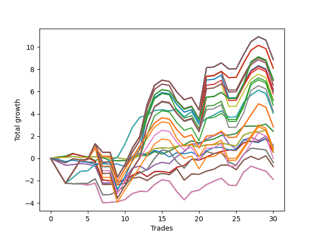

# Short Wallace Doodle 012 
- Symbol: AMZN_Unlimited
- Date Range: 03/23/2022 - 07/08/2022
- Trading Period: 7:20-12:30
- Number of Trades: 30



| Name | Win Percent | Profit | Avg Profit / Trade | Avg Time / Trade |      | Name | Win Percent | Profit | Avg Profit / Trade | Avg Time / Trade |
| ---- | ----------- | ------ | ------------------ | ---------------- | ---- | ---- | ----------- | ------ | ------------------ | ---------------- |
| Sorted By <br> Profit | | | | | | Sorted By <br> Win Percentage ||||
| One Hundred Thirty | 63.33 | 4432.25 | 147.74 | 160:38 |     | Seventy-One | 73.33 | 2032.50 | 67.75 | 93:09 |
| One Hundred Twenty-Nine | 63.33 | 4432.25 | 147.74 | 160:38 |     | Sixty-Three | 73.33 | 2032.50 | 67.75 | 93:09 |
| One Hundred Twenty-Five | 63.33 | 4432.25 | 147.74 | 160:38 |     | Fifty-Five | 73.33 | 2032.50 | 67.75 | 93:09 |
| One Hundred Twenty-Four | 63.33 | 4432.25 | 147.74 | 160:38 |     | Forty-Seven | 73.33 | 2032.50 | 67.75 | 93:09 |
| One Hundred Twenty | 63.33 | 4432.25 | 147.74 | 160:38 |     | Seven | 73.33 | 2032.50 | 67.75 | 93:09 |
| One Hundred Ninteen | 63.33 | 4432.25 | 147.74 | 160:38 |     | Sixty-Four | 66.67 | 1215.50 | 40.52 | 10:30 |
| One Hundred Fifteen | 63.33 | 4432.25 | 147.74 | 160:38 |     | Fifty-Six | 66.67 | 1215.50 | 40.52 | 10:30 |
| One Hundred Fourteen | 63.33 | 4432.25 | 147.74 | 160:38 |     | Forty-Eight | 66.67 | 1215.50 | 40.52 | 10:30 |
| One Hundred Five | 63.33 | 4432.25 | 147.74 | 160:38 |     | Forty | 66.67 | 1215.50 | 40.52 | 10:30 |
| One Hundred Four | 63.33 | 4432.25 | 147.74 | 160:38 |     | Zero | 66.67 | 1215.50 | 40.52 | 10:30 |
| Eighty-Five | 63.33 | 4432.25 | 147.74 | 160:38 |     | Seventy | 66.67 | 384.50 | 12.82 | 11:34 |
| Eighty-Four | 63.33 | 4432.25 | 147.74 | 160:38 |     | Sixty-Two | 66.67 | 384.50 | 12.82 | 11:34 |
| One Hundred Twenty-Eight | 63.33 | 4047.25 | 134.91 | 159:16 |     | Fifty-Four | 66.67 | 384.50 | 12.82 | 11:34 |
| One Hundred Twenty-Three | 63.33 | 4047.25 | 134.91 | 159:16 |     | Forty-Six | 66.67 | 384.50 | 12.82 | 11:34 |
| One Hundred Eighteen | 63.33 | 4047.25 | 134.91 | 159:16 |     | Six | 66.67 | 384.50 | 12.82 | 11:34 |
| One Hundred Thirteen | 63.33 | 4047.25 | 134.91 | 159:16 |     | One Hundred Thirty | 63.33 | 4432.25 | 147.74 | 160:38 |
| One Hundred Three | 63.33 | 4047.25 | 134.91 | 159:16 |     | One Hundred Twenty-Nine | 63.33 | 4432.25 | 147.74 | 160:38 |
| Eighty-Three | 63.33 | 4047.25 | 134.91 | 159:16 |     | One Hundred Twenty-Five | 63.33 | 4432.25 | 147.74 | 160:38 |
| One Hundred Twenty-Seven | 63.33 | 3532.00 | 117.73 | 152:55 |     | One Hundred Twenty-Four | 63.33 | 4432.25 | 147.74 | 160:38 |
| One Hundred Twenty-Two | 63.33 | 3532.00 | 117.73 | 152:55 |     | One Hundred Twenty | 63.33 | 4432.25 | 147.74 | 160:38 |
| One Hundred Seventeen | 63.33 | 3532.00 | 117.73 | 152:55 |     | One Hundred Ninteen | 63.33 | 4432.25 | 147.74 | 160:38 |
| One Hundred Twelve | 63.33 | 3532.00 | 117.73 | 152:55 |     | One Hundred Fifteen | 63.33 | 4432.25 | 147.74 | 160:38 |
| One Hundred Two | 63.33 | 3532.00 | 117.73 | 152:55 |     | One Hundred Fourteen | 63.33 | 4432.25 | 147.74 | 160:38 |
| Eighty-Two | 63.33 | 3532.00 | 117.73 | 152:55 |     | One Hundred Five | 63.33 | 4432.25 | 147.74 | 160:38 |
| One Hundred Ten | 63.33 | 3486.25 | 116.21 | 158:19 |     | One Hundred Four | 63.33 | 4432.25 | 147.74 | 160:38 |
| One Hundred Nine | 63.33 | 3486.25 | 116.21 | 158:19 |     | Eighty-Five | 63.33 | 4432.25 | 147.74 | 160:38 |
| One Hundred | 63.33 | 3289.50 | 109.65 | 141:19 |     | Eighty-Four | 63.33 | 4432.25 | 147.74 | 160:38 |
| Ninety-Nine | 63.33 | 3289.50 | 109.65 | 141:19 |     | One Hundred Twenty-Eight | 63.33 | 4047.25 | 134.91 | 159:16 |
| One Hundred Eight | 63.33 | 3101.25 | 103.38 | 156:58 |     | One Hundred Twenty-Three | 63.33 | 4047.25 | 134.91 | 159:16 |
| Ninety-Five | 63.33 | 3011.75 | 100.39 | 142:15 |     | One Hundred Eighteen | 63.33 | 4047.25 | 134.91 | 159:16 |
| Ninety-Four | 63.33 | 3011.75 | 100.39 | 142:15 |     | One Hundred Thirteen | 63.33 | 4047.25 | 134.91 | 159:16 |
| Ninety-Eight | 63.33 | 2904.50 | 96.82 | 139:58 |     | One Hundred Three | 63.33 | 4047.25 | 134.91 | 159:16 |
| Ninety-Three | 63.33 | 2626.75 | 87.56 | 140:54 |     | Eighty-Three | 63.33 | 4047.25 | 134.91 | 159:16 |
| One Hundred Seven | 63.33 | 2586.00 | 86.20 | 150:36 |     | One Hundred Twenty-Seven | 63.33 | 3532.00 | 117.73 | 152:55 |
| Ninety-Seven | 63.33 | 2389.25 | 79.64 | 133:36 |     | One Hundred Twenty-Two | 63.33 | 3532.00 | 117.73 | 152:55 |
| Ninety-Two | 63.33 | 2111.50 | 70.38 | 134:32 |     | One Hundred Seventeen | 63.33 | 3532.00 | 117.73 | 152:55 |
| Seventy-One | 73.33 | 2032.50 | 67.75 | 93:09 |     | One Hundred Twelve | 63.33 | 3532.00 | 117.73 | 152:55 |
| Sixty-Three | 73.33 | 2032.50 | 67.75 | 93:09 |     | One Hundred Two | 63.33 | 3532.00 | 117.73 | 152:55 |
| Fifty-Five | 73.33 | 2032.50 | 67.75 | 93:09 |     | Eighty-Two | 63.33 | 3532.00 | 117.73 | 152:55 |
| Forty-Seven | 73.33 | 2032.50 | 67.75 | 93:09 |     | One Hundred Ten | 63.33 | 3486.25 | 116.21 | 158:19 |
| Seven | 73.33 | 2032.50 | 67.75 | 93:09 |     | One Hundred Nine | 63.33 | 3486.25 | 116.21 | 158:19 |
| One Hundred Twenty-Six | 63.33 | 1421.50 | 47.38 | 127:08 |     | One Hundred | 63.33 | 3289.50 | 109.65 | 141:19 |
| One Hundred Twenty-One | 63.33 | 1421.50 | 47.38 | 127:08 |     | Ninety-Nine | 63.33 | 3289.50 | 109.65 | 141:19 |
| One Hundred Sixteen | 63.33 | 1421.50 | 47.38 | 127:08 |     | One Hundred Eight | 63.33 | 3101.25 | 103.38 | 156:58 |
| One Hundred Eleven | 63.33 | 1421.50 | 47.38 | 127:08 |     | Ninety-Five | 63.33 | 3011.75 | 100.39 | 142:15 |
| One Hundred One | 63.33 | 1421.50 | 47.38 | 127:08 |     | Ninety-Four | 63.33 | 3011.75 | 100.39 | 142:15 |
| Eighty-One | 63.33 | 1421.50 | 47.38 | 127:08 |     | Ninety-Eight | 63.33 | 2904.50 | 96.82 | 139:58 |
| Sixty-Four | 66.67 | 1215.50 | 40.52 | 10:30 |     | Ninety-Three | 63.33 | 2626.75 | 87.56 | 140:54 |
| Fifty-Six | 66.67 | 1215.50 | 40.52 | 10:30 |     | One Hundred Seven | 63.33 | 2586.00 | 86.20 | 150:36 |
| Forty-Eight | 66.67 | 1215.50 | 40.52 | 10:30 |     | Ninety-Seven | 63.33 | 2389.25 | 79.64 | 133:36 |
| Forty | 66.67 | 1215.50 | 40.52 | 10:30 |     | Ninety-Two | 63.33 | 2111.50 | 70.38 | 134:32 |
| Zero | 66.67 | 1215.50 | 40.52 | 10:30 |     | One Hundred Twenty-Six | 63.33 | 1421.50 | 47.38 | 127:08 |
| Seventy-Three | 46.67 | 597.00 | 19.90 | 10:57 |     | One Hundred Twenty-One | 63.33 | 1421.50 | 47.38 | 127:08 |
| Sixty-Six | 60.00 | 500.00 | 16.67 | 34:29 |     | One Hundred Sixteen | 63.33 | 1421.50 | 47.38 | 127:08 |
| Fifty-Eight | 60.00 | 500.00 | 16.67 | 34:29 |     | One Hundred Eleven | 63.33 | 1421.50 | 47.38 | 127:08 |
| Fifty | 60.00 | 500.00 | 16.67 | 34:29 |     | One Hundred One | 63.33 | 1421.50 | 47.38 | 127:08 |
| Forty-Two | 60.00 | 500.00 | 16.67 | 34:29 |     | Eighty-One | 63.33 | 1421.50 | 47.38 | 127:08 |
| Two | 60.00 | 500.00 | 16.67 | 34:29 |     | One Hundred Six | 63.33 | 475.50 | 15.85 | 124:49 |
| One Hundred Six | 63.33 | 475.50 | 15.85 | 124:49 |     | Ninety-Six | 63.33 | 278.75 | 9.29 | 107:49 |
| Seventy | 66.67 | 384.50 | 12.82 | 11:34 |     | Ninety-One | 63.33 | 1.00 | 0.03 | 108:45 |
| Sixty-Two | 66.67 | 384.50 | 12.82 | 11:34 |     | Sixty-Six | 60.00 | 500.00 | 16.67 | 34:29 |
| Fifty-Four | 66.67 | 384.50 | 12.82 | 11:34 |     | Fifty-Eight | 60.00 | 500.00 | 16.67 | 34:29 |
| Forty-Six | 66.67 | 384.50 | 12.82 | 11:34 |     | Fifty | 60.00 | 500.00 | 16.67 | 34:29 |
| Six | 66.67 | 384.50 | 12.82 | 11:34 |     | Forty-Two | 60.00 | 500.00 | 16.67 | 34:29 |
| Sixty-Five | 60.00 | 279.25 | 9.31 | 19:49 |     | Two | 60.00 | 500.00 | 16.67 | 34:29 |
| Fifty-Seven | 60.00 | 279.25 | 9.31 | 19:49 |     | Sixty-Five | 60.00 | 279.25 | 9.31 | 19:49 |
| Forty-Nine | 60.00 | 279.25 | 9.31 | 19:49 |     | Fifty-Seven | 60.00 | 279.25 | 9.31 | 19:49 |
| Forty-One | 60.00 | 279.25 | 9.31 | 19:49 |     | Forty-Nine | 60.00 | 279.25 | 9.31 | 19:49 |
| One | 60.00 | 279.25 | 9.31 | 19:49 |     | Forty-One | 60.00 | 279.25 | 9.31 | 19:49 |
| Ninety-Six | 63.33 | 278.75 | 9.29 | 107:49 |     | One | 60.00 | 279.25 | 9.31 | 19:49 |
| Ninety-One | 63.33 | 1.00 | 0.03 | 108:45 |     | Sixty-Nine | 53.33 | -188.75 | -6.29 | 75:03 |
| Sixty-Nine | 53.33 | -188.75 | -6.29 | 75:03 |     | Sixty-One | 53.33 | -188.75 | -6.29 | 75:03 |
| Sixty-One | 53.33 | -188.75 | -6.29 | 75:03 |     | Fifty-Three | 53.33 | -188.75 | -6.29 | 75:03 |
| Fifty-Three | 53.33 | -188.75 | -6.29 | 75:03 |     | Forty-Five | 53.33 | -188.75 | -6.29 | 75:03 |
| Forty-Five | 53.33 | -188.75 | -6.29 | 75:03 |     | Five | 53.33 | -188.75 | -6.29 | 75:03 |
| Five | 53.33 | -188.75 | -6.29 | 75:03 |     | Sixty-Seven | 50.00 | -370.75 | -12.36 | 30:41 |
| Sixty-Seven | 50.00 | -370.75 | -12.36 | 30:41 |     | Fifty-Nine | 50.00 | -370.75 | -12.36 | 30:41 |
| Fifty-Nine | 50.00 | -370.75 | -12.36 | 30:41 |     | Fifty-One | 50.00 | -370.75 | -12.36 | 30:41 |
| Fifty-One | 50.00 | -370.75 | -12.36 | 30:41 |     | Forty-Three | 50.00 | -370.75 | -12.36 | 30:41 |
| Forty-Three | 50.00 | -370.75 | -12.36 | 30:41 |     | Three | 50.00 | -370.75 | -12.36 | 30:41 |
| Three | 50.00 | -370.75 | -12.36 | 30:41 |     | Sixty-Eight | 50.00 | -943.25 | -31.44 | 51:04 |
| Sixty-Eight | 50.00 | -943.25 | -31.44 | 51:04 |     | Sixty | 50.00 | -943.25 | -31.44 | 51:04 |
| Sixty | 50.00 | -943.25 | -31.44 | 51:04 |     | Fifty-Two | 50.00 | -943.25 | -31.44 | 51:04 |
| Fifty-Two | 50.00 | -943.25 | -31.44 | 51:04 |     | Forty-Four | 50.00 | -943.25 | -31.44 | 51:04 |
| Forty-Four | 50.00 | -943.25 | -31.44 | 51:04 |     | Four | 50.00 | -943.25 | -31.44 | 51:04 |
| Four | 50.00 | -943.25 | -31.44 | 51:04 |     | Seventy-Three | 46.67 | 597.00 | 19.90 | 10:57 |

## NO STOPLOSS

### Test Zero
* Sell when price hits the middle line of the 20p bollinger
* No Stoploss
* Results:
```
Total Trades: 30
Percent Up: 33.33
Percent Down: 66.67
Total Points Moved Down: 2.43
Potential Profit: 1215.50
Total Points Ups: 2.09 Count Ups: 10
Total Points Downs: 4.52 Count Downs: 20
```

<details><summary>Trades</summary>

<code>In: 2022-03-29 10:30:00		Out: 2022-03-29 10:34:50		Total Position Time: 04:50		Total Move Down: 0.13		Total to Date: 0.13</code> <br />
<code>In: 2022-03-29 10:43:00		Out: 2022-03-29 10:45:25		Total Position Time: 02:25		Total Move Down: 0.07		Total to Date: 0.20</code> <br />
<code>In: 2022-03-30 09:04:00		Out: 2022-03-30 09:07:30		Total Position Time: 03:30		Total Move Down: 0.25		Total to Date: 0.45</code> <br />
<code>In: 2022-03-30 09:46:00		Out: 2022-03-30 10:05:15		Total Position Time: 19:15		Total Move Down: -0.22		Total to Date: 0.23</code> <br />
<code>In: 2022-03-31 10:22:00		Out: 2022-03-31 10:39:20		Total Position Time: 17:20		Total Move Down: -0.08		Total to Date: 0.15</code> <br />
<code>In: 2022-04-01 11:24:00		Out: 2022-04-01 11:51:45		Total Position Time: 27:45		Total Move Down: -0.35		Total to Date: -0.20</code> <br />
<code>In: 2022-04-18 10:13:00		Out: 2022-04-18 10:18:45		Total Position Time: 05:45		Total Move Down: 0.27		Total to Date: 0.07</code> <br />
<code>In: 2022-04-22 12:18:00		Out: 2022-04-22 12:42:40		Total Position Time: 24:40		Total Move Down: -0.25		Total to Date: -0.17</code> <br />
<code>In: 2022-04-25 09:17:00		Out: 2022-04-25 09:31:15		Total Position Time: 14:15		Total Move Down: -0.04		Total to Date: -0.21</code> <br />
<code>In: 2022-04-26 09:32:00		Out: 2022-04-26 09:39:45		Total Position Time: 07:45		Total Move Down: 0.02		Total to Date: -0.19</code> <br />
<code>In: 2022-04-26 10:01:00		Out: 2022-04-26 10:02:55		Total Position Time: 01:55		Total Move Down: 0.24		Total to Date: 0.04</code> <br />
<code>In: 2022-05-03 10:17:00		Out: 2022-05-03 10:24:05		Total Position Time: 07:05		Total Move Down: 0.28		Total to Date: 0.32</code> <br />
<code>In: 2022-05-09 08:44:00		Out: 2022-05-09 09:01:15		Total Position Time: 17:15		Total Move Down: -0.09		Total to Date: 0.23</code> <br />
<code>In: 2022-05-09 12:03:00		Out: 2022-05-09 12:04:10		Total Position Time: 01:10		Total Move Down: 0.39		Total to Date: 0.62</code> <br />
<code>In: 2022-05-11 11:27:00		Out: 2022-05-11 11:48:05		Total Position Time: 21:05		Total Move Down: -0.23		Total to Date: 0.39</code> <br />
<code>In: 2022-05-12 12:23:00		Out: 2022-05-12 12:35:25		Total Position Time: 12:25		Total Move Down: 0.27		Total to Date: 0.66</code> <br />
<code>In: 2022-05-20 11:55:00		Out: 2022-05-20 11:59:35		Total Position Time: 04:35		Total Move Down: 0.36		Total to Date: 1.02</code> <br />
<code>In: 2022-06-01 10:13:00		Out: 2022-06-01 10:24:20		Total Position Time: 11:20		Total Move Down: 0.20		Total to Date: 1.22</code> <br />
<code>In: 2022-06-03 09:02:00		Out: 2022-06-03 09:09:15		Total Position Time: 07:15		Total Move Down: 0.36		Total to Date: 1.58</code> <br />
<code>In: 2022-06-07 10:12:00		Out: 2022-06-07 10:25:05		Total Position Time: 13:05		Total Move Down: -0.18		Total to Date: 1.40</code> <br />
<code>In: 2022-06-09 08:45:00		Out: 2022-06-09 08:46:40		Total Position Time: 01:40		Total Move Down: 0.20		Total to Date: 1.60</code> <br />
<code>In: 2022-06-10 10:25:00		Out: 2022-06-10 10:31:15		Total Position Time: 06:15		Total Move Down: 0.14		Total to Date: 1.74</code> <br />
<code>In: 2022-06-10 10:53:00		Out: 2022-06-10 10:57:10		Total Position Time: 04:10		Total Move Down: 0.32		Total to Date: 2.06</code> <br />
<code>In: 2022-06-13 08:17:00		Out: 2022-06-13 08:28:55		Total Position Time: 11:55		Total Move Down: 0.03		Total to Date: 2.09</code> <br />
<code>In: 2022-06-13 09:04:00		Out: 2022-06-13 09:10:15		Total Position Time: 06:15		Total Move Down: 0.14		Total to Date: 2.23</code> <br />
<code>In: 2022-06-13 09:40:00		Out: 2022-06-13 09:47:55		Total Position Time: 07:55		Total Move Down: 0.66		Total to Date: 2.89</code> <br />
<code>In: 2022-06-14 08:49:00		Out: 2022-06-14 09:02:15		Total Position Time: 13:15		Total Move Down: -0.00		Total to Date: 2.89</code> <br />
<code>In: 2022-06-16 09:28:00		Out: 2022-06-16 09:42:05		Total Position Time: 14:05		Total Move Down: 0.02		Total to Date: 2.91</code> <br />
<code>In: 2022-06-29 10:12:00		Out: 2022-06-29 10:13:10		Total Position Time: 01:10		Total Move Down: 0.17		Total to Date: 3.08</code> <br />
<code>In: 2022-06-30 08:12:00		Out: 2022-06-30 08:36:00		Total Position Time: 24:00		Total Move Down: -0.65		Total to Date: 2.43</code> <br />


</details>

### Test One
* Sell when the price hits the upper line of the 20p 1std bollinger
* No Stoploss
* Results:
```
Total Trades: 30
Percent Up: 40.00
Percent Down: 60.00
Total Points Moved Down: 0.56
Potential Profit: 279.25
Total Points Ups: 4.43 Count Ups: 12
Total Points Downs: 4.99 Count Downs: 18
```

<details><summary>Trades</summary>

<code>In: 2022-03-29 10:30:00		Out: 2022-03-29 10:45:40		Total Position Time: 15:40		Total Move Down: 0.05		Total to Date: 0.05</code> <br />
<code>In: 2022-03-29 10:43:00		Out: 2022-03-29 10:45:40		Total Position Time: 02:40		Total Move Down: 0.06		Total to Date: 0.12</code> <br />
<code>In: 2022-03-30 09:04:00		Out: 2022-03-30 09:08:10		Total Position Time: 04:10		Total Move Down: 0.30		Total to Date: 0.41</code> <br />
<code>In: 2022-03-30 09:46:00		Out: 2022-03-30 10:07:00		Total Position Time: 21:00		Total Move Down: -0.15		Total to Date: 0.27</code> <br />
<code>In: 2022-03-31 10:22:00		Out: 2022-03-31 11:00:25		Total Position Time: 38:25		Total Move Down: -0.23		Total to Date: 0.03</code> <br />
<code>In: 2022-04-01 11:24:00		Out: 2022-04-01 11:52:40		Total Position Time: 28:40		Total Move Down: -0.28		Total to Date: -0.24</code> <br />
<code>In: 2022-04-18 10:13:00		Out: 2022-04-18 11:10:10		Total Position Time: 57:10		Total Move Down: -1.69		Total to Date: -1.93</code> <br />
<code>In: 2022-04-22 12:18:00		Out: 2022-04-22 12:46:05		Total Position Time: 28:05		Total Move Down: -0.08		Total to Date: -2.01</code> <br />
<code>In: 2022-04-25 09:17:00		Out: 2022-04-25 09:40:45		Total Position Time: 23:45		Total Move Down: -0.09		Total to Date: -2.10</code> <br />
<code>In: 2022-04-26 09:32:00		Out: 2022-04-26 09:44:35		Total Position Time: 12:35		Total Move Down: 0.08		Total to Date: -2.03</code> <br />
<code>In: 2022-04-26 10:01:00		Out: 2022-04-26 10:04:10		Total Position Time: 03:10		Total Move Down: 0.51		Total to Date: -1.52</code> <br />
<code>In: 2022-05-03 10:17:00		Out: 2022-05-03 10:28:10		Total Position Time: 11:10		Total Move Down: 0.32		Total to Date: -1.20</code> <br />
<code>In: 2022-05-09 08:44:00		Out: 2022-05-09 09:26:05		Total Position Time: 42:05		Total Move Down: -0.44		Total to Date: -1.64</code> <br />
<code>In: 2022-05-09 12:03:00		Out: 2022-05-09 12:09:40		Total Position Time: 06:40		Total Move Down: 0.45		Total to Date: -1.18</code> <br />
<code>In: 2022-05-11 11:27:00		Out: 2022-05-11 11:50:45		Total Position Time: 23:45		Total Move Down: 0.02		Total to Date: -1.17</code> <br />
<code>In: 2022-05-12 12:23:00		Out: 2022-05-12 12:47:00		Total Position Time: 24:00		Total Move Down: -0.12		Total to Date: -1.28</code> <br />
<code>In: 2022-05-20 11:55:00		Out: 2022-05-20 12:04:15		Total Position Time: 09:15		Total Move Down: 0.49		Total to Date: -0.79</code> <br />
<code>In: 2022-06-01 10:13:00		Out: 2022-06-01 10:30:35		Total Position Time: 17:35		Total Move Down: 0.15		Total to Date: -0.64</code> <br />
<code>In: 2022-06-03 09:02:00		Out: 2022-06-03 09:09:50		Total Position Time: 07:50		Total Move Down: 0.56		Total to Date: -0.08</code> <br />
<code>In: 2022-06-07 10:12:00		Out: 2022-06-07 10:28:25		Total Position Time: 16:25		Total Move Down: -0.08		Total to Date: -0.16</code> <br />
<code>In: 2022-06-09 08:45:00		Out: 2022-06-09 08:48:05		Total Position Time: 03:05		Total Move Down: 0.29		Total to Date: 0.13</code> <br />
<code>In: 2022-06-10 10:25:00		Out: 2022-06-10 10:33:25		Total Position Time: 08:25		Total Move Down: 0.30		Total to Date: 0.43</code> <br />
<code>In: 2022-06-10 10:53:00		Out: 2022-06-10 11:28:25		Total Position Time: 35:25		Total Move Down: 0.19		Total to Date: 0.62</code> <br />
<code>In: 2022-06-13 08:17:00		Out: 2022-06-13 08:32:35		Total Position Time: 15:35		Total Move Down: 0.13		Total to Date: 0.75</code> <br />
<code>In: 2022-06-13 09:04:00		Out: 2022-06-13 09:28:20		Total Position Time: 24:20		Total Move Down: -0.01		Total to Date: 0.74</code> <br />
<code>In: 2022-06-13 09:40:00		Out: 2022-06-13 09:54:00		Total Position Time: 14:00		Total Move Down: 0.67		Total to Date: 1.41</code> <br />
<code>In: 2022-06-14 08:49:00		Out: 2022-06-14 09:04:05		Total Position Time: 15:05		Total Move Down: 0.14		Total to Date: 1.55</code> <br />
<code>In: 2022-06-16 09:28:00		Out: 2022-06-16 09:59:50		Total Position Time: 31:50		Total Move Down: -0.06		Total to Date: 1.49</code> <br />
<code>In: 2022-06-29 10:12:00		Out: 2022-06-29 10:14:00		Total Position Time: 02:00		Total Move Down: 0.28		Total to Date: 1.77</code> <br />
<code>In: 2022-06-30 08:12:00		Out: 2022-06-30 09:03:05		Total Position Time: 51:05		Total Move Down: -1.21		Total to Date: 0.56</code> <br />


</details>

### Test Two
* Sell when the price hits the upper line of the 20p 2std bollinger
* No Stoploss
* Results:
```
Total Trades: 30
Percent Up: 40.00
Percent Down: 60.00
Total Points Moved Down: 1.00
Potential Profit: 500.00
Total Points Ups: 5.62 Count Ups: 12
Total Points Downs: 6.62 Count Downs: 18
```

<details><summary>Trades</summary>

<code>In: 2022-03-29 10:30:00		Out: 2022-03-29 11:16:25		Total Position Time: 46:25		Total Move Down: -0.31		Total to Date: -0.31</code> <br />
<code>In: 2022-03-29 10:43:00		Out: 2022-03-29 11:16:25		Total Position Time: 33:25		Total Move Down: -0.30		Total to Date: -0.61</code> <br />
<code>In: 2022-03-30 09:04:00		Out: 2022-03-30 10:45:05		Total Position Time: 101:05		Total Move Down: 0.05		Total to Date: -0.56</code> <br />
<code>In: 2022-03-30 09:46:00		Out: 2022-03-30 10:45:05		Total Position Time: 59:05		Total Move Down: 0.10		Total to Date: -0.46</code> <br />
<code>In: 2022-03-31 10:22:00		Out: 2022-03-31 11:10:35		Total Position Time: 48:35		Total Move Down: -0.06		Total to Date: -0.52</code> <br />
<code>In: 2022-04-01 11:24:00		Out: 2022-04-01 11:53:10		Total Position Time: 29:10		Total Move Down: -0.19		Total to Date: -0.70</code> <br />
<code>In: 2022-04-18 10:13:00		Out: 2022-04-18 11:11:40		Total Position Time: 58:40		Total Move Down: -1.50		Total to Date: -2.21</code> <br />
<code>In: 2022-04-22 12:18:00		Out: 2022-04-22 12:47:00		Total Position Time: 29:00		Total Move Down: 0.02		Total to Date: -2.19</code> <br />
<code>In: 2022-04-25 09:17:00		Out: 2022-04-25 09:41:55		Total Position Time: 24:55		Total Move Down: 0.05		Total to Date: -2.14</code> <br />
<code>In: 2022-04-26 09:32:00		Out: 2022-04-26 09:48:55		Total Position Time: 16:55		Total Move Down: 0.30		Total to Date: -1.84</code> <br />
<code>In: 2022-04-26 10:01:00		Out: 2022-04-26 10:15:05		Total Position Time: 14:05		Total Move Down: 0.95		Total to Date: -0.89</code> <br />
<code>In: 2022-05-03 10:17:00		Out: 2022-05-03 10:56:05		Total Position Time: 39:05		Total Move Down: 0.20		Total to Date: -0.69</code> <br />
<code>In: 2022-05-09 08:44:00		Out: 2022-05-09 09:27:05		Total Position Time: 43:05		Total Move Down: -0.37		Total to Date: -1.06</code> <br />
<code>In: 2022-05-09 12:03:00		Out: 2022-05-09 12:17:30		Total Position Time: 14:30		Total Move Down: 0.48		Total to Date: -0.58</code> <br />
<code>In: 2022-05-11 11:27:00		Out: 2022-05-11 11:53:20		Total Position Time: 26:20		Total Move Down: 0.23		Total to Date: -0.35</code> <br />
<code>In: 2022-05-12 12:23:00		Out: 2022-05-12 12:47:00		Total Position Time: 24:00		Total Move Down: -0.12		Total to Date: -0.47</code> <br />
<code>In: 2022-05-20 11:55:00		Out: 2022-05-20 12:08:05		Total Position Time: 13:05		Total Move Down: 0.64		Total to Date: 0.17</code> <br />
<code>In: 2022-06-01 10:13:00		Out: 2022-06-01 10:31:40		Total Position Time: 18:40		Total Move Down: 0.45		Total to Date: 0.62</code> <br />
<code>In: 2022-06-03 09:02:00		Out: 2022-06-03 09:19:15		Total Position Time: 17:15		Total Move Down: 0.67		Total to Date: 1.29</code> <br />
<code>In: 2022-06-07 10:12:00		Out: 2022-06-07 10:41:55		Total Position Time: 29:55		Total Move Down: -0.00		Total to Date: 1.29</code> <br />
<code>In: 2022-06-09 08:45:00		Out: 2022-06-09 08:48:20		Total Position Time: 03:20		Total Move Down: 0.44		Total to Date: 1.73</code> <br />
<code>In: 2022-06-10 10:25:00		Out: 2022-06-10 10:39:10		Total Position Time: 14:10		Total Move Down: 0.30		Total to Date: 2.03</code> <br />
<code>In: 2022-06-10 10:53:00		Out: 2022-06-10 11:29:15		Total Position Time: 36:15		Total Move Down: 0.32		Total to Date: 2.35</code> <br />
<code>In: 2022-06-13 08:17:00		Out: 2022-06-13 09:54:20		Total Position Time: 97:20		Total Move Down: -1.04		Total to Date: 1.31</code> <br />
<code>In: 2022-06-13 09:04:00		Out: 2022-06-13 09:54:20		Total Position Time: 50:20		Total Move Down: -0.46		Total to Date: 0.85</code> <br />
<code>In: 2022-06-13 09:40:00		Out: 2022-06-13 09:54:20		Total Position Time: 14:20		Total Move Down: 0.80		Total to Date: 1.65</code> <br />
<code>In: 2022-06-14 08:49:00		Out: 2022-06-14 09:05:15		Total Position Time: 16:15		Total Move Down: 0.25		Total to Date: 1.90</code> <br />
<code>In: 2022-06-16 09:28:00		Out: 2022-06-16 10:21:25		Total Position Time: 53:25		Total Move Down: -0.29		Total to Date: 1.61</code> <br />
<code>In: 2022-06-29 10:12:00		Out: 2022-06-29 10:20:20		Total Position Time: 08:20		Total Move Down: 0.37		Total to Date: 1.98</code> <br />
<code>In: 2022-06-30 08:12:00		Out: 2022-06-30 09:05:45		Total Position Time: 53:45		Total Move Down: -0.98		Total to Date: 1.00</code> <br />


</details>

### Test Three
* Sell when price hits the middle line of the 50p bollinger
* No Stoploss
* Results:
```
Total Trades: 30
Percent Up: 50.00
Percent Down: 50.00
Total Points Moved Down: -0.74
Potential Profit: -370.75
Total Points Ups: 5.91 Count Ups: 15
Total Points Downs: 5.17 Count Downs: 15
```

<details><summary>Trades</summary>

<code>In: 2022-03-29 10:30:00		Out: 2022-03-29 11:21:20		Total Position Time: 51:20		Total Move Down: -0.21		Total to Date: -0.21</code> <br />
<code>In: 2022-03-29 10:43:00		Out: 2022-03-29 11:21:20		Total Position Time: 38:20		Total Move Down: -0.20		Total to Date: -0.41</code> <br />
<code>In: 2022-03-30 09:04:00		Out: 2022-03-30 09:12:15		Total Position Time: 08:15		Total Move Down: 0.37		Total to Date: -0.03</code> <br />
<code>In: 2022-03-30 09:46:00		Out: 2022-03-30 10:20:10		Total Position Time: 34:10		Total Move Down: -0.10		Total to Date: -0.14</code> <br />
<code>In: 2022-03-31 10:22:00		Out: 2022-03-31 11:00:45		Total Position Time: 38:45		Total Move Down: -0.21		Total to Date: -0.34</code> <br />
<code>In: 2022-04-01 11:24:00		Out: 2022-04-01 11:54:00		Total Position Time: 30:00		Total Move Down: -0.00		Total to Date: -0.34</code> <br />
<code>In: 2022-04-18 10:13:00		Out: 2022-04-18 11:46:55		Total Position Time: 93:55		Total Move Down: -2.00		Total to Date: -2.34</code> <br />
<code>In: 2022-04-22 12:18:00		Out: 2022-04-22 12:47:00		Total Position Time: 29:00		Total Move Down: 0.02		Total to Date: -2.32</code> <br />
<code>In: 2022-04-25 09:17:00		Out: 2022-04-25 09:56:25		Total Position Time: 39:25		Total Move Down: -0.02		Total to Date: -2.34</code> <br />
<code>In: 2022-04-26 09:32:00		Out: 2022-04-26 10:04:00		Total Position Time: 32:00		Total Move Down: 0.11		Total to Date: -2.24</code> <br />
<code>In: 2022-04-26 10:01:00		Out: 2022-04-26 10:04:00		Total Position Time: 03:00		Total Move Down: 0.46		Total to Date: -1.78</code> <br />
<code>In: 2022-05-03 10:17:00		Out: 2022-05-03 10:55:40		Total Position Time: 38:40		Total Move Down: 0.10		Total to Date: -1.68</code> <br />
<code>In: 2022-05-09 08:44:00		Out: 2022-05-09 09:27:20		Total Position Time: 43:20		Total Move Down: -0.31		Total to Date: -1.99</code> <br />
<code>In: 2022-05-09 12:03:00		Out: 2022-05-09 12:05:45		Total Position Time: 02:45		Total Move Down: 0.45		Total to Date: -1.54</code> <br />
<code>In: 2022-05-11 11:27:00		Out: 2022-05-11 11:53:15		Total Position Time: 26:15		Total Move Down: 0.20		Total to Date: -1.34</code> <br />
<code>In: 2022-05-12 12:23:00		Out: 2022-05-12 12:47:00		Total Position Time: 24:00		Total Move Down: -0.12		Total to Date: -1.46</code> <br />
<code>In: 2022-05-20 11:55:00		Out: 2022-05-20 12:04:40		Total Position Time: 09:40		Total Move Down: 0.54		Total to Date: -0.92</code> <br />
<code>In: 2022-06-01 10:13:00		Out: 2022-06-01 11:46:40		Total Position Time: 93:40		Total Move Down: -1.03		Total to Date: -1.95</code> <br />
<code>In: 2022-06-03 09:02:00		Out: 2022-06-03 09:09:45		Total Position Time: 07:45		Total Move Down: 0.55		Total to Date: -1.40</code> <br />
<code>In: 2022-06-07 10:12:00		Out: 2022-06-07 10:41:15		Total Position Time: 29:15		Total Move Down: -0.03		Total to Date: -1.43</code> <br />
<code>In: 2022-06-09 08:45:00		Out: 2022-06-09 08:48:05		Total Position Time: 03:05		Total Move Down: 0.29		Total to Date: -1.14</code> <br />
<code>In: 2022-06-10 10:25:00		Out: 2022-06-10 10:32:20		Total Position Time: 07:20		Total Move Down: 0.17		Total to Date: -0.97</code> <br />
<code>In: 2022-06-10 10:53:00		Out: 2022-06-10 11:01:15		Total Position Time: 08:15		Total Move Down: 0.38		Total to Date: -0.59</code> <br />
<code>In: 2022-06-13 08:17:00		Out: 2022-06-13 08:53:10		Total Position Time: 36:10		Total Move Down: -0.01		Total to Date: -0.60</code> <br />
<code>In: 2022-06-13 09:04:00		Out: 2022-06-13 09:54:25		Total Position Time: 50:25		Total Move Down: -0.41		Total to Date: -1.01</code> <br />
<code>In: 2022-06-13 09:40:00		Out: 2022-06-13 09:54:25		Total Position Time: 14:25		Total Move Down: 0.85		Total to Date: -0.16</code> <br />
<code>In: 2022-06-14 08:49:00		Out: 2022-06-14 09:06:20		Total Position Time: 17:20		Total Move Down: 0.35		Total to Date: 0.19</code> <br />
<code>In: 2022-06-16 09:28:00		Out: 2022-06-16 10:21:25		Total Position Time: 53:25		Total Move Down: -0.29		Total to Date: -0.10</code> <br />
<code>In: 2022-06-29 10:12:00		Out: 2022-06-29 10:15:05		Total Position Time: 03:05		Total Move Down: 0.34		Total to Date: 0.24</code> <br />
<code>In: 2022-06-30 08:12:00		Out: 2022-06-30 09:05:45		Total Position Time: 53:45		Total Move Down: -0.98		Total to Date: -0.74</code> <br />


</details>

### Test Four
* Sell when the price hits the upper line of the 50p 1std bollinger
* No Stoploss
* Results:
```
Total Trades: 30
Percent Up: 50.00
Percent Down: 50.00
Total Points Moved Down: -1.89
Potential Profit: -943.25
Total Points Ups: 7.84 Count Ups: 15
Total Points Downs: 5.95 Count Downs: 15
```

<details><summary>Trades</summary>

<code>In: 2022-03-29 10:30:00		Out: 2022-03-29 12:47:00		Total Position Time: 137:00		Total Move Down: -1.12		Total to Date: -1.12</code> <br />
<code>In: 2022-03-29 10:43:00		Out: 2022-03-29 12:47:00		Total Position Time: 124:00		Total Move Down: -1.11		Total to Date: -2.23</code> <br />
<code>In: 2022-03-30 09:04:00		Out: 2022-03-30 10:25:20		Total Position Time: 81:20		Total Move Down: -0.05		Total to Date: -2.28</code> <br />
<code>In: 2022-03-30 09:46:00		Out: 2022-03-30 10:25:20		Total Position Time: 39:20		Total Move Down: -0.00		Total to Date: -2.28</code> <br />
<code>In: 2022-03-31 10:22:00		Out: 2022-03-31 11:09:20		Total Position Time: 47:20		Total Move Down: -0.12		Total to Date: -2.40</code> <br />
<code>In: 2022-04-01 11:24:00		Out: 2022-04-01 11:57:45		Total Position Time: 33:45		Total Move Down: 0.18		Total to Date: -2.22</code> <br />
<code>In: 2022-04-18 10:13:00		Out: 2022-04-18 12:02:40		Total Position Time: 109:40		Total Move Down: -1.75		Total to Date: -3.97</code> <br />
<code>In: 2022-04-22 12:18:00		Out: 2022-04-22 12:47:00		Total Position Time: 29:00		Total Move Down: 0.02		Total to Date: -3.95</code> <br />
<code>In: 2022-04-25 09:17:00		Out: 2022-04-25 10:01:05		Total Position Time: 44:05		Total Move Down: 0.07		Total to Date: -3.88</code> <br />
<code>In: 2022-04-26 09:32:00		Out: 2022-04-26 10:10:05		Total Position Time: 38:05		Total Move Down: 0.18		Total to Date: -3.70</code> <br />
<code>In: 2022-04-26 10:01:00		Out: 2022-04-26 10:10:05		Total Position Time: 09:05		Total Move Down: 0.53		Total to Date: -3.17</code> <br />
<code>In: 2022-05-03 10:17:00		Out: 2022-05-03 11:00:05		Total Position Time: 43:05		Total Move Down: 0.21		Total to Date: -2.96</code> <br />
<code>In: 2022-05-09 08:44:00		Out: 2022-05-09 09:37:35		Total Position Time: 53:35		Total Move Down: -0.03		Total to Date: -2.98</code> <br />
<code>In: 2022-05-09 12:03:00		Out: 2022-05-09 12:20:05		Total Position Time: 17:05		Total Move Down: 0.64		Total to Date: -2.35</code> <br />
<code>In: 2022-05-11 11:27:00		Out: 2022-05-11 12:03:50		Total Position Time: 36:50		Total Move Down: 0.43		Total to Date: -1.92</code> <br />
<code>In: 2022-05-12 12:23:00		Out: 2022-05-12 12:47:00		Total Position Time: 24:00		Total Move Down: -0.12		Total to Date: -2.04</code> <br />
<code>In: 2022-05-20 11:55:00		Out: 2022-05-20 12:47:00		Total Position Time: 52:00		Total Move Down: -0.94		Total to Date: -2.98</code> <br />
<code>In: 2022-06-01 10:13:00		Out: 2022-06-01 11:51:10		Total Position Time: 98:10		Total Move Down: -0.73		Total to Date: -3.71</code> <br />
<code>In: 2022-06-03 09:02:00		Out: 2022-06-03 09:11:30		Total Position Time: 09:30		Total Move Down: 0.72		Total to Date: -3.00</code> <br />
<code>In: 2022-06-07 10:12:00		Out: 2022-06-07 10:44:15		Total Position Time: 32:15		Total Move Down: 0.15		Total to Date: -2.85</code> <br />
<code>In: 2022-06-09 08:45:00		Out: 2022-06-09 08:48:40		Total Position Time: 03:40		Total Move Down: 0.49		Total to Date: -2.36</code> <br />
<code>In: 2022-06-10 10:25:00		Out: 2022-06-10 10:33:30		Total Position Time: 08:30		Total Move Down: 0.31		Total to Date: -2.05</code> <br />
<code>In: 2022-06-10 10:53:00		Out: 2022-06-10 11:41:20		Total Position Time: 48:20		Total Move Down: 0.28		Total to Date: -1.77</code> <br />
<code>In: 2022-06-13 08:17:00		Out: 2022-06-13 10:01:10		Total Position Time: 104:10		Total Move Down: -0.63		Total to Date: -2.40</code> <br />
<code>In: 2022-06-13 09:04:00		Out: 2022-06-13 10:01:10		Total Position Time: 57:10		Total Move Down: -0.05		Total to Date: -2.45</code> <br />
<code>In: 2022-06-13 09:40:00		Out: 2022-06-13 10:01:10		Total Position Time: 21:10		Total Move Down: 1.21		Total to Date: -1.24</code> <br />
<code>In: 2022-06-14 08:49:00		Out: 2022-06-14 09:15:20		Total Position Time: 26:20		Total Move Down: 0.54		Total to Date: -0.70</code> <br />
<code>In: 2022-06-16 09:28:00		Out: 2022-06-16 10:35:30		Total Position Time: 67:30		Total Move Down: -0.24		Total to Date: -0.94</code> <br />
<code>In: 2022-06-29 10:12:00		Out: 2022-06-29 11:30:45		Total Position Time: 78:45		Total Move Down: -0.21		Total to Date: -1.15</code> <br />
<code>In: 2022-06-30 08:12:00		Out: 2022-06-30 09:09:40		Total Position Time: 57:40		Total Move Down: -0.74		Total to Date: -1.89</code> <br />


</details>

### Test Five
* Sell when the price hits the upper line of the 50p 2std bollinger
* No Stoploss
* Results:
```
Total Trades: 30
Percent Up: 46.67
Percent Down: 53.33
Total Points Moved Down: -0.38
Potential Profit: -188.75
Total Points Ups: 8.02 Count Ups: 14
Total Points Downs: 7.64 Count Downs: 16
```

<details><summary>Trades</summary>

<code>In: 2022-03-29 10:30:00		Out: 2022-03-29 12:47:00		Total Position Time: 137:00		Total Move Down: -1.12		Total to Date: -1.12</code> <br />
<code>In: 2022-03-29 10:43:00		Out: 2022-03-29 12:47:00		Total Position Time: 124:00		Total Move Down: -1.11		Total to Date: -2.23</code> <br />
<code>In: 2022-03-30 09:04:00		Out: 2022-03-30 10:40:05		Total Position Time: 96:05		Total Move Down: -0.04		Total to Date: -2.27</code> <br />
<code>In: 2022-03-30 09:46:00		Out: 2022-03-30 10:40:05		Total Position Time: 54:05		Total Move Down: 0.01		Total to Date: -2.26</code> <br />
<code>In: 2022-03-31 10:22:00		Out: 2022-03-31 11:16:25		Total Position Time: 54:25		Total Move Down: 0.02		Total to Date: -2.24</code> <br />
<code>In: 2022-04-01 11:24:00		Out: 2022-04-01 12:08:35		Total Position Time: 44:35		Total Move Down: 0.41		Total to Date: -1.83</code> <br />
<code>In: 2022-04-18 10:13:00		Out: 2022-04-18 12:25:05		Total Position Time: 132:05		Total Move Down: -1.43		Total to Date: -3.26</code> <br />
<code>In: 2022-04-22 12:18:00		Out: 2022-04-22 12:47:00		Total Position Time: 29:00		Total Move Down: 0.02		Total to Date: -3.25</code> <br />
<code>In: 2022-04-25 09:17:00		Out: 2022-04-25 10:02:20		Total Position Time: 45:20		Total Move Down: 0.28		Total to Date: -2.96</code> <br />
<code>In: 2022-04-26 09:32:00		Out: 2022-04-26 10:14:00		Total Position Time: 42:00		Total Move Down: 0.48		Total to Date: -2.48</code> <br />
<code>In: 2022-04-26 10:01:00		Out: 2022-04-26 10:14:00		Total Position Time: 13:00		Total Move Down: 0.83		Total to Date: -1.65</code> <br />
<code>In: 2022-05-03 10:17:00		Out: 2022-05-03 11:01:35		Total Position Time: 44:35		Total Move Down: 0.34		Total to Date: -1.31</code> <br />
<code>In: 2022-05-09 08:44:00		Out: 2022-05-09 09:39:35		Total Position Time: 55:35		Total Move Down: 0.31		Total to Date: -1.00</code> <br />
<code>In: 2022-05-09 12:03:00		Out: 2022-05-09 12:22:05		Total Position Time: 19:05		Total Move Down: 1.01		Total to Date: 0.01</code> <br />
<code>In: 2022-05-11 11:27:00		Out: 2022-05-11 12:05:35		Total Position Time: 38:35		Total Move Down: 0.75		Total to Date: 0.76</code> <br />
<code>In: 2022-05-12 12:23:00		Out: 2022-05-12 12:47:00		Total Position Time: 24:00		Total Move Down: -0.12		Total to Date: 0.64</code> <br />
<code>In: 2022-05-20 11:55:00		Out: 2022-05-20 12:47:00		Total Position Time: 52:00		Total Move Down: -0.94		Total to Date: -0.30</code> <br />
<code>In: 2022-06-01 10:13:00		Out: 2022-06-01 11:57:20		Total Position Time: 104:20		Total Move Down: -0.57		Total to Date: -0.87</code> <br />
<code>In: 2022-06-03 09:02:00		Out: 2022-06-03 09:19:45		Total Position Time: 17:45		Total Move Down: 0.82		Total to Date: -0.06</code> <br />
<code>In: 2022-06-07 10:12:00		Out: 2022-06-07 11:47:35		Total Position Time: 95:35		Total Move Down: -0.04		Total to Date: -0.10</code> <br />
<code>In: 2022-06-09 08:45:00		Out: 2022-06-09 08:50:20		Total Position Time: 05:20		Total Move Down: 0.72		Total to Date: 0.62</code> <br />
<code>In: 2022-06-10 10:25:00		Out: 2022-06-10 12:43:35		Total Position Time: 138:35		Total Move Down: -0.20		Total to Date: 0.42</code> <br />
<code>In: 2022-06-10 10:53:00		Out: 2022-06-10 12:43:35		Total Position Time: 110:35		Total Move Down: 0.10		Total to Date: 0.52</code> <br />
<code>In: 2022-06-13 08:17:00		Out: 2022-06-13 11:32:45		Total Position Time: 195:45		Total Move Down: -0.86		Total to Date: -0.34</code> <br />
<code>In: 2022-06-13 09:04:00		Out: 2022-06-13 11:32:45		Total Position Time: 148:45		Total Move Down: -0.28		Total to Date: -0.62</code> <br />
<code>In: 2022-06-13 09:40:00		Out: 2022-06-13 11:32:45		Total Position Time: 112:45		Total Move Down: 0.98		Total to Date: 0.36</code> <br />
<code>In: 2022-06-14 08:49:00		Out: 2022-06-14 09:35:00		Total Position Time: 46:00		Total Move Down: 0.56		Total to Date: 0.92</code> <br />
<code>In: 2022-06-16 09:28:00		Out: 2022-06-16 10:36:10		Total Position Time: 68:10		Total Move Down: -0.08		Total to Date: 0.84</code> <br />
<code>In: 2022-06-29 10:12:00		Out: 2022-06-29 11:33:05		Total Position Time: 81:05		Total Move Down: -0.08		Total to Date: 0.76</code> <br />
<code>In: 2022-06-30 08:12:00		Out: 2022-06-30 10:13:50		Total Position Time: 121:50		Total Move Down: -1.14		Total to Date: -0.38</code> <br />


</details>

### Test Six
* Sell when the price hits the middle line of the 1std VWAP
* No Stoploss
* Results:
```
Total Trades: 30
Percent Up: 33.33
Percent Down: 66.67
Total Points Moved Down: 0.77
Potential Profit: 384.50
Total Points Ups: 2.59 Count Ups: 10
Total Points Downs: 3.36 Count Downs: 20
```

<details><summary>Trades</summary>

<code>In: 2022-03-29 10:30:00		Out: 2022-03-29 10:31:10		Total Position Time: 01:10		Total Move Down: 0.09		Total to Date: 0.09</code> <br />
<code>In: 2022-03-29 10:43:00		Out: 2022-03-29 10:44:10		Total Position Time: 01:10		Total Move Down: -0.01		Total to Date: 0.08</code> <br />
<code>In: 2022-03-30 09:04:00		Out: 2022-03-30 09:05:10		Total Position Time: 01:10		Total Move Down: 0.09		Total to Date: 0.18</code> <br />
<code>In: 2022-03-30 09:46:00		Out: 2022-03-30 09:47:10		Total Position Time: 01:10		Total Move Down: -0.11		Total to Date: 0.07</code> <br />
<code>In: 2022-03-31 10:22:00		Out: 2022-03-31 10:23:10		Total Position Time: 01:10		Total Move Down: 0.06		Total to Date: 0.13</code> <br />
<code>In: 2022-04-01 11:24:00		Out: 2022-04-01 11:25:10		Total Position Time: 01:10		Total Move Down: 0.01		Total to Date: 0.14</code> <br />
<code>In: 2022-04-18 10:13:00		Out: 2022-04-18 10:14:10		Total Position Time: 01:10		Total Move Down: 0.03		Total to Date: 0.17</code> <br />
<code>In: 2022-04-22 12:18:00		Out: 2022-04-22 12:19:10		Total Position Time: 01:10		Total Move Down: -0.13		Total to Date: 0.04</code> <br />
<code>In: 2022-04-25 09:17:00		Out: 2022-04-25 09:18:10		Total Position Time: 01:10		Total Move Down: 0.02		Total to Date: 0.06</code> <br />
<code>In: 2022-04-26 09:32:00		Out: 2022-04-26 09:33:10		Total Position Time: 01:10		Total Move Down: -0.11		Total to Date: -0.05</code> <br />
<code>In: 2022-04-26 10:01:00		Out: 2022-04-26 10:02:10		Total Position Time: 01:10		Total Move Down: 0.03		Total to Date: -0.03</code> <br />
<code>In: 2022-05-03 10:17:00		Out: 2022-05-03 10:24:05		Total Position Time: 07:05		Total Move Down: 0.28		Total to Date: 0.25</code> <br />
<code>In: 2022-05-09 08:44:00		Out: 2022-05-09 08:45:10		Total Position Time: 01:10		Total Move Down: 0.23		Total to Date: 0.48</code> <br />
<code>In: 2022-05-09 12:03:00		Out: 2022-05-09 12:04:10		Total Position Time: 01:10		Total Move Down: 0.39		Total to Date: 0.87</code> <br />
<code>In: 2022-05-11 11:27:00		Out: 2022-05-11 11:28:10		Total Position Time: 01:10		Total Move Down: 0.08		Total to Date: 0.95</code> <br />
<code>In: 2022-05-12 12:23:00		Out: 2022-05-12 12:24:10		Total Position Time: 01:10		Total Move Down: -0.04		Total to Date: 0.92</code> <br />
<code>In: 2022-05-20 11:55:00		Out: 2022-05-20 11:56:10		Total Position Time: 01:10		Total Move Down: 0.17		Total to Date: 1.08</code> <br />
<code>In: 2022-06-01 10:13:00		Out: 2022-06-01 10:14:10		Total Position Time: 01:10		Total Move Down: 0.09		Total to Date: 1.18</code> <br />
<code>In: 2022-06-03 09:02:00		Out: 2022-06-03 09:03:10		Total Position Time: 01:10		Total Move Down: 0.01		Total to Date: 1.19</code> <br />
<code>In: 2022-06-07 10:12:00		Out: 2022-06-07 10:13:10		Total Position Time: 01:10		Total Move Down: -0.16		Total to Date: 1.03</code> <br />
<code>In: 2022-06-09 08:45:00		Out: 2022-06-09 08:46:40		Total Position Time: 01:40		Total Move Down: 0.20		Total to Date: 1.23</code> <br />
<code>In: 2022-06-10 10:25:00		Out: 2022-06-10 10:26:10		Total Position Time: 01:10		Total Move Down: -0.00		Total to Date: 1.23</code> <br />
<code>In: 2022-06-10 10:53:00		Out: 2022-06-10 10:54:10		Total Position Time: 01:10		Total Move Down: 0.15		Total to Date: 1.38</code> <br />
<code>In: 2022-06-13 08:17:00		Out: 2022-06-13 08:18:10		Total Position Time: 01:10		Total Move Down: -0.13		Total to Date: 1.25</code> <br />
<code>In: 2022-06-13 09:04:00		Out: 2022-06-13 09:05:10		Total Position Time: 01:10		Total Move Down: -0.14		Total to Date: 1.11</code> <br />
<code>In: 2022-06-13 09:40:00		Out: 2022-06-13 09:56:50		Total Position Time: 16:50		Total Move Down: 0.98		Total to Date: 2.09</code> <br />
<code>In: 2022-06-14 08:49:00		Out: 2022-06-14 09:04:25		Total Position Time: 15:25		Total Move Down: 0.25		Total to Date: 2.34</code> <br />
<code>In: 2022-06-16 09:28:00		Out: 2022-06-16 09:31:15		Total Position Time: 03:15		Total Move Down: 0.02		Total to Date: 2.36</code> <br />
<code>In: 2022-06-29 10:12:00		Out: 2022-06-29 10:13:10		Total Position Time: 01:10		Total Move Down: 0.17		Total to Date: 2.53</code> <br />
<code>In: 2022-06-30 08:12:00		Out: 2022-06-30 12:47:00		Total Position Time: 275:00		Total Move Down: -1.76		Total to Date: 0.77</code> <br />


</details>

### Test Seven
* Sell when the price hits the upper line of the 1std VWAP
* No Stoploss
* Results:
```
Total Trades: 30
Percent Up: 26.67
Percent Down: 73.33
Total Points Moved Down: 4.07
Potential Profit: 2032.50
Total Points Ups: 6.81 Count Ups: 8
Total Points Downs: 10.88 Count Downs: 22
```

<details><summary>Trades</summary>

<code>In: 2022-03-29 10:30:00		Out: 2022-03-29 12:47:00		Total Position Time: 137:00		Total Move Down: -1.12		Total to Date: -1.12</code> <br />
<code>In: 2022-03-29 10:43:00		Out: 2022-03-29 12:47:00		Total Position Time: 124:00		Total Move Down: -1.11		Total to Date: -2.23</code> <br />
<code>In: 2022-03-30 09:04:00		Out: 2022-03-30 11:26:50		Total Position Time: 142:50		Total Move Down: 0.51		Total to Date: -1.72</code> <br />
<code>In: 2022-03-30 09:46:00		Out: 2022-03-30 11:26:50		Total Position Time: 100:50		Total Move Down: 0.56		Total to Date: -1.17</code> <br />
<code>In: 2022-03-31 10:22:00		Out: 2022-03-31 10:23:10		Total Position Time: 01:10		Total Move Down: 0.06		Total to Date: -1.11</code> <br />
<code>In: 2022-04-01 11:24:00		Out: 2022-04-01 12:11:10		Total Position Time: 47:10		Total Move Down: 0.58		Total to Date: -0.53</code> <br />
<code>In: 2022-04-18 10:13:00		Out: 2022-04-18 10:14:10		Total Position Time: 01:10		Total Move Down: 0.03		Total to Date: -0.50</code> <br />
<code>In: 2022-04-22 12:18:00		Out: 2022-04-22 12:24:35		Total Position Time: 06:35		Total Move Down: 0.33		Total to Date: -0.18</code> <br />
<code>In: 2022-04-25 09:17:00		Out: 2022-04-25 10:02:20		Total Position Time: 45:20		Total Move Down: 0.28		Total to Date: 0.11</code> <br />
<code>In: 2022-04-26 09:32:00		Out: 2022-04-26 12:46:40		Total Position Time: 194:40		Total Move Down: 1.16		Total to Date: 1.26</code> <br />
<code>In: 2022-04-26 10:01:00		Out: 2022-04-26 12:46:40		Total Position Time: 165:40		Total Move Down: 1.50		Total to Date: 2.77</code> <br />
<code>In: 2022-05-03 10:17:00		Out: 2022-05-03 11:12:00		Total Position Time: 55:00		Total Move Down: 0.91		Total to Date: 3.67</code> <br />
<code>In: 2022-05-09 08:44:00		Out: 2022-05-09 08:45:10		Total Position Time: 01:10		Total Move Down: 0.23		Total to Date: 3.91</code> <br />
<code>In: 2022-05-09 12:03:00		Out: 2022-05-09 12:04:10		Total Position Time: 01:10		Total Move Down: 0.39		Total to Date: 4.29</code> <br />
<code>In: 2022-05-11 11:27:00		Out: 2022-05-11 11:28:10		Total Position Time: 01:10		Total Move Down: 0.08		Total to Date: 4.38</code> <br />
<code>In: 2022-05-12 12:23:00		Out: 2022-05-12 12:47:00		Total Position Time: 24:00		Total Move Down: -0.12		Total to Date: 4.26</code> <br />
<code>In: 2022-05-20 11:55:00		Out: 2022-05-20 11:56:10		Total Position Time: 01:10		Total Move Down: 0.17		Total to Date: 4.43</code> <br />
<code>In: 2022-06-01 10:13:00		Out: 2022-06-01 12:47:00		Total Position Time: 154:00		Total Move Down: -0.69		Total to Date: 3.73</code> <br />
<code>In: 2022-06-03 09:02:00		Out: 2022-06-03 09:09:30		Total Position Time: 07:30		Total Move Down: 0.46		Total to Date: 4.20</code> <br />
<code>In: 2022-06-07 10:12:00		Out: 2022-06-07 12:47:00		Total Position Time: 155:00		Total Move Down: -1.15		Total to Date: 3.05</code> <br />
<code>In: 2022-06-09 08:45:00		Out: 2022-06-09 08:48:50		Total Position Time: 03:50		Total Move Down: 0.54		Total to Date: 3.59</code> <br />
<code>In: 2022-06-10 10:25:00		Out: 2022-06-10 10:34:05		Total Position Time: 09:05		Total Move Down: 0.31		Total to Date: 3.90</code> <br />
<code>In: 2022-06-10 10:53:00		Out: 2022-06-10 12:47:00		Total Position Time: 114:00		Total Move Down: 0.37		Total to Date: 4.27</code> <br />
<code>In: 2022-06-13 08:17:00		Out: 2022-06-13 12:47:00		Total Position Time: 270:00		Total Move Down: -0.56		Total to Date: 3.71</code> <br />
<code>In: 2022-06-13 09:04:00		Out: 2022-06-13 12:47:00		Total Position Time: 223:00		Total Move Down: 0.02		Total to Date: 3.73</code> <br />
<code>In: 2022-06-13 09:40:00		Out: 2022-06-13 12:47:00		Total Position Time: 187:00		Total Move Down: 1.28		Total to Date: 5.01</code> <br />
<code>In: 2022-06-14 08:49:00		Out: 2022-06-14 10:43:10		Total Position Time: 114:10		Total Move Down: 0.68		Total to Date: 5.69</code> <br />
<code>In: 2022-06-16 09:28:00		Out: 2022-06-16 10:45:05		Total Position Time: 77:05		Total Move Down: 0.44		Total to Date: 6.13</code> <br />
<code>In: 2022-06-29 10:12:00		Out: 2022-06-29 12:47:00		Total Position Time: 155:00		Total Move Down: -0.30		Total to Date: 5.83</code> <br />
<code>In: 2022-06-30 08:12:00		Out: 2022-06-30 12:47:00		Total Position Time: 275:00		Total Move Down: -1.76		Total to Date: 4.07</code> <br />


</details>

## STOPLOSS OF 5

### Test Forty
* Sell when price hits the middle line of the 20p bollinger
* Stoploss is -5 points
* Results:
```
Total Trades: 30
Percent Up: 33.33
Percent Down: 66.67
Total Points Moved Down: 2.43
Potential Profit: 1215.50
Total Points Ups: 2.09 Count Ups: 10
Total Points Downs: 4.52 Count Downs: 20
```

<details><summary>Trades</summary>

<code>In: 2022-03-29 10:30:00		Out: 2022-03-29 10:34:50		Total Position Time: 04:50		Total Move Down: 0.13		Total to Date: 0.13</code> <br />
<code>In: 2022-03-29 10:43:00		Out: 2022-03-29 10:45:25		Total Position Time: 02:25		Total Move Down: 0.07		Total to Date: 0.20</code> <br />
<code>In: 2022-03-30 09:04:00		Out: 2022-03-30 09:07:30		Total Position Time: 03:30		Total Move Down: 0.25		Total to Date: 0.45</code> <br />
<code>In: 2022-03-30 09:46:00		Out: 2022-03-30 10:05:15		Total Position Time: 19:15		Total Move Down: -0.22		Total to Date: 0.23</code> <br />
<code>In: 2022-03-31 10:22:00		Out: 2022-03-31 10:39:20		Total Position Time: 17:20		Total Move Down: -0.08		Total to Date: 0.15</code> <br />
<code>In: 2022-04-01 11:24:00		Out: 2022-04-01 11:51:45		Total Position Time: 27:45		Total Move Down: -0.35		Total to Date: -0.20</code> <br />
<code>In: 2022-04-18 10:13:00		Out: 2022-04-18 10:18:45		Total Position Time: 05:45		Total Move Down: 0.27		Total to Date: 0.07</code> <br />
<code>In: 2022-04-22 12:18:00		Out: 2022-04-22 12:42:40		Total Position Time: 24:40		Total Move Down: -0.25		Total to Date: -0.17</code> <br />
<code>In: 2022-04-25 09:17:00		Out: 2022-04-25 09:31:15		Total Position Time: 14:15		Total Move Down: -0.04		Total to Date: -0.21</code> <br />
<code>In: 2022-04-26 09:32:00		Out: 2022-04-26 09:39:45		Total Position Time: 07:45		Total Move Down: 0.02		Total to Date: -0.19</code> <br />
<code>In: 2022-04-26 10:01:00		Out: 2022-04-26 10:02:55		Total Position Time: 01:55		Total Move Down: 0.24		Total to Date: 0.04</code> <br />
<code>In: 2022-05-03 10:17:00		Out: 2022-05-03 10:24:05		Total Position Time: 07:05		Total Move Down: 0.28		Total to Date: 0.32</code> <br />
<code>In: 2022-05-09 08:44:00		Out: 2022-05-09 09:01:15		Total Position Time: 17:15		Total Move Down: -0.09		Total to Date: 0.23</code> <br />
<code>In: 2022-05-09 12:03:00		Out: 2022-05-09 12:04:10		Total Position Time: 01:10		Total Move Down: 0.39		Total to Date: 0.62</code> <br />
<code>In: 2022-05-11 11:27:00		Out: 2022-05-11 11:48:05		Total Position Time: 21:05		Total Move Down: -0.23		Total to Date: 0.39</code> <br />
<code>In: 2022-05-12 12:23:00		Out: 2022-05-12 12:35:25		Total Position Time: 12:25		Total Move Down: 0.27		Total to Date: 0.66</code> <br />
<code>In: 2022-05-20 11:55:00		Out: 2022-05-20 11:59:35		Total Position Time: 04:35		Total Move Down: 0.36		Total to Date: 1.02</code> <br />
<code>In: 2022-06-01 10:13:00		Out: 2022-06-01 10:24:20		Total Position Time: 11:20		Total Move Down: 0.20		Total to Date: 1.22</code> <br />
<code>In: 2022-06-03 09:02:00		Out: 2022-06-03 09:09:15		Total Position Time: 07:15		Total Move Down: 0.36		Total to Date: 1.58</code> <br />
<code>In: 2022-06-07 10:12:00		Out: 2022-06-07 10:25:05		Total Position Time: 13:05		Total Move Down: -0.18		Total to Date: 1.40</code> <br />
<code>In: 2022-06-09 08:45:00		Out: 2022-06-09 08:46:40		Total Position Time: 01:40		Total Move Down: 0.20		Total to Date: 1.60</code> <br />
<code>In: 2022-06-10 10:25:00		Out: 2022-06-10 10:31:15		Total Position Time: 06:15		Total Move Down: 0.14		Total to Date: 1.74</code> <br />
<code>In: 2022-06-10 10:53:00		Out: 2022-06-10 10:57:10		Total Position Time: 04:10		Total Move Down: 0.32		Total to Date: 2.06</code> <br />
<code>In: 2022-06-13 08:17:00		Out: 2022-06-13 08:28:55		Total Position Time: 11:55		Total Move Down: 0.03		Total to Date: 2.09</code> <br />
<code>In: 2022-06-13 09:04:00		Out: 2022-06-13 09:10:15		Total Position Time: 06:15		Total Move Down: 0.14		Total to Date: 2.23</code> <br />
<code>In: 2022-06-13 09:40:00		Out: 2022-06-13 09:47:55		Total Position Time: 07:55		Total Move Down: 0.66		Total to Date: 2.89</code> <br />
<code>In: 2022-06-14 08:49:00		Out: 2022-06-14 09:02:15		Total Position Time: 13:15		Total Move Down: -0.00		Total to Date: 2.89</code> <br />
<code>In: 2022-06-16 09:28:00		Out: 2022-06-16 09:42:05		Total Position Time: 14:05		Total Move Down: 0.02		Total to Date: 2.91</code> <br />
<code>In: 2022-06-29 10:12:00		Out: 2022-06-29 10:13:10		Total Position Time: 01:10		Total Move Down: 0.17		Total to Date: 3.08</code> <br />
<code>In: 2022-06-30 08:12:00		Out: 2022-06-30 08:36:00		Total Position Time: 24:00		Total Move Down: -0.65		Total to Date: 2.43</code> <br />


</details>

### Test Forty-One
* Sell when the price hits the upper line of the 20p 1std bollinger
* Stoploss is -5 points
* Results:
```
Total Trades: 30
Percent Up: 40.00
Percent Down: 60.00
Total Points Moved Down: 0.56
Potential Profit: 279.25
Total Points Ups: 4.43 Count Ups: 12
Total Points Downs: 4.99 Count Downs: 18
```

<details><summary>Trades</summary>

<code>In: 2022-03-29 10:30:00		Out: 2022-03-29 10:45:40		Total Position Time: 15:40		Total Move Down: 0.05		Total to Date: 0.05</code> <br />
<code>In: 2022-03-29 10:43:00		Out: 2022-03-29 10:45:40		Total Position Time: 02:40		Total Move Down: 0.06		Total to Date: 0.12</code> <br />
<code>In: 2022-03-30 09:04:00		Out: 2022-03-30 09:08:10		Total Position Time: 04:10		Total Move Down: 0.30		Total to Date: 0.41</code> <br />
<code>In: 2022-03-30 09:46:00		Out: 2022-03-30 10:07:00		Total Position Time: 21:00		Total Move Down: -0.15		Total to Date: 0.27</code> <br />
<code>In: 2022-03-31 10:22:00		Out: 2022-03-31 11:00:25		Total Position Time: 38:25		Total Move Down: -0.23		Total to Date: 0.03</code> <br />
<code>In: 2022-04-01 11:24:00		Out: 2022-04-01 11:52:40		Total Position Time: 28:40		Total Move Down: -0.28		Total to Date: -0.24</code> <br />
<code>In: 2022-04-18 10:13:00		Out: 2022-04-18 11:10:10		Total Position Time: 57:10		Total Move Down: -1.69		Total to Date: -1.93</code> <br />
<code>In: 2022-04-22 12:18:00		Out: 2022-04-22 12:46:05		Total Position Time: 28:05		Total Move Down: -0.08		Total to Date: -2.01</code> <br />
<code>In: 2022-04-25 09:17:00		Out: 2022-04-25 09:40:45		Total Position Time: 23:45		Total Move Down: -0.09		Total to Date: -2.10</code> <br />
<code>In: 2022-04-26 09:32:00		Out: 2022-04-26 09:44:35		Total Position Time: 12:35		Total Move Down: 0.08		Total to Date: -2.03</code> <br />
<code>In: 2022-04-26 10:01:00		Out: 2022-04-26 10:04:10		Total Position Time: 03:10		Total Move Down: 0.51		Total to Date: -1.52</code> <br />
<code>In: 2022-05-03 10:17:00		Out: 2022-05-03 10:28:10		Total Position Time: 11:10		Total Move Down: 0.32		Total to Date: -1.20</code> <br />
<code>In: 2022-05-09 08:44:00		Out: 2022-05-09 09:26:05		Total Position Time: 42:05		Total Move Down: -0.44		Total to Date: -1.64</code> <br />
<code>In: 2022-05-09 12:03:00		Out: 2022-05-09 12:09:40		Total Position Time: 06:40		Total Move Down: 0.45		Total to Date: -1.18</code> <br />
<code>In: 2022-05-11 11:27:00		Out: 2022-05-11 11:50:45		Total Position Time: 23:45		Total Move Down: 0.02		Total to Date: -1.17</code> <br />
<code>In: 2022-05-12 12:23:00		Out: 2022-05-12 12:47:00		Total Position Time: 24:00		Total Move Down: -0.12		Total to Date: -1.28</code> <br />
<code>In: 2022-05-20 11:55:00		Out: 2022-05-20 12:04:15		Total Position Time: 09:15		Total Move Down: 0.49		Total to Date: -0.79</code> <br />
<code>In: 2022-06-01 10:13:00		Out: 2022-06-01 10:30:35		Total Position Time: 17:35		Total Move Down: 0.15		Total to Date: -0.64</code> <br />
<code>In: 2022-06-03 09:02:00		Out: 2022-06-03 09:09:50		Total Position Time: 07:50		Total Move Down: 0.56		Total to Date: -0.08</code> <br />
<code>In: 2022-06-07 10:12:00		Out: 2022-06-07 10:28:25		Total Position Time: 16:25		Total Move Down: -0.08		Total to Date: -0.16</code> <br />
<code>In: 2022-06-09 08:45:00		Out: 2022-06-09 08:48:05		Total Position Time: 03:05		Total Move Down: 0.29		Total to Date: 0.13</code> <br />
<code>In: 2022-06-10 10:25:00		Out: 2022-06-10 10:33:25		Total Position Time: 08:25		Total Move Down: 0.30		Total to Date: 0.43</code> <br />
<code>In: 2022-06-10 10:53:00		Out: 2022-06-10 11:28:25		Total Position Time: 35:25		Total Move Down: 0.19		Total to Date: 0.62</code> <br />
<code>In: 2022-06-13 08:17:00		Out: 2022-06-13 08:32:35		Total Position Time: 15:35		Total Move Down: 0.13		Total to Date: 0.75</code> <br />
<code>In: 2022-06-13 09:04:00		Out: 2022-06-13 09:28:20		Total Position Time: 24:20		Total Move Down: -0.01		Total to Date: 0.74</code> <br />
<code>In: 2022-06-13 09:40:00		Out: 2022-06-13 09:54:00		Total Position Time: 14:00		Total Move Down: 0.67		Total to Date: 1.41</code> <br />
<code>In: 2022-06-14 08:49:00		Out: 2022-06-14 09:04:05		Total Position Time: 15:05		Total Move Down: 0.14		Total to Date: 1.55</code> <br />
<code>In: 2022-06-16 09:28:00		Out: 2022-06-16 09:59:50		Total Position Time: 31:50		Total Move Down: -0.06		Total to Date: 1.49</code> <br />
<code>In: 2022-06-29 10:12:00		Out: 2022-06-29 10:14:00		Total Position Time: 02:00		Total Move Down: 0.28		Total to Date: 1.77</code> <br />
<code>In: 2022-06-30 08:12:00		Out: 2022-06-30 09:03:05		Total Position Time: 51:05		Total Move Down: -1.21		Total to Date: 0.56</code> <br />


</details>

### Test Forty-Two
* Sell when the price hits the upper line of the 20p 2std bollinger
* Stoploss is -5 points
* Results:
```
Total Trades: 30
Percent Up: 40.00
Percent Down: 60.00
Total Points Moved Down: 1.00
Potential Profit: 500.00
Total Points Ups: 5.62 Count Ups: 12
Total Points Downs: 6.62 Count Downs: 18
```

<details><summary>Trades</summary>

<code>In: 2022-03-29 10:30:00		Out: 2022-03-29 11:16:25		Total Position Time: 46:25		Total Move Down: -0.31		Total to Date: -0.31</code> <br />
<code>In: 2022-03-29 10:43:00		Out: 2022-03-29 11:16:25		Total Position Time: 33:25		Total Move Down: -0.30		Total to Date: -0.61</code> <br />
<code>In: 2022-03-30 09:04:00		Out: 2022-03-30 10:45:05		Total Position Time: 101:05		Total Move Down: 0.05		Total to Date: -0.56</code> <br />
<code>In: 2022-03-30 09:46:00		Out: 2022-03-30 10:45:05		Total Position Time: 59:05		Total Move Down: 0.10		Total to Date: -0.46</code> <br />
<code>In: 2022-03-31 10:22:00		Out: 2022-03-31 11:10:35		Total Position Time: 48:35		Total Move Down: -0.06		Total to Date: -0.52</code> <br />
<code>In: 2022-04-01 11:24:00		Out: 2022-04-01 11:53:10		Total Position Time: 29:10		Total Move Down: -0.19		Total to Date: -0.70</code> <br />
<code>In: 2022-04-18 10:13:00		Out: 2022-04-18 11:11:40		Total Position Time: 58:40		Total Move Down: -1.50		Total to Date: -2.21</code> <br />
<code>In: 2022-04-22 12:18:00		Out: 2022-04-22 12:47:00		Total Position Time: 29:00		Total Move Down: 0.02		Total to Date: -2.19</code> <br />
<code>In: 2022-04-25 09:17:00		Out: 2022-04-25 09:41:55		Total Position Time: 24:55		Total Move Down: 0.05		Total to Date: -2.14</code> <br />
<code>In: 2022-04-26 09:32:00		Out: 2022-04-26 09:48:55		Total Position Time: 16:55		Total Move Down: 0.30		Total to Date: -1.84</code> <br />
<code>In: 2022-04-26 10:01:00		Out: 2022-04-26 10:15:05		Total Position Time: 14:05		Total Move Down: 0.95		Total to Date: -0.89</code> <br />
<code>In: 2022-05-03 10:17:00		Out: 2022-05-03 10:56:05		Total Position Time: 39:05		Total Move Down: 0.20		Total to Date: -0.69</code> <br />
<code>In: 2022-05-09 08:44:00		Out: 2022-05-09 09:27:05		Total Position Time: 43:05		Total Move Down: -0.37		Total to Date: -1.06</code> <br />
<code>In: 2022-05-09 12:03:00		Out: 2022-05-09 12:17:30		Total Position Time: 14:30		Total Move Down: 0.48		Total to Date: -0.58</code> <br />
<code>In: 2022-05-11 11:27:00		Out: 2022-05-11 11:53:20		Total Position Time: 26:20		Total Move Down: 0.23		Total to Date: -0.35</code> <br />
<code>In: 2022-05-12 12:23:00		Out: 2022-05-12 12:47:00		Total Position Time: 24:00		Total Move Down: -0.12		Total to Date: -0.47</code> <br />
<code>In: 2022-05-20 11:55:00		Out: 2022-05-20 12:08:05		Total Position Time: 13:05		Total Move Down: 0.64		Total to Date: 0.17</code> <br />
<code>In: 2022-06-01 10:13:00		Out: 2022-06-01 10:31:40		Total Position Time: 18:40		Total Move Down: 0.45		Total to Date: 0.62</code> <br />
<code>In: 2022-06-03 09:02:00		Out: 2022-06-03 09:19:15		Total Position Time: 17:15		Total Move Down: 0.67		Total to Date: 1.29</code> <br />
<code>In: 2022-06-07 10:12:00		Out: 2022-06-07 10:41:55		Total Position Time: 29:55		Total Move Down: -0.00		Total to Date: 1.29</code> <br />
<code>In: 2022-06-09 08:45:00		Out: 2022-06-09 08:48:20		Total Position Time: 03:20		Total Move Down: 0.44		Total to Date: 1.73</code> <br />
<code>In: 2022-06-10 10:25:00		Out: 2022-06-10 10:39:10		Total Position Time: 14:10		Total Move Down: 0.30		Total to Date: 2.03</code> <br />
<code>In: 2022-06-10 10:53:00		Out: 2022-06-10 11:29:15		Total Position Time: 36:15		Total Move Down: 0.32		Total to Date: 2.35</code> <br />
<code>In: 2022-06-13 08:17:00		Out: 2022-06-13 09:54:20		Total Position Time: 97:20		Total Move Down: -1.04		Total to Date: 1.31</code> <br />
<code>In: 2022-06-13 09:04:00		Out: 2022-06-13 09:54:20		Total Position Time: 50:20		Total Move Down: -0.46		Total to Date: 0.85</code> <br />
<code>In: 2022-06-13 09:40:00		Out: 2022-06-13 09:54:20		Total Position Time: 14:20		Total Move Down: 0.80		Total to Date: 1.65</code> <br />
<code>In: 2022-06-14 08:49:00		Out: 2022-06-14 09:05:15		Total Position Time: 16:15		Total Move Down: 0.25		Total to Date: 1.90</code> <br />
<code>In: 2022-06-16 09:28:00		Out: 2022-06-16 10:21:25		Total Position Time: 53:25		Total Move Down: -0.29		Total to Date: 1.61</code> <br />
<code>In: 2022-06-29 10:12:00		Out: 2022-06-29 10:20:20		Total Position Time: 08:20		Total Move Down: 0.37		Total to Date: 1.98</code> <br />
<code>In: 2022-06-30 08:12:00		Out: 2022-06-30 09:05:45		Total Position Time: 53:45		Total Move Down: -0.98		Total to Date: 1.00</code> <br />


</details>

### Test Forty-Three
* Sell when price hits the middle line of the 50p bollinger
* Stoploss is -5 points
* Results:
```
Total Trades: 30
Percent Up: 50.00
Percent Down: 50.00
Total Points Moved Down: -0.74
Potential Profit: -370.75
Total Points Ups: 5.91 Count Ups: 15
Total Points Downs: 5.17 Count Downs: 15
```

<details><summary>Trades</summary>

<code>In: 2022-03-29 10:30:00		Out: 2022-03-29 11:21:20		Total Position Time: 51:20		Total Move Down: -0.21		Total to Date: -0.21</code> <br />
<code>In: 2022-03-29 10:43:00		Out: 2022-03-29 11:21:20		Total Position Time: 38:20		Total Move Down: -0.20		Total to Date: -0.41</code> <br />
<code>In: 2022-03-30 09:04:00		Out: 2022-03-30 09:12:15		Total Position Time: 08:15		Total Move Down: 0.37		Total to Date: -0.03</code> <br />
<code>In: 2022-03-30 09:46:00		Out: 2022-03-30 10:20:10		Total Position Time: 34:10		Total Move Down: -0.10		Total to Date: -0.14</code> <br />
<code>In: 2022-03-31 10:22:00		Out: 2022-03-31 11:00:45		Total Position Time: 38:45		Total Move Down: -0.21		Total to Date: -0.34</code> <br />
<code>In: 2022-04-01 11:24:00		Out: 2022-04-01 11:54:00		Total Position Time: 30:00		Total Move Down: -0.00		Total to Date: -0.34</code> <br />
<code>In: 2022-04-18 10:13:00		Out: 2022-04-18 11:46:55		Total Position Time: 93:55		Total Move Down: -2.00		Total to Date: -2.34</code> <br />
<code>In: 2022-04-22 12:18:00		Out: 2022-04-22 12:47:00		Total Position Time: 29:00		Total Move Down: 0.02		Total to Date: -2.32</code> <br />
<code>In: 2022-04-25 09:17:00		Out: 2022-04-25 09:56:25		Total Position Time: 39:25		Total Move Down: -0.02		Total to Date: -2.34</code> <br />
<code>In: 2022-04-26 09:32:00		Out: 2022-04-26 10:04:00		Total Position Time: 32:00		Total Move Down: 0.11		Total to Date: -2.24</code> <br />
<code>In: 2022-04-26 10:01:00		Out: 2022-04-26 10:04:00		Total Position Time: 03:00		Total Move Down: 0.46		Total to Date: -1.78</code> <br />
<code>In: 2022-05-03 10:17:00		Out: 2022-05-03 10:55:40		Total Position Time: 38:40		Total Move Down: 0.10		Total to Date: -1.68</code> <br />
<code>In: 2022-05-09 08:44:00		Out: 2022-05-09 09:27:20		Total Position Time: 43:20		Total Move Down: -0.31		Total to Date: -1.99</code> <br />
<code>In: 2022-05-09 12:03:00		Out: 2022-05-09 12:05:45		Total Position Time: 02:45		Total Move Down: 0.45		Total to Date: -1.54</code> <br />
<code>In: 2022-05-11 11:27:00		Out: 2022-05-11 11:53:15		Total Position Time: 26:15		Total Move Down: 0.20		Total to Date: -1.34</code> <br />
<code>In: 2022-05-12 12:23:00		Out: 2022-05-12 12:47:00		Total Position Time: 24:00		Total Move Down: -0.12		Total to Date: -1.46</code> <br />
<code>In: 2022-05-20 11:55:00		Out: 2022-05-20 12:04:40		Total Position Time: 09:40		Total Move Down: 0.54		Total to Date: -0.92</code> <br />
<code>In: 2022-06-01 10:13:00		Out: 2022-06-01 11:46:40		Total Position Time: 93:40		Total Move Down: -1.03		Total to Date: -1.95</code> <br />
<code>In: 2022-06-03 09:02:00		Out: 2022-06-03 09:09:45		Total Position Time: 07:45		Total Move Down: 0.55		Total to Date: -1.40</code> <br />
<code>In: 2022-06-07 10:12:00		Out: 2022-06-07 10:41:15		Total Position Time: 29:15		Total Move Down: -0.03		Total to Date: -1.43</code> <br />
<code>In: 2022-06-09 08:45:00		Out: 2022-06-09 08:48:05		Total Position Time: 03:05		Total Move Down: 0.29		Total to Date: -1.14</code> <br />
<code>In: 2022-06-10 10:25:00		Out: 2022-06-10 10:32:20		Total Position Time: 07:20		Total Move Down: 0.17		Total to Date: -0.97</code> <br />
<code>In: 2022-06-10 10:53:00		Out: 2022-06-10 11:01:15		Total Position Time: 08:15		Total Move Down: 0.38		Total to Date: -0.59</code> <br />
<code>In: 2022-06-13 08:17:00		Out: 2022-06-13 08:53:10		Total Position Time: 36:10		Total Move Down: -0.01		Total to Date: -0.60</code> <br />
<code>In: 2022-06-13 09:04:00		Out: 2022-06-13 09:54:25		Total Position Time: 50:25		Total Move Down: -0.41		Total to Date: -1.01</code> <br />
<code>In: 2022-06-13 09:40:00		Out: 2022-06-13 09:54:25		Total Position Time: 14:25		Total Move Down: 0.85		Total to Date: -0.16</code> <br />
<code>In: 2022-06-14 08:49:00		Out: 2022-06-14 09:06:20		Total Position Time: 17:20		Total Move Down: 0.35		Total to Date: 0.19</code> <br />
<code>In: 2022-06-16 09:28:00		Out: 2022-06-16 10:21:25		Total Position Time: 53:25		Total Move Down: -0.29		Total to Date: -0.10</code> <br />
<code>In: 2022-06-29 10:12:00		Out: 2022-06-29 10:15:05		Total Position Time: 03:05		Total Move Down: 0.34		Total to Date: 0.24</code> <br />
<code>In: 2022-06-30 08:12:00		Out: 2022-06-30 09:05:45		Total Position Time: 53:45		Total Move Down: -0.98		Total to Date: -0.74</code> <br />


</details>

### Test Forty-Four
* Sell when the price hits the upper line of the 50p 1std bollinger
* Stoploss is -5 points
* Results:
```
Total Trades: 30
Percent Up: 50.00
Percent Down: 50.00
Total Points Moved Down: -1.89
Potential Profit: -943.25
Total Points Ups: 7.84 Count Ups: 15
Total Points Downs: 5.95 Count Downs: 15
```

<details><summary>Trades</summary>

<code>In: 2022-03-29 10:30:00		Out: 2022-03-29 12:47:00		Total Position Time: 137:00		Total Move Down: -1.12		Total to Date: -1.12</code> <br />
<code>In: 2022-03-29 10:43:00		Out: 2022-03-29 12:47:00		Total Position Time: 124:00		Total Move Down: -1.11		Total to Date: -2.23</code> <br />
<code>In: 2022-03-30 09:04:00		Out: 2022-03-30 10:25:20		Total Position Time: 81:20		Total Move Down: -0.05		Total to Date: -2.28</code> <br />
<code>In: 2022-03-30 09:46:00		Out: 2022-03-30 10:25:20		Total Position Time: 39:20		Total Move Down: -0.00		Total to Date: -2.28</code> <br />
<code>In: 2022-03-31 10:22:00		Out: 2022-03-31 11:09:20		Total Position Time: 47:20		Total Move Down: -0.12		Total to Date: -2.40</code> <br />
<code>In: 2022-04-01 11:24:00		Out: 2022-04-01 11:57:45		Total Position Time: 33:45		Total Move Down: 0.18		Total to Date: -2.22</code> <br />
<code>In: 2022-04-18 10:13:00		Out: 2022-04-18 12:02:40		Total Position Time: 109:40		Total Move Down: -1.75		Total to Date: -3.97</code> <br />
<code>In: 2022-04-22 12:18:00		Out: 2022-04-22 12:47:00		Total Position Time: 29:00		Total Move Down: 0.02		Total to Date: -3.95</code> <br />
<code>In: 2022-04-25 09:17:00		Out: 2022-04-25 10:01:05		Total Position Time: 44:05		Total Move Down: 0.07		Total to Date: -3.88</code> <br />
<code>In: 2022-04-26 09:32:00		Out: 2022-04-26 10:10:05		Total Position Time: 38:05		Total Move Down: 0.18		Total to Date: -3.70</code> <br />
<code>In: 2022-04-26 10:01:00		Out: 2022-04-26 10:10:05		Total Position Time: 09:05		Total Move Down: 0.53		Total to Date: -3.17</code> <br />
<code>In: 2022-05-03 10:17:00		Out: 2022-05-03 11:00:05		Total Position Time: 43:05		Total Move Down: 0.21		Total to Date: -2.96</code> <br />
<code>In: 2022-05-09 08:44:00		Out: 2022-05-09 09:37:35		Total Position Time: 53:35		Total Move Down: -0.03		Total to Date: -2.98</code> <br />
<code>In: 2022-05-09 12:03:00		Out: 2022-05-09 12:20:05		Total Position Time: 17:05		Total Move Down: 0.64		Total to Date: -2.35</code> <br />
<code>In: 2022-05-11 11:27:00		Out: 2022-05-11 12:03:50		Total Position Time: 36:50		Total Move Down: 0.43		Total to Date: -1.92</code> <br />
<code>In: 2022-05-12 12:23:00		Out: 2022-05-12 12:47:00		Total Position Time: 24:00		Total Move Down: -0.12		Total to Date: -2.04</code> <br />
<code>In: 2022-05-20 11:55:00		Out: 2022-05-20 12:47:00		Total Position Time: 52:00		Total Move Down: -0.94		Total to Date: -2.98</code> <br />
<code>In: 2022-06-01 10:13:00		Out: 2022-06-01 11:51:10		Total Position Time: 98:10		Total Move Down: -0.73		Total to Date: -3.71</code> <br />
<code>In: 2022-06-03 09:02:00		Out: 2022-06-03 09:11:30		Total Position Time: 09:30		Total Move Down: 0.72		Total to Date: -3.00</code> <br />
<code>In: 2022-06-07 10:12:00		Out: 2022-06-07 10:44:15		Total Position Time: 32:15		Total Move Down: 0.15		Total to Date: -2.85</code> <br />
<code>In: 2022-06-09 08:45:00		Out: 2022-06-09 08:48:40		Total Position Time: 03:40		Total Move Down: 0.49		Total to Date: -2.36</code> <br />
<code>In: 2022-06-10 10:25:00		Out: 2022-06-10 10:33:30		Total Position Time: 08:30		Total Move Down: 0.31		Total to Date: -2.05</code> <br />
<code>In: 2022-06-10 10:53:00		Out: 2022-06-10 11:41:20		Total Position Time: 48:20		Total Move Down: 0.28		Total to Date: -1.77</code> <br />
<code>In: 2022-06-13 08:17:00		Out: 2022-06-13 10:01:10		Total Position Time: 104:10		Total Move Down: -0.63		Total to Date: -2.40</code> <br />
<code>In: 2022-06-13 09:04:00		Out: 2022-06-13 10:01:10		Total Position Time: 57:10		Total Move Down: -0.05		Total to Date: -2.45</code> <br />
<code>In: 2022-06-13 09:40:00		Out: 2022-06-13 10:01:10		Total Position Time: 21:10		Total Move Down: 1.21		Total to Date: -1.24</code> <br />
<code>In: 2022-06-14 08:49:00		Out: 2022-06-14 09:15:20		Total Position Time: 26:20		Total Move Down: 0.54		Total to Date: -0.70</code> <br />
<code>In: 2022-06-16 09:28:00		Out: 2022-06-16 10:35:30		Total Position Time: 67:30		Total Move Down: -0.24		Total to Date: -0.94</code> <br />
<code>In: 2022-06-29 10:12:00		Out: 2022-06-29 11:30:45		Total Position Time: 78:45		Total Move Down: -0.21		Total to Date: -1.15</code> <br />
<code>In: 2022-06-30 08:12:00		Out: 2022-06-30 09:09:40		Total Position Time: 57:40		Total Move Down: -0.74		Total to Date: -1.89</code> <br />


</details>

### Test Forty-Five
* Sell when the price hits the upper line of the 50p 2std bollinger
* Stoploss is -5 points
* Results:
```
Total Trades: 30
Percent Up: 46.67
Percent Down: 53.33
Total Points Moved Down: -0.38
Potential Profit: -188.75
Total Points Ups: 8.02 Count Ups: 14
Total Points Downs: 7.64 Count Downs: 16
```

<details><summary>Trades</summary>

<code>In: 2022-03-29 10:30:00		Out: 2022-03-29 12:47:00		Total Position Time: 137:00		Total Move Down: -1.12		Total to Date: -1.12</code> <br />
<code>In: 2022-03-29 10:43:00		Out: 2022-03-29 12:47:00		Total Position Time: 124:00		Total Move Down: -1.11		Total to Date: -2.23</code> <br />
<code>In: 2022-03-30 09:04:00		Out: 2022-03-30 10:40:05		Total Position Time: 96:05		Total Move Down: -0.04		Total to Date: -2.27</code> <br />
<code>In: 2022-03-30 09:46:00		Out: 2022-03-30 10:40:05		Total Position Time: 54:05		Total Move Down: 0.01		Total to Date: -2.26</code> <br />
<code>In: 2022-03-31 10:22:00		Out: 2022-03-31 11:16:25		Total Position Time: 54:25		Total Move Down: 0.02		Total to Date: -2.24</code> <br />
<code>In: 2022-04-01 11:24:00		Out: 2022-04-01 12:08:35		Total Position Time: 44:35		Total Move Down: 0.41		Total to Date: -1.83</code> <br />
<code>In: 2022-04-18 10:13:00		Out: 2022-04-18 12:25:05		Total Position Time: 132:05		Total Move Down: -1.43		Total to Date: -3.26</code> <br />
<code>In: 2022-04-22 12:18:00		Out: 2022-04-22 12:47:00		Total Position Time: 29:00		Total Move Down: 0.02		Total to Date: -3.25</code> <br />
<code>In: 2022-04-25 09:17:00		Out: 2022-04-25 10:02:20		Total Position Time: 45:20		Total Move Down: 0.28		Total to Date: -2.96</code> <br />
<code>In: 2022-04-26 09:32:00		Out: 2022-04-26 10:14:00		Total Position Time: 42:00		Total Move Down: 0.48		Total to Date: -2.48</code> <br />
<code>In: 2022-04-26 10:01:00		Out: 2022-04-26 10:14:00		Total Position Time: 13:00		Total Move Down: 0.83		Total to Date: -1.65</code> <br />
<code>In: 2022-05-03 10:17:00		Out: 2022-05-03 11:01:35		Total Position Time: 44:35		Total Move Down: 0.34		Total to Date: -1.31</code> <br />
<code>In: 2022-05-09 08:44:00		Out: 2022-05-09 09:39:35		Total Position Time: 55:35		Total Move Down: 0.31		Total to Date: -1.00</code> <br />
<code>In: 2022-05-09 12:03:00		Out: 2022-05-09 12:22:05		Total Position Time: 19:05		Total Move Down: 1.01		Total to Date: 0.01</code> <br />
<code>In: 2022-05-11 11:27:00		Out: 2022-05-11 12:05:35		Total Position Time: 38:35		Total Move Down: 0.75		Total to Date: 0.76</code> <br />
<code>In: 2022-05-12 12:23:00		Out: 2022-05-12 12:47:00		Total Position Time: 24:00		Total Move Down: -0.12		Total to Date: 0.64</code> <br />
<code>In: 2022-05-20 11:55:00		Out: 2022-05-20 12:47:00		Total Position Time: 52:00		Total Move Down: -0.94		Total to Date: -0.30</code> <br />
<code>In: 2022-06-01 10:13:00		Out: 2022-06-01 11:57:20		Total Position Time: 104:20		Total Move Down: -0.57		Total to Date: -0.87</code> <br />
<code>In: 2022-06-03 09:02:00		Out: 2022-06-03 09:19:45		Total Position Time: 17:45		Total Move Down: 0.82		Total to Date: -0.06</code> <br />
<code>In: 2022-06-07 10:12:00		Out: 2022-06-07 11:47:35		Total Position Time: 95:35		Total Move Down: -0.04		Total to Date: -0.10</code> <br />
<code>In: 2022-06-09 08:45:00		Out: 2022-06-09 08:50:20		Total Position Time: 05:20		Total Move Down: 0.72		Total to Date: 0.62</code> <br />
<code>In: 2022-06-10 10:25:00		Out: 2022-06-10 12:43:35		Total Position Time: 138:35		Total Move Down: -0.20		Total to Date: 0.42</code> <br />
<code>In: 2022-06-10 10:53:00		Out: 2022-06-10 12:43:35		Total Position Time: 110:35		Total Move Down: 0.10		Total to Date: 0.52</code> <br />
<code>In: 2022-06-13 08:17:00		Out: 2022-06-13 11:32:45		Total Position Time: 195:45		Total Move Down: -0.86		Total to Date: -0.34</code> <br />
<code>In: 2022-06-13 09:04:00		Out: 2022-06-13 11:32:45		Total Position Time: 148:45		Total Move Down: -0.28		Total to Date: -0.62</code> <br />
<code>In: 2022-06-13 09:40:00		Out: 2022-06-13 11:32:45		Total Position Time: 112:45		Total Move Down: 0.98		Total to Date: 0.36</code> <br />
<code>In: 2022-06-14 08:49:00		Out: 2022-06-14 09:35:00		Total Position Time: 46:00		Total Move Down: 0.56		Total to Date: 0.92</code> <br />
<code>In: 2022-06-16 09:28:00		Out: 2022-06-16 10:36:10		Total Position Time: 68:10		Total Move Down: -0.08		Total to Date: 0.84</code> <br />
<code>In: 2022-06-29 10:12:00		Out: 2022-06-29 11:33:05		Total Position Time: 81:05		Total Move Down: -0.08		Total to Date: 0.76</code> <br />
<code>In: 2022-06-30 08:12:00		Out: 2022-06-30 10:13:50		Total Position Time: 121:50		Total Move Down: -1.14		Total to Date: -0.38</code> <br />


</details>

### Test Forty-Six
* Sell when the price hits the middle line of the 1std VWAP
* Stoploss is -5 points
* Results:
```
Total Trades: 30
Percent Up: 33.33
Percent Down: 66.67
Total Points Moved Down: 0.77
Potential Profit: 384.50
Total Points Ups: 2.59 Count Ups: 10
Total Points Downs: 3.36 Count Downs: 20
```

<details><summary>Trades</summary>

<code>In: 2022-03-29 10:30:00		Out: 2022-03-29 10:31:10		Total Position Time: 01:10		Total Move Down: 0.09		Total to Date: 0.09</code> <br />
<code>In: 2022-03-29 10:43:00		Out: 2022-03-29 10:44:10		Total Position Time: 01:10		Total Move Down: -0.01		Total to Date: 0.08</code> <br />
<code>In: 2022-03-30 09:04:00		Out: 2022-03-30 09:05:10		Total Position Time: 01:10		Total Move Down: 0.09		Total to Date: 0.18</code> <br />
<code>In: 2022-03-30 09:46:00		Out: 2022-03-30 09:47:10		Total Position Time: 01:10		Total Move Down: -0.11		Total to Date: 0.07</code> <br />
<code>In: 2022-03-31 10:22:00		Out: 2022-03-31 10:23:10		Total Position Time: 01:10		Total Move Down: 0.06		Total to Date: 0.13</code> <br />
<code>In: 2022-04-01 11:24:00		Out: 2022-04-01 11:25:10		Total Position Time: 01:10		Total Move Down: 0.01		Total to Date: 0.14</code> <br />
<code>In: 2022-04-18 10:13:00		Out: 2022-04-18 10:14:10		Total Position Time: 01:10		Total Move Down: 0.03		Total to Date: 0.17</code> <br />
<code>In: 2022-04-22 12:18:00		Out: 2022-04-22 12:19:10		Total Position Time: 01:10		Total Move Down: -0.13		Total to Date: 0.04</code> <br />
<code>In: 2022-04-25 09:17:00		Out: 2022-04-25 09:18:10		Total Position Time: 01:10		Total Move Down: 0.02		Total to Date: 0.06</code> <br />
<code>In: 2022-04-26 09:32:00		Out: 2022-04-26 09:33:10		Total Position Time: 01:10		Total Move Down: -0.11		Total to Date: -0.05</code> <br />
<code>In: 2022-04-26 10:01:00		Out: 2022-04-26 10:02:10		Total Position Time: 01:10		Total Move Down: 0.03		Total to Date: -0.03</code> <br />
<code>In: 2022-05-03 10:17:00		Out: 2022-05-03 10:24:05		Total Position Time: 07:05		Total Move Down: 0.28		Total to Date: 0.25</code> <br />
<code>In: 2022-05-09 08:44:00		Out: 2022-05-09 08:45:10		Total Position Time: 01:10		Total Move Down: 0.23		Total to Date: 0.48</code> <br />
<code>In: 2022-05-09 12:03:00		Out: 2022-05-09 12:04:10		Total Position Time: 01:10		Total Move Down: 0.39		Total to Date: 0.87</code> <br />
<code>In: 2022-05-11 11:27:00		Out: 2022-05-11 11:28:10		Total Position Time: 01:10		Total Move Down: 0.08		Total to Date: 0.95</code> <br />
<code>In: 2022-05-12 12:23:00		Out: 2022-05-12 12:24:10		Total Position Time: 01:10		Total Move Down: -0.04		Total to Date: 0.92</code> <br />
<code>In: 2022-05-20 11:55:00		Out: 2022-05-20 11:56:10		Total Position Time: 01:10		Total Move Down: 0.17		Total to Date: 1.08</code> <br />
<code>In: 2022-06-01 10:13:00		Out: 2022-06-01 10:14:10		Total Position Time: 01:10		Total Move Down: 0.09		Total to Date: 1.18</code> <br />
<code>In: 2022-06-03 09:02:00		Out: 2022-06-03 09:03:10		Total Position Time: 01:10		Total Move Down: 0.01		Total to Date: 1.19</code> <br />
<code>In: 2022-06-07 10:12:00		Out: 2022-06-07 10:13:10		Total Position Time: 01:10		Total Move Down: -0.16		Total to Date: 1.03</code> <br />
<code>In: 2022-06-09 08:45:00		Out: 2022-06-09 08:46:40		Total Position Time: 01:40		Total Move Down: 0.20		Total to Date: 1.23</code> <br />
<code>In: 2022-06-10 10:25:00		Out: 2022-06-10 10:26:10		Total Position Time: 01:10		Total Move Down: -0.00		Total to Date: 1.23</code> <br />
<code>In: 2022-06-10 10:53:00		Out: 2022-06-10 10:54:10		Total Position Time: 01:10		Total Move Down: 0.15		Total to Date: 1.38</code> <br />
<code>In: 2022-06-13 08:17:00		Out: 2022-06-13 08:18:10		Total Position Time: 01:10		Total Move Down: -0.13		Total to Date: 1.25</code> <br />
<code>In: 2022-06-13 09:04:00		Out: 2022-06-13 09:05:10		Total Position Time: 01:10		Total Move Down: -0.14		Total to Date: 1.11</code> <br />
<code>In: 2022-06-13 09:40:00		Out: 2022-06-13 09:56:50		Total Position Time: 16:50		Total Move Down: 0.98		Total to Date: 2.09</code> <br />
<code>In: 2022-06-14 08:49:00		Out: 2022-06-14 09:04:25		Total Position Time: 15:25		Total Move Down: 0.25		Total to Date: 2.34</code> <br />
<code>In: 2022-06-16 09:28:00		Out: 2022-06-16 09:31:15		Total Position Time: 03:15		Total Move Down: 0.02		Total to Date: 2.36</code> <br />
<code>In: 2022-06-29 10:12:00		Out: 2022-06-29 10:13:10		Total Position Time: 01:10		Total Move Down: 0.17		Total to Date: 2.53</code> <br />
<code>In: 2022-06-30 08:12:00		Out: 2022-06-30 12:47:00		Total Position Time: 275:00		Total Move Down: -1.76		Total to Date: 0.77</code> <br />


</details>

### Test Forty-Seven
* Sell when the price hits the upper line of the 1std VWAP
* Stoploss is -5 points
* Results:
```
Total Trades: 30
Percent Up: 26.67
Percent Down: 73.33
Total Points Moved Down: 4.07
Potential Profit: 2032.50
Total Points Ups: 6.81 Count Ups: 8
Total Points Downs: 10.88 Count Downs: 22
```

<details><summary>Trades</summary>

<code>In: 2022-03-29 10:30:00		Out: 2022-03-29 12:47:00		Total Position Time: 137:00		Total Move Down: -1.12		Total to Date: -1.12</code> <br />
<code>In: 2022-03-29 10:43:00		Out: 2022-03-29 12:47:00		Total Position Time: 124:00		Total Move Down: -1.11		Total to Date: -2.23</code> <br />
<code>In: 2022-03-30 09:04:00		Out: 2022-03-30 11:26:50		Total Position Time: 142:50		Total Move Down: 0.51		Total to Date: -1.72</code> <br />
<code>In: 2022-03-30 09:46:00		Out: 2022-03-30 11:26:50		Total Position Time: 100:50		Total Move Down: 0.56		Total to Date: -1.17</code> <br />
<code>In: 2022-03-31 10:22:00		Out: 2022-03-31 10:23:10		Total Position Time: 01:10		Total Move Down: 0.06		Total to Date: -1.11</code> <br />
<code>In: 2022-04-01 11:24:00		Out: 2022-04-01 12:11:10		Total Position Time: 47:10		Total Move Down: 0.58		Total to Date: -0.53</code> <br />
<code>In: 2022-04-18 10:13:00		Out: 2022-04-18 10:14:10		Total Position Time: 01:10		Total Move Down: 0.03		Total to Date: -0.50</code> <br />
<code>In: 2022-04-22 12:18:00		Out: 2022-04-22 12:24:35		Total Position Time: 06:35		Total Move Down: 0.33		Total to Date: -0.18</code> <br />
<code>In: 2022-04-25 09:17:00		Out: 2022-04-25 10:02:20		Total Position Time: 45:20		Total Move Down: 0.28		Total to Date: 0.11</code> <br />
<code>In: 2022-04-26 09:32:00		Out: 2022-04-26 12:46:40		Total Position Time: 194:40		Total Move Down: 1.16		Total to Date: 1.26</code> <br />
<code>In: 2022-04-26 10:01:00		Out: 2022-04-26 12:46:40		Total Position Time: 165:40		Total Move Down: 1.50		Total to Date: 2.77</code> <br />
<code>In: 2022-05-03 10:17:00		Out: 2022-05-03 11:12:00		Total Position Time: 55:00		Total Move Down: 0.91		Total to Date: 3.67</code> <br />
<code>In: 2022-05-09 08:44:00		Out: 2022-05-09 08:45:10		Total Position Time: 01:10		Total Move Down: 0.23		Total to Date: 3.91</code> <br />
<code>In: 2022-05-09 12:03:00		Out: 2022-05-09 12:04:10		Total Position Time: 01:10		Total Move Down: 0.39		Total to Date: 4.29</code> <br />
<code>In: 2022-05-11 11:27:00		Out: 2022-05-11 11:28:10		Total Position Time: 01:10		Total Move Down: 0.08		Total to Date: 4.38</code> <br />
<code>In: 2022-05-12 12:23:00		Out: 2022-05-12 12:47:00		Total Position Time: 24:00		Total Move Down: -0.12		Total to Date: 4.26</code> <br />
<code>In: 2022-05-20 11:55:00		Out: 2022-05-20 11:56:10		Total Position Time: 01:10		Total Move Down: 0.17		Total to Date: 4.43</code> <br />
<code>In: 2022-06-01 10:13:00		Out: 2022-06-01 12:47:00		Total Position Time: 154:00		Total Move Down: -0.69		Total to Date: 3.73</code> <br />
<code>In: 2022-06-03 09:02:00		Out: 2022-06-03 09:09:30		Total Position Time: 07:30		Total Move Down: 0.46		Total to Date: 4.20</code> <br />
<code>In: 2022-06-07 10:12:00		Out: 2022-06-07 12:47:00		Total Position Time: 155:00		Total Move Down: -1.15		Total to Date: 3.05</code> <br />
<code>In: 2022-06-09 08:45:00		Out: 2022-06-09 08:48:50		Total Position Time: 03:50		Total Move Down: 0.54		Total to Date: 3.59</code> <br />
<code>In: 2022-06-10 10:25:00		Out: 2022-06-10 10:34:05		Total Position Time: 09:05		Total Move Down: 0.31		Total to Date: 3.90</code> <br />
<code>In: 2022-06-10 10:53:00		Out: 2022-06-10 12:47:00		Total Position Time: 114:00		Total Move Down: 0.37		Total to Date: 4.27</code> <br />
<code>In: 2022-06-13 08:17:00		Out: 2022-06-13 12:47:00		Total Position Time: 270:00		Total Move Down: -0.56		Total to Date: 3.71</code> <br />
<code>In: 2022-06-13 09:04:00		Out: 2022-06-13 12:47:00		Total Position Time: 223:00		Total Move Down: 0.02		Total to Date: 3.73</code> <br />
<code>In: 2022-06-13 09:40:00		Out: 2022-06-13 12:47:00		Total Position Time: 187:00		Total Move Down: 1.28		Total to Date: 5.01</code> <br />
<code>In: 2022-06-14 08:49:00		Out: 2022-06-14 10:43:10		Total Position Time: 114:10		Total Move Down: 0.68		Total to Date: 5.69</code> <br />
<code>In: 2022-06-16 09:28:00		Out: 2022-06-16 10:45:05		Total Position Time: 77:05		Total Move Down: 0.44		Total to Date: 6.13</code> <br />
<code>In: 2022-06-29 10:12:00		Out: 2022-06-29 12:47:00		Total Position Time: 155:00		Total Move Down: -0.30		Total to Date: 5.83</code> <br />
<code>In: 2022-06-30 08:12:00		Out: 2022-06-30 12:47:00		Total Position Time: 275:00		Total Move Down: -1.76		Total to Date: 4.07</code> <br />


</details>

## TRAIL STOP OF 5

### Test Forty-Eight
* Sell when price hits the middle line of the 20p bollinger
* Trailing Stop is -5 points
* Results:
```
Total Trades: 30
Percent Up: 33.33
Percent Down: 66.67
Total Points Moved Down: 2.43
Potential Profit: 1215.50
Total Points Ups: 2.09 Count Ups: 10
Total Points Downs: 4.52 Count Downs: 20
```

<details><summary>Trades</summary>

<code>In: 2022-03-29 10:30:00		Out: 2022-03-29 10:34:50		Total Position Time: 04:50		Total Move Down: 0.13		Total to Date: 0.13</code> <br />
<code>In: 2022-03-29 10:43:00		Out: 2022-03-29 10:45:25		Total Position Time: 02:25		Total Move Down: 0.07		Total to Date: 0.20</code> <br />
<code>In: 2022-03-30 09:04:00		Out: 2022-03-30 09:07:30		Total Position Time: 03:30		Total Move Down: 0.25		Total to Date: 0.45</code> <br />
<code>In: 2022-03-30 09:46:00		Out: 2022-03-30 10:05:15		Total Position Time: 19:15		Total Move Down: -0.22		Total to Date: 0.23</code> <br />
<code>In: 2022-03-31 10:22:00		Out: 2022-03-31 10:39:20		Total Position Time: 17:20		Total Move Down: -0.08		Total to Date: 0.15</code> <br />
<code>In: 2022-04-01 11:24:00		Out: 2022-04-01 11:51:45		Total Position Time: 27:45		Total Move Down: -0.35		Total to Date: -0.20</code> <br />
<code>In: 2022-04-18 10:13:00		Out: 2022-04-18 10:18:45		Total Position Time: 05:45		Total Move Down: 0.27		Total to Date: 0.07</code> <br />
<code>In: 2022-04-22 12:18:00		Out: 2022-04-22 12:42:40		Total Position Time: 24:40		Total Move Down: -0.25		Total to Date: -0.17</code> <br />
<code>In: 2022-04-25 09:17:00		Out: 2022-04-25 09:31:15		Total Position Time: 14:15		Total Move Down: -0.04		Total to Date: -0.21</code> <br />
<code>In: 2022-04-26 09:32:00		Out: 2022-04-26 09:39:45		Total Position Time: 07:45		Total Move Down: 0.02		Total to Date: -0.19</code> <br />
<code>In: 2022-04-26 10:01:00		Out: 2022-04-26 10:02:55		Total Position Time: 01:55		Total Move Down: 0.24		Total to Date: 0.04</code> <br />
<code>In: 2022-05-03 10:17:00		Out: 2022-05-03 10:24:05		Total Position Time: 07:05		Total Move Down: 0.28		Total to Date: 0.32</code> <br />
<code>In: 2022-05-09 08:44:00		Out: 2022-05-09 09:01:15		Total Position Time: 17:15		Total Move Down: -0.09		Total to Date: 0.23</code> <br />
<code>In: 2022-05-09 12:03:00		Out: 2022-05-09 12:04:10		Total Position Time: 01:10		Total Move Down: 0.39		Total to Date: 0.62</code> <br />
<code>In: 2022-05-11 11:27:00		Out: 2022-05-11 11:48:05		Total Position Time: 21:05		Total Move Down: -0.23		Total to Date: 0.39</code> <br />
<code>In: 2022-05-12 12:23:00		Out: 2022-05-12 12:35:25		Total Position Time: 12:25		Total Move Down: 0.27		Total to Date: 0.66</code> <br />
<code>In: 2022-05-20 11:55:00		Out: 2022-05-20 11:59:35		Total Position Time: 04:35		Total Move Down: 0.36		Total to Date: 1.02</code> <br />
<code>In: 2022-06-01 10:13:00		Out: 2022-06-01 10:24:20		Total Position Time: 11:20		Total Move Down: 0.20		Total to Date: 1.22</code> <br />
<code>In: 2022-06-03 09:02:00		Out: 2022-06-03 09:09:15		Total Position Time: 07:15		Total Move Down: 0.36		Total to Date: 1.58</code> <br />
<code>In: 2022-06-07 10:12:00		Out: 2022-06-07 10:25:05		Total Position Time: 13:05		Total Move Down: -0.18		Total to Date: 1.40</code> <br />
<code>In: 2022-06-09 08:45:00		Out: 2022-06-09 08:46:40		Total Position Time: 01:40		Total Move Down: 0.20		Total to Date: 1.60</code> <br />
<code>In: 2022-06-10 10:25:00		Out: 2022-06-10 10:31:15		Total Position Time: 06:15		Total Move Down: 0.14		Total to Date: 1.74</code> <br />
<code>In: 2022-06-10 10:53:00		Out: 2022-06-10 10:57:10		Total Position Time: 04:10		Total Move Down: 0.32		Total to Date: 2.06</code> <br />
<code>In: 2022-06-13 08:17:00		Out: 2022-06-13 08:28:55		Total Position Time: 11:55		Total Move Down: 0.03		Total to Date: 2.09</code> <br />
<code>In: 2022-06-13 09:04:00		Out: 2022-06-13 09:10:15		Total Position Time: 06:15		Total Move Down: 0.14		Total to Date: 2.23</code> <br />
<code>In: 2022-06-13 09:40:00		Out: 2022-06-13 09:47:55		Total Position Time: 07:55		Total Move Down: 0.66		Total to Date: 2.89</code> <br />
<code>In: 2022-06-14 08:49:00		Out: 2022-06-14 09:02:15		Total Position Time: 13:15		Total Move Down: -0.00		Total to Date: 2.89</code> <br />
<code>In: 2022-06-16 09:28:00		Out: 2022-06-16 09:42:05		Total Position Time: 14:05		Total Move Down: 0.02		Total to Date: 2.91</code> <br />
<code>In: 2022-06-29 10:12:00		Out: 2022-06-29 10:13:10		Total Position Time: 01:10		Total Move Down: 0.17		Total to Date: 3.08</code> <br />
<code>In: 2022-06-30 08:12:00		Out: 2022-06-30 08:36:00		Total Position Time: 24:00		Total Move Down: -0.65		Total to Date: 2.43</code> <br />


</details>

### Test Forty-Nine
* Sell when the price hits the upper line of the 20p 1std bollinger
* Trailing Stop is -5 points
* Results:
```
Total Trades: 30
Percent Up: 40.00
Percent Down: 60.00
Total Points Moved Down: 0.56
Potential Profit: 279.25
Total Points Ups: 4.43 Count Ups: 12
Total Points Downs: 4.99 Count Downs: 18
```

<details><summary>Trades</summary>

<code>In: 2022-03-29 10:30:00		Out: 2022-03-29 10:45:40		Total Position Time: 15:40		Total Move Down: 0.05		Total to Date: 0.05</code> <br />
<code>In: 2022-03-29 10:43:00		Out: 2022-03-29 10:45:40		Total Position Time: 02:40		Total Move Down: 0.06		Total to Date: 0.12</code> <br />
<code>In: 2022-03-30 09:04:00		Out: 2022-03-30 09:08:10		Total Position Time: 04:10		Total Move Down: 0.30		Total to Date: 0.41</code> <br />
<code>In: 2022-03-30 09:46:00		Out: 2022-03-30 10:07:00		Total Position Time: 21:00		Total Move Down: -0.15		Total to Date: 0.27</code> <br />
<code>In: 2022-03-31 10:22:00		Out: 2022-03-31 11:00:25		Total Position Time: 38:25		Total Move Down: -0.23		Total to Date: 0.03</code> <br />
<code>In: 2022-04-01 11:24:00		Out: 2022-04-01 11:52:40		Total Position Time: 28:40		Total Move Down: -0.28		Total to Date: -0.24</code> <br />
<code>In: 2022-04-18 10:13:00		Out: 2022-04-18 11:10:10		Total Position Time: 57:10		Total Move Down: -1.69		Total to Date: -1.93</code> <br />
<code>In: 2022-04-22 12:18:00		Out: 2022-04-22 12:46:05		Total Position Time: 28:05		Total Move Down: -0.08		Total to Date: -2.01</code> <br />
<code>In: 2022-04-25 09:17:00		Out: 2022-04-25 09:40:45		Total Position Time: 23:45		Total Move Down: -0.09		Total to Date: -2.10</code> <br />
<code>In: 2022-04-26 09:32:00		Out: 2022-04-26 09:44:35		Total Position Time: 12:35		Total Move Down: 0.08		Total to Date: -2.03</code> <br />
<code>In: 2022-04-26 10:01:00		Out: 2022-04-26 10:04:10		Total Position Time: 03:10		Total Move Down: 0.51		Total to Date: -1.52</code> <br />
<code>In: 2022-05-03 10:17:00		Out: 2022-05-03 10:28:10		Total Position Time: 11:10		Total Move Down: 0.32		Total to Date: -1.20</code> <br />
<code>In: 2022-05-09 08:44:00		Out: 2022-05-09 09:26:05		Total Position Time: 42:05		Total Move Down: -0.44		Total to Date: -1.64</code> <br />
<code>In: 2022-05-09 12:03:00		Out: 2022-05-09 12:09:40		Total Position Time: 06:40		Total Move Down: 0.45		Total to Date: -1.18</code> <br />
<code>In: 2022-05-11 11:27:00		Out: 2022-05-11 11:50:45		Total Position Time: 23:45		Total Move Down: 0.02		Total to Date: -1.17</code> <br />
<code>In: 2022-05-12 12:23:00		Out: 2022-05-12 12:47:00		Total Position Time: 24:00		Total Move Down: -0.12		Total to Date: -1.28</code> <br />
<code>In: 2022-05-20 11:55:00		Out: 2022-05-20 12:04:15		Total Position Time: 09:15		Total Move Down: 0.49		Total to Date: -0.79</code> <br />
<code>In: 2022-06-01 10:13:00		Out: 2022-06-01 10:30:35		Total Position Time: 17:35		Total Move Down: 0.15		Total to Date: -0.64</code> <br />
<code>In: 2022-06-03 09:02:00		Out: 2022-06-03 09:09:50		Total Position Time: 07:50		Total Move Down: 0.56		Total to Date: -0.08</code> <br />
<code>In: 2022-06-07 10:12:00		Out: 2022-06-07 10:28:25		Total Position Time: 16:25		Total Move Down: -0.08		Total to Date: -0.16</code> <br />
<code>In: 2022-06-09 08:45:00		Out: 2022-06-09 08:48:05		Total Position Time: 03:05		Total Move Down: 0.29		Total to Date: 0.13</code> <br />
<code>In: 2022-06-10 10:25:00		Out: 2022-06-10 10:33:25		Total Position Time: 08:25		Total Move Down: 0.30		Total to Date: 0.43</code> <br />
<code>In: 2022-06-10 10:53:00		Out: 2022-06-10 11:28:25		Total Position Time: 35:25		Total Move Down: 0.19		Total to Date: 0.62</code> <br />
<code>In: 2022-06-13 08:17:00		Out: 2022-06-13 08:32:35		Total Position Time: 15:35		Total Move Down: 0.13		Total to Date: 0.75</code> <br />
<code>In: 2022-06-13 09:04:00		Out: 2022-06-13 09:28:20		Total Position Time: 24:20		Total Move Down: -0.01		Total to Date: 0.74</code> <br />
<code>In: 2022-06-13 09:40:00		Out: 2022-06-13 09:54:00		Total Position Time: 14:00		Total Move Down: 0.67		Total to Date: 1.41</code> <br />
<code>In: 2022-06-14 08:49:00		Out: 2022-06-14 09:04:05		Total Position Time: 15:05		Total Move Down: 0.14		Total to Date: 1.55</code> <br />
<code>In: 2022-06-16 09:28:00		Out: 2022-06-16 09:59:50		Total Position Time: 31:50		Total Move Down: -0.06		Total to Date: 1.49</code> <br />
<code>In: 2022-06-29 10:12:00		Out: 2022-06-29 10:14:00		Total Position Time: 02:00		Total Move Down: 0.28		Total to Date: 1.77</code> <br />
<code>In: 2022-06-30 08:12:00		Out: 2022-06-30 09:03:05		Total Position Time: 51:05		Total Move Down: -1.21		Total to Date: 0.56</code> <br />


</details>

### Test Fifty
* Sell when the price hits the upper line of the 20p 2std bollinger
* Trailing Stop is -5 points
* Results:
```
Total Trades: 30
Percent Up: 40.00
Percent Down: 60.00
Total Points Moved Down: 1.00
Potential Profit: 500.00
Total Points Ups: 5.62 Count Ups: 12
Total Points Downs: 6.62 Count Downs: 18
```

<details><summary>Trades</summary>

<code>In: 2022-03-29 10:30:00		Out: 2022-03-29 11:16:25		Total Position Time: 46:25		Total Move Down: -0.31		Total to Date: -0.31</code> <br />
<code>In: 2022-03-29 10:43:00		Out: 2022-03-29 11:16:25		Total Position Time: 33:25		Total Move Down: -0.30		Total to Date: -0.61</code> <br />
<code>In: 2022-03-30 09:04:00		Out: 2022-03-30 10:45:05		Total Position Time: 101:05		Total Move Down: 0.05		Total to Date: -0.56</code> <br />
<code>In: 2022-03-30 09:46:00		Out: 2022-03-30 10:45:05		Total Position Time: 59:05		Total Move Down: 0.10		Total to Date: -0.46</code> <br />
<code>In: 2022-03-31 10:22:00		Out: 2022-03-31 11:10:35		Total Position Time: 48:35		Total Move Down: -0.06		Total to Date: -0.52</code> <br />
<code>In: 2022-04-01 11:24:00		Out: 2022-04-01 11:53:10		Total Position Time: 29:10		Total Move Down: -0.19		Total to Date: -0.70</code> <br />
<code>In: 2022-04-18 10:13:00		Out: 2022-04-18 11:11:40		Total Position Time: 58:40		Total Move Down: -1.50		Total to Date: -2.21</code> <br />
<code>In: 2022-04-22 12:18:00		Out: 2022-04-22 12:47:00		Total Position Time: 29:00		Total Move Down: 0.02		Total to Date: -2.19</code> <br />
<code>In: 2022-04-25 09:17:00		Out: 2022-04-25 09:41:55		Total Position Time: 24:55		Total Move Down: 0.05		Total to Date: -2.14</code> <br />
<code>In: 2022-04-26 09:32:00		Out: 2022-04-26 09:48:55		Total Position Time: 16:55		Total Move Down: 0.30		Total to Date: -1.84</code> <br />
<code>In: 2022-04-26 10:01:00		Out: 2022-04-26 10:15:05		Total Position Time: 14:05		Total Move Down: 0.95		Total to Date: -0.89</code> <br />
<code>In: 2022-05-03 10:17:00		Out: 2022-05-03 10:56:05		Total Position Time: 39:05		Total Move Down: 0.20		Total to Date: -0.69</code> <br />
<code>In: 2022-05-09 08:44:00		Out: 2022-05-09 09:27:05		Total Position Time: 43:05		Total Move Down: -0.37		Total to Date: -1.06</code> <br />
<code>In: 2022-05-09 12:03:00		Out: 2022-05-09 12:17:30		Total Position Time: 14:30		Total Move Down: 0.48		Total to Date: -0.58</code> <br />
<code>In: 2022-05-11 11:27:00		Out: 2022-05-11 11:53:20		Total Position Time: 26:20		Total Move Down: 0.23		Total to Date: -0.35</code> <br />
<code>In: 2022-05-12 12:23:00		Out: 2022-05-12 12:47:00		Total Position Time: 24:00		Total Move Down: -0.12		Total to Date: -0.47</code> <br />
<code>In: 2022-05-20 11:55:00		Out: 2022-05-20 12:08:05		Total Position Time: 13:05		Total Move Down: 0.64		Total to Date: 0.17</code> <br />
<code>In: 2022-06-01 10:13:00		Out: 2022-06-01 10:31:40		Total Position Time: 18:40		Total Move Down: 0.45		Total to Date: 0.62</code> <br />
<code>In: 2022-06-03 09:02:00		Out: 2022-06-03 09:19:15		Total Position Time: 17:15		Total Move Down: 0.67		Total to Date: 1.29</code> <br />
<code>In: 2022-06-07 10:12:00		Out: 2022-06-07 10:41:55		Total Position Time: 29:55		Total Move Down: -0.00		Total to Date: 1.29</code> <br />
<code>In: 2022-06-09 08:45:00		Out: 2022-06-09 08:48:20		Total Position Time: 03:20		Total Move Down: 0.44		Total to Date: 1.73</code> <br />
<code>In: 2022-06-10 10:25:00		Out: 2022-06-10 10:39:10		Total Position Time: 14:10		Total Move Down: 0.30		Total to Date: 2.03</code> <br />
<code>In: 2022-06-10 10:53:00		Out: 2022-06-10 11:29:15		Total Position Time: 36:15		Total Move Down: 0.32		Total to Date: 2.35</code> <br />
<code>In: 2022-06-13 08:17:00		Out: 2022-06-13 09:54:20		Total Position Time: 97:20		Total Move Down: -1.04		Total to Date: 1.31</code> <br />
<code>In: 2022-06-13 09:04:00		Out: 2022-06-13 09:54:20		Total Position Time: 50:20		Total Move Down: -0.46		Total to Date: 0.85</code> <br />
<code>In: 2022-06-13 09:40:00		Out: 2022-06-13 09:54:20		Total Position Time: 14:20		Total Move Down: 0.80		Total to Date: 1.65</code> <br />
<code>In: 2022-06-14 08:49:00		Out: 2022-06-14 09:05:15		Total Position Time: 16:15		Total Move Down: 0.25		Total to Date: 1.90</code> <br />
<code>In: 2022-06-16 09:28:00		Out: 2022-06-16 10:21:25		Total Position Time: 53:25		Total Move Down: -0.29		Total to Date: 1.61</code> <br />
<code>In: 2022-06-29 10:12:00		Out: 2022-06-29 10:20:20		Total Position Time: 08:20		Total Move Down: 0.37		Total to Date: 1.98</code> <br />
<code>In: 2022-06-30 08:12:00		Out: 2022-06-30 09:05:45		Total Position Time: 53:45		Total Move Down: -0.98		Total to Date: 1.00</code> <br />


</details>

### Test Fifty-One
* Sell when price hits the middle line of the 50p bollinger
* Trailing Stop is -5 points
* Results:
```
Total Trades: 30
Percent Up: 50.00
Percent Down: 50.00
Total Points Moved Down: -0.74
Potential Profit: -370.75
Total Points Ups: 5.91 Count Ups: 15
Total Points Downs: 5.17 Count Downs: 15
```

<details><summary>Trades</summary>

<code>In: 2022-03-29 10:30:00		Out: 2022-03-29 11:21:20		Total Position Time: 51:20		Total Move Down: -0.21		Total to Date: -0.21</code> <br />
<code>In: 2022-03-29 10:43:00		Out: 2022-03-29 11:21:20		Total Position Time: 38:20		Total Move Down: -0.20		Total to Date: -0.41</code> <br />
<code>In: 2022-03-30 09:04:00		Out: 2022-03-30 09:12:15		Total Position Time: 08:15		Total Move Down: 0.37		Total to Date: -0.03</code> <br />
<code>In: 2022-03-30 09:46:00		Out: 2022-03-30 10:20:10		Total Position Time: 34:10		Total Move Down: -0.10		Total to Date: -0.14</code> <br />
<code>In: 2022-03-31 10:22:00		Out: 2022-03-31 11:00:45		Total Position Time: 38:45		Total Move Down: -0.21		Total to Date: -0.34</code> <br />
<code>In: 2022-04-01 11:24:00		Out: 2022-04-01 11:54:00		Total Position Time: 30:00		Total Move Down: -0.00		Total to Date: -0.34</code> <br />
<code>In: 2022-04-18 10:13:00		Out: 2022-04-18 11:46:55		Total Position Time: 93:55		Total Move Down: -2.00		Total to Date: -2.34</code> <br />
<code>In: 2022-04-22 12:18:00		Out: 2022-04-22 12:47:00		Total Position Time: 29:00		Total Move Down: 0.02		Total to Date: -2.32</code> <br />
<code>In: 2022-04-25 09:17:00		Out: 2022-04-25 09:56:25		Total Position Time: 39:25		Total Move Down: -0.02		Total to Date: -2.34</code> <br />
<code>In: 2022-04-26 09:32:00		Out: 2022-04-26 10:04:00		Total Position Time: 32:00		Total Move Down: 0.11		Total to Date: -2.24</code> <br />
<code>In: 2022-04-26 10:01:00		Out: 2022-04-26 10:04:00		Total Position Time: 03:00		Total Move Down: 0.46		Total to Date: -1.78</code> <br />
<code>In: 2022-05-03 10:17:00		Out: 2022-05-03 10:55:40		Total Position Time: 38:40		Total Move Down: 0.10		Total to Date: -1.68</code> <br />
<code>In: 2022-05-09 08:44:00		Out: 2022-05-09 09:27:20		Total Position Time: 43:20		Total Move Down: -0.31		Total to Date: -1.99</code> <br />
<code>In: 2022-05-09 12:03:00		Out: 2022-05-09 12:05:45		Total Position Time: 02:45		Total Move Down: 0.45		Total to Date: -1.54</code> <br />
<code>In: 2022-05-11 11:27:00		Out: 2022-05-11 11:53:15		Total Position Time: 26:15		Total Move Down: 0.20		Total to Date: -1.34</code> <br />
<code>In: 2022-05-12 12:23:00		Out: 2022-05-12 12:47:00		Total Position Time: 24:00		Total Move Down: -0.12		Total to Date: -1.46</code> <br />
<code>In: 2022-05-20 11:55:00		Out: 2022-05-20 12:04:40		Total Position Time: 09:40		Total Move Down: 0.54		Total to Date: -0.92</code> <br />
<code>In: 2022-06-01 10:13:00		Out: 2022-06-01 11:46:40		Total Position Time: 93:40		Total Move Down: -1.03		Total to Date: -1.95</code> <br />
<code>In: 2022-06-03 09:02:00		Out: 2022-06-03 09:09:45		Total Position Time: 07:45		Total Move Down: 0.55		Total to Date: -1.40</code> <br />
<code>In: 2022-06-07 10:12:00		Out: 2022-06-07 10:41:15		Total Position Time: 29:15		Total Move Down: -0.03		Total to Date: -1.43</code> <br />
<code>In: 2022-06-09 08:45:00		Out: 2022-06-09 08:48:05		Total Position Time: 03:05		Total Move Down: 0.29		Total to Date: -1.14</code> <br />
<code>In: 2022-06-10 10:25:00		Out: 2022-06-10 10:32:20		Total Position Time: 07:20		Total Move Down: 0.17		Total to Date: -0.97</code> <br />
<code>In: 2022-06-10 10:53:00		Out: 2022-06-10 11:01:15		Total Position Time: 08:15		Total Move Down: 0.38		Total to Date: -0.59</code> <br />
<code>In: 2022-06-13 08:17:00		Out: 2022-06-13 08:53:10		Total Position Time: 36:10		Total Move Down: -0.01		Total to Date: -0.60</code> <br />
<code>In: 2022-06-13 09:04:00		Out: 2022-06-13 09:54:25		Total Position Time: 50:25		Total Move Down: -0.41		Total to Date: -1.01</code> <br />
<code>In: 2022-06-13 09:40:00		Out: 2022-06-13 09:54:25		Total Position Time: 14:25		Total Move Down: 0.85		Total to Date: -0.16</code> <br />
<code>In: 2022-06-14 08:49:00		Out: 2022-06-14 09:06:20		Total Position Time: 17:20		Total Move Down: 0.35		Total to Date: 0.19</code> <br />
<code>In: 2022-06-16 09:28:00		Out: 2022-06-16 10:21:25		Total Position Time: 53:25		Total Move Down: -0.29		Total to Date: -0.10</code> <br />
<code>In: 2022-06-29 10:12:00		Out: 2022-06-29 10:15:05		Total Position Time: 03:05		Total Move Down: 0.34		Total to Date: 0.24</code> <br />
<code>In: 2022-06-30 08:12:00		Out: 2022-06-30 09:05:45		Total Position Time: 53:45		Total Move Down: -0.98		Total to Date: -0.74</code> <br />


</details>

### Test Fifty-Two
* Sell when the price hits the upper line of the 50p 1std bollinger
* Trailing Stop is -5 points
* Results:
```
Total Trades: 30
Percent Up: 50.00
Percent Down: 50.00
Total Points Moved Down: -1.89
Potential Profit: -943.25
Total Points Ups: 7.84 Count Ups: 15
Total Points Downs: 5.95 Count Downs: 15
```

<details><summary>Trades</summary>

<code>In: 2022-03-29 10:30:00		Out: 2022-03-29 12:47:00		Total Position Time: 137:00		Total Move Down: -1.12		Total to Date: -1.12</code> <br />
<code>In: 2022-03-29 10:43:00		Out: 2022-03-29 12:47:00		Total Position Time: 124:00		Total Move Down: -1.11		Total to Date: -2.23</code> <br />
<code>In: 2022-03-30 09:04:00		Out: 2022-03-30 10:25:20		Total Position Time: 81:20		Total Move Down: -0.05		Total to Date: -2.28</code> <br />
<code>In: 2022-03-30 09:46:00		Out: 2022-03-30 10:25:20		Total Position Time: 39:20		Total Move Down: -0.00		Total to Date: -2.28</code> <br />
<code>In: 2022-03-31 10:22:00		Out: 2022-03-31 11:09:20		Total Position Time: 47:20		Total Move Down: -0.12		Total to Date: -2.40</code> <br />
<code>In: 2022-04-01 11:24:00		Out: 2022-04-01 11:57:45		Total Position Time: 33:45		Total Move Down: 0.18		Total to Date: -2.22</code> <br />
<code>In: 2022-04-18 10:13:00		Out: 2022-04-18 12:02:40		Total Position Time: 109:40		Total Move Down: -1.75		Total to Date: -3.97</code> <br />
<code>In: 2022-04-22 12:18:00		Out: 2022-04-22 12:47:00		Total Position Time: 29:00		Total Move Down: 0.02		Total to Date: -3.95</code> <br />
<code>In: 2022-04-25 09:17:00		Out: 2022-04-25 10:01:05		Total Position Time: 44:05		Total Move Down: 0.07		Total to Date: -3.88</code> <br />
<code>In: 2022-04-26 09:32:00		Out: 2022-04-26 10:10:05		Total Position Time: 38:05		Total Move Down: 0.18		Total to Date: -3.70</code> <br />
<code>In: 2022-04-26 10:01:00		Out: 2022-04-26 10:10:05		Total Position Time: 09:05		Total Move Down: 0.53		Total to Date: -3.17</code> <br />
<code>In: 2022-05-03 10:17:00		Out: 2022-05-03 11:00:05		Total Position Time: 43:05		Total Move Down: 0.21		Total to Date: -2.96</code> <br />
<code>In: 2022-05-09 08:44:00		Out: 2022-05-09 09:37:35		Total Position Time: 53:35		Total Move Down: -0.03		Total to Date: -2.98</code> <br />
<code>In: 2022-05-09 12:03:00		Out: 2022-05-09 12:20:05		Total Position Time: 17:05		Total Move Down: 0.64		Total to Date: -2.35</code> <br />
<code>In: 2022-05-11 11:27:00		Out: 2022-05-11 12:03:50		Total Position Time: 36:50		Total Move Down: 0.43		Total to Date: -1.92</code> <br />
<code>In: 2022-05-12 12:23:00		Out: 2022-05-12 12:47:00		Total Position Time: 24:00		Total Move Down: -0.12		Total to Date: -2.04</code> <br />
<code>In: 2022-05-20 11:55:00		Out: 2022-05-20 12:47:00		Total Position Time: 52:00		Total Move Down: -0.94		Total to Date: -2.98</code> <br />
<code>In: 2022-06-01 10:13:00		Out: 2022-06-01 11:51:10		Total Position Time: 98:10		Total Move Down: -0.73		Total to Date: -3.71</code> <br />
<code>In: 2022-06-03 09:02:00		Out: 2022-06-03 09:11:30		Total Position Time: 09:30		Total Move Down: 0.72		Total to Date: -3.00</code> <br />
<code>In: 2022-06-07 10:12:00		Out: 2022-06-07 10:44:15		Total Position Time: 32:15		Total Move Down: 0.15		Total to Date: -2.85</code> <br />
<code>In: 2022-06-09 08:45:00		Out: 2022-06-09 08:48:40		Total Position Time: 03:40		Total Move Down: 0.49		Total to Date: -2.36</code> <br />
<code>In: 2022-06-10 10:25:00		Out: 2022-06-10 10:33:30		Total Position Time: 08:30		Total Move Down: 0.31		Total to Date: -2.05</code> <br />
<code>In: 2022-06-10 10:53:00		Out: 2022-06-10 11:41:20		Total Position Time: 48:20		Total Move Down: 0.28		Total to Date: -1.77</code> <br />
<code>In: 2022-06-13 08:17:00		Out: 2022-06-13 10:01:10		Total Position Time: 104:10		Total Move Down: -0.63		Total to Date: -2.40</code> <br />
<code>In: 2022-06-13 09:04:00		Out: 2022-06-13 10:01:10		Total Position Time: 57:10		Total Move Down: -0.05		Total to Date: -2.45</code> <br />
<code>In: 2022-06-13 09:40:00		Out: 2022-06-13 10:01:10		Total Position Time: 21:10		Total Move Down: 1.21		Total to Date: -1.24</code> <br />
<code>In: 2022-06-14 08:49:00		Out: 2022-06-14 09:15:20		Total Position Time: 26:20		Total Move Down: 0.54		Total to Date: -0.70</code> <br />
<code>In: 2022-06-16 09:28:00		Out: 2022-06-16 10:35:30		Total Position Time: 67:30		Total Move Down: -0.24		Total to Date: -0.94</code> <br />
<code>In: 2022-06-29 10:12:00		Out: 2022-06-29 11:30:45		Total Position Time: 78:45		Total Move Down: -0.21		Total to Date: -1.15</code> <br />
<code>In: 2022-06-30 08:12:00		Out: 2022-06-30 09:09:40		Total Position Time: 57:40		Total Move Down: -0.74		Total to Date: -1.89</code> <br />


</details>

### Test Fifty-Three
* Sell when the price hits the upper line of the 50p 2std bollinger
* Trailing Stop is -5 points
* Results:
```
Total Trades: 30
Percent Up: 46.67
Percent Down: 53.33
Total Points Moved Down: -0.38
Potential Profit: -188.75
Total Points Ups: 8.02 Count Ups: 14
Total Points Downs: 7.64 Count Downs: 16
```

<details><summary>Trades</summary>

<code>In: 2022-03-29 10:30:00		Out: 2022-03-29 12:47:00		Total Position Time: 137:00		Total Move Down: -1.12		Total to Date: -1.12</code> <br />
<code>In: 2022-03-29 10:43:00		Out: 2022-03-29 12:47:00		Total Position Time: 124:00		Total Move Down: -1.11		Total to Date: -2.23</code> <br />
<code>In: 2022-03-30 09:04:00		Out: 2022-03-30 10:40:05		Total Position Time: 96:05		Total Move Down: -0.04		Total to Date: -2.27</code> <br />
<code>In: 2022-03-30 09:46:00		Out: 2022-03-30 10:40:05		Total Position Time: 54:05		Total Move Down: 0.01		Total to Date: -2.26</code> <br />
<code>In: 2022-03-31 10:22:00		Out: 2022-03-31 11:16:25		Total Position Time: 54:25		Total Move Down: 0.02		Total to Date: -2.24</code> <br />
<code>In: 2022-04-01 11:24:00		Out: 2022-04-01 12:08:35		Total Position Time: 44:35		Total Move Down: 0.41		Total to Date: -1.83</code> <br />
<code>In: 2022-04-18 10:13:00		Out: 2022-04-18 12:25:05		Total Position Time: 132:05		Total Move Down: -1.43		Total to Date: -3.26</code> <br />
<code>In: 2022-04-22 12:18:00		Out: 2022-04-22 12:47:00		Total Position Time: 29:00		Total Move Down: 0.02		Total to Date: -3.25</code> <br />
<code>In: 2022-04-25 09:17:00		Out: 2022-04-25 10:02:20		Total Position Time: 45:20		Total Move Down: 0.28		Total to Date: -2.96</code> <br />
<code>In: 2022-04-26 09:32:00		Out: 2022-04-26 10:14:00		Total Position Time: 42:00		Total Move Down: 0.48		Total to Date: -2.48</code> <br />
<code>In: 2022-04-26 10:01:00		Out: 2022-04-26 10:14:00		Total Position Time: 13:00		Total Move Down: 0.83		Total to Date: -1.65</code> <br />
<code>In: 2022-05-03 10:17:00		Out: 2022-05-03 11:01:35		Total Position Time: 44:35		Total Move Down: 0.34		Total to Date: -1.31</code> <br />
<code>In: 2022-05-09 08:44:00		Out: 2022-05-09 09:39:35		Total Position Time: 55:35		Total Move Down: 0.31		Total to Date: -1.00</code> <br />
<code>In: 2022-05-09 12:03:00		Out: 2022-05-09 12:22:05		Total Position Time: 19:05		Total Move Down: 1.01		Total to Date: 0.01</code> <br />
<code>In: 2022-05-11 11:27:00		Out: 2022-05-11 12:05:35		Total Position Time: 38:35		Total Move Down: 0.75		Total to Date: 0.76</code> <br />
<code>In: 2022-05-12 12:23:00		Out: 2022-05-12 12:47:00		Total Position Time: 24:00		Total Move Down: -0.12		Total to Date: 0.64</code> <br />
<code>In: 2022-05-20 11:55:00		Out: 2022-05-20 12:47:00		Total Position Time: 52:00		Total Move Down: -0.94		Total to Date: -0.30</code> <br />
<code>In: 2022-06-01 10:13:00		Out: 2022-06-01 11:57:20		Total Position Time: 104:20		Total Move Down: -0.57		Total to Date: -0.87</code> <br />
<code>In: 2022-06-03 09:02:00		Out: 2022-06-03 09:19:45		Total Position Time: 17:45		Total Move Down: 0.82		Total to Date: -0.06</code> <br />
<code>In: 2022-06-07 10:12:00		Out: 2022-06-07 11:47:35		Total Position Time: 95:35		Total Move Down: -0.04		Total to Date: -0.10</code> <br />
<code>In: 2022-06-09 08:45:00		Out: 2022-06-09 08:50:20		Total Position Time: 05:20		Total Move Down: 0.72		Total to Date: 0.62</code> <br />
<code>In: 2022-06-10 10:25:00		Out: 2022-06-10 12:43:35		Total Position Time: 138:35		Total Move Down: -0.20		Total to Date: 0.42</code> <br />
<code>In: 2022-06-10 10:53:00		Out: 2022-06-10 12:43:35		Total Position Time: 110:35		Total Move Down: 0.10		Total to Date: 0.52</code> <br />
<code>In: 2022-06-13 08:17:00		Out: 2022-06-13 11:32:45		Total Position Time: 195:45		Total Move Down: -0.86		Total to Date: -0.34</code> <br />
<code>In: 2022-06-13 09:04:00		Out: 2022-06-13 11:32:45		Total Position Time: 148:45		Total Move Down: -0.28		Total to Date: -0.62</code> <br />
<code>In: 2022-06-13 09:40:00		Out: 2022-06-13 11:32:45		Total Position Time: 112:45		Total Move Down: 0.98		Total to Date: 0.36</code> <br />
<code>In: 2022-06-14 08:49:00		Out: 2022-06-14 09:35:00		Total Position Time: 46:00		Total Move Down: 0.56		Total to Date: 0.92</code> <br />
<code>In: 2022-06-16 09:28:00		Out: 2022-06-16 10:36:10		Total Position Time: 68:10		Total Move Down: -0.08		Total to Date: 0.84</code> <br />
<code>In: 2022-06-29 10:12:00		Out: 2022-06-29 11:33:05		Total Position Time: 81:05		Total Move Down: -0.08		Total to Date: 0.76</code> <br />
<code>In: 2022-06-30 08:12:00		Out: 2022-06-30 10:13:50		Total Position Time: 121:50		Total Move Down: -1.14		Total to Date: -0.38</code> <br />


</details>

### Test Fifty-Four
* Sell when the price hits the middle line of the 1std VWAP
* Trailing Stop is -5 points
* Results:
```
Total Trades: 30
Percent Up: 33.33
Percent Down: 66.67
Total Points Moved Down: 0.77
Potential Profit: 384.50
Total Points Ups: 2.59 Count Ups: 10
Total Points Downs: 3.36 Count Downs: 20
```

<details><summary>Trades</summary>

<code>In: 2022-03-29 10:30:00		Out: 2022-03-29 10:31:10		Total Position Time: 01:10		Total Move Down: 0.09		Total to Date: 0.09</code> <br />
<code>In: 2022-03-29 10:43:00		Out: 2022-03-29 10:44:10		Total Position Time: 01:10		Total Move Down: -0.01		Total to Date: 0.08</code> <br />
<code>In: 2022-03-30 09:04:00		Out: 2022-03-30 09:05:10		Total Position Time: 01:10		Total Move Down: 0.09		Total to Date: 0.18</code> <br />
<code>In: 2022-03-30 09:46:00		Out: 2022-03-30 09:47:10		Total Position Time: 01:10		Total Move Down: -0.11		Total to Date: 0.07</code> <br />
<code>In: 2022-03-31 10:22:00		Out: 2022-03-31 10:23:10		Total Position Time: 01:10		Total Move Down: 0.06		Total to Date: 0.13</code> <br />
<code>In: 2022-04-01 11:24:00		Out: 2022-04-01 11:25:10		Total Position Time: 01:10		Total Move Down: 0.01		Total to Date: 0.14</code> <br />
<code>In: 2022-04-18 10:13:00		Out: 2022-04-18 10:14:10		Total Position Time: 01:10		Total Move Down: 0.03		Total to Date: 0.17</code> <br />
<code>In: 2022-04-22 12:18:00		Out: 2022-04-22 12:19:10		Total Position Time: 01:10		Total Move Down: -0.13		Total to Date: 0.04</code> <br />
<code>In: 2022-04-25 09:17:00		Out: 2022-04-25 09:18:10		Total Position Time: 01:10		Total Move Down: 0.02		Total to Date: 0.06</code> <br />
<code>In: 2022-04-26 09:32:00		Out: 2022-04-26 09:33:10		Total Position Time: 01:10		Total Move Down: -0.11		Total to Date: -0.05</code> <br />
<code>In: 2022-04-26 10:01:00		Out: 2022-04-26 10:02:10		Total Position Time: 01:10		Total Move Down: 0.03		Total to Date: -0.03</code> <br />
<code>In: 2022-05-03 10:17:00		Out: 2022-05-03 10:24:05		Total Position Time: 07:05		Total Move Down: 0.28		Total to Date: 0.25</code> <br />
<code>In: 2022-05-09 08:44:00		Out: 2022-05-09 08:45:10		Total Position Time: 01:10		Total Move Down: 0.23		Total to Date: 0.48</code> <br />
<code>In: 2022-05-09 12:03:00		Out: 2022-05-09 12:04:10		Total Position Time: 01:10		Total Move Down: 0.39		Total to Date: 0.87</code> <br />
<code>In: 2022-05-11 11:27:00		Out: 2022-05-11 11:28:10		Total Position Time: 01:10		Total Move Down: 0.08		Total to Date: 0.95</code> <br />
<code>In: 2022-05-12 12:23:00		Out: 2022-05-12 12:24:10		Total Position Time: 01:10		Total Move Down: -0.04		Total to Date: 0.92</code> <br />
<code>In: 2022-05-20 11:55:00		Out: 2022-05-20 11:56:10		Total Position Time: 01:10		Total Move Down: 0.17		Total to Date: 1.08</code> <br />
<code>In: 2022-06-01 10:13:00		Out: 2022-06-01 10:14:10		Total Position Time: 01:10		Total Move Down: 0.09		Total to Date: 1.18</code> <br />
<code>In: 2022-06-03 09:02:00		Out: 2022-06-03 09:03:10		Total Position Time: 01:10		Total Move Down: 0.01		Total to Date: 1.19</code> <br />
<code>In: 2022-06-07 10:12:00		Out: 2022-06-07 10:13:10		Total Position Time: 01:10		Total Move Down: -0.16		Total to Date: 1.03</code> <br />
<code>In: 2022-06-09 08:45:00		Out: 2022-06-09 08:46:40		Total Position Time: 01:40		Total Move Down: 0.20		Total to Date: 1.23</code> <br />
<code>In: 2022-06-10 10:25:00		Out: 2022-06-10 10:26:10		Total Position Time: 01:10		Total Move Down: -0.00		Total to Date: 1.23</code> <br />
<code>In: 2022-06-10 10:53:00		Out: 2022-06-10 10:54:10		Total Position Time: 01:10		Total Move Down: 0.15		Total to Date: 1.38</code> <br />
<code>In: 2022-06-13 08:17:00		Out: 2022-06-13 08:18:10		Total Position Time: 01:10		Total Move Down: -0.13		Total to Date: 1.25</code> <br />
<code>In: 2022-06-13 09:04:00		Out: 2022-06-13 09:05:10		Total Position Time: 01:10		Total Move Down: -0.14		Total to Date: 1.11</code> <br />
<code>In: 2022-06-13 09:40:00		Out: 2022-06-13 09:56:50		Total Position Time: 16:50		Total Move Down: 0.98		Total to Date: 2.09</code> <br />
<code>In: 2022-06-14 08:49:00		Out: 2022-06-14 09:04:25		Total Position Time: 15:25		Total Move Down: 0.25		Total to Date: 2.34</code> <br />
<code>In: 2022-06-16 09:28:00		Out: 2022-06-16 09:31:15		Total Position Time: 03:15		Total Move Down: 0.02		Total to Date: 2.36</code> <br />
<code>In: 2022-06-29 10:12:00		Out: 2022-06-29 10:13:10		Total Position Time: 01:10		Total Move Down: 0.17		Total to Date: 2.53</code> <br />
<code>In: 2022-06-30 08:12:00		Out: 2022-06-30 12:47:00		Total Position Time: 275:00		Total Move Down: -1.76		Total to Date: 0.77</code> <br />


</details>

### Test Fifty-Five
* Sell when the price hits the upper line of the 1std VWAP
* Trailing Stop is -5 points
* Results:
```
Total Trades: 30
Percent Up: 26.67
Percent Down: 73.33
Total Points Moved Down: 4.07
Potential Profit: 2032.50
Total Points Ups: 6.81 Count Ups: 8
Total Points Downs: 10.88 Count Downs: 22
```

<details><summary>Trades</summary>

<code>In: 2022-03-29 10:30:00		Out: 2022-03-29 12:47:00		Total Position Time: 137:00		Total Move Down: -1.12		Total to Date: -1.12</code> <br />
<code>In: 2022-03-29 10:43:00		Out: 2022-03-29 12:47:00		Total Position Time: 124:00		Total Move Down: -1.11		Total to Date: -2.23</code> <br />
<code>In: 2022-03-30 09:04:00		Out: 2022-03-30 11:26:50		Total Position Time: 142:50		Total Move Down: 0.51		Total to Date: -1.72</code> <br />
<code>In: 2022-03-30 09:46:00		Out: 2022-03-30 11:26:50		Total Position Time: 100:50		Total Move Down: 0.56		Total to Date: -1.17</code> <br />
<code>In: 2022-03-31 10:22:00		Out: 2022-03-31 10:23:10		Total Position Time: 01:10		Total Move Down: 0.06		Total to Date: -1.11</code> <br />
<code>In: 2022-04-01 11:24:00		Out: 2022-04-01 12:11:10		Total Position Time: 47:10		Total Move Down: 0.58		Total to Date: -0.53</code> <br />
<code>In: 2022-04-18 10:13:00		Out: 2022-04-18 10:14:10		Total Position Time: 01:10		Total Move Down: 0.03		Total to Date: -0.50</code> <br />
<code>In: 2022-04-22 12:18:00		Out: 2022-04-22 12:24:35		Total Position Time: 06:35		Total Move Down: 0.33		Total to Date: -0.18</code> <br />
<code>In: 2022-04-25 09:17:00		Out: 2022-04-25 10:02:20		Total Position Time: 45:20		Total Move Down: 0.28		Total to Date: 0.11</code> <br />
<code>In: 2022-04-26 09:32:00		Out: 2022-04-26 12:46:40		Total Position Time: 194:40		Total Move Down: 1.16		Total to Date: 1.26</code> <br />
<code>In: 2022-04-26 10:01:00		Out: 2022-04-26 12:46:40		Total Position Time: 165:40		Total Move Down: 1.50		Total to Date: 2.77</code> <br />
<code>In: 2022-05-03 10:17:00		Out: 2022-05-03 11:12:00		Total Position Time: 55:00		Total Move Down: 0.91		Total to Date: 3.67</code> <br />
<code>In: 2022-05-09 08:44:00		Out: 2022-05-09 08:45:10		Total Position Time: 01:10		Total Move Down: 0.23		Total to Date: 3.91</code> <br />
<code>In: 2022-05-09 12:03:00		Out: 2022-05-09 12:04:10		Total Position Time: 01:10		Total Move Down: 0.39		Total to Date: 4.29</code> <br />
<code>In: 2022-05-11 11:27:00		Out: 2022-05-11 11:28:10		Total Position Time: 01:10		Total Move Down: 0.08		Total to Date: 4.38</code> <br />
<code>In: 2022-05-12 12:23:00		Out: 2022-05-12 12:47:00		Total Position Time: 24:00		Total Move Down: -0.12		Total to Date: 4.26</code> <br />
<code>In: 2022-05-20 11:55:00		Out: 2022-05-20 11:56:10		Total Position Time: 01:10		Total Move Down: 0.17		Total to Date: 4.43</code> <br />
<code>In: 2022-06-01 10:13:00		Out: 2022-06-01 12:47:00		Total Position Time: 154:00		Total Move Down: -0.69		Total to Date: 3.73</code> <br />
<code>In: 2022-06-03 09:02:00		Out: 2022-06-03 09:09:30		Total Position Time: 07:30		Total Move Down: 0.46		Total to Date: 4.20</code> <br />
<code>In: 2022-06-07 10:12:00		Out: 2022-06-07 12:47:00		Total Position Time: 155:00		Total Move Down: -1.15		Total to Date: 3.05</code> <br />
<code>In: 2022-06-09 08:45:00		Out: 2022-06-09 08:48:50		Total Position Time: 03:50		Total Move Down: 0.54		Total to Date: 3.59</code> <br />
<code>In: 2022-06-10 10:25:00		Out: 2022-06-10 10:34:05		Total Position Time: 09:05		Total Move Down: 0.31		Total to Date: 3.90</code> <br />
<code>In: 2022-06-10 10:53:00		Out: 2022-06-10 12:47:00		Total Position Time: 114:00		Total Move Down: 0.37		Total to Date: 4.27</code> <br />
<code>In: 2022-06-13 08:17:00		Out: 2022-06-13 12:47:00		Total Position Time: 270:00		Total Move Down: -0.56		Total to Date: 3.71</code> <br />
<code>In: 2022-06-13 09:04:00		Out: 2022-06-13 12:47:00		Total Position Time: 223:00		Total Move Down: 0.02		Total to Date: 3.73</code> <br />
<code>In: 2022-06-13 09:40:00		Out: 2022-06-13 12:47:00		Total Position Time: 187:00		Total Move Down: 1.28		Total to Date: 5.01</code> <br />
<code>In: 2022-06-14 08:49:00		Out: 2022-06-14 10:43:10		Total Position Time: 114:10		Total Move Down: 0.68		Total to Date: 5.69</code> <br />
<code>In: 2022-06-16 09:28:00		Out: 2022-06-16 10:45:05		Total Position Time: 77:05		Total Move Down: 0.44		Total to Date: 6.13</code> <br />
<code>In: 2022-06-29 10:12:00		Out: 2022-06-29 12:47:00		Total Position Time: 155:00		Total Move Down: -0.30		Total to Date: 5.83</code> <br />
<code>In: 2022-06-30 08:12:00		Out: 2022-06-30 12:47:00		Total Position Time: 275:00		Total Move Down: -1.76		Total to Date: 4.07</code> <br />


</details>

## STOPLOSS OF 10

### Test Fifty-Six
* Sell when price hits the middle line of the 20p bollinger
* Stoploss is -10 points
* Results:
```
Total Trades: 30
Percent Up: 33.33
Percent Down: 66.67
Total Points Moved Down: 2.43
Potential Profit: 1215.50
Total Points Ups: 2.09 Count Ups: 10
Total Points Downs: 4.52 Count Downs: 20
```

<details><summary>Trades</summary>

<code>In: 2022-03-29 10:30:00		Out: 2022-03-29 10:34:50		Total Position Time: 04:50		Total Move Down: 0.13		Total to Date: 0.13</code> <br />
<code>In: 2022-03-29 10:43:00		Out: 2022-03-29 10:45:25		Total Position Time: 02:25		Total Move Down: 0.07		Total to Date: 0.20</code> <br />
<code>In: 2022-03-30 09:04:00		Out: 2022-03-30 09:07:30		Total Position Time: 03:30		Total Move Down: 0.25		Total to Date: 0.45</code> <br />
<code>In: 2022-03-30 09:46:00		Out: 2022-03-30 10:05:15		Total Position Time: 19:15		Total Move Down: -0.22		Total to Date: 0.23</code> <br />
<code>In: 2022-03-31 10:22:00		Out: 2022-03-31 10:39:20		Total Position Time: 17:20		Total Move Down: -0.08		Total to Date: 0.15</code> <br />
<code>In: 2022-04-01 11:24:00		Out: 2022-04-01 11:51:45		Total Position Time: 27:45		Total Move Down: -0.35		Total to Date: -0.20</code> <br />
<code>In: 2022-04-18 10:13:00		Out: 2022-04-18 10:18:45		Total Position Time: 05:45		Total Move Down: 0.27		Total to Date: 0.07</code> <br />
<code>In: 2022-04-22 12:18:00		Out: 2022-04-22 12:42:40		Total Position Time: 24:40		Total Move Down: -0.25		Total to Date: -0.17</code> <br />
<code>In: 2022-04-25 09:17:00		Out: 2022-04-25 09:31:15		Total Position Time: 14:15		Total Move Down: -0.04		Total to Date: -0.21</code> <br />
<code>In: 2022-04-26 09:32:00		Out: 2022-04-26 09:39:45		Total Position Time: 07:45		Total Move Down: 0.02		Total to Date: -0.19</code> <br />
<code>In: 2022-04-26 10:01:00		Out: 2022-04-26 10:02:55		Total Position Time: 01:55		Total Move Down: 0.24		Total to Date: 0.04</code> <br />
<code>In: 2022-05-03 10:17:00		Out: 2022-05-03 10:24:05		Total Position Time: 07:05		Total Move Down: 0.28		Total to Date: 0.32</code> <br />
<code>In: 2022-05-09 08:44:00		Out: 2022-05-09 09:01:15		Total Position Time: 17:15		Total Move Down: -0.09		Total to Date: 0.23</code> <br />
<code>In: 2022-05-09 12:03:00		Out: 2022-05-09 12:04:10		Total Position Time: 01:10		Total Move Down: 0.39		Total to Date: 0.62</code> <br />
<code>In: 2022-05-11 11:27:00		Out: 2022-05-11 11:48:05		Total Position Time: 21:05		Total Move Down: -0.23		Total to Date: 0.39</code> <br />
<code>In: 2022-05-12 12:23:00		Out: 2022-05-12 12:35:25		Total Position Time: 12:25		Total Move Down: 0.27		Total to Date: 0.66</code> <br />
<code>In: 2022-05-20 11:55:00		Out: 2022-05-20 11:59:35		Total Position Time: 04:35		Total Move Down: 0.36		Total to Date: 1.02</code> <br />
<code>In: 2022-06-01 10:13:00		Out: 2022-06-01 10:24:20		Total Position Time: 11:20		Total Move Down: 0.20		Total to Date: 1.22</code> <br />
<code>In: 2022-06-03 09:02:00		Out: 2022-06-03 09:09:15		Total Position Time: 07:15		Total Move Down: 0.36		Total to Date: 1.58</code> <br />
<code>In: 2022-06-07 10:12:00		Out: 2022-06-07 10:25:05		Total Position Time: 13:05		Total Move Down: -0.18		Total to Date: 1.40</code> <br />
<code>In: 2022-06-09 08:45:00		Out: 2022-06-09 08:46:40		Total Position Time: 01:40		Total Move Down: 0.20		Total to Date: 1.60</code> <br />
<code>In: 2022-06-10 10:25:00		Out: 2022-06-10 10:31:15		Total Position Time: 06:15		Total Move Down: 0.14		Total to Date: 1.74</code> <br />
<code>In: 2022-06-10 10:53:00		Out: 2022-06-10 10:57:10		Total Position Time: 04:10		Total Move Down: 0.32		Total to Date: 2.06</code> <br />
<code>In: 2022-06-13 08:17:00		Out: 2022-06-13 08:28:55		Total Position Time: 11:55		Total Move Down: 0.03		Total to Date: 2.09</code> <br />
<code>In: 2022-06-13 09:04:00		Out: 2022-06-13 09:10:15		Total Position Time: 06:15		Total Move Down: 0.14		Total to Date: 2.23</code> <br />
<code>In: 2022-06-13 09:40:00		Out: 2022-06-13 09:47:55		Total Position Time: 07:55		Total Move Down: 0.66		Total to Date: 2.89</code> <br />
<code>In: 2022-06-14 08:49:00		Out: 2022-06-14 09:02:15		Total Position Time: 13:15		Total Move Down: -0.00		Total to Date: 2.89</code> <br />
<code>In: 2022-06-16 09:28:00		Out: 2022-06-16 09:42:05		Total Position Time: 14:05		Total Move Down: 0.02		Total to Date: 2.91</code> <br />
<code>In: 2022-06-29 10:12:00		Out: 2022-06-29 10:13:10		Total Position Time: 01:10		Total Move Down: 0.17		Total to Date: 3.08</code> <br />
<code>In: 2022-06-30 08:12:00		Out: 2022-06-30 08:36:00		Total Position Time: 24:00		Total Move Down: -0.65		Total to Date: 2.43</code> <br />


</details>

### Test Fifty-Seven
* Sell when the price hits the upper line of the 20p 1std bollinger
* Stoploss is -10 points
* Results:
```
Total Trades: 30
Percent Up: 40.00
Percent Down: 60.00
Total Points Moved Down: 0.56
Potential Profit: 279.25
Total Points Ups: 4.43 Count Ups: 12
Total Points Downs: 4.99 Count Downs: 18
```

<details><summary>Trades</summary>

<code>In: 2022-03-29 10:30:00		Out: 2022-03-29 10:45:40		Total Position Time: 15:40		Total Move Down: 0.05		Total to Date: 0.05</code> <br />
<code>In: 2022-03-29 10:43:00		Out: 2022-03-29 10:45:40		Total Position Time: 02:40		Total Move Down: 0.06		Total to Date: 0.12</code> <br />
<code>In: 2022-03-30 09:04:00		Out: 2022-03-30 09:08:10		Total Position Time: 04:10		Total Move Down: 0.30		Total to Date: 0.41</code> <br />
<code>In: 2022-03-30 09:46:00		Out: 2022-03-30 10:07:00		Total Position Time: 21:00		Total Move Down: -0.15		Total to Date: 0.27</code> <br />
<code>In: 2022-03-31 10:22:00		Out: 2022-03-31 11:00:25		Total Position Time: 38:25		Total Move Down: -0.23		Total to Date: 0.03</code> <br />
<code>In: 2022-04-01 11:24:00		Out: 2022-04-01 11:52:40		Total Position Time: 28:40		Total Move Down: -0.28		Total to Date: -0.24</code> <br />
<code>In: 2022-04-18 10:13:00		Out: 2022-04-18 11:10:10		Total Position Time: 57:10		Total Move Down: -1.69		Total to Date: -1.93</code> <br />
<code>In: 2022-04-22 12:18:00		Out: 2022-04-22 12:46:05		Total Position Time: 28:05		Total Move Down: -0.08		Total to Date: -2.01</code> <br />
<code>In: 2022-04-25 09:17:00		Out: 2022-04-25 09:40:45		Total Position Time: 23:45		Total Move Down: -0.09		Total to Date: -2.10</code> <br />
<code>In: 2022-04-26 09:32:00		Out: 2022-04-26 09:44:35		Total Position Time: 12:35		Total Move Down: 0.08		Total to Date: -2.03</code> <br />
<code>In: 2022-04-26 10:01:00		Out: 2022-04-26 10:04:10		Total Position Time: 03:10		Total Move Down: 0.51		Total to Date: -1.52</code> <br />
<code>In: 2022-05-03 10:17:00		Out: 2022-05-03 10:28:10		Total Position Time: 11:10		Total Move Down: 0.32		Total to Date: -1.20</code> <br />
<code>In: 2022-05-09 08:44:00		Out: 2022-05-09 09:26:05		Total Position Time: 42:05		Total Move Down: -0.44		Total to Date: -1.64</code> <br />
<code>In: 2022-05-09 12:03:00		Out: 2022-05-09 12:09:40		Total Position Time: 06:40		Total Move Down: 0.45		Total to Date: -1.18</code> <br />
<code>In: 2022-05-11 11:27:00		Out: 2022-05-11 11:50:45		Total Position Time: 23:45		Total Move Down: 0.02		Total to Date: -1.17</code> <br />
<code>In: 2022-05-12 12:23:00		Out: 2022-05-12 12:47:00		Total Position Time: 24:00		Total Move Down: -0.12		Total to Date: -1.28</code> <br />
<code>In: 2022-05-20 11:55:00		Out: 2022-05-20 12:04:15		Total Position Time: 09:15		Total Move Down: 0.49		Total to Date: -0.79</code> <br />
<code>In: 2022-06-01 10:13:00		Out: 2022-06-01 10:30:35		Total Position Time: 17:35		Total Move Down: 0.15		Total to Date: -0.64</code> <br />
<code>In: 2022-06-03 09:02:00		Out: 2022-06-03 09:09:50		Total Position Time: 07:50		Total Move Down: 0.56		Total to Date: -0.08</code> <br />
<code>In: 2022-06-07 10:12:00		Out: 2022-06-07 10:28:25		Total Position Time: 16:25		Total Move Down: -0.08		Total to Date: -0.16</code> <br />
<code>In: 2022-06-09 08:45:00		Out: 2022-06-09 08:48:05		Total Position Time: 03:05		Total Move Down: 0.29		Total to Date: 0.13</code> <br />
<code>In: 2022-06-10 10:25:00		Out: 2022-06-10 10:33:25		Total Position Time: 08:25		Total Move Down: 0.30		Total to Date: 0.43</code> <br />
<code>In: 2022-06-10 10:53:00		Out: 2022-06-10 11:28:25		Total Position Time: 35:25		Total Move Down: 0.19		Total to Date: 0.62</code> <br />
<code>In: 2022-06-13 08:17:00		Out: 2022-06-13 08:32:35		Total Position Time: 15:35		Total Move Down: 0.13		Total to Date: 0.75</code> <br />
<code>In: 2022-06-13 09:04:00		Out: 2022-06-13 09:28:20		Total Position Time: 24:20		Total Move Down: -0.01		Total to Date: 0.74</code> <br />
<code>In: 2022-06-13 09:40:00		Out: 2022-06-13 09:54:00		Total Position Time: 14:00		Total Move Down: 0.67		Total to Date: 1.41</code> <br />
<code>In: 2022-06-14 08:49:00		Out: 2022-06-14 09:04:05		Total Position Time: 15:05		Total Move Down: 0.14		Total to Date: 1.55</code> <br />
<code>In: 2022-06-16 09:28:00		Out: 2022-06-16 09:59:50		Total Position Time: 31:50		Total Move Down: -0.06		Total to Date: 1.49</code> <br />
<code>In: 2022-06-29 10:12:00		Out: 2022-06-29 10:14:00		Total Position Time: 02:00		Total Move Down: 0.28		Total to Date: 1.77</code> <br />
<code>In: 2022-06-30 08:12:00		Out: 2022-06-30 09:03:05		Total Position Time: 51:05		Total Move Down: -1.21		Total to Date: 0.56</code> <br />


</details>

### Test Fifty-Eight
* Sell when the price hits the upper line of the 20p 2std bollinger
* Stoploss is -10 points
* Results:
```
Total Trades: 30
Percent Up: 40.00
Percent Down: 60.00
Total Points Moved Down: 1.00
Potential Profit: 500.00
Total Points Ups: 5.62 Count Ups: 12
Total Points Downs: 6.62 Count Downs: 18
```

<details><summary>Trades</summary>

<code>In: 2022-03-29 10:30:00		Out: 2022-03-29 11:16:25		Total Position Time: 46:25		Total Move Down: -0.31		Total to Date: -0.31</code> <br />
<code>In: 2022-03-29 10:43:00		Out: 2022-03-29 11:16:25		Total Position Time: 33:25		Total Move Down: -0.30		Total to Date: -0.61</code> <br />
<code>In: 2022-03-30 09:04:00		Out: 2022-03-30 10:45:05		Total Position Time: 101:05		Total Move Down: 0.05		Total to Date: -0.56</code> <br />
<code>In: 2022-03-30 09:46:00		Out: 2022-03-30 10:45:05		Total Position Time: 59:05		Total Move Down: 0.10		Total to Date: -0.46</code> <br />
<code>In: 2022-03-31 10:22:00		Out: 2022-03-31 11:10:35		Total Position Time: 48:35		Total Move Down: -0.06		Total to Date: -0.52</code> <br />
<code>In: 2022-04-01 11:24:00		Out: 2022-04-01 11:53:10		Total Position Time: 29:10		Total Move Down: -0.19		Total to Date: -0.70</code> <br />
<code>In: 2022-04-18 10:13:00		Out: 2022-04-18 11:11:40		Total Position Time: 58:40		Total Move Down: -1.50		Total to Date: -2.21</code> <br />
<code>In: 2022-04-22 12:18:00		Out: 2022-04-22 12:47:00		Total Position Time: 29:00		Total Move Down: 0.02		Total to Date: -2.19</code> <br />
<code>In: 2022-04-25 09:17:00		Out: 2022-04-25 09:41:55		Total Position Time: 24:55		Total Move Down: 0.05		Total to Date: -2.14</code> <br />
<code>In: 2022-04-26 09:32:00		Out: 2022-04-26 09:48:55		Total Position Time: 16:55		Total Move Down: 0.30		Total to Date: -1.84</code> <br />
<code>In: 2022-04-26 10:01:00		Out: 2022-04-26 10:15:05		Total Position Time: 14:05		Total Move Down: 0.95		Total to Date: -0.89</code> <br />
<code>In: 2022-05-03 10:17:00		Out: 2022-05-03 10:56:05		Total Position Time: 39:05		Total Move Down: 0.20		Total to Date: -0.69</code> <br />
<code>In: 2022-05-09 08:44:00		Out: 2022-05-09 09:27:05		Total Position Time: 43:05		Total Move Down: -0.37		Total to Date: -1.06</code> <br />
<code>In: 2022-05-09 12:03:00		Out: 2022-05-09 12:17:30		Total Position Time: 14:30		Total Move Down: 0.48		Total to Date: -0.58</code> <br />
<code>In: 2022-05-11 11:27:00		Out: 2022-05-11 11:53:20		Total Position Time: 26:20		Total Move Down: 0.23		Total to Date: -0.35</code> <br />
<code>In: 2022-05-12 12:23:00		Out: 2022-05-12 12:47:00		Total Position Time: 24:00		Total Move Down: -0.12		Total to Date: -0.47</code> <br />
<code>In: 2022-05-20 11:55:00		Out: 2022-05-20 12:08:05		Total Position Time: 13:05		Total Move Down: 0.64		Total to Date: 0.17</code> <br />
<code>In: 2022-06-01 10:13:00		Out: 2022-06-01 10:31:40		Total Position Time: 18:40		Total Move Down: 0.45		Total to Date: 0.62</code> <br />
<code>In: 2022-06-03 09:02:00		Out: 2022-06-03 09:19:15		Total Position Time: 17:15		Total Move Down: 0.67		Total to Date: 1.29</code> <br />
<code>In: 2022-06-07 10:12:00		Out: 2022-06-07 10:41:55		Total Position Time: 29:55		Total Move Down: -0.00		Total to Date: 1.29</code> <br />
<code>In: 2022-06-09 08:45:00		Out: 2022-06-09 08:48:20		Total Position Time: 03:20		Total Move Down: 0.44		Total to Date: 1.73</code> <br />
<code>In: 2022-06-10 10:25:00		Out: 2022-06-10 10:39:10		Total Position Time: 14:10		Total Move Down: 0.30		Total to Date: 2.03</code> <br />
<code>In: 2022-06-10 10:53:00		Out: 2022-06-10 11:29:15		Total Position Time: 36:15		Total Move Down: 0.32		Total to Date: 2.35</code> <br />
<code>In: 2022-06-13 08:17:00		Out: 2022-06-13 09:54:20		Total Position Time: 97:20		Total Move Down: -1.04		Total to Date: 1.31</code> <br />
<code>In: 2022-06-13 09:04:00		Out: 2022-06-13 09:54:20		Total Position Time: 50:20		Total Move Down: -0.46		Total to Date: 0.85</code> <br />
<code>In: 2022-06-13 09:40:00		Out: 2022-06-13 09:54:20		Total Position Time: 14:20		Total Move Down: 0.80		Total to Date: 1.65</code> <br />
<code>In: 2022-06-14 08:49:00		Out: 2022-06-14 09:05:15		Total Position Time: 16:15		Total Move Down: 0.25		Total to Date: 1.90</code> <br />
<code>In: 2022-06-16 09:28:00		Out: 2022-06-16 10:21:25		Total Position Time: 53:25		Total Move Down: -0.29		Total to Date: 1.61</code> <br />
<code>In: 2022-06-29 10:12:00		Out: 2022-06-29 10:20:20		Total Position Time: 08:20		Total Move Down: 0.37		Total to Date: 1.98</code> <br />
<code>In: 2022-06-30 08:12:00		Out: 2022-06-30 09:05:45		Total Position Time: 53:45		Total Move Down: -0.98		Total to Date: 1.00</code> <br />


</details>

### Test Fifty-Nine
* Sell when price hits the middle line of the 50p bollinger
* Stoploss is -10 points
* Results:
```
Total Trades: 30
Percent Up: 50.00
Percent Down: 50.00
Total Points Moved Down: -0.74
Potential Profit: -370.75
Total Points Ups: 5.91 Count Ups: 15
Total Points Downs: 5.17 Count Downs: 15
```

<details><summary>Trades</summary>

<code>In: 2022-03-29 10:30:00		Out: 2022-03-29 11:21:20		Total Position Time: 51:20		Total Move Down: -0.21		Total to Date: -0.21</code> <br />
<code>In: 2022-03-29 10:43:00		Out: 2022-03-29 11:21:20		Total Position Time: 38:20		Total Move Down: -0.20		Total to Date: -0.41</code> <br />
<code>In: 2022-03-30 09:04:00		Out: 2022-03-30 09:12:15		Total Position Time: 08:15		Total Move Down: 0.37		Total to Date: -0.03</code> <br />
<code>In: 2022-03-30 09:46:00		Out: 2022-03-30 10:20:10		Total Position Time: 34:10		Total Move Down: -0.10		Total to Date: -0.14</code> <br />
<code>In: 2022-03-31 10:22:00		Out: 2022-03-31 11:00:45		Total Position Time: 38:45		Total Move Down: -0.21		Total to Date: -0.34</code> <br />
<code>In: 2022-04-01 11:24:00		Out: 2022-04-01 11:54:00		Total Position Time: 30:00		Total Move Down: -0.00		Total to Date: -0.34</code> <br />
<code>In: 2022-04-18 10:13:00		Out: 2022-04-18 11:46:55		Total Position Time: 93:55		Total Move Down: -2.00		Total to Date: -2.34</code> <br />
<code>In: 2022-04-22 12:18:00		Out: 2022-04-22 12:47:00		Total Position Time: 29:00		Total Move Down: 0.02		Total to Date: -2.32</code> <br />
<code>In: 2022-04-25 09:17:00		Out: 2022-04-25 09:56:25		Total Position Time: 39:25		Total Move Down: -0.02		Total to Date: -2.34</code> <br />
<code>In: 2022-04-26 09:32:00		Out: 2022-04-26 10:04:00		Total Position Time: 32:00		Total Move Down: 0.11		Total to Date: -2.24</code> <br />
<code>In: 2022-04-26 10:01:00		Out: 2022-04-26 10:04:00		Total Position Time: 03:00		Total Move Down: 0.46		Total to Date: -1.78</code> <br />
<code>In: 2022-05-03 10:17:00		Out: 2022-05-03 10:55:40		Total Position Time: 38:40		Total Move Down: 0.10		Total to Date: -1.68</code> <br />
<code>In: 2022-05-09 08:44:00		Out: 2022-05-09 09:27:20		Total Position Time: 43:20		Total Move Down: -0.31		Total to Date: -1.99</code> <br />
<code>In: 2022-05-09 12:03:00		Out: 2022-05-09 12:05:45		Total Position Time: 02:45		Total Move Down: 0.45		Total to Date: -1.54</code> <br />
<code>In: 2022-05-11 11:27:00		Out: 2022-05-11 11:53:15		Total Position Time: 26:15		Total Move Down: 0.20		Total to Date: -1.34</code> <br />
<code>In: 2022-05-12 12:23:00		Out: 2022-05-12 12:47:00		Total Position Time: 24:00		Total Move Down: -0.12		Total to Date: -1.46</code> <br />
<code>In: 2022-05-20 11:55:00		Out: 2022-05-20 12:04:40		Total Position Time: 09:40		Total Move Down: 0.54		Total to Date: -0.92</code> <br />
<code>In: 2022-06-01 10:13:00		Out: 2022-06-01 11:46:40		Total Position Time: 93:40		Total Move Down: -1.03		Total to Date: -1.95</code> <br />
<code>In: 2022-06-03 09:02:00		Out: 2022-06-03 09:09:45		Total Position Time: 07:45		Total Move Down: 0.55		Total to Date: -1.40</code> <br />
<code>In: 2022-06-07 10:12:00		Out: 2022-06-07 10:41:15		Total Position Time: 29:15		Total Move Down: -0.03		Total to Date: -1.43</code> <br />
<code>In: 2022-06-09 08:45:00		Out: 2022-06-09 08:48:05		Total Position Time: 03:05		Total Move Down: 0.29		Total to Date: -1.14</code> <br />
<code>In: 2022-06-10 10:25:00		Out: 2022-06-10 10:32:20		Total Position Time: 07:20		Total Move Down: 0.17		Total to Date: -0.97</code> <br />
<code>In: 2022-06-10 10:53:00		Out: 2022-06-10 11:01:15		Total Position Time: 08:15		Total Move Down: 0.38		Total to Date: -0.59</code> <br />
<code>In: 2022-06-13 08:17:00		Out: 2022-06-13 08:53:10		Total Position Time: 36:10		Total Move Down: -0.01		Total to Date: -0.60</code> <br />
<code>In: 2022-06-13 09:04:00		Out: 2022-06-13 09:54:25		Total Position Time: 50:25		Total Move Down: -0.41		Total to Date: -1.01</code> <br />
<code>In: 2022-06-13 09:40:00		Out: 2022-06-13 09:54:25		Total Position Time: 14:25		Total Move Down: 0.85		Total to Date: -0.16</code> <br />
<code>In: 2022-06-14 08:49:00		Out: 2022-06-14 09:06:20		Total Position Time: 17:20		Total Move Down: 0.35		Total to Date: 0.19</code> <br />
<code>In: 2022-06-16 09:28:00		Out: 2022-06-16 10:21:25		Total Position Time: 53:25		Total Move Down: -0.29		Total to Date: -0.10</code> <br />
<code>In: 2022-06-29 10:12:00		Out: 2022-06-29 10:15:05		Total Position Time: 03:05		Total Move Down: 0.34		Total to Date: 0.24</code> <br />
<code>In: 2022-06-30 08:12:00		Out: 2022-06-30 09:05:45		Total Position Time: 53:45		Total Move Down: -0.98		Total to Date: -0.74</code> <br />


</details>

### Test Sixty
* Sell when the price hits the upper line of the 50p 1std bollinger
* Stoploss is -10 points
* Results:
```
Total Trades: 30
Percent Up: 50.00
Percent Down: 50.00
Total Points Moved Down: -1.89
Potential Profit: -943.25
Total Points Ups: 7.84 Count Ups: 15
Total Points Downs: 5.95 Count Downs: 15
```

<details><summary>Trades</summary>

<code>In: 2022-03-29 10:30:00		Out: 2022-03-29 12:47:00		Total Position Time: 137:00		Total Move Down: -1.12		Total to Date: -1.12</code> <br />
<code>In: 2022-03-29 10:43:00		Out: 2022-03-29 12:47:00		Total Position Time: 124:00		Total Move Down: -1.11		Total to Date: -2.23</code> <br />
<code>In: 2022-03-30 09:04:00		Out: 2022-03-30 10:25:20		Total Position Time: 81:20		Total Move Down: -0.05		Total to Date: -2.28</code> <br />
<code>In: 2022-03-30 09:46:00		Out: 2022-03-30 10:25:20		Total Position Time: 39:20		Total Move Down: -0.00		Total to Date: -2.28</code> <br />
<code>In: 2022-03-31 10:22:00		Out: 2022-03-31 11:09:20		Total Position Time: 47:20		Total Move Down: -0.12		Total to Date: -2.40</code> <br />
<code>In: 2022-04-01 11:24:00		Out: 2022-04-01 11:57:45		Total Position Time: 33:45		Total Move Down: 0.18		Total to Date: -2.22</code> <br />
<code>In: 2022-04-18 10:13:00		Out: 2022-04-18 12:02:40		Total Position Time: 109:40		Total Move Down: -1.75		Total to Date: -3.97</code> <br />
<code>In: 2022-04-22 12:18:00		Out: 2022-04-22 12:47:00		Total Position Time: 29:00		Total Move Down: 0.02		Total to Date: -3.95</code> <br />
<code>In: 2022-04-25 09:17:00		Out: 2022-04-25 10:01:05		Total Position Time: 44:05		Total Move Down: 0.07		Total to Date: -3.88</code> <br />
<code>In: 2022-04-26 09:32:00		Out: 2022-04-26 10:10:05		Total Position Time: 38:05		Total Move Down: 0.18		Total to Date: -3.70</code> <br />
<code>In: 2022-04-26 10:01:00		Out: 2022-04-26 10:10:05		Total Position Time: 09:05		Total Move Down: 0.53		Total to Date: -3.17</code> <br />
<code>In: 2022-05-03 10:17:00		Out: 2022-05-03 11:00:05		Total Position Time: 43:05		Total Move Down: 0.21		Total to Date: -2.96</code> <br />
<code>In: 2022-05-09 08:44:00		Out: 2022-05-09 09:37:35		Total Position Time: 53:35		Total Move Down: -0.03		Total to Date: -2.98</code> <br />
<code>In: 2022-05-09 12:03:00		Out: 2022-05-09 12:20:05		Total Position Time: 17:05		Total Move Down: 0.64		Total to Date: -2.35</code> <br />
<code>In: 2022-05-11 11:27:00		Out: 2022-05-11 12:03:50		Total Position Time: 36:50		Total Move Down: 0.43		Total to Date: -1.92</code> <br />
<code>In: 2022-05-12 12:23:00		Out: 2022-05-12 12:47:00		Total Position Time: 24:00		Total Move Down: -0.12		Total to Date: -2.04</code> <br />
<code>In: 2022-05-20 11:55:00		Out: 2022-05-20 12:47:00		Total Position Time: 52:00		Total Move Down: -0.94		Total to Date: -2.98</code> <br />
<code>In: 2022-06-01 10:13:00		Out: 2022-06-01 11:51:10		Total Position Time: 98:10		Total Move Down: -0.73		Total to Date: -3.71</code> <br />
<code>In: 2022-06-03 09:02:00		Out: 2022-06-03 09:11:30		Total Position Time: 09:30		Total Move Down: 0.72		Total to Date: -3.00</code> <br />
<code>In: 2022-06-07 10:12:00		Out: 2022-06-07 10:44:15		Total Position Time: 32:15		Total Move Down: 0.15		Total to Date: -2.85</code> <br />
<code>In: 2022-06-09 08:45:00		Out: 2022-06-09 08:48:40		Total Position Time: 03:40		Total Move Down: 0.49		Total to Date: -2.36</code> <br />
<code>In: 2022-06-10 10:25:00		Out: 2022-06-10 10:33:30		Total Position Time: 08:30		Total Move Down: 0.31		Total to Date: -2.05</code> <br />
<code>In: 2022-06-10 10:53:00		Out: 2022-06-10 11:41:20		Total Position Time: 48:20		Total Move Down: 0.28		Total to Date: -1.77</code> <br />
<code>In: 2022-06-13 08:17:00		Out: 2022-06-13 10:01:10		Total Position Time: 104:10		Total Move Down: -0.63		Total to Date: -2.40</code> <br />
<code>In: 2022-06-13 09:04:00		Out: 2022-06-13 10:01:10		Total Position Time: 57:10		Total Move Down: -0.05		Total to Date: -2.45</code> <br />
<code>In: 2022-06-13 09:40:00		Out: 2022-06-13 10:01:10		Total Position Time: 21:10		Total Move Down: 1.21		Total to Date: -1.24</code> <br />
<code>In: 2022-06-14 08:49:00		Out: 2022-06-14 09:15:20		Total Position Time: 26:20		Total Move Down: 0.54		Total to Date: -0.70</code> <br />
<code>In: 2022-06-16 09:28:00		Out: 2022-06-16 10:35:30		Total Position Time: 67:30		Total Move Down: -0.24		Total to Date: -0.94</code> <br />
<code>In: 2022-06-29 10:12:00		Out: 2022-06-29 11:30:45		Total Position Time: 78:45		Total Move Down: -0.21		Total to Date: -1.15</code> <br />
<code>In: 2022-06-30 08:12:00		Out: 2022-06-30 09:09:40		Total Position Time: 57:40		Total Move Down: -0.74		Total to Date: -1.89</code> <br />


</details>

### Test Sixty-One
* Sell when the price hits the upper line of the 50p 2std bollinger
* Stoploss is -10 points
* Results:
```
Total Trades: 30
Percent Up: 46.67
Percent Down: 53.33
Total Points Moved Down: -0.38
Potential Profit: -188.75
Total Points Ups: 8.02 Count Ups: 14
Total Points Downs: 7.64 Count Downs: 16
```

<details><summary>Trades</summary>

<code>In: 2022-03-29 10:30:00		Out: 2022-03-29 12:47:00		Total Position Time: 137:00		Total Move Down: -1.12		Total to Date: -1.12</code> <br />
<code>In: 2022-03-29 10:43:00		Out: 2022-03-29 12:47:00		Total Position Time: 124:00		Total Move Down: -1.11		Total to Date: -2.23</code> <br />
<code>In: 2022-03-30 09:04:00		Out: 2022-03-30 10:40:05		Total Position Time: 96:05		Total Move Down: -0.04		Total to Date: -2.27</code> <br />
<code>In: 2022-03-30 09:46:00		Out: 2022-03-30 10:40:05		Total Position Time: 54:05		Total Move Down: 0.01		Total to Date: -2.26</code> <br />
<code>In: 2022-03-31 10:22:00		Out: 2022-03-31 11:16:25		Total Position Time: 54:25		Total Move Down: 0.02		Total to Date: -2.24</code> <br />
<code>In: 2022-04-01 11:24:00		Out: 2022-04-01 12:08:35		Total Position Time: 44:35		Total Move Down: 0.41		Total to Date: -1.83</code> <br />
<code>In: 2022-04-18 10:13:00		Out: 2022-04-18 12:25:05		Total Position Time: 132:05		Total Move Down: -1.43		Total to Date: -3.26</code> <br />
<code>In: 2022-04-22 12:18:00		Out: 2022-04-22 12:47:00		Total Position Time: 29:00		Total Move Down: 0.02		Total to Date: -3.25</code> <br />
<code>In: 2022-04-25 09:17:00		Out: 2022-04-25 10:02:20		Total Position Time: 45:20		Total Move Down: 0.28		Total to Date: -2.96</code> <br />
<code>In: 2022-04-26 09:32:00		Out: 2022-04-26 10:14:00		Total Position Time: 42:00		Total Move Down: 0.48		Total to Date: -2.48</code> <br />
<code>In: 2022-04-26 10:01:00		Out: 2022-04-26 10:14:00		Total Position Time: 13:00		Total Move Down: 0.83		Total to Date: -1.65</code> <br />
<code>In: 2022-05-03 10:17:00		Out: 2022-05-03 11:01:35		Total Position Time: 44:35		Total Move Down: 0.34		Total to Date: -1.31</code> <br />
<code>In: 2022-05-09 08:44:00		Out: 2022-05-09 09:39:35		Total Position Time: 55:35		Total Move Down: 0.31		Total to Date: -1.00</code> <br />
<code>In: 2022-05-09 12:03:00		Out: 2022-05-09 12:22:05		Total Position Time: 19:05		Total Move Down: 1.01		Total to Date: 0.01</code> <br />
<code>In: 2022-05-11 11:27:00		Out: 2022-05-11 12:05:35		Total Position Time: 38:35		Total Move Down: 0.75		Total to Date: 0.76</code> <br />
<code>In: 2022-05-12 12:23:00		Out: 2022-05-12 12:47:00		Total Position Time: 24:00		Total Move Down: -0.12		Total to Date: 0.64</code> <br />
<code>In: 2022-05-20 11:55:00		Out: 2022-05-20 12:47:00		Total Position Time: 52:00		Total Move Down: -0.94		Total to Date: -0.30</code> <br />
<code>In: 2022-06-01 10:13:00		Out: 2022-06-01 11:57:20		Total Position Time: 104:20		Total Move Down: -0.57		Total to Date: -0.87</code> <br />
<code>In: 2022-06-03 09:02:00		Out: 2022-06-03 09:19:45		Total Position Time: 17:45		Total Move Down: 0.82		Total to Date: -0.06</code> <br />
<code>In: 2022-06-07 10:12:00		Out: 2022-06-07 11:47:35		Total Position Time: 95:35		Total Move Down: -0.04		Total to Date: -0.10</code> <br />
<code>In: 2022-06-09 08:45:00		Out: 2022-06-09 08:50:20		Total Position Time: 05:20		Total Move Down: 0.72		Total to Date: 0.62</code> <br />
<code>In: 2022-06-10 10:25:00		Out: 2022-06-10 12:43:35		Total Position Time: 138:35		Total Move Down: -0.20		Total to Date: 0.42</code> <br />
<code>In: 2022-06-10 10:53:00		Out: 2022-06-10 12:43:35		Total Position Time: 110:35		Total Move Down: 0.10		Total to Date: 0.52</code> <br />
<code>In: 2022-06-13 08:17:00		Out: 2022-06-13 11:32:45		Total Position Time: 195:45		Total Move Down: -0.86		Total to Date: -0.34</code> <br />
<code>In: 2022-06-13 09:04:00		Out: 2022-06-13 11:32:45		Total Position Time: 148:45		Total Move Down: -0.28		Total to Date: -0.62</code> <br />
<code>In: 2022-06-13 09:40:00		Out: 2022-06-13 11:32:45		Total Position Time: 112:45		Total Move Down: 0.98		Total to Date: 0.36</code> <br />
<code>In: 2022-06-14 08:49:00		Out: 2022-06-14 09:35:00		Total Position Time: 46:00		Total Move Down: 0.56		Total to Date: 0.92</code> <br />
<code>In: 2022-06-16 09:28:00		Out: 2022-06-16 10:36:10		Total Position Time: 68:10		Total Move Down: -0.08		Total to Date: 0.84</code> <br />
<code>In: 2022-06-29 10:12:00		Out: 2022-06-29 11:33:05		Total Position Time: 81:05		Total Move Down: -0.08		Total to Date: 0.76</code> <br />
<code>In: 2022-06-30 08:12:00		Out: 2022-06-30 10:13:50		Total Position Time: 121:50		Total Move Down: -1.14		Total to Date: -0.38</code> <br />


</details>

### Test Sixty-Two
* Sell when the price hits the middle line of the 1std VWAP
* Stoploss is -10 points
* Results:
```
Total Trades: 30
Percent Up: 33.33
Percent Down: 66.67
Total Points Moved Down: 0.77
Potential Profit: 384.50
Total Points Ups: 2.59 Count Ups: 10
Total Points Downs: 3.36 Count Downs: 20
```

<details><summary>Trades</summary>

<code>In: 2022-03-29 10:30:00		Out: 2022-03-29 10:31:10		Total Position Time: 01:10		Total Move Down: 0.09		Total to Date: 0.09</code> <br />
<code>In: 2022-03-29 10:43:00		Out: 2022-03-29 10:44:10		Total Position Time: 01:10		Total Move Down: -0.01		Total to Date: 0.08</code> <br />
<code>In: 2022-03-30 09:04:00		Out: 2022-03-30 09:05:10		Total Position Time: 01:10		Total Move Down: 0.09		Total to Date: 0.18</code> <br />
<code>In: 2022-03-30 09:46:00		Out: 2022-03-30 09:47:10		Total Position Time: 01:10		Total Move Down: -0.11		Total to Date: 0.07</code> <br />
<code>In: 2022-03-31 10:22:00		Out: 2022-03-31 10:23:10		Total Position Time: 01:10		Total Move Down: 0.06		Total to Date: 0.13</code> <br />
<code>In: 2022-04-01 11:24:00		Out: 2022-04-01 11:25:10		Total Position Time: 01:10		Total Move Down: 0.01		Total to Date: 0.14</code> <br />
<code>In: 2022-04-18 10:13:00		Out: 2022-04-18 10:14:10		Total Position Time: 01:10		Total Move Down: 0.03		Total to Date: 0.17</code> <br />
<code>In: 2022-04-22 12:18:00		Out: 2022-04-22 12:19:10		Total Position Time: 01:10		Total Move Down: -0.13		Total to Date: 0.04</code> <br />
<code>In: 2022-04-25 09:17:00		Out: 2022-04-25 09:18:10		Total Position Time: 01:10		Total Move Down: 0.02		Total to Date: 0.06</code> <br />
<code>In: 2022-04-26 09:32:00		Out: 2022-04-26 09:33:10		Total Position Time: 01:10		Total Move Down: -0.11		Total to Date: -0.05</code> <br />
<code>In: 2022-04-26 10:01:00		Out: 2022-04-26 10:02:10		Total Position Time: 01:10		Total Move Down: 0.03		Total to Date: -0.03</code> <br />
<code>In: 2022-05-03 10:17:00		Out: 2022-05-03 10:24:05		Total Position Time: 07:05		Total Move Down: 0.28		Total to Date: 0.25</code> <br />
<code>In: 2022-05-09 08:44:00		Out: 2022-05-09 08:45:10		Total Position Time: 01:10		Total Move Down: 0.23		Total to Date: 0.48</code> <br />
<code>In: 2022-05-09 12:03:00		Out: 2022-05-09 12:04:10		Total Position Time: 01:10		Total Move Down: 0.39		Total to Date: 0.87</code> <br />
<code>In: 2022-05-11 11:27:00		Out: 2022-05-11 11:28:10		Total Position Time: 01:10		Total Move Down: 0.08		Total to Date: 0.95</code> <br />
<code>In: 2022-05-12 12:23:00		Out: 2022-05-12 12:24:10		Total Position Time: 01:10		Total Move Down: -0.04		Total to Date: 0.92</code> <br />
<code>In: 2022-05-20 11:55:00		Out: 2022-05-20 11:56:10		Total Position Time: 01:10		Total Move Down: 0.17		Total to Date: 1.08</code> <br />
<code>In: 2022-06-01 10:13:00		Out: 2022-06-01 10:14:10		Total Position Time: 01:10		Total Move Down: 0.09		Total to Date: 1.18</code> <br />
<code>In: 2022-06-03 09:02:00		Out: 2022-06-03 09:03:10		Total Position Time: 01:10		Total Move Down: 0.01		Total to Date: 1.19</code> <br />
<code>In: 2022-06-07 10:12:00		Out: 2022-06-07 10:13:10		Total Position Time: 01:10		Total Move Down: -0.16		Total to Date: 1.03</code> <br />
<code>In: 2022-06-09 08:45:00		Out: 2022-06-09 08:46:40		Total Position Time: 01:40		Total Move Down: 0.20		Total to Date: 1.23</code> <br />
<code>In: 2022-06-10 10:25:00		Out: 2022-06-10 10:26:10		Total Position Time: 01:10		Total Move Down: -0.00		Total to Date: 1.23</code> <br />
<code>In: 2022-06-10 10:53:00		Out: 2022-06-10 10:54:10		Total Position Time: 01:10		Total Move Down: 0.15		Total to Date: 1.38</code> <br />
<code>In: 2022-06-13 08:17:00		Out: 2022-06-13 08:18:10		Total Position Time: 01:10		Total Move Down: -0.13		Total to Date: 1.25</code> <br />
<code>In: 2022-06-13 09:04:00		Out: 2022-06-13 09:05:10		Total Position Time: 01:10		Total Move Down: -0.14		Total to Date: 1.11</code> <br />
<code>In: 2022-06-13 09:40:00		Out: 2022-06-13 09:56:50		Total Position Time: 16:50		Total Move Down: 0.98		Total to Date: 2.09</code> <br />
<code>In: 2022-06-14 08:49:00		Out: 2022-06-14 09:04:25		Total Position Time: 15:25		Total Move Down: 0.25		Total to Date: 2.34</code> <br />
<code>In: 2022-06-16 09:28:00		Out: 2022-06-16 09:31:15		Total Position Time: 03:15		Total Move Down: 0.02		Total to Date: 2.36</code> <br />
<code>In: 2022-06-29 10:12:00		Out: 2022-06-29 10:13:10		Total Position Time: 01:10		Total Move Down: 0.17		Total to Date: 2.53</code> <br />
<code>In: 2022-06-30 08:12:00		Out: 2022-06-30 12:47:00		Total Position Time: 275:00		Total Move Down: -1.76		Total to Date: 0.77</code> <br />


</details>

### Test Sixty-Three
* Sell when the price hits the upper line of the 1std VWAP
* Stoploss is -10 points
* Results:
```
Total Trades: 30
Percent Up: 26.67
Percent Down: 73.33
Total Points Moved Down: 4.07
Potential Profit: 2032.50
Total Points Ups: 6.81 Count Ups: 8
Total Points Downs: 10.88 Count Downs: 22
```

<details><summary>Trades</summary>

<code>In: 2022-03-29 10:30:00		Out: 2022-03-29 12:47:00		Total Position Time: 137:00		Total Move Down: -1.12		Total to Date: -1.12</code> <br />
<code>In: 2022-03-29 10:43:00		Out: 2022-03-29 12:47:00		Total Position Time: 124:00		Total Move Down: -1.11		Total to Date: -2.23</code> <br />
<code>In: 2022-03-30 09:04:00		Out: 2022-03-30 11:26:50		Total Position Time: 142:50		Total Move Down: 0.51		Total to Date: -1.72</code> <br />
<code>In: 2022-03-30 09:46:00		Out: 2022-03-30 11:26:50		Total Position Time: 100:50		Total Move Down: 0.56		Total to Date: -1.17</code> <br />
<code>In: 2022-03-31 10:22:00		Out: 2022-03-31 10:23:10		Total Position Time: 01:10		Total Move Down: 0.06		Total to Date: -1.11</code> <br />
<code>In: 2022-04-01 11:24:00		Out: 2022-04-01 12:11:10		Total Position Time: 47:10		Total Move Down: 0.58		Total to Date: -0.53</code> <br />
<code>In: 2022-04-18 10:13:00		Out: 2022-04-18 10:14:10		Total Position Time: 01:10		Total Move Down: 0.03		Total to Date: -0.50</code> <br />
<code>In: 2022-04-22 12:18:00		Out: 2022-04-22 12:24:35		Total Position Time: 06:35		Total Move Down: 0.33		Total to Date: -0.18</code> <br />
<code>In: 2022-04-25 09:17:00		Out: 2022-04-25 10:02:20		Total Position Time: 45:20		Total Move Down: 0.28		Total to Date: 0.11</code> <br />
<code>In: 2022-04-26 09:32:00		Out: 2022-04-26 12:46:40		Total Position Time: 194:40		Total Move Down: 1.16		Total to Date: 1.26</code> <br />
<code>In: 2022-04-26 10:01:00		Out: 2022-04-26 12:46:40		Total Position Time: 165:40		Total Move Down: 1.50		Total to Date: 2.77</code> <br />
<code>In: 2022-05-03 10:17:00		Out: 2022-05-03 11:12:00		Total Position Time: 55:00		Total Move Down: 0.91		Total to Date: 3.67</code> <br />
<code>In: 2022-05-09 08:44:00		Out: 2022-05-09 08:45:10		Total Position Time: 01:10		Total Move Down: 0.23		Total to Date: 3.91</code> <br />
<code>In: 2022-05-09 12:03:00		Out: 2022-05-09 12:04:10		Total Position Time: 01:10		Total Move Down: 0.39		Total to Date: 4.29</code> <br />
<code>In: 2022-05-11 11:27:00		Out: 2022-05-11 11:28:10		Total Position Time: 01:10		Total Move Down: 0.08		Total to Date: 4.38</code> <br />
<code>In: 2022-05-12 12:23:00		Out: 2022-05-12 12:47:00		Total Position Time: 24:00		Total Move Down: -0.12		Total to Date: 4.26</code> <br />
<code>In: 2022-05-20 11:55:00		Out: 2022-05-20 11:56:10		Total Position Time: 01:10		Total Move Down: 0.17		Total to Date: 4.43</code> <br />
<code>In: 2022-06-01 10:13:00		Out: 2022-06-01 12:47:00		Total Position Time: 154:00		Total Move Down: -0.69		Total to Date: 3.73</code> <br />
<code>In: 2022-06-03 09:02:00		Out: 2022-06-03 09:09:30		Total Position Time: 07:30		Total Move Down: 0.46		Total to Date: 4.20</code> <br />
<code>In: 2022-06-07 10:12:00		Out: 2022-06-07 12:47:00		Total Position Time: 155:00		Total Move Down: -1.15		Total to Date: 3.05</code> <br />
<code>In: 2022-06-09 08:45:00		Out: 2022-06-09 08:48:50		Total Position Time: 03:50		Total Move Down: 0.54		Total to Date: 3.59</code> <br />
<code>In: 2022-06-10 10:25:00		Out: 2022-06-10 10:34:05		Total Position Time: 09:05		Total Move Down: 0.31		Total to Date: 3.90</code> <br />
<code>In: 2022-06-10 10:53:00		Out: 2022-06-10 12:47:00		Total Position Time: 114:00		Total Move Down: 0.37		Total to Date: 4.27</code> <br />
<code>In: 2022-06-13 08:17:00		Out: 2022-06-13 12:47:00		Total Position Time: 270:00		Total Move Down: -0.56		Total to Date: 3.71</code> <br />
<code>In: 2022-06-13 09:04:00		Out: 2022-06-13 12:47:00		Total Position Time: 223:00		Total Move Down: 0.02		Total to Date: 3.73</code> <br />
<code>In: 2022-06-13 09:40:00		Out: 2022-06-13 12:47:00		Total Position Time: 187:00		Total Move Down: 1.28		Total to Date: 5.01</code> <br />
<code>In: 2022-06-14 08:49:00		Out: 2022-06-14 10:43:10		Total Position Time: 114:10		Total Move Down: 0.68		Total to Date: 5.69</code> <br />
<code>In: 2022-06-16 09:28:00		Out: 2022-06-16 10:45:05		Total Position Time: 77:05		Total Move Down: 0.44		Total to Date: 6.13</code> <br />
<code>In: 2022-06-29 10:12:00		Out: 2022-06-29 12:47:00		Total Position Time: 155:00		Total Move Down: -0.30		Total to Date: 5.83</code> <br />
<code>In: 2022-06-30 08:12:00		Out: 2022-06-30 12:47:00		Total Position Time: 275:00		Total Move Down: -1.76		Total to Date: 4.07</code> <br />


</details>

## TRAIL STOP OF 10

### Test Sixty-Four
* Sell when price hits the middle line of the 20p bollinger
* Trailing Stop is -10 points
* Results:
```
Total Trades: 30
Percent Up: 33.33
Percent Down: 66.67
Total Points Moved Down: 2.43
Potential Profit: 1215.50
Total Points Ups: 2.09 Count Ups: 10
Total Points Downs: 4.52 Count Downs: 20
```

<details><summary>Trades</summary>

<code>In: 2022-03-29 10:30:00		Out: 2022-03-29 10:34:50		Total Position Time: 04:50		Total Move Down: 0.13		Total to Date: 0.13</code> <br />
<code>In: 2022-03-29 10:43:00		Out: 2022-03-29 10:45:25		Total Position Time: 02:25		Total Move Down: 0.07		Total to Date: 0.20</code> <br />
<code>In: 2022-03-30 09:04:00		Out: 2022-03-30 09:07:30		Total Position Time: 03:30		Total Move Down: 0.25		Total to Date: 0.45</code> <br />
<code>In: 2022-03-30 09:46:00		Out: 2022-03-30 10:05:15		Total Position Time: 19:15		Total Move Down: -0.22		Total to Date: 0.23</code> <br />
<code>In: 2022-03-31 10:22:00		Out: 2022-03-31 10:39:20		Total Position Time: 17:20		Total Move Down: -0.08		Total to Date: 0.15</code> <br />
<code>In: 2022-04-01 11:24:00		Out: 2022-04-01 11:51:45		Total Position Time: 27:45		Total Move Down: -0.35		Total to Date: -0.20</code> <br />
<code>In: 2022-04-18 10:13:00		Out: 2022-04-18 10:18:45		Total Position Time: 05:45		Total Move Down: 0.27		Total to Date: 0.07</code> <br />
<code>In: 2022-04-22 12:18:00		Out: 2022-04-22 12:42:40		Total Position Time: 24:40		Total Move Down: -0.25		Total to Date: -0.17</code> <br />
<code>In: 2022-04-25 09:17:00		Out: 2022-04-25 09:31:15		Total Position Time: 14:15		Total Move Down: -0.04		Total to Date: -0.21</code> <br />
<code>In: 2022-04-26 09:32:00		Out: 2022-04-26 09:39:45		Total Position Time: 07:45		Total Move Down: 0.02		Total to Date: -0.19</code> <br />
<code>In: 2022-04-26 10:01:00		Out: 2022-04-26 10:02:55		Total Position Time: 01:55		Total Move Down: 0.24		Total to Date: 0.04</code> <br />
<code>In: 2022-05-03 10:17:00		Out: 2022-05-03 10:24:05		Total Position Time: 07:05		Total Move Down: 0.28		Total to Date: 0.32</code> <br />
<code>In: 2022-05-09 08:44:00		Out: 2022-05-09 09:01:15		Total Position Time: 17:15		Total Move Down: -0.09		Total to Date: 0.23</code> <br />
<code>In: 2022-05-09 12:03:00		Out: 2022-05-09 12:04:10		Total Position Time: 01:10		Total Move Down: 0.39		Total to Date: 0.62</code> <br />
<code>In: 2022-05-11 11:27:00		Out: 2022-05-11 11:48:05		Total Position Time: 21:05		Total Move Down: -0.23		Total to Date: 0.39</code> <br />
<code>In: 2022-05-12 12:23:00		Out: 2022-05-12 12:35:25		Total Position Time: 12:25		Total Move Down: 0.27		Total to Date: 0.66</code> <br />
<code>In: 2022-05-20 11:55:00		Out: 2022-05-20 11:59:35		Total Position Time: 04:35		Total Move Down: 0.36		Total to Date: 1.02</code> <br />
<code>In: 2022-06-01 10:13:00		Out: 2022-06-01 10:24:20		Total Position Time: 11:20		Total Move Down: 0.20		Total to Date: 1.22</code> <br />
<code>In: 2022-06-03 09:02:00		Out: 2022-06-03 09:09:15		Total Position Time: 07:15		Total Move Down: 0.36		Total to Date: 1.58</code> <br />
<code>In: 2022-06-07 10:12:00		Out: 2022-06-07 10:25:05		Total Position Time: 13:05		Total Move Down: -0.18		Total to Date: 1.40</code> <br />
<code>In: 2022-06-09 08:45:00		Out: 2022-06-09 08:46:40		Total Position Time: 01:40		Total Move Down: 0.20		Total to Date: 1.60</code> <br />
<code>In: 2022-06-10 10:25:00		Out: 2022-06-10 10:31:15		Total Position Time: 06:15		Total Move Down: 0.14		Total to Date: 1.74</code> <br />
<code>In: 2022-06-10 10:53:00		Out: 2022-06-10 10:57:10		Total Position Time: 04:10		Total Move Down: 0.32		Total to Date: 2.06</code> <br />
<code>In: 2022-06-13 08:17:00		Out: 2022-06-13 08:28:55		Total Position Time: 11:55		Total Move Down: 0.03		Total to Date: 2.09</code> <br />
<code>In: 2022-06-13 09:04:00		Out: 2022-06-13 09:10:15		Total Position Time: 06:15		Total Move Down: 0.14		Total to Date: 2.23</code> <br />
<code>In: 2022-06-13 09:40:00		Out: 2022-06-13 09:47:55		Total Position Time: 07:55		Total Move Down: 0.66		Total to Date: 2.89</code> <br />
<code>In: 2022-06-14 08:49:00		Out: 2022-06-14 09:02:15		Total Position Time: 13:15		Total Move Down: -0.00		Total to Date: 2.89</code> <br />
<code>In: 2022-06-16 09:28:00		Out: 2022-06-16 09:42:05		Total Position Time: 14:05		Total Move Down: 0.02		Total to Date: 2.91</code> <br />
<code>In: 2022-06-29 10:12:00		Out: 2022-06-29 10:13:10		Total Position Time: 01:10		Total Move Down: 0.17		Total to Date: 3.08</code> <br />
<code>In: 2022-06-30 08:12:00		Out: 2022-06-30 08:36:00		Total Position Time: 24:00		Total Move Down: -0.65		Total to Date: 2.43</code> <br />


</details>

### Test Sixty-Five
* Sell when the price hits the upper line of the 20p 1std bollinger
* Trailing Stop is -10 points
* Results:
```
Total Trades: 30
Percent Up: 40.00
Percent Down: 60.00
Total Points Moved Down: 0.56
Potential Profit: 279.25
Total Points Ups: 4.43 Count Ups: 12
Total Points Downs: 4.99 Count Downs: 18
```

<details><summary>Trades</summary>

<code>In: 2022-03-29 10:30:00		Out: 2022-03-29 10:45:40		Total Position Time: 15:40		Total Move Down: 0.05		Total to Date: 0.05</code> <br />
<code>In: 2022-03-29 10:43:00		Out: 2022-03-29 10:45:40		Total Position Time: 02:40		Total Move Down: 0.06		Total to Date: 0.12</code> <br />
<code>In: 2022-03-30 09:04:00		Out: 2022-03-30 09:08:10		Total Position Time: 04:10		Total Move Down: 0.30		Total to Date: 0.41</code> <br />
<code>In: 2022-03-30 09:46:00		Out: 2022-03-30 10:07:00		Total Position Time: 21:00		Total Move Down: -0.15		Total to Date: 0.27</code> <br />
<code>In: 2022-03-31 10:22:00		Out: 2022-03-31 11:00:25		Total Position Time: 38:25		Total Move Down: -0.23		Total to Date: 0.03</code> <br />
<code>In: 2022-04-01 11:24:00		Out: 2022-04-01 11:52:40		Total Position Time: 28:40		Total Move Down: -0.28		Total to Date: -0.24</code> <br />
<code>In: 2022-04-18 10:13:00		Out: 2022-04-18 11:10:10		Total Position Time: 57:10		Total Move Down: -1.69		Total to Date: -1.93</code> <br />
<code>In: 2022-04-22 12:18:00		Out: 2022-04-22 12:46:05		Total Position Time: 28:05		Total Move Down: -0.08		Total to Date: -2.01</code> <br />
<code>In: 2022-04-25 09:17:00		Out: 2022-04-25 09:40:45		Total Position Time: 23:45		Total Move Down: -0.09		Total to Date: -2.10</code> <br />
<code>In: 2022-04-26 09:32:00		Out: 2022-04-26 09:44:35		Total Position Time: 12:35		Total Move Down: 0.08		Total to Date: -2.03</code> <br />
<code>In: 2022-04-26 10:01:00		Out: 2022-04-26 10:04:10		Total Position Time: 03:10		Total Move Down: 0.51		Total to Date: -1.52</code> <br />
<code>In: 2022-05-03 10:17:00		Out: 2022-05-03 10:28:10		Total Position Time: 11:10		Total Move Down: 0.32		Total to Date: -1.20</code> <br />
<code>In: 2022-05-09 08:44:00		Out: 2022-05-09 09:26:05		Total Position Time: 42:05		Total Move Down: -0.44		Total to Date: -1.64</code> <br />
<code>In: 2022-05-09 12:03:00		Out: 2022-05-09 12:09:40		Total Position Time: 06:40		Total Move Down: 0.45		Total to Date: -1.18</code> <br />
<code>In: 2022-05-11 11:27:00		Out: 2022-05-11 11:50:45		Total Position Time: 23:45		Total Move Down: 0.02		Total to Date: -1.17</code> <br />
<code>In: 2022-05-12 12:23:00		Out: 2022-05-12 12:47:00		Total Position Time: 24:00		Total Move Down: -0.12		Total to Date: -1.28</code> <br />
<code>In: 2022-05-20 11:55:00		Out: 2022-05-20 12:04:15		Total Position Time: 09:15		Total Move Down: 0.49		Total to Date: -0.79</code> <br />
<code>In: 2022-06-01 10:13:00		Out: 2022-06-01 10:30:35		Total Position Time: 17:35		Total Move Down: 0.15		Total to Date: -0.64</code> <br />
<code>In: 2022-06-03 09:02:00		Out: 2022-06-03 09:09:50		Total Position Time: 07:50		Total Move Down: 0.56		Total to Date: -0.08</code> <br />
<code>In: 2022-06-07 10:12:00		Out: 2022-06-07 10:28:25		Total Position Time: 16:25		Total Move Down: -0.08		Total to Date: -0.16</code> <br />
<code>In: 2022-06-09 08:45:00		Out: 2022-06-09 08:48:05		Total Position Time: 03:05		Total Move Down: 0.29		Total to Date: 0.13</code> <br />
<code>In: 2022-06-10 10:25:00		Out: 2022-06-10 10:33:25		Total Position Time: 08:25		Total Move Down: 0.30		Total to Date: 0.43</code> <br />
<code>In: 2022-06-10 10:53:00		Out: 2022-06-10 11:28:25		Total Position Time: 35:25		Total Move Down: 0.19		Total to Date: 0.62</code> <br />
<code>In: 2022-06-13 08:17:00		Out: 2022-06-13 08:32:35		Total Position Time: 15:35		Total Move Down: 0.13		Total to Date: 0.75</code> <br />
<code>In: 2022-06-13 09:04:00		Out: 2022-06-13 09:28:20		Total Position Time: 24:20		Total Move Down: -0.01		Total to Date: 0.74</code> <br />
<code>In: 2022-06-13 09:40:00		Out: 2022-06-13 09:54:00		Total Position Time: 14:00		Total Move Down: 0.67		Total to Date: 1.41</code> <br />
<code>In: 2022-06-14 08:49:00		Out: 2022-06-14 09:04:05		Total Position Time: 15:05		Total Move Down: 0.14		Total to Date: 1.55</code> <br />
<code>In: 2022-06-16 09:28:00		Out: 2022-06-16 09:59:50		Total Position Time: 31:50		Total Move Down: -0.06		Total to Date: 1.49</code> <br />
<code>In: 2022-06-29 10:12:00		Out: 2022-06-29 10:14:00		Total Position Time: 02:00		Total Move Down: 0.28		Total to Date: 1.77</code> <br />
<code>In: 2022-06-30 08:12:00		Out: 2022-06-30 09:03:05		Total Position Time: 51:05		Total Move Down: -1.21		Total to Date: 0.56</code> <br />


</details>

### Test Sixty-Six
* Sell when the price hits the upper line of the 20p 2std bollinger
* Trailing Stop is -10 points
* Results:
```
Total Trades: 30
Percent Up: 40.00
Percent Down: 60.00
Total Points Moved Down: 1.00
Potential Profit: 500.00
Total Points Ups: 5.62 Count Ups: 12
Total Points Downs: 6.62 Count Downs: 18
```

<details><summary>Trades</summary>

<code>In: 2022-03-29 10:30:00		Out: 2022-03-29 11:16:25		Total Position Time: 46:25		Total Move Down: -0.31		Total to Date: -0.31</code> <br />
<code>In: 2022-03-29 10:43:00		Out: 2022-03-29 11:16:25		Total Position Time: 33:25		Total Move Down: -0.30		Total to Date: -0.61</code> <br />
<code>In: 2022-03-30 09:04:00		Out: 2022-03-30 10:45:05		Total Position Time: 101:05		Total Move Down: 0.05		Total to Date: -0.56</code> <br />
<code>In: 2022-03-30 09:46:00		Out: 2022-03-30 10:45:05		Total Position Time: 59:05		Total Move Down: 0.10		Total to Date: -0.46</code> <br />
<code>In: 2022-03-31 10:22:00		Out: 2022-03-31 11:10:35		Total Position Time: 48:35		Total Move Down: -0.06		Total to Date: -0.52</code> <br />
<code>In: 2022-04-01 11:24:00		Out: 2022-04-01 11:53:10		Total Position Time: 29:10		Total Move Down: -0.19		Total to Date: -0.70</code> <br />
<code>In: 2022-04-18 10:13:00		Out: 2022-04-18 11:11:40		Total Position Time: 58:40		Total Move Down: -1.50		Total to Date: -2.21</code> <br />
<code>In: 2022-04-22 12:18:00		Out: 2022-04-22 12:47:00		Total Position Time: 29:00		Total Move Down: 0.02		Total to Date: -2.19</code> <br />
<code>In: 2022-04-25 09:17:00		Out: 2022-04-25 09:41:55		Total Position Time: 24:55		Total Move Down: 0.05		Total to Date: -2.14</code> <br />
<code>In: 2022-04-26 09:32:00		Out: 2022-04-26 09:48:55		Total Position Time: 16:55		Total Move Down: 0.30		Total to Date: -1.84</code> <br />
<code>In: 2022-04-26 10:01:00		Out: 2022-04-26 10:15:05		Total Position Time: 14:05		Total Move Down: 0.95		Total to Date: -0.89</code> <br />
<code>In: 2022-05-03 10:17:00		Out: 2022-05-03 10:56:05		Total Position Time: 39:05		Total Move Down: 0.20		Total to Date: -0.69</code> <br />
<code>In: 2022-05-09 08:44:00		Out: 2022-05-09 09:27:05		Total Position Time: 43:05		Total Move Down: -0.37		Total to Date: -1.06</code> <br />
<code>In: 2022-05-09 12:03:00		Out: 2022-05-09 12:17:30		Total Position Time: 14:30		Total Move Down: 0.48		Total to Date: -0.58</code> <br />
<code>In: 2022-05-11 11:27:00		Out: 2022-05-11 11:53:20		Total Position Time: 26:20		Total Move Down: 0.23		Total to Date: -0.35</code> <br />
<code>In: 2022-05-12 12:23:00		Out: 2022-05-12 12:47:00		Total Position Time: 24:00		Total Move Down: -0.12		Total to Date: -0.47</code> <br />
<code>In: 2022-05-20 11:55:00		Out: 2022-05-20 12:08:05		Total Position Time: 13:05		Total Move Down: 0.64		Total to Date: 0.17</code> <br />
<code>In: 2022-06-01 10:13:00		Out: 2022-06-01 10:31:40		Total Position Time: 18:40		Total Move Down: 0.45		Total to Date: 0.62</code> <br />
<code>In: 2022-06-03 09:02:00		Out: 2022-06-03 09:19:15		Total Position Time: 17:15		Total Move Down: 0.67		Total to Date: 1.29</code> <br />
<code>In: 2022-06-07 10:12:00		Out: 2022-06-07 10:41:55		Total Position Time: 29:55		Total Move Down: -0.00		Total to Date: 1.29</code> <br />
<code>In: 2022-06-09 08:45:00		Out: 2022-06-09 08:48:20		Total Position Time: 03:20		Total Move Down: 0.44		Total to Date: 1.73</code> <br />
<code>In: 2022-06-10 10:25:00		Out: 2022-06-10 10:39:10		Total Position Time: 14:10		Total Move Down: 0.30		Total to Date: 2.03</code> <br />
<code>In: 2022-06-10 10:53:00		Out: 2022-06-10 11:29:15		Total Position Time: 36:15		Total Move Down: 0.32		Total to Date: 2.35</code> <br />
<code>In: 2022-06-13 08:17:00		Out: 2022-06-13 09:54:20		Total Position Time: 97:20		Total Move Down: -1.04		Total to Date: 1.31</code> <br />
<code>In: 2022-06-13 09:04:00		Out: 2022-06-13 09:54:20		Total Position Time: 50:20		Total Move Down: -0.46		Total to Date: 0.85</code> <br />
<code>In: 2022-06-13 09:40:00		Out: 2022-06-13 09:54:20		Total Position Time: 14:20		Total Move Down: 0.80		Total to Date: 1.65</code> <br />
<code>In: 2022-06-14 08:49:00		Out: 2022-06-14 09:05:15		Total Position Time: 16:15		Total Move Down: 0.25		Total to Date: 1.90</code> <br />
<code>In: 2022-06-16 09:28:00		Out: 2022-06-16 10:21:25		Total Position Time: 53:25		Total Move Down: -0.29		Total to Date: 1.61</code> <br />
<code>In: 2022-06-29 10:12:00		Out: 2022-06-29 10:20:20		Total Position Time: 08:20		Total Move Down: 0.37		Total to Date: 1.98</code> <br />
<code>In: 2022-06-30 08:12:00		Out: 2022-06-30 09:05:45		Total Position Time: 53:45		Total Move Down: -0.98		Total to Date: 1.00</code> <br />


</details>

### Test Sixty-Seven
* Sell when price hits the middle line of the 50p bollinger
* Trailing Stop is -10 points
* Results:
```
Total Trades: 30
Percent Up: 50.00
Percent Down: 50.00
Total Points Moved Down: -0.74
Potential Profit: -370.75
Total Points Ups: 5.91 Count Ups: 15
Total Points Downs: 5.17 Count Downs: 15
```

<details><summary>Trades</summary>

<code>In: 2022-03-29 10:30:00		Out: 2022-03-29 11:21:20		Total Position Time: 51:20		Total Move Down: -0.21		Total to Date: -0.21</code> <br />
<code>In: 2022-03-29 10:43:00		Out: 2022-03-29 11:21:20		Total Position Time: 38:20		Total Move Down: -0.20		Total to Date: -0.41</code> <br />
<code>In: 2022-03-30 09:04:00		Out: 2022-03-30 09:12:15		Total Position Time: 08:15		Total Move Down: 0.37		Total to Date: -0.03</code> <br />
<code>In: 2022-03-30 09:46:00		Out: 2022-03-30 10:20:10		Total Position Time: 34:10		Total Move Down: -0.10		Total to Date: -0.14</code> <br />
<code>In: 2022-03-31 10:22:00		Out: 2022-03-31 11:00:45		Total Position Time: 38:45		Total Move Down: -0.21		Total to Date: -0.34</code> <br />
<code>In: 2022-04-01 11:24:00		Out: 2022-04-01 11:54:00		Total Position Time: 30:00		Total Move Down: -0.00		Total to Date: -0.34</code> <br />
<code>In: 2022-04-18 10:13:00		Out: 2022-04-18 11:46:55		Total Position Time: 93:55		Total Move Down: -2.00		Total to Date: -2.34</code> <br />
<code>In: 2022-04-22 12:18:00		Out: 2022-04-22 12:47:00		Total Position Time: 29:00		Total Move Down: 0.02		Total to Date: -2.32</code> <br />
<code>In: 2022-04-25 09:17:00		Out: 2022-04-25 09:56:25		Total Position Time: 39:25		Total Move Down: -0.02		Total to Date: -2.34</code> <br />
<code>In: 2022-04-26 09:32:00		Out: 2022-04-26 10:04:00		Total Position Time: 32:00		Total Move Down: 0.11		Total to Date: -2.24</code> <br />
<code>In: 2022-04-26 10:01:00		Out: 2022-04-26 10:04:00		Total Position Time: 03:00		Total Move Down: 0.46		Total to Date: -1.78</code> <br />
<code>In: 2022-05-03 10:17:00		Out: 2022-05-03 10:55:40		Total Position Time: 38:40		Total Move Down: 0.10		Total to Date: -1.68</code> <br />
<code>In: 2022-05-09 08:44:00		Out: 2022-05-09 09:27:20		Total Position Time: 43:20		Total Move Down: -0.31		Total to Date: -1.99</code> <br />
<code>In: 2022-05-09 12:03:00		Out: 2022-05-09 12:05:45		Total Position Time: 02:45		Total Move Down: 0.45		Total to Date: -1.54</code> <br />
<code>In: 2022-05-11 11:27:00		Out: 2022-05-11 11:53:15		Total Position Time: 26:15		Total Move Down: 0.20		Total to Date: -1.34</code> <br />
<code>In: 2022-05-12 12:23:00		Out: 2022-05-12 12:47:00		Total Position Time: 24:00		Total Move Down: -0.12		Total to Date: -1.46</code> <br />
<code>In: 2022-05-20 11:55:00		Out: 2022-05-20 12:04:40		Total Position Time: 09:40		Total Move Down: 0.54		Total to Date: -0.92</code> <br />
<code>In: 2022-06-01 10:13:00		Out: 2022-06-01 11:46:40		Total Position Time: 93:40		Total Move Down: -1.03		Total to Date: -1.95</code> <br />
<code>In: 2022-06-03 09:02:00		Out: 2022-06-03 09:09:45		Total Position Time: 07:45		Total Move Down: 0.55		Total to Date: -1.40</code> <br />
<code>In: 2022-06-07 10:12:00		Out: 2022-06-07 10:41:15		Total Position Time: 29:15		Total Move Down: -0.03		Total to Date: -1.43</code> <br />
<code>In: 2022-06-09 08:45:00		Out: 2022-06-09 08:48:05		Total Position Time: 03:05		Total Move Down: 0.29		Total to Date: -1.14</code> <br />
<code>In: 2022-06-10 10:25:00		Out: 2022-06-10 10:32:20		Total Position Time: 07:20		Total Move Down: 0.17		Total to Date: -0.97</code> <br />
<code>In: 2022-06-10 10:53:00		Out: 2022-06-10 11:01:15		Total Position Time: 08:15		Total Move Down: 0.38		Total to Date: -0.59</code> <br />
<code>In: 2022-06-13 08:17:00		Out: 2022-06-13 08:53:10		Total Position Time: 36:10		Total Move Down: -0.01		Total to Date: -0.60</code> <br />
<code>In: 2022-06-13 09:04:00		Out: 2022-06-13 09:54:25		Total Position Time: 50:25		Total Move Down: -0.41		Total to Date: -1.01</code> <br />
<code>In: 2022-06-13 09:40:00		Out: 2022-06-13 09:54:25		Total Position Time: 14:25		Total Move Down: 0.85		Total to Date: -0.16</code> <br />
<code>In: 2022-06-14 08:49:00		Out: 2022-06-14 09:06:20		Total Position Time: 17:20		Total Move Down: 0.35		Total to Date: 0.19</code> <br />
<code>In: 2022-06-16 09:28:00		Out: 2022-06-16 10:21:25		Total Position Time: 53:25		Total Move Down: -0.29		Total to Date: -0.10</code> <br />
<code>In: 2022-06-29 10:12:00		Out: 2022-06-29 10:15:05		Total Position Time: 03:05		Total Move Down: 0.34		Total to Date: 0.24</code> <br />
<code>In: 2022-06-30 08:12:00		Out: 2022-06-30 09:05:45		Total Position Time: 53:45		Total Move Down: -0.98		Total to Date: -0.74</code> <br />


</details>

### Test Sixty-Eight
* Sell when the price hits the upper line of the 50p 1std bollinger
* Trailing Stop is -10 points
* Results:
```
Total Trades: 30
Percent Up: 50.00
Percent Down: 50.00
Total Points Moved Down: -1.89
Potential Profit: -943.25
Total Points Ups: 7.84 Count Ups: 15
Total Points Downs: 5.95 Count Downs: 15
```

<details><summary>Trades</summary>

<code>In: 2022-03-29 10:30:00		Out: 2022-03-29 12:47:00		Total Position Time: 137:00		Total Move Down: -1.12		Total to Date: -1.12</code> <br />
<code>In: 2022-03-29 10:43:00		Out: 2022-03-29 12:47:00		Total Position Time: 124:00		Total Move Down: -1.11		Total to Date: -2.23</code> <br />
<code>In: 2022-03-30 09:04:00		Out: 2022-03-30 10:25:20		Total Position Time: 81:20		Total Move Down: -0.05		Total to Date: -2.28</code> <br />
<code>In: 2022-03-30 09:46:00		Out: 2022-03-30 10:25:20		Total Position Time: 39:20		Total Move Down: -0.00		Total to Date: -2.28</code> <br />
<code>In: 2022-03-31 10:22:00		Out: 2022-03-31 11:09:20		Total Position Time: 47:20		Total Move Down: -0.12		Total to Date: -2.40</code> <br />
<code>In: 2022-04-01 11:24:00		Out: 2022-04-01 11:57:45		Total Position Time: 33:45		Total Move Down: 0.18		Total to Date: -2.22</code> <br />
<code>In: 2022-04-18 10:13:00		Out: 2022-04-18 12:02:40		Total Position Time: 109:40		Total Move Down: -1.75		Total to Date: -3.97</code> <br />
<code>In: 2022-04-22 12:18:00		Out: 2022-04-22 12:47:00		Total Position Time: 29:00		Total Move Down: 0.02		Total to Date: -3.95</code> <br />
<code>In: 2022-04-25 09:17:00		Out: 2022-04-25 10:01:05		Total Position Time: 44:05		Total Move Down: 0.07		Total to Date: -3.88</code> <br />
<code>In: 2022-04-26 09:32:00		Out: 2022-04-26 10:10:05		Total Position Time: 38:05		Total Move Down: 0.18		Total to Date: -3.70</code> <br />
<code>In: 2022-04-26 10:01:00		Out: 2022-04-26 10:10:05		Total Position Time: 09:05		Total Move Down: 0.53		Total to Date: -3.17</code> <br />
<code>In: 2022-05-03 10:17:00		Out: 2022-05-03 11:00:05		Total Position Time: 43:05		Total Move Down: 0.21		Total to Date: -2.96</code> <br />
<code>In: 2022-05-09 08:44:00		Out: 2022-05-09 09:37:35		Total Position Time: 53:35		Total Move Down: -0.03		Total to Date: -2.98</code> <br />
<code>In: 2022-05-09 12:03:00		Out: 2022-05-09 12:20:05		Total Position Time: 17:05		Total Move Down: 0.64		Total to Date: -2.35</code> <br />
<code>In: 2022-05-11 11:27:00		Out: 2022-05-11 12:03:50		Total Position Time: 36:50		Total Move Down: 0.43		Total to Date: -1.92</code> <br />
<code>In: 2022-05-12 12:23:00		Out: 2022-05-12 12:47:00		Total Position Time: 24:00		Total Move Down: -0.12		Total to Date: -2.04</code> <br />
<code>In: 2022-05-20 11:55:00		Out: 2022-05-20 12:47:00		Total Position Time: 52:00		Total Move Down: -0.94		Total to Date: -2.98</code> <br />
<code>In: 2022-06-01 10:13:00		Out: 2022-06-01 11:51:10		Total Position Time: 98:10		Total Move Down: -0.73		Total to Date: -3.71</code> <br />
<code>In: 2022-06-03 09:02:00		Out: 2022-06-03 09:11:30		Total Position Time: 09:30		Total Move Down: 0.72		Total to Date: -3.00</code> <br />
<code>In: 2022-06-07 10:12:00		Out: 2022-06-07 10:44:15		Total Position Time: 32:15		Total Move Down: 0.15		Total to Date: -2.85</code> <br />
<code>In: 2022-06-09 08:45:00		Out: 2022-06-09 08:48:40		Total Position Time: 03:40		Total Move Down: 0.49		Total to Date: -2.36</code> <br />
<code>In: 2022-06-10 10:25:00		Out: 2022-06-10 10:33:30		Total Position Time: 08:30		Total Move Down: 0.31		Total to Date: -2.05</code> <br />
<code>In: 2022-06-10 10:53:00		Out: 2022-06-10 11:41:20		Total Position Time: 48:20		Total Move Down: 0.28		Total to Date: -1.77</code> <br />
<code>In: 2022-06-13 08:17:00		Out: 2022-06-13 10:01:10		Total Position Time: 104:10		Total Move Down: -0.63		Total to Date: -2.40</code> <br />
<code>In: 2022-06-13 09:04:00		Out: 2022-06-13 10:01:10		Total Position Time: 57:10		Total Move Down: -0.05		Total to Date: -2.45</code> <br />
<code>In: 2022-06-13 09:40:00		Out: 2022-06-13 10:01:10		Total Position Time: 21:10		Total Move Down: 1.21		Total to Date: -1.24</code> <br />
<code>In: 2022-06-14 08:49:00		Out: 2022-06-14 09:15:20		Total Position Time: 26:20		Total Move Down: 0.54		Total to Date: -0.70</code> <br />
<code>In: 2022-06-16 09:28:00		Out: 2022-06-16 10:35:30		Total Position Time: 67:30		Total Move Down: -0.24		Total to Date: -0.94</code> <br />
<code>In: 2022-06-29 10:12:00		Out: 2022-06-29 11:30:45		Total Position Time: 78:45		Total Move Down: -0.21		Total to Date: -1.15</code> <br />
<code>In: 2022-06-30 08:12:00		Out: 2022-06-30 09:09:40		Total Position Time: 57:40		Total Move Down: -0.74		Total to Date: -1.89</code> <br />


</details>

### Test Sixty-Nine
* Sell when the price hits the upper line of the 50p 2std bollinger
* Trailing Stop is -10 points
* Results:
```
Total Trades: 30
Percent Up: 46.67
Percent Down: 53.33
Total Points Moved Down: -0.38
Potential Profit: -188.75
Total Points Ups: 8.02 Count Ups: 14
Total Points Downs: 7.64 Count Downs: 16
```

<details><summary>Trades</summary>

<code>In: 2022-03-29 10:30:00		Out: 2022-03-29 12:47:00		Total Position Time: 137:00		Total Move Down: -1.12		Total to Date: -1.12</code> <br />
<code>In: 2022-03-29 10:43:00		Out: 2022-03-29 12:47:00		Total Position Time: 124:00		Total Move Down: -1.11		Total to Date: -2.23</code> <br />
<code>In: 2022-03-30 09:04:00		Out: 2022-03-30 10:40:05		Total Position Time: 96:05		Total Move Down: -0.04		Total to Date: -2.27</code> <br />
<code>In: 2022-03-30 09:46:00		Out: 2022-03-30 10:40:05		Total Position Time: 54:05		Total Move Down: 0.01		Total to Date: -2.26</code> <br />
<code>In: 2022-03-31 10:22:00		Out: 2022-03-31 11:16:25		Total Position Time: 54:25		Total Move Down: 0.02		Total to Date: -2.24</code> <br />
<code>In: 2022-04-01 11:24:00		Out: 2022-04-01 12:08:35		Total Position Time: 44:35		Total Move Down: 0.41		Total to Date: -1.83</code> <br />
<code>In: 2022-04-18 10:13:00		Out: 2022-04-18 12:25:05		Total Position Time: 132:05		Total Move Down: -1.43		Total to Date: -3.26</code> <br />
<code>In: 2022-04-22 12:18:00		Out: 2022-04-22 12:47:00		Total Position Time: 29:00		Total Move Down: 0.02		Total to Date: -3.25</code> <br />
<code>In: 2022-04-25 09:17:00		Out: 2022-04-25 10:02:20		Total Position Time: 45:20		Total Move Down: 0.28		Total to Date: -2.96</code> <br />
<code>In: 2022-04-26 09:32:00		Out: 2022-04-26 10:14:00		Total Position Time: 42:00		Total Move Down: 0.48		Total to Date: -2.48</code> <br />
<code>In: 2022-04-26 10:01:00		Out: 2022-04-26 10:14:00		Total Position Time: 13:00		Total Move Down: 0.83		Total to Date: -1.65</code> <br />
<code>In: 2022-05-03 10:17:00		Out: 2022-05-03 11:01:35		Total Position Time: 44:35		Total Move Down: 0.34		Total to Date: -1.31</code> <br />
<code>In: 2022-05-09 08:44:00		Out: 2022-05-09 09:39:35		Total Position Time: 55:35		Total Move Down: 0.31		Total to Date: -1.00</code> <br />
<code>In: 2022-05-09 12:03:00		Out: 2022-05-09 12:22:05		Total Position Time: 19:05		Total Move Down: 1.01		Total to Date: 0.01</code> <br />
<code>In: 2022-05-11 11:27:00		Out: 2022-05-11 12:05:35		Total Position Time: 38:35		Total Move Down: 0.75		Total to Date: 0.76</code> <br />
<code>In: 2022-05-12 12:23:00		Out: 2022-05-12 12:47:00		Total Position Time: 24:00		Total Move Down: -0.12		Total to Date: 0.64</code> <br />
<code>In: 2022-05-20 11:55:00		Out: 2022-05-20 12:47:00		Total Position Time: 52:00		Total Move Down: -0.94		Total to Date: -0.30</code> <br />
<code>In: 2022-06-01 10:13:00		Out: 2022-06-01 11:57:20		Total Position Time: 104:20		Total Move Down: -0.57		Total to Date: -0.87</code> <br />
<code>In: 2022-06-03 09:02:00		Out: 2022-06-03 09:19:45		Total Position Time: 17:45		Total Move Down: 0.82		Total to Date: -0.06</code> <br />
<code>In: 2022-06-07 10:12:00		Out: 2022-06-07 11:47:35		Total Position Time: 95:35		Total Move Down: -0.04		Total to Date: -0.10</code> <br />
<code>In: 2022-06-09 08:45:00		Out: 2022-06-09 08:50:20		Total Position Time: 05:20		Total Move Down: 0.72		Total to Date: 0.62</code> <br />
<code>In: 2022-06-10 10:25:00		Out: 2022-06-10 12:43:35		Total Position Time: 138:35		Total Move Down: -0.20		Total to Date: 0.42</code> <br />
<code>In: 2022-06-10 10:53:00		Out: 2022-06-10 12:43:35		Total Position Time: 110:35		Total Move Down: 0.10		Total to Date: 0.52</code> <br />
<code>In: 2022-06-13 08:17:00		Out: 2022-06-13 11:32:45		Total Position Time: 195:45		Total Move Down: -0.86		Total to Date: -0.34</code> <br />
<code>In: 2022-06-13 09:04:00		Out: 2022-06-13 11:32:45		Total Position Time: 148:45		Total Move Down: -0.28		Total to Date: -0.62</code> <br />
<code>In: 2022-06-13 09:40:00		Out: 2022-06-13 11:32:45		Total Position Time: 112:45		Total Move Down: 0.98		Total to Date: 0.36</code> <br />
<code>In: 2022-06-14 08:49:00		Out: 2022-06-14 09:35:00		Total Position Time: 46:00		Total Move Down: 0.56		Total to Date: 0.92</code> <br />
<code>In: 2022-06-16 09:28:00		Out: 2022-06-16 10:36:10		Total Position Time: 68:10		Total Move Down: -0.08		Total to Date: 0.84</code> <br />
<code>In: 2022-06-29 10:12:00		Out: 2022-06-29 11:33:05		Total Position Time: 81:05		Total Move Down: -0.08		Total to Date: 0.76</code> <br />
<code>In: 2022-06-30 08:12:00		Out: 2022-06-30 10:13:50		Total Position Time: 121:50		Total Move Down: -1.14		Total to Date: -0.38</code> <br />


</details>

### Test Seventy
* Sell when the price hits the middle line of the 1std VWAP
* Trailing Stop is -10 points
* Results:
```
Total Trades: 30
Percent Up: 33.33
Percent Down: 66.67
Total Points Moved Down: 0.77
Potential Profit: 384.50
Total Points Ups: 2.59 Count Ups: 10
Total Points Downs: 3.36 Count Downs: 20
```

<details><summary>Trades</summary>

<code>In: 2022-03-29 10:30:00		Out: 2022-03-29 10:31:10		Total Position Time: 01:10		Total Move Down: 0.09		Total to Date: 0.09</code> <br />
<code>In: 2022-03-29 10:43:00		Out: 2022-03-29 10:44:10		Total Position Time: 01:10		Total Move Down: -0.01		Total to Date: 0.08</code> <br />
<code>In: 2022-03-30 09:04:00		Out: 2022-03-30 09:05:10		Total Position Time: 01:10		Total Move Down: 0.09		Total to Date: 0.18</code> <br />
<code>In: 2022-03-30 09:46:00		Out: 2022-03-30 09:47:10		Total Position Time: 01:10		Total Move Down: -0.11		Total to Date: 0.07</code> <br />
<code>In: 2022-03-31 10:22:00		Out: 2022-03-31 10:23:10		Total Position Time: 01:10		Total Move Down: 0.06		Total to Date: 0.13</code> <br />
<code>In: 2022-04-01 11:24:00		Out: 2022-04-01 11:25:10		Total Position Time: 01:10		Total Move Down: 0.01		Total to Date: 0.14</code> <br />
<code>In: 2022-04-18 10:13:00		Out: 2022-04-18 10:14:10		Total Position Time: 01:10		Total Move Down: 0.03		Total to Date: 0.17</code> <br />
<code>In: 2022-04-22 12:18:00		Out: 2022-04-22 12:19:10		Total Position Time: 01:10		Total Move Down: -0.13		Total to Date: 0.04</code> <br />
<code>In: 2022-04-25 09:17:00		Out: 2022-04-25 09:18:10		Total Position Time: 01:10		Total Move Down: 0.02		Total to Date: 0.06</code> <br />
<code>In: 2022-04-26 09:32:00		Out: 2022-04-26 09:33:10		Total Position Time: 01:10		Total Move Down: -0.11		Total to Date: -0.05</code> <br />
<code>In: 2022-04-26 10:01:00		Out: 2022-04-26 10:02:10		Total Position Time: 01:10		Total Move Down: 0.03		Total to Date: -0.03</code> <br />
<code>In: 2022-05-03 10:17:00		Out: 2022-05-03 10:24:05		Total Position Time: 07:05		Total Move Down: 0.28		Total to Date: 0.25</code> <br />
<code>In: 2022-05-09 08:44:00		Out: 2022-05-09 08:45:10		Total Position Time: 01:10		Total Move Down: 0.23		Total to Date: 0.48</code> <br />
<code>In: 2022-05-09 12:03:00		Out: 2022-05-09 12:04:10		Total Position Time: 01:10		Total Move Down: 0.39		Total to Date: 0.87</code> <br />
<code>In: 2022-05-11 11:27:00		Out: 2022-05-11 11:28:10		Total Position Time: 01:10		Total Move Down: 0.08		Total to Date: 0.95</code> <br />
<code>In: 2022-05-12 12:23:00		Out: 2022-05-12 12:24:10		Total Position Time: 01:10		Total Move Down: -0.04		Total to Date: 0.92</code> <br />
<code>In: 2022-05-20 11:55:00		Out: 2022-05-20 11:56:10		Total Position Time: 01:10		Total Move Down: 0.17		Total to Date: 1.08</code> <br />
<code>In: 2022-06-01 10:13:00		Out: 2022-06-01 10:14:10		Total Position Time: 01:10		Total Move Down: 0.09		Total to Date: 1.18</code> <br />
<code>In: 2022-06-03 09:02:00		Out: 2022-06-03 09:03:10		Total Position Time: 01:10		Total Move Down: 0.01		Total to Date: 1.19</code> <br />
<code>In: 2022-06-07 10:12:00		Out: 2022-06-07 10:13:10		Total Position Time: 01:10		Total Move Down: -0.16		Total to Date: 1.03</code> <br />
<code>In: 2022-06-09 08:45:00		Out: 2022-06-09 08:46:40		Total Position Time: 01:40		Total Move Down: 0.20		Total to Date: 1.23</code> <br />
<code>In: 2022-06-10 10:25:00		Out: 2022-06-10 10:26:10		Total Position Time: 01:10		Total Move Down: -0.00		Total to Date: 1.23</code> <br />
<code>In: 2022-06-10 10:53:00		Out: 2022-06-10 10:54:10		Total Position Time: 01:10		Total Move Down: 0.15		Total to Date: 1.38</code> <br />
<code>In: 2022-06-13 08:17:00		Out: 2022-06-13 08:18:10		Total Position Time: 01:10		Total Move Down: -0.13		Total to Date: 1.25</code> <br />
<code>In: 2022-06-13 09:04:00		Out: 2022-06-13 09:05:10		Total Position Time: 01:10		Total Move Down: -0.14		Total to Date: 1.11</code> <br />
<code>In: 2022-06-13 09:40:00		Out: 2022-06-13 09:56:50		Total Position Time: 16:50		Total Move Down: 0.98		Total to Date: 2.09</code> <br />
<code>In: 2022-06-14 08:49:00		Out: 2022-06-14 09:04:25		Total Position Time: 15:25		Total Move Down: 0.25		Total to Date: 2.34</code> <br />
<code>In: 2022-06-16 09:28:00		Out: 2022-06-16 09:31:15		Total Position Time: 03:15		Total Move Down: 0.02		Total to Date: 2.36</code> <br />
<code>In: 2022-06-29 10:12:00		Out: 2022-06-29 10:13:10		Total Position Time: 01:10		Total Move Down: 0.17		Total to Date: 2.53</code> <br />
<code>In: 2022-06-30 08:12:00		Out: 2022-06-30 12:47:00		Total Position Time: 275:00		Total Move Down: -1.76		Total to Date: 0.77</code> <br />


</details>

### Test Seventy-One
* Sell when the price hits the upper line of the 1std VWAP
* Trailing Stop is -10 points
* Results:
```
Total Trades: 30
Percent Up: 26.67
Percent Down: 73.33
Total Points Moved Down: 4.07
Potential Profit: 2032.50
Total Points Ups: 6.81 Count Ups: 8
Total Points Downs: 10.88 Count Downs: 22
```

<details><summary>Trades</summary>

<code>In: 2022-03-29 10:30:00		Out: 2022-03-29 12:47:00		Total Position Time: 137:00		Total Move Down: -1.12		Total to Date: -1.12</code> <br />
<code>In: 2022-03-29 10:43:00		Out: 2022-03-29 12:47:00		Total Position Time: 124:00		Total Move Down: -1.11		Total to Date: -2.23</code> <br />
<code>In: 2022-03-30 09:04:00		Out: 2022-03-30 11:26:50		Total Position Time: 142:50		Total Move Down: 0.51		Total to Date: -1.72</code> <br />
<code>In: 2022-03-30 09:46:00		Out: 2022-03-30 11:26:50		Total Position Time: 100:50		Total Move Down: 0.56		Total to Date: -1.17</code> <br />
<code>In: 2022-03-31 10:22:00		Out: 2022-03-31 10:23:10		Total Position Time: 01:10		Total Move Down: 0.06		Total to Date: -1.11</code> <br />
<code>In: 2022-04-01 11:24:00		Out: 2022-04-01 12:11:10		Total Position Time: 47:10		Total Move Down: 0.58		Total to Date: -0.53</code> <br />
<code>In: 2022-04-18 10:13:00		Out: 2022-04-18 10:14:10		Total Position Time: 01:10		Total Move Down: 0.03		Total to Date: -0.50</code> <br />
<code>In: 2022-04-22 12:18:00		Out: 2022-04-22 12:24:35		Total Position Time: 06:35		Total Move Down: 0.33		Total to Date: -0.18</code> <br />
<code>In: 2022-04-25 09:17:00		Out: 2022-04-25 10:02:20		Total Position Time: 45:20		Total Move Down: 0.28		Total to Date: 0.11</code> <br />
<code>In: 2022-04-26 09:32:00		Out: 2022-04-26 12:46:40		Total Position Time: 194:40		Total Move Down: 1.16		Total to Date: 1.26</code> <br />
<code>In: 2022-04-26 10:01:00		Out: 2022-04-26 12:46:40		Total Position Time: 165:40		Total Move Down: 1.50		Total to Date: 2.77</code> <br />
<code>In: 2022-05-03 10:17:00		Out: 2022-05-03 11:12:00		Total Position Time: 55:00		Total Move Down: 0.91		Total to Date: 3.67</code> <br />
<code>In: 2022-05-09 08:44:00		Out: 2022-05-09 08:45:10		Total Position Time: 01:10		Total Move Down: 0.23		Total to Date: 3.91</code> <br />
<code>In: 2022-05-09 12:03:00		Out: 2022-05-09 12:04:10		Total Position Time: 01:10		Total Move Down: 0.39		Total to Date: 4.29</code> <br />
<code>In: 2022-05-11 11:27:00		Out: 2022-05-11 11:28:10		Total Position Time: 01:10		Total Move Down: 0.08		Total to Date: 4.38</code> <br />
<code>In: 2022-05-12 12:23:00		Out: 2022-05-12 12:47:00		Total Position Time: 24:00		Total Move Down: -0.12		Total to Date: 4.26</code> <br />
<code>In: 2022-05-20 11:55:00		Out: 2022-05-20 11:56:10		Total Position Time: 01:10		Total Move Down: 0.17		Total to Date: 4.43</code> <br />
<code>In: 2022-06-01 10:13:00		Out: 2022-06-01 12:47:00		Total Position Time: 154:00		Total Move Down: -0.69		Total to Date: 3.73</code> <br />
<code>In: 2022-06-03 09:02:00		Out: 2022-06-03 09:09:30		Total Position Time: 07:30		Total Move Down: 0.46		Total to Date: 4.20</code> <br />
<code>In: 2022-06-07 10:12:00		Out: 2022-06-07 12:47:00		Total Position Time: 155:00		Total Move Down: -1.15		Total to Date: 3.05</code> <br />
<code>In: 2022-06-09 08:45:00		Out: 2022-06-09 08:48:50		Total Position Time: 03:50		Total Move Down: 0.54		Total to Date: 3.59</code> <br />
<code>In: 2022-06-10 10:25:00		Out: 2022-06-10 10:34:05		Total Position Time: 09:05		Total Move Down: 0.31		Total to Date: 3.90</code> <br />
<code>In: 2022-06-10 10:53:00		Out: 2022-06-10 12:47:00		Total Position Time: 114:00		Total Move Down: 0.37		Total to Date: 4.27</code> <br />
<code>In: 2022-06-13 08:17:00		Out: 2022-06-13 12:47:00		Total Position Time: 270:00		Total Move Down: -0.56		Total to Date: 3.71</code> <br />
<code>In: 2022-06-13 09:04:00		Out: 2022-06-13 12:47:00		Total Position Time: 223:00		Total Move Down: 0.02		Total to Date: 3.73</code> <br />
<code>In: 2022-06-13 09:40:00		Out: 2022-06-13 12:47:00		Total Position Time: 187:00		Total Move Down: 1.28		Total to Date: 5.01</code> <br />
<code>In: 2022-06-14 08:49:00		Out: 2022-06-14 10:43:10		Total Position Time: 114:10		Total Move Down: 0.68		Total to Date: 5.69</code> <br />
<code>In: 2022-06-16 09:28:00		Out: 2022-06-16 10:45:05		Total Position Time: 77:05		Total Move Down: 0.44		Total to Date: 6.13</code> <br />
<code>In: 2022-06-29 10:12:00		Out: 2022-06-29 12:47:00		Total Position Time: 155:00		Total Move Down: -0.30		Total to Date: 5.83</code> <br />
<code>In: 2022-06-30 08:12:00		Out: 2022-06-30 12:47:00		Total Position Time: 275:00		Total Move Down: -1.76		Total to Date: 4.07</code> <br />


</details>

## SPECIAL EXIT CONDITIONS 

### Test Seventy-Three
* Sell when the linear regression slope changes to negative
* No Stoploss
* Results:
```
Total Trades: 30
Percent Up: 53.33
Percent Down: 46.67
Total Points Moved Down: 1.19
Potential Profit: 597.00
Total Points Ups: 3.22 Count Ups: 16
Total Points Downs: 4.41 Count Downs: 14
```

<details><summary>Trades</summary>

<code>In: 2022-03-29 10:30:00		Out: 2022-03-29 10:42:05		Total Position Time: 12:05		Total Move Down: -0.09		Total to Date: -0.09</code> <br />
<code>In: 2022-03-29 10:43:00		Out: 2022-03-29 10:50:05		Total Position Time: 07:05		Total Move Down: -0.19		Total to Date: -0.28</code> <br />
<code>In: 2022-03-30 09:04:00		Out: 2022-03-30 09:17:05		Total Position Time: 13:05		Total Move Down: 0.12		Total to Date: -0.16</code> <br />
<code>In: 2022-03-30 09:46:00		Out: 2022-03-30 09:50:05		Total Position Time: 04:05		Total Move Down: -0.13		Total to Date: -0.29</code> <br />
<code>In: 2022-03-31 10:22:00		Out: 2022-03-31 10:26:05		Total Position Time: 04:05		Total Move Down: -0.06		Total to Date: -0.35</code> <br />
<code>In: 2022-04-01 11:24:00		Out: 2022-04-01 11:31:05		Total Position Time: 07:05		Total Move Down: -0.19		Total to Date: -0.53</code> <br />
<code>In: 2022-04-18 10:13:00		Out: 2022-04-18 10:25:05		Total Position Time: 12:05		Total Move Down: 0.05		Total to Date: -0.48</code> <br />
<code>In: 2022-04-22 12:18:00		Out: 2022-04-22 12:30:05		Total Position Time: 12:05		Total Move Down: -0.04		Total to Date: -0.52</code> <br />
<code>In: 2022-04-25 09:17:00		Out: 2022-04-25 09:22:05		Total Position Time: 05:05		Total Move Down: 0.01		Total to Date: -0.50</code> <br />
<code>In: 2022-04-26 09:32:00		Out: 2022-04-26 09:52:05		Total Position Time: 20:05		Total Move Down: -0.23		Total to Date: -0.73</code> <br />
<code>In: 2022-04-26 10:01:00		Out: 2022-04-26 10:24:05		Total Position Time: 23:05		Total Move Down: 0.93		Total to Date: 0.19</code> <br />
<code>In: 2022-05-03 10:17:00		Out: 2022-05-03 10:24:05		Total Position Time: 07:05		Total Move Down: 0.28		Total to Date: 0.47</code> <br />
<code>In: 2022-05-09 08:44:00		Out: 2022-05-09 08:53:05		Total Position Time: 09:05		Total Move Down: -0.16		Total to Date: 0.31</code> <br />
<code>In: 2022-05-09 12:03:00		Out: 2022-05-09 12:10:05		Total Position Time: 07:05		Total Move Down: 0.40		Total to Date: 0.72</code> <br />
<code>In: 2022-05-11 11:27:00		Out: 2022-05-11 11:36:05		Total Position Time: 09:05		Total Move Down: -0.17		Total to Date: 0.55</code> <br />
<code>In: 2022-05-12 12:23:00		Out: 2022-05-12 12:42:05		Total Position Time: 19:05		Total Move Down: -0.42		Total to Date: 0.13</code> <br />
<code>In: 2022-05-20 11:55:00		Out: 2022-05-20 12:00:05		Total Position Time: 05:05		Total Move Down: 0.38		Total to Date: 0.51</code> <br />
<code>In: 2022-06-01 10:13:00		Out: 2022-06-01 10:18:05		Total Position Time: 05:05		Total Move Down: -0.10		Total to Date: 0.41</code> <br />
<code>In: 2022-06-03 09:02:00		Out: 2022-06-03 09:17:05		Total Position Time: 15:05		Total Move Down: 0.16		Total to Date: 0.56</code> <br />
<code>In: 2022-06-07 10:12:00		Out: 2022-06-07 10:20:05		Total Position Time: 08:05		Total Move Down: -0.38		Total to Date: 0.18</code> <br />
<code>In: 2022-06-09 08:45:00		Out: 2022-06-09 08:59:05		Total Position Time: 14:05		Total Move Down: 0.49		Total to Date: 0.67</code> <br />
<code>In: 2022-06-10 10:25:00		Out: 2022-06-10 10:39:05		Total Position Time: 14:05		Total Move Down: 0.29		Total to Date: 0.96</code> <br />
<code>In: 2022-06-10 10:53:00		Out: 2022-06-10 11:07:05		Total Position Time: 14:05		Total Move Down: 0.03		Total to Date: 0.99</code> <br />
<code>In: 2022-06-13 08:17:00		Out: 2022-06-13 08:38:05		Total Position Time: 21:05		Total Move Down: -0.22		Total to Date: 0.77</code> <br />
<code>In: 2022-06-13 09:04:00		Out: 2022-06-13 09:11:05		Total Position Time: 07:05		Total Move Down: 0.01		Total to Date: 0.78</code> <br />
<code>In: 2022-06-13 09:40:00		Out: 2022-06-13 09:55:05		Total Position Time: 15:05		Total Move Down: 0.90		Total to Date: 1.68</code> <br />
<code>In: 2022-06-14 08:49:00		Out: 2022-06-14 08:56:05		Total Position Time: 07:05		Total Move Down: -0.17		Total to Date: 1.51</code> <br />
<code>In: 2022-06-16 09:28:00		Out: 2022-06-16 09:35:05		Total Position Time: 07:05		Total Move Down: -0.09		Total to Date: 1.42</code> <br />
<code>In: 2022-06-29 10:12:00		Out: 2022-06-29 10:25:05		Total Position Time: 13:05		Total Move Down: 0.36		Total to Date: 1.78</code> <br />
<code>In: 2022-06-30 08:12:00		Out: 2022-06-30 08:23:05		Total Position Time: 11:05		Total Move Down: -0.59		Total to Date: 1.19</code> <br />


</details>

## TAKE PROFIT

### Test Eighty-One
* Take Profit of 1 Point
* No Stoploss
* Results:
```
Total Trades: 30
Percent Up: 36.67
Percent Down: 63.33
Total Points Moved Down: 2.84
Potential Profit: 1421.50
Total Points Ups: 10.78 Count Ups: 11
Total Points Downs: 13.63 Count Downs: 19
```

<details><summary>Trades</summary>

<code>In: 2022-03-29 10:30:00		Out: 2022-03-29 12:47:00		Total Position Time: 137:00		Total Move Down: -1.12		Total to Date: -1.12</code> <br />
<code>In: 2022-03-29 10:43:00		Out: 2022-03-29 12:47:00		Total Position Time: 124:00		Total Move Down: -1.11		Total to Date: -2.23</code> <br />
<code>In: 2022-03-30 09:04:00		Out: 2022-03-30 12:15:50		Total Position Time: 191:50		Total Move Down: 1.00		Total to Date: -1.23</code> <br />
<code>In: 2022-03-30 09:46:00		Out: 2022-03-30 12:15:50		Total Position Time: 149:50		Total Move Down: 1.05		Total to Date: -0.18</code> <br />
<code>In: 2022-03-31 10:22:00		Out: 2022-03-31 12:47:00		Total Position Time: 145:00		Total Move Down: 0.07		Total to Date: -0.11</code> <br />
<code>In: 2022-04-01 11:24:00		Out: 2022-04-01 12:19:30		Total Position Time: 55:30		Total Move Down: 1.07		Total to Date: 0.95</code> <br />
<code>In: 2022-04-18 10:13:00		Out: 2022-04-18 12:47:00		Total Position Time: 154:00		Total Move Down: -0.77		Total to Date: 0.18</code> <br />
<code>In: 2022-04-22 12:18:00		Out: 2022-04-22 12:47:00		Total Position Time: 29:00		Total Move Down: 0.02		Total to Date: 0.20</code> <br />
<code>In: 2022-04-25 09:17:00		Out: 2022-04-25 12:47:00		Total Position Time: 210:00		Total Move Down: -2.25		Total to Date: -2.06</code> <br />
<code>In: 2022-04-26 09:32:00		Out: 2022-04-26 12:46:35		Total Position Time: 194:35		Total Move Down: 1.11		Total to Date: -0.94</code> <br />
<code>In: 2022-04-26 10:01:00		Out: 2022-04-26 10:23:55		Total Position Time: 22:55		Total Move Down: 1.00		Total to Date: 0.06</code> <br />
<code>In: 2022-05-03 10:17:00		Out: 2022-05-03 11:14:20		Total Position Time: 57:20		Total Move Down: 1.05		Total to Date: 1.11</code> <br />
<code>In: 2022-05-09 08:44:00		Out: 2022-05-09 10:16:20		Total Position Time: 92:20		Total Move Down: 1.05		Total to Date: 2.16</code> <br />
<code>In: 2022-05-09 12:03:00		Out: 2022-05-09 12:22:05		Total Position Time: 19:05		Total Move Down: 1.01		Total to Date: 3.18</code> <br />
<code>In: 2022-05-11 11:27:00		Out: 2022-05-11 12:47:00		Total Position Time: 80:00		Total Move Down: 0.47		Total to Date: 3.64</code> <br />
<code>In: 2022-05-12 12:23:00		Out: 2022-05-12 12:47:00		Total Position Time: 24:00		Total Move Down: -0.12		Total to Date: 3.52</code> <br />
<code>In: 2022-05-20 11:55:00		Out: 2022-05-20 12:47:00		Total Position Time: 52:00		Total Move Down: -0.94		Total to Date: 2.58</code> <br />
<code>In: 2022-06-01 10:13:00		Out: 2022-06-01 12:47:00		Total Position Time: 154:00		Total Move Down: -0.69		Total to Date: 1.89</code> <br />
<code>In: 2022-06-03 09:02:00		Out: 2022-06-03 12:47:00		Total Position Time: 225:00		Total Move Down: 0.22		Total to Date: 2.10</code> <br />
<code>In: 2022-06-07 10:12:00		Out: 2022-06-07 12:47:00		Total Position Time: 155:00		Total Move Down: -1.15		Total to Date: 0.95</code> <br />
<code>In: 2022-06-09 08:45:00		Out: 2022-06-09 10:35:45		Total Position Time: 110:45		Total Move Down: 1.05		Total to Date: 2.00</code> <br />
<code>In: 2022-06-10 10:25:00		Out: 2022-06-10 12:47:00		Total Position Time: 142:00		Total Move Down: 0.07		Total to Date: 2.07</code> <br />
<code>In: 2022-06-10 10:53:00		Out: 2022-06-10 12:47:00		Total Position Time: 114:00		Total Move Down: 0.37		Total to Date: 2.44</code> <br />
<code>In: 2022-06-13 08:17:00		Out: 2022-06-13 12:47:00		Total Position Time: 270:00		Total Move Down: -0.56		Total to Date: 1.88</code> <br />
<code>In: 2022-06-13 09:04:00		Out: 2022-06-13 12:47:00		Total Position Time: 223:00		Total Move Down: 0.02		Total to Date: 1.90</code> <br />
<code>In: 2022-06-13 09:40:00		Out: 2022-06-13 09:57:00		Total Position Time: 17:00		Total Move Down: 1.00		Total to Date: 2.90</code> <br />
<code>In: 2022-06-14 08:49:00		Out: 2022-06-14 10:48:20		Total Position Time: 119:20		Total Move Down: 1.01		Total to Date: 3.91</code> <br />
<code>In: 2022-06-16 09:28:00		Out: 2022-06-16 11:23:30		Total Position Time: 115:30		Total Move Down: 0.99		Total to Date: 4.90</code> <br />
<code>In: 2022-06-29 10:12:00		Out: 2022-06-29 12:47:00		Total Position Time: 155:00		Total Move Down: -0.30		Total to Date: 4.60</code> <br />
<code>In: 2022-06-30 08:12:00		Out: 2022-06-30 12:47:00		Total Position Time: 275:00		Total Move Down: -1.76		Total to Date: 2.84</code> <br />


</details>

### Test Eighty-Two
* Take Profit of 2 Point
* No Stoploss
* Results:
```
Total Trades: 30
Percent Up: 36.67
Percent Down: 63.33
Total Points Moved Down: 7.06
Potential Profit: 3532.00
Total Points Ups: 10.78 Count Ups: 11
Total Points Downs: 17.85 Count Downs: 19
```

<details><summary>Trades</summary>

<code>In: 2022-03-29 10:30:00		Out: 2022-03-29 12:47:00		Total Position Time: 137:00		Total Move Down: -1.12		Total to Date: -1.12</code> <br />
<code>In: 2022-03-29 10:43:00		Out: 2022-03-29 12:47:00		Total Position Time: 124:00		Total Move Down: -1.11		Total to Date: -2.23</code> <br />
<code>In: 2022-03-30 09:04:00		Out: 2022-03-30 12:47:00		Total Position Time: 223:00		Total Move Down: 1.02		Total to Date: -1.21</code> <br />
<code>In: 2022-03-30 09:46:00		Out: 2022-03-30 12:47:00		Total Position Time: 181:00		Total Move Down: 1.07		Total to Date: -0.15</code> <br />
<code>In: 2022-03-31 10:22:00		Out: 2022-03-31 12:47:00		Total Position Time: 145:00		Total Move Down: 0.07		Total to Date: -0.08</code> <br />
<code>In: 2022-04-01 11:24:00		Out: 2022-04-01 12:47:00		Total Position Time: 83:00		Total Move Down: 1.40		Total to Date: 1.32</code> <br />
<code>In: 2022-04-18 10:13:00		Out: 2022-04-18 12:47:00		Total Position Time: 154:00		Total Move Down: -0.77		Total to Date: 0.54</code> <br />
<code>In: 2022-04-22 12:18:00		Out: 2022-04-22 12:47:00		Total Position Time: 29:00		Total Move Down: 0.02		Total to Date: 0.56</code> <br />
<code>In: 2022-04-25 09:17:00		Out: 2022-04-25 12:47:00		Total Position Time: 210:00		Total Move Down: -2.25		Total to Date: -1.69</code> <br />
<code>In: 2022-04-26 09:32:00		Out: 2022-04-26 12:47:00		Total Position Time: 195:00		Total Move Down: 1.12		Total to Date: -0.57</code> <br />
<code>In: 2022-04-26 10:01:00		Out: 2022-04-26 12:47:00		Total Position Time: 166:00		Total Move Down: 1.47		Total to Date: 0.90</code> <br />
<code>In: 2022-05-03 10:17:00		Out: 2022-05-03 12:47:00		Total Position Time: 150:00		Total Move Down: 1.05		Total to Date: 1.95</code> <br />
<code>In: 2022-05-09 08:44:00		Out: 2022-05-09 11:06:00		Total Position Time: 142:00		Total Move Down: 2.03		Total to Date: 3.99</code> <br />
<code>In: 2022-05-09 12:03:00		Out: 2022-05-09 12:47:00		Total Position Time: 44:00		Total Move Down: 1.72		Total to Date: 5.71</code> <br />
<code>In: 2022-05-11 11:27:00		Out: 2022-05-11 12:47:00		Total Position Time: 80:00		Total Move Down: 0.47		Total to Date: 6.17</code> <br />
<code>In: 2022-05-12 12:23:00		Out: 2022-05-12 12:47:00		Total Position Time: 24:00		Total Move Down: -0.12		Total to Date: 6.05</code> <br />
<code>In: 2022-05-20 11:55:00		Out: 2022-05-20 12:47:00		Total Position Time: 52:00		Total Move Down: -0.94		Total to Date: 5.11</code> <br />
<code>In: 2022-06-01 10:13:00		Out: 2022-06-01 12:47:00		Total Position Time: 154:00		Total Move Down: -0.69		Total to Date: 4.42</code> <br />
<code>In: 2022-06-03 09:02:00		Out: 2022-06-03 12:47:00		Total Position Time: 225:00		Total Move Down: 0.22		Total to Date: 4.63</code> <br />
<code>In: 2022-06-07 10:12:00		Out: 2022-06-07 12:47:00		Total Position Time: 155:00		Total Move Down: -1.15		Total to Date: 3.48</code> <br />
<code>In: 2022-06-09 08:45:00		Out: 2022-06-09 11:10:25		Total Position Time: 145:25		Total Move Down: 2.01		Total to Date: 5.49</code> <br />
<code>In: 2022-06-10 10:25:00		Out: 2022-06-10 12:47:00		Total Position Time: 142:00		Total Move Down: 0.07		Total to Date: 5.56</code> <br />
<code>In: 2022-06-10 10:53:00		Out: 2022-06-10 12:47:00		Total Position Time: 114:00		Total Move Down: 0.37		Total to Date: 5.93</code> <br />
<code>In: 2022-06-13 08:17:00		Out: 2022-06-13 12:47:00		Total Position Time: 270:00		Total Move Down: -0.56		Total to Date: 5.37</code> <br />
<code>In: 2022-06-13 09:04:00		Out: 2022-06-13 12:47:00		Total Position Time: 223:00		Total Move Down: 0.02		Total to Date: 5.39</code> <br />
<code>In: 2022-06-13 09:40:00		Out: 2022-06-13 12:47:00		Total Position Time: 187:00		Total Move Down: 1.28		Total to Date: 6.67</code> <br />
<code>In: 2022-06-14 08:49:00		Out: 2022-06-14 12:13:05		Total Position Time: 204:05		Total Move Down: 2.01		Total to Date: 8.68</code> <br />
<code>In: 2022-06-16 09:28:00		Out: 2022-06-16 12:47:00		Total Position Time: 199:00		Total Move Down: 0.44		Total to Date: 9.12</code> <br />
<code>In: 2022-06-29 10:12:00		Out: 2022-06-29 12:47:00		Total Position Time: 155:00		Total Move Down: -0.30		Total to Date: 8.82</code> <br />
<code>In: 2022-06-30 08:12:00		Out: 2022-06-30 12:47:00		Total Position Time: 275:00		Total Move Down: -1.76		Total to Date: 7.06</code> <br />


</details>

### Test Eighty-Three
* Take Profit of 3 Point
* No Stoploss
* Results:
```
Total Trades: 30
Percent Up: 36.67
Percent Down: 63.33
Total Points Moved Down: 8.09
Potential Profit: 4047.25
Total Points Ups: 10.78 Count Ups: 11
Total Points Downs: 18.88 Count Downs: 19
```

<details><summary>Trades</summary>

<code>In: 2022-03-29 10:30:00		Out: 2022-03-29 12:47:00		Total Position Time: 137:00		Total Move Down: -1.12		Total to Date: -1.12</code> <br />
<code>In: 2022-03-29 10:43:00		Out: 2022-03-29 12:47:00		Total Position Time: 124:00		Total Move Down: -1.11		Total to Date: -2.23</code> <br />
<code>In: 2022-03-30 09:04:00		Out: 2022-03-30 12:47:00		Total Position Time: 223:00		Total Move Down: 1.02		Total to Date: -1.21</code> <br />
<code>In: 2022-03-30 09:46:00		Out: 2022-03-30 12:47:00		Total Position Time: 181:00		Total Move Down: 1.07		Total to Date: -0.15</code> <br />
<code>In: 2022-03-31 10:22:00		Out: 2022-03-31 12:47:00		Total Position Time: 145:00		Total Move Down: 0.07		Total to Date: -0.08</code> <br />
<code>In: 2022-04-01 11:24:00		Out: 2022-04-01 12:47:00		Total Position Time: 83:00		Total Move Down: 1.40		Total to Date: 1.32</code> <br />
<code>In: 2022-04-18 10:13:00		Out: 2022-04-18 12:47:00		Total Position Time: 154:00		Total Move Down: -0.77		Total to Date: 0.54</code> <br />
<code>In: 2022-04-22 12:18:00		Out: 2022-04-22 12:47:00		Total Position Time: 29:00		Total Move Down: 0.02		Total to Date: 0.56</code> <br />
<code>In: 2022-04-25 09:17:00		Out: 2022-04-25 12:47:00		Total Position Time: 210:00		Total Move Down: -2.25		Total to Date: -1.69</code> <br />
<code>In: 2022-04-26 09:32:00		Out: 2022-04-26 12:47:00		Total Position Time: 195:00		Total Move Down: 1.12		Total to Date: -0.57</code> <br />
<code>In: 2022-04-26 10:01:00		Out: 2022-04-26 12:47:00		Total Position Time: 166:00		Total Move Down: 1.47		Total to Date: 0.90</code> <br />
<code>In: 2022-05-03 10:17:00		Out: 2022-05-03 12:47:00		Total Position Time: 150:00		Total Move Down: 1.05		Total to Date: 1.95</code> <br />
<code>In: 2022-05-09 08:44:00		Out: 2022-05-09 12:47:00		Total Position Time: 243:00		Total Move Down: 2.89		Total to Date: 4.84</code> <br />
<code>In: 2022-05-09 12:03:00		Out: 2022-05-09 12:47:00		Total Position Time: 44:00		Total Move Down: 1.72		Total to Date: 6.56</code> <br />
<code>In: 2022-05-11 11:27:00		Out: 2022-05-11 12:47:00		Total Position Time: 80:00		Total Move Down: 0.47		Total to Date: 7.02</code> <br />
<code>In: 2022-05-12 12:23:00		Out: 2022-05-12 12:47:00		Total Position Time: 24:00		Total Move Down: -0.12		Total to Date: 6.90</code> <br />
<code>In: 2022-05-20 11:55:00		Out: 2022-05-20 12:47:00		Total Position Time: 52:00		Total Move Down: -0.94		Total to Date: 5.96</code> <br />
<code>In: 2022-06-01 10:13:00		Out: 2022-06-01 12:47:00		Total Position Time: 154:00		Total Move Down: -0.69		Total to Date: 5.27</code> <br />
<code>In: 2022-06-03 09:02:00		Out: 2022-06-03 12:47:00		Total Position Time: 225:00		Total Move Down: 0.22		Total to Date: 5.48</code> <br />
<code>In: 2022-06-07 10:12:00		Out: 2022-06-07 12:47:00		Total Position Time: 155:00		Total Move Down: -1.15		Total to Date: 4.33</code> <br />
<code>In: 2022-06-09 08:45:00		Out: 2022-06-09 12:06:25		Total Position Time: 201:25		Total Move Down: 3.04		Total to Date: 7.37</code> <br />
<code>In: 2022-06-10 10:25:00		Out: 2022-06-10 12:47:00		Total Position Time: 142:00		Total Move Down: 0.07		Total to Date: 7.44</code> <br />
<code>In: 2022-06-10 10:53:00		Out: 2022-06-10 12:47:00		Total Position Time: 114:00		Total Move Down: 0.37		Total to Date: 7.81</code> <br />
<code>In: 2022-06-13 08:17:00		Out: 2022-06-13 12:47:00		Total Position Time: 270:00		Total Move Down: -0.56		Total to Date: 7.25</code> <br />
<code>In: 2022-06-13 09:04:00		Out: 2022-06-13 12:47:00		Total Position Time: 223:00		Total Move Down: 0.02		Total to Date: 7.27</code> <br />
<code>In: 2022-06-13 09:40:00		Out: 2022-06-13 12:47:00		Total Position Time: 187:00		Total Move Down: 1.28		Total to Date: 8.55</code> <br />
<code>In: 2022-06-14 08:49:00		Out: 2022-06-14 12:47:00		Total Position Time: 238:00		Total Move Down: 1.16		Total to Date: 9.71</code> <br />
<code>In: 2022-06-16 09:28:00		Out: 2022-06-16 12:47:00		Total Position Time: 199:00		Total Move Down: 0.44		Total to Date: 10.15</code> <br />
<code>In: 2022-06-29 10:12:00		Out: 2022-06-29 12:47:00		Total Position Time: 155:00		Total Move Down: -0.30		Total to Date: 9.85</code> <br />
<code>In: 2022-06-30 08:12:00		Out: 2022-06-30 12:47:00		Total Position Time: 275:00		Total Move Down: -1.76		Total to Date: 8.09</code> <br />


</details>

### Test Eighty-Four
* Take Profit of 4 Point
* No Stoploss
* Results:
```
Total Trades: 30
Percent Up: 36.67
Percent Down: 63.33
Total Points Moved Down: 8.86
Potential Profit: 4432.25
Total Points Ups: 10.78 Count Ups: 11
Total Points Downs: 19.65 Count Downs: 19
```

<details><summary>Trades</summary>

<code>In: 2022-03-29 10:30:00		Out: 2022-03-29 12:47:00		Total Position Time: 137:00		Total Move Down: -1.12		Total to Date: -1.12</code> <br />
<code>In: 2022-03-29 10:43:00		Out: 2022-03-29 12:47:00		Total Position Time: 124:00		Total Move Down: -1.11		Total to Date: -2.23</code> <br />
<code>In: 2022-03-30 09:04:00		Out: 2022-03-30 12:47:00		Total Position Time: 223:00		Total Move Down: 1.02		Total to Date: -1.21</code> <br />
<code>In: 2022-03-30 09:46:00		Out: 2022-03-30 12:47:00		Total Position Time: 181:00		Total Move Down: 1.07		Total to Date: -0.15</code> <br />
<code>In: 2022-03-31 10:22:00		Out: 2022-03-31 12:47:00		Total Position Time: 145:00		Total Move Down: 0.07		Total to Date: -0.08</code> <br />
<code>In: 2022-04-01 11:24:00		Out: 2022-04-01 12:47:00		Total Position Time: 83:00		Total Move Down: 1.40		Total to Date: 1.32</code> <br />
<code>In: 2022-04-18 10:13:00		Out: 2022-04-18 12:47:00		Total Position Time: 154:00		Total Move Down: -0.77		Total to Date: 0.54</code> <br />
<code>In: 2022-04-22 12:18:00		Out: 2022-04-22 12:47:00		Total Position Time: 29:00		Total Move Down: 0.02		Total to Date: 0.56</code> <br />
<code>In: 2022-04-25 09:17:00		Out: 2022-04-25 12:47:00		Total Position Time: 210:00		Total Move Down: -2.25		Total to Date: -1.69</code> <br />
<code>In: 2022-04-26 09:32:00		Out: 2022-04-26 12:47:00		Total Position Time: 195:00		Total Move Down: 1.12		Total to Date: -0.57</code> <br />
<code>In: 2022-04-26 10:01:00		Out: 2022-04-26 12:47:00		Total Position Time: 166:00		Total Move Down: 1.47		Total to Date: 0.90</code> <br />
<code>In: 2022-05-03 10:17:00		Out: 2022-05-03 12:47:00		Total Position Time: 150:00		Total Move Down: 1.05		Total to Date: 1.95</code> <br />
<code>In: 2022-05-09 08:44:00		Out: 2022-05-09 12:47:00		Total Position Time: 243:00		Total Move Down: 2.89		Total to Date: 4.84</code> <br />
<code>In: 2022-05-09 12:03:00		Out: 2022-05-09 12:47:00		Total Position Time: 44:00		Total Move Down: 1.72		Total to Date: 6.56</code> <br />
<code>In: 2022-05-11 11:27:00		Out: 2022-05-11 12:47:00		Total Position Time: 80:00		Total Move Down: 0.47		Total to Date: 7.02</code> <br />
<code>In: 2022-05-12 12:23:00		Out: 2022-05-12 12:47:00		Total Position Time: 24:00		Total Move Down: -0.12		Total to Date: 6.90</code> <br />
<code>In: 2022-05-20 11:55:00		Out: 2022-05-20 12:47:00		Total Position Time: 52:00		Total Move Down: -0.94		Total to Date: 5.96</code> <br />
<code>In: 2022-06-01 10:13:00		Out: 2022-06-01 12:47:00		Total Position Time: 154:00		Total Move Down: -0.69		Total to Date: 5.27</code> <br />
<code>In: 2022-06-03 09:02:00		Out: 2022-06-03 12:47:00		Total Position Time: 225:00		Total Move Down: 0.22		Total to Date: 5.48</code> <br />
<code>In: 2022-06-07 10:12:00		Out: 2022-06-07 12:47:00		Total Position Time: 155:00		Total Move Down: -1.15		Total to Date: 4.33</code> <br />
<code>In: 2022-06-09 08:45:00		Out: 2022-06-09 12:47:00		Total Position Time: 242:00		Total Move Down: 3.81		Total to Date: 8.14</code> <br />
<code>In: 2022-06-10 10:25:00		Out: 2022-06-10 12:47:00		Total Position Time: 142:00		Total Move Down: 0.07		Total to Date: 8.21</code> <br />
<code>In: 2022-06-10 10:53:00		Out: 2022-06-10 12:47:00		Total Position Time: 114:00		Total Move Down: 0.37		Total to Date: 8.58</code> <br />
<code>In: 2022-06-13 08:17:00		Out: 2022-06-13 12:47:00		Total Position Time: 270:00		Total Move Down: -0.56		Total to Date: 8.02</code> <br />
<code>In: 2022-06-13 09:04:00		Out: 2022-06-13 12:47:00		Total Position Time: 223:00		Total Move Down: 0.02		Total to Date: 8.04</code> <br />
<code>In: 2022-06-13 09:40:00		Out: 2022-06-13 12:47:00		Total Position Time: 187:00		Total Move Down: 1.28		Total to Date: 9.32</code> <br />
<code>In: 2022-06-14 08:49:00		Out: 2022-06-14 12:47:00		Total Position Time: 238:00		Total Move Down: 1.16		Total to Date: 10.48</code> <br />
<code>In: 2022-06-16 09:28:00		Out: 2022-06-16 12:47:00		Total Position Time: 199:00		Total Move Down: 0.44		Total to Date: 10.92</code> <br />
<code>In: 2022-06-29 10:12:00		Out: 2022-06-29 12:47:00		Total Position Time: 155:00		Total Move Down: -0.30		Total to Date: 10.62</code> <br />
<code>In: 2022-06-30 08:12:00		Out: 2022-06-30 12:47:00		Total Position Time: 275:00		Total Move Down: -1.76		Total to Date: 8.86</code> <br />


</details>

### Test Eighty-Five
* Take Profit of 5 Point
* No Stoploss
* Results:
```
Total Trades: 30
Percent Up: 36.67
Percent Down: 63.33
Total Points Moved Down: 8.86
Potential Profit: 4432.25
Total Points Ups: 10.78 Count Ups: 11
Total Points Downs: 19.65 Count Downs: 19
```

<details><summary>Trades</summary>

<code>In: 2022-03-29 10:30:00		Out: 2022-03-29 12:47:00		Total Position Time: 137:00		Total Move Down: -1.12		Total to Date: -1.12</code> <br />
<code>In: 2022-03-29 10:43:00		Out: 2022-03-29 12:47:00		Total Position Time: 124:00		Total Move Down: -1.11		Total to Date: -2.23</code> <br />
<code>In: 2022-03-30 09:04:00		Out: 2022-03-30 12:47:00		Total Position Time: 223:00		Total Move Down: 1.02		Total to Date: -1.21</code> <br />
<code>In: 2022-03-30 09:46:00		Out: 2022-03-30 12:47:00		Total Position Time: 181:00		Total Move Down: 1.07		Total to Date: -0.15</code> <br />
<code>In: 2022-03-31 10:22:00		Out: 2022-03-31 12:47:00		Total Position Time: 145:00		Total Move Down: 0.07		Total to Date: -0.08</code> <br />
<code>In: 2022-04-01 11:24:00		Out: 2022-04-01 12:47:00		Total Position Time: 83:00		Total Move Down: 1.40		Total to Date: 1.32</code> <br />
<code>In: 2022-04-18 10:13:00		Out: 2022-04-18 12:47:00		Total Position Time: 154:00		Total Move Down: -0.77		Total to Date: 0.54</code> <br />
<code>In: 2022-04-22 12:18:00		Out: 2022-04-22 12:47:00		Total Position Time: 29:00		Total Move Down: 0.02		Total to Date: 0.56</code> <br />
<code>In: 2022-04-25 09:17:00		Out: 2022-04-25 12:47:00		Total Position Time: 210:00		Total Move Down: -2.25		Total to Date: -1.69</code> <br />
<code>In: 2022-04-26 09:32:00		Out: 2022-04-26 12:47:00		Total Position Time: 195:00		Total Move Down: 1.12		Total to Date: -0.57</code> <br />
<code>In: 2022-04-26 10:01:00		Out: 2022-04-26 12:47:00		Total Position Time: 166:00		Total Move Down: 1.47		Total to Date: 0.90</code> <br />
<code>In: 2022-05-03 10:17:00		Out: 2022-05-03 12:47:00		Total Position Time: 150:00		Total Move Down: 1.05		Total to Date: 1.95</code> <br />
<code>In: 2022-05-09 08:44:00		Out: 2022-05-09 12:47:00		Total Position Time: 243:00		Total Move Down: 2.89		Total to Date: 4.84</code> <br />
<code>In: 2022-05-09 12:03:00		Out: 2022-05-09 12:47:00		Total Position Time: 44:00		Total Move Down: 1.72		Total to Date: 6.56</code> <br />
<code>In: 2022-05-11 11:27:00		Out: 2022-05-11 12:47:00		Total Position Time: 80:00		Total Move Down: 0.47		Total to Date: 7.02</code> <br />
<code>In: 2022-05-12 12:23:00		Out: 2022-05-12 12:47:00		Total Position Time: 24:00		Total Move Down: -0.12		Total to Date: 6.90</code> <br />
<code>In: 2022-05-20 11:55:00		Out: 2022-05-20 12:47:00		Total Position Time: 52:00		Total Move Down: -0.94		Total to Date: 5.96</code> <br />
<code>In: 2022-06-01 10:13:00		Out: 2022-06-01 12:47:00		Total Position Time: 154:00		Total Move Down: -0.69		Total to Date: 5.27</code> <br />
<code>In: 2022-06-03 09:02:00		Out: 2022-06-03 12:47:00		Total Position Time: 225:00		Total Move Down: 0.22		Total to Date: 5.48</code> <br />
<code>In: 2022-06-07 10:12:00		Out: 2022-06-07 12:47:00		Total Position Time: 155:00		Total Move Down: -1.15		Total to Date: 4.33</code> <br />
<code>In: 2022-06-09 08:45:00		Out: 2022-06-09 12:47:00		Total Position Time: 242:00		Total Move Down: 3.81		Total to Date: 8.14</code> <br />
<code>In: 2022-06-10 10:25:00		Out: 2022-06-10 12:47:00		Total Position Time: 142:00		Total Move Down: 0.07		Total to Date: 8.21</code> <br />
<code>In: 2022-06-10 10:53:00		Out: 2022-06-10 12:47:00		Total Position Time: 114:00		Total Move Down: 0.37		Total to Date: 8.58</code> <br />
<code>In: 2022-06-13 08:17:00		Out: 2022-06-13 12:47:00		Total Position Time: 270:00		Total Move Down: -0.56		Total to Date: 8.02</code> <br />
<code>In: 2022-06-13 09:04:00		Out: 2022-06-13 12:47:00		Total Position Time: 223:00		Total Move Down: 0.02		Total to Date: 8.04</code> <br />
<code>In: 2022-06-13 09:40:00		Out: 2022-06-13 12:47:00		Total Position Time: 187:00		Total Move Down: 1.28		Total to Date: 9.32</code> <br />
<code>In: 2022-06-14 08:49:00		Out: 2022-06-14 12:47:00		Total Position Time: 238:00		Total Move Down: 1.16		Total to Date: 10.48</code> <br />
<code>In: 2022-06-16 09:28:00		Out: 2022-06-16 12:47:00		Total Position Time: 199:00		Total Move Down: 0.44		Total to Date: 10.92</code> <br />
<code>In: 2022-06-29 10:12:00		Out: 2022-06-29 12:47:00		Total Position Time: 155:00		Total Move Down: -0.30		Total to Date: 10.62</code> <br />
<code>In: 2022-06-30 08:12:00		Out: 2022-06-30 12:47:00		Total Position Time: 275:00		Total Move Down: -1.76		Total to Date: 8.86</code> <br />


</details>

## TAKE PROFIT Stoploss of Two

### Test Ninety-One
* Take Profit of 1 Point
* Stoploss is -2 points
* Results:
```
Total Trades: 30
Percent Up: 36.67
Percent Down: 63.33
Total Points Moved Down: 0.00
Potential Profit: 1.00
Total Points Ups: 13.62 Count Ups: 11
Total Points Downs: 13.63 Count Downs: 19
```

<details><summary>Trades</summary>

<code>In: 2022-03-29 10:30:00		Out: 2022-03-29 12:47:00		Total Position Time: 137:00		Total Move Down: -1.12		Total to Date: -1.12</code> <br />
<code>In: 2022-03-29 10:43:00		Out: 2022-03-29 12:47:00		Total Position Time: 124:00		Total Move Down: -1.11		Total to Date: -2.23</code> <br />
<code>In: 2022-03-30 09:04:00		Out: 2022-03-30 12:15:50		Total Position Time: 191:50		Total Move Down: 1.00		Total to Date: -1.23</code> <br />
<code>In: 2022-03-30 09:46:00		Out: 2022-03-30 12:15:50		Total Position Time: 149:50		Total Move Down: 1.05		Total to Date: -0.18</code> <br />
<code>In: 2022-03-31 10:22:00		Out: 2022-03-31 12:47:00		Total Position Time: 145:00		Total Move Down: 0.07		Total to Date: -0.11</code> <br />
<code>In: 2022-04-01 11:24:00		Out: 2022-04-01 12:19:30		Total Position Time: 55:30		Total Move Down: 1.07		Total to Date: 0.95</code> <br />
<code>In: 2022-04-18 10:13:00		Out: 2022-04-18 10:55:15		Total Position Time: 42:15		Total Move Down: -2.07		Total to Date: -1.12</code> <br />
<code>In: 2022-04-22 12:18:00		Out: 2022-04-22 12:47:00		Total Position Time: 29:00		Total Move Down: 0.02		Total to Date: -1.10</code> <br />
<code>In: 2022-04-25 09:17:00		Out: 2022-04-25 11:51:00		Total Position Time: 154:00		Total Move Down: -2.07		Total to Date: -3.17</code> <br />
<code>In: 2022-04-26 09:32:00		Out: 2022-04-26 12:46:35		Total Position Time: 194:35		Total Move Down: 1.11		Total to Date: -2.05</code> <br />
<code>In: 2022-04-26 10:01:00		Out: 2022-04-26 10:23:55		Total Position Time: 22:55		Total Move Down: 1.00		Total to Date: -1.05</code> <br />
<code>In: 2022-05-03 10:17:00		Out: 2022-05-03 11:14:20		Total Position Time: 57:20		Total Move Down: 1.05		Total to Date: -0.00</code> <br />
<code>In: 2022-05-09 08:44:00		Out: 2022-05-09 10:16:20		Total Position Time: 92:20		Total Move Down: 1.05		Total to Date: 1.05</code> <br />
<code>In: 2022-05-09 12:03:00		Out: 2022-05-09 12:22:05		Total Position Time: 19:05		Total Move Down: 1.01		Total to Date: 2.06</code> <br />
<code>In: 2022-05-11 11:27:00		Out: 2022-05-11 12:47:00		Total Position Time: 80:00		Total Move Down: 0.47		Total to Date: 2.53</code> <br />
<code>In: 2022-05-12 12:23:00		Out: 2022-05-12 12:47:00		Total Position Time: 24:00		Total Move Down: -0.12		Total to Date: 2.41</code> <br />
<code>In: 2022-05-20 11:55:00		Out: 2022-05-20 12:47:00		Total Position Time: 52:00		Total Move Down: -0.94		Total to Date: 1.47</code> <br />
<code>In: 2022-06-01 10:13:00		Out: 2022-06-01 12:47:00		Total Position Time: 154:00		Total Move Down: -0.69		Total to Date: 0.78</code> <br />
<code>In: 2022-06-03 09:02:00		Out: 2022-06-03 12:47:00		Total Position Time: 225:00		Total Move Down: 0.22		Total to Date: 0.99</code> <br />
<code>In: 2022-06-07 10:12:00		Out: 2022-06-07 12:47:00		Total Position Time: 155:00		Total Move Down: -1.15		Total to Date: -0.16</code> <br />
<code>In: 2022-06-09 08:45:00		Out: 2022-06-09 10:35:45		Total Position Time: 110:45		Total Move Down: 1.05		Total to Date: 0.89</code> <br />
<code>In: 2022-06-10 10:25:00		Out: 2022-06-10 12:47:00		Total Position Time: 142:00		Total Move Down: 0.07		Total to Date: 0.96</code> <br />
<code>In: 2022-06-10 10:53:00		Out: 2022-06-10 12:47:00		Total Position Time: 114:00		Total Move Down: 0.37		Total to Date: 1.33</code> <br />
<code>In: 2022-06-13 08:17:00		Out: 2022-06-13 09:39:05		Total Position Time: 82:05		Total Move Down: -2.04		Total to Date: -0.71</code> <br />
<code>In: 2022-06-13 09:04:00		Out: 2022-06-13 12:47:00		Total Position Time: 223:00		Total Move Down: 0.02		Total to Date: -0.69</code> <br />
<code>In: 2022-06-13 09:40:00		Out: 2022-06-13 09:57:00		Total Position Time: 17:00		Total Move Down: 1.00		Total to Date: 0.31</code> <br />
<code>In: 2022-06-14 08:49:00		Out: 2022-06-14 10:48:20		Total Position Time: 119:20		Total Move Down: 1.01		Total to Date: 1.32</code> <br />
<code>In: 2022-06-16 09:28:00		Out: 2022-06-16 11:23:30		Total Position Time: 115:30		Total Move Down: 0.99		Total to Date: 2.31</code> <br />
<code>In: 2022-06-29 10:12:00		Out: 2022-06-29 12:47:00		Total Position Time: 155:00		Total Move Down: -0.30		Total to Date: 2.01</code> <br />
<code>In: 2022-06-30 08:12:00		Out: 2022-06-30 09:31:30		Total Position Time: 79:30		Total Move Down: -2.01		Total to Date: 0.00</code> <br />


</details>

### Test Ninety-Two
* Take Profit of 2 Point
* Stoploss is -2 points
* Results:
```
Total Trades: 30
Percent Up: 36.67
Percent Down: 63.33
Total Points Moved Down: 4.22
Potential Profit: 2111.50
Total Points Ups: 13.62 Count Ups: 11
Total Points Downs: 17.85 Count Downs: 19
```

<details><summary>Trades</summary>

<code>In: 2022-03-29 10:30:00		Out: 2022-03-29 12:47:00		Total Position Time: 137:00		Total Move Down: -1.12		Total to Date: -1.12</code> <br />
<code>In: 2022-03-29 10:43:00		Out: 2022-03-29 12:47:00		Total Position Time: 124:00		Total Move Down: -1.11		Total to Date: -2.23</code> <br />
<code>In: 2022-03-30 09:04:00		Out: 2022-03-30 12:47:00		Total Position Time: 223:00		Total Move Down: 1.02		Total to Date: -1.21</code> <br />
<code>In: 2022-03-30 09:46:00		Out: 2022-03-30 12:47:00		Total Position Time: 181:00		Total Move Down: 1.07		Total to Date: -0.15</code> <br />
<code>In: 2022-03-31 10:22:00		Out: 2022-03-31 12:47:00		Total Position Time: 145:00		Total Move Down: 0.07		Total to Date: -0.08</code> <br />
<code>In: 2022-04-01 11:24:00		Out: 2022-04-01 12:47:00		Total Position Time: 83:00		Total Move Down: 1.40		Total to Date: 1.32</code> <br />
<code>In: 2022-04-18 10:13:00		Out: 2022-04-18 10:55:15		Total Position Time: 42:15		Total Move Down: -2.07		Total to Date: -0.75</code> <br />
<code>In: 2022-04-22 12:18:00		Out: 2022-04-22 12:47:00		Total Position Time: 29:00		Total Move Down: 0.02		Total to Date: -0.74</code> <br />
<code>In: 2022-04-25 09:17:00		Out: 2022-04-25 11:51:00		Total Position Time: 154:00		Total Move Down: -2.07		Total to Date: -2.80</code> <br />
<code>In: 2022-04-26 09:32:00		Out: 2022-04-26 12:47:00		Total Position Time: 195:00		Total Move Down: 1.12		Total to Date: -1.68</code> <br />
<code>In: 2022-04-26 10:01:00		Out: 2022-04-26 12:47:00		Total Position Time: 166:00		Total Move Down: 1.47		Total to Date: -0.21</code> <br />
<code>In: 2022-05-03 10:17:00		Out: 2022-05-03 12:47:00		Total Position Time: 150:00		Total Move Down: 1.05		Total to Date: 0.84</code> <br />
<code>In: 2022-05-09 08:44:00		Out: 2022-05-09 11:06:00		Total Position Time: 142:00		Total Move Down: 2.03		Total to Date: 2.88</code> <br />
<code>In: 2022-05-09 12:03:00		Out: 2022-05-09 12:47:00		Total Position Time: 44:00		Total Move Down: 1.72		Total to Date: 4.60</code> <br />
<code>In: 2022-05-11 11:27:00		Out: 2022-05-11 12:47:00		Total Position Time: 80:00		Total Move Down: 0.47		Total to Date: 5.06</code> <br />
<code>In: 2022-05-12 12:23:00		Out: 2022-05-12 12:47:00		Total Position Time: 24:00		Total Move Down: -0.12		Total to Date: 4.94</code> <br />
<code>In: 2022-05-20 11:55:00		Out: 2022-05-20 12:47:00		Total Position Time: 52:00		Total Move Down: -0.94		Total to Date: 4.00</code> <br />
<code>In: 2022-06-01 10:13:00		Out: 2022-06-01 12:47:00		Total Position Time: 154:00		Total Move Down: -0.69		Total to Date: 3.31</code> <br />
<code>In: 2022-06-03 09:02:00		Out: 2022-06-03 12:47:00		Total Position Time: 225:00		Total Move Down: 0.22		Total to Date: 3.52</code> <br />
<code>In: 2022-06-07 10:12:00		Out: 2022-06-07 12:47:00		Total Position Time: 155:00		Total Move Down: -1.15		Total to Date: 2.37</code> <br />
<code>In: 2022-06-09 08:45:00		Out: 2022-06-09 11:10:25		Total Position Time: 145:25		Total Move Down: 2.01		Total to Date: 4.38</code> <br />
<code>In: 2022-06-10 10:25:00		Out: 2022-06-10 12:47:00		Total Position Time: 142:00		Total Move Down: 0.07		Total to Date: 4.45</code> <br />
<code>In: 2022-06-10 10:53:00		Out: 2022-06-10 12:47:00		Total Position Time: 114:00		Total Move Down: 0.37		Total to Date: 4.82</code> <br />
<code>In: 2022-06-13 08:17:00		Out: 2022-06-13 09:39:05		Total Position Time: 82:05		Total Move Down: -2.04		Total to Date: 2.78</code> <br />
<code>In: 2022-06-13 09:04:00		Out: 2022-06-13 12:47:00		Total Position Time: 223:00		Total Move Down: 0.02		Total to Date: 2.80</code> <br />
<code>In: 2022-06-13 09:40:00		Out: 2022-06-13 12:47:00		Total Position Time: 187:00		Total Move Down: 1.28		Total to Date: 4.08</code> <br />
<code>In: 2022-06-14 08:49:00		Out: 2022-06-14 12:13:05		Total Position Time: 204:05		Total Move Down: 2.01		Total to Date: 6.09</code> <br />
<code>In: 2022-06-16 09:28:00		Out: 2022-06-16 12:47:00		Total Position Time: 199:00		Total Move Down: 0.44		Total to Date: 6.53</code> <br />
<code>In: 2022-06-29 10:12:00		Out: 2022-06-29 12:47:00		Total Position Time: 155:00		Total Move Down: -0.30		Total to Date: 6.23</code> <br />
<code>In: 2022-06-30 08:12:00		Out: 2022-06-30 09:31:30		Total Position Time: 79:30		Total Move Down: -2.01		Total to Date: 4.22</code> <br />


</details>

### Test Ninety-Three
* Take Profit of 3 Point
* Stoploss is -2 points
* Results:
```
Total Trades: 30
Percent Up: 36.67
Percent Down: 63.33
Total Points Moved Down: 5.25
Potential Profit: 2626.75
Total Points Ups: 13.62 Count Ups: 11
Total Points Downs: 18.88 Count Downs: 19
```

<details><summary>Trades</summary>

<code>In: 2022-03-29 10:30:00		Out: 2022-03-29 12:47:00		Total Position Time: 137:00		Total Move Down: -1.12		Total to Date: -1.12</code> <br />
<code>In: 2022-03-29 10:43:00		Out: 2022-03-29 12:47:00		Total Position Time: 124:00		Total Move Down: -1.11		Total to Date: -2.23</code> <br />
<code>In: 2022-03-30 09:04:00		Out: 2022-03-30 12:47:00		Total Position Time: 223:00		Total Move Down: 1.02		Total to Date: -1.21</code> <br />
<code>In: 2022-03-30 09:46:00		Out: 2022-03-30 12:47:00		Total Position Time: 181:00		Total Move Down: 1.07		Total to Date: -0.15</code> <br />
<code>In: 2022-03-31 10:22:00		Out: 2022-03-31 12:47:00		Total Position Time: 145:00		Total Move Down: 0.07		Total to Date: -0.08</code> <br />
<code>In: 2022-04-01 11:24:00		Out: 2022-04-01 12:47:00		Total Position Time: 83:00		Total Move Down: 1.40		Total to Date: 1.32</code> <br />
<code>In: 2022-04-18 10:13:00		Out: 2022-04-18 10:55:15		Total Position Time: 42:15		Total Move Down: -2.07		Total to Date: -0.75</code> <br />
<code>In: 2022-04-22 12:18:00		Out: 2022-04-22 12:47:00		Total Position Time: 29:00		Total Move Down: 0.02		Total to Date: -0.74</code> <br />
<code>In: 2022-04-25 09:17:00		Out: 2022-04-25 11:51:00		Total Position Time: 154:00		Total Move Down: -2.07		Total to Date: -2.80</code> <br />
<code>In: 2022-04-26 09:32:00		Out: 2022-04-26 12:47:00		Total Position Time: 195:00		Total Move Down: 1.12		Total to Date: -1.68</code> <br />
<code>In: 2022-04-26 10:01:00		Out: 2022-04-26 12:47:00		Total Position Time: 166:00		Total Move Down: 1.47		Total to Date: -0.21</code> <br />
<code>In: 2022-05-03 10:17:00		Out: 2022-05-03 12:47:00		Total Position Time: 150:00		Total Move Down: 1.05		Total to Date: 0.84</code> <br />
<code>In: 2022-05-09 08:44:00		Out: 2022-05-09 12:47:00		Total Position Time: 243:00		Total Move Down: 2.89		Total to Date: 3.73</code> <br />
<code>In: 2022-05-09 12:03:00		Out: 2022-05-09 12:47:00		Total Position Time: 44:00		Total Move Down: 1.72		Total to Date: 5.45</code> <br />
<code>In: 2022-05-11 11:27:00		Out: 2022-05-11 12:47:00		Total Position Time: 80:00		Total Move Down: 0.47		Total to Date: 5.91</code> <br />
<code>In: 2022-05-12 12:23:00		Out: 2022-05-12 12:47:00		Total Position Time: 24:00		Total Move Down: -0.12		Total to Date: 5.79</code> <br />
<code>In: 2022-05-20 11:55:00		Out: 2022-05-20 12:47:00		Total Position Time: 52:00		Total Move Down: -0.94		Total to Date: 4.85</code> <br />
<code>In: 2022-06-01 10:13:00		Out: 2022-06-01 12:47:00		Total Position Time: 154:00		Total Move Down: -0.69		Total to Date: 4.16</code> <br />
<code>In: 2022-06-03 09:02:00		Out: 2022-06-03 12:47:00		Total Position Time: 225:00		Total Move Down: 0.22		Total to Date: 4.37</code> <br />
<code>In: 2022-06-07 10:12:00		Out: 2022-06-07 12:47:00		Total Position Time: 155:00		Total Move Down: -1.15		Total to Date: 3.22</code> <br />
<code>In: 2022-06-09 08:45:00		Out: 2022-06-09 12:06:25		Total Position Time: 201:25		Total Move Down: 3.04		Total to Date: 6.26</code> <br />
<code>In: 2022-06-10 10:25:00		Out: 2022-06-10 12:47:00		Total Position Time: 142:00		Total Move Down: 0.07		Total to Date: 6.33</code> <br />
<code>In: 2022-06-10 10:53:00		Out: 2022-06-10 12:47:00		Total Position Time: 114:00		Total Move Down: 0.37		Total to Date: 6.70</code> <br />
<code>In: 2022-06-13 08:17:00		Out: 2022-06-13 09:39:05		Total Position Time: 82:05		Total Move Down: -2.04		Total to Date: 4.66</code> <br />
<code>In: 2022-06-13 09:04:00		Out: 2022-06-13 12:47:00		Total Position Time: 223:00		Total Move Down: 0.02		Total to Date: 4.68</code> <br />
<code>In: 2022-06-13 09:40:00		Out: 2022-06-13 12:47:00		Total Position Time: 187:00		Total Move Down: 1.28		Total to Date: 5.96</code> <br />
<code>In: 2022-06-14 08:49:00		Out: 2022-06-14 12:47:00		Total Position Time: 238:00		Total Move Down: 1.16		Total to Date: 7.12</code> <br />
<code>In: 2022-06-16 09:28:00		Out: 2022-06-16 12:47:00		Total Position Time: 199:00		Total Move Down: 0.44		Total to Date: 7.56</code> <br />
<code>In: 2022-06-29 10:12:00		Out: 2022-06-29 12:47:00		Total Position Time: 155:00		Total Move Down: -0.30		Total to Date: 7.26</code> <br />
<code>In: 2022-06-30 08:12:00		Out: 2022-06-30 09:31:30		Total Position Time: 79:30		Total Move Down: -2.01		Total to Date: 5.25</code> <br />


</details>

### Test Ninety-Four
* Take Profit of 4 Point
* Stoploss is -2 points
* Results:
```
Total Trades: 30
Percent Up: 36.67
Percent Down: 63.33
Total Points Moved Down: 6.02
Potential Profit: 3011.75
Total Points Ups: 13.62 Count Ups: 11
Total Points Downs: 19.65 Count Downs: 19
```

<details><summary>Trades</summary>

<code>In: 2022-03-29 10:30:00		Out: 2022-03-29 12:47:00		Total Position Time: 137:00		Total Move Down: -1.12		Total to Date: -1.12</code> <br />
<code>In: 2022-03-29 10:43:00		Out: 2022-03-29 12:47:00		Total Position Time: 124:00		Total Move Down: -1.11		Total to Date: -2.23</code> <br />
<code>In: 2022-03-30 09:04:00		Out: 2022-03-30 12:47:00		Total Position Time: 223:00		Total Move Down: 1.02		Total to Date: -1.21</code> <br />
<code>In: 2022-03-30 09:46:00		Out: 2022-03-30 12:47:00		Total Position Time: 181:00		Total Move Down: 1.07		Total to Date: -0.15</code> <br />
<code>In: 2022-03-31 10:22:00		Out: 2022-03-31 12:47:00		Total Position Time: 145:00		Total Move Down: 0.07		Total to Date: -0.08</code> <br />
<code>In: 2022-04-01 11:24:00		Out: 2022-04-01 12:47:00		Total Position Time: 83:00		Total Move Down: 1.40		Total to Date: 1.32</code> <br />
<code>In: 2022-04-18 10:13:00		Out: 2022-04-18 10:55:15		Total Position Time: 42:15		Total Move Down: -2.07		Total to Date: -0.75</code> <br />
<code>In: 2022-04-22 12:18:00		Out: 2022-04-22 12:47:00		Total Position Time: 29:00		Total Move Down: 0.02		Total to Date: -0.74</code> <br />
<code>In: 2022-04-25 09:17:00		Out: 2022-04-25 11:51:00		Total Position Time: 154:00		Total Move Down: -2.07		Total to Date: -2.80</code> <br />
<code>In: 2022-04-26 09:32:00		Out: 2022-04-26 12:47:00		Total Position Time: 195:00		Total Move Down: 1.12		Total to Date: -1.68</code> <br />
<code>In: 2022-04-26 10:01:00		Out: 2022-04-26 12:47:00		Total Position Time: 166:00		Total Move Down: 1.47		Total to Date: -0.21</code> <br />
<code>In: 2022-05-03 10:17:00		Out: 2022-05-03 12:47:00		Total Position Time: 150:00		Total Move Down: 1.05		Total to Date: 0.84</code> <br />
<code>In: 2022-05-09 08:44:00		Out: 2022-05-09 12:47:00		Total Position Time: 243:00		Total Move Down: 2.89		Total to Date: 3.73</code> <br />
<code>In: 2022-05-09 12:03:00		Out: 2022-05-09 12:47:00		Total Position Time: 44:00		Total Move Down: 1.72		Total to Date: 5.45</code> <br />
<code>In: 2022-05-11 11:27:00		Out: 2022-05-11 12:47:00		Total Position Time: 80:00		Total Move Down: 0.47		Total to Date: 5.91</code> <br />
<code>In: 2022-05-12 12:23:00		Out: 2022-05-12 12:47:00		Total Position Time: 24:00		Total Move Down: -0.12		Total to Date: 5.79</code> <br />
<code>In: 2022-05-20 11:55:00		Out: 2022-05-20 12:47:00		Total Position Time: 52:00		Total Move Down: -0.94		Total to Date: 4.85</code> <br />
<code>In: 2022-06-01 10:13:00		Out: 2022-06-01 12:47:00		Total Position Time: 154:00		Total Move Down: -0.69		Total to Date: 4.16</code> <br />
<code>In: 2022-06-03 09:02:00		Out: 2022-06-03 12:47:00		Total Position Time: 225:00		Total Move Down: 0.22		Total to Date: 4.37</code> <br />
<code>In: 2022-06-07 10:12:00		Out: 2022-06-07 12:47:00		Total Position Time: 155:00		Total Move Down: -1.15		Total to Date: 3.22</code> <br />
<code>In: 2022-06-09 08:45:00		Out: 2022-06-09 12:47:00		Total Position Time: 242:00		Total Move Down: 3.81		Total to Date: 7.03</code> <br />
<code>In: 2022-06-10 10:25:00		Out: 2022-06-10 12:47:00		Total Position Time: 142:00		Total Move Down: 0.07		Total to Date: 7.10</code> <br />
<code>In: 2022-06-10 10:53:00		Out: 2022-06-10 12:47:00		Total Position Time: 114:00		Total Move Down: 0.37		Total to Date: 7.47</code> <br />
<code>In: 2022-06-13 08:17:00		Out: 2022-06-13 09:39:05		Total Position Time: 82:05		Total Move Down: -2.04		Total to Date: 5.43</code> <br />
<code>In: 2022-06-13 09:04:00		Out: 2022-06-13 12:47:00		Total Position Time: 223:00		Total Move Down: 0.02		Total to Date: 5.45</code> <br />
<code>In: 2022-06-13 09:40:00		Out: 2022-06-13 12:47:00		Total Position Time: 187:00		Total Move Down: 1.28		Total to Date: 6.73</code> <br />
<code>In: 2022-06-14 08:49:00		Out: 2022-06-14 12:47:00		Total Position Time: 238:00		Total Move Down: 1.16		Total to Date: 7.89</code> <br />
<code>In: 2022-06-16 09:28:00		Out: 2022-06-16 12:47:00		Total Position Time: 199:00		Total Move Down: 0.44		Total to Date: 8.33</code> <br />
<code>In: 2022-06-29 10:12:00		Out: 2022-06-29 12:47:00		Total Position Time: 155:00		Total Move Down: -0.30		Total to Date: 8.03</code> <br />
<code>In: 2022-06-30 08:12:00		Out: 2022-06-30 09:31:30		Total Position Time: 79:30		Total Move Down: -2.01		Total to Date: 6.02</code> <br />


</details>

### Test Ninety-Five
* Take Profit of 5 Point
* Stoploss is -2 points
* Results:
```
Total Trades: 30
Percent Up: 36.67
Percent Down: 63.33
Total Points Moved Down: 6.02
Potential Profit: 3011.75
Total Points Ups: 13.62 Count Ups: 11
Total Points Downs: 19.65 Count Downs: 19
```

<details><summary>Trades</summary>

<code>In: 2022-03-29 10:30:00		Out: 2022-03-29 12:47:00		Total Position Time: 137:00		Total Move Down: -1.12		Total to Date: -1.12</code> <br />
<code>In: 2022-03-29 10:43:00		Out: 2022-03-29 12:47:00		Total Position Time: 124:00		Total Move Down: -1.11		Total to Date: -2.23</code> <br />
<code>In: 2022-03-30 09:04:00		Out: 2022-03-30 12:47:00		Total Position Time: 223:00		Total Move Down: 1.02		Total to Date: -1.21</code> <br />
<code>In: 2022-03-30 09:46:00		Out: 2022-03-30 12:47:00		Total Position Time: 181:00		Total Move Down: 1.07		Total to Date: -0.15</code> <br />
<code>In: 2022-03-31 10:22:00		Out: 2022-03-31 12:47:00		Total Position Time: 145:00		Total Move Down: 0.07		Total to Date: -0.08</code> <br />
<code>In: 2022-04-01 11:24:00		Out: 2022-04-01 12:47:00		Total Position Time: 83:00		Total Move Down: 1.40		Total to Date: 1.32</code> <br />
<code>In: 2022-04-18 10:13:00		Out: 2022-04-18 10:55:15		Total Position Time: 42:15		Total Move Down: -2.07		Total to Date: -0.75</code> <br />
<code>In: 2022-04-22 12:18:00		Out: 2022-04-22 12:47:00		Total Position Time: 29:00		Total Move Down: 0.02		Total to Date: -0.74</code> <br />
<code>In: 2022-04-25 09:17:00		Out: 2022-04-25 11:51:00		Total Position Time: 154:00		Total Move Down: -2.07		Total to Date: -2.80</code> <br />
<code>In: 2022-04-26 09:32:00		Out: 2022-04-26 12:47:00		Total Position Time: 195:00		Total Move Down: 1.12		Total to Date: -1.68</code> <br />
<code>In: 2022-04-26 10:01:00		Out: 2022-04-26 12:47:00		Total Position Time: 166:00		Total Move Down: 1.47		Total to Date: -0.21</code> <br />
<code>In: 2022-05-03 10:17:00		Out: 2022-05-03 12:47:00		Total Position Time: 150:00		Total Move Down: 1.05		Total to Date: 0.84</code> <br />
<code>In: 2022-05-09 08:44:00		Out: 2022-05-09 12:47:00		Total Position Time: 243:00		Total Move Down: 2.89		Total to Date: 3.73</code> <br />
<code>In: 2022-05-09 12:03:00		Out: 2022-05-09 12:47:00		Total Position Time: 44:00		Total Move Down: 1.72		Total to Date: 5.45</code> <br />
<code>In: 2022-05-11 11:27:00		Out: 2022-05-11 12:47:00		Total Position Time: 80:00		Total Move Down: 0.47		Total to Date: 5.91</code> <br />
<code>In: 2022-05-12 12:23:00		Out: 2022-05-12 12:47:00		Total Position Time: 24:00		Total Move Down: -0.12		Total to Date: 5.79</code> <br />
<code>In: 2022-05-20 11:55:00		Out: 2022-05-20 12:47:00		Total Position Time: 52:00		Total Move Down: -0.94		Total to Date: 4.85</code> <br />
<code>In: 2022-06-01 10:13:00		Out: 2022-06-01 12:47:00		Total Position Time: 154:00		Total Move Down: -0.69		Total to Date: 4.16</code> <br />
<code>In: 2022-06-03 09:02:00		Out: 2022-06-03 12:47:00		Total Position Time: 225:00		Total Move Down: 0.22		Total to Date: 4.37</code> <br />
<code>In: 2022-06-07 10:12:00		Out: 2022-06-07 12:47:00		Total Position Time: 155:00		Total Move Down: -1.15		Total to Date: 3.22</code> <br />
<code>In: 2022-06-09 08:45:00		Out: 2022-06-09 12:47:00		Total Position Time: 242:00		Total Move Down: 3.81		Total to Date: 7.03</code> <br />
<code>In: 2022-06-10 10:25:00		Out: 2022-06-10 12:47:00		Total Position Time: 142:00		Total Move Down: 0.07		Total to Date: 7.10</code> <br />
<code>In: 2022-06-10 10:53:00		Out: 2022-06-10 12:47:00		Total Position Time: 114:00		Total Move Down: 0.37		Total to Date: 7.47</code> <br />
<code>In: 2022-06-13 08:17:00		Out: 2022-06-13 09:39:05		Total Position Time: 82:05		Total Move Down: -2.04		Total to Date: 5.43</code> <br />
<code>In: 2022-06-13 09:04:00		Out: 2022-06-13 12:47:00		Total Position Time: 223:00		Total Move Down: 0.02		Total to Date: 5.45</code> <br />
<code>In: 2022-06-13 09:40:00		Out: 2022-06-13 12:47:00		Total Position Time: 187:00		Total Move Down: 1.28		Total to Date: 6.73</code> <br />
<code>In: 2022-06-14 08:49:00		Out: 2022-06-14 12:47:00		Total Position Time: 238:00		Total Move Down: 1.16		Total to Date: 7.89</code> <br />
<code>In: 2022-06-16 09:28:00		Out: 2022-06-16 12:47:00		Total Position Time: 199:00		Total Move Down: 0.44		Total to Date: 8.33</code> <br />
<code>In: 2022-06-29 10:12:00		Out: 2022-06-29 12:47:00		Total Position Time: 155:00		Total Move Down: -0.30		Total to Date: 8.03</code> <br />
<code>In: 2022-06-30 08:12:00		Out: 2022-06-30 09:31:30		Total Position Time: 79:30		Total Move Down: -2.01		Total to Date: 6.02</code> <br />


</details>

## TAKE PROFIT Trailstop of Two

### Test Ninety-Six
* Take Profit of 1 Point
* Trailing stop is -2 points
* Results:
```
Total Trades: 30
Percent Up: 36.67
Percent Down: 63.33
Total Points Moved Down: 0.56
Potential Profit: 278.75
Total Points Ups: 13.07 Count Ups: 11
Total Points Downs: 13.63 Count Downs: 19
```

<details><summary>Trades</summary>

<code>In: 2022-03-29 10:30:00		Out: 2022-03-29 12:47:00		Total Position Time: 137:00		Total Move Down: -1.12		Total to Date: -1.12</code> <br />
<code>In: 2022-03-29 10:43:00		Out: 2022-03-29 12:47:00		Total Position Time: 124:00		Total Move Down: -1.11		Total to Date: -2.23</code> <br />
<code>In: 2022-03-30 09:04:00		Out: 2022-03-30 12:15:50		Total Position Time: 191:50		Total Move Down: 1.00		Total to Date: -1.23</code> <br />
<code>In: 2022-03-30 09:46:00		Out: 2022-03-30 12:15:50		Total Position Time: 149:50		Total Move Down: 1.05		Total to Date: -0.18</code> <br />
<code>In: 2022-03-31 10:22:00		Out: 2022-03-31 12:47:00		Total Position Time: 145:00		Total Move Down: 0.07		Total to Date: -0.11</code> <br />
<code>In: 2022-04-01 11:24:00		Out: 2022-04-01 12:19:30		Total Position Time: 55:30		Total Move Down: 1.07		Total to Date: 0.95</code> <br />
<code>In: 2022-04-18 10:13:00		Out: 2022-04-18 10:40:45		Total Position Time: 27:45		Total Move Down: -1.66		Total to Date: -0.71</code> <br />
<code>In: 2022-04-22 12:18:00		Out: 2022-04-22 12:47:00		Total Position Time: 29:00		Total Move Down: 0.02		Total to Date: -0.69</code> <br />
<code>In: 2022-04-25 09:17:00		Out: 2022-04-25 11:48:05		Total Position Time: 151:05		Total Move Down: -1.72		Total to Date: -2.41</code> <br />
<code>In: 2022-04-26 09:32:00		Out: 2022-04-26 12:46:35		Total Position Time: 194:35		Total Move Down: 1.11		Total to Date: -1.29</code> <br />
<code>In: 2022-04-26 10:01:00		Out: 2022-04-26 10:23:55		Total Position Time: 22:55		Total Move Down: 1.00		Total to Date: -0.29</code> <br />
<code>In: 2022-05-03 10:17:00		Out: 2022-05-03 11:14:20		Total Position Time: 57:20		Total Move Down: 1.05		Total to Date: 0.76</code> <br />
<code>In: 2022-05-09 08:44:00		Out: 2022-05-09 10:16:20		Total Position Time: 92:20		Total Move Down: 1.05		Total to Date: 1.81</code> <br />
<code>In: 2022-05-09 12:03:00		Out: 2022-05-09 12:22:05		Total Position Time: 19:05		Total Move Down: 1.01		Total to Date: 2.82</code> <br />
<code>In: 2022-05-11 11:27:00		Out: 2022-05-11 12:47:00		Total Position Time: 80:00		Total Move Down: 0.47		Total to Date: 3.29</code> <br />
<code>In: 2022-05-12 12:23:00		Out: 2022-05-12 12:47:00		Total Position Time: 24:00		Total Move Down: -0.12		Total to Date: 3.17</code> <br />
<code>In: 2022-05-20 11:55:00		Out: 2022-05-20 12:36:45		Total Position Time: 41:45		Total Move Down: -1.39		Total to Date: 1.78</code> <br />
<code>In: 2022-06-01 10:13:00		Out: 2022-06-01 12:47:00		Total Position Time: 154:00		Total Move Down: -0.69		Total to Date: 1.09</code> <br />
<code>In: 2022-06-03 09:02:00		Out: 2022-06-03 12:47:00		Total Position Time: 225:00		Total Move Down: 0.22		Total to Date: 1.31</code> <br />
<code>In: 2022-06-07 10:12:00		Out: 2022-06-07 12:47:00		Total Position Time: 155:00		Total Move Down: -1.15		Total to Date: 0.16</code> <br />
<code>In: 2022-06-09 08:45:00		Out: 2022-06-09 10:35:45		Total Position Time: 110:45		Total Move Down: 1.05		Total to Date: 1.21</code> <br />
<code>In: 2022-06-10 10:25:00		Out: 2022-06-10 12:47:00		Total Position Time: 142:00		Total Move Down: 0.07		Total to Date: 1.28</code> <br />
<code>In: 2022-06-10 10:53:00		Out: 2022-06-10 12:47:00		Total Position Time: 114:00		Total Move Down: 0.37		Total to Date: 1.65</code> <br />
<code>In: 2022-06-13 08:17:00		Out: 2022-06-13 09:38:40		Total Position Time: 81:40		Total Move Down: -1.83		Total to Date: -0.18</code> <br />
<code>In: 2022-06-13 09:04:00		Out: 2022-06-13 12:47:00		Total Position Time: 223:00		Total Move Down: 0.02		Total to Date: -0.16</code> <br />
<code>In: 2022-06-13 09:40:00		Out: 2022-06-13 09:57:00		Total Position Time: 17:00		Total Move Down: 1.00		Total to Date: 0.84</code> <br />
<code>In: 2022-06-14 08:49:00		Out: 2022-06-14 10:48:20		Total Position Time: 119:20		Total Move Down: 1.01		Total to Date: 1.85</code> <br />
<code>In: 2022-06-16 09:28:00		Out: 2022-06-16 11:23:30		Total Position Time: 115:30		Total Move Down: 0.99		Total to Date: 2.84</code> <br />
<code>In: 2022-06-29 10:12:00		Out: 2022-06-29 12:47:00		Total Position Time: 155:00		Total Move Down: -0.30		Total to Date: 2.54</code> <br />
<code>In: 2022-06-30 08:12:00		Out: 2022-06-30 09:31:25		Total Position Time: 79:25		Total Move Down: -1.98		Total to Date: 0.56</code> <br />


</details>

### Test Ninety-Seven
* Take Profit of 2 Point
* Trailing stop is -2 points
* Results:
```
Total Trades: 30
Percent Up: 36.67
Percent Down: 63.33
Total Points Moved Down: 4.78
Potential Profit: 2389.25
Total Points Ups: 13.07 Count Ups: 11
Total Points Downs: 17.85 Count Downs: 19
```

<details><summary>Trades</summary>

<code>In: 2022-03-29 10:30:00		Out: 2022-03-29 12:47:00		Total Position Time: 137:00		Total Move Down: -1.12		Total to Date: -1.12</code> <br />
<code>In: 2022-03-29 10:43:00		Out: 2022-03-29 12:47:00		Total Position Time: 124:00		Total Move Down: -1.11		Total to Date: -2.23</code> <br />
<code>In: 2022-03-30 09:04:00		Out: 2022-03-30 12:47:00		Total Position Time: 223:00		Total Move Down: 1.02		Total to Date: -1.21</code> <br />
<code>In: 2022-03-30 09:46:00		Out: 2022-03-30 12:47:00		Total Position Time: 181:00		Total Move Down: 1.07		Total to Date: -0.15</code> <br />
<code>In: 2022-03-31 10:22:00		Out: 2022-03-31 12:47:00		Total Position Time: 145:00		Total Move Down: 0.07		Total to Date: -0.08</code> <br />
<code>In: 2022-04-01 11:24:00		Out: 2022-04-01 12:47:00		Total Position Time: 83:00		Total Move Down: 1.40		Total to Date: 1.32</code> <br />
<code>In: 2022-04-18 10:13:00		Out: 2022-04-18 10:40:45		Total Position Time: 27:45		Total Move Down: -1.66		Total to Date: -0.35</code> <br />
<code>In: 2022-04-22 12:18:00		Out: 2022-04-22 12:47:00		Total Position Time: 29:00		Total Move Down: 0.02		Total to Date: -0.33</code> <br />
<code>In: 2022-04-25 09:17:00		Out: 2022-04-25 11:48:05		Total Position Time: 151:05		Total Move Down: -1.72		Total to Date: -2.04</code> <br />
<code>In: 2022-04-26 09:32:00		Out: 2022-04-26 12:47:00		Total Position Time: 195:00		Total Move Down: 1.12		Total to Date: -0.92</code> <br />
<code>In: 2022-04-26 10:01:00		Out: 2022-04-26 12:47:00		Total Position Time: 166:00		Total Move Down: 1.47		Total to Date: 0.55</code> <br />
<code>In: 2022-05-03 10:17:00		Out: 2022-05-03 12:47:00		Total Position Time: 150:00		Total Move Down: 1.05		Total to Date: 1.60</code> <br />
<code>In: 2022-05-09 08:44:00		Out: 2022-05-09 11:06:00		Total Position Time: 142:00		Total Move Down: 2.03		Total to Date: 3.64</code> <br />
<code>In: 2022-05-09 12:03:00		Out: 2022-05-09 12:47:00		Total Position Time: 44:00		Total Move Down: 1.72		Total to Date: 5.35</code> <br />
<code>In: 2022-05-11 11:27:00		Out: 2022-05-11 12:47:00		Total Position Time: 80:00		Total Move Down: 0.47		Total to Date: 5.82</code> <br />
<code>In: 2022-05-12 12:23:00		Out: 2022-05-12 12:47:00		Total Position Time: 24:00		Total Move Down: -0.12		Total to Date: 5.70</code> <br />
<code>In: 2022-05-20 11:55:00		Out: 2022-05-20 12:36:45		Total Position Time: 41:45		Total Move Down: -1.39		Total to Date: 4.31</code> <br />
<code>In: 2022-06-01 10:13:00		Out: 2022-06-01 12:47:00		Total Position Time: 154:00		Total Move Down: -0.69		Total to Date: 3.62</code> <br />
<code>In: 2022-06-03 09:02:00		Out: 2022-06-03 12:47:00		Total Position Time: 225:00		Total Move Down: 0.22		Total to Date: 3.84</code> <br />
<code>In: 2022-06-07 10:12:00		Out: 2022-06-07 12:47:00		Total Position Time: 155:00		Total Move Down: -1.15		Total to Date: 2.69</code> <br />
<code>In: 2022-06-09 08:45:00		Out: 2022-06-09 11:10:25		Total Position Time: 145:25		Total Move Down: 2.01		Total to Date: 4.70</code> <br />
<code>In: 2022-06-10 10:25:00		Out: 2022-06-10 12:47:00		Total Position Time: 142:00		Total Move Down: 0.07		Total to Date: 4.77</code> <br />
<code>In: 2022-06-10 10:53:00		Out: 2022-06-10 12:47:00		Total Position Time: 114:00		Total Move Down: 0.37		Total to Date: 5.14</code> <br />
<code>In: 2022-06-13 08:17:00		Out: 2022-06-13 09:38:40		Total Position Time: 81:40		Total Move Down: -1.83		Total to Date: 3.31</code> <br />
<code>In: 2022-06-13 09:04:00		Out: 2022-06-13 12:47:00		Total Position Time: 223:00		Total Move Down: 0.02		Total to Date: 3.33</code> <br />
<code>In: 2022-06-13 09:40:00		Out: 2022-06-13 12:47:00		Total Position Time: 187:00		Total Move Down: 1.28		Total to Date: 4.61</code> <br />
<code>In: 2022-06-14 08:49:00		Out: 2022-06-14 12:13:05		Total Position Time: 204:05		Total Move Down: 2.01		Total to Date: 6.62</code> <br />
<code>In: 2022-06-16 09:28:00		Out: 2022-06-16 12:47:00		Total Position Time: 199:00		Total Move Down: 0.44		Total to Date: 7.06</code> <br />
<code>In: 2022-06-29 10:12:00		Out: 2022-06-29 12:47:00		Total Position Time: 155:00		Total Move Down: -0.30		Total to Date: 6.76</code> <br />
<code>In: 2022-06-30 08:12:00		Out: 2022-06-30 09:31:25		Total Position Time: 79:25		Total Move Down: -1.98		Total to Date: 4.78</code> <br />


</details>

### Test Ninety-Eight
* Take Profit of 3 Point
* Trailing stop is -2 points
* Results:
```
Total Trades: 30
Percent Up: 36.67
Percent Down: 63.33
Total Points Moved Down: 5.81
Potential Profit: 2904.50
Total Points Ups: 13.07 Count Ups: 11
Total Points Downs: 18.88 Count Downs: 19
```

<details><summary>Trades</summary>

<code>In: 2022-03-29 10:30:00		Out: 2022-03-29 12:47:00		Total Position Time: 137:00		Total Move Down: -1.12		Total to Date: -1.12</code> <br />
<code>In: 2022-03-29 10:43:00		Out: 2022-03-29 12:47:00		Total Position Time: 124:00		Total Move Down: -1.11		Total to Date: -2.23</code> <br />
<code>In: 2022-03-30 09:04:00		Out: 2022-03-30 12:47:00		Total Position Time: 223:00		Total Move Down: 1.02		Total to Date: -1.21</code> <br />
<code>In: 2022-03-30 09:46:00		Out: 2022-03-30 12:47:00		Total Position Time: 181:00		Total Move Down: 1.07		Total to Date: -0.15</code> <br />
<code>In: 2022-03-31 10:22:00		Out: 2022-03-31 12:47:00		Total Position Time: 145:00		Total Move Down: 0.07		Total to Date: -0.08</code> <br />
<code>In: 2022-04-01 11:24:00		Out: 2022-04-01 12:47:00		Total Position Time: 83:00		Total Move Down: 1.40		Total to Date: 1.32</code> <br />
<code>In: 2022-04-18 10:13:00		Out: 2022-04-18 10:40:45		Total Position Time: 27:45		Total Move Down: -1.66		Total to Date: -0.35</code> <br />
<code>In: 2022-04-22 12:18:00		Out: 2022-04-22 12:47:00		Total Position Time: 29:00		Total Move Down: 0.02		Total to Date: -0.33</code> <br />
<code>In: 2022-04-25 09:17:00		Out: 2022-04-25 11:48:05		Total Position Time: 151:05		Total Move Down: -1.72		Total to Date: -2.04</code> <br />
<code>In: 2022-04-26 09:32:00		Out: 2022-04-26 12:47:00		Total Position Time: 195:00		Total Move Down: 1.12		Total to Date: -0.92</code> <br />
<code>In: 2022-04-26 10:01:00		Out: 2022-04-26 12:47:00		Total Position Time: 166:00		Total Move Down: 1.47		Total to Date: 0.55</code> <br />
<code>In: 2022-05-03 10:17:00		Out: 2022-05-03 12:47:00		Total Position Time: 150:00		Total Move Down: 1.05		Total to Date: 1.60</code> <br />
<code>In: 2022-05-09 08:44:00		Out: 2022-05-09 12:47:00		Total Position Time: 243:00		Total Move Down: 2.89		Total to Date: 4.49</code> <br />
<code>In: 2022-05-09 12:03:00		Out: 2022-05-09 12:47:00		Total Position Time: 44:00		Total Move Down: 1.72		Total to Date: 6.20</code> <br />
<code>In: 2022-05-11 11:27:00		Out: 2022-05-11 12:47:00		Total Position Time: 80:00		Total Move Down: 0.47		Total to Date: 6.67</code> <br />
<code>In: 2022-05-12 12:23:00		Out: 2022-05-12 12:47:00		Total Position Time: 24:00		Total Move Down: -0.12		Total to Date: 6.55</code> <br />
<code>In: 2022-05-20 11:55:00		Out: 2022-05-20 12:36:45		Total Position Time: 41:45		Total Move Down: -1.39		Total to Date: 5.16</code> <br />
<code>In: 2022-06-01 10:13:00		Out: 2022-06-01 12:47:00		Total Position Time: 154:00		Total Move Down: -0.69		Total to Date: 4.47</code> <br />
<code>In: 2022-06-03 09:02:00		Out: 2022-06-03 12:47:00		Total Position Time: 225:00		Total Move Down: 0.22		Total to Date: 4.69</code> <br />
<code>In: 2022-06-07 10:12:00		Out: 2022-06-07 12:47:00		Total Position Time: 155:00		Total Move Down: -1.15		Total to Date: 3.54</code> <br />
<code>In: 2022-06-09 08:45:00		Out: 2022-06-09 12:06:25		Total Position Time: 201:25		Total Move Down: 3.04		Total to Date: 6.58</code> <br />
<code>In: 2022-06-10 10:25:00		Out: 2022-06-10 12:47:00		Total Position Time: 142:00		Total Move Down: 0.07		Total to Date: 6.65</code> <br />
<code>In: 2022-06-10 10:53:00		Out: 2022-06-10 12:47:00		Total Position Time: 114:00		Total Move Down: 0.37		Total to Date: 7.02</code> <br />
<code>In: 2022-06-13 08:17:00		Out: 2022-06-13 09:38:40		Total Position Time: 81:40		Total Move Down: -1.83		Total to Date: 5.19</code> <br />
<code>In: 2022-06-13 09:04:00		Out: 2022-06-13 12:47:00		Total Position Time: 223:00		Total Move Down: 0.02		Total to Date: 5.21</code> <br />
<code>In: 2022-06-13 09:40:00		Out: 2022-06-13 12:47:00		Total Position Time: 187:00		Total Move Down: 1.28		Total to Date: 6.49</code> <br />
<code>In: 2022-06-14 08:49:00		Out: 2022-06-14 12:47:00		Total Position Time: 238:00		Total Move Down: 1.16		Total to Date: 7.65</code> <br />
<code>In: 2022-06-16 09:28:00		Out: 2022-06-16 12:47:00		Total Position Time: 199:00		Total Move Down: 0.44		Total to Date: 8.09</code> <br />
<code>In: 2022-06-29 10:12:00		Out: 2022-06-29 12:47:00		Total Position Time: 155:00		Total Move Down: -0.30		Total to Date: 7.79</code> <br />
<code>In: 2022-06-30 08:12:00		Out: 2022-06-30 09:31:25		Total Position Time: 79:25		Total Move Down: -1.98		Total to Date: 5.81</code> <br />


</details>

### Test Ninety-Nine
* Take Profit of 4 Point
* Trailing stop is -2 points
* Results:
```
Total Trades: 30
Percent Up: 36.67
Percent Down: 63.33
Total Points Moved Down: 6.58
Potential Profit: 3289.50
Total Points Ups: 13.07 Count Ups: 11
Total Points Downs: 19.65 Count Downs: 19
```

<details><summary>Trades</summary>

<code>In: 2022-03-29 10:30:00		Out: 2022-03-29 12:47:00		Total Position Time: 137:00		Total Move Down: -1.12		Total to Date: -1.12</code> <br />
<code>In: 2022-03-29 10:43:00		Out: 2022-03-29 12:47:00		Total Position Time: 124:00		Total Move Down: -1.11		Total to Date: -2.23</code> <br />
<code>In: 2022-03-30 09:04:00		Out: 2022-03-30 12:47:00		Total Position Time: 223:00		Total Move Down: 1.02		Total to Date: -1.21</code> <br />
<code>In: 2022-03-30 09:46:00		Out: 2022-03-30 12:47:00		Total Position Time: 181:00		Total Move Down: 1.07		Total to Date: -0.15</code> <br />
<code>In: 2022-03-31 10:22:00		Out: 2022-03-31 12:47:00		Total Position Time: 145:00		Total Move Down: 0.07		Total to Date: -0.08</code> <br />
<code>In: 2022-04-01 11:24:00		Out: 2022-04-01 12:47:00		Total Position Time: 83:00		Total Move Down: 1.40		Total to Date: 1.32</code> <br />
<code>In: 2022-04-18 10:13:00		Out: 2022-04-18 10:40:45		Total Position Time: 27:45		Total Move Down: -1.66		Total to Date: -0.35</code> <br />
<code>In: 2022-04-22 12:18:00		Out: 2022-04-22 12:47:00		Total Position Time: 29:00		Total Move Down: 0.02		Total to Date: -0.33</code> <br />
<code>In: 2022-04-25 09:17:00		Out: 2022-04-25 11:48:05		Total Position Time: 151:05		Total Move Down: -1.72		Total to Date: -2.04</code> <br />
<code>In: 2022-04-26 09:32:00		Out: 2022-04-26 12:47:00		Total Position Time: 195:00		Total Move Down: 1.12		Total to Date: -0.92</code> <br />
<code>In: 2022-04-26 10:01:00		Out: 2022-04-26 12:47:00		Total Position Time: 166:00		Total Move Down: 1.47		Total to Date: 0.55</code> <br />
<code>In: 2022-05-03 10:17:00		Out: 2022-05-03 12:47:00		Total Position Time: 150:00		Total Move Down: 1.05		Total to Date: 1.60</code> <br />
<code>In: 2022-05-09 08:44:00		Out: 2022-05-09 12:47:00		Total Position Time: 243:00		Total Move Down: 2.89		Total to Date: 4.49</code> <br />
<code>In: 2022-05-09 12:03:00		Out: 2022-05-09 12:47:00		Total Position Time: 44:00		Total Move Down: 1.72		Total to Date: 6.20</code> <br />
<code>In: 2022-05-11 11:27:00		Out: 2022-05-11 12:47:00		Total Position Time: 80:00		Total Move Down: 0.47		Total to Date: 6.67</code> <br />
<code>In: 2022-05-12 12:23:00		Out: 2022-05-12 12:47:00		Total Position Time: 24:00		Total Move Down: -0.12		Total to Date: 6.55</code> <br />
<code>In: 2022-05-20 11:55:00		Out: 2022-05-20 12:36:45		Total Position Time: 41:45		Total Move Down: -1.39		Total to Date: 5.16</code> <br />
<code>In: 2022-06-01 10:13:00		Out: 2022-06-01 12:47:00		Total Position Time: 154:00		Total Move Down: -0.69		Total to Date: 4.47</code> <br />
<code>In: 2022-06-03 09:02:00		Out: 2022-06-03 12:47:00		Total Position Time: 225:00		Total Move Down: 0.22		Total to Date: 4.69</code> <br />
<code>In: 2022-06-07 10:12:00		Out: 2022-06-07 12:47:00		Total Position Time: 155:00		Total Move Down: -1.15		Total to Date: 3.54</code> <br />
<code>In: 2022-06-09 08:45:00		Out: 2022-06-09 12:47:00		Total Position Time: 242:00		Total Move Down: 3.81		Total to Date: 7.35</code> <br />
<code>In: 2022-06-10 10:25:00		Out: 2022-06-10 12:47:00		Total Position Time: 142:00		Total Move Down: 0.07		Total to Date: 7.42</code> <br />
<code>In: 2022-06-10 10:53:00		Out: 2022-06-10 12:47:00		Total Position Time: 114:00		Total Move Down: 0.37		Total to Date: 7.79</code> <br />
<code>In: 2022-06-13 08:17:00		Out: 2022-06-13 09:38:40		Total Position Time: 81:40		Total Move Down: -1.83		Total to Date: 5.96</code> <br />
<code>In: 2022-06-13 09:04:00		Out: 2022-06-13 12:47:00		Total Position Time: 223:00		Total Move Down: 0.02		Total to Date: 5.98</code> <br />
<code>In: 2022-06-13 09:40:00		Out: 2022-06-13 12:47:00		Total Position Time: 187:00		Total Move Down: 1.28		Total to Date: 7.26</code> <br />
<code>In: 2022-06-14 08:49:00		Out: 2022-06-14 12:47:00		Total Position Time: 238:00		Total Move Down: 1.16		Total to Date: 8.42</code> <br />
<code>In: 2022-06-16 09:28:00		Out: 2022-06-16 12:47:00		Total Position Time: 199:00		Total Move Down: 0.44		Total to Date: 8.86</code> <br />
<code>In: 2022-06-29 10:12:00		Out: 2022-06-29 12:47:00		Total Position Time: 155:00		Total Move Down: -0.30		Total to Date: 8.56</code> <br />
<code>In: 2022-06-30 08:12:00		Out: 2022-06-30 09:31:25		Total Position Time: 79:25		Total Move Down: -1.98		Total to Date: 6.58</code> <br />


</details>

### Test One Hundred
* Take Profit of 5 Point
* Trailing stop is -2 points
* Results:
```
Total Trades: 30
Percent Up: 36.67
Percent Down: 63.33
Total Points Moved Down: 6.58
Potential Profit: 3289.50
Total Points Ups: 13.07 Count Ups: 11
Total Points Downs: 19.65 Count Downs: 19
```

<details><summary>Trades</summary>

<code>In: 2022-03-29 10:30:00		Out: 2022-03-29 12:47:00		Total Position Time: 137:00		Total Move Down: -1.12		Total to Date: -1.12</code> <br />
<code>In: 2022-03-29 10:43:00		Out: 2022-03-29 12:47:00		Total Position Time: 124:00		Total Move Down: -1.11		Total to Date: -2.23</code> <br />
<code>In: 2022-03-30 09:04:00		Out: 2022-03-30 12:47:00		Total Position Time: 223:00		Total Move Down: 1.02		Total to Date: -1.21</code> <br />
<code>In: 2022-03-30 09:46:00		Out: 2022-03-30 12:47:00		Total Position Time: 181:00		Total Move Down: 1.07		Total to Date: -0.15</code> <br />
<code>In: 2022-03-31 10:22:00		Out: 2022-03-31 12:47:00		Total Position Time: 145:00		Total Move Down: 0.07		Total to Date: -0.08</code> <br />
<code>In: 2022-04-01 11:24:00		Out: 2022-04-01 12:47:00		Total Position Time: 83:00		Total Move Down: 1.40		Total to Date: 1.32</code> <br />
<code>In: 2022-04-18 10:13:00		Out: 2022-04-18 10:40:45		Total Position Time: 27:45		Total Move Down: -1.66		Total to Date: -0.35</code> <br />
<code>In: 2022-04-22 12:18:00		Out: 2022-04-22 12:47:00		Total Position Time: 29:00		Total Move Down: 0.02		Total to Date: -0.33</code> <br />
<code>In: 2022-04-25 09:17:00		Out: 2022-04-25 11:48:05		Total Position Time: 151:05		Total Move Down: -1.72		Total to Date: -2.04</code> <br />
<code>In: 2022-04-26 09:32:00		Out: 2022-04-26 12:47:00		Total Position Time: 195:00		Total Move Down: 1.12		Total to Date: -0.92</code> <br />
<code>In: 2022-04-26 10:01:00		Out: 2022-04-26 12:47:00		Total Position Time: 166:00		Total Move Down: 1.47		Total to Date: 0.55</code> <br />
<code>In: 2022-05-03 10:17:00		Out: 2022-05-03 12:47:00		Total Position Time: 150:00		Total Move Down: 1.05		Total to Date: 1.60</code> <br />
<code>In: 2022-05-09 08:44:00		Out: 2022-05-09 12:47:00		Total Position Time: 243:00		Total Move Down: 2.89		Total to Date: 4.49</code> <br />
<code>In: 2022-05-09 12:03:00		Out: 2022-05-09 12:47:00		Total Position Time: 44:00		Total Move Down: 1.72		Total to Date: 6.20</code> <br />
<code>In: 2022-05-11 11:27:00		Out: 2022-05-11 12:47:00		Total Position Time: 80:00		Total Move Down: 0.47		Total to Date: 6.67</code> <br />
<code>In: 2022-05-12 12:23:00		Out: 2022-05-12 12:47:00		Total Position Time: 24:00		Total Move Down: -0.12		Total to Date: 6.55</code> <br />
<code>In: 2022-05-20 11:55:00		Out: 2022-05-20 12:36:45		Total Position Time: 41:45		Total Move Down: -1.39		Total to Date: 5.16</code> <br />
<code>In: 2022-06-01 10:13:00		Out: 2022-06-01 12:47:00		Total Position Time: 154:00		Total Move Down: -0.69		Total to Date: 4.47</code> <br />
<code>In: 2022-06-03 09:02:00		Out: 2022-06-03 12:47:00		Total Position Time: 225:00		Total Move Down: 0.22		Total to Date: 4.69</code> <br />
<code>In: 2022-06-07 10:12:00		Out: 2022-06-07 12:47:00		Total Position Time: 155:00		Total Move Down: -1.15		Total to Date: 3.54</code> <br />
<code>In: 2022-06-09 08:45:00		Out: 2022-06-09 12:47:00		Total Position Time: 242:00		Total Move Down: 3.81		Total to Date: 7.35</code> <br />
<code>In: 2022-06-10 10:25:00		Out: 2022-06-10 12:47:00		Total Position Time: 142:00		Total Move Down: 0.07		Total to Date: 7.42</code> <br />
<code>In: 2022-06-10 10:53:00		Out: 2022-06-10 12:47:00		Total Position Time: 114:00		Total Move Down: 0.37		Total to Date: 7.79</code> <br />
<code>In: 2022-06-13 08:17:00		Out: 2022-06-13 09:38:40		Total Position Time: 81:40		Total Move Down: -1.83		Total to Date: 5.96</code> <br />
<code>In: 2022-06-13 09:04:00		Out: 2022-06-13 12:47:00		Total Position Time: 223:00		Total Move Down: 0.02		Total to Date: 5.98</code> <br />
<code>In: 2022-06-13 09:40:00		Out: 2022-06-13 12:47:00		Total Position Time: 187:00		Total Move Down: 1.28		Total to Date: 7.26</code> <br />
<code>In: 2022-06-14 08:49:00		Out: 2022-06-14 12:47:00		Total Position Time: 238:00		Total Move Down: 1.16		Total to Date: 8.42</code> <br />
<code>In: 2022-06-16 09:28:00		Out: 2022-06-16 12:47:00		Total Position Time: 199:00		Total Move Down: 0.44		Total to Date: 8.86</code> <br />
<code>In: 2022-06-29 10:12:00		Out: 2022-06-29 12:47:00		Total Position Time: 155:00		Total Move Down: -0.30		Total to Date: 8.56</code> <br />
<code>In: 2022-06-30 08:12:00		Out: 2022-06-30 09:31:25		Total Position Time: 79:25		Total Move Down: -1.98		Total to Date: 6.58</code> <br />


</details>

## TAKE PROFIT Stoploss of Three

### Test One Hundred One
* Take Profit of 1 Point
* Stoploss is -3 points
* Results:
```
Total Trades: 30
Percent Up: 36.67
Percent Down: 63.33
Total Points Moved Down: 2.84
Potential Profit: 1421.50
Total Points Ups: 10.78 Count Ups: 11
Total Points Downs: 13.63 Count Downs: 19
```

<details><summary>Trades</summary>

<code>In: 2022-03-29 10:30:00		Out: 2022-03-29 12:47:00		Total Position Time: 137:00		Total Move Down: -1.12		Total to Date: -1.12</code> <br />
<code>In: 2022-03-29 10:43:00		Out: 2022-03-29 12:47:00		Total Position Time: 124:00		Total Move Down: -1.11		Total to Date: -2.23</code> <br />
<code>In: 2022-03-30 09:04:00		Out: 2022-03-30 12:15:50		Total Position Time: 191:50		Total Move Down: 1.00		Total to Date: -1.23</code> <br />
<code>In: 2022-03-30 09:46:00		Out: 2022-03-30 12:15:50		Total Position Time: 149:50		Total Move Down: 1.05		Total to Date: -0.18</code> <br />
<code>In: 2022-03-31 10:22:00		Out: 2022-03-31 12:47:00		Total Position Time: 145:00		Total Move Down: 0.07		Total to Date: -0.11</code> <br />
<code>In: 2022-04-01 11:24:00		Out: 2022-04-01 12:19:30		Total Position Time: 55:30		Total Move Down: 1.07		Total to Date: 0.95</code> <br />
<code>In: 2022-04-18 10:13:00		Out: 2022-04-18 12:47:00		Total Position Time: 154:00		Total Move Down: -0.77		Total to Date: 0.18</code> <br />
<code>In: 2022-04-22 12:18:00		Out: 2022-04-22 12:47:00		Total Position Time: 29:00		Total Move Down: 0.02		Total to Date: 0.20</code> <br />
<code>In: 2022-04-25 09:17:00		Out: 2022-04-25 12:47:00		Total Position Time: 210:00		Total Move Down: -2.25		Total to Date: -2.06</code> <br />
<code>In: 2022-04-26 09:32:00		Out: 2022-04-26 12:46:35		Total Position Time: 194:35		Total Move Down: 1.11		Total to Date: -0.94</code> <br />
<code>In: 2022-04-26 10:01:00		Out: 2022-04-26 10:23:55		Total Position Time: 22:55		Total Move Down: 1.00		Total to Date: 0.06</code> <br />
<code>In: 2022-05-03 10:17:00		Out: 2022-05-03 11:14:20		Total Position Time: 57:20		Total Move Down: 1.05		Total to Date: 1.11</code> <br />
<code>In: 2022-05-09 08:44:00		Out: 2022-05-09 10:16:20		Total Position Time: 92:20		Total Move Down: 1.05		Total to Date: 2.16</code> <br />
<code>In: 2022-05-09 12:03:00		Out: 2022-05-09 12:22:05		Total Position Time: 19:05		Total Move Down: 1.01		Total to Date: 3.18</code> <br />
<code>In: 2022-05-11 11:27:00		Out: 2022-05-11 12:47:00		Total Position Time: 80:00		Total Move Down: 0.47		Total to Date: 3.64</code> <br />
<code>In: 2022-05-12 12:23:00		Out: 2022-05-12 12:47:00		Total Position Time: 24:00		Total Move Down: -0.12		Total to Date: 3.52</code> <br />
<code>In: 2022-05-20 11:55:00		Out: 2022-05-20 12:47:00		Total Position Time: 52:00		Total Move Down: -0.94		Total to Date: 2.58</code> <br />
<code>In: 2022-06-01 10:13:00		Out: 2022-06-01 12:47:00		Total Position Time: 154:00		Total Move Down: -0.69		Total to Date: 1.89</code> <br />
<code>In: 2022-06-03 09:02:00		Out: 2022-06-03 12:47:00		Total Position Time: 225:00		Total Move Down: 0.22		Total to Date: 2.10</code> <br />
<code>In: 2022-06-07 10:12:00		Out: 2022-06-07 12:47:00		Total Position Time: 155:00		Total Move Down: -1.15		Total to Date: 0.95</code> <br />
<code>In: 2022-06-09 08:45:00		Out: 2022-06-09 10:35:45		Total Position Time: 110:45		Total Move Down: 1.05		Total to Date: 2.00</code> <br />
<code>In: 2022-06-10 10:25:00		Out: 2022-06-10 12:47:00		Total Position Time: 142:00		Total Move Down: 0.07		Total to Date: 2.07</code> <br />
<code>In: 2022-06-10 10:53:00		Out: 2022-06-10 12:47:00		Total Position Time: 114:00		Total Move Down: 0.37		Total to Date: 2.44</code> <br />
<code>In: 2022-06-13 08:17:00		Out: 2022-06-13 12:47:00		Total Position Time: 270:00		Total Move Down: -0.56		Total to Date: 1.88</code> <br />
<code>In: 2022-06-13 09:04:00		Out: 2022-06-13 12:47:00		Total Position Time: 223:00		Total Move Down: 0.02		Total to Date: 1.90</code> <br />
<code>In: 2022-06-13 09:40:00		Out: 2022-06-13 09:57:00		Total Position Time: 17:00		Total Move Down: 1.00		Total to Date: 2.90</code> <br />
<code>In: 2022-06-14 08:49:00		Out: 2022-06-14 10:48:20		Total Position Time: 119:20		Total Move Down: 1.01		Total to Date: 3.91</code> <br />
<code>In: 2022-06-16 09:28:00		Out: 2022-06-16 11:23:30		Total Position Time: 115:30		Total Move Down: 0.99		Total to Date: 4.90</code> <br />
<code>In: 2022-06-29 10:12:00		Out: 2022-06-29 12:47:00		Total Position Time: 155:00		Total Move Down: -0.30		Total to Date: 4.60</code> <br />
<code>In: 2022-06-30 08:12:00		Out: 2022-06-30 12:47:00		Total Position Time: 275:00		Total Move Down: -1.76		Total to Date: 2.84</code> <br />


</details>

### Test One Hundred Two
* Take Profit of 2 Point
* Stoploss is -3 points
* Results:
```
Total Trades: 30
Percent Up: 36.67
Percent Down: 63.33
Total Points Moved Down: 7.06
Potential Profit: 3532.00
Total Points Ups: 10.78 Count Ups: 11
Total Points Downs: 17.85 Count Downs: 19
```

<details><summary>Trades</summary>

<code>In: 2022-03-29 10:30:00		Out: 2022-03-29 12:47:00		Total Position Time: 137:00		Total Move Down: -1.12		Total to Date: -1.12</code> <br />
<code>In: 2022-03-29 10:43:00		Out: 2022-03-29 12:47:00		Total Position Time: 124:00		Total Move Down: -1.11		Total to Date: -2.23</code> <br />
<code>In: 2022-03-30 09:04:00		Out: 2022-03-30 12:47:00		Total Position Time: 223:00		Total Move Down: 1.02		Total to Date: -1.21</code> <br />
<code>In: 2022-03-30 09:46:00		Out: 2022-03-30 12:47:00		Total Position Time: 181:00		Total Move Down: 1.07		Total to Date: -0.15</code> <br />
<code>In: 2022-03-31 10:22:00		Out: 2022-03-31 12:47:00		Total Position Time: 145:00		Total Move Down: 0.07		Total to Date: -0.08</code> <br />
<code>In: 2022-04-01 11:24:00		Out: 2022-04-01 12:47:00		Total Position Time: 83:00		Total Move Down: 1.40		Total to Date: 1.32</code> <br />
<code>In: 2022-04-18 10:13:00		Out: 2022-04-18 12:47:00		Total Position Time: 154:00		Total Move Down: -0.77		Total to Date: 0.54</code> <br />
<code>In: 2022-04-22 12:18:00		Out: 2022-04-22 12:47:00		Total Position Time: 29:00		Total Move Down: 0.02		Total to Date: 0.56</code> <br />
<code>In: 2022-04-25 09:17:00		Out: 2022-04-25 12:47:00		Total Position Time: 210:00		Total Move Down: -2.25		Total to Date: -1.69</code> <br />
<code>In: 2022-04-26 09:32:00		Out: 2022-04-26 12:47:00		Total Position Time: 195:00		Total Move Down: 1.12		Total to Date: -0.57</code> <br />
<code>In: 2022-04-26 10:01:00		Out: 2022-04-26 12:47:00		Total Position Time: 166:00		Total Move Down: 1.47		Total to Date: 0.90</code> <br />
<code>In: 2022-05-03 10:17:00		Out: 2022-05-03 12:47:00		Total Position Time: 150:00		Total Move Down: 1.05		Total to Date: 1.95</code> <br />
<code>In: 2022-05-09 08:44:00		Out: 2022-05-09 11:06:00		Total Position Time: 142:00		Total Move Down: 2.03		Total to Date: 3.99</code> <br />
<code>In: 2022-05-09 12:03:00		Out: 2022-05-09 12:47:00		Total Position Time: 44:00		Total Move Down: 1.72		Total to Date: 5.71</code> <br />
<code>In: 2022-05-11 11:27:00		Out: 2022-05-11 12:47:00		Total Position Time: 80:00		Total Move Down: 0.47		Total to Date: 6.17</code> <br />
<code>In: 2022-05-12 12:23:00		Out: 2022-05-12 12:47:00		Total Position Time: 24:00		Total Move Down: -0.12		Total to Date: 6.05</code> <br />
<code>In: 2022-05-20 11:55:00		Out: 2022-05-20 12:47:00		Total Position Time: 52:00		Total Move Down: -0.94		Total to Date: 5.11</code> <br />
<code>In: 2022-06-01 10:13:00		Out: 2022-06-01 12:47:00		Total Position Time: 154:00		Total Move Down: -0.69		Total to Date: 4.42</code> <br />
<code>In: 2022-06-03 09:02:00		Out: 2022-06-03 12:47:00		Total Position Time: 225:00		Total Move Down: 0.22		Total to Date: 4.63</code> <br />
<code>In: 2022-06-07 10:12:00		Out: 2022-06-07 12:47:00		Total Position Time: 155:00		Total Move Down: -1.15		Total to Date: 3.48</code> <br />
<code>In: 2022-06-09 08:45:00		Out: 2022-06-09 11:10:25		Total Position Time: 145:25		Total Move Down: 2.01		Total to Date: 5.49</code> <br />
<code>In: 2022-06-10 10:25:00		Out: 2022-06-10 12:47:00		Total Position Time: 142:00		Total Move Down: 0.07		Total to Date: 5.56</code> <br />
<code>In: 2022-06-10 10:53:00		Out: 2022-06-10 12:47:00		Total Position Time: 114:00		Total Move Down: 0.37		Total to Date: 5.93</code> <br />
<code>In: 2022-06-13 08:17:00		Out: 2022-06-13 12:47:00		Total Position Time: 270:00		Total Move Down: -0.56		Total to Date: 5.37</code> <br />
<code>In: 2022-06-13 09:04:00		Out: 2022-06-13 12:47:00		Total Position Time: 223:00		Total Move Down: 0.02		Total to Date: 5.39</code> <br />
<code>In: 2022-06-13 09:40:00		Out: 2022-06-13 12:47:00		Total Position Time: 187:00		Total Move Down: 1.28		Total to Date: 6.67</code> <br />
<code>In: 2022-06-14 08:49:00		Out: 2022-06-14 12:13:05		Total Position Time: 204:05		Total Move Down: 2.01		Total to Date: 8.68</code> <br />
<code>In: 2022-06-16 09:28:00		Out: 2022-06-16 12:47:00		Total Position Time: 199:00		Total Move Down: 0.44		Total to Date: 9.12</code> <br />
<code>In: 2022-06-29 10:12:00		Out: 2022-06-29 12:47:00		Total Position Time: 155:00		Total Move Down: -0.30		Total to Date: 8.82</code> <br />
<code>In: 2022-06-30 08:12:00		Out: 2022-06-30 12:47:00		Total Position Time: 275:00		Total Move Down: -1.76		Total to Date: 7.06</code> <br />


</details>

### Test One Hundred Three
* Take Profit of 3 Point
* Stoploss is -3 points
* Results:
```
Total Trades: 30
Percent Up: 36.67
Percent Down: 63.33
Total Points Moved Down: 8.09
Potential Profit: 4047.25
Total Points Ups: 10.78 Count Ups: 11
Total Points Downs: 18.88 Count Downs: 19
```

<details><summary>Trades</summary>

<code>In: 2022-03-29 10:30:00		Out: 2022-03-29 12:47:00		Total Position Time: 137:00		Total Move Down: -1.12		Total to Date: -1.12</code> <br />
<code>In: 2022-03-29 10:43:00		Out: 2022-03-29 12:47:00		Total Position Time: 124:00		Total Move Down: -1.11		Total to Date: -2.23</code> <br />
<code>In: 2022-03-30 09:04:00		Out: 2022-03-30 12:47:00		Total Position Time: 223:00		Total Move Down: 1.02		Total to Date: -1.21</code> <br />
<code>In: 2022-03-30 09:46:00		Out: 2022-03-30 12:47:00		Total Position Time: 181:00		Total Move Down: 1.07		Total to Date: -0.15</code> <br />
<code>In: 2022-03-31 10:22:00		Out: 2022-03-31 12:47:00		Total Position Time: 145:00		Total Move Down: 0.07		Total to Date: -0.08</code> <br />
<code>In: 2022-04-01 11:24:00		Out: 2022-04-01 12:47:00		Total Position Time: 83:00		Total Move Down: 1.40		Total to Date: 1.32</code> <br />
<code>In: 2022-04-18 10:13:00		Out: 2022-04-18 12:47:00		Total Position Time: 154:00		Total Move Down: -0.77		Total to Date: 0.54</code> <br />
<code>In: 2022-04-22 12:18:00		Out: 2022-04-22 12:47:00		Total Position Time: 29:00		Total Move Down: 0.02		Total to Date: 0.56</code> <br />
<code>In: 2022-04-25 09:17:00		Out: 2022-04-25 12:47:00		Total Position Time: 210:00		Total Move Down: -2.25		Total to Date: -1.69</code> <br />
<code>In: 2022-04-26 09:32:00		Out: 2022-04-26 12:47:00		Total Position Time: 195:00		Total Move Down: 1.12		Total to Date: -0.57</code> <br />
<code>In: 2022-04-26 10:01:00		Out: 2022-04-26 12:47:00		Total Position Time: 166:00		Total Move Down: 1.47		Total to Date: 0.90</code> <br />
<code>In: 2022-05-03 10:17:00		Out: 2022-05-03 12:47:00		Total Position Time: 150:00		Total Move Down: 1.05		Total to Date: 1.95</code> <br />
<code>In: 2022-05-09 08:44:00		Out: 2022-05-09 12:47:00		Total Position Time: 243:00		Total Move Down: 2.89		Total to Date: 4.84</code> <br />
<code>In: 2022-05-09 12:03:00		Out: 2022-05-09 12:47:00		Total Position Time: 44:00		Total Move Down: 1.72		Total to Date: 6.56</code> <br />
<code>In: 2022-05-11 11:27:00		Out: 2022-05-11 12:47:00		Total Position Time: 80:00		Total Move Down: 0.47		Total to Date: 7.02</code> <br />
<code>In: 2022-05-12 12:23:00		Out: 2022-05-12 12:47:00		Total Position Time: 24:00		Total Move Down: -0.12		Total to Date: 6.90</code> <br />
<code>In: 2022-05-20 11:55:00		Out: 2022-05-20 12:47:00		Total Position Time: 52:00		Total Move Down: -0.94		Total to Date: 5.96</code> <br />
<code>In: 2022-06-01 10:13:00		Out: 2022-06-01 12:47:00		Total Position Time: 154:00		Total Move Down: -0.69		Total to Date: 5.27</code> <br />
<code>In: 2022-06-03 09:02:00		Out: 2022-06-03 12:47:00		Total Position Time: 225:00		Total Move Down: 0.22		Total to Date: 5.48</code> <br />
<code>In: 2022-06-07 10:12:00		Out: 2022-06-07 12:47:00		Total Position Time: 155:00		Total Move Down: -1.15		Total to Date: 4.33</code> <br />
<code>In: 2022-06-09 08:45:00		Out: 2022-06-09 12:06:25		Total Position Time: 201:25		Total Move Down: 3.04		Total to Date: 7.37</code> <br />
<code>In: 2022-06-10 10:25:00		Out: 2022-06-10 12:47:00		Total Position Time: 142:00		Total Move Down: 0.07		Total to Date: 7.44</code> <br />
<code>In: 2022-06-10 10:53:00		Out: 2022-06-10 12:47:00		Total Position Time: 114:00		Total Move Down: 0.37		Total to Date: 7.81</code> <br />
<code>In: 2022-06-13 08:17:00		Out: 2022-06-13 12:47:00		Total Position Time: 270:00		Total Move Down: -0.56		Total to Date: 7.25</code> <br />
<code>In: 2022-06-13 09:04:00		Out: 2022-06-13 12:47:00		Total Position Time: 223:00		Total Move Down: 0.02		Total to Date: 7.27</code> <br />
<code>In: 2022-06-13 09:40:00		Out: 2022-06-13 12:47:00		Total Position Time: 187:00		Total Move Down: 1.28		Total to Date: 8.55</code> <br />
<code>In: 2022-06-14 08:49:00		Out: 2022-06-14 12:47:00		Total Position Time: 238:00		Total Move Down: 1.16		Total to Date: 9.71</code> <br />
<code>In: 2022-06-16 09:28:00		Out: 2022-06-16 12:47:00		Total Position Time: 199:00		Total Move Down: 0.44		Total to Date: 10.15</code> <br />
<code>In: 2022-06-29 10:12:00		Out: 2022-06-29 12:47:00		Total Position Time: 155:00		Total Move Down: -0.30		Total to Date: 9.85</code> <br />
<code>In: 2022-06-30 08:12:00		Out: 2022-06-30 12:47:00		Total Position Time: 275:00		Total Move Down: -1.76		Total to Date: 8.09</code> <br />


</details>

### Test One Hundred Four
* Take Profit of 4 Point
* Stoploss is -3 points
* Results:
```
Total Trades: 30
Percent Up: 36.67
Percent Down: 63.33
Total Points Moved Down: 8.86
Potential Profit: 4432.25
Total Points Ups: 10.78 Count Ups: 11
Total Points Downs: 19.65 Count Downs: 19
```

<details><summary>Trades</summary>

<code>In: 2022-03-29 10:30:00		Out: 2022-03-29 12:47:00		Total Position Time: 137:00		Total Move Down: -1.12		Total to Date: -1.12</code> <br />
<code>In: 2022-03-29 10:43:00		Out: 2022-03-29 12:47:00		Total Position Time: 124:00		Total Move Down: -1.11		Total to Date: -2.23</code> <br />
<code>In: 2022-03-30 09:04:00		Out: 2022-03-30 12:47:00		Total Position Time: 223:00		Total Move Down: 1.02		Total to Date: -1.21</code> <br />
<code>In: 2022-03-30 09:46:00		Out: 2022-03-30 12:47:00		Total Position Time: 181:00		Total Move Down: 1.07		Total to Date: -0.15</code> <br />
<code>In: 2022-03-31 10:22:00		Out: 2022-03-31 12:47:00		Total Position Time: 145:00		Total Move Down: 0.07		Total to Date: -0.08</code> <br />
<code>In: 2022-04-01 11:24:00		Out: 2022-04-01 12:47:00		Total Position Time: 83:00		Total Move Down: 1.40		Total to Date: 1.32</code> <br />
<code>In: 2022-04-18 10:13:00		Out: 2022-04-18 12:47:00		Total Position Time: 154:00		Total Move Down: -0.77		Total to Date: 0.54</code> <br />
<code>In: 2022-04-22 12:18:00		Out: 2022-04-22 12:47:00		Total Position Time: 29:00		Total Move Down: 0.02		Total to Date: 0.56</code> <br />
<code>In: 2022-04-25 09:17:00		Out: 2022-04-25 12:47:00		Total Position Time: 210:00		Total Move Down: -2.25		Total to Date: -1.69</code> <br />
<code>In: 2022-04-26 09:32:00		Out: 2022-04-26 12:47:00		Total Position Time: 195:00		Total Move Down: 1.12		Total to Date: -0.57</code> <br />
<code>In: 2022-04-26 10:01:00		Out: 2022-04-26 12:47:00		Total Position Time: 166:00		Total Move Down: 1.47		Total to Date: 0.90</code> <br />
<code>In: 2022-05-03 10:17:00		Out: 2022-05-03 12:47:00		Total Position Time: 150:00		Total Move Down: 1.05		Total to Date: 1.95</code> <br />
<code>In: 2022-05-09 08:44:00		Out: 2022-05-09 12:47:00		Total Position Time: 243:00		Total Move Down: 2.89		Total to Date: 4.84</code> <br />
<code>In: 2022-05-09 12:03:00		Out: 2022-05-09 12:47:00		Total Position Time: 44:00		Total Move Down: 1.72		Total to Date: 6.56</code> <br />
<code>In: 2022-05-11 11:27:00		Out: 2022-05-11 12:47:00		Total Position Time: 80:00		Total Move Down: 0.47		Total to Date: 7.02</code> <br />
<code>In: 2022-05-12 12:23:00		Out: 2022-05-12 12:47:00		Total Position Time: 24:00		Total Move Down: -0.12		Total to Date: 6.90</code> <br />
<code>In: 2022-05-20 11:55:00		Out: 2022-05-20 12:47:00		Total Position Time: 52:00		Total Move Down: -0.94		Total to Date: 5.96</code> <br />
<code>In: 2022-06-01 10:13:00		Out: 2022-06-01 12:47:00		Total Position Time: 154:00		Total Move Down: -0.69		Total to Date: 5.27</code> <br />
<code>In: 2022-06-03 09:02:00		Out: 2022-06-03 12:47:00		Total Position Time: 225:00		Total Move Down: 0.22		Total to Date: 5.48</code> <br />
<code>In: 2022-06-07 10:12:00		Out: 2022-06-07 12:47:00		Total Position Time: 155:00		Total Move Down: -1.15		Total to Date: 4.33</code> <br />
<code>In: 2022-06-09 08:45:00		Out: 2022-06-09 12:47:00		Total Position Time: 242:00		Total Move Down: 3.81		Total to Date: 8.14</code> <br />
<code>In: 2022-06-10 10:25:00		Out: 2022-06-10 12:47:00		Total Position Time: 142:00		Total Move Down: 0.07		Total to Date: 8.21</code> <br />
<code>In: 2022-06-10 10:53:00		Out: 2022-06-10 12:47:00		Total Position Time: 114:00		Total Move Down: 0.37		Total to Date: 8.58</code> <br />
<code>In: 2022-06-13 08:17:00		Out: 2022-06-13 12:47:00		Total Position Time: 270:00		Total Move Down: -0.56		Total to Date: 8.02</code> <br />
<code>In: 2022-06-13 09:04:00		Out: 2022-06-13 12:47:00		Total Position Time: 223:00		Total Move Down: 0.02		Total to Date: 8.04</code> <br />
<code>In: 2022-06-13 09:40:00		Out: 2022-06-13 12:47:00		Total Position Time: 187:00		Total Move Down: 1.28		Total to Date: 9.32</code> <br />
<code>In: 2022-06-14 08:49:00		Out: 2022-06-14 12:47:00		Total Position Time: 238:00		Total Move Down: 1.16		Total to Date: 10.48</code> <br />
<code>In: 2022-06-16 09:28:00		Out: 2022-06-16 12:47:00		Total Position Time: 199:00		Total Move Down: 0.44		Total to Date: 10.92</code> <br />
<code>In: 2022-06-29 10:12:00		Out: 2022-06-29 12:47:00		Total Position Time: 155:00		Total Move Down: -0.30		Total to Date: 10.62</code> <br />
<code>In: 2022-06-30 08:12:00		Out: 2022-06-30 12:47:00		Total Position Time: 275:00		Total Move Down: -1.76		Total to Date: 8.86</code> <br />


</details>

### Test One Hundred Five
* Take Profit of 5 Point
* Stoploss is -3 points
* Results:
```
Total Trades: 30
Percent Up: 36.67
Percent Down: 63.33
Total Points Moved Down: 8.86
Potential Profit: 4432.25
Total Points Ups: 10.78 Count Ups: 11
Total Points Downs: 19.65 Count Downs: 19
```

<details><summary>Trades</summary>

<code>In: 2022-03-29 10:30:00		Out: 2022-03-29 12:47:00		Total Position Time: 137:00		Total Move Down: -1.12		Total to Date: -1.12</code> <br />
<code>In: 2022-03-29 10:43:00		Out: 2022-03-29 12:47:00		Total Position Time: 124:00		Total Move Down: -1.11		Total to Date: -2.23</code> <br />
<code>In: 2022-03-30 09:04:00		Out: 2022-03-30 12:47:00		Total Position Time: 223:00		Total Move Down: 1.02		Total to Date: -1.21</code> <br />
<code>In: 2022-03-30 09:46:00		Out: 2022-03-30 12:47:00		Total Position Time: 181:00		Total Move Down: 1.07		Total to Date: -0.15</code> <br />
<code>In: 2022-03-31 10:22:00		Out: 2022-03-31 12:47:00		Total Position Time: 145:00		Total Move Down: 0.07		Total to Date: -0.08</code> <br />
<code>In: 2022-04-01 11:24:00		Out: 2022-04-01 12:47:00		Total Position Time: 83:00		Total Move Down: 1.40		Total to Date: 1.32</code> <br />
<code>In: 2022-04-18 10:13:00		Out: 2022-04-18 12:47:00		Total Position Time: 154:00		Total Move Down: -0.77		Total to Date: 0.54</code> <br />
<code>In: 2022-04-22 12:18:00		Out: 2022-04-22 12:47:00		Total Position Time: 29:00		Total Move Down: 0.02		Total to Date: 0.56</code> <br />
<code>In: 2022-04-25 09:17:00		Out: 2022-04-25 12:47:00		Total Position Time: 210:00		Total Move Down: -2.25		Total to Date: -1.69</code> <br />
<code>In: 2022-04-26 09:32:00		Out: 2022-04-26 12:47:00		Total Position Time: 195:00		Total Move Down: 1.12		Total to Date: -0.57</code> <br />
<code>In: 2022-04-26 10:01:00		Out: 2022-04-26 12:47:00		Total Position Time: 166:00		Total Move Down: 1.47		Total to Date: 0.90</code> <br />
<code>In: 2022-05-03 10:17:00		Out: 2022-05-03 12:47:00		Total Position Time: 150:00		Total Move Down: 1.05		Total to Date: 1.95</code> <br />
<code>In: 2022-05-09 08:44:00		Out: 2022-05-09 12:47:00		Total Position Time: 243:00		Total Move Down: 2.89		Total to Date: 4.84</code> <br />
<code>In: 2022-05-09 12:03:00		Out: 2022-05-09 12:47:00		Total Position Time: 44:00		Total Move Down: 1.72		Total to Date: 6.56</code> <br />
<code>In: 2022-05-11 11:27:00		Out: 2022-05-11 12:47:00		Total Position Time: 80:00		Total Move Down: 0.47		Total to Date: 7.02</code> <br />
<code>In: 2022-05-12 12:23:00		Out: 2022-05-12 12:47:00		Total Position Time: 24:00		Total Move Down: -0.12		Total to Date: 6.90</code> <br />
<code>In: 2022-05-20 11:55:00		Out: 2022-05-20 12:47:00		Total Position Time: 52:00		Total Move Down: -0.94		Total to Date: 5.96</code> <br />
<code>In: 2022-06-01 10:13:00		Out: 2022-06-01 12:47:00		Total Position Time: 154:00		Total Move Down: -0.69		Total to Date: 5.27</code> <br />
<code>In: 2022-06-03 09:02:00		Out: 2022-06-03 12:47:00		Total Position Time: 225:00		Total Move Down: 0.22		Total to Date: 5.48</code> <br />
<code>In: 2022-06-07 10:12:00		Out: 2022-06-07 12:47:00		Total Position Time: 155:00		Total Move Down: -1.15		Total to Date: 4.33</code> <br />
<code>In: 2022-06-09 08:45:00		Out: 2022-06-09 12:47:00		Total Position Time: 242:00		Total Move Down: 3.81		Total to Date: 8.14</code> <br />
<code>In: 2022-06-10 10:25:00		Out: 2022-06-10 12:47:00		Total Position Time: 142:00		Total Move Down: 0.07		Total to Date: 8.21</code> <br />
<code>In: 2022-06-10 10:53:00		Out: 2022-06-10 12:47:00		Total Position Time: 114:00		Total Move Down: 0.37		Total to Date: 8.58</code> <br />
<code>In: 2022-06-13 08:17:00		Out: 2022-06-13 12:47:00		Total Position Time: 270:00		Total Move Down: -0.56		Total to Date: 8.02</code> <br />
<code>In: 2022-06-13 09:04:00		Out: 2022-06-13 12:47:00		Total Position Time: 223:00		Total Move Down: 0.02		Total to Date: 8.04</code> <br />
<code>In: 2022-06-13 09:40:00		Out: 2022-06-13 12:47:00		Total Position Time: 187:00		Total Move Down: 1.28		Total to Date: 9.32</code> <br />
<code>In: 2022-06-14 08:49:00		Out: 2022-06-14 12:47:00		Total Position Time: 238:00		Total Move Down: 1.16		Total to Date: 10.48</code> <br />
<code>In: 2022-06-16 09:28:00		Out: 2022-06-16 12:47:00		Total Position Time: 199:00		Total Move Down: 0.44		Total to Date: 10.92</code> <br />
<code>In: 2022-06-29 10:12:00		Out: 2022-06-29 12:47:00		Total Position Time: 155:00		Total Move Down: -0.30		Total to Date: 10.62</code> <br />
<code>In: 2022-06-30 08:12:00		Out: 2022-06-30 12:47:00		Total Position Time: 275:00		Total Move Down: -1.76		Total to Date: 8.86</code> <br />


</details>

## TAKE PROFIT Trailstop of Three

### Test One Hundred Six
* Take Profit of 1 Point
* Trailing stop is -3 points
* Results:
```
Total Trades: 30
Percent Up: 36.67
Percent Down: 63.33
Total Points Moved Down: 0.95
Potential Profit: 475.50
Total Points Ups: 12.67 Count Ups: 11
Total Points Downs: 13.63 Count Downs: 19
```

<details><summary>Trades</summary>

<code>In: 2022-03-29 10:30:00		Out: 2022-03-29 12:47:00		Total Position Time: 137:00		Total Move Down: -1.12		Total to Date: -1.12</code> <br />
<code>In: 2022-03-29 10:43:00		Out: 2022-03-29 12:47:00		Total Position Time: 124:00		Total Move Down: -1.11		Total to Date: -2.23</code> <br />
<code>In: 2022-03-30 09:04:00		Out: 2022-03-30 12:15:50		Total Position Time: 191:50		Total Move Down: 1.00		Total to Date: -1.23</code> <br />
<code>In: 2022-03-30 09:46:00		Out: 2022-03-30 12:15:50		Total Position Time: 149:50		Total Move Down: 1.05		Total to Date: -0.18</code> <br />
<code>In: 2022-03-31 10:22:00		Out: 2022-03-31 12:47:00		Total Position Time: 145:00		Total Move Down: 0.07		Total to Date: -0.11</code> <br />
<code>In: 2022-04-01 11:24:00		Out: 2022-04-01 12:19:30		Total Position Time: 55:30		Total Move Down: 1.07		Total to Date: 0.95</code> <br />
<code>In: 2022-04-18 10:13:00		Out: 2022-04-18 11:37:55		Total Position Time: 84:55		Total Move Down: -2.67		Total to Date: -1.71</code> <br />
<code>In: 2022-04-22 12:18:00		Out: 2022-04-22 12:47:00		Total Position Time: 29:00		Total Move Down: 0.02		Total to Date: -1.70</code> <br />
<code>In: 2022-04-25 09:17:00		Out: 2022-04-25 12:47:00		Total Position Time: 210:00		Total Move Down: -2.25		Total to Date: -3.95</code> <br />
<code>In: 2022-04-26 09:32:00		Out: 2022-04-26 12:46:35		Total Position Time: 194:35		Total Move Down: 1.11		Total to Date: -2.83</code> <br />
<code>In: 2022-04-26 10:01:00		Out: 2022-04-26 10:23:55		Total Position Time: 22:55		Total Move Down: 1.00		Total to Date: -1.83</code> <br />
<code>In: 2022-05-03 10:17:00		Out: 2022-05-03 11:14:20		Total Position Time: 57:20		Total Move Down: 1.05		Total to Date: -0.78</code> <br />
<code>In: 2022-05-09 08:44:00		Out: 2022-05-09 10:16:20		Total Position Time: 92:20		Total Move Down: 1.05		Total to Date: 0.27</code> <br />
<code>In: 2022-05-09 12:03:00		Out: 2022-05-09 12:22:05		Total Position Time: 19:05		Total Move Down: 1.01		Total to Date: 1.28</code> <br />
<code>In: 2022-05-11 11:27:00		Out: 2022-05-11 12:47:00		Total Position Time: 80:00		Total Move Down: 0.47		Total to Date: 1.75</code> <br />
<code>In: 2022-05-12 12:23:00		Out: 2022-05-12 12:47:00		Total Position Time: 24:00		Total Move Down: -0.12		Total to Date: 1.63</code> <br />
<code>In: 2022-05-20 11:55:00		Out: 2022-05-20 12:47:00		Total Position Time: 52:00		Total Move Down: -0.94		Total to Date: 0.69</code> <br />
<code>In: 2022-06-01 10:13:00		Out: 2022-06-01 12:47:00		Total Position Time: 154:00		Total Move Down: -0.69		Total to Date: -0.00</code> <br />
<code>In: 2022-06-03 09:02:00		Out: 2022-06-03 12:47:00		Total Position Time: 225:00		Total Move Down: 0.22		Total to Date: 0.21</code> <br />
<code>In: 2022-06-07 10:12:00		Out: 2022-06-07 12:47:00		Total Position Time: 155:00		Total Move Down: -1.15		Total to Date: -0.94</code> <br />
<code>In: 2022-06-09 08:45:00		Out: 2022-06-09 10:35:45		Total Position Time: 110:45		Total Move Down: 1.05		Total to Date: 0.11</code> <br />
<code>In: 2022-06-10 10:25:00		Out: 2022-06-10 12:47:00		Total Position Time: 142:00		Total Move Down: 0.07		Total to Date: 0.18</code> <br />
<code>In: 2022-06-10 10:53:00		Out: 2022-06-10 12:47:00		Total Position Time: 114:00		Total Move Down: 0.37		Total to Date: 0.55</code> <br />
<code>In: 2022-06-13 08:17:00		Out: 2022-06-13 12:47:00		Total Position Time: 270:00		Total Move Down: -0.56		Total to Date: -0.01</code> <br />
<code>In: 2022-06-13 09:04:00		Out: 2022-06-13 12:47:00		Total Position Time: 223:00		Total Move Down: 0.02		Total to Date: 0.01</code> <br />
<code>In: 2022-06-13 09:40:00		Out: 2022-06-13 09:57:00		Total Position Time: 17:00		Total Move Down: 1.00		Total to Date: 1.01</code> <br />
<code>In: 2022-06-14 08:49:00		Out: 2022-06-14 10:48:20		Total Position Time: 119:20		Total Move Down: 1.01		Total to Date: 2.02</code> <br />
<code>In: 2022-06-16 09:28:00		Out: 2022-06-16 11:23:30		Total Position Time: 115:30		Total Move Down: 0.99		Total to Date: 3.01</code> <br />
<code>In: 2022-06-29 10:12:00		Out: 2022-06-29 12:47:00		Total Position Time: 155:00		Total Move Down: -0.30		Total to Date: 2.71</code> <br />
<code>In: 2022-06-30 08:12:00		Out: 2022-06-30 12:47:00		Total Position Time: 275:00		Total Move Down: -1.76		Total to Date: 0.95</code> <br />


</details>

### Test One Hundred Seven
* Take Profit of 2 Point
* Trailing stop is -3 points
* Results:
```
Total Trades: 30
Percent Up: 36.67
Percent Down: 63.33
Total Points Moved Down: 5.17
Potential Profit: 2586.00
Total Points Ups: 12.67 Count Ups: 11
Total Points Downs: 17.85 Count Downs: 19
```

<details><summary>Trades</summary>

<code>In: 2022-03-29 10:30:00		Out: 2022-03-29 12:47:00		Total Position Time: 137:00		Total Move Down: -1.12		Total to Date: -1.12</code> <br />
<code>In: 2022-03-29 10:43:00		Out: 2022-03-29 12:47:00		Total Position Time: 124:00		Total Move Down: -1.11		Total to Date: -2.23</code> <br />
<code>In: 2022-03-30 09:04:00		Out: 2022-03-30 12:47:00		Total Position Time: 223:00		Total Move Down: 1.02		Total to Date: -1.21</code> <br />
<code>In: 2022-03-30 09:46:00		Out: 2022-03-30 12:47:00		Total Position Time: 181:00		Total Move Down: 1.07		Total to Date: -0.15</code> <br />
<code>In: 2022-03-31 10:22:00		Out: 2022-03-31 12:47:00		Total Position Time: 145:00		Total Move Down: 0.07		Total to Date: -0.08</code> <br />
<code>In: 2022-04-01 11:24:00		Out: 2022-04-01 12:47:00		Total Position Time: 83:00		Total Move Down: 1.40		Total to Date: 1.32</code> <br />
<code>In: 2022-04-18 10:13:00		Out: 2022-04-18 11:37:55		Total Position Time: 84:55		Total Move Down: -2.67		Total to Date: -1.35</code> <br />
<code>In: 2022-04-22 12:18:00		Out: 2022-04-22 12:47:00		Total Position Time: 29:00		Total Move Down: 0.02		Total to Date: -1.33</code> <br />
<code>In: 2022-04-25 09:17:00		Out: 2022-04-25 12:47:00		Total Position Time: 210:00		Total Move Down: -2.25		Total to Date: -3.58</code> <br />
<code>In: 2022-04-26 09:32:00		Out: 2022-04-26 12:47:00		Total Position Time: 195:00		Total Move Down: 1.12		Total to Date: -2.46</code> <br />
<code>In: 2022-04-26 10:01:00		Out: 2022-04-26 12:47:00		Total Position Time: 166:00		Total Move Down: 1.47		Total to Date: -0.99</code> <br />
<code>In: 2022-05-03 10:17:00		Out: 2022-05-03 12:47:00		Total Position Time: 150:00		Total Move Down: 1.05		Total to Date: 0.06</code> <br />
<code>In: 2022-05-09 08:44:00		Out: 2022-05-09 11:06:00		Total Position Time: 142:00		Total Move Down: 2.03		Total to Date: 2.10</code> <br />
<code>In: 2022-05-09 12:03:00		Out: 2022-05-09 12:47:00		Total Position Time: 44:00		Total Move Down: 1.72		Total to Date: 3.81</code> <br />
<code>In: 2022-05-11 11:27:00		Out: 2022-05-11 12:47:00		Total Position Time: 80:00		Total Move Down: 0.47		Total to Date: 4.28</code> <br />
<code>In: 2022-05-12 12:23:00		Out: 2022-05-12 12:47:00		Total Position Time: 24:00		Total Move Down: -0.12		Total to Date: 4.16</code> <br />
<code>In: 2022-05-20 11:55:00		Out: 2022-05-20 12:47:00		Total Position Time: 52:00		Total Move Down: -0.94		Total to Date: 3.22</code> <br />
<code>In: 2022-06-01 10:13:00		Out: 2022-06-01 12:47:00		Total Position Time: 154:00		Total Move Down: -0.69		Total to Date: 2.53</code> <br />
<code>In: 2022-06-03 09:02:00		Out: 2022-06-03 12:47:00		Total Position Time: 225:00		Total Move Down: 0.22		Total to Date: 2.74</code> <br />
<code>In: 2022-06-07 10:12:00		Out: 2022-06-07 12:47:00		Total Position Time: 155:00		Total Move Down: -1.15		Total to Date: 1.59</code> <br />
<code>In: 2022-06-09 08:45:00		Out: 2022-06-09 11:10:25		Total Position Time: 145:25		Total Move Down: 2.01		Total to Date: 3.60</code> <br />
<code>In: 2022-06-10 10:25:00		Out: 2022-06-10 12:47:00		Total Position Time: 142:00		Total Move Down: 0.07		Total to Date: 3.67</code> <br />
<code>In: 2022-06-10 10:53:00		Out: 2022-06-10 12:47:00		Total Position Time: 114:00		Total Move Down: 0.37		Total to Date: 4.04</code> <br />
<code>In: 2022-06-13 08:17:00		Out: 2022-06-13 12:47:00		Total Position Time: 270:00		Total Move Down: -0.56		Total to Date: 3.48</code> <br />
<code>In: 2022-06-13 09:04:00		Out: 2022-06-13 12:47:00		Total Position Time: 223:00		Total Move Down: 0.02		Total to Date: 3.50</code> <br />
<code>In: 2022-06-13 09:40:00		Out: 2022-06-13 12:47:00		Total Position Time: 187:00		Total Move Down: 1.28		Total to Date: 4.78</code> <br />
<code>In: 2022-06-14 08:49:00		Out: 2022-06-14 12:13:05		Total Position Time: 204:05		Total Move Down: 2.01		Total to Date: 6.79</code> <br />
<code>In: 2022-06-16 09:28:00		Out: 2022-06-16 12:47:00		Total Position Time: 199:00		Total Move Down: 0.44		Total to Date: 7.23</code> <br />
<code>In: 2022-06-29 10:12:00		Out: 2022-06-29 12:47:00		Total Position Time: 155:00		Total Move Down: -0.30		Total to Date: 6.93</code> <br />
<code>In: 2022-06-30 08:12:00		Out: 2022-06-30 12:47:00		Total Position Time: 275:00		Total Move Down: -1.76		Total to Date: 5.17</code> <br />


</details>

### Test One Hundred Eight
* Take Profit of 3 Point
* Trailing stop is -3 points
* Results:
```
Total Trades: 30
Percent Up: 36.67
Percent Down: 63.33
Total Points Moved Down: 6.20
Potential Profit: 3101.25
Total Points Ups: 12.67 Count Ups: 11
Total Points Downs: 18.88 Count Downs: 19
```

<details><summary>Trades</summary>

<code>In: 2022-03-29 10:30:00		Out: 2022-03-29 12:47:00		Total Position Time: 137:00		Total Move Down: -1.12		Total to Date: -1.12</code> <br />
<code>In: 2022-03-29 10:43:00		Out: 2022-03-29 12:47:00		Total Position Time: 124:00		Total Move Down: -1.11		Total to Date: -2.23</code> <br />
<code>In: 2022-03-30 09:04:00		Out: 2022-03-30 12:47:00		Total Position Time: 223:00		Total Move Down: 1.02		Total to Date: -1.21</code> <br />
<code>In: 2022-03-30 09:46:00		Out: 2022-03-30 12:47:00		Total Position Time: 181:00		Total Move Down: 1.07		Total to Date: -0.15</code> <br />
<code>In: 2022-03-31 10:22:00		Out: 2022-03-31 12:47:00		Total Position Time: 145:00		Total Move Down: 0.07		Total to Date: -0.08</code> <br />
<code>In: 2022-04-01 11:24:00		Out: 2022-04-01 12:47:00		Total Position Time: 83:00		Total Move Down: 1.40		Total to Date: 1.32</code> <br />
<code>In: 2022-04-18 10:13:00		Out: 2022-04-18 11:37:55		Total Position Time: 84:55		Total Move Down: -2.67		Total to Date: -1.35</code> <br />
<code>In: 2022-04-22 12:18:00		Out: 2022-04-22 12:47:00		Total Position Time: 29:00		Total Move Down: 0.02		Total to Date: -1.33</code> <br />
<code>In: 2022-04-25 09:17:00		Out: 2022-04-25 12:47:00		Total Position Time: 210:00		Total Move Down: -2.25		Total to Date: -3.58</code> <br />
<code>In: 2022-04-26 09:32:00		Out: 2022-04-26 12:47:00		Total Position Time: 195:00		Total Move Down: 1.12		Total to Date: -2.46</code> <br />
<code>In: 2022-04-26 10:01:00		Out: 2022-04-26 12:47:00		Total Position Time: 166:00		Total Move Down: 1.47		Total to Date: -0.99</code> <br />
<code>In: 2022-05-03 10:17:00		Out: 2022-05-03 12:47:00		Total Position Time: 150:00		Total Move Down: 1.05		Total to Date: 0.06</code> <br />
<code>In: 2022-05-09 08:44:00		Out: 2022-05-09 12:47:00		Total Position Time: 243:00		Total Move Down: 2.89		Total to Date: 2.95</code> <br />
<code>In: 2022-05-09 12:03:00		Out: 2022-05-09 12:47:00		Total Position Time: 44:00		Total Move Down: 1.72		Total to Date: 4.66</code> <br />
<code>In: 2022-05-11 11:27:00		Out: 2022-05-11 12:47:00		Total Position Time: 80:00		Total Move Down: 0.47		Total to Date: 5.13</code> <br />
<code>In: 2022-05-12 12:23:00		Out: 2022-05-12 12:47:00		Total Position Time: 24:00		Total Move Down: -0.12		Total to Date: 5.01</code> <br />
<code>In: 2022-05-20 11:55:00		Out: 2022-05-20 12:47:00		Total Position Time: 52:00		Total Move Down: -0.94		Total to Date: 4.07</code> <br />
<code>In: 2022-06-01 10:13:00		Out: 2022-06-01 12:47:00		Total Position Time: 154:00		Total Move Down: -0.69		Total to Date: 3.38</code> <br />
<code>In: 2022-06-03 09:02:00		Out: 2022-06-03 12:47:00		Total Position Time: 225:00		Total Move Down: 0.22		Total to Date: 3.59</code> <br />
<code>In: 2022-06-07 10:12:00		Out: 2022-06-07 12:47:00		Total Position Time: 155:00		Total Move Down: -1.15		Total to Date: 2.44</code> <br />
<code>In: 2022-06-09 08:45:00		Out: 2022-06-09 12:06:25		Total Position Time: 201:25		Total Move Down: 3.04		Total to Date: 5.48</code> <br />
<code>In: 2022-06-10 10:25:00		Out: 2022-06-10 12:47:00		Total Position Time: 142:00		Total Move Down: 0.07		Total to Date: 5.55</code> <br />
<code>In: 2022-06-10 10:53:00		Out: 2022-06-10 12:47:00		Total Position Time: 114:00		Total Move Down: 0.37		Total to Date: 5.92</code> <br />
<code>In: 2022-06-13 08:17:00		Out: 2022-06-13 12:47:00		Total Position Time: 270:00		Total Move Down: -0.56		Total to Date: 5.36</code> <br />
<code>In: 2022-06-13 09:04:00		Out: 2022-06-13 12:47:00		Total Position Time: 223:00		Total Move Down: 0.02		Total to Date: 5.38</code> <br />
<code>In: 2022-06-13 09:40:00		Out: 2022-06-13 12:47:00		Total Position Time: 187:00		Total Move Down: 1.28		Total to Date: 6.66</code> <br />
<code>In: 2022-06-14 08:49:00		Out: 2022-06-14 12:47:00		Total Position Time: 238:00		Total Move Down: 1.16		Total to Date: 7.82</code> <br />
<code>In: 2022-06-16 09:28:00		Out: 2022-06-16 12:47:00		Total Position Time: 199:00		Total Move Down: 0.44		Total to Date: 8.26</code> <br />
<code>In: 2022-06-29 10:12:00		Out: 2022-06-29 12:47:00		Total Position Time: 155:00		Total Move Down: -0.30		Total to Date: 7.96</code> <br />
<code>In: 2022-06-30 08:12:00		Out: 2022-06-30 12:47:00		Total Position Time: 275:00		Total Move Down: -1.76		Total to Date: 6.20</code> <br />


</details>

### Test One Hundred Nine
* Take Profit of 4 Point
* Trailing stop is -3 points
* Results:
```
Total Trades: 30
Percent Up: 36.67
Percent Down: 63.33
Total Points Moved Down: 6.97
Potential Profit: 3486.25
Total Points Ups: 12.67 Count Ups: 11
Total Points Downs: 19.65 Count Downs: 19
```

<details><summary>Trades</summary>

<code>In: 2022-03-29 10:30:00		Out: 2022-03-29 12:47:00		Total Position Time: 137:00		Total Move Down: -1.12		Total to Date: -1.12</code> <br />
<code>In: 2022-03-29 10:43:00		Out: 2022-03-29 12:47:00		Total Position Time: 124:00		Total Move Down: -1.11		Total to Date: -2.23</code> <br />
<code>In: 2022-03-30 09:04:00		Out: 2022-03-30 12:47:00		Total Position Time: 223:00		Total Move Down: 1.02		Total to Date: -1.21</code> <br />
<code>In: 2022-03-30 09:46:00		Out: 2022-03-30 12:47:00		Total Position Time: 181:00		Total Move Down: 1.07		Total to Date: -0.15</code> <br />
<code>In: 2022-03-31 10:22:00		Out: 2022-03-31 12:47:00		Total Position Time: 145:00		Total Move Down: 0.07		Total to Date: -0.08</code> <br />
<code>In: 2022-04-01 11:24:00		Out: 2022-04-01 12:47:00		Total Position Time: 83:00		Total Move Down: 1.40		Total to Date: 1.32</code> <br />
<code>In: 2022-04-18 10:13:00		Out: 2022-04-18 11:37:55		Total Position Time: 84:55		Total Move Down: -2.67		Total to Date: -1.35</code> <br />
<code>In: 2022-04-22 12:18:00		Out: 2022-04-22 12:47:00		Total Position Time: 29:00		Total Move Down: 0.02		Total to Date: -1.33</code> <br />
<code>In: 2022-04-25 09:17:00		Out: 2022-04-25 12:47:00		Total Position Time: 210:00		Total Move Down: -2.25		Total to Date: -3.58</code> <br />
<code>In: 2022-04-26 09:32:00		Out: 2022-04-26 12:47:00		Total Position Time: 195:00		Total Move Down: 1.12		Total to Date: -2.46</code> <br />
<code>In: 2022-04-26 10:01:00		Out: 2022-04-26 12:47:00		Total Position Time: 166:00		Total Move Down: 1.47		Total to Date: -0.99</code> <br />
<code>In: 2022-05-03 10:17:00		Out: 2022-05-03 12:47:00		Total Position Time: 150:00		Total Move Down: 1.05		Total to Date: 0.06</code> <br />
<code>In: 2022-05-09 08:44:00		Out: 2022-05-09 12:47:00		Total Position Time: 243:00		Total Move Down: 2.89		Total to Date: 2.95</code> <br />
<code>In: 2022-05-09 12:03:00		Out: 2022-05-09 12:47:00		Total Position Time: 44:00		Total Move Down: 1.72		Total to Date: 4.66</code> <br />
<code>In: 2022-05-11 11:27:00		Out: 2022-05-11 12:47:00		Total Position Time: 80:00		Total Move Down: 0.47		Total to Date: 5.13</code> <br />
<code>In: 2022-05-12 12:23:00		Out: 2022-05-12 12:47:00		Total Position Time: 24:00		Total Move Down: -0.12		Total to Date: 5.01</code> <br />
<code>In: 2022-05-20 11:55:00		Out: 2022-05-20 12:47:00		Total Position Time: 52:00		Total Move Down: -0.94		Total to Date: 4.07</code> <br />
<code>In: 2022-06-01 10:13:00		Out: 2022-06-01 12:47:00		Total Position Time: 154:00		Total Move Down: -0.69		Total to Date: 3.38</code> <br />
<code>In: 2022-06-03 09:02:00		Out: 2022-06-03 12:47:00		Total Position Time: 225:00		Total Move Down: 0.22		Total to Date: 3.59</code> <br />
<code>In: 2022-06-07 10:12:00		Out: 2022-06-07 12:47:00		Total Position Time: 155:00		Total Move Down: -1.15		Total to Date: 2.44</code> <br />
<code>In: 2022-06-09 08:45:00		Out: 2022-06-09 12:47:00		Total Position Time: 242:00		Total Move Down: 3.81		Total to Date: 6.25</code> <br />
<code>In: 2022-06-10 10:25:00		Out: 2022-06-10 12:47:00		Total Position Time: 142:00		Total Move Down: 0.07		Total to Date: 6.32</code> <br />
<code>In: 2022-06-10 10:53:00		Out: 2022-06-10 12:47:00		Total Position Time: 114:00		Total Move Down: 0.37		Total to Date: 6.69</code> <br />
<code>In: 2022-06-13 08:17:00		Out: 2022-06-13 12:47:00		Total Position Time: 270:00		Total Move Down: -0.56		Total to Date: 6.13</code> <br />
<code>In: 2022-06-13 09:04:00		Out: 2022-06-13 12:47:00		Total Position Time: 223:00		Total Move Down: 0.02		Total to Date: 6.15</code> <br />
<code>In: 2022-06-13 09:40:00		Out: 2022-06-13 12:47:00		Total Position Time: 187:00		Total Move Down: 1.28		Total to Date: 7.43</code> <br />
<code>In: 2022-06-14 08:49:00		Out: 2022-06-14 12:47:00		Total Position Time: 238:00		Total Move Down: 1.16		Total to Date: 8.59</code> <br />
<code>In: 2022-06-16 09:28:00		Out: 2022-06-16 12:47:00		Total Position Time: 199:00		Total Move Down: 0.44		Total to Date: 9.03</code> <br />
<code>In: 2022-06-29 10:12:00		Out: 2022-06-29 12:47:00		Total Position Time: 155:00		Total Move Down: -0.30		Total to Date: 8.73</code> <br />
<code>In: 2022-06-30 08:12:00		Out: 2022-06-30 12:47:00		Total Position Time: 275:00		Total Move Down: -1.76		Total to Date: 6.97</code> <br />


</details>

### Test One Hundred Ten
* Take Profit of 5 Point
* Trailing stop is -3 points
* Results:
```
Total Trades: 30
Percent Up: 36.67
Percent Down: 63.33
Total Points Moved Down: 6.97
Potential Profit: 3486.25
Total Points Ups: 12.67 Count Ups: 11
Total Points Downs: 19.65 Count Downs: 19
```

<details><summary>Trades</summary>

<code>In: 2022-03-29 10:30:00		Out: 2022-03-29 12:47:00		Total Position Time: 137:00		Total Move Down: -1.12		Total to Date: -1.12</code> <br />
<code>In: 2022-03-29 10:43:00		Out: 2022-03-29 12:47:00		Total Position Time: 124:00		Total Move Down: -1.11		Total to Date: -2.23</code> <br />
<code>In: 2022-03-30 09:04:00		Out: 2022-03-30 12:47:00		Total Position Time: 223:00		Total Move Down: 1.02		Total to Date: -1.21</code> <br />
<code>In: 2022-03-30 09:46:00		Out: 2022-03-30 12:47:00		Total Position Time: 181:00		Total Move Down: 1.07		Total to Date: -0.15</code> <br />
<code>In: 2022-03-31 10:22:00		Out: 2022-03-31 12:47:00		Total Position Time: 145:00		Total Move Down: 0.07		Total to Date: -0.08</code> <br />
<code>In: 2022-04-01 11:24:00		Out: 2022-04-01 12:47:00		Total Position Time: 83:00		Total Move Down: 1.40		Total to Date: 1.32</code> <br />
<code>In: 2022-04-18 10:13:00		Out: 2022-04-18 11:37:55		Total Position Time: 84:55		Total Move Down: -2.67		Total to Date: -1.35</code> <br />
<code>In: 2022-04-22 12:18:00		Out: 2022-04-22 12:47:00		Total Position Time: 29:00		Total Move Down: 0.02		Total to Date: -1.33</code> <br />
<code>In: 2022-04-25 09:17:00		Out: 2022-04-25 12:47:00		Total Position Time: 210:00		Total Move Down: -2.25		Total to Date: -3.58</code> <br />
<code>In: 2022-04-26 09:32:00		Out: 2022-04-26 12:47:00		Total Position Time: 195:00		Total Move Down: 1.12		Total to Date: -2.46</code> <br />
<code>In: 2022-04-26 10:01:00		Out: 2022-04-26 12:47:00		Total Position Time: 166:00		Total Move Down: 1.47		Total to Date: -0.99</code> <br />
<code>In: 2022-05-03 10:17:00		Out: 2022-05-03 12:47:00		Total Position Time: 150:00		Total Move Down: 1.05		Total to Date: 0.06</code> <br />
<code>In: 2022-05-09 08:44:00		Out: 2022-05-09 12:47:00		Total Position Time: 243:00		Total Move Down: 2.89		Total to Date: 2.95</code> <br />
<code>In: 2022-05-09 12:03:00		Out: 2022-05-09 12:47:00		Total Position Time: 44:00		Total Move Down: 1.72		Total to Date: 4.66</code> <br />
<code>In: 2022-05-11 11:27:00		Out: 2022-05-11 12:47:00		Total Position Time: 80:00		Total Move Down: 0.47		Total to Date: 5.13</code> <br />
<code>In: 2022-05-12 12:23:00		Out: 2022-05-12 12:47:00		Total Position Time: 24:00		Total Move Down: -0.12		Total to Date: 5.01</code> <br />
<code>In: 2022-05-20 11:55:00		Out: 2022-05-20 12:47:00		Total Position Time: 52:00		Total Move Down: -0.94		Total to Date: 4.07</code> <br />
<code>In: 2022-06-01 10:13:00		Out: 2022-06-01 12:47:00		Total Position Time: 154:00		Total Move Down: -0.69		Total to Date: 3.38</code> <br />
<code>In: 2022-06-03 09:02:00		Out: 2022-06-03 12:47:00		Total Position Time: 225:00		Total Move Down: 0.22		Total to Date: 3.59</code> <br />
<code>In: 2022-06-07 10:12:00		Out: 2022-06-07 12:47:00		Total Position Time: 155:00		Total Move Down: -1.15		Total to Date: 2.44</code> <br />
<code>In: 2022-06-09 08:45:00		Out: 2022-06-09 12:47:00		Total Position Time: 242:00		Total Move Down: 3.81		Total to Date: 6.25</code> <br />
<code>In: 2022-06-10 10:25:00		Out: 2022-06-10 12:47:00		Total Position Time: 142:00		Total Move Down: 0.07		Total to Date: 6.32</code> <br />
<code>In: 2022-06-10 10:53:00		Out: 2022-06-10 12:47:00		Total Position Time: 114:00		Total Move Down: 0.37		Total to Date: 6.69</code> <br />
<code>In: 2022-06-13 08:17:00		Out: 2022-06-13 12:47:00		Total Position Time: 270:00		Total Move Down: -0.56		Total to Date: 6.13</code> <br />
<code>In: 2022-06-13 09:04:00		Out: 2022-06-13 12:47:00		Total Position Time: 223:00		Total Move Down: 0.02		Total to Date: 6.15</code> <br />
<code>In: 2022-06-13 09:40:00		Out: 2022-06-13 12:47:00		Total Position Time: 187:00		Total Move Down: 1.28		Total to Date: 7.43</code> <br />
<code>In: 2022-06-14 08:49:00		Out: 2022-06-14 12:47:00		Total Position Time: 238:00		Total Move Down: 1.16		Total to Date: 8.59</code> <br />
<code>In: 2022-06-16 09:28:00		Out: 2022-06-16 12:47:00		Total Position Time: 199:00		Total Move Down: 0.44		Total to Date: 9.03</code> <br />
<code>In: 2022-06-29 10:12:00		Out: 2022-06-29 12:47:00		Total Position Time: 155:00		Total Move Down: -0.30		Total to Date: 8.73</code> <br />
<code>In: 2022-06-30 08:12:00		Out: 2022-06-30 12:47:00		Total Position Time: 275:00		Total Move Down: -1.76		Total to Date: 6.97</code> <br />


</details>

## TAKE PROFIT Stoploss of Five

### Test One Hundred Eleven
* Take Profit of 1 Point
* Stoploss is -5 points
* Results:
```
Total Trades: 30
Percent Up: 36.67
Percent Down: 63.33
Total Points Moved Down: 2.84
Potential Profit: 1421.50
Total Points Ups: 10.78 Count Ups: 11
Total Points Downs: 13.63 Count Downs: 19
```

<details><summary>Trades</summary>

<code>In: 2022-03-29 10:30:00		Out: 2022-03-29 12:47:00		Total Position Time: 137:00		Total Move Down: -1.12		Total to Date: -1.12</code> <br />
<code>In: 2022-03-29 10:43:00		Out: 2022-03-29 12:47:00		Total Position Time: 124:00		Total Move Down: -1.11		Total to Date: -2.23</code> <br />
<code>In: 2022-03-30 09:04:00		Out: 2022-03-30 12:15:50		Total Position Time: 191:50		Total Move Down: 1.00		Total to Date: -1.23</code> <br />
<code>In: 2022-03-30 09:46:00		Out: 2022-03-30 12:15:50		Total Position Time: 149:50		Total Move Down: 1.05		Total to Date: -0.18</code> <br />
<code>In: 2022-03-31 10:22:00		Out: 2022-03-31 12:47:00		Total Position Time: 145:00		Total Move Down: 0.07		Total to Date: -0.11</code> <br />
<code>In: 2022-04-01 11:24:00		Out: 2022-04-01 12:19:30		Total Position Time: 55:30		Total Move Down: 1.07		Total to Date: 0.95</code> <br />
<code>In: 2022-04-18 10:13:00		Out: 2022-04-18 12:47:00		Total Position Time: 154:00		Total Move Down: -0.77		Total to Date: 0.18</code> <br />
<code>In: 2022-04-22 12:18:00		Out: 2022-04-22 12:47:00		Total Position Time: 29:00		Total Move Down: 0.02		Total to Date: 0.20</code> <br />
<code>In: 2022-04-25 09:17:00		Out: 2022-04-25 12:47:00		Total Position Time: 210:00		Total Move Down: -2.25		Total to Date: -2.06</code> <br />
<code>In: 2022-04-26 09:32:00		Out: 2022-04-26 12:46:35		Total Position Time: 194:35		Total Move Down: 1.11		Total to Date: -0.94</code> <br />
<code>In: 2022-04-26 10:01:00		Out: 2022-04-26 10:23:55		Total Position Time: 22:55		Total Move Down: 1.00		Total to Date: 0.06</code> <br />
<code>In: 2022-05-03 10:17:00		Out: 2022-05-03 11:14:20		Total Position Time: 57:20		Total Move Down: 1.05		Total to Date: 1.11</code> <br />
<code>In: 2022-05-09 08:44:00		Out: 2022-05-09 10:16:20		Total Position Time: 92:20		Total Move Down: 1.05		Total to Date: 2.16</code> <br />
<code>In: 2022-05-09 12:03:00		Out: 2022-05-09 12:22:05		Total Position Time: 19:05		Total Move Down: 1.01		Total to Date: 3.18</code> <br />
<code>In: 2022-05-11 11:27:00		Out: 2022-05-11 12:47:00		Total Position Time: 80:00		Total Move Down: 0.47		Total to Date: 3.64</code> <br />
<code>In: 2022-05-12 12:23:00		Out: 2022-05-12 12:47:00		Total Position Time: 24:00		Total Move Down: -0.12		Total to Date: 3.52</code> <br />
<code>In: 2022-05-20 11:55:00		Out: 2022-05-20 12:47:00		Total Position Time: 52:00		Total Move Down: -0.94		Total to Date: 2.58</code> <br />
<code>In: 2022-06-01 10:13:00		Out: 2022-06-01 12:47:00		Total Position Time: 154:00		Total Move Down: -0.69		Total to Date: 1.89</code> <br />
<code>In: 2022-06-03 09:02:00		Out: 2022-06-03 12:47:00		Total Position Time: 225:00		Total Move Down: 0.22		Total to Date: 2.10</code> <br />
<code>In: 2022-06-07 10:12:00		Out: 2022-06-07 12:47:00		Total Position Time: 155:00		Total Move Down: -1.15		Total to Date: 0.95</code> <br />
<code>In: 2022-06-09 08:45:00		Out: 2022-06-09 10:35:45		Total Position Time: 110:45		Total Move Down: 1.05		Total to Date: 2.00</code> <br />
<code>In: 2022-06-10 10:25:00		Out: 2022-06-10 12:47:00		Total Position Time: 142:00		Total Move Down: 0.07		Total to Date: 2.07</code> <br />
<code>In: 2022-06-10 10:53:00		Out: 2022-06-10 12:47:00		Total Position Time: 114:00		Total Move Down: 0.37		Total to Date: 2.44</code> <br />
<code>In: 2022-06-13 08:17:00		Out: 2022-06-13 12:47:00		Total Position Time: 270:00		Total Move Down: -0.56		Total to Date: 1.88</code> <br />
<code>In: 2022-06-13 09:04:00		Out: 2022-06-13 12:47:00		Total Position Time: 223:00		Total Move Down: 0.02		Total to Date: 1.90</code> <br />
<code>In: 2022-06-13 09:40:00		Out: 2022-06-13 09:57:00		Total Position Time: 17:00		Total Move Down: 1.00		Total to Date: 2.90</code> <br />
<code>In: 2022-06-14 08:49:00		Out: 2022-06-14 10:48:20		Total Position Time: 119:20		Total Move Down: 1.01		Total to Date: 3.91</code> <br />
<code>In: 2022-06-16 09:28:00		Out: 2022-06-16 11:23:30		Total Position Time: 115:30		Total Move Down: 0.99		Total to Date: 4.90</code> <br />
<code>In: 2022-06-29 10:12:00		Out: 2022-06-29 12:47:00		Total Position Time: 155:00		Total Move Down: -0.30		Total to Date: 4.60</code> <br />
<code>In: 2022-06-30 08:12:00		Out: 2022-06-30 12:47:00		Total Position Time: 275:00		Total Move Down: -1.76		Total to Date: 2.84</code> <br />


</details>

### Test One Hundred Twelve
* Take Profit of 2 Point
* Stoploss is -5 points
* Results:
```
Total Trades: 30
Percent Up: 36.67
Percent Down: 63.33
Total Points Moved Down: 7.06
Potential Profit: 3532.00
Total Points Ups: 10.78 Count Ups: 11
Total Points Downs: 17.85 Count Downs: 19
```

<details><summary>Trades</summary>

<code>In: 2022-03-29 10:30:00		Out: 2022-03-29 12:47:00		Total Position Time: 137:00		Total Move Down: -1.12		Total to Date: -1.12</code> <br />
<code>In: 2022-03-29 10:43:00		Out: 2022-03-29 12:47:00		Total Position Time: 124:00		Total Move Down: -1.11		Total to Date: -2.23</code> <br />
<code>In: 2022-03-30 09:04:00		Out: 2022-03-30 12:47:00		Total Position Time: 223:00		Total Move Down: 1.02		Total to Date: -1.21</code> <br />
<code>In: 2022-03-30 09:46:00		Out: 2022-03-30 12:47:00		Total Position Time: 181:00		Total Move Down: 1.07		Total to Date: -0.15</code> <br />
<code>In: 2022-03-31 10:22:00		Out: 2022-03-31 12:47:00		Total Position Time: 145:00		Total Move Down: 0.07		Total to Date: -0.08</code> <br />
<code>In: 2022-04-01 11:24:00		Out: 2022-04-01 12:47:00		Total Position Time: 83:00		Total Move Down: 1.40		Total to Date: 1.32</code> <br />
<code>In: 2022-04-18 10:13:00		Out: 2022-04-18 12:47:00		Total Position Time: 154:00		Total Move Down: -0.77		Total to Date: 0.54</code> <br />
<code>In: 2022-04-22 12:18:00		Out: 2022-04-22 12:47:00		Total Position Time: 29:00		Total Move Down: 0.02		Total to Date: 0.56</code> <br />
<code>In: 2022-04-25 09:17:00		Out: 2022-04-25 12:47:00		Total Position Time: 210:00		Total Move Down: -2.25		Total to Date: -1.69</code> <br />
<code>In: 2022-04-26 09:32:00		Out: 2022-04-26 12:47:00		Total Position Time: 195:00		Total Move Down: 1.12		Total to Date: -0.57</code> <br />
<code>In: 2022-04-26 10:01:00		Out: 2022-04-26 12:47:00		Total Position Time: 166:00		Total Move Down: 1.47		Total to Date: 0.90</code> <br />
<code>In: 2022-05-03 10:17:00		Out: 2022-05-03 12:47:00		Total Position Time: 150:00		Total Move Down: 1.05		Total to Date: 1.95</code> <br />
<code>In: 2022-05-09 08:44:00		Out: 2022-05-09 11:06:00		Total Position Time: 142:00		Total Move Down: 2.03		Total to Date: 3.99</code> <br />
<code>In: 2022-05-09 12:03:00		Out: 2022-05-09 12:47:00		Total Position Time: 44:00		Total Move Down: 1.72		Total to Date: 5.71</code> <br />
<code>In: 2022-05-11 11:27:00		Out: 2022-05-11 12:47:00		Total Position Time: 80:00		Total Move Down: 0.47		Total to Date: 6.17</code> <br />
<code>In: 2022-05-12 12:23:00		Out: 2022-05-12 12:47:00		Total Position Time: 24:00		Total Move Down: -0.12		Total to Date: 6.05</code> <br />
<code>In: 2022-05-20 11:55:00		Out: 2022-05-20 12:47:00		Total Position Time: 52:00		Total Move Down: -0.94		Total to Date: 5.11</code> <br />
<code>In: 2022-06-01 10:13:00		Out: 2022-06-01 12:47:00		Total Position Time: 154:00		Total Move Down: -0.69		Total to Date: 4.42</code> <br />
<code>In: 2022-06-03 09:02:00		Out: 2022-06-03 12:47:00		Total Position Time: 225:00		Total Move Down: 0.22		Total to Date: 4.63</code> <br />
<code>In: 2022-06-07 10:12:00		Out: 2022-06-07 12:47:00		Total Position Time: 155:00		Total Move Down: -1.15		Total to Date: 3.48</code> <br />
<code>In: 2022-06-09 08:45:00		Out: 2022-06-09 11:10:25		Total Position Time: 145:25		Total Move Down: 2.01		Total to Date: 5.49</code> <br />
<code>In: 2022-06-10 10:25:00		Out: 2022-06-10 12:47:00		Total Position Time: 142:00		Total Move Down: 0.07		Total to Date: 5.56</code> <br />
<code>In: 2022-06-10 10:53:00		Out: 2022-06-10 12:47:00		Total Position Time: 114:00		Total Move Down: 0.37		Total to Date: 5.93</code> <br />
<code>In: 2022-06-13 08:17:00		Out: 2022-06-13 12:47:00		Total Position Time: 270:00		Total Move Down: -0.56		Total to Date: 5.37</code> <br />
<code>In: 2022-06-13 09:04:00		Out: 2022-06-13 12:47:00		Total Position Time: 223:00		Total Move Down: 0.02		Total to Date: 5.39</code> <br />
<code>In: 2022-06-13 09:40:00		Out: 2022-06-13 12:47:00		Total Position Time: 187:00		Total Move Down: 1.28		Total to Date: 6.67</code> <br />
<code>In: 2022-06-14 08:49:00		Out: 2022-06-14 12:13:05		Total Position Time: 204:05		Total Move Down: 2.01		Total to Date: 8.68</code> <br />
<code>In: 2022-06-16 09:28:00		Out: 2022-06-16 12:47:00		Total Position Time: 199:00		Total Move Down: 0.44		Total to Date: 9.12</code> <br />
<code>In: 2022-06-29 10:12:00		Out: 2022-06-29 12:47:00		Total Position Time: 155:00		Total Move Down: -0.30		Total to Date: 8.82</code> <br />
<code>In: 2022-06-30 08:12:00		Out: 2022-06-30 12:47:00		Total Position Time: 275:00		Total Move Down: -1.76		Total to Date: 7.06</code> <br />


</details>

### Test One Hundred Thirteen
* Take Profit of 3 Point
* Stoploss is -5 points
* Results:
```
Total Trades: 30
Percent Up: 36.67
Percent Down: 63.33
Total Points Moved Down: 8.09
Potential Profit: 4047.25
Total Points Ups: 10.78 Count Ups: 11
Total Points Downs: 18.88 Count Downs: 19
```

<details><summary>Trades</summary>

<code>In: 2022-03-29 10:30:00		Out: 2022-03-29 12:47:00		Total Position Time: 137:00		Total Move Down: -1.12		Total to Date: -1.12</code> <br />
<code>In: 2022-03-29 10:43:00		Out: 2022-03-29 12:47:00		Total Position Time: 124:00		Total Move Down: -1.11		Total to Date: -2.23</code> <br />
<code>In: 2022-03-30 09:04:00		Out: 2022-03-30 12:47:00		Total Position Time: 223:00		Total Move Down: 1.02		Total to Date: -1.21</code> <br />
<code>In: 2022-03-30 09:46:00		Out: 2022-03-30 12:47:00		Total Position Time: 181:00		Total Move Down: 1.07		Total to Date: -0.15</code> <br />
<code>In: 2022-03-31 10:22:00		Out: 2022-03-31 12:47:00		Total Position Time: 145:00		Total Move Down: 0.07		Total to Date: -0.08</code> <br />
<code>In: 2022-04-01 11:24:00		Out: 2022-04-01 12:47:00		Total Position Time: 83:00		Total Move Down: 1.40		Total to Date: 1.32</code> <br />
<code>In: 2022-04-18 10:13:00		Out: 2022-04-18 12:47:00		Total Position Time: 154:00		Total Move Down: -0.77		Total to Date: 0.54</code> <br />
<code>In: 2022-04-22 12:18:00		Out: 2022-04-22 12:47:00		Total Position Time: 29:00		Total Move Down: 0.02		Total to Date: 0.56</code> <br />
<code>In: 2022-04-25 09:17:00		Out: 2022-04-25 12:47:00		Total Position Time: 210:00		Total Move Down: -2.25		Total to Date: -1.69</code> <br />
<code>In: 2022-04-26 09:32:00		Out: 2022-04-26 12:47:00		Total Position Time: 195:00		Total Move Down: 1.12		Total to Date: -0.57</code> <br />
<code>In: 2022-04-26 10:01:00		Out: 2022-04-26 12:47:00		Total Position Time: 166:00		Total Move Down: 1.47		Total to Date: 0.90</code> <br />
<code>In: 2022-05-03 10:17:00		Out: 2022-05-03 12:47:00		Total Position Time: 150:00		Total Move Down: 1.05		Total to Date: 1.95</code> <br />
<code>In: 2022-05-09 08:44:00		Out: 2022-05-09 12:47:00		Total Position Time: 243:00		Total Move Down: 2.89		Total to Date: 4.84</code> <br />
<code>In: 2022-05-09 12:03:00		Out: 2022-05-09 12:47:00		Total Position Time: 44:00		Total Move Down: 1.72		Total to Date: 6.56</code> <br />
<code>In: 2022-05-11 11:27:00		Out: 2022-05-11 12:47:00		Total Position Time: 80:00		Total Move Down: 0.47		Total to Date: 7.02</code> <br />
<code>In: 2022-05-12 12:23:00		Out: 2022-05-12 12:47:00		Total Position Time: 24:00		Total Move Down: -0.12		Total to Date: 6.90</code> <br />
<code>In: 2022-05-20 11:55:00		Out: 2022-05-20 12:47:00		Total Position Time: 52:00		Total Move Down: -0.94		Total to Date: 5.96</code> <br />
<code>In: 2022-06-01 10:13:00		Out: 2022-06-01 12:47:00		Total Position Time: 154:00		Total Move Down: -0.69		Total to Date: 5.27</code> <br />
<code>In: 2022-06-03 09:02:00		Out: 2022-06-03 12:47:00		Total Position Time: 225:00		Total Move Down: 0.22		Total to Date: 5.48</code> <br />
<code>In: 2022-06-07 10:12:00		Out: 2022-06-07 12:47:00		Total Position Time: 155:00		Total Move Down: -1.15		Total to Date: 4.33</code> <br />
<code>In: 2022-06-09 08:45:00		Out: 2022-06-09 12:06:25		Total Position Time: 201:25		Total Move Down: 3.04		Total to Date: 7.37</code> <br />
<code>In: 2022-06-10 10:25:00		Out: 2022-06-10 12:47:00		Total Position Time: 142:00		Total Move Down: 0.07		Total to Date: 7.44</code> <br />
<code>In: 2022-06-10 10:53:00		Out: 2022-06-10 12:47:00		Total Position Time: 114:00		Total Move Down: 0.37		Total to Date: 7.81</code> <br />
<code>In: 2022-06-13 08:17:00		Out: 2022-06-13 12:47:00		Total Position Time: 270:00		Total Move Down: -0.56		Total to Date: 7.25</code> <br />
<code>In: 2022-06-13 09:04:00		Out: 2022-06-13 12:47:00		Total Position Time: 223:00		Total Move Down: 0.02		Total to Date: 7.27</code> <br />
<code>In: 2022-06-13 09:40:00		Out: 2022-06-13 12:47:00		Total Position Time: 187:00		Total Move Down: 1.28		Total to Date: 8.55</code> <br />
<code>In: 2022-06-14 08:49:00		Out: 2022-06-14 12:47:00		Total Position Time: 238:00		Total Move Down: 1.16		Total to Date: 9.71</code> <br />
<code>In: 2022-06-16 09:28:00		Out: 2022-06-16 12:47:00		Total Position Time: 199:00		Total Move Down: 0.44		Total to Date: 10.15</code> <br />
<code>In: 2022-06-29 10:12:00		Out: 2022-06-29 12:47:00		Total Position Time: 155:00		Total Move Down: -0.30		Total to Date: 9.85</code> <br />
<code>In: 2022-06-30 08:12:00		Out: 2022-06-30 12:47:00		Total Position Time: 275:00		Total Move Down: -1.76		Total to Date: 8.09</code> <br />


</details>

### Test One Hundred Fourteen
* Take Profit of 4 Point
* Stoploss is -5 points
* Results:
```
Total Trades: 30
Percent Up: 36.67
Percent Down: 63.33
Total Points Moved Down: 8.86
Potential Profit: 4432.25
Total Points Ups: 10.78 Count Ups: 11
Total Points Downs: 19.65 Count Downs: 19
```

<details><summary>Trades</summary>

<code>In: 2022-03-29 10:30:00		Out: 2022-03-29 12:47:00		Total Position Time: 137:00		Total Move Down: -1.12		Total to Date: -1.12</code> <br />
<code>In: 2022-03-29 10:43:00		Out: 2022-03-29 12:47:00		Total Position Time: 124:00		Total Move Down: -1.11		Total to Date: -2.23</code> <br />
<code>In: 2022-03-30 09:04:00		Out: 2022-03-30 12:47:00		Total Position Time: 223:00		Total Move Down: 1.02		Total to Date: -1.21</code> <br />
<code>In: 2022-03-30 09:46:00		Out: 2022-03-30 12:47:00		Total Position Time: 181:00		Total Move Down: 1.07		Total to Date: -0.15</code> <br />
<code>In: 2022-03-31 10:22:00		Out: 2022-03-31 12:47:00		Total Position Time: 145:00		Total Move Down: 0.07		Total to Date: -0.08</code> <br />
<code>In: 2022-04-01 11:24:00		Out: 2022-04-01 12:47:00		Total Position Time: 83:00		Total Move Down: 1.40		Total to Date: 1.32</code> <br />
<code>In: 2022-04-18 10:13:00		Out: 2022-04-18 12:47:00		Total Position Time: 154:00		Total Move Down: -0.77		Total to Date: 0.54</code> <br />
<code>In: 2022-04-22 12:18:00		Out: 2022-04-22 12:47:00		Total Position Time: 29:00		Total Move Down: 0.02		Total to Date: 0.56</code> <br />
<code>In: 2022-04-25 09:17:00		Out: 2022-04-25 12:47:00		Total Position Time: 210:00		Total Move Down: -2.25		Total to Date: -1.69</code> <br />
<code>In: 2022-04-26 09:32:00		Out: 2022-04-26 12:47:00		Total Position Time: 195:00		Total Move Down: 1.12		Total to Date: -0.57</code> <br />
<code>In: 2022-04-26 10:01:00		Out: 2022-04-26 12:47:00		Total Position Time: 166:00		Total Move Down: 1.47		Total to Date: 0.90</code> <br />
<code>In: 2022-05-03 10:17:00		Out: 2022-05-03 12:47:00		Total Position Time: 150:00		Total Move Down: 1.05		Total to Date: 1.95</code> <br />
<code>In: 2022-05-09 08:44:00		Out: 2022-05-09 12:47:00		Total Position Time: 243:00		Total Move Down: 2.89		Total to Date: 4.84</code> <br />
<code>In: 2022-05-09 12:03:00		Out: 2022-05-09 12:47:00		Total Position Time: 44:00		Total Move Down: 1.72		Total to Date: 6.56</code> <br />
<code>In: 2022-05-11 11:27:00		Out: 2022-05-11 12:47:00		Total Position Time: 80:00		Total Move Down: 0.47		Total to Date: 7.02</code> <br />
<code>In: 2022-05-12 12:23:00		Out: 2022-05-12 12:47:00		Total Position Time: 24:00		Total Move Down: -0.12		Total to Date: 6.90</code> <br />
<code>In: 2022-05-20 11:55:00		Out: 2022-05-20 12:47:00		Total Position Time: 52:00		Total Move Down: -0.94		Total to Date: 5.96</code> <br />
<code>In: 2022-06-01 10:13:00		Out: 2022-06-01 12:47:00		Total Position Time: 154:00		Total Move Down: -0.69		Total to Date: 5.27</code> <br />
<code>In: 2022-06-03 09:02:00		Out: 2022-06-03 12:47:00		Total Position Time: 225:00		Total Move Down: 0.22		Total to Date: 5.48</code> <br />
<code>In: 2022-06-07 10:12:00		Out: 2022-06-07 12:47:00		Total Position Time: 155:00		Total Move Down: -1.15		Total to Date: 4.33</code> <br />
<code>In: 2022-06-09 08:45:00		Out: 2022-06-09 12:47:00		Total Position Time: 242:00		Total Move Down: 3.81		Total to Date: 8.14</code> <br />
<code>In: 2022-06-10 10:25:00		Out: 2022-06-10 12:47:00		Total Position Time: 142:00		Total Move Down: 0.07		Total to Date: 8.21</code> <br />
<code>In: 2022-06-10 10:53:00		Out: 2022-06-10 12:47:00		Total Position Time: 114:00		Total Move Down: 0.37		Total to Date: 8.58</code> <br />
<code>In: 2022-06-13 08:17:00		Out: 2022-06-13 12:47:00		Total Position Time: 270:00		Total Move Down: -0.56		Total to Date: 8.02</code> <br />
<code>In: 2022-06-13 09:04:00		Out: 2022-06-13 12:47:00		Total Position Time: 223:00		Total Move Down: 0.02		Total to Date: 8.04</code> <br />
<code>In: 2022-06-13 09:40:00		Out: 2022-06-13 12:47:00		Total Position Time: 187:00		Total Move Down: 1.28		Total to Date: 9.32</code> <br />
<code>In: 2022-06-14 08:49:00		Out: 2022-06-14 12:47:00		Total Position Time: 238:00		Total Move Down: 1.16		Total to Date: 10.48</code> <br />
<code>In: 2022-06-16 09:28:00		Out: 2022-06-16 12:47:00		Total Position Time: 199:00		Total Move Down: 0.44		Total to Date: 10.92</code> <br />
<code>In: 2022-06-29 10:12:00		Out: 2022-06-29 12:47:00		Total Position Time: 155:00		Total Move Down: -0.30		Total to Date: 10.62</code> <br />
<code>In: 2022-06-30 08:12:00		Out: 2022-06-30 12:47:00		Total Position Time: 275:00		Total Move Down: -1.76		Total to Date: 8.86</code> <br />


</details>

### Test One Hundred Fifteen
* Take Profit of 5 Point
* Stoploss is -5 points
* Results:
```
Total Trades: 30
Percent Up: 36.67
Percent Down: 63.33
Total Points Moved Down: 8.86
Potential Profit: 4432.25
Total Points Ups: 10.78 Count Ups: 11
Total Points Downs: 19.65 Count Downs: 19
```

<details><summary>Trades</summary>

<code>In: 2022-03-29 10:30:00		Out: 2022-03-29 12:47:00		Total Position Time: 137:00		Total Move Down: -1.12		Total to Date: -1.12</code> <br />
<code>In: 2022-03-29 10:43:00		Out: 2022-03-29 12:47:00		Total Position Time: 124:00		Total Move Down: -1.11		Total to Date: -2.23</code> <br />
<code>In: 2022-03-30 09:04:00		Out: 2022-03-30 12:47:00		Total Position Time: 223:00		Total Move Down: 1.02		Total to Date: -1.21</code> <br />
<code>In: 2022-03-30 09:46:00		Out: 2022-03-30 12:47:00		Total Position Time: 181:00		Total Move Down: 1.07		Total to Date: -0.15</code> <br />
<code>In: 2022-03-31 10:22:00		Out: 2022-03-31 12:47:00		Total Position Time: 145:00		Total Move Down: 0.07		Total to Date: -0.08</code> <br />
<code>In: 2022-04-01 11:24:00		Out: 2022-04-01 12:47:00		Total Position Time: 83:00		Total Move Down: 1.40		Total to Date: 1.32</code> <br />
<code>In: 2022-04-18 10:13:00		Out: 2022-04-18 12:47:00		Total Position Time: 154:00		Total Move Down: -0.77		Total to Date: 0.54</code> <br />
<code>In: 2022-04-22 12:18:00		Out: 2022-04-22 12:47:00		Total Position Time: 29:00		Total Move Down: 0.02		Total to Date: 0.56</code> <br />
<code>In: 2022-04-25 09:17:00		Out: 2022-04-25 12:47:00		Total Position Time: 210:00		Total Move Down: -2.25		Total to Date: -1.69</code> <br />
<code>In: 2022-04-26 09:32:00		Out: 2022-04-26 12:47:00		Total Position Time: 195:00		Total Move Down: 1.12		Total to Date: -0.57</code> <br />
<code>In: 2022-04-26 10:01:00		Out: 2022-04-26 12:47:00		Total Position Time: 166:00		Total Move Down: 1.47		Total to Date: 0.90</code> <br />
<code>In: 2022-05-03 10:17:00		Out: 2022-05-03 12:47:00		Total Position Time: 150:00		Total Move Down: 1.05		Total to Date: 1.95</code> <br />
<code>In: 2022-05-09 08:44:00		Out: 2022-05-09 12:47:00		Total Position Time: 243:00		Total Move Down: 2.89		Total to Date: 4.84</code> <br />
<code>In: 2022-05-09 12:03:00		Out: 2022-05-09 12:47:00		Total Position Time: 44:00		Total Move Down: 1.72		Total to Date: 6.56</code> <br />
<code>In: 2022-05-11 11:27:00		Out: 2022-05-11 12:47:00		Total Position Time: 80:00		Total Move Down: 0.47		Total to Date: 7.02</code> <br />
<code>In: 2022-05-12 12:23:00		Out: 2022-05-12 12:47:00		Total Position Time: 24:00		Total Move Down: -0.12		Total to Date: 6.90</code> <br />
<code>In: 2022-05-20 11:55:00		Out: 2022-05-20 12:47:00		Total Position Time: 52:00		Total Move Down: -0.94		Total to Date: 5.96</code> <br />
<code>In: 2022-06-01 10:13:00		Out: 2022-06-01 12:47:00		Total Position Time: 154:00		Total Move Down: -0.69		Total to Date: 5.27</code> <br />
<code>In: 2022-06-03 09:02:00		Out: 2022-06-03 12:47:00		Total Position Time: 225:00		Total Move Down: 0.22		Total to Date: 5.48</code> <br />
<code>In: 2022-06-07 10:12:00		Out: 2022-06-07 12:47:00		Total Position Time: 155:00		Total Move Down: -1.15		Total to Date: 4.33</code> <br />
<code>In: 2022-06-09 08:45:00		Out: 2022-06-09 12:47:00		Total Position Time: 242:00		Total Move Down: 3.81		Total to Date: 8.14</code> <br />
<code>In: 2022-06-10 10:25:00		Out: 2022-06-10 12:47:00		Total Position Time: 142:00		Total Move Down: 0.07		Total to Date: 8.21</code> <br />
<code>In: 2022-06-10 10:53:00		Out: 2022-06-10 12:47:00		Total Position Time: 114:00		Total Move Down: 0.37		Total to Date: 8.58</code> <br />
<code>In: 2022-06-13 08:17:00		Out: 2022-06-13 12:47:00		Total Position Time: 270:00		Total Move Down: -0.56		Total to Date: 8.02</code> <br />
<code>In: 2022-06-13 09:04:00		Out: 2022-06-13 12:47:00		Total Position Time: 223:00		Total Move Down: 0.02		Total to Date: 8.04</code> <br />
<code>In: 2022-06-13 09:40:00		Out: 2022-06-13 12:47:00		Total Position Time: 187:00		Total Move Down: 1.28		Total to Date: 9.32</code> <br />
<code>In: 2022-06-14 08:49:00		Out: 2022-06-14 12:47:00		Total Position Time: 238:00		Total Move Down: 1.16		Total to Date: 10.48</code> <br />
<code>In: 2022-06-16 09:28:00		Out: 2022-06-16 12:47:00		Total Position Time: 199:00		Total Move Down: 0.44		Total to Date: 10.92</code> <br />
<code>In: 2022-06-29 10:12:00		Out: 2022-06-29 12:47:00		Total Position Time: 155:00		Total Move Down: -0.30		Total to Date: 10.62</code> <br />
<code>In: 2022-06-30 08:12:00		Out: 2022-06-30 12:47:00		Total Position Time: 275:00		Total Move Down: -1.76		Total to Date: 8.86</code> <br />


</details>

## TAKE PROFIT Trailstop of Five

### Test One Hundred Sixteen
* Take Profit of 1 Point
* Trailing stop is -5 points
* Results:
```
Total Trades: 30
Percent Up: 36.67
Percent Down: 63.33
Total Points Moved Down: 2.84
Potential Profit: 1421.50
Total Points Ups: 10.78 Count Ups: 11
Total Points Downs: 13.63 Count Downs: 19
```

<details><summary>Trades</summary>

<code>In: 2022-03-29 10:30:00		Out: 2022-03-29 12:47:00		Total Position Time: 137:00		Total Move Down: -1.12		Total to Date: -1.12</code> <br />
<code>In: 2022-03-29 10:43:00		Out: 2022-03-29 12:47:00		Total Position Time: 124:00		Total Move Down: -1.11		Total to Date: -2.23</code> <br />
<code>In: 2022-03-30 09:04:00		Out: 2022-03-30 12:15:50		Total Position Time: 191:50		Total Move Down: 1.00		Total to Date: -1.23</code> <br />
<code>In: 2022-03-30 09:46:00		Out: 2022-03-30 12:15:50		Total Position Time: 149:50		Total Move Down: 1.05		Total to Date: -0.18</code> <br />
<code>In: 2022-03-31 10:22:00		Out: 2022-03-31 12:47:00		Total Position Time: 145:00		Total Move Down: 0.07		Total to Date: -0.11</code> <br />
<code>In: 2022-04-01 11:24:00		Out: 2022-04-01 12:19:30		Total Position Time: 55:30		Total Move Down: 1.07		Total to Date: 0.95</code> <br />
<code>In: 2022-04-18 10:13:00		Out: 2022-04-18 12:47:00		Total Position Time: 154:00		Total Move Down: -0.77		Total to Date: 0.18</code> <br />
<code>In: 2022-04-22 12:18:00		Out: 2022-04-22 12:47:00		Total Position Time: 29:00		Total Move Down: 0.02		Total to Date: 0.20</code> <br />
<code>In: 2022-04-25 09:17:00		Out: 2022-04-25 12:47:00		Total Position Time: 210:00		Total Move Down: -2.25		Total to Date: -2.06</code> <br />
<code>In: 2022-04-26 09:32:00		Out: 2022-04-26 12:46:35		Total Position Time: 194:35		Total Move Down: 1.11		Total to Date: -0.94</code> <br />
<code>In: 2022-04-26 10:01:00		Out: 2022-04-26 10:23:55		Total Position Time: 22:55		Total Move Down: 1.00		Total to Date: 0.06</code> <br />
<code>In: 2022-05-03 10:17:00		Out: 2022-05-03 11:14:20		Total Position Time: 57:20		Total Move Down: 1.05		Total to Date: 1.11</code> <br />
<code>In: 2022-05-09 08:44:00		Out: 2022-05-09 10:16:20		Total Position Time: 92:20		Total Move Down: 1.05		Total to Date: 2.16</code> <br />
<code>In: 2022-05-09 12:03:00		Out: 2022-05-09 12:22:05		Total Position Time: 19:05		Total Move Down: 1.01		Total to Date: 3.18</code> <br />
<code>In: 2022-05-11 11:27:00		Out: 2022-05-11 12:47:00		Total Position Time: 80:00		Total Move Down: 0.47		Total to Date: 3.64</code> <br />
<code>In: 2022-05-12 12:23:00		Out: 2022-05-12 12:47:00		Total Position Time: 24:00		Total Move Down: -0.12		Total to Date: 3.52</code> <br />
<code>In: 2022-05-20 11:55:00		Out: 2022-05-20 12:47:00		Total Position Time: 52:00		Total Move Down: -0.94		Total to Date: 2.58</code> <br />
<code>In: 2022-06-01 10:13:00		Out: 2022-06-01 12:47:00		Total Position Time: 154:00		Total Move Down: -0.69		Total to Date: 1.89</code> <br />
<code>In: 2022-06-03 09:02:00		Out: 2022-06-03 12:47:00		Total Position Time: 225:00		Total Move Down: 0.22		Total to Date: 2.10</code> <br />
<code>In: 2022-06-07 10:12:00		Out: 2022-06-07 12:47:00		Total Position Time: 155:00		Total Move Down: -1.15		Total to Date: 0.95</code> <br />
<code>In: 2022-06-09 08:45:00		Out: 2022-06-09 10:35:45		Total Position Time: 110:45		Total Move Down: 1.05		Total to Date: 2.00</code> <br />
<code>In: 2022-06-10 10:25:00		Out: 2022-06-10 12:47:00		Total Position Time: 142:00		Total Move Down: 0.07		Total to Date: 2.07</code> <br />
<code>In: 2022-06-10 10:53:00		Out: 2022-06-10 12:47:00		Total Position Time: 114:00		Total Move Down: 0.37		Total to Date: 2.44</code> <br />
<code>In: 2022-06-13 08:17:00		Out: 2022-06-13 12:47:00		Total Position Time: 270:00		Total Move Down: -0.56		Total to Date: 1.88</code> <br />
<code>In: 2022-06-13 09:04:00		Out: 2022-06-13 12:47:00		Total Position Time: 223:00		Total Move Down: 0.02		Total to Date: 1.90</code> <br />
<code>In: 2022-06-13 09:40:00		Out: 2022-06-13 09:57:00		Total Position Time: 17:00		Total Move Down: 1.00		Total to Date: 2.90</code> <br />
<code>In: 2022-06-14 08:49:00		Out: 2022-06-14 10:48:20		Total Position Time: 119:20		Total Move Down: 1.01		Total to Date: 3.91</code> <br />
<code>In: 2022-06-16 09:28:00		Out: 2022-06-16 11:23:30		Total Position Time: 115:30		Total Move Down: 0.99		Total to Date: 4.90</code> <br />
<code>In: 2022-06-29 10:12:00		Out: 2022-06-29 12:47:00		Total Position Time: 155:00		Total Move Down: -0.30		Total to Date: 4.60</code> <br />
<code>In: 2022-06-30 08:12:00		Out: 2022-06-30 12:47:00		Total Position Time: 275:00		Total Move Down: -1.76		Total to Date: 2.84</code> <br />


</details>

### Test One Hundred Seventeen
* Take Profit of 2 Point
* Trailing stop is -5 points
* Results:
```
Total Trades: 30
Percent Up: 36.67
Percent Down: 63.33
Total Points Moved Down: 7.06
Potential Profit: 3532.00
Total Points Ups: 10.78 Count Ups: 11
Total Points Downs: 17.85 Count Downs: 19
```

<details><summary>Trades</summary>

<code>In: 2022-03-29 10:30:00		Out: 2022-03-29 12:47:00		Total Position Time: 137:00		Total Move Down: -1.12		Total to Date: -1.12</code> <br />
<code>In: 2022-03-29 10:43:00		Out: 2022-03-29 12:47:00		Total Position Time: 124:00		Total Move Down: -1.11		Total to Date: -2.23</code> <br />
<code>In: 2022-03-30 09:04:00		Out: 2022-03-30 12:47:00		Total Position Time: 223:00		Total Move Down: 1.02		Total to Date: -1.21</code> <br />
<code>In: 2022-03-30 09:46:00		Out: 2022-03-30 12:47:00		Total Position Time: 181:00		Total Move Down: 1.07		Total to Date: -0.15</code> <br />
<code>In: 2022-03-31 10:22:00		Out: 2022-03-31 12:47:00		Total Position Time: 145:00		Total Move Down: 0.07		Total to Date: -0.08</code> <br />
<code>In: 2022-04-01 11:24:00		Out: 2022-04-01 12:47:00		Total Position Time: 83:00		Total Move Down: 1.40		Total to Date: 1.32</code> <br />
<code>In: 2022-04-18 10:13:00		Out: 2022-04-18 12:47:00		Total Position Time: 154:00		Total Move Down: -0.77		Total to Date: 0.54</code> <br />
<code>In: 2022-04-22 12:18:00		Out: 2022-04-22 12:47:00		Total Position Time: 29:00		Total Move Down: 0.02		Total to Date: 0.56</code> <br />
<code>In: 2022-04-25 09:17:00		Out: 2022-04-25 12:47:00		Total Position Time: 210:00		Total Move Down: -2.25		Total to Date: -1.69</code> <br />
<code>In: 2022-04-26 09:32:00		Out: 2022-04-26 12:47:00		Total Position Time: 195:00		Total Move Down: 1.12		Total to Date: -0.57</code> <br />
<code>In: 2022-04-26 10:01:00		Out: 2022-04-26 12:47:00		Total Position Time: 166:00		Total Move Down: 1.47		Total to Date: 0.90</code> <br />
<code>In: 2022-05-03 10:17:00		Out: 2022-05-03 12:47:00		Total Position Time: 150:00		Total Move Down: 1.05		Total to Date: 1.95</code> <br />
<code>In: 2022-05-09 08:44:00		Out: 2022-05-09 11:06:00		Total Position Time: 142:00		Total Move Down: 2.03		Total to Date: 3.99</code> <br />
<code>In: 2022-05-09 12:03:00		Out: 2022-05-09 12:47:00		Total Position Time: 44:00		Total Move Down: 1.72		Total to Date: 5.71</code> <br />
<code>In: 2022-05-11 11:27:00		Out: 2022-05-11 12:47:00		Total Position Time: 80:00		Total Move Down: 0.47		Total to Date: 6.17</code> <br />
<code>In: 2022-05-12 12:23:00		Out: 2022-05-12 12:47:00		Total Position Time: 24:00		Total Move Down: -0.12		Total to Date: 6.05</code> <br />
<code>In: 2022-05-20 11:55:00		Out: 2022-05-20 12:47:00		Total Position Time: 52:00		Total Move Down: -0.94		Total to Date: 5.11</code> <br />
<code>In: 2022-06-01 10:13:00		Out: 2022-06-01 12:47:00		Total Position Time: 154:00		Total Move Down: -0.69		Total to Date: 4.42</code> <br />
<code>In: 2022-06-03 09:02:00		Out: 2022-06-03 12:47:00		Total Position Time: 225:00		Total Move Down: 0.22		Total to Date: 4.63</code> <br />
<code>In: 2022-06-07 10:12:00		Out: 2022-06-07 12:47:00		Total Position Time: 155:00		Total Move Down: -1.15		Total to Date: 3.48</code> <br />
<code>In: 2022-06-09 08:45:00		Out: 2022-06-09 11:10:25		Total Position Time: 145:25		Total Move Down: 2.01		Total to Date: 5.49</code> <br />
<code>In: 2022-06-10 10:25:00		Out: 2022-06-10 12:47:00		Total Position Time: 142:00		Total Move Down: 0.07		Total to Date: 5.56</code> <br />
<code>In: 2022-06-10 10:53:00		Out: 2022-06-10 12:47:00		Total Position Time: 114:00		Total Move Down: 0.37		Total to Date: 5.93</code> <br />
<code>In: 2022-06-13 08:17:00		Out: 2022-06-13 12:47:00		Total Position Time: 270:00		Total Move Down: -0.56		Total to Date: 5.37</code> <br />
<code>In: 2022-06-13 09:04:00		Out: 2022-06-13 12:47:00		Total Position Time: 223:00		Total Move Down: 0.02		Total to Date: 5.39</code> <br />
<code>In: 2022-06-13 09:40:00		Out: 2022-06-13 12:47:00		Total Position Time: 187:00		Total Move Down: 1.28		Total to Date: 6.67</code> <br />
<code>In: 2022-06-14 08:49:00		Out: 2022-06-14 12:13:05		Total Position Time: 204:05		Total Move Down: 2.01		Total to Date: 8.68</code> <br />
<code>In: 2022-06-16 09:28:00		Out: 2022-06-16 12:47:00		Total Position Time: 199:00		Total Move Down: 0.44		Total to Date: 9.12</code> <br />
<code>In: 2022-06-29 10:12:00		Out: 2022-06-29 12:47:00		Total Position Time: 155:00		Total Move Down: -0.30		Total to Date: 8.82</code> <br />
<code>In: 2022-06-30 08:12:00		Out: 2022-06-30 12:47:00		Total Position Time: 275:00		Total Move Down: -1.76		Total to Date: 7.06</code> <br />


</details>

### Test One Hundred Eighteen
* Take Profit of 3 Point
* Trailing stop is -5 points
* Results:
```
Total Trades: 30
Percent Up: 36.67
Percent Down: 63.33
Total Points Moved Down: 8.09
Potential Profit: 4047.25
Total Points Ups: 10.78 Count Ups: 11
Total Points Downs: 18.88 Count Downs: 19
```

<details><summary>Trades</summary>

<code>In: 2022-03-29 10:30:00		Out: 2022-03-29 12:47:00		Total Position Time: 137:00		Total Move Down: -1.12		Total to Date: -1.12</code> <br />
<code>In: 2022-03-29 10:43:00		Out: 2022-03-29 12:47:00		Total Position Time: 124:00		Total Move Down: -1.11		Total to Date: -2.23</code> <br />
<code>In: 2022-03-30 09:04:00		Out: 2022-03-30 12:47:00		Total Position Time: 223:00		Total Move Down: 1.02		Total to Date: -1.21</code> <br />
<code>In: 2022-03-30 09:46:00		Out: 2022-03-30 12:47:00		Total Position Time: 181:00		Total Move Down: 1.07		Total to Date: -0.15</code> <br />
<code>In: 2022-03-31 10:22:00		Out: 2022-03-31 12:47:00		Total Position Time: 145:00		Total Move Down: 0.07		Total to Date: -0.08</code> <br />
<code>In: 2022-04-01 11:24:00		Out: 2022-04-01 12:47:00		Total Position Time: 83:00		Total Move Down: 1.40		Total to Date: 1.32</code> <br />
<code>In: 2022-04-18 10:13:00		Out: 2022-04-18 12:47:00		Total Position Time: 154:00		Total Move Down: -0.77		Total to Date: 0.54</code> <br />
<code>In: 2022-04-22 12:18:00		Out: 2022-04-22 12:47:00		Total Position Time: 29:00		Total Move Down: 0.02		Total to Date: 0.56</code> <br />
<code>In: 2022-04-25 09:17:00		Out: 2022-04-25 12:47:00		Total Position Time: 210:00		Total Move Down: -2.25		Total to Date: -1.69</code> <br />
<code>In: 2022-04-26 09:32:00		Out: 2022-04-26 12:47:00		Total Position Time: 195:00		Total Move Down: 1.12		Total to Date: -0.57</code> <br />
<code>In: 2022-04-26 10:01:00		Out: 2022-04-26 12:47:00		Total Position Time: 166:00		Total Move Down: 1.47		Total to Date: 0.90</code> <br />
<code>In: 2022-05-03 10:17:00		Out: 2022-05-03 12:47:00		Total Position Time: 150:00		Total Move Down: 1.05		Total to Date: 1.95</code> <br />
<code>In: 2022-05-09 08:44:00		Out: 2022-05-09 12:47:00		Total Position Time: 243:00		Total Move Down: 2.89		Total to Date: 4.84</code> <br />
<code>In: 2022-05-09 12:03:00		Out: 2022-05-09 12:47:00		Total Position Time: 44:00		Total Move Down: 1.72		Total to Date: 6.56</code> <br />
<code>In: 2022-05-11 11:27:00		Out: 2022-05-11 12:47:00		Total Position Time: 80:00		Total Move Down: 0.47		Total to Date: 7.02</code> <br />
<code>In: 2022-05-12 12:23:00		Out: 2022-05-12 12:47:00		Total Position Time: 24:00		Total Move Down: -0.12		Total to Date: 6.90</code> <br />
<code>In: 2022-05-20 11:55:00		Out: 2022-05-20 12:47:00		Total Position Time: 52:00		Total Move Down: -0.94		Total to Date: 5.96</code> <br />
<code>In: 2022-06-01 10:13:00		Out: 2022-06-01 12:47:00		Total Position Time: 154:00		Total Move Down: -0.69		Total to Date: 5.27</code> <br />
<code>In: 2022-06-03 09:02:00		Out: 2022-06-03 12:47:00		Total Position Time: 225:00		Total Move Down: 0.22		Total to Date: 5.48</code> <br />
<code>In: 2022-06-07 10:12:00		Out: 2022-06-07 12:47:00		Total Position Time: 155:00		Total Move Down: -1.15		Total to Date: 4.33</code> <br />
<code>In: 2022-06-09 08:45:00		Out: 2022-06-09 12:06:25		Total Position Time: 201:25		Total Move Down: 3.04		Total to Date: 7.37</code> <br />
<code>In: 2022-06-10 10:25:00		Out: 2022-06-10 12:47:00		Total Position Time: 142:00		Total Move Down: 0.07		Total to Date: 7.44</code> <br />
<code>In: 2022-06-10 10:53:00		Out: 2022-06-10 12:47:00		Total Position Time: 114:00		Total Move Down: 0.37		Total to Date: 7.81</code> <br />
<code>In: 2022-06-13 08:17:00		Out: 2022-06-13 12:47:00		Total Position Time: 270:00		Total Move Down: -0.56		Total to Date: 7.25</code> <br />
<code>In: 2022-06-13 09:04:00		Out: 2022-06-13 12:47:00		Total Position Time: 223:00		Total Move Down: 0.02		Total to Date: 7.27</code> <br />
<code>In: 2022-06-13 09:40:00		Out: 2022-06-13 12:47:00		Total Position Time: 187:00		Total Move Down: 1.28		Total to Date: 8.55</code> <br />
<code>In: 2022-06-14 08:49:00		Out: 2022-06-14 12:47:00		Total Position Time: 238:00		Total Move Down: 1.16		Total to Date: 9.71</code> <br />
<code>In: 2022-06-16 09:28:00		Out: 2022-06-16 12:47:00		Total Position Time: 199:00		Total Move Down: 0.44		Total to Date: 10.15</code> <br />
<code>In: 2022-06-29 10:12:00		Out: 2022-06-29 12:47:00		Total Position Time: 155:00		Total Move Down: -0.30		Total to Date: 9.85</code> <br />
<code>In: 2022-06-30 08:12:00		Out: 2022-06-30 12:47:00		Total Position Time: 275:00		Total Move Down: -1.76		Total to Date: 8.09</code> <br />


</details>

### Test One Hundred Ninteen
* Take Profit of 4 Point
* Trailing stop is -5 points
* Results:
```
Total Trades: 30
Percent Up: 36.67
Percent Down: 63.33
Total Points Moved Down: 8.86
Potential Profit: 4432.25
Total Points Ups: 10.78 Count Ups: 11
Total Points Downs: 19.65 Count Downs: 19
```

<details><summary>Trades</summary>

<code>In: 2022-03-29 10:30:00		Out: 2022-03-29 12:47:00		Total Position Time: 137:00		Total Move Down: -1.12		Total to Date: -1.12</code> <br />
<code>In: 2022-03-29 10:43:00		Out: 2022-03-29 12:47:00		Total Position Time: 124:00		Total Move Down: -1.11		Total to Date: -2.23</code> <br />
<code>In: 2022-03-30 09:04:00		Out: 2022-03-30 12:47:00		Total Position Time: 223:00		Total Move Down: 1.02		Total to Date: -1.21</code> <br />
<code>In: 2022-03-30 09:46:00		Out: 2022-03-30 12:47:00		Total Position Time: 181:00		Total Move Down: 1.07		Total to Date: -0.15</code> <br />
<code>In: 2022-03-31 10:22:00		Out: 2022-03-31 12:47:00		Total Position Time: 145:00		Total Move Down: 0.07		Total to Date: -0.08</code> <br />
<code>In: 2022-04-01 11:24:00		Out: 2022-04-01 12:47:00		Total Position Time: 83:00		Total Move Down: 1.40		Total to Date: 1.32</code> <br />
<code>In: 2022-04-18 10:13:00		Out: 2022-04-18 12:47:00		Total Position Time: 154:00		Total Move Down: -0.77		Total to Date: 0.54</code> <br />
<code>In: 2022-04-22 12:18:00		Out: 2022-04-22 12:47:00		Total Position Time: 29:00		Total Move Down: 0.02		Total to Date: 0.56</code> <br />
<code>In: 2022-04-25 09:17:00		Out: 2022-04-25 12:47:00		Total Position Time: 210:00		Total Move Down: -2.25		Total to Date: -1.69</code> <br />
<code>In: 2022-04-26 09:32:00		Out: 2022-04-26 12:47:00		Total Position Time: 195:00		Total Move Down: 1.12		Total to Date: -0.57</code> <br />
<code>In: 2022-04-26 10:01:00		Out: 2022-04-26 12:47:00		Total Position Time: 166:00		Total Move Down: 1.47		Total to Date: 0.90</code> <br />
<code>In: 2022-05-03 10:17:00		Out: 2022-05-03 12:47:00		Total Position Time: 150:00		Total Move Down: 1.05		Total to Date: 1.95</code> <br />
<code>In: 2022-05-09 08:44:00		Out: 2022-05-09 12:47:00		Total Position Time: 243:00		Total Move Down: 2.89		Total to Date: 4.84</code> <br />
<code>In: 2022-05-09 12:03:00		Out: 2022-05-09 12:47:00		Total Position Time: 44:00		Total Move Down: 1.72		Total to Date: 6.56</code> <br />
<code>In: 2022-05-11 11:27:00		Out: 2022-05-11 12:47:00		Total Position Time: 80:00		Total Move Down: 0.47		Total to Date: 7.02</code> <br />
<code>In: 2022-05-12 12:23:00		Out: 2022-05-12 12:47:00		Total Position Time: 24:00		Total Move Down: -0.12		Total to Date: 6.90</code> <br />
<code>In: 2022-05-20 11:55:00		Out: 2022-05-20 12:47:00		Total Position Time: 52:00		Total Move Down: -0.94		Total to Date: 5.96</code> <br />
<code>In: 2022-06-01 10:13:00		Out: 2022-06-01 12:47:00		Total Position Time: 154:00		Total Move Down: -0.69		Total to Date: 5.27</code> <br />
<code>In: 2022-06-03 09:02:00		Out: 2022-06-03 12:47:00		Total Position Time: 225:00		Total Move Down: 0.22		Total to Date: 5.48</code> <br />
<code>In: 2022-06-07 10:12:00		Out: 2022-06-07 12:47:00		Total Position Time: 155:00		Total Move Down: -1.15		Total to Date: 4.33</code> <br />
<code>In: 2022-06-09 08:45:00		Out: 2022-06-09 12:47:00		Total Position Time: 242:00		Total Move Down: 3.81		Total to Date: 8.14</code> <br />
<code>In: 2022-06-10 10:25:00		Out: 2022-06-10 12:47:00		Total Position Time: 142:00		Total Move Down: 0.07		Total to Date: 8.21</code> <br />
<code>In: 2022-06-10 10:53:00		Out: 2022-06-10 12:47:00		Total Position Time: 114:00		Total Move Down: 0.37		Total to Date: 8.58</code> <br />
<code>In: 2022-06-13 08:17:00		Out: 2022-06-13 12:47:00		Total Position Time: 270:00		Total Move Down: -0.56		Total to Date: 8.02</code> <br />
<code>In: 2022-06-13 09:04:00		Out: 2022-06-13 12:47:00		Total Position Time: 223:00		Total Move Down: 0.02		Total to Date: 8.04</code> <br />
<code>In: 2022-06-13 09:40:00		Out: 2022-06-13 12:47:00		Total Position Time: 187:00		Total Move Down: 1.28		Total to Date: 9.32</code> <br />
<code>In: 2022-06-14 08:49:00		Out: 2022-06-14 12:47:00		Total Position Time: 238:00		Total Move Down: 1.16		Total to Date: 10.48</code> <br />
<code>In: 2022-06-16 09:28:00		Out: 2022-06-16 12:47:00		Total Position Time: 199:00		Total Move Down: 0.44		Total to Date: 10.92</code> <br />
<code>In: 2022-06-29 10:12:00		Out: 2022-06-29 12:47:00		Total Position Time: 155:00		Total Move Down: -0.30		Total to Date: 10.62</code> <br />
<code>In: 2022-06-30 08:12:00		Out: 2022-06-30 12:47:00		Total Position Time: 275:00		Total Move Down: -1.76		Total to Date: 8.86</code> <br />


</details>

### Test One Hundred Twenty
* Take Profit of 5 Point
* Trailing stop is -5 points
* Results:
```
Total Trades: 30
Percent Up: 36.67
Percent Down: 63.33
Total Points Moved Down: 8.86
Potential Profit: 4432.25
Total Points Ups: 10.78 Count Ups: 11
Total Points Downs: 19.65 Count Downs: 19
```

<details><summary>Trades</summary>

<code>In: 2022-03-29 10:30:00		Out: 2022-03-29 12:47:00		Total Position Time: 137:00		Total Move Down: -1.12		Total to Date: -1.12</code> <br />
<code>In: 2022-03-29 10:43:00		Out: 2022-03-29 12:47:00		Total Position Time: 124:00		Total Move Down: -1.11		Total to Date: -2.23</code> <br />
<code>In: 2022-03-30 09:04:00		Out: 2022-03-30 12:47:00		Total Position Time: 223:00		Total Move Down: 1.02		Total to Date: -1.21</code> <br />
<code>In: 2022-03-30 09:46:00		Out: 2022-03-30 12:47:00		Total Position Time: 181:00		Total Move Down: 1.07		Total to Date: -0.15</code> <br />
<code>In: 2022-03-31 10:22:00		Out: 2022-03-31 12:47:00		Total Position Time: 145:00		Total Move Down: 0.07		Total to Date: -0.08</code> <br />
<code>In: 2022-04-01 11:24:00		Out: 2022-04-01 12:47:00		Total Position Time: 83:00		Total Move Down: 1.40		Total to Date: 1.32</code> <br />
<code>In: 2022-04-18 10:13:00		Out: 2022-04-18 12:47:00		Total Position Time: 154:00		Total Move Down: -0.77		Total to Date: 0.54</code> <br />
<code>In: 2022-04-22 12:18:00		Out: 2022-04-22 12:47:00		Total Position Time: 29:00		Total Move Down: 0.02		Total to Date: 0.56</code> <br />
<code>In: 2022-04-25 09:17:00		Out: 2022-04-25 12:47:00		Total Position Time: 210:00		Total Move Down: -2.25		Total to Date: -1.69</code> <br />
<code>In: 2022-04-26 09:32:00		Out: 2022-04-26 12:47:00		Total Position Time: 195:00		Total Move Down: 1.12		Total to Date: -0.57</code> <br />
<code>In: 2022-04-26 10:01:00		Out: 2022-04-26 12:47:00		Total Position Time: 166:00		Total Move Down: 1.47		Total to Date: 0.90</code> <br />
<code>In: 2022-05-03 10:17:00		Out: 2022-05-03 12:47:00		Total Position Time: 150:00		Total Move Down: 1.05		Total to Date: 1.95</code> <br />
<code>In: 2022-05-09 08:44:00		Out: 2022-05-09 12:47:00		Total Position Time: 243:00		Total Move Down: 2.89		Total to Date: 4.84</code> <br />
<code>In: 2022-05-09 12:03:00		Out: 2022-05-09 12:47:00		Total Position Time: 44:00		Total Move Down: 1.72		Total to Date: 6.56</code> <br />
<code>In: 2022-05-11 11:27:00		Out: 2022-05-11 12:47:00		Total Position Time: 80:00		Total Move Down: 0.47		Total to Date: 7.02</code> <br />
<code>In: 2022-05-12 12:23:00		Out: 2022-05-12 12:47:00		Total Position Time: 24:00		Total Move Down: -0.12		Total to Date: 6.90</code> <br />
<code>In: 2022-05-20 11:55:00		Out: 2022-05-20 12:47:00		Total Position Time: 52:00		Total Move Down: -0.94		Total to Date: 5.96</code> <br />
<code>In: 2022-06-01 10:13:00		Out: 2022-06-01 12:47:00		Total Position Time: 154:00		Total Move Down: -0.69		Total to Date: 5.27</code> <br />
<code>In: 2022-06-03 09:02:00		Out: 2022-06-03 12:47:00		Total Position Time: 225:00		Total Move Down: 0.22		Total to Date: 5.48</code> <br />
<code>In: 2022-06-07 10:12:00		Out: 2022-06-07 12:47:00		Total Position Time: 155:00		Total Move Down: -1.15		Total to Date: 4.33</code> <br />
<code>In: 2022-06-09 08:45:00		Out: 2022-06-09 12:47:00		Total Position Time: 242:00		Total Move Down: 3.81		Total to Date: 8.14</code> <br />
<code>In: 2022-06-10 10:25:00		Out: 2022-06-10 12:47:00		Total Position Time: 142:00		Total Move Down: 0.07		Total to Date: 8.21</code> <br />
<code>In: 2022-06-10 10:53:00		Out: 2022-06-10 12:47:00		Total Position Time: 114:00		Total Move Down: 0.37		Total to Date: 8.58</code> <br />
<code>In: 2022-06-13 08:17:00		Out: 2022-06-13 12:47:00		Total Position Time: 270:00		Total Move Down: -0.56		Total to Date: 8.02</code> <br />
<code>In: 2022-06-13 09:04:00		Out: 2022-06-13 12:47:00		Total Position Time: 223:00		Total Move Down: 0.02		Total to Date: 8.04</code> <br />
<code>In: 2022-06-13 09:40:00		Out: 2022-06-13 12:47:00		Total Position Time: 187:00		Total Move Down: 1.28		Total to Date: 9.32</code> <br />
<code>In: 2022-06-14 08:49:00		Out: 2022-06-14 12:47:00		Total Position Time: 238:00		Total Move Down: 1.16		Total to Date: 10.48</code> <br />
<code>In: 2022-06-16 09:28:00		Out: 2022-06-16 12:47:00		Total Position Time: 199:00		Total Move Down: 0.44		Total to Date: 10.92</code> <br />
<code>In: 2022-06-29 10:12:00		Out: 2022-06-29 12:47:00		Total Position Time: 155:00		Total Move Down: -0.30		Total to Date: 10.62</code> <br />
<code>In: 2022-06-30 08:12:00		Out: 2022-06-30 12:47:00		Total Position Time: 275:00		Total Move Down: -1.76		Total to Date: 8.86</code> <br />


</details>

## TAKE PROFIT Stoploss of Ten

### Test One Hundred Twenty-One
* Take Profit of 1 Point
* Stoploss is -10 points
* Results:
```
Total Trades: 30
Percent Up: 36.67
Percent Down: 63.33
Total Points Moved Down: 2.84
Potential Profit: 1421.50
Total Points Ups: 10.78 Count Ups: 11
Total Points Downs: 13.63 Count Downs: 19
```

<details><summary>Trades</summary>

<code>In: 2022-03-29 10:30:00		Out: 2022-03-29 12:47:00		Total Position Time: 137:00		Total Move Down: -1.12		Total to Date: -1.12</code> <br />
<code>In: 2022-03-29 10:43:00		Out: 2022-03-29 12:47:00		Total Position Time: 124:00		Total Move Down: -1.11		Total to Date: -2.23</code> <br />
<code>In: 2022-03-30 09:04:00		Out: 2022-03-30 12:15:50		Total Position Time: 191:50		Total Move Down: 1.00		Total to Date: -1.23</code> <br />
<code>In: 2022-03-30 09:46:00		Out: 2022-03-30 12:15:50		Total Position Time: 149:50		Total Move Down: 1.05		Total to Date: -0.18</code> <br />
<code>In: 2022-03-31 10:22:00		Out: 2022-03-31 12:47:00		Total Position Time: 145:00		Total Move Down: 0.07		Total to Date: -0.11</code> <br />
<code>In: 2022-04-01 11:24:00		Out: 2022-04-01 12:19:30		Total Position Time: 55:30		Total Move Down: 1.07		Total to Date: 0.95</code> <br />
<code>In: 2022-04-18 10:13:00		Out: 2022-04-18 12:47:00		Total Position Time: 154:00		Total Move Down: -0.77		Total to Date: 0.18</code> <br />
<code>In: 2022-04-22 12:18:00		Out: 2022-04-22 12:47:00		Total Position Time: 29:00		Total Move Down: 0.02		Total to Date: 0.20</code> <br />
<code>In: 2022-04-25 09:17:00		Out: 2022-04-25 12:47:00		Total Position Time: 210:00		Total Move Down: -2.25		Total to Date: -2.06</code> <br />
<code>In: 2022-04-26 09:32:00		Out: 2022-04-26 12:46:35		Total Position Time: 194:35		Total Move Down: 1.11		Total to Date: -0.94</code> <br />
<code>In: 2022-04-26 10:01:00		Out: 2022-04-26 10:23:55		Total Position Time: 22:55		Total Move Down: 1.00		Total to Date: 0.06</code> <br />
<code>In: 2022-05-03 10:17:00		Out: 2022-05-03 11:14:20		Total Position Time: 57:20		Total Move Down: 1.05		Total to Date: 1.11</code> <br />
<code>In: 2022-05-09 08:44:00		Out: 2022-05-09 10:16:20		Total Position Time: 92:20		Total Move Down: 1.05		Total to Date: 2.16</code> <br />
<code>In: 2022-05-09 12:03:00		Out: 2022-05-09 12:22:05		Total Position Time: 19:05		Total Move Down: 1.01		Total to Date: 3.18</code> <br />
<code>In: 2022-05-11 11:27:00		Out: 2022-05-11 12:47:00		Total Position Time: 80:00		Total Move Down: 0.47		Total to Date: 3.64</code> <br />
<code>In: 2022-05-12 12:23:00		Out: 2022-05-12 12:47:00		Total Position Time: 24:00		Total Move Down: -0.12		Total to Date: 3.52</code> <br />
<code>In: 2022-05-20 11:55:00		Out: 2022-05-20 12:47:00		Total Position Time: 52:00		Total Move Down: -0.94		Total to Date: 2.58</code> <br />
<code>In: 2022-06-01 10:13:00		Out: 2022-06-01 12:47:00		Total Position Time: 154:00		Total Move Down: -0.69		Total to Date: 1.89</code> <br />
<code>In: 2022-06-03 09:02:00		Out: 2022-06-03 12:47:00		Total Position Time: 225:00		Total Move Down: 0.22		Total to Date: 2.10</code> <br />
<code>In: 2022-06-07 10:12:00		Out: 2022-06-07 12:47:00		Total Position Time: 155:00		Total Move Down: -1.15		Total to Date: 0.95</code> <br />
<code>In: 2022-06-09 08:45:00		Out: 2022-06-09 10:35:45		Total Position Time: 110:45		Total Move Down: 1.05		Total to Date: 2.00</code> <br />
<code>In: 2022-06-10 10:25:00		Out: 2022-06-10 12:47:00		Total Position Time: 142:00		Total Move Down: 0.07		Total to Date: 2.07</code> <br />
<code>In: 2022-06-10 10:53:00		Out: 2022-06-10 12:47:00		Total Position Time: 114:00		Total Move Down: 0.37		Total to Date: 2.44</code> <br />
<code>In: 2022-06-13 08:17:00		Out: 2022-06-13 12:47:00		Total Position Time: 270:00		Total Move Down: -0.56		Total to Date: 1.88</code> <br />
<code>In: 2022-06-13 09:04:00		Out: 2022-06-13 12:47:00		Total Position Time: 223:00		Total Move Down: 0.02		Total to Date: 1.90</code> <br />
<code>In: 2022-06-13 09:40:00		Out: 2022-06-13 09:57:00		Total Position Time: 17:00		Total Move Down: 1.00		Total to Date: 2.90</code> <br />
<code>In: 2022-06-14 08:49:00		Out: 2022-06-14 10:48:20		Total Position Time: 119:20		Total Move Down: 1.01		Total to Date: 3.91</code> <br />
<code>In: 2022-06-16 09:28:00		Out: 2022-06-16 11:23:30		Total Position Time: 115:30		Total Move Down: 0.99		Total to Date: 4.90</code> <br />
<code>In: 2022-06-29 10:12:00		Out: 2022-06-29 12:47:00		Total Position Time: 155:00		Total Move Down: -0.30		Total to Date: 4.60</code> <br />
<code>In: 2022-06-30 08:12:00		Out: 2022-06-30 12:47:00		Total Position Time: 275:00		Total Move Down: -1.76		Total to Date: 2.84</code> <br />


</details>

### Test One Hundred Twenty-Two
* Take Profit of 2 Point
* Stoploss is -10 points
* Results:
```
Total Trades: 30
Percent Up: 36.67
Percent Down: 63.33
Total Points Moved Down: 7.06
Potential Profit: 3532.00
Total Points Ups: 10.78 Count Ups: 11
Total Points Downs: 17.85 Count Downs: 19
```

<details><summary>Trades</summary>

<code>In: 2022-03-29 10:30:00		Out: 2022-03-29 12:47:00		Total Position Time: 137:00		Total Move Down: -1.12		Total to Date: -1.12</code> <br />
<code>In: 2022-03-29 10:43:00		Out: 2022-03-29 12:47:00		Total Position Time: 124:00		Total Move Down: -1.11		Total to Date: -2.23</code> <br />
<code>In: 2022-03-30 09:04:00		Out: 2022-03-30 12:47:00		Total Position Time: 223:00		Total Move Down: 1.02		Total to Date: -1.21</code> <br />
<code>In: 2022-03-30 09:46:00		Out: 2022-03-30 12:47:00		Total Position Time: 181:00		Total Move Down: 1.07		Total to Date: -0.15</code> <br />
<code>In: 2022-03-31 10:22:00		Out: 2022-03-31 12:47:00		Total Position Time: 145:00		Total Move Down: 0.07		Total to Date: -0.08</code> <br />
<code>In: 2022-04-01 11:24:00		Out: 2022-04-01 12:47:00		Total Position Time: 83:00		Total Move Down: 1.40		Total to Date: 1.32</code> <br />
<code>In: 2022-04-18 10:13:00		Out: 2022-04-18 12:47:00		Total Position Time: 154:00		Total Move Down: -0.77		Total to Date: 0.54</code> <br />
<code>In: 2022-04-22 12:18:00		Out: 2022-04-22 12:47:00		Total Position Time: 29:00		Total Move Down: 0.02		Total to Date: 0.56</code> <br />
<code>In: 2022-04-25 09:17:00		Out: 2022-04-25 12:47:00		Total Position Time: 210:00		Total Move Down: -2.25		Total to Date: -1.69</code> <br />
<code>In: 2022-04-26 09:32:00		Out: 2022-04-26 12:47:00		Total Position Time: 195:00		Total Move Down: 1.12		Total to Date: -0.57</code> <br />
<code>In: 2022-04-26 10:01:00		Out: 2022-04-26 12:47:00		Total Position Time: 166:00		Total Move Down: 1.47		Total to Date: 0.90</code> <br />
<code>In: 2022-05-03 10:17:00		Out: 2022-05-03 12:47:00		Total Position Time: 150:00		Total Move Down: 1.05		Total to Date: 1.95</code> <br />
<code>In: 2022-05-09 08:44:00		Out: 2022-05-09 11:06:00		Total Position Time: 142:00		Total Move Down: 2.03		Total to Date: 3.99</code> <br />
<code>In: 2022-05-09 12:03:00		Out: 2022-05-09 12:47:00		Total Position Time: 44:00		Total Move Down: 1.72		Total to Date: 5.71</code> <br />
<code>In: 2022-05-11 11:27:00		Out: 2022-05-11 12:47:00		Total Position Time: 80:00		Total Move Down: 0.47		Total to Date: 6.17</code> <br />
<code>In: 2022-05-12 12:23:00		Out: 2022-05-12 12:47:00		Total Position Time: 24:00		Total Move Down: -0.12		Total to Date: 6.05</code> <br />
<code>In: 2022-05-20 11:55:00		Out: 2022-05-20 12:47:00		Total Position Time: 52:00		Total Move Down: -0.94		Total to Date: 5.11</code> <br />
<code>In: 2022-06-01 10:13:00		Out: 2022-06-01 12:47:00		Total Position Time: 154:00		Total Move Down: -0.69		Total to Date: 4.42</code> <br />
<code>In: 2022-06-03 09:02:00		Out: 2022-06-03 12:47:00		Total Position Time: 225:00		Total Move Down: 0.22		Total to Date: 4.63</code> <br />
<code>In: 2022-06-07 10:12:00		Out: 2022-06-07 12:47:00		Total Position Time: 155:00		Total Move Down: -1.15		Total to Date: 3.48</code> <br />
<code>In: 2022-06-09 08:45:00		Out: 2022-06-09 11:10:25		Total Position Time: 145:25		Total Move Down: 2.01		Total to Date: 5.49</code> <br />
<code>In: 2022-06-10 10:25:00		Out: 2022-06-10 12:47:00		Total Position Time: 142:00		Total Move Down: 0.07		Total to Date: 5.56</code> <br />
<code>In: 2022-06-10 10:53:00		Out: 2022-06-10 12:47:00		Total Position Time: 114:00		Total Move Down: 0.37		Total to Date: 5.93</code> <br />
<code>In: 2022-06-13 08:17:00		Out: 2022-06-13 12:47:00		Total Position Time: 270:00		Total Move Down: -0.56		Total to Date: 5.37</code> <br />
<code>In: 2022-06-13 09:04:00		Out: 2022-06-13 12:47:00		Total Position Time: 223:00		Total Move Down: 0.02		Total to Date: 5.39</code> <br />
<code>In: 2022-06-13 09:40:00		Out: 2022-06-13 12:47:00		Total Position Time: 187:00		Total Move Down: 1.28		Total to Date: 6.67</code> <br />
<code>In: 2022-06-14 08:49:00		Out: 2022-06-14 12:13:05		Total Position Time: 204:05		Total Move Down: 2.01		Total to Date: 8.68</code> <br />
<code>In: 2022-06-16 09:28:00		Out: 2022-06-16 12:47:00		Total Position Time: 199:00		Total Move Down: 0.44		Total to Date: 9.12</code> <br />
<code>In: 2022-06-29 10:12:00		Out: 2022-06-29 12:47:00		Total Position Time: 155:00		Total Move Down: -0.30		Total to Date: 8.82</code> <br />
<code>In: 2022-06-30 08:12:00		Out: 2022-06-30 12:47:00		Total Position Time: 275:00		Total Move Down: -1.76		Total to Date: 7.06</code> <br />


</details>

### Test One Hundred Twenty-Three
* Take Profit of 3 Point
* Stoploss is -10 points
* Results:
```
Total Trades: 30
Percent Up: 36.67
Percent Down: 63.33
Total Points Moved Down: 8.09
Potential Profit: 4047.25
Total Points Ups: 10.78 Count Ups: 11
Total Points Downs: 18.88 Count Downs: 19
```

<details><summary>Trades</summary>

<code>In: 2022-03-29 10:30:00		Out: 2022-03-29 12:47:00		Total Position Time: 137:00		Total Move Down: -1.12		Total to Date: -1.12</code> <br />
<code>In: 2022-03-29 10:43:00		Out: 2022-03-29 12:47:00		Total Position Time: 124:00		Total Move Down: -1.11		Total to Date: -2.23</code> <br />
<code>In: 2022-03-30 09:04:00		Out: 2022-03-30 12:47:00		Total Position Time: 223:00		Total Move Down: 1.02		Total to Date: -1.21</code> <br />
<code>In: 2022-03-30 09:46:00		Out: 2022-03-30 12:47:00		Total Position Time: 181:00		Total Move Down: 1.07		Total to Date: -0.15</code> <br />
<code>In: 2022-03-31 10:22:00		Out: 2022-03-31 12:47:00		Total Position Time: 145:00		Total Move Down: 0.07		Total to Date: -0.08</code> <br />
<code>In: 2022-04-01 11:24:00		Out: 2022-04-01 12:47:00		Total Position Time: 83:00		Total Move Down: 1.40		Total to Date: 1.32</code> <br />
<code>In: 2022-04-18 10:13:00		Out: 2022-04-18 12:47:00		Total Position Time: 154:00		Total Move Down: -0.77		Total to Date: 0.54</code> <br />
<code>In: 2022-04-22 12:18:00		Out: 2022-04-22 12:47:00		Total Position Time: 29:00		Total Move Down: 0.02		Total to Date: 0.56</code> <br />
<code>In: 2022-04-25 09:17:00		Out: 2022-04-25 12:47:00		Total Position Time: 210:00		Total Move Down: -2.25		Total to Date: -1.69</code> <br />
<code>In: 2022-04-26 09:32:00		Out: 2022-04-26 12:47:00		Total Position Time: 195:00		Total Move Down: 1.12		Total to Date: -0.57</code> <br />
<code>In: 2022-04-26 10:01:00		Out: 2022-04-26 12:47:00		Total Position Time: 166:00		Total Move Down: 1.47		Total to Date: 0.90</code> <br />
<code>In: 2022-05-03 10:17:00		Out: 2022-05-03 12:47:00		Total Position Time: 150:00		Total Move Down: 1.05		Total to Date: 1.95</code> <br />
<code>In: 2022-05-09 08:44:00		Out: 2022-05-09 12:47:00		Total Position Time: 243:00		Total Move Down: 2.89		Total to Date: 4.84</code> <br />
<code>In: 2022-05-09 12:03:00		Out: 2022-05-09 12:47:00		Total Position Time: 44:00		Total Move Down: 1.72		Total to Date: 6.56</code> <br />
<code>In: 2022-05-11 11:27:00		Out: 2022-05-11 12:47:00		Total Position Time: 80:00		Total Move Down: 0.47		Total to Date: 7.02</code> <br />
<code>In: 2022-05-12 12:23:00		Out: 2022-05-12 12:47:00		Total Position Time: 24:00		Total Move Down: -0.12		Total to Date: 6.90</code> <br />
<code>In: 2022-05-20 11:55:00		Out: 2022-05-20 12:47:00		Total Position Time: 52:00		Total Move Down: -0.94		Total to Date: 5.96</code> <br />
<code>In: 2022-06-01 10:13:00		Out: 2022-06-01 12:47:00		Total Position Time: 154:00		Total Move Down: -0.69		Total to Date: 5.27</code> <br />
<code>In: 2022-06-03 09:02:00		Out: 2022-06-03 12:47:00		Total Position Time: 225:00		Total Move Down: 0.22		Total to Date: 5.48</code> <br />
<code>In: 2022-06-07 10:12:00		Out: 2022-06-07 12:47:00		Total Position Time: 155:00		Total Move Down: -1.15		Total to Date: 4.33</code> <br />
<code>In: 2022-06-09 08:45:00		Out: 2022-06-09 12:06:25		Total Position Time: 201:25		Total Move Down: 3.04		Total to Date: 7.37</code> <br />
<code>In: 2022-06-10 10:25:00		Out: 2022-06-10 12:47:00		Total Position Time: 142:00		Total Move Down: 0.07		Total to Date: 7.44</code> <br />
<code>In: 2022-06-10 10:53:00		Out: 2022-06-10 12:47:00		Total Position Time: 114:00		Total Move Down: 0.37		Total to Date: 7.81</code> <br />
<code>In: 2022-06-13 08:17:00		Out: 2022-06-13 12:47:00		Total Position Time: 270:00		Total Move Down: -0.56		Total to Date: 7.25</code> <br />
<code>In: 2022-06-13 09:04:00		Out: 2022-06-13 12:47:00		Total Position Time: 223:00		Total Move Down: 0.02		Total to Date: 7.27</code> <br />
<code>In: 2022-06-13 09:40:00		Out: 2022-06-13 12:47:00		Total Position Time: 187:00		Total Move Down: 1.28		Total to Date: 8.55</code> <br />
<code>In: 2022-06-14 08:49:00		Out: 2022-06-14 12:47:00		Total Position Time: 238:00		Total Move Down: 1.16		Total to Date: 9.71</code> <br />
<code>In: 2022-06-16 09:28:00		Out: 2022-06-16 12:47:00		Total Position Time: 199:00		Total Move Down: 0.44		Total to Date: 10.15</code> <br />
<code>In: 2022-06-29 10:12:00		Out: 2022-06-29 12:47:00		Total Position Time: 155:00		Total Move Down: -0.30		Total to Date: 9.85</code> <br />
<code>In: 2022-06-30 08:12:00		Out: 2022-06-30 12:47:00		Total Position Time: 275:00		Total Move Down: -1.76		Total to Date: 8.09</code> <br />


</details>

### Test One Hundred Twenty-Four
* Take Profit of 4 Point
* Stoploss is -10 points
* Results:
```
Total Trades: 30
Percent Up: 36.67
Percent Down: 63.33
Total Points Moved Down: 8.86
Potential Profit: 4432.25
Total Points Ups: 10.78 Count Ups: 11
Total Points Downs: 19.65 Count Downs: 19
```

<details><summary>Trades</summary>

<code>In: 2022-03-29 10:30:00		Out: 2022-03-29 12:47:00		Total Position Time: 137:00		Total Move Down: -1.12		Total to Date: -1.12</code> <br />
<code>In: 2022-03-29 10:43:00		Out: 2022-03-29 12:47:00		Total Position Time: 124:00		Total Move Down: -1.11		Total to Date: -2.23</code> <br />
<code>In: 2022-03-30 09:04:00		Out: 2022-03-30 12:47:00		Total Position Time: 223:00		Total Move Down: 1.02		Total to Date: -1.21</code> <br />
<code>In: 2022-03-30 09:46:00		Out: 2022-03-30 12:47:00		Total Position Time: 181:00		Total Move Down: 1.07		Total to Date: -0.15</code> <br />
<code>In: 2022-03-31 10:22:00		Out: 2022-03-31 12:47:00		Total Position Time: 145:00		Total Move Down: 0.07		Total to Date: -0.08</code> <br />
<code>In: 2022-04-01 11:24:00		Out: 2022-04-01 12:47:00		Total Position Time: 83:00		Total Move Down: 1.40		Total to Date: 1.32</code> <br />
<code>In: 2022-04-18 10:13:00		Out: 2022-04-18 12:47:00		Total Position Time: 154:00		Total Move Down: -0.77		Total to Date: 0.54</code> <br />
<code>In: 2022-04-22 12:18:00		Out: 2022-04-22 12:47:00		Total Position Time: 29:00		Total Move Down: 0.02		Total to Date: 0.56</code> <br />
<code>In: 2022-04-25 09:17:00		Out: 2022-04-25 12:47:00		Total Position Time: 210:00		Total Move Down: -2.25		Total to Date: -1.69</code> <br />
<code>In: 2022-04-26 09:32:00		Out: 2022-04-26 12:47:00		Total Position Time: 195:00		Total Move Down: 1.12		Total to Date: -0.57</code> <br />
<code>In: 2022-04-26 10:01:00		Out: 2022-04-26 12:47:00		Total Position Time: 166:00		Total Move Down: 1.47		Total to Date: 0.90</code> <br />
<code>In: 2022-05-03 10:17:00		Out: 2022-05-03 12:47:00		Total Position Time: 150:00		Total Move Down: 1.05		Total to Date: 1.95</code> <br />
<code>In: 2022-05-09 08:44:00		Out: 2022-05-09 12:47:00		Total Position Time: 243:00		Total Move Down: 2.89		Total to Date: 4.84</code> <br />
<code>In: 2022-05-09 12:03:00		Out: 2022-05-09 12:47:00		Total Position Time: 44:00		Total Move Down: 1.72		Total to Date: 6.56</code> <br />
<code>In: 2022-05-11 11:27:00		Out: 2022-05-11 12:47:00		Total Position Time: 80:00		Total Move Down: 0.47		Total to Date: 7.02</code> <br />
<code>In: 2022-05-12 12:23:00		Out: 2022-05-12 12:47:00		Total Position Time: 24:00		Total Move Down: -0.12		Total to Date: 6.90</code> <br />
<code>In: 2022-05-20 11:55:00		Out: 2022-05-20 12:47:00		Total Position Time: 52:00		Total Move Down: -0.94		Total to Date: 5.96</code> <br />
<code>In: 2022-06-01 10:13:00		Out: 2022-06-01 12:47:00		Total Position Time: 154:00		Total Move Down: -0.69		Total to Date: 5.27</code> <br />
<code>In: 2022-06-03 09:02:00		Out: 2022-06-03 12:47:00		Total Position Time: 225:00		Total Move Down: 0.22		Total to Date: 5.48</code> <br />
<code>In: 2022-06-07 10:12:00		Out: 2022-06-07 12:47:00		Total Position Time: 155:00		Total Move Down: -1.15		Total to Date: 4.33</code> <br />
<code>In: 2022-06-09 08:45:00		Out: 2022-06-09 12:47:00		Total Position Time: 242:00		Total Move Down: 3.81		Total to Date: 8.14</code> <br />
<code>In: 2022-06-10 10:25:00		Out: 2022-06-10 12:47:00		Total Position Time: 142:00		Total Move Down: 0.07		Total to Date: 8.21</code> <br />
<code>In: 2022-06-10 10:53:00		Out: 2022-06-10 12:47:00		Total Position Time: 114:00		Total Move Down: 0.37		Total to Date: 8.58</code> <br />
<code>In: 2022-06-13 08:17:00		Out: 2022-06-13 12:47:00		Total Position Time: 270:00		Total Move Down: -0.56		Total to Date: 8.02</code> <br />
<code>In: 2022-06-13 09:04:00		Out: 2022-06-13 12:47:00		Total Position Time: 223:00		Total Move Down: 0.02		Total to Date: 8.04</code> <br />
<code>In: 2022-06-13 09:40:00		Out: 2022-06-13 12:47:00		Total Position Time: 187:00		Total Move Down: 1.28		Total to Date: 9.32</code> <br />
<code>In: 2022-06-14 08:49:00		Out: 2022-06-14 12:47:00		Total Position Time: 238:00		Total Move Down: 1.16		Total to Date: 10.48</code> <br />
<code>In: 2022-06-16 09:28:00		Out: 2022-06-16 12:47:00		Total Position Time: 199:00		Total Move Down: 0.44		Total to Date: 10.92</code> <br />
<code>In: 2022-06-29 10:12:00		Out: 2022-06-29 12:47:00		Total Position Time: 155:00		Total Move Down: -0.30		Total to Date: 10.62</code> <br />
<code>In: 2022-06-30 08:12:00		Out: 2022-06-30 12:47:00		Total Position Time: 275:00		Total Move Down: -1.76		Total to Date: 8.86</code> <br />


</details>

### Test One Hundred Twenty-Five
* Take Profit of 5 Point
* Stoploss is -10 points
* Results:
```
Total Trades: 30
Percent Up: 36.67
Percent Down: 63.33
Total Points Moved Down: 8.86
Potential Profit: 4432.25
Total Points Ups: 10.78 Count Ups: 11
Total Points Downs: 19.65 Count Downs: 19
```

<details><summary>Trades</summary>

<code>In: 2022-03-29 10:30:00		Out: 2022-03-29 12:47:00		Total Position Time: 137:00		Total Move Down: -1.12		Total to Date: -1.12</code> <br />
<code>In: 2022-03-29 10:43:00		Out: 2022-03-29 12:47:00		Total Position Time: 124:00		Total Move Down: -1.11		Total to Date: -2.23</code> <br />
<code>In: 2022-03-30 09:04:00		Out: 2022-03-30 12:47:00		Total Position Time: 223:00		Total Move Down: 1.02		Total to Date: -1.21</code> <br />
<code>In: 2022-03-30 09:46:00		Out: 2022-03-30 12:47:00		Total Position Time: 181:00		Total Move Down: 1.07		Total to Date: -0.15</code> <br />
<code>In: 2022-03-31 10:22:00		Out: 2022-03-31 12:47:00		Total Position Time: 145:00		Total Move Down: 0.07		Total to Date: -0.08</code> <br />
<code>In: 2022-04-01 11:24:00		Out: 2022-04-01 12:47:00		Total Position Time: 83:00		Total Move Down: 1.40		Total to Date: 1.32</code> <br />
<code>In: 2022-04-18 10:13:00		Out: 2022-04-18 12:47:00		Total Position Time: 154:00		Total Move Down: -0.77		Total to Date: 0.54</code> <br />
<code>In: 2022-04-22 12:18:00		Out: 2022-04-22 12:47:00		Total Position Time: 29:00		Total Move Down: 0.02		Total to Date: 0.56</code> <br />
<code>In: 2022-04-25 09:17:00		Out: 2022-04-25 12:47:00		Total Position Time: 210:00		Total Move Down: -2.25		Total to Date: -1.69</code> <br />
<code>In: 2022-04-26 09:32:00		Out: 2022-04-26 12:47:00		Total Position Time: 195:00		Total Move Down: 1.12		Total to Date: -0.57</code> <br />
<code>In: 2022-04-26 10:01:00		Out: 2022-04-26 12:47:00		Total Position Time: 166:00		Total Move Down: 1.47		Total to Date: 0.90</code> <br />
<code>In: 2022-05-03 10:17:00		Out: 2022-05-03 12:47:00		Total Position Time: 150:00		Total Move Down: 1.05		Total to Date: 1.95</code> <br />
<code>In: 2022-05-09 08:44:00		Out: 2022-05-09 12:47:00		Total Position Time: 243:00		Total Move Down: 2.89		Total to Date: 4.84</code> <br />
<code>In: 2022-05-09 12:03:00		Out: 2022-05-09 12:47:00		Total Position Time: 44:00		Total Move Down: 1.72		Total to Date: 6.56</code> <br />
<code>In: 2022-05-11 11:27:00		Out: 2022-05-11 12:47:00		Total Position Time: 80:00		Total Move Down: 0.47		Total to Date: 7.02</code> <br />
<code>In: 2022-05-12 12:23:00		Out: 2022-05-12 12:47:00		Total Position Time: 24:00		Total Move Down: -0.12		Total to Date: 6.90</code> <br />
<code>In: 2022-05-20 11:55:00		Out: 2022-05-20 12:47:00		Total Position Time: 52:00		Total Move Down: -0.94		Total to Date: 5.96</code> <br />
<code>In: 2022-06-01 10:13:00		Out: 2022-06-01 12:47:00		Total Position Time: 154:00		Total Move Down: -0.69		Total to Date: 5.27</code> <br />
<code>In: 2022-06-03 09:02:00		Out: 2022-06-03 12:47:00		Total Position Time: 225:00		Total Move Down: 0.22		Total to Date: 5.48</code> <br />
<code>In: 2022-06-07 10:12:00		Out: 2022-06-07 12:47:00		Total Position Time: 155:00		Total Move Down: -1.15		Total to Date: 4.33</code> <br />
<code>In: 2022-06-09 08:45:00		Out: 2022-06-09 12:47:00		Total Position Time: 242:00		Total Move Down: 3.81		Total to Date: 8.14</code> <br />
<code>In: 2022-06-10 10:25:00		Out: 2022-06-10 12:47:00		Total Position Time: 142:00		Total Move Down: 0.07		Total to Date: 8.21</code> <br />
<code>In: 2022-06-10 10:53:00		Out: 2022-06-10 12:47:00		Total Position Time: 114:00		Total Move Down: 0.37		Total to Date: 8.58</code> <br />
<code>In: 2022-06-13 08:17:00		Out: 2022-06-13 12:47:00		Total Position Time: 270:00		Total Move Down: -0.56		Total to Date: 8.02</code> <br />
<code>In: 2022-06-13 09:04:00		Out: 2022-06-13 12:47:00		Total Position Time: 223:00		Total Move Down: 0.02		Total to Date: 8.04</code> <br />
<code>In: 2022-06-13 09:40:00		Out: 2022-06-13 12:47:00		Total Position Time: 187:00		Total Move Down: 1.28		Total to Date: 9.32</code> <br />
<code>In: 2022-06-14 08:49:00		Out: 2022-06-14 12:47:00		Total Position Time: 238:00		Total Move Down: 1.16		Total to Date: 10.48</code> <br />
<code>In: 2022-06-16 09:28:00		Out: 2022-06-16 12:47:00		Total Position Time: 199:00		Total Move Down: 0.44		Total to Date: 10.92</code> <br />
<code>In: 2022-06-29 10:12:00		Out: 2022-06-29 12:47:00		Total Position Time: 155:00		Total Move Down: -0.30		Total to Date: 10.62</code> <br />
<code>In: 2022-06-30 08:12:00		Out: 2022-06-30 12:47:00		Total Position Time: 275:00		Total Move Down: -1.76		Total to Date: 8.86</code> <br />


</details>

## TAKE PROFIT Trailstop of Ten

### Test One Hundred Twenty-Six
* Take Profit of 1 Point
* Trailing stop is -10 points
* Results:
```
Total Trades: 30
Percent Up: 36.67
Percent Down: 63.33
Total Points Moved Down: 2.84
Potential Profit: 1421.50
Total Points Ups: 10.78 Count Ups: 11
Total Points Downs: 13.63 Count Downs: 19
```

<details><summary>Trades</summary>

<code>In: 2022-03-29 10:30:00		Out: 2022-03-29 12:47:00		Total Position Time: 137:00		Total Move Down: -1.12		Total to Date: -1.12</code> <br />
<code>In: 2022-03-29 10:43:00		Out: 2022-03-29 12:47:00		Total Position Time: 124:00		Total Move Down: -1.11		Total to Date: -2.23</code> <br />
<code>In: 2022-03-30 09:04:00		Out: 2022-03-30 12:15:50		Total Position Time: 191:50		Total Move Down: 1.00		Total to Date: -1.23</code> <br />
<code>In: 2022-03-30 09:46:00		Out: 2022-03-30 12:15:50		Total Position Time: 149:50		Total Move Down: 1.05		Total to Date: -0.18</code> <br />
<code>In: 2022-03-31 10:22:00		Out: 2022-03-31 12:47:00		Total Position Time: 145:00		Total Move Down: 0.07		Total to Date: -0.11</code> <br />
<code>In: 2022-04-01 11:24:00		Out: 2022-04-01 12:19:30		Total Position Time: 55:30		Total Move Down: 1.07		Total to Date: 0.95</code> <br />
<code>In: 2022-04-18 10:13:00		Out: 2022-04-18 12:47:00		Total Position Time: 154:00		Total Move Down: -0.77		Total to Date: 0.18</code> <br />
<code>In: 2022-04-22 12:18:00		Out: 2022-04-22 12:47:00		Total Position Time: 29:00		Total Move Down: 0.02		Total to Date: 0.20</code> <br />
<code>In: 2022-04-25 09:17:00		Out: 2022-04-25 12:47:00		Total Position Time: 210:00		Total Move Down: -2.25		Total to Date: -2.06</code> <br />
<code>In: 2022-04-26 09:32:00		Out: 2022-04-26 12:46:35		Total Position Time: 194:35		Total Move Down: 1.11		Total to Date: -0.94</code> <br />
<code>In: 2022-04-26 10:01:00		Out: 2022-04-26 10:23:55		Total Position Time: 22:55		Total Move Down: 1.00		Total to Date: 0.06</code> <br />
<code>In: 2022-05-03 10:17:00		Out: 2022-05-03 11:14:20		Total Position Time: 57:20		Total Move Down: 1.05		Total to Date: 1.11</code> <br />
<code>In: 2022-05-09 08:44:00		Out: 2022-05-09 10:16:20		Total Position Time: 92:20		Total Move Down: 1.05		Total to Date: 2.16</code> <br />
<code>In: 2022-05-09 12:03:00		Out: 2022-05-09 12:22:05		Total Position Time: 19:05		Total Move Down: 1.01		Total to Date: 3.18</code> <br />
<code>In: 2022-05-11 11:27:00		Out: 2022-05-11 12:47:00		Total Position Time: 80:00		Total Move Down: 0.47		Total to Date: 3.64</code> <br />
<code>In: 2022-05-12 12:23:00		Out: 2022-05-12 12:47:00		Total Position Time: 24:00		Total Move Down: -0.12		Total to Date: 3.52</code> <br />
<code>In: 2022-05-20 11:55:00		Out: 2022-05-20 12:47:00		Total Position Time: 52:00		Total Move Down: -0.94		Total to Date: 2.58</code> <br />
<code>In: 2022-06-01 10:13:00		Out: 2022-06-01 12:47:00		Total Position Time: 154:00		Total Move Down: -0.69		Total to Date: 1.89</code> <br />
<code>In: 2022-06-03 09:02:00		Out: 2022-06-03 12:47:00		Total Position Time: 225:00		Total Move Down: 0.22		Total to Date: 2.10</code> <br />
<code>In: 2022-06-07 10:12:00		Out: 2022-06-07 12:47:00		Total Position Time: 155:00		Total Move Down: -1.15		Total to Date: 0.95</code> <br />
<code>In: 2022-06-09 08:45:00		Out: 2022-06-09 10:35:45		Total Position Time: 110:45		Total Move Down: 1.05		Total to Date: 2.00</code> <br />
<code>In: 2022-06-10 10:25:00		Out: 2022-06-10 12:47:00		Total Position Time: 142:00		Total Move Down: 0.07		Total to Date: 2.07</code> <br />
<code>In: 2022-06-10 10:53:00		Out: 2022-06-10 12:47:00		Total Position Time: 114:00		Total Move Down: 0.37		Total to Date: 2.44</code> <br />
<code>In: 2022-06-13 08:17:00		Out: 2022-06-13 12:47:00		Total Position Time: 270:00		Total Move Down: -0.56		Total to Date: 1.88</code> <br />
<code>In: 2022-06-13 09:04:00		Out: 2022-06-13 12:47:00		Total Position Time: 223:00		Total Move Down: 0.02		Total to Date: 1.90</code> <br />
<code>In: 2022-06-13 09:40:00		Out: 2022-06-13 09:57:00		Total Position Time: 17:00		Total Move Down: 1.00		Total to Date: 2.90</code> <br />
<code>In: 2022-06-14 08:49:00		Out: 2022-06-14 10:48:20		Total Position Time: 119:20		Total Move Down: 1.01		Total to Date: 3.91</code> <br />
<code>In: 2022-06-16 09:28:00		Out: 2022-06-16 11:23:30		Total Position Time: 115:30		Total Move Down: 0.99		Total to Date: 4.90</code> <br />
<code>In: 2022-06-29 10:12:00		Out: 2022-06-29 12:47:00		Total Position Time: 155:00		Total Move Down: -0.30		Total to Date: 4.60</code> <br />
<code>In: 2022-06-30 08:12:00		Out: 2022-06-30 12:47:00		Total Position Time: 275:00		Total Move Down: -1.76		Total to Date: 2.84</code> <br />


</details>

### Test One Hundred Twenty-Seven
* Take Profit of 2 Point
* Trailing stop is -10 points
* Results:
```
Total Trades: 30
Percent Up: 36.67
Percent Down: 63.33
Total Points Moved Down: 7.06
Potential Profit: 3532.00
Total Points Ups: 10.78 Count Ups: 11
Total Points Downs: 17.85 Count Downs: 19
```

<details><summary>Trades</summary>

<code>In: 2022-03-29 10:30:00		Out: 2022-03-29 12:47:00		Total Position Time: 137:00		Total Move Down: -1.12		Total to Date: -1.12</code> <br />
<code>In: 2022-03-29 10:43:00		Out: 2022-03-29 12:47:00		Total Position Time: 124:00		Total Move Down: -1.11		Total to Date: -2.23</code> <br />
<code>In: 2022-03-30 09:04:00		Out: 2022-03-30 12:47:00		Total Position Time: 223:00		Total Move Down: 1.02		Total to Date: -1.21</code> <br />
<code>In: 2022-03-30 09:46:00		Out: 2022-03-30 12:47:00		Total Position Time: 181:00		Total Move Down: 1.07		Total to Date: -0.15</code> <br />
<code>In: 2022-03-31 10:22:00		Out: 2022-03-31 12:47:00		Total Position Time: 145:00		Total Move Down: 0.07		Total to Date: -0.08</code> <br />
<code>In: 2022-04-01 11:24:00		Out: 2022-04-01 12:47:00		Total Position Time: 83:00		Total Move Down: 1.40		Total to Date: 1.32</code> <br />
<code>In: 2022-04-18 10:13:00		Out: 2022-04-18 12:47:00		Total Position Time: 154:00		Total Move Down: -0.77		Total to Date: 0.54</code> <br />
<code>In: 2022-04-22 12:18:00		Out: 2022-04-22 12:47:00		Total Position Time: 29:00		Total Move Down: 0.02		Total to Date: 0.56</code> <br />
<code>In: 2022-04-25 09:17:00		Out: 2022-04-25 12:47:00		Total Position Time: 210:00		Total Move Down: -2.25		Total to Date: -1.69</code> <br />
<code>In: 2022-04-26 09:32:00		Out: 2022-04-26 12:47:00		Total Position Time: 195:00		Total Move Down: 1.12		Total to Date: -0.57</code> <br />
<code>In: 2022-04-26 10:01:00		Out: 2022-04-26 12:47:00		Total Position Time: 166:00		Total Move Down: 1.47		Total to Date: 0.90</code> <br />
<code>In: 2022-05-03 10:17:00		Out: 2022-05-03 12:47:00		Total Position Time: 150:00		Total Move Down: 1.05		Total to Date: 1.95</code> <br />
<code>In: 2022-05-09 08:44:00		Out: 2022-05-09 11:06:00		Total Position Time: 142:00		Total Move Down: 2.03		Total to Date: 3.99</code> <br />
<code>In: 2022-05-09 12:03:00		Out: 2022-05-09 12:47:00		Total Position Time: 44:00		Total Move Down: 1.72		Total to Date: 5.71</code> <br />
<code>In: 2022-05-11 11:27:00		Out: 2022-05-11 12:47:00		Total Position Time: 80:00		Total Move Down: 0.47		Total to Date: 6.17</code> <br />
<code>In: 2022-05-12 12:23:00		Out: 2022-05-12 12:47:00		Total Position Time: 24:00		Total Move Down: -0.12		Total to Date: 6.05</code> <br />
<code>In: 2022-05-20 11:55:00		Out: 2022-05-20 12:47:00		Total Position Time: 52:00		Total Move Down: -0.94		Total to Date: 5.11</code> <br />
<code>In: 2022-06-01 10:13:00		Out: 2022-06-01 12:47:00		Total Position Time: 154:00		Total Move Down: -0.69		Total to Date: 4.42</code> <br />
<code>In: 2022-06-03 09:02:00		Out: 2022-06-03 12:47:00		Total Position Time: 225:00		Total Move Down: 0.22		Total to Date: 4.63</code> <br />
<code>In: 2022-06-07 10:12:00		Out: 2022-06-07 12:47:00		Total Position Time: 155:00		Total Move Down: -1.15		Total to Date: 3.48</code> <br />
<code>In: 2022-06-09 08:45:00		Out: 2022-06-09 11:10:25		Total Position Time: 145:25		Total Move Down: 2.01		Total to Date: 5.49</code> <br />
<code>In: 2022-06-10 10:25:00		Out: 2022-06-10 12:47:00		Total Position Time: 142:00		Total Move Down: 0.07		Total to Date: 5.56</code> <br />
<code>In: 2022-06-10 10:53:00		Out: 2022-06-10 12:47:00		Total Position Time: 114:00		Total Move Down: 0.37		Total to Date: 5.93</code> <br />
<code>In: 2022-06-13 08:17:00		Out: 2022-06-13 12:47:00		Total Position Time: 270:00		Total Move Down: -0.56		Total to Date: 5.37</code> <br />
<code>In: 2022-06-13 09:04:00		Out: 2022-06-13 12:47:00		Total Position Time: 223:00		Total Move Down: 0.02		Total to Date: 5.39</code> <br />
<code>In: 2022-06-13 09:40:00		Out: 2022-06-13 12:47:00		Total Position Time: 187:00		Total Move Down: 1.28		Total to Date: 6.67</code> <br />
<code>In: 2022-06-14 08:49:00		Out: 2022-06-14 12:13:05		Total Position Time: 204:05		Total Move Down: 2.01		Total to Date: 8.68</code> <br />
<code>In: 2022-06-16 09:28:00		Out: 2022-06-16 12:47:00		Total Position Time: 199:00		Total Move Down: 0.44		Total to Date: 9.12</code> <br />
<code>In: 2022-06-29 10:12:00		Out: 2022-06-29 12:47:00		Total Position Time: 155:00		Total Move Down: -0.30		Total to Date: 8.82</code> <br />
<code>In: 2022-06-30 08:12:00		Out: 2022-06-30 12:47:00		Total Position Time: 275:00		Total Move Down: -1.76		Total to Date: 7.06</code> <br />


</details>

### Test One Hundred Twenty-Eight
* Take Profit of 3 Point
* Trailing stop is -10 points
* Results:
```
Total Trades: 30
Percent Up: 36.67
Percent Down: 63.33
Total Points Moved Down: 8.09
Potential Profit: 4047.25
Total Points Ups: 10.78 Count Ups: 11
Total Points Downs: 18.88 Count Downs: 19
```

<details><summary>Trades</summary>

<code>In: 2022-03-29 10:30:00		Out: 2022-03-29 12:47:00		Total Position Time: 137:00		Total Move Down: -1.12		Total to Date: -1.12</code> <br />
<code>In: 2022-03-29 10:43:00		Out: 2022-03-29 12:47:00		Total Position Time: 124:00		Total Move Down: -1.11		Total to Date: -2.23</code> <br />
<code>In: 2022-03-30 09:04:00		Out: 2022-03-30 12:47:00		Total Position Time: 223:00		Total Move Down: 1.02		Total to Date: -1.21</code> <br />
<code>In: 2022-03-30 09:46:00		Out: 2022-03-30 12:47:00		Total Position Time: 181:00		Total Move Down: 1.07		Total to Date: -0.15</code> <br />
<code>In: 2022-03-31 10:22:00		Out: 2022-03-31 12:47:00		Total Position Time: 145:00		Total Move Down: 0.07		Total to Date: -0.08</code> <br />
<code>In: 2022-04-01 11:24:00		Out: 2022-04-01 12:47:00		Total Position Time: 83:00		Total Move Down: 1.40		Total to Date: 1.32</code> <br />
<code>In: 2022-04-18 10:13:00		Out: 2022-04-18 12:47:00		Total Position Time: 154:00		Total Move Down: -0.77		Total to Date: 0.54</code> <br />
<code>In: 2022-04-22 12:18:00		Out: 2022-04-22 12:47:00		Total Position Time: 29:00		Total Move Down: 0.02		Total to Date: 0.56</code> <br />
<code>In: 2022-04-25 09:17:00		Out: 2022-04-25 12:47:00		Total Position Time: 210:00		Total Move Down: -2.25		Total to Date: -1.69</code> <br />
<code>In: 2022-04-26 09:32:00		Out: 2022-04-26 12:47:00		Total Position Time: 195:00		Total Move Down: 1.12		Total to Date: -0.57</code> <br />
<code>In: 2022-04-26 10:01:00		Out: 2022-04-26 12:47:00		Total Position Time: 166:00		Total Move Down: 1.47		Total to Date: 0.90</code> <br />
<code>In: 2022-05-03 10:17:00		Out: 2022-05-03 12:47:00		Total Position Time: 150:00		Total Move Down: 1.05		Total to Date: 1.95</code> <br />
<code>In: 2022-05-09 08:44:00		Out: 2022-05-09 12:47:00		Total Position Time: 243:00		Total Move Down: 2.89		Total to Date: 4.84</code> <br />
<code>In: 2022-05-09 12:03:00		Out: 2022-05-09 12:47:00		Total Position Time: 44:00		Total Move Down: 1.72		Total to Date: 6.56</code> <br />
<code>In: 2022-05-11 11:27:00		Out: 2022-05-11 12:47:00		Total Position Time: 80:00		Total Move Down: 0.47		Total to Date: 7.02</code> <br />
<code>In: 2022-05-12 12:23:00		Out: 2022-05-12 12:47:00		Total Position Time: 24:00		Total Move Down: -0.12		Total to Date: 6.90</code> <br />
<code>In: 2022-05-20 11:55:00		Out: 2022-05-20 12:47:00		Total Position Time: 52:00		Total Move Down: -0.94		Total to Date: 5.96</code> <br />
<code>In: 2022-06-01 10:13:00		Out: 2022-06-01 12:47:00		Total Position Time: 154:00		Total Move Down: -0.69		Total to Date: 5.27</code> <br />
<code>In: 2022-06-03 09:02:00		Out: 2022-06-03 12:47:00		Total Position Time: 225:00		Total Move Down: 0.22		Total to Date: 5.48</code> <br />
<code>In: 2022-06-07 10:12:00		Out: 2022-06-07 12:47:00		Total Position Time: 155:00		Total Move Down: -1.15		Total to Date: 4.33</code> <br />
<code>In: 2022-06-09 08:45:00		Out: 2022-06-09 12:06:25		Total Position Time: 201:25		Total Move Down: 3.04		Total to Date: 7.37</code> <br />
<code>In: 2022-06-10 10:25:00		Out: 2022-06-10 12:47:00		Total Position Time: 142:00		Total Move Down: 0.07		Total to Date: 7.44</code> <br />
<code>In: 2022-06-10 10:53:00		Out: 2022-06-10 12:47:00		Total Position Time: 114:00		Total Move Down: 0.37		Total to Date: 7.81</code> <br />
<code>In: 2022-06-13 08:17:00		Out: 2022-06-13 12:47:00		Total Position Time: 270:00		Total Move Down: -0.56		Total to Date: 7.25</code> <br />
<code>In: 2022-06-13 09:04:00		Out: 2022-06-13 12:47:00		Total Position Time: 223:00		Total Move Down: 0.02		Total to Date: 7.27</code> <br />
<code>In: 2022-06-13 09:40:00		Out: 2022-06-13 12:47:00		Total Position Time: 187:00		Total Move Down: 1.28		Total to Date: 8.55</code> <br />
<code>In: 2022-06-14 08:49:00		Out: 2022-06-14 12:47:00		Total Position Time: 238:00		Total Move Down: 1.16		Total to Date: 9.71</code> <br />
<code>In: 2022-06-16 09:28:00		Out: 2022-06-16 12:47:00		Total Position Time: 199:00		Total Move Down: 0.44		Total to Date: 10.15</code> <br />
<code>In: 2022-06-29 10:12:00		Out: 2022-06-29 12:47:00		Total Position Time: 155:00		Total Move Down: -0.30		Total to Date: 9.85</code> <br />
<code>In: 2022-06-30 08:12:00		Out: 2022-06-30 12:47:00		Total Position Time: 275:00		Total Move Down: -1.76		Total to Date: 8.09</code> <br />


</details>

### Test One Hundred Twenty-Nine
* Take Profit of 4 Point
* Trailing stop is -10 points
* Results:
```
Total Trades: 30
Percent Up: 36.67
Percent Down: 63.33
Total Points Moved Down: 8.86
Potential Profit: 4432.25
Total Points Ups: 10.78 Count Ups: 11
Total Points Downs: 19.65 Count Downs: 19
```

<details><summary>Trades</summary>

<code>In: 2022-03-29 10:30:00		Out: 2022-03-29 12:47:00		Total Position Time: 137:00		Total Move Down: -1.12		Total to Date: -1.12</code> <br />
<code>In: 2022-03-29 10:43:00		Out: 2022-03-29 12:47:00		Total Position Time: 124:00		Total Move Down: -1.11		Total to Date: -2.23</code> <br />
<code>In: 2022-03-30 09:04:00		Out: 2022-03-30 12:47:00		Total Position Time: 223:00		Total Move Down: 1.02		Total to Date: -1.21</code> <br />
<code>In: 2022-03-30 09:46:00		Out: 2022-03-30 12:47:00		Total Position Time: 181:00		Total Move Down: 1.07		Total to Date: -0.15</code> <br />
<code>In: 2022-03-31 10:22:00		Out: 2022-03-31 12:47:00		Total Position Time: 145:00		Total Move Down: 0.07		Total to Date: -0.08</code> <br />
<code>In: 2022-04-01 11:24:00		Out: 2022-04-01 12:47:00		Total Position Time: 83:00		Total Move Down: 1.40		Total to Date: 1.32</code> <br />
<code>In: 2022-04-18 10:13:00		Out: 2022-04-18 12:47:00		Total Position Time: 154:00		Total Move Down: -0.77		Total to Date: 0.54</code> <br />
<code>In: 2022-04-22 12:18:00		Out: 2022-04-22 12:47:00		Total Position Time: 29:00		Total Move Down: 0.02		Total to Date: 0.56</code> <br />
<code>In: 2022-04-25 09:17:00		Out: 2022-04-25 12:47:00		Total Position Time: 210:00		Total Move Down: -2.25		Total to Date: -1.69</code> <br />
<code>In: 2022-04-26 09:32:00		Out: 2022-04-26 12:47:00		Total Position Time: 195:00		Total Move Down: 1.12		Total to Date: -0.57</code> <br />
<code>In: 2022-04-26 10:01:00		Out: 2022-04-26 12:47:00		Total Position Time: 166:00		Total Move Down: 1.47		Total to Date: 0.90</code> <br />
<code>In: 2022-05-03 10:17:00		Out: 2022-05-03 12:47:00		Total Position Time: 150:00		Total Move Down: 1.05		Total to Date: 1.95</code> <br />
<code>In: 2022-05-09 08:44:00		Out: 2022-05-09 12:47:00		Total Position Time: 243:00		Total Move Down: 2.89		Total to Date: 4.84</code> <br />
<code>In: 2022-05-09 12:03:00		Out: 2022-05-09 12:47:00		Total Position Time: 44:00		Total Move Down: 1.72		Total to Date: 6.56</code> <br />
<code>In: 2022-05-11 11:27:00		Out: 2022-05-11 12:47:00		Total Position Time: 80:00		Total Move Down: 0.47		Total to Date: 7.02</code> <br />
<code>In: 2022-05-12 12:23:00		Out: 2022-05-12 12:47:00		Total Position Time: 24:00		Total Move Down: -0.12		Total to Date: 6.90</code> <br />
<code>In: 2022-05-20 11:55:00		Out: 2022-05-20 12:47:00		Total Position Time: 52:00		Total Move Down: -0.94		Total to Date: 5.96</code> <br />
<code>In: 2022-06-01 10:13:00		Out: 2022-06-01 12:47:00		Total Position Time: 154:00		Total Move Down: -0.69		Total to Date: 5.27</code> <br />
<code>In: 2022-06-03 09:02:00		Out: 2022-06-03 12:47:00		Total Position Time: 225:00		Total Move Down: 0.22		Total to Date: 5.48</code> <br />
<code>In: 2022-06-07 10:12:00		Out: 2022-06-07 12:47:00		Total Position Time: 155:00		Total Move Down: -1.15		Total to Date: 4.33</code> <br />
<code>In: 2022-06-09 08:45:00		Out: 2022-06-09 12:47:00		Total Position Time: 242:00		Total Move Down: 3.81		Total to Date: 8.14</code> <br />
<code>In: 2022-06-10 10:25:00		Out: 2022-06-10 12:47:00		Total Position Time: 142:00		Total Move Down: 0.07		Total to Date: 8.21</code> <br />
<code>In: 2022-06-10 10:53:00		Out: 2022-06-10 12:47:00		Total Position Time: 114:00		Total Move Down: 0.37		Total to Date: 8.58</code> <br />
<code>In: 2022-06-13 08:17:00		Out: 2022-06-13 12:47:00		Total Position Time: 270:00		Total Move Down: -0.56		Total to Date: 8.02</code> <br />
<code>In: 2022-06-13 09:04:00		Out: 2022-06-13 12:47:00		Total Position Time: 223:00		Total Move Down: 0.02		Total to Date: 8.04</code> <br />
<code>In: 2022-06-13 09:40:00		Out: 2022-06-13 12:47:00		Total Position Time: 187:00		Total Move Down: 1.28		Total to Date: 9.32</code> <br />
<code>In: 2022-06-14 08:49:00		Out: 2022-06-14 12:47:00		Total Position Time: 238:00		Total Move Down: 1.16		Total to Date: 10.48</code> <br />
<code>In: 2022-06-16 09:28:00		Out: 2022-06-16 12:47:00		Total Position Time: 199:00		Total Move Down: 0.44		Total to Date: 10.92</code> <br />
<code>In: 2022-06-29 10:12:00		Out: 2022-06-29 12:47:00		Total Position Time: 155:00		Total Move Down: -0.30		Total to Date: 10.62</code> <br />
<code>In: 2022-06-30 08:12:00		Out: 2022-06-30 12:47:00		Total Position Time: 275:00		Total Move Down: -1.76		Total to Date: 8.86</code> <br />


</details>

### Test One Hundred Thirty
* Take Profit of 5 Point
* Trailing stop is -10 points
* Results:
```
Total Trades: 30
Percent Up: 36.67
Percent Down: 63.33
Total Points Moved Down: 8.86
Potential Profit: 4432.25
Total Points Ups: 10.78 Count Ups: 11
Total Points Downs: 19.65 Count Downs: 19
```

<details><summary>Trades</summary>

<code>In: 2022-03-29 10:30:00		Out: 2022-03-29 12:47:00		Total Position Time: 137:00		Total Move Down: -1.12		Total to Date: -1.12</code> <br />
<code>In: 2022-03-29 10:43:00		Out: 2022-03-29 12:47:00		Total Position Time: 124:00		Total Move Down: -1.11		Total to Date: -2.23</code> <br />
<code>In: 2022-03-30 09:04:00		Out: 2022-03-30 12:47:00		Total Position Time: 223:00		Total Move Down: 1.02		Total to Date: -1.21</code> <br />
<code>In: 2022-03-30 09:46:00		Out: 2022-03-30 12:47:00		Total Position Time: 181:00		Total Move Down: 1.07		Total to Date: -0.15</code> <br />
<code>In: 2022-03-31 10:22:00		Out: 2022-03-31 12:47:00		Total Position Time: 145:00		Total Move Down: 0.07		Total to Date: -0.08</code> <br />
<code>In: 2022-04-01 11:24:00		Out: 2022-04-01 12:47:00		Total Position Time: 83:00		Total Move Down: 1.40		Total to Date: 1.32</code> <br />
<code>In: 2022-04-18 10:13:00		Out: 2022-04-18 12:47:00		Total Position Time: 154:00		Total Move Down: -0.77		Total to Date: 0.54</code> <br />
<code>In: 2022-04-22 12:18:00		Out: 2022-04-22 12:47:00		Total Position Time: 29:00		Total Move Down: 0.02		Total to Date: 0.56</code> <br />
<code>In: 2022-04-25 09:17:00		Out: 2022-04-25 12:47:00		Total Position Time: 210:00		Total Move Down: -2.25		Total to Date: -1.69</code> <br />
<code>In: 2022-04-26 09:32:00		Out: 2022-04-26 12:47:00		Total Position Time: 195:00		Total Move Down: 1.12		Total to Date: -0.57</code> <br />
<code>In: 2022-04-26 10:01:00		Out: 2022-04-26 12:47:00		Total Position Time: 166:00		Total Move Down: 1.47		Total to Date: 0.90</code> <br />
<code>In: 2022-05-03 10:17:00		Out: 2022-05-03 12:47:00		Total Position Time: 150:00		Total Move Down: 1.05		Total to Date: 1.95</code> <br />
<code>In: 2022-05-09 08:44:00		Out: 2022-05-09 12:47:00		Total Position Time: 243:00		Total Move Down: 2.89		Total to Date: 4.84</code> <br />
<code>In: 2022-05-09 12:03:00		Out: 2022-05-09 12:47:00		Total Position Time: 44:00		Total Move Down: 1.72		Total to Date: 6.56</code> <br />
<code>In: 2022-05-11 11:27:00		Out: 2022-05-11 12:47:00		Total Position Time: 80:00		Total Move Down: 0.47		Total to Date: 7.02</code> <br />
<code>In: 2022-05-12 12:23:00		Out: 2022-05-12 12:47:00		Total Position Time: 24:00		Total Move Down: -0.12		Total to Date: 6.90</code> <br />
<code>In: 2022-05-20 11:55:00		Out: 2022-05-20 12:47:00		Total Position Time: 52:00		Total Move Down: -0.94		Total to Date: 5.96</code> <br />
<code>In: 2022-06-01 10:13:00		Out: 2022-06-01 12:47:00		Total Position Time: 154:00		Total Move Down: -0.69		Total to Date: 5.27</code> <br />
<code>In: 2022-06-03 09:02:00		Out: 2022-06-03 12:47:00		Total Position Time: 225:00		Total Move Down: 0.22		Total to Date: 5.48</code> <br />
<code>In: 2022-06-07 10:12:00		Out: 2022-06-07 12:47:00		Total Position Time: 155:00		Total Move Down: -1.15		Total to Date: 4.33</code> <br />
<code>In: 2022-06-09 08:45:00		Out: 2022-06-09 12:47:00		Total Position Time: 242:00		Total Move Down: 3.81		Total to Date: 8.14</code> <br />
<code>In: 2022-06-10 10:25:00		Out: 2022-06-10 12:47:00		Total Position Time: 142:00		Total Move Down: 0.07		Total to Date: 8.21</code> <br />
<code>In: 2022-06-10 10:53:00		Out: 2022-06-10 12:47:00		Total Position Time: 114:00		Total Move Down: 0.37		Total to Date: 8.58</code> <br />
<code>In: 2022-06-13 08:17:00		Out: 2022-06-13 12:47:00		Total Position Time: 270:00		Total Move Down: -0.56		Total to Date: 8.02</code> <br />
<code>In: 2022-06-13 09:04:00		Out: 2022-06-13 12:47:00		Total Position Time: 223:00		Total Move Down: 0.02		Total to Date: 8.04</code> <br />
<code>In: 2022-06-13 09:40:00		Out: 2022-06-13 12:47:00		Total Position Time: 187:00		Total Move Down: 1.28		Total to Date: 9.32</code> <br />
<code>In: 2022-06-14 08:49:00		Out: 2022-06-14 12:47:00		Total Position Time: 238:00		Total Move Down: 1.16		Total to Date: 10.48</code> <br />
<code>In: 2022-06-16 09:28:00		Out: 2022-06-16 12:47:00		Total Position Time: 199:00		Total Move Down: 0.44		Total to Date: 10.92</code> <br />
<code>In: 2022-06-29 10:12:00		Out: 2022-06-29 12:47:00		Total Position Time: 155:00		Total Move Down: -0.30		Total to Date: 10.62</code> <br />
<code>In: 2022-06-30 08:12:00		Out: 2022-06-30 12:47:00		Total Position Time: 275:00		Total Move Down: -1.76		Total to Date: 8.86</code> <br />


</details>