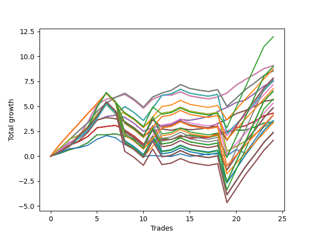

# Short Wallace Doodle 019 
- Symbol: AMZN_Unlimited
- Date Range: 03/23/2022 - 07/08/2022
- Trading Period: 7:20-12:30
- Number of Trades: 24



| Name | Win Percent | Profit | Avg Profit / Trade | Avg Time / Trade |      | Name | Win Percent | Profit | Avg Profit / Trade | Avg Time / Trade |
| ---- | ----------- | ------ | ------------------ | ---------------- | ---- | ---- | ----------- | ------ | ------------------ | ---------------- |
| Sorted By <br> Profit | | | | | | Sorted By <br> Win Percentage ||||
| Ninety-Seven | 62.50 | 5985.00 | 249.37 | 68:34 |     | Sixty-Six | 83.33 | 3746.75 | 156.11 | 23:23 |
| Sixty-Eight | 79.17 | 4541.00 | 189.21 | 28:44 |     | Fifty-Eight | 83.33 | 3746.75 | 156.11 | 23:23 |
| Sixty | 79.17 | 4541.00 | 189.21 | 28:44 |     | Fifty | 83.33 | 3746.75 | 156.11 | 23:23 |
| Fifty-Two | 79.17 | 4541.00 | 189.21 | 28:44 |     | Forty-Two | 83.33 | 3746.75 | 156.11 | 23:23 |
| Forty-Four | 79.17 | 4541.00 | 189.21 | 28:44 |     | Two | 83.33 | 3746.75 | 156.11 | 23:23 |
| Four | 79.17 | 4541.00 | 189.21 | 28:44 |     | Sixty-Five | 83.33 | 2155.75 | 89.82 | 15:46 |
| One Hundred Seven | 62.50 | 4497.25 | 187.39 | 71:17 |     | Fifty-Seven | 83.33 | 2155.75 | 89.82 | 15:46 |
| Ninety-Two | 62.50 | 4486.50 | 186.94 | 71:12 |     | Forty-Nine | 83.33 | 2155.75 | 89.82 | 15:46 |
| Ninety-Six | 66.67 | 4375.25 | 182.30 | 45:34 |     | Forty-One | 83.33 | 2155.75 | 89.82 | 15:46 |
| Sixty-Nine | 75.00 | 4274.50 | 178.10 | 39:31 |     | One | 83.33 | 2155.75 | 89.82 | 15:46 |
| Sixty-One | 75.00 | 4274.50 | 178.10 | 39:31 |     | Sixty-Eight | 79.17 | 4541.00 | 189.21 | 28:44 |
| Fifty-Three | 75.00 | 4274.50 | 178.10 | 39:31 |     | Sixty | 79.17 | 4541.00 | 189.21 | 28:44 |
| Forty-Five | 75.00 | 4274.50 | 178.10 | 39:31 |     | Fifty-Two | 79.17 | 4541.00 | 189.21 | 28:44 |
| Five | 75.00 | 4274.50 | 178.10 | 39:31 |     | Forty-Four | 79.17 | 4541.00 | 189.21 | 28:44 |
| One Hundred | 62.50 | 3913.25 | 163.05 | 87:21 |     | Four | 79.17 | 4541.00 | 189.21 | 28:44 |
| Ninety-Nine | 62.50 | 3913.25 | 163.05 | 87:21 |     | Sixty-Nine | 75.00 | 4274.50 | 178.10 | 39:31 |
| Ninety-Eight | 62.50 | 3913.25 | 163.05 | 87:21 |     | Sixty-One | 75.00 | 4274.50 | 178.10 | 39:31 |
| One Hundred Two | 62.50 | 3850.50 | 160.44 | 77:02 |     | Fifty-Three | 75.00 | 4274.50 | 178.10 | 39:31 |
| Seventy-One | 70.83 | 3781.00 | 157.54 | 58:03 |     | Forty-Five | 75.00 | 4274.50 | 178.10 | 39:31 |
| Sixty-Three | 70.83 | 3781.00 | 157.54 | 58:03 |     | Five | 75.00 | 4274.50 | 178.10 | 39:31 |
| Fifty-Five | 70.83 | 3781.00 | 157.54 | 58:03 |     | Sixty-Seven | 75.00 | 2823.25 | 117.64 | 20:39 |
| Forty-Seven | 70.83 | 3781.00 | 157.54 | 58:03 |     | Fifty-Nine | 75.00 | 2823.25 | 117.64 | 20:39 |
| Seven | 70.83 | 3781.00 | 157.54 | 58:03 |     | Fifty-One | 75.00 | 2823.25 | 117.64 | 20:39 |
| Sixty-Six | 83.33 | 3746.75 | 156.11 | 23:23 |     | Forty-Three | 75.00 | 2823.25 | 117.64 | 20:39 |
| Fifty-Eight | 83.33 | 3746.75 | 156.11 | 23:23 |     | Three | 75.00 | 2823.25 | 117.64 | 20:39 |
| Fifty | 83.33 | 3746.75 | 156.11 | 23:23 |     | Seventy-One | 70.83 | 3781.00 | 157.54 | 58:03 |
| Forty-Two | 83.33 | 3746.75 | 156.11 | 23:23 |     | Sixty-Three | 70.83 | 3781.00 | 157.54 | 58:03 |
| Two | 83.33 | 3746.75 | 156.11 | 23:23 |     | Fifty-Five | 70.83 | 3781.00 | 157.54 | 58:03 |
| Ninety-One | 66.67 | 3590.00 | 149.58 | 47:34 |     | Forty-Seven | 70.83 | 3781.00 | 157.54 | 58:03 |
| One Hundred Six | 66.67 | 3377.75 | 140.74 | 47:42 |     | Seven | 70.83 | 3781.00 | 157.54 | 58:03 |
| One Hundred Twenty-Seven | 62.50 | 3256.00 | 135.67 | 88:20 |     | Seventy | 70.83 | 1711.25 | 71.30 | 45:11 |
| One Hundred Twenty-Two | 62.50 | 3256.00 | 135.67 | 88:20 |     | Sixty-Two | 70.83 | 1711.25 | 71.30 | 45:11 |
| One Hundred Twelve | 62.50 | 3256.00 | 135.67 | 88:20 |     | Fifty-Four | 70.83 | 1711.25 | 71.30 | 45:11 |
| Eighty-Two | 62.50 | 3256.00 | 135.67 | 88:20 |     | Forty-Six | 70.83 | 1711.25 | 71.30 | 45:11 |
| One Hundred Seventeen | 62.50 | 2862.25 | 119.26 | 86:00 |     | Six | 70.83 | 1711.25 | 71.30 | 45:11 |
| Sixty-Seven | 75.00 | 2823.25 | 117.64 | 20:39 |     | Ninety-Six | 66.67 | 4375.25 | 182.30 | 45:34 |
| Fifty-Nine | 75.00 | 2823.25 | 117.64 | 20:39 |     | Ninety-One | 66.67 | 3590.00 | 149.58 | 47:34 |
| Fifty-One | 75.00 | 2823.25 | 117.64 | 20:39 |     | One Hundred Six | 66.67 | 3377.75 | 140.74 | 47:42 |
| Forty-Three | 75.00 | 2823.25 | 117.64 | 20:39 |     | One Hundred One | 66.67 | 2660.50 | 110.85 | 51:36 |
| Three | 75.00 | 2823.25 | 117.64 | 20:39 |     | One Hundred Twenty-Six | 66.67 | 2066.00 | 86.08 | 62:54 |
| One Hundred One | 66.67 | 2660.50 | 110.85 | 51:36 |     | One Hundred Twenty-One | 66.67 | 2066.00 | 86.08 | 62:54 |
| One Hundred Ten | 62.50 | 2425.50 | 101.06 | 90:03 |     | One Hundred Eleven | 66.67 | 2066.00 | 86.08 | 62:54 |
| One Hundred Nine | 62.50 | 2425.50 | 101.06 | 90:03 |     | Eighty-One | 66.67 | 2066.00 | 86.08 | 62:54 |
| One Hundred Eight | 62.50 | 2425.50 | 101.06 | 90:03 |     | Sixty-Four | 66.67 | 1709.00 | 71.21 | 11:04 |
| Ninety-Five | 62.50 | 2414.75 | 100.61 | 89:59 |     | Fifty-Six | 66.67 | 1709.00 | 71.21 | 11:04 |
| Ninety-Four | 62.50 | 2414.75 | 100.61 | 89:59 |     | Forty-Eight | 66.67 | 1709.00 | 71.21 | 11:04 |
| Ninety-Three | 62.50 | 2414.75 | 100.61 | 89:59 |     | Forty | 66.67 | 1709.00 | 71.21 | 11:04 |
| Sixty-Five | 83.33 | 2155.75 | 89.82 | 15:46 |     | Zero | 66.67 | 1709.00 | 71.21 | 11:04 |
| Fifty-Seven | 83.33 | 2155.75 | 89.82 | 15:46 |     | One Hundred Sixteen | 66.67 | 1672.25 | 69.68 | 60:34 |
| Forty-Nine | 83.33 | 2155.75 | 89.82 | 15:46 |     | Ninety-Seven | 62.50 | 5985.00 | 249.37 | 68:34 |
| Forty-One | 83.33 | 2155.75 | 89.82 | 15:46 |     | One Hundred Seven | 62.50 | 4497.25 | 187.39 | 71:17 |
| One | 83.33 | 2155.75 | 89.82 | 15:46 |     | Ninety-Two | 62.50 | 4486.50 | 186.94 | 71:12 |
| One Hundred Twenty-Six | 66.67 | 2066.00 | 86.08 | 62:54 |     | One Hundred | 62.50 | 3913.25 | 163.05 | 87:21 |
| One Hundred Twenty-One | 66.67 | 2066.00 | 86.08 | 62:54 |     | Ninety-Nine | 62.50 | 3913.25 | 163.05 | 87:21 |
| One Hundred Eleven | 66.67 | 2066.00 | 86.08 | 62:54 |     | Ninety-Eight | 62.50 | 3913.25 | 163.05 | 87:21 |
| Eighty-One | 66.67 | 2066.00 | 86.08 | 62:54 |     | One Hundred Two | 62.50 | 3850.50 | 160.44 | 77:02 |
| Seventy-Three | 62.50 | 2044.25 | 85.18 | 14:17 |     | One Hundred Twenty-Seven | 62.50 | 3256.00 | 135.67 | 88:20 |
| One Hundred Five | 62.50 | 1778.75 | 74.11 | 95:49 |     | One Hundred Twenty-Two | 62.50 | 3256.00 | 135.67 | 88:20 |
| One Hundred Four | 62.50 | 1778.75 | 74.11 | 95:49 |     | One Hundred Twelve | 62.50 | 3256.00 | 135.67 | 88:20 |
| One Hundred Three | 62.50 | 1778.75 | 74.11 | 95:49 |     | Eighty-Two | 62.50 | 3256.00 | 135.67 | 88:20 |
| Seventy | 70.83 | 1711.25 | 71.30 | 45:11 |     | One Hundred Seventeen | 62.50 | 2862.25 | 119.26 | 86:00 |
| Sixty-Two | 70.83 | 1711.25 | 71.30 | 45:11 |     | One Hundred Ten | 62.50 | 2425.50 | 101.06 | 90:03 |
| Fifty-Four | 70.83 | 1711.25 | 71.30 | 45:11 |     | One Hundred Nine | 62.50 | 2425.50 | 101.06 | 90:03 |
| Forty-Six | 70.83 | 1711.25 | 71.30 | 45:11 |     | One Hundred Eight | 62.50 | 2425.50 | 101.06 | 90:03 |
| Six | 70.83 | 1711.25 | 71.30 | 45:11 |     | Ninety-Five | 62.50 | 2414.75 | 100.61 | 89:59 |
| Sixty-Four | 66.67 | 1709.00 | 71.21 | 11:04 |     | Ninety-Four | 62.50 | 2414.75 | 100.61 | 89:59 |
| Fifty-Six | 66.67 | 1709.00 | 71.21 | 11:04 |     | Ninety-Three | 62.50 | 2414.75 | 100.61 | 89:59 |
| Forty-Eight | 66.67 | 1709.00 | 71.21 | 11:04 |     | Seventy-Three | 62.50 | 2044.25 | 85.18 | 14:17 |
| Forty | 66.67 | 1709.00 | 71.21 | 11:04 |     | One Hundred Five | 62.50 | 1778.75 | 74.11 | 95:49 |
| Zero | 66.67 | 1709.00 | 71.21 | 11:04 |     | One Hundred Four | 62.50 | 1778.75 | 74.11 | 95:49 |
| One Hundred Sixteen | 66.67 | 1672.25 | 69.68 | 60:34 |     | One Hundred Three | 62.50 | 1778.75 | 74.11 | 95:49 |
| One Hundred Thirty | 62.50 | 1184.25 | 49.34 | 107:07 |     | One Hundred Thirty | 62.50 | 1184.25 | 49.34 | 107:07 |
| One Hundred Twenty-Nine | 62.50 | 1184.25 | 49.34 | 107:07 |     | One Hundred Twenty-Nine | 62.50 | 1184.25 | 49.34 | 107:07 |
| One Hundred Twenty-Eight | 62.50 | 1184.25 | 49.34 | 107:07 |     | One Hundred Twenty-Eight | 62.50 | 1184.25 | 49.34 | 107:07 |
| One Hundred Twenty-Five | 62.50 | 1184.25 | 49.34 | 107:07 |     | One Hundred Twenty-Five | 62.50 | 1184.25 | 49.34 | 107:07 |
| One Hundred Twenty-Four | 62.50 | 1184.25 | 49.34 | 107:07 |     | One Hundred Twenty-Four | 62.50 | 1184.25 | 49.34 | 107:07 |
| One Hundred Twenty-Three | 62.50 | 1184.25 | 49.34 | 107:07 |     | One Hundred Twenty-Three | 62.50 | 1184.25 | 49.34 | 107:07 |
| One Hundred Fifteen | 62.50 | 1184.25 | 49.34 | 107:07 |     | One Hundred Fifteen | 62.50 | 1184.25 | 49.34 | 107:07 |
| One Hundred Fourteen | 62.50 | 1184.25 | 49.34 | 107:07 |     | One Hundred Fourteen | 62.50 | 1184.25 | 49.34 | 107:07 |
| One Hundred Thirteen | 62.50 | 1184.25 | 49.34 | 107:07 |     | One Hundred Thirteen | 62.50 | 1184.25 | 49.34 | 107:07 |
| Eighty-Five | 62.50 | 1184.25 | 49.34 | 107:07 |     | Eighty-Five | 62.50 | 1184.25 | 49.34 | 107:07 |
| Eighty-Four | 62.50 | 1184.25 | 49.34 | 107:07 |     | Eighty-Four | 62.50 | 1184.25 | 49.34 | 107:07 |
| Eighty-Three | 62.50 | 1184.25 | 49.34 | 107:07 |     | Eighty-Three | 62.50 | 1184.25 | 49.34 | 107:07 |
| One Hundred Twenty | 62.50 | 790.50 | 32.94 | 104:47 |     | One Hundred Twenty | 62.50 | 790.50 | 32.94 | 104:47 |
| One Hundred Ninteen | 62.50 | 790.50 | 32.94 | 104:47 |     | One Hundred Ninteen | 62.50 | 790.50 | 32.94 | 104:47 |
| One Hundred Eighteen | 62.50 | 790.50 | 32.94 | 104:47 |     | One Hundred Eighteen | 62.50 | 790.50 | 32.94 | 104:47 |

## NO STOPLOSS

### Test Zero
* Sell when price hits the middle line of the 20p bollinger
* No Stoploss
* Results:
```
Total Trades: 24
Percent Up: 33.33
Percent Down: 66.67
Total Points Moved Down: 3.42
Potential Profit: 1709.00
Total Points Ups: 1.33 Count Ups: 8
Total Points Downs: 4.75 Count Downs: 16
```

<details><summary>Trades</summary>

<code>In: 2022-03-25 11:57:00		Out: 2022-03-25 12:01:25		Total Position Time: 04:25		Total Move Down: 0.28		Total to Date: 0.28</code> <br />
<code>In: 2022-03-25 11:59:00		Out: 2022-03-25 12:01:25		Total Position Time: 02:25		Total Move Down: 0.35		Total to Date: 0.63</code> <br />
<code>In: 2022-03-31 12:04:00		Out: 2022-03-31 12:11:10		Total Position Time: 07:10		Total Move Down: 0.26		Total to Date: 0.89</code> <br />
<code>In: 2022-04-06 12:02:00		Out: 2022-04-06 12:13:35		Total Position Time: 11:35		Total Move Down: 0.45		Total to Date: 1.34</code> <br />
<code>In: 2022-04-06 12:04:00		Out: 2022-04-06 12:13:35		Total Position Time: 09:35		Total Move Down: 0.80		Total to Date: 2.14</code> <br />
<code>In: 2022-04-18 11:27:00		Out: 2022-04-18 11:43:15		Total Position Time: 16:15		Total Move Down: -0.00		Total to Date: 2.14</code> <br />
<code>In: 2022-04-25 11:22:00		Out: 2022-04-25 11:36:20		Total Position Time: 14:20		Total Move Down: 0.10		Total to Date: 2.24</code> <br />
<code>In: 2022-04-28 08:00:00		Out: 2022-04-28 08:17:00		Total Position Time: 17:00		Total Move Down: -0.25		Total to Date: 1.99</code> <br />
<code>In: 2022-05-02 12:25:00		Out: 2022-05-02 12:44:45		Total Position Time: 19:45		Total Move Down: -0.29		Total to Date: 1.70</code> <br />
<code>In: 2022-05-02 12:29:00		Out: 2022-05-02 12:44:45		Total Position Time: 15:45		Total Move Down: -0.48		Total to Date: 1.22</code> <br />
<code>In: 2022-05-03 08:10:00		Out: 2022-05-03 08:17:15		Total Position Time: 07:15		Total Move Down: 0.44		Total to Date: 1.66</code> <br />
<code>In: 2022-05-17 10:20:00		Out: 2022-05-17 10:35:25		Total Position Time: 15:25		Total Move Down: 0.09		Total to Date: 1.76</code> <br />
<code>In: 2022-05-23 11:13:00		Out: 2022-05-23 11:27:10		Total Position Time: 14:10		Total Move Down: -0.07		Total to Date: 1.68</code> <br />
<code>In: 2022-05-23 11:15:00		Out: 2022-05-23 11:27:10		Total Position Time: 12:10		Total Move Down: 0.24		Total to Date: 1.92</code> <br />
<code>In: 2022-05-27 11:59:00		Out: 2022-05-27 12:03:15		Total Position Time: 04:15		Total Move Down: 0.19		Total to Date: 2.11</code> <br />
<code>In: 2022-05-27 12:07:00		Out: 2022-05-27 12:33:45		Total Position Time: 26:45		Total Move Down: -0.13		Total to Date: 1.98</code> <br />
<code>In: 2022-05-27 12:08:00		Out: 2022-05-27 12:33:45		Total Position Time: 25:45		Total Move Down: -0.10		Total to Date: 1.87</code> <br />
<code>In: 2022-05-27 12:26:00		Out: 2022-05-27 12:33:45		Total Position Time: 07:45		Total Move Down: 0.22		Total to Date: 2.09</code> <br />
<code>In: 2022-05-31 07:45:00		Out: 2022-05-31 07:58:15		Total Position Time: 13:15		Total Move Down: 0.28		Total to Date: 2.37</code> <br />
<code>In: 2022-06-14 09:00:00		Out: 2022-06-14 09:02:15		Total Position Time: 02:15		Total Move Down: 0.24		Total to Date: 2.61</code> <br />
<code>In: 2022-06-14 10:12:00		Out: 2022-06-14 10:25:20		Total Position Time: 13:20		Total Move Down: -0.00		Total to Date: 2.61</code> <br />
<code>In: 2022-06-16 10:30:00		Out: 2022-06-16 10:32:10		Total Position Time: 02:10		Total Move Down: 0.32		Total to Date: 2.93</code> <br />
<code>In: 2022-06-16 10:31:00		Out: 2022-06-16 10:32:10		Total Position Time: 01:10		Total Move Down: 0.39		Total to Date: 3.32</code> <br />
<code>In: 2022-06-16 10:32:00		Out: 2022-06-16 10:33:45		Total Position Time: 01:45		Total Move Down: 0.10		Total to Date: 3.42</code> <br />


</details>

### Test One
* Sell when the price hits the upper line of the 20p 1std bollinger
* No Stoploss
* Results:
```
Total Trades: 24
Percent Up: 16.67
Percent Down: 83.33
Total Points Moved Down: 4.31
Potential Profit: 2155.75
Total Points Ups: 2.08 Count Ups: 4
Total Points Downs: 6.39 Count Downs: 20
```

<details><summary>Trades</summary>

<code>In: 2022-03-25 11:57:00		Out: 2022-03-25 12:02:10		Total Position Time: 05:10		Total Move Down: 0.51		Total to Date: 0.51</code> <br />
<code>In: 2022-03-25 11:59:00		Out: 2022-03-25 12:02:10		Total Position Time: 03:10		Total Move Down: 0.58		Total to Date: 1.09</code> <br />
<code>In: 2022-03-31 12:04:00		Out: 2022-03-31 12:16:25		Total Position Time: 12:25		Total Move Down: 0.35		Total to Date: 1.44</code> <br />
<code>In: 2022-04-06 12:02:00		Out: 2022-04-06 12:17:55		Total Position Time: 15:55		Total Move Down: 0.53		Total to Date: 1.97</code> <br />
<code>In: 2022-04-06 12:04:00		Out: 2022-04-06 12:17:55		Total Position Time: 13:55		Total Move Down: 0.88		Total to Date: 2.84</code> <br />
<code>In: 2022-04-18 11:27:00		Out: 2022-04-18 11:46:40		Total Position Time: 19:40		Total Move Down: 0.13		Total to Date: 2.97</code> <br />
<code>In: 2022-04-25 11:22:00		Out: 2022-04-25 11:40:05		Total Position Time: 18:05		Total Move Down: 0.11		Total to Date: 3.09</code> <br />
<code>In: 2022-04-28 08:00:00		Out: 2022-04-28 08:29:30		Total Position Time: 29:30		Total Move Down: -0.48		Total to Date: 2.61</code> <br />
<code>In: 2022-05-02 12:25:00		Out: 2022-05-02 12:47:00		Total Position Time: 22:00		Total Move Down: -0.60		Total to Date: 2.00</code> <br />
<code>In: 2022-05-02 12:29:00		Out: 2022-05-02 12:47:00		Total Position Time: 18:00		Total Move Down: -0.79		Total to Date: 1.21</code> <br />
<code>In: 2022-05-03 08:10:00		Out: 2022-05-03 08:27:05		Total Position Time: 17:05		Total Move Down: 0.28		Total to Date: 1.49</code> <br />
<code>In: 2022-05-17 10:20:00		Out: 2022-05-17 10:37:15		Total Position Time: 17:15		Total Move Down: 0.13		Total to Date: 1.62</code> <br />
<code>In: 2022-05-23 11:13:00		Out: 2022-05-23 11:29:25		Total Position Time: 16:25		Total Move Down: 0.05		Total to Date: 1.67</code> <br />
<code>In: 2022-05-23 11:15:00		Out: 2022-05-23 11:29:25		Total Position Time: 14:25		Total Move Down: 0.36		Total to Date: 2.03</code> <br />
<code>In: 2022-05-27 11:59:00		Out: 2022-05-27 12:35:05		Total Position Time: 36:05		Total Move Down: -0.21		Total to Date: 1.82</code> <br />
<code>In: 2022-05-27 12:07:00		Out: 2022-05-27 12:35:05		Total Position Time: 28:05		Total Move Down: 0.02		Total to Date: 1.85</code> <br />
<code>In: 2022-05-27 12:08:00		Out: 2022-05-27 12:35:05		Total Position Time: 27:05		Total Move Down: 0.05		Total to Date: 1.90</code> <br />
<code>In: 2022-05-27 12:26:00		Out: 2022-05-27 12:35:05		Total Position Time: 09:05		Total Move Down: 0.37		Total to Date: 2.27</code> <br />
<code>In: 2022-05-31 07:45:00		Out: 2022-05-31 08:08:20		Total Position Time: 23:20		Total Move Down: 0.20		Total to Date: 2.47</code> <br />
<code>In: 2022-06-14 09:00:00		Out: 2022-06-14 09:04:05		Total Position Time: 04:05		Total Move Down: 0.38		Total to Date: 2.85</code> <br />
<code>In: 2022-06-14 10:12:00		Out: 2022-06-14 10:26:40		Total Position Time: 14:40		Total Move Down: 0.19		Total to Date: 3.04</code> <br />
<code>In: 2022-06-16 10:30:00		Out: 2022-06-16 10:35:20		Total Position Time: 05:20		Total Move Down: 0.47		Total to Date: 3.51</code> <br />
<code>In: 2022-06-16 10:31:00		Out: 2022-06-16 10:35:20		Total Position Time: 04:20		Total Move Down: 0.54		Total to Date: 4.05</code> <br />
<code>In: 2022-06-16 10:32:00		Out: 2022-06-16 10:35:20		Total Position Time: 03:20		Total Move Down: 0.26		Total to Date: 4.31</code> <br />


</details>

### Test Two
* Sell when the price hits the upper line of the 20p 2std bollinger
* No Stoploss
* Results:
```
Total Trades: 24
Percent Up: 16.67
Percent Down: 83.33
Total Points Moved Down: 7.49
Potential Profit: 3746.75
Total Points Ups: 1.68 Count Ups: 4
Total Points Downs: 9.17 Count Downs: 20
```

<details><summary>Trades</summary>

<code>In: 2022-03-25 11:57:00		Out: 2022-03-25 12:21:05		Total Position Time: 24:05		Total Move Down: 0.64		Total to Date: 0.64</code> <br />
<code>In: 2022-03-25 11:59:00		Out: 2022-03-25 12:21:05		Total Position Time: 22:05		Total Move Down: 0.71		Total to Date: 1.36</code> <br />
<code>In: 2022-03-31 12:04:00		Out: 2022-03-31 12:20:05		Total Position Time: 16:05		Total Move Down: 0.41		Total to Date: 1.77</code> <br />
<code>In: 2022-04-06 12:02:00		Out: 2022-04-06 12:20:15		Total Position Time: 18:15		Total Move Down: 0.74		Total to Date: 2.50</code> <br />
<code>In: 2022-04-06 12:04:00		Out: 2022-04-06 12:20:15		Total Position Time: 16:15		Total Move Down: 1.09		Total to Date: 3.59</code> <br />
<code>In: 2022-04-18 11:27:00		Out: 2022-04-18 11:55:35		Total Position Time: 28:35		Total Move Down: 0.37		Total to Date: 3.97</code> <br />
<code>In: 2022-04-25 11:22:00		Out: 2022-04-25 11:42:30		Total Position Time: 20:30		Total Move Down: 0.14		Total to Date: 4.11</code> <br />
<code>In: 2022-04-28 08:00:00		Out: 2022-04-28 08:35:55		Total Position Time: 35:55		Total Move Down: -0.22		Total to Date: 3.89</code> <br />
<code>In: 2022-05-02 12:25:00		Out: 2022-05-02 12:47:00		Total Position Time: 22:00		Total Move Down: -0.60		Total to Date: 3.28</code> <br />
<code>In: 2022-05-02 12:29:00		Out: 2022-05-02 12:47:00		Total Position Time: 18:00		Total Move Down: -0.79		Total to Date: 2.49</code> <br />
<code>In: 2022-05-03 08:10:00		Out: 2022-05-03 08:35:10		Total Position Time: 25:10		Total Move Down: 0.38		Total to Date: 2.87</code> <br />
<code>In: 2022-05-17 10:20:00		Out: 2022-05-17 10:47:00		Total Position Time: 27:00		Total Move Down: 0.20		Total to Date: 3.08</code> <br />
<code>In: 2022-05-23 11:13:00		Out: 2022-05-23 12:12:35		Total Position Time: 59:35		Total Move Down: 0.14		Total to Date: 3.21</code> <br />
<code>In: 2022-05-23 11:15:00		Out: 2022-05-23 12:12:35		Total Position Time: 57:35		Total Move Down: 0.45		Total to Date: 3.66</code> <br />
<code>In: 2022-05-27 11:59:00		Out: 2022-05-27 12:37:00		Total Position Time: 38:00		Total Move Down: -0.06		Total to Date: 3.60</code> <br />
<code>In: 2022-05-27 12:07:00		Out: 2022-05-27 12:37:00		Total Position Time: 30:00		Total Move Down: 0.17		Total to Date: 3.77</code> <br />
<code>In: 2022-05-27 12:08:00		Out: 2022-05-27 12:37:00		Total Position Time: 29:00		Total Move Down: 0.20		Total to Date: 3.96</code> <br />
<code>In: 2022-05-27 12:26:00		Out: 2022-05-27 12:37:00		Total Position Time: 11:00		Total Move Down: 0.52		Total to Date: 4.48</code> <br />
<code>In: 2022-05-31 07:45:00		Out: 2022-05-31 08:08:45		Total Position Time: 23:45		Total Move Down: 0.41		Total to Date: 4.88</code> <br />
<code>In: 2022-06-14 09:00:00		Out: 2022-06-14 09:05:15		Total Position Time: 05:15		Total Move Down: 0.49		Total to Date: 5.37</code> <br />
<code>In: 2022-06-14 10:12:00		Out: 2022-06-14 10:29:40		Total Position Time: 17:40		Total Move Down: 0.25		Total to Date: 5.62</code> <br />
<code>In: 2022-06-16 10:30:00		Out: 2022-06-16 10:36:10		Total Position Time: 06:10		Total Move Down: 0.67		Total to Date: 6.29</code> <br />
<code>In: 2022-06-16 10:31:00		Out: 2022-06-16 10:36:10		Total Position Time: 05:10		Total Move Down: 0.74		Total to Date: 7.03</code> <br />
<code>In: 2022-06-16 10:32:00		Out: 2022-06-16 10:36:10		Total Position Time: 04:10		Total Move Down: 0.46		Total to Date: 7.49</code> <br />


</details>

### Test Three
* Sell when price hits the middle line of the 50p bollinger
* No Stoploss
* Results:
```
Total Trades: 24
Percent Up: 25.00
Percent Down: 75.00
Total Points Moved Down: 5.65
Potential Profit: 2823.25
Total Points Ups: 2.08 Count Ups: 6
Total Points Downs: 7.72 Count Downs: 18
```

<details><summary>Trades</summary>

<code>In: 2022-03-25 11:57:00		Out: 2022-03-25 12:02:10		Total Position Time: 05:10		Total Move Down: 0.51		Total to Date: 0.51</code> <br />
<code>In: 2022-03-25 11:59:00		Out: 2022-03-25 12:02:10		Total Position Time: 03:10		Total Move Down: 0.58		Total to Date: 1.09</code> <br />
<code>In: 2022-03-31 12:04:00		Out: 2022-03-31 12:20:05		Total Position Time: 16:05		Total Move Down: 0.41		Total to Date: 1.50</code> <br />
<code>In: 2022-04-06 12:02:00		Out: 2022-04-06 12:20:35		Total Position Time: 18:35		Total Move Down: 0.89		Total to Date: 2.38</code> <br />
<code>In: 2022-04-06 12:04:00		Out: 2022-04-06 12:20:35		Total Position Time: 16:35		Total Move Down: 1.24		Total to Date: 3.62</code> <br />
<code>In: 2022-04-18 11:27:00		Out: 2022-04-18 11:46:55		Total Position Time: 19:55		Total Move Down: 0.25		Total to Date: 3.87</code> <br />
<code>In: 2022-04-25 11:22:00		Out: 2022-04-25 12:01:20		Total Position Time: 39:20		Total Move Down: -0.12		Total to Date: 3.75</code> <br />
<code>In: 2022-04-28 08:00:00		Out: 2022-04-28 08:36:05		Total Position Time: 36:05		Total Move Down: -0.30		Total to Date: 3.45</code> <br />
<code>In: 2022-05-02 12:25:00		Out: 2022-05-02 12:47:00		Total Position Time: 22:00		Total Move Down: -0.60		Total to Date: 2.85</code> <br />
<code>In: 2022-05-02 12:29:00		Out: 2022-05-02 12:47:00		Total Position Time: 18:00		Total Move Down: -0.79		Total to Date: 2.06</code> <br />
<code>In: 2022-05-03 08:10:00		Out: 2022-05-03 08:35:20		Total Position Time: 25:20		Total Move Down: 0.47		Total to Date: 2.52</code> <br />
<code>In: 2022-05-17 10:20:00		Out: 2022-05-17 10:59:50		Total Position Time: 39:50		Total Move Down: 0.19		Total to Date: 2.71</code> <br />
<code>In: 2022-05-23 11:13:00		Out: 2022-05-23 11:51:45		Total Position Time: 38:45		Total Move Down: -0.12		Total to Date: 2.60</code> <br />
<code>In: 2022-05-23 11:15:00		Out: 2022-05-23 11:51:45		Total Position Time: 36:45		Total Move Down: 0.19		Total to Date: 2.79</code> <br />
<code>In: 2022-05-27 11:59:00		Out: 2022-05-27 12:36:45		Total Position Time: 37:45		Total Move Down: -0.15		Total to Date: 2.64</code> <br />
<code>In: 2022-05-27 12:07:00		Out: 2022-05-27 12:36:45		Total Position Time: 29:45		Total Move Down: 0.08		Total to Date: 2.73</code> <br />
<code>In: 2022-05-27 12:08:00		Out: 2022-05-27 12:36:45		Total Position Time: 28:45		Total Move Down: 0.11		Total to Date: 2.84</code> <br />
<code>In: 2022-05-27 12:26:00		Out: 2022-05-27 12:36:45		Total Position Time: 10:45		Total Move Down: 0.43		Total to Date: 3.27</code> <br />
<code>In: 2022-05-31 07:45:00		Out: 2022-05-31 08:08:45		Total Position Time: 23:45		Total Move Down: 0.41		Total to Date: 3.68</code> <br />
<code>In: 2022-06-14 09:00:00		Out: 2022-06-14 09:06:20		Total Position Time: 06:20		Total Move Down: 0.59		Total to Date: 4.27</code> <br />
<code>In: 2022-06-14 10:12:00		Out: 2022-06-14 10:29:45		Total Position Time: 17:45		Total Move Down: 0.31		Total to Date: 4.58</code> <br />
<code>In: 2022-06-16 10:30:00		Out: 2022-06-16 10:32:15		Total Position Time: 02:15		Total Move Down: 0.42		Total to Date: 5.00</code> <br />
<code>In: 2022-06-16 10:31:00		Out: 2022-06-16 10:32:15		Total Position Time: 01:15		Total Move Down: 0.49		Total to Date: 5.49</code> <br />
<code>In: 2022-06-16 10:32:00		Out: 2022-06-16 10:34:00		Total Position Time: 02:00		Total Move Down: 0.16		Total to Date: 5.65</code> <br />


</details>

### Test Four
* Sell when the price hits the upper line of the 50p 1std bollinger
* No Stoploss
* Results:
```
Total Trades: 24
Percent Up: 20.83
Percent Down: 79.17
Total Points Moved Down: 9.08
Potential Profit: 4541.00
Total Points Ups: 2.09 Count Ups: 5
Total Points Downs: 11.18 Count Downs: 19
```

<details><summary>Trades</summary>

<code>In: 2022-03-25 11:57:00		Out: 2022-03-25 12:20:30		Total Position Time: 23:30		Total Move Down: 0.61		Total to Date: 0.61</code> <br />
<code>In: 2022-03-25 11:59:00		Out: 2022-03-25 12:20:30		Total Position Time: 21:30		Total Move Down: 0.68		Total to Date: 1.28</code> <br />
<code>In: 2022-03-31 12:04:00		Out: 2022-03-31 12:21:35		Total Position Time: 17:35		Total Move Down: 0.65		Total to Date: 1.93</code> <br />
<code>In: 2022-04-06 12:02:00		Out: 2022-04-06 12:30:30		Total Position Time: 28:30		Total Move Down: 1.46		Total to Date: 3.39</code> <br />
<code>In: 2022-04-06 12:04:00		Out: 2022-04-06 12:30:30		Total Position Time: 26:30		Total Move Down: 1.81		Total to Date: 5.20</code> <br />
<code>In: 2022-04-18 11:27:00		Out: 2022-04-18 12:02:40		Total Position Time: 35:40		Total Move Down: 0.50		Total to Date: 5.70</code> <br />
<code>In: 2022-04-25 11:22:00		Out: 2022-04-25 12:03:05		Total Position Time: 41:05		Total Move Down: 0.20		Total to Date: 5.90</code> <br />
<code>In: 2022-04-28 08:00:00		Out: 2022-04-28 08:39:35		Total Position Time: 39:35		Total Move Down: 0.30		Total to Date: 6.20</code> <br />
<code>In: 2022-05-02 12:25:00		Out: 2022-05-02 12:47:00		Total Position Time: 22:00		Total Move Down: -0.60		Total to Date: 5.60</code> <br />
<code>In: 2022-05-02 12:29:00		Out: 2022-05-02 12:47:00		Total Position Time: 18:00		Total Move Down: -0.79		Total to Date: 4.81</code> <br />
<code>In: 2022-05-03 08:10:00		Out: 2022-05-03 08:38:50		Total Position Time: 28:50		Total Move Down: 0.91		Total to Date: 5.72</code> <br />
<code>In: 2022-05-17 10:20:00		Out: 2022-05-17 11:02:15		Total Position Time: 42:15		Total Move Down: 0.38		Total to Date: 6.09</code> <br />
<code>In: 2022-05-23 11:13:00		Out: 2022-05-23 12:03:55		Total Position Time: 50:55		Total Move Down: 0.02		Total to Date: 6.11</code> <br />
<code>In: 2022-05-23 11:15:00		Out: 2022-05-23 12:03:55		Total Position Time: 48:55		Total Move Down: 0.33		Total to Date: 6.44</code> <br />
<code>In: 2022-05-27 11:59:00		Out: 2022-05-27 12:47:00		Total Position Time: 48:00		Total Move Down: -0.40		Total to Date: 6.05</code> <br />
<code>In: 2022-05-27 12:07:00		Out: 2022-05-27 12:47:00		Total Position Time: 40:00		Total Move Down: -0.17		Total to Date: 5.88</code> <br />
<code>In: 2022-05-27 12:08:00		Out: 2022-05-27 12:47:00		Total Position Time: 39:00		Total Move Down: -0.14		Total to Date: 5.74</code> <br />
<code>In: 2022-05-27 12:26:00		Out: 2022-05-27 12:47:00		Total Position Time: 21:00		Total Move Down: 0.18		Total to Date: 5.92</code> <br />
<code>In: 2022-05-31 07:45:00		Out: 2022-05-31 08:31:10		Total Position Time: 46:10		Total Move Down: 0.41		Total to Date: 6.33</code> <br />
<code>In: 2022-06-14 09:00:00		Out: 2022-06-14 09:15:20		Total Position Time: 15:20		Total Move Down: 0.78		Total to Date: 7.11</code> <br />
<code>In: 2022-06-14 10:12:00		Out: 2022-06-14 10:34:05		Total Position Time: 22:05		Total Move Down: 0.58		Total to Date: 7.69</code> <br />
<code>In: 2022-06-16 10:30:00		Out: 2022-06-16 10:35:30		Total Position Time: 05:30		Total Move Down: 0.51		Total to Date: 8.20</code> <br />
<code>In: 2022-06-16 10:31:00		Out: 2022-06-16 10:35:30		Total Position Time: 04:30		Total Move Down: 0.58		Total to Date: 8.78</code> <br />
<code>In: 2022-06-16 10:32:00		Out: 2022-06-16 10:35:30		Total Position Time: 03:30		Total Move Down: 0.30		Total to Date: 9.08</code> <br />


</details>

### Test Five
* Sell when the price hits the upper line of the 50p 2std bollinger
* No Stoploss
* Results:
```
Total Trades: 24
Percent Up: 25.00
Percent Down: 75.00
Total Points Moved Down: 8.55
Potential Profit: 4274.50
Total Points Ups: 3.76 Count Ups: 6
Total Points Downs: 12.31 Count Downs: 18
```

<details><summary>Trades</summary>

<code>In: 2022-03-25 11:57:00		Out: 2022-03-25 12:21:40		Total Position Time: 24:40		Total Move Down: 0.78		Total to Date: 0.78</code> <br />
<code>In: 2022-03-25 11:59:00		Out: 2022-03-25 12:21:40		Total Position Time: 22:40		Total Move Down: 0.85		Total to Date: 1.62</code> <br />
<code>In: 2022-03-31 12:04:00		Out: 2022-03-31 12:27:25		Total Position Time: 23:25		Total Move Down: 0.90		Total to Date: 2.52</code> <br />
<code>In: 2022-04-06 12:02:00		Out: 2022-04-06 12:47:00		Total Position Time: 45:00		Total Move Down: 0.81		Total to Date: 3.33</code> <br />
<code>In: 2022-04-06 12:04:00		Out: 2022-04-06 12:47:00		Total Position Time: 43:00		Total Move Down: 1.16		Total to Date: 4.49</code> <br />
<code>In: 2022-04-18 11:27:00		Out: 2022-04-18 12:25:05		Total Position Time: 58:05		Total Move Down: 0.81		Total to Date: 5.30</code> <br />
<code>In: 2022-04-25 11:22:00		Out: 2022-04-25 12:04:20		Total Position Time: 42:20		Total Move Down: 0.60		Total to Date: 5.90</code> <br />
<code>In: 2022-04-28 08:00:00		Out: 2022-04-28 08:46:10		Total Position Time: 46:10		Total Move Down: 0.40		Total to Date: 6.30</code> <br />
<code>In: 2022-05-02 12:25:00		Out: 2022-05-02 12:47:00		Total Position Time: 22:00		Total Move Down: -0.60		Total to Date: 5.70</code> <br />
<code>In: 2022-05-02 12:29:00		Out: 2022-05-02 12:47:00		Total Position Time: 18:00		Total Move Down: -0.79		Total to Date: 4.91</code> <br />
<code>In: 2022-05-03 08:10:00		Out: 2022-05-03 08:51:20		Total Position Time: 41:20		Total Move Down: 1.02		Total to Date: 5.93</code> <br />
<code>In: 2022-05-17 10:20:00		Out: 2022-05-17 11:13:15		Total Position Time: 53:15		Total Move Down: 0.39		Total to Date: 6.32</code> <br />
<code>In: 2022-05-23 11:13:00		Out: 2022-05-23 12:13:15		Total Position Time: 60:15		Total Move Down: 0.27		Total to Date: 6.60</code> <br />
<code>In: 2022-05-23 11:15:00		Out: 2022-05-23 12:13:15		Total Position Time: 58:15		Total Move Down: 0.58		Total to Date: 7.18</code> <br />
<code>In: 2022-05-27 11:59:00		Out: 2022-05-27 12:47:00		Total Position Time: 48:00		Total Move Down: -0.40		Total to Date: 6.79</code> <br />
<code>In: 2022-05-27 12:07:00		Out: 2022-05-27 12:47:00		Total Position Time: 40:00		Total Move Down: -0.17		Total to Date: 6.62</code> <br />
<code>In: 2022-05-27 12:08:00		Out: 2022-05-27 12:47:00		Total Position Time: 39:00		Total Move Down: -0.14		Total to Date: 6.48</code> <br />
<code>In: 2022-05-27 12:26:00		Out: 2022-05-27 12:47:00		Total Position Time: 21:00		Total Move Down: 0.18		Total to Date: 6.66</code> <br />
<code>In: 2022-05-31 07:45:00		Out: 2022-05-31 10:29:05		Total Position Time: 164:05		Total Move Down: -1.66		Total to Date: 5.00</code> <br />
<code>In: 2022-06-14 09:00:00		Out: 2022-06-14 09:35:00		Total Position Time: 35:00		Total Move Down: 0.80		Total to Date: 5.80</code> <br />
<code>In: 2022-06-14 10:12:00		Out: 2022-06-14 10:39:45		Total Position Time: 27:45		Total Move Down: 0.88		Total to Date: 6.68</code> <br />
<code>In: 2022-06-16 10:30:00		Out: 2022-06-16 10:36:10		Total Position Time: 06:10		Total Move Down: 0.67		Total to Date: 7.35</code> <br />
<code>In: 2022-06-16 10:31:00		Out: 2022-06-16 10:36:10		Total Position Time: 05:10		Total Move Down: 0.74		Total to Date: 8.09</code> <br />
<code>In: 2022-06-16 10:32:00		Out: 2022-06-16 10:36:10		Total Position Time: 04:10		Total Move Down: 0.46		Total to Date: 8.55</code> <br />


</details>

### Test Six
* Sell when the price hits the middle line of the 1std VWAP
* No Stoploss
* Results:
```
Total Trades: 24
Percent Up: 29.17
Percent Down: 70.83
Total Points Moved Down: 3.42
Potential Profit: 1711.25
Total Points Ups: 6.94 Count Ups: 7
Total Points Downs: 10.37 Count Downs: 17
```

<details><summary>Trades</summary>

<code>In: 2022-03-25 11:57:00		Out: 2022-03-25 12:21:45		Total Position Time: 24:45		Total Move Down: 0.80		Total to Date: 0.80</code> <br />
<code>In: 2022-03-25 11:59:00		Out: 2022-03-25 12:21:45		Total Position Time: 22:45		Total Move Down: 0.87		Total to Date: 1.67</code> <br />
<code>In: 2022-03-31 12:04:00		Out: 2022-03-31 12:20:05		Total Position Time: 16:05		Total Move Down: 0.41		Total to Date: 2.08</code> <br />
<code>In: 2022-04-06 12:02:00		Out: 2022-04-06 12:20:25		Total Position Time: 18:25		Total Move Down: 0.88		Total to Date: 2.96</code> <br />
<code>In: 2022-04-06 12:04:00		Out: 2022-04-06 12:20:25		Total Position Time: 16:25		Total Move Down: 1.23		Total to Date: 4.19</code> <br />
<code>In: 2022-04-18 11:27:00		Out: 2022-04-18 12:30:40		Total Position Time: 63:40		Total Move Down: 0.99		Total to Date: 5.17</code> <br />
<code>In: 2022-04-25 11:22:00		Out: 2022-04-25 12:47:00		Total Position Time: 85:00		Total Move Down: -0.94		Total to Date: 4.23</code> <br />
<code>In: 2022-04-28 08:00:00		Out: 2022-04-28 08:37:50		Total Position Time: 37:50		Total Move Down: 0.12		Total to Date: 4.35</code> <br />
<code>In: 2022-05-02 12:25:00		Out: 2022-05-02 12:47:00		Total Position Time: 22:00		Total Move Down: -0.60		Total to Date: 3.75</code> <br />
<code>In: 2022-05-02 12:29:00		Out: 2022-05-02 12:47:00		Total Position Time: 18:00		Total Move Down: -0.79		Total to Date: 2.96</code> <br />
<code>In: 2022-05-03 08:10:00		Out: 2022-05-03 08:38:05		Total Position Time: 28:05		Total Move Down: 0.64		Total to Date: 3.60</code> <br />
<code>In: 2022-05-17 10:20:00		Out: 2022-05-17 11:14:00		Total Position Time: 54:00		Total Move Down: 0.71		Total to Date: 4.30</code> <br />
<code>In: 2022-05-23 11:13:00		Out: 2022-05-23 12:47:00		Total Position Time: 94:00		Total Move Down: 0.15		Total to Date: 4.46</code> <br />
<code>In: 2022-05-23 11:15:00		Out: 2022-05-23 12:47:00		Total Position Time: 92:00		Total Move Down: 0.46		Total to Date: 4.92</code> <br />
<code>In: 2022-05-27 11:59:00		Out: 2022-05-27 12:47:00		Total Position Time: 48:00		Total Move Down: -0.40		Total to Date: 4.52</code> <br />
<code>In: 2022-05-27 12:07:00		Out: 2022-05-27 12:47:00		Total Position Time: 40:00		Total Move Down: -0.17		Total to Date: 4.36</code> <br />
<code>In: 2022-05-27 12:08:00		Out: 2022-05-27 12:47:00		Total Position Time: 39:00		Total Move Down: -0.14		Total to Date: 4.22</code> <br />
<code>In: 2022-05-27 12:26:00		Out: 2022-05-27 12:47:00		Total Position Time: 21:00		Total Move Down: 0.18		Total to Date: 4.40</code> <br />
<code>In: 2022-05-31 07:45:00		Out: 2022-05-31 12:47:00		Total Position Time: 302:00		Total Move Down: -3.91		Total to Date: 0.49</code> <br />
<code>In: 2022-06-14 09:00:00		Out: 2022-06-14 09:04:25		Total Position Time: 04:25		Total Move Down: 0.49		Total to Date: 0.98</code> <br />
<code>In: 2022-06-14 10:12:00		Out: 2022-06-14 10:32:30		Total Position Time: 20:30		Total Move Down: 0.51		Total to Date: 1.49</code> <br />
<code>In: 2022-06-16 10:30:00		Out: 2022-06-16 10:36:30		Total Position Time: 06:30		Total Move Down: 0.69		Total to Date: 2.18</code> <br />
<code>In: 2022-06-16 10:31:00		Out: 2022-06-16 10:36:30		Total Position Time: 05:30		Total Move Down: 0.76		Total to Date: 2.94</code> <br />
<code>In: 2022-06-16 10:32:00		Out: 2022-06-16 10:36:30		Total Position Time: 04:30		Total Move Down: 0.48		Total to Date: 3.42</code> <br />


</details>

### Test Seven
* Sell when the price hits the upper line of the 1std VWAP
* No Stoploss
* Results:
```
Total Trades: 24
Percent Up: 29.17
Percent Down: 70.83
Total Points Moved Down: 7.56
Potential Profit: 3781.00
Total Points Ups: 6.94 Count Ups: 7
Total Points Downs: 14.50 Count Downs: 17
```

<details><summary>Trades</summary>

<code>In: 2022-03-25 11:57:00		Out: 2022-03-25 12:47:00		Total Position Time: 50:00		Total Move Down: 0.45		Total to Date: 0.45</code> <br />
<code>In: 2022-03-25 11:59:00		Out: 2022-03-25 12:47:00		Total Position Time: 48:00		Total Move Down: 0.52		Total to Date: 0.98</code> <br />
<code>In: 2022-03-31 12:04:00		Out: 2022-03-31 12:24:10		Total Position Time: 20:10		Total Move Down: 0.81		Total to Date: 1.79</code> <br />
<code>In: 2022-04-06 12:02:00		Out: 2022-04-06 12:47:00		Total Position Time: 45:00		Total Move Down: 0.81		Total to Date: 2.60</code> <br />
<code>In: 2022-04-06 12:04:00		Out: 2022-04-06 12:47:00		Total Position Time: 43:00		Total Move Down: 1.16		Total to Date: 3.77</code> <br />
<code>In: 2022-04-18 11:27:00		Out: 2022-04-18 12:47:00		Total Position Time: 80:00		Total Move Down: 1.47		Total to Date: 5.23</code> <br />
<code>In: 2022-04-25 11:22:00		Out: 2022-04-25 12:47:00		Total Position Time: 85:00		Total Move Down: -0.94		Total to Date: 4.29</code> <br />
<code>In: 2022-04-28 08:00:00		Out: 2022-04-28 08:50:45		Total Position Time: 50:45		Total Move Down: 0.67		Total to Date: 4.97</code> <br />
<code>In: 2022-05-02 12:25:00		Out: 2022-05-02 12:47:00		Total Position Time: 22:00		Total Move Down: -0.60		Total to Date: 4.37</code> <br />
<code>In: 2022-05-02 12:29:00		Out: 2022-05-02 12:47:00		Total Position Time: 18:00		Total Move Down: -0.79		Total to Date: 3.57</code> <br />
<code>In: 2022-05-03 08:10:00		Out: 2022-05-03 09:05:50		Total Position Time: 55:50		Total Move Down: 1.24		Total to Date: 4.81</code> <br />
<code>In: 2022-05-17 10:20:00		Out: 2022-05-17 11:23:15		Total Position Time: 63:15		Total Move Down: 1.28		Total to Date: 6.09</code> <br />
<code>In: 2022-05-23 11:13:00		Out: 2022-05-23 12:47:00		Total Position Time: 94:00		Total Move Down: 0.15		Total to Date: 6.24</code> <br />
<code>In: 2022-05-23 11:15:00		Out: 2022-05-23 12:47:00		Total Position Time: 92:00		Total Move Down: 0.46		Total to Date: 6.71</code> <br />
<code>In: 2022-05-27 11:59:00		Out: 2022-05-27 12:47:00		Total Position Time: 48:00		Total Move Down: -0.40		Total to Date: 6.31</code> <br />
<code>In: 2022-05-27 12:07:00		Out: 2022-05-27 12:47:00		Total Position Time: 40:00		Total Move Down: -0.17		Total to Date: 6.14</code> <br />
<code>In: 2022-05-27 12:08:00		Out: 2022-05-27 12:47:00		Total Position Time: 39:00		Total Move Down: -0.14		Total to Date: 6.01</code> <br />
<code>In: 2022-05-27 12:26:00		Out: 2022-05-27 12:47:00		Total Position Time: 21:00		Total Move Down: 0.18		Total to Date: 6.19</code> <br />
<code>In: 2022-05-31 07:45:00		Out: 2022-05-31 12:47:00		Total Position Time: 302:00		Total Move Down: -3.91		Total to Date: 2.28</code> <br />
<code>In: 2022-06-14 09:00:00		Out: 2022-06-14 10:43:10		Total Position Time: 103:10		Total Move Down: 0.92		Total to Date: 3.20</code> <br />
<code>In: 2022-06-14 10:12:00		Out: 2022-06-14 10:43:10		Total Position Time: 31:10		Total Move Down: 0.93		Total to Date: 4.13</code> <br />
<code>In: 2022-06-16 10:30:00		Out: 2022-06-16 10:45:05		Total Position Time: 15:05		Total Move Down: 1.19		Total to Date: 5.32</code> <br />
<code>In: 2022-06-16 10:31:00		Out: 2022-06-16 10:45:05		Total Position Time: 14:05		Total Move Down: 1.26		Total to Date: 6.58</code> <br />
<code>In: 2022-06-16 10:32:00		Out: 2022-06-16 10:45:05		Total Position Time: 13:05		Total Move Down: 0.98		Total to Date: 7.56</code> <br />


</details>

## STOPLOSS OF 5

### Test Forty
* Sell when price hits the middle line of the 20p bollinger
* Stoploss is -5 points
* Results:
```
Total Trades: 24
Percent Up: 33.33
Percent Down: 66.67
Total Points Moved Down: 3.42
Potential Profit: 1709.00
Total Points Ups: 1.33 Count Ups: 8
Total Points Downs: 4.75 Count Downs: 16
```

<details><summary>Trades</summary>

<code>In: 2022-03-25 11:57:00		Out: 2022-03-25 12:01:25		Total Position Time: 04:25		Total Move Down: 0.28		Total to Date: 0.28</code> <br />
<code>In: 2022-03-25 11:59:00		Out: 2022-03-25 12:01:25		Total Position Time: 02:25		Total Move Down: 0.35		Total to Date: 0.63</code> <br />
<code>In: 2022-03-31 12:04:00		Out: 2022-03-31 12:11:10		Total Position Time: 07:10		Total Move Down: 0.26		Total to Date: 0.89</code> <br />
<code>In: 2022-04-06 12:02:00		Out: 2022-04-06 12:13:35		Total Position Time: 11:35		Total Move Down: 0.45		Total to Date: 1.34</code> <br />
<code>In: 2022-04-06 12:04:00		Out: 2022-04-06 12:13:35		Total Position Time: 09:35		Total Move Down: 0.80		Total to Date: 2.14</code> <br />
<code>In: 2022-04-18 11:27:00		Out: 2022-04-18 11:43:15		Total Position Time: 16:15		Total Move Down: -0.00		Total to Date: 2.14</code> <br />
<code>In: 2022-04-25 11:22:00		Out: 2022-04-25 11:36:20		Total Position Time: 14:20		Total Move Down: 0.10		Total to Date: 2.24</code> <br />
<code>In: 2022-04-28 08:00:00		Out: 2022-04-28 08:17:00		Total Position Time: 17:00		Total Move Down: -0.25		Total to Date: 1.99</code> <br />
<code>In: 2022-05-02 12:25:00		Out: 2022-05-02 12:44:45		Total Position Time: 19:45		Total Move Down: -0.29		Total to Date: 1.70</code> <br />
<code>In: 2022-05-02 12:29:00		Out: 2022-05-02 12:44:45		Total Position Time: 15:45		Total Move Down: -0.48		Total to Date: 1.22</code> <br />
<code>In: 2022-05-03 08:10:00		Out: 2022-05-03 08:17:15		Total Position Time: 07:15		Total Move Down: 0.44		Total to Date: 1.66</code> <br />
<code>In: 2022-05-17 10:20:00		Out: 2022-05-17 10:35:25		Total Position Time: 15:25		Total Move Down: 0.09		Total to Date: 1.76</code> <br />
<code>In: 2022-05-23 11:13:00		Out: 2022-05-23 11:27:10		Total Position Time: 14:10		Total Move Down: -0.07		Total to Date: 1.68</code> <br />
<code>In: 2022-05-23 11:15:00		Out: 2022-05-23 11:27:10		Total Position Time: 12:10		Total Move Down: 0.24		Total to Date: 1.92</code> <br />
<code>In: 2022-05-27 11:59:00		Out: 2022-05-27 12:03:15		Total Position Time: 04:15		Total Move Down: 0.19		Total to Date: 2.11</code> <br />
<code>In: 2022-05-27 12:07:00		Out: 2022-05-27 12:33:45		Total Position Time: 26:45		Total Move Down: -0.13		Total to Date: 1.98</code> <br />
<code>In: 2022-05-27 12:08:00		Out: 2022-05-27 12:33:45		Total Position Time: 25:45		Total Move Down: -0.10		Total to Date: 1.87</code> <br />
<code>In: 2022-05-27 12:26:00		Out: 2022-05-27 12:33:45		Total Position Time: 07:45		Total Move Down: 0.22		Total to Date: 2.09</code> <br />
<code>In: 2022-05-31 07:45:00		Out: 2022-05-31 07:58:15		Total Position Time: 13:15		Total Move Down: 0.28		Total to Date: 2.37</code> <br />
<code>In: 2022-06-14 09:00:00		Out: 2022-06-14 09:02:15		Total Position Time: 02:15		Total Move Down: 0.24		Total to Date: 2.61</code> <br />
<code>In: 2022-06-14 10:12:00		Out: 2022-06-14 10:25:20		Total Position Time: 13:20		Total Move Down: -0.00		Total to Date: 2.61</code> <br />
<code>In: 2022-06-16 10:30:00		Out: 2022-06-16 10:32:10		Total Position Time: 02:10		Total Move Down: 0.32		Total to Date: 2.93</code> <br />
<code>In: 2022-06-16 10:31:00		Out: 2022-06-16 10:32:10		Total Position Time: 01:10		Total Move Down: 0.39		Total to Date: 3.32</code> <br />
<code>In: 2022-06-16 10:32:00		Out: 2022-06-16 10:33:45		Total Position Time: 01:45		Total Move Down: 0.10		Total to Date: 3.42</code> <br />


</details>

### Test Forty-One
* Sell when the price hits the upper line of the 20p 1std bollinger
* Stoploss is -5 points
* Results:
```
Total Trades: 24
Percent Up: 16.67
Percent Down: 83.33
Total Points Moved Down: 4.31
Potential Profit: 2155.75
Total Points Ups: 2.08 Count Ups: 4
Total Points Downs: 6.39 Count Downs: 20
```

<details><summary>Trades</summary>

<code>In: 2022-03-25 11:57:00		Out: 2022-03-25 12:02:10		Total Position Time: 05:10		Total Move Down: 0.51		Total to Date: 0.51</code> <br />
<code>In: 2022-03-25 11:59:00		Out: 2022-03-25 12:02:10		Total Position Time: 03:10		Total Move Down: 0.58		Total to Date: 1.09</code> <br />
<code>In: 2022-03-31 12:04:00		Out: 2022-03-31 12:16:25		Total Position Time: 12:25		Total Move Down: 0.35		Total to Date: 1.44</code> <br />
<code>In: 2022-04-06 12:02:00		Out: 2022-04-06 12:17:55		Total Position Time: 15:55		Total Move Down: 0.53		Total to Date: 1.97</code> <br />
<code>In: 2022-04-06 12:04:00		Out: 2022-04-06 12:17:55		Total Position Time: 13:55		Total Move Down: 0.88		Total to Date: 2.84</code> <br />
<code>In: 2022-04-18 11:27:00		Out: 2022-04-18 11:46:40		Total Position Time: 19:40		Total Move Down: 0.13		Total to Date: 2.97</code> <br />
<code>In: 2022-04-25 11:22:00		Out: 2022-04-25 11:40:05		Total Position Time: 18:05		Total Move Down: 0.11		Total to Date: 3.09</code> <br />
<code>In: 2022-04-28 08:00:00		Out: 2022-04-28 08:29:30		Total Position Time: 29:30		Total Move Down: -0.48		Total to Date: 2.61</code> <br />
<code>In: 2022-05-02 12:25:00		Out: 2022-05-02 12:47:00		Total Position Time: 22:00		Total Move Down: -0.60		Total to Date: 2.00</code> <br />
<code>In: 2022-05-02 12:29:00		Out: 2022-05-02 12:47:00		Total Position Time: 18:00		Total Move Down: -0.79		Total to Date: 1.21</code> <br />
<code>In: 2022-05-03 08:10:00		Out: 2022-05-03 08:27:05		Total Position Time: 17:05		Total Move Down: 0.28		Total to Date: 1.49</code> <br />
<code>In: 2022-05-17 10:20:00		Out: 2022-05-17 10:37:15		Total Position Time: 17:15		Total Move Down: 0.13		Total to Date: 1.62</code> <br />
<code>In: 2022-05-23 11:13:00		Out: 2022-05-23 11:29:25		Total Position Time: 16:25		Total Move Down: 0.05		Total to Date: 1.67</code> <br />
<code>In: 2022-05-23 11:15:00		Out: 2022-05-23 11:29:25		Total Position Time: 14:25		Total Move Down: 0.36		Total to Date: 2.03</code> <br />
<code>In: 2022-05-27 11:59:00		Out: 2022-05-27 12:35:05		Total Position Time: 36:05		Total Move Down: -0.21		Total to Date: 1.82</code> <br />
<code>In: 2022-05-27 12:07:00		Out: 2022-05-27 12:35:05		Total Position Time: 28:05		Total Move Down: 0.02		Total to Date: 1.85</code> <br />
<code>In: 2022-05-27 12:08:00		Out: 2022-05-27 12:35:05		Total Position Time: 27:05		Total Move Down: 0.05		Total to Date: 1.90</code> <br />
<code>In: 2022-05-27 12:26:00		Out: 2022-05-27 12:35:05		Total Position Time: 09:05		Total Move Down: 0.37		Total to Date: 2.27</code> <br />
<code>In: 2022-05-31 07:45:00		Out: 2022-05-31 08:08:20		Total Position Time: 23:20		Total Move Down: 0.20		Total to Date: 2.47</code> <br />
<code>In: 2022-06-14 09:00:00		Out: 2022-06-14 09:04:05		Total Position Time: 04:05		Total Move Down: 0.38		Total to Date: 2.85</code> <br />
<code>In: 2022-06-14 10:12:00		Out: 2022-06-14 10:26:40		Total Position Time: 14:40		Total Move Down: 0.19		Total to Date: 3.04</code> <br />
<code>In: 2022-06-16 10:30:00		Out: 2022-06-16 10:35:20		Total Position Time: 05:20		Total Move Down: 0.47		Total to Date: 3.51</code> <br />
<code>In: 2022-06-16 10:31:00		Out: 2022-06-16 10:35:20		Total Position Time: 04:20		Total Move Down: 0.54		Total to Date: 4.05</code> <br />
<code>In: 2022-06-16 10:32:00		Out: 2022-06-16 10:35:20		Total Position Time: 03:20		Total Move Down: 0.26		Total to Date: 4.31</code> <br />


</details>

### Test Forty-Two
* Sell when the price hits the upper line of the 20p 2std bollinger
* Stoploss is -5 points
* Results:
```
Total Trades: 24
Percent Up: 16.67
Percent Down: 83.33
Total Points Moved Down: 7.49
Potential Profit: 3746.75
Total Points Ups: 1.68 Count Ups: 4
Total Points Downs: 9.17 Count Downs: 20
```

<details><summary>Trades</summary>

<code>In: 2022-03-25 11:57:00		Out: 2022-03-25 12:21:05		Total Position Time: 24:05		Total Move Down: 0.64		Total to Date: 0.64</code> <br />
<code>In: 2022-03-25 11:59:00		Out: 2022-03-25 12:21:05		Total Position Time: 22:05		Total Move Down: 0.71		Total to Date: 1.36</code> <br />
<code>In: 2022-03-31 12:04:00		Out: 2022-03-31 12:20:05		Total Position Time: 16:05		Total Move Down: 0.41		Total to Date: 1.77</code> <br />
<code>In: 2022-04-06 12:02:00		Out: 2022-04-06 12:20:15		Total Position Time: 18:15		Total Move Down: 0.74		Total to Date: 2.50</code> <br />
<code>In: 2022-04-06 12:04:00		Out: 2022-04-06 12:20:15		Total Position Time: 16:15		Total Move Down: 1.09		Total to Date: 3.59</code> <br />
<code>In: 2022-04-18 11:27:00		Out: 2022-04-18 11:55:35		Total Position Time: 28:35		Total Move Down: 0.37		Total to Date: 3.97</code> <br />
<code>In: 2022-04-25 11:22:00		Out: 2022-04-25 11:42:30		Total Position Time: 20:30		Total Move Down: 0.14		Total to Date: 4.11</code> <br />
<code>In: 2022-04-28 08:00:00		Out: 2022-04-28 08:35:55		Total Position Time: 35:55		Total Move Down: -0.22		Total to Date: 3.89</code> <br />
<code>In: 2022-05-02 12:25:00		Out: 2022-05-02 12:47:00		Total Position Time: 22:00		Total Move Down: -0.60		Total to Date: 3.28</code> <br />
<code>In: 2022-05-02 12:29:00		Out: 2022-05-02 12:47:00		Total Position Time: 18:00		Total Move Down: -0.79		Total to Date: 2.49</code> <br />
<code>In: 2022-05-03 08:10:00		Out: 2022-05-03 08:35:10		Total Position Time: 25:10		Total Move Down: 0.38		Total to Date: 2.87</code> <br />
<code>In: 2022-05-17 10:20:00		Out: 2022-05-17 10:47:00		Total Position Time: 27:00		Total Move Down: 0.20		Total to Date: 3.08</code> <br />
<code>In: 2022-05-23 11:13:00		Out: 2022-05-23 12:12:35		Total Position Time: 59:35		Total Move Down: 0.14		Total to Date: 3.21</code> <br />
<code>In: 2022-05-23 11:15:00		Out: 2022-05-23 12:12:35		Total Position Time: 57:35		Total Move Down: 0.45		Total to Date: 3.66</code> <br />
<code>In: 2022-05-27 11:59:00		Out: 2022-05-27 12:37:00		Total Position Time: 38:00		Total Move Down: -0.06		Total to Date: 3.60</code> <br />
<code>In: 2022-05-27 12:07:00		Out: 2022-05-27 12:37:00		Total Position Time: 30:00		Total Move Down: 0.17		Total to Date: 3.77</code> <br />
<code>In: 2022-05-27 12:08:00		Out: 2022-05-27 12:37:00		Total Position Time: 29:00		Total Move Down: 0.20		Total to Date: 3.96</code> <br />
<code>In: 2022-05-27 12:26:00		Out: 2022-05-27 12:37:00		Total Position Time: 11:00		Total Move Down: 0.52		Total to Date: 4.48</code> <br />
<code>In: 2022-05-31 07:45:00		Out: 2022-05-31 08:08:45		Total Position Time: 23:45		Total Move Down: 0.41		Total to Date: 4.88</code> <br />
<code>In: 2022-06-14 09:00:00		Out: 2022-06-14 09:05:15		Total Position Time: 05:15		Total Move Down: 0.49		Total to Date: 5.37</code> <br />
<code>In: 2022-06-14 10:12:00		Out: 2022-06-14 10:29:40		Total Position Time: 17:40		Total Move Down: 0.25		Total to Date: 5.62</code> <br />
<code>In: 2022-06-16 10:30:00		Out: 2022-06-16 10:36:10		Total Position Time: 06:10		Total Move Down: 0.67		Total to Date: 6.29</code> <br />
<code>In: 2022-06-16 10:31:00		Out: 2022-06-16 10:36:10		Total Position Time: 05:10		Total Move Down: 0.74		Total to Date: 7.03</code> <br />
<code>In: 2022-06-16 10:32:00		Out: 2022-06-16 10:36:10		Total Position Time: 04:10		Total Move Down: 0.46		Total to Date: 7.49</code> <br />


</details>

### Test Forty-Three
* Sell when price hits the middle line of the 50p bollinger
* Stoploss is -5 points
* Results:
```
Total Trades: 24
Percent Up: 25.00
Percent Down: 75.00
Total Points Moved Down: 5.65
Potential Profit: 2823.25
Total Points Ups: 2.08 Count Ups: 6
Total Points Downs: 7.72 Count Downs: 18
```

<details><summary>Trades</summary>

<code>In: 2022-03-25 11:57:00		Out: 2022-03-25 12:02:10		Total Position Time: 05:10		Total Move Down: 0.51		Total to Date: 0.51</code> <br />
<code>In: 2022-03-25 11:59:00		Out: 2022-03-25 12:02:10		Total Position Time: 03:10		Total Move Down: 0.58		Total to Date: 1.09</code> <br />
<code>In: 2022-03-31 12:04:00		Out: 2022-03-31 12:20:05		Total Position Time: 16:05		Total Move Down: 0.41		Total to Date: 1.50</code> <br />
<code>In: 2022-04-06 12:02:00		Out: 2022-04-06 12:20:35		Total Position Time: 18:35		Total Move Down: 0.89		Total to Date: 2.38</code> <br />
<code>In: 2022-04-06 12:04:00		Out: 2022-04-06 12:20:35		Total Position Time: 16:35		Total Move Down: 1.24		Total to Date: 3.62</code> <br />
<code>In: 2022-04-18 11:27:00		Out: 2022-04-18 11:46:55		Total Position Time: 19:55		Total Move Down: 0.25		Total to Date: 3.87</code> <br />
<code>In: 2022-04-25 11:22:00		Out: 2022-04-25 12:01:20		Total Position Time: 39:20		Total Move Down: -0.12		Total to Date: 3.75</code> <br />
<code>In: 2022-04-28 08:00:00		Out: 2022-04-28 08:36:05		Total Position Time: 36:05		Total Move Down: -0.30		Total to Date: 3.45</code> <br />
<code>In: 2022-05-02 12:25:00		Out: 2022-05-02 12:47:00		Total Position Time: 22:00		Total Move Down: -0.60		Total to Date: 2.85</code> <br />
<code>In: 2022-05-02 12:29:00		Out: 2022-05-02 12:47:00		Total Position Time: 18:00		Total Move Down: -0.79		Total to Date: 2.06</code> <br />
<code>In: 2022-05-03 08:10:00		Out: 2022-05-03 08:35:20		Total Position Time: 25:20		Total Move Down: 0.47		Total to Date: 2.52</code> <br />
<code>In: 2022-05-17 10:20:00		Out: 2022-05-17 10:59:50		Total Position Time: 39:50		Total Move Down: 0.19		Total to Date: 2.71</code> <br />
<code>In: 2022-05-23 11:13:00		Out: 2022-05-23 11:51:45		Total Position Time: 38:45		Total Move Down: -0.12		Total to Date: 2.60</code> <br />
<code>In: 2022-05-23 11:15:00		Out: 2022-05-23 11:51:45		Total Position Time: 36:45		Total Move Down: 0.19		Total to Date: 2.79</code> <br />
<code>In: 2022-05-27 11:59:00		Out: 2022-05-27 12:36:45		Total Position Time: 37:45		Total Move Down: -0.15		Total to Date: 2.64</code> <br />
<code>In: 2022-05-27 12:07:00		Out: 2022-05-27 12:36:45		Total Position Time: 29:45		Total Move Down: 0.08		Total to Date: 2.73</code> <br />
<code>In: 2022-05-27 12:08:00		Out: 2022-05-27 12:36:45		Total Position Time: 28:45		Total Move Down: 0.11		Total to Date: 2.84</code> <br />
<code>In: 2022-05-27 12:26:00		Out: 2022-05-27 12:36:45		Total Position Time: 10:45		Total Move Down: 0.43		Total to Date: 3.27</code> <br />
<code>In: 2022-05-31 07:45:00		Out: 2022-05-31 08:08:45		Total Position Time: 23:45		Total Move Down: 0.41		Total to Date: 3.68</code> <br />
<code>In: 2022-06-14 09:00:00		Out: 2022-06-14 09:06:20		Total Position Time: 06:20		Total Move Down: 0.59		Total to Date: 4.27</code> <br />
<code>In: 2022-06-14 10:12:00		Out: 2022-06-14 10:29:45		Total Position Time: 17:45		Total Move Down: 0.31		Total to Date: 4.58</code> <br />
<code>In: 2022-06-16 10:30:00		Out: 2022-06-16 10:32:15		Total Position Time: 02:15		Total Move Down: 0.42		Total to Date: 5.00</code> <br />
<code>In: 2022-06-16 10:31:00		Out: 2022-06-16 10:32:15		Total Position Time: 01:15		Total Move Down: 0.49		Total to Date: 5.49</code> <br />
<code>In: 2022-06-16 10:32:00		Out: 2022-06-16 10:34:00		Total Position Time: 02:00		Total Move Down: 0.16		Total to Date: 5.65</code> <br />


</details>

### Test Forty-Four
* Sell when the price hits the upper line of the 50p 1std bollinger
* Stoploss is -5 points
* Results:
```
Total Trades: 24
Percent Up: 20.83
Percent Down: 79.17
Total Points Moved Down: 9.08
Potential Profit: 4541.00
Total Points Ups: 2.09 Count Ups: 5
Total Points Downs: 11.18 Count Downs: 19
```

<details><summary>Trades</summary>

<code>In: 2022-03-25 11:57:00		Out: 2022-03-25 12:20:30		Total Position Time: 23:30		Total Move Down: 0.61		Total to Date: 0.61</code> <br />
<code>In: 2022-03-25 11:59:00		Out: 2022-03-25 12:20:30		Total Position Time: 21:30		Total Move Down: 0.68		Total to Date: 1.28</code> <br />
<code>In: 2022-03-31 12:04:00		Out: 2022-03-31 12:21:35		Total Position Time: 17:35		Total Move Down: 0.65		Total to Date: 1.93</code> <br />
<code>In: 2022-04-06 12:02:00		Out: 2022-04-06 12:30:30		Total Position Time: 28:30		Total Move Down: 1.46		Total to Date: 3.39</code> <br />
<code>In: 2022-04-06 12:04:00		Out: 2022-04-06 12:30:30		Total Position Time: 26:30		Total Move Down: 1.81		Total to Date: 5.20</code> <br />
<code>In: 2022-04-18 11:27:00		Out: 2022-04-18 12:02:40		Total Position Time: 35:40		Total Move Down: 0.50		Total to Date: 5.70</code> <br />
<code>In: 2022-04-25 11:22:00		Out: 2022-04-25 12:03:05		Total Position Time: 41:05		Total Move Down: 0.20		Total to Date: 5.90</code> <br />
<code>In: 2022-04-28 08:00:00		Out: 2022-04-28 08:39:35		Total Position Time: 39:35		Total Move Down: 0.30		Total to Date: 6.20</code> <br />
<code>In: 2022-05-02 12:25:00		Out: 2022-05-02 12:47:00		Total Position Time: 22:00		Total Move Down: -0.60		Total to Date: 5.60</code> <br />
<code>In: 2022-05-02 12:29:00		Out: 2022-05-02 12:47:00		Total Position Time: 18:00		Total Move Down: -0.79		Total to Date: 4.81</code> <br />
<code>In: 2022-05-03 08:10:00		Out: 2022-05-03 08:38:50		Total Position Time: 28:50		Total Move Down: 0.91		Total to Date: 5.72</code> <br />
<code>In: 2022-05-17 10:20:00		Out: 2022-05-17 11:02:15		Total Position Time: 42:15		Total Move Down: 0.38		Total to Date: 6.09</code> <br />
<code>In: 2022-05-23 11:13:00		Out: 2022-05-23 12:03:55		Total Position Time: 50:55		Total Move Down: 0.02		Total to Date: 6.11</code> <br />
<code>In: 2022-05-23 11:15:00		Out: 2022-05-23 12:03:55		Total Position Time: 48:55		Total Move Down: 0.33		Total to Date: 6.44</code> <br />
<code>In: 2022-05-27 11:59:00		Out: 2022-05-27 12:47:00		Total Position Time: 48:00		Total Move Down: -0.40		Total to Date: 6.05</code> <br />
<code>In: 2022-05-27 12:07:00		Out: 2022-05-27 12:47:00		Total Position Time: 40:00		Total Move Down: -0.17		Total to Date: 5.88</code> <br />
<code>In: 2022-05-27 12:08:00		Out: 2022-05-27 12:47:00		Total Position Time: 39:00		Total Move Down: -0.14		Total to Date: 5.74</code> <br />
<code>In: 2022-05-27 12:26:00		Out: 2022-05-27 12:47:00		Total Position Time: 21:00		Total Move Down: 0.18		Total to Date: 5.92</code> <br />
<code>In: 2022-05-31 07:45:00		Out: 2022-05-31 08:31:10		Total Position Time: 46:10		Total Move Down: 0.41		Total to Date: 6.33</code> <br />
<code>In: 2022-06-14 09:00:00		Out: 2022-06-14 09:15:20		Total Position Time: 15:20		Total Move Down: 0.78		Total to Date: 7.11</code> <br />
<code>In: 2022-06-14 10:12:00		Out: 2022-06-14 10:34:05		Total Position Time: 22:05		Total Move Down: 0.58		Total to Date: 7.69</code> <br />
<code>In: 2022-06-16 10:30:00		Out: 2022-06-16 10:35:30		Total Position Time: 05:30		Total Move Down: 0.51		Total to Date: 8.20</code> <br />
<code>In: 2022-06-16 10:31:00		Out: 2022-06-16 10:35:30		Total Position Time: 04:30		Total Move Down: 0.58		Total to Date: 8.78</code> <br />
<code>In: 2022-06-16 10:32:00		Out: 2022-06-16 10:35:30		Total Position Time: 03:30		Total Move Down: 0.30		Total to Date: 9.08</code> <br />


</details>

### Test Forty-Five
* Sell when the price hits the upper line of the 50p 2std bollinger
* Stoploss is -5 points
* Results:
```
Total Trades: 24
Percent Up: 25.00
Percent Down: 75.00
Total Points Moved Down: 8.55
Potential Profit: 4274.50
Total Points Ups: 3.76 Count Ups: 6
Total Points Downs: 12.31 Count Downs: 18
```

<details><summary>Trades</summary>

<code>In: 2022-03-25 11:57:00		Out: 2022-03-25 12:21:40		Total Position Time: 24:40		Total Move Down: 0.78		Total to Date: 0.78</code> <br />
<code>In: 2022-03-25 11:59:00		Out: 2022-03-25 12:21:40		Total Position Time: 22:40		Total Move Down: 0.85		Total to Date: 1.62</code> <br />
<code>In: 2022-03-31 12:04:00		Out: 2022-03-31 12:27:25		Total Position Time: 23:25		Total Move Down: 0.90		Total to Date: 2.52</code> <br />
<code>In: 2022-04-06 12:02:00		Out: 2022-04-06 12:47:00		Total Position Time: 45:00		Total Move Down: 0.81		Total to Date: 3.33</code> <br />
<code>In: 2022-04-06 12:04:00		Out: 2022-04-06 12:47:00		Total Position Time: 43:00		Total Move Down: 1.16		Total to Date: 4.49</code> <br />
<code>In: 2022-04-18 11:27:00		Out: 2022-04-18 12:25:05		Total Position Time: 58:05		Total Move Down: 0.81		Total to Date: 5.30</code> <br />
<code>In: 2022-04-25 11:22:00		Out: 2022-04-25 12:04:20		Total Position Time: 42:20		Total Move Down: 0.60		Total to Date: 5.90</code> <br />
<code>In: 2022-04-28 08:00:00		Out: 2022-04-28 08:46:10		Total Position Time: 46:10		Total Move Down: 0.40		Total to Date: 6.30</code> <br />
<code>In: 2022-05-02 12:25:00		Out: 2022-05-02 12:47:00		Total Position Time: 22:00		Total Move Down: -0.60		Total to Date: 5.70</code> <br />
<code>In: 2022-05-02 12:29:00		Out: 2022-05-02 12:47:00		Total Position Time: 18:00		Total Move Down: -0.79		Total to Date: 4.91</code> <br />
<code>In: 2022-05-03 08:10:00		Out: 2022-05-03 08:51:20		Total Position Time: 41:20		Total Move Down: 1.02		Total to Date: 5.93</code> <br />
<code>In: 2022-05-17 10:20:00		Out: 2022-05-17 11:13:15		Total Position Time: 53:15		Total Move Down: 0.39		Total to Date: 6.32</code> <br />
<code>In: 2022-05-23 11:13:00		Out: 2022-05-23 12:13:15		Total Position Time: 60:15		Total Move Down: 0.27		Total to Date: 6.60</code> <br />
<code>In: 2022-05-23 11:15:00		Out: 2022-05-23 12:13:15		Total Position Time: 58:15		Total Move Down: 0.58		Total to Date: 7.18</code> <br />
<code>In: 2022-05-27 11:59:00		Out: 2022-05-27 12:47:00		Total Position Time: 48:00		Total Move Down: -0.40		Total to Date: 6.79</code> <br />
<code>In: 2022-05-27 12:07:00		Out: 2022-05-27 12:47:00		Total Position Time: 40:00		Total Move Down: -0.17		Total to Date: 6.62</code> <br />
<code>In: 2022-05-27 12:08:00		Out: 2022-05-27 12:47:00		Total Position Time: 39:00		Total Move Down: -0.14		Total to Date: 6.48</code> <br />
<code>In: 2022-05-27 12:26:00		Out: 2022-05-27 12:47:00		Total Position Time: 21:00		Total Move Down: 0.18		Total to Date: 6.66</code> <br />
<code>In: 2022-05-31 07:45:00		Out: 2022-05-31 10:29:05		Total Position Time: 164:05		Total Move Down: -1.66		Total to Date: 5.00</code> <br />
<code>In: 2022-06-14 09:00:00		Out: 2022-06-14 09:35:00		Total Position Time: 35:00		Total Move Down: 0.80		Total to Date: 5.80</code> <br />
<code>In: 2022-06-14 10:12:00		Out: 2022-06-14 10:39:45		Total Position Time: 27:45		Total Move Down: 0.88		Total to Date: 6.68</code> <br />
<code>In: 2022-06-16 10:30:00		Out: 2022-06-16 10:36:10		Total Position Time: 06:10		Total Move Down: 0.67		Total to Date: 7.35</code> <br />
<code>In: 2022-06-16 10:31:00		Out: 2022-06-16 10:36:10		Total Position Time: 05:10		Total Move Down: 0.74		Total to Date: 8.09</code> <br />
<code>In: 2022-06-16 10:32:00		Out: 2022-06-16 10:36:10		Total Position Time: 04:10		Total Move Down: 0.46		Total to Date: 8.55</code> <br />


</details>

### Test Forty-Six
* Sell when the price hits the middle line of the 1std VWAP
* Stoploss is -5 points
* Results:
```
Total Trades: 24
Percent Up: 29.17
Percent Down: 70.83
Total Points Moved Down: 3.42
Potential Profit: 1711.25
Total Points Ups: 6.94 Count Ups: 7
Total Points Downs: 10.37 Count Downs: 17
```

<details><summary>Trades</summary>

<code>In: 2022-03-25 11:57:00		Out: 2022-03-25 12:21:45		Total Position Time: 24:45		Total Move Down: 0.80		Total to Date: 0.80</code> <br />
<code>In: 2022-03-25 11:59:00		Out: 2022-03-25 12:21:45		Total Position Time: 22:45		Total Move Down: 0.87		Total to Date: 1.67</code> <br />
<code>In: 2022-03-31 12:04:00		Out: 2022-03-31 12:20:05		Total Position Time: 16:05		Total Move Down: 0.41		Total to Date: 2.08</code> <br />
<code>In: 2022-04-06 12:02:00		Out: 2022-04-06 12:20:25		Total Position Time: 18:25		Total Move Down: 0.88		Total to Date: 2.96</code> <br />
<code>In: 2022-04-06 12:04:00		Out: 2022-04-06 12:20:25		Total Position Time: 16:25		Total Move Down: 1.23		Total to Date: 4.19</code> <br />
<code>In: 2022-04-18 11:27:00		Out: 2022-04-18 12:30:40		Total Position Time: 63:40		Total Move Down: 0.99		Total to Date: 5.17</code> <br />
<code>In: 2022-04-25 11:22:00		Out: 2022-04-25 12:47:00		Total Position Time: 85:00		Total Move Down: -0.94		Total to Date: 4.23</code> <br />
<code>In: 2022-04-28 08:00:00		Out: 2022-04-28 08:37:50		Total Position Time: 37:50		Total Move Down: 0.12		Total to Date: 4.35</code> <br />
<code>In: 2022-05-02 12:25:00		Out: 2022-05-02 12:47:00		Total Position Time: 22:00		Total Move Down: -0.60		Total to Date: 3.75</code> <br />
<code>In: 2022-05-02 12:29:00		Out: 2022-05-02 12:47:00		Total Position Time: 18:00		Total Move Down: -0.79		Total to Date: 2.96</code> <br />
<code>In: 2022-05-03 08:10:00		Out: 2022-05-03 08:38:05		Total Position Time: 28:05		Total Move Down: 0.64		Total to Date: 3.60</code> <br />
<code>In: 2022-05-17 10:20:00		Out: 2022-05-17 11:14:00		Total Position Time: 54:00		Total Move Down: 0.71		Total to Date: 4.30</code> <br />
<code>In: 2022-05-23 11:13:00		Out: 2022-05-23 12:47:00		Total Position Time: 94:00		Total Move Down: 0.15		Total to Date: 4.46</code> <br />
<code>In: 2022-05-23 11:15:00		Out: 2022-05-23 12:47:00		Total Position Time: 92:00		Total Move Down: 0.46		Total to Date: 4.92</code> <br />
<code>In: 2022-05-27 11:59:00		Out: 2022-05-27 12:47:00		Total Position Time: 48:00		Total Move Down: -0.40		Total to Date: 4.52</code> <br />
<code>In: 2022-05-27 12:07:00		Out: 2022-05-27 12:47:00		Total Position Time: 40:00		Total Move Down: -0.17		Total to Date: 4.36</code> <br />
<code>In: 2022-05-27 12:08:00		Out: 2022-05-27 12:47:00		Total Position Time: 39:00		Total Move Down: -0.14		Total to Date: 4.22</code> <br />
<code>In: 2022-05-27 12:26:00		Out: 2022-05-27 12:47:00		Total Position Time: 21:00		Total Move Down: 0.18		Total to Date: 4.40</code> <br />
<code>In: 2022-05-31 07:45:00		Out: 2022-05-31 12:47:00		Total Position Time: 302:00		Total Move Down: -3.91		Total to Date: 0.49</code> <br />
<code>In: 2022-06-14 09:00:00		Out: 2022-06-14 09:04:25		Total Position Time: 04:25		Total Move Down: 0.49		Total to Date: 0.98</code> <br />
<code>In: 2022-06-14 10:12:00		Out: 2022-06-14 10:32:30		Total Position Time: 20:30		Total Move Down: 0.51		Total to Date: 1.49</code> <br />
<code>In: 2022-06-16 10:30:00		Out: 2022-06-16 10:36:30		Total Position Time: 06:30		Total Move Down: 0.69		Total to Date: 2.18</code> <br />
<code>In: 2022-06-16 10:31:00		Out: 2022-06-16 10:36:30		Total Position Time: 05:30		Total Move Down: 0.76		Total to Date: 2.94</code> <br />
<code>In: 2022-06-16 10:32:00		Out: 2022-06-16 10:36:30		Total Position Time: 04:30		Total Move Down: 0.48		Total to Date: 3.42</code> <br />


</details>

### Test Forty-Seven
* Sell when the price hits the upper line of the 1std VWAP
* Stoploss is -5 points
* Results:
```
Total Trades: 24
Percent Up: 29.17
Percent Down: 70.83
Total Points Moved Down: 7.56
Potential Profit: 3781.00
Total Points Ups: 6.94 Count Ups: 7
Total Points Downs: 14.50 Count Downs: 17
```

<details><summary>Trades</summary>

<code>In: 2022-03-25 11:57:00		Out: 2022-03-25 12:47:00		Total Position Time: 50:00		Total Move Down: 0.45		Total to Date: 0.45</code> <br />
<code>In: 2022-03-25 11:59:00		Out: 2022-03-25 12:47:00		Total Position Time: 48:00		Total Move Down: 0.52		Total to Date: 0.98</code> <br />
<code>In: 2022-03-31 12:04:00		Out: 2022-03-31 12:24:10		Total Position Time: 20:10		Total Move Down: 0.81		Total to Date: 1.79</code> <br />
<code>In: 2022-04-06 12:02:00		Out: 2022-04-06 12:47:00		Total Position Time: 45:00		Total Move Down: 0.81		Total to Date: 2.60</code> <br />
<code>In: 2022-04-06 12:04:00		Out: 2022-04-06 12:47:00		Total Position Time: 43:00		Total Move Down: 1.16		Total to Date: 3.77</code> <br />
<code>In: 2022-04-18 11:27:00		Out: 2022-04-18 12:47:00		Total Position Time: 80:00		Total Move Down: 1.47		Total to Date: 5.23</code> <br />
<code>In: 2022-04-25 11:22:00		Out: 2022-04-25 12:47:00		Total Position Time: 85:00		Total Move Down: -0.94		Total to Date: 4.29</code> <br />
<code>In: 2022-04-28 08:00:00		Out: 2022-04-28 08:50:45		Total Position Time: 50:45		Total Move Down: 0.67		Total to Date: 4.97</code> <br />
<code>In: 2022-05-02 12:25:00		Out: 2022-05-02 12:47:00		Total Position Time: 22:00		Total Move Down: -0.60		Total to Date: 4.37</code> <br />
<code>In: 2022-05-02 12:29:00		Out: 2022-05-02 12:47:00		Total Position Time: 18:00		Total Move Down: -0.79		Total to Date: 3.57</code> <br />
<code>In: 2022-05-03 08:10:00		Out: 2022-05-03 09:05:50		Total Position Time: 55:50		Total Move Down: 1.24		Total to Date: 4.81</code> <br />
<code>In: 2022-05-17 10:20:00		Out: 2022-05-17 11:23:15		Total Position Time: 63:15		Total Move Down: 1.28		Total to Date: 6.09</code> <br />
<code>In: 2022-05-23 11:13:00		Out: 2022-05-23 12:47:00		Total Position Time: 94:00		Total Move Down: 0.15		Total to Date: 6.24</code> <br />
<code>In: 2022-05-23 11:15:00		Out: 2022-05-23 12:47:00		Total Position Time: 92:00		Total Move Down: 0.46		Total to Date: 6.71</code> <br />
<code>In: 2022-05-27 11:59:00		Out: 2022-05-27 12:47:00		Total Position Time: 48:00		Total Move Down: -0.40		Total to Date: 6.31</code> <br />
<code>In: 2022-05-27 12:07:00		Out: 2022-05-27 12:47:00		Total Position Time: 40:00		Total Move Down: -0.17		Total to Date: 6.14</code> <br />
<code>In: 2022-05-27 12:08:00		Out: 2022-05-27 12:47:00		Total Position Time: 39:00		Total Move Down: -0.14		Total to Date: 6.01</code> <br />
<code>In: 2022-05-27 12:26:00		Out: 2022-05-27 12:47:00		Total Position Time: 21:00		Total Move Down: 0.18		Total to Date: 6.19</code> <br />
<code>In: 2022-05-31 07:45:00		Out: 2022-05-31 12:47:00		Total Position Time: 302:00		Total Move Down: -3.91		Total to Date: 2.28</code> <br />
<code>In: 2022-06-14 09:00:00		Out: 2022-06-14 10:43:10		Total Position Time: 103:10		Total Move Down: 0.92		Total to Date: 3.20</code> <br />
<code>In: 2022-06-14 10:12:00		Out: 2022-06-14 10:43:10		Total Position Time: 31:10		Total Move Down: 0.93		Total to Date: 4.13</code> <br />
<code>In: 2022-06-16 10:30:00		Out: 2022-06-16 10:45:05		Total Position Time: 15:05		Total Move Down: 1.19		Total to Date: 5.32</code> <br />
<code>In: 2022-06-16 10:31:00		Out: 2022-06-16 10:45:05		Total Position Time: 14:05		Total Move Down: 1.26		Total to Date: 6.58</code> <br />
<code>In: 2022-06-16 10:32:00		Out: 2022-06-16 10:45:05		Total Position Time: 13:05		Total Move Down: 0.98		Total to Date: 7.56</code> <br />


</details>

## TRAIL STOP OF 5

### Test Forty-Eight
* Sell when price hits the middle line of the 20p bollinger
* Trailing Stop is -5 points
* Results:
```
Total Trades: 24
Percent Up: 33.33
Percent Down: 66.67
Total Points Moved Down: 3.42
Potential Profit: 1709.00
Total Points Ups: 1.33 Count Ups: 8
Total Points Downs: 4.75 Count Downs: 16
```

<details><summary>Trades</summary>

<code>In: 2022-03-25 11:57:00		Out: 2022-03-25 12:01:25		Total Position Time: 04:25		Total Move Down: 0.28		Total to Date: 0.28</code> <br />
<code>In: 2022-03-25 11:59:00		Out: 2022-03-25 12:01:25		Total Position Time: 02:25		Total Move Down: 0.35		Total to Date: 0.63</code> <br />
<code>In: 2022-03-31 12:04:00		Out: 2022-03-31 12:11:10		Total Position Time: 07:10		Total Move Down: 0.26		Total to Date: 0.89</code> <br />
<code>In: 2022-04-06 12:02:00		Out: 2022-04-06 12:13:35		Total Position Time: 11:35		Total Move Down: 0.45		Total to Date: 1.34</code> <br />
<code>In: 2022-04-06 12:04:00		Out: 2022-04-06 12:13:35		Total Position Time: 09:35		Total Move Down: 0.80		Total to Date: 2.14</code> <br />
<code>In: 2022-04-18 11:27:00		Out: 2022-04-18 11:43:15		Total Position Time: 16:15		Total Move Down: -0.00		Total to Date: 2.14</code> <br />
<code>In: 2022-04-25 11:22:00		Out: 2022-04-25 11:36:20		Total Position Time: 14:20		Total Move Down: 0.10		Total to Date: 2.24</code> <br />
<code>In: 2022-04-28 08:00:00		Out: 2022-04-28 08:17:00		Total Position Time: 17:00		Total Move Down: -0.25		Total to Date: 1.99</code> <br />
<code>In: 2022-05-02 12:25:00		Out: 2022-05-02 12:44:45		Total Position Time: 19:45		Total Move Down: -0.29		Total to Date: 1.70</code> <br />
<code>In: 2022-05-02 12:29:00		Out: 2022-05-02 12:44:45		Total Position Time: 15:45		Total Move Down: -0.48		Total to Date: 1.22</code> <br />
<code>In: 2022-05-03 08:10:00		Out: 2022-05-03 08:17:15		Total Position Time: 07:15		Total Move Down: 0.44		Total to Date: 1.66</code> <br />
<code>In: 2022-05-17 10:20:00		Out: 2022-05-17 10:35:25		Total Position Time: 15:25		Total Move Down: 0.09		Total to Date: 1.76</code> <br />
<code>In: 2022-05-23 11:13:00		Out: 2022-05-23 11:27:10		Total Position Time: 14:10		Total Move Down: -0.07		Total to Date: 1.68</code> <br />
<code>In: 2022-05-23 11:15:00		Out: 2022-05-23 11:27:10		Total Position Time: 12:10		Total Move Down: 0.24		Total to Date: 1.92</code> <br />
<code>In: 2022-05-27 11:59:00		Out: 2022-05-27 12:03:15		Total Position Time: 04:15		Total Move Down: 0.19		Total to Date: 2.11</code> <br />
<code>In: 2022-05-27 12:07:00		Out: 2022-05-27 12:33:45		Total Position Time: 26:45		Total Move Down: -0.13		Total to Date: 1.98</code> <br />
<code>In: 2022-05-27 12:08:00		Out: 2022-05-27 12:33:45		Total Position Time: 25:45		Total Move Down: -0.10		Total to Date: 1.87</code> <br />
<code>In: 2022-05-27 12:26:00		Out: 2022-05-27 12:33:45		Total Position Time: 07:45		Total Move Down: 0.22		Total to Date: 2.09</code> <br />
<code>In: 2022-05-31 07:45:00		Out: 2022-05-31 07:58:15		Total Position Time: 13:15		Total Move Down: 0.28		Total to Date: 2.37</code> <br />
<code>In: 2022-06-14 09:00:00		Out: 2022-06-14 09:02:15		Total Position Time: 02:15		Total Move Down: 0.24		Total to Date: 2.61</code> <br />
<code>In: 2022-06-14 10:12:00		Out: 2022-06-14 10:25:20		Total Position Time: 13:20		Total Move Down: -0.00		Total to Date: 2.61</code> <br />
<code>In: 2022-06-16 10:30:00		Out: 2022-06-16 10:32:10		Total Position Time: 02:10		Total Move Down: 0.32		Total to Date: 2.93</code> <br />
<code>In: 2022-06-16 10:31:00		Out: 2022-06-16 10:32:10		Total Position Time: 01:10		Total Move Down: 0.39		Total to Date: 3.32</code> <br />
<code>In: 2022-06-16 10:32:00		Out: 2022-06-16 10:33:45		Total Position Time: 01:45		Total Move Down: 0.10		Total to Date: 3.42</code> <br />


</details>

### Test Forty-Nine
* Sell when the price hits the upper line of the 20p 1std bollinger
* Trailing Stop is -5 points
* Results:
```
Total Trades: 24
Percent Up: 16.67
Percent Down: 83.33
Total Points Moved Down: 4.31
Potential Profit: 2155.75
Total Points Ups: 2.08 Count Ups: 4
Total Points Downs: 6.39 Count Downs: 20
```

<details><summary>Trades</summary>

<code>In: 2022-03-25 11:57:00		Out: 2022-03-25 12:02:10		Total Position Time: 05:10		Total Move Down: 0.51		Total to Date: 0.51</code> <br />
<code>In: 2022-03-25 11:59:00		Out: 2022-03-25 12:02:10		Total Position Time: 03:10		Total Move Down: 0.58		Total to Date: 1.09</code> <br />
<code>In: 2022-03-31 12:04:00		Out: 2022-03-31 12:16:25		Total Position Time: 12:25		Total Move Down: 0.35		Total to Date: 1.44</code> <br />
<code>In: 2022-04-06 12:02:00		Out: 2022-04-06 12:17:55		Total Position Time: 15:55		Total Move Down: 0.53		Total to Date: 1.97</code> <br />
<code>In: 2022-04-06 12:04:00		Out: 2022-04-06 12:17:55		Total Position Time: 13:55		Total Move Down: 0.88		Total to Date: 2.84</code> <br />
<code>In: 2022-04-18 11:27:00		Out: 2022-04-18 11:46:40		Total Position Time: 19:40		Total Move Down: 0.13		Total to Date: 2.97</code> <br />
<code>In: 2022-04-25 11:22:00		Out: 2022-04-25 11:40:05		Total Position Time: 18:05		Total Move Down: 0.11		Total to Date: 3.09</code> <br />
<code>In: 2022-04-28 08:00:00		Out: 2022-04-28 08:29:30		Total Position Time: 29:30		Total Move Down: -0.48		Total to Date: 2.61</code> <br />
<code>In: 2022-05-02 12:25:00		Out: 2022-05-02 12:47:00		Total Position Time: 22:00		Total Move Down: -0.60		Total to Date: 2.00</code> <br />
<code>In: 2022-05-02 12:29:00		Out: 2022-05-02 12:47:00		Total Position Time: 18:00		Total Move Down: -0.79		Total to Date: 1.21</code> <br />
<code>In: 2022-05-03 08:10:00		Out: 2022-05-03 08:27:05		Total Position Time: 17:05		Total Move Down: 0.28		Total to Date: 1.49</code> <br />
<code>In: 2022-05-17 10:20:00		Out: 2022-05-17 10:37:15		Total Position Time: 17:15		Total Move Down: 0.13		Total to Date: 1.62</code> <br />
<code>In: 2022-05-23 11:13:00		Out: 2022-05-23 11:29:25		Total Position Time: 16:25		Total Move Down: 0.05		Total to Date: 1.67</code> <br />
<code>In: 2022-05-23 11:15:00		Out: 2022-05-23 11:29:25		Total Position Time: 14:25		Total Move Down: 0.36		Total to Date: 2.03</code> <br />
<code>In: 2022-05-27 11:59:00		Out: 2022-05-27 12:35:05		Total Position Time: 36:05		Total Move Down: -0.21		Total to Date: 1.82</code> <br />
<code>In: 2022-05-27 12:07:00		Out: 2022-05-27 12:35:05		Total Position Time: 28:05		Total Move Down: 0.02		Total to Date: 1.85</code> <br />
<code>In: 2022-05-27 12:08:00		Out: 2022-05-27 12:35:05		Total Position Time: 27:05		Total Move Down: 0.05		Total to Date: 1.90</code> <br />
<code>In: 2022-05-27 12:26:00		Out: 2022-05-27 12:35:05		Total Position Time: 09:05		Total Move Down: 0.37		Total to Date: 2.27</code> <br />
<code>In: 2022-05-31 07:45:00		Out: 2022-05-31 08:08:20		Total Position Time: 23:20		Total Move Down: 0.20		Total to Date: 2.47</code> <br />
<code>In: 2022-06-14 09:00:00		Out: 2022-06-14 09:04:05		Total Position Time: 04:05		Total Move Down: 0.38		Total to Date: 2.85</code> <br />
<code>In: 2022-06-14 10:12:00		Out: 2022-06-14 10:26:40		Total Position Time: 14:40		Total Move Down: 0.19		Total to Date: 3.04</code> <br />
<code>In: 2022-06-16 10:30:00		Out: 2022-06-16 10:35:20		Total Position Time: 05:20		Total Move Down: 0.47		Total to Date: 3.51</code> <br />
<code>In: 2022-06-16 10:31:00		Out: 2022-06-16 10:35:20		Total Position Time: 04:20		Total Move Down: 0.54		Total to Date: 4.05</code> <br />
<code>In: 2022-06-16 10:32:00		Out: 2022-06-16 10:35:20		Total Position Time: 03:20		Total Move Down: 0.26		Total to Date: 4.31</code> <br />


</details>

### Test Fifty
* Sell when the price hits the upper line of the 20p 2std bollinger
* Trailing Stop is -5 points
* Results:
```
Total Trades: 24
Percent Up: 16.67
Percent Down: 83.33
Total Points Moved Down: 7.49
Potential Profit: 3746.75
Total Points Ups: 1.68 Count Ups: 4
Total Points Downs: 9.17 Count Downs: 20
```

<details><summary>Trades</summary>

<code>In: 2022-03-25 11:57:00		Out: 2022-03-25 12:21:05		Total Position Time: 24:05		Total Move Down: 0.64		Total to Date: 0.64</code> <br />
<code>In: 2022-03-25 11:59:00		Out: 2022-03-25 12:21:05		Total Position Time: 22:05		Total Move Down: 0.71		Total to Date: 1.36</code> <br />
<code>In: 2022-03-31 12:04:00		Out: 2022-03-31 12:20:05		Total Position Time: 16:05		Total Move Down: 0.41		Total to Date: 1.77</code> <br />
<code>In: 2022-04-06 12:02:00		Out: 2022-04-06 12:20:15		Total Position Time: 18:15		Total Move Down: 0.74		Total to Date: 2.50</code> <br />
<code>In: 2022-04-06 12:04:00		Out: 2022-04-06 12:20:15		Total Position Time: 16:15		Total Move Down: 1.09		Total to Date: 3.59</code> <br />
<code>In: 2022-04-18 11:27:00		Out: 2022-04-18 11:55:35		Total Position Time: 28:35		Total Move Down: 0.37		Total to Date: 3.97</code> <br />
<code>In: 2022-04-25 11:22:00		Out: 2022-04-25 11:42:30		Total Position Time: 20:30		Total Move Down: 0.14		Total to Date: 4.11</code> <br />
<code>In: 2022-04-28 08:00:00		Out: 2022-04-28 08:35:55		Total Position Time: 35:55		Total Move Down: -0.22		Total to Date: 3.89</code> <br />
<code>In: 2022-05-02 12:25:00		Out: 2022-05-02 12:47:00		Total Position Time: 22:00		Total Move Down: -0.60		Total to Date: 3.28</code> <br />
<code>In: 2022-05-02 12:29:00		Out: 2022-05-02 12:47:00		Total Position Time: 18:00		Total Move Down: -0.79		Total to Date: 2.49</code> <br />
<code>In: 2022-05-03 08:10:00		Out: 2022-05-03 08:35:10		Total Position Time: 25:10		Total Move Down: 0.38		Total to Date: 2.87</code> <br />
<code>In: 2022-05-17 10:20:00		Out: 2022-05-17 10:47:00		Total Position Time: 27:00		Total Move Down: 0.20		Total to Date: 3.08</code> <br />
<code>In: 2022-05-23 11:13:00		Out: 2022-05-23 12:12:35		Total Position Time: 59:35		Total Move Down: 0.14		Total to Date: 3.21</code> <br />
<code>In: 2022-05-23 11:15:00		Out: 2022-05-23 12:12:35		Total Position Time: 57:35		Total Move Down: 0.45		Total to Date: 3.66</code> <br />
<code>In: 2022-05-27 11:59:00		Out: 2022-05-27 12:37:00		Total Position Time: 38:00		Total Move Down: -0.06		Total to Date: 3.60</code> <br />
<code>In: 2022-05-27 12:07:00		Out: 2022-05-27 12:37:00		Total Position Time: 30:00		Total Move Down: 0.17		Total to Date: 3.77</code> <br />
<code>In: 2022-05-27 12:08:00		Out: 2022-05-27 12:37:00		Total Position Time: 29:00		Total Move Down: 0.20		Total to Date: 3.96</code> <br />
<code>In: 2022-05-27 12:26:00		Out: 2022-05-27 12:37:00		Total Position Time: 11:00		Total Move Down: 0.52		Total to Date: 4.48</code> <br />
<code>In: 2022-05-31 07:45:00		Out: 2022-05-31 08:08:45		Total Position Time: 23:45		Total Move Down: 0.41		Total to Date: 4.88</code> <br />
<code>In: 2022-06-14 09:00:00		Out: 2022-06-14 09:05:15		Total Position Time: 05:15		Total Move Down: 0.49		Total to Date: 5.37</code> <br />
<code>In: 2022-06-14 10:12:00		Out: 2022-06-14 10:29:40		Total Position Time: 17:40		Total Move Down: 0.25		Total to Date: 5.62</code> <br />
<code>In: 2022-06-16 10:30:00		Out: 2022-06-16 10:36:10		Total Position Time: 06:10		Total Move Down: 0.67		Total to Date: 6.29</code> <br />
<code>In: 2022-06-16 10:31:00		Out: 2022-06-16 10:36:10		Total Position Time: 05:10		Total Move Down: 0.74		Total to Date: 7.03</code> <br />
<code>In: 2022-06-16 10:32:00		Out: 2022-06-16 10:36:10		Total Position Time: 04:10		Total Move Down: 0.46		Total to Date: 7.49</code> <br />


</details>

### Test Fifty-One
* Sell when price hits the middle line of the 50p bollinger
* Trailing Stop is -5 points
* Results:
```
Total Trades: 24
Percent Up: 25.00
Percent Down: 75.00
Total Points Moved Down: 5.65
Potential Profit: 2823.25
Total Points Ups: 2.08 Count Ups: 6
Total Points Downs: 7.72 Count Downs: 18
```

<details><summary>Trades</summary>

<code>In: 2022-03-25 11:57:00		Out: 2022-03-25 12:02:10		Total Position Time: 05:10		Total Move Down: 0.51		Total to Date: 0.51</code> <br />
<code>In: 2022-03-25 11:59:00		Out: 2022-03-25 12:02:10		Total Position Time: 03:10		Total Move Down: 0.58		Total to Date: 1.09</code> <br />
<code>In: 2022-03-31 12:04:00		Out: 2022-03-31 12:20:05		Total Position Time: 16:05		Total Move Down: 0.41		Total to Date: 1.50</code> <br />
<code>In: 2022-04-06 12:02:00		Out: 2022-04-06 12:20:35		Total Position Time: 18:35		Total Move Down: 0.89		Total to Date: 2.38</code> <br />
<code>In: 2022-04-06 12:04:00		Out: 2022-04-06 12:20:35		Total Position Time: 16:35		Total Move Down: 1.24		Total to Date: 3.62</code> <br />
<code>In: 2022-04-18 11:27:00		Out: 2022-04-18 11:46:55		Total Position Time: 19:55		Total Move Down: 0.25		Total to Date: 3.87</code> <br />
<code>In: 2022-04-25 11:22:00		Out: 2022-04-25 12:01:20		Total Position Time: 39:20		Total Move Down: -0.12		Total to Date: 3.75</code> <br />
<code>In: 2022-04-28 08:00:00		Out: 2022-04-28 08:36:05		Total Position Time: 36:05		Total Move Down: -0.30		Total to Date: 3.45</code> <br />
<code>In: 2022-05-02 12:25:00		Out: 2022-05-02 12:47:00		Total Position Time: 22:00		Total Move Down: -0.60		Total to Date: 2.85</code> <br />
<code>In: 2022-05-02 12:29:00		Out: 2022-05-02 12:47:00		Total Position Time: 18:00		Total Move Down: -0.79		Total to Date: 2.06</code> <br />
<code>In: 2022-05-03 08:10:00		Out: 2022-05-03 08:35:20		Total Position Time: 25:20		Total Move Down: 0.47		Total to Date: 2.52</code> <br />
<code>In: 2022-05-17 10:20:00		Out: 2022-05-17 10:59:50		Total Position Time: 39:50		Total Move Down: 0.19		Total to Date: 2.71</code> <br />
<code>In: 2022-05-23 11:13:00		Out: 2022-05-23 11:51:45		Total Position Time: 38:45		Total Move Down: -0.12		Total to Date: 2.60</code> <br />
<code>In: 2022-05-23 11:15:00		Out: 2022-05-23 11:51:45		Total Position Time: 36:45		Total Move Down: 0.19		Total to Date: 2.79</code> <br />
<code>In: 2022-05-27 11:59:00		Out: 2022-05-27 12:36:45		Total Position Time: 37:45		Total Move Down: -0.15		Total to Date: 2.64</code> <br />
<code>In: 2022-05-27 12:07:00		Out: 2022-05-27 12:36:45		Total Position Time: 29:45		Total Move Down: 0.08		Total to Date: 2.73</code> <br />
<code>In: 2022-05-27 12:08:00		Out: 2022-05-27 12:36:45		Total Position Time: 28:45		Total Move Down: 0.11		Total to Date: 2.84</code> <br />
<code>In: 2022-05-27 12:26:00		Out: 2022-05-27 12:36:45		Total Position Time: 10:45		Total Move Down: 0.43		Total to Date: 3.27</code> <br />
<code>In: 2022-05-31 07:45:00		Out: 2022-05-31 08:08:45		Total Position Time: 23:45		Total Move Down: 0.41		Total to Date: 3.68</code> <br />
<code>In: 2022-06-14 09:00:00		Out: 2022-06-14 09:06:20		Total Position Time: 06:20		Total Move Down: 0.59		Total to Date: 4.27</code> <br />
<code>In: 2022-06-14 10:12:00		Out: 2022-06-14 10:29:45		Total Position Time: 17:45		Total Move Down: 0.31		Total to Date: 4.58</code> <br />
<code>In: 2022-06-16 10:30:00		Out: 2022-06-16 10:32:15		Total Position Time: 02:15		Total Move Down: 0.42		Total to Date: 5.00</code> <br />
<code>In: 2022-06-16 10:31:00		Out: 2022-06-16 10:32:15		Total Position Time: 01:15		Total Move Down: 0.49		Total to Date: 5.49</code> <br />
<code>In: 2022-06-16 10:32:00		Out: 2022-06-16 10:34:00		Total Position Time: 02:00		Total Move Down: 0.16		Total to Date: 5.65</code> <br />


</details>

### Test Fifty-Two
* Sell when the price hits the upper line of the 50p 1std bollinger
* Trailing Stop is -5 points
* Results:
```
Total Trades: 24
Percent Up: 20.83
Percent Down: 79.17
Total Points Moved Down: 9.08
Potential Profit: 4541.00
Total Points Ups: 2.09 Count Ups: 5
Total Points Downs: 11.18 Count Downs: 19
```

<details><summary>Trades</summary>

<code>In: 2022-03-25 11:57:00		Out: 2022-03-25 12:20:30		Total Position Time: 23:30		Total Move Down: 0.61		Total to Date: 0.61</code> <br />
<code>In: 2022-03-25 11:59:00		Out: 2022-03-25 12:20:30		Total Position Time: 21:30		Total Move Down: 0.68		Total to Date: 1.28</code> <br />
<code>In: 2022-03-31 12:04:00		Out: 2022-03-31 12:21:35		Total Position Time: 17:35		Total Move Down: 0.65		Total to Date: 1.93</code> <br />
<code>In: 2022-04-06 12:02:00		Out: 2022-04-06 12:30:30		Total Position Time: 28:30		Total Move Down: 1.46		Total to Date: 3.39</code> <br />
<code>In: 2022-04-06 12:04:00		Out: 2022-04-06 12:30:30		Total Position Time: 26:30		Total Move Down: 1.81		Total to Date: 5.20</code> <br />
<code>In: 2022-04-18 11:27:00		Out: 2022-04-18 12:02:40		Total Position Time: 35:40		Total Move Down: 0.50		Total to Date: 5.70</code> <br />
<code>In: 2022-04-25 11:22:00		Out: 2022-04-25 12:03:05		Total Position Time: 41:05		Total Move Down: 0.20		Total to Date: 5.90</code> <br />
<code>In: 2022-04-28 08:00:00		Out: 2022-04-28 08:39:35		Total Position Time: 39:35		Total Move Down: 0.30		Total to Date: 6.20</code> <br />
<code>In: 2022-05-02 12:25:00		Out: 2022-05-02 12:47:00		Total Position Time: 22:00		Total Move Down: -0.60		Total to Date: 5.60</code> <br />
<code>In: 2022-05-02 12:29:00		Out: 2022-05-02 12:47:00		Total Position Time: 18:00		Total Move Down: -0.79		Total to Date: 4.81</code> <br />
<code>In: 2022-05-03 08:10:00		Out: 2022-05-03 08:38:50		Total Position Time: 28:50		Total Move Down: 0.91		Total to Date: 5.72</code> <br />
<code>In: 2022-05-17 10:20:00		Out: 2022-05-17 11:02:15		Total Position Time: 42:15		Total Move Down: 0.38		Total to Date: 6.09</code> <br />
<code>In: 2022-05-23 11:13:00		Out: 2022-05-23 12:03:55		Total Position Time: 50:55		Total Move Down: 0.02		Total to Date: 6.11</code> <br />
<code>In: 2022-05-23 11:15:00		Out: 2022-05-23 12:03:55		Total Position Time: 48:55		Total Move Down: 0.33		Total to Date: 6.44</code> <br />
<code>In: 2022-05-27 11:59:00		Out: 2022-05-27 12:47:00		Total Position Time: 48:00		Total Move Down: -0.40		Total to Date: 6.05</code> <br />
<code>In: 2022-05-27 12:07:00		Out: 2022-05-27 12:47:00		Total Position Time: 40:00		Total Move Down: -0.17		Total to Date: 5.88</code> <br />
<code>In: 2022-05-27 12:08:00		Out: 2022-05-27 12:47:00		Total Position Time: 39:00		Total Move Down: -0.14		Total to Date: 5.74</code> <br />
<code>In: 2022-05-27 12:26:00		Out: 2022-05-27 12:47:00		Total Position Time: 21:00		Total Move Down: 0.18		Total to Date: 5.92</code> <br />
<code>In: 2022-05-31 07:45:00		Out: 2022-05-31 08:31:10		Total Position Time: 46:10		Total Move Down: 0.41		Total to Date: 6.33</code> <br />
<code>In: 2022-06-14 09:00:00		Out: 2022-06-14 09:15:20		Total Position Time: 15:20		Total Move Down: 0.78		Total to Date: 7.11</code> <br />
<code>In: 2022-06-14 10:12:00		Out: 2022-06-14 10:34:05		Total Position Time: 22:05		Total Move Down: 0.58		Total to Date: 7.69</code> <br />
<code>In: 2022-06-16 10:30:00		Out: 2022-06-16 10:35:30		Total Position Time: 05:30		Total Move Down: 0.51		Total to Date: 8.20</code> <br />
<code>In: 2022-06-16 10:31:00		Out: 2022-06-16 10:35:30		Total Position Time: 04:30		Total Move Down: 0.58		Total to Date: 8.78</code> <br />
<code>In: 2022-06-16 10:32:00		Out: 2022-06-16 10:35:30		Total Position Time: 03:30		Total Move Down: 0.30		Total to Date: 9.08</code> <br />


</details>

### Test Fifty-Three
* Sell when the price hits the upper line of the 50p 2std bollinger
* Trailing Stop is -5 points
* Results:
```
Total Trades: 24
Percent Up: 25.00
Percent Down: 75.00
Total Points Moved Down: 8.55
Potential Profit: 4274.50
Total Points Ups: 3.76 Count Ups: 6
Total Points Downs: 12.31 Count Downs: 18
```

<details><summary>Trades</summary>

<code>In: 2022-03-25 11:57:00		Out: 2022-03-25 12:21:40		Total Position Time: 24:40		Total Move Down: 0.78		Total to Date: 0.78</code> <br />
<code>In: 2022-03-25 11:59:00		Out: 2022-03-25 12:21:40		Total Position Time: 22:40		Total Move Down: 0.85		Total to Date: 1.62</code> <br />
<code>In: 2022-03-31 12:04:00		Out: 2022-03-31 12:27:25		Total Position Time: 23:25		Total Move Down: 0.90		Total to Date: 2.52</code> <br />
<code>In: 2022-04-06 12:02:00		Out: 2022-04-06 12:47:00		Total Position Time: 45:00		Total Move Down: 0.81		Total to Date: 3.33</code> <br />
<code>In: 2022-04-06 12:04:00		Out: 2022-04-06 12:47:00		Total Position Time: 43:00		Total Move Down: 1.16		Total to Date: 4.49</code> <br />
<code>In: 2022-04-18 11:27:00		Out: 2022-04-18 12:25:05		Total Position Time: 58:05		Total Move Down: 0.81		Total to Date: 5.30</code> <br />
<code>In: 2022-04-25 11:22:00		Out: 2022-04-25 12:04:20		Total Position Time: 42:20		Total Move Down: 0.60		Total to Date: 5.90</code> <br />
<code>In: 2022-04-28 08:00:00		Out: 2022-04-28 08:46:10		Total Position Time: 46:10		Total Move Down: 0.40		Total to Date: 6.30</code> <br />
<code>In: 2022-05-02 12:25:00		Out: 2022-05-02 12:47:00		Total Position Time: 22:00		Total Move Down: -0.60		Total to Date: 5.70</code> <br />
<code>In: 2022-05-02 12:29:00		Out: 2022-05-02 12:47:00		Total Position Time: 18:00		Total Move Down: -0.79		Total to Date: 4.91</code> <br />
<code>In: 2022-05-03 08:10:00		Out: 2022-05-03 08:51:20		Total Position Time: 41:20		Total Move Down: 1.02		Total to Date: 5.93</code> <br />
<code>In: 2022-05-17 10:20:00		Out: 2022-05-17 11:13:15		Total Position Time: 53:15		Total Move Down: 0.39		Total to Date: 6.32</code> <br />
<code>In: 2022-05-23 11:13:00		Out: 2022-05-23 12:13:15		Total Position Time: 60:15		Total Move Down: 0.27		Total to Date: 6.60</code> <br />
<code>In: 2022-05-23 11:15:00		Out: 2022-05-23 12:13:15		Total Position Time: 58:15		Total Move Down: 0.58		Total to Date: 7.18</code> <br />
<code>In: 2022-05-27 11:59:00		Out: 2022-05-27 12:47:00		Total Position Time: 48:00		Total Move Down: -0.40		Total to Date: 6.79</code> <br />
<code>In: 2022-05-27 12:07:00		Out: 2022-05-27 12:47:00		Total Position Time: 40:00		Total Move Down: -0.17		Total to Date: 6.62</code> <br />
<code>In: 2022-05-27 12:08:00		Out: 2022-05-27 12:47:00		Total Position Time: 39:00		Total Move Down: -0.14		Total to Date: 6.48</code> <br />
<code>In: 2022-05-27 12:26:00		Out: 2022-05-27 12:47:00		Total Position Time: 21:00		Total Move Down: 0.18		Total to Date: 6.66</code> <br />
<code>In: 2022-05-31 07:45:00		Out: 2022-05-31 10:29:05		Total Position Time: 164:05		Total Move Down: -1.66		Total to Date: 5.00</code> <br />
<code>In: 2022-06-14 09:00:00		Out: 2022-06-14 09:35:00		Total Position Time: 35:00		Total Move Down: 0.80		Total to Date: 5.80</code> <br />
<code>In: 2022-06-14 10:12:00		Out: 2022-06-14 10:39:45		Total Position Time: 27:45		Total Move Down: 0.88		Total to Date: 6.68</code> <br />
<code>In: 2022-06-16 10:30:00		Out: 2022-06-16 10:36:10		Total Position Time: 06:10		Total Move Down: 0.67		Total to Date: 7.35</code> <br />
<code>In: 2022-06-16 10:31:00		Out: 2022-06-16 10:36:10		Total Position Time: 05:10		Total Move Down: 0.74		Total to Date: 8.09</code> <br />
<code>In: 2022-06-16 10:32:00		Out: 2022-06-16 10:36:10		Total Position Time: 04:10		Total Move Down: 0.46		Total to Date: 8.55</code> <br />


</details>

### Test Fifty-Four
* Sell when the price hits the middle line of the 1std VWAP
* Trailing Stop is -5 points
* Results:
```
Total Trades: 24
Percent Up: 29.17
Percent Down: 70.83
Total Points Moved Down: 3.42
Potential Profit: 1711.25
Total Points Ups: 6.94 Count Ups: 7
Total Points Downs: 10.37 Count Downs: 17
```

<details><summary>Trades</summary>

<code>In: 2022-03-25 11:57:00		Out: 2022-03-25 12:21:45		Total Position Time: 24:45		Total Move Down: 0.80		Total to Date: 0.80</code> <br />
<code>In: 2022-03-25 11:59:00		Out: 2022-03-25 12:21:45		Total Position Time: 22:45		Total Move Down: 0.87		Total to Date: 1.67</code> <br />
<code>In: 2022-03-31 12:04:00		Out: 2022-03-31 12:20:05		Total Position Time: 16:05		Total Move Down: 0.41		Total to Date: 2.08</code> <br />
<code>In: 2022-04-06 12:02:00		Out: 2022-04-06 12:20:25		Total Position Time: 18:25		Total Move Down: 0.88		Total to Date: 2.96</code> <br />
<code>In: 2022-04-06 12:04:00		Out: 2022-04-06 12:20:25		Total Position Time: 16:25		Total Move Down: 1.23		Total to Date: 4.19</code> <br />
<code>In: 2022-04-18 11:27:00		Out: 2022-04-18 12:30:40		Total Position Time: 63:40		Total Move Down: 0.99		Total to Date: 5.17</code> <br />
<code>In: 2022-04-25 11:22:00		Out: 2022-04-25 12:47:00		Total Position Time: 85:00		Total Move Down: -0.94		Total to Date: 4.23</code> <br />
<code>In: 2022-04-28 08:00:00		Out: 2022-04-28 08:37:50		Total Position Time: 37:50		Total Move Down: 0.12		Total to Date: 4.35</code> <br />
<code>In: 2022-05-02 12:25:00		Out: 2022-05-02 12:47:00		Total Position Time: 22:00		Total Move Down: -0.60		Total to Date: 3.75</code> <br />
<code>In: 2022-05-02 12:29:00		Out: 2022-05-02 12:47:00		Total Position Time: 18:00		Total Move Down: -0.79		Total to Date: 2.96</code> <br />
<code>In: 2022-05-03 08:10:00		Out: 2022-05-03 08:38:05		Total Position Time: 28:05		Total Move Down: 0.64		Total to Date: 3.60</code> <br />
<code>In: 2022-05-17 10:20:00		Out: 2022-05-17 11:14:00		Total Position Time: 54:00		Total Move Down: 0.71		Total to Date: 4.30</code> <br />
<code>In: 2022-05-23 11:13:00		Out: 2022-05-23 12:47:00		Total Position Time: 94:00		Total Move Down: 0.15		Total to Date: 4.46</code> <br />
<code>In: 2022-05-23 11:15:00		Out: 2022-05-23 12:47:00		Total Position Time: 92:00		Total Move Down: 0.46		Total to Date: 4.92</code> <br />
<code>In: 2022-05-27 11:59:00		Out: 2022-05-27 12:47:00		Total Position Time: 48:00		Total Move Down: -0.40		Total to Date: 4.52</code> <br />
<code>In: 2022-05-27 12:07:00		Out: 2022-05-27 12:47:00		Total Position Time: 40:00		Total Move Down: -0.17		Total to Date: 4.36</code> <br />
<code>In: 2022-05-27 12:08:00		Out: 2022-05-27 12:47:00		Total Position Time: 39:00		Total Move Down: -0.14		Total to Date: 4.22</code> <br />
<code>In: 2022-05-27 12:26:00		Out: 2022-05-27 12:47:00		Total Position Time: 21:00		Total Move Down: 0.18		Total to Date: 4.40</code> <br />
<code>In: 2022-05-31 07:45:00		Out: 2022-05-31 12:47:00		Total Position Time: 302:00		Total Move Down: -3.91		Total to Date: 0.49</code> <br />
<code>In: 2022-06-14 09:00:00		Out: 2022-06-14 09:04:25		Total Position Time: 04:25		Total Move Down: 0.49		Total to Date: 0.98</code> <br />
<code>In: 2022-06-14 10:12:00		Out: 2022-06-14 10:32:30		Total Position Time: 20:30		Total Move Down: 0.51		Total to Date: 1.49</code> <br />
<code>In: 2022-06-16 10:30:00		Out: 2022-06-16 10:36:30		Total Position Time: 06:30		Total Move Down: 0.69		Total to Date: 2.18</code> <br />
<code>In: 2022-06-16 10:31:00		Out: 2022-06-16 10:36:30		Total Position Time: 05:30		Total Move Down: 0.76		Total to Date: 2.94</code> <br />
<code>In: 2022-06-16 10:32:00		Out: 2022-06-16 10:36:30		Total Position Time: 04:30		Total Move Down: 0.48		Total to Date: 3.42</code> <br />


</details>

### Test Fifty-Five
* Sell when the price hits the upper line of the 1std VWAP
* Trailing Stop is -5 points
* Results:
```
Total Trades: 24
Percent Up: 29.17
Percent Down: 70.83
Total Points Moved Down: 7.56
Potential Profit: 3781.00
Total Points Ups: 6.94 Count Ups: 7
Total Points Downs: 14.50 Count Downs: 17
```

<details><summary>Trades</summary>

<code>In: 2022-03-25 11:57:00		Out: 2022-03-25 12:47:00		Total Position Time: 50:00		Total Move Down: 0.45		Total to Date: 0.45</code> <br />
<code>In: 2022-03-25 11:59:00		Out: 2022-03-25 12:47:00		Total Position Time: 48:00		Total Move Down: 0.52		Total to Date: 0.98</code> <br />
<code>In: 2022-03-31 12:04:00		Out: 2022-03-31 12:24:10		Total Position Time: 20:10		Total Move Down: 0.81		Total to Date: 1.79</code> <br />
<code>In: 2022-04-06 12:02:00		Out: 2022-04-06 12:47:00		Total Position Time: 45:00		Total Move Down: 0.81		Total to Date: 2.60</code> <br />
<code>In: 2022-04-06 12:04:00		Out: 2022-04-06 12:47:00		Total Position Time: 43:00		Total Move Down: 1.16		Total to Date: 3.77</code> <br />
<code>In: 2022-04-18 11:27:00		Out: 2022-04-18 12:47:00		Total Position Time: 80:00		Total Move Down: 1.47		Total to Date: 5.23</code> <br />
<code>In: 2022-04-25 11:22:00		Out: 2022-04-25 12:47:00		Total Position Time: 85:00		Total Move Down: -0.94		Total to Date: 4.29</code> <br />
<code>In: 2022-04-28 08:00:00		Out: 2022-04-28 08:50:45		Total Position Time: 50:45		Total Move Down: 0.67		Total to Date: 4.97</code> <br />
<code>In: 2022-05-02 12:25:00		Out: 2022-05-02 12:47:00		Total Position Time: 22:00		Total Move Down: -0.60		Total to Date: 4.37</code> <br />
<code>In: 2022-05-02 12:29:00		Out: 2022-05-02 12:47:00		Total Position Time: 18:00		Total Move Down: -0.79		Total to Date: 3.57</code> <br />
<code>In: 2022-05-03 08:10:00		Out: 2022-05-03 09:05:50		Total Position Time: 55:50		Total Move Down: 1.24		Total to Date: 4.81</code> <br />
<code>In: 2022-05-17 10:20:00		Out: 2022-05-17 11:23:15		Total Position Time: 63:15		Total Move Down: 1.28		Total to Date: 6.09</code> <br />
<code>In: 2022-05-23 11:13:00		Out: 2022-05-23 12:47:00		Total Position Time: 94:00		Total Move Down: 0.15		Total to Date: 6.24</code> <br />
<code>In: 2022-05-23 11:15:00		Out: 2022-05-23 12:47:00		Total Position Time: 92:00		Total Move Down: 0.46		Total to Date: 6.71</code> <br />
<code>In: 2022-05-27 11:59:00		Out: 2022-05-27 12:47:00		Total Position Time: 48:00		Total Move Down: -0.40		Total to Date: 6.31</code> <br />
<code>In: 2022-05-27 12:07:00		Out: 2022-05-27 12:47:00		Total Position Time: 40:00		Total Move Down: -0.17		Total to Date: 6.14</code> <br />
<code>In: 2022-05-27 12:08:00		Out: 2022-05-27 12:47:00		Total Position Time: 39:00		Total Move Down: -0.14		Total to Date: 6.01</code> <br />
<code>In: 2022-05-27 12:26:00		Out: 2022-05-27 12:47:00		Total Position Time: 21:00		Total Move Down: 0.18		Total to Date: 6.19</code> <br />
<code>In: 2022-05-31 07:45:00		Out: 2022-05-31 12:47:00		Total Position Time: 302:00		Total Move Down: -3.91		Total to Date: 2.28</code> <br />
<code>In: 2022-06-14 09:00:00		Out: 2022-06-14 10:43:10		Total Position Time: 103:10		Total Move Down: 0.92		Total to Date: 3.20</code> <br />
<code>In: 2022-06-14 10:12:00		Out: 2022-06-14 10:43:10		Total Position Time: 31:10		Total Move Down: 0.93		Total to Date: 4.13</code> <br />
<code>In: 2022-06-16 10:30:00		Out: 2022-06-16 10:45:05		Total Position Time: 15:05		Total Move Down: 1.19		Total to Date: 5.32</code> <br />
<code>In: 2022-06-16 10:31:00		Out: 2022-06-16 10:45:05		Total Position Time: 14:05		Total Move Down: 1.26		Total to Date: 6.58</code> <br />
<code>In: 2022-06-16 10:32:00		Out: 2022-06-16 10:45:05		Total Position Time: 13:05		Total Move Down: 0.98		Total to Date: 7.56</code> <br />


</details>

## STOPLOSS OF 10

### Test Fifty-Six
* Sell when price hits the middle line of the 20p bollinger
* Stoploss is -10 points
* Results:
```
Total Trades: 24
Percent Up: 33.33
Percent Down: 66.67
Total Points Moved Down: 3.42
Potential Profit: 1709.00
Total Points Ups: 1.33 Count Ups: 8
Total Points Downs: 4.75 Count Downs: 16
```

<details><summary>Trades</summary>

<code>In: 2022-03-25 11:57:00		Out: 2022-03-25 12:01:25		Total Position Time: 04:25		Total Move Down: 0.28		Total to Date: 0.28</code> <br />
<code>In: 2022-03-25 11:59:00		Out: 2022-03-25 12:01:25		Total Position Time: 02:25		Total Move Down: 0.35		Total to Date: 0.63</code> <br />
<code>In: 2022-03-31 12:04:00		Out: 2022-03-31 12:11:10		Total Position Time: 07:10		Total Move Down: 0.26		Total to Date: 0.89</code> <br />
<code>In: 2022-04-06 12:02:00		Out: 2022-04-06 12:13:35		Total Position Time: 11:35		Total Move Down: 0.45		Total to Date: 1.34</code> <br />
<code>In: 2022-04-06 12:04:00		Out: 2022-04-06 12:13:35		Total Position Time: 09:35		Total Move Down: 0.80		Total to Date: 2.14</code> <br />
<code>In: 2022-04-18 11:27:00		Out: 2022-04-18 11:43:15		Total Position Time: 16:15		Total Move Down: -0.00		Total to Date: 2.14</code> <br />
<code>In: 2022-04-25 11:22:00		Out: 2022-04-25 11:36:20		Total Position Time: 14:20		Total Move Down: 0.10		Total to Date: 2.24</code> <br />
<code>In: 2022-04-28 08:00:00		Out: 2022-04-28 08:17:00		Total Position Time: 17:00		Total Move Down: -0.25		Total to Date: 1.99</code> <br />
<code>In: 2022-05-02 12:25:00		Out: 2022-05-02 12:44:45		Total Position Time: 19:45		Total Move Down: -0.29		Total to Date: 1.70</code> <br />
<code>In: 2022-05-02 12:29:00		Out: 2022-05-02 12:44:45		Total Position Time: 15:45		Total Move Down: -0.48		Total to Date: 1.22</code> <br />
<code>In: 2022-05-03 08:10:00		Out: 2022-05-03 08:17:15		Total Position Time: 07:15		Total Move Down: 0.44		Total to Date: 1.66</code> <br />
<code>In: 2022-05-17 10:20:00		Out: 2022-05-17 10:35:25		Total Position Time: 15:25		Total Move Down: 0.09		Total to Date: 1.76</code> <br />
<code>In: 2022-05-23 11:13:00		Out: 2022-05-23 11:27:10		Total Position Time: 14:10		Total Move Down: -0.07		Total to Date: 1.68</code> <br />
<code>In: 2022-05-23 11:15:00		Out: 2022-05-23 11:27:10		Total Position Time: 12:10		Total Move Down: 0.24		Total to Date: 1.92</code> <br />
<code>In: 2022-05-27 11:59:00		Out: 2022-05-27 12:03:15		Total Position Time: 04:15		Total Move Down: 0.19		Total to Date: 2.11</code> <br />
<code>In: 2022-05-27 12:07:00		Out: 2022-05-27 12:33:45		Total Position Time: 26:45		Total Move Down: -0.13		Total to Date: 1.98</code> <br />
<code>In: 2022-05-27 12:08:00		Out: 2022-05-27 12:33:45		Total Position Time: 25:45		Total Move Down: -0.10		Total to Date: 1.87</code> <br />
<code>In: 2022-05-27 12:26:00		Out: 2022-05-27 12:33:45		Total Position Time: 07:45		Total Move Down: 0.22		Total to Date: 2.09</code> <br />
<code>In: 2022-05-31 07:45:00		Out: 2022-05-31 07:58:15		Total Position Time: 13:15		Total Move Down: 0.28		Total to Date: 2.37</code> <br />
<code>In: 2022-06-14 09:00:00		Out: 2022-06-14 09:02:15		Total Position Time: 02:15		Total Move Down: 0.24		Total to Date: 2.61</code> <br />
<code>In: 2022-06-14 10:12:00		Out: 2022-06-14 10:25:20		Total Position Time: 13:20		Total Move Down: -0.00		Total to Date: 2.61</code> <br />
<code>In: 2022-06-16 10:30:00		Out: 2022-06-16 10:32:10		Total Position Time: 02:10		Total Move Down: 0.32		Total to Date: 2.93</code> <br />
<code>In: 2022-06-16 10:31:00		Out: 2022-06-16 10:32:10		Total Position Time: 01:10		Total Move Down: 0.39		Total to Date: 3.32</code> <br />
<code>In: 2022-06-16 10:32:00		Out: 2022-06-16 10:33:45		Total Position Time: 01:45		Total Move Down: 0.10		Total to Date: 3.42</code> <br />


</details>

### Test Fifty-Seven
* Sell when the price hits the upper line of the 20p 1std bollinger
* Stoploss is -10 points
* Results:
```
Total Trades: 24
Percent Up: 16.67
Percent Down: 83.33
Total Points Moved Down: 4.31
Potential Profit: 2155.75
Total Points Ups: 2.08 Count Ups: 4
Total Points Downs: 6.39 Count Downs: 20
```

<details><summary>Trades</summary>

<code>In: 2022-03-25 11:57:00		Out: 2022-03-25 12:02:10		Total Position Time: 05:10		Total Move Down: 0.51		Total to Date: 0.51</code> <br />
<code>In: 2022-03-25 11:59:00		Out: 2022-03-25 12:02:10		Total Position Time: 03:10		Total Move Down: 0.58		Total to Date: 1.09</code> <br />
<code>In: 2022-03-31 12:04:00		Out: 2022-03-31 12:16:25		Total Position Time: 12:25		Total Move Down: 0.35		Total to Date: 1.44</code> <br />
<code>In: 2022-04-06 12:02:00		Out: 2022-04-06 12:17:55		Total Position Time: 15:55		Total Move Down: 0.53		Total to Date: 1.97</code> <br />
<code>In: 2022-04-06 12:04:00		Out: 2022-04-06 12:17:55		Total Position Time: 13:55		Total Move Down: 0.88		Total to Date: 2.84</code> <br />
<code>In: 2022-04-18 11:27:00		Out: 2022-04-18 11:46:40		Total Position Time: 19:40		Total Move Down: 0.13		Total to Date: 2.97</code> <br />
<code>In: 2022-04-25 11:22:00		Out: 2022-04-25 11:40:05		Total Position Time: 18:05		Total Move Down: 0.11		Total to Date: 3.09</code> <br />
<code>In: 2022-04-28 08:00:00		Out: 2022-04-28 08:29:30		Total Position Time: 29:30		Total Move Down: -0.48		Total to Date: 2.61</code> <br />
<code>In: 2022-05-02 12:25:00		Out: 2022-05-02 12:47:00		Total Position Time: 22:00		Total Move Down: -0.60		Total to Date: 2.00</code> <br />
<code>In: 2022-05-02 12:29:00		Out: 2022-05-02 12:47:00		Total Position Time: 18:00		Total Move Down: -0.79		Total to Date: 1.21</code> <br />
<code>In: 2022-05-03 08:10:00		Out: 2022-05-03 08:27:05		Total Position Time: 17:05		Total Move Down: 0.28		Total to Date: 1.49</code> <br />
<code>In: 2022-05-17 10:20:00		Out: 2022-05-17 10:37:15		Total Position Time: 17:15		Total Move Down: 0.13		Total to Date: 1.62</code> <br />
<code>In: 2022-05-23 11:13:00		Out: 2022-05-23 11:29:25		Total Position Time: 16:25		Total Move Down: 0.05		Total to Date: 1.67</code> <br />
<code>In: 2022-05-23 11:15:00		Out: 2022-05-23 11:29:25		Total Position Time: 14:25		Total Move Down: 0.36		Total to Date: 2.03</code> <br />
<code>In: 2022-05-27 11:59:00		Out: 2022-05-27 12:35:05		Total Position Time: 36:05		Total Move Down: -0.21		Total to Date: 1.82</code> <br />
<code>In: 2022-05-27 12:07:00		Out: 2022-05-27 12:35:05		Total Position Time: 28:05		Total Move Down: 0.02		Total to Date: 1.85</code> <br />
<code>In: 2022-05-27 12:08:00		Out: 2022-05-27 12:35:05		Total Position Time: 27:05		Total Move Down: 0.05		Total to Date: 1.90</code> <br />
<code>In: 2022-05-27 12:26:00		Out: 2022-05-27 12:35:05		Total Position Time: 09:05		Total Move Down: 0.37		Total to Date: 2.27</code> <br />
<code>In: 2022-05-31 07:45:00		Out: 2022-05-31 08:08:20		Total Position Time: 23:20		Total Move Down: 0.20		Total to Date: 2.47</code> <br />
<code>In: 2022-06-14 09:00:00		Out: 2022-06-14 09:04:05		Total Position Time: 04:05		Total Move Down: 0.38		Total to Date: 2.85</code> <br />
<code>In: 2022-06-14 10:12:00		Out: 2022-06-14 10:26:40		Total Position Time: 14:40		Total Move Down: 0.19		Total to Date: 3.04</code> <br />
<code>In: 2022-06-16 10:30:00		Out: 2022-06-16 10:35:20		Total Position Time: 05:20		Total Move Down: 0.47		Total to Date: 3.51</code> <br />
<code>In: 2022-06-16 10:31:00		Out: 2022-06-16 10:35:20		Total Position Time: 04:20		Total Move Down: 0.54		Total to Date: 4.05</code> <br />
<code>In: 2022-06-16 10:32:00		Out: 2022-06-16 10:35:20		Total Position Time: 03:20		Total Move Down: 0.26		Total to Date: 4.31</code> <br />


</details>

### Test Fifty-Eight
* Sell when the price hits the upper line of the 20p 2std bollinger
* Stoploss is -10 points
* Results:
```
Total Trades: 24
Percent Up: 16.67
Percent Down: 83.33
Total Points Moved Down: 7.49
Potential Profit: 3746.75
Total Points Ups: 1.68 Count Ups: 4
Total Points Downs: 9.17 Count Downs: 20
```

<details><summary>Trades</summary>

<code>In: 2022-03-25 11:57:00		Out: 2022-03-25 12:21:05		Total Position Time: 24:05		Total Move Down: 0.64		Total to Date: 0.64</code> <br />
<code>In: 2022-03-25 11:59:00		Out: 2022-03-25 12:21:05		Total Position Time: 22:05		Total Move Down: 0.71		Total to Date: 1.36</code> <br />
<code>In: 2022-03-31 12:04:00		Out: 2022-03-31 12:20:05		Total Position Time: 16:05		Total Move Down: 0.41		Total to Date: 1.77</code> <br />
<code>In: 2022-04-06 12:02:00		Out: 2022-04-06 12:20:15		Total Position Time: 18:15		Total Move Down: 0.74		Total to Date: 2.50</code> <br />
<code>In: 2022-04-06 12:04:00		Out: 2022-04-06 12:20:15		Total Position Time: 16:15		Total Move Down: 1.09		Total to Date: 3.59</code> <br />
<code>In: 2022-04-18 11:27:00		Out: 2022-04-18 11:55:35		Total Position Time: 28:35		Total Move Down: 0.37		Total to Date: 3.97</code> <br />
<code>In: 2022-04-25 11:22:00		Out: 2022-04-25 11:42:30		Total Position Time: 20:30		Total Move Down: 0.14		Total to Date: 4.11</code> <br />
<code>In: 2022-04-28 08:00:00		Out: 2022-04-28 08:35:55		Total Position Time: 35:55		Total Move Down: -0.22		Total to Date: 3.89</code> <br />
<code>In: 2022-05-02 12:25:00		Out: 2022-05-02 12:47:00		Total Position Time: 22:00		Total Move Down: -0.60		Total to Date: 3.28</code> <br />
<code>In: 2022-05-02 12:29:00		Out: 2022-05-02 12:47:00		Total Position Time: 18:00		Total Move Down: -0.79		Total to Date: 2.49</code> <br />
<code>In: 2022-05-03 08:10:00		Out: 2022-05-03 08:35:10		Total Position Time: 25:10		Total Move Down: 0.38		Total to Date: 2.87</code> <br />
<code>In: 2022-05-17 10:20:00		Out: 2022-05-17 10:47:00		Total Position Time: 27:00		Total Move Down: 0.20		Total to Date: 3.08</code> <br />
<code>In: 2022-05-23 11:13:00		Out: 2022-05-23 12:12:35		Total Position Time: 59:35		Total Move Down: 0.14		Total to Date: 3.21</code> <br />
<code>In: 2022-05-23 11:15:00		Out: 2022-05-23 12:12:35		Total Position Time: 57:35		Total Move Down: 0.45		Total to Date: 3.66</code> <br />
<code>In: 2022-05-27 11:59:00		Out: 2022-05-27 12:37:00		Total Position Time: 38:00		Total Move Down: -0.06		Total to Date: 3.60</code> <br />
<code>In: 2022-05-27 12:07:00		Out: 2022-05-27 12:37:00		Total Position Time: 30:00		Total Move Down: 0.17		Total to Date: 3.77</code> <br />
<code>In: 2022-05-27 12:08:00		Out: 2022-05-27 12:37:00		Total Position Time: 29:00		Total Move Down: 0.20		Total to Date: 3.96</code> <br />
<code>In: 2022-05-27 12:26:00		Out: 2022-05-27 12:37:00		Total Position Time: 11:00		Total Move Down: 0.52		Total to Date: 4.48</code> <br />
<code>In: 2022-05-31 07:45:00		Out: 2022-05-31 08:08:45		Total Position Time: 23:45		Total Move Down: 0.41		Total to Date: 4.88</code> <br />
<code>In: 2022-06-14 09:00:00		Out: 2022-06-14 09:05:15		Total Position Time: 05:15		Total Move Down: 0.49		Total to Date: 5.37</code> <br />
<code>In: 2022-06-14 10:12:00		Out: 2022-06-14 10:29:40		Total Position Time: 17:40		Total Move Down: 0.25		Total to Date: 5.62</code> <br />
<code>In: 2022-06-16 10:30:00		Out: 2022-06-16 10:36:10		Total Position Time: 06:10		Total Move Down: 0.67		Total to Date: 6.29</code> <br />
<code>In: 2022-06-16 10:31:00		Out: 2022-06-16 10:36:10		Total Position Time: 05:10		Total Move Down: 0.74		Total to Date: 7.03</code> <br />
<code>In: 2022-06-16 10:32:00		Out: 2022-06-16 10:36:10		Total Position Time: 04:10		Total Move Down: 0.46		Total to Date: 7.49</code> <br />


</details>

### Test Fifty-Nine
* Sell when price hits the middle line of the 50p bollinger
* Stoploss is -10 points
* Results:
```
Total Trades: 24
Percent Up: 25.00
Percent Down: 75.00
Total Points Moved Down: 5.65
Potential Profit: 2823.25
Total Points Ups: 2.08 Count Ups: 6
Total Points Downs: 7.72 Count Downs: 18
```

<details><summary>Trades</summary>

<code>In: 2022-03-25 11:57:00		Out: 2022-03-25 12:02:10		Total Position Time: 05:10		Total Move Down: 0.51		Total to Date: 0.51</code> <br />
<code>In: 2022-03-25 11:59:00		Out: 2022-03-25 12:02:10		Total Position Time: 03:10		Total Move Down: 0.58		Total to Date: 1.09</code> <br />
<code>In: 2022-03-31 12:04:00		Out: 2022-03-31 12:20:05		Total Position Time: 16:05		Total Move Down: 0.41		Total to Date: 1.50</code> <br />
<code>In: 2022-04-06 12:02:00		Out: 2022-04-06 12:20:35		Total Position Time: 18:35		Total Move Down: 0.89		Total to Date: 2.38</code> <br />
<code>In: 2022-04-06 12:04:00		Out: 2022-04-06 12:20:35		Total Position Time: 16:35		Total Move Down: 1.24		Total to Date: 3.62</code> <br />
<code>In: 2022-04-18 11:27:00		Out: 2022-04-18 11:46:55		Total Position Time: 19:55		Total Move Down: 0.25		Total to Date: 3.87</code> <br />
<code>In: 2022-04-25 11:22:00		Out: 2022-04-25 12:01:20		Total Position Time: 39:20		Total Move Down: -0.12		Total to Date: 3.75</code> <br />
<code>In: 2022-04-28 08:00:00		Out: 2022-04-28 08:36:05		Total Position Time: 36:05		Total Move Down: -0.30		Total to Date: 3.45</code> <br />
<code>In: 2022-05-02 12:25:00		Out: 2022-05-02 12:47:00		Total Position Time: 22:00		Total Move Down: -0.60		Total to Date: 2.85</code> <br />
<code>In: 2022-05-02 12:29:00		Out: 2022-05-02 12:47:00		Total Position Time: 18:00		Total Move Down: -0.79		Total to Date: 2.06</code> <br />
<code>In: 2022-05-03 08:10:00		Out: 2022-05-03 08:35:20		Total Position Time: 25:20		Total Move Down: 0.47		Total to Date: 2.52</code> <br />
<code>In: 2022-05-17 10:20:00		Out: 2022-05-17 10:59:50		Total Position Time: 39:50		Total Move Down: 0.19		Total to Date: 2.71</code> <br />
<code>In: 2022-05-23 11:13:00		Out: 2022-05-23 11:51:45		Total Position Time: 38:45		Total Move Down: -0.12		Total to Date: 2.60</code> <br />
<code>In: 2022-05-23 11:15:00		Out: 2022-05-23 11:51:45		Total Position Time: 36:45		Total Move Down: 0.19		Total to Date: 2.79</code> <br />
<code>In: 2022-05-27 11:59:00		Out: 2022-05-27 12:36:45		Total Position Time: 37:45		Total Move Down: -0.15		Total to Date: 2.64</code> <br />
<code>In: 2022-05-27 12:07:00		Out: 2022-05-27 12:36:45		Total Position Time: 29:45		Total Move Down: 0.08		Total to Date: 2.73</code> <br />
<code>In: 2022-05-27 12:08:00		Out: 2022-05-27 12:36:45		Total Position Time: 28:45		Total Move Down: 0.11		Total to Date: 2.84</code> <br />
<code>In: 2022-05-27 12:26:00		Out: 2022-05-27 12:36:45		Total Position Time: 10:45		Total Move Down: 0.43		Total to Date: 3.27</code> <br />
<code>In: 2022-05-31 07:45:00		Out: 2022-05-31 08:08:45		Total Position Time: 23:45		Total Move Down: 0.41		Total to Date: 3.68</code> <br />
<code>In: 2022-06-14 09:00:00		Out: 2022-06-14 09:06:20		Total Position Time: 06:20		Total Move Down: 0.59		Total to Date: 4.27</code> <br />
<code>In: 2022-06-14 10:12:00		Out: 2022-06-14 10:29:45		Total Position Time: 17:45		Total Move Down: 0.31		Total to Date: 4.58</code> <br />
<code>In: 2022-06-16 10:30:00		Out: 2022-06-16 10:32:15		Total Position Time: 02:15		Total Move Down: 0.42		Total to Date: 5.00</code> <br />
<code>In: 2022-06-16 10:31:00		Out: 2022-06-16 10:32:15		Total Position Time: 01:15		Total Move Down: 0.49		Total to Date: 5.49</code> <br />
<code>In: 2022-06-16 10:32:00		Out: 2022-06-16 10:34:00		Total Position Time: 02:00		Total Move Down: 0.16		Total to Date: 5.65</code> <br />


</details>

### Test Sixty
* Sell when the price hits the upper line of the 50p 1std bollinger
* Stoploss is -10 points
* Results:
```
Total Trades: 24
Percent Up: 20.83
Percent Down: 79.17
Total Points Moved Down: 9.08
Potential Profit: 4541.00
Total Points Ups: 2.09 Count Ups: 5
Total Points Downs: 11.18 Count Downs: 19
```

<details><summary>Trades</summary>

<code>In: 2022-03-25 11:57:00		Out: 2022-03-25 12:20:30		Total Position Time: 23:30		Total Move Down: 0.61		Total to Date: 0.61</code> <br />
<code>In: 2022-03-25 11:59:00		Out: 2022-03-25 12:20:30		Total Position Time: 21:30		Total Move Down: 0.68		Total to Date: 1.28</code> <br />
<code>In: 2022-03-31 12:04:00		Out: 2022-03-31 12:21:35		Total Position Time: 17:35		Total Move Down: 0.65		Total to Date: 1.93</code> <br />
<code>In: 2022-04-06 12:02:00		Out: 2022-04-06 12:30:30		Total Position Time: 28:30		Total Move Down: 1.46		Total to Date: 3.39</code> <br />
<code>In: 2022-04-06 12:04:00		Out: 2022-04-06 12:30:30		Total Position Time: 26:30		Total Move Down: 1.81		Total to Date: 5.20</code> <br />
<code>In: 2022-04-18 11:27:00		Out: 2022-04-18 12:02:40		Total Position Time: 35:40		Total Move Down: 0.50		Total to Date: 5.70</code> <br />
<code>In: 2022-04-25 11:22:00		Out: 2022-04-25 12:03:05		Total Position Time: 41:05		Total Move Down: 0.20		Total to Date: 5.90</code> <br />
<code>In: 2022-04-28 08:00:00		Out: 2022-04-28 08:39:35		Total Position Time: 39:35		Total Move Down: 0.30		Total to Date: 6.20</code> <br />
<code>In: 2022-05-02 12:25:00		Out: 2022-05-02 12:47:00		Total Position Time: 22:00		Total Move Down: -0.60		Total to Date: 5.60</code> <br />
<code>In: 2022-05-02 12:29:00		Out: 2022-05-02 12:47:00		Total Position Time: 18:00		Total Move Down: -0.79		Total to Date: 4.81</code> <br />
<code>In: 2022-05-03 08:10:00		Out: 2022-05-03 08:38:50		Total Position Time: 28:50		Total Move Down: 0.91		Total to Date: 5.72</code> <br />
<code>In: 2022-05-17 10:20:00		Out: 2022-05-17 11:02:15		Total Position Time: 42:15		Total Move Down: 0.38		Total to Date: 6.09</code> <br />
<code>In: 2022-05-23 11:13:00		Out: 2022-05-23 12:03:55		Total Position Time: 50:55		Total Move Down: 0.02		Total to Date: 6.11</code> <br />
<code>In: 2022-05-23 11:15:00		Out: 2022-05-23 12:03:55		Total Position Time: 48:55		Total Move Down: 0.33		Total to Date: 6.44</code> <br />
<code>In: 2022-05-27 11:59:00		Out: 2022-05-27 12:47:00		Total Position Time: 48:00		Total Move Down: -0.40		Total to Date: 6.05</code> <br />
<code>In: 2022-05-27 12:07:00		Out: 2022-05-27 12:47:00		Total Position Time: 40:00		Total Move Down: -0.17		Total to Date: 5.88</code> <br />
<code>In: 2022-05-27 12:08:00		Out: 2022-05-27 12:47:00		Total Position Time: 39:00		Total Move Down: -0.14		Total to Date: 5.74</code> <br />
<code>In: 2022-05-27 12:26:00		Out: 2022-05-27 12:47:00		Total Position Time: 21:00		Total Move Down: 0.18		Total to Date: 5.92</code> <br />
<code>In: 2022-05-31 07:45:00		Out: 2022-05-31 08:31:10		Total Position Time: 46:10		Total Move Down: 0.41		Total to Date: 6.33</code> <br />
<code>In: 2022-06-14 09:00:00		Out: 2022-06-14 09:15:20		Total Position Time: 15:20		Total Move Down: 0.78		Total to Date: 7.11</code> <br />
<code>In: 2022-06-14 10:12:00		Out: 2022-06-14 10:34:05		Total Position Time: 22:05		Total Move Down: 0.58		Total to Date: 7.69</code> <br />
<code>In: 2022-06-16 10:30:00		Out: 2022-06-16 10:35:30		Total Position Time: 05:30		Total Move Down: 0.51		Total to Date: 8.20</code> <br />
<code>In: 2022-06-16 10:31:00		Out: 2022-06-16 10:35:30		Total Position Time: 04:30		Total Move Down: 0.58		Total to Date: 8.78</code> <br />
<code>In: 2022-06-16 10:32:00		Out: 2022-06-16 10:35:30		Total Position Time: 03:30		Total Move Down: 0.30		Total to Date: 9.08</code> <br />


</details>

### Test Sixty-One
* Sell when the price hits the upper line of the 50p 2std bollinger
* Stoploss is -10 points
* Results:
```
Total Trades: 24
Percent Up: 25.00
Percent Down: 75.00
Total Points Moved Down: 8.55
Potential Profit: 4274.50
Total Points Ups: 3.76 Count Ups: 6
Total Points Downs: 12.31 Count Downs: 18
```

<details><summary>Trades</summary>

<code>In: 2022-03-25 11:57:00		Out: 2022-03-25 12:21:40		Total Position Time: 24:40		Total Move Down: 0.78		Total to Date: 0.78</code> <br />
<code>In: 2022-03-25 11:59:00		Out: 2022-03-25 12:21:40		Total Position Time: 22:40		Total Move Down: 0.85		Total to Date: 1.62</code> <br />
<code>In: 2022-03-31 12:04:00		Out: 2022-03-31 12:27:25		Total Position Time: 23:25		Total Move Down: 0.90		Total to Date: 2.52</code> <br />
<code>In: 2022-04-06 12:02:00		Out: 2022-04-06 12:47:00		Total Position Time: 45:00		Total Move Down: 0.81		Total to Date: 3.33</code> <br />
<code>In: 2022-04-06 12:04:00		Out: 2022-04-06 12:47:00		Total Position Time: 43:00		Total Move Down: 1.16		Total to Date: 4.49</code> <br />
<code>In: 2022-04-18 11:27:00		Out: 2022-04-18 12:25:05		Total Position Time: 58:05		Total Move Down: 0.81		Total to Date: 5.30</code> <br />
<code>In: 2022-04-25 11:22:00		Out: 2022-04-25 12:04:20		Total Position Time: 42:20		Total Move Down: 0.60		Total to Date: 5.90</code> <br />
<code>In: 2022-04-28 08:00:00		Out: 2022-04-28 08:46:10		Total Position Time: 46:10		Total Move Down: 0.40		Total to Date: 6.30</code> <br />
<code>In: 2022-05-02 12:25:00		Out: 2022-05-02 12:47:00		Total Position Time: 22:00		Total Move Down: -0.60		Total to Date: 5.70</code> <br />
<code>In: 2022-05-02 12:29:00		Out: 2022-05-02 12:47:00		Total Position Time: 18:00		Total Move Down: -0.79		Total to Date: 4.91</code> <br />
<code>In: 2022-05-03 08:10:00		Out: 2022-05-03 08:51:20		Total Position Time: 41:20		Total Move Down: 1.02		Total to Date: 5.93</code> <br />
<code>In: 2022-05-17 10:20:00		Out: 2022-05-17 11:13:15		Total Position Time: 53:15		Total Move Down: 0.39		Total to Date: 6.32</code> <br />
<code>In: 2022-05-23 11:13:00		Out: 2022-05-23 12:13:15		Total Position Time: 60:15		Total Move Down: 0.27		Total to Date: 6.60</code> <br />
<code>In: 2022-05-23 11:15:00		Out: 2022-05-23 12:13:15		Total Position Time: 58:15		Total Move Down: 0.58		Total to Date: 7.18</code> <br />
<code>In: 2022-05-27 11:59:00		Out: 2022-05-27 12:47:00		Total Position Time: 48:00		Total Move Down: -0.40		Total to Date: 6.79</code> <br />
<code>In: 2022-05-27 12:07:00		Out: 2022-05-27 12:47:00		Total Position Time: 40:00		Total Move Down: -0.17		Total to Date: 6.62</code> <br />
<code>In: 2022-05-27 12:08:00		Out: 2022-05-27 12:47:00		Total Position Time: 39:00		Total Move Down: -0.14		Total to Date: 6.48</code> <br />
<code>In: 2022-05-27 12:26:00		Out: 2022-05-27 12:47:00		Total Position Time: 21:00		Total Move Down: 0.18		Total to Date: 6.66</code> <br />
<code>In: 2022-05-31 07:45:00		Out: 2022-05-31 10:29:05		Total Position Time: 164:05		Total Move Down: -1.66		Total to Date: 5.00</code> <br />
<code>In: 2022-06-14 09:00:00		Out: 2022-06-14 09:35:00		Total Position Time: 35:00		Total Move Down: 0.80		Total to Date: 5.80</code> <br />
<code>In: 2022-06-14 10:12:00		Out: 2022-06-14 10:39:45		Total Position Time: 27:45		Total Move Down: 0.88		Total to Date: 6.68</code> <br />
<code>In: 2022-06-16 10:30:00		Out: 2022-06-16 10:36:10		Total Position Time: 06:10		Total Move Down: 0.67		Total to Date: 7.35</code> <br />
<code>In: 2022-06-16 10:31:00		Out: 2022-06-16 10:36:10		Total Position Time: 05:10		Total Move Down: 0.74		Total to Date: 8.09</code> <br />
<code>In: 2022-06-16 10:32:00		Out: 2022-06-16 10:36:10		Total Position Time: 04:10		Total Move Down: 0.46		Total to Date: 8.55</code> <br />


</details>

### Test Sixty-Two
* Sell when the price hits the middle line of the 1std VWAP
* Stoploss is -10 points
* Results:
```
Total Trades: 24
Percent Up: 29.17
Percent Down: 70.83
Total Points Moved Down: 3.42
Potential Profit: 1711.25
Total Points Ups: 6.94 Count Ups: 7
Total Points Downs: 10.37 Count Downs: 17
```

<details><summary>Trades</summary>

<code>In: 2022-03-25 11:57:00		Out: 2022-03-25 12:21:45		Total Position Time: 24:45		Total Move Down: 0.80		Total to Date: 0.80</code> <br />
<code>In: 2022-03-25 11:59:00		Out: 2022-03-25 12:21:45		Total Position Time: 22:45		Total Move Down: 0.87		Total to Date: 1.67</code> <br />
<code>In: 2022-03-31 12:04:00		Out: 2022-03-31 12:20:05		Total Position Time: 16:05		Total Move Down: 0.41		Total to Date: 2.08</code> <br />
<code>In: 2022-04-06 12:02:00		Out: 2022-04-06 12:20:25		Total Position Time: 18:25		Total Move Down: 0.88		Total to Date: 2.96</code> <br />
<code>In: 2022-04-06 12:04:00		Out: 2022-04-06 12:20:25		Total Position Time: 16:25		Total Move Down: 1.23		Total to Date: 4.19</code> <br />
<code>In: 2022-04-18 11:27:00		Out: 2022-04-18 12:30:40		Total Position Time: 63:40		Total Move Down: 0.99		Total to Date: 5.17</code> <br />
<code>In: 2022-04-25 11:22:00		Out: 2022-04-25 12:47:00		Total Position Time: 85:00		Total Move Down: -0.94		Total to Date: 4.23</code> <br />
<code>In: 2022-04-28 08:00:00		Out: 2022-04-28 08:37:50		Total Position Time: 37:50		Total Move Down: 0.12		Total to Date: 4.35</code> <br />
<code>In: 2022-05-02 12:25:00		Out: 2022-05-02 12:47:00		Total Position Time: 22:00		Total Move Down: -0.60		Total to Date: 3.75</code> <br />
<code>In: 2022-05-02 12:29:00		Out: 2022-05-02 12:47:00		Total Position Time: 18:00		Total Move Down: -0.79		Total to Date: 2.96</code> <br />
<code>In: 2022-05-03 08:10:00		Out: 2022-05-03 08:38:05		Total Position Time: 28:05		Total Move Down: 0.64		Total to Date: 3.60</code> <br />
<code>In: 2022-05-17 10:20:00		Out: 2022-05-17 11:14:00		Total Position Time: 54:00		Total Move Down: 0.71		Total to Date: 4.30</code> <br />
<code>In: 2022-05-23 11:13:00		Out: 2022-05-23 12:47:00		Total Position Time: 94:00		Total Move Down: 0.15		Total to Date: 4.46</code> <br />
<code>In: 2022-05-23 11:15:00		Out: 2022-05-23 12:47:00		Total Position Time: 92:00		Total Move Down: 0.46		Total to Date: 4.92</code> <br />
<code>In: 2022-05-27 11:59:00		Out: 2022-05-27 12:47:00		Total Position Time: 48:00		Total Move Down: -0.40		Total to Date: 4.52</code> <br />
<code>In: 2022-05-27 12:07:00		Out: 2022-05-27 12:47:00		Total Position Time: 40:00		Total Move Down: -0.17		Total to Date: 4.36</code> <br />
<code>In: 2022-05-27 12:08:00		Out: 2022-05-27 12:47:00		Total Position Time: 39:00		Total Move Down: -0.14		Total to Date: 4.22</code> <br />
<code>In: 2022-05-27 12:26:00		Out: 2022-05-27 12:47:00		Total Position Time: 21:00		Total Move Down: 0.18		Total to Date: 4.40</code> <br />
<code>In: 2022-05-31 07:45:00		Out: 2022-05-31 12:47:00		Total Position Time: 302:00		Total Move Down: -3.91		Total to Date: 0.49</code> <br />
<code>In: 2022-06-14 09:00:00		Out: 2022-06-14 09:04:25		Total Position Time: 04:25		Total Move Down: 0.49		Total to Date: 0.98</code> <br />
<code>In: 2022-06-14 10:12:00		Out: 2022-06-14 10:32:30		Total Position Time: 20:30		Total Move Down: 0.51		Total to Date: 1.49</code> <br />
<code>In: 2022-06-16 10:30:00		Out: 2022-06-16 10:36:30		Total Position Time: 06:30		Total Move Down: 0.69		Total to Date: 2.18</code> <br />
<code>In: 2022-06-16 10:31:00		Out: 2022-06-16 10:36:30		Total Position Time: 05:30		Total Move Down: 0.76		Total to Date: 2.94</code> <br />
<code>In: 2022-06-16 10:32:00		Out: 2022-06-16 10:36:30		Total Position Time: 04:30		Total Move Down: 0.48		Total to Date: 3.42</code> <br />


</details>

### Test Sixty-Three
* Sell when the price hits the upper line of the 1std VWAP
* Stoploss is -10 points
* Results:
```
Total Trades: 24
Percent Up: 29.17
Percent Down: 70.83
Total Points Moved Down: 7.56
Potential Profit: 3781.00
Total Points Ups: 6.94 Count Ups: 7
Total Points Downs: 14.50 Count Downs: 17
```

<details><summary>Trades</summary>

<code>In: 2022-03-25 11:57:00		Out: 2022-03-25 12:47:00		Total Position Time: 50:00		Total Move Down: 0.45		Total to Date: 0.45</code> <br />
<code>In: 2022-03-25 11:59:00		Out: 2022-03-25 12:47:00		Total Position Time: 48:00		Total Move Down: 0.52		Total to Date: 0.98</code> <br />
<code>In: 2022-03-31 12:04:00		Out: 2022-03-31 12:24:10		Total Position Time: 20:10		Total Move Down: 0.81		Total to Date: 1.79</code> <br />
<code>In: 2022-04-06 12:02:00		Out: 2022-04-06 12:47:00		Total Position Time: 45:00		Total Move Down: 0.81		Total to Date: 2.60</code> <br />
<code>In: 2022-04-06 12:04:00		Out: 2022-04-06 12:47:00		Total Position Time: 43:00		Total Move Down: 1.16		Total to Date: 3.77</code> <br />
<code>In: 2022-04-18 11:27:00		Out: 2022-04-18 12:47:00		Total Position Time: 80:00		Total Move Down: 1.47		Total to Date: 5.23</code> <br />
<code>In: 2022-04-25 11:22:00		Out: 2022-04-25 12:47:00		Total Position Time: 85:00		Total Move Down: -0.94		Total to Date: 4.29</code> <br />
<code>In: 2022-04-28 08:00:00		Out: 2022-04-28 08:50:45		Total Position Time: 50:45		Total Move Down: 0.67		Total to Date: 4.97</code> <br />
<code>In: 2022-05-02 12:25:00		Out: 2022-05-02 12:47:00		Total Position Time: 22:00		Total Move Down: -0.60		Total to Date: 4.37</code> <br />
<code>In: 2022-05-02 12:29:00		Out: 2022-05-02 12:47:00		Total Position Time: 18:00		Total Move Down: -0.79		Total to Date: 3.57</code> <br />
<code>In: 2022-05-03 08:10:00		Out: 2022-05-03 09:05:50		Total Position Time: 55:50		Total Move Down: 1.24		Total to Date: 4.81</code> <br />
<code>In: 2022-05-17 10:20:00		Out: 2022-05-17 11:23:15		Total Position Time: 63:15		Total Move Down: 1.28		Total to Date: 6.09</code> <br />
<code>In: 2022-05-23 11:13:00		Out: 2022-05-23 12:47:00		Total Position Time: 94:00		Total Move Down: 0.15		Total to Date: 6.24</code> <br />
<code>In: 2022-05-23 11:15:00		Out: 2022-05-23 12:47:00		Total Position Time: 92:00		Total Move Down: 0.46		Total to Date: 6.71</code> <br />
<code>In: 2022-05-27 11:59:00		Out: 2022-05-27 12:47:00		Total Position Time: 48:00		Total Move Down: -0.40		Total to Date: 6.31</code> <br />
<code>In: 2022-05-27 12:07:00		Out: 2022-05-27 12:47:00		Total Position Time: 40:00		Total Move Down: -0.17		Total to Date: 6.14</code> <br />
<code>In: 2022-05-27 12:08:00		Out: 2022-05-27 12:47:00		Total Position Time: 39:00		Total Move Down: -0.14		Total to Date: 6.01</code> <br />
<code>In: 2022-05-27 12:26:00		Out: 2022-05-27 12:47:00		Total Position Time: 21:00		Total Move Down: 0.18		Total to Date: 6.19</code> <br />
<code>In: 2022-05-31 07:45:00		Out: 2022-05-31 12:47:00		Total Position Time: 302:00		Total Move Down: -3.91		Total to Date: 2.28</code> <br />
<code>In: 2022-06-14 09:00:00		Out: 2022-06-14 10:43:10		Total Position Time: 103:10		Total Move Down: 0.92		Total to Date: 3.20</code> <br />
<code>In: 2022-06-14 10:12:00		Out: 2022-06-14 10:43:10		Total Position Time: 31:10		Total Move Down: 0.93		Total to Date: 4.13</code> <br />
<code>In: 2022-06-16 10:30:00		Out: 2022-06-16 10:45:05		Total Position Time: 15:05		Total Move Down: 1.19		Total to Date: 5.32</code> <br />
<code>In: 2022-06-16 10:31:00		Out: 2022-06-16 10:45:05		Total Position Time: 14:05		Total Move Down: 1.26		Total to Date: 6.58</code> <br />
<code>In: 2022-06-16 10:32:00		Out: 2022-06-16 10:45:05		Total Position Time: 13:05		Total Move Down: 0.98		Total to Date: 7.56</code> <br />


</details>

## TRAIL STOP OF 10

### Test Sixty-Four
* Sell when price hits the middle line of the 20p bollinger
* Trailing Stop is -10 points
* Results:
```
Total Trades: 24
Percent Up: 33.33
Percent Down: 66.67
Total Points Moved Down: 3.42
Potential Profit: 1709.00
Total Points Ups: 1.33 Count Ups: 8
Total Points Downs: 4.75 Count Downs: 16
```

<details><summary>Trades</summary>

<code>In: 2022-03-25 11:57:00		Out: 2022-03-25 12:01:25		Total Position Time: 04:25		Total Move Down: 0.28		Total to Date: 0.28</code> <br />
<code>In: 2022-03-25 11:59:00		Out: 2022-03-25 12:01:25		Total Position Time: 02:25		Total Move Down: 0.35		Total to Date: 0.63</code> <br />
<code>In: 2022-03-31 12:04:00		Out: 2022-03-31 12:11:10		Total Position Time: 07:10		Total Move Down: 0.26		Total to Date: 0.89</code> <br />
<code>In: 2022-04-06 12:02:00		Out: 2022-04-06 12:13:35		Total Position Time: 11:35		Total Move Down: 0.45		Total to Date: 1.34</code> <br />
<code>In: 2022-04-06 12:04:00		Out: 2022-04-06 12:13:35		Total Position Time: 09:35		Total Move Down: 0.80		Total to Date: 2.14</code> <br />
<code>In: 2022-04-18 11:27:00		Out: 2022-04-18 11:43:15		Total Position Time: 16:15		Total Move Down: -0.00		Total to Date: 2.14</code> <br />
<code>In: 2022-04-25 11:22:00		Out: 2022-04-25 11:36:20		Total Position Time: 14:20		Total Move Down: 0.10		Total to Date: 2.24</code> <br />
<code>In: 2022-04-28 08:00:00		Out: 2022-04-28 08:17:00		Total Position Time: 17:00		Total Move Down: -0.25		Total to Date: 1.99</code> <br />
<code>In: 2022-05-02 12:25:00		Out: 2022-05-02 12:44:45		Total Position Time: 19:45		Total Move Down: -0.29		Total to Date: 1.70</code> <br />
<code>In: 2022-05-02 12:29:00		Out: 2022-05-02 12:44:45		Total Position Time: 15:45		Total Move Down: -0.48		Total to Date: 1.22</code> <br />
<code>In: 2022-05-03 08:10:00		Out: 2022-05-03 08:17:15		Total Position Time: 07:15		Total Move Down: 0.44		Total to Date: 1.66</code> <br />
<code>In: 2022-05-17 10:20:00		Out: 2022-05-17 10:35:25		Total Position Time: 15:25		Total Move Down: 0.09		Total to Date: 1.76</code> <br />
<code>In: 2022-05-23 11:13:00		Out: 2022-05-23 11:27:10		Total Position Time: 14:10		Total Move Down: -0.07		Total to Date: 1.68</code> <br />
<code>In: 2022-05-23 11:15:00		Out: 2022-05-23 11:27:10		Total Position Time: 12:10		Total Move Down: 0.24		Total to Date: 1.92</code> <br />
<code>In: 2022-05-27 11:59:00		Out: 2022-05-27 12:03:15		Total Position Time: 04:15		Total Move Down: 0.19		Total to Date: 2.11</code> <br />
<code>In: 2022-05-27 12:07:00		Out: 2022-05-27 12:33:45		Total Position Time: 26:45		Total Move Down: -0.13		Total to Date: 1.98</code> <br />
<code>In: 2022-05-27 12:08:00		Out: 2022-05-27 12:33:45		Total Position Time: 25:45		Total Move Down: -0.10		Total to Date: 1.87</code> <br />
<code>In: 2022-05-27 12:26:00		Out: 2022-05-27 12:33:45		Total Position Time: 07:45		Total Move Down: 0.22		Total to Date: 2.09</code> <br />
<code>In: 2022-05-31 07:45:00		Out: 2022-05-31 07:58:15		Total Position Time: 13:15		Total Move Down: 0.28		Total to Date: 2.37</code> <br />
<code>In: 2022-06-14 09:00:00		Out: 2022-06-14 09:02:15		Total Position Time: 02:15		Total Move Down: 0.24		Total to Date: 2.61</code> <br />
<code>In: 2022-06-14 10:12:00		Out: 2022-06-14 10:25:20		Total Position Time: 13:20		Total Move Down: -0.00		Total to Date: 2.61</code> <br />
<code>In: 2022-06-16 10:30:00		Out: 2022-06-16 10:32:10		Total Position Time: 02:10		Total Move Down: 0.32		Total to Date: 2.93</code> <br />
<code>In: 2022-06-16 10:31:00		Out: 2022-06-16 10:32:10		Total Position Time: 01:10		Total Move Down: 0.39		Total to Date: 3.32</code> <br />
<code>In: 2022-06-16 10:32:00		Out: 2022-06-16 10:33:45		Total Position Time: 01:45		Total Move Down: 0.10		Total to Date: 3.42</code> <br />


</details>

### Test Sixty-Five
* Sell when the price hits the upper line of the 20p 1std bollinger
* Trailing Stop is -10 points
* Results:
```
Total Trades: 24
Percent Up: 16.67
Percent Down: 83.33
Total Points Moved Down: 4.31
Potential Profit: 2155.75
Total Points Ups: 2.08 Count Ups: 4
Total Points Downs: 6.39 Count Downs: 20
```

<details><summary>Trades</summary>

<code>In: 2022-03-25 11:57:00		Out: 2022-03-25 12:02:10		Total Position Time: 05:10		Total Move Down: 0.51		Total to Date: 0.51</code> <br />
<code>In: 2022-03-25 11:59:00		Out: 2022-03-25 12:02:10		Total Position Time: 03:10		Total Move Down: 0.58		Total to Date: 1.09</code> <br />
<code>In: 2022-03-31 12:04:00		Out: 2022-03-31 12:16:25		Total Position Time: 12:25		Total Move Down: 0.35		Total to Date: 1.44</code> <br />
<code>In: 2022-04-06 12:02:00		Out: 2022-04-06 12:17:55		Total Position Time: 15:55		Total Move Down: 0.53		Total to Date: 1.97</code> <br />
<code>In: 2022-04-06 12:04:00		Out: 2022-04-06 12:17:55		Total Position Time: 13:55		Total Move Down: 0.88		Total to Date: 2.84</code> <br />
<code>In: 2022-04-18 11:27:00		Out: 2022-04-18 11:46:40		Total Position Time: 19:40		Total Move Down: 0.13		Total to Date: 2.97</code> <br />
<code>In: 2022-04-25 11:22:00		Out: 2022-04-25 11:40:05		Total Position Time: 18:05		Total Move Down: 0.11		Total to Date: 3.09</code> <br />
<code>In: 2022-04-28 08:00:00		Out: 2022-04-28 08:29:30		Total Position Time: 29:30		Total Move Down: -0.48		Total to Date: 2.61</code> <br />
<code>In: 2022-05-02 12:25:00		Out: 2022-05-02 12:47:00		Total Position Time: 22:00		Total Move Down: -0.60		Total to Date: 2.00</code> <br />
<code>In: 2022-05-02 12:29:00		Out: 2022-05-02 12:47:00		Total Position Time: 18:00		Total Move Down: -0.79		Total to Date: 1.21</code> <br />
<code>In: 2022-05-03 08:10:00		Out: 2022-05-03 08:27:05		Total Position Time: 17:05		Total Move Down: 0.28		Total to Date: 1.49</code> <br />
<code>In: 2022-05-17 10:20:00		Out: 2022-05-17 10:37:15		Total Position Time: 17:15		Total Move Down: 0.13		Total to Date: 1.62</code> <br />
<code>In: 2022-05-23 11:13:00		Out: 2022-05-23 11:29:25		Total Position Time: 16:25		Total Move Down: 0.05		Total to Date: 1.67</code> <br />
<code>In: 2022-05-23 11:15:00		Out: 2022-05-23 11:29:25		Total Position Time: 14:25		Total Move Down: 0.36		Total to Date: 2.03</code> <br />
<code>In: 2022-05-27 11:59:00		Out: 2022-05-27 12:35:05		Total Position Time: 36:05		Total Move Down: -0.21		Total to Date: 1.82</code> <br />
<code>In: 2022-05-27 12:07:00		Out: 2022-05-27 12:35:05		Total Position Time: 28:05		Total Move Down: 0.02		Total to Date: 1.85</code> <br />
<code>In: 2022-05-27 12:08:00		Out: 2022-05-27 12:35:05		Total Position Time: 27:05		Total Move Down: 0.05		Total to Date: 1.90</code> <br />
<code>In: 2022-05-27 12:26:00		Out: 2022-05-27 12:35:05		Total Position Time: 09:05		Total Move Down: 0.37		Total to Date: 2.27</code> <br />
<code>In: 2022-05-31 07:45:00		Out: 2022-05-31 08:08:20		Total Position Time: 23:20		Total Move Down: 0.20		Total to Date: 2.47</code> <br />
<code>In: 2022-06-14 09:00:00		Out: 2022-06-14 09:04:05		Total Position Time: 04:05		Total Move Down: 0.38		Total to Date: 2.85</code> <br />
<code>In: 2022-06-14 10:12:00		Out: 2022-06-14 10:26:40		Total Position Time: 14:40		Total Move Down: 0.19		Total to Date: 3.04</code> <br />
<code>In: 2022-06-16 10:30:00		Out: 2022-06-16 10:35:20		Total Position Time: 05:20		Total Move Down: 0.47		Total to Date: 3.51</code> <br />
<code>In: 2022-06-16 10:31:00		Out: 2022-06-16 10:35:20		Total Position Time: 04:20		Total Move Down: 0.54		Total to Date: 4.05</code> <br />
<code>In: 2022-06-16 10:32:00		Out: 2022-06-16 10:35:20		Total Position Time: 03:20		Total Move Down: 0.26		Total to Date: 4.31</code> <br />


</details>

### Test Sixty-Six
* Sell when the price hits the upper line of the 20p 2std bollinger
* Trailing Stop is -10 points
* Results:
```
Total Trades: 24
Percent Up: 16.67
Percent Down: 83.33
Total Points Moved Down: 7.49
Potential Profit: 3746.75
Total Points Ups: 1.68 Count Ups: 4
Total Points Downs: 9.17 Count Downs: 20
```

<details><summary>Trades</summary>

<code>In: 2022-03-25 11:57:00		Out: 2022-03-25 12:21:05		Total Position Time: 24:05		Total Move Down: 0.64		Total to Date: 0.64</code> <br />
<code>In: 2022-03-25 11:59:00		Out: 2022-03-25 12:21:05		Total Position Time: 22:05		Total Move Down: 0.71		Total to Date: 1.36</code> <br />
<code>In: 2022-03-31 12:04:00		Out: 2022-03-31 12:20:05		Total Position Time: 16:05		Total Move Down: 0.41		Total to Date: 1.77</code> <br />
<code>In: 2022-04-06 12:02:00		Out: 2022-04-06 12:20:15		Total Position Time: 18:15		Total Move Down: 0.74		Total to Date: 2.50</code> <br />
<code>In: 2022-04-06 12:04:00		Out: 2022-04-06 12:20:15		Total Position Time: 16:15		Total Move Down: 1.09		Total to Date: 3.59</code> <br />
<code>In: 2022-04-18 11:27:00		Out: 2022-04-18 11:55:35		Total Position Time: 28:35		Total Move Down: 0.37		Total to Date: 3.97</code> <br />
<code>In: 2022-04-25 11:22:00		Out: 2022-04-25 11:42:30		Total Position Time: 20:30		Total Move Down: 0.14		Total to Date: 4.11</code> <br />
<code>In: 2022-04-28 08:00:00		Out: 2022-04-28 08:35:55		Total Position Time: 35:55		Total Move Down: -0.22		Total to Date: 3.89</code> <br />
<code>In: 2022-05-02 12:25:00		Out: 2022-05-02 12:47:00		Total Position Time: 22:00		Total Move Down: -0.60		Total to Date: 3.28</code> <br />
<code>In: 2022-05-02 12:29:00		Out: 2022-05-02 12:47:00		Total Position Time: 18:00		Total Move Down: -0.79		Total to Date: 2.49</code> <br />
<code>In: 2022-05-03 08:10:00		Out: 2022-05-03 08:35:10		Total Position Time: 25:10		Total Move Down: 0.38		Total to Date: 2.87</code> <br />
<code>In: 2022-05-17 10:20:00		Out: 2022-05-17 10:47:00		Total Position Time: 27:00		Total Move Down: 0.20		Total to Date: 3.08</code> <br />
<code>In: 2022-05-23 11:13:00		Out: 2022-05-23 12:12:35		Total Position Time: 59:35		Total Move Down: 0.14		Total to Date: 3.21</code> <br />
<code>In: 2022-05-23 11:15:00		Out: 2022-05-23 12:12:35		Total Position Time: 57:35		Total Move Down: 0.45		Total to Date: 3.66</code> <br />
<code>In: 2022-05-27 11:59:00		Out: 2022-05-27 12:37:00		Total Position Time: 38:00		Total Move Down: -0.06		Total to Date: 3.60</code> <br />
<code>In: 2022-05-27 12:07:00		Out: 2022-05-27 12:37:00		Total Position Time: 30:00		Total Move Down: 0.17		Total to Date: 3.77</code> <br />
<code>In: 2022-05-27 12:08:00		Out: 2022-05-27 12:37:00		Total Position Time: 29:00		Total Move Down: 0.20		Total to Date: 3.96</code> <br />
<code>In: 2022-05-27 12:26:00		Out: 2022-05-27 12:37:00		Total Position Time: 11:00		Total Move Down: 0.52		Total to Date: 4.48</code> <br />
<code>In: 2022-05-31 07:45:00		Out: 2022-05-31 08:08:45		Total Position Time: 23:45		Total Move Down: 0.41		Total to Date: 4.88</code> <br />
<code>In: 2022-06-14 09:00:00		Out: 2022-06-14 09:05:15		Total Position Time: 05:15		Total Move Down: 0.49		Total to Date: 5.37</code> <br />
<code>In: 2022-06-14 10:12:00		Out: 2022-06-14 10:29:40		Total Position Time: 17:40		Total Move Down: 0.25		Total to Date: 5.62</code> <br />
<code>In: 2022-06-16 10:30:00		Out: 2022-06-16 10:36:10		Total Position Time: 06:10		Total Move Down: 0.67		Total to Date: 6.29</code> <br />
<code>In: 2022-06-16 10:31:00		Out: 2022-06-16 10:36:10		Total Position Time: 05:10		Total Move Down: 0.74		Total to Date: 7.03</code> <br />
<code>In: 2022-06-16 10:32:00		Out: 2022-06-16 10:36:10		Total Position Time: 04:10		Total Move Down: 0.46		Total to Date: 7.49</code> <br />


</details>

### Test Sixty-Seven
* Sell when price hits the middle line of the 50p bollinger
* Trailing Stop is -10 points
* Results:
```
Total Trades: 24
Percent Up: 25.00
Percent Down: 75.00
Total Points Moved Down: 5.65
Potential Profit: 2823.25
Total Points Ups: 2.08 Count Ups: 6
Total Points Downs: 7.72 Count Downs: 18
```

<details><summary>Trades</summary>

<code>In: 2022-03-25 11:57:00		Out: 2022-03-25 12:02:10		Total Position Time: 05:10		Total Move Down: 0.51		Total to Date: 0.51</code> <br />
<code>In: 2022-03-25 11:59:00		Out: 2022-03-25 12:02:10		Total Position Time: 03:10		Total Move Down: 0.58		Total to Date: 1.09</code> <br />
<code>In: 2022-03-31 12:04:00		Out: 2022-03-31 12:20:05		Total Position Time: 16:05		Total Move Down: 0.41		Total to Date: 1.50</code> <br />
<code>In: 2022-04-06 12:02:00		Out: 2022-04-06 12:20:35		Total Position Time: 18:35		Total Move Down: 0.89		Total to Date: 2.38</code> <br />
<code>In: 2022-04-06 12:04:00		Out: 2022-04-06 12:20:35		Total Position Time: 16:35		Total Move Down: 1.24		Total to Date: 3.62</code> <br />
<code>In: 2022-04-18 11:27:00		Out: 2022-04-18 11:46:55		Total Position Time: 19:55		Total Move Down: 0.25		Total to Date: 3.87</code> <br />
<code>In: 2022-04-25 11:22:00		Out: 2022-04-25 12:01:20		Total Position Time: 39:20		Total Move Down: -0.12		Total to Date: 3.75</code> <br />
<code>In: 2022-04-28 08:00:00		Out: 2022-04-28 08:36:05		Total Position Time: 36:05		Total Move Down: -0.30		Total to Date: 3.45</code> <br />
<code>In: 2022-05-02 12:25:00		Out: 2022-05-02 12:47:00		Total Position Time: 22:00		Total Move Down: -0.60		Total to Date: 2.85</code> <br />
<code>In: 2022-05-02 12:29:00		Out: 2022-05-02 12:47:00		Total Position Time: 18:00		Total Move Down: -0.79		Total to Date: 2.06</code> <br />
<code>In: 2022-05-03 08:10:00		Out: 2022-05-03 08:35:20		Total Position Time: 25:20		Total Move Down: 0.47		Total to Date: 2.52</code> <br />
<code>In: 2022-05-17 10:20:00		Out: 2022-05-17 10:59:50		Total Position Time: 39:50		Total Move Down: 0.19		Total to Date: 2.71</code> <br />
<code>In: 2022-05-23 11:13:00		Out: 2022-05-23 11:51:45		Total Position Time: 38:45		Total Move Down: -0.12		Total to Date: 2.60</code> <br />
<code>In: 2022-05-23 11:15:00		Out: 2022-05-23 11:51:45		Total Position Time: 36:45		Total Move Down: 0.19		Total to Date: 2.79</code> <br />
<code>In: 2022-05-27 11:59:00		Out: 2022-05-27 12:36:45		Total Position Time: 37:45		Total Move Down: -0.15		Total to Date: 2.64</code> <br />
<code>In: 2022-05-27 12:07:00		Out: 2022-05-27 12:36:45		Total Position Time: 29:45		Total Move Down: 0.08		Total to Date: 2.73</code> <br />
<code>In: 2022-05-27 12:08:00		Out: 2022-05-27 12:36:45		Total Position Time: 28:45		Total Move Down: 0.11		Total to Date: 2.84</code> <br />
<code>In: 2022-05-27 12:26:00		Out: 2022-05-27 12:36:45		Total Position Time: 10:45		Total Move Down: 0.43		Total to Date: 3.27</code> <br />
<code>In: 2022-05-31 07:45:00		Out: 2022-05-31 08:08:45		Total Position Time: 23:45		Total Move Down: 0.41		Total to Date: 3.68</code> <br />
<code>In: 2022-06-14 09:00:00		Out: 2022-06-14 09:06:20		Total Position Time: 06:20		Total Move Down: 0.59		Total to Date: 4.27</code> <br />
<code>In: 2022-06-14 10:12:00		Out: 2022-06-14 10:29:45		Total Position Time: 17:45		Total Move Down: 0.31		Total to Date: 4.58</code> <br />
<code>In: 2022-06-16 10:30:00		Out: 2022-06-16 10:32:15		Total Position Time: 02:15		Total Move Down: 0.42		Total to Date: 5.00</code> <br />
<code>In: 2022-06-16 10:31:00		Out: 2022-06-16 10:32:15		Total Position Time: 01:15		Total Move Down: 0.49		Total to Date: 5.49</code> <br />
<code>In: 2022-06-16 10:32:00		Out: 2022-06-16 10:34:00		Total Position Time: 02:00		Total Move Down: 0.16		Total to Date: 5.65</code> <br />


</details>

### Test Sixty-Eight
* Sell when the price hits the upper line of the 50p 1std bollinger
* Trailing Stop is -10 points
* Results:
```
Total Trades: 24
Percent Up: 20.83
Percent Down: 79.17
Total Points Moved Down: 9.08
Potential Profit: 4541.00
Total Points Ups: 2.09 Count Ups: 5
Total Points Downs: 11.18 Count Downs: 19
```

<details><summary>Trades</summary>

<code>In: 2022-03-25 11:57:00		Out: 2022-03-25 12:20:30		Total Position Time: 23:30		Total Move Down: 0.61		Total to Date: 0.61</code> <br />
<code>In: 2022-03-25 11:59:00		Out: 2022-03-25 12:20:30		Total Position Time: 21:30		Total Move Down: 0.68		Total to Date: 1.28</code> <br />
<code>In: 2022-03-31 12:04:00		Out: 2022-03-31 12:21:35		Total Position Time: 17:35		Total Move Down: 0.65		Total to Date: 1.93</code> <br />
<code>In: 2022-04-06 12:02:00		Out: 2022-04-06 12:30:30		Total Position Time: 28:30		Total Move Down: 1.46		Total to Date: 3.39</code> <br />
<code>In: 2022-04-06 12:04:00		Out: 2022-04-06 12:30:30		Total Position Time: 26:30		Total Move Down: 1.81		Total to Date: 5.20</code> <br />
<code>In: 2022-04-18 11:27:00		Out: 2022-04-18 12:02:40		Total Position Time: 35:40		Total Move Down: 0.50		Total to Date: 5.70</code> <br />
<code>In: 2022-04-25 11:22:00		Out: 2022-04-25 12:03:05		Total Position Time: 41:05		Total Move Down: 0.20		Total to Date: 5.90</code> <br />
<code>In: 2022-04-28 08:00:00		Out: 2022-04-28 08:39:35		Total Position Time: 39:35		Total Move Down: 0.30		Total to Date: 6.20</code> <br />
<code>In: 2022-05-02 12:25:00		Out: 2022-05-02 12:47:00		Total Position Time: 22:00		Total Move Down: -0.60		Total to Date: 5.60</code> <br />
<code>In: 2022-05-02 12:29:00		Out: 2022-05-02 12:47:00		Total Position Time: 18:00		Total Move Down: -0.79		Total to Date: 4.81</code> <br />
<code>In: 2022-05-03 08:10:00		Out: 2022-05-03 08:38:50		Total Position Time: 28:50		Total Move Down: 0.91		Total to Date: 5.72</code> <br />
<code>In: 2022-05-17 10:20:00		Out: 2022-05-17 11:02:15		Total Position Time: 42:15		Total Move Down: 0.38		Total to Date: 6.09</code> <br />
<code>In: 2022-05-23 11:13:00		Out: 2022-05-23 12:03:55		Total Position Time: 50:55		Total Move Down: 0.02		Total to Date: 6.11</code> <br />
<code>In: 2022-05-23 11:15:00		Out: 2022-05-23 12:03:55		Total Position Time: 48:55		Total Move Down: 0.33		Total to Date: 6.44</code> <br />
<code>In: 2022-05-27 11:59:00		Out: 2022-05-27 12:47:00		Total Position Time: 48:00		Total Move Down: -0.40		Total to Date: 6.05</code> <br />
<code>In: 2022-05-27 12:07:00		Out: 2022-05-27 12:47:00		Total Position Time: 40:00		Total Move Down: -0.17		Total to Date: 5.88</code> <br />
<code>In: 2022-05-27 12:08:00		Out: 2022-05-27 12:47:00		Total Position Time: 39:00		Total Move Down: -0.14		Total to Date: 5.74</code> <br />
<code>In: 2022-05-27 12:26:00		Out: 2022-05-27 12:47:00		Total Position Time: 21:00		Total Move Down: 0.18		Total to Date: 5.92</code> <br />
<code>In: 2022-05-31 07:45:00		Out: 2022-05-31 08:31:10		Total Position Time: 46:10		Total Move Down: 0.41		Total to Date: 6.33</code> <br />
<code>In: 2022-06-14 09:00:00		Out: 2022-06-14 09:15:20		Total Position Time: 15:20		Total Move Down: 0.78		Total to Date: 7.11</code> <br />
<code>In: 2022-06-14 10:12:00		Out: 2022-06-14 10:34:05		Total Position Time: 22:05		Total Move Down: 0.58		Total to Date: 7.69</code> <br />
<code>In: 2022-06-16 10:30:00		Out: 2022-06-16 10:35:30		Total Position Time: 05:30		Total Move Down: 0.51		Total to Date: 8.20</code> <br />
<code>In: 2022-06-16 10:31:00		Out: 2022-06-16 10:35:30		Total Position Time: 04:30		Total Move Down: 0.58		Total to Date: 8.78</code> <br />
<code>In: 2022-06-16 10:32:00		Out: 2022-06-16 10:35:30		Total Position Time: 03:30		Total Move Down: 0.30		Total to Date: 9.08</code> <br />


</details>

### Test Sixty-Nine
* Sell when the price hits the upper line of the 50p 2std bollinger
* Trailing Stop is -10 points
* Results:
```
Total Trades: 24
Percent Up: 25.00
Percent Down: 75.00
Total Points Moved Down: 8.55
Potential Profit: 4274.50
Total Points Ups: 3.76 Count Ups: 6
Total Points Downs: 12.31 Count Downs: 18
```

<details><summary>Trades</summary>

<code>In: 2022-03-25 11:57:00		Out: 2022-03-25 12:21:40		Total Position Time: 24:40		Total Move Down: 0.78		Total to Date: 0.78</code> <br />
<code>In: 2022-03-25 11:59:00		Out: 2022-03-25 12:21:40		Total Position Time: 22:40		Total Move Down: 0.85		Total to Date: 1.62</code> <br />
<code>In: 2022-03-31 12:04:00		Out: 2022-03-31 12:27:25		Total Position Time: 23:25		Total Move Down: 0.90		Total to Date: 2.52</code> <br />
<code>In: 2022-04-06 12:02:00		Out: 2022-04-06 12:47:00		Total Position Time: 45:00		Total Move Down: 0.81		Total to Date: 3.33</code> <br />
<code>In: 2022-04-06 12:04:00		Out: 2022-04-06 12:47:00		Total Position Time: 43:00		Total Move Down: 1.16		Total to Date: 4.49</code> <br />
<code>In: 2022-04-18 11:27:00		Out: 2022-04-18 12:25:05		Total Position Time: 58:05		Total Move Down: 0.81		Total to Date: 5.30</code> <br />
<code>In: 2022-04-25 11:22:00		Out: 2022-04-25 12:04:20		Total Position Time: 42:20		Total Move Down: 0.60		Total to Date: 5.90</code> <br />
<code>In: 2022-04-28 08:00:00		Out: 2022-04-28 08:46:10		Total Position Time: 46:10		Total Move Down: 0.40		Total to Date: 6.30</code> <br />
<code>In: 2022-05-02 12:25:00		Out: 2022-05-02 12:47:00		Total Position Time: 22:00		Total Move Down: -0.60		Total to Date: 5.70</code> <br />
<code>In: 2022-05-02 12:29:00		Out: 2022-05-02 12:47:00		Total Position Time: 18:00		Total Move Down: -0.79		Total to Date: 4.91</code> <br />
<code>In: 2022-05-03 08:10:00		Out: 2022-05-03 08:51:20		Total Position Time: 41:20		Total Move Down: 1.02		Total to Date: 5.93</code> <br />
<code>In: 2022-05-17 10:20:00		Out: 2022-05-17 11:13:15		Total Position Time: 53:15		Total Move Down: 0.39		Total to Date: 6.32</code> <br />
<code>In: 2022-05-23 11:13:00		Out: 2022-05-23 12:13:15		Total Position Time: 60:15		Total Move Down: 0.27		Total to Date: 6.60</code> <br />
<code>In: 2022-05-23 11:15:00		Out: 2022-05-23 12:13:15		Total Position Time: 58:15		Total Move Down: 0.58		Total to Date: 7.18</code> <br />
<code>In: 2022-05-27 11:59:00		Out: 2022-05-27 12:47:00		Total Position Time: 48:00		Total Move Down: -0.40		Total to Date: 6.79</code> <br />
<code>In: 2022-05-27 12:07:00		Out: 2022-05-27 12:47:00		Total Position Time: 40:00		Total Move Down: -0.17		Total to Date: 6.62</code> <br />
<code>In: 2022-05-27 12:08:00		Out: 2022-05-27 12:47:00		Total Position Time: 39:00		Total Move Down: -0.14		Total to Date: 6.48</code> <br />
<code>In: 2022-05-27 12:26:00		Out: 2022-05-27 12:47:00		Total Position Time: 21:00		Total Move Down: 0.18		Total to Date: 6.66</code> <br />
<code>In: 2022-05-31 07:45:00		Out: 2022-05-31 10:29:05		Total Position Time: 164:05		Total Move Down: -1.66		Total to Date: 5.00</code> <br />
<code>In: 2022-06-14 09:00:00		Out: 2022-06-14 09:35:00		Total Position Time: 35:00		Total Move Down: 0.80		Total to Date: 5.80</code> <br />
<code>In: 2022-06-14 10:12:00		Out: 2022-06-14 10:39:45		Total Position Time: 27:45		Total Move Down: 0.88		Total to Date: 6.68</code> <br />
<code>In: 2022-06-16 10:30:00		Out: 2022-06-16 10:36:10		Total Position Time: 06:10		Total Move Down: 0.67		Total to Date: 7.35</code> <br />
<code>In: 2022-06-16 10:31:00		Out: 2022-06-16 10:36:10		Total Position Time: 05:10		Total Move Down: 0.74		Total to Date: 8.09</code> <br />
<code>In: 2022-06-16 10:32:00		Out: 2022-06-16 10:36:10		Total Position Time: 04:10		Total Move Down: 0.46		Total to Date: 8.55</code> <br />


</details>

### Test Seventy
* Sell when the price hits the middle line of the 1std VWAP
* Trailing Stop is -10 points
* Results:
```
Total Trades: 24
Percent Up: 29.17
Percent Down: 70.83
Total Points Moved Down: 3.42
Potential Profit: 1711.25
Total Points Ups: 6.94 Count Ups: 7
Total Points Downs: 10.37 Count Downs: 17
```

<details><summary>Trades</summary>

<code>In: 2022-03-25 11:57:00		Out: 2022-03-25 12:21:45		Total Position Time: 24:45		Total Move Down: 0.80		Total to Date: 0.80</code> <br />
<code>In: 2022-03-25 11:59:00		Out: 2022-03-25 12:21:45		Total Position Time: 22:45		Total Move Down: 0.87		Total to Date: 1.67</code> <br />
<code>In: 2022-03-31 12:04:00		Out: 2022-03-31 12:20:05		Total Position Time: 16:05		Total Move Down: 0.41		Total to Date: 2.08</code> <br />
<code>In: 2022-04-06 12:02:00		Out: 2022-04-06 12:20:25		Total Position Time: 18:25		Total Move Down: 0.88		Total to Date: 2.96</code> <br />
<code>In: 2022-04-06 12:04:00		Out: 2022-04-06 12:20:25		Total Position Time: 16:25		Total Move Down: 1.23		Total to Date: 4.19</code> <br />
<code>In: 2022-04-18 11:27:00		Out: 2022-04-18 12:30:40		Total Position Time: 63:40		Total Move Down: 0.99		Total to Date: 5.17</code> <br />
<code>In: 2022-04-25 11:22:00		Out: 2022-04-25 12:47:00		Total Position Time: 85:00		Total Move Down: -0.94		Total to Date: 4.23</code> <br />
<code>In: 2022-04-28 08:00:00		Out: 2022-04-28 08:37:50		Total Position Time: 37:50		Total Move Down: 0.12		Total to Date: 4.35</code> <br />
<code>In: 2022-05-02 12:25:00		Out: 2022-05-02 12:47:00		Total Position Time: 22:00		Total Move Down: -0.60		Total to Date: 3.75</code> <br />
<code>In: 2022-05-02 12:29:00		Out: 2022-05-02 12:47:00		Total Position Time: 18:00		Total Move Down: -0.79		Total to Date: 2.96</code> <br />
<code>In: 2022-05-03 08:10:00		Out: 2022-05-03 08:38:05		Total Position Time: 28:05		Total Move Down: 0.64		Total to Date: 3.60</code> <br />
<code>In: 2022-05-17 10:20:00		Out: 2022-05-17 11:14:00		Total Position Time: 54:00		Total Move Down: 0.71		Total to Date: 4.30</code> <br />
<code>In: 2022-05-23 11:13:00		Out: 2022-05-23 12:47:00		Total Position Time: 94:00		Total Move Down: 0.15		Total to Date: 4.46</code> <br />
<code>In: 2022-05-23 11:15:00		Out: 2022-05-23 12:47:00		Total Position Time: 92:00		Total Move Down: 0.46		Total to Date: 4.92</code> <br />
<code>In: 2022-05-27 11:59:00		Out: 2022-05-27 12:47:00		Total Position Time: 48:00		Total Move Down: -0.40		Total to Date: 4.52</code> <br />
<code>In: 2022-05-27 12:07:00		Out: 2022-05-27 12:47:00		Total Position Time: 40:00		Total Move Down: -0.17		Total to Date: 4.36</code> <br />
<code>In: 2022-05-27 12:08:00		Out: 2022-05-27 12:47:00		Total Position Time: 39:00		Total Move Down: -0.14		Total to Date: 4.22</code> <br />
<code>In: 2022-05-27 12:26:00		Out: 2022-05-27 12:47:00		Total Position Time: 21:00		Total Move Down: 0.18		Total to Date: 4.40</code> <br />
<code>In: 2022-05-31 07:45:00		Out: 2022-05-31 12:47:00		Total Position Time: 302:00		Total Move Down: -3.91		Total to Date: 0.49</code> <br />
<code>In: 2022-06-14 09:00:00		Out: 2022-06-14 09:04:25		Total Position Time: 04:25		Total Move Down: 0.49		Total to Date: 0.98</code> <br />
<code>In: 2022-06-14 10:12:00		Out: 2022-06-14 10:32:30		Total Position Time: 20:30		Total Move Down: 0.51		Total to Date: 1.49</code> <br />
<code>In: 2022-06-16 10:30:00		Out: 2022-06-16 10:36:30		Total Position Time: 06:30		Total Move Down: 0.69		Total to Date: 2.18</code> <br />
<code>In: 2022-06-16 10:31:00		Out: 2022-06-16 10:36:30		Total Position Time: 05:30		Total Move Down: 0.76		Total to Date: 2.94</code> <br />
<code>In: 2022-06-16 10:32:00		Out: 2022-06-16 10:36:30		Total Position Time: 04:30		Total Move Down: 0.48		Total to Date: 3.42</code> <br />


</details>

### Test Seventy-One
* Sell when the price hits the upper line of the 1std VWAP
* Trailing Stop is -10 points
* Results:
```
Total Trades: 24
Percent Up: 29.17
Percent Down: 70.83
Total Points Moved Down: 7.56
Potential Profit: 3781.00
Total Points Ups: 6.94 Count Ups: 7
Total Points Downs: 14.50 Count Downs: 17
```

<details><summary>Trades</summary>

<code>In: 2022-03-25 11:57:00		Out: 2022-03-25 12:47:00		Total Position Time: 50:00		Total Move Down: 0.45		Total to Date: 0.45</code> <br />
<code>In: 2022-03-25 11:59:00		Out: 2022-03-25 12:47:00		Total Position Time: 48:00		Total Move Down: 0.52		Total to Date: 0.98</code> <br />
<code>In: 2022-03-31 12:04:00		Out: 2022-03-31 12:24:10		Total Position Time: 20:10		Total Move Down: 0.81		Total to Date: 1.79</code> <br />
<code>In: 2022-04-06 12:02:00		Out: 2022-04-06 12:47:00		Total Position Time: 45:00		Total Move Down: 0.81		Total to Date: 2.60</code> <br />
<code>In: 2022-04-06 12:04:00		Out: 2022-04-06 12:47:00		Total Position Time: 43:00		Total Move Down: 1.16		Total to Date: 3.77</code> <br />
<code>In: 2022-04-18 11:27:00		Out: 2022-04-18 12:47:00		Total Position Time: 80:00		Total Move Down: 1.47		Total to Date: 5.23</code> <br />
<code>In: 2022-04-25 11:22:00		Out: 2022-04-25 12:47:00		Total Position Time: 85:00		Total Move Down: -0.94		Total to Date: 4.29</code> <br />
<code>In: 2022-04-28 08:00:00		Out: 2022-04-28 08:50:45		Total Position Time: 50:45		Total Move Down: 0.67		Total to Date: 4.97</code> <br />
<code>In: 2022-05-02 12:25:00		Out: 2022-05-02 12:47:00		Total Position Time: 22:00		Total Move Down: -0.60		Total to Date: 4.37</code> <br />
<code>In: 2022-05-02 12:29:00		Out: 2022-05-02 12:47:00		Total Position Time: 18:00		Total Move Down: -0.79		Total to Date: 3.57</code> <br />
<code>In: 2022-05-03 08:10:00		Out: 2022-05-03 09:05:50		Total Position Time: 55:50		Total Move Down: 1.24		Total to Date: 4.81</code> <br />
<code>In: 2022-05-17 10:20:00		Out: 2022-05-17 11:23:15		Total Position Time: 63:15		Total Move Down: 1.28		Total to Date: 6.09</code> <br />
<code>In: 2022-05-23 11:13:00		Out: 2022-05-23 12:47:00		Total Position Time: 94:00		Total Move Down: 0.15		Total to Date: 6.24</code> <br />
<code>In: 2022-05-23 11:15:00		Out: 2022-05-23 12:47:00		Total Position Time: 92:00		Total Move Down: 0.46		Total to Date: 6.71</code> <br />
<code>In: 2022-05-27 11:59:00		Out: 2022-05-27 12:47:00		Total Position Time: 48:00		Total Move Down: -0.40		Total to Date: 6.31</code> <br />
<code>In: 2022-05-27 12:07:00		Out: 2022-05-27 12:47:00		Total Position Time: 40:00		Total Move Down: -0.17		Total to Date: 6.14</code> <br />
<code>In: 2022-05-27 12:08:00		Out: 2022-05-27 12:47:00		Total Position Time: 39:00		Total Move Down: -0.14		Total to Date: 6.01</code> <br />
<code>In: 2022-05-27 12:26:00		Out: 2022-05-27 12:47:00		Total Position Time: 21:00		Total Move Down: 0.18		Total to Date: 6.19</code> <br />
<code>In: 2022-05-31 07:45:00		Out: 2022-05-31 12:47:00		Total Position Time: 302:00		Total Move Down: -3.91		Total to Date: 2.28</code> <br />
<code>In: 2022-06-14 09:00:00		Out: 2022-06-14 10:43:10		Total Position Time: 103:10		Total Move Down: 0.92		Total to Date: 3.20</code> <br />
<code>In: 2022-06-14 10:12:00		Out: 2022-06-14 10:43:10		Total Position Time: 31:10		Total Move Down: 0.93		Total to Date: 4.13</code> <br />
<code>In: 2022-06-16 10:30:00		Out: 2022-06-16 10:45:05		Total Position Time: 15:05		Total Move Down: 1.19		Total to Date: 5.32</code> <br />
<code>In: 2022-06-16 10:31:00		Out: 2022-06-16 10:45:05		Total Position Time: 14:05		Total Move Down: 1.26		Total to Date: 6.58</code> <br />
<code>In: 2022-06-16 10:32:00		Out: 2022-06-16 10:45:05		Total Position Time: 13:05		Total Move Down: 0.98		Total to Date: 7.56</code> <br />


</details>

## SPECIAL EXIT CONDITIONS 

### Test Seventy-Three
* Sell when the linear regression slope changes to negative
* No Stoploss
* Results:
```
Total Trades: 24
Percent Up: 37.50
Percent Down: 62.50
Total Points Moved Down: 4.09
Potential Profit: 2044.25
Total Points Ups: 3.03 Count Ups: 9
Total Points Downs: 7.12 Count Downs: 15
```

<details><summary>Trades</summary>

<code>In: 2022-03-25 11:57:00		Out: 2022-03-25 12:14:05		Total Position Time: 17:05		Total Move Down: 0.34		Total to Date: 0.34</code> <br />
<code>In: 2022-03-25 11:59:00		Out: 2022-03-25 12:14:05		Total Position Time: 15:05		Total Move Down: 0.41		Total to Date: 0.75</code> <br />
<code>In: 2022-03-31 12:04:00		Out: 2022-03-31 12:09:05		Total Position Time: 05:05		Total Move Down: 0.08		Total to Date: 0.83</code> <br />
<code>In: 2022-04-06 12:02:00		Out: 2022-04-06 12:17:05		Total Position Time: 15:05		Total Move Down: 0.25		Total to Date: 1.09</code> <br />
<code>In: 2022-04-06 12:04:00		Out: 2022-04-06 12:17:05		Total Position Time: 13:05		Total Move Down: 0.61		Total to Date: 1.69</code> <br />
<code>In: 2022-04-18 11:27:00		Out: 2022-04-18 11:56:05		Total Position Time: 29:05		Total Move Down: 0.37		Total to Date: 2.06</code> <br />
<code>In: 2022-04-25 11:22:00		Out: 2022-04-25 11:30:05		Total Position Time: 08:05		Total Move Down: -0.22		Total to Date: 1.84</code> <br />
<code>In: 2022-04-28 08:00:00		Out: 2022-04-28 08:10:05		Total Position Time: 10:05		Total Move Down: -0.67		Total to Date: 1.17</code> <br />
<code>In: 2022-05-02 12:25:00		Out: 2022-05-02 12:41:05		Total Position Time: 16:05		Total Move Down: -0.50		Total to Date: 0.67</code> <br />
<code>In: 2022-05-02 12:29:00		Out: 2022-05-02 12:41:05		Total Position Time: 12:05		Total Move Down: -0.69		Total to Date: -0.02</code> <br />
<code>In: 2022-05-03 08:10:00		Out: 2022-05-03 08:17:05		Total Position Time: 07:05		Total Move Down: 0.08		Total to Date: 0.06</code> <br />
<code>In: 2022-05-17 10:20:00		Out: 2022-05-17 10:29:05		Total Position Time: 09:05		Total Move Down: -0.06		Total to Date: 0.00</code> <br />
<code>In: 2022-05-23 11:13:00		Out: 2022-05-23 11:36:05		Total Position Time: 23:05		Total Move Down: -0.04		Total to Date: -0.04</code> <br />
<code>In: 2022-05-23 11:15:00		Out: 2022-05-23 11:36:05		Total Position Time: 21:05		Total Move Down: 0.27		Total to Date: 0.23</code> <br />
<code>In: 2022-05-27 11:59:00		Out: 2022-05-27 12:08:05		Total Position Time: 09:05		Total Move Down: -0.26		Total to Date: -0.03</code> <br />
<code>In: 2022-05-27 12:07:00		Out: 2022-05-27 12:14:05		Total Position Time: 07:05		Total Move Down: 0.10		Total to Date: 0.08</code> <br />
<code>In: 2022-05-27 12:08:00		Out: 2022-05-27 12:14:05		Total Position Time: 06:05		Total Move Down: 0.13		Total to Date: 0.21</code> <br />
<code>In: 2022-05-27 12:26:00		Out: 2022-05-27 12:31:05		Total Position Time: 05:05		Total Move Down: 0.02		Total to Date: 0.23</code> <br />
<code>In: 2022-05-31 07:45:00		Out: 2022-05-31 08:02:05		Total Position Time: 17:05		Total Move Down: -0.21		Total to Date: 0.02</code> <br />
<code>In: 2022-06-14 09:00:00		Out: 2022-06-14 09:16:05		Total Position Time: 16:05		Total Move Down: 0.66		Total to Date: 0.68</code> <br />
<code>In: 2022-06-14 10:12:00		Out: 2022-06-14 10:18:05		Total Position Time: 06:05		Total Move Down: -0.38		Total to Date: 0.30</code> <br />
<code>In: 2022-06-16 10:30:00		Out: 2022-06-16 10:56:05		Total Position Time: 26:05		Total Move Down: 1.31		Total to Date: 1.61</code> <br />
<code>In: 2022-06-16 10:31:00		Out: 2022-06-16 10:56:05		Total Position Time: 25:05		Total Move Down: 1.38		Total to Date: 2.99</code> <br />
<code>In: 2022-06-16 10:32:00		Out: 2022-06-16 10:56:05		Total Position Time: 24:05		Total Move Down: 1.10		Total to Date: 4.09</code> <br />


</details>

## TAKE PROFIT

### Test Eighty-One
* Take Profit of 1 Point
* No Stoploss
* Results:
```
Total Trades: 24
Percent Up: 33.33
Percent Down: 66.67
Total Points Moved Down: 4.13
Potential Profit: 2066.00
Total Points Ups: 10.18 Count Ups: 8
Total Points Downs: 14.32 Count Downs: 16
```

<details><summary>Trades</summary>

<code>In: 2022-03-25 11:57:00		Out: 2022-03-25 12:32:05		Total Position Time: 35:05		Total Move Down: 1.19		Total to Date: 1.19</code> <br />
<code>In: 2022-03-25 11:59:00		Out: 2022-03-25 12:23:45		Total Position Time: 24:45		Total Move Down: 1.03		Total to Date: 2.22</code> <br />
<code>In: 2022-03-31 12:04:00		Out: 2022-03-31 12:32:35		Total Position Time: 28:35		Total Move Down: 1.01		Total to Date: 3.23</code> <br />
<code>In: 2022-04-06 12:02:00		Out: 2022-04-06 12:21:20		Total Position Time: 19:20		Total Move Down: 1.04		Total to Date: 4.27</code> <br />
<code>In: 2022-04-06 12:04:00		Out: 2022-04-06 12:18:15		Total Position Time: 14:15		Total Move Down: 1.00		Total to Date: 5.27</code> <br />
<code>In: 2022-04-18 11:27:00		Out: 2022-04-18 12:30:55		Total Position Time: 63:55		Total Move Down: 1.02		Total to Date: 6.30</code> <br />
<code>In: 2022-04-25 11:22:00		Out: 2022-04-25 12:47:00		Total Position Time: 85:00		Total Move Down: -0.94		Total to Date: 5.35</code> <br />
<code>In: 2022-04-28 08:00:00		Out: 2022-04-28 12:47:00		Total Position Time: 287:00		Total Move Down: -3.24		Total to Date: 2.11</code> <br />
<code>In: 2022-05-02 12:25:00		Out: 2022-05-02 12:47:00		Total Position Time: 22:00		Total Move Down: -0.60		Total to Date: 1.51</code> <br />
<code>In: 2022-05-02 12:29:00		Out: 2022-05-02 12:47:00		Total Position Time: 18:00		Total Move Down: -0.79		Total to Date: 0.72</code> <br />
<code>In: 2022-05-03 08:10:00		Out: 2022-05-03 08:50:50		Total Position Time: 40:50		Total Move Down: 1.06		Total to Date: 1.77</code> <br />
<code>In: 2022-05-17 10:20:00		Out: 2022-05-17 11:21:20		Total Position Time: 61:20		Total Move Down: 1.06		Total to Date: 2.83</code> <br />
<code>In: 2022-05-23 11:13:00		Out: 2022-05-23 12:47:00		Total Position Time: 94:00		Total Move Down: 0.15		Total to Date: 2.98</code> <br />
<code>In: 2022-05-23 11:15:00		Out: 2022-05-23 12:47:00		Total Position Time: 92:00		Total Move Down: 0.46		Total to Date: 3.45</code> <br />
<code>In: 2022-05-27 11:59:00		Out: 2022-05-27 12:47:00		Total Position Time: 48:00		Total Move Down: -0.40		Total to Date: 3.05</code> <br />
<code>In: 2022-05-27 12:07:00		Out: 2022-05-27 12:47:00		Total Position Time: 40:00		Total Move Down: -0.17		Total to Date: 2.88</code> <br />
<code>In: 2022-05-27 12:08:00		Out: 2022-05-27 12:47:00		Total Position Time: 39:00		Total Move Down: -0.14		Total to Date: 2.75</code> <br />
<code>In: 2022-05-27 12:26:00		Out: 2022-05-27 12:47:00		Total Position Time: 21:00		Total Move Down: 0.18		Total to Date: 2.93</code> <br />
<code>In: 2022-05-31 07:45:00		Out: 2022-05-31 12:47:00		Total Position Time: 302:00		Total Move Down: -3.91		Total to Date: -0.98</code> <br />
<code>In: 2022-06-14 09:00:00		Out: 2022-06-14 10:43:45		Total Position Time: 103:45		Total Move Down: 1.04		Total to Date: 0.06</code> <br />
<code>In: 2022-06-14 10:12:00		Out: 2022-06-14 10:43:45		Total Position Time: 31:45		Total Move Down: 1.05		Total to Date: 1.11</code> <br />
<code>In: 2022-06-16 10:30:00		Out: 2022-06-16 10:43:50		Total Position Time: 13:50		Total Move Down: 1.00		Total to Date: 2.11</code> <br />
<code>In: 2022-06-16 10:31:00		Out: 2022-06-16 10:42:05		Total Position Time: 11:05		Total Move Down: 1.02		Total to Date: 3.13</code> <br />
<code>In: 2022-06-16 10:32:00		Out: 2022-06-16 10:45:10		Total Position Time: 13:10		Total Move Down: 1.00		Total to Date: 4.13</code> <br />


</details>

### Test Eighty-Two
* Take Profit of 2 Point
* No Stoploss
* Results:
```
Total Trades: 24
Percent Up: 37.50
Percent Down: 62.50
Total Points Moved Down: 6.51
Potential Profit: 3256.00
Total Points Ups: 11.75 Count Ups: 9
Total Points Downs: 18.26 Count Downs: 15
```

<details><summary>Trades</summary>

<code>In: 2022-03-25 11:57:00		Out: 2022-03-25 12:47:00		Total Position Time: 50:00		Total Move Down: 0.45		Total to Date: 0.45</code> <br />
<code>In: 2022-03-25 11:59:00		Out: 2022-03-25 12:47:00		Total Position Time: 48:00		Total Move Down: 0.52		Total to Date: 0.98</code> <br />
<code>In: 2022-03-31 12:04:00		Out: 2022-03-31 12:47:00		Total Position Time: 43:00		Total Move Down: 1.03		Total to Date: 2.00</code> <br />
<code>In: 2022-04-06 12:02:00		Out: 2022-04-06 12:47:00		Total Position Time: 45:00		Total Move Down: 0.81		Total to Date: 2.81</code> <br />
<code>In: 2022-04-06 12:04:00		Out: 2022-04-06 12:34:15		Total Position Time: 30:15		Total Move Down: 2.09		Total to Date: 4.90</code> <br />
<code>In: 2022-04-18 11:27:00		Out: 2022-04-18 12:47:00		Total Position Time: 80:00		Total Move Down: 1.47		Total to Date: 6.37</code> <br />
<code>In: 2022-04-25 11:22:00		Out: 2022-04-25 12:47:00		Total Position Time: 85:00		Total Move Down: -0.94		Total to Date: 5.43</code> <br />
<code>In: 2022-04-28 08:00:00		Out: 2022-04-28 12:47:00		Total Position Time: 287:00		Total Move Down: -3.24		Total to Date: 2.19</code> <br />
<code>In: 2022-05-02 12:25:00		Out: 2022-05-02 12:47:00		Total Position Time: 22:00		Total Move Down: -0.60		Total to Date: 1.59</code> <br />
<code>In: 2022-05-02 12:29:00		Out: 2022-05-02 12:47:00		Total Position Time: 18:00		Total Move Down: -0.79		Total to Date: 0.79</code> <br />
<code>In: 2022-05-03 08:10:00		Out: 2022-05-03 09:08:40		Total Position Time: 58:40		Total Move Down: 2.00		Total to Date: 2.79</code> <br />
<code>In: 2022-05-17 10:20:00		Out: 2022-05-17 12:47:00		Total Position Time: 147:00		Total Move Down: -1.57		Total to Date: 1.22</code> <br />
<code>In: 2022-05-23 11:13:00		Out: 2022-05-23 12:47:00		Total Position Time: 94:00		Total Move Down: 0.15		Total to Date: 1.37</code> <br />
<code>In: 2022-05-23 11:15:00		Out: 2022-05-23 12:47:00		Total Position Time: 92:00		Total Move Down: 0.46		Total to Date: 1.84</code> <br />
<code>In: 2022-05-27 11:59:00		Out: 2022-05-27 12:47:00		Total Position Time: 48:00		Total Move Down: -0.40		Total to Date: 1.44</code> <br />
<code>In: 2022-05-27 12:07:00		Out: 2022-05-27 12:47:00		Total Position Time: 40:00		Total Move Down: -0.17		Total to Date: 1.27</code> <br />
<code>In: 2022-05-27 12:08:00		Out: 2022-05-27 12:47:00		Total Position Time: 39:00		Total Move Down: -0.14		Total to Date: 1.14</code> <br />
<code>In: 2022-05-27 12:26:00		Out: 2022-05-27 12:47:00		Total Position Time: 21:00		Total Move Down: 0.18		Total to Date: 1.32</code> <br />
<code>In: 2022-05-31 07:45:00		Out: 2022-05-31 12:47:00		Total Position Time: 302:00		Total Move Down: -3.91		Total to Date: -2.59</code> <br />
<code>In: 2022-06-14 09:00:00		Out: 2022-06-14 12:08:25		Total Position Time: 188:25		Total Move Down: 2.02		Total to Date: -0.57</code> <br />
<code>In: 2022-06-14 10:12:00		Out: 2022-06-14 12:08:25		Total Position Time: 116:25		Total Move Down: 2.03		Total to Date: 1.46</code> <br />
<code>In: 2022-06-16 10:30:00		Out: 2022-06-16 11:36:10		Total Position Time: 66:10		Total Move Down: 2.06		Total to Date: 3.52</code> <br />
<code>In: 2022-06-16 10:31:00		Out: 2022-06-16 11:35:20		Total Position Time: 64:20		Total Move Down: 2.01		Total to Date: 5.53</code> <br />
<code>In: 2022-06-16 10:32:00		Out: 2022-06-16 12:47:00		Total Position Time: 135:00		Total Move Down: 0.98		Total to Date: 6.51</code> <br />


</details>

### Test Eighty-Three
* Take Profit of 3 Point
* No Stoploss
* Results:
```
Total Trades: 24
Percent Up: 37.50
Percent Down: 62.50
Total Points Moved Down: 2.37
Potential Profit: 1184.25
Total Points Ups: 11.75 Count Ups: 9
Total Points Downs: 14.12 Count Downs: 15
```

<details><summary>Trades</summary>

<code>In: 2022-03-25 11:57:00		Out: 2022-03-25 12:47:00		Total Position Time: 50:00		Total Move Down: 0.45		Total to Date: 0.45</code> <br />
<code>In: 2022-03-25 11:59:00		Out: 2022-03-25 12:47:00		Total Position Time: 48:00		Total Move Down: 0.52		Total to Date: 0.98</code> <br />
<code>In: 2022-03-31 12:04:00		Out: 2022-03-31 12:47:00		Total Position Time: 43:00		Total Move Down: 1.03		Total to Date: 2.00</code> <br />
<code>In: 2022-04-06 12:02:00		Out: 2022-04-06 12:47:00		Total Position Time: 45:00		Total Move Down: 0.81		Total to Date: 2.81</code> <br />
<code>In: 2022-04-06 12:04:00		Out: 2022-04-06 12:47:00		Total Position Time: 43:00		Total Move Down: 1.16		Total to Date: 3.98</code> <br />
<code>In: 2022-04-18 11:27:00		Out: 2022-04-18 12:47:00		Total Position Time: 80:00		Total Move Down: 1.47		Total to Date: 5.45</code> <br />
<code>In: 2022-04-25 11:22:00		Out: 2022-04-25 12:47:00		Total Position Time: 85:00		Total Move Down: -0.94		Total to Date: 4.50</code> <br />
<code>In: 2022-04-28 08:00:00		Out: 2022-04-28 12:47:00		Total Position Time: 287:00		Total Move Down: -3.24		Total to Date: 1.26</code> <br />
<code>In: 2022-05-02 12:25:00		Out: 2022-05-02 12:47:00		Total Position Time: 22:00		Total Move Down: -0.60		Total to Date: 0.66</code> <br />
<code>In: 2022-05-02 12:29:00		Out: 2022-05-02 12:47:00		Total Position Time: 18:00		Total Move Down: -0.79		Total to Date: -0.13</code> <br />
<code>In: 2022-05-03 08:10:00		Out: 2022-05-03 12:47:00		Total Position Time: 277:00		Total Move Down: 1.64		Total to Date: 1.51</code> <br />
<code>In: 2022-05-17 10:20:00		Out: 2022-05-17 12:47:00		Total Position Time: 147:00		Total Move Down: -1.57		Total to Date: -0.06</code> <br />
<code>In: 2022-05-23 11:13:00		Out: 2022-05-23 12:47:00		Total Position Time: 94:00		Total Move Down: 0.15		Total to Date: 0.09</code> <br />
<code>In: 2022-05-23 11:15:00		Out: 2022-05-23 12:47:00		Total Position Time: 92:00		Total Move Down: 0.46		Total to Date: 0.55</code> <br />
<code>In: 2022-05-27 11:59:00		Out: 2022-05-27 12:47:00		Total Position Time: 48:00		Total Move Down: -0.40		Total to Date: 0.16</code> <br />
<code>In: 2022-05-27 12:07:00		Out: 2022-05-27 12:47:00		Total Position Time: 40:00		Total Move Down: -0.17		Total to Date: -0.01</code> <br />
<code>In: 2022-05-27 12:08:00		Out: 2022-05-27 12:47:00		Total Position Time: 39:00		Total Move Down: -0.14		Total to Date: -0.15</code> <br />
<code>In: 2022-05-27 12:26:00		Out: 2022-05-27 12:47:00		Total Position Time: 21:00		Total Move Down: 0.18		Total to Date: 0.04</code> <br />
<code>In: 2022-05-31 07:45:00		Out: 2022-05-31 12:47:00		Total Position Time: 302:00		Total Move Down: -3.91		Total to Date: -3.87</code> <br />
<code>In: 2022-06-14 09:00:00		Out: 2022-06-14 12:47:00		Total Position Time: 227:00		Total Move Down: 1.40		Total to Date: -2.47</code> <br />
<code>In: 2022-06-14 10:12:00		Out: 2022-06-14 12:47:00		Total Position Time: 155:00		Total Move Down: 1.41		Total to Date: -1.06</code> <br />
<code>In: 2022-06-16 10:30:00		Out: 2022-06-16 12:47:00		Total Position Time: 137:00		Total Move Down: 1.19		Total to Date: 0.13</code> <br />
<code>In: 2022-06-16 10:31:00		Out: 2022-06-16 12:47:00		Total Position Time: 136:00		Total Move Down: 1.26		Total to Date: 1.39</code> <br />
<code>In: 2022-06-16 10:32:00		Out: 2022-06-16 12:47:00		Total Position Time: 135:00		Total Move Down: 0.98		Total to Date: 2.37</code> <br />


</details>

### Test Eighty-Four
* Take Profit of 4 Point
* No Stoploss
* Results:
```
Total Trades: 24
Percent Up: 37.50
Percent Down: 62.50
Total Points Moved Down: 2.37
Potential Profit: 1184.25
Total Points Ups: 11.75 Count Ups: 9
Total Points Downs: 14.12 Count Downs: 15
```

<details><summary>Trades</summary>

<code>In: 2022-03-25 11:57:00		Out: 2022-03-25 12:47:00		Total Position Time: 50:00		Total Move Down: 0.45		Total to Date: 0.45</code> <br />
<code>In: 2022-03-25 11:59:00		Out: 2022-03-25 12:47:00		Total Position Time: 48:00		Total Move Down: 0.52		Total to Date: 0.98</code> <br />
<code>In: 2022-03-31 12:04:00		Out: 2022-03-31 12:47:00		Total Position Time: 43:00		Total Move Down: 1.03		Total to Date: 2.00</code> <br />
<code>In: 2022-04-06 12:02:00		Out: 2022-04-06 12:47:00		Total Position Time: 45:00		Total Move Down: 0.81		Total to Date: 2.81</code> <br />
<code>In: 2022-04-06 12:04:00		Out: 2022-04-06 12:47:00		Total Position Time: 43:00		Total Move Down: 1.16		Total to Date: 3.98</code> <br />
<code>In: 2022-04-18 11:27:00		Out: 2022-04-18 12:47:00		Total Position Time: 80:00		Total Move Down: 1.47		Total to Date: 5.45</code> <br />
<code>In: 2022-04-25 11:22:00		Out: 2022-04-25 12:47:00		Total Position Time: 85:00		Total Move Down: -0.94		Total to Date: 4.50</code> <br />
<code>In: 2022-04-28 08:00:00		Out: 2022-04-28 12:47:00		Total Position Time: 287:00		Total Move Down: -3.24		Total to Date: 1.26</code> <br />
<code>In: 2022-05-02 12:25:00		Out: 2022-05-02 12:47:00		Total Position Time: 22:00		Total Move Down: -0.60		Total to Date: 0.66</code> <br />
<code>In: 2022-05-02 12:29:00		Out: 2022-05-02 12:47:00		Total Position Time: 18:00		Total Move Down: -0.79		Total to Date: -0.13</code> <br />
<code>In: 2022-05-03 08:10:00		Out: 2022-05-03 12:47:00		Total Position Time: 277:00		Total Move Down: 1.64		Total to Date: 1.51</code> <br />
<code>In: 2022-05-17 10:20:00		Out: 2022-05-17 12:47:00		Total Position Time: 147:00		Total Move Down: -1.57		Total to Date: -0.06</code> <br />
<code>In: 2022-05-23 11:13:00		Out: 2022-05-23 12:47:00		Total Position Time: 94:00		Total Move Down: 0.15		Total to Date: 0.09</code> <br />
<code>In: 2022-05-23 11:15:00		Out: 2022-05-23 12:47:00		Total Position Time: 92:00		Total Move Down: 0.46		Total to Date: 0.55</code> <br />
<code>In: 2022-05-27 11:59:00		Out: 2022-05-27 12:47:00		Total Position Time: 48:00		Total Move Down: -0.40		Total to Date: 0.16</code> <br />
<code>In: 2022-05-27 12:07:00		Out: 2022-05-27 12:47:00		Total Position Time: 40:00		Total Move Down: -0.17		Total to Date: -0.01</code> <br />
<code>In: 2022-05-27 12:08:00		Out: 2022-05-27 12:47:00		Total Position Time: 39:00		Total Move Down: -0.14		Total to Date: -0.15</code> <br />
<code>In: 2022-05-27 12:26:00		Out: 2022-05-27 12:47:00		Total Position Time: 21:00		Total Move Down: 0.18		Total to Date: 0.04</code> <br />
<code>In: 2022-05-31 07:45:00		Out: 2022-05-31 12:47:00		Total Position Time: 302:00		Total Move Down: -3.91		Total to Date: -3.87</code> <br />
<code>In: 2022-06-14 09:00:00		Out: 2022-06-14 12:47:00		Total Position Time: 227:00		Total Move Down: 1.40		Total to Date: -2.47</code> <br />
<code>In: 2022-06-14 10:12:00		Out: 2022-06-14 12:47:00		Total Position Time: 155:00		Total Move Down: 1.41		Total to Date: -1.06</code> <br />
<code>In: 2022-06-16 10:30:00		Out: 2022-06-16 12:47:00		Total Position Time: 137:00		Total Move Down: 1.19		Total to Date: 0.13</code> <br />
<code>In: 2022-06-16 10:31:00		Out: 2022-06-16 12:47:00		Total Position Time: 136:00		Total Move Down: 1.26		Total to Date: 1.39</code> <br />
<code>In: 2022-06-16 10:32:00		Out: 2022-06-16 12:47:00		Total Position Time: 135:00		Total Move Down: 0.98		Total to Date: 2.37</code> <br />


</details>

### Test Eighty-Five
* Take Profit of 5 Point
* No Stoploss
* Results:
```
Total Trades: 24
Percent Up: 37.50
Percent Down: 62.50
Total Points Moved Down: 2.37
Potential Profit: 1184.25
Total Points Ups: 11.75 Count Ups: 9
Total Points Downs: 14.12 Count Downs: 15
```

<details><summary>Trades</summary>

<code>In: 2022-03-25 11:57:00		Out: 2022-03-25 12:47:00		Total Position Time: 50:00		Total Move Down: 0.45		Total to Date: 0.45</code> <br />
<code>In: 2022-03-25 11:59:00		Out: 2022-03-25 12:47:00		Total Position Time: 48:00		Total Move Down: 0.52		Total to Date: 0.98</code> <br />
<code>In: 2022-03-31 12:04:00		Out: 2022-03-31 12:47:00		Total Position Time: 43:00		Total Move Down: 1.03		Total to Date: 2.00</code> <br />
<code>In: 2022-04-06 12:02:00		Out: 2022-04-06 12:47:00		Total Position Time: 45:00		Total Move Down: 0.81		Total to Date: 2.81</code> <br />
<code>In: 2022-04-06 12:04:00		Out: 2022-04-06 12:47:00		Total Position Time: 43:00		Total Move Down: 1.16		Total to Date: 3.98</code> <br />
<code>In: 2022-04-18 11:27:00		Out: 2022-04-18 12:47:00		Total Position Time: 80:00		Total Move Down: 1.47		Total to Date: 5.45</code> <br />
<code>In: 2022-04-25 11:22:00		Out: 2022-04-25 12:47:00		Total Position Time: 85:00		Total Move Down: -0.94		Total to Date: 4.50</code> <br />
<code>In: 2022-04-28 08:00:00		Out: 2022-04-28 12:47:00		Total Position Time: 287:00		Total Move Down: -3.24		Total to Date: 1.26</code> <br />
<code>In: 2022-05-02 12:25:00		Out: 2022-05-02 12:47:00		Total Position Time: 22:00		Total Move Down: -0.60		Total to Date: 0.66</code> <br />
<code>In: 2022-05-02 12:29:00		Out: 2022-05-02 12:47:00		Total Position Time: 18:00		Total Move Down: -0.79		Total to Date: -0.13</code> <br />
<code>In: 2022-05-03 08:10:00		Out: 2022-05-03 12:47:00		Total Position Time: 277:00		Total Move Down: 1.64		Total to Date: 1.51</code> <br />
<code>In: 2022-05-17 10:20:00		Out: 2022-05-17 12:47:00		Total Position Time: 147:00		Total Move Down: -1.57		Total to Date: -0.06</code> <br />
<code>In: 2022-05-23 11:13:00		Out: 2022-05-23 12:47:00		Total Position Time: 94:00		Total Move Down: 0.15		Total to Date: 0.09</code> <br />
<code>In: 2022-05-23 11:15:00		Out: 2022-05-23 12:47:00		Total Position Time: 92:00		Total Move Down: 0.46		Total to Date: 0.55</code> <br />
<code>In: 2022-05-27 11:59:00		Out: 2022-05-27 12:47:00		Total Position Time: 48:00		Total Move Down: -0.40		Total to Date: 0.16</code> <br />
<code>In: 2022-05-27 12:07:00		Out: 2022-05-27 12:47:00		Total Position Time: 40:00		Total Move Down: -0.17		Total to Date: -0.01</code> <br />
<code>In: 2022-05-27 12:08:00		Out: 2022-05-27 12:47:00		Total Position Time: 39:00		Total Move Down: -0.14		Total to Date: -0.15</code> <br />
<code>In: 2022-05-27 12:26:00		Out: 2022-05-27 12:47:00		Total Position Time: 21:00		Total Move Down: 0.18		Total to Date: 0.04</code> <br />
<code>In: 2022-05-31 07:45:00		Out: 2022-05-31 12:47:00		Total Position Time: 302:00		Total Move Down: -3.91		Total to Date: -3.87</code> <br />
<code>In: 2022-06-14 09:00:00		Out: 2022-06-14 12:47:00		Total Position Time: 227:00		Total Move Down: 1.40		Total to Date: -2.47</code> <br />
<code>In: 2022-06-14 10:12:00		Out: 2022-06-14 12:47:00		Total Position Time: 155:00		Total Move Down: 1.41		Total to Date: -1.06</code> <br />
<code>In: 2022-06-16 10:30:00		Out: 2022-06-16 12:47:00		Total Position Time: 137:00		Total Move Down: 1.19		Total to Date: 0.13</code> <br />
<code>In: 2022-06-16 10:31:00		Out: 2022-06-16 12:47:00		Total Position Time: 136:00		Total Move Down: 1.26		Total to Date: 1.39</code> <br />
<code>In: 2022-06-16 10:32:00		Out: 2022-06-16 12:47:00		Total Position Time: 135:00		Total Move Down: 0.98		Total to Date: 2.37</code> <br />


</details>

## TAKE PROFIT Stoploss of Two

### Test Ninety-One
* Take Profit of 1 Point
* Stoploss is -2 points
* Results:
```
Total Trades: 24
Percent Up: 33.33
Percent Down: 66.67
Total Points Moved Down: 7.18
Potential Profit: 3590.00
Total Points Ups: 7.14 Count Ups: 8
Total Points Downs: 14.32 Count Downs: 16
```

<details><summary>Trades</summary>

<code>In: 2022-03-25 11:57:00		Out: 2022-03-25 12:32:05		Total Position Time: 35:05		Total Move Down: 1.19		Total to Date: 1.19</code> <br />
<code>In: 2022-03-25 11:59:00		Out: 2022-03-25 12:23:45		Total Position Time: 24:45		Total Move Down: 1.03		Total to Date: 2.22</code> <br />
<code>In: 2022-03-31 12:04:00		Out: 2022-03-31 12:32:35		Total Position Time: 28:35		Total Move Down: 1.01		Total to Date: 3.23</code> <br />
<code>In: 2022-04-06 12:02:00		Out: 2022-04-06 12:21:20		Total Position Time: 19:20		Total Move Down: 1.04		Total to Date: 4.27</code> <br />
<code>In: 2022-04-06 12:04:00		Out: 2022-04-06 12:18:15		Total Position Time: 14:15		Total Move Down: 1.00		Total to Date: 5.27</code> <br />
<code>In: 2022-04-18 11:27:00		Out: 2022-04-18 12:30:55		Total Position Time: 63:55		Total Move Down: 1.02		Total to Date: 6.30</code> <br />
<code>In: 2022-04-25 11:22:00		Out: 2022-04-25 12:47:00		Total Position Time: 85:00		Total Move Down: -0.94		Total to Date: 5.35</code> <br />
<code>In: 2022-04-28 08:00:00		Out: 2022-04-28 09:47:10		Total Position Time: 107:10		Total Move Down: -2.10		Total to Date: 3.25</code> <br />
<code>In: 2022-05-02 12:25:00		Out: 2022-05-02 12:47:00		Total Position Time: 22:00		Total Move Down: -0.60		Total to Date: 2.65</code> <br />
<code>In: 2022-05-02 12:29:00		Out: 2022-05-02 12:47:00		Total Position Time: 18:00		Total Move Down: -0.79		Total to Date: 1.86</code> <br />
<code>In: 2022-05-03 08:10:00		Out: 2022-05-03 08:50:50		Total Position Time: 40:50		Total Move Down: 1.06		Total to Date: 2.92</code> <br />
<code>In: 2022-05-17 10:20:00		Out: 2022-05-17 11:21:20		Total Position Time: 61:20		Total Move Down: 1.06		Total to Date: 3.97</code> <br />
<code>In: 2022-05-23 11:13:00		Out: 2022-05-23 12:47:00		Total Position Time: 94:00		Total Move Down: 0.15		Total to Date: 4.13</code> <br />
<code>In: 2022-05-23 11:15:00		Out: 2022-05-23 12:47:00		Total Position Time: 92:00		Total Move Down: 0.46		Total to Date: 4.59</code> <br />
<code>In: 2022-05-27 11:59:00		Out: 2022-05-27 12:47:00		Total Position Time: 48:00		Total Move Down: -0.40		Total to Date: 4.19</code> <br />
<code>In: 2022-05-27 12:07:00		Out: 2022-05-27 12:47:00		Total Position Time: 40:00		Total Move Down: -0.17		Total to Date: 4.03</code> <br />
<code>In: 2022-05-27 12:08:00		Out: 2022-05-27 12:47:00		Total Position Time: 39:00		Total Move Down: -0.14		Total to Date: 3.89</code> <br />
<code>In: 2022-05-27 12:26:00		Out: 2022-05-27 12:47:00		Total Position Time: 21:00		Total Move Down: 0.18		Total to Date: 4.07</code> <br />
<code>In: 2022-05-31 07:45:00		Out: 2022-05-31 09:38:50		Total Position Time: 113:50		Total Move Down: -2.00		Total to Date: 2.07</code> <br />
<code>In: 2022-06-14 09:00:00		Out: 2022-06-14 10:43:45		Total Position Time: 103:45		Total Move Down: 1.04		Total to Date: 3.11</code> <br />
<code>In: 2022-06-14 10:12:00		Out: 2022-06-14 10:43:45		Total Position Time: 31:45		Total Move Down: 1.05		Total to Date: 4.16</code> <br />
<code>In: 2022-06-16 10:30:00		Out: 2022-06-16 10:43:50		Total Position Time: 13:50		Total Move Down: 1.00		Total to Date: 5.16</code> <br />
<code>In: 2022-06-16 10:31:00		Out: 2022-06-16 10:42:05		Total Position Time: 11:05		Total Move Down: 1.02		Total to Date: 6.18</code> <br />
<code>In: 2022-06-16 10:32:00		Out: 2022-06-16 10:45:10		Total Position Time: 13:10		Total Move Down: 1.00		Total to Date: 7.18</code> <br />


</details>

### Test Ninety-Two
* Take Profit of 2 Point
* Stoploss is -2 points
* Results:
```
Total Trades: 24
Percent Up: 37.50
Percent Down: 62.50
Total Points Moved Down: 8.97
Potential Profit: 4486.50
Total Points Ups: 9.29 Count Ups: 9
Total Points Downs: 18.26 Count Downs: 15
```

<details><summary>Trades</summary>

<code>In: 2022-03-25 11:57:00		Out: 2022-03-25 12:47:00		Total Position Time: 50:00		Total Move Down: 0.45		Total to Date: 0.45</code> <br />
<code>In: 2022-03-25 11:59:00		Out: 2022-03-25 12:47:00		Total Position Time: 48:00		Total Move Down: 0.52		Total to Date: 0.98</code> <br />
<code>In: 2022-03-31 12:04:00		Out: 2022-03-31 12:47:00		Total Position Time: 43:00		Total Move Down: 1.03		Total to Date: 2.00</code> <br />
<code>In: 2022-04-06 12:02:00		Out: 2022-04-06 12:47:00		Total Position Time: 45:00		Total Move Down: 0.81		Total to Date: 2.81</code> <br />
<code>In: 2022-04-06 12:04:00		Out: 2022-04-06 12:34:15		Total Position Time: 30:15		Total Move Down: 2.09		Total to Date: 4.90</code> <br />
<code>In: 2022-04-18 11:27:00		Out: 2022-04-18 12:47:00		Total Position Time: 80:00		Total Move Down: 1.47		Total to Date: 6.37</code> <br />
<code>In: 2022-04-25 11:22:00		Out: 2022-04-25 12:47:00		Total Position Time: 85:00		Total Move Down: -0.94		Total to Date: 5.43</code> <br />
<code>In: 2022-04-28 08:00:00		Out: 2022-04-28 09:47:10		Total Position Time: 107:10		Total Move Down: -2.10		Total to Date: 3.33</code> <br />
<code>In: 2022-05-02 12:25:00		Out: 2022-05-02 12:47:00		Total Position Time: 22:00		Total Move Down: -0.60		Total to Date: 2.73</code> <br />
<code>In: 2022-05-02 12:29:00		Out: 2022-05-02 12:47:00		Total Position Time: 18:00		Total Move Down: -0.79		Total to Date: 1.94</code> <br />
<code>In: 2022-05-03 08:10:00		Out: 2022-05-03 09:08:40		Total Position Time: 58:40		Total Move Down: 2.00		Total to Date: 3.93</code> <br />
<code>In: 2022-05-17 10:20:00		Out: 2022-05-17 12:03:45		Total Position Time: 103:45		Total Move Down: -2.15		Total to Date: 1.78</code> <br />
<code>In: 2022-05-23 11:13:00		Out: 2022-05-23 12:47:00		Total Position Time: 94:00		Total Move Down: 0.15		Total to Date: 1.93</code> <br />
<code>In: 2022-05-23 11:15:00		Out: 2022-05-23 12:47:00		Total Position Time: 92:00		Total Move Down: 0.46		Total to Date: 2.39</code> <br />
<code>In: 2022-05-27 11:59:00		Out: 2022-05-27 12:47:00		Total Position Time: 48:00		Total Move Down: -0.40		Total to Date: 2.00</code> <br />
<code>In: 2022-05-27 12:07:00		Out: 2022-05-27 12:47:00		Total Position Time: 40:00		Total Move Down: -0.17		Total to Date: 1.83</code> <br />
<code>In: 2022-05-27 12:08:00		Out: 2022-05-27 12:47:00		Total Position Time: 39:00		Total Move Down: -0.14		Total to Date: 1.69</code> <br />
<code>In: 2022-05-27 12:26:00		Out: 2022-05-27 12:47:00		Total Position Time: 21:00		Total Move Down: 0.18		Total to Date: 1.87</code> <br />
<code>In: 2022-05-31 07:45:00		Out: 2022-05-31 09:38:50		Total Position Time: 113:50		Total Move Down: -2.00		Total to Date: -0.13</code> <br />
<code>In: 2022-06-14 09:00:00		Out: 2022-06-14 12:08:25		Total Position Time: 188:25		Total Move Down: 2.02		Total to Date: 1.89</code> <br />
<code>In: 2022-06-14 10:12:00		Out: 2022-06-14 12:08:25		Total Position Time: 116:25		Total Move Down: 2.03		Total to Date: 3.92</code> <br />
<code>In: 2022-06-16 10:30:00		Out: 2022-06-16 11:36:10		Total Position Time: 66:10		Total Move Down: 2.06		Total to Date: 5.98</code> <br />
<code>In: 2022-06-16 10:31:00		Out: 2022-06-16 11:35:20		Total Position Time: 64:20		Total Move Down: 2.01		Total to Date: 7.99</code> <br />
<code>In: 2022-06-16 10:32:00		Out: 2022-06-16 12:47:00		Total Position Time: 135:00		Total Move Down: 0.98		Total to Date: 8.97</code> <br />


</details>

### Test Ninety-Three
* Take Profit of 3 Point
* Stoploss is -2 points
* Results:
```
Total Trades: 24
Percent Up: 37.50
Percent Down: 62.50
Total Points Moved Down: 4.83
Potential Profit: 2414.75
Total Points Ups: 9.29 Count Ups: 9
Total Points Downs: 14.12 Count Downs: 15
```

<details><summary>Trades</summary>

<code>In: 2022-03-25 11:57:00		Out: 2022-03-25 12:47:00		Total Position Time: 50:00		Total Move Down: 0.45		Total to Date: 0.45</code> <br />
<code>In: 2022-03-25 11:59:00		Out: 2022-03-25 12:47:00		Total Position Time: 48:00		Total Move Down: 0.52		Total to Date: 0.98</code> <br />
<code>In: 2022-03-31 12:04:00		Out: 2022-03-31 12:47:00		Total Position Time: 43:00		Total Move Down: 1.03		Total to Date: 2.00</code> <br />
<code>In: 2022-04-06 12:02:00		Out: 2022-04-06 12:47:00		Total Position Time: 45:00		Total Move Down: 0.81		Total to Date: 2.81</code> <br />
<code>In: 2022-04-06 12:04:00		Out: 2022-04-06 12:47:00		Total Position Time: 43:00		Total Move Down: 1.16		Total to Date: 3.98</code> <br />
<code>In: 2022-04-18 11:27:00		Out: 2022-04-18 12:47:00		Total Position Time: 80:00		Total Move Down: 1.47		Total to Date: 5.45</code> <br />
<code>In: 2022-04-25 11:22:00		Out: 2022-04-25 12:47:00		Total Position Time: 85:00		Total Move Down: -0.94		Total to Date: 4.50</code> <br />
<code>In: 2022-04-28 08:00:00		Out: 2022-04-28 09:47:10		Total Position Time: 107:10		Total Move Down: -2.10		Total to Date: 2.40</code> <br />
<code>In: 2022-05-02 12:25:00		Out: 2022-05-02 12:47:00		Total Position Time: 22:00		Total Move Down: -0.60		Total to Date: 1.80</code> <br />
<code>In: 2022-05-02 12:29:00		Out: 2022-05-02 12:47:00		Total Position Time: 18:00		Total Move Down: -0.79		Total to Date: 1.01</code> <br />
<code>In: 2022-05-03 08:10:00		Out: 2022-05-03 12:47:00		Total Position Time: 277:00		Total Move Down: 1.64		Total to Date: 2.65</code> <br />
<code>In: 2022-05-17 10:20:00		Out: 2022-05-17 12:03:45		Total Position Time: 103:45		Total Move Down: -2.15		Total to Date: 0.49</code> <br />
<code>In: 2022-05-23 11:13:00		Out: 2022-05-23 12:47:00		Total Position Time: 94:00		Total Move Down: 0.15		Total to Date: 0.65</code> <br />
<code>In: 2022-05-23 11:15:00		Out: 2022-05-23 12:47:00		Total Position Time: 92:00		Total Move Down: 0.46		Total to Date: 1.11</code> <br />
<code>In: 2022-05-27 11:59:00		Out: 2022-05-27 12:47:00		Total Position Time: 48:00		Total Move Down: -0.40		Total to Date: 0.71</code> <br />
<code>In: 2022-05-27 12:07:00		Out: 2022-05-27 12:47:00		Total Position Time: 40:00		Total Move Down: -0.17		Total to Date: 0.55</code> <br />
<code>In: 2022-05-27 12:08:00		Out: 2022-05-27 12:47:00		Total Position Time: 39:00		Total Move Down: -0.14		Total to Date: 0.41</code> <br />
<code>In: 2022-05-27 12:26:00		Out: 2022-05-27 12:47:00		Total Position Time: 21:00		Total Move Down: 0.18		Total to Date: 0.59</code> <br />
<code>In: 2022-05-31 07:45:00		Out: 2022-05-31 09:38:50		Total Position Time: 113:50		Total Move Down: -2.00		Total to Date: -1.41</code> <br />
<code>In: 2022-06-14 09:00:00		Out: 2022-06-14 12:47:00		Total Position Time: 227:00		Total Move Down: 1.40		Total to Date: -0.01</code> <br />
<code>In: 2022-06-14 10:12:00		Out: 2022-06-14 12:47:00		Total Position Time: 155:00		Total Move Down: 1.41		Total to Date: 1.40</code> <br />
<code>In: 2022-06-16 10:30:00		Out: 2022-06-16 12:47:00		Total Position Time: 137:00		Total Move Down: 1.19		Total to Date: 2.59</code> <br />
<code>In: 2022-06-16 10:31:00		Out: 2022-06-16 12:47:00		Total Position Time: 136:00		Total Move Down: 1.26		Total to Date: 3.85</code> <br />
<code>In: 2022-06-16 10:32:00		Out: 2022-06-16 12:47:00		Total Position Time: 135:00		Total Move Down: 0.98		Total to Date: 4.83</code> <br />


</details>

### Test Ninety-Four
* Take Profit of 4 Point
* Stoploss is -2 points
* Results:
```
Total Trades: 24
Percent Up: 37.50
Percent Down: 62.50
Total Points Moved Down: 4.83
Potential Profit: 2414.75
Total Points Ups: 9.29 Count Ups: 9
Total Points Downs: 14.12 Count Downs: 15
```

<details><summary>Trades</summary>

<code>In: 2022-03-25 11:57:00		Out: 2022-03-25 12:47:00		Total Position Time: 50:00		Total Move Down: 0.45		Total to Date: 0.45</code> <br />
<code>In: 2022-03-25 11:59:00		Out: 2022-03-25 12:47:00		Total Position Time: 48:00		Total Move Down: 0.52		Total to Date: 0.98</code> <br />
<code>In: 2022-03-31 12:04:00		Out: 2022-03-31 12:47:00		Total Position Time: 43:00		Total Move Down: 1.03		Total to Date: 2.00</code> <br />
<code>In: 2022-04-06 12:02:00		Out: 2022-04-06 12:47:00		Total Position Time: 45:00		Total Move Down: 0.81		Total to Date: 2.81</code> <br />
<code>In: 2022-04-06 12:04:00		Out: 2022-04-06 12:47:00		Total Position Time: 43:00		Total Move Down: 1.16		Total to Date: 3.98</code> <br />
<code>In: 2022-04-18 11:27:00		Out: 2022-04-18 12:47:00		Total Position Time: 80:00		Total Move Down: 1.47		Total to Date: 5.45</code> <br />
<code>In: 2022-04-25 11:22:00		Out: 2022-04-25 12:47:00		Total Position Time: 85:00		Total Move Down: -0.94		Total to Date: 4.50</code> <br />
<code>In: 2022-04-28 08:00:00		Out: 2022-04-28 09:47:10		Total Position Time: 107:10		Total Move Down: -2.10		Total to Date: 2.40</code> <br />
<code>In: 2022-05-02 12:25:00		Out: 2022-05-02 12:47:00		Total Position Time: 22:00		Total Move Down: -0.60		Total to Date: 1.80</code> <br />
<code>In: 2022-05-02 12:29:00		Out: 2022-05-02 12:47:00		Total Position Time: 18:00		Total Move Down: -0.79		Total to Date: 1.01</code> <br />
<code>In: 2022-05-03 08:10:00		Out: 2022-05-03 12:47:00		Total Position Time: 277:00		Total Move Down: 1.64		Total to Date: 2.65</code> <br />
<code>In: 2022-05-17 10:20:00		Out: 2022-05-17 12:03:45		Total Position Time: 103:45		Total Move Down: -2.15		Total to Date: 0.49</code> <br />
<code>In: 2022-05-23 11:13:00		Out: 2022-05-23 12:47:00		Total Position Time: 94:00		Total Move Down: 0.15		Total to Date: 0.65</code> <br />
<code>In: 2022-05-23 11:15:00		Out: 2022-05-23 12:47:00		Total Position Time: 92:00		Total Move Down: 0.46		Total to Date: 1.11</code> <br />
<code>In: 2022-05-27 11:59:00		Out: 2022-05-27 12:47:00		Total Position Time: 48:00		Total Move Down: -0.40		Total to Date: 0.71</code> <br />
<code>In: 2022-05-27 12:07:00		Out: 2022-05-27 12:47:00		Total Position Time: 40:00		Total Move Down: -0.17		Total to Date: 0.55</code> <br />
<code>In: 2022-05-27 12:08:00		Out: 2022-05-27 12:47:00		Total Position Time: 39:00		Total Move Down: -0.14		Total to Date: 0.41</code> <br />
<code>In: 2022-05-27 12:26:00		Out: 2022-05-27 12:47:00		Total Position Time: 21:00		Total Move Down: 0.18		Total to Date: 0.59</code> <br />
<code>In: 2022-05-31 07:45:00		Out: 2022-05-31 09:38:50		Total Position Time: 113:50		Total Move Down: -2.00		Total to Date: -1.41</code> <br />
<code>In: 2022-06-14 09:00:00		Out: 2022-06-14 12:47:00		Total Position Time: 227:00		Total Move Down: 1.40		Total to Date: -0.01</code> <br />
<code>In: 2022-06-14 10:12:00		Out: 2022-06-14 12:47:00		Total Position Time: 155:00		Total Move Down: 1.41		Total to Date: 1.40</code> <br />
<code>In: 2022-06-16 10:30:00		Out: 2022-06-16 12:47:00		Total Position Time: 137:00		Total Move Down: 1.19		Total to Date: 2.59</code> <br />
<code>In: 2022-06-16 10:31:00		Out: 2022-06-16 12:47:00		Total Position Time: 136:00		Total Move Down: 1.26		Total to Date: 3.85</code> <br />
<code>In: 2022-06-16 10:32:00		Out: 2022-06-16 12:47:00		Total Position Time: 135:00		Total Move Down: 0.98		Total to Date: 4.83</code> <br />


</details>

### Test Ninety-Five
* Take Profit of 5 Point
* Stoploss is -2 points
* Results:
```
Total Trades: 24
Percent Up: 37.50
Percent Down: 62.50
Total Points Moved Down: 4.83
Potential Profit: 2414.75
Total Points Ups: 9.29 Count Ups: 9
Total Points Downs: 14.12 Count Downs: 15
```

<details><summary>Trades</summary>

<code>In: 2022-03-25 11:57:00		Out: 2022-03-25 12:47:00		Total Position Time: 50:00		Total Move Down: 0.45		Total to Date: 0.45</code> <br />
<code>In: 2022-03-25 11:59:00		Out: 2022-03-25 12:47:00		Total Position Time: 48:00		Total Move Down: 0.52		Total to Date: 0.98</code> <br />
<code>In: 2022-03-31 12:04:00		Out: 2022-03-31 12:47:00		Total Position Time: 43:00		Total Move Down: 1.03		Total to Date: 2.00</code> <br />
<code>In: 2022-04-06 12:02:00		Out: 2022-04-06 12:47:00		Total Position Time: 45:00		Total Move Down: 0.81		Total to Date: 2.81</code> <br />
<code>In: 2022-04-06 12:04:00		Out: 2022-04-06 12:47:00		Total Position Time: 43:00		Total Move Down: 1.16		Total to Date: 3.98</code> <br />
<code>In: 2022-04-18 11:27:00		Out: 2022-04-18 12:47:00		Total Position Time: 80:00		Total Move Down: 1.47		Total to Date: 5.45</code> <br />
<code>In: 2022-04-25 11:22:00		Out: 2022-04-25 12:47:00		Total Position Time: 85:00		Total Move Down: -0.94		Total to Date: 4.50</code> <br />
<code>In: 2022-04-28 08:00:00		Out: 2022-04-28 09:47:10		Total Position Time: 107:10		Total Move Down: -2.10		Total to Date: 2.40</code> <br />
<code>In: 2022-05-02 12:25:00		Out: 2022-05-02 12:47:00		Total Position Time: 22:00		Total Move Down: -0.60		Total to Date: 1.80</code> <br />
<code>In: 2022-05-02 12:29:00		Out: 2022-05-02 12:47:00		Total Position Time: 18:00		Total Move Down: -0.79		Total to Date: 1.01</code> <br />
<code>In: 2022-05-03 08:10:00		Out: 2022-05-03 12:47:00		Total Position Time: 277:00		Total Move Down: 1.64		Total to Date: 2.65</code> <br />
<code>In: 2022-05-17 10:20:00		Out: 2022-05-17 12:03:45		Total Position Time: 103:45		Total Move Down: -2.15		Total to Date: 0.49</code> <br />
<code>In: 2022-05-23 11:13:00		Out: 2022-05-23 12:47:00		Total Position Time: 94:00		Total Move Down: 0.15		Total to Date: 0.65</code> <br />
<code>In: 2022-05-23 11:15:00		Out: 2022-05-23 12:47:00		Total Position Time: 92:00		Total Move Down: 0.46		Total to Date: 1.11</code> <br />
<code>In: 2022-05-27 11:59:00		Out: 2022-05-27 12:47:00		Total Position Time: 48:00		Total Move Down: -0.40		Total to Date: 0.71</code> <br />
<code>In: 2022-05-27 12:07:00		Out: 2022-05-27 12:47:00		Total Position Time: 40:00		Total Move Down: -0.17		Total to Date: 0.55</code> <br />
<code>In: 2022-05-27 12:08:00		Out: 2022-05-27 12:47:00		Total Position Time: 39:00		Total Move Down: -0.14		Total to Date: 0.41</code> <br />
<code>In: 2022-05-27 12:26:00		Out: 2022-05-27 12:47:00		Total Position Time: 21:00		Total Move Down: 0.18		Total to Date: 0.59</code> <br />
<code>In: 2022-05-31 07:45:00		Out: 2022-05-31 09:38:50		Total Position Time: 113:50		Total Move Down: -2.00		Total to Date: -1.41</code> <br />
<code>In: 2022-06-14 09:00:00		Out: 2022-06-14 12:47:00		Total Position Time: 227:00		Total Move Down: 1.40		Total to Date: -0.01</code> <br />
<code>In: 2022-06-14 10:12:00		Out: 2022-06-14 12:47:00		Total Position Time: 155:00		Total Move Down: 1.41		Total to Date: 1.40</code> <br />
<code>In: 2022-06-16 10:30:00		Out: 2022-06-16 12:47:00		Total Position Time: 137:00		Total Move Down: 1.19		Total to Date: 2.59</code> <br />
<code>In: 2022-06-16 10:31:00		Out: 2022-06-16 12:47:00		Total Position Time: 136:00		Total Move Down: 1.26		Total to Date: 3.85</code> <br />
<code>In: 2022-06-16 10:32:00		Out: 2022-06-16 12:47:00		Total Position Time: 135:00		Total Move Down: 0.98		Total to Date: 4.83</code> <br />


</details>

## TAKE PROFIT Trailstop of Two

### Test Ninety-Six
* Take Profit of 1 Point
* Trailing stop is -2 points
* Results:
```
Total Trades: 24
Percent Up: 33.33
Percent Down: 66.67
Total Points Moved Down: 8.75
Potential Profit: 4375.25
Total Points Ups: 5.57 Count Ups: 8
Total Points Downs: 14.32 Count Downs: 16
```

<details><summary>Trades</summary>

<code>In: 2022-03-25 11:57:00		Out: 2022-03-25 12:32:05		Total Position Time: 35:05		Total Move Down: 1.19		Total to Date: 1.19</code> <br />
<code>In: 2022-03-25 11:59:00		Out: 2022-03-25 12:23:45		Total Position Time: 24:45		Total Move Down: 1.03		Total to Date: 2.22</code> <br />
<code>In: 2022-03-31 12:04:00		Out: 2022-03-31 12:32:35		Total Position Time: 28:35		Total Move Down: 1.01		Total to Date: 3.23</code> <br />
<code>In: 2022-04-06 12:02:00		Out: 2022-04-06 12:21:20		Total Position Time: 19:20		Total Move Down: 1.04		Total to Date: 4.27</code> <br />
<code>In: 2022-04-06 12:04:00		Out: 2022-04-06 12:18:15		Total Position Time: 14:15		Total Move Down: 1.00		Total to Date: 5.27</code> <br />
<code>In: 2022-04-18 11:27:00		Out: 2022-04-18 12:30:55		Total Position Time: 63:55		Total Move Down: 1.02		Total to Date: 6.30</code> <br />
<code>In: 2022-04-25 11:22:00		Out: 2022-04-25 12:47:00		Total Position Time: 85:00		Total Move Down: -0.94		Total to Date: 5.35</code> <br />
<code>In: 2022-04-28 08:00:00		Out: 2022-04-28 09:35:25		Total Position Time: 95:25		Total Move Down: -1.10		Total to Date: 4.26</code> <br />
<code>In: 2022-05-02 12:25:00		Out: 2022-05-02 12:47:00		Total Position Time: 22:00		Total Move Down: -0.60		Total to Date: 3.65</code> <br />
<code>In: 2022-05-02 12:29:00		Out: 2022-05-02 12:47:00		Total Position Time: 18:00		Total Move Down: -0.79		Total to Date: 2.86</code> <br />
<code>In: 2022-05-03 08:10:00		Out: 2022-05-03 08:50:50		Total Position Time: 40:50		Total Move Down: 1.06		Total to Date: 3.92</code> <br />
<code>In: 2022-05-17 10:20:00		Out: 2022-05-17 11:21:20		Total Position Time: 61:20		Total Move Down: 1.06		Total to Date: 4.98</code> <br />
<code>In: 2022-05-23 11:13:00		Out: 2022-05-23 12:47:00		Total Position Time: 94:00		Total Move Down: 0.15		Total to Date: 5.13</code> <br />
<code>In: 2022-05-23 11:15:00		Out: 2022-05-23 12:47:00		Total Position Time: 92:00		Total Move Down: 0.46		Total to Date: 5.59</code> <br />
<code>In: 2022-05-27 11:59:00		Out: 2022-05-27 12:47:00		Total Position Time: 48:00		Total Move Down: -0.40		Total to Date: 5.20</code> <br />
<code>In: 2022-05-27 12:07:00		Out: 2022-05-27 12:47:00		Total Position Time: 40:00		Total Move Down: -0.17		Total to Date: 5.03</code> <br />
<code>In: 2022-05-27 12:08:00		Out: 2022-05-27 12:47:00		Total Position Time: 39:00		Total Move Down: -0.14		Total to Date: 4.89</code> <br />
<code>In: 2022-05-27 12:26:00		Out: 2022-05-27 12:47:00		Total Position Time: 21:00		Total Move Down: 0.18		Total to Date: 5.07</code> <br />
<code>In: 2022-05-31 07:45:00		Out: 2022-05-31 09:02:50		Total Position Time: 77:50		Total Move Down: -1.43		Total to Date: 3.64</code> <br />
<code>In: 2022-06-14 09:00:00		Out: 2022-06-14 10:43:45		Total Position Time: 103:45		Total Move Down: 1.04		Total to Date: 4.68</code> <br />
<code>In: 2022-06-14 10:12:00		Out: 2022-06-14 10:43:45		Total Position Time: 31:45		Total Move Down: 1.05		Total to Date: 5.73</code> <br />
<code>In: 2022-06-16 10:30:00		Out: 2022-06-16 10:43:50		Total Position Time: 13:50		Total Move Down: 1.00		Total to Date: 6.73</code> <br />
<code>In: 2022-06-16 10:31:00		Out: 2022-06-16 10:42:05		Total Position Time: 11:05		Total Move Down: 1.02		Total to Date: 7.75</code> <br />
<code>In: 2022-06-16 10:32:00		Out: 2022-06-16 10:45:10		Total Position Time: 13:10		Total Move Down: 1.00		Total to Date: 8.75</code> <br />


</details>

### Test Ninety-Seven
* Take Profit of 2 Point
* Trailing stop is -2 points
* Results:
```
Total Trades: 24
Percent Up: 37.50
Percent Down: 62.50
Total Points Moved Down: 11.97
Potential Profit: 5985.00
Total Points Ups: 6.29 Count Ups: 9
Total Points Downs: 18.26 Count Downs: 15
```

<details><summary>Trades</summary>

<code>In: 2022-03-25 11:57:00		Out: 2022-03-25 12:47:00		Total Position Time: 50:00		Total Move Down: 0.45		Total to Date: 0.45</code> <br />
<code>In: 2022-03-25 11:59:00		Out: 2022-03-25 12:47:00		Total Position Time: 48:00		Total Move Down: 0.52		Total to Date: 0.98</code> <br />
<code>In: 2022-03-31 12:04:00		Out: 2022-03-31 12:47:00		Total Position Time: 43:00		Total Move Down: 1.03		Total to Date: 2.00</code> <br />
<code>In: 2022-04-06 12:02:00		Out: 2022-04-06 12:47:00		Total Position Time: 45:00		Total Move Down: 0.81		Total to Date: 2.81</code> <br />
<code>In: 2022-04-06 12:04:00		Out: 2022-04-06 12:34:15		Total Position Time: 30:15		Total Move Down: 2.09		Total to Date: 4.90</code> <br />
<code>In: 2022-04-18 11:27:00		Out: 2022-04-18 12:47:00		Total Position Time: 80:00		Total Move Down: 1.47		Total to Date: 6.37</code> <br />
<code>In: 2022-04-25 11:22:00		Out: 2022-04-25 12:47:00		Total Position Time: 85:00		Total Move Down: -0.94		Total to Date: 5.43</code> <br />
<code>In: 2022-04-28 08:00:00		Out: 2022-04-28 09:35:25		Total Position Time: 95:25		Total Move Down: -1.10		Total to Date: 4.33</code> <br />
<code>In: 2022-05-02 12:25:00		Out: 2022-05-02 12:47:00		Total Position Time: 22:00		Total Move Down: -0.60		Total to Date: 3.73</code> <br />
<code>In: 2022-05-02 12:29:00		Out: 2022-05-02 12:47:00		Total Position Time: 18:00		Total Move Down: -0.79		Total to Date: 2.94</code> <br />
<code>In: 2022-05-03 08:10:00		Out: 2022-05-03 09:08:40		Total Position Time: 58:40		Total Move Down: 2.00		Total to Date: 4.93</code> <br />
<code>In: 2022-05-17 10:20:00		Out: 2022-05-17 11:48:20		Total Position Time: 88:20		Total Move Down: -0.73		Total to Date: 4.21</code> <br />
<code>In: 2022-05-23 11:13:00		Out: 2022-05-23 12:47:00		Total Position Time: 94:00		Total Move Down: 0.15		Total to Date: 4.36</code> <br />
<code>In: 2022-05-23 11:15:00		Out: 2022-05-23 12:47:00		Total Position Time: 92:00		Total Move Down: 0.46		Total to Date: 4.82</code> <br />
<code>In: 2022-05-27 11:59:00		Out: 2022-05-27 12:47:00		Total Position Time: 48:00		Total Move Down: -0.40		Total to Date: 4.43</code> <br />
<code>In: 2022-05-27 12:07:00		Out: 2022-05-27 12:47:00		Total Position Time: 40:00		Total Move Down: -0.17		Total to Date: 4.26</code> <br />
<code>In: 2022-05-27 12:08:00		Out: 2022-05-27 12:47:00		Total Position Time: 39:00		Total Move Down: -0.14		Total to Date: 4.12</code> <br />
<code>In: 2022-05-27 12:26:00		Out: 2022-05-27 12:47:00		Total Position Time: 21:00		Total Move Down: 0.18		Total to Date: 4.30</code> <br />
<code>In: 2022-05-31 07:45:00		Out: 2022-05-31 09:02:50		Total Position Time: 77:50		Total Move Down: -1.43		Total to Date: 2.87</code> <br />
<code>In: 2022-06-14 09:00:00		Out: 2022-06-14 12:08:25		Total Position Time: 188:25		Total Move Down: 2.02		Total to Date: 4.89</code> <br />
<code>In: 2022-06-14 10:12:00		Out: 2022-06-14 12:08:25		Total Position Time: 116:25		Total Move Down: 2.03		Total to Date: 6.92</code> <br />
<code>In: 2022-06-16 10:30:00		Out: 2022-06-16 11:36:10		Total Position Time: 66:10		Total Move Down: 2.06		Total to Date: 8.98</code> <br />
<code>In: 2022-06-16 10:31:00		Out: 2022-06-16 11:35:20		Total Position Time: 64:20		Total Move Down: 2.01		Total to Date: 10.99</code> <br />
<code>In: 2022-06-16 10:32:00		Out: 2022-06-16 12:47:00		Total Position Time: 135:00		Total Move Down: 0.98		Total to Date: 11.97</code> <br />


</details>

### Test Ninety-Eight
* Take Profit of 3 Point
* Trailing stop is -2 points
* Results:
```
Total Trades: 24
Percent Up: 37.50
Percent Down: 62.50
Total Points Moved Down: 7.83
Potential Profit: 3913.25
Total Points Ups: 6.29 Count Ups: 9
Total Points Downs: 14.12 Count Downs: 15
```

<details><summary>Trades</summary>

<code>In: 2022-03-25 11:57:00		Out: 2022-03-25 12:47:00		Total Position Time: 50:00		Total Move Down: 0.45		Total to Date: 0.45</code> <br />
<code>In: 2022-03-25 11:59:00		Out: 2022-03-25 12:47:00		Total Position Time: 48:00		Total Move Down: 0.52		Total to Date: 0.98</code> <br />
<code>In: 2022-03-31 12:04:00		Out: 2022-03-31 12:47:00		Total Position Time: 43:00		Total Move Down: 1.03		Total to Date: 2.00</code> <br />
<code>In: 2022-04-06 12:02:00		Out: 2022-04-06 12:47:00		Total Position Time: 45:00		Total Move Down: 0.81		Total to Date: 2.81</code> <br />
<code>In: 2022-04-06 12:04:00		Out: 2022-04-06 12:47:00		Total Position Time: 43:00		Total Move Down: 1.16		Total to Date: 3.98</code> <br />
<code>In: 2022-04-18 11:27:00		Out: 2022-04-18 12:47:00		Total Position Time: 80:00		Total Move Down: 1.47		Total to Date: 5.45</code> <br />
<code>In: 2022-04-25 11:22:00		Out: 2022-04-25 12:47:00		Total Position Time: 85:00		Total Move Down: -0.94		Total to Date: 4.50</code> <br />
<code>In: 2022-04-28 08:00:00		Out: 2022-04-28 09:35:25		Total Position Time: 95:25		Total Move Down: -1.10		Total to Date: 3.41</code> <br />
<code>In: 2022-05-02 12:25:00		Out: 2022-05-02 12:47:00		Total Position Time: 22:00		Total Move Down: -0.60		Total to Date: 2.80</code> <br />
<code>In: 2022-05-02 12:29:00		Out: 2022-05-02 12:47:00		Total Position Time: 18:00		Total Move Down: -0.79		Total to Date: 2.01</code> <br />
<code>In: 2022-05-03 08:10:00		Out: 2022-05-03 12:47:00		Total Position Time: 277:00		Total Move Down: 1.64		Total to Date: 3.65</code> <br />
<code>In: 2022-05-17 10:20:00		Out: 2022-05-17 11:48:20		Total Position Time: 88:20		Total Move Down: -0.73		Total to Date: 2.92</code> <br />
<code>In: 2022-05-23 11:13:00		Out: 2022-05-23 12:47:00		Total Position Time: 94:00		Total Move Down: 0.15		Total to Date: 3.07</code> <br />
<code>In: 2022-05-23 11:15:00		Out: 2022-05-23 12:47:00		Total Position Time: 92:00		Total Move Down: 0.46		Total to Date: 3.54</code> <br />
<code>In: 2022-05-27 11:59:00		Out: 2022-05-27 12:47:00		Total Position Time: 48:00		Total Move Down: -0.40		Total to Date: 3.14</code> <br />
<code>In: 2022-05-27 12:07:00		Out: 2022-05-27 12:47:00		Total Position Time: 40:00		Total Move Down: -0.17		Total to Date: 2.97</code> <br />
<code>In: 2022-05-27 12:08:00		Out: 2022-05-27 12:47:00		Total Position Time: 39:00		Total Move Down: -0.14		Total to Date: 2.84</code> <br />
<code>In: 2022-05-27 12:26:00		Out: 2022-05-27 12:47:00		Total Position Time: 21:00		Total Move Down: 0.18		Total to Date: 3.02</code> <br />
<code>In: 2022-05-31 07:45:00		Out: 2022-05-31 09:02:50		Total Position Time: 77:50		Total Move Down: -1.43		Total to Date: 1.59</code> <br />
<code>In: 2022-06-14 09:00:00		Out: 2022-06-14 12:47:00		Total Position Time: 227:00		Total Move Down: 1.40		Total to Date: 2.99</code> <br />
<code>In: 2022-06-14 10:12:00		Out: 2022-06-14 12:47:00		Total Position Time: 155:00		Total Move Down: 1.41		Total to Date: 4.40</code> <br />
<code>In: 2022-06-16 10:30:00		Out: 2022-06-16 12:47:00		Total Position Time: 137:00		Total Move Down: 1.19		Total to Date: 5.59</code> <br />
<code>In: 2022-06-16 10:31:00		Out: 2022-06-16 12:47:00		Total Position Time: 136:00		Total Move Down: 1.26		Total to Date: 6.85</code> <br />
<code>In: 2022-06-16 10:32:00		Out: 2022-06-16 12:47:00		Total Position Time: 135:00		Total Move Down: 0.98		Total to Date: 7.83</code> <br />


</details>

### Test Ninety-Nine
* Take Profit of 4 Point
* Trailing stop is -2 points
* Results:
```
Total Trades: 24
Percent Up: 37.50
Percent Down: 62.50
Total Points Moved Down: 7.83
Potential Profit: 3913.25
Total Points Ups: 6.29 Count Ups: 9
Total Points Downs: 14.12 Count Downs: 15
```

<details><summary>Trades</summary>

<code>In: 2022-03-25 11:57:00		Out: 2022-03-25 12:47:00		Total Position Time: 50:00		Total Move Down: 0.45		Total to Date: 0.45</code> <br />
<code>In: 2022-03-25 11:59:00		Out: 2022-03-25 12:47:00		Total Position Time: 48:00		Total Move Down: 0.52		Total to Date: 0.98</code> <br />
<code>In: 2022-03-31 12:04:00		Out: 2022-03-31 12:47:00		Total Position Time: 43:00		Total Move Down: 1.03		Total to Date: 2.00</code> <br />
<code>In: 2022-04-06 12:02:00		Out: 2022-04-06 12:47:00		Total Position Time: 45:00		Total Move Down: 0.81		Total to Date: 2.81</code> <br />
<code>In: 2022-04-06 12:04:00		Out: 2022-04-06 12:47:00		Total Position Time: 43:00		Total Move Down: 1.16		Total to Date: 3.98</code> <br />
<code>In: 2022-04-18 11:27:00		Out: 2022-04-18 12:47:00		Total Position Time: 80:00		Total Move Down: 1.47		Total to Date: 5.45</code> <br />
<code>In: 2022-04-25 11:22:00		Out: 2022-04-25 12:47:00		Total Position Time: 85:00		Total Move Down: -0.94		Total to Date: 4.50</code> <br />
<code>In: 2022-04-28 08:00:00		Out: 2022-04-28 09:35:25		Total Position Time: 95:25		Total Move Down: -1.10		Total to Date: 3.41</code> <br />
<code>In: 2022-05-02 12:25:00		Out: 2022-05-02 12:47:00		Total Position Time: 22:00		Total Move Down: -0.60		Total to Date: 2.80</code> <br />
<code>In: 2022-05-02 12:29:00		Out: 2022-05-02 12:47:00		Total Position Time: 18:00		Total Move Down: -0.79		Total to Date: 2.01</code> <br />
<code>In: 2022-05-03 08:10:00		Out: 2022-05-03 12:47:00		Total Position Time: 277:00		Total Move Down: 1.64		Total to Date: 3.65</code> <br />
<code>In: 2022-05-17 10:20:00		Out: 2022-05-17 11:48:20		Total Position Time: 88:20		Total Move Down: -0.73		Total to Date: 2.92</code> <br />
<code>In: 2022-05-23 11:13:00		Out: 2022-05-23 12:47:00		Total Position Time: 94:00		Total Move Down: 0.15		Total to Date: 3.07</code> <br />
<code>In: 2022-05-23 11:15:00		Out: 2022-05-23 12:47:00		Total Position Time: 92:00		Total Move Down: 0.46		Total to Date: 3.54</code> <br />
<code>In: 2022-05-27 11:59:00		Out: 2022-05-27 12:47:00		Total Position Time: 48:00		Total Move Down: -0.40		Total to Date: 3.14</code> <br />
<code>In: 2022-05-27 12:07:00		Out: 2022-05-27 12:47:00		Total Position Time: 40:00		Total Move Down: -0.17		Total to Date: 2.97</code> <br />
<code>In: 2022-05-27 12:08:00		Out: 2022-05-27 12:47:00		Total Position Time: 39:00		Total Move Down: -0.14		Total to Date: 2.84</code> <br />
<code>In: 2022-05-27 12:26:00		Out: 2022-05-27 12:47:00		Total Position Time: 21:00		Total Move Down: 0.18		Total to Date: 3.02</code> <br />
<code>In: 2022-05-31 07:45:00		Out: 2022-05-31 09:02:50		Total Position Time: 77:50		Total Move Down: -1.43		Total to Date: 1.59</code> <br />
<code>In: 2022-06-14 09:00:00		Out: 2022-06-14 12:47:00		Total Position Time: 227:00		Total Move Down: 1.40		Total to Date: 2.99</code> <br />
<code>In: 2022-06-14 10:12:00		Out: 2022-06-14 12:47:00		Total Position Time: 155:00		Total Move Down: 1.41		Total to Date: 4.40</code> <br />
<code>In: 2022-06-16 10:30:00		Out: 2022-06-16 12:47:00		Total Position Time: 137:00		Total Move Down: 1.19		Total to Date: 5.59</code> <br />
<code>In: 2022-06-16 10:31:00		Out: 2022-06-16 12:47:00		Total Position Time: 136:00		Total Move Down: 1.26		Total to Date: 6.85</code> <br />
<code>In: 2022-06-16 10:32:00		Out: 2022-06-16 12:47:00		Total Position Time: 135:00		Total Move Down: 0.98		Total to Date: 7.83</code> <br />


</details>

### Test One Hundred
* Take Profit of 5 Point
* Trailing stop is -2 points
* Results:
```
Total Trades: 24
Percent Up: 37.50
Percent Down: 62.50
Total Points Moved Down: 7.83
Potential Profit: 3913.25
Total Points Ups: 6.29 Count Ups: 9
Total Points Downs: 14.12 Count Downs: 15
```

<details><summary>Trades</summary>

<code>In: 2022-03-25 11:57:00		Out: 2022-03-25 12:47:00		Total Position Time: 50:00		Total Move Down: 0.45		Total to Date: 0.45</code> <br />
<code>In: 2022-03-25 11:59:00		Out: 2022-03-25 12:47:00		Total Position Time: 48:00		Total Move Down: 0.52		Total to Date: 0.98</code> <br />
<code>In: 2022-03-31 12:04:00		Out: 2022-03-31 12:47:00		Total Position Time: 43:00		Total Move Down: 1.03		Total to Date: 2.00</code> <br />
<code>In: 2022-04-06 12:02:00		Out: 2022-04-06 12:47:00		Total Position Time: 45:00		Total Move Down: 0.81		Total to Date: 2.81</code> <br />
<code>In: 2022-04-06 12:04:00		Out: 2022-04-06 12:47:00		Total Position Time: 43:00		Total Move Down: 1.16		Total to Date: 3.98</code> <br />
<code>In: 2022-04-18 11:27:00		Out: 2022-04-18 12:47:00		Total Position Time: 80:00		Total Move Down: 1.47		Total to Date: 5.45</code> <br />
<code>In: 2022-04-25 11:22:00		Out: 2022-04-25 12:47:00		Total Position Time: 85:00		Total Move Down: -0.94		Total to Date: 4.50</code> <br />
<code>In: 2022-04-28 08:00:00		Out: 2022-04-28 09:35:25		Total Position Time: 95:25		Total Move Down: -1.10		Total to Date: 3.41</code> <br />
<code>In: 2022-05-02 12:25:00		Out: 2022-05-02 12:47:00		Total Position Time: 22:00		Total Move Down: -0.60		Total to Date: 2.80</code> <br />
<code>In: 2022-05-02 12:29:00		Out: 2022-05-02 12:47:00		Total Position Time: 18:00		Total Move Down: -0.79		Total to Date: 2.01</code> <br />
<code>In: 2022-05-03 08:10:00		Out: 2022-05-03 12:47:00		Total Position Time: 277:00		Total Move Down: 1.64		Total to Date: 3.65</code> <br />
<code>In: 2022-05-17 10:20:00		Out: 2022-05-17 11:48:20		Total Position Time: 88:20		Total Move Down: -0.73		Total to Date: 2.92</code> <br />
<code>In: 2022-05-23 11:13:00		Out: 2022-05-23 12:47:00		Total Position Time: 94:00		Total Move Down: 0.15		Total to Date: 3.07</code> <br />
<code>In: 2022-05-23 11:15:00		Out: 2022-05-23 12:47:00		Total Position Time: 92:00		Total Move Down: 0.46		Total to Date: 3.54</code> <br />
<code>In: 2022-05-27 11:59:00		Out: 2022-05-27 12:47:00		Total Position Time: 48:00		Total Move Down: -0.40		Total to Date: 3.14</code> <br />
<code>In: 2022-05-27 12:07:00		Out: 2022-05-27 12:47:00		Total Position Time: 40:00		Total Move Down: -0.17		Total to Date: 2.97</code> <br />
<code>In: 2022-05-27 12:08:00		Out: 2022-05-27 12:47:00		Total Position Time: 39:00		Total Move Down: -0.14		Total to Date: 2.84</code> <br />
<code>In: 2022-05-27 12:26:00		Out: 2022-05-27 12:47:00		Total Position Time: 21:00		Total Move Down: 0.18		Total to Date: 3.02</code> <br />
<code>In: 2022-05-31 07:45:00		Out: 2022-05-31 09:02:50		Total Position Time: 77:50		Total Move Down: -1.43		Total to Date: 1.59</code> <br />
<code>In: 2022-06-14 09:00:00		Out: 2022-06-14 12:47:00		Total Position Time: 227:00		Total Move Down: 1.40		Total to Date: 2.99</code> <br />
<code>In: 2022-06-14 10:12:00		Out: 2022-06-14 12:47:00		Total Position Time: 155:00		Total Move Down: 1.41		Total to Date: 4.40</code> <br />
<code>In: 2022-06-16 10:30:00		Out: 2022-06-16 12:47:00		Total Position Time: 137:00		Total Move Down: 1.19		Total to Date: 5.59</code> <br />
<code>In: 2022-06-16 10:31:00		Out: 2022-06-16 12:47:00		Total Position Time: 136:00		Total Move Down: 1.26		Total to Date: 6.85</code> <br />
<code>In: 2022-06-16 10:32:00		Out: 2022-06-16 12:47:00		Total Position Time: 135:00		Total Move Down: 0.98		Total to Date: 7.83</code> <br />


</details>

## TAKE PROFIT Stoploss of Three

### Test One Hundred One
* Take Profit of 1 Point
* Stoploss is -3 points
* Results:
```
Total Trades: 24
Percent Up: 33.33
Percent Down: 66.67
Total Points Moved Down: 5.32
Potential Profit: 2660.50
Total Points Ups: 9.00 Count Ups: 8
Total Points Downs: 14.32 Count Downs: 16
```

<details><summary>Trades</summary>

<code>In: 2022-03-25 11:57:00		Out: 2022-03-25 12:32:05		Total Position Time: 35:05		Total Move Down: 1.19		Total to Date: 1.19</code> <br />
<code>In: 2022-03-25 11:59:00		Out: 2022-03-25 12:23:45		Total Position Time: 24:45		Total Move Down: 1.03		Total to Date: 2.22</code> <br />
<code>In: 2022-03-31 12:04:00		Out: 2022-03-31 12:32:35		Total Position Time: 28:35		Total Move Down: 1.01		Total to Date: 3.23</code> <br />
<code>In: 2022-04-06 12:02:00		Out: 2022-04-06 12:21:20		Total Position Time: 19:20		Total Move Down: 1.04		Total to Date: 4.27</code> <br />
<code>In: 2022-04-06 12:04:00		Out: 2022-04-06 12:18:15		Total Position Time: 14:15		Total Move Down: 1.00		Total to Date: 5.27</code> <br />
<code>In: 2022-04-18 11:27:00		Out: 2022-04-18 12:30:55		Total Position Time: 63:55		Total Move Down: 1.02		Total to Date: 6.30</code> <br />
<code>In: 2022-04-25 11:22:00		Out: 2022-04-25 12:47:00		Total Position Time: 85:00		Total Move Down: -0.94		Total to Date: 5.35</code> <br />
<code>In: 2022-04-28 08:00:00		Out: 2022-04-28 10:11:40		Total Position Time: 131:40		Total Move Down: -2.95		Total to Date: 2.40</code> <br />
<code>In: 2022-05-02 12:25:00		Out: 2022-05-02 12:47:00		Total Position Time: 22:00		Total Move Down: -0.60		Total to Date: 1.80</code> <br />
<code>In: 2022-05-02 12:29:00		Out: 2022-05-02 12:47:00		Total Position Time: 18:00		Total Move Down: -0.79		Total to Date: 1.01</code> <br />
<code>In: 2022-05-03 08:10:00		Out: 2022-05-03 08:50:50		Total Position Time: 40:50		Total Move Down: 1.06		Total to Date: 2.06</code> <br />
<code>In: 2022-05-17 10:20:00		Out: 2022-05-17 11:21:20		Total Position Time: 61:20		Total Move Down: 1.06		Total to Date: 3.12</code> <br />
<code>In: 2022-05-23 11:13:00		Out: 2022-05-23 12:47:00		Total Position Time: 94:00		Total Move Down: 0.15		Total to Date: 3.27</code> <br />
<code>In: 2022-05-23 11:15:00		Out: 2022-05-23 12:47:00		Total Position Time: 92:00		Total Move Down: 0.46		Total to Date: 3.73</code> <br />
<code>In: 2022-05-27 11:59:00		Out: 2022-05-27 12:47:00		Total Position Time: 48:00		Total Move Down: -0.40		Total to Date: 3.34</code> <br />
<code>In: 2022-05-27 12:07:00		Out: 2022-05-27 12:47:00		Total Position Time: 40:00		Total Move Down: -0.17		Total to Date: 3.17</code> <br />
<code>In: 2022-05-27 12:08:00		Out: 2022-05-27 12:47:00		Total Position Time: 39:00		Total Move Down: -0.14		Total to Date: 3.03</code> <br />
<code>In: 2022-05-27 12:26:00		Out: 2022-05-27 12:47:00		Total Position Time: 21:00		Total Move Down: 0.18		Total to Date: 3.22</code> <br />
<code>In: 2022-05-31 07:45:00		Out: 2022-05-31 10:51:15		Total Position Time: 186:15		Total Move Down: -3.01		Total to Date: 0.21</code> <br />
<code>In: 2022-06-14 09:00:00		Out: 2022-06-14 10:43:45		Total Position Time: 103:45		Total Move Down: 1.04		Total to Date: 1.25</code> <br />
<code>In: 2022-06-14 10:12:00		Out: 2022-06-14 10:43:45		Total Position Time: 31:45		Total Move Down: 1.05		Total to Date: 2.30</code> <br />
<code>In: 2022-06-16 10:30:00		Out: 2022-06-16 10:43:50		Total Position Time: 13:50		Total Move Down: 1.00		Total to Date: 3.30</code> <br />
<code>In: 2022-06-16 10:31:00		Out: 2022-06-16 10:42:05		Total Position Time: 11:05		Total Move Down: 1.02		Total to Date: 4.32</code> <br />
<code>In: 2022-06-16 10:32:00		Out: 2022-06-16 10:45:10		Total Position Time: 13:10		Total Move Down: 1.00		Total to Date: 5.32</code> <br />


</details>

### Test One Hundred Two
* Take Profit of 2 Point
* Stoploss is -3 points
* Results:
```
Total Trades: 24
Percent Up: 37.50
Percent Down: 62.50
Total Points Moved Down: 7.70
Potential Profit: 3850.50
Total Points Ups: 10.56 Count Ups: 9
Total Points Downs: 18.26 Count Downs: 15
```

<details><summary>Trades</summary>

<code>In: 2022-03-25 11:57:00		Out: 2022-03-25 12:47:00		Total Position Time: 50:00		Total Move Down: 0.45		Total to Date: 0.45</code> <br />
<code>In: 2022-03-25 11:59:00		Out: 2022-03-25 12:47:00		Total Position Time: 48:00		Total Move Down: 0.52		Total to Date: 0.98</code> <br />
<code>In: 2022-03-31 12:04:00		Out: 2022-03-31 12:47:00		Total Position Time: 43:00		Total Move Down: 1.03		Total to Date: 2.00</code> <br />
<code>In: 2022-04-06 12:02:00		Out: 2022-04-06 12:47:00		Total Position Time: 45:00		Total Move Down: 0.81		Total to Date: 2.81</code> <br />
<code>In: 2022-04-06 12:04:00		Out: 2022-04-06 12:34:15		Total Position Time: 30:15		Total Move Down: 2.09		Total to Date: 4.90</code> <br />
<code>In: 2022-04-18 11:27:00		Out: 2022-04-18 12:47:00		Total Position Time: 80:00		Total Move Down: 1.47		Total to Date: 6.37</code> <br />
<code>In: 2022-04-25 11:22:00		Out: 2022-04-25 12:47:00		Total Position Time: 85:00		Total Move Down: -0.94		Total to Date: 5.43</code> <br />
<code>In: 2022-04-28 08:00:00		Out: 2022-04-28 10:11:40		Total Position Time: 131:40		Total Move Down: -2.95		Total to Date: 2.48</code> <br />
<code>In: 2022-05-02 12:25:00		Out: 2022-05-02 12:47:00		Total Position Time: 22:00		Total Move Down: -0.60		Total to Date: 1.87</code> <br />
<code>In: 2022-05-02 12:29:00		Out: 2022-05-02 12:47:00		Total Position Time: 18:00		Total Move Down: -0.79		Total to Date: 1.08</code> <br />
<code>In: 2022-05-03 08:10:00		Out: 2022-05-03 09:08:40		Total Position Time: 58:40		Total Move Down: 2.00		Total to Date: 3.08</code> <br />
<code>In: 2022-05-17 10:20:00		Out: 2022-05-17 12:47:00		Total Position Time: 147:00		Total Move Down: -1.57		Total to Date: 1.51</code> <br />
<code>In: 2022-05-23 11:13:00		Out: 2022-05-23 12:47:00		Total Position Time: 94:00		Total Move Down: 0.15		Total to Date: 1.66</code> <br />
<code>In: 2022-05-23 11:15:00		Out: 2022-05-23 12:47:00		Total Position Time: 92:00		Total Move Down: 0.46		Total to Date: 2.12</code> <br />
<code>In: 2022-05-27 11:59:00		Out: 2022-05-27 12:47:00		Total Position Time: 48:00		Total Move Down: -0.40		Total to Date: 1.73</code> <br />
<code>In: 2022-05-27 12:07:00		Out: 2022-05-27 12:47:00		Total Position Time: 40:00		Total Move Down: -0.17		Total to Date: 1.56</code> <br />
<code>In: 2022-05-27 12:08:00		Out: 2022-05-27 12:47:00		Total Position Time: 39:00		Total Move Down: -0.14		Total to Date: 1.42</code> <br />
<code>In: 2022-05-27 12:26:00		Out: 2022-05-27 12:47:00		Total Position Time: 21:00		Total Move Down: 0.18		Total to Date: 1.61</code> <br />
<code>In: 2022-05-31 07:45:00		Out: 2022-05-31 10:51:15		Total Position Time: 186:15		Total Move Down: -3.01		Total to Date: -1.40</code> <br />
<code>In: 2022-06-14 09:00:00		Out: 2022-06-14 12:08:25		Total Position Time: 188:25		Total Move Down: 2.02		Total to Date: 0.62</code> <br />
<code>In: 2022-06-14 10:12:00		Out: 2022-06-14 12:08:25		Total Position Time: 116:25		Total Move Down: 2.03		Total to Date: 2.65</code> <br />
<code>In: 2022-06-16 10:30:00		Out: 2022-06-16 11:36:10		Total Position Time: 66:10		Total Move Down: 2.06		Total to Date: 4.71</code> <br />
<code>In: 2022-06-16 10:31:00		Out: 2022-06-16 11:35:20		Total Position Time: 64:20		Total Move Down: 2.01		Total to Date: 6.72</code> <br />
<code>In: 2022-06-16 10:32:00		Out: 2022-06-16 12:47:00		Total Position Time: 135:00		Total Move Down: 0.98		Total to Date: 7.70</code> <br />


</details>

### Test One Hundred Three
* Take Profit of 3 Point
* Stoploss is -3 points
* Results:
```
Total Trades: 24
Percent Up: 37.50
Percent Down: 62.50
Total Points Moved Down: 3.56
Potential Profit: 1778.75
Total Points Ups: 10.56 Count Ups: 9
Total Points Downs: 14.12 Count Downs: 15
```

<details><summary>Trades</summary>

<code>In: 2022-03-25 11:57:00		Out: 2022-03-25 12:47:00		Total Position Time: 50:00		Total Move Down: 0.45		Total to Date: 0.45</code> <br />
<code>In: 2022-03-25 11:59:00		Out: 2022-03-25 12:47:00		Total Position Time: 48:00		Total Move Down: 0.52		Total to Date: 0.98</code> <br />
<code>In: 2022-03-31 12:04:00		Out: 2022-03-31 12:47:00		Total Position Time: 43:00		Total Move Down: 1.03		Total to Date: 2.00</code> <br />
<code>In: 2022-04-06 12:02:00		Out: 2022-04-06 12:47:00		Total Position Time: 45:00		Total Move Down: 0.81		Total to Date: 2.81</code> <br />
<code>In: 2022-04-06 12:04:00		Out: 2022-04-06 12:47:00		Total Position Time: 43:00		Total Move Down: 1.16		Total to Date: 3.98</code> <br />
<code>In: 2022-04-18 11:27:00		Out: 2022-04-18 12:47:00		Total Position Time: 80:00		Total Move Down: 1.47		Total to Date: 5.45</code> <br />
<code>In: 2022-04-25 11:22:00		Out: 2022-04-25 12:47:00		Total Position Time: 85:00		Total Move Down: -0.94		Total to Date: 4.50</code> <br />
<code>In: 2022-04-28 08:00:00		Out: 2022-04-28 10:11:40		Total Position Time: 131:40		Total Move Down: -2.95		Total to Date: 1.55</code> <br />
<code>In: 2022-05-02 12:25:00		Out: 2022-05-02 12:47:00		Total Position Time: 22:00		Total Move Down: -0.60		Total to Date: 0.95</code> <br />
<code>In: 2022-05-02 12:29:00		Out: 2022-05-02 12:47:00		Total Position Time: 18:00		Total Move Down: -0.79		Total to Date: 0.16</code> <br />
<code>In: 2022-05-03 08:10:00		Out: 2022-05-03 12:47:00		Total Position Time: 277:00		Total Move Down: 1.64		Total to Date: 1.79</code> <br />
<code>In: 2022-05-17 10:20:00		Out: 2022-05-17 12:47:00		Total Position Time: 147:00		Total Move Down: -1.57		Total to Date: 0.23</code> <br />
<code>In: 2022-05-23 11:13:00		Out: 2022-05-23 12:47:00		Total Position Time: 94:00		Total Move Down: 0.15		Total to Date: 0.38</code> <br />
<code>In: 2022-05-23 11:15:00		Out: 2022-05-23 12:47:00		Total Position Time: 92:00		Total Move Down: 0.46		Total to Date: 0.84</code> <br />
<code>In: 2022-05-27 11:59:00		Out: 2022-05-27 12:47:00		Total Position Time: 48:00		Total Move Down: -0.40		Total to Date: 0.45</code> <br />
<code>In: 2022-05-27 12:07:00		Out: 2022-05-27 12:47:00		Total Position Time: 40:00		Total Move Down: -0.17		Total to Date: 0.28</code> <br />
<code>In: 2022-05-27 12:08:00		Out: 2022-05-27 12:47:00		Total Position Time: 39:00		Total Move Down: -0.14		Total to Date: 0.14</code> <br />
<code>In: 2022-05-27 12:26:00		Out: 2022-05-27 12:47:00		Total Position Time: 21:00		Total Move Down: 0.18		Total to Date: 0.32</code> <br />
<code>In: 2022-05-31 07:45:00		Out: 2022-05-31 10:51:15		Total Position Time: 186:15		Total Move Down: -3.01		Total to Date: -2.68</code> <br />
<code>In: 2022-06-14 09:00:00		Out: 2022-06-14 12:47:00		Total Position Time: 227:00		Total Move Down: 1.40		Total to Date: -1.28</code> <br />
<code>In: 2022-06-14 10:12:00		Out: 2022-06-14 12:47:00		Total Position Time: 155:00		Total Move Down: 1.41		Total to Date: 0.13</code> <br />
<code>In: 2022-06-16 10:30:00		Out: 2022-06-16 12:47:00		Total Position Time: 137:00		Total Move Down: 1.19		Total to Date: 1.32</code> <br />
<code>In: 2022-06-16 10:31:00		Out: 2022-06-16 12:47:00		Total Position Time: 136:00		Total Move Down: 1.26		Total to Date: 2.58</code> <br />
<code>In: 2022-06-16 10:32:00		Out: 2022-06-16 12:47:00		Total Position Time: 135:00		Total Move Down: 0.98		Total to Date: 3.56</code> <br />


</details>

### Test One Hundred Four
* Take Profit of 4 Point
* Stoploss is -3 points
* Results:
```
Total Trades: 24
Percent Up: 37.50
Percent Down: 62.50
Total Points Moved Down: 3.56
Potential Profit: 1778.75
Total Points Ups: 10.56 Count Ups: 9
Total Points Downs: 14.12 Count Downs: 15
```

<details><summary>Trades</summary>

<code>In: 2022-03-25 11:57:00		Out: 2022-03-25 12:47:00		Total Position Time: 50:00		Total Move Down: 0.45		Total to Date: 0.45</code> <br />
<code>In: 2022-03-25 11:59:00		Out: 2022-03-25 12:47:00		Total Position Time: 48:00		Total Move Down: 0.52		Total to Date: 0.98</code> <br />
<code>In: 2022-03-31 12:04:00		Out: 2022-03-31 12:47:00		Total Position Time: 43:00		Total Move Down: 1.03		Total to Date: 2.00</code> <br />
<code>In: 2022-04-06 12:02:00		Out: 2022-04-06 12:47:00		Total Position Time: 45:00		Total Move Down: 0.81		Total to Date: 2.81</code> <br />
<code>In: 2022-04-06 12:04:00		Out: 2022-04-06 12:47:00		Total Position Time: 43:00		Total Move Down: 1.16		Total to Date: 3.98</code> <br />
<code>In: 2022-04-18 11:27:00		Out: 2022-04-18 12:47:00		Total Position Time: 80:00		Total Move Down: 1.47		Total to Date: 5.45</code> <br />
<code>In: 2022-04-25 11:22:00		Out: 2022-04-25 12:47:00		Total Position Time: 85:00		Total Move Down: -0.94		Total to Date: 4.50</code> <br />
<code>In: 2022-04-28 08:00:00		Out: 2022-04-28 10:11:40		Total Position Time: 131:40		Total Move Down: -2.95		Total to Date: 1.55</code> <br />
<code>In: 2022-05-02 12:25:00		Out: 2022-05-02 12:47:00		Total Position Time: 22:00		Total Move Down: -0.60		Total to Date: 0.95</code> <br />
<code>In: 2022-05-02 12:29:00		Out: 2022-05-02 12:47:00		Total Position Time: 18:00		Total Move Down: -0.79		Total to Date: 0.16</code> <br />
<code>In: 2022-05-03 08:10:00		Out: 2022-05-03 12:47:00		Total Position Time: 277:00		Total Move Down: 1.64		Total to Date: 1.79</code> <br />
<code>In: 2022-05-17 10:20:00		Out: 2022-05-17 12:47:00		Total Position Time: 147:00		Total Move Down: -1.57		Total to Date: 0.23</code> <br />
<code>In: 2022-05-23 11:13:00		Out: 2022-05-23 12:47:00		Total Position Time: 94:00		Total Move Down: 0.15		Total to Date: 0.38</code> <br />
<code>In: 2022-05-23 11:15:00		Out: 2022-05-23 12:47:00		Total Position Time: 92:00		Total Move Down: 0.46		Total to Date: 0.84</code> <br />
<code>In: 2022-05-27 11:59:00		Out: 2022-05-27 12:47:00		Total Position Time: 48:00		Total Move Down: -0.40		Total to Date: 0.45</code> <br />
<code>In: 2022-05-27 12:07:00		Out: 2022-05-27 12:47:00		Total Position Time: 40:00		Total Move Down: -0.17		Total to Date: 0.28</code> <br />
<code>In: 2022-05-27 12:08:00		Out: 2022-05-27 12:47:00		Total Position Time: 39:00		Total Move Down: -0.14		Total to Date: 0.14</code> <br />
<code>In: 2022-05-27 12:26:00		Out: 2022-05-27 12:47:00		Total Position Time: 21:00		Total Move Down: 0.18		Total to Date: 0.32</code> <br />
<code>In: 2022-05-31 07:45:00		Out: 2022-05-31 10:51:15		Total Position Time: 186:15		Total Move Down: -3.01		Total to Date: -2.68</code> <br />
<code>In: 2022-06-14 09:00:00		Out: 2022-06-14 12:47:00		Total Position Time: 227:00		Total Move Down: 1.40		Total to Date: -1.28</code> <br />
<code>In: 2022-06-14 10:12:00		Out: 2022-06-14 12:47:00		Total Position Time: 155:00		Total Move Down: 1.41		Total to Date: 0.13</code> <br />
<code>In: 2022-06-16 10:30:00		Out: 2022-06-16 12:47:00		Total Position Time: 137:00		Total Move Down: 1.19		Total to Date: 1.32</code> <br />
<code>In: 2022-06-16 10:31:00		Out: 2022-06-16 12:47:00		Total Position Time: 136:00		Total Move Down: 1.26		Total to Date: 2.58</code> <br />
<code>In: 2022-06-16 10:32:00		Out: 2022-06-16 12:47:00		Total Position Time: 135:00		Total Move Down: 0.98		Total to Date: 3.56</code> <br />


</details>

### Test One Hundred Five
* Take Profit of 5 Point
* Stoploss is -3 points
* Results:
```
Total Trades: 24
Percent Up: 37.50
Percent Down: 62.50
Total Points Moved Down: 3.56
Potential Profit: 1778.75
Total Points Ups: 10.56 Count Ups: 9
Total Points Downs: 14.12 Count Downs: 15
```

<details><summary>Trades</summary>

<code>In: 2022-03-25 11:57:00		Out: 2022-03-25 12:47:00		Total Position Time: 50:00		Total Move Down: 0.45		Total to Date: 0.45</code> <br />
<code>In: 2022-03-25 11:59:00		Out: 2022-03-25 12:47:00		Total Position Time: 48:00		Total Move Down: 0.52		Total to Date: 0.98</code> <br />
<code>In: 2022-03-31 12:04:00		Out: 2022-03-31 12:47:00		Total Position Time: 43:00		Total Move Down: 1.03		Total to Date: 2.00</code> <br />
<code>In: 2022-04-06 12:02:00		Out: 2022-04-06 12:47:00		Total Position Time: 45:00		Total Move Down: 0.81		Total to Date: 2.81</code> <br />
<code>In: 2022-04-06 12:04:00		Out: 2022-04-06 12:47:00		Total Position Time: 43:00		Total Move Down: 1.16		Total to Date: 3.98</code> <br />
<code>In: 2022-04-18 11:27:00		Out: 2022-04-18 12:47:00		Total Position Time: 80:00		Total Move Down: 1.47		Total to Date: 5.45</code> <br />
<code>In: 2022-04-25 11:22:00		Out: 2022-04-25 12:47:00		Total Position Time: 85:00		Total Move Down: -0.94		Total to Date: 4.50</code> <br />
<code>In: 2022-04-28 08:00:00		Out: 2022-04-28 10:11:40		Total Position Time: 131:40		Total Move Down: -2.95		Total to Date: 1.55</code> <br />
<code>In: 2022-05-02 12:25:00		Out: 2022-05-02 12:47:00		Total Position Time: 22:00		Total Move Down: -0.60		Total to Date: 0.95</code> <br />
<code>In: 2022-05-02 12:29:00		Out: 2022-05-02 12:47:00		Total Position Time: 18:00		Total Move Down: -0.79		Total to Date: 0.16</code> <br />
<code>In: 2022-05-03 08:10:00		Out: 2022-05-03 12:47:00		Total Position Time: 277:00		Total Move Down: 1.64		Total to Date: 1.79</code> <br />
<code>In: 2022-05-17 10:20:00		Out: 2022-05-17 12:47:00		Total Position Time: 147:00		Total Move Down: -1.57		Total to Date: 0.23</code> <br />
<code>In: 2022-05-23 11:13:00		Out: 2022-05-23 12:47:00		Total Position Time: 94:00		Total Move Down: 0.15		Total to Date: 0.38</code> <br />
<code>In: 2022-05-23 11:15:00		Out: 2022-05-23 12:47:00		Total Position Time: 92:00		Total Move Down: 0.46		Total to Date: 0.84</code> <br />
<code>In: 2022-05-27 11:59:00		Out: 2022-05-27 12:47:00		Total Position Time: 48:00		Total Move Down: -0.40		Total to Date: 0.45</code> <br />
<code>In: 2022-05-27 12:07:00		Out: 2022-05-27 12:47:00		Total Position Time: 40:00		Total Move Down: -0.17		Total to Date: 0.28</code> <br />
<code>In: 2022-05-27 12:08:00		Out: 2022-05-27 12:47:00		Total Position Time: 39:00		Total Move Down: -0.14		Total to Date: 0.14</code> <br />
<code>In: 2022-05-27 12:26:00		Out: 2022-05-27 12:47:00		Total Position Time: 21:00		Total Move Down: 0.18		Total to Date: 0.32</code> <br />
<code>In: 2022-05-31 07:45:00		Out: 2022-05-31 10:51:15		Total Position Time: 186:15		Total Move Down: -3.01		Total to Date: -2.68</code> <br />
<code>In: 2022-06-14 09:00:00		Out: 2022-06-14 12:47:00		Total Position Time: 227:00		Total Move Down: 1.40		Total to Date: -1.28</code> <br />
<code>In: 2022-06-14 10:12:00		Out: 2022-06-14 12:47:00		Total Position Time: 155:00		Total Move Down: 1.41		Total to Date: 0.13</code> <br />
<code>In: 2022-06-16 10:30:00		Out: 2022-06-16 12:47:00		Total Position Time: 137:00		Total Move Down: 1.19		Total to Date: 1.32</code> <br />
<code>In: 2022-06-16 10:31:00		Out: 2022-06-16 12:47:00		Total Position Time: 136:00		Total Move Down: 1.26		Total to Date: 2.58</code> <br />
<code>In: 2022-06-16 10:32:00		Out: 2022-06-16 12:47:00		Total Position Time: 135:00		Total Move Down: 0.98		Total to Date: 3.56</code> <br />


</details>

## TAKE PROFIT Trailstop of Three

### Test One Hundred Six
* Take Profit of 1 Point
* Trailing stop is -3 points
* Results:
```
Total Trades: 24
Percent Up: 33.33
Percent Down: 66.67
Total Points Moved Down: 6.76
Potential Profit: 3377.75
Total Points Ups: 7.56 Count Ups: 8
Total Points Downs: 14.32 Count Downs: 16
```

<details><summary>Trades</summary>

<code>In: 2022-03-25 11:57:00		Out: 2022-03-25 12:32:05		Total Position Time: 35:05		Total Move Down: 1.19		Total to Date: 1.19</code> <br />
<code>In: 2022-03-25 11:59:00		Out: 2022-03-25 12:23:45		Total Position Time: 24:45		Total Move Down: 1.03		Total to Date: 2.22</code> <br />
<code>In: 2022-03-31 12:04:00		Out: 2022-03-31 12:32:35		Total Position Time: 28:35		Total Move Down: 1.01		Total to Date: 3.23</code> <br />
<code>In: 2022-04-06 12:02:00		Out: 2022-04-06 12:21:20		Total Position Time: 19:20		Total Move Down: 1.04		Total to Date: 4.27</code> <br />
<code>In: 2022-04-06 12:04:00		Out: 2022-04-06 12:18:15		Total Position Time: 14:15		Total Move Down: 1.00		Total to Date: 5.27</code> <br />
<code>In: 2022-04-18 11:27:00		Out: 2022-04-18 12:30:55		Total Position Time: 63:55		Total Move Down: 1.02		Total to Date: 6.30</code> <br />
<code>In: 2022-04-25 11:22:00		Out: 2022-04-25 12:47:00		Total Position Time: 85:00		Total Move Down: -0.94		Total to Date: 5.35</code> <br />
<code>In: 2022-04-28 08:00:00		Out: 2022-04-28 09:47:10		Total Position Time: 107:10		Total Move Down: -2.10		Total to Date: 3.25</code> <br />
<code>In: 2022-05-02 12:25:00		Out: 2022-05-02 12:47:00		Total Position Time: 22:00		Total Move Down: -0.60		Total to Date: 2.65</code> <br />
<code>In: 2022-05-02 12:29:00		Out: 2022-05-02 12:47:00		Total Position Time: 18:00		Total Move Down: -0.79		Total to Date: 1.86</code> <br />
<code>In: 2022-05-03 08:10:00		Out: 2022-05-03 08:50:50		Total Position Time: 40:50		Total Move Down: 1.06		Total to Date: 2.92</code> <br />
<code>In: 2022-05-17 10:20:00		Out: 2022-05-17 11:21:20		Total Position Time: 61:20		Total Move Down: 1.06		Total to Date: 3.97</code> <br />
<code>In: 2022-05-23 11:13:00		Out: 2022-05-23 12:47:00		Total Position Time: 94:00		Total Move Down: 0.15		Total to Date: 4.13</code> <br />
<code>In: 2022-05-23 11:15:00		Out: 2022-05-23 12:47:00		Total Position Time: 92:00		Total Move Down: 0.46		Total to Date: 4.59</code> <br />
<code>In: 2022-05-27 11:59:00		Out: 2022-05-27 12:47:00		Total Position Time: 48:00		Total Move Down: -0.40		Total to Date: 4.19</code> <br />
<code>In: 2022-05-27 12:07:00		Out: 2022-05-27 12:47:00		Total Position Time: 40:00		Total Move Down: -0.17		Total to Date: 4.03</code> <br />
<code>In: 2022-05-27 12:08:00		Out: 2022-05-27 12:47:00		Total Position Time: 39:00		Total Move Down: -0.14		Total to Date: 3.89</code> <br />
<code>In: 2022-05-27 12:26:00		Out: 2022-05-27 12:47:00		Total Position Time: 21:00		Total Move Down: 0.18		Total to Date: 4.07</code> <br />
<code>In: 2022-05-31 07:45:00		Out: 2022-05-31 09:42:05		Total Position Time: 117:05		Total Move Down: -2.43		Total to Date: 1.65</code> <br />
<code>In: 2022-06-14 09:00:00		Out: 2022-06-14 10:43:45		Total Position Time: 103:45		Total Move Down: 1.04		Total to Date: 2.69</code> <br />
<code>In: 2022-06-14 10:12:00		Out: 2022-06-14 10:43:45		Total Position Time: 31:45		Total Move Down: 1.05		Total to Date: 3.74</code> <br />
<code>In: 2022-06-16 10:30:00		Out: 2022-06-16 10:43:50		Total Position Time: 13:50		Total Move Down: 1.00		Total to Date: 4.74</code> <br />
<code>In: 2022-06-16 10:31:00		Out: 2022-06-16 10:42:05		Total Position Time: 11:05		Total Move Down: 1.02		Total to Date: 5.76</code> <br />
<code>In: 2022-06-16 10:32:00		Out: 2022-06-16 10:45:10		Total Position Time: 13:10		Total Move Down: 1.00		Total to Date: 6.76</code> <br />


</details>

### Test One Hundred Seven
* Take Profit of 2 Point
* Trailing stop is -3 points
* Results:
```
Total Trades: 24
Percent Up: 37.50
Percent Down: 62.50
Total Points Moved Down: 8.99
Potential Profit: 4497.25
Total Points Ups: 9.27 Count Ups: 9
Total Points Downs: 18.26 Count Downs: 15
```

<details><summary>Trades</summary>

<code>In: 2022-03-25 11:57:00		Out: 2022-03-25 12:47:00		Total Position Time: 50:00		Total Move Down: 0.45		Total to Date: 0.45</code> <br />
<code>In: 2022-03-25 11:59:00		Out: 2022-03-25 12:47:00		Total Position Time: 48:00		Total Move Down: 0.52		Total to Date: 0.98</code> <br />
<code>In: 2022-03-31 12:04:00		Out: 2022-03-31 12:47:00		Total Position Time: 43:00		Total Move Down: 1.03		Total to Date: 2.00</code> <br />
<code>In: 2022-04-06 12:02:00		Out: 2022-04-06 12:47:00		Total Position Time: 45:00		Total Move Down: 0.81		Total to Date: 2.81</code> <br />
<code>In: 2022-04-06 12:04:00		Out: 2022-04-06 12:34:15		Total Position Time: 30:15		Total Move Down: 2.09		Total to Date: 4.90</code> <br />
<code>In: 2022-04-18 11:27:00		Out: 2022-04-18 12:47:00		Total Position Time: 80:00		Total Move Down: 1.47		Total to Date: 6.37</code> <br />
<code>In: 2022-04-25 11:22:00		Out: 2022-04-25 12:47:00		Total Position Time: 85:00		Total Move Down: -0.94		Total to Date: 5.43</code> <br />
<code>In: 2022-04-28 08:00:00		Out: 2022-04-28 09:47:10		Total Position Time: 107:10		Total Move Down: -2.10		Total to Date: 3.33</code> <br />
<code>In: 2022-05-02 12:25:00		Out: 2022-05-02 12:47:00		Total Position Time: 22:00		Total Move Down: -0.60		Total to Date: 2.73</code> <br />
<code>In: 2022-05-02 12:29:00		Out: 2022-05-02 12:47:00		Total Position Time: 18:00		Total Move Down: -0.79		Total to Date: 1.94</code> <br />
<code>In: 2022-05-03 08:10:00		Out: 2022-05-03 09:08:40		Total Position Time: 58:40		Total Move Down: 2.00		Total to Date: 3.93</code> <br />
<code>In: 2022-05-17 10:20:00		Out: 2022-05-17 12:02:20		Total Position Time: 102:20		Total Move Down: -1.71		Total to Date: 2.22</code> <br />
<code>In: 2022-05-23 11:13:00		Out: 2022-05-23 12:47:00		Total Position Time: 94:00		Total Move Down: 0.15		Total to Date: 2.38</code> <br />
<code>In: 2022-05-23 11:15:00		Out: 2022-05-23 12:47:00		Total Position Time: 92:00		Total Move Down: 0.46		Total to Date: 2.84</code> <br />
<code>In: 2022-05-27 11:59:00		Out: 2022-05-27 12:47:00		Total Position Time: 48:00		Total Move Down: -0.40		Total to Date: 2.44</code> <br />
<code>In: 2022-05-27 12:07:00		Out: 2022-05-27 12:47:00		Total Position Time: 40:00		Total Move Down: -0.17		Total to Date: 2.28</code> <br />
<code>In: 2022-05-27 12:08:00		Out: 2022-05-27 12:47:00		Total Position Time: 39:00		Total Move Down: -0.14		Total to Date: 2.14</code> <br />
<code>In: 2022-05-27 12:26:00		Out: 2022-05-27 12:47:00		Total Position Time: 21:00		Total Move Down: 0.18		Total to Date: 2.32</code> <br />
<code>In: 2022-05-31 07:45:00		Out: 2022-05-31 09:42:05		Total Position Time: 117:05		Total Move Down: -2.43		Total to Date: -0.11</code> <br />
<code>In: 2022-06-14 09:00:00		Out: 2022-06-14 12:08:25		Total Position Time: 188:25		Total Move Down: 2.02		Total to Date: 1.91</code> <br />
<code>In: 2022-06-14 10:12:00		Out: 2022-06-14 12:08:25		Total Position Time: 116:25		Total Move Down: 2.03		Total to Date: 3.94</code> <br />
<code>In: 2022-06-16 10:30:00		Out: 2022-06-16 11:36:10		Total Position Time: 66:10		Total Move Down: 2.06		Total to Date: 6.00</code> <br />
<code>In: 2022-06-16 10:31:00		Out: 2022-06-16 11:35:20		Total Position Time: 64:20		Total Move Down: 2.01		Total to Date: 8.01</code> <br />
<code>In: 2022-06-16 10:32:00		Out: 2022-06-16 12:47:00		Total Position Time: 135:00		Total Move Down: 0.98		Total to Date: 8.99</code> <br />


</details>

### Test One Hundred Eight
* Take Profit of 3 Point
* Trailing stop is -3 points
* Results:
```
Total Trades: 24
Percent Up: 37.50
Percent Down: 62.50
Total Points Moved Down: 4.85
Potential Profit: 2425.50
Total Points Ups: 9.27 Count Ups: 9
Total Points Downs: 14.12 Count Downs: 15
```

<details><summary>Trades</summary>

<code>In: 2022-03-25 11:57:00		Out: 2022-03-25 12:47:00		Total Position Time: 50:00		Total Move Down: 0.45		Total to Date: 0.45</code> <br />
<code>In: 2022-03-25 11:59:00		Out: 2022-03-25 12:47:00		Total Position Time: 48:00		Total Move Down: 0.52		Total to Date: 0.98</code> <br />
<code>In: 2022-03-31 12:04:00		Out: 2022-03-31 12:47:00		Total Position Time: 43:00		Total Move Down: 1.03		Total to Date: 2.00</code> <br />
<code>In: 2022-04-06 12:02:00		Out: 2022-04-06 12:47:00		Total Position Time: 45:00		Total Move Down: 0.81		Total to Date: 2.81</code> <br />
<code>In: 2022-04-06 12:04:00		Out: 2022-04-06 12:47:00		Total Position Time: 43:00		Total Move Down: 1.16		Total to Date: 3.98</code> <br />
<code>In: 2022-04-18 11:27:00		Out: 2022-04-18 12:47:00		Total Position Time: 80:00		Total Move Down: 1.47		Total to Date: 5.45</code> <br />
<code>In: 2022-04-25 11:22:00		Out: 2022-04-25 12:47:00		Total Position Time: 85:00		Total Move Down: -0.94		Total to Date: 4.50</code> <br />
<code>In: 2022-04-28 08:00:00		Out: 2022-04-28 09:47:10		Total Position Time: 107:10		Total Move Down: -2.10		Total to Date: 2.40</code> <br />
<code>In: 2022-05-02 12:25:00		Out: 2022-05-02 12:47:00		Total Position Time: 22:00		Total Move Down: -0.60		Total to Date: 1.80</code> <br />
<code>In: 2022-05-02 12:29:00		Out: 2022-05-02 12:47:00		Total Position Time: 18:00		Total Move Down: -0.79		Total to Date: 1.01</code> <br />
<code>In: 2022-05-03 08:10:00		Out: 2022-05-03 12:47:00		Total Position Time: 277:00		Total Move Down: 1.64		Total to Date: 2.65</code> <br />
<code>In: 2022-05-17 10:20:00		Out: 2022-05-17 12:02:20		Total Position Time: 102:20		Total Move Down: -1.71		Total to Date: 0.94</code> <br />
<code>In: 2022-05-23 11:13:00		Out: 2022-05-23 12:47:00		Total Position Time: 94:00		Total Move Down: 0.15		Total to Date: 1.09</code> <br />
<code>In: 2022-05-23 11:15:00		Out: 2022-05-23 12:47:00		Total Position Time: 92:00		Total Move Down: 0.46		Total to Date: 1.55</code> <br />
<code>In: 2022-05-27 11:59:00		Out: 2022-05-27 12:47:00		Total Position Time: 48:00		Total Move Down: -0.40		Total to Date: 1.16</code> <br />
<code>In: 2022-05-27 12:07:00		Out: 2022-05-27 12:47:00		Total Position Time: 40:00		Total Move Down: -0.17		Total to Date: 0.99</code> <br />
<code>In: 2022-05-27 12:08:00		Out: 2022-05-27 12:47:00		Total Position Time: 39:00		Total Move Down: -0.14		Total to Date: 0.85</code> <br />
<code>In: 2022-05-27 12:26:00		Out: 2022-05-27 12:47:00		Total Position Time: 21:00		Total Move Down: 0.18		Total to Date: 1.04</code> <br />
<code>In: 2022-05-31 07:45:00		Out: 2022-05-31 09:42:05		Total Position Time: 117:05		Total Move Down: -2.43		Total to Date: -1.39</code> <br />
<code>In: 2022-06-14 09:00:00		Out: 2022-06-14 12:47:00		Total Position Time: 227:00		Total Move Down: 1.40		Total to Date: 0.01</code> <br />
<code>In: 2022-06-14 10:12:00		Out: 2022-06-14 12:47:00		Total Position Time: 155:00		Total Move Down: 1.41		Total to Date: 1.42</code> <br />
<code>In: 2022-06-16 10:30:00		Out: 2022-06-16 12:47:00		Total Position Time: 137:00		Total Move Down: 1.19		Total to Date: 2.61</code> <br />
<code>In: 2022-06-16 10:31:00		Out: 2022-06-16 12:47:00		Total Position Time: 136:00		Total Move Down: 1.26		Total to Date: 3.87</code> <br />
<code>In: 2022-06-16 10:32:00		Out: 2022-06-16 12:47:00		Total Position Time: 135:00		Total Move Down: 0.98		Total to Date: 4.85</code> <br />


</details>

### Test One Hundred Nine
* Take Profit of 4 Point
* Trailing stop is -3 points
* Results:
```
Total Trades: 24
Percent Up: 37.50
Percent Down: 62.50
Total Points Moved Down: 4.85
Potential Profit: 2425.50
Total Points Ups: 9.27 Count Ups: 9
Total Points Downs: 14.12 Count Downs: 15
```

<details><summary>Trades</summary>

<code>In: 2022-03-25 11:57:00		Out: 2022-03-25 12:47:00		Total Position Time: 50:00		Total Move Down: 0.45		Total to Date: 0.45</code> <br />
<code>In: 2022-03-25 11:59:00		Out: 2022-03-25 12:47:00		Total Position Time: 48:00		Total Move Down: 0.52		Total to Date: 0.98</code> <br />
<code>In: 2022-03-31 12:04:00		Out: 2022-03-31 12:47:00		Total Position Time: 43:00		Total Move Down: 1.03		Total to Date: 2.00</code> <br />
<code>In: 2022-04-06 12:02:00		Out: 2022-04-06 12:47:00		Total Position Time: 45:00		Total Move Down: 0.81		Total to Date: 2.81</code> <br />
<code>In: 2022-04-06 12:04:00		Out: 2022-04-06 12:47:00		Total Position Time: 43:00		Total Move Down: 1.16		Total to Date: 3.98</code> <br />
<code>In: 2022-04-18 11:27:00		Out: 2022-04-18 12:47:00		Total Position Time: 80:00		Total Move Down: 1.47		Total to Date: 5.45</code> <br />
<code>In: 2022-04-25 11:22:00		Out: 2022-04-25 12:47:00		Total Position Time: 85:00		Total Move Down: -0.94		Total to Date: 4.50</code> <br />
<code>In: 2022-04-28 08:00:00		Out: 2022-04-28 09:47:10		Total Position Time: 107:10		Total Move Down: -2.10		Total to Date: 2.40</code> <br />
<code>In: 2022-05-02 12:25:00		Out: 2022-05-02 12:47:00		Total Position Time: 22:00		Total Move Down: -0.60		Total to Date: 1.80</code> <br />
<code>In: 2022-05-02 12:29:00		Out: 2022-05-02 12:47:00		Total Position Time: 18:00		Total Move Down: -0.79		Total to Date: 1.01</code> <br />
<code>In: 2022-05-03 08:10:00		Out: 2022-05-03 12:47:00		Total Position Time: 277:00		Total Move Down: 1.64		Total to Date: 2.65</code> <br />
<code>In: 2022-05-17 10:20:00		Out: 2022-05-17 12:02:20		Total Position Time: 102:20		Total Move Down: -1.71		Total to Date: 0.94</code> <br />
<code>In: 2022-05-23 11:13:00		Out: 2022-05-23 12:47:00		Total Position Time: 94:00		Total Move Down: 0.15		Total to Date: 1.09</code> <br />
<code>In: 2022-05-23 11:15:00		Out: 2022-05-23 12:47:00		Total Position Time: 92:00		Total Move Down: 0.46		Total to Date: 1.55</code> <br />
<code>In: 2022-05-27 11:59:00		Out: 2022-05-27 12:47:00		Total Position Time: 48:00		Total Move Down: -0.40		Total to Date: 1.16</code> <br />
<code>In: 2022-05-27 12:07:00		Out: 2022-05-27 12:47:00		Total Position Time: 40:00		Total Move Down: -0.17		Total to Date: 0.99</code> <br />
<code>In: 2022-05-27 12:08:00		Out: 2022-05-27 12:47:00		Total Position Time: 39:00		Total Move Down: -0.14		Total to Date: 0.85</code> <br />
<code>In: 2022-05-27 12:26:00		Out: 2022-05-27 12:47:00		Total Position Time: 21:00		Total Move Down: 0.18		Total to Date: 1.04</code> <br />
<code>In: 2022-05-31 07:45:00		Out: 2022-05-31 09:42:05		Total Position Time: 117:05		Total Move Down: -2.43		Total to Date: -1.39</code> <br />
<code>In: 2022-06-14 09:00:00		Out: 2022-06-14 12:47:00		Total Position Time: 227:00		Total Move Down: 1.40		Total to Date: 0.01</code> <br />
<code>In: 2022-06-14 10:12:00		Out: 2022-06-14 12:47:00		Total Position Time: 155:00		Total Move Down: 1.41		Total to Date: 1.42</code> <br />
<code>In: 2022-06-16 10:30:00		Out: 2022-06-16 12:47:00		Total Position Time: 137:00		Total Move Down: 1.19		Total to Date: 2.61</code> <br />
<code>In: 2022-06-16 10:31:00		Out: 2022-06-16 12:47:00		Total Position Time: 136:00		Total Move Down: 1.26		Total to Date: 3.87</code> <br />
<code>In: 2022-06-16 10:32:00		Out: 2022-06-16 12:47:00		Total Position Time: 135:00		Total Move Down: 0.98		Total to Date: 4.85</code> <br />


</details>

### Test One Hundred Ten
* Take Profit of 5 Point
* Trailing stop is -3 points
* Results:
```
Total Trades: 24
Percent Up: 37.50
Percent Down: 62.50
Total Points Moved Down: 4.85
Potential Profit: 2425.50
Total Points Ups: 9.27 Count Ups: 9
Total Points Downs: 14.12 Count Downs: 15
```

<details><summary>Trades</summary>

<code>In: 2022-03-25 11:57:00		Out: 2022-03-25 12:47:00		Total Position Time: 50:00		Total Move Down: 0.45		Total to Date: 0.45</code> <br />
<code>In: 2022-03-25 11:59:00		Out: 2022-03-25 12:47:00		Total Position Time: 48:00		Total Move Down: 0.52		Total to Date: 0.98</code> <br />
<code>In: 2022-03-31 12:04:00		Out: 2022-03-31 12:47:00		Total Position Time: 43:00		Total Move Down: 1.03		Total to Date: 2.00</code> <br />
<code>In: 2022-04-06 12:02:00		Out: 2022-04-06 12:47:00		Total Position Time: 45:00		Total Move Down: 0.81		Total to Date: 2.81</code> <br />
<code>In: 2022-04-06 12:04:00		Out: 2022-04-06 12:47:00		Total Position Time: 43:00		Total Move Down: 1.16		Total to Date: 3.98</code> <br />
<code>In: 2022-04-18 11:27:00		Out: 2022-04-18 12:47:00		Total Position Time: 80:00		Total Move Down: 1.47		Total to Date: 5.45</code> <br />
<code>In: 2022-04-25 11:22:00		Out: 2022-04-25 12:47:00		Total Position Time: 85:00		Total Move Down: -0.94		Total to Date: 4.50</code> <br />
<code>In: 2022-04-28 08:00:00		Out: 2022-04-28 09:47:10		Total Position Time: 107:10		Total Move Down: -2.10		Total to Date: 2.40</code> <br />
<code>In: 2022-05-02 12:25:00		Out: 2022-05-02 12:47:00		Total Position Time: 22:00		Total Move Down: -0.60		Total to Date: 1.80</code> <br />
<code>In: 2022-05-02 12:29:00		Out: 2022-05-02 12:47:00		Total Position Time: 18:00		Total Move Down: -0.79		Total to Date: 1.01</code> <br />
<code>In: 2022-05-03 08:10:00		Out: 2022-05-03 12:47:00		Total Position Time: 277:00		Total Move Down: 1.64		Total to Date: 2.65</code> <br />
<code>In: 2022-05-17 10:20:00		Out: 2022-05-17 12:02:20		Total Position Time: 102:20		Total Move Down: -1.71		Total to Date: 0.94</code> <br />
<code>In: 2022-05-23 11:13:00		Out: 2022-05-23 12:47:00		Total Position Time: 94:00		Total Move Down: 0.15		Total to Date: 1.09</code> <br />
<code>In: 2022-05-23 11:15:00		Out: 2022-05-23 12:47:00		Total Position Time: 92:00		Total Move Down: 0.46		Total to Date: 1.55</code> <br />
<code>In: 2022-05-27 11:59:00		Out: 2022-05-27 12:47:00		Total Position Time: 48:00		Total Move Down: -0.40		Total to Date: 1.16</code> <br />
<code>In: 2022-05-27 12:07:00		Out: 2022-05-27 12:47:00		Total Position Time: 40:00		Total Move Down: -0.17		Total to Date: 0.99</code> <br />
<code>In: 2022-05-27 12:08:00		Out: 2022-05-27 12:47:00		Total Position Time: 39:00		Total Move Down: -0.14		Total to Date: 0.85</code> <br />
<code>In: 2022-05-27 12:26:00		Out: 2022-05-27 12:47:00		Total Position Time: 21:00		Total Move Down: 0.18		Total to Date: 1.04</code> <br />
<code>In: 2022-05-31 07:45:00		Out: 2022-05-31 09:42:05		Total Position Time: 117:05		Total Move Down: -2.43		Total to Date: -1.39</code> <br />
<code>In: 2022-06-14 09:00:00		Out: 2022-06-14 12:47:00		Total Position Time: 227:00		Total Move Down: 1.40		Total to Date: 0.01</code> <br />
<code>In: 2022-06-14 10:12:00		Out: 2022-06-14 12:47:00		Total Position Time: 155:00		Total Move Down: 1.41		Total to Date: 1.42</code> <br />
<code>In: 2022-06-16 10:30:00		Out: 2022-06-16 12:47:00		Total Position Time: 137:00		Total Move Down: 1.19		Total to Date: 2.61</code> <br />
<code>In: 2022-06-16 10:31:00		Out: 2022-06-16 12:47:00		Total Position Time: 136:00		Total Move Down: 1.26		Total to Date: 3.87</code> <br />
<code>In: 2022-06-16 10:32:00		Out: 2022-06-16 12:47:00		Total Position Time: 135:00		Total Move Down: 0.98		Total to Date: 4.85</code> <br />


</details>

## TAKE PROFIT Stoploss of Five

### Test One Hundred Eleven
* Take Profit of 1 Point
* Stoploss is -5 points
* Results:
```
Total Trades: 24
Percent Up: 33.33
Percent Down: 66.67
Total Points Moved Down: 4.13
Potential Profit: 2066.00
Total Points Ups: 10.18 Count Ups: 8
Total Points Downs: 14.32 Count Downs: 16
```

<details><summary>Trades</summary>

<code>In: 2022-03-25 11:57:00		Out: 2022-03-25 12:32:05		Total Position Time: 35:05		Total Move Down: 1.19		Total to Date: 1.19</code> <br />
<code>In: 2022-03-25 11:59:00		Out: 2022-03-25 12:23:45		Total Position Time: 24:45		Total Move Down: 1.03		Total to Date: 2.22</code> <br />
<code>In: 2022-03-31 12:04:00		Out: 2022-03-31 12:32:35		Total Position Time: 28:35		Total Move Down: 1.01		Total to Date: 3.23</code> <br />
<code>In: 2022-04-06 12:02:00		Out: 2022-04-06 12:21:20		Total Position Time: 19:20		Total Move Down: 1.04		Total to Date: 4.27</code> <br />
<code>In: 2022-04-06 12:04:00		Out: 2022-04-06 12:18:15		Total Position Time: 14:15		Total Move Down: 1.00		Total to Date: 5.27</code> <br />
<code>In: 2022-04-18 11:27:00		Out: 2022-04-18 12:30:55		Total Position Time: 63:55		Total Move Down: 1.02		Total to Date: 6.30</code> <br />
<code>In: 2022-04-25 11:22:00		Out: 2022-04-25 12:47:00		Total Position Time: 85:00		Total Move Down: -0.94		Total to Date: 5.35</code> <br />
<code>In: 2022-04-28 08:00:00		Out: 2022-04-28 12:47:00		Total Position Time: 287:00		Total Move Down: -3.24		Total to Date: 2.11</code> <br />
<code>In: 2022-05-02 12:25:00		Out: 2022-05-02 12:47:00		Total Position Time: 22:00		Total Move Down: -0.60		Total to Date: 1.51</code> <br />
<code>In: 2022-05-02 12:29:00		Out: 2022-05-02 12:47:00		Total Position Time: 18:00		Total Move Down: -0.79		Total to Date: 0.72</code> <br />
<code>In: 2022-05-03 08:10:00		Out: 2022-05-03 08:50:50		Total Position Time: 40:50		Total Move Down: 1.06		Total to Date: 1.77</code> <br />
<code>In: 2022-05-17 10:20:00		Out: 2022-05-17 11:21:20		Total Position Time: 61:20		Total Move Down: 1.06		Total to Date: 2.83</code> <br />
<code>In: 2022-05-23 11:13:00		Out: 2022-05-23 12:47:00		Total Position Time: 94:00		Total Move Down: 0.15		Total to Date: 2.98</code> <br />
<code>In: 2022-05-23 11:15:00		Out: 2022-05-23 12:47:00		Total Position Time: 92:00		Total Move Down: 0.46		Total to Date: 3.45</code> <br />
<code>In: 2022-05-27 11:59:00		Out: 2022-05-27 12:47:00		Total Position Time: 48:00		Total Move Down: -0.40		Total to Date: 3.05</code> <br />
<code>In: 2022-05-27 12:07:00		Out: 2022-05-27 12:47:00		Total Position Time: 40:00		Total Move Down: -0.17		Total to Date: 2.88</code> <br />
<code>In: 2022-05-27 12:08:00		Out: 2022-05-27 12:47:00		Total Position Time: 39:00		Total Move Down: -0.14		Total to Date: 2.75</code> <br />
<code>In: 2022-05-27 12:26:00		Out: 2022-05-27 12:47:00		Total Position Time: 21:00		Total Move Down: 0.18		Total to Date: 2.93</code> <br />
<code>In: 2022-05-31 07:45:00		Out: 2022-05-31 12:47:00		Total Position Time: 302:00		Total Move Down: -3.91		Total to Date: -0.98</code> <br />
<code>In: 2022-06-14 09:00:00		Out: 2022-06-14 10:43:45		Total Position Time: 103:45		Total Move Down: 1.04		Total to Date: 0.06</code> <br />
<code>In: 2022-06-14 10:12:00		Out: 2022-06-14 10:43:45		Total Position Time: 31:45		Total Move Down: 1.05		Total to Date: 1.11</code> <br />
<code>In: 2022-06-16 10:30:00		Out: 2022-06-16 10:43:50		Total Position Time: 13:50		Total Move Down: 1.00		Total to Date: 2.11</code> <br />
<code>In: 2022-06-16 10:31:00		Out: 2022-06-16 10:42:05		Total Position Time: 11:05		Total Move Down: 1.02		Total to Date: 3.13</code> <br />
<code>In: 2022-06-16 10:32:00		Out: 2022-06-16 10:45:10		Total Position Time: 13:10		Total Move Down: 1.00		Total to Date: 4.13</code> <br />


</details>

### Test One Hundred Twelve
* Take Profit of 2 Point
* Stoploss is -5 points
* Results:
```
Total Trades: 24
Percent Up: 37.50
Percent Down: 62.50
Total Points Moved Down: 6.51
Potential Profit: 3256.00
Total Points Ups: 11.75 Count Ups: 9
Total Points Downs: 18.26 Count Downs: 15
```

<details><summary>Trades</summary>

<code>In: 2022-03-25 11:57:00		Out: 2022-03-25 12:47:00		Total Position Time: 50:00		Total Move Down: 0.45		Total to Date: 0.45</code> <br />
<code>In: 2022-03-25 11:59:00		Out: 2022-03-25 12:47:00		Total Position Time: 48:00		Total Move Down: 0.52		Total to Date: 0.98</code> <br />
<code>In: 2022-03-31 12:04:00		Out: 2022-03-31 12:47:00		Total Position Time: 43:00		Total Move Down: 1.03		Total to Date: 2.00</code> <br />
<code>In: 2022-04-06 12:02:00		Out: 2022-04-06 12:47:00		Total Position Time: 45:00		Total Move Down: 0.81		Total to Date: 2.81</code> <br />
<code>In: 2022-04-06 12:04:00		Out: 2022-04-06 12:34:15		Total Position Time: 30:15		Total Move Down: 2.09		Total to Date: 4.90</code> <br />
<code>In: 2022-04-18 11:27:00		Out: 2022-04-18 12:47:00		Total Position Time: 80:00		Total Move Down: 1.47		Total to Date: 6.37</code> <br />
<code>In: 2022-04-25 11:22:00		Out: 2022-04-25 12:47:00		Total Position Time: 85:00		Total Move Down: -0.94		Total to Date: 5.43</code> <br />
<code>In: 2022-04-28 08:00:00		Out: 2022-04-28 12:47:00		Total Position Time: 287:00		Total Move Down: -3.24		Total to Date: 2.19</code> <br />
<code>In: 2022-05-02 12:25:00		Out: 2022-05-02 12:47:00		Total Position Time: 22:00		Total Move Down: -0.60		Total to Date: 1.59</code> <br />
<code>In: 2022-05-02 12:29:00		Out: 2022-05-02 12:47:00		Total Position Time: 18:00		Total Move Down: -0.79		Total to Date: 0.79</code> <br />
<code>In: 2022-05-03 08:10:00		Out: 2022-05-03 09:08:40		Total Position Time: 58:40		Total Move Down: 2.00		Total to Date: 2.79</code> <br />
<code>In: 2022-05-17 10:20:00		Out: 2022-05-17 12:47:00		Total Position Time: 147:00		Total Move Down: -1.57		Total to Date: 1.22</code> <br />
<code>In: 2022-05-23 11:13:00		Out: 2022-05-23 12:47:00		Total Position Time: 94:00		Total Move Down: 0.15		Total to Date: 1.37</code> <br />
<code>In: 2022-05-23 11:15:00		Out: 2022-05-23 12:47:00		Total Position Time: 92:00		Total Move Down: 0.46		Total to Date: 1.84</code> <br />
<code>In: 2022-05-27 11:59:00		Out: 2022-05-27 12:47:00		Total Position Time: 48:00		Total Move Down: -0.40		Total to Date: 1.44</code> <br />
<code>In: 2022-05-27 12:07:00		Out: 2022-05-27 12:47:00		Total Position Time: 40:00		Total Move Down: -0.17		Total to Date: 1.27</code> <br />
<code>In: 2022-05-27 12:08:00		Out: 2022-05-27 12:47:00		Total Position Time: 39:00		Total Move Down: -0.14		Total to Date: 1.14</code> <br />
<code>In: 2022-05-27 12:26:00		Out: 2022-05-27 12:47:00		Total Position Time: 21:00		Total Move Down: 0.18		Total to Date: 1.32</code> <br />
<code>In: 2022-05-31 07:45:00		Out: 2022-05-31 12:47:00		Total Position Time: 302:00		Total Move Down: -3.91		Total to Date: -2.59</code> <br />
<code>In: 2022-06-14 09:00:00		Out: 2022-06-14 12:08:25		Total Position Time: 188:25		Total Move Down: 2.02		Total to Date: -0.57</code> <br />
<code>In: 2022-06-14 10:12:00		Out: 2022-06-14 12:08:25		Total Position Time: 116:25		Total Move Down: 2.03		Total to Date: 1.46</code> <br />
<code>In: 2022-06-16 10:30:00		Out: 2022-06-16 11:36:10		Total Position Time: 66:10		Total Move Down: 2.06		Total to Date: 3.52</code> <br />
<code>In: 2022-06-16 10:31:00		Out: 2022-06-16 11:35:20		Total Position Time: 64:20		Total Move Down: 2.01		Total to Date: 5.53</code> <br />
<code>In: 2022-06-16 10:32:00		Out: 2022-06-16 12:47:00		Total Position Time: 135:00		Total Move Down: 0.98		Total to Date: 6.51</code> <br />


</details>

### Test One Hundred Thirteen
* Take Profit of 3 Point
* Stoploss is -5 points
* Results:
```
Total Trades: 24
Percent Up: 37.50
Percent Down: 62.50
Total Points Moved Down: 2.37
Potential Profit: 1184.25
Total Points Ups: 11.75 Count Ups: 9
Total Points Downs: 14.12 Count Downs: 15
```

<details><summary>Trades</summary>

<code>In: 2022-03-25 11:57:00		Out: 2022-03-25 12:47:00		Total Position Time: 50:00		Total Move Down: 0.45		Total to Date: 0.45</code> <br />
<code>In: 2022-03-25 11:59:00		Out: 2022-03-25 12:47:00		Total Position Time: 48:00		Total Move Down: 0.52		Total to Date: 0.98</code> <br />
<code>In: 2022-03-31 12:04:00		Out: 2022-03-31 12:47:00		Total Position Time: 43:00		Total Move Down: 1.03		Total to Date: 2.00</code> <br />
<code>In: 2022-04-06 12:02:00		Out: 2022-04-06 12:47:00		Total Position Time: 45:00		Total Move Down: 0.81		Total to Date: 2.81</code> <br />
<code>In: 2022-04-06 12:04:00		Out: 2022-04-06 12:47:00		Total Position Time: 43:00		Total Move Down: 1.16		Total to Date: 3.98</code> <br />
<code>In: 2022-04-18 11:27:00		Out: 2022-04-18 12:47:00		Total Position Time: 80:00		Total Move Down: 1.47		Total to Date: 5.45</code> <br />
<code>In: 2022-04-25 11:22:00		Out: 2022-04-25 12:47:00		Total Position Time: 85:00		Total Move Down: -0.94		Total to Date: 4.50</code> <br />
<code>In: 2022-04-28 08:00:00		Out: 2022-04-28 12:47:00		Total Position Time: 287:00		Total Move Down: -3.24		Total to Date: 1.26</code> <br />
<code>In: 2022-05-02 12:25:00		Out: 2022-05-02 12:47:00		Total Position Time: 22:00		Total Move Down: -0.60		Total to Date: 0.66</code> <br />
<code>In: 2022-05-02 12:29:00		Out: 2022-05-02 12:47:00		Total Position Time: 18:00		Total Move Down: -0.79		Total to Date: -0.13</code> <br />
<code>In: 2022-05-03 08:10:00		Out: 2022-05-03 12:47:00		Total Position Time: 277:00		Total Move Down: 1.64		Total to Date: 1.51</code> <br />
<code>In: 2022-05-17 10:20:00		Out: 2022-05-17 12:47:00		Total Position Time: 147:00		Total Move Down: -1.57		Total to Date: -0.06</code> <br />
<code>In: 2022-05-23 11:13:00		Out: 2022-05-23 12:47:00		Total Position Time: 94:00		Total Move Down: 0.15		Total to Date: 0.09</code> <br />
<code>In: 2022-05-23 11:15:00		Out: 2022-05-23 12:47:00		Total Position Time: 92:00		Total Move Down: 0.46		Total to Date: 0.55</code> <br />
<code>In: 2022-05-27 11:59:00		Out: 2022-05-27 12:47:00		Total Position Time: 48:00		Total Move Down: -0.40		Total to Date: 0.16</code> <br />
<code>In: 2022-05-27 12:07:00		Out: 2022-05-27 12:47:00		Total Position Time: 40:00		Total Move Down: -0.17		Total to Date: -0.01</code> <br />
<code>In: 2022-05-27 12:08:00		Out: 2022-05-27 12:47:00		Total Position Time: 39:00		Total Move Down: -0.14		Total to Date: -0.15</code> <br />
<code>In: 2022-05-27 12:26:00		Out: 2022-05-27 12:47:00		Total Position Time: 21:00		Total Move Down: 0.18		Total to Date: 0.04</code> <br />
<code>In: 2022-05-31 07:45:00		Out: 2022-05-31 12:47:00		Total Position Time: 302:00		Total Move Down: -3.91		Total to Date: -3.87</code> <br />
<code>In: 2022-06-14 09:00:00		Out: 2022-06-14 12:47:00		Total Position Time: 227:00		Total Move Down: 1.40		Total to Date: -2.47</code> <br />
<code>In: 2022-06-14 10:12:00		Out: 2022-06-14 12:47:00		Total Position Time: 155:00		Total Move Down: 1.41		Total to Date: -1.06</code> <br />
<code>In: 2022-06-16 10:30:00		Out: 2022-06-16 12:47:00		Total Position Time: 137:00		Total Move Down: 1.19		Total to Date: 0.13</code> <br />
<code>In: 2022-06-16 10:31:00		Out: 2022-06-16 12:47:00		Total Position Time: 136:00		Total Move Down: 1.26		Total to Date: 1.39</code> <br />
<code>In: 2022-06-16 10:32:00		Out: 2022-06-16 12:47:00		Total Position Time: 135:00		Total Move Down: 0.98		Total to Date: 2.37</code> <br />


</details>

### Test One Hundred Fourteen
* Take Profit of 4 Point
* Stoploss is -5 points
* Results:
```
Total Trades: 24
Percent Up: 37.50
Percent Down: 62.50
Total Points Moved Down: 2.37
Potential Profit: 1184.25
Total Points Ups: 11.75 Count Ups: 9
Total Points Downs: 14.12 Count Downs: 15
```

<details><summary>Trades</summary>

<code>In: 2022-03-25 11:57:00		Out: 2022-03-25 12:47:00		Total Position Time: 50:00		Total Move Down: 0.45		Total to Date: 0.45</code> <br />
<code>In: 2022-03-25 11:59:00		Out: 2022-03-25 12:47:00		Total Position Time: 48:00		Total Move Down: 0.52		Total to Date: 0.98</code> <br />
<code>In: 2022-03-31 12:04:00		Out: 2022-03-31 12:47:00		Total Position Time: 43:00		Total Move Down: 1.03		Total to Date: 2.00</code> <br />
<code>In: 2022-04-06 12:02:00		Out: 2022-04-06 12:47:00		Total Position Time: 45:00		Total Move Down: 0.81		Total to Date: 2.81</code> <br />
<code>In: 2022-04-06 12:04:00		Out: 2022-04-06 12:47:00		Total Position Time: 43:00		Total Move Down: 1.16		Total to Date: 3.98</code> <br />
<code>In: 2022-04-18 11:27:00		Out: 2022-04-18 12:47:00		Total Position Time: 80:00		Total Move Down: 1.47		Total to Date: 5.45</code> <br />
<code>In: 2022-04-25 11:22:00		Out: 2022-04-25 12:47:00		Total Position Time: 85:00		Total Move Down: -0.94		Total to Date: 4.50</code> <br />
<code>In: 2022-04-28 08:00:00		Out: 2022-04-28 12:47:00		Total Position Time: 287:00		Total Move Down: -3.24		Total to Date: 1.26</code> <br />
<code>In: 2022-05-02 12:25:00		Out: 2022-05-02 12:47:00		Total Position Time: 22:00		Total Move Down: -0.60		Total to Date: 0.66</code> <br />
<code>In: 2022-05-02 12:29:00		Out: 2022-05-02 12:47:00		Total Position Time: 18:00		Total Move Down: -0.79		Total to Date: -0.13</code> <br />
<code>In: 2022-05-03 08:10:00		Out: 2022-05-03 12:47:00		Total Position Time: 277:00		Total Move Down: 1.64		Total to Date: 1.51</code> <br />
<code>In: 2022-05-17 10:20:00		Out: 2022-05-17 12:47:00		Total Position Time: 147:00		Total Move Down: -1.57		Total to Date: -0.06</code> <br />
<code>In: 2022-05-23 11:13:00		Out: 2022-05-23 12:47:00		Total Position Time: 94:00		Total Move Down: 0.15		Total to Date: 0.09</code> <br />
<code>In: 2022-05-23 11:15:00		Out: 2022-05-23 12:47:00		Total Position Time: 92:00		Total Move Down: 0.46		Total to Date: 0.55</code> <br />
<code>In: 2022-05-27 11:59:00		Out: 2022-05-27 12:47:00		Total Position Time: 48:00		Total Move Down: -0.40		Total to Date: 0.16</code> <br />
<code>In: 2022-05-27 12:07:00		Out: 2022-05-27 12:47:00		Total Position Time: 40:00		Total Move Down: -0.17		Total to Date: -0.01</code> <br />
<code>In: 2022-05-27 12:08:00		Out: 2022-05-27 12:47:00		Total Position Time: 39:00		Total Move Down: -0.14		Total to Date: -0.15</code> <br />
<code>In: 2022-05-27 12:26:00		Out: 2022-05-27 12:47:00		Total Position Time: 21:00		Total Move Down: 0.18		Total to Date: 0.04</code> <br />
<code>In: 2022-05-31 07:45:00		Out: 2022-05-31 12:47:00		Total Position Time: 302:00		Total Move Down: -3.91		Total to Date: -3.87</code> <br />
<code>In: 2022-06-14 09:00:00		Out: 2022-06-14 12:47:00		Total Position Time: 227:00		Total Move Down: 1.40		Total to Date: -2.47</code> <br />
<code>In: 2022-06-14 10:12:00		Out: 2022-06-14 12:47:00		Total Position Time: 155:00		Total Move Down: 1.41		Total to Date: -1.06</code> <br />
<code>In: 2022-06-16 10:30:00		Out: 2022-06-16 12:47:00		Total Position Time: 137:00		Total Move Down: 1.19		Total to Date: 0.13</code> <br />
<code>In: 2022-06-16 10:31:00		Out: 2022-06-16 12:47:00		Total Position Time: 136:00		Total Move Down: 1.26		Total to Date: 1.39</code> <br />
<code>In: 2022-06-16 10:32:00		Out: 2022-06-16 12:47:00		Total Position Time: 135:00		Total Move Down: 0.98		Total to Date: 2.37</code> <br />


</details>

### Test One Hundred Fifteen
* Take Profit of 5 Point
* Stoploss is -5 points
* Results:
```
Total Trades: 24
Percent Up: 37.50
Percent Down: 62.50
Total Points Moved Down: 2.37
Potential Profit: 1184.25
Total Points Ups: 11.75 Count Ups: 9
Total Points Downs: 14.12 Count Downs: 15
```

<details><summary>Trades</summary>

<code>In: 2022-03-25 11:57:00		Out: 2022-03-25 12:47:00		Total Position Time: 50:00		Total Move Down: 0.45		Total to Date: 0.45</code> <br />
<code>In: 2022-03-25 11:59:00		Out: 2022-03-25 12:47:00		Total Position Time: 48:00		Total Move Down: 0.52		Total to Date: 0.98</code> <br />
<code>In: 2022-03-31 12:04:00		Out: 2022-03-31 12:47:00		Total Position Time: 43:00		Total Move Down: 1.03		Total to Date: 2.00</code> <br />
<code>In: 2022-04-06 12:02:00		Out: 2022-04-06 12:47:00		Total Position Time: 45:00		Total Move Down: 0.81		Total to Date: 2.81</code> <br />
<code>In: 2022-04-06 12:04:00		Out: 2022-04-06 12:47:00		Total Position Time: 43:00		Total Move Down: 1.16		Total to Date: 3.98</code> <br />
<code>In: 2022-04-18 11:27:00		Out: 2022-04-18 12:47:00		Total Position Time: 80:00		Total Move Down: 1.47		Total to Date: 5.45</code> <br />
<code>In: 2022-04-25 11:22:00		Out: 2022-04-25 12:47:00		Total Position Time: 85:00		Total Move Down: -0.94		Total to Date: 4.50</code> <br />
<code>In: 2022-04-28 08:00:00		Out: 2022-04-28 12:47:00		Total Position Time: 287:00		Total Move Down: -3.24		Total to Date: 1.26</code> <br />
<code>In: 2022-05-02 12:25:00		Out: 2022-05-02 12:47:00		Total Position Time: 22:00		Total Move Down: -0.60		Total to Date: 0.66</code> <br />
<code>In: 2022-05-02 12:29:00		Out: 2022-05-02 12:47:00		Total Position Time: 18:00		Total Move Down: -0.79		Total to Date: -0.13</code> <br />
<code>In: 2022-05-03 08:10:00		Out: 2022-05-03 12:47:00		Total Position Time: 277:00		Total Move Down: 1.64		Total to Date: 1.51</code> <br />
<code>In: 2022-05-17 10:20:00		Out: 2022-05-17 12:47:00		Total Position Time: 147:00		Total Move Down: -1.57		Total to Date: -0.06</code> <br />
<code>In: 2022-05-23 11:13:00		Out: 2022-05-23 12:47:00		Total Position Time: 94:00		Total Move Down: 0.15		Total to Date: 0.09</code> <br />
<code>In: 2022-05-23 11:15:00		Out: 2022-05-23 12:47:00		Total Position Time: 92:00		Total Move Down: 0.46		Total to Date: 0.55</code> <br />
<code>In: 2022-05-27 11:59:00		Out: 2022-05-27 12:47:00		Total Position Time: 48:00		Total Move Down: -0.40		Total to Date: 0.16</code> <br />
<code>In: 2022-05-27 12:07:00		Out: 2022-05-27 12:47:00		Total Position Time: 40:00		Total Move Down: -0.17		Total to Date: -0.01</code> <br />
<code>In: 2022-05-27 12:08:00		Out: 2022-05-27 12:47:00		Total Position Time: 39:00		Total Move Down: -0.14		Total to Date: -0.15</code> <br />
<code>In: 2022-05-27 12:26:00		Out: 2022-05-27 12:47:00		Total Position Time: 21:00		Total Move Down: 0.18		Total to Date: 0.04</code> <br />
<code>In: 2022-05-31 07:45:00		Out: 2022-05-31 12:47:00		Total Position Time: 302:00		Total Move Down: -3.91		Total to Date: -3.87</code> <br />
<code>In: 2022-06-14 09:00:00		Out: 2022-06-14 12:47:00		Total Position Time: 227:00		Total Move Down: 1.40		Total to Date: -2.47</code> <br />
<code>In: 2022-06-14 10:12:00		Out: 2022-06-14 12:47:00		Total Position Time: 155:00		Total Move Down: 1.41		Total to Date: -1.06</code> <br />
<code>In: 2022-06-16 10:30:00		Out: 2022-06-16 12:47:00		Total Position Time: 137:00		Total Move Down: 1.19		Total to Date: 0.13</code> <br />
<code>In: 2022-06-16 10:31:00		Out: 2022-06-16 12:47:00		Total Position Time: 136:00		Total Move Down: 1.26		Total to Date: 1.39</code> <br />
<code>In: 2022-06-16 10:32:00		Out: 2022-06-16 12:47:00		Total Position Time: 135:00		Total Move Down: 0.98		Total to Date: 2.37</code> <br />


</details>

## TAKE PROFIT Trailstop of Five

### Test One Hundred Sixteen
* Take Profit of 1 Point
* Trailing stop is -5 points
* Results:
```
Total Trades: 24
Percent Up: 33.33
Percent Down: 66.67
Total Points Moved Down: 3.34
Potential Profit: 1672.25
Total Points Ups: 10.97 Count Ups: 8
Total Points Downs: 14.32 Count Downs: 16
```

<details><summary>Trades</summary>

<code>In: 2022-03-25 11:57:00		Out: 2022-03-25 12:32:05		Total Position Time: 35:05		Total Move Down: 1.19		Total to Date: 1.19</code> <br />
<code>In: 2022-03-25 11:59:00		Out: 2022-03-25 12:23:45		Total Position Time: 24:45		Total Move Down: 1.03		Total to Date: 2.22</code> <br />
<code>In: 2022-03-31 12:04:00		Out: 2022-03-31 12:32:35		Total Position Time: 28:35		Total Move Down: 1.01		Total to Date: 3.23</code> <br />
<code>In: 2022-04-06 12:02:00		Out: 2022-04-06 12:21:20		Total Position Time: 19:20		Total Move Down: 1.04		Total to Date: 4.27</code> <br />
<code>In: 2022-04-06 12:04:00		Out: 2022-04-06 12:18:15		Total Position Time: 14:15		Total Move Down: 1.00		Total to Date: 5.27</code> <br />
<code>In: 2022-04-18 11:27:00		Out: 2022-04-18 12:30:55		Total Position Time: 63:55		Total Move Down: 1.02		Total to Date: 6.30</code> <br />
<code>In: 2022-04-25 11:22:00		Out: 2022-04-25 12:47:00		Total Position Time: 85:00		Total Move Down: -0.94		Total to Date: 5.35</code> <br />
<code>In: 2022-04-28 08:00:00		Out: 2022-04-28 11:51:05		Total Position Time: 231:05		Total Move Down: -4.03		Total to Date: 1.33</code> <br />
<code>In: 2022-05-02 12:25:00		Out: 2022-05-02 12:47:00		Total Position Time: 22:00		Total Move Down: -0.60		Total to Date: 0.72</code> <br />
<code>In: 2022-05-02 12:29:00		Out: 2022-05-02 12:47:00		Total Position Time: 18:00		Total Move Down: -0.79		Total to Date: -0.07</code> <br />
<code>In: 2022-05-03 08:10:00		Out: 2022-05-03 08:50:50		Total Position Time: 40:50		Total Move Down: 1.06		Total to Date: 0.99</code> <br />
<code>In: 2022-05-17 10:20:00		Out: 2022-05-17 11:21:20		Total Position Time: 61:20		Total Move Down: 1.06		Total to Date: 2.04</code> <br />
<code>In: 2022-05-23 11:13:00		Out: 2022-05-23 12:47:00		Total Position Time: 94:00		Total Move Down: 0.15		Total to Date: 2.20</code> <br />
<code>In: 2022-05-23 11:15:00		Out: 2022-05-23 12:47:00		Total Position Time: 92:00		Total Move Down: 0.46		Total to Date: 2.66</code> <br />
<code>In: 2022-05-27 11:59:00		Out: 2022-05-27 12:47:00		Total Position Time: 48:00		Total Move Down: -0.40		Total to Date: 2.26</code> <br />
<code>In: 2022-05-27 12:07:00		Out: 2022-05-27 12:47:00		Total Position Time: 40:00		Total Move Down: -0.17		Total to Date: 2.10</code> <br />
<code>In: 2022-05-27 12:08:00		Out: 2022-05-27 12:47:00		Total Position Time: 39:00		Total Move Down: -0.14		Total to Date: 1.96</code> <br />
<code>In: 2022-05-27 12:26:00		Out: 2022-05-27 12:47:00		Total Position Time: 21:00		Total Move Down: 0.18		Total to Date: 2.14</code> <br />
<code>In: 2022-05-31 07:45:00		Out: 2022-05-31 12:47:00		Total Position Time: 302:00		Total Move Down: -3.91		Total to Date: -1.77</code> <br />
<code>In: 2022-06-14 09:00:00		Out: 2022-06-14 10:43:45		Total Position Time: 103:45		Total Move Down: 1.04		Total to Date: -0.73</code> <br />
<code>In: 2022-06-14 10:12:00		Out: 2022-06-14 10:43:45		Total Position Time: 31:45		Total Move Down: 1.05		Total to Date: 0.32</code> <br />
<code>In: 2022-06-16 10:30:00		Out: 2022-06-16 10:43:50		Total Position Time: 13:50		Total Move Down: 1.00		Total to Date: 1.32</code> <br />
<code>In: 2022-06-16 10:31:00		Out: 2022-06-16 10:42:05		Total Position Time: 11:05		Total Move Down: 1.02		Total to Date: 2.34</code> <br />
<code>In: 2022-06-16 10:32:00		Out: 2022-06-16 10:45:10		Total Position Time: 13:10		Total Move Down: 1.00		Total to Date: 3.34</code> <br />


</details>

### Test One Hundred Seventeen
* Take Profit of 2 Point
* Trailing stop is -5 points
* Results:
```
Total Trades: 24
Percent Up: 37.50
Percent Down: 62.50
Total Points Moved Down: 5.72
Potential Profit: 2862.25
Total Points Ups: 12.54 Count Ups: 9
Total Points Downs: 18.26 Count Downs: 15
```

<details><summary>Trades</summary>

<code>In: 2022-03-25 11:57:00		Out: 2022-03-25 12:47:00		Total Position Time: 50:00		Total Move Down: 0.45		Total to Date: 0.45</code> <br />
<code>In: 2022-03-25 11:59:00		Out: 2022-03-25 12:47:00		Total Position Time: 48:00		Total Move Down: 0.52		Total to Date: 0.98</code> <br />
<code>In: 2022-03-31 12:04:00		Out: 2022-03-31 12:47:00		Total Position Time: 43:00		Total Move Down: 1.03		Total to Date: 2.00</code> <br />
<code>In: 2022-04-06 12:02:00		Out: 2022-04-06 12:47:00		Total Position Time: 45:00		Total Move Down: 0.81		Total to Date: 2.81</code> <br />
<code>In: 2022-04-06 12:04:00		Out: 2022-04-06 12:34:15		Total Position Time: 30:15		Total Move Down: 2.09		Total to Date: 4.90</code> <br />
<code>In: 2022-04-18 11:27:00		Out: 2022-04-18 12:47:00		Total Position Time: 80:00		Total Move Down: 1.47		Total to Date: 6.37</code> <br />
<code>In: 2022-04-25 11:22:00		Out: 2022-04-25 12:47:00		Total Position Time: 85:00		Total Move Down: -0.94		Total to Date: 5.43</code> <br />
<code>In: 2022-04-28 08:00:00		Out: 2022-04-28 11:51:05		Total Position Time: 231:05		Total Move Down: -4.03		Total to Date: 1.40</code> <br />
<code>In: 2022-05-02 12:25:00		Out: 2022-05-02 12:47:00		Total Position Time: 22:00		Total Move Down: -0.60		Total to Date: 0.80</code> <br />
<code>In: 2022-05-02 12:29:00		Out: 2022-05-02 12:47:00		Total Position Time: 18:00		Total Move Down: -0.79		Total to Date: 0.01</code> <br />
<code>In: 2022-05-03 08:10:00		Out: 2022-05-03 09:08:40		Total Position Time: 58:40		Total Move Down: 2.00		Total to Date: 2.00</code> <br />
<code>In: 2022-05-17 10:20:00		Out: 2022-05-17 12:47:00		Total Position Time: 147:00		Total Move Down: -1.57		Total to Date: 0.43</code> <br />
<code>In: 2022-05-23 11:13:00		Out: 2022-05-23 12:47:00		Total Position Time: 94:00		Total Move Down: 0.15		Total to Date: 0.59</code> <br />
<code>In: 2022-05-23 11:15:00		Out: 2022-05-23 12:47:00		Total Position Time: 92:00		Total Move Down: 0.46		Total to Date: 1.05</code> <br />
<code>In: 2022-05-27 11:59:00		Out: 2022-05-27 12:47:00		Total Position Time: 48:00		Total Move Down: -0.40		Total to Date: 0.65</code> <br />
<code>In: 2022-05-27 12:07:00		Out: 2022-05-27 12:47:00		Total Position Time: 40:00		Total Move Down: -0.17		Total to Date: 0.49</code> <br />
<code>In: 2022-05-27 12:08:00		Out: 2022-05-27 12:47:00		Total Position Time: 39:00		Total Move Down: -0.14		Total to Date: 0.35</code> <br />
<code>In: 2022-05-27 12:26:00		Out: 2022-05-27 12:47:00		Total Position Time: 21:00		Total Move Down: 0.18		Total to Date: 0.53</code> <br />
<code>In: 2022-05-31 07:45:00		Out: 2022-05-31 12:47:00		Total Position Time: 302:00		Total Move Down: -3.91		Total to Date: -3.38</code> <br />
<code>In: 2022-06-14 09:00:00		Out: 2022-06-14 12:08:25		Total Position Time: 188:25		Total Move Down: 2.02		Total to Date: -1.36</code> <br />
<code>In: 2022-06-14 10:12:00		Out: 2022-06-14 12:08:25		Total Position Time: 116:25		Total Move Down: 2.03		Total to Date: 0.67</code> <br />
<code>In: 2022-06-16 10:30:00		Out: 2022-06-16 11:36:10		Total Position Time: 66:10		Total Move Down: 2.06		Total to Date: 2.73</code> <br />
<code>In: 2022-06-16 10:31:00		Out: 2022-06-16 11:35:20		Total Position Time: 64:20		Total Move Down: 2.01		Total to Date: 4.74</code> <br />
<code>In: 2022-06-16 10:32:00		Out: 2022-06-16 12:47:00		Total Position Time: 135:00		Total Move Down: 0.98		Total to Date: 5.72</code> <br />


</details>

### Test One Hundred Eighteen
* Take Profit of 3 Point
* Trailing stop is -5 points
* Results:
```
Total Trades: 24
Percent Up: 37.50
Percent Down: 62.50
Total Points Moved Down: 1.58
Potential Profit: 790.50
Total Points Ups: 12.54 Count Ups: 9
Total Points Downs: 14.12 Count Downs: 15
```

<details><summary>Trades</summary>

<code>In: 2022-03-25 11:57:00		Out: 2022-03-25 12:47:00		Total Position Time: 50:00		Total Move Down: 0.45		Total to Date: 0.45</code> <br />
<code>In: 2022-03-25 11:59:00		Out: 2022-03-25 12:47:00		Total Position Time: 48:00		Total Move Down: 0.52		Total to Date: 0.98</code> <br />
<code>In: 2022-03-31 12:04:00		Out: 2022-03-31 12:47:00		Total Position Time: 43:00		Total Move Down: 1.03		Total to Date: 2.00</code> <br />
<code>In: 2022-04-06 12:02:00		Out: 2022-04-06 12:47:00		Total Position Time: 45:00		Total Move Down: 0.81		Total to Date: 2.81</code> <br />
<code>In: 2022-04-06 12:04:00		Out: 2022-04-06 12:47:00		Total Position Time: 43:00		Total Move Down: 1.16		Total to Date: 3.98</code> <br />
<code>In: 2022-04-18 11:27:00		Out: 2022-04-18 12:47:00		Total Position Time: 80:00		Total Move Down: 1.47		Total to Date: 5.45</code> <br />
<code>In: 2022-04-25 11:22:00		Out: 2022-04-25 12:47:00		Total Position Time: 85:00		Total Move Down: -0.94		Total to Date: 4.50</code> <br />
<code>In: 2022-04-28 08:00:00		Out: 2022-04-28 11:51:05		Total Position Time: 231:05		Total Move Down: -4.03		Total to Date: 0.47</code> <br />
<code>In: 2022-05-02 12:25:00		Out: 2022-05-02 12:47:00		Total Position Time: 22:00		Total Move Down: -0.60		Total to Date: -0.13</code> <br />
<code>In: 2022-05-02 12:29:00		Out: 2022-05-02 12:47:00		Total Position Time: 18:00		Total Move Down: -0.79		Total to Date: -0.92</code> <br />
<code>In: 2022-05-03 08:10:00		Out: 2022-05-03 12:47:00		Total Position Time: 277:00		Total Move Down: 1.64		Total to Date: 0.72</code> <br />
<code>In: 2022-05-17 10:20:00		Out: 2022-05-17 12:47:00		Total Position Time: 147:00		Total Move Down: -1.57		Total to Date: -0.85</code> <br />
<code>In: 2022-05-23 11:13:00		Out: 2022-05-23 12:47:00		Total Position Time: 94:00		Total Move Down: 0.15		Total to Date: -0.70</code> <br />
<code>In: 2022-05-23 11:15:00		Out: 2022-05-23 12:47:00		Total Position Time: 92:00		Total Move Down: 0.46		Total to Date: -0.23</code> <br />
<code>In: 2022-05-27 11:59:00		Out: 2022-05-27 12:47:00		Total Position Time: 48:00		Total Move Down: -0.40		Total to Date: -0.63</code> <br />
<code>In: 2022-05-27 12:07:00		Out: 2022-05-27 12:47:00		Total Position Time: 40:00		Total Move Down: -0.17		Total to Date: -0.80</code> <br />
<code>In: 2022-05-27 12:08:00		Out: 2022-05-27 12:47:00		Total Position Time: 39:00		Total Move Down: -0.14		Total to Date: -0.93</code> <br />
<code>In: 2022-05-27 12:26:00		Out: 2022-05-27 12:47:00		Total Position Time: 21:00		Total Move Down: 0.18		Total to Date: -0.75</code> <br />
<code>In: 2022-05-31 07:45:00		Out: 2022-05-31 12:47:00		Total Position Time: 302:00		Total Move Down: -3.91		Total to Date: -4.66</code> <br />
<code>In: 2022-06-14 09:00:00		Out: 2022-06-14 12:47:00		Total Position Time: 227:00		Total Move Down: 1.40		Total to Date: -3.26</code> <br />
<code>In: 2022-06-14 10:12:00		Out: 2022-06-14 12:47:00		Total Position Time: 155:00		Total Move Down: 1.41		Total to Date: -1.85</code> <br />
<code>In: 2022-06-16 10:30:00		Out: 2022-06-16 12:47:00		Total Position Time: 137:00		Total Move Down: 1.19		Total to Date: -0.66</code> <br />
<code>In: 2022-06-16 10:31:00		Out: 2022-06-16 12:47:00		Total Position Time: 136:00		Total Move Down: 1.26		Total to Date: 0.60</code> <br />
<code>In: 2022-06-16 10:32:00		Out: 2022-06-16 12:47:00		Total Position Time: 135:00		Total Move Down: 0.98		Total to Date: 1.58</code> <br />


</details>

### Test One Hundred Ninteen
* Take Profit of 4 Point
* Trailing stop is -5 points
* Results:
```
Total Trades: 24
Percent Up: 37.50
Percent Down: 62.50
Total Points Moved Down: 1.58
Potential Profit: 790.50
Total Points Ups: 12.54 Count Ups: 9
Total Points Downs: 14.12 Count Downs: 15
```

<details><summary>Trades</summary>

<code>In: 2022-03-25 11:57:00		Out: 2022-03-25 12:47:00		Total Position Time: 50:00		Total Move Down: 0.45		Total to Date: 0.45</code> <br />
<code>In: 2022-03-25 11:59:00		Out: 2022-03-25 12:47:00		Total Position Time: 48:00		Total Move Down: 0.52		Total to Date: 0.98</code> <br />
<code>In: 2022-03-31 12:04:00		Out: 2022-03-31 12:47:00		Total Position Time: 43:00		Total Move Down: 1.03		Total to Date: 2.00</code> <br />
<code>In: 2022-04-06 12:02:00		Out: 2022-04-06 12:47:00		Total Position Time: 45:00		Total Move Down: 0.81		Total to Date: 2.81</code> <br />
<code>In: 2022-04-06 12:04:00		Out: 2022-04-06 12:47:00		Total Position Time: 43:00		Total Move Down: 1.16		Total to Date: 3.98</code> <br />
<code>In: 2022-04-18 11:27:00		Out: 2022-04-18 12:47:00		Total Position Time: 80:00		Total Move Down: 1.47		Total to Date: 5.45</code> <br />
<code>In: 2022-04-25 11:22:00		Out: 2022-04-25 12:47:00		Total Position Time: 85:00		Total Move Down: -0.94		Total to Date: 4.50</code> <br />
<code>In: 2022-04-28 08:00:00		Out: 2022-04-28 11:51:05		Total Position Time: 231:05		Total Move Down: -4.03		Total to Date: 0.47</code> <br />
<code>In: 2022-05-02 12:25:00		Out: 2022-05-02 12:47:00		Total Position Time: 22:00		Total Move Down: -0.60		Total to Date: -0.13</code> <br />
<code>In: 2022-05-02 12:29:00		Out: 2022-05-02 12:47:00		Total Position Time: 18:00		Total Move Down: -0.79		Total to Date: -0.92</code> <br />
<code>In: 2022-05-03 08:10:00		Out: 2022-05-03 12:47:00		Total Position Time: 277:00		Total Move Down: 1.64		Total to Date: 0.72</code> <br />
<code>In: 2022-05-17 10:20:00		Out: 2022-05-17 12:47:00		Total Position Time: 147:00		Total Move Down: -1.57		Total to Date: -0.85</code> <br />
<code>In: 2022-05-23 11:13:00		Out: 2022-05-23 12:47:00		Total Position Time: 94:00		Total Move Down: 0.15		Total to Date: -0.70</code> <br />
<code>In: 2022-05-23 11:15:00		Out: 2022-05-23 12:47:00		Total Position Time: 92:00		Total Move Down: 0.46		Total to Date: -0.23</code> <br />
<code>In: 2022-05-27 11:59:00		Out: 2022-05-27 12:47:00		Total Position Time: 48:00		Total Move Down: -0.40		Total to Date: -0.63</code> <br />
<code>In: 2022-05-27 12:07:00		Out: 2022-05-27 12:47:00		Total Position Time: 40:00		Total Move Down: -0.17		Total to Date: -0.80</code> <br />
<code>In: 2022-05-27 12:08:00		Out: 2022-05-27 12:47:00		Total Position Time: 39:00		Total Move Down: -0.14		Total to Date: -0.93</code> <br />
<code>In: 2022-05-27 12:26:00		Out: 2022-05-27 12:47:00		Total Position Time: 21:00		Total Move Down: 0.18		Total to Date: -0.75</code> <br />
<code>In: 2022-05-31 07:45:00		Out: 2022-05-31 12:47:00		Total Position Time: 302:00		Total Move Down: -3.91		Total to Date: -4.66</code> <br />
<code>In: 2022-06-14 09:00:00		Out: 2022-06-14 12:47:00		Total Position Time: 227:00		Total Move Down: 1.40		Total to Date: -3.26</code> <br />
<code>In: 2022-06-14 10:12:00		Out: 2022-06-14 12:47:00		Total Position Time: 155:00		Total Move Down: 1.41		Total to Date: -1.85</code> <br />
<code>In: 2022-06-16 10:30:00		Out: 2022-06-16 12:47:00		Total Position Time: 137:00		Total Move Down: 1.19		Total to Date: -0.66</code> <br />
<code>In: 2022-06-16 10:31:00		Out: 2022-06-16 12:47:00		Total Position Time: 136:00		Total Move Down: 1.26		Total to Date: 0.60</code> <br />
<code>In: 2022-06-16 10:32:00		Out: 2022-06-16 12:47:00		Total Position Time: 135:00		Total Move Down: 0.98		Total to Date: 1.58</code> <br />


</details>

### Test One Hundred Twenty
* Take Profit of 5 Point
* Trailing stop is -5 points
* Results:
```
Total Trades: 24
Percent Up: 37.50
Percent Down: 62.50
Total Points Moved Down: 1.58
Potential Profit: 790.50
Total Points Ups: 12.54 Count Ups: 9
Total Points Downs: 14.12 Count Downs: 15
```

<details><summary>Trades</summary>

<code>In: 2022-03-25 11:57:00		Out: 2022-03-25 12:47:00		Total Position Time: 50:00		Total Move Down: 0.45		Total to Date: 0.45</code> <br />
<code>In: 2022-03-25 11:59:00		Out: 2022-03-25 12:47:00		Total Position Time: 48:00		Total Move Down: 0.52		Total to Date: 0.98</code> <br />
<code>In: 2022-03-31 12:04:00		Out: 2022-03-31 12:47:00		Total Position Time: 43:00		Total Move Down: 1.03		Total to Date: 2.00</code> <br />
<code>In: 2022-04-06 12:02:00		Out: 2022-04-06 12:47:00		Total Position Time: 45:00		Total Move Down: 0.81		Total to Date: 2.81</code> <br />
<code>In: 2022-04-06 12:04:00		Out: 2022-04-06 12:47:00		Total Position Time: 43:00		Total Move Down: 1.16		Total to Date: 3.98</code> <br />
<code>In: 2022-04-18 11:27:00		Out: 2022-04-18 12:47:00		Total Position Time: 80:00		Total Move Down: 1.47		Total to Date: 5.45</code> <br />
<code>In: 2022-04-25 11:22:00		Out: 2022-04-25 12:47:00		Total Position Time: 85:00		Total Move Down: -0.94		Total to Date: 4.50</code> <br />
<code>In: 2022-04-28 08:00:00		Out: 2022-04-28 11:51:05		Total Position Time: 231:05		Total Move Down: -4.03		Total to Date: 0.47</code> <br />
<code>In: 2022-05-02 12:25:00		Out: 2022-05-02 12:47:00		Total Position Time: 22:00		Total Move Down: -0.60		Total to Date: -0.13</code> <br />
<code>In: 2022-05-02 12:29:00		Out: 2022-05-02 12:47:00		Total Position Time: 18:00		Total Move Down: -0.79		Total to Date: -0.92</code> <br />
<code>In: 2022-05-03 08:10:00		Out: 2022-05-03 12:47:00		Total Position Time: 277:00		Total Move Down: 1.64		Total to Date: 0.72</code> <br />
<code>In: 2022-05-17 10:20:00		Out: 2022-05-17 12:47:00		Total Position Time: 147:00		Total Move Down: -1.57		Total to Date: -0.85</code> <br />
<code>In: 2022-05-23 11:13:00		Out: 2022-05-23 12:47:00		Total Position Time: 94:00		Total Move Down: 0.15		Total to Date: -0.70</code> <br />
<code>In: 2022-05-23 11:15:00		Out: 2022-05-23 12:47:00		Total Position Time: 92:00		Total Move Down: 0.46		Total to Date: -0.23</code> <br />
<code>In: 2022-05-27 11:59:00		Out: 2022-05-27 12:47:00		Total Position Time: 48:00		Total Move Down: -0.40		Total to Date: -0.63</code> <br />
<code>In: 2022-05-27 12:07:00		Out: 2022-05-27 12:47:00		Total Position Time: 40:00		Total Move Down: -0.17		Total to Date: -0.80</code> <br />
<code>In: 2022-05-27 12:08:00		Out: 2022-05-27 12:47:00		Total Position Time: 39:00		Total Move Down: -0.14		Total to Date: -0.93</code> <br />
<code>In: 2022-05-27 12:26:00		Out: 2022-05-27 12:47:00		Total Position Time: 21:00		Total Move Down: 0.18		Total to Date: -0.75</code> <br />
<code>In: 2022-05-31 07:45:00		Out: 2022-05-31 12:47:00		Total Position Time: 302:00		Total Move Down: -3.91		Total to Date: -4.66</code> <br />
<code>In: 2022-06-14 09:00:00		Out: 2022-06-14 12:47:00		Total Position Time: 227:00		Total Move Down: 1.40		Total to Date: -3.26</code> <br />
<code>In: 2022-06-14 10:12:00		Out: 2022-06-14 12:47:00		Total Position Time: 155:00		Total Move Down: 1.41		Total to Date: -1.85</code> <br />
<code>In: 2022-06-16 10:30:00		Out: 2022-06-16 12:47:00		Total Position Time: 137:00		Total Move Down: 1.19		Total to Date: -0.66</code> <br />
<code>In: 2022-06-16 10:31:00		Out: 2022-06-16 12:47:00		Total Position Time: 136:00		Total Move Down: 1.26		Total to Date: 0.60</code> <br />
<code>In: 2022-06-16 10:32:00		Out: 2022-06-16 12:47:00		Total Position Time: 135:00		Total Move Down: 0.98		Total to Date: 1.58</code> <br />


</details>

## TAKE PROFIT Stoploss of Ten

### Test One Hundred Twenty-One
* Take Profit of 1 Point
* Stoploss is -10 points
* Results:
```
Total Trades: 24
Percent Up: 33.33
Percent Down: 66.67
Total Points Moved Down: 4.13
Potential Profit: 2066.00
Total Points Ups: 10.18 Count Ups: 8
Total Points Downs: 14.32 Count Downs: 16
```

<details><summary>Trades</summary>

<code>In: 2022-03-25 11:57:00		Out: 2022-03-25 12:32:05		Total Position Time: 35:05		Total Move Down: 1.19		Total to Date: 1.19</code> <br />
<code>In: 2022-03-25 11:59:00		Out: 2022-03-25 12:23:45		Total Position Time: 24:45		Total Move Down: 1.03		Total to Date: 2.22</code> <br />
<code>In: 2022-03-31 12:04:00		Out: 2022-03-31 12:32:35		Total Position Time: 28:35		Total Move Down: 1.01		Total to Date: 3.23</code> <br />
<code>In: 2022-04-06 12:02:00		Out: 2022-04-06 12:21:20		Total Position Time: 19:20		Total Move Down: 1.04		Total to Date: 4.27</code> <br />
<code>In: 2022-04-06 12:04:00		Out: 2022-04-06 12:18:15		Total Position Time: 14:15		Total Move Down: 1.00		Total to Date: 5.27</code> <br />
<code>In: 2022-04-18 11:27:00		Out: 2022-04-18 12:30:55		Total Position Time: 63:55		Total Move Down: 1.02		Total to Date: 6.30</code> <br />
<code>In: 2022-04-25 11:22:00		Out: 2022-04-25 12:47:00		Total Position Time: 85:00		Total Move Down: -0.94		Total to Date: 5.35</code> <br />
<code>In: 2022-04-28 08:00:00		Out: 2022-04-28 12:47:00		Total Position Time: 287:00		Total Move Down: -3.24		Total to Date: 2.11</code> <br />
<code>In: 2022-05-02 12:25:00		Out: 2022-05-02 12:47:00		Total Position Time: 22:00		Total Move Down: -0.60		Total to Date: 1.51</code> <br />
<code>In: 2022-05-02 12:29:00		Out: 2022-05-02 12:47:00		Total Position Time: 18:00		Total Move Down: -0.79		Total to Date: 0.72</code> <br />
<code>In: 2022-05-03 08:10:00		Out: 2022-05-03 08:50:50		Total Position Time: 40:50		Total Move Down: 1.06		Total to Date: 1.77</code> <br />
<code>In: 2022-05-17 10:20:00		Out: 2022-05-17 11:21:20		Total Position Time: 61:20		Total Move Down: 1.06		Total to Date: 2.83</code> <br />
<code>In: 2022-05-23 11:13:00		Out: 2022-05-23 12:47:00		Total Position Time: 94:00		Total Move Down: 0.15		Total to Date: 2.98</code> <br />
<code>In: 2022-05-23 11:15:00		Out: 2022-05-23 12:47:00		Total Position Time: 92:00		Total Move Down: 0.46		Total to Date: 3.45</code> <br />
<code>In: 2022-05-27 11:59:00		Out: 2022-05-27 12:47:00		Total Position Time: 48:00		Total Move Down: -0.40		Total to Date: 3.05</code> <br />
<code>In: 2022-05-27 12:07:00		Out: 2022-05-27 12:47:00		Total Position Time: 40:00		Total Move Down: -0.17		Total to Date: 2.88</code> <br />
<code>In: 2022-05-27 12:08:00		Out: 2022-05-27 12:47:00		Total Position Time: 39:00		Total Move Down: -0.14		Total to Date: 2.75</code> <br />
<code>In: 2022-05-27 12:26:00		Out: 2022-05-27 12:47:00		Total Position Time: 21:00		Total Move Down: 0.18		Total to Date: 2.93</code> <br />
<code>In: 2022-05-31 07:45:00		Out: 2022-05-31 12:47:00		Total Position Time: 302:00		Total Move Down: -3.91		Total to Date: -0.98</code> <br />
<code>In: 2022-06-14 09:00:00		Out: 2022-06-14 10:43:45		Total Position Time: 103:45		Total Move Down: 1.04		Total to Date: 0.06</code> <br />
<code>In: 2022-06-14 10:12:00		Out: 2022-06-14 10:43:45		Total Position Time: 31:45		Total Move Down: 1.05		Total to Date: 1.11</code> <br />
<code>In: 2022-06-16 10:30:00		Out: 2022-06-16 10:43:50		Total Position Time: 13:50		Total Move Down: 1.00		Total to Date: 2.11</code> <br />
<code>In: 2022-06-16 10:31:00		Out: 2022-06-16 10:42:05		Total Position Time: 11:05		Total Move Down: 1.02		Total to Date: 3.13</code> <br />
<code>In: 2022-06-16 10:32:00		Out: 2022-06-16 10:45:10		Total Position Time: 13:10		Total Move Down: 1.00		Total to Date: 4.13</code> <br />


</details>

### Test One Hundred Twenty-Two
* Take Profit of 2 Point
* Stoploss is -10 points
* Results:
```
Total Trades: 24
Percent Up: 37.50
Percent Down: 62.50
Total Points Moved Down: 6.51
Potential Profit: 3256.00
Total Points Ups: 11.75 Count Ups: 9
Total Points Downs: 18.26 Count Downs: 15
```

<details><summary>Trades</summary>

<code>In: 2022-03-25 11:57:00		Out: 2022-03-25 12:47:00		Total Position Time: 50:00		Total Move Down: 0.45		Total to Date: 0.45</code> <br />
<code>In: 2022-03-25 11:59:00		Out: 2022-03-25 12:47:00		Total Position Time: 48:00		Total Move Down: 0.52		Total to Date: 0.98</code> <br />
<code>In: 2022-03-31 12:04:00		Out: 2022-03-31 12:47:00		Total Position Time: 43:00		Total Move Down: 1.03		Total to Date: 2.00</code> <br />
<code>In: 2022-04-06 12:02:00		Out: 2022-04-06 12:47:00		Total Position Time: 45:00		Total Move Down: 0.81		Total to Date: 2.81</code> <br />
<code>In: 2022-04-06 12:04:00		Out: 2022-04-06 12:34:15		Total Position Time: 30:15		Total Move Down: 2.09		Total to Date: 4.90</code> <br />
<code>In: 2022-04-18 11:27:00		Out: 2022-04-18 12:47:00		Total Position Time: 80:00		Total Move Down: 1.47		Total to Date: 6.37</code> <br />
<code>In: 2022-04-25 11:22:00		Out: 2022-04-25 12:47:00		Total Position Time: 85:00		Total Move Down: -0.94		Total to Date: 5.43</code> <br />
<code>In: 2022-04-28 08:00:00		Out: 2022-04-28 12:47:00		Total Position Time: 287:00		Total Move Down: -3.24		Total to Date: 2.19</code> <br />
<code>In: 2022-05-02 12:25:00		Out: 2022-05-02 12:47:00		Total Position Time: 22:00		Total Move Down: -0.60		Total to Date: 1.59</code> <br />
<code>In: 2022-05-02 12:29:00		Out: 2022-05-02 12:47:00		Total Position Time: 18:00		Total Move Down: -0.79		Total to Date: 0.79</code> <br />
<code>In: 2022-05-03 08:10:00		Out: 2022-05-03 09:08:40		Total Position Time: 58:40		Total Move Down: 2.00		Total to Date: 2.79</code> <br />
<code>In: 2022-05-17 10:20:00		Out: 2022-05-17 12:47:00		Total Position Time: 147:00		Total Move Down: -1.57		Total to Date: 1.22</code> <br />
<code>In: 2022-05-23 11:13:00		Out: 2022-05-23 12:47:00		Total Position Time: 94:00		Total Move Down: 0.15		Total to Date: 1.37</code> <br />
<code>In: 2022-05-23 11:15:00		Out: 2022-05-23 12:47:00		Total Position Time: 92:00		Total Move Down: 0.46		Total to Date: 1.84</code> <br />
<code>In: 2022-05-27 11:59:00		Out: 2022-05-27 12:47:00		Total Position Time: 48:00		Total Move Down: -0.40		Total to Date: 1.44</code> <br />
<code>In: 2022-05-27 12:07:00		Out: 2022-05-27 12:47:00		Total Position Time: 40:00		Total Move Down: -0.17		Total to Date: 1.27</code> <br />
<code>In: 2022-05-27 12:08:00		Out: 2022-05-27 12:47:00		Total Position Time: 39:00		Total Move Down: -0.14		Total to Date: 1.14</code> <br />
<code>In: 2022-05-27 12:26:00		Out: 2022-05-27 12:47:00		Total Position Time: 21:00		Total Move Down: 0.18		Total to Date: 1.32</code> <br />
<code>In: 2022-05-31 07:45:00		Out: 2022-05-31 12:47:00		Total Position Time: 302:00		Total Move Down: -3.91		Total to Date: -2.59</code> <br />
<code>In: 2022-06-14 09:00:00		Out: 2022-06-14 12:08:25		Total Position Time: 188:25		Total Move Down: 2.02		Total to Date: -0.57</code> <br />
<code>In: 2022-06-14 10:12:00		Out: 2022-06-14 12:08:25		Total Position Time: 116:25		Total Move Down: 2.03		Total to Date: 1.46</code> <br />
<code>In: 2022-06-16 10:30:00		Out: 2022-06-16 11:36:10		Total Position Time: 66:10		Total Move Down: 2.06		Total to Date: 3.52</code> <br />
<code>In: 2022-06-16 10:31:00		Out: 2022-06-16 11:35:20		Total Position Time: 64:20		Total Move Down: 2.01		Total to Date: 5.53</code> <br />
<code>In: 2022-06-16 10:32:00		Out: 2022-06-16 12:47:00		Total Position Time: 135:00		Total Move Down: 0.98		Total to Date: 6.51</code> <br />


</details>

### Test One Hundred Twenty-Three
* Take Profit of 3 Point
* Stoploss is -10 points
* Results:
```
Total Trades: 24
Percent Up: 37.50
Percent Down: 62.50
Total Points Moved Down: 2.37
Potential Profit: 1184.25
Total Points Ups: 11.75 Count Ups: 9
Total Points Downs: 14.12 Count Downs: 15
```

<details><summary>Trades</summary>

<code>In: 2022-03-25 11:57:00		Out: 2022-03-25 12:47:00		Total Position Time: 50:00		Total Move Down: 0.45		Total to Date: 0.45</code> <br />
<code>In: 2022-03-25 11:59:00		Out: 2022-03-25 12:47:00		Total Position Time: 48:00		Total Move Down: 0.52		Total to Date: 0.98</code> <br />
<code>In: 2022-03-31 12:04:00		Out: 2022-03-31 12:47:00		Total Position Time: 43:00		Total Move Down: 1.03		Total to Date: 2.00</code> <br />
<code>In: 2022-04-06 12:02:00		Out: 2022-04-06 12:47:00		Total Position Time: 45:00		Total Move Down: 0.81		Total to Date: 2.81</code> <br />
<code>In: 2022-04-06 12:04:00		Out: 2022-04-06 12:47:00		Total Position Time: 43:00		Total Move Down: 1.16		Total to Date: 3.98</code> <br />
<code>In: 2022-04-18 11:27:00		Out: 2022-04-18 12:47:00		Total Position Time: 80:00		Total Move Down: 1.47		Total to Date: 5.45</code> <br />
<code>In: 2022-04-25 11:22:00		Out: 2022-04-25 12:47:00		Total Position Time: 85:00		Total Move Down: -0.94		Total to Date: 4.50</code> <br />
<code>In: 2022-04-28 08:00:00		Out: 2022-04-28 12:47:00		Total Position Time: 287:00		Total Move Down: -3.24		Total to Date: 1.26</code> <br />
<code>In: 2022-05-02 12:25:00		Out: 2022-05-02 12:47:00		Total Position Time: 22:00		Total Move Down: -0.60		Total to Date: 0.66</code> <br />
<code>In: 2022-05-02 12:29:00		Out: 2022-05-02 12:47:00		Total Position Time: 18:00		Total Move Down: -0.79		Total to Date: -0.13</code> <br />
<code>In: 2022-05-03 08:10:00		Out: 2022-05-03 12:47:00		Total Position Time: 277:00		Total Move Down: 1.64		Total to Date: 1.51</code> <br />
<code>In: 2022-05-17 10:20:00		Out: 2022-05-17 12:47:00		Total Position Time: 147:00		Total Move Down: -1.57		Total to Date: -0.06</code> <br />
<code>In: 2022-05-23 11:13:00		Out: 2022-05-23 12:47:00		Total Position Time: 94:00		Total Move Down: 0.15		Total to Date: 0.09</code> <br />
<code>In: 2022-05-23 11:15:00		Out: 2022-05-23 12:47:00		Total Position Time: 92:00		Total Move Down: 0.46		Total to Date: 0.55</code> <br />
<code>In: 2022-05-27 11:59:00		Out: 2022-05-27 12:47:00		Total Position Time: 48:00		Total Move Down: -0.40		Total to Date: 0.16</code> <br />
<code>In: 2022-05-27 12:07:00		Out: 2022-05-27 12:47:00		Total Position Time: 40:00		Total Move Down: -0.17		Total to Date: -0.01</code> <br />
<code>In: 2022-05-27 12:08:00		Out: 2022-05-27 12:47:00		Total Position Time: 39:00		Total Move Down: -0.14		Total to Date: -0.15</code> <br />
<code>In: 2022-05-27 12:26:00		Out: 2022-05-27 12:47:00		Total Position Time: 21:00		Total Move Down: 0.18		Total to Date: 0.04</code> <br />
<code>In: 2022-05-31 07:45:00		Out: 2022-05-31 12:47:00		Total Position Time: 302:00		Total Move Down: -3.91		Total to Date: -3.87</code> <br />
<code>In: 2022-06-14 09:00:00		Out: 2022-06-14 12:47:00		Total Position Time: 227:00		Total Move Down: 1.40		Total to Date: -2.47</code> <br />
<code>In: 2022-06-14 10:12:00		Out: 2022-06-14 12:47:00		Total Position Time: 155:00		Total Move Down: 1.41		Total to Date: -1.06</code> <br />
<code>In: 2022-06-16 10:30:00		Out: 2022-06-16 12:47:00		Total Position Time: 137:00		Total Move Down: 1.19		Total to Date: 0.13</code> <br />
<code>In: 2022-06-16 10:31:00		Out: 2022-06-16 12:47:00		Total Position Time: 136:00		Total Move Down: 1.26		Total to Date: 1.39</code> <br />
<code>In: 2022-06-16 10:32:00		Out: 2022-06-16 12:47:00		Total Position Time: 135:00		Total Move Down: 0.98		Total to Date: 2.37</code> <br />


</details>

### Test One Hundred Twenty-Four
* Take Profit of 4 Point
* Stoploss is -10 points
* Results:
```
Total Trades: 24
Percent Up: 37.50
Percent Down: 62.50
Total Points Moved Down: 2.37
Potential Profit: 1184.25
Total Points Ups: 11.75 Count Ups: 9
Total Points Downs: 14.12 Count Downs: 15
```

<details><summary>Trades</summary>

<code>In: 2022-03-25 11:57:00		Out: 2022-03-25 12:47:00		Total Position Time: 50:00		Total Move Down: 0.45		Total to Date: 0.45</code> <br />
<code>In: 2022-03-25 11:59:00		Out: 2022-03-25 12:47:00		Total Position Time: 48:00		Total Move Down: 0.52		Total to Date: 0.98</code> <br />
<code>In: 2022-03-31 12:04:00		Out: 2022-03-31 12:47:00		Total Position Time: 43:00		Total Move Down: 1.03		Total to Date: 2.00</code> <br />
<code>In: 2022-04-06 12:02:00		Out: 2022-04-06 12:47:00		Total Position Time: 45:00		Total Move Down: 0.81		Total to Date: 2.81</code> <br />
<code>In: 2022-04-06 12:04:00		Out: 2022-04-06 12:47:00		Total Position Time: 43:00		Total Move Down: 1.16		Total to Date: 3.98</code> <br />
<code>In: 2022-04-18 11:27:00		Out: 2022-04-18 12:47:00		Total Position Time: 80:00		Total Move Down: 1.47		Total to Date: 5.45</code> <br />
<code>In: 2022-04-25 11:22:00		Out: 2022-04-25 12:47:00		Total Position Time: 85:00		Total Move Down: -0.94		Total to Date: 4.50</code> <br />
<code>In: 2022-04-28 08:00:00		Out: 2022-04-28 12:47:00		Total Position Time: 287:00		Total Move Down: -3.24		Total to Date: 1.26</code> <br />
<code>In: 2022-05-02 12:25:00		Out: 2022-05-02 12:47:00		Total Position Time: 22:00		Total Move Down: -0.60		Total to Date: 0.66</code> <br />
<code>In: 2022-05-02 12:29:00		Out: 2022-05-02 12:47:00		Total Position Time: 18:00		Total Move Down: -0.79		Total to Date: -0.13</code> <br />
<code>In: 2022-05-03 08:10:00		Out: 2022-05-03 12:47:00		Total Position Time: 277:00		Total Move Down: 1.64		Total to Date: 1.51</code> <br />
<code>In: 2022-05-17 10:20:00		Out: 2022-05-17 12:47:00		Total Position Time: 147:00		Total Move Down: -1.57		Total to Date: -0.06</code> <br />
<code>In: 2022-05-23 11:13:00		Out: 2022-05-23 12:47:00		Total Position Time: 94:00		Total Move Down: 0.15		Total to Date: 0.09</code> <br />
<code>In: 2022-05-23 11:15:00		Out: 2022-05-23 12:47:00		Total Position Time: 92:00		Total Move Down: 0.46		Total to Date: 0.55</code> <br />
<code>In: 2022-05-27 11:59:00		Out: 2022-05-27 12:47:00		Total Position Time: 48:00		Total Move Down: -0.40		Total to Date: 0.16</code> <br />
<code>In: 2022-05-27 12:07:00		Out: 2022-05-27 12:47:00		Total Position Time: 40:00		Total Move Down: -0.17		Total to Date: -0.01</code> <br />
<code>In: 2022-05-27 12:08:00		Out: 2022-05-27 12:47:00		Total Position Time: 39:00		Total Move Down: -0.14		Total to Date: -0.15</code> <br />
<code>In: 2022-05-27 12:26:00		Out: 2022-05-27 12:47:00		Total Position Time: 21:00		Total Move Down: 0.18		Total to Date: 0.04</code> <br />
<code>In: 2022-05-31 07:45:00		Out: 2022-05-31 12:47:00		Total Position Time: 302:00		Total Move Down: -3.91		Total to Date: -3.87</code> <br />
<code>In: 2022-06-14 09:00:00		Out: 2022-06-14 12:47:00		Total Position Time: 227:00		Total Move Down: 1.40		Total to Date: -2.47</code> <br />
<code>In: 2022-06-14 10:12:00		Out: 2022-06-14 12:47:00		Total Position Time: 155:00		Total Move Down: 1.41		Total to Date: -1.06</code> <br />
<code>In: 2022-06-16 10:30:00		Out: 2022-06-16 12:47:00		Total Position Time: 137:00		Total Move Down: 1.19		Total to Date: 0.13</code> <br />
<code>In: 2022-06-16 10:31:00		Out: 2022-06-16 12:47:00		Total Position Time: 136:00		Total Move Down: 1.26		Total to Date: 1.39</code> <br />
<code>In: 2022-06-16 10:32:00		Out: 2022-06-16 12:47:00		Total Position Time: 135:00		Total Move Down: 0.98		Total to Date: 2.37</code> <br />


</details>

### Test One Hundred Twenty-Five
* Take Profit of 5 Point
* Stoploss is -10 points
* Results:
```
Total Trades: 24
Percent Up: 37.50
Percent Down: 62.50
Total Points Moved Down: 2.37
Potential Profit: 1184.25
Total Points Ups: 11.75 Count Ups: 9
Total Points Downs: 14.12 Count Downs: 15
```

<details><summary>Trades</summary>

<code>In: 2022-03-25 11:57:00		Out: 2022-03-25 12:47:00		Total Position Time: 50:00		Total Move Down: 0.45		Total to Date: 0.45</code> <br />
<code>In: 2022-03-25 11:59:00		Out: 2022-03-25 12:47:00		Total Position Time: 48:00		Total Move Down: 0.52		Total to Date: 0.98</code> <br />
<code>In: 2022-03-31 12:04:00		Out: 2022-03-31 12:47:00		Total Position Time: 43:00		Total Move Down: 1.03		Total to Date: 2.00</code> <br />
<code>In: 2022-04-06 12:02:00		Out: 2022-04-06 12:47:00		Total Position Time: 45:00		Total Move Down: 0.81		Total to Date: 2.81</code> <br />
<code>In: 2022-04-06 12:04:00		Out: 2022-04-06 12:47:00		Total Position Time: 43:00		Total Move Down: 1.16		Total to Date: 3.98</code> <br />
<code>In: 2022-04-18 11:27:00		Out: 2022-04-18 12:47:00		Total Position Time: 80:00		Total Move Down: 1.47		Total to Date: 5.45</code> <br />
<code>In: 2022-04-25 11:22:00		Out: 2022-04-25 12:47:00		Total Position Time: 85:00		Total Move Down: -0.94		Total to Date: 4.50</code> <br />
<code>In: 2022-04-28 08:00:00		Out: 2022-04-28 12:47:00		Total Position Time: 287:00		Total Move Down: -3.24		Total to Date: 1.26</code> <br />
<code>In: 2022-05-02 12:25:00		Out: 2022-05-02 12:47:00		Total Position Time: 22:00		Total Move Down: -0.60		Total to Date: 0.66</code> <br />
<code>In: 2022-05-02 12:29:00		Out: 2022-05-02 12:47:00		Total Position Time: 18:00		Total Move Down: -0.79		Total to Date: -0.13</code> <br />
<code>In: 2022-05-03 08:10:00		Out: 2022-05-03 12:47:00		Total Position Time: 277:00		Total Move Down: 1.64		Total to Date: 1.51</code> <br />
<code>In: 2022-05-17 10:20:00		Out: 2022-05-17 12:47:00		Total Position Time: 147:00		Total Move Down: -1.57		Total to Date: -0.06</code> <br />
<code>In: 2022-05-23 11:13:00		Out: 2022-05-23 12:47:00		Total Position Time: 94:00		Total Move Down: 0.15		Total to Date: 0.09</code> <br />
<code>In: 2022-05-23 11:15:00		Out: 2022-05-23 12:47:00		Total Position Time: 92:00		Total Move Down: 0.46		Total to Date: 0.55</code> <br />
<code>In: 2022-05-27 11:59:00		Out: 2022-05-27 12:47:00		Total Position Time: 48:00		Total Move Down: -0.40		Total to Date: 0.16</code> <br />
<code>In: 2022-05-27 12:07:00		Out: 2022-05-27 12:47:00		Total Position Time: 40:00		Total Move Down: -0.17		Total to Date: -0.01</code> <br />
<code>In: 2022-05-27 12:08:00		Out: 2022-05-27 12:47:00		Total Position Time: 39:00		Total Move Down: -0.14		Total to Date: -0.15</code> <br />
<code>In: 2022-05-27 12:26:00		Out: 2022-05-27 12:47:00		Total Position Time: 21:00		Total Move Down: 0.18		Total to Date: 0.04</code> <br />
<code>In: 2022-05-31 07:45:00		Out: 2022-05-31 12:47:00		Total Position Time: 302:00		Total Move Down: -3.91		Total to Date: -3.87</code> <br />
<code>In: 2022-06-14 09:00:00		Out: 2022-06-14 12:47:00		Total Position Time: 227:00		Total Move Down: 1.40		Total to Date: -2.47</code> <br />
<code>In: 2022-06-14 10:12:00		Out: 2022-06-14 12:47:00		Total Position Time: 155:00		Total Move Down: 1.41		Total to Date: -1.06</code> <br />
<code>In: 2022-06-16 10:30:00		Out: 2022-06-16 12:47:00		Total Position Time: 137:00		Total Move Down: 1.19		Total to Date: 0.13</code> <br />
<code>In: 2022-06-16 10:31:00		Out: 2022-06-16 12:47:00		Total Position Time: 136:00		Total Move Down: 1.26		Total to Date: 1.39</code> <br />
<code>In: 2022-06-16 10:32:00		Out: 2022-06-16 12:47:00		Total Position Time: 135:00		Total Move Down: 0.98		Total to Date: 2.37</code> <br />


</details>

## TAKE PROFIT Trailstop of Ten

### Test One Hundred Twenty-Six
* Take Profit of 1 Point
* Trailing stop is -10 points
* Results:
```
Total Trades: 24
Percent Up: 33.33
Percent Down: 66.67
Total Points Moved Down: 4.13
Potential Profit: 2066.00
Total Points Ups: 10.18 Count Ups: 8
Total Points Downs: 14.32 Count Downs: 16
```

<details><summary>Trades</summary>

<code>In: 2022-03-25 11:57:00		Out: 2022-03-25 12:32:05		Total Position Time: 35:05		Total Move Down: 1.19		Total to Date: 1.19</code> <br />
<code>In: 2022-03-25 11:59:00		Out: 2022-03-25 12:23:45		Total Position Time: 24:45		Total Move Down: 1.03		Total to Date: 2.22</code> <br />
<code>In: 2022-03-31 12:04:00		Out: 2022-03-31 12:32:35		Total Position Time: 28:35		Total Move Down: 1.01		Total to Date: 3.23</code> <br />
<code>In: 2022-04-06 12:02:00		Out: 2022-04-06 12:21:20		Total Position Time: 19:20		Total Move Down: 1.04		Total to Date: 4.27</code> <br />
<code>In: 2022-04-06 12:04:00		Out: 2022-04-06 12:18:15		Total Position Time: 14:15		Total Move Down: 1.00		Total to Date: 5.27</code> <br />
<code>In: 2022-04-18 11:27:00		Out: 2022-04-18 12:30:55		Total Position Time: 63:55		Total Move Down: 1.02		Total to Date: 6.30</code> <br />
<code>In: 2022-04-25 11:22:00		Out: 2022-04-25 12:47:00		Total Position Time: 85:00		Total Move Down: -0.94		Total to Date: 5.35</code> <br />
<code>In: 2022-04-28 08:00:00		Out: 2022-04-28 12:47:00		Total Position Time: 287:00		Total Move Down: -3.24		Total to Date: 2.11</code> <br />
<code>In: 2022-05-02 12:25:00		Out: 2022-05-02 12:47:00		Total Position Time: 22:00		Total Move Down: -0.60		Total to Date: 1.51</code> <br />
<code>In: 2022-05-02 12:29:00		Out: 2022-05-02 12:47:00		Total Position Time: 18:00		Total Move Down: -0.79		Total to Date: 0.72</code> <br />
<code>In: 2022-05-03 08:10:00		Out: 2022-05-03 08:50:50		Total Position Time: 40:50		Total Move Down: 1.06		Total to Date: 1.77</code> <br />
<code>In: 2022-05-17 10:20:00		Out: 2022-05-17 11:21:20		Total Position Time: 61:20		Total Move Down: 1.06		Total to Date: 2.83</code> <br />
<code>In: 2022-05-23 11:13:00		Out: 2022-05-23 12:47:00		Total Position Time: 94:00		Total Move Down: 0.15		Total to Date: 2.98</code> <br />
<code>In: 2022-05-23 11:15:00		Out: 2022-05-23 12:47:00		Total Position Time: 92:00		Total Move Down: 0.46		Total to Date: 3.45</code> <br />
<code>In: 2022-05-27 11:59:00		Out: 2022-05-27 12:47:00		Total Position Time: 48:00		Total Move Down: -0.40		Total to Date: 3.05</code> <br />
<code>In: 2022-05-27 12:07:00		Out: 2022-05-27 12:47:00		Total Position Time: 40:00		Total Move Down: -0.17		Total to Date: 2.88</code> <br />
<code>In: 2022-05-27 12:08:00		Out: 2022-05-27 12:47:00		Total Position Time: 39:00		Total Move Down: -0.14		Total to Date: 2.75</code> <br />
<code>In: 2022-05-27 12:26:00		Out: 2022-05-27 12:47:00		Total Position Time: 21:00		Total Move Down: 0.18		Total to Date: 2.93</code> <br />
<code>In: 2022-05-31 07:45:00		Out: 2022-05-31 12:47:00		Total Position Time: 302:00		Total Move Down: -3.91		Total to Date: -0.98</code> <br />
<code>In: 2022-06-14 09:00:00		Out: 2022-06-14 10:43:45		Total Position Time: 103:45		Total Move Down: 1.04		Total to Date: 0.06</code> <br />
<code>In: 2022-06-14 10:12:00		Out: 2022-06-14 10:43:45		Total Position Time: 31:45		Total Move Down: 1.05		Total to Date: 1.11</code> <br />
<code>In: 2022-06-16 10:30:00		Out: 2022-06-16 10:43:50		Total Position Time: 13:50		Total Move Down: 1.00		Total to Date: 2.11</code> <br />
<code>In: 2022-06-16 10:31:00		Out: 2022-06-16 10:42:05		Total Position Time: 11:05		Total Move Down: 1.02		Total to Date: 3.13</code> <br />
<code>In: 2022-06-16 10:32:00		Out: 2022-06-16 10:45:10		Total Position Time: 13:10		Total Move Down: 1.00		Total to Date: 4.13</code> <br />


</details>

### Test One Hundred Twenty-Seven
* Take Profit of 2 Point
* Trailing stop is -10 points
* Results:
```
Total Trades: 24
Percent Up: 37.50
Percent Down: 62.50
Total Points Moved Down: 6.51
Potential Profit: 3256.00
Total Points Ups: 11.75 Count Ups: 9
Total Points Downs: 18.26 Count Downs: 15
```

<details><summary>Trades</summary>

<code>In: 2022-03-25 11:57:00		Out: 2022-03-25 12:47:00		Total Position Time: 50:00		Total Move Down: 0.45		Total to Date: 0.45</code> <br />
<code>In: 2022-03-25 11:59:00		Out: 2022-03-25 12:47:00		Total Position Time: 48:00		Total Move Down: 0.52		Total to Date: 0.98</code> <br />
<code>In: 2022-03-31 12:04:00		Out: 2022-03-31 12:47:00		Total Position Time: 43:00		Total Move Down: 1.03		Total to Date: 2.00</code> <br />
<code>In: 2022-04-06 12:02:00		Out: 2022-04-06 12:47:00		Total Position Time: 45:00		Total Move Down: 0.81		Total to Date: 2.81</code> <br />
<code>In: 2022-04-06 12:04:00		Out: 2022-04-06 12:34:15		Total Position Time: 30:15		Total Move Down: 2.09		Total to Date: 4.90</code> <br />
<code>In: 2022-04-18 11:27:00		Out: 2022-04-18 12:47:00		Total Position Time: 80:00		Total Move Down: 1.47		Total to Date: 6.37</code> <br />
<code>In: 2022-04-25 11:22:00		Out: 2022-04-25 12:47:00		Total Position Time: 85:00		Total Move Down: -0.94		Total to Date: 5.43</code> <br />
<code>In: 2022-04-28 08:00:00		Out: 2022-04-28 12:47:00		Total Position Time: 287:00		Total Move Down: -3.24		Total to Date: 2.19</code> <br />
<code>In: 2022-05-02 12:25:00		Out: 2022-05-02 12:47:00		Total Position Time: 22:00		Total Move Down: -0.60		Total to Date: 1.59</code> <br />
<code>In: 2022-05-02 12:29:00		Out: 2022-05-02 12:47:00		Total Position Time: 18:00		Total Move Down: -0.79		Total to Date: 0.79</code> <br />
<code>In: 2022-05-03 08:10:00		Out: 2022-05-03 09:08:40		Total Position Time: 58:40		Total Move Down: 2.00		Total to Date: 2.79</code> <br />
<code>In: 2022-05-17 10:20:00		Out: 2022-05-17 12:47:00		Total Position Time: 147:00		Total Move Down: -1.57		Total to Date: 1.22</code> <br />
<code>In: 2022-05-23 11:13:00		Out: 2022-05-23 12:47:00		Total Position Time: 94:00		Total Move Down: 0.15		Total to Date: 1.37</code> <br />
<code>In: 2022-05-23 11:15:00		Out: 2022-05-23 12:47:00		Total Position Time: 92:00		Total Move Down: 0.46		Total to Date: 1.84</code> <br />
<code>In: 2022-05-27 11:59:00		Out: 2022-05-27 12:47:00		Total Position Time: 48:00		Total Move Down: -0.40		Total to Date: 1.44</code> <br />
<code>In: 2022-05-27 12:07:00		Out: 2022-05-27 12:47:00		Total Position Time: 40:00		Total Move Down: -0.17		Total to Date: 1.27</code> <br />
<code>In: 2022-05-27 12:08:00		Out: 2022-05-27 12:47:00		Total Position Time: 39:00		Total Move Down: -0.14		Total to Date: 1.14</code> <br />
<code>In: 2022-05-27 12:26:00		Out: 2022-05-27 12:47:00		Total Position Time: 21:00		Total Move Down: 0.18		Total to Date: 1.32</code> <br />
<code>In: 2022-05-31 07:45:00		Out: 2022-05-31 12:47:00		Total Position Time: 302:00		Total Move Down: -3.91		Total to Date: -2.59</code> <br />
<code>In: 2022-06-14 09:00:00		Out: 2022-06-14 12:08:25		Total Position Time: 188:25		Total Move Down: 2.02		Total to Date: -0.57</code> <br />
<code>In: 2022-06-14 10:12:00		Out: 2022-06-14 12:08:25		Total Position Time: 116:25		Total Move Down: 2.03		Total to Date: 1.46</code> <br />
<code>In: 2022-06-16 10:30:00		Out: 2022-06-16 11:36:10		Total Position Time: 66:10		Total Move Down: 2.06		Total to Date: 3.52</code> <br />
<code>In: 2022-06-16 10:31:00		Out: 2022-06-16 11:35:20		Total Position Time: 64:20		Total Move Down: 2.01		Total to Date: 5.53</code> <br />
<code>In: 2022-06-16 10:32:00		Out: 2022-06-16 12:47:00		Total Position Time: 135:00		Total Move Down: 0.98		Total to Date: 6.51</code> <br />


</details>

### Test One Hundred Twenty-Eight
* Take Profit of 3 Point
* Trailing stop is -10 points
* Results:
```
Total Trades: 24
Percent Up: 37.50
Percent Down: 62.50
Total Points Moved Down: 2.37
Potential Profit: 1184.25
Total Points Ups: 11.75 Count Ups: 9
Total Points Downs: 14.12 Count Downs: 15
```

<details><summary>Trades</summary>

<code>In: 2022-03-25 11:57:00		Out: 2022-03-25 12:47:00		Total Position Time: 50:00		Total Move Down: 0.45		Total to Date: 0.45</code> <br />
<code>In: 2022-03-25 11:59:00		Out: 2022-03-25 12:47:00		Total Position Time: 48:00		Total Move Down: 0.52		Total to Date: 0.98</code> <br />
<code>In: 2022-03-31 12:04:00		Out: 2022-03-31 12:47:00		Total Position Time: 43:00		Total Move Down: 1.03		Total to Date: 2.00</code> <br />
<code>In: 2022-04-06 12:02:00		Out: 2022-04-06 12:47:00		Total Position Time: 45:00		Total Move Down: 0.81		Total to Date: 2.81</code> <br />
<code>In: 2022-04-06 12:04:00		Out: 2022-04-06 12:47:00		Total Position Time: 43:00		Total Move Down: 1.16		Total to Date: 3.98</code> <br />
<code>In: 2022-04-18 11:27:00		Out: 2022-04-18 12:47:00		Total Position Time: 80:00		Total Move Down: 1.47		Total to Date: 5.45</code> <br />
<code>In: 2022-04-25 11:22:00		Out: 2022-04-25 12:47:00		Total Position Time: 85:00		Total Move Down: -0.94		Total to Date: 4.50</code> <br />
<code>In: 2022-04-28 08:00:00		Out: 2022-04-28 12:47:00		Total Position Time: 287:00		Total Move Down: -3.24		Total to Date: 1.26</code> <br />
<code>In: 2022-05-02 12:25:00		Out: 2022-05-02 12:47:00		Total Position Time: 22:00		Total Move Down: -0.60		Total to Date: 0.66</code> <br />
<code>In: 2022-05-02 12:29:00		Out: 2022-05-02 12:47:00		Total Position Time: 18:00		Total Move Down: -0.79		Total to Date: -0.13</code> <br />
<code>In: 2022-05-03 08:10:00		Out: 2022-05-03 12:47:00		Total Position Time: 277:00		Total Move Down: 1.64		Total to Date: 1.51</code> <br />
<code>In: 2022-05-17 10:20:00		Out: 2022-05-17 12:47:00		Total Position Time: 147:00		Total Move Down: -1.57		Total to Date: -0.06</code> <br />
<code>In: 2022-05-23 11:13:00		Out: 2022-05-23 12:47:00		Total Position Time: 94:00		Total Move Down: 0.15		Total to Date: 0.09</code> <br />
<code>In: 2022-05-23 11:15:00		Out: 2022-05-23 12:47:00		Total Position Time: 92:00		Total Move Down: 0.46		Total to Date: 0.55</code> <br />
<code>In: 2022-05-27 11:59:00		Out: 2022-05-27 12:47:00		Total Position Time: 48:00		Total Move Down: -0.40		Total to Date: 0.16</code> <br />
<code>In: 2022-05-27 12:07:00		Out: 2022-05-27 12:47:00		Total Position Time: 40:00		Total Move Down: -0.17		Total to Date: -0.01</code> <br />
<code>In: 2022-05-27 12:08:00		Out: 2022-05-27 12:47:00		Total Position Time: 39:00		Total Move Down: -0.14		Total to Date: -0.15</code> <br />
<code>In: 2022-05-27 12:26:00		Out: 2022-05-27 12:47:00		Total Position Time: 21:00		Total Move Down: 0.18		Total to Date: 0.04</code> <br />
<code>In: 2022-05-31 07:45:00		Out: 2022-05-31 12:47:00		Total Position Time: 302:00		Total Move Down: -3.91		Total to Date: -3.87</code> <br />
<code>In: 2022-06-14 09:00:00		Out: 2022-06-14 12:47:00		Total Position Time: 227:00		Total Move Down: 1.40		Total to Date: -2.47</code> <br />
<code>In: 2022-06-14 10:12:00		Out: 2022-06-14 12:47:00		Total Position Time: 155:00		Total Move Down: 1.41		Total to Date: -1.06</code> <br />
<code>In: 2022-06-16 10:30:00		Out: 2022-06-16 12:47:00		Total Position Time: 137:00		Total Move Down: 1.19		Total to Date: 0.13</code> <br />
<code>In: 2022-06-16 10:31:00		Out: 2022-06-16 12:47:00		Total Position Time: 136:00		Total Move Down: 1.26		Total to Date: 1.39</code> <br />
<code>In: 2022-06-16 10:32:00		Out: 2022-06-16 12:47:00		Total Position Time: 135:00		Total Move Down: 0.98		Total to Date: 2.37</code> <br />


</details>

### Test One Hundred Twenty-Nine
* Take Profit of 4 Point
* Trailing stop is -10 points
* Results:
```
Total Trades: 24
Percent Up: 37.50
Percent Down: 62.50
Total Points Moved Down: 2.37
Potential Profit: 1184.25
Total Points Ups: 11.75 Count Ups: 9
Total Points Downs: 14.12 Count Downs: 15
```

<details><summary>Trades</summary>

<code>In: 2022-03-25 11:57:00		Out: 2022-03-25 12:47:00		Total Position Time: 50:00		Total Move Down: 0.45		Total to Date: 0.45</code> <br />
<code>In: 2022-03-25 11:59:00		Out: 2022-03-25 12:47:00		Total Position Time: 48:00		Total Move Down: 0.52		Total to Date: 0.98</code> <br />
<code>In: 2022-03-31 12:04:00		Out: 2022-03-31 12:47:00		Total Position Time: 43:00		Total Move Down: 1.03		Total to Date: 2.00</code> <br />
<code>In: 2022-04-06 12:02:00		Out: 2022-04-06 12:47:00		Total Position Time: 45:00		Total Move Down: 0.81		Total to Date: 2.81</code> <br />
<code>In: 2022-04-06 12:04:00		Out: 2022-04-06 12:47:00		Total Position Time: 43:00		Total Move Down: 1.16		Total to Date: 3.98</code> <br />
<code>In: 2022-04-18 11:27:00		Out: 2022-04-18 12:47:00		Total Position Time: 80:00		Total Move Down: 1.47		Total to Date: 5.45</code> <br />
<code>In: 2022-04-25 11:22:00		Out: 2022-04-25 12:47:00		Total Position Time: 85:00		Total Move Down: -0.94		Total to Date: 4.50</code> <br />
<code>In: 2022-04-28 08:00:00		Out: 2022-04-28 12:47:00		Total Position Time: 287:00		Total Move Down: -3.24		Total to Date: 1.26</code> <br />
<code>In: 2022-05-02 12:25:00		Out: 2022-05-02 12:47:00		Total Position Time: 22:00		Total Move Down: -0.60		Total to Date: 0.66</code> <br />
<code>In: 2022-05-02 12:29:00		Out: 2022-05-02 12:47:00		Total Position Time: 18:00		Total Move Down: -0.79		Total to Date: -0.13</code> <br />
<code>In: 2022-05-03 08:10:00		Out: 2022-05-03 12:47:00		Total Position Time: 277:00		Total Move Down: 1.64		Total to Date: 1.51</code> <br />
<code>In: 2022-05-17 10:20:00		Out: 2022-05-17 12:47:00		Total Position Time: 147:00		Total Move Down: -1.57		Total to Date: -0.06</code> <br />
<code>In: 2022-05-23 11:13:00		Out: 2022-05-23 12:47:00		Total Position Time: 94:00		Total Move Down: 0.15		Total to Date: 0.09</code> <br />
<code>In: 2022-05-23 11:15:00		Out: 2022-05-23 12:47:00		Total Position Time: 92:00		Total Move Down: 0.46		Total to Date: 0.55</code> <br />
<code>In: 2022-05-27 11:59:00		Out: 2022-05-27 12:47:00		Total Position Time: 48:00		Total Move Down: -0.40		Total to Date: 0.16</code> <br />
<code>In: 2022-05-27 12:07:00		Out: 2022-05-27 12:47:00		Total Position Time: 40:00		Total Move Down: -0.17		Total to Date: -0.01</code> <br />
<code>In: 2022-05-27 12:08:00		Out: 2022-05-27 12:47:00		Total Position Time: 39:00		Total Move Down: -0.14		Total to Date: -0.15</code> <br />
<code>In: 2022-05-27 12:26:00		Out: 2022-05-27 12:47:00		Total Position Time: 21:00		Total Move Down: 0.18		Total to Date: 0.04</code> <br />
<code>In: 2022-05-31 07:45:00		Out: 2022-05-31 12:47:00		Total Position Time: 302:00		Total Move Down: -3.91		Total to Date: -3.87</code> <br />
<code>In: 2022-06-14 09:00:00		Out: 2022-06-14 12:47:00		Total Position Time: 227:00		Total Move Down: 1.40		Total to Date: -2.47</code> <br />
<code>In: 2022-06-14 10:12:00		Out: 2022-06-14 12:47:00		Total Position Time: 155:00		Total Move Down: 1.41		Total to Date: -1.06</code> <br />
<code>In: 2022-06-16 10:30:00		Out: 2022-06-16 12:47:00		Total Position Time: 137:00		Total Move Down: 1.19		Total to Date: 0.13</code> <br />
<code>In: 2022-06-16 10:31:00		Out: 2022-06-16 12:47:00		Total Position Time: 136:00		Total Move Down: 1.26		Total to Date: 1.39</code> <br />
<code>In: 2022-06-16 10:32:00		Out: 2022-06-16 12:47:00		Total Position Time: 135:00		Total Move Down: 0.98		Total to Date: 2.37</code> <br />


</details>

### Test One Hundred Thirty
* Take Profit of 5 Point
* Trailing stop is -10 points
* Results:
```
Total Trades: 24
Percent Up: 37.50
Percent Down: 62.50
Total Points Moved Down: 2.37
Potential Profit: 1184.25
Total Points Ups: 11.75 Count Ups: 9
Total Points Downs: 14.12 Count Downs: 15
```

<details><summary>Trades</summary>

<code>In: 2022-03-25 11:57:00		Out: 2022-03-25 12:47:00		Total Position Time: 50:00		Total Move Down: 0.45		Total to Date: 0.45</code> <br />
<code>In: 2022-03-25 11:59:00		Out: 2022-03-25 12:47:00		Total Position Time: 48:00		Total Move Down: 0.52		Total to Date: 0.98</code> <br />
<code>In: 2022-03-31 12:04:00		Out: 2022-03-31 12:47:00		Total Position Time: 43:00		Total Move Down: 1.03		Total to Date: 2.00</code> <br />
<code>In: 2022-04-06 12:02:00		Out: 2022-04-06 12:47:00		Total Position Time: 45:00		Total Move Down: 0.81		Total to Date: 2.81</code> <br />
<code>In: 2022-04-06 12:04:00		Out: 2022-04-06 12:47:00		Total Position Time: 43:00		Total Move Down: 1.16		Total to Date: 3.98</code> <br />
<code>In: 2022-04-18 11:27:00		Out: 2022-04-18 12:47:00		Total Position Time: 80:00		Total Move Down: 1.47		Total to Date: 5.45</code> <br />
<code>In: 2022-04-25 11:22:00		Out: 2022-04-25 12:47:00		Total Position Time: 85:00		Total Move Down: -0.94		Total to Date: 4.50</code> <br />
<code>In: 2022-04-28 08:00:00		Out: 2022-04-28 12:47:00		Total Position Time: 287:00		Total Move Down: -3.24		Total to Date: 1.26</code> <br />
<code>In: 2022-05-02 12:25:00		Out: 2022-05-02 12:47:00		Total Position Time: 22:00		Total Move Down: -0.60		Total to Date: 0.66</code> <br />
<code>In: 2022-05-02 12:29:00		Out: 2022-05-02 12:47:00		Total Position Time: 18:00		Total Move Down: -0.79		Total to Date: -0.13</code> <br />
<code>In: 2022-05-03 08:10:00		Out: 2022-05-03 12:47:00		Total Position Time: 277:00		Total Move Down: 1.64		Total to Date: 1.51</code> <br />
<code>In: 2022-05-17 10:20:00		Out: 2022-05-17 12:47:00		Total Position Time: 147:00		Total Move Down: -1.57		Total to Date: -0.06</code> <br />
<code>In: 2022-05-23 11:13:00		Out: 2022-05-23 12:47:00		Total Position Time: 94:00		Total Move Down: 0.15		Total to Date: 0.09</code> <br />
<code>In: 2022-05-23 11:15:00		Out: 2022-05-23 12:47:00		Total Position Time: 92:00		Total Move Down: 0.46		Total to Date: 0.55</code> <br />
<code>In: 2022-05-27 11:59:00		Out: 2022-05-27 12:47:00		Total Position Time: 48:00		Total Move Down: -0.40		Total to Date: 0.16</code> <br />
<code>In: 2022-05-27 12:07:00		Out: 2022-05-27 12:47:00		Total Position Time: 40:00		Total Move Down: -0.17		Total to Date: -0.01</code> <br />
<code>In: 2022-05-27 12:08:00		Out: 2022-05-27 12:47:00		Total Position Time: 39:00		Total Move Down: -0.14		Total to Date: -0.15</code> <br />
<code>In: 2022-05-27 12:26:00		Out: 2022-05-27 12:47:00		Total Position Time: 21:00		Total Move Down: 0.18		Total to Date: 0.04</code> <br />
<code>In: 2022-05-31 07:45:00		Out: 2022-05-31 12:47:00		Total Position Time: 302:00		Total Move Down: -3.91		Total to Date: -3.87</code> <br />
<code>In: 2022-06-14 09:00:00		Out: 2022-06-14 12:47:00		Total Position Time: 227:00		Total Move Down: 1.40		Total to Date: -2.47</code> <br />
<code>In: 2022-06-14 10:12:00		Out: 2022-06-14 12:47:00		Total Position Time: 155:00		Total Move Down: 1.41		Total to Date: -1.06</code> <br />
<code>In: 2022-06-16 10:30:00		Out: 2022-06-16 12:47:00		Total Position Time: 137:00		Total Move Down: 1.19		Total to Date: 0.13</code> <br />
<code>In: 2022-06-16 10:31:00		Out: 2022-06-16 12:47:00		Total Position Time: 136:00		Total Move Down: 1.26		Total to Date: 1.39</code> <br />
<code>In: 2022-06-16 10:32:00		Out: 2022-06-16 12:47:00		Total Position Time: 135:00		Total Move Down: 0.98		Total to Date: 2.37</code> <br />


</details>