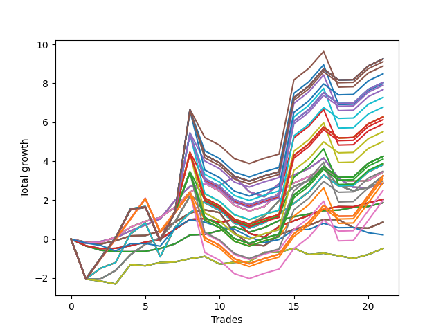

# Short Wallace Doodle 0225_009 
- Symbol: AMZN_Unlimited
- Date Range: 03/23/2022 - 07/08/2022
- Trading Period: 7:20-12:30
- Number of Trades: 21



| Name | Win Percent | Profit | Avg Profit / Trade | Avg Time / Trade |      | Name | Win Percent | Profit | Avg Profit / Trade | Avg Time / Trade |
| ---- | ----------- | ------ | ------------------ | ---------------- | ---- | ---- | ----------- | ------ | ------------------ | ---------------- |
| Sorted By <br> Profit | | | | | | Sorted By <br> Win Percentage ||||
| One Hundred Thirty | 66.67 | 4623.75 | 220.18 | 159:42 |     | Sixty-Four | 76.19 | 934.00 | 44.48 | 08:23 |
| One Hundred Twenty-Five | 66.67 | 4623.75 | 220.18 | 159:42 |     | Fifty-Six | 76.19 | 934.00 | 44.48 | 08:23 |
| One Hundred Twenty | 66.67 | 4623.75 | 220.18 | 159:42 |     | Forty-Eight | 76.19 | 934.00 | 44.48 | 08:23 |
| One Hundred Fifteen | 66.67 | 4623.75 | 220.18 | 159:42 |     | Forty | 76.19 | 934.00 | 44.48 | 08:23 |
| Eighty-Five | 66.67 | 4623.75 | 220.18 | 159:42 |     | Zero | 76.19 | 934.00 | 44.48 | 08:23 |
| One Hundred Ten | 66.67 | 4553.25 | 216.82 | 157:34 |     | Seventy-One | 71.43 | 1905.75 | 90.75 | 91:26 |
| One Hundred | 66.67 | 4441.25 | 211.49 | 146:38 |     | Sixty-Three | 71.43 | 1905.75 | 90.75 | 91:26 |
| One Hundred Five | 66.67 | 4242.50 | 202.02 | 157:50 |     | Fifty-Five | 71.43 | 1905.75 | 90.75 | 91:26 |
| One Hundred Twenty-Nine | 66.67 | 4020.25 | 191.44 | 158:34 |     | Forty-Seven | 71.43 | 1905.75 | 90.75 | 91:26 |
| One Hundred Twenty-Four | 66.67 | 4020.25 | 191.44 | 158:34 |     | Seven | 71.43 | 1905.75 | 90.75 | 91:26 |
| One Hundred Ninteen | 66.67 | 4020.25 | 191.44 | 158:34 |     | Sixty-Five | 71.43 | 1019.75 | 48.56 | 16:04 |
| One Hundred Fourteen | 66.67 | 4020.25 | 191.44 | 158:34 |     | Fifty-Seven | 71.43 | 1019.75 | 48.56 | 16:04 |
| Eighty-Four | 66.67 | 4020.25 | 191.44 | 158:34 |     | Forty-Nine | 71.43 | 1019.75 | 48.56 | 16:04 |
| Ninety-Five | 66.67 | 3992.75 | 190.13 | 147:25 |     | Forty-One | 71.43 | 1019.75 | 48.56 | 16:04 |
| One Hundred Nine | 66.67 | 3949.75 | 188.08 | 156:26 |     | One | 71.43 | 1019.75 | 48.56 | 16:04 |
| Ninety-Nine | 66.67 | 3837.75 | 182.75 | 145:30 |     | One Hundred Thirty | 66.67 | 4623.75 | 220.18 | 159:42 |
| One Hundred Four | 66.67 | 3639.00 | 173.29 | 156:42 |     | One Hundred Twenty-Five | 66.67 | 4623.75 | 220.18 | 159:42 |
| Ninety-Four | 66.67 | 3389.25 | 161.39 | 146:17 |     | One Hundred Twenty | 66.67 | 4623.75 | 220.18 | 159:42 |
| One Hundred Twenty-Eight | 66.67 | 3136.75 | 149.37 | 156:05 |     | One Hundred Fifteen | 66.67 | 4623.75 | 220.18 | 159:42 |
| One Hundred Twenty-Three | 66.67 | 3136.75 | 149.37 | 156:05 |     | Eighty-Five | 66.67 | 4623.75 | 220.18 | 159:42 |
| One Hundred Eighteen | 66.67 | 3136.75 | 149.37 | 156:05 |     | One Hundred Ten | 66.67 | 4553.25 | 216.82 | 157:34 |
| One Hundred Thirteen | 66.67 | 3136.75 | 149.37 | 156:05 |     | One Hundred | 66.67 | 4441.25 | 211.49 | 146:38 |
| Eighty-Three | 66.67 | 3136.75 | 149.37 | 156:05 |     | One Hundred Five | 66.67 | 4242.50 | 202.02 | 157:50 |
| One Hundred Eight | 66.67 | 3066.25 | 146.01 | 153:57 |     | One Hundred Twenty-Nine | 66.67 | 4020.25 | 191.44 | 158:34 |
| Ninety-Eight | 66.67 | 2954.25 | 140.68 | 143:01 |     | One Hundred Twenty-Four | 66.67 | 4020.25 | 191.44 | 158:34 |
| One Hundred Three | 66.67 | 2755.50 | 131.21 | 154:14 |     | One Hundred Ninteen | 66.67 | 4020.25 | 191.44 | 158:34 |
| Ninety-Three | 66.67 | 2505.75 | 119.32 | 143:48 |     | One Hundred Fourteen | 66.67 | 4020.25 | 191.44 | 158:34 |
| One Hundred Twenty-Seven | 66.67 | 2124.50 | 101.17 | 148:55 |     | Eighty-Four | 66.67 | 4020.25 | 191.44 | 158:34 |
| One Hundred Twenty-Two | 66.67 | 2124.50 | 101.17 | 148:55 |     | Ninety-Five | 66.67 | 3992.75 | 190.13 | 147:25 |
| One Hundred Seventeen | 66.67 | 2124.50 | 101.17 | 148:55 |     | One Hundred Nine | 66.67 | 3949.75 | 188.08 | 156:26 |
| One Hundred Twelve | 66.67 | 2124.50 | 101.17 | 148:55 |     | Ninety-Nine | 66.67 | 3837.75 | 182.75 | 145:30 |
| Eighty-Two | 66.67 | 2124.50 | 101.17 | 148:55 |     | One Hundred Four | 66.67 | 3639.00 | 173.29 | 156:42 |
| One Hundred Seven | 66.67 | 2054.00 | 97.81 | 146:47 |     | Ninety-Four | 66.67 | 3389.25 | 161.39 | 146:17 |
| Ninety-Seven | 66.67 | 1942.00 | 92.48 | 135:51 |     | One Hundred Twenty-Eight | 66.67 | 3136.75 | 149.37 | 156:05 |
| Seventy-One | 71.43 | 1905.75 | 90.75 | 91:26 |     | One Hundred Twenty-Three | 66.67 | 3136.75 | 149.37 | 156:05 |
| Sixty-Three | 71.43 | 1905.75 | 90.75 | 91:26 |     | One Hundred Eighteen | 66.67 | 3136.75 | 149.37 | 156:05 |
| Fifty-Five | 71.43 | 1905.75 | 90.75 | 91:26 |     | One Hundred Thirteen | 66.67 | 3136.75 | 149.37 | 156:05 |
| Forty-Seven | 71.43 | 1905.75 | 90.75 | 91:26 |     | Eighty-Three | 66.67 | 3136.75 | 149.37 | 156:05 |
| Seven | 71.43 | 1905.75 | 90.75 | 91:26 |     | One Hundred Eight | 66.67 | 3066.25 | 146.01 | 153:57 |
| One Hundred Two | 66.67 | 1743.25 | 83.01 | 147:03 |     | Ninety-Eight | 66.67 | 2954.25 | 140.68 | 143:01 |
| Sixty-Eight | 66.67 | 1724.25 | 82.11 | 35:38 |     | One Hundred Three | 66.67 | 2755.50 | 131.21 | 154:14 |
| Sixty | 66.67 | 1724.25 | 82.11 | 35:38 |     | Ninety-Three | 66.67 | 2505.75 | 119.32 | 143:48 |
| Fifty-Two | 66.67 | 1724.25 | 82.11 | 35:38 |     | One Hundred Twenty-Seven | 66.67 | 2124.50 | 101.17 | 148:55 |
| Forty-Four | 66.67 | 1724.25 | 82.11 | 35:38 |     | One Hundred Twenty-Two | 66.67 | 2124.50 | 101.17 | 148:55 |
| Four | 66.67 | 1724.25 | 82.11 | 35:38 |     | One Hundred Seventeen | 66.67 | 2124.50 | 101.17 | 148:55 |
| One Hundred Twenty-Six | 66.67 | 1630.75 | 77.65 | 117:35 |     | One Hundred Twelve | 66.67 | 2124.50 | 101.17 | 148:55 |
| One Hundred Twenty-One | 66.67 | 1630.75 | 77.65 | 117:35 |     | Eighty-Two | 66.67 | 2124.50 | 101.17 | 148:55 |
| One Hundred Sixteen | 66.67 | 1630.75 | 77.65 | 117:35 |     | One Hundred Seven | 66.67 | 2054.00 | 97.81 | 146:47 |
| One Hundred Eleven | 66.67 | 1630.75 | 77.65 | 117:35 |     | Ninety-Seven | 66.67 | 1942.00 | 92.48 | 135:51 |
| Eighty-One | 66.67 | 1630.75 | 77.65 | 117:35 |     | One Hundred Two | 66.67 | 1743.25 | 83.01 | 147:03 |
| Sixty-Nine | 66.67 | 1619.00 | 77.10 | 59:31 |     | Sixty-Eight | 66.67 | 1724.25 | 82.11 | 35:38 |
| Sixty-One | 66.67 | 1619.00 | 77.10 | 59:31 |     | Sixty | 66.67 | 1724.25 | 82.11 | 35:38 |
| Fifty-Three | 66.67 | 1619.00 | 77.10 | 59:31 |     | Fifty-Two | 66.67 | 1724.25 | 82.11 | 35:38 |
| Forty-Five | 66.67 | 1619.00 | 77.10 | 59:31 |     | Forty-Four | 66.67 | 1724.25 | 82.11 | 35:38 |
| Five | 66.67 | 1619.00 | 77.10 | 59:31 |     | Four | 66.67 | 1724.25 | 82.11 | 35:38 |
| One Hundred Six | 66.67 | 1560.25 | 74.30 | 115:28 |     | One Hundred Twenty-Six | 66.67 | 1630.75 | 77.65 | 117:35 |
| Ninety-Two | 66.67 | 1493.50 | 71.12 | 136:38 |     | One Hundred Twenty-One | 66.67 | 1630.75 | 77.65 | 117:35 |
| Ninety-Six | 66.67 | 1448.25 | 68.96 | 104:32 |     | One Hundred Sixteen | 66.67 | 1630.75 | 77.65 | 117:35 |
| Sixty-Six | 66.67 | 1431.00 | 68.14 | 28:09 |     | One Hundred Eleven | 66.67 | 1630.75 | 77.65 | 117:35 |
| Fifty-Eight | 66.67 | 1431.00 | 68.14 | 28:09 |     | Eighty-One | 66.67 | 1630.75 | 77.65 | 117:35 |
| Fifty | 66.67 | 1431.00 | 68.14 | 28:09 |     | Sixty-Nine | 66.67 | 1619.00 | 77.10 | 59:31 |
| Forty-Two | 66.67 | 1431.00 | 68.14 | 28:09 |     | Sixty-One | 66.67 | 1619.00 | 77.10 | 59:31 |
| Two | 66.67 | 1431.00 | 68.14 | 28:09 |     | Fifty-Three | 66.67 | 1619.00 | 77.10 | 59:31 |
| One Hundred One | 66.67 | 1249.50 | 59.50 | 115:44 |     | Forty-Five | 66.67 | 1619.00 | 77.10 | 59:31 |
| Sixty-Five | 71.43 | 1019.75 | 48.56 | 16:04 |     | Five | 66.67 | 1619.00 | 77.10 | 59:31 |
| Fifty-Seven | 71.43 | 1019.75 | 48.56 | 16:04 |     | One Hundred Six | 66.67 | 1560.25 | 74.30 | 115:28 |
| Forty-Nine | 71.43 | 1019.75 | 48.56 | 16:04 |     | Ninety-Two | 66.67 | 1493.50 | 71.12 | 136:38 |
| Forty-One | 71.43 | 1019.75 | 48.56 | 16:04 |     | Ninety-Six | 66.67 | 1448.25 | 68.96 | 104:32 |
| One | 71.43 | 1019.75 | 48.56 | 16:04 |     | Sixty-Six | 66.67 | 1431.00 | 68.14 | 28:09 |
| Ninety-One | 66.67 | 999.75 | 47.61 | 105:19 |     | Fifty-Eight | 66.67 | 1431.00 | 68.14 | 28:09 |
| Sixty-Four | 76.19 | 934.00 | 44.48 | 08:23 |     | Fifty | 66.67 | 1431.00 | 68.14 | 28:09 |
| Fifty-Six | 76.19 | 934.00 | 44.48 | 08:23 |     | Forty-Two | 66.67 | 1431.00 | 68.14 | 28:09 |
| Forty-Eight | 76.19 | 934.00 | 44.48 | 08:23 |     | Two | 66.67 | 1431.00 | 68.14 | 28:09 |
| Forty | 76.19 | 934.00 | 44.48 | 08:23 |     | One Hundred One | 66.67 | 1249.50 | 59.50 | 115:44 |
| Zero | 76.19 | 934.00 | 44.48 | 08:23 |     | Ninety-One | 66.67 | 999.75 | 47.61 | 105:19 |
| Sixty-Seven | 57.14 | 434.75 | 20.70 | 24:04 |     | Seventy | 61.90 | -241.00 | -11.48 | 19:10 |
| Fifty-Nine | 57.14 | 434.75 | 20.70 | 24:04 |     | Sixty-Two | 61.90 | -241.00 | -11.48 | 19:10 |
| Fifty-One | 57.14 | 434.75 | 20.70 | 24:04 |     | Fifty-Four | 61.90 | -241.00 | -11.48 | 19:10 |
| Forty-Three | 57.14 | 434.75 | 20.70 | 24:04 |     | Forty-Six | 61.90 | -241.00 | -11.48 | 19:10 |
| Three | 57.14 | 434.75 | 20.70 | 24:04 |     | Six | 61.90 | -241.00 | -11.48 | 19:10 |
| Seventy-Three | 42.86 | 108.00 | 5.14 | 12:53 |     | Sixty-Seven | 57.14 | 434.75 | 20.70 | 24:04 |
| Seventy | 61.90 | -241.00 | -11.48 | 19:10 |     | Fifty-Nine | 57.14 | 434.75 | 20.70 | 24:04 |
| Sixty-Two | 61.90 | -241.00 | -11.48 | 19:10 |     | Fifty-One | 57.14 | 434.75 | 20.70 | 24:04 |
| Fifty-Four | 61.90 | -241.00 | -11.48 | 19:10 |     | Forty-Three | 57.14 | 434.75 | 20.70 | 24:04 |
| Forty-Six | 61.90 | -241.00 | -11.48 | 19:10 |     | Three | 57.14 | 434.75 | 20.70 | 24:04 |
| Six | 61.90 | -241.00 | -11.48 | 19:10 |     | Seventy-Three | 42.86 | 108.00 | 5.14 | 12:53 |

## NO STOPLOSS

### Test Zero
* Sell when price hits the middle line of the 20p bollinger
* No Stoploss
* Results:
```
Total Trades: 21
Percent Up: 23.81
Percent Down: 76.19
Total Points Moved Down: 1.87
Potential Profit: 934.00
Total Points Ups: 0.93 Count Ups: 5
Total Points Downs: 2.80 Count Downs: 16
```

<details><summary>Trades</summary>

<code>In: 2022-03-28 10:24:00		Out: 2022-03-28 10:44:05		Total Position Time: 20:05		Total Move Down: -0.35		Total to Date: -0.35</code> <br />
<code>In: 2022-03-30 09:46:00		Out: 2022-03-30 10:05:15		Total Position Time: 19:15		Total Move Down: -0.22		Total to Date: -0.57</code> <br />
<code>In: 2022-04-11 08:35:00		Out: 2022-04-11 08:48:20		Total Position Time: 13:20		Total Move Down: -0.07		Total to Date: -0.64</code> <br />
<code>In: 2022-04-18 11:27:00		Out: 2022-04-18 11:43:15		Total Position Time: 16:15		Total Move Down: -0.00		Total to Date: -0.65</code> <br />
<code>In: 2022-04-20 08:01:00		Out: 2022-04-20 08:05:05		Total Position Time: 04:05		Total Move Down: 0.02		Total to Date: -0.63</code> <br />
<code>In: 2022-04-25 10:33:00		Out: 2022-04-25 10:34:10		Total Position Time: 01:10		Total Move Down: 0.15		Total to Date: -0.48</code> <br />
<code>In: 2022-04-26 10:01:00		Out: 2022-04-26 10:02:55		Total Position Time: 01:55		Total Move Down: 0.24		Total to Date: -0.24</code> <br />
<code>In: 2022-04-29 08:07:00		Out: 2022-04-29 08:10:05		Total Position Time: 03:05		Total Move Down: 0.45		Total to Date: 0.21</code> <br />
<code>In: 2022-05-17 09:28:00		Out: 2022-05-17 09:41:25		Total Position Time: 13:25		Total Move Down: 0.04		Total to Date: 0.24</code> <br />
<code>In: 2022-05-27 11:59:00		Out: 2022-05-27 12:03:15		Total Position Time: 04:15		Total Move Down: 0.19		Total to Date: 0.44</code> <br />
<code>In: 2022-06-01 10:13:00		Out: 2022-06-01 10:24:20		Total Position Time: 11:20		Total Move Down: 0.20		Total to Date: 0.63</code> <br />
<code>In: 2022-06-01 11:00:00		Out: 2022-06-01 11:19:15		Total Position Time: 19:15		Total Move Down: -0.28		Total to Date: 0.35</code> <br />
<code>In: 2022-06-01 11:18:00		Out: 2022-06-01 11:19:15		Total Position Time: 01:15		Total Move Down: 0.24		Total to Date: 0.59</code> <br />
<code>In: 2022-06-03 09:02:00		Out: 2022-06-03 09:09:15		Total Position Time: 07:15		Total Move Down: 0.36		Total to Date: 0.95</code> <br />
<code>In: 2022-06-09 08:45:00		Out: 2022-06-09 08:46:40		Total Position Time: 01:40		Total Move Down: 0.20		Total to Date: 1.15</code> <br />
<code>In: 2022-06-10 12:00:00		Out: 2022-06-10 12:03:30		Total Position Time: 03:30		Total Move Down: 0.14		Total to Date: 1.29</code> <br />
<code>In: 2022-06-10 12:29:00		Out: 2022-06-10 12:33:05		Total Position Time: 04:05		Total Move Down: 0.17		Total to Date: 1.46</code> <br />
<code>In: 2022-06-13 08:17:00		Out: 2022-06-13 08:28:55		Total Position Time: 11:55		Total Move Down: 0.03		Total to Date: 1.49</code> <br />
<code>In: 2022-06-13 09:04:00		Out: 2022-06-13 09:10:15		Total Position Time: 06:15		Total Move Down: 0.14		Total to Date: 1.63</code> <br />
<code>In: 2022-06-16 09:48:00		Out: 2022-06-16 09:55:20		Total Position Time: 07:20		Total Move Down: 0.05		Total to Date: 1.68</code> <br />
<code>In: 2022-06-29 11:06:00		Out: 2022-06-29 11:11:40		Total Position Time: 05:40		Total Move Down: 0.19		Total to Date: 1.87</code> <br />


</details>

### Test One
* Sell when the price hits the upper line of the 20p 1std bollinger
* No Stoploss
* Results:
```
Total Trades: 21
Percent Up: 28.57
Percent Down: 71.43
Total Points Moved Down: 2.04
Potential Profit: 1019.75
Total Points Ups: 1.61 Count Ups: 6
Total Points Downs: 3.65 Count Downs: 15
```

<details><summary>Trades</summary>

<code>In: 2022-03-28 10:24:00		Out: 2022-03-28 10:48:15		Total Position Time: 24:15		Total Move Down: -0.34		Total to Date: -0.34</code> <br />
<code>In: 2022-03-30 09:46:00		Out: 2022-03-30 10:07:00		Total Position Time: 21:00		Total Move Down: -0.15		Total to Date: -0.49</code> <br />
<code>In: 2022-04-11 08:35:00		Out: 2022-04-11 08:49:25		Total Position Time: 14:25		Total Move Down: 0.02		Total to Date: -0.47</code> <br />
<code>In: 2022-04-18 11:27:00		Out: 2022-04-18 11:46:40		Total Position Time: 19:40		Total Move Down: 0.13		Total to Date: -0.34</code> <br />
<code>In: 2022-04-20 08:01:00		Out: 2022-04-20 08:09:05		Total Position Time: 08:05		Total Move Down: 0.18		Total to Date: -0.16</code> <br />
<code>In: 2022-04-25 10:33:00		Out: 2022-04-25 10:34:10		Total Position Time: 01:10		Total Move Down: 0.15		Total to Date: -0.01</code> <br />
<code>In: 2022-04-26 10:01:00		Out: 2022-04-26 10:04:10		Total Position Time: 03:10		Total Move Down: 0.51		Total to Date: 0.50</code> <br />
<code>In: 2022-04-29 08:07:00		Out: 2022-04-29 08:22:20		Total Position Time: 15:20		Total Move Down: 0.51		Total to Date: 1.01</code> <br />
<code>In: 2022-05-17 09:28:00		Out: 2022-05-17 09:48:55		Total Position Time: 20:55		Total Move Down: 0.04		Total to Date: 1.05</code> <br />
<code>In: 2022-05-27 11:59:00		Out: 2022-05-27 12:35:05		Total Position Time: 36:05		Total Move Down: -0.21		Total to Date: 0.85</code> <br />
<code>In: 2022-06-01 10:13:00		Out: 2022-06-01 10:30:35		Total Position Time: 17:35		Total Move Down: 0.15		Total to Date: 1.00</code> <br />
<code>In: 2022-06-01 11:00:00		Out: 2022-06-01 11:42:05		Total Position Time: 42:05		Total Move Down: -0.71		Total to Date: 0.29</code> <br />
<code>In: 2022-06-01 11:18:00		Out: 2022-06-01 11:42:05		Total Position Time: 24:05		Total Move Down: -0.19		Total to Date: 0.09</code> <br />
<code>In: 2022-06-03 09:02:00		Out: 2022-06-03 09:09:50		Total Position Time: 07:50		Total Move Down: 0.56		Total to Date: 0.65</code> <br />
<code>In: 2022-06-09 08:45:00		Out: 2022-06-09 08:48:05		Total Position Time: 03:05		Total Move Down: 0.29		Total to Date: 0.94</code> <br />
<code>In: 2022-06-10 12:00:00		Out: 2022-06-10 12:05:20		Total Position Time: 05:20		Total Move Down: 0.27		Total to Date: 1.21</code> <br />
<code>In: 2022-06-10 12:29:00		Out: 2022-06-10 12:35:55		Total Position Time: 06:55		Total Move Down: 0.33		Total to Date: 1.54</code> <br />
<code>In: 2022-06-13 08:17:00		Out: 2022-06-13 08:32:35		Total Position Time: 15:35		Total Move Down: 0.13		Total to Date: 1.67</code> <br />
<code>In: 2022-06-13 09:04:00		Out: 2022-06-13 09:28:20		Total Position Time: 24:20		Total Move Down: -0.01		Total to Date: 1.66</code> <br />
<code>In: 2022-06-16 09:48:00		Out: 2022-06-16 09:59:50		Total Position Time: 11:50		Total Move Down: 0.20		Total to Date: 1.86</code> <br />
<code>In: 2022-06-29 11:06:00		Out: 2022-06-29 11:20:40		Total Position Time: 14:40		Total Move Down: 0.18		Total to Date: 2.04</code> <br />


</details>

### Test Two
* Sell when the price hits the upper line of the 20p 2std bollinger
* No Stoploss
* Results:
```
Total Trades: 21
Percent Up: 33.33
Percent Down: 66.67
Total Points Moved Down: 2.86
Potential Profit: 1431.00
Total Points Ups: 2.84 Count Ups: 7
Total Points Downs: 5.70 Count Downs: 14
```

<details><summary>Trades</summary>

<code>In: 2022-03-28 10:24:00		Out: 2022-03-28 10:50:15		Total Position Time: 26:15		Total Move Down: -0.22		Total to Date: -0.22</code> <br />
<code>In: 2022-03-30 09:46:00		Out: 2022-03-30 10:45:05		Total Position Time: 59:05		Total Move Down: 0.10		Total to Date: -0.12</code> <br />
<code>In: 2022-04-11 08:35:00		Out: 2022-04-11 08:50:30		Total Position Time: 15:30		Total Move Down: 0.17		Total to Date: 0.06</code> <br />
<code>In: 2022-04-18 11:27:00		Out: 2022-04-18 11:55:35		Total Position Time: 28:35		Total Move Down: 0.37		Total to Date: 0.43</code> <br />
<code>In: 2022-04-20 08:01:00		Out: 2022-04-20 08:10:35		Total Position Time: 09:35		Total Move Down: 0.29		Total to Date: 0.72</code> <br />
<code>In: 2022-04-25 10:33:00		Out: 2022-04-25 11:01:45		Total Position Time: 28:45		Total Move Down: 0.31		Total to Date: 1.04</code> <br />
<code>In: 2022-04-26 10:01:00		Out: 2022-04-26 10:15:05		Total Position Time: 14:05		Total Move Down: 0.95		Total to Date: 1.99</code> <br />
<code>In: 2022-04-29 08:07:00		Out: 2022-04-29 08:24:25		Total Position Time: 17:25		Total Move Down: 0.71		Total to Date: 2.70</code> <br />
<code>In: 2022-05-17 09:28:00		Out: 2022-05-17 09:50:30		Total Position Time: 22:30		Total Move Down: 0.12		Total to Date: 2.82</code> <br />
<code>In: 2022-05-27 11:59:00		Out: 2022-05-27 12:37:00		Total Position Time: 38:00		Total Move Down: -0.06		Total to Date: 2.75</code> <br />
<code>In: 2022-06-01 10:13:00		Out: 2022-06-01 10:31:40		Total Position Time: 18:40		Total Move Down: 0.45		Total to Date: 3.20</code> <br />
<code>In: 2022-06-01 11:00:00		Out: 2022-06-01 11:45:50		Total Position Time: 45:50		Total Move Down: -0.77		Total to Date: 2.43</code> <br />
<code>In: 2022-06-01 11:18:00		Out: 2022-06-01 11:45:50		Total Position Time: 27:50		Total Move Down: -0.25		Total to Date: 2.18</code> <br />
<code>In: 2022-06-03 09:02:00		Out: 2022-06-03 09:19:15		Total Position Time: 17:15		Total Move Down: 0.67		Total to Date: 2.85</code> <br />
<code>In: 2022-06-09 08:45:00		Out: 2022-06-09 08:48:20		Total Position Time: 03:20		Total Move Down: 0.44		Total to Date: 3.29</code> <br />
<code>In: 2022-06-10 12:00:00		Out: 2022-06-10 12:08:45		Total Position Time: 08:45		Total Move Down: 0.33		Total to Date: 3.62</code> <br />
<code>In: 2022-06-10 12:29:00		Out: 2022-06-10 12:42:40		Total Position Time: 13:40		Total Move Down: 0.54		Total to Date: 4.16</code> <br />
<code>In: 2022-06-13 08:17:00		Out: 2022-06-13 09:54:20		Total Position Time: 97:20		Total Move Down: -1.04		Total to Date: 3.12</code> <br />
<code>In: 2022-06-13 09:04:00		Out: 2022-06-13 09:54:20		Total Position Time: 50:20		Total Move Down: -0.46		Total to Date: 2.66</code> <br />
<code>In: 2022-06-16 09:48:00		Out: 2022-06-16 10:21:25		Total Position Time: 33:25		Total Move Down: -0.03		Total to Date: 2.63</code> <br />
<code>In: 2022-06-29 11:06:00		Out: 2022-06-29 11:21:10		Total Position Time: 15:10		Total Move Down: 0.23		Total to Date: 2.86</code> <br />


</details>

### Test Three
* Sell when price hits the middle line of the 50p bollinger
* No Stoploss
* Results:
```
Total Trades: 21
Percent Up: 42.86
Percent Down: 57.14
Total Points Moved Down: 0.87
Potential Profit: 434.75
Total Points Ups: 2.55 Count Ups: 9
Total Points Downs: 3.42 Count Downs: 12
```

<details><summary>Trades</summary>

<code>In: 2022-03-28 10:24:00		Out: 2022-03-28 10:56:05		Total Position Time: 32:05		Total Move Down: -0.15		Total to Date: -0.15</code> <br />
<code>In: 2022-03-30 09:46:00		Out: 2022-03-30 10:20:10		Total Position Time: 34:10		Total Move Down: -0.10		Total to Date: -0.25</code> <br />
<code>In: 2022-04-11 08:35:00		Out: 2022-04-11 08:50:30		Total Position Time: 15:30		Total Move Down: 0.17		Total to Date: -0.08</code> <br />
<code>In: 2022-04-18 11:27:00		Out: 2022-04-18 11:46:55		Total Position Time: 19:55		Total Move Down: 0.25		Total to Date: 0.17</code> <br />
<code>In: 2022-04-20 08:01:00		Out: 2022-04-20 08:05:05		Total Position Time: 04:05		Total Move Down: 0.02		Total to Date: 0.18</code> <br />
<code>In: 2022-04-25 10:33:00		Out: 2022-04-25 10:39:55		Total Position Time: 06:55		Total Move Down: 0.23		Total to Date: 0.41</code> <br />
<code>In: 2022-04-26 10:01:00		Out: 2022-04-26 10:04:00		Total Position Time: 03:00		Total Move Down: 0.46		Total to Date: 0.87</code> <br />
<code>In: 2022-04-29 08:07:00		Out: 2022-04-29 08:08:30		Total Position Time: 01:30		Total Move Down: 0.47		Total to Date: 1.34</code> <br />
<code>In: 2022-05-17 09:28:00		Out: 2022-05-17 09:51:55		Total Position Time: 23:55		Total Move Down: 0.17		Total to Date: 1.51</code> <br />
<code>In: 2022-05-27 11:59:00		Out: 2022-05-27 12:36:45		Total Position Time: 37:45		Total Move Down: -0.15		Total to Date: 1.36</code> <br />
<code>In: 2022-06-01 10:13:00		Out: 2022-06-01 11:46:40		Total Position Time: 93:40		Total Move Down: -1.03		Total to Date: 0.33</code> <br />
<code>In: 2022-06-01 11:00:00		Out: 2022-06-01 11:46:40		Total Position Time: 46:40		Total Move Down: -0.59		Total to Date: -0.27</code> <br />
<code>In: 2022-06-01 11:18:00		Out: 2022-06-01 11:46:40		Total Position Time: 28:40		Total Move Down: -0.07		Total to Date: -0.34</code> <br />
<code>In: 2022-06-03 09:02:00		Out: 2022-06-03 09:09:45		Total Position Time: 07:45		Total Move Down: 0.55		Total to Date: 0.21</code> <br />
<code>In: 2022-06-09 08:45:00		Out: 2022-06-09 08:48:05		Total Position Time: 03:05		Total Move Down: 0.29		Total to Date: 0.50</code> <br />
<code>In: 2022-06-10 12:00:00		Out: 2022-06-10 12:05:15		Total Position Time: 05:15		Total Move Down: 0.20		Total to Date: 0.70</code> <br />
<code>In: 2022-06-10 12:29:00		Out: 2022-06-10 12:34:05		Total Position Time: 05:05		Total Move Down: 0.31		Total to Date: 1.01</code> <br />
<code>In: 2022-06-13 08:17:00		Out: 2022-06-13 08:53:10		Total Position Time: 36:10		Total Move Down: -0.01		Total to Date: 1.00</code> <br />
<code>In: 2022-06-13 09:04:00		Out: 2022-06-13 09:54:25		Total Position Time: 50:25		Total Move Down: -0.41		Total to Date: 0.59</code> <br />
<code>In: 2022-06-16 09:48:00		Out: 2022-06-16 10:21:25		Total Position Time: 33:25		Total Move Down: -0.03		Total to Date: 0.56</code> <br />
<code>In: 2022-06-29 11:06:00		Out: 2022-06-29 11:22:35		Total Position Time: 16:35		Total Move Down: 0.31		Total to Date: 0.87</code> <br />


</details>

### Test Four
* Sell when the price hits the upper line of the 50p 1std bollinger
* No Stoploss
* Results:
```
Total Trades: 21
Percent Up: 33.33
Percent Down: 66.67
Total Points Moved Down: 3.45
Potential Profit: 1724.25
Total Points Ups: 2.27 Count Ups: 7
Total Points Downs: 5.72 Count Downs: 14
```

<details><summary>Trades</summary>

<code>In: 2022-03-28 10:24:00		Out: 2022-03-28 11:13:05		Total Position Time: 49:05		Total Move Down: -0.17		Total to Date: -0.17</code> <br />
<code>In: 2022-03-30 09:46:00		Out: 2022-03-30 10:25:20		Total Position Time: 39:20		Total Move Down: -0.00		Total to Date: -0.17</code> <br />
<code>In: 2022-04-11 08:35:00		Out: 2022-04-11 09:01:05		Total Position Time: 26:05		Total Move Down: 0.29		Total to Date: 0.11</code> <br />
<code>In: 2022-04-18 11:27:00		Out: 2022-04-18 12:02:40		Total Position Time: 35:40		Total Move Down: 0.50		Total to Date: 0.61</code> <br />
<code>In: 2022-04-20 08:01:00		Out: 2022-04-20 08:10:50		Total Position Time: 09:50		Total Move Down: 0.30		Total to Date: 0.91</code> <br />
<code>In: 2022-04-25 10:33:00		Out: 2022-04-25 11:01:15		Total Position Time: 28:15		Total Move Down: 0.20		Total to Date: 1.11</code> <br />
<code>In: 2022-04-26 10:01:00		Out: 2022-04-26 10:10:05		Total Position Time: 09:05		Total Move Down: 0.53		Total to Date: 1.64</code> <br />
<code>In: 2022-04-29 08:07:00		Out: 2022-04-29 08:24:35		Total Position Time: 17:35		Total Move Down: 0.76		Total to Date: 2.40</code> <br />
<code>In: 2022-05-17 09:28:00		Out: 2022-05-17 10:02:00		Total Position Time: 34:00		Total Move Down: 0.46		Total to Date: 2.86</code> <br />
<code>In: 2022-05-27 11:59:00		Out: 2022-05-27 12:47:00		Total Position Time: 48:00		Total Move Down: -0.40		Total to Date: 2.47</code> <br />
<code>In: 2022-06-01 10:13:00		Out: 2022-06-01 11:51:10		Total Position Time: 98:10		Total Move Down: -0.73		Total to Date: 1.74</code> <br />
<code>In: 2022-06-01 11:00:00		Out: 2022-06-01 11:51:10		Total Position Time: 51:10		Total Move Down: -0.29		Total to Date: 1.44</code> <br />
<code>In: 2022-06-01 11:18:00		Out: 2022-06-01 11:51:10		Total Position Time: 33:10		Total Move Down: 0.23		Total to Date: 1.67</code> <br />
<code>In: 2022-06-03 09:02:00		Out: 2022-06-03 09:11:30		Total Position Time: 09:30		Total Move Down: 0.72		Total to Date: 2.39</code> <br />
<code>In: 2022-06-09 08:45:00		Out: 2022-06-09 08:48:40		Total Position Time: 03:40		Total Move Down: 0.49		Total to Date: 2.88</code> <br />
<code>In: 2022-06-10 12:00:00		Out: 2022-06-10 12:08:45		Total Position Time: 08:45		Total Move Down: 0.33		Total to Date: 3.21</code> <br />
<code>In: 2022-06-10 12:29:00		Out: 2022-06-10 12:42:25		Total Position Time: 13:25		Total Move Down: 0.45		Total to Date: 3.66</code> <br />
<code>In: 2022-06-13 08:17:00		Out: 2022-06-13 10:01:10		Total Position Time: 104:10		Total Move Down: -0.63		Total to Date: 3.03</code> <br />
<code>In: 2022-06-13 09:04:00		Out: 2022-06-13 10:01:10		Total Position Time: 57:10		Total Move Down: -0.05		Total to Date: 2.98</code> <br />
<code>In: 2022-06-16 09:48:00		Out: 2022-06-16 10:35:30		Total Position Time: 47:30		Total Move Down: 0.02		Total to Date: 3.00</code> <br />
<code>In: 2022-06-29 11:06:00		Out: 2022-06-29 11:30:45		Total Position Time: 24:45		Total Move Down: 0.45		Total to Date: 3.45</code> <br />


</details>

### Test Five
* Sell when the price hits the upper line of the 50p 2std bollinger
* No Stoploss
* Results:
```
Total Trades: 21
Percent Up: 33.33
Percent Down: 66.67
Total Points Moved Down: 3.24
Potential Profit: 1619.00
Total Points Ups: 4.62 Count Ups: 7
Total Points Downs: 7.86 Count Downs: 14
```

<details><summary>Trades</summary>

<code>In: 2022-03-28 10:24:00		Out: 2022-03-28 12:47:00		Total Position Time: 143:00		Total Move Down: -2.05		Total to Date: -2.05</code> <br />
<code>In: 2022-03-30 09:46:00		Out: 2022-03-30 10:40:05		Total Position Time: 54:05		Total Move Down: 0.01		Total to Date: -2.04</code> <br />
<code>In: 2022-04-11 08:35:00		Out: 2022-04-11 09:01:15		Total Position Time: 26:15		Total Move Down: 0.43		Total to Date: -1.61</code> <br />
<code>In: 2022-04-18 11:27:00		Out: 2022-04-18 12:25:05		Total Position Time: 58:05		Total Move Down: 0.81		Total to Date: -0.80</code> <br />
<code>In: 2022-04-20 08:01:00		Out: 2022-04-20 08:13:00		Total Position Time: 12:00		Total Move Down: 0.54		Total to Date: -0.26</code> <br />
<code>In: 2022-04-25 10:33:00		Out: 2022-04-25 11:04:55		Total Position Time: 31:55		Total Move Down: 0.32		Total to Date: 0.06</code> <br />
<code>In: 2022-04-26 10:01:00		Out: 2022-04-26 10:14:00		Total Position Time: 13:00		Total Move Down: 0.83		Total to Date: 0.89</code> <br />
<code>In: 2022-04-29 08:07:00		Out: 2022-04-29 09:03:25		Total Position Time: 56:25		Total Move Down: 1.31		Total to Date: 2.21</code> <br />
<code>In: 2022-05-17 09:28:00		Out: 2022-05-17 11:13:15		Total Position Time: 105:15		Total Move Down: -0.33		Total to Date: 1.87</code> <br />
<code>In: 2022-05-27 11:59:00		Out: 2022-05-27 12:47:00		Total Position Time: 48:00		Total Move Down: -0.40		Total to Date: 1.48</code> <br />
<code>In: 2022-06-01 10:13:00		Out: 2022-06-01 11:57:20		Total Position Time: 104:20		Total Move Down: -0.57		Total to Date: 0.91</code> <br />
<code>In: 2022-06-01 11:00:00		Out: 2022-06-01 11:57:20		Total Position Time: 57:20		Total Move Down: -0.13		Total to Date: 0.77</code> <br />
<code>In: 2022-06-01 11:18:00		Out: 2022-06-01 11:57:20		Total Position Time: 39:20		Total Move Down: 0.39		Total to Date: 1.16</code> <br />
<code>In: 2022-06-03 09:02:00		Out: 2022-06-03 09:19:45		Total Position Time: 17:45		Total Move Down: 0.82		Total to Date: 1.98</code> <br />
<code>In: 2022-06-09 08:45:00		Out: 2022-06-09 08:50:20		Total Position Time: 05:20		Total Move Down: 0.72		Total to Date: 2.70</code> <br />
<code>In: 2022-06-10 12:00:00		Out: 2022-06-10 12:43:35		Total Position Time: 43:35		Total Move Down: 0.32		Total to Date: 3.02</code> <br />
<code>In: 2022-06-10 12:29:00		Out: 2022-06-10 12:43:35		Total Position Time: 14:35		Total Move Down: 0.60		Total to Date: 3.62</code> <br />
<code>In: 2022-06-13 08:17:00		Out: 2022-06-13 11:32:45		Total Position Time: 195:45		Total Move Down: -0.86		Total to Date: 2.76</code> <br />
<code>In: 2022-06-13 09:04:00		Out: 2022-06-13 11:32:45		Total Position Time: 148:45		Total Move Down: -0.28		Total to Date: 2.48</code> <br />
<code>In: 2022-06-16 09:48:00		Out: 2022-06-16 10:36:10		Total Position Time: 48:10		Total Move Down: 0.18		Total to Date: 2.66</code> <br />
<code>In: 2022-06-29 11:06:00		Out: 2022-06-29 11:33:05		Total Position Time: 27:05		Total Move Down: 0.58		Total to Date: 3.24</code> <br />


</details>

### Test Six
* Sell when the price hits the middle line of the 1std VWAP
* No Stoploss
* Results:
```
Total Trades: 21
Percent Up: 38.10
Percent Down: 61.90
Total Points Moved Down: -0.48
Potential Profit: -241.00
Total Points Ups: 3.34 Count Ups: 8
Total Points Downs: 2.86 Count Downs: 13
```

<details><summary>Trades</summary>

<code>In: 2022-03-28 10:24:00		Out: 2022-03-28 12:47:00		Total Position Time: 143:00		Total Move Down: -2.05		Total to Date: -2.05</code> <br />
<code>In: 2022-03-30 09:46:00		Out: 2022-03-30 09:47:10		Total Position Time: 01:10		Total Move Down: -0.11		Total to Date: -2.16</code> <br />
<code>In: 2022-04-11 08:35:00		Out: 2022-04-11 08:36:10		Total Position Time: 01:10		Total Move Down: -0.14		Total to Date: -2.30</code> <br />
<code>In: 2022-04-18 11:27:00		Out: 2022-04-18 12:30:40		Total Position Time: 63:40		Total Move Down: 0.99		Total to Date: -1.31</code> <br />
<code>In: 2022-04-20 08:01:00		Out: 2022-04-20 08:02:10		Total Position Time: 01:10		Total Move Down: -0.06		Total to Date: -1.37</code> <br />
<code>In: 2022-04-25 10:33:00		Out: 2022-04-25 10:37:00		Total Position Time: 04:00		Total Move Down: 0.17		Total to Date: -1.20</code> <br />
<code>In: 2022-04-26 10:01:00		Out: 2022-04-26 10:02:10		Total Position Time: 01:10		Total Move Down: 0.03		Total to Date: -1.17</code> <br />
<code>In: 2022-04-29 08:07:00		Out: 2022-04-29 08:08:10		Total Position Time: 01:10		Total Move Down: 0.17		Total to Date: -1.01</code> <br />
<code>In: 2022-05-17 09:28:00		Out: 2022-05-17 09:50:30		Total Position Time: 22:30		Total Move Down: 0.12		Total to Date: -0.89</code> <br />
<code>In: 2022-05-27 11:59:00		Out: 2022-05-27 12:47:00		Total Position Time: 48:00		Total Move Down: -0.40		Total to Date: -1.28</code> <br />
<code>In: 2022-06-01 10:13:00		Out: 2022-06-01 10:14:10		Total Position Time: 01:10		Total Move Down: 0.09		Total to Date: -1.19</code> <br />
<code>In: 2022-06-01 11:00:00		Out: 2022-06-01 11:02:15		Total Position Time: 02:15		Total Move Down: 0.03		Total to Date: -1.16</code> <br />
<code>In: 2022-06-01 11:18:00		Out: 2022-06-01 11:57:50		Total Position Time: 39:50		Total Move Down: 0.48		Total to Date: -0.68</code> <br />
<code>In: 2022-06-03 09:02:00		Out: 2022-06-03 09:03:10		Total Position Time: 01:10		Total Move Down: 0.01		Total to Date: -0.67</code> <br />
<code>In: 2022-06-09 08:45:00		Out: 2022-06-09 08:46:40		Total Position Time: 01:40		Total Move Down: 0.20		Total to Date: -0.47</code> <br />
<code>In: 2022-06-10 12:00:00		Out: 2022-06-10 12:01:10		Total Position Time: 01:10		Total Move Down: -0.32		Total to Date: -0.79</code> <br />
<code>In: 2022-06-10 12:29:00		Out: 2022-06-10 12:30:10		Total Position Time: 01:10		Total Move Down: 0.07		Total to Date: -0.72</code> <br />
<code>In: 2022-06-13 08:17:00		Out: 2022-06-13 08:18:10		Total Position Time: 01:10		Total Move Down: -0.13		Total to Date: -0.85</code> <br />
<code>In: 2022-06-13 09:04:00		Out: 2022-06-13 09:05:10		Total Position Time: 01:10		Total Move Down: -0.14		Total to Date: -0.99</code> <br />
<code>In: 2022-06-16 09:48:00		Out: 2022-06-16 10:36:30		Total Position Time: 48:30		Total Move Down: 0.20		Total to Date: -0.79</code> <br />
<code>In: 2022-06-29 11:06:00		Out: 2022-06-29 11:22:35		Total Position Time: 16:35		Total Move Down: 0.31		Total to Date: -0.48</code> <br />


</details>

### Test Seven
* Sell when the price hits the upper line of the 1std VWAP
* No Stoploss
* Results:
```
Total Trades: 21
Percent Up: 28.57
Percent Down: 71.43
Total Points Moved Down: 3.81
Potential Profit: 1905.75
Total Points Ups: 5.68 Count Ups: 6
Total Points Downs: 9.49 Count Downs: 15
```

<details><summary>Trades</summary>

<code>In: 2022-03-28 10:24:00		Out: 2022-03-28 12:47:00		Total Position Time: 143:00		Total Move Down: -2.05		Total to Date: -2.05</code> <br />
<code>In: 2022-03-30 09:46:00		Out: 2022-03-30 11:26:50		Total Position Time: 100:50		Total Move Down: 0.56		Total to Date: -1.49</code> <br />
<code>In: 2022-04-11 08:35:00		Out: 2022-04-11 09:01:05		Total Position Time: 26:05		Total Move Down: 0.29		Total to Date: -1.20</code> <br />
<code>In: 2022-04-18 11:27:00		Out: 2022-04-18 12:47:00		Total Position Time: 80:00		Total Move Down: 1.47		Total to Date: 0.27</code> <br />
<code>In: 2022-04-20 08:01:00		Out: 2022-04-20 08:13:15		Total Position Time: 12:15		Total Move Down: 0.57		Total to Date: 0.83</code> <br />
<code>In: 2022-04-25 10:33:00		Out: 2022-04-25 12:47:00		Total Position Time: 134:00		Total Move Down: -1.74		Total to Date: -0.90</code> <br />
<code>In: 2022-04-26 10:01:00		Out: 2022-04-26 12:46:40		Total Position Time: 165:40		Total Move Down: 1.50		Total to Date: 0.60</code> <br />
<code>In: 2022-04-29 08:07:00		Out: 2022-04-29 08:24:45		Total Position Time: 17:45		Total Move Down: 0.74		Total to Date: 1.34</code> <br />
<code>In: 2022-05-17 09:28:00		Out: 2022-05-17 11:23:15		Total Position Time: 115:15		Total Move Down: 0.56		Total to Date: 1.90</code> <br />
<code>In: 2022-05-27 11:59:00		Out: 2022-05-27 12:47:00		Total Position Time: 48:00		Total Move Down: -0.40		Total to Date: 1.50</code> <br />
<code>In: 2022-06-01 10:13:00		Out: 2022-06-01 12:47:00		Total Position Time: 154:00		Total Move Down: -0.69		Total to Date: 0.81</code> <br />
<code>In: 2022-06-01 11:00:00		Out: 2022-06-01 12:47:00		Total Position Time: 107:00		Total Move Down: -0.25		Total to Date: 0.56</code> <br />
<code>In: 2022-06-01 11:18:00		Out: 2022-06-01 12:47:00		Total Position Time: 89:00		Total Move Down: 0.27		Total to Date: 0.83</code> <br />
<code>In: 2022-06-03 09:02:00		Out: 2022-06-03 09:09:30		Total Position Time: 07:30		Total Move Down: 0.46		Total to Date: 1.29</code> <br />
<code>In: 2022-06-09 08:45:00		Out: 2022-06-09 08:48:50		Total Position Time: 03:50		Total Move Down: 0.54		Total to Date: 1.83</code> <br />
<code>In: 2022-06-10 12:00:00		Out: 2022-06-10 12:47:00		Total Position Time: 47:00		Total Move Down: 0.59		Total to Date: 2.42</code> <br />
<code>In: 2022-06-10 12:29:00		Out: 2022-06-10 12:47:00		Total Position Time: 18:00		Total Move Down: 0.87		Total to Date: 3.29</code> <br />
<code>In: 2022-06-13 08:17:00		Out: 2022-06-13 12:47:00		Total Position Time: 270:00		Total Move Down: -0.56		Total to Date: 2.73</code> <br />
<code>In: 2022-06-13 09:04:00		Out: 2022-06-13 12:47:00		Total Position Time: 223:00		Total Move Down: 0.02		Total to Date: 2.75</code> <br />
<code>In: 2022-06-16 09:48:00		Out: 2022-06-16 10:45:05		Total Position Time: 57:05		Total Move Down: 0.70		Total to Date: 3.45</code> <br />
<code>In: 2022-06-29 11:06:00		Out: 2022-06-29 12:47:00		Total Position Time: 101:00		Total Move Down: 0.36		Total to Date: 3.81</code> <br />


</details>

## STOPLOSS OF 5

### Test Forty
* Sell when price hits the middle line of the 20p bollinger
* Stoploss is -5 points
* Results:
```
Total Trades: 21
Percent Up: 23.81
Percent Down: 76.19
Total Points Moved Down: 1.87
Potential Profit: 934.00
Total Points Ups: 0.93 Count Ups: 5
Total Points Downs: 2.80 Count Downs: 16
```

<details><summary>Trades</summary>

<code>In: 2022-03-28 10:24:00		Out: 2022-03-28 10:44:05		Total Position Time: 20:05		Total Move Down: -0.35		Total to Date: -0.35</code> <br />
<code>In: 2022-03-30 09:46:00		Out: 2022-03-30 10:05:15		Total Position Time: 19:15		Total Move Down: -0.22		Total to Date: -0.57</code> <br />
<code>In: 2022-04-11 08:35:00		Out: 2022-04-11 08:48:20		Total Position Time: 13:20		Total Move Down: -0.07		Total to Date: -0.64</code> <br />
<code>In: 2022-04-18 11:27:00		Out: 2022-04-18 11:43:15		Total Position Time: 16:15		Total Move Down: -0.00		Total to Date: -0.65</code> <br />
<code>In: 2022-04-20 08:01:00		Out: 2022-04-20 08:05:05		Total Position Time: 04:05		Total Move Down: 0.02		Total to Date: -0.63</code> <br />
<code>In: 2022-04-25 10:33:00		Out: 2022-04-25 10:34:10		Total Position Time: 01:10		Total Move Down: 0.15		Total to Date: -0.48</code> <br />
<code>In: 2022-04-26 10:01:00		Out: 2022-04-26 10:02:55		Total Position Time: 01:55		Total Move Down: 0.24		Total to Date: -0.24</code> <br />
<code>In: 2022-04-29 08:07:00		Out: 2022-04-29 08:10:05		Total Position Time: 03:05		Total Move Down: 0.45		Total to Date: 0.21</code> <br />
<code>In: 2022-05-17 09:28:00		Out: 2022-05-17 09:41:25		Total Position Time: 13:25		Total Move Down: 0.04		Total to Date: 0.24</code> <br />
<code>In: 2022-05-27 11:59:00		Out: 2022-05-27 12:03:15		Total Position Time: 04:15		Total Move Down: 0.19		Total to Date: 0.44</code> <br />
<code>In: 2022-06-01 10:13:00		Out: 2022-06-01 10:24:20		Total Position Time: 11:20		Total Move Down: 0.20		Total to Date: 0.63</code> <br />
<code>In: 2022-06-01 11:00:00		Out: 2022-06-01 11:19:15		Total Position Time: 19:15		Total Move Down: -0.28		Total to Date: 0.35</code> <br />
<code>In: 2022-06-01 11:18:00		Out: 2022-06-01 11:19:15		Total Position Time: 01:15		Total Move Down: 0.24		Total to Date: 0.59</code> <br />
<code>In: 2022-06-03 09:02:00		Out: 2022-06-03 09:09:15		Total Position Time: 07:15		Total Move Down: 0.36		Total to Date: 0.95</code> <br />
<code>In: 2022-06-09 08:45:00		Out: 2022-06-09 08:46:40		Total Position Time: 01:40		Total Move Down: 0.20		Total to Date: 1.15</code> <br />
<code>In: 2022-06-10 12:00:00		Out: 2022-06-10 12:03:30		Total Position Time: 03:30		Total Move Down: 0.14		Total to Date: 1.29</code> <br />
<code>In: 2022-06-10 12:29:00		Out: 2022-06-10 12:33:05		Total Position Time: 04:05		Total Move Down: 0.17		Total to Date: 1.46</code> <br />
<code>In: 2022-06-13 08:17:00		Out: 2022-06-13 08:28:55		Total Position Time: 11:55		Total Move Down: 0.03		Total to Date: 1.49</code> <br />
<code>In: 2022-06-13 09:04:00		Out: 2022-06-13 09:10:15		Total Position Time: 06:15		Total Move Down: 0.14		Total to Date: 1.63</code> <br />
<code>In: 2022-06-16 09:48:00		Out: 2022-06-16 09:55:20		Total Position Time: 07:20		Total Move Down: 0.05		Total to Date: 1.68</code> <br />
<code>In: 2022-06-29 11:06:00		Out: 2022-06-29 11:11:40		Total Position Time: 05:40		Total Move Down: 0.19		Total to Date: 1.87</code> <br />


</details>

### Test Forty-One
* Sell when the price hits the upper line of the 20p 1std bollinger
* Stoploss is -5 points
* Results:
```
Total Trades: 21
Percent Up: 28.57
Percent Down: 71.43
Total Points Moved Down: 2.04
Potential Profit: 1019.75
Total Points Ups: 1.61 Count Ups: 6
Total Points Downs: 3.65 Count Downs: 15
```

<details><summary>Trades</summary>

<code>In: 2022-03-28 10:24:00		Out: 2022-03-28 10:48:15		Total Position Time: 24:15		Total Move Down: -0.34		Total to Date: -0.34</code> <br />
<code>In: 2022-03-30 09:46:00		Out: 2022-03-30 10:07:00		Total Position Time: 21:00		Total Move Down: -0.15		Total to Date: -0.49</code> <br />
<code>In: 2022-04-11 08:35:00		Out: 2022-04-11 08:49:25		Total Position Time: 14:25		Total Move Down: 0.02		Total to Date: -0.47</code> <br />
<code>In: 2022-04-18 11:27:00		Out: 2022-04-18 11:46:40		Total Position Time: 19:40		Total Move Down: 0.13		Total to Date: -0.34</code> <br />
<code>In: 2022-04-20 08:01:00		Out: 2022-04-20 08:09:05		Total Position Time: 08:05		Total Move Down: 0.18		Total to Date: -0.16</code> <br />
<code>In: 2022-04-25 10:33:00		Out: 2022-04-25 10:34:10		Total Position Time: 01:10		Total Move Down: 0.15		Total to Date: -0.01</code> <br />
<code>In: 2022-04-26 10:01:00		Out: 2022-04-26 10:04:10		Total Position Time: 03:10		Total Move Down: 0.51		Total to Date: 0.50</code> <br />
<code>In: 2022-04-29 08:07:00		Out: 2022-04-29 08:22:20		Total Position Time: 15:20		Total Move Down: 0.51		Total to Date: 1.01</code> <br />
<code>In: 2022-05-17 09:28:00		Out: 2022-05-17 09:48:55		Total Position Time: 20:55		Total Move Down: 0.04		Total to Date: 1.05</code> <br />
<code>In: 2022-05-27 11:59:00		Out: 2022-05-27 12:35:05		Total Position Time: 36:05		Total Move Down: -0.21		Total to Date: 0.85</code> <br />
<code>In: 2022-06-01 10:13:00		Out: 2022-06-01 10:30:35		Total Position Time: 17:35		Total Move Down: 0.15		Total to Date: 1.00</code> <br />
<code>In: 2022-06-01 11:00:00		Out: 2022-06-01 11:42:05		Total Position Time: 42:05		Total Move Down: -0.71		Total to Date: 0.29</code> <br />
<code>In: 2022-06-01 11:18:00		Out: 2022-06-01 11:42:05		Total Position Time: 24:05		Total Move Down: -0.19		Total to Date: 0.09</code> <br />
<code>In: 2022-06-03 09:02:00		Out: 2022-06-03 09:09:50		Total Position Time: 07:50		Total Move Down: 0.56		Total to Date: 0.65</code> <br />
<code>In: 2022-06-09 08:45:00		Out: 2022-06-09 08:48:05		Total Position Time: 03:05		Total Move Down: 0.29		Total to Date: 0.94</code> <br />
<code>In: 2022-06-10 12:00:00		Out: 2022-06-10 12:05:20		Total Position Time: 05:20		Total Move Down: 0.27		Total to Date: 1.21</code> <br />
<code>In: 2022-06-10 12:29:00		Out: 2022-06-10 12:35:55		Total Position Time: 06:55		Total Move Down: 0.33		Total to Date: 1.54</code> <br />
<code>In: 2022-06-13 08:17:00		Out: 2022-06-13 08:32:35		Total Position Time: 15:35		Total Move Down: 0.13		Total to Date: 1.67</code> <br />
<code>In: 2022-06-13 09:04:00		Out: 2022-06-13 09:28:20		Total Position Time: 24:20		Total Move Down: -0.01		Total to Date: 1.66</code> <br />
<code>In: 2022-06-16 09:48:00		Out: 2022-06-16 09:59:50		Total Position Time: 11:50		Total Move Down: 0.20		Total to Date: 1.86</code> <br />
<code>In: 2022-06-29 11:06:00		Out: 2022-06-29 11:20:40		Total Position Time: 14:40		Total Move Down: 0.18		Total to Date: 2.04</code> <br />


</details>

### Test Forty-Two
* Sell when the price hits the upper line of the 20p 2std bollinger
* Stoploss is -5 points
* Results:
```
Total Trades: 21
Percent Up: 33.33
Percent Down: 66.67
Total Points Moved Down: 2.86
Potential Profit: 1431.00
Total Points Ups: 2.84 Count Ups: 7
Total Points Downs: 5.70 Count Downs: 14
```

<details><summary>Trades</summary>

<code>In: 2022-03-28 10:24:00		Out: 2022-03-28 10:50:15		Total Position Time: 26:15		Total Move Down: -0.22		Total to Date: -0.22</code> <br />
<code>In: 2022-03-30 09:46:00		Out: 2022-03-30 10:45:05		Total Position Time: 59:05		Total Move Down: 0.10		Total to Date: -0.12</code> <br />
<code>In: 2022-04-11 08:35:00		Out: 2022-04-11 08:50:30		Total Position Time: 15:30		Total Move Down: 0.17		Total to Date: 0.06</code> <br />
<code>In: 2022-04-18 11:27:00		Out: 2022-04-18 11:55:35		Total Position Time: 28:35		Total Move Down: 0.37		Total to Date: 0.43</code> <br />
<code>In: 2022-04-20 08:01:00		Out: 2022-04-20 08:10:35		Total Position Time: 09:35		Total Move Down: 0.29		Total to Date: 0.72</code> <br />
<code>In: 2022-04-25 10:33:00		Out: 2022-04-25 11:01:45		Total Position Time: 28:45		Total Move Down: 0.31		Total to Date: 1.04</code> <br />
<code>In: 2022-04-26 10:01:00		Out: 2022-04-26 10:15:05		Total Position Time: 14:05		Total Move Down: 0.95		Total to Date: 1.99</code> <br />
<code>In: 2022-04-29 08:07:00		Out: 2022-04-29 08:24:25		Total Position Time: 17:25		Total Move Down: 0.71		Total to Date: 2.70</code> <br />
<code>In: 2022-05-17 09:28:00		Out: 2022-05-17 09:50:30		Total Position Time: 22:30		Total Move Down: 0.12		Total to Date: 2.82</code> <br />
<code>In: 2022-05-27 11:59:00		Out: 2022-05-27 12:37:00		Total Position Time: 38:00		Total Move Down: -0.06		Total to Date: 2.75</code> <br />
<code>In: 2022-06-01 10:13:00		Out: 2022-06-01 10:31:40		Total Position Time: 18:40		Total Move Down: 0.45		Total to Date: 3.20</code> <br />
<code>In: 2022-06-01 11:00:00		Out: 2022-06-01 11:45:50		Total Position Time: 45:50		Total Move Down: -0.77		Total to Date: 2.43</code> <br />
<code>In: 2022-06-01 11:18:00		Out: 2022-06-01 11:45:50		Total Position Time: 27:50		Total Move Down: -0.25		Total to Date: 2.18</code> <br />
<code>In: 2022-06-03 09:02:00		Out: 2022-06-03 09:19:15		Total Position Time: 17:15		Total Move Down: 0.67		Total to Date: 2.85</code> <br />
<code>In: 2022-06-09 08:45:00		Out: 2022-06-09 08:48:20		Total Position Time: 03:20		Total Move Down: 0.44		Total to Date: 3.29</code> <br />
<code>In: 2022-06-10 12:00:00		Out: 2022-06-10 12:08:45		Total Position Time: 08:45		Total Move Down: 0.33		Total to Date: 3.62</code> <br />
<code>In: 2022-06-10 12:29:00		Out: 2022-06-10 12:42:40		Total Position Time: 13:40		Total Move Down: 0.54		Total to Date: 4.16</code> <br />
<code>In: 2022-06-13 08:17:00		Out: 2022-06-13 09:54:20		Total Position Time: 97:20		Total Move Down: -1.04		Total to Date: 3.12</code> <br />
<code>In: 2022-06-13 09:04:00		Out: 2022-06-13 09:54:20		Total Position Time: 50:20		Total Move Down: -0.46		Total to Date: 2.66</code> <br />
<code>In: 2022-06-16 09:48:00		Out: 2022-06-16 10:21:25		Total Position Time: 33:25		Total Move Down: -0.03		Total to Date: 2.63</code> <br />
<code>In: 2022-06-29 11:06:00		Out: 2022-06-29 11:21:10		Total Position Time: 15:10		Total Move Down: 0.23		Total to Date: 2.86</code> <br />


</details>

### Test Forty-Three
* Sell when price hits the middle line of the 50p bollinger
* Stoploss is -5 points
* Results:
```
Total Trades: 21
Percent Up: 42.86
Percent Down: 57.14
Total Points Moved Down: 0.87
Potential Profit: 434.75
Total Points Ups: 2.55 Count Ups: 9
Total Points Downs: 3.42 Count Downs: 12
```

<details><summary>Trades</summary>

<code>In: 2022-03-28 10:24:00		Out: 2022-03-28 10:56:05		Total Position Time: 32:05		Total Move Down: -0.15		Total to Date: -0.15</code> <br />
<code>In: 2022-03-30 09:46:00		Out: 2022-03-30 10:20:10		Total Position Time: 34:10		Total Move Down: -0.10		Total to Date: -0.25</code> <br />
<code>In: 2022-04-11 08:35:00		Out: 2022-04-11 08:50:30		Total Position Time: 15:30		Total Move Down: 0.17		Total to Date: -0.08</code> <br />
<code>In: 2022-04-18 11:27:00		Out: 2022-04-18 11:46:55		Total Position Time: 19:55		Total Move Down: 0.25		Total to Date: 0.17</code> <br />
<code>In: 2022-04-20 08:01:00		Out: 2022-04-20 08:05:05		Total Position Time: 04:05		Total Move Down: 0.02		Total to Date: 0.18</code> <br />
<code>In: 2022-04-25 10:33:00		Out: 2022-04-25 10:39:55		Total Position Time: 06:55		Total Move Down: 0.23		Total to Date: 0.41</code> <br />
<code>In: 2022-04-26 10:01:00		Out: 2022-04-26 10:04:00		Total Position Time: 03:00		Total Move Down: 0.46		Total to Date: 0.87</code> <br />
<code>In: 2022-04-29 08:07:00		Out: 2022-04-29 08:08:30		Total Position Time: 01:30		Total Move Down: 0.47		Total to Date: 1.34</code> <br />
<code>In: 2022-05-17 09:28:00		Out: 2022-05-17 09:51:55		Total Position Time: 23:55		Total Move Down: 0.17		Total to Date: 1.51</code> <br />
<code>In: 2022-05-27 11:59:00		Out: 2022-05-27 12:36:45		Total Position Time: 37:45		Total Move Down: -0.15		Total to Date: 1.36</code> <br />
<code>In: 2022-06-01 10:13:00		Out: 2022-06-01 11:46:40		Total Position Time: 93:40		Total Move Down: -1.03		Total to Date: 0.33</code> <br />
<code>In: 2022-06-01 11:00:00		Out: 2022-06-01 11:46:40		Total Position Time: 46:40		Total Move Down: -0.59		Total to Date: -0.27</code> <br />
<code>In: 2022-06-01 11:18:00		Out: 2022-06-01 11:46:40		Total Position Time: 28:40		Total Move Down: -0.07		Total to Date: -0.34</code> <br />
<code>In: 2022-06-03 09:02:00		Out: 2022-06-03 09:09:45		Total Position Time: 07:45		Total Move Down: 0.55		Total to Date: 0.21</code> <br />
<code>In: 2022-06-09 08:45:00		Out: 2022-06-09 08:48:05		Total Position Time: 03:05		Total Move Down: 0.29		Total to Date: 0.50</code> <br />
<code>In: 2022-06-10 12:00:00		Out: 2022-06-10 12:05:15		Total Position Time: 05:15		Total Move Down: 0.20		Total to Date: 0.70</code> <br />
<code>In: 2022-06-10 12:29:00		Out: 2022-06-10 12:34:05		Total Position Time: 05:05		Total Move Down: 0.31		Total to Date: 1.01</code> <br />
<code>In: 2022-06-13 08:17:00		Out: 2022-06-13 08:53:10		Total Position Time: 36:10		Total Move Down: -0.01		Total to Date: 1.00</code> <br />
<code>In: 2022-06-13 09:04:00		Out: 2022-06-13 09:54:25		Total Position Time: 50:25		Total Move Down: -0.41		Total to Date: 0.59</code> <br />
<code>In: 2022-06-16 09:48:00		Out: 2022-06-16 10:21:25		Total Position Time: 33:25		Total Move Down: -0.03		Total to Date: 0.56</code> <br />
<code>In: 2022-06-29 11:06:00		Out: 2022-06-29 11:22:35		Total Position Time: 16:35		Total Move Down: 0.31		Total to Date: 0.87</code> <br />


</details>

### Test Forty-Four
* Sell when the price hits the upper line of the 50p 1std bollinger
* Stoploss is -5 points
* Results:
```
Total Trades: 21
Percent Up: 33.33
Percent Down: 66.67
Total Points Moved Down: 3.45
Potential Profit: 1724.25
Total Points Ups: 2.27 Count Ups: 7
Total Points Downs: 5.72 Count Downs: 14
```

<details><summary>Trades</summary>

<code>In: 2022-03-28 10:24:00		Out: 2022-03-28 11:13:05		Total Position Time: 49:05		Total Move Down: -0.17		Total to Date: -0.17</code> <br />
<code>In: 2022-03-30 09:46:00		Out: 2022-03-30 10:25:20		Total Position Time: 39:20		Total Move Down: -0.00		Total to Date: -0.17</code> <br />
<code>In: 2022-04-11 08:35:00		Out: 2022-04-11 09:01:05		Total Position Time: 26:05		Total Move Down: 0.29		Total to Date: 0.11</code> <br />
<code>In: 2022-04-18 11:27:00		Out: 2022-04-18 12:02:40		Total Position Time: 35:40		Total Move Down: 0.50		Total to Date: 0.61</code> <br />
<code>In: 2022-04-20 08:01:00		Out: 2022-04-20 08:10:50		Total Position Time: 09:50		Total Move Down: 0.30		Total to Date: 0.91</code> <br />
<code>In: 2022-04-25 10:33:00		Out: 2022-04-25 11:01:15		Total Position Time: 28:15		Total Move Down: 0.20		Total to Date: 1.11</code> <br />
<code>In: 2022-04-26 10:01:00		Out: 2022-04-26 10:10:05		Total Position Time: 09:05		Total Move Down: 0.53		Total to Date: 1.64</code> <br />
<code>In: 2022-04-29 08:07:00		Out: 2022-04-29 08:24:35		Total Position Time: 17:35		Total Move Down: 0.76		Total to Date: 2.40</code> <br />
<code>In: 2022-05-17 09:28:00		Out: 2022-05-17 10:02:00		Total Position Time: 34:00		Total Move Down: 0.46		Total to Date: 2.86</code> <br />
<code>In: 2022-05-27 11:59:00		Out: 2022-05-27 12:47:00		Total Position Time: 48:00		Total Move Down: -0.40		Total to Date: 2.47</code> <br />
<code>In: 2022-06-01 10:13:00		Out: 2022-06-01 11:51:10		Total Position Time: 98:10		Total Move Down: -0.73		Total to Date: 1.74</code> <br />
<code>In: 2022-06-01 11:00:00		Out: 2022-06-01 11:51:10		Total Position Time: 51:10		Total Move Down: -0.29		Total to Date: 1.44</code> <br />
<code>In: 2022-06-01 11:18:00		Out: 2022-06-01 11:51:10		Total Position Time: 33:10		Total Move Down: 0.23		Total to Date: 1.67</code> <br />
<code>In: 2022-06-03 09:02:00		Out: 2022-06-03 09:11:30		Total Position Time: 09:30		Total Move Down: 0.72		Total to Date: 2.39</code> <br />
<code>In: 2022-06-09 08:45:00		Out: 2022-06-09 08:48:40		Total Position Time: 03:40		Total Move Down: 0.49		Total to Date: 2.88</code> <br />
<code>In: 2022-06-10 12:00:00		Out: 2022-06-10 12:08:45		Total Position Time: 08:45		Total Move Down: 0.33		Total to Date: 3.21</code> <br />
<code>In: 2022-06-10 12:29:00		Out: 2022-06-10 12:42:25		Total Position Time: 13:25		Total Move Down: 0.45		Total to Date: 3.66</code> <br />
<code>In: 2022-06-13 08:17:00		Out: 2022-06-13 10:01:10		Total Position Time: 104:10		Total Move Down: -0.63		Total to Date: 3.03</code> <br />
<code>In: 2022-06-13 09:04:00		Out: 2022-06-13 10:01:10		Total Position Time: 57:10		Total Move Down: -0.05		Total to Date: 2.98</code> <br />
<code>In: 2022-06-16 09:48:00		Out: 2022-06-16 10:35:30		Total Position Time: 47:30		Total Move Down: 0.02		Total to Date: 3.00</code> <br />
<code>In: 2022-06-29 11:06:00		Out: 2022-06-29 11:30:45		Total Position Time: 24:45		Total Move Down: 0.45		Total to Date: 3.45</code> <br />


</details>

### Test Forty-Five
* Sell when the price hits the upper line of the 50p 2std bollinger
* Stoploss is -5 points
* Results:
```
Total Trades: 21
Percent Up: 33.33
Percent Down: 66.67
Total Points Moved Down: 3.24
Potential Profit: 1619.00
Total Points Ups: 4.62 Count Ups: 7
Total Points Downs: 7.86 Count Downs: 14
```

<details><summary>Trades</summary>

<code>In: 2022-03-28 10:24:00		Out: 2022-03-28 12:47:00		Total Position Time: 143:00		Total Move Down: -2.05		Total to Date: -2.05</code> <br />
<code>In: 2022-03-30 09:46:00		Out: 2022-03-30 10:40:05		Total Position Time: 54:05		Total Move Down: 0.01		Total to Date: -2.04</code> <br />
<code>In: 2022-04-11 08:35:00		Out: 2022-04-11 09:01:15		Total Position Time: 26:15		Total Move Down: 0.43		Total to Date: -1.61</code> <br />
<code>In: 2022-04-18 11:27:00		Out: 2022-04-18 12:25:05		Total Position Time: 58:05		Total Move Down: 0.81		Total to Date: -0.80</code> <br />
<code>In: 2022-04-20 08:01:00		Out: 2022-04-20 08:13:00		Total Position Time: 12:00		Total Move Down: 0.54		Total to Date: -0.26</code> <br />
<code>In: 2022-04-25 10:33:00		Out: 2022-04-25 11:04:55		Total Position Time: 31:55		Total Move Down: 0.32		Total to Date: 0.06</code> <br />
<code>In: 2022-04-26 10:01:00		Out: 2022-04-26 10:14:00		Total Position Time: 13:00		Total Move Down: 0.83		Total to Date: 0.89</code> <br />
<code>In: 2022-04-29 08:07:00		Out: 2022-04-29 09:03:25		Total Position Time: 56:25		Total Move Down: 1.31		Total to Date: 2.21</code> <br />
<code>In: 2022-05-17 09:28:00		Out: 2022-05-17 11:13:15		Total Position Time: 105:15		Total Move Down: -0.33		Total to Date: 1.87</code> <br />
<code>In: 2022-05-27 11:59:00		Out: 2022-05-27 12:47:00		Total Position Time: 48:00		Total Move Down: -0.40		Total to Date: 1.48</code> <br />
<code>In: 2022-06-01 10:13:00		Out: 2022-06-01 11:57:20		Total Position Time: 104:20		Total Move Down: -0.57		Total to Date: 0.91</code> <br />
<code>In: 2022-06-01 11:00:00		Out: 2022-06-01 11:57:20		Total Position Time: 57:20		Total Move Down: -0.13		Total to Date: 0.77</code> <br />
<code>In: 2022-06-01 11:18:00		Out: 2022-06-01 11:57:20		Total Position Time: 39:20		Total Move Down: 0.39		Total to Date: 1.16</code> <br />
<code>In: 2022-06-03 09:02:00		Out: 2022-06-03 09:19:45		Total Position Time: 17:45		Total Move Down: 0.82		Total to Date: 1.98</code> <br />
<code>In: 2022-06-09 08:45:00		Out: 2022-06-09 08:50:20		Total Position Time: 05:20		Total Move Down: 0.72		Total to Date: 2.70</code> <br />
<code>In: 2022-06-10 12:00:00		Out: 2022-06-10 12:43:35		Total Position Time: 43:35		Total Move Down: 0.32		Total to Date: 3.02</code> <br />
<code>In: 2022-06-10 12:29:00		Out: 2022-06-10 12:43:35		Total Position Time: 14:35		Total Move Down: 0.60		Total to Date: 3.62</code> <br />
<code>In: 2022-06-13 08:17:00		Out: 2022-06-13 11:32:45		Total Position Time: 195:45		Total Move Down: -0.86		Total to Date: 2.76</code> <br />
<code>In: 2022-06-13 09:04:00		Out: 2022-06-13 11:32:45		Total Position Time: 148:45		Total Move Down: -0.28		Total to Date: 2.48</code> <br />
<code>In: 2022-06-16 09:48:00		Out: 2022-06-16 10:36:10		Total Position Time: 48:10		Total Move Down: 0.18		Total to Date: 2.66</code> <br />
<code>In: 2022-06-29 11:06:00		Out: 2022-06-29 11:33:05		Total Position Time: 27:05		Total Move Down: 0.58		Total to Date: 3.24</code> <br />


</details>

### Test Forty-Six
* Sell when the price hits the middle line of the 1std VWAP
* Stoploss is -5 points
* Results:
```
Total Trades: 21
Percent Up: 38.10
Percent Down: 61.90
Total Points Moved Down: -0.48
Potential Profit: -241.00
Total Points Ups: 3.34 Count Ups: 8
Total Points Downs: 2.86 Count Downs: 13
```

<details><summary>Trades</summary>

<code>In: 2022-03-28 10:24:00		Out: 2022-03-28 12:47:00		Total Position Time: 143:00		Total Move Down: -2.05		Total to Date: -2.05</code> <br />
<code>In: 2022-03-30 09:46:00		Out: 2022-03-30 09:47:10		Total Position Time: 01:10		Total Move Down: -0.11		Total to Date: -2.16</code> <br />
<code>In: 2022-04-11 08:35:00		Out: 2022-04-11 08:36:10		Total Position Time: 01:10		Total Move Down: -0.14		Total to Date: -2.30</code> <br />
<code>In: 2022-04-18 11:27:00		Out: 2022-04-18 12:30:40		Total Position Time: 63:40		Total Move Down: 0.99		Total to Date: -1.31</code> <br />
<code>In: 2022-04-20 08:01:00		Out: 2022-04-20 08:02:10		Total Position Time: 01:10		Total Move Down: -0.06		Total to Date: -1.37</code> <br />
<code>In: 2022-04-25 10:33:00		Out: 2022-04-25 10:37:00		Total Position Time: 04:00		Total Move Down: 0.17		Total to Date: -1.20</code> <br />
<code>In: 2022-04-26 10:01:00		Out: 2022-04-26 10:02:10		Total Position Time: 01:10		Total Move Down: 0.03		Total to Date: -1.17</code> <br />
<code>In: 2022-04-29 08:07:00		Out: 2022-04-29 08:08:10		Total Position Time: 01:10		Total Move Down: 0.17		Total to Date: -1.01</code> <br />
<code>In: 2022-05-17 09:28:00		Out: 2022-05-17 09:50:30		Total Position Time: 22:30		Total Move Down: 0.12		Total to Date: -0.89</code> <br />
<code>In: 2022-05-27 11:59:00		Out: 2022-05-27 12:47:00		Total Position Time: 48:00		Total Move Down: -0.40		Total to Date: -1.28</code> <br />
<code>In: 2022-06-01 10:13:00		Out: 2022-06-01 10:14:10		Total Position Time: 01:10		Total Move Down: 0.09		Total to Date: -1.19</code> <br />
<code>In: 2022-06-01 11:00:00		Out: 2022-06-01 11:02:15		Total Position Time: 02:15		Total Move Down: 0.03		Total to Date: -1.16</code> <br />
<code>In: 2022-06-01 11:18:00		Out: 2022-06-01 11:57:50		Total Position Time: 39:50		Total Move Down: 0.48		Total to Date: -0.68</code> <br />
<code>In: 2022-06-03 09:02:00		Out: 2022-06-03 09:03:10		Total Position Time: 01:10		Total Move Down: 0.01		Total to Date: -0.67</code> <br />
<code>In: 2022-06-09 08:45:00		Out: 2022-06-09 08:46:40		Total Position Time: 01:40		Total Move Down: 0.20		Total to Date: -0.47</code> <br />
<code>In: 2022-06-10 12:00:00		Out: 2022-06-10 12:01:10		Total Position Time: 01:10		Total Move Down: -0.32		Total to Date: -0.79</code> <br />
<code>In: 2022-06-10 12:29:00		Out: 2022-06-10 12:30:10		Total Position Time: 01:10		Total Move Down: 0.07		Total to Date: -0.72</code> <br />
<code>In: 2022-06-13 08:17:00		Out: 2022-06-13 08:18:10		Total Position Time: 01:10		Total Move Down: -0.13		Total to Date: -0.85</code> <br />
<code>In: 2022-06-13 09:04:00		Out: 2022-06-13 09:05:10		Total Position Time: 01:10		Total Move Down: -0.14		Total to Date: -0.99</code> <br />
<code>In: 2022-06-16 09:48:00		Out: 2022-06-16 10:36:30		Total Position Time: 48:30		Total Move Down: 0.20		Total to Date: -0.79</code> <br />
<code>In: 2022-06-29 11:06:00		Out: 2022-06-29 11:22:35		Total Position Time: 16:35		Total Move Down: 0.31		Total to Date: -0.48</code> <br />


</details>

### Test Forty-Seven
* Sell when the price hits the upper line of the 1std VWAP
* Stoploss is -5 points
* Results:
```
Total Trades: 21
Percent Up: 28.57
Percent Down: 71.43
Total Points Moved Down: 3.81
Potential Profit: 1905.75
Total Points Ups: 5.68 Count Ups: 6
Total Points Downs: 9.49 Count Downs: 15
```

<details><summary>Trades</summary>

<code>In: 2022-03-28 10:24:00		Out: 2022-03-28 12:47:00		Total Position Time: 143:00		Total Move Down: -2.05		Total to Date: -2.05</code> <br />
<code>In: 2022-03-30 09:46:00		Out: 2022-03-30 11:26:50		Total Position Time: 100:50		Total Move Down: 0.56		Total to Date: -1.49</code> <br />
<code>In: 2022-04-11 08:35:00		Out: 2022-04-11 09:01:05		Total Position Time: 26:05		Total Move Down: 0.29		Total to Date: -1.20</code> <br />
<code>In: 2022-04-18 11:27:00		Out: 2022-04-18 12:47:00		Total Position Time: 80:00		Total Move Down: 1.47		Total to Date: 0.27</code> <br />
<code>In: 2022-04-20 08:01:00		Out: 2022-04-20 08:13:15		Total Position Time: 12:15		Total Move Down: 0.57		Total to Date: 0.83</code> <br />
<code>In: 2022-04-25 10:33:00		Out: 2022-04-25 12:47:00		Total Position Time: 134:00		Total Move Down: -1.74		Total to Date: -0.90</code> <br />
<code>In: 2022-04-26 10:01:00		Out: 2022-04-26 12:46:40		Total Position Time: 165:40		Total Move Down: 1.50		Total to Date: 0.60</code> <br />
<code>In: 2022-04-29 08:07:00		Out: 2022-04-29 08:24:45		Total Position Time: 17:45		Total Move Down: 0.74		Total to Date: 1.34</code> <br />
<code>In: 2022-05-17 09:28:00		Out: 2022-05-17 11:23:15		Total Position Time: 115:15		Total Move Down: 0.56		Total to Date: 1.90</code> <br />
<code>In: 2022-05-27 11:59:00		Out: 2022-05-27 12:47:00		Total Position Time: 48:00		Total Move Down: -0.40		Total to Date: 1.50</code> <br />
<code>In: 2022-06-01 10:13:00		Out: 2022-06-01 12:47:00		Total Position Time: 154:00		Total Move Down: -0.69		Total to Date: 0.81</code> <br />
<code>In: 2022-06-01 11:00:00		Out: 2022-06-01 12:47:00		Total Position Time: 107:00		Total Move Down: -0.25		Total to Date: 0.56</code> <br />
<code>In: 2022-06-01 11:18:00		Out: 2022-06-01 12:47:00		Total Position Time: 89:00		Total Move Down: 0.27		Total to Date: 0.83</code> <br />
<code>In: 2022-06-03 09:02:00		Out: 2022-06-03 09:09:30		Total Position Time: 07:30		Total Move Down: 0.46		Total to Date: 1.29</code> <br />
<code>In: 2022-06-09 08:45:00		Out: 2022-06-09 08:48:50		Total Position Time: 03:50		Total Move Down: 0.54		Total to Date: 1.83</code> <br />
<code>In: 2022-06-10 12:00:00		Out: 2022-06-10 12:47:00		Total Position Time: 47:00		Total Move Down: 0.59		Total to Date: 2.42</code> <br />
<code>In: 2022-06-10 12:29:00		Out: 2022-06-10 12:47:00		Total Position Time: 18:00		Total Move Down: 0.87		Total to Date: 3.29</code> <br />
<code>In: 2022-06-13 08:17:00		Out: 2022-06-13 12:47:00		Total Position Time: 270:00		Total Move Down: -0.56		Total to Date: 2.73</code> <br />
<code>In: 2022-06-13 09:04:00		Out: 2022-06-13 12:47:00		Total Position Time: 223:00		Total Move Down: 0.02		Total to Date: 2.75</code> <br />
<code>In: 2022-06-16 09:48:00		Out: 2022-06-16 10:45:05		Total Position Time: 57:05		Total Move Down: 0.70		Total to Date: 3.45</code> <br />
<code>In: 2022-06-29 11:06:00		Out: 2022-06-29 12:47:00		Total Position Time: 101:00		Total Move Down: 0.36		Total to Date: 3.81</code> <br />


</details>

## TRAIL STOP OF 5

### Test Forty-Eight
* Sell when price hits the middle line of the 20p bollinger
* Trailing Stop is -5 points
* Results:
```
Total Trades: 21
Percent Up: 23.81
Percent Down: 76.19
Total Points Moved Down: 1.87
Potential Profit: 934.00
Total Points Ups: 0.93 Count Ups: 5
Total Points Downs: 2.80 Count Downs: 16
```

<details><summary>Trades</summary>

<code>In: 2022-03-28 10:24:00		Out: 2022-03-28 10:44:05		Total Position Time: 20:05		Total Move Down: -0.35		Total to Date: -0.35</code> <br />
<code>In: 2022-03-30 09:46:00		Out: 2022-03-30 10:05:15		Total Position Time: 19:15		Total Move Down: -0.22		Total to Date: -0.57</code> <br />
<code>In: 2022-04-11 08:35:00		Out: 2022-04-11 08:48:20		Total Position Time: 13:20		Total Move Down: -0.07		Total to Date: -0.64</code> <br />
<code>In: 2022-04-18 11:27:00		Out: 2022-04-18 11:43:15		Total Position Time: 16:15		Total Move Down: -0.00		Total to Date: -0.65</code> <br />
<code>In: 2022-04-20 08:01:00		Out: 2022-04-20 08:05:05		Total Position Time: 04:05		Total Move Down: 0.02		Total to Date: -0.63</code> <br />
<code>In: 2022-04-25 10:33:00		Out: 2022-04-25 10:34:10		Total Position Time: 01:10		Total Move Down: 0.15		Total to Date: -0.48</code> <br />
<code>In: 2022-04-26 10:01:00		Out: 2022-04-26 10:02:55		Total Position Time: 01:55		Total Move Down: 0.24		Total to Date: -0.24</code> <br />
<code>In: 2022-04-29 08:07:00		Out: 2022-04-29 08:10:05		Total Position Time: 03:05		Total Move Down: 0.45		Total to Date: 0.21</code> <br />
<code>In: 2022-05-17 09:28:00		Out: 2022-05-17 09:41:25		Total Position Time: 13:25		Total Move Down: 0.04		Total to Date: 0.24</code> <br />
<code>In: 2022-05-27 11:59:00		Out: 2022-05-27 12:03:15		Total Position Time: 04:15		Total Move Down: 0.19		Total to Date: 0.44</code> <br />
<code>In: 2022-06-01 10:13:00		Out: 2022-06-01 10:24:20		Total Position Time: 11:20		Total Move Down: 0.20		Total to Date: 0.63</code> <br />
<code>In: 2022-06-01 11:00:00		Out: 2022-06-01 11:19:15		Total Position Time: 19:15		Total Move Down: -0.28		Total to Date: 0.35</code> <br />
<code>In: 2022-06-01 11:18:00		Out: 2022-06-01 11:19:15		Total Position Time: 01:15		Total Move Down: 0.24		Total to Date: 0.59</code> <br />
<code>In: 2022-06-03 09:02:00		Out: 2022-06-03 09:09:15		Total Position Time: 07:15		Total Move Down: 0.36		Total to Date: 0.95</code> <br />
<code>In: 2022-06-09 08:45:00		Out: 2022-06-09 08:46:40		Total Position Time: 01:40		Total Move Down: 0.20		Total to Date: 1.15</code> <br />
<code>In: 2022-06-10 12:00:00		Out: 2022-06-10 12:03:30		Total Position Time: 03:30		Total Move Down: 0.14		Total to Date: 1.29</code> <br />
<code>In: 2022-06-10 12:29:00		Out: 2022-06-10 12:33:05		Total Position Time: 04:05		Total Move Down: 0.17		Total to Date: 1.46</code> <br />
<code>In: 2022-06-13 08:17:00		Out: 2022-06-13 08:28:55		Total Position Time: 11:55		Total Move Down: 0.03		Total to Date: 1.49</code> <br />
<code>In: 2022-06-13 09:04:00		Out: 2022-06-13 09:10:15		Total Position Time: 06:15		Total Move Down: 0.14		Total to Date: 1.63</code> <br />
<code>In: 2022-06-16 09:48:00		Out: 2022-06-16 09:55:20		Total Position Time: 07:20		Total Move Down: 0.05		Total to Date: 1.68</code> <br />
<code>In: 2022-06-29 11:06:00		Out: 2022-06-29 11:11:40		Total Position Time: 05:40		Total Move Down: 0.19		Total to Date: 1.87</code> <br />


</details>

### Test Forty-Nine
* Sell when the price hits the upper line of the 20p 1std bollinger
* Trailing Stop is -5 points
* Results:
```
Total Trades: 21
Percent Up: 28.57
Percent Down: 71.43
Total Points Moved Down: 2.04
Potential Profit: 1019.75
Total Points Ups: 1.61 Count Ups: 6
Total Points Downs: 3.65 Count Downs: 15
```

<details><summary>Trades</summary>

<code>In: 2022-03-28 10:24:00		Out: 2022-03-28 10:48:15		Total Position Time: 24:15		Total Move Down: -0.34		Total to Date: -0.34</code> <br />
<code>In: 2022-03-30 09:46:00		Out: 2022-03-30 10:07:00		Total Position Time: 21:00		Total Move Down: -0.15		Total to Date: -0.49</code> <br />
<code>In: 2022-04-11 08:35:00		Out: 2022-04-11 08:49:25		Total Position Time: 14:25		Total Move Down: 0.02		Total to Date: -0.47</code> <br />
<code>In: 2022-04-18 11:27:00		Out: 2022-04-18 11:46:40		Total Position Time: 19:40		Total Move Down: 0.13		Total to Date: -0.34</code> <br />
<code>In: 2022-04-20 08:01:00		Out: 2022-04-20 08:09:05		Total Position Time: 08:05		Total Move Down: 0.18		Total to Date: -0.16</code> <br />
<code>In: 2022-04-25 10:33:00		Out: 2022-04-25 10:34:10		Total Position Time: 01:10		Total Move Down: 0.15		Total to Date: -0.01</code> <br />
<code>In: 2022-04-26 10:01:00		Out: 2022-04-26 10:04:10		Total Position Time: 03:10		Total Move Down: 0.51		Total to Date: 0.50</code> <br />
<code>In: 2022-04-29 08:07:00		Out: 2022-04-29 08:22:20		Total Position Time: 15:20		Total Move Down: 0.51		Total to Date: 1.01</code> <br />
<code>In: 2022-05-17 09:28:00		Out: 2022-05-17 09:48:55		Total Position Time: 20:55		Total Move Down: 0.04		Total to Date: 1.05</code> <br />
<code>In: 2022-05-27 11:59:00		Out: 2022-05-27 12:35:05		Total Position Time: 36:05		Total Move Down: -0.21		Total to Date: 0.85</code> <br />
<code>In: 2022-06-01 10:13:00		Out: 2022-06-01 10:30:35		Total Position Time: 17:35		Total Move Down: 0.15		Total to Date: 1.00</code> <br />
<code>In: 2022-06-01 11:00:00		Out: 2022-06-01 11:42:05		Total Position Time: 42:05		Total Move Down: -0.71		Total to Date: 0.29</code> <br />
<code>In: 2022-06-01 11:18:00		Out: 2022-06-01 11:42:05		Total Position Time: 24:05		Total Move Down: -0.19		Total to Date: 0.09</code> <br />
<code>In: 2022-06-03 09:02:00		Out: 2022-06-03 09:09:50		Total Position Time: 07:50		Total Move Down: 0.56		Total to Date: 0.65</code> <br />
<code>In: 2022-06-09 08:45:00		Out: 2022-06-09 08:48:05		Total Position Time: 03:05		Total Move Down: 0.29		Total to Date: 0.94</code> <br />
<code>In: 2022-06-10 12:00:00		Out: 2022-06-10 12:05:20		Total Position Time: 05:20		Total Move Down: 0.27		Total to Date: 1.21</code> <br />
<code>In: 2022-06-10 12:29:00		Out: 2022-06-10 12:35:55		Total Position Time: 06:55		Total Move Down: 0.33		Total to Date: 1.54</code> <br />
<code>In: 2022-06-13 08:17:00		Out: 2022-06-13 08:32:35		Total Position Time: 15:35		Total Move Down: 0.13		Total to Date: 1.67</code> <br />
<code>In: 2022-06-13 09:04:00		Out: 2022-06-13 09:28:20		Total Position Time: 24:20		Total Move Down: -0.01		Total to Date: 1.66</code> <br />
<code>In: 2022-06-16 09:48:00		Out: 2022-06-16 09:59:50		Total Position Time: 11:50		Total Move Down: 0.20		Total to Date: 1.86</code> <br />
<code>In: 2022-06-29 11:06:00		Out: 2022-06-29 11:20:40		Total Position Time: 14:40		Total Move Down: 0.18		Total to Date: 2.04</code> <br />


</details>

### Test Fifty
* Sell when the price hits the upper line of the 20p 2std bollinger
* Trailing Stop is -5 points
* Results:
```
Total Trades: 21
Percent Up: 33.33
Percent Down: 66.67
Total Points Moved Down: 2.86
Potential Profit: 1431.00
Total Points Ups: 2.84 Count Ups: 7
Total Points Downs: 5.70 Count Downs: 14
```

<details><summary>Trades</summary>

<code>In: 2022-03-28 10:24:00		Out: 2022-03-28 10:50:15		Total Position Time: 26:15		Total Move Down: -0.22		Total to Date: -0.22</code> <br />
<code>In: 2022-03-30 09:46:00		Out: 2022-03-30 10:45:05		Total Position Time: 59:05		Total Move Down: 0.10		Total to Date: -0.12</code> <br />
<code>In: 2022-04-11 08:35:00		Out: 2022-04-11 08:50:30		Total Position Time: 15:30		Total Move Down: 0.17		Total to Date: 0.06</code> <br />
<code>In: 2022-04-18 11:27:00		Out: 2022-04-18 11:55:35		Total Position Time: 28:35		Total Move Down: 0.37		Total to Date: 0.43</code> <br />
<code>In: 2022-04-20 08:01:00		Out: 2022-04-20 08:10:35		Total Position Time: 09:35		Total Move Down: 0.29		Total to Date: 0.72</code> <br />
<code>In: 2022-04-25 10:33:00		Out: 2022-04-25 11:01:45		Total Position Time: 28:45		Total Move Down: 0.31		Total to Date: 1.04</code> <br />
<code>In: 2022-04-26 10:01:00		Out: 2022-04-26 10:15:05		Total Position Time: 14:05		Total Move Down: 0.95		Total to Date: 1.99</code> <br />
<code>In: 2022-04-29 08:07:00		Out: 2022-04-29 08:24:25		Total Position Time: 17:25		Total Move Down: 0.71		Total to Date: 2.70</code> <br />
<code>In: 2022-05-17 09:28:00		Out: 2022-05-17 09:50:30		Total Position Time: 22:30		Total Move Down: 0.12		Total to Date: 2.82</code> <br />
<code>In: 2022-05-27 11:59:00		Out: 2022-05-27 12:37:00		Total Position Time: 38:00		Total Move Down: -0.06		Total to Date: 2.75</code> <br />
<code>In: 2022-06-01 10:13:00		Out: 2022-06-01 10:31:40		Total Position Time: 18:40		Total Move Down: 0.45		Total to Date: 3.20</code> <br />
<code>In: 2022-06-01 11:00:00		Out: 2022-06-01 11:45:50		Total Position Time: 45:50		Total Move Down: -0.77		Total to Date: 2.43</code> <br />
<code>In: 2022-06-01 11:18:00		Out: 2022-06-01 11:45:50		Total Position Time: 27:50		Total Move Down: -0.25		Total to Date: 2.18</code> <br />
<code>In: 2022-06-03 09:02:00		Out: 2022-06-03 09:19:15		Total Position Time: 17:15		Total Move Down: 0.67		Total to Date: 2.85</code> <br />
<code>In: 2022-06-09 08:45:00		Out: 2022-06-09 08:48:20		Total Position Time: 03:20		Total Move Down: 0.44		Total to Date: 3.29</code> <br />
<code>In: 2022-06-10 12:00:00		Out: 2022-06-10 12:08:45		Total Position Time: 08:45		Total Move Down: 0.33		Total to Date: 3.62</code> <br />
<code>In: 2022-06-10 12:29:00		Out: 2022-06-10 12:42:40		Total Position Time: 13:40		Total Move Down: 0.54		Total to Date: 4.16</code> <br />
<code>In: 2022-06-13 08:17:00		Out: 2022-06-13 09:54:20		Total Position Time: 97:20		Total Move Down: -1.04		Total to Date: 3.12</code> <br />
<code>In: 2022-06-13 09:04:00		Out: 2022-06-13 09:54:20		Total Position Time: 50:20		Total Move Down: -0.46		Total to Date: 2.66</code> <br />
<code>In: 2022-06-16 09:48:00		Out: 2022-06-16 10:21:25		Total Position Time: 33:25		Total Move Down: -0.03		Total to Date: 2.63</code> <br />
<code>In: 2022-06-29 11:06:00		Out: 2022-06-29 11:21:10		Total Position Time: 15:10		Total Move Down: 0.23		Total to Date: 2.86</code> <br />


</details>

### Test Fifty-One
* Sell when price hits the middle line of the 50p bollinger
* Trailing Stop is -5 points
* Results:
```
Total Trades: 21
Percent Up: 42.86
Percent Down: 57.14
Total Points Moved Down: 0.87
Potential Profit: 434.75
Total Points Ups: 2.55 Count Ups: 9
Total Points Downs: 3.42 Count Downs: 12
```

<details><summary>Trades</summary>

<code>In: 2022-03-28 10:24:00		Out: 2022-03-28 10:56:05		Total Position Time: 32:05		Total Move Down: -0.15		Total to Date: -0.15</code> <br />
<code>In: 2022-03-30 09:46:00		Out: 2022-03-30 10:20:10		Total Position Time: 34:10		Total Move Down: -0.10		Total to Date: -0.25</code> <br />
<code>In: 2022-04-11 08:35:00		Out: 2022-04-11 08:50:30		Total Position Time: 15:30		Total Move Down: 0.17		Total to Date: -0.08</code> <br />
<code>In: 2022-04-18 11:27:00		Out: 2022-04-18 11:46:55		Total Position Time: 19:55		Total Move Down: 0.25		Total to Date: 0.17</code> <br />
<code>In: 2022-04-20 08:01:00		Out: 2022-04-20 08:05:05		Total Position Time: 04:05		Total Move Down: 0.02		Total to Date: 0.18</code> <br />
<code>In: 2022-04-25 10:33:00		Out: 2022-04-25 10:39:55		Total Position Time: 06:55		Total Move Down: 0.23		Total to Date: 0.41</code> <br />
<code>In: 2022-04-26 10:01:00		Out: 2022-04-26 10:04:00		Total Position Time: 03:00		Total Move Down: 0.46		Total to Date: 0.87</code> <br />
<code>In: 2022-04-29 08:07:00		Out: 2022-04-29 08:08:30		Total Position Time: 01:30		Total Move Down: 0.47		Total to Date: 1.34</code> <br />
<code>In: 2022-05-17 09:28:00		Out: 2022-05-17 09:51:55		Total Position Time: 23:55		Total Move Down: 0.17		Total to Date: 1.51</code> <br />
<code>In: 2022-05-27 11:59:00		Out: 2022-05-27 12:36:45		Total Position Time: 37:45		Total Move Down: -0.15		Total to Date: 1.36</code> <br />
<code>In: 2022-06-01 10:13:00		Out: 2022-06-01 11:46:40		Total Position Time: 93:40		Total Move Down: -1.03		Total to Date: 0.33</code> <br />
<code>In: 2022-06-01 11:00:00		Out: 2022-06-01 11:46:40		Total Position Time: 46:40		Total Move Down: -0.59		Total to Date: -0.27</code> <br />
<code>In: 2022-06-01 11:18:00		Out: 2022-06-01 11:46:40		Total Position Time: 28:40		Total Move Down: -0.07		Total to Date: -0.34</code> <br />
<code>In: 2022-06-03 09:02:00		Out: 2022-06-03 09:09:45		Total Position Time: 07:45		Total Move Down: 0.55		Total to Date: 0.21</code> <br />
<code>In: 2022-06-09 08:45:00		Out: 2022-06-09 08:48:05		Total Position Time: 03:05		Total Move Down: 0.29		Total to Date: 0.50</code> <br />
<code>In: 2022-06-10 12:00:00		Out: 2022-06-10 12:05:15		Total Position Time: 05:15		Total Move Down: 0.20		Total to Date: 0.70</code> <br />
<code>In: 2022-06-10 12:29:00		Out: 2022-06-10 12:34:05		Total Position Time: 05:05		Total Move Down: 0.31		Total to Date: 1.01</code> <br />
<code>In: 2022-06-13 08:17:00		Out: 2022-06-13 08:53:10		Total Position Time: 36:10		Total Move Down: -0.01		Total to Date: 1.00</code> <br />
<code>In: 2022-06-13 09:04:00		Out: 2022-06-13 09:54:25		Total Position Time: 50:25		Total Move Down: -0.41		Total to Date: 0.59</code> <br />
<code>In: 2022-06-16 09:48:00		Out: 2022-06-16 10:21:25		Total Position Time: 33:25		Total Move Down: -0.03		Total to Date: 0.56</code> <br />
<code>In: 2022-06-29 11:06:00		Out: 2022-06-29 11:22:35		Total Position Time: 16:35		Total Move Down: 0.31		Total to Date: 0.87</code> <br />


</details>

### Test Fifty-Two
* Sell when the price hits the upper line of the 50p 1std bollinger
* Trailing Stop is -5 points
* Results:
```
Total Trades: 21
Percent Up: 33.33
Percent Down: 66.67
Total Points Moved Down: 3.45
Potential Profit: 1724.25
Total Points Ups: 2.27 Count Ups: 7
Total Points Downs: 5.72 Count Downs: 14
```

<details><summary>Trades</summary>

<code>In: 2022-03-28 10:24:00		Out: 2022-03-28 11:13:05		Total Position Time: 49:05		Total Move Down: -0.17		Total to Date: -0.17</code> <br />
<code>In: 2022-03-30 09:46:00		Out: 2022-03-30 10:25:20		Total Position Time: 39:20		Total Move Down: -0.00		Total to Date: -0.17</code> <br />
<code>In: 2022-04-11 08:35:00		Out: 2022-04-11 09:01:05		Total Position Time: 26:05		Total Move Down: 0.29		Total to Date: 0.11</code> <br />
<code>In: 2022-04-18 11:27:00		Out: 2022-04-18 12:02:40		Total Position Time: 35:40		Total Move Down: 0.50		Total to Date: 0.61</code> <br />
<code>In: 2022-04-20 08:01:00		Out: 2022-04-20 08:10:50		Total Position Time: 09:50		Total Move Down: 0.30		Total to Date: 0.91</code> <br />
<code>In: 2022-04-25 10:33:00		Out: 2022-04-25 11:01:15		Total Position Time: 28:15		Total Move Down: 0.20		Total to Date: 1.11</code> <br />
<code>In: 2022-04-26 10:01:00		Out: 2022-04-26 10:10:05		Total Position Time: 09:05		Total Move Down: 0.53		Total to Date: 1.64</code> <br />
<code>In: 2022-04-29 08:07:00		Out: 2022-04-29 08:24:35		Total Position Time: 17:35		Total Move Down: 0.76		Total to Date: 2.40</code> <br />
<code>In: 2022-05-17 09:28:00		Out: 2022-05-17 10:02:00		Total Position Time: 34:00		Total Move Down: 0.46		Total to Date: 2.86</code> <br />
<code>In: 2022-05-27 11:59:00		Out: 2022-05-27 12:47:00		Total Position Time: 48:00		Total Move Down: -0.40		Total to Date: 2.47</code> <br />
<code>In: 2022-06-01 10:13:00		Out: 2022-06-01 11:51:10		Total Position Time: 98:10		Total Move Down: -0.73		Total to Date: 1.74</code> <br />
<code>In: 2022-06-01 11:00:00		Out: 2022-06-01 11:51:10		Total Position Time: 51:10		Total Move Down: -0.29		Total to Date: 1.44</code> <br />
<code>In: 2022-06-01 11:18:00		Out: 2022-06-01 11:51:10		Total Position Time: 33:10		Total Move Down: 0.23		Total to Date: 1.67</code> <br />
<code>In: 2022-06-03 09:02:00		Out: 2022-06-03 09:11:30		Total Position Time: 09:30		Total Move Down: 0.72		Total to Date: 2.39</code> <br />
<code>In: 2022-06-09 08:45:00		Out: 2022-06-09 08:48:40		Total Position Time: 03:40		Total Move Down: 0.49		Total to Date: 2.88</code> <br />
<code>In: 2022-06-10 12:00:00		Out: 2022-06-10 12:08:45		Total Position Time: 08:45		Total Move Down: 0.33		Total to Date: 3.21</code> <br />
<code>In: 2022-06-10 12:29:00		Out: 2022-06-10 12:42:25		Total Position Time: 13:25		Total Move Down: 0.45		Total to Date: 3.66</code> <br />
<code>In: 2022-06-13 08:17:00		Out: 2022-06-13 10:01:10		Total Position Time: 104:10		Total Move Down: -0.63		Total to Date: 3.03</code> <br />
<code>In: 2022-06-13 09:04:00		Out: 2022-06-13 10:01:10		Total Position Time: 57:10		Total Move Down: -0.05		Total to Date: 2.98</code> <br />
<code>In: 2022-06-16 09:48:00		Out: 2022-06-16 10:35:30		Total Position Time: 47:30		Total Move Down: 0.02		Total to Date: 3.00</code> <br />
<code>In: 2022-06-29 11:06:00		Out: 2022-06-29 11:30:45		Total Position Time: 24:45		Total Move Down: 0.45		Total to Date: 3.45</code> <br />


</details>

### Test Fifty-Three
* Sell when the price hits the upper line of the 50p 2std bollinger
* Trailing Stop is -5 points
* Results:
```
Total Trades: 21
Percent Up: 33.33
Percent Down: 66.67
Total Points Moved Down: 3.24
Potential Profit: 1619.00
Total Points Ups: 4.62 Count Ups: 7
Total Points Downs: 7.86 Count Downs: 14
```

<details><summary>Trades</summary>

<code>In: 2022-03-28 10:24:00		Out: 2022-03-28 12:47:00		Total Position Time: 143:00		Total Move Down: -2.05		Total to Date: -2.05</code> <br />
<code>In: 2022-03-30 09:46:00		Out: 2022-03-30 10:40:05		Total Position Time: 54:05		Total Move Down: 0.01		Total to Date: -2.04</code> <br />
<code>In: 2022-04-11 08:35:00		Out: 2022-04-11 09:01:15		Total Position Time: 26:15		Total Move Down: 0.43		Total to Date: -1.61</code> <br />
<code>In: 2022-04-18 11:27:00		Out: 2022-04-18 12:25:05		Total Position Time: 58:05		Total Move Down: 0.81		Total to Date: -0.80</code> <br />
<code>In: 2022-04-20 08:01:00		Out: 2022-04-20 08:13:00		Total Position Time: 12:00		Total Move Down: 0.54		Total to Date: -0.26</code> <br />
<code>In: 2022-04-25 10:33:00		Out: 2022-04-25 11:04:55		Total Position Time: 31:55		Total Move Down: 0.32		Total to Date: 0.06</code> <br />
<code>In: 2022-04-26 10:01:00		Out: 2022-04-26 10:14:00		Total Position Time: 13:00		Total Move Down: 0.83		Total to Date: 0.89</code> <br />
<code>In: 2022-04-29 08:07:00		Out: 2022-04-29 09:03:25		Total Position Time: 56:25		Total Move Down: 1.31		Total to Date: 2.21</code> <br />
<code>In: 2022-05-17 09:28:00		Out: 2022-05-17 11:13:15		Total Position Time: 105:15		Total Move Down: -0.33		Total to Date: 1.87</code> <br />
<code>In: 2022-05-27 11:59:00		Out: 2022-05-27 12:47:00		Total Position Time: 48:00		Total Move Down: -0.40		Total to Date: 1.48</code> <br />
<code>In: 2022-06-01 10:13:00		Out: 2022-06-01 11:57:20		Total Position Time: 104:20		Total Move Down: -0.57		Total to Date: 0.91</code> <br />
<code>In: 2022-06-01 11:00:00		Out: 2022-06-01 11:57:20		Total Position Time: 57:20		Total Move Down: -0.13		Total to Date: 0.77</code> <br />
<code>In: 2022-06-01 11:18:00		Out: 2022-06-01 11:57:20		Total Position Time: 39:20		Total Move Down: 0.39		Total to Date: 1.16</code> <br />
<code>In: 2022-06-03 09:02:00		Out: 2022-06-03 09:19:45		Total Position Time: 17:45		Total Move Down: 0.82		Total to Date: 1.98</code> <br />
<code>In: 2022-06-09 08:45:00		Out: 2022-06-09 08:50:20		Total Position Time: 05:20		Total Move Down: 0.72		Total to Date: 2.70</code> <br />
<code>In: 2022-06-10 12:00:00		Out: 2022-06-10 12:43:35		Total Position Time: 43:35		Total Move Down: 0.32		Total to Date: 3.02</code> <br />
<code>In: 2022-06-10 12:29:00		Out: 2022-06-10 12:43:35		Total Position Time: 14:35		Total Move Down: 0.60		Total to Date: 3.62</code> <br />
<code>In: 2022-06-13 08:17:00		Out: 2022-06-13 11:32:45		Total Position Time: 195:45		Total Move Down: -0.86		Total to Date: 2.76</code> <br />
<code>In: 2022-06-13 09:04:00		Out: 2022-06-13 11:32:45		Total Position Time: 148:45		Total Move Down: -0.28		Total to Date: 2.48</code> <br />
<code>In: 2022-06-16 09:48:00		Out: 2022-06-16 10:36:10		Total Position Time: 48:10		Total Move Down: 0.18		Total to Date: 2.66</code> <br />
<code>In: 2022-06-29 11:06:00		Out: 2022-06-29 11:33:05		Total Position Time: 27:05		Total Move Down: 0.58		Total to Date: 3.24</code> <br />


</details>

### Test Fifty-Four
* Sell when the price hits the middle line of the 1std VWAP
* Trailing Stop is -5 points
* Results:
```
Total Trades: 21
Percent Up: 38.10
Percent Down: 61.90
Total Points Moved Down: -0.48
Potential Profit: -241.00
Total Points Ups: 3.34 Count Ups: 8
Total Points Downs: 2.86 Count Downs: 13
```

<details><summary>Trades</summary>

<code>In: 2022-03-28 10:24:00		Out: 2022-03-28 12:47:00		Total Position Time: 143:00		Total Move Down: -2.05		Total to Date: -2.05</code> <br />
<code>In: 2022-03-30 09:46:00		Out: 2022-03-30 09:47:10		Total Position Time: 01:10		Total Move Down: -0.11		Total to Date: -2.16</code> <br />
<code>In: 2022-04-11 08:35:00		Out: 2022-04-11 08:36:10		Total Position Time: 01:10		Total Move Down: -0.14		Total to Date: -2.30</code> <br />
<code>In: 2022-04-18 11:27:00		Out: 2022-04-18 12:30:40		Total Position Time: 63:40		Total Move Down: 0.99		Total to Date: -1.31</code> <br />
<code>In: 2022-04-20 08:01:00		Out: 2022-04-20 08:02:10		Total Position Time: 01:10		Total Move Down: -0.06		Total to Date: -1.37</code> <br />
<code>In: 2022-04-25 10:33:00		Out: 2022-04-25 10:37:00		Total Position Time: 04:00		Total Move Down: 0.17		Total to Date: -1.20</code> <br />
<code>In: 2022-04-26 10:01:00		Out: 2022-04-26 10:02:10		Total Position Time: 01:10		Total Move Down: 0.03		Total to Date: -1.17</code> <br />
<code>In: 2022-04-29 08:07:00		Out: 2022-04-29 08:08:10		Total Position Time: 01:10		Total Move Down: 0.17		Total to Date: -1.01</code> <br />
<code>In: 2022-05-17 09:28:00		Out: 2022-05-17 09:50:30		Total Position Time: 22:30		Total Move Down: 0.12		Total to Date: -0.89</code> <br />
<code>In: 2022-05-27 11:59:00		Out: 2022-05-27 12:47:00		Total Position Time: 48:00		Total Move Down: -0.40		Total to Date: -1.28</code> <br />
<code>In: 2022-06-01 10:13:00		Out: 2022-06-01 10:14:10		Total Position Time: 01:10		Total Move Down: 0.09		Total to Date: -1.19</code> <br />
<code>In: 2022-06-01 11:00:00		Out: 2022-06-01 11:02:15		Total Position Time: 02:15		Total Move Down: 0.03		Total to Date: -1.16</code> <br />
<code>In: 2022-06-01 11:18:00		Out: 2022-06-01 11:57:50		Total Position Time: 39:50		Total Move Down: 0.48		Total to Date: -0.68</code> <br />
<code>In: 2022-06-03 09:02:00		Out: 2022-06-03 09:03:10		Total Position Time: 01:10		Total Move Down: 0.01		Total to Date: -0.67</code> <br />
<code>In: 2022-06-09 08:45:00		Out: 2022-06-09 08:46:40		Total Position Time: 01:40		Total Move Down: 0.20		Total to Date: -0.47</code> <br />
<code>In: 2022-06-10 12:00:00		Out: 2022-06-10 12:01:10		Total Position Time: 01:10		Total Move Down: -0.32		Total to Date: -0.79</code> <br />
<code>In: 2022-06-10 12:29:00		Out: 2022-06-10 12:30:10		Total Position Time: 01:10		Total Move Down: 0.07		Total to Date: -0.72</code> <br />
<code>In: 2022-06-13 08:17:00		Out: 2022-06-13 08:18:10		Total Position Time: 01:10		Total Move Down: -0.13		Total to Date: -0.85</code> <br />
<code>In: 2022-06-13 09:04:00		Out: 2022-06-13 09:05:10		Total Position Time: 01:10		Total Move Down: -0.14		Total to Date: -0.99</code> <br />
<code>In: 2022-06-16 09:48:00		Out: 2022-06-16 10:36:30		Total Position Time: 48:30		Total Move Down: 0.20		Total to Date: -0.79</code> <br />
<code>In: 2022-06-29 11:06:00		Out: 2022-06-29 11:22:35		Total Position Time: 16:35		Total Move Down: 0.31		Total to Date: -0.48</code> <br />


</details>

### Test Fifty-Five
* Sell when the price hits the upper line of the 1std VWAP
* Trailing Stop is -5 points
* Results:
```
Total Trades: 21
Percent Up: 28.57
Percent Down: 71.43
Total Points Moved Down: 3.81
Potential Profit: 1905.75
Total Points Ups: 5.68 Count Ups: 6
Total Points Downs: 9.49 Count Downs: 15
```

<details><summary>Trades</summary>

<code>In: 2022-03-28 10:24:00		Out: 2022-03-28 12:47:00		Total Position Time: 143:00		Total Move Down: -2.05		Total to Date: -2.05</code> <br />
<code>In: 2022-03-30 09:46:00		Out: 2022-03-30 11:26:50		Total Position Time: 100:50		Total Move Down: 0.56		Total to Date: -1.49</code> <br />
<code>In: 2022-04-11 08:35:00		Out: 2022-04-11 09:01:05		Total Position Time: 26:05		Total Move Down: 0.29		Total to Date: -1.20</code> <br />
<code>In: 2022-04-18 11:27:00		Out: 2022-04-18 12:47:00		Total Position Time: 80:00		Total Move Down: 1.47		Total to Date: 0.27</code> <br />
<code>In: 2022-04-20 08:01:00		Out: 2022-04-20 08:13:15		Total Position Time: 12:15		Total Move Down: 0.57		Total to Date: 0.83</code> <br />
<code>In: 2022-04-25 10:33:00		Out: 2022-04-25 12:47:00		Total Position Time: 134:00		Total Move Down: -1.74		Total to Date: -0.90</code> <br />
<code>In: 2022-04-26 10:01:00		Out: 2022-04-26 12:46:40		Total Position Time: 165:40		Total Move Down: 1.50		Total to Date: 0.60</code> <br />
<code>In: 2022-04-29 08:07:00		Out: 2022-04-29 08:24:45		Total Position Time: 17:45		Total Move Down: 0.74		Total to Date: 1.34</code> <br />
<code>In: 2022-05-17 09:28:00		Out: 2022-05-17 11:23:15		Total Position Time: 115:15		Total Move Down: 0.56		Total to Date: 1.90</code> <br />
<code>In: 2022-05-27 11:59:00		Out: 2022-05-27 12:47:00		Total Position Time: 48:00		Total Move Down: -0.40		Total to Date: 1.50</code> <br />
<code>In: 2022-06-01 10:13:00		Out: 2022-06-01 12:47:00		Total Position Time: 154:00		Total Move Down: -0.69		Total to Date: 0.81</code> <br />
<code>In: 2022-06-01 11:00:00		Out: 2022-06-01 12:47:00		Total Position Time: 107:00		Total Move Down: -0.25		Total to Date: 0.56</code> <br />
<code>In: 2022-06-01 11:18:00		Out: 2022-06-01 12:47:00		Total Position Time: 89:00		Total Move Down: 0.27		Total to Date: 0.83</code> <br />
<code>In: 2022-06-03 09:02:00		Out: 2022-06-03 09:09:30		Total Position Time: 07:30		Total Move Down: 0.46		Total to Date: 1.29</code> <br />
<code>In: 2022-06-09 08:45:00		Out: 2022-06-09 08:48:50		Total Position Time: 03:50		Total Move Down: 0.54		Total to Date: 1.83</code> <br />
<code>In: 2022-06-10 12:00:00		Out: 2022-06-10 12:47:00		Total Position Time: 47:00		Total Move Down: 0.59		Total to Date: 2.42</code> <br />
<code>In: 2022-06-10 12:29:00		Out: 2022-06-10 12:47:00		Total Position Time: 18:00		Total Move Down: 0.87		Total to Date: 3.29</code> <br />
<code>In: 2022-06-13 08:17:00		Out: 2022-06-13 12:47:00		Total Position Time: 270:00		Total Move Down: -0.56		Total to Date: 2.73</code> <br />
<code>In: 2022-06-13 09:04:00		Out: 2022-06-13 12:47:00		Total Position Time: 223:00		Total Move Down: 0.02		Total to Date: 2.75</code> <br />
<code>In: 2022-06-16 09:48:00		Out: 2022-06-16 10:45:05		Total Position Time: 57:05		Total Move Down: 0.70		Total to Date: 3.45</code> <br />
<code>In: 2022-06-29 11:06:00		Out: 2022-06-29 12:47:00		Total Position Time: 101:00		Total Move Down: 0.36		Total to Date: 3.81</code> <br />


</details>

## STOPLOSS OF 10

### Test Fifty-Six
* Sell when price hits the middle line of the 20p bollinger
* Stoploss is -10 points
* Results:
```
Total Trades: 21
Percent Up: 23.81
Percent Down: 76.19
Total Points Moved Down: 1.87
Potential Profit: 934.00
Total Points Ups: 0.93 Count Ups: 5
Total Points Downs: 2.80 Count Downs: 16
```

<details><summary>Trades</summary>

<code>In: 2022-03-28 10:24:00		Out: 2022-03-28 10:44:05		Total Position Time: 20:05		Total Move Down: -0.35		Total to Date: -0.35</code> <br />
<code>In: 2022-03-30 09:46:00		Out: 2022-03-30 10:05:15		Total Position Time: 19:15		Total Move Down: -0.22		Total to Date: -0.57</code> <br />
<code>In: 2022-04-11 08:35:00		Out: 2022-04-11 08:48:20		Total Position Time: 13:20		Total Move Down: -0.07		Total to Date: -0.64</code> <br />
<code>In: 2022-04-18 11:27:00		Out: 2022-04-18 11:43:15		Total Position Time: 16:15		Total Move Down: -0.00		Total to Date: -0.65</code> <br />
<code>In: 2022-04-20 08:01:00		Out: 2022-04-20 08:05:05		Total Position Time: 04:05		Total Move Down: 0.02		Total to Date: -0.63</code> <br />
<code>In: 2022-04-25 10:33:00		Out: 2022-04-25 10:34:10		Total Position Time: 01:10		Total Move Down: 0.15		Total to Date: -0.48</code> <br />
<code>In: 2022-04-26 10:01:00		Out: 2022-04-26 10:02:55		Total Position Time: 01:55		Total Move Down: 0.24		Total to Date: -0.24</code> <br />
<code>In: 2022-04-29 08:07:00		Out: 2022-04-29 08:10:05		Total Position Time: 03:05		Total Move Down: 0.45		Total to Date: 0.21</code> <br />
<code>In: 2022-05-17 09:28:00		Out: 2022-05-17 09:41:25		Total Position Time: 13:25		Total Move Down: 0.04		Total to Date: 0.24</code> <br />
<code>In: 2022-05-27 11:59:00		Out: 2022-05-27 12:03:15		Total Position Time: 04:15		Total Move Down: 0.19		Total to Date: 0.44</code> <br />
<code>In: 2022-06-01 10:13:00		Out: 2022-06-01 10:24:20		Total Position Time: 11:20		Total Move Down: 0.20		Total to Date: 0.63</code> <br />
<code>In: 2022-06-01 11:00:00		Out: 2022-06-01 11:19:15		Total Position Time: 19:15		Total Move Down: -0.28		Total to Date: 0.35</code> <br />
<code>In: 2022-06-01 11:18:00		Out: 2022-06-01 11:19:15		Total Position Time: 01:15		Total Move Down: 0.24		Total to Date: 0.59</code> <br />
<code>In: 2022-06-03 09:02:00		Out: 2022-06-03 09:09:15		Total Position Time: 07:15		Total Move Down: 0.36		Total to Date: 0.95</code> <br />
<code>In: 2022-06-09 08:45:00		Out: 2022-06-09 08:46:40		Total Position Time: 01:40		Total Move Down: 0.20		Total to Date: 1.15</code> <br />
<code>In: 2022-06-10 12:00:00		Out: 2022-06-10 12:03:30		Total Position Time: 03:30		Total Move Down: 0.14		Total to Date: 1.29</code> <br />
<code>In: 2022-06-10 12:29:00		Out: 2022-06-10 12:33:05		Total Position Time: 04:05		Total Move Down: 0.17		Total to Date: 1.46</code> <br />
<code>In: 2022-06-13 08:17:00		Out: 2022-06-13 08:28:55		Total Position Time: 11:55		Total Move Down: 0.03		Total to Date: 1.49</code> <br />
<code>In: 2022-06-13 09:04:00		Out: 2022-06-13 09:10:15		Total Position Time: 06:15		Total Move Down: 0.14		Total to Date: 1.63</code> <br />
<code>In: 2022-06-16 09:48:00		Out: 2022-06-16 09:55:20		Total Position Time: 07:20		Total Move Down: 0.05		Total to Date: 1.68</code> <br />
<code>In: 2022-06-29 11:06:00		Out: 2022-06-29 11:11:40		Total Position Time: 05:40		Total Move Down: 0.19		Total to Date: 1.87</code> <br />


</details>

### Test Fifty-Seven
* Sell when the price hits the upper line of the 20p 1std bollinger
* Stoploss is -10 points
* Results:
```
Total Trades: 21
Percent Up: 28.57
Percent Down: 71.43
Total Points Moved Down: 2.04
Potential Profit: 1019.75
Total Points Ups: 1.61 Count Ups: 6
Total Points Downs: 3.65 Count Downs: 15
```

<details><summary>Trades</summary>

<code>In: 2022-03-28 10:24:00		Out: 2022-03-28 10:48:15		Total Position Time: 24:15		Total Move Down: -0.34		Total to Date: -0.34</code> <br />
<code>In: 2022-03-30 09:46:00		Out: 2022-03-30 10:07:00		Total Position Time: 21:00		Total Move Down: -0.15		Total to Date: -0.49</code> <br />
<code>In: 2022-04-11 08:35:00		Out: 2022-04-11 08:49:25		Total Position Time: 14:25		Total Move Down: 0.02		Total to Date: -0.47</code> <br />
<code>In: 2022-04-18 11:27:00		Out: 2022-04-18 11:46:40		Total Position Time: 19:40		Total Move Down: 0.13		Total to Date: -0.34</code> <br />
<code>In: 2022-04-20 08:01:00		Out: 2022-04-20 08:09:05		Total Position Time: 08:05		Total Move Down: 0.18		Total to Date: -0.16</code> <br />
<code>In: 2022-04-25 10:33:00		Out: 2022-04-25 10:34:10		Total Position Time: 01:10		Total Move Down: 0.15		Total to Date: -0.01</code> <br />
<code>In: 2022-04-26 10:01:00		Out: 2022-04-26 10:04:10		Total Position Time: 03:10		Total Move Down: 0.51		Total to Date: 0.50</code> <br />
<code>In: 2022-04-29 08:07:00		Out: 2022-04-29 08:22:20		Total Position Time: 15:20		Total Move Down: 0.51		Total to Date: 1.01</code> <br />
<code>In: 2022-05-17 09:28:00		Out: 2022-05-17 09:48:55		Total Position Time: 20:55		Total Move Down: 0.04		Total to Date: 1.05</code> <br />
<code>In: 2022-05-27 11:59:00		Out: 2022-05-27 12:35:05		Total Position Time: 36:05		Total Move Down: -0.21		Total to Date: 0.85</code> <br />
<code>In: 2022-06-01 10:13:00		Out: 2022-06-01 10:30:35		Total Position Time: 17:35		Total Move Down: 0.15		Total to Date: 1.00</code> <br />
<code>In: 2022-06-01 11:00:00		Out: 2022-06-01 11:42:05		Total Position Time: 42:05		Total Move Down: -0.71		Total to Date: 0.29</code> <br />
<code>In: 2022-06-01 11:18:00		Out: 2022-06-01 11:42:05		Total Position Time: 24:05		Total Move Down: -0.19		Total to Date: 0.09</code> <br />
<code>In: 2022-06-03 09:02:00		Out: 2022-06-03 09:09:50		Total Position Time: 07:50		Total Move Down: 0.56		Total to Date: 0.65</code> <br />
<code>In: 2022-06-09 08:45:00		Out: 2022-06-09 08:48:05		Total Position Time: 03:05		Total Move Down: 0.29		Total to Date: 0.94</code> <br />
<code>In: 2022-06-10 12:00:00		Out: 2022-06-10 12:05:20		Total Position Time: 05:20		Total Move Down: 0.27		Total to Date: 1.21</code> <br />
<code>In: 2022-06-10 12:29:00		Out: 2022-06-10 12:35:55		Total Position Time: 06:55		Total Move Down: 0.33		Total to Date: 1.54</code> <br />
<code>In: 2022-06-13 08:17:00		Out: 2022-06-13 08:32:35		Total Position Time: 15:35		Total Move Down: 0.13		Total to Date: 1.67</code> <br />
<code>In: 2022-06-13 09:04:00		Out: 2022-06-13 09:28:20		Total Position Time: 24:20		Total Move Down: -0.01		Total to Date: 1.66</code> <br />
<code>In: 2022-06-16 09:48:00		Out: 2022-06-16 09:59:50		Total Position Time: 11:50		Total Move Down: 0.20		Total to Date: 1.86</code> <br />
<code>In: 2022-06-29 11:06:00		Out: 2022-06-29 11:20:40		Total Position Time: 14:40		Total Move Down: 0.18		Total to Date: 2.04</code> <br />


</details>

### Test Fifty-Eight
* Sell when the price hits the upper line of the 20p 2std bollinger
* Stoploss is -10 points
* Results:
```
Total Trades: 21
Percent Up: 33.33
Percent Down: 66.67
Total Points Moved Down: 2.86
Potential Profit: 1431.00
Total Points Ups: 2.84 Count Ups: 7
Total Points Downs: 5.70 Count Downs: 14
```

<details><summary>Trades</summary>

<code>In: 2022-03-28 10:24:00		Out: 2022-03-28 10:50:15		Total Position Time: 26:15		Total Move Down: -0.22		Total to Date: -0.22</code> <br />
<code>In: 2022-03-30 09:46:00		Out: 2022-03-30 10:45:05		Total Position Time: 59:05		Total Move Down: 0.10		Total to Date: -0.12</code> <br />
<code>In: 2022-04-11 08:35:00		Out: 2022-04-11 08:50:30		Total Position Time: 15:30		Total Move Down: 0.17		Total to Date: 0.06</code> <br />
<code>In: 2022-04-18 11:27:00		Out: 2022-04-18 11:55:35		Total Position Time: 28:35		Total Move Down: 0.37		Total to Date: 0.43</code> <br />
<code>In: 2022-04-20 08:01:00		Out: 2022-04-20 08:10:35		Total Position Time: 09:35		Total Move Down: 0.29		Total to Date: 0.72</code> <br />
<code>In: 2022-04-25 10:33:00		Out: 2022-04-25 11:01:45		Total Position Time: 28:45		Total Move Down: 0.31		Total to Date: 1.04</code> <br />
<code>In: 2022-04-26 10:01:00		Out: 2022-04-26 10:15:05		Total Position Time: 14:05		Total Move Down: 0.95		Total to Date: 1.99</code> <br />
<code>In: 2022-04-29 08:07:00		Out: 2022-04-29 08:24:25		Total Position Time: 17:25		Total Move Down: 0.71		Total to Date: 2.70</code> <br />
<code>In: 2022-05-17 09:28:00		Out: 2022-05-17 09:50:30		Total Position Time: 22:30		Total Move Down: 0.12		Total to Date: 2.82</code> <br />
<code>In: 2022-05-27 11:59:00		Out: 2022-05-27 12:37:00		Total Position Time: 38:00		Total Move Down: -0.06		Total to Date: 2.75</code> <br />
<code>In: 2022-06-01 10:13:00		Out: 2022-06-01 10:31:40		Total Position Time: 18:40		Total Move Down: 0.45		Total to Date: 3.20</code> <br />
<code>In: 2022-06-01 11:00:00		Out: 2022-06-01 11:45:50		Total Position Time: 45:50		Total Move Down: -0.77		Total to Date: 2.43</code> <br />
<code>In: 2022-06-01 11:18:00		Out: 2022-06-01 11:45:50		Total Position Time: 27:50		Total Move Down: -0.25		Total to Date: 2.18</code> <br />
<code>In: 2022-06-03 09:02:00		Out: 2022-06-03 09:19:15		Total Position Time: 17:15		Total Move Down: 0.67		Total to Date: 2.85</code> <br />
<code>In: 2022-06-09 08:45:00		Out: 2022-06-09 08:48:20		Total Position Time: 03:20		Total Move Down: 0.44		Total to Date: 3.29</code> <br />
<code>In: 2022-06-10 12:00:00		Out: 2022-06-10 12:08:45		Total Position Time: 08:45		Total Move Down: 0.33		Total to Date: 3.62</code> <br />
<code>In: 2022-06-10 12:29:00		Out: 2022-06-10 12:42:40		Total Position Time: 13:40		Total Move Down: 0.54		Total to Date: 4.16</code> <br />
<code>In: 2022-06-13 08:17:00		Out: 2022-06-13 09:54:20		Total Position Time: 97:20		Total Move Down: -1.04		Total to Date: 3.12</code> <br />
<code>In: 2022-06-13 09:04:00		Out: 2022-06-13 09:54:20		Total Position Time: 50:20		Total Move Down: -0.46		Total to Date: 2.66</code> <br />
<code>In: 2022-06-16 09:48:00		Out: 2022-06-16 10:21:25		Total Position Time: 33:25		Total Move Down: -0.03		Total to Date: 2.63</code> <br />
<code>In: 2022-06-29 11:06:00		Out: 2022-06-29 11:21:10		Total Position Time: 15:10		Total Move Down: 0.23		Total to Date: 2.86</code> <br />


</details>

### Test Fifty-Nine
* Sell when price hits the middle line of the 50p bollinger
* Stoploss is -10 points
* Results:
```
Total Trades: 21
Percent Up: 42.86
Percent Down: 57.14
Total Points Moved Down: 0.87
Potential Profit: 434.75
Total Points Ups: 2.55 Count Ups: 9
Total Points Downs: 3.42 Count Downs: 12
```

<details><summary>Trades</summary>

<code>In: 2022-03-28 10:24:00		Out: 2022-03-28 10:56:05		Total Position Time: 32:05		Total Move Down: -0.15		Total to Date: -0.15</code> <br />
<code>In: 2022-03-30 09:46:00		Out: 2022-03-30 10:20:10		Total Position Time: 34:10		Total Move Down: -0.10		Total to Date: -0.25</code> <br />
<code>In: 2022-04-11 08:35:00		Out: 2022-04-11 08:50:30		Total Position Time: 15:30		Total Move Down: 0.17		Total to Date: -0.08</code> <br />
<code>In: 2022-04-18 11:27:00		Out: 2022-04-18 11:46:55		Total Position Time: 19:55		Total Move Down: 0.25		Total to Date: 0.17</code> <br />
<code>In: 2022-04-20 08:01:00		Out: 2022-04-20 08:05:05		Total Position Time: 04:05		Total Move Down: 0.02		Total to Date: 0.18</code> <br />
<code>In: 2022-04-25 10:33:00		Out: 2022-04-25 10:39:55		Total Position Time: 06:55		Total Move Down: 0.23		Total to Date: 0.41</code> <br />
<code>In: 2022-04-26 10:01:00		Out: 2022-04-26 10:04:00		Total Position Time: 03:00		Total Move Down: 0.46		Total to Date: 0.87</code> <br />
<code>In: 2022-04-29 08:07:00		Out: 2022-04-29 08:08:30		Total Position Time: 01:30		Total Move Down: 0.47		Total to Date: 1.34</code> <br />
<code>In: 2022-05-17 09:28:00		Out: 2022-05-17 09:51:55		Total Position Time: 23:55		Total Move Down: 0.17		Total to Date: 1.51</code> <br />
<code>In: 2022-05-27 11:59:00		Out: 2022-05-27 12:36:45		Total Position Time: 37:45		Total Move Down: -0.15		Total to Date: 1.36</code> <br />
<code>In: 2022-06-01 10:13:00		Out: 2022-06-01 11:46:40		Total Position Time: 93:40		Total Move Down: -1.03		Total to Date: 0.33</code> <br />
<code>In: 2022-06-01 11:00:00		Out: 2022-06-01 11:46:40		Total Position Time: 46:40		Total Move Down: -0.59		Total to Date: -0.27</code> <br />
<code>In: 2022-06-01 11:18:00		Out: 2022-06-01 11:46:40		Total Position Time: 28:40		Total Move Down: -0.07		Total to Date: -0.34</code> <br />
<code>In: 2022-06-03 09:02:00		Out: 2022-06-03 09:09:45		Total Position Time: 07:45		Total Move Down: 0.55		Total to Date: 0.21</code> <br />
<code>In: 2022-06-09 08:45:00		Out: 2022-06-09 08:48:05		Total Position Time: 03:05		Total Move Down: 0.29		Total to Date: 0.50</code> <br />
<code>In: 2022-06-10 12:00:00		Out: 2022-06-10 12:05:15		Total Position Time: 05:15		Total Move Down: 0.20		Total to Date: 0.70</code> <br />
<code>In: 2022-06-10 12:29:00		Out: 2022-06-10 12:34:05		Total Position Time: 05:05		Total Move Down: 0.31		Total to Date: 1.01</code> <br />
<code>In: 2022-06-13 08:17:00		Out: 2022-06-13 08:53:10		Total Position Time: 36:10		Total Move Down: -0.01		Total to Date: 1.00</code> <br />
<code>In: 2022-06-13 09:04:00		Out: 2022-06-13 09:54:25		Total Position Time: 50:25		Total Move Down: -0.41		Total to Date: 0.59</code> <br />
<code>In: 2022-06-16 09:48:00		Out: 2022-06-16 10:21:25		Total Position Time: 33:25		Total Move Down: -0.03		Total to Date: 0.56</code> <br />
<code>In: 2022-06-29 11:06:00		Out: 2022-06-29 11:22:35		Total Position Time: 16:35		Total Move Down: 0.31		Total to Date: 0.87</code> <br />


</details>

### Test Sixty
* Sell when the price hits the upper line of the 50p 1std bollinger
* Stoploss is -10 points
* Results:
```
Total Trades: 21
Percent Up: 33.33
Percent Down: 66.67
Total Points Moved Down: 3.45
Potential Profit: 1724.25
Total Points Ups: 2.27 Count Ups: 7
Total Points Downs: 5.72 Count Downs: 14
```

<details><summary>Trades</summary>

<code>In: 2022-03-28 10:24:00		Out: 2022-03-28 11:13:05		Total Position Time: 49:05		Total Move Down: -0.17		Total to Date: -0.17</code> <br />
<code>In: 2022-03-30 09:46:00		Out: 2022-03-30 10:25:20		Total Position Time: 39:20		Total Move Down: -0.00		Total to Date: -0.17</code> <br />
<code>In: 2022-04-11 08:35:00		Out: 2022-04-11 09:01:05		Total Position Time: 26:05		Total Move Down: 0.29		Total to Date: 0.11</code> <br />
<code>In: 2022-04-18 11:27:00		Out: 2022-04-18 12:02:40		Total Position Time: 35:40		Total Move Down: 0.50		Total to Date: 0.61</code> <br />
<code>In: 2022-04-20 08:01:00		Out: 2022-04-20 08:10:50		Total Position Time: 09:50		Total Move Down: 0.30		Total to Date: 0.91</code> <br />
<code>In: 2022-04-25 10:33:00		Out: 2022-04-25 11:01:15		Total Position Time: 28:15		Total Move Down: 0.20		Total to Date: 1.11</code> <br />
<code>In: 2022-04-26 10:01:00		Out: 2022-04-26 10:10:05		Total Position Time: 09:05		Total Move Down: 0.53		Total to Date: 1.64</code> <br />
<code>In: 2022-04-29 08:07:00		Out: 2022-04-29 08:24:35		Total Position Time: 17:35		Total Move Down: 0.76		Total to Date: 2.40</code> <br />
<code>In: 2022-05-17 09:28:00		Out: 2022-05-17 10:02:00		Total Position Time: 34:00		Total Move Down: 0.46		Total to Date: 2.86</code> <br />
<code>In: 2022-05-27 11:59:00		Out: 2022-05-27 12:47:00		Total Position Time: 48:00		Total Move Down: -0.40		Total to Date: 2.47</code> <br />
<code>In: 2022-06-01 10:13:00		Out: 2022-06-01 11:51:10		Total Position Time: 98:10		Total Move Down: -0.73		Total to Date: 1.74</code> <br />
<code>In: 2022-06-01 11:00:00		Out: 2022-06-01 11:51:10		Total Position Time: 51:10		Total Move Down: -0.29		Total to Date: 1.44</code> <br />
<code>In: 2022-06-01 11:18:00		Out: 2022-06-01 11:51:10		Total Position Time: 33:10		Total Move Down: 0.23		Total to Date: 1.67</code> <br />
<code>In: 2022-06-03 09:02:00		Out: 2022-06-03 09:11:30		Total Position Time: 09:30		Total Move Down: 0.72		Total to Date: 2.39</code> <br />
<code>In: 2022-06-09 08:45:00		Out: 2022-06-09 08:48:40		Total Position Time: 03:40		Total Move Down: 0.49		Total to Date: 2.88</code> <br />
<code>In: 2022-06-10 12:00:00		Out: 2022-06-10 12:08:45		Total Position Time: 08:45		Total Move Down: 0.33		Total to Date: 3.21</code> <br />
<code>In: 2022-06-10 12:29:00		Out: 2022-06-10 12:42:25		Total Position Time: 13:25		Total Move Down: 0.45		Total to Date: 3.66</code> <br />
<code>In: 2022-06-13 08:17:00		Out: 2022-06-13 10:01:10		Total Position Time: 104:10		Total Move Down: -0.63		Total to Date: 3.03</code> <br />
<code>In: 2022-06-13 09:04:00		Out: 2022-06-13 10:01:10		Total Position Time: 57:10		Total Move Down: -0.05		Total to Date: 2.98</code> <br />
<code>In: 2022-06-16 09:48:00		Out: 2022-06-16 10:35:30		Total Position Time: 47:30		Total Move Down: 0.02		Total to Date: 3.00</code> <br />
<code>In: 2022-06-29 11:06:00		Out: 2022-06-29 11:30:45		Total Position Time: 24:45		Total Move Down: 0.45		Total to Date: 3.45</code> <br />


</details>

### Test Sixty-One
* Sell when the price hits the upper line of the 50p 2std bollinger
* Stoploss is -10 points
* Results:
```
Total Trades: 21
Percent Up: 33.33
Percent Down: 66.67
Total Points Moved Down: 3.24
Potential Profit: 1619.00
Total Points Ups: 4.62 Count Ups: 7
Total Points Downs: 7.86 Count Downs: 14
```

<details><summary>Trades</summary>

<code>In: 2022-03-28 10:24:00		Out: 2022-03-28 12:47:00		Total Position Time: 143:00		Total Move Down: -2.05		Total to Date: -2.05</code> <br />
<code>In: 2022-03-30 09:46:00		Out: 2022-03-30 10:40:05		Total Position Time: 54:05		Total Move Down: 0.01		Total to Date: -2.04</code> <br />
<code>In: 2022-04-11 08:35:00		Out: 2022-04-11 09:01:15		Total Position Time: 26:15		Total Move Down: 0.43		Total to Date: -1.61</code> <br />
<code>In: 2022-04-18 11:27:00		Out: 2022-04-18 12:25:05		Total Position Time: 58:05		Total Move Down: 0.81		Total to Date: -0.80</code> <br />
<code>In: 2022-04-20 08:01:00		Out: 2022-04-20 08:13:00		Total Position Time: 12:00		Total Move Down: 0.54		Total to Date: -0.26</code> <br />
<code>In: 2022-04-25 10:33:00		Out: 2022-04-25 11:04:55		Total Position Time: 31:55		Total Move Down: 0.32		Total to Date: 0.06</code> <br />
<code>In: 2022-04-26 10:01:00		Out: 2022-04-26 10:14:00		Total Position Time: 13:00		Total Move Down: 0.83		Total to Date: 0.89</code> <br />
<code>In: 2022-04-29 08:07:00		Out: 2022-04-29 09:03:25		Total Position Time: 56:25		Total Move Down: 1.31		Total to Date: 2.21</code> <br />
<code>In: 2022-05-17 09:28:00		Out: 2022-05-17 11:13:15		Total Position Time: 105:15		Total Move Down: -0.33		Total to Date: 1.87</code> <br />
<code>In: 2022-05-27 11:59:00		Out: 2022-05-27 12:47:00		Total Position Time: 48:00		Total Move Down: -0.40		Total to Date: 1.48</code> <br />
<code>In: 2022-06-01 10:13:00		Out: 2022-06-01 11:57:20		Total Position Time: 104:20		Total Move Down: -0.57		Total to Date: 0.91</code> <br />
<code>In: 2022-06-01 11:00:00		Out: 2022-06-01 11:57:20		Total Position Time: 57:20		Total Move Down: -0.13		Total to Date: 0.77</code> <br />
<code>In: 2022-06-01 11:18:00		Out: 2022-06-01 11:57:20		Total Position Time: 39:20		Total Move Down: 0.39		Total to Date: 1.16</code> <br />
<code>In: 2022-06-03 09:02:00		Out: 2022-06-03 09:19:45		Total Position Time: 17:45		Total Move Down: 0.82		Total to Date: 1.98</code> <br />
<code>In: 2022-06-09 08:45:00		Out: 2022-06-09 08:50:20		Total Position Time: 05:20		Total Move Down: 0.72		Total to Date: 2.70</code> <br />
<code>In: 2022-06-10 12:00:00		Out: 2022-06-10 12:43:35		Total Position Time: 43:35		Total Move Down: 0.32		Total to Date: 3.02</code> <br />
<code>In: 2022-06-10 12:29:00		Out: 2022-06-10 12:43:35		Total Position Time: 14:35		Total Move Down: 0.60		Total to Date: 3.62</code> <br />
<code>In: 2022-06-13 08:17:00		Out: 2022-06-13 11:32:45		Total Position Time: 195:45		Total Move Down: -0.86		Total to Date: 2.76</code> <br />
<code>In: 2022-06-13 09:04:00		Out: 2022-06-13 11:32:45		Total Position Time: 148:45		Total Move Down: -0.28		Total to Date: 2.48</code> <br />
<code>In: 2022-06-16 09:48:00		Out: 2022-06-16 10:36:10		Total Position Time: 48:10		Total Move Down: 0.18		Total to Date: 2.66</code> <br />
<code>In: 2022-06-29 11:06:00		Out: 2022-06-29 11:33:05		Total Position Time: 27:05		Total Move Down: 0.58		Total to Date: 3.24</code> <br />


</details>

### Test Sixty-Two
* Sell when the price hits the middle line of the 1std VWAP
* Stoploss is -10 points
* Results:
```
Total Trades: 21
Percent Up: 38.10
Percent Down: 61.90
Total Points Moved Down: -0.48
Potential Profit: -241.00
Total Points Ups: 3.34 Count Ups: 8
Total Points Downs: 2.86 Count Downs: 13
```

<details><summary>Trades</summary>

<code>In: 2022-03-28 10:24:00		Out: 2022-03-28 12:47:00		Total Position Time: 143:00		Total Move Down: -2.05		Total to Date: -2.05</code> <br />
<code>In: 2022-03-30 09:46:00		Out: 2022-03-30 09:47:10		Total Position Time: 01:10		Total Move Down: -0.11		Total to Date: -2.16</code> <br />
<code>In: 2022-04-11 08:35:00		Out: 2022-04-11 08:36:10		Total Position Time: 01:10		Total Move Down: -0.14		Total to Date: -2.30</code> <br />
<code>In: 2022-04-18 11:27:00		Out: 2022-04-18 12:30:40		Total Position Time: 63:40		Total Move Down: 0.99		Total to Date: -1.31</code> <br />
<code>In: 2022-04-20 08:01:00		Out: 2022-04-20 08:02:10		Total Position Time: 01:10		Total Move Down: -0.06		Total to Date: -1.37</code> <br />
<code>In: 2022-04-25 10:33:00		Out: 2022-04-25 10:37:00		Total Position Time: 04:00		Total Move Down: 0.17		Total to Date: -1.20</code> <br />
<code>In: 2022-04-26 10:01:00		Out: 2022-04-26 10:02:10		Total Position Time: 01:10		Total Move Down: 0.03		Total to Date: -1.17</code> <br />
<code>In: 2022-04-29 08:07:00		Out: 2022-04-29 08:08:10		Total Position Time: 01:10		Total Move Down: 0.17		Total to Date: -1.01</code> <br />
<code>In: 2022-05-17 09:28:00		Out: 2022-05-17 09:50:30		Total Position Time: 22:30		Total Move Down: 0.12		Total to Date: -0.89</code> <br />
<code>In: 2022-05-27 11:59:00		Out: 2022-05-27 12:47:00		Total Position Time: 48:00		Total Move Down: -0.40		Total to Date: -1.28</code> <br />
<code>In: 2022-06-01 10:13:00		Out: 2022-06-01 10:14:10		Total Position Time: 01:10		Total Move Down: 0.09		Total to Date: -1.19</code> <br />
<code>In: 2022-06-01 11:00:00		Out: 2022-06-01 11:02:15		Total Position Time: 02:15		Total Move Down: 0.03		Total to Date: -1.16</code> <br />
<code>In: 2022-06-01 11:18:00		Out: 2022-06-01 11:57:50		Total Position Time: 39:50		Total Move Down: 0.48		Total to Date: -0.68</code> <br />
<code>In: 2022-06-03 09:02:00		Out: 2022-06-03 09:03:10		Total Position Time: 01:10		Total Move Down: 0.01		Total to Date: -0.67</code> <br />
<code>In: 2022-06-09 08:45:00		Out: 2022-06-09 08:46:40		Total Position Time: 01:40		Total Move Down: 0.20		Total to Date: -0.47</code> <br />
<code>In: 2022-06-10 12:00:00		Out: 2022-06-10 12:01:10		Total Position Time: 01:10		Total Move Down: -0.32		Total to Date: -0.79</code> <br />
<code>In: 2022-06-10 12:29:00		Out: 2022-06-10 12:30:10		Total Position Time: 01:10		Total Move Down: 0.07		Total to Date: -0.72</code> <br />
<code>In: 2022-06-13 08:17:00		Out: 2022-06-13 08:18:10		Total Position Time: 01:10		Total Move Down: -0.13		Total to Date: -0.85</code> <br />
<code>In: 2022-06-13 09:04:00		Out: 2022-06-13 09:05:10		Total Position Time: 01:10		Total Move Down: -0.14		Total to Date: -0.99</code> <br />
<code>In: 2022-06-16 09:48:00		Out: 2022-06-16 10:36:30		Total Position Time: 48:30		Total Move Down: 0.20		Total to Date: -0.79</code> <br />
<code>In: 2022-06-29 11:06:00		Out: 2022-06-29 11:22:35		Total Position Time: 16:35		Total Move Down: 0.31		Total to Date: -0.48</code> <br />


</details>

### Test Sixty-Three
* Sell when the price hits the upper line of the 1std VWAP
* Stoploss is -10 points
* Results:
```
Total Trades: 21
Percent Up: 28.57
Percent Down: 71.43
Total Points Moved Down: 3.81
Potential Profit: 1905.75
Total Points Ups: 5.68 Count Ups: 6
Total Points Downs: 9.49 Count Downs: 15
```

<details><summary>Trades</summary>

<code>In: 2022-03-28 10:24:00		Out: 2022-03-28 12:47:00		Total Position Time: 143:00		Total Move Down: -2.05		Total to Date: -2.05</code> <br />
<code>In: 2022-03-30 09:46:00		Out: 2022-03-30 11:26:50		Total Position Time: 100:50		Total Move Down: 0.56		Total to Date: -1.49</code> <br />
<code>In: 2022-04-11 08:35:00		Out: 2022-04-11 09:01:05		Total Position Time: 26:05		Total Move Down: 0.29		Total to Date: -1.20</code> <br />
<code>In: 2022-04-18 11:27:00		Out: 2022-04-18 12:47:00		Total Position Time: 80:00		Total Move Down: 1.47		Total to Date: 0.27</code> <br />
<code>In: 2022-04-20 08:01:00		Out: 2022-04-20 08:13:15		Total Position Time: 12:15		Total Move Down: 0.57		Total to Date: 0.83</code> <br />
<code>In: 2022-04-25 10:33:00		Out: 2022-04-25 12:47:00		Total Position Time: 134:00		Total Move Down: -1.74		Total to Date: -0.90</code> <br />
<code>In: 2022-04-26 10:01:00		Out: 2022-04-26 12:46:40		Total Position Time: 165:40		Total Move Down: 1.50		Total to Date: 0.60</code> <br />
<code>In: 2022-04-29 08:07:00		Out: 2022-04-29 08:24:45		Total Position Time: 17:45		Total Move Down: 0.74		Total to Date: 1.34</code> <br />
<code>In: 2022-05-17 09:28:00		Out: 2022-05-17 11:23:15		Total Position Time: 115:15		Total Move Down: 0.56		Total to Date: 1.90</code> <br />
<code>In: 2022-05-27 11:59:00		Out: 2022-05-27 12:47:00		Total Position Time: 48:00		Total Move Down: -0.40		Total to Date: 1.50</code> <br />
<code>In: 2022-06-01 10:13:00		Out: 2022-06-01 12:47:00		Total Position Time: 154:00		Total Move Down: -0.69		Total to Date: 0.81</code> <br />
<code>In: 2022-06-01 11:00:00		Out: 2022-06-01 12:47:00		Total Position Time: 107:00		Total Move Down: -0.25		Total to Date: 0.56</code> <br />
<code>In: 2022-06-01 11:18:00		Out: 2022-06-01 12:47:00		Total Position Time: 89:00		Total Move Down: 0.27		Total to Date: 0.83</code> <br />
<code>In: 2022-06-03 09:02:00		Out: 2022-06-03 09:09:30		Total Position Time: 07:30		Total Move Down: 0.46		Total to Date: 1.29</code> <br />
<code>In: 2022-06-09 08:45:00		Out: 2022-06-09 08:48:50		Total Position Time: 03:50		Total Move Down: 0.54		Total to Date: 1.83</code> <br />
<code>In: 2022-06-10 12:00:00		Out: 2022-06-10 12:47:00		Total Position Time: 47:00		Total Move Down: 0.59		Total to Date: 2.42</code> <br />
<code>In: 2022-06-10 12:29:00		Out: 2022-06-10 12:47:00		Total Position Time: 18:00		Total Move Down: 0.87		Total to Date: 3.29</code> <br />
<code>In: 2022-06-13 08:17:00		Out: 2022-06-13 12:47:00		Total Position Time: 270:00		Total Move Down: -0.56		Total to Date: 2.73</code> <br />
<code>In: 2022-06-13 09:04:00		Out: 2022-06-13 12:47:00		Total Position Time: 223:00		Total Move Down: 0.02		Total to Date: 2.75</code> <br />
<code>In: 2022-06-16 09:48:00		Out: 2022-06-16 10:45:05		Total Position Time: 57:05		Total Move Down: 0.70		Total to Date: 3.45</code> <br />
<code>In: 2022-06-29 11:06:00		Out: 2022-06-29 12:47:00		Total Position Time: 101:00		Total Move Down: 0.36		Total to Date: 3.81</code> <br />


</details>

## TRAIL STOP OF 10

### Test Sixty-Four
* Sell when price hits the middle line of the 20p bollinger
* Trailing Stop is -10 points
* Results:
```
Total Trades: 21
Percent Up: 23.81
Percent Down: 76.19
Total Points Moved Down: 1.87
Potential Profit: 934.00
Total Points Ups: 0.93 Count Ups: 5
Total Points Downs: 2.80 Count Downs: 16
```

<details><summary>Trades</summary>

<code>In: 2022-03-28 10:24:00		Out: 2022-03-28 10:44:05		Total Position Time: 20:05		Total Move Down: -0.35		Total to Date: -0.35</code> <br />
<code>In: 2022-03-30 09:46:00		Out: 2022-03-30 10:05:15		Total Position Time: 19:15		Total Move Down: -0.22		Total to Date: -0.57</code> <br />
<code>In: 2022-04-11 08:35:00		Out: 2022-04-11 08:48:20		Total Position Time: 13:20		Total Move Down: -0.07		Total to Date: -0.64</code> <br />
<code>In: 2022-04-18 11:27:00		Out: 2022-04-18 11:43:15		Total Position Time: 16:15		Total Move Down: -0.00		Total to Date: -0.65</code> <br />
<code>In: 2022-04-20 08:01:00		Out: 2022-04-20 08:05:05		Total Position Time: 04:05		Total Move Down: 0.02		Total to Date: -0.63</code> <br />
<code>In: 2022-04-25 10:33:00		Out: 2022-04-25 10:34:10		Total Position Time: 01:10		Total Move Down: 0.15		Total to Date: -0.48</code> <br />
<code>In: 2022-04-26 10:01:00		Out: 2022-04-26 10:02:55		Total Position Time: 01:55		Total Move Down: 0.24		Total to Date: -0.24</code> <br />
<code>In: 2022-04-29 08:07:00		Out: 2022-04-29 08:10:05		Total Position Time: 03:05		Total Move Down: 0.45		Total to Date: 0.21</code> <br />
<code>In: 2022-05-17 09:28:00		Out: 2022-05-17 09:41:25		Total Position Time: 13:25		Total Move Down: 0.04		Total to Date: 0.24</code> <br />
<code>In: 2022-05-27 11:59:00		Out: 2022-05-27 12:03:15		Total Position Time: 04:15		Total Move Down: 0.19		Total to Date: 0.44</code> <br />
<code>In: 2022-06-01 10:13:00		Out: 2022-06-01 10:24:20		Total Position Time: 11:20		Total Move Down: 0.20		Total to Date: 0.63</code> <br />
<code>In: 2022-06-01 11:00:00		Out: 2022-06-01 11:19:15		Total Position Time: 19:15		Total Move Down: -0.28		Total to Date: 0.35</code> <br />
<code>In: 2022-06-01 11:18:00		Out: 2022-06-01 11:19:15		Total Position Time: 01:15		Total Move Down: 0.24		Total to Date: 0.59</code> <br />
<code>In: 2022-06-03 09:02:00		Out: 2022-06-03 09:09:15		Total Position Time: 07:15		Total Move Down: 0.36		Total to Date: 0.95</code> <br />
<code>In: 2022-06-09 08:45:00		Out: 2022-06-09 08:46:40		Total Position Time: 01:40		Total Move Down: 0.20		Total to Date: 1.15</code> <br />
<code>In: 2022-06-10 12:00:00		Out: 2022-06-10 12:03:30		Total Position Time: 03:30		Total Move Down: 0.14		Total to Date: 1.29</code> <br />
<code>In: 2022-06-10 12:29:00		Out: 2022-06-10 12:33:05		Total Position Time: 04:05		Total Move Down: 0.17		Total to Date: 1.46</code> <br />
<code>In: 2022-06-13 08:17:00		Out: 2022-06-13 08:28:55		Total Position Time: 11:55		Total Move Down: 0.03		Total to Date: 1.49</code> <br />
<code>In: 2022-06-13 09:04:00		Out: 2022-06-13 09:10:15		Total Position Time: 06:15		Total Move Down: 0.14		Total to Date: 1.63</code> <br />
<code>In: 2022-06-16 09:48:00		Out: 2022-06-16 09:55:20		Total Position Time: 07:20		Total Move Down: 0.05		Total to Date: 1.68</code> <br />
<code>In: 2022-06-29 11:06:00		Out: 2022-06-29 11:11:40		Total Position Time: 05:40		Total Move Down: 0.19		Total to Date: 1.87</code> <br />


</details>

### Test Sixty-Five
* Sell when the price hits the upper line of the 20p 1std bollinger
* Trailing Stop is -10 points
* Results:
```
Total Trades: 21
Percent Up: 28.57
Percent Down: 71.43
Total Points Moved Down: 2.04
Potential Profit: 1019.75
Total Points Ups: 1.61 Count Ups: 6
Total Points Downs: 3.65 Count Downs: 15
```

<details><summary>Trades</summary>

<code>In: 2022-03-28 10:24:00		Out: 2022-03-28 10:48:15		Total Position Time: 24:15		Total Move Down: -0.34		Total to Date: -0.34</code> <br />
<code>In: 2022-03-30 09:46:00		Out: 2022-03-30 10:07:00		Total Position Time: 21:00		Total Move Down: -0.15		Total to Date: -0.49</code> <br />
<code>In: 2022-04-11 08:35:00		Out: 2022-04-11 08:49:25		Total Position Time: 14:25		Total Move Down: 0.02		Total to Date: -0.47</code> <br />
<code>In: 2022-04-18 11:27:00		Out: 2022-04-18 11:46:40		Total Position Time: 19:40		Total Move Down: 0.13		Total to Date: -0.34</code> <br />
<code>In: 2022-04-20 08:01:00		Out: 2022-04-20 08:09:05		Total Position Time: 08:05		Total Move Down: 0.18		Total to Date: -0.16</code> <br />
<code>In: 2022-04-25 10:33:00		Out: 2022-04-25 10:34:10		Total Position Time: 01:10		Total Move Down: 0.15		Total to Date: -0.01</code> <br />
<code>In: 2022-04-26 10:01:00		Out: 2022-04-26 10:04:10		Total Position Time: 03:10		Total Move Down: 0.51		Total to Date: 0.50</code> <br />
<code>In: 2022-04-29 08:07:00		Out: 2022-04-29 08:22:20		Total Position Time: 15:20		Total Move Down: 0.51		Total to Date: 1.01</code> <br />
<code>In: 2022-05-17 09:28:00		Out: 2022-05-17 09:48:55		Total Position Time: 20:55		Total Move Down: 0.04		Total to Date: 1.05</code> <br />
<code>In: 2022-05-27 11:59:00		Out: 2022-05-27 12:35:05		Total Position Time: 36:05		Total Move Down: -0.21		Total to Date: 0.85</code> <br />
<code>In: 2022-06-01 10:13:00		Out: 2022-06-01 10:30:35		Total Position Time: 17:35		Total Move Down: 0.15		Total to Date: 1.00</code> <br />
<code>In: 2022-06-01 11:00:00		Out: 2022-06-01 11:42:05		Total Position Time: 42:05		Total Move Down: -0.71		Total to Date: 0.29</code> <br />
<code>In: 2022-06-01 11:18:00		Out: 2022-06-01 11:42:05		Total Position Time: 24:05		Total Move Down: -0.19		Total to Date: 0.09</code> <br />
<code>In: 2022-06-03 09:02:00		Out: 2022-06-03 09:09:50		Total Position Time: 07:50		Total Move Down: 0.56		Total to Date: 0.65</code> <br />
<code>In: 2022-06-09 08:45:00		Out: 2022-06-09 08:48:05		Total Position Time: 03:05		Total Move Down: 0.29		Total to Date: 0.94</code> <br />
<code>In: 2022-06-10 12:00:00		Out: 2022-06-10 12:05:20		Total Position Time: 05:20		Total Move Down: 0.27		Total to Date: 1.21</code> <br />
<code>In: 2022-06-10 12:29:00		Out: 2022-06-10 12:35:55		Total Position Time: 06:55		Total Move Down: 0.33		Total to Date: 1.54</code> <br />
<code>In: 2022-06-13 08:17:00		Out: 2022-06-13 08:32:35		Total Position Time: 15:35		Total Move Down: 0.13		Total to Date: 1.67</code> <br />
<code>In: 2022-06-13 09:04:00		Out: 2022-06-13 09:28:20		Total Position Time: 24:20		Total Move Down: -0.01		Total to Date: 1.66</code> <br />
<code>In: 2022-06-16 09:48:00		Out: 2022-06-16 09:59:50		Total Position Time: 11:50		Total Move Down: 0.20		Total to Date: 1.86</code> <br />
<code>In: 2022-06-29 11:06:00		Out: 2022-06-29 11:20:40		Total Position Time: 14:40		Total Move Down: 0.18		Total to Date: 2.04</code> <br />


</details>

### Test Sixty-Six
* Sell when the price hits the upper line of the 20p 2std bollinger
* Trailing Stop is -10 points
* Results:
```
Total Trades: 21
Percent Up: 33.33
Percent Down: 66.67
Total Points Moved Down: 2.86
Potential Profit: 1431.00
Total Points Ups: 2.84 Count Ups: 7
Total Points Downs: 5.70 Count Downs: 14
```

<details><summary>Trades</summary>

<code>In: 2022-03-28 10:24:00		Out: 2022-03-28 10:50:15		Total Position Time: 26:15		Total Move Down: -0.22		Total to Date: -0.22</code> <br />
<code>In: 2022-03-30 09:46:00		Out: 2022-03-30 10:45:05		Total Position Time: 59:05		Total Move Down: 0.10		Total to Date: -0.12</code> <br />
<code>In: 2022-04-11 08:35:00		Out: 2022-04-11 08:50:30		Total Position Time: 15:30		Total Move Down: 0.17		Total to Date: 0.06</code> <br />
<code>In: 2022-04-18 11:27:00		Out: 2022-04-18 11:55:35		Total Position Time: 28:35		Total Move Down: 0.37		Total to Date: 0.43</code> <br />
<code>In: 2022-04-20 08:01:00		Out: 2022-04-20 08:10:35		Total Position Time: 09:35		Total Move Down: 0.29		Total to Date: 0.72</code> <br />
<code>In: 2022-04-25 10:33:00		Out: 2022-04-25 11:01:45		Total Position Time: 28:45		Total Move Down: 0.31		Total to Date: 1.04</code> <br />
<code>In: 2022-04-26 10:01:00		Out: 2022-04-26 10:15:05		Total Position Time: 14:05		Total Move Down: 0.95		Total to Date: 1.99</code> <br />
<code>In: 2022-04-29 08:07:00		Out: 2022-04-29 08:24:25		Total Position Time: 17:25		Total Move Down: 0.71		Total to Date: 2.70</code> <br />
<code>In: 2022-05-17 09:28:00		Out: 2022-05-17 09:50:30		Total Position Time: 22:30		Total Move Down: 0.12		Total to Date: 2.82</code> <br />
<code>In: 2022-05-27 11:59:00		Out: 2022-05-27 12:37:00		Total Position Time: 38:00		Total Move Down: -0.06		Total to Date: 2.75</code> <br />
<code>In: 2022-06-01 10:13:00		Out: 2022-06-01 10:31:40		Total Position Time: 18:40		Total Move Down: 0.45		Total to Date: 3.20</code> <br />
<code>In: 2022-06-01 11:00:00		Out: 2022-06-01 11:45:50		Total Position Time: 45:50		Total Move Down: -0.77		Total to Date: 2.43</code> <br />
<code>In: 2022-06-01 11:18:00		Out: 2022-06-01 11:45:50		Total Position Time: 27:50		Total Move Down: -0.25		Total to Date: 2.18</code> <br />
<code>In: 2022-06-03 09:02:00		Out: 2022-06-03 09:19:15		Total Position Time: 17:15		Total Move Down: 0.67		Total to Date: 2.85</code> <br />
<code>In: 2022-06-09 08:45:00		Out: 2022-06-09 08:48:20		Total Position Time: 03:20		Total Move Down: 0.44		Total to Date: 3.29</code> <br />
<code>In: 2022-06-10 12:00:00		Out: 2022-06-10 12:08:45		Total Position Time: 08:45		Total Move Down: 0.33		Total to Date: 3.62</code> <br />
<code>In: 2022-06-10 12:29:00		Out: 2022-06-10 12:42:40		Total Position Time: 13:40		Total Move Down: 0.54		Total to Date: 4.16</code> <br />
<code>In: 2022-06-13 08:17:00		Out: 2022-06-13 09:54:20		Total Position Time: 97:20		Total Move Down: -1.04		Total to Date: 3.12</code> <br />
<code>In: 2022-06-13 09:04:00		Out: 2022-06-13 09:54:20		Total Position Time: 50:20		Total Move Down: -0.46		Total to Date: 2.66</code> <br />
<code>In: 2022-06-16 09:48:00		Out: 2022-06-16 10:21:25		Total Position Time: 33:25		Total Move Down: -0.03		Total to Date: 2.63</code> <br />
<code>In: 2022-06-29 11:06:00		Out: 2022-06-29 11:21:10		Total Position Time: 15:10		Total Move Down: 0.23		Total to Date: 2.86</code> <br />


</details>

### Test Sixty-Seven
* Sell when price hits the middle line of the 50p bollinger
* Trailing Stop is -10 points
* Results:
```
Total Trades: 21
Percent Up: 42.86
Percent Down: 57.14
Total Points Moved Down: 0.87
Potential Profit: 434.75
Total Points Ups: 2.55 Count Ups: 9
Total Points Downs: 3.42 Count Downs: 12
```

<details><summary>Trades</summary>

<code>In: 2022-03-28 10:24:00		Out: 2022-03-28 10:56:05		Total Position Time: 32:05		Total Move Down: -0.15		Total to Date: -0.15</code> <br />
<code>In: 2022-03-30 09:46:00		Out: 2022-03-30 10:20:10		Total Position Time: 34:10		Total Move Down: -0.10		Total to Date: -0.25</code> <br />
<code>In: 2022-04-11 08:35:00		Out: 2022-04-11 08:50:30		Total Position Time: 15:30		Total Move Down: 0.17		Total to Date: -0.08</code> <br />
<code>In: 2022-04-18 11:27:00		Out: 2022-04-18 11:46:55		Total Position Time: 19:55		Total Move Down: 0.25		Total to Date: 0.17</code> <br />
<code>In: 2022-04-20 08:01:00		Out: 2022-04-20 08:05:05		Total Position Time: 04:05		Total Move Down: 0.02		Total to Date: 0.18</code> <br />
<code>In: 2022-04-25 10:33:00		Out: 2022-04-25 10:39:55		Total Position Time: 06:55		Total Move Down: 0.23		Total to Date: 0.41</code> <br />
<code>In: 2022-04-26 10:01:00		Out: 2022-04-26 10:04:00		Total Position Time: 03:00		Total Move Down: 0.46		Total to Date: 0.87</code> <br />
<code>In: 2022-04-29 08:07:00		Out: 2022-04-29 08:08:30		Total Position Time: 01:30		Total Move Down: 0.47		Total to Date: 1.34</code> <br />
<code>In: 2022-05-17 09:28:00		Out: 2022-05-17 09:51:55		Total Position Time: 23:55		Total Move Down: 0.17		Total to Date: 1.51</code> <br />
<code>In: 2022-05-27 11:59:00		Out: 2022-05-27 12:36:45		Total Position Time: 37:45		Total Move Down: -0.15		Total to Date: 1.36</code> <br />
<code>In: 2022-06-01 10:13:00		Out: 2022-06-01 11:46:40		Total Position Time: 93:40		Total Move Down: -1.03		Total to Date: 0.33</code> <br />
<code>In: 2022-06-01 11:00:00		Out: 2022-06-01 11:46:40		Total Position Time: 46:40		Total Move Down: -0.59		Total to Date: -0.27</code> <br />
<code>In: 2022-06-01 11:18:00		Out: 2022-06-01 11:46:40		Total Position Time: 28:40		Total Move Down: -0.07		Total to Date: -0.34</code> <br />
<code>In: 2022-06-03 09:02:00		Out: 2022-06-03 09:09:45		Total Position Time: 07:45		Total Move Down: 0.55		Total to Date: 0.21</code> <br />
<code>In: 2022-06-09 08:45:00		Out: 2022-06-09 08:48:05		Total Position Time: 03:05		Total Move Down: 0.29		Total to Date: 0.50</code> <br />
<code>In: 2022-06-10 12:00:00		Out: 2022-06-10 12:05:15		Total Position Time: 05:15		Total Move Down: 0.20		Total to Date: 0.70</code> <br />
<code>In: 2022-06-10 12:29:00		Out: 2022-06-10 12:34:05		Total Position Time: 05:05		Total Move Down: 0.31		Total to Date: 1.01</code> <br />
<code>In: 2022-06-13 08:17:00		Out: 2022-06-13 08:53:10		Total Position Time: 36:10		Total Move Down: -0.01		Total to Date: 1.00</code> <br />
<code>In: 2022-06-13 09:04:00		Out: 2022-06-13 09:54:25		Total Position Time: 50:25		Total Move Down: -0.41		Total to Date: 0.59</code> <br />
<code>In: 2022-06-16 09:48:00		Out: 2022-06-16 10:21:25		Total Position Time: 33:25		Total Move Down: -0.03		Total to Date: 0.56</code> <br />
<code>In: 2022-06-29 11:06:00		Out: 2022-06-29 11:22:35		Total Position Time: 16:35		Total Move Down: 0.31		Total to Date: 0.87</code> <br />


</details>

### Test Sixty-Eight
* Sell when the price hits the upper line of the 50p 1std bollinger
* Trailing Stop is -10 points
* Results:
```
Total Trades: 21
Percent Up: 33.33
Percent Down: 66.67
Total Points Moved Down: 3.45
Potential Profit: 1724.25
Total Points Ups: 2.27 Count Ups: 7
Total Points Downs: 5.72 Count Downs: 14
```

<details><summary>Trades</summary>

<code>In: 2022-03-28 10:24:00		Out: 2022-03-28 11:13:05		Total Position Time: 49:05		Total Move Down: -0.17		Total to Date: -0.17</code> <br />
<code>In: 2022-03-30 09:46:00		Out: 2022-03-30 10:25:20		Total Position Time: 39:20		Total Move Down: -0.00		Total to Date: -0.17</code> <br />
<code>In: 2022-04-11 08:35:00		Out: 2022-04-11 09:01:05		Total Position Time: 26:05		Total Move Down: 0.29		Total to Date: 0.11</code> <br />
<code>In: 2022-04-18 11:27:00		Out: 2022-04-18 12:02:40		Total Position Time: 35:40		Total Move Down: 0.50		Total to Date: 0.61</code> <br />
<code>In: 2022-04-20 08:01:00		Out: 2022-04-20 08:10:50		Total Position Time: 09:50		Total Move Down: 0.30		Total to Date: 0.91</code> <br />
<code>In: 2022-04-25 10:33:00		Out: 2022-04-25 11:01:15		Total Position Time: 28:15		Total Move Down: 0.20		Total to Date: 1.11</code> <br />
<code>In: 2022-04-26 10:01:00		Out: 2022-04-26 10:10:05		Total Position Time: 09:05		Total Move Down: 0.53		Total to Date: 1.64</code> <br />
<code>In: 2022-04-29 08:07:00		Out: 2022-04-29 08:24:35		Total Position Time: 17:35		Total Move Down: 0.76		Total to Date: 2.40</code> <br />
<code>In: 2022-05-17 09:28:00		Out: 2022-05-17 10:02:00		Total Position Time: 34:00		Total Move Down: 0.46		Total to Date: 2.86</code> <br />
<code>In: 2022-05-27 11:59:00		Out: 2022-05-27 12:47:00		Total Position Time: 48:00		Total Move Down: -0.40		Total to Date: 2.47</code> <br />
<code>In: 2022-06-01 10:13:00		Out: 2022-06-01 11:51:10		Total Position Time: 98:10		Total Move Down: -0.73		Total to Date: 1.74</code> <br />
<code>In: 2022-06-01 11:00:00		Out: 2022-06-01 11:51:10		Total Position Time: 51:10		Total Move Down: -0.29		Total to Date: 1.44</code> <br />
<code>In: 2022-06-01 11:18:00		Out: 2022-06-01 11:51:10		Total Position Time: 33:10		Total Move Down: 0.23		Total to Date: 1.67</code> <br />
<code>In: 2022-06-03 09:02:00		Out: 2022-06-03 09:11:30		Total Position Time: 09:30		Total Move Down: 0.72		Total to Date: 2.39</code> <br />
<code>In: 2022-06-09 08:45:00		Out: 2022-06-09 08:48:40		Total Position Time: 03:40		Total Move Down: 0.49		Total to Date: 2.88</code> <br />
<code>In: 2022-06-10 12:00:00		Out: 2022-06-10 12:08:45		Total Position Time: 08:45		Total Move Down: 0.33		Total to Date: 3.21</code> <br />
<code>In: 2022-06-10 12:29:00		Out: 2022-06-10 12:42:25		Total Position Time: 13:25		Total Move Down: 0.45		Total to Date: 3.66</code> <br />
<code>In: 2022-06-13 08:17:00		Out: 2022-06-13 10:01:10		Total Position Time: 104:10		Total Move Down: -0.63		Total to Date: 3.03</code> <br />
<code>In: 2022-06-13 09:04:00		Out: 2022-06-13 10:01:10		Total Position Time: 57:10		Total Move Down: -0.05		Total to Date: 2.98</code> <br />
<code>In: 2022-06-16 09:48:00		Out: 2022-06-16 10:35:30		Total Position Time: 47:30		Total Move Down: 0.02		Total to Date: 3.00</code> <br />
<code>In: 2022-06-29 11:06:00		Out: 2022-06-29 11:30:45		Total Position Time: 24:45		Total Move Down: 0.45		Total to Date: 3.45</code> <br />


</details>

### Test Sixty-Nine
* Sell when the price hits the upper line of the 50p 2std bollinger
* Trailing Stop is -10 points
* Results:
```
Total Trades: 21
Percent Up: 33.33
Percent Down: 66.67
Total Points Moved Down: 3.24
Potential Profit: 1619.00
Total Points Ups: 4.62 Count Ups: 7
Total Points Downs: 7.86 Count Downs: 14
```

<details><summary>Trades</summary>

<code>In: 2022-03-28 10:24:00		Out: 2022-03-28 12:47:00		Total Position Time: 143:00		Total Move Down: -2.05		Total to Date: -2.05</code> <br />
<code>In: 2022-03-30 09:46:00		Out: 2022-03-30 10:40:05		Total Position Time: 54:05		Total Move Down: 0.01		Total to Date: -2.04</code> <br />
<code>In: 2022-04-11 08:35:00		Out: 2022-04-11 09:01:15		Total Position Time: 26:15		Total Move Down: 0.43		Total to Date: -1.61</code> <br />
<code>In: 2022-04-18 11:27:00		Out: 2022-04-18 12:25:05		Total Position Time: 58:05		Total Move Down: 0.81		Total to Date: -0.80</code> <br />
<code>In: 2022-04-20 08:01:00		Out: 2022-04-20 08:13:00		Total Position Time: 12:00		Total Move Down: 0.54		Total to Date: -0.26</code> <br />
<code>In: 2022-04-25 10:33:00		Out: 2022-04-25 11:04:55		Total Position Time: 31:55		Total Move Down: 0.32		Total to Date: 0.06</code> <br />
<code>In: 2022-04-26 10:01:00		Out: 2022-04-26 10:14:00		Total Position Time: 13:00		Total Move Down: 0.83		Total to Date: 0.89</code> <br />
<code>In: 2022-04-29 08:07:00		Out: 2022-04-29 09:03:25		Total Position Time: 56:25		Total Move Down: 1.31		Total to Date: 2.21</code> <br />
<code>In: 2022-05-17 09:28:00		Out: 2022-05-17 11:13:15		Total Position Time: 105:15		Total Move Down: -0.33		Total to Date: 1.87</code> <br />
<code>In: 2022-05-27 11:59:00		Out: 2022-05-27 12:47:00		Total Position Time: 48:00		Total Move Down: -0.40		Total to Date: 1.48</code> <br />
<code>In: 2022-06-01 10:13:00		Out: 2022-06-01 11:57:20		Total Position Time: 104:20		Total Move Down: -0.57		Total to Date: 0.91</code> <br />
<code>In: 2022-06-01 11:00:00		Out: 2022-06-01 11:57:20		Total Position Time: 57:20		Total Move Down: -0.13		Total to Date: 0.77</code> <br />
<code>In: 2022-06-01 11:18:00		Out: 2022-06-01 11:57:20		Total Position Time: 39:20		Total Move Down: 0.39		Total to Date: 1.16</code> <br />
<code>In: 2022-06-03 09:02:00		Out: 2022-06-03 09:19:45		Total Position Time: 17:45		Total Move Down: 0.82		Total to Date: 1.98</code> <br />
<code>In: 2022-06-09 08:45:00		Out: 2022-06-09 08:50:20		Total Position Time: 05:20		Total Move Down: 0.72		Total to Date: 2.70</code> <br />
<code>In: 2022-06-10 12:00:00		Out: 2022-06-10 12:43:35		Total Position Time: 43:35		Total Move Down: 0.32		Total to Date: 3.02</code> <br />
<code>In: 2022-06-10 12:29:00		Out: 2022-06-10 12:43:35		Total Position Time: 14:35		Total Move Down: 0.60		Total to Date: 3.62</code> <br />
<code>In: 2022-06-13 08:17:00		Out: 2022-06-13 11:32:45		Total Position Time: 195:45		Total Move Down: -0.86		Total to Date: 2.76</code> <br />
<code>In: 2022-06-13 09:04:00		Out: 2022-06-13 11:32:45		Total Position Time: 148:45		Total Move Down: -0.28		Total to Date: 2.48</code> <br />
<code>In: 2022-06-16 09:48:00		Out: 2022-06-16 10:36:10		Total Position Time: 48:10		Total Move Down: 0.18		Total to Date: 2.66</code> <br />
<code>In: 2022-06-29 11:06:00		Out: 2022-06-29 11:33:05		Total Position Time: 27:05		Total Move Down: 0.58		Total to Date: 3.24</code> <br />


</details>

### Test Seventy
* Sell when the price hits the middle line of the 1std VWAP
* Trailing Stop is -10 points
* Results:
```
Total Trades: 21
Percent Up: 38.10
Percent Down: 61.90
Total Points Moved Down: -0.48
Potential Profit: -241.00
Total Points Ups: 3.34 Count Ups: 8
Total Points Downs: 2.86 Count Downs: 13
```

<details><summary>Trades</summary>

<code>In: 2022-03-28 10:24:00		Out: 2022-03-28 12:47:00		Total Position Time: 143:00		Total Move Down: -2.05		Total to Date: -2.05</code> <br />
<code>In: 2022-03-30 09:46:00		Out: 2022-03-30 09:47:10		Total Position Time: 01:10		Total Move Down: -0.11		Total to Date: -2.16</code> <br />
<code>In: 2022-04-11 08:35:00		Out: 2022-04-11 08:36:10		Total Position Time: 01:10		Total Move Down: -0.14		Total to Date: -2.30</code> <br />
<code>In: 2022-04-18 11:27:00		Out: 2022-04-18 12:30:40		Total Position Time: 63:40		Total Move Down: 0.99		Total to Date: -1.31</code> <br />
<code>In: 2022-04-20 08:01:00		Out: 2022-04-20 08:02:10		Total Position Time: 01:10		Total Move Down: -0.06		Total to Date: -1.37</code> <br />
<code>In: 2022-04-25 10:33:00		Out: 2022-04-25 10:37:00		Total Position Time: 04:00		Total Move Down: 0.17		Total to Date: -1.20</code> <br />
<code>In: 2022-04-26 10:01:00		Out: 2022-04-26 10:02:10		Total Position Time: 01:10		Total Move Down: 0.03		Total to Date: -1.17</code> <br />
<code>In: 2022-04-29 08:07:00		Out: 2022-04-29 08:08:10		Total Position Time: 01:10		Total Move Down: 0.17		Total to Date: -1.01</code> <br />
<code>In: 2022-05-17 09:28:00		Out: 2022-05-17 09:50:30		Total Position Time: 22:30		Total Move Down: 0.12		Total to Date: -0.89</code> <br />
<code>In: 2022-05-27 11:59:00		Out: 2022-05-27 12:47:00		Total Position Time: 48:00		Total Move Down: -0.40		Total to Date: -1.28</code> <br />
<code>In: 2022-06-01 10:13:00		Out: 2022-06-01 10:14:10		Total Position Time: 01:10		Total Move Down: 0.09		Total to Date: -1.19</code> <br />
<code>In: 2022-06-01 11:00:00		Out: 2022-06-01 11:02:15		Total Position Time: 02:15		Total Move Down: 0.03		Total to Date: -1.16</code> <br />
<code>In: 2022-06-01 11:18:00		Out: 2022-06-01 11:57:50		Total Position Time: 39:50		Total Move Down: 0.48		Total to Date: -0.68</code> <br />
<code>In: 2022-06-03 09:02:00		Out: 2022-06-03 09:03:10		Total Position Time: 01:10		Total Move Down: 0.01		Total to Date: -0.67</code> <br />
<code>In: 2022-06-09 08:45:00		Out: 2022-06-09 08:46:40		Total Position Time: 01:40		Total Move Down: 0.20		Total to Date: -0.47</code> <br />
<code>In: 2022-06-10 12:00:00		Out: 2022-06-10 12:01:10		Total Position Time: 01:10		Total Move Down: -0.32		Total to Date: -0.79</code> <br />
<code>In: 2022-06-10 12:29:00		Out: 2022-06-10 12:30:10		Total Position Time: 01:10		Total Move Down: 0.07		Total to Date: -0.72</code> <br />
<code>In: 2022-06-13 08:17:00		Out: 2022-06-13 08:18:10		Total Position Time: 01:10		Total Move Down: -0.13		Total to Date: -0.85</code> <br />
<code>In: 2022-06-13 09:04:00		Out: 2022-06-13 09:05:10		Total Position Time: 01:10		Total Move Down: -0.14		Total to Date: -0.99</code> <br />
<code>In: 2022-06-16 09:48:00		Out: 2022-06-16 10:36:30		Total Position Time: 48:30		Total Move Down: 0.20		Total to Date: -0.79</code> <br />
<code>In: 2022-06-29 11:06:00		Out: 2022-06-29 11:22:35		Total Position Time: 16:35		Total Move Down: 0.31		Total to Date: -0.48</code> <br />


</details>

### Test Seventy-One
* Sell when the price hits the upper line of the 1std VWAP
* Trailing Stop is -10 points
* Results:
```
Total Trades: 21
Percent Up: 28.57
Percent Down: 71.43
Total Points Moved Down: 3.81
Potential Profit: 1905.75
Total Points Ups: 5.68 Count Ups: 6
Total Points Downs: 9.49 Count Downs: 15
```

<details><summary>Trades</summary>

<code>In: 2022-03-28 10:24:00		Out: 2022-03-28 12:47:00		Total Position Time: 143:00		Total Move Down: -2.05		Total to Date: -2.05</code> <br />
<code>In: 2022-03-30 09:46:00		Out: 2022-03-30 11:26:50		Total Position Time: 100:50		Total Move Down: 0.56		Total to Date: -1.49</code> <br />
<code>In: 2022-04-11 08:35:00		Out: 2022-04-11 09:01:05		Total Position Time: 26:05		Total Move Down: 0.29		Total to Date: -1.20</code> <br />
<code>In: 2022-04-18 11:27:00		Out: 2022-04-18 12:47:00		Total Position Time: 80:00		Total Move Down: 1.47		Total to Date: 0.27</code> <br />
<code>In: 2022-04-20 08:01:00		Out: 2022-04-20 08:13:15		Total Position Time: 12:15		Total Move Down: 0.57		Total to Date: 0.83</code> <br />
<code>In: 2022-04-25 10:33:00		Out: 2022-04-25 12:47:00		Total Position Time: 134:00		Total Move Down: -1.74		Total to Date: -0.90</code> <br />
<code>In: 2022-04-26 10:01:00		Out: 2022-04-26 12:46:40		Total Position Time: 165:40		Total Move Down: 1.50		Total to Date: 0.60</code> <br />
<code>In: 2022-04-29 08:07:00		Out: 2022-04-29 08:24:45		Total Position Time: 17:45		Total Move Down: 0.74		Total to Date: 1.34</code> <br />
<code>In: 2022-05-17 09:28:00		Out: 2022-05-17 11:23:15		Total Position Time: 115:15		Total Move Down: 0.56		Total to Date: 1.90</code> <br />
<code>In: 2022-05-27 11:59:00		Out: 2022-05-27 12:47:00		Total Position Time: 48:00		Total Move Down: -0.40		Total to Date: 1.50</code> <br />
<code>In: 2022-06-01 10:13:00		Out: 2022-06-01 12:47:00		Total Position Time: 154:00		Total Move Down: -0.69		Total to Date: 0.81</code> <br />
<code>In: 2022-06-01 11:00:00		Out: 2022-06-01 12:47:00		Total Position Time: 107:00		Total Move Down: -0.25		Total to Date: 0.56</code> <br />
<code>In: 2022-06-01 11:18:00		Out: 2022-06-01 12:47:00		Total Position Time: 89:00		Total Move Down: 0.27		Total to Date: 0.83</code> <br />
<code>In: 2022-06-03 09:02:00		Out: 2022-06-03 09:09:30		Total Position Time: 07:30		Total Move Down: 0.46		Total to Date: 1.29</code> <br />
<code>In: 2022-06-09 08:45:00		Out: 2022-06-09 08:48:50		Total Position Time: 03:50		Total Move Down: 0.54		Total to Date: 1.83</code> <br />
<code>In: 2022-06-10 12:00:00		Out: 2022-06-10 12:47:00		Total Position Time: 47:00		Total Move Down: 0.59		Total to Date: 2.42</code> <br />
<code>In: 2022-06-10 12:29:00		Out: 2022-06-10 12:47:00		Total Position Time: 18:00		Total Move Down: 0.87		Total to Date: 3.29</code> <br />
<code>In: 2022-06-13 08:17:00		Out: 2022-06-13 12:47:00		Total Position Time: 270:00		Total Move Down: -0.56		Total to Date: 2.73</code> <br />
<code>In: 2022-06-13 09:04:00		Out: 2022-06-13 12:47:00		Total Position Time: 223:00		Total Move Down: 0.02		Total to Date: 2.75</code> <br />
<code>In: 2022-06-16 09:48:00		Out: 2022-06-16 10:45:05		Total Position Time: 57:05		Total Move Down: 0.70		Total to Date: 3.45</code> <br />
<code>In: 2022-06-29 11:06:00		Out: 2022-06-29 12:47:00		Total Position Time: 101:00		Total Move Down: 0.36		Total to Date: 3.81</code> <br />


</details>

## SPECIAL EXIT CONDITIONS 

### Test Seventy-Three
* Sell when the linear regression slope changes to negative
* No Stoploss
* Results:
```
Total Trades: 21
Percent Up: 57.14
Percent Down: 42.86
Total Points Moved Down: 0.22
Potential Profit: 108.00
Total Points Ups: 2.51 Count Ups: 12
Total Points Downs: 2.73 Count Downs: 9
```

<details><summary>Trades</summary>

<code>In: 2022-03-28 10:24:00		Out: 2022-03-28 10:55:05		Total Position Time: 31:05		Total Move Down: -0.20		Total to Date: -0.20</code> <br />
<code>In: 2022-03-30 09:46:00		Out: 2022-03-30 09:50:05		Total Position Time: 04:05		Total Move Down: -0.13		Total to Date: -0.33</code> <br />
<code>In: 2022-04-11 08:35:00		Out: 2022-04-11 08:45:05		Total Position Time: 10:05		Total Move Down: -0.28		Total to Date: -0.61</code> <br />
<code>In: 2022-04-18 11:27:00		Out: 2022-04-18 11:56:05		Total Position Time: 29:05		Total Move Down: 0.37		Total to Date: -0.24</code> <br />
<code>In: 2022-04-20 08:01:00		Out: 2022-04-20 08:05:05		Total Position Time: 04:05		Total Move Down: 0.02		Total to Date: -0.22</code> <br />
<code>In: 2022-04-25 10:33:00		Out: 2022-04-25 10:43:05		Total Position Time: 10:05		Total Move Down: -0.14		Total to Date: -0.36</code> <br />
<code>In: 2022-04-26 10:01:00		Out: 2022-04-26 10:24:05		Total Position Time: 23:05		Total Move Down: 0.93		Total to Date: 0.56</code> <br />
<code>In: 2022-04-29 08:07:00		Out: 2022-04-29 08:21:05		Total Position Time: 14:05		Total Move Down: 0.42		Total to Date: 0.99</code> <br />
<code>In: 2022-05-17 09:28:00		Out: 2022-05-17 09:46:05		Total Position Time: 18:05		Total Move Down: -0.12		Total to Date: 0.87</code> <br />
<code>In: 2022-05-27 11:59:00		Out: 2022-05-27 12:08:05		Total Position Time: 09:05		Total Move Down: -0.26		Total to Date: 0.61</code> <br />
<code>In: 2022-06-01 10:13:00		Out: 2022-06-01 10:18:05		Total Position Time: 05:05		Total Move Down: -0.10		Total to Date: 0.51</code> <br />
<code>In: 2022-06-01 11:00:00		Out: 2022-06-01 11:12:05		Total Position Time: 12:05		Total Move Down: -0.39		Total to Date: 0.12</code> <br />
<code>In: 2022-06-01 11:18:00		Out: 2022-06-01 11:25:05		Total Position Time: 07:05		Total Move Down: -0.30		Total to Date: -0.18</code> <br />
<code>In: 2022-06-03 09:02:00		Out: 2022-06-03 09:17:05		Total Position Time: 15:05		Total Move Down: 0.16		Total to Date: -0.02</code> <br />
<code>In: 2022-06-09 08:45:00		Out: 2022-06-09 08:59:05		Total Position Time: 14:05		Total Move Down: 0.49		Total to Date: 0.47</code> <br />
<code>In: 2022-06-10 12:00:00		Out: 2022-06-10 12:03:05		Total Position Time: 03:05		Total Move Down: 0.03		Total to Date: 0.50</code> <br />
<code>In: 2022-06-10 12:29:00		Out: 2022-06-10 12:34:05		Total Position Time: 05:05		Total Move Down: 0.31		Total to Date: 0.81</code> <br />
<code>In: 2022-06-13 08:17:00		Out: 2022-06-13 08:38:05		Total Position Time: 21:05		Total Move Down: -0.22		Total to Date: 0.59</code> <br />
<code>In: 2022-06-13 09:04:00		Out: 2022-06-13 09:11:05		Total Position Time: 07:05		Total Move Down: 0.01		Total to Date: 0.60</code> <br />
<code>In: 2022-06-16 09:48:00		Out: 2022-06-16 10:03:05		Total Position Time: 15:05		Total Move Down: -0.27		Total to Date: 0.33</code> <br />
<code>In: 2022-06-29 11:06:00		Out: 2022-06-29 11:19:05		Total Position Time: 13:05		Total Move Down: -0.11		Total to Date: 0.22</code> <br />


</details>

## TAKE PROFIT

### Test Eighty-One
* Take Profit of 1 Point
* No Stoploss
* Results:
```
Total Trades: 21
Percent Up: 33.33
Percent Down: 66.67
Total Points Moved Down: 3.26
Potential Profit: 1630.75
Total Points Ups: 7.98 Count Ups: 7
Total Points Downs: 11.24 Count Downs: 14
```

<details><summary>Trades</summary>

<code>In: 2022-03-28 10:24:00		Out: 2022-03-28 12:47:00		Total Position Time: 143:00		Total Move Down: -2.05		Total to Date: -2.05</code> <br />
<code>In: 2022-03-30 09:46:00		Out: 2022-03-30 12:15:50		Total Position Time: 149:50		Total Move Down: 1.05		Total to Date: -1.00</code> <br />
<code>In: 2022-04-11 08:35:00		Out: 2022-04-11 12:36:25		Total Position Time: 241:25		Total Move Down: 1.01		Total to Date: 0.01</code> <br />
<code>In: 2022-04-18 11:27:00		Out: 2022-04-18 12:30:55		Total Position Time: 63:55		Total Move Down: 1.02		Total to Date: 1.03</code> <br />
<code>In: 2022-04-20 08:01:00		Out: 2022-04-20 09:11:30		Total Position Time: 70:30		Total Move Down: 1.05		Total to Date: 2.08</code> <br />
<code>In: 2022-04-25 10:33:00		Out: 2022-04-25 12:47:00		Total Position Time: 134:00		Total Move Down: -1.74		Total to Date: 0.35</code> <br />
<code>In: 2022-04-26 10:01:00		Out: 2022-04-26 10:23:55		Total Position Time: 22:55		Total Move Down: 1.00		Total to Date: 1.35</code> <br />
<code>In: 2022-04-29 08:07:00		Out: 2022-04-29 08:38:25		Total Position Time: 31:25		Total Move Down: 1.02		Total to Date: 2.37</code> <br />
<code>In: 2022-05-17 09:28:00		Out: 2022-05-17 12:47:00		Total Position Time: 199:00		Total Move Down: -2.29		Total to Date: 0.08</code> <br />
<code>In: 2022-05-27 11:59:00		Out: 2022-05-27 12:47:00		Total Position Time: 48:00		Total Move Down: -0.40		Total to Date: -0.32</code> <br />
<code>In: 2022-06-01 10:13:00		Out: 2022-06-01 12:47:00		Total Position Time: 154:00		Total Move Down: -0.69		Total to Date: -1.01</code> <br />
<code>In: 2022-06-01 11:00:00		Out: 2022-06-01 12:47:00		Total Position Time: 107:00		Total Move Down: -0.25		Total to Date: -1.26</code> <br />
<code>In: 2022-06-01 11:18:00		Out: 2022-06-01 12:47:00		Total Position Time: 89:00		Total Move Down: 0.27		Total to Date: -0.99</code> <br />
<code>In: 2022-06-03 09:02:00		Out: 2022-06-03 12:47:00		Total Position Time: 225:00		Total Move Down: 0.22		Total to Date: -0.78</code> <br />
<code>In: 2022-06-09 08:45:00		Out: 2022-06-09 10:35:45		Total Position Time: 110:45		Total Move Down: 1.05		Total to Date: 0.27</code> <br />
<code>In: 2022-06-10 12:00:00		Out: 2022-06-10 12:47:00		Total Position Time: 47:00		Total Move Down: 0.59		Total to Date: 0.86</code> <br />
<code>In: 2022-06-10 12:29:00		Out: 2022-06-10 12:47:00		Total Position Time: 18:00		Total Move Down: 0.87		Total to Date: 1.73</code> <br />
<code>In: 2022-06-13 08:17:00		Out: 2022-06-13 12:47:00		Total Position Time: 270:00		Total Move Down: -0.56		Total to Date: 1.17</code> <br />
<code>In: 2022-06-13 09:04:00		Out: 2022-06-13 12:47:00		Total Position Time: 223:00		Total Move Down: 0.02		Total to Date: 1.19</code> <br />
<code>In: 2022-06-16 09:48:00		Out: 2022-06-16 11:08:20		Total Position Time: 80:20		Total Move Down: 1.03		Total to Date: 2.22</code> <br />
<code>In: 2022-06-29 11:06:00		Out: 2022-06-29 11:47:30		Total Position Time: 41:30		Total Move Down: 1.04		Total to Date: 3.26</code> <br />


</details>

### Test Eighty-Two
* Take Profit of 2 Point
* No Stoploss
* Results:
```
Total Trades: 21
Percent Up: 33.33
Percent Down: 66.67
Total Points Moved Down: 4.25
Potential Profit: 2124.50
Total Points Ups: 7.98 Count Ups: 7
Total Points Downs: 12.22 Count Downs: 14
```

<details><summary>Trades</summary>

<code>In: 2022-03-28 10:24:00		Out: 2022-03-28 12:47:00		Total Position Time: 143:00		Total Move Down: -2.05		Total to Date: -2.05</code> <br />
<code>In: 2022-03-30 09:46:00		Out: 2022-03-30 12:47:00		Total Position Time: 181:00		Total Move Down: 1.07		Total to Date: -0.98</code> <br />
<code>In: 2022-04-11 08:35:00		Out: 2022-04-11 12:47:00		Total Position Time: 252:00		Total Move Down: 1.04		Total to Date: 0.06</code> <br />
<code>In: 2022-04-18 11:27:00		Out: 2022-04-18 12:47:00		Total Position Time: 80:00		Total Move Down: 1.47		Total to Date: 1.53</code> <br />
<code>In: 2022-04-20 08:01:00		Out: 2022-04-20 12:47:00		Total Position Time: 286:00		Total Move Down: 0.12		Total to Date: 1.65</code> <br />
<code>In: 2022-04-25 10:33:00		Out: 2022-04-25 12:47:00		Total Position Time: 134:00		Total Move Down: -1.74		Total to Date: -0.09</code> <br />
<code>In: 2022-04-26 10:01:00		Out: 2022-04-26 12:47:00		Total Position Time: 166:00		Total Move Down: 1.47		Total to Date: 1.39</code> <br />
<code>In: 2022-04-29 08:07:00		Out: 2022-04-29 09:26:50		Total Position Time: 79:50		Total Move Down: 2.02		Total to Date: 3.41</code> <br />
<code>In: 2022-05-17 09:28:00		Out: 2022-05-17 12:47:00		Total Position Time: 199:00		Total Move Down: -2.29		Total to Date: 1.11</code> <br />
<code>In: 2022-05-27 11:59:00		Out: 2022-05-27 12:47:00		Total Position Time: 48:00		Total Move Down: -0.40		Total to Date: 0.72</code> <br />
<code>In: 2022-06-01 10:13:00		Out: 2022-06-01 12:47:00		Total Position Time: 154:00		Total Move Down: -0.69		Total to Date: 0.03</code> <br />
<code>In: 2022-06-01 11:00:00		Out: 2022-06-01 12:47:00		Total Position Time: 107:00		Total Move Down: -0.25		Total to Date: -0.23</code> <br />
<code>In: 2022-06-01 11:18:00		Out: 2022-06-01 12:47:00		Total Position Time: 89:00		Total Move Down: 0.27		Total to Date: 0.04</code> <br />
<code>In: 2022-06-03 09:02:00		Out: 2022-06-03 12:47:00		Total Position Time: 225:00		Total Move Down: 0.22		Total to Date: 0.26</code> <br />
<code>In: 2022-06-09 08:45:00		Out: 2022-06-09 11:10:25		Total Position Time: 145:25		Total Move Down: 2.01		Total to Date: 2.27</code> <br />
<code>In: 2022-06-10 12:00:00		Out: 2022-06-10 12:47:00		Total Position Time: 47:00		Total Move Down: 0.59		Total to Date: 2.86</code> <br />
<code>In: 2022-06-10 12:29:00		Out: 2022-06-10 12:47:00		Total Position Time: 18:00		Total Move Down: 0.87		Total to Date: 3.73</code> <br />
<code>In: 2022-06-13 08:17:00		Out: 2022-06-13 12:47:00		Total Position Time: 270:00		Total Move Down: -0.56		Total to Date: 3.17</code> <br />
<code>In: 2022-06-13 09:04:00		Out: 2022-06-13 12:47:00		Total Position Time: 223:00		Total Move Down: 0.02		Total to Date: 3.19</code> <br />
<code>In: 2022-06-16 09:48:00		Out: 2022-06-16 12:47:00		Total Position Time: 179:00		Total Move Down: 0.70		Total to Date: 3.89</code> <br />
<code>In: 2022-06-29 11:06:00		Out: 2022-06-29 12:47:00		Total Position Time: 101:00		Total Move Down: 0.36		Total to Date: 4.25</code> <br />


</details>

### Test Eighty-Three
* Take Profit of 3 Point
* No Stoploss
* Results:
```
Total Trades: 21
Percent Up: 33.33
Percent Down: 66.67
Total Points Moved Down: 6.27
Potential Profit: 3136.75
Total Points Ups: 7.98 Count Ups: 7
Total Points Downs: 14.25 Count Downs: 14
```

<details><summary>Trades</summary>

<code>In: 2022-03-28 10:24:00		Out: 2022-03-28 12:47:00		Total Position Time: 143:00		Total Move Down: -2.05		Total to Date: -2.05</code> <br />
<code>In: 2022-03-30 09:46:00		Out: 2022-03-30 12:47:00		Total Position Time: 181:00		Total Move Down: 1.07		Total to Date: -0.98</code> <br />
<code>In: 2022-04-11 08:35:00		Out: 2022-04-11 12:47:00		Total Position Time: 252:00		Total Move Down: 1.04		Total to Date: 0.06</code> <br />
<code>In: 2022-04-18 11:27:00		Out: 2022-04-18 12:47:00		Total Position Time: 80:00		Total Move Down: 1.47		Total to Date: 1.53</code> <br />
<code>In: 2022-04-20 08:01:00		Out: 2022-04-20 12:47:00		Total Position Time: 286:00		Total Move Down: 0.12		Total to Date: 1.65</code> <br />
<code>In: 2022-04-25 10:33:00		Out: 2022-04-25 12:47:00		Total Position Time: 134:00		Total Move Down: -1.74		Total to Date: -0.09</code> <br />
<code>In: 2022-04-26 10:01:00		Out: 2022-04-26 12:47:00		Total Position Time: 166:00		Total Move Down: 1.47		Total to Date: 1.39</code> <br />
<code>In: 2022-04-29 08:07:00		Out: 2022-04-29 11:01:25		Total Position Time: 174:25		Total Move Down: 3.01		Total to Date: 4.40</code> <br />
<code>In: 2022-05-17 09:28:00		Out: 2022-05-17 12:47:00		Total Position Time: 199:00		Total Move Down: -2.29		Total to Date: 2.11</code> <br />
<code>In: 2022-05-27 11:59:00		Out: 2022-05-27 12:47:00		Total Position Time: 48:00		Total Move Down: -0.40		Total to Date: 1.71</code> <br />
<code>In: 2022-06-01 10:13:00		Out: 2022-06-01 12:47:00		Total Position Time: 154:00		Total Move Down: -0.69		Total to Date: 1.02</code> <br />
<code>In: 2022-06-01 11:00:00		Out: 2022-06-01 12:47:00		Total Position Time: 107:00		Total Move Down: -0.25		Total to Date: 0.77</code> <br />
<code>In: 2022-06-01 11:18:00		Out: 2022-06-01 12:47:00		Total Position Time: 89:00		Total Move Down: 0.27		Total to Date: 1.04</code> <br />
<code>In: 2022-06-03 09:02:00		Out: 2022-06-03 12:47:00		Total Position Time: 225:00		Total Move Down: 0.22		Total to Date: 1.25</code> <br />
<code>In: 2022-06-09 08:45:00		Out: 2022-06-09 12:06:25		Total Position Time: 201:25		Total Move Down: 3.04		Total to Date: 4.29</code> <br />
<code>In: 2022-06-10 12:00:00		Out: 2022-06-10 12:47:00		Total Position Time: 47:00		Total Move Down: 0.59		Total to Date: 4.88</code> <br />
<code>In: 2022-06-10 12:29:00		Out: 2022-06-10 12:47:00		Total Position Time: 18:00		Total Move Down: 0.87		Total to Date: 5.75</code> <br />
<code>In: 2022-06-13 08:17:00		Out: 2022-06-13 12:47:00		Total Position Time: 270:00		Total Move Down: -0.56		Total to Date: 5.19</code> <br />
<code>In: 2022-06-13 09:04:00		Out: 2022-06-13 12:47:00		Total Position Time: 223:00		Total Move Down: 0.02		Total to Date: 5.21</code> <br />
<code>In: 2022-06-16 09:48:00		Out: 2022-06-16 12:47:00		Total Position Time: 179:00		Total Move Down: 0.70		Total to Date: 5.91</code> <br />
<code>In: 2022-06-29 11:06:00		Out: 2022-06-29 12:47:00		Total Position Time: 101:00		Total Move Down: 0.36		Total to Date: 6.27</code> <br />


</details>

### Test Eighty-Four
* Take Profit of 4 Point
* No Stoploss
* Results:
```
Total Trades: 21
Percent Up: 33.33
Percent Down: 66.67
Total Points Moved Down: 8.04
Potential Profit: 4020.25
Total Points Ups: 7.98 Count Ups: 7
Total Points Downs: 16.02 Count Downs: 14
```

<details><summary>Trades</summary>

<code>In: 2022-03-28 10:24:00		Out: 2022-03-28 12:47:00		Total Position Time: 143:00		Total Move Down: -2.05		Total to Date: -2.05</code> <br />
<code>In: 2022-03-30 09:46:00		Out: 2022-03-30 12:47:00		Total Position Time: 181:00		Total Move Down: 1.07		Total to Date: -0.98</code> <br />
<code>In: 2022-04-11 08:35:00		Out: 2022-04-11 12:47:00		Total Position Time: 252:00		Total Move Down: 1.04		Total to Date: 0.06</code> <br />
<code>In: 2022-04-18 11:27:00		Out: 2022-04-18 12:47:00		Total Position Time: 80:00		Total Move Down: 1.47		Total to Date: 1.53</code> <br />
<code>In: 2022-04-20 08:01:00		Out: 2022-04-20 12:47:00		Total Position Time: 286:00		Total Move Down: 0.12		Total to Date: 1.65</code> <br />
<code>In: 2022-04-25 10:33:00		Out: 2022-04-25 12:47:00		Total Position Time: 134:00		Total Move Down: -1.74		Total to Date: -0.09</code> <br />
<code>In: 2022-04-26 10:01:00		Out: 2022-04-26 12:47:00		Total Position Time: 166:00		Total Move Down: 1.47		Total to Date: 1.39</code> <br />
<code>In: 2022-04-29 08:07:00		Out: 2022-04-29 11:12:55		Total Position Time: 185:55		Total Move Down: 4.01		Total to Date: 5.40</code> <br />
<code>In: 2022-05-17 09:28:00		Out: 2022-05-17 12:47:00		Total Position Time: 199:00		Total Move Down: -2.29		Total to Date: 3.10</code> <br />
<code>In: 2022-05-27 11:59:00		Out: 2022-05-27 12:47:00		Total Position Time: 48:00		Total Move Down: -0.40		Total to Date: 2.71</code> <br />
<code>In: 2022-06-01 10:13:00		Out: 2022-06-01 12:47:00		Total Position Time: 154:00		Total Move Down: -0.69		Total to Date: 2.02</code> <br />
<code>In: 2022-06-01 11:00:00		Out: 2022-06-01 12:47:00		Total Position Time: 107:00		Total Move Down: -0.25		Total to Date: 1.77</code> <br />
<code>In: 2022-06-01 11:18:00		Out: 2022-06-01 12:47:00		Total Position Time: 89:00		Total Move Down: 0.27		Total to Date: 2.03</code> <br />
<code>In: 2022-06-03 09:02:00		Out: 2022-06-03 12:47:00		Total Position Time: 225:00		Total Move Down: 0.22		Total to Date: 2.25</code> <br />
<code>In: 2022-06-09 08:45:00		Out: 2022-06-09 12:47:00		Total Position Time: 242:00		Total Move Down: 3.81		Total to Date: 6.06</code> <br />
<code>In: 2022-06-10 12:00:00		Out: 2022-06-10 12:47:00		Total Position Time: 47:00		Total Move Down: 0.59		Total to Date: 6.65</code> <br />
<code>In: 2022-06-10 12:29:00		Out: 2022-06-10 12:47:00		Total Position Time: 18:00		Total Move Down: 0.87		Total to Date: 7.52</code> <br />
<code>In: 2022-06-13 08:17:00		Out: 2022-06-13 12:47:00		Total Position Time: 270:00		Total Move Down: -0.56		Total to Date: 6.96</code> <br />
<code>In: 2022-06-13 09:04:00		Out: 2022-06-13 12:47:00		Total Position Time: 223:00		Total Move Down: 0.02		Total to Date: 6.98</code> <br />
<code>In: 2022-06-16 09:48:00		Out: 2022-06-16 12:47:00		Total Position Time: 179:00		Total Move Down: 0.70		Total to Date: 7.68</code> <br />
<code>In: 2022-06-29 11:06:00		Out: 2022-06-29 12:47:00		Total Position Time: 101:00		Total Move Down: 0.36		Total to Date: 8.04</code> <br />


</details>

### Test Eighty-Five
* Take Profit of 5 Point
* No Stoploss
* Results:
```
Total Trades: 21
Percent Up: 33.33
Percent Down: 66.67
Total Points Moved Down: 9.25
Potential Profit: 4623.75
Total Points Ups: 7.98 Count Ups: 7
Total Points Downs: 17.22 Count Downs: 14
```

<details><summary>Trades</summary>

<code>In: 2022-03-28 10:24:00		Out: 2022-03-28 12:47:00		Total Position Time: 143:00		Total Move Down: -2.05		Total to Date: -2.05</code> <br />
<code>In: 2022-03-30 09:46:00		Out: 2022-03-30 12:47:00		Total Position Time: 181:00		Total Move Down: 1.07		Total to Date: -0.98</code> <br />
<code>In: 2022-04-11 08:35:00		Out: 2022-04-11 12:47:00		Total Position Time: 252:00		Total Move Down: 1.04		Total to Date: 0.06</code> <br />
<code>In: 2022-04-18 11:27:00		Out: 2022-04-18 12:47:00		Total Position Time: 80:00		Total Move Down: 1.47		Total to Date: 1.53</code> <br />
<code>In: 2022-04-20 08:01:00		Out: 2022-04-20 12:47:00		Total Position Time: 286:00		Total Move Down: 0.12		Total to Date: 1.65</code> <br />
<code>In: 2022-04-25 10:33:00		Out: 2022-04-25 12:47:00		Total Position Time: 134:00		Total Move Down: -1.74		Total to Date: -0.09</code> <br />
<code>In: 2022-04-26 10:01:00		Out: 2022-04-26 12:47:00		Total Position Time: 166:00		Total Move Down: 1.47		Total to Date: 1.39</code> <br />
<code>In: 2022-04-29 08:07:00		Out: 2022-04-29 11:36:45		Total Position Time: 209:45		Total Move Down: 5.22		Total to Date: 6.60</code> <br />
<code>In: 2022-05-17 09:28:00		Out: 2022-05-17 12:47:00		Total Position Time: 199:00		Total Move Down: -2.29		Total to Date: 4.31</code> <br />
<code>In: 2022-05-27 11:59:00		Out: 2022-05-27 12:47:00		Total Position Time: 48:00		Total Move Down: -0.40		Total to Date: 3.92</code> <br />
<code>In: 2022-06-01 10:13:00		Out: 2022-06-01 12:47:00		Total Position Time: 154:00		Total Move Down: -0.69		Total to Date: 3.22</code> <br />
<code>In: 2022-06-01 11:00:00		Out: 2022-06-01 12:47:00		Total Position Time: 107:00		Total Move Down: -0.25		Total to Date: 2.97</code> <br />
<code>In: 2022-06-01 11:18:00		Out: 2022-06-01 12:47:00		Total Position Time: 89:00		Total Move Down: 0.27		Total to Date: 3.24</code> <br />
<code>In: 2022-06-03 09:02:00		Out: 2022-06-03 12:47:00		Total Position Time: 225:00		Total Move Down: 0.22		Total to Date: 3.46</code> <br />
<code>In: 2022-06-09 08:45:00		Out: 2022-06-09 12:47:00		Total Position Time: 242:00		Total Move Down: 3.81		Total to Date: 7.27</code> <br />
<code>In: 2022-06-10 12:00:00		Out: 2022-06-10 12:47:00		Total Position Time: 47:00		Total Move Down: 0.59		Total to Date: 7.86</code> <br />
<code>In: 2022-06-10 12:29:00		Out: 2022-06-10 12:47:00		Total Position Time: 18:00		Total Move Down: 0.87		Total to Date: 8.73</code> <br />
<code>In: 2022-06-13 08:17:00		Out: 2022-06-13 12:47:00		Total Position Time: 270:00		Total Move Down: -0.56		Total to Date: 8.17</code> <br />
<code>In: 2022-06-13 09:04:00		Out: 2022-06-13 12:47:00		Total Position Time: 223:00		Total Move Down: 0.02		Total to Date: 8.19</code> <br />
<code>In: 2022-06-16 09:48:00		Out: 2022-06-16 12:47:00		Total Position Time: 179:00		Total Move Down: 0.70		Total to Date: 8.89</code> <br />
<code>In: 2022-06-29 11:06:00		Out: 2022-06-29 12:47:00		Total Position Time: 101:00		Total Move Down: 0.36		Total to Date: 9.25</code> <br />


</details>

## TAKE PROFIT Stoploss of Two

### Test Ninety-One
* Take Profit of 1 Point
* Stoploss is -2 points
* Results:
```
Total Trades: 21
Percent Up: 33.33
Percent Down: 66.67
Total Points Moved Down: 2.00
Potential Profit: 999.75
Total Points Ups: 9.24 Count Ups: 7
Total Points Downs: 11.24 Count Downs: 14
```

<details><summary>Trades</summary>

<code>In: 2022-03-28 10:24:00		Out: 2022-03-28 12:34:20		Total Position Time: 130:20		Total Move Down: -2.02		Total to Date: -2.02</code> <br />
<code>In: 2022-03-30 09:46:00		Out: 2022-03-30 12:15:50		Total Position Time: 149:50		Total Move Down: 1.05		Total to Date: -0.97</code> <br />
<code>In: 2022-04-11 08:35:00		Out: 2022-04-11 12:36:25		Total Position Time: 241:25		Total Move Down: 1.01		Total to Date: 0.03</code> <br />
<code>In: 2022-04-18 11:27:00		Out: 2022-04-18 12:30:55		Total Position Time: 63:55		Total Move Down: 1.02		Total to Date: 1.06</code> <br />
<code>In: 2022-04-20 08:01:00		Out: 2022-04-20 09:11:30		Total Position Time: 70:30		Total Move Down: 1.05		Total to Date: 2.11</code> <br />
<code>In: 2022-04-25 10:33:00		Out: 2022-04-25 12:47:00		Total Position Time: 134:00		Total Move Down: -1.74		Total to Date: 0.37</code> <br />
<code>In: 2022-04-26 10:01:00		Out: 2022-04-26 10:23:55		Total Position Time: 22:55		Total Move Down: 1.00		Total to Date: 1.38</code> <br />
<code>In: 2022-04-29 08:07:00		Out: 2022-04-29 08:38:25		Total Position Time: 31:25		Total Move Down: 1.02		Total to Date: 2.39</code> <br />
<code>In: 2022-05-17 09:28:00		Out: 2022-05-17 11:49:45		Total Position Time: 141:45		Total Move Down: -2.10		Total to Date: 0.29</code> <br />
<code>In: 2022-05-27 11:59:00		Out: 2022-05-27 12:47:00		Total Position Time: 48:00		Total Move Down: -0.40		Total to Date: -0.10</code> <br />
<code>In: 2022-06-01 10:13:00		Out: 2022-06-01 12:47:00		Total Position Time: 154:00		Total Move Down: -0.69		Total to Date: -0.79</code> <br />
<code>In: 2022-06-01 11:00:00		Out: 2022-06-01 12:47:00		Total Position Time: 107:00		Total Move Down: -0.25		Total to Date: -1.05</code> <br />
<code>In: 2022-06-01 11:18:00		Out: 2022-06-01 12:47:00		Total Position Time: 89:00		Total Move Down: 0.27		Total to Date: -0.78</code> <br />
<code>In: 2022-06-03 09:02:00		Out: 2022-06-03 12:47:00		Total Position Time: 225:00		Total Move Down: 0.22		Total to Date: -0.56</code> <br />
<code>In: 2022-06-09 08:45:00		Out: 2022-06-09 10:35:45		Total Position Time: 110:45		Total Move Down: 1.05		Total to Date: 0.49</code> <br />
<code>In: 2022-06-10 12:00:00		Out: 2022-06-10 12:47:00		Total Position Time: 47:00		Total Move Down: 0.59		Total to Date: 1.08</code> <br />
<code>In: 2022-06-10 12:29:00		Out: 2022-06-10 12:47:00		Total Position Time: 18:00		Total Move Down: 0.87		Total to Date: 1.95</code> <br />
<code>In: 2022-06-13 08:17:00		Out: 2022-06-13 09:39:05		Total Position Time: 82:05		Total Move Down: -2.04		Total to Date: -0.09</code> <br />
<code>In: 2022-06-13 09:04:00		Out: 2022-06-13 12:47:00		Total Position Time: 223:00		Total Move Down: 0.02		Total to Date: -0.07</code> <br />
<code>In: 2022-06-16 09:48:00		Out: 2022-06-16 11:08:20		Total Position Time: 80:20		Total Move Down: 1.03		Total to Date: 0.96</code> <br />
<code>In: 2022-06-29 11:06:00		Out: 2022-06-29 11:47:30		Total Position Time: 41:30		Total Move Down: 1.04		Total to Date: 2.00</code> <br />


</details>

### Test Ninety-Two
* Take Profit of 2 Point
* Stoploss is -2 points
* Results:
```
Total Trades: 21
Percent Up: 33.33
Percent Down: 66.67
Total Points Moved Down: 2.99
Potential Profit: 1493.50
Total Points Ups: 9.24 Count Ups: 7
Total Points Downs: 12.22 Count Downs: 14
```

<details><summary>Trades</summary>

<code>In: 2022-03-28 10:24:00		Out: 2022-03-28 12:34:20		Total Position Time: 130:20		Total Move Down: -2.02		Total to Date: -2.02</code> <br />
<code>In: 2022-03-30 09:46:00		Out: 2022-03-30 12:47:00		Total Position Time: 181:00		Total Move Down: 1.07		Total to Date: -0.96</code> <br />
<code>In: 2022-04-11 08:35:00		Out: 2022-04-11 12:47:00		Total Position Time: 252:00		Total Move Down: 1.04		Total to Date: 0.08</code> <br />
<code>In: 2022-04-18 11:27:00		Out: 2022-04-18 12:47:00		Total Position Time: 80:00		Total Move Down: 1.47		Total to Date: 1.55</code> <br />
<code>In: 2022-04-20 08:01:00		Out: 2022-04-20 12:47:00		Total Position Time: 286:00		Total Move Down: 0.12		Total to Date: 1.68</code> <br />
<code>In: 2022-04-25 10:33:00		Out: 2022-04-25 12:47:00		Total Position Time: 134:00		Total Move Down: -1.74		Total to Date: -0.06</code> <br />
<code>In: 2022-04-26 10:01:00		Out: 2022-04-26 12:47:00		Total Position Time: 166:00		Total Move Down: 1.47		Total to Date: 1.41</code> <br />
<code>In: 2022-04-29 08:07:00		Out: 2022-04-29 09:26:50		Total Position Time: 79:50		Total Move Down: 2.02		Total to Date: 3.43</code> <br />
<code>In: 2022-05-17 09:28:00		Out: 2022-05-17 11:49:45		Total Position Time: 141:45		Total Move Down: -2.10		Total to Date: 1.33</code> <br />
<code>In: 2022-05-27 11:59:00		Out: 2022-05-27 12:47:00		Total Position Time: 48:00		Total Move Down: -0.40		Total to Date: 0.94</code> <br />
<code>In: 2022-06-01 10:13:00		Out: 2022-06-01 12:47:00		Total Position Time: 154:00		Total Move Down: -0.69		Total to Date: 0.24</code> <br />
<code>In: 2022-06-01 11:00:00		Out: 2022-06-01 12:47:00		Total Position Time: 107:00		Total Move Down: -0.25		Total to Date: -0.01</code> <br />
<code>In: 2022-06-01 11:18:00		Out: 2022-06-01 12:47:00		Total Position Time: 89:00		Total Move Down: 0.27		Total to Date: 0.26</code> <br />
<code>In: 2022-06-03 09:02:00		Out: 2022-06-03 12:47:00		Total Position Time: 225:00		Total Move Down: 0.22		Total to Date: 0.48</code> <br />
<code>In: 2022-06-09 08:45:00		Out: 2022-06-09 11:10:25		Total Position Time: 145:25		Total Move Down: 2.01		Total to Date: 2.49</code> <br />
<code>In: 2022-06-10 12:00:00		Out: 2022-06-10 12:47:00		Total Position Time: 47:00		Total Move Down: 0.59		Total to Date: 3.08</code> <br />
<code>In: 2022-06-10 12:29:00		Out: 2022-06-10 12:47:00		Total Position Time: 18:00		Total Move Down: 0.87		Total to Date: 3.95</code> <br />
<code>In: 2022-06-13 08:17:00		Out: 2022-06-13 09:39:05		Total Position Time: 82:05		Total Move Down: -2.04		Total to Date: 1.91</code> <br />
<code>In: 2022-06-13 09:04:00		Out: 2022-06-13 12:47:00		Total Position Time: 223:00		Total Move Down: 0.02		Total to Date: 1.93</code> <br />
<code>In: 2022-06-16 09:48:00		Out: 2022-06-16 12:47:00		Total Position Time: 179:00		Total Move Down: 0.70		Total to Date: 2.63</code> <br />
<code>In: 2022-06-29 11:06:00		Out: 2022-06-29 12:47:00		Total Position Time: 101:00		Total Move Down: 0.36		Total to Date: 2.99</code> <br />


</details>

### Test Ninety-Three
* Take Profit of 3 Point
* Stoploss is -2 points
* Results:
```
Total Trades: 21
Percent Up: 33.33
Percent Down: 66.67
Total Points Moved Down: 5.01
Potential Profit: 2505.75
Total Points Ups: 9.24 Count Ups: 7
Total Points Downs: 14.25 Count Downs: 14
```

<details><summary>Trades</summary>

<code>In: 2022-03-28 10:24:00		Out: 2022-03-28 12:34:20		Total Position Time: 130:20		Total Move Down: -2.02		Total to Date: -2.02</code> <br />
<code>In: 2022-03-30 09:46:00		Out: 2022-03-30 12:47:00		Total Position Time: 181:00		Total Move Down: 1.07		Total to Date: -0.96</code> <br />
<code>In: 2022-04-11 08:35:00		Out: 2022-04-11 12:47:00		Total Position Time: 252:00		Total Move Down: 1.04		Total to Date: 0.08</code> <br />
<code>In: 2022-04-18 11:27:00		Out: 2022-04-18 12:47:00		Total Position Time: 80:00		Total Move Down: 1.47		Total to Date: 1.55</code> <br />
<code>In: 2022-04-20 08:01:00		Out: 2022-04-20 12:47:00		Total Position Time: 286:00		Total Move Down: 0.12		Total to Date: 1.68</code> <br />
<code>In: 2022-04-25 10:33:00		Out: 2022-04-25 12:47:00		Total Position Time: 134:00		Total Move Down: -1.74		Total to Date: -0.06</code> <br />
<code>In: 2022-04-26 10:01:00		Out: 2022-04-26 12:47:00		Total Position Time: 166:00		Total Move Down: 1.47		Total to Date: 1.41</code> <br />
<code>In: 2022-04-29 08:07:00		Out: 2022-04-29 11:01:25		Total Position Time: 174:25		Total Move Down: 3.01		Total to Date: 4.43</code> <br />
<code>In: 2022-05-17 09:28:00		Out: 2022-05-17 11:49:45		Total Position Time: 141:45		Total Move Down: -2.10		Total to Date: 2.33</code> <br />
<code>In: 2022-05-27 11:59:00		Out: 2022-05-27 12:47:00		Total Position Time: 48:00		Total Move Down: -0.40		Total to Date: 1.93</code> <br />
<code>In: 2022-06-01 10:13:00		Out: 2022-06-01 12:47:00		Total Position Time: 154:00		Total Move Down: -0.69		Total to Date: 1.24</code> <br />
<code>In: 2022-06-01 11:00:00		Out: 2022-06-01 12:47:00		Total Position Time: 107:00		Total Move Down: -0.25		Total to Date: 0.99</code> <br />
<code>In: 2022-06-01 11:18:00		Out: 2022-06-01 12:47:00		Total Position Time: 89:00		Total Move Down: 0.27		Total to Date: 1.26</code> <br />
<code>In: 2022-06-03 09:02:00		Out: 2022-06-03 12:47:00		Total Position Time: 225:00		Total Move Down: 0.22		Total to Date: 1.47</code> <br />
<code>In: 2022-06-09 08:45:00		Out: 2022-06-09 12:06:25		Total Position Time: 201:25		Total Move Down: 3.04		Total to Date: 4.51</code> <br />
<code>In: 2022-06-10 12:00:00		Out: 2022-06-10 12:47:00		Total Position Time: 47:00		Total Move Down: 0.59		Total to Date: 5.10</code> <br />
<code>In: 2022-06-10 12:29:00		Out: 2022-06-10 12:47:00		Total Position Time: 18:00		Total Move Down: 0.87		Total to Date: 5.97</code> <br />
<code>In: 2022-06-13 08:17:00		Out: 2022-06-13 09:39:05		Total Position Time: 82:05		Total Move Down: -2.04		Total to Date: 3.93</code> <br />
<code>In: 2022-06-13 09:04:00		Out: 2022-06-13 12:47:00		Total Position Time: 223:00		Total Move Down: 0.02		Total to Date: 3.95</code> <br />
<code>In: 2022-06-16 09:48:00		Out: 2022-06-16 12:47:00		Total Position Time: 179:00		Total Move Down: 0.70		Total to Date: 4.65</code> <br />
<code>In: 2022-06-29 11:06:00		Out: 2022-06-29 12:47:00		Total Position Time: 101:00		Total Move Down: 0.36		Total to Date: 5.01</code> <br />


</details>

### Test Ninety-Four
* Take Profit of 4 Point
* Stoploss is -2 points
* Results:
```
Total Trades: 21
Percent Up: 33.33
Percent Down: 66.67
Total Points Moved Down: 6.78
Potential Profit: 3389.25
Total Points Ups: 9.24 Count Ups: 7
Total Points Downs: 16.02 Count Downs: 14
```

<details><summary>Trades</summary>

<code>In: 2022-03-28 10:24:00		Out: 2022-03-28 12:34:20		Total Position Time: 130:20		Total Move Down: -2.02		Total to Date: -2.02</code> <br />
<code>In: 2022-03-30 09:46:00		Out: 2022-03-30 12:47:00		Total Position Time: 181:00		Total Move Down: 1.07		Total to Date: -0.96</code> <br />
<code>In: 2022-04-11 08:35:00		Out: 2022-04-11 12:47:00		Total Position Time: 252:00		Total Move Down: 1.04		Total to Date: 0.08</code> <br />
<code>In: 2022-04-18 11:27:00		Out: 2022-04-18 12:47:00		Total Position Time: 80:00		Total Move Down: 1.47		Total to Date: 1.55</code> <br />
<code>In: 2022-04-20 08:01:00		Out: 2022-04-20 12:47:00		Total Position Time: 286:00		Total Move Down: 0.12		Total to Date: 1.68</code> <br />
<code>In: 2022-04-25 10:33:00		Out: 2022-04-25 12:47:00		Total Position Time: 134:00		Total Move Down: -1.74		Total to Date: -0.06</code> <br />
<code>In: 2022-04-26 10:01:00		Out: 2022-04-26 12:47:00		Total Position Time: 166:00		Total Move Down: 1.47		Total to Date: 1.41</code> <br />
<code>In: 2022-04-29 08:07:00		Out: 2022-04-29 11:12:55		Total Position Time: 185:55		Total Move Down: 4.01		Total to Date: 5.42</code> <br />
<code>In: 2022-05-17 09:28:00		Out: 2022-05-17 11:49:45		Total Position Time: 141:45		Total Move Down: -2.10		Total to Date: 3.32</code> <br />
<code>In: 2022-05-27 11:59:00		Out: 2022-05-27 12:47:00		Total Position Time: 48:00		Total Move Down: -0.40		Total to Date: 2.93</code> <br />
<code>In: 2022-06-01 10:13:00		Out: 2022-06-01 12:47:00		Total Position Time: 154:00		Total Move Down: -0.69		Total to Date: 2.24</code> <br />
<code>In: 2022-06-01 11:00:00		Out: 2022-06-01 12:47:00		Total Position Time: 107:00		Total Move Down: -0.25		Total to Date: 1.98</code> <br />
<code>In: 2022-06-01 11:18:00		Out: 2022-06-01 12:47:00		Total Position Time: 89:00		Total Move Down: 0.27		Total to Date: 2.25</code> <br />
<code>In: 2022-06-03 09:02:00		Out: 2022-06-03 12:47:00		Total Position Time: 225:00		Total Move Down: 0.22		Total to Date: 2.47</code> <br />
<code>In: 2022-06-09 08:45:00		Out: 2022-06-09 12:47:00		Total Position Time: 242:00		Total Move Down: 3.81		Total to Date: 6.28</code> <br />
<code>In: 2022-06-10 12:00:00		Out: 2022-06-10 12:47:00		Total Position Time: 47:00		Total Move Down: 0.59		Total to Date: 6.87</code> <br />
<code>In: 2022-06-10 12:29:00		Out: 2022-06-10 12:47:00		Total Position Time: 18:00		Total Move Down: 0.87		Total to Date: 7.74</code> <br />
<code>In: 2022-06-13 08:17:00		Out: 2022-06-13 09:39:05		Total Position Time: 82:05		Total Move Down: -2.04		Total to Date: 5.70</code> <br />
<code>In: 2022-06-13 09:04:00		Out: 2022-06-13 12:47:00		Total Position Time: 223:00		Total Move Down: 0.02		Total to Date: 5.72</code> <br />
<code>In: 2022-06-16 09:48:00		Out: 2022-06-16 12:47:00		Total Position Time: 179:00		Total Move Down: 0.70		Total to Date: 6.42</code> <br />
<code>In: 2022-06-29 11:06:00		Out: 2022-06-29 12:47:00		Total Position Time: 101:00		Total Move Down: 0.36		Total to Date: 6.78</code> <br />


</details>

### Test Ninety-Five
* Take Profit of 5 Point
* Stoploss is -2 points
* Results:
```
Total Trades: 21
Percent Up: 33.33
Percent Down: 66.67
Total Points Moved Down: 7.99
Potential Profit: 3992.75
Total Points Ups: 9.24 Count Ups: 7
Total Points Downs: 17.22 Count Downs: 14
```

<details><summary>Trades</summary>

<code>In: 2022-03-28 10:24:00		Out: 2022-03-28 12:34:20		Total Position Time: 130:20		Total Move Down: -2.02		Total to Date: -2.02</code> <br />
<code>In: 2022-03-30 09:46:00		Out: 2022-03-30 12:47:00		Total Position Time: 181:00		Total Move Down: 1.07		Total to Date: -0.96</code> <br />
<code>In: 2022-04-11 08:35:00		Out: 2022-04-11 12:47:00		Total Position Time: 252:00		Total Move Down: 1.04		Total to Date: 0.08</code> <br />
<code>In: 2022-04-18 11:27:00		Out: 2022-04-18 12:47:00		Total Position Time: 80:00		Total Move Down: 1.47		Total to Date: 1.55</code> <br />
<code>In: 2022-04-20 08:01:00		Out: 2022-04-20 12:47:00		Total Position Time: 286:00		Total Move Down: 0.12		Total to Date: 1.68</code> <br />
<code>In: 2022-04-25 10:33:00		Out: 2022-04-25 12:47:00		Total Position Time: 134:00		Total Move Down: -1.74		Total to Date: -0.06</code> <br />
<code>In: 2022-04-26 10:01:00		Out: 2022-04-26 12:47:00		Total Position Time: 166:00		Total Move Down: 1.47		Total to Date: 1.41</code> <br />
<code>In: 2022-04-29 08:07:00		Out: 2022-04-29 11:36:45		Total Position Time: 209:45		Total Move Down: 5.22		Total to Date: 6.63</code> <br />
<code>In: 2022-05-17 09:28:00		Out: 2022-05-17 11:49:45		Total Position Time: 141:45		Total Move Down: -2.10		Total to Date: 4.53</code> <br />
<code>In: 2022-05-27 11:59:00		Out: 2022-05-27 12:47:00		Total Position Time: 48:00		Total Move Down: -0.40		Total to Date: 4.13</code> <br />
<code>In: 2022-06-01 10:13:00		Out: 2022-06-01 12:47:00		Total Position Time: 154:00		Total Move Down: -0.69		Total to Date: 3.44</code> <br />
<code>In: 2022-06-01 11:00:00		Out: 2022-06-01 12:47:00		Total Position Time: 107:00		Total Move Down: -0.25		Total to Date: 3.19</code> <br />
<code>In: 2022-06-01 11:18:00		Out: 2022-06-01 12:47:00		Total Position Time: 89:00		Total Move Down: 0.27		Total to Date: 3.46</code> <br />
<code>In: 2022-06-03 09:02:00		Out: 2022-06-03 12:47:00		Total Position Time: 225:00		Total Move Down: 0.22		Total to Date: 3.68</code> <br />
<code>In: 2022-06-09 08:45:00		Out: 2022-06-09 12:47:00		Total Position Time: 242:00		Total Move Down: 3.81		Total to Date: 7.49</code> <br />
<code>In: 2022-06-10 12:00:00		Out: 2022-06-10 12:47:00		Total Position Time: 47:00		Total Move Down: 0.59		Total to Date: 8.08</code> <br />
<code>In: 2022-06-10 12:29:00		Out: 2022-06-10 12:47:00		Total Position Time: 18:00		Total Move Down: 0.87		Total to Date: 8.95</code> <br />
<code>In: 2022-06-13 08:17:00		Out: 2022-06-13 09:39:05		Total Position Time: 82:05		Total Move Down: -2.04		Total to Date: 6.91</code> <br />
<code>In: 2022-06-13 09:04:00		Out: 2022-06-13 12:47:00		Total Position Time: 223:00		Total Move Down: 0.02		Total to Date: 6.93</code> <br />
<code>In: 2022-06-16 09:48:00		Out: 2022-06-16 12:47:00		Total Position Time: 179:00		Total Move Down: 0.70		Total to Date: 7.63</code> <br />
<code>In: 2022-06-29 11:06:00		Out: 2022-06-29 12:47:00		Total Position Time: 101:00		Total Move Down: 0.36		Total to Date: 7.99</code> <br />


</details>

## TAKE PROFIT Trailstop of Two

### Test Ninety-Six
* Take Profit of 1 Point
* Trailing stop is -2 points
* Results:
```
Total Trades: 21
Percent Up: 33.33
Percent Down: 66.67
Total Points Moved Down: 2.90
Potential Profit: 1448.25
Total Points Ups: 8.34 Count Ups: 7
Total Points Downs: 11.24 Count Downs: 14
```

<details><summary>Trades</summary>

<code>In: 2022-03-28 10:24:00		Out: 2022-03-28 12:34:30		Total Position Time: 130:30		Total Move Down: -2.07		Total to Date: -2.07</code> <br />
<code>In: 2022-03-30 09:46:00		Out: 2022-03-30 12:15:50		Total Position Time: 149:50		Total Move Down: 1.05		Total to Date: -1.02</code> <br />
<code>In: 2022-04-11 08:35:00		Out: 2022-04-11 12:36:25		Total Position Time: 241:25		Total Move Down: 1.01		Total to Date: -0.01</code> <br />
<code>In: 2022-04-18 11:27:00		Out: 2022-04-18 12:30:55		Total Position Time: 63:55		Total Move Down: 1.02		Total to Date: 1.01</code> <br />
<code>In: 2022-04-20 08:01:00		Out: 2022-04-20 09:11:30		Total Position Time: 70:30		Total Move Down: 1.05		Total to Date: 2.06</code> <br />
<code>In: 2022-04-25 10:33:00		Out: 2022-04-25 12:32:10		Total Position Time: 119:10		Total Move Down: -1.65		Total to Date: 0.41</code> <br />
<code>In: 2022-04-26 10:01:00		Out: 2022-04-26 10:23:55		Total Position Time: 22:55		Total Move Down: 1.00		Total to Date: 1.42</code> <br />
<code>In: 2022-04-29 08:07:00		Out: 2022-04-29 08:38:25		Total Position Time: 31:25		Total Move Down: 1.02		Total to Date: 2.43</code> <br />
<code>In: 2022-05-17 09:28:00		Out: 2022-05-17 11:48:20		Total Position Time: 140:20		Total Move Down: -1.45		Total to Date: 0.98</code> <br />
<code>In: 2022-05-27 11:59:00		Out: 2022-05-27 12:47:00		Total Position Time: 48:00		Total Move Down: -0.40		Total to Date: 0.58</code> <br />
<code>In: 2022-06-01 10:13:00		Out: 2022-06-01 12:47:00		Total Position Time: 154:00		Total Move Down: -0.69		Total to Date: -0.11</code> <br />
<code>In: 2022-06-01 11:00:00		Out: 2022-06-01 12:47:00		Total Position Time: 107:00		Total Move Down: -0.25		Total to Date: -0.36</code> <br />
<code>In: 2022-06-01 11:18:00		Out: 2022-06-01 12:47:00		Total Position Time: 89:00		Total Move Down: 0.27		Total to Date: -0.09</code> <br />
<code>In: 2022-06-03 09:02:00		Out: 2022-06-03 12:47:00		Total Position Time: 225:00		Total Move Down: 0.22		Total to Date: 0.13</code> <br />
<code>In: 2022-06-09 08:45:00		Out: 2022-06-09 10:35:45		Total Position Time: 110:45		Total Move Down: 1.05		Total to Date: 1.18</code> <br />
<code>In: 2022-06-10 12:00:00		Out: 2022-06-10 12:47:00		Total Position Time: 47:00		Total Move Down: 0.59		Total to Date: 1.77</code> <br />
<code>In: 2022-06-10 12:29:00		Out: 2022-06-10 12:47:00		Total Position Time: 18:00		Total Move Down: 0.87		Total to Date: 2.64</code> <br />
<code>In: 2022-06-13 08:17:00		Out: 2022-06-13 09:38:40		Total Position Time: 81:40		Total Move Down: -1.83		Total to Date: 0.81</code> <br />
<code>In: 2022-06-13 09:04:00		Out: 2022-06-13 12:47:00		Total Position Time: 223:00		Total Move Down: 0.02		Total to Date: 0.83</code> <br />
<code>In: 2022-06-16 09:48:00		Out: 2022-06-16 11:08:20		Total Position Time: 80:20		Total Move Down: 1.03		Total to Date: 1.86</code> <br />
<code>In: 2022-06-29 11:06:00		Out: 2022-06-29 11:47:30		Total Position Time: 41:30		Total Move Down: 1.04		Total to Date: 2.90</code> <br />


</details>

### Test Ninety-Seven
* Take Profit of 2 Point
* Trailing stop is -2 points
* Results:
```
Total Trades: 21
Percent Up: 33.33
Percent Down: 66.67
Total Points Moved Down: 3.88
Potential Profit: 1942.00
Total Points Ups: 8.34 Count Ups: 7
Total Points Downs: 12.22 Count Downs: 14
```

<details><summary>Trades</summary>

<code>In: 2022-03-28 10:24:00		Out: 2022-03-28 12:34:30		Total Position Time: 130:30		Total Move Down: -2.07		Total to Date: -2.07</code> <br />
<code>In: 2022-03-30 09:46:00		Out: 2022-03-30 12:47:00		Total Position Time: 181:00		Total Move Down: 1.07		Total to Date: -1.00</code> <br />
<code>In: 2022-04-11 08:35:00		Out: 2022-04-11 12:47:00		Total Position Time: 252:00		Total Move Down: 1.04		Total to Date: 0.04</code> <br />
<code>In: 2022-04-18 11:27:00		Out: 2022-04-18 12:47:00		Total Position Time: 80:00		Total Move Down: 1.47		Total to Date: 1.51</code> <br />
<code>In: 2022-04-20 08:01:00		Out: 2022-04-20 12:47:00		Total Position Time: 286:00		Total Move Down: 0.12		Total to Date: 1.63</code> <br />
<code>In: 2022-04-25 10:33:00		Out: 2022-04-25 12:32:10		Total Position Time: 119:10		Total Move Down: -1.65		Total to Date: -0.02</code> <br />
<code>In: 2022-04-26 10:01:00		Out: 2022-04-26 12:47:00		Total Position Time: 166:00		Total Move Down: 1.47		Total to Date: 1.45</code> <br />
<code>In: 2022-04-29 08:07:00		Out: 2022-04-29 09:26:50		Total Position Time: 79:50		Total Move Down: 2.02		Total to Date: 3.47</code> <br />
<code>In: 2022-05-17 09:28:00		Out: 2022-05-17 11:48:20		Total Position Time: 140:20		Total Move Down: -1.45		Total to Date: 2.02</code> <br />
<code>In: 2022-05-27 11:59:00		Out: 2022-05-27 12:47:00		Total Position Time: 48:00		Total Move Down: -0.40		Total to Date: 1.62</code> <br />
<code>In: 2022-06-01 10:13:00		Out: 2022-06-01 12:47:00		Total Position Time: 154:00		Total Move Down: -0.69		Total to Date: 0.93</code> <br />
<code>In: 2022-06-01 11:00:00		Out: 2022-06-01 12:47:00		Total Position Time: 107:00		Total Move Down: -0.25		Total to Date: 0.68</code> <br />
<code>In: 2022-06-01 11:18:00		Out: 2022-06-01 12:47:00		Total Position Time: 89:00		Total Move Down: 0.27		Total to Date: 0.95</code> <br />
<code>In: 2022-06-03 09:02:00		Out: 2022-06-03 12:47:00		Total Position Time: 225:00		Total Move Down: 0.22		Total to Date: 1.16</code> <br />
<code>In: 2022-06-09 08:45:00		Out: 2022-06-09 11:10:25		Total Position Time: 145:25		Total Move Down: 2.01		Total to Date: 3.17</code> <br />
<code>In: 2022-06-10 12:00:00		Out: 2022-06-10 12:47:00		Total Position Time: 47:00		Total Move Down: 0.59		Total to Date: 3.76</code> <br />
<code>In: 2022-06-10 12:29:00		Out: 2022-06-10 12:47:00		Total Position Time: 18:00		Total Move Down: 0.87		Total to Date: 4.63</code> <br />
<code>In: 2022-06-13 08:17:00		Out: 2022-06-13 09:38:40		Total Position Time: 81:40		Total Move Down: -1.83		Total to Date: 2.80</code> <br />
<code>In: 2022-06-13 09:04:00		Out: 2022-06-13 12:47:00		Total Position Time: 223:00		Total Move Down: 0.02		Total to Date: 2.82</code> <br />
<code>In: 2022-06-16 09:48:00		Out: 2022-06-16 12:47:00		Total Position Time: 179:00		Total Move Down: 0.70		Total to Date: 3.52</code> <br />
<code>In: 2022-06-29 11:06:00		Out: 2022-06-29 12:47:00		Total Position Time: 101:00		Total Move Down: 0.36		Total to Date: 3.88</code> <br />


</details>

### Test Ninety-Eight
* Take Profit of 3 Point
* Trailing stop is -2 points
* Results:
```
Total Trades: 21
Percent Up: 33.33
Percent Down: 66.67
Total Points Moved Down: 5.91
Potential Profit: 2954.25
Total Points Ups: 8.34 Count Ups: 7
Total Points Downs: 14.25 Count Downs: 14
```

<details><summary>Trades</summary>

<code>In: 2022-03-28 10:24:00		Out: 2022-03-28 12:34:30		Total Position Time: 130:30		Total Move Down: -2.07		Total to Date: -2.07</code> <br />
<code>In: 2022-03-30 09:46:00		Out: 2022-03-30 12:47:00		Total Position Time: 181:00		Total Move Down: 1.07		Total to Date: -1.00</code> <br />
<code>In: 2022-04-11 08:35:00		Out: 2022-04-11 12:47:00		Total Position Time: 252:00		Total Move Down: 1.04		Total to Date: 0.04</code> <br />
<code>In: 2022-04-18 11:27:00		Out: 2022-04-18 12:47:00		Total Position Time: 80:00		Total Move Down: 1.47		Total to Date: 1.51</code> <br />
<code>In: 2022-04-20 08:01:00		Out: 2022-04-20 12:47:00		Total Position Time: 286:00		Total Move Down: 0.12		Total to Date: 1.63</code> <br />
<code>In: 2022-04-25 10:33:00		Out: 2022-04-25 12:32:10		Total Position Time: 119:10		Total Move Down: -1.65		Total to Date: -0.02</code> <br />
<code>In: 2022-04-26 10:01:00		Out: 2022-04-26 12:47:00		Total Position Time: 166:00		Total Move Down: 1.47		Total to Date: 1.45</code> <br />
<code>In: 2022-04-29 08:07:00		Out: 2022-04-29 11:01:25		Total Position Time: 174:25		Total Move Down: 3.01		Total to Date: 4.47</code> <br />
<code>In: 2022-05-17 09:28:00		Out: 2022-05-17 11:48:20		Total Position Time: 140:20		Total Move Down: -1.45		Total to Date: 3.01</code> <br />
<code>In: 2022-05-27 11:59:00		Out: 2022-05-27 12:47:00		Total Position Time: 48:00		Total Move Down: -0.40		Total to Date: 2.62</code> <br />
<code>In: 2022-06-01 10:13:00		Out: 2022-06-01 12:47:00		Total Position Time: 154:00		Total Move Down: -0.69		Total to Date: 1.93</code> <br />
<code>In: 2022-06-01 11:00:00		Out: 2022-06-01 12:47:00		Total Position Time: 107:00		Total Move Down: -0.25		Total to Date: 1.67</code> <br />
<code>In: 2022-06-01 11:18:00		Out: 2022-06-01 12:47:00		Total Position Time: 89:00		Total Move Down: 0.27		Total to Date: 1.94</code> <br />
<code>In: 2022-06-03 09:02:00		Out: 2022-06-03 12:47:00		Total Position Time: 225:00		Total Move Down: 0.22		Total to Date: 2.16</code> <br />
<code>In: 2022-06-09 08:45:00		Out: 2022-06-09 12:06:25		Total Position Time: 201:25		Total Move Down: 3.04		Total to Date: 5.20</code> <br />
<code>In: 2022-06-10 12:00:00		Out: 2022-06-10 12:47:00		Total Position Time: 47:00		Total Move Down: 0.59		Total to Date: 5.79</code> <br />
<code>In: 2022-06-10 12:29:00		Out: 2022-06-10 12:47:00		Total Position Time: 18:00		Total Move Down: 0.87		Total to Date: 6.66</code> <br />
<code>In: 2022-06-13 08:17:00		Out: 2022-06-13 09:38:40		Total Position Time: 81:40		Total Move Down: -1.83		Total to Date: 4.83</code> <br />
<code>In: 2022-06-13 09:04:00		Out: 2022-06-13 12:47:00		Total Position Time: 223:00		Total Move Down: 0.02		Total to Date: 4.85</code> <br />
<code>In: 2022-06-16 09:48:00		Out: 2022-06-16 12:47:00		Total Position Time: 179:00		Total Move Down: 0.70		Total to Date: 5.55</code> <br />
<code>In: 2022-06-29 11:06:00		Out: 2022-06-29 12:47:00		Total Position Time: 101:00		Total Move Down: 0.36		Total to Date: 5.91</code> <br />


</details>

### Test Ninety-Nine
* Take Profit of 4 Point
* Trailing stop is -2 points
* Results:
```
Total Trades: 21
Percent Up: 33.33
Percent Down: 66.67
Total Points Moved Down: 7.68
Potential Profit: 3837.75
Total Points Ups: 8.34 Count Ups: 7
Total Points Downs: 16.02 Count Downs: 14
```

<details><summary>Trades</summary>

<code>In: 2022-03-28 10:24:00		Out: 2022-03-28 12:34:30		Total Position Time: 130:30		Total Move Down: -2.07		Total to Date: -2.07</code> <br />
<code>In: 2022-03-30 09:46:00		Out: 2022-03-30 12:47:00		Total Position Time: 181:00		Total Move Down: 1.07		Total to Date: -1.00</code> <br />
<code>In: 2022-04-11 08:35:00		Out: 2022-04-11 12:47:00		Total Position Time: 252:00		Total Move Down: 1.04		Total to Date: 0.04</code> <br />
<code>In: 2022-04-18 11:27:00		Out: 2022-04-18 12:47:00		Total Position Time: 80:00		Total Move Down: 1.47		Total to Date: 1.51</code> <br />
<code>In: 2022-04-20 08:01:00		Out: 2022-04-20 12:47:00		Total Position Time: 286:00		Total Move Down: 0.12		Total to Date: 1.63</code> <br />
<code>In: 2022-04-25 10:33:00		Out: 2022-04-25 12:32:10		Total Position Time: 119:10		Total Move Down: -1.65		Total to Date: -0.02</code> <br />
<code>In: 2022-04-26 10:01:00		Out: 2022-04-26 12:47:00		Total Position Time: 166:00		Total Move Down: 1.47		Total to Date: 1.45</code> <br />
<code>In: 2022-04-29 08:07:00		Out: 2022-04-29 11:12:55		Total Position Time: 185:55		Total Move Down: 4.01		Total to Date: 5.46</code> <br />
<code>In: 2022-05-17 09:28:00		Out: 2022-05-17 11:48:20		Total Position Time: 140:20		Total Move Down: -1.45		Total to Date: 4.01</code> <br />
<code>In: 2022-05-27 11:59:00		Out: 2022-05-27 12:47:00		Total Position Time: 48:00		Total Move Down: -0.40		Total to Date: 3.61</code> <br />
<code>In: 2022-06-01 10:13:00		Out: 2022-06-01 12:47:00		Total Position Time: 154:00		Total Move Down: -0.69		Total to Date: 2.92</code> <br />
<code>In: 2022-06-01 11:00:00		Out: 2022-06-01 12:47:00		Total Position Time: 107:00		Total Move Down: -0.25		Total to Date: 2.67</code> <br />
<code>In: 2022-06-01 11:18:00		Out: 2022-06-01 12:47:00		Total Position Time: 89:00		Total Move Down: 0.27		Total to Date: 2.94</code> <br />
<code>In: 2022-06-03 09:02:00		Out: 2022-06-03 12:47:00		Total Position Time: 225:00		Total Move Down: 0.22		Total to Date: 3.16</code> <br />
<code>In: 2022-06-09 08:45:00		Out: 2022-06-09 12:47:00		Total Position Time: 242:00		Total Move Down: 3.81		Total to Date: 6.97</code> <br />
<code>In: 2022-06-10 12:00:00		Out: 2022-06-10 12:47:00		Total Position Time: 47:00		Total Move Down: 0.59		Total to Date: 7.56</code> <br />
<code>In: 2022-06-10 12:29:00		Out: 2022-06-10 12:47:00		Total Position Time: 18:00		Total Move Down: 0.87		Total to Date: 8.43</code> <br />
<code>In: 2022-06-13 08:17:00		Out: 2022-06-13 09:38:40		Total Position Time: 81:40		Total Move Down: -1.83		Total to Date: 6.60</code> <br />
<code>In: 2022-06-13 09:04:00		Out: 2022-06-13 12:47:00		Total Position Time: 223:00		Total Move Down: 0.02		Total to Date: 6.62</code> <br />
<code>In: 2022-06-16 09:48:00		Out: 2022-06-16 12:47:00		Total Position Time: 179:00		Total Move Down: 0.70		Total to Date: 7.32</code> <br />
<code>In: 2022-06-29 11:06:00		Out: 2022-06-29 12:47:00		Total Position Time: 101:00		Total Move Down: 0.36		Total to Date: 7.68</code> <br />


</details>

### Test One Hundred
* Take Profit of 5 Point
* Trailing stop is -2 points
* Results:
```
Total Trades: 21
Percent Up: 33.33
Percent Down: 66.67
Total Points Moved Down: 8.88
Potential Profit: 4441.25
Total Points Ups: 8.34 Count Ups: 7
Total Points Downs: 17.22 Count Downs: 14
```

<details><summary>Trades</summary>

<code>In: 2022-03-28 10:24:00		Out: 2022-03-28 12:34:30		Total Position Time: 130:30		Total Move Down: -2.07		Total to Date: -2.07</code> <br />
<code>In: 2022-03-30 09:46:00		Out: 2022-03-30 12:47:00		Total Position Time: 181:00		Total Move Down: 1.07		Total to Date: -1.00</code> <br />
<code>In: 2022-04-11 08:35:00		Out: 2022-04-11 12:47:00		Total Position Time: 252:00		Total Move Down: 1.04		Total to Date: 0.04</code> <br />
<code>In: 2022-04-18 11:27:00		Out: 2022-04-18 12:47:00		Total Position Time: 80:00		Total Move Down: 1.47		Total to Date: 1.51</code> <br />
<code>In: 2022-04-20 08:01:00		Out: 2022-04-20 12:47:00		Total Position Time: 286:00		Total Move Down: 0.12		Total to Date: 1.63</code> <br />
<code>In: 2022-04-25 10:33:00		Out: 2022-04-25 12:32:10		Total Position Time: 119:10		Total Move Down: -1.65		Total to Date: -0.02</code> <br />
<code>In: 2022-04-26 10:01:00		Out: 2022-04-26 12:47:00		Total Position Time: 166:00		Total Move Down: 1.47		Total to Date: 1.45</code> <br />
<code>In: 2022-04-29 08:07:00		Out: 2022-04-29 11:36:45		Total Position Time: 209:45		Total Move Down: 5.22		Total to Date: 6.67</code> <br />
<code>In: 2022-05-17 09:28:00		Out: 2022-05-17 11:48:20		Total Position Time: 140:20		Total Move Down: -1.45		Total to Date: 5.22</code> <br />
<code>In: 2022-05-27 11:59:00		Out: 2022-05-27 12:47:00		Total Position Time: 48:00		Total Move Down: -0.40		Total to Date: 4.82</code> <br />
<code>In: 2022-06-01 10:13:00		Out: 2022-06-01 12:47:00		Total Position Time: 154:00		Total Move Down: -0.69		Total to Date: 4.13</code> <br />
<code>In: 2022-06-01 11:00:00		Out: 2022-06-01 12:47:00		Total Position Time: 107:00		Total Move Down: -0.25		Total to Date: 3.88</code> <br />
<code>In: 2022-06-01 11:18:00		Out: 2022-06-01 12:47:00		Total Position Time: 89:00		Total Move Down: 0.27		Total to Date: 4.15</code> <br />
<code>In: 2022-06-03 09:02:00		Out: 2022-06-03 12:47:00		Total Position Time: 225:00		Total Move Down: 0.22		Total to Date: 4.36</code> <br />
<code>In: 2022-06-09 08:45:00		Out: 2022-06-09 12:47:00		Total Position Time: 242:00		Total Move Down: 3.81		Total to Date: 8.17</code> <br />
<code>In: 2022-06-10 12:00:00		Out: 2022-06-10 12:47:00		Total Position Time: 47:00		Total Move Down: 0.59		Total to Date: 8.76</code> <br />
<code>In: 2022-06-10 12:29:00		Out: 2022-06-10 12:47:00		Total Position Time: 18:00		Total Move Down: 0.87		Total to Date: 9.63</code> <br />
<code>In: 2022-06-13 08:17:00		Out: 2022-06-13 09:38:40		Total Position Time: 81:40		Total Move Down: -1.83		Total to Date: 7.80</code> <br />
<code>In: 2022-06-13 09:04:00		Out: 2022-06-13 12:47:00		Total Position Time: 223:00		Total Move Down: 0.02		Total to Date: 7.82</code> <br />
<code>In: 2022-06-16 09:48:00		Out: 2022-06-16 12:47:00		Total Position Time: 179:00		Total Move Down: 0.70		Total to Date: 8.52</code> <br />
<code>In: 2022-06-29 11:06:00		Out: 2022-06-29 12:47:00		Total Position Time: 101:00		Total Move Down: 0.36		Total to Date: 8.88</code> <br />


</details>

## TAKE PROFIT Stoploss of Three

### Test One Hundred One
* Take Profit of 1 Point
* Stoploss is -3 points
* Results:
```
Total Trades: 21
Percent Up: 33.33
Percent Down: 66.67
Total Points Moved Down: 2.50
Potential Profit: 1249.50
Total Points Ups: 8.74 Count Ups: 7
Total Points Downs: 11.24 Count Downs: 14
```

<details><summary>Trades</summary>

<code>In: 2022-03-28 10:24:00		Out: 2022-03-28 12:47:00		Total Position Time: 143:00		Total Move Down: -2.05		Total to Date: -2.05</code> <br />
<code>In: 2022-03-30 09:46:00		Out: 2022-03-30 12:15:50		Total Position Time: 149:50		Total Move Down: 1.05		Total to Date: -1.00</code> <br />
<code>In: 2022-04-11 08:35:00		Out: 2022-04-11 12:36:25		Total Position Time: 241:25		Total Move Down: 1.01		Total to Date: 0.01</code> <br />
<code>In: 2022-04-18 11:27:00		Out: 2022-04-18 12:30:55		Total Position Time: 63:55		Total Move Down: 1.02		Total to Date: 1.03</code> <br />
<code>In: 2022-04-20 08:01:00		Out: 2022-04-20 09:11:30		Total Position Time: 70:30		Total Move Down: 1.05		Total to Date: 2.08</code> <br />
<code>In: 2022-04-25 10:33:00		Out: 2022-04-25 12:47:00		Total Position Time: 134:00		Total Move Down: -1.74		Total to Date: 0.35</code> <br />
<code>In: 2022-04-26 10:01:00		Out: 2022-04-26 10:23:55		Total Position Time: 22:55		Total Move Down: 1.00		Total to Date: 1.35</code> <br />
<code>In: 2022-04-29 08:07:00		Out: 2022-04-29 08:38:25		Total Position Time: 31:25		Total Move Down: 1.02		Total to Date: 2.37</code> <br />
<code>In: 2022-05-17 09:28:00		Out: 2022-05-17 12:08:05		Total Position Time: 160:05		Total Move Down: -3.06		Total to Date: -0.69</code> <br />
<code>In: 2022-05-27 11:59:00		Out: 2022-05-27 12:47:00		Total Position Time: 48:00		Total Move Down: -0.40		Total to Date: -1.08</code> <br />
<code>In: 2022-06-01 10:13:00		Out: 2022-06-01 12:47:00		Total Position Time: 154:00		Total Move Down: -0.69		Total to Date: -1.77</code> <br />
<code>In: 2022-06-01 11:00:00		Out: 2022-06-01 12:47:00		Total Position Time: 107:00		Total Move Down: -0.25		Total to Date: -2.03</code> <br />
<code>In: 2022-06-01 11:18:00		Out: 2022-06-01 12:47:00		Total Position Time: 89:00		Total Move Down: 0.27		Total to Date: -1.76</code> <br />
<code>In: 2022-06-03 09:02:00		Out: 2022-06-03 12:47:00		Total Position Time: 225:00		Total Move Down: 0.22		Total to Date: -1.54</code> <br />
<code>In: 2022-06-09 08:45:00		Out: 2022-06-09 10:35:45		Total Position Time: 110:45		Total Move Down: 1.05		Total to Date: -0.49</code> <br />
<code>In: 2022-06-10 12:00:00		Out: 2022-06-10 12:47:00		Total Position Time: 47:00		Total Move Down: 0.59		Total to Date: 0.10</code> <br />
<code>In: 2022-06-10 12:29:00		Out: 2022-06-10 12:47:00		Total Position Time: 18:00		Total Move Down: 0.87		Total to Date: 0.97</code> <br />
<code>In: 2022-06-13 08:17:00		Out: 2022-06-13 12:47:00		Total Position Time: 270:00		Total Move Down: -0.56		Total to Date: 0.41</code> <br />
<code>In: 2022-06-13 09:04:00		Out: 2022-06-13 12:47:00		Total Position Time: 223:00		Total Move Down: 0.02		Total to Date: 0.43</code> <br />
<code>In: 2022-06-16 09:48:00		Out: 2022-06-16 11:08:20		Total Position Time: 80:20		Total Move Down: 1.03		Total to Date: 1.46</code> <br />
<code>In: 2022-06-29 11:06:00		Out: 2022-06-29 11:47:30		Total Position Time: 41:30		Total Move Down: 1.04		Total to Date: 2.50</code> <br />


</details>

### Test One Hundred Two
* Take Profit of 2 Point
* Stoploss is -3 points
* Results:
```
Total Trades: 21
Percent Up: 33.33
Percent Down: 66.67
Total Points Moved Down: 3.49
Potential Profit: 1743.25
Total Points Ups: 8.74 Count Ups: 7
Total Points Downs: 12.22 Count Downs: 14
```

<details><summary>Trades</summary>

<code>In: 2022-03-28 10:24:00		Out: 2022-03-28 12:47:00		Total Position Time: 143:00		Total Move Down: -2.05		Total to Date: -2.05</code> <br />
<code>In: 2022-03-30 09:46:00		Out: 2022-03-30 12:47:00		Total Position Time: 181:00		Total Move Down: 1.07		Total to Date: -0.98</code> <br />
<code>In: 2022-04-11 08:35:00		Out: 2022-04-11 12:47:00		Total Position Time: 252:00		Total Move Down: 1.04		Total to Date: 0.06</code> <br />
<code>In: 2022-04-18 11:27:00		Out: 2022-04-18 12:47:00		Total Position Time: 80:00		Total Move Down: 1.47		Total to Date: 1.53</code> <br />
<code>In: 2022-04-20 08:01:00		Out: 2022-04-20 12:47:00		Total Position Time: 286:00		Total Move Down: 0.12		Total to Date: 1.65</code> <br />
<code>In: 2022-04-25 10:33:00		Out: 2022-04-25 12:47:00		Total Position Time: 134:00		Total Move Down: -1.74		Total to Date: -0.09</code> <br />
<code>In: 2022-04-26 10:01:00		Out: 2022-04-26 12:47:00		Total Position Time: 166:00		Total Move Down: 1.47		Total to Date: 1.39</code> <br />
<code>In: 2022-04-29 08:07:00		Out: 2022-04-29 09:26:50		Total Position Time: 79:50		Total Move Down: 2.02		Total to Date: 3.41</code> <br />
<code>In: 2022-05-17 09:28:00		Out: 2022-05-17 12:08:05		Total Position Time: 160:05		Total Move Down: -3.06		Total to Date: 0.35</code> <br />
<code>In: 2022-05-27 11:59:00		Out: 2022-05-27 12:47:00		Total Position Time: 48:00		Total Move Down: -0.40		Total to Date: -0.05</code> <br />
<code>In: 2022-06-01 10:13:00		Out: 2022-06-01 12:47:00		Total Position Time: 154:00		Total Move Down: -0.69		Total to Date: -0.74</code> <br />
<code>In: 2022-06-01 11:00:00		Out: 2022-06-01 12:47:00		Total Position Time: 107:00		Total Move Down: -0.25		Total to Date: -0.99</code> <br />
<code>In: 2022-06-01 11:18:00		Out: 2022-06-01 12:47:00		Total Position Time: 89:00		Total Move Down: 0.27		Total to Date: -0.72</code> <br />
<code>In: 2022-06-03 09:02:00		Out: 2022-06-03 12:47:00		Total Position Time: 225:00		Total Move Down: 0.22		Total to Date: -0.50</code> <br />
<code>In: 2022-06-09 08:45:00		Out: 2022-06-09 11:10:25		Total Position Time: 145:25		Total Move Down: 2.01		Total to Date: 1.51</code> <br />
<code>In: 2022-06-10 12:00:00		Out: 2022-06-10 12:47:00		Total Position Time: 47:00		Total Move Down: 0.59		Total to Date: 2.10</code> <br />
<code>In: 2022-06-10 12:29:00		Out: 2022-06-10 12:47:00		Total Position Time: 18:00		Total Move Down: 0.87		Total to Date: 2.97</code> <br />
<code>In: 2022-06-13 08:17:00		Out: 2022-06-13 12:47:00		Total Position Time: 270:00		Total Move Down: -0.56		Total to Date: 2.41</code> <br />
<code>In: 2022-06-13 09:04:00		Out: 2022-06-13 12:47:00		Total Position Time: 223:00		Total Move Down: 0.02		Total to Date: 2.43</code> <br />
<code>In: 2022-06-16 09:48:00		Out: 2022-06-16 12:47:00		Total Position Time: 179:00		Total Move Down: 0.70		Total to Date: 3.13</code> <br />
<code>In: 2022-06-29 11:06:00		Out: 2022-06-29 12:47:00		Total Position Time: 101:00		Total Move Down: 0.36		Total to Date: 3.49</code> <br />


</details>

### Test One Hundred Three
* Take Profit of 3 Point
* Stoploss is -3 points
* Results:
```
Total Trades: 21
Percent Up: 33.33
Percent Down: 66.67
Total Points Moved Down: 5.51
Potential Profit: 2755.50
Total Points Ups: 8.74 Count Ups: 7
Total Points Downs: 14.25 Count Downs: 14
```

<details><summary>Trades</summary>

<code>In: 2022-03-28 10:24:00		Out: 2022-03-28 12:47:00		Total Position Time: 143:00		Total Move Down: -2.05		Total to Date: -2.05</code> <br />
<code>In: 2022-03-30 09:46:00		Out: 2022-03-30 12:47:00		Total Position Time: 181:00		Total Move Down: 1.07		Total to Date: -0.98</code> <br />
<code>In: 2022-04-11 08:35:00		Out: 2022-04-11 12:47:00		Total Position Time: 252:00		Total Move Down: 1.04		Total to Date: 0.06</code> <br />
<code>In: 2022-04-18 11:27:00		Out: 2022-04-18 12:47:00		Total Position Time: 80:00		Total Move Down: 1.47		Total to Date: 1.53</code> <br />
<code>In: 2022-04-20 08:01:00		Out: 2022-04-20 12:47:00		Total Position Time: 286:00		Total Move Down: 0.12		Total to Date: 1.65</code> <br />
<code>In: 2022-04-25 10:33:00		Out: 2022-04-25 12:47:00		Total Position Time: 134:00		Total Move Down: -1.74		Total to Date: -0.09</code> <br />
<code>In: 2022-04-26 10:01:00		Out: 2022-04-26 12:47:00		Total Position Time: 166:00		Total Move Down: 1.47		Total to Date: 1.39</code> <br />
<code>In: 2022-04-29 08:07:00		Out: 2022-04-29 11:01:25		Total Position Time: 174:25		Total Move Down: 3.01		Total to Date: 4.40</code> <br />
<code>In: 2022-05-17 09:28:00		Out: 2022-05-17 12:08:05		Total Position Time: 160:05		Total Move Down: -3.06		Total to Date: 1.34</code> <br />
<code>In: 2022-05-27 11:59:00		Out: 2022-05-27 12:47:00		Total Position Time: 48:00		Total Move Down: -0.40		Total to Date: 0.95</code> <br />
<code>In: 2022-06-01 10:13:00		Out: 2022-06-01 12:47:00		Total Position Time: 154:00		Total Move Down: -0.69		Total to Date: 0.26</code> <br />
<code>In: 2022-06-01 11:00:00		Out: 2022-06-01 12:47:00		Total Position Time: 107:00		Total Move Down: -0.25		Total to Date: 0.01</code> <br />
<code>In: 2022-06-01 11:18:00		Out: 2022-06-01 12:47:00		Total Position Time: 89:00		Total Move Down: 0.27		Total to Date: 0.27</code> <br />
<code>In: 2022-06-03 09:02:00		Out: 2022-06-03 12:47:00		Total Position Time: 225:00		Total Move Down: 0.22		Total to Date: 0.49</code> <br />
<code>In: 2022-06-09 08:45:00		Out: 2022-06-09 12:06:25		Total Position Time: 201:25		Total Move Down: 3.04		Total to Date: 3.53</code> <br />
<code>In: 2022-06-10 12:00:00		Out: 2022-06-10 12:47:00		Total Position Time: 47:00		Total Move Down: 0.59		Total to Date: 4.12</code> <br />
<code>In: 2022-06-10 12:29:00		Out: 2022-06-10 12:47:00		Total Position Time: 18:00		Total Move Down: 0.87		Total to Date: 4.99</code> <br />
<code>In: 2022-06-13 08:17:00		Out: 2022-06-13 12:47:00		Total Position Time: 270:00		Total Move Down: -0.56		Total to Date: 4.43</code> <br />
<code>In: 2022-06-13 09:04:00		Out: 2022-06-13 12:47:00		Total Position Time: 223:00		Total Move Down: 0.02		Total to Date: 4.45</code> <br />
<code>In: 2022-06-16 09:48:00		Out: 2022-06-16 12:47:00		Total Position Time: 179:00		Total Move Down: 0.70		Total to Date: 5.15</code> <br />
<code>In: 2022-06-29 11:06:00		Out: 2022-06-29 12:47:00		Total Position Time: 101:00		Total Move Down: 0.36		Total to Date: 5.51</code> <br />


</details>

### Test One Hundred Four
* Take Profit of 4 Point
* Stoploss is -3 points
* Results:
```
Total Trades: 21
Percent Up: 33.33
Percent Down: 66.67
Total Points Moved Down: 7.28
Potential Profit: 3639.00
Total Points Ups: 8.74 Count Ups: 7
Total Points Downs: 16.02 Count Downs: 14
```

<details><summary>Trades</summary>

<code>In: 2022-03-28 10:24:00		Out: 2022-03-28 12:47:00		Total Position Time: 143:00		Total Move Down: -2.05		Total to Date: -2.05</code> <br />
<code>In: 2022-03-30 09:46:00		Out: 2022-03-30 12:47:00		Total Position Time: 181:00		Total Move Down: 1.07		Total to Date: -0.98</code> <br />
<code>In: 2022-04-11 08:35:00		Out: 2022-04-11 12:47:00		Total Position Time: 252:00		Total Move Down: 1.04		Total to Date: 0.06</code> <br />
<code>In: 2022-04-18 11:27:00		Out: 2022-04-18 12:47:00		Total Position Time: 80:00		Total Move Down: 1.47		Total to Date: 1.53</code> <br />
<code>In: 2022-04-20 08:01:00		Out: 2022-04-20 12:47:00		Total Position Time: 286:00		Total Move Down: 0.12		Total to Date: 1.65</code> <br />
<code>In: 2022-04-25 10:33:00		Out: 2022-04-25 12:47:00		Total Position Time: 134:00		Total Move Down: -1.74		Total to Date: -0.09</code> <br />
<code>In: 2022-04-26 10:01:00		Out: 2022-04-26 12:47:00		Total Position Time: 166:00		Total Move Down: 1.47		Total to Date: 1.39</code> <br />
<code>In: 2022-04-29 08:07:00		Out: 2022-04-29 11:12:55		Total Position Time: 185:55		Total Move Down: 4.01		Total to Date: 5.40</code> <br />
<code>In: 2022-05-17 09:28:00		Out: 2022-05-17 12:08:05		Total Position Time: 160:05		Total Move Down: -3.06		Total to Date: 2.34</code> <br />
<code>In: 2022-05-27 11:59:00		Out: 2022-05-27 12:47:00		Total Position Time: 48:00		Total Move Down: -0.40		Total to Date: 1.95</code> <br />
<code>In: 2022-06-01 10:13:00		Out: 2022-06-01 12:47:00		Total Position Time: 154:00		Total Move Down: -0.69		Total to Date: 1.25</code> <br />
<code>In: 2022-06-01 11:00:00		Out: 2022-06-01 12:47:00		Total Position Time: 107:00		Total Move Down: -0.25		Total to Date: 1.00</code> <br />
<code>In: 2022-06-01 11:18:00		Out: 2022-06-01 12:47:00		Total Position Time: 89:00		Total Move Down: 0.27		Total to Date: 1.27</code> <br />
<code>In: 2022-06-03 09:02:00		Out: 2022-06-03 12:47:00		Total Position Time: 225:00		Total Move Down: 0.22		Total to Date: 1.49</code> <br />
<code>In: 2022-06-09 08:45:00		Out: 2022-06-09 12:47:00		Total Position Time: 242:00		Total Move Down: 3.81		Total to Date: 5.30</code> <br />
<code>In: 2022-06-10 12:00:00		Out: 2022-06-10 12:47:00		Total Position Time: 47:00		Total Move Down: 0.59		Total to Date: 5.89</code> <br />
<code>In: 2022-06-10 12:29:00		Out: 2022-06-10 12:47:00		Total Position Time: 18:00		Total Move Down: 0.87		Total to Date: 6.76</code> <br />
<code>In: 2022-06-13 08:17:00		Out: 2022-06-13 12:47:00		Total Position Time: 270:00		Total Move Down: -0.56		Total to Date: 6.20</code> <br />
<code>In: 2022-06-13 09:04:00		Out: 2022-06-13 12:47:00		Total Position Time: 223:00		Total Move Down: 0.02		Total to Date: 6.22</code> <br />
<code>In: 2022-06-16 09:48:00		Out: 2022-06-16 12:47:00		Total Position Time: 179:00		Total Move Down: 0.70		Total to Date: 6.92</code> <br />
<code>In: 2022-06-29 11:06:00		Out: 2022-06-29 12:47:00		Total Position Time: 101:00		Total Move Down: 0.36		Total to Date: 7.28</code> <br />


</details>

### Test One Hundred Five
* Take Profit of 5 Point
* Stoploss is -3 points
* Results:
```
Total Trades: 21
Percent Up: 33.33
Percent Down: 66.67
Total Points Moved Down: 8.48
Potential Profit: 4242.50
Total Points Ups: 8.74 Count Ups: 7
Total Points Downs: 17.22 Count Downs: 14
```

<details><summary>Trades</summary>

<code>In: 2022-03-28 10:24:00		Out: 2022-03-28 12:47:00		Total Position Time: 143:00		Total Move Down: -2.05		Total to Date: -2.05</code> <br />
<code>In: 2022-03-30 09:46:00		Out: 2022-03-30 12:47:00		Total Position Time: 181:00		Total Move Down: 1.07		Total to Date: -0.98</code> <br />
<code>In: 2022-04-11 08:35:00		Out: 2022-04-11 12:47:00		Total Position Time: 252:00		Total Move Down: 1.04		Total to Date: 0.06</code> <br />
<code>In: 2022-04-18 11:27:00		Out: 2022-04-18 12:47:00		Total Position Time: 80:00		Total Move Down: 1.47		Total to Date: 1.53</code> <br />
<code>In: 2022-04-20 08:01:00		Out: 2022-04-20 12:47:00		Total Position Time: 286:00		Total Move Down: 0.12		Total to Date: 1.65</code> <br />
<code>In: 2022-04-25 10:33:00		Out: 2022-04-25 12:47:00		Total Position Time: 134:00		Total Move Down: -1.74		Total to Date: -0.09</code> <br />
<code>In: 2022-04-26 10:01:00		Out: 2022-04-26 12:47:00		Total Position Time: 166:00		Total Move Down: 1.47		Total to Date: 1.39</code> <br />
<code>In: 2022-04-29 08:07:00		Out: 2022-04-29 11:36:45		Total Position Time: 209:45		Total Move Down: 5.22		Total to Date: 6.60</code> <br />
<code>In: 2022-05-17 09:28:00		Out: 2022-05-17 12:08:05		Total Position Time: 160:05		Total Move Down: -3.06		Total to Date: 3.55</code> <br />
<code>In: 2022-05-27 11:59:00		Out: 2022-05-27 12:47:00		Total Position Time: 48:00		Total Move Down: -0.40		Total to Date: 3.15</code> <br />
<code>In: 2022-06-01 10:13:00		Out: 2022-06-01 12:47:00		Total Position Time: 154:00		Total Move Down: -0.69		Total to Date: 2.46</code> <br />
<code>In: 2022-06-01 11:00:00		Out: 2022-06-01 12:47:00		Total Position Time: 107:00		Total Move Down: -0.25		Total to Date: 2.21</code> <br />
<code>In: 2022-06-01 11:18:00		Out: 2022-06-01 12:47:00		Total Position Time: 89:00		Total Move Down: 0.27		Total to Date: 2.48</code> <br />
<code>In: 2022-06-03 09:02:00		Out: 2022-06-03 12:47:00		Total Position Time: 225:00		Total Move Down: 0.22		Total to Date: 2.69</code> <br />
<code>In: 2022-06-09 08:45:00		Out: 2022-06-09 12:47:00		Total Position Time: 242:00		Total Move Down: 3.81		Total to Date: 6.50</code> <br />
<code>In: 2022-06-10 12:00:00		Out: 2022-06-10 12:47:00		Total Position Time: 47:00		Total Move Down: 0.59		Total to Date: 7.09</code> <br />
<code>In: 2022-06-10 12:29:00		Out: 2022-06-10 12:47:00		Total Position Time: 18:00		Total Move Down: 0.87		Total to Date: 7.96</code> <br />
<code>In: 2022-06-13 08:17:00		Out: 2022-06-13 12:47:00		Total Position Time: 270:00		Total Move Down: -0.56		Total to Date: 7.40</code> <br />
<code>In: 2022-06-13 09:04:00		Out: 2022-06-13 12:47:00		Total Position Time: 223:00		Total Move Down: 0.02		Total to Date: 7.42</code> <br />
<code>In: 2022-06-16 09:48:00		Out: 2022-06-16 12:47:00		Total Position Time: 179:00		Total Move Down: 0.70		Total to Date: 8.12</code> <br />
<code>In: 2022-06-29 11:06:00		Out: 2022-06-29 12:47:00		Total Position Time: 101:00		Total Move Down: 0.36		Total to Date: 8.48</code> <br />


</details>

## TAKE PROFIT Trailstop of Three

### Test One Hundred Six
* Take Profit of 1 Point
* Trailing stop is -3 points
* Results:
```
Total Trades: 21
Percent Up: 33.33
Percent Down: 66.67
Total Points Moved Down: 3.12
Potential Profit: 1560.25
Total Points Ups: 8.12 Count Ups: 7
Total Points Downs: 11.24 Count Downs: 14
```

<details><summary>Trades</summary>

<code>In: 2022-03-28 10:24:00		Out: 2022-03-28 12:47:00		Total Position Time: 143:00		Total Move Down: -2.05		Total to Date: -2.05</code> <br />
<code>In: 2022-03-30 09:46:00		Out: 2022-03-30 12:15:50		Total Position Time: 149:50		Total Move Down: 1.05		Total to Date: -1.00</code> <br />
<code>In: 2022-04-11 08:35:00		Out: 2022-04-11 12:36:25		Total Position Time: 241:25		Total Move Down: 1.01		Total to Date: 0.01</code> <br />
<code>In: 2022-04-18 11:27:00		Out: 2022-04-18 12:30:55		Total Position Time: 63:55		Total Move Down: 1.02		Total to Date: 1.03</code> <br />
<code>In: 2022-04-20 08:01:00		Out: 2022-04-20 09:11:30		Total Position Time: 70:30		Total Move Down: 1.05		Total to Date: 2.08</code> <br />
<code>In: 2022-04-25 10:33:00		Out: 2022-04-25 12:47:00		Total Position Time: 134:00		Total Move Down: -1.74		Total to Date: 0.35</code> <br />
<code>In: 2022-04-26 10:01:00		Out: 2022-04-26 10:23:55		Total Position Time: 22:55		Total Move Down: 1.00		Total to Date: 1.35</code> <br />
<code>In: 2022-04-29 08:07:00		Out: 2022-04-29 08:38:25		Total Position Time: 31:25		Total Move Down: 1.02		Total to Date: 2.37</code> <br />
<code>In: 2022-05-17 09:28:00		Out: 2022-05-17 12:02:20		Total Position Time: 154:20		Total Move Down: -2.43		Total to Date: -0.07</code> <br />
<code>In: 2022-05-27 11:59:00		Out: 2022-05-27 12:47:00		Total Position Time: 48:00		Total Move Down: -0.40		Total to Date: -0.46</code> <br />
<code>In: 2022-06-01 10:13:00		Out: 2022-06-01 12:47:00		Total Position Time: 154:00		Total Move Down: -0.69		Total to Date: -1.15</code> <br />
<code>In: 2022-06-01 11:00:00		Out: 2022-06-01 12:47:00		Total Position Time: 107:00		Total Move Down: -0.25		Total to Date: -1.40</code> <br />
<code>In: 2022-06-01 11:18:00		Out: 2022-06-01 12:47:00		Total Position Time: 89:00		Total Move Down: 0.27		Total to Date: -1.14</code> <br />
<code>In: 2022-06-03 09:02:00		Out: 2022-06-03 12:47:00		Total Position Time: 225:00		Total Move Down: 0.22		Total to Date: -0.92</code> <br />
<code>In: 2022-06-09 08:45:00		Out: 2022-06-09 10:35:45		Total Position Time: 110:45		Total Move Down: 1.05		Total to Date: 0.13</code> <br />
<code>In: 2022-06-10 12:00:00		Out: 2022-06-10 12:47:00		Total Position Time: 47:00		Total Move Down: 0.59		Total to Date: 0.72</code> <br />
<code>In: 2022-06-10 12:29:00		Out: 2022-06-10 12:47:00		Total Position Time: 18:00		Total Move Down: 0.87		Total to Date: 1.59</code> <br />
<code>In: 2022-06-13 08:17:00		Out: 2022-06-13 12:47:00		Total Position Time: 270:00		Total Move Down: -0.56		Total to Date: 1.03</code> <br />
<code>In: 2022-06-13 09:04:00		Out: 2022-06-13 12:47:00		Total Position Time: 223:00		Total Move Down: 0.02		Total to Date: 1.05</code> <br />
<code>In: 2022-06-16 09:48:00		Out: 2022-06-16 11:08:20		Total Position Time: 80:20		Total Move Down: 1.03		Total to Date: 2.08</code> <br />
<code>In: 2022-06-29 11:06:00		Out: 2022-06-29 11:47:30		Total Position Time: 41:30		Total Move Down: 1.04		Total to Date: 3.12</code> <br />


</details>

### Test One Hundred Seven
* Take Profit of 2 Point
* Trailing stop is -3 points
* Results:
```
Total Trades: 21
Percent Up: 33.33
Percent Down: 66.67
Total Points Moved Down: 4.11
Potential Profit: 2054.00
Total Points Ups: 8.12 Count Ups: 7
Total Points Downs: 12.22 Count Downs: 14
```

<details><summary>Trades</summary>

<code>In: 2022-03-28 10:24:00		Out: 2022-03-28 12:47:00		Total Position Time: 143:00		Total Move Down: -2.05		Total to Date: -2.05</code> <br />
<code>In: 2022-03-30 09:46:00		Out: 2022-03-30 12:47:00		Total Position Time: 181:00		Total Move Down: 1.07		Total to Date: -0.98</code> <br />
<code>In: 2022-04-11 08:35:00		Out: 2022-04-11 12:47:00		Total Position Time: 252:00		Total Move Down: 1.04		Total to Date: 0.06</code> <br />
<code>In: 2022-04-18 11:27:00		Out: 2022-04-18 12:47:00		Total Position Time: 80:00		Total Move Down: 1.47		Total to Date: 1.53</code> <br />
<code>In: 2022-04-20 08:01:00		Out: 2022-04-20 12:47:00		Total Position Time: 286:00		Total Move Down: 0.12		Total to Date: 1.65</code> <br />
<code>In: 2022-04-25 10:33:00		Out: 2022-04-25 12:47:00		Total Position Time: 134:00		Total Move Down: -1.74		Total to Date: -0.09</code> <br />
<code>In: 2022-04-26 10:01:00		Out: 2022-04-26 12:47:00		Total Position Time: 166:00		Total Move Down: 1.47		Total to Date: 1.39</code> <br />
<code>In: 2022-04-29 08:07:00		Out: 2022-04-29 09:26:50		Total Position Time: 79:50		Total Move Down: 2.02		Total to Date: 3.41</code> <br />
<code>In: 2022-05-17 09:28:00		Out: 2022-05-17 12:02:20		Total Position Time: 154:20		Total Move Down: -2.43		Total to Date: 0.97</code> <br />
<code>In: 2022-05-27 11:59:00		Out: 2022-05-27 12:47:00		Total Position Time: 48:00		Total Move Down: -0.40		Total to Date: 0.58</code> <br />
<code>In: 2022-06-01 10:13:00		Out: 2022-06-01 12:47:00		Total Position Time: 154:00		Total Move Down: -0.69		Total to Date: -0.12</code> <br />
<code>In: 2022-06-01 11:00:00		Out: 2022-06-01 12:47:00		Total Position Time: 107:00		Total Move Down: -0.25		Total to Date: -0.37</code> <br />
<code>In: 2022-06-01 11:18:00		Out: 2022-06-01 12:47:00		Total Position Time: 89:00		Total Move Down: 0.27		Total to Date: -0.10</code> <br />
<code>In: 2022-06-03 09:02:00		Out: 2022-06-03 12:47:00		Total Position Time: 225:00		Total Move Down: 0.22		Total to Date: 0.12</code> <br />
<code>In: 2022-06-09 08:45:00		Out: 2022-06-09 11:10:25		Total Position Time: 145:25		Total Move Down: 2.01		Total to Date: 2.13</code> <br />
<code>In: 2022-06-10 12:00:00		Out: 2022-06-10 12:47:00		Total Position Time: 47:00		Total Move Down: 0.59		Total to Date: 2.72</code> <br />
<code>In: 2022-06-10 12:29:00		Out: 2022-06-10 12:47:00		Total Position Time: 18:00		Total Move Down: 0.87		Total to Date: 3.59</code> <br />
<code>In: 2022-06-13 08:17:00		Out: 2022-06-13 12:47:00		Total Position Time: 270:00		Total Move Down: -0.56		Total to Date: 3.03</code> <br />
<code>In: 2022-06-13 09:04:00		Out: 2022-06-13 12:47:00		Total Position Time: 223:00		Total Move Down: 0.02		Total to Date: 3.05</code> <br />
<code>In: 2022-06-16 09:48:00		Out: 2022-06-16 12:47:00		Total Position Time: 179:00		Total Move Down: 0.70		Total to Date: 3.75</code> <br />
<code>In: 2022-06-29 11:06:00		Out: 2022-06-29 12:47:00		Total Position Time: 101:00		Total Move Down: 0.36		Total to Date: 4.11</code> <br />


</details>

### Test One Hundred Eight
* Take Profit of 3 Point
* Trailing stop is -3 points
* Results:
```
Total Trades: 21
Percent Up: 33.33
Percent Down: 66.67
Total Points Moved Down: 6.13
Potential Profit: 3066.25
Total Points Ups: 8.12 Count Ups: 7
Total Points Downs: 14.25 Count Downs: 14
```

<details><summary>Trades</summary>

<code>In: 2022-03-28 10:24:00		Out: 2022-03-28 12:47:00		Total Position Time: 143:00		Total Move Down: -2.05		Total to Date: -2.05</code> <br />
<code>In: 2022-03-30 09:46:00		Out: 2022-03-30 12:47:00		Total Position Time: 181:00		Total Move Down: 1.07		Total to Date: -0.98</code> <br />
<code>In: 2022-04-11 08:35:00		Out: 2022-04-11 12:47:00		Total Position Time: 252:00		Total Move Down: 1.04		Total to Date: 0.06</code> <br />
<code>In: 2022-04-18 11:27:00		Out: 2022-04-18 12:47:00		Total Position Time: 80:00		Total Move Down: 1.47		Total to Date: 1.53</code> <br />
<code>In: 2022-04-20 08:01:00		Out: 2022-04-20 12:47:00		Total Position Time: 286:00		Total Move Down: 0.12		Total to Date: 1.65</code> <br />
<code>In: 2022-04-25 10:33:00		Out: 2022-04-25 12:47:00		Total Position Time: 134:00		Total Move Down: -1.74		Total to Date: -0.09</code> <br />
<code>In: 2022-04-26 10:01:00		Out: 2022-04-26 12:47:00		Total Position Time: 166:00		Total Move Down: 1.47		Total to Date: 1.39</code> <br />
<code>In: 2022-04-29 08:07:00		Out: 2022-04-29 11:01:25		Total Position Time: 174:25		Total Move Down: 3.01		Total to Date: 4.40</code> <br />
<code>In: 2022-05-17 09:28:00		Out: 2022-05-17 12:02:20		Total Position Time: 154:20		Total Move Down: -2.43		Total to Date: 1.97</code> <br />
<code>In: 2022-05-27 11:59:00		Out: 2022-05-27 12:47:00		Total Position Time: 48:00		Total Move Down: -0.40		Total to Date: 1.57</code> <br />
<code>In: 2022-06-01 10:13:00		Out: 2022-06-01 12:47:00		Total Position Time: 154:00		Total Move Down: -0.69		Total to Date: 0.88</code> <br />
<code>In: 2022-06-01 11:00:00		Out: 2022-06-01 12:47:00		Total Position Time: 107:00		Total Move Down: -0.25		Total to Date: 0.63</code> <br />
<code>In: 2022-06-01 11:18:00		Out: 2022-06-01 12:47:00		Total Position Time: 89:00		Total Move Down: 0.27		Total to Date: 0.90</code> <br />
<code>In: 2022-06-03 09:02:00		Out: 2022-06-03 12:47:00		Total Position Time: 225:00		Total Move Down: 0.22		Total to Date: 1.11</code> <br />
<code>In: 2022-06-09 08:45:00		Out: 2022-06-09 12:06:25		Total Position Time: 201:25		Total Move Down: 3.04		Total to Date: 4.15</code> <br />
<code>In: 2022-06-10 12:00:00		Out: 2022-06-10 12:47:00		Total Position Time: 47:00		Total Move Down: 0.59		Total to Date: 4.74</code> <br />
<code>In: 2022-06-10 12:29:00		Out: 2022-06-10 12:47:00		Total Position Time: 18:00		Total Move Down: 0.87		Total to Date: 5.61</code> <br />
<code>In: 2022-06-13 08:17:00		Out: 2022-06-13 12:47:00		Total Position Time: 270:00		Total Move Down: -0.56		Total to Date: 5.05</code> <br />
<code>In: 2022-06-13 09:04:00		Out: 2022-06-13 12:47:00		Total Position Time: 223:00		Total Move Down: 0.02		Total to Date: 5.07</code> <br />
<code>In: 2022-06-16 09:48:00		Out: 2022-06-16 12:47:00		Total Position Time: 179:00		Total Move Down: 0.70		Total to Date: 5.77</code> <br />
<code>In: 2022-06-29 11:06:00		Out: 2022-06-29 12:47:00		Total Position Time: 101:00		Total Move Down: 0.36		Total to Date: 6.13</code> <br />


</details>

### Test One Hundred Nine
* Take Profit of 4 Point
* Trailing stop is -3 points
* Results:
```
Total Trades: 21
Percent Up: 33.33
Percent Down: 66.67
Total Points Moved Down: 7.90
Potential Profit: 3949.75
Total Points Ups: 8.12 Count Ups: 7
Total Points Downs: 16.02 Count Downs: 14
```

<details><summary>Trades</summary>

<code>In: 2022-03-28 10:24:00		Out: 2022-03-28 12:47:00		Total Position Time: 143:00		Total Move Down: -2.05		Total to Date: -2.05</code> <br />
<code>In: 2022-03-30 09:46:00		Out: 2022-03-30 12:47:00		Total Position Time: 181:00		Total Move Down: 1.07		Total to Date: -0.98</code> <br />
<code>In: 2022-04-11 08:35:00		Out: 2022-04-11 12:47:00		Total Position Time: 252:00		Total Move Down: 1.04		Total to Date: 0.06</code> <br />
<code>In: 2022-04-18 11:27:00		Out: 2022-04-18 12:47:00		Total Position Time: 80:00		Total Move Down: 1.47		Total to Date: 1.53</code> <br />
<code>In: 2022-04-20 08:01:00		Out: 2022-04-20 12:47:00		Total Position Time: 286:00		Total Move Down: 0.12		Total to Date: 1.65</code> <br />
<code>In: 2022-04-25 10:33:00		Out: 2022-04-25 12:47:00		Total Position Time: 134:00		Total Move Down: -1.74		Total to Date: -0.09</code> <br />
<code>In: 2022-04-26 10:01:00		Out: 2022-04-26 12:47:00		Total Position Time: 166:00		Total Move Down: 1.47		Total to Date: 1.39</code> <br />
<code>In: 2022-04-29 08:07:00		Out: 2022-04-29 11:12:55		Total Position Time: 185:55		Total Move Down: 4.01		Total to Date: 5.40</code> <br />
<code>In: 2022-05-17 09:28:00		Out: 2022-05-17 12:02:20		Total Position Time: 154:20		Total Move Down: -2.43		Total to Date: 2.96</code> <br />
<code>In: 2022-05-27 11:59:00		Out: 2022-05-27 12:47:00		Total Position Time: 48:00		Total Move Down: -0.40		Total to Date: 2.57</code> <br />
<code>In: 2022-06-01 10:13:00		Out: 2022-06-01 12:47:00		Total Position Time: 154:00		Total Move Down: -0.69		Total to Date: 1.88</code> <br />
<code>In: 2022-06-01 11:00:00		Out: 2022-06-01 12:47:00		Total Position Time: 107:00		Total Move Down: -0.25		Total to Date: 1.62</code> <br />
<code>In: 2022-06-01 11:18:00		Out: 2022-06-01 12:47:00		Total Position Time: 89:00		Total Move Down: 0.27		Total to Date: 1.89</code> <br />
<code>In: 2022-06-03 09:02:00		Out: 2022-06-03 12:47:00		Total Position Time: 225:00		Total Move Down: 0.22		Total to Date: 2.11</code> <br />
<code>In: 2022-06-09 08:45:00		Out: 2022-06-09 12:47:00		Total Position Time: 242:00		Total Move Down: 3.81		Total to Date: 5.92</code> <br />
<code>In: 2022-06-10 12:00:00		Out: 2022-06-10 12:47:00		Total Position Time: 47:00		Total Move Down: 0.59		Total to Date: 6.51</code> <br />
<code>In: 2022-06-10 12:29:00		Out: 2022-06-10 12:47:00		Total Position Time: 18:00		Total Move Down: 0.87		Total to Date: 7.38</code> <br />
<code>In: 2022-06-13 08:17:00		Out: 2022-06-13 12:47:00		Total Position Time: 270:00		Total Move Down: -0.56		Total to Date: 6.82</code> <br />
<code>In: 2022-06-13 09:04:00		Out: 2022-06-13 12:47:00		Total Position Time: 223:00		Total Move Down: 0.02		Total to Date: 6.84</code> <br />
<code>In: 2022-06-16 09:48:00		Out: 2022-06-16 12:47:00		Total Position Time: 179:00		Total Move Down: 0.70		Total to Date: 7.54</code> <br />
<code>In: 2022-06-29 11:06:00		Out: 2022-06-29 12:47:00		Total Position Time: 101:00		Total Move Down: 0.36		Total to Date: 7.90</code> <br />


</details>

### Test One Hundred Ten
* Take Profit of 5 Point
* Trailing stop is -3 points
* Results:
```
Total Trades: 21
Percent Up: 33.33
Percent Down: 66.67
Total Points Moved Down: 9.11
Potential Profit: 4553.25
Total Points Ups: 8.12 Count Ups: 7
Total Points Downs: 17.22 Count Downs: 14
```

<details><summary>Trades</summary>

<code>In: 2022-03-28 10:24:00		Out: 2022-03-28 12:47:00		Total Position Time: 143:00		Total Move Down: -2.05		Total to Date: -2.05</code> <br />
<code>In: 2022-03-30 09:46:00		Out: 2022-03-30 12:47:00		Total Position Time: 181:00		Total Move Down: 1.07		Total to Date: -0.98</code> <br />
<code>In: 2022-04-11 08:35:00		Out: 2022-04-11 12:47:00		Total Position Time: 252:00		Total Move Down: 1.04		Total to Date: 0.06</code> <br />
<code>In: 2022-04-18 11:27:00		Out: 2022-04-18 12:47:00		Total Position Time: 80:00		Total Move Down: 1.47		Total to Date: 1.53</code> <br />
<code>In: 2022-04-20 08:01:00		Out: 2022-04-20 12:47:00		Total Position Time: 286:00		Total Move Down: 0.12		Total to Date: 1.65</code> <br />
<code>In: 2022-04-25 10:33:00		Out: 2022-04-25 12:47:00		Total Position Time: 134:00		Total Move Down: -1.74		Total to Date: -0.09</code> <br />
<code>In: 2022-04-26 10:01:00		Out: 2022-04-26 12:47:00		Total Position Time: 166:00		Total Move Down: 1.47		Total to Date: 1.39</code> <br />
<code>In: 2022-04-29 08:07:00		Out: 2022-04-29 11:36:45		Total Position Time: 209:45		Total Move Down: 5.22		Total to Date: 6.60</code> <br />
<code>In: 2022-05-17 09:28:00		Out: 2022-05-17 12:02:20		Total Position Time: 154:20		Total Move Down: -2.43		Total to Date: 4.17</code> <br />
<code>In: 2022-05-27 11:59:00		Out: 2022-05-27 12:47:00		Total Position Time: 48:00		Total Move Down: -0.40		Total to Date: 3.77</code> <br />
<code>In: 2022-06-01 10:13:00		Out: 2022-06-01 12:47:00		Total Position Time: 154:00		Total Move Down: -0.69		Total to Date: 3.08</code> <br />
<code>In: 2022-06-01 11:00:00		Out: 2022-06-01 12:47:00		Total Position Time: 107:00		Total Move Down: -0.25		Total to Date: 2.83</code> <br />
<code>In: 2022-06-01 11:18:00		Out: 2022-06-01 12:47:00		Total Position Time: 89:00		Total Move Down: 0.27		Total to Date: 3.10</code> <br />
<code>In: 2022-06-03 09:02:00		Out: 2022-06-03 12:47:00		Total Position Time: 225:00		Total Move Down: 0.22		Total to Date: 3.32</code> <br />
<code>In: 2022-06-09 08:45:00		Out: 2022-06-09 12:47:00		Total Position Time: 242:00		Total Move Down: 3.81		Total to Date: 7.13</code> <br />
<code>In: 2022-06-10 12:00:00		Out: 2022-06-10 12:47:00		Total Position Time: 47:00		Total Move Down: 0.59		Total to Date: 7.72</code> <br />
<code>In: 2022-06-10 12:29:00		Out: 2022-06-10 12:47:00		Total Position Time: 18:00		Total Move Down: 0.87		Total to Date: 8.59</code> <br />
<code>In: 2022-06-13 08:17:00		Out: 2022-06-13 12:47:00		Total Position Time: 270:00		Total Move Down: -0.56		Total to Date: 8.03</code> <br />
<code>In: 2022-06-13 09:04:00		Out: 2022-06-13 12:47:00		Total Position Time: 223:00		Total Move Down: 0.02		Total to Date: 8.05</code> <br />
<code>In: 2022-06-16 09:48:00		Out: 2022-06-16 12:47:00		Total Position Time: 179:00		Total Move Down: 0.70		Total to Date: 8.75</code> <br />
<code>In: 2022-06-29 11:06:00		Out: 2022-06-29 12:47:00		Total Position Time: 101:00		Total Move Down: 0.36		Total to Date: 9.11</code> <br />


</details>

## TAKE PROFIT Stoploss of Five

### Test One Hundred Eleven
* Take Profit of 1 Point
* Stoploss is -5 points
* Results:
```
Total Trades: 21
Percent Up: 33.33
Percent Down: 66.67
Total Points Moved Down: 3.26
Potential Profit: 1630.75
Total Points Ups: 7.98 Count Ups: 7
Total Points Downs: 11.24 Count Downs: 14
```

<details><summary>Trades</summary>

<code>In: 2022-03-28 10:24:00		Out: 2022-03-28 12:47:00		Total Position Time: 143:00		Total Move Down: -2.05		Total to Date: -2.05</code> <br />
<code>In: 2022-03-30 09:46:00		Out: 2022-03-30 12:15:50		Total Position Time: 149:50		Total Move Down: 1.05		Total to Date: -1.00</code> <br />
<code>In: 2022-04-11 08:35:00		Out: 2022-04-11 12:36:25		Total Position Time: 241:25		Total Move Down: 1.01		Total to Date: 0.01</code> <br />
<code>In: 2022-04-18 11:27:00		Out: 2022-04-18 12:30:55		Total Position Time: 63:55		Total Move Down: 1.02		Total to Date: 1.03</code> <br />
<code>In: 2022-04-20 08:01:00		Out: 2022-04-20 09:11:30		Total Position Time: 70:30		Total Move Down: 1.05		Total to Date: 2.08</code> <br />
<code>In: 2022-04-25 10:33:00		Out: 2022-04-25 12:47:00		Total Position Time: 134:00		Total Move Down: -1.74		Total to Date: 0.35</code> <br />
<code>In: 2022-04-26 10:01:00		Out: 2022-04-26 10:23:55		Total Position Time: 22:55		Total Move Down: 1.00		Total to Date: 1.35</code> <br />
<code>In: 2022-04-29 08:07:00		Out: 2022-04-29 08:38:25		Total Position Time: 31:25		Total Move Down: 1.02		Total to Date: 2.37</code> <br />
<code>In: 2022-05-17 09:28:00		Out: 2022-05-17 12:47:00		Total Position Time: 199:00		Total Move Down: -2.29		Total to Date: 0.08</code> <br />
<code>In: 2022-05-27 11:59:00		Out: 2022-05-27 12:47:00		Total Position Time: 48:00		Total Move Down: -0.40		Total to Date: -0.32</code> <br />
<code>In: 2022-06-01 10:13:00		Out: 2022-06-01 12:47:00		Total Position Time: 154:00		Total Move Down: -0.69		Total to Date: -1.01</code> <br />
<code>In: 2022-06-01 11:00:00		Out: 2022-06-01 12:47:00		Total Position Time: 107:00		Total Move Down: -0.25		Total to Date: -1.26</code> <br />
<code>In: 2022-06-01 11:18:00		Out: 2022-06-01 12:47:00		Total Position Time: 89:00		Total Move Down: 0.27		Total to Date: -0.99</code> <br />
<code>In: 2022-06-03 09:02:00		Out: 2022-06-03 12:47:00		Total Position Time: 225:00		Total Move Down: 0.22		Total to Date: -0.78</code> <br />
<code>In: 2022-06-09 08:45:00		Out: 2022-06-09 10:35:45		Total Position Time: 110:45		Total Move Down: 1.05		Total to Date: 0.27</code> <br />
<code>In: 2022-06-10 12:00:00		Out: 2022-06-10 12:47:00		Total Position Time: 47:00		Total Move Down: 0.59		Total to Date: 0.86</code> <br />
<code>In: 2022-06-10 12:29:00		Out: 2022-06-10 12:47:00		Total Position Time: 18:00		Total Move Down: 0.87		Total to Date: 1.73</code> <br />
<code>In: 2022-06-13 08:17:00		Out: 2022-06-13 12:47:00		Total Position Time: 270:00		Total Move Down: -0.56		Total to Date: 1.17</code> <br />
<code>In: 2022-06-13 09:04:00		Out: 2022-06-13 12:47:00		Total Position Time: 223:00		Total Move Down: 0.02		Total to Date: 1.19</code> <br />
<code>In: 2022-06-16 09:48:00		Out: 2022-06-16 11:08:20		Total Position Time: 80:20		Total Move Down: 1.03		Total to Date: 2.22</code> <br />
<code>In: 2022-06-29 11:06:00		Out: 2022-06-29 11:47:30		Total Position Time: 41:30		Total Move Down: 1.04		Total to Date: 3.26</code> <br />


</details>

### Test One Hundred Twelve
* Take Profit of 2 Point
* Stoploss is -5 points
* Results:
```
Total Trades: 21
Percent Up: 33.33
Percent Down: 66.67
Total Points Moved Down: 4.25
Potential Profit: 2124.50
Total Points Ups: 7.98 Count Ups: 7
Total Points Downs: 12.22 Count Downs: 14
```

<details><summary>Trades</summary>

<code>In: 2022-03-28 10:24:00		Out: 2022-03-28 12:47:00		Total Position Time: 143:00		Total Move Down: -2.05		Total to Date: -2.05</code> <br />
<code>In: 2022-03-30 09:46:00		Out: 2022-03-30 12:47:00		Total Position Time: 181:00		Total Move Down: 1.07		Total to Date: -0.98</code> <br />
<code>In: 2022-04-11 08:35:00		Out: 2022-04-11 12:47:00		Total Position Time: 252:00		Total Move Down: 1.04		Total to Date: 0.06</code> <br />
<code>In: 2022-04-18 11:27:00		Out: 2022-04-18 12:47:00		Total Position Time: 80:00		Total Move Down: 1.47		Total to Date: 1.53</code> <br />
<code>In: 2022-04-20 08:01:00		Out: 2022-04-20 12:47:00		Total Position Time: 286:00		Total Move Down: 0.12		Total to Date: 1.65</code> <br />
<code>In: 2022-04-25 10:33:00		Out: 2022-04-25 12:47:00		Total Position Time: 134:00		Total Move Down: -1.74		Total to Date: -0.09</code> <br />
<code>In: 2022-04-26 10:01:00		Out: 2022-04-26 12:47:00		Total Position Time: 166:00		Total Move Down: 1.47		Total to Date: 1.39</code> <br />
<code>In: 2022-04-29 08:07:00		Out: 2022-04-29 09:26:50		Total Position Time: 79:50		Total Move Down: 2.02		Total to Date: 3.41</code> <br />
<code>In: 2022-05-17 09:28:00		Out: 2022-05-17 12:47:00		Total Position Time: 199:00		Total Move Down: -2.29		Total to Date: 1.11</code> <br />
<code>In: 2022-05-27 11:59:00		Out: 2022-05-27 12:47:00		Total Position Time: 48:00		Total Move Down: -0.40		Total to Date: 0.72</code> <br />
<code>In: 2022-06-01 10:13:00		Out: 2022-06-01 12:47:00		Total Position Time: 154:00		Total Move Down: -0.69		Total to Date: 0.03</code> <br />
<code>In: 2022-06-01 11:00:00		Out: 2022-06-01 12:47:00		Total Position Time: 107:00		Total Move Down: -0.25		Total to Date: -0.23</code> <br />
<code>In: 2022-06-01 11:18:00		Out: 2022-06-01 12:47:00		Total Position Time: 89:00		Total Move Down: 0.27		Total to Date: 0.04</code> <br />
<code>In: 2022-06-03 09:02:00		Out: 2022-06-03 12:47:00		Total Position Time: 225:00		Total Move Down: 0.22		Total to Date: 0.26</code> <br />
<code>In: 2022-06-09 08:45:00		Out: 2022-06-09 11:10:25		Total Position Time: 145:25		Total Move Down: 2.01		Total to Date: 2.27</code> <br />
<code>In: 2022-06-10 12:00:00		Out: 2022-06-10 12:47:00		Total Position Time: 47:00		Total Move Down: 0.59		Total to Date: 2.86</code> <br />
<code>In: 2022-06-10 12:29:00		Out: 2022-06-10 12:47:00		Total Position Time: 18:00		Total Move Down: 0.87		Total to Date: 3.73</code> <br />
<code>In: 2022-06-13 08:17:00		Out: 2022-06-13 12:47:00		Total Position Time: 270:00		Total Move Down: -0.56		Total to Date: 3.17</code> <br />
<code>In: 2022-06-13 09:04:00		Out: 2022-06-13 12:47:00		Total Position Time: 223:00		Total Move Down: 0.02		Total to Date: 3.19</code> <br />
<code>In: 2022-06-16 09:48:00		Out: 2022-06-16 12:47:00		Total Position Time: 179:00		Total Move Down: 0.70		Total to Date: 3.89</code> <br />
<code>In: 2022-06-29 11:06:00		Out: 2022-06-29 12:47:00		Total Position Time: 101:00		Total Move Down: 0.36		Total to Date: 4.25</code> <br />


</details>

### Test One Hundred Thirteen
* Take Profit of 3 Point
* Stoploss is -5 points
* Results:
```
Total Trades: 21
Percent Up: 33.33
Percent Down: 66.67
Total Points Moved Down: 6.27
Potential Profit: 3136.75
Total Points Ups: 7.98 Count Ups: 7
Total Points Downs: 14.25 Count Downs: 14
```

<details><summary>Trades</summary>

<code>In: 2022-03-28 10:24:00		Out: 2022-03-28 12:47:00		Total Position Time: 143:00		Total Move Down: -2.05		Total to Date: -2.05</code> <br />
<code>In: 2022-03-30 09:46:00		Out: 2022-03-30 12:47:00		Total Position Time: 181:00		Total Move Down: 1.07		Total to Date: -0.98</code> <br />
<code>In: 2022-04-11 08:35:00		Out: 2022-04-11 12:47:00		Total Position Time: 252:00		Total Move Down: 1.04		Total to Date: 0.06</code> <br />
<code>In: 2022-04-18 11:27:00		Out: 2022-04-18 12:47:00		Total Position Time: 80:00		Total Move Down: 1.47		Total to Date: 1.53</code> <br />
<code>In: 2022-04-20 08:01:00		Out: 2022-04-20 12:47:00		Total Position Time: 286:00		Total Move Down: 0.12		Total to Date: 1.65</code> <br />
<code>In: 2022-04-25 10:33:00		Out: 2022-04-25 12:47:00		Total Position Time: 134:00		Total Move Down: -1.74		Total to Date: -0.09</code> <br />
<code>In: 2022-04-26 10:01:00		Out: 2022-04-26 12:47:00		Total Position Time: 166:00		Total Move Down: 1.47		Total to Date: 1.39</code> <br />
<code>In: 2022-04-29 08:07:00		Out: 2022-04-29 11:01:25		Total Position Time: 174:25		Total Move Down: 3.01		Total to Date: 4.40</code> <br />
<code>In: 2022-05-17 09:28:00		Out: 2022-05-17 12:47:00		Total Position Time: 199:00		Total Move Down: -2.29		Total to Date: 2.11</code> <br />
<code>In: 2022-05-27 11:59:00		Out: 2022-05-27 12:47:00		Total Position Time: 48:00		Total Move Down: -0.40		Total to Date: 1.71</code> <br />
<code>In: 2022-06-01 10:13:00		Out: 2022-06-01 12:47:00		Total Position Time: 154:00		Total Move Down: -0.69		Total to Date: 1.02</code> <br />
<code>In: 2022-06-01 11:00:00		Out: 2022-06-01 12:47:00		Total Position Time: 107:00		Total Move Down: -0.25		Total to Date: 0.77</code> <br />
<code>In: 2022-06-01 11:18:00		Out: 2022-06-01 12:47:00		Total Position Time: 89:00		Total Move Down: 0.27		Total to Date: 1.04</code> <br />
<code>In: 2022-06-03 09:02:00		Out: 2022-06-03 12:47:00		Total Position Time: 225:00		Total Move Down: 0.22		Total to Date: 1.25</code> <br />
<code>In: 2022-06-09 08:45:00		Out: 2022-06-09 12:06:25		Total Position Time: 201:25		Total Move Down: 3.04		Total to Date: 4.29</code> <br />
<code>In: 2022-06-10 12:00:00		Out: 2022-06-10 12:47:00		Total Position Time: 47:00		Total Move Down: 0.59		Total to Date: 4.88</code> <br />
<code>In: 2022-06-10 12:29:00		Out: 2022-06-10 12:47:00		Total Position Time: 18:00		Total Move Down: 0.87		Total to Date: 5.75</code> <br />
<code>In: 2022-06-13 08:17:00		Out: 2022-06-13 12:47:00		Total Position Time: 270:00		Total Move Down: -0.56		Total to Date: 5.19</code> <br />
<code>In: 2022-06-13 09:04:00		Out: 2022-06-13 12:47:00		Total Position Time: 223:00		Total Move Down: 0.02		Total to Date: 5.21</code> <br />
<code>In: 2022-06-16 09:48:00		Out: 2022-06-16 12:47:00		Total Position Time: 179:00		Total Move Down: 0.70		Total to Date: 5.91</code> <br />
<code>In: 2022-06-29 11:06:00		Out: 2022-06-29 12:47:00		Total Position Time: 101:00		Total Move Down: 0.36		Total to Date: 6.27</code> <br />


</details>

### Test One Hundred Fourteen
* Take Profit of 4 Point
* Stoploss is -5 points
* Results:
```
Total Trades: 21
Percent Up: 33.33
Percent Down: 66.67
Total Points Moved Down: 8.04
Potential Profit: 4020.25
Total Points Ups: 7.98 Count Ups: 7
Total Points Downs: 16.02 Count Downs: 14
```

<details><summary>Trades</summary>

<code>In: 2022-03-28 10:24:00		Out: 2022-03-28 12:47:00		Total Position Time: 143:00		Total Move Down: -2.05		Total to Date: -2.05</code> <br />
<code>In: 2022-03-30 09:46:00		Out: 2022-03-30 12:47:00		Total Position Time: 181:00		Total Move Down: 1.07		Total to Date: -0.98</code> <br />
<code>In: 2022-04-11 08:35:00		Out: 2022-04-11 12:47:00		Total Position Time: 252:00		Total Move Down: 1.04		Total to Date: 0.06</code> <br />
<code>In: 2022-04-18 11:27:00		Out: 2022-04-18 12:47:00		Total Position Time: 80:00		Total Move Down: 1.47		Total to Date: 1.53</code> <br />
<code>In: 2022-04-20 08:01:00		Out: 2022-04-20 12:47:00		Total Position Time: 286:00		Total Move Down: 0.12		Total to Date: 1.65</code> <br />
<code>In: 2022-04-25 10:33:00		Out: 2022-04-25 12:47:00		Total Position Time: 134:00		Total Move Down: -1.74		Total to Date: -0.09</code> <br />
<code>In: 2022-04-26 10:01:00		Out: 2022-04-26 12:47:00		Total Position Time: 166:00		Total Move Down: 1.47		Total to Date: 1.39</code> <br />
<code>In: 2022-04-29 08:07:00		Out: 2022-04-29 11:12:55		Total Position Time: 185:55		Total Move Down: 4.01		Total to Date: 5.40</code> <br />
<code>In: 2022-05-17 09:28:00		Out: 2022-05-17 12:47:00		Total Position Time: 199:00		Total Move Down: -2.29		Total to Date: 3.10</code> <br />
<code>In: 2022-05-27 11:59:00		Out: 2022-05-27 12:47:00		Total Position Time: 48:00		Total Move Down: -0.40		Total to Date: 2.71</code> <br />
<code>In: 2022-06-01 10:13:00		Out: 2022-06-01 12:47:00		Total Position Time: 154:00		Total Move Down: -0.69		Total to Date: 2.02</code> <br />
<code>In: 2022-06-01 11:00:00		Out: 2022-06-01 12:47:00		Total Position Time: 107:00		Total Move Down: -0.25		Total to Date: 1.77</code> <br />
<code>In: 2022-06-01 11:18:00		Out: 2022-06-01 12:47:00		Total Position Time: 89:00		Total Move Down: 0.27		Total to Date: 2.03</code> <br />
<code>In: 2022-06-03 09:02:00		Out: 2022-06-03 12:47:00		Total Position Time: 225:00		Total Move Down: 0.22		Total to Date: 2.25</code> <br />
<code>In: 2022-06-09 08:45:00		Out: 2022-06-09 12:47:00		Total Position Time: 242:00		Total Move Down: 3.81		Total to Date: 6.06</code> <br />
<code>In: 2022-06-10 12:00:00		Out: 2022-06-10 12:47:00		Total Position Time: 47:00		Total Move Down: 0.59		Total to Date: 6.65</code> <br />
<code>In: 2022-06-10 12:29:00		Out: 2022-06-10 12:47:00		Total Position Time: 18:00		Total Move Down: 0.87		Total to Date: 7.52</code> <br />
<code>In: 2022-06-13 08:17:00		Out: 2022-06-13 12:47:00		Total Position Time: 270:00		Total Move Down: -0.56		Total to Date: 6.96</code> <br />
<code>In: 2022-06-13 09:04:00		Out: 2022-06-13 12:47:00		Total Position Time: 223:00		Total Move Down: 0.02		Total to Date: 6.98</code> <br />
<code>In: 2022-06-16 09:48:00		Out: 2022-06-16 12:47:00		Total Position Time: 179:00		Total Move Down: 0.70		Total to Date: 7.68</code> <br />
<code>In: 2022-06-29 11:06:00		Out: 2022-06-29 12:47:00		Total Position Time: 101:00		Total Move Down: 0.36		Total to Date: 8.04</code> <br />


</details>

### Test One Hundred Fifteen
* Take Profit of 5 Point
* Stoploss is -5 points
* Results:
```
Total Trades: 21
Percent Up: 33.33
Percent Down: 66.67
Total Points Moved Down: 9.25
Potential Profit: 4623.75
Total Points Ups: 7.98 Count Ups: 7
Total Points Downs: 17.22 Count Downs: 14
```

<details><summary>Trades</summary>

<code>In: 2022-03-28 10:24:00		Out: 2022-03-28 12:47:00		Total Position Time: 143:00		Total Move Down: -2.05		Total to Date: -2.05</code> <br />
<code>In: 2022-03-30 09:46:00		Out: 2022-03-30 12:47:00		Total Position Time: 181:00		Total Move Down: 1.07		Total to Date: -0.98</code> <br />
<code>In: 2022-04-11 08:35:00		Out: 2022-04-11 12:47:00		Total Position Time: 252:00		Total Move Down: 1.04		Total to Date: 0.06</code> <br />
<code>In: 2022-04-18 11:27:00		Out: 2022-04-18 12:47:00		Total Position Time: 80:00		Total Move Down: 1.47		Total to Date: 1.53</code> <br />
<code>In: 2022-04-20 08:01:00		Out: 2022-04-20 12:47:00		Total Position Time: 286:00		Total Move Down: 0.12		Total to Date: 1.65</code> <br />
<code>In: 2022-04-25 10:33:00		Out: 2022-04-25 12:47:00		Total Position Time: 134:00		Total Move Down: -1.74		Total to Date: -0.09</code> <br />
<code>In: 2022-04-26 10:01:00		Out: 2022-04-26 12:47:00		Total Position Time: 166:00		Total Move Down: 1.47		Total to Date: 1.39</code> <br />
<code>In: 2022-04-29 08:07:00		Out: 2022-04-29 11:36:45		Total Position Time: 209:45		Total Move Down: 5.22		Total to Date: 6.60</code> <br />
<code>In: 2022-05-17 09:28:00		Out: 2022-05-17 12:47:00		Total Position Time: 199:00		Total Move Down: -2.29		Total to Date: 4.31</code> <br />
<code>In: 2022-05-27 11:59:00		Out: 2022-05-27 12:47:00		Total Position Time: 48:00		Total Move Down: -0.40		Total to Date: 3.92</code> <br />
<code>In: 2022-06-01 10:13:00		Out: 2022-06-01 12:47:00		Total Position Time: 154:00		Total Move Down: -0.69		Total to Date: 3.22</code> <br />
<code>In: 2022-06-01 11:00:00		Out: 2022-06-01 12:47:00		Total Position Time: 107:00		Total Move Down: -0.25		Total to Date: 2.97</code> <br />
<code>In: 2022-06-01 11:18:00		Out: 2022-06-01 12:47:00		Total Position Time: 89:00		Total Move Down: 0.27		Total to Date: 3.24</code> <br />
<code>In: 2022-06-03 09:02:00		Out: 2022-06-03 12:47:00		Total Position Time: 225:00		Total Move Down: 0.22		Total to Date: 3.46</code> <br />
<code>In: 2022-06-09 08:45:00		Out: 2022-06-09 12:47:00		Total Position Time: 242:00		Total Move Down: 3.81		Total to Date: 7.27</code> <br />
<code>In: 2022-06-10 12:00:00		Out: 2022-06-10 12:47:00		Total Position Time: 47:00		Total Move Down: 0.59		Total to Date: 7.86</code> <br />
<code>In: 2022-06-10 12:29:00		Out: 2022-06-10 12:47:00		Total Position Time: 18:00		Total Move Down: 0.87		Total to Date: 8.73</code> <br />
<code>In: 2022-06-13 08:17:00		Out: 2022-06-13 12:47:00		Total Position Time: 270:00		Total Move Down: -0.56		Total to Date: 8.17</code> <br />
<code>In: 2022-06-13 09:04:00		Out: 2022-06-13 12:47:00		Total Position Time: 223:00		Total Move Down: 0.02		Total to Date: 8.19</code> <br />
<code>In: 2022-06-16 09:48:00		Out: 2022-06-16 12:47:00		Total Position Time: 179:00		Total Move Down: 0.70		Total to Date: 8.89</code> <br />
<code>In: 2022-06-29 11:06:00		Out: 2022-06-29 12:47:00		Total Position Time: 101:00		Total Move Down: 0.36		Total to Date: 9.25</code> <br />


</details>

## TAKE PROFIT Trailstop of Five

### Test One Hundred Sixteen
* Take Profit of 1 Point
* Trailing stop is -5 points
* Results:
```
Total Trades: 21
Percent Up: 33.33
Percent Down: 66.67
Total Points Moved Down: 3.26
Potential Profit: 1630.75
Total Points Ups: 7.98 Count Ups: 7
Total Points Downs: 11.24 Count Downs: 14
```

<details><summary>Trades</summary>

<code>In: 2022-03-28 10:24:00		Out: 2022-03-28 12:47:00		Total Position Time: 143:00		Total Move Down: -2.05		Total to Date: -2.05</code> <br />
<code>In: 2022-03-30 09:46:00		Out: 2022-03-30 12:15:50		Total Position Time: 149:50		Total Move Down: 1.05		Total to Date: -1.00</code> <br />
<code>In: 2022-04-11 08:35:00		Out: 2022-04-11 12:36:25		Total Position Time: 241:25		Total Move Down: 1.01		Total to Date: 0.01</code> <br />
<code>In: 2022-04-18 11:27:00		Out: 2022-04-18 12:30:55		Total Position Time: 63:55		Total Move Down: 1.02		Total to Date: 1.03</code> <br />
<code>In: 2022-04-20 08:01:00		Out: 2022-04-20 09:11:30		Total Position Time: 70:30		Total Move Down: 1.05		Total to Date: 2.08</code> <br />
<code>In: 2022-04-25 10:33:00		Out: 2022-04-25 12:47:00		Total Position Time: 134:00		Total Move Down: -1.74		Total to Date: 0.35</code> <br />
<code>In: 2022-04-26 10:01:00		Out: 2022-04-26 10:23:55		Total Position Time: 22:55		Total Move Down: 1.00		Total to Date: 1.35</code> <br />
<code>In: 2022-04-29 08:07:00		Out: 2022-04-29 08:38:25		Total Position Time: 31:25		Total Move Down: 1.02		Total to Date: 2.37</code> <br />
<code>In: 2022-05-17 09:28:00		Out: 2022-05-17 12:47:00		Total Position Time: 199:00		Total Move Down: -2.29		Total to Date: 0.08</code> <br />
<code>In: 2022-05-27 11:59:00		Out: 2022-05-27 12:47:00		Total Position Time: 48:00		Total Move Down: -0.40		Total to Date: -0.32</code> <br />
<code>In: 2022-06-01 10:13:00		Out: 2022-06-01 12:47:00		Total Position Time: 154:00		Total Move Down: -0.69		Total to Date: -1.01</code> <br />
<code>In: 2022-06-01 11:00:00		Out: 2022-06-01 12:47:00		Total Position Time: 107:00		Total Move Down: -0.25		Total to Date: -1.26</code> <br />
<code>In: 2022-06-01 11:18:00		Out: 2022-06-01 12:47:00		Total Position Time: 89:00		Total Move Down: 0.27		Total to Date: -0.99</code> <br />
<code>In: 2022-06-03 09:02:00		Out: 2022-06-03 12:47:00		Total Position Time: 225:00		Total Move Down: 0.22		Total to Date: -0.78</code> <br />
<code>In: 2022-06-09 08:45:00		Out: 2022-06-09 10:35:45		Total Position Time: 110:45		Total Move Down: 1.05		Total to Date: 0.27</code> <br />
<code>In: 2022-06-10 12:00:00		Out: 2022-06-10 12:47:00		Total Position Time: 47:00		Total Move Down: 0.59		Total to Date: 0.86</code> <br />
<code>In: 2022-06-10 12:29:00		Out: 2022-06-10 12:47:00		Total Position Time: 18:00		Total Move Down: 0.87		Total to Date: 1.73</code> <br />
<code>In: 2022-06-13 08:17:00		Out: 2022-06-13 12:47:00		Total Position Time: 270:00		Total Move Down: -0.56		Total to Date: 1.17</code> <br />
<code>In: 2022-06-13 09:04:00		Out: 2022-06-13 12:47:00		Total Position Time: 223:00		Total Move Down: 0.02		Total to Date: 1.19</code> <br />
<code>In: 2022-06-16 09:48:00		Out: 2022-06-16 11:08:20		Total Position Time: 80:20		Total Move Down: 1.03		Total to Date: 2.22</code> <br />
<code>In: 2022-06-29 11:06:00		Out: 2022-06-29 11:47:30		Total Position Time: 41:30		Total Move Down: 1.04		Total to Date: 3.26</code> <br />


</details>

### Test One Hundred Seventeen
* Take Profit of 2 Point
* Trailing stop is -5 points
* Results:
```
Total Trades: 21
Percent Up: 33.33
Percent Down: 66.67
Total Points Moved Down: 4.25
Potential Profit: 2124.50
Total Points Ups: 7.98 Count Ups: 7
Total Points Downs: 12.22 Count Downs: 14
```

<details><summary>Trades</summary>

<code>In: 2022-03-28 10:24:00		Out: 2022-03-28 12:47:00		Total Position Time: 143:00		Total Move Down: -2.05		Total to Date: -2.05</code> <br />
<code>In: 2022-03-30 09:46:00		Out: 2022-03-30 12:47:00		Total Position Time: 181:00		Total Move Down: 1.07		Total to Date: -0.98</code> <br />
<code>In: 2022-04-11 08:35:00		Out: 2022-04-11 12:47:00		Total Position Time: 252:00		Total Move Down: 1.04		Total to Date: 0.06</code> <br />
<code>In: 2022-04-18 11:27:00		Out: 2022-04-18 12:47:00		Total Position Time: 80:00		Total Move Down: 1.47		Total to Date: 1.53</code> <br />
<code>In: 2022-04-20 08:01:00		Out: 2022-04-20 12:47:00		Total Position Time: 286:00		Total Move Down: 0.12		Total to Date: 1.65</code> <br />
<code>In: 2022-04-25 10:33:00		Out: 2022-04-25 12:47:00		Total Position Time: 134:00		Total Move Down: -1.74		Total to Date: -0.09</code> <br />
<code>In: 2022-04-26 10:01:00		Out: 2022-04-26 12:47:00		Total Position Time: 166:00		Total Move Down: 1.47		Total to Date: 1.39</code> <br />
<code>In: 2022-04-29 08:07:00		Out: 2022-04-29 09:26:50		Total Position Time: 79:50		Total Move Down: 2.02		Total to Date: 3.41</code> <br />
<code>In: 2022-05-17 09:28:00		Out: 2022-05-17 12:47:00		Total Position Time: 199:00		Total Move Down: -2.29		Total to Date: 1.11</code> <br />
<code>In: 2022-05-27 11:59:00		Out: 2022-05-27 12:47:00		Total Position Time: 48:00		Total Move Down: -0.40		Total to Date: 0.72</code> <br />
<code>In: 2022-06-01 10:13:00		Out: 2022-06-01 12:47:00		Total Position Time: 154:00		Total Move Down: -0.69		Total to Date: 0.03</code> <br />
<code>In: 2022-06-01 11:00:00		Out: 2022-06-01 12:47:00		Total Position Time: 107:00		Total Move Down: -0.25		Total to Date: -0.23</code> <br />
<code>In: 2022-06-01 11:18:00		Out: 2022-06-01 12:47:00		Total Position Time: 89:00		Total Move Down: 0.27		Total to Date: 0.04</code> <br />
<code>In: 2022-06-03 09:02:00		Out: 2022-06-03 12:47:00		Total Position Time: 225:00		Total Move Down: 0.22		Total to Date: 0.26</code> <br />
<code>In: 2022-06-09 08:45:00		Out: 2022-06-09 11:10:25		Total Position Time: 145:25		Total Move Down: 2.01		Total to Date: 2.27</code> <br />
<code>In: 2022-06-10 12:00:00		Out: 2022-06-10 12:47:00		Total Position Time: 47:00		Total Move Down: 0.59		Total to Date: 2.86</code> <br />
<code>In: 2022-06-10 12:29:00		Out: 2022-06-10 12:47:00		Total Position Time: 18:00		Total Move Down: 0.87		Total to Date: 3.73</code> <br />
<code>In: 2022-06-13 08:17:00		Out: 2022-06-13 12:47:00		Total Position Time: 270:00		Total Move Down: -0.56		Total to Date: 3.17</code> <br />
<code>In: 2022-06-13 09:04:00		Out: 2022-06-13 12:47:00		Total Position Time: 223:00		Total Move Down: 0.02		Total to Date: 3.19</code> <br />
<code>In: 2022-06-16 09:48:00		Out: 2022-06-16 12:47:00		Total Position Time: 179:00		Total Move Down: 0.70		Total to Date: 3.89</code> <br />
<code>In: 2022-06-29 11:06:00		Out: 2022-06-29 12:47:00		Total Position Time: 101:00		Total Move Down: 0.36		Total to Date: 4.25</code> <br />


</details>

### Test One Hundred Eighteen
* Take Profit of 3 Point
* Trailing stop is -5 points
* Results:
```
Total Trades: 21
Percent Up: 33.33
Percent Down: 66.67
Total Points Moved Down: 6.27
Potential Profit: 3136.75
Total Points Ups: 7.98 Count Ups: 7
Total Points Downs: 14.25 Count Downs: 14
```

<details><summary>Trades</summary>

<code>In: 2022-03-28 10:24:00		Out: 2022-03-28 12:47:00		Total Position Time: 143:00		Total Move Down: -2.05		Total to Date: -2.05</code> <br />
<code>In: 2022-03-30 09:46:00		Out: 2022-03-30 12:47:00		Total Position Time: 181:00		Total Move Down: 1.07		Total to Date: -0.98</code> <br />
<code>In: 2022-04-11 08:35:00		Out: 2022-04-11 12:47:00		Total Position Time: 252:00		Total Move Down: 1.04		Total to Date: 0.06</code> <br />
<code>In: 2022-04-18 11:27:00		Out: 2022-04-18 12:47:00		Total Position Time: 80:00		Total Move Down: 1.47		Total to Date: 1.53</code> <br />
<code>In: 2022-04-20 08:01:00		Out: 2022-04-20 12:47:00		Total Position Time: 286:00		Total Move Down: 0.12		Total to Date: 1.65</code> <br />
<code>In: 2022-04-25 10:33:00		Out: 2022-04-25 12:47:00		Total Position Time: 134:00		Total Move Down: -1.74		Total to Date: -0.09</code> <br />
<code>In: 2022-04-26 10:01:00		Out: 2022-04-26 12:47:00		Total Position Time: 166:00		Total Move Down: 1.47		Total to Date: 1.39</code> <br />
<code>In: 2022-04-29 08:07:00		Out: 2022-04-29 11:01:25		Total Position Time: 174:25		Total Move Down: 3.01		Total to Date: 4.40</code> <br />
<code>In: 2022-05-17 09:28:00		Out: 2022-05-17 12:47:00		Total Position Time: 199:00		Total Move Down: -2.29		Total to Date: 2.11</code> <br />
<code>In: 2022-05-27 11:59:00		Out: 2022-05-27 12:47:00		Total Position Time: 48:00		Total Move Down: -0.40		Total to Date: 1.71</code> <br />
<code>In: 2022-06-01 10:13:00		Out: 2022-06-01 12:47:00		Total Position Time: 154:00		Total Move Down: -0.69		Total to Date: 1.02</code> <br />
<code>In: 2022-06-01 11:00:00		Out: 2022-06-01 12:47:00		Total Position Time: 107:00		Total Move Down: -0.25		Total to Date: 0.77</code> <br />
<code>In: 2022-06-01 11:18:00		Out: 2022-06-01 12:47:00		Total Position Time: 89:00		Total Move Down: 0.27		Total to Date: 1.04</code> <br />
<code>In: 2022-06-03 09:02:00		Out: 2022-06-03 12:47:00		Total Position Time: 225:00		Total Move Down: 0.22		Total to Date: 1.25</code> <br />
<code>In: 2022-06-09 08:45:00		Out: 2022-06-09 12:06:25		Total Position Time: 201:25		Total Move Down: 3.04		Total to Date: 4.29</code> <br />
<code>In: 2022-06-10 12:00:00		Out: 2022-06-10 12:47:00		Total Position Time: 47:00		Total Move Down: 0.59		Total to Date: 4.88</code> <br />
<code>In: 2022-06-10 12:29:00		Out: 2022-06-10 12:47:00		Total Position Time: 18:00		Total Move Down: 0.87		Total to Date: 5.75</code> <br />
<code>In: 2022-06-13 08:17:00		Out: 2022-06-13 12:47:00		Total Position Time: 270:00		Total Move Down: -0.56		Total to Date: 5.19</code> <br />
<code>In: 2022-06-13 09:04:00		Out: 2022-06-13 12:47:00		Total Position Time: 223:00		Total Move Down: 0.02		Total to Date: 5.21</code> <br />
<code>In: 2022-06-16 09:48:00		Out: 2022-06-16 12:47:00		Total Position Time: 179:00		Total Move Down: 0.70		Total to Date: 5.91</code> <br />
<code>In: 2022-06-29 11:06:00		Out: 2022-06-29 12:47:00		Total Position Time: 101:00		Total Move Down: 0.36		Total to Date: 6.27</code> <br />


</details>

### Test One Hundred Ninteen
* Take Profit of 4 Point
* Trailing stop is -5 points
* Results:
```
Total Trades: 21
Percent Up: 33.33
Percent Down: 66.67
Total Points Moved Down: 8.04
Potential Profit: 4020.25
Total Points Ups: 7.98 Count Ups: 7
Total Points Downs: 16.02 Count Downs: 14
```

<details><summary>Trades</summary>

<code>In: 2022-03-28 10:24:00		Out: 2022-03-28 12:47:00		Total Position Time: 143:00		Total Move Down: -2.05		Total to Date: -2.05</code> <br />
<code>In: 2022-03-30 09:46:00		Out: 2022-03-30 12:47:00		Total Position Time: 181:00		Total Move Down: 1.07		Total to Date: -0.98</code> <br />
<code>In: 2022-04-11 08:35:00		Out: 2022-04-11 12:47:00		Total Position Time: 252:00		Total Move Down: 1.04		Total to Date: 0.06</code> <br />
<code>In: 2022-04-18 11:27:00		Out: 2022-04-18 12:47:00		Total Position Time: 80:00		Total Move Down: 1.47		Total to Date: 1.53</code> <br />
<code>In: 2022-04-20 08:01:00		Out: 2022-04-20 12:47:00		Total Position Time: 286:00		Total Move Down: 0.12		Total to Date: 1.65</code> <br />
<code>In: 2022-04-25 10:33:00		Out: 2022-04-25 12:47:00		Total Position Time: 134:00		Total Move Down: -1.74		Total to Date: -0.09</code> <br />
<code>In: 2022-04-26 10:01:00		Out: 2022-04-26 12:47:00		Total Position Time: 166:00		Total Move Down: 1.47		Total to Date: 1.39</code> <br />
<code>In: 2022-04-29 08:07:00		Out: 2022-04-29 11:12:55		Total Position Time: 185:55		Total Move Down: 4.01		Total to Date: 5.40</code> <br />
<code>In: 2022-05-17 09:28:00		Out: 2022-05-17 12:47:00		Total Position Time: 199:00		Total Move Down: -2.29		Total to Date: 3.10</code> <br />
<code>In: 2022-05-27 11:59:00		Out: 2022-05-27 12:47:00		Total Position Time: 48:00		Total Move Down: -0.40		Total to Date: 2.71</code> <br />
<code>In: 2022-06-01 10:13:00		Out: 2022-06-01 12:47:00		Total Position Time: 154:00		Total Move Down: -0.69		Total to Date: 2.02</code> <br />
<code>In: 2022-06-01 11:00:00		Out: 2022-06-01 12:47:00		Total Position Time: 107:00		Total Move Down: -0.25		Total to Date: 1.77</code> <br />
<code>In: 2022-06-01 11:18:00		Out: 2022-06-01 12:47:00		Total Position Time: 89:00		Total Move Down: 0.27		Total to Date: 2.03</code> <br />
<code>In: 2022-06-03 09:02:00		Out: 2022-06-03 12:47:00		Total Position Time: 225:00		Total Move Down: 0.22		Total to Date: 2.25</code> <br />
<code>In: 2022-06-09 08:45:00		Out: 2022-06-09 12:47:00		Total Position Time: 242:00		Total Move Down: 3.81		Total to Date: 6.06</code> <br />
<code>In: 2022-06-10 12:00:00		Out: 2022-06-10 12:47:00		Total Position Time: 47:00		Total Move Down: 0.59		Total to Date: 6.65</code> <br />
<code>In: 2022-06-10 12:29:00		Out: 2022-06-10 12:47:00		Total Position Time: 18:00		Total Move Down: 0.87		Total to Date: 7.52</code> <br />
<code>In: 2022-06-13 08:17:00		Out: 2022-06-13 12:47:00		Total Position Time: 270:00		Total Move Down: -0.56		Total to Date: 6.96</code> <br />
<code>In: 2022-06-13 09:04:00		Out: 2022-06-13 12:47:00		Total Position Time: 223:00		Total Move Down: 0.02		Total to Date: 6.98</code> <br />
<code>In: 2022-06-16 09:48:00		Out: 2022-06-16 12:47:00		Total Position Time: 179:00		Total Move Down: 0.70		Total to Date: 7.68</code> <br />
<code>In: 2022-06-29 11:06:00		Out: 2022-06-29 12:47:00		Total Position Time: 101:00		Total Move Down: 0.36		Total to Date: 8.04</code> <br />


</details>

### Test One Hundred Twenty
* Take Profit of 5 Point
* Trailing stop is -5 points
* Results:
```
Total Trades: 21
Percent Up: 33.33
Percent Down: 66.67
Total Points Moved Down: 9.25
Potential Profit: 4623.75
Total Points Ups: 7.98 Count Ups: 7
Total Points Downs: 17.22 Count Downs: 14
```

<details><summary>Trades</summary>

<code>In: 2022-03-28 10:24:00		Out: 2022-03-28 12:47:00		Total Position Time: 143:00		Total Move Down: -2.05		Total to Date: -2.05</code> <br />
<code>In: 2022-03-30 09:46:00		Out: 2022-03-30 12:47:00		Total Position Time: 181:00		Total Move Down: 1.07		Total to Date: -0.98</code> <br />
<code>In: 2022-04-11 08:35:00		Out: 2022-04-11 12:47:00		Total Position Time: 252:00		Total Move Down: 1.04		Total to Date: 0.06</code> <br />
<code>In: 2022-04-18 11:27:00		Out: 2022-04-18 12:47:00		Total Position Time: 80:00		Total Move Down: 1.47		Total to Date: 1.53</code> <br />
<code>In: 2022-04-20 08:01:00		Out: 2022-04-20 12:47:00		Total Position Time: 286:00		Total Move Down: 0.12		Total to Date: 1.65</code> <br />
<code>In: 2022-04-25 10:33:00		Out: 2022-04-25 12:47:00		Total Position Time: 134:00		Total Move Down: -1.74		Total to Date: -0.09</code> <br />
<code>In: 2022-04-26 10:01:00		Out: 2022-04-26 12:47:00		Total Position Time: 166:00		Total Move Down: 1.47		Total to Date: 1.39</code> <br />
<code>In: 2022-04-29 08:07:00		Out: 2022-04-29 11:36:45		Total Position Time: 209:45		Total Move Down: 5.22		Total to Date: 6.60</code> <br />
<code>In: 2022-05-17 09:28:00		Out: 2022-05-17 12:47:00		Total Position Time: 199:00		Total Move Down: -2.29		Total to Date: 4.31</code> <br />
<code>In: 2022-05-27 11:59:00		Out: 2022-05-27 12:47:00		Total Position Time: 48:00		Total Move Down: -0.40		Total to Date: 3.92</code> <br />
<code>In: 2022-06-01 10:13:00		Out: 2022-06-01 12:47:00		Total Position Time: 154:00		Total Move Down: -0.69		Total to Date: 3.22</code> <br />
<code>In: 2022-06-01 11:00:00		Out: 2022-06-01 12:47:00		Total Position Time: 107:00		Total Move Down: -0.25		Total to Date: 2.97</code> <br />
<code>In: 2022-06-01 11:18:00		Out: 2022-06-01 12:47:00		Total Position Time: 89:00		Total Move Down: 0.27		Total to Date: 3.24</code> <br />
<code>In: 2022-06-03 09:02:00		Out: 2022-06-03 12:47:00		Total Position Time: 225:00		Total Move Down: 0.22		Total to Date: 3.46</code> <br />
<code>In: 2022-06-09 08:45:00		Out: 2022-06-09 12:47:00		Total Position Time: 242:00		Total Move Down: 3.81		Total to Date: 7.27</code> <br />
<code>In: 2022-06-10 12:00:00		Out: 2022-06-10 12:47:00		Total Position Time: 47:00		Total Move Down: 0.59		Total to Date: 7.86</code> <br />
<code>In: 2022-06-10 12:29:00		Out: 2022-06-10 12:47:00		Total Position Time: 18:00		Total Move Down: 0.87		Total to Date: 8.73</code> <br />
<code>In: 2022-06-13 08:17:00		Out: 2022-06-13 12:47:00		Total Position Time: 270:00		Total Move Down: -0.56		Total to Date: 8.17</code> <br />
<code>In: 2022-06-13 09:04:00		Out: 2022-06-13 12:47:00		Total Position Time: 223:00		Total Move Down: 0.02		Total to Date: 8.19</code> <br />
<code>In: 2022-06-16 09:48:00		Out: 2022-06-16 12:47:00		Total Position Time: 179:00		Total Move Down: 0.70		Total to Date: 8.89</code> <br />
<code>In: 2022-06-29 11:06:00		Out: 2022-06-29 12:47:00		Total Position Time: 101:00		Total Move Down: 0.36		Total to Date: 9.25</code> <br />


</details>

## TAKE PROFIT Stoploss of Ten

### Test One Hundred Twenty-One
* Take Profit of 1 Point
* Stoploss is -10 points
* Results:
```
Total Trades: 21
Percent Up: 33.33
Percent Down: 66.67
Total Points Moved Down: 3.26
Potential Profit: 1630.75
Total Points Ups: 7.98 Count Ups: 7
Total Points Downs: 11.24 Count Downs: 14
```

<details><summary>Trades</summary>

<code>In: 2022-03-28 10:24:00		Out: 2022-03-28 12:47:00		Total Position Time: 143:00		Total Move Down: -2.05		Total to Date: -2.05</code> <br />
<code>In: 2022-03-30 09:46:00		Out: 2022-03-30 12:15:50		Total Position Time: 149:50		Total Move Down: 1.05		Total to Date: -1.00</code> <br />
<code>In: 2022-04-11 08:35:00		Out: 2022-04-11 12:36:25		Total Position Time: 241:25		Total Move Down: 1.01		Total to Date: 0.01</code> <br />
<code>In: 2022-04-18 11:27:00		Out: 2022-04-18 12:30:55		Total Position Time: 63:55		Total Move Down: 1.02		Total to Date: 1.03</code> <br />
<code>In: 2022-04-20 08:01:00		Out: 2022-04-20 09:11:30		Total Position Time: 70:30		Total Move Down: 1.05		Total to Date: 2.08</code> <br />
<code>In: 2022-04-25 10:33:00		Out: 2022-04-25 12:47:00		Total Position Time: 134:00		Total Move Down: -1.74		Total to Date: 0.35</code> <br />
<code>In: 2022-04-26 10:01:00		Out: 2022-04-26 10:23:55		Total Position Time: 22:55		Total Move Down: 1.00		Total to Date: 1.35</code> <br />
<code>In: 2022-04-29 08:07:00		Out: 2022-04-29 08:38:25		Total Position Time: 31:25		Total Move Down: 1.02		Total to Date: 2.37</code> <br />
<code>In: 2022-05-17 09:28:00		Out: 2022-05-17 12:47:00		Total Position Time: 199:00		Total Move Down: -2.29		Total to Date: 0.08</code> <br />
<code>In: 2022-05-27 11:59:00		Out: 2022-05-27 12:47:00		Total Position Time: 48:00		Total Move Down: -0.40		Total to Date: -0.32</code> <br />
<code>In: 2022-06-01 10:13:00		Out: 2022-06-01 12:47:00		Total Position Time: 154:00		Total Move Down: -0.69		Total to Date: -1.01</code> <br />
<code>In: 2022-06-01 11:00:00		Out: 2022-06-01 12:47:00		Total Position Time: 107:00		Total Move Down: -0.25		Total to Date: -1.26</code> <br />
<code>In: 2022-06-01 11:18:00		Out: 2022-06-01 12:47:00		Total Position Time: 89:00		Total Move Down: 0.27		Total to Date: -0.99</code> <br />
<code>In: 2022-06-03 09:02:00		Out: 2022-06-03 12:47:00		Total Position Time: 225:00		Total Move Down: 0.22		Total to Date: -0.78</code> <br />
<code>In: 2022-06-09 08:45:00		Out: 2022-06-09 10:35:45		Total Position Time: 110:45		Total Move Down: 1.05		Total to Date: 0.27</code> <br />
<code>In: 2022-06-10 12:00:00		Out: 2022-06-10 12:47:00		Total Position Time: 47:00		Total Move Down: 0.59		Total to Date: 0.86</code> <br />
<code>In: 2022-06-10 12:29:00		Out: 2022-06-10 12:47:00		Total Position Time: 18:00		Total Move Down: 0.87		Total to Date: 1.73</code> <br />
<code>In: 2022-06-13 08:17:00		Out: 2022-06-13 12:47:00		Total Position Time: 270:00		Total Move Down: -0.56		Total to Date: 1.17</code> <br />
<code>In: 2022-06-13 09:04:00		Out: 2022-06-13 12:47:00		Total Position Time: 223:00		Total Move Down: 0.02		Total to Date: 1.19</code> <br />
<code>In: 2022-06-16 09:48:00		Out: 2022-06-16 11:08:20		Total Position Time: 80:20		Total Move Down: 1.03		Total to Date: 2.22</code> <br />
<code>In: 2022-06-29 11:06:00		Out: 2022-06-29 11:47:30		Total Position Time: 41:30		Total Move Down: 1.04		Total to Date: 3.26</code> <br />


</details>

### Test One Hundred Twenty-Two
* Take Profit of 2 Point
* Stoploss is -10 points
* Results:
```
Total Trades: 21
Percent Up: 33.33
Percent Down: 66.67
Total Points Moved Down: 4.25
Potential Profit: 2124.50
Total Points Ups: 7.98 Count Ups: 7
Total Points Downs: 12.22 Count Downs: 14
```

<details><summary>Trades</summary>

<code>In: 2022-03-28 10:24:00		Out: 2022-03-28 12:47:00		Total Position Time: 143:00		Total Move Down: -2.05		Total to Date: -2.05</code> <br />
<code>In: 2022-03-30 09:46:00		Out: 2022-03-30 12:47:00		Total Position Time: 181:00		Total Move Down: 1.07		Total to Date: -0.98</code> <br />
<code>In: 2022-04-11 08:35:00		Out: 2022-04-11 12:47:00		Total Position Time: 252:00		Total Move Down: 1.04		Total to Date: 0.06</code> <br />
<code>In: 2022-04-18 11:27:00		Out: 2022-04-18 12:47:00		Total Position Time: 80:00		Total Move Down: 1.47		Total to Date: 1.53</code> <br />
<code>In: 2022-04-20 08:01:00		Out: 2022-04-20 12:47:00		Total Position Time: 286:00		Total Move Down: 0.12		Total to Date: 1.65</code> <br />
<code>In: 2022-04-25 10:33:00		Out: 2022-04-25 12:47:00		Total Position Time: 134:00		Total Move Down: -1.74		Total to Date: -0.09</code> <br />
<code>In: 2022-04-26 10:01:00		Out: 2022-04-26 12:47:00		Total Position Time: 166:00		Total Move Down: 1.47		Total to Date: 1.39</code> <br />
<code>In: 2022-04-29 08:07:00		Out: 2022-04-29 09:26:50		Total Position Time: 79:50		Total Move Down: 2.02		Total to Date: 3.41</code> <br />
<code>In: 2022-05-17 09:28:00		Out: 2022-05-17 12:47:00		Total Position Time: 199:00		Total Move Down: -2.29		Total to Date: 1.11</code> <br />
<code>In: 2022-05-27 11:59:00		Out: 2022-05-27 12:47:00		Total Position Time: 48:00		Total Move Down: -0.40		Total to Date: 0.72</code> <br />
<code>In: 2022-06-01 10:13:00		Out: 2022-06-01 12:47:00		Total Position Time: 154:00		Total Move Down: -0.69		Total to Date: 0.03</code> <br />
<code>In: 2022-06-01 11:00:00		Out: 2022-06-01 12:47:00		Total Position Time: 107:00		Total Move Down: -0.25		Total to Date: -0.23</code> <br />
<code>In: 2022-06-01 11:18:00		Out: 2022-06-01 12:47:00		Total Position Time: 89:00		Total Move Down: 0.27		Total to Date: 0.04</code> <br />
<code>In: 2022-06-03 09:02:00		Out: 2022-06-03 12:47:00		Total Position Time: 225:00		Total Move Down: 0.22		Total to Date: 0.26</code> <br />
<code>In: 2022-06-09 08:45:00		Out: 2022-06-09 11:10:25		Total Position Time: 145:25		Total Move Down: 2.01		Total to Date: 2.27</code> <br />
<code>In: 2022-06-10 12:00:00		Out: 2022-06-10 12:47:00		Total Position Time: 47:00		Total Move Down: 0.59		Total to Date: 2.86</code> <br />
<code>In: 2022-06-10 12:29:00		Out: 2022-06-10 12:47:00		Total Position Time: 18:00		Total Move Down: 0.87		Total to Date: 3.73</code> <br />
<code>In: 2022-06-13 08:17:00		Out: 2022-06-13 12:47:00		Total Position Time: 270:00		Total Move Down: -0.56		Total to Date: 3.17</code> <br />
<code>In: 2022-06-13 09:04:00		Out: 2022-06-13 12:47:00		Total Position Time: 223:00		Total Move Down: 0.02		Total to Date: 3.19</code> <br />
<code>In: 2022-06-16 09:48:00		Out: 2022-06-16 12:47:00		Total Position Time: 179:00		Total Move Down: 0.70		Total to Date: 3.89</code> <br />
<code>In: 2022-06-29 11:06:00		Out: 2022-06-29 12:47:00		Total Position Time: 101:00		Total Move Down: 0.36		Total to Date: 4.25</code> <br />


</details>

### Test One Hundred Twenty-Three
* Take Profit of 3 Point
* Stoploss is -10 points
* Results:
```
Total Trades: 21
Percent Up: 33.33
Percent Down: 66.67
Total Points Moved Down: 6.27
Potential Profit: 3136.75
Total Points Ups: 7.98 Count Ups: 7
Total Points Downs: 14.25 Count Downs: 14
```

<details><summary>Trades</summary>

<code>In: 2022-03-28 10:24:00		Out: 2022-03-28 12:47:00		Total Position Time: 143:00		Total Move Down: -2.05		Total to Date: -2.05</code> <br />
<code>In: 2022-03-30 09:46:00		Out: 2022-03-30 12:47:00		Total Position Time: 181:00		Total Move Down: 1.07		Total to Date: -0.98</code> <br />
<code>In: 2022-04-11 08:35:00		Out: 2022-04-11 12:47:00		Total Position Time: 252:00		Total Move Down: 1.04		Total to Date: 0.06</code> <br />
<code>In: 2022-04-18 11:27:00		Out: 2022-04-18 12:47:00		Total Position Time: 80:00		Total Move Down: 1.47		Total to Date: 1.53</code> <br />
<code>In: 2022-04-20 08:01:00		Out: 2022-04-20 12:47:00		Total Position Time: 286:00		Total Move Down: 0.12		Total to Date: 1.65</code> <br />
<code>In: 2022-04-25 10:33:00		Out: 2022-04-25 12:47:00		Total Position Time: 134:00		Total Move Down: -1.74		Total to Date: -0.09</code> <br />
<code>In: 2022-04-26 10:01:00		Out: 2022-04-26 12:47:00		Total Position Time: 166:00		Total Move Down: 1.47		Total to Date: 1.39</code> <br />
<code>In: 2022-04-29 08:07:00		Out: 2022-04-29 11:01:25		Total Position Time: 174:25		Total Move Down: 3.01		Total to Date: 4.40</code> <br />
<code>In: 2022-05-17 09:28:00		Out: 2022-05-17 12:47:00		Total Position Time: 199:00		Total Move Down: -2.29		Total to Date: 2.11</code> <br />
<code>In: 2022-05-27 11:59:00		Out: 2022-05-27 12:47:00		Total Position Time: 48:00		Total Move Down: -0.40		Total to Date: 1.71</code> <br />
<code>In: 2022-06-01 10:13:00		Out: 2022-06-01 12:47:00		Total Position Time: 154:00		Total Move Down: -0.69		Total to Date: 1.02</code> <br />
<code>In: 2022-06-01 11:00:00		Out: 2022-06-01 12:47:00		Total Position Time: 107:00		Total Move Down: -0.25		Total to Date: 0.77</code> <br />
<code>In: 2022-06-01 11:18:00		Out: 2022-06-01 12:47:00		Total Position Time: 89:00		Total Move Down: 0.27		Total to Date: 1.04</code> <br />
<code>In: 2022-06-03 09:02:00		Out: 2022-06-03 12:47:00		Total Position Time: 225:00		Total Move Down: 0.22		Total to Date: 1.25</code> <br />
<code>In: 2022-06-09 08:45:00		Out: 2022-06-09 12:06:25		Total Position Time: 201:25		Total Move Down: 3.04		Total to Date: 4.29</code> <br />
<code>In: 2022-06-10 12:00:00		Out: 2022-06-10 12:47:00		Total Position Time: 47:00		Total Move Down: 0.59		Total to Date: 4.88</code> <br />
<code>In: 2022-06-10 12:29:00		Out: 2022-06-10 12:47:00		Total Position Time: 18:00		Total Move Down: 0.87		Total to Date: 5.75</code> <br />
<code>In: 2022-06-13 08:17:00		Out: 2022-06-13 12:47:00		Total Position Time: 270:00		Total Move Down: -0.56		Total to Date: 5.19</code> <br />
<code>In: 2022-06-13 09:04:00		Out: 2022-06-13 12:47:00		Total Position Time: 223:00		Total Move Down: 0.02		Total to Date: 5.21</code> <br />
<code>In: 2022-06-16 09:48:00		Out: 2022-06-16 12:47:00		Total Position Time: 179:00		Total Move Down: 0.70		Total to Date: 5.91</code> <br />
<code>In: 2022-06-29 11:06:00		Out: 2022-06-29 12:47:00		Total Position Time: 101:00		Total Move Down: 0.36		Total to Date: 6.27</code> <br />


</details>

### Test One Hundred Twenty-Four
* Take Profit of 4 Point
* Stoploss is -10 points
* Results:
```
Total Trades: 21
Percent Up: 33.33
Percent Down: 66.67
Total Points Moved Down: 8.04
Potential Profit: 4020.25
Total Points Ups: 7.98 Count Ups: 7
Total Points Downs: 16.02 Count Downs: 14
```

<details><summary>Trades</summary>

<code>In: 2022-03-28 10:24:00		Out: 2022-03-28 12:47:00		Total Position Time: 143:00		Total Move Down: -2.05		Total to Date: -2.05</code> <br />
<code>In: 2022-03-30 09:46:00		Out: 2022-03-30 12:47:00		Total Position Time: 181:00		Total Move Down: 1.07		Total to Date: -0.98</code> <br />
<code>In: 2022-04-11 08:35:00		Out: 2022-04-11 12:47:00		Total Position Time: 252:00		Total Move Down: 1.04		Total to Date: 0.06</code> <br />
<code>In: 2022-04-18 11:27:00		Out: 2022-04-18 12:47:00		Total Position Time: 80:00		Total Move Down: 1.47		Total to Date: 1.53</code> <br />
<code>In: 2022-04-20 08:01:00		Out: 2022-04-20 12:47:00		Total Position Time: 286:00		Total Move Down: 0.12		Total to Date: 1.65</code> <br />
<code>In: 2022-04-25 10:33:00		Out: 2022-04-25 12:47:00		Total Position Time: 134:00		Total Move Down: -1.74		Total to Date: -0.09</code> <br />
<code>In: 2022-04-26 10:01:00		Out: 2022-04-26 12:47:00		Total Position Time: 166:00		Total Move Down: 1.47		Total to Date: 1.39</code> <br />
<code>In: 2022-04-29 08:07:00		Out: 2022-04-29 11:12:55		Total Position Time: 185:55		Total Move Down: 4.01		Total to Date: 5.40</code> <br />
<code>In: 2022-05-17 09:28:00		Out: 2022-05-17 12:47:00		Total Position Time: 199:00		Total Move Down: -2.29		Total to Date: 3.10</code> <br />
<code>In: 2022-05-27 11:59:00		Out: 2022-05-27 12:47:00		Total Position Time: 48:00		Total Move Down: -0.40		Total to Date: 2.71</code> <br />
<code>In: 2022-06-01 10:13:00		Out: 2022-06-01 12:47:00		Total Position Time: 154:00		Total Move Down: -0.69		Total to Date: 2.02</code> <br />
<code>In: 2022-06-01 11:00:00		Out: 2022-06-01 12:47:00		Total Position Time: 107:00		Total Move Down: -0.25		Total to Date: 1.77</code> <br />
<code>In: 2022-06-01 11:18:00		Out: 2022-06-01 12:47:00		Total Position Time: 89:00		Total Move Down: 0.27		Total to Date: 2.03</code> <br />
<code>In: 2022-06-03 09:02:00		Out: 2022-06-03 12:47:00		Total Position Time: 225:00		Total Move Down: 0.22		Total to Date: 2.25</code> <br />
<code>In: 2022-06-09 08:45:00		Out: 2022-06-09 12:47:00		Total Position Time: 242:00		Total Move Down: 3.81		Total to Date: 6.06</code> <br />
<code>In: 2022-06-10 12:00:00		Out: 2022-06-10 12:47:00		Total Position Time: 47:00		Total Move Down: 0.59		Total to Date: 6.65</code> <br />
<code>In: 2022-06-10 12:29:00		Out: 2022-06-10 12:47:00		Total Position Time: 18:00		Total Move Down: 0.87		Total to Date: 7.52</code> <br />
<code>In: 2022-06-13 08:17:00		Out: 2022-06-13 12:47:00		Total Position Time: 270:00		Total Move Down: -0.56		Total to Date: 6.96</code> <br />
<code>In: 2022-06-13 09:04:00		Out: 2022-06-13 12:47:00		Total Position Time: 223:00		Total Move Down: 0.02		Total to Date: 6.98</code> <br />
<code>In: 2022-06-16 09:48:00		Out: 2022-06-16 12:47:00		Total Position Time: 179:00		Total Move Down: 0.70		Total to Date: 7.68</code> <br />
<code>In: 2022-06-29 11:06:00		Out: 2022-06-29 12:47:00		Total Position Time: 101:00		Total Move Down: 0.36		Total to Date: 8.04</code> <br />


</details>

### Test One Hundred Twenty-Five
* Take Profit of 5 Point
* Stoploss is -10 points
* Results:
```
Total Trades: 21
Percent Up: 33.33
Percent Down: 66.67
Total Points Moved Down: 9.25
Potential Profit: 4623.75
Total Points Ups: 7.98 Count Ups: 7
Total Points Downs: 17.22 Count Downs: 14
```

<details><summary>Trades</summary>

<code>In: 2022-03-28 10:24:00		Out: 2022-03-28 12:47:00		Total Position Time: 143:00		Total Move Down: -2.05		Total to Date: -2.05</code> <br />
<code>In: 2022-03-30 09:46:00		Out: 2022-03-30 12:47:00		Total Position Time: 181:00		Total Move Down: 1.07		Total to Date: -0.98</code> <br />
<code>In: 2022-04-11 08:35:00		Out: 2022-04-11 12:47:00		Total Position Time: 252:00		Total Move Down: 1.04		Total to Date: 0.06</code> <br />
<code>In: 2022-04-18 11:27:00		Out: 2022-04-18 12:47:00		Total Position Time: 80:00		Total Move Down: 1.47		Total to Date: 1.53</code> <br />
<code>In: 2022-04-20 08:01:00		Out: 2022-04-20 12:47:00		Total Position Time: 286:00		Total Move Down: 0.12		Total to Date: 1.65</code> <br />
<code>In: 2022-04-25 10:33:00		Out: 2022-04-25 12:47:00		Total Position Time: 134:00		Total Move Down: -1.74		Total to Date: -0.09</code> <br />
<code>In: 2022-04-26 10:01:00		Out: 2022-04-26 12:47:00		Total Position Time: 166:00		Total Move Down: 1.47		Total to Date: 1.39</code> <br />
<code>In: 2022-04-29 08:07:00		Out: 2022-04-29 11:36:45		Total Position Time: 209:45		Total Move Down: 5.22		Total to Date: 6.60</code> <br />
<code>In: 2022-05-17 09:28:00		Out: 2022-05-17 12:47:00		Total Position Time: 199:00		Total Move Down: -2.29		Total to Date: 4.31</code> <br />
<code>In: 2022-05-27 11:59:00		Out: 2022-05-27 12:47:00		Total Position Time: 48:00		Total Move Down: -0.40		Total to Date: 3.92</code> <br />
<code>In: 2022-06-01 10:13:00		Out: 2022-06-01 12:47:00		Total Position Time: 154:00		Total Move Down: -0.69		Total to Date: 3.22</code> <br />
<code>In: 2022-06-01 11:00:00		Out: 2022-06-01 12:47:00		Total Position Time: 107:00		Total Move Down: -0.25		Total to Date: 2.97</code> <br />
<code>In: 2022-06-01 11:18:00		Out: 2022-06-01 12:47:00		Total Position Time: 89:00		Total Move Down: 0.27		Total to Date: 3.24</code> <br />
<code>In: 2022-06-03 09:02:00		Out: 2022-06-03 12:47:00		Total Position Time: 225:00		Total Move Down: 0.22		Total to Date: 3.46</code> <br />
<code>In: 2022-06-09 08:45:00		Out: 2022-06-09 12:47:00		Total Position Time: 242:00		Total Move Down: 3.81		Total to Date: 7.27</code> <br />
<code>In: 2022-06-10 12:00:00		Out: 2022-06-10 12:47:00		Total Position Time: 47:00		Total Move Down: 0.59		Total to Date: 7.86</code> <br />
<code>In: 2022-06-10 12:29:00		Out: 2022-06-10 12:47:00		Total Position Time: 18:00		Total Move Down: 0.87		Total to Date: 8.73</code> <br />
<code>In: 2022-06-13 08:17:00		Out: 2022-06-13 12:47:00		Total Position Time: 270:00		Total Move Down: -0.56		Total to Date: 8.17</code> <br />
<code>In: 2022-06-13 09:04:00		Out: 2022-06-13 12:47:00		Total Position Time: 223:00		Total Move Down: 0.02		Total to Date: 8.19</code> <br />
<code>In: 2022-06-16 09:48:00		Out: 2022-06-16 12:47:00		Total Position Time: 179:00		Total Move Down: 0.70		Total to Date: 8.89</code> <br />
<code>In: 2022-06-29 11:06:00		Out: 2022-06-29 12:47:00		Total Position Time: 101:00		Total Move Down: 0.36		Total to Date: 9.25</code> <br />


</details>

## TAKE PROFIT Trailstop of Ten

### Test One Hundred Twenty-Six
* Take Profit of 1 Point
* Trailing stop is -10 points
* Results:
```
Total Trades: 21
Percent Up: 33.33
Percent Down: 66.67
Total Points Moved Down: 3.26
Potential Profit: 1630.75
Total Points Ups: 7.98 Count Ups: 7
Total Points Downs: 11.24 Count Downs: 14
```

<details><summary>Trades</summary>

<code>In: 2022-03-28 10:24:00		Out: 2022-03-28 12:47:00		Total Position Time: 143:00		Total Move Down: -2.05		Total to Date: -2.05</code> <br />
<code>In: 2022-03-30 09:46:00		Out: 2022-03-30 12:15:50		Total Position Time: 149:50		Total Move Down: 1.05		Total to Date: -1.00</code> <br />
<code>In: 2022-04-11 08:35:00		Out: 2022-04-11 12:36:25		Total Position Time: 241:25		Total Move Down: 1.01		Total to Date: 0.01</code> <br />
<code>In: 2022-04-18 11:27:00		Out: 2022-04-18 12:30:55		Total Position Time: 63:55		Total Move Down: 1.02		Total to Date: 1.03</code> <br />
<code>In: 2022-04-20 08:01:00		Out: 2022-04-20 09:11:30		Total Position Time: 70:30		Total Move Down: 1.05		Total to Date: 2.08</code> <br />
<code>In: 2022-04-25 10:33:00		Out: 2022-04-25 12:47:00		Total Position Time: 134:00		Total Move Down: -1.74		Total to Date: 0.35</code> <br />
<code>In: 2022-04-26 10:01:00		Out: 2022-04-26 10:23:55		Total Position Time: 22:55		Total Move Down: 1.00		Total to Date: 1.35</code> <br />
<code>In: 2022-04-29 08:07:00		Out: 2022-04-29 08:38:25		Total Position Time: 31:25		Total Move Down: 1.02		Total to Date: 2.37</code> <br />
<code>In: 2022-05-17 09:28:00		Out: 2022-05-17 12:47:00		Total Position Time: 199:00		Total Move Down: -2.29		Total to Date: 0.08</code> <br />
<code>In: 2022-05-27 11:59:00		Out: 2022-05-27 12:47:00		Total Position Time: 48:00		Total Move Down: -0.40		Total to Date: -0.32</code> <br />
<code>In: 2022-06-01 10:13:00		Out: 2022-06-01 12:47:00		Total Position Time: 154:00		Total Move Down: -0.69		Total to Date: -1.01</code> <br />
<code>In: 2022-06-01 11:00:00		Out: 2022-06-01 12:47:00		Total Position Time: 107:00		Total Move Down: -0.25		Total to Date: -1.26</code> <br />
<code>In: 2022-06-01 11:18:00		Out: 2022-06-01 12:47:00		Total Position Time: 89:00		Total Move Down: 0.27		Total to Date: -0.99</code> <br />
<code>In: 2022-06-03 09:02:00		Out: 2022-06-03 12:47:00		Total Position Time: 225:00		Total Move Down: 0.22		Total to Date: -0.78</code> <br />
<code>In: 2022-06-09 08:45:00		Out: 2022-06-09 10:35:45		Total Position Time: 110:45		Total Move Down: 1.05		Total to Date: 0.27</code> <br />
<code>In: 2022-06-10 12:00:00		Out: 2022-06-10 12:47:00		Total Position Time: 47:00		Total Move Down: 0.59		Total to Date: 0.86</code> <br />
<code>In: 2022-06-10 12:29:00		Out: 2022-06-10 12:47:00		Total Position Time: 18:00		Total Move Down: 0.87		Total to Date: 1.73</code> <br />
<code>In: 2022-06-13 08:17:00		Out: 2022-06-13 12:47:00		Total Position Time: 270:00		Total Move Down: -0.56		Total to Date: 1.17</code> <br />
<code>In: 2022-06-13 09:04:00		Out: 2022-06-13 12:47:00		Total Position Time: 223:00		Total Move Down: 0.02		Total to Date: 1.19</code> <br />
<code>In: 2022-06-16 09:48:00		Out: 2022-06-16 11:08:20		Total Position Time: 80:20		Total Move Down: 1.03		Total to Date: 2.22</code> <br />
<code>In: 2022-06-29 11:06:00		Out: 2022-06-29 11:47:30		Total Position Time: 41:30		Total Move Down: 1.04		Total to Date: 3.26</code> <br />


</details>

### Test One Hundred Twenty-Seven
* Take Profit of 2 Point
* Trailing stop is -10 points
* Results:
```
Total Trades: 21
Percent Up: 33.33
Percent Down: 66.67
Total Points Moved Down: 4.25
Potential Profit: 2124.50
Total Points Ups: 7.98 Count Ups: 7
Total Points Downs: 12.22 Count Downs: 14
```

<details><summary>Trades</summary>

<code>In: 2022-03-28 10:24:00		Out: 2022-03-28 12:47:00		Total Position Time: 143:00		Total Move Down: -2.05		Total to Date: -2.05</code> <br />
<code>In: 2022-03-30 09:46:00		Out: 2022-03-30 12:47:00		Total Position Time: 181:00		Total Move Down: 1.07		Total to Date: -0.98</code> <br />
<code>In: 2022-04-11 08:35:00		Out: 2022-04-11 12:47:00		Total Position Time: 252:00		Total Move Down: 1.04		Total to Date: 0.06</code> <br />
<code>In: 2022-04-18 11:27:00		Out: 2022-04-18 12:47:00		Total Position Time: 80:00		Total Move Down: 1.47		Total to Date: 1.53</code> <br />
<code>In: 2022-04-20 08:01:00		Out: 2022-04-20 12:47:00		Total Position Time: 286:00		Total Move Down: 0.12		Total to Date: 1.65</code> <br />
<code>In: 2022-04-25 10:33:00		Out: 2022-04-25 12:47:00		Total Position Time: 134:00		Total Move Down: -1.74		Total to Date: -0.09</code> <br />
<code>In: 2022-04-26 10:01:00		Out: 2022-04-26 12:47:00		Total Position Time: 166:00		Total Move Down: 1.47		Total to Date: 1.39</code> <br />
<code>In: 2022-04-29 08:07:00		Out: 2022-04-29 09:26:50		Total Position Time: 79:50		Total Move Down: 2.02		Total to Date: 3.41</code> <br />
<code>In: 2022-05-17 09:28:00		Out: 2022-05-17 12:47:00		Total Position Time: 199:00		Total Move Down: -2.29		Total to Date: 1.11</code> <br />
<code>In: 2022-05-27 11:59:00		Out: 2022-05-27 12:47:00		Total Position Time: 48:00		Total Move Down: -0.40		Total to Date: 0.72</code> <br />
<code>In: 2022-06-01 10:13:00		Out: 2022-06-01 12:47:00		Total Position Time: 154:00		Total Move Down: -0.69		Total to Date: 0.03</code> <br />
<code>In: 2022-06-01 11:00:00		Out: 2022-06-01 12:47:00		Total Position Time: 107:00		Total Move Down: -0.25		Total to Date: -0.23</code> <br />
<code>In: 2022-06-01 11:18:00		Out: 2022-06-01 12:47:00		Total Position Time: 89:00		Total Move Down: 0.27		Total to Date: 0.04</code> <br />
<code>In: 2022-06-03 09:02:00		Out: 2022-06-03 12:47:00		Total Position Time: 225:00		Total Move Down: 0.22		Total to Date: 0.26</code> <br />
<code>In: 2022-06-09 08:45:00		Out: 2022-06-09 11:10:25		Total Position Time: 145:25		Total Move Down: 2.01		Total to Date: 2.27</code> <br />
<code>In: 2022-06-10 12:00:00		Out: 2022-06-10 12:47:00		Total Position Time: 47:00		Total Move Down: 0.59		Total to Date: 2.86</code> <br />
<code>In: 2022-06-10 12:29:00		Out: 2022-06-10 12:47:00		Total Position Time: 18:00		Total Move Down: 0.87		Total to Date: 3.73</code> <br />
<code>In: 2022-06-13 08:17:00		Out: 2022-06-13 12:47:00		Total Position Time: 270:00		Total Move Down: -0.56		Total to Date: 3.17</code> <br />
<code>In: 2022-06-13 09:04:00		Out: 2022-06-13 12:47:00		Total Position Time: 223:00		Total Move Down: 0.02		Total to Date: 3.19</code> <br />
<code>In: 2022-06-16 09:48:00		Out: 2022-06-16 12:47:00		Total Position Time: 179:00		Total Move Down: 0.70		Total to Date: 3.89</code> <br />
<code>In: 2022-06-29 11:06:00		Out: 2022-06-29 12:47:00		Total Position Time: 101:00		Total Move Down: 0.36		Total to Date: 4.25</code> <br />


</details>

### Test One Hundred Twenty-Eight
* Take Profit of 3 Point
* Trailing stop is -10 points
* Results:
```
Total Trades: 21
Percent Up: 33.33
Percent Down: 66.67
Total Points Moved Down: 6.27
Potential Profit: 3136.75
Total Points Ups: 7.98 Count Ups: 7
Total Points Downs: 14.25 Count Downs: 14
```

<details><summary>Trades</summary>

<code>In: 2022-03-28 10:24:00		Out: 2022-03-28 12:47:00		Total Position Time: 143:00		Total Move Down: -2.05		Total to Date: -2.05</code> <br />
<code>In: 2022-03-30 09:46:00		Out: 2022-03-30 12:47:00		Total Position Time: 181:00		Total Move Down: 1.07		Total to Date: -0.98</code> <br />
<code>In: 2022-04-11 08:35:00		Out: 2022-04-11 12:47:00		Total Position Time: 252:00		Total Move Down: 1.04		Total to Date: 0.06</code> <br />
<code>In: 2022-04-18 11:27:00		Out: 2022-04-18 12:47:00		Total Position Time: 80:00		Total Move Down: 1.47		Total to Date: 1.53</code> <br />
<code>In: 2022-04-20 08:01:00		Out: 2022-04-20 12:47:00		Total Position Time: 286:00		Total Move Down: 0.12		Total to Date: 1.65</code> <br />
<code>In: 2022-04-25 10:33:00		Out: 2022-04-25 12:47:00		Total Position Time: 134:00		Total Move Down: -1.74		Total to Date: -0.09</code> <br />
<code>In: 2022-04-26 10:01:00		Out: 2022-04-26 12:47:00		Total Position Time: 166:00		Total Move Down: 1.47		Total to Date: 1.39</code> <br />
<code>In: 2022-04-29 08:07:00		Out: 2022-04-29 11:01:25		Total Position Time: 174:25		Total Move Down: 3.01		Total to Date: 4.40</code> <br />
<code>In: 2022-05-17 09:28:00		Out: 2022-05-17 12:47:00		Total Position Time: 199:00		Total Move Down: -2.29		Total to Date: 2.11</code> <br />
<code>In: 2022-05-27 11:59:00		Out: 2022-05-27 12:47:00		Total Position Time: 48:00		Total Move Down: -0.40		Total to Date: 1.71</code> <br />
<code>In: 2022-06-01 10:13:00		Out: 2022-06-01 12:47:00		Total Position Time: 154:00		Total Move Down: -0.69		Total to Date: 1.02</code> <br />
<code>In: 2022-06-01 11:00:00		Out: 2022-06-01 12:47:00		Total Position Time: 107:00		Total Move Down: -0.25		Total to Date: 0.77</code> <br />
<code>In: 2022-06-01 11:18:00		Out: 2022-06-01 12:47:00		Total Position Time: 89:00		Total Move Down: 0.27		Total to Date: 1.04</code> <br />
<code>In: 2022-06-03 09:02:00		Out: 2022-06-03 12:47:00		Total Position Time: 225:00		Total Move Down: 0.22		Total to Date: 1.25</code> <br />
<code>In: 2022-06-09 08:45:00		Out: 2022-06-09 12:06:25		Total Position Time: 201:25		Total Move Down: 3.04		Total to Date: 4.29</code> <br />
<code>In: 2022-06-10 12:00:00		Out: 2022-06-10 12:47:00		Total Position Time: 47:00		Total Move Down: 0.59		Total to Date: 4.88</code> <br />
<code>In: 2022-06-10 12:29:00		Out: 2022-06-10 12:47:00		Total Position Time: 18:00		Total Move Down: 0.87		Total to Date: 5.75</code> <br />
<code>In: 2022-06-13 08:17:00		Out: 2022-06-13 12:47:00		Total Position Time: 270:00		Total Move Down: -0.56		Total to Date: 5.19</code> <br />
<code>In: 2022-06-13 09:04:00		Out: 2022-06-13 12:47:00		Total Position Time: 223:00		Total Move Down: 0.02		Total to Date: 5.21</code> <br />
<code>In: 2022-06-16 09:48:00		Out: 2022-06-16 12:47:00		Total Position Time: 179:00		Total Move Down: 0.70		Total to Date: 5.91</code> <br />
<code>In: 2022-06-29 11:06:00		Out: 2022-06-29 12:47:00		Total Position Time: 101:00		Total Move Down: 0.36		Total to Date: 6.27</code> <br />


</details>

### Test One Hundred Twenty-Nine
* Take Profit of 4 Point
* Trailing stop is -10 points
* Results:
```
Total Trades: 21
Percent Up: 33.33
Percent Down: 66.67
Total Points Moved Down: 8.04
Potential Profit: 4020.25
Total Points Ups: 7.98 Count Ups: 7
Total Points Downs: 16.02 Count Downs: 14
```

<details><summary>Trades</summary>

<code>In: 2022-03-28 10:24:00		Out: 2022-03-28 12:47:00		Total Position Time: 143:00		Total Move Down: -2.05		Total to Date: -2.05</code> <br />
<code>In: 2022-03-30 09:46:00		Out: 2022-03-30 12:47:00		Total Position Time: 181:00		Total Move Down: 1.07		Total to Date: -0.98</code> <br />
<code>In: 2022-04-11 08:35:00		Out: 2022-04-11 12:47:00		Total Position Time: 252:00		Total Move Down: 1.04		Total to Date: 0.06</code> <br />
<code>In: 2022-04-18 11:27:00		Out: 2022-04-18 12:47:00		Total Position Time: 80:00		Total Move Down: 1.47		Total to Date: 1.53</code> <br />
<code>In: 2022-04-20 08:01:00		Out: 2022-04-20 12:47:00		Total Position Time: 286:00		Total Move Down: 0.12		Total to Date: 1.65</code> <br />
<code>In: 2022-04-25 10:33:00		Out: 2022-04-25 12:47:00		Total Position Time: 134:00		Total Move Down: -1.74		Total to Date: -0.09</code> <br />
<code>In: 2022-04-26 10:01:00		Out: 2022-04-26 12:47:00		Total Position Time: 166:00		Total Move Down: 1.47		Total to Date: 1.39</code> <br />
<code>In: 2022-04-29 08:07:00		Out: 2022-04-29 11:12:55		Total Position Time: 185:55		Total Move Down: 4.01		Total to Date: 5.40</code> <br />
<code>In: 2022-05-17 09:28:00		Out: 2022-05-17 12:47:00		Total Position Time: 199:00		Total Move Down: -2.29		Total to Date: 3.10</code> <br />
<code>In: 2022-05-27 11:59:00		Out: 2022-05-27 12:47:00		Total Position Time: 48:00		Total Move Down: -0.40		Total to Date: 2.71</code> <br />
<code>In: 2022-06-01 10:13:00		Out: 2022-06-01 12:47:00		Total Position Time: 154:00		Total Move Down: -0.69		Total to Date: 2.02</code> <br />
<code>In: 2022-06-01 11:00:00		Out: 2022-06-01 12:47:00		Total Position Time: 107:00		Total Move Down: -0.25		Total to Date: 1.77</code> <br />
<code>In: 2022-06-01 11:18:00		Out: 2022-06-01 12:47:00		Total Position Time: 89:00		Total Move Down: 0.27		Total to Date: 2.03</code> <br />
<code>In: 2022-06-03 09:02:00		Out: 2022-06-03 12:47:00		Total Position Time: 225:00		Total Move Down: 0.22		Total to Date: 2.25</code> <br />
<code>In: 2022-06-09 08:45:00		Out: 2022-06-09 12:47:00		Total Position Time: 242:00		Total Move Down: 3.81		Total to Date: 6.06</code> <br />
<code>In: 2022-06-10 12:00:00		Out: 2022-06-10 12:47:00		Total Position Time: 47:00		Total Move Down: 0.59		Total to Date: 6.65</code> <br />
<code>In: 2022-06-10 12:29:00		Out: 2022-06-10 12:47:00		Total Position Time: 18:00		Total Move Down: 0.87		Total to Date: 7.52</code> <br />
<code>In: 2022-06-13 08:17:00		Out: 2022-06-13 12:47:00		Total Position Time: 270:00		Total Move Down: -0.56		Total to Date: 6.96</code> <br />
<code>In: 2022-06-13 09:04:00		Out: 2022-06-13 12:47:00		Total Position Time: 223:00		Total Move Down: 0.02		Total to Date: 6.98</code> <br />
<code>In: 2022-06-16 09:48:00		Out: 2022-06-16 12:47:00		Total Position Time: 179:00		Total Move Down: 0.70		Total to Date: 7.68</code> <br />
<code>In: 2022-06-29 11:06:00		Out: 2022-06-29 12:47:00		Total Position Time: 101:00		Total Move Down: 0.36		Total to Date: 8.04</code> <br />


</details>

### Test One Hundred Thirty
* Take Profit of 5 Point
* Trailing stop is -10 points
* Results:
```
Total Trades: 21
Percent Up: 33.33
Percent Down: 66.67
Total Points Moved Down: 9.25
Potential Profit: 4623.75
Total Points Ups: 7.98 Count Ups: 7
Total Points Downs: 17.22 Count Downs: 14
```

<details><summary>Trades</summary>

<code>In: 2022-03-28 10:24:00		Out: 2022-03-28 12:47:00		Total Position Time: 143:00		Total Move Down: -2.05		Total to Date: -2.05</code> <br />
<code>In: 2022-03-30 09:46:00		Out: 2022-03-30 12:47:00		Total Position Time: 181:00		Total Move Down: 1.07		Total to Date: -0.98</code> <br />
<code>In: 2022-04-11 08:35:00		Out: 2022-04-11 12:47:00		Total Position Time: 252:00		Total Move Down: 1.04		Total to Date: 0.06</code> <br />
<code>In: 2022-04-18 11:27:00		Out: 2022-04-18 12:47:00		Total Position Time: 80:00		Total Move Down: 1.47		Total to Date: 1.53</code> <br />
<code>In: 2022-04-20 08:01:00		Out: 2022-04-20 12:47:00		Total Position Time: 286:00		Total Move Down: 0.12		Total to Date: 1.65</code> <br />
<code>In: 2022-04-25 10:33:00		Out: 2022-04-25 12:47:00		Total Position Time: 134:00		Total Move Down: -1.74		Total to Date: -0.09</code> <br />
<code>In: 2022-04-26 10:01:00		Out: 2022-04-26 12:47:00		Total Position Time: 166:00		Total Move Down: 1.47		Total to Date: 1.39</code> <br />
<code>In: 2022-04-29 08:07:00		Out: 2022-04-29 11:36:45		Total Position Time: 209:45		Total Move Down: 5.22		Total to Date: 6.60</code> <br />
<code>In: 2022-05-17 09:28:00		Out: 2022-05-17 12:47:00		Total Position Time: 199:00		Total Move Down: -2.29		Total to Date: 4.31</code> <br />
<code>In: 2022-05-27 11:59:00		Out: 2022-05-27 12:47:00		Total Position Time: 48:00		Total Move Down: -0.40		Total to Date: 3.92</code> <br />
<code>In: 2022-06-01 10:13:00		Out: 2022-06-01 12:47:00		Total Position Time: 154:00		Total Move Down: -0.69		Total to Date: 3.22</code> <br />
<code>In: 2022-06-01 11:00:00		Out: 2022-06-01 12:47:00		Total Position Time: 107:00		Total Move Down: -0.25		Total to Date: 2.97</code> <br />
<code>In: 2022-06-01 11:18:00		Out: 2022-06-01 12:47:00		Total Position Time: 89:00		Total Move Down: 0.27		Total to Date: 3.24</code> <br />
<code>In: 2022-06-03 09:02:00		Out: 2022-06-03 12:47:00		Total Position Time: 225:00		Total Move Down: 0.22		Total to Date: 3.46</code> <br />
<code>In: 2022-06-09 08:45:00		Out: 2022-06-09 12:47:00		Total Position Time: 242:00		Total Move Down: 3.81		Total to Date: 7.27</code> <br />
<code>In: 2022-06-10 12:00:00		Out: 2022-06-10 12:47:00		Total Position Time: 47:00		Total Move Down: 0.59		Total to Date: 7.86</code> <br />
<code>In: 2022-06-10 12:29:00		Out: 2022-06-10 12:47:00		Total Position Time: 18:00		Total Move Down: 0.87		Total to Date: 8.73</code> <br />
<code>In: 2022-06-13 08:17:00		Out: 2022-06-13 12:47:00		Total Position Time: 270:00		Total Move Down: -0.56		Total to Date: 8.17</code> <br />
<code>In: 2022-06-13 09:04:00		Out: 2022-06-13 12:47:00		Total Position Time: 223:00		Total Move Down: 0.02		Total to Date: 8.19</code> <br />
<code>In: 2022-06-16 09:48:00		Out: 2022-06-16 12:47:00		Total Position Time: 179:00		Total Move Down: 0.70		Total to Date: 8.89</code> <br />
<code>In: 2022-06-29 11:06:00		Out: 2022-06-29 12:47:00		Total Position Time: 101:00		Total Move Down: 0.36		Total to Date: 9.25</code> <br />


</details>