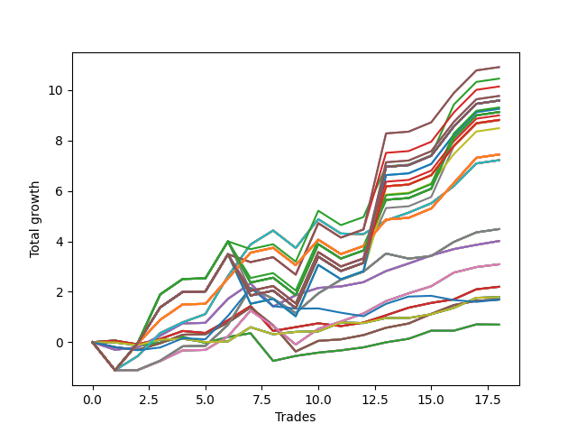

# Short Wallace Doodle 010 
- Symbol: AMZN_Unlimited
- Date Range: 03/23/2022 - 07/08/2022
- Trading Period: 7:20-12:30
- Number of Trades: 18



| Name | Win Percent | Profit | Avg Profit / Trade | Avg Time / Trade |      | Name | Win Percent | Profit | Avg Profit / Trade | Avg Time / Trade |
| ---- | ----------- | ------ | ------------------ | ---------------- | ---- | ---- | ----------- | ------ | ------------------ | ---------------- |
| Sorted By <br> Profit | | | | | | Sorted By <br> Win Percentage ||||
| One Hundred | 77.78 | 5454.75 | 303.04 | 130:52 |     | Sixty-Six | 88.89 | 2005.75 | 111.43 | 26:01 |
| Ninety-Nine | 77.78 | 5454.75 | 303.04 | 130:52 |     | Fifty-Eight | 88.89 | 2005.75 | 111.43 | 26:01 |
| Ninety-Seven | 77.78 | 5226.50 | 290.36 | 121:48 |     | Fifty | 88.89 | 2005.75 | 111.43 | 26:01 |
| Ninety-Eight | 77.78 | 5069.75 | 281.65 | 128:37 |     | Forty-Two | 88.89 | 2005.75 | 111.43 | 26:01 |
| One Hundred Ten | 77.78 | 4882.75 | 271.26 | 135:38 |     | Two | 88.89 | 2005.75 | 111.43 | 26:01 |
| One Hundred Nine | 77.78 | 4882.75 | 271.26 | 135:38 |     | One Hundred Twenty-Six | 83.33 | 3721.50 | 206.75 | 86:55 |
| One Hundred Thirty | 77.78 | 4791.75 | 266.21 | 136:33 |     | One Hundred Twenty-One | 83.33 | 3721.50 | 206.75 | 86:55 |
| One Hundred Twenty-Nine | 77.78 | 4791.75 | 266.21 | 136:33 |     | One Hundred Sixteen | 83.33 | 3721.50 | 206.75 | 86:55 |
| One Hundred Twenty-Five | 77.78 | 4791.75 | 266.21 | 136:33 |     | One Hundred Eleven | 83.33 | 3721.50 | 206.75 | 86:55 |
| One Hundred Twenty-Four | 77.78 | 4791.75 | 266.21 | 136:33 |     | One Hundred Six | 83.33 | 3721.50 | 206.75 | 86:55 |
| One Hundred Twenty | 77.78 | 4791.75 | 266.21 | 136:33 |     | One Hundred One | 83.33 | 3721.50 | 206.75 | 86:55 |
| One Hundred Ninteen | 77.78 | 4791.75 | 266.21 | 136:33 |     | Ninety-Six | 83.33 | 3721.50 | 206.75 | 86:55 |
| One Hundred Fifteen | 77.78 | 4791.75 | 266.21 | 136:33 |     | Ninety-One | 83.33 | 3721.50 | 206.75 | 86:55 |
| One Hundred Fourteen | 77.78 | 4791.75 | 266.21 | 136:33 |     | Eighty-One | 83.33 | 3721.50 | 206.75 | 86:55 |
| One Hundred Five | 77.78 | 4791.75 | 266.21 | 136:33 |     | One Hundred | 77.78 | 5454.75 | 303.04 | 130:52 |
| One Hundred Four | 77.78 | 4791.75 | 266.21 | 136:33 |     | Ninety-Nine | 77.78 | 5454.75 | 303.04 | 130:52 |
| Eighty-Five | 77.78 | 4791.75 | 266.21 | 136:33 |     | Ninety-Seven | 77.78 | 5226.50 | 290.36 | 121:48 |
| Eighty-Four | 77.78 | 4791.75 | 266.21 | 136:33 |     | Ninety-Eight | 77.78 | 5069.75 | 281.65 | 128:37 |
| One Hundred Seven | 77.78 | 4654.50 | 258.58 | 126:34 |     | One Hundred Ten | 77.78 | 4882.75 | 271.26 | 135:38 |
| Ninety-Five | 77.78 | 4628.50 | 257.14 | 136:20 |     | One Hundred Nine | 77.78 | 4882.75 | 271.26 | 135:38 |
| Ninety-Four | 77.78 | 4628.50 | 257.14 | 136:20 |     | One Hundred Thirty | 77.78 | 4791.75 | 266.21 | 136:33 |
| One Hundred Twenty-Seven | 77.78 | 4563.50 | 253.53 | 127:29 |     | One Hundred Twenty-Nine | 77.78 | 4791.75 | 266.21 | 136:33 |
| One Hundred Twenty-Two | 77.78 | 4563.50 | 253.53 | 127:29 |     | One Hundred Twenty-Five | 77.78 | 4791.75 | 266.21 | 136:33 |
| One Hundred Seventeen | 77.78 | 4563.50 | 253.53 | 127:29 |     | One Hundred Twenty-Four | 77.78 | 4791.75 | 266.21 | 136:33 |
| One Hundred Twelve | 77.78 | 4563.50 | 253.53 | 127:29 |     | One Hundred Twenty | 77.78 | 4791.75 | 266.21 | 136:33 |
| One Hundred Two | 77.78 | 4563.50 | 253.53 | 127:29 |     | One Hundred Ninteen | 77.78 | 4791.75 | 266.21 | 136:33 |
| Eighty-Two | 77.78 | 4563.50 | 253.53 | 127:29 |     | One Hundred Fifteen | 77.78 | 4791.75 | 266.21 | 136:33 |
| One Hundred Eight | 77.78 | 4497.75 | 249.87 | 133:23 |     | One Hundred Fourteen | 77.78 | 4791.75 | 266.21 | 136:33 |
| One Hundred Twenty-Eight | 77.78 | 4406.75 | 244.82 | 134:18 |     | One Hundred Five | 77.78 | 4791.75 | 266.21 | 136:33 |
| One Hundred Twenty-Three | 77.78 | 4406.75 | 244.82 | 134:18 |     | One Hundred Four | 77.78 | 4791.75 | 266.21 | 136:33 |
| One Hundred Eighteen | 77.78 | 4406.75 | 244.82 | 134:18 |     | Eighty-Five | 77.78 | 4791.75 | 266.21 | 136:33 |
| One Hundred Thirteen | 77.78 | 4406.75 | 244.82 | 134:18 |     | Eighty-Four | 77.78 | 4791.75 | 266.21 | 136:33 |
| One Hundred Three | 77.78 | 4406.75 | 244.82 | 134:18 |     | One Hundred Seven | 77.78 | 4654.50 | 258.58 | 126:34 |
| Eighty-Three | 77.78 | 4406.75 | 244.82 | 134:18 |     | Ninety-Five | 77.78 | 4628.50 | 257.14 | 136:20 |
| Ninety-Two | 77.78 | 4400.25 | 244.46 | 127:16 |     | Ninety-Four | 77.78 | 4628.50 | 257.14 | 136:20 |
| Ninety-Three | 77.78 | 4243.50 | 235.75 | 134:05 |     | One Hundred Twenty-Seven | 77.78 | 4563.50 | 253.53 | 127:29 |
| One Hundred Twenty-Six | 83.33 | 3721.50 | 206.75 | 86:55 |     | One Hundred Twenty-Two | 77.78 | 4563.50 | 253.53 | 127:29 |
| One Hundred Twenty-One | 83.33 | 3721.50 | 206.75 | 86:55 |     | One Hundred Seventeen | 77.78 | 4563.50 | 253.53 | 127:29 |
| One Hundred Sixteen | 83.33 | 3721.50 | 206.75 | 86:55 |     | One Hundred Twelve | 77.78 | 4563.50 | 253.53 | 127:29 |
| One Hundred Eleven | 83.33 | 3721.50 | 206.75 | 86:55 |     | One Hundred Two | 77.78 | 4563.50 | 253.53 | 127:29 |
| One Hundred Six | 83.33 | 3721.50 | 206.75 | 86:55 |     | Eighty-Two | 77.78 | 4563.50 | 253.53 | 127:29 |
| One Hundred One | 83.33 | 3721.50 | 206.75 | 86:55 |     | One Hundred Eight | 77.78 | 4497.75 | 249.87 | 133:23 |
| Ninety-Six | 83.33 | 3721.50 | 206.75 | 86:55 |     | One Hundred Twenty-Eight | 77.78 | 4406.75 | 244.82 | 134:18 |
| Ninety-One | 83.33 | 3721.50 | 206.75 | 86:55 |     | One Hundred Twenty-Three | 77.78 | 4406.75 | 244.82 | 134:18 |
| Eighty-One | 83.33 | 3721.50 | 206.75 | 86:55 |     | One Hundred Eighteen | 77.78 | 4406.75 | 244.82 | 134:18 |
| Seventy-One | 77.78 | 3609.25 | 200.51 | 71:18 |     | One Hundred Thirteen | 77.78 | 4406.75 | 244.82 | 134:18 |
| Sixty-Three | 77.78 | 3609.25 | 200.51 | 71:18 |     | One Hundred Three | 77.78 | 4406.75 | 244.82 | 134:18 |
| Fifty-Five | 77.78 | 3609.25 | 200.51 | 71:18 |     | Eighty-Three | 77.78 | 4406.75 | 244.82 | 134:18 |
| Forty-Seven | 77.78 | 3609.25 | 200.51 | 71:18 |     | Ninety-Two | 77.78 | 4400.25 | 244.46 | 127:16 |
| Seven | 77.78 | 3609.25 | 200.51 | 71:18 |     | Ninety-Three | 77.78 | 4243.50 | 235.75 | 134:05 |
| Sixty-Nine | 77.78 | 2242.75 | 124.60 | 52:40 |     | Seventy-One | 77.78 | 3609.25 | 200.51 | 71:18 |
| Sixty-One | 77.78 | 2242.75 | 124.60 | 52:40 |     | Sixty-Three | 77.78 | 3609.25 | 200.51 | 71:18 |
| Fifty-Three | 77.78 | 2242.75 | 124.60 | 52:40 |     | Fifty-Five | 77.78 | 3609.25 | 200.51 | 71:18 |
| Forty-Five | 77.78 | 2242.75 | 124.60 | 52:40 |     | Forty-Seven | 77.78 | 3609.25 | 200.51 | 71:18 |
| Five | 77.78 | 2242.75 | 124.60 | 52:40 |     | Seven | 77.78 | 3609.25 | 200.51 | 71:18 |
| Sixty-Six | 88.89 | 2005.75 | 111.43 | 26:01 |     | Sixty-Nine | 77.78 | 2242.75 | 124.60 | 52:40 |
| Fifty-Eight | 88.89 | 2005.75 | 111.43 | 26:01 |     | Sixty-One | 77.78 | 2242.75 | 124.60 | 52:40 |
| Fifty | 88.89 | 2005.75 | 111.43 | 26:01 |     | Fifty-Three | 77.78 | 2242.75 | 124.60 | 52:40 |
| Forty-Two | 88.89 | 2005.75 | 111.43 | 26:01 |     | Forty-Five | 77.78 | 2242.75 | 124.60 | 52:40 |
| Two | 88.89 | 2005.75 | 111.43 | 26:01 |     | Five | 77.78 | 2242.75 | 124.60 | 52:40 |
| Sixty-Eight | 77.78 | 1544.50 | 85.81 | 36:39 |     | Sixty-Eight | 77.78 | 1544.50 | 85.81 | 36:39 |
| Sixty | 77.78 | 1544.50 | 85.81 | 36:39 |     | Sixty | 77.78 | 1544.50 | 85.81 | 36:39 |
| Fifty-Two | 77.78 | 1544.50 | 85.81 | 36:39 |     | Fifty-Two | 77.78 | 1544.50 | 85.81 | 36:39 |
| Forty-Four | 77.78 | 1544.50 | 85.81 | 36:39 |     | Forty-Four | 77.78 | 1544.50 | 85.81 | 36:39 |
| Four | 77.78 | 1544.50 | 85.81 | 36:39 |     | Four | 77.78 | 1544.50 | 85.81 | 36:39 |
| Sixty-Five | 77.78 | 1099.00 | 61.06 | 15:43 |     | Sixty-Five | 77.78 | 1099.00 | 61.06 | 15:43 |
| Fifty-Seven | 77.78 | 1099.00 | 61.06 | 15:43 |     | Fifty-Seven | 77.78 | 1099.00 | 61.06 | 15:43 |
| Forty-Nine | 77.78 | 1099.00 | 61.06 | 15:43 |     | Forty-Nine | 77.78 | 1099.00 | 61.06 | 15:43 |
| Forty-One | 77.78 | 1099.00 | 61.06 | 15:43 |     | Forty-One | 77.78 | 1099.00 | 61.06 | 15:43 |
| One | 77.78 | 1099.00 | 61.06 | 15:43 |     | One | 77.78 | 1099.00 | 61.06 | 15:43 |
| Seventy | 66.67 | 894.75 | 49.71 | 06:33 |     | Sixty-Seven | 77.78 | 846.00 | 47.00 | 24:53 |
| Sixty-Two | 66.67 | 894.75 | 49.71 | 06:33 |     | Fifty-Nine | 77.78 | 846.00 | 47.00 | 24:53 |
| Fifty-Four | 66.67 | 894.75 | 49.71 | 06:33 |     | Fifty-One | 77.78 | 846.00 | 47.00 | 24:53 |
| Forty-Six | 66.67 | 894.75 | 49.71 | 06:33 |     | Forty-Three | 77.78 | 846.00 | 47.00 | 24:53 |
| Six | 66.67 | 894.75 | 49.71 | 06:33 |     | Three | 77.78 | 846.00 | 47.00 | 24:53 |
| Sixty-Seven | 77.78 | 846.00 | 47.00 | 24:53 |     | Sixty-Four | 72.22 | 347.75 | 19.32 | 10:09 |
| Fifty-Nine | 77.78 | 846.00 | 47.00 | 24:53 |     | Fifty-Six | 72.22 | 347.75 | 19.32 | 10:09 |
| Fifty-One | 77.78 | 846.00 | 47.00 | 24:53 |     | Forty-Eight | 72.22 | 347.75 | 19.32 | 10:09 |
| Forty-Three | 77.78 | 846.00 | 47.00 | 24:53 |     | Forty | 72.22 | 347.75 | 19.32 | 10:09 |
| Three | 77.78 | 846.00 | 47.00 | 24:53 |     | Zero | 72.22 | 347.75 | 19.32 | 10:09 |
| Seventy-Three | 50.00 | 844.75 | 46.93 | 10:48 |     | Seventy | 66.67 | 894.75 | 49.71 | 06:33 |
| Sixty-Four | 72.22 | 347.75 | 19.32 | 10:09 |     | Sixty-Two | 66.67 | 894.75 | 49.71 | 06:33 |
| Fifty-Six | 72.22 | 347.75 | 19.32 | 10:09 |     | Fifty-Four | 66.67 | 894.75 | 49.71 | 06:33 |
| Forty-Eight | 72.22 | 347.75 | 19.32 | 10:09 |     | Forty-Six | 66.67 | 894.75 | 49.71 | 06:33 |
| Forty | 72.22 | 347.75 | 19.32 | 10:09 |     | Six | 66.67 | 894.75 | 49.71 | 06:33 |
| Zero | 72.22 | 347.75 | 19.32 | 10:09 |     | Seventy-Three | 50.00 | 844.75 | 46.93 | 10:48 |

## NO STOPLOSS

### Test Zero
* Sell when price hits the middle line of the 20p bollinger
* No Stoploss
* Results:
```
Total Trades: 18
Percent Up: 27.78
Percent Down: 72.22
Total Points Moved Down: 0.70
Potential Profit: 347.75
Total Points Ups: 1.58 Count Ups: 5
Total Points Downs: 2.27 Count Downs: 13
```

<details><summary>Trades</summary>

<code>In: 2022-03-29 10:43:00		Out: 2022-03-29 10:45:25		Total Position Time: 02:25		Total Move Down: 0.07		Total to Date: 0.07</code> <br />
<code>In: 2022-03-30 09:46:00		Out: 2022-03-30 10:05:15		Total Position Time: 19:15		Total Move Down: -0.22		Total to Date: -0.15</code> <br />
<code>In: 2022-03-30 10:00:00		Out: 2022-03-30 10:05:15		Total Position Time: 05:15		Total Move Down: 0.14		Total to Date: -0.02</code> <br />
<code>In: 2022-03-31 10:54:00		Out: 2022-03-31 11:00:10		Total Position Time: 06:10		Total Move Down: 0.23		Total to Date: 0.21</code> <br />
<code>In: 2022-04-22 12:18:00		Out: 2022-04-22 12:42:40		Total Position Time: 24:40		Total Move Down: -0.25		Total to Date: -0.03</code> <br />
<code>In: 2022-04-26 10:01:00		Out: 2022-04-26 10:02:55		Total Position Time: 01:55		Total Move Down: 0.24		Total to Date: 0.20</code> <br />
<code>In: 2022-05-02 09:36:00		Out: 2022-05-02 09:37:15		Total Position Time: 01:15		Total Move Down: 0.15		Total to Date: 0.35</code> <br />
<code>In: 2022-05-10 10:34:00		Out: 2022-05-10 11:05:55		Total Position Time: 31:55		Total Move Down: -1.10		Total to Date: -0.74</code> <br />
<code>In: 2022-06-01 10:13:00		Out: 2022-06-01 10:24:20		Total Position Time: 11:20		Total Move Down: 0.20		Total to Date: -0.54</code> <br />
<code>In: 2022-06-06 10:40:00		Out: 2022-06-06 10:53:25		Total Position Time: 13:25		Total Move Down: 0.13		Total to Date: -0.41</code> <br />
<code>In: 2022-06-07 11:12:00		Out: 2022-06-07 11:19:50		Total Position Time: 07:50		Total Move Down: 0.09		Total to Date: -0.32</code> <br />
<code>In: 2022-06-08 12:25:00		Out: 2022-06-08 12:32:10		Total Position Time: 07:10		Total Move Down: 0.12		Total to Date: -0.20</code> <br />
<code>In: 2022-06-09 08:45:00		Out: 2022-06-09 08:46:40		Total Position Time: 01:40		Total Move Down: 0.20		Total to Date: -0.00</code> <br />
<code>In: 2022-06-10 10:25:00		Out: 2022-06-10 10:31:15		Total Position Time: 06:15		Total Move Down: 0.14		Total to Date: 0.14</code> <br />
<code>In: 2022-06-10 10:53:00		Out: 2022-06-10 10:57:10		Total Position Time: 04:10		Total Move Down: 0.32		Total to Date: 0.46</code> <br />
<code>In: 2022-06-14 08:49:00		Out: 2022-06-14 09:02:15		Total Position Time: 13:15		Total Move Down: -0.00		Total to Date: 0.46</code> <br />
<code>In: 2022-06-16 09:51:00		Out: 2022-06-16 09:55:20		Total Position Time: 04:20		Total Move Down: 0.25		Total to Date: 0.71</code> <br />
<code>In: 2022-06-21 12:03:00		Out: 2022-06-21 12:23:40		Total Position Time: 20:40		Total Move Down: -0.01		Total to Date: 0.70</code> <br />


</details>

### Test One
* Sell when the price hits the upper line of the 20p 1std bollinger
* No Stoploss
* Results:
```
Total Trades: 18
Percent Up: 22.22
Percent Down: 77.78
Total Points Moved Down: 2.20
Potential Profit: 1099.00
Total Points Ups: 1.32 Count Ups: 4
Total Points Downs: 3.52 Count Downs: 14
```

<details><summary>Trades</summary>

<code>In: 2022-03-29 10:43:00		Out: 2022-03-29 10:45:40		Total Position Time: 02:40		Total Move Down: 0.06		Total to Date: 0.06</code> <br />
<code>In: 2022-03-30 09:46:00		Out: 2022-03-30 10:07:00		Total Position Time: 21:00		Total Move Down: -0.15		Total to Date: -0.08</code> <br />
<code>In: 2022-03-30 10:00:00		Out: 2022-03-30 10:07:00		Total Position Time: 07:00		Total Move Down: 0.21		Total to Date: 0.13</code> <br />
<code>In: 2022-03-31 10:54:00		Out: 2022-03-31 11:00:25		Total Position Time: 06:25		Total Move Down: 0.31		Total to Date: 0.44</code> <br />
<code>In: 2022-04-22 12:18:00		Out: 2022-04-22 12:46:05		Total Position Time: 28:05		Total Move Down: -0.08		Total to Date: 0.36</code> <br />
<code>In: 2022-04-26 10:01:00		Out: 2022-04-26 10:04:10		Total Position Time: 03:10		Total Move Down: 0.51		Total to Date: 0.87</code> <br />
<code>In: 2022-05-02 09:36:00		Out: 2022-05-02 09:39:35		Total Position Time: 03:35		Total Move Down: 0.56		Total to Date: 1.43</code> <br />
<code>In: 2022-05-10 10:34:00		Out: 2022-05-10 11:06:35		Total Position Time: 32:35		Total Move Down: -0.99		Total to Date: 0.44</code> <br />
<code>In: 2022-06-01 10:13:00		Out: 2022-06-01 10:30:35		Total Position Time: 17:35		Total Move Down: 0.15		Total to Date: 0.60</code> <br />
<code>In: 2022-06-06 10:40:00		Out: 2022-06-06 11:03:35		Total Position Time: 23:35		Total Move Down: 0.15		Total to Date: 0.75</code> <br />
<code>In: 2022-06-07 11:12:00		Out: 2022-06-07 11:41:05		Total Position Time: 29:05		Total Move Down: -0.11		Total to Date: 0.64</code> <br />
<code>In: 2022-06-08 12:25:00		Out: 2022-06-08 12:39:35		Total Position Time: 14:35		Total Move Down: 0.14		Total to Date: 0.78</code> <br />
<code>In: 2022-06-09 08:45:00		Out: 2022-06-09 08:48:05		Total Position Time: 03:05		Total Move Down: 0.29		Total to Date: 1.07</code> <br />
<code>In: 2022-06-10 10:25:00		Out: 2022-06-10 10:33:25		Total Position Time: 08:25		Total Move Down: 0.30		Total to Date: 1.37</code> <br />
<code>In: 2022-06-10 10:53:00		Out: 2022-06-10 11:28:25		Total Position Time: 35:25		Total Move Down: 0.19		Total to Date: 1.56</code> <br />
<code>In: 2022-06-14 08:49:00		Out: 2022-06-14 09:04:05		Total Position Time: 15:05		Total Move Down: 0.14		Total to Date: 1.70</code> <br />
<code>In: 2022-06-16 09:51:00		Out: 2022-06-16 09:59:50		Total Position Time: 08:50		Total Move Down: 0.40		Total to Date: 2.10</code> <br />
<code>In: 2022-06-21 12:03:00		Out: 2022-06-21 12:25:50		Total Position Time: 22:50		Total Move Down: 0.10		Total to Date: 2.20</code> <br />


</details>

### Test Two
* Sell when the price hits the upper line of the 20p 2std bollinger
* No Stoploss
* Results:
```
Total Trades: 18
Percent Up: 11.11
Percent Down: 88.89
Total Points Moved Down: 4.01
Potential Profit: 2005.75
Total Points Ups: 1.22 Count Ups: 2
Total Points Downs: 5.23 Count Downs: 16
```

<details><summary>Trades</summary>

<code>In: 2022-03-29 10:43:00		Out: 2022-03-29 11:16:25		Total Position Time: 33:25		Total Move Down: -0.30		Total to Date: -0.30</code> <br />
<code>In: 2022-03-30 09:46:00		Out: 2022-03-30 10:45:05		Total Position Time: 59:05		Total Move Down: 0.10		Total to Date: -0.20</code> <br />
<code>In: 2022-03-30 10:00:00		Out: 2022-03-30 10:45:05		Total Position Time: 45:05		Total Move Down: 0.46		Total to Date: 0.26</code> <br />
<code>In: 2022-03-31 10:54:00		Out: 2022-03-31 11:10:35		Total Position Time: 16:35		Total Move Down: 0.49		Total to Date: 0.75</code> <br />
<code>In: 2022-04-22 12:18:00		Out: 2022-04-22 12:47:00		Total Position Time: 29:00		Total Move Down: 0.02		Total to Date: 0.77</code> <br />
<code>In: 2022-04-26 10:01:00		Out: 2022-04-26 10:15:05		Total Position Time: 14:05		Total Move Down: 0.95		Total to Date: 1.72</code> <br />
<code>In: 2022-05-02 09:36:00		Out: 2022-05-02 09:39:40		Total Position Time: 03:40		Total Move Down: 0.61		Total to Date: 2.33</code> <br />
<code>In: 2022-05-10 10:34:00		Out: 2022-05-10 11:08:00		Total Position Time: 34:00		Total Move Down: -0.92		Total to Date: 1.41</code> <br />
<code>In: 2022-06-01 10:13:00		Out: 2022-06-01 10:31:40		Total Position Time: 18:40		Total Move Down: 0.45		Total to Date: 1.86</code> <br />
<code>In: 2022-06-06 10:40:00		Out: 2022-06-06 11:05:15		Total Position Time: 25:15		Total Move Down: 0.29		Total to Date: 2.15</code> <br />
<code>In: 2022-06-07 11:12:00		Out: 2022-06-07 11:41:50		Total Position Time: 29:50		Total Move Down: 0.06		Total to Date: 2.21</code> <br />
<code>In: 2022-06-08 12:25:00		Out: 2022-06-08 12:40:30		Total Position Time: 15:30		Total Move Down: 0.17		Total to Date: 2.38</code> <br />
<code>In: 2022-06-09 08:45:00		Out: 2022-06-09 08:48:20		Total Position Time: 03:20		Total Move Down: 0.44		Total to Date: 2.82</code> <br />
<code>In: 2022-06-10 10:25:00		Out: 2022-06-10 10:39:10		Total Position Time: 14:10		Total Move Down: 0.30		Total to Date: 3.12</code> <br />
<code>In: 2022-06-10 10:53:00		Out: 2022-06-10 11:29:15		Total Position Time: 36:15		Total Move Down: 0.32		Total to Date: 3.44</code> <br />
<code>In: 2022-06-14 08:49:00		Out: 2022-06-14 09:05:15		Total Position Time: 16:15		Total Move Down: 0.25		Total to Date: 3.69</code> <br />
<code>In: 2022-06-16 09:51:00		Out: 2022-06-16 10:21:25		Total Position Time: 30:25		Total Move Down: 0.17		Total to Date: 3.86</code> <br />
<code>In: 2022-06-21 12:03:00		Out: 2022-06-21 12:46:45		Total Position Time: 43:45		Total Move Down: 0.15		Total to Date: 4.01</code> <br />


</details>

### Test Three
* Sell when price hits the middle line of the 50p bollinger
* No Stoploss
* Results:
```
Total Trades: 18
Percent Up: 22.22
Percent Down: 77.78
Total Points Moved Down: 1.69
Potential Profit: 846.00
Total Points Ups: 2.05 Count Ups: 4
Total Points Downs: 3.74 Count Downs: 14
```

<details><summary>Trades</summary>

<code>In: 2022-03-29 10:43:00		Out: 2022-03-29 11:21:20		Total Position Time: 38:20		Total Move Down: -0.20		Total to Date: -0.20</code> <br />
<code>In: 2022-03-30 09:46:00		Out: 2022-03-30 10:20:10		Total Position Time: 34:10		Total Move Down: -0.10		Total to Date: -0.30</code> <br />
<code>In: 2022-03-30 10:00:00		Out: 2022-03-30 10:20:10		Total Position Time: 20:10		Total Move Down: 0.26		Total to Date: -0.04</code> <br />
<code>In: 2022-03-31 10:54:00		Out: 2022-03-31 11:00:45		Total Position Time: 06:45		Total Move Down: 0.34		Total to Date: 0.30</code> <br />
<code>In: 2022-04-22 12:18:00		Out: 2022-04-22 12:47:00		Total Position Time: 29:00		Total Move Down: 0.02		Total to Date: 0.31</code> <br />
<code>In: 2022-04-26 10:01:00		Out: 2022-04-26 10:04:00		Total Position Time: 03:00		Total Move Down: 0.46		Total to Date: 0.77</code> <br />
<code>In: 2022-05-02 09:36:00		Out: 2022-05-02 09:39:45		Total Position Time: 03:45		Total Move Down: 0.61		Total to Date: 1.38</code> <br />
<code>In: 2022-05-10 10:34:00		Out: 2022-05-10 11:16:05		Total Position Time: 42:05		Total Move Down: -0.72		Total to Date: 0.67</code> <br />
<code>In: 2022-06-01 10:13:00		Out: 2022-06-01 11:46:40		Total Position Time: 93:40		Total Move Down: -1.03		Total to Date: -0.37</code> <br />
<code>In: 2022-06-06 10:40:00		Out: 2022-06-06 11:07:20		Total Position Time: 27:20		Total Move Down: 0.42		Total to Date: 0.05</code> <br />
<code>In: 2022-06-07 11:12:00		Out: 2022-06-07 11:41:50		Total Position Time: 29:50		Total Move Down: 0.06		Total to Date: 0.11</code> <br />
<code>In: 2022-06-08 12:25:00		Out: 2022-06-08 12:40:30		Total Position Time: 15:30		Total Move Down: 0.17		Total to Date: 0.28</code> <br />
<code>In: 2022-06-09 08:45:00		Out: 2022-06-09 08:48:05		Total Position Time: 03:05		Total Move Down: 0.29		Total to Date: 0.57</code> <br />
<code>In: 2022-06-10 10:25:00		Out: 2022-06-10 10:32:20		Total Position Time: 07:20		Total Move Down: 0.17		Total to Date: 0.74</code> <br />
<code>In: 2022-06-10 10:53:00		Out: 2022-06-10 11:01:15		Total Position Time: 08:15		Total Move Down: 0.38		Total to Date: 1.12</code> <br />
<code>In: 2022-06-14 08:49:00		Out: 2022-06-14 09:06:20		Total Position Time: 17:20		Total Move Down: 0.35		Total to Date: 1.47</code> <br />
<code>In: 2022-06-16 09:51:00		Out: 2022-06-16 10:21:25		Total Position Time: 30:25		Total Move Down: 0.17		Total to Date: 1.64</code> <br />
<code>In: 2022-06-21 12:03:00		Out: 2022-06-21 12:41:00		Total Position Time: 38:00		Total Move Down: 0.05		Total to Date: 1.69</code> <br />


</details>

### Test Four
* Sell when the price hits the upper line of the 50p 1std bollinger
* No Stoploss
* Results:
```
Total Trades: 18
Percent Up: 22.22
Percent Down: 77.78
Total Points Moved Down: 3.09
Potential Profit: 1544.50
Total Points Ups: 2.46 Count Ups: 4
Total Points Downs: 5.54 Count Downs: 14
```

<details><summary>Trades</summary>

<code>In: 2022-03-29 10:43:00		Out: 2022-03-29 12:47:00		Total Position Time: 124:00		Total Move Down: -1.11		Total to Date: -1.11</code> <br />
<code>In: 2022-03-30 09:46:00		Out: 2022-03-30 10:25:20		Total Position Time: 39:20		Total Move Down: -0.00		Total to Date: -1.11</code> <br />
<code>In: 2022-03-30 10:00:00		Out: 2022-03-30 10:25:20		Total Position Time: 25:20		Total Move Down: 0.36		Total to Date: -0.75</code> <br />
<code>In: 2022-03-31 10:54:00		Out: 2022-03-31 11:09:20		Total Position Time: 15:20		Total Move Down: 0.43		Total to Date: -0.32</code> <br />
<code>In: 2022-04-22 12:18:00		Out: 2022-04-22 12:47:00		Total Position Time: 29:00		Total Move Down: 0.02		Total to Date: -0.31</code> <br />
<code>In: 2022-04-26 10:01:00		Out: 2022-04-26 10:10:05		Total Position Time: 09:05		Total Move Down: 0.53		Total to Date: 0.23</code> <br />
<code>In: 2022-05-02 09:36:00		Out: 2022-05-02 09:41:40		Total Position Time: 05:40		Total Move Down: 1.03		Total to Date: 1.25</code> <br />
<code>In: 2022-05-10 10:34:00		Out: 2022-05-10 11:25:10		Total Position Time: 51:10		Total Move Down: -0.61		Total to Date: 0.64</code> <br />
<code>In: 2022-06-01 10:13:00		Out: 2022-06-01 11:51:10		Total Position Time: 98:10		Total Move Down: -0.73		Total to Date: -0.09</code> <br />
<code>In: 2022-06-06 10:40:00		Out: 2022-06-06 11:15:10		Total Position Time: 35:10		Total Move Down: 0.62		Total to Date: 0.53</code> <br />
<code>In: 2022-06-07 11:12:00		Out: 2022-06-07 11:43:15		Total Position Time: 31:15		Total Move Down: 0.29		Total to Date: 0.82</code> <br />
<code>In: 2022-06-08 12:25:00		Out: 2022-06-08 12:46:30		Total Position Time: 21:30		Total Move Down: 0.32		Total to Date: 1.14</code> <br />
<code>In: 2022-06-09 08:45:00		Out: 2022-06-09 08:48:40		Total Position Time: 03:40		Total Move Down: 0.49		Total to Date: 1.63</code> <br />
<code>In: 2022-06-10 10:25:00		Out: 2022-06-10 10:33:30		Total Position Time: 08:30		Total Move Down: 0.31		Total to Date: 1.94</code> <br />
<code>In: 2022-06-10 10:53:00		Out: 2022-06-10 11:41:20		Total Position Time: 48:20		Total Move Down: 0.28		Total to Date: 2.22</code> <br />
<code>In: 2022-06-14 08:49:00		Out: 2022-06-14 09:15:20		Total Position Time: 26:20		Total Move Down: 0.54		Total to Date: 2.76</code> <br />
<code>In: 2022-06-16 09:51:00		Out: 2022-06-16 10:35:30		Total Position Time: 44:30		Total Move Down: 0.22		Total to Date: 2.98</code> <br />
<code>In: 2022-06-21 12:03:00		Out: 2022-06-21 12:46:25		Total Position Time: 43:25		Total Move Down: 0.11		Total to Date: 3.09</code> <br />


</details>

### Test Five
* Sell when the price hits the upper line of the 50p 2std bollinger
* No Stoploss
* Results:
```
Total Trades: 18
Percent Up: 22.22
Percent Down: 77.78
Total Points Moved Down: 4.49
Potential Profit: 2242.75
Total Points Ups: 2.30 Count Ups: 4
Total Points Downs: 6.79 Count Downs: 14
```

<details><summary>Trades</summary>

<code>In: 2022-03-29 10:43:00		Out: 2022-03-29 12:47:00		Total Position Time: 124:00		Total Move Down: -1.11		Total to Date: -1.11</code> <br />
<code>In: 2022-03-30 09:46:00		Out: 2022-03-30 10:40:05		Total Position Time: 54:05		Total Move Down: 0.01		Total to Date: -1.10</code> <br />
<code>In: 2022-03-30 10:00:00		Out: 2022-03-30 10:40:05		Total Position Time: 40:05		Total Move Down: 0.37		Total to Date: -0.73</code> <br />
<code>In: 2022-03-31 10:54:00		Out: 2022-03-31 11:16:25		Total Position Time: 22:25		Total Move Down: 0.57		Total to Date: -0.16</code> <br />
<code>In: 2022-04-22 12:18:00		Out: 2022-04-22 12:47:00		Total Position Time: 29:00		Total Move Down: 0.02		Total to Date: -0.15</code> <br />
<code>In: 2022-04-26 10:01:00		Out: 2022-04-26 10:14:00		Total Position Time: 13:00		Total Move Down: 0.83		Total to Date: 0.69</code> <br />
<code>In: 2022-05-02 09:36:00		Out: 2022-05-02 09:59:45		Total Position Time: 23:45		Total Move Down: 1.46		Total to Date: 2.15</code> <br />
<code>In: 2022-05-10 10:34:00		Out: 2022-05-10 11:27:15		Total Position Time: 53:15		Total Move Down: -0.42		Total to Date: 1.73</code> <br />
<code>In: 2022-06-01 10:13:00		Out: 2022-06-01 11:57:20		Total Position Time: 104:20		Total Move Down: -0.57		Total to Date: 1.16</code> <br />
<code>In: 2022-06-06 10:40:00		Out: 2022-06-06 11:17:05		Total Position Time: 37:05		Total Move Down: 0.78		Total to Date: 1.94</code> <br />
<code>In: 2022-06-07 11:12:00		Out: 2022-06-07 11:47:35		Total Position Time: 35:35		Total Move Down: 0.54		Total to Date: 2.48</code> <br />
<code>In: 2022-06-08 12:25:00		Out: 2022-06-08 12:47:00		Total Position Time: 22:00		Total Move Down: 0.32		Total to Date: 2.80</code> <br />
<code>In: 2022-06-09 08:45:00		Out: 2022-06-09 08:50:20		Total Position Time: 05:20		Total Move Down: 0.72		Total to Date: 3.52</code> <br />
<code>In: 2022-06-10 10:25:00		Out: 2022-06-10 12:43:35		Total Position Time: 138:35		Total Move Down: -0.20		Total to Date: 3.32</code> <br />
<code>In: 2022-06-10 10:53:00		Out: 2022-06-10 12:43:35		Total Position Time: 110:35		Total Move Down: 0.10		Total to Date: 3.42</code> <br />
<code>In: 2022-06-14 08:49:00		Out: 2022-06-14 09:35:00		Total Position Time: 46:00		Total Move Down: 0.56		Total to Date: 3.98</code> <br />
<code>In: 2022-06-16 09:51:00		Out: 2022-06-16 10:36:10		Total Position Time: 45:10		Total Move Down: 0.38		Total to Date: 4.36</code> <br />
<code>In: 2022-06-21 12:03:00		Out: 2022-06-21 12:47:00		Total Position Time: 44:00		Total Move Down: 0.13		Total to Date: 4.49</code> <br />


</details>

### Test Six
* Sell when the price hits the middle line of the 1std VWAP
* No Stoploss
* Results:
```
Total Trades: 18
Percent Up: 33.33
Percent Down: 66.67
Total Points Moved Down: 1.79
Potential Profit: 894.75
Total Points Ups: 0.55 Count Ups: 6
Total Points Downs: 2.34 Count Downs: 12
```

<details><summary>Trades</summary>

<code>In: 2022-03-29 10:43:00		Out: 2022-03-29 10:44:10		Total Position Time: 01:10		Total Move Down: -0.01		Total to Date: -0.01</code> <br />
<code>In: 2022-03-30 09:46:00		Out: 2022-03-30 09:47:10		Total Position Time: 01:10		Total Move Down: -0.11		Total to Date: -0.12</code> <br />
<code>In: 2022-03-30 10:00:00		Out: 2022-03-30 10:05:25		Total Position Time: 05:25		Total Move Down: 0.22		Total to Date: 0.10</code> <br />
<code>In: 2022-03-31 10:54:00		Out: 2022-03-31 10:56:00		Total Position Time: 02:00		Total Move Down: 0.04		Total to Date: 0.14</code> <br />
<code>In: 2022-04-22 12:18:00		Out: 2022-04-22 12:19:10		Total Position Time: 01:10		Total Move Down: -0.13		Total to Date: 0.00</code> <br />
<code>In: 2022-04-26 10:01:00		Out: 2022-04-26 10:02:10		Total Position Time: 01:10		Total Move Down: 0.03		Total to Date: 0.03</code> <br />
<code>In: 2022-05-02 09:36:00		Out: 2022-05-02 09:39:35		Total Position Time: 03:35		Total Move Down: 0.56		Total to Date: 0.59</code> <br />
<code>In: 2022-05-10 10:34:00		Out: 2022-05-10 10:35:10		Total Position Time: 01:10		Total Move Down: -0.28		Total to Date: 0.32</code> <br />
<code>In: 2022-06-01 10:13:00		Out: 2022-06-01 10:14:10		Total Position Time: 01:10		Total Move Down: 0.09		Total to Date: 0.41</code> <br />
<code>In: 2022-06-06 10:40:00		Out: 2022-06-06 10:41:10		Total Position Time: 01:10		Total Move Down: 0.02		Total to Date: 0.43</code> <br />
<code>In: 2022-06-07 11:12:00		Out: 2022-06-07 11:43:45		Total Position Time: 31:45		Total Move Down: 0.35		Total to Date: 0.78</code> <br />
<code>In: 2022-06-08 12:25:00		Out: 2022-06-08 12:26:10		Total Position Time: 01:10		Total Move Down: -0.02		Total to Date: 0.76</code> <br />
<code>In: 2022-06-09 08:45:00		Out: 2022-06-09 08:46:40		Total Position Time: 01:40		Total Move Down: 0.20		Total to Date: 0.96</code> <br />
<code>In: 2022-06-10 10:25:00		Out: 2022-06-10 10:26:10		Total Position Time: 01:10		Total Move Down: -0.00		Total to Date: 0.96</code> <br />
<code>In: 2022-06-10 10:53:00		Out: 2022-06-10 10:54:10		Total Position Time: 01:10		Total Move Down: 0.15		Total to Date: 1.11</code> <br />
<code>In: 2022-06-14 08:49:00		Out: 2022-06-14 09:04:25		Total Position Time: 15:25		Total Move Down: 0.25		Total to Date: 1.36</code> <br />
<code>In: 2022-06-16 09:51:00		Out: 2022-06-16 10:36:30		Total Position Time: 45:30		Total Move Down: 0.40		Total to Date: 1.76</code> <br />
<code>In: 2022-06-21 12:03:00		Out: 2022-06-21 12:04:10		Total Position Time: 01:10		Total Move Down: 0.03		Total to Date: 1.79</code> <br />


</details>

### Test Seven
* Sell when the price hits the upper line of the 1std VWAP
* No Stoploss
* Results:
```
Total Trades: 18
Percent Up: 22.22
Percent Down: 77.78
Total Points Moved Down: 7.22
Potential Profit: 3609.25
Total Points Ups: 2.39 Count Ups: 4
Total Points Downs: 9.61 Count Downs: 14
```

<details><summary>Trades</summary>

<code>In: 2022-03-29 10:43:00		Out: 2022-03-29 12:47:00		Total Position Time: 124:00		Total Move Down: -1.11		Total to Date: -1.11</code> <br />
<code>In: 2022-03-30 09:46:00		Out: 2022-03-30 11:26:50		Total Position Time: 100:50		Total Move Down: 0.56		Total to Date: -0.55</code> <br />
<code>In: 2022-03-30 10:00:00		Out: 2022-03-30 11:26:50		Total Position Time: 86:50		Total Move Down: 0.92		Total to Date: 0.36</code> <br />
<code>In: 2022-03-31 10:54:00		Out: 2022-03-31 11:09:20		Total Position Time: 15:20		Total Move Down: 0.43		Total to Date: 0.79</code> <br />
<code>In: 2022-04-22 12:18:00		Out: 2022-04-22 12:24:35		Total Position Time: 06:35		Total Move Down: 0.33		Total to Date: 1.11</code> <br />
<code>In: 2022-04-26 10:01:00		Out: 2022-04-26 12:46:40		Total Position Time: 165:40		Total Move Down: 1.50		Total to Date: 2.62</code> <br />
<code>In: 2022-05-02 09:36:00		Out: 2022-05-02 09:55:10		Total Position Time: 19:10		Total Move Down: 1.25		Total to Date: 3.87</code> <br />
<code>In: 2022-05-10 10:34:00		Out: 2022-05-10 12:46:15		Total Position Time: 132:15		Total Move Down: 0.55		Total to Date: 4.43</code> <br />
<code>In: 2022-06-01 10:13:00		Out: 2022-06-01 12:47:00		Total Position Time: 154:00		Total Move Down: -0.69		Total to Date: 3.74</code> <br />
<code>In: 2022-06-06 10:40:00		Out: 2022-06-06 11:23:40		Total Position Time: 43:40		Total Move Down: 1.14		Total to Date: 4.88</code> <br />
<code>In: 2022-06-07 11:12:00		Out: 2022-06-07 12:47:00		Total Position Time: 95:00		Total Move Down: -0.57		Total to Date: 4.31</code> <br />
<code>In: 2022-06-08 12:25:00		Out: 2022-06-08 12:26:10		Total Position Time: 01:10		Total Move Down: -0.02		Total to Date: 4.29</code> <br />
<code>In: 2022-06-09 08:45:00		Out: 2022-06-09 08:48:50		Total Position Time: 03:50		Total Move Down: 0.54		Total to Date: 4.83</code> <br />
<code>In: 2022-06-10 10:25:00		Out: 2022-06-10 10:34:05		Total Position Time: 09:05		Total Move Down: 0.31		Total to Date: 5.14</code> <br />
<code>In: 2022-06-10 10:53:00		Out: 2022-06-10 12:47:00		Total Position Time: 114:00		Total Move Down: 0.37		Total to Date: 5.51</code> <br />
<code>In: 2022-06-14 08:49:00		Out: 2022-06-14 10:43:10		Total Position Time: 114:10		Total Move Down: 0.68		Total to Date: 6.19</code> <br />
<code>In: 2022-06-16 09:51:00		Out: 2022-06-16 10:45:05		Total Position Time: 54:05		Total Move Down: 0.90		Total to Date: 7.09</code> <br />
<code>In: 2022-06-21 12:03:00		Out: 2022-06-21 12:47:00		Total Position Time: 44:00		Total Move Down: 0.13		Total to Date: 7.22</code> <br />


</details>

## STOPLOSS OF 5

### Test Forty
* Sell when price hits the middle line of the 20p bollinger
* Stoploss is -5 points
* Results:
```
Total Trades: 18
Percent Up: 27.78
Percent Down: 72.22
Total Points Moved Down: 0.70
Potential Profit: 347.75
Total Points Ups: 1.58 Count Ups: 5
Total Points Downs: 2.27 Count Downs: 13
```

<details><summary>Trades</summary>

<code>In: 2022-03-29 10:43:00		Out: 2022-03-29 10:45:25		Total Position Time: 02:25		Total Move Down: 0.07		Total to Date: 0.07</code> <br />
<code>In: 2022-03-30 09:46:00		Out: 2022-03-30 10:05:15		Total Position Time: 19:15		Total Move Down: -0.22		Total to Date: -0.15</code> <br />
<code>In: 2022-03-30 10:00:00		Out: 2022-03-30 10:05:15		Total Position Time: 05:15		Total Move Down: 0.14		Total to Date: -0.02</code> <br />
<code>In: 2022-03-31 10:54:00		Out: 2022-03-31 11:00:10		Total Position Time: 06:10		Total Move Down: 0.23		Total to Date: 0.21</code> <br />
<code>In: 2022-04-22 12:18:00		Out: 2022-04-22 12:42:40		Total Position Time: 24:40		Total Move Down: -0.25		Total to Date: -0.03</code> <br />
<code>In: 2022-04-26 10:01:00		Out: 2022-04-26 10:02:55		Total Position Time: 01:55		Total Move Down: 0.24		Total to Date: 0.20</code> <br />
<code>In: 2022-05-02 09:36:00		Out: 2022-05-02 09:37:15		Total Position Time: 01:15		Total Move Down: 0.15		Total to Date: 0.35</code> <br />
<code>In: 2022-05-10 10:34:00		Out: 2022-05-10 11:05:55		Total Position Time: 31:55		Total Move Down: -1.10		Total to Date: -0.74</code> <br />
<code>In: 2022-06-01 10:13:00		Out: 2022-06-01 10:24:20		Total Position Time: 11:20		Total Move Down: 0.20		Total to Date: -0.54</code> <br />
<code>In: 2022-06-06 10:40:00		Out: 2022-06-06 10:53:25		Total Position Time: 13:25		Total Move Down: 0.13		Total to Date: -0.41</code> <br />
<code>In: 2022-06-07 11:12:00		Out: 2022-06-07 11:19:50		Total Position Time: 07:50		Total Move Down: 0.09		Total to Date: -0.32</code> <br />
<code>In: 2022-06-08 12:25:00		Out: 2022-06-08 12:32:10		Total Position Time: 07:10		Total Move Down: 0.12		Total to Date: -0.20</code> <br />
<code>In: 2022-06-09 08:45:00		Out: 2022-06-09 08:46:40		Total Position Time: 01:40		Total Move Down: 0.20		Total to Date: -0.00</code> <br />
<code>In: 2022-06-10 10:25:00		Out: 2022-06-10 10:31:15		Total Position Time: 06:15		Total Move Down: 0.14		Total to Date: 0.14</code> <br />
<code>In: 2022-06-10 10:53:00		Out: 2022-06-10 10:57:10		Total Position Time: 04:10		Total Move Down: 0.32		Total to Date: 0.46</code> <br />
<code>In: 2022-06-14 08:49:00		Out: 2022-06-14 09:02:15		Total Position Time: 13:15		Total Move Down: -0.00		Total to Date: 0.46</code> <br />
<code>In: 2022-06-16 09:51:00		Out: 2022-06-16 09:55:20		Total Position Time: 04:20		Total Move Down: 0.25		Total to Date: 0.71</code> <br />
<code>In: 2022-06-21 12:03:00		Out: 2022-06-21 12:23:40		Total Position Time: 20:40		Total Move Down: -0.01		Total to Date: 0.70</code> <br />


</details>

### Test Forty-One
* Sell when the price hits the upper line of the 20p 1std bollinger
* Stoploss is -5 points
* Results:
```
Total Trades: 18
Percent Up: 22.22
Percent Down: 77.78
Total Points Moved Down: 2.20
Potential Profit: 1099.00
Total Points Ups: 1.32 Count Ups: 4
Total Points Downs: 3.52 Count Downs: 14
```

<details><summary>Trades</summary>

<code>In: 2022-03-29 10:43:00		Out: 2022-03-29 10:45:40		Total Position Time: 02:40		Total Move Down: 0.06		Total to Date: 0.06</code> <br />
<code>In: 2022-03-30 09:46:00		Out: 2022-03-30 10:07:00		Total Position Time: 21:00		Total Move Down: -0.15		Total to Date: -0.08</code> <br />
<code>In: 2022-03-30 10:00:00		Out: 2022-03-30 10:07:00		Total Position Time: 07:00		Total Move Down: 0.21		Total to Date: 0.13</code> <br />
<code>In: 2022-03-31 10:54:00		Out: 2022-03-31 11:00:25		Total Position Time: 06:25		Total Move Down: 0.31		Total to Date: 0.44</code> <br />
<code>In: 2022-04-22 12:18:00		Out: 2022-04-22 12:46:05		Total Position Time: 28:05		Total Move Down: -0.08		Total to Date: 0.36</code> <br />
<code>In: 2022-04-26 10:01:00		Out: 2022-04-26 10:04:10		Total Position Time: 03:10		Total Move Down: 0.51		Total to Date: 0.87</code> <br />
<code>In: 2022-05-02 09:36:00		Out: 2022-05-02 09:39:35		Total Position Time: 03:35		Total Move Down: 0.56		Total to Date: 1.43</code> <br />
<code>In: 2022-05-10 10:34:00		Out: 2022-05-10 11:06:35		Total Position Time: 32:35		Total Move Down: -0.99		Total to Date: 0.44</code> <br />
<code>In: 2022-06-01 10:13:00		Out: 2022-06-01 10:30:35		Total Position Time: 17:35		Total Move Down: 0.15		Total to Date: 0.60</code> <br />
<code>In: 2022-06-06 10:40:00		Out: 2022-06-06 11:03:35		Total Position Time: 23:35		Total Move Down: 0.15		Total to Date: 0.75</code> <br />
<code>In: 2022-06-07 11:12:00		Out: 2022-06-07 11:41:05		Total Position Time: 29:05		Total Move Down: -0.11		Total to Date: 0.64</code> <br />
<code>In: 2022-06-08 12:25:00		Out: 2022-06-08 12:39:35		Total Position Time: 14:35		Total Move Down: 0.14		Total to Date: 0.78</code> <br />
<code>In: 2022-06-09 08:45:00		Out: 2022-06-09 08:48:05		Total Position Time: 03:05		Total Move Down: 0.29		Total to Date: 1.07</code> <br />
<code>In: 2022-06-10 10:25:00		Out: 2022-06-10 10:33:25		Total Position Time: 08:25		Total Move Down: 0.30		Total to Date: 1.37</code> <br />
<code>In: 2022-06-10 10:53:00		Out: 2022-06-10 11:28:25		Total Position Time: 35:25		Total Move Down: 0.19		Total to Date: 1.56</code> <br />
<code>In: 2022-06-14 08:49:00		Out: 2022-06-14 09:04:05		Total Position Time: 15:05		Total Move Down: 0.14		Total to Date: 1.70</code> <br />
<code>In: 2022-06-16 09:51:00		Out: 2022-06-16 09:59:50		Total Position Time: 08:50		Total Move Down: 0.40		Total to Date: 2.10</code> <br />
<code>In: 2022-06-21 12:03:00		Out: 2022-06-21 12:25:50		Total Position Time: 22:50		Total Move Down: 0.10		Total to Date: 2.20</code> <br />


</details>

### Test Forty-Two
* Sell when the price hits the upper line of the 20p 2std bollinger
* Stoploss is -5 points
* Results:
```
Total Trades: 18
Percent Up: 11.11
Percent Down: 88.89
Total Points Moved Down: 4.01
Potential Profit: 2005.75
Total Points Ups: 1.22 Count Ups: 2
Total Points Downs: 5.23 Count Downs: 16
```

<details><summary>Trades</summary>

<code>In: 2022-03-29 10:43:00		Out: 2022-03-29 11:16:25		Total Position Time: 33:25		Total Move Down: -0.30		Total to Date: -0.30</code> <br />
<code>In: 2022-03-30 09:46:00		Out: 2022-03-30 10:45:05		Total Position Time: 59:05		Total Move Down: 0.10		Total to Date: -0.20</code> <br />
<code>In: 2022-03-30 10:00:00		Out: 2022-03-30 10:45:05		Total Position Time: 45:05		Total Move Down: 0.46		Total to Date: 0.26</code> <br />
<code>In: 2022-03-31 10:54:00		Out: 2022-03-31 11:10:35		Total Position Time: 16:35		Total Move Down: 0.49		Total to Date: 0.75</code> <br />
<code>In: 2022-04-22 12:18:00		Out: 2022-04-22 12:47:00		Total Position Time: 29:00		Total Move Down: 0.02		Total to Date: 0.77</code> <br />
<code>In: 2022-04-26 10:01:00		Out: 2022-04-26 10:15:05		Total Position Time: 14:05		Total Move Down: 0.95		Total to Date: 1.72</code> <br />
<code>In: 2022-05-02 09:36:00		Out: 2022-05-02 09:39:40		Total Position Time: 03:40		Total Move Down: 0.61		Total to Date: 2.33</code> <br />
<code>In: 2022-05-10 10:34:00		Out: 2022-05-10 11:08:00		Total Position Time: 34:00		Total Move Down: -0.92		Total to Date: 1.41</code> <br />
<code>In: 2022-06-01 10:13:00		Out: 2022-06-01 10:31:40		Total Position Time: 18:40		Total Move Down: 0.45		Total to Date: 1.86</code> <br />
<code>In: 2022-06-06 10:40:00		Out: 2022-06-06 11:05:15		Total Position Time: 25:15		Total Move Down: 0.29		Total to Date: 2.15</code> <br />
<code>In: 2022-06-07 11:12:00		Out: 2022-06-07 11:41:50		Total Position Time: 29:50		Total Move Down: 0.06		Total to Date: 2.21</code> <br />
<code>In: 2022-06-08 12:25:00		Out: 2022-06-08 12:40:30		Total Position Time: 15:30		Total Move Down: 0.17		Total to Date: 2.38</code> <br />
<code>In: 2022-06-09 08:45:00		Out: 2022-06-09 08:48:20		Total Position Time: 03:20		Total Move Down: 0.44		Total to Date: 2.82</code> <br />
<code>In: 2022-06-10 10:25:00		Out: 2022-06-10 10:39:10		Total Position Time: 14:10		Total Move Down: 0.30		Total to Date: 3.12</code> <br />
<code>In: 2022-06-10 10:53:00		Out: 2022-06-10 11:29:15		Total Position Time: 36:15		Total Move Down: 0.32		Total to Date: 3.44</code> <br />
<code>In: 2022-06-14 08:49:00		Out: 2022-06-14 09:05:15		Total Position Time: 16:15		Total Move Down: 0.25		Total to Date: 3.69</code> <br />
<code>In: 2022-06-16 09:51:00		Out: 2022-06-16 10:21:25		Total Position Time: 30:25		Total Move Down: 0.17		Total to Date: 3.86</code> <br />
<code>In: 2022-06-21 12:03:00		Out: 2022-06-21 12:46:45		Total Position Time: 43:45		Total Move Down: 0.15		Total to Date: 4.01</code> <br />


</details>

### Test Forty-Three
* Sell when price hits the middle line of the 50p bollinger
* Stoploss is -5 points
* Results:
```
Total Trades: 18
Percent Up: 22.22
Percent Down: 77.78
Total Points Moved Down: 1.69
Potential Profit: 846.00
Total Points Ups: 2.05 Count Ups: 4
Total Points Downs: 3.74 Count Downs: 14
```

<details><summary>Trades</summary>

<code>In: 2022-03-29 10:43:00		Out: 2022-03-29 11:21:20		Total Position Time: 38:20		Total Move Down: -0.20		Total to Date: -0.20</code> <br />
<code>In: 2022-03-30 09:46:00		Out: 2022-03-30 10:20:10		Total Position Time: 34:10		Total Move Down: -0.10		Total to Date: -0.30</code> <br />
<code>In: 2022-03-30 10:00:00		Out: 2022-03-30 10:20:10		Total Position Time: 20:10		Total Move Down: 0.26		Total to Date: -0.04</code> <br />
<code>In: 2022-03-31 10:54:00		Out: 2022-03-31 11:00:45		Total Position Time: 06:45		Total Move Down: 0.34		Total to Date: 0.30</code> <br />
<code>In: 2022-04-22 12:18:00		Out: 2022-04-22 12:47:00		Total Position Time: 29:00		Total Move Down: 0.02		Total to Date: 0.31</code> <br />
<code>In: 2022-04-26 10:01:00		Out: 2022-04-26 10:04:00		Total Position Time: 03:00		Total Move Down: 0.46		Total to Date: 0.77</code> <br />
<code>In: 2022-05-02 09:36:00		Out: 2022-05-02 09:39:45		Total Position Time: 03:45		Total Move Down: 0.61		Total to Date: 1.38</code> <br />
<code>In: 2022-05-10 10:34:00		Out: 2022-05-10 11:16:05		Total Position Time: 42:05		Total Move Down: -0.72		Total to Date: 0.67</code> <br />
<code>In: 2022-06-01 10:13:00		Out: 2022-06-01 11:46:40		Total Position Time: 93:40		Total Move Down: -1.03		Total to Date: -0.37</code> <br />
<code>In: 2022-06-06 10:40:00		Out: 2022-06-06 11:07:20		Total Position Time: 27:20		Total Move Down: 0.42		Total to Date: 0.05</code> <br />
<code>In: 2022-06-07 11:12:00		Out: 2022-06-07 11:41:50		Total Position Time: 29:50		Total Move Down: 0.06		Total to Date: 0.11</code> <br />
<code>In: 2022-06-08 12:25:00		Out: 2022-06-08 12:40:30		Total Position Time: 15:30		Total Move Down: 0.17		Total to Date: 0.28</code> <br />
<code>In: 2022-06-09 08:45:00		Out: 2022-06-09 08:48:05		Total Position Time: 03:05		Total Move Down: 0.29		Total to Date: 0.57</code> <br />
<code>In: 2022-06-10 10:25:00		Out: 2022-06-10 10:32:20		Total Position Time: 07:20		Total Move Down: 0.17		Total to Date: 0.74</code> <br />
<code>In: 2022-06-10 10:53:00		Out: 2022-06-10 11:01:15		Total Position Time: 08:15		Total Move Down: 0.38		Total to Date: 1.12</code> <br />
<code>In: 2022-06-14 08:49:00		Out: 2022-06-14 09:06:20		Total Position Time: 17:20		Total Move Down: 0.35		Total to Date: 1.47</code> <br />
<code>In: 2022-06-16 09:51:00		Out: 2022-06-16 10:21:25		Total Position Time: 30:25		Total Move Down: 0.17		Total to Date: 1.64</code> <br />
<code>In: 2022-06-21 12:03:00		Out: 2022-06-21 12:41:00		Total Position Time: 38:00		Total Move Down: 0.05		Total to Date: 1.69</code> <br />


</details>

### Test Forty-Four
* Sell when the price hits the upper line of the 50p 1std bollinger
* Stoploss is -5 points
* Results:
```
Total Trades: 18
Percent Up: 22.22
Percent Down: 77.78
Total Points Moved Down: 3.09
Potential Profit: 1544.50
Total Points Ups: 2.46 Count Ups: 4
Total Points Downs: 5.54 Count Downs: 14
```

<details><summary>Trades</summary>

<code>In: 2022-03-29 10:43:00		Out: 2022-03-29 12:47:00		Total Position Time: 124:00		Total Move Down: -1.11		Total to Date: -1.11</code> <br />
<code>In: 2022-03-30 09:46:00		Out: 2022-03-30 10:25:20		Total Position Time: 39:20		Total Move Down: -0.00		Total to Date: -1.11</code> <br />
<code>In: 2022-03-30 10:00:00		Out: 2022-03-30 10:25:20		Total Position Time: 25:20		Total Move Down: 0.36		Total to Date: -0.75</code> <br />
<code>In: 2022-03-31 10:54:00		Out: 2022-03-31 11:09:20		Total Position Time: 15:20		Total Move Down: 0.43		Total to Date: -0.32</code> <br />
<code>In: 2022-04-22 12:18:00		Out: 2022-04-22 12:47:00		Total Position Time: 29:00		Total Move Down: 0.02		Total to Date: -0.31</code> <br />
<code>In: 2022-04-26 10:01:00		Out: 2022-04-26 10:10:05		Total Position Time: 09:05		Total Move Down: 0.53		Total to Date: 0.23</code> <br />
<code>In: 2022-05-02 09:36:00		Out: 2022-05-02 09:41:40		Total Position Time: 05:40		Total Move Down: 1.03		Total to Date: 1.25</code> <br />
<code>In: 2022-05-10 10:34:00		Out: 2022-05-10 11:25:10		Total Position Time: 51:10		Total Move Down: -0.61		Total to Date: 0.64</code> <br />
<code>In: 2022-06-01 10:13:00		Out: 2022-06-01 11:51:10		Total Position Time: 98:10		Total Move Down: -0.73		Total to Date: -0.09</code> <br />
<code>In: 2022-06-06 10:40:00		Out: 2022-06-06 11:15:10		Total Position Time: 35:10		Total Move Down: 0.62		Total to Date: 0.53</code> <br />
<code>In: 2022-06-07 11:12:00		Out: 2022-06-07 11:43:15		Total Position Time: 31:15		Total Move Down: 0.29		Total to Date: 0.82</code> <br />
<code>In: 2022-06-08 12:25:00		Out: 2022-06-08 12:46:30		Total Position Time: 21:30		Total Move Down: 0.32		Total to Date: 1.14</code> <br />
<code>In: 2022-06-09 08:45:00		Out: 2022-06-09 08:48:40		Total Position Time: 03:40		Total Move Down: 0.49		Total to Date: 1.63</code> <br />
<code>In: 2022-06-10 10:25:00		Out: 2022-06-10 10:33:30		Total Position Time: 08:30		Total Move Down: 0.31		Total to Date: 1.94</code> <br />
<code>In: 2022-06-10 10:53:00		Out: 2022-06-10 11:41:20		Total Position Time: 48:20		Total Move Down: 0.28		Total to Date: 2.22</code> <br />
<code>In: 2022-06-14 08:49:00		Out: 2022-06-14 09:15:20		Total Position Time: 26:20		Total Move Down: 0.54		Total to Date: 2.76</code> <br />
<code>In: 2022-06-16 09:51:00		Out: 2022-06-16 10:35:30		Total Position Time: 44:30		Total Move Down: 0.22		Total to Date: 2.98</code> <br />
<code>In: 2022-06-21 12:03:00		Out: 2022-06-21 12:46:25		Total Position Time: 43:25		Total Move Down: 0.11		Total to Date: 3.09</code> <br />


</details>

### Test Forty-Five
* Sell when the price hits the upper line of the 50p 2std bollinger
* Stoploss is -5 points
* Results:
```
Total Trades: 18
Percent Up: 22.22
Percent Down: 77.78
Total Points Moved Down: 4.49
Potential Profit: 2242.75
Total Points Ups: 2.30 Count Ups: 4
Total Points Downs: 6.79 Count Downs: 14
```

<details><summary>Trades</summary>

<code>In: 2022-03-29 10:43:00		Out: 2022-03-29 12:47:00		Total Position Time: 124:00		Total Move Down: -1.11		Total to Date: -1.11</code> <br />
<code>In: 2022-03-30 09:46:00		Out: 2022-03-30 10:40:05		Total Position Time: 54:05		Total Move Down: 0.01		Total to Date: -1.10</code> <br />
<code>In: 2022-03-30 10:00:00		Out: 2022-03-30 10:40:05		Total Position Time: 40:05		Total Move Down: 0.37		Total to Date: -0.73</code> <br />
<code>In: 2022-03-31 10:54:00		Out: 2022-03-31 11:16:25		Total Position Time: 22:25		Total Move Down: 0.57		Total to Date: -0.16</code> <br />
<code>In: 2022-04-22 12:18:00		Out: 2022-04-22 12:47:00		Total Position Time: 29:00		Total Move Down: 0.02		Total to Date: -0.15</code> <br />
<code>In: 2022-04-26 10:01:00		Out: 2022-04-26 10:14:00		Total Position Time: 13:00		Total Move Down: 0.83		Total to Date: 0.69</code> <br />
<code>In: 2022-05-02 09:36:00		Out: 2022-05-02 09:59:45		Total Position Time: 23:45		Total Move Down: 1.46		Total to Date: 2.15</code> <br />
<code>In: 2022-05-10 10:34:00		Out: 2022-05-10 11:27:15		Total Position Time: 53:15		Total Move Down: -0.42		Total to Date: 1.73</code> <br />
<code>In: 2022-06-01 10:13:00		Out: 2022-06-01 11:57:20		Total Position Time: 104:20		Total Move Down: -0.57		Total to Date: 1.16</code> <br />
<code>In: 2022-06-06 10:40:00		Out: 2022-06-06 11:17:05		Total Position Time: 37:05		Total Move Down: 0.78		Total to Date: 1.94</code> <br />
<code>In: 2022-06-07 11:12:00		Out: 2022-06-07 11:47:35		Total Position Time: 35:35		Total Move Down: 0.54		Total to Date: 2.48</code> <br />
<code>In: 2022-06-08 12:25:00		Out: 2022-06-08 12:47:00		Total Position Time: 22:00		Total Move Down: 0.32		Total to Date: 2.80</code> <br />
<code>In: 2022-06-09 08:45:00		Out: 2022-06-09 08:50:20		Total Position Time: 05:20		Total Move Down: 0.72		Total to Date: 3.52</code> <br />
<code>In: 2022-06-10 10:25:00		Out: 2022-06-10 12:43:35		Total Position Time: 138:35		Total Move Down: -0.20		Total to Date: 3.32</code> <br />
<code>In: 2022-06-10 10:53:00		Out: 2022-06-10 12:43:35		Total Position Time: 110:35		Total Move Down: 0.10		Total to Date: 3.42</code> <br />
<code>In: 2022-06-14 08:49:00		Out: 2022-06-14 09:35:00		Total Position Time: 46:00		Total Move Down: 0.56		Total to Date: 3.98</code> <br />
<code>In: 2022-06-16 09:51:00		Out: 2022-06-16 10:36:10		Total Position Time: 45:10		Total Move Down: 0.38		Total to Date: 4.36</code> <br />
<code>In: 2022-06-21 12:03:00		Out: 2022-06-21 12:47:00		Total Position Time: 44:00		Total Move Down: 0.13		Total to Date: 4.49</code> <br />


</details>

### Test Forty-Six
* Sell when the price hits the middle line of the 1std VWAP
* Stoploss is -5 points
* Results:
```
Total Trades: 18
Percent Up: 33.33
Percent Down: 66.67
Total Points Moved Down: 1.79
Potential Profit: 894.75
Total Points Ups: 0.55 Count Ups: 6
Total Points Downs: 2.34 Count Downs: 12
```

<details><summary>Trades</summary>

<code>In: 2022-03-29 10:43:00		Out: 2022-03-29 10:44:10		Total Position Time: 01:10		Total Move Down: -0.01		Total to Date: -0.01</code> <br />
<code>In: 2022-03-30 09:46:00		Out: 2022-03-30 09:47:10		Total Position Time: 01:10		Total Move Down: -0.11		Total to Date: -0.12</code> <br />
<code>In: 2022-03-30 10:00:00		Out: 2022-03-30 10:05:25		Total Position Time: 05:25		Total Move Down: 0.22		Total to Date: 0.10</code> <br />
<code>In: 2022-03-31 10:54:00		Out: 2022-03-31 10:56:00		Total Position Time: 02:00		Total Move Down: 0.04		Total to Date: 0.14</code> <br />
<code>In: 2022-04-22 12:18:00		Out: 2022-04-22 12:19:10		Total Position Time: 01:10		Total Move Down: -0.13		Total to Date: 0.00</code> <br />
<code>In: 2022-04-26 10:01:00		Out: 2022-04-26 10:02:10		Total Position Time: 01:10		Total Move Down: 0.03		Total to Date: 0.03</code> <br />
<code>In: 2022-05-02 09:36:00		Out: 2022-05-02 09:39:35		Total Position Time: 03:35		Total Move Down: 0.56		Total to Date: 0.59</code> <br />
<code>In: 2022-05-10 10:34:00		Out: 2022-05-10 10:35:10		Total Position Time: 01:10		Total Move Down: -0.28		Total to Date: 0.32</code> <br />
<code>In: 2022-06-01 10:13:00		Out: 2022-06-01 10:14:10		Total Position Time: 01:10		Total Move Down: 0.09		Total to Date: 0.41</code> <br />
<code>In: 2022-06-06 10:40:00		Out: 2022-06-06 10:41:10		Total Position Time: 01:10		Total Move Down: 0.02		Total to Date: 0.43</code> <br />
<code>In: 2022-06-07 11:12:00		Out: 2022-06-07 11:43:45		Total Position Time: 31:45		Total Move Down: 0.35		Total to Date: 0.78</code> <br />
<code>In: 2022-06-08 12:25:00		Out: 2022-06-08 12:26:10		Total Position Time: 01:10		Total Move Down: -0.02		Total to Date: 0.76</code> <br />
<code>In: 2022-06-09 08:45:00		Out: 2022-06-09 08:46:40		Total Position Time: 01:40		Total Move Down: 0.20		Total to Date: 0.96</code> <br />
<code>In: 2022-06-10 10:25:00		Out: 2022-06-10 10:26:10		Total Position Time: 01:10		Total Move Down: -0.00		Total to Date: 0.96</code> <br />
<code>In: 2022-06-10 10:53:00		Out: 2022-06-10 10:54:10		Total Position Time: 01:10		Total Move Down: 0.15		Total to Date: 1.11</code> <br />
<code>In: 2022-06-14 08:49:00		Out: 2022-06-14 09:04:25		Total Position Time: 15:25		Total Move Down: 0.25		Total to Date: 1.36</code> <br />
<code>In: 2022-06-16 09:51:00		Out: 2022-06-16 10:36:30		Total Position Time: 45:30		Total Move Down: 0.40		Total to Date: 1.76</code> <br />
<code>In: 2022-06-21 12:03:00		Out: 2022-06-21 12:04:10		Total Position Time: 01:10		Total Move Down: 0.03		Total to Date: 1.79</code> <br />


</details>

### Test Forty-Seven
* Sell when the price hits the upper line of the 1std VWAP
* Stoploss is -5 points
* Results:
```
Total Trades: 18
Percent Up: 22.22
Percent Down: 77.78
Total Points Moved Down: 7.22
Potential Profit: 3609.25
Total Points Ups: 2.39 Count Ups: 4
Total Points Downs: 9.61 Count Downs: 14
```

<details><summary>Trades</summary>

<code>In: 2022-03-29 10:43:00		Out: 2022-03-29 12:47:00		Total Position Time: 124:00		Total Move Down: -1.11		Total to Date: -1.11</code> <br />
<code>In: 2022-03-30 09:46:00		Out: 2022-03-30 11:26:50		Total Position Time: 100:50		Total Move Down: 0.56		Total to Date: -0.55</code> <br />
<code>In: 2022-03-30 10:00:00		Out: 2022-03-30 11:26:50		Total Position Time: 86:50		Total Move Down: 0.92		Total to Date: 0.36</code> <br />
<code>In: 2022-03-31 10:54:00		Out: 2022-03-31 11:09:20		Total Position Time: 15:20		Total Move Down: 0.43		Total to Date: 0.79</code> <br />
<code>In: 2022-04-22 12:18:00		Out: 2022-04-22 12:24:35		Total Position Time: 06:35		Total Move Down: 0.33		Total to Date: 1.11</code> <br />
<code>In: 2022-04-26 10:01:00		Out: 2022-04-26 12:46:40		Total Position Time: 165:40		Total Move Down: 1.50		Total to Date: 2.62</code> <br />
<code>In: 2022-05-02 09:36:00		Out: 2022-05-02 09:55:10		Total Position Time: 19:10		Total Move Down: 1.25		Total to Date: 3.87</code> <br />
<code>In: 2022-05-10 10:34:00		Out: 2022-05-10 12:46:15		Total Position Time: 132:15		Total Move Down: 0.55		Total to Date: 4.43</code> <br />
<code>In: 2022-06-01 10:13:00		Out: 2022-06-01 12:47:00		Total Position Time: 154:00		Total Move Down: -0.69		Total to Date: 3.74</code> <br />
<code>In: 2022-06-06 10:40:00		Out: 2022-06-06 11:23:40		Total Position Time: 43:40		Total Move Down: 1.14		Total to Date: 4.88</code> <br />
<code>In: 2022-06-07 11:12:00		Out: 2022-06-07 12:47:00		Total Position Time: 95:00		Total Move Down: -0.57		Total to Date: 4.31</code> <br />
<code>In: 2022-06-08 12:25:00		Out: 2022-06-08 12:26:10		Total Position Time: 01:10		Total Move Down: -0.02		Total to Date: 4.29</code> <br />
<code>In: 2022-06-09 08:45:00		Out: 2022-06-09 08:48:50		Total Position Time: 03:50		Total Move Down: 0.54		Total to Date: 4.83</code> <br />
<code>In: 2022-06-10 10:25:00		Out: 2022-06-10 10:34:05		Total Position Time: 09:05		Total Move Down: 0.31		Total to Date: 5.14</code> <br />
<code>In: 2022-06-10 10:53:00		Out: 2022-06-10 12:47:00		Total Position Time: 114:00		Total Move Down: 0.37		Total to Date: 5.51</code> <br />
<code>In: 2022-06-14 08:49:00		Out: 2022-06-14 10:43:10		Total Position Time: 114:10		Total Move Down: 0.68		Total to Date: 6.19</code> <br />
<code>In: 2022-06-16 09:51:00		Out: 2022-06-16 10:45:05		Total Position Time: 54:05		Total Move Down: 0.90		Total to Date: 7.09</code> <br />
<code>In: 2022-06-21 12:03:00		Out: 2022-06-21 12:47:00		Total Position Time: 44:00		Total Move Down: 0.13		Total to Date: 7.22</code> <br />


</details>

## TRAIL STOP OF 5

### Test Forty-Eight
* Sell when price hits the middle line of the 20p bollinger
* Trailing Stop is -5 points
* Results:
```
Total Trades: 18
Percent Up: 27.78
Percent Down: 72.22
Total Points Moved Down: 0.70
Potential Profit: 347.75
Total Points Ups: 1.58 Count Ups: 5
Total Points Downs: 2.27 Count Downs: 13
```

<details><summary>Trades</summary>

<code>In: 2022-03-29 10:43:00		Out: 2022-03-29 10:45:25		Total Position Time: 02:25		Total Move Down: 0.07		Total to Date: 0.07</code> <br />
<code>In: 2022-03-30 09:46:00		Out: 2022-03-30 10:05:15		Total Position Time: 19:15		Total Move Down: -0.22		Total to Date: -0.15</code> <br />
<code>In: 2022-03-30 10:00:00		Out: 2022-03-30 10:05:15		Total Position Time: 05:15		Total Move Down: 0.14		Total to Date: -0.02</code> <br />
<code>In: 2022-03-31 10:54:00		Out: 2022-03-31 11:00:10		Total Position Time: 06:10		Total Move Down: 0.23		Total to Date: 0.21</code> <br />
<code>In: 2022-04-22 12:18:00		Out: 2022-04-22 12:42:40		Total Position Time: 24:40		Total Move Down: -0.25		Total to Date: -0.03</code> <br />
<code>In: 2022-04-26 10:01:00		Out: 2022-04-26 10:02:55		Total Position Time: 01:55		Total Move Down: 0.24		Total to Date: 0.20</code> <br />
<code>In: 2022-05-02 09:36:00		Out: 2022-05-02 09:37:15		Total Position Time: 01:15		Total Move Down: 0.15		Total to Date: 0.35</code> <br />
<code>In: 2022-05-10 10:34:00		Out: 2022-05-10 11:05:55		Total Position Time: 31:55		Total Move Down: -1.10		Total to Date: -0.74</code> <br />
<code>In: 2022-06-01 10:13:00		Out: 2022-06-01 10:24:20		Total Position Time: 11:20		Total Move Down: 0.20		Total to Date: -0.54</code> <br />
<code>In: 2022-06-06 10:40:00		Out: 2022-06-06 10:53:25		Total Position Time: 13:25		Total Move Down: 0.13		Total to Date: -0.41</code> <br />
<code>In: 2022-06-07 11:12:00		Out: 2022-06-07 11:19:50		Total Position Time: 07:50		Total Move Down: 0.09		Total to Date: -0.32</code> <br />
<code>In: 2022-06-08 12:25:00		Out: 2022-06-08 12:32:10		Total Position Time: 07:10		Total Move Down: 0.12		Total to Date: -0.20</code> <br />
<code>In: 2022-06-09 08:45:00		Out: 2022-06-09 08:46:40		Total Position Time: 01:40		Total Move Down: 0.20		Total to Date: -0.00</code> <br />
<code>In: 2022-06-10 10:25:00		Out: 2022-06-10 10:31:15		Total Position Time: 06:15		Total Move Down: 0.14		Total to Date: 0.14</code> <br />
<code>In: 2022-06-10 10:53:00		Out: 2022-06-10 10:57:10		Total Position Time: 04:10		Total Move Down: 0.32		Total to Date: 0.46</code> <br />
<code>In: 2022-06-14 08:49:00		Out: 2022-06-14 09:02:15		Total Position Time: 13:15		Total Move Down: -0.00		Total to Date: 0.46</code> <br />
<code>In: 2022-06-16 09:51:00		Out: 2022-06-16 09:55:20		Total Position Time: 04:20		Total Move Down: 0.25		Total to Date: 0.71</code> <br />
<code>In: 2022-06-21 12:03:00		Out: 2022-06-21 12:23:40		Total Position Time: 20:40		Total Move Down: -0.01		Total to Date: 0.70</code> <br />


</details>

### Test Forty-Nine
* Sell when the price hits the upper line of the 20p 1std bollinger
* Trailing Stop is -5 points
* Results:
```
Total Trades: 18
Percent Up: 22.22
Percent Down: 77.78
Total Points Moved Down: 2.20
Potential Profit: 1099.00
Total Points Ups: 1.32 Count Ups: 4
Total Points Downs: 3.52 Count Downs: 14
```

<details><summary>Trades</summary>

<code>In: 2022-03-29 10:43:00		Out: 2022-03-29 10:45:40		Total Position Time: 02:40		Total Move Down: 0.06		Total to Date: 0.06</code> <br />
<code>In: 2022-03-30 09:46:00		Out: 2022-03-30 10:07:00		Total Position Time: 21:00		Total Move Down: -0.15		Total to Date: -0.08</code> <br />
<code>In: 2022-03-30 10:00:00		Out: 2022-03-30 10:07:00		Total Position Time: 07:00		Total Move Down: 0.21		Total to Date: 0.13</code> <br />
<code>In: 2022-03-31 10:54:00		Out: 2022-03-31 11:00:25		Total Position Time: 06:25		Total Move Down: 0.31		Total to Date: 0.44</code> <br />
<code>In: 2022-04-22 12:18:00		Out: 2022-04-22 12:46:05		Total Position Time: 28:05		Total Move Down: -0.08		Total to Date: 0.36</code> <br />
<code>In: 2022-04-26 10:01:00		Out: 2022-04-26 10:04:10		Total Position Time: 03:10		Total Move Down: 0.51		Total to Date: 0.87</code> <br />
<code>In: 2022-05-02 09:36:00		Out: 2022-05-02 09:39:35		Total Position Time: 03:35		Total Move Down: 0.56		Total to Date: 1.43</code> <br />
<code>In: 2022-05-10 10:34:00		Out: 2022-05-10 11:06:35		Total Position Time: 32:35		Total Move Down: -0.99		Total to Date: 0.44</code> <br />
<code>In: 2022-06-01 10:13:00		Out: 2022-06-01 10:30:35		Total Position Time: 17:35		Total Move Down: 0.15		Total to Date: 0.60</code> <br />
<code>In: 2022-06-06 10:40:00		Out: 2022-06-06 11:03:35		Total Position Time: 23:35		Total Move Down: 0.15		Total to Date: 0.75</code> <br />
<code>In: 2022-06-07 11:12:00		Out: 2022-06-07 11:41:05		Total Position Time: 29:05		Total Move Down: -0.11		Total to Date: 0.64</code> <br />
<code>In: 2022-06-08 12:25:00		Out: 2022-06-08 12:39:35		Total Position Time: 14:35		Total Move Down: 0.14		Total to Date: 0.78</code> <br />
<code>In: 2022-06-09 08:45:00		Out: 2022-06-09 08:48:05		Total Position Time: 03:05		Total Move Down: 0.29		Total to Date: 1.07</code> <br />
<code>In: 2022-06-10 10:25:00		Out: 2022-06-10 10:33:25		Total Position Time: 08:25		Total Move Down: 0.30		Total to Date: 1.37</code> <br />
<code>In: 2022-06-10 10:53:00		Out: 2022-06-10 11:28:25		Total Position Time: 35:25		Total Move Down: 0.19		Total to Date: 1.56</code> <br />
<code>In: 2022-06-14 08:49:00		Out: 2022-06-14 09:04:05		Total Position Time: 15:05		Total Move Down: 0.14		Total to Date: 1.70</code> <br />
<code>In: 2022-06-16 09:51:00		Out: 2022-06-16 09:59:50		Total Position Time: 08:50		Total Move Down: 0.40		Total to Date: 2.10</code> <br />
<code>In: 2022-06-21 12:03:00		Out: 2022-06-21 12:25:50		Total Position Time: 22:50		Total Move Down: 0.10		Total to Date: 2.20</code> <br />


</details>

### Test Fifty
* Sell when the price hits the upper line of the 20p 2std bollinger
* Trailing Stop is -5 points
* Results:
```
Total Trades: 18
Percent Up: 11.11
Percent Down: 88.89
Total Points Moved Down: 4.01
Potential Profit: 2005.75
Total Points Ups: 1.22 Count Ups: 2
Total Points Downs: 5.23 Count Downs: 16
```

<details><summary>Trades</summary>

<code>In: 2022-03-29 10:43:00		Out: 2022-03-29 11:16:25		Total Position Time: 33:25		Total Move Down: -0.30		Total to Date: -0.30</code> <br />
<code>In: 2022-03-30 09:46:00		Out: 2022-03-30 10:45:05		Total Position Time: 59:05		Total Move Down: 0.10		Total to Date: -0.20</code> <br />
<code>In: 2022-03-30 10:00:00		Out: 2022-03-30 10:45:05		Total Position Time: 45:05		Total Move Down: 0.46		Total to Date: 0.26</code> <br />
<code>In: 2022-03-31 10:54:00		Out: 2022-03-31 11:10:35		Total Position Time: 16:35		Total Move Down: 0.49		Total to Date: 0.75</code> <br />
<code>In: 2022-04-22 12:18:00		Out: 2022-04-22 12:47:00		Total Position Time: 29:00		Total Move Down: 0.02		Total to Date: 0.77</code> <br />
<code>In: 2022-04-26 10:01:00		Out: 2022-04-26 10:15:05		Total Position Time: 14:05		Total Move Down: 0.95		Total to Date: 1.72</code> <br />
<code>In: 2022-05-02 09:36:00		Out: 2022-05-02 09:39:40		Total Position Time: 03:40		Total Move Down: 0.61		Total to Date: 2.33</code> <br />
<code>In: 2022-05-10 10:34:00		Out: 2022-05-10 11:08:00		Total Position Time: 34:00		Total Move Down: -0.92		Total to Date: 1.41</code> <br />
<code>In: 2022-06-01 10:13:00		Out: 2022-06-01 10:31:40		Total Position Time: 18:40		Total Move Down: 0.45		Total to Date: 1.86</code> <br />
<code>In: 2022-06-06 10:40:00		Out: 2022-06-06 11:05:15		Total Position Time: 25:15		Total Move Down: 0.29		Total to Date: 2.15</code> <br />
<code>In: 2022-06-07 11:12:00		Out: 2022-06-07 11:41:50		Total Position Time: 29:50		Total Move Down: 0.06		Total to Date: 2.21</code> <br />
<code>In: 2022-06-08 12:25:00		Out: 2022-06-08 12:40:30		Total Position Time: 15:30		Total Move Down: 0.17		Total to Date: 2.38</code> <br />
<code>In: 2022-06-09 08:45:00		Out: 2022-06-09 08:48:20		Total Position Time: 03:20		Total Move Down: 0.44		Total to Date: 2.82</code> <br />
<code>In: 2022-06-10 10:25:00		Out: 2022-06-10 10:39:10		Total Position Time: 14:10		Total Move Down: 0.30		Total to Date: 3.12</code> <br />
<code>In: 2022-06-10 10:53:00		Out: 2022-06-10 11:29:15		Total Position Time: 36:15		Total Move Down: 0.32		Total to Date: 3.44</code> <br />
<code>In: 2022-06-14 08:49:00		Out: 2022-06-14 09:05:15		Total Position Time: 16:15		Total Move Down: 0.25		Total to Date: 3.69</code> <br />
<code>In: 2022-06-16 09:51:00		Out: 2022-06-16 10:21:25		Total Position Time: 30:25		Total Move Down: 0.17		Total to Date: 3.86</code> <br />
<code>In: 2022-06-21 12:03:00		Out: 2022-06-21 12:46:45		Total Position Time: 43:45		Total Move Down: 0.15		Total to Date: 4.01</code> <br />


</details>

### Test Fifty-One
* Sell when price hits the middle line of the 50p bollinger
* Trailing Stop is -5 points
* Results:
```
Total Trades: 18
Percent Up: 22.22
Percent Down: 77.78
Total Points Moved Down: 1.69
Potential Profit: 846.00
Total Points Ups: 2.05 Count Ups: 4
Total Points Downs: 3.74 Count Downs: 14
```

<details><summary>Trades</summary>

<code>In: 2022-03-29 10:43:00		Out: 2022-03-29 11:21:20		Total Position Time: 38:20		Total Move Down: -0.20		Total to Date: -0.20</code> <br />
<code>In: 2022-03-30 09:46:00		Out: 2022-03-30 10:20:10		Total Position Time: 34:10		Total Move Down: -0.10		Total to Date: -0.30</code> <br />
<code>In: 2022-03-30 10:00:00		Out: 2022-03-30 10:20:10		Total Position Time: 20:10		Total Move Down: 0.26		Total to Date: -0.04</code> <br />
<code>In: 2022-03-31 10:54:00		Out: 2022-03-31 11:00:45		Total Position Time: 06:45		Total Move Down: 0.34		Total to Date: 0.30</code> <br />
<code>In: 2022-04-22 12:18:00		Out: 2022-04-22 12:47:00		Total Position Time: 29:00		Total Move Down: 0.02		Total to Date: 0.31</code> <br />
<code>In: 2022-04-26 10:01:00		Out: 2022-04-26 10:04:00		Total Position Time: 03:00		Total Move Down: 0.46		Total to Date: 0.77</code> <br />
<code>In: 2022-05-02 09:36:00		Out: 2022-05-02 09:39:45		Total Position Time: 03:45		Total Move Down: 0.61		Total to Date: 1.38</code> <br />
<code>In: 2022-05-10 10:34:00		Out: 2022-05-10 11:16:05		Total Position Time: 42:05		Total Move Down: -0.72		Total to Date: 0.67</code> <br />
<code>In: 2022-06-01 10:13:00		Out: 2022-06-01 11:46:40		Total Position Time: 93:40		Total Move Down: -1.03		Total to Date: -0.37</code> <br />
<code>In: 2022-06-06 10:40:00		Out: 2022-06-06 11:07:20		Total Position Time: 27:20		Total Move Down: 0.42		Total to Date: 0.05</code> <br />
<code>In: 2022-06-07 11:12:00		Out: 2022-06-07 11:41:50		Total Position Time: 29:50		Total Move Down: 0.06		Total to Date: 0.11</code> <br />
<code>In: 2022-06-08 12:25:00		Out: 2022-06-08 12:40:30		Total Position Time: 15:30		Total Move Down: 0.17		Total to Date: 0.28</code> <br />
<code>In: 2022-06-09 08:45:00		Out: 2022-06-09 08:48:05		Total Position Time: 03:05		Total Move Down: 0.29		Total to Date: 0.57</code> <br />
<code>In: 2022-06-10 10:25:00		Out: 2022-06-10 10:32:20		Total Position Time: 07:20		Total Move Down: 0.17		Total to Date: 0.74</code> <br />
<code>In: 2022-06-10 10:53:00		Out: 2022-06-10 11:01:15		Total Position Time: 08:15		Total Move Down: 0.38		Total to Date: 1.12</code> <br />
<code>In: 2022-06-14 08:49:00		Out: 2022-06-14 09:06:20		Total Position Time: 17:20		Total Move Down: 0.35		Total to Date: 1.47</code> <br />
<code>In: 2022-06-16 09:51:00		Out: 2022-06-16 10:21:25		Total Position Time: 30:25		Total Move Down: 0.17		Total to Date: 1.64</code> <br />
<code>In: 2022-06-21 12:03:00		Out: 2022-06-21 12:41:00		Total Position Time: 38:00		Total Move Down: 0.05		Total to Date: 1.69</code> <br />


</details>

### Test Fifty-Two
* Sell when the price hits the upper line of the 50p 1std bollinger
* Trailing Stop is -5 points
* Results:
```
Total Trades: 18
Percent Up: 22.22
Percent Down: 77.78
Total Points Moved Down: 3.09
Potential Profit: 1544.50
Total Points Ups: 2.46 Count Ups: 4
Total Points Downs: 5.54 Count Downs: 14
```

<details><summary>Trades</summary>

<code>In: 2022-03-29 10:43:00		Out: 2022-03-29 12:47:00		Total Position Time: 124:00		Total Move Down: -1.11		Total to Date: -1.11</code> <br />
<code>In: 2022-03-30 09:46:00		Out: 2022-03-30 10:25:20		Total Position Time: 39:20		Total Move Down: -0.00		Total to Date: -1.11</code> <br />
<code>In: 2022-03-30 10:00:00		Out: 2022-03-30 10:25:20		Total Position Time: 25:20		Total Move Down: 0.36		Total to Date: -0.75</code> <br />
<code>In: 2022-03-31 10:54:00		Out: 2022-03-31 11:09:20		Total Position Time: 15:20		Total Move Down: 0.43		Total to Date: -0.32</code> <br />
<code>In: 2022-04-22 12:18:00		Out: 2022-04-22 12:47:00		Total Position Time: 29:00		Total Move Down: 0.02		Total to Date: -0.31</code> <br />
<code>In: 2022-04-26 10:01:00		Out: 2022-04-26 10:10:05		Total Position Time: 09:05		Total Move Down: 0.53		Total to Date: 0.23</code> <br />
<code>In: 2022-05-02 09:36:00		Out: 2022-05-02 09:41:40		Total Position Time: 05:40		Total Move Down: 1.03		Total to Date: 1.25</code> <br />
<code>In: 2022-05-10 10:34:00		Out: 2022-05-10 11:25:10		Total Position Time: 51:10		Total Move Down: -0.61		Total to Date: 0.64</code> <br />
<code>In: 2022-06-01 10:13:00		Out: 2022-06-01 11:51:10		Total Position Time: 98:10		Total Move Down: -0.73		Total to Date: -0.09</code> <br />
<code>In: 2022-06-06 10:40:00		Out: 2022-06-06 11:15:10		Total Position Time: 35:10		Total Move Down: 0.62		Total to Date: 0.53</code> <br />
<code>In: 2022-06-07 11:12:00		Out: 2022-06-07 11:43:15		Total Position Time: 31:15		Total Move Down: 0.29		Total to Date: 0.82</code> <br />
<code>In: 2022-06-08 12:25:00		Out: 2022-06-08 12:46:30		Total Position Time: 21:30		Total Move Down: 0.32		Total to Date: 1.14</code> <br />
<code>In: 2022-06-09 08:45:00		Out: 2022-06-09 08:48:40		Total Position Time: 03:40		Total Move Down: 0.49		Total to Date: 1.63</code> <br />
<code>In: 2022-06-10 10:25:00		Out: 2022-06-10 10:33:30		Total Position Time: 08:30		Total Move Down: 0.31		Total to Date: 1.94</code> <br />
<code>In: 2022-06-10 10:53:00		Out: 2022-06-10 11:41:20		Total Position Time: 48:20		Total Move Down: 0.28		Total to Date: 2.22</code> <br />
<code>In: 2022-06-14 08:49:00		Out: 2022-06-14 09:15:20		Total Position Time: 26:20		Total Move Down: 0.54		Total to Date: 2.76</code> <br />
<code>In: 2022-06-16 09:51:00		Out: 2022-06-16 10:35:30		Total Position Time: 44:30		Total Move Down: 0.22		Total to Date: 2.98</code> <br />
<code>In: 2022-06-21 12:03:00		Out: 2022-06-21 12:46:25		Total Position Time: 43:25		Total Move Down: 0.11		Total to Date: 3.09</code> <br />


</details>

### Test Fifty-Three
* Sell when the price hits the upper line of the 50p 2std bollinger
* Trailing Stop is -5 points
* Results:
```
Total Trades: 18
Percent Up: 22.22
Percent Down: 77.78
Total Points Moved Down: 4.49
Potential Profit: 2242.75
Total Points Ups: 2.30 Count Ups: 4
Total Points Downs: 6.79 Count Downs: 14
```

<details><summary>Trades</summary>

<code>In: 2022-03-29 10:43:00		Out: 2022-03-29 12:47:00		Total Position Time: 124:00		Total Move Down: -1.11		Total to Date: -1.11</code> <br />
<code>In: 2022-03-30 09:46:00		Out: 2022-03-30 10:40:05		Total Position Time: 54:05		Total Move Down: 0.01		Total to Date: -1.10</code> <br />
<code>In: 2022-03-30 10:00:00		Out: 2022-03-30 10:40:05		Total Position Time: 40:05		Total Move Down: 0.37		Total to Date: -0.73</code> <br />
<code>In: 2022-03-31 10:54:00		Out: 2022-03-31 11:16:25		Total Position Time: 22:25		Total Move Down: 0.57		Total to Date: -0.16</code> <br />
<code>In: 2022-04-22 12:18:00		Out: 2022-04-22 12:47:00		Total Position Time: 29:00		Total Move Down: 0.02		Total to Date: -0.15</code> <br />
<code>In: 2022-04-26 10:01:00		Out: 2022-04-26 10:14:00		Total Position Time: 13:00		Total Move Down: 0.83		Total to Date: 0.69</code> <br />
<code>In: 2022-05-02 09:36:00		Out: 2022-05-02 09:59:45		Total Position Time: 23:45		Total Move Down: 1.46		Total to Date: 2.15</code> <br />
<code>In: 2022-05-10 10:34:00		Out: 2022-05-10 11:27:15		Total Position Time: 53:15		Total Move Down: -0.42		Total to Date: 1.73</code> <br />
<code>In: 2022-06-01 10:13:00		Out: 2022-06-01 11:57:20		Total Position Time: 104:20		Total Move Down: -0.57		Total to Date: 1.16</code> <br />
<code>In: 2022-06-06 10:40:00		Out: 2022-06-06 11:17:05		Total Position Time: 37:05		Total Move Down: 0.78		Total to Date: 1.94</code> <br />
<code>In: 2022-06-07 11:12:00		Out: 2022-06-07 11:47:35		Total Position Time: 35:35		Total Move Down: 0.54		Total to Date: 2.48</code> <br />
<code>In: 2022-06-08 12:25:00		Out: 2022-06-08 12:47:00		Total Position Time: 22:00		Total Move Down: 0.32		Total to Date: 2.80</code> <br />
<code>In: 2022-06-09 08:45:00		Out: 2022-06-09 08:50:20		Total Position Time: 05:20		Total Move Down: 0.72		Total to Date: 3.52</code> <br />
<code>In: 2022-06-10 10:25:00		Out: 2022-06-10 12:43:35		Total Position Time: 138:35		Total Move Down: -0.20		Total to Date: 3.32</code> <br />
<code>In: 2022-06-10 10:53:00		Out: 2022-06-10 12:43:35		Total Position Time: 110:35		Total Move Down: 0.10		Total to Date: 3.42</code> <br />
<code>In: 2022-06-14 08:49:00		Out: 2022-06-14 09:35:00		Total Position Time: 46:00		Total Move Down: 0.56		Total to Date: 3.98</code> <br />
<code>In: 2022-06-16 09:51:00		Out: 2022-06-16 10:36:10		Total Position Time: 45:10		Total Move Down: 0.38		Total to Date: 4.36</code> <br />
<code>In: 2022-06-21 12:03:00		Out: 2022-06-21 12:47:00		Total Position Time: 44:00		Total Move Down: 0.13		Total to Date: 4.49</code> <br />


</details>

### Test Fifty-Four
* Sell when the price hits the middle line of the 1std VWAP
* Trailing Stop is -5 points
* Results:
```
Total Trades: 18
Percent Up: 33.33
Percent Down: 66.67
Total Points Moved Down: 1.79
Potential Profit: 894.75
Total Points Ups: 0.55 Count Ups: 6
Total Points Downs: 2.34 Count Downs: 12
```

<details><summary>Trades</summary>

<code>In: 2022-03-29 10:43:00		Out: 2022-03-29 10:44:10		Total Position Time: 01:10		Total Move Down: -0.01		Total to Date: -0.01</code> <br />
<code>In: 2022-03-30 09:46:00		Out: 2022-03-30 09:47:10		Total Position Time: 01:10		Total Move Down: -0.11		Total to Date: -0.12</code> <br />
<code>In: 2022-03-30 10:00:00		Out: 2022-03-30 10:05:25		Total Position Time: 05:25		Total Move Down: 0.22		Total to Date: 0.10</code> <br />
<code>In: 2022-03-31 10:54:00		Out: 2022-03-31 10:56:00		Total Position Time: 02:00		Total Move Down: 0.04		Total to Date: 0.14</code> <br />
<code>In: 2022-04-22 12:18:00		Out: 2022-04-22 12:19:10		Total Position Time: 01:10		Total Move Down: -0.13		Total to Date: 0.00</code> <br />
<code>In: 2022-04-26 10:01:00		Out: 2022-04-26 10:02:10		Total Position Time: 01:10		Total Move Down: 0.03		Total to Date: 0.03</code> <br />
<code>In: 2022-05-02 09:36:00		Out: 2022-05-02 09:39:35		Total Position Time: 03:35		Total Move Down: 0.56		Total to Date: 0.59</code> <br />
<code>In: 2022-05-10 10:34:00		Out: 2022-05-10 10:35:10		Total Position Time: 01:10		Total Move Down: -0.28		Total to Date: 0.32</code> <br />
<code>In: 2022-06-01 10:13:00		Out: 2022-06-01 10:14:10		Total Position Time: 01:10		Total Move Down: 0.09		Total to Date: 0.41</code> <br />
<code>In: 2022-06-06 10:40:00		Out: 2022-06-06 10:41:10		Total Position Time: 01:10		Total Move Down: 0.02		Total to Date: 0.43</code> <br />
<code>In: 2022-06-07 11:12:00		Out: 2022-06-07 11:43:45		Total Position Time: 31:45		Total Move Down: 0.35		Total to Date: 0.78</code> <br />
<code>In: 2022-06-08 12:25:00		Out: 2022-06-08 12:26:10		Total Position Time: 01:10		Total Move Down: -0.02		Total to Date: 0.76</code> <br />
<code>In: 2022-06-09 08:45:00		Out: 2022-06-09 08:46:40		Total Position Time: 01:40		Total Move Down: 0.20		Total to Date: 0.96</code> <br />
<code>In: 2022-06-10 10:25:00		Out: 2022-06-10 10:26:10		Total Position Time: 01:10		Total Move Down: -0.00		Total to Date: 0.96</code> <br />
<code>In: 2022-06-10 10:53:00		Out: 2022-06-10 10:54:10		Total Position Time: 01:10		Total Move Down: 0.15		Total to Date: 1.11</code> <br />
<code>In: 2022-06-14 08:49:00		Out: 2022-06-14 09:04:25		Total Position Time: 15:25		Total Move Down: 0.25		Total to Date: 1.36</code> <br />
<code>In: 2022-06-16 09:51:00		Out: 2022-06-16 10:36:30		Total Position Time: 45:30		Total Move Down: 0.40		Total to Date: 1.76</code> <br />
<code>In: 2022-06-21 12:03:00		Out: 2022-06-21 12:04:10		Total Position Time: 01:10		Total Move Down: 0.03		Total to Date: 1.79</code> <br />


</details>

### Test Fifty-Five
* Sell when the price hits the upper line of the 1std VWAP
* Trailing Stop is -5 points
* Results:
```
Total Trades: 18
Percent Up: 22.22
Percent Down: 77.78
Total Points Moved Down: 7.22
Potential Profit: 3609.25
Total Points Ups: 2.39 Count Ups: 4
Total Points Downs: 9.61 Count Downs: 14
```

<details><summary>Trades</summary>

<code>In: 2022-03-29 10:43:00		Out: 2022-03-29 12:47:00		Total Position Time: 124:00		Total Move Down: -1.11		Total to Date: -1.11</code> <br />
<code>In: 2022-03-30 09:46:00		Out: 2022-03-30 11:26:50		Total Position Time: 100:50		Total Move Down: 0.56		Total to Date: -0.55</code> <br />
<code>In: 2022-03-30 10:00:00		Out: 2022-03-30 11:26:50		Total Position Time: 86:50		Total Move Down: 0.92		Total to Date: 0.36</code> <br />
<code>In: 2022-03-31 10:54:00		Out: 2022-03-31 11:09:20		Total Position Time: 15:20		Total Move Down: 0.43		Total to Date: 0.79</code> <br />
<code>In: 2022-04-22 12:18:00		Out: 2022-04-22 12:24:35		Total Position Time: 06:35		Total Move Down: 0.33		Total to Date: 1.11</code> <br />
<code>In: 2022-04-26 10:01:00		Out: 2022-04-26 12:46:40		Total Position Time: 165:40		Total Move Down: 1.50		Total to Date: 2.62</code> <br />
<code>In: 2022-05-02 09:36:00		Out: 2022-05-02 09:55:10		Total Position Time: 19:10		Total Move Down: 1.25		Total to Date: 3.87</code> <br />
<code>In: 2022-05-10 10:34:00		Out: 2022-05-10 12:46:15		Total Position Time: 132:15		Total Move Down: 0.55		Total to Date: 4.43</code> <br />
<code>In: 2022-06-01 10:13:00		Out: 2022-06-01 12:47:00		Total Position Time: 154:00		Total Move Down: -0.69		Total to Date: 3.74</code> <br />
<code>In: 2022-06-06 10:40:00		Out: 2022-06-06 11:23:40		Total Position Time: 43:40		Total Move Down: 1.14		Total to Date: 4.88</code> <br />
<code>In: 2022-06-07 11:12:00		Out: 2022-06-07 12:47:00		Total Position Time: 95:00		Total Move Down: -0.57		Total to Date: 4.31</code> <br />
<code>In: 2022-06-08 12:25:00		Out: 2022-06-08 12:26:10		Total Position Time: 01:10		Total Move Down: -0.02		Total to Date: 4.29</code> <br />
<code>In: 2022-06-09 08:45:00		Out: 2022-06-09 08:48:50		Total Position Time: 03:50		Total Move Down: 0.54		Total to Date: 4.83</code> <br />
<code>In: 2022-06-10 10:25:00		Out: 2022-06-10 10:34:05		Total Position Time: 09:05		Total Move Down: 0.31		Total to Date: 5.14</code> <br />
<code>In: 2022-06-10 10:53:00		Out: 2022-06-10 12:47:00		Total Position Time: 114:00		Total Move Down: 0.37		Total to Date: 5.51</code> <br />
<code>In: 2022-06-14 08:49:00		Out: 2022-06-14 10:43:10		Total Position Time: 114:10		Total Move Down: 0.68		Total to Date: 6.19</code> <br />
<code>In: 2022-06-16 09:51:00		Out: 2022-06-16 10:45:05		Total Position Time: 54:05		Total Move Down: 0.90		Total to Date: 7.09</code> <br />
<code>In: 2022-06-21 12:03:00		Out: 2022-06-21 12:47:00		Total Position Time: 44:00		Total Move Down: 0.13		Total to Date: 7.22</code> <br />


</details>

## STOPLOSS OF 10

### Test Fifty-Six
* Sell when price hits the middle line of the 20p bollinger
* Stoploss is -10 points
* Results:
```
Total Trades: 18
Percent Up: 27.78
Percent Down: 72.22
Total Points Moved Down: 0.70
Potential Profit: 347.75
Total Points Ups: 1.58 Count Ups: 5
Total Points Downs: 2.27 Count Downs: 13
```

<details><summary>Trades</summary>

<code>In: 2022-03-29 10:43:00		Out: 2022-03-29 10:45:25		Total Position Time: 02:25		Total Move Down: 0.07		Total to Date: 0.07</code> <br />
<code>In: 2022-03-30 09:46:00		Out: 2022-03-30 10:05:15		Total Position Time: 19:15		Total Move Down: -0.22		Total to Date: -0.15</code> <br />
<code>In: 2022-03-30 10:00:00		Out: 2022-03-30 10:05:15		Total Position Time: 05:15		Total Move Down: 0.14		Total to Date: -0.02</code> <br />
<code>In: 2022-03-31 10:54:00		Out: 2022-03-31 11:00:10		Total Position Time: 06:10		Total Move Down: 0.23		Total to Date: 0.21</code> <br />
<code>In: 2022-04-22 12:18:00		Out: 2022-04-22 12:42:40		Total Position Time: 24:40		Total Move Down: -0.25		Total to Date: -0.03</code> <br />
<code>In: 2022-04-26 10:01:00		Out: 2022-04-26 10:02:55		Total Position Time: 01:55		Total Move Down: 0.24		Total to Date: 0.20</code> <br />
<code>In: 2022-05-02 09:36:00		Out: 2022-05-02 09:37:15		Total Position Time: 01:15		Total Move Down: 0.15		Total to Date: 0.35</code> <br />
<code>In: 2022-05-10 10:34:00		Out: 2022-05-10 11:05:55		Total Position Time: 31:55		Total Move Down: -1.10		Total to Date: -0.74</code> <br />
<code>In: 2022-06-01 10:13:00		Out: 2022-06-01 10:24:20		Total Position Time: 11:20		Total Move Down: 0.20		Total to Date: -0.54</code> <br />
<code>In: 2022-06-06 10:40:00		Out: 2022-06-06 10:53:25		Total Position Time: 13:25		Total Move Down: 0.13		Total to Date: -0.41</code> <br />
<code>In: 2022-06-07 11:12:00		Out: 2022-06-07 11:19:50		Total Position Time: 07:50		Total Move Down: 0.09		Total to Date: -0.32</code> <br />
<code>In: 2022-06-08 12:25:00		Out: 2022-06-08 12:32:10		Total Position Time: 07:10		Total Move Down: 0.12		Total to Date: -0.20</code> <br />
<code>In: 2022-06-09 08:45:00		Out: 2022-06-09 08:46:40		Total Position Time: 01:40		Total Move Down: 0.20		Total to Date: -0.00</code> <br />
<code>In: 2022-06-10 10:25:00		Out: 2022-06-10 10:31:15		Total Position Time: 06:15		Total Move Down: 0.14		Total to Date: 0.14</code> <br />
<code>In: 2022-06-10 10:53:00		Out: 2022-06-10 10:57:10		Total Position Time: 04:10		Total Move Down: 0.32		Total to Date: 0.46</code> <br />
<code>In: 2022-06-14 08:49:00		Out: 2022-06-14 09:02:15		Total Position Time: 13:15		Total Move Down: -0.00		Total to Date: 0.46</code> <br />
<code>In: 2022-06-16 09:51:00		Out: 2022-06-16 09:55:20		Total Position Time: 04:20		Total Move Down: 0.25		Total to Date: 0.71</code> <br />
<code>In: 2022-06-21 12:03:00		Out: 2022-06-21 12:23:40		Total Position Time: 20:40		Total Move Down: -0.01		Total to Date: 0.70</code> <br />


</details>

### Test Fifty-Seven
* Sell when the price hits the upper line of the 20p 1std bollinger
* Stoploss is -10 points
* Results:
```
Total Trades: 18
Percent Up: 22.22
Percent Down: 77.78
Total Points Moved Down: 2.20
Potential Profit: 1099.00
Total Points Ups: 1.32 Count Ups: 4
Total Points Downs: 3.52 Count Downs: 14
```

<details><summary>Trades</summary>

<code>In: 2022-03-29 10:43:00		Out: 2022-03-29 10:45:40		Total Position Time: 02:40		Total Move Down: 0.06		Total to Date: 0.06</code> <br />
<code>In: 2022-03-30 09:46:00		Out: 2022-03-30 10:07:00		Total Position Time: 21:00		Total Move Down: -0.15		Total to Date: -0.08</code> <br />
<code>In: 2022-03-30 10:00:00		Out: 2022-03-30 10:07:00		Total Position Time: 07:00		Total Move Down: 0.21		Total to Date: 0.13</code> <br />
<code>In: 2022-03-31 10:54:00		Out: 2022-03-31 11:00:25		Total Position Time: 06:25		Total Move Down: 0.31		Total to Date: 0.44</code> <br />
<code>In: 2022-04-22 12:18:00		Out: 2022-04-22 12:46:05		Total Position Time: 28:05		Total Move Down: -0.08		Total to Date: 0.36</code> <br />
<code>In: 2022-04-26 10:01:00		Out: 2022-04-26 10:04:10		Total Position Time: 03:10		Total Move Down: 0.51		Total to Date: 0.87</code> <br />
<code>In: 2022-05-02 09:36:00		Out: 2022-05-02 09:39:35		Total Position Time: 03:35		Total Move Down: 0.56		Total to Date: 1.43</code> <br />
<code>In: 2022-05-10 10:34:00		Out: 2022-05-10 11:06:35		Total Position Time: 32:35		Total Move Down: -0.99		Total to Date: 0.44</code> <br />
<code>In: 2022-06-01 10:13:00		Out: 2022-06-01 10:30:35		Total Position Time: 17:35		Total Move Down: 0.15		Total to Date: 0.60</code> <br />
<code>In: 2022-06-06 10:40:00		Out: 2022-06-06 11:03:35		Total Position Time: 23:35		Total Move Down: 0.15		Total to Date: 0.75</code> <br />
<code>In: 2022-06-07 11:12:00		Out: 2022-06-07 11:41:05		Total Position Time: 29:05		Total Move Down: -0.11		Total to Date: 0.64</code> <br />
<code>In: 2022-06-08 12:25:00		Out: 2022-06-08 12:39:35		Total Position Time: 14:35		Total Move Down: 0.14		Total to Date: 0.78</code> <br />
<code>In: 2022-06-09 08:45:00		Out: 2022-06-09 08:48:05		Total Position Time: 03:05		Total Move Down: 0.29		Total to Date: 1.07</code> <br />
<code>In: 2022-06-10 10:25:00		Out: 2022-06-10 10:33:25		Total Position Time: 08:25		Total Move Down: 0.30		Total to Date: 1.37</code> <br />
<code>In: 2022-06-10 10:53:00		Out: 2022-06-10 11:28:25		Total Position Time: 35:25		Total Move Down: 0.19		Total to Date: 1.56</code> <br />
<code>In: 2022-06-14 08:49:00		Out: 2022-06-14 09:04:05		Total Position Time: 15:05		Total Move Down: 0.14		Total to Date: 1.70</code> <br />
<code>In: 2022-06-16 09:51:00		Out: 2022-06-16 09:59:50		Total Position Time: 08:50		Total Move Down: 0.40		Total to Date: 2.10</code> <br />
<code>In: 2022-06-21 12:03:00		Out: 2022-06-21 12:25:50		Total Position Time: 22:50		Total Move Down: 0.10		Total to Date: 2.20</code> <br />


</details>

### Test Fifty-Eight
* Sell when the price hits the upper line of the 20p 2std bollinger
* Stoploss is -10 points
* Results:
```
Total Trades: 18
Percent Up: 11.11
Percent Down: 88.89
Total Points Moved Down: 4.01
Potential Profit: 2005.75
Total Points Ups: 1.22 Count Ups: 2
Total Points Downs: 5.23 Count Downs: 16
```

<details><summary>Trades</summary>

<code>In: 2022-03-29 10:43:00		Out: 2022-03-29 11:16:25		Total Position Time: 33:25		Total Move Down: -0.30		Total to Date: -0.30</code> <br />
<code>In: 2022-03-30 09:46:00		Out: 2022-03-30 10:45:05		Total Position Time: 59:05		Total Move Down: 0.10		Total to Date: -0.20</code> <br />
<code>In: 2022-03-30 10:00:00		Out: 2022-03-30 10:45:05		Total Position Time: 45:05		Total Move Down: 0.46		Total to Date: 0.26</code> <br />
<code>In: 2022-03-31 10:54:00		Out: 2022-03-31 11:10:35		Total Position Time: 16:35		Total Move Down: 0.49		Total to Date: 0.75</code> <br />
<code>In: 2022-04-22 12:18:00		Out: 2022-04-22 12:47:00		Total Position Time: 29:00		Total Move Down: 0.02		Total to Date: 0.77</code> <br />
<code>In: 2022-04-26 10:01:00		Out: 2022-04-26 10:15:05		Total Position Time: 14:05		Total Move Down: 0.95		Total to Date: 1.72</code> <br />
<code>In: 2022-05-02 09:36:00		Out: 2022-05-02 09:39:40		Total Position Time: 03:40		Total Move Down: 0.61		Total to Date: 2.33</code> <br />
<code>In: 2022-05-10 10:34:00		Out: 2022-05-10 11:08:00		Total Position Time: 34:00		Total Move Down: -0.92		Total to Date: 1.41</code> <br />
<code>In: 2022-06-01 10:13:00		Out: 2022-06-01 10:31:40		Total Position Time: 18:40		Total Move Down: 0.45		Total to Date: 1.86</code> <br />
<code>In: 2022-06-06 10:40:00		Out: 2022-06-06 11:05:15		Total Position Time: 25:15		Total Move Down: 0.29		Total to Date: 2.15</code> <br />
<code>In: 2022-06-07 11:12:00		Out: 2022-06-07 11:41:50		Total Position Time: 29:50		Total Move Down: 0.06		Total to Date: 2.21</code> <br />
<code>In: 2022-06-08 12:25:00		Out: 2022-06-08 12:40:30		Total Position Time: 15:30		Total Move Down: 0.17		Total to Date: 2.38</code> <br />
<code>In: 2022-06-09 08:45:00		Out: 2022-06-09 08:48:20		Total Position Time: 03:20		Total Move Down: 0.44		Total to Date: 2.82</code> <br />
<code>In: 2022-06-10 10:25:00		Out: 2022-06-10 10:39:10		Total Position Time: 14:10		Total Move Down: 0.30		Total to Date: 3.12</code> <br />
<code>In: 2022-06-10 10:53:00		Out: 2022-06-10 11:29:15		Total Position Time: 36:15		Total Move Down: 0.32		Total to Date: 3.44</code> <br />
<code>In: 2022-06-14 08:49:00		Out: 2022-06-14 09:05:15		Total Position Time: 16:15		Total Move Down: 0.25		Total to Date: 3.69</code> <br />
<code>In: 2022-06-16 09:51:00		Out: 2022-06-16 10:21:25		Total Position Time: 30:25		Total Move Down: 0.17		Total to Date: 3.86</code> <br />
<code>In: 2022-06-21 12:03:00		Out: 2022-06-21 12:46:45		Total Position Time: 43:45		Total Move Down: 0.15		Total to Date: 4.01</code> <br />


</details>

### Test Fifty-Nine
* Sell when price hits the middle line of the 50p bollinger
* Stoploss is -10 points
* Results:
```
Total Trades: 18
Percent Up: 22.22
Percent Down: 77.78
Total Points Moved Down: 1.69
Potential Profit: 846.00
Total Points Ups: 2.05 Count Ups: 4
Total Points Downs: 3.74 Count Downs: 14
```

<details><summary>Trades</summary>

<code>In: 2022-03-29 10:43:00		Out: 2022-03-29 11:21:20		Total Position Time: 38:20		Total Move Down: -0.20		Total to Date: -0.20</code> <br />
<code>In: 2022-03-30 09:46:00		Out: 2022-03-30 10:20:10		Total Position Time: 34:10		Total Move Down: -0.10		Total to Date: -0.30</code> <br />
<code>In: 2022-03-30 10:00:00		Out: 2022-03-30 10:20:10		Total Position Time: 20:10		Total Move Down: 0.26		Total to Date: -0.04</code> <br />
<code>In: 2022-03-31 10:54:00		Out: 2022-03-31 11:00:45		Total Position Time: 06:45		Total Move Down: 0.34		Total to Date: 0.30</code> <br />
<code>In: 2022-04-22 12:18:00		Out: 2022-04-22 12:47:00		Total Position Time: 29:00		Total Move Down: 0.02		Total to Date: 0.31</code> <br />
<code>In: 2022-04-26 10:01:00		Out: 2022-04-26 10:04:00		Total Position Time: 03:00		Total Move Down: 0.46		Total to Date: 0.77</code> <br />
<code>In: 2022-05-02 09:36:00		Out: 2022-05-02 09:39:45		Total Position Time: 03:45		Total Move Down: 0.61		Total to Date: 1.38</code> <br />
<code>In: 2022-05-10 10:34:00		Out: 2022-05-10 11:16:05		Total Position Time: 42:05		Total Move Down: -0.72		Total to Date: 0.67</code> <br />
<code>In: 2022-06-01 10:13:00		Out: 2022-06-01 11:46:40		Total Position Time: 93:40		Total Move Down: -1.03		Total to Date: -0.37</code> <br />
<code>In: 2022-06-06 10:40:00		Out: 2022-06-06 11:07:20		Total Position Time: 27:20		Total Move Down: 0.42		Total to Date: 0.05</code> <br />
<code>In: 2022-06-07 11:12:00		Out: 2022-06-07 11:41:50		Total Position Time: 29:50		Total Move Down: 0.06		Total to Date: 0.11</code> <br />
<code>In: 2022-06-08 12:25:00		Out: 2022-06-08 12:40:30		Total Position Time: 15:30		Total Move Down: 0.17		Total to Date: 0.28</code> <br />
<code>In: 2022-06-09 08:45:00		Out: 2022-06-09 08:48:05		Total Position Time: 03:05		Total Move Down: 0.29		Total to Date: 0.57</code> <br />
<code>In: 2022-06-10 10:25:00		Out: 2022-06-10 10:32:20		Total Position Time: 07:20		Total Move Down: 0.17		Total to Date: 0.74</code> <br />
<code>In: 2022-06-10 10:53:00		Out: 2022-06-10 11:01:15		Total Position Time: 08:15		Total Move Down: 0.38		Total to Date: 1.12</code> <br />
<code>In: 2022-06-14 08:49:00		Out: 2022-06-14 09:06:20		Total Position Time: 17:20		Total Move Down: 0.35		Total to Date: 1.47</code> <br />
<code>In: 2022-06-16 09:51:00		Out: 2022-06-16 10:21:25		Total Position Time: 30:25		Total Move Down: 0.17		Total to Date: 1.64</code> <br />
<code>In: 2022-06-21 12:03:00		Out: 2022-06-21 12:41:00		Total Position Time: 38:00		Total Move Down: 0.05		Total to Date: 1.69</code> <br />


</details>

### Test Sixty
* Sell when the price hits the upper line of the 50p 1std bollinger
* Stoploss is -10 points
* Results:
```
Total Trades: 18
Percent Up: 22.22
Percent Down: 77.78
Total Points Moved Down: 3.09
Potential Profit: 1544.50
Total Points Ups: 2.46 Count Ups: 4
Total Points Downs: 5.54 Count Downs: 14
```

<details><summary>Trades</summary>

<code>In: 2022-03-29 10:43:00		Out: 2022-03-29 12:47:00		Total Position Time: 124:00		Total Move Down: -1.11		Total to Date: -1.11</code> <br />
<code>In: 2022-03-30 09:46:00		Out: 2022-03-30 10:25:20		Total Position Time: 39:20		Total Move Down: -0.00		Total to Date: -1.11</code> <br />
<code>In: 2022-03-30 10:00:00		Out: 2022-03-30 10:25:20		Total Position Time: 25:20		Total Move Down: 0.36		Total to Date: -0.75</code> <br />
<code>In: 2022-03-31 10:54:00		Out: 2022-03-31 11:09:20		Total Position Time: 15:20		Total Move Down: 0.43		Total to Date: -0.32</code> <br />
<code>In: 2022-04-22 12:18:00		Out: 2022-04-22 12:47:00		Total Position Time: 29:00		Total Move Down: 0.02		Total to Date: -0.31</code> <br />
<code>In: 2022-04-26 10:01:00		Out: 2022-04-26 10:10:05		Total Position Time: 09:05		Total Move Down: 0.53		Total to Date: 0.23</code> <br />
<code>In: 2022-05-02 09:36:00		Out: 2022-05-02 09:41:40		Total Position Time: 05:40		Total Move Down: 1.03		Total to Date: 1.25</code> <br />
<code>In: 2022-05-10 10:34:00		Out: 2022-05-10 11:25:10		Total Position Time: 51:10		Total Move Down: -0.61		Total to Date: 0.64</code> <br />
<code>In: 2022-06-01 10:13:00		Out: 2022-06-01 11:51:10		Total Position Time: 98:10		Total Move Down: -0.73		Total to Date: -0.09</code> <br />
<code>In: 2022-06-06 10:40:00		Out: 2022-06-06 11:15:10		Total Position Time: 35:10		Total Move Down: 0.62		Total to Date: 0.53</code> <br />
<code>In: 2022-06-07 11:12:00		Out: 2022-06-07 11:43:15		Total Position Time: 31:15		Total Move Down: 0.29		Total to Date: 0.82</code> <br />
<code>In: 2022-06-08 12:25:00		Out: 2022-06-08 12:46:30		Total Position Time: 21:30		Total Move Down: 0.32		Total to Date: 1.14</code> <br />
<code>In: 2022-06-09 08:45:00		Out: 2022-06-09 08:48:40		Total Position Time: 03:40		Total Move Down: 0.49		Total to Date: 1.63</code> <br />
<code>In: 2022-06-10 10:25:00		Out: 2022-06-10 10:33:30		Total Position Time: 08:30		Total Move Down: 0.31		Total to Date: 1.94</code> <br />
<code>In: 2022-06-10 10:53:00		Out: 2022-06-10 11:41:20		Total Position Time: 48:20		Total Move Down: 0.28		Total to Date: 2.22</code> <br />
<code>In: 2022-06-14 08:49:00		Out: 2022-06-14 09:15:20		Total Position Time: 26:20		Total Move Down: 0.54		Total to Date: 2.76</code> <br />
<code>In: 2022-06-16 09:51:00		Out: 2022-06-16 10:35:30		Total Position Time: 44:30		Total Move Down: 0.22		Total to Date: 2.98</code> <br />
<code>In: 2022-06-21 12:03:00		Out: 2022-06-21 12:46:25		Total Position Time: 43:25		Total Move Down: 0.11		Total to Date: 3.09</code> <br />


</details>

### Test Sixty-One
* Sell when the price hits the upper line of the 50p 2std bollinger
* Stoploss is -10 points
* Results:
```
Total Trades: 18
Percent Up: 22.22
Percent Down: 77.78
Total Points Moved Down: 4.49
Potential Profit: 2242.75
Total Points Ups: 2.30 Count Ups: 4
Total Points Downs: 6.79 Count Downs: 14
```

<details><summary>Trades</summary>

<code>In: 2022-03-29 10:43:00		Out: 2022-03-29 12:47:00		Total Position Time: 124:00		Total Move Down: -1.11		Total to Date: -1.11</code> <br />
<code>In: 2022-03-30 09:46:00		Out: 2022-03-30 10:40:05		Total Position Time: 54:05		Total Move Down: 0.01		Total to Date: -1.10</code> <br />
<code>In: 2022-03-30 10:00:00		Out: 2022-03-30 10:40:05		Total Position Time: 40:05		Total Move Down: 0.37		Total to Date: -0.73</code> <br />
<code>In: 2022-03-31 10:54:00		Out: 2022-03-31 11:16:25		Total Position Time: 22:25		Total Move Down: 0.57		Total to Date: -0.16</code> <br />
<code>In: 2022-04-22 12:18:00		Out: 2022-04-22 12:47:00		Total Position Time: 29:00		Total Move Down: 0.02		Total to Date: -0.15</code> <br />
<code>In: 2022-04-26 10:01:00		Out: 2022-04-26 10:14:00		Total Position Time: 13:00		Total Move Down: 0.83		Total to Date: 0.69</code> <br />
<code>In: 2022-05-02 09:36:00		Out: 2022-05-02 09:59:45		Total Position Time: 23:45		Total Move Down: 1.46		Total to Date: 2.15</code> <br />
<code>In: 2022-05-10 10:34:00		Out: 2022-05-10 11:27:15		Total Position Time: 53:15		Total Move Down: -0.42		Total to Date: 1.73</code> <br />
<code>In: 2022-06-01 10:13:00		Out: 2022-06-01 11:57:20		Total Position Time: 104:20		Total Move Down: -0.57		Total to Date: 1.16</code> <br />
<code>In: 2022-06-06 10:40:00		Out: 2022-06-06 11:17:05		Total Position Time: 37:05		Total Move Down: 0.78		Total to Date: 1.94</code> <br />
<code>In: 2022-06-07 11:12:00		Out: 2022-06-07 11:47:35		Total Position Time: 35:35		Total Move Down: 0.54		Total to Date: 2.48</code> <br />
<code>In: 2022-06-08 12:25:00		Out: 2022-06-08 12:47:00		Total Position Time: 22:00		Total Move Down: 0.32		Total to Date: 2.80</code> <br />
<code>In: 2022-06-09 08:45:00		Out: 2022-06-09 08:50:20		Total Position Time: 05:20		Total Move Down: 0.72		Total to Date: 3.52</code> <br />
<code>In: 2022-06-10 10:25:00		Out: 2022-06-10 12:43:35		Total Position Time: 138:35		Total Move Down: -0.20		Total to Date: 3.32</code> <br />
<code>In: 2022-06-10 10:53:00		Out: 2022-06-10 12:43:35		Total Position Time: 110:35		Total Move Down: 0.10		Total to Date: 3.42</code> <br />
<code>In: 2022-06-14 08:49:00		Out: 2022-06-14 09:35:00		Total Position Time: 46:00		Total Move Down: 0.56		Total to Date: 3.98</code> <br />
<code>In: 2022-06-16 09:51:00		Out: 2022-06-16 10:36:10		Total Position Time: 45:10		Total Move Down: 0.38		Total to Date: 4.36</code> <br />
<code>In: 2022-06-21 12:03:00		Out: 2022-06-21 12:47:00		Total Position Time: 44:00		Total Move Down: 0.13		Total to Date: 4.49</code> <br />


</details>

### Test Sixty-Two
* Sell when the price hits the middle line of the 1std VWAP
* Stoploss is -10 points
* Results:
```
Total Trades: 18
Percent Up: 33.33
Percent Down: 66.67
Total Points Moved Down: 1.79
Potential Profit: 894.75
Total Points Ups: 0.55 Count Ups: 6
Total Points Downs: 2.34 Count Downs: 12
```

<details><summary>Trades</summary>

<code>In: 2022-03-29 10:43:00		Out: 2022-03-29 10:44:10		Total Position Time: 01:10		Total Move Down: -0.01		Total to Date: -0.01</code> <br />
<code>In: 2022-03-30 09:46:00		Out: 2022-03-30 09:47:10		Total Position Time: 01:10		Total Move Down: -0.11		Total to Date: -0.12</code> <br />
<code>In: 2022-03-30 10:00:00		Out: 2022-03-30 10:05:25		Total Position Time: 05:25		Total Move Down: 0.22		Total to Date: 0.10</code> <br />
<code>In: 2022-03-31 10:54:00		Out: 2022-03-31 10:56:00		Total Position Time: 02:00		Total Move Down: 0.04		Total to Date: 0.14</code> <br />
<code>In: 2022-04-22 12:18:00		Out: 2022-04-22 12:19:10		Total Position Time: 01:10		Total Move Down: -0.13		Total to Date: 0.00</code> <br />
<code>In: 2022-04-26 10:01:00		Out: 2022-04-26 10:02:10		Total Position Time: 01:10		Total Move Down: 0.03		Total to Date: 0.03</code> <br />
<code>In: 2022-05-02 09:36:00		Out: 2022-05-02 09:39:35		Total Position Time: 03:35		Total Move Down: 0.56		Total to Date: 0.59</code> <br />
<code>In: 2022-05-10 10:34:00		Out: 2022-05-10 10:35:10		Total Position Time: 01:10		Total Move Down: -0.28		Total to Date: 0.32</code> <br />
<code>In: 2022-06-01 10:13:00		Out: 2022-06-01 10:14:10		Total Position Time: 01:10		Total Move Down: 0.09		Total to Date: 0.41</code> <br />
<code>In: 2022-06-06 10:40:00		Out: 2022-06-06 10:41:10		Total Position Time: 01:10		Total Move Down: 0.02		Total to Date: 0.43</code> <br />
<code>In: 2022-06-07 11:12:00		Out: 2022-06-07 11:43:45		Total Position Time: 31:45		Total Move Down: 0.35		Total to Date: 0.78</code> <br />
<code>In: 2022-06-08 12:25:00		Out: 2022-06-08 12:26:10		Total Position Time: 01:10		Total Move Down: -0.02		Total to Date: 0.76</code> <br />
<code>In: 2022-06-09 08:45:00		Out: 2022-06-09 08:46:40		Total Position Time: 01:40		Total Move Down: 0.20		Total to Date: 0.96</code> <br />
<code>In: 2022-06-10 10:25:00		Out: 2022-06-10 10:26:10		Total Position Time: 01:10		Total Move Down: -0.00		Total to Date: 0.96</code> <br />
<code>In: 2022-06-10 10:53:00		Out: 2022-06-10 10:54:10		Total Position Time: 01:10		Total Move Down: 0.15		Total to Date: 1.11</code> <br />
<code>In: 2022-06-14 08:49:00		Out: 2022-06-14 09:04:25		Total Position Time: 15:25		Total Move Down: 0.25		Total to Date: 1.36</code> <br />
<code>In: 2022-06-16 09:51:00		Out: 2022-06-16 10:36:30		Total Position Time: 45:30		Total Move Down: 0.40		Total to Date: 1.76</code> <br />
<code>In: 2022-06-21 12:03:00		Out: 2022-06-21 12:04:10		Total Position Time: 01:10		Total Move Down: 0.03		Total to Date: 1.79</code> <br />


</details>

### Test Sixty-Three
* Sell when the price hits the upper line of the 1std VWAP
* Stoploss is -10 points
* Results:
```
Total Trades: 18
Percent Up: 22.22
Percent Down: 77.78
Total Points Moved Down: 7.22
Potential Profit: 3609.25
Total Points Ups: 2.39 Count Ups: 4
Total Points Downs: 9.61 Count Downs: 14
```

<details><summary>Trades</summary>

<code>In: 2022-03-29 10:43:00		Out: 2022-03-29 12:47:00		Total Position Time: 124:00		Total Move Down: -1.11		Total to Date: -1.11</code> <br />
<code>In: 2022-03-30 09:46:00		Out: 2022-03-30 11:26:50		Total Position Time: 100:50		Total Move Down: 0.56		Total to Date: -0.55</code> <br />
<code>In: 2022-03-30 10:00:00		Out: 2022-03-30 11:26:50		Total Position Time: 86:50		Total Move Down: 0.92		Total to Date: 0.36</code> <br />
<code>In: 2022-03-31 10:54:00		Out: 2022-03-31 11:09:20		Total Position Time: 15:20		Total Move Down: 0.43		Total to Date: 0.79</code> <br />
<code>In: 2022-04-22 12:18:00		Out: 2022-04-22 12:24:35		Total Position Time: 06:35		Total Move Down: 0.33		Total to Date: 1.11</code> <br />
<code>In: 2022-04-26 10:01:00		Out: 2022-04-26 12:46:40		Total Position Time: 165:40		Total Move Down: 1.50		Total to Date: 2.62</code> <br />
<code>In: 2022-05-02 09:36:00		Out: 2022-05-02 09:55:10		Total Position Time: 19:10		Total Move Down: 1.25		Total to Date: 3.87</code> <br />
<code>In: 2022-05-10 10:34:00		Out: 2022-05-10 12:46:15		Total Position Time: 132:15		Total Move Down: 0.55		Total to Date: 4.43</code> <br />
<code>In: 2022-06-01 10:13:00		Out: 2022-06-01 12:47:00		Total Position Time: 154:00		Total Move Down: -0.69		Total to Date: 3.74</code> <br />
<code>In: 2022-06-06 10:40:00		Out: 2022-06-06 11:23:40		Total Position Time: 43:40		Total Move Down: 1.14		Total to Date: 4.88</code> <br />
<code>In: 2022-06-07 11:12:00		Out: 2022-06-07 12:47:00		Total Position Time: 95:00		Total Move Down: -0.57		Total to Date: 4.31</code> <br />
<code>In: 2022-06-08 12:25:00		Out: 2022-06-08 12:26:10		Total Position Time: 01:10		Total Move Down: -0.02		Total to Date: 4.29</code> <br />
<code>In: 2022-06-09 08:45:00		Out: 2022-06-09 08:48:50		Total Position Time: 03:50		Total Move Down: 0.54		Total to Date: 4.83</code> <br />
<code>In: 2022-06-10 10:25:00		Out: 2022-06-10 10:34:05		Total Position Time: 09:05		Total Move Down: 0.31		Total to Date: 5.14</code> <br />
<code>In: 2022-06-10 10:53:00		Out: 2022-06-10 12:47:00		Total Position Time: 114:00		Total Move Down: 0.37		Total to Date: 5.51</code> <br />
<code>In: 2022-06-14 08:49:00		Out: 2022-06-14 10:43:10		Total Position Time: 114:10		Total Move Down: 0.68		Total to Date: 6.19</code> <br />
<code>In: 2022-06-16 09:51:00		Out: 2022-06-16 10:45:05		Total Position Time: 54:05		Total Move Down: 0.90		Total to Date: 7.09</code> <br />
<code>In: 2022-06-21 12:03:00		Out: 2022-06-21 12:47:00		Total Position Time: 44:00		Total Move Down: 0.13		Total to Date: 7.22</code> <br />


</details>

## TRAIL STOP OF 10

### Test Sixty-Four
* Sell when price hits the middle line of the 20p bollinger
* Trailing Stop is -10 points
* Results:
```
Total Trades: 18
Percent Up: 27.78
Percent Down: 72.22
Total Points Moved Down: 0.70
Potential Profit: 347.75
Total Points Ups: 1.58 Count Ups: 5
Total Points Downs: 2.27 Count Downs: 13
```

<details><summary>Trades</summary>

<code>In: 2022-03-29 10:43:00		Out: 2022-03-29 10:45:25		Total Position Time: 02:25		Total Move Down: 0.07		Total to Date: 0.07</code> <br />
<code>In: 2022-03-30 09:46:00		Out: 2022-03-30 10:05:15		Total Position Time: 19:15		Total Move Down: -0.22		Total to Date: -0.15</code> <br />
<code>In: 2022-03-30 10:00:00		Out: 2022-03-30 10:05:15		Total Position Time: 05:15		Total Move Down: 0.14		Total to Date: -0.02</code> <br />
<code>In: 2022-03-31 10:54:00		Out: 2022-03-31 11:00:10		Total Position Time: 06:10		Total Move Down: 0.23		Total to Date: 0.21</code> <br />
<code>In: 2022-04-22 12:18:00		Out: 2022-04-22 12:42:40		Total Position Time: 24:40		Total Move Down: -0.25		Total to Date: -0.03</code> <br />
<code>In: 2022-04-26 10:01:00		Out: 2022-04-26 10:02:55		Total Position Time: 01:55		Total Move Down: 0.24		Total to Date: 0.20</code> <br />
<code>In: 2022-05-02 09:36:00		Out: 2022-05-02 09:37:15		Total Position Time: 01:15		Total Move Down: 0.15		Total to Date: 0.35</code> <br />
<code>In: 2022-05-10 10:34:00		Out: 2022-05-10 11:05:55		Total Position Time: 31:55		Total Move Down: -1.10		Total to Date: -0.74</code> <br />
<code>In: 2022-06-01 10:13:00		Out: 2022-06-01 10:24:20		Total Position Time: 11:20		Total Move Down: 0.20		Total to Date: -0.54</code> <br />
<code>In: 2022-06-06 10:40:00		Out: 2022-06-06 10:53:25		Total Position Time: 13:25		Total Move Down: 0.13		Total to Date: -0.41</code> <br />
<code>In: 2022-06-07 11:12:00		Out: 2022-06-07 11:19:50		Total Position Time: 07:50		Total Move Down: 0.09		Total to Date: -0.32</code> <br />
<code>In: 2022-06-08 12:25:00		Out: 2022-06-08 12:32:10		Total Position Time: 07:10		Total Move Down: 0.12		Total to Date: -0.20</code> <br />
<code>In: 2022-06-09 08:45:00		Out: 2022-06-09 08:46:40		Total Position Time: 01:40		Total Move Down: 0.20		Total to Date: -0.00</code> <br />
<code>In: 2022-06-10 10:25:00		Out: 2022-06-10 10:31:15		Total Position Time: 06:15		Total Move Down: 0.14		Total to Date: 0.14</code> <br />
<code>In: 2022-06-10 10:53:00		Out: 2022-06-10 10:57:10		Total Position Time: 04:10		Total Move Down: 0.32		Total to Date: 0.46</code> <br />
<code>In: 2022-06-14 08:49:00		Out: 2022-06-14 09:02:15		Total Position Time: 13:15		Total Move Down: -0.00		Total to Date: 0.46</code> <br />
<code>In: 2022-06-16 09:51:00		Out: 2022-06-16 09:55:20		Total Position Time: 04:20		Total Move Down: 0.25		Total to Date: 0.71</code> <br />
<code>In: 2022-06-21 12:03:00		Out: 2022-06-21 12:23:40		Total Position Time: 20:40		Total Move Down: -0.01		Total to Date: 0.70</code> <br />


</details>

### Test Sixty-Five
* Sell when the price hits the upper line of the 20p 1std bollinger
* Trailing Stop is -10 points
* Results:
```
Total Trades: 18
Percent Up: 22.22
Percent Down: 77.78
Total Points Moved Down: 2.20
Potential Profit: 1099.00
Total Points Ups: 1.32 Count Ups: 4
Total Points Downs: 3.52 Count Downs: 14
```

<details><summary>Trades</summary>

<code>In: 2022-03-29 10:43:00		Out: 2022-03-29 10:45:40		Total Position Time: 02:40		Total Move Down: 0.06		Total to Date: 0.06</code> <br />
<code>In: 2022-03-30 09:46:00		Out: 2022-03-30 10:07:00		Total Position Time: 21:00		Total Move Down: -0.15		Total to Date: -0.08</code> <br />
<code>In: 2022-03-30 10:00:00		Out: 2022-03-30 10:07:00		Total Position Time: 07:00		Total Move Down: 0.21		Total to Date: 0.13</code> <br />
<code>In: 2022-03-31 10:54:00		Out: 2022-03-31 11:00:25		Total Position Time: 06:25		Total Move Down: 0.31		Total to Date: 0.44</code> <br />
<code>In: 2022-04-22 12:18:00		Out: 2022-04-22 12:46:05		Total Position Time: 28:05		Total Move Down: -0.08		Total to Date: 0.36</code> <br />
<code>In: 2022-04-26 10:01:00		Out: 2022-04-26 10:04:10		Total Position Time: 03:10		Total Move Down: 0.51		Total to Date: 0.87</code> <br />
<code>In: 2022-05-02 09:36:00		Out: 2022-05-02 09:39:35		Total Position Time: 03:35		Total Move Down: 0.56		Total to Date: 1.43</code> <br />
<code>In: 2022-05-10 10:34:00		Out: 2022-05-10 11:06:35		Total Position Time: 32:35		Total Move Down: -0.99		Total to Date: 0.44</code> <br />
<code>In: 2022-06-01 10:13:00		Out: 2022-06-01 10:30:35		Total Position Time: 17:35		Total Move Down: 0.15		Total to Date: 0.60</code> <br />
<code>In: 2022-06-06 10:40:00		Out: 2022-06-06 11:03:35		Total Position Time: 23:35		Total Move Down: 0.15		Total to Date: 0.75</code> <br />
<code>In: 2022-06-07 11:12:00		Out: 2022-06-07 11:41:05		Total Position Time: 29:05		Total Move Down: -0.11		Total to Date: 0.64</code> <br />
<code>In: 2022-06-08 12:25:00		Out: 2022-06-08 12:39:35		Total Position Time: 14:35		Total Move Down: 0.14		Total to Date: 0.78</code> <br />
<code>In: 2022-06-09 08:45:00		Out: 2022-06-09 08:48:05		Total Position Time: 03:05		Total Move Down: 0.29		Total to Date: 1.07</code> <br />
<code>In: 2022-06-10 10:25:00		Out: 2022-06-10 10:33:25		Total Position Time: 08:25		Total Move Down: 0.30		Total to Date: 1.37</code> <br />
<code>In: 2022-06-10 10:53:00		Out: 2022-06-10 11:28:25		Total Position Time: 35:25		Total Move Down: 0.19		Total to Date: 1.56</code> <br />
<code>In: 2022-06-14 08:49:00		Out: 2022-06-14 09:04:05		Total Position Time: 15:05		Total Move Down: 0.14		Total to Date: 1.70</code> <br />
<code>In: 2022-06-16 09:51:00		Out: 2022-06-16 09:59:50		Total Position Time: 08:50		Total Move Down: 0.40		Total to Date: 2.10</code> <br />
<code>In: 2022-06-21 12:03:00		Out: 2022-06-21 12:25:50		Total Position Time: 22:50		Total Move Down: 0.10		Total to Date: 2.20</code> <br />


</details>

### Test Sixty-Six
* Sell when the price hits the upper line of the 20p 2std bollinger
* Trailing Stop is -10 points
* Results:
```
Total Trades: 18
Percent Up: 11.11
Percent Down: 88.89
Total Points Moved Down: 4.01
Potential Profit: 2005.75
Total Points Ups: 1.22 Count Ups: 2
Total Points Downs: 5.23 Count Downs: 16
```

<details><summary>Trades</summary>

<code>In: 2022-03-29 10:43:00		Out: 2022-03-29 11:16:25		Total Position Time: 33:25		Total Move Down: -0.30		Total to Date: -0.30</code> <br />
<code>In: 2022-03-30 09:46:00		Out: 2022-03-30 10:45:05		Total Position Time: 59:05		Total Move Down: 0.10		Total to Date: -0.20</code> <br />
<code>In: 2022-03-30 10:00:00		Out: 2022-03-30 10:45:05		Total Position Time: 45:05		Total Move Down: 0.46		Total to Date: 0.26</code> <br />
<code>In: 2022-03-31 10:54:00		Out: 2022-03-31 11:10:35		Total Position Time: 16:35		Total Move Down: 0.49		Total to Date: 0.75</code> <br />
<code>In: 2022-04-22 12:18:00		Out: 2022-04-22 12:47:00		Total Position Time: 29:00		Total Move Down: 0.02		Total to Date: 0.77</code> <br />
<code>In: 2022-04-26 10:01:00		Out: 2022-04-26 10:15:05		Total Position Time: 14:05		Total Move Down: 0.95		Total to Date: 1.72</code> <br />
<code>In: 2022-05-02 09:36:00		Out: 2022-05-02 09:39:40		Total Position Time: 03:40		Total Move Down: 0.61		Total to Date: 2.33</code> <br />
<code>In: 2022-05-10 10:34:00		Out: 2022-05-10 11:08:00		Total Position Time: 34:00		Total Move Down: -0.92		Total to Date: 1.41</code> <br />
<code>In: 2022-06-01 10:13:00		Out: 2022-06-01 10:31:40		Total Position Time: 18:40		Total Move Down: 0.45		Total to Date: 1.86</code> <br />
<code>In: 2022-06-06 10:40:00		Out: 2022-06-06 11:05:15		Total Position Time: 25:15		Total Move Down: 0.29		Total to Date: 2.15</code> <br />
<code>In: 2022-06-07 11:12:00		Out: 2022-06-07 11:41:50		Total Position Time: 29:50		Total Move Down: 0.06		Total to Date: 2.21</code> <br />
<code>In: 2022-06-08 12:25:00		Out: 2022-06-08 12:40:30		Total Position Time: 15:30		Total Move Down: 0.17		Total to Date: 2.38</code> <br />
<code>In: 2022-06-09 08:45:00		Out: 2022-06-09 08:48:20		Total Position Time: 03:20		Total Move Down: 0.44		Total to Date: 2.82</code> <br />
<code>In: 2022-06-10 10:25:00		Out: 2022-06-10 10:39:10		Total Position Time: 14:10		Total Move Down: 0.30		Total to Date: 3.12</code> <br />
<code>In: 2022-06-10 10:53:00		Out: 2022-06-10 11:29:15		Total Position Time: 36:15		Total Move Down: 0.32		Total to Date: 3.44</code> <br />
<code>In: 2022-06-14 08:49:00		Out: 2022-06-14 09:05:15		Total Position Time: 16:15		Total Move Down: 0.25		Total to Date: 3.69</code> <br />
<code>In: 2022-06-16 09:51:00		Out: 2022-06-16 10:21:25		Total Position Time: 30:25		Total Move Down: 0.17		Total to Date: 3.86</code> <br />
<code>In: 2022-06-21 12:03:00		Out: 2022-06-21 12:46:45		Total Position Time: 43:45		Total Move Down: 0.15		Total to Date: 4.01</code> <br />


</details>

### Test Sixty-Seven
* Sell when price hits the middle line of the 50p bollinger
* Trailing Stop is -10 points
* Results:
```
Total Trades: 18
Percent Up: 22.22
Percent Down: 77.78
Total Points Moved Down: 1.69
Potential Profit: 846.00
Total Points Ups: 2.05 Count Ups: 4
Total Points Downs: 3.74 Count Downs: 14
```

<details><summary>Trades</summary>

<code>In: 2022-03-29 10:43:00		Out: 2022-03-29 11:21:20		Total Position Time: 38:20		Total Move Down: -0.20		Total to Date: -0.20</code> <br />
<code>In: 2022-03-30 09:46:00		Out: 2022-03-30 10:20:10		Total Position Time: 34:10		Total Move Down: -0.10		Total to Date: -0.30</code> <br />
<code>In: 2022-03-30 10:00:00		Out: 2022-03-30 10:20:10		Total Position Time: 20:10		Total Move Down: 0.26		Total to Date: -0.04</code> <br />
<code>In: 2022-03-31 10:54:00		Out: 2022-03-31 11:00:45		Total Position Time: 06:45		Total Move Down: 0.34		Total to Date: 0.30</code> <br />
<code>In: 2022-04-22 12:18:00		Out: 2022-04-22 12:47:00		Total Position Time: 29:00		Total Move Down: 0.02		Total to Date: 0.31</code> <br />
<code>In: 2022-04-26 10:01:00		Out: 2022-04-26 10:04:00		Total Position Time: 03:00		Total Move Down: 0.46		Total to Date: 0.77</code> <br />
<code>In: 2022-05-02 09:36:00		Out: 2022-05-02 09:39:45		Total Position Time: 03:45		Total Move Down: 0.61		Total to Date: 1.38</code> <br />
<code>In: 2022-05-10 10:34:00		Out: 2022-05-10 11:16:05		Total Position Time: 42:05		Total Move Down: -0.72		Total to Date: 0.67</code> <br />
<code>In: 2022-06-01 10:13:00		Out: 2022-06-01 11:46:40		Total Position Time: 93:40		Total Move Down: -1.03		Total to Date: -0.37</code> <br />
<code>In: 2022-06-06 10:40:00		Out: 2022-06-06 11:07:20		Total Position Time: 27:20		Total Move Down: 0.42		Total to Date: 0.05</code> <br />
<code>In: 2022-06-07 11:12:00		Out: 2022-06-07 11:41:50		Total Position Time: 29:50		Total Move Down: 0.06		Total to Date: 0.11</code> <br />
<code>In: 2022-06-08 12:25:00		Out: 2022-06-08 12:40:30		Total Position Time: 15:30		Total Move Down: 0.17		Total to Date: 0.28</code> <br />
<code>In: 2022-06-09 08:45:00		Out: 2022-06-09 08:48:05		Total Position Time: 03:05		Total Move Down: 0.29		Total to Date: 0.57</code> <br />
<code>In: 2022-06-10 10:25:00		Out: 2022-06-10 10:32:20		Total Position Time: 07:20		Total Move Down: 0.17		Total to Date: 0.74</code> <br />
<code>In: 2022-06-10 10:53:00		Out: 2022-06-10 11:01:15		Total Position Time: 08:15		Total Move Down: 0.38		Total to Date: 1.12</code> <br />
<code>In: 2022-06-14 08:49:00		Out: 2022-06-14 09:06:20		Total Position Time: 17:20		Total Move Down: 0.35		Total to Date: 1.47</code> <br />
<code>In: 2022-06-16 09:51:00		Out: 2022-06-16 10:21:25		Total Position Time: 30:25		Total Move Down: 0.17		Total to Date: 1.64</code> <br />
<code>In: 2022-06-21 12:03:00		Out: 2022-06-21 12:41:00		Total Position Time: 38:00		Total Move Down: 0.05		Total to Date: 1.69</code> <br />


</details>

### Test Sixty-Eight
* Sell when the price hits the upper line of the 50p 1std bollinger
* Trailing Stop is -10 points
* Results:
```
Total Trades: 18
Percent Up: 22.22
Percent Down: 77.78
Total Points Moved Down: 3.09
Potential Profit: 1544.50
Total Points Ups: 2.46 Count Ups: 4
Total Points Downs: 5.54 Count Downs: 14
```

<details><summary>Trades</summary>

<code>In: 2022-03-29 10:43:00		Out: 2022-03-29 12:47:00		Total Position Time: 124:00		Total Move Down: -1.11		Total to Date: -1.11</code> <br />
<code>In: 2022-03-30 09:46:00		Out: 2022-03-30 10:25:20		Total Position Time: 39:20		Total Move Down: -0.00		Total to Date: -1.11</code> <br />
<code>In: 2022-03-30 10:00:00		Out: 2022-03-30 10:25:20		Total Position Time: 25:20		Total Move Down: 0.36		Total to Date: -0.75</code> <br />
<code>In: 2022-03-31 10:54:00		Out: 2022-03-31 11:09:20		Total Position Time: 15:20		Total Move Down: 0.43		Total to Date: -0.32</code> <br />
<code>In: 2022-04-22 12:18:00		Out: 2022-04-22 12:47:00		Total Position Time: 29:00		Total Move Down: 0.02		Total to Date: -0.31</code> <br />
<code>In: 2022-04-26 10:01:00		Out: 2022-04-26 10:10:05		Total Position Time: 09:05		Total Move Down: 0.53		Total to Date: 0.23</code> <br />
<code>In: 2022-05-02 09:36:00		Out: 2022-05-02 09:41:40		Total Position Time: 05:40		Total Move Down: 1.03		Total to Date: 1.25</code> <br />
<code>In: 2022-05-10 10:34:00		Out: 2022-05-10 11:25:10		Total Position Time: 51:10		Total Move Down: -0.61		Total to Date: 0.64</code> <br />
<code>In: 2022-06-01 10:13:00		Out: 2022-06-01 11:51:10		Total Position Time: 98:10		Total Move Down: -0.73		Total to Date: -0.09</code> <br />
<code>In: 2022-06-06 10:40:00		Out: 2022-06-06 11:15:10		Total Position Time: 35:10		Total Move Down: 0.62		Total to Date: 0.53</code> <br />
<code>In: 2022-06-07 11:12:00		Out: 2022-06-07 11:43:15		Total Position Time: 31:15		Total Move Down: 0.29		Total to Date: 0.82</code> <br />
<code>In: 2022-06-08 12:25:00		Out: 2022-06-08 12:46:30		Total Position Time: 21:30		Total Move Down: 0.32		Total to Date: 1.14</code> <br />
<code>In: 2022-06-09 08:45:00		Out: 2022-06-09 08:48:40		Total Position Time: 03:40		Total Move Down: 0.49		Total to Date: 1.63</code> <br />
<code>In: 2022-06-10 10:25:00		Out: 2022-06-10 10:33:30		Total Position Time: 08:30		Total Move Down: 0.31		Total to Date: 1.94</code> <br />
<code>In: 2022-06-10 10:53:00		Out: 2022-06-10 11:41:20		Total Position Time: 48:20		Total Move Down: 0.28		Total to Date: 2.22</code> <br />
<code>In: 2022-06-14 08:49:00		Out: 2022-06-14 09:15:20		Total Position Time: 26:20		Total Move Down: 0.54		Total to Date: 2.76</code> <br />
<code>In: 2022-06-16 09:51:00		Out: 2022-06-16 10:35:30		Total Position Time: 44:30		Total Move Down: 0.22		Total to Date: 2.98</code> <br />
<code>In: 2022-06-21 12:03:00		Out: 2022-06-21 12:46:25		Total Position Time: 43:25		Total Move Down: 0.11		Total to Date: 3.09</code> <br />


</details>

### Test Sixty-Nine
* Sell when the price hits the upper line of the 50p 2std bollinger
* Trailing Stop is -10 points
* Results:
```
Total Trades: 18
Percent Up: 22.22
Percent Down: 77.78
Total Points Moved Down: 4.49
Potential Profit: 2242.75
Total Points Ups: 2.30 Count Ups: 4
Total Points Downs: 6.79 Count Downs: 14
```

<details><summary>Trades</summary>

<code>In: 2022-03-29 10:43:00		Out: 2022-03-29 12:47:00		Total Position Time: 124:00		Total Move Down: -1.11		Total to Date: -1.11</code> <br />
<code>In: 2022-03-30 09:46:00		Out: 2022-03-30 10:40:05		Total Position Time: 54:05		Total Move Down: 0.01		Total to Date: -1.10</code> <br />
<code>In: 2022-03-30 10:00:00		Out: 2022-03-30 10:40:05		Total Position Time: 40:05		Total Move Down: 0.37		Total to Date: -0.73</code> <br />
<code>In: 2022-03-31 10:54:00		Out: 2022-03-31 11:16:25		Total Position Time: 22:25		Total Move Down: 0.57		Total to Date: -0.16</code> <br />
<code>In: 2022-04-22 12:18:00		Out: 2022-04-22 12:47:00		Total Position Time: 29:00		Total Move Down: 0.02		Total to Date: -0.15</code> <br />
<code>In: 2022-04-26 10:01:00		Out: 2022-04-26 10:14:00		Total Position Time: 13:00		Total Move Down: 0.83		Total to Date: 0.69</code> <br />
<code>In: 2022-05-02 09:36:00		Out: 2022-05-02 09:59:45		Total Position Time: 23:45		Total Move Down: 1.46		Total to Date: 2.15</code> <br />
<code>In: 2022-05-10 10:34:00		Out: 2022-05-10 11:27:15		Total Position Time: 53:15		Total Move Down: -0.42		Total to Date: 1.73</code> <br />
<code>In: 2022-06-01 10:13:00		Out: 2022-06-01 11:57:20		Total Position Time: 104:20		Total Move Down: -0.57		Total to Date: 1.16</code> <br />
<code>In: 2022-06-06 10:40:00		Out: 2022-06-06 11:17:05		Total Position Time: 37:05		Total Move Down: 0.78		Total to Date: 1.94</code> <br />
<code>In: 2022-06-07 11:12:00		Out: 2022-06-07 11:47:35		Total Position Time: 35:35		Total Move Down: 0.54		Total to Date: 2.48</code> <br />
<code>In: 2022-06-08 12:25:00		Out: 2022-06-08 12:47:00		Total Position Time: 22:00		Total Move Down: 0.32		Total to Date: 2.80</code> <br />
<code>In: 2022-06-09 08:45:00		Out: 2022-06-09 08:50:20		Total Position Time: 05:20		Total Move Down: 0.72		Total to Date: 3.52</code> <br />
<code>In: 2022-06-10 10:25:00		Out: 2022-06-10 12:43:35		Total Position Time: 138:35		Total Move Down: -0.20		Total to Date: 3.32</code> <br />
<code>In: 2022-06-10 10:53:00		Out: 2022-06-10 12:43:35		Total Position Time: 110:35		Total Move Down: 0.10		Total to Date: 3.42</code> <br />
<code>In: 2022-06-14 08:49:00		Out: 2022-06-14 09:35:00		Total Position Time: 46:00		Total Move Down: 0.56		Total to Date: 3.98</code> <br />
<code>In: 2022-06-16 09:51:00		Out: 2022-06-16 10:36:10		Total Position Time: 45:10		Total Move Down: 0.38		Total to Date: 4.36</code> <br />
<code>In: 2022-06-21 12:03:00		Out: 2022-06-21 12:47:00		Total Position Time: 44:00		Total Move Down: 0.13		Total to Date: 4.49</code> <br />


</details>

### Test Seventy
* Sell when the price hits the middle line of the 1std VWAP
* Trailing Stop is -10 points
* Results:
```
Total Trades: 18
Percent Up: 33.33
Percent Down: 66.67
Total Points Moved Down: 1.79
Potential Profit: 894.75
Total Points Ups: 0.55 Count Ups: 6
Total Points Downs: 2.34 Count Downs: 12
```

<details><summary>Trades</summary>

<code>In: 2022-03-29 10:43:00		Out: 2022-03-29 10:44:10		Total Position Time: 01:10		Total Move Down: -0.01		Total to Date: -0.01</code> <br />
<code>In: 2022-03-30 09:46:00		Out: 2022-03-30 09:47:10		Total Position Time: 01:10		Total Move Down: -0.11		Total to Date: -0.12</code> <br />
<code>In: 2022-03-30 10:00:00		Out: 2022-03-30 10:05:25		Total Position Time: 05:25		Total Move Down: 0.22		Total to Date: 0.10</code> <br />
<code>In: 2022-03-31 10:54:00		Out: 2022-03-31 10:56:00		Total Position Time: 02:00		Total Move Down: 0.04		Total to Date: 0.14</code> <br />
<code>In: 2022-04-22 12:18:00		Out: 2022-04-22 12:19:10		Total Position Time: 01:10		Total Move Down: -0.13		Total to Date: 0.00</code> <br />
<code>In: 2022-04-26 10:01:00		Out: 2022-04-26 10:02:10		Total Position Time: 01:10		Total Move Down: 0.03		Total to Date: 0.03</code> <br />
<code>In: 2022-05-02 09:36:00		Out: 2022-05-02 09:39:35		Total Position Time: 03:35		Total Move Down: 0.56		Total to Date: 0.59</code> <br />
<code>In: 2022-05-10 10:34:00		Out: 2022-05-10 10:35:10		Total Position Time: 01:10		Total Move Down: -0.28		Total to Date: 0.32</code> <br />
<code>In: 2022-06-01 10:13:00		Out: 2022-06-01 10:14:10		Total Position Time: 01:10		Total Move Down: 0.09		Total to Date: 0.41</code> <br />
<code>In: 2022-06-06 10:40:00		Out: 2022-06-06 10:41:10		Total Position Time: 01:10		Total Move Down: 0.02		Total to Date: 0.43</code> <br />
<code>In: 2022-06-07 11:12:00		Out: 2022-06-07 11:43:45		Total Position Time: 31:45		Total Move Down: 0.35		Total to Date: 0.78</code> <br />
<code>In: 2022-06-08 12:25:00		Out: 2022-06-08 12:26:10		Total Position Time: 01:10		Total Move Down: -0.02		Total to Date: 0.76</code> <br />
<code>In: 2022-06-09 08:45:00		Out: 2022-06-09 08:46:40		Total Position Time: 01:40		Total Move Down: 0.20		Total to Date: 0.96</code> <br />
<code>In: 2022-06-10 10:25:00		Out: 2022-06-10 10:26:10		Total Position Time: 01:10		Total Move Down: -0.00		Total to Date: 0.96</code> <br />
<code>In: 2022-06-10 10:53:00		Out: 2022-06-10 10:54:10		Total Position Time: 01:10		Total Move Down: 0.15		Total to Date: 1.11</code> <br />
<code>In: 2022-06-14 08:49:00		Out: 2022-06-14 09:04:25		Total Position Time: 15:25		Total Move Down: 0.25		Total to Date: 1.36</code> <br />
<code>In: 2022-06-16 09:51:00		Out: 2022-06-16 10:36:30		Total Position Time: 45:30		Total Move Down: 0.40		Total to Date: 1.76</code> <br />
<code>In: 2022-06-21 12:03:00		Out: 2022-06-21 12:04:10		Total Position Time: 01:10		Total Move Down: 0.03		Total to Date: 1.79</code> <br />


</details>

### Test Seventy-One
* Sell when the price hits the upper line of the 1std VWAP
* Trailing Stop is -10 points
* Results:
```
Total Trades: 18
Percent Up: 22.22
Percent Down: 77.78
Total Points Moved Down: 7.22
Potential Profit: 3609.25
Total Points Ups: 2.39 Count Ups: 4
Total Points Downs: 9.61 Count Downs: 14
```

<details><summary>Trades</summary>

<code>In: 2022-03-29 10:43:00		Out: 2022-03-29 12:47:00		Total Position Time: 124:00		Total Move Down: -1.11		Total to Date: -1.11</code> <br />
<code>In: 2022-03-30 09:46:00		Out: 2022-03-30 11:26:50		Total Position Time: 100:50		Total Move Down: 0.56		Total to Date: -0.55</code> <br />
<code>In: 2022-03-30 10:00:00		Out: 2022-03-30 11:26:50		Total Position Time: 86:50		Total Move Down: 0.92		Total to Date: 0.36</code> <br />
<code>In: 2022-03-31 10:54:00		Out: 2022-03-31 11:09:20		Total Position Time: 15:20		Total Move Down: 0.43		Total to Date: 0.79</code> <br />
<code>In: 2022-04-22 12:18:00		Out: 2022-04-22 12:24:35		Total Position Time: 06:35		Total Move Down: 0.33		Total to Date: 1.11</code> <br />
<code>In: 2022-04-26 10:01:00		Out: 2022-04-26 12:46:40		Total Position Time: 165:40		Total Move Down: 1.50		Total to Date: 2.62</code> <br />
<code>In: 2022-05-02 09:36:00		Out: 2022-05-02 09:55:10		Total Position Time: 19:10		Total Move Down: 1.25		Total to Date: 3.87</code> <br />
<code>In: 2022-05-10 10:34:00		Out: 2022-05-10 12:46:15		Total Position Time: 132:15		Total Move Down: 0.55		Total to Date: 4.43</code> <br />
<code>In: 2022-06-01 10:13:00		Out: 2022-06-01 12:47:00		Total Position Time: 154:00		Total Move Down: -0.69		Total to Date: 3.74</code> <br />
<code>In: 2022-06-06 10:40:00		Out: 2022-06-06 11:23:40		Total Position Time: 43:40		Total Move Down: 1.14		Total to Date: 4.88</code> <br />
<code>In: 2022-06-07 11:12:00		Out: 2022-06-07 12:47:00		Total Position Time: 95:00		Total Move Down: -0.57		Total to Date: 4.31</code> <br />
<code>In: 2022-06-08 12:25:00		Out: 2022-06-08 12:26:10		Total Position Time: 01:10		Total Move Down: -0.02		Total to Date: 4.29</code> <br />
<code>In: 2022-06-09 08:45:00		Out: 2022-06-09 08:48:50		Total Position Time: 03:50		Total Move Down: 0.54		Total to Date: 4.83</code> <br />
<code>In: 2022-06-10 10:25:00		Out: 2022-06-10 10:34:05		Total Position Time: 09:05		Total Move Down: 0.31		Total to Date: 5.14</code> <br />
<code>In: 2022-06-10 10:53:00		Out: 2022-06-10 12:47:00		Total Position Time: 114:00		Total Move Down: 0.37		Total to Date: 5.51</code> <br />
<code>In: 2022-06-14 08:49:00		Out: 2022-06-14 10:43:10		Total Position Time: 114:10		Total Move Down: 0.68		Total to Date: 6.19</code> <br />
<code>In: 2022-06-16 09:51:00		Out: 2022-06-16 10:45:05		Total Position Time: 54:05		Total Move Down: 0.90		Total to Date: 7.09</code> <br />
<code>In: 2022-06-21 12:03:00		Out: 2022-06-21 12:47:00		Total Position Time: 44:00		Total Move Down: 0.13		Total to Date: 7.22</code> <br />


</details>

## SPECIAL EXIT CONDITIONS 

### Test Seventy-Three
* Sell when the linear regression slope changes to negative
* No Stoploss
* Results:
```
Total Trades: 18
Percent Up: 50.00
Percent Down: 50.00
Total Points Moved Down: 1.69
Potential Profit: 844.75
Total Points Ups: 1.73 Count Ups: 9
Total Points Downs: 3.42 Count Downs: 9
```

<details><summary>Trades</summary>

<code>In: 2022-03-29 10:43:00		Out: 2022-03-29 10:50:05		Total Position Time: 07:05		Total Move Down: -0.19		Total to Date: -0.19</code> <br />
<code>In: 2022-03-30 09:46:00		Out: 2022-03-30 09:50:05		Total Position Time: 04:05		Total Move Down: -0.13		Total to Date: -0.32</code> <br />
<code>In: 2022-03-30 10:00:00		Out: 2022-03-30 10:05:05		Total Position Time: 05:05		Total Move Down: 0.11		Total to Date: -0.21</code> <br />
<code>In: 2022-03-31 10:54:00		Out: 2022-03-31 11:14:05		Total Position Time: 20:05		Total Move Down: 0.37		Total to Date: 0.16</code> <br />
<code>In: 2022-04-22 12:18:00		Out: 2022-04-22 12:30:05		Total Position Time: 12:05		Total Move Down: -0.04		Total to Date: 0.12</code> <br />
<code>In: 2022-04-26 10:01:00		Out: 2022-04-26 10:24:05		Total Position Time: 23:05		Total Move Down: 0.93		Total to Date: 1.04</code> <br />
<code>In: 2022-05-02 09:36:00		Out: 2022-05-02 09:51:05		Total Position Time: 15:05		Total Move Down: 1.10		Total to Date: 2.15</code> <br />
<code>In: 2022-05-10 10:34:00		Out: 2022-05-10 10:43:05		Total Position Time: 09:05		Total Move Down: -0.72		Total to Date: 1.43</code> <br />
<code>In: 2022-06-01 10:13:00		Out: 2022-06-01 10:18:05		Total Position Time: 05:05		Total Move Down: -0.10		Total to Date: 1.33</code> <br />
<code>In: 2022-06-06 10:40:00		Out: 2022-06-06 10:53:05		Total Position Time: 13:05		Total Move Down: 0.01		Total to Date: 1.34</code> <br />
<code>In: 2022-06-07 11:12:00		Out: 2022-06-07 11:16:05		Total Position Time: 04:05		Total Move Down: -0.17		Total to Date: 1.17</code> <br />
<code>In: 2022-06-08 12:25:00		Out: 2022-06-08 12:33:05		Total Position Time: 08:05		Total Move Down: -0.14		Total to Date: 1.03</code> <br />
<code>In: 2022-06-09 08:45:00		Out: 2022-06-09 08:59:05		Total Position Time: 14:05		Total Move Down: 0.49		Total to Date: 1.52</code> <br />
<code>In: 2022-06-10 10:25:00		Out: 2022-06-10 10:39:05		Total Position Time: 14:05		Total Move Down: 0.29		Total to Date: 1.81</code> <br />
<code>In: 2022-06-10 10:53:00		Out: 2022-06-10 11:07:05		Total Position Time: 14:05		Total Move Down: 0.03		Total to Date: 1.84</code> <br />
<code>In: 2022-06-14 08:49:00		Out: 2022-06-14 08:56:05		Total Position Time: 07:05		Total Move Down: -0.17		Total to Date: 1.67</code> <br />
<code>In: 2022-06-16 09:51:00		Out: 2022-06-16 10:03:05		Total Position Time: 12:05		Total Move Down: -0.07		Total to Date: 1.60</code> <br />
<code>In: 2022-06-21 12:03:00		Out: 2022-06-21 12:10:05		Total Position Time: 07:05		Total Move Down: 0.09		Total to Date: 1.69</code> <br />


</details>

## TAKE PROFIT

### Test Eighty-One
* Take Profit of 1 Point
* No Stoploss
* Results:
```
Total Trades: 18
Percent Up: 16.67
Percent Down: 83.33
Total Points Moved Down: 7.44
Potential Profit: 3721.50
Total Points Ups: 2.37 Count Ups: 3
Total Points Downs: 9.82 Count Downs: 15
```

<details><summary>Trades</summary>

<code>In: 2022-03-29 10:43:00		Out: 2022-03-29 12:47:00		Total Position Time: 124:00		Total Move Down: -1.11		Total to Date: -1.11</code> <br />
<code>In: 2022-03-30 09:46:00		Out: 2022-03-30 12:15:50		Total Position Time: 149:50		Total Move Down: 1.05		Total to Date: -0.06</code> <br />
<code>In: 2022-03-30 10:00:00		Out: 2022-03-30 11:27:30		Total Position Time: 87:30		Total Move Down: 0.95		Total to Date: 0.89</code> <br />
<code>In: 2022-03-31 10:54:00		Out: 2022-03-31 12:47:00		Total Position Time: 113:00		Total Move Down: 0.61		Total to Date: 1.50</code> <br />
<code>In: 2022-04-22 12:18:00		Out: 2022-04-22 12:47:00		Total Position Time: 29:00		Total Move Down: 0.02		Total to Date: 1.52</code> <br />
<code>In: 2022-04-26 10:01:00		Out: 2022-04-26 10:23:55		Total Position Time: 22:55		Total Move Down: 1.00		Total to Date: 2.52</code> <br />
<code>In: 2022-05-02 09:36:00		Out: 2022-05-02 09:41:40		Total Position Time: 05:40		Total Move Down: 1.03		Total to Date: 3.55</code> <br />
<code>In: 2022-05-10 10:34:00		Out: 2022-05-10 12:47:00		Total Position Time: 133:00		Total Move Down: 0.19		Total to Date: 3.74</code> <br />
<code>In: 2022-06-01 10:13:00		Out: 2022-06-01 12:47:00		Total Position Time: 154:00		Total Move Down: -0.69		Total to Date: 3.05</code> <br />
<code>In: 2022-06-06 10:40:00		Out: 2022-06-06 11:22:25		Total Position Time: 42:25		Total Move Down: 1.01		Total to Date: 4.06</code> <br />
<code>In: 2022-06-07 11:12:00		Out: 2022-06-07 12:47:00		Total Position Time: 95:00		Total Move Down: -0.57		Total to Date: 3.49</code> <br />
<code>In: 2022-06-08 12:25:00		Out: 2022-06-08 12:47:00		Total Position Time: 22:00		Total Move Down: 0.32		Total to Date: 3.81</code> <br />
<code>In: 2022-06-09 08:45:00		Out: 2022-06-09 10:35:45		Total Position Time: 110:45		Total Move Down: 1.05		Total to Date: 4.86</code> <br />
<code>In: 2022-06-10 10:25:00		Out: 2022-06-10 12:47:00		Total Position Time: 142:00		Total Move Down: 0.07		Total to Date: 4.93</code> <br />
<code>In: 2022-06-10 10:53:00		Out: 2022-06-10 12:47:00		Total Position Time: 114:00		Total Move Down: 0.37		Total to Date: 5.30</code> <br />
<code>In: 2022-06-14 08:49:00		Out: 2022-06-14 10:48:20		Total Position Time: 119:20		Total Move Down: 1.01		Total to Date: 6.31</code> <br />
<code>In: 2022-06-16 09:51:00		Out: 2022-06-16 10:47:20		Total Position Time: 56:20		Total Move Down: 1.00		Total to Date: 7.31</code> <br />
<code>In: 2022-06-21 12:03:00		Out: 2022-06-21 12:47:00		Total Position Time: 44:00		Total Move Down: 0.13		Total to Date: 7.44</code> <br />


</details>

### Test Eighty-Two
* Take Profit of 2 Point
* No Stoploss
* Results:
```
Total Trades: 18
Percent Up: 22.22
Percent Down: 77.78
Total Points Moved Down: 9.13
Potential Profit: 4563.50
Total Points Ups: 4.01 Count Ups: 4
Total Points Downs: 13.14 Count Downs: 14
```

<details><summary>Trades</summary>

<code>In: 2022-03-29 10:43:00		Out: 2022-03-29 12:47:00		Total Position Time: 124:00		Total Move Down: -1.11		Total to Date: -1.11</code> <br />
<code>In: 2022-03-30 09:46:00		Out: 2022-03-30 12:47:00		Total Position Time: 181:00		Total Move Down: 1.07		Total to Date: -0.05</code> <br />
<code>In: 2022-03-30 10:00:00		Out: 2022-03-30 12:25:05		Total Position Time: 145:05		Total Move Down: 1.94		Total to Date: 1.89</code> <br />
<code>In: 2022-03-31 10:54:00		Out: 2022-03-31 12:47:00		Total Position Time: 113:00		Total Move Down: 0.61		Total to Date: 2.51</code> <br />
<code>In: 2022-04-22 12:18:00		Out: 2022-04-22 12:47:00		Total Position Time: 29:00		Total Move Down: 0.02		Total to Date: 2.53</code> <br />
<code>In: 2022-04-26 10:01:00		Out: 2022-04-26 12:47:00		Total Position Time: 166:00		Total Move Down: 1.47		Total to Date: 4.00</code> <br />
<code>In: 2022-05-02 09:36:00		Out: 2022-05-02 12:47:00		Total Position Time: 191:00		Total Move Down: -1.64		Total to Date: 2.36</code> <br />
<code>In: 2022-05-10 10:34:00		Out: 2022-05-10 12:47:00		Total Position Time: 133:00		Total Move Down: 0.19		Total to Date: 2.56</code> <br />
<code>In: 2022-06-01 10:13:00		Out: 2022-06-01 12:47:00		Total Position Time: 154:00		Total Move Down: -0.69		Total to Date: 1.87</code> <br />
<code>In: 2022-06-06 10:40:00		Out: 2022-06-06 12:36:15		Total Position Time: 116:15		Total Move Down: 2.02		Total to Date: 3.89</code> <br />
<code>In: 2022-06-07 11:12:00		Out: 2022-06-07 12:47:00		Total Position Time: 95:00		Total Move Down: -0.57		Total to Date: 3.32</code> <br />
<code>In: 2022-06-08 12:25:00		Out: 2022-06-08 12:47:00		Total Position Time: 22:00		Total Move Down: 0.32		Total to Date: 3.64</code> <br />
<code>In: 2022-06-09 08:45:00		Out: 2022-06-09 11:10:25		Total Position Time: 145:25		Total Move Down: 2.01		Total to Date: 5.65</code> <br />
<code>In: 2022-06-10 10:25:00		Out: 2022-06-10 12:47:00		Total Position Time: 142:00		Total Move Down: 0.07		Total to Date: 5.72</code> <br />
<code>In: 2022-06-10 10:53:00		Out: 2022-06-10 12:47:00		Total Position Time: 114:00		Total Move Down: 0.37		Total to Date: 6.09</code> <br />
<code>In: 2022-06-14 08:49:00		Out: 2022-06-14 12:13:05		Total Position Time: 204:05		Total Move Down: 2.01		Total to Date: 8.10</code> <br />
<code>In: 2022-06-16 09:51:00		Out: 2022-06-16 12:47:00		Total Position Time: 176:00		Total Move Down: 0.90		Total to Date: 9.00</code> <br />
<code>In: 2022-06-21 12:03:00		Out: 2022-06-21 12:47:00		Total Position Time: 44:00		Total Move Down: 0.13		Total to Date: 9.13</code> <br />


</details>

### Test Eighty-Three
* Take Profit of 3 Point
* No Stoploss
* Results:
```
Total Trades: 18
Percent Up: 22.22
Percent Down: 77.78
Total Points Moved Down: 8.81
Potential Profit: 4406.75
Total Points Ups: 4.01 Count Ups: 4
Total Points Downs: 12.82 Count Downs: 14
```

<details><summary>Trades</summary>

<code>In: 2022-03-29 10:43:00		Out: 2022-03-29 12:47:00		Total Position Time: 124:00		Total Move Down: -1.11		Total to Date: -1.11</code> <br />
<code>In: 2022-03-30 09:46:00		Out: 2022-03-30 12:47:00		Total Position Time: 181:00		Total Move Down: 1.07		Total to Date: -0.05</code> <br />
<code>In: 2022-03-30 10:00:00		Out: 2022-03-30 12:47:00		Total Position Time: 167:00		Total Move Down: 1.43		Total to Date: 1.38</code> <br />
<code>In: 2022-03-31 10:54:00		Out: 2022-03-31 12:47:00		Total Position Time: 113:00		Total Move Down: 0.61		Total to Date: 2.00</code> <br />
<code>In: 2022-04-22 12:18:00		Out: 2022-04-22 12:47:00		Total Position Time: 29:00		Total Move Down: 0.02		Total to Date: 2.01</code> <br />
<code>In: 2022-04-26 10:01:00		Out: 2022-04-26 12:47:00		Total Position Time: 166:00		Total Move Down: 1.47		Total to Date: 3.49</code> <br />
<code>In: 2022-05-02 09:36:00		Out: 2022-05-02 12:47:00		Total Position Time: 191:00		Total Move Down: -1.64		Total to Date: 1.85</code> <br />
<code>In: 2022-05-10 10:34:00		Out: 2022-05-10 12:47:00		Total Position Time: 133:00		Total Move Down: 0.19		Total to Date: 2.04</code> <br />
<code>In: 2022-06-01 10:13:00		Out: 2022-06-01 12:47:00		Total Position Time: 154:00		Total Move Down: -0.69		Total to Date: 1.35</code> <br />
<code>In: 2022-06-06 10:40:00		Out: 2022-06-06 12:47:00		Total Position Time: 127:00		Total Move Down: 2.04		Total to Date: 3.39</code> <br />
<code>In: 2022-06-07 11:12:00		Out: 2022-06-07 12:47:00		Total Position Time: 95:00		Total Move Down: -0.57		Total to Date: 2.82</code> <br />
<code>In: 2022-06-08 12:25:00		Out: 2022-06-08 12:47:00		Total Position Time: 22:00		Total Move Down: 0.32		Total to Date: 3.14</code> <br />
<code>In: 2022-06-09 08:45:00		Out: 2022-06-09 12:06:25		Total Position Time: 201:25		Total Move Down: 3.04		Total to Date: 6.18</code> <br />
<code>In: 2022-06-10 10:25:00		Out: 2022-06-10 12:47:00		Total Position Time: 142:00		Total Move Down: 0.07		Total to Date: 6.25</code> <br />
<code>In: 2022-06-10 10:53:00		Out: 2022-06-10 12:47:00		Total Position Time: 114:00		Total Move Down: 0.37		Total to Date: 6.62</code> <br />
<code>In: 2022-06-14 08:49:00		Out: 2022-06-14 12:47:00		Total Position Time: 238:00		Total Move Down: 1.16		Total to Date: 7.78</code> <br />
<code>In: 2022-06-16 09:51:00		Out: 2022-06-16 12:47:00		Total Position Time: 176:00		Total Move Down: 0.90		Total to Date: 8.68</code> <br />
<code>In: 2022-06-21 12:03:00		Out: 2022-06-21 12:47:00		Total Position Time: 44:00		Total Move Down: 0.13		Total to Date: 8.81</code> <br />


</details>

### Test Eighty-Four
* Take Profit of 4 Point
* No Stoploss
* Results:
```
Total Trades: 18
Percent Up: 22.22
Percent Down: 77.78
Total Points Moved Down: 9.58
Potential Profit: 4791.75
Total Points Ups: 4.01 Count Ups: 4
Total Points Downs: 13.59 Count Downs: 14
```

<details><summary>Trades</summary>

<code>In: 2022-03-29 10:43:00		Out: 2022-03-29 12:47:00		Total Position Time: 124:00		Total Move Down: -1.11		Total to Date: -1.11</code> <br />
<code>In: 2022-03-30 09:46:00		Out: 2022-03-30 12:47:00		Total Position Time: 181:00		Total Move Down: 1.07		Total to Date: -0.05</code> <br />
<code>In: 2022-03-30 10:00:00		Out: 2022-03-30 12:47:00		Total Position Time: 167:00		Total Move Down: 1.43		Total to Date: 1.38</code> <br />
<code>In: 2022-03-31 10:54:00		Out: 2022-03-31 12:47:00		Total Position Time: 113:00		Total Move Down: 0.61		Total to Date: 2.00</code> <br />
<code>In: 2022-04-22 12:18:00		Out: 2022-04-22 12:47:00		Total Position Time: 29:00		Total Move Down: 0.02		Total to Date: 2.01</code> <br />
<code>In: 2022-04-26 10:01:00		Out: 2022-04-26 12:47:00		Total Position Time: 166:00		Total Move Down: 1.47		Total to Date: 3.49</code> <br />
<code>In: 2022-05-02 09:36:00		Out: 2022-05-02 12:47:00		Total Position Time: 191:00		Total Move Down: -1.64		Total to Date: 1.85</code> <br />
<code>In: 2022-05-10 10:34:00		Out: 2022-05-10 12:47:00		Total Position Time: 133:00		Total Move Down: 0.19		Total to Date: 2.04</code> <br />
<code>In: 2022-06-01 10:13:00		Out: 2022-06-01 12:47:00		Total Position Time: 154:00		Total Move Down: -0.69		Total to Date: 1.35</code> <br />
<code>In: 2022-06-06 10:40:00		Out: 2022-06-06 12:47:00		Total Position Time: 127:00		Total Move Down: 2.04		Total to Date: 3.39</code> <br />
<code>In: 2022-06-07 11:12:00		Out: 2022-06-07 12:47:00		Total Position Time: 95:00		Total Move Down: -0.57		Total to Date: 2.82</code> <br />
<code>In: 2022-06-08 12:25:00		Out: 2022-06-08 12:47:00		Total Position Time: 22:00		Total Move Down: 0.32		Total to Date: 3.14</code> <br />
<code>In: 2022-06-09 08:45:00		Out: 2022-06-09 12:47:00		Total Position Time: 242:00		Total Move Down: 3.81		Total to Date: 6.95</code> <br />
<code>In: 2022-06-10 10:25:00		Out: 2022-06-10 12:47:00		Total Position Time: 142:00		Total Move Down: 0.07		Total to Date: 7.02</code> <br />
<code>In: 2022-06-10 10:53:00		Out: 2022-06-10 12:47:00		Total Position Time: 114:00		Total Move Down: 0.37		Total to Date: 7.39</code> <br />
<code>In: 2022-06-14 08:49:00		Out: 2022-06-14 12:47:00		Total Position Time: 238:00		Total Move Down: 1.16		Total to Date: 8.55</code> <br />
<code>In: 2022-06-16 09:51:00		Out: 2022-06-16 12:47:00		Total Position Time: 176:00		Total Move Down: 0.90		Total to Date: 9.45</code> <br />
<code>In: 2022-06-21 12:03:00		Out: 2022-06-21 12:47:00		Total Position Time: 44:00		Total Move Down: 0.13		Total to Date: 9.58</code> <br />


</details>

### Test Eighty-Five
* Take Profit of 5 Point
* No Stoploss
* Results:
```
Total Trades: 18
Percent Up: 22.22
Percent Down: 77.78
Total Points Moved Down: 9.58
Potential Profit: 4791.75
Total Points Ups: 4.01 Count Ups: 4
Total Points Downs: 13.59 Count Downs: 14
```

<details><summary>Trades</summary>

<code>In: 2022-03-29 10:43:00		Out: 2022-03-29 12:47:00		Total Position Time: 124:00		Total Move Down: -1.11		Total to Date: -1.11</code> <br />
<code>In: 2022-03-30 09:46:00		Out: 2022-03-30 12:47:00		Total Position Time: 181:00		Total Move Down: 1.07		Total to Date: -0.05</code> <br />
<code>In: 2022-03-30 10:00:00		Out: 2022-03-30 12:47:00		Total Position Time: 167:00		Total Move Down: 1.43		Total to Date: 1.38</code> <br />
<code>In: 2022-03-31 10:54:00		Out: 2022-03-31 12:47:00		Total Position Time: 113:00		Total Move Down: 0.61		Total to Date: 2.00</code> <br />
<code>In: 2022-04-22 12:18:00		Out: 2022-04-22 12:47:00		Total Position Time: 29:00		Total Move Down: 0.02		Total to Date: 2.01</code> <br />
<code>In: 2022-04-26 10:01:00		Out: 2022-04-26 12:47:00		Total Position Time: 166:00		Total Move Down: 1.47		Total to Date: 3.49</code> <br />
<code>In: 2022-05-02 09:36:00		Out: 2022-05-02 12:47:00		Total Position Time: 191:00		Total Move Down: -1.64		Total to Date: 1.85</code> <br />
<code>In: 2022-05-10 10:34:00		Out: 2022-05-10 12:47:00		Total Position Time: 133:00		Total Move Down: 0.19		Total to Date: 2.04</code> <br />
<code>In: 2022-06-01 10:13:00		Out: 2022-06-01 12:47:00		Total Position Time: 154:00		Total Move Down: -0.69		Total to Date: 1.35</code> <br />
<code>In: 2022-06-06 10:40:00		Out: 2022-06-06 12:47:00		Total Position Time: 127:00		Total Move Down: 2.04		Total to Date: 3.39</code> <br />
<code>In: 2022-06-07 11:12:00		Out: 2022-06-07 12:47:00		Total Position Time: 95:00		Total Move Down: -0.57		Total to Date: 2.82</code> <br />
<code>In: 2022-06-08 12:25:00		Out: 2022-06-08 12:47:00		Total Position Time: 22:00		Total Move Down: 0.32		Total to Date: 3.14</code> <br />
<code>In: 2022-06-09 08:45:00		Out: 2022-06-09 12:47:00		Total Position Time: 242:00		Total Move Down: 3.81		Total to Date: 6.95</code> <br />
<code>In: 2022-06-10 10:25:00		Out: 2022-06-10 12:47:00		Total Position Time: 142:00		Total Move Down: 0.07		Total to Date: 7.02</code> <br />
<code>In: 2022-06-10 10:53:00		Out: 2022-06-10 12:47:00		Total Position Time: 114:00		Total Move Down: 0.37		Total to Date: 7.39</code> <br />
<code>In: 2022-06-14 08:49:00		Out: 2022-06-14 12:47:00		Total Position Time: 238:00		Total Move Down: 1.16		Total to Date: 8.55</code> <br />
<code>In: 2022-06-16 09:51:00		Out: 2022-06-16 12:47:00		Total Position Time: 176:00		Total Move Down: 0.90		Total to Date: 9.45</code> <br />
<code>In: 2022-06-21 12:03:00		Out: 2022-06-21 12:47:00		Total Position Time: 44:00		Total Move Down: 0.13		Total to Date: 9.58</code> <br />


</details>

## TAKE PROFIT Stoploss of Two

### Test Ninety-One
* Take Profit of 1 Point
* Stoploss is -2 points
* Results:
```
Total Trades: 18
Percent Up: 16.67
Percent Down: 83.33
Total Points Moved Down: 7.44
Potential Profit: 3721.50
Total Points Ups: 2.37 Count Ups: 3
Total Points Downs: 9.82 Count Downs: 15
```

<details><summary>Trades</summary>

<code>In: 2022-03-29 10:43:00		Out: 2022-03-29 12:47:00		Total Position Time: 124:00		Total Move Down: -1.11		Total to Date: -1.11</code> <br />
<code>In: 2022-03-30 09:46:00		Out: 2022-03-30 12:15:50		Total Position Time: 149:50		Total Move Down: 1.05		Total to Date: -0.06</code> <br />
<code>In: 2022-03-30 10:00:00		Out: 2022-03-30 11:27:30		Total Position Time: 87:30		Total Move Down: 0.95		Total to Date: 0.89</code> <br />
<code>In: 2022-03-31 10:54:00		Out: 2022-03-31 12:47:00		Total Position Time: 113:00		Total Move Down: 0.61		Total to Date: 1.50</code> <br />
<code>In: 2022-04-22 12:18:00		Out: 2022-04-22 12:47:00		Total Position Time: 29:00		Total Move Down: 0.02		Total to Date: 1.52</code> <br />
<code>In: 2022-04-26 10:01:00		Out: 2022-04-26 10:23:55		Total Position Time: 22:55		Total Move Down: 1.00		Total to Date: 2.52</code> <br />
<code>In: 2022-05-02 09:36:00		Out: 2022-05-02 09:41:40		Total Position Time: 05:40		Total Move Down: 1.03		Total to Date: 3.55</code> <br />
<code>In: 2022-05-10 10:34:00		Out: 2022-05-10 12:47:00		Total Position Time: 133:00		Total Move Down: 0.19		Total to Date: 3.74</code> <br />
<code>In: 2022-06-01 10:13:00		Out: 2022-06-01 12:47:00		Total Position Time: 154:00		Total Move Down: -0.69		Total to Date: 3.05</code> <br />
<code>In: 2022-06-06 10:40:00		Out: 2022-06-06 11:22:25		Total Position Time: 42:25		Total Move Down: 1.01		Total to Date: 4.06</code> <br />
<code>In: 2022-06-07 11:12:00		Out: 2022-06-07 12:47:00		Total Position Time: 95:00		Total Move Down: -0.57		Total to Date: 3.49</code> <br />
<code>In: 2022-06-08 12:25:00		Out: 2022-06-08 12:47:00		Total Position Time: 22:00		Total Move Down: 0.32		Total to Date: 3.81</code> <br />
<code>In: 2022-06-09 08:45:00		Out: 2022-06-09 10:35:45		Total Position Time: 110:45		Total Move Down: 1.05		Total to Date: 4.86</code> <br />
<code>In: 2022-06-10 10:25:00		Out: 2022-06-10 12:47:00		Total Position Time: 142:00		Total Move Down: 0.07		Total to Date: 4.93</code> <br />
<code>In: 2022-06-10 10:53:00		Out: 2022-06-10 12:47:00		Total Position Time: 114:00		Total Move Down: 0.37		Total to Date: 5.30</code> <br />
<code>In: 2022-06-14 08:49:00		Out: 2022-06-14 10:48:20		Total Position Time: 119:20		Total Move Down: 1.01		Total to Date: 6.31</code> <br />
<code>In: 2022-06-16 09:51:00		Out: 2022-06-16 10:47:20		Total Position Time: 56:20		Total Move Down: 1.00		Total to Date: 7.31</code> <br />
<code>In: 2022-06-21 12:03:00		Out: 2022-06-21 12:47:00		Total Position Time: 44:00		Total Move Down: 0.13		Total to Date: 7.44</code> <br />


</details>

### Test Ninety-Two
* Take Profit of 2 Point
* Stoploss is -2 points
* Results:
```
Total Trades: 18
Percent Up: 22.22
Percent Down: 77.78
Total Points Moved Down: 8.80
Potential Profit: 4400.25
Total Points Ups: 4.34 Count Ups: 4
Total Points Downs: 13.14 Count Downs: 14
```

<details><summary>Trades</summary>

<code>In: 2022-03-29 10:43:00		Out: 2022-03-29 12:47:00		Total Position Time: 124:00		Total Move Down: -1.11		Total to Date: -1.11</code> <br />
<code>In: 2022-03-30 09:46:00		Out: 2022-03-30 12:47:00		Total Position Time: 181:00		Total Move Down: 1.07		Total to Date: -0.05</code> <br />
<code>In: 2022-03-30 10:00:00		Out: 2022-03-30 12:25:05		Total Position Time: 145:05		Total Move Down: 1.94		Total to Date: 1.89</code> <br />
<code>In: 2022-03-31 10:54:00		Out: 2022-03-31 12:47:00		Total Position Time: 113:00		Total Move Down: 0.61		Total to Date: 2.51</code> <br />
<code>In: 2022-04-22 12:18:00		Out: 2022-04-22 12:47:00		Total Position Time: 29:00		Total Move Down: 0.02		Total to Date: 2.53</code> <br />
<code>In: 2022-04-26 10:01:00		Out: 2022-04-26 12:47:00		Total Position Time: 166:00		Total Move Down: 1.47		Total to Date: 4.00</code> <br />
<code>In: 2022-05-02 09:36:00		Out: 2022-05-02 12:43:10		Total Position Time: 187:10		Total Move Down: -1.96		Total to Date: 2.04</code> <br />
<code>In: 2022-05-10 10:34:00		Out: 2022-05-10 12:47:00		Total Position Time: 133:00		Total Move Down: 0.19		Total to Date: 2.23</code> <br />
<code>In: 2022-06-01 10:13:00		Out: 2022-06-01 12:47:00		Total Position Time: 154:00		Total Move Down: -0.69		Total to Date: 1.54</code> <br />
<code>In: 2022-06-06 10:40:00		Out: 2022-06-06 12:36:15		Total Position Time: 116:15		Total Move Down: 2.02		Total to Date: 3.56</code> <br />
<code>In: 2022-06-07 11:12:00		Out: 2022-06-07 12:47:00		Total Position Time: 95:00		Total Move Down: -0.57		Total to Date: 2.99</code> <br />
<code>In: 2022-06-08 12:25:00		Out: 2022-06-08 12:47:00		Total Position Time: 22:00		Total Move Down: 0.32		Total to Date: 3.31</code> <br />
<code>In: 2022-06-09 08:45:00		Out: 2022-06-09 11:10:25		Total Position Time: 145:25		Total Move Down: 2.01		Total to Date: 5.32</code> <br />
<code>In: 2022-06-10 10:25:00		Out: 2022-06-10 12:47:00		Total Position Time: 142:00		Total Move Down: 0.07		Total to Date: 5.39</code> <br />
<code>In: 2022-06-10 10:53:00		Out: 2022-06-10 12:47:00		Total Position Time: 114:00		Total Move Down: 0.37		Total to Date: 5.76</code> <br />
<code>In: 2022-06-14 08:49:00		Out: 2022-06-14 12:13:05		Total Position Time: 204:05		Total Move Down: 2.01		Total to Date: 7.77</code> <br />
<code>In: 2022-06-16 09:51:00		Out: 2022-06-16 12:47:00		Total Position Time: 176:00		Total Move Down: 0.90		Total to Date: 8.67</code> <br />
<code>In: 2022-06-21 12:03:00		Out: 2022-06-21 12:47:00		Total Position Time: 44:00		Total Move Down: 0.13		Total to Date: 8.80</code> <br />


</details>

### Test Ninety-Three
* Take Profit of 3 Point
* Stoploss is -2 points
* Results:
```
Total Trades: 18
Percent Up: 22.22
Percent Down: 77.78
Total Points Moved Down: 8.49
Potential Profit: 4243.50
Total Points Ups: 4.34 Count Ups: 4
Total Points Downs: 12.82 Count Downs: 14
```

<details><summary>Trades</summary>

<code>In: 2022-03-29 10:43:00		Out: 2022-03-29 12:47:00		Total Position Time: 124:00		Total Move Down: -1.11		Total to Date: -1.11</code> <br />
<code>In: 2022-03-30 09:46:00		Out: 2022-03-30 12:47:00		Total Position Time: 181:00		Total Move Down: 1.07		Total to Date: -0.05</code> <br />
<code>In: 2022-03-30 10:00:00		Out: 2022-03-30 12:47:00		Total Position Time: 167:00		Total Move Down: 1.43		Total to Date: 1.38</code> <br />
<code>In: 2022-03-31 10:54:00		Out: 2022-03-31 12:47:00		Total Position Time: 113:00		Total Move Down: 0.61		Total to Date: 2.00</code> <br />
<code>In: 2022-04-22 12:18:00		Out: 2022-04-22 12:47:00		Total Position Time: 29:00		Total Move Down: 0.02		Total to Date: 2.01</code> <br />
<code>In: 2022-04-26 10:01:00		Out: 2022-04-26 12:47:00		Total Position Time: 166:00		Total Move Down: 1.47		Total to Date: 3.49</code> <br />
<code>In: 2022-05-02 09:36:00		Out: 2022-05-02 12:43:10		Total Position Time: 187:10		Total Move Down: -1.96		Total to Date: 1.52</code> <br />
<code>In: 2022-05-10 10:34:00		Out: 2022-05-10 12:47:00		Total Position Time: 133:00		Total Move Down: 0.19		Total to Date: 1.72</code> <br />
<code>In: 2022-06-01 10:13:00		Out: 2022-06-01 12:47:00		Total Position Time: 154:00		Total Move Down: -0.69		Total to Date: 1.03</code> <br />
<code>In: 2022-06-06 10:40:00		Out: 2022-06-06 12:47:00		Total Position Time: 127:00		Total Move Down: 2.04		Total to Date: 3.07</code> <br />
<code>In: 2022-06-07 11:12:00		Out: 2022-06-07 12:47:00		Total Position Time: 95:00		Total Move Down: -0.57		Total to Date: 2.50</code> <br />
<code>In: 2022-06-08 12:25:00		Out: 2022-06-08 12:47:00		Total Position Time: 22:00		Total Move Down: 0.32		Total to Date: 2.82</code> <br />
<code>In: 2022-06-09 08:45:00		Out: 2022-06-09 12:06:25		Total Position Time: 201:25		Total Move Down: 3.04		Total to Date: 5.86</code> <br />
<code>In: 2022-06-10 10:25:00		Out: 2022-06-10 12:47:00		Total Position Time: 142:00		Total Move Down: 0.07		Total to Date: 5.93</code> <br />
<code>In: 2022-06-10 10:53:00		Out: 2022-06-10 12:47:00		Total Position Time: 114:00		Total Move Down: 0.37		Total to Date: 6.30</code> <br />
<code>In: 2022-06-14 08:49:00		Out: 2022-06-14 12:47:00		Total Position Time: 238:00		Total Move Down: 1.16		Total to Date: 7.46</code> <br />
<code>In: 2022-06-16 09:51:00		Out: 2022-06-16 12:47:00		Total Position Time: 176:00		Total Move Down: 0.90		Total to Date: 8.36</code> <br />
<code>In: 2022-06-21 12:03:00		Out: 2022-06-21 12:47:00		Total Position Time: 44:00		Total Move Down: 0.13		Total to Date: 8.49</code> <br />


</details>

### Test Ninety-Four
* Take Profit of 4 Point
* Stoploss is -2 points
* Results:
```
Total Trades: 18
Percent Up: 22.22
Percent Down: 77.78
Total Points Moved Down: 9.26
Potential Profit: 4628.50
Total Points Ups: 4.34 Count Ups: 4
Total Points Downs: 13.59 Count Downs: 14
```

<details><summary>Trades</summary>

<code>In: 2022-03-29 10:43:00		Out: 2022-03-29 12:47:00		Total Position Time: 124:00		Total Move Down: -1.11		Total to Date: -1.11</code> <br />
<code>In: 2022-03-30 09:46:00		Out: 2022-03-30 12:47:00		Total Position Time: 181:00		Total Move Down: 1.07		Total to Date: -0.05</code> <br />
<code>In: 2022-03-30 10:00:00		Out: 2022-03-30 12:47:00		Total Position Time: 167:00		Total Move Down: 1.43		Total to Date: 1.38</code> <br />
<code>In: 2022-03-31 10:54:00		Out: 2022-03-31 12:47:00		Total Position Time: 113:00		Total Move Down: 0.61		Total to Date: 2.00</code> <br />
<code>In: 2022-04-22 12:18:00		Out: 2022-04-22 12:47:00		Total Position Time: 29:00		Total Move Down: 0.02		Total to Date: 2.01</code> <br />
<code>In: 2022-04-26 10:01:00		Out: 2022-04-26 12:47:00		Total Position Time: 166:00		Total Move Down: 1.47		Total to Date: 3.49</code> <br />
<code>In: 2022-05-02 09:36:00		Out: 2022-05-02 12:43:10		Total Position Time: 187:10		Total Move Down: -1.96		Total to Date: 1.52</code> <br />
<code>In: 2022-05-10 10:34:00		Out: 2022-05-10 12:47:00		Total Position Time: 133:00		Total Move Down: 0.19		Total to Date: 1.72</code> <br />
<code>In: 2022-06-01 10:13:00		Out: 2022-06-01 12:47:00		Total Position Time: 154:00		Total Move Down: -0.69		Total to Date: 1.03</code> <br />
<code>In: 2022-06-06 10:40:00		Out: 2022-06-06 12:47:00		Total Position Time: 127:00		Total Move Down: 2.04		Total to Date: 3.07</code> <br />
<code>In: 2022-06-07 11:12:00		Out: 2022-06-07 12:47:00		Total Position Time: 95:00		Total Move Down: -0.57		Total to Date: 2.50</code> <br />
<code>In: 2022-06-08 12:25:00		Out: 2022-06-08 12:47:00		Total Position Time: 22:00		Total Move Down: 0.32		Total to Date: 2.82</code> <br />
<code>In: 2022-06-09 08:45:00		Out: 2022-06-09 12:47:00		Total Position Time: 242:00		Total Move Down: 3.81		Total to Date: 6.63</code> <br />
<code>In: 2022-06-10 10:25:00		Out: 2022-06-10 12:47:00		Total Position Time: 142:00		Total Move Down: 0.07		Total to Date: 6.70</code> <br />
<code>In: 2022-06-10 10:53:00		Out: 2022-06-10 12:47:00		Total Position Time: 114:00		Total Move Down: 0.37		Total to Date: 7.07</code> <br />
<code>In: 2022-06-14 08:49:00		Out: 2022-06-14 12:47:00		Total Position Time: 238:00		Total Move Down: 1.16		Total to Date: 8.23</code> <br />
<code>In: 2022-06-16 09:51:00		Out: 2022-06-16 12:47:00		Total Position Time: 176:00		Total Move Down: 0.90		Total to Date: 9.13</code> <br />
<code>In: 2022-06-21 12:03:00		Out: 2022-06-21 12:47:00		Total Position Time: 44:00		Total Move Down: 0.13		Total to Date: 9.26</code> <br />


</details>

### Test Ninety-Five
* Take Profit of 5 Point
* Stoploss is -2 points
* Results:
```
Total Trades: 18
Percent Up: 22.22
Percent Down: 77.78
Total Points Moved Down: 9.26
Potential Profit: 4628.50
Total Points Ups: 4.34 Count Ups: 4
Total Points Downs: 13.59 Count Downs: 14
```

<details><summary>Trades</summary>

<code>In: 2022-03-29 10:43:00		Out: 2022-03-29 12:47:00		Total Position Time: 124:00		Total Move Down: -1.11		Total to Date: -1.11</code> <br />
<code>In: 2022-03-30 09:46:00		Out: 2022-03-30 12:47:00		Total Position Time: 181:00		Total Move Down: 1.07		Total to Date: -0.05</code> <br />
<code>In: 2022-03-30 10:00:00		Out: 2022-03-30 12:47:00		Total Position Time: 167:00		Total Move Down: 1.43		Total to Date: 1.38</code> <br />
<code>In: 2022-03-31 10:54:00		Out: 2022-03-31 12:47:00		Total Position Time: 113:00		Total Move Down: 0.61		Total to Date: 2.00</code> <br />
<code>In: 2022-04-22 12:18:00		Out: 2022-04-22 12:47:00		Total Position Time: 29:00		Total Move Down: 0.02		Total to Date: 2.01</code> <br />
<code>In: 2022-04-26 10:01:00		Out: 2022-04-26 12:47:00		Total Position Time: 166:00		Total Move Down: 1.47		Total to Date: 3.49</code> <br />
<code>In: 2022-05-02 09:36:00		Out: 2022-05-02 12:43:10		Total Position Time: 187:10		Total Move Down: -1.96		Total to Date: 1.52</code> <br />
<code>In: 2022-05-10 10:34:00		Out: 2022-05-10 12:47:00		Total Position Time: 133:00		Total Move Down: 0.19		Total to Date: 1.72</code> <br />
<code>In: 2022-06-01 10:13:00		Out: 2022-06-01 12:47:00		Total Position Time: 154:00		Total Move Down: -0.69		Total to Date: 1.03</code> <br />
<code>In: 2022-06-06 10:40:00		Out: 2022-06-06 12:47:00		Total Position Time: 127:00		Total Move Down: 2.04		Total to Date: 3.07</code> <br />
<code>In: 2022-06-07 11:12:00		Out: 2022-06-07 12:47:00		Total Position Time: 95:00		Total Move Down: -0.57		Total to Date: 2.50</code> <br />
<code>In: 2022-06-08 12:25:00		Out: 2022-06-08 12:47:00		Total Position Time: 22:00		Total Move Down: 0.32		Total to Date: 2.82</code> <br />
<code>In: 2022-06-09 08:45:00		Out: 2022-06-09 12:47:00		Total Position Time: 242:00		Total Move Down: 3.81		Total to Date: 6.63</code> <br />
<code>In: 2022-06-10 10:25:00		Out: 2022-06-10 12:47:00		Total Position Time: 142:00		Total Move Down: 0.07		Total to Date: 6.70</code> <br />
<code>In: 2022-06-10 10:53:00		Out: 2022-06-10 12:47:00		Total Position Time: 114:00		Total Move Down: 0.37		Total to Date: 7.07</code> <br />
<code>In: 2022-06-14 08:49:00		Out: 2022-06-14 12:47:00		Total Position Time: 238:00		Total Move Down: 1.16		Total to Date: 8.23</code> <br />
<code>In: 2022-06-16 09:51:00		Out: 2022-06-16 12:47:00		Total Position Time: 176:00		Total Move Down: 0.90		Total to Date: 9.13</code> <br />
<code>In: 2022-06-21 12:03:00		Out: 2022-06-21 12:47:00		Total Position Time: 44:00		Total Move Down: 0.13		Total to Date: 9.26</code> <br />


</details>

## TAKE PROFIT Trailstop of Two

### Test Ninety-Six
* Take Profit of 1 Point
* Trailing stop is -2 points
* Results:
```
Total Trades: 18
Percent Up: 16.67
Percent Down: 83.33
Total Points Moved Down: 7.44
Potential Profit: 3721.50
Total Points Ups: 2.37 Count Ups: 3
Total Points Downs: 9.82 Count Downs: 15
```

<details><summary>Trades</summary>

<code>In: 2022-03-29 10:43:00		Out: 2022-03-29 12:47:00		Total Position Time: 124:00		Total Move Down: -1.11		Total to Date: -1.11</code> <br />
<code>In: 2022-03-30 09:46:00		Out: 2022-03-30 12:15:50		Total Position Time: 149:50		Total Move Down: 1.05		Total to Date: -0.06</code> <br />
<code>In: 2022-03-30 10:00:00		Out: 2022-03-30 11:27:30		Total Position Time: 87:30		Total Move Down: 0.95		Total to Date: 0.89</code> <br />
<code>In: 2022-03-31 10:54:00		Out: 2022-03-31 12:47:00		Total Position Time: 113:00		Total Move Down: 0.61		Total to Date: 1.50</code> <br />
<code>In: 2022-04-22 12:18:00		Out: 2022-04-22 12:47:00		Total Position Time: 29:00		Total Move Down: 0.02		Total to Date: 1.52</code> <br />
<code>In: 2022-04-26 10:01:00		Out: 2022-04-26 10:23:55		Total Position Time: 22:55		Total Move Down: 1.00		Total to Date: 2.52</code> <br />
<code>In: 2022-05-02 09:36:00		Out: 2022-05-02 09:41:40		Total Position Time: 05:40		Total Move Down: 1.03		Total to Date: 3.55</code> <br />
<code>In: 2022-05-10 10:34:00		Out: 2022-05-10 12:47:00		Total Position Time: 133:00		Total Move Down: 0.19		Total to Date: 3.74</code> <br />
<code>In: 2022-06-01 10:13:00		Out: 2022-06-01 12:47:00		Total Position Time: 154:00		Total Move Down: -0.69		Total to Date: 3.05</code> <br />
<code>In: 2022-06-06 10:40:00		Out: 2022-06-06 11:22:25		Total Position Time: 42:25		Total Move Down: 1.01		Total to Date: 4.06</code> <br />
<code>In: 2022-06-07 11:12:00		Out: 2022-06-07 12:47:00		Total Position Time: 95:00		Total Move Down: -0.57		Total to Date: 3.49</code> <br />
<code>In: 2022-06-08 12:25:00		Out: 2022-06-08 12:47:00		Total Position Time: 22:00		Total Move Down: 0.32		Total to Date: 3.81</code> <br />
<code>In: 2022-06-09 08:45:00		Out: 2022-06-09 10:35:45		Total Position Time: 110:45		Total Move Down: 1.05		Total to Date: 4.86</code> <br />
<code>In: 2022-06-10 10:25:00		Out: 2022-06-10 12:47:00		Total Position Time: 142:00		Total Move Down: 0.07		Total to Date: 4.93</code> <br />
<code>In: 2022-06-10 10:53:00		Out: 2022-06-10 12:47:00		Total Position Time: 114:00		Total Move Down: 0.37		Total to Date: 5.30</code> <br />
<code>In: 2022-06-14 08:49:00		Out: 2022-06-14 10:48:20		Total Position Time: 119:20		Total Move Down: 1.01		Total to Date: 6.31</code> <br />
<code>In: 2022-06-16 09:51:00		Out: 2022-06-16 10:47:20		Total Position Time: 56:20		Total Move Down: 1.00		Total to Date: 7.31</code> <br />
<code>In: 2022-06-21 12:03:00		Out: 2022-06-21 12:47:00		Total Position Time: 44:00		Total Move Down: 0.13		Total to Date: 7.44</code> <br />


</details>

### Test Ninety-Seven
* Take Profit of 2 Point
* Trailing stop is -2 points
* Results:
```
Total Trades: 18
Percent Up: 22.22
Percent Down: 77.78
Total Points Moved Down: 10.45
Potential Profit: 5226.50
Total Points Ups: 2.68 Count Ups: 4
Total Points Downs: 13.14 Count Downs: 14
```

<details><summary>Trades</summary>

<code>In: 2022-03-29 10:43:00		Out: 2022-03-29 12:47:00		Total Position Time: 124:00		Total Move Down: -1.11		Total to Date: -1.11</code> <br />
<code>In: 2022-03-30 09:46:00		Out: 2022-03-30 12:47:00		Total Position Time: 181:00		Total Move Down: 1.07		Total to Date: -0.05</code> <br />
<code>In: 2022-03-30 10:00:00		Out: 2022-03-30 12:25:05		Total Position Time: 145:05		Total Move Down: 1.94		Total to Date: 1.89</code> <br />
<code>In: 2022-03-31 10:54:00		Out: 2022-03-31 12:47:00		Total Position Time: 113:00		Total Move Down: 0.61		Total to Date: 2.51</code> <br />
<code>In: 2022-04-22 12:18:00		Out: 2022-04-22 12:47:00		Total Position Time: 29:00		Total Move Down: 0.02		Total to Date: 2.53</code> <br />
<code>In: 2022-04-26 10:01:00		Out: 2022-04-26 12:47:00		Total Position Time: 166:00		Total Move Down: 1.47		Total to Date: 4.00</code> <br />
<code>In: 2022-05-02 09:36:00		Out: 2022-05-02 11:04:45		Total Position Time: 88:45		Total Move Down: -0.31		Total to Date: 3.69</code> <br />
<code>In: 2022-05-10 10:34:00		Out: 2022-05-10 12:47:00		Total Position Time: 133:00		Total Move Down: 0.19		Total to Date: 3.88</code> <br />
<code>In: 2022-06-01 10:13:00		Out: 2022-06-01 12:47:00		Total Position Time: 154:00		Total Move Down: -0.69		Total to Date: 3.19</code> <br />
<code>In: 2022-06-06 10:40:00		Out: 2022-06-06 12:36:15		Total Position Time: 116:15		Total Move Down: 2.02		Total to Date: 5.21</code> <br />
<code>In: 2022-06-07 11:12:00		Out: 2022-06-07 12:47:00		Total Position Time: 95:00		Total Move Down: -0.57		Total to Date: 4.64</code> <br />
<code>In: 2022-06-08 12:25:00		Out: 2022-06-08 12:47:00		Total Position Time: 22:00		Total Move Down: 0.32		Total to Date: 4.96</code> <br />
<code>In: 2022-06-09 08:45:00		Out: 2022-06-09 11:10:25		Total Position Time: 145:25		Total Move Down: 2.01		Total to Date: 6.97</code> <br />
<code>In: 2022-06-10 10:25:00		Out: 2022-06-10 12:47:00		Total Position Time: 142:00		Total Move Down: 0.07		Total to Date: 7.04</code> <br />
<code>In: 2022-06-10 10:53:00		Out: 2022-06-10 12:47:00		Total Position Time: 114:00		Total Move Down: 0.37		Total to Date: 7.41</code> <br />
<code>In: 2022-06-14 08:49:00		Out: 2022-06-14 12:13:05		Total Position Time: 204:05		Total Move Down: 2.01		Total to Date: 9.42</code> <br />
<code>In: 2022-06-16 09:51:00		Out: 2022-06-16 12:47:00		Total Position Time: 176:00		Total Move Down: 0.90		Total to Date: 10.32</code> <br />
<code>In: 2022-06-21 12:03:00		Out: 2022-06-21 12:47:00		Total Position Time: 44:00		Total Move Down: 0.13		Total to Date: 10.45</code> <br />


</details>

### Test Ninety-Eight
* Take Profit of 3 Point
* Trailing stop is -2 points
* Results:
```
Total Trades: 18
Percent Up: 22.22
Percent Down: 77.78
Total Points Moved Down: 10.14
Potential Profit: 5069.75
Total Points Ups: 2.68 Count Ups: 4
Total Points Downs: 12.82 Count Downs: 14
```

<details><summary>Trades</summary>

<code>In: 2022-03-29 10:43:00		Out: 2022-03-29 12:47:00		Total Position Time: 124:00		Total Move Down: -1.11		Total to Date: -1.11</code> <br />
<code>In: 2022-03-30 09:46:00		Out: 2022-03-30 12:47:00		Total Position Time: 181:00		Total Move Down: 1.07		Total to Date: -0.05</code> <br />
<code>In: 2022-03-30 10:00:00		Out: 2022-03-30 12:47:00		Total Position Time: 167:00		Total Move Down: 1.43		Total to Date: 1.38</code> <br />
<code>In: 2022-03-31 10:54:00		Out: 2022-03-31 12:47:00		Total Position Time: 113:00		Total Move Down: 0.61		Total to Date: 2.00</code> <br />
<code>In: 2022-04-22 12:18:00		Out: 2022-04-22 12:47:00		Total Position Time: 29:00		Total Move Down: 0.02		Total to Date: 2.01</code> <br />
<code>In: 2022-04-26 10:01:00		Out: 2022-04-26 12:47:00		Total Position Time: 166:00		Total Move Down: 1.47		Total to Date: 3.49</code> <br />
<code>In: 2022-05-02 09:36:00		Out: 2022-05-02 11:04:45		Total Position Time: 88:45		Total Move Down: -0.31		Total to Date: 3.18</code> <br />
<code>In: 2022-05-10 10:34:00		Out: 2022-05-10 12:47:00		Total Position Time: 133:00		Total Move Down: 0.19		Total to Date: 3.37</code> <br />
<code>In: 2022-06-01 10:13:00		Out: 2022-06-01 12:47:00		Total Position Time: 154:00		Total Move Down: -0.69		Total to Date: 2.68</code> <br />
<code>In: 2022-06-06 10:40:00		Out: 2022-06-06 12:47:00		Total Position Time: 127:00		Total Move Down: 2.04		Total to Date: 4.72</code> <br />
<code>In: 2022-06-07 11:12:00		Out: 2022-06-07 12:47:00		Total Position Time: 95:00		Total Move Down: -0.57		Total to Date: 4.15</code> <br />
<code>In: 2022-06-08 12:25:00		Out: 2022-06-08 12:47:00		Total Position Time: 22:00		Total Move Down: 0.32		Total to Date: 4.47</code> <br />
<code>In: 2022-06-09 08:45:00		Out: 2022-06-09 12:06:25		Total Position Time: 201:25		Total Move Down: 3.04		Total to Date: 7.51</code> <br />
<code>In: 2022-06-10 10:25:00		Out: 2022-06-10 12:47:00		Total Position Time: 142:00		Total Move Down: 0.07		Total to Date: 7.58</code> <br />
<code>In: 2022-06-10 10:53:00		Out: 2022-06-10 12:47:00		Total Position Time: 114:00		Total Move Down: 0.37		Total to Date: 7.95</code> <br />
<code>In: 2022-06-14 08:49:00		Out: 2022-06-14 12:47:00		Total Position Time: 238:00		Total Move Down: 1.16		Total to Date: 9.11</code> <br />
<code>In: 2022-06-16 09:51:00		Out: 2022-06-16 12:47:00		Total Position Time: 176:00		Total Move Down: 0.90		Total to Date: 10.01</code> <br />
<code>In: 2022-06-21 12:03:00		Out: 2022-06-21 12:47:00		Total Position Time: 44:00		Total Move Down: 0.13		Total to Date: 10.14</code> <br />


</details>

### Test Ninety-Nine
* Take Profit of 4 Point
* Trailing stop is -2 points
* Results:
```
Total Trades: 18
Percent Up: 22.22
Percent Down: 77.78
Total Points Moved Down: 10.91
Potential Profit: 5454.75
Total Points Ups: 2.68 Count Ups: 4
Total Points Downs: 13.59 Count Downs: 14
```

<details><summary>Trades</summary>

<code>In: 2022-03-29 10:43:00		Out: 2022-03-29 12:47:00		Total Position Time: 124:00		Total Move Down: -1.11		Total to Date: -1.11</code> <br />
<code>In: 2022-03-30 09:46:00		Out: 2022-03-30 12:47:00		Total Position Time: 181:00		Total Move Down: 1.07		Total to Date: -0.05</code> <br />
<code>In: 2022-03-30 10:00:00		Out: 2022-03-30 12:47:00		Total Position Time: 167:00		Total Move Down: 1.43		Total to Date: 1.38</code> <br />
<code>In: 2022-03-31 10:54:00		Out: 2022-03-31 12:47:00		Total Position Time: 113:00		Total Move Down: 0.61		Total to Date: 2.00</code> <br />
<code>In: 2022-04-22 12:18:00		Out: 2022-04-22 12:47:00		Total Position Time: 29:00		Total Move Down: 0.02		Total to Date: 2.01</code> <br />
<code>In: 2022-04-26 10:01:00		Out: 2022-04-26 12:47:00		Total Position Time: 166:00		Total Move Down: 1.47		Total to Date: 3.49</code> <br />
<code>In: 2022-05-02 09:36:00		Out: 2022-05-02 11:04:45		Total Position Time: 88:45		Total Move Down: -0.31		Total to Date: 3.18</code> <br />
<code>In: 2022-05-10 10:34:00		Out: 2022-05-10 12:47:00		Total Position Time: 133:00		Total Move Down: 0.19		Total to Date: 3.37</code> <br />
<code>In: 2022-06-01 10:13:00		Out: 2022-06-01 12:47:00		Total Position Time: 154:00		Total Move Down: -0.69		Total to Date: 2.68</code> <br />
<code>In: 2022-06-06 10:40:00		Out: 2022-06-06 12:47:00		Total Position Time: 127:00		Total Move Down: 2.04		Total to Date: 4.72</code> <br />
<code>In: 2022-06-07 11:12:00		Out: 2022-06-07 12:47:00		Total Position Time: 95:00		Total Move Down: -0.57		Total to Date: 4.15</code> <br />
<code>In: 2022-06-08 12:25:00		Out: 2022-06-08 12:47:00		Total Position Time: 22:00		Total Move Down: 0.32		Total to Date: 4.47</code> <br />
<code>In: 2022-06-09 08:45:00		Out: 2022-06-09 12:47:00		Total Position Time: 242:00		Total Move Down: 3.81		Total to Date: 8.28</code> <br />
<code>In: 2022-06-10 10:25:00		Out: 2022-06-10 12:47:00		Total Position Time: 142:00		Total Move Down: 0.07		Total to Date: 8.35</code> <br />
<code>In: 2022-06-10 10:53:00		Out: 2022-06-10 12:47:00		Total Position Time: 114:00		Total Move Down: 0.37		Total to Date: 8.72</code> <br />
<code>In: 2022-06-14 08:49:00		Out: 2022-06-14 12:47:00		Total Position Time: 238:00		Total Move Down: 1.16		Total to Date: 9.88</code> <br />
<code>In: 2022-06-16 09:51:00		Out: 2022-06-16 12:47:00		Total Position Time: 176:00		Total Move Down: 0.90		Total to Date: 10.78</code> <br />
<code>In: 2022-06-21 12:03:00		Out: 2022-06-21 12:47:00		Total Position Time: 44:00		Total Move Down: 0.13		Total to Date: 10.91</code> <br />


</details>

### Test One Hundred
* Take Profit of 5 Point
* Trailing stop is -2 points
* Results:
```
Total Trades: 18
Percent Up: 22.22
Percent Down: 77.78
Total Points Moved Down: 10.91
Potential Profit: 5454.75
Total Points Ups: 2.68 Count Ups: 4
Total Points Downs: 13.59 Count Downs: 14
```

<details><summary>Trades</summary>

<code>In: 2022-03-29 10:43:00		Out: 2022-03-29 12:47:00		Total Position Time: 124:00		Total Move Down: -1.11		Total to Date: -1.11</code> <br />
<code>In: 2022-03-30 09:46:00		Out: 2022-03-30 12:47:00		Total Position Time: 181:00		Total Move Down: 1.07		Total to Date: -0.05</code> <br />
<code>In: 2022-03-30 10:00:00		Out: 2022-03-30 12:47:00		Total Position Time: 167:00		Total Move Down: 1.43		Total to Date: 1.38</code> <br />
<code>In: 2022-03-31 10:54:00		Out: 2022-03-31 12:47:00		Total Position Time: 113:00		Total Move Down: 0.61		Total to Date: 2.00</code> <br />
<code>In: 2022-04-22 12:18:00		Out: 2022-04-22 12:47:00		Total Position Time: 29:00		Total Move Down: 0.02		Total to Date: 2.01</code> <br />
<code>In: 2022-04-26 10:01:00		Out: 2022-04-26 12:47:00		Total Position Time: 166:00		Total Move Down: 1.47		Total to Date: 3.49</code> <br />
<code>In: 2022-05-02 09:36:00		Out: 2022-05-02 11:04:45		Total Position Time: 88:45		Total Move Down: -0.31		Total to Date: 3.18</code> <br />
<code>In: 2022-05-10 10:34:00		Out: 2022-05-10 12:47:00		Total Position Time: 133:00		Total Move Down: 0.19		Total to Date: 3.37</code> <br />
<code>In: 2022-06-01 10:13:00		Out: 2022-06-01 12:47:00		Total Position Time: 154:00		Total Move Down: -0.69		Total to Date: 2.68</code> <br />
<code>In: 2022-06-06 10:40:00		Out: 2022-06-06 12:47:00		Total Position Time: 127:00		Total Move Down: 2.04		Total to Date: 4.72</code> <br />
<code>In: 2022-06-07 11:12:00		Out: 2022-06-07 12:47:00		Total Position Time: 95:00		Total Move Down: -0.57		Total to Date: 4.15</code> <br />
<code>In: 2022-06-08 12:25:00		Out: 2022-06-08 12:47:00		Total Position Time: 22:00		Total Move Down: 0.32		Total to Date: 4.47</code> <br />
<code>In: 2022-06-09 08:45:00		Out: 2022-06-09 12:47:00		Total Position Time: 242:00		Total Move Down: 3.81		Total to Date: 8.28</code> <br />
<code>In: 2022-06-10 10:25:00		Out: 2022-06-10 12:47:00		Total Position Time: 142:00		Total Move Down: 0.07		Total to Date: 8.35</code> <br />
<code>In: 2022-06-10 10:53:00		Out: 2022-06-10 12:47:00		Total Position Time: 114:00		Total Move Down: 0.37		Total to Date: 8.72</code> <br />
<code>In: 2022-06-14 08:49:00		Out: 2022-06-14 12:47:00		Total Position Time: 238:00		Total Move Down: 1.16		Total to Date: 9.88</code> <br />
<code>In: 2022-06-16 09:51:00		Out: 2022-06-16 12:47:00		Total Position Time: 176:00		Total Move Down: 0.90		Total to Date: 10.78</code> <br />
<code>In: 2022-06-21 12:03:00		Out: 2022-06-21 12:47:00		Total Position Time: 44:00		Total Move Down: 0.13		Total to Date: 10.91</code> <br />


</details>

## TAKE PROFIT Stoploss of Three

### Test One Hundred One
* Take Profit of 1 Point
* Stoploss is -3 points
* Results:
```
Total Trades: 18
Percent Up: 16.67
Percent Down: 83.33
Total Points Moved Down: 7.44
Potential Profit: 3721.50
Total Points Ups: 2.37 Count Ups: 3
Total Points Downs: 9.82 Count Downs: 15
```

<details><summary>Trades</summary>

<code>In: 2022-03-29 10:43:00		Out: 2022-03-29 12:47:00		Total Position Time: 124:00		Total Move Down: -1.11		Total to Date: -1.11</code> <br />
<code>In: 2022-03-30 09:46:00		Out: 2022-03-30 12:15:50		Total Position Time: 149:50		Total Move Down: 1.05		Total to Date: -0.06</code> <br />
<code>In: 2022-03-30 10:00:00		Out: 2022-03-30 11:27:30		Total Position Time: 87:30		Total Move Down: 0.95		Total to Date: 0.89</code> <br />
<code>In: 2022-03-31 10:54:00		Out: 2022-03-31 12:47:00		Total Position Time: 113:00		Total Move Down: 0.61		Total to Date: 1.50</code> <br />
<code>In: 2022-04-22 12:18:00		Out: 2022-04-22 12:47:00		Total Position Time: 29:00		Total Move Down: 0.02		Total to Date: 1.52</code> <br />
<code>In: 2022-04-26 10:01:00		Out: 2022-04-26 10:23:55		Total Position Time: 22:55		Total Move Down: 1.00		Total to Date: 2.52</code> <br />
<code>In: 2022-05-02 09:36:00		Out: 2022-05-02 09:41:40		Total Position Time: 05:40		Total Move Down: 1.03		Total to Date: 3.55</code> <br />
<code>In: 2022-05-10 10:34:00		Out: 2022-05-10 12:47:00		Total Position Time: 133:00		Total Move Down: 0.19		Total to Date: 3.74</code> <br />
<code>In: 2022-06-01 10:13:00		Out: 2022-06-01 12:47:00		Total Position Time: 154:00		Total Move Down: -0.69		Total to Date: 3.05</code> <br />
<code>In: 2022-06-06 10:40:00		Out: 2022-06-06 11:22:25		Total Position Time: 42:25		Total Move Down: 1.01		Total to Date: 4.06</code> <br />
<code>In: 2022-06-07 11:12:00		Out: 2022-06-07 12:47:00		Total Position Time: 95:00		Total Move Down: -0.57		Total to Date: 3.49</code> <br />
<code>In: 2022-06-08 12:25:00		Out: 2022-06-08 12:47:00		Total Position Time: 22:00		Total Move Down: 0.32		Total to Date: 3.81</code> <br />
<code>In: 2022-06-09 08:45:00		Out: 2022-06-09 10:35:45		Total Position Time: 110:45		Total Move Down: 1.05		Total to Date: 4.86</code> <br />
<code>In: 2022-06-10 10:25:00		Out: 2022-06-10 12:47:00		Total Position Time: 142:00		Total Move Down: 0.07		Total to Date: 4.93</code> <br />
<code>In: 2022-06-10 10:53:00		Out: 2022-06-10 12:47:00		Total Position Time: 114:00		Total Move Down: 0.37		Total to Date: 5.30</code> <br />
<code>In: 2022-06-14 08:49:00		Out: 2022-06-14 10:48:20		Total Position Time: 119:20		Total Move Down: 1.01		Total to Date: 6.31</code> <br />
<code>In: 2022-06-16 09:51:00		Out: 2022-06-16 10:47:20		Total Position Time: 56:20		Total Move Down: 1.00		Total to Date: 7.31</code> <br />
<code>In: 2022-06-21 12:03:00		Out: 2022-06-21 12:47:00		Total Position Time: 44:00		Total Move Down: 0.13		Total to Date: 7.44</code> <br />


</details>

### Test One Hundred Two
* Take Profit of 2 Point
* Stoploss is -3 points
* Results:
```
Total Trades: 18
Percent Up: 22.22
Percent Down: 77.78
Total Points Moved Down: 9.13
Potential Profit: 4563.50
Total Points Ups: 4.01 Count Ups: 4
Total Points Downs: 13.14 Count Downs: 14
```

<details><summary>Trades</summary>

<code>In: 2022-03-29 10:43:00		Out: 2022-03-29 12:47:00		Total Position Time: 124:00		Total Move Down: -1.11		Total to Date: -1.11</code> <br />
<code>In: 2022-03-30 09:46:00		Out: 2022-03-30 12:47:00		Total Position Time: 181:00		Total Move Down: 1.07		Total to Date: -0.05</code> <br />
<code>In: 2022-03-30 10:00:00		Out: 2022-03-30 12:25:05		Total Position Time: 145:05		Total Move Down: 1.94		Total to Date: 1.89</code> <br />
<code>In: 2022-03-31 10:54:00		Out: 2022-03-31 12:47:00		Total Position Time: 113:00		Total Move Down: 0.61		Total to Date: 2.51</code> <br />
<code>In: 2022-04-22 12:18:00		Out: 2022-04-22 12:47:00		Total Position Time: 29:00		Total Move Down: 0.02		Total to Date: 2.53</code> <br />
<code>In: 2022-04-26 10:01:00		Out: 2022-04-26 12:47:00		Total Position Time: 166:00		Total Move Down: 1.47		Total to Date: 4.00</code> <br />
<code>In: 2022-05-02 09:36:00		Out: 2022-05-02 12:47:00		Total Position Time: 191:00		Total Move Down: -1.64		Total to Date: 2.36</code> <br />
<code>In: 2022-05-10 10:34:00		Out: 2022-05-10 12:47:00		Total Position Time: 133:00		Total Move Down: 0.19		Total to Date: 2.56</code> <br />
<code>In: 2022-06-01 10:13:00		Out: 2022-06-01 12:47:00		Total Position Time: 154:00		Total Move Down: -0.69		Total to Date: 1.87</code> <br />
<code>In: 2022-06-06 10:40:00		Out: 2022-06-06 12:36:15		Total Position Time: 116:15		Total Move Down: 2.02		Total to Date: 3.89</code> <br />
<code>In: 2022-06-07 11:12:00		Out: 2022-06-07 12:47:00		Total Position Time: 95:00		Total Move Down: -0.57		Total to Date: 3.32</code> <br />
<code>In: 2022-06-08 12:25:00		Out: 2022-06-08 12:47:00		Total Position Time: 22:00		Total Move Down: 0.32		Total to Date: 3.64</code> <br />
<code>In: 2022-06-09 08:45:00		Out: 2022-06-09 11:10:25		Total Position Time: 145:25		Total Move Down: 2.01		Total to Date: 5.65</code> <br />
<code>In: 2022-06-10 10:25:00		Out: 2022-06-10 12:47:00		Total Position Time: 142:00		Total Move Down: 0.07		Total to Date: 5.72</code> <br />
<code>In: 2022-06-10 10:53:00		Out: 2022-06-10 12:47:00		Total Position Time: 114:00		Total Move Down: 0.37		Total to Date: 6.09</code> <br />
<code>In: 2022-06-14 08:49:00		Out: 2022-06-14 12:13:05		Total Position Time: 204:05		Total Move Down: 2.01		Total to Date: 8.10</code> <br />
<code>In: 2022-06-16 09:51:00		Out: 2022-06-16 12:47:00		Total Position Time: 176:00		Total Move Down: 0.90		Total to Date: 9.00</code> <br />
<code>In: 2022-06-21 12:03:00		Out: 2022-06-21 12:47:00		Total Position Time: 44:00		Total Move Down: 0.13		Total to Date: 9.13</code> <br />


</details>

### Test One Hundred Three
* Take Profit of 3 Point
* Stoploss is -3 points
* Results:
```
Total Trades: 18
Percent Up: 22.22
Percent Down: 77.78
Total Points Moved Down: 8.81
Potential Profit: 4406.75
Total Points Ups: 4.01 Count Ups: 4
Total Points Downs: 12.82 Count Downs: 14
```

<details><summary>Trades</summary>

<code>In: 2022-03-29 10:43:00		Out: 2022-03-29 12:47:00		Total Position Time: 124:00		Total Move Down: -1.11		Total to Date: -1.11</code> <br />
<code>In: 2022-03-30 09:46:00		Out: 2022-03-30 12:47:00		Total Position Time: 181:00		Total Move Down: 1.07		Total to Date: -0.05</code> <br />
<code>In: 2022-03-30 10:00:00		Out: 2022-03-30 12:47:00		Total Position Time: 167:00		Total Move Down: 1.43		Total to Date: 1.38</code> <br />
<code>In: 2022-03-31 10:54:00		Out: 2022-03-31 12:47:00		Total Position Time: 113:00		Total Move Down: 0.61		Total to Date: 2.00</code> <br />
<code>In: 2022-04-22 12:18:00		Out: 2022-04-22 12:47:00		Total Position Time: 29:00		Total Move Down: 0.02		Total to Date: 2.01</code> <br />
<code>In: 2022-04-26 10:01:00		Out: 2022-04-26 12:47:00		Total Position Time: 166:00		Total Move Down: 1.47		Total to Date: 3.49</code> <br />
<code>In: 2022-05-02 09:36:00		Out: 2022-05-02 12:47:00		Total Position Time: 191:00		Total Move Down: -1.64		Total to Date: 1.85</code> <br />
<code>In: 2022-05-10 10:34:00		Out: 2022-05-10 12:47:00		Total Position Time: 133:00		Total Move Down: 0.19		Total to Date: 2.04</code> <br />
<code>In: 2022-06-01 10:13:00		Out: 2022-06-01 12:47:00		Total Position Time: 154:00		Total Move Down: -0.69		Total to Date: 1.35</code> <br />
<code>In: 2022-06-06 10:40:00		Out: 2022-06-06 12:47:00		Total Position Time: 127:00		Total Move Down: 2.04		Total to Date: 3.39</code> <br />
<code>In: 2022-06-07 11:12:00		Out: 2022-06-07 12:47:00		Total Position Time: 95:00		Total Move Down: -0.57		Total to Date: 2.82</code> <br />
<code>In: 2022-06-08 12:25:00		Out: 2022-06-08 12:47:00		Total Position Time: 22:00		Total Move Down: 0.32		Total to Date: 3.14</code> <br />
<code>In: 2022-06-09 08:45:00		Out: 2022-06-09 12:06:25		Total Position Time: 201:25		Total Move Down: 3.04		Total to Date: 6.18</code> <br />
<code>In: 2022-06-10 10:25:00		Out: 2022-06-10 12:47:00		Total Position Time: 142:00		Total Move Down: 0.07		Total to Date: 6.25</code> <br />
<code>In: 2022-06-10 10:53:00		Out: 2022-06-10 12:47:00		Total Position Time: 114:00		Total Move Down: 0.37		Total to Date: 6.62</code> <br />
<code>In: 2022-06-14 08:49:00		Out: 2022-06-14 12:47:00		Total Position Time: 238:00		Total Move Down: 1.16		Total to Date: 7.78</code> <br />
<code>In: 2022-06-16 09:51:00		Out: 2022-06-16 12:47:00		Total Position Time: 176:00		Total Move Down: 0.90		Total to Date: 8.68</code> <br />
<code>In: 2022-06-21 12:03:00		Out: 2022-06-21 12:47:00		Total Position Time: 44:00		Total Move Down: 0.13		Total to Date: 8.81</code> <br />


</details>

### Test One Hundred Four
* Take Profit of 4 Point
* Stoploss is -3 points
* Results:
```
Total Trades: 18
Percent Up: 22.22
Percent Down: 77.78
Total Points Moved Down: 9.58
Potential Profit: 4791.75
Total Points Ups: 4.01 Count Ups: 4
Total Points Downs: 13.59 Count Downs: 14
```

<details><summary>Trades</summary>

<code>In: 2022-03-29 10:43:00		Out: 2022-03-29 12:47:00		Total Position Time: 124:00		Total Move Down: -1.11		Total to Date: -1.11</code> <br />
<code>In: 2022-03-30 09:46:00		Out: 2022-03-30 12:47:00		Total Position Time: 181:00		Total Move Down: 1.07		Total to Date: -0.05</code> <br />
<code>In: 2022-03-30 10:00:00		Out: 2022-03-30 12:47:00		Total Position Time: 167:00		Total Move Down: 1.43		Total to Date: 1.38</code> <br />
<code>In: 2022-03-31 10:54:00		Out: 2022-03-31 12:47:00		Total Position Time: 113:00		Total Move Down: 0.61		Total to Date: 2.00</code> <br />
<code>In: 2022-04-22 12:18:00		Out: 2022-04-22 12:47:00		Total Position Time: 29:00		Total Move Down: 0.02		Total to Date: 2.01</code> <br />
<code>In: 2022-04-26 10:01:00		Out: 2022-04-26 12:47:00		Total Position Time: 166:00		Total Move Down: 1.47		Total to Date: 3.49</code> <br />
<code>In: 2022-05-02 09:36:00		Out: 2022-05-02 12:47:00		Total Position Time: 191:00		Total Move Down: -1.64		Total to Date: 1.85</code> <br />
<code>In: 2022-05-10 10:34:00		Out: 2022-05-10 12:47:00		Total Position Time: 133:00		Total Move Down: 0.19		Total to Date: 2.04</code> <br />
<code>In: 2022-06-01 10:13:00		Out: 2022-06-01 12:47:00		Total Position Time: 154:00		Total Move Down: -0.69		Total to Date: 1.35</code> <br />
<code>In: 2022-06-06 10:40:00		Out: 2022-06-06 12:47:00		Total Position Time: 127:00		Total Move Down: 2.04		Total to Date: 3.39</code> <br />
<code>In: 2022-06-07 11:12:00		Out: 2022-06-07 12:47:00		Total Position Time: 95:00		Total Move Down: -0.57		Total to Date: 2.82</code> <br />
<code>In: 2022-06-08 12:25:00		Out: 2022-06-08 12:47:00		Total Position Time: 22:00		Total Move Down: 0.32		Total to Date: 3.14</code> <br />
<code>In: 2022-06-09 08:45:00		Out: 2022-06-09 12:47:00		Total Position Time: 242:00		Total Move Down: 3.81		Total to Date: 6.95</code> <br />
<code>In: 2022-06-10 10:25:00		Out: 2022-06-10 12:47:00		Total Position Time: 142:00		Total Move Down: 0.07		Total to Date: 7.02</code> <br />
<code>In: 2022-06-10 10:53:00		Out: 2022-06-10 12:47:00		Total Position Time: 114:00		Total Move Down: 0.37		Total to Date: 7.39</code> <br />
<code>In: 2022-06-14 08:49:00		Out: 2022-06-14 12:47:00		Total Position Time: 238:00		Total Move Down: 1.16		Total to Date: 8.55</code> <br />
<code>In: 2022-06-16 09:51:00		Out: 2022-06-16 12:47:00		Total Position Time: 176:00		Total Move Down: 0.90		Total to Date: 9.45</code> <br />
<code>In: 2022-06-21 12:03:00		Out: 2022-06-21 12:47:00		Total Position Time: 44:00		Total Move Down: 0.13		Total to Date: 9.58</code> <br />


</details>

### Test One Hundred Five
* Take Profit of 5 Point
* Stoploss is -3 points
* Results:
```
Total Trades: 18
Percent Up: 22.22
Percent Down: 77.78
Total Points Moved Down: 9.58
Potential Profit: 4791.75
Total Points Ups: 4.01 Count Ups: 4
Total Points Downs: 13.59 Count Downs: 14
```

<details><summary>Trades</summary>

<code>In: 2022-03-29 10:43:00		Out: 2022-03-29 12:47:00		Total Position Time: 124:00		Total Move Down: -1.11		Total to Date: -1.11</code> <br />
<code>In: 2022-03-30 09:46:00		Out: 2022-03-30 12:47:00		Total Position Time: 181:00		Total Move Down: 1.07		Total to Date: -0.05</code> <br />
<code>In: 2022-03-30 10:00:00		Out: 2022-03-30 12:47:00		Total Position Time: 167:00		Total Move Down: 1.43		Total to Date: 1.38</code> <br />
<code>In: 2022-03-31 10:54:00		Out: 2022-03-31 12:47:00		Total Position Time: 113:00		Total Move Down: 0.61		Total to Date: 2.00</code> <br />
<code>In: 2022-04-22 12:18:00		Out: 2022-04-22 12:47:00		Total Position Time: 29:00		Total Move Down: 0.02		Total to Date: 2.01</code> <br />
<code>In: 2022-04-26 10:01:00		Out: 2022-04-26 12:47:00		Total Position Time: 166:00		Total Move Down: 1.47		Total to Date: 3.49</code> <br />
<code>In: 2022-05-02 09:36:00		Out: 2022-05-02 12:47:00		Total Position Time: 191:00		Total Move Down: -1.64		Total to Date: 1.85</code> <br />
<code>In: 2022-05-10 10:34:00		Out: 2022-05-10 12:47:00		Total Position Time: 133:00		Total Move Down: 0.19		Total to Date: 2.04</code> <br />
<code>In: 2022-06-01 10:13:00		Out: 2022-06-01 12:47:00		Total Position Time: 154:00		Total Move Down: -0.69		Total to Date: 1.35</code> <br />
<code>In: 2022-06-06 10:40:00		Out: 2022-06-06 12:47:00		Total Position Time: 127:00		Total Move Down: 2.04		Total to Date: 3.39</code> <br />
<code>In: 2022-06-07 11:12:00		Out: 2022-06-07 12:47:00		Total Position Time: 95:00		Total Move Down: -0.57		Total to Date: 2.82</code> <br />
<code>In: 2022-06-08 12:25:00		Out: 2022-06-08 12:47:00		Total Position Time: 22:00		Total Move Down: 0.32		Total to Date: 3.14</code> <br />
<code>In: 2022-06-09 08:45:00		Out: 2022-06-09 12:47:00		Total Position Time: 242:00		Total Move Down: 3.81		Total to Date: 6.95</code> <br />
<code>In: 2022-06-10 10:25:00		Out: 2022-06-10 12:47:00		Total Position Time: 142:00		Total Move Down: 0.07		Total to Date: 7.02</code> <br />
<code>In: 2022-06-10 10:53:00		Out: 2022-06-10 12:47:00		Total Position Time: 114:00		Total Move Down: 0.37		Total to Date: 7.39</code> <br />
<code>In: 2022-06-14 08:49:00		Out: 2022-06-14 12:47:00		Total Position Time: 238:00		Total Move Down: 1.16		Total to Date: 8.55</code> <br />
<code>In: 2022-06-16 09:51:00		Out: 2022-06-16 12:47:00		Total Position Time: 176:00		Total Move Down: 0.90		Total to Date: 9.45</code> <br />
<code>In: 2022-06-21 12:03:00		Out: 2022-06-21 12:47:00		Total Position Time: 44:00		Total Move Down: 0.13		Total to Date: 9.58</code> <br />


</details>

## TAKE PROFIT Trailstop of Three

### Test One Hundred Six
* Take Profit of 1 Point
* Trailing stop is -3 points
* Results:
```
Total Trades: 18
Percent Up: 16.67
Percent Down: 83.33
Total Points Moved Down: 7.44
Potential Profit: 3721.50
Total Points Ups: 2.37 Count Ups: 3
Total Points Downs: 9.82 Count Downs: 15
```

<details><summary>Trades</summary>

<code>In: 2022-03-29 10:43:00		Out: 2022-03-29 12:47:00		Total Position Time: 124:00		Total Move Down: -1.11		Total to Date: -1.11</code> <br />
<code>In: 2022-03-30 09:46:00		Out: 2022-03-30 12:15:50		Total Position Time: 149:50		Total Move Down: 1.05		Total to Date: -0.06</code> <br />
<code>In: 2022-03-30 10:00:00		Out: 2022-03-30 11:27:30		Total Position Time: 87:30		Total Move Down: 0.95		Total to Date: 0.89</code> <br />
<code>In: 2022-03-31 10:54:00		Out: 2022-03-31 12:47:00		Total Position Time: 113:00		Total Move Down: 0.61		Total to Date: 1.50</code> <br />
<code>In: 2022-04-22 12:18:00		Out: 2022-04-22 12:47:00		Total Position Time: 29:00		Total Move Down: 0.02		Total to Date: 1.52</code> <br />
<code>In: 2022-04-26 10:01:00		Out: 2022-04-26 10:23:55		Total Position Time: 22:55		Total Move Down: 1.00		Total to Date: 2.52</code> <br />
<code>In: 2022-05-02 09:36:00		Out: 2022-05-02 09:41:40		Total Position Time: 05:40		Total Move Down: 1.03		Total to Date: 3.55</code> <br />
<code>In: 2022-05-10 10:34:00		Out: 2022-05-10 12:47:00		Total Position Time: 133:00		Total Move Down: 0.19		Total to Date: 3.74</code> <br />
<code>In: 2022-06-01 10:13:00		Out: 2022-06-01 12:47:00		Total Position Time: 154:00		Total Move Down: -0.69		Total to Date: 3.05</code> <br />
<code>In: 2022-06-06 10:40:00		Out: 2022-06-06 11:22:25		Total Position Time: 42:25		Total Move Down: 1.01		Total to Date: 4.06</code> <br />
<code>In: 2022-06-07 11:12:00		Out: 2022-06-07 12:47:00		Total Position Time: 95:00		Total Move Down: -0.57		Total to Date: 3.49</code> <br />
<code>In: 2022-06-08 12:25:00		Out: 2022-06-08 12:47:00		Total Position Time: 22:00		Total Move Down: 0.32		Total to Date: 3.81</code> <br />
<code>In: 2022-06-09 08:45:00		Out: 2022-06-09 10:35:45		Total Position Time: 110:45		Total Move Down: 1.05		Total to Date: 4.86</code> <br />
<code>In: 2022-06-10 10:25:00		Out: 2022-06-10 12:47:00		Total Position Time: 142:00		Total Move Down: 0.07		Total to Date: 4.93</code> <br />
<code>In: 2022-06-10 10:53:00		Out: 2022-06-10 12:47:00		Total Position Time: 114:00		Total Move Down: 0.37		Total to Date: 5.30</code> <br />
<code>In: 2022-06-14 08:49:00		Out: 2022-06-14 10:48:20		Total Position Time: 119:20		Total Move Down: 1.01		Total to Date: 6.31</code> <br />
<code>In: 2022-06-16 09:51:00		Out: 2022-06-16 10:47:20		Total Position Time: 56:20		Total Move Down: 1.00		Total to Date: 7.31</code> <br />
<code>In: 2022-06-21 12:03:00		Out: 2022-06-21 12:47:00		Total Position Time: 44:00		Total Move Down: 0.13		Total to Date: 7.44</code> <br />


</details>

### Test One Hundred Seven
* Take Profit of 2 Point
* Trailing stop is -3 points
* Results:
```
Total Trades: 18
Percent Up: 22.22
Percent Down: 77.78
Total Points Moved Down: 9.31
Potential Profit: 4654.50
Total Points Ups: 3.83 Count Ups: 4
Total Points Downs: 13.14 Count Downs: 14
```

<details><summary>Trades</summary>

<code>In: 2022-03-29 10:43:00		Out: 2022-03-29 12:47:00		Total Position Time: 124:00		Total Move Down: -1.11		Total to Date: -1.11</code> <br />
<code>In: 2022-03-30 09:46:00		Out: 2022-03-30 12:47:00		Total Position Time: 181:00		Total Move Down: 1.07		Total to Date: -0.05</code> <br />
<code>In: 2022-03-30 10:00:00		Out: 2022-03-30 12:25:05		Total Position Time: 145:05		Total Move Down: 1.94		Total to Date: 1.89</code> <br />
<code>In: 2022-03-31 10:54:00		Out: 2022-03-31 12:47:00		Total Position Time: 113:00		Total Move Down: 0.61		Total to Date: 2.51</code> <br />
<code>In: 2022-04-22 12:18:00		Out: 2022-04-22 12:47:00		Total Position Time: 29:00		Total Move Down: 0.02		Total to Date: 2.53</code> <br />
<code>In: 2022-04-26 10:01:00		Out: 2022-04-26 12:47:00		Total Position Time: 166:00		Total Move Down: 1.47		Total to Date: 4.00</code> <br />
<code>In: 2022-05-02 09:36:00		Out: 2022-05-02 12:30:35		Total Position Time: 174:35		Total Move Down: -1.45		Total to Date: 2.55</code> <br />
<code>In: 2022-05-10 10:34:00		Out: 2022-05-10 12:47:00		Total Position Time: 133:00		Total Move Down: 0.19		Total to Date: 2.74</code> <br />
<code>In: 2022-06-01 10:13:00		Out: 2022-06-01 12:47:00		Total Position Time: 154:00		Total Move Down: -0.69		Total to Date: 2.05</code> <br />
<code>In: 2022-06-06 10:40:00		Out: 2022-06-06 12:36:15		Total Position Time: 116:15		Total Move Down: 2.02		Total to Date: 4.07</code> <br />
<code>In: 2022-06-07 11:12:00		Out: 2022-06-07 12:47:00		Total Position Time: 95:00		Total Move Down: -0.57		Total to Date: 3.50</code> <br />
<code>In: 2022-06-08 12:25:00		Out: 2022-06-08 12:47:00		Total Position Time: 22:00		Total Move Down: 0.32		Total to Date: 3.82</code> <br />
<code>In: 2022-06-09 08:45:00		Out: 2022-06-09 11:10:25		Total Position Time: 145:25		Total Move Down: 2.01		Total to Date: 5.83</code> <br />
<code>In: 2022-06-10 10:25:00		Out: 2022-06-10 12:47:00		Total Position Time: 142:00		Total Move Down: 0.07		Total to Date: 5.90</code> <br />
<code>In: 2022-06-10 10:53:00		Out: 2022-06-10 12:47:00		Total Position Time: 114:00		Total Move Down: 0.37		Total to Date: 6.27</code> <br />
<code>In: 2022-06-14 08:49:00		Out: 2022-06-14 12:13:05		Total Position Time: 204:05		Total Move Down: 2.01		Total to Date: 8.28</code> <br />
<code>In: 2022-06-16 09:51:00		Out: 2022-06-16 12:47:00		Total Position Time: 176:00		Total Move Down: 0.90		Total to Date: 9.18</code> <br />
<code>In: 2022-06-21 12:03:00		Out: 2022-06-21 12:47:00		Total Position Time: 44:00		Total Move Down: 0.13		Total to Date: 9.31</code> <br />


</details>

### Test One Hundred Eight
* Take Profit of 3 Point
* Trailing stop is -3 points
* Results:
```
Total Trades: 18
Percent Up: 22.22
Percent Down: 77.78
Total Points Moved Down: 9.00
Potential Profit: 4497.75
Total Points Ups: 3.83 Count Ups: 4
Total Points Downs: 12.82 Count Downs: 14
```

<details><summary>Trades</summary>

<code>In: 2022-03-29 10:43:00		Out: 2022-03-29 12:47:00		Total Position Time: 124:00		Total Move Down: -1.11		Total to Date: -1.11</code> <br />
<code>In: 2022-03-30 09:46:00		Out: 2022-03-30 12:47:00		Total Position Time: 181:00		Total Move Down: 1.07		Total to Date: -0.05</code> <br />
<code>In: 2022-03-30 10:00:00		Out: 2022-03-30 12:47:00		Total Position Time: 167:00		Total Move Down: 1.43		Total to Date: 1.38</code> <br />
<code>In: 2022-03-31 10:54:00		Out: 2022-03-31 12:47:00		Total Position Time: 113:00		Total Move Down: 0.61		Total to Date: 2.00</code> <br />
<code>In: 2022-04-22 12:18:00		Out: 2022-04-22 12:47:00		Total Position Time: 29:00		Total Move Down: 0.02		Total to Date: 2.01</code> <br />
<code>In: 2022-04-26 10:01:00		Out: 2022-04-26 12:47:00		Total Position Time: 166:00		Total Move Down: 1.47		Total to Date: 3.49</code> <br />
<code>In: 2022-05-02 09:36:00		Out: 2022-05-02 12:30:35		Total Position Time: 174:35		Total Move Down: -1.45		Total to Date: 2.03</code> <br />
<code>In: 2022-05-10 10:34:00		Out: 2022-05-10 12:47:00		Total Position Time: 133:00		Total Move Down: 0.19		Total to Date: 2.23</code> <br />
<code>In: 2022-06-01 10:13:00		Out: 2022-06-01 12:47:00		Total Position Time: 154:00		Total Move Down: -0.69		Total to Date: 1.54</code> <br />
<code>In: 2022-06-06 10:40:00		Out: 2022-06-06 12:47:00		Total Position Time: 127:00		Total Move Down: 2.04		Total to Date: 3.58</code> <br />
<code>In: 2022-06-07 11:12:00		Out: 2022-06-07 12:47:00		Total Position Time: 95:00		Total Move Down: -0.57		Total to Date: 3.01</code> <br />
<code>In: 2022-06-08 12:25:00		Out: 2022-06-08 12:47:00		Total Position Time: 22:00		Total Move Down: 0.32		Total to Date: 3.33</code> <br />
<code>In: 2022-06-09 08:45:00		Out: 2022-06-09 12:06:25		Total Position Time: 201:25		Total Move Down: 3.04		Total to Date: 6.37</code> <br />
<code>In: 2022-06-10 10:25:00		Out: 2022-06-10 12:47:00		Total Position Time: 142:00		Total Move Down: 0.07		Total to Date: 6.44</code> <br />
<code>In: 2022-06-10 10:53:00		Out: 2022-06-10 12:47:00		Total Position Time: 114:00		Total Move Down: 0.37		Total to Date: 6.81</code> <br />
<code>In: 2022-06-14 08:49:00		Out: 2022-06-14 12:47:00		Total Position Time: 238:00		Total Move Down: 1.16		Total to Date: 7.97</code> <br />
<code>In: 2022-06-16 09:51:00		Out: 2022-06-16 12:47:00		Total Position Time: 176:00		Total Move Down: 0.90		Total to Date: 8.87</code> <br />
<code>In: 2022-06-21 12:03:00		Out: 2022-06-21 12:47:00		Total Position Time: 44:00		Total Move Down: 0.13		Total to Date: 9.00</code> <br />


</details>

### Test One Hundred Nine
* Take Profit of 4 Point
* Trailing stop is -3 points
* Results:
```
Total Trades: 18
Percent Up: 22.22
Percent Down: 77.78
Total Points Moved Down: 9.77
Potential Profit: 4882.75
Total Points Ups: 3.83 Count Ups: 4
Total Points Downs: 13.59 Count Downs: 14
```

<details><summary>Trades</summary>

<code>In: 2022-03-29 10:43:00		Out: 2022-03-29 12:47:00		Total Position Time: 124:00		Total Move Down: -1.11		Total to Date: -1.11</code> <br />
<code>In: 2022-03-30 09:46:00		Out: 2022-03-30 12:47:00		Total Position Time: 181:00		Total Move Down: 1.07		Total to Date: -0.05</code> <br />
<code>In: 2022-03-30 10:00:00		Out: 2022-03-30 12:47:00		Total Position Time: 167:00		Total Move Down: 1.43		Total to Date: 1.38</code> <br />
<code>In: 2022-03-31 10:54:00		Out: 2022-03-31 12:47:00		Total Position Time: 113:00		Total Move Down: 0.61		Total to Date: 2.00</code> <br />
<code>In: 2022-04-22 12:18:00		Out: 2022-04-22 12:47:00		Total Position Time: 29:00		Total Move Down: 0.02		Total to Date: 2.01</code> <br />
<code>In: 2022-04-26 10:01:00		Out: 2022-04-26 12:47:00		Total Position Time: 166:00		Total Move Down: 1.47		Total to Date: 3.49</code> <br />
<code>In: 2022-05-02 09:36:00		Out: 2022-05-02 12:30:35		Total Position Time: 174:35		Total Move Down: -1.45		Total to Date: 2.03</code> <br />
<code>In: 2022-05-10 10:34:00		Out: 2022-05-10 12:47:00		Total Position Time: 133:00		Total Move Down: 0.19		Total to Date: 2.23</code> <br />
<code>In: 2022-06-01 10:13:00		Out: 2022-06-01 12:47:00		Total Position Time: 154:00		Total Move Down: -0.69		Total to Date: 1.54</code> <br />
<code>In: 2022-06-06 10:40:00		Out: 2022-06-06 12:47:00		Total Position Time: 127:00		Total Move Down: 2.04		Total to Date: 3.58</code> <br />
<code>In: 2022-06-07 11:12:00		Out: 2022-06-07 12:47:00		Total Position Time: 95:00		Total Move Down: -0.57		Total to Date: 3.01</code> <br />
<code>In: 2022-06-08 12:25:00		Out: 2022-06-08 12:47:00		Total Position Time: 22:00		Total Move Down: 0.32		Total to Date: 3.33</code> <br />
<code>In: 2022-06-09 08:45:00		Out: 2022-06-09 12:47:00		Total Position Time: 242:00		Total Move Down: 3.81		Total to Date: 7.14</code> <br />
<code>In: 2022-06-10 10:25:00		Out: 2022-06-10 12:47:00		Total Position Time: 142:00		Total Move Down: 0.07		Total to Date: 7.21</code> <br />
<code>In: 2022-06-10 10:53:00		Out: 2022-06-10 12:47:00		Total Position Time: 114:00		Total Move Down: 0.37		Total to Date: 7.58</code> <br />
<code>In: 2022-06-14 08:49:00		Out: 2022-06-14 12:47:00		Total Position Time: 238:00		Total Move Down: 1.16		Total to Date: 8.74</code> <br />
<code>In: 2022-06-16 09:51:00		Out: 2022-06-16 12:47:00		Total Position Time: 176:00		Total Move Down: 0.90		Total to Date: 9.64</code> <br />
<code>In: 2022-06-21 12:03:00		Out: 2022-06-21 12:47:00		Total Position Time: 44:00		Total Move Down: 0.13		Total to Date: 9.77</code> <br />


</details>

### Test One Hundred Ten
* Take Profit of 5 Point
* Trailing stop is -3 points
* Results:
```
Total Trades: 18
Percent Up: 22.22
Percent Down: 77.78
Total Points Moved Down: 9.77
Potential Profit: 4882.75
Total Points Ups: 3.83 Count Ups: 4
Total Points Downs: 13.59 Count Downs: 14
```

<details><summary>Trades</summary>

<code>In: 2022-03-29 10:43:00		Out: 2022-03-29 12:47:00		Total Position Time: 124:00		Total Move Down: -1.11		Total to Date: -1.11</code> <br />
<code>In: 2022-03-30 09:46:00		Out: 2022-03-30 12:47:00		Total Position Time: 181:00		Total Move Down: 1.07		Total to Date: -0.05</code> <br />
<code>In: 2022-03-30 10:00:00		Out: 2022-03-30 12:47:00		Total Position Time: 167:00		Total Move Down: 1.43		Total to Date: 1.38</code> <br />
<code>In: 2022-03-31 10:54:00		Out: 2022-03-31 12:47:00		Total Position Time: 113:00		Total Move Down: 0.61		Total to Date: 2.00</code> <br />
<code>In: 2022-04-22 12:18:00		Out: 2022-04-22 12:47:00		Total Position Time: 29:00		Total Move Down: 0.02		Total to Date: 2.01</code> <br />
<code>In: 2022-04-26 10:01:00		Out: 2022-04-26 12:47:00		Total Position Time: 166:00		Total Move Down: 1.47		Total to Date: 3.49</code> <br />
<code>In: 2022-05-02 09:36:00		Out: 2022-05-02 12:30:35		Total Position Time: 174:35		Total Move Down: -1.45		Total to Date: 2.03</code> <br />
<code>In: 2022-05-10 10:34:00		Out: 2022-05-10 12:47:00		Total Position Time: 133:00		Total Move Down: 0.19		Total to Date: 2.23</code> <br />
<code>In: 2022-06-01 10:13:00		Out: 2022-06-01 12:47:00		Total Position Time: 154:00		Total Move Down: -0.69		Total to Date: 1.54</code> <br />
<code>In: 2022-06-06 10:40:00		Out: 2022-06-06 12:47:00		Total Position Time: 127:00		Total Move Down: 2.04		Total to Date: 3.58</code> <br />
<code>In: 2022-06-07 11:12:00		Out: 2022-06-07 12:47:00		Total Position Time: 95:00		Total Move Down: -0.57		Total to Date: 3.01</code> <br />
<code>In: 2022-06-08 12:25:00		Out: 2022-06-08 12:47:00		Total Position Time: 22:00		Total Move Down: 0.32		Total to Date: 3.33</code> <br />
<code>In: 2022-06-09 08:45:00		Out: 2022-06-09 12:47:00		Total Position Time: 242:00		Total Move Down: 3.81		Total to Date: 7.14</code> <br />
<code>In: 2022-06-10 10:25:00		Out: 2022-06-10 12:47:00		Total Position Time: 142:00		Total Move Down: 0.07		Total to Date: 7.21</code> <br />
<code>In: 2022-06-10 10:53:00		Out: 2022-06-10 12:47:00		Total Position Time: 114:00		Total Move Down: 0.37		Total to Date: 7.58</code> <br />
<code>In: 2022-06-14 08:49:00		Out: 2022-06-14 12:47:00		Total Position Time: 238:00		Total Move Down: 1.16		Total to Date: 8.74</code> <br />
<code>In: 2022-06-16 09:51:00		Out: 2022-06-16 12:47:00		Total Position Time: 176:00		Total Move Down: 0.90		Total to Date: 9.64</code> <br />
<code>In: 2022-06-21 12:03:00		Out: 2022-06-21 12:47:00		Total Position Time: 44:00		Total Move Down: 0.13		Total to Date: 9.77</code> <br />


</details>

## TAKE PROFIT Stoploss of Five

### Test One Hundred Eleven
* Take Profit of 1 Point
* Stoploss is -5 points
* Results:
```
Total Trades: 18
Percent Up: 16.67
Percent Down: 83.33
Total Points Moved Down: 7.44
Potential Profit: 3721.50
Total Points Ups: 2.37 Count Ups: 3
Total Points Downs: 9.82 Count Downs: 15
```

<details><summary>Trades</summary>

<code>In: 2022-03-29 10:43:00		Out: 2022-03-29 12:47:00		Total Position Time: 124:00		Total Move Down: -1.11		Total to Date: -1.11</code> <br />
<code>In: 2022-03-30 09:46:00		Out: 2022-03-30 12:15:50		Total Position Time: 149:50		Total Move Down: 1.05		Total to Date: -0.06</code> <br />
<code>In: 2022-03-30 10:00:00		Out: 2022-03-30 11:27:30		Total Position Time: 87:30		Total Move Down: 0.95		Total to Date: 0.89</code> <br />
<code>In: 2022-03-31 10:54:00		Out: 2022-03-31 12:47:00		Total Position Time: 113:00		Total Move Down: 0.61		Total to Date: 1.50</code> <br />
<code>In: 2022-04-22 12:18:00		Out: 2022-04-22 12:47:00		Total Position Time: 29:00		Total Move Down: 0.02		Total to Date: 1.52</code> <br />
<code>In: 2022-04-26 10:01:00		Out: 2022-04-26 10:23:55		Total Position Time: 22:55		Total Move Down: 1.00		Total to Date: 2.52</code> <br />
<code>In: 2022-05-02 09:36:00		Out: 2022-05-02 09:41:40		Total Position Time: 05:40		Total Move Down: 1.03		Total to Date: 3.55</code> <br />
<code>In: 2022-05-10 10:34:00		Out: 2022-05-10 12:47:00		Total Position Time: 133:00		Total Move Down: 0.19		Total to Date: 3.74</code> <br />
<code>In: 2022-06-01 10:13:00		Out: 2022-06-01 12:47:00		Total Position Time: 154:00		Total Move Down: -0.69		Total to Date: 3.05</code> <br />
<code>In: 2022-06-06 10:40:00		Out: 2022-06-06 11:22:25		Total Position Time: 42:25		Total Move Down: 1.01		Total to Date: 4.06</code> <br />
<code>In: 2022-06-07 11:12:00		Out: 2022-06-07 12:47:00		Total Position Time: 95:00		Total Move Down: -0.57		Total to Date: 3.49</code> <br />
<code>In: 2022-06-08 12:25:00		Out: 2022-06-08 12:47:00		Total Position Time: 22:00		Total Move Down: 0.32		Total to Date: 3.81</code> <br />
<code>In: 2022-06-09 08:45:00		Out: 2022-06-09 10:35:45		Total Position Time: 110:45		Total Move Down: 1.05		Total to Date: 4.86</code> <br />
<code>In: 2022-06-10 10:25:00		Out: 2022-06-10 12:47:00		Total Position Time: 142:00		Total Move Down: 0.07		Total to Date: 4.93</code> <br />
<code>In: 2022-06-10 10:53:00		Out: 2022-06-10 12:47:00		Total Position Time: 114:00		Total Move Down: 0.37		Total to Date: 5.30</code> <br />
<code>In: 2022-06-14 08:49:00		Out: 2022-06-14 10:48:20		Total Position Time: 119:20		Total Move Down: 1.01		Total to Date: 6.31</code> <br />
<code>In: 2022-06-16 09:51:00		Out: 2022-06-16 10:47:20		Total Position Time: 56:20		Total Move Down: 1.00		Total to Date: 7.31</code> <br />
<code>In: 2022-06-21 12:03:00		Out: 2022-06-21 12:47:00		Total Position Time: 44:00		Total Move Down: 0.13		Total to Date: 7.44</code> <br />


</details>

### Test One Hundred Twelve
* Take Profit of 2 Point
* Stoploss is -5 points
* Results:
```
Total Trades: 18
Percent Up: 22.22
Percent Down: 77.78
Total Points Moved Down: 9.13
Potential Profit: 4563.50
Total Points Ups: 4.01 Count Ups: 4
Total Points Downs: 13.14 Count Downs: 14
```

<details><summary>Trades</summary>

<code>In: 2022-03-29 10:43:00		Out: 2022-03-29 12:47:00		Total Position Time: 124:00		Total Move Down: -1.11		Total to Date: -1.11</code> <br />
<code>In: 2022-03-30 09:46:00		Out: 2022-03-30 12:47:00		Total Position Time: 181:00		Total Move Down: 1.07		Total to Date: -0.05</code> <br />
<code>In: 2022-03-30 10:00:00		Out: 2022-03-30 12:25:05		Total Position Time: 145:05		Total Move Down: 1.94		Total to Date: 1.89</code> <br />
<code>In: 2022-03-31 10:54:00		Out: 2022-03-31 12:47:00		Total Position Time: 113:00		Total Move Down: 0.61		Total to Date: 2.51</code> <br />
<code>In: 2022-04-22 12:18:00		Out: 2022-04-22 12:47:00		Total Position Time: 29:00		Total Move Down: 0.02		Total to Date: 2.53</code> <br />
<code>In: 2022-04-26 10:01:00		Out: 2022-04-26 12:47:00		Total Position Time: 166:00		Total Move Down: 1.47		Total to Date: 4.00</code> <br />
<code>In: 2022-05-02 09:36:00		Out: 2022-05-02 12:47:00		Total Position Time: 191:00		Total Move Down: -1.64		Total to Date: 2.36</code> <br />
<code>In: 2022-05-10 10:34:00		Out: 2022-05-10 12:47:00		Total Position Time: 133:00		Total Move Down: 0.19		Total to Date: 2.56</code> <br />
<code>In: 2022-06-01 10:13:00		Out: 2022-06-01 12:47:00		Total Position Time: 154:00		Total Move Down: -0.69		Total to Date: 1.87</code> <br />
<code>In: 2022-06-06 10:40:00		Out: 2022-06-06 12:36:15		Total Position Time: 116:15		Total Move Down: 2.02		Total to Date: 3.89</code> <br />
<code>In: 2022-06-07 11:12:00		Out: 2022-06-07 12:47:00		Total Position Time: 95:00		Total Move Down: -0.57		Total to Date: 3.32</code> <br />
<code>In: 2022-06-08 12:25:00		Out: 2022-06-08 12:47:00		Total Position Time: 22:00		Total Move Down: 0.32		Total to Date: 3.64</code> <br />
<code>In: 2022-06-09 08:45:00		Out: 2022-06-09 11:10:25		Total Position Time: 145:25		Total Move Down: 2.01		Total to Date: 5.65</code> <br />
<code>In: 2022-06-10 10:25:00		Out: 2022-06-10 12:47:00		Total Position Time: 142:00		Total Move Down: 0.07		Total to Date: 5.72</code> <br />
<code>In: 2022-06-10 10:53:00		Out: 2022-06-10 12:47:00		Total Position Time: 114:00		Total Move Down: 0.37		Total to Date: 6.09</code> <br />
<code>In: 2022-06-14 08:49:00		Out: 2022-06-14 12:13:05		Total Position Time: 204:05		Total Move Down: 2.01		Total to Date: 8.10</code> <br />
<code>In: 2022-06-16 09:51:00		Out: 2022-06-16 12:47:00		Total Position Time: 176:00		Total Move Down: 0.90		Total to Date: 9.00</code> <br />
<code>In: 2022-06-21 12:03:00		Out: 2022-06-21 12:47:00		Total Position Time: 44:00		Total Move Down: 0.13		Total to Date: 9.13</code> <br />


</details>

### Test One Hundred Thirteen
* Take Profit of 3 Point
* Stoploss is -5 points
* Results:
```
Total Trades: 18
Percent Up: 22.22
Percent Down: 77.78
Total Points Moved Down: 8.81
Potential Profit: 4406.75
Total Points Ups: 4.01 Count Ups: 4
Total Points Downs: 12.82 Count Downs: 14
```

<details><summary>Trades</summary>

<code>In: 2022-03-29 10:43:00		Out: 2022-03-29 12:47:00		Total Position Time: 124:00		Total Move Down: -1.11		Total to Date: -1.11</code> <br />
<code>In: 2022-03-30 09:46:00		Out: 2022-03-30 12:47:00		Total Position Time: 181:00		Total Move Down: 1.07		Total to Date: -0.05</code> <br />
<code>In: 2022-03-30 10:00:00		Out: 2022-03-30 12:47:00		Total Position Time: 167:00		Total Move Down: 1.43		Total to Date: 1.38</code> <br />
<code>In: 2022-03-31 10:54:00		Out: 2022-03-31 12:47:00		Total Position Time: 113:00		Total Move Down: 0.61		Total to Date: 2.00</code> <br />
<code>In: 2022-04-22 12:18:00		Out: 2022-04-22 12:47:00		Total Position Time: 29:00		Total Move Down: 0.02		Total to Date: 2.01</code> <br />
<code>In: 2022-04-26 10:01:00		Out: 2022-04-26 12:47:00		Total Position Time: 166:00		Total Move Down: 1.47		Total to Date: 3.49</code> <br />
<code>In: 2022-05-02 09:36:00		Out: 2022-05-02 12:47:00		Total Position Time: 191:00		Total Move Down: -1.64		Total to Date: 1.85</code> <br />
<code>In: 2022-05-10 10:34:00		Out: 2022-05-10 12:47:00		Total Position Time: 133:00		Total Move Down: 0.19		Total to Date: 2.04</code> <br />
<code>In: 2022-06-01 10:13:00		Out: 2022-06-01 12:47:00		Total Position Time: 154:00		Total Move Down: -0.69		Total to Date: 1.35</code> <br />
<code>In: 2022-06-06 10:40:00		Out: 2022-06-06 12:47:00		Total Position Time: 127:00		Total Move Down: 2.04		Total to Date: 3.39</code> <br />
<code>In: 2022-06-07 11:12:00		Out: 2022-06-07 12:47:00		Total Position Time: 95:00		Total Move Down: -0.57		Total to Date: 2.82</code> <br />
<code>In: 2022-06-08 12:25:00		Out: 2022-06-08 12:47:00		Total Position Time: 22:00		Total Move Down: 0.32		Total to Date: 3.14</code> <br />
<code>In: 2022-06-09 08:45:00		Out: 2022-06-09 12:06:25		Total Position Time: 201:25		Total Move Down: 3.04		Total to Date: 6.18</code> <br />
<code>In: 2022-06-10 10:25:00		Out: 2022-06-10 12:47:00		Total Position Time: 142:00		Total Move Down: 0.07		Total to Date: 6.25</code> <br />
<code>In: 2022-06-10 10:53:00		Out: 2022-06-10 12:47:00		Total Position Time: 114:00		Total Move Down: 0.37		Total to Date: 6.62</code> <br />
<code>In: 2022-06-14 08:49:00		Out: 2022-06-14 12:47:00		Total Position Time: 238:00		Total Move Down: 1.16		Total to Date: 7.78</code> <br />
<code>In: 2022-06-16 09:51:00		Out: 2022-06-16 12:47:00		Total Position Time: 176:00		Total Move Down: 0.90		Total to Date: 8.68</code> <br />
<code>In: 2022-06-21 12:03:00		Out: 2022-06-21 12:47:00		Total Position Time: 44:00		Total Move Down: 0.13		Total to Date: 8.81</code> <br />


</details>

### Test One Hundred Fourteen
* Take Profit of 4 Point
* Stoploss is -5 points
* Results:
```
Total Trades: 18
Percent Up: 22.22
Percent Down: 77.78
Total Points Moved Down: 9.58
Potential Profit: 4791.75
Total Points Ups: 4.01 Count Ups: 4
Total Points Downs: 13.59 Count Downs: 14
```

<details><summary>Trades</summary>

<code>In: 2022-03-29 10:43:00		Out: 2022-03-29 12:47:00		Total Position Time: 124:00		Total Move Down: -1.11		Total to Date: -1.11</code> <br />
<code>In: 2022-03-30 09:46:00		Out: 2022-03-30 12:47:00		Total Position Time: 181:00		Total Move Down: 1.07		Total to Date: -0.05</code> <br />
<code>In: 2022-03-30 10:00:00		Out: 2022-03-30 12:47:00		Total Position Time: 167:00		Total Move Down: 1.43		Total to Date: 1.38</code> <br />
<code>In: 2022-03-31 10:54:00		Out: 2022-03-31 12:47:00		Total Position Time: 113:00		Total Move Down: 0.61		Total to Date: 2.00</code> <br />
<code>In: 2022-04-22 12:18:00		Out: 2022-04-22 12:47:00		Total Position Time: 29:00		Total Move Down: 0.02		Total to Date: 2.01</code> <br />
<code>In: 2022-04-26 10:01:00		Out: 2022-04-26 12:47:00		Total Position Time: 166:00		Total Move Down: 1.47		Total to Date: 3.49</code> <br />
<code>In: 2022-05-02 09:36:00		Out: 2022-05-02 12:47:00		Total Position Time: 191:00		Total Move Down: -1.64		Total to Date: 1.85</code> <br />
<code>In: 2022-05-10 10:34:00		Out: 2022-05-10 12:47:00		Total Position Time: 133:00		Total Move Down: 0.19		Total to Date: 2.04</code> <br />
<code>In: 2022-06-01 10:13:00		Out: 2022-06-01 12:47:00		Total Position Time: 154:00		Total Move Down: -0.69		Total to Date: 1.35</code> <br />
<code>In: 2022-06-06 10:40:00		Out: 2022-06-06 12:47:00		Total Position Time: 127:00		Total Move Down: 2.04		Total to Date: 3.39</code> <br />
<code>In: 2022-06-07 11:12:00		Out: 2022-06-07 12:47:00		Total Position Time: 95:00		Total Move Down: -0.57		Total to Date: 2.82</code> <br />
<code>In: 2022-06-08 12:25:00		Out: 2022-06-08 12:47:00		Total Position Time: 22:00		Total Move Down: 0.32		Total to Date: 3.14</code> <br />
<code>In: 2022-06-09 08:45:00		Out: 2022-06-09 12:47:00		Total Position Time: 242:00		Total Move Down: 3.81		Total to Date: 6.95</code> <br />
<code>In: 2022-06-10 10:25:00		Out: 2022-06-10 12:47:00		Total Position Time: 142:00		Total Move Down: 0.07		Total to Date: 7.02</code> <br />
<code>In: 2022-06-10 10:53:00		Out: 2022-06-10 12:47:00		Total Position Time: 114:00		Total Move Down: 0.37		Total to Date: 7.39</code> <br />
<code>In: 2022-06-14 08:49:00		Out: 2022-06-14 12:47:00		Total Position Time: 238:00		Total Move Down: 1.16		Total to Date: 8.55</code> <br />
<code>In: 2022-06-16 09:51:00		Out: 2022-06-16 12:47:00		Total Position Time: 176:00		Total Move Down: 0.90		Total to Date: 9.45</code> <br />
<code>In: 2022-06-21 12:03:00		Out: 2022-06-21 12:47:00		Total Position Time: 44:00		Total Move Down: 0.13		Total to Date: 9.58</code> <br />


</details>

### Test One Hundred Fifteen
* Take Profit of 5 Point
* Stoploss is -5 points
* Results:
```
Total Trades: 18
Percent Up: 22.22
Percent Down: 77.78
Total Points Moved Down: 9.58
Potential Profit: 4791.75
Total Points Ups: 4.01 Count Ups: 4
Total Points Downs: 13.59 Count Downs: 14
```

<details><summary>Trades</summary>

<code>In: 2022-03-29 10:43:00		Out: 2022-03-29 12:47:00		Total Position Time: 124:00		Total Move Down: -1.11		Total to Date: -1.11</code> <br />
<code>In: 2022-03-30 09:46:00		Out: 2022-03-30 12:47:00		Total Position Time: 181:00		Total Move Down: 1.07		Total to Date: -0.05</code> <br />
<code>In: 2022-03-30 10:00:00		Out: 2022-03-30 12:47:00		Total Position Time: 167:00		Total Move Down: 1.43		Total to Date: 1.38</code> <br />
<code>In: 2022-03-31 10:54:00		Out: 2022-03-31 12:47:00		Total Position Time: 113:00		Total Move Down: 0.61		Total to Date: 2.00</code> <br />
<code>In: 2022-04-22 12:18:00		Out: 2022-04-22 12:47:00		Total Position Time: 29:00		Total Move Down: 0.02		Total to Date: 2.01</code> <br />
<code>In: 2022-04-26 10:01:00		Out: 2022-04-26 12:47:00		Total Position Time: 166:00		Total Move Down: 1.47		Total to Date: 3.49</code> <br />
<code>In: 2022-05-02 09:36:00		Out: 2022-05-02 12:47:00		Total Position Time: 191:00		Total Move Down: -1.64		Total to Date: 1.85</code> <br />
<code>In: 2022-05-10 10:34:00		Out: 2022-05-10 12:47:00		Total Position Time: 133:00		Total Move Down: 0.19		Total to Date: 2.04</code> <br />
<code>In: 2022-06-01 10:13:00		Out: 2022-06-01 12:47:00		Total Position Time: 154:00		Total Move Down: -0.69		Total to Date: 1.35</code> <br />
<code>In: 2022-06-06 10:40:00		Out: 2022-06-06 12:47:00		Total Position Time: 127:00		Total Move Down: 2.04		Total to Date: 3.39</code> <br />
<code>In: 2022-06-07 11:12:00		Out: 2022-06-07 12:47:00		Total Position Time: 95:00		Total Move Down: -0.57		Total to Date: 2.82</code> <br />
<code>In: 2022-06-08 12:25:00		Out: 2022-06-08 12:47:00		Total Position Time: 22:00		Total Move Down: 0.32		Total to Date: 3.14</code> <br />
<code>In: 2022-06-09 08:45:00		Out: 2022-06-09 12:47:00		Total Position Time: 242:00		Total Move Down: 3.81		Total to Date: 6.95</code> <br />
<code>In: 2022-06-10 10:25:00		Out: 2022-06-10 12:47:00		Total Position Time: 142:00		Total Move Down: 0.07		Total to Date: 7.02</code> <br />
<code>In: 2022-06-10 10:53:00		Out: 2022-06-10 12:47:00		Total Position Time: 114:00		Total Move Down: 0.37		Total to Date: 7.39</code> <br />
<code>In: 2022-06-14 08:49:00		Out: 2022-06-14 12:47:00		Total Position Time: 238:00		Total Move Down: 1.16		Total to Date: 8.55</code> <br />
<code>In: 2022-06-16 09:51:00		Out: 2022-06-16 12:47:00		Total Position Time: 176:00		Total Move Down: 0.90		Total to Date: 9.45</code> <br />
<code>In: 2022-06-21 12:03:00		Out: 2022-06-21 12:47:00		Total Position Time: 44:00		Total Move Down: 0.13		Total to Date: 9.58</code> <br />


</details>

## TAKE PROFIT Trailstop of Five

### Test One Hundred Sixteen
* Take Profit of 1 Point
* Trailing stop is -5 points
* Results:
```
Total Trades: 18
Percent Up: 16.67
Percent Down: 83.33
Total Points Moved Down: 7.44
Potential Profit: 3721.50
Total Points Ups: 2.37 Count Ups: 3
Total Points Downs: 9.82 Count Downs: 15
```

<details><summary>Trades</summary>

<code>In: 2022-03-29 10:43:00		Out: 2022-03-29 12:47:00		Total Position Time: 124:00		Total Move Down: -1.11		Total to Date: -1.11</code> <br />
<code>In: 2022-03-30 09:46:00		Out: 2022-03-30 12:15:50		Total Position Time: 149:50		Total Move Down: 1.05		Total to Date: -0.06</code> <br />
<code>In: 2022-03-30 10:00:00		Out: 2022-03-30 11:27:30		Total Position Time: 87:30		Total Move Down: 0.95		Total to Date: 0.89</code> <br />
<code>In: 2022-03-31 10:54:00		Out: 2022-03-31 12:47:00		Total Position Time: 113:00		Total Move Down: 0.61		Total to Date: 1.50</code> <br />
<code>In: 2022-04-22 12:18:00		Out: 2022-04-22 12:47:00		Total Position Time: 29:00		Total Move Down: 0.02		Total to Date: 1.52</code> <br />
<code>In: 2022-04-26 10:01:00		Out: 2022-04-26 10:23:55		Total Position Time: 22:55		Total Move Down: 1.00		Total to Date: 2.52</code> <br />
<code>In: 2022-05-02 09:36:00		Out: 2022-05-02 09:41:40		Total Position Time: 05:40		Total Move Down: 1.03		Total to Date: 3.55</code> <br />
<code>In: 2022-05-10 10:34:00		Out: 2022-05-10 12:47:00		Total Position Time: 133:00		Total Move Down: 0.19		Total to Date: 3.74</code> <br />
<code>In: 2022-06-01 10:13:00		Out: 2022-06-01 12:47:00		Total Position Time: 154:00		Total Move Down: -0.69		Total to Date: 3.05</code> <br />
<code>In: 2022-06-06 10:40:00		Out: 2022-06-06 11:22:25		Total Position Time: 42:25		Total Move Down: 1.01		Total to Date: 4.06</code> <br />
<code>In: 2022-06-07 11:12:00		Out: 2022-06-07 12:47:00		Total Position Time: 95:00		Total Move Down: -0.57		Total to Date: 3.49</code> <br />
<code>In: 2022-06-08 12:25:00		Out: 2022-06-08 12:47:00		Total Position Time: 22:00		Total Move Down: 0.32		Total to Date: 3.81</code> <br />
<code>In: 2022-06-09 08:45:00		Out: 2022-06-09 10:35:45		Total Position Time: 110:45		Total Move Down: 1.05		Total to Date: 4.86</code> <br />
<code>In: 2022-06-10 10:25:00		Out: 2022-06-10 12:47:00		Total Position Time: 142:00		Total Move Down: 0.07		Total to Date: 4.93</code> <br />
<code>In: 2022-06-10 10:53:00		Out: 2022-06-10 12:47:00		Total Position Time: 114:00		Total Move Down: 0.37		Total to Date: 5.30</code> <br />
<code>In: 2022-06-14 08:49:00		Out: 2022-06-14 10:48:20		Total Position Time: 119:20		Total Move Down: 1.01		Total to Date: 6.31</code> <br />
<code>In: 2022-06-16 09:51:00		Out: 2022-06-16 10:47:20		Total Position Time: 56:20		Total Move Down: 1.00		Total to Date: 7.31</code> <br />
<code>In: 2022-06-21 12:03:00		Out: 2022-06-21 12:47:00		Total Position Time: 44:00		Total Move Down: 0.13		Total to Date: 7.44</code> <br />


</details>

### Test One Hundred Seventeen
* Take Profit of 2 Point
* Trailing stop is -5 points
* Results:
```
Total Trades: 18
Percent Up: 22.22
Percent Down: 77.78
Total Points Moved Down: 9.13
Potential Profit: 4563.50
Total Points Ups: 4.01 Count Ups: 4
Total Points Downs: 13.14 Count Downs: 14
```

<details><summary>Trades</summary>

<code>In: 2022-03-29 10:43:00		Out: 2022-03-29 12:47:00		Total Position Time: 124:00		Total Move Down: -1.11		Total to Date: -1.11</code> <br />
<code>In: 2022-03-30 09:46:00		Out: 2022-03-30 12:47:00		Total Position Time: 181:00		Total Move Down: 1.07		Total to Date: -0.05</code> <br />
<code>In: 2022-03-30 10:00:00		Out: 2022-03-30 12:25:05		Total Position Time: 145:05		Total Move Down: 1.94		Total to Date: 1.89</code> <br />
<code>In: 2022-03-31 10:54:00		Out: 2022-03-31 12:47:00		Total Position Time: 113:00		Total Move Down: 0.61		Total to Date: 2.51</code> <br />
<code>In: 2022-04-22 12:18:00		Out: 2022-04-22 12:47:00		Total Position Time: 29:00		Total Move Down: 0.02		Total to Date: 2.53</code> <br />
<code>In: 2022-04-26 10:01:00		Out: 2022-04-26 12:47:00		Total Position Time: 166:00		Total Move Down: 1.47		Total to Date: 4.00</code> <br />
<code>In: 2022-05-02 09:36:00		Out: 2022-05-02 12:47:00		Total Position Time: 191:00		Total Move Down: -1.64		Total to Date: 2.36</code> <br />
<code>In: 2022-05-10 10:34:00		Out: 2022-05-10 12:47:00		Total Position Time: 133:00		Total Move Down: 0.19		Total to Date: 2.56</code> <br />
<code>In: 2022-06-01 10:13:00		Out: 2022-06-01 12:47:00		Total Position Time: 154:00		Total Move Down: -0.69		Total to Date: 1.87</code> <br />
<code>In: 2022-06-06 10:40:00		Out: 2022-06-06 12:36:15		Total Position Time: 116:15		Total Move Down: 2.02		Total to Date: 3.89</code> <br />
<code>In: 2022-06-07 11:12:00		Out: 2022-06-07 12:47:00		Total Position Time: 95:00		Total Move Down: -0.57		Total to Date: 3.32</code> <br />
<code>In: 2022-06-08 12:25:00		Out: 2022-06-08 12:47:00		Total Position Time: 22:00		Total Move Down: 0.32		Total to Date: 3.64</code> <br />
<code>In: 2022-06-09 08:45:00		Out: 2022-06-09 11:10:25		Total Position Time: 145:25		Total Move Down: 2.01		Total to Date: 5.65</code> <br />
<code>In: 2022-06-10 10:25:00		Out: 2022-06-10 12:47:00		Total Position Time: 142:00		Total Move Down: 0.07		Total to Date: 5.72</code> <br />
<code>In: 2022-06-10 10:53:00		Out: 2022-06-10 12:47:00		Total Position Time: 114:00		Total Move Down: 0.37		Total to Date: 6.09</code> <br />
<code>In: 2022-06-14 08:49:00		Out: 2022-06-14 12:13:05		Total Position Time: 204:05		Total Move Down: 2.01		Total to Date: 8.10</code> <br />
<code>In: 2022-06-16 09:51:00		Out: 2022-06-16 12:47:00		Total Position Time: 176:00		Total Move Down: 0.90		Total to Date: 9.00</code> <br />
<code>In: 2022-06-21 12:03:00		Out: 2022-06-21 12:47:00		Total Position Time: 44:00		Total Move Down: 0.13		Total to Date: 9.13</code> <br />


</details>

### Test One Hundred Eighteen
* Take Profit of 3 Point
* Trailing stop is -5 points
* Results:
```
Total Trades: 18
Percent Up: 22.22
Percent Down: 77.78
Total Points Moved Down: 8.81
Potential Profit: 4406.75
Total Points Ups: 4.01 Count Ups: 4
Total Points Downs: 12.82 Count Downs: 14
```

<details><summary>Trades</summary>

<code>In: 2022-03-29 10:43:00		Out: 2022-03-29 12:47:00		Total Position Time: 124:00		Total Move Down: -1.11		Total to Date: -1.11</code> <br />
<code>In: 2022-03-30 09:46:00		Out: 2022-03-30 12:47:00		Total Position Time: 181:00		Total Move Down: 1.07		Total to Date: -0.05</code> <br />
<code>In: 2022-03-30 10:00:00		Out: 2022-03-30 12:47:00		Total Position Time: 167:00		Total Move Down: 1.43		Total to Date: 1.38</code> <br />
<code>In: 2022-03-31 10:54:00		Out: 2022-03-31 12:47:00		Total Position Time: 113:00		Total Move Down: 0.61		Total to Date: 2.00</code> <br />
<code>In: 2022-04-22 12:18:00		Out: 2022-04-22 12:47:00		Total Position Time: 29:00		Total Move Down: 0.02		Total to Date: 2.01</code> <br />
<code>In: 2022-04-26 10:01:00		Out: 2022-04-26 12:47:00		Total Position Time: 166:00		Total Move Down: 1.47		Total to Date: 3.49</code> <br />
<code>In: 2022-05-02 09:36:00		Out: 2022-05-02 12:47:00		Total Position Time: 191:00		Total Move Down: -1.64		Total to Date: 1.85</code> <br />
<code>In: 2022-05-10 10:34:00		Out: 2022-05-10 12:47:00		Total Position Time: 133:00		Total Move Down: 0.19		Total to Date: 2.04</code> <br />
<code>In: 2022-06-01 10:13:00		Out: 2022-06-01 12:47:00		Total Position Time: 154:00		Total Move Down: -0.69		Total to Date: 1.35</code> <br />
<code>In: 2022-06-06 10:40:00		Out: 2022-06-06 12:47:00		Total Position Time: 127:00		Total Move Down: 2.04		Total to Date: 3.39</code> <br />
<code>In: 2022-06-07 11:12:00		Out: 2022-06-07 12:47:00		Total Position Time: 95:00		Total Move Down: -0.57		Total to Date: 2.82</code> <br />
<code>In: 2022-06-08 12:25:00		Out: 2022-06-08 12:47:00		Total Position Time: 22:00		Total Move Down: 0.32		Total to Date: 3.14</code> <br />
<code>In: 2022-06-09 08:45:00		Out: 2022-06-09 12:06:25		Total Position Time: 201:25		Total Move Down: 3.04		Total to Date: 6.18</code> <br />
<code>In: 2022-06-10 10:25:00		Out: 2022-06-10 12:47:00		Total Position Time: 142:00		Total Move Down: 0.07		Total to Date: 6.25</code> <br />
<code>In: 2022-06-10 10:53:00		Out: 2022-06-10 12:47:00		Total Position Time: 114:00		Total Move Down: 0.37		Total to Date: 6.62</code> <br />
<code>In: 2022-06-14 08:49:00		Out: 2022-06-14 12:47:00		Total Position Time: 238:00		Total Move Down: 1.16		Total to Date: 7.78</code> <br />
<code>In: 2022-06-16 09:51:00		Out: 2022-06-16 12:47:00		Total Position Time: 176:00		Total Move Down: 0.90		Total to Date: 8.68</code> <br />
<code>In: 2022-06-21 12:03:00		Out: 2022-06-21 12:47:00		Total Position Time: 44:00		Total Move Down: 0.13		Total to Date: 8.81</code> <br />


</details>

### Test One Hundred Ninteen
* Take Profit of 4 Point
* Trailing stop is -5 points
* Results:
```
Total Trades: 18
Percent Up: 22.22
Percent Down: 77.78
Total Points Moved Down: 9.58
Potential Profit: 4791.75
Total Points Ups: 4.01 Count Ups: 4
Total Points Downs: 13.59 Count Downs: 14
```

<details><summary>Trades</summary>

<code>In: 2022-03-29 10:43:00		Out: 2022-03-29 12:47:00		Total Position Time: 124:00		Total Move Down: -1.11		Total to Date: -1.11</code> <br />
<code>In: 2022-03-30 09:46:00		Out: 2022-03-30 12:47:00		Total Position Time: 181:00		Total Move Down: 1.07		Total to Date: -0.05</code> <br />
<code>In: 2022-03-30 10:00:00		Out: 2022-03-30 12:47:00		Total Position Time: 167:00		Total Move Down: 1.43		Total to Date: 1.38</code> <br />
<code>In: 2022-03-31 10:54:00		Out: 2022-03-31 12:47:00		Total Position Time: 113:00		Total Move Down: 0.61		Total to Date: 2.00</code> <br />
<code>In: 2022-04-22 12:18:00		Out: 2022-04-22 12:47:00		Total Position Time: 29:00		Total Move Down: 0.02		Total to Date: 2.01</code> <br />
<code>In: 2022-04-26 10:01:00		Out: 2022-04-26 12:47:00		Total Position Time: 166:00		Total Move Down: 1.47		Total to Date: 3.49</code> <br />
<code>In: 2022-05-02 09:36:00		Out: 2022-05-02 12:47:00		Total Position Time: 191:00		Total Move Down: -1.64		Total to Date: 1.85</code> <br />
<code>In: 2022-05-10 10:34:00		Out: 2022-05-10 12:47:00		Total Position Time: 133:00		Total Move Down: 0.19		Total to Date: 2.04</code> <br />
<code>In: 2022-06-01 10:13:00		Out: 2022-06-01 12:47:00		Total Position Time: 154:00		Total Move Down: -0.69		Total to Date: 1.35</code> <br />
<code>In: 2022-06-06 10:40:00		Out: 2022-06-06 12:47:00		Total Position Time: 127:00		Total Move Down: 2.04		Total to Date: 3.39</code> <br />
<code>In: 2022-06-07 11:12:00		Out: 2022-06-07 12:47:00		Total Position Time: 95:00		Total Move Down: -0.57		Total to Date: 2.82</code> <br />
<code>In: 2022-06-08 12:25:00		Out: 2022-06-08 12:47:00		Total Position Time: 22:00		Total Move Down: 0.32		Total to Date: 3.14</code> <br />
<code>In: 2022-06-09 08:45:00		Out: 2022-06-09 12:47:00		Total Position Time: 242:00		Total Move Down: 3.81		Total to Date: 6.95</code> <br />
<code>In: 2022-06-10 10:25:00		Out: 2022-06-10 12:47:00		Total Position Time: 142:00		Total Move Down: 0.07		Total to Date: 7.02</code> <br />
<code>In: 2022-06-10 10:53:00		Out: 2022-06-10 12:47:00		Total Position Time: 114:00		Total Move Down: 0.37		Total to Date: 7.39</code> <br />
<code>In: 2022-06-14 08:49:00		Out: 2022-06-14 12:47:00		Total Position Time: 238:00		Total Move Down: 1.16		Total to Date: 8.55</code> <br />
<code>In: 2022-06-16 09:51:00		Out: 2022-06-16 12:47:00		Total Position Time: 176:00		Total Move Down: 0.90		Total to Date: 9.45</code> <br />
<code>In: 2022-06-21 12:03:00		Out: 2022-06-21 12:47:00		Total Position Time: 44:00		Total Move Down: 0.13		Total to Date: 9.58</code> <br />


</details>

### Test One Hundred Twenty
* Take Profit of 5 Point
* Trailing stop is -5 points
* Results:
```
Total Trades: 18
Percent Up: 22.22
Percent Down: 77.78
Total Points Moved Down: 9.58
Potential Profit: 4791.75
Total Points Ups: 4.01 Count Ups: 4
Total Points Downs: 13.59 Count Downs: 14
```

<details><summary>Trades</summary>

<code>In: 2022-03-29 10:43:00		Out: 2022-03-29 12:47:00		Total Position Time: 124:00		Total Move Down: -1.11		Total to Date: -1.11</code> <br />
<code>In: 2022-03-30 09:46:00		Out: 2022-03-30 12:47:00		Total Position Time: 181:00		Total Move Down: 1.07		Total to Date: -0.05</code> <br />
<code>In: 2022-03-30 10:00:00		Out: 2022-03-30 12:47:00		Total Position Time: 167:00		Total Move Down: 1.43		Total to Date: 1.38</code> <br />
<code>In: 2022-03-31 10:54:00		Out: 2022-03-31 12:47:00		Total Position Time: 113:00		Total Move Down: 0.61		Total to Date: 2.00</code> <br />
<code>In: 2022-04-22 12:18:00		Out: 2022-04-22 12:47:00		Total Position Time: 29:00		Total Move Down: 0.02		Total to Date: 2.01</code> <br />
<code>In: 2022-04-26 10:01:00		Out: 2022-04-26 12:47:00		Total Position Time: 166:00		Total Move Down: 1.47		Total to Date: 3.49</code> <br />
<code>In: 2022-05-02 09:36:00		Out: 2022-05-02 12:47:00		Total Position Time: 191:00		Total Move Down: -1.64		Total to Date: 1.85</code> <br />
<code>In: 2022-05-10 10:34:00		Out: 2022-05-10 12:47:00		Total Position Time: 133:00		Total Move Down: 0.19		Total to Date: 2.04</code> <br />
<code>In: 2022-06-01 10:13:00		Out: 2022-06-01 12:47:00		Total Position Time: 154:00		Total Move Down: -0.69		Total to Date: 1.35</code> <br />
<code>In: 2022-06-06 10:40:00		Out: 2022-06-06 12:47:00		Total Position Time: 127:00		Total Move Down: 2.04		Total to Date: 3.39</code> <br />
<code>In: 2022-06-07 11:12:00		Out: 2022-06-07 12:47:00		Total Position Time: 95:00		Total Move Down: -0.57		Total to Date: 2.82</code> <br />
<code>In: 2022-06-08 12:25:00		Out: 2022-06-08 12:47:00		Total Position Time: 22:00		Total Move Down: 0.32		Total to Date: 3.14</code> <br />
<code>In: 2022-06-09 08:45:00		Out: 2022-06-09 12:47:00		Total Position Time: 242:00		Total Move Down: 3.81		Total to Date: 6.95</code> <br />
<code>In: 2022-06-10 10:25:00		Out: 2022-06-10 12:47:00		Total Position Time: 142:00		Total Move Down: 0.07		Total to Date: 7.02</code> <br />
<code>In: 2022-06-10 10:53:00		Out: 2022-06-10 12:47:00		Total Position Time: 114:00		Total Move Down: 0.37		Total to Date: 7.39</code> <br />
<code>In: 2022-06-14 08:49:00		Out: 2022-06-14 12:47:00		Total Position Time: 238:00		Total Move Down: 1.16		Total to Date: 8.55</code> <br />
<code>In: 2022-06-16 09:51:00		Out: 2022-06-16 12:47:00		Total Position Time: 176:00		Total Move Down: 0.90		Total to Date: 9.45</code> <br />
<code>In: 2022-06-21 12:03:00		Out: 2022-06-21 12:47:00		Total Position Time: 44:00		Total Move Down: 0.13		Total to Date: 9.58</code> <br />


</details>

## TAKE PROFIT Stoploss of Ten

### Test One Hundred Twenty-One
* Take Profit of 1 Point
* Stoploss is -10 points
* Results:
```
Total Trades: 18
Percent Up: 16.67
Percent Down: 83.33
Total Points Moved Down: 7.44
Potential Profit: 3721.50
Total Points Ups: 2.37 Count Ups: 3
Total Points Downs: 9.82 Count Downs: 15
```

<details><summary>Trades</summary>

<code>In: 2022-03-29 10:43:00		Out: 2022-03-29 12:47:00		Total Position Time: 124:00		Total Move Down: -1.11		Total to Date: -1.11</code> <br />
<code>In: 2022-03-30 09:46:00		Out: 2022-03-30 12:15:50		Total Position Time: 149:50		Total Move Down: 1.05		Total to Date: -0.06</code> <br />
<code>In: 2022-03-30 10:00:00		Out: 2022-03-30 11:27:30		Total Position Time: 87:30		Total Move Down: 0.95		Total to Date: 0.89</code> <br />
<code>In: 2022-03-31 10:54:00		Out: 2022-03-31 12:47:00		Total Position Time: 113:00		Total Move Down: 0.61		Total to Date: 1.50</code> <br />
<code>In: 2022-04-22 12:18:00		Out: 2022-04-22 12:47:00		Total Position Time: 29:00		Total Move Down: 0.02		Total to Date: 1.52</code> <br />
<code>In: 2022-04-26 10:01:00		Out: 2022-04-26 10:23:55		Total Position Time: 22:55		Total Move Down: 1.00		Total to Date: 2.52</code> <br />
<code>In: 2022-05-02 09:36:00		Out: 2022-05-02 09:41:40		Total Position Time: 05:40		Total Move Down: 1.03		Total to Date: 3.55</code> <br />
<code>In: 2022-05-10 10:34:00		Out: 2022-05-10 12:47:00		Total Position Time: 133:00		Total Move Down: 0.19		Total to Date: 3.74</code> <br />
<code>In: 2022-06-01 10:13:00		Out: 2022-06-01 12:47:00		Total Position Time: 154:00		Total Move Down: -0.69		Total to Date: 3.05</code> <br />
<code>In: 2022-06-06 10:40:00		Out: 2022-06-06 11:22:25		Total Position Time: 42:25		Total Move Down: 1.01		Total to Date: 4.06</code> <br />
<code>In: 2022-06-07 11:12:00		Out: 2022-06-07 12:47:00		Total Position Time: 95:00		Total Move Down: -0.57		Total to Date: 3.49</code> <br />
<code>In: 2022-06-08 12:25:00		Out: 2022-06-08 12:47:00		Total Position Time: 22:00		Total Move Down: 0.32		Total to Date: 3.81</code> <br />
<code>In: 2022-06-09 08:45:00		Out: 2022-06-09 10:35:45		Total Position Time: 110:45		Total Move Down: 1.05		Total to Date: 4.86</code> <br />
<code>In: 2022-06-10 10:25:00		Out: 2022-06-10 12:47:00		Total Position Time: 142:00		Total Move Down: 0.07		Total to Date: 4.93</code> <br />
<code>In: 2022-06-10 10:53:00		Out: 2022-06-10 12:47:00		Total Position Time: 114:00		Total Move Down: 0.37		Total to Date: 5.30</code> <br />
<code>In: 2022-06-14 08:49:00		Out: 2022-06-14 10:48:20		Total Position Time: 119:20		Total Move Down: 1.01		Total to Date: 6.31</code> <br />
<code>In: 2022-06-16 09:51:00		Out: 2022-06-16 10:47:20		Total Position Time: 56:20		Total Move Down: 1.00		Total to Date: 7.31</code> <br />
<code>In: 2022-06-21 12:03:00		Out: 2022-06-21 12:47:00		Total Position Time: 44:00		Total Move Down: 0.13		Total to Date: 7.44</code> <br />


</details>

### Test One Hundred Twenty-Two
* Take Profit of 2 Point
* Stoploss is -10 points
* Results:
```
Total Trades: 18
Percent Up: 22.22
Percent Down: 77.78
Total Points Moved Down: 9.13
Potential Profit: 4563.50
Total Points Ups: 4.01 Count Ups: 4
Total Points Downs: 13.14 Count Downs: 14
```

<details><summary>Trades</summary>

<code>In: 2022-03-29 10:43:00		Out: 2022-03-29 12:47:00		Total Position Time: 124:00		Total Move Down: -1.11		Total to Date: -1.11</code> <br />
<code>In: 2022-03-30 09:46:00		Out: 2022-03-30 12:47:00		Total Position Time: 181:00		Total Move Down: 1.07		Total to Date: -0.05</code> <br />
<code>In: 2022-03-30 10:00:00		Out: 2022-03-30 12:25:05		Total Position Time: 145:05		Total Move Down: 1.94		Total to Date: 1.89</code> <br />
<code>In: 2022-03-31 10:54:00		Out: 2022-03-31 12:47:00		Total Position Time: 113:00		Total Move Down: 0.61		Total to Date: 2.51</code> <br />
<code>In: 2022-04-22 12:18:00		Out: 2022-04-22 12:47:00		Total Position Time: 29:00		Total Move Down: 0.02		Total to Date: 2.53</code> <br />
<code>In: 2022-04-26 10:01:00		Out: 2022-04-26 12:47:00		Total Position Time: 166:00		Total Move Down: 1.47		Total to Date: 4.00</code> <br />
<code>In: 2022-05-02 09:36:00		Out: 2022-05-02 12:47:00		Total Position Time: 191:00		Total Move Down: -1.64		Total to Date: 2.36</code> <br />
<code>In: 2022-05-10 10:34:00		Out: 2022-05-10 12:47:00		Total Position Time: 133:00		Total Move Down: 0.19		Total to Date: 2.56</code> <br />
<code>In: 2022-06-01 10:13:00		Out: 2022-06-01 12:47:00		Total Position Time: 154:00		Total Move Down: -0.69		Total to Date: 1.87</code> <br />
<code>In: 2022-06-06 10:40:00		Out: 2022-06-06 12:36:15		Total Position Time: 116:15		Total Move Down: 2.02		Total to Date: 3.89</code> <br />
<code>In: 2022-06-07 11:12:00		Out: 2022-06-07 12:47:00		Total Position Time: 95:00		Total Move Down: -0.57		Total to Date: 3.32</code> <br />
<code>In: 2022-06-08 12:25:00		Out: 2022-06-08 12:47:00		Total Position Time: 22:00		Total Move Down: 0.32		Total to Date: 3.64</code> <br />
<code>In: 2022-06-09 08:45:00		Out: 2022-06-09 11:10:25		Total Position Time: 145:25		Total Move Down: 2.01		Total to Date: 5.65</code> <br />
<code>In: 2022-06-10 10:25:00		Out: 2022-06-10 12:47:00		Total Position Time: 142:00		Total Move Down: 0.07		Total to Date: 5.72</code> <br />
<code>In: 2022-06-10 10:53:00		Out: 2022-06-10 12:47:00		Total Position Time: 114:00		Total Move Down: 0.37		Total to Date: 6.09</code> <br />
<code>In: 2022-06-14 08:49:00		Out: 2022-06-14 12:13:05		Total Position Time: 204:05		Total Move Down: 2.01		Total to Date: 8.10</code> <br />
<code>In: 2022-06-16 09:51:00		Out: 2022-06-16 12:47:00		Total Position Time: 176:00		Total Move Down: 0.90		Total to Date: 9.00</code> <br />
<code>In: 2022-06-21 12:03:00		Out: 2022-06-21 12:47:00		Total Position Time: 44:00		Total Move Down: 0.13		Total to Date: 9.13</code> <br />


</details>

### Test One Hundred Twenty-Three
* Take Profit of 3 Point
* Stoploss is -10 points
* Results:
```
Total Trades: 18
Percent Up: 22.22
Percent Down: 77.78
Total Points Moved Down: 8.81
Potential Profit: 4406.75
Total Points Ups: 4.01 Count Ups: 4
Total Points Downs: 12.82 Count Downs: 14
```

<details><summary>Trades</summary>

<code>In: 2022-03-29 10:43:00		Out: 2022-03-29 12:47:00		Total Position Time: 124:00		Total Move Down: -1.11		Total to Date: -1.11</code> <br />
<code>In: 2022-03-30 09:46:00		Out: 2022-03-30 12:47:00		Total Position Time: 181:00		Total Move Down: 1.07		Total to Date: -0.05</code> <br />
<code>In: 2022-03-30 10:00:00		Out: 2022-03-30 12:47:00		Total Position Time: 167:00		Total Move Down: 1.43		Total to Date: 1.38</code> <br />
<code>In: 2022-03-31 10:54:00		Out: 2022-03-31 12:47:00		Total Position Time: 113:00		Total Move Down: 0.61		Total to Date: 2.00</code> <br />
<code>In: 2022-04-22 12:18:00		Out: 2022-04-22 12:47:00		Total Position Time: 29:00		Total Move Down: 0.02		Total to Date: 2.01</code> <br />
<code>In: 2022-04-26 10:01:00		Out: 2022-04-26 12:47:00		Total Position Time: 166:00		Total Move Down: 1.47		Total to Date: 3.49</code> <br />
<code>In: 2022-05-02 09:36:00		Out: 2022-05-02 12:47:00		Total Position Time: 191:00		Total Move Down: -1.64		Total to Date: 1.85</code> <br />
<code>In: 2022-05-10 10:34:00		Out: 2022-05-10 12:47:00		Total Position Time: 133:00		Total Move Down: 0.19		Total to Date: 2.04</code> <br />
<code>In: 2022-06-01 10:13:00		Out: 2022-06-01 12:47:00		Total Position Time: 154:00		Total Move Down: -0.69		Total to Date: 1.35</code> <br />
<code>In: 2022-06-06 10:40:00		Out: 2022-06-06 12:47:00		Total Position Time: 127:00		Total Move Down: 2.04		Total to Date: 3.39</code> <br />
<code>In: 2022-06-07 11:12:00		Out: 2022-06-07 12:47:00		Total Position Time: 95:00		Total Move Down: -0.57		Total to Date: 2.82</code> <br />
<code>In: 2022-06-08 12:25:00		Out: 2022-06-08 12:47:00		Total Position Time: 22:00		Total Move Down: 0.32		Total to Date: 3.14</code> <br />
<code>In: 2022-06-09 08:45:00		Out: 2022-06-09 12:06:25		Total Position Time: 201:25		Total Move Down: 3.04		Total to Date: 6.18</code> <br />
<code>In: 2022-06-10 10:25:00		Out: 2022-06-10 12:47:00		Total Position Time: 142:00		Total Move Down: 0.07		Total to Date: 6.25</code> <br />
<code>In: 2022-06-10 10:53:00		Out: 2022-06-10 12:47:00		Total Position Time: 114:00		Total Move Down: 0.37		Total to Date: 6.62</code> <br />
<code>In: 2022-06-14 08:49:00		Out: 2022-06-14 12:47:00		Total Position Time: 238:00		Total Move Down: 1.16		Total to Date: 7.78</code> <br />
<code>In: 2022-06-16 09:51:00		Out: 2022-06-16 12:47:00		Total Position Time: 176:00		Total Move Down: 0.90		Total to Date: 8.68</code> <br />
<code>In: 2022-06-21 12:03:00		Out: 2022-06-21 12:47:00		Total Position Time: 44:00		Total Move Down: 0.13		Total to Date: 8.81</code> <br />


</details>

### Test One Hundred Twenty-Four
* Take Profit of 4 Point
* Stoploss is -10 points
* Results:
```
Total Trades: 18
Percent Up: 22.22
Percent Down: 77.78
Total Points Moved Down: 9.58
Potential Profit: 4791.75
Total Points Ups: 4.01 Count Ups: 4
Total Points Downs: 13.59 Count Downs: 14
```

<details><summary>Trades</summary>

<code>In: 2022-03-29 10:43:00		Out: 2022-03-29 12:47:00		Total Position Time: 124:00		Total Move Down: -1.11		Total to Date: -1.11</code> <br />
<code>In: 2022-03-30 09:46:00		Out: 2022-03-30 12:47:00		Total Position Time: 181:00		Total Move Down: 1.07		Total to Date: -0.05</code> <br />
<code>In: 2022-03-30 10:00:00		Out: 2022-03-30 12:47:00		Total Position Time: 167:00		Total Move Down: 1.43		Total to Date: 1.38</code> <br />
<code>In: 2022-03-31 10:54:00		Out: 2022-03-31 12:47:00		Total Position Time: 113:00		Total Move Down: 0.61		Total to Date: 2.00</code> <br />
<code>In: 2022-04-22 12:18:00		Out: 2022-04-22 12:47:00		Total Position Time: 29:00		Total Move Down: 0.02		Total to Date: 2.01</code> <br />
<code>In: 2022-04-26 10:01:00		Out: 2022-04-26 12:47:00		Total Position Time: 166:00		Total Move Down: 1.47		Total to Date: 3.49</code> <br />
<code>In: 2022-05-02 09:36:00		Out: 2022-05-02 12:47:00		Total Position Time: 191:00		Total Move Down: -1.64		Total to Date: 1.85</code> <br />
<code>In: 2022-05-10 10:34:00		Out: 2022-05-10 12:47:00		Total Position Time: 133:00		Total Move Down: 0.19		Total to Date: 2.04</code> <br />
<code>In: 2022-06-01 10:13:00		Out: 2022-06-01 12:47:00		Total Position Time: 154:00		Total Move Down: -0.69		Total to Date: 1.35</code> <br />
<code>In: 2022-06-06 10:40:00		Out: 2022-06-06 12:47:00		Total Position Time: 127:00		Total Move Down: 2.04		Total to Date: 3.39</code> <br />
<code>In: 2022-06-07 11:12:00		Out: 2022-06-07 12:47:00		Total Position Time: 95:00		Total Move Down: -0.57		Total to Date: 2.82</code> <br />
<code>In: 2022-06-08 12:25:00		Out: 2022-06-08 12:47:00		Total Position Time: 22:00		Total Move Down: 0.32		Total to Date: 3.14</code> <br />
<code>In: 2022-06-09 08:45:00		Out: 2022-06-09 12:47:00		Total Position Time: 242:00		Total Move Down: 3.81		Total to Date: 6.95</code> <br />
<code>In: 2022-06-10 10:25:00		Out: 2022-06-10 12:47:00		Total Position Time: 142:00		Total Move Down: 0.07		Total to Date: 7.02</code> <br />
<code>In: 2022-06-10 10:53:00		Out: 2022-06-10 12:47:00		Total Position Time: 114:00		Total Move Down: 0.37		Total to Date: 7.39</code> <br />
<code>In: 2022-06-14 08:49:00		Out: 2022-06-14 12:47:00		Total Position Time: 238:00		Total Move Down: 1.16		Total to Date: 8.55</code> <br />
<code>In: 2022-06-16 09:51:00		Out: 2022-06-16 12:47:00		Total Position Time: 176:00		Total Move Down: 0.90		Total to Date: 9.45</code> <br />
<code>In: 2022-06-21 12:03:00		Out: 2022-06-21 12:47:00		Total Position Time: 44:00		Total Move Down: 0.13		Total to Date: 9.58</code> <br />


</details>

### Test One Hundred Twenty-Five
* Take Profit of 5 Point
* Stoploss is -10 points
* Results:
```
Total Trades: 18
Percent Up: 22.22
Percent Down: 77.78
Total Points Moved Down: 9.58
Potential Profit: 4791.75
Total Points Ups: 4.01 Count Ups: 4
Total Points Downs: 13.59 Count Downs: 14
```

<details><summary>Trades</summary>

<code>In: 2022-03-29 10:43:00		Out: 2022-03-29 12:47:00		Total Position Time: 124:00		Total Move Down: -1.11		Total to Date: -1.11</code> <br />
<code>In: 2022-03-30 09:46:00		Out: 2022-03-30 12:47:00		Total Position Time: 181:00		Total Move Down: 1.07		Total to Date: -0.05</code> <br />
<code>In: 2022-03-30 10:00:00		Out: 2022-03-30 12:47:00		Total Position Time: 167:00		Total Move Down: 1.43		Total to Date: 1.38</code> <br />
<code>In: 2022-03-31 10:54:00		Out: 2022-03-31 12:47:00		Total Position Time: 113:00		Total Move Down: 0.61		Total to Date: 2.00</code> <br />
<code>In: 2022-04-22 12:18:00		Out: 2022-04-22 12:47:00		Total Position Time: 29:00		Total Move Down: 0.02		Total to Date: 2.01</code> <br />
<code>In: 2022-04-26 10:01:00		Out: 2022-04-26 12:47:00		Total Position Time: 166:00		Total Move Down: 1.47		Total to Date: 3.49</code> <br />
<code>In: 2022-05-02 09:36:00		Out: 2022-05-02 12:47:00		Total Position Time: 191:00		Total Move Down: -1.64		Total to Date: 1.85</code> <br />
<code>In: 2022-05-10 10:34:00		Out: 2022-05-10 12:47:00		Total Position Time: 133:00		Total Move Down: 0.19		Total to Date: 2.04</code> <br />
<code>In: 2022-06-01 10:13:00		Out: 2022-06-01 12:47:00		Total Position Time: 154:00		Total Move Down: -0.69		Total to Date: 1.35</code> <br />
<code>In: 2022-06-06 10:40:00		Out: 2022-06-06 12:47:00		Total Position Time: 127:00		Total Move Down: 2.04		Total to Date: 3.39</code> <br />
<code>In: 2022-06-07 11:12:00		Out: 2022-06-07 12:47:00		Total Position Time: 95:00		Total Move Down: -0.57		Total to Date: 2.82</code> <br />
<code>In: 2022-06-08 12:25:00		Out: 2022-06-08 12:47:00		Total Position Time: 22:00		Total Move Down: 0.32		Total to Date: 3.14</code> <br />
<code>In: 2022-06-09 08:45:00		Out: 2022-06-09 12:47:00		Total Position Time: 242:00		Total Move Down: 3.81		Total to Date: 6.95</code> <br />
<code>In: 2022-06-10 10:25:00		Out: 2022-06-10 12:47:00		Total Position Time: 142:00		Total Move Down: 0.07		Total to Date: 7.02</code> <br />
<code>In: 2022-06-10 10:53:00		Out: 2022-06-10 12:47:00		Total Position Time: 114:00		Total Move Down: 0.37		Total to Date: 7.39</code> <br />
<code>In: 2022-06-14 08:49:00		Out: 2022-06-14 12:47:00		Total Position Time: 238:00		Total Move Down: 1.16		Total to Date: 8.55</code> <br />
<code>In: 2022-06-16 09:51:00		Out: 2022-06-16 12:47:00		Total Position Time: 176:00		Total Move Down: 0.90		Total to Date: 9.45</code> <br />
<code>In: 2022-06-21 12:03:00		Out: 2022-06-21 12:47:00		Total Position Time: 44:00		Total Move Down: 0.13		Total to Date: 9.58</code> <br />


</details>

## TAKE PROFIT Trailstop of Ten

### Test One Hundred Twenty-Six
* Take Profit of 1 Point
* Trailing stop is -10 points
* Results:
```
Total Trades: 18
Percent Up: 16.67
Percent Down: 83.33
Total Points Moved Down: 7.44
Potential Profit: 3721.50
Total Points Ups: 2.37 Count Ups: 3
Total Points Downs: 9.82 Count Downs: 15
```

<details><summary>Trades</summary>

<code>In: 2022-03-29 10:43:00		Out: 2022-03-29 12:47:00		Total Position Time: 124:00		Total Move Down: -1.11		Total to Date: -1.11</code> <br />
<code>In: 2022-03-30 09:46:00		Out: 2022-03-30 12:15:50		Total Position Time: 149:50		Total Move Down: 1.05		Total to Date: -0.06</code> <br />
<code>In: 2022-03-30 10:00:00		Out: 2022-03-30 11:27:30		Total Position Time: 87:30		Total Move Down: 0.95		Total to Date: 0.89</code> <br />
<code>In: 2022-03-31 10:54:00		Out: 2022-03-31 12:47:00		Total Position Time: 113:00		Total Move Down: 0.61		Total to Date: 1.50</code> <br />
<code>In: 2022-04-22 12:18:00		Out: 2022-04-22 12:47:00		Total Position Time: 29:00		Total Move Down: 0.02		Total to Date: 1.52</code> <br />
<code>In: 2022-04-26 10:01:00		Out: 2022-04-26 10:23:55		Total Position Time: 22:55		Total Move Down: 1.00		Total to Date: 2.52</code> <br />
<code>In: 2022-05-02 09:36:00		Out: 2022-05-02 09:41:40		Total Position Time: 05:40		Total Move Down: 1.03		Total to Date: 3.55</code> <br />
<code>In: 2022-05-10 10:34:00		Out: 2022-05-10 12:47:00		Total Position Time: 133:00		Total Move Down: 0.19		Total to Date: 3.74</code> <br />
<code>In: 2022-06-01 10:13:00		Out: 2022-06-01 12:47:00		Total Position Time: 154:00		Total Move Down: -0.69		Total to Date: 3.05</code> <br />
<code>In: 2022-06-06 10:40:00		Out: 2022-06-06 11:22:25		Total Position Time: 42:25		Total Move Down: 1.01		Total to Date: 4.06</code> <br />
<code>In: 2022-06-07 11:12:00		Out: 2022-06-07 12:47:00		Total Position Time: 95:00		Total Move Down: -0.57		Total to Date: 3.49</code> <br />
<code>In: 2022-06-08 12:25:00		Out: 2022-06-08 12:47:00		Total Position Time: 22:00		Total Move Down: 0.32		Total to Date: 3.81</code> <br />
<code>In: 2022-06-09 08:45:00		Out: 2022-06-09 10:35:45		Total Position Time: 110:45		Total Move Down: 1.05		Total to Date: 4.86</code> <br />
<code>In: 2022-06-10 10:25:00		Out: 2022-06-10 12:47:00		Total Position Time: 142:00		Total Move Down: 0.07		Total to Date: 4.93</code> <br />
<code>In: 2022-06-10 10:53:00		Out: 2022-06-10 12:47:00		Total Position Time: 114:00		Total Move Down: 0.37		Total to Date: 5.30</code> <br />
<code>In: 2022-06-14 08:49:00		Out: 2022-06-14 10:48:20		Total Position Time: 119:20		Total Move Down: 1.01		Total to Date: 6.31</code> <br />
<code>In: 2022-06-16 09:51:00		Out: 2022-06-16 10:47:20		Total Position Time: 56:20		Total Move Down: 1.00		Total to Date: 7.31</code> <br />
<code>In: 2022-06-21 12:03:00		Out: 2022-06-21 12:47:00		Total Position Time: 44:00		Total Move Down: 0.13		Total to Date: 7.44</code> <br />


</details>

### Test One Hundred Twenty-Seven
* Take Profit of 2 Point
* Trailing stop is -10 points
* Results:
```
Total Trades: 18
Percent Up: 22.22
Percent Down: 77.78
Total Points Moved Down: 9.13
Potential Profit: 4563.50
Total Points Ups: 4.01 Count Ups: 4
Total Points Downs: 13.14 Count Downs: 14
```

<details><summary>Trades</summary>

<code>In: 2022-03-29 10:43:00		Out: 2022-03-29 12:47:00		Total Position Time: 124:00		Total Move Down: -1.11		Total to Date: -1.11</code> <br />
<code>In: 2022-03-30 09:46:00		Out: 2022-03-30 12:47:00		Total Position Time: 181:00		Total Move Down: 1.07		Total to Date: -0.05</code> <br />
<code>In: 2022-03-30 10:00:00		Out: 2022-03-30 12:25:05		Total Position Time: 145:05		Total Move Down: 1.94		Total to Date: 1.89</code> <br />
<code>In: 2022-03-31 10:54:00		Out: 2022-03-31 12:47:00		Total Position Time: 113:00		Total Move Down: 0.61		Total to Date: 2.51</code> <br />
<code>In: 2022-04-22 12:18:00		Out: 2022-04-22 12:47:00		Total Position Time: 29:00		Total Move Down: 0.02		Total to Date: 2.53</code> <br />
<code>In: 2022-04-26 10:01:00		Out: 2022-04-26 12:47:00		Total Position Time: 166:00		Total Move Down: 1.47		Total to Date: 4.00</code> <br />
<code>In: 2022-05-02 09:36:00		Out: 2022-05-02 12:47:00		Total Position Time: 191:00		Total Move Down: -1.64		Total to Date: 2.36</code> <br />
<code>In: 2022-05-10 10:34:00		Out: 2022-05-10 12:47:00		Total Position Time: 133:00		Total Move Down: 0.19		Total to Date: 2.56</code> <br />
<code>In: 2022-06-01 10:13:00		Out: 2022-06-01 12:47:00		Total Position Time: 154:00		Total Move Down: -0.69		Total to Date: 1.87</code> <br />
<code>In: 2022-06-06 10:40:00		Out: 2022-06-06 12:36:15		Total Position Time: 116:15		Total Move Down: 2.02		Total to Date: 3.89</code> <br />
<code>In: 2022-06-07 11:12:00		Out: 2022-06-07 12:47:00		Total Position Time: 95:00		Total Move Down: -0.57		Total to Date: 3.32</code> <br />
<code>In: 2022-06-08 12:25:00		Out: 2022-06-08 12:47:00		Total Position Time: 22:00		Total Move Down: 0.32		Total to Date: 3.64</code> <br />
<code>In: 2022-06-09 08:45:00		Out: 2022-06-09 11:10:25		Total Position Time: 145:25		Total Move Down: 2.01		Total to Date: 5.65</code> <br />
<code>In: 2022-06-10 10:25:00		Out: 2022-06-10 12:47:00		Total Position Time: 142:00		Total Move Down: 0.07		Total to Date: 5.72</code> <br />
<code>In: 2022-06-10 10:53:00		Out: 2022-06-10 12:47:00		Total Position Time: 114:00		Total Move Down: 0.37		Total to Date: 6.09</code> <br />
<code>In: 2022-06-14 08:49:00		Out: 2022-06-14 12:13:05		Total Position Time: 204:05		Total Move Down: 2.01		Total to Date: 8.10</code> <br />
<code>In: 2022-06-16 09:51:00		Out: 2022-06-16 12:47:00		Total Position Time: 176:00		Total Move Down: 0.90		Total to Date: 9.00</code> <br />
<code>In: 2022-06-21 12:03:00		Out: 2022-06-21 12:47:00		Total Position Time: 44:00		Total Move Down: 0.13		Total to Date: 9.13</code> <br />


</details>

### Test One Hundred Twenty-Eight
* Take Profit of 3 Point
* Trailing stop is -10 points
* Results:
```
Total Trades: 18
Percent Up: 22.22
Percent Down: 77.78
Total Points Moved Down: 8.81
Potential Profit: 4406.75
Total Points Ups: 4.01 Count Ups: 4
Total Points Downs: 12.82 Count Downs: 14
```

<details><summary>Trades</summary>

<code>In: 2022-03-29 10:43:00		Out: 2022-03-29 12:47:00		Total Position Time: 124:00		Total Move Down: -1.11		Total to Date: -1.11</code> <br />
<code>In: 2022-03-30 09:46:00		Out: 2022-03-30 12:47:00		Total Position Time: 181:00		Total Move Down: 1.07		Total to Date: -0.05</code> <br />
<code>In: 2022-03-30 10:00:00		Out: 2022-03-30 12:47:00		Total Position Time: 167:00		Total Move Down: 1.43		Total to Date: 1.38</code> <br />
<code>In: 2022-03-31 10:54:00		Out: 2022-03-31 12:47:00		Total Position Time: 113:00		Total Move Down: 0.61		Total to Date: 2.00</code> <br />
<code>In: 2022-04-22 12:18:00		Out: 2022-04-22 12:47:00		Total Position Time: 29:00		Total Move Down: 0.02		Total to Date: 2.01</code> <br />
<code>In: 2022-04-26 10:01:00		Out: 2022-04-26 12:47:00		Total Position Time: 166:00		Total Move Down: 1.47		Total to Date: 3.49</code> <br />
<code>In: 2022-05-02 09:36:00		Out: 2022-05-02 12:47:00		Total Position Time: 191:00		Total Move Down: -1.64		Total to Date: 1.85</code> <br />
<code>In: 2022-05-10 10:34:00		Out: 2022-05-10 12:47:00		Total Position Time: 133:00		Total Move Down: 0.19		Total to Date: 2.04</code> <br />
<code>In: 2022-06-01 10:13:00		Out: 2022-06-01 12:47:00		Total Position Time: 154:00		Total Move Down: -0.69		Total to Date: 1.35</code> <br />
<code>In: 2022-06-06 10:40:00		Out: 2022-06-06 12:47:00		Total Position Time: 127:00		Total Move Down: 2.04		Total to Date: 3.39</code> <br />
<code>In: 2022-06-07 11:12:00		Out: 2022-06-07 12:47:00		Total Position Time: 95:00		Total Move Down: -0.57		Total to Date: 2.82</code> <br />
<code>In: 2022-06-08 12:25:00		Out: 2022-06-08 12:47:00		Total Position Time: 22:00		Total Move Down: 0.32		Total to Date: 3.14</code> <br />
<code>In: 2022-06-09 08:45:00		Out: 2022-06-09 12:06:25		Total Position Time: 201:25		Total Move Down: 3.04		Total to Date: 6.18</code> <br />
<code>In: 2022-06-10 10:25:00		Out: 2022-06-10 12:47:00		Total Position Time: 142:00		Total Move Down: 0.07		Total to Date: 6.25</code> <br />
<code>In: 2022-06-10 10:53:00		Out: 2022-06-10 12:47:00		Total Position Time: 114:00		Total Move Down: 0.37		Total to Date: 6.62</code> <br />
<code>In: 2022-06-14 08:49:00		Out: 2022-06-14 12:47:00		Total Position Time: 238:00		Total Move Down: 1.16		Total to Date: 7.78</code> <br />
<code>In: 2022-06-16 09:51:00		Out: 2022-06-16 12:47:00		Total Position Time: 176:00		Total Move Down: 0.90		Total to Date: 8.68</code> <br />
<code>In: 2022-06-21 12:03:00		Out: 2022-06-21 12:47:00		Total Position Time: 44:00		Total Move Down: 0.13		Total to Date: 8.81</code> <br />


</details>

### Test One Hundred Twenty-Nine
* Take Profit of 4 Point
* Trailing stop is -10 points
* Results:
```
Total Trades: 18
Percent Up: 22.22
Percent Down: 77.78
Total Points Moved Down: 9.58
Potential Profit: 4791.75
Total Points Ups: 4.01 Count Ups: 4
Total Points Downs: 13.59 Count Downs: 14
```

<details><summary>Trades</summary>

<code>In: 2022-03-29 10:43:00		Out: 2022-03-29 12:47:00		Total Position Time: 124:00		Total Move Down: -1.11		Total to Date: -1.11</code> <br />
<code>In: 2022-03-30 09:46:00		Out: 2022-03-30 12:47:00		Total Position Time: 181:00		Total Move Down: 1.07		Total to Date: -0.05</code> <br />
<code>In: 2022-03-30 10:00:00		Out: 2022-03-30 12:47:00		Total Position Time: 167:00		Total Move Down: 1.43		Total to Date: 1.38</code> <br />
<code>In: 2022-03-31 10:54:00		Out: 2022-03-31 12:47:00		Total Position Time: 113:00		Total Move Down: 0.61		Total to Date: 2.00</code> <br />
<code>In: 2022-04-22 12:18:00		Out: 2022-04-22 12:47:00		Total Position Time: 29:00		Total Move Down: 0.02		Total to Date: 2.01</code> <br />
<code>In: 2022-04-26 10:01:00		Out: 2022-04-26 12:47:00		Total Position Time: 166:00		Total Move Down: 1.47		Total to Date: 3.49</code> <br />
<code>In: 2022-05-02 09:36:00		Out: 2022-05-02 12:47:00		Total Position Time: 191:00		Total Move Down: -1.64		Total to Date: 1.85</code> <br />
<code>In: 2022-05-10 10:34:00		Out: 2022-05-10 12:47:00		Total Position Time: 133:00		Total Move Down: 0.19		Total to Date: 2.04</code> <br />
<code>In: 2022-06-01 10:13:00		Out: 2022-06-01 12:47:00		Total Position Time: 154:00		Total Move Down: -0.69		Total to Date: 1.35</code> <br />
<code>In: 2022-06-06 10:40:00		Out: 2022-06-06 12:47:00		Total Position Time: 127:00		Total Move Down: 2.04		Total to Date: 3.39</code> <br />
<code>In: 2022-06-07 11:12:00		Out: 2022-06-07 12:47:00		Total Position Time: 95:00		Total Move Down: -0.57		Total to Date: 2.82</code> <br />
<code>In: 2022-06-08 12:25:00		Out: 2022-06-08 12:47:00		Total Position Time: 22:00		Total Move Down: 0.32		Total to Date: 3.14</code> <br />
<code>In: 2022-06-09 08:45:00		Out: 2022-06-09 12:47:00		Total Position Time: 242:00		Total Move Down: 3.81		Total to Date: 6.95</code> <br />
<code>In: 2022-06-10 10:25:00		Out: 2022-06-10 12:47:00		Total Position Time: 142:00		Total Move Down: 0.07		Total to Date: 7.02</code> <br />
<code>In: 2022-06-10 10:53:00		Out: 2022-06-10 12:47:00		Total Position Time: 114:00		Total Move Down: 0.37		Total to Date: 7.39</code> <br />
<code>In: 2022-06-14 08:49:00		Out: 2022-06-14 12:47:00		Total Position Time: 238:00		Total Move Down: 1.16		Total to Date: 8.55</code> <br />
<code>In: 2022-06-16 09:51:00		Out: 2022-06-16 12:47:00		Total Position Time: 176:00		Total Move Down: 0.90		Total to Date: 9.45</code> <br />
<code>In: 2022-06-21 12:03:00		Out: 2022-06-21 12:47:00		Total Position Time: 44:00		Total Move Down: 0.13		Total to Date: 9.58</code> <br />


</details>

### Test One Hundred Thirty
* Take Profit of 5 Point
* Trailing stop is -10 points
* Results:
```
Total Trades: 18
Percent Up: 22.22
Percent Down: 77.78
Total Points Moved Down: 9.58
Potential Profit: 4791.75
Total Points Ups: 4.01 Count Ups: 4
Total Points Downs: 13.59 Count Downs: 14
```

<details><summary>Trades</summary>

<code>In: 2022-03-29 10:43:00		Out: 2022-03-29 12:47:00		Total Position Time: 124:00		Total Move Down: -1.11		Total to Date: -1.11</code> <br />
<code>In: 2022-03-30 09:46:00		Out: 2022-03-30 12:47:00		Total Position Time: 181:00		Total Move Down: 1.07		Total to Date: -0.05</code> <br />
<code>In: 2022-03-30 10:00:00		Out: 2022-03-30 12:47:00		Total Position Time: 167:00		Total Move Down: 1.43		Total to Date: 1.38</code> <br />
<code>In: 2022-03-31 10:54:00		Out: 2022-03-31 12:47:00		Total Position Time: 113:00		Total Move Down: 0.61		Total to Date: 2.00</code> <br />
<code>In: 2022-04-22 12:18:00		Out: 2022-04-22 12:47:00		Total Position Time: 29:00		Total Move Down: 0.02		Total to Date: 2.01</code> <br />
<code>In: 2022-04-26 10:01:00		Out: 2022-04-26 12:47:00		Total Position Time: 166:00		Total Move Down: 1.47		Total to Date: 3.49</code> <br />
<code>In: 2022-05-02 09:36:00		Out: 2022-05-02 12:47:00		Total Position Time: 191:00		Total Move Down: -1.64		Total to Date: 1.85</code> <br />
<code>In: 2022-05-10 10:34:00		Out: 2022-05-10 12:47:00		Total Position Time: 133:00		Total Move Down: 0.19		Total to Date: 2.04</code> <br />
<code>In: 2022-06-01 10:13:00		Out: 2022-06-01 12:47:00		Total Position Time: 154:00		Total Move Down: -0.69		Total to Date: 1.35</code> <br />
<code>In: 2022-06-06 10:40:00		Out: 2022-06-06 12:47:00		Total Position Time: 127:00		Total Move Down: 2.04		Total to Date: 3.39</code> <br />
<code>In: 2022-06-07 11:12:00		Out: 2022-06-07 12:47:00		Total Position Time: 95:00		Total Move Down: -0.57		Total to Date: 2.82</code> <br />
<code>In: 2022-06-08 12:25:00		Out: 2022-06-08 12:47:00		Total Position Time: 22:00		Total Move Down: 0.32		Total to Date: 3.14</code> <br />
<code>In: 2022-06-09 08:45:00		Out: 2022-06-09 12:47:00		Total Position Time: 242:00		Total Move Down: 3.81		Total to Date: 6.95</code> <br />
<code>In: 2022-06-10 10:25:00		Out: 2022-06-10 12:47:00		Total Position Time: 142:00		Total Move Down: 0.07		Total to Date: 7.02</code> <br />
<code>In: 2022-06-10 10:53:00		Out: 2022-06-10 12:47:00		Total Position Time: 114:00		Total Move Down: 0.37		Total to Date: 7.39</code> <br />
<code>In: 2022-06-14 08:49:00		Out: 2022-06-14 12:47:00		Total Position Time: 238:00		Total Move Down: 1.16		Total to Date: 8.55</code> <br />
<code>In: 2022-06-16 09:51:00		Out: 2022-06-16 12:47:00		Total Position Time: 176:00		Total Move Down: 0.90		Total to Date: 9.45</code> <br />
<code>In: 2022-06-21 12:03:00		Out: 2022-06-21 12:47:00		Total Position Time: 44:00		Total Move Down: 0.13		Total to Date: 9.58</code> <br />


</details>