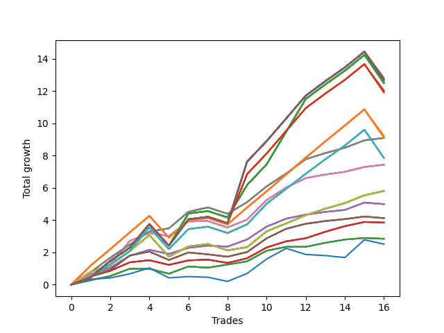

# Short Wallace Doodle 014 
- Symbol: AMZN_Unlimited
- Date Range: 03/23/2022 - 07/08/2022
- Trading Period: 7:20-12:30
- Number of Trades: 16



| Name | Win Percent | Profit | Avg Profit / Trade | Avg Time / Trade |      | Name | Win Percent | Profit | Avg Profit / Trade | Avg Time / Trade |
| ---- | ----------- | ------ | ------------------ | ---------------- | ---- | ---- | ----------- | ------ | ------------------ | ---------------- |
| Sorted By <br> Profit | | | | | | Sorted By <br> Win Percentage ||||
| One Hundred | 81.25 | 6400.50 | 400.03 | 141:55 |     | Sixty-Nine | 93.75 | 4547.00 | 284.19 | 42:02 |
| Ninety-Nine | 81.25 | 6400.50 | 400.03 | 141:55 |     | Sixty-One | 93.75 | 4547.00 | 284.19 | 42:02 |
| One Hundred Thirty | 81.25 | 6345.50 | 396.59 | 143:52 |     | Fifty-Three | 93.75 | 4547.00 | 284.19 | 42:02 |
| One Hundred Twenty-Nine | 81.25 | 6345.50 | 396.59 | 143:52 |     | Forty-Five | 93.75 | 4547.00 | 284.19 | 42:02 |
| One Hundred Twenty-Five | 81.25 | 6345.50 | 396.59 | 143:52 |     | Five | 93.75 | 4547.00 | 284.19 | 42:02 |
| One Hundred Twenty-Four | 81.25 | 6345.50 | 396.59 | 143:52 |     | Sixty-Eight | 87.50 | 3717.25 | 232.33 | 29:50 |
| One Hundred Twenty | 81.25 | 6345.50 | 396.59 | 143:52 |     | Sixty | 87.50 | 3717.25 | 232.33 | 29:50 |
| One Hundred Ninteen | 81.25 | 6345.50 | 396.59 | 143:52 |     | Fifty-Two | 87.50 | 3717.25 | 232.33 | 29:50 |
| One Hundred Fifteen | 81.25 | 6345.50 | 396.59 | 143:52 |     | Forty-Four | 87.50 | 3717.25 | 232.33 | 29:50 |
| One Hundred Fourteen | 81.25 | 6345.50 | 396.59 | 143:52 |     | Four | 87.50 | 3717.25 | 232.33 | 29:50 |
| One Hundred Ten | 81.25 | 6345.50 | 396.59 | 143:52 |     | Seventy | 87.50 | 2904.00 | 181.50 | 35:56 |
| One Hundred Nine | 81.25 | 6345.50 | 396.59 | 143:52 |     | Sixty-Two | 87.50 | 2904.00 | 181.50 | 35:56 |
| One Hundred Five | 81.25 | 6345.50 | 396.59 | 143:52 |     | Fifty-Four | 87.50 | 2904.00 | 181.50 | 35:56 |
| One Hundred Four | 81.25 | 6345.50 | 396.59 | 143:52 |     | Forty-Six | 87.50 | 2904.00 | 181.50 | 35:56 |
| Ninety-Five | 81.25 | 6345.50 | 396.59 | 143:52 |     | Six | 87.50 | 2904.00 | 181.50 | 35:56 |
| Ninety-Four | 81.25 | 6345.50 | 396.59 | 143:52 |     | One Hundred | 81.25 | 6400.50 | 400.03 | 141:55 |
| Eighty-Five | 81.25 | 6345.50 | 396.59 | 143:52 |     | Ninety-Nine | 81.25 | 6400.50 | 400.03 | 141:55 |
| Eighty-Four | 81.25 | 6345.50 | 396.59 | 143:52 |     | One Hundred Thirty | 81.25 | 6345.50 | 396.59 | 143:52 |
| Ninety-Seven | 81.25 | 6299.25 | 393.70 | 117:25 |     | One Hundred Twenty-Nine | 81.25 | 6345.50 | 396.59 | 143:52 |
| One Hundred Twenty-Seven | 81.25 | 6244.25 | 390.27 | 119:22 |     | One Hundred Twenty-Five | 81.25 | 6345.50 | 396.59 | 143:52 |
| One Hundred Twenty-Two | 81.25 | 6244.25 | 390.27 | 119:22 |     | One Hundred Twenty-Four | 81.25 | 6345.50 | 396.59 | 143:52 |
| One Hundred Seventeen | 81.25 | 6244.25 | 390.27 | 119:22 |     | One Hundred Twenty | 81.25 | 6345.50 | 396.59 | 143:52 |
| One Hundred Twelve | 81.25 | 6244.25 | 390.27 | 119:22 |     | One Hundred Ninteen | 81.25 | 6345.50 | 396.59 | 143:52 |
| One Hundred Seven | 81.25 | 6244.25 | 390.27 | 119:22 |     | One Hundred Fifteen | 81.25 | 6345.50 | 396.59 | 143:52 |
| One Hundred Two | 81.25 | 6244.25 | 390.27 | 119:22 |     | One Hundred Fourteen | 81.25 | 6345.50 | 396.59 | 143:52 |
| Ninety-Two | 81.25 | 6244.25 | 390.27 | 119:22 |     | One Hundred Ten | 81.25 | 6345.50 | 396.59 | 143:52 |
| Eighty-Two | 81.25 | 6244.25 | 390.27 | 119:22 |     | One Hundred Nine | 81.25 | 6345.50 | 396.59 | 143:52 |
| Ninety-Eight | 81.25 | 6015.50 | 375.97 | 139:23 |     | One Hundred Five | 81.25 | 6345.50 | 396.59 | 143:52 |
| One Hundred Twenty-Eight | 81.25 | 5960.50 | 372.53 | 141:20 |     | One Hundred Four | 81.25 | 6345.50 | 396.59 | 143:52 |
| One Hundred Twenty-Three | 81.25 | 5960.50 | 372.53 | 141:20 |     | Ninety-Five | 81.25 | 6345.50 | 396.59 | 143:52 |
| One Hundred Eighteen | 81.25 | 5960.50 | 372.53 | 141:20 |     | Ninety-Four | 81.25 | 6345.50 | 396.59 | 143:52 |
| One Hundred Thirteen | 81.25 | 5960.50 | 372.53 | 141:20 |     | Eighty-Five | 81.25 | 6345.50 | 396.59 | 143:52 |
| One Hundred Eight | 81.25 | 5960.50 | 372.53 | 141:20 |     | Eighty-Four | 81.25 | 6345.50 | 396.59 | 143:52 |
| One Hundred Three | 81.25 | 5960.50 | 372.53 | 141:20 |     | Ninety-Seven | 81.25 | 6299.25 | 393.70 | 117:25 |
| Ninety-Three | 81.25 | 5960.50 | 372.53 | 141:20 |     | One Hundred Twenty-Seven | 81.25 | 6244.25 | 390.27 | 119:22 |
| Eighty-Three | 81.25 | 5960.50 | 372.53 | 141:20 |     | One Hundred Twenty-Two | 81.25 | 6244.25 | 390.27 | 119:22 |
| Ninety-Six | 81.25 | 4613.00 | 288.31 | 65:58 |     | One Hundred Seventeen | 81.25 | 6244.25 | 390.27 | 119:22 |
| One Hundred Twenty-Six | 81.25 | 4558.00 | 284.87 | 67:55 |     | One Hundred Twelve | 81.25 | 6244.25 | 390.27 | 119:22 |
| One Hundred Twenty-One | 81.25 | 4558.00 | 284.87 | 67:55 |     | One Hundred Seven | 81.25 | 6244.25 | 390.27 | 119:22 |
| One Hundred Sixteen | 81.25 | 4558.00 | 284.87 | 67:55 |     | One Hundred Two | 81.25 | 6244.25 | 390.27 | 119:22 |
| One Hundred Eleven | 81.25 | 4558.00 | 284.87 | 67:55 |     | Ninety-Two | 81.25 | 6244.25 | 390.27 | 119:22 |
| One Hundred Six | 81.25 | 4558.00 | 284.87 | 67:55 |     | Eighty-Two | 81.25 | 6244.25 | 390.27 | 119:22 |
| One Hundred One | 81.25 | 4558.00 | 284.87 | 67:55 |     | Ninety-Eight | 81.25 | 6015.50 | 375.97 | 139:23 |
| Ninety-One | 81.25 | 4558.00 | 284.87 | 67:55 |     | One Hundred Twenty-Eight | 81.25 | 5960.50 | 372.53 | 141:20 |
| Eighty-One | 81.25 | 4558.00 | 284.87 | 67:55 |     | One Hundred Twenty-Three | 81.25 | 5960.50 | 372.53 | 141:20 |
| Sixty-Nine | 93.75 | 4547.00 | 284.19 | 42:02 |     | One Hundred Eighteen | 81.25 | 5960.50 | 372.53 | 141:20 |
| Sixty-One | 93.75 | 4547.00 | 284.19 | 42:02 |     | One Hundred Thirteen | 81.25 | 5960.50 | 372.53 | 141:20 |
| Fifty-Three | 93.75 | 4547.00 | 284.19 | 42:02 |     | One Hundred Eight | 81.25 | 5960.50 | 372.53 | 141:20 |
| Forty-Five | 93.75 | 4547.00 | 284.19 | 42:02 |     | One Hundred Three | 81.25 | 5960.50 | 372.53 | 141:20 |
| Five | 93.75 | 4547.00 | 284.19 | 42:02 |     | Ninety-Three | 81.25 | 5960.50 | 372.53 | 141:20 |
| Seventy-One | 81.25 | 3925.50 | 245.34 | 75:24 |     | Eighty-Three | 81.25 | 5960.50 | 372.53 | 141:20 |
| Sixty-Three | 81.25 | 3925.50 | 245.34 | 75:24 |     | Ninety-Six | 81.25 | 4613.00 | 288.31 | 65:58 |
| Fifty-Five | 81.25 | 3925.50 | 245.34 | 75:24 |     | One Hundred Twenty-Six | 81.25 | 4558.00 | 284.87 | 67:55 |
| Forty-Seven | 81.25 | 3925.50 | 245.34 | 75:24 |     | One Hundred Twenty-One | 81.25 | 4558.00 | 284.87 | 67:55 |
| Seven | 81.25 | 3925.50 | 245.34 | 75:24 |     | One Hundred Sixteen | 81.25 | 4558.00 | 284.87 | 67:55 |
| Sixty-Eight | 87.50 | 3717.25 | 232.33 | 29:50 |     | One Hundred Eleven | 81.25 | 4558.00 | 284.87 | 67:55 |
| Sixty | 87.50 | 3717.25 | 232.33 | 29:50 |     | One Hundred Six | 81.25 | 4558.00 | 284.87 | 67:55 |
| Fifty-Two | 87.50 | 3717.25 | 232.33 | 29:50 |     | One Hundred One | 81.25 | 4558.00 | 284.87 | 67:55 |
| Forty-Four | 87.50 | 3717.25 | 232.33 | 29:50 |     | Ninety-One | 81.25 | 4558.00 | 284.87 | 67:55 |
| Four | 87.50 | 3717.25 | 232.33 | 29:50 |     | Eighty-One | 81.25 | 4558.00 | 284.87 | 67:55 |
| Seventy | 87.50 | 2904.00 | 181.50 | 35:56 |     | Seventy-One | 81.25 | 3925.50 | 245.34 | 75:24 |
| Sixty-Two | 87.50 | 2904.00 | 181.50 | 35:56 |     | Sixty-Three | 81.25 | 3925.50 | 245.34 | 75:24 |
| Fifty-Four | 87.50 | 2904.00 | 181.50 | 35:56 |     | Fifty-Five | 81.25 | 3925.50 | 245.34 | 75:24 |
| Forty-Six | 87.50 | 2904.00 | 181.50 | 35:56 |     | Forty-Seven | 81.25 | 3925.50 | 245.34 | 75:24 |
| Six | 87.50 | 2904.00 | 181.50 | 35:56 |     | Seven | 81.25 | 3925.50 | 245.34 | 75:24 |
| Sixty-Six | 81.25 | 2495.25 | 155.95 | 23:49 |     | Sixty-Six | 81.25 | 2495.25 | 155.95 | 23:49 |
| Fifty-Eight | 81.25 | 2495.25 | 155.95 | 23:49 |     | Fifty-Eight | 81.25 | 2495.25 | 155.95 | 23:49 |
| Fifty | 81.25 | 2495.25 | 155.95 | 23:49 |     | Fifty | 81.25 | 2495.25 | 155.95 | 23:49 |
| Forty-Two | 81.25 | 2495.25 | 155.95 | 23:49 |     | Forty-Two | 81.25 | 2495.25 | 155.95 | 23:49 |
| Two | 81.25 | 2495.25 | 155.95 | 23:49 |     | Two | 81.25 | 2495.25 | 155.95 | 23:49 |
| Sixty-Seven | 75.00 | 2062.25 | 128.89 | 21:55 |     | Sixty-Five | 81.25 | 1924.25 | 120.27 | 13:51 |
| Fifty-Nine | 75.00 | 2062.25 | 128.89 | 21:55 |     | Fifty-Seven | 81.25 | 1924.25 | 120.27 | 13:51 |
| Fifty-One | 75.00 | 2062.25 | 128.89 | 21:55 |     | Forty-Nine | 81.25 | 1924.25 | 120.27 | 13:51 |
| Forty-Three | 75.00 | 2062.25 | 128.89 | 21:55 |     | Forty-One | 81.25 | 1924.25 | 120.27 | 13:51 |
| Three | 75.00 | 2062.25 | 128.89 | 21:55 |     | One | 81.25 | 1924.25 | 120.27 | 13:51 |
| Sixty-Five | 81.25 | 1924.25 | 120.27 | 13:51 |     | Sixty-Seven | 75.00 | 2062.25 | 128.89 | 21:55 |
| Fifty-Seven | 81.25 | 1924.25 | 120.27 | 13:51 |     | Fifty-Nine | 75.00 | 2062.25 | 128.89 | 21:55 |
| Forty-Nine | 81.25 | 1924.25 | 120.27 | 13:51 |     | Fifty-One | 75.00 | 2062.25 | 128.89 | 21:55 |
| Forty-One | 81.25 | 1924.25 | 120.27 | 13:51 |     | Forty-Three | 75.00 | 2062.25 | 128.89 | 21:55 |
| One | 81.25 | 1924.25 | 120.27 | 13:51 |     | Three | 75.00 | 2062.25 | 128.89 | 21:55 |
| Sixty-Four | 68.75 | 1423.50 | 88.97 | 08:24 |     | Sixty-Four | 68.75 | 1423.50 | 88.97 | 08:24 |
| Fifty-Six | 68.75 | 1423.50 | 88.97 | 08:24 |     | Fifty-Six | 68.75 | 1423.50 | 88.97 | 08:24 |
| Forty-Eight | 68.75 | 1423.50 | 88.97 | 08:24 |     | Forty-Eight | 68.75 | 1423.50 | 88.97 | 08:24 |
| Forty | 68.75 | 1423.50 | 88.97 | 08:24 |     | Forty | 68.75 | 1423.50 | 88.97 | 08:24 |
| Zero | 68.75 | 1423.50 | 88.97 | 08:24 |     | Zero | 68.75 | 1423.50 | 88.97 | 08:24 |
| Seventy-Three | 56.25 | 1257.00 | 78.56 | 14:27 |     | Seventy-Three | 56.25 | 1257.00 | 78.56 | 14:27 |

## NO STOPLOSS

### Test Zero
* Sell when price hits the middle line of the 20p bollinger
* No Stoploss
* Results:
```
Total Trades: 16
Percent Up: 31.25
Percent Down: 68.75
Total Points Moved Down: 2.85
Potential Profit: 1423.50
Total Points Ups: 0.43 Count Ups: 5
Total Points Downs: 3.28 Count Downs: 11
```

<details><summary>Trades</summary>

<code>In: 2022-03-25 11:57:00		Out: 2022-03-25 12:01:25		Total Position Time: 04:25		Total Move Down: 0.28		Total to Date: 0.28</code> <br />
<code>In: 2022-03-31 12:04:00		Out: 2022-03-31 12:11:10		Total Position Time: 07:10		Total Move Down: 0.26		Total to Date: 0.54</code> <br />
<code>In: 2022-04-06 12:02:00		Out: 2022-04-06 12:13:35		Total Position Time: 11:35		Total Move Down: 0.45		Total to Date: 0.99</code> <br />
<code>In: 2022-04-18 11:27:00		Out: 2022-04-18 11:43:15		Total Position Time: 16:15		Total Move Down: -0.00		Total to Date: 0.99</code> <br />
<code>In: 2022-04-25 11:15:00		Out: 2022-04-25 11:36:20		Total Position Time: 21:20		Total Move Down: -0.30		Total to Date: 0.68</code> <br />
<code>In: 2022-05-03 08:10:00		Out: 2022-05-03 08:17:15		Total Position Time: 07:15		Total Move Down: 0.44		Total to Date: 1.13</code> <br />
<code>In: 2022-05-23 11:13:00		Out: 2022-05-23 11:27:10		Total Position Time: 14:10		Total Move Down: -0.07		Total to Date: 1.06</code> <br />
<code>In: 2022-05-27 11:59:00		Out: 2022-05-27 12:03:15		Total Position Time: 04:15		Total Move Down: 0.19		Total to Date: 1.25</code> <br />
<code>In: 2022-06-09 08:45:00		Out: 2022-06-09 08:46:40		Total Position Time: 01:40		Total Move Down: 0.20		Total to Date: 1.45</code> <br />
<code>In: 2022-06-13 09:40:00		Out: 2022-06-13 09:47:55		Total Position Time: 07:55		Total Move Down: 0.66		Total to Date: 2.11</code> <br />
<code>In: 2022-06-14 09:00:00		Out: 2022-06-14 09:02:15		Total Position Time: 02:15		Total Move Down: 0.24		Total to Date: 2.35</code> <br />
<code>In: 2022-06-14 10:12:00		Out: 2022-06-14 10:25:20		Total Position Time: 13:20		Total Move Down: -0.00		Total to Date: 2.35</code> <br />
<code>In: 2022-06-16 09:51:00		Out: 2022-06-16 09:55:20		Total Position Time: 04:20		Total Move Down: 0.25		Total to Date: 2.60</code> <br />
<code>In: 2022-06-16 09:52:00		Out: 2022-06-16 09:55:20		Total Position Time: 03:20		Total Move Down: 0.20		Total to Date: 2.80</code> <br />
<code>In: 2022-06-16 10:32:00		Out: 2022-06-16 10:33:45		Total Position Time: 01:45		Total Move Down: 0.10		Total to Date: 2.90</code> <br />
<code>In: 2022-07-01 08:11:00		Out: 2022-07-01 08:24:25		Total Position Time: 13:25		Total Move Down: -0.05		Total to Date: 2.85</code> <br />


</details>

### Test One
* Sell when the price hits the upper line of the 20p 1std bollinger
* No Stoploss
* Results:
```
Total Trades: 16
Percent Up: 18.75
Percent Down: 81.25
Total Points Moved Down: 3.85
Potential Profit: 1924.25
Total Points Ups: 0.53 Count Ups: 3
Total Points Downs: 4.38 Count Downs: 13
```

<details><summary>Trades</summary>

<code>In: 2022-03-25 11:57:00		Out: 2022-03-25 12:02:10		Total Position Time: 05:10		Total Move Down: 0.51		Total to Date: 0.51</code> <br />
<code>In: 2022-03-31 12:04:00		Out: 2022-03-31 12:16:25		Total Position Time: 12:25		Total Move Down: 0.35		Total to Date: 0.86</code> <br />
<code>In: 2022-04-06 12:02:00		Out: 2022-04-06 12:17:55		Total Position Time: 15:55		Total Move Down: 0.53		Total to Date: 1.39</code> <br />
<code>In: 2022-04-18 11:27:00		Out: 2022-04-18 11:46:40		Total Position Time: 19:40		Total Move Down: 0.13		Total to Date: 1.52</code> <br />
<code>In: 2022-04-25 11:15:00		Out: 2022-04-25 11:40:05		Total Position Time: 25:05		Total Move Down: -0.29		Total to Date: 1.23</code> <br />
<code>In: 2022-05-03 08:10:00		Out: 2022-05-03 08:27:05		Total Position Time: 17:05		Total Move Down: 0.28		Total to Date: 1.51</code> <br />
<code>In: 2022-05-23 11:13:00		Out: 2022-05-23 11:29:25		Total Position Time: 16:25		Total Move Down: 0.05		Total to Date: 1.55</code> <br />
<code>In: 2022-05-27 11:59:00		Out: 2022-05-27 12:35:05		Total Position Time: 36:05		Total Move Down: -0.21		Total to Date: 1.35</code> <br />
<code>In: 2022-06-09 08:45:00		Out: 2022-06-09 08:48:05		Total Position Time: 03:05		Total Move Down: 0.29		Total to Date: 1.64</code> <br />
<code>In: 2022-06-13 09:40:00		Out: 2022-06-13 09:54:00		Total Position Time: 14:00		Total Move Down: 0.67		Total to Date: 2.31</code> <br />
<code>In: 2022-06-14 09:00:00		Out: 2022-06-14 09:04:05		Total Position Time: 04:05		Total Move Down: 0.38		Total to Date: 2.69</code> <br />
<code>In: 2022-06-14 10:12:00		Out: 2022-06-14 10:26:40		Total Position Time: 14:40		Total Move Down: 0.19		Total to Date: 2.88</code> <br />
<code>In: 2022-06-16 09:51:00		Out: 2022-06-16 09:59:50		Total Position Time: 08:50		Total Move Down: 0.40		Total to Date: 3.28</code> <br />
<code>In: 2022-06-16 09:52:00		Out: 2022-06-16 09:59:50		Total Position Time: 07:50		Total Move Down: 0.35		Total to Date: 3.63</code> <br />
<code>In: 2022-06-16 10:32:00		Out: 2022-06-16 10:35:20		Total Position Time: 03:20		Total Move Down: 0.26		Total to Date: 3.89</code> <br />
<code>In: 2022-07-01 08:11:00		Out: 2022-07-01 08:29:10		Total Position Time: 18:10		Total Move Down: -0.04		Total to Date: 3.85</code> <br />


</details>

### Test Two
* Sell when the price hits the upper line of the 20p 2std bollinger
* No Stoploss
* Results:
```
Total Trades: 16
Percent Up: 18.75
Percent Down: 81.25
Total Points Moved Down: 4.99
Potential Profit: 2495.25
Total Points Ups: 0.42 Count Ups: 3
Total Points Downs: 5.41 Count Downs: 13
```

<details><summary>Trades</summary>

<code>In: 2022-03-25 11:57:00		Out: 2022-03-25 12:21:05		Total Position Time: 24:05		Total Move Down: 0.64		Total to Date: 0.64</code> <br />
<code>In: 2022-03-31 12:04:00		Out: 2022-03-31 12:20:05		Total Position Time: 16:05		Total Move Down: 0.41		Total to Date: 1.05</code> <br />
<code>In: 2022-04-06 12:02:00		Out: 2022-04-06 12:20:15		Total Position Time: 18:15		Total Move Down: 0.74		Total to Date: 1.79</code> <br />
<code>In: 2022-04-18 11:27:00		Out: 2022-04-18 11:55:35		Total Position Time: 28:35		Total Move Down: 0.37		Total to Date: 2.16</code> <br />
<code>In: 2022-04-25 11:15:00		Out: 2022-04-25 11:42:30		Total Position Time: 27:30		Total Move Down: -0.26		Total to Date: 1.91</code> <br />
<code>In: 2022-05-03 08:10:00		Out: 2022-05-03 08:35:10		Total Position Time: 25:10		Total Move Down: 0.38		Total to Date: 2.29</code> <br />
<code>In: 2022-05-23 11:13:00		Out: 2022-05-23 12:12:35		Total Position Time: 59:35		Total Move Down: 0.14		Total to Date: 2.42</code> <br />
<code>In: 2022-05-27 11:59:00		Out: 2022-05-27 12:37:00		Total Position Time: 38:00		Total Move Down: -0.06		Total to Date: 2.36</code> <br />
<code>In: 2022-06-09 08:45:00		Out: 2022-06-09 08:48:20		Total Position Time: 03:20		Total Move Down: 0.44		Total to Date: 2.80</code> <br />
<code>In: 2022-06-13 09:40:00		Out: 2022-06-13 09:54:20		Total Position Time: 14:20		Total Move Down: 0.80		Total to Date: 3.60</code> <br />
<code>In: 2022-06-14 09:00:00		Out: 2022-06-14 09:05:15		Total Position Time: 05:15		Total Move Down: 0.49		Total to Date: 4.09</code> <br />
<code>In: 2022-06-14 10:12:00		Out: 2022-06-14 10:29:40		Total Position Time: 17:40		Total Move Down: 0.25		Total to Date: 4.34</code> <br />
<code>In: 2022-06-16 09:51:00		Out: 2022-06-16 10:21:25		Total Position Time: 30:25		Total Move Down: 0.17		Total to Date: 4.51</code> <br />
<code>In: 2022-06-16 09:52:00		Out: 2022-06-16 10:21:25		Total Position Time: 29:25		Total Move Down: 0.12		Total to Date: 4.63</code> <br />
<code>In: 2022-06-16 10:32:00		Out: 2022-06-16 10:36:10		Total Position Time: 04:10		Total Move Down: 0.46		Total to Date: 5.09</code> <br />
<code>In: 2022-07-01 08:11:00		Out: 2022-07-01 08:50:25		Total Position Time: 39:25		Total Move Down: -0.10		Total to Date: 4.99</code> <br />


</details>

### Test Three
* Sell when price hits the middle line of the 50p bollinger
* No Stoploss
* Results:
```
Total Trades: 16
Percent Up: 25.00
Percent Down: 75.00
Total Points Moved Down: 4.12
Potential Profit: 2062.25
Total Points Ups: 0.88 Count Ups: 4
Total Points Downs: 5.01 Count Downs: 12
```

<details><summary>Trades</summary>

<code>In: 2022-03-25 11:57:00		Out: 2022-03-25 12:02:10		Total Position Time: 05:10		Total Move Down: 0.51		Total to Date: 0.51</code> <br />
<code>In: 2022-03-31 12:04:00		Out: 2022-03-31 12:20:05		Total Position Time: 16:05		Total Move Down: 0.41		Total to Date: 0.92</code> <br />
<code>In: 2022-04-06 12:02:00		Out: 2022-04-06 12:20:35		Total Position Time: 18:35		Total Move Down: 0.89		Total to Date: 1.81</code> <br />
<code>In: 2022-04-18 11:27:00		Out: 2022-04-18 11:46:55		Total Position Time: 19:55		Total Move Down: 0.25		Total to Date: 2.05</code> <br />
<code>In: 2022-04-25 11:15:00		Out: 2022-04-25 12:01:20		Total Position Time: 46:20		Total Move Down: -0.52		Total to Date: 1.53</code> <br />
<code>In: 2022-05-03 08:10:00		Out: 2022-05-03 08:35:20		Total Position Time: 25:20		Total Move Down: 0.47		Total to Date: 2.00</code> <br />
<code>In: 2022-05-23 11:13:00		Out: 2022-05-23 11:51:45		Total Position Time: 38:45		Total Move Down: -0.12		Total to Date: 1.88</code> <br />
<code>In: 2022-05-27 11:59:00		Out: 2022-05-27 12:36:45		Total Position Time: 37:45		Total Move Down: -0.15		Total to Date: 1.73</code> <br />
<code>In: 2022-06-09 08:45:00		Out: 2022-06-09 08:48:05		Total Position Time: 03:05		Total Move Down: 0.29		Total to Date: 2.02</code> <br />
<code>In: 2022-06-13 09:40:00		Out: 2022-06-13 09:54:25		Total Position Time: 14:25		Total Move Down: 0.85		Total to Date: 2.87</code> <br />
<code>In: 2022-06-14 09:00:00		Out: 2022-06-14 09:06:20		Total Position Time: 06:20		Total Move Down: 0.59		Total to Date: 3.46</code> <br />
<code>In: 2022-06-14 10:12:00		Out: 2022-06-14 10:29:45		Total Position Time: 17:45		Total Move Down: 0.31		Total to Date: 3.77</code> <br />
<code>In: 2022-06-16 09:51:00		Out: 2022-06-16 10:21:25		Total Position Time: 30:25		Total Move Down: 0.17		Total to Date: 3.94</code> <br />
<code>In: 2022-06-16 09:52:00		Out: 2022-06-16 10:21:25		Total Position Time: 29:25		Total Move Down: 0.12		Total to Date: 4.06</code> <br />
<code>In: 2022-06-16 10:32:00		Out: 2022-06-16 10:34:00		Total Position Time: 02:00		Total Move Down: 0.16		Total to Date: 4.22</code> <br />
<code>In: 2022-07-01 08:11:00		Out: 2022-07-01 08:50:25		Total Position Time: 39:25		Total Move Down: -0.10		Total to Date: 4.12</code> <br />


</details>

### Test Four
* Sell when the price hits the upper line of the 50p 1std bollinger
* No Stoploss
* Results:
```
Total Trades: 16
Percent Up: 12.50
Percent Down: 87.50
Total Points Moved Down: 7.43
Potential Profit: 3717.25
Total Points Ups: 0.59 Count Ups: 2
Total Points Downs: 8.03 Count Downs: 14
```

<details><summary>Trades</summary>

<code>In: 2022-03-25 11:57:00		Out: 2022-03-25 12:20:30		Total Position Time: 23:30		Total Move Down: 0.61		Total to Date: 0.61</code> <br />
<code>In: 2022-03-31 12:04:00		Out: 2022-03-31 12:21:35		Total Position Time: 17:35		Total Move Down: 0.65		Total to Date: 1.25</code> <br />
<code>In: 2022-04-06 12:02:00		Out: 2022-04-06 12:30:30		Total Position Time: 28:30		Total Move Down: 1.46		Total to Date: 2.71</code> <br />
<code>In: 2022-04-18 11:27:00		Out: 2022-04-18 12:02:40		Total Position Time: 35:40		Total Move Down: 0.50		Total to Date: 3.21</code> <br />
<code>In: 2022-04-25 11:15:00		Out: 2022-04-25 12:03:05		Total Position Time: 48:05		Total Move Down: -0.20		Total to Date: 3.01</code> <br />
<code>In: 2022-05-03 08:10:00		Out: 2022-05-03 08:38:50		Total Position Time: 28:50		Total Move Down: 0.91		Total to Date: 3.92</code> <br />
<code>In: 2022-05-23 11:13:00		Out: 2022-05-23 12:03:55		Total Position Time: 50:55		Total Move Down: 0.02		Total to Date: 3.94</code> <br />
<code>In: 2022-05-27 11:59:00		Out: 2022-05-27 12:47:00		Total Position Time: 48:00		Total Move Down: -0.40		Total to Date: 3.54</code> <br />
<code>In: 2022-06-09 08:45:00		Out: 2022-06-09 08:48:40		Total Position Time: 03:40		Total Move Down: 0.49		Total to Date: 4.03</code> <br />
<code>In: 2022-06-13 09:40:00		Out: 2022-06-13 10:01:10		Total Position Time: 21:10		Total Move Down: 1.21		Total to Date: 5.24</code> <br />
<code>In: 2022-06-14 09:00:00		Out: 2022-06-14 09:15:20		Total Position Time: 15:20		Total Move Down: 0.78		Total to Date: 6.02</code> <br />
<code>In: 2022-06-14 10:12:00		Out: 2022-06-14 10:34:05		Total Position Time: 22:05		Total Move Down: 0.58		Total to Date: 6.60</code> <br />
<code>In: 2022-06-16 09:51:00		Out: 2022-06-16 10:35:30		Total Position Time: 44:30		Total Move Down: 0.22		Total to Date: 6.82</code> <br />
<code>In: 2022-06-16 09:52:00		Out: 2022-06-16 10:35:30		Total Position Time: 43:30		Total Move Down: 0.17		Total to Date: 6.99</code> <br />
<code>In: 2022-06-16 10:32:00		Out: 2022-06-16 10:35:30		Total Position Time: 03:30		Total Move Down: 0.30		Total to Date: 7.29</code> <br />
<code>In: 2022-07-01 08:11:00		Out: 2022-07-01 08:53:35		Total Position Time: 42:35		Total Move Down: 0.14		Total to Date: 7.43</code> <br />


</details>

### Test Five
* Sell when the price hits the upper line of the 50p 2std bollinger
* No Stoploss
* Results:
```
Total Trades: 16
Percent Up: 6.25
Percent Down: 93.75
Total Points Moved Down: 9.09
Potential Profit: 4547.00
Total Points Ups: 0.40 Count Ups: 1
Total Points Downs: 9.49 Count Downs: 15
```

<details><summary>Trades</summary>

<code>In: 2022-03-25 11:57:00		Out: 2022-03-25 12:21:40		Total Position Time: 24:40		Total Move Down: 0.78		Total to Date: 0.78</code> <br />
<code>In: 2022-03-31 12:04:00		Out: 2022-03-31 12:27:25		Total Position Time: 23:25		Total Move Down: 0.90		Total to Date: 1.67</code> <br />
<code>In: 2022-04-06 12:02:00		Out: 2022-04-06 12:47:00		Total Position Time: 45:00		Total Move Down: 0.81		Total to Date: 2.48</code> <br />
<code>In: 2022-04-18 11:27:00		Out: 2022-04-18 12:25:05		Total Position Time: 58:05		Total Move Down: 0.81		Total to Date: 3.29</code> <br />
<code>In: 2022-04-25 11:15:00		Out: 2022-04-25 12:04:20		Total Position Time: 49:20		Total Move Down: 0.20		Total to Date: 3.49</code> <br />
<code>In: 2022-05-03 08:10:00		Out: 2022-05-03 08:51:20		Total Position Time: 41:20		Total Move Down: 1.02		Total to Date: 4.52</code> <br />
<code>In: 2022-05-23 11:13:00		Out: 2022-05-23 12:13:15		Total Position Time: 60:15		Total Move Down: 0.27		Total to Date: 4.79</code> <br />
<code>In: 2022-05-27 11:59:00		Out: 2022-05-27 12:47:00		Total Position Time: 48:00		Total Move Down: -0.40		Total to Date: 4.39</code> <br />
<code>In: 2022-06-09 08:45:00		Out: 2022-06-09 08:50:20		Total Position Time: 05:20		Total Move Down: 0.72		Total to Date: 5.11</code> <br />
<code>In: 2022-06-13 09:40:00		Out: 2022-06-13 11:32:45		Total Position Time: 112:45		Total Move Down: 0.98		Total to Date: 6.09</code> <br />
<code>In: 2022-06-14 09:00:00		Out: 2022-06-14 09:35:00		Total Position Time: 35:00		Total Move Down: 0.80		Total to Date: 6.89</code> <br />
<code>In: 2022-06-14 10:12:00		Out: 2022-06-14 10:39:45		Total Position Time: 27:45		Total Move Down: 0.88		Total to Date: 7.77</code> <br />
<code>In: 2022-06-16 09:51:00		Out: 2022-06-16 10:36:10		Total Position Time: 45:10		Total Move Down: 0.38		Total to Date: 8.15</code> <br />
<code>In: 2022-06-16 09:52:00		Out: 2022-06-16 10:36:10		Total Position Time: 44:10		Total Move Down: 0.33		Total to Date: 8.48</code> <br />
<code>In: 2022-06-16 10:32:00		Out: 2022-06-16 10:36:10		Total Position Time: 04:10		Total Move Down: 0.46		Total to Date: 8.94</code> <br />
<code>In: 2022-07-01 08:11:00		Out: 2022-07-01 08:59:20		Total Position Time: 48:20		Total Move Down: 0.15		Total to Date: 9.09</code> <br />


</details>

### Test Six
* Sell when the price hits the middle line of the 1std VWAP
* No Stoploss
* Results:
```
Total Trades: 16
Percent Up: 12.50
Percent Down: 87.50
Total Points Moved Down: 5.81
Potential Profit: 2904.00
Total Points Ups: 1.74 Count Ups: 2
Total Points Downs: 7.55 Count Downs: 14
```

<details><summary>Trades</summary>

<code>In: 2022-03-25 11:57:00		Out: 2022-03-25 12:21:45		Total Position Time: 24:45		Total Move Down: 0.80		Total to Date: 0.80</code> <br />
<code>In: 2022-03-31 12:04:00		Out: 2022-03-31 12:20:05		Total Position Time: 16:05		Total Move Down: 0.41		Total to Date: 1.21</code> <br />
<code>In: 2022-04-06 12:02:00		Out: 2022-04-06 12:20:25		Total Position Time: 18:25		Total Move Down: 0.88		Total to Date: 2.09</code> <br />
<code>In: 2022-04-18 11:27:00		Out: 2022-04-18 12:30:40		Total Position Time: 63:40		Total Move Down: 0.99		Total to Date: 3.08</code> <br />
<code>In: 2022-04-25 11:15:00		Out: 2022-04-25 12:47:00		Total Position Time: 92:00		Total Move Down: -1.34		Total to Date: 1.73</code> <br />
<code>In: 2022-05-03 08:10:00		Out: 2022-05-03 08:38:05		Total Position Time: 28:05		Total Move Down: 0.64		Total to Date: 2.37</code> <br />
<code>In: 2022-05-23 11:13:00		Out: 2022-05-23 12:47:00		Total Position Time: 94:00		Total Move Down: 0.15		Total to Date: 2.52</code> <br />
<code>In: 2022-05-27 11:59:00		Out: 2022-05-27 12:47:00		Total Position Time: 48:00		Total Move Down: -0.40		Total to Date: 2.13</code> <br />
<code>In: 2022-06-09 08:45:00		Out: 2022-06-09 08:46:40		Total Position Time: 01:40		Total Move Down: 0.20		Total to Date: 2.33</code> <br />
<code>In: 2022-06-13 09:40:00		Out: 2022-06-13 09:56:50		Total Position Time: 16:50		Total Move Down: 0.98		Total to Date: 3.31</code> <br />
<code>In: 2022-06-14 09:00:00		Out: 2022-06-14 09:04:25		Total Position Time: 04:25		Total Move Down: 0.49		Total to Date: 3.80</code> <br />
<code>In: 2022-06-14 10:12:00		Out: 2022-06-14 10:32:30		Total Position Time: 20:30		Total Move Down: 0.51		Total to Date: 4.31</code> <br />
<code>In: 2022-06-16 09:51:00		Out: 2022-06-16 10:36:30		Total Position Time: 45:30		Total Move Down: 0.40		Total to Date: 4.71</code> <br />
<code>In: 2022-06-16 09:52:00		Out: 2022-06-16 10:36:30		Total Position Time: 44:30		Total Move Down: 0.35		Total to Date: 5.06</code> <br />
<code>In: 2022-06-16 10:32:00		Out: 2022-06-16 10:36:30		Total Position Time: 04:30		Total Move Down: 0.48		Total to Date: 5.54</code> <br />
<code>In: 2022-07-01 08:11:00		Out: 2022-07-01 09:03:10		Total Position Time: 52:10		Total Move Down: 0.27		Total to Date: 5.81</code> <br />


</details>

### Test Seven
* Sell when the price hits the upper line of the 1std VWAP
* No Stoploss
* Results:
```
Total Trades: 16
Percent Up: 18.75
Percent Down: 81.25
Total Points Moved Down: 7.85
Potential Profit: 3925.50
Total Points Ups: 3.49 Count Ups: 3
Total Points Downs: 11.34 Count Downs: 13
```

<details><summary>Trades</summary>

<code>In: 2022-03-25 11:57:00		Out: 2022-03-25 12:47:00		Total Position Time: 50:00		Total Move Down: 0.45		Total to Date: 0.45</code> <br />
<code>In: 2022-03-31 12:04:00		Out: 2022-03-31 12:24:10		Total Position Time: 20:10		Total Move Down: 0.81		Total to Date: 1.27</code> <br />
<code>In: 2022-04-06 12:02:00		Out: 2022-04-06 12:47:00		Total Position Time: 45:00		Total Move Down: 0.81		Total to Date: 2.08</code> <br />
<code>In: 2022-04-18 11:27:00		Out: 2022-04-18 12:47:00		Total Position Time: 80:00		Total Move Down: 1.47		Total to Date: 3.55</code> <br />
<code>In: 2022-04-25 11:15:00		Out: 2022-04-25 12:47:00		Total Position Time: 92:00		Total Move Down: -1.34		Total to Date: 2.21</code> <br />
<code>In: 2022-05-03 08:10:00		Out: 2022-05-03 09:05:50		Total Position Time: 55:50		Total Move Down: 1.24		Total to Date: 3.44</code> <br />
<code>In: 2022-05-23 11:13:00		Out: 2022-05-23 12:47:00		Total Position Time: 94:00		Total Move Down: 0.15		Total to Date: 3.60</code> <br />
<code>In: 2022-05-27 11:59:00		Out: 2022-05-27 12:47:00		Total Position Time: 48:00		Total Move Down: -0.40		Total to Date: 3.20</code> <br />
<code>In: 2022-06-09 08:45:00		Out: 2022-06-09 08:48:50		Total Position Time: 03:50		Total Move Down: 0.54		Total to Date: 3.74</code> <br />
<code>In: 2022-06-13 09:40:00		Out: 2022-06-13 12:47:00		Total Position Time: 187:00		Total Move Down: 1.28		Total to Date: 5.02</code> <br />
<code>In: 2022-06-14 09:00:00		Out: 2022-06-14 10:43:10		Total Position Time: 103:10		Total Move Down: 0.92		Total to Date: 5.94</code> <br />
<code>In: 2022-06-14 10:12:00		Out: 2022-06-14 10:43:10		Total Position Time: 31:10		Total Move Down: 0.93		Total to Date: 6.87</code> <br />
<code>In: 2022-06-16 09:51:00		Out: 2022-06-16 10:45:05		Total Position Time: 54:05		Total Move Down: 0.90		Total to Date: 7.77</code> <br />
<code>In: 2022-06-16 09:52:00		Out: 2022-06-16 10:45:05		Total Position Time: 53:05		Total Move Down: 0.85		Total to Date: 8.62</code> <br />
<code>In: 2022-06-16 10:32:00		Out: 2022-06-16 10:45:05		Total Position Time: 13:05		Total Move Down: 0.98		Total to Date: 9.60</code> <br />
<code>In: 2022-07-01 08:11:00		Out: 2022-07-01 12:47:00		Total Position Time: 276:00		Total Move Down: -1.75		Total to Date: 7.85</code> <br />


</details>

## STOPLOSS OF 5

### Test Forty
* Sell when price hits the middle line of the 20p bollinger
* Stoploss is -5 points
* Results:
```
Total Trades: 16
Percent Up: 31.25
Percent Down: 68.75
Total Points Moved Down: 2.85
Potential Profit: 1423.50
Total Points Ups: 0.43 Count Ups: 5
Total Points Downs: 3.28 Count Downs: 11
```

<details><summary>Trades</summary>

<code>In: 2022-03-25 11:57:00		Out: 2022-03-25 12:01:25		Total Position Time: 04:25		Total Move Down: 0.28		Total to Date: 0.28</code> <br />
<code>In: 2022-03-31 12:04:00		Out: 2022-03-31 12:11:10		Total Position Time: 07:10		Total Move Down: 0.26		Total to Date: 0.54</code> <br />
<code>In: 2022-04-06 12:02:00		Out: 2022-04-06 12:13:35		Total Position Time: 11:35		Total Move Down: 0.45		Total to Date: 0.99</code> <br />
<code>In: 2022-04-18 11:27:00		Out: 2022-04-18 11:43:15		Total Position Time: 16:15		Total Move Down: -0.00		Total to Date: 0.99</code> <br />
<code>In: 2022-04-25 11:15:00		Out: 2022-04-25 11:36:20		Total Position Time: 21:20		Total Move Down: -0.30		Total to Date: 0.68</code> <br />
<code>In: 2022-05-03 08:10:00		Out: 2022-05-03 08:17:15		Total Position Time: 07:15		Total Move Down: 0.44		Total to Date: 1.13</code> <br />
<code>In: 2022-05-23 11:13:00		Out: 2022-05-23 11:27:10		Total Position Time: 14:10		Total Move Down: -0.07		Total to Date: 1.06</code> <br />
<code>In: 2022-05-27 11:59:00		Out: 2022-05-27 12:03:15		Total Position Time: 04:15		Total Move Down: 0.19		Total to Date: 1.25</code> <br />
<code>In: 2022-06-09 08:45:00		Out: 2022-06-09 08:46:40		Total Position Time: 01:40		Total Move Down: 0.20		Total to Date: 1.45</code> <br />
<code>In: 2022-06-13 09:40:00		Out: 2022-06-13 09:47:55		Total Position Time: 07:55		Total Move Down: 0.66		Total to Date: 2.11</code> <br />
<code>In: 2022-06-14 09:00:00		Out: 2022-06-14 09:02:15		Total Position Time: 02:15		Total Move Down: 0.24		Total to Date: 2.35</code> <br />
<code>In: 2022-06-14 10:12:00		Out: 2022-06-14 10:25:20		Total Position Time: 13:20		Total Move Down: -0.00		Total to Date: 2.35</code> <br />
<code>In: 2022-06-16 09:51:00		Out: 2022-06-16 09:55:20		Total Position Time: 04:20		Total Move Down: 0.25		Total to Date: 2.60</code> <br />
<code>In: 2022-06-16 09:52:00		Out: 2022-06-16 09:55:20		Total Position Time: 03:20		Total Move Down: 0.20		Total to Date: 2.80</code> <br />
<code>In: 2022-06-16 10:32:00		Out: 2022-06-16 10:33:45		Total Position Time: 01:45		Total Move Down: 0.10		Total to Date: 2.90</code> <br />
<code>In: 2022-07-01 08:11:00		Out: 2022-07-01 08:24:25		Total Position Time: 13:25		Total Move Down: -0.05		Total to Date: 2.85</code> <br />


</details>

### Test Forty-One
* Sell when the price hits the upper line of the 20p 1std bollinger
* Stoploss is -5 points
* Results:
```
Total Trades: 16
Percent Up: 18.75
Percent Down: 81.25
Total Points Moved Down: 3.85
Potential Profit: 1924.25
Total Points Ups: 0.53 Count Ups: 3
Total Points Downs: 4.38 Count Downs: 13
```

<details><summary>Trades</summary>

<code>In: 2022-03-25 11:57:00		Out: 2022-03-25 12:02:10		Total Position Time: 05:10		Total Move Down: 0.51		Total to Date: 0.51</code> <br />
<code>In: 2022-03-31 12:04:00		Out: 2022-03-31 12:16:25		Total Position Time: 12:25		Total Move Down: 0.35		Total to Date: 0.86</code> <br />
<code>In: 2022-04-06 12:02:00		Out: 2022-04-06 12:17:55		Total Position Time: 15:55		Total Move Down: 0.53		Total to Date: 1.39</code> <br />
<code>In: 2022-04-18 11:27:00		Out: 2022-04-18 11:46:40		Total Position Time: 19:40		Total Move Down: 0.13		Total to Date: 1.52</code> <br />
<code>In: 2022-04-25 11:15:00		Out: 2022-04-25 11:40:05		Total Position Time: 25:05		Total Move Down: -0.29		Total to Date: 1.23</code> <br />
<code>In: 2022-05-03 08:10:00		Out: 2022-05-03 08:27:05		Total Position Time: 17:05		Total Move Down: 0.28		Total to Date: 1.51</code> <br />
<code>In: 2022-05-23 11:13:00		Out: 2022-05-23 11:29:25		Total Position Time: 16:25		Total Move Down: 0.05		Total to Date: 1.55</code> <br />
<code>In: 2022-05-27 11:59:00		Out: 2022-05-27 12:35:05		Total Position Time: 36:05		Total Move Down: -0.21		Total to Date: 1.35</code> <br />
<code>In: 2022-06-09 08:45:00		Out: 2022-06-09 08:48:05		Total Position Time: 03:05		Total Move Down: 0.29		Total to Date: 1.64</code> <br />
<code>In: 2022-06-13 09:40:00		Out: 2022-06-13 09:54:00		Total Position Time: 14:00		Total Move Down: 0.67		Total to Date: 2.31</code> <br />
<code>In: 2022-06-14 09:00:00		Out: 2022-06-14 09:04:05		Total Position Time: 04:05		Total Move Down: 0.38		Total to Date: 2.69</code> <br />
<code>In: 2022-06-14 10:12:00		Out: 2022-06-14 10:26:40		Total Position Time: 14:40		Total Move Down: 0.19		Total to Date: 2.88</code> <br />
<code>In: 2022-06-16 09:51:00		Out: 2022-06-16 09:59:50		Total Position Time: 08:50		Total Move Down: 0.40		Total to Date: 3.28</code> <br />
<code>In: 2022-06-16 09:52:00		Out: 2022-06-16 09:59:50		Total Position Time: 07:50		Total Move Down: 0.35		Total to Date: 3.63</code> <br />
<code>In: 2022-06-16 10:32:00		Out: 2022-06-16 10:35:20		Total Position Time: 03:20		Total Move Down: 0.26		Total to Date: 3.89</code> <br />
<code>In: 2022-07-01 08:11:00		Out: 2022-07-01 08:29:10		Total Position Time: 18:10		Total Move Down: -0.04		Total to Date: 3.85</code> <br />


</details>

### Test Forty-Two
* Sell when the price hits the upper line of the 20p 2std bollinger
* Stoploss is -5 points
* Results:
```
Total Trades: 16
Percent Up: 18.75
Percent Down: 81.25
Total Points Moved Down: 4.99
Potential Profit: 2495.25
Total Points Ups: 0.42 Count Ups: 3
Total Points Downs: 5.41 Count Downs: 13
```

<details><summary>Trades</summary>

<code>In: 2022-03-25 11:57:00		Out: 2022-03-25 12:21:05		Total Position Time: 24:05		Total Move Down: 0.64		Total to Date: 0.64</code> <br />
<code>In: 2022-03-31 12:04:00		Out: 2022-03-31 12:20:05		Total Position Time: 16:05		Total Move Down: 0.41		Total to Date: 1.05</code> <br />
<code>In: 2022-04-06 12:02:00		Out: 2022-04-06 12:20:15		Total Position Time: 18:15		Total Move Down: 0.74		Total to Date: 1.79</code> <br />
<code>In: 2022-04-18 11:27:00		Out: 2022-04-18 11:55:35		Total Position Time: 28:35		Total Move Down: 0.37		Total to Date: 2.16</code> <br />
<code>In: 2022-04-25 11:15:00		Out: 2022-04-25 11:42:30		Total Position Time: 27:30		Total Move Down: -0.26		Total to Date: 1.91</code> <br />
<code>In: 2022-05-03 08:10:00		Out: 2022-05-03 08:35:10		Total Position Time: 25:10		Total Move Down: 0.38		Total to Date: 2.29</code> <br />
<code>In: 2022-05-23 11:13:00		Out: 2022-05-23 12:12:35		Total Position Time: 59:35		Total Move Down: 0.14		Total to Date: 2.42</code> <br />
<code>In: 2022-05-27 11:59:00		Out: 2022-05-27 12:37:00		Total Position Time: 38:00		Total Move Down: -0.06		Total to Date: 2.36</code> <br />
<code>In: 2022-06-09 08:45:00		Out: 2022-06-09 08:48:20		Total Position Time: 03:20		Total Move Down: 0.44		Total to Date: 2.80</code> <br />
<code>In: 2022-06-13 09:40:00		Out: 2022-06-13 09:54:20		Total Position Time: 14:20		Total Move Down: 0.80		Total to Date: 3.60</code> <br />
<code>In: 2022-06-14 09:00:00		Out: 2022-06-14 09:05:15		Total Position Time: 05:15		Total Move Down: 0.49		Total to Date: 4.09</code> <br />
<code>In: 2022-06-14 10:12:00		Out: 2022-06-14 10:29:40		Total Position Time: 17:40		Total Move Down: 0.25		Total to Date: 4.34</code> <br />
<code>In: 2022-06-16 09:51:00		Out: 2022-06-16 10:21:25		Total Position Time: 30:25		Total Move Down: 0.17		Total to Date: 4.51</code> <br />
<code>In: 2022-06-16 09:52:00		Out: 2022-06-16 10:21:25		Total Position Time: 29:25		Total Move Down: 0.12		Total to Date: 4.63</code> <br />
<code>In: 2022-06-16 10:32:00		Out: 2022-06-16 10:36:10		Total Position Time: 04:10		Total Move Down: 0.46		Total to Date: 5.09</code> <br />
<code>In: 2022-07-01 08:11:00		Out: 2022-07-01 08:50:25		Total Position Time: 39:25		Total Move Down: -0.10		Total to Date: 4.99</code> <br />


</details>

### Test Forty-Three
* Sell when price hits the middle line of the 50p bollinger
* Stoploss is -5 points
* Results:
```
Total Trades: 16
Percent Up: 25.00
Percent Down: 75.00
Total Points Moved Down: 4.12
Potential Profit: 2062.25
Total Points Ups: 0.88 Count Ups: 4
Total Points Downs: 5.01 Count Downs: 12
```

<details><summary>Trades</summary>

<code>In: 2022-03-25 11:57:00		Out: 2022-03-25 12:02:10		Total Position Time: 05:10		Total Move Down: 0.51		Total to Date: 0.51</code> <br />
<code>In: 2022-03-31 12:04:00		Out: 2022-03-31 12:20:05		Total Position Time: 16:05		Total Move Down: 0.41		Total to Date: 0.92</code> <br />
<code>In: 2022-04-06 12:02:00		Out: 2022-04-06 12:20:35		Total Position Time: 18:35		Total Move Down: 0.89		Total to Date: 1.81</code> <br />
<code>In: 2022-04-18 11:27:00		Out: 2022-04-18 11:46:55		Total Position Time: 19:55		Total Move Down: 0.25		Total to Date: 2.05</code> <br />
<code>In: 2022-04-25 11:15:00		Out: 2022-04-25 12:01:20		Total Position Time: 46:20		Total Move Down: -0.52		Total to Date: 1.53</code> <br />
<code>In: 2022-05-03 08:10:00		Out: 2022-05-03 08:35:20		Total Position Time: 25:20		Total Move Down: 0.47		Total to Date: 2.00</code> <br />
<code>In: 2022-05-23 11:13:00		Out: 2022-05-23 11:51:45		Total Position Time: 38:45		Total Move Down: -0.12		Total to Date: 1.88</code> <br />
<code>In: 2022-05-27 11:59:00		Out: 2022-05-27 12:36:45		Total Position Time: 37:45		Total Move Down: -0.15		Total to Date: 1.73</code> <br />
<code>In: 2022-06-09 08:45:00		Out: 2022-06-09 08:48:05		Total Position Time: 03:05		Total Move Down: 0.29		Total to Date: 2.02</code> <br />
<code>In: 2022-06-13 09:40:00		Out: 2022-06-13 09:54:25		Total Position Time: 14:25		Total Move Down: 0.85		Total to Date: 2.87</code> <br />
<code>In: 2022-06-14 09:00:00		Out: 2022-06-14 09:06:20		Total Position Time: 06:20		Total Move Down: 0.59		Total to Date: 3.46</code> <br />
<code>In: 2022-06-14 10:12:00		Out: 2022-06-14 10:29:45		Total Position Time: 17:45		Total Move Down: 0.31		Total to Date: 3.77</code> <br />
<code>In: 2022-06-16 09:51:00		Out: 2022-06-16 10:21:25		Total Position Time: 30:25		Total Move Down: 0.17		Total to Date: 3.94</code> <br />
<code>In: 2022-06-16 09:52:00		Out: 2022-06-16 10:21:25		Total Position Time: 29:25		Total Move Down: 0.12		Total to Date: 4.06</code> <br />
<code>In: 2022-06-16 10:32:00		Out: 2022-06-16 10:34:00		Total Position Time: 02:00		Total Move Down: 0.16		Total to Date: 4.22</code> <br />
<code>In: 2022-07-01 08:11:00		Out: 2022-07-01 08:50:25		Total Position Time: 39:25		Total Move Down: -0.10		Total to Date: 4.12</code> <br />


</details>

### Test Forty-Four
* Sell when the price hits the upper line of the 50p 1std bollinger
* Stoploss is -5 points
* Results:
```
Total Trades: 16
Percent Up: 12.50
Percent Down: 87.50
Total Points Moved Down: 7.43
Potential Profit: 3717.25
Total Points Ups: 0.59 Count Ups: 2
Total Points Downs: 8.03 Count Downs: 14
```

<details><summary>Trades</summary>

<code>In: 2022-03-25 11:57:00		Out: 2022-03-25 12:20:30		Total Position Time: 23:30		Total Move Down: 0.61		Total to Date: 0.61</code> <br />
<code>In: 2022-03-31 12:04:00		Out: 2022-03-31 12:21:35		Total Position Time: 17:35		Total Move Down: 0.65		Total to Date: 1.25</code> <br />
<code>In: 2022-04-06 12:02:00		Out: 2022-04-06 12:30:30		Total Position Time: 28:30		Total Move Down: 1.46		Total to Date: 2.71</code> <br />
<code>In: 2022-04-18 11:27:00		Out: 2022-04-18 12:02:40		Total Position Time: 35:40		Total Move Down: 0.50		Total to Date: 3.21</code> <br />
<code>In: 2022-04-25 11:15:00		Out: 2022-04-25 12:03:05		Total Position Time: 48:05		Total Move Down: -0.20		Total to Date: 3.01</code> <br />
<code>In: 2022-05-03 08:10:00		Out: 2022-05-03 08:38:50		Total Position Time: 28:50		Total Move Down: 0.91		Total to Date: 3.92</code> <br />
<code>In: 2022-05-23 11:13:00		Out: 2022-05-23 12:03:55		Total Position Time: 50:55		Total Move Down: 0.02		Total to Date: 3.94</code> <br />
<code>In: 2022-05-27 11:59:00		Out: 2022-05-27 12:47:00		Total Position Time: 48:00		Total Move Down: -0.40		Total to Date: 3.54</code> <br />
<code>In: 2022-06-09 08:45:00		Out: 2022-06-09 08:48:40		Total Position Time: 03:40		Total Move Down: 0.49		Total to Date: 4.03</code> <br />
<code>In: 2022-06-13 09:40:00		Out: 2022-06-13 10:01:10		Total Position Time: 21:10		Total Move Down: 1.21		Total to Date: 5.24</code> <br />
<code>In: 2022-06-14 09:00:00		Out: 2022-06-14 09:15:20		Total Position Time: 15:20		Total Move Down: 0.78		Total to Date: 6.02</code> <br />
<code>In: 2022-06-14 10:12:00		Out: 2022-06-14 10:34:05		Total Position Time: 22:05		Total Move Down: 0.58		Total to Date: 6.60</code> <br />
<code>In: 2022-06-16 09:51:00		Out: 2022-06-16 10:35:30		Total Position Time: 44:30		Total Move Down: 0.22		Total to Date: 6.82</code> <br />
<code>In: 2022-06-16 09:52:00		Out: 2022-06-16 10:35:30		Total Position Time: 43:30		Total Move Down: 0.17		Total to Date: 6.99</code> <br />
<code>In: 2022-06-16 10:32:00		Out: 2022-06-16 10:35:30		Total Position Time: 03:30		Total Move Down: 0.30		Total to Date: 7.29</code> <br />
<code>In: 2022-07-01 08:11:00		Out: 2022-07-01 08:53:35		Total Position Time: 42:35		Total Move Down: 0.14		Total to Date: 7.43</code> <br />


</details>

### Test Forty-Five
* Sell when the price hits the upper line of the 50p 2std bollinger
* Stoploss is -5 points
* Results:
```
Total Trades: 16
Percent Up: 6.25
Percent Down: 93.75
Total Points Moved Down: 9.09
Potential Profit: 4547.00
Total Points Ups: 0.40 Count Ups: 1
Total Points Downs: 9.49 Count Downs: 15
```

<details><summary>Trades</summary>

<code>In: 2022-03-25 11:57:00		Out: 2022-03-25 12:21:40		Total Position Time: 24:40		Total Move Down: 0.78		Total to Date: 0.78</code> <br />
<code>In: 2022-03-31 12:04:00		Out: 2022-03-31 12:27:25		Total Position Time: 23:25		Total Move Down: 0.90		Total to Date: 1.67</code> <br />
<code>In: 2022-04-06 12:02:00		Out: 2022-04-06 12:47:00		Total Position Time: 45:00		Total Move Down: 0.81		Total to Date: 2.48</code> <br />
<code>In: 2022-04-18 11:27:00		Out: 2022-04-18 12:25:05		Total Position Time: 58:05		Total Move Down: 0.81		Total to Date: 3.29</code> <br />
<code>In: 2022-04-25 11:15:00		Out: 2022-04-25 12:04:20		Total Position Time: 49:20		Total Move Down: 0.20		Total to Date: 3.49</code> <br />
<code>In: 2022-05-03 08:10:00		Out: 2022-05-03 08:51:20		Total Position Time: 41:20		Total Move Down: 1.02		Total to Date: 4.52</code> <br />
<code>In: 2022-05-23 11:13:00		Out: 2022-05-23 12:13:15		Total Position Time: 60:15		Total Move Down: 0.27		Total to Date: 4.79</code> <br />
<code>In: 2022-05-27 11:59:00		Out: 2022-05-27 12:47:00		Total Position Time: 48:00		Total Move Down: -0.40		Total to Date: 4.39</code> <br />
<code>In: 2022-06-09 08:45:00		Out: 2022-06-09 08:50:20		Total Position Time: 05:20		Total Move Down: 0.72		Total to Date: 5.11</code> <br />
<code>In: 2022-06-13 09:40:00		Out: 2022-06-13 11:32:45		Total Position Time: 112:45		Total Move Down: 0.98		Total to Date: 6.09</code> <br />
<code>In: 2022-06-14 09:00:00		Out: 2022-06-14 09:35:00		Total Position Time: 35:00		Total Move Down: 0.80		Total to Date: 6.89</code> <br />
<code>In: 2022-06-14 10:12:00		Out: 2022-06-14 10:39:45		Total Position Time: 27:45		Total Move Down: 0.88		Total to Date: 7.77</code> <br />
<code>In: 2022-06-16 09:51:00		Out: 2022-06-16 10:36:10		Total Position Time: 45:10		Total Move Down: 0.38		Total to Date: 8.15</code> <br />
<code>In: 2022-06-16 09:52:00		Out: 2022-06-16 10:36:10		Total Position Time: 44:10		Total Move Down: 0.33		Total to Date: 8.48</code> <br />
<code>In: 2022-06-16 10:32:00		Out: 2022-06-16 10:36:10		Total Position Time: 04:10		Total Move Down: 0.46		Total to Date: 8.94</code> <br />
<code>In: 2022-07-01 08:11:00		Out: 2022-07-01 08:59:20		Total Position Time: 48:20		Total Move Down: 0.15		Total to Date: 9.09</code> <br />


</details>

### Test Forty-Six
* Sell when the price hits the middle line of the 1std VWAP
* Stoploss is -5 points
* Results:
```
Total Trades: 16
Percent Up: 12.50
Percent Down: 87.50
Total Points Moved Down: 5.81
Potential Profit: 2904.00
Total Points Ups: 1.74 Count Ups: 2
Total Points Downs: 7.55 Count Downs: 14
```

<details><summary>Trades</summary>

<code>In: 2022-03-25 11:57:00		Out: 2022-03-25 12:21:45		Total Position Time: 24:45		Total Move Down: 0.80		Total to Date: 0.80</code> <br />
<code>In: 2022-03-31 12:04:00		Out: 2022-03-31 12:20:05		Total Position Time: 16:05		Total Move Down: 0.41		Total to Date: 1.21</code> <br />
<code>In: 2022-04-06 12:02:00		Out: 2022-04-06 12:20:25		Total Position Time: 18:25		Total Move Down: 0.88		Total to Date: 2.09</code> <br />
<code>In: 2022-04-18 11:27:00		Out: 2022-04-18 12:30:40		Total Position Time: 63:40		Total Move Down: 0.99		Total to Date: 3.08</code> <br />
<code>In: 2022-04-25 11:15:00		Out: 2022-04-25 12:47:00		Total Position Time: 92:00		Total Move Down: -1.34		Total to Date: 1.73</code> <br />
<code>In: 2022-05-03 08:10:00		Out: 2022-05-03 08:38:05		Total Position Time: 28:05		Total Move Down: 0.64		Total to Date: 2.37</code> <br />
<code>In: 2022-05-23 11:13:00		Out: 2022-05-23 12:47:00		Total Position Time: 94:00		Total Move Down: 0.15		Total to Date: 2.52</code> <br />
<code>In: 2022-05-27 11:59:00		Out: 2022-05-27 12:47:00		Total Position Time: 48:00		Total Move Down: -0.40		Total to Date: 2.13</code> <br />
<code>In: 2022-06-09 08:45:00		Out: 2022-06-09 08:46:40		Total Position Time: 01:40		Total Move Down: 0.20		Total to Date: 2.33</code> <br />
<code>In: 2022-06-13 09:40:00		Out: 2022-06-13 09:56:50		Total Position Time: 16:50		Total Move Down: 0.98		Total to Date: 3.31</code> <br />
<code>In: 2022-06-14 09:00:00		Out: 2022-06-14 09:04:25		Total Position Time: 04:25		Total Move Down: 0.49		Total to Date: 3.80</code> <br />
<code>In: 2022-06-14 10:12:00		Out: 2022-06-14 10:32:30		Total Position Time: 20:30		Total Move Down: 0.51		Total to Date: 4.31</code> <br />
<code>In: 2022-06-16 09:51:00		Out: 2022-06-16 10:36:30		Total Position Time: 45:30		Total Move Down: 0.40		Total to Date: 4.71</code> <br />
<code>In: 2022-06-16 09:52:00		Out: 2022-06-16 10:36:30		Total Position Time: 44:30		Total Move Down: 0.35		Total to Date: 5.06</code> <br />
<code>In: 2022-06-16 10:32:00		Out: 2022-06-16 10:36:30		Total Position Time: 04:30		Total Move Down: 0.48		Total to Date: 5.54</code> <br />
<code>In: 2022-07-01 08:11:00		Out: 2022-07-01 09:03:10		Total Position Time: 52:10		Total Move Down: 0.27		Total to Date: 5.81</code> <br />


</details>

### Test Forty-Seven
* Sell when the price hits the upper line of the 1std VWAP
* Stoploss is -5 points
* Results:
```
Total Trades: 16
Percent Up: 18.75
Percent Down: 81.25
Total Points Moved Down: 7.85
Potential Profit: 3925.50
Total Points Ups: 3.49 Count Ups: 3
Total Points Downs: 11.34 Count Downs: 13
```

<details><summary>Trades</summary>

<code>In: 2022-03-25 11:57:00		Out: 2022-03-25 12:47:00		Total Position Time: 50:00		Total Move Down: 0.45		Total to Date: 0.45</code> <br />
<code>In: 2022-03-31 12:04:00		Out: 2022-03-31 12:24:10		Total Position Time: 20:10		Total Move Down: 0.81		Total to Date: 1.27</code> <br />
<code>In: 2022-04-06 12:02:00		Out: 2022-04-06 12:47:00		Total Position Time: 45:00		Total Move Down: 0.81		Total to Date: 2.08</code> <br />
<code>In: 2022-04-18 11:27:00		Out: 2022-04-18 12:47:00		Total Position Time: 80:00		Total Move Down: 1.47		Total to Date: 3.55</code> <br />
<code>In: 2022-04-25 11:15:00		Out: 2022-04-25 12:47:00		Total Position Time: 92:00		Total Move Down: -1.34		Total to Date: 2.21</code> <br />
<code>In: 2022-05-03 08:10:00		Out: 2022-05-03 09:05:50		Total Position Time: 55:50		Total Move Down: 1.24		Total to Date: 3.44</code> <br />
<code>In: 2022-05-23 11:13:00		Out: 2022-05-23 12:47:00		Total Position Time: 94:00		Total Move Down: 0.15		Total to Date: 3.60</code> <br />
<code>In: 2022-05-27 11:59:00		Out: 2022-05-27 12:47:00		Total Position Time: 48:00		Total Move Down: -0.40		Total to Date: 3.20</code> <br />
<code>In: 2022-06-09 08:45:00		Out: 2022-06-09 08:48:50		Total Position Time: 03:50		Total Move Down: 0.54		Total to Date: 3.74</code> <br />
<code>In: 2022-06-13 09:40:00		Out: 2022-06-13 12:47:00		Total Position Time: 187:00		Total Move Down: 1.28		Total to Date: 5.02</code> <br />
<code>In: 2022-06-14 09:00:00		Out: 2022-06-14 10:43:10		Total Position Time: 103:10		Total Move Down: 0.92		Total to Date: 5.94</code> <br />
<code>In: 2022-06-14 10:12:00		Out: 2022-06-14 10:43:10		Total Position Time: 31:10		Total Move Down: 0.93		Total to Date: 6.87</code> <br />
<code>In: 2022-06-16 09:51:00		Out: 2022-06-16 10:45:05		Total Position Time: 54:05		Total Move Down: 0.90		Total to Date: 7.77</code> <br />
<code>In: 2022-06-16 09:52:00		Out: 2022-06-16 10:45:05		Total Position Time: 53:05		Total Move Down: 0.85		Total to Date: 8.62</code> <br />
<code>In: 2022-06-16 10:32:00		Out: 2022-06-16 10:45:05		Total Position Time: 13:05		Total Move Down: 0.98		Total to Date: 9.60</code> <br />
<code>In: 2022-07-01 08:11:00		Out: 2022-07-01 12:47:00		Total Position Time: 276:00		Total Move Down: -1.75		Total to Date: 7.85</code> <br />


</details>

## TRAIL STOP OF 5

### Test Forty-Eight
* Sell when price hits the middle line of the 20p bollinger
* Trailing Stop is -5 points
* Results:
```
Total Trades: 16
Percent Up: 31.25
Percent Down: 68.75
Total Points Moved Down: 2.85
Potential Profit: 1423.50
Total Points Ups: 0.43 Count Ups: 5
Total Points Downs: 3.28 Count Downs: 11
```

<details><summary>Trades</summary>

<code>In: 2022-03-25 11:57:00		Out: 2022-03-25 12:01:25		Total Position Time: 04:25		Total Move Down: 0.28		Total to Date: 0.28</code> <br />
<code>In: 2022-03-31 12:04:00		Out: 2022-03-31 12:11:10		Total Position Time: 07:10		Total Move Down: 0.26		Total to Date: 0.54</code> <br />
<code>In: 2022-04-06 12:02:00		Out: 2022-04-06 12:13:35		Total Position Time: 11:35		Total Move Down: 0.45		Total to Date: 0.99</code> <br />
<code>In: 2022-04-18 11:27:00		Out: 2022-04-18 11:43:15		Total Position Time: 16:15		Total Move Down: -0.00		Total to Date: 0.99</code> <br />
<code>In: 2022-04-25 11:15:00		Out: 2022-04-25 11:36:20		Total Position Time: 21:20		Total Move Down: -0.30		Total to Date: 0.68</code> <br />
<code>In: 2022-05-03 08:10:00		Out: 2022-05-03 08:17:15		Total Position Time: 07:15		Total Move Down: 0.44		Total to Date: 1.13</code> <br />
<code>In: 2022-05-23 11:13:00		Out: 2022-05-23 11:27:10		Total Position Time: 14:10		Total Move Down: -0.07		Total to Date: 1.06</code> <br />
<code>In: 2022-05-27 11:59:00		Out: 2022-05-27 12:03:15		Total Position Time: 04:15		Total Move Down: 0.19		Total to Date: 1.25</code> <br />
<code>In: 2022-06-09 08:45:00		Out: 2022-06-09 08:46:40		Total Position Time: 01:40		Total Move Down: 0.20		Total to Date: 1.45</code> <br />
<code>In: 2022-06-13 09:40:00		Out: 2022-06-13 09:47:55		Total Position Time: 07:55		Total Move Down: 0.66		Total to Date: 2.11</code> <br />
<code>In: 2022-06-14 09:00:00		Out: 2022-06-14 09:02:15		Total Position Time: 02:15		Total Move Down: 0.24		Total to Date: 2.35</code> <br />
<code>In: 2022-06-14 10:12:00		Out: 2022-06-14 10:25:20		Total Position Time: 13:20		Total Move Down: -0.00		Total to Date: 2.35</code> <br />
<code>In: 2022-06-16 09:51:00		Out: 2022-06-16 09:55:20		Total Position Time: 04:20		Total Move Down: 0.25		Total to Date: 2.60</code> <br />
<code>In: 2022-06-16 09:52:00		Out: 2022-06-16 09:55:20		Total Position Time: 03:20		Total Move Down: 0.20		Total to Date: 2.80</code> <br />
<code>In: 2022-06-16 10:32:00		Out: 2022-06-16 10:33:45		Total Position Time: 01:45		Total Move Down: 0.10		Total to Date: 2.90</code> <br />
<code>In: 2022-07-01 08:11:00		Out: 2022-07-01 08:24:25		Total Position Time: 13:25		Total Move Down: -0.05		Total to Date: 2.85</code> <br />


</details>

### Test Forty-Nine
* Sell when the price hits the upper line of the 20p 1std bollinger
* Trailing Stop is -5 points
* Results:
```
Total Trades: 16
Percent Up: 18.75
Percent Down: 81.25
Total Points Moved Down: 3.85
Potential Profit: 1924.25
Total Points Ups: 0.53 Count Ups: 3
Total Points Downs: 4.38 Count Downs: 13
```

<details><summary>Trades</summary>

<code>In: 2022-03-25 11:57:00		Out: 2022-03-25 12:02:10		Total Position Time: 05:10		Total Move Down: 0.51		Total to Date: 0.51</code> <br />
<code>In: 2022-03-31 12:04:00		Out: 2022-03-31 12:16:25		Total Position Time: 12:25		Total Move Down: 0.35		Total to Date: 0.86</code> <br />
<code>In: 2022-04-06 12:02:00		Out: 2022-04-06 12:17:55		Total Position Time: 15:55		Total Move Down: 0.53		Total to Date: 1.39</code> <br />
<code>In: 2022-04-18 11:27:00		Out: 2022-04-18 11:46:40		Total Position Time: 19:40		Total Move Down: 0.13		Total to Date: 1.52</code> <br />
<code>In: 2022-04-25 11:15:00		Out: 2022-04-25 11:40:05		Total Position Time: 25:05		Total Move Down: -0.29		Total to Date: 1.23</code> <br />
<code>In: 2022-05-03 08:10:00		Out: 2022-05-03 08:27:05		Total Position Time: 17:05		Total Move Down: 0.28		Total to Date: 1.51</code> <br />
<code>In: 2022-05-23 11:13:00		Out: 2022-05-23 11:29:25		Total Position Time: 16:25		Total Move Down: 0.05		Total to Date: 1.55</code> <br />
<code>In: 2022-05-27 11:59:00		Out: 2022-05-27 12:35:05		Total Position Time: 36:05		Total Move Down: -0.21		Total to Date: 1.35</code> <br />
<code>In: 2022-06-09 08:45:00		Out: 2022-06-09 08:48:05		Total Position Time: 03:05		Total Move Down: 0.29		Total to Date: 1.64</code> <br />
<code>In: 2022-06-13 09:40:00		Out: 2022-06-13 09:54:00		Total Position Time: 14:00		Total Move Down: 0.67		Total to Date: 2.31</code> <br />
<code>In: 2022-06-14 09:00:00		Out: 2022-06-14 09:04:05		Total Position Time: 04:05		Total Move Down: 0.38		Total to Date: 2.69</code> <br />
<code>In: 2022-06-14 10:12:00		Out: 2022-06-14 10:26:40		Total Position Time: 14:40		Total Move Down: 0.19		Total to Date: 2.88</code> <br />
<code>In: 2022-06-16 09:51:00		Out: 2022-06-16 09:59:50		Total Position Time: 08:50		Total Move Down: 0.40		Total to Date: 3.28</code> <br />
<code>In: 2022-06-16 09:52:00		Out: 2022-06-16 09:59:50		Total Position Time: 07:50		Total Move Down: 0.35		Total to Date: 3.63</code> <br />
<code>In: 2022-06-16 10:32:00		Out: 2022-06-16 10:35:20		Total Position Time: 03:20		Total Move Down: 0.26		Total to Date: 3.89</code> <br />
<code>In: 2022-07-01 08:11:00		Out: 2022-07-01 08:29:10		Total Position Time: 18:10		Total Move Down: -0.04		Total to Date: 3.85</code> <br />


</details>

### Test Fifty
* Sell when the price hits the upper line of the 20p 2std bollinger
* Trailing Stop is -5 points
* Results:
```
Total Trades: 16
Percent Up: 18.75
Percent Down: 81.25
Total Points Moved Down: 4.99
Potential Profit: 2495.25
Total Points Ups: 0.42 Count Ups: 3
Total Points Downs: 5.41 Count Downs: 13
```

<details><summary>Trades</summary>

<code>In: 2022-03-25 11:57:00		Out: 2022-03-25 12:21:05		Total Position Time: 24:05		Total Move Down: 0.64		Total to Date: 0.64</code> <br />
<code>In: 2022-03-31 12:04:00		Out: 2022-03-31 12:20:05		Total Position Time: 16:05		Total Move Down: 0.41		Total to Date: 1.05</code> <br />
<code>In: 2022-04-06 12:02:00		Out: 2022-04-06 12:20:15		Total Position Time: 18:15		Total Move Down: 0.74		Total to Date: 1.79</code> <br />
<code>In: 2022-04-18 11:27:00		Out: 2022-04-18 11:55:35		Total Position Time: 28:35		Total Move Down: 0.37		Total to Date: 2.16</code> <br />
<code>In: 2022-04-25 11:15:00		Out: 2022-04-25 11:42:30		Total Position Time: 27:30		Total Move Down: -0.26		Total to Date: 1.91</code> <br />
<code>In: 2022-05-03 08:10:00		Out: 2022-05-03 08:35:10		Total Position Time: 25:10		Total Move Down: 0.38		Total to Date: 2.29</code> <br />
<code>In: 2022-05-23 11:13:00		Out: 2022-05-23 12:12:35		Total Position Time: 59:35		Total Move Down: 0.14		Total to Date: 2.42</code> <br />
<code>In: 2022-05-27 11:59:00		Out: 2022-05-27 12:37:00		Total Position Time: 38:00		Total Move Down: -0.06		Total to Date: 2.36</code> <br />
<code>In: 2022-06-09 08:45:00		Out: 2022-06-09 08:48:20		Total Position Time: 03:20		Total Move Down: 0.44		Total to Date: 2.80</code> <br />
<code>In: 2022-06-13 09:40:00		Out: 2022-06-13 09:54:20		Total Position Time: 14:20		Total Move Down: 0.80		Total to Date: 3.60</code> <br />
<code>In: 2022-06-14 09:00:00		Out: 2022-06-14 09:05:15		Total Position Time: 05:15		Total Move Down: 0.49		Total to Date: 4.09</code> <br />
<code>In: 2022-06-14 10:12:00		Out: 2022-06-14 10:29:40		Total Position Time: 17:40		Total Move Down: 0.25		Total to Date: 4.34</code> <br />
<code>In: 2022-06-16 09:51:00		Out: 2022-06-16 10:21:25		Total Position Time: 30:25		Total Move Down: 0.17		Total to Date: 4.51</code> <br />
<code>In: 2022-06-16 09:52:00		Out: 2022-06-16 10:21:25		Total Position Time: 29:25		Total Move Down: 0.12		Total to Date: 4.63</code> <br />
<code>In: 2022-06-16 10:32:00		Out: 2022-06-16 10:36:10		Total Position Time: 04:10		Total Move Down: 0.46		Total to Date: 5.09</code> <br />
<code>In: 2022-07-01 08:11:00		Out: 2022-07-01 08:50:25		Total Position Time: 39:25		Total Move Down: -0.10		Total to Date: 4.99</code> <br />


</details>

### Test Fifty-One
* Sell when price hits the middle line of the 50p bollinger
* Trailing Stop is -5 points
* Results:
```
Total Trades: 16
Percent Up: 25.00
Percent Down: 75.00
Total Points Moved Down: 4.12
Potential Profit: 2062.25
Total Points Ups: 0.88 Count Ups: 4
Total Points Downs: 5.01 Count Downs: 12
```

<details><summary>Trades</summary>

<code>In: 2022-03-25 11:57:00		Out: 2022-03-25 12:02:10		Total Position Time: 05:10		Total Move Down: 0.51		Total to Date: 0.51</code> <br />
<code>In: 2022-03-31 12:04:00		Out: 2022-03-31 12:20:05		Total Position Time: 16:05		Total Move Down: 0.41		Total to Date: 0.92</code> <br />
<code>In: 2022-04-06 12:02:00		Out: 2022-04-06 12:20:35		Total Position Time: 18:35		Total Move Down: 0.89		Total to Date: 1.81</code> <br />
<code>In: 2022-04-18 11:27:00		Out: 2022-04-18 11:46:55		Total Position Time: 19:55		Total Move Down: 0.25		Total to Date: 2.05</code> <br />
<code>In: 2022-04-25 11:15:00		Out: 2022-04-25 12:01:20		Total Position Time: 46:20		Total Move Down: -0.52		Total to Date: 1.53</code> <br />
<code>In: 2022-05-03 08:10:00		Out: 2022-05-03 08:35:20		Total Position Time: 25:20		Total Move Down: 0.47		Total to Date: 2.00</code> <br />
<code>In: 2022-05-23 11:13:00		Out: 2022-05-23 11:51:45		Total Position Time: 38:45		Total Move Down: -0.12		Total to Date: 1.88</code> <br />
<code>In: 2022-05-27 11:59:00		Out: 2022-05-27 12:36:45		Total Position Time: 37:45		Total Move Down: -0.15		Total to Date: 1.73</code> <br />
<code>In: 2022-06-09 08:45:00		Out: 2022-06-09 08:48:05		Total Position Time: 03:05		Total Move Down: 0.29		Total to Date: 2.02</code> <br />
<code>In: 2022-06-13 09:40:00		Out: 2022-06-13 09:54:25		Total Position Time: 14:25		Total Move Down: 0.85		Total to Date: 2.87</code> <br />
<code>In: 2022-06-14 09:00:00		Out: 2022-06-14 09:06:20		Total Position Time: 06:20		Total Move Down: 0.59		Total to Date: 3.46</code> <br />
<code>In: 2022-06-14 10:12:00		Out: 2022-06-14 10:29:45		Total Position Time: 17:45		Total Move Down: 0.31		Total to Date: 3.77</code> <br />
<code>In: 2022-06-16 09:51:00		Out: 2022-06-16 10:21:25		Total Position Time: 30:25		Total Move Down: 0.17		Total to Date: 3.94</code> <br />
<code>In: 2022-06-16 09:52:00		Out: 2022-06-16 10:21:25		Total Position Time: 29:25		Total Move Down: 0.12		Total to Date: 4.06</code> <br />
<code>In: 2022-06-16 10:32:00		Out: 2022-06-16 10:34:00		Total Position Time: 02:00		Total Move Down: 0.16		Total to Date: 4.22</code> <br />
<code>In: 2022-07-01 08:11:00		Out: 2022-07-01 08:50:25		Total Position Time: 39:25		Total Move Down: -0.10		Total to Date: 4.12</code> <br />


</details>

### Test Fifty-Two
* Sell when the price hits the upper line of the 50p 1std bollinger
* Trailing Stop is -5 points
* Results:
```
Total Trades: 16
Percent Up: 12.50
Percent Down: 87.50
Total Points Moved Down: 7.43
Potential Profit: 3717.25
Total Points Ups: 0.59 Count Ups: 2
Total Points Downs: 8.03 Count Downs: 14
```

<details><summary>Trades</summary>

<code>In: 2022-03-25 11:57:00		Out: 2022-03-25 12:20:30		Total Position Time: 23:30		Total Move Down: 0.61		Total to Date: 0.61</code> <br />
<code>In: 2022-03-31 12:04:00		Out: 2022-03-31 12:21:35		Total Position Time: 17:35		Total Move Down: 0.65		Total to Date: 1.25</code> <br />
<code>In: 2022-04-06 12:02:00		Out: 2022-04-06 12:30:30		Total Position Time: 28:30		Total Move Down: 1.46		Total to Date: 2.71</code> <br />
<code>In: 2022-04-18 11:27:00		Out: 2022-04-18 12:02:40		Total Position Time: 35:40		Total Move Down: 0.50		Total to Date: 3.21</code> <br />
<code>In: 2022-04-25 11:15:00		Out: 2022-04-25 12:03:05		Total Position Time: 48:05		Total Move Down: -0.20		Total to Date: 3.01</code> <br />
<code>In: 2022-05-03 08:10:00		Out: 2022-05-03 08:38:50		Total Position Time: 28:50		Total Move Down: 0.91		Total to Date: 3.92</code> <br />
<code>In: 2022-05-23 11:13:00		Out: 2022-05-23 12:03:55		Total Position Time: 50:55		Total Move Down: 0.02		Total to Date: 3.94</code> <br />
<code>In: 2022-05-27 11:59:00		Out: 2022-05-27 12:47:00		Total Position Time: 48:00		Total Move Down: -0.40		Total to Date: 3.54</code> <br />
<code>In: 2022-06-09 08:45:00		Out: 2022-06-09 08:48:40		Total Position Time: 03:40		Total Move Down: 0.49		Total to Date: 4.03</code> <br />
<code>In: 2022-06-13 09:40:00		Out: 2022-06-13 10:01:10		Total Position Time: 21:10		Total Move Down: 1.21		Total to Date: 5.24</code> <br />
<code>In: 2022-06-14 09:00:00		Out: 2022-06-14 09:15:20		Total Position Time: 15:20		Total Move Down: 0.78		Total to Date: 6.02</code> <br />
<code>In: 2022-06-14 10:12:00		Out: 2022-06-14 10:34:05		Total Position Time: 22:05		Total Move Down: 0.58		Total to Date: 6.60</code> <br />
<code>In: 2022-06-16 09:51:00		Out: 2022-06-16 10:35:30		Total Position Time: 44:30		Total Move Down: 0.22		Total to Date: 6.82</code> <br />
<code>In: 2022-06-16 09:52:00		Out: 2022-06-16 10:35:30		Total Position Time: 43:30		Total Move Down: 0.17		Total to Date: 6.99</code> <br />
<code>In: 2022-06-16 10:32:00		Out: 2022-06-16 10:35:30		Total Position Time: 03:30		Total Move Down: 0.30		Total to Date: 7.29</code> <br />
<code>In: 2022-07-01 08:11:00		Out: 2022-07-01 08:53:35		Total Position Time: 42:35		Total Move Down: 0.14		Total to Date: 7.43</code> <br />


</details>

### Test Fifty-Three
* Sell when the price hits the upper line of the 50p 2std bollinger
* Trailing Stop is -5 points
* Results:
```
Total Trades: 16
Percent Up: 6.25
Percent Down: 93.75
Total Points Moved Down: 9.09
Potential Profit: 4547.00
Total Points Ups: 0.40 Count Ups: 1
Total Points Downs: 9.49 Count Downs: 15
```

<details><summary>Trades</summary>

<code>In: 2022-03-25 11:57:00		Out: 2022-03-25 12:21:40		Total Position Time: 24:40		Total Move Down: 0.78		Total to Date: 0.78</code> <br />
<code>In: 2022-03-31 12:04:00		Out: 2022-03-31 12:27:25		Total Position Time: 23:25		Total Move Down: 0.90		Total to Date: 1.67</code> <br />
<code>In: 2022-04-06 12:02:00		Out: 2022-04-06 12:47:00		Total Position Time: 45:00		Total Move Down: 0.81		Total to Date: 2.48</code> <br />
<code>In: 2022-04-18 11:27:00		Out: 2022-04-18 12:25:05		Total Position Time: 58:05		Total Move Down: 0.81		Total to Date: 3.29</code> <br />
<code>In: 2022-04-25 11:15:00		Out: 2022-04-25 12:04:20		Total Position Time: 49:20		Total Move Down: 0.20		Total to Date: 3.49</code> <br />
<code>In: 2022-05-03 08:10:00		Out: 2022-05-03 08:51:20		Total Position Time: 41:20		Total Move Down: 1.02		Total to Date: 4.52</code> <br />
<code>In: 2022-05-23 11:13:00		Out: 2022-05-23 12:13:15		Total Position Time: 60:15		Total Move Down: 0.27		Total to Date: 4.79</code> <br />
<code>In: 2022-05-27 11:59:00		Out: 2022-05-27 12:47:00		Total Position Time: 48:00		Total Move Down: -0.40		Total to Date: 4.39</code> <br />
<code>In: 2022-06-09 08:45:00		Out: 2022-06-09 08:50:20		Total Position Time: 05:20		Total Move Down: 0.72		Total to Date: 5.11</code> <br />
<code>In: 2022-06-13 09:40:00		Out: 2022-06-13 11:32:45		Total Position Time: 112:45		Total Move Down: 0.98		Total to Date: 6.09</code> <br />
<code>In: 2022-06-14 09:00:00		Out: 2022-06-14 09:35:00		Total Position Time: 35:00		Total Move Down: 0.80		Total to Date: 6.89</code> <br />
<code>In: 2022-06-14 10:12:00		Out: 2022-06-14 10:39:45		Total Position Time: 27:45		Total Move Down: 0.88		Total to Date: 7.77</code> <br />
<code>In: 2022-06-16 09:51:00		Out: 2022-06-16 10:36:10		Total Position Time: 45:10		Total Move Down: 0.38		Total to Date: 8.15</code> <br />
<code>In: 2022-06-16 09:52:00		Out: 2022-06-16 10:36:10		Total Position Time: 44:10		Total Move Down: 0.33		Total to Date: 8.48</code> <br />
<code>In: 2022-06-16 10:32:00		Out: 2022-06-16 10:36:10		Total Position Time: 04:10		Total Move Down: 0.46		Total to Date: 8.94</code> <br />
<code>In: 2022-07-01 08:11:00		Out: 2022-07-01 08:59:20		Total Position Time: 48:20		Total Move Down: 0.15		Total to Date: 9.09</code> <br />


</details>

### Test Fifty-Four
* Sell when the price hits the middle line of the 1std VWAP
* Trailing Stop is -5 points
* Results:
```
Total Trades: 16
Percent Up: 12.50
Percent Down: 87.50
Total Points Moved Down: 5.81
Potential Profit: 2904.00
Total Points Ups: 1.74 Count Ups: 2
Total Points Downs: 7.55 Count Downs: 14
```

<details><summary>Trades</summary>

<code>In: 2022-03-25 11:57:00		Out: 2022-03-25 12:21:45		Total Position Time: 24:45		Total Move Down: 0.80		Total to Date: 0.80</code> <br />
<code>In: 2022-03-31 12:04:00		Out: 2022-03-31 12:20:05		Total Position Time: 16:05		Total Move Down: 0.41		Total to Date: 1.21</code> <br />
<code>In: 2022-04-06 12:02:00		Out: 2022-04-06 12:20:25		Total Position Time: 18:25		Total Move Down: 0.88		Total to Date: 2.09</code> <br />
<code>In: 2022-04-18 11:27:00		Out: 2022-04-18 12:30:40		Total Position Time: 63:40		Total Move Down: 0.99		Total to Date: 3.08</code> <br />
<code>In: 2022-04-25 11:15:00		Out: 2022-04-25 12:47:00		Total Position Time: 92:00		Total Move Down: -1.34		Total to Date: 1.73</code> <br />
<code>In: 2022-05-03 08:10:00		Out: 2022-05-03 08:38:05		Total Position Time: 28:05		Total Move Down: 0.64		Total to Date: 2.37</code> <br />
<code>In: 2022-05-23 11:13:00		Out: 2022-05-23 12:47:00		Total Position Time: 94:00		Total Move Down: 0.15		Total to Date: 2.52</code> <br />
<code>In: 2022-05-27 11:59:00		Out: 2022-05-27 12:47:00		Total Position Time: 48:00		Total Move Down: -0.40		Total to Date: 2.13</code> <br />
<code>In: 2022-06-09 08:45:00		Out: 2022-06-09 08:46:40		Total Position Time: 01:40		Total Move Down: 0.20		Total to Date: 2.33</code> <br />
<code>In: 2022-06-13 09:40:00		Out: 2022-06-13 09:56:50		Total Position Time: 16:50		Total Move Down: 0.98		Total to Date: 3.31</code> <br />
<code>In: 2022-06-14 09:00:00		Out: 2022-06-14 09:04:25		Total Position Time: 04:25		Total Move Down: 0.49		Total to Date: 3.80</code> <br />
<code>In: 2022-06-14 10:12:00		Out: 2022-06-14 10:32:30		Total Position Time: 20:30		Total Move Down: 0.51		Total to Date: 4.31</code> <br />
<code>In: 2022-06-16 09:51:00		Out: 2022-06-16 10:36:30		Total Position Time: 45:30		Total Move Down: 0.40		Total to Date: 4.71</code> <br />
<code>In: 2022-06-16 09:52:00		Out: 2022-06-16 10:36:30		Total Position Time: 44:30		Total Move Down: 0.35		Total to Date: 5.06</code> <br />
<code>In: 2022-06-16 10:32:00		Out: 2022-06-16 10:36:30		Total Position Time: 04:30		Total Move Down: 0.48		Total to Date: 5.54</code> <br />
<code>In: 2022-07-01 08:11:00		Out: 2022-07-01 09:03:10		Total Position Time: 52:10		Total Move Down: 0.27		Total to Date: 5.81</code> <br />


</details>

### Test Fifty-Five
* Sell when the price hits the upper line of the 1std VWAP
* Trailing Stop is -5 points
* Results:
```
Total Trades: 16
Percent Up: 18.75
Percent Down: 81.25
Total Points Moved Down: 7.85
Potential Profit: 3925.50
Total Points Ups: 3.49 Count Ups: 3
Total Points Downs: 11.34 Count Downs: 13
```

<details><summary>Trades</summary>

<code>In: 2022-03-25 11:57:00		Out: 2022-03-25 12:47:00		Total Position Time: 50:00		Total Move Down: 0.45		Total to Date: 0.45</code> <br />
<code>In: 2022-03-31 12:04:00		Out: 2022-03-31 12:24:10		Total Position Time: 20:10		Total Move Down: 0.81		Total to Date: 1.27</code> <br />
<code>In: 2022-04-06 12:02:00		Out: 2022-04-06 12:47:00		Total Position Time: 45:00		Total Move Down: 0.81		Total to Date: 2.08</code> <br />
<code>In: 2022-04-18 11:27:00		Out: 2022-04-18 12:47:00		Total Position Time: 80:00		Total Move Down: 1.47		Total to Date: 3.55</code> <br />
<code>In: 2022-04-25 11:15:00		Out: 2022-04-25 12:47:00		Total Position Time: 92:00		Total Move Down: -1.34		Total to Date: 2.21</code> <br />
<code>In: 2022-05-03 08:10:00		Out: 2022-05-03 09:05:50		Total Position Time: 55:50		Total Move Down: 1.24		Total to Date: 3.44</code> <br />
<code>In: 2022-05-23 11:13:00		Out: 2022-05-23 12:47:00		Total Position Time: 94:00		Total Move Down: 0.15		Total to Date: 3.60</code> <br />
<code>In: 2022-05-27 11:59:00		Out: 2022-05-27 12:47:00		Total Position Time: 48:00		Total Move Down: -0.40		Total to Date: 3.20</code> <br />
<code>In: 2022-06-09 08:45:00		Out: 2022-06-09 08:48:50		Total Position Time: 03:50		Total Move Down: 0.54		Total to Date: 3.74</code> <br />
<code>In: 2022-06-13 09:40:00		Out: 2022-06-13 12:47:00		Total Position Time: 187:00		Total Move Down: 1.28		Total to Date: 5.02</code> <br />
<code>In: 2022-06-14 09:00:00		Out: 2022-06-14 10:43:10		Total Position Time: 103:10		Total Move Down: 0.92		Total to Date: 5.94</code> <br />
<code>In: 2022-06-14 10:12:00		Out: 2022-06-14 10:43:10		Total Position Time: 31:10		Total Move Down: 0.93		Total to Date: 6.87</code> <br />
<code>In: 2022-06-16 09:51:00		Out: 2022-06-16 10:45:05		Total Position Time: 54:05		Total Move Down: 0.90		Total to Date: 7.77</code> <br />
<code>In: 2022-06-16 09:52:00		Out: 2022-06-16 10:45:05		Total Position Time: 53:05		Total Move Down: 0.85		Total to Date: 8.62</code> <br />
<code>In: 2022-06-16 10:32:00		Out: 2022-06-16 10:45:05		Total Position Time: 13:05		Total Move Down: 0.98		Total to Date: 9.60</code> <br />
<code>In: 2022-07-01 08:11:00		Out: 2022-07-01 12:47:00		Total Position Time: 276:00		Total Move Down: -1.75		Total to Date: 7.85</code> <br />


</details>

## STOPLOSS OF 10

### Test Fifty-Six
* Sell when price hits the middle line of the 20p bollinger
* Stoploss is -10 points
* Results:
```
Total Trades: 16
Percent Up: 31.25
Percent Down: 68.75
Total Points Moved Down: 2.85
Potential Profit: 1423.50
Total Points Ups: 0.43 Count Ups: 5
Total Points Downs: 3.28 Count Downs: 11
```

<details><summary>Trades</summary>

<code>In: 2022-03-25 11:57:00		Out: 2022-03-25 12:01:25		Total Position Time: 04:25		Total Move Down: 0.28		Total to Date: 0.28</code> <br />
<code>In: 2022-03-31 12:04:00		Out: 2022-03-31 12:11:10		Total Position Time: 07:10		Total Move Down: 0.26		Total to Date: 0.54</code> <br />
<code>In: 2022-04-06 12:02:00		Out: 2022-04-06 12:13:35		Total Position Time: 11:35		Total Move Down: 0.45		Total to Date: 0.99</code> <br />
<code>In: 2022-04-18 11:27:00		Out: 2022-04-18 11:43:15		Total Position Time: 16:15		Total Move Down: -0.00		Total to Date: 0.99</code> <br />
<code>In: 2022-04-25 11:15:00		Out: 2022-04-25 11:36:20		Total Position Time: 21:20		Total Move Down: -0.30		Total to Date: 0.68</code> <br />
<code>In: 2022-05-03 08:10:00		Out: 2022-05-03 08:17:15		Total Position Time: 07:15		Total Move Down: 0.44		Total to Date: 1.13</code> <br />
<code>In: 2022-05-23 11:13:00		Out: 2022-05-23 11:27:10		Total Position Time: 14:10		Total Move Down: -0.07		Total to Date: 1.06</code> <br />
<code>In: 2022-05-27 11:59:00		Out: 2022-05-27 12:03:15		Total Position Time: 04:15		Total Move Down: 0.19		Total to Date: 1.25</code> <br />
<code>In: 2022-06-09 08:45:00		Out: 2022-06-09 08:46:40		Total Position Time: 01:40		Total Move Down: 0.20		Total to Date: 1.45</code> <br />
<code>In: 2022-06-13 09:40:00		Out: 2022-06-13 09:47:55		Total Position Time: 07:55		Total Move Down: 0.66		Total to Date: 2.11</code> <br />
<code>In: 2022-06-14 09:00:00		Out: 2022-06-14 09:02:15		Total Position Time: 02:15		Total Move Down: 0.24		Total to Date: 2.35</code> <br />
<code>In: 2022-06-14 10:12:00		Out: 2022-06-14 10:25:20		Total Position Time: 13:20		Total Move Down: -0.00		Total to Date: 2.35</code> <br />
<code>In: 2022-06-16 09:51:00		Out: 2022-06-16 09:55:20		Total Position Time: 04:20		Total Move Down: 0.25		Total to Date: 2.60</code> <br />
<code>In: 2022-06-16 09:52:00		Out: 2022-06-16 09:55:20		Total Position Time: 03:20		Total Move Down: 0.20		Total to Date: 2.80</code> <br />
<code>In: 2022-06-16 10:32:00		Out: 2022-06-16 10:33:45		Total Position Time: 01:45		Total Move Down: 0.10		Total to Date: 2.90</code> <br />
<code>In: 2022-07-01 08:11:00		Out: 2022-07-01 08:24:25		Total Position Time: 13:25		Total Move Down: -0.05		Total to Date: 2.85</code> <br />


</details>

### Test Fifty-Seven
* Sell when the price hits the upper line of the 20p 1std bollinger
* Stoploss is -10 points
* Results:
```
Total Trades: 16
Percent Up: 18.75
Percent Down: 81.25
Total Points Moved Down: 3.85
Potential Profit: 1924.25
Total Points Ups: 0.53 Count Ups: 3
Total Points Downs: 4.38 Count Downs: 13
```

<details><summary>Trades</summary>

<code>In: 2022-03-25 11:57:00		Out: 2022-03-25 12:02:10		Total Position Time: 05:10		Total Move Down: 0.51		Total to Date: 0.51</code> <br />
<code>In: 2022-03-31 12:04:00		Out: 2022-03-31 12:16:25		Total Position Time: 12:25		Total Move Down: 0.35		Total to Date: 0.86</code> <br />
<code>In: 2022-04-06 12:02:00		Out: 2022-04-06 12:17:55		Total Position Time: 15:55		Total Move Down: 0.53		Total to Date: 1.39</code> <br />
<code>In: 2022-04-18 11:27:00		Out: 2022-04-18 11:46:40		Total Position Time: 19:40		Total Move Down: 0.13		Total to Date: 1.52</code> <br />
<code>In: 2022-04-25 11:15:00		Out: 2022-04-25 11:40:05		Total Position Time: 25:05		Total Move Down: -0.29		Total to Date: 1.23</code> <br />
<code>In: 2022-05-03 08:10:00		Out: 2022-05-03 08:27:05		Total Position Time: 17:05		Total Move Down: 0.28		Total to Date: 1.51</code> <br />
<code>In: 2022-05-23 11:13:00		Out: 2022-05-23 11:29:25		Total Position Time: 16:25		Total Move Down: 0.05		Total to Date: 1.55</code> <br />
<code>In: 2022-05-27 11:59:00		Out: 2022-05-27 12:35:05		Total Position Time: 36:05		Total Move Down: -0.21		Total to Date: 1.35</code> <br />
<code>In: 2022-06-09 08:45:00		Out: 2022-06-09 08:48:05		Total Position Time: 03:05		Total Move Down: 0.29		Total to Date: 1.64</code> <br />
<code>In: 2022-06-13 09:40:00		Out: 2022-06-13 09:54:00		Total Position Time: 14:00		Total Move Down: 0.67		Total to Date: 2.31</code> <br />
<code>In: 2022-06-14 09:00:00		Out: 2022-06-14 09:04:05		Total Position Time: 04:05		Total Move Down: 0.38		Total to Date: 2.69</code> <br />
<code>In: 2022-06-14 10:12:00		Out: 2022-06-14 10:26:40		Total Position Time: 14:40		Total Move Down: 0.19		Total to Date: 2.88</code> <br />
<code>In: 2022-06-16 09:51:00		Out: 2022-06-16 09:59:50		Total Position Time: 08:50		Total Move Down: 0.40		Total to Date: 3.28</code> <br />
<code>In: 2022-06-16 09:52:00		Out: 2022-06-16 09:59:50		Total Position Time: 07:50		Total Move Down: 0.35		Total to Date: 3.63</code> <br />
<code>In: 2022-06-16 10:32:00		Out: 2022-06-16 10:35:20		Total Position Time: 03:20		Total Move Down: 0.26		Total to Date: 3.89</code> <br />
<code>In: 2022-07-01 08:11:00		Out: 2022-07-01 08:29:10		Total Position Time: 18:10		Total Move Down: -0.04		Total to Date: 3.85</code> <br />


</details>

### Test Fifty-Eight
* Sell when the price hits the upper line of the 20p 2std bollinger
* Stoploss is -10 points
* Results:
```
Total Trades: 16
Percent Up: 18.75
Percent Down: 81.25
Total Points Moved Down: 4.99
Potential Profit: 2495.25
Total Points Ups: 0.42 Count Ups: 3
Total Points Downs: 5.41 Count Downs: 13
```

<details><summary>Trades</summary>

<code>In: 2022-03-25 11:57:00		Out: 2022-03-25 12:21:05		Total Position Time: 24:05		Total Move Down: 0.64		Total to Date: 0.64</code> <br />
<code>In: 2022-03-31 12:04:00		Out: 2022-03-31 12:20:05		Total Position Time: 16:05		Total Move Down: 0.41		Total to Date: 1.05</code> <br />
<code>In: 2022-04-06 12:02:00		Out: 2022-04-06 12:20:15		Total Position Time: 18:15		Total Move Down: 0.74		Total to Date: 1.79</code> <br />
<code>In: 2022-04-18 11:27:00		Out: 2022-04-18 11:55:35		Total Position Time: 28:35		Total Move Down: 0.37		Total to Date: 2.16</code> <br />
<code>In: 2022-04-25 11:15:00		Out: 2022-04-25 11:42:30		Total Position Time: 27:30		Total Move Down: -0.26		Total to Date: 1.91</code> <br />
<code>In: 2022-05-03 08:10:00		Out: 2022-05-03 08:35:10		Total Position Time: 25:10		Total Move Down: 0.38		Total to Date: 2.29</code> <br />
<code>In: 2022-05-23 11:13:00		Out: 2022-05-23 12:12:35		Total Position Time: 59:35		Total Move Down: 0.14		Total to Date: 2.42</code> <br />
<code>In: 2022-05-27 11:59:00		Out: 2022-05-27 12:37:00		Total Position Time: 38:00		Total Move Down: -0.06		Total to Date: 2.36</code> <br />
<code>In: 2022-06-09 08:45:00		Out: 2022-06-09 08:48:20		Total Position Time: 03:20		Total Move Down: 0.44		Total to Date: 2.80</code> <br />
<code>In: 2022-06-13 09:40:00		Out: 2022-06-13 09:54:20		Total Position Time: 14:20		Total Move Down: 0.80		Total to Date: 3.60</code> <br />
<code>In: 2022-06-14 09:00:00		Out: 2022-06-14 09:05:15		Total Position Time: 05:15		Total Move Down: 0.49		Total to Date: 4.09</code> <br />
<code>In: 2022-06-14 10:12:00		Out: 2022-06-14 10:29:40		Total Position Time: 17:40		Total Move Down: 0.25		Total to Date: 4.34</code> <br />
<code>In: 2022-06-16 09:51:00		Out: 2022-06-16 10:21:25		Total Position Time: 30:25		Total Move Down: 0.17		Total to Date: 4.51</code> <br />
<code>In: 2022-06-16 09:52:00		Out: 2022-06-16 10:21:25		Total Position Time: 29:25		Total Move Down: 0.12		Total to Date: 4.63</code> <br />
<code>In: 2022-06-16 10:32:00		Out: 2022-06-16 10:36:10		Total Position Time: 04:10		Total Move Down: 0.46		Total to Date: 5.09</code> <br />
<code>In: 2022-07-01 08:11:00		Out: 2022-07-01 08:50:25		Total Position Time: 39:25		Total Move Down: -0.10		Total to Date: 4.99</code> <br />


</details>

### Test Fifty-Nine
* Sell when price hits the middle line of the 50p bollinger
* Stoploss is -10 points
* Results:
```
Total Trades: 16
Percent Up: 25.00
Percent Down: 75.00
Total Points Moved Down: 4.12
Potential Profit: 2062.25
Total Points Ups: 0.88 Count Ups: 4
Total Points Downs: 5.01 Count Downs: 12
```

<details><summary>Trades</summary>

<code>In: 2022-03-25 11:57:00		Out: 2022-03-25 12:02:10		Total Position Time: 05:10		Total Move Down: 0.51		Total to Date: 0.51</code> <br />
<code>In: 2022-03-31 12:04:00		Out: 2022-03-31 12:20:05		Total Position Time: 16:05		Total Move Down: 0.41		Total to Date: 0.92</code> <br />
<code>In: 2022-04-06 12:02:00		Out: 2022-04-06 12:20:35		Total Position Time: 18:35		Total Move Down: 0.89		Total to Date: 1.81</code> <br />
<code>In: 2022-04-18 11:27:00		Out: 2022-04-18 11:46:55		Total Position Time: 19:55		Total Move Down: 0.25		Total to Date: 2.05</code> <br />
<code>In: 2022-04-25 11:15:00		Out: 2022-04-25 12:01:20		Total Position Time: 46:20		Total Move Down: -0.52		Total to Date: 1.53</code> <br />
<code>In: 2022-05-03 08:10:00		Out: 2022-05-03 08:35:20		Total Position Time: 25:20		Total Move Down: 0.47		Total to Date: 2.00</code> <br />
<code>In: 2022-05-23 11:13:00		Out: 2022-05-23 11:51:45		Total Position Time: 38:45		Total Move Down: -0.12		Total to Date: 1.88</code> <br />
<code>In: 2022-05-27 11:59:00		Out: 2022-05-27 12:36:45		Total Position Time: 37:45		Total Move Down: -0.15		Total to Date: 1.73</code> <br />
<code>In: 2022-06-09 08:45:00		Out: 2022-06-09 08:48:05		Total Position Time: 03:05		Total Move Down: 0.29		Total to Date: 2.02</code> <br />
<code>In: 2022-06-13 09:40:00		Out: 2022-06-13 09:54:25		Total Position Time: 14:25		Total Move Down: 0.85		Total to Date: 2.87</code> <br />
<code>In: 2022-06-14 09:00:00		Out: 2022-06-14 09:06:20		Total Position Time: 06:20		Total Move Down: 0.59		Total to Date: 3.46</code> <br />
<code>In: 2022-06-14 10:12:00		Out: 2022-06-14 10:29:45		Total Position Time: 17:45		Total Move Down: 0.31		Total to Date: 3.77</code> <br />
<code>In: 2022-06-16 09:51:00		Out: 2022-06-16 10:21:25		Total Position Time: 30:25		Total Move Down: 0.17		Total to Date: 3.94</code> <br />
<code>In: 2022-06-16 09:52:00		Out: 2022-06-16 10:21:25		Total Position Time: 29:25		Total Move Down: 0.12		Total to Date: 4.06</code> <br />
<code>In: 2022-06-16 10:32:00		Out: 2022-06-16 10:34:00		Total Position Time: 02:00		Total Move Down: 0.16		Total to Date: 4.22</code> <br />
<code>In: 2022-07-01 08:11:00		Out: 2022-07-01 08:50:25		Total Position Time: 39:25		Total Move Down: -0.10		Total to Date: 4.12</code> <br />


</details>

### Test Sixty
* Sell when the price hits the upper line of the 50p 1std bollinger
* Stoploss is -10 points
* Results:
```
Total Trades: 16
Percent Up: 12.50
Percent Down: 87.50
Total Points Moved Down: 7.43
Potential Profit: 3717.25
Total Points Ups: 0.59 Count Ups: 2
Total Points Downs: 8.03 Count Downs: 14
```

<details><summary>Trades</summary>

<code>In: 2022-03-25 11:57:00		Out: 2022-03-25 12:20:30		Total Position Time: 23:30		Total Move Down: 0.61		Total to Date: 0.61</code> <br />
<code>In: 2022-03-31 12:04:00		Out: 2022-03-31 12:21:35		Total Position Time: 17:35		Total Move Down: 0.65		Total to Date: 1.25</code> <br />
<code>In: 2022-04-06 12:02:00		Out: 2022-04-06 12:30:30		Total Position Time: 28:30		Total Move Down: 1.46		Total to Date: 2.71</code> <br />
<code>In: 2022-04-18 11:27:00		Out: 2022-04-18 12:02:40		Total Position Time: 35:40		Total Move Down: 0.50		Total to Date: 3.21</code> <br />
<code>In: 2022-04-25 11:15:00		Out: 2022-04-25 12:03:05		Total Position Time: 48:05		Total Move Down: -0.20		Total to Date: 3.01</code> <br />
<code>In: 2022-05-03 08:10:00		Out: 2022-05-03 08:38:50		Total Position Time: 28:50		Total Move Down: 0.91		Total to Date: 3.92</code> <br />
<code>In: 2022-05-23 11:13:00		Out: 2022-05-23 12:03:55		Total Position Time: 50:55		Total Move Down: 0.02		Total to Date: 3.94</code> <br />
<code>In: 2022-05-27 11:59:00		Out: 2022-05-27 12:47:00		Total Position Time: 48:00		Total Move Down: -0.40		Total to Date: 3.54</code> <br />
<code>In: 2022-06-09 08:45:00		Out: 2022-06-09 08:48:40		Total Position Time: 03:40		Total Move Down: 0.49		Total to Date: 4.03</code> <br />
<code>In: 2022-06-13 09:40:00		Out: 2022-06-13 10:01:10		Total Position Time: 21:10		Total Move Down: 1.21		Total to Date: 5.24</code> <br />
<code>In: 2022-06-14 09:00:00		Out: 2022-06-14 09:15:20		Total Position Time: 15:20		Total Move Down: 0.78		Total to Date: 6.02</code> <br />
<code>In: 2022-06-14 10:12:00		Out: 2022-06-14 10:34:05		Total Position Time: 22:05		Total Move Down: 0.58		Total to Date: 6.60</code> <br />
<code>In: 2022-06-16 09:51:00		Out: 2022-06-16 10:35:30		Total Position Time: 44:30		Total Move Down: 0.22		Total to Date: 6.82</code> <br />
<code>In: 2022-06-16 09:52:00		Out: 2022-06-16 10:35:30		Total Position Time: 43:30		Total Move Down: 0.17		Total to Date: 6.99</code> <br />
<code>In: 2022-06-16 10:32:00		Out: 2022-06-16 10:35:30		Total Position Time: 03:30		Total Move Down: 0.30		Total to Date: 7.29</code> <br />
<code>In: 2022-07-01 08:11:00		Out: 2022-07-01 08:53:35		Total Position Time: 42:35		Total Move Down: 0.14		Total to Date: 7.43</code> <br />


</details>

### Test Sixty-One
* Sell when the price hits the upper line of the 50p 2std bollinger
* Stoploss is -10 points
* Results:
```
Total Trades: 16
Percent Up: 6.25
Percent Down: 93.75
Total Points Moved Down: 9.09
Potential Profit: 4547.00
Total Points Ups: 0.40 Count Ups: 1
Total Points Downs: 9.49 Count Downs: 15
```

<details><summary>Trades</summary>

<code>In: 2022-03-25 11:57:00		Out: 2022-03-25 12:21:40		Total Position Time: 24:40		Total Move Down: 0.78		Total to Date: 0.78</code> <br />
<code>In: 2022-03-31 12:04:00		Out: 2022-03-31 12:27:25		Total Position Time: 23:25		Total Move Down: 0.90		Total to Date: 1.67</code> <br />
<code>In: 2022-04-06 12:02:00		Out: 2022-04-06 12:47:00		Total Position Time: 45:00		Total Move Down: 0.81		Total to Date: 2.48</code> <br />
<code>In: 2022-04-18 11:27:00		Out: 2022-04-18 12:25:05		Total Position Time: 58:05		Total Move Down: 0.81		Total to Date: 3.29</code> <br />
<code>In: 2022-04-25 11:15:00		Out: 2022-04-25 12:04:20		Total Position Time: 49:20		Total Move Down: 0.20		Total to Date: 3.49</code> <br />
<code>In: 2022-05-03 08:10:00		Out: 2022-05-03 08:51:20		Total Position Time: 41:20		Total Move Down: 1.02		Total to Date: 4.52</code> <br />
<code>In: 2022-05-23 11:13:00		Out: 2022-05-23 12:13:15		Total Position Time: 60:15		Total Move Down: 0.27		Total to Date: 4.79</code> <br />
<code>In: 2022-05-27 11:59:00		Out: 2022-05-27 12:47:00		Total Position Time: 48:00		Total Move Down: -0.40		Total to Date: 4.39</code> <br />
<code>In: 2022-06-09 08:45:00		Out: 2022-06-09 08:50:20		Total Position Time: 05:20		Total Move Down: 0.72		Total to Date: 5.11</code> <br />
<code>In: 2022-06-13 09:40:00		Out: 2022-06-13 11:32:45		Total Position Time: 112:45		Total Move Down: 0.98		Total to Date: 6.09</code> <br />
<code>In: 2022-06-14 09:00:00		Out: 2022-06-14 09:35:00		Total Position Time: 35:00		Total Move Down: 0.80		Total to Date: 6.89</code> <br />
<code>In: 2022-06-14 10:12:00		Out: 2022-06-14 10:39:45		Total Position Time: 27:45		Total Move Down: 0.88		Total to Date: 7.77</code> <br />
<code>In: 2022-06-16 09:51:00		Out: 2022-06-16 10:36:10		Total Position Time: 45:10		Total Move Down: 0.38		Total to Date: 8.15</code> <br />
<code>In: 2022-06-16 09:52:00		Out: 2022-06-16 10:36:10		Total Position Time: 44:10		Total Move Down: 0.33		Total to Date: 8.48</code> <br />
<code>In: 2022-06-16 10:32:00		Out: 2022-06-16 10:36:10		Total Position Time: 04:10		Total Move Down: 0.46		Total to Date: 8.94</code> <br />
<code>In: 2022-07-01 08:11:00		Out: 2022-07-01 08:59:20		Total Position Time: 48:20		Total Move Down: 0.15		Total to Date: 9.09</code> <br />


</details>

### Test Sixty-Two
* Sell when the price hits the middle line of the 1std VWAP
* Stoploss is -10 points
* Results:
```
Total Trades: 16
Percent Up: 12.50
Percent Down: 87.50
Total Points Moved Down: 5.81
Potential Profit: 2904.00
Total Points Ups: 1.74 Count Ups: 2
Total Points Downs: 7.55 Count Downs: 14
```

<details><summary>Trades</summary>

<code>In: 2022-03-25 11:57:00		Out: 2022-03-25 12:21:45		Total Position Time: 24:45		Total Move Down: 0.80		Total to Date: 0.80</code> <br />
<code>In: 2022-03-31 12:04:00		Out: 2022-03-31 12:20:05		Total Position Time: 16:05		Total Move Down: 0.41		Total to Date: 1.21</code> <br />
<code>In: 2022-04-06 12:02:00		Out: 2022-04-06 12:20:25		Total Position Time: 18:25		Total Move Down: 0.88		Total to Date: 2.09</code> <br />
<code>In: 2022-04-18 11:27:00		Out: 2022-04-18 12:30:40		Total Position Time: 63:40		Total Move Down: 0.99		Total to Date: 3.08</code> <br />
<code>In: 2022-04-25 11:15:00		Out: 2022-04-25 12:47:00		Total Position Time: 92:00		Total Move Down: -1.34		Total to Date: 1.73</code> <br />
<code>In: 2022-05-03 08:10:00		Out: 2022-05-03 08:38:05		Total Position Time: 28:05		Total Move Down: 0.64		Total to Date: 2.37</code> <br />
<code>In: 2022-05-23 11:13:00		Out: 2022-05-23 12:47:00		Total Position Time: 94:00		Total Move Down: 0.15		Total to Date: 2.52</code> <br />
<code>In: 2022-05-27 11:59:00		Out: 2022-05-27 12:47:00		Total Position Time: 48:00		Total Move Down: -0.40		Total to Date: 2.13</code> <br />
<code>In: 2022-06-09 08:45:00		Out: 2022-06-09 08:46:40		Total Position Time: 01:40		Total Move Down: 0.20		Total to Date: 2.33</code> <br />
<code>In: 2022-06-13 09:40:00		Out: 2022-06-13 09:56:50		Total Position Time: 16:50		Total Move Down: 0.98		Total to Date: 3.31</code> <br />
<code>In: 2022-06-14 09:00:00		Out: 2022-06-14 09:04:25		Total Position Time: 04:25		Total Move Down: 0.49		Total to Date: 3.80</code> <br />
<code>In: 2022-06-14 10:12:00		Out: 2022-06-14 10:32:30		Total Position Time: 20:30		Total Move Down: 0.51		Total to Date: 4.31</code> <br />
<code>In: 2022-06-16 09:51:00		Out: 2022-06-16 10:36:30		Total Position Time: 45:30		Total Move Down: 0.40		Total to Date: 4.71</code> <br />
<code>In: 2022-06-16 09:52:00		Out: 2022-06-16 10:36:30		Total Position Time: 44:30		Total Move Down: 0.35		Total to Date: 5.06</code> <br />
<code>In: 2022-06-16 10:32:00		Out: 2022-06-16 10:36:30		Total Position Time: 04:30		Total Move Down: 0.48		Total to Date: 5.54</code> <br />
<code>In: 2022-07-01 08:11:00		Out: 2022-07-01 09:03:10		Total Position Time: 52:10		Total Move Down: 0.27		Total to Date: 5.81</code> <br />


</details>

### Test Sixty-Three
* Sell when the price hits the upper line of the 1std VWAP
* Stoploss is -10 points
* Results:
```
Total Trades: 16
Percent Up: 18.75
Percent Down: 81.25
Total Points Moved Down: 7.85
Potential Profit: 3925.50
Total Points Ups: 3.49 Count Ups: 3
Total Points Downs: 11.34 Count Downs: 13
```

<details><summary>Trades</summary>

<code>In: 2022-03-25 11:57:00		Out: 2022-03-25 12:47:00		Total Position Time: 50:00		Total Move Down: 0.45		Total to Date: 0.45</code> <br />
<code>In: 2022-03-31 12:04:00		Out: 2022-03-31 12:24:10		Total Position Time: 20:10		Total Move Down: 0.81		Total to Date: 1.27</code> <br />
<code>In: 2022-04-06 12:02:00		Out: 2022-04-06 12:47:00		Total Position Time: 45:00		Total Move Down: 0.81		Total to Date: 2.08</code> <br />
<code>In: 2022-04-18 11:27:00		Out: 2022-04-18 12:47:00		Total Position Time: 80:00		Total Move Down: 1.47		Total to Date: 3.55</code> <br />
<code>In: 2022-04-25 11:15:00		Out: 2022-04-25 12:47:00		Total Position Time: 92:00		Total Move Down: -1.34		Total to Date: 2.21</code> <br />
<code>In: 2022-05-03 08:10:00		Out: 2022-05-03 09:05:50		Total Position Time: 55:50		Total Move Down: 1.24		Total to Date: 3.44</code> <br />
<code>In: 2022-05-23 11:13:00		Out: 2022-05-23 12:47:00		Total Position Time: 94:00		Total Move Down: 0.15		Total to Date: 3.60</code> <br />
<code>In: 2022-05-27 11:59:00		Out: 2022-05-27 12:47:00		Total Position Time: 48:00		Total Move Down: -0.40		Total to Date: 3.20</code> <br />
<code>In: 2022-06-09 08:45:00		Out: 2022-06-09 08:48:50		Total Position Time: 03:50		Total Move Down: 0.54		Total to Date: 3.74</code> <br />
<code>In: 2022-06-13 09:40:00		Out: 2022-06-13 12:47:00		Total Position Time: 187:00		Total Move Down: 1.28		Total to Date: 5.02</code> <br />
<code>In: 2022-06-14 09:00:00		Out: 2022-06-14 10:43:10		Total Position Time: 103:10		Total Move Down: 0.92		Total to Date: 5.94</code> <br />
<code>In: 2022-06-14 10:12:00		Out: 2022-06-14 10:43:10		Total Position Time: 31:10		Total Move Down: 0.93		Total to Date: 6.87</code> <br />
<code>In: 2022-06-16 09:51:00		Out: 2022-06-16 10:45:05		Total Position Time: 54:05		Total Move Down: 0.90		Total to Date: 7.77</code> <br />
<code>In: 2022-06-16 09:52:00		Out: 2022-06-16 10:45:05		Total Position Time: 53:05		Total Move Down: 0.85		Total to Date: 8.62</code> <br />
<code>In: 2022-06-16 10:32:00		Out: 2022-06-16 10:45:05		Total Position Time: 13:05		Total Move Down: 0.98		Total to Date: 9.60</code> <br />
<code>In: 2022-07-01 08:11:00		Out: 2022-07-01 12:47:00		Total Position Time: 276:00		Total Move Down: -1.75		Total to Date: 7.85</code> <br />


</details>

## TRAIL STOP OF 10

### Test Sixty-Four
* Sell when price hits the middle line of the 20p bollinger
* Trailing Stop is -10 points
* Results:
```
Total Trades: 16
Percent Up: 31.25
Percent Down: 68.75
Total Points Moved Down: 2.85
Potential Profit: 1423.50
Total Points Ups: 0.43 Count Ups: 5
Total Points Downs: 3.28 Count Downs: 11
```

<details><summary>Trades</summary>

<code>In: 2022-03-25 11:57:00		Out: 2022-03-25 12:01:25		Total Position Time: 04:25		Total Move Down: 0.28		Total to Date: 0.28</code> <br />
<code>In: 2022-03-31 12:04:00		Out: 2022-03-31 12:11:10		Total Position Time: 07:10		Total Move Down: 0.26		Total to Date: 0.54</code> <br />
<code>In: 2022-04-06 12:02:00		Out: 2022-04-06 12:13:35		Total Position Time: 11:35		Total Move Down: 0.45		Total to Date: 0.99</code> <br />
<code>In: 2022-04-18 11:27:00		Out: 2022-04-18 11:43:15		Total Position Time: 16:15		Total Move Down: -0.00		Total to Date: 0.99</code> <br />
<code>In: 2022-04-25 11:15:00		Out: 2022-04-25 11:36:20		Total Position Time: 21:20		Total Move Down: -0.30		Total to Date: 0.68</code> <br />
<code>In: 2022-05-03 08:10:00		Out: 2022-05-03 08:17:15		Total Position Time: 07:15		Total Move Down: 0.44		Total to Date: 1.13</code> <br />
<code>In: 2022-05-23 11:13:00		Out: 2022-05-23 11:27:10		Total Position Time: 14:10		Total Move Down: -0.07		Total to Date: 1.06</code> <br />
<code>In: 2022-05-27 11:59:00		Out: 2022-05-27 12:03:15		Total Position Time: 04:15		Total Move Down: 0.19		Total to Date: 1.25</code> <br />
<code>In: 2022-06-09 08:45:00		Out: 2022-06-09 08:46:40		Total Position Time: 01:40		Total Move Down: 0.20		Total to Date: 1.45</code> <br />
<code>In: 2022-06-13 09:40:00		Out: 2022-06-13 09:47:55		Total Position Time: 07:55		Total Move Down: 0.66		Total to Date: 2.11</code> <br />
<code>In: 2022-06-14 09:00:00		Out: 2022-06-14 09:02:15		Total Position Time: 02:15		Total Move Down: 0.24		Total to Date: 2.35</code> <br />
<code>In: 2022-06-14 10:12:00		Out: 2022-06-14 10:25:20		Total Position Time: 13:20		Total Move Down: -0.00		Total to Date: 2.35</code> <br />
<code>In: 2022-06-16 09:51:00		Out: 2022-06-16 09:55:20		Total Position Time: 04:20		Total Move Down: 0.25		Total to Date: 2.60</code> <br />
<code>In: 2022-06-16 09:52:00		Out: 2022-06-16 09:55:20		Total Position Time: 03:20		Total Move Down: 0.20		Total to Date: 2.80</code> <br />
<code>In: 2022-06-16 10:32:00		Out: 2022-06-16 10:33:45		Total Position Time: 01:45		Total Move Down: 0.10		Total to Date: 2.90</code> <br />
<code>In: 2022-07-01 08:11:00		Out: 2022-07-01 08:24:25		Total Position Time: 13:25		Total Move Down: -0.05		Total to Date: 2.85</code> <br />


</details>

### Test Sixty-Five
* Sell when the price hits the upper line of the 20p 1std bollinger
* Trailing Stop is -10 points
* Results:
```
Total Trades: 16
Percent Up: 18.75
Percent Down: 81.25
Total Points Moved Down: 3.85
Potential Profit: 1924.25
Total Points Ups: 0.53 Count Ups: 3
Total Points Downs: 4.38 Count Downs: 13
```

<details><summary>Trades</summary>

<code>In: 2022-03-25 11:57:00		Out: 2022-03-25 12:02:10		Total Position Time: 05:10		Total Move Down: 0.51		Total to Date: 0.51</code> <br />
<code>In: 2022-03-31 12:04:00		Out: 2022-03-31 12:16:25		Total Position Time: 12:25		Total Move Down: 0.35		Total to Date: 0.86</code> <br />
<code>In: 2022-04-06 12:02:00		Out: 2022-04-06 12:17:55		Total Position Time: 15:55		Total Move Down: 0.53		Total to Date: 1.39</code> <br />
<code>In: 2022-04-18 11:27:00		Out: 2022-04-18 11:46:40		Total Position Time: 19:40		Total Move Down: 0.13		Total to Date: 1.52</code> <br />
<code>In: 2022-04-25 11:15:00		Out: 2022-04-25 11:40:05		Total Position Time: 25:05		Total Move Down: -0.29		Total to Date: 1.23</code> <br />
<code>In: 2022-05-03 08:10:00		Out: 2022-05-03 08:27:05		Total Position Time: 17:05		Total Move Down: 0.28		Total to Date: 1.51</code> <br />
<code>In: 2022-05-23 11:13:00		Out: 2022-05-23 11:29:25		Total Position Time: 16:25		Total Move Down: 0.05		Total to Date: 1.55</code> <br />
<code>In: 2022-05-27 11:59:00		Out: 2022-05-27 12:35:05		Total Position Time: 36:05		Total Move Down: -0.21		Total to Date: 1.35</code> <br />
<code>In: 2022-06-09 08:45:00		Out: 2022-06-09 08:48:05		Total Position Time: 03:05		Total Move Down: 0.29		Total to Date: 1.64</code> <br />
<code>In: 2022-06-13 09:40:00		Out: 2022-06-13 09:54:00		Total Position Time: 14:00		Total Move Down: 0.67		Total to Date: 2.31</code> <br />
<code>In: 2022-06-14 09:00:00		Out: 2022-06-14 09:04:05		Total Position Time: 04:05		Total Move Down: 0.38		Total to Date: 2.69</code> <br />
<code>In: 2022-06-14 10:12:00		Out: 2022-06-14 10:26:40		Total Position Time: 14:40		Total Move Down: 0.19		Total to Date: 2.88</code> <br />
<code>In: 2022-06-16 09:51:00		Out: 2022-06-16 09:59:50		Total Position Time: 08:50		Total Move Down: 0.40		Total to Date: 3.28</code> <br />
<code>In: 2022-06-16 09:52:00		Out: 2022-06-16 09:59:50		Total Position Time: 07:50		Total Move Down: 0.35		Total to Date: 3.63</code> <br />
<code>In: 2022-06-16 10:32:00		Out: 2022-06-16 10:35:20		Total Position Time: 03:20		Total Move Down: 0.26		Total to Date: 3.89</code> <br />
<code>In: 2022-07-01 08:11:00		Out: 2022-07-01 08:29:10		Total Position Time: 18:10		Total Move Down: -0.04		Total to Date: 3.85</code> <br />


</details>

### Test Sixty-Six
* Sell when the price hits the upper line of the 20p 2std bollinger
* Trailing Stop is -10 points
* Results:
```
Total Trades: 16
Percent Up: 18.75
Percent Down: 81.25
Total Points Moved Down: 4.99
Potential Profit: 2495.25
Total Points Ups: 0.42 Count Ups: 3
Total Points Downs: 5.41 Count Downs: 13
```

<details><summary>Trades</summary>

<code>In: 2022-03-25 11:57:00		Out: 2022-03-25 12:21:05		Total Position Time: 24:05		Total Move Down: 0.64		Total to Date: 0.64</code> <br />
<code>In: 2022-03-31 12:04:00		Out: 2022-03-31 12:20:05		Total Position Time: 16:05		Total Move Down: 0.41		Total to Date: 1.05</code> <br />
<code>In: 2022-04-06 12:02:00		Out: 2022-04-06 12:20:15		Total Position Time: 18:15		Total Move Down: 0.74		Total to Date: 1.79</code> <br />
<code>In: 2022-04-18 11:27:00		Out: 2022-04-18 11:55:35		Total Position Time: 28:35		Total Move Down: 0.37		Total to Date: 2.16</code> <br />
<code>In: 2022-04-25 11:15:00		Out: 2022-04-25 11:42:30		Total Position Time: 27:30		Total Move Down: -0.26		Total to Date: 1.91</code> <br />
<code>In: 2022-05-03 08:10:00		Out: 2022-05-03 08:35:10		Total Position Time: 25:10		Total Move Down: 0.38		Total to Date: 2.29</code> <br />
<code>In: 2022-05-23 11:13:00		Out: 2022-05-23 12:12:35		Total Position Time: 59:35		Total Move Down: 0.14		Total to Date: 2.42</code> <br />
<code>In: 2022-05-27 11:59:00		Out: 2022-05-27 12:37:00		Total Position Time: 38:00		Total Move Down: -0.06		Total to Date: 2.36</code> <br />
<code>In: 2022-06-09 08:45:00		Out: 2022-06-09 08:48:20		Total Position Time: 03:20		Total Move Down: 0.44		Total to Date: 2.80</code> <br />
<code>In: 2022-06-13 09:40:00		Out: 2022-06-13 09:54:20		Total Position Time: 14:20		Total Move Down: 0.80		Total to Date: 3.60</code> <br />
<code>In: 2022-06-14 09:00:00		Out: 2022-06-14 09:05:15		Total Position Time: 05:15		Total Move Down: 0.49		Total to Date: 4.09</code> <br />
<code>In: 2022-06-14 10:12:00		Out: 2022-06-14 10:29:40		Total Position Time: 17:40		Total Move Down: 0.25		Total to Date: 4.34</code> <br />
<code>In: 2022-06-16 09:51:00		Out: 2022-06-16 10:21:25		Total Position Time: 30:25		Total Move Down: 0.17		Total to Date: 4.51</code> <br />
<code>In: 2022-06-16 09:52:00		Out: 2022-06-16 10:21:25		Total Position Time: 29:25		Total Move Down: 0.12		Total to Date: 4.63</code> <br />
<code>In: 2022-06-16 10:32:00		Out: 2022-06-16 10:36:10		Total Position Time: 04:10		Total Move Down: 0.46		Total to Date: 5.09</code> <br />
<code>In: 2022-07-01 08:11:00		Out: 2022-07-01 08:50:25		Total Position Time: 39:25		Total Move Down: -0.10		Total to Date: 4.99</code> <br />


</details>

### Test Sixty-Seven
* Sell when price hits the middle line of the 50p bollinger
* Trailing Stop is -10 points
* Results:
```
Total Trades: 16
Percent Up: 25.00
Percent Down: 75.00
Total Points Moved Down: 4.12
Potential Profit: 2062.25
Total Points Ups: 0.88 Count Ups: 4
Total Points Downs: 5.01 Count Downs: 12
```

<details><summary>Trades</summary>

<code>In: 2022-03-25 11:57:00		Out: 2022-03-25 12:02:10		Total Position Time: 05:10		Total Move Down: 0.51		Total to Date: 0.51</code> <br />
<code>In: 2022-03-31 12:04:00		Out: 2022-03-31 12:20:05		Total Position Time: 16:05		Total Move Down: 0.41		Total to Date: 0.92</code> <br />
<code>In: 2022-04-06 12:02:00		Out: 2022-04-06 12:20:35		Total Position Time: 18:35		Total Move Down: 0.89		Total to Date: 1.81</code> <br />
<code>In: 2022-04-18 11:27:00		Out: 2022-04-18 11:46:55		Total Position Time: 19:55		Total Move Down: 0.25		Total to Date: 2.05</code> <br />
<code>In: 2022-04-25 11:15:00		Out: 2022-04-25 12:01:20		Total Position Time: 46:20		Total Move Down: -0.52		Total to Date: 1.53</code> <br />
<code>In: 2022-05-03 08:10:00		Out: 2022-05-03 08:35:20		Total Position Time: 25:20		Total Move Down: 0.47		Total to Date: 2.00</code> <br />
<code>In: 2022-05-23 11:13:00		Out: 2022-05-23 11:51:45		Total Position Time: 38:45		Total Move Down: -0.12		Total to Date: 1.88</code> <br />
<code>In: 2022-05-27 11:59:00		Out: 2022-05-27 12:36:45		Total Position Time: 37:45		Total Move Down: -0.15		Total to Date: 1.73</code> <br />
<code>In: 2022-06-09 08:45:00		Out: 2022-06-09 08:48:05		Total Position Time: 03:05		Total Move Down: 0.29		Total to Date: 2.02</code> <br />
<code>In: 2022-06-13 09:40:00		Out: 2022-06-13 09:54:25		Total Position Time: 14:25		Total Move Down: 0.85		Total to Date: 2.87</code> <br />
<code>In: 2022-06-14 09:00:00		Out: 2022-06-14 09:06:20		Total Position Time: 06:20		Total Move Down: 0.59		Total to Date: 3.46</code> <br />
<code>In: 2022-06-14 10:12:00		Out: 2022-06-14 10:29:45		Total Position Time: 17:45		Total Move Down: 0.31		Total to Date: 3.77</code> <br />
<code>In: 2022-06-16 09:51:00		Out: 2022-06-16 10:21:25		Total Position Time: 30:25		Total Move Down: 0.17		Total to Date: 3.94</code> <br />
<code>In: 2022-06-16 09:52:00		Out: 2022-06-16 10:21:25		Total Position Time: 29:25		Total Move Down: 0.12		Total to Date: 4.06</code> <br />
<code>In: 2022-06-16 10:32:00		Out: 2022-06-16 10:34:00		Total Position Time: 02:00		Total Move Down: 0.16		Total to Date: 4.22</code> <br />
<code>In: 2022-07-01 08:11:00		Out: 2022-07-01 08:50:25		Total Position Time: 39:25		Total Move Down: -0.10		Total to Date: 4.12</code> <br />


</details>

### Test Sixty-Eight
* Sell when the price hits the upper line of the 50p 1std bollinger
* Trailing Stop is -10 points
* Results:
```
Total Trades: 16
Percent Up: 12.50
Percent Down: 87.50
Total Points Moved Down: 7.43
Potential Profit: 3717.25
Total Points Ups: 0.59 Count Ups: 2
Total Points Downs: 8.03 Count Downs: 14
```

<details><summary>Trades</summary>

<code>In: 2022-03-25 11:57:00		Out: 2022-03-25 12:20:30		Total Position Time: 23:30		Total Move Down: 0.61		Total to Date: 0.61</code> <br />
<code>In: 2022-03-31 12:04:00		Out: 2022-03-31 12:21:35		Total Position Time: 17:35		Total Move Down: 0.65		Total to Date: 1.25</code> <br />
<code>In: 2022-04-06 12:02:00		Out: 2022-04-06 12:30:30		Total Position Time: 28:30		Total Move Down: 1.46		Total to Date: 2.71</code> <br />
<code>In: 2022-04-18 11:27:00		Out: 2022-04-18 12:02:40		Total Position Time: 35:40		Total Move Down: 0.50		Total to Date: 3.21</code> <br />
<code>In: 2022-04-25 11:15:00		Out: 2022-04-25 12:03:05		Total Position Time: 48:05		Total Move Down: -0.20		Total to Date: 3.01</code> <br />
<code>In: 2022-05-03 08:10:00		Out: 2022-05-03 08:38:50		Total Position Time: 28:50		Total Move Down: 0.91		Total to Date: 3.92</code> <br />
<code>In: 2022-05-23 11:13:00		Out: 2022-05-23 12:03:55		Total Position Time: 50:55		Total Move Down: 0.02		Total to Date: 3.94</code> <br />
<code>In: 2022-05-27 11:59:00		Out: 2022-05-27 12:47:00		Total Position Time: 48:00		Total Move Down: -0.40		Total to Date: 3.54</code> <br />
<code>In: 2022-06-09 08:45:00		Out: 2022-06-09 08:48:40		Total Position Time: 03:40		Total Move Down: 0.49		Total to Date: 4.03</code> <br />
<code>In: 2022-06-13 09:40:00		Out: 2022-06-13 10:01:10		Total Position Time: 21:10		Total Move Down: 1.21		Total to Date: 5.24</code> <br />
<code>In: 2022-06-14 09:00:00		Out: 2022-06-14 09:15:20		Total Position Time: 15:20		Total Move Down: 0.78		Total to Date: 6.02</code> <br />
<code>In: 2022-06-14 10:12:00		Out: 2022-06-14 10:34:05		Total Position Time: 22:05		Total Move Down: 0.58		Total to Date: 6.60</code> <br />
<code>In: 2022-06-16 09:51:00		Out: 2022-06-16 10:35:30		Total Position Time: 44:30		Total Move Down: 0.22		Total to Date: 6.82</code> <br />
<code>In: 2022-06-16 09:52:00		Out: 2022-06-16 10:35:30		Total Position Time: 43:30		Total Move Down: 0.17		Total to Date: 6.99</code> <br />
<code>In: 2022-06-16 10:32:00		Out: 2022-06-16 10:35:30		Total Position Time: 03:30		Total Move Down: 0.30		Total to Date: 7.29</code> <br />
<code>In: 2022-07-01 08:11:00		Out: 2022-07-01 08:53:35		Total Position Time: 42:35		Total Move Down: 0.14		Total to Date: 7.43</code> <br />


</details>

### Test Sixty-Nine
* Sell when the price hits the upper line of the 50p 2std bollinger
* Trailing Stop is -10 points
* Results:
```
Total Trades: 16
Percent Up: 6.25
Percent Down: 93.75
Total Points Moved Down: 9.09
Potential Profit: 4547.00
Total Points Ups: 0.40 Count Ups: 1
Total Points Downs: 9.49 Count Downs: 15
```

<details><summary>Trades</summary>

<code>In: 2022-03-25 11:57:00		Out: 2022-03-25 12:21:40		Total Position Time: 24:40		Total Move Down: 0.78		Total to Date: 0.78</code> <br />
<code>In: 2022-03-31 12:04:00		Out: 2022-03-31 12:27:25		Total Position Time: 23:25		Total Move Down: 0.90		Total to Date: 1.67</code> <br />
<code>In: 2022-04-06 12:02:00		Out: 2022-04-06 12:47:00		Total Position Time: 45:00		Total Move Down: 0.81		Total to Date: 2.48</code> <br />
<code>In: 2022-04-18 11:27:00		Out: 2022-04-18 12:25:05		Total Position Time: 58:05		Total Move Down: 0.81		Total to Date: 3.29</code> <br />
<code>In: 2022-04-25 11:15:00		Out: 2022-04-25 12:04:20		Total Position Time: 49:20		Total Move Down: 0.20		Total to Date: 3.49</code> <br />
<code>In: 2022-05-03 08:10:00		Out: 2022-05-03 08:51:20		Total Position Time: 41:20		Total Move Down: 1.02		Total to Date: 4.52</code> <br />
<code>In: 2022-05-23 11:13:00		Out: 2022-05-23 12:13:15		Total Position Time: 60:15		Total Move Down: 0.27		Total to Date: 4.79</code> <br />
<code>In: 2022-05-27 11:59:00		Out: 2022-05-27 12:47:00		Total Position Time: 48:00		Total Move Down: -0.40		Total to Date: 4.39</code> <br />
<code>In: 2022-06-09 08:45:00		Out: 2022-06-09 08:50:20		Total Position Time: 05:20		Total Move Down: 0.72		Total to Date: 5.11</code> <br />
<code>In: 2022-06-13 09:40:00		Out: 2022-06-13 11:32:45		Total Position Time: 112:45		Total Move Down: 0.98		Total to Date: 6.09</code> <br />
<code>In: 2022-06-14 09:00:00		Out: 2022-06-14 09:35:00		Total Position Time: 35:00		Total Move Down: 0.80		Total to Date: 6.89</code> <br />
<code>In: 2022-06-14 10:12:00		Out: 2022-06-14 10:39:45		Total Position Time: 27:45		Total Move Down: 0.88		Total to Date: 7.77</code> <br />
<code>In: 2022-06-16 09:51:00		Out: 2022-06-16 10:36:10		Total Position Time: 45:10		Total Move Down: 0.38		Total to Date: 8.15</code> <br />
<code>In: 2022-06-16 09:52:00		Out: 2022-06-16 10:36:10		Total Position Time: 44:10		Total Move Down: 0.33		Total to Date: 8.48</code> <br />
<code>In: 2022-06-16 10:32:00		Out: 2022-06-16 10:36:10		Total Position Time: 04:10		Total Move Down: 0.46		Total to Date: 8.94</code> <br />
<code>In: 2022-07-01 08:11:00		Out: 2022-07-01 08:59:20		Total Position Time: 48:20		Total Move Down: 0.15		Total to Date: 9.09</code> <br />


</details>

### Test Seventy
* Sell when the price hits the middle line of the 1std VWAP
* Trailing Stop is -10 points
* Results:
```
Total Trades: 16
Percent Up: 12.50
Percent Down: 87.50
Total Points Moved Down: 5.81
Potential Profit: 2904.00
Total Points Ups: 1.74 Count Ups: 2
Total Points Downs: 7.55 Count Downs: 14
```

<details><summary>Trades</summary>

<code>In: 2022-03-25 11:57:00		Out: 2022-03-25 12:21:45		Total Position Time: 24:45		Total Move Down: 0.80		Total to Date: 0.80</code> <br />
<code>In: 2022-03-31 12:04:00		Out: 2022-03-31 12:20:05		Total Position Time: 16:05		Total Move Down: 0.41		Total to Date: 1.21</code> <br />
<code>In: 2022-04-06 12:02:00		Out: 2022-04-06 12:20:25		Total Position Time: 18:25		Total Move Down: 0.88		Total to Date: 2.09</code> <br />
<code>In: 2022-04-18 11:27:00		Out: 2022-04-18 12:30:40		Total Position Time: 63:40		Total Move Down: 0.99		Total to Date: 3.08</code> <br />
<code>In: 2022-04-25 11:15:00		Out: 2022-04-25 12:47:00		Total Position Time: 92:00		Total Move Down: -1.34		Total to Date: 1.73</code> <br />
<code>In: 2022-05-03 08:10:00		Out: 2022-05-03 08:38:05		Total Position Time: 28:05		Total Move Down: 0.64		Total to Date: 2.37</code> <br />
<code>In: 2022-05-23 11:13:00		Out: 2022-05-23 12:47:00		Total Position Time: 94:00		Total Move Down: 0.15		Total to Date: 2.52</code> <br />
<code>In: 2022-05-27 11:59:00		Out: 2022-05-27 12:47:00		Total Position Time: 48:00		Total Move Down: -0.40		Total to Date: 2.13</code> <br />
<code>In: 2022-06-09 08:45:00		Out: 2022-06-09 08:46:40		Total Position Time: 01:40		Total Move Down: 0.20		Total to Date: 2.33</code> <br />
<code>In: 2022-06-13 09:40:00		Out: 2022-06-13 09:56:50		Total Position Time: 16:50		Total Move Down: 0.98		Total to Date: 3.31</code> <br />
<code>In: 2022-06-14 09:00:00		Out: 2022-06-14 09:04:25		Total Position Time: 04:25		Total Move Down: 0.49		Total to Date: 3.80</code> <br />
<code>In: 2022-06-14 10:12:00		Out: 2022-06-14 10:32:30		Total Position Time: 20:30		Total Move Down: 0.51		Total to Date: 4.31</code> <br />
<code>In: 2022-06-16 09:51:00		Out: 2022-06-16 10:36:30		Total Position Time: 45:30		Total Move Down: 0.40		Total to Date: 4.71</code> <br />
<code>In: 2022-06-16 09:52:00		Out: 2022-06-16 10:36:30		Total Position Time: 44:30		Total Move Down: 0.35		Total to Date: 5.06</code> <br />
<code>In: 2022-06-16 10:32:00		Out: 2022-06-16 10:36:30		Total Position Time: 04:30		Total Move Down: 0.48		Total to Date: 5.54</code> <br />
<code>In: 2022-07-01 08:11:00		Out: 2022-07-01 09:03:10		Total Position Time: 52:10		Total Move Down: 0.27		Total to Date: 5.81</code> <br />


</details>

### Test Seventy-One
* Sell when the price hits the upper line of the 1std VWAP
* Trailing Stop is -10 points
* Results:
```
Total Trades: 16
Percent Up: 18.75
Percent Down: 81.25
Total Points Moved Down: 7.85
Potential Profit: 3925.50
Total Points Ups: 3.49 Count Ups: 3
Total Points Downs: 11.34 Count Downs: 13
```

<details><summary>Trades</summary>

<code>In: 2022-03-25 11:57:00		Out: 2022-03-25 12:47:00		Total Position Time: 50:00		Total Move Down: 0.45		Total to Date: 0.45</code> <br />
<code>In: 2022-03-31 12:04:00		Out: 2022-03-31 12:24:10		Total Position Time: 20:10		Total Move Down: 0.81		Total to Date: 1.27</code> <br />
<code>In: 2022-04-06 12:02:00		Out: 2022-04-06 12:47:00		Total Position Time: 45:00		Total Move Down: 0.81		Total to Date: 2.08</code> <br />
<code>In: 2022-04-18 11:27:00		Out: 2022-04-18 12:47:00		Total Position Time: 80:00		Total Move Down: 1.47		Total to Date: 3.55</code> <br />
<code>In: 2022-04-25 11:15:00		Out: 2022-04-25 12:47:00		Total Position Time: 92:00		Total Move Down: -1.34		Total to Date: 2.21</code> <br />
<code>In: 2022-05-03 08:10:00		Out: 2022-05-03 09:05:50		Total Position Time: 55:50		Total Move Down: 1.24		Total to Date: 3.44</code> <br />
<code>In: 2022-05-23 11:13:00		Out: 2022-05-23 12:47:00		Total Position Time: 94:00		Total Move Down: 0.15		Total to Date: 3.60</code> <br />
<code>In: 2022-05-27 11:59:00		Out: 2022-05-27 12:47:00		Total Position Time: 48:00		Total Move Down: -0.40		Total to Date: 3.20</code> <br />
<code>In: 2022-06-09 08:45:00		Out: 2022-06-09 08:48:50		Total Position Time: 03:50		Total Move Down: 0.54		Total to Date: 3.74</code> <br />
<code>In: 2022-06-13 09:40:00		Out: 2022-06-13 12:47:00		Total Position Time: 187:00		Total Move Down: 1.28		Total to Date: 5.02</code> <br />
<code>In: 2022-06-14 09:00:00		Out: 2022-06-14 10:43:10		Total Position Time: 103:10		Total Move Down: 0.92		Total to Date: 5.94</code> <br />
<code>In: 2022-06-14 10:12:00		Out: 2022-06-14 10:43:10		Total Position Time: 31:10		Total Move Down: 0.93		Total to Date: 6.87</code> <br />
<code>In: 2022-06-16 09:51:00		Out: 2022-06-16 10:45:05		Total Position Time: 54:05		Total Move Down: 0.90		Total to Date: 7.77</code> <br />
<code>In: 2022-06-16 09:52:00		Out: 2022-06-16 10:45:05		Total Position Time: 53:05		Total Move Down: 0.85		Total to Date: 8.62</code> <br />
<code>In: 2022-06-16 10:32:00		Out: 2022-06-16 10:45:05		Total Position Time: 13:05		Total Move Down: 0.98		Total to Date: 9.60</code> <br />
<code>In: 2022-07-01 08:11:00		Out: 2022-07-01 12:47:00		Total Position Time: 276:00		Total Move Down: -1.75		Total to Date: 7.85</code> <br />


</details>

## SPECIAL EXIT CONDITIONS 

### Test Seventy-Three
* Sell when the linear regression slope changes to negative
* No Stoploss
* Results:
```
Total Trades: 16
Percent Up: 43.75
Percent Down: 56.25
Total Points Moved Down: 2.51
Potential Profit: 1257.00
Total Points Ups: 1.76 Count Ups: 7
Total Points Downs: 4.27 Count Downs: 9
```

<details><summary>Trades</summary>

<code>In: 2022-03-25 11:57:00		Out: 2022-03-25 12:14:05		Total Position Time: 17:05		Total Move Down: 0.34		Total to Date: 0.34</code> <br />
<code>In: 2022-03-31 12:04:00		Out: 2022-03-31 12:09:05		Total Position Time: 05:05		Total Move Down: 0.08		Total to Date: 0.42</code> <br />
<code>In: 2022-04-06 12:02:00		Out: 2022-04-06 12:17:05		Total Position Time: 15:05		Total Move Down: 0.25		Total to Date: 0.68</code> <br />
<code>In: 2022-04-18 11:27:00		Out: 2022-04-18 11:56:05		Total Position Time: 29:05		Total Move Down: 0.37		Total to Date: 1.04</code> <br />
<code>In: 2022-04-25 11:15:00		Out: 2022-04-25 11:30:05		Total Position Time: 15:05		Total Move Down: -0.62		Total to Date: 0.42</code> <br />
<code>In: 2022-05-03 08:10:00		Out: 2022-05-03 08:17:05		Total Position Time: 07:05		Total Move Down: 0.08		Total to Date: 0.50</code> <br />
<code>In: 2022-05-23 11:13:00		Out: 2022-05-23 11:36:05		Total Position Time: 23:05		Total Move Down: -0.04		Total to Date: 0.46</code> <br />
<code>In: 2022-05-27 11:59:00		Out: 2022-05-27 12:08:05		Total Position Time: 09:05		Total Move Down: -0.26		Total to Date: 0.20</code> <br />
<code>In: 2022-06-09 08:45:00		Out: 2022-06-09 08:59:05		Total Position Time: 14:05		Total Move Down: 0.49		Total to Date: 0.69</code> <br />
<code>In: 2022-06-13 09:40:00		Out: 2022-06-13 09:55:05		Total Position Time: 15:05		Total Move Down: 0.90		Total to Date: 1.59</code> <br />
<code>In: 2022-06-14 09:00:00		Out: 2022-06-14 09:16:05		Total Position Time: 16:05		Total Move Down: 0.66		Total to Date: 2.25</code> <br />
<code>In: 2022-06-14 10:12:00		Out: 2022-06-14 10:18:05		Total Position Time: 06:05		Total Move Down: -0.38		Total to Date: 1.87</code> <br />
<code>In: 2022-06-16 09:51:00		Out: 2022-06-16 10:03:05		Total Position Time: 12:05		Total Move Down: -0.07		Total to Date: 1.80</code> <br />
<code>In: 2022-06-16 09:52:00		Out: 2022-06-16 10:03:05		Total Position Time: 11:05		Total Move Down: -0.12		Total to Date: 1.68</code> <br />
<code>In: 2022-06-16 10:32:00		Out: 2022-06-16 10:56:05		Total Position Time: 24:05		Total Move Down: 1.10		Total to Date: 2.78</code> <br />
<code>In: 2022-07-01 08:11:00		Out: 2022-07-01 08:23:05		Total Position Time: 12:05		Total Move Down: -0.27		Total to Date: 2.51</code> <br />


</details>

## TAKE PROFIT

### Test Eighty-One
* Take Profit of 1 Point
* No Stoploss
* Results:
```
Total Trades: 16
Percent Up: 18.75
Percent Down: 81.25
Total Points Moved Down: 9.12
Potential Profit: 4558.00
Total Points Ups: 3.49 Count Ups: 3
Total Points Downs: 12.60 Count Downs: 13
```

<details><summary>Trades</summary>

<code>In: 2022-03-25 11:57:00		Out: 2022-03-25 12:32:05		Total Position Time: 35:05		Total Move Down: 1.19		Total to Date: 1.19</code> <br />
<code>In: 2022-03-31 12:04:00		Out: 2022-03-31 12:32:35		Total Position Time: 28:35		Total Move Down: 1.01		Total to Date: 2.20</code> <br />
<code>In: 2022-04-06 12:02:00		Out: 2022-04-06 12:21:20		Total Position Time: 19:20		Total Move Down: 1.04		Total to Date: 3.24</code> <br />
<code>In: 2022-04-18 11:27:00		Out: 2022-04-18 12:30:55		Total Position Time: 63:55		Total Move Down: 1.02		Total to Date: 4.27</code> <br />
<code>In: 2022-04-25 11:15:00		Out: 2022-04-25 12:47:00		Total Position Time: 92:00		Total Move Down: -1.34		Total to Date: 2.92</code> <br />
<code>In: 2022-05-03 08:10:00		Out: 2022-05-03 08:50:50		Total Position Time: 40:50		Total Move Down: 1.06		Total to Date: 3.98</code> <br />
<code>In: 2022-05-23 11:13:00		Out: 2022-05-23 12:47:00		Total Position Time: 94:00		Total Move Down: 0.15		Total to Date: 4.13</code> <br />
<code>In: 2022-05-27 11:59:00		Out: 2022-05-27 12:47:00		Total Position Time: 48:00		Total Move Down: -0.40		Total to Date: 3.74</code> <br />
<code>In: 2022-06-09 08:45:00		Out: 2022-06-09 10:35:45		Total Position Time: 110:45		Total Move Down: 1.05		Total to Date: 4.79</code> <br />
<code>In: 2022-06-13 09:40:00		Out: 2022-06-13 09:57:00		Total Position Time: 17:00		Total Move Down: 1.00		Total to Date: 5.79</code> <br />
<code>In: 2022-06-14 09:00:00		Out: 2022-06-14 10:43:45		Total Position Time: 103:45		Total Move Down: 1.04		Total to Date: 6.83</code> <br />
<code>In: 2022-06-14 10:12:00		Out: 2022-06-14 10:43:45		Total Position Time: 31:45		Total Move Down: 1.05		Total to Date: 7.88</code> <br />
<code>In: 2022-06-16 09:51:00		Out: 2022-06-16 10:47:20		Total Position Time: 56:20		Total Move Down: 1.00		Total to Date: 8.88</code> <br />
<code>In: 2022-06-16 09:52:00		Out: 2022-06-16 10:48:15		Total Position Time: 56:15		Total Move Down: 0.99		Total to Date: 9.87</code> <br />
<code>In: 2022-06-16 10:32:00		Out: 2022-06-16 10:45:10		Total Position Time: 13:10		Total Move Down: 1.00		Total to Date: 10.87</code> <br />
<code>In: 2022-07-01 08:11:00		Out: 2022-07-01 12:47:00		Total Position Time: 276:00		Total Move Down: -1.75		Total to Date: 9.12</code> <br />


</details>

### Test Eighty-Two
* Take Profit of 2 Point
* No Stoploss
* Results:
```
Total Trades: 16
Percent Up: 18.75
Percent Down: 81.25
Total Points Moved Down: 12.49
Potential Profit: 6244.25
Total Points Ups: 3.49 Count Ups: 3
Total Points Downs: 15.98 Count Downs: 13
```

<details><summary>Trades</summary>

<code>In: 2022-03-25 11:57:00		Out: 2022-03-25 12:47:00		Total Position Time: 50:00		Total Move Down: 0.45		Total to Date: 0.45</code> <br />
<code>In: 2022-03-31 12:04:00		Out: 2022-03-31 12:47:00		Total Position Time: 43:00		Total Move Down: 1.03		Total to Date: 1.48</code> <br />
<code>In: 2022-04-06 12:02:00		Out: 2022-04-06 12:47:00		Total Position Time: 45:00		Total Move Down: 0.81		Total to Date: 2.29</code> <br />
<code>In: 2022-04-18 11:27:00		Out: 2022-04-18 12:47:00		Total Position Time: 80:00		Total Move Down: 1.47		Total to Date: 3.76</code> <br />
<code>In: 2022-04-25 11:15:00		Out: 2022-04-25 12:47:00		Total Position Time: 92:00		Total Move Down: -1.34		Total to Date: 2.42</code> <br />
<code>In: 2022-05-03 08:10:00		Out: 2022-05-03 09:08:40		Total Position Time: 58:40		Total Move Down: 2.00		Total to Date: 4.41</code> <br />
<code>In: 2022-05-23 11:13:00		Out: 2022-05-23 12:47:00		Total Position Time: 94:00		Total Move Down: 0.15		Total to Date: 4.56</code> <br />
<code>In: 2022-05-27 11:59:00		Out: 2022-05-27 12:47:00		Total Position Time: 48:00		Total Move Down: -0.40		Total to Date: 4.17</code> <br />
<code>In: 2022-06-09 08:45:00		Out: 2022-06-09 11:10:25		Total Position Time: 145:25		Total Move Down: 2.01		Total to Date: 6.18</code> <br />
<code>In: 2022-06-13 09:40:00		Out: 2022-06-13 12:47:00		Total Position Time: 187:00		Total Move Down: 1.28		Total to Date: 7.46</code> <br />
<code>In: 2022-06-14 09:00:00		Out: 2022-06-14 12:08:25		Total Position Time: 188:25		Total Move Down: 2.02		Total to Date: 9.48</code> <br />
<code>In: 2022-06-14 10:12:00		Out: 2022-06-14 12:08:25		Total Position Time: 116:25		Total Move Down: 2.03		Total to Date: 11.51</code> <br />
<code>In: 2022-06-16 09:51:00		Out: 2022-06-16 12:47:00		Total Position Time: 176:00		Total Move Down: 0.90		Total to Date: 12.41</code> <br />
<code>In: 2022-06-16 09:52:00		Out: 2022-06-16 12:47:00		Total Position Time: 175:00		Total Move Down: 0.85		Total to Date: 13.26</code> <br />
<code>In: 2022-06-16 10:32:00		Out: 2022-06-16 12:47:00		Total Position Time: 135:00		Total Move Down: 0.98		Total to Date: 14.24</code> <br />
<code>In: 2022-07-01 08:11:00		Out: 2022-07-01 12:47:00		Total Position Time: 276:00		Total Move Down: -1.75		Total to Date: 12.49</code> <br />


</details>

### Test Eighty-Three
* Take Profit of 3 Point
* No Stoploss
* Results:
```
Total Trades: 16
Percent Up: 18.75
Percent Down: 81.25
Total Points Moved Down: 11.92
Potential Profit: 5960.50
Total Points Ups: 3.49 Count Ups: 3
Total Points Downs: 15.41 Count Downs: 13
```

<details><summary>Trades</summary>

<code>In: 2022-03-25 11:57:00		Out: 2022-03-25 12:47:00		Total Position Time: 50:00		Total Move Down: 0.45		Total to Date: 0.45</code> <br />
<code>In: 2022-03-31 12:04:00		Out: 2022-03-31 12:47:00		Total Position Time: 43:00		Total Move Down: 1.03		Total to Date: 1.48</code> <br />
<code>In: 2022-04-06 12:02:00		Out: 2022-04-06 12:47:00		Total Position Time: 45:00		Total Move Down: 0.81		Total to Date: 2.29</code> <br />
<code>In: 2022-04-18 11:27:00		Out: 2022-04-18 12:47:00		Total Position Time: 80:00		Total Move Down: 1.47		Total to Date: 3.76</code> <br />
<code>In: 2022-04-25 11:15:00		Out: 2022-04-25 12:47:00		Total Position Time: 92:00		Total Move Down: -1.34		Total to Date: 2.42</code> <br />
<code>In: 2022-05-03 08:10:00		Out: 2022-05-03 12:47:00		Total Position Time: 277:00		Total Move Down: 1.64		Total to Date: 4.05</code> <br />
<code>In: 2022-05-23 11:13:00		Out: 2022-05-23 12:47:00		Total Position Time: 94:00		Total Move Down: 0.15		Total to Date: 4.21</code> <br />
<code>In: 2022-05-27 11:59:00		Out: 2022-05-27 12:47:00		Total Position Time: 48:00		Total Move Down: -0.40		Total to Date: 3.81</code> <br />
<code>In: 2022-06-09 08:45:00		Out: 2022-06-09 12:06:25		Total Position Time: 201:25		Total Move Down: 3.04		Total to Date: 6.85</code> <br />
<code>In: 2022-06-13 09:40:00		Out: 2022-06-13 12:47:00		Total Position Time: 187:00		Total Move Down: 1.28		Total to Date: 8.13</code> <br />
<code>In: 2022-06-14 09:00:00		Out: 2022-06-14 12:47:00		Total Position Time: 227:00		Total Move Down: 1.40		Total to Date: 9.53</code> <br />
<code>In: 2022-06-14 10:12:00		Out: 2022-06-14 12:47:00		Total Position Time: 155:00		Total Move Down: 1.41		Total to Date: 10.94</code> <br />
<code>In: 2022-06-16 09:51:00		Out: 2022-06-16 12:47:00		Total Position Time: 176:00		Total Move Down: 0.90		Total to Date: 11.84</code> <br />
<code>In: 2022-06-16 09:52:00		Out: 2022-06-16 12:47:00		Total Position Time: 175:00		Total Move Down: 0.85		Total to Date: 12.69</code> <br />
<code>In: 2022-06-16 10:32:00		Out: 2022-06-16 12:47:00		Total Position Time: 135:00		Total Move Down: 0.98		Total to Date: 13.67</code> <br />
<code>In: 2022-07-01 08:11:00		Out: 2022-07-01 12:47:00		Total Position Time: 276:00		Total Move Down: -1.75		Total to Date: 11.92</code> <br />


</details>

### Test Eighty-Four
* Take Profit of 4 Point
* No Stoploss
* Results:
```
Total Trades: 16
Percent Up: 18.75
Percent Down: 81.25
Total Points Moved Down: 12.69
Potential Profit: 6345.50
Total Points Ups: 3.49 Count Ups: 3
Total Points Downs: 16.18 Count Downs: 13
```

<details><summary>Trades</summary>

<code>In: 2022-03-25 11:57:00		Out: 2022-03-25 12:47:00		Total Position Time: 50:00		Total Move Down: 0.45		Total to Date: 0.45</code> <br />
<code>In: 2022-03-31 12:04:00		Out: 2022-03-31 12:47:00		Total Position Time: 43:00		Total Move Down: 1.03		Total to Date: 1.48</code> <br />
<code>In: 2022-04-06 12:02:00		Out: 2022-04-06 12:47:00		Total Position Time: 45:00		Total Move Down: 0.81		Total to Date: 2.29</code> <br />
<code>In: 2022-04-18 11:27:00		Out: 2022-04-18 12:47:00		Total Position Time: 80:00		Total Move Down: 1.47		Total to Date: 3.76</code> <br />
<code>In: 2022-04-25 11:15:00		Out: 2022-04-25 12:47:00		Total Position Time: 92:00		Total Move Down: -1.34		Total to Date: 2.42</code> <br />
<code>In: 2022-05-03 08:10:00		Out: 2022-05-03 12:47:00		Total Position Time: 277:00		Total Move Down: 1.64		Total to Date: 4.05</code> <br />
<code>In: 2022-05-23 11:13:00		Out: 2022-05-23 12:47:00		Total Position Time: 94:00		Total Move Down: 0.15		Total to Date: 4.21</code> <br />
<code>In: 2022-05-27 11:59:00		Out: 2022-05-27 12:47:00		Total Position Time: 48:00		Total Move Down: -0.40		Total to Date: 3.81</code> <br />
<code>In: 2022-06-09 08:45:00		Out: 2022-06-09 12:47:00		Total Position Time: 242:00		Total Move Down: 3.81		Total to Date: 7.62</code> <br />
<code>In: 2022-06-13 09:40:00		Out: 2022-06-13 12:47:00		Total Position Time: 187:00		Total Move Down: 1.28		Total to Date: 8.90</code> <br />
<code>In: 2022-06-14 09:00:00		Out: 2022-06-14 12:47:00		Total Position Time: 227:00		Total Move Down: 1.40		Total to Date: 10.30</code> <br />
<code>In: 2022-06-14 10:12:00		Out: 2022-06-14 12:47:00		Total Position Time: 155:00		Total Move Down: 1.41		Total to Date: 11.71</code> <br />
<code>In: 2022-06-16 09:51:00		Out: 2022-06-16 12:47:00		Total Position Time: 176:00		Total Move Down: 0.90		Total to Date: 12.61</code> <br />
<code>In: 2022-06-16 09:52:00		Out: 2022-06-16 12:47:00		Total Position Time: 175:00		Total Move Down: 0.85		Total to Date: 13.46</code> <br />
<code>In: 2022-06-16 10:32:00		Out: 2022-06-16 12:47:00		Total Position Time: 135:00		Total Move Down: 0.98		Total to Date: 14.44</code> <br />
<code>In: 2022-07-01 08:11:00		Out: 2022-07-01 12:47:00		Total Position Time: 276:00		Total Move Down: -1.75		Total to Date: 12.69</code> <br />


</details>

### Test Eighty-Five
* Take Profit of 5 Point
* No Stoploss
* Results:
```
Total Trades: 16
Percent Up: 18.75
Percent Down: 81.25
Total Points Moved Down: 12.69
Potential Profit: 6345.50
Total Points Ups: 3.49 Count Ups: 3
Total Points Downs: 16.18 Count Downs: 13
```

<details><summary>Trades</summary>

<code>In: 2022-03-25 11:57:00		Out: 2022-03-25 12:47:00		Total Position Time: 50:00		Total Move Down: 0.45		Total to Date: 0.45</code> <br />
<code>In: 2022-03-31 12:04:00		Out: 2022-03-31 12:47:00		Total Position Time: 43:00		Total Move Down: 1.03		Total to Date: 1.48</code> <br />
<code>In: 2022-04-06 12:02:00		Out: 2022-04-06 12:47:00		Total Position Time: 45:00		Total Move Down: 0.81		Total to Date: 2.29</code> <br />
<code>In: 2022-04-18 11:27:00		Out: 2022-04-18 12:47:00		Total Position Time: 80:00		Total Move Down: 1.47		Total to Date: 3.76</code> <br />
<code>In: 2022-04-25 11:15:00		Out: 2022-04-25 12:47:00		Total Position Time: 92:00		Total Move Down: -1.34		Total to Date: 2.42</code> <br />
<code>In: 2022-05-03 08:10:00		Out: 2022-05-03 12:47:00		Total Position Time: 277:00		Total Move Down: 1.64		Total to Date: 4.05</code> <br />
<code>In: 2022-05-23 11:13:00		Out: 2022-05-23 12:47:00		Total Position Time: 94:00		Total Move Down: 0.15		Total to Date: 4.21</code> <br />
<code>In: 2022-05-27 11:59:00		Out: 2022-05-27 12:47:00		Total Position Time: 48:00		Total Move Down: -0.40		Total to Date: 3.81</code> <br />
<code>In: 2022-06-09 08:45:00		Out: 2022-06-09 12:47:00		Total Position Time: 242:00		Total Move Down: 3.81		Total to Date: 7.62</code> <br />
<code>In: 2022-06-13 09:40:00		Out: 2022-06-13 12:47:00		Total Position Time: 187:00		Total Move Down: 1.28		Total to Date: 8.90</code> <br />
<code>In: 2022-06-14 09:00:00		Out: 2022-06-14 12:47:00		Total Position Time: 227:00		Total Move Down: 1.40		Total to Date: 10.30</code> <br />
<code>In: 2022-06-14 10:12:00		Out: 2022-06-14 12:47:00		Total Position Time: 155:00		Total Move Down: 1.41		Total to Date: 11.71</code> <br />
<code>In: 2022-06-16 09:51:00		Out: 2022-06-16 12:47:00		Total Position Time: 176:00		Total Move Down: 0.90		Total to Date: 12.61</code> <br />
<code>In: 2022-06-16 09:52:00		Out: 2022-06-16 12:47:00		Total Position Time: 175:00		Total Move Down: 0.85		Total to Date: 13.46</code> <br />
<code>In: 2022-06-16 10:32:00		Out: 2022-06-16 12:47:00		Total Position Time: 135:00		Total Move Down: 0.98		Total to Date: 14.44</code> <br />
<code>In: 2022-07-01 08:11:00		Out: 2022-07-01 12:47:00		Total Position Time: 276:00		Total Move Down: -1.75		Total to Date: 12.69</code> <br />


</details>

## TAKE PROFIT Stoploss of Two

### Test Ninety-One
* Take Profit of 1 Point
* Stoploss is -2 points
* Results:
```
Total Trades: 16
Percent Up: 18.75
Percent Down: 81.25
Total Points Moved Down: 9.12
Potential Profit: 4558.00
Total Points Ups: 3.49 Count Ups: 3
Total Points Downs: 12.60 Count Downs: 13
```

<details><summary>Trades</summary>

<code>In: 2022-03-25 11:57:00		Out: 2022-03-25 12:32:05		Total Position Time: 35:05		Total Move Down: 1.19		Total to Date: 1.19</code> <br />
<code>In: 2022-03-31 12:04:00		Out: 2022-03-31 12:32:35		Total Position Time: 28:35		Total Move Down: 1.01		Total to Date: 2.20</code> <br />
<code>In: 2022-04-06 12:02:00		Out: 2022-04-06 12:21:20		Total Position Time: 19:20		Total Move Down: 1.04		Total to Date: 3.24</code> <br />
<code>In: 2022-04-18 11:27:00		Out: 2022-04-18 12:30:55		Total Position Time: 63:55		Total Move Down: 1.02		Total to Date: 4.27</code> <br />
<code>In: 2022-04-25 11:15:00		Out: 2022-04-25 12:47:00		Total Position Time: 92:00		Total Move Down: -1.34		Total to Date: 2.92</code> <br />
<code>In: 2022-05-03 08:10:00		Out: 2022-05-03 08:50:50		Total Position Time: 40:50		Total Move Down: 1.06		Total to Date: 3.98</code> <br />
<code>In: 2022-05-23 11:13:00		Out: 2022-05-23 12:47:00		Total Position Time: 94:00		Total Move Down: 0.15		Total to Date: 4.13</code> <br />
<code>In: 2022-05-27 11:59:00		Out: 2022-05-27 12:47:00		Total Position Time: 48:00		Total Move Down: -0.40		Total to Date: 3.74</code> <br />
<code>In: 2022-06-09 08:45:00		Out: 2022-06-09 10:35:45		Total Position Time: 110:45		Total Move Down: 1.05		Total to Date: 4.79</code> <br />
<code>In: 2022-06-13 09:40:00		Out: 2022-06-13 09:57:00		Total Position Time: 17:00		Total Move Down: 1.00		Total to Date: 5.79</code> <br />
<code>In: 2022-06-14 09:00:00		Out: 2022-06-14 10:43:45		Total Position Time: 103:45		Total Move Down: 1.04		Total to Date: 6.83</code> <br />
<code>In: 2022-06-14 10:12:00		Out: 2022-06-14 10:43:45		Total Position Time: 31:45		Total Move Down: 1.05		Total to Date: 7.88</code> <br />
<code>In: 2022-06-16 09:51:00		Out: 2022-06-16 10:47:20		Total Position Time: 56:20		Total Move Down: 1.00		Total to Date: 8.88</code> <br />
<code>In: 2022-06-16 09:52:00		Out: 2022-06-16 10:48:15		Total Position Time: 56:15		Total Move Down: 0.99		Total to Date: 9.87</code> <br />
<code>In: 2022-06-16 10:32:00		Out: 2022-06-16 10:45:10		Total Position Time: 13:10		Total Move Down: 1.00		Total to Date: 10.87</code> <br />
<code>In: 2022-07-01 08:11:00		Out: 2022-07-01 12:47:00		Total Position Time: 276:00		Total Move Down: -1.75		Total to Date: 9.12</code> <br />


</details>

### Test Ninety-Two
* Take Profit of 2 Point
* Stoploss is -2 points
* Results:
```
Total Trades: 16
Percent Up: 18.75
Percent Down: 81.25
Total Points Moved Down: 12.49
Potential Profit: 6244.25
Total Points Ups: 3.49 Count Ups: 3
Total Points Downs: 15.98 Count Downs: 13
```

<details><summary>Trades</summary>

<code>In: 2022-03-25 11:57:00		Out: 2022-03-25 12:47:00		Total Position Time: 50:00		Total Move Down: 0.45		Total to Date: 0.45</code> <br />
<code>In: 2022-03-31 12:04:00		Out: 2022-03-31 12:47:00		Total Position Time: 43:00		Total Move Down: 1.03		Total to Date: 1.48</code> <br />
<code>In: 2022-04-06 12:02:00		Out: 2022-04-06 12:47:00		Total Position Time: 45:00		Total Move Down: 0.81		Total to Date: 2.29</code> <br />
<code>In: 2022-04-18 11:27:00		Out: 2022-04-18 12:47:00		Total Position Time: 80:00		Total Move Down: 1.47		Total to Date: 3.76</code> <br />
<code>In: 2022-04-25 11:15:00		Out: 2022-04-25 12:47:00		Total Position Time: 92:00		Total Move Down: -1.34		Total to Date: 2.42</code> <br />
<code>In: 2022-05-03 08:10:00		Out: 2022-05-03 09:08:40		Total Position Time: 58:40		Total Move Down: 2.00		Total to Date: 4.41</code> <br />
<code>In: 2022-05-23 11:13:00		Out: 2022-05-23 12:47:00		Total Position Time: 94:00		Total Move Down: 0.15		Total to Date: 4.56</code> <br />
<code>In: 2022-05-27 11:59:00		Out: 2022-05-27 12:47:00		Total Position Time: 48:00		Total Move Down: -0.40		Total to Date: 4.17</code> <br />
<code>In: 2022-06-09 08:45:00		Out: 2022-06-09 11:10:25		Total Position Time: 145:25		Total Move Down: 2.01		Total to Date: 6.18</code> <br />
<code>In: 2022-06-13 09:40:00		Out: 2022-06-13 12:47:00		Total Position Time: 187:00		Total Move Down: 1.28		Total to Date: 7.46</code> <br />
<code>In: 2022-06-14 09:00:00		Out: 2022-06-14 12:08:25		Total Position Time: 188:25		Total Move Down: 2.02		Total to Date: 9.48</code> <br />
<code>In: 2022-06-14 10:12:00		Out: 2022-06-14 12:08:25		Total Position Time: 116:25		Total Move Down: 2.03		Total to Date: 11.51</code> <br />
<code>In: 2022-06-16 09:51:00		Out: 2022-06-16 12:47:00		Total Position Time: 176:00		Total Move Down: 0.90		Total to Date: 12.41</code> <br />
<code>In: 2022-06-16 09:52:00		Out: 2022-06-16 12:47:00		Total Position Time: 175:00		Total Move Down: 0.85		Total to Date: 13.26</code> <br />
<code>In: 2022-06-16 10:32:00		Out: 2022-06-16 12:47:00		Total Position Time: 135:00		Total Move Down: 0.98		Total to Date: 14.24</code> <br />
<code>In: 2022-07-01 08:11:00		Out: 2022-07-01 12:47:00		Total Position Time: 276:00		Total Move Down: -1.75		Total to Date: 12.49</code> <br />


</details>

### Test Ninety-Three
* Take Profit of 3 Point
* Stoploss is -2 points
* Results:
```
Total Trades: 16
Percent Up: 18.75
Percent Down: 81.25
Total Points Moved Down: 11.92
Potential Profit: 5960.50
Total Points Ups: 3.49 Count Ups: 3
Total Points Downs: 15.41 Count Downs: 13
```

<details><summary>Trades</summary>

<code>In: 2022-03-25 11:57:00		Out: 2022-03-25 12:47:00		Total Position Time: 50:00		Total Move Down: 0.45		Total to Date: 0.45</code> <br />
<code>In: 2022-03-31 12:04:00		Out: 2022-03-31 12:47:00		Total Position Time: 43:00		Total Move Down: 1.03		Total to Date: 1.48</code> <br />
<code>In: 2022-04-06 12:02:00		Out: 2022-04-06 12:47:00		Total Position Time: 45:00		Total Move Down: 0.81		Total to Date: 2.29</code> <br />
<code>In: 2022-04-18 11:27:00		Out: 2022-04-18 12:47:00		Total Position Time: 80:00		Total Move Down: 1.47		Total to Date: 3.76</code> <br />
<code>In: 2022-04-25 11:15:00		Out: 2022-04-25 12:47:00		Total Position Time: 92:00		Total Move Down: -1.34		Total to Date: 2.42</code> <br />
<code>In: 2022-05-03 08:10:00		Out: 2022-05-03 12:47:00		Total Position Time: 277:00		Total Move Down: 1.64		Total to Date: 4.05</code> <br />
<code>In: 2022-05-23 11:13:00		Out: 2022-05-23 12:47:00		Total Position Time: 94:00		Total Move Down: 0.15		Total to Date: 4.21</code> <br />
<code>In: 2022-05-27 11:59:00		Out: 2022-05-27 12:47:00		Total Position Time: 48:00		Total Move Down: -0.40		Total to Date: 3.81</code> <br />
<code>In: 2022-06-09 08:45:00		Out: 2022-06-09 12:06:25		Total Position Time: 201:25		Total Move Down: 3.04		Total to Date: 6.85</code> <br />
<code>In: 2022-06-13 09:40:00		Out: 2022-06-13 12:47:00		Total Position Time: 187:00		Total Move Down: 1.28		Total to Date: 8.13</code> <br />
<code>In: 2022-06-14 09:00:00		Out: 2022-06-14 12:47:00		Total Position Time: 227:00		Total Move Down: 1.40		Total to Date: 9.53</code> <br />
<code>In: 2022-06-14 10:12:00		Out: 2022-06-14 12:47:00		Total Position Time: 155:00		Total Move Down: 1.41		Total to Date: 10.94</code> <br />
<code>In: 2022-06-16 09:51:00		Out: 2022-06-16 12:47:00		Total Position Time: 176:00		Total Move Down: 0.90		Total to Date: 11.84</code> <br />
<code>In: 2022-06-16 09:52:00		Out: 2022-06-16 12:47:00		Total Position Time: 175:00		Total Move Down: 0.85		Total to Date: 12.69</code> <br />
<code>In: 2022-06-16 10:32:00		Out: 2022-06-16 12:47:00		Total Position Time: 135:00		Total Move Down: 0.98		Total to Date: 13.67</code> <br />
<code>In: 2022-07-01 08:11:00		Out: 2022-07-01 12:47:00		Total Position Time: 276:00		Total Move Down: -1.75		Total to Date: 11.92</code> <br />


</details>

### Test Ninety-Four
* Take Profit of 4 Point
* Stoploss is -2 points
* Results:
```
Total Trades: 16
Percent Up: 18.75
Percent Down: 81.25
Total Points Moved Down: 12.69
Potential Profit: 6345.50
Total Points Ups: 3.49 Count Ups: 3
Total Points Downs: 16.18 Count Downs: 13
```

<details><summary>Trades</summary>

<code>In: 2022-03-25 11:57:00		Out: 2022-03-25 12:47:00		Total Position Time: 50:00		Total Move Down: 0.45		Total to Date: 0.45</code> <br />
<code>In: 2022-03-31 12:04:00		Out: 2022-03-31 12:47:00		Total Position Time: 43:00		Total Move Down: 1.03		Total to Date: 1.48</code> <br />
<code>In: 2022-04-06 12:02:00		Out: 2022-04-06 12:47:00		Total Position Time: 45:00		Total Move Down: 0.81		Total to Date: 2.29</code> <br />
<code>In: 2022-04-18 11:27:00		Out: 2022-04-18 12:47:00		Total Position Time: 80:00		Total Move Down: 1.47		Total to Date: 3.76</code> <br />
<code>In: 2022-04-25 11:15:00		Out: 2022-04-25 12:47:00		Total Position Time: 92:00		Total Move Down: -1.34		Total to Date: 2.42</code> <br />
<code>In: 2022-05-03 08:10:00		Out: 2022-05-03 12:47:00		Total Position Time: 277:00		Total Move Down: 1.64		Total to Date: 4.05</code> <br />
<code>In: 2022-05-23 11:13:00		Out: 2022-05-23 12:47:00		Total Position Time: 94:00		Total Move Down: 0.15		Total to Date: 4.21</code> <br />
<code>In: 2022-05-27 11:59:00		Out: 2022-05-27 12:47:00		Total Position Time: 48:00		Total Move Down: -0.40		Total to Date: 3.81</code> <br />
<code>In: 2022-06-09 08:45:00		Out: 2022-06-09 12:47:00		Total Position Time: 242:00		Total Move Down: 3.81		Total to Date: 7.62</code> <br />
<code>In: 2022-06-13 09:40:00		Out: 2022-06-13 12:47:00		Total Position Time: 187:00		Total Move Down: 1.28		Total to Date: 8.90</code> <br />
<code>In: 2022-06-14 09:00:00		Out: 2022-06-14 12:47:00		Total Position Time: 227:00		Total Move Down: 1.40		Total to Date: 10.30</code> <br />
<code>In: 2022-06-14 10:12:00		Out: 2022-06-14 12:47:00		Total Position Time: 155:00		Total Move Down: 1.41		Total to Date: 11.71</code> <br />
<code>In: 2022-06-16 09:51:00		Out: 2022-06-16 12:47:00		Total Position Time: 176:00		Total Move Down: 0.90		Total to Date: 12.61</code> <br />
<code>In: 2022-06-16 09:52:00		Out: 2022-06-16 12:47:00		Total Position Time: 175:00		Total Move Down: 0.85		Total to Date: 13.46</code> <br />
<code>In: 2022-06-16 10:32:00		Out: 2022-06-16 12:47:00		Total Position Time: 135:00		Total Move Down: 0.98		Total to Date: 14.44</code> <br />
<code>In: 2022-07-01 08:11:00		Out: 2022-07-01 12:47:00		Total Position Time: 276:00		Total Move Down: -1.75		Total to Date: 12.69</code> <br />


</details>

### Test Ninety-Five
* Take Profit of 5 Point
* Stoploss is -2 points
* Results:
```
Total Trades: 16
Percent Up: 18.75
Percent Down: 81.25
Total Points Moved Down: 12.69
Potential Profit: 6345.50
Total Points Ups: 3.49 Count Ups: 3
Total Points Downs: 16.18 Count Downs: 13
```

<details><summary>Trades</summary>

<code>In: 2022-03-25 11:57:00		Out: 2022-03-25 12:47:00		Total Position Time: 50:00		Total Move Down: 0.45		Total to Date: 0.45</code> <br />
<code>In: 2022-03-31 12:04:00		Out: 2022-03-31 12:47:00		Total Position Time: 43:00		Total Move Down: 1.03		Total to Date: 1.48</code> <br />
<code>In: 2022-04-06 12:02:00		Out: 2022-04-06 12:47:00		Total Position Time: 45:00		Total Move Down: 0.81		Total to Date: 2.29</code> <br />
<code>In: 2022-04-18 11:27:00		Out: 2022-04-18 12:47:00		Total Position Time: 80:00		Total Move Down: 1.47		Total to Date: 3.76</code> <br />
<code>In: 2022-04-25 11:15:00		Out: 2022-04-25 12:47:00		Total Position Time: 92:00		Total Move Down: -1.34		Total to Date: 2.42</code> <br />
<code>In: 2022-05-03 08:10:00		Out: 2022-05-03 12:47:00		Total Position Time: 277:00		Total Move Down: 1.64		Total to Date: 4.05</code> <br />
<code>In: 2022-05-23 11:13:00		Out: 2022-05-23 12:47:00		Total Position Time: 94:00		Total Move Down: 0.15		Total to Date: 4.21</code> <br />
<code>In: 2022-05-27 11:59:00		Out: 2022-05-27 12:47:00		Total Position Time: 48:00		Total Move Down: -0.40		Total to Date: 3.81</code> <br />
<code>In: 2022-06-09 08:45:00		Out: 2022-06-09 12:47:00		Total Position Time: 242:00		Total Move Down: 3.81		Total to Date: 7.62</code> <br />
<code>In: 2022-06-13 09:40:00		Out: 2022-06-13 12:47:00		Total Position Time: 187:00		Total Move Down: 1.28		Total to Date: 8.90</code> <br />
<code>In: 2022-06-14 09:00:00		Out: 2022-06-14 12:47:00		Total Position Time: 227:00		Total Move Down: 1.40		Total to Date: 10.30</code> <br />
<code>In: 2022-06-14 10:12:00		Out: 2022-06-14 12:47:00		Total Position Time: 155:00		Total Move Down: 1.41		Total to Date: 11.71</code> <br />
<code>In: 2022-06-16 09:51:00		Out: 2022-06-16 12:47:00		Total Position Time: 176:00		Total Move Down: 0.90		Total to Date: 12.61</code> <br />
<code>In: 2022-06-16 09:52:00		Out: 2022-06-16 12:47:00		Total Position Time: 175:00		Total Move Down: 0.85		Total to Date: 13.46</code> <br />
<code>In: 2022-06-16 10:32:00		Out: 2022-06-16 12:47:00		Total Position Time: 135:00		Total Move Down: 0.98		Total to Date: 14.44</code> <br />
<code>In: 2022-07-01 08:11:00		Out: 2022-07-01 12:47:00		Total Position Time: 276:00		Total Move Down: -1.75		Total to Date: 12.69</code> <br />


</details>

## TAKE PROFIT Trailstop of Two

### Test Ninety-Six
* Take Profit of 1 Point
* Trailing stop is -2 points
* Results:
```
Total Trades: 16
Percent Up: 18.75
Percent Down: 81.25
Total Points Moved Down: 9.23
Potential Profit: 4613.00
Total Points Ups: 3.38 Count Ups: 3
Total Points Downs: 12.60 Count Downs: 13
```

<details><summary>Trades</summary>

<code>In: 2022-03-25 11:57:00		Out: 2022-03-25 12:32:05		Total Position Time: 35:05		Total Move Down: 1.19		Total to Date: 1.19</code> <br />
<code>In: 2022-03-31 12:04:00		Out: 2022-03-31 12:32:35		Total Position Time: 28:35		Total Move Down: 1.01		Total to Date: 2.20</code> <br />
<code>In: 2022-04-06 12:02:00		Out: 2022-04-06 12:21:20		Total Position Time: 19:20		Total Move Down: 1.04		Total to Date: 3.24</code> <br />
<code>In: 2022-04-18 11:27:00		Out: 2022-04-18 12:30:55		Total Position Time: 63:55		Total Move Down: 1.02		Total to Date: 4.27</code> <br />
<code>In: 2022-04-25 11:15:00		Out: 2022-04-25 12:47:00		Total Position Time: 92:00		Total Move Down: -1.34		Total to Date: 2.92</code> <br />
<code>In: 2022-05-03 08:10:00		Out: 2022-05-03 08:50:50		Total Position Time: 40:50		Total Move Down: 1.06		Total to Date: 3.98</code> <br />
<code>In: 2022-05-23 11:13:00		Out: 2022-05-23 12:47:00		Total Position Time: 94:00		Total Move Down: 0.15		Total to Date: 4.13</code> <br />
<code>In: 2022-05-27 11:59:00		Out: 2022-05-27 12:47:00		Total Position Time: 48:00		Total Move Down: -0.40		Total to Date: 3.74</code> <br />
<code>In: 2022-06-09 08:45:00		Out: 2022-06-09 10:35:45		Total Position Time: 110:45		Total Move Down: 1.05		Total to Date: 4.79</code> <br />
<code>In: 2022-06-13 09:40:00		Out: 2022-06-13 09:57:00		Total Position Time: 17:00		Total Move Down: 1.00		Total to Date: 5.79</code> <br />
<code>In: 2022-06-14 09:00:00		Out: 2022-06-14 10:43:45		Total Position Time: 103:45		Total Move Down: 1.04		Total to Date: 6.83</code> <br />
<code>In: 2022-06-14 10:12:00		Out: 2022-06-14 10:43:45		Total Position Time: 31:45		Total Move Down: 1.05		Total to Date: 7.88</code> <br />
<code>In: 2022-06-16 09:51:00		Out: 2022-06-16 10:47:20		Total Position Time: 56:20		Total Move Down: 1.00		Total to Date: 8.88</code> <br />
<code>In: 2022-06-16 09:52:00		Out: 2022-06-16 10:48:15		Total Position Time: 56:15		Total Move Down: 0.99		Total to Date: 9.87</code> <br />
<code>In: 2022-06-16 10:32:00		Out: 2022-06-16 10:45:10		Total Position Time: 13:10		Total Move Down: 1.00		Total to Date: 10.87</code> <br />
<code>In: 2022-07-01 08:11:00		Out: 2022-07-01 12:15:50		Total Position Time: 244:50		Total Move Down: -1.64		Total to Date: 9.23</code> <br />


</details>

### Test Ninety-Seven
* Take Profit of 2 Point
* Trailing stop is -2 points
* Results:
```
Total Trades: 16
Percent Up: 18.75
Percent Down: 81.25
Total Points Moved Down: 12.60
Potential Profit: 6299.25
Total Points Ups: 3.38 Count Ups: 3
Total Points Downs: 15.98 Count Downs: 13
```

<details><summary>Trades</summary>

<code>In: 2022-03-25 11:57:00		Out: 2022-03-25 12:47:00		Total Position Time: 50:00		Total Move Down: 0.45		Total to Date: 0.45</code> <br />
<code>In: 2022-03-31 12:04:00		Out: 2022-03-31 12:47:00		Total Position Time: 43:00		Total Move Down: 1.03		Total to Date: 1.48</code> <br />
<code>In: 2022-04-06 12:02:00		Out: 2022-04-06 12:47:00		Total Position Time: 45:00		Total Move Down: 0.81		Total to Date: 2.29</code> <br />
<code>In: 2022-04-18 11:27:00		Out: 2022-04-18 12:47:00		Total Position Time: 80:00		Total Move Down: 1.47		Total to Date: 3.76</code> <br />
<code>In: 2022-04-25 11:15:00		Out: 2022-04-25 12:47:00		Total Position Time: 92:00		Total Move Down: -1.34		Total to Date: 2.42</code> <br />
<code>In: 2022-05-03 08:10:00		Out: 2022-05-03 09:08:40		Total Position Time: 58:40		Total Move Down: 2.00		Total to Date: 4.41</code> <br />
<code>In: 2022-05-23 11:13:00		Out: 2022-05-23 12:47:00		Total Position Time: 94:00		Total Move Down: 0.15		Total to Date: 4.56</code> <br />
<code>In: 2022-05-27 11:59:00		Out: 2022-05-27 12:47:00		Total Position Time: 48:00		Total Move Down: -0.40		Total to Date: 4.17</code> <br />
<code>In: 2022-06-09 08:45:00		Out: 2022-06-09 11:10:25		Total Position Time: 145:25		Total Move Down: 2.01		Total to Date: 6.18</code> <br />
<code>In: 2022-06-13 09:40:00		Out: 2022-06-13 12:47:00		Total Position Time: 187:00		Total Move Down: 1.28		Total to Date: 7.46</code> <br />
<code>In: 2022-06-14 09:00:00		Out: 2022-06-14 12:08:25		Total Position Time: 188:25		Total Move Down: 2.02		Total to Date: 9.48</code> <br />
<code>In: 2022-06-14 10:12:00		Out: 2022-06-14 12:08:25		Total Position Time: 116:25		Total Move Down: 2.03		Total to Date: 11.51</code> <br />
<code>In: 2022-06-16 09:51:00		Out: 2022-06-16 12:47:00		Total Position Time: 176:00		Total Move Down: 0.90		Total to Date: 12.41</code> <br />
<code>In: 2022-06-16 09:52:00		Out: 2022-06-16 12:47:00		Total Position Time: 175:00		Total Move Down: 0.85		Total to Date: 13.26</code> <br />
<code>In: 2022-06-16 10:32:00		Out: 2022-06-16 12:47:00		Total Position Time: 135:00		Total Move Down: 0.98		Total to Date: 14.24</code> <br />
<code>In: 2022-07-01 08:11:00		Out: 2022-07-01 12:15:50		Total Position Time: 244:50		Total Move Down: -1.64		Total to Date: 12.60</code> <br />


</details>

### Test Ninety-Eight
* Take Profit of 3 Point
* Trailing stop is -2 points
* Results:
```
Total Trades: 16
Percent Up: 18.75
Percent Down: 81.25
Total Points Moved Down: 12.03
Potential Profit: 6015.50
Total Points Ups: 3.38 Count Ups: 3
Total Points Downs: 15.41 Count Downs: 13
```

<details><summary>Trades</summary>

<code>In: 2022-03-25 11:57:00		Out: 2022-03-25 12:47:00		Total Position Time: 50:00		Total Move Down: 0.45		Total to Date: 0.45</code> <br />
<code>In: 2022-03-31 12:04:00		Out: 2022-03-31 12:47:00		Total Position Time: 43:00		Total Move Down: 1.03		Total to Date: 1.48</code> <br />
<code>In: 2022-04-06 12:02:00		Out: 2022-04-06 12:47:00		Total Position Time: 45:00		Total Move Down: 0.81		Total to Date: 2.29</code> <br />
<code>In: 2022-04-18 11:27:00		Out: 2022-04-18 12:47:00		Total Position Time: 80:00		Total Move Down: 1.47		Total to Date: 3.76</code> <br />
<code>In: 2022-04-25 11:15:00		Out: 2022-04-25 12:47:00		Total Position Time: 92:00		Total Move Down: -1.34		Total to Date: 2.42</code> <br />
<code>In: 2022-05-03 08:10:00		Out: 2022-05-03 12:47:00		Total Position Time: 277:00		Total Move Down: 1.64		Total to Date: 4.05</code> <br />
<code>In: 2022-05-23 11:13:00		Out: 2022-05-23 12:47:00		Total Position Time: 94:00		Total Move Down: 0.15		Total to Date: 4.21</code> <br />
<code>In: 2022-05-27 11:59:00		Out: 2022-05-27 12:47:00		Total Position Time: 48:00		Total Move Down: -0.40		Total to Date: 3.81</code> <br />
<code>In: 2022-06-09 08:45:00		Out: 2022-06-09 12:06:25		Total Position Time: 201:25		Total Move Down: 3.04		Total to Date: 6.85</code> <br />
<code>In: 2022-06-13 09:40:00		Out: 2022-06-13 12:47:00		Total Position Time: 187:00		Total Move Down: 1.28		Total to Date: 8.13</code> <br />
<code>In: 2022-06-14 09:00:00		Out: 2022-06-14 12:47:00		Total Position Time: 227:00		Total Move Down: 1.40		Total to Date: 9.53</code> <br />
<code>In: 2022-06-14 10:12:00		Out: 2022-06-14 12:47:00		Total Position Time: 155:00		Total Move Down: 1.41		Total to Date: 10.94</code> <br />
<code>In: 2022-06-16 09:51:00		Out: 2022-06-16 12:47:00		Total Position Time: 176:00		Total Move Down: 0.90		Total to Date: 11.84</code> <br />
<code>In: 2022-06-16 09:52:00		Out: 2022-06-16 12:47:00		Total Position Time: 175:00		Total Move Down: 0.85		Total to Date: 12.69</code> <br />
<code>In: 2022-06-16 10:32:00		Out: 2022-06-16 12:47:00		Total Position Time: 135:00		Total Move Down: 0.98		Total to Date: 13.67</code> <br />
<code>In: 2022-07-01 08:11:00		Out: 2022-07-01 12:15:50		Total Position Time: 244:50		Total Move Down: -1.64		Total to Date: 12.03</code> <br />


</details>

### Test Ninety-Nine
* Take Profit of 4 Point
* Trailing stop is -2 points
* Results:
```
Total Trades: 16
Percent Up: 18.75
Percent Down: 81.25
Total Points Moved Down: 12.80
Potential Profit: 6400.50
Total Points Ups: 3.38 Count Ups: 3
Total Points Downs: 16.18 Count Downs: 13
```

<details><summary>Trades</summary>

<code>In: 2022-03-25 11:57:00		Out: 2022-03-25 12:47:00		Total Position Time: 50:00		Total Move Down: 0.45		Total to Date: 0.45</code> <br />
<code>In: 2022-03-31 12:04:00		Out: 2022-03-31 12:47:00		Total Position Time: 43:00		Total Move Down: 1.03		Total to Date: 1.48</code> <br />
<code>In: 2022-04-06 12:02:00		Out: 2022-04-06 12:47:00		Total Position Time: 45:00		Total Move Down: 0.81		Total to Date: 2.29</code> <br />
<code>In: 2022-04-18 11:27:00		Out: 2022-04-18 12:47:00		Total Position Time: 80:00		Total Move Down: 1.47		Total to Date: 3.76</code> <br />
<code>In: 2022-04-25 11:15:00		Out: 2022-04-25 12:47:00		Total Position Time: 92:00		Total Move Down: -1.34		Total to Date: 2.42</code> <br />
<code>In: 2022-05-03 08:10:00		Out: 2022-05-03 12:47:00		Total Position Time: 277:00		Total Move Down: 1.64		Total to Date: 4.05</code> <br />
<code>In: 2022-05-23 11:13:00		Out: 2022-05-23 12:47:00		Total Position Time: 94:00		Total Move Down: 0.15		Total to Date: 4.21</code> <br />
<code>In: 2022-05-27 11:59:00		Out: 2022-05-27 12:47:00		Total Position Time: 48:00		Total Move Down: -0.40		Total to Date: 3.81</code> <br />
<code>In: 2022-06-09 08:45:00		Out: 2022-06-09 12:47:00		Total Position Time: 242:00		Total Move Down: 3.81		Total to Date: 7.62</code> <br />
<code>In: 2022-06-13 09:40:00		Out: 2022-06-13 12:47:00		Total Position Time: 187:00		Total Move Down: 1.28		Total to Date: 8.90</code> <br />
<code>In: 2022-06-14 09:00:00		Out: 2022-06-14 12:47:00		Total Position Time: 227:00		Total Move Down: 1.40		Total to Date: 10.30</code> <br />
<code>In: 2022-06-14 10:12:00		Out: 2022-06-14 12:47:00		Total Position Time: 155:00		Total Move Down: 1.41		Total to Date: 11.71</code> <br />
<code>In: 2022-06-16 09:51:00		Out: 2022-06-16 12:47:00		Total Position Time: 176:00		Total Move Down: 0.90		Total to Date: 12.61</code> <br />
<code>In: 2022-06-16 09:52:00		Out: 2022-06-16 12:47:00		Total Position Time: 175:00		Total Move Down: 0.85		Total to Date: 13.46</code> <br />
<code>In: 2022-06-16 10:32:00		Out: 2022-06-16 12:47:00		Total Position Time: 135:00		Total Move Down: 0.98		Total to Date: 14.44</code> <br />
<code>In: 2022-07-01 08:11:00		Out: 2022-07-01 12:15:50		Total Position Time: 244:50		Total Move Down: -1.64		Total to Date: 12.80</code> <br />


</details>

### Test One Hundred
* Take Profit of 5 Point
* Trailing stop is -2 points
* Results:
```
Total Trades: 16
Percent Up: 18.75
Percent Down: 81.25
Total Points Moved Down: 12.80
Potential Profit: 6400.50
Total Points Ups: 3.38 Count Ups: 3
Total Points Downs: 16.18 Count Downs: 13
```

<details><summary>Trades</summary>

<code>In: 2022-03-25 11:57:00		Out: 2022-03-25 12:47:00		Total Position Time: 50:00		Total Move Down: 0.45		Total to Date: 0.45</code> <br />
<code>In: 2022-03-31 12:04:00		Out: 2022-03-31 12:47:00		Total Position Time: 43:00		Total Move Down: 1.03		Total to Date: 1.48</code> <br />
<code>In: 2022-04-06 12:02:00		Out: 2022-04-06 12:47:00		Total Position Time: 45:00		Total Move Down: 0.81		Total to Date: 2.29</code> <br />
<code>In: 2022-04-18 11:27:00		Out: 2022-04-18 12:47:00		Total Position Time: 80:00		Total Move Down: 1.47		Total to Date: 3.76</code> <br />
<code>In: 2022-04-25 11:15:00		Out: 2022-04-25 12:47:00		Total Position Time: 92:00		Total Move Down: -1.34		Total to Date: 2.42</code> <br />
<code>In: 2022-05-03 08:10:00		Out: 2022-05-03 12:47:00		Total Position Time: 277:00		Total Move Down: 1.64		Total to Date: 4.05</code> <br />
<code>In: 2022-05-23 11:13:00		Out: 2022-05-23 12:47:00		Total Position Time: 94:00		Total Move Down: 0.15		Total to Date: 4.21</code> <br />
<code>In: 2022-05-27 11:59:00		Out: 2022-05-27 12:47:00		Total Position Time: 48:00		Total Move Down: -0.40		Total to Date: 3.81</code> <br />
<code>In: 2022-06-09 08:45:00		Out: 2022-06-09 12:47:00		Total Position Time: 242:00		Total Move Down: 3.81		Total to Date: 7.62</code> <br />
<code>In: 2022-06-13 09:40:00		Out: 2022-06-13 12:47:00		Total Position Time: 187:00		Total Move Down: 1.28		Total to Date: 8.90</code> <br />
<code>In: 2022-06-14 09:00:00		Out: 2022-06-14 12:47:00		Total Position Time: 227:00		Total Move Down: 1.40		Total to Date: 10.30</code> <br />
<code>In: 2022-06-14 10:12:00		Out: 2022-06-14 12:47:00		Total Position Time: 155:00		Total Move Down: 1.41		Total to Date: 11.71</code> <br />
<code>In: 2022-06-16 09:51:00		Out: 2022-06-16 12:47:00		Total Position Time: 176:00		Total Move Down: 0.90		Total to Date: 12.61</code> <br />
<code>In: 2022-06-16 09:52:00		Out: 2022-06-16 12:47:00		Total Position Time: 175:00		Total Move Down: 0.85		Total to Date: 13.46</code> <br />
<code>In: 2022-06-16 10:32:00		Out: 2022-06-16 12:47:00		Total Position Time: 135:00		Total Move Down: 0.98		Total to Date: 14.44</code> <br />
<code>In: 2022-07-01 08:11:00		Out: 2022-07-01 12:15:50		Total Position Time: 244:50		Total Move Down: -1.64		Total to Date: 12.80</code> <br />


</details>

## TAKE PROFIT Stoploss of Three

### Test One Hundred One
* Take Profit of 1 Point
* Stoploss is -3 points
* Results:
```
Total Trades: 16
Percent Up: 18.75
Percent Down: 81.25
Total Points Moved Down: 9.12
Potential Profit: 4558.00
Total Points Ups: 3.49 Count Ups: 3
Total Points Downs: 12.60 Count Downs: 13
```

<details><summary>Trades</summary>

<code>In: 2022-03-25 11:57:00		Out: 2022-03-25 12:32:05		Total Position Time: 35:05		Total Move Down: 1.19		Total to Date: 1.19</code> <br />
<code>In: 2022-03-31 12:04:00		Out: 2022-03-31 12:32:35		Total Position Time: 28:35		Total Move Down: 1.01		Total to Date: 2.20</code> <br />
<code>In: 2022-04-06 12:02:00		Out: 2022-04-06 12:21:20		Total Position Time: 19:20		Total Move Down: 1.04		Total to Date: 3.24</code> <br />
<code>In: 2022-04-18 11:27:00		Out: 2022-04-18 12:30:55		Total Position Time: 63:55		Total Move Down: 1.02		Total to Date: 4.27</code> <br />
<code>In: 2022-04-25 11:15:00		Out: 2022-04-25 12:47:00		Total Position Time: 92:00		Total Move Down: -1.34		Total to Date: 2.92</code> <br />
<code>In: 2022-05-03 08:10:00		Out: 2022-05-03 08:50:50		Total Position Time: 40:50		Total Move Down: 1.06		Total to Date: 3.98</code> <br />
<code>In: 2022-05-23 11:13:00		Out: 2022-05-23 12:47:00		Total Position Time: 94:00		Total Move Down: 0.15		Total to Date: 4.13</code> <br />
<code>In: 2022-05-27 11:59:00		Out: 2022-05-27 12:47:00		Total Position Time: 48:00		Total Move Down: -0.40		Total to Date: 3.74</code> <br />
<code>In: 2022-06-09 08:45:00		Out: 2022-06-09 10:35:45		Total Position Time: 110:45		Total Move Down: 1.05		Total to Date: 4.79</code> <br />
<code>In: 2022-06-13 09:40:00		Out: 2022-06-13 09:57:00		Total Position Time: 17:00		Total Move Down: 1.00		Total to Date: 5.79</code> <br />
<code>In: 2022-06-14 09:00:00		Out: 2022-06-14 10:43:45		Total Position Time: 103:45		Total Move Down: 1.04		Total to Date: 6.83</code> <br />
<code>In: 2022-06-14 10:12:00		Out: 2022-06-14 10:43:45		Total Position Time: 31:45		Total Move Down: 1.05		Total to Date: 7.88</code> <br />
<code>In: 2022-06-16 09:51:00		Out: 2022-06-16 10:47:20		Total Position Time: 56:20		Total Move Down: 1.00		Total to Date: 8.88</code> <br />
<code>In: 2022-06-16 09:52:00		Out: 2022-06-16 10:48:15		Total Position Time: 56:15		Total Move Down: 0.99		Total to Date: 9.87</code> <br />
<code>In: 2022-06-16 10:32:00		Out: 2022-06-16 10:45:10		Total Position Time: 13:10		Total Move Down: 1.00		Total to Date: 10.87</code> <br />
<code>In: 2022-07-01 08:11:00		Out: 2022-07-01 12:47:00		Total Position Time: 276:00		Total Move Down: -1.75		Total to Date: 9.12</code> <br />


</details>

### Test One Hundred Two
* Take Profit of 2 Point
* Stoploss is -3 points
* Results:
```
Total Trades: 16
Percent Up: 18.75
Percent Down: 81.25
Total Points Moved Down: 12.49
Potential Profit: 6244.25
Total Points Ups: 3.49 Count Ups: 3
Total Points Downs: 15.98 Count Downs: 13
```

<details><summary>Trades</summary>

<code>In: 2022-03-25 11:57:00		Out: 2022-03-25 12:47:00		Total Position Time: 50:00		Total Move Down: 0.45		Total to Date: 0.45</code> <br />
<code>In: 2022-03-31 12:04:00		Out: 2022-03-31 12:47:00		Total Position Time: 43:00		Total Move Down: 1.03		Total to Date: 1.48</code> <br />
<code>In: 2022-04-06 12:02:00		Out: 2022-04-06 12:47:00		Total Position Time: 45:00		Total Move Down: 0.81		Total to Date: 2.29</code> <br />
<code>In: 2022-04-18 11:27:00		Out: 2022-04-18 12:47:00		Total Position Time: 80:00		Total Move Down: 1.47		Total to Date: 3.76</code> <br />
<code>In: 2022-04-25 11:15:00		Out: 2022-04-25 12:47:00		Total Position Time: 92:00		Total Move Down: -1.34		Total to Date: 2.42</code> <br />
<code>In: 2022-05-03 08:10:00		Out: 2022-05-03 09:08:40		Total Position Time: 58:40		Total Move Down: 2.00		Total to Date: 4.41</code> <br />
<code>In: 2022-05-23 11:13:00		Out: 2022-05-23 12:47:00		Total Position Time: 94:00		Total Move Down: 0.15		Total to Date: 4.56</code> <br />
<code>In: 2022-05-27 11:59:00		Out: 2022-05-27 12:47:00		Total Position Time: 48:00		Total Move Down: -0.40		Total to Date: 4.17</code> <br />
<code>In: 2022-06-09 08:45:00		Out: 2022-06-09 11:10:25		Total Position Time: 145:25		Total Move Down: 2.01		Total to Date: 6.18</code> <br />
<code>In: 2022-06-13 09:40:00		Out: 2022-06-13 12:47:00		Total Position Time: 187:00		Total Move Down: 1.28		Total to Date: 7.46</code> <br />
<code>In: 2022-06-14 09:00:00		Out: 2022-06-14 12:08:25		Total Position Time: 188:25		Total Move Down: 2.02		Total to Date: 9.48</code> <br />
<code>In: 2022-06-14 10:12:00		Out: 2022-06-14 12:08:25		Total Position Time: 116:25		Total Move Down: 2.03		Total to Date: 11.51</code> <br />
<code>In: 2022-06-16 09:51:00		Out: 2022-06-16 12:47:00		Total Position Time: 176:00		Total Move Down: 0.90		Total to Date: 12.41</code> <br />
<code>In: 2022-06-16 09:52:00		Out: 2022-06-16 12:47:00		Total Position Time: 175:00		Total Move Down: 0.85		Total to Date: 13.26</code> <br />
<code>In: 2022-06-16 10:32:00		Out: 2022-06-16 12:47:00		Total Position Time: 135:00		Total Move Down: 0.98		Total to Date: 14.24</code> <br />
<code>In: 2022-07-01 08:11:00		Out: 2022-07-01 12:47:00		Total Position Time: 276:00		Total Move Down: -1.75		Total to Date: 12.49</code> <br />


</details>

### Test One Hundred Three
* Take Profit of 3 Point
* Stoploss is -3 points
* Results:
```
Total Trades: 16
Percent Up: 18.75
Percent Down: 81.25
Total Points Moved Down: 11.92
Potential Profit: 5960.50
Total Points Ups: 3.49 Count Ups: 3
Total Points Downs: 15.41 Count Downs: 13
```

<details><summary>Trades</summary>

<code>In: 2022-03-25 11:57:00		Out: 2022-03-25 12:47:00		Total Position Time: 50:00		Total Move Down: 0.45		Total to Date: 0.45</code> <br />
<code>In: 2022-03-31 12:04:00		Out: 2022-03-31 12:47:00		Total Position Time: 43:00		Total Move Down: 1.03		Total to Date: 1.48</code> <br />
<code>In: 2022-04-06 12:02:00		Out: 2022-04-06 12:47:00		Total Position Time: 45:00		Total Move Down: 0.81		Total to Date: 2.29</code> <br />
<code>In: 2022-04-18 11:27:00		Out: 2022-04-18 12:47:00		Total Position Time: 80:00		Total Move Down: 1.47		Total to Date: 3.76</code> <br />
<code>In: 2022-04-25 11:15:00		Out: 2022-04-25 12:47:00		Total Position Time: 92:00		Total Move Down: -1.34		Total to Date: 2.42</code> <br />
<code>In: 2022-05-03 08:10:00		Out: 2022-05-03 12:47:00		Total Position Time: 277:00		Total Move Down: 1.64		Total to Date: 4.05</code> <br />
<code>In: 2022-05-23 11:13:00		Out: 2022-05-23 12:47:00		Total Position Time: 94:00		Total Move Down: 0.15		Total to Date: 4.21</code> <br />
<code>In: 2022-05-27 11:59:00		Out: 2022-05-27 12:47:00		Total Position Time: 48:00		Total Move Down: -0.40		Total to Date: 3.81</code> <br />
<code>In: 2022-06-09 08:45:00		Out: 2022-06-09 12:06:25		Total Position Time: 201:25		Total Move Down: 3.04		Total to Date: 6.85</code> <br />
<code>In: 2022-06-13 09:40:00		Out: 2022-06-13 12:47:00		Total Position Time: 187:00		Total Move Down: 1.28		Total to Date: 8.13</code> <br />
<code>In: 2022-06-14 09:00:00		Out: 2022-06-14 12:47:00		Total Position Time: 227:00		Total Move Down: 1.40		Total to Date: 9.53</code> <br />
<code>In: 2022-06-14 10:12:00		Out: 2022-06-14 12:47:00		Total Position Time: 155:00		Total Move Down: 1.41		Total to Date: 10.94</code> <br />
<code>In: 2022-06-16 09:51:00		Out: 2022-06-16 12:47:00		Total Position Time: 176:00		Total Move Down: 0.90		Total to Date: 11.84</code> <br />
<code>In: 2022-06-16 09:52:00		Out: 2022-06-16 12:47:00		Total Position Time: 175:00		Total Move Down: 0.85		Total to Date: 12.69</code> <br />
<code>In: 2022-06-16 10:32:00		Out: 2022-06-16 12:47:00		Total Position Time: 135:00		Total Move Down: 0.98		Total to Date: 13.67</code> <br />
<code>In: 2022-07-01 08:11:00		Out: 2022-07-01 12:47:00		Total Position Time: 276:00		Total Move Down: -1.75		Total to Date: 11.92</code> <br />


</details>

### Test One Hundred Four
* Take Profit of 4 Point
* Stoploss is -3 points
* Results:
```
Total Trades: 16
Percent Up: 18.75
Percent Down: 81.25
Total Points Moved Down: 12.69
Potential Profit: 6345.50
Total Points Ups: 3.49 Count Ups: 3
Total Points Downs: 16.18 Count Downs: 13
```

<details><summary>Trades</summary>

<code>In: 2022-03-25 11:57:00		Out: 2022-03-25 12:47:00		Total Position Time: 50:00		Total Move Down: 0.45		Total to Date: 0.45</code> <br />
<code>In: 2022-03-31 12:04:00		Out: 2022-03-31 12:47:00		Total Position Time: 43:00		Total Move Down: 1.03		Total to Date: 1.48</code> <br />
<code>In: 2022-04-06 12:02:00		Out: 2022-04-06 12:47:00		Total Position Time: 45:00		Total Move Down: 0.81		Total to Date: 2.29</code> <br />
<code>In: 2022-04-18 11:27:00		Out: 2022-04-18 12:47:00		Total Position Time: 80:00		Total Move Down: 1.47		Total to Date: 3.76</code> <br />
<code>In: 2022-04-25 11:15:00		Out: 2022-04-25 12:47:00		Total Position Time: 92:00		Total Move Down: -1.34		Total to Date: 2.42</code> <br />
<code>In: 2022-05-03 08:10:00		Out: 2022-05-03 12:47:00		Total Position Time: 277:00		Total Move Down: 1.64		Total to Date: 4.05</code> <br />
<code>In: 2022-05-23 11:13:00		Out: 2022-05-23 12:47:00		Total Position Time: 94:00		Total Move Down: 0.15		Total to Date: 4.21</code> <br />
<code>In: 2022-05-27 11:59:00		Out: 2022-05-27 12:47:00		Total Position Time: 48:00		Total Move Down: -0.40		Total to Date: 3.81</code> <br />
<code>In: 2022-06-09 08:45:00		Out: 2022-06-09 12:47:00		Total Position Time: 242:00		Total Move Down: 3.81		Total to Date: 7.62</code> <br />
<code>In: 2022-06-13 09:40:00		Out: 2022-06-13 12:47:00		Total Position Time: 187:00		Total Move Down: 1.28		Total to Date: 8.90</code> <br />
<code>In: 2022-06-14 09:00:00		Out: 2022-06-14 12:47:00		Total Position Time: 227:00		Total Move Down: 1.40		Total to Date: 10.30</code> <br />
<code>In: 2022-06-14 10:12:00		Out: 2022-06-14 12:47:00		Total Position Time: 155:00		Total Move Down: 1.41		Total to Date: 11.71</code> <br />
<code>In: 2022-06-16 09:51:00		Out: 2022-06-16 12:47:00		Total Position Time: 176:00		Total Move Down: 0.90		Total to Date: 12.61</code> <br />
<code>In: 2022-06-16 09:52:00		Out: 2022-06-16 12:47:00		Total Position Time: 175:00		Total Move Down: 0.85		Total to Date: 13.46</code> <br />
<code>In: 2022-06-16 10:32:00		Out: 2022-06-16 12:47:00		Total Position Time: 135:00		Total Move Down: 0.98		Total to Date: 14.44</code> <br />
<code>In: 2022-07-01 08:11:00		Out: 2022-07-01 12:47:00		Total Position Time: 276:00		Total Move Down: -1.75		Total to Date: 12.69</code> <br />


</details>

### Test One Hundred Five
* Take Profit of 5 Point
* Stoploss is -3 points
* Results:
```
Total Trades: 16
Percent Up: 18.75
Percent Down: 81.25
Total Points Moved Down: 12.69
Potential Profit: 6345.50
Total Points Ups: 3.49 Count Ups: 3
Total Points Downs: 16.18 Count Downs: 13
```

<details><summary>Trades</summary>

<code>In: 2022-03-25 11:57:00		Out: 2022-03-25 12:47:00		Total Position Time: 50:00		Total Move Down: 0.45		Total to Date: 0.45</code> <br />
<code>In: 2022-03-31 12:04:00		Out: 2022-03-31 12:47:00		Total Position Time: 43:00		Total Move Down: 1.03		Total to Date: 1.48</code> <br />
<code>In: 2022-04-06 12:02:00		Out: 2022-04-06 12:47:00		Total Position Time: 45:00		Total Move Down: 0.81		Total to Date: 2.29</code> <br />
<code>In: 2022-04-18 11:27:00		Out: 2022-04-18 12:47:00		Total Position Time: 80:00		Total Move Down: 1.47		Total to Date: 3.76</code> <br />
<code>In: 2022-04-25 11:15:00		Out: 2022-04-25 12:47:00		Total Position Time: 92:00		Total Move Down: -1.34		Total to Date: 2.42</code> <br />
<code>In: 2022-05-03 08:10:00		Out: 2022-05-03 12:47:00		Total Position Time: 277:00		Total Move Down: 1.64		Total to Date: 4.05</code> <br />
<code>In: 2022-05-23 11:13:00		Out: 2022-05-23 12:47:00		Total Position Time: 94:00		Total Move Down: 0.15		Total to Date: 4.21</code> <br />
<code>In: 2022-05-27 11:59:00		Out: 2022-05-27 12:47:00		Total Position Time: 48:00		Total Move Down: -0.40		Total to Date: 3.81</code> <br />
<code>In: 2022-06-09 08:45:00		Out: 2022-06-09 12:47:00		Total Position Time: 242:00		Total Move Down: 3.81		Total to Date: 7.62</code> <br />
<code>In: 2022-06-13 09:40:00		Out: 2022-06-13 12:47:00		Total Position Time: 187:00		Total Move Down: 1.28		Total to Date: 8.90</code> <br />
<code>In: 2022-06-14 09:00:00		Out: 2022-06-14 12:47:00		Total Position Time: 227:00		Total Move Down: 1.40		Total to Date: 10.30</code> <br />
<code>In: 2022-06-14 10:12:00		Out: 2022-06-14 12:47:00		Total Position Time: 155:00		Total Move Down: 1.41		Total to Date: 11.71</code> <br />
<code>In: 2022-06-16 09:51:00		Out: 2022-06-16 12:47:00		Total Position Time: 176:00		Total Move Down: 0.90		Total to Date: 12.61</code> <br />
<code>In: 2022-06-16 09:52:00		Out: 2022-06-16 12:47:00		Total Position Time: 175:00		Total Move Down: 0.85		Total to Date: 13.46</code> <br />
<code>In: 2022-06-16 10:32:00		Out: 2022-06-16 12:47:00		Total Position Time: 135:00		Total Move Down: 0.98		Total to Date: 14.44</code> <br />
<code>In: 2022-07-01 08:11:00		Out: 2022-07-01 12:47:00		Total Position Time: 276:00		Total Move Down: -1.75		Total to Date: 12.69</code> <br />


</details>

## TAKE PROFIT Trailstop of Three

### Test One Hundred Six
* Take Profit of 1 Point
* Trailing stop is -3 points
* Results:
```
Total Trades: 16
Percent Up: 18.75
Percent Down: 81.25
Total Points Moved Down: 9.12
Potential Profit: 4558.00
Total Points Ups: 3.49 Count Ups: 3
Total Points Downs: 12.60 Count Downs: 13
```

<details><summary>Trades</summary>

<code>In: 2022-03-25 11:57:00		Out: 2022-03-25 12:32:05		Total Position Time: 35:05		Total Move Down: 1.19		Total to Date: 1.19</code> <br />
<code>In: 2022-03-31 12:04:00		Out: 2022-03-31 12:32:35		Total Position Time: 28:35		Total Move Down: 1.01		Total to Date: 2.20</code> <br />
<code>In: 2022-04-06 12:02:00		Out: 2022-04-06 12:21:20		Total Position Time: 19:20		Total Move Down: 1.04		Total to Date: 3.24</code> <br />
<code>In: 2022-04-18 11:27:00		Out: 2022-04-18 12:30:55		Total Position Time: 63:55		Total Move Down: 1.02		Total to Date: 4.27</code> <br />
<code>In: 2022-04-25 11:15:00		Out: 2022-04-25 12:47:00		Total Position Time: 92:00		Total Move Down: -1.34		Total to Date: 2.92</code> <br />
<code>In: 2022-05-03 08:10:00		Out: 2022-05-03 08:50:50		Total Position Time: 40:50		Total Move Down: 1.06		Total to Date: 3.98</code> <br />
<code>In: 2022-05-23 11:13:00		Out: 2022-05-23 12:47:00		Total Position Time: 94:00		Total Move Down: 0.15		Total to Date: 4.13</code> <br />
<code>In: 2022-05-27 11:59:00		Out: 2022-05-27 12:47:00		Total Position Time: 48:00		Total Move Down: -0.40		Total to Date: 3.74</code> <br />
<code>In: 2022-06-09 08:45:00		Out: 2022-06-09 10:35:45		Total Position Time: 110:45		Total Move Down: 1.05		Total to Date: 4.79</code> <br />
<code>In: 2022-06-13 09:40:00		Out: 2022-06-13 09:57:00		Total Position Time: 17:00		Total Move Down: 1.00		Total to Date: 5.79</code> <br />
<code>In: 2022-06-14 09:00:00		Out: 2022-06-14 10:43:45		Total Position Time: 103:45		Total Move Down: 1.04		Total to Date: 6.83</code> <br />
<code>In: 2022-06-14 10:12:00		Out: 2022-06-14 10:43:45		Total Position Time: 31:45		Total Move Down: 1.05		Total to Date: 7.88</code> <br />
<code>In: 2022-06-16 09:51:00		Out: 2022-06-16 10:47:20		Total Position Time: 56:20		Total Move Down: 1.00		Total to Date: 8.88</code> <br />
<code>In: 2022-06-16 09:52:00		Out: 2022-06-16 10:48:15		Total Position Time: 56:15		Total Move Down: 0.99		Total to Date: 9.87</code> <br />
<code>In: 2022-06-16 10:32:00		Out: 2022-06-16 10:45:10		Total Position Time: 13:10		Total Move Down: 1.00		Total to Date: 10.87</code> <br />
<code>In: 2022-07-01 08:11:00		Out: 2022-07-01 12:47:00		Total Position Time: 276:00		Total Move Down: -1.75		Total to Date: 9.12</code> <br />


</details>

### Test One Hundred Seven
* Take Profit of 2 Point
* Trailing stop is -3 points
* Results:
```
Total Trades: 16
Percent Up: 18.75
Percent Down: 81.25
Total Points Moved Down: 12.49
Potential Profit: 6244.25
Total Points Ups: 3.49 Count Ups: 3
Total Points Downs: 15.98 Count Downs: 13
```

<details><summary>Trades</summary>

<code>In: 2022-03-25 11:57:00		Out: 2022-03-25 12:47:00		Total Position Time: 50:00		Total Move Down: 0.45		Total to Date: 0.45</code> <br />
<code>In: 2022-03-31 12:04:00		Out: 2022-03-31 12:47:00		Total Position Time: 43:00		Total Move Down: 1.03		Total to Date: 1.48</code> <br />
<code>In: 2022-04-06 12:02:00		Out: 2022-04-06 12:47:00		Total Position Time: 45:00		Total Move Down: 0.81		Total to Date: 2.29</code> <br />
<code>In: 2022-04-18 11:27:00		Out: 2022-04-18 12:47:00		Total Position Time: 80:00		Total Move Down: 1.47		Total to Date: 3.76</code> <br />
<code>In: 2022-04-25 11:15:00		Out: 2022-04-25 12:47:00		Total Position Time: 92:00		Total Move Down: -1.34		Total to Date: 2.42</code> <br />
<code>In: 2022-05-03 08:10:00		Out: 2022-05-03 09:08:40		Total Position Time: 58:40		Total Move Down: 2.00		Total to Date: 4.41</code> <br />
<code>In: 2022-05-23 11:13:00		Out: 2022-05-23 12:47:00		Total Position Time: 94:00		Total Move Down: 0.15		Total to Date: 4.56</code> <br />
<code>In: 2022-05-27 11:59:00		Out: 2022-05-27 12:47:00		Total Position Time: 48:00		Total Move Down: -0.40		Total to Date: 4.17</code> <br />
<code>In: 2022-06-09 08:45:00		Out: 2022-06-09 11:10:25		Total Position Time: 145:25		Total Move Down: 2.01		Total to Date: 6.18</code> <br />
<code>In: 2022-06-13 09:40:00		Out: 2022-06-13 12:47:00		Total Position Time: 187:00		Total Move Down: 1.28		Total to Date: 7.46</code> <br />
<code>In: 2022-06-14 09:00:00		Out: 2022-06-14 12:08:25		Total Position Time: 188:25		Total Move Down: 2.02		Total to Date: 9.48</code> <br />
<code>In: 2022-06-14 10:12:00		Out: 2022-06-14 12:08:25		Total Position Time: 116:25		Total Move Down: 2.03		Total to Date: 11.51</code> <br />
<code>In: 2022-06-16 09:51:00		Out: 2022-06-16 12:47:00		Total Position Time: 176:00		Total Move Down: 0.90		Total to Date: 12.41</code> <br />
<code>In: 2022-06-16 09:52:00		Out: 2022-06-16 12:47:00		Total Position Time: 175:00		Total Move Down: 0.85		Total to Date: 13.26</code> <br />
<code>In: 2022-06-16 10:32:00		Out: 2022-06-16 12:47:00		Total Position Time: 135:00		Total Move Down: 0.98		Total to Date: 14.24</code> <br />
<code>In: 2022-07-01 08:11:00		Out: 2022-07-01 12:47:00		Total Position Time: 276:00		Total Move Down: -1.75		Total to Date: 12.49</code> <br />


</details>

### Test One Hundred Eight
* Take Profit of 3 Point
* Trailing stop is -3 points
* Results:
```
Total Trades: 16
Percent Up: 18.75
Percent Down: 81.25
Total Points Moved Down: 11.92
Potential Profit: 5960.50
Total Points Ups: 3.49 Count Ups: 3
Total Points Downs: 15.41 Count Downs: 13
```

<details><summary>Trades</summary>

<code>In: 2022-03-25 11:57:00		Out: 2022-03-25 12:47:00		Total Position Time: 50:00		Total Move Down: 0.45		Total to Date: 0.45</code> <br />
<code>In: 2022-03-31 12:04:00		Out: 2022-03-31 12:47:00		Total Position Time: 43:00		Total Move Down: 1.03		Total to Date: 1.48</code> <br />
<code>In: 2022-04-06 12:02:00		Out: 2022-04-06 12:47:00		Total Position Time: 45:00		Total Move Down: 0.81		Total to Date: 2.29</code> <br />
<code>In: 2022-04-18 11:27:00		Out: 2022-04-18 12:47:00		Total Position Time: 80:00		Total Move Down: 1.47		Total to Date: 3.76</code> <br />
<code>In: 2022-04-25 11:15:00		Out: 2022-04-25 12:47:00		Total Position Time: 92:00		Total Move Down: -1.34		Total to Date: 2.42</code> <br />
<code>In: 2022-05-03 08:10:00		Out: 2022-05-03 12:47:00		Total Position Time: 277:00		Total Move Down: 1.64		Total to Date: 4.05</code> <br />
<code>In: 2022-05-23 11:13:00		Out: 2022-05-23 12:47:00		Total Position Time: 94:00		Total Move Down: 0.15		Total to Date: 4.21</code> <br />
<code>In: 2022-05-27 11:59:00		Out: 2022-05-27 12:47:00		Total Position Time: 48:00		Total Move Down: -0.40		Total to Date: 3.81</code> <br />
<code>In: 2022-06-09 08:45:00		Out: 2022-06-09 12:06:25		Total Position Time: 201:25		Total Move Down: 3.04		Total to Date: 6.85</code> <br />
<code>In: 2022-06-13 09:40:00		Out: 2022-06-13 12:47:00		Total Position Time: 187:00		Total Move Down: 1.28		Total to Date: 8.13</code> <br />
<code>In: 2022-06-14 09:00:00		Out: 2022-06-14 12:47:00		Total Position Time: 227:00		Total Move Down: 1.40		Total to Date: 9.53</code> <br />
<code>In: 2022-06-14 10:12:00		Out: 2022-06-14 12:47:00		Total Position Time: 155:00		Total Move Down: 1.41		Total to Date: 10.94</code> <br />
<code>In: 2022-06-16 09:51:00		Out: 2022-06-16 12:47:00		Total Position Time: 176:00		Total Move Down: 0.90		Total to Date: 11.84</code> <br />
<code>In: 2022-06-16 09:52:00		Out: 2022-06-16 12:47:00		Total Position Time: 175:00		Total Move Down: 0.85		Total to Date: 12.69</code> <br />
<code>In: 2022-06-16 10:32:00		Out: 2022-06-16 12:47:00		Total Position Time: 135:00		Total Move Down: 0.98		Total to Date: 13.67</code> <br />
<code>In: 2022-07-01 08:11:00		Out: 2022-07-01 12:47:00		Total Position Time: 276:00		Total Move Down: -1.75		Total to Date: 11.92</code> <br />


</details>

### Test One Hundred Nine
* Take Profit of 4 Point
* Trailing stop is -3 points
* Results:
```
Total Trades: 16
Percent Up: 18.75
Percent Down: 81.25
Total Points Moved Down: 12.69
Potential Profit: 6345.50
Total Points Ups: 3.49 Count Ups: 3
Total Points Downs: 16.18 Count Downs: 13
```

<details><summary>Trades</summary>

<code>In: 2022-03-25 11:57:00		Out: 2022-03-25 12:47:00		Total Position Time: 50:00		Total Move Down: 0.45		Total to Date: 0.45</code> <br />
<code>In: 2022-03-31 12:04:00		Out: 2022-03-31 12:47:00		Total Position Time: 43:00		Total Move Down: 1.03		Total to Date: 1.48</code> <br />
<code>In: 2022-04-06 12:02:00		Out: 2022-04-06 12:47:00		Total Position Time: 45:00		Total Move Down: 0.81		Total to Date: 2.29</code> <br />
<code>In: 2022-04-18 11:27:00		Out: 2022-04-18 12:47:00		Total Position Time: 80:00		Total Move Down: 1.47		Total to Date: 3.76</code> <br />
<code>In: 2022-04-25 11:15:00		Out: 2022-04-25 12:47:00		Total Position Time: 92:00		Total Move Down: -1.34		Total to Date: 2.42</code> <br />
<code>In: 2022-05-03 08:10:00		Out: 2022-05-03 12:47:00		Total Position Time: 277:00		Total Move Down: 1.64		Total to Date: 4.05</code> <br />
<code>In: 2022-05-23 11:13:00		Out: 2022-05-23 12:47:00		Total Position Time: 94:00		Total Move Down: 0.15		Total to Date: 4.21</code> <br />
<code>In: 2022-05-27 11:59:00		Out: 2022-05-27 12:47:00		Total Position Time: 48:00		Total Move Down: -0.40		Total to Date: 3.81</code> <br />
<code>In: 2022-06-09 08:45:00		Out: 2022-06-09 12:47:00		Total Position Time: 242:00		Total Move Down: 3.81		Total to Date: 7.62</code> <br />
<code>In: 2022-06-13 09:40:00		Out: 2022-06-13 12:47:00		Total Position Time: 187:00		Total Move Down: 1.28		Total to Date: 8.90</code> <br />
<code>In: 2022-06-14 09:00:00		Out: 2022-06-14 12:47:00		Total Position Time: 227:00		Total Move Down: 1.40		Total to Date: 10.30</code> <br />
<code>In: 2022-06-14 10:12:00		Out: 2022-06-14 12:47:00		Total Position Time: 155:00		Total Move Down: 1.41		Total to Date: 11.71</code> <br />
<code>In: 2022-06-16 09:51:00		Out: 2022-06-16 12:47:00		Total Position Time: 176:00		Total Move Down: 0.90		Total to Date: 12.61</code> <br />
<code>In: 2022-06-16 09:52:00		Out: 2022-06-16 12:47:00		Total Position Time: 175:00		Total Move Down: 0.85		Total to Date: 13.46</code> <br />
<code>In: 2022-06-16 10:32:00		Out: 2022-06-16 12:47:00		Total Position Time: 135:00		Total Move Down: 0.98		Total to Date: 14.44</code> <br />
<code>In: 2022-07-01 08:11:00		Out: 2022-07-01 12:47:00		Total Position Time: 276:00		Total Move Down: -1.75		Total to Date: 12.69</code> <br />


</details>

### Test One Hundred Ten
* Take Profit of 5 Point
* Trailing stop is -3 points
* Results:
```
Total Trades: 16
Percent Up: 18.75
Percent Down: 81.25
Total Points Moved Down: 12.69
Potential Profit: 6345.50
Total Points Ups: 3.49 Count Ups: 3
Total Points Downs: 16.18 Count Downs: 13
```

<details><summary>Trades</summary>

<code>In: 2022-03-25 11:57:00		Out: 2022-03-25 12:47:00		Total Position Time: 50:00		Total Move Down: 0.45		Total to Date: 0.45</code> <br />
<code>In: 2022-03-31 12:04:00		Out: 2022-03-31 12:47:00		Total Position Time: 43:00		Total Move Down: 1.03		Total to Date: 1.48</code> <br />
<code>In: 2022-04-06 12:02:00		Out: 2022-04-06 12:47:00		Total Position Time: 45:00		Total Move Down: 0.81		Total to Date: 2.29</code> <br />
<code>In: 2022-04-18 11:27:00		Out: 2022-04-18 12:47:00		Total Position Time: 80:00		Total Move Down: 1.47		Total to Date: 3.76</code> <br />
<code>In: 2022-04-25 11:15:00		Out: 2022-04-25 12:47:00		Total Position Time: 92:00		Total Move Down: -1.34		Total to Date: 2.42</code> <br />
<code>In: 2022-05-03 08:10:00		Out: 2022-05-03 12:47:00		Total Position Time: 277:00		Total Move Down: 1.64		Total to Date: 4.05</code> <br />
<code>In: 2022-05-23 11:13:00		Out: 2022-05-23 12:47:00		Total Position Time: 94:00		Total Move Down: 0.15		Total to Date: 4.21</code> <br />
<code>In: 2022-05-27 11:59:00		Out: 2022-05-27 12:47:00		Total Position Time: 48:00		Total Move Down: -0.40		Total to Date: 3.81</code> <br />
<code>In: 2022-06-09 08:45:00		Out: 2022-06-09 12:47:00		Total Position Time: 242:00		Total Move Down: 3.81		Total to Date: 7.62</code> <br />
<code>In: 2022-06-13 09:40:00		Out: 2022-06-13 12:47:00		Total Position Time: 187:00		Total Move Down: 1.28		Total to Date: 8.90</code> <br />
<code>In: 2022-06-14 09:00:00		Out: 2022-06-14 12:47:00		Total Position Time: 227:00		Total Move Down: 1.40		Total to Date: 10.30</code> <br />
<code>In: 2022-06-14 10:12:00		Out: 2022-06-14 12:47:00		Total Position Time: 155:00		Total Move Down: 1.41		Total to Date: 11.71</code> <br />
<code>In: 2022-06-16 09:51:00		Out: 2022-06-16 12:47:00		Total Position Time: 176:00		Total Move Down: 0.90		Total to Date: 12.61</code> <br />
<code>In: 2022-06-16 09:52:00		Out: 2022-06-16 12:47:00		Total Position Time: 175:00		Total Move Down: 0.85		Total to Date: 13.46</code> <br />
<code>In: 2022-06-16 10:32:00		Out: 2022-06-16 12:47:00		Total Position Time: 135:00		Total Move Down: 0.98		Total to Date: 14.44</code> <br />
<code>In: 2022-07-01 08:11:00		Out: 2022-07-01 12:47:00		Total Position Time: 276:00		Total Move Down: -1.75		Total to Date: 12.69</code> <br />


</details>

## TAKE PROFIT Stoploss of Five

### Test One Hundred Eleven
* Take Profit of 1 Point
* Stoploss is -5 points
* Results:
```
Total Trades: 16
Percent Up: 18.75
Percent Down: 81.25
Total Points Moved Down: 9.12
Potential Profit: 4558.00
Total Points Ups: 3.49 Count Ups: 3
Total Points Downs: 12.60 Count Downs: 13
```

<details><summary>Trades</summary>

<code>In: 2022-03-25 11:57:00		Out: 2022-03-25 12:32:05		Total Position Time: 35:05		Total Move Down: 1.19		Total to Date: 1.19</code> <br />
<code>In: 2022-03-31 12:04:00		Out: 2022-03-31 12:32:35		Total Position Time: 28:35		Total Move Down: 1.01		Total to Date: 2.20</code> <br />
<code>In: 2022-04-06 12:02:00		Out: 2022-04-06 12:21:20		Total Position Time: 19:20		Total Move Down: 1.04		Total to Date: 3.24</code> <br />
<code>In: 2022-04-18 11:27:00		Out: 2022-04-18 12:30:55		Total Position Time: 63:55		Total Move Down: 1.02		Total to Date: 4.27</code> <br />
<code>In: 2022-04-25 11:15:00		Out: 2022-04-25 12:47:00		Total Position Time: 92:00		Total Move Down: -1.34		Total to Date: 2.92</code> <br />
<code>In: 2022-05-03 08:10:00		Out: 2022-05-03 08:50:50		Total Position Time: 40:50		Total Move Down: 1.06		Total to Date: 3.98</code> <br />
<code>In: 2022-05-23 11:13:00		Out: 2022-05-23 12:47:00		Total Position Time: 94:00		Total Move Down: 0.15		Total to Date: 4.13</code> <br />
<code>In: 2022-05-27 11:59:00		Out: 2022-05-27 12:47:00		Total Position Time: 48:00		Total Move Down: -0.40		Total to Date: 3.74</code> <br />
<code>In: 2022-06-09 08:45:00		Out: 2022-06-09 10:35:45		Total Position Time: 110:45		Total Move Down: 1.05		Total to Date: 4.79</code> <br />
<code>In: 2022-06-13 09:40:00		Out: 2022-06-13 09:57:00		Total Position Time: 17:00		Total Move Down: 1.00		Total to Date: 5.79</code> <br />
<code>In: 2022-06-14 09:00:00		Out: 2022-06-14 10:43:45		Total Position Time: 103:45		Total Move Down: 1.04		Total to Date: 6.83</code> <br />
<code>In: 2022-06-14 10:12:00		Out: 2022-06-14 10:43:45		Total Position Time: 31:45		Total Move Down: 1.05		Total to Date: 7.88</code> <br />
<code>In: 2022-06-16 09:51:00		Out: 2022-06-16 10:47:20		Total Position Time: 56:20		Total Move Down: 1.00		Total to Date: 8.88</code> <br />
<code>In: 2022-06-16 09:52:00		Out: 2022-06-16 10:48:15		Total Position Time: 56:15		Total Move Down: 0.99		Total to Date: 9.87</code> <br />
<code>In: 2022-06-16 10:32:00		Out: 2022-06-16 10:45:10		Total Position Time: 13:10		Total Move Down: 1.00		Total to Date: 10.87</code> <br />
<code>In: 2022-07-01 08:11:00		Out: 2022-07-01 12:47:00		Total Position Time: 276:00		Total Move Down: -1.75		Total to Date: 9.12</code> <br />


</details>

### Test One Hundred Twelve
* Take Profit of 2 Point
* Stoploss is -5 points
* Results:
```
Total Trades: 16
Percent Up: 18.75
Percent Down: 81.25
Total Points Moved Down: 12.49
Potential Profit: 6244.25
Total Points Ups: 3.49 Count Ups: 3
Total Points Downs: 15.98 Count Downs: 13
```

<details><summary>Trades</summary>

<code>In: 2022-03-25 11:57:00		Out: 2022-03-25 12:47:00		Total Position Time: 50:00		Total Move Down: 0.45		Total to Date: 0.45</code> <br />
<code>In: 2022-03-31 12:04:00		Out: 2022-03-31 12:47:00		Total Position Time: 43:00		Total Move Down: 1.03		Total to Date: 1.48</code> <br />
<code>In: 2022-04-06 12:02:00		Out: 2022-04-06 12:47:00		Total Position Time: 45:00		Total Move Down: 0.81		Total to Date: 2.29</code> <br />
<code>In: 2022-04-18 11:27:00		Out: 2022-04-18 12:47:00		Total Position Time: 80:00		Total Move Down: 1.47		Total to Date: 3.76</code> <br />
<code>In: 2022-04-25 11:15:00		Out: 2022-04-25 12:47:00		Total Position Time: 92:00		Total Move Down: -1.34		Total to Date: 2.42</code> <br />
<code>In: 2022-05-03 08:10:00		Out: 2022-05-03 09:08:40		Total Position Time: 58:40		Total Move Down: 2.00		Total to Date: 4.41</code> <br />
<code>In: 2022-05-23 11:13:00		Out: 2022-05-23 12:47:00		Total Position Time: 94:00		Total Move Down: 0.15		Total to Date: 4.56</code> <br />
<code>In: 2022-05-27 11:59:00		Out: 2022-05-27 12:47:00		Total Position Time: 48:00		Total Move Down: -0.40		Total to Date: 4.17</code> <br />
<code>In: 2022-06-09 08:45:00		Out: 2022-06-09 11:10:25		Total Position Time: 145:25		Total Move Down: 2.01		Total to Date: 6.18</code> <br />
<code>In: 2022-06-13 09:40:00		Out: 2022-06-13 12:47:00		Total Position Time: 187:00		Total Move Down: 1.28		Total to Date: 7.46</code> <br />
<code>In: 2022-06-14 09:00:00		Out: 2022-06-14 12:08:25		Total Position Time: 188:25		Total Move Down: 2.02		Total to Date: 9.48</code> <br />
<code>In: 2022-06-14 10:12:00		Out: 2022-06-14 12:08:25		Total Position Time: 116:25		Total Move Down: 2.03		Total to Date: 11.51</code> <br />
<code>In: 2022-06-16 09:51:00		Out: 2022-06-16 12:47:00		Total Position Time: 176:00		Total Move Down: 0.90		Total to Date: 12.41</code> <br />
<code>In: 2022-06-16 09:52:00		Out: 2022-06-16 12:47:00		Total Position Time: 175:00		Total Move Down: 0.85		Total to Date: 13.26</code> <br />
<code>In: 2022-06-16 10:32:00		Out: 2022-06-16 12:47:00		Total Position Time: 135:00		Total Move Down: 0.98		Total to Date: 14.24</code> <br />
<code>In: 2022-07-01 08:11:00		Out: 2022-07-01 12:47:00		Total Position Time: 276:00		Total Move Down: -1.75		Total to Date: 12.49</code> <br />


</details>

### Test One Hundred Thirteen
* Take Profit of 3 Point
* Stoploss is -5 points
* Results:
```
Total Trades: 16
Percent Up: 18.75
Percent Down: 81.25
Total Points Moved Down: 11.92
Potential Profit: 5960.50
Total Points Ups: 3.49 Count Ups: 3
Total Points Downs: 15.41 Count Downs: 13
```

<details><summary>Trades</summary>

<code>In: 2022-03-25 11:57:00		Out: 2022-03-25 12:47:00		Total Position Time: 50:00		Total Move Down: 0.45		Total to Date: 0.45</code> <br />
<code>In: 2022-03-31 12:04:00		Out: 2022-03-31 12:47:00		Total Position Time: 43:00		Total Move Down: 1.03		Total to Date: 1.48</code> <br />
<code>In: 2022-04-06 12:02:00		Out: 2022-04-06 12:47:00		Total Position Time: 45:00		Total Move Down: 0.81		Total to Date: 2.29</code> <br />
<code>In: 2022-04-18 11:27:00		Out: 2022-04-18 12:47:00		Total Position Time: 80:00		Total Move Down: 1.47		Total to Date: 3.76</code> <br />
<code>In: 2022-04-25 11:15:00		Out: 2022-04-25 12:47:00		Total Position Time: 92:00		Total Move Down: -1.34		Total to Date: 2.42</code> <br />
<code>In: 2022-05-03 08:10:00		Out: 2022-05-03 12:47:00		Total Position Time: 277:00		Total Move Down: 1.64		Total to Date: 4.05</code> <br />
<code>In: 2022-05-23 11:13:00		Out: 2022-05-23 12:47:00		Total Position Time: 94:00		Total Move Down: 0.15		Total to Date: 4.21</code> <br />
<code>In: 2022-05-27 11:59:00		Out: 2022-05-27 12:47:00		Total Position Time: 48:00		Total Move Down: -0.40		Total to Date: 3.81</code> <br />
<code>In: 2022-06-09 08:45:00		Out: 2022-06-09 12:06:25		Total Position Time: 201:25		Total Move Down: 3.04		Total to Date: 6.85</code> <br />
<code>In: 2022-06-13 09:40:00		Out: 2022-06-13 12:47:00		Total Position Time: 187:00		Total Move Down: 1.28		Total to Date: 8.13</code> <br />
<code>In: 2022-06-14 09:00:00		Out: 2022-06-14 12:47:00		Total Position Time: 227:00		Total Move Down: 1.40		Total to Date: 9.53</code> <br />
<code>In: 2022-06-14 10:12:00		Out: 2022-06-14 12:47:00		Total Position Time: 155:00		Total Move Down: 1.41		Total to Date: 10.94</code> <br />
<code>In: 2022-06-16 09:51:00		Out: 2022-06-16 12:47:00		Total Position Time: 176:00		Total Move Down: 0.90		Total to Date: 11.84</code> <br />
<code>In: 2022-06-16 09:52:00		Out: 2022-06-16 12:47:00		Total Position Time: 175:00		Total Move Down: 0.85		Total to Date: 12.69</code> <br />
<code>In: 2022-06-16 10:32:00		Out: 2022-06-16 12:47:00		Total Position Time: 135:00		Total Move Down: 0.98		Total to Date: 13.67</code> <br />
<code>In: 2022-07-01 08:11:00		Out: 2022-07-01 12:47:00		Total Position Time: 276:00		Total Move Down: -1.75		Total to Date: 11.92</code> <br />


</details>

### Test One Hundred Fourteen
* Take Profit of 4 Point
* Stoploss is -5 points
* Results:
```
Total Trades: 16
Percent Up: 18.75
Percent Down: 81.25
Total Points Moved Down: 12.69
Potential Profit: 6345.50
Total Points Ups: 3.49 Count Ups: 3
Total Points Downs: 16.18 Count Downs: 13
```

<details><summary>Trades</summary>

<code>In: 2022-03-25 11:57:00		Out: 2022-03-25 12:47:00		Total Position Time: 50:00		Total Move Down: 0.45		Total to Date: 0.45</code> <br />
<code>In: 2022-03-31 12:04:00		Out: 2022-03-31 12:47:00		Total Position Time: 43:00		Total Move Down: 1.03		Total to Date: 1.48</code> <br />
<code>In: 2022-04-06 12:02:00		Out: 2022-04-06 12:47:00		Total Position Time: 45:00		Total Move Down: 0.81		Total to Date: 2.29</code> <br />
<code>In: 2022-04-18 11:27:00		Out: 2022-04-18 12:47:00		Total Position Time: 80:00		Total Move Down: 1.47		Total to Date: 3.76</code> <br />
<code>In: 2022-04-25 11:15:00		Out: 2022-04-25 12:47:00		Total Position Time: 92:00		Total Move Down: -1.34		Total to Date: 2.42</code> <br />
<code>In: 2022-05-03 08:10:00		Out: 2022-05-03 12:47:00		Total Position Time: 277:00		Total Move Down: 1.64		Total to Date: 4.05</code> <br />
<code>In: 2022-05-23 11:13:00		Out: 2022-05-23 12:47:00		Total Position Time: 94:00		Total Move Down: 0.15		Total to Date: 4.21</code> <br />
<code>In: 2022-05-27 11:59:00		Out: 2022-05-27 12:47:00		Total Position Time: 48:00		Total Move Down: -0.40		Total to Date: 3.81</code> <br />
<code>In: 2022-06-09 08:45:00		Out: 2022-06-09 12:47:00		Total Position Time: 242:00		Total Move Down: 3.81		Total to Date: 7.62</code> <br />
<code>In: 2022-06-13 09:40:00		Out: 2022-06-13 12:47:00		Total Position Time: 187:00		Total Move Down: 1.28		Total to Date: 8.90</code> <br />
<code>In: 2022-06-14 09:00:00		Out: 2022-06-14 12:47:00		Total Position Time: 227:00		Total Move Down: 1.40		Total to Date: 10.30</code> <br />
<code>In: 2022-06-14 10:12:00		Out: 2022-06-14 12:47:00		Total Position Time: 155:00		Total Move Down: 1.41		Total to Date: 11.71</code> <br />
<code>In: 2022-06-16 09:51:00		Out: 2022-06-16 12:47:00		Total Position Time: 176:00		Total Move Down: 0.90		Total to Date: 12.61</code> <br />
<code>In: 2022-06-16 09:52:00		Out: 2022-06-16 12:47:00		Total Position Time: 175:00		Total Move Down: 0.85		Total to Date: 13.46</code> <br />
<code>In: 2022-06-16 10:32:00		Out: 2022-06-16 12:47:00		Total Position Time: 135:00		Total Move Down: 0.98		Total to Date: 14.44</code> <br />
<code>In: 2022-07-01 08:11:00		Out: 2022-07-01 12:47:00		Total Position Time: 276:00		Total Move Down: -1.75		Total to Date: 12.69</code> <br />


</details>

### Test One Hundred Fifteen
* Take Profit of 5 Point
* Stoploss is -5 points
* Results:
```
Total Trades: 16
Percent Up: 18.75
Percent Down: 81.25
Total Points Moved Down: 12.69
Potential Profit: 6345.50
Total Points Ups: 3.49 Count Ups: 3
Total Points Downs: 16.18 Count Downs: 13
```

<details><summary>Trades</summary>

<code>In: 2022-03-25 11:57:00		Out: 2022-03-25 12:47:00		Total Position Time: 50:00		Total Move Down: 0.45		Total to Date: 0.45</code> <br />
<code>In: 2022-03-31 12:04:00		Out: 2022-03-31 12:47:00		Total Position Time: 43:00		Total Move Down: 1.03		Total to Date: 1.48</code> <br />
<code>In: 2022-04-06 12:02:00		Out: 2022-04-06 12:47:00		Total Position Time: 45:00		Total Move Down: 0.81		Total to Date: 2.29</code> <br />
<code>In: 2022-04-18 11:27:00		Out: 2022-04-18 12:47:00		Total Position Time: 80:00		Total Move Down: 1.47		Total to Date: 3.76</code> <br />
<code>In: 2022-04-25 11:15:00		Out: 2022-04-25 12:47:00		Total Position Time: 92:00		Total Move Down: -1.34		Total to Date: 2.42</code> <br />
<code>In: 2022-05-03 08:10:00		Out: 2022-05-03 12:47:00		Total Position Time: 277:00		Total Move Down: 1.64		Total to Date: 4.05</code> <br />
<code>In: 2022-05-23 11:13:00		Out: 2022-05-23 12:47:00		Total Position Time: 94:00		Total Move Down: 0.15		Total to Date: 4.21</code> <br />
<code>In: 2022-05-27 11:59:00		Out: 2022-05-27 12:47:00		Total Position Time: 48:00		Total Move Down: -0.40		Total to Date: 3.81</code> <br />
<code>In: 2022-06-09 08:45:00		Out: 2022-06-09 12:47:00		Total Position Time: 242:00		Total Move Down: 3.81		Total to Date: 7.62</code> <br />
<code>In: 2022-06-13 09:40:00		Out: 2022-06-13 12:47:00		Total Position Time: 187:00		Total Move Down: 1.28		Total to Date: 8.90</code> <br />
<code>In: 2022-06-14 09:00:00		Out: 2022-06-14 12:47:00		Total Position Time: 227:00		Total Move Down: 1.40		Total to Date: 10.30</code> <br />
<code>In: 2022-06-14 10:12:00		Out: 2022-06-14 12:47:00		Total Position Time: 155:00		Total Move Down: 1.41		Total to Date: 11.71</code> <br />
<code>In: 2022-06-16 09:51:00		Out: 2022-06-16 12:47:00		Total Position Time: 176:00		Total Move Down: 0.90		Total to Date: 12.61</code> <br />
<code>In: 2022-06-16 09:52:00		Out: 2022-06-16 12:47:00		Total Position Time: 175:00		Total Move Down: 0.85		Total to Date: 13.46</code> <br />
<code>In: 2022-06-16 10:32:00		Out: 2022-06-16 12:47:00		Total Position Time: 135:00		Total Move Down: 0.98		Total to Date: 14.44</code> <br />
<code>In: 2022-07-01 08:11:00		Out: 2022-07-01 12:47:00		Total Position Time: 276:00		Total Move Down: -1.75		Total to Date: 12.69</code> <br />


</details>

## TAKE PROFIT Trailstop of Five

### Test One Hundred Sixteen
* Take Profit of 1 Point
* Trailing stop is -5 points
* Results:
```
Total Trades: 16
Percent Up: 18.75
Percent Down: 81.25
Total Points Moved Down: 9.12
Potential Profit: 4558.00
Total Points Ups: 3.49 Count Ups: 3
Total Points Downs: 12.60 Count Downs: 13
```

<details><summary>Trades</summary>

<code>In: 2022-03-25 11:57:00		Out: 2022-03-25 12:32:05		Total Position Time: 35:05		Total Move Down: 1.19		Total to Date: 1.19</code> <br />
<code>In: 2022-03-31 12:04:00		Out: 2022-03-31 12:32:35		Total Position Time: 28:35		Total Move Down: 1.01		Total to Date: 2.20</code> <br />
<code>In: 2022-04-06 12:02:00		Out: 2022-04-06 12:21:20		Total Position Time: 19:20		Total Move Down: 1.04		Total to Date: 3.24</code> <br />
<code>In: 2022-04-18 11:27:00		Out: 2022-04-18 12:30:55		Total Position Time: 63:55		Total Move Down: 1.02		Total to Date: 4.27</code> <br />
<code>In: 2022-04-25 11:15:00		Out: 2022-04-25 12:47:00		Total Position Time: 92:00		Total Move Down: -1.34		Total to Date: 2.92</code> <br />
<code>In: 2022-05-03 08:10:00		Out: 2022-05-03 08:50:50		Total Position Time: 40:50		Total Move Down: 1.06		Total to Date: 3.98</code> <br />
<code>In: 2022-05-23 11:13:00		Out: 2022-05-23 12:47:00		Total Position Time: 94:00		Total Move Down: 0.15		Total to Date: 4.13</code> <br />
<code>In: 2022-05-27 11:59:00		Out: 2022-05-27 12:47:00		Total Position Time: 48:00		Total Move Down: -0.40		Total to Date: 3.74</code> <br />
<code>In: 2022-06-09 08:45:00		Out: 2022-06-09 10:35:45		Total Position Time: 110:45		Total Move Down: 1.05		Total to Date: 4.79</code> <br />
<code>In: 2022-06-13 09:40:00		Out: 2022-06-13 09:57:00		Total Position Time: 17:00		Total Move Down: 1.00		Total to Date: 5.79</code> <br />
<code>In: 2022-06-14 09:00:00		Out: 2022-06-14 10:43:45		Total Position Time: 103:45		Total Move Down: 1.04		Total to Date: 6.83</code> <br />
<code>In: 2022-06-14 10:12:00		Out: 2022-06-14 10:43:45		Total Position Time: 31:45		Total Move Down: 1.05		Total to Date: 7.88</code> <br />
<code>In: 2022-06-16 09:51:00		Out: 2022-06-16 10:47:20		Total Position Time: 56:20		Total Move Down: 1.00		Total to Date: 8.88</code> <br />
<code>In: 2022-06-16 09:52:00		Out: 2022-06-16 10:48:15		Total Position Time: 56:15		Total Move Down: 0.99		Total to Date: 9.87</code> <br />
<code>In: 2022-06-16 10:32:00		Out: 2022-06-16 10:45:10		Total Position Time: 13:10		Total Move Down: 1.00		Total to Date: 10.87</code> <br />
<code>In: 2022-07-01 08:11:00		Out: 2022-07-01 12:47:00		Total Position Time: 276:00		Total Move Down: -1.75		Total to Date: 9.12</code> <br />


</details>

### Test One Hundred Seventeen
* Take Profit of 2 Point
* Trailing stop is -5 points
* Results:
```
Total Trades: 16
Percent Up: 18.75
Percent Down: 81.25
Total Points Moved Down: 12.49
Potential Profit: 6244.25
Total Points Ups: 3.49 Count Ups: 3
Total Points Downs: 15.98 Count Downs: 13
```

<details><summary>Trades</summary>

<code>In: 2022-03-25 11:57:00		Out: 2022-03-25 12:47:00		Total Position Time: 50:00		Total Move Down: 0.45		Total to Date: 0.45</code> <br />
<code>In: 2022-03-31 12:04:00		Out: 2022-03-31 12:47:00		Total Position Time: 43:00		Total Move Down: 1.03		Total to Date: 1.48</code> <br />
<code>In: 2022-04-06 12:02:00		Out: 2022-04-06 12:47:00		Total Position Time: 45:00		Total Move Down: 0.81		Total to Date: 2.29</code> <br />
<code>In: 2022-04-18 11:27:00		Out: 2022-04-18 12:47:00		Total Position Time: 80:00		Total Move Down: 1.47		Total to Date: 3.76</code> <br />
<code>In: 2022-04-25 11:15:00		Out: 2022-04-25 12:47:00		Total Position Time: 92:00		Total Move Down: -1.34		Total to Date: 2.42</code> <br />
<code>In: 2022-05-03 08:10:00		Out: 2022-05-03 09:08:40		Total Position Time: 58:40		Total Move Down: 2.00		Total to Date: 4.41</code> <br />
<code>In: 2022-05-23 11:13:00		Out: 2022-05-23 12:47:00		Total Position Time: 94:00		Total Move Down: 0.15		Total to Date: 4.56</code> <br />
<code>In: 2022-05-27 11:59:00		Out: 2022-05-27 12:47:00		Total Position Time: 48:00		Total Move Down: -0.40		Total to Date: 4.17</code> <br />
<code>In: 2022-06-09 08:45:00		Out: 2022-06-09 11:10:25		Total Position Time: 145:25		Total Move Down: 2.01		Total to Date: 6.18</code> <br />
<code>In: 2022-06-13 09:40:00		Out: 2022-06-13 12:47:00		Total Position Time: 187:00		Total Move Down: 1.28		Total to Date: 7.46</code> <br />
<code>In: 2022-06-14 09:00:00		Out: 2022-06-14 12:08:25		Total Position Time: 188:25		Total Move Down: 2.02		Total to Date: 9.48</code> <br />
<code>In: 2022-06-14 10:12:00		Out: 2022-06-14 12:08:25		Total Position Time: 116:25		Total Move Down: 2.03		Total to Date: 11.51</code> <br />
<code>In: 2022-06-16 09:51:00		Out: 2022-06-16 12:47:00		Total Position Time: 176:00		Total Move Down: 0.90		Total to Date: 12.41</code> <br />
<code>In: 2022-06-16 09:52:00		Out: 2022-06-16 12:47:00		Total Position Time: 175:00		Total Move Down: 0.85		Total to Date: 13.26</code> <br />
<code>In: 2022-06-16 10:32:00		Out: 2022-06-16 12:47:00		Total Position Time: 135:00		Total Move Down: 0.98		Total to Date: 14.24</code> <br />
<code>In: 2022-07-01 08:11:00		Out: 2022-07-01 12:47:00		Total Position Time: 276:00		Total Move Down: -1.75		Total to Date: 12.49</code> <br />


</details>

### Test One Hundred Eighteen
* Take Profit of 3 Point
* Trailing stop is -5 points
* Results:
```
Total Trades: 16
Percent Up: 18.75
Percent Down: 81.25
Total Points Moved Down: 11.92
Potential Profit: 5960.50
Total Points Ups: 3.49 Count Ups: 3
Total Points Downs: 15.41 Count Downs: 13
```

<details><summary>Trades</summary>

<code>In: 2022-03-25 11:57:00		Out: 2022-03-25 12:47:00		Total Position Time: 50:00		Total Move Down: 0.45		Total to Date: 0.45</code> <br />
<code>In: 2022-03-31 12:04:00		Out: 2022-03-31 12:47:00		Total Position Time: 43:00		Total Move Down: 1.03		Total to Date: 1.48</code> <br />
<code>In: 2022-04-06 12:02:00		Out: 2022-04-06 12:47:00		Total Position Time: 45:00		Total Move Down: 0.81		Total to Date: 2.29</code> <br />
<code>In: 2022-04-18 11:27:00		Out: 2022-04-18 12:47:00		Total Position Time: 80:00		Total Move Down: 1.47		Total to Date: 3.76</code> <br />
<code>In: 2022-04-25 11:15:00		Out: 2022-04-25 12:47:00		Total Position Time: 92:00		Total Move Down: -1.34		Total to Date: 2.42</code> <br />
<code>In: 2022-05-03 08:10:00		Out: 2022-05-03 12:47:00		Total Position Time: 277:00		Total Move Down: 1.64		Total to Date: 4.05</code> <br />
<code>In: 2022-05-23 11:13:00		Out: 2022-05-23 12:47:00		Total Position Time: 94:00		Total Move Down: 0.15		Total to Date: 4.21</code> <br />
<code>In: 2022-05-27 11:59:00		Out: 2022-05-27 12:47:00		Total Position Time: 48:00		Total Move Down: -0.40		Total to Date: 3.81</code> <br />
<code>In: 2022-06-09 08:45:00		Out: 2022-06-09 12:06:25		Total Position Time: 201:25		Total Move Down: 3.04		Total to Date: 6.85</code> <br />
<code>In: 2022-06-13 09:40:00		Out: 2022-06-13 12:47:00		Total Position Time: 187:00		Total Move Down: 1.28		Total to Date: 8.13</code> <br />
<code>In: 2022-06-14 09:00:00		Out: 2022-06-14 12:47:00		Total Position Time: 227:00		Total Move Down: 1.40		Total to Date: 9.53</code> <br />
<code>In: 2022-06-14 10:12:00		Out: 2022-06-14 12:47:00		Total Position Time: 155:00		Total Move Down: 1.41		Total to Date: 10.94</code> <br />
<code>In: 2022-06-16 09:51:00		Out: 2022-06-16 12:47:00		Total Position Time: 176:00		Total Move Down: 0.90		Total to Date: 11.84</code> <br />
<code>In: 2022-06-16 09:52:00		Out: 2022-06-16 12:47:00		Total Position Time: 175:00		Total Move Down: 0.85		Total to Date: 12.69</code> <br />
<code>In: 2022-06-16 10:32:00		Out: 2022-06-16 12:47:00		Total Position Time: 135:00		Total Move Down: 0.98		Total to Date: 13.67</code> <br />
<code>In: 2022-07-01 08:11:00		Out: 2022-07-01 12:47:00		Total Position Time: 276:00		Total Move Down: -1.75		Total to Date: 11.92</code> <br />


</details>

### Test One Hundred Ninteen
* Take Profit of 4 Point
* Trailing stop is -5 points
* Results:
```
Total Trades: 16
Percent Up: 18.75
Percent Down: 81.25
Total Points Moved Down: 12.69
Potential Profit: 6345.50
Total Points Ups: 3.49 Count Ups: 3
Total Points Downs: 16.18 Count Downs: 13
```

<details><summary>Trades</summary>

<code>In: 2022-03-25 11:57:00		Out: 2022-03-25 12:47:00		Total Position Time: 50:00		Total Move Down: 0.45		Total to Date: 0.45</code> <br />
<code>In: 2022-03-31 12:04:00		Out: 2022-03-31 12:47:00		Total Position Time: 43:00		Total Move Down: 1.03		Total to Date: 1.48</code> <br />
<code>In: 2022-04-06 12:02:00		Out: 2022-04-06 12:47:00		Total Position Time: 45:00		Total Move Down: 0.81		Total to Date: 2.29</code> <br />
<code>In: 2022-04-18 11:27:00		Out: 2022-04-18 12:47:00		Total Position Time: 80:00		Total Move Down: 1.47		Total to Date: 3.76</code> <br />
<code>In: 2022-04-25 11:15:00		Out: 2022-04-25 12:47:00		Total Position Time: 92:00		Total Move Down: -1.34		Total to Date: 2.42</code> <br />
<code>In: 2022-05-03 08:10:00		Out: 2022-05-03 12:47:00		Total Position Time: 277:00		Total Move Down: 1.64		Total to Date: 4.05</code> <br />
<code>In: 2022-05-23 11:13:00		Out: 2022-05-23 12:47:00		Total Position Time: 94:00		Total Move Down: 0.15		Total to Date: 4.21</code> <br />
<code>In: 2022-05-27 11:59:00		Out: 2022-05-27 12:47:00		Total Position Time: 48:00		Total Move Down: -0.40		Total to Date: 3.81</code> <br />
<code>In: 2022-06-09 08:45:00		Out: 2022-06-09 12:47:00		Total Position Time: 242:00		Total Move Down: 3.81		Total to Date: 7.62</code> <br />
<code>In: 2022-06-13 09:40:00		Out: 2022-06-13 12:47:00		Total Position Time: 187:00		Total Move Down: 1.28		Total to Date: 8.90</code> <br />
<code>In: 2022-06-14 09:00:00		Out: 2022-06-14 12:47:00		Total Position Time: 227:00		Total Move Down: 1.40		Total to Date: 10.30</code> <br />
<code>In: 2022-06-14 10:12:00		Out: 2022-06-14 12:47:00		Total Position Time: 155:00		Total Move Down: 1.41		Total to Date: 11.71</code> <br />
<code>In: 2022-06-16 09:51:00		Out: 2022-06-16 12:47:00		Total Position Time: 176:00		Total Move Down: 0.90		Total to Date: 12.61</code> <br />
<code>In: 2022-06-16 09:52:00		Out: 2022-06-16 12:47:00		Total Position Time: 175:00		Total Move Down: 0.85		Total to Date: 13.46</code> <br />
<code>In: 2022-06-16 10:32:00		Out: 2022-06-16 12:47:00		Total Position Time: 135:00		Total Move Down: 0.98		Total to Date: 14.44</code> <br />
<code>In: 2022-07-01 08:11:00		Out: 2022-07-01 12:47:00		Total Position Time: 276:00		Total Move Down: -1.75		Total to Date: 12.69</code> <br />


</details>

### Test One Hundred Twenty
* Take Profit of 5 Point
* Trailing stop is -5 points
* Results:
```
Total Trades: 16
Percent Up: 18.75
Percent Down: 81.25
Total Points Moved Down: 12.69
Potential Profit: 6345.50
Total Points Ups: 3.49 Count Ups: 3
Total Points Downs: 16.18 Count Downs: 13
```

<details><summary>Trades</summary>

<code>In: 2022-03-25 11:57:00		Out: 2022-03-25 12:47:00		Total Position Time: 50:00		Total Move Down: 0.45		Total to Date: 0.45</code> <br />
<code>In: 2022-03-31 12:04:00		Out: 2022-03-31 12:47:00		Total Position Time: 43:00		Total Move Down: 1.03		Total to Date: 1.48</code> <br />
<code>In: 2022-04-06 12:02:00		Out: 2022-04-06 12:47:00		Total Position Time: 45:00		Total Move Down: 0.81		Total to Date: 2.29</code> <br />
<code>In: 2022-04-18 11:27:00		Out: 2022-04-18 12:47:00		Total Position Time: 80:00		Total Move Down: 1.47		Total to Date: 3.76</code> <br />
<code>In: 2022-04-25 11:15:00		Out: 2022-04-25 12:47:00		Total Position Time: 92:00		Total Move Down: -1.34		Total to Date: 2.42</code> <br />
<code>In: 2022-05-03 08:10:00		Out: 2022-05-03 12:47:00		Total Position Time: 277:00		Total Move Down: 1.64		Total to Date: 4.05</code> <br />
<code>In: 2022-05-23 11:13:00		Out: 2022-05-23 12:47:00		Total Position Time: 94:00		Total Move Down: 0.15		Total to Date: 4.21</code> <br />
<code>In: 2022-05-27 11:59:00		Out: 2022-05-27 12:47:00		Total Position Time: 48:00		Total Move Down: -0.40		Total to Date: 3.81</code> <br />
<code>In: 2022-06-09 08:45:00		Out: 2022-06-09 12:47:00		Total Position Time: 242:00		Total Move Down: 3.81		Total to Date: 7.62</code> <br />
<code>In: 2022-06-13 09:40:00		Out: 2022-06-13 12:47:00		Total Position Time: 187:00		Total Move Down: 1.28		Total to Date: 8.90</code> <br />
<code>In: 2022-06-14 09:00:00		Out: 2022-06-14 12:47:00		Total Position Time: 227:00		Total Move Down: 1.40		Total to Date: 10.30</code> <br />
<code>In: 2022-06-14 10:12:00		Out: 2022-06-14 12:47:00		Total Position Time: 155:00		Total Move Down: 1.41		Total to Date: 11.71</code> <br />
<code>In: 2022-06-16 09:51:00		Out: 2022-06-16 12:47:00		Total Position Time: 176:00		Total Move Down: 0.90		Total to Date: 12.61</code> <br />
<code>In: 2022-06-16 09:52:00		Out: 2022-06-16 12:47:00		Total Position Time: 175:00		Total Move Down: 0.85		Total to Date: 13.46</code> <br />
<code>In: 2022-06-16 10:32:00		Out: 2022-06-16 12:47:00		Total Position Time: 135:00		Total Move Down: 0.98		Total to Date: 14.44</code> <br />
<code>In: 2022-07-01 08:11:00		Out: 2022-07-01 12:47:00		Total Position Time: 276:00		Total Move Down: -1.75		Total to Date: 12.69</code> <br />


</details>

## TAKE PROFIT Stoploss of Ten

### Test One Hundred Twenty-One
* Take Profit of 1 Point
* Stoploss is -10 points
* Results:
```
Total Trades: 16
Percent Up: 18.75
Percent Down: 81.25
Total Points Moved Down: 9.12
Potential Profit: 4558.00
Total Points Ups: 3.49 Count Ups: 3
Total Points Downs: 12.60 Count Downs: 13
```

<details><summary>Trades</summary>

<code>In: 2022-03-25 11:57:00		Out: 2022-03-25 12:32:05		Total Position Time: 35:05		Total Move Down: 1.19		Total to Date: 1.19</code> <br />
<code>In: 2022-03-31 12:04:00		Out: 2022-03-31 12:32:35		Total Position Time: 28:35		Total Move Down: 1.01		Total to Date: 2.20</code> <br />
<code>In: 2022-04-06 12:02:00		Out: 2022-04-06 12:21:20		Total Position Time: 19:20		Total Move Down: 1.04		Total to Date: 3.24</code> <br />
<code>In: 2022-04-18 11:27:00		Out: 2022-04-18 12:30:55		Total Position Time: 63:55		Total Move Down: 1.02		Total to Date: 4.27</code> <br />
<code>In: 2022-04-25 11:15:00		Out: 2022-04-25 12:47:00		Total Position Time: 92:00		Total Move Down: -1.34		Total to Date: 2.92</code> <br />
<code>In: 2022-05-03 08:10:00		Out: 2022-05-03 08:50:50		Total Position Time: 40:50		Total Move Down: 1.06		Total to Date: 3.98</code> <br />
<code>In: 2022-05-23 11:13:00		Out: 2022-05-23 12:47:00		Total Position Time: 94:00		Total Move Down: 0.15		Total to Date: 4.13</code> <br />
<code>In: 2022-05-27 11:59:00		Out: 2022-05-27 12:47:00		Total Position Time: 48:00		Total Move Down: -0.40		Total to Date: 3.74</code> <br />
<code>In: 2022-06-09 08:45:00		Out: 2022-06-09 10:35:45		Total Position Time: 110:45		Total Move Down: 1.05		Total to Date: 4.79</code> <br />
<code>In: 2022-06-13 09:40:00		Out: 2022-06-13 09:57:00		Total Position Time: 17:00		Total Move Down: 1.00		Total to Date: 5.79</code> <br />
<code>In: 2022-06-14 09:00:00		Out: 2022-06-14 10:43:45		Total Position Time: 103:45		Total Move Down: 1.04		Total to Date: 6.83</code> <br />
<code>In: 2022-06-14 10:12:00		Out: 2022-06-14 10:43:45		Total Position Time: 31:45		Total Move Down: 1.05		Total to Date: 7.88</code> <br />
<code>In: 2022-06-16 09:51:00		Out: 2022-06-16 10:47:20		Total Position Time: 56:20		Total Move Down: 1.00		Total to Date: 8.88</code> <br />
<code>In: 2022-06-16 09:52:00		Out: 2022-06-16 10:48:15		Total Position Time: 56:15		Total Move Down: 0.99		Total to Date: 9.87</code> <br />
<code>In: 2022-06-16 10:32:00		Out: 2022-06-16 10:45:10		Total Position Time: 13:10		Total Move Down: 1.00		Total to Date: 10.87</code> <br />
<code>In: 2022-07-01 08:11:00		Out: 2022-07-01 12:47:00		Total Position Time: 276:00		Total Move Down: -1.75		Total to Date: 9.12</code> <br />


</details>

### Test One Hundred Twenty-Two
* Take Profit of 2 Point
* Stoploss is -10 points
* Results:
```
Total Trades: 16
Percent Up: 18.75
Percent Down: 81.25
Total Points Moved Down: 12.49
Potential Profit: 6244.25
Total Points Ups: 3.49 Count Ups: 3
Total Points Downs: 15.98 Count Downs: 13
```

<details><summary>Trades</summary>

<code>In: 2022-03-25 11:57:00		Out: 2022-03-25 12:47:00		Total Position Time: 50:00		Total Move Down: 0.45		Total to Date: 0.45</code> <br />
<code>In: 2022-03-31 12:04:00		Out: 2022-03-31 12:47:00		Total Position Time: 43:00		Total Move Down: 1.03		Total to Date: 1.48</code> <br />
<code>In: 2022-04-06 12:02:00		Out: 2022-04-06 12:47:00		Total Position Time: 45:00		Total Move Down: 0.81		Total to Date: 2.29</code> <br />
<code>In: 2022-04-18 11:27:00		Out: 2022-04-18 12:47:00		Total Position Time: 80:00		Total Move Down: 1.47		Total to Date: 3.76</code> <br />
<code>In: 2022-04-25 11:15:00		Out: 2022-04-25 12:47:00		Total Position Time: 92:00		Total Move Down: -1.34		Total to Date: 2.42</code> <br />
<code>In: 2022-05-03 08:10:00		Out: 2022-05-03 09:08:40		Total Position Time: 58:40		Total Move Down: 2.00		Total to Date: 4.41</code> <br />
<code>In: 2022-05-23 11:13:00		Out: 2022-05-23 12:47:00		Total Position Time: 94:00		Total Move Down: 0.15		Total to Date: 4.56</code> <br />
<code>In: 2022-05-27 11:59:00		Out: 2022-05-27 12:47:00		Total Position Time: 48:00		Total Move Down: -0.40		Total to Date: 4.17</code> <br />
<code>In: 2022-06-09 08:45:00		Out: 2022-06-09 11:10:25		Total Position Time: 145:25		Total Move Down: 2.01		Total to Date: 6.18</code> <br />
<code>In: 2022-06-13 09:40:00		Out: 2022-06-13 12:47:00		Total Position Time: 187:00		Total Move Down: 1.28		Total to Date: 7.46</code> <br />
<code>In: 2022-06-14 09:00:00		Out: 2022-06-14 12:08:25		Total Position Time: 188:25		Total Move Down: 2.02		Total to Date: 9.48</code> <br />
<code>In: 2022-06-14 10:12:00		Out: 2022-06-14 12:08:25		Total Position Time: 116:25		Total Move Down: 2.03		Total to Date: 11.51</code> <br />
<code>In: 2022-06-16 09:51:00		Out: 2022-06-16 12:47:00		Total Position Time: 176:00		Total Move Down: 0.90		Total to Date: 12.41</code> <br />
<code>In: 2022-06-16 09:52:00		Out: 2022-06-16 12:47:00		Total Position Time: 175:00		Total Move Down: 0.85		Total to Date: 13.26</code> <br />
<code>In: 2022-06-16 10:32:00		Out: 2022-06-16 12:47:00		Total Position Time: 135:00		Total Move Down: 0.98		Total to Date: 14.24</code> <br />
<code>In: 2022-07-01 08:11:00		Out: 2022-07-01 12:47:00		Total Position Time: 276:00		Total Move Down: -1.75		Total to Date: 12.49</code> <br />


</details>

### Test One Hundred Twenty-Three
* Take Profit of 3 Point
* Stoploss is -10 points
* Results:
```
Total Trades: 16
Percent Up: 18.75
Percent Down: 81.25
Total Points Moved Down: 11.92
Potential Profit: 5960.50
Total Points Ups: 3.49 Count Ups: 3
Total Points Downs: 15.41 Count Downs: 13
```

<details><summary>Trades</summary>

<code>In: 2022-03-25 11:57:00		Out: 2022-03-25 12:47:00		Total Position Time: 50:00		Total Move Down: 0.45		Total to Date: 0.45</code> <br />
<code>In: 2022-03-31 12:04:00		Out: 2022-03-31 12:47:00		Total Position Time: 43:00		Total Move Down: 1.03		Total to Date: 1.48</code> <br />
<code>In: 2022-04-06 12:02:00		Out: 2022-04-06 12:47:00		Total Position Time: 45:00		Total Move Down: 0.81		Total to Date: 2.29</code> <br />
<code>In: 2022-04-18 11:27:00		Out: 2022-04-18 12:47:00		Total Position Time: 80:00		Total Move Down: 1.47		Total to Date: 3.76</code> <br />
<code>In: 2022-04-25 11:15:00		Out: 2022-04-25 12:47:00		Total Position Time: 92:00		Total Move Down: -1.34		Total to Date: 2.42</code> <br />
<code>In: 2022-05-03 08:10:00		Out: 2022-05-03 12:47:00		Total Position Time: 277:00		Total Move Down: 1.64		Total to Date: 4.05</code> <br />
<code>In: 2022-05-23 11:13:00		Out: 2022-05-23 12:47:00		Total Position Time: 94:00		Total Move Down: 0.15		Total to Date: 4.21</code> <br />
<code>In: 2022-05-27 11:59:00		Out: 2022-05-27 12:47:00		Total Position Time: 48:00		Total Move Down: -0.40		Total to Date: 3.81</code> <br />
<code>In: 2022-06-09 08:45:00		Out: 2022-06-09 12:06:25		Total Position Time: 201:25		Total Move Down: 3.04		Total to Date: 6.85</code> <br />
<code>In: 2022-06-13 09:40:00		Out: 2022-06-13 12:47:00		Total Position Time: 187:00		Total Move Down: 1.28		Total to Date: 8.13</code> <br />
<code>In: 2022-06-14 09:00:00		Out: 2022-06-14 12:47:00		Total Position Time: 227:00		Total Move Down: 1.40		Total to Date: 9.53</code> <br />
<code>In: 2022-06-14 10:12:00		Out: 2022-06-14 12:47:00		Total Position Time: 155:00		Total Move Down: 1.41		Total to Date: 10.94</code> <br />
<code>In: 2022-06-16 09:51:00		Out: 2022-06-16 12:47:00		Total Position Time: 176:00		Total Move Down: 0.90		Total to Date: 11.84</code> <br />
<code>In: 2022-06-16 09:52:00		Out: 2022-06-16 12:47:00		Total Position Time: 175:00		Total Move Down: 0.85		Total to Date: 12.69</code> <br />
<code>In: 2022-06-16 10:32:00		Out: 2022-06-16 12:47:00		Total Position Time: 135:00		Total Move Down: 0.98		Total to Date: 13.67</code> <br />
<code>In: 2022-07-01 08:11:00		Out: 2022-07-01 12:47:00		Total Position Time: 276:00		Total Move Down: -1.75		Total to Date: 11.92</code> <br />


</details>

### Test One Hundred Twenty-Four
* Take Profit of 4 Point
* Stoploss is -10 points
* Results:
```
Total Trades: 16
Percent Up: 18.75
Percent Down: 81.25
Total Points Moved Down: 12.69
Potential Profit: 6345.50
Total Points Ups: 3.49 Count Ups: 3
Total Points Downs: 16.18 Count Downs: 13
```

<details><summary>Trades</summary>

<code>In: 2022-03-25 11:57:00		Out: 2022-03-25 12:47:00		Total Position Time: 50:00		Total Move Down: 0.45		Total to Date: 0.45</code> <br />
<code>In: 2022-03-31 12:04:00		Out: 2022-03-31 12:47:00		Total Position Time: 43:00		Total Move Down: 1.03		Total to Date: 1.48</code> <br />
<code>In: 2022-04-06 12:02:00		Out: 2022-04-06 12:47:00		Total Position Time: 45:00		Total Move Down: 0.81		Total to Date: 2.29</code> <br />
<code>In: 2022-04-18 11:27:00		Out: 2022-04-18 12:47:00		Total Position Time: 80:00		Total Move Down: 1.47		Total to Date: 3.76</code> <br />
<code>In: 2022-04-25 11:15:00		Out: 2022-04-25 12:47:00		Total Position Time: 92:00		Total Move Down: -1.34		Total to Date: 2.42</code> <br />
<code>In: 2022-05-03 08:10:00		Out: 2022-05-03 12:47:00		Total Position Time: 277:00		Total Move Down: 1.64		Total to Date: 4.05</code> <br />
<code>In: 2022-05-23 11:13:00		Out: 2022-05-23 12:47:00		Total Position Time: 94:00		Total Move Down: 0.15		Total to Date: 4.21</code> <br />
<code>In: 2022-05-27 11:59:00		Out: 2022-05-27 12:47:00		Total Position Time: 48:00		Total Move Down: -0.40		Total to Date: 3.81</code> <br />
<code>In: 2022-06-09 08:45:00		Out: 2022-06-09 12:47:00		Total Position Time: 242:00		Total Move Down: 3.81		Total to Date: 7.62</code> <br />
<code>In: 2022-06-13 09:40:00		Out: 2022-06-13 12:47:00		Total Position Time: 187:00		Total Move Down: 1.28		Total to Date: 8.90</code> <br />
<code>In: 2022-06-14 09:00:00		Out: 2022-06-14 12:47:00		Total Position Time: 227:00		Total Move Down: 1.40		Total to Date: 10.30</code> <br />
<code>In: 2022-06-14 10:12:00		Out: 2022-06-14 12:47:00		Total Position Time: 155:00		Total Move Down: 1.41		Total to Date: 11.71</code> <br />
<code>In: 2022-06-16 09:51:00		Out: 2022-06-16 12:47:00		Total Position Time: 176:00		Total Move Down: 0.90		Total to Date: 12.61</code> <br />
<code>In: 2022-06-16 09:52:00		Out: 2022-06-16 12:47:00		Total Position Time: 175:00		Total Move Down: 0.85		Total to Date: 13.46</code> <br />
<code>In: 2022-06-16 10:32:00		Out: 2022-06-16 12:47:00		Total Position Time: 135:00		Total Move Down: 0.98		Total to Date: 14.44</code> <br />
<code>In: 2022-07-01 08:11:00		Out: 2022-07-01 12:47:00		Total Position Time: 276:00		Total Move Down: -1.75		Total to Date: 12.69</code> <br />


</details>

### Test One Hundred Twenty-Five
* Take Profit of 5 Point
* Stoploss is -10 points
* Results:
```
Total Trades: 16
Percent Up: 18.75
Percent Down: 81.25
Total Points Moved Down: 12.69
Potential Profit: 6345.50
Total Points Ups: 3.49 Count Ups: 3
Total Points Downs: 16.18 Count Downs: 13
```

<details><summary>Trades</summary>

<code>In: 2022-03-25 11:57:00		Out: 2022-03-25 12:47:00		Total Position Time: 50:00		Total Move Down: 0.45		Total to Date: 0.45</code> <br />
<code>In: 2022-03-31 12:04:00		Out: 2022-03-31 12:47:00		Total Position Time: 43:00		Total Move Down: 1.03		Total to Date: 1.48</code> <br />
<code>In: 2022-04-06 12:02:00		Out: 2022-04-06 12:47:00		Total Position Time: 45:00		Total Move Down: 0.81		Total to Date: 2.29</code> <br />
<code>In: 2022-04-18 11:27:00		Out: 2022-04-18 12:47:00		Total Position Time: 80:00		Total Move Down: 1.47		Total to Date: 3.76</code> <br />
<code>In: 2022-04-25 11:15:00		Out: 2022-04-25 12:47:00		Total Position Time: 92:00		Total Move Down: -1.34		Total to Date: 2.42</code> <br />
<code>In: 2022-05-03 08:10:00		Out: 2022-05-03 12:47:00		Total Position Time: 277:00		Total Move Down: 1.64		Total to Date: 4.05</code> <br />
<code>In: 2022-05-23 11:13:00		Out: 2022-05-23 12:47:00		Total Position Time: 94:00		Total Move Down: 0.15		Total to Date: 4.21</code> <br />
<code>In: 2022-05-27 11:59:00		Out: 2022-05-27 12:47:00		Total Position Time: 48:00		Total Move Down: -0.40		Total to Date: 3.81</code> <br />
<code>In: 2022-06-09 08:45:00		Out: 2022-06-09 12:47:00		Total Position Time: 242:00		Total Move Down: 3.81		Total to Date: 7.62</code> <br />
<code>In: 2022-06-13 09:40:00		Out: 2022-06-13 12:47:00		Total Position Time: 187:00		Total Move Down: 1.28		Total to Date: 8.90</code> <br />
<code>In: 2022-06-14 09:00:00		Out: 2022-06-14 12:47:00		Total Position Time: 227:00		Total Move Down: 1.40		Total to Date: 10.30</code> <br />
<code>In: 2022-06-14 10:12:00		Out: 2022-06-14 12:47:00		Total Position Time: 155:00		Total Move Down: 1.41		Total to Date: 11.71</code> <br />
<code>In: 2022-06-16 09:51:00		Out: 2022-06-16 12:47:00		Total Position Time: 176:00		Total Move Down: 0.90		Total to Date: 12.61</code> <br />
<code>In: 2022-06-16 09:52:00		Out: 2022-06-16 12:47:00		Total Position Time: 175:00		Total Move Down: 0.85		Total to Date: 13.46</code> <br />
<code>In: 2022-06-16 10:32:00		Out: 2022-06-16 12:47:00		Total Position Time: 135:00		Total Move Down: 0.98		Total to Date: 14.44</code> <br />
<code>In: 2022-07-01 08:11:00		Out: 2022-07-01 12:47:00		Total Position Time: 276:00		Total Move Down: -1.75		Total to Date: 12.69</code> <br />


</details>

## TAKE PROFIT Trailstop of Ten

### Test One Hundred Twenty-Six
* Take Profit of 1 Point
* Trailing stop is -10 points
* Results:
```
Total Trades: 16
Percent Up: 18.75
Percent Down: 81.25
Total Points Moved Down: 9.12
Potential Profit: 4558.00
Total Points Ups: 3.49 Count Ups: 3
Total Points Downs: 12.60 Count Downs: 13
```

<details><summary>Trades</summary>

<code>In: 2022-03-25 11:57:00		Out: 2022-03-25 12:32:05		Total Position Time: 35:05		Total Move Down: 1.19		Total to Date: 1.19</code> <br />
<code>In: 2022-03-31 12:04:00		Out: 2022-03-31 12:32:35		Total Position Time: 28:35		Total Move Down: 1.01		Total to Date: 2.20</code> <br />
<code>In: 2022-04-06 12:02:00		Out: 2022-04-06 12:21:20		Total Position Time: 19:20		Total Move Down: 1.04		Total to Date: 3.24</code> <br />
<code>In: 2022-04-18 11:27:00		Out: 2022-04-18 12:30:55		Total Position Time: 63:55		Total Move Down: 1.02		Total to Date: 4.27</code> <br />
<code>In: 2022-04-25 11:15:00		Out: 2022-04-25 12:47:00		Total Position Time: 92:00		Total Move Down: -1.34		Total to Date: 2.92</code> <br />
<code>In: 2022-05-03 08:10:00		Out: 2022-05-03 08:50:50		Total Position Time: 40:50		Total Move Down: 1.06		Total to Date: 3.98</code> <br />
<code>In: 2022-05-23 11:13:00		Out: 2022-05-23 12:47:00		Total Position Time: 94:00		Total Move Down: 0.15		Total to Date: 4.13</code> <br />
<code>In: 2022-05-27 11:59:00		Out: 2022-05-27 12:47:00		Total Position Time: 48:00		Total Move Down: -0.40		Total to Date: 3.74</code> <br />
<code>In: 2022-06-09 08:45:00		Out: 2022-06-09 10:35:45		Total Position Time: 110:45		Total Move Down: 1.05		Total to Date: 4.79</code> <br />
<code>In: 2022-06-13 09:40:00		Out: 2022-06-13 09:57:00		Total Position Time: 17:00		Total Move Down: 1.00		Total to Date: 5.79</code> <br />
<code>In: 2022-06-14 09:00:00		Out: 2022-06-14 10:43:45		Total Position Time: 103:45		Total Move Down: 1.04		Total to Date: 6.83</code> <br />
<code>In: 2022-06-14 10:12:00		Out: 2022-06-14 10:43:45		Total Position Time: 31:45		Total Move Down: 1.05		Total to Date: 7.88</code> <br />
<code>In: 2022-06-16 09:51:00		Out: 2022-06-16 10:47:20		Total Position Time: 56:20		Total Move Down: 1.00		Total to Date: 8.88</code> <br />
<code>In: 2022-06-16 09:52:00		Out: 2022-06-16 10:48:15		Total Position Time: 56:15		Total Move Down: 0.99		Total to Date: 9.87</code> <br />
<code>In: 2022-06-16 10:32:00		Out: 2022-06-16 10:45:10		Total Position Time: 13:10		Total Move Down: 1.00		Total to Date: 10.87</code> <br />
<code>In: 2022-07-01 08:11:00		Out: 2022-07-01 12:47:00		Total Position Time: 276:00		Total Move Down: -1.75		Total to Date: 9.12</code> <br />


</details>

### Test One Hundred Twenty-Seven
* Take Profit of 2 Point
* Trailing stop is -10 points
* Results:
```
Total Trades: 16
Percent Up: 18.75
Percent Down: 81.25
Total Points Moved Down: 12.49
Potential Profit: 6244.25
Total Points Ups: 3.49 Count Ups: 3
Total Points Downs: 15.98 Count Downs: 13
```

<details><summary>Trades</summary>

<code>In: 2022-03-25 11:57:00		Out: 2022-03-25 12:47:00		Total Position Time: 50:00		Total Move Down: 0.45		Total to Date: 0.45</code> <br />
<code>In: 2022-03-31 12:04:00		Out: 2022-03-31 12:47:00		Total Position Time: 43:00		Total Move Down: 1.03		Total to Date: 1.48</code> <br />
<code>In: 2022-04-06 12:02:00		Out: 2022-04-06 12:47:00		Total Position Time: 45:00		Total Move Down: 0.81		Total to Date: 2.29</code> <br />
<code>In: 2022-04-18 11:27:00		Out: 2022-04-18 12:47:00		Total Position Time: 80:00		Total Move Down: 1.47		Total to Date: 3.76</code> <br />
<code>In: 2022-04-25 11:15:00		Out: 2022-04-25 12:47:00		Total Position Time: 92:00		Total Move Down: -1.34		Total to Date: 2.42</code> <br />
<code>In: 2022-05-03 08:10:00		Out: 2022-05-03 09:08:40		Total Position Time: 58:40		Total Move Down: 2.00		Total to Date: 4.41</code> <br />
<code>In: 2022-05-23 11:13:00		Out: 2022-05-23 12:47:00		Total Position Time: 94:00		Total Move Down: 0.15		Total to Date: 4.56</code> <br />
<code>In: 2022-05-27 11:59:00		Out: 2022-05-27 12:47:00		Total Position Time: 48:00		Total Move Down: -0.40		Total to Date: 4.17</code> <br />
<code>In: 2022-06-09 08:45:00		Out: 2022-06-09 11:10:25		Total Position Time: 145:25		Total Move Down: 2.01		Total to Date: 6.18</code> <br />
<code>In: 2022-06-13 09:40:00		Out: 2022-06-13 12:47:00		Total Position Time: 187:00		Total Move Down: 1.28		Total to Date: 7.46</code> <br />
<code>In: 2022-06-14 09:00:00		Out: 2022-06-14 12:08:25		Total Position Time: 188:25		Total Move Down: 2.02		Total to Date: 9.48</code> <br />
<code>In: 2022-06-14 10:12:00		Out: 2022-06-14 12:08:25		Total Position Time: 116:25		Total Move Down: 2.03		Total to Date: 11.51</code> <br />
<code>In: 2022-06-16 09:51:00		Out: 2022-06-16 12:47:00		Total Position Time: 176:00		Total Move Down: 0.90		Total to Date: 12.41</code> <br />
<code>In: 2022-06-16 09:52:00		Out: 2022-06-16 12:47:00		Total Position Time: 175:00		Total Move Down: 0.85		Total to Date: 13.26</code> <br />
<code>In: 2022-06-16 10:32:00		Out: 2022-06-16 12:47:00		Total Position Time: 135:00		Total Move Down: 0.98		Total to Date: 14.24</code> <br />
<code>In: 2022-07-01 08:11:00		Out: 2022-07-01 12:47:00		Total Position Time: 276:00		Total Move Down: -1.75		Total to Date: 12.49</code> <br />


</details>

### Test One Hundred Twenty-Eight
* Take Profit of 3 Point
* Trailing stop is -10 points
* Results:
```
Total Trades: 16
Percent Up: 18.75
Percent Down: 81.25
Total Points Moved Down: 11.92
Potential Profit: 5960.50
Total Points Ups: 3.49 Count Ups: 3
Total Points Downs: 15.41 Count Downs: 13
```

<details><summary>Trades</summary>

<code>In: 2022-03-25 11:57:00		Out: 2022-03-25 12:47:00		Total Position Time: 50:00		Total Move Down: 0.45		Total to Date: 0.45</code> <br />
<code>In: 2022-03-31 12:04:00		Out: 2022-03-31 12:47:00		Total Position Time: 43:00		Total Move Down: 1.03		Total to Date: 1.48</code> <br />
<code>In: 2022-04-06 12:02:00		Out: 2022-04-06 12:47:00		Total Position Time: 45:00		Total Move Down: 0.81		Total to Date: 2.29</code> <br />
<code>In: 2022-04-18 11:27:00		Out: 2022-04-18 12:47:00		Total Position Time: 80:00		Total Move Down: 1.47		Total to Date: 3.76</code> <br />
<code>In: 2022-04-25 11:15:00		Out: 2022-04-25 12:47:00		Total Position Time: 92:00		Total Move Down: -1.34		Total to Date: 2.42</code> <br />
<code>In: 2022-05-03 08:10:00		Out: 2022-05-03 12:47:00		Total Position Time: 277:00		Total Move Down: 1.64		Total to Date: 4.05</code> <br />
<code>In: 2022-05-23 11:13:00		Out: 2022-05-23 12:47:00		Total Position Time: 94:00		Total Move Down: 0.15		Total to Date: 4.21</code> <br />
<code>In: 2022-05-27 11:59:00		Out: 2022-05-27 12:47:00		Total Position Time: 48:00		Total Move Down: -0.40		Total to Date: 3.81</code> <br />
<code>In: 2022-06-09 08:45:00		Out: 2022-06-09 12:06:25		Total Position Time: 201:25		Total Move Down: 3.04		Total to Date: 6.85</code> <br />
<code>In: 2022-06-13 09:40:00		Out: 2022-06-13 12:47:00		Total Position Time: 187:00		Total Move Down: 1.28		Total to Date: 8.13</code> <br />
<code>In: 2022-06-14 09:00:00		Out: 2022-06-14 12:47:00		Total Position Time: 227:00		Total Move Down: 1.40		Total to Date: 9.53</code> <br />
<code>In: 2022-06-14 10:12:00		Out: 2022-06-14 12:47:00		Total Position Time: 155:00		Total Move Down: 1.41		Total to Date: 10.94</code> <br />
<code>In: 2022-06-16 09:51:00		Out: 2022-06-16 12:47:00		Total Position Time: 176:00		Total Move Down: 0.90		Total to Date: 11.84</code> <br />
<code>In: 2022-06-16 09:52:00		Out: 2022-06-16 12:47:00		Total Position Time: 175:00		Total Move Down: 0.85		Total to Date: 12.69</code> <br />
<code>In: 2022-06-16 10:32:00		Out: 2022-06-16 12:47:00		Total Position Time: 135:00		Total Move Down: 0.98		Total to Date: 13.67</code> <br />
<code>In: 2022-07-01 08:11:00		Out: 2022-07-01 12:47:00		Total Position Time: 276:00		Total Move Down: -1.75		Total to Date: 11.92</code> <br />


</details>

### Test One Hundred Twenty-Nine
* Take Profit of 4 Point
* Trailing stop is -10 points
* Results:
```
Total Trades: 16
Percent Up: 18.75
Percent Down: 81.25
Total Points Moved Down: 12.69
Potential Profit: 6345.50
Total Points Ups: 3.49 Count Ups: 3
Total Points Downs: 16.18 Count Downs: 13
```

<details><summary>Trades</summary>

<code>In: 2022-03-25 11:57:00		Out: 2022-03-25 12:47:00		Total Position Time: 50:00		Total Move Down: 0.45		Total to Date: 0.45</code> <br />
<code>In: 2022-03-31 12:04:00		Out: 2022-03-31 12:47:00		Total Position Time: 43:00		Total Move Down: 1.03		Total to Date: 1.48</code> <br />
<code>In: 2022-04-06 12:02:00		Out: 2022-04-06 12:47:00		Total Position Time: 45:00		Total Move Down: 0.81		Total to Date: 2.29</code> <br />
<code>In: 2022-04-18 11:27:00		Out: 2022-04-18 12:47:00		Total Position Time: 80:00		Total Move Down: 1.47		Total to Date: 3.76</code> <br />
<code>In: 2022-04-25 11:15:00		Out: 2022-04-25 12:47:00		Total Position Time: 92:00		Total Move Down: -1.34		Total to Date: 2.42</code> <br />
<code>In: 2022-05-03 08:10:00		Out: 2022-05-03 12:47:00		Total Position Time: 277:00		Total Move Down: 1.64		Total to Date: 4.05</code> <br />
<code>In: 2022-05-23 11:13:00		Out: 2022-05-23 12:47:00		Total Position Time: 94:00		Total Move Down: 0.15		Total to Date: 4.21</code> <br />
<code>In: 2022-05-27 11:59:00		Out: 2022-05-27 12:47:00		Total Position Time: 48:00		Total Move Down: -0.40		Total to Date: 3.81</code> <br />
<code>In: 2022-06-09 08:45:00		Out: 2022-06-09 12:47:00		Total Position Time: 242:00		Total Move Down: 3.81		Total to Date: 7.62</code> <br />
<code>In: 2022-06-13 09:40:00		Out: 2022-06-13 12:47:00		Total Position Time: 187:00		Total Move Down: 1.28		Total to Date: 8.90</code> <br />
<code>In: 2022-06-14 09:00:00		Out: 2022-06-14 12:47:00		Total Position Time: 227:00		Total Move Down: 1.40		Total to Date: 10.30</code> <br />
<code>In: 2022-06-14 10:12:00		Out: 2022-06-14 12:47:00		Total Position Time: 155:00		Total Move Down: 1.41		Total to Date: 11.71</code> <br />
<code>In: 2022-06-16 09:51:00		Out: 2022-06-16 12:47:00		Total Position Time: 176:00		Total Move Down: 0.90		Total to Date: 12.61</code> <br />
<code>In: 2022-06-16 09:52:00		Out: 2022-06-16 12:47:00		Total Position Time: 175:00		Total Move Down: 0.85		Total to Date: 13.46</code> <br />
<code>In: 2022-06-16 10:32:00		Out: 2022-06-16 12:47:00		Total Position Time: 135:00		Total Move Down: 0.98		Total to Date: 14.44</code> <br />
<code>In: 2022-07-01 08:11:00		Out: 2022-07-01 12:47:00		Total Position Time: 276:00		Total Move Down: -1.75		Total to Date: 12.69</code> <br />


</details>

### Test One Hundred Thirty
* Take Profit of 5 Point
* Trailing stop is -10 points
* Results:
```
Total Trades: 16
Percent Up: 18.75
Percent Down: 81.25
Total Points Moved Down: 12.69
Potential Profit: 6345.50
Total Points Ups: 3.49 Count Ups: 3
Total Points Downs: 16.18 Count Downs: 13
```

<details><summary>Trades</summary>

<code>In: 2022-03-25 11:57:00		Out: 2022-03-25 12:47:00		Total Position Time: 50:00		Total Move Down: 0.45		Total to Date: 0.45</code> <br />
<code>In: 2022-03-31 12:04:00		Out: 2022-03-31 12:47:00		Total Position Time: 43:00		Total Move Down: 1.03		Total to Date: 1.48</code> <br />
<code>In: 2022-04-06 12:02:00		Out: 2022-04-06 12:47:00		Total Position Time: 45:00		Total Move Down: 0.81		Total to Date: 2.29</code> <br />
<code>In: 2022-04-18 11:27:00		Out: 2022-04-18 12:47:00		Total Position Time: 80:00		Total Move Down: 1.47		Total to Date: 3.76</code> <br />
<code>In: 2022-04-25 11:15:00		Out: 2022-04-25 12:47:00		Total Position Time: 92:00		Total Move Down: -1.34		Total to Date: 2.42</code> <br />
<code>In: 2022-05-03 08:10:00		Out: 2022-05-03 12:47:00		Total Position Time: 277:00		Total Move Down: 1.64		Total to Date: 4.05</code> <br />
<code>In: 2022-05-23 11:13:00		Out: 2022-05-23 12:47:00		Total Position Time: 94:00		Total Move Down: 0.15		Total to Date: 4.21</code> <br />
<code>In: 2022-05-27 11:59:00		Out: 2022-05-27 12:47:00		Total Position Time: 48:00		Total Move Down: -0.40		Total to Date: 3.81</code> <br />
<code>In: 2022-06-09 08:45:00		Out: 2022-06-09 12:47:00		Total Position Time: 242:00		Total Move Down: 3.81		Total to Date: 7.62</code> <br />
<code>In: 2022-06-13 09:40:00		Out: 2022-06-13 12:47:00		Total Position Time: 187:00		Total Move Down: 1.28		Total to Date: 8.90</code> <br />
<code>In: 2022-06-14 09:00:00		Out: 2022-06-14 12:47:00		Total Position Time: 227:00		Total Move Down: 1.40		Total to Date: 10.30</code> <br />
<code>In: 2022-06-14 10:12:00		Out: 2022-06-14 12:47:00		Total Position Time: 155:00		Total Move Down: 1.41		Total to Date: 11.71</code> <br />
<code>In: 2022-06-16 09:51:00		Out: 2022-06-16 12:47:00		Total Position Time: 176:00		Total Move Down: 0.90		Total to Date: 12.61</code> <br />
<code>In: 2022-06-16 09:52:00		Out: 2022-06-16 12:47:00		Total Position Time: 175:00		Total Move Down: 0.85		Total to Date: 13.46</code> <br />
<code>In: 2022-06-16 10:32:00		Out: 2022-06-16 12:47:00		Total Position Time: 135:00		Total Move Down: 0.98		Total to Date: 14.44</code> <br />
<code>In: 2022-07-01 08:11:00		Out: 2022-07-01 12:47:00		Total Position Time: 276:00		Total Move Down: -1.75		Total to Date: 12.69</code> <br />


</details>