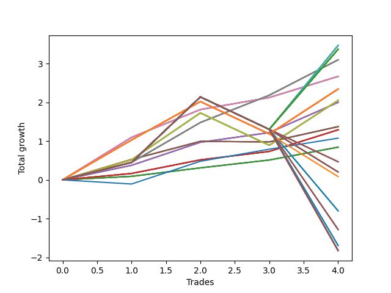

# Short Wallace Doodle 016 
- Symbol: AMZN_Unlimited
- Date Range: 03/23/2022 - 07/08/2022
- Trading Period: 7:20-12:30
- Number of Trades: 4



| Name | Win Percent | Profit | Avg Profit / Trade | Avg Time / Trade |      | Name | Win Percent | Profit | Avg Profit / Trade | Avg Time / Trade |
| ---- | ----------- | ------ | ------------------ | ---------------- | ---- | ---- | ----------- | ------ | ------------------ | ---------------- |
| Sorted By <br> Profit | | | | | | Sorted By <br> Win Percentage ||||
| Seventy-One | 75.00 | 1735.00 | 433.75 | 76:20 |     | Sixty-Nine | 100.00 | 1549.25 | 387.31 | 53:26 |
| Sixty-Three | 75.00 | 1735.00 | 433.75 | 76:20 |     | Sixty-One | 100.00 | 1549.25 | 387.31 | 53:26 |
| Fifty-Five | 75.00 | 1735.00 | 433.75 | 76:20 |     | Fifty-Three | 100.00 | 1549.25 | 387.31 | 53:26 |
| Forty-Seven | 75.00 | 1735.00 | 433.75 | 76:20 |     | Forty-Five | 100.00 | 1549.25 | 387.31 | 53:26 |
| Seven | 75.00 | 1735.00 | 433.75 | 76:20 |     | Five | 100.00 | 1549.25 | 387.31 | 53:26 |
| One Hundred Twenty-Seven | 75.00 | 1686.00 | 421.50 | 76:18 |     | Sixty-Eight | 100.00 | 1335.00 | 333.75 | 30:37 |
| One Hundred Twenty-Two | 75.00 | 1686.00 | 421.50 | 76:18 |     | Sixty | 100.00 | 1335.00 | 333.75 | 30:37 |
| One Hundred Seventeen | 75.00 | 1686.00 | 421.50 | 76:18 |     | Fifty-Two | 100.00 | 1335.00 | 333.75 | 30:37 |
| One Hundred Twelve | 75.00 | 1686.00 | 421.50 | 76:18 |     | Forty-Four | 100.00 | 1335.00 | 333.75 | 30:37 |
| One Hundred Seven | 75.00 | 1686.00 | 421.50 | 76:18 |     | Four | 100.00 | 1335.00 | 333.75 | 30:37 |
| One Hundred Two | 75.00 | 1686.00 | 421.50 | 76:18 |     | Sixty-Six | 100.00 | 999.75 | 249.94 | 13:51 |
| Ninety-Two | 75.00 | 1686.00 | 421.50 | 76:18 |     | Fifty-Eight | 100.00 | 999.75 | 249.94 | 13:51 |
| Eighty-Two | 75.00 | 1686.00 | 421.50 | 76:18 |     | Fifty | 100.00 | 999.75 | 249.94 | 13:51 |
| Sixty-Nine | 100.00 | 1549.25 | 387.31 | 53:26 |     | Forty-Two | 100.00 | 999.75 | 249.94 | 13:51 |
| Sixty-One | 100.00 | 1549.25 | 387.31 | 53:26 |     | Two | 100.00 | 999.75 | 249.94 | 13:51 |
| Fifty-Three | 100.00 | 1549.25 | 387.31 | 53:26 |     | Sixty-Five | 100.00 | 646.00 | 161.50 | 10:02 |
| Forty-Five | 100.00 | 1549.25 | 387.31 | 53:26 |     | Fifty-Seven | 100.00 | 646.00 | 161.50 | 10:02 |
| Five | 100.00 | 1549.25 | 387.31 | 53:26 |     | Forty-Nine | 100.00 | 646.00 | 161.50 | 10:02 |
| Sixty-Eight | 100.00 | 1335.00 | 333.75 | 30:37 |     | Forty-One | 100.00 | 646.00 | 161.50 | 10:02 |
| Sixty | 100.00 | 1335.00 | 333.75 | 30:37 |     | One | 100.00 | 646.00 | 161.50 | 10:02 |
| Fifty-Two | 100.00 | 1335.00 | 333.75 | 30:37 |     | Sixty-Four | 100.00 | 422.00 | 105.50 | 06:33 |
| Forty-Four | 100.00 | 1335.00 | 333.75 | 30:37 |     | Fifty-Six | 100.00 | 422.00 | 105.50 | 06:33 |
| Four | 100.00 | 1335.00 | 333.75 | 30:37 |     | Forty-Eight | 100.00 | 422.00 | 105.50 | 06:33 |
| One Hundred Twenty-Six | 75.00 | 1172.25 | 293.06 | 59:25 |     | Forty | 100.00 | 422.00 | 105.50 | 06:33 |
| One Hundred Twenty-One | 75.00 | 1172.25 | 293.06 | 59:25 |     | Zero | 100.00 | 422.00 | 105.50 | 06:33 |
| One Hundred Sixteen | 75.00 | 1172.25 | 293.06 | 59:25 |     | Seventy-One | 75.00 | 1735.00 | 433.75 | 76:20 |
| One Hundred Eleven | 75.00 | 1172.25 | 293.06 | 59:25 |     | Sixty-Three | 75.00 | 1735.00 | 433.75 | 76:20 |
| One Hundred Six | 75.00 | 1172.25 | 293.06 | 59:25 |     | Fifty-Five | 75.00 | 1735.00 | 433.75 | 76:20 |
| One Hundred One | 75.00 | 1172.25 | 293.06 | 59:25 |     | Forty-Seven | 75.00 | 1735.00 | 433.75 | 76:20 |
| Ninety-One | 75.00 | 1172.25 | 293.06 | 59:25 |     | Seven | 75.00 | 1735.00 | 433.75 | 76:20 |
| Eighty-One | 75.00 | 1172.25 | 293.06 | 59:25 |     | One Hundred Twenty-Seven | 75.00 | 1686.00 | 421.50 | 76:18 |
| Seventy | 75.00 | 1025.75 | 256.44 | 58:56 |     | One Hundred Twenty-Two | 75.00 | 1686.00 | 421.50 | 76:18 |
| Sixty-Two | 75.00 | 1025.75 | 256.44 | 58:56 |     | One Hundred Seventeen | 75.00 | 1686.00 | 421.50 | 76:18 |
| Fifty-Four | 75.00 | 1025.75 | 256.44 | 58:56 |     | One Hundred Twelve | 75.00 | 1686.00 | 421.50 | 76:18 |
| Forty-Six | 75.00 | 1025.75 | 256.44 | 58:56 |     | One Hundred Seven | 75.00 | 1686.00 | 421.50 | 76:18 |
| Six | 75.00 | 1025.75 | 256.44 | 58:56 |     | One Hundred Two | 75.00 | 1686.00 | 421.50 | 76:18 |
| Sixty-Six | 100.00 | 999.75 | 249.94 | 13:51 |     | Ninety-Two | 75.00 | 1686.00 | 421.50 | 76:18 |
| Fifty-Eight | 100.00 | 999.75 | 249.94 | 13:51 |     | Eighty-Two | 75.00 | 1686.00 | 421.50 | 76:18 |
| Fifty | 100.00 | 999.75 | 249.94 | 13:51 |     | One Hundred Twenty-Six | 75.00 | 1172.25 | 293.06 | 59:25 |
| Forty-Two | 100.00 | 999.75 | 249.94 | 13:51 |     | One Hundred Twenty-One | 75.00 | 1172.25 | 293.06 | 59:25 |
| Two | 100.00 | 999.75 | 249.94 | 13:51 |     | One Hundred Sixteen | 75.00 | 1172.25 | 293.06 | 59:25 |
| Sixty-Seven | 75.00 | 687.00 | 171.75 | 22:31 |     | One Hundred Eleven | 75.00 | 1172.25 | 293.06 | 59:25 |
| Fifty-Nine | 75.00 | 687.00 | 171.75 | 22:31 |     | One Hundred Six | 75.00 | 1172.25 | 293.06 | 59:25 |
| Fifty-One | 75.00 | 687.00 | 171.75 | 22:31 |     | One Hundred One | 75.00 | 1172.25 | 293.06 | 59:25 |
| Forty-Three | 75.00 | 687.00 | 171.75 | 22:31 |     | Ninety-One | 75.00 | 1172.25 | 293.06 | 59:25 |
| Three | 75.00 | 687.00 | 171.75 | 22:31 |     | Eighty-One | 75.00 | 1172.25 | 293.06 | 59:25 |
| Sixty-Five | 100.00 | 646.00 | 161.50 | 10:02 |     | Seventy | 75.00 | 1025.75 | 256.44 | 58:56 |
| Fifty-Seven | 100.00 | 646.00 | 161.50 | 10:02 |     | Sixty-Two | 75.00 | 1025.75 | 256.44 | 58:56 |
| Forty-Nine | 100.00 | 646.00 | 161.50 | 10:02 |     | Fifty-Four | 75.00 | 1025.75 | 256.44 | 58:56 |
| Forty-One | 100.00 | 646.00 | 161.50 | 10:02 |     | Forty-Six | 75.00 | 1025.75 | 256.44 | 58:56 |
| One | 100.00 | 646.00 | 161.50 | 10:02 |     | Six | 75.00 | 1025.75 | 256.44 | 58:56 |
| Seventy-Three | 75.00 | 538.25 | 134.56 | 15:50 |     | Sixty-Seven | 75.00 | 687.00 | 171.75 | 22:31 |
| Sixty-Four | 100.00 | 422.00 | 105.50 | 06:33 |     | Fifty-Nine | 75.00 | 687.00 | 171.75 | 22:31 |
| Fifty-Six | 100.00 | 422.00 | 105.50 | 06:33 |     | Fifty-One | 75.00 | 687.00 | 171.75 | 22:31 |
| Forty-Eight | 100.00 | 422.00 | 105.50 | 06:33 |     | Forty-Three | 75.00 | 687.00 | 171.75 | 22:31 |
| Forty | 100.00 | 422.00 | 105.50 | 06:33 |     | Three | 75.00 | 687.00 | 171.75 | 22:31 |
| Zero | 100.00 | 422.00 | 105.50 | 06:33 |     | Seventy-Three | 75.00 | 538.25 | 134.56 | 15:50 |
| One Hundred Ten | 50.00 | 233.50 | 58.37 | 79:27 |     | One Hundred Ten | 50.00 | 233.50 | 58.37 | 79:27 |
| One Hundred Nine | 50.00 | 233.50 | 58.37 | 79:27 |     | One Hundred Nine | 50.00 | 233.50 | 58.37 | 79:27 |
| One Hundred Eight | 50.00 | 233.50 | 58.37 | 79:27 |     | One Hundred Eight | 50.00 | 233.50 | 58.37 | 79:27 |
| One Hundred | 50.00 | 101.75 | 25.44 | 68:01 |     | One Hundred | 50.00 | 101.75 | 25.44 | 68:01 |
| Ninety-Nine | 50.00 | 101.75 | 25.44 | 68:01 |     | Ninety-Nine | 50.00 | 101.75 | 25.44 | 68:01 |
| Ninety-Eight | 50.00 | 101.75 | 25.44 | 68:01 |     | Ninety-Eight | 50.00 | 101.75 | 25.44 | 68:01 |
| Ninety-Seven | 50.00 | 101.75 | 25.44 | 68:01 |     | Ninety-Seven | 50.00 | 101.75 | 25.44 | 68:01 |
| Ninety-Six | 50.00 | 42.25 | 10.56 | 57:46 |     | Ninety-Six | 50.00 | 42.25 | 10.56 | 57:46 |
| Ninety-Five | 50.00 | -400.00 | -100.00 | 82:50 |     | Ninety-Five | 50.00 | -400.00 | -100.00 | 82:50 |
| Ninety-Four | 50.00 | -400.00 | -100.00 | 82:50 |     | Ninety-Four | 50.00 | -400.00 | -100.00 | 82:50 |
| Ninety-Three | 50.00 | -400.00 | -100.00 | 82:50 |     | Ninety-Three | 50.00 | -400.00 | -100.00 | 82:50 |
| One Hundred Twenty | 50.00 | -641.25 | -160.31 | 84:47 |     | One Hundred Twenty | 50.00 | -641.25 | -160.31 | 84:47 |
| One Hundred Ninteen | 50.00 | -641.25 | -160.31 | 84:47 |     | One Hundred Ninteen | 50.00 | -641.25 | -160.31 | 84:47 |
| One Hundred Eighteen | 50.00 | -641.25 | -160.31 | 84:47 |     | One Hundred Eighteen | 50.00 | -641.25 | -160.31 | 84:47 |
| One Hundred Five | 50.00 | -846.75 | -211.69 | 86:16 |     | One Hundred Five | 50.00 | -846.75 | -211.69 | 86:16 |
| One Hundred Four | 50.00 | -846.75 | -211.69 | 86:16 |     | One Hundred Four | 50.00 | -846.75 | -211.69 | 86:16 |
| One Hundred Three | 50.00 | -846.75 | -211.69 | 86:16 |     | One Hundred Three | 50.00 | -846.75 | -211.69 | 86:16 |
| One Hundred Thirty | 50.00 | -911.75 | -227.94 | 94:30 |     | One Hundred Thirty | 50.00 | -911.75 | -227.94 | 94:30 |
| One Hundred Twenty-Nine | 50.00 | -911.75 | -227.94 | 94:30 |     | One Hundred Twenty-Nine | 50.00 | -911.75 | -227.94 | 94:30 |
| One Hundred Twenty-Eight | 50.00 | -911.75 | -227.94 | 94:30 |     | One Hundred Twenty-Eight | 50.00 | -911.75 | -227.94 | 94:30 |
| One Hundred Twenty-Five | 50.00 | -911.75 | -227.94 | 94:30 |     | One Hundred Twenty-Five | 50.00 | -911.75 | -227.94 | 94:30 |
| One Hundred Twenty-Four | 50.00 | -911.75 | -227.94 | 94:30 |     | One Hundred Twenty-Four | 50.00 | -911.75 | -227.94 | 94:30 |
| One Hundred Twenty-Three | 50.00 | -911.75 | -227.94 | 94:30 |     | One Hundred Twenty-Three | 50.00 | -911.75 | -227.94 | 94:30 |
| One Hundred Fifteen | 50.00 | -911.75 | -227.94 | 94:30 |     | One Hundred Fifteen | 50.00 | -911.75 | -227.94 | 94:30 |
| One Hundred Fourteen | 50.00 | -911.75 | -227.94 | 94:30 |     | One Hundred Fourteen | 50.00 | -911.75 | -227.94 | 94:30 |
| One Hundred Thirteen | 50.00 | -911.75 | -227.94 | 94:30 |     | One Hundred Thirteen | 50.00 | -911.75 | -227.94 | 94:30 |
| Eighty-Five | 50.00 | -911.75 | -227.94 | 94:30 |     | Eighty-Five | 50.00 | -911.75 | -227.94 | 94:30 |
| Eighty-Four | 50.00 | -911.75 | -227.94 | 94:30 |     | Eighty-Four | 50.00 | -911.75 | -227.94 | 94:30 |
| Eighty-Three | 50.00 | -911.75 | -227.94 | 94:30 |     | Eighty-Three | 50.00 | -911.75 | -227.94 | 94:30 |

## NO STOPLOSS

### Test Zero
* Sell when price hits the middle line of the 20p bollinger
* No Stoploss
* Results:
```
Total Trades: 4
Percent Up: 0.00
Percent Down: 100.00
Total Points Moved Down: 0.84
Potential Profit: 422.00
Total Points Ups: 0.00 Count Ups: 0
Total Points Downs: 0.84 Count Downs: 4
```

<details><summary>Trades</summary>

<code>In: 2022-04-06 12:06:00		Out: 2022-04-06 12:13:35		Total Position Time: 07:35		Total Move Down: 0.09		Total to Date: 0.09</code> <br />
<code>In: 2022-04-18 11:40:00		Out: 2022-04-18 11:43:15		Total Position Time: 03:15		Total Move Down: 0.22		Total to Date: 0.31</code> <br />
<code>In: 2022-04-25 11:31:00		Out: 2022-04-25 11:36:20		Total Position Time: 05:20		Total Move Down: 0.20		Total to Date: 0.51</code> <br />
<code>In: 2022-05-04 09:33:00		Out: 2022-05-04 09:43:05		Total Position Time: 10:05		Total Move Down: 0.33		Total to Date: 0.84</code> <br />


</details>

### Test One
* Sell when the price hits the upper line of the 20p 1std bollinger
* No Stoploss
* Results:
```
Total Trades: 4
Percent Up: 0.00
Percent Down: 100.00
Total Points Moved Down: 1.29
Potential Profit: 646.00
Total Points Ups: 0.00 Count Ups: 0
Total Points Downs: 1.29 Count Downs: 4
```

<details><summary>Trades</summary>

<code>In: 2022-04-06 12:06:00		Out: 2022-04-06 12:17:55		Total Position Time: 11:55		Total Move Down: 0.16		Total to Date: 0.16</code> <br />
<code>In: 2022-04-18 11:40:00		Out: 2022-04-18 11:46:40		Total Position Time: 06:40		Total Move Down: 0.35		Total to Date: 0.52</code> <br />
<code>In: 2022-04-25 11:31:00		Out: 2022-04-25 11:40:05		Total Position Time: 09:05		Total Move Down: 0.22		Total to Date: 0.73</code> <br />
<code>In: 2022-05-04 09:33:00		Out: 2022-05-04 09:45:30		Total Position Time: 12:30		Total Move Down: 0.56		Total to Date: 1.29</code> <br />


</details>

### Test Two
* Sell when the price hits the upper line of the 20p 2std bollinger
* No Stoploss
* Results:
```
Total Trades: 4
Percent Up: 0.00
Percent Down: 100.00
Total Points Moved Down: 2.00
Potential Profit: 999.75
Total Points Ups: 0.00 Count Ups: 0
Total Points Downs: 2.00 Count Downs: 4
```

<details><summary>Trades</summary>

<code>In: 2022-04-06 12:06:00		Out: 2022-04-06 12:20:15		Total Position Time: 14:15		Total Move Down: 0.38		Total to Date: 0.38</code> <br />
<code>In: 2022-04-18 11:40:00		Out: 2022-04-18 11:55:35		Total Position Time: 15:35		Total Move Down: 0.59		Total to Date: 0.97</code> <br />
<code>In: 2022-04-25 11:31:00		Out: 2022-04-25 11:42:30		Total Position Time: 11:30		Total Move Down: 0.25		Total to Date: 1.22</code> <br />
<code>In: 2022-05-04 09:33:00		Out: 2022-05-04 09:47:05		Total Position Time: 14:05		Total Move Down: 0.78		Total to Date: 2.00</code> <br />


</details>

### Test Three
* Sell when price hits the middle line of the 50p bollinger
* No Stoploss
* Results:
```
Total Trades: 4
Percent Up: 25.00
Percent Down: 75.00
Total Points Moved Down: 1.37
Potential Profit: 687.00
Total Points Ups: 0.01 Count Ups: 1
Total Points Downs: 1.39 Count Downs: 3
```

<details><summary>Trades</summary>

<code>In: 2022-04-06 12:06:00		Out: 2022-04-06 12:20:35		Total Position Time: 14:35		Total Move Down: 0.53		Total to Date: 0.53</code> <br />
<code>In: 2022-04-18 11:40:00		Out: 2022-04-18 11:46:55		Total Position Time: 06:55		Total Move Down: 0.47		Total to Date: 0.99</code> <br />
<code>In: 2022-04-25 11:31:00		Out: 2022-04-25 12:01:20		Total Position Time: 30:20		Total Move Down: -0.01		Total to Date: 0.98</code> <br />
<code>In: 2022-05-04 09:33:00		Out: 2022-05-04 10:11:15		Total Position Time: 38:15		Total Move Down: 0.39		Total to Date: 1.37</code> <br />


</details>

### Test Four
* Sell when the price hits the upper line of the 50p 1std bollinger
* No Stoploss
* Results:
```
Total Trades: 4
Percent Up: 0.00
Percent Down: 100.00
Total Points Moved Down: 2.67
Potential Profit: 1335.00
Total Points Ups: 0.00 Count Ups: 0
Total Points Downs: 2.67 Count Downs: 4
```

<details><summary>Trades</summary>

<code>In: 2022-04-06 12:06:00		Out: 2022-04-06 12:30:30		Total Position Time: 24:30		Total Move Down: 1.10		Total to Date: 1.10</code> <br />
<code>In: 2022-04-18 11:40:00		Out: 2022-04-18 12:02:40		Total Position Time: 22:40		Total Move Down: 0.72		Total to Date: 1.81</code> <br />
<code>In: 2022-04-25 11:31:00		Out: 2022-04-25 12:03:05		Total Position Time: 32:05		Total Move Down: 0.31		Total to Date: 2.12</code> <br />
<code>In: 2022-05-04 09:33:00		Out: 2022-05-04 10:16:15		Total Position Time: 43:15		Total Move Down: 0.55		Total to Date: 2.67</code> <br />


</details>

### Test Five
* Sell when the price hits the upper line of the 50p 2std bollinger
* No Stoploss
* Results:
```
Total Trades: 4
Percent Up: 0.00
Percent Down: 100.00
Total Points Moved Down: 3.10
Potential Profit: 1549.25
Total Points Ups: 0.00 Count Ups: 0
Total Points Downs: 3.10 Count Downs: 4
```

<details><summary>Trades</summary>

<code>In: 2022-04-06 12:06:00		Out: 2022-04-06 12:47:00		Total Position Time: 41:00		Total Move Down: 0.45		Total to Date: 0.45</code> <br />
<code>In: 2022-04-18 11:40:00		Out: 2022-04-18 12:25:05		Total Position Time: 45:05		Total Move Down: 1.03		Total to Date: 1.48</code> <br />
<code>In: 2022-04-25 11:31:00		Out: 2022-04-25 12:04:20		Total Position Time: 33:20		Total Move Down: 0.70		Total to Date: 2.18</code> <br />
<code>In: 2022-05-04 09:33:00		Out: 2022-05-04 11:07:20		Total Position Time: 94:20		Total Move Down: 0.91		Total to Date: 3.10</code> <br />


</details>

### Test Six
* Sell when the price hits the middle line of the 1std VWAP
* No Stoploss
* Results:
```
Total Trades: 4
Percent Up: 25.00
Percent Down: 75.00
Total Points Moved Down: 2.05
Potential Profit: 1025.75
Total Points Ups: 0.84 Count Ups: 1
Total Points Downs: 2.89 Count Downs: 3
```

<details><summary>Trades</summary>

<code>In: 2022-04-06 12:06:00		Out: 2022-04-06 12:20:25		Total Position Time: 14:25		Total Move Down: 0.52		Total to Date: 0.52</code> <br />
<code>In: 2022-04-18 11:40:00		Out: 2022-04-18 12:30:40		Total Position Time: 50:40		Total Move Down: 1.21		Total to Date: 1.73</code> <br />
<code>In: 2022-04-25 11:31:00		Out: 2022-04-25 12:47:00		Total Position Time: 76:00		Total Move Down: -0.84		Total to Date: 0.89</code> <br />
<code>In: 2022-05-04 09:33:00		Out: 2022-05-04 11:07:40		Total Position Time: 94:40		Total Move Down: 1.16		Total to Date: 2.05</code> <br />


</details>

### Test Seven
* Sell when the price hits the upper line of the 1std VWAP
* No Stoploss
* Results:
```
Total Trades: 4
Percent Up: 25.00
Percent Down: 75.00
Total Points Moved Down: 3.47
Potential Profit: 1735.00
Total Points Ups: 0.84 Count Ups: 1
Total Points Downs: 4.31 Count Downs: 3
```

<details><summary>Trades</summary>

<code>In: 2022-04-06 12:06:00		Out: 2022-04-06 12:47:00		Total Position Time: 41:00		Total Move Down: 0.45		Total to Date: 0.45</code> <br />
<code>In: 2022-04-18 11:40:00		Out: 2022-04-18 12:47:00		Total Position Time: 67:00		Total Move Down: 1.69		Total to Date: 2.14</code> <br />
<code>In: 2022-04-25 11:31:00		Out: 2022-04-25 12:47:00		Total Position Time: 76:00		Total Move Down: -0.84		Total to Date: 1.30</code> <br />
<code>In: 2022-05-04 09:33:00		Out: 2022-05-04 11:34:20		Total Position Time: 121:20		Total Move Down: 2.17		Total to Date: 3.47</code> <br />


</details>

## STOPLOSS OF 5

### Test Forty
* Sell when price hits the middle line of the 20p bollinger
* Stoploss is -5 points
* Results:
```
Total Trades: 4
Percent Up: 0.00
Percent Down: 100.00
Total Points Moved Down: 0.84
Potential Profit: 422.00
Total Points Ups: 0.00 Count Ups: 0
Total Points Downs: 0.84 Count Downs: 4
```

<details><summary>Trades</summary>

<code>In: 2022-04-06 12:06:00		Out: 2022-04-06 12:13:35		Total Position Time: 07:35		Total Move Down: 0.09		Total to Date: 0.09</code> <br />
<code>In: 2022-04-18 11:40:00		Out: 2022-04-18 11:43:15		Total Position Time: 03:15		Total Move Down: 0.22		Total to Date: 0.31</code> <br />
<code>In: 2022-04-25 11:31:00		Out: 2022-04-25 11:36:20		Total Position Time: 05:20		Total Move Down: 0.20		Total to Date: 0.51</code> <br />
<code>In: 2022-05-04 09:33:00		Out: 2022-05-04 09:43:05		Total Position Time: 10:05		Total Move Down: 0.33		Total to Date: 0.84</code> <br />


</details>

### Test Forty-One
* Sell when the price hits the upper line of the 20p 1std bollinger
* Stoploss is -5 points
* Results:
```
Total Trades: 4
Percent Up: 0.00
Percent Down: 100.00
Total Points Moved Down: 1.29
Potential Profit: 646.00
Total Points Ups: 0.00 Count Ups: 0
Total Points Downs: 1.29 Count Downs: 4
```

<details><summary>Trades</summary>

<code>In: 2022-04-06 12:06:00		Out: 2022-04-06 12:17:55		Total Position Time: 11:55		Total Move Down: 0.16		Total to Date: 0.16</code> <br />
<code>In: 2022-04-18 11:40:00		Out: 2022-04-18 11:46:40		Total Position Time: 06:40		Total Move Down: 0.35		Total to Date: 0.52</code> <br />
<code>In: 2022-04-25 11:31:00		Out: 2022-04-25 11:40:05		Total Position Time: 09:05		Total Move Down: 0.22		Total to Date: 0.73</code> <br />
<code>In: 2022-05-04 09:33:00		Out: 2022-05-04 09:45:30		Total Position Time: 12:30		Total Move Down: 0.56		Total to Date: 1.29</code> <br />


</details>

### Test Forty-Two
* Sell when the price hits the upper line of the 20p 2std bollinger
* Stoploss is -5 points
* Results:
```
Total Trades: 4
Percent Up: 0.00
Percent Down: 100.00
Total Points Moved Down: 2.00
Potential Profit: 999.75
Total Points Ups: 0.00 Count Ups: 0
Total Points Downs: 2.00 Count Downs: 4
```

<details><summary>Trades</summary>

<code>In: 2022-04-06 12:06:00		Out: 2022-04-06 12:20:15		Total Position Time: 14:15		Total Move Down: 0.38		Total to Date: 0.38</code> <br />
<code>In: 2022-04-18 11:40:00		Out: 2022-04-18 11:55:35		Total Position Time: 15:35		Total Move Down: 0.59		Total to Date: 0.97</code> <br />
<code>In: 2022-04-25 11:31:00		Out: 2022-04-25 11:42:30		Total Position Time: 11:30		Total Move Down: 0.25		Total to Date: 1.22</code> <br />
<code>In: 2022-05-04 09:33:00		Out: 2022-05-04 09:47:05		Total Position Time: 14:05		Total Move Down: 0.78		Total to Date: 2.00</code> <br />


</details>

### Test Forty-Three
* Sell when price hits the middle line of the 50p bollinger
* Stoploss is -5 points
* Results:
```
Total Trades: 4
Percent Up: 25.00
Percent Down: 75.00
Total Points Moved Down: 1.37
Potential Profit: 687.00
Total Points Ups: 0.01 Count Ups: 1
Total Points Downs: 1.39 Count Downs: 3
```

<details><summary>Trades</summary>

<code>In: 2022-04-06 12:06:00		Out: 2022-04-06 12:20:35		Total Position Time: 14:35		Total Move Down: 0.53		Total to Date: 0.53</code> <br />
<code>In: 2022-04-18 11:40:00		Out: 2022-04-18 11:46:55		Total Position Time: 06:55		Total Move Down: 0.47		Total to Date: 0.99</code> <br />
<code>In: 2022-04-25 11:31:00		Out: 2022-04-25 12:01:20		Total Position Time: 30:20		Total Move Down: -0.01		Total to Date: 0.98</code> <br />
<code>In: 2022-05-04 09:33:00		Out: 2022-05-04 10:11:15		Total Position Time: 38:15		Total Move Down: 0.39		Total to Date: 1.37</code> <br />


</details>

### Test Forty-Four
* Sell when the price hits the upper line of the 50p 1std bollinger
* Stoploss is -5 points
* Results:
```
Total Trades: 4
Percent Up: 0.00
Percent Down: 100.00
Total Points Moved Down: 2.67
Potential Profit: 1335.00
Total Points Ups: 0.00 Count Ups: 0
Total Points Downs: 2.67 Count Downs: 4
```

<details><summary>Trades</summary>

<code>In: 2022-04-06 12:06:00		Out: 2022-04-06 12:30:30		Total Position Time: 24:30		Total Move Down: 1.10		Total to Date: 1.10</code> <br />
<code>In: 2022-04-18 11:40:00		Out: 2022-04-18 12:02:40		Total Position Time: 22:40		Total Move Down: 0.72		Total to Date: 1.81</code> <br />
<code>In: 2022-04-25 11:31:00		Out: 2022-04-25 12:03:05		Total Position Time: 32:05		Total Move Down: 0.31		Total to Date: 2.12</code> <br />
<code>In: 2022-05-04 09:33:00		Out: 2022-05-04 10:16:15		Total Position Time: 43:15		Total Move Down: 0.55		Total to Date: 2.67</code> <br />


</details>

### Test Forty-Five
* Sell when the price hits the upper line of the 50p 2std bollinger
* Stoploss is -5 points
* Results:
```
Total Trades: 4
Percent Up: 0.00
Percent Down: 100.00
Total Points Moved Down: 3.10
Potential Profit: 1549.25
Total Points Ups: 0.00 Count Ups: 0
Total Points Downs: 3.10 Count Downs: 4
```

<details><summary>Trades</summary>

<code>In: 2022-04-06 12:06:00		Out: 2022-04-06 12:47:00		Total Position Time: 41:00		Total Move Down: 0.45		Total to Date: 0.45</code> <br />
<code>In: 2022-04-18 11:40:00		Out: 2022-04-18 12:25:05		Total Position Time: 45:05		Total Move Down: 1.03		Total to Date: 1.48</code> <br />
<code>In: 2022-04-25 11:31:00		Out: 2022-04-25 12:04:20		Total Position Time: 33:20		Total Move Down: 0.70		Total to Date: 2.18</code> <br />
<code>In: 2022-05-04 09:33:00		Out: 2022-05-04 11:07:20		Total Position Time: 94:20		Total Move Down: 0.91		Total to Date: 3.10</code> <br />


</details>

### Test Forty-Six
* Sell when the price hits the middle line of the 1std VWAP
* Stoploss is -5 points
* Results:
```
Total Trades: 4
Percent Up: 25.00
Percent Down: 75.00
Total Points Moved Down: 2.05
Potential Profit: 1025.75
Total Points Ups: 0.84 Count Ups: 1
Total Points Downs: 2.89 Count Downs: 3
```

<details><summary>Trades</summary>

<code>In: 2022-04-06 12:06:00		Out: 2022-04-06 12:20:25		Total Position Time: 14:25		Total Move Down: 0.52		Total to Date: 0.52</code> <br />
<code>In: 2022-04-18 11:40:00		Out: 2022-04-18 12:30:40		Total Position Time: 50:40		Total Move Down: 1.21		Total to Date: 1.73</code> <br />
<code>In: 2022-04-25 11:31:00		Out: 2022-04-25 12:47:00		Total Position Time: 76:00		Total Move Down: -0.84		Total to Date: 0.89</code> <br />
<code>In: 2022-05-04 09:33:00		Out: 2022-05-04 11:07:40		Total Position Time: 94:40		Total Move Down: 1.16		Total to Date: 2.05</code> <br />


</details>

### Test Forty-Seven
* Sell when the price hits the upper line of the 1std VWAP
* Stoploss is -5 points
* Results:
```
Total Trades: 4
Percent Up: 25.00
Percent Down: 75.00
Total Points Moved Down: 3.47
Potential Profit: 1735.00
Total Points Ups: 0.84 Count Ups: 1
Total Points Downs: 4.31 Count Downs: 3
```

<details><summary>Trades</summary>

<code>In: 2022-04-06 12:06:00		Out: 2022-04-06 12:47:00		Total Position Time: 41:00		Total Move Down: 0.45		Total to Date: 0.45</code> <br />
<code>In: 2022-04-18 11:40:00		Out: 2022-04-18 12:47:00		Total Position Time: 67:00		Total Move Down: 1.69		Total to Date: 2.14</code> <br />
<code>In: 2022-04-25 11:31:00		Out: 2022-04-25 12:47:00		Total Position Time: 76:00		Total Move Down: -0.84		Total to Date: 1.30</code> <br />
<code>In: 2022-05-04 09:33:00		Out: 2022-05-04 11:34:20		Total Position Time: 121:20		Total Move Down: 2.17		Total to Date: 3.47</code> <br />


</details>

## TRAIL STOP OF 5

### Test Forty-Eight
* Sell when price hits the middle line of the 20p bollinger
* Trailing Stop is -5 points
* Results:
```
Total Trades: 4
Percent Up: 0.00
Percent Down: 100.00
Total Points Moved Down: 0.84
Potential Profit: 422.00
Total Points Ups: 0.00 Count Ups: 0
Total Points Downs: 0.84 Count Downs: 4
```

<details><summary>Trades</summary>

<code>In: 2022-04-06 12:06:00		Out: 2022-04-06 12:13:35		Total Position Time: 07:35		Total Move Down: 0.09		Total to Date: 0.09</code> <br />
<code>In: 2022-04-18 11:40:00		Out: 2022-04-18 11:43:15		Total Position Time: 03:15		Total Move Down: 0.22		Total to Date: 0.31</code> <br />
<code>In: 2022-04-25 11:31:00		Out: 2022-04-25 11:36:20		Total Position Time: 05:20		Total Move Down: 0.20		Total to Date: 0.51</code> <br />
<code>In: 2022-05-04 09:33:00		Out: 2022-05-04 09:43:05		Total Position Time: 10:05		Total Move Down: 0.33		Total to Date: 0.84</code> <br />


</details>

### Test Forty-Nine
* Sell when the price hits the upper line of the 20p 1std bollinger
* Trailing Stop is -5 points
* Results:
```
Total Trades: 4
Percent Up: 0.00
Percent Down: 100.00
Total Points Moved Down: 1.29
Potential Profit: 646.00
Total Points Ups: 0.00 Count Ups: 0
Total Points Downs: 1.29 Count Downs: 4
```

<details><summary>Trades</summary>

<code>In: 2022-04-06 12:06:00		Out: 2022-04-06 12:17:55		Total Position Time: 11:55		Total Move Down: 0.16		Total to Date: 0.16</code> <br />
<code>In: 2022-04-18 11:40:00		Out: 2022-04-18 11:46:40		Total Position Time: 06:40		Total Move Down: 0.35		Total to Date: 0.52</code> <br />
<code>In: 2022-04-25 11:31:00		Out: 2022-04-25 11:40:05		Total Position Time: 09:05		Total Move Down: 0.22		Total to Date: 0.73</code> <br />
<code>In: 2022-05-04 09:33:00		Out: 2022-05-04 09:45:30		Total Position Time: 12:30		Total Move Down: 0.56		Total to Date: 1.29</code> <br />


</details>

### Test Fifty
* Sell when the price hits the upper line of the 20p 2std bollinger
* Trailing Stop is -5 points
* Results:
```
Total Trades: 4
Percent Up: 0.00
Percent Down: 100.00
Total Points Moved Down: 2.00
Potential Profit: 999.75
Total Points Ups: 0.00 Count Ups: 0
Total Points Downs: 2.00 Count Downs: 4
```

<details><summary>Trades</summary>

<code>In: 2022-04-06 12:06:00		Out: 2022-04-06 12:20:15		Total Position Time: 14:15		Total Move Down: 0.38		Total to Date: 0.38</code> <br />
<code>In: 2022-04-18 11:40:00		Out: 2022-04-18 11:55:35		Total Position Time: 15:35		Total Move Down: 0.59		Total to Date: 0.97</code> <br />
<code>In: 2022-04-25 11:31:00		Out: 2022-04-25 11:42:30		Total Position Time: 11:30		Total Move Down: 0.25		Total to Date: 1.22</code> <br />
<code>In: 2022-05-04 09:33:00		Out: 2022-05-04 09:47:05		Total Position Time: 14:05		Total Move Down: 0.78		Total to Date: 2.00</code> <br />


</details>

### Test Fifty-One
* Sell when price hits the middle line of the 50p bollinger
* Trailing Stop is -5 points
* Results:
```
Total Trades: 4
Percent Up: 25.00
Percent Down: 75.00
Total Points Moved Down: 1.37
Potential Profit: 687.00
Total Points Ups: 0.01 Count Ups: 1
Total Points Downs: 1.39 Count Downs: 3
```

<details><summary>Trades</summary>

<code>In: 2022-04-06 12:06:00		Out: 2022-04-06 12:20:35		Total Position Time: 14:35		Total Move Down: 0.53		Total to Date: 0.53</code> <br />
<code>In: 2022-04-18 11:40:00		Out: 2022-04-18 11:46:55		Total Position Time: 06:55		Total Move Down: 0.47		Total to Date: 0.99</code> <br />
<code>In: 2022-04-25 11:31:00		Out: 2022-04-25 12:01:20		Total Position Time: 30:20		Total Move Down: -0.01		Total to Date: 0.98</code> <br />
<code>In: 2022-05-04 09:33:00		Out: 2022-05-04 10:11:15		Total Position Time: 38:15		Total Move Down: 0.39		Total to Date: 1.37</code> <br />


</details>

### Test Fifty-Two
* Sell when the price hits the upper line of the 50p 1std bollinger
* Trailing Stop is -5 points
* Results:
```
Total Trades: 4
Percent Up: 0.00
Percent Down: 100.00
Total Points Moved Down: 2.67
Potential Profit: 1335.00
Total Points Ups: 0.00 Count Ups: 0
Total Points Downs: 2.67 Count Downs: 4
```

<details><summary>Trades</summary>

<code>In: 2022-04-06 12:06:00		Out: 2022-04-06 12:30:30		Total Position Time: 24:30		Total Move Down: 1.10		Total to Date: 1.10</code> <br />
<code>In: 2022-04-18 11:40:00		Out: 2022-04-18 12:02:40		Total Position Time: 22:40		Total Move Down: 0.72		Total to Date: 1.81</code> <br />
<code>In: 2022-04-25 11:31:00		Out: 2022-04-25 12:03:05		Total Position Time: 32:05		Total Move Down: 0.31		Total to Date: 2.12</code> <br />
<code>In: 2022-05-04 09:33:00		Out: 2022-05-04 10:16:15		Total Position Time: 43:15		Total Move Down: 0.55		Total to Date: 2.67</code> <br />


</details>

### Test Fifty-Three
* Sell when the price hits the upper line of the 50p 2std bollinger
* Trailing Stop is -5 points
* Results:
```
Total Trades: 4
Percent Up: 0.00
Percent Down: 100.00
Total Points Moved Down: 3.10
Potential Profit: 1549.25
Total Points Ups: 0.00 Count Ups: 0
Total Points Downs: 3.10 Count Downs: 4
```

<details><summary>Trades</summary>

<code>In: 2022-04-06 12:06:00		Out: 2022-04-06 12:47:00		Total Position Time: 41:00		Total Move Down: 0.45		Total to Date: 0.45</code> <br />
<code>In: 2022-04-18 11:40:00		Out: 2022-04-18 12:25:05		Total Position Time: 45:05		Total Move Down: 1.03		Total to Date: 1.48</code> <br />
<code>In: 2022-04-25 11:31:00		Out: 2022-04-25 12:04:20		Total Position Time: 33:20		Total Move Down: 0.70		Total to Date: 2.18</code> <br />
<code>In: 2022-05-04 09:33:00		Out: 2022-05-04 11:07:20		Total Position Time: 94:20		Total Move Down: 0.91		Total to Date: 3.10</code> <br />


</details>

### Test Fifty-Four
* Sell when the price hits the middle line of the 1std VWAP
* Trailing Stop is -5 points
* Results:
```
Total Trades: 4
Percent Up: 25.00
Percent Down: 75.00
Total Points Moved Down: 2.05
Potential Profit: 1025.75
Total Points Ups: 0.84 Count Ups: 1
Total Points Downs: 2.89 Count Downs: 3
```

<details><summary>Trades</summary>

<code>In: 2022-04-06 12:06:00		Out: 2022-04-06 12:20:25		Total Position Time: 14:25		Total Move Down: 0.52		Total to Date: 0.52</code> <br />
<code>In: 2022-04-18 11:40:00		Out: 2022-04-18 12:30:40		Total Position Time: 50:40		Total Move Down: 1.21		Total to Date: 1.73</code> <br />
<code>In: 2022-04-25 11:31:00		Out: 2022-04-25 12:47:00		Total Position Time: 76:00		Total Move Down: -0.84		Total to Date: 0.89</code> <br />
<code>In: 2022-05-04 09:33:00		Out: 2022-05-04 11:07:40		Total Position Time: 94:40		Total Move Down: 1.16		Total to Date: 2.05</code> <br />


</details>

### Test Fifty-Five
* Sell when the price hits the upper line of the 1std VWAP
* Trailing Stop is -5 points
* Results:
```
Total Trades: 4
Percent Up: 25.00
Percent Down: 75.00
Total Points Moved Down: 3.47
Potential Profit: 1735.00
Total Points Ups: 0.84 Count Ups: 1
Total Points Downs: 4.31 Count Downs: 3
```

<details><summary>Trades</summary>

<code>In: 2022-04-06 12:06:00		Out: 2022-04-06 12:47:00		Total Position Time: 41:00		Total Move Down: 0.45		Total to Date: 0.45</code> <br />
<code>In: 2022-04-18 11:40:00		Out: 2022-04-18 12:47:00		Total Position Time: 67:00		Total Move Down: 1.69		Total to Date: 2.14</code> <br />
<code>In: 2022-04-25 11:31:00		Out: 2022-04-25 12:47:00		Total Position Time: 76:00		Total Move Down: -0.84		Total to Date: 1.30</code> <br />
<code>In: 2022-05-04 09:33:00		Out: 2022-05-04 11:34:20		Total Position Time: 121:20		Total Move Down: 2.17		Total to Date: 3.47</code> <br />


</details>

## STOPLOSS OF 10

### Test Fifty-Six
* Sell when price hits the middle line of the 20p bollinger
* Stoploss is -10 points
* Results:
```
Total Trades: 4
Percent Up: 0.00
Percent Down: 100.00
Total Points Moved Down: 0.84
Potential Profit: 422.00
Total Points Ups: 0.00 Count Ups: 0
Total Points Downs: 0.84 Count Downs: 4
```

<details><summary>Trades</summary>

<code>In: 2022-04-06 12:06:00		Out: 2022-04-06 12:13:35		Total Position Time: 07:35		Total Move Down: 0.09		Total to Date: 0.09</code> <br />
<code>In: 2022-04-18 11:40:00		Out: 2022-04-18 11:43:15		Total Position Time: 03:15		Total Move Down: 0.22		Total to Date: 0.31</code> <br />
<code>In: 2022-04-25 11:31:00		Out: 2022-04-25 11:36:20		Total Position Time: 05:20		Total Move Down: 0.20		Total to Date: 0.51</code> <br />
<code>In: 2022-05-04 09:33:00		Out: 2022-05-04 09:43:05		Total Position Time: 10:05		Total Move Down: 0.33		Total to Date: 0.84</code> <br />


</details>

### Test Fifty-Seven
* Sell when the price hits the upper line of the 20p 1std bollinger
* Stoploss is -10 points
* Results:
```
Total Trades: 4
Percent Up: 0.00
Percent Down: 100.00
Total Points Moved Down: 1.29
Potential Profit: 646.00
Total Points Ups: 0.00 Count Ups: 0
Total Points Downs: 1.29 Count Downs: 4
```

<details><summary>Trades</summary>

<code>In: 2022-04-06 12:06:00		Out: 2022-04-06 12:17:55		Total Position Time: 11:55		Total Move Down: 0.16		Total to Date: 0.16</code> <br />
<code>In: 2022-04-18 11:40:00		Out: 2022-04-18 11:46:40		Total Position Time: 06:40		Total Move Down: 0.35		Total to Date: 0.52</code> <br />
<code>In: 2022-04-25 11:31:00		Out: 2022-04-25 11:40:05		Total Position Time: 09:05		Total Move Down: 0.22		Total to Date: 0.73</code> <br />
<code>In: 2022-05-04 09:33:00		Out: 2022-05-04 09:45:30		Total Position Time: 12:30		Total Move Down: 0.56		Total to Date: 1.29</code> <br />


</details>

### Test Fifty-Eight
* Sell when the price hits the upper line of the 20p 2std bollinger
* Stoploss is -10 points
* Results:
```
Total Trades: 4
Percent Up: 0.00
Percent Down: 100.00
Total Points Moved Down: 2.00
Potential Profit: 999.75
Total Points Ups: 0.00 Count Ups: 0
Total Points Downs: 2.00 Count Downs: 4
```

<details><summary>Trades</summary>

<code>In: 2022-04-06 12:06:00		Out: 2022-04-06 12:20:15		Total Position Time: 14:15		Total Move Down: 0.38		Total to Date: 0.38</code> <br />
<code>In: 2022-04-18 11:40:00		Out: 2022-04-18 11:55:35		Total Position Time: 15:35		Total Move Down: 0.59		Total to Date: 0.97</code> <br />
<code>In: 2022-04-25 11:31:00		Out: 2022-04-25 11:42:30		Total Position Time: 11:30		Total Move Down: 0.25		Total to Date: 1.22</code> <br />
<code>In: 2022-05-04 09:33:00		Out: 2022-05-04 09:47:05		Total Position Time: 14:05		Total Move Down: 0.78		Total to Date: 2.00</code> <br />


</details>

### Test Fifty-Nine
* Sell when price hits the middle line of the 50p bollinger
* Stoploss is -10 points
* Results:
```
Total Trades: 4
Percent Up: 25.00
Percent Down: 75.00
Total Points Moved Down: 1.37
Potential Profit: 687.00
Total Points Ups: 0.01 Count Ups: 1
Total Points Downs: 1.39 Count Downs: 3
```

<details><summary>Trades</summary>

<code>In: 2022-04-06 12:06:00		Out: 2022-04-06 12:20:35		Total Position Time: 14:35		Total Move Down: 0.53		Total to Date: 0.53</code> <br />
<code>In: 2022-04-18 11:40:00		Out: 2022-04-18 11:46:55		Total Position Time: 06:55		Total Move Down: 0.47		Total to Date: 0.99</code> <br />
<code>In: 2022-04-25 11:31:00		Out: 2022-04-25 12:01:20		Total Position Time: 30:20		Total Move Down: -0.01		Total to Date: 0.98</code> <br />
<code>In: 2022-05-04 09:33:00		Out: 2022-05-04 10:11:15		Total Position Time: 38:15		Total Move Down: 0.39		Total to Date: 1.37</code> <br />


</details>

### Test Sixty
* Sell when the price hits the upper line of the 50p 1std bollinger
* Stoploss is -10 points
* Results:
```
Total Trades: 4
Percent Up: 0.00
Percent Down: 100.00
Total Points Moved Down: 2.67
Potential Profit: 1335.00
Total Points Ups: 0.00 Count Ups: 0
Total Points Downs: 2.67 Count Downs: 4
```

<details><summary>Trades</summary>

<code>In: 2022-04-06 12:06:00		Out: 2022-04-06 12:30:30		Total Position Time: 24:30		Total Move Down: 1.10		Total to Date: 1.10</code> <br />
<code>In: 2022-04-18 11:40:00		Out: 2022-04-18 12:02:40		Total Position Time: 22:40		Total Move Down: 0.72		Total to Date: 1.81</code> <br />
<code>In: 2022-04-25 11:31:00		Out: 2022-04-25 12:03:05		Total Position Time: 32:05		Total Move Down: 0.31		Total to Date: 2.12</code> <br />
<code>In: 2022-05-04 09:33:00		Out: 2022-05-04 10:16:15		Total Position Time: 43:15		Total Move Down: 0.55		Total to Date: 2.67</code> <br />


</details>

### Test Sixty-One
* Sell when the price hits the upper line of the 50p 2std bollinger
* Stoploss is -10 points
* Results:
```
Total Trades: 4
Percent Up: 0.00
Percent Down: 100.00
Total Points Moved Down: 3.10
Potential Profit: 1549.25
Total Points Ups: 0.00 Count Ups: 0
Total Points Downs: 3.10 Count Downs: 4
```

<details><summary>Trades</summary>

<code>In: 2022-04-06 12:06:00		Out: 2022-04-06 12:47:00		Total Position Time: 41:00		Total Move Down: 0.45		Total to Date: 0.45</code> <br />
<code>In: 2022-04-18 11:40:00		Out: 2022-04-18 12:25:05		Total Position Time: 45:05		Total Move Down: 1.03		Total to Date: 1.48</code> <br />
<code>In: 2022-04-25 11:31:00		Out: 2022-04-25 12:04:20		Total Position Time: 33:20		Total Move Down: 0.70		Total to Date: 2.18</code> <br />
<code>In: 2022-05-04 09:33:00		Out: 2022-05-04 11:07:20		Total Position Time: 94:20		Total Move Down: 0.91		Total to Date: 3.10</code> <br />


</details>

### Test Sixty-Two
* Sell when the price hits the middle line of the 1std VWAP
* Stoploss is -10 points
* Results:
```
Total Trades: 4
Percent Up: 25.00
Percent Down: 75.00
Total Points Moved Down: 2.05
Potential Profit: 1025.75
Total Points Ups: 0.84 Count Ups: 1
Total Points Downs: 2.89 Count Downs: 3
```

<details><summary>Trades</summary>

<code>In: 2022-04-06 12:06:00		Out: 2022-04-06 12:20:25		Total Position Time: 14:25		Total Move Down: 0.52		Total to Date: 0.52</code> <br />
<code>In: 2022-04-18 11:40:00		Out: 2022-04-18 12:30:40		Total Position Time: 50:40		Total Move Down: 1.21		Total to Date: 1.73</code> <br />
<code>In: 2022-04-25 11:31:00		Out: 2022-04-25 12:47:00		Total Position Time: 76:00		Total Move Down: -0.84		Total to Date: 0.89</code> <br />
<code>In: 2022-05-04 09:33:00		Out: 2022-05-04 11:07:40		Total Position Time: 94:40		Total Move Down: 1.16		Total to Date: 2.05</code> <br />


</details>

### Test Sixty-Three
* Sell when the price hits the upper line of the 1std VWAP
* Stoploss is -10 points
* Results:
```
Total Trades: 4
Percent Up: 25.00
Percent Down: 75.00
Total Points Moved Down: 3.47
Potential Profit: 1735.00
Total Points Ups: 0.84 Count Ups: 1
Total Points Downs: 4.31 Count Downs: 3
```

<details><summary>Trades</summary>

<code>In: 2022-04-06 12:06:00		Out: 2022-04-06 12:47:00		Total Position Time: 41:00		Total Move Down: 0.45		Total to Date: 0.45</code> <br />
<code>In: 2022-04-18 11:40:00		Out: 2022-04-18 12:47:00		Total Position Time: 67:00		Total Move Down: 1.69		Total to Date: 2.14</code> <br />
<code>In: 2022-04-25 11:31:00		Out: 2022-04-25 12:47:00		Total Position Time: 76:00		Total Move Down: -0.84		Total to Date: 1.30</code> <br />
<code>In: 2022-05-04 09:33:00		Out: 2022-05-04 11:34:20		Total Position Time: 121:20		Total Move Down: 2.17		Total to Date: 3.47</code> <br />


</details>

## TRAIL STOP OF 10

### Test Sixty-Four
* Sell when price hits the middle line of the 20p bollinger
* Trailing Stop is -10 points
* Results:
```
Total Trades: 4
Percent Up: 0.00
Percent Down: 100.00
Total Points Moved Down: 0.84
Potential Profit: 422.00
Total Points Ups: 0.00 Count Ups: 0
Total Points Downs: 0.84 Count Downs: 4
```

<details><summary>Trades</summary>

<code>In: 2022-04-06 12:06:00		Out: 2022-04-06 12:13:35		Total Position Time: 07:35		Total Move Down: 0.09		Total to Date: 0.09</code> <br />
<code>In: 2022-04-18 11:40:00		Out: 2022-04-18 11:43:15		Total Position Time: 03:15		Total Move Down: 0.22		Total to Date: 0.31</code> <br />
<code>In: 2022-04-25 11:31:00		Out: 2022-04-25 11:36:20		Total Position Time: 05:20		Total Move Down: 0.20		Total to Date: 0.51</code> <br />
<code>In: 2022-05-04 09:33:00		Out: 2022-05-04 09:43:05		Total Position Time: 10:05		Total Move Down: 0.33		Total to Date: 0.84</code> <br />


</details>

### Test Sixty-Five
* Sell when the price hits the upper line of the 20p 1std bollinger
* Trailing Stop is -10 points
* Results:
```
Total Trades: 4
Percent Up: 0.00
Percent Down: 100.00
Total Points Moved Down: 1.29
Potential Profit: 646.00
Total Points Ups: 0.00 Count Ups: 0
Total Points Downs: 1.29 Count Downs: 4
```

<details><summary>Trades</summary>

<code>In: 2022-04-06 12:06:00		Out: 2022-04-06 12:17:55		Total Position Time: 11:55		Total Move Down: 0.16		Total to Date: 0.16</code> <br />
<code>In: 2022-04-18 11:40:00		Out: 2022-04-18 11:46:40		Total Position Time: 06:40		Total Move Down: 0.35		Total to Date: 0.52</code> <br />
<code>In: 2022-04-25 11:31:00		Out: 2022-04-25 11:40:05		Total Position Time: 09:05		Total Move Down: 0.22		Total to Date: 0.73</code> <br />
<code>In: 2022-05-04 09:33:00		Out: 2022-05-04 09:45:30		Total Position Time: 12:30		Total Move Down: 0.56		Total to Date: 1.29</code> <br />


</details>

### Test Sixty-Six
* Sell when the price hits the upper line of the 20p 2std bollinger
* Trailing Stop is -10 points
* Results:
```
Total Trades: 4
Percent Up: 0.00
Percent Down: 100.00
Total Points Moved Down: 2.00
Potential Profit: 999.75
Total Points Ups: 0.00 Count Ups: 0
Total Points Downs: 2.00 Count Downs: 4
```

<details><summary>Trades</summary>

<code>In: 2022-04-06 12:06:00		Out: 2022-04-06 12:20:15		Total Position Time: 14:15		Total Move Down: 0.38		Total to Date: 0.38</code> <br />
<code>In: 2022-04-18 11:40:00		Out: 2022-04-18 11:55:35		Total Position Time: 15:35		Total Move Down: 0.59		Total to Date: 0.97</code> <br />
<code>In: 2022-04-25 11:31:00		Out: 2022-04-25 11:42:30		Total Position Time: 11:30		Total Move Down: 0.25		Total to Date: 1.22</code> <br />
<code>In: 2022-05-04 09:33:00		Out: 2022-05-04 09:47:05		Total Position Time: 14:05		Total Move Down: 0.78		Total to Date: 2.00</code> <br />


</details>

### Test Sixty-Seven
* Sell when price hits the middle line of the 50p bollinger
* Trailing Stop is -10 points
* Results:
```
Total Trades: 4
Percent Up: 25.00
Percent Down: 75.00
Total Points Moved Down: 1.37
Potential Profit: 687.00
Total Points Ups: 0.01 Count Ups: 1
Total Points Downs: 1.39 Count Downs: 3
```

<details><summary>Trades</summary>

<code>In: 2022-04-06 12:06:00		Out: 2022-04-06 12:20:35		Total Position Time: 14:35		Total Move Down: 0.53		Total to Date: 0.53</code> <br />
<code>In: 2022-04-18 11:40:00		Out: 2022-04-18 11:46:55		Total Position Time: 06:55		Total Move Down: 0.47		Total to Date: 0.99</code> <br />
<code>In: 2022-04-25 11:31:00		Out: 2022-04-25 12:01:20		Total Position Time: 30:20		Total Move Down: -0.01		Total to Date: 0.98</code> <br />
<code>In: 2022-05-04 09:33:00		Out: 2022-05-04 10:11:15		Total Position Time: 38:15		Total Move Down: 0.39		Total to Date: 1.37</code> <br />


</details>

### Test Sixty-Eight
* Sell when the price hits the upper line of the 50p 1std bollinger
* Trailing Stop is -10 points
* Results:
```
Total Trades: 4
Percent Up: 0.00
Percent Down: 100.00
Total Points Moved Down: 2.67
Potential Profit: 1335.00
Total Points Ups: 0.00 Count Ups: 0
Total Points Downs: 2.67 Count Downs: 4
```

<details><summary>Trades</summary>

<code>In: 2022-04-06 12:06:00		Out: 2022-04-06 12:30:30		Total Position Time: 24:30		Total Move Down: 1.10		Total to Date: 1.10</code> <br />
<code>In: 2022-04-18 11:40:00		Out: 2022-04-18 12:02:40		Total Position Time: 22:40		Total Move Down: 0.72		Total to Date: 1.81</code> <br />
<code>In: 2022-04-25 11:31:00		Out: 2022-04-25 12:03:05		Total Position Time: 32:05		Total Move Down: 0.31		Total to Date: 2.12</code> <br />
<code>In: 2022-05-04 09:33:00		Out: 2022-05-04 10:16:15		Total Position Time: 43:15		Total Move Down: 0.55		Total to Date: 2.67</code> <br />


</details>

### Test Sixty-Nine
* Sell when the price hits the upper line of the 50p 2std bollinger
* Trailing Stop is -10 points
* Results:
```
Total Trades: 4
Percent Up: 0.00
Percent Down: 100.00
Total Points Moved Down: 3.10
Potential Profit: 1549.25
Total Points Ups: 0.00 Count Ups: 0
Total Points Downs: 3.10 Count Downs: 4
```

<details><summary>Trades</summary>

<code>In: 2022-04-06 12:06:00		Out: 2022-04-06 12:47:00		Total Position Time: 41:00		Total Move Down: 0.45		Total to Date: 0.45</code> <br />
<code>In: 2022-04-18 11:40:00		Out: 2022-04-18 12:25:05		Total Position Time: 45:05		Total Move Down: 1.03		Total to Date: 1.48</code> <br />
<code>In: 2022-04-25 11:31:00		Out: 2022-04-25 12:04:20		Total Position Time: 33:20		Total Move Down: 0.70		Total to Date: 2.18</code> <br />
<code>In: 2022-05-04 09:33:00		Out: 2022-05-04 11:07:20		Total Position Time: 94:20		Total Move Down: 0.91		Total to Date: 3.10</code> <br />


</details>

### Test Seventy
* Sell when the price hits the middle line of the 1std VWAP
* Trailing Stop is -10 points
* Results:
```
Total Trades: 4
Percent Up: 25.00
Percent Down: 75.00
Total Points Moved Down: 2.05
Potential Profit: 1025.75
Total Points Ups: 0.84 Count Ups: 1
Total Points Downs: 2.89 Count Downs: 3
```

<details><summary>Trades</summary>

<code>In: 2022-04-06 12:06:00		Out: 2022-04-06 12:20:25		Total Position Time: 14:25		Total Move Down: 0.52		Total to Date: 0.52</code> <br />
<code>In: 2022-04-18 11:40:00		Out: 2022-04-18 12:30:40		Total Position Time: 50:40		Total Move Down: 1.21		Total to Date: 1.73</code> <br />
<code>In: 2022-04-25 11:31:00		Out: 2022-04-25 12:47:00		Total Position Time: 76:00		Total Move Down: -0.84		Total to Date: 0.89</code> <br />
<code>In: 2022-05-04 09:33:00		Out: 2022-05-04 11:07:40		Total Position Time: 94:40		Total Move Down: 1.16		Total to Date: 2.05</code> <br />


</details>

### Test Seventy-One
* Sell when the price hits the upper line of the 1std VWAP
* Trailing Stop is -10 points
* Results:
```
Total Trades: 4
Percent Up: 25.00
Percent Down: 75.00
Total Points Moved Down: 3.47
Potential Profit: 1735.00
Total Points Ups: 0.84 Count Ups: 1
Total Points Downs: 4.31 Count Downs: 3
```

<details><summary>Trades</summary>

<code>In: 2022-04-06 12:06:00		Out: 2022-04-06 12:47:00		Total Position Time: 41:00		Total Move Down: 0.45		Total to Date: 0.45</code> <br />
<code>In: 2022-04-18 11:40:00		Out: 2022-04-18 12:47:00		Total Position Time: 67:00		Total Move Down: 1.69		Total to Date: 2.14</code> <br />
<code>In: 2022-04-25 11:31:00		Out: 2022-04-25 12:47:00		Total Position Time: 76:00		Total Move Down: -0.84		Total to Date: 1.30</code> <br />
<code>In: 2022-05-04 09:33:00		Out: 2022-05-04 11:34:20		Total Position Time: 121:20		Total Move Down: 2.17		Total to Date: 3.47</code> <br />


</details>

## SPECIAL EXIT CONDITIONS 

### Test Seventy-Three
* Sell when the linear regression slope changes to negative
* No Stoploss
* Results:
```
Total Trades: 4
Percent Up: 25.00
Percent Down: 75.00
Total Points Moved Down: 1.08
Potential Profit: 538.25
Total Points Ups: 0.11 Count Ups: 1
Total Points Downs: 1.18 Count Downs: 3
```

<details><summary>Trades</summary>

<code>In: 2022-04-06 12:06:00		Out: 2022-04-06 12:17:05		Total Position Time: 11:05		Total Move Down: -0.11		Total to Date: -0.11</code> <br />
<code>In: 2022-04-18 11:40:00		Out: 2022-04-18 11:56:05		Total Position Time: 16:05		Total Move Down: 0.59		Total to Date: 0.48</code> <br />
<code>In: 2022-04-25 11:31:00		Out: 2022-04-25 11:45:05		Total Position Time: 14:05		Total Move Down: 0.31		Total to Date: 0.79</code> <br />
<code>In: 2022-05-04 09:33:00		Out: 2022-05-04 09:55:05		Total Position Time: 22:05		Total Move Down: 0.29		Total to Date: 1.08</code> <br />


</details>

## TAKE PROFIT

### Test Eighty-One
* Take Profit of 1 Point
* No Stoploss
* Results:
```
Total Trades: 4
Percent Up: 25.00
Percent Down: 75.00
Total Points Moved Down: 2.34
Potential Profit: 1172.25
Total Points Ups: 0.84 Count Ups: 1
Total Points Downs: 3.18 Count Downs: 3
```

<details><summary>Trades</summary>

<code>In: 2022-04-06 12:06:00		Out: 2022-04-06 12:28:05		Total Position Time: 22:05		Total Move Down: 1.03		Total to Date: 1.03</code> <br />
<code>In: 2022-04-18 11:40:00		Out: 2022-04-18 12:24:55		Total Position Time: 44:55		Total Move Down: 0.99		Total to Date: 2.02</code> <br />
<code>In: 2022-04-25 11:31:00		Out: 2022-04-25 12:47:00		Total Position Time: 76:00		Total Move Down: -0.84		Total to Date: 1.18</code> <br />
<code>In: 2022-05-04 09:33:00		Out: 2022-05-04 11:07:40		Total Position Time: 94:40		Total Move Down: 1.16		Total to Date: 2.34</code> <br />


</details>

### Test Eighty-Two
* Take Profit of 2 Point
* No Stoploss
* Results:
```
Total Trades: 4
Percent Up: 25.00
Percent Down: 75.00
Total Points Moved Down: 3.37
Potential Profit: 1686.00
Total Points Ups: 0.84 Count Ups: 1
Total Points Downs: 4.21 Count Downs: 3
```

<details><summary>Trades</summary>

<code>In: 2022-04-06 12:06:00		Out: 2022-04-06 12:47:00		Total Position Time: 41:00		Total Move Down: 0.45		Total to Date: 0.45</code> <br />
<code>In: 2022-04-18 11:40:00		Out: 2022-04-18 12:47:00		Total Position Time: 67:00		Total Move Down: 1.69		Total to Date: 2.14</code> <br />
<code>In: 2022-04-25 11:31:00		Out: 2022-04-25 12:47:00		Total Position Time: 76:00		Total Move Down: -0.84		Total to Date: 1.30</code> <br />
<code>In: 2022-05-04 09:33:00		Out: 2022-05-04 11:34:15		Total Position Time: 121:15		Total Move Down: 2.07		Total to Date: 3.37</code> <br />


</details>

### Test Eighty-Three
* Take Profit of 3 Point
* No Stoploss
* Results:
```
Total Trades: 4
Percent Up: 50.00
Percent Down: 50.00
Total Points Moved Down: -1.82
Potential Profit: -911.75
Total Points Ups: 3.96 Count Ups: 2
Total Points Downs: 2.14 Count Downs: 2
```

<details><summary>Trades</summary>

<code>In: 2022-04-06 12:06:00		Out: 2022-04-06 12:47:00		Total Position Time: 41:00		Total Move Down: 0.45		Total to Date: 0.45</code> <br />
<code>In: 2022-04-18 11:40:00		Out: 2022-04-18 12:47:00		Total Position Time: 67:00		Total Move Down: 1.69		Total to Date: 2.14</code> <br />
<code>In: 2022-04-25 11:31:00		Out: 2022-04-25 12:47:00		Total Position Time: 76:00		Total Move Down: -0.84		Total to Date: 1.30</code> <br />
<code>In: 2022-05-04 09:33:00		Out: 2022-05-04 12:47:00		Total Position Time: 194:00		Total Move Down: -3.13		Total to Date: -1.82</code> <br />


</details>

### Test Eighty-Four
* Take Profit of 4 Point
* No Stoploss
* Results:
```
Total Trades: 4
Percent Up: 50.00
Percent Down: 50.00
Total Points Moved Down: -1.82
Potential Profit: -911.75
Total Points Ups: 3.96 Count Ups: 2
Total Points Downs: 2.14 Count Downs: 2
```

<details><summary>Trades</summary>

<code>In: 2022-04-06 12:06:00		Out: 2022-04-06 12:47:00		Total Position Time: 41:00		Total Move Down: 0.45		Total to Date: 0.45</code> <br />
<code>In: 2022-04-18 11:40:00		Out: 2022-04-18 12:47:00		Total Position Time: 67:00		Total Move Down: 1.69		Total to Date: 2.14</code> <br />
<code>In: 2022-04-25 11:31:00		Out: 2022-04-25 12:47:00		Total Position Time: 76:00		Total Move Down: -0.84		Total to Date: 1.30</code> <br />
<code>In: 2022-05-04 09:33:00		Out: 2022-05-04 12:47:00		Total Position Time: 194:00		Total Move Down: -3.13		Total to Date: -1.82</code> <br />


</details>

### Test Eighty-Five
* Take Profit of 5 Point
* No Stoploss
* Results:
```
Total Trades: 4
Percent Up: 50.00
Percent Down: 50.00
Total Points Moved Down: -1.82
Potential Profit: -911.75
Total Points Ups: 3.96 Count Ups: 2
Total Points Downs: 2.14 Count Downs: 2
```

<details><summary>Trades</summary>

<code>In: 2022-04-06 12:06:00		Out: 2022-04-06 12:47:00		Total Position Time: 41:00		Total Move Down: 0.45		Total to Date: 0.45</code> <br />
<code>In: 2022-04-18 11:40:00		Out: 2022-04-18 12:47:00		Total Position Time: 67:00		Total Move Down: 1.69		Total to Date: 2.14</code> <br />
<code>In: 2022-04-25 11:31:00		Out: 2022-04-25 12:47:00		Total Position Time: 76:00		Total Move Down: -0.84		Total to Date: 1.30</code> <br />
<code>In: 2022-05-04 09:33:00		Out: 2022-05-04 12:47:00		Total Position Time: 194:00		Total Move Down: -3.13		Total to Date: -1.82</code> <br />


</details>

## TAKE PROFIT Stoploss of Two

### Test Ninety-One
* Take Profit of 1 Point
* Stoploss is -2 points
* Results:
```
Total Trades: 4
Percent Up: 25.00
Percent Down: 75.00
Total Points Moved Down: 2.34
Potential Profit: 1172.25
Total Points Ups: 0.84 Count Ups: 1
Total Points Downs: 3.18 Count Downs: 3
```

<details><summary>Trades</summary>

<code>In: 2022-04-06 12:06:00		Out: 2022-04-06 12:28:05		Total Position Time: 22:05		Total Move Down: 1.03		Total to Date: 1.03</code> <br />
<code>In: 2022-04-18 11:40:00		Out: 2022-04-18 12:24:55		Total Position Time: 44:55		Total Move Down: 0.99		Total to Date: 2.02</code> <br />
<code>In: 2022-04-25 11:31:00		Out: 2022-04-25 12:47:00		Total Position Time: 76:00		Total Move Down: -0.84		Total to Date: 1.18</code> <br />
<code>In: 2022-05-04 09:33:00		Out: 2022-05-04 11:07:40		Total Position Time: 94:40		Total Move Down: 1.16		Total to Date: 2.34</code> <br />


</details>

### Test Ninety-Two
* Take Profit of 2 Point
* Stoploss is -2 points
* Results:
```
Total Trades: 4
Percent Up: 25.00
Percent Down: 75.00
Total Points Moved Down: 3.37
Potential Profit: 1686.00
Total Points Ups: 0.84 Count Ups: 1
Total Points Downs: 4.21 Count Downs: 3
```

<details><summary>Trades</summary>

<code>In: 2022-04-06 12:06:00		Out: 2022-04-06 12:47:00		Total Position Time: 41:00		Total Move Down: 0.45		Total to Date: 0.45</code> <br />
<code>In: 2022-04-18 11:40:00		Out: 2022-04-18 12:47:00		Total Position Time: 67:00		Total Move Down: 1.69		Total to Date: 2.14</code> <br />
<code>In: 2022-04-25 11:31:00		Out: 2022-04-25 12:47:00		Total Position Time: 76:00		Total Move Down: -0.84		Total to Date: 1.30</code> <br />
<code>In: 2022-05-04 09:33:00		Out: 2022-05-04 11:34:15		Total Position Time: 121:15		Total Move Down: 2.07		Total to Date: 3.37</code> <br />


</details>

### Test Ninety-Three
* Take Profit of 3 Point
* Stoploss is -2 points
* Results:
```
Total Trades: 4
Percent Up: 50.00
Percent Down: 50.00
Total Points Moved Down: -0.80
Potential Profit: -400.00
Total Points Ups: 2.94 Count Ups: 2
Total Points Downs: 2.14 Count Downs: 2
```

<details><summary>Trades</summary>

<code>In: 2022-04-06 12:06:00		Out: 2022-04-06 12:47:00		Total Position Time: 41:00		Total Move Down: 0.45		Total to Date: 0.45</code> <br />
<code>In: 2022-04-18 11:40:00		Out: 2022-04-18 12:47:00		Total Position Time: 67:00		Total Move Down: 1.69		Total to Date: 2.14</code> <br />
<code>In: 2022-04-25 11:31:00		Out: 2022-04-25 12:47:00		Total Position Time: 76:00		Total Move Down: -0.84		Total to Date: 1.30</code> <br />
<code>In: 2022-05-04 09:33:00		Out: 2022-05-04 12:00:20		Total Position Time: 147:20		Total Move Down: -2.10		Total to Date: -0.80</code> <br />


</details>

### Test Ninety-Four
* Take Profit of 4 Point
* Stoploss is -2 points
* Results:
```
Total Trades: 4
Percent Up: 50.00
Percent Down: 50.00
Total Points Moved Down: -0.80
Potential Profit: -400.00
Total Points Ups: 2.94 Count Ups: 2
Total Points Downs: 2.14 Count Downs: 2
```

<details><summary>Trades</summary>

<code>In: 2022-04-06 12:06:00		Out: 2022-04-06 12:47:00		Total Position Time: 41:00		Total Move Down: 0.45		Total to Date: 0.45</code> <br />
<code>In: 2022-04-18 11:40:00		Out: 2022-04-18 12:47:00		Total Position Time: 67:00		Total Move Down: 1.69		Total to Date: 2.14</code> <br />
<code>In: 2022-04-25 11:31:00		Out: 2022-04-25 12:47:00		Total Position Time: 76:00		Total Move Down: -0.84		Total to Date: 1.30</code> <br />
<code>In: 2022-05-04 09:33:00		Out: 2022-05-04 12:00:20		Total Position Time: 147:20		Total Move Down: -2.10		Total to Date: -0.80</code> <br />


</details>

### Test Ninety-Five
* Take Profit of 5 Point
* Stoploss is -2 points
* Results:
```
Total Trades: 4
Percent Up: 50.00
Percent Down: 50.00
Total Points Moved Down: -0.80
Potential Profit: -400.00
Total Points Ups: 2.94 Count Ups: 2
Total Points Downs: 2.14 Count Downs: 2
```

<details><summary>Trades</summary>

<code>In: 2022-04-06 12:06:00		Out: 2022-04-06 12:47:00		Total Position Time: 41:00		Total Move Down: 0.45		Total to Date: 0.45</code> <br />
<code>In: 2022-04-18 11:40:00		Out: 2022-04-18 12:47:00		Total Position Time: 67:00		Total Move Down: 1.69		Total to Date: 2.14</code> <br />
<code>In: 2022-04-25 11:31:00		Out: 2022-04-25 12:47:00		Total Position Time: 76:00		Total Move Down: -0.84		Total to Date: 1.30</code> <br />
<code>In: 2022-05-04 09:33:00		Out: 2022-05-04 12:00:20		Total Position Time: 147:20		Total Move Down: -2.10		Total to Date: -0.80</code> <br />


</details>

## TAKE PROFIT Trailstop of Two

### Test Ninety-Six
* Take Profit of 1 Point
* Trailing stop is -2 points
* Results:
```
Total Trades: 4
Percent Up: 50.00
Percent Down: 50.00
Total Points Moved Down: 0.08
Potential Profit: 42.25
Total Points Ups: 1.94 Count Ups: 2
Total Points Downs: 2.02 Count Downs: 2
```

<details><summary>Trades</summary>

<code>In: 2022-04-06 12:06:00		Out: 2022-04-06 12:28:05		Total Position Time: 22:05		Total Move Down: 1.03		Total to Date: 1.03</code> <br />
<code>In: 2022-04-18 11:40:00		Out: 2022-04-18 12:24:55		Total Position Time: 44:55		Total Move Down: 0.99		Total to Date: 2.02</code> <br />
<code>In: 2022-04-25 11:31:00		Out: 2022-04-25 12:47:00		Total Position Time: 76:00		Total Move Down: -0.84		Total to Date: 1.18</code> <br />
<code>In: 2022-05-04 09:33:00		Out: 2022-05-04 11:01:05		Total Position Time: 88:05		Total Move Down: -1.10		Total to Date: 0.08</code> <br />


</details>

### Test Ninety-Seven
* Take Profit of 2 Point
* Trailing stop is -2 points
* Results:
```
Total Trades: 4
Percent Up: 50.00
Percent Down: 50.00
Total Points Moved Down: 0.20
Potential Profit: 101.75
Total Points Ups: 1.94 Count Ups: 2
Total Points Downs: 2.14 Count Downs: 2
```

<details><summary>Trades</summary>

<code>In: 2022-04-06 12:06:00		Out: 2022-04-06 12:47:00		Total Position Time: 41:00		Total Move Down: 0.45		Total to Date: 0.45</code> <br />
<code>In: 2022-04-18 11:40:00		Out: 2022-04-18 12:47:00		Total Position Time: 67:00		Total Move Down: 1.69		Total to Date: 2.14</code> <br />
<code>In: 2022-04-25 11:31:00		Out: 2022-04-25 12:47:00		Total Position Time: 76:00		Total Move Down: -0.84		Total to Date: 1.30</code> <br />
<code>In: 2022-05-04 09:33:00		Out: 2022-05-04 11:01:05		Total Position Time: 88:05		Total Move Down: -1.10		Total to Date: 0.20</code> <br />


</details>

### Test Ninety-Eight
* Take Profit of 3 Point
* Trailing stop is -2 points
* Results:
```
Total Trades: 4
Percent Up: 50.00
Percent Down: 50.00
Total Points Moved Down: 0.20
Potential Profit: 101.75
Total Points Ups: 1.94 Count Ups: 2
Total Points Downs: 2.14 Count Downs: 2
```

<details><summary>Trades</summary>

<code>In: 2022-04-06 12:06:00		Out: 2022-04-06 12:47:00		Total Position Time: 41:00		Total Move Down: 0.45		Total to Date: 0.45</code> <br />
<code>In: 2022-04-18 11:40:00		Out: 2022-04-18 12:47:00		Total Position Time: 67:00		Total Move Down: 1.69		Total to Date: 2.14</code> <br />
<code>In: 2022-04-25 11:31:00		Out: 2022-04-25 12:47:00		Total Position Time: 76:00		Total Move Down: -0.84		Total to Date: 1.30</code> <br />
<code>In: 2022-05-04 09:33:00		Out: 2022-05-04 11:01:05		Total Position Time: 88:05		Total Move Down: -1.10		Total to Date: 0.20</code> <br />


</details>

### Test Ninety-Nine
* Take Profit of 4 Point
* Trailing stop is -2 points
* Results:
```
Total Trades: 4
Percent Up: 50.00
Percent Down: 50.00
Total Points Moved Down: 0.20
Potential Profit: 101.75
Total Points Ups: 1.94 Count Ups: 2
Total Points Downs: 2.14 Count Downs: 2
```

<details><summary>Trades</summary>

<code>In: 2022-04-06 12:06:00		Out: 2022-04-06 12:47:00		Total Position Time: 41:00		Total Move Down: 0.45		Total to Date: 0.45</code> <br />
<code>In: 2022-04-18 11:40:00		Out: 2022-04-18 12:47:00		Total Position Time: 67:00		Total Move Down: 1.69		Total to Date: 2.14</code> <br />
<code>In: 2022-04-25 11:31:00		Out: 2022-04-25 12:47:00		Total Position Time: 76:00		Total Move Down: -0.84		Total to Date: 1.30</code> <br />
<code>In: 2022-05-04 09:33:00		Out: 2022-05-04 11:01:05		Total Position Time: 88:05		Total Move Down: -1.10		Total to Date: 0.20</code> <br />


</details>

### Test One Hundred
* Take Profit of 5 Point
* Trailing stop is -2 points
* Results:
```
Total Trades: 4
Percent Up: 50.00
Percent Down: 50.00
Total Points Moved Down: 0.20
Potential Profit: 101.75
Total Points Ups: 1.94 Count Ups: 2
Total Points Downs: 2.14 Count Downs: 2
```

<details><summary>Trades</summary>

<code>In: 2022-04-06 12:06:00		Out: 2022-04-06 12:47:00		Total Position Time: 41:00		Total Move Down: 0.45		Total to Date: 0.45</code> <br />
<code>In: 2022-04-18 11:40:00		Out: 2022-04-18 12:47:00		Total Position Time: 67:00		Total Move Down: 1.69		Total to Date: 2.14</code> <br />
<code>In: 2022-04-25 11:31:00		Out: 2022-04-25 12:47:00		Total Position Time: 76:00		Total Move Down: -0.84		Total to Date: 1.30</code> <br />
<code>In: 2022-05-04 09:33:00		Out: 2022-05-04 11:01:05		Total Position Time: 88:05		Total Move Down: -1.10		Total to Date: 0.20</code> <br />


</details>

## TAKE PROFIT Stoploss of Three

### Test One Hundred One
* Take Profit of 1 Point
* Stoploss is -3 points
* Results:
```
Total Trades: 4
Percent Up: 25.00
Percent Down: 75.00
Total Points Moved Down: 2.34
Potential Profit: 1172.25
Total Points Ups: 0.84 Count Ups: 1
Total Points Downs: 3.18 Count Downs: 3
```

<details><summary>Trades</summary>

<code>In: 2022-04-06 12:06:00		Out: 2022-04-06 12:28:05		Total Position Time: 22:05		Total Move Down: 1.03		Total to Date: 1.03</code> <br />
<code>In: 2022-04-18 11:40:00		Out: 2022-04-18 12:24:55		Total Position Time: 44:55		Total Move Down: 0.99		Total to Date: 2.02</code> <br />
<code>In: 2022-04-25 11:31:00		Out: 2022-04-25 12:47:00		Total Position Time: 76:00		Total Move Down: -0.84		Total to Date: 1.18</code> <br />
<code>In: 2022-05-04 09:33:00		Out: 2022-05-04 11:07:40		Total Position Time: 94:40		Total Move Down: 1.16		Total to Date: 2.34</code> <br />


</details>

### Test One Hundred Two
* Take Profit of 2 Point
* Stoploss is -3 points
* Results:
```
Total Trades: 4
Percent Up: 25.00
Percent Down: 75.00
Total Points Moved Down: 3.37
Potential Profit: 1686.00
Total Points Ups: 0.84 Count Ups: 1
Total Points Downs: 4.21 Count Downs: 3
```

<details><summary>Trades</summary>

<code>In: 2022-04-06 12:06:00		Out: 2022-04-06 12:47:00		Total Position Time: 41:00		Total Move Down: 0.45		Total to Date: 0.45</code> <br />
<code>In: 2022-04-18 11:40:00		Out: 2022-04-18 12:47:00		Total Position Time: 67:00		Total Move Down: 1.69		Total to Date: 2.14</code> <br />
<code>In: 2022-04-25 11:31:00		Out: 2022-04-25 12:47:00		Total Position Time: 76:00		Total Move Down: -0.84		Total to Date: 1.30</code> <br />
<code>In: 2022-05-04 09:33:00		Out: 2022-05-04 11:34:15		Total Position Time: 121:15		Total Move Down: 2.07		Total to Date: 3.37</code> <br />


</details>

### Test One Hundred Three
* Take Profit of 3 Point
* Stoploss is -3 points
* Results:
```
Total Trades: 4
Percent Up: 50.00
Percent Down: 50.00
Total Points Moved Down: -1.69
Potential Profit: -846.75
Total Points Ups: 3.83 Count Ups: 2
Total Points Downs: 2.14 Count Downs: 2
```

<details><summary>Trades</summary>

<code>In: 2022-04-06 12:06:00		Out: 2022-04-06 12:47:00		Total Position Time: 41:00		Total Move Down: 0.45		Total to Date: 0.45</code> <br />
<code>In: 2022-04-18 11:40:00		Out: 2022-04-18 12:47:00		Total Position Time: 67:00		Total Move Down: 1.69		Total to Date: 2.14</code> <br />
<code>In: 2022-04-25 11:31:00		Out: 2022-04-25 12:47:00		Total Position Time: 76:00		Total Move Down: -0.84		Total to Date: 1.30</code> <br />
<code>In: 2022-05-04 09:33:00		Out: 2022-05-04 12:14:05		Total Position Time: 161:05		Total Move Down: -3.00		Total to Date: -1.69</code> <br />


</details>

### Test One Hundred Four
* Take Profit of 4 Point
* Stoploss is -3 points
* Results:
```
Total Trades: 4
Percent Up: 50.00
Percent Down: 50.00
Total Points Moved Down: -1.69
Potential Profit: -846.75
Total Points Ups: 3.83 Count Ups: 2
Total Points Downs: 2.14 Count Downs: 2
```

<details><summary>Trades</summary>

<code>In: 2022-04-06 12:06:00		Out: 2022-04-06 12:47:00		Total Position Time: 41:00		Total Move Down: 0.45		Total to Date: 0.45</code> <br />
<code>In: 2022-04-18 11:40:00		Out: 2022-04-18 12:47:00		Total Position Time: 67:00		Total Move Down: 1.69		Total to Date: 2.14</code> <br />
<code>In: 2022-04-25 11:31:00		Out: 2022-04-25 12:47:00		Total Position Time: 76:00		Total Move Down: -0.84		Total to Date: 1.30</code> <br />
<code>In: 2022-05-04 09:33:00		Out: 2022-05-04 12:14:05		Total Position Time: 161:05		Total Move Down: -3.00		Total to Date: -1.69</code> <br />


</details>

### Test One Hundred Five
* Take Profit of 5 Point
* Stoploss is -3 points
* Results:
```
Total Trades: 4
Percent Up: 50.00
Percent Down: 50.00
Total Points Moved Down: -1.69
Potential Profit: -846.75
Total Points Ups: 3.83 Count Ups: 2
Total Points Downs: 2.14 Count Downs: 2
```

<details><summary>Trades</summary>

<code>In: 2022-04-06 12:06:00		Out: 2022-04-06 12:47:00		Total Position Time: 41:00		Total Move Down: 0.45		Total to Date: 0.45</code> <br />
<code>In: 2022-04-18 11:40:00		Out: 2022-04-18 12:47:00		Total Position Time: 67:00		Total Move Down: 1.69		Total to Date: 2.14</code> <br />
<code>In: 2022-04-25 11:31:00		Out: 2022-04-25 12:47:00		Total Position Time: 76:00		Total Move Down: -0.84		Total to Date: 1.30</code> <br />
<code>In: 2022-05-04 09:33:00		Out: 2022-05-04 12:14:05		Total Position Time: 161:05		Total Move Down: -3.00		Total to Date: -1.69</code> <br />


</details>

## TAKE PROFIT Trailstop of Three

### Test One Hundred Six
* Take Profit of 1 Point
* Trailing stop is -3 points
* Results:
```
Total Trades: 4
Percent Up: 25.00
Percent Down: 75.00
Total Points Moved Down: 2.34
Potential Profit: 1172.25
Total Points Ups: 0.84 Count Ups: 1
Total Points Downs: 3.18 Count Downs: 3
```

<details><summary>Trades</summary>

<code>In: 2022-04-06 12:06:00		Out: 2022-04-06 12:28:05		Total Position Time: 22:05		Total Move Down: 1.03		Total to Date: 1.03</code> <br />
<code>In: 2022-04-18 11:40:00		Out: 2022-04-18 12:24:55		Total Position Time: 44:55		Total Move Down: 0.99		Total to Date: 2.02</code> <br />
<code>In: 2022-04-25 11:31:00		Out: 2022-04-25 12:47:00		Total Position Time: 76:00		Total Move Down: -0.84		Total to Date: 1.18</code> <br />
<code>In: 2022-05-04 09:33:00		Out: 2022-05-04 11:07:40		Total Position Time: 94:40		Total Move Down: 1.16		Total to Date: 2.34</code> <br />


</details>

### Test One Hundred Seven
* Take Profit of 2 Point
* Trailing stop is -3 points
* Results:
```
Total Trades: 4
Percent Up: 25.00
Percent Down: 75.00
Total Points Moved Down: 3.37
Potential Profit: 1686.00
Total Points Ups: 0.84 Count Ups: 1
Total Points Downs: 4.21 Count Downs: 3
```

<details><summary>Trades</summary>

<code>In: 2022-04-06 12:06:00		Out: 2022-04-06 12:47:00		Total Position Time: 41:00		Total Move Down: 0.45		Total to Date: 0.45</code> <br />
<code>In: 2022-04-18 11:40:00		Out: 2022-04-18 12:47:00		Total Position Time: 67:00		Total Move Down: 1.69		Total to Date: 2.14</code> <br />
<code>In: 2022-04-25 11:31:00		Out: 2022-04-25 12:47:00		Total Position Time: 76:00		Total Move Down: -0.84		Total to Date: 1.30</code> <br />
<code>In: 2022-05-04 09:33:00		Out: 2022-05-04 11:34:15		Total Position Time: 121:15		Total Move Down: 2.07		Total to Date: 3.37</code> <br />


</details>

### Test One Hundred Eight
* Take Profit of 3 Point
* Trailing stop is -3 points
* Results:
```
Total Trades: 4
Percent Up: 50.00
Percent Down: 50.00
Total Points Moved Down: 0.47
Potential Profit: 233.50
Total Points Ups: 1.67 Count Ups: 2
Total Points Downs: 2.14 Count Downs: 2
```

<details><summary>Trades</summary>

<code>In: 2022-04-06 12:06:00		Out: 2022-04-06 12:47:00		Total Position Time: 41:00		Total Move Down: 0.45		Total to Date: 0.45</code> <br />
<code>In: 2022-04-18 11:40:00		Out: 2022-04-18 12:47:00		Total Position Time: 67:00		Total Move Down: 1.69		Total to Date: 2.14</code> <br />
<code>In: 2022-04-25 11:31:00		Out: 2022-04-25 12:47:00		Total Position Time: 76:00		Total Move Down: -0.84		Total to Date: 1.30</code> <br />
<code>In: 2022-05-04 09:33:00		Out: 2022-05-04 11:46:50		Total Position Time: 133:50		Total Move Down: -0.84		Total to Date: 0.47</code> <br />


</details>

### Test One Hundred Nine
* Take Profit of 4 Point
* Trailing stop is -3 points
* Results:
```
Total Trades: 4
Percent Up: 50.00
Percent Down: 50.00
Total Points Moved Down: 0.47
Potential Profit: 233.50
Total Points Ups: 1.67 Count Ups: 2
Total Points Downs: 2.14 Count Downs: 2
```

<details><summary>Trades</summary>

<code>In: 2022-04-06 12:06:00		Out: 2022-04-06 12:47:00		Total Position Time: 41:00		Total Move Down: 0.45		Total to Date: 0.45</code> <br />
<code>In: 2022-04-18 11:40:00		Out: 2022-04-18 12:47:00		Total Position Time: 67:00		Total Move Down: 1.69		Total to Date: 2.14</code> <br />
<code>In: 2022-04-25 11:31:00		Out: 2022-04-25 12:47:00		Total Position Time: 76:00		Total Move Down: -0.84		Total to Date: 1.30</code> <br />
<code>In: 2022-05-04 09:33:00		Out: 2022-05-04 11:46:50		Total Position Time: 133:50		Total Move Down: -0.84		Total to Date: 0.47</code> <br />


</details>

### Test One Hundred Ten
* Take Profit of 5 Point
* Trailing stop is -3 points
* Results:
```
Total Trades: 4
Percent Up: 50.00
Percent Down: 50.00
Total Points Moved Down: 0.47
Potential Profit: 233.50
Total Points Ups: 1.67 Count Ups: 2
Total Points Downs: 2.14 Count Downs: 2
```

<details><summary>Trades</summary>

<code>In: 2022-04-06 12:06:00		Out: 2022-04-06 12:47:00		Total Position Time: 41:00		Total Move Down: 0.45		Total to Date: 0.45</code> <br />
<code>In: 2022-04-18 11:40:00		Out: 2022-04-18 12:47:00		Total Position Time: 67:00		Total Move Down: 1.69		Total to Date: 2.14</code> <br />
<code>In: 2022-04-25 11:31:00		Out: 2022-04-25 12:47:00		Total Position Time: 76:00		Total Move Down: -0.84		Total to Date: 1.30</code> <br />
<code>In: 2022-05-04 09:33:00		Out: 2022-05-04 11:46:50		Total Position Time: 133:50		Total Move Down: -0.84		Total to Date: 0.47</code> <br />


</details>

## TAKE PROFIT Stoploss of Five

### Test One Hundred Eleven
* Take Profit of 1 Point
* Stoploss is -5 points
* Results:
```
Total Trades: 4
Percent Up: 25.00
Percent Down: 75.00
Total Points Moved Down: 2.34
Potential Profit: 1172.25
Total Points Ups: 0.84 Count Ups: 1
Total Points Downs: 3.18 Count Downs: 3
```

<details><summary>Trades</summary>

<code>In: 2022-04-06 12:06:00		Out: 2022-04-06 12:28:05		Total Position Time: 22:05		Total Move Down: 1.03		Total to Date: 1.03</code> <br />
<code>In: 2022-04-18 11:40:00		Out: 2022-04-18 12:24:55		Total Position Time: 44:55		Total Move Down: 0.99		Total to Date: 2.02</code> <br />
<code>In: 2022-04-25 11:31:00		Out: 2022-04-25 12:47:00		Total Position Time: 76:00		Total Move Down: -0.84		Total to Date: 1.18</code> <br />
<code>In: 2022-05-04 09:33:00		Out: 2022-05-04 11:07:40		Total Position Time: 94:40		Total Move Down: 1.16		Total to Date: 2.34</code> <br />


</details>

### Test One Hundred Twelve
* Take Profit of 2 Point
* Stoploss is -5 points
* Results:
```
Total Trades: 4
Percent Up: 25.00
Percent Down: 75.00
Total Points Moved Down: 3.37
Potential Profit: 1686.00
Total Points Ups: 0.84 Count Ups: 1
Total Points Downs: 4.21 Count Downs: 3
```

<details><summary>Trades</summary>

<code>In: 2022-04-06 12:06:00		Out: 2022-04-06 12:47:00		Total Position Time: 41:00		Total Move Down: 0.45		Total to Date: 0.45</code> <br />
<code>In: 2022-04-18 11:40:00		Out: 2022-04-18 12:47:00		Total Position Time: 67:00		Total Move Down: 1.69		Total to Date: 2.14</code> <br />
<code>In: 2022-04-25 11:31:00		Out: 2022-04-25 12:47:00		Total Position Time: 76:00		Total Move Down: -0.84		Total to Date: 1.30</code> <br />
<code>In: 2022-05-04 09:33:00		Out: 2022-05-04 11:34:15		Total Position Time: 121:15		Total Move Down: 2.07		Total to Date: 3.37</code> <br />


</details>

### Test One Hundred Thirteen
* Take Profit of 3 Point
* Stoploss is -5 points
* Results:
```
Total Trades: 4
Percent Up: 50.00
Percent Down: 50.00
Total Points Moved Down: -1.82
Potential Profit: -911.75
Total Points Ups: 3.96 Count Ups: 2
Total Points Downs: 2.14 Count Downs: 2
```

<details><summary>Trades</summary>

<code>In: 2022-04-06 12:06:00		Out: 2022-04-06 12:47:00		Total Position Time: 41:00		Total Move Down: 0.45		Total to Date: 0.45</code> <br />
<code>In: 2022-04-18 11:40:00		Out: 2022-04-18 12:47:00		Total Position Time: 67:00		Total Move Down: 1.69		Total to Date: 2.14</code> <br />
<code>In: 2022-04-25 11:31:00		Out: 2022-04-25 12:47:00		Total Position Time: 76:00		Total Move Down: -0.84		Total to Date: 1.30</code> <br />
<code>In: 2022-05-04 09:33:00		Out: 2022-05-04 12:47:00		Total Position Time: 194:00		Total Move Down: -3.13		Total to Date: -1.82</code> <br />


</details>

### Test One Hundred Fourteen
* Take Profit of 4 Point
* Stoploss is -5 points
* Results:
```
Total Trades: 4
Percent Up: 50.00
Percent Down: 50.00
Total Points Moved Down: -1.82
Potential Profit: -911.75
Total Points Ups: 3.96 Count Ups: 2
Total Points Downs: 2.14 Count Downs: 2
```

<details><summary>Trades</summary>

<code>In: 2022-04-06 12:06:00		Out: 2022-04-06 12:47:00		Total Position Time: 41:00		Total Move Down: 0.45		Total to Date: 0.45</code> <br />
<code>In: 2022-04-18 11:40:00		Out: 2022-04-18 12:47:00		Total Position Time: 67:00		Total Move Down: 1.69		Total to Date: 2.14</code> <br />
<code>In: 2022-04-25 11:31:00		Out: 2022-04-25 12:47:00		Total Position Time: 76:00		Total Move Down: -0.84		Total to Date: 1.30</code> <br />
<code>In: 2022-05-04 09:33:00		Out: 2022-05-04 12:47:00		Total Position Time: 194:00		Total Move Down: -3.13		Total to Date: -1.82</code> <br />


</details>

### Test One Hundred Fifteen
* Take Profit of 5 Point
* Stoploss is -5 points
* Results:
```
Total Trades: 4
Percent Up: 50.00
Percent Down: 50.00
Total Points Moved Down: -1.82
Potential Profit: -911.75
Total Points Ups: 3.96 Count Ups: 2
Total Points Downs: 2.14 Count Downs: 2
```

<details><summary>Trades</summary>

<code>In: 2022-04-06 12:06:00		Out: 2022-04-06 12:47:00		Total Position Time: 41:00		Total Move Down: 0.45		Total to Date: 0.45</code> <br />
<code>In: 2022-04-18 11:40:00		Out: 2022-04-18 12:47:00		Total Position Time: 67:00		Total Move Down: 1.69		Total to Date: 2.14</code> <br />
<code>In: 2022-04-25 11:31:00		Out: 2022-04-25 12:47:00		Total Position Time: 76:00		Total Move Down: -0.84		Total to Date: 1.30</code> <br />
<code>In: 2022-05-04 09:33:00		Out: 2022-05-04 12:47:00		Total Position Time: 194:00		Total Move Down: -3.13		Total to Date: -1.82</code> <br />


</details>

## TAKE PROFIT Trailstop of Five

### Test One Hundred Sixteen
* Take Profit of 1 Point
* Trailing stop is -5 points
* Results:
```
Total Trades: 4
Percent Up: 25.00
Percent Down: 75.00
Total Points Moved Down: 2.34
Potential Profit: 1172.25
Total Points Ups: 0.84 Count Ups: 1
Total Points Downs: 3.18 Count Downs: 3
```

<details><summary>Trades</summary>

<code>In: 2022-04-06 12:06:00		Out: 2022-04-06 12:28:05		Total Position Time: 22:05		Total Move Down: 1.03		Total to Date: 1.03</code> <br />
<code>In: 2022-04-18 11:40:00		Out: 2022-04-18 12:24:55		Total Position Time: 44:55		Total Move Down: 0.99		Total to Date: 2.02</code> <br />
<code>In: 2022-04-25 11:31:00		Out: 2022-04-25 12:47:00		Total Position Time: 76:00		Total Move Down: -0.84		Total to Date: 1.18</code> <br />
<code>In: 2022-05-04 09:33:00		Out: 2022-05-04 11:07:40		Total Position Time: 94:40		Total Move Down: 1.16		Total to Date: 2.34</code> <br />


</details>

### Test One Hundred Seventeen
* Take Profit of 2 Point
* Trailing stop is -5 points
* Results:
```
Total Trades: 4
Percent Up: 25.00
Percent Down: 75.00
Total Points Moved Down: 3.37
Potential Profit: 1686.00
Total Points Ups: 0.84 Count Ups: 1
Total Points Downs: 4.21 Count Downs: 3
```

<details><summary>Trades</summary>

<code>In: 2022-04-06 12:06:00		Out: 2022-04-06 12:47:00		Total Position Time: 41:00		Total Move Down: 0.45		Total to Date: 0.45</code> <br />
<code>In: 2022-04-18 11:40:00		Out: 2022-04-18 12:47:00		Total Position Time: 67:00		Total Move Down: 1.69		Total to Date: 2.14</code> <br />
<code>In: 2022-04-25 11:31:00		Out: 2022-04-25 12:47:00		Total Position Time: 76:00		Total Move Down: -0.84		Total to Date: 1.30</code> <br />
<code>In: 2022-05-04 09:33:00		Out: 2022-05-04 11:34:15		Total Position Time: 121:15		Total Move Down: 2.07		Total to Date: 3.37</code> <br />


</details>

### Test One Hundred Eighteen
* Take Profit of 3 Point
* Trailing stop is -5 points
* Results:
```
Total Trades: 4
Percent Up: 50.00
Percent Down: 50.00
Total Points Moved Down: -1.28
Potential Profit: -641.25
Total Points Ups: 3.42 Count Ups: 2
Total Points Downs: 2.14 Count Downs: 2
```

<details><summary>Trades</summary>

<code>In: 2022-04-06 12:06:00		Out: 2022-04-06 12:47:00		Total Position Time: 41:00		Total Move Down: 0.45		Total to Date: 0.45</code> <br />
<code>In: 2022-04-18 11:40:00		Out: 2022-04-18 12:47:00		Total Position Time: 67:00		Total Move Down: 1.69		Total to Date: 2.14</code> <br />
<code>In: 2022-04-25 11:31:00		Out: 2022-04-25 12:47:00		Total Position Time: 76:00		Total Move Down: -0.84		Total to Date: 1.30</code> <br />
<code>In: 2022-05-04 09:33:00		Out: 2022-05-04 12:08:10		Total Position Time: 155:10		Total Move Down: -2.59		Total to Date: -1.28</code> <br />


</details>

### Test One Hundred Ninteen
* Take Profit of 4 Point
* Trailing stop is -5 points
* Results:
```
Total Trades: 4
Percent Up: 50.00
Percent Down: 50.00
Total Points Moved Down: -1.28
Potential Profit: -641.25
Total Points Ups: 3.42 Count Ups: 2
Total Points Downs: 2.14 Count Downs: 2
```

<details><summary>Trades</summary>

<code>In: 2022-04-06 12:06:00		Out: 2022-04-06 12:47:00		Total Position Time: 41:00		Total Move Down: 0.45		Total to Date: 0.45</code> <br />
<code>In: 2022-04-18 11:40:00		Out: 2022-04-18 12:47:00		Total Position Time: 67:00		Total Move Down: 1.69		Total to Date: 2.14</code> <br />
<code>In: 2022-04-25 11:31:00		Out: 2022-04-25 12:47:00		Total Position Time: 76:00		Total Move Down: -0.84		Total to Date: 1.30</code> <br />
<code>In: 2022-05-04 09:33:00		Out: 2022-05-04 12:08:10		Total Position Time: 155:10		Total Move Down: -2.59		Total to Date: -1.28</code> <br />


</details>

### Test One Hundred Twenty
* Take Profit of 5 Point
* Trailing stop is -5 points
* Results:
```
Total Trades: 4
Percent Up: 50.00
Percent Down: 50.00
Total Points Moved Down: -1.28
Potential Profit: -641.25
Total Points Ups: 3.42 Count Ups: 2
Total Points Downs: 2.14 Count Downs: 2
```

<details><summary>Trades</summary>

<code>In: 2022-04-06 12:06:00		Out: 2022-04-06 12:47:00		Total Position Time: 41:00		Total Move Down: 0.45		Total to Date: 0.45</code> <br />
<code>In: 2022-04-18 11:40:00		Out: 2022-04-18 12:47:00		Total Position Time: 67:00		Total Move Down: 1.69		Total to Date: 2.14</code> <br />
<code>In: 2022-04-25 11:31:00		Out: 2022-04-25 12:47:00		Total Position Time: 76:00		Total Move Down: -0.84		Total to Date: 1.30</code> <br />
<code>In: 2022-05-04 09:33:00		Out: 2022-05-04 12:08:10		Total Position Time: 155:10		Total Move Down: -2.59		Total to Date: -1.28</code> <br />


</details>

## TAKE PROFIT Stoploss of Ten

### Test One Hundred Twenty-One
* Take Profit of 1 Point
* Stoploss is -10 points
* Results:
```
Total Trades: 4
Percent Up: 25.00
Percent Down: 75.00
Total Points Moved Down: 2.34
Potential Profit: 1172.25
Total Points Ups: 0.84 Count Ups: 1
Total Points Downs: 3.18 Count Downs: 3
```

<details><summary>Trades</summary>

<code>In: 2022-04-06 12:06:00		Out: 2022-04-06 12:28:05		Total Position Time: 22:05		Total Move Down: 1.03		Total to Date: 1.03</code> <br />
<code>In: 2022-04-18 11:40:00		Out: 2022-04-18 12:24:55		Total Position Time: 44:55		Total Move Down: 0.99		Total to Date: 2.02</code> <br />
<code>In: 2022-04-25 11:31:00		Out: 2022-04-25 12:47:00		Total Position Time: 76:00		Total Move Down: -0.84		Total to Date: 1.18</code> <br />
<code>In: 2022-05-04 09:33:00		Out: 2022-05-04 11:07:40		Total Position Time: 94:40		Total Move Down: 1.16		Total to Date: 2.34</code> <br />


</details>

### Test One Hundred Twenty-Two
* Take Profit of 2 Point
* Stoploss is -10 points
* Results:
```
Total Trades: 4
Percent Up: 25.00
Percent Down: 75.00
Total Points Moved Down: 3.37
Potential Profit: 1686.00
Total Points Ups: 0.84 Count Ups: 1
Total Points Downs: 4.21 Count Downs: 3
```

<details><summary>Trades</summary>

<code>In: 2022-04-06 12:06:00		Out: 2022-04-06 12:47:00		Total Position Time: 41:00		Total Move Down: 0.45		Total to Date: 0.45</code> <br />
<code>In: 2022-04-18 11:40:00		Out: 2022-04-18 12:47:00		Total Position Time: 67:00		Total Move Down: 1.69		Total to Date: 2.14</code> <br />
<code>In: 2022-04-25 11:31:00		Out: 2022-04-25 12:47:00		Total Position Time: 76:00		Total Move Down: -0.84		Total to Date: 1.30</code> <br />
<code>In: 2022-05-04 09:33:00		Out: 2022-05-04 11:34:15		Total Position Time: 121:15		Total Move Down: 2.07		Total to Date: 3.37</code> <br />


</details>

### Test One Hundred Twenty-Three
* Take Profit of 3 Point
* Stoploss is -10 points
* Results:
```
Total Trades: 4
Percent Up: 50.00
Percent Down: 50.00
Total Points Moved Down: -1.82
Potential Profit: -911.75
Total Points Ups: 3.96 Count Ups: 2
Total Points Downs: 2.14 Count Downs: 2
```

<details><summary>Trades</summary>

<code>In: 2022-04-06 12:06:00		Out: 2022-04-06 12:47:00		Total Position Time: 41:00		Total Move Down: 0.45		Total to Date: 0.45</code> <br />
<code>In: 2022-04-18 11:40:00		Out: 2022-04-18 12:47:00		Total Position Time: 67:00		Total Move Down: 1.69		Total to Date: 2.14</code> <br />
<code>In: 2022-04-25 11:31:00		Out: 2022-04-25 12:47:00		Total Position Time: 76:00		Total Move Down: -0.84		Total to Date: 1.30</code> <br />
<code>In: 2022-05-04 09:33:00		Out: 2022-05-04 12:47:00		Total Position Time: 194:00		Total Move Down: -3.13		Total to Date: -1.82</code> <br />


</details>

### Test One Hundred Twenty-Four
* Take Profit of 4 Point
* Stoploss is -10 points
* Results:
```
Total Trades: 4
Percent Up: 50.00
Percent Down: 50.00
Total Points Moved Down: -1.82
Potential Profit: -911.75
Total Points Ups: 3.96 Count Ups: 2
Total Points Downs: 2.14 Count Downs: 2
```

<details><summary>Trades</summary>

<code>In: 2022-04-06 12:06:00		Out: 2022-04-06 12:47:00		Total Position Time: 41:00		Total Move Down: 0.45		Total to Date: 0.45</code> <br />
<code>In: 2022-04-18 11:40:00		Out: 2022-04-18 12:47:00		Total Position Time: 67:00		Total Move Down: 1.69		Total to Date: 2.14</code> <br />
<code>In: 2022-04-25 11:31:00		Out: 2022-04-25 12:47:00		Total Position Time: 76:00		Total Move Down: -0.84		Total to Date: 1.30</code> <br />
<code>In: 2022-05-04 09:33:00		Out: 2022-05-04 12:47:00		Total Position Time: 194:00		Total Move Down: -3.13		Total to Date: -1.82</code> <br />


</details>

### Test One Hundred Twenty-Five
* Take Profit of 5 Point
* Stoploss is -10 points
* Results:
```
Total Trades: 4
Percent Up: 50.00
Percent Down: 50.00
Total Points Moved Down: -1.82
Potential Profit: -911.75
Total Points Ups: 3.96 Count Ups: 2
Total Points Downs: 2.14 Count Downs: 2
```

<details><summary>Trades</summary>

<code>In: 2022-04-06 12:06:00		Out: 2022-04-06 12:47:00		Total Position Time: 41:00		Total Move Down: 0.45		Total to Date: 0.45</code> <br />
<code>In: 2022-04-18 11:40:00		Out: 2022-04-18 12:47:00		Total Position Time: 67:00		Total Move Down: 1.69		Total to Date: 2.14</code> <br />
<code>In: 2022-04-25 11:31:00		Out: 2022-04-25 12:47:00		Total Position Time: 76:00		Total Move Down: -0.84		Total to Date: 1.30</code> <br />
<code>In: 2022-05-04 09:33:00		Out: 2022-05-04 12:47:00		Total Position Time: 194:00		Total Move Down: -3.13		Total to Date: -1.82</code> <br />


</details>

## TAKE PROFIT Trailstop of Ten

### Test One Hundred Twenty-Six
* Take Profit of 1 Point
* Trailing stop is -10 points
* Results:
```
Total Trades: 4
Percent Up: 25.00
Percent Down: 75.00
Total Points Moved Down: 2.34
Potential Profit: 1172.25
Total Points Ups: 0.84 Count Ups: 1
Total Points Downs: 3.18 Count Downs: 3
```

<details><summary>Trades</summary>

<code>In: 2022-04-06 12:06:00		Out: 2022-04-06 12:28:05		Total Position Time: 22:05		Total Move Down: 1.03		Total to Date: 1.03</code> <br />
<code>In: 2022-04-18 11:40:00		Out: 2022-04-18 12:24:55		Total Position Time: 44:55		Total Move Down: 0.99		Total to Date: 2.02</code> <br />
<code>In: 2022-04-25 11:31:00		Out: 2022-04-25 12:47:00		Total Position Time: 76:00		Total Move Down: -0.84		Total to Date: 1.18</code> <br />
<code>In: 2022-05-04 09:33:00		Out: 2022-05-04 11:07:40		Total Position Time: 94:40		Total Move Down: 1.16		Total to Date: 2.34</code> <br />


</details>

### Test One Hundred Twenty-Seven
* Take Profit of 2 Point
* Trailing stop is -10 points
* Results:
```
Total Trades: 4
Percent Up: 25.00
Percent Down: 75.00
Total Points Moved Down: 3.37
Potential Profit: 1686.00
Total Points Ups: 0.84 Count Ups: 1
Total Points Downs: 4.21 Count Downs: 3
```

<details><summary>Trades</summary>

<code>In: 2022-04-06 12:06:00		Out: 2022-04-06 12:47:00		Total Position Time: 41:00		Total Move Down: 0.45		Total to Date: 0.45</code> <br />
<code>In: 2022-04-18 11:40:00		Out: 2022-04-18 12:47:00		Total Position Time: 67:00		Total Move Down: 1.69		Total to Date: 2.14</code> <br />
<code>In: 2022-04-25 11:31:00		Out: 2022-04-25 12:47:00		Total Position Time: 76:00		Total Move Down: -0.84		Total to Date: 1.30</code> <br />
<code>In: 2022-05-04 09:33:00		Out: 2022-05-04 11:34:15		Total Position Time: 121:15		Total Move Down: 2.07		Total to Date: 3.37</code> <br />


</details>

### Test One Hundred Twenty-Eight
* Take Profit of 3 Point
* Trailing stop is -10 points
* Results:
```
Total Trades: 4
Percent Up: 50.00
Percent Down: 50.00
Total Points Moved Down: -1.82
Potential Profit: -911.75
Total Points Ups: 3.96 Count Ups: 2
Total Points Downs: 2.14 Count Downs: 2
```

<details><summary>Trades</summary>

<code>In: 2022-04-06 12:06:00		Out: 2022-04-06 12:47:00		Total Position Time: 41:00		Total Move Down: 0.45		Total to Date: 0.45</code> <br />
<code>In: 2022-04-18 11:40:00		Out: 2022-04-18 12:47:00		Total Position Time: 67:00		Total Move Down: 1.69		Total to Date: 2.14</code> <br />
<code>In: 2022-04-25 11:31:00		Out: 2022-04-25 12:47:00		Total Position Time: 76:00		Total Move Down: -0.84		Total to Date: 1.30</code> <br />
<code>In: 2022-05-04 09:33:00		Out: 2022-05-04 12:47:00		Total Position Time: 194:00		Total Move Down: -3.13		Total to Date: -1.82</code> <br />


</details>

### Test One Hundred Twenty-Nine
* Take Profit of 4 Point
* Trailing stop is -10 points
* Results:
```
Total Trades: 4
Percent Up: 50.00
Percent Down: 50.00
Total Points Moved Down: -1.82
Potential Profit: -911.75
Total Points Ups: 3.96 Count Ups: 2
Total Points Downs: 2.14 Count Downs: 2
```

<details><summary>Trades</summary>

<code>In: 2022-04-06 12:06:00		Out: 2022-04-06 12:47:00		Total Position Time: 41:00		Total Move Down: 0.45		Total to Date: 0.45</code> <br />
<code>In: 2022-04-18 11:40:00		Out: 2022-04-18 12:47:00		Total Position Time: 67:00		Total Move Down: 1.69		Total to Date: 2.14</code> <br />
<code>In: 2022-04-25 11:31:00		Out: 2022-04-25 12:47:00		Total Position Time: 76:00		Total Move Down: -0.84		Total to Date: 1.30</code> <br />
<code>In: 2022-05-04 09:33:00		Out: 2022-05-04 12:47:00		Total Position Time: 194:00		Total Move Down: -3.13		Total to Date: -1.82</code> <br />


</details>

### Test One Hundred Thirty
* Take Profit of 5 Point
* Trailing stop is -10 points
* Results:
```
Total Trades: 4
Percent Up: 50.00
Percent Down: 50.00
Total Points Moved Down: -1.82
Potential Profit: -911.75
Total Points Ups: 3.96 Count Ups: 2
Total Points Downs: 2.14 Count Downs: 2
```

<details><summary>Trades</summary>

<code>In: 2022-04-06 12:06:00		Out: 2022-04-06 12:47:00		Total Position Time: 41:00		Total Move Down: 0.45		Total to Date: 0.45</code> <br />
<code>In: 2022-04-18 11:40:00		Out: 2022-04-18 12:47:00		Total Position Time: 67:00		Total Move Down: 1.69		Total to Date: 2.14</code> <br />
<code>In: 2022-04-25 11:31:00		Out: 2022-04-25 12:47:00		Total Position Time: 76:00		Total Move Down: -0.84		Total to Date: 1.30</code> <br />
<code>In: 2022-05-04 09:33:00		Out: 2022-05-04 12:47:00		Total Position Time: 194:00		Total Move Down: -3.13		Total to Date: -1.82</code> <br />


</details>