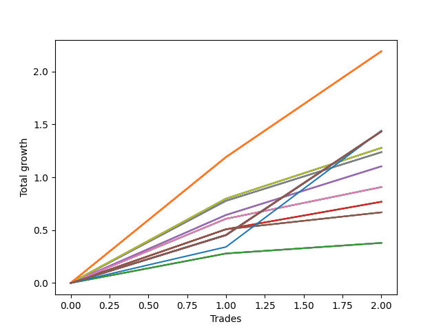

# Short Wallace Betterrerer 020 
- Symbol: AMZN_Unlimited
- Date Range: 03/23/2022 - 07/08/2022
- Trading Period: 7:20-12:30
- Number of Trades: 2



| Name | Win Percent | Profit | Avg Profit / Trade | Avg Time / Trade |      | Name | Win Percent | Profit | Avg Profit / Trade | Avg Time / Trade |
| ---- | ----------- | ------ | ------------------ | ---------------- | ---- | ---- | ----------- | ------ | ------------------ | ---------------- |
| Sorted By <br> Profit | | | | | | Sorted By <br> Win Percentage ||||
| One Hundred Twenty-Six | 100.00 | 1095.25 | 547.63 | 24:07 |     | One Hundred Twenty-Six | 100.00 | 1095.25 | 547.63 | 24:07 |
| One Hundred Twenty-One | 100.00 | 1095.25 | 547.63 | 24:07 |     | One Hundred Twenty-One | 100.00 | 1095.25 | 547.63 | 24:07 |
| One Hundred Sixteen | 100.00 | 1095.25 | 547.63 | 24:07 |     | One Hundred Sixteen | 100.00 | 1095.25 | 547.63 | 24:07 |
| One Hundred Eleven | 100.00 | 1095.25 | 547.63 | 24:07 |     | One Hundred Eleven | 100.00 | 1095.25 | 547.63 | 24:07 |
| One Hundred Six | 100.00 | 1095.25 | 547.63 | 24:07 |     | One Hundred Six | 100.00 | 1095.25 | 547.63 | 24:07 |
| One Hundred One | 100.00 | 1095.25 | 547.63 | 24:07 |     | One Hundred One | 100.00 | 1095.25 | 547.63 | 24:07 |
| Ninety-Six | 100.00 | 1095.25 | 547.63 | 24:07 |     | Ninety-Six | 100.00 | 1095.25 | 547.63 | 24:07 |
| Ninety-One | 100.00 | 1095.25 | 547.63 | 24:07 |     | Ninety-One | 100.00 | 1095.25 | 547.63 | 24:07 |
| Eighty-One | 100.00 | 1095.25 | 547.63 | 24:07 |     | Eighty-One | 100.00 | 1095.25 | 547.63 | 24:07 |
| Seventy-Three | 100.00 | 720.50 | 360.25 | 20:35 |     | Seventy-Three | 100.00 | 720.50 | 360.25 | 20:35 |
| One Hundred Thirty | 100.00 | 716.75 | 358.37 | 92:30 |     | One Hundred Thirty | 100.00 | 716.75 | 358.37 | 92:30 |
| One Hundred Twenty-Nine | 100.00 | 716.75 | 358.37 | 92:30 |     | One Hundred Twenty-Nine | 100.00 | 716.75 | 358.37 | 92:30 |
| One Hundred Twenty-Eight | 100.00 | 716.75 | 358.37 | 92:30 |     | One Hundred Twenty-Eight | 100.00 | 716.75 | 358.37 | 92:30 |
| One Hundred Twenty-Seven | 100.00 | 716.75 | 358.37 | 92:30 |     | One Hundred Twenty-Seven | 100.00 | 716.75 | 358.37 | 92:30 |
| One Hundred Twenty-Five | 100.00 | 716.75 | 358.37 | 92:30 |     | One Hundred Twenty-Five | 100.00 | 716.75 | 358.37 | 92:30 |
| One Hundred Twenty-Four | 100.00 | 716.75 | 358.37 | 92:30 |     | One Hundred Twenty-Four | 100.00 | 716.75 | 358.37 | 92:30 |
| One Hundred Twenty-Three | 100.00 | 716.75 | 358.37 | 92:30 |     | One Hundred Twenty-Three | 100.00 | 716.75 | 358.37 | 92:30 |
| One Hundred Twenty-Two | 100.00 | 716.75 | 358.37 | 92:30 |     | One Hundred Twenty-Two | 100.00 | 716.75 | 358.37 | 92:30 |
| One Hundred Twenty | 100.00 | 716.75 | 358.37 | 92:30 |     | One Hundred Twenty | 100.00 | 716.75 | 358.37 | 92:30 |
| One Hundred Ninteen | 100.00 | 716.75 | 358.37 | 92:30 |     | One Hundred Ninteen | 100.00 | 716.75 | 358.37 | 92:30 |
| One Hundred Eighteen | 100.00 | 716.75 | 358.37 | 92:30 |     | One Hundred Eighteen | 100.00 | 716.75 | 358.37 | 92:30 |
| One Hundred Seventeen | 100.00 | 716.75 | 358.37 | 92:30 |     | One Hundred Seventeen | 100.00 | 716.75 | 358.37 | 92:30 |
| One Hundred Fifteen | 100.00 | 716.75 | 358.37 | 92:30 |     | One Hundred Fifteen | 100.00 | 716.75 | 358.37 | 92:30 |
| One Hundred Fourteen | 100.00 | 716.75 | 358.37 | 92:30 |     | One Hundred Fourteen | 100.00 | 716.75 | 358.37 | 92:30 |
| One Hundred Thirteen | 100.00 | 716.75 | 358.37 | 92:30 |     | One Hundred Thirteen | 100.00 | 716.75 | 358.37 | 92:30 |
| One Hundred Twelve | 100.00 | 716.75 | 358.37 | 92:30 |     | One Hundred Twelve | 100.00 | 716.75 | 358.37 | 92:30 |
| One Hundred Ten | 100.00 | 716.75 | 358.37 | 92:30 |     | One Hundred Ten | 100.00 | 716.75 | 358.37 | 92:30 |
| One Hundred Nine | 100.00 | 716.75 | 358.37 | 92:30 |     | One Hundred Nine | 100.00 | 716.75 | 358.37 | 92:30 |
| One Hundred Eight | 100.00 | 716.75 | 358.37 | 92:30 |     | One Hundred Eight | 100.00 | 716.75 | 358.37 | 92:30 |
| One Hundred Seven | 100.00 | 716.75 | 358.37 | 92:30 |     | One Hundred Seven | 100.00 | 716.75 | 358.37 | 92:30 |
| One Hundred Five | 100.00 | 716.75 | 358.37 | 92:30 |     | One Hundred Five | 100.00 | 716.75 | 358.37 | 92:30 |
| One Hundred Four | 100.00 | 716.75 | 358.37 | 92:30 |     | One Hundred Four | 100.00 | 716.75 | 358.37 | 92:30 |
| One Hundred Three | 100.00 | 716.75 | 358.37 | 92:30 |     | One Hundred Three | 100.00 | 716.75 | 358.37 | 92:30 |
| One Hundred Two | 100.00 | 716.75 | 358.37 | 92:30 |     | One Hundred Two | 100.00 | 716.75 | 358.37 | 92:30 |
| One Hundred | 100.00 | 716.75 | 358.37 | 92:30 |     | One Hundred | 100.00 | 716.75 | 358.37 | 92:30 |
| Ninety-Nine | 100.00 | 716.75 | 358.37 | 92:30 |     | Ninety-Nine | 100.00 | 716.75 | 358.37 | 92:30 |
| Ninety-Eight | 100.00 | 716.75 | 358.37 | 92:30 |     | Ninety-Eight | 100.00 | 716.75 | 358.37 | 92:30 |
| Ninety-Seven | 100.00 | 716.75 | 358.37 | 92:30 |     | Ninety-Seven | 100.00 | 716.75 | 358.37 | 92:30 |
| Ninety-Five | 100.00 | 716.75 | 358.37 | 92:30 |     | Ninety-Five | 100.00 | 716.75 | 358.37 | 92:30 |
| Ninety-Four | 100.00 | 716.75 | 358.37 | 92:30 |     | Ninety-Four | 100.00 | 716.75 | 358.37 | 92:30 |
| Ninety-Three | 100.00 | 716.75 | 358.37 | 92:30 |     | Ninety-Three | 100.00 | 716.75 | 358.37 | 92:30 |
| Ninety-Two | 100.00 | 716.75 | 358.37 | 92:30 |     | Ninety-Two | 100.00 | 716.75 | 358.37 | 92:30 |
| Eighty-Five | 100.00 | 716.75 | 358.37 | 92:30 |     | Eighty-Five | 100.00 | 716.75 | 358.37 | 92:30 |
| Eighty-Four | 100.00 | 716.75 | 358.37 | 92:30 |     | Eighty-Four | 100.00 | 716.75 | 358.37 | 92:30 |
| Eighty-Three | 100.00 | 716.75 | 358.37 | 92:30 |     | Eighty-Three | 100.00 | 716.75 | 358.37 | 92:30 |
| Eighty-Two | 100.00 | 716.75 | 358.37 | 92:30 |     | Eighty-Two | 100.00 | 716.75 | 358.37 | 92:30 |
| Seventy-One | 100.00 | 716.75 | 358.37 | 31:32 |     | Seventy-One | 100.00 | 716.75 | 358.37 | 31:32 |
| Sixty-Three | 100.00 | 716.75 | 358.37 | 31:32 |     | Sixty-Three | 100.00 | 716.75 | 358.37 | 31:32 |
| Fifty-Five | 100.00 | 716.75 | 358.37 | 31:32 |     | Fifty-Five | 100.00 | 716.75 | 358.37 | 31:32 |
| Forty-Seven | 100.00 | 716.75 | 358.37 | 31:32 |     | Forty-Seven | 100.00 | 716.75 | 358.37 | 31:32 |
| Seven | 100.00 | 716.75 | 358.37 | 31:32 |     | Seven | 100.00 | 716.75 | 358.37 | 31:32 |
| Seventy | 100.00 | 638.75 | 319.38 | 14:37 |     | Seventy | 100.00 | 638.75 | 319.38 | 14:37 |
| Sixty-Two | 100.00 | 638.75 | 319.38 | 14:37 |     | Sixty-Two | 100.00 | 638.75 | 319.38 | 14:37 |
| Fifty-Four | 100.00 | 638.75 | 319.38 | 14:37 |     | Fifty-Four | 100.00 | 638.75 | 319.38 | 14:37 |
| Forty-Six | 100.00 | 638.75 | 319.38 | 14:37 |     | Forty-Six | 100.00 | 638.75 | 319.38 | 14:37 |
| Six | 100.00 | 638.75 | 319.38 | 14:37 |     | Six | 100.00 | 638.75 | 319.38 | 14:37 |
| Sixty-Nine | 100.00 | 618.50 | 309.25 | 14:25 |     | Sixty-Nine | 100.00 | 618.50 | 309.25 | 14:25 |
| Sixty-One | 100.00 | 618.50 | 309.25 | 14:25 |     | Sixty-One | 100.00 | 618.50 | 309.25 | 14:25 |
| Fifty-Three | 100.00 | 618.50 | 309.25 | 14:25 |     | Fifty-Three | 100.00 | 618.50 | 309.25 | 14:25 |
| Forty-Five | 100.00 | 618.50 | 309.25 | 14:25 |     | Forty-Five | 100.00 | 618.50 | 309.25 | 14:25 |
| Five | 100.00 | 618.50 | 309.25 | 14:25 |     | Five | 100.00 | 618.50 | 309.25 | 14:25 |
| Sixty-Six | 100.00 | 551.50 | 275.75 | 14:07 |     | Sixty-Six | 100.00 | 551.50 | 275.75 | 14:07 |
| Fifty-Eight | 100.00 | 551.50 | 275.75 | 14:07 |     | Fifty-Eight | 100.00 | 551.50 | 275.75 | 14:07 |
| Fifty | 100.00 | 551.50 | 275.75 | 14:07 |     | Fifty | 100.00 | 551.50 | 275.75 | 14:07 |
| Forty-Two | 100.00 | 551.50 | 275.75 | 14:07 |     | Forty-Two | 100.00 | 551.50 | 275.75 | 14:07 |
| Two | 100.00 | 551.50 | 275.75 | 14:07 |     | Two | 100.00 | 551.50 | 275.75 | 14:07 |
| Sixty-Eight | 100.00 | 453.50 | 226.75 | 13:30 |     | Sixty-Eight | 100.00 | 453.50 | 226.75 | 13:30 |
| Sixty | 100.00 | 453.50 | 226.75 | 13:30 |     | Sixty | 100.00 | 453.50 | 226.75 | 13:30 |
| Fifty-Two | 100.00 | 453.50 | 226.75 | 13:30 |     | Fifty-Two | 100.00 | 453.50 | 226.75 | 13:30 |
| Forty-Four | 100.00 | 453.50 | 226.75 | 13:30 |     | Forty-Four | 100.00 | 453.50 | 226.75 | 13:30 |
| Four | 100.00 | 453.50 | 226.75 | 13:30 |     | Four | 100.00 | 453.50 | 226.75 | 13:30 |
| Sixty-Five | 100.00 | 384.00 | 192.00 | 04:15 |     | Sixty-Five | 100.00 | 384.00 | 192.00 | 04:15 |
| Fifty-Seven | 100.00 | 384.00 | 192.00 | 04:15 |     | Fifty-Seven | 100.00 | 384.00 | 192.00 | 04:15 |
| Forty-Nine | 100.00 | 384.00 | 192.00 | 04:15 |     | Forty-Nine | 100.00 | 384.00 | 192.00 | 04:15 |
| Forty-One | 100.00 | 384.00 | 192.00 | 04:15 |     | Forty-One | 100.00 | 384.00 | 192.00 | 04:15 |
| One | 100.00 | 384.00 | 192.00 | 04:15 |     | One | 100.00 | 384.00 | 192.00 | 04:15 |
| Sixty-Seven | 100.00 | 334.00 | 167.00 | 03:35 |     | Sixty-Seven | 100.00 | 334.00 | 167.00 | 03:35 |
| Fifty-Nine | 100.00 | 334.00 | 167.00 | 03:35 |     | Fifty-Nine | 100.00 | 334.00 | 167.00 | 03:35 |
| Fifty-One | 100.00 | 334.00 | 167.00 | 03:35 |     | Fifty-One | 100.00 | 334.00 | 167.00 | 03:35 |
| Forty-Three | 100.00 | 334.00 | 167.00 | 03:35 |     | Forty-Three | 100.00 | 334.00 | 167.00 | 03:35 |
| Three | 100.00 | 334.00 | 167.00 | 03:35 |     | Three | 100.00 | 334.00 | 167.00 | 03:35 |
| Sixty-Four | 100.00 | 189.50 | 94.75 | 03:05 |     | Sixty-Four | 100.00 | 189.50 | 94.75 | 03:05 |
| Fifty-Six | 100.00 | 189.50 | 94.75 | 03:05 |     | Fifty-Six | 100.00 | 189.50 | 94.75 | 03:05 |
| Forty-Eight | 100.00 | 189.50 | 94.75 | 03:05 |     | Forty-Eight | 100.00 | 189.50 | 94.75 | 03:05 |
| Forty | 100.00 | 189.50 | 94.75 | 03:05 |     | Forty | 100.00 | 189.50 | 94.75 | 03:05 |
| Zero | 100.00 | 189.50 | 94.75 | 03:05 |     | Zero | 100.00 | 189.50 | 94.75 | 03:05 |

## NO STOPLOSS

### Test Zero
* Sell when price hits the middle line of the 20p bollinger
* No Stoploss
* Results:
```
Total Trades: 2
Percent Up: 0.00
Percent Down: 100.00
Total Points Moved Down: 0.38
Potential Profit: 189.50
Total Points Ups: 0.00 Count Ups: 0
Total Points Downs: 0.38 Count Downs: 2
```

<details><summary>Trades</summary>

<code>In: 2022-03-25 11:57:00		Out: 2022-03-25 12:01:25		Total Position Time: 04:25		Total Move Down: 0.28		Total to Date: 0.28</code> <br />
<code>In: 2022-06-16 10:32:00		Out: 2022-06-16 10:33:45		Total Position Time: 01:45		Total Move Down: 0.10		Total to Date: 0.38</code> <br />


</details>

### Test One
* Sell when the price hits the upper line of the 20p 1std bollinger
* No Stoploss
* Results:
```
Total Trades: 2
Percent Up: 0.00
Percent Down: 100.00
Total Points Moved Down: 0.77
Potential Profit: 384.00
Total Points Ups: 0.00 Count Ups: 0
Total Points Downs: 0.77 Count Downs: 2
```

<details><summary>Trades</summary>

<code>In: 2022-03-25 11:57:00		Out: 2022-03-25 12:02:10		Total Position Time: 05:10		Total Move Down: 0.51		Total to Date: 0.51</code> <br />
<code>In: 2022-06-16 10:32:00		Out: 2022-06-16 10:35:20		Total Position Time: 03:20		Total Move Down: 0.26		Total to Date: 0.77</code> <br />


</details>

### Test Two
* Sell when the price hits the upper line of the 20p 2std bollinger
* No Stoploss
* Results:
```
Total Trades: 2
Percent Up: 0.00
Percent Down: 100.00
Total Points Moved Down: 1.10
Potential Profit: 551.50
Total Points Ups: 0.00 Count Ups: 0
Total Points Downs: 1.10 Count Downs: 2
```

<details><summary>Trades</summary>

<code>In: 2022-03-25 11:57:00		Out: 2022-03-25 12:21:05		Total Position Time: 24:05		Total Move Down: 0.64		Total to Date: 0.64</code> <br />
<code>In: 2022-06-16 10:32:00		Out: 2022-06-16 10:36:10		Total Position Time: 04:10		Total Move Down: 0.46		Total to Date: 1.10</code> <br />


</details>

### Test Three
* Sell when price hits the middle line of the 50p bollinger
* No Stoploss
* Results:
```
Total Trades: 2
Percent Up: 0.00
Percent Down: 100.00
Total Points Moved Down: 0.67
Potential Profit: 334.00
Total Points Ups: 0.00 Count Ups: 0
Total Points Downs: 0.67 Count Downs: 2
```

<details><summary>Trades</summary>

<code>In: 2022-03-25 11:57:00		Out: 2022-03-25 12:02:10		Total Position Time: 05:10		Total Move Down: 0.51		Total to Date: 0.51</code> <br />
<code>In: 2022-06-16 10:32:00		Out: 2022-06-16 10:34:00		Total Position Time: 02:00		Total Move Down: 0.16		Total to Date: 0.67</code> <br />


</details>

### Test Four
* Sell when the price hits the upper line of the 50p 1std bollinger
* No Stoploss
* Results:
```
Total Trades: 2
Percent Up: 0.00
Percent Down: 100.00
Total Points Moved Down: 0.91
Potential Profit: 453.50
Total Points Ups: 0.00 Count Ups: 0
Total Points Downs: 0.91 Count Downs: 2
```

<details><summary>Trades</summary>

<code>In: 2022-03-25 11:57:00		Out: 2022-03-25 12:20:30		Total Position Time: 23:30		Total Move Down: 0.61		Total to Date: 0.61</code> <br />
<code>In: 2022-06-16 10:32:00		Out: 2022-06-16 10:35:30		Total Position Time: 03:30		Total Move Down: 0.30		Total to Date: 0.91</code> <br />


</details>

### Test Five
* Sell when the price hits the upper line of the 50p 2std bollinger
* No Stoploss
* Results:
```
Total Trades: 2
Percent Up: 0.00
Percent Down: 100.00
Total Points Moved Down: 1.24
Potential Profit: 618.50
Total Points Ups: 0.00 Count Ups: 0
Total Points Downs: 1.24 Count Downs: 2
```

<details><summary>Trades</summary>

<code>In: 2022-03-25 11:57:00		Out: 2022-03-25 12:21:40		Total Position Time: 24:40		Total Move Down: 0.78		Total to Date: 0.78</code> <br />
<code>In: 2022-06-16 10:32:00		Out: 2022-06-16 10:36:10		Total Position Time: 04:10		Total Move Down: 0.46		Total to Date: 1.24</code> <br />


</details>

### Test Six
* Sell when the price hits the middle line of the 1std VWAP
* No Stoploss
* Results:
```
Total Trades: 2
Percent Up: 0.00
Percent Down: 100.00
Total Points Moved Down: 1.28
Potential Profit: 638.75
Total Points Ups: 0.00 Count Ups: 0
Total Points Downs: 1.28 Count Downs: 2
```

<details><summary>Trades</summary>

<code>In: 2022-03-25 11:57:00		Out: 2022-03-25 12:21:45		Total Position Time: 24:45		Total Move Down: 0.80		Total to Date: 0.80</code> <br />
<code>In: 2022-06-16 10:32:00		Out: 2022-06-16 10:36:30		Total Position Time: 04:30		Total Move Down: 0.48		Total to Date: 1.28</code> <br />


</details>

### Test Seven
* Sell when the price hits the upper line of the 1std VWAP
* No Stoploss
* Results:
```
Total Trades: 2
Percent Up: 0.00
Percent Down: 100.00
Total Points Moved Down: 1.43
Potential Profit: 716.75
Total Points Ups: 0.00 Count Ups: 0
Total Points Downs: 1.43 Count Downs: 2
```

<details><summary>Trades</summary>

<code>In: 2022-03-25 11:57:00		Out: 2022-03-25 12:47:00		Total Position Time: 50:00		Total Move Down: 0.45		Total to Date: 0.45</code> <br />
<code>In: 2022-06-16 10:32:00		Out: 2022-06-16 10:45:05		Total Position Time: 13:05		Total Move Down: 0.98		Total to Date: 1.43</code> <br />


</details>

## STOPLOSS OF 5

### Test Forty
* Sell when price hits the middle line of the 20p bollinger
* Stoploss is -5 points
* Results:
```
Total Trades: 2
Percent Up: 0.00
Percent Down: 100.00
Total Points Moved Down: 0.38
Potential Profit: 189.50
Total Points Ups: 0.00 Count Ups: 0
Total Points Downs: 0.38 Count Downs: 2
```

<details><summary>Trades</summary>

<code>In: 2022-03-25 11:57:00		Out: 2022-03-25 12:01:25		Total Position Time: 04:25		Total Move Down: 0.28		Total to Date: 0.28</code> <br />
<code>In: 2022-06-16 10:32:00		Out: 2022-06-16 10:33:45		Total Position Time: 01:45		Total Move Down: 0.10		Total to Date: 0.38</code> <br />


</details>

### Test Forty-One
* Sell when the price hits the upper line of the 20p 1std bollinger
* Stoploss is -5 points
* Results:
```
Total Trades: 2
Percent Up: 0.00
Percent Down: 100.00
Total Points Moved Down: 0.77
Potential Profit: 384.00
Total Points Ups: 0.00 Count Ups: 0
Total Points Downs: 0.77 Count Downs: 2
```

<details><summary>Trades</summary>

<code>In: 2022-03-25 11:57:00		Out: 2022-03-25 12:02:10		Total Position Time: 05:10		Total Move Down: 0.51		Total to Date: 0.51</code> <br />
<code>In: 2022-06-16 10:32:00		Out: 2022-06-16 10:35:20		Total Position Time: 03:20		Total Move Down: 0.26		Total to Date: 0.77</code> <br />


</details>

### Test Forty-Two
* Sell when the price hits the upper line of the 20p 2std bollinger
* Stoploss is -5 points
* Results:
```
Total Trades: 2
Percent Up: 0.00
Percent Down: 100.00
Total Points Moved Down: 1.10
Potential Profit: 551.50
Total Points Ups: 0.00 Count Ups: 0
Total Points Downs: 1.10 Count Downs: 2
```

<details><summary>Trades</summary>

<code>In: 2022-03-25 11:57:00		Out: 2022-03-25 12:21:05		Total Position Time: 24:05		Total Move Down: 0.64		Total to Date: 0.64</code> <br />
<code>In: 2022-06-16 10:32:00		Out: 2022-06-16 10:36:10		Total Position Time: 04:10		Total Move Down: 0.46		Total to Date: 1.10</code> <br />


</details>

### Test Forty-Three
* Sell when price hits the middle line of the 50p bollinger
* Stoploss is -5 points
* Results:
```
Total Trades: 2
Percent Up: 0.00
Percent Down: 100.00
Total Points Moved Down: 0.67
Potential Profit: 334.00
Total Points Ups: 0.00 Count Ups: 0
Total Points Downs: 0.67 Count Downs: 2
```

<details><summary>Trades</summary>

<code>In: 2022-03-25 11:57:00		Out: 2022-03-25 12:02:10		Total Position Time: 05:10		Total Move Down: 0.51		Total to Date: 0.51</code> <br />
<code>In: 2022-06-16 10:32:00		Out: 2022-06-16 10:34:00		Total Position Time: 02:00		Total Move Down: 0.16		Total to Date: 0.67</code> <br />


</details>

### Test Forty-Four
* Sell when the price hits the upper line of the 50p 1std bollinger
* Stoploss is -5 points
* Results:
```
Total Trades: 2
Percent Up: 0.00
Percent Down: 100.00
Total Points Moved Down: 0.91
Potential Profit: 453.50
Total Points Ups: 0.00 Count Ups: 0
Total Points Downs: 0.91 Count Downs: 2
```

<details><summary>Trades</summary>

<code>In: 2022-03-25 11:57:00		Out: 2022-03-25 12:20:30		Total Position Time: 23:30		Total Move Down: 0.61		Total to Date: 0.61</code> <br />
<code>In: 2022-06-16 10:32:00		Out: 2022-06-16 10:35:30		Total Position Time: 03:30		Total Move Down: 0.30		Total to Date: 0.91</code> <br />


</details>

### Test Forty-Five
* Sell when the price hits the upper line of the 50p 2std bollinger
* Stoploss is -5 points
* Results:
```
Total Trades: 2
Percent Up: 0.00
Percent Down: 100.00
Total Points Moved Down: 1.24
Potential Profit: 618.50
Total Points Ups: 0.00 Count Ups: 0
Total Points Downs: 1.24 Count Downs: 2
```

<details><summary>Trades</summary>

<code>In: 2022-03-25 11:57:00		Out: 2022-03-25 12:21:40		Total Position Time: 24:40		Total Move Down: 0.78		Total to Date: 0.78</code> <br />
<code>In: 2022-06-16 10:32:00		Out: 2022-06-16 10:36:10		Total Position Time: 04:10		Total Move Down: 0.46		Total to Date: 1.24</code> <br />


</details>

### Test Forty-Six
* Sell when the price hits the middle line of the 1std VWAP
* Stoploss is -5 points
* Results:
```
Total Trades: 2
Percent Up: 0.00
Percent Down: 100.00
Total Points Moved Down: 1.28
Potential Profit: 638.75
Total Points Ups: 0.00 Count Ups: 0
Total Points Downs: 1.28 Count Downs: 2
```

<details><summary>Trades</summary>

<code>In: 2022-03-25 11:57:00		Out: 2022-03-25 12:21:45		Total Position Time: 24:45		Total Move Down: 0.80		Total to Date: 0.80</code> <br />
<code>In: 2022-06-16 10:32:00		Out: 2022-06-16 10:36:30		Total Position Time: 04:30		Total Move Down: 0.48		Total to Date: 1.28</code> <br />


</details>

### Test Forty-Seven
* Sell when the price hits the upper line of the 1std VWAP
* Stoploss is -5 points
* Results:
```
Total Trades: 2
Percent Up: 0.00
Percent Down: 100.00
Total Points Moved Down: 1.43
Potential Profit: 716.75
Total Points Ups: 0.00 Count Ups: 0
Total Points Downs: 1.43 Count Downs: 2
```

<details><summary>Trades</summary>

<code>In: 2022-03-25 11:57:00		Out: 2022-03-25 12:47:00		Total Position Time: 50:00		Total Move Down: 0.45		Total to Date: 0.45</code> <br />
<code>In: 2022-06-16 10:32:00		Out: 2022-06-16 10:45:05		Total Position Time: 13:05		Total Move Down: 0.98		Total to Date: 1.43</code> <br />


</details>

## TRAIL STOP OF 5

### Test Forty-Eight
* Sell when price hits the middle line of the 20p bollinger
* Trailing Stop is -5 points
* Results:
```
Total Trades: 2
Percent Up: 0.00
Percent Down: 100.00
Total Points Moved Down: 0.38
Potential Profit: 189.50
Total Points Ups: 0.00 Count Ups: 0
Total Points Downs: 0.38 Count Downs: 2
```

<details><summary>Trades</summary>

<code>In: 2022-03-25 11:57:00		Out: 2022-03-25 12:01:25		Total Position Time: 04:25		Total Move Down: 0.28		Total to Date: 0.28</code> <br />
<code>In: 2022-06-16 10:32:00		Out: 2022-06-16 10:33:45		Total Position Time: 01:45		Total Move Down: 0.10		Total to Date: 0.38</code> <br />


</details>

### Test Forty-Nine
* Sell when the price hits the upper line of the 20p 1std bollinger
* Trailing Stop is -5 points
* Results:
```
Total Trades: 2
Percent Up: 0.00
Percent Down: 100.00
Total Points Moved Down: 0.77
Potential Profit: 384.00
Total Points Ups: 0.00 Count Ups: 0
Total Points Downs: 0.77 Count Downs: 2
```

<details><summary>Trades</summary>

<code>In: 2022-03-25 11:57:00		Out: 2022-03-25 12:02:10		Total Position Time: 05:10		Total Move Down: 0.51		Total to Date: 0.51</code> <br />
<code>In: 2022-06-16 10:32:00		Out: 2022-06-16 10:35:20		Total Position Time: 03:20		Total Move Down: 0.26		Total to Date: 0.77</code> <br />


</details>

### Test Fifty
* Sell when the price hits the upper line of the 20p 2std bollinger
* Trailing Stop is -5 points
* Results:
```
Total Trades: 2
Percent Up: 0.00
Percent Down: 100.00
Total Points Moved Down: 1.10
Potential Profit: 551.50
Total Points Ups: 0.00 Count Ups: 0
Total Points Downs: 1.10 Count Downs: 2
```

<details><summary>Trades</summary>

<code>In: 2022-03-25 11:57:00		Out: 2022-03-25 12:21:05		Total Position Time: 24:05		Total Move Down: 0.64		Total to Date: 0.64</code> <br />
<code>In: 2022-06-16 10:32:00		Out: 2022-06-16 10:36:10		Total Position Time: 04:10		Total Move Down: 0.46		Total to Date: 1.10</code> <br />


</details>

### Test Fifty-One
* Sell when price hits the middle line of the 50p bollinger
* Trailing Stop is -5 points
* Results:
```
Total Trades: 2
Percent Up: 0.00
Percent Down: 100.00
Total Points Moved Down: 0.67
Potential Profit: 334.00
Total Points Ups: 0.00 Count Ups: 0
Total Points Downs: 0.67 Count Downs: 2
```

<details><summary>Trades</summary>

<code>In: 2022-03-25 11:57:00		Out: 2022-03-25 12:02:10		Total Position Time: 05:10		Total Move Down: 0.51		Total to Date: 0.51</code> <br />
<code>In: 2022-06-16 10:32:00		Out: 2022-06-16 10:34:00		Total Position Time: 02:00		Total Move Down: 0.16		Total to Date: 0.67</code> <br />


</details>

### Test Fifty-Two
* Sell when the price hits the upper line of the 50p 1std bollinger
* Trailing Stop is -5 points
* Results:
```
Total Trades: 2
Percent Up: 0.00
Percent Down: 100.00
Total Points Moved Down: 0.91
Potential Profit: 453.50
Total Points Ups: 0.00 Count Ups: 0
Total Points Downs: 0.91 Count Downs: 2
```

<details><summary>Trades</summary>

<code>In: 2022-03-25 11:57:00		Out: 2022-03-25 12:20:30		Total Position Time: 23:30		Total Move Down: 0.61		Total to Date: 0.61</code> <br />
<code>In: 2022-06-16 10:32:00		Out: 2022-06-16 10:35:30		Total Position Time: 03:30		Total Move Down: 0.30		Total to Date: 0.91</code> <br />


</details>

### Test Fifty-Three
* Sell when the price hits the upper line of the 50p 2std bollinger
* Trailing Stop is -5 points
* Results:
```
Total Trades: 2
Percent Up: 0.00
Percent Down: 100.00
Total Points Moved Down: 1.24
Potential Profit: 618.50
Total Points Ups: 0.00 Count Ups: 0
Total Points Downs: 1.24 Count Downs: 2
```

<details><summary>Trades</summary>

<code>In: 2022-03-25 11:57:00		Out: 2022-03-25 12:21:40		Total Position Time: 24:40		Total Move Down: 0.78		Total to Date: 0.78</code> <br />
<code>In: 2022-06-16 10:32:00		Out: 2022-06-16 10:36:10		Total Position Time: 04:10		Total Move Down: 0.46		Total to Date: 1.24</code> <br />


</details>

### Test Fifty-Four
* Sell when the price hits the middle line of the 1std VWAP
* Trailing Stop is -5 points
* Results:
```
Total Trades: 2
Percent Up: 0.00
Percent Down: 100.00
Total Points Moved Down: 1.28
Potential Profit: 638.75
Total Points Ups: 0.00 Count Ups: 0
Total Points Downs: 1.28 Count Downs: 2
```

<details><summary>Trades</summary>

<code>In: 2022-03-25 11:57:00		Out: 2022-03-25 12:21:45		Total Position Time: 24:45		Total Move Down: 0.80		Total to Date: 0.80</code> <br />
<code>In: 2022-06-16 10:32:00		Out: 2022-06-16 10:36:30		Total Position Time: 04:30		Total Move Down: 0.48		Total to Date: 1.28</code> <br />


</details>

### Test Fifty-Five
* Sell when the price hits the upper line of the 1std VWAP
* Trailing Stop is -5 points
* Results:
```
Total Trades: 2
Percent Up: 0.00
Percent Down: 100.00
Total Points Moved Down: 1.43
Potential Profit: 716.75
Total Points Ups: 0.00 Count Ups: 0
Total Points Downs: 1.43 Count Downs: 2
```

<details><summary>Trades</summary>

<code>In: 2022-03-25 11:57:00		Out: 2022-03-25 12:47:00		Total Position Time: 50:00		Total Move Down: 0.45		Total to Date: 0.45</code> <br />
<code>In: 2022-06-16 10:32:00		Out: 2022-06-16 10:45:05		Total Position Time: 13:05		Total Move Down: 0.98		Total to Date: 1.43</code> <br />


</details>

## STOPLOSS OF 10

### Test Fifty-Six
* Sell when price hits the middle line of the 20p bollinger
* Stoploss is -10 points
* Results:
```
Total Trades: 2
Percent Up: 0.00
Percent Down: 100.00
Total Points Moved Down: 0.38
Potential Profit: 189.50
Total Points Ups: 0.00 Count Ups: 0
Total Points Downs: 0.38 Count Downs: 2
```

<details><summary>Trades</summary>

<code>In: 2022-03-25 11:57:00		Out: 2022-03-25 12:01:25		Total Position Time: 04:25		Total Move Down: 0.28		Total to Date: 0.28</code> <br />
<code>In: 2022-06-16 10:32:00		Out: 2022-06-16 10:33:45		Total Position Time: 01:45		Total Move Down: 0.10		Total to Date: 0.38</code> <br />


</details>

### Test Fifty-Seven
* Sell when the price hits the upper line of the 20p 1std bollinger
* Stoploss is -10 points
* Results:
```
Total Trades: 2
Percent Up: 0.00
Percent Down: 100.00
Total Points Moved Down: 0.77
Potential Profit: 384.00
Total Points Ups: 0.00 Count Ups: 0
Total Points Downs: 0.77 Count Downs: 2
```

<details><summary>Trades</summary>

<code>In: 2022-03-25 11:57:00		Out: 2022-03-25 12:02:10		Total Position Time: 05:10		Total Move Down: 0.51		Total to Date: 0.51</code> <br />
<code>In: 2022-06-16 10:32:00		Out: 2022-06-16 10:35:20		Total Position Time: 03:20		Total Move Down: 0.26		Total to Date: 0.77</code> <br />


</details>

### Test Fifty-Eight
* Sell when the price hits the upper line of the 20p 2std bollinger
* Stoploss is -10 points
* Results:
```
Total Trades: 2
Percent Up: 0.00
Percent Down: 100.00
Total Points Moved Down: 1.10
Potential Profit: 551.50
Total Points Ups: 0.00 Count Ups: 0
Total Points Downs: 1.10 Count Downs: 2
```

<details><summary>Trades</summary>

<code>In: 2022-03-25 11:57:00		Out: 2022-03-25 12:21:05		Total Position Time: 24:05		Total Move Down: 0.64		Total to Date: 0.64</code> <br />
<code>In: 2022-06-16 10:32:00		Out: 2022-06-16 10:36:10		Total Position Time: 04:10		Total Move Down: 0.46		Total to Date: 1.10</code> <br />


</details>

### Test Fifty-Nine
* Sell when price hits the middle line of the 50p bollinger
* Stoploss is -10 points
* Results:
```
Total Trades: 2
Percent Up: 0.00
Percent Down: 100.00
Total Points Moved Down: 0.67
Potential Profit: 334.00
Total Points Ups: 0.00 Count Ups: 0
Total Points Downs: 0.67 Count Downs: 2
```

<details><summary>Trades</summary>

<code>In: 2022-03-25 11:57:00		Out: 2022-03-25 12:02:10		Total Position Time: 05:10		Total Move Down: 0.51		Total to Date: 0.51</code> <br />
<code>In: 2022-06-16 10:32:00		Out: 2022-06-16 10:34:00		Total Position Time: 02:00		Total Move Down: 0.16		Total to Date: 0.67</code> <br />


</details>

### Test Sixty
* Sell when the price hits the upper line of the 50p 1std bollinger
* Stoploss is -10 points
* Results:
```
Total Trades: 2
Percent Up: 0.00
Percent Down: 100.00
Total Points Moved Down: 0.91
Potential Profit: 453.50
Total Points Ups: 0.00 Count Ups: 0
Total Points Downs: 0.91 Count Downs: 2
```

<details><summary>Trades</summary>

<code>In: 2022-03-25 11:57:00		Out: 2022-03-25 12:20:30		Total Position Time: 23:30		Total Move Down: 0.61		Total to Date: 0.61</code> <br />
<code>In: 2022-06-16 10:32:00		Out: 2022-06-16 10:35:30		Total Position Time: 03:30		Total Move Down: 0.30		Total to Date: 0.91</code> <br />


</details>

### Test Sixty-One
* Sell when the price hits the upper line of the 50p 2std bollinger
* Stoploss is -10 points
* Results:
```
Total Trades: 2
Percent Up: 0.00
Percent Down: 100.00
Total Points Moved Down: 1.24
Potential Profit: 618.50
Total Points Ups: 0.00 Count Ups: 0
Total Points Downs: 1.24 Count Downs: 2
```

<details><summary>Trades</summary>

<code>In: 2022-03-25 11:57:00		Out: 2022-03-25 12:21:40		Total Position Time: 24:40		Total Move Down: 0.78		Total to Date: 0.78</code> <br />
<code>In: 2022-06-16 10:32:00		Out: 2022-06-16 10:36:10		Total Position Time: 04:10		Total Move Down: 0.46		Total to Date: 1.24</code> <br />


</details>

### Test Sixty-Two
* Sell when the price hits the middle line of the 1std VWAP
* Stoploss is -10 points
* Results:
```
Total Trades: 2
Percent Up: 0.00
Percent Down: 100.00
Total Points Moved Down: 1.28
Potential Profit: 638.75
Total Points Ups: 0.00 Count Ups: 0
Total Points Downs: 1.28 Count Downs: 2
```

<details><summary>Trades</summary>

<code>In: 2022-03-25 11:57:00		Out: 2022-03-25 12:21:45		Total Position Time: 24:45		Total Move Down: 0.80		Total to Date: 0.80</code> <br />
<code>In: 2022-06-16 10:32:00		Out: 2022-06-16 10:36:30		Total Position Time: 04:30		Total Move Down: 0.48		Total to Date: 1.28</code> <br />


</details>

### Test Sixty-Three
* Sell when the price hits the upper line of the 1std VWAP
* Stoploss is -10 points
* Results:
```
Total Trades: 2
Percent Up: 0.00
Percent Down: 100.00
Total Points Moved Down: 1.43
Potential Profit: 716.75
Total Points Ups: 0.00 Count Ups: 0
Total Points Downs: 1.43 Count Downs: 2
```

<details><summary>Trades</summary>

<code>In: 2022-03-25 11:57:00		Out: 2022-03-25 12:47:00		Total Position Time: 50:00		Total Move Down: 0.45		Total to Date: 0.45</code> <br />
<code>In: 2022-06-16 10:32:00		Out: 2022-06-16 10:45:05		Total Position Time: 13:05		Total Move Down: 0.98		Total to Date: 1.43</code> <br />


</details>

## TRAIL STOP OF 10

### Test Sixty-Four
* Sell when price hits the middle line of the 20p bollinger
* Trailing Stop is -10 points
* Results:
```
Total Trades: 2
Percent Up: 0.00
Percent Down: 100.00
Total Points Moved Down: 0.38
Potential Profit: 189.50
Total Points Ups: 0.00 Count Ups: 0
Total Points Downs: 0.38 Count Downs: 2
```

<details><summary>Trades</summary>

<code>In: 2022-03-25 11:57:00		Out: 2022-03-25 12:01:25		Total Position Time: 04:25		Total Move Down: 0.28		Total to Date: 0.28</code> <br />
<code>In: 2022-06-16 10:32:00		Out: 2022-06-16 10:33:45		Total Position Time: 01:45		Total Move Down: 0.10		Total to Date: 0.38</code> <br />


</details>

### Test Sixty-Five
* Sell when the price hits the upper line of the 20p 1std bollinger
* Trailing Stop is -10 points
* Results:
```
Total Trades: 2
Percent Up: 0.00
Percent Down: 100.00
Total Points Moved Down: 0.77
Potential Profit: 384.00
Total Points Ups: 0.00 Count Ups: 0
Total Points Downs: 0.77 Count Downs: 2
```

<details><summary>Trades</summary>

<code>In: 2022-03-25 11:57:00		Out: 2022-03-25 12:02:10		Total Position Time: 05:10		Total Move Down: 0.51		Total to Date: 0.51</code> <br />
<code>In: 2022-06-16 10:32:00		Out: 2022-06-16 10:35:20		Total Position Time: 03:20		Total Move Down: 0.26		Total to Date: 0.77</code> <br />


</details>

### Test Sixty-Six
* Sell when the price hits the upper line of the 20p 2std bollinger
* Trailing Stop is -10 points
* Results:
```
Total Trades: 2
Percent Up: 0.00
Percent Down: 100.00
Total Points Moved Down: 1.10
Potential Profit: 551.50
Total Points Ups: 0.00 Count Ups: 0
Total Points Downs: 1.10 Count Downs: 2
```

<details><summary>Trades</summary>

<code>In: 2022-03-25 11:57:00		Out: 2022-03-25 12:21:05		Total Position Time: 24:05		Total Move Down: 0.64		Total to Date: 0.64</code> <br />
<code>In: 2022-06-16 10:32:00		Out: 2022-06-16 10:36:10		Total Position Time: 04:10		Total Move Down: 0.46		Total to Date: 1.10</code> <br />


</details>

### Test Sixty-Seven
* Sell when price hits the middle line of the 50p bollinger
* Trailing Stop is -10 points
* Results:
```
Total Trades: 2
Percent Up: 0.00
Percent Down: 100.00
Total Points Moved Down: 0.67
Potential Profit: 334.00
Total Points Ups: 0.00 Count Ups: 0
Total Points Downs: 0.67 Count Downs: 2
```

<details><summary>Trades</summary>

<code>In: 2022-03-25 11:57:00		Out: 2022-03-25 12:02:10		Total Position Time: 05:10		Total Move Down: 0.51		Total to Date: 0.51</code> <br />
<code>In: 2022-06-16 10:32:00		Out: 2022-06-16 10:34:00		Total Position Time: 02:00		Total Move Down: 0.16		Total to Date: 0.67</code> <br />


</details>

### Test Sixty-Eight
* Sell when the price hits the upper line of the 50p 1std bollinger
* Trailing Stop is -10 points
* Results:
```
Total Trades: 2
Percent Up: 0.00
Percent Down: 100.00
Total Points Moved Down: 0.91
Potential Profit: 453.50
Total Points Ups: 0.00 Count Ups: 0
Total Points Downs: 0.91 Count Downs: 2
```

<details><summary>Trades</summary>

<code>In: 2022-03-25 11:57:00		Out: 2022-03-25 12:20:30		Total Position Time: 23:30		Total Move Down: 0.61		Total to Date: 0.61</code> <br />
<code>In: 2022-06-16 10:32:00		Out: 2022-06-16 10:35:30		Total Position Time: 03:30		Total Move Down: 0.30		Total to Date: 0.91</code> <br />


</details>

### Test Sixty-Nine
* Sell when the price hits the upper line of the 50p 2std bollinger
* Trailing Stop is -10 points
* Results:
```
Total Trades: 2
Percent Up: 0.00
Percent Down: 100.00
Total Points Moved Down: 1.24
Potential Profit: 618.50
Total Points Ups: 0.00 Count Ups: 0
Total Points Downs: 1.24 Count Downs: 2
```

<details><summary>Trades</summary>

<code>In: 2022-03-25 11:57:00		Out: 2022-03-25 12:21:40		Total Position Time: 24:40		Total Move Down: 0.78		Total to Date: 0.78</code> <br />
<code>In: 2022-06-16 10:32:00		Out: 2022-06-16 10:36:10		Total Position Time: 04:10		Total Move Down: 0.46		Total to Date: 1.24</code> <br />


</details>

### Test Seventy
* Sell when the price hits the middle line of the 1std VWAP
* Trailing Stop is -10 points
* Results:
```
Total Trades: 2
Percent Up: 0.00
Percent Down: 100.00
Total Points Moved Down: 1.28
Potential Profit: 638.75
Total Points Ups: 0.00 Count Ups: 0
Total Points Downs: 1.28 Count Downs: 2
```

<details><summary>Trades</summary>

<code>In: 2022-03-25 11:57:00		Out: 2022-03-25 12:21:45		Total Position Time: 24:45		Total Move Down: 0.80		Total to Date: 0.80</code> <br />
<code>In: 2022-06-16 10:32:00		Out: 2022-06-16 10:36:30		Total Position Time: 04:30		Total Move Down: 0.48		Total to Date: 1.28</code> <br />


</details>

### Test Seventy-One
* Sell when the price hits the upper line of the 1std VWAP
* Trailing Stop is -10 points
* Results:
```
Total Trades: 2
Percent Up: 0.00
Percent Down: 100.00
Total Points Moved Down: 1.43
Potential Profit: 716.75
Total Points Ups: 0.00 Count Ups: 0
Total Points Downs: 1.43 Count Downs: 2
```

<details><summary>Trades</summary>

<code>In: 2022-03-25 11:57:00		Out: 2022-03-25 12:47:00		Total Position Time: 50:00		Total Move Down: 0.45		Total to Date: 0.45</code> <br />
<code>In: 2022-06-16 10:32:00		Out: 2022-06-16 10:45:05		Total Position Time: 13:05		Total Move Down: 0.98		Total to Date: 1.43</code> <br />


</details>

## SPECIAL EXIT CONDITIONS 

### Test Seventy-Three
* Sell when the linear regression slope changes to negative
* No Stoploss
* Results:
```
Total Trades: 2
Percent Up: 0.00
Percent Down: 100.00
Total Points Moved Down: 1.44
Potential Profit: 720.50
Total Points Ups: 0.00 Count Ups: 0
Total Points Downs: 1.44 Count Downs: 2
```

<details><summary>Trades</summary>

<code>In: 2022-03-25 11:57:00		Out: 2022-03-25 12:14:05		Total Position Time: 17:05		Total Move Down: 0.34		Total to Date: 0.34</code> <br />
<code>In: 2022-06-16 10:32:00		Out: 2022-06-16 10:56:05		Total Position Time: 24:05		Total Move Down: 1.10		Total to Date: 1.44</code> <br />


</details>

## TAKE PROFIT

### Test Eighty-One
* Take Profit of 1 Point
* No Stoploss
* Results:
```
Total Trades: 2
Percent Up: 0.00
Percent Down: 100.00
Total Points Moved Down: 2.19
Potential Profit: 1095.25
Total Points Ups: 0.00 Count Ups: 0
Total Points Downs: 2.19 Count Downs: 2
```

<details><summary>Trades</summary>

<code>In: 2022-03-25 11:57:00		Out: 2022-03-25 12:32:05		Total Position Time: 35:05		Total Move Down: 1.19		Total to Date: 1.19</code> <br />
<code>In: 2022-06-16 10:32:00		Out: 2022-06-16 10:45:10		Total Position Time: 13:10		Total Move Down: 1.00		Total to Date: 2.19</code> <br />


</details>

### Test Eighty-Two
* Take Profit of 2 Point
* No Stoploss
* Results:
```
Total Trades: 2
Percent Up: 0.00
Percent Down: 100.00
Total Points Moved Down: 1.43
Potential Profit: 716.75
Total Points Ups: 0.00 Count Ups: 0
Total Points Downs: 1.43 Count Downs: 2
```

<details><summary>Trades</summary>

<code>In: 2022-03-25 11:57:00		Out: 2022-03-25 12:47:00		Total Position Time: 50:00		Total Move Down: 0.45		Total to Date: 0.45</code> <br />
<code>In: 2022-06-16 10:32:00		Out: 2022-06-16 12:47:00		Total Position Time: 135:00		Total Move Down: 0.98		Total to Date: 1.43</code> <br />


</details>

### Test Eighty-Three
* Take Profit of 3 Point
* No Stoploss
* Results:
```
Total Trades: 2
Percent Up: 0.00
Percent Down: 100.00
Total Points Moved Down: 1.43
Potential Profit: 716.75
Total Points Ups: 0.00 Count Ups: 0
Total Points Downs: 1.43 Count Downs: 2
```

<details><summary>Trades</summary>

<code>In: 2022-03-25 11:57:00		Out: 2022-03-25 12:47:00		Total Position Time: 50:00		Total Move Down: 0.45		Total to Date: 0.45</code> <br />
<code>In: 2022-06-16 10:32:00		Out: 2022-06-16 12:47:00		Total Position Time: 135:00		Total Move Down: 0.98		Total to Date: 1.43</code> <br />


</details>

### Test Eighty-Four
* Take Profit of 4 Point
* No Stoploss
* Results:
```
Total Trades: 2
Percent Up: 0.00
Percent Down: 100.00
Total Points Moved Down: 1.43
Potential Profit: 716.75
Total Points Ups: 0.00 Count Ups: 0
Total Points Downs: 1.43 Count Downs: 2
```

<details><summary>Trades</summary>

<code>In: 2022-03-25 11:57:00		Out: 2022-03-25 12:47:00		Total Position Time: 50:00		Total Move Down: 0.45		Total to Date: 0.45</code> <br />
<code>In: 2022-06-16 10:32:00		Out: 2022-06-16 12:47:00		Total Position Time: 135:00		Total Move Down: 0.98		Total to Date: 1.43</code> <br />


</details>

### Test Eighty-Five
* Take Profit of 5 Point
* No Stoploss
* Results:
```
Total Trades: 2
Percent Up: 0.00
Percent Down: 100.00
Total Points Moved Down: 1.43
Potential Profit: 716.75
Total Points Ups: 0.00 Count Ups: 0
Total Points Downs: 1.43 Count Downs: 2
```

<details><summary>Trades</summary>

<code>In: 2022-03-25 11:57:00		Out: 2022-03-25 12:47:00		Total Position Time: 50:00		Total Move Down: 0.45		Total to Date: 0.45</code> <br />
<code>In: 2022-06-16 10:32:00		Out: 2022-06-16 12:47:00		Total Position Time: 135:00		Total Move Down: 0.98		Total to Date: 1.43</code> <br />


</details>

## TAKE PROFIT Stoploss of Two

### Test Ninety-One
* Take Profit of 1 Point
* Stoploss is -2 points
* Results:
```
Total Trades: 2
Percent Up: 0.00
Percent Down: 100.00
Total Points Moved Down: 2.19
Potential Profit: 1095.25
Total Points Ups: 0.00 Count Ups: 0
Total Points Downs: 2.19 Count Downs: 2
```

<details><summary>Trades</summary>

<code>In: 2022-03-25 11:57:00		Out: 2022-03-25 12:32:05		Total Position Time: 35:05		Total Move Down: 1.19		Total to Date: 1.19</code> <br />
<code>In: 2022-06-16 10:32:00		Out: 2022-06-16 10:45:10		Total Position Time: 13:10		Total Move Down: 1.00		Total to Date: 2.19</code> <br />


</details>

### Test Ninety-Two
* Take Profit of 2 Point
* Stoploss is -2 points
* Results:
```
Total Trades: 2
Percent Up: 0.00
Percent Down: 100.00
Total Points Moved Down: 1.43
Potential Profit: 716.75
Total Points Ups: 0.00 Count Ups: 0
Total Points Downs: 1.43 Count Downs: 2
```

<details><summary>Trades</summary>

<code>In: 2022-03-25 11:57:00		Out: 2022-03-25 12:47:00		Total Position Time: 50:00		Total Move Down: 0.45		Total to Date: 0.45</code> <br />
<code>In: 2022-06-16 10:32:00		Out: 2022-06-16 12:47:00		Total Position Time: 135:00		Total Move Down: 0.98		Total to Date: 1.43</code> <br />


</details>

### Test Ninety-Three
* Take Profit of 3 Point
* Stoploss is -2 points
* Results:
```
Total Trades: 2
Percent Up: 0.00
Percent Down: 100.00
Total Points Moved Down: 1.43
Potential Profit: 716.75
Total Points Ups: 0.00 Count Ups: 0
Total Points Downs: 1.43 Count Downs: 2
```

<details><summary>Trades</summary>

<code>In: 2022-03-25 11:57:00		Out: 2022-03-25 12:47:00		Total Position Time: 50:00		Total Move Down: 0.45		Total to Date: 0.45</code> <br />
<code>In: 2022-06-16 10:32:00		Out: 2022-06-16 12:47:00		Total Position Time: 135:00		Total Move Down: 0.98		Total to Date: 1.43</code> <br />


</details>

### Test Ninety-Four
* Take Profit of 4 Point
* Stoploss is -2 points
* Results:
```
Total Trades: 2
Percent Up: 0.00
Percent Down: 100.00
Total Points Moved Down: 1.43
Potential Profit: 716.75
Total Points Ups: 0.00 Count Ups: 0
Total Points Downs: 1.43 Count Downs: 2
```

<details><summary>Trades</summary>

<code>In: 2022-03-25 11:57:00		Out: 2022-03-25 12:47:00		Total Position Time: 50:00		Total Move Down: 0.45		Total to Date: 0.45</code> <br />
<code>In: 2022-06-16 10:32:00		Out: 2022-06-16 12:47:00		Total Position Time: 135:00		Total Move Down: 0.98		Total to Date: 1.43</code> <br />


</details>

### Test Ninety-Five
* Take Profit of 5 Point
* Stoploss is -2 points
* Results:
```
Total Trades: 2
Percent Up: 0.00
Percent Down: 100.00
Total Points Moved Down: 1.43
Potential Profit: 716.75
Total Points Ups: 0.00 Count Ups: 0
Total Points Downs: 1.43 Count Downs: 2
```

<details><summary>Trades</summary>

<code>In: 2022-03-25 11:57:00		Out: 2022-03-25 12:47:00		Total Position Time: 50:00		Total Move Down: 0.45		Total to Date: 0.45</code> <br />
<code>In: 2022-06-16 10:32:00		Out: 2022-06-16 12:47:00		Total Position Time: 135:00		Total Move Down: 0.98		Total to Date: 1.43</code> <br />


</details>

## TAKE PROFIT Trailstop of Two

### Test Ninety-Six
* Take Profit of 1 Point
* Trailing stop is -2 points
* Results:
```
Total Trades: 2
Percent Up: 0.00
Percent Down: 100.00
Total Points Moved Down: 2.19
Potential Profit: 1095.25
Total Points Ups: 0.00 Count Ups: 0
Total Points Downs: 2.19 Count Downs: 2
```

<details><summary>Trades</summary>

<code>In: 2022-03-25 11:57:00		Out: 2022-03-25 12:32:05		Total Position Time: 35:05		Total Move Down: 1.19		Total to Date: 1.19</code> <br />
<code>In: 2022-06-16 10:32:00		Out: 2022-06-16 10:45:10		Total Position Time: 13:10		Total Move Down: 1.00		Total to Date: 2.19</code> <br />


</details>

### Test Ninety-Seven
* Take Profit of 2 Point
* Trailing stop is -2 points
* Results:
```
Total Trades: 2
Percent Up: 0.00
Percent Down: 100.00
Total Points Moved Down: 1.43
Potential Profit: 716.75
Total Points Ups: 0.00 Count Ups: 0
Total Points Downs: 1.43 Count Downs: 2
```

<details><summary>Trades</summary>

<code>In: 2022-03-25 11:57:00		Out: 2022-03-25 12:47:00		Total Position Time: 50:00		Total Move Down: 0.45		Total to Date: 0.45</code> <br />
<code>In: 2022-06-16 10:32:00		Out: 2022-06-16 12:47:00		Total Position Time: 135:00		Total Move Down: 0.98		Total to Date: 1.43</code> <br />


</details>

### Test Ninety-Eight
* Take Profit of 3 Point
* Trailing stop is -2 points
* Results:
```
Total Trades: 2
Percent Up: 0.00
Percent Down: 100.00
Total Points Moved Down: 1.43
Potential Profit: 716.75
Total Points Ups: 0.00 Count Ups: 0
Total Points Downs: 1.43 Count Downs: 2
```

<details><summary>Trades</summary>

<code>In: 2022-03-25 11:57:00		Out: 2022-03-25 12:47:00		Total Position Time: 50:00		Total Move Down: 0.45		Total to Date: 0.45</code> <br />
<code>In: 2022-06-16 10:32:00		Out: 2022-06-16 12:47:00		Total Position Time: 135:00		Total Move Down: 0.98		Total to Date: 1.43</code> <br />


</details>

### Test Ninety-Nine
* Take Profit of 4 Point
* Trailing stop is -2 points
* Results:
```
Total Trades: 2
Percent Up: 0.00
Percent Down: 100.00
Total Points Moved Down: 1.43
Potential Profit: 716.75
Total Points Ups: 0.00 Count Ups: 0
Total Points Downs: 1.43 Count Downs: 2
```

<details><summary>Trades</summary>

<code>In: 2022-03-25 11:57:00		Out: 2022-03-25 12:47:00		Total Position Time: 50:00		Total Move Down: 0.45		Total to Date: 0.45</code> <br />
<code>In: 2022-06-16 10:32:00		Out: 2022-06-16 12:47:00		Total Position Time: 135:00		Total Move Down: 0.98		Total to Date: 1.43</code> <br />


</details>

### Test One Hundred
* Take Profit of 5 Point
* Trailing stop is -2 points
* Results:
```
Total Trades: 2
Percent Up: 0.00
Percent Down: 100.00
Total Points Moved Down: 1.43
Potential Profit: 716.75
Total Points Ups: 0.00 Count Ups: 0
Total Points Downs: 1.43 Count Downs: 2
```

<details><summary>Trades</summary>

<code>In: 2022-03-25 11:57:00		Out: 2022-03-25 12:47:00		Total Position Time: 50:00		Total Move Down: 0.45		Total to Date: 0.45</code> <br />
<code>In: 2022-06-16 10:32:00		Out: 2022-06-16 12:47:00		Total Position Time: 135:00		Total Move Down: 0.98		Total to Date: 1.43</code> <br />


</details>

## TAKE PROFIT Stoploss of Three

### Test One Hundred One
* Take Profit of 1 Point
* Stoploss is -3 points
* Results:
```
Total Trades: 2
Percent Up: 0.00
Percent Down: 100.00
Total Points Moved Down: 2.19
Potential Profit: 1095.25
Total Points Ups: 0.00 Count Ups: 0
Total Points Downs: 2.19 Count Downs: 2
```

<details><summary>Trades</summary>

<code>In: 2022-03-25 11:57:00		Out: 2022-03-25 12:32:05		Total Position Time: 35:05		Total Move Down: 1.19		Total to Date: 1.19</code> <br />
<code>In: 2022-06-16 10:32:00		Out: 2022-06-16 10:45:10		Total Position Time: 13:10		Total Move Down: 1.00		Total to Date: 2.19</code> <br />


</details>

### Test One Hundred Two
* Take Profit of 2 Point
* Stoploss is -3 points
* Results:
```
Total Trades: 2
Percent Up: 0.00
Percent Down: 100.00
Total Points Moved Down: 1.43
Potential Profit: 716.75
Total Points Ups: 0.00 Count Ups: 0
Total Points Downs: 1.43 Count Downs: 2
```

<details><summary>Trades</summary>

<code>In: 2022-03-25 11:57:00		Out: 2022-03-25 12:47:00		Total Position Time: 50:00		Total Move Down: 0.45		Total to Date: 0.45</code> <br />
<code>In: 2022-06-16 10:32:00		Out: 2022-06-16 12:47:00		Total Position Time: 135:00		Total Move Down: 0.98		Total to Date: 1.43</code> <br />


</details>

### Test One Hundred Three
* Take Profit of 3 Point
* Stoploss is -3 points
* Results:
```
Total Trades: 2
Percent Up: 0.00
Percent Down: 100.00
Total Points Moved Down: 1.43
Potential Profit: 716.75
Total Points Ups: 0.00 Count Ups: 0
Total Points Downs: 1.43 Count Downs: 2
```

<details><summary>Trades</summary>

<code>In: 2022-03-25 11:57:00		Out: 2022-03-25 12:47:00		Total Position Time: 50:00		Total Move Down: 0.45		Total to Date: 0.45</code> <br />
<code>In: 2022-06-16 10:32:00		Out: 2022-06-16 12:47:00		Total Position Time: 135:00		Total Move Down: 0.98		Total to Date: 1.43</code> <br />


</details>

### Test One Hundred Four
* Take Profit of 4 Point
* Stoploss is -3 points
* Results:
```
Total Trades: 2
Percent Up: 0.00
Percent Down: 100.00
Total Points Moved Down: 1.43
Potential Profit: 716.75
Total Points Ups: 0.00 Count Ups: 0
Total Points Downs: 1.43 Count Downs: 2
```

<details><summary>Trades</summary>

<code>In: 2022-03-25 11:57:00		Out: 2022-03-25 12:47:00		Total Position Time: 50:00		Total Move Down: 0.45		Total to Date: 0.45</code> <br />
<code>In: 2022-06-16 10:32:00		Out: 2022-06-16 12:47:00		Total Position Time: 135:00		Total Move Down: 0.98		Total to Date: 1.43</code> <br />


</details>

### Test One Hundred Five
* Take Profit of 5 Point
* Stoploss is -3 points
* Results:
```
Total Trades: 2
Percent Up: 0.00
Percent Down: 100.00
Total Points Moved Down: 1.43
Potential Profit: 716.75
Total Points Ups: 0.00 Count Ups: 0
Total Points Downs: 1.43 Count Downs: 2
```

<details><summary>Trades</summary>

<code>In: 2022-03-25 11:57:00		Out: 2022-03-25 12:47:00		Total Position Time: 50:00		Total Move Down: 0.45		Total to Date: 0.45</code> <br />
<code>In: 2022-06-16 10:32:00		Out: 2022-06-16 12:47:00		Total Position Time: 135:00		Total Move Down: 0.98		Total to Date: 1.43</code> <br />


</details>

## TAKE PROFIT Trailstop of Three

### Test One Hundred Six
* Take Profit of 1 Point
* Trailing stop is -3 points
* Results:
```
Total Trades: 2
Percent Up: 0.00
Percent Down: 100.00
Total Points Moved Down: 2.19
Potential Profit: 1095.25
Total Points Ups: 0.00 Count Ups: 0
Total Points Downs: 2.19 Count Downs: 2
```

<details><summary>Trades</summary>

<code>In: 2022-03-25 11:57:00		Out: 2022-03-25 12:32:05		Total Position Time: 35:05		Total Move Down: 1.19		Total to Date: 1.19</code> <br />
<code>In: 2022-06-16 10:32:00		Out: 2022-06-16 10:45:10		Total Position Time: 13:10		Total Move Down: 1.00		Total to Date: 2.19</code> <br />


</details>

### Test One Hundred Seven
* Take Profit of 2 Point
* Trailing stop is -3 points
* Results:
```
Total Trades: 2
Percent Up: 0.00
Percent Down: 100.00
Total Points Moved Down: 1.43
Potential Profit: 716.75
Total Points Ups: 0.00 Count Ups: 0
Total Points Downs: 1.43 Count Downs: 2
```

<details><summary>Trades</summary>

<code>In: 2022-03-25 11:57:00		Out: 2022-03-25 12:47:00		Total Position Time: 50:00		Total Move Down: 0.45		Total to Date: 0.45</code> <br />
<code>In: 2022-06-16 10:32:00		Out: 2022-06-16 12:47:00		Total Position Time: 135:00		Total Move Down: 0.98		Total to Date: 1.43</code> <br />


</details>

### Test One Hundred Eight
* Take Profit of 3 Point
* Trailing stop is -3 points
* Results:
```
Total Trades: 2
Percent Up: 0.00
Percent Down: 100.00
Total Points Moved Down: 1.43
Potential Profit: 716.75
Total Points Ups: 0.00 Count Ups: 0
Total Points Downs: 1.43 Count Downs: 2
```

<details><summary>Trades</summary>

<code>In: 2022-03-25 11:57:00		Out: 2022-03-25 12:47:00		Total Position Time: 50:00		Total Move Down: 0.45		Total to Date: 0.45</code> <br />
<code>In: 2022-06-16 10:32:00		Out: 2022-06-16 12:47:00		Total Position Time: 135:00		Total Move Down: 0.98		Total to Date: 1.43</code> <br />


</details>

### Test One Hundred Nine
* Take Profit of 4 Point
* Trailing stop is -3 points
* Results:
```
Total Trades: 2
Percent Up: 0.00
Percent Down: 100.00
Total Points Moved Down: 1.43
Potential Profit: 716.75
Total Points Ups: 0.00 Count Ups: 0
Total Points Downs: 1.43 Count Downs: 2
```

<details><summary>Trades</summary>

<code>In: 2022-03-25 11:57:00		Out: 2022-03-25 12:47:00		Total Position Time: 50:00		Total Move Down: 0.45		Total to Date: 0.45</code> <br />
<code>In: 2022-06-16 10:32:00		Out: 2022-06-16 12:47:00		Total Position Time: 135:00		Total Move Down: 0.98		Total to Date: 1.43</code> <br />


</details>

### Test One Hundred Ten
* Take Profit of 5 Point
* Trailing stop is -3 points
* Results:
```
Total Trades: 2
Percent Up: 0.00
Percent Down: 100.00
Total Points Moved Down: 1.43
Potential Profit: 716.75
Total Points Ups: 0.00 Count Ups: 0
Total Points Downs: 1.43 Count Downs: 2
```

<details><summary>Trades</summary>

<code>In: 2022-03-25 11:57:00		Out: 2022-03-25 12:47:00		Total Position Time: 50:00		Total Move Down: 0.45		Total to Date: 0.45</code> <br />
<code>In: 2022-06-16 10:32:00		Out: 2022-06-16 12:47:00		Total Position Time: 135:00		Total Move Down: 0.98		Total to Date: 1.43</code> <br />


</details>

## TAKE PROFIT Stoploss of Five

### Test One Hundred Eleven
* Take Profit of 1 Point
* Stoploss is -5 points
* Results:
```
Total Trades: 2
Percent Up: 0.00
Percent Down: 100.00
Total Points Moved Down: 2.19
Potential Profit: 1095.25
Total Points Ups: 0.00 Count Ups: 0
Total Points Downs: 2.19 Count Downs: 2
```

<details><summary>Trades</summary>

<code>In: 2022-03-25 11:57:00		Out: 2022-03-25 12:32:05		Total Position Time: 35:05		Total Move Down: 1.19		Total to Date: 1.19</code> <br />
<code>In: 2022-06-16 10:32:00		Out: 2022-06-16 10:45:10		Total Position Time: 13:10		Total Move Down: 1.00		Total to Date: 2.19</code> <br />


</details>

### Test One Hundred Twelve
* Take Profit of 2 Point
* Stoploss is -5 points
* Results:
```
Total Trades: 2
Percent Up: 0.00
Percent Down: 100.00
Total Points Moved Down: 1.43
Potential Profit: 716.75
Total Points Ups: 0.00 Count Ups: 0
Total Points Downs: 1.43 Count Downs: 2
```

<details><summary>Trades</summary>

<code>In: 2022-03-25 11:57:00		Out: 2022-03-25 12:47:00		Total Position Time: 50:00		Total Move Down: 0.45		Total to Date: 0.45</code> <br />
<code>In: 2022-06-16 10:32:00		Out: 2022-06-16 12:47:00		Total Position Time: 135:00		Total Move Down: 0.98		Total to Date: 1.43</code> <br />


</details>

### Test One Hundred Thirteen
* Take Profit of 3 Point
* Stoploss is -5 points
* Results:
```
Total Trades: 2
Percent Up: 0.00
Percent Down: 100.00
Total Points Moved Down: 1.43
Potential Profit: 716.75
Total Points Ups: 0.00 Count Ups: 0
Total Points Downs: 1.43 Count Downs: 2
```

<details><summary>Trades</summary>

<code>In: 2022-03-25 11:57:00		Out: 2022-03-25 12:47:00		Total Position Time: 50:00		Total Move Down: 0.45		Total to Date: 0.45</code> <br />
<code>In: 2022-06-16 10:32:00		Out: 2022-06-16 12:47:00		Total Position Time: 135:00		Total Move Down: 0.98		Total to Date: 1.43</code> <br />


</details>

### Test One Hundred Fourteen
* Take Profit of 4 Point
* Stoploss is -5 points
* Results:
```
Total Trades: 2
Percent Up: 0.00
Percent Down: 100.00
Total Points Moved Down: 1.43
Potential Profit: 716.75
Total Points Ups: 0.00 Count Ups: 0
Total Points Downs: 1.43 Count Downs: 2
```

<details><summary>Trades</summary>

<code>In: 2022-03-25 11:57:00		Out: 2022-03-25 12:47:00		Total Position Time: 50:00		Total Move Down: 0.45		Total to Date: 0.45</code> <br />
<code>In: 2022-06-16 10:32:00		Out: 2022-06-16 12:47:00		Total Position Time: 135:00		Total Move Down: 0.98		Total to Date: 1.43</code> <br />


</details>

### Test One Hundred Fifteen
* Take Profit of 5 Point
* Stoploss is -5 points
* Results:
```
Total Trades: 2
Percent Up: 0.00
Percent Down: 100.00
Total Points Moved Down: 1.43
Potential Profit: 716.75
Total Points Ups: 0.00 Count Ups: 0
Total Points Downs: 1.43 Count Downs: 2
```

<details><summary>Trades</summary>

<code>In: 2022-03-25 11:57:00		Out: 2022-03-25 12:47:00		Total Position Time: 50:00		Total Move Down: 0.45		Total to Date: 0.45</code> <br />
<code>In: 2022-06-16 10:32:00		Out: 2022-06-16 12:47:00		Total Position Time: 135:00		Total Move Down: 0.98		Total to Date: 1.43</code> <br />


</details>

## TAKE PROFIT Trailstop of Five

### Test One Hundred Sixteen
* Take Profit of 1 Point
* Trailing stop is -5 points
* Results:
```
Total Trades: 2
Percent Up: 0.00
Percent Down: 100.00
Total Points Moved Down: 2.19
Potential Profit: 1095.25
Total Points Ups: 0.00 Count Ups: 0
Total Points Downs: 2.19 Count Downs: 2
```

<details><summary>Trades</summary>

<code>In: 2022-03-25 11:57:00		Out: 2022-03-25 12:32:05		Total Position Time: 35:05		Total Move Down: 1.19		Total to Date: 1.19</code> <br />
<code>In: 2022-06-16 10:32:00		Out: 2022-06-16 10:45:10		Total Position Time: 13:10		Total Move Down: 1.00		Total to Date: 2.19</code> <br />


</details>

### Test One Hundred Seventeen
* Take Profit of 2 Point
* Trailing stop is -5 points
* Results:
```
Total Trades: 2
Percent Up: 0.00
Percent Down: 100.00
Total Points Moved Down: 1.43
Potential Profit: 716.75
Total Points Ups: 0.00 Count Ups: 0
Total Points Downs: 1.43 Count Downs: 2
```

<details><summary>Trades</summary>

<code>In: 2022-03-25 11:57:00		Out: 2022-03-25 12:47:00		Total Position Time: 50:00		Total Move Down: 0.45		Total to Date: 0.45</code> <br />
<code>In: 2022-06-16 10:32:00		Out: 2022-06-16 12:47:00		Total Position Time: 135:00		Total Move Down: 0.98		Total to Date: 1.43</code> <br />


</details>

### Test One Hundred Eighteen
* Take Profit of 3 Point
* Trailing stop is -5 points
* Results:
```
Total Trades: 2
Percent Up: 0.00
Percent Down: 100.00
Total Points Moved Down: 1.43
Potential Profit: 716.75
Total Points Ups: 0.00 Count Ups: 0
Total Points Downs: 1.43 Count Downs: 2
```

<details><summary>Trades</summary>

<code>In: 2022-03-25 11:57:00		Out: 2022-03-25 12:47:00		Total Position Time: 50:00		Total Move Down: 0.45		Total to Date: 0.45</code> <br />
<code>In: 2022-06-16 10:32:00		Out: 2022-06-16 12:47:00		Total Position Time: 135:00		Total Move Down: 0.98		Total to Date: 1.43</code> <br />


</details>

### Test One Hundred Ninteen
* Take Profit of 4 Point
* Trailing stop is -5 points
* Results:
```
Total Trades: 2
Percent Up: 0.00
Percent Down: 100.00
Total Points Moved Down: 1.43
Potential Profit: 716.75
Total Points Ups: 0.00 Count Ups: 0
Total Points Downs: 1.43 Count Downs: 2
```

<details><summary>Trades</summary>

<code>In: 2022-03-25 11:57:00		Out: 2022-03-25 12:47:00		Total Position Time: 50:00		Total Move Down: 0.45		Total to Date: 0.45</code> <br />
<code>In: 2022-06-16 10:32:00		Out: 2022-06-16 12:47:00		Total Position Time: 135:00		Total Move Down: 0.98		Total to Date: 1.43</code> <br />


</details>

### Test One Hundred Twenty
* Take Profit of 5 Point
* Trailing stop is -5 points
* Results:
```
Total Trades: 2
Percent Up: 0.00
Percent Down: 100.00
Total Points Moved Down: 1.43
Potential Profit: 716.75
Total Points Ups: 0.00 Count Ups: 0
Total Points Downs: 1.43 Count Downs: 2
```

<details><summary>Trades</summary>

<code>In: 2022-03-25 11:57:00		Out: 2022-03-25 12:47:00		Total Position Time: 50:00		Total Move Down: 0.45		Total to Date: 0.45</code> <br />
<code>In: 2022-06-16 10:32:00		Out: 2022-06-16 12:47:00		Total Position Time: 135:00		Total Move Down: 0.98		Total to Date: 1.43</code> <br />


</details>

## TAKE PROFIT Stoploss of Ten

### Test One Hundred Twenty-One
* Take Profit of 1 Point
* Stoploss is -10 points
* Results:
```
Total Trades: 2
Percent Up: 0.00
Percent Down: 100.00
Total Points Moved Down: 2.19
Potential Profit: 1095.25
Total Points Ups: 0.00 Count Ups: 0
Total Points Downs: 2.19 Count Downs: 2
```

<details><summary>Trades</summary>

<code>In: 2022-03-25 11:57:00		Out: 2022-03-25 12:32:05		Total Position Time: 35:05		Total Move Down: 1.19		Total to Date: 1.19</code> <br />
<code>In: 2022-06-16 10:32:00		Out: 2022-06-16 10:45:10		Total Position Time: 13:10		Total Move Down: 1.00		Total to Date: 2.19</code> <br />


</details>

### Test One Hundred Twenty-Two
* Take Profit of 2 Point
* Stoploss is -10 points
* Results:
```
Total Trades: 2
Percent Up: 0.00
Percent Down: 100.00
Total Points Moved Down: 1.43
Potential Profit: 716.75
Total Points Ups: 0.00 Count Ups: 0
Total Points Downs: 1.43 Count Downs: 2
```

<details><summary>Trades</summary>

<code>In: 2022-03-25 11:57:00		Out: 2022-03-25 12:47:00		Total Position Time: 50:00		Total Move Down: 0.45		Total to Date: 0.45</code> <br />
<code>In: 2022-06-16 10:32:00		Out: 2022-06-16 12:47:00		Total Position Time: 135:00		Total Move Down: 0.98		Total to Date: 1.43</code> <br />


</details>

### Test One Hundred Twenty-Three
* Take Profit of 3 Point
* Stoploss is -10 points
* Results:
```
Total Trades: 2
Percent Up: 0.00
Percent Down: 100.00
Total Points Moved Down: 1.43
Potential Profit: 716.75
Total Points Ups: 0.00 Count Ups: 0
Total Points Downs: 1.43 Count Downs: 2
```

<details><summary>Trades</summary>

<code>In: 2022-03-25 11:57:00		Out: 2022-03-25 12:47:00		Total Position Time: 50:00		Total Move Down: 0.45		Total to Date: 0.45</code> <br />
<code>In: 2022-06-16 10:32:00		Out: 2022-06-16 12:47:00		Total Position Time: 135:00		Total Move Down: 0.98		Total to Date: 1.43</code> <br />


</details>

### Test One Hundred Twenty-Four
* Take Profit of 4 Point
* Stoploss is -10 points
* Results:
```
Total Trades: 2
Percent Up: 0.00
Percent Down: 100.00
Total Points Moved Down: 1.43
Potential Profit: 716.75
Total Points Ups: 0.00 Count Ups: 0
Total Points Downs: 1.43 Count Downs: 2
```

<details><summary>Trades</summary>

<code>In: 2022-03-25 11:57:00		Out: 2022-03-25 12:47:00		Total Position Time: 50:00		Total Move Down: 0.45		Total to Date: 0.45</code> <br />
<code>In: 2022-06-16 10:32:00		Out: 2022-06-16 12:47:00		Total Position Time: 135:00		Total Move Down: 0.98		Total to Date: 1.43</code> <br />


</details>

### Test One Hundred Twenty-Five
* Take Profit of 5 Point
* Stoploss is -10 points
* Results:
```
Total Trades: 2
Percent Up: 0.00
Percent Down: 100.00
Total Points Moved Down: 1.43
Potential Profit: 716.75
Total Points Ups: 0.00 Count Ups: 0
Total Points Downs: 1.43 Count Downs: 2
```

<details><summary>Trades</summary>

<code>In: 2022-03-25 11:57:00		Out: 2022-03-25 12:47:00		Total Position Time: 50:00		Total Move Down: 0.45		Total to Date: 0.45</code> <br />
<code>In: 2022-06-16 10:32:00		Out: 2022-06-16 12:47:00		Total Position Time: 135:00		Total Move Down: 0.98		Total to Date: 1.43</code> <br />


</details>

## TAKE PROFIT Trailstop of Ten

### Test One Hundred Twenty-Six
* Take Profit of 1 Point
* Trailing stop is -10 points
* Results:
```
Total Trades: 2
Percent Up: 0.00
Percent Down: 100.00
Total Points Moved Down: 2.19
Potential Profit: 1095.25
Total Points Ups: 0.00 Count Ups: 0
Total Points Downs: 2.19 Count Downs: 2
```

<details><summary>Trades</summary>

<code>In: 2022-03-25 11:57:00		Out: 2022-03-25 12:32:05		Total Position Time: 35:05		Total Move Down: 1.19		Total to Date: 1.19</code> <br />
<code>In: 2022-06-16 10:32:00		Out: 2022-06-16 10:45:10		Total Position Time: 13:10		Total Move Down: 1.00		Total to Date: 2.19</code> <br />


</details>

### Test One Hundred Twenty-Seven
* Take Profit of 2 Point
* Trailing stop is -10 points
* Results:
```
Total Trades: 2
Percent Up: 0.00
Percent Down: 100.00
Total Points Moved Down: 1.43
Potential Profit: 716.75
Total Points Ups: 0.00 Count Ups: 0
Total Points Downs: 1.43 Count Downs: 2
```

<details><summary>Trades</summary>

<code>In: 2022-03-25 11:57:00		Out: 2022-03-25 12:47:00		Total Position Time: 50:00		Total Move Down: 0.45		Total to Date: 0.45</code> <br />
<code>In: 2022-06-16 10:32:00		Out: 2022-06-16 12:47:00		Total Position Time: 135:00		Total Move Down: 0.98		Total to Date: 1.43</code> <br />


</details>

### Test One Hundred Twenty-Eight
* Take Profit of 3 Point
* Trailing stop is -10 points
* Results:
```
Total Trades: 2
Percent Up: 0.00
Percent Down: 100.00
Total Points Moved Down: 1.43
Potential Profit: 716.75
Total Points Ups: 0.00 Count Ups: 0
Total Points Downs: 1.43 Count Downs: 2
```

<details><summary>Trades</summary>

<code>In: 2022-03-25 11:57:00		Out: 2022-03-25 12:47:00		Total Position Time: 50:00		Total Move Down: 0.45		Total to Date: 0.45</code> <br />
<code>In: 2022-06-16 10:32:00		Out: 2022-06-16 12:47:00		Total Position Time: 135:00		Total Move Down: 0.98		Total to Date: 1.43</code> <br />


</details>

### Test One Hundred Twenty-Nine
* Take Profit of 4 Point
* Trailing stop is -10 points
* Results:
```
Total Trades: 2
Percent Up: 0.00
Percent Down: 100.00
Total Points Moved Down: 1.43
Potential Profit: 716.75
Total Points Ups: 0.00 Count Ups: 0
Total Points Downs: 1.43 Count Downs: 2
```

<details><summary>Trades</summary>

<code>In: 2022-03-25 11:57:00		Out: 2022-03-25 12:47:00		Total Position Time: 50:00		Total Move Down: 0.45		Total to Date: 0.45</code> <br />
<code>In: 2022-06-16 10:32:00		Out: 2022-06-16 12:47:00		Total Position Time: 135:00		Total Move Down: 0.98		Total to Date: 1.43</code> <br />


</details>

### Test One Hundred Thirty
* Take Profit of 5 Point
* Trailing stop is -10 points
* Results:
```
Total Trades: 2
Percent Up: 0.00
Percent Down: 100.00
Total Points Moved Down: 1.43
Potential Profit: 716.75
Total Points Ups: 0.00 Count Ups: 0
Total Points Downs: 1.43 Count Downs: 2
```

<details><summary>Trades</summary>

<code>In: 2022-03-25 11:57:00		Out: 2022-03-25 12:47:00		Total Position Time: 50:00		Total Move Down: 0.45		Total to Date: 0.45</code> <br />
<code>In: 2022-06-16 10:32:00		Out: 2022-06-16 12:47:00		Total Position Time: 135:00		Total Move Down: 0.98		Total to Date: 1.43</code> <br />


</details>