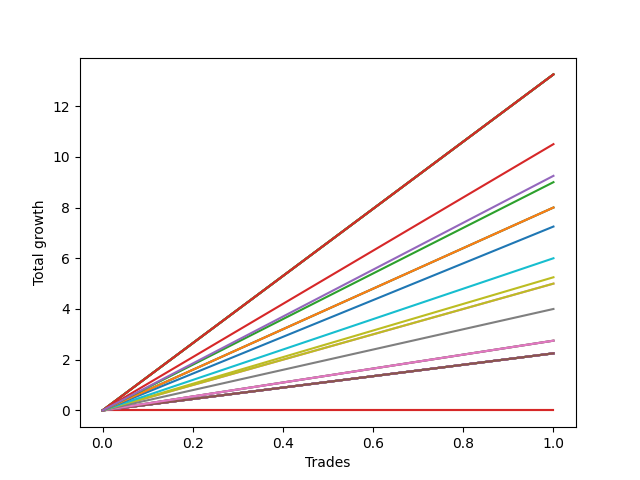

# Long Bernese 001 1v SB 
- Symbol: ES
- Date Range: 03/18/2022 - 12/30/2022
- Trading Period: 8:30-12:30
- Number of Trades: 2



| Name | Win Percent | Profit | Avg Profit / Trade | Avg Time / Trade |      | Name | Win Percent | Profit | Avg Profit / Trade | Avg Time / Trade |
| ---- | ----------- | ------ | ------------------ | ---------------- | ---- | ---- | ----------- | ------ | ------------------ | ---------------- |
| Sorted By <br> Profit | | | | | | Sorted By <br> Win Percentage ||||
| MALAMUTE 001 | 100.00 | 15750.00 | 7875.00 | 55:57 |     | MALAMUTE 001 | 100.00 | 15750.00 | 7875.00 | 55:57 |
| Seven | 100.00 | 15750.00 | 7875.00 | 55:57 |     | Seven | 100.00 | 15750.00 | 7875.00 | 55:57 |
| BB100 | 100.00 | 15500.00 | 7750.00 | 55:40 |     | BB100 | 100.00 | 15500.00 | 7750.00 | 55:40 |
| NEWFI 000 | 100.00 | 13750.00 | 6875.00 | 54:02 |     | NEWFI 000 | 100.00 | 13750.00 | 6875.00 | 54:02 |
| Six | 100.00 | 13125.00 | 6562.50 | 46:05 |     | Six | 100.00 | 13125.00 | 6562.50 | 46:05 |
| Five | 100.00 | 5625.00 | 2812.50 | 37:47 |     | Five | 100.00 | 5625.00 | 2812.50 | 37:47 |
| Eighty-Five | 100.00 | 5250.00 | 2625.00 | 38:15 |     | Eighty-Five | 100.00 | 5250.00 | 2625.00 | 38:15 |
| Eighty-Four | 100.00 | 4000.00 | 2000.00 | 30:15 |     | Eighty-Four | 100.00 | 4000.00 | 2000.00 | 30:15 |
| Eighty-Three | 100.00 | 2750.00 | 1375.00 | 25:27 |     | Eighty-Three | 100.00 | 2750.00 | 1375.00 | 25:27 |
| Four | 100.00 | 2750.00 | 1375.00 | 33:02 |     | Four | 100.00 | 2750.00 | 1375.00 | 33:02 |
| Eighty-Two | 100.00 | 2125.00 | 1062.50 | 10:40 |     | Eighty-Two | 100.00 | 2125.00 | 1062.50 | 10:40 |
| Eighty-One | 100.00 | 1500.00 | 750.00 | 09:20 |     | Eighty-One | 100.00 | 1500.00 | 750.00 | 09:20 |
| Two_C | 100.00 | 1500.00 | 750.00 | 20:17 |     | Two_C | 100.00 | 1500.00 | 750.00 | 20:17 |
| Two | 100.00 | 1500.00 | 750.00 | 19:57 |     | Two | 100.00 | 1500.00 | 750.00 | 19:57 |
| Three | 50.00 | 875.00 | 437.50 | 19:52 |     | Three | 50.00 | 875.00 | 437.50 | 19:52 |
| One | 50.00 | -1250.00 | -625.00 | 17:32 |     | One | 50.00 | -1250.00 | -625.00 | 17:32 |
| Zero | 50.00 | -1250.00 | -625.00 | 08:20 |     | Zero | 50.00 | -1250.00 | -625.00 | 08:20 |
| MALAMUTE 002 | 0.00 | -1500.00 | -750.00 | 03:05 |     | MALAMUTE 002 | 0.00 | -1500.00 | -750.00 | 03:05 |
| NEWFI 0000 | 0.00 | -3625.00 | -1812.50 | 07:35 |     | NEWFI 0000 | 0.00 | -3625.00 | -1812.50 | 07:35 |

## NO STOPLOSS

### Test Zero
* Sell when price hits the middle line of the 20p bollinger
* No Stoploss
* Results:
```
Total Trades: 2
Percent Up: 50.00
Percent Down: 50.00
Total Points Moved Up: -2.50
Potential Profit: -1250.00
Total Points Ups: 2.25 Count Ups: 1
Total Points Downs: -4.75 Count Downs: 1
```

<details><summary>Trades</summary>

<code>In: 2022-07-08 09:48:00		Out: 2022-07-08 09:49:10		Total Position Time: 01:10		Total Move Up: 2.25		Total to Date: 2.25</code> <br />
<code>In: 2022-10-10 11:56:00		Out: 2022-10-10 12:11:30		Total Position Time: 15:30		Total Move Up: -4.75		Total to Date: -2.50</code> <br />


</details>

### Test One
* Sell when the price hits the upper line of the 20p 1std bollinger
* No Stoploss
* Results:
```
Total Trades: 2
Percent Up: 50.00
Percent Down: 50.00
Total Points Moved Up: -2.50
Potential Profit: -1250.00
Total Points Ups: 0.00 Count Ups: 1
Total Points Downs: -2.50 Count Downs: 1
```

<details><summary>Trades</summary>

<code>In: 2022-07-08 09:48:00		Out: 2022-07-08 10:06:55		Total Position Time: 18:55		Total Move Up: 0.00		Total to Date: 0.00</code> <br />
<code>In: 2022-10-10 11:56:00		Out: 2022-10-10 12:12:10		Total Position Time: 16:10		Total Move Up: -2.50		Total to Date: -2.50</code> <br />


</details>

### Test Two
* Sell when the price hits the upper line of the 20p 2std bollinger
* No Stoploss
* Results:
```
Total Trades: 2
Percent Up: 100.00
Percent Down: 0.00
Total Points Moved Up: 3.00
Potential Profit: 1500.00
Total Points Ups: 3.00 Count Ups: 2
Total Points Downs: 0.00 Count Downs: 0
```

<details><summary>Trades</summary>

<code>In: 2022-07-08 09:48:00		Out: 2022-07-08 10:11:05		Total Position Time: 23:05		Total Move Up: 2.25		Total to Date: 2.25</code> <br />
<code>In: 2022-10-10 11:56:00		Out: 2022-10-10 12:12:50		Total Position Time: 16:50		Total Move Up: 0.75		Total to Date: 3.00</code> <br />


</details>

### Test Two_C
* Sell when the price hits the upper line of the 20p 2std bollinger
* No Stoploss
* Results:
```
Total Trades: 2
Percent Up: 100.00
Percent Down: 0.00
Total Points Moved Up: 3.00
Potential Profit: 1500.00
Total Points Ups: 3.00 Count Ups: 2
Total Points Downs: 0.00 Count Downs: 0
```

<details><summary>Trades</summary>

<code>In: 2022-07-08 09:48:00		Out: 2022-07-08 10:11:05		Total Position Time: 23:05		Total Move Up: 2.25		Total to Date: 2.25</code> <br />
<code>In: 2022-10-10 11:56:00		Out: 2022-10-10 12:13:30		Total Position Time: 17:30		Total Move Up: 0.75		Total to Date: 3.00</code> <br />


</details>

### Test Three
* Sell when price hits the middle line of the 50p bollinger
* No Stoploss
* Results:
```
Total Trades: 2
Percent Up: 50.00
Percent Down: 50.00
Total Points Moved Up: 1.75
Potential Profit: 875.00
Total Points Ups: 2.25 Count Ups: 1
Total Points Downs: -0.50 Count Downs: 1
```

<details><summary>Trades</summary>

<code>In: 2022-07-08 09:48:00		Out: 2022-07-08 10:11:10		Total Position Time: 23:10		Total Move Up: 2.25		Total to Date: 2.25</code> <br />
<code>In: 2022-10-10 11:56:00		Out: 2022-10-10 12:12:35		Total Position Time: 16:35		Total Move Up: -0.50		Total to Date: 1.75</code> <br />


</details>

### Test Four
* Sell when the price hits the upper line of the 50p 1std bollinger
* No Stoploss
* Results:
```
Total Trades: 2
Percent Up: 100.00
Percent Down: 0.00
Total Points Moved Up: 5.50
Potential Profit: 2750.00
Total Points Ups: 5.50 Count Ups: 2
Total Points Downs: 0.00 Count Downs: 0
```

<details><summary>Trades</summary>

<code>In: 2022-07-08 09:48:00		Out: 2022-07-08 10:26:30		Total Position Time: 38:30		Total Move Up: 2.75		Total to Date: 2.75</code> <br />
<code>In: 2022-10-10 11:56:00		Out: 2022-10-10 12:23:35		Total Position Time: 27:35		Total Move Up: 2.75		Total to Date: 5.50</code> <br />


</details>

### Test Five
* Sell when the price hits the upper line of the 50p 2std bollinger
* No Stoploss
* Results:
```
Total Trades: 2
Percent Up: 100.00
Percent Down: 0.00
Total Points Moved Up: 11.25
Potential Profit: 5625.00
Total Points Ups: 11.25 Count Ups: 2
Total Points Downs: 0.00 Count Downs: 0
```

<details><summary>Trades</summary>

<code>In: 2022-07-08 09:48:00		Out: 2022-07-08 10:27:00		Total Position Time: 39:00		Total Move Up: 5.00		Total to Date: 5.00</code> <br />
<code>In: 2022-10-10 11:56:00		Out: 2022-10-10 12:32:35		Total Position Time: 36:35		Total Move Up: 6.25		Total to Date: 11.25</code> <br />


</details>

### Test Six
* Sell when the price hits the middle line of the 1std VWAP
* No Stoploss
* Results:
```
Total Trades: 2
Percent Up: 100.00
Percent Down: 0.00
Total Points Moved Up: 26.25
Potential Profit: 13125.00
Total Points Ups: 26.25 Count Ups: 2
Total Points Downs: 0.00 Count Downs: 0
```

<details><summary>Trades</summary>

<code>In: 2022-07-08 09:48:00		Out: 2022-07-08 10:29:10		Total Position Time: 41:10		Total Move Up: 8.00		Total to Date: 8.00</code> <br />
<code>In: 2022-10-10 11:56:00		Out: 2022-10-10 12:47:00		Total Position Time: 51:00		Total Move Up: 18.25		Total to Date: 26.25</code> <br />


</details>

### Test Seven
* Sell when the price hits the upper line of the 1std VWAP
* No Stoploss
* Results:
```
Total Trades: 2
Percent Up: 100.00
Percent Down: 0.00
Total Points Moved Up: 31.50
Potential Profit: 15750.00
Total Points Ups: 31.50 Count Ups: 2
Total Points Downs: 0.00 Count Downs: 0
```

<details><summary>Trades</summary>

<code>In: 2022-07-08 09:48:00		Out: 2022-07-08 10:48:55		Total Position Time: 60:55		Total Move Up: 13.25		Total to Date: 13.25</code> <br />
<code>In: 2022-10-10 11:56:00		Out: 2022-10-10 12:47:00		Total Position Time: 51:00		Total Move Up: 18.25		Total to Date: 31.50</code> <br />


</details>

### Test BB100
* Move to BB100 Upper Band
* No Stoploss
* Results:
```
Total Trades: 2
Percent Up: 100.00
Percent Down: 0.00
Total Points Moved Up: 31.00
Potential Profit: 15500.00
Total Points Ups: 31.00 Count Ups: 2
Total Points Downs: 0.00 Count Downs: 0
```

<details><summary>Trades</summary>

<code>In: 2022-07-08 09:48:00		Out: 2022-07-08 10:48:55		Total Position Time: 60:55		Total Move Up: 13.25		Total to Date: 13.25</code> <br />
<code>In: 2022-10-10 11:56:00		Out: 2022-10-10 12:46:25		Total Position Time: 50:25		Total Move Up: 17.75		Total to Date: 31.00</code> <br />


</details>

## TAKE PROFIT

### Test Eighty-One
* Take Profit of 1 Point
* No Stoploss
* Results:
```
Total Trades: 2
Percent Up: 100.00
Percent Down: 0.00
Total Points Moved Up: 3.00
Potential Profit: 1500.00
Total Points Ups: 3.00 Count Ups: 2
Total Points Downs: 0.00 Count Downs: 0
```

<details><summary>Trades</summary>

<code>In: 2022-07-08 09:48:00		Out: 2022-07-08 09:49:10		Total Position Time: 01:10		Total Move Up: 2.25		Total to Date: 2.25</code> <br />
<code>In: 2022-10-10 11:56:00		Out: 2022-10-10 12:13:30		Total Position Time: 17:30		Total Move Up: 0.75		Total to Date: 3.00</code> <br />


</details>

### Test Eighty-Two
* Take Profit of 2 Point
* No Stoploss
* Results:
```
Total Trades: 2
Percent Up: 100.00
Percent Down: 0.00
Total Points Moved Up: 4.25
Potential Profit: 2125.00
Total Points Ups: 4.25 Count Ups: 2
Total Points Downs: 0.00 Count Downs: 0
```

<details><summary>Trades</summary>

<code>In: 2022-07-08 09:48:00		Out: 2022-07-08 09:49:10		Total Position Time: 01:10		Total Move Up: 2.25		Total to Date: 2.25</code> <br />
<code>In: 2022-10-10 11:56:00		Out: 2022-10-10 12:16:10		Total Position Time: 20:10		Total Move Up: 2.00		Total to Date: 4.25</code> <br />


</details>

### Test Eighty-Three
* Take Profit of 3 Point
* No Stoploss
* Results:
```
Total Trades: 2
Percent Up: 100.00
Percent Down: 0.00
Total Points Moved Up: 5.50
Potential Profit: 2750.00
Total Points Ups: 5.50 Count Ups: 2
Total Points Downs: 0.00 Count Downs: 0
```

<details><summary>Trades</summary>

<code>In: 2022-07-08 09:48:00		Out: 2022-07-08 10:11:20		Total Position Time: 23:20		Total Move Up: 2.75		Total to Date: 2.75</code> <br />
<code>In: 2022-10-10 11:56:00		Out: 2022-10-10 12:23:35		Total Position Time: 27:35		Total Move Up: 2.75		Total to Date: 5.50</code> <br />


</details>

### Test Eighty-Four
* Take Profit of 4 Point
* No Stoploss
* Results:
```
Total Trades: 2
Percent Up: 100.00
Percent Down: 0.00
Total Points Moved Up: 8.00
Potential Profit: 4000.00
Total Points Ups: 8.00 Count Ups: 2
Total Points Downs: 0.00 Count Downs: 0
```

<details><summary>Trades</summary>

<code>In: 2022-07-08 09:48:00		Out: 2022-07-08 10:12:25		Total Position Time: 24:25		Total Move Up: 4.00		Total to Date: 4.00</code> <br />
<code>In: 2022-10-10 11:56:00		Out: 2022-10-10 12:32:05		Total Position Time: 36:05		Total Move Up: 4.00		Total to Date: 8.00</code> <br />


</details>

### Test Eighty-Five
* Take Profit of 5 Point
* No Stoploss
* Results:
```
Total Trades: 2
Percent Up: 100.00
Percent Down: 0.00
Total Points Moved Up: 10.50
Potential Profit: 5250.00
Total Points Ups: 10.50 Count Ups: 2
Total Points Downs: 0.00 Count Downs: 0
```

<details><summary>Trades</summary>

<code>In: 2022-07-08 09:48:00		Out: 2022-07-08 10:28:05		Total Position Time: 40:05		Total Move Up: 5.25		Total to Date: 5.25</code> <br />
<code>In: 2022-10-10 11:56:00		Out: 2022-10-10 12:32:25		Total Position Time: 36:25		Total Move Up: 5.25		Total to Date: 10.50</code> <br />


</details>

## Indicator Exits

### Test NEWFI 000
* Newfi 0000
* No Stoploss
* Results:
```
Total Trades: 2
Percent Up: 100.00
Percent Down: 0.00
Total Points Moved Up: 27.50
Potential Profit: 13750.00
Total Points Ups: 27.50 Count Ups: 2
Total Points Downs: 0.00 Count Downs: 0
```

<details><summary>Trades</summary>

<code>In: 2022-07-08 09:48:00		Out: 2022-07-08 10:45:05		Total Position Time: 57:05		Total Move Up: 9.25		Total to Date: 9.25</code> <br />
<code>In: 2022-10-10 11:56:00		Out: 2022-10-10 12:47:00		Total Position Time: 51:00		Total Move Up: 18.25		Total to Date: 27.50</code> <br />


</details>

### Test NEWFI 0000
* Newfi 0000
* No Stoploss
* Results:
```
Total Trades: 2
Percent Up: 0.00
Percent Down: 100.00
Total Points Moved Up: -7.25
Potential Profit: -3625.00
Total Points Ups: 0.00 Count Ups: 0
Total Points Downs: -7.25 Count Downs: 2
```

<details><summary>Trades</summary>

<code>In: 2022-07-08 09:48:00		Out: 2022-07-08 10:02:05		Total Position Time: 14:05		Total Move Up: -4.50		Total to Date: -4.50</code> <br />
<code>In: 2022-10-10 11:56:00		Out: 2022-10-10 11:57:05		Total Position Time: 01:05		Total Move Up: -2.75		Total to Date: -7.25</code> <br />


</details>

### Test MALAMUTE 001
* Malamute 001
* No Stoploss
* Results:
```
Total Trades: 2
Percent Up: 100.00
Percent Down: 0.00
Total Points Moved Up: 31.50
Potential Profit: 15750.00
Total Points Ups: 31.50 Count Ups: 2
Total Points Downs: 0.00 Count Downs: 0
```

<details><summary>Trades</summary>

<code>In: 2022-07-08 09:48:00		Out: 2022-07-08 10:48:55		Total Position Time: 60:55		Total Move Up: 13.25		Total to Date: 13.25</code> <br />
<code>In: 2022-10-10 11:56:00		Out: 2022-10-10 12:47:00		Total Position Time: 51:00		Total Move Up: 18.25		Total to Date: 31.50</code> <br />


</details>

### Test MALAMUTE 002
* Malamute 001
* No Stoploss
* Results:
```
Total Trades: 2
Percent Up: 0.00
Percent Down: 100.00
Total Points Moved Up: -3.00
Potential Profit: -1500.00
Total Points Ups: 0.00 Count Ups: 0
Total Points Downs: -3.00 Count Downs: 2
```

<details><summary>Trades</summary>

<code>In: 2022-07-08 09:48:00		Out: 2022-07-08 09:53:05		Total Position Time: 05:05		Total Move Up: -0.25		Total to Date: -0.25</code> <br />
<code>In: 2022-10-10 11:56:00		Out: 2022-10-10 11:57:05		Total Position Time: 01:05		Total Move Up: -2.75		Total to Date: -3.00</code> <br />


</details>