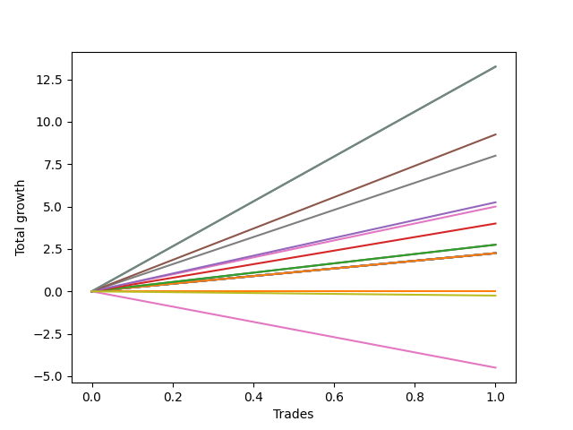

# Long Bernese 001 1v 
- Symbol: ES
- Date Range: 03/18/2022 - 12/30/2022
- Trading Period: 8:30-12:30
- Number of Trades: 1



| Name | Win Percent | Profit | Avg Profit / Trade | Avg Time / Trade |      | Name | Win Percent | Profit | Avg Profit / Trade | Avg Time / Trade |
| ---- | ----------- | ------ | ------------------ | ---------------- | ---- | ---- | ----------- | ------ | ------------------ | ---------------- |
| Sorted By <br> Profit | | | | | | Sorted By <br> Win Percentage ||||
| MALAMUTE 001 | 100.00 | 6625.00 | 6625.00 | 60:55 |     | MALAMUTE 001 | 100.00 | 6625.00 | 6625.00 | 60:55 |
| BB100 | 100.00 | 6625.00 | 6625.00 | 60:55 |     | BB100 | 100.00 | 6625.00 | 6625.00 | 60:55 |
| Seven | 100.00 | 6625.00 | 6625.00 | 60:55 |     | Seven | 100.00 | 6625.00 | 6625.00 | 60:55 |
| NEWFI 000 | 100.00 | 4625.00 | 4625.00 | 57:05 |     | NEWFI 000 | 100.00 | 4625.00 | 4625.00 | 57:05 |
| Six | 100.00 | 4000.00 | 4000.00 | 41:10 |     | Six | 100.00 | 4000.00 | 4000.00 | 41:10 |
| Eighty-Five | 100.00 | 2625.00 | 2625.00 | 40:05 |     | Eighty-Five | 100.00 | 2625.00 | 2625.00 | 40:05 |
| Five | 100.00 | 2500.00 | 2500.00 | 39:00 |     | Five | 100.00 | 2500.00 | 2500.00 | 39:00 |
| Eighty-Four | 100.00 | 2000.00 | 2000.00 | 24:25 |     | Eighty-Four | 100.00 | 2000.00 | 2000.00 | 24:25 |
| Eighty-Three | 100.00 | 1375.00 | 1375.00 | 23:20 |     | Eighty-Three | 100.00 | 1375.00 | 1375.00 | 23:20 |
| Four | 100.00 | 1375.00 | 1375.00 | 38:30 |     | Four | 100.00 | 1375.00 | 1375.00 | 38:30 |
| Eighty-Two | 100.00 | 1125.00 | 1125.00 | 01:10 |     | Eighty-Two | 100.00 | 1125.00 | 1125.00 | 01:10 |
| Eighty-One | 100.00 | 1125.00 | 1125.00 | 01:10 |     | Eighty-One | 100.00 | 1125.00 | 1125.00 | 01:10 |
| Three | 100.00 | 1125.00 | 1125.00 | 23:10 |     | Three | 100.00 | 1125.00 | 1125.00 | 23:10 |
| Two_C | 100.00 | 1125.00 | 1125.00 | 23:05 |     | Two_C | 100.00 | 1125.00 | 1125.00 | 23:05 |
| Two | 100.00 | 1125.00 | 1125.00 | 23:05 |     | Two | 100.00 | 1125.00 | 1125.00 | 23:05 |
| Zero | 100.00 | 1125.00 | 1125.00 | 01:10 |     | Zero | 100.00 | 1125.00 | 1125.00 | 01:10 |
| One | 100.00 | 0.00 | 0.00 | 18:55 |     | One | 100.00 | 0.00 | 0.00 | 18:55 |
| MALAMUTE 002 | 0.00 | -125.00 | -125.00 | 05:05 |     | MALAMUTE 002 | 0.00 | -125.00 | -125.00 | 05:05 |
| NEWFI 0000 | 0.00 | -2250.00 | -2250.00 | 14:05 |     | NEWFI 0000 | 0.00 | -2250.00 | -2250.00 | 14:05 |

## NO STOPLOSS

### Test Zero
* Sell when price hits the middle line of the 20p bollinger
* No Stoploss
* Results:
```
Total Trades: 1
Percent Up: 100.00
Percent Down: 0.00
Total Points Moved Up: 2.25
Potential Profit: 1125.00
Total Points Ups: 2.25 Count Ups: 1
Total Points Downs: 0.00 Count Downs: 0
```

<details><summary>Trades</summary>

<code>In: 2022-07-08 09:48:00		Out: 2022-07-08 09:49:10		Total Position Time: 01:10		Total Move Up: 2.25		Total to Date: 2.25</code> <br />


</details>

### Test One
* Sell when the price hits the upper line of the 20p 1std bollinger
* No Stoploss
* Results:
```
Total Trades: 1
Percent Up: 100.00
Percent Down: 0.00
Total Points Moved Up: 0.00
Potential Profit: 0.00
Total Points Ups: 0.00 Count Ups: 1
Total Points Downs: 0.00 Count Downs: 0
```

<details><summary>Trades</summary>

<code>In: 2022-07-08 09:48:00		Out: 2022-07-08 10:06:55		Total Position Time: 18:55		Total Move Up: 0.00		Total to Date: 0.00</code> <br />


</details>

### Test Two
* Sell when the price hits the upper line of the 20p 2std bollinger
* No Stoploss
* Results:
```
Total Trades: 1
Percent Up: 100.00
Percent Down: 0.00
Total Points Moved Up: 2.25
Potential Profit: 1125.00
Total Points Ups: 2.25 Count Ups: 1
Total Points Downs: 0.00 Count Downs: 0
```

<details><summary>Trades</summary>

<code>In: 2022-07-08 09:48:00		Out: 2022-07-08 10:11:05		Total Position Time: 23:05		Total Move Up: 2.25		Total to Date: 2.25</code> <br />


</details>

### Test Two_C
* Sell when the price hits the upper line of the 20p 2std bollinger
* No Stoploss
* Results:
```
Total Trades: 1
Percent Up: 100.00
Percent Down: 0.00
Total Points Moved Up: 2.25
Potential Profit: 1125.00
Total Points Ups: 2.25 Count Ups: 1
Total Points Downs: 0.00 Count Downs: 0
```

<details><summary>Trades</summary>

<code>In: 2022-07-08 09:48:00		Out: 2022-07-08 10:11:05		Total Position Time: 23:05		Total Move Up: 2.25		Total to Date: 2.25</code> <br />


</details>

### Test Three
* Sell when price hits the middle line of the 50p bollinger
* No Stoploss
* Results:
```
Total Trades: 1
Percent Up: 100.00
Percent Down: 0.00
Total Points Moved Up: 2.25
Potential Profit: 1125.00
Total Points Ups: 2.25 Count Ups: 1
Total Points Downs: 0.00 Count Downs: 0
```

<details><summary>Trades</summary>

<code>In: 2022-07-08 09:48:00		Out: 2022-07-08 10:11:10		Total Position Time: 23:10		Total Move Up: 2.25		Total to Date: 2.25</code> <br />


</details>

### Test Four
* Sell when the price hits the upper line of the 50p 1std bollinger
* No Stoploss
* Results:
```
Total Trades: 1
Percent Up: 100.00
Percent Down: 0.00
Total Points Moved Up: 2.75
Potential Profit: 1375.00
Total Points Ups: 2.75 Count Ups: 1
Total Points Downs: 0.00 Count Downs: 0
```

<details><summary>Trades</summary>

<code>In: 2022-07-08 09:48:00		Out: 2022-07-08 10:26:30		Total Position Time: 38:30		Total Move Up: 2.75		Total to Date: 2.75</code> <br />


</details>

### Test Five
* Sell when the price hits the upper line of the 50p 2std bollinger
* No Stoploss
* Results:
```
Total Trades: 1
Percent Up: 100.00
Percent Down: 0.00
Total Points Moved Up: 5.00
Potential Profit: 2500.00
Total Points Ups: 5.00 Count Ups: 1
Total Points Downs: 0.00 Count Downs: 0
```

<details><summary>Trades</summary>

<code>In: 2022-07-08 09:48:00		Out: 2022-07-08 10:27:00		Total Position Time: 39:00		Total Move Up: 5.00		Total to Date: 5.00</code> <br />


</details>

### Test Six
* Sell when the price hits the middle line of the 1std VWAP
* No Stoploss
* Results:
```
Total Trades: 1
Percent Up: 100.00
Percent Down: 0.00
Total Points Moved Up: 8.00
Potential Profit: 4000.00
Total Points Ups: 8.00 Count Ups: 1
Total Points Downs: 0.00 Count Downs: 0
```

<details><summary>Trades</summary>

<code>In: 2022-07-08 09:48:00		Out: 2022-07-08 10:29:10		Total Position Time: 41:10		Total Move Up: 8.00		Total to Date: 8.00</code> <br />


</details>

### Test Seven
* Sell when the price hits the upper line of the 1std VWAP
* No Stoploss
* Results:
```
Total Trades: 1
Percent Up: 100.00
Percent Down: 0.00
Total Points Moved Up: 13.25
Potential Profit: 6625.00
Total Points Ups: 13.25 Count Ups: 1
Total Points Downs: 0.00 Count Downs: 0
```

<details><summary>Trades</summary>

<code>In: 2022-07-08 09:48:00		Out: 2022-07-08 10:48:55		Total Position Time: 60:55		Total Move Up: 13.25		Total to Date: 13.25</code> <br />


</details>

### Test BB100
* Move to BB100 Upper Band
* No Stoploss
* Results:
```
Total Trades: 1
Percent Up: 100.00
Percent Down: 0.00
Total Points Moved Up: 13.25
Potential Profit: 6625.00
Total Points Ups: 13.25 Count Ups: 1
Total Points Downs: 0.00 Count Downs: 0
```

<details><summary>Trades</summary>

<code>In: 2022-07-08 09:48:00		Out: 2022-07-08 10:48:55		Total Position Time: 60:55		Total Move Up: 13.25		Total to Date: 13.25</code> <br />


</details>

## TAKE PROFIT

### Test Eighty-One
* Take Profit of 1 Point
* No Stoploss
* Results:
```
Total Trades: 1
Percent Up: 100.00
Percent Down: 0.00
Total Points Moved Up: 2.25
Potential Profit: 1125.00
Total Points Ups: 2.25 Count Ups: 1
Total Points Downs: 0.00 Count Downs: 0
```

<details><summary>Trades</summary>

<code>In: 2022-07-08 09:48:00		Out: 2022-07-08 09:49:10		Total Position Time: 01:10		Total Move Up: 2.25		Total to Date: 2.25</code> <br />


</details>

### Test Eighty-Two
* Take Profit of 2 Point
* No Stoploss
* Results:
```
Total Trades: 1
Percent Up: 100.00
Percent Down: 0.00
Total Points Moved Up: 2.25
Potential Profit: 1125.00
Total Points Ups: 2.25 Count Ups: 1
Total Points Downs: 0.00 Count Downs: 0
```

<details><summary>Trades</summary>

<code>In: 2022-07-08 09:48:00		Out: 2022-07-08 09:49:10		Total Position Time: 01:10		Total Move Up: 2.25		Total to Date: 2.25</code> <br />


</details>

### Test Eighty-Three
* Take Profit of 3 Point
* No Stoploss
* Results:
```
Total Trades: 1
Percent Up: 100.00
Percent Down: 0.00
Total Points Moved Up: 2.75
Potential Profit: 1375.00
Total Points Ups: 2.75 Count Ups: 1
Total Points Downs: 0.00 Count Downs: 0
```

<details><summary>Trades</summary>

<code>In: 2022-07-08 09:48:00		Out: 2022-07-08 10:11:20		Total Position Time: 23:20		Total Move Up: 2.75		Total to Date: 2.75</code> <br />


</details>

### Test Eighty-Four
* Take Profit of 4 Point
* No Stoploss
* Results:
```
Total Trades: 1
Percent Up: 100.00
Percent Down: 0.00
Total Points Moved Up: 4.00
Potential Profit: 2000.00
Total Points Ups: 4.00 Count Ups: 1
Total Points Downs: 0.00 Count Downs: 0
```

<details><summary>Trades</summary>

<code>In: 2022-07-08 09:48:00		Out: 2022-07-08 10:12:25		Total Position Time: 24:25		Total Move Up: 4.00		Total to Date: 4.00</code> <br />


</details>

### Test Eighty-Five
* Take Profit of 5 Point
* No Stoploss
* Results:
```
Total Trades: 1
Percent Up: 100.00
Percent Down: 0.00
Total Points Moved Up: 5.25
Potential Profit: 2625.00
Total Points Ups: 5.25 Count Ups: 1
Total Points Downs: 0.00 Count Downs: 0
```

<details><summary>Trades</summary>

<code>In: 2022-07-08 09:48:00		Out: 2022-07-08 10:28:05		Total Position Time: 40:05		Total Move Up: 5.25		Total to Date: 5.25</code> <br />


</details>

## Indicator Exits

### Test NEWFI 000
* Newfi 0000
* No Stoploss
* Results:
```
Total Trades: 1
Percent Up: 100.00
Percent Down: 0.00
Total Points Moved Up: 9.25
Potential Profit: 4625.00
Total Points Ups: 9.25 Count Ups: 1
Total Points Downs: 0.00 Count Downs: 0
```

<details><summary>Trades</summary>

<code>In: 2022-07-08 09:48:00		Out: 2022-07-08 10:45:05		Total Position Time: 57:05		Total Move Up: 9.25		Total to Date: 9.25</code> <br />


</details>

### Test NEWFI 0000
* Newfi 0000
* No Stoploss
* Results:
```
Total Trades: 1
Percent Up: 0.00
Percent Down: 100.00
Total Points Moved Up: -4.50
Potential Profit: -2250.00
Total Points Ups: 0.00 Count Ups: 0
Total Points Downs: -4.50 Count Downs: 1
```

<details><summary>Trades</summary>

<code>In: 2022-07-08 09:48:00		Out: 2022-07-08 10:02:05		Total Position Time: 14:05		Total Move Up: -4.50		Total to Date: -4.50</code> <br />


</details>

### Test MALAMUTE 001
* Malamute 001
* No Stoploss
* Results:
```
Total Trades: 1
Percent Up: 100.00
Percent Down: 0.00
Total Points Moved Up: 13.25
Potential Profit: 6625.00
Total Points Ups: 13.25 Count Ups: 1
Total Points Downs: 0.00 Count Downs: 0
```

<details><summary>Trades</summary>

<code>In: 2022-07-08 09:48:00		Out: 2022-07-08 10:48:55		Total Position Time: 60:55		Total Move Up: 13.25		Total to Date: 13.25</code> <br />


</details>

### Test MALAMUTE 002
* Malamute 001
* No Stoploss
* Results:
```
Total Trades: 1
Percent Up: 0.00
Percent Down: 100.00
Total Points Moved Up: -0.25
Potential Profit: -125.00
Total Points Ups: 0.00 Count Ups: 0
Total Points Downs: -0.25 Count Downs: 1
```

<details><summary>Trades</summary>

<code>In: 2022-07-08 09:48:00		Out: 2022-07-08 09:53:05		Total Position Time: 05:05		Total Move Up: -0.25		Total to Date: -0.25</code> <br />


</details>