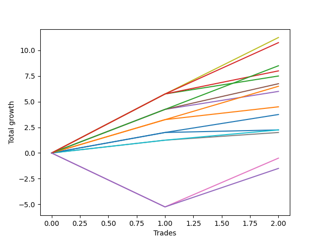

# Long Bernese 001 50 
- Symbol: ES
- Date Range: 03/18/2022 - 09/30/2022
- Trading Period: 7:20-12:30
- Number of Trades: 2



| Name | Win Percent | Profit | Avg Profit / Trade | Avg Time / Trade |      | Name | Win Percent | Profit | Avg Profit / Trade | Avg Time / Trade |
| ---- | ----------- | ------ | ------------------ | ---------------- | ---- | ---- | ----------- | ------ | ------------------ | ---------------- |
| Sorted By <br> Profit | | | | | | Sorted By <br> Win Percentage ||||
| Seven | 100.00 | 5625.00 | 2812.50 | 32:02 |     | Seven | 100.00 | 5625.00 | 2812.50 | 32:02 |
| Eighty-Five | 100.00 | 5375.00 | 2687.50 | 22:40 |     | Eighty-Five | 100.00 | 5375.00 | 2687.50 | 22:40 |
| Eighty-Four | 100.00 | 4250.00 | 2125.00 | 21:40 |     | Eighty-Four | 100.00 | 4250.00 | 2125.00 | 21:40 |
| Two_C | 100.00 | 4000.00 | 2000.00 | 13:15 |     | Two_C | 100.00 | 4000.00 | 2000.00 | 13:15 |
| Two | 100.00 | 3750.00 | 1875.00 | 09:37 |     | Two | 100.00 | 3750.00 | 1875.00 | 09:37 |
| Four | 100.00 | 3375.00 | 1687.50 | 30:47 |     | Four | 100.00 | 3375.00 | 1687.50 | 30:47 |
| Eighty-Three | 100.00 | 3250.00 | 1625.00 | 21:17 |     | Eighty-Three | 100.00 | 3250.00 | 1625.00 | 21:17 |
| Three | 100.00 | 3000.00 | 1500.00 | 09:35 |     | Three | 100.00 | 3000.00 | 1500.00 | 09:35 |
| One | 100.00 | 2250.00 | 1125.00 | 08:30 |     | One | 100.00 | 2250.00 | 1125.00 | 08:30 |
| Eighty-Two | 100.00 | 1875.00 | 937.50 | 08:10 |     | Eighty-Two | 100.00 | 1875.00 | 937.50 | 08:10 |
| Eighty-One | 100.00 | 1125.00 | 562.50 | 01:42 |     | Eighty-One | 100.00 | 1125.00 | 562.50 | 01:42 |
| Zero | 100.00 | 1125.00 | 562.50 | 06:52 |     | Zero | 100.00 | 1125.00 | 562.50 | 06:52 |
| Six | 100.00 | 1000.00 | 500.00 | 01:37 |     | Six | 100.00 | 1000.00 | 500.00 | 01:37 |
| Five | 50.00 | -250.00 | -125.00 | 50:05 |     | Five | 50.00 | -250.00 | -125.00 | 50:05 |
| NEWFI 0000 | 50.00 | -750.00 | -375.00 | 51:30 |     | NEWFI 0000 | 50.00 | -750.00 | -375.00 | 51:30 |

## NO STOPLOSS

### Test Zero
* Sell when price hits the middle line of the 20p bollinger
* No Stoploss
* Results:
```
Total Trades: 2
Percent Up: 100.00
Percent Down: 0.00
Total Points Moved Up: 2.25
Potential Profit: 1125.00
Total Points Ups: 2.25 Count Ups: 2
Total Points Downs: 0.00 Count Downs: 0
```

<details><summary>Trades</summary>

<code>In: 2022-03-31 08:37:00		Out: 2022-03-31 08:38:15		Total Position Time: 01:15		Total Move Up: 2.00		Total to Date: 2.00</code> <br />
<code>In: 2022-08-05 11:32:00		Out: 2022-08-05 11:44:30		Total Position Time: 12:30		Total Move Up: 0.25		Total to Date: 2.25</code> <br />


</details>

### Test One
* Sell when the price hits the upper line of the 20p 1std bollinger
* No Stoploss
* Results:
```
Total Trades: 2
Percent Up: 100.00
Percent Down: 0.00
Total Points Moved Up: 4.50
Potential Profit: 2250.00
Total Points Ups: 4.50 Count Ups: 2
Total Points Downs: 0.00 Count Downs: 0
```

<details><summary>Trades</summary>

<code>In: 2022-03-31 08:37:00		Out: 2022-03-31 08:40:35		Total Position Time: 03:35		Total Move Up: 3.25		Total to Date: 3.25</code> <br />
<code>In: 2022-08-05 11:32:00		Out: 2022-08-05 11:45:25		Total Position Time: 13:25		Total Move Up: 1.25		Total to Date: 4.50</code> <br />


</details>

### Test Two
* Sell when the price hits the upper line of the 20p 2std bollinger
* No Stoploss
* Results:
```
Total Trades: 2
Percent Up: 100.00
Percent Down: 0.00
Total Points Moved Up: 7.50
Potential Profit: 3750.00
Total Points Ups: 7.50 Count Ups: 2
Total Points Downs: 0.00 Count Downs: 0
```

<details><summary>Trades</summary>

<code>In: 2022-03-31 08:37:00		Out: 2022-03-31 08:41:10		Total Position Time: 04:10		Total Move Up: 5.75		Total to Date: 5.75</code> <br />
<code>In: 2022-08-05 11:32:00		Out: 2022-08-05 11:47:05		Total Position Time: 15:05		Total Move Up: 1.75		Total to Date: 7.50</code> <br />


</details>

### Test Two_C
* Sell when the price hits the upper line of the 20p 2std bollinger
* No Stoploss
* Results:
```
Total Trades: 2
Percent Up: 100.00
Percent Down: 0.00
Total Points Moved Up: 8.00
Potential Profit: 4000.00
Total Points Ups: 8.00 Count Ups: 2
Total Points Downs: 0.00 Count Downs: 0
```

<details><summary>Trades</summary>

<code>In: 2022-03-31 08:37:00		Out: 2022-03-31 08:41:10		Total Position Time: 04:10		Total Move Up: 5.75		Total to Date: 5.75</code> <br />
<code>In: 2022-08-05 11:32:00		Out: 2022-08-05 11:54:20		Total Position Time: 22:20		Total Move Up: 2.25		Total to Date: 8.00</code> <br />


</details>

### Test Three
* Sell when price hits the middle line of the 50p bollinger
* No Stoploss
* Results:
```
Total Trades: 2
Percent Up: 100.00
Percent Down: 0.00
Total Points Moved Up: 6.00
Potential Profit: 3000.00
Total Points Ups: 6.00 Count Ups: 2
Total Points Downs: 0.00 Count Downs: 0
```

<details><summary>Trades</summary>

<code>In: 2022-03-31 08:37:00		Out: 2022-03-31 08:41:05		Total Position Time: 04:05		Total Move Up: 4.25		Total to Date: 4.25</code> <br />
<code>In: 2022-08-05 11:32:00		Out: 2022-08-05 11:47:05		Total Position Time: 15:05		Total Move Up: 1.75		Total to Date: 6.00</code> <br />


</details>

### Test Four
* Sell when the price hits the upper line of the 50p 1std bollinger
* No Stoploss
* Results:
```
Total Trades: 2
Percent Up: 100.00
Percent Down: 0.00
Total Points Moved Up: 6.75
Potential Profit: 3375.00
Total Points Ups: 6.75 Count Ups: 2
Total Points Downs: 0.00 Count Downs: 0
```

<details><summary>Trades</summary>

<code>In: 2022-03-31 08:37:00		Out: 2022-03-31 09:00:15		Total Position Time: 23:15		Total Move Up: 4.25		Total to Date: 4.25</code> <br />
<code>In: 2022-08-05 11:32:00		Out: 2022-08-05 12:10:20		Total Position Time: 38:20		Total Move Up: 2.50		Total to Date: 6.75</code> <br />


</details>

### Test Five
* Sell when the price hits the upper line of the 50p 2std bollinger
* No Stoploss
* Results:
```
Total Trades: 2
Percent Up: 50.00
Percent Down: 50.00
Total Points Moved Up: -0.50
Potential Profit: -250.00
Total Points Ups: 4.75 Count Ups: 1
Total Points Downs: -5.25 Count Downs: 1
```

<details><summary>Trades</summary>

<code>In: 2022-03-31 08:37:00		Out: 2022-03-31 09:36:55		Total Position Time: 59:55		Total Move Up: -5.25		Total to Date: -5.25</code> <br />
<code>In: 2022-08-05 11:32:00		Out: 2022-08-05 12:12:15		Total Position Time: 40:15		Total Move Up: 4.75		Total to Date: -0.50</code> <br />


</details>

### Test Six
* Sell when the price hits the middle line of the 1std VWAP
* No Stoploss
* Results:
```
Total Trades: 2
Percent Up: 100.00
Percent Down: 0.00
Total Points Moved Up: 2.00
Potential Profit: 1000.00
Total Points Ups: 2.00 Count Ups: 2
Total Points Downs: 0.00 Count Downs: 0
```

<details><summary>Trades</summary>

<code>In: 2022-03-31 08:37:00		Out: 2022-03-31 08:37:40		Total Position Time: 00:40		Total Move Up: 1.25		Total to Date: 1.25</code> <br />
<code>In: 2022-08-05 11:32:00		Out: 2022-08-05 11:34:35		Total Position Time: 02:35		Total Move Up: 0.75		Total to Date: 2.00</code> <br />


</details>

### Test Seven
* Sell when the price hits the upper line of the 1std VWAP
* No Stoploss
* Results:
```
Total Trades: 2
Percent Up: 100.00
Percent Down: 0.00
Total Points Moved Up: 11.25
Potential Profit: 5625.00
Total Points Ups: 11.25 Count Ups: 2
Total Points Downs: 0.00 Count Downs: 0
```

<details><summary>Trades</summary>

<code>In: 2022-03-31 08:37:00		Out: 2022-03-31 08:41:10		Total Position Time: 04:10		Total Move Up: 5.75		Total to Date: 5.75</code> <br />
<code>In: 2022-08-05 11:32:00		Out: 2022-08-05 12:31:55		Total Position Time: 59:55		Total Move Up: 5.50		Total to Date: 11.25</code> <br />


</details>

## TAKE PROFIT

### Test Eighty-One
* Take Profit of 1 Point
* No Stoploss
* Results:
```
Total Trades: 2
Percent Up: 100.00
Percent Down: 0.00
Total Points Moved Up: 2.25
Potential Profit: 1125.00
Total Points Ups: 2.25 Count Ups: 2
Total Points Downs: 0.00 Count Downs: 0
```

<details><summary>Trades</summary>

<code>In: 2022-03-31 08:37:00		Out: 2022-03-31 08:37:40		Total Position Time: 00:40		Total Move Up: 1.25		Total to Date: 1.25</code> <br />
<code>In: 2022-08-05 11:32:00		Out: 2022-08-05 11:34:45		Total Position Time: 02:45		Total Move Up: 1.00		Total to Date: 2.25</code> <br />


</details>

### Test Eighty-Two
* Take Profit of 2 Point
* No Stoploss
* Results:
```
Total Trades: 2
Percent Up: 100.00
Percent Down: 0.00
Total Points Moved Up: 3.75
Potential Profit: 1875.00
Total Points Ups: 3.75 Count Ups: 2
Total Points Downs: 0.00 Count Downs: 0
```

<details><summary>Trades</summary>

<code>In: 2022-03-31 08:37:00		Out: 2022-03-31 08:38:15		Total Position Time: 01:15		Total Move Up: 2.00		Total to Date: 2.00</code> <br />
<code>In: 2022-08-05 11:32:00		Out: 2022-08-05 11:47:05		Total Position Time: 15:05		Total Move Up: 1.75		Total to Date: 3.75</code> <br />


</details>

### Test Eighty-Three
* Take Profit of 3 Point
* No Stoploss
* Results:
```
Total Trades: 2
Percent Up: 100.00
Percent Down: 0.00
Total Points Moved Up: 6.50
Potential Profit: 3250.00
Total Points Ups: 6.50 Count Ups: 2
Total Points Downs: 0.00 Count Downs: 0
```

<details><summary>Trades</summary>

<code>In: 2022-03-31 08:37:00		Out: 2022-03-31 08:40:35		Total Position Time: 03:35		Total Move Up: 3.25		Total to Date: 3.25</code> <br />
<code>In: 2022-08-05 11:32:00		Out: 2022-08-05 12:11:00		Total Position Time: 39:00		Total Move Up: 3.25		Total to Date: 6.50</code> <br />


</details>

### Test Eighty-Four
* Take Profit of 4 Point
* No Stoploss
* Results:
```
Total Trades: 2
Percent Up: 100.00
Percent Down: 0.00
Total Points Moved Up: 8.50
Potential Profit: 4250.00
Total Points Ups: 8.50 Count Ups: 2
Total Points Downs: 0.00 Count Downs: 0
```

<details><summary>Trades</summary>

<code>In: 2022-03-31 08:37:00		Out: 2022-03-31 08:41:05		Total Position Time: 04:05		Total Move Up: 4.25		Total to Date: 4.25</code> <br />
<code>In: 2022-08-05 11:32:00		Out: 2022-08-05 12:11:15		Total Position Time: 39:15		Total Move Up: 4.25		Total to Date: 8.50</code> <br />


</details>

### Test Eighty-Five
* Take Profit of 5 Point
* No Stoploss
* Results:
```
Total Trades: 2
Percent Up: 100.00
Percent Down: 0.00
Total Points Moved Up: 10.75
Potential Profit: 5375.00
Total Points Ups: 10.75 Count Ups: 2
Total Points Downs: 0.00 Count Downs: 0
```

<details><summary>Trades</summary>

<code>In: 2022-03-31 08:37:00		Out: 2022-03-31 08:41:10		Total Position Time: 04:10		Total Move Up: 5.75		Total to Date: 5.75</code> <br />
<code>In: 2022-08-05 11:32:00		Out: 2022-08-05 12:13:10		Total Position Time: 41:10		Total Move Up: 5.00		Total to Date: 10.75</code> <br />


</details>

## Indicator Exits

### Test NEWFI 0000
* Newfi 0000
* No Stoploss
* Results:
```
Total Trades: 2
Percent Up: 50.00
Percent Down: 50.00
Total Points Moved Up: -1.50
Potential Profit: -750.00
Total Points Ups: 3.75 Count Ups: 1
Total Points Downs: -5.25 Count Downs: 1
```

<details><summary>Trades</summary>

<code>In: 2022-03-31 08:37:00		Out: 2022-03-31 09:36:55		Total Position Time: 59:55		Total Move Up: -5.25		Total to Date: -5.25</code> <br />
<code>In: 2022-08-05 11:32:00		Out: 2022-08-05 12:15:05		Total Position Time: 43:05		Total Move Up: 3.75		Total to Date: -1.50</code> <br />


</details>