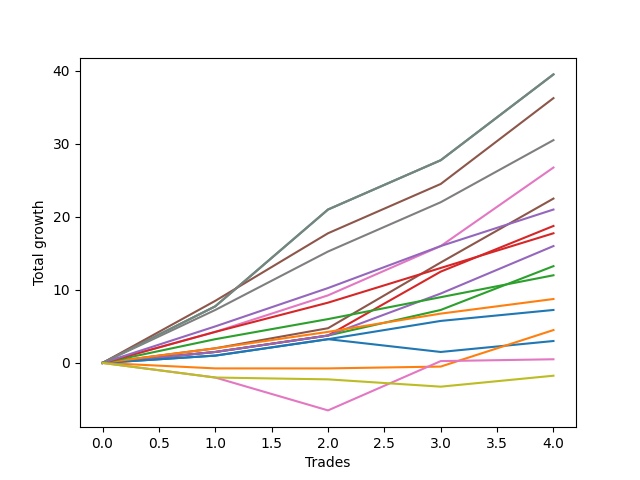

# Long Bernese 003 1v SB 
- Symbol: ES
- Date Range: 03/18/2022 - 12/30/2022
- Trading Period: 8:30-12:30
- Number of Trades: 4



| Name | Win Percent | Profit | Avg Profit / Trade | Avg Time / Trade |      | Name | Win Percent | Profit | Avg Profit / Trade | Avg Time / Trade |
| ---- | ----------- | ------ | ------------------ | ---------------- | ---- | ---- | ----------- | ------ | ------------------ | ---------------- |
| Sorted By <br> Profit | | | | | | Sorted By <br> Win Percentage ||||
| MALAMUTE 001 | 100.00 | 19750.00 | 4937.50 | 52:56 |     | MALAMUTE 001 | 100.00 | 19750.00 | 4937.50 | 52:56 |
| BB100 | 100.00 | 19750.00 | 4937.50 | 52:56 |     | BB100 | 100.00 | 19750.00 | 4937.50 | 52:56 |
| Seven | 100.00 | 19750.00 | 4937.50 | 52:56 |     | Seven | 100.00 | 19750.00 | 4937.50 | 52:56 |
| NEWFI 000 | 100.00 | 18125.00 | 4531.25 | 51:46 |     | NEWFI 000 | 100.00 | 18125.00 | 4531.25 | 51:46 |
| Six | 100.00 | 15250.00 | 3812.50 | 32:57 |     | Six | 100.00 | 15250.00 | 3812.50 | 32:57 |
| Five | 100.00 | 13375.00 | 3343.75 | 37:00 |     | Five | 100.00 | 13375.00 | 3343.75 | 37:00 |
| Four | 100.00 | 11250.00 | 2812.50 | 31:41 |     | Four | 100.00 | 11250.00 | 2812.50 | 31:41 |
| Eighty-Five | 100.00 | 10500.00 | 2625.00 | 27:36 |     | Eighty-Five | 100.00 | 10500.00 | 2625.00 | 27:36 |
| Two_C | 100.00 | 9375.00 | 2343.75 | 21:12 |     | Two_C | 100.00 | 9375.00 | 2343.75 | 21:12 |
| Eighty-Four | 100.00 | 8875.00 | 2218.75 | 19:53 |     | Eighty-Four | 100.00 | 8875.00 | 2218.75 | 19:53 |
| Three | 100.00 | 8000.00 | 2000.00 | 21:10 |     | Three | 100.00 | 8000.00 | 2000.00 | 21:10 |
| Two | 100.00 | 6625.00 | 1656.25 | 17:31 |     | Two | 100.00 | 6625.00 | 1656.25 | 17:31 |
| Eighty-Three | 100.00 | 6000.00 | 1500.00 | 14:47 |     | Eighty-Three | 100.00 | 6000.00 | 1500.00 | 14:47 |
| Eighty-Two | 100.00 | 4375.00 | 1093.75 | 03:12 |     | Eighty-Two | 100.00 | 4375.00 | 1093.75 | 03:12 |
| Eighty-One | 100.00 | 3625.00 | 906.25 | 02:53 |     | Eighty-One | 100.00 | 3625.00 | 906.25 | 02:53 |
| One | 75.00 | 2250.00 | 562.50 | 13:01 |     | One | 75.00 | 2250.00 | 562.50 | 13:01 |
| Zero | 75.00 | 1500.00 | 375.00 | 02:27 |     | Zero | 75.00 | 1500.00 | 375.00 | 02:27 |
| NEWFI 0000 | 50.00 | 250.00 | 62.50 | 11:18 |     | NEWFI 0000 | 50.00 | 250.00 | 62.50 | 11:18 |
| MALAMUTE 002 | 25.00 | -875.00 | -218.75 | 07:20 |     | MALAMUTE 002 | 25.00 | -875.00 | -218.75 | 07:20 |

## NO STOPLOSS

### Test Zero
* Sell when price hits the middle line of the 20p bollinger
* No Stoploss
* Results:
```
Total Trades: 4
Percent Up: 75.00
Percent Down: 25.00
Total Points Moved Up: 3.00
Potential Profit: 1500.00
Total Points Ups: 4.75 Count Ups: 3
Total Points Downs: -1.75 Count Downs: 1
```

<details><summary>Trades</summary>

<code>In: 2022-07-08 09:45:00		Out: 2022-07-08 09:49:05		Total Position Time: 04:05		Total Move Up: 1.00		Total to Date: 1.00</code> <br />
<code>In: 2022-07-08 09:48:00		Out: 2022-07-08 09:49:10		Total Position Time: 01:10		Total Move Up: 2.25		Total to Date: 3.25</code> <br />
<code>In: 2022-10-11 12:18:00		Out: 2022-10-11 12:19:10		Total Position Time: 01:10		Total Move Up: -1.75		Total to Date: 1.50</code> <br />
<code>In: 2022-11-11 08:33:00		Out: 2022-11-11 08:36:25		Total Position Time: 03:25		Total Move Up: 1.50		Total to Date: 3.00</code> <br />


</details>

### Test One
* Sell when the price hits the upper line of the 20p 1std bollinger
* No Stoploss
* Results:
```
Total Trades: 4
Percent Up: 75.00
Percent Down: 25.00
Total Points Moved Up: 4.50
Potential Profit: 2250.00
Total Points Ups: 5.25 Count Ups: 3
Total Points Downs: -0.75 Count Downs: 1
```

<details><summary>Trades</summary>

<code>In: 2022-07-08 09:45:00		Out: 2022-07-08 10:06:55		Total Position Time: 21:55		Total Move Up: -0.75		Total to Date: -0.75</code> <br />
<code>In: 2022-07-08 09:48:00		Out: 2022-07-08 10:06:55		Total Position Time: 18:55		Total Move Up: 0.00		Total to Date: -0.75</code> <br />
<code>In: 2022-10-11 12:18:00		Out: 2022-10-11 12:20:40		Total Position Time: 02:40		Total Move Up: 0.25		Total to Date: -0.50</code> <br />
<code>In: 2022-11-11 08:33:00		Out: 2022-11-11 08:41:35		Total Position Time: 08:35		Total Move Up: 5.00		Total to Date: 4.50</code> <br />


</details>

### Test Two
* Sell when the price hits the upper line of the 20p 2std bollinger
* No Stoploss
* Results:
```
Total Trades: 4
Percent Up: 100.00
Percent Down: 0.00
Total Points Moved Up: 13.25
Potential Profit: 6625.00
Total Points Ups: 13.25 Count Ups: 4
Total Points Downs: 0.00 Count Downs: 0
```

<details><summary>Trades</summary>

<code>In: 2022-07-08 09:45:00		Out: 2022-07-08 10:11:05		Total Position Time: 26:05		Total Move Up: 1.50		Total to Date: 1.50</code> <br />
<code>In: 2022-07-08 09:48:00		Out: 2022-07-08 10:11:05		Total Position Time: 23:05		Total Move Up: 2.25		Total to Date: 3.75</code> <br />
<code>In: 2022-10-11 12:18:00		Out: 2022-10-11 12:22:35		Total Position Time: 04:35		Total Move Up: 3.50		Total to Date: 7.25</code> <br />
<code>In: 2022-11-11 08:33:00		Out: 2022-11-11 08:49:20		Total Position Time: 16:20		Total Move Up: 6.00		Total to Date: 13.25</code> <br />


</details>

### Test Two_C
* Sell when the price hits the upper line of the 20p 2std bollinger
* No Stoploss
* Results:
```
Total Trades: 4
Percent Up: 100.00
Percent Down: 0.00
Total Points Moved Up: 18.75
Potential Profit: 9375.00
Total Points Ups: 18.75 Count Ups: 4
Total Points Downs: 0.00 Count Downs: 0
```

<details><summary>Trades</summary>

<code>In: 2022-07-08 09:45:00		Out: 2022-07-08 10:11:05		Total Position Time: 26:05		Total Move Up: 1.50		Total to Date: 1.50</code> <br />
<code>In: 2022-07-08 09:48:00		Out: 2022-07-08 10:11:05		Total Position Time: 23:05		Total Move Up: 2.25		Total to Date: 3.75</code> <br />
<code>In: 2022-10-11 12:18:00		Out: 2022-10-11 12:37:00		Total Position Time: 19:00		Total Move Up: 8.75		Total to Date: 12.50</code> <br />
<code>In: 2022-11-11 08:33:00		Out: 2022-11-11 08:49:40		Total Position Time: 16:40		Total Move Up: 6.25		Total to Date: 18.75</code> <br />


</details>

### Test Three
* Sell when price hits the middle line of the 50p bollinger
* No Stoploss
* Results:
```
Total Trades: 4
Percent Up: 100.00
Percent Down: 0.00
Total Points Moved Up: 16.00
Potential Profit: 8000.00
Total Points Ups: 16.00 Count Ups: 4
Total Points Downs: 0.00 Count Downs: 0
```

<details><summary>Trades</summary>

<code>In: 2022-07-08 09:45:00		Out: 2022-07-08 10:11:10		Total Position Time: 26:10		Total Move Up: 1.50		Total to Date: 1.50</code> <br />
<code>In: 2022-07-08 09:48:00		Out: 2022-07-08 10:11:10		Total Position Time: 23:10		Total Move Up: 2.25		Total to Date: 3.75</code> <br />
<code>In: 2022-10-11 12:18:00		Out: 2022-10-11 12:36:35		Total Position Time: 18:35		Total Move Up: 5.75		Total to Date: 9.50</code> <br />
<code>In: 2022-11-11 08:33:00		Out: 2022-11-11 08:49:45		Total Position Time: 16:45		Total Move Up: 6.50		Total to Date: 16.00</code> <br />


</details>

### Test Four
* Sell when the price hits the upper line of the 50p 1std bollinger
* No Stoploss
* Results:
```
Total Trades: 4
Percent Up: 100.00
Percent Down: 0.00
Total Points Moved Up: 22.50
Potential Profit: 11250.00
Total Points Ups: 22.50 Count Ups: 4
Total Points Downs: 0.00 Count Downs: 0
```

<details><summary>Trades</summary>

<code>In: 2022-07-08 09:45:00		Out: 2022-07-08 10:26:30		Total Position Time: 41:30		Total Move Up: 2.00		Total to Date: 2.00</code> <br />
<code>In: 2022-07-08 09:48:00		Out: 2022-07-08 10:26:30		Total Position Time: 38:30		Total Move Up: 2.75		Total to Date: 4.75</code> <br />
<code>In: 2022-10-11 12:18:00		Out: 2022-10-11 12:39:25		Total Position Time: 21:25		Total Move Up: 9.00		Total to Date: 13.75</code> <br />
<code>In: 2022-11-11 08:33:00		Out: 2022-11-11 08:58:20		Total Position Time: 25:20		Total Move Up: 8.75		Total to Date: 22.50</code> <br />


</details>

### Test Five
* Sell when the price hits the upper line of the 50p 2std bollinger
* No Stoploss
* Results:
```
Total Trades: 4
Percent Up: 100.00
Percent Down: 0.00
Total Points Moved Up: 26.75
Potential Profit: 13375.00
Total Points Ups: 26.75 Count Ups: 4
Total Points Downs: 0.00 Count Downs: 0
```

<details><summary>Trades</summary>

<code>In: 2022-07-08 09:45:00		Out: 2022-07-08 10:27:00		Total Position Time: 42:00		Total Move Up: 4.25		Total to Date: 4.25</code> <br />
<code>In: 2022-07-08 09:48:00		Out: 2022-07-08 10:27:00		Total Position Time: 39:00		Total Move Up: 5.00		Total to Date: 9.25</code> <br />
<code>In: 2022-10-11 12:18:00		Out: 2022-10-11 12:47:00		Total Position Time: 29:00		Total Move Up: 6.75		Total to Date: 16.00</code> <br />
<code>In: 2022-11-11 08:33:00		Out: 2022-11-11 09:11:00		Total Position Time: 38:00		Total Move Up: 10.75		Total to Date: 26.75</code> <br />


</details>

### Test Six
* Sell when the price hits the middle line of the 1std VWAP
* No Stoploss
* Results:
```
Total Trades: 4
Percent Up: 100.00
Percent Down: 0.00
Total Points Moved Up: 30.50
Potential Profit: 15250.00
Total Points Ups: 30.50 Count Ups: 4
Total Points Downs: 0.00 Count Downs: 0
```

<details><summary>Trades</summary>

<code>In: 2022-07-08 09:45:00		Out: 2022-07-08 10:29:10		Total Position Time: 44:10		Total Move Up: 7.25		Total to Date: 7.25</code> <br />
<code>In: 2022-07-08 09:48:00		Out: 2022-07-08 10:29:10		Total Position Time: 41:10		Total Move Up: 8.00		Total to Date: 15.25</code> <br />
<code>In: 2022-10-11 12:18:00		Out: 2022-10-11 12:47:00		Total Position Time: 29:00		Total Move Up: 6.75		Total to Date: 22.00</code> <br />
<code>In: 2022-11-11 08:33:00		Out: 2022-11-11 08:50:30		Total Position Time: 17:30		Total Move Up: 8.50		Total to Date: 30.50</code> <br />


</details>

### Test Seven
* Sell when the price hits the upper line of the 1std VWAP
* No Stoploss
* Results:
```
Total Trades: 4
Percent Up: 100.00
Percent Down: 0.00
Total Points Moved Up: 39.50
Potential Profit: 19750.00
Total Points Ups: 39.50 Count Ups: 4
Total Points Downs: 0.00 Count Downs: 0
```

<details><summary>Trades</summary>

<code>In: 2022-07-08 09:45:00		Out: 2022-07-08 10:45:55		Total Position Time: 60:55		Total Move Up: 7.75		Total to Date: 7.75</code> <br />
<code>In: 2022-07-08 09:48:00		Out: 2022-07-08 10:48:55		Total Position Time: 60:55		Total Move Up: 13.25		Total to Date: 21.00</code> <br />
<code>In: 2022-10-11 12:18:00		Out: 2022-10-11 12:47:00		Total Position Time: 29:00		Total Move Up: 6.75		Total to Date: 27.75</code> <br />
<code>In: 2022-11-11 08:33:00		Out: 2022-11-11 09:33:55		Total Position Time: 60:55		Total Move Up: 11.75		Total to Date: 39.50</code> <br />


</details>

### Test BB100
* Move to BB100 Upper Band
* No Stoploss
* Results:
```
Total Trades: 4
Percent Up: 100.00
Percent Down: 0.00
Total Points Moved Up: 39.50
Potential Profit: 19750.00
Total Points Ups: 39.50 Count Ups: 4
Total Points Downs: 0.00 Count Downs: 0
```

<details><summary>Trades</summary>

<code>In: 2022-07-08 09:45:00		Out: 2022-07-08 10:45:55		Total Position Time: 60:55		Total Move Up: 7.75		Total to Date: 7.75</code> <br />
<code>In: 2022-07-08 09:48:00		Out: 2022-07-08 10:48:55		Total Position Time: 60:55		Total Move Up: 13.25		Total to Date: 21.00</code> <br />
<code>In: 2022-10-11 12:18:00		Out: 2022-10-11 12:47:00		Total Position Time: 29:00		Total Move Up: 6.75		Total to Date: 27.75</code> <br />
<code>In: 2022-11-11 08:33:00		Out: 2022-11-11 09:33:55		Total Position Time: 60:55		Total Move Up: 11.75		Total to Date: 39.50</code> <br />


</details>

## TAKE PROFIT

### Test Eighty-One
* Take Profit of 1 Point
* No Stoploss
* Results:
```
Total Trades: 4
Percent Up: 100.00
Percent Down: 0.00
Total Points Moved Up: 7.25
Potential Profit: 3625.00
Total Points Ups: 7.25 Count Ups: 4
Total Points Downs: 0.00 Count Downs: 0
```

<details><summary>Trades</summary>

<code>In: 2022-07-08 09:45:00		Out: 2022-07-08 09:48:40		Total Position Time: 03:40		Total Move Up: 1.00		Total to Date: 1.00</code> <br />
<code>In: 2022-07-08 09:48:00		Out: 2022-07-08 09:49:10		Total Position Time: 01:10		Total Move Up: 2.25		Total to Date: 3.25</code> <br />
<code>In: 2022-10-11 12:18:00		Out: 2022-10-11 12:21:25		Total Position Time: 03:25		Total Move Up: 2.50		Total to Date: 5.75</code> <br />
<code>In: 2022-11-11 08:33:00		Out: 2022-11-11 08:36:20		Total Position Time: 03:20		Total Move Up: 1.50		Total to Date: 7.25</code> <br />


</details>

### Test Eighty-Two
* Take Profit of 2 Point
* No Stoploss
* Results:
```
Total Trades: 4
Percent Up: 100.00
Percent Down: 0.00
Total Points Moved Up: 8.75
Potential Profit: 4375.00
Total Points Ups: 8.75 Count Ups: 4
Total Points Downs: 0.00 Count Downs: 0
```

<details><summary>Trades</summary>

<code>In: 2022-07-08 09:45:00		Out: 2022-07-08 09:49:45		Total Position Time: 04:45		Total Move Up: 2.00		Total to Date: 2.00</code> <br />
<code>In: 2022-07-08 09:48:00		Out: 2022-07-08 09:49:10		Total Position Time: 01:10		Total Move Up: 2.25		Total to Date: 4.25</code> <br />
<code>In: 2022-10-11 12:18:00		Out: 2022-10-11 12:21:25		Total Position Time: 03:25		Total Move Up: 2.50		Total to Date: 6.75</code> <br />
<code>In: 2022-11-11 08:33:00		Out: 2022-11-11 08:36:30		Total Position Time: 03:30		Total Move Up: 2.00		Total to Date: 8.75</code> <br />


</details>

### Test Eighty-Three
* Take Profit of 3 Point
* No Stoploss
* Results:
```
Total Trades: 4
Percent Up: 100.00
Percent Down: 0.00
Total Points Moved Up: 12.00
Potential Profit: 6000.00
Total Points Ups: 12.00 Count Ups: 4
Total Points Downs: 0.00 Count Downs: 0
```

<details><summary>Trades</summary>

<code>In: 2022-07-08 09:45:00		Out: 2022-07-08 10:12:25		Total Position Time: 27:25		Total Move Up: 3.25		Total to Date: 3.25</code> <br />
<code>In: 2022-07-08 09:48:00		Out: 2022-07-08 10:11:20		Total Position Time: 23:20		Total Move Up: 2.75		Total to Date: 6.00</code> <br />
<code>In: 2022-10-11 12:18:00		Out: 2022-10-11 12:21:30		Total Position Time: 03:30		Total Move Up: 3.00		Total to Date: 9.00</code> <br />
<code>In: 2022-11-11 08:33:00		Out: 2022-11-11 08:37:55		Total Position Time: 04:55		Total Move Up: 3.00		Total to Date: 12.00</code> <br />


</details>

### Test Eighty-Four
* Take Profit of 4 Point
* No Stoploss
* Results:
```
Total Trades: 4
Percent Up: 100.00
Percent Down: 0.00
Total Points Moved Up: 17.75
Potential Profit: 8875.00
Total Points Ups: 17.75 Count Ups: 4
Total Points Downs: 0.00 Count Downs: 0
```

<details><summary>Trades</summary>

<code>In: 2022-07-08 09:45:00		Out: 2022-07-08 10:27:00		Total Position Time: 42:00		Total Move Up: 4.25		Total to Date: 4.25</code> <br />
<code>In: 2022-07-08 09:48:00		Out: 2022-07-08 10:12:25		Total Position Time: 24:25		Total Move Up: 4.00		Total to Date: 8.25</code> <br />
<code>In: 2022-10-11 12:18:00		Out: 2022-10-11 12:22:40		Total Position Time: 04:40		Total Move Up: 4.75		Total to Date: 13.00</code> <br />
<code>In: 2022-11-11 08:33:00		Out: 2022-11-11 08:41:30		Total Position Time: 08:30		Total Move Up: 4.75		Total to Date: 17.75</code> <br />


</details>

### Test Eighty-Five
* Take Profit of 5 Point
* No Stoploss
* Results:
```
Total Trades: 4
Percent Up: 100.00
Percent Down: 0.00
Total Points Moved Up: 21.00
Potential Profit: 10500.00
Total Points Ups: 21.00 Count Ups: 4
Total Points Downs: 0.00 Count Downs: 0
```

<details><summary>Trades</summary>

<code>In: 2022-07-08 09:45:00		Out: 2022-07-08 10:28:10		Total Position Time: 43:10		Total Move Up: 5.00		Total to Date: 5.00</code> <br />
<code>In: 2022-07-08 09:48:00		Out: 2022-07-08 10:28:05		Total Position Time: 40:05		Total Move Up: 5.25		Total to Date: 10.25</code> <br />
<code>In: 2022-10-11 12:18:00		Out: 2022-10-11 12:36:35		Total Position Time: 18:35		Total Move Up: 5.75		Total to Date: 16.00</code> <br />
<code>In: 2022-11-11 08:33:00		Out: 2022-11-11 08:41:35		Total Position Time: 08:35		Total Move Up: 5.00		Total to Date: 21.00</code> <br />


</details>

## Indicator Exits

### Test NEWFI 000
* Newfi 0000
* No Stoploss
* Results:
```
Total Trades: 4
Percent Up: 100.00
Percent Down: 0.00
Total Points Moved Up: 36.25
Potential Profit: 18125.00
Total Points Ups: 36.25 Count Ups: 4
Total Points Downs: 0.00 Count Downs: 0
```

<details><summary>Trades</summary>

<code>In: 2022-07-08 09:45:00		Out: 2022-07-08 10:45:05		Total Position Time: 60:05		Total Move Up: 8.50		Total to Date: 8.50</code> <br />
<code>In: 2022-07-08 09:48:00		Out: 2022-07-08 10:45:05		Total Position Time: 57:05		Total Move Up: 9.25		Total to Date: 17.75</code> <br />
<code>In: 2022-10-11 12:18:00		Out: 2022-10-11 12:47:00		Total Position Time: 29:00		Total Move Up: 6.75		Total to Date: 24.50</code> <br />
<code>In: 2022-11-11 08:33:00		Out: 2022-11-11 09:33:55		Total Position Time: 60:55		Total Move Up: 11.75		Total to Date: 36.25</code> <br />


</details>

### Test NEWFI 0000
* Newfi 0000
* No Stoploss
* Results:
```
Total Trades: 4
Percent Up: 50.00
Percent Down: 50.00
Total Points Moved Up: 0.50
Potential Profit: 250.00
Total Points Ups: 7.00 Count Ups: 2
Total Points Downs: -6.50 Count Downs: 2
```

<details><summary>Trades</summary>

<code>In: 2022-07-08 09:45:00		Out: 2022-07-08 09:46:05		Total Position Time: 01:05		Total Move Up: -2.00		Total to Date: -2.00</code> <br />
<code>In: 2022-07-08 09:48:00		Out: 2022-07-08 10:02:05		Total Position Time: 14:05		Total Move Up: -4.50		Total to Date: -6.50</code> <br />
<code>In: 2022-10-11 12:18:00		Out: 2022-10-11 12:47:00		Total Position Time: 29:00		Total Move Up: 6.75		Total to Date: 0.25</code> <br />
<code>In: 2022-11-11 08:33:00		Out: 2022-11-11 08:34:05		Total Position Time: 01:05		Total Move Up: 0.25		Total to Date: 0.50</code> <br />


</details>

### Test MALAMUTE 001
* Malamute 001
* No Stoploss
* Results:
```
Total Trades: 4
Percent Up: 100.00
Percent Down: 0.00
Total Points Moved Up: 39.50
Potential Profit: 19750.00
Total Points Ups: 39.50 Count Ups: 4
Total Points Downs: 0.00 Count Downs: 0
```

<details><summary>Trades</summary>

<code>In: 2022-07-08 09:45:00		Out: 2022-07-08 10:45:55		Total Position Time: 60:55		Total Move Up: 7.75		Total to Date: 7.75</code> <br />
<code>In: 2022-07-08 09:48:00		Out: 2022-07-08 10:48:55		Total Position Time: 60:55		Total Move Up: 13.25		Total to Date: 21.00</code> <br />
<code>In: 2022-10-11 12:18:00		Out: 2022-10-11 12:47:00		Total Position Time: 29:00		Total Move Up: 6.75		Total to Date: 27.75</code> <br />
<code>In: 2022-11-11 08:33:00		Out: 2022-11-11 09:33:55		Total Position Time: 60:55		Total Move Up: 11.75		Total to Date: 39.50</code> <br />


</details>

### Test MALAMUTE 002
* Malamute 001
* No Stoploss
* Results:
```
Total Trades: 4
Percent Up: 25.00
Percent Down: 75.00
Total Points Moved Up: -1.75
Potential Profit: -875.00
Total Points Ups: 1.50 Count Ups: 1
Total Points Downs: -3.25 Count Downs: 3
```

<details><summary>Trades</summary>

<code>In: 2022-07-08 09:45:00		Out: 2022-07-08 09:46:05		Total Position Time: 01:05		Total Move Up: -2.00		Total to Date: -2.00</code> <br />
<code>In: 2022-07-08 09:48:00		Out: 2022-07-08 09:53:05		Total Position Time: 05:05		Total Move Up: -0.25		Total to Date: -2.25</code> <br />
<code>In: 2022-10-11 12:18:00		Out: 2022-10-11 12:28:05		Total Position Time: 10:05		Total Move Up: -1.00		Total to Date: -3.25</code> <br />
<code>In: 2022-11-11 08:33:00		Out: 2022-11-11 08:46:05		Total Position Time: 13:05		Total Move Up: 1.50		Total to Date: -1.75</code> <br />


</details>