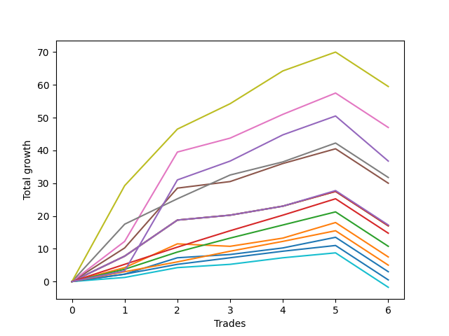

# Long Bernese 003 1v 
- Symbol: ES
- Date Range: 03/18/2022 - 12/30/2022
- Trading Period: 8:30-12:30
- Number of Trades: 3



| Name | Win Percent | Profit | Avg Profit / Trade | Avg Time / Trade |      | Name | Win Percent | Profit | Avg Profit / Trade | Avg Time / Trade |
| ---- | ----------- | ------ | ------------------ | ---------------- | ---- | ---- | ----------- | ------ | ------------------ | ---------------- |
| Sorted By <br> Profit | | | | | | Sorted By <br> Win Percentage ||||
| MALAMUTE 001 | 100.00 | 19625.00 | 6541.67 | 57:36 |     | MALAMUTE 001 | 100.00 | 19625.00 | 6541.67 | 57:36 |
| Seven | 100.00 | 19625.00 | 6541.67 | 57:36 |     | Seven | 100.00 | 19625.00 | 6541.67 | 57:36 |
| BB100 | 100.00 | 19375.00 | 6458.33 | 57:25 |     | BB100 | 100.00 | 19375.00 | 6458.33 | 57:25 |
| NEWFI 000 | 100.00 | 18000.00 | 6000.00 | 56:03 |     | NEWFI 000 | 100.00 | 18000.00 | 6000.00 | 56:03 |
| Six | 100.00 | 16750.00 | 5583.33 | 45:26 |     | Six | 100.00 | 16750.00 | 5583.33 | 45:26 |
| Eighty-Five | 100.00 | 7750.00 | 2583.33 | 39:53 |     | Eighty-Five | 100.00 | 7750.00 | 2583.33 | 39:53 |
| Five | 100.00 | 7750.00 | 2583.33 | 39:11 |     | Five | 100.00 | 7750.00 | 2583.33 | 39:11 |
| Eighty-Four | 100.00 | 6125.00 | 2041.67 | 34:10 |     | Eighty-Four | 100.00 | 6125.00 | 2041.67 | 34:10 |
| Eighty-Three | 100.00 | 4375.00 | 1458.33 | 26:06 |     | Eighty-Three | 100.00 | 4375.00 | 1458.33 | 26:06 |
| Four | 100.00 | 3750.00 | 1250.00 | 35:51 |     | Four | 100.00 | 3750.00 | 1250.00 | 35:51 |
| Eighty-Two | 100.00 | 3125.00 | 1041.67 | 08:41 |     | Eighty-Two | 100.00 | 3125.00 | 1041.67 | 08:41 |
| Two_C | 100.00 | 2250.00 | 750.00 | 22:13 |     | Two_C | 100.00 | 2250.00 | 750.00 | 22:13 |
| Two | 100.00 | 2250.00 | 750.00 | 22:00 |     | Two | 100.00 | 2250.00 | 750.00 | 22:00 |
| Eighty-One | 100.00 | 2000.00 | 666.67 | 07:26 |     | Eighty-One | 100.00 | 2000.00 | 666.67 | 07:26 |
| Three | 66.67 | 1625.00 | 541.67 | 21:58 |     | Three | 66.67 | 1625.00 | 541.67 | 21:58 |
| Zero | 66.67 | -750.00 | -250.00 | 06:55 |     | Zero | 66.67 | -750.00 | -250.00 | 06:55 |
| One | 33.33 | -1625.00 | -541.67 | 19:00 |     | One | 33.33 | -1625.00 | -541.67 | 19:00 |
| MALAMUTE 002 | 0.00 | -2500.00 | -833.33 | 02:25 |     | MALAMUTE 002 | 0.00 | -2500.00 | -833.33 | 02:25 |
| NEWFI 0000 | 0.00 | -4625.00 | -1541.67 | 05:25 |     | NEWFI 0000 | 0.00 | -4625.00 | -1541.67 | 05:25 |

## NO STOPLOSS

### Test Zero
* Sell when price hits the middle line of the 20p bollinger
* No Stoploss
* Results:
```
Total Trades: 3
Percent Up: 66.67
Percent Down: 33.33
Total Points Moved Up: -1.50
Potential Profit: -750.00
Total Points Ups: 3.25 Count Ups: 2
Total Points Downs: -4.75 Count Downs: 1
```

<details><summary>Trades</summary>

<code>In: 2022-07-08 09:45:00		Out: 2022-07-08 09:49:05		Total Position Time: 04:05		Total Move Up: 1.00		Total to Date: 1.00</code> <br />
<code>In: 2022-07-08 09:48:00		Out: 2022-07-08 09:49:10		Total Position Time: 01:10		Total Move Up: 2.25		Total to Date: 3.25</code> <br />
<code>In: 2022-10-10 11:56:00		Out: 2022-10-10 12:11:30		Total Position Time: 15:30		Total Move Up: -4.75		Total to Date: -1.50</code> <br />


</details>

### Test One
* Sell when the price hits the upper line of the 20p 1std bollinger
* No Stoploss
* Results:
```
Total Trades: 3
Percent Up: 33.33
Percent Down: 66.67
Total Points Moved Up: -3.25
Potential Profit: -1625.00
Total Points Ups: 0.00 Count Ups: 1
Total Points Downs: -3.25 Count Downs: 2
```

<details><summary>Trades</summary>

<code>In: 2022-07-08 09:45:00		Out: 2022-07-08 10:06:55		Total Position Time: 21:55		Total Move Up: -0.75		Total to Date: -0.75</code> <br />
<code>In: 2022-07-08 09:48:00		Out: 2022-07-08 10:06:55		Total Position Time: 18:55		Total Move Up: 0.00		Total to Date: -0.75</code> <br />
<code>In: 2022-10-10 11:56:00		Out: 2022-10-10 12:12:10		Total Position Time: 16:10		Total Move Up: -2.50		Total to Date: -3.25</code> <br />


</details>

### Test Two
* Sell when the price hits the upper line of the 20p 2std bollinger
* No Stoploss
* Results:
```
Total Trades: 3
Percent Up: 100.00
Percent Down: 0.00
Total Points Moved Up: 4.50
Potential Profit: 2250.00
Total Points Ups: 4.50 Count Ups: 3
Total Points Downs: 0.00 Count Downs: 0
```

<details><summary>Trades</summary>

<code>In: 2022-07-08 09:45:00		Out: 2022-07-08 10:11:05		Total Position Time: 26:05		Total Move Up: 1.50		Total to Date: 1.50</code> <br />
<code>In: 2022-07-08 09:48:00		Out: 2022-07-08 10:11:05		Total Position Time: 23:05		Total Move Up: 2.25		Total to Date: 3.75</code> <br />
<code>In: 2022-10-10 11:56:00		Out: 2022-10-10 12:12:50		Total Position Time: 16:50		Total Move Up: 0.75		Total to Date: 4.50</code> <br />


</details>

### Test Two_C
* Sell when the price hits the upper line of the 20p 2std bollinger
* No Stoploss
* Results:
```
Total Trades: 3
Percent Up: 100.00
Percent Down: 0.00
Total Points Moved Up: 4.50
Potential Profit: 2250.00
Total Points Ups: 4.50 Count Ups: 3
Total Points Downs: 0.00 Count Downs: 0
```

<details><summary>Trades</summary>

<code>In: 2022-07-08 09:45:00		Out: 2022-07-08 10:11:05		Total Position Time: 26:05		Total Move Up: 1.50		Total to Date: 1.50</code> <br />
<code>In: 2022-07-08 09:48:00		Out: 2022-07-08 10:11:05		Total Position Time: 23:05		Total Move Up: 2.25		Total to Date: 3.75</code> <br />
<code>In: 2022-10-10 11:56:00		Out: 2022-10-10 12:13:30		Total Position Time: 17:30		Total Move Up: 0.75		Total to Date: 4.50</code> <br />


</details>

### Test Three
* Sell when price hits the middle line of the 50p bollinger
* No Stoploss
* Results:
```
Total Trades: 3
Percent Up: 66.67
Percent Down: 33.33
Total Points Moved Up: 3.25
Potential Profit: 1625.00
Total Points Ups: 3.75 Count Ups: 2
Total Points Downs: -0.50 Count Downs: 1
```

<details><summary>Trades</summary>

<code>In: 2022-07-08 09:45:00		Out: 2022-07-08 10:11:10		Total Position Time: 26:10		Total Move Up: 1.50		Total to Date: 1.50</code> <br />
<code>In: 2022-07-08 09:48:00		Out: 2022-07-08 10:11:10		Total Position Time: 23:10		Total Move Up: 2.25		Total to Date: 3.75</code> <br />
<code>In: 2022-10-10 11:56:00		Out: 2022-10-10 12:12:35		Total Position Time: 16:35		Total Move Up: -0.50		Total to Date: 3.25</code> <br />


</details>

### Test Four
* Sell when the price hits the upper line of the 50p 1std bollinger
* No Stoploss
* Results:
```
Total Trades: 3
Percent Up: 100.00
Percent Down: 0.00
Total Points Moved Up: 7.50
Potential Profit: 3750.00
Total Points Ups: 7.50 Count Ups: 3
Total Points Downs: 0.00 Count Downs: 0
```

<details><summary>Trades</summary>

<code>In: 2022-07-08 09:45:00		Out: 2022-07-08 10:26:30		Total Position Time: 41:30		Total Move Up: 2.00		Total to Date: 2.00</code> <br />
<code>In: 2022-07-08 09:48:00		Out: 2022-07-08 10:26:30		Total Position Time: 38:30		Total Move Up: 2.75		Total to Date: 4.75</code> <br />
<code>In: 2022-10-10 11:56:00		Out: 2022-10-10 12:23:35		Total Position Time: 27:35		Total Move Up: 2.75		Total to Date: 7.50</code> <br />


</details>

### Test Five
* Sell when the price hits the upper line of the 50p 2std bollinger
* No Stoploss
* Results:
```
Total Trades: 3
Percent Up: 100.00
Percent Down: 0.00
Total Points Moved Up: 15.50
Potential Profit: 7750.00
Total Points Ups: 15.50 Count Ups: 3
Total Points Downs: 0.00 Count Downs: 0
```

<details><summary>Trades</summary>

<code>In: 2022-07-08 09:45:00		Out: 2022-07-08 10:27:00		Total Position Time: 42:00		Total Move Up: 4.25		Total to Date: 4.25</code> <br />
<code>In: 2022-07-08 09:48:00		Out: 2022-07-08 10:27:00		Total Position Time: 39:00		Total Move Up: 5.00		Total to Date: 9.25</code> <br />
<code>In: 2022-10-10 11:56:00		Out: 2022-10-10 12:32:35		Total Position Time: 36:35		Total Move Up: 6.25		Total to Date: 15.50</code> <br />


</details>

### Test Six
* Sell when the price hits the middle line of the 1std VWAP
* No Stoploss
* Results:
```
Total Trades: 3
Percent Up: 100.00
Percent Down: 0.00
Total Points Moved Up: 33.50
Potential Profit: 16750.00
Total Points Ups: 33.50 Count Ups: 3
Total Points Downs: 0.00 Count Downs: 0
```

<details><summary>Trades</summary>

<code>In: 2022-07-08 09:45:00		Out: 2022-07-08 10:29:10		Total Position Time: 44:10		Total Move Up: 7.25		Total to Date: 7.25</code> <br />
<code>In: 2022-07-08 09:48:00		Out: 2022-07-08 10:29:10		Total Position Time: 41:10		Total Move Up: 8.00		Total to Date: 15.25</code> <br />
<code>In: 2022-10-10 11:56:00		Out: 2022-10-10 12:47:00		Total Position Time: 51:00		Total Move Up: 18.25		Total to Date: 33.50</code> <br />


</details>

### Test Seven
* Sell when the price hits the upper line of the 1std VWAP
* No Stoploss
* Results:
```
Total Trades: 3
Percent Up: 100.00
Percent Down: 0.00
Total Points Moved Up: 39.25
Potential Profit: 19625.00
Total Points Ups: 39.25 Count Ups: 3
Total Points Downs: 0.00 Count Downs: 0
```

<details><summary>Trades</summary>

<code>In: 2022-07-08 09:45:00		Out: 2022-07-08 10:45:55		Total Position Time: 60:55		Total Move Up: 7.75		Total to Date: 7.75</code> <br />
<code>In: 2022-07-08 09:48:00		Out: 2022-07-08 10:48:55		Total Position Time: 60:55		Total Move Up: 13.25		Total to Date: 21.00</code> <br />
<code>In: 2022-10-10 11:56:00		Out: 2022-10-10 12:47:00		Total Position Time: 51:00		Total Move Up: 18.25		Total to Date: 39.25</code> <br />


</details>

### Test BB100
* Move to BB100 Upper Band
* No Stoploss
* Results:
```
Total Trades: 3
Percent Up: 100.00
Percent Down: 0.00
Total Points Moved Up: 38.75
Potential Profit: 19375.00
Total Points Ups: 38.75 Count Ups: 3
Total Points Downs: 0.00 Count Downs: 0
```

<details><summary>Trades</summary>

<code>In: 2022-07-08 09:45:00		Out: 2022-07-08 10:45:55		Total Position Time: 60:55		Total Move Up: 7.75		Total to Date: 7.75</code> <br />
<code>In: 2022-07-08 09:48:00		Out: 2022-07-08 10:48:55		Total Position Time: 60:55		Total Move Up: 13.25		Total to Date: 21.00</code> <br />
<code>In: 2022-10-10 11:56:00		Out: 2022-10-10 12:46:25		Total Position Time: 50:25		Total Move Up: 17.75		Total to Date: 38.75</code> <br />


</details>

## TAKE PROFIT

### Test Eighty-One
* Take Profit of 1 Point
* No Stoploss
* Results:
```
Total Trades: 3
Percent Up: 100.00
Percent Down: 0.00
Total Points Moved Up: 4.00
Potential Profit: 2000.00
Total Points Ups: 4.00 Count Ups: 3
Total Points Downs: 0.00 Count Downs: 0
```

<details><summary>Trades</summary>

<code>In: 2022-07-08 09:45:00		Out: 2022-07-08 09:48:40		Total Position Time: 03:40		Total Move Up: 1.00		Total to Date: 1.00</code> <br />
<code>In: 2022-07-08 09:48:00		Out: 2022-07-08 09:49:10		Total Position Time: 01:10		Total Move Up: 2.25		Total to Date: 3.25</code> <br />
<code>In: 2022-10-10 11:56:00		Out: 2022-10-10 12:13:30		Total Position Time: 17:30		Total Move Up: 0.75		Total to Date: 4.00</code> <br />


</details>

### Test Eighty-Two
* Take Profit of 2 Point
* No Stoploss
* Results:
```
Total Trades: 3
Percent Up: 100.00
Percent Down: 0.00
Total Points Moved Up: 6.25
Potential Profit: 3125.00
Total Points Ups: 6.25 Count Ups: 3
Total Points Downs: 0.00 Count Downs: 0
```

<details><summary>Trades</summary>

<code>In: 2022-07-08 09:45:00		Out: 2022-07-08 09:49:45		Total Position Time: 04:45		Total Move Up: 2.00		Total to Date: 2.00</code> <br />
<code>In: 2022-07-08 09:48:00		Out: 2022-07-08 09:49:10		Total Position Time: 01:10		Total Move Up: 2.25		Total to Date: 4.25</code> <br />
<code>In: 2022-10-10 11:56:00		Out: 2022-10-10 12:16:10		Total Position Time: 20:10		Total Move Up: 2.00		Total to Date: 6.25</code> <br />


</details>

### Test Eighty-Three
* Take Profit of 3 Point
* No Stoploss
* Results:
```
Total Trades: 3
Percent Up: 100.00
Percent Down: 0.00
Total Points Moved Up: 8.75
Potential Profit: 4375.00
Total Points Ups: 8.75 Count Ups: 3
Total Points Downs: 0.00 Count Downs: 0
```

<details><summary>Trades</summary>

<code>In: 2022-07-08 09:45:00		Out: 2022-07-08 10:12:25		Total Position Time: 27:25		Total Move Up: 3.25		Total to Date: 3.25</code> <br />
<code>In: 2022-07-08 09:48:00		Out: 2022-07-08 10:11:20		Total Position Time: 23:20		Total Move Up: 2.75		Total to Date: 6.00</code> <br />
<code>In: 2022-10-10 11:56:00		Out: 2022-10-10 12:23:35		Total Position Time: 27:35		Total Move Up: 2.75		Total to Date: 8.75</code> <br />


</details>

### Test Eighty-Four
* Take Profit of 4 Point
* No Stoploss
* Results:
```
Total Trades: 3
Percent Up: 100.00
Percent Down: 0.00
Total Points Moved Up: 12.25
Potential Profit: 6125.00
Total Points Ups: 12.25 Count Ups: 3
Total Points Downs: 0.00 Count Downs: 0
```

<details><summary>Trades</summary>

<code>In: 2022-07-08 09:45:00		Out: 2022-07-08 10:27:00		Total Position Time: 42:00		Total Move Up: 4.25		Total to Date: 4.25</code> <br />
<code>In: 2022-07-08 09:48:00		Out: 2022-07-08 10:12:25		Total Position Time: 24:25		Total Move Up: 4.00		Total to Date: 8.25</code> <br />
<code>In: 2022-10-10 11:56:00		Out: 2022-10-10 12:32:05		Total Position Time: 36:05		Total Move Up: 4.00		Total to Date: 12.25</code> <br />


</details>

### Test Eighty-Five
* Take Profit of 5 Point
* No Stoploss
* Results:
```
Total Trades: 3
Percent Up: 100.00
Percent Down: 0.00
Total Points Moved Up: 15.50
Potential Profit: 7750.00
Total Points Ups: 15.50 Count Ups: 3
Total Points Downs: 0.00 Count Downs: 0
```

<details><summary>Trades</summary>

<code>In: 2022-07-08 09:45:00		Out: 2022-07-08 10:28:10		Total Position Time: 43:10		Total Move Up: 5.00		Total to Date: 5.00</code> <br />
<code>In: 2022-07-08 09:48:00		Out: 2022-07-08 10:28:05		Total Position Time: 40:05		Total Move Up: 5.25		Total to Date: 10.25</code> <br />
<code>In: 2022-10-10 11:56:00		Out: 2022-10-10 12:32:25		Total Position Time: 36:25		Total Move Up: 5.25		Total to Date: 15.50</code> <br />


</details>

## Indicator Exits

### Test NEWFI 000
* Newfi 0000
* No Stoploss
* Results:
```
Total Trades: 3
Percent Up: 100.00
Percent Down: 0.00
Total Points Moved Up: 36.00
Potential Profit: 18000.00
Total Points Ups: 36.00 Count Ups: 3
Total Points Downs: 0.00 Count Downs: 0
```

<details><summary>Trades</summary>

<code>In: 2022-07-08 09:45:00		Out: 2022-07-08 10:45:05		Total Position Time: 60:05		Total Move Up: 8.50		Total to Date: 8.50</code> <br />
<code>In: 2022-07-08 09:48:00		Out: 2022-07-08 10:45:05		Total Position Time: 57:05		Total Move Up: 9.25		Total to Date: 17.75</code> <br />
<code>In: 2022-10-10 11:56:00		Out: 2022-10-10 12:47:00		Total Position Time: 51:00		Total Move Up: 18.25		Total to Date: 36.00</code> <br />


</details>

### Test NEWFI 0000
* Newfi 0000
* No Stoploss
* Results:
```
Total Trades: 3
Percent Up: 0.00
Percent Down: 100.00
Total Points Moved Up: -9.25
Potential Profit: -4625.00
Total Points Ups: 0.00 Count Ups: 0
Total Points Downs: -9.25 Count Downs: 3
```

<details><summary>Trades</summary>

<code>In: 2022-07-08 09:45:00		Out: 2022-07-08 09:46:05		Total Position Time: 01:05		Total Move Up: -2.00		Total to Date: -2.00</code> <br />
<code>In: 2022-07-08 09:48:00		Out: 2022-07-08 10:02:05		Total Position Time: 14:05		Total Move Up: -4.50		Total to Date: -6.50</code> <br />
<code>In: 2022-10-10 11:56:00		Out: 2022-10-10 11:57:05		Total Position Time: 01:05		Total Move Up: -2.75		Total to Date: -9.25</code> <br />


</details>

### Test MALAMUTE 001
* Malamute 001
* No Stoploss
* Results:
```
Total Trades: 3
Percent Up: 100.00
Percent Down: 0.00
Total Points Moved Up: 39.25
Potential Profit: 19625.00
Total Points Ups: 39.25 Count Ups: 3
Total Points Downs: 0.00 Count Downs: 0
```

<details><summary>Trades</summary>

<code>In: 2022-07-08 09:45:00		Out: 2022-07-08 10:45:55		Total Position Time: 60:55		Total Move Up: 7.75		Total to Date: 7.75</code> <br />
<code>In: 2022-07-08 09:48:00		Out: 2022-07-08 10:48:55		Total Position Time: 60:55		Total Move Up: 13.25		Total to Date: 21.00</code> <br />
<code>In: 2022-10-10 11:56:00		Out: 2022-10-10 12:47:00		Total Position Time: 51:00		Total Move Up: 18.25		Total to Date: 39.25</code> <br />


</details>

### Test MALAMUTE 002
* Malamute 001
* No Stoploss
* Results:
```
Total Trades: 3
Percent Up: 0.00
Percent Down: 100.00
Total Points Moved Up: -5.00
Potential Profit: -2500.00
Total Points Ups: 0.00 Count Ups: 0
Total Points Downs: -5.00 Count Downs: 3
```

<details><summary>Trades</summary>

<code>In: 2022-07-08 09:45:00		Out: 2022-07-08 09:46:05		Total Position Time: 01:05		Total Move Up: -2.00		Total to Date: -2.00</code> <br />
<code>In: 2022-07-08 09:48:00		Out: 2022-07-08 09:53:05		Total Position Time: 05:05		Total Move Up: -0.25		Total to Date: -2.25</code> <br />
<code>In: 2022-10-10 11:56:00		Out: 2022-10-10 11:57:05		Total Position Time: 01:05		Total Move Up: -2.75		Total to Date: -5.00</code> <br />


</details>