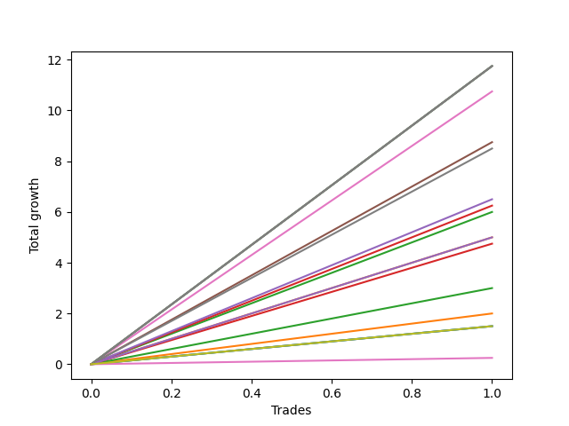

# Long Bernese 003 50 SB 
- Symbol: ES
- Date Range: 09/26/2022 - 12/30/2022
- Trading Period: 8:30-12:30
- Number of Trades: 1



| Name | Win Percent | Profit | Avg Profit / Trade | Avg Time / Trade |      | Name | Win Percent | Profit | Avg Profit / Trade | Avg Time / Trade |
| ---- | ----------- | ------ | ------------------ | ---------------- | ---- | ---- | ----------- | ------ | ------------------ | ---------------- |
| Sorted By <br> Profit | | | | | | Sorted By <br> Win Percentage ||||
| MALAMUTE 001 | 100.00 | 5875.00 | 5875.00 | 60:55 |     | MALAMUTE 001 | 100.00 | 5875.00 | 5875.00 | 60:55 |
| NEWFI 000 | 100.00 | 5875.00 | 5875.00 | 60:55 |     | NEWFI 000 | 100.00 | 5875.00 | 5875.00 | 60:55 |
| BB100 | 100.00 | 5875.00 | 5875.00 | 60:55 |     | BB100 | 100.00 | 5875.00 | 5875.00 | 60:55 |
| Seven | 100.00 | 5875.00 | 5875.00 | 60:55 |     | Seven | 100.00 | 5875.00 | 5875.00 | 60:55 |
| Five | 100.00 | 5375.00 | 5375.00 | 38:00 |     | Five | 100.00 | 5375.00 | 5375.00 | 38:00 |
| Four | 100.00 | 4375.00 | 4375.00 | 25:20 |     | Four | 100.00 | 4375.00 | 4375.00 | 25:20 |
| Six | 100.00 | 4250.00 | 4250.00 | 17:30 |     | Six | 100.00 | 4250.00 | 4250.00 | 17:30 |
| Three | 100.00 | 3250.00 | 3250.00 | 16:45 |     | Three | 100.00 | 3250.00 | 3250.00 | 16:45 |
| Two_C | 100.00 | 3125.00 | 3125.00 | 16:40 |     | Two_C | 100.00 | 3125.00 | 3125.00 | 16:40 |
| Two | 100.00 | 3000.00 | 3000.00 | 16:20 |     | Two | 100.00 | 3000.00 | 3000.00 | 16:20 |
| Eighty-Five | 100.00 | 2500.00 | 2500.00 | 08:35 |     | Eighty-Five | 100.00 | 2500.00 | 2500.00 | 08:35 |
| One | 100.00 | 2500.00 | 2500.00 | 08:35 |     | One | 100.00 | 2500.00 | 2500.00 | 08:35 |
| Eighty-Four | 100.00 | 2375.00 | 2375.00 | 08:30 |     | Eighty-Four | 100.00 | 2375.00 | 2375.00 | 08:30 |
| Eighty-Three | 100.00 | 1500.00 | 1500.00 | 04:55 |     | Eighty-Three | 100.00 | 1500.00 | 1500.00 | 04:55 |
| Eighty-Two | 100.00 | 1000.00 | 1000.00 | 03:30 |     | Eighty-Two | 100.00 | 1000.00 | 1000.00 | 03:30 |
| MALAMUTE 002 | 100.00 | 750.00 | 750.00 | 13:05 |     | MALAMUTE 002 | 100.00 | 750.00 | 750.00 | 13:05 |
| Eighty-One | 100.00 | 750.00 | 750.00 | 03:20 |     | Eighty-One | 100.00 | 750.00 | 750.00 | 03:20 |
| Zero | 100.00 | 750.00 | 750.00 | 03:25 |     | Zero | 100.00 | 750.00 | 750.00 | 03:25 |
| NEWFI 0000 | 100.00 | 125.00 | 125.00 | 01:05 |     | NEWFI 0000 | 100.00 | 125.00 | 125.00 | 01:05 |

## NO STOPLOSS

### Test Zero
* Sell when price hits the middle line of the 20p bollinger
* No Stoploss
* Results:
```
Total Trades: 1
Percent Up: 100.00
Percent Down: 0.00
Total Points Moved Up: 1.50
Potential Profit: 750.00
Total Points Ups: 1.50 Count Ups: 1
Total Points Downs: 0.00 Count Downs: 0
```

<details><summary>Trades</summary>

<code>In: 2022-11-11 08:33:00		Out: 2022-11-11 08:36:25		Total Position Time: 03:25		Total Move Up: 1.50		Total to Date: 1.50</code> <br />


</details>

### Test One
* Sell when the price hits the upper line of the 20p 1std bollinger
* No Stoploss
* Results:
```
Total Trades: 1
Percent Up: 100.00
Percent Down: 0.00
Total Points Moved Up: 5.00
Potential Profit: 2500.00
Total Points Ups: 5.00 Count Ups: 1
Total Points Downs: 0.00 Count Downs: 0
```

<details><summary>Trades</summary>

<code>In: 2022-11-11 08:33:00		Out: 2022-11-11 08:41:35		Total Position Time: 08:35		Total Move Up: 5.00		Total to Date: 5.00</code> <br />


</details>

### Test Two
* Sell when the price hits the upper line of the 20p 2std bollinger
* No Stoploss
* Results:
```
Total Trades: 1
Percent Up: 100.00
Percent Down: 0.00
Total Points Moved Up: 6.00
Potential Profit: 3000.00
Total Points Ups: 6.00 Count Ups: 1
Total Points Downs: 0.00 Count Downs: 0
```

<details><summary>Trades</summary>

<code>In: 2022-11-11 08:33:00		Out: 2022-11-11 08:49:20		Total Position Time: 16:20		Total Move Up: 6.00		Total to Date: 6.00</code> <br />


</details>

### Test Two_C
* Sell when the price hits the upper line of the 20p 2std bollinger
* No Stoploss
* Results:
```
Total Trades: 1
Percent Up: 100.00
Percent Down: 0.00
Total Points Moved Up: 6.25
Potential Profit: 3125.00
Total Points Ups: 6.25 Count Ups: 1
Total Points Downs: 0.00 Count Downs: 0
```

<details><summary>Trades</summary>

<code>In: 2022-11-11 08:33:00		Out: 2022-11-11 08:49:40		Total Position Time: 16:40		Total Move Up: 6.25		Total to Date: 6.25</code> <br />


</details>

### Test Three
* Sell when price hits the middle line of the 50p bollinger
* No Stoploss
* Results:
```
Total Trades: 1
Percent Up: 100.00
Percent Down: 0.00
Total Points Moved Up: 6.50
Potential Profit: 3250.00
Total Points Ups: 6.50 Count Ups: 1
Total Points Downs: 0.00 Count Downs: 0
```

<details><summary>Trades</summary>

<code>In: 2022-11-11 08:33:00		Out: 2022-11-11 08:49:45		Total Position Time: 16:45		Total Move Up: 6.50		Total to Date: 6.50</code> <br />


</details>

### Test Four
* Sell when the price hits the upper line of the 50p 1std bollinger
* No Stoploss
* Results:
```
Total Trades: 1
Percent Up: 100.00
Percent Down: 0.00
Total Points Moved Up: 8.75
Potential Profit: 4375.00
Total Points Ups: 8.75 Count Ups: 1
Total Points Downs: 0.00 Count Downs: 0
```

<details><summary>Trades</summary>

<code>In: 2022-11-11 08:33:00		Out: 2022-11-11 08:58:20		Total Position Time: 25:20		Total Move Up: 8.75		Total to Date: 8.75</code> <br />


</details>

### Test Five
* Sell when the price hits the upper line of the 50p 2std bollinger
* No Stoploss
* Results:
```
Total Trades: 1
Percent Up: 100.00
Percent Down: 0.00
Total Points Moved Up: 10.75
Potential Profit: 5375.00
Total Points Ups: 10.75 Count Ups: 1
Total Points Downs: 0.00 Count Downs: 0
```

<details><summary>Trades</summary>

<code>In: 2022-11-11 08:33:00		Out: 2022-11-11 09:11:00		Total Position Time: 38:00		Total Move Up: 10.75		Total to Date: 10.75</code> <br />


</details>

### Test Six
* Sell when the price hits the middle line of the 1std VWAP
* No Stoploss
* Results:
```
Total Trades: 1
Percent Up: 100.00
Percent Down: 0.00
Total Points Moved Up: 8.50
Potential Profit: 4250.00
Total Points Ups: 8.50 Count Ups: 1
Total Points Downs: 0.00 Count Downs: 0
```

<details><summary>Trades</summary>

<code>In: 2022-11-11 08:33:00		Out: 2022-11-11 08:50:30		Total Position Time: 17:30		Total Move Up: 8.50		Total to Date: 8.50</code> <br />


</details>

### Test Seven
* Sell when the price hits the upper line of the 1std VWAP
* No Stoploss
* Results:
```
Total Trades: 1
Percent Up: 100.00
Percent Down: 0.00
Total Points Moved Up: 11.75
Potential Profit: 5875.00
Total Points Ups: 11.75 Count Ups: 1
Total Points Downs: 0.00 Count Downs: 0
```

<details><summary>Trades</summary>

<code>In: 2022-11-11 08:33:00		Out: 2022-11-11 09:33:55		Total Position Time: 60:55		Total Move Up: 11.75		Total to Date: 11.75</code> <br />


</details>

### Test BB100
* Move to BB100 Upper Band
* No Stoploss
* Results:
```
Total Trades: 1
Percent Up: 100.00
Percent Down: 0.00
Total Points Moved Up: 11.75
Potential Profit: 5875.00
Total Points Ups: 11.75 Count Ups: 1
Total Points Downs: 0.00 Count Downs: 0
```

<details><summary>Trades</summary>

<code>In: 2022-11-11 08:33:00		Out: 2022-11-11 09:33:55		Total Position Time: 60:55		Total Move Up: 11.75		Total to Date: 11.75</code> <br />


</details>

## TAKE PROFIT

### Test Eighty-One
* Take Profit of 1 Point
* No Stoploss
* Results:
```
Total Trades: 1
Percent Up: 100.00
Percent Down: 0.00
Total Points Moved Up: 1.50
Potential Profit: 750.00
Total Points Ups: 1.50 Count Ups: 1
Total Points Downs: 0.00 Count Downs: 0
```

<details><summary>Trades</summary>

<code>In: 2022-11-11 08:33:00		Out: 2022-11-11 08:36:20		Total Position Time: 03:20		Total Move Up: 1.50		Total to Date: 1.50</code> <br />


</details>

### Test Eighty-Two
* Take Profit of 2 Point
* No Stoploss
* Results:
```
Total Trades: 1
Percent Up: 100.00
Percent Down: 0.00
Total Points Moved Up: 2.00
Potential Profit: 1000.00
Total Points Ups: 2.00 Count Ups: 1
Total Points Downs: 0.00 Count Downs: 0
```

<details><summary>Trades</summary>

<code>In: 2022-11-11 08:33:00		Out: 2022-11-11 08:36:30		Total Position Time: 03:30		Total Move Up: 2.00		Total to Date: 2.00</code> <br />


</details>

### Test Eighty-Three
* Take Profit of 3 Point
* No Stoploss
* Results:
```
Total Trades: 1
Percent Up: 100.00
Percent Down: 0.00
Total Points Moved Up: 3.00
Potential Profit: 1500.00
Total Points Ups: 3.00 Count Ups: 1
Total Points Downs: 0.00 Count Downs: 0
```

<details><summary>Trades</summary>

<code>In: 2022-11-11 08:33:00		Out: 2022-11-11 08:37:55		Total Position Time: 04:55		Total Move Up: 3.00		Total to Date: 3.00</code> <br />


</details>

### Test Eighty-Four
* Take Profit of 4 Point
* No Stoploss
* Results:
```
Total Trades: 1
Percent Up: 100.00
Percent Down: 0.00
Total Points Moved Up: 4.75
Potential Profit: 2375.00
Total Points Ups: 4.75 Count Ups: 1
Total Points Downs: 0.00 Count Downs: 0
```

<details><summary>Trades</summary>

<code>In: 2022-11-11 08:33:00		Out: 2022-11-11 08:41:30		Total Position Time: 08:30		Total Move Up: 4.75		Total to Date: 4.75</code> <br />


</details>

### Test Eighty-Five
* Take Profit of 5 Point
* No Stoploss
* Results:
```
Total Trades: 1
Percent Up: 100.00
Percent Down: 0.00
Total Points Moved Up: 5.00
Potential Profit: 2500.00
Total Points Ups: 5.00 Count Ups: 1
Total Points Downs: 0.00 Count Downs: 0
```

<details><summary>Trades</summary>

<code>In: 2022-11-11 08:33:00		Out: 2022-11-11 08:41:35		Total Position Time: 08:35		Total Move Up: 5.00		Total to Date: 5.00</code> <br />


</details>

## Indicator Exits

### Test NEWFI 000
* Newfi 0000
* No Stoploss
* Results:
```
Total Trades: 1
Percent Up: 100.00
Percent Down: 0.00
Total Points Moved Up: 11.75
Potential Profit: 5875.00
Total Points Ups: 11.75 Count Ups: 1
Total Points Downs: 0.00 Count Downs: 0
```

<details><summary>Trades</summary>

<code>In: 2022-11-11 08:33:00		Out: 2022-11-11 09:33:55		Total Position Time: 60:55		Total Move Up: 11.75		Total to Date: 11.75</code> <br />


</details>

### Test NEWFI 0000
* Newfi 0000
* No Stoploss
* Results:
```
Total Trades: 1
Percent Up: 100.00
Percent Down: 0.00
Total Points Moved Up: 0.25
Potential Profit: 125.00
Total Points Ups: 0.25 Count Ups: 1
Total Points Downs: 0.00 Count Downs: 0
```

<details><summary>Trades</summary>

<code>In: 2022-11-11 08:33:00		Out: 2022-11-11 08:34:05		Total Position Time: 01:05		Total Move Up: 0.25		Total to Date: 0.25</code> <br />


</details>

### Test MALAMUTE 001
* Malamute 001
* No Stoploss
* Results:
```
Total Trades: 1
Percent Up: 100.00
Percent Down: 0.00
Total Points Moved Up: 11.75
Potential Profit: 5875.00
Total Points Ups: 11.75 Count Ups: 1
Total Points Downs: 0.00 Count Downs: 0
```

<details><summary>Trades</summary>

<code>In: 2022-11-11 08:33:00		Out: 2022-11-11 09:33:55		Total Position Time: 60:55		Total Move Up: 11.75		Total to Date: 11.75</code> <br />


</details>

### Test MALAMUTE 002
* Malamute 001
* No Stoploss
* Results:
```
Total Trades: 1
Percent Up: 100.00
Percent Down: 0.00
Total Points Moved Up: 1.50
Potential Profit: 750.00
Total Points Ups: 1.50 Count Ups: 1
Total Points Downs: 0.00 Count Downs: 0
```

<details><summary>Trades</summary>

<code>In: 2022-11-11 08:33:00		Out: 2022-11-11 08:46:05		Total Position Time: 13:05		Total Move Up: 1.50		Total to Date: 1.50</code> <br />


</details>