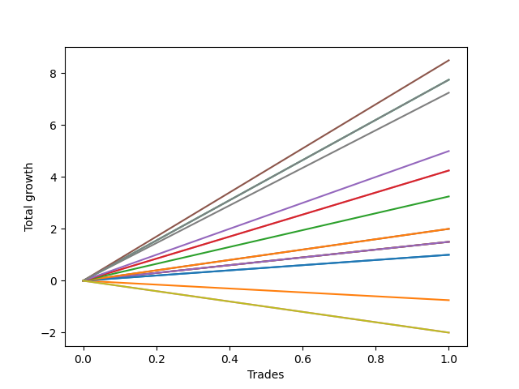

# Long Bernese 003 50 
- Symbol: ES
- Date Range: 03/18/2022 - 12/30/2022
- Trading Period: 8:30-12:30
- Number of Trades: 1



| Name | Win Percent | Profit | Avg Profit / Trade | Avg Time / Trade |      | Name | Win Percent | Profit | Avg Profit / Trade | Avg Time / Trade |
| ---- | ----------- | ------ | ------------------ | ---------------- | ---- | ---- | ----------- | ------ | ------------------ | ---------------- |
| Sorted By <br> Profit | | | | | | Sorted By <br> Win Percentage ||||
| TP-10 | 100.00 | 5000.00 | 5000.00 | 56:10 |     | TP-10 | 100.00 | 5000.00 | 5000.00 | 56:10 |
| TP-9 | 100.00 | 4875.00 | 4875.00 | 55:55 |     | TP-9 | 100.00 | 4875.00 | 4875.00 | 55:55 |
| NEWFI 000 | 100.00 | 4250.00 | 4250.00 | 60:05 |     | NEWFI 000 | 100.00 | 4250.00 | 4250.00 | 60:05 |
| TP-8 | 100.00 | 4125.00 | 4125.00 | 54:20 |     | TP-8 | 100.00 | 4125.00 | 4125.00 | 54:20 |
| BB-200 U/L 2SD | 100.00 | 3875.00 | 3875.00 | 60:55 |     | BB-200 U/L 2SD | 100.00 | 3875.00 | 3875.00 | 60:55 |
| BB-200 Mid | 100.00 | 3875.00 | 3875.00 | 60:55 |     | BB-200 Mid | 100.00 | 3875.00 | 3875.00 | 60:55 |
| BB-100 U/L 2SD | 100.00 | 3875.00 | 3875.00 | 60:55 |     | BB-100 U/L 2SD | 100.00 | 3875.00 | 3875.00 | 60:55 |
| V U/L 1SD | 100.00 | 3875.00 | 3875.00 | 60:55 |     | V U/L 1SD | 100.00 | 3875.00 | 3875.00 | 60:55 |
| TP-7 | 100.00 | 3625.00 | 3625.00 | 44:10 |     | TP-7 | 100.00 | 3625.00 | 3625.00 | 44:10 |
| BB-100 Mid | 100.00 | 3625.00 | 3625.00 | 44:10 |     | BB-100 Mid | 100.00 | 3625.00 | 3625.00 | 44:10 |
| V Mid | 100.00 | 3625.00 | 3625.00 | 44:10 |     | V Mid | 100.00 | 3625.00 | 3625.00 | 44:10 |
| TP-6 | 100.00 | 3000.00 | 3000.00 | 43:40 |     | TP-6 | 100.00 | 3000.00 | 3000.00 | 43:40 |
| TP-5 | 100.00 | 2500.00 | 2500.00 | 43:10 |     | TP-5 | 100.00 | 2500.00 | 2500.00 | 43:10 |
| TP-4 | 100.00 | 2125.00 | 2125.00 | 42:00 |     | TP-4 | 100.00 | 2125.00 | 2125.00 | 42:00 |
| BB-50 U/L 2SD | 100.00 | 2125.00 | 2125.00 | 42:00 |     | BB-50 U/L 2SD | 100.00 | 2125.00 | 2125.00 | 42:00 |
| TP-3 | 100.00 | 1625.00 | 1625.00 | 27:25 |     | TP-3 | 100.00 | 1625.00 | 1625.00 | 27:25 |
| TP-2 | 100.00 | 1000.00 | 1000.00 | 04:45 |     | TP-2 | 100.00 | 1000.00 | 1000.00 | 04:45 |
| BB-50 U/L 1SD | 100.00 | 1000.00 | 1000.00 | 41:30 |     | BB-50 U/L 1SD | 100.00 | 1000.00 | 1000.00 | 41:30 |
| BB-50 Mid | 100.00 | 750.00 | 750.00 | 26:10 |     | BB-50 Mid | 100.00 | 750.00 | 750.00 | 26:10 |
| BB-20 U/L 2SD C | 100.00 | 750.00 | 750.00 | 26:05 |     | BB-20 U/L 2SD C | 100.00 | 750.00 | 750.00 | 26:05 |
| BB-20 U/L 2SD | 100.00 | 750.00 | 750.00 | 26:05 |     | BB-20 U/L 2SD | 100.00 | 750.00 | 750.00 | 26:05 |
| TP-1 | 100.00 | 500.00 | 500.00 | 03:40 |     | TP-1 | 100.00 | 500.00 | 500.00 | 03:40 |
| BB-20 Mid | 100.00 | 500.00 | 500.00 | 04:05 |     | BB-20 Mid | 100.00 | 500.00 | 500.00 | 04:05 |
| BB-20 U/L 1SD | 0.00 | -375.00 | -375.00 | 21:55 |     | BB-20 U/L 1SD | 0.00 | -375.00 | -375.00 | 21:55 |
| NEWFI 0000 | 0.00 | -1000.00 | -1000.00 | 01:05 |     | NEWFI 0000 | 0.00 | -1000.00 | -1000.00 | 01:05 |

## NO STOPLOSS

### Test BB-20 Mid
* Sell when price hits the middle line of the 20p bollinger
* No Stoploss
* Results:
```
Total Trades: 1
Percent Up: 100.00
Percent Down: 0.00
Total Points Moved Up: 1.00
Potential Profit: 500.00
Total Points Ups: 1.00 Count Ups: 1
Total Points Downs: 0.00 Count Downs: 0
```

<details><summary>Trades</summary>

<code>In: 2022-07-08 09:45:00		Out: 2022-07-08 09:49:05		Total Position Time: 04:05		Total Move Up: 1.00		Total to Date: 1.00</code> <br />


</details>

### Test BB-20 U/L 1SD
* Sell when the price hits the upper line of the 20p 1std bollinger
* No Stoploss
* Results:
```
Total Trades: 1
Percent Up: 0.00
Percent Down: 100.00
Total Points Moved Up: -0.75
Potential Profit: -375.00
Total Points Ups: 0.00 Count Ups: 0
Total Points Downs: -0.75 Count Downs: 1
```

<details><summary>Trades</summary>

<code>In: 2022-07-08 09:45:00		Out: 2022-07-08 10:06:55		Total Position Time: 21:55		Total Move Up: -0.75		Total to Date: -0.75</code> <br />


</details>

### Test BB-20 U/L 2SD
* Sell when the price hits the upper line of the 20p 2std bollinger
* No Stoploss
* Results:
```
Total Trades: 1
Percent Up: 100.00
Percent Down: 0.00
Total Points Moved Up: 1.50
Potential Profit: 750.00
Total Points Ups: 1.50 Count Ups: 1
Total Points Downs: 0.00 Count Downs: 0
```

<details><summary>Trades</summary>

<code>In: 2022-07-08 09:45:00		Out: 2022-07-08 10:11:05		Total Position Time: 26:05		Total Move Up: 1.50		Total to Date: 1.50</code> <br />


</details>

### Test BB-20 U/L 2SD C
* Sell when the price hits the upper line of the 20p 2std bollinger
* No Stoploss
* Results:
```
Total Trades: 1
Percent Up: 100.00
Percent Down: 0.00
Total Points Moved Up: 1.50
Potential Profit: 750.00
Total Points Ups: 1.50 Count Ups: 1
Total Points Downs: 0.00 Count Downs: 0
```

<details><summary>Trades</summary>

<code>In: 2022-07-08 09:45:00		Out: 2022-07-08 10:11:05		Total Position Time: 26:05		Total Move Up: 1.50		Total to Date: 1.50</code> <br />


</details>

### Test BB-50 Mid
* Sell when price hits the middle line of the 50p bollinger
* No Stoploss
* Results:
```
Total Trades: 1
Percent Up: 100.00
Percent Down: 0.00
Total Points Moved Up: 1.50
Potential Profit: 750.00
Total Points Ups: 1.50 Count Ups: 1
Total Points Downs: 0.00 Count Downs: 0
```

<details><summary>Trades</summary>

<code>In: 2022-07-08 09:45:00		Out: 2022-07-08 10:11:10		Total Position Time: 26:10		Total Move Up: 1.50		Total to Date: 1.50</code> <br />


</details>

### Test BB-50 U/L 1SD
* Sell when the price hits the upper line of the 50p 1std bollinger
* No Stoploss
* Results:
```
Total Trades: 1
Percent Up: 100.00
Percent Down: 0.00
Total Points Moved Up: 2.00
Potential Profit: 1000.00
Total Points Ups: 2.00 Count Ups: 1
Total Points Downs: 0.00 Count Downs: 0
```

<details><summary>Trades</summary>

<code>In: 2022-07-08 09:45:00		Out: 2022-07-08 10:26:30		Total Position Time: 41:30		Total Move Up: 2.00		Total to Date: 2.00</code> <br />


</details>

### Test BB-50 U/L 2SD
* Sell when the price hits the upper line of the 50p 2std bollinger
* No Stoploss
* Results:
```
Total Trades: 1
Percent Up: 100.00
Percent Down: 0.00
Total Points Moved Up: 4.25
Potential Profit: 2125.00
Total Points Ups: 4.25 Count Ups: 1
Total Points Downs: 0.00 Count Downs: 0
```

<details><summary>Trades</summary>

<code>In: 2022-07-08 09:45:00		Out: 2022-07-08 10:27:00		Total Position Time: 42:00		Total Move Up: 4.25		Total to Date: 4.25</code> <br />


</details>

### Test V Mid
* Sell when the price hits the middle line of the 1std VWAP
* No Stoploss
* Results:
```
Total Trades: 1
Percent Up: 100.00
Percent Down: 0.00
Total Points Moved Up: 7.25
Potential Profit: 3625.00
Total Points Ups: 7.25 Count Ups: 1
Total Points Downs: 0.00 Count Downs: 0
```

<details><summary>Trades</summary>

<code>In: 2022-07-08 09:45:00		Out: 2022-07-08 10:29:10		Total Position Time: 44:10		Total Move Up: 7.25		Total to Date: 7.25</code> <br />


</details>

### Test V U/L 1SD
* Sell when the price hits the upper line of the 1std VWAP
* No Stoploss
* Results:
```
Total Trades: 1
Percent Up: 100.00
Percent Down: 0.00
Total Points Moved Up: 7.75
Potential Profit: 3875.00
Total Points Ups: 7.75 Count Ups: 1
Total Points Downs: 0.00 Count Downs: 0
```

<details><summary>Trades</summary>

<code>In: 2022-07-08 09:45:00		Out: 2022-07-08 10:45:55		Total Position Time: 60:55		Total Move Up: 7.75		Total to Date: 7.75</code> <br />


</details>

### Test BB-100 Mid
* Move to BB100 Mid
* No Stoploss
* Results:
```
Total Trades: 1
Percent Up: 100.00
Percent Down: 0.00
Total Points Moved Up: 7.25
Potential Profit: 3625.00
Total Points Ups: 7.25 Count Ups: 1
Total Points Downs: 0.00 Count Downs: 0
```

<details><summary>Trades</summary>

<code>In: 2022-07-08 09:45:00		Out: 2022-07-08 10:29:10		Total Position Time: 44:10		Total Move Up: 7.25		Total to Date: 7.25</code> <br />


</details>

### Test BB-100 U/L 2SD
* Move to BB100 Upper Band
* No Stoploss
* Results:
```
Total Trades: 1
Percent Up: 100.00
Percent Down: 0.00
Total Points Moved Up: 7.75
Potential Profit: 3875.00
Total Points Ups: 7.75 Count Ups: 1
Total Points Downs: 0.00 Count Downs: 0
```

<details><summary>Trades</summary>

<code>In: 2022-07-08 09:45:00		Out: 2022-07-08 10:45:55		Total Position Time: 60:55		Total Move Up: 7.75		Total to Date: 7.75</code> <br />


</details>

### Test BB-200 Mid
* Move to BB200 Mid
* No Stoploss
* Results:
```
Total Trades: 1
Percent Up: 100.00
Percent Down: 0.00
Total Points Moved Up: 7.75
Potential Profit: 3875.00
Total Points Ups: 7.75 Count Ups: 1
Total Points Downs: 0.00 Count Downs: 0
```

<details><summary>Trades</summary>

<code>In: 2022-07-08 09:45:00		Out: 2022-07-08 10:45:55		Total Position Time: 60:55		Total Move Up: 7.75		Total to Date: 7.75</code> <br />


</details>

### Test BB-200 U/L 2SD
* Move to BB200 Upper Band
* No Stoploss
* Results:
```
Total Trades: 1
Percent Up: 100.00
Percent Down: 0.00
Total Points Moved Up: 7.75
Potential Profit: 3875.00
Total Points Ups: 7.75 Count Ups: 1
Total Points Downs: 0.00 Count Downs: 0
```

<details><summary>Trades</summary>

<code>In: 2022-07-08 09:45:00		Out: 2022-07-08 10:45:55		Total Position Time: 60:55		Total Move Up: 7.75		Total to Date: 7.75</code> <br />


</details>

## TAKE PROFIT

### Test TP-1
* Take Profit of 1 Point
* No Stoploss
* Results:
```
Total Trades: 1
Percent Up: 100.00
Percent Down: 0.00
Total Points Moved Up: 1.00
Potential Profit: 500.00
Total Points Ups: 1.00 Count Ups: 1
Total Points Downs: 0.00 Count Downs: 0
```

<details><summary>Trades</summary>

<code>In: 2022-07-08 09:45:00		Out: 2022-07-08 09:48:40		Total Position Time: 03:40		Total Move Up: 1.00		Total to Date: 1.00</code> <br />


</details>

### Test TP-2
* Take Profit of 2 Point
* No Stoploss
* Results:
```
Total Trades: 1
Percent Up: 100.00
Percent Down: 0.00
Total Points Moved Up: 2.00
Potential Profit: 1000.00
Total Points Ups: 2.00 Count Ups: 1
Total Points Downs: 0.00 Count Downs: 0
```

<details><summary>Trades</summary>

<code>In: 2022-07-08 09:45:00		Out: 2022-07-08 09:49:45		Total Position Time: 04:45		Total Move Up: 2.00		Total to Date: 2.00</code> <br />


</details>

### Test TP-3
* Take Profit of 3 Point
* No Stoploss
* Results:
```
Total Trades: 1
Percent Up: 100.00
Percent Down: 0.00
Total Points Moved Up: 3.25
Potential Profit: 1625.00
Total Points Ups: 3.25 Count Ups: 1
Total Points Downs: 0.00 Count Downs: 0
```

<details><summary>Trades</summary>

<code>In: 2022-07-08 09:45:00		Out: 2022-07-08 10:12:25		Total Position Time: 27:25		Total Move Up: 3.25		Total to Date: 3.25</code> <br />


</details>

### Test TP-4
* Take Profit of 4 Point
* No Stoploss
* Results:
```
Total Trades: 1
Percent Up: 100.00
Percent Down: 0.00
Total Points Moved Up: 4.25
Potential Profit: 2125.00
Total Points Ups: 4.25 Count Ups: 1
Total Points Downs: 0.00 Count Downs: 0
```

<details><summary>Trades</summary>

<code>In: 2022-07-08 09:45:00		Out: 2022-07-08 10:27:00		Total Position Time: 42:00		Total Move Up: 4.25		Total to Date: 4.25</code> <br />


</details>

### Test TP-5
* Take Profit of 5 Point
* No Stoploss
* Results:
```
Total Trades: 1
Percent Up: 100.00
Percent Down: 0.00
Total Points Moved Up: 5.00
Potential Profit: 2500.00
Total Points Ups: 5.00 Count Ups: 1
Total Points Downs: 0.00 Count Downs: 0
```

<details><summary>Trades</summary>

<code>In: 2022-07-08 09:45:00		Out: 2022-07-08 10:28:10		Total Position Time: 43:10		Total Move Up: 5.00		Total to Date: 5.00</code> <br />


</details>

### Test TP-6
* Take Profit of 6 Point
* No Stoploss
* Results:
```
Total Trades: 1
Percent Up: 100.00
Percent Down: 0.00
Total Points Moved Up: 6.00
Potential Profit: 3000.00
Total Points Ups: 6.00 Count Ups: 1
Total Points Downs: 0.00 Count Downs: 0
```

<details><summary>Trades</summary>

<code>In: 2022-07-08 09:45:00		Out: 2022-07-08 10:28:40		Total Position Time: 43:40		Total Move Up: 6.00		Total to Date: 6.00</code> <br />


</details>

### Test TP-7
* Take Profit of 7 Point
* No Stoploss
* Results:
```
Total Trades: 1
Percent Up: 100.00
Percent Down: 0.00
Total Points Moved Up: 7.25
Potential Profit: 3625.00
Total Points Ups: 7.25 Count Ups: 1
Total Points Downs: 0.00 Count Downs: 0
```

<details><summary>Trades</summary>

<code>In: 2022-07-08 09:45:00		Out: 2022-07-08 10:29:10		Total Position Time: 44:10		Total Move Up: 7.25		Total to Date: 7.25</code> <br />


</details>

### Test TP-8
* Take Profit of 8 Point
* No Stoploss
* Results:
```
Total Trades: 1
Percent Up: 100.00
Percent Down: 0.00
Total Points Moved Up: 8.25
Potential Profit: 4125.00
Total Points Ups: 8.25 Count Ups: 1
Total Points Downs: 0.00 Count Downs: 0
```

<details><summary>Trades</summary>

<code>In: 2022-07-08 09:45:00		Out: 2022-07-08 10:39:20		Total Position Time: 54:20		Total Move Up: 8.25		Total to Date: 8.25</code> <br />


</details>

### Test TP-9
* Take Profit of 9 Point
* No Stoploss
* Results:
```
Total Trades: 1
Percent Up: 100.00
Percent Down: 0.00
Total Points Moved Up: 9.75
Potential Profit: 4875.00
Total Points Ups: 9.75 Count Ups: 1
Total Points Downs: 0.00 Count Downs: 0
```

<details><summary>Trades</summary>

<code>In: 2022-07-08 09:45:00		Out: 2022-07-08 10:40:55		Total Position Time: 55:55		Total Move Up: 9.75		Total to Date: 9.75</code> <br />


</details>

### Test TP-10
* Take Profit of 10 Point
* No Stoploss
* Results:
```
Total Trades: 1
Percent Up: 100.00
Percent Down: 0.00
Total Points Moved Up: 10.00
Potential Profit: 5000.00
Total Points Ups: 10.00 Count Ups: 1
Total Points Downs: 0.00 Count Downs: 0
```

<details><summary>Trades</summary>

<code>In: 2022-07-08 09:45:00		Out: 2022-07-08 10:41:10		Total Position Time: 56:10		Total Move Up: 10.00		Total to Date: 10.00</code> <br />


</details>

## Indicator Exits

### Test NEWFI 000
* Newfi 0000
* No Stoploss
* Results:
```
Total Trades: 1
Percent Up: 100.00
Percent Down: 0.00
Total Points Moved Up: 8.50
Potential Profit: 4250.00
Total Points Ups: 8.50 Count Ups: 1
Total Points Downs: 0.00 Count Downs: 0
```

<details><summary>Trades</summary>

<code>In: 2022-07-08 09:45:00		Out: 2022-07-08 10:45:05		Total Position Time: 60:05		Total Move Up: 8.50		Total to Date: 8.50</code> <br />


</details>

### Test NEWFI 0000
* Newfi 0000
* No Stoploss
* Results:
```
Total Trades: 1
Percent Up: 0.00
Percent Down: 100.00
Total Points Moved Up: -2.00
Potential Profit: -1000.00
Total Points Ups: 0.00 Count Ups: 0
Total Points Downs: -2.00 Count Downs: 1
```

<details><summary>Trades</summary>

<code>In: 2022-07-08 09:45:00		Out: 2022-07-08 09:46:05		Total Position Time: 01:05		Total Move Up: -2.00		Total to Date: -2.00</code> <br />


</details>