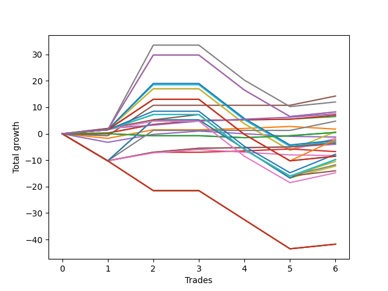

# Long Bernese 005 1v SB 
- Symbol: ES
- Date Range: 03/18/2022 - 12/30/2022
- Trading Period: 8:30-12:30
- Number of Trades: 6



| Name | Win Percent | Profit | Avg Profit / Trade | Avg Time / Trade |      | Name | Win Percent | Profit | Avg Profit / Trade | Avg Time / Trade |
| ---- | ----------- | ------ | ------------------ | ---------------- | ---- | ---- | ----------- | ------ | ------------------ | ---------------- |
| Sorted By <br> Profit | | | | | | Sorted By <br> Win Percentage ||||
| BB-50 U/L 1SD | 83.33 | 7125.00 | 1187.50 | 28:15 |     | TP-1 | 100.00 | 3750.00 | 625.00 | 09:30 |
| V U/L 1SD | 66.67 | 6000.00 | 1000.00 | 51:07 |     | BB-20 U/L 2SD C | 100.00 | 3500.00 | 583.33 | 19:06 |
| NEWFI 000 | 66.67 | 4125.00 | 687.50 | 51:26 |     | BB-20 U/L 2SD | 100.00 | 3250.00 | 541.67 | 19:03 |
| BB-200 U/L 2SD | 66.67 | 4125.00 | 687.50 | 51:26 |     | BB-50 U/L 1SD | 83.33 | 7125.00 | 1187.50 | 28:15 |
| TP-1 | 100.00 | 3750.00 | 625.00 | 09:30 |     | V U/L 1SD | 66.67 | 6000.00 | 1000.00 | 51:07 |
| BB-20 U/L 2SD C | 100.00 | 3500.00 | 583.33 | 19:06 |     | NEWFI 000 | 66.67 | 4125.00 | 687.50 | 51:26 |
| BB-20 U/L 2SD | 100.00 | 3250.00 | 541.67 | 19:03 |     | BB-200 U/L 2SD | 66.67 | 4125.00 | 687.50 | 51:26 |
| BB-20 U/L 1SD | 66.67 | 875.00 | 145.83 | 10:00 |     | BB-20 U/L 1SD | 66.67 | 875.00 | 145.83 | 10:00 |
| BB-100 Mid | 66.67 | 375.00 | 62.50 | 39:53 |     | BB-100 Mid | 66.67 | 375.00 | 62.50 | 39:53 |
| BB-20 Mid | 66.67 | 250.00 | 41.67 | 03:03 |     | BB-20 Mid | 66.67 | 250.00 | 41.67 | 03:03 |
| BB-50 Mid | 33.33 | -625.00 | -104.17 | 24:43 |     | BB-50 U/L 2SD | 66.67 | -875.00 | -145.83 | 39:08 |
| BB-50 U/L 2SD | 66.67 | -875.00 | -145.83 | 39:08 |     | TP-8 | 66.67 | -1125.00 | -187.50 | 40:00 |
| TP-8 | 66.67 | -1125.00 | -187.50 | 40:00 |     | BB-200 Mid | 66.67 | -1250.00 | -208.33 | 50:40 |
| BB-200 Mid | 66.67 | -1250.00 | -208.33 | 50:40 |     | BB-100 U/L 2SD | 66.67 | -1500.00 | -250.00 | 50:39 |
| BB-100 U/L 2SD | 66.67 | -1500.00 | -250.00 | 50:39 |     | V Mid | 66.67 | -2250.00 | -375.00 | 42:50 |
| V Mid | 66.67 | -2250.00 | -375.00 | 42:50 |     | TP-7 | 66.67 | -3875.00 | -645.83 | 39:43 |
| TP-7 | 66.67 | -3875.00 | -645.83 | 39:43 |     | TP-10 | 66.67 | -4250.00 | -708.33 | 42:49 |
| TP-10 | 66.67 | -4250.00 | -708.33 | 42:49 |     | TP-9 | 66.67 | -4250.00 | -708.33 | 42:49 |
| TP-9 | 66.67 | -4250.00 | -708.33 | 42:49 |     | TP-6 | 66.67 | -4875.00 | -812.50 | 39:40 |
| TP-6 | 66.67 | -4875.00 | -812.50 | 39:40 |     | TP-5 | 66.67 | -5250.00 | -875.00 | 38:00 |
| TP-5 | 66.67 | -5250.00 | -875.00 | 38:00 |     | TP-4 | 66.67 | -5875.00 | -979.17 | 37:55 |
| TP-4 | 66.67 | -5875.00 | -979.17 | 37:55 |     | TP-2 | 66.67 | -7000.00 | -1166.67 | 29:45 |
| NEWFI 0000 | 0.00 | -6125.00 | -1020.83 | 09:35 |     | TP-3 | 66.67 | -7375.00 | -1229.17 | 37:44 |
| TP-2 | 66.67 | -7000.00 | -1166.67 | 29:45 |     | BB-50 Mid | 33.33 | -625.00 | -104.17 | 24:43 |
| TP-3 | 66.67 | -7375.00 | -1229.17 | 37:44 |     | NEWFI 0000 | 0.00 | -6125.00 | -1020.83 | 09:35 |

## NO STOPLOSS

### Test BB-20 Mid
* Sell when price hits the middle line of the 20p bollinger
* No Stoploss
* Results:
```
Total Trades: 6
Percent Up: 66.67
Percent Down: 33.33
Total Points Moved Up: 0.50
Potential Profit: 250.00
Total Points Ups: 2.00 Count Ups: 4
Total Points Downs: -1.50 Count Downs: 2
```

<details><summary>Trades</summary>

<code>In: 2022-04-27 12:14:00		Out: 2022-04-27 12:15:10		Total Position Time: 01:10		Total Move Up: 0.00		Total to Date: 0.00</code> <br />
<code>In: 2022-05-06 11:41:00		Out: 2022-05-06 11:42:10		Total Position Time: 01:10		Total Move Up: -0.75		Total to Date: -0.75</code> <br />
<code>In: 2022-07-11 12:15:00		Out: 2022-07-11 12:22:10		Total Position Time: 07:10		Total Move Up: 0.00		Total to Date: -0.75</code> <br />
<code>In: 2022-07-25 11:07:00		Out: 2022-07-25 11:10:40		Total Position Time: 03:40		Total Move Up: -0.75		Total to Date: -1.50</code> <br />
<code>In: 2022-07-25 11:11:00		Out: 2022-07-25 11:12:10		Total Position Time: 01:10		Total Move Up: 0.75		Total to Date: -0.75</code> <br />
<code>In: 2022-08-05 08:33:00		Out: 2022-08-05 08:37:00		Total Position Time: 04:00		Total Move Up: 1.25		Total to Date: 0.50</code> <br />


</details>

### Test BB-20 U/L 1SD
* Sell when the price hits the upper line of the 20p 1std bollinger
* No Stoploss
* Results:
```
Total Trades: 6
Percent Up: 66.67
Percent Down: 33.33
Total Points Moved Up: 1.75
Potential Profit: 875.00
Total Points Ups: 4.50 Count Ups: 4
Total Points Downs: -2.75 Count Downs: 2
```

<details><summary>Trades</summary>

<code>In: 2022-04-27 12:14:00		Out: 2022-04-27 12:27:15		Total Position Time: 13:15		Total Move Up: -1.75		Total to Date: -1.75</code> <br />
<code>In: 2022-05-06 11:41:00		Out: 2022-05-06 11:49:10		Total Position Time: 08:10		Total Move Up: 3.25		Total to Date: 1.50</code> <br />
<code>In: 2022-07-11 12:15:00		Out: 2022-07-11 12:29:20		Total Position Time: 14:20		Total Move Up: 0.00		Total to Date: 1.50</code> <br />
<code>In: 2022-07-25 11:07:00		Out: 2022-07-25 11:11:40		Total Position Time: 04:40		Total Move Up: 0.50		Total to Date: 2.00</code> <br />
<code>In: 2022-07-25 11:11:00		Out: 2022-07-25 11:12:10		Total Position Time: 01:10		Total Move Up: 0.75		Total to Date: 2.75</code> <br />
<code>In: 2022-08-05 08:33:00		Out: 2022-08-05 08:51:30		Total Position Time: 18:30		Total Move Up: -1.00		Total to Date: 1.75</code> <br />


</details>

### Test BB-20 U/L 2SD
* Sell when the price hits the upper line of the 20p 2std bollinger
* No Stoploss
* Results:
```
Total Trades: 6
Percent Up: 100.00
Percent Down: 0.00
Total Points Moved Up: 6.50
Potential Profit: 3250.00
Total Points Ups: 6.50 Count Ups: 6
Total Points Downs: 0.00 Count Downs: 0
```

<details><summary>Trades</summary>

<code>In: 2022-04-27 12:14:00		Out: 2022-04-27 12:31:20		Total Position Time: 17:20		Total Move Up: 0.25		Total to Date: 0.25</code> <br />
<code>In: 2022-05-06 11:41:00		Out: 2022-05-06 11:49:10		Total Position Time: 08:10		Total Move Up: 3.25		Total to Date: 3.50</code> <br />
<code>In: 2022-07-11 12:15:00		Out: 2022-07-11 12:29:40		Total Position Time: 14:40		Total Move Up: 1.50		Total to Date: 5.00</code> <br />
<code>In: 2022-07-25 11:07:00		Out: 2022-07-25 11:35:50		Total Position Time: 28:50		Total Move Up: 0.25		Total to Date: 5.25</code> <br />
<code>In: 2022-07-25 11:11:00		Out: 2022-07-25 11:35:50		Total Position Time: 24:50		Total Move Up: 0.25		Total to Date: 5.50</code> <br />
<code>In: 2022-08-05 08:33:00		Out: 2022-08-05 08:53:30		Total Position Time: 20:30		Total Move Up: 1.00		Total to Date: 6.50</code> <br />


</details>

### Test BB-20 U/L 2SD C
* Sell when the price hits the upper line of the 20p 2std bollinger
* No Stoploss
* Results:
```
Total Trades: 6
Percent Up: 100.00
Percent Down: 0.00
Total Points Moved Up: 7.00
Potential Profit: 3500.00
Total Points Ups: 7.00 Count Ups: 6
Total Points Downs: 0.00 Count Downs: 0
```

<details><summary>Trades</summary>

<code>In: 2022-04-27 12:14:00		Out: 2022-04-27 12:31:20		Total Position Time: 17:20		Total Move Up: 0.25		Total to Date: 0.25</code> <br />
<code>In: 2022-05-06 11:41:00		Out: 2022-05-06 11:49:10		Total Position Time: 08:10		Total Move Up: 3.25		Total to Date: 3.50</code> <br />
<code>In: 2022-07-11 12:15:00		Out: 2022-07-11 12:29:40		Total Position Time: 14:40		Total Move Up: 1.50		Total to Date: 5.00</code> <br />
<code>In: 2022-07-25 11:07:00		Out: 2022-07-25 11:35:50		Total Position Time: 28:50		Total Move Up: 0.25		Total to Date: 5.25</code> <br />
<code>In: 2022-07-25 11:11:00		Out: 2022-07-25 11:35:50		Total Position Time: 24:50		Total Move Up: 0.25		Total to Date: 5.50</code> <br />
<code>In: 2022-08-05 08:33:00		Out: 2022-08-05 08:53:50		Total Position Time: 20:50		Total Move Up: 1.50		Total to Date: 7.00</code> <br />


</details>

### Test BB-50 Mid
* Sell when price hits the middle line of the 50p bollinger
* No Stoploss
* Results:
```
Total Trades: 6
Percent Up: 33.33
Percent Down: 66.67
Total Points Moved Up: -1.25
Potential Profit: -625.00
Total Points Ups: 4.25 Count Ups: 2
Total Points Downs: -5.50 Count Downs: 4
```

<details><summary>Trades</summary>

<code>In: 2022-04-27 12:14:00		Out: 2022-04-27 12:44:20		Total Position Time: 30:20		Total Move Up: -3.25		Total to Date: -3.25</code> <br />
<code>In: 2022-05-06 11:41:00		Out: 2022-05-06 11:49:15		Total Position Time: 08:15		Total Move Up: 3.00		Total to Date: -0.25</code> <br />
<code>In: 2022-07-11 12:15:00		Out: 2022-07-11 12:40:35		Total Position Time: 25:35		Total Move Up: 1.25		Total to Date: 1.00</code> <br />
<code>In: 2022-07-25 11:07:00		Out: 2022-07-25 11:35:45		Total Position Time: 28:45		Total Move Up: -1.00		Total to Date: 0.00</code> <br />
<code>In: 2022-07-25 11:11:00		Out: 2022-07-25 11:35:45		Total Position Time: 24:45		Total Move Up: -1.00		Total to Date: -1.00</code> <br />
<code>In: 2022-08-05 08:33:00		Out: 2022-08-05 09:03:40		Total Position Time: 30:40		Total Move Up: -0.25		Total to Date: -1.25</code> <br />


</details>

### Test BB-50 U/L 1SD
* Sell when the price hits the upper line of the 50p 1std bollinger
* No Stoploss
* Results:
```
Total Trades: 6
Percent Up: 83.33
Percent Down: 16.67
Total Points Moved Up: 14.25
Potential Profit: 7125.00
Total Points Ups: 15.00 Count Ups: 5
Total Points Downs: -0.75 Count Downs: 1
```

<details><summary>Trades</summary>

<code>In: 2022-04-27 12:14:00		Out: 2022-04-27 12:46:05		Total Position Time: 32:05		Total Move Up: -0.75		Total to Date: -0.75</code> <br />
<code>In: 2022-05-06 11:41:00		Out: 2022-05-06 11:50:10		Total Position Time: 09:10		Total Move Up: 11.50		Total to Date: 10.75</code> <br />
<code>In: 2022-07-11 12:15:00		Out: 2022-07-11 12:47:00		Total Position Time: 32:00		Total Move Up: 0.00		Total to Date: 10.75</code> <br />
<code>In: 2022-07-25 11:07:00		Out: 2022-07-25 11:41:00		Total Position Time: 34:00		Total Move Up: 0.00		Total to Date: 10.75</code> <br />
<code>In: 2022-07-25 11:11:00		Out: 2022-07-25 11:41:00		Total Position Time: 30:00		Total Move Up: 0.00		Total to Date: 10.75</code> <br />
<code>In: 2022-08-05 08:33:00		Out: 2022-08-05 09:05:15		Total Position Time: 32:15		Total Move Up: 3.50		Total to Date: 14.25</code> <br />


</details>

### Test BB-50 U/L 2SD
* Sell when the price hits the upper line of the 50p 2std bollinger
* No Stoploss
* Results:
```
Total Trades: 6
Percent Up: 66.67
Percent Down: 33.33
Total Points Moved Up: -1.75
Potential Profit: -875.00
Total Points Ups: 21.50 Count Ups: 4
Total Points Downs: -23.25 Count Downs: 2
```

<details><summary>Trades</summary>

<code>In: 2022-04-27 12:14:00		Out: 2022-04-27 12:47:00		Total Position Time: 33:00		Total Move Up: 1.50		Total to Date: 1.50</code> <br />
<code>In: 2022-05-06 11:41:00		Out: 2022-05-06 11:50:35		Total Position Time: 09:35		Total Move Up: 15.50		Total to Date: 17.00</code> <br />
<code>In: 2022-07-11 12:15:00		Out: 2022-07-11 12:47:00		Total Position Time: 32:00		Total Move Up: 0.00		Total to Date: 17.00</code> <br />
<code>In: 2022-07-25 11:07:00		Out: 2022-07-25 12:07:55		Total Position Time: 60:55		Total Move Up: -13.25		Total to Date: 3.75</code> <br />
<code>In: 2022-07-25 11:11:00		Out: 2022-07-25 12:11:55		Total Position Time: 60:55		Total Move Up: -10.00		Total to Date: -6.25</code> <br />
<code>In: 2022-08-05 08:33:00		Out: 2022-08-05 09:11:25		Total Position Time: 38:25		Total Move Up: 4.50		Total to Date: -1.75</code> <br />


</details>

### Test V Mid
* Sell when the price hits the middle line of the 1std VWAP
* No Stoploss
* Results:
```
Total Trades: 6
Percent Up: 66.67
Percent Down: 33.33
Total Points Moved Up: -4.50
Potential Profit: -2250.00
Total Points Ups: 18.75 Count Ups: 4
Total Points Downs: -23.25 Count Downs: 2
```

<details><summary>Trades</summary>

<code>In: 2022-04-27 12:14:00		Out: 2022-04-27 12:47:00		Total Position Time: 33:00		Total Move Up: 1.50		Total to Date: 1.50</code> <br />
<code>In: 2022-05-06 11:41:00		Out: 2022-05-06 11:50:20		Total Position Time: 09:20		Total Move Up: 15.50		Total to Date: 17.00</code> <br />
<code>In: 2022-07-11 12:15:00		Out: 2022-07-11 12:47:00		Total Position Time: 32:00		Total Move Up: 0.00		Total to Date: 17.00</code> <br />
<code>In: 2022-07-25 11:07:00		Out: 2022-07-25 12:07:55		Total Position Time: 60:55		Total Move Up: -13.25		Total to Date: 3.75</code> <br />
<code>In: 2022-07-25 11:11:00		Out: 2022-07-25 12:11:55		Total Position Time: 60:55		Total Move Up: -10.00		Total to Date: -6.25</code> <br />
<code>In: 2022-08-05 08:33:00		Out: 2022-08-05 09:33:55		Total Position Time: 60:55		Total Move Up: 1.75		Total to Date: -4.50</code> <br />


</details>

### Test V U/L 1SD
* Sell when the price hits the upper line of the 1std VWAP
* No Stoploss
* Results:
```
Total Trades: 6
Percent Up: 66.67
Percent Down: 33.33
Total Points Moved Up: 12.00
Potential Profit: 6000.00
Total Points Ups: 35.25 Count Ups: 4
Total Points Downs: -23.25 Count Downs: 2
```

<details><summary>Trades</summary>

<code>In: 2022-04-27 12:14:00		Out: 2022-04-27 12:47:00		Total Position Time: 33:00		Total Move Up: 1.50		Total to Date: 1.50</code> <br />
<code>In: 2022-05-06 11:41:00		Out: 2022-05-06 12:40:00		Total Position Time: 59:00		Total Move Up: 32.00		Total to Date: 33.50</code> <br />
<code>In: 2022-07-11 12:15:00		Out: 2022-07-11 12:47:00		Total Position Time: 32:00		Total Move Up: 0.00		Total to Date: 33.50</code> <br />
<code>In: 2022-07-25 11:07:00		Out: 2022-07-25 12:07:55		Total Position Time: 60:55		Total Move Up: -13.25		Total to Date: 20.25</code> <br />
<code>In: 2022-07-25 11:11:00		Out: 2022-07-25 12:11:55		Total Position Time: 60:55		Total Move Up: -10.00		Total to Date: 10.25</code> <br />
<code>In: 2022-08-05 08:33:00		Out: 2022-08-05 09:33:55		Total Position Time: 60:55		Total Move Up: 1.75		Total to Date: 12.00</code> <br />


</details>

### Test BB-100 Mid
* Move to BB100 Mid
* No Stoploss
* Results:
```
Total Trades: 6
Percent Up: 66.67
Percent Down: 33.33
Total Points Moved Up: 0.75
Potential Profit: 375.00
Total Points Ups: 24.00 Count Ups: 4
Total Points Downs: -23.25 Count Downs: 2
```

<details><summary>Trades</summary>

<code>In: 2022-04-27 12:14:00		Out: 2022-04-27 12:47:00		Total Position Time: 33:00		Total Move Up: 1.50		Total to Date: 1.50</code> <br />
<code>In: 2022-05-06 11:41:00		Out: 2022-05-06 11:50:35		Total Position Time: 09:35		Total Move Up: 15.50		Total to Date: 17.00</code> <br />
<code>In: 2022-07-11 12:15:00		Out: 2022-07-11 12:47:00		Total Position Time: 32:00		Total Move Up: 0.00		Total to Date: 17.00</code> <br />
<code>In: 2022-07-25 11:07:00		Out: 2022-07-25 12:07:55		Total Position Time: 60:55		Total Move Up: -13.25		Total to Date: 3.75</code> <br />
<code>In: 2022-07-25 11:11:00		Out: 2022-07-25 12:11:55		Total Position Time: 60:55		Total Move Up: -10.00		Total to Date: -6.25</code> <br />
<code>In: 2022-08-05 08:33:00		Out: 2022-08-05 09:15:55		Total Position Time: 42:55		Total Move Up: 7.00		Total to Date: 0.75</code> <br />


</details>

### Test BB-100 U/L 2SD
* Move to BB100 Upper Band
* No Stoploss
* Results:
```
Total Trades: 6
Percent Up: 66.67
Percent Down: 33.33
Total Points Moved Up: -3.00
Potential Profit: -1500.00
Total Points Ups: 20.25 Count Ups: 4
Total Points Downs: -23.25 Count Downs: 2
```

<details><summary>Trades</summary>

<code>In: 2022-04-27 12:14:00		Out: 2022-04-27 12:47:00		Total Position Time: 33:00		Total Move Up: 1.50		Total to Date: 1.50</code> <br />
<code>In: 2022-05-06 11:41:00		Out: 2022-05-06 12:37:10		Total Position Time: 56:10		Total Move Up: 17.00		Total to Date: 18.50</code> <br />
<code>In: 2022-07-11 12:15:00		Out: 2022-07-11 12:47:00		Total Position Time: 32:00		Total Move Up: 0.00		Total to Date: 18.50</code> <br />
<code>In: 2022-07-25 11:07:00		Out: 2022-07-25 12:07:55		Total Position Time: 60:55		Total Move Up: -13.25		Total to Date: 5.25</code> <br />
<code>In: 2022-07-25 11:11:00		Out: 2022-07-25 12:11:55		Total Position Time: 60:55		Total Move Up: -10.00		Total to Date: -4.75</code> <br />
<code>In: 2022-08-05 08:33:00		Out: 2022-08-05 09:33:55		Total Position Time: 60:55		Total Move Up: 1.75		Total to Date: -3.00</code> <br />


</details>

### Test BB-200 Mid
* Move to BB200 Mid
* No Stoploss
* Results:
```
Total Trades: 6
Percent Up: 66.67
Percent Down: 33.33
Total Points Moved Up: -2.50
Potential Profit: -1250.00
Total Points Ups: 20.75 Count Ups: 4
Total Points Downs: -23.25 Count Downs: 2
```

<details><summary>Trades</summary>

<code>In: 2022-04-27 12:14:00		Out: 2022-04-27 12:47:00		Total Position Time: 33:00		Total Move Up: 1.50		Total to Date: 1.50</code> <br />
<code>In: 2022-05-06 11:41:00		Out: 2022-05-06 12:37:15		Total Position Time: 56:15		Total Move Up: 17.50		Total to Date: 19.00</code> <br />
<code>In: 2022-07-11 12:15:00		Out: 2022-07-11 12:47:00		Total Position Time: 32:00		Total Move Up: 0.00		Total to Date: 19.00</code> <br />
<code>In: 2022-07-25 11:07:00		Out: 2022-07-25 12:07:55		Total Position Time: 60:55		Total Move Up: -13.25		Total to Date: 5.75</code> <br />
<code>In: 2022-07-25 11:11:00		Out: 2022-07-25 12:11:55		Total Position Time: 60:55		Total Move Up: -10.00		Total to Date: -4.25</code> <br />
<code>In: 2022-08-05 08:33:00		Out: 2022-08-05 09:33:55		Total Position Time: 60:55		Total Move Up: 1.75		Total to Date: -2.50</code> <br />


</details>

### Test BB-200 U/L 2SD
* Move to BB200 Upper Band
* No Stoploss
* Results:
```
Total Trades: 6
Percent Up: 66.67
Percent Down: 33.33
Total Points Moved Up: 8.25
Potential Profit: 4125.00
Total Points Ups: 31.50 Count Ups: 4
Total Points Downs: -23.25 Count Downs: 2
```

<details><summary>Trades</summary>

<code>In: 2022-04-27 12:14:00		Out: 2022-04-27 12:47:00		Total Position Time: 33:00		Total Move Up: 1.50		Total to Date: 1.50</code> <br />
<code>In: 2022-05-06 11:41:00		Out: 2022-05-06 12:41:55		Total Position Time: 60:55		Total Move Up: 28.25		Total to Date: 29.75</code> <br />
<code>In: 2022-07-11 12:15:00		Out: 2022-07-11 12:47:00		Total Position Time: 32:00		Total Move Up: 0.00		Total to Date: 29.75</code> <br />
<code>In: 2022-07-25 11:07:00		Out: 2022-07-25 12:07:55		Total Position Time: 60:55		Total Move Up: -13.25		Total to Date: 16.50</code> <br />
<code>In: 2022-07-25 11:11:00		Out: 2022-07-25 12:11:55		Total Position Time: 60:55		Total Move Up: -10.00		Total to Date: 6.50</code> <br />
<code>In: 2022-08-05 08:33:00		Out: 2022-08-05 09:33:55		Total Position Time: 60:55		Total Move Up: 1.75		Total to Date: 8.25</code> <br />


</details>

## TAKE PROFIT

### Test TP-1
* Take Profit of 1 Point
* No Stoploss
* Results:
```
Total Trades: 6
Percent Up: 100.00
Percent Down: 0.00
Total Points Moved Up: 7.50
Potential Profit: 3750.00
Total Points Ups: 7.50 Count Ups: 6
Total Points Downs: 0.00 Count Downs: 0
```

<details><summary>Trades</summary>

<code>In: 2022-04-27 12:14:00		Out: 2022-04-27 12:15:20		Total Position Time: 01:20		Total Move Up: 2.00		Total to Date: 2.00</code> <br />
<code>In: 2022-05-06 11:41:00		Out: 2022-05-06 11:42:45		Total Position Time: 01:45		Total Move Up: 1.25		Total to Date: 3.25</code> <br />
<code>In: 2022-07-11 12:15:00		Out: 2022-07-11 12:29:40		Total Position Time: 14:40		Total Move Up: 1.50		Total to Date: 4.75</code> <br />
<code>In: 2022-07-25 11:07:00		Out: 2022-07-25 11:11:45		Total Position Time: 04:45		Total Move Up: 0.75		Total to Date: 5.50</code> <br />
<code>In: 2022-07-25 11:11:00		Out: 2022-07-25 11:41:30		Total Position Time: 30:30		Total Move Up: 0.75		Total to Date: 6.25</code> <br />
<code>In: 2022-08-05 08:33:00		Out: 2022-08-05 08:37:00		Total Position Time: 04:00		Total Move Up: 1.25		Total to Date: 7.50</code> <br />


</details>

### Test TP-2
* Take Profit of 2 Point
* No Stoploss
* Results:
```
Total Trades: 6
Percent Up: 66.67
Percent Down: 33.33
Total Points Moved Up: -14.00
Potential Profit: -7000.00
Total Points Ups: 9.25 Count Ups: 4
Total Points Downs: -23.25 Count Downs: 2
```

<details><summary>Trades</summary>

<code>In: 2022-04-27 12:14:00		Out: 2022-04-27 12:15:20		Total Position Time: 01:20		Total Move Up: 2.00		Total to Date: 2.00</code> <br />
<code>In: 2022-05-06 11:41:00		Out: 2022-05-06 11:49:10		Total Position Time: 08:10		Total Move Up: 3.25		Total to Date: 5.25</code> <br />
<code>In: 2022-07-11 12:15:00		Out: 2022-07-11 12:31:10		Total Position Time: 16:10		Total Move Up: 2.00		Total to Date: 7.25</code> <br />
<code>In: 2022-07-25 11:07:00		Out: 2022-07-25 12:07:55		Total Position Time: 60:55		Total Move Up: -13.25		Total to Date: -6.00</code> <br />
<code>In: 2022-07-25 11:11:00		Out: 2022-07-25 12:11:55		Total Position Time: 60:55		Total Move Up: -10.00		Total to Date: -16.00</code> <br />
<code>In: 2022-08-05 08:33:00		Out: 2022-08-05 09:04:00		Total Position Time: 31:00		Total Move Up: 2.00		Total to Date: -14.00</code> <br />


</details>

### Test TP-3
* Take Profit of 3 Point
* No Stoploss
* Results:
```
Total Trades: 6
Percent Up: 66.67
Percent Down: 33.33
Total Points Moved Up: -14.75
Potential Profit: -7375.00
Total Points Ups: 8.50 Count Ups: 4
Total Points Downs: -23.25 Count Downs: 2
```

<details><summary>Trades</summary>

<code>In: 2022-04-27 12:14:00		Out: 2022-04-27 12:47:00		Total Position Time: 33:00		Total Move Up: 1.50		Total to Date: 1.50</code> <br />
<code>In: 2022-05-06 11:41:00		Out: 2022-05-06 11:49:10		Total Position Time: 08:10		Total Move Up: 3.25		Total to Date: 4.75</code> <br />
<code>In: 2022-07-11 12:15:00		Out: 2022-07-11 12:47:00		Total Position Time: 32:00		Total Move Up: 0.00		Total to Date: 4.75</code> <br />
<code>In: 2022-07-25 11:07:00		Out: 2022-07-25 12:07:55		Total Position Time: 60:55		Total Move Up: -13.25		Total to Date: -8.50</code> <br />
<code>In: 2022-07-25 11:11:00		Out: 2022-07-25 12:11:55		Total Position Time: 60:55		Total Move Up: -10.00		Total to Date: -18.50</code> <br />
<code>In: 2022-08-05 08:33:00		Out: 2022-08-05 09:04:25		Total Position Time: 31:25		Total Move Up: 3.75		Total to Date: -14.75</code> <br />


</details>

### Test TP-4
* Take Profit of 4 Point
* No Stoploss
* Results:
```
Total Trades: 6
Percent Up: 66.67
Percent Down: 33.33
Total Points Moved Up: -11.75
Potential Profit: -5875.00
Total Points Ups: 11.50 Count Ups: 4
Total Points Downs: -23.25 Count Downs: 2
```

<details><summary>Trades</summary>

<code>In: 2022-04-27 12:14:00		Out: 2022-04-27 12:47:00		Total Position Time: 33:00		Total Move Up: 1.50		Total to Date: 1.50</code> <br />
<code>In: 2022-05-06 11:41:00		Out: 2022-05-06 11:49:25		Total Position Time: 08:25		Total Move Up: 5.75		Total to Date: 7.25</code> <br />
<code>In: 2022-07-11 12:15:00		Out: 2022-07-11 12:47:00		Total Position Time: 32:00		Total Move Up: 0.00		Total to Date: 7.25</code> <br />
<code>In: 2022-07-25 11:07:00		Out: 2022-07-25 12:07:55		Total Position Time: 60:55		Total Move Up: -13.25		Total to Date: -6.00</code> <br />
<code>In: 2022-07-25 11:11:00		Out: 2022-07-25 12:11:55		Total Position Time: 60:55		Total Move Up: -10.00		Total to Date: -16.00</code> <br />
<code>In: 2022-08-05 08:33:00		Out: 2022-08-05 09:05:20		Total Position Time: 32:20		Total Move Up: 4.25		Total to Date: -11.75</code> <br />


</details>

### Test TP-5
* Take Profit of 5 Point
* No Stoploss
* Results:
```
Total Trades: 6
Percent Up: 66.67
Percent Down: 33.33
Total Points Moved Up: -10.50
Potential Profit: -5250.00
Total Points Ups: 12.75 Count Ups: 4
Total Points Downs: -23.25 Count Downs: 2
```

<details><summary>Trades</summary>

<code>In: 2022-04-27 12:14:00		Out: 2022-04-27 12:47:00		Total Position Time: 33:00		Total Move Up: 1.50		Total to Date: 1.50</code> <br />
<code>In: 2022-05-06 11:41:00		Out: 2022-05-06 11:49:25		Total Position Time: 08:25		Total Move Up: 5.75		Total to Date: 7.25</code> <br />
<code>In: 2022-07-11 12:15:00		Out: 2022-07-11 12:47:00		Total Position Time: 32:00		Total Move Up: 0.00		Total to Date: 7.25</code> <br />
<code>In: 2022-07-25 11:07:00		Out: 2022-07-25 12:07:55		Total Position Time: 60:55		Total Move Up: -13.25		Total to Date: -6.00</code> <br />
<code>In: 2022-07-25 11:11:00		Out: 2022-07-25 12:11:55		Total Position Time: 60:55		Total Move Up: -10.00		Total to Date: -16.00</code> <br />
<code>In: 2022-08-05 08:33:00		Out: 2022-08-05 09:05:45		Total Position Time: 32:45		Total Move Up: 5.50		Total to Date: -10.50</code> <br />


</details>

### Test TP-6
* Take Profit of 6 Point
* No Stoploss
* Results:
```
Total Trades: 6
Percent Up: 66.67
Percent Down: 33.33
Total Points Moved Up: -9.75
Potential Profit: -4875.00
Total Points Ups: 13.50 Count Ups: 4
Total Points Downs: -23.25 Count Downs: 2
```

<details><summary>Trades</summary>

<code>In: 2022-04-27 12:14:00		Out: 2022-04-27 12:47:00		Total Position Time: 33:00		Total Move Up: 1.50		Total to Date: 1.50</code> <br />
<code>In: 2022-05-06 11:41:00		Out: 2022-05-06 11:49:25		Total Position Time: 08:25		Total Move Up: 5.75		Total to Date: 7.25</code> <br />
<code>In: 2022-07-11 12:15:00		Out: 2022-07-11 12:47:00		Total Position Time: 32:00		Total Move Up: 0.00		Total to Date: 7.25</code> <br />
<code>In: 2022-07-25 11:07:00		Out: 2022-07-25 12:07:55		Total Position Time: 60:55		Total Move Up: -13.25		Total to Date: -6.00</code> <br />
<code>In: 2022-07-25 11:11:00		Out: 2022-07-25 12:11:55		Total Position Time: 60:55		Total Move Up: -10.00		Total to Date: -16.00</code> <br />
<code>In: 2022-08-05 08:33:00		Out: 2022-08-05 09:15:50		Total Position Time: 42:50		Total Move Up: 6.25		Total to Date: -9.75</code> <br />


</details>

### Test TP-7
* Take Profit of 7 Point
* No Stoploss
* Results:
```
Total Trades: 6
Percent Up: 66.67
Percent Down: 33.33
Total Points Moved Up: -7.75
Potential Profit: -3875.00
Total Points Ups: 15.50 Count Ups: 4
Total Points Downs: -23.25 Count Downs: 2
```

<details><summary>Trades</summary>

<code>In: 2022-04-27 12:14:00		Out: 2022-04-27 12:47:00		Total Position Time: 33:00		Total Move Up: 1.50		Total to Date: 1.50</code> <br />
<code>In: 2022-05-06 11:41:00		Out: 2022-05-06 11:49:35		Total Position Time: 08:35		Total Move Up: 7.00		Total to Date: 8.50</code> <br />
<code>In: 2022-07-11 12:15:00		Out: 2022-07-11 12:47:00		Total Position Time: 32:00		Total Move Up: 0.00		Total to Date: 8.50</code> <br />
<code>In: 2022-07-25 11:07:00		Out: 2022-07-25 12:07:55		Total Position Time: 60:55		Total Move Up: -13.25		Total to Date: -4.75</code> <br />
<code>In: 2022-07-25 11:11:00		Out: 2022-07-25 12:11:55		Total Position Time: 60:55		Total Move Up: -10.00		Total to Date: -14.75</code> <br />
<code>In: 2022-08-05 08:33:00		Out: 2022-08-05 09:15:55		Total Position Time: 42:55		Total Move Up: 7.00		Total to Date: -7.75</code> <br />


</details>

### Test TP-8
* Take Profit of 8 Point
* No Stoploss
* Results:
```
Total Trades: 6
Percent Up: 66.67
Percent Down: 33.33
Total Points Moved Up: -2.25
Potential Profit: -1125.00
Total Points Ups: 21.00 Count Ups: 4
Total Points Downs: -23.25 Count Downs: 2
```

<details><summary>Trades</summary>

<code>In: 2022-04-27 12:14:00		Out: 2022-04-27 12:47:00		Total Position Time: 33:00		Total Move Up: 1.50		Total to Date: 1.50</code> <br />
<code>In: 2022-05-06 11:41:00		Out: 2022-05-06 11:50:10		Total Position Time: 09:10		Total Move Up: 11.50		Total to Date: 13.00</code> <br />
<code>In: 2022-07-11 12:15:00		Out: 2022-07-11 12:47:00		Total Position Time: 32:00		Total Move Up: 0.00		Total to Date: 13.00</code> <br />
<code>In: 2022-07-25 11:07:00		Out: 2022-07-25 12:07:55		Total Position Time: 60:55		Total Move Up: -13.25		Total to Date: -0.25</code> <br />
<code>In: 2022-07-25 11:11:00		Out: 2022-07-25 12:11:55		Total Position Time: 60:55		Total Move Up: -10.00		Total to Date: -10.25</code> <br />
<code>In: 2022-08-05 08:33:00		Out: 2022-08-05 09:17:05		Total Position Time: 44:05		Total Move Up: 8.00		Total to Date: -2.25</code> <br />


</details>

### Test TP-9
* Take Profit of 9 Point
* No Stoploss
* Results:
```
Total Trades: 6
Percent Up: 66.67
Percent Down: 33.33
Total Points Moved Up: -8.50
Potential Profit: -4250.00
Total Points Ups: 14.75 Count Ups: 4
Total Points Downs: -23.25 Count Downs: 2
```

<details><summary>Trades</summary>

<code>In: 2022-04-27 12:14:00		Out: 2022-04-27 12:47:00		Total Position Time: 33:00		Total Move Up: 1.50		Total to Date: 1.50</code> <br />
<code>In: 2022-05-06 11:41:00		Out: 2022-05-06 11:50:10		Total Position Time: 09:10		Total Move Up: 11.50		Total to Date: 13.00</code> <br />
<code>In: 2022-07-11 12:15:00		Out: 2022-07-11 12:47:00		Total Position Time: 32:00		Total Move Up: 0.00		Total to Date: 13.00</code> <br />
<code>In: 2022-07-25 11:07:00		Out: 2022-07-25 12:07:55		Total Position Time: 60:55		Total Move Up: -13.25		Total to Date: -0.25</code> <br />
<code>In: 2022-07-25 11:11:00		Out: 2022-07-25 12:11:55		Total Position Time: 60:55		Total Move Up: -10.00		Total to Date: -10.25</code> <br />
<code>In: 2022-08-05 08:33:00		Out: 2022-08-05 09:33:55		Total Position Time: 60:55		Total Move Up: 1.75		Total to Date: -8.50</code> <br />


</details>

### Test TP-10
* Take Profit of 10 Point
* No Stoploss
* Results:
```
Total Trades: 6
Percent Up: 66.67
Percent Down: 33.33
Total Points Moved Up: -8.50
Potential Profit: -4250.00
Total Points Ups: 14.75 Count Ups: 4
Total Points Downs: -23.25 Count Downs: 2
```

<details><summary>Trades</summary>

<code>In: 2022-04-27 12:14:00		Out: 2022-04-27 12:47:00		Total Position Time: 33:00		Total Move Up: 1.50		Total to Date: 1.50</code> <br />
<code>In: 2022-05-06 11:41:00		Out: 2022-05-06 11:50:10		Total Position Time: 09:10		Total Move Up: 11.50		Total to Date: 13.00</code> <br />
<code>In: 2022-07-11 12:15:00		Out: 2022-07-11 12:47:00		Total Position Time: 32:00		Total Move Up: 0.00		Total to Date: 13.00</code> <br />
<code>In: 2022-07-25 11:07:00		Out: 2022-07-25 12:07:55		Total Position Time: 60:55		Total Move Up: -13.25		Total to Date: -0.25</code> <br />
<code>In: 2022-07-25 11:11:00		Out: 2022-07-25 12:11:55		Total Position Time: 60:55		Total Move Up: -10.00		Total to Date: -10.25</code> <br />
<code>In: 2022-08-05 08:33:00		Out: 2022-08-05 09:33:55		Total Position Time: 60:55		Total Move Up: 1.75		Total to Date: -8.50</code> <br />


</details>

## Indicator Exits

### Test NEWFI 000
* Newfi 0000
* No Stoploss
* Results:
```
Total Trades: 6
Percent Up: 66.67
Percent Down: 33.33
Total Points Moved Up: 8.25
Potential Profit: 4125.00
Total Points Ups: 31.50 Count Ups: 4
Total Points Downs: -23.25 Count Downs: 2
```

<details><summary>Trades</summary>

<code>In: 2022-04-27 12:14:00		Out: 2022-04-27 12:47:00		Total Position Time: 33:00		Total Move Up: 1.50		Total to Date: 1.50</code> <br />
<code>In: 2022-05-06 11:41:00		Out: 2022-05-06 12:41:55		Total Position Time: 60:55		Total Move Up: 28.25		Total to Date: 29.75</code> <br />
<code>In: 2022-07-11 12:15:00		Out: 2022-07-11 12:47:00		Total Position Time: 32:00		Total Move Up: 0.00		Total to Date: 29.75</code> <br />
<code>In: 2022-07-25 11:07:00		Out: 2022-07-25 12:07:55		Total Position Time: 60:55		Total Move Up: -13.25		Total to Date: 16.50</code> <br />
<code>In: 2022-07-25 11:11:00		Out: 2022-07-25 12:11:55		Total Position Time: 60:55		Total Move Up: -10.00		Total to Date: 6.50</code> <br />
<code>In: 2022-08-05 08:33:00		Out: 2022-08-05 09:33:55		Total Position Time: 60:55		Total Move Up: 1.75		Total to Date: 8.25</code> <br />


</details>

### Test NEWFI 0000
* Newfi 0000
* No Stoploss
* Results:
```
Total Trades: 6
Percent Up: 0.00
Percent Down: 100.00
Total Points Moved Up: -12.25
Potential Profit: -6125.00
Total Points Ups: 0.00 Count Ups: 0
Total Points Downs: -12.25 Count Downs: 6
```

<details><summary>Trades</summary>

<code>In: 2022-04-27 12:14:00		Out: 2022-04-27 12:15:05		Total Position Time: 01:05		Total Move Up: -0.25		Total to Date: -0.25</code> <br />
<code>In: 2022-05-06 11:41:00		Out: 2022-05-06 11:48:05		Total Position Time: 07:05		Total Move Up: -4.00		Total to Date: -4.25</code> <br />
<code>In: 2022-07-11 12:15:00		Out: 2022-07-11 12:16:05		Total Position Time: 01:05		Total Move Up: -1.50		Total to Date: -5.75</code> <br />
<code>In: 2022-07-25 11:07:00		Out: 2022-07-25 11:24:05		Total Position Time: 17:05		Total Move Up: -2.50		Total to Date: -8.25</code> <br />
<code>In: 2022-07-25 11:11:00		Out: 2022-07-25 11:24:05		Total Position Time: 13:05		Total Move Up: -2.50		Total to Date: -10.75</code> <br />
<code>In: 2022-08-05 08:33:00		Out: 2022-08-05 08:51:05		Total Position Time: 18:05		Total Move Up: -1.50		Total to Date: -12.25</code> <br />


</details>