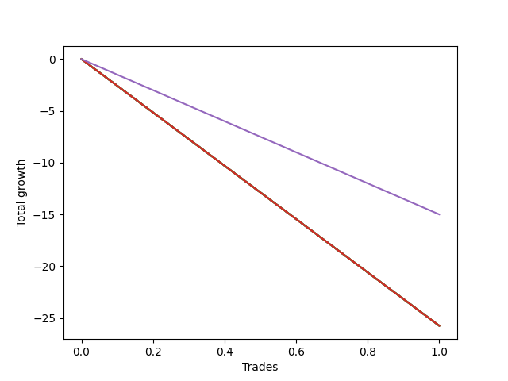

# Long Bernese 005 50 
- Symbol: ES
- Date Range: 03/18/2022 - 12/30/2022
- Trading Period: 8:30-12:30
- Number of Trades: 1



| Name | Win Percent | Profit | Avg Profit / Trade | Avg Time / Trade |      | Name | Win Percent | Profit | Avg Profit / Trade | Avg Time / Trade |
| ---- | ----------- | ------ | ------------------ | ---------------- | ---- | ---- | ----------- | ------ | ------------------ | ---------------- |
| Sorted By <br> Profit | | | | | | Sorted By <br> Win Percentage ||||
| Five | 100.00 | 5500.00 | 5500.00 | 24:55 |     | Five | 100.00 | 5500.00 | 5500.00 | 24:55 |
| Four | 100.00 | 3125.00 | 3125.00 | 24:15 |     | Four | 100.00 | 3125.00 | 3125.00 | 24:15 |
| Eighty-Five | 100.00 | 2750.00 | 2750.00 | 20:45 |     | Eighty-Five | 100.00 | 2750.00 | 2750.00 | 20:45 |
| Eighty-Four | 100.00 | 2750.00 | 2750.00 | 20:45 |     | Eighty-Four | 100.00 | 2750.00 | 2750.00 | 20:45 |
| Two_C | 100.00 | 2750.00 | 2750.00 | 20:45 |     | Two_C | 100.00 | 2750.00 | 2750.00 | 20:45 |
| MALAMUTE 001 | 100.00 | 2500.00 | 2500.00 | 35:00 |     | MALAMUTE 001 | 100.00 | 2500.00 | 2500.00 | 35:00 |
| NEWFI 000 | 100.00 | 2500.00 | 2500.00 | 35:00 |     | NEWFI 000 | 100.00 | 2500.00 | 2500.00 | 35:00 |
| BB100 | 100.00 | 2500.00 | 2500.00 | 35:00 |     | BB100 | 100.00 | 2500.00 | 2500.00 | 35:00 |
| Seven | 100.00 | 2500.00 | 2500.00 | 35:00 |     | Seven | 100.00 | 2500.00 | 2500.00 | 35:00 |
| Six | 100.00 | 2500.00 | 2500.00 | 35:00 |     | Six | 100.00 | 2500.00 | 2500.00 | 35:00 |
| Eighty-Three | 100.00 | 1875.00 | 1875.00 | 20:35 |     | Eighty-Three | 100.00 | 1875.00 | 1875.00 | 20:35 |
| Two | 100.00 | 1875.00 | 1875.00 | 20:35 |     | Two | 100.00 | 1875.00 | 1875.00 | 20:35 |
| Eighty-Two | 100.00 | 1250.00 | 1250.00 | 20:30 |     | Eighty-Two | 100.00 | 1250.00 | 1250.00 | 20:30 |
| Eighty-One | 100.00 | 1250.00 | 1250.00 | 20:30 |     | Eighty-One | 100.00 | 1250.00 | 1250.00 | 20:30 |
| Three | 100.00 | 1250.00 | 1250.00 | 20:30 |     | Three | 100.00 | 1250.00 | 1250.00 | 20:30 |
| One | 100.00 | 1250.00 | 1250.00 | 20:30 |     | One | 100.00 | 1250.00 | 1250.00 | 20:30 |
| Zero | 0.00 | -125.00 | -125.00 | 19:35 |     | Zero | 0.00 | -125.00 | -125.00 | 19:35 |
| MALAMUTE 002 | 0.00 | -1125.00 | -1125.00 | 08:05 |     | MALAMUTE 002 | 0.00 | -1125.00 | -1125.00 | 08:05 |
| NEWFI 0000 | 0.00 | -3125.00 | -3125.00 | 15:05 |     | NEWFI 0000 | 0.00 | -3125.00 | -3125.00 | 15:05 |

## NO STOPLOSS

### Test Zero
* Sell when price hits the middle line of the 20p bollinger
* No Stoploss
* Results:
```
Total Trades: 1
Percent Up: 0.00
Percent Down: 100.00
Total Points Moved Up: -0.25
Potential Profit: -125.00
Total Points Ups: 0.00 Count Ups: 0
Total Points Downs: -0.25 Count Downs: 1
```

<details><summary>Trades</summary>

<code>In: 2022-09-29 12:12:00		Out: 2022-09-29 12:31:35		Total Position Time: 19:35		Total Move Up: -0.25		Total to Date: -0.25</code> <br />


</details>

### Test One
* Sell when the price hits the upper line of the 20p 1std bollinger
* No Stoploss
* Results:
```
Total Trades: 1
Percent Up: 100.00
Percent Down: 0.00
Total Points Moved Up: 2.50
Potential Profit: 1250.00
Total Points Ups: 2.50 Count Ups: 1
Total Points Downs: 0.00 Count Downs: 0
```

<details><summary>Trades</summary>

<code>In: 2022-09-29 12:12:00		Out: 2022-09-29 12:32:30		Total Position Time: 20:30		Total Move Up: 2.50		Total to Date: 2.50</code> <br />


</details>

### Test Two
* Sell when the price hits the upper line of the 20p 2std bollinger
* No Stoploss
* Results:
```
Total Trades: 1
Percent Up: 100.00
Percent Down: 0.00
Total Points Moved Up: 3.75
Potential Profit: 1875.00
Total Points Ups: 3.75 Count Ups: 1
Total Points Downs: 0.00 Count Downs: 0
```

<details><summary>Trades</summary>

<code>In: 2022-09-29 12:12:00		Out: 2022-09-29 12:32:35		Total Position Time: 20:35		Total Move Up: 3.75		Total to Date: 3.75</code> <br />


</details>

### Test Two_C
* Sell when the price hits the upper line of the 20p 2std bollinger
* No Stoploss
* Results:
```
Total Trades: 1
Percent Up: 100.00
Percent Down: 0.00
Total Points Moved Up: 5.50
Potential Profit: 2750.00
Total Points Ups: 5.50 Count Ups: 1
Total Points Downs: 0.00 Count Downs: 0
```

<details><summary>Trades</summary>

<code>In: 2022-09-29 12:12:00		Out: 2022-09-29 12:32:45		Total Position Time: 20:45		Total Move Up: 5.50		Total to Date: 5.50</code> <br />


</details>

### Test Three
* Sell when price hits the middle line of the 50p bollinger
* No Stoploss
* Results:
```
Total Trades: 1
Percent Up: 100.00
Percent Down: 0.00
Total Points Moved Up: 2.50
Potential Profit: 1250.00
Total Points Ups: 2.50 Count Ups: 1
Total Points Downs: 0.00 Count Downs: 0
```

<details><summary>Trades</summary>

<code>In: 2022-09-29 12:12:00		Out: 2022-09-29 12:32:30		Total Position Time: 20:30		Total Move Up: 2.50		Total to Date: 2.50</code> <br />


</details>

### Test Four
* Sell when the price hits the upper line of the 50p 1std bollinger
* No Stoploss
* Results:
```
Total Trades: 1
Percent Up: 100.00
Percent Down: 0.00
Total Points Moved Up: 6.25
Potential Profit: 3125.00
Total Points Ups: 6.25 Count Ups: 1
Total Points Downs: 0.00 Count Downs: 0
```

<details><summary>Trades</summary>

<code>In: 2022-09-29 12:12:00		Out: 2022-09-29 12:36:15		Total Position Time: 24:15		Total Move Up: 6.25		Total to Date: 6.25</code> <br />


</details>

### Test Five
* Sell when the price hits the upper line of the 50p 2std bollinger
* No Stoploss
* Results:
```
Total Trades: 1
Percent Up: 100.00
Percent Down: 0.00
Total Points Moved Up: 11.00
Potential Profit: 5500.00
Total Points Ups: 11.00 Count Ups: 1
Total Points Downs: 0.00 Count Downs: 0
```

<details><summary>Trades</summary>

<code>In: 2022-09-29 12:12:00		Out: 2022-09-29 12:36:55		Total Position Time: 24:55		Total Move Up: 11.00		Total to Date: 11.00</code> <br />


</details>

### Test Six
* Sell when the price hits the middle line of the 1std VWAP
* No Stoploss
* Results:
```
Total Trades: 1
Percent Up: 100.00
Percent Down: 0.00
Total Points Moved Up: 5.00
Potential Profit: 2500.00
Total Points Ups: 5.00 Count Ups: 1
Total Points Downs: 0.00 Count Downs: 0
```

<details><summary>Trades</summary>

<code>In: 2022-09-29 12:12:00		Out: 2022-09-29 12:47:00		Total Position Time: 35:00		Total Move Up: 5.00		Total to Date: 5.00</code> <br />


</details>

### Test Seven
* Sell when the price hits the upper line of the 1std VWAP
* No Stoploss
* Results:
```
Total Trades: 1
Percent Up: 100.00
Percent Down: 0.00
Total Points Moved Up: 5.00
Potential Profit: 2500.00
Total Points Ups: 5.00 Count Ups: 1
Total Points Downs: 0.00 Count Downs: 0
```

<details><summary>Trades</summary>

<code>In: 2022-09-29 12:12:00		Out: 2022-09-29 12:47:00		Total Position Time: 35:00		Total Move Up: 5.00		Total to Date: 5.00</code> <br />


</details>

### Test BB100
* Move to BB100 Upper Band
* No Stoploss
* Results:
```
Total Trades: 1
Percent Up: 100.00
Percent Down: 0.00
Total Points Moved Up: 5.00
Potential Profit: 2500.00
Total Points Ups: 5.00 Count Ups: 1
Total Points Downs: 0.00 Count Downs: 0
```

<details><summary>Trades</summary>

<code>In: 2022-09-29 12:12:00		Out: 2022-09-29 12:47:00		Total Position Time: 35:00		Total Move Up: 5.00		Total to Date: 5.00</code> <br />


</details>

## TAKE PROFIT

### Test Eighty-One
* Take Profit of 1 Point
* No Stoploss
* Results:
```
Total Trades: 1
Percent Up: 100.00
Percent Down: 0.00
Total Points Moved Up: 2.50
Potential Profit: 1250.00
Total Points Ups: 2.50 Count Ups: 1
Total Points Downs: 0.00 Count Downs: 0
```

<details><summary>Trades</summary>

<code>In: 2022-09-29 12:12:00		Out: 2022-09-29 12:32:30		Total Position Time: 20:30		Total Move Up: 2.50		Total to Date: 2.50</code> <br />


</details>

### Test Eighty-Two
* Take Profit of 2 Point
* No Stoploss
* Results:
```
Total Trades: 1
Percent Up: 100.00
Percent Down: 0.00
Total Points Moved Up: 2.50
Potential Profit: 1250.00
Total Points Ups: 2.50 Count Ups: 1
Total Points Downs: 0.00 Count Downs: 0
```

<details><summary>Trades</summary>

<code>In: 2022-09-29 12:12:00		Out: 2022-09-29 12:32:30		Total Position Time: 20:30		Total Move Up: 2.50		Total to Date: 2.50</code> <br />


</details>

### Test Eighty-Three
* Take Profit of 3 Point
* No Stoploss
* Results:
```
Total Trades: 1
Percent Up: 100.00
Percent Down: 0.00
Total Points Moved Up: 3.75
Potential Profit: 1875.00
Total Points Ups: 3.75 Count Ups: 1
Total Points Downs: 0.00 Count Downs: 0
```

<details><summary>Trades</summary>

<code>In: 2022-09-29 12:12:00		Out: 2022-09-29 12:32:35		Total Position Time: 20:35		Total Move Up: 3.75		Total to Date: 3.75</code> <br />


</details>

### Test Eighty-Four
* Take Profit of 4 Point
* No Stoploss
* Results:
```
Total Trades: 1
Percent Up: 100.00
Percent Down: 0.00
Total Points Moved Up: 5.50
Potential Profit: 2750.00
Total Points Ups: 5.50 Count Ups: 1
Total Points Downs: 0.00 Count Downs: 0
```

<details><summary>Trades</summary>

<code>In: 2022-09-29 12:12:00		Out: 2022-09-29 12:32:45		Total Position Time: 20:45		Total Move Up: 5.50		Total to Date: 5.50</code> <br />


</details>

### Test Eighty-Five
* Take Profit of 5 Point
* No Stoploss
* Results:
```
Total Trades: 1
Percent Up: 100.00
Percent Down: 0.00
Total Points Moved Up: 5.50
Potential Profit: 2750.00
Total Points Ups: 5.50 Count Ups: 1
Total Points Downs: 0.00 Count Downs: 0
```

<details><summary>Trades</summary>

<code>In: 2022-09-29 12:12:00		Out: 2022-09-29 12:32:45		Total Position Time: 20:45		Total Move Up: 5.50		Total to Date: 5.50</code> <br />


</details>

## Indicator Exits

### Test NEWFI 000
* Newfi 0000
* No Stoploss
* Results:
```
Total Trades: 1
Percent Up: 100.00
Percent Down: 0.00
Total Points Moved Up: 5.00
Potential Profit: 2500.00
Total Points Ups: 5.00 Count Ups: 1
Total Points Downs: 0.00 Count Downs: 0
```

<details><summary>Trades</summary>

<code>In: 2022-09-29 12:12:00		Out: 2022-09-29 12:47:00		Total Position Time: 35:00		Total Move Up: 5.00		Total to Date: 5.00</code> <br />


</details>

### Test NEWFI 0000
* Newfi 0000
* No Stoploss
* Results:
```
Total Trades: 1
Percent Up: 0.00
Percent Down: 100.00
Total Points Moved Up: -6.25
Potential Profit: -3125.00
Total Points Ups: 0.00 Count Ups: 0
Total Points Downs: -6.25 Count Downs: 1
```

<details><summary>Trades</summary>

<code>In: 2022-09-29 12:12:00		Out: 2022-09-29 12:27:05		Total Position Time: 15:05		Total Move Up: -6.25		Total to Date: -6.25</code> <br />


</details>

### Test MALAMUTE 001
* Malamute 001
* No Stoploss
* Results:
```
Total Trades: 1
Percent Up: 100.00
Percent Down: 0.00
Total Points Moved Up: 5.00
Potential Profit: 2500.00
Total Points Ups: 5.00 Count Ups: 1
Total Points Downs: 0.00 Count Downs: 0
```

<details><summary>Trades</summary>

<code>In: 2022-09-29 12:12:00		Out: 2022-09-29 12:47:00		Total Position Time: 35:00		Total Move Up: 5.00		Total to Date: 5.00</code> <br />


</details>

### Test MALAMUTE 002
* Malamute 001
* No Stoploss
* Results:
```
Total Trades: 1
Percent Up: 0.00
Percent Down: 100.00
Total Points Moved Up: -2.25
Potential Profit: -1125.00
Total Points Ups: 0.00 Count Ups: 0
Total Points Downs: -2.25 Count Downs: 1
```

<details><summary>Trades</summary>

<code>In: 2022-09-29 12:12:00		Out: 2022-09-29 12:20:05		Total Position Time: 08:05		Total Move Up: -2.25		Total to Date: -2.25</code> <br />


</details>