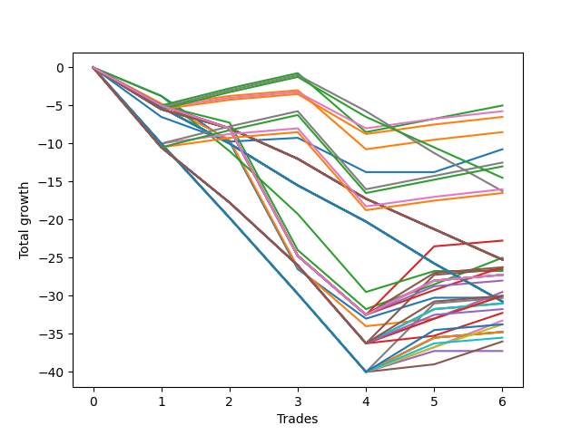

# Long Bulldog 003 DB 
- Symbol: ES
- Date Range: 03/18/2022 - 07/15/2022
- Trading Period: 7:20-12:30
- Number of Trades: 6



| Name | Win Percent | Profit | Avg Profit / Trade | Avg Time / Trade |      | Name | Win Percent | Profit | Avg Profit / Trade | Avg Time / Trade |
| ---- | ----------- | ------ | ------------------ | ---------------- | ---- | ---- | ----------- | ------ | ------------------ | ---------------- |
| Sorted By <br> Profit | | | | | | Sorted By <br> Win Percentage ||||
| Eighty-Two | 66.67 | -2500.00 | -416.67 | 14:53 |     | Eighty-Two | 66.67 | -2500.00 | -416.67 | 14:53 |
| One Hundred Eleven | 66.67 | -2875.00 | -479.17 | 02:16 |     | One Hundred Eleven | 66.67 | -2875.00 | -479.17 | 02:16 |
| One Hundred Sixteen | 66.67 | -3250.00 | -541.67 | 02:20 |     | One Hundred Sixteen | 66.67 | -3250.00 | -541.67 | 02:20 |
| Eighty-One | 66.67 | -4250.00 | -708.33 | 10:31 |     | Eighty-One | 66.67 | -4250.00 | -708.33 | 10:31 |
| Seventy-Three | 50.00 | -5375.00 | -895.83 | 12:45 |     | One Hundred Twenty-Two | 66.67 | -6250.00 | -1041.67 | 09:50 |
| One Hundred Twenty-Two | 66.67 | -6250.00 | -1041.67 | 09:50 |     | One Hundred Twenty-Seven | 66.67 | -6500.00 | -1083.33 | 12:50 |
| One Hundred Twenty-Seven | 66.67 | -6500.00 | -1083.33 | 12:50 |     | One Hundred Twenty-One | 66.67 | -8000.00 | -1333.33 | 05:29 |
| One Hundred Seventeen | 33.33 | -7250.00 | -1208.33 | 02:55 |     | One Hundred Twenty-Six | 66.67 | -8250.00 | -1375.00 | 08:29 |
| One Hundred Twenty-One | 66.67 | -8000.00 | -1333.33 | 05:29 |     | Seventy-Three | 50.00 | -5375.00 | -895.83 | 12:45 |
| One Hundred Twelve | 33.33 | -8125.00 | -1354.17 | 03:04 |     | One Hundred Seventeen | 33.33 | -7250.00 | -1208.33 | 02:55 |
| One Hundred Twenty-Six | 66.67 | -8250.00 | -1375.00 | 08:29 |     | One Hundred Twelve | 33.33 | -8125.00 | -1354.17 | 03:04 |
| Three | 33.33 | -11375.00 | -1895.83 | 29:27 |     | Three | 33.33 | -11375.00 | -1895.83 | 29:27 |
| Two | 33.33 | -12500.00 | -2083.33 | 26:36 |     | Two | 33.33 | -12500.00 | -2083.33 | 26:36 |
| One Hundred Twenty | 0.00 | -12625.00 | -2104.17 | 04:21 |     | Eighty-Five | 33.33 | -13125.00 | -2187.50 | 29:10 |
| One Hundred Ninteen | 0.00 | -12625.00 | -2104.17 | 04:21 |     | Eighty-Three | 33.33 | -13125.00 | -2187.50 | 26:57 |
| One Hundred Eighteen | 0.00 | -12625.00 | -2104.17 | 04:21 |     | Sixty-Seven | 33.33 | -13250.00 | -2208.33 | 20:44 |
| Fifty-Five | 0.00 | -12625.00 | -2104.17 | 04:21 |     | Sixty-Four | 33.33 | -13375.00 | -2229.17 | 13:40 |
| Fifty-Four | 0.00 | -12625.00 | -2104.17 | 04:21 |     | TEST | 33.33 | -13625.00 | -2270.83 | 29:55 |
| Fifty-Three | 0.00 | -12625.00 | -2104.17 | 04:21 |     | Seven | 33.33 | -13625.00 | -2270.83 | 29:55 |
| Fifty-Two | 0.00 | -12625.00 | -2104.17 | 04:21 |     | Six | 33.33 | -13625.00 | -2270.83 | 29:55 |
| Fifty-One | 0.00 | -12625.00 | -2104.17 | 04:21 |     | Five | 33.33 | -13625.00 | -2270.83 | 29:55 |
| Fifty | 0.00 | -12625.00 | -2104.17 | 04:21 |     | Four | 33.33 | -13625.00 | -2270.83 | 29:55 |
| Forty-Nine | 0.00 | -12625.00 | -2104.17 | 04:21 |     | Eighty-Four | 33.33 | -14000.00 | -2333.33 | 29:08 |
| Forty-Eight | 0.00 | -12625.00 | -2104.17 | 04:21 |     | Sixty-Six | 33.33 | -14750.00 | -2458.33 | 18:15 |
| Eighty-Five | 33.33 | -13125.00 | -2187.50 | 29:10 |     | One Hundred Thirty | 33.33 | -15000.00 | -2500.00 | 20:27 |
| Eighty-Three | 33.33 | -13125.00 | -2187.50 | 26:57 |     | One Hundred Twenty-Eight | 33.33 | -15000.00 | -2500.00 | 18:14 |
| Sixty-Seven | 33.33 | -13250.00 | -2208.33 | 20:44 |     | One | 33.33 | -15000.00 | -2500.00 | 25:40 |
| Sixty-Four | 33.33 | -13375.00 | -2229.17 | 13:40 |     | Fifty-Nine | 33.33 | -15125.00 | -2520.83 | 18:04 |
| TEST | 33.33 | -13625.00 | -2270.83 | 29:55 |     | Zero | 33.33 | -15125.00 | -2520.83 | 20:15 |
| Seven | 33.33 | -13625.00 | -2270.83 | 29:55 |     | Seventy-One | 33.33 | -15500.00 | -2583.33 | 21:11 |
| Six | 33.33 | -13625.00 | -2270.83 | 29:55 |     | Seventy | 33.33 | -15500.00 | -2583.33 | 21:11 |
| Five | 33.33 | -13625.00 | -2270.83 | 29:55 |     | Sixty-Nine | 33.33 | -15500.00 | -2583.33 | 21:11 |
| Four | 33.33 | -13625.00 | -2270.83 | 29:55 |     | Sixty-Eight | 33.33 | -15500.00 | -2583.33 | 21:11 |
| Eighty-Four | 33.33 | -14000.00 | -2333.33 | 29:08 |     | One Hundred Twenty-Nine | 33.33 | -15875.00 | -2645.83 | 20:25 |
| Sixty-Six | 33.33 | -14750.00 | -2458.33 | 18:15 |     | Sixty-Five | 33.33 | -16125.00 | -2687.50 | 17:36 |
| One Hundred Thirty | 33.33 | -15000.00 | -2500.00 | 20:27 |     | Fifty-Eight | 33.33 | -16625.00 | -2770.83 | 15:35 |
| One Hundred Twenty-Eight | 33.33 | -15000.00 | -2500.00 | 18:14 |     | One Hundred Twenty-Five | 33.33 | -16875.00 | -2812.50 | 17:47 |
| One | 33.33 | -15000.00 | -2500.00 | 25:40 |     | One Hundred Twenty-Three | 33.33 | -16875.00 | -2812.50 | 15:34 |
| Fifty-Nine | 33.33 | -15125.00 | -2520.83 | 18:04 |     | Sixty-Three | 33.33 | -17375.00 | -2895.83 | 18:31 |
| Zero | 33.33 | -15125.00 | -2520.83 | 20:15 |     | Sixty-Two | 33.33 | -17375.00 | -2895.83 | 18:31 |
| One Hundred Fifteen | 0.00 | -15375.00 | -2562.50 | 05:20 |     | Sixty-One | 33.33 | -17375.00 | -2895.83 | 18:31 |
| One Hundred Fourteen | 0.00 | -15375.00 | -2562.50 | 05:20 |     | Sixty | 33.33 | -17375.00 | -2895.83 | 18:31 |
| One Hundred Thirteen | 0.00 | -15375.00 | -2562.50 | 05:20 |     | One Hundred Twenty-Four | 33.33 | -17750.00 | -2958.33 | 17:45 |
| Forty-Seven | 0.00 | -15375.00 | -2562.50 | 05:20 |     | Fifty-Seven | 33.33 | -18000.00 | -3000.00 | 14:56 |
| Forty-Six | 0.00 | -15375.00 | -2562.50 | 05:20 |     | Fifty-Six | 33.33 | -18625.00 | -3104.17 | 12:40 |
| Forty-Five | 0.00 | -15375.00 | -2562.50 | 05:20 |     | One Hundred Twenty | 0.00 | -12625.00 | -2104.17 | 04:21 |
| Forty-Four | 0.00 | -15375.00 | -2562.50 | 05:20 |     | One Hundred Ninteen | 0.00 | -12625.00 | -2104.17 | 04:21 |
| Forty-Three | 0.00 | -15375.00 | -2562.50 | 05:20 |     | One Hundred Eighteen | 0.00 | -12625.00 | -2104.17 | 04:21 |
| Forty-Two | 0.00 | -15375.00 | -2562.50 | 05:20 |     | Fifty-Five | 0.00 | -12625.00 | -2104.17 | 04:21 |
| Forty-One | 0.00 | -15375.00 | -2562.50 | 05:20 |     | Fifty-Four | 0.00 | -12625.00 | -2104.17 | 04:21 |
| Forty | 0.00 | -15375.00 | -2562.50 | 05:20 |     | Fifty-Three | 0.00 | -12625.00 | -2104.17 | 04:21 |
| Seventy-One | 33.33 | -15500.00 | -2583.33 | 21:11 |     | Fifty-Two | 0.00 | -12625.00 | -2104.17 | 04:21 |
| Seventy | 33.33 | -15500.00 | -2583.33 | 21:11 |     | Fifty-One | 0.00 | -12625.00 | -2104.17 | 04:21 |
| Sixty-Nine | 33.33 | -15500.00 | -2583.33 | 21:11 |     | Fifty | 0.00 | -12625.00 | -2104.17 | 04:21 |
| Sixty-Eight | 33.33 | -15500.00 | -2583.33 | 21:11 |     | Forty-Nine | 0.00 | -12625.00 | -2104.17 | 04:21 |
| One Hundred Twenty-Nine | 33.33 | -15875.00 | -2645.83 | 20:25 |     | Forty-Eight | 0.00 | -12625.00 | -2104.17 | 04:21 |
| Sixty-Five | 33.33 | -16125.00 | -2687.50 | 17:36 |     | One Hundred Fifteen | 0.00 | -15375.00 | -2562.50 | 05:20 |
| Fifty-Eight | 33.33 | -16625.00 | -2770.83 | 15:35 |     | One Hundred Fourteen | 0.00 | -15375.00 | -2562.50 | 05:20 |
| One Hundred Twenty-Five | 33.33 | -16875.00 | -2812.50 | 17:47 |     | One Hundred Thirteen | 0.00 | -15375.00 | -2562.50 | 05:20 |
| One Hundred Twenty-Three | 33.33 | -16875.00 | -2812.50 | 15:34 |     | Forty-Seven | 0.00 | -15375.00 | -2562.50 | 05:20 |
| Sixty-Three | 33.33 | -17375.00 | -2895.83 | 18:31 |     | Forty-Six | 0.00 | -15375.00 | -2562.50 | 05:20 |
| Sixty-Two | 33.33 | -17375.00 | -2895.83 | 18:31 |     | Forty-Five | 0.00 | -15375.00 | -2562.50 | 05:20 |
| Sixty-One | 33.33 | -17375.00 | -2895.83 | 18:31 |     | Forty-Four | 0.00 | -15375.00 | -2562.50 | 05:20 |
| Sixty | 33.33 | -17375.00 | -2895.83 | 18:31 |     | Forty-Three | 0.00 | -15375.00 | -2562.50 | 05:20 |
| One Hundred Twenty-Four | 33.33 | -17750.00 | -2958.33 | 17:45 |     | Forty-Two | 0.00 | -15375.00 | -2562.50 | 05:20 |
| Fifty-Seven | 33.33 | -18000.00 | -3000.00 | 14:56 |     | Forty-One | 0.00 | -15375.00 | -2562.50 | 05:20 |
| Fifty-Six | 33.33 | -18625.00 | -3104.17 | 12:40 |     | Forty | 0.00 | -15375.00 | -2562.50 | 05:20 |

## NO STOPLOSS

### Test Zero
* Sell when price hits the middle line of the 20p bollinger
* No Stoploss
* Results:
```
Total Trades: 6
Percent Up: 33.33
Percent Down: 66.67
Total Points Moved Up: -30.25
Potential Profit: -15125.00
Total Points Ups: 2.75 Count Ups: 2
Total Points Downs: -33.00 Count Downs: 4
```

<details><summary>Trades</summary>

<code>In: 2022-03-23 10:23:00		Out: 2022-03-23 10:38:15		Total Position Time: 15:15		Total Move Up: -3.75		Total to Date: -3.75</code> <br />
<code>In: 2022-03-25 08:14:00		Out: 2022-03-25 08:36:40		Total Position Time: 22:40		Total Move Up: -6.00		Total to Date: -9.75</code> <br />
<code>In: 2022-03-28 08:27:00		Out: 2022-03-28 08:56:55		Total Position Time: 29:55		Total Move Up: -16.75		Total to Date: -26.50</code> <br />
<code>In: 2022-04-18 08:26:00		Out: 2022-04-18 08:55:05		Total Position Time: 29:05		Total Move Up: -6.50		Total to Date: -33.00</code> <br />
<code>In: 2022-06-06 08:19:00		Out: 2022-06-06 08:31:35		Total Position Time: 12:35		Total Move Up: 2.75		Total to Date: -30.25</code> <br />
<code>In: 2022-06-08 09:41:00		Out: 2022-06-08 09:53:05		Total Position Time: 12:05		Total Move Up: 0.00		Total to Date: -30.25</code> <br />


</details>

### Test One
* Sell when the price hits the upper line of the 20p 1std bollinger
* No Stoploss
* Results:
```
Total Trades: 6
Percent Up: 33.33
Percent Down: 66.67
Total Points Moved Up: -30.00
Potential Profit: -15000.00
Total Points Ups: 4.00 Count Ups: 2
Total Points Downs: -34.00 Count Downs: 4
```

<details><summary>Trades</summary>

<code>In: 2022-03-23 10:23:00		Out: 2022-03-23 10:51:45		Total Position Time: 28:45		Total Move Up: -4.75		Total to Date: -4.75</code> <br />
<code>In: 2022-03-25 08:14:00		Out: 2022-03-25 08:41:05		Total Position Time: 27:05		Total Move Up: -4.75		Total to Date: -9.50</code> <br />
<code>In: 2022-03-28 08:27:00		Out: 2022-03-28 08:56:55		Total Position Time: 29:55		Total Move Up: -16.75		Total to Date: -26.25</code> <br />
<code>In: 2022-04-18 08:26:00		Out: 2022-04-18 08:55:55		Total Position Time: 29:55		Total Move Up: -7.75		Total to Date: -34.00</code> <br />
<code>In: 2022-06-06 08:19:00		Out: 2022-06-06 08:39:15		Total Position Time: 20:15		Total Move Up: 1.00		Total to Date: -33.00</code> <br />
<code>In: 2022-06-08 09:41:00		Out: 2022-06-08 09:59:05		Total Position Time: 18:05		Total Move Up: 3.00		Total to Date: -30.00</code> <br />


</details>

### Test Two
* Sell when the price hits the upper line of the 20p 2std bollinger
* No Stoploss
* Results:
```
Total Trades: 6
Percent Up: 33.33
Percent Down: 66.67
Total Points Moved Up: -25.00
Potential Profit: -12500.00
Total Points Ups: 6.75 Count Ups: 2
Total Points Downs: -31.75 Count Downs: 4
```

<details><summary>Trades</summary>

<code>In: 2022-03-23 10:23:00		Out: 2022-03-23 10:52:55		Total Position Time: 29:55		Total Move Up: -5.00		Total to Date: -5.00</code> <br />
<code>In: 2022-03-25 08:14:00		Out: 2022-03-25 08:41:45		Total Position Time: 27:45		Total Move Up: -2.25		Total to Date: -7.25</code> <br />
<code>In: 2022-03-28 08:27:00		Out: 2022-03-28 08:56:55		Total Position Time: 29:55		Total Move Up: -16.75		Total to Date: -24.00</code> <br />
<code>In: 2022-04-18 08:26:00		Out: 2022-04-18 08:55:55		Total Position Time: 29:55		Total Move Up: -7.75		Total to Date: -31.75</code> <br />
<code>In: 2022-06-06 08:19:00		Out: 2022-06-06 08:43:00		Total Position Time: 24:00		Total Move Up: 3.25		Total to Date: -28.50</code> <br />
<code>In: 2022-06-08 09:41:00		Out: 2022-06-08 09:59:10		Total Position Time: 18:10		Total Move Up: 3.50		Total to Date: -25.00</code> <br />


</details>

### Test Three
* Sell when price hits the middle line of the 50p bollinger
* No Stoploss
* Results:
```
Total Trades: 6
Percent Up: 33.33
Percent Down: 66.67
Total Points Moved Up: -22.75
Potential Profit: -11375.00
Total Points Ups: 9.75 Count Ups: 2
Total Points Downs: -32.50 Count Downs: 4
```

<details><summary>Trades</summary>

<code>In: 2022-03-23 10:23:00		Out: 2022-03-23 10:52:55		Total Position Time: 29:55		Total Move Up: -5.00		Total to Date: -5.00</code> <br />
<code>In: 2022-03-25 08:14:00		Out: 2022-03-25 08:43:55		Total Position Time: 29:55		Total Move Up: -3.00		Total to Date: -8.00</code> <br />
<code>In: 2022-03-28 08:27:00		Out: 2022-03-28 08:56:55		Total Position Time: 29:55		Total Move Up: -16.75		Total to Date: -24.75</code> <br />
<code>In: 2022-04-18 08:26:00		Out: 2022-04-18 08:55:55		Total Position Time: 29:55		Total Move Up: -7.75		Total to Date: -32.50</code> <br />
<code>In: 2022-06-06 08:19:00		Out: 2022-06-06 08:46:10		Total Position Time: 27:10		Total Move Up: 9.00		Total to Date: -23.50</code> <br />
<code>In: 2022-06-08 09:41:00		Out: 2022-06-08 10:10:55		Total Position Time: 29:55		Total Move Up: 0.75		Total to Date: -22.75</code> <br />


</details>

### Test Four
* Sell when the price hits the upper line of the 50p 1std bollinger
* No Stoploss
* Results:
```
Total Trades: 6
Percent Up: 33.33
Percent Down: 66.67
Total Points Moved Up: -27.25
Potential Profit: -13625.00
Total Points Ups: 5.25 Count Ups: 2
Total Points Downs: -32.50 Count Downs: 4
```

<details><summary>Trades</summary>

<code>In: 2022-03-23 10:23:00		Out: 2022-03-23 10:52:55		Total Position Time: 29:55		Total Move Up: -5.00		Total to Date: -5.00</code> <br />
<code>In: 2022-03-25 08:14:00		Out: 2022-03-25 08:43:55		Total Position Time: 29:55		Total Move Up: -3.00		Total to Date: -8.00</code> <br />
<code>In: 2022-03-28 08:27:00		Out: 2022-03-28 08:56:55		Total Position Time: 29:55		Total Move Up: -16.75		Total to Date: -24.75</code> <br />
<code>In: 2022-04-18 08:26:00		Out: 2022-04-18 08:55:55		Total Position Time: 29:55		Total Move Up: -7.75		Total to Date: -32.50</code> <br />
<code>In: 2022-06-06 08:19:00		Out: 2022-06-06 08:48:55		Total Position Time: 29:55		Total Move Up: 4.50		Total to Date: -28.00</code> <br />
<code>In: 2022-06-08 09:41:00		Out: 2022-06-08 10:10:55		Total Position Time: 29:55		Total Move Up: 0.75		Total to Date: -27.25</code> <br />


</details>

### Test Five
* Sell when the price hits the upper line of the 50p 2std bollinger
* No Stoploss
* Results:
```
Total Trades: 6
Percent Up: 33.33
Percent Down: 66.67
Total Points Moved Up: -27.25
Potential Profit: -13625.00
Total Points Ups: 5.25 Count Ups: 2
Total Points Downs: -32.50 Count Downs: 4
```

<details><summary>Trades</summary>

<code>In: 2022-03-23 10:23:00		Out: 2022-03-23 10:52:55		Total Position Time: 29:55		Total Move Up: -5.00		Total to Date: -5.00</code> <br />
<code>In: 2022-03-25 08:14:00		Out: 2022-03-25 08:43:55		Total Position Time: 29:55		Total Move Up: -3.00		Total to Date: -8.00</code> <br />
<code>In: 2022-03-28 08:27:00		Out: 2022-03-28 08:56:55		Total Position Time: 29:55		Total Move Up: -16.75		Total to Date: -24.75</code> <br />
<code>In: 2022-04-18 08:26:00		Out: 2022-04-18 08:55:55		Total Position Time: 29:55		Total Move Up: -7.75		Total to Date: -32.50</code> <br />
<code>In: 2022-06-06 08:19:00		Out: 2022-06-06 08:48:55		Total Position Time: 29:55		Total Move Up: 4.50		Total to Date: -28.00</code> <br />
<code>In: 2022-06-08 09:41:00		Out: 2022-06-08 10:10:55		Total Position Time: 29:55		Total Move Up: 0.75		Total to Date: -27.25</code> <br />


</details>

### Test Six
* Sell when the price hits the middle line of the 1std VWAP
* No Stoploss
* Results:
```
Total Trades: 6
Percent Up: 33.33
Percent Down: 66.67
Total Points Moved Up: -27.25
Potential Profit: -13625.00
Total Points Ups: 5.25 Count Ups: 2
Total Points Downs: -32.50 Count Downs: 4
```

<details><summary>Trades</summary>

<code>In: 2022-03-23 10:23:00		Out: 2022-03-23 10:52:55		Total Position Time: 29:55		Total Move Up: -5.00		Total to Date: -5.00</code> <br />
<code>In: 2022-03-25 08:14:00		Out: 2022-03-25 08:43:55		Total Position Time: 29:55		Total Move Up: -3.00		Total to Date: -8.00</code> <br />
<code>In: 2022-03-28 08:27:00		Out: 2022-03-28 08:56:55		Total Position Time: 29:55		Total Move Up: -16.75		Total to Date: -24.75</code> <br />
<code>In: 2022-04-18 08:26:00		Out: 2022-04-18 08:55:55		Total Position Time: 29:55		Total Move Up: -7.75		Total to Date: -32.50</code> <br />
<code>In: 2022-06-06 08:19:00		Out: 2022-06-06 08:48:55		Total Position Time: 29:55		Total Move Up: 4.50		Total to Date: -28.00</code> <br />
<code>In: 2022-06-08 09:41:00		Out: 2022-06-08 10:10:55		Total Position Time: 29:55		Total Move Up: 0.75		Total to Date: -27.25</code> <br />


</details>

### Test Seven
* Sell when the price hits the upper line of the 1std VWAP
* No Stoploss
* Results:
```
Total Trades: 6
Percent Up: 33.33
Percent Down: 66.67
Total Points Moved Up: -27.25
Potential Profit: -13625.00
Total Points Ups: 5.25 Count Ups: 2
Total Points Downs: -32.50 Count Downs: 4
```

<details><summary>Trades</summary>

<code>In: 2022-03-23 10:23:00		Out: 2022-03-23 10:52:55		Total Position Time: 29:55		Total Move Up: -5.00		Total to Date: -5.00</code> <br />
<code>In: 2022-03-25 08:14:00		Out: 2022-03-25 08:43:55		Total Position Time: 29:55		Total Move Up: -3.00		Total to Date: -8.00</code> <br />
<code>In: 2022-03-28 08:27:00		Out: 2022-03-28 08:56:55		Total Position Time: 29:55		Total Move Up: -16.75		Total to Date: -24.75</code> <br />
<code>In: 2022-04-18 08:26:00		Out: 2022-04-18 08:55:55		Total Position Time: 29:55		Total Move Up: -7.75		Total to Date: -32.50</code> <br />
<code>In: 2022-06-06 08:19:00		Out: 2022-06-06 08:48:55		Total Position Time: 29:55		Total Move Up: 4.50		Total to Date: -28.00</code> <br />
<code>In: 2022-06-08 09:41:00		Out: 2022-06-08 10:10:55		Total Position Time: 29:55		Total Move Up: 0.75		Total to Date: -27.25</code> <br />


</details>

## STOPLOSS OF 5

### Test Forty
* Sell when price hits the middle line of the 20p bollinger
* Stoploss is 5 points
* Results:
```
Total Trades: 6
Percent Up: 0.00
Percent Down: 100.00
Total Points Moved Up: -30.75
Potential Profit: -15375.00
Total Points Ups: 0.00 Count Ups: 0
Total Points Downs: -30.75 Count Downs: 6
```

<details><summary>Trades</summary>

<code>In: 2022-03-23 10:23:00		Out: 2022-03-23 10:25:30		Total Position Time: 02:30		Total Move Up: -5.25		Total to Date: -5.25</code> <br />
<code>In: 2022-03-25 08:14:00		Out: 2022-03-25 08:24:25		Total Position Time: 10:25		Total Move Up: -4.75		Total to Date: -10.00</code> <br />
<code>In: 2022-03-28 08:27:00		Out: 2022-03-28 08:33:30		Total Position Time: 06:30		Total Move Up: -5.50		Total to Date: -15.50</code> <br />
<code>In: 2022-04-18 08:26:00		Out: 2022-04-18 08:33:50		Total Position Time: 07:50		Total Move Up: -4.75		Total to Date: -20.25</code> <br />
<code>In: 2022-06-06 08:19:00		Out: 2022-06-06 08:20:05		Total Position Time: 01:05		Total Move Up: -5.50		Total to Date: -25.75</code> <br />
<code>In: 2022-06-08 09:41:00		Out: 2022-06-08 09:44:45		Total Position Time: 03:45		Total Move Up: -5.00		Total to Date: -30.75</code> <br />


</details>

### Test Forty-One
* Sell when the price hits the upper line of the 20p 1std bollinger
* Stoploss is 5 points
* Results:
```
Total Trades: 6
Percent Up: 0.00
Percent Down: 100.00
Total Points Moved Up: -30.75
Potential Profit: -15375.00
Total Points Ups: 0.00 Count Ups: 0
Total Points Downs: -30.75 Count Downs: 6
```

<details><summary>Trades</summary>

<code>In: 2022-03-23 10:23:00		Out: 2022-03-23 10:25:30		Total Position Time: 02:30		Total Move Up: -5.25		Total to Date: -5.25</code> <br />
<code>In: 2022-03-25 08:14:00		Out: 2022-03-25 08:24:25		Total Position Time: 10:25		Total Move Up: -4.75		Total to Date: -10.00</code> <br />
<code>In: 2022-03-28 08:27:00		Out: 2022-03-28 08:33:30		Total Position Time: 06:30		Total Move Up: -5.50		Total to Date: -15.50</code> <br />
<code>In: 2022-04-18 08:26:00		Out: 2022-04-18 08:33:50		Total Position Time: 07:50		Total Move Up: -4.75		Total to Date: -20.25</code> <br />
<code>In: 2022-06-06 08:19:00		Out: 2022-06-06 08:20:05		Total Position Time: 01:05		Total Move Up: -5.50		Total to Date: -25.75</code> <br />
<code>In: 2022-06-08 09:41:00		Out: 2022-06-08 09:44:45		Total Position Time: 03:45		Total Move Up: -5.00		Total to Date: -30.75</code> <br />


</details>

### Test Forty-Two
* Sell when the price hits the upper line of the 20p 2std bollinger
* Stoploss is 5 points
* Results:
```
Total Trades: 6
Percent Up: 0.00
Percent Down: 100.00
Total Points Moved Up: -30.75
Potential Profit: -15375.00
Total Points Ups: 0.00 Count Ups: 0
Total Points Downs: -30.75 Count Downs: 6
```

<details><summary>Trades</summary>

<code>In: 2022-03-23 10:23:00		Out: 2022-03-23 10:25:30		Total Position Time: 02:30		Total Move Up: -5.25		Total to Date: -5.25</code> <br />
<code>In: 2022-03-25 08:14:00		Out: 2022-03-25 08:24:25		Total Position Time: 10:25		Total Move Up: -4.75		Total to Date: -10.00</code> <br />
<code>In: 2022-03-28 08:27:00		Out: 2022-03-28 08:33:30		Total Position Time: 06:30		Total Move Up: -5.50		Total to Date: -15.50</code> <br />
<code>In: 2022-04-18 08:26:00		Out: 2022-04-18 08:33:50		Total Position Time: 07:50		Total Move Up: -4.75		Total to Date: -20.25</code> <br />
<code>In: 2022-06-06 08:19:00		Out: 2022-06-06 08:20:05		Total Position Time: 01:05		Total Move Up: -5.50		Total to Date: -25.75</code> <br />
<code>In: 2022-06-08 09:41:00		Out: 2022-06-08 09:44:45		Total Position Time: 03:45		Total Move Up: -5.00		Total to Date: -30.75</code> <br />


</details>

### Test Forty-Three
* Sell when price hits the middle line of the 50p bollinger
* Stoploss is 5 points
* Results:
```
Total Trades: 6
Percent Up: 0.00
Percent Down: 100.00
Total Points Moved Up: -30.75
Potential Profit: -15375.00
Total Points Ups: 0.00 Count Ups: 0
Total Points Downs: -30.75 Count Downs: 6
```

<details><summary>Trades</summary>

<code>In: 2022-03-23 10:23:00		Out: 2022-03-23 10:25:30		Total Position Time: 02:30		Total Move Up: -5.25		Total to Date: -5.25</code> <br />
<code>In: 2022-03-25 08:14:00		Out: 2022-03-25 08:24:25		Total Position Time: 10:25		Total Move Up: -4.75		Total to Date: -10.00</code> <br />
<code>In: 2022-03-28 08:27:00		Out: 2022-03-28 08:33:30		Total Position Time: 06:30		Total Move Up: -5.50		Total to Date: -15.50</code> <br />
<code>In: 2022-04-18 08:26:00		Out: 2022-04-18 08:33:50		Total Position Time: 07:50		Total Move Up: -4.75		Total to Date: -20.25</code> <br />
<code>In: 2022-06-06 08:19:00		Out: 2022-06-06 08:20:05		Total Position Time: 01:05		Total Move Up: -5.50		Total to Date: -25.75</code> <br />
<code>In: 2022-06-08 09:41:00		Out: 2022-06-08 09:44:45		Total Position Time: 03:45		Total Move Up: -5.00		Total to Date: -30.75</code> <br />


</details>

### Test Forty-Four
* Sell when the price hits the upper line of the 50p 1std bollinger
* Stoploss is 5 points
* Results:
```
Total Trades: 6
Percent Up: 0.00
Percent Down: 100.00
Total Points Moved Up: -30.75
Potential Profit: -15375.00
Total Points Ups: 0.00 Count Ups: 0
Total Points Downs: -30.75 Count Downs: 6
```

<details><summary>Trades</summary>

<code>In: 2022-03-23 10:23:00		Out: 2022-03-23 10:25:30		Total Position Time: 02:30		Total Move Up: -5.25		Total to Date: -5.25</code> <br />
<code>In: 2022-03-25 08:14:00		Out: 2022-03-25 08:24:25		Total Position Time: 10:25		Total Move Up: -4.75		Total to Date: -10.00</code> <br />
<code>In: 2022-03-28 08:27:00		Out: 2022-03-28 08:33:30		Total Position Time: 06:30		Total Move Up: -5.50		Total to Date: -15.50</code> <br />
<code>In: 2022-04-18 08:26:00		Out: 2022-04-18 08:33:50		Total Position Time: 07:50		Total Move Up: -4.75		Total to Date: -20.25</code> <br />
<code>In: 2022-06-06 08:19:00		Out: 2022-06-06 08:20:05		Total Position Time: 01:05		Total Move Up: -5.50		Total to Date: -25.75</code> <br />
<code>In: 2022-06-08 09:41:00		Out: 2022-06-08 09:44:45		Total Position Time: 03:45		Total Move Up: -5.00		Total to Date: -30.75</code> <br />


</details>

### Test Forty-Five
* Sell when the price hits the upper line of the 50p 2std bollinger
* Stoploss is 5 points
* Results:
```
Total Trades: 6
Percent Up: 0.00
Percent Down: 100.00
Total Points Moved Up: -30.75
Potential Profit: -15375.00
Total Points Ups: 0.00 Count Ups: 0
Total Points Downs: -30.75 Count Downs: 6
```

<details><summary>Trades</summary>

<code>In: 2022-03-23 10:23:00		Out: 2022-03-23 10:25:30		Total Position Time: 02:30		Total Move Up: -5.25		Total to Date: -5.25</code> <br />
<code>In: 2022-03-25 08:14:00		Out: 2022-03-25 08:24:25		Total Position Time: 10:25		Total Move Up: -4.75		Total to Date: -10.00</code> <br />
<code>In: 2022-03-28 08:27:00		Out: 2022-03-28 08:33:30		Total Position Time: 06:30		Total Move Up: -5.50		Total to Date: -15.50</code> <br />
<code>In: 2022-04-18 08:26:00		Out: 2022-04-18 08:33:50		Total Position Time: 07:50		Total Move Up: -4.75		Total to Date: -20.25</code> <br />
<code>In: 2022-06-06 08:19:00		Out: 2022-06-06 08:20:05		Total Position Time: 01:05		Total Move Up: -5.50		Total to Date: -25.75</code> <br />
<code>In: 2022-06-08 09:41:00		Out: 2022-06-08 09:44:45		Total Position Time: 03:45		Total Move Up: -5.00		Total to Date: -30.75</code> <br />


</details>

### Test Forty-Six
* Sell when the price hits the middle line of the 1std VWAP
* Stoploss is 5 points
* Results:
```
Total Trades: 6
Percent Up: 0.00
Percent Down: 100.00
Total Points Moved Up: -30.75
Potential Profit: -15375.00
Total Points Ups: 0.00 Count Ups: 0
Total Points Downs: -30.75 Count Downs: 6
```

<details><summary>Trades</summary>

<code>In: 2022-03-23 10:23:00		Out: 2022-03-23 10:25:30		Total Position Time: 02:30		Total Move Up: -5.25		Total to Date: -5.25</code> <br />
<code>In: 2022-03-25 08:14:00		Out: 2022-03-25 08:24:25		Total Position Time: 10:25		Total Move Up: -4.75		Total to Date: -10.00</code> <br />
<code>In: 2022-03-28 08:27:00		Out: 2022-03-28 08:33:30		Total Position Time: 06:30		Total Move Up: -5.50		Total to Date: -15.50</code> <br />
<code>In: 2022-04-18 08:26:00		Out: 2022-04-18 08:33:50		Total Position Time: 07:50		Total Move Up: -4.75		Total to Date: -20.25</code> <br />
<code>In: 2022-06-06 08:19:00		Out: 2022-06-06 08:20:05		Total Position Time: 01:05		Total Move Up: -5.50		Total to Date: -25.75</code> <br />
<code>In: 2022-06-08 09:41:00		Out: 2022-06-08 09:44:45		Total Position Time: 03:45		Total Move Up: -5.00		Total to Date: -30.75</code> <br />


</details>

### Test Forty-Seven
* Sell when the price hits the upper line of the 1std VWAP
* Stoploss is 5 points
* Results:
```
Total Trades: 6
Percent Up: 0.00
Percent Down: 100.00
Total Points Moved Up: -30.75
Potential Profit: -15375.00
Total Points Ups: 0.00 Count Ups: 0
Total Points Downs: -30.75 Count Downs: 6
```

<details><summary>Trades</summary>

<code>In: 2022-03-23 10:23:00		Out: 2022-03-23 10:25:30		Total Position Time: 02:30		Total Move Up: -5.25		Total to Date: -5.25</code> <br />
<code>In: 2022-03-25 08:14:00		Out: 2022-03-25 08:24:25		Total Position Time: 10:25		Total Move Up: -4.75		Total to Date: -10.00</code> <br />
<code>In: 2022-03-28 08:27:00		Out: 2022-03-28 08:33:30		Total Position Time: 06:30		Total Move Up: -5.50		Total to Date: -15.50</code> <br />
<code>In: 2022-04-18 08:26:00		Out: 2022-04-18 08:33:50		Total Position Time: 07:50		Total Move Up: -4.75		Total to Date: -20.25</code> <br />
<code>In: 2022-06-06 08:19:00		Out: 2022-06-06 08:20:05		Total Position Time: 01:05		Total Move Up: -5.50		Total to Date: -25.75</code> <br />
<code>In: 2022-06-08 09:41:00		Out: 2022-06-08 09:44:45		Total Position Time: 03:45		Total Move Up: -5.00		Total to Date: -30.75</code> <br />


</details>

## TRAIL STOP OF 5

### Test Forty-Eight
* Sell when price hits the middle line of the 20p bollinger
* Trailing Stop is 5 points
* Results:
```
Total Trades: 6
Percent Up: 0.00
Percent Down: 100.00
Total Points Moved Up: -25.25
Potential Profit: -12625.00
Total Points Ups: 0.00 Count Ups: 0
Total Points Downs: -25.25 Count Downs: 6
```

<details><summary>Trades</summary>

<code>In: 2022-03-23 10:23:00		Out: 2022-03-23 10:25:45		Total Position Time: 02:45		Total Move Up: -5.50		Total to Date: -5.50</code> <br />
<code>In: 2022-03-25 08:14:00		Out: 2022-03-25 08:20:40		Total Position Time: 06:40		Total Move Up: -2.50		Total to Date: -8.00</code> <br />
<code>In: 2022-03-28 08:27:00		Out: 2022-03-28 08:32:10		Total Position Time: 05:10		Total Move Up: -4.00		Total to Date: -12.00</code> <br />
<code>In: 2022-04-18 08:26:00		Out: 2022-04-18 08:34:00		Total Position Time: 08:00		Total Move Up: -5.25		Total to Date: -17.25</code> <br />
<code>In: 2022-06-06 08:19:00		Out: 2022-06-06 08:20:00		Total Position Time: 01:00		Total Move Up: -4.00		Total to Date: -21.25</code> <br />
<code>In: 2022-06-08 09:41:00		Out: 2022-06-08 09:43:35		Total Position Time: 02:35		Total Move Up: -4.00		Total to Date: -25.25</code> <br />


</details>

### Test Forty-Nine
* Sell when the price hits the upper line of the 20p 1std bollinger
* Trailing Stop is 5 points
* Results:
```
Total Trades: 6
Percent Up: 0.00
Percent Down: 100.00
Total Points Moved Up: -25.25
Potential Profit: -12625.00
Total Points Ups: 0.00 Count Ups: 0
Total Points Downs: -25.25 Count Downs: 6
```

<details><summary>Trades</summary>

<code>In: 2022-03-23 10:23:00		Out: 2022-03-23 10:25:45		Total Position Time: 02:45		Total Move Up: -5.50		Total to Date: -5.50</code> <br />
<code>In: 2022-03-25 08:14:00		Out: 2022-03-25 08:20:40		Total Position Time: 06:40		Total Move Up: -2.50		Total to Date: -8.00</code> <br />
<code>In: 2022-03-28 08:27:00		Out: 2022-03-28 08:32:10		Total Position Time: 05:10		Total Move Up: -4.00		Total to Date: -12.00</code> <br />
<code>In: 2022-04-18 08:26:00		Out: 2022-04-18 08:34:00		Total Position Time: 08:00		Total Move Up: -5.25		Total to Date: -17.25</code> <br />
<code>In: 2022-06-06 08:19:00		Out: 2022-06-06 08:20:00		Total Position Time: 01:00		Total Move Up: -4.00		Total to Date: -21.25</code> <br />
<code>In: 2022-06-08 09:41:00		Out: 2022-06-08 09:43:35		Total Position Time: 02:35		Total Move Up: -4.00		Total to Date: -25.25</code> <br />


</details>

### Test Fifty
* Sell when the price hits the upper line of the 20p 2std bollinger
* Trailing Stop is 5 points
* Results:
```
Total Trades: 6
Percent Up: 0.00
Percent Down: 100.00
Total Points Moved Up: -25.25
Potential Profit: -12625.00
Total Points Ups: 0.00 Count Ups: 0
Total Points Downs: -25.25 Count Downs: 6
```

<details><summary>Trades</summary>

<code>In: 2022-03-23 10:23:00		Out: 2022-03-23 10:25:45		Total Position Time: 02:45		Total Move Up: -5.50		Total to Date: -5.50</code> <br />
<code>In: 2022-03-25 08:14:00		Out: 2022-03-25 08:20:40		Total Position Time: 06:40		Total Move Up: -2.50		Total to Date: -8.00</code> <br />
<code>In: 2022-03-28 08:27:00		Out: 2022-03-28 08:32:10		Total Position Time: 05:10		Total Move Up: -4.00		Total to Date: -12.00</code> <br />
<code>In: 2022-04-18 08:26:00		Out: 2022-04-18 08:34:00		Total Position Time: 08:00		Total Move Up: -5.25		Total to Date: -17.25</code> <br />
<code>In: 2022-06-06 08:19:00		Out: 2022-06-06 08:20:00		Total Position Time: 01:00		Total Move Up: -4.00		Total to Date: -21.25</code> <br />
<code>In: 2022-06-08 09:41:00		Out: 2022-06-08 09:43:35		Total Position Time: 02:35		Total Move Up: -4.00		Total to Date: -25.25</code> <br />


</details>

### Test Fifty-One
* Sell when price hits the middle line of the 50p bollinger
* Trailing Stop is 5 points
* Results:
```
Total Trades: 6
Percent Up: 0.00
Percent Down: 100.00
Total Points Moved Up: -25.25
Potential Profit: -12625.00
Total Points Ups: 0.00 Count Ups: 0
Total Points Downs: -25.25 Count Downs: 6
```

<details><summary>Trades</summary>

<code>In: 2022-03-23 10:23:00		Out: 2022-03-23 10:25:45		Total Position Time: 02:45		Total Move Up: -5.50		Total to Date: -5.50</code> <br />
<code>In: 2022-03-25 08:14:00		Out: 2022-03-25 08:20:40		Total Position Time: 06:40		Total Move Up: -2.50		Total to Date: -8.00</code> <br />
<code>In: 2022-03-28 08:27:00		Out: 2022-03-28 08:32:10		Total Position Time: 05:10		Total Move Up: -4.00		Total to Date: -12.00</code> <br />
<code>In: 2022-04-18 08:26:00		Out: 2022-04-18 08:34:00		Total Position Time: 08:00		Total Move Up: -5.25		Total to Date: -17.25</code> <br />
<code>In: 2022-06-06 08:19:00		Out: 2022-06-06 08:20:00		Total Position Time: 01:00		Total Move Up: -4.00		Total to Date: -21.25</code> <br />
<code>In: 2022-06-08 09:41:00		Out: 2022-06-08 09:43:35		Total Position Time: 02:35		Total Move Up: -4.00		Total to Date: -25.25</code> <br />


</details>

### Test Fifty-Two
* Sell when the price hits the upper line of the 50p 1std bollinger
* Trailing Stop is 5 points
* Results:
```
Total Trades: 6
Percent Up: 0.00
Percent Down: 100.00
Total Points Moved Up: -25.25
Potential Profit: -12625.00
Total Points Ups: 0.00 Count Ups: 0
Total Points Downs: -25.25 Count Downs: 6
```

<details><summary>Trades</summary>

<code>In: 2022-03-23 10:23:00		Out: 2022-03-23 10:25:45		Total Position Time: 02:45		Total Move Up: -5.50		Total to Date: -5.50</code> <br />
<code>In: 2022-03-25 08:14:00		Out: 2022-03-25 08:20:40		Total Position Time: 06:40		Total Move Up: -2.50		Total to Date: -8.00</code> <br />
<code>In: 2022-03-28 08:27:00		Out: 2022-03-28 08:32:10		Total Position Time: 05:10		Total Move Up: -4.00		Total to Date: -12.00</code> <br />
<code>In: 2022-04-18 08:26:00		Out: 2022-04-18 08:34:00		Total Position Time: 08:00		Total Move Up: -5.25		Total to Date: -17.25</code> <br />
<code>In: 2022-06-06 08:19:00		Out: 2022-06-06 08:20:00		Total Position Time: 01:00		Total Move Up: -4.00		Total to Date: -21.25</code> <br />
<code>In: 2022-06-08 09:41:00		Out: 2022-06-08 09:43:35		Total Position Time: 02:35		Total Move Up: -4.00		Total to Date: -25.25</code> <br />


</details>

### Test Fifty-Three
* Sell when the price hits the upper line of the 50p 2std bollinger
* Trailing Stop is 5 points
* Results:
```
Total Trades: 6
Percent Up: 0.00
Percent Down: 100.00
Total Points Moved Up: -25.25
Potential Profit: -12625.00
Total Points Ups: 0.00 Count Ups: 0
Total Points Downs: -25.25 Count Downs: 6
```

<details><summary>Trades</summary>

<code>In: 2022-03-23 10:23:00		Out: 2022-03-23 10:25:45		Total Position Time: 02:45		Total Move Up: -5.50		Total to Date: -5.50</code> <br />
<code>In: 2022-03-25 08:14:00		Out: 2022-03-25 08:20:40		Total Position Time: 06:40		Total Move Up: -2.50		Total to Date: -8.00</code> <br />
<code>In: 2022-03-28 08:27:00		Out: 2022-03-28 08:32:10		Total Position Time: 05:10		Total Move Up: -4.00		Total to Date: -12.00</code> <br />
<code>In: 2022-04-18 08:26:00		Out: 2022-04-18 08:34:00		Total Position Time: 08:00		Total Move Up: -5.25		Total to Date: -17.25</code> <br />
<code>In: 2022-06-06 08:19:00		Out: 2022-06-06 08:20:00		Total Position Time: 01:00		Total Move Up: -4.00		Total to Date: -21.25</code> <br />
<code>In: 2022-06-08 09:41:00		Out: 2022-06-08 09:43:35		Total Position Time: 02:35		Total Move Up: -4.00		Total to Date: -25.25</code> <br />


</details>

### Test Fifty-Four
* Sell when the price hits the middle line of the 1std VWAP
* Trailing Stop is 5 points
* Results:
```
Total Trades: 6
Percent Up: 0.00
Percent Down: 100.00
Total Points Moved Up: -25.25
Potential Profit: -12625.00
Total Points Ups: 0.00 Count Ups: 0
Total Points Downs: -25.25 Count Downs: 6
```

<details><summary>Trades</summary>

<code>In: 2022-03-23 10:23:00		Out: 2022-03-23 10:25:45		Total Position Time: 02:45		Total Move Up: -5.50		Total to Date: -5.50</code> <br />
<code>In: 2022-03-25 08:14:00		Out: 2022-03-25 08:20:40		Total Position Time: 06:40		Total Move Up: -2.50		Total to Date: -8.00</code> <br />
<code>In: 2022-03-28 08:27:00		Out: 2022-03-28 08:32:10		Total Position Time: 05:10		Total Move Up: -4.00		Total to Date: -12.00</code> <br />
<code>In: 2022-04-18 08:26:00		Out: 2022-04-18 08:34:00		Total Position Time: 08:00		Total Move Up: -5.25		Total to Date: -17.25</code> <br />
<code>In: 2022-06-06 08:19:00		Out: 2022-06-06 08:20:00		Total Position Time: 01:00		Total Move Up: -4.00		Total to Date: -21.25</code> <br />
<code>In: 2022-06-08 09:41:00		Out: 2022-06-08 09:43:35		Total Position Time: 02:35		Total Move Up: -4.00		Total to Date: -25.25</code> <br />


</details>

### Test Fifty-Five
* Sell when the price hits the upper line of the 1std VWAP
* Trailing Stop is 5 points
* Results:
```
Total Trades: 6
Percent Up: 0.00
Percent Down: 100.00
Total Points Moved Up: -25.25
Potential Profit: -12625.00
Total Points Ups: 0.00 Count Ups: 0
Total Points Downs: -25.25 Count Downs: 6
```

<details><summary>Trades</summary>

<code>In: 2022-03-23 10:23:00		Out: 2022-03-23 10:25:45		Total Position Time: 02:45		Total Move Up: -5.50		Total to Date: -5.50</code> <br />
<code>In: 2022-03-25 08:14:00		Out: 2022-03-25 08:20:40		Total Position Time: 06:40		Total Move Up: -2.50		Total to Date: -8.00</code> <br />
<code>In: 2022-03-28 08:27:00		Out: 2022-03-28 08:32:10		Total Position Time: 05:10		Total Move Up: -4.00		Total to Date: -12.00</code> <br />
<code>In: 2022-04-18 08:26:00		Out: 2022-04-18 08:34:00		Total Position Time: 08:00		Total Move Up: -5.25		Total to Date: -17.25</code> <br />
<code>In: 2022-06-06 08:19:00		Out: 2022-06-06 08:20:00		Total Position Time: 01:00		Total Move Up: -4.00		Total to Date: -21.25</code> <br />
<code>In: 2022-06-08 09:41:00		Out: 2022-06-08 09:43:35		Total Position Time: 02:35		Total Move Up: -4.00		Total to Date: -25.25</code> <br />


</details>

## STOPLOSS OF 10

### Test Fifty-Six
* Sell when price hits the middle line of the 20p bollinger
* Stoploss is 10 points
* Results:
```
Total Trades: 6
Percent Up: 33.33
Percent Down: 66.67
Total Points Moved Up: -37.25
Potential Profit: -18625.00
Total Points Ups: 2.75 Count Ups: 2
Total Points Downs: -40.00 Count Downs: 4
```

<details><summary>Trades</summary>

<code>In: 2022-03-23 10:23:00		Out: 2022-03-23 10:30:15		Total Position Time: 07:15		Total Move Up: -10.00		Total to Date: -10.00</code> <br />
<code>In: 2022-03-25 08:14:00		Out: 2022-03-25 08:26:25		Total Position Time: 12:25		Total Move Up: -9.75		Total to Date: -19.75</code> <br />
<code>In: 2022-03-28 08:27:00		Out: 2022-03-28 08:36:20		Total Position Time: 09:20		Total Move Up: -10.00		Total to Date: -29.75</code> <br />
<code>In: 2022-04-18 08:26:00		Out: 2022-04-18 08:48:20		Total Position Time: 22:20		Total Move Up: -10.25		Total to Date: -40.00</code> <br />
<code>In: 2022-06-06 08:19:00		Out: 2022-06-06 08:31:35		Total Position Time: 12:35		Total Move Up: 2.75		Total to Date: -37.25</code> <br />
<code>In: 2022-06-08 09:41:00		Out: 2022-06-08 09:53:05		Total Position Time: 12:05		Total Move Up: 0.00		Total to Date: -37.25</code> <br />


</details>

### Test Fifty-Seven
* Sell when the price hits the upper line of the 20p 1std bollinger
* Stoploss is 10 points
* Results:
```
Total Trades: 6
Percent Up: 33.33
Percent Down: 66.67
Total Points Moved Up: -36.00
Potential Profit: -18000.00
Total Points Ups: 4.00 Count Ups: 2
Total Points Downs: -40.00 Count Downs: 4
```

<details><summary>Trades</summary>

<code>In: 2022-03-23 10:23:00		Out: 2022-03-23 10:30:15		Total Position Time: 07:15		Total Move Up: -10.00		Total to Date: -10.00</code> <br />
<code>In: 2022-03-25 08:14:00		Out: 2022-03-25 08:26:25		Total Position Time: 12:25		Total Move Up: -9.75		Total to Date: -19.75</code> <br />
<code>In: 2022-03-28 08:27:00		Out: 2022-03-28 08:36:20		Total Position Time: 09:20		Total Move Up: -10.00		Total to Date: -29.75</code> <br />
<code>In: 2022-04-18 08:26:00		Out: 2022-04-18 08:48:20		Total Position Time: 22:20		Total Move Up: -10.25		Total to Date: -40.00</code> <br />
<code>In: 2022-06-06 08:19:00		Out: 2022-06-06 08:39:15		Total Position Time: 20:15		Total Move Up: 1.00		Total to Date: -39.00</code> <br />
<code>In: 2022-06-08 09:41:00		Out: 2022-06-08 09:59:05		Total Position Time: 18:05		Total Move Up: 3.00		Total to Date: -36.00</code> <br />


</details>

### Test Fifty-Eight
* Sell when the price hits the upper line of the 20p 2std bollinger
* Stoploss is 10 points
* Results:
```
Total Trades: 6
Percent Up: 33.33
Percent Down: 66.67
Total Points Moved Up: -33.25
Potential Profit: -16625.00
Total Points Ups: 6.75 Count Ups: 2
Total Points Downs: -40.00 Count Downs: 4
```

<details><summary>Trades</summary>

<code>In: 2022-03-23 10:23:00		Out: 2022-03-23 10:30:15		Total Position Time: 07:15		Total Move Up: -10.00		Total to Date: -10.00</code> <br />
<code>In: 2022-03-25 08:14:00		Out: 2022-03-25 08:26:25		Total Position Time: 12:25		Total Move Up: -9.75		Total to Date: -19.75</code> <br />
<code>In: 2022-03-28 08:27:00		Out: 2022-03-28 08:36:20		Total Position Time: 09:20		Total Move Up: -10.00		Total to Date: -29.75</code> <br />
<code>In: 2022-04-18 08:26:00		Out: 2022-04-18 08:48:20		Total Position Time: 22:20		Total Move Up: -10.25		Total to Date: -40.00</code> <br />
<code>In: 2022-06-06 08:19:00		Out: 2022-06-06 08:43:00		Total Position Time: 24:00		Total Move Up: 3.25		Total to Date: -36.75</code> <br />
<code>In: 2022-06-08 09:41:00		Out: 2022-06-08 09:59:10		Total Position Time: 18:10		Total Move Up: 3.50		Total to Date: -33.25</code> <br />


</details>

### Test Fifty-Nine
* Sell when price hits the middle line of the 50p bollinger
* Stoploss is 10 points
* Results:
```
Total Trades: 6
Percent Up: 33.33
Percent Down: 66.67
Total Points Moved Up: -30.25
Potential Profit: -15125.00
Total Points Ups: 9.75 Count Ups: 2
Total Points Downs: -40.00 Count Downs: 4
```

<details><summary>Trades</summary>

<code>In: 2022-03-23 10:23:00		Out: 2022-03-23 10:30:15		Total Position Time: 07:15		Total Move Up: -10.00		Total to Date: -10.00</code> <br />
<code>In: 2022-03-25 08:14:00		Out: 2022-03-25 08:26:25		Total Position Time: 12:25		Total Move Up: -9.75		Total to Date: -19.75</code> <br />
<code>In: 2022-03-28 08:27:00		Out: 2022-03-28 08:36:20		Total Position Time: 09:20		Total Move Up: -10.00		Total to Date: -29.75</code> <br />
<code>In: 2022-04-18 08:26:00		Out: 2022-04-18 08:48:20		Total Position Time: 22:20		Total Move Up: -10.25		Total to Date: -40.00</code> <br />
<code>In: 2022-06-06 08:19:00		Out: 2022-06-06 08:46:10		Total Position Time: 27:10		Total Move Up: 9.00		Total to Date: -31.00</code> <br />
<code>In: 2022-06-08 09:41:00		Out: 2022-06-08 10:10:55		Total Position Time: 29:55		Total Move Up: 0.75		Total to Date: -30.25</code> <br />


</details>

### Test Sixty
* Sell when the price hits the upper line of the 50p 1std bollinger
* Stoploss is 10 points
* Results:
```
Total Trades: 6
Percent Up: 33.33
Percent Down: 66.67
Total Points Moved Up: -34.75
Potential Profit: -17375.00
Total Points Ups: 5.25 Count Ups: 2
Total Points Downs: -40.00 Count Downs: 4
```

<details><summary>Trades</summary>

<code>In: 2022-03-23 10:23:00		Out: 2022-03-23 10:30:15		Total Position Time: 07:15		Total Move Up: -10.00		Total to Date: -10.00</code> <br />
<code>In: 2022-03-25 08:14:00		Out: 2022-03-25 08:26:25		Total Position Time: 12:25		Total Move Up: -9.75		Total to Date: -19.75</code> <br />
<code>In: 2022-03-28 08:27:00		Out: 2022-03-28 08:36:20		Total Position Time: 09:20		Total Move Up: -10.00		Total to Date: -29.75</code> <br />
<code>In: 2022-04-18 08:26:00		Out: 2022-04-18 08:48:20		Total Position Time: 22:20		Total Move Up: -10.25		Total to Date: -40.00</code> <br />
<code>In: 2022-06-06 08:19:00		Out: 2022-06-06 08:48:55		Total Position Time: 29:55		Total Move Up: 4.50		Total to Date: -35.50</code> <br />
<code>In: 2022-06-08 09:41:00		Out: 2022-06-08 10:10:55		Total Position Time: 29:55		Total Move Up: 0.75		Total to Date: -34.75</code> <br />


</details>

### Test Sixty-One
* Sell when the price hits the upper line of the 50p 2std bollinger
* Stoploss is 10 points
* Results:
```
Total Trades: 6
Percent Up: 33.33
Percent Down: 66.67
Total Points Moved Up: -34.75
Potential Profit: -17375.00
Total Points Ups: 5.25 Count Ups: 2
Total Points Downs: -40.00 Count Downs: 4
```

<details><summary>Trades</summary>

<code>In: 2022-03-23 10:23:00		Out: 2022-03-23 10:30:15		Total Position Time: 07:15		Total Move Up: -10.00		Total to Date: -10.00</code> <br />
<code>In: 2022-03-25 08:14:00		Out: 2022-03-25 08:26:25		Total Position Time: 12:25		Total Move Up: -9.75		Total to Date: -19.75</code> <br />
<code>In: 2022-03-28 08:27:00		Out: 2022-03-28 08:36:20		Total Position Time: 09:20		Total Move Up: -10.00		Total to Date: -29.75</code> <br />
<code>In: 2022-04-18 08:26:00		Out: 2022-04-18 08:48:20		Total Position Time: 22:20		Total Move Up: -10.25		Total to Date: -40.00</code> <br />
<code>In: 2022-06-06 08:19:00		Out: 2022-06-06 08:48:55		Total Position Time: 29:55		Total Move Up: 4.50		Total to Date: -35.50</code> <br />
<code>In: 2022-06-08 09:41:00		Out: 2022-06-08 10:10:55		Total Position Time: 29:55		Total Move Up: 0.75		Total to Date: -34.75</code> <br />


</details>

### Test Sixty-Two
* Sell when the price hits the middle line of the 1std VWAP
* Stoploss is 10 points
* Results:
```
Total Trades: 6
Percent Up: 33.33
Percent Down: 66.67
Total Points Moved Up: -34.75
Potential Profit: -17375.00
Total Points Ups: 5.25 Count Ups: 2
Total Points Downs: -40.00 Count Downs: 4
```

<details><summary>Trades</summary>

<code>In: 2022-03-23 10:23:00		Out: 2022-03-23 10:30:15		Total Position Time: 07:15		Total Move Up: -10.00		Total to Date: -10.00</code> <br />
<code>In: 2022-03-25 08:14:00		Out: 2022-03-25 08:26:25		Total Position Time: 12:25		Total Move Up: -9.75		Total to Date: -19.75</code> <br />
<code>In: 2022-03-28 08:27:00		Out: 2022-03-28 08:36:20		Total Position Time: 09:20		Total Move Up: -10.00		Total to Date: -29.75</code> <br />
<code>In: 2022-04-18 08:26:00		Out: 2022-04-18 08:48:20		Total Position Time: 22:20		Total Move Up: -10.25		Total to Date: -40.00</code> <br />
<code>In: 2022-06-06 08:19:00		Out: 2022-06-06 08:48:55		Total Position Time: 29:55		Total Move Up: 4.50		Total to Date: -35.50</code> <br />
<code>In: 2022-06-08 09:41:00		Out: 2022-06-08 10:10:55		Total Position Time: 29:55		Total Move Up: 0.75		Total to Date: -34.75</code> <br />


</details>

### Test Sixty-Three
* Sell when the price hits the upper line of the 1std VWAP
* Stoploss is 10 points
* Results:
```
Total Trades: 6
Percent Up: 33.33
Percent Down: 66.67
Total Points Moved Up: -34.75
Potential Profit: -17375.00
Total Points Ups: 5.25 Count Ups: 2
Total Points Downs: -40.00 Count Downs: 4
```

<details><summary>Trades</summary>

<code>In: 2022-03-23 10:23:00		Out: 2022-03-23 10:30:15		Total Position Time: 07:15		Total Move Up: -10.00		Total to Date: -10.00</code> <br />
<code>In: 2022-03-25 08:14:00		Out: 2022-03-25 08:26:25		Total Position Time: 12:25		Total Move Up: -9.75		Total to Date: -19.75</code> <br />
<code>In: 2022-03-28 08:27:00		Out: 2022-03-28 08:36:20		Total Position Time: 09:20		Total Move Up: -10.00		Total to Date: -29.75</code> <br />
<code>In: 2022-04-18 08:26:00		Out: 2022-04-18 08:48:20		Total Position Time: 22:20		Total Move Up: -10.25		Total to Date: -40.00</code> <br />
<code>In: 2022-06-06 08:19:00		Out: 2022-06-06 08:48:55		Total Position Time: 29:55		Total Move Up: 4.50		Total to Date: -35.50</code> <br />
<code>In: 2022-06-08 09:41:00		Out: 2022-06-08 10:10:55		Total Position Time: 29:55		Total Move Up: 0.75		Total to Date: -34.75</code> <br />


</details>

## TRAIL STOP OF 10

### Test Sixty-Four
* Sell when price hits the middle line of the 20p bollinger
* Trailing Stop is 10 points
* Results:
```
Total Trades: 6
Percent Up: 33.33
Percent Down: 66.67
Total Points Moved Up: -26.75
Potential Profit: -13375.00
Total Points Ups: 2.75 Count Ups: 2
Total Points Downs: -29.50 Count Downs: 4
```

<details><summary>Trades</summary>

<code>In: 2022-03-23 10:23:00		Out: 2022-03-23 10:38:15		Total Position Time: 15:15		Total Move Up: -3.75		Total to Date: -3.75</code> <br />
<code>In: 2022-03-25 08:14:00		Out: 2022-03-25 08:25:00		Total Position Time: 11:00		Total Move Up: -7.25		Total to Date: -11.00</code> <br />
<code>In: 2022-03-28 08:27:00		Out: 2022-03-28 08:35:45		Total Position Time: 08:45		Total Move Up: -8.25		Total to Date: -19.25</code> <br />
<code>In: 2022-04-18 08:26:00		Out: 2022-04-18 08:48:20		Total Position Time: 22:20		Total Move Up: -10.25		Total to Date: -29.50</code> <br />
<code>In: 2022-06-06 08:19:00		Out: 2022-06-06 08:31:35		Total Position Time: 12:35		Total Move Up: 2.75		Total to Date: -26.75</code> <br />
<code>In: 2022-06-08 09:41:00		Out: 2022-06-08 09:53:05		Total Position Time: 12:05		Total Move Up: 0.00		Total to Date: -26.75</code> <br />


</details>

### Test Sixty-Five
* Sell when the price hits the upper line of the 20p 1std bollinger
* Trailing Stop is 10 points
* Results:
```
Total Trades: 6
Percent Up: 33.33
Percent Down: 66.67
Total Points Moved Up: -32.25
Potential Profit: -16125.00
Total Points Ups: 4.00 Count Ups: 2
Total Points Downs: -36.25 Count Downs: 4
```

<details><summary>Trades</summary>

<code>In: 2022-03-23 10:23:00		Out: 2022-03-23 10:48:15		Total Position Time: 25:15		Total Move Up: -10.50		Total to Date: -10.50</code> <br />
<code>In: 2022-03-25 08:14:00		Out: 2022-03-25 08:25:00		Total Position Time: 11:00		Total Move Up: -7.25		Total to Date: -17.75</code> <br />
<code>In: 2022-03-28 08:27:00		Out: 2022-03-28 08:35:45		Total Position Time: 08:45		Total Move Up: -8.25		Total to Date: -26.00</code> <br />
<code>In: 2022-04-18 08:26:00		Out: 2022-04-18 08:48:20		Total Position Time: 22:20		Total Move Up: -10.25		Total to Date: -36.25</code> <br />
<code>In: 2022-06-06 08:19:00		Out: 2022-06-06 08:39:15		Total Position Time: 20:15		Total Move Up: 1.00		Total to Date: -35.25</code> <br />
<code>In: 2022-06-08 09:41:00		Out: 2022-06-08 09:59:05		Total Position Time: 18:05		Total Move Up: 3.00		Total to Date: -32.25</code> <br />


</details>

### Test Sixty-Six
* Sell when the price hits the upper line of the 20p 2std bollinger
* Trailing Stop is 10 points
* Results:
```
Total Trades: 6
Percent Up: 33.33
Percent Down: 66.67
Total Points Moved Up: -29.50
Potential Profit: -14750.00
Total Points Ups: 6.75 Count Ups: 2
Total Points Downs: -36.25 Count Downs: 4
```

<details><summary>Trades</summary>

<code>In: 2022-03-23 10:23:00		Out: 2022-03-23 10:48:15		Total Position Time: 25:15		Total Move Up: -10.50		Total to Date: -10.50</code> <br />
<code>In: 2022-03-25 08:14:00		Out: 2022-03-25 08:25:00		Total Position Time: 11:00		Total Move Up: -7.25		Total to Date: -17.75</code> <br />
<code>In: 2022-03-28 08:27:00		Out: 2022-03-28 08:35:45		Total Position Time: 08:45		Total Move Up: -8.25		Total to Date: -26.00</code> <br />
<code>In: 2022-04-18 08:26:00		Out: 2022-04-18 08:48:20		Total Position Time: 22:20		Total Move Up: -10.25		Total to Date: -36.25</code> <br />
<code>In: 2022-06-06 08:19:00		Out: 2022-06-06 08:43:00		Total Position Time: 24:00		Total Move Up: 3.25		Total to Date: -33.00</code> <br />
<code>In: 2022-06-08 09:41:00		Out: 2022-06-08 09:59:10		Total Position Time: 18:10		Total Move Up: 3.50		Total to Date: -29.50</code> <br />


</details>

### Test Sixty-Seven
* Sell when price hits the middle line of the 50p bollinger
* Trailing Stop is 10 points
* Results:
```
Total Trades: 6
Percent Up: 33.33
Percent Down: 66.67
Total Points Moved Up: -26.50
Potential Profit: -13250.00
Total Points Ups: 9.75 Count Ups: 2
Total Points Downs: -36.25 Count Downs: 4
```

<details><summary>Trades</summary>

<code>In: 2022-03-23 10:23:00		Out: 2022-03-23 10:48:15		Total Position Time: 25:15		Total Move Up: -10.50		Total to Date: -10.50</code> <br />
<code>In: 2022-03-25 08:14:00		Out: 2022-03-25 08:25:00		Total Position Time: 11:00		Total Move Up: -7.25		Total to Date: -17.75</code> <br />
<code>In: 2022-03-28 08:27:00		Out: 2022-03-28 08:35:45		Total Position Time: 08:45		Total Move Up: -8.25		Total to Date: -26.00</code> <br />
<code>In: 2022-04-18 08:26:00		Out: 2022-04-18 08:48:20		Total Position Time: 22:20		Total Move Up: -10.25		Total to Date: -36.25</code> <br />
<code>In: 2022-06-06 08:19:00		Out: 2022-06-06 08:46:10		Total Position Time: 27:10		Total Move Up: 9.00		Total to Date: -27.25</code> <br />
<code>In: 2022-06-08 09:41:00		Out: 2022-06-08 10:10:55		Total Position Time: 29:55		Total Move Up: 0.75		Total to Date: -26.50</code> <br />


</details>

### Test Sixty-Eight
* Sell when the price hits the upper line of the 50p 1std bollinger
* Trailing Stop is 10 points
* Results:
```
Total Trades: 6
Percent Up: 33.33
Percent Down: 66.67
Total Points Moved Up: -31.00
Potential Profit: -15500.00
Total Points Ups: 5.25 Count Ups: 2
Total Points Downs: -36.25 Count Downs: 4
```

<details><summary>Trades</summary>

<code>In: 2022-03-23 10:23:00		Out: 2022-03-23 10:48:15		Total Position Time: 25:15		Total Move Up: -10.50		Total to Date: -10.50</code> <br />
<code>In: 2022-03-25 08:14:00		Out: 2022-03-25 08:25:00		Total Position Time: 11:00		Total Move Up: -7.25		Total to Date: -17.75</code> <br />
<code>In: 2022-03-28 08:27:00		Out: 2022-03-28 08:35:45		Total Position Time: 08:45		Total Move Up: -8.25		Total to Date: -26.00</code> <br />
<code>In: 2022-04-18 08:26:00		Out: 2022-04-18 08:48:20		Total Position Time: 22:20		Total Move Up: -10.25		Total to Date: -36.25</code> <br />
<code>In: 2022-06-06 08:19:00		Out: 2022-06-06 08:48:55		Total Position Time: 29:55		Total Move Up: 4.50		Total to Date: -31.75</code> <br />
<code>In: 2022-06-08 09:41:00		Out: 2022-06-08 10:10:55		Total Position Time: 29:55		Total Move Up: 0.75		Total to Date: -31.00</code> <br />


</details>

### Test Sixty-Nine
* Sell when the price hits the upper line of the 50p 2std bollinger
* Trailing Stop is 10 points
* Results:
```
Total Trades: 6
Percent Up: 33.33
Percent Down: 66.67
Total Points Moved Up: -31.00
Potential Profit: -15500.00
Total Points Ups: 5.25 Count Ups: 2
Total Points Downs: -36.25 Count Downs: 4
```

<details><summary>Trades</summary>

<code>In: 2022-03-23 10:23:00		Out: 2022-03-23 10:48:15		Total Position Time: 25:15		Total Move Up: -10.50		Total to Date: -10.50</code> <br />
<code>In: 2022-03-25 08:14:00		Out: 2022-03-25 08:25:00		Total Position Time: 11:00		Total Move Up: -7.25		Total to Date: -17.75</code> <br />
<code>In: 2022-03-28 08:27:00		Out: 2022-03-28 08:35:45		Total Position Time: 08:45		Total Move Up: -8.25		Total to Date: -26.00</code> <br />
<code>In: 2022-04-18 08:26:00		Out: 2022-04-18 08:48:20		Total Position Time: 22:20		Total Move Up: -10.25		Total to Date: -36.25</code> <br />
<code>In: 2022-06-06 08:19:00		Out: 2022-06-06 08:48:55		Total Position Time: 29:55		Total Move Up: 4.50		Total to Date: -31.75</code> <br />
<code>In: 2022-06-08 09:41:00		Out: 2022-06-08 10:10:55		Total Position Time: 29:55		Total Move Up: 0.75		Total to Date: -31.00</code> <br />


</details>

### Test Seventy
* Sell when the price hits the middle line of the 1std VWAP
* Trailing Stop is 10 points
* Results:
```
Total Trades: 6
Percent Up: 33.33
Percent Down: 66.67
Total Points Moved Up: -31.00
Potential Profit: -15500.00
Total Points Ups: 5.25 Count Ups: 2
Total Points Downs: -36.25 Count Downs: 4
```

<details><summary>Trades</summary>

<code>In: 2022-03-23 10:23:00		Out: 2022-03-23 10:48:15		Total Position Time: 25:15		Total Move Up: -10.50		Total to Date: -10.50</code> <br />
<code>In: 2022-03-25 08:14:00		Out: 2022-03-25 08:25:00		Total Position Time: 11:00		Total Move Up: -7.25		Total to Date: -17.75</code> <br />
<code>In: 2022-03-28 08:27:00		Out: 2022-03-28 08:35:45		Total Position Time: 08:45		Total Move Up: -8.25		Total to Date: -26.00</code> <br />
<code>In: 2022-04-18 08:26:00		Out: 2022-04-18 08:48:20		Total Position Time: 22:20		Total Move Up: -10.25		Total to Date: -36.25</code> <br />
<code>In: 2022-06-06 08:19:00		Out: 2022-06-06 08:48:55		Total Position Time: 29:55		Total Move Up: 4.50		Total to Date: -31.75</code> <br />
<code>In: 2022-06-08 09:41:00		Out: 2022-06-08 10:10:55		Total Position Time: 29:55		Total Move Up: 0.75		Total to Date: -31.00</code> <br />


</details>

### Test Seventy-One
* Sell when the price hits the upper line of the 1std VWAP
* Trailing Stop is 10 points
* Results:
```
Total Trades: 6
Percent Up: 33.33
Percent Down: 66.67
Total Points Moved Up: -31.00
Potential Profit: -15500.00
Total Points Ups: 5.25 Count Ups: 2
Total Points Downs: -36.25 Count Downs: 4
```

<details><summary>Trades</summary>

<code>In: 2022-03-23 10:23:00		Out: 2022-03-23 10:48:15		Total Position Time: 25:15		Total Move Up: -10.50		Total to Date: -10.50</code> <br />
<code>In: 2022-03-25 08:14:00		Out: 2022-03-25 08:25:00		Total Position Time: 11:00		Total Move Up: -7.25		Total to Date: -17.75</code> <br />
<code>In: 2022-03-28 08:27:00		Out: 2022-03-28 08:35:45		Total Position Time: 08:45		Total Move Up: -8.25		Total to Date: -26.00</code> <br />
<code>In: 2022-04-18 08:26:00		Out: 2022-04-18 08:48:20		Total Position Time: 22:20		Total Move Up: -10.25		Total to Date: -36.25</code> <br />
<code>In: 2022-06-06 08:19:00		Out: 2022-06-06 08:48:55		Total Position Time: 29:55		Total Move Up: 4.50		Total to Date: -31.75</code> <br />
<code>In: 2022-06-08 09:41:00		Out: 2022-06-08 10:10:55		Total Position Time: 29:55		Total Move Up: 0.75		Total to Date: -31.00</code> <br />


</details>

## SPECIAL EXIT CONDITIONS 

### Test Seventy-Three
* Sell when the linear regression slope changes to negative
* No Stoploss
* Results:
```
Total Trades: 6
Percent Up: 50.00
Percent Down: 50.00
Total Points Moved Up: -10.75
Potential Profit: -5375.00
Total Points Ups: 3.50 Count Ups: 3
Total Points Downs: -14.25 Count Downs: 3
```

<details><summary>Trades</summary>

<code>In: 2022-03-23 10:23:00		Out: 2022-03-23 10:41:05		Total Position Time: 18:05		Total Move Up: -6.50		Total to Date: -6.50</code> <br />
<code>In: 2022-03-25 08:14:00		Out: 2022-03-25 08:24:05		Total Position Time: 10:05		Total Move Up: -3.25		Total to Date: -9.75</code> <br />
<code>In: 2022-03-28 08:27:00		Out: 2022-03-28 08:31:05		Total Position Time: 04:05		Total Move Up: 0.50		Total to Date: -9.25</code> <br />
<code>In: 2022-04-18 08:26:00		Out: 2022-04-18 08:37:05		Total Position Time: 11:05		Total Move Up: -4.50		Total to Date: -13.75</code> <br />
<code>In: 2022-06-06 08:19:00		Out: 2022-06-06 08:34:05		Total Position Time: 15:05		Total Move Up: 0.00		Total to Date: -13.75</code> <br />
<code>In: 2022-06-08 09:41:00		Out: 2022-06-08 09:59:05		Total Position Time: 18:05		Total Move Up: 3.00		Total to Date: -10.75</code> <br />


</details>

## TAKE PROFIT

### Test Eighty-One
* Take Profit of 1 Point
* No Stoploss
* Results:
```
Total Trades: 6
Percent Up: 66.67
Percent Down: 33.33
Total Points Moved Up: -8.50
Potential Profit: -4250.00
Total Points Ups: 4.25 Count Ups: 4
Total Points Downs: -12.75 Count Downs: 2
```

<details><summary>Trades</summary>

<code>In: 2022-03-23 10:23:00		Out: 2022-03-23 10:52:55		Total Position Time: 29:55		Total Move Up: -5.00		Total to Date: -5.00</code> <br />
<code>In: 2022-03-25 08:14:00		Out: 2022-03-25 08:15:50		Total Position Time: 01:50		Total Move Up: 1.25		Total to Date: -3.75</code> <br />
<code>In: 2022-03-28 08:27:00		Out: 2022-03-28 08:27:45		Total Position Time: 00:45		Total Move Up: 0.75		Total to Date: -3.00</code> <br />
<code>In: 2022-04-18 08:26:00		Out: 2022-04-18 08:55:55		Total Position Time: 29:55		Total Move Up: -7.75		Total to Date: -10.75</code> <br />
<code>In: 2022-06-06 08:19:00		Out: 2022-06-06 08:19:10		Total Position Time: 00:10		Total Move Up: 1.25		Total to Date: -9.50</code> <br />
<code>In: 2022-06-08 09:41:00		Out: 2022-06-08 09:41:35		Total Position Time: 00:35		Total Move Up: 1.00		Total to Date: -8.50</code> <br />


</details>

### Test Eighty-Two
* Take Profit of 2 Point
* No Stoploss
* Results:
```
Total Trades: 6
Percent Up: 66.67
Percent Down: 33.33
Total Points Moved Up: -5.00
Potential Profit: -2500.00
Total Points Ups: 7.75 Count Ups: 4
Total Points Downs: -12.75 Count Downs: 2
```

<details><summary>Trades</summary>

<code>In: 2022-03-23 10:23:00		Out: 2022-03-23 10:52:55		Total Position Time: 29:55		Total Move Up: -5.00		Total to Date: -5.00</code> <br />
<code>In: 2022-03-25 08:14:00		Out: 2022-03-25 08:16:05		Total Position Time: 02:05		Total Move Up: 2.25		Total to Date: -2.75</code> <br />
<code>In: 2022-03-28 08:27:00		Out: 2022-03-28 08:28:10		Total Position Time: 01:10		Total Move Up: 2.00		Total to Date: -0.75</code> <br />
<code>In: 2022-04-18 08:26:00		Out: 2022-04-18 08:55:55		Total Position Time: 29:55		Total Move Up: -7.75		Total to Date: -8.50</code> <br />
<code>In: 2022-06-06 08:19:00		Out: 2022-06-06 08:29:05		Total Position Time: 10:05		Total Move Up: 1.75		Total to Date: -6.75</code> <br />
<code>In: 2022-06-08 09:41:00		Out: 2022-06-08 09:57:10		Total Position Time: 16:10		Total Move Up: 1.75		Total to Date: -5.00</code> <br />


</details>

### Test Eighty-Three
* Take Profit of 3 Point
* No Stoploss
* Results:
```
Total Trades: 6
Percent Up: 33.33
Percent Down: 66.67
Total Points Moved Up: -26.25
Potential Profit: -13125.00
Total Points Ups: 6.25 Count Ups: 2
Total Points Downs: -32.50 Count Downs: 4
```

<details><summary>Trades</summary>

<code>In: 2022-03-23 10:23:00		Out: 2022-03-23 10:52:55		Total Position Time: 29:55		Total Move Up: -5.00		Total to Date: -5.00</code> <br />
<code>In: 2022-03-25 08:14:00		Out: 2022-03-25 08:43:55		Total Position Time: 29:55		Total Move Up: -3.00		Total to Date: -8.00</code> <br />
<code>In: 2022-03-28 08:27:00		Out: 2022-03-28 08:56:55		Total Position Time: 29:55		Total Move Up: -16.75		Total to Date: -24.75</code> <br />
<code>In: 2022-04-18 08:26:00		Out: 2022-04-18 08:55:55		Total Position Time: 29:55		Total Move Up: -7.75		Total to Date: -32.50</code> <br />
<code>In: 2022-06-06 08:19:00		Out: 2022-06-06 08:43:00		Total Position Time: 24:00		Total Move Up: 3.25		Total to Date: -29.25</code> <br />
<code>In: 2022-06-08 09:41:00		Out: 2022-06-08 09:59:05		Total Position Time: 18:05		Total Move Up: 3.00		Total to Date: -26.25</code> <br />


</details>

### Test Eighty-Four
* Take Profit of 4 Point
* No Stoploss
* Results:
```
Total Trades: 6
Percent Up: 33.33
Percent Down: 66.67
Total Points Moved Up: -28.00
Potential Profit: -14000.00
Total Points Ups: 4.50 Count Ups: 2
Total Points Downs: -32.50 Count Downs: 4
```

<details><summary>Trades</summary>

<code>In: 2022-03-23 10:23:00		Out: 2022-03-23 10:52:55		Total Position Time: 29:55		Total Move Up: -5.00		Total to Date: -5.00</code> <br />
<code>In: 2022-03-25 08:14:00		Out: 2022-03-25 08:43:55		Total Position Time: 29:55		Total Move Up: -3.00		Total to Date: -8.00</code> <br />
<code>In: 2022-03-28 08:27:00		Out: 2022-03-28 08:56:55		Total Position Time: 29:55		Total Move Up: -16.75		Total to Date: -24.75</code> <br />
<code>In: 2022-04-18 08:26:00		Out: 2022-04-18 08:55:55		Total Position Time: 29:55		Total Move Up: -7.75		Total to Date: -32.50</code> <br />
<code>In: 2022-06-06 08:19:00		Out: 2022-06-06 08:44:15		Total Position Time: 25:15		Total Move Up: 3.75		Total to Date: -28.75</code> <br />
<code>In: 2022-06-08 09:41:00		Out: 2022-06-08 10:10:55		Total Position Time: 29:55		Total Move Up: 0.75		Total to Date: -28.00</code> <br />


</details>

### Test Eighty-Five
* Take Profit of 5 Point
* No Stoploss
* Results:
```
Total Trades: 6
Percent Up: 33.33
Percent Down: 66.67
Total Points Moved Up: -26.25
Potential Profit: -13125.00
Total Points Ups: 6.25 Count Ups: 2
Total Points Downs: -32.50 Count Downs: 4
```

<details><summary>Trades</summary>

<code>In: 2022-03-23 10:23:00		Out: 2022-03-23 10:52:55		Total Position Time: 29:55		Total Move Up: -5.00		Total to Date: -5.00</code> <br />
<code>In: 2022-03-25 08:14:00		Out: 2022-03-25 08:43:55		Total Position Time: 29:55		Total Move Up: -3.00		Total to Date: -8.00</code> <br />
<code>In: 2022-03-28 08:27:00		Out: 2022-03-28 08:56:55		Total Position Time: 29:55		Total Move Up: -16.75		Total to Date: -24.75</code> <br />
<code>In: 2022-04-18 08:26:00		Out: 2022-04-18 08:55:55		Total Position Time: 29:55		Total Move Up: -7.75		Total to Date: -32.50</code> <br />
<code>In: 2022-06-06 08:19:00		Out: 2022-06-06 08:44:30		Total Position Time: 25:30		Total Move Up: 5.50		Total to Date: -27.00</code> <br />
<code>In: 2022-06-08 09:41:00		Out: 2022-06-08 10:10:55		Total Position Time: 29:55		Total Move Up: 0.75		Total to Date: -26.25</code> <br />


</details>

## TAKE PROFIT Stoploss of Five

### Test One Hundred Eleven
* Take Profit of 1 Point
* Stoploss is 5 points
* Results:
```
Total Trades: 6
Percent Up: 66.67
Percent Down: 33.33
Total Points Moved Up: -5.75
Potential Profit: -2875.00
Total Points Ups: 4.25 Count Ups: 4
Total Points Downs: -10.00 Count Downs: 2
```

<details><summary>Trades</summary>

<code>In: 2022-03-23 10:23:00		Out: 2022-03-23 10:25:30		Total Position Time: 02:30		Total Move Up: -5.25		Total to Date: -5.25</code> <br />
<code>In: 2022-03-25 08:14:00		Out: 2022-03-25 08:15:50		Total Position Time: 01:50		Total Move Up: 1.25		Total to Date: -4.00</code> <br />
<code>In: 2022-03-28 08:27:00		Out: 2022-03-28 08:27:45		Total Position Time: 00:45		Total Move Up: 0.75		Total to Date: -3.25</code> <br />
<code>In: 2022-04-18 08:26:00		Out: 2022-04-18 08:33:50		Total Position Time: 07:50		Total Move Up: -4.75		Total to Date: -8.00</code> <br />
<code>In: 2022-06-06 08:19:00		Out: 2022-06-06 08:19:10		Total Position Time: 00:10		Total Move Up: 1.25		Total to Date: -6.75</code> <br />
<code>In: 2022-06-08 09:41:00		Out: 2022-06-08 09:41:35		Total Position Time: 00:35		Total Move Up: 1.00		Total to Date: -5.75</code> <br />


</details>

### Test One Hundred Twelve
* Take Profit of 2 Point
* Stoploss is 5 points
* Results:
```
Total Trades: 6
Percent Up: 33.33
Percent Down: 66.67
Total Points Moved Up: -16.25
Potential Profit: -8125.00
Total Points Ups: 4.25 Count Ups: 2
Total Points Downs: -20.50 Count Downs: 4
```

<details><summary>Trades</summary>

<code>In: 2022-03-23 10:23:00		Out: 2022-03-23 10:25:30		Total Position Time: 02:30		Total Move Up: -5.25		Total to Date: -5.25</code> <br />
<code>In: 2022-03-25 08:14:00		Out: 2022-03-25 08:16:05		Total Position Time: 02:05		Total Move Up: 2.25		Total to Date: -3.00</code> <br />
<code>In: 2022-03-28 08:27:00		Out: 2022-03-28 08:28:10		Total Position Time: 01:10		Total Move Up: 2.00		Total to Date: -1.00</code> <br />
<code>In: 2022-04-18 08:26:00		Out: 2022-04-18 08:33:50		Total Position Time: 07:50		Total Move Up: -4.75		Total to Date: -5.75</code> <br />
<code>In: 2022-06-06 08:19:00		Out: 2022-06-06 08:20:05		Total Position Time: 01:05		Total Move Up: -5.50		Total to Date: -11.25</code> <br />
<code>In: 2022-06-08 09:41:00		Out: 2022-06-08 09:44:45		Total Position Time: 03:45		Total Move Up: -5.00		Total to Date: -16.25</code> <br />


</details>

### Test One Hundred Thirteen
* Take Profit of 3 Point
* Stoploss is 5 points
* Results:
```
Total Trades: 6
Percent Up: 0.00
Percent Down: 100.00
Total Points Moved Up: -30.75
Potential Profit: -15375.00
Total Points Ups: 0.00 Count Ups: 0
Total Points Downs: -30.75 Count Downs: 6
```

<details><summary>Trades</summary>

<code>In: 2022-03-23 10:23:00		Out: 2022-03-23 10:25:30		Total Position Time: 02:30		Total Move Up: -5.25		Total to Date: -5.25</code> <br />
<code>In: 2022-03-25 08:14:00		Out: 2022-03-25 08:24:25		Total Position Time: 10:25		Total Move Up: -4.75		Total to Date: -10.00</code> <br />
<code>In: 2022-03-28 08:27:00		Out: 2022-03-28 08:33:30		Total Position Time: 06:30		Total Move Up: -5.50		Total to Date: -15.50</code> <br />
<code>In: 2022-04-18 08:26:00		Out: 2022-04-18 08:33:50		Total Position Time: 07:50		Total Move Up: -4.75		Total to Date: -20.25</code> <br />
<code>In: 2022-06-06 08:19:00		Out: 2022-06-06 08:20:05		Total Position Time: 01:05		Total Move Up: -5.50		Total to Date: -25.75</code> <br />
<code>In: 2022-06-08 09:41:00		Out: 2022-06-08 09:44:45		Total Position Time: 03:45		Total Move Up: -5.00		Total to Date: -30.75</code> <br />


</details>

### Test One Hundred Fourteen
* Take Profit of 4 Point
* Stoploss is 5 points
* Results:
```
Total Trades: 6
Percent Up: 0.00
Percent Down: 100.00
Total Points Moved Up: -30.75
Potential Profit: -15375.00
Total Points Ups: 0.00 Count Ups: 0
Total Points Downs: -30.75 Count Downs: 6
```

<details><summary>Trades</summary>

<code>In: 2022-03-23 10:23:00		Out: 2022-03-23 10:25:30		Total Position Time: 02:30		Total Move Up: -5.25		Total to Date: -5.25</code> <br />
<code>In: 2022-03-25 08:14:00		Out: 2022-03-25 08:24:25		Total Position Time: 10:25		Total Move Up: -4.75		Total to Date: -10.00</code> <br />
<code>In: 2022-03-28 08:27:00		Out: 2022-03-28 08:33:30		Total Position Time: 06:30		Total Move Up: -5.50		Total to Date: -15.50</code> <br />
<code>In: 2022-04-18 08:26:00		Out: 2022-04-18 08:33:50		Total Position Time: 07:50		Total Move Up: -4.75		Total to Date: -20.25</code> <br />
<code>In: 2022-06-06 08:19:00		Out: 2022-06-06 08:20:05		Total Position Time: 01:05		Total Move Up: -5.50		Total to Date: -25.75</code> <br />
<code>In: 2022-06-08 09:41:00		Out: 2022-06-08 09:44:45		Total Position Time: 03:45		Total Move Up: -5.00		Total to Date: -30.75</code> <br />


</details>

### Test One Hundred Fifteen
* Take Profit of 5 Point
* Stoploss is 5 points
* Results:
```
Total Trades: 6
Percent Up: 0.00
Percent Down: 100.00
Total Points Moved Up: -30.75
Potential Profit: -15375.00
Total Points Ups: 0.00 Count Ups: 0
Total Points Downs: -30.75 Count Downs: 6
```

<details><summary>Trades</summary>

<code>In: 2022-03-23 10:23:00		Out: 2022-03-23 10:25:30		Total Position Time: 02:30		Total Move Up: -5.25		Total to Date: -5.25</code> <br />
<code>In: 2022-03-25 08:14:00		Out: 2022-03-25 08:24:25		Total Position Time: 10:25		Total Move Up: -4.75		Total to Date: -10.00</code> <br />
<code>In: 2022-03-28 08:27:00		Out: 2022-03-28 08:33:30		Total Position Time: 06:30		Total Move Up: -5.50		Total to Date: -15.50</code> <br />
<code>In: 2022-04-18 08:26:00		Out: 2022-04-18 08:33:50		Total Position Time: 07:50		Total Move Up: -4.75		Total to Date: -20.25</code> <br />
<code>In: 2022-06-06 08:19:00		Out: 2022-06-06 08:20:05		Total Position Time: 01:05		Total Move Up: -5.50		Total to Date: -25.75</code> <br />
<code>In: 2022-06-08 09:41:00		Out: 2022-06-08 09:44:45		Total Position Time: 03:45		Total Move Up: -5.00		Total to Date: -30.75</code> <br />


</details>

## TAKE PROFIT Trailstop of Five

### Test One Hundred Sixteen
* Take Profit of 1 Point
* Trailing stop is 5 points
* Results:
```
Total Trades: 6
Percent Up: 66.67
Percent Down: 33.33
Total Points Moved Up: -6.50
Potential Profit: -3250.00
Total Points Ups: 4.25 Count Ups: 4
Total Points Downs: -10.75 Count Downs: 2
```

<details><summary>Trades</summary>

<code>In: 2022-03-23 10:23:00		Out: 2022-03-23 10:25:45		Total Position Time: 02:45		Total Move Up: -5.50		Total to Date: -5.50</code> <br />
<code>In: 2022-03-25 08:14:00		Out: 2022-03-25 08:15:50		Total Position Time: 01:50		Total Move Up: 1.25		Total to Date: -4.25</code> <br />
<code>In: 2022-03-28 08:27:00		Out: 2022-03-28 08:27:45		Total Position Time: 00:45		Total Move Up: 0.75		Total to Date: -3.50</code> <br />
<code>In: 2022-04-18 08:26:00		Out: 2022-04-18 08:34:00		Total Position Time: 08:00		Total Move Up: -5.25		Total to Date: -8.75</code> <br />
<code>In: 2022-06-06 08:19:00		Out: 2022-06-06 08:19:10		Total Position Time: 00:10		Total Move Up: 1.25		Total to Date: -7.50</code> <br />
<code>In: 2022-06-08 09:41:00		Out: 2022-06-08 09:41:35		Total Position Time: 00:35		Total Move Up: 1.00		Total to Date: -6.50</code> <br />


</details>

### Test One Hundred Seventeen
* Take Profit of 2 Point
* Trailing stop is 5 points
* Results:
```
Total Trades: 6
Percent Up: 33.33
Percent Down: 66.67
Total Points Moved Up: -14.50
Potential Profit: -7250.00
Total Points Ups: 4.25 Count Ups: 2
Total Points Downs: -18.75 Count Downs: 4
```

<details><summary>Trades</summary>

<code>In: 2022-03-23 10:23:00		Out: 2022-03-23 10:25:45		Total Position Time: 02:45		Total Move Up: -5.50		Total to Date: -5.50</code> <br />
<code>In: 2022-03-25 08:14:00		Out: 2022-03-25 08:16:05		Total Position Time: 02:05		Total Move Up: 2.25		Total to Date: -3.25</code> <br />
<code>In: 2022-03-28 08:27:00		Out: 2022-03-28 08:28:10		Total Position Time: 01:10		Total Move Up: 2.00		Total to Date: -1.25</code> <br />
<code>In: 2022-04-18 08:26:00		Out: 2022-04-18 08:34:00		Total Position Time: 08:00		Total Move Up: -5.25		Total to Date: -6.50</code> <br />
<code>In: 2022-06-06 08:19:00		Out: 2022-06-06 08:20:00		Total Position Time: 01:00		Total Move Up: -4.00		Total to Date: -10.50</code> <br />
<code>In: 2022-06-08 09:41:00		Out: 2022-06-08 09:43:35		Total Position Time: 02:35		Total Move Up: -4.00		Total to Date: -14.50</code> <br />


</details>

### Test One Hundred Eighteen
* Take Profit of 3 Point
* Trailing stop is 5 points
* Results:
```
Total Trades: 6
Percent Up: 0.00
Percent Down: 100.00
Total Points Moved Up: -25.25
Potential Profit: -12625.00
Total Points Ups: 0.00 Count Ups: 0
Total Points Downs: -25.25 Count Downs: 6
```

<details><summary>Trades</summary>

<code>In: 2022-03-23 10:23:00		Out: 2022-03-23 10:25:45		Total Position Time: 02:45		Total Move Up: -5.50		Total to Date: -5.50</code> <br />
<code>In: 2022-03-25 08:14:00		Out: 2022-03-25 08:20:40		Total Position Time: 06:40		Total Move Up: -2.50		Total to Date: -8.00</code> <br />
<code>In: 2022-03-28 08:27:00		Out: 2022-03-28 08:32:10		Total Position Time: 05:10		Total Move Up: -4.00		Total to Date: -12.00</code> <br />
<code>In: 2022-04-18 08:26:00		Out: 2022-04-18 08:34:00		Total Position Time: 08:00		Total Move Up: -5.25		Total to Date: -17.25</code> <br />
<code>In: 2022-06-06 08:19:00		Out: 2022-06-06 08:20:00		Total Position Time: 01:00		Total Move Up: -4.00		Total to Date: -21.25</code> <br />
<code>In: 2022-06-08 09:41:00		Out: 2022-06-08 09:43:35		Total Position Time: 02:35		Total Move Up: -4.00		Total to Date: -25.25</code> <br />


</details>

### Test One Hundred Ninteen
* Take Profit of 4 Point
* Trailing stop is 5 points
* Results:
```
Total Trades: 6
Percent Up: 0.00
Percent Down: 100.00
Total Points Moved Up: -25.25
Potential Profit: -12625.00
Total Points Ups: 0.00 Count Ups: 0
Total Points Downs: -25.25 Count Downs: 6
```

<details><summary>Trades</summary>

<code>In: 2022-03-23 10:23:00		Out: 2022-03-23 10:25:45		Total Position Time: 02:45		Total Move Up: -5.50		Total to Date: -5.50</code> <br />
<code>In: 2022-03-25 08:14:00		Out: 2022-03-25 08:20:40		Total Position Time: 06:40		Total Move Up: -2.50		Total to Date: -8.00</code> <br />
<code>In: 2022-03-28 08:27:00		Out: 2022-03-28 08:32:10		Total Position Time: 05:10		Total Move Up: -4.00		Total to Date: -12.00</code> <br />
<code>In: 2022-04-18 08:26:00		Out: 2022-04-18 08:34:00		Total Position Time: 08:00		Total Move Up: -5.25		Total to Date: -17.25</code> <br />
<code>In: 2022-06-06 08:19:00		Out: 2022-06-06 08:20:00		Total Position Time: 01:00		Total Move Up: -4.00		Total to Date: -21.25</code> <br />
<code>In: 2022-06-08 09:41:00		Out: 2022-06-08 09:43:35		Total Position Time: 02:35		Total Move Up: -4.00		Total to Date: -25.25</code> <br />


</details>

### Test One Hundred Twenty
* Take Profit of 5 Point
* Trailing stop is 5 points
* Results:
```
Total Trades: 6
Percent Up: 0.00
Percent Down: 100.00
Total Points Moved Up: -25.25
Potential Profit: -12625.00
Total Points Ups: 0.00 Count Ups: 0
Total Points Downs: -25.25 Count Downs: 6
```

<details><summary>Trades</summary>

<code>In: 2022-03-23 10:23:00		Out: 2022-03-23 10:25:45		Total Position Time: 02:45		Total Move Up: -5.50		Total to Date: -5.50</code> <br />
<code>In: 2022-03-25 08:14:00		Out: 2022-03-25 08:20:40		Total Position Time: 06:40		Total Move Up: -2.50		Total to Date: -8.00</code> <br />
<code>In: 2022-03-28 08:27:00		Out: 2022-03-28 08:32:10		Total Position Time: 05:10		Total Move Up: -4.00		Total to Date: -12.00</code> <br />
<code>In: 2022-04-18 08:26:00		Out: 2022-04-18 08:34:00		Total Position Time: 08:00		Total Move Up: -5.25		Total to Date: -17.25</code> <br />
<code>In: 2022-06-06 08:19:00		Out: 2022-06-06 08:20:00		Total Position Time: 01:00		Total Move Up: -4.00		Total to Date: -21.25</code> <br />
<code>In: 2022-06-08 09:41:00		Out: 2022-06-08 09:43:35		Total Position Time: 02:35		Total Move Up: -4.00		Total to Date: -25.25</code> <br />


</details>

## TAKE PROFIT Stoploss of Ten

### Test One Hundred Twenty-One
* Take Profit of 1 Point
* Stoploss is 10 points
* Results:
```
Total Trades: 6
Percent Up: 66.67
Percent Down: 33.33
Total Points Moved Up: -16.00
Potential Profit: -8000.00
Total Points Ups: 4.25 Count Ups: 4
Total Points Downs: -20.25 Count Downs: 2
```

<details><summary>Trades</summary>

<code>In: 2022-03-23 10:23:00		Out: 2022-03-23 10:30:15		Total Position Time: 07:15		Total Move Up: -10.00		Total to Date: -10.00</code> <br />
<code>In: 2022-03-25 08:14:00		Out: 2022-03-25 08:15:50		Total Position Time: 01:50		Total Move Up: 1.25		Total to Date: -8.75</code> <br />
<code>In: 2022-03-28 08:27:00		Out: 2022-03-28 08:27:45		Total Position Time: 00:45		Total Move Up: 0.75		Total to Date: -8.00</code> <br />
<code>In: 2022-04-18 08:26:00		Out: 2022-04-18 08:48:20		Total Position Time: 22:20		Total Move Up: -10.25		Total to Date: -18.25</code> <br />
<code>In: 2022-06-06 08:19:00		Out: 2022-06-06 08:19:10		Total Position Time: 00:10		Total Move Up: 1.25		Total to Date: -17.00</code> <br />
<code>In: 2022-06-08 09:41:00		Out: 2022-06-08 09:41:35		Total Position Time: 00:35		Total Move Up: 1.00		Total to Date: -16.00</code> <br />


</details>

### Test One Hundred Twenty-Two
* Take Profit of 2 Point
* Stoploss is 10 points
* Results:
```
Total Trades: 6
Percent Up: 66.67
Percent Down: 33.33
Total Points Moved Up: -12.50
Potential Profit: -6250.00
Total Points Ups: 7.75 Count Ups: 4
Total Points Downs: -20.25 Count Downs: 2
```

<details><summary>Trades</summary>

<code>In: 2022-03-23 10:23:00		Out: 2022-03-23 10:30:15		Total Position Time: 07:15		Total Move Up: -10.00		Total to Date: -10.00</code> <br />
<code>In: 2022-03-25 08:14:00		Out: 2022-03-25 08:16:05		Total Position Time: 02:05		Total Move Up: 2.25		Total to Date: -7.75</code> <br />
<code>In: 2022-03-28 08:27:00		Out: 2022-03-28 08:28:10		Total Position Time: 01:10		Total Move Up: 2.00		Total to Date: -5.75</code> <br />
<code>In: 2022-04-18 08:26:00		Out: 2022-04-18 08:48:20		Total Position Time: 22:20		Total Move Up: -10.25		Total to Date: -16.00</code> <br />
<code>In: 2022-06-06 08:19:00		Out: 2022-06-06 08:29:05		Total Position Time: 10:05		Total Move Up: 1.75		Total to Date: -14.25</code> <br />
<code>In: 2022-06-08 09:41:00		Out: 2022-06-08 09:57:10		Total Position Time: 16:10		Total Move Up: 1.75		Total to Date: -12.50</code> <br />


</details>

### Test One Hundred Twenty-Three
* Take Profit of 3 Point
* Stoploss is 10 points
* Results:
```
Total Trades: 6
Percent Up: 33.33
Percent Down: 66.67
Total Points Moved Up: -33.75
Potential Profit: -16875.00
Total Points Ups: 6.25 Count Ups: 2
Total Points Downs: -40.00 Count Downs: 4
```

<details><summary>Trades</summary>

<code>In: 2022-03-23 10:23:00		Out: 2022-03-23 10:30:15		Total Position Time: 07:15		Total Move Up: -10.00		Total to Date: -10.00</code> <br />
<code>In: 2022-03-25 08:14:00		Out: 2022-03-25 08:26:25		Total Position Time: 12:25		Total Move Up: -9.75		Total to Date: -19.75</code> <br />
<code>In: 2022-03-28 08:27:00		Out: 2022-03-28 08:36:20		Total Position Time: 09:20		Total Move Up: -10.00		Total to Date: -29.75</code> <br />
<code>In: 2022-04-18 08:26:00		Out: 2022-04-18 08:48:20		Total Position Time: 22:20		Total Move Up: -10.25		Total to Date: -40.00</code> <br />
<code>In: 2022-06-06 08:19:00		Out: 2022-06-06 08:43:00		Total Position Time: 24:00		Total Move Up: 3.25		Total to Date: -36.75</code> <br />
<code>In: 2022-06-08 09:41:00		Out: 2022-06-08 09:59:05		Total Position Time: 18:05		Total Move Up: 3.00		Total to Date: -33.75</code> <br />


</details>

### Test One Hundred Twenty-Four
* Take Profit of 4 Point
* Stoploss is 10 points
* Results:
```
Total Trades: 6
Percent Up: 33.33
Percent Down: 66.67
Total Points Moved Up: -35.50
Potential Profit: -17750.00
Total Points Ups: 4.50 Count Ups: 2
Total Points Downs: -40.00 Count Downs: 4
```

<details><summary>Trades</summary>

<code>In: 2022-03-23 10:23:00		Out: 2022-03-23 10:30:15		Total Position Time: 07:15		Total Move Up: -10.00		Total to Date: -10.00</code> <br />
<code>In: 2022-03-25 08:14:00		Out: 2022-03-25 08:26:25		Total Position Time: 12:25		Total Move Up: -9.75		Total to Date: -19.75</code> <br />
<code>In: 2022-03-28 08:27:00		Out: 2022-03-28 08:36:20		Total Position Time: 09:20		Total Move Up: -10.00		Total to Date: -29.75</code> <br />
<code>In: 2022-04-18 08:26:00		Out: 2022-04-18 08:48:20		Total Position Time: 22:20		Total Move Up: -10.25		Total to Date: -40.00</code> <br />
<code>In: 2022-06-06 08:19:00		Out: 2022-06-06 08:44:15		Total Position Time: 25:15		Total Move Up: 3.75		Total to Date: -36.25</code> <br />
<code>In: 2022-06-08 09:41:00		Out: 2022-06-08 10:10:55		Total Position Time: 29:55		Total Move Up: 0.75		Total to Date: -35.50</code> <br />


</details>

### Test One Hundred Twenty-Five
* Take Profit of 5 Point
* Stoploss is 10 points
* Results:
```
Total Trades: 6
Percent Up: 33.33
Percent Down: 66.67
Total Points Moved Up: -33.75
Potential Profit: -16875.00
Total Points Ups: 6.25 Count Ups: 2
Total Points Downs: -40.00 Count Downs: 4
```

<details><summary>Trades</summary>

<code>In: 2022-03-23 10:23:00		Out: 2022-03-23 10:30:15		Total Position Time: 07:15		Total Move Up: -10.00		Total to Date: -10.00</code> <br />
<code>In: 2022-03-25 08:14:00		Out: 2022-03-25 08:26:25		Total Position Time: 12:25		Total Move Up: -9.75		Total to Date: -19.75</code> <br />
<code>In: 2022-03-28 08:27:00		Out: 2022-03-28 08:36:20		Total Position Time: 09:20		Total Move Up: -10.00		Total to Date: -29.75</code> <br />
<code>In: 2022-04-18 08:26:00		Out: 2022-04-18 08:48:20		Total Position Time: 22:20		Total Move Up: -10.25		Total to Date: -40.00</code> <br />
<code>In: 2022-06-06 08:19:00		Out: 2022-06-06 08:44:30		Total Position Time: 25:30		Total Move Up: 5.50		Total to Date: -34.50</code> <br />
<code>In: 2022-06-08 09:41:00		Out: 2022-06-08 10:10:55		Total Position Time: 29:55		Total Move Up: 0.75		Total to Date: -33.75</code> <br />


</details>

## TAKE PROFIT Trailstop of Ten

### Test One Hundred Twenty-Six
* Take Profit of 1 Point
* Trailing stop is 10 points
* Results:
```
Total Trades: 6
Percent Up: 66.67
Percent Down: 33.33
Total Points Moved Up: -16.50
Potential Profit: -8250.00
Total Points Ups: 4.25 Count Ups: 4
Total Points Downs: -20.75 Count Downs: 2
```

<details><summary>Trades</summary>

<code>In: 2022-03-23 10:23:00		Out: 2022-03-23 10:48:15		Total Position Time: 25:15		Total Move Up: -10.50		Total to Date: -10.50</code> <br />
<code>In: 2022-03-25 08:14:00		Out: 2022-03-25 08:15:50		Total Position Time: 01:50		Total Move Up: 1.25		Total to Date: -9.25</code> <br />
<code>In: 2022-03-28 08:27:00		Out: 2022-03-28 08:27:45		Total Position Time: 00:45		Total Move Up: 0.75		Total to Date: -8.50</code> <br />
<code>In: 2022-04-18 08:26:00		Out: 2022-04-18 08:48:20		Total Position Time: 22:20		Total Move Up: -10.25		Total to Date: -18.75</code> <br />
<code>In: 2022-06-06 08:19:00		Out: 2022-06-06 08:19:10		Total Position Time: 00:10		Total Move Up: 1.25		Total to Date: -17.50</code> <br />
<code>In: 2022-06-08 09:41:00		Out: 2022-06-08 09:41:35		Total Position Time: 00:35		Total Move Up: 1.00		Total to Date: -16.50</code> <br />


</details>

### Test One Hundred Twenty-Seven
* Take Profit of 2 Point
* Trailing stop is 10 points
* Results:
```
Total Trades: 6
Percent Up: 66.67
Percent Down: 33.33
Total Points Moved Up: -13.00
Potential Profit: -6500.00
Total Points Ups: 7.75 Count Ups: 4
Total Points Downs: -20.75 Count Downs: 2
```

<details><summary>Trades</summary>

<code>In: 2022-03-23 10:23:00		Out: 2022-03-23 10:48:15		Total Position Time: 25:15		Total Move Up: -10.50		Total to Date: -10.50</code> <br />
<code>In: 2022-03-25 08:14:00		Out: 2022-03-25 08:16:05		Total Position Time: 02:05		Total Move Up: 2.25		Total to Date: -8.25</code> <br />
<code>In: 2022-03-28 08:27:00		Out: 2022-03-28 08:28:10		Total Position Time: 01:10		Total Move Up: 2.00		Total to Date: -6.25</code> <br />
<code>In: 2022-04-18 08:26:00		Out: 2022-04-18 08:48:20		Total Position Time: 22:20		Total Move Up: -10.25		Total to Date: -16.50</code> <br />
<code>In: 2022-06-06 08:19:00		Out: 2022-06-06 08:29:05		Total Position Time: 10:05		Total Move Up: 1.75		Total to Date: -14.75</code> <br />
<code>In: 2022-06-08 09:41:00		Out: 2022-06-08 09:57:10		Total Position Time: 16:10		Total Move Up: 1.75		Total to Date: -13.00</code> <br />


</details>

### Test One Hundred Twenty-Eight
* Take Profit of 3 Point
* Trailing stop is 10 points
* Results:
```
Total Trades: 6
Percent Up: 33.33
Percent Down: 66.67
Total Points Moved Up: -30.00
Potential Profit: -15000.00
Total Points Ups: 6.25 Count Ups: 2
Total Points Downs: -36.25 Count Downs: 4
```

<details><summary>Trades</summary>

<code>In: 2022-03-23 10:23:00		Out: 2022-03-23 10:48:15		Total Position Time: 25:15		Total Move Up: -10.50		Total to Date: -10.50</code> <br />
<code>In: 2022-03-25 08:14:00		Out: 2022-03-25 08:25:00		Total Position Time: 11:00		Total Move Up: -7.25		Total to Date: -17.75</code> <br />
<code>In: 2022-03-28 08:27:00		Out: 2022-03-28 08:35:45		Total Position Time: 08:45		Total Move Up: -8.25		Total to Date: -26.00</code> <br />
<code>In: 2022-04-18 08:26:00		Out: 2022-04-18 08:48:20		Total Position Time: 22:20		Total Move Up: -10.25		Total to Date: -36.25</code> <br />
<code>In: 2022-06-06 08:19:00		Out: 2022-06-06 08:43:00		Total Position Time: 24:00		Total Move Up: 3.25		Total to Date: -33.00</code> <br />
<code>In: 2022-06-08 09:41:00		Out: 2022-06-08 09:59:05		Total Position Time: 18:05		Total Move Up: 3.00		Total to Date: -30.00</code> <br />


</details>

### Test One Hundred Twenty-Nine
* Take Profit of 4 Point
* Trailing stop is 10 points
* Results:
```
Total Trades: 6
Percent Up: 33.33
Percent Down: 66.67
Total Points Moved Up: -31.75
Potential Profit: -15875.00
Total Points Ups: 4.50 Count Ups: 2
Total Points Downs: -36.25 Count Downs: 4
```

<details><summary>Trades</summary>

<code>In: 2022-03-23 10:23:00		Out: 2022-03-23 10:48:15		Total Position Time: 25:15		Total Move Up: -10.50		Total to Date: -10.50</code> <br />
<code>In: 2022-03-25 08:14:00		Out: 2022-03-25 08:25:00		Total Position Time: 11:00		Total Move Up: -7.25		Total to Date: -17.75</code> <br />
<code>In: 2022-03-28 08:27:00		Out: 2022-03-28 08:35:45		Total Position Time: 08:45		Total Move Up: -8.25		Total to Date: -26.00</code> <br />
<code>In: 2022-04-18 08:26:00		Out: 2022-04-18 08:48:20		Total Position Time: 22:20		Total Move Up: -10.25		Total to Date: -36.25</code> <br />
<code>In: 2022-06-06 08:19:00		Out: 2022-06-06 08:44:15		Total Position Time: 25:15		Total Move Up: 3.75		Total to Date: -32.50</code> <br />
<code>In: 2022-06-08 09:41:00		Out: 2022-06-08 10:10:55		Total Position Time: 29:55		Total Move Up: 0.75		Total to Date: -31.75</code> <br />


</details>

### Test One Hundred Thirty
* Take Profit of 5 Point
* Trailing stop is 10 points
* Results:
```
Total Trades: 6
Percent Up: 33.33
Percent Down: 66.67
Total Points Moved Up: -30.00
Potential Profit: -15000.00
Total Points Ups: 6.25 Count Ups: 2
Total Points Downs: -36.25 Count Downs: 4
```

<details><summary>Trades</summary>

<code>In: 2022-03-23 10:23:00		Out: 2022-03-23 10:48:15		Total Position Time: 25:15		Total Move Up: -10.50		Total to Date: -10.50</code> <br />
<code>In: 2022-03-25 08:14:00		Out: 2022-03-25 08:25:00		Total Position Time: 11:00		Total Move Up: -7.25		Total to Date: -17.75</code> <br />
<code>In: 2022-03-28 08:27:00		Out: 2022-03-28 08:35:45		Total Position Time: 08:45		Total Move Up: -8.25		Total to Date: -26.00</code> <br />
<code>In: 2022-04-18 08:26:00		Out: 2022-04-18 08:48:20		Total Position Time: 22:20		Total Move Up: -10.25		Total to Date: -36.25</code> <br />
<code>In: 2022-06-06 08:19:00		Out: 2022-06-06 08:44:30		Total Position Time: 25:30		Total Move Up: 5.50		Total to Date: -30.75</code> <br />
<code>In: 2022-06-08 09:41:00		Out: 2022-06-08 10:10:55		Total Position Time: 29:55		Total Move Up: 0.75		Total to Date: -30.00</code> <br />


</details>

### Test TEST
* Move to Upper/Lower with bias, move to midline against bias
* No stop
* Results:
```
Total Trades: 6
Percent Up: 33.33
Percent Down: 66.67
Total Points Moved Up: -27.25
Potential Profit: -13625.00
Total Points Ups: 5.25 Count Ups: 2
Total Points Downs: -32.50 Count Downs: 4
```

<details><summary>Trades</summary>

<code>In: 2022-03-23 10:23:00		Out: 2022-03-23 10:52:55		Total Position Time: 29:55		Total Move Up: -5.00		Total to Date: -5.00</code> <br />
<code>In: 2022-03-25 08:14:00		Out: 2022-03-25 08:43:55		Total Position Time: 29:55		Total Move Up: -3.00		Total to Date: -8.00</code> <br />
<code>In: 2022-03-28 08:27:00		Out: 2022-03-28 08:56:55		Total Position Time: 29:55		Total Move Up: -16.75		Total to Date: -24.75</code> <br />
<code>In: 2022-04-18 08:26:00		Out: 2022-04-18 08:55:55		Total Position Time: 29:55		Total Move Up: -7.75		Total to Date: -32.50</code> <br />
<code>In: 2022-06-06 08:19:00		Out: 2022-06-06 08:48:55		Total Position Time: 29:55		Total Move Up: 4.50		Total to Date: -28.00</code> <br />
<code>In: 2022-06-08 09:41:00		Out: 2022-06-08 10:10:55		Total Position Time: 29:55		Total Move Up: 0.75		Total to Date: -27.25</code> <br />


</details>