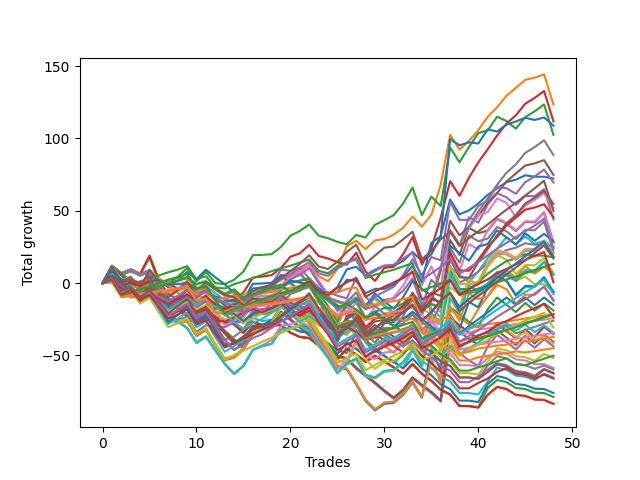

# Long Bulldog 003 
- Symbol: ES
- Date Range: 03/18/2022 - 07/15/2022
- Trading Period: 7:20-12:30
- Number of Trades: 48



| Name | Win Percent | Profit | Avg Profit / Trade | Avg Time / Trade |      | Name | Win Percent | Profit | Avg Profit / Trade | Avg Time / Trade |
| ---- | ----------- | ------ | ------------------ | ---------------- | ---- | ---- | ----------- | ------ | ------------------ | ---------------- |
| Sorted By <br> Profit | | | | | | Sorted By <br> Win Percentage ||||
| Two | 62.50 | 59375.00 | 1236.98 | 21:37 |     | Eighty-One | 85.42 | -10750.00 | -223.96 | 06:23 |
| Three | 64.58 | 59000.00 | 1229.17 | 21:51 |     | One Hundred Twenty-One | 83.33 | -17250.00 | -359.38 | 03:37 |
| Seventy-Three | 56.25 | 54375.00 | 1132.81 | 12:10 |     | One Hundred Twenty-Six | 83.33 | -18625.00 | -388.02 | 04:26 |
| One | 70.83 | 51000.00 | 1062.50 | 17:26 |     | Eighty-Two | 81.25 | 6625.00 | 138.02 | 09:39 |
| Fifty-Nine | 64.58 | 47375.00 | 986.98 | 16:46 |     | One Hundred Twenty-Two | 79.17 | -10625.00 | -221.35 | 06:25 |
| Sixty-Six | 60.42 | 40875.00 | 851.56 | 15:37 |     | One Hundred Twenty-Seven | 79.17 | -10875.00 | -226.56 | 07:12 |
| Zero | 68.75 | 36000.00 | 750.00 | 12:03 |     | Eighty-Five | 72.92 | 24875.00 | 518.23 | 16:47 |
| Fifty-Eight | 62.50 | 33250.00 | 692.71 | 16:25 |     | Eighty-Four | 72.92 | 11750.00 | 244.79 | 15:17 |
| Sixty-Seven | 58.33 | 30875.00 | 643.23 | 16:05 |     | Eighty-Three | 72.92 | 250.00 | 5.21 | 13:50 |
| Eighty-Five | 72.92 | 24875.00 | 518.23 | 16:47 |     | One Hundred Eleven | 72.92 | -12125.00 | -252.60 | 02:17 |
| Sixty-Five | 64.58 | 24625.00 | 513.02 | 13:03 |     | One | 70.83 | 51000.00 | 1062.50 | 17:26 |
| Fifty-Seven | 68.75 | 21625.00 | 450.52 | 13:07 |     | One Hundred Twenty-Five | 70.83 | 9250.00 | 192.71 | 12:08 |
| Forty-Two | 41.67 | 20125.00 | 419.27 | 10:53 |     | One Hundred Twenty-Four | 70.83 | -3875.00 | -80.73 | 10:38 |
| Five | 47.92 | 14750.00 | 307.29 | 28:58 |     | One Hundred Twenty-Eight | 70.83 | -11750.00 | -244.79 | 09:56 |
| Forty-One | 45.83 | 13875.00 | 289.06 | 08:27 |     | One Hundred Twenty-Three | 70.83 | -15375.00 | -320.31 | 09:12 |
| Eighty-Four | 72.92 | 11750.00 | 244.79 | 15:17 |     | Zero | 68.75 | 36000.00 | 750.00 | 12:03 |
| Seven | 47.92 | 10750.00 | 223.96 | 29:08 |     | Fifty-Seven | 68.75 | 21625.00 | 450.52 | 13:07 |
| One Hundred Twenty-Five | 70.83 | 9250.00 | 192.71 | 12:08 |     | One Hundred Thirty | 68.75 | 8500.00 | 177.08 | 12:28 |
| Four | 47.92 | 9125.00 | 190.10 | 27:59 |     | One Hundred Twenty-Nine | 68.75 | -5750.00 | -119.79 | 11:06 |
| Forty-Three | 37.50 | 8625.00 | 179.69 | 11:02 |     | Fifty-Six | 66.67 | 6500.00 | 135.42 | 09:21 |
| One Hundred Thirty | 68.75 | 8500.00 | 177.08 | 12:28 |     | One Hundred Sixteen | 66.67 | -22500.00 | -468.75 | 02:21 |
| Six | 47.92 | 8500.00 | 177.08 | 28:58 |     | Three | 64.58 | 59000.00 | 1229.17 | 21:51 |
| Eighty-Two | 81.25 | 6625.00 | 138.02 | 09:39 |     | Fifty-Nine | 64.58 | 47375.00 | 986.98 | 16:46 |
| Fifty-Six | 66.67 | 6500.00 | 135.42 | 09:21 |     | Sixty-Five | 64.58 | 24625.00 | 513.02 | 13:03 |
| Seventy | 50.00 | 6125.00 | 127.60 | 21:38 |     | Two | 62.50 | 59375.00 | 1236.98 | 21:37 |
| Sixty-Eight | 50.00 | 3875.00 | 80.73 | 20:42 |     | Fifty-Eight | 62.50 | 33250.00 | 692.71 | 16:25 |
| Sixty-Nine | 50.00 | 3500.00 | 72.92 | 21:35 |     | Sixty-Four | 62.50 | 1000.00 | 20.83 | 09:30 |
| Seventy-One | 50.00 | 2875.00 | 59.90 | 21:43 |     | One Hundred Twelve | 62.50 | -13000.00 | -270.83 | 03:39 |
| Sixty-Four | 62.50 | 1000.00 | 20.83 | 09:30 |     | Sixty-Six | 60.42 | 40875.00 | 851.56 | 15:37 |
| Eighty-Three | 72.92 | 250.00 | 5.21 | 13:50 |     | Sixty-Seven | 58.33 | 30875.00 | 643.23 | 16:05 |
| Sixty-One | 47.92 | -2250.00 | -46.88 | 23:31 |     | Seventy-Three | 56.25 | 54375.00 | 1132.81 | 12:10 |
| One Hundred Twenty-Four | 70.83 | -3875.00 | -80.73 | 10:38 |     | One Hundred One | 56.25 | -19125.00 | -398.44 | 01:24 |
| Forty | 45.83 | -5625.00 | -117.19 | 06:08 |     | One Hundred Seventeen | 54.17 | -25125.00 | -523.44 | 03:27 |
| One Hundred Twenty-Nine | 68.75 | -5750.00 | -119.79 | 11:06 |     | Ninety-One | 52.08 | -12750.00 | -265.62 | 00:58 |
| Sixty-Three | 47.92 | -6250.00 | -130.21 | 23:42 |     | Seventy | 50.00 | 6125.00 | 127.60 | 21:38 |
| One Hundred Fifteen | 47.92 | -7500.00 | -156.25 | 07:15 |     | Sixty-Eight | 50.00 | 3875.00 | 80.73 | 20:42 |
| Sixty | 47.92 | -7875.00 | -164.06 | 22:32 |     | Sixty-Nine | 50.00 | 3500.00 | 72.92 | 21:35 |
| Sixty-Two | 47.92 | -8500.00 | -177.08 | 23:32 |     | Seventy-One | 50.00 | 2875.00 | 59.90 | 21:43 |
| One Hundred Twenty-Two | 79.17 | -10625.00 | -221.35 | 06:25 |     | One Hundred Thirteen | 50.00 | -20875.00 | -434.90 | 05:29 |
| Eighty-One | 85.42 | -10750.00 | -223.96 | 06:23 |     | One Hundred Six | 50.00 | -22750.00 | -473.96 | 01:19 |
| One Hundred Twenty-Seven | 79.17 | -10875.00 | -226.56 | 07:12 |     | Five | 47.92 | 14750.00 | 307.29 | 28:58 |
| Ninety-Two | 41.67 | -10875.00 | -226.56 | 01:30 |     | Seven | 47.92 | 10750.00 | 223.96 | 29:08 |
| One Hundred Twenty-Eight | 70.83 | -11750.00 | -244.79 | 09:56 |     | Four | 47.92 | 9125.00 | 190.10 | 27:59 |
| One Hundred Eleven | 72.92 | -12125.00 | -252.60 | 02:17 |     | Six | 47.92 | 8500.00 | 177.08 | 28:58 |
| Ninety-One | 52.08 | -12750.00 | -265.62 | 00:58 |     | Sixty-One | 47.92 | -2250.00 | -46.88 | 23:31 |
| One Hundred Twelve | 62.50 | -13000.00 | -270.83 | 03:39 |     | Sixty-Three | 47.92 | -6250.00 | -130.21 | 23:42 |
| One Hundred Twenty-Three | 70.83 | -15375.00 | -320.31 | 09:12 |     | One Hundred Fifteen | 47.92 | -7500.00 | -156.25 | 07:15 |
| One Hundred Fourteen | 47.92 | -17125.00 | -356.77 | 06:10 |     | Sixty | 47.92 | -7875.00 | -164.06 | 22:32 |
| One Hundred Twenty-One | 83.33 | -17250.00 | -359.38 | 03:37 |     | Sixty-Two | 47.92 | -8500.00 | -177.08 | 23:32 |
| Forty-Five | 29.17 | -17375.00 | -361.98 | 15:47 |     | One Hundred Fourteen | 47.92 | -17125.00 | -356.77 | 06:10 |
| Ninety-Five | 20.83 | -17375.00 | -361.98 | 02:50 |     | Forty-One | 45.83 | 13875.00 | 289.06 | 08:27 |
| One Hundred Twenty-Six | 83.33 | -18625.00 | -388.02 | 04:26 |     | Forty | 45.83 | -5625.00 | -117.19 | 06:08 |
| One Hundred One | 56.25 | -19125.00 | -398.44 | 01:24 |     | One Hundred Two | 45.83 | -19500.00 | -406.25 | 02:02 |
| Ninety-Three | 27.08 | -19125.00 | -398.44 | 02:19 |     | Ninety-Six | 43.75 | -23875.00 | -497.40 | 00:54 |
| Forty-Four | 29.17 | -19375.00 | -403.65 | 14:58 |     | Forty-Two | 41.67 | 20125.00 | 419.27 | 10:53 |
| One Hundred Two | 45.83 | -19500.00 | -406.25 | 02:02 |     | Ninety-Two | 41.67 | -10875.00 | -226.56 | 01:30 |
| Forty-Seven | 29.17 | -20375.00 | -424.48 | 15:47 |     | One Hundred Eighteen | 39.58 | -33000.00 | -687.50 | 04:33 |
| Ninety-Four | 22.92 | -20375.00 | -424.48 | 02:32 |     | Forty-Three | 37.50 | 8625.00 | 179.69 | 11:02 |
| One Hundred Thirteen | 50.00 | -20875.00 | -434.90 | 05:29 |     | One Hundred Seven | 35.42 | -25750.00 | -536.46 | 01:45 |
| One Hundred Sixteen | 66.67 | -22500.00 | -468.75 | 02:21 |     | Forty-Eight | 35.42 | -28500.00 | -593.75 | 04:33 |
| One Hundred Six | 50.00 | -22750.00 | -473.96 | 01:19 |     | One Hundred Ninteen | 35.42 | -31000.00 | -645.83 | 04:54 |
| Ninety-Six | 43.75 | -23875.00 | -497.40 | 00:54 |     | Forty-Nine | 33.33 | -30375.00 | -632.81 | 05:45 |
| One Hundred Five | 27.08 | -24000.00 | -500.00 | 04:04 |     | Fifty | 31.25 | -25125.00 | -523.44 | 06:31 |
| One Hundred Seventeen | 54.17 | -25125.00 | -523.44 | 03:27 |     | Ninety-Seven | 31.25 | -26250.00 | -546.88 | 01:06 |
| Fifty | 31.25 | -25125.00 | -523.44 | 06:31 |     | One Hundred Three | 31.25 | -29625.00 | -617.19 | 03:02 |
| One Hundred Seven | 35.42 | -25750.00 | -536.46 | 01:45 |     | Fifty-One | 31.25 | -32625.00 | -679.69 | 06:26 |
| Ninety-Seven | 31.25 | -26250.00 | -546.88 | 01:06 |     | Forty-Five | 29.17 | -17375.00 | -361.98 | 15:47 |
| One Hundred Four | 29.17 | -27500.00 | -572.92 | 03:20 |     | Forty-Four | 29.17 | -19375.00 | -403.65 | 14:58 |
| Forty-Six | 29.17 | -27750.00 | -578.12 | 15:42 |     | Forty-Seven | 29.17 | -20375.00 | -424.48 | 15:47 |
| One Hundred | 29.17 | -28000.00 | -583.33 | 01:19 |     | One Hundred Four | 29.17 | -27500.00 | -572.92 | 03:20 |
| Ninety-Nine | 29.17 | -28375.00 | -591.15 | 01:15 |     | Forty-Six | 29.17 | -27750.00 | -578.12 | 15:42 |
| Forty-Eight | 35.42 | -28500.00 | -593.75 | 04:33 |     | One Hundred | 29.17 | -28000.00 | -583.33 | 01:19 |
| Ninety-Eight | 29.17 | -28875.00 | -601.56 | 01:13 |     | Ninety-Nine | 29.17 | -28375.00 | -591.15 | 01:15 |
| One Hundred Three | 31.25 | -29625.00 | -617.19 | 03:02 |     | Ninety-Eight | 29.17 | -28875.00 | -601.56 | 01:13 |
| Forty-Nine | 33.33 | -30375.00 | -632.81 | 05:45 |     | One Hundred Twenty | 29.17 | -31250.00 | -651.04 | 05:31 |
| One Hundred Ninteen | 35.42 | -31000.00 | -645.83 | 04:54 |     | Fifty-Two | 29.17 | -38000.00 | -791.67 | 06:54 |
| One Hundred Twenty | 29.17 | -31250.00 | -651.04 | 05:31 |     | Ninety-Three | 27.08 | -19125.00 | -398.44 | 02:19 |
| One Hundred Nine | 20.83 | -31750.00 | -661.46 | 02:18 |     | One Hundred Five | 27.08 | -24000.00 | -500.00 | 04:04 |
| One Hundred Ten | 20.83 | -32250.00 | -671.88 | 02:26 |     | Fifty-Five | 27.08 | -41750.00 | -869.79 | 07:14 |
| One Hundred Eight | 20.83 | -32500.00 | -677.08 | 02:11 |     | Fifty-Four | 27.08 | -41750.00 | -869.79 | 07:14 |
| Fifty-One | 31.25 | -32625.00 | -679.69 | 06:26 |     | Fifty-Three | 27.08 | -41750.00 | -869.79 | 07:14 |
| One Hundred Eighteen | 39.58 | -33000.00 | -687.50 | 04:33 |     | Ninety-Four | 22.92 | -20375.00 | -424.48 | 02:32 |
| Fifty-Two | 29.17 | -38000.00 | -791.67 | 06:54 |     | Ninety-Five | 20.83 | -17375.00 | -361.98 | 02:50 |
| Fifty-Five | 27.08 | -41750.00 | -869.79 | 07:14 |     | One Hundred Nine | 20.83 | -31750.00 | -661.46 | 02:18 |
| Fifty-Four | 27.08 | -41750.00 | -869.79 | 07:14 |     | One Hundred Ten | 20.83 | -32250.00 | -671.88 | 02:26 |
| Fifty-Three | 27.08 | -41750.00 | -869.79 | 07:14 |     | One Hundred Eight | 20.83 | -32500.00 | -677.08 | 02:11 |

## NO STOPLOSS

### Test Zero
* Sell when price hits the middle line of the 20p bollinger
* No Stoploss
* Results:
```
Total Trades: 48
Percent Up: 68.75
Percent Down: 31.25
Total Points Moved Up: 72.00
Potential Profit: 36000.00
Total Points Ups: 155.00 Count Ups: 33
Total Points Downs: -83.00 Count Downs: 15
```

<details><summary>Trades</summary>

<code>In: 2022-03-21 10:21:00		Out: 2022-03-21 10:26:15		Total Position Time: 05:15		Total Move Up: 5.75		Total to Date: 5.75</code> <br />
<code>In: 2022-03-23 10:23:00		Out: 2022-03-23 10:38:15		Total Position Time: 15:15		Total Move Up: -3.75		Total to Date: 2.00</code> <br />
<code>In: 2022-03-23 10:28:00		Out: 2022-03-23 10:38:15		Total Position Time: 10:15		Total Move Up: 1.00		Total to Date: 3.00</code> <br />
<code>In: 2022-03-25 08:14:00		Out: 2022-03-25 08:36:40		Total Position Time: 22:40		Total Move Up: -6.00		Total to Date: -3.00</code> <br />
<code>In: 2022-03-25 08:29:00		Out: 2022-03-25 08:36:40		Total Position Time: 07:40		Total Move Up: 8.00		Total to Date: 5.00</code> <br />
<code>In: 2022-03-28 08:27:00		Out: 2022-03-28 08:56:55		Total Position Time: 29:55		Total Move Up: -16.75		Total to Date: -11.75</code> <br />
<code>In: 2022-03-28 08:38:00		Out: 2022-03-28 09:01:50		Total Position Time: 23:50		Total Move Up: -4.50		Total to Date: -16.25</code> <br />
<code>In: 2022-03-28 08:51:00		Out: 2022-03-28 09:01:50		Total Position Time: 10:50		Total Move Up: 1.75		Total to Date: -14.50</code> <br />
<code>In: 2022-03-28 08:55:00		Out: 2022-03-28 09:01:50		Total Position Time: 06:50		Total Move Up: 2.50		Total to Date: -12.00</code> <br />
<code>In: 2022-03-30 08:02:00		Out: 2022-03-30 08:19:20		Total Position Time: 17:20		Total Move Up: -5.50		Total to Date: -17.50</code> <br />
<code>In: 2022-03-30 08:13:00		Out: 2022-03-30 08:19:20		Total Position Time: 06:20		Total Move Up: 4.75		Total to Date: -12.75</code> <br />
<code>In: 2022-03-30 12:00:00		Out: 2022-03-30 12:28:15		Total Position Time: 28:15		Total Move Up: -6.75		Total to Date: -19.50</code> <br />
<code>In: 2022-03-30 12:06:00		Out: 2022-03-30 12:28:15		Total Position Time: 22:15		Total Move Up: -5.25		Total to Date: -24.75</code> <br />
<code>In: 2022-03-30 12:13:00		Out: 2022-03-30 12:28:15		Total Position Time: 15:15		Total Move Up: -2.00		Total to Date: -26.75</code> <br />
<code>In: 2022-03-30 12:20:00		Out: 2022-03-30 12:28:15		Total Position Time: 08:15		Total Move Up: 0.75		Total to Date: -26.00</code> <br />
<code>In: 2022-03-30 12:26:00		Out: 2022-03-30 12:28:15		Total Position Time: 02:15		Total Move Up: 6.25		Total to Date: -19.75</code> <br />
<code>In: 2022-03-31 10:00:00		Out: 2022-03-31 10:04:00		Total Position Time: 04:00		Total Move Up: 2.50		Total to Date: -17.25</code> <br />
<code>In: 2022-03-31 10:11:00		Out: 2022-03-31 10:19:05		Total Position Time: 08:05		Total Move Up: -0.50		Total to Date: -17.75</code> <br />
<code>In: 2022-04-01 07:24:00		Out: 2022-04-01 07:34:30		Total Position Time: 10:30		Total Move Up: 3.25		Total to Date: -14.50</code> <br />
<code>In: 2022-04-07 07:43:00		Out: 2022-04-07 07:55:15		Total Position Time: 12:15		Total Move Up: 2.75		Total to Date: -11.75</code> <br />
<code>In: 2022-04-12 09:28:00		Out: 2022-04-12 09:41:50		Total Position Time: 13:50		Total Move Up: 1.75		Total to Date: -10.00</code> <br />
<code>In: 2022-04-12 11:35:00		Out: 2022-04-12 11:35:50		Total Position Time: 00:50		Total Move Up: 1.50		Total to Date: -8.50</code> <br />
<code>In: 2022-04-18 08:26:00		Out: 2022-04-18 08:55:05		Total Position Time: 29:05		Total Move Up: -6.50		Total to Date: -15.00</code> <br />
<code>In: 2022-04-18 08:29:00		Out: 2022-04-18 08:55:05		Total Position Time: 26:05		Total Move Up: -4.50		Total to Date: -19.50</code> <br />
<code>In: 2022-05-02 10:02:00		Out: 2022-05-02 10:08:15		Total Position Time: 06:15		Total Move Up: 5.00		Total to Date: -14.50</code> <br />
<code>In: 2022-05-02 10:05:00		Out: 2022-05-02 10:08:15		Total Position Time: 03:15		Total Move Up: 12.25		Total to Date: -2.25</code> <br />
<code>In: 2022-05-02 10:49:00		Out: 2022-05-02 10:59:45		Total Position Time: 10:45		Total Move Up: 2.00		Total to Date: -0.25</code> <br />
<code>In: 2022-05-11 09:59:00		Out: 2022-05-11 10:15:25		Total Position Time: 16:25		Total Move Up: -3.75		Total to Date: -4.00</code> <br />
<code>In: 2022-05-18 08:32:00		Out: 2022-05-18 08:36:55		Total Position Time: 04:55		Total Move Up: 4.00		Total to Date: 0.00</code> <br />
<code>In: 2022-06-06 08:19:00		Out: 2022-06-06 08:31:35		Total Position Time: 12:35		Total Move Up: 2.75		Total to Date: 2.75</code> <br />
<code>In: 2022-06-08 09:41:00		Out: 2022-06-08 09:54:10		Total Position Time: 13:10		Total Move Up: 1.00		Total to Date: 3.75</code> <br />
<code>In: 2022-06-09 08:06:00		Out: 2022-06-09 08:11:10		Total Position Time: 05:10		Total Move Up: 4.25		Total to Date: 8.00</code> <br />
<code>In: 2022-06-09 08:09:00		Out: 2022-06-09 08:11:10		Total Position Time: 02:10		Total Move Up: 7.25		Total to Date: 15.25</code> <br />
<code>In: 2022-06-09 12:03:00		Out: 2022-06-09 12:19:25		Total Position Time: 16:25		Total Move Up: -6.25		Total to Date: 9.00</code> <br />
<code>In: 2022-06-14 12:16:00		Out: 2022-06-14 12:25:45		Total Position Time: 09:45		Total Move Up: 4.50		Total to Date: 13.50</code> <br />
<code>In: 2022-06-15 11:08:00		Out: 2022-06-15 11:16:45		Total Position Time: 08:45		Total Move Up: 13.50		Total to Date: 27.00</code> <br />
<code>In: 2022-06-15 11:34:00		Out: 2022-06-15 11:38:05		Total Position Time: 04:05		Total Move Up: 25.25		Total to Date: 52.25</code> <br />
<code>In: 2022-06-16 11:02:00		Out: 2022-06-16 11:31:55		Total Position Time: 29:55		Total Move Up: -10.25		Total to Date: 42.00</code> <br />
<code>In: 2022-06-17 07:37:00		Out: 2022-06-17 07:55:05		Total Position Time: 18:05		Total Move Up: 2.75		Total to Date: 44.75</code> <br />
<code>In: 2022-06-23 09:06:00		Out: 2022-06-23 09:17:10		Total Position Time: 11:10		Total Move Up: 3.50		Total to Date: 48.25</code> <br />
<code>In: 2022-06-27 12:07:00		Out: 2022-06-27 12:10:20		Total Position Time: 03:20		Total Move Up: 7.00		Total to Date: 55.25</code> <br />
<code>In: 2022-06-29 09:29:00		Out: 2022-06-29 09:36:40		Total Position Time: 07:40		Total Move Up: 4.50		Total to Date: 59.75</code> <br />
<code>In: 2022-07-06 08:05:00		Out: 2022-07-06 08:15:05		Total Position Time: 10:05		Total Move Up: 5.00		Total to Date: 64.75</code> <br />
<code>In: 2022-07-06 08:06:00		Out: 2022-07-06 08:15:05		Total Position Time: 09:05		Total Move Up: 2.50		Total to Date: 67.25</code> <br />
<code>In: 2022-07-06 08:34:00		Out: 2022-07-06 08:46:30		Total Position Time: 12:30		Total Move Up: 4.25		Total to Date: 71.50</code> <br />
<code>In: 2022-07-06 08:35:00		Out: 2022-07-06 08:46:30		Total Position Time: 11:30		Total Move Up: 0.25		Total to Date: 71.75</code> <br />
<code>In: 2022-07-06 08:46:00		Out: 2022-07-06 08:46:30		Total Position Time: 00:30		Total Move Up: 1.00		Total to Date: 72.75</code> <br />
<code>In: 2022-07-12 12:06:00		Out: 2022-07-12 12:20:20		Total Position Time: 14:20		Total Move Up: -0.75		Total to Date: 72.00</code> <br />


</details>

### Test One
* Sell when the price hits the upper line of the 20p 1std bollinger
* No Stoploss
* Results:
```
Total Trades: 48
Percent Up: 70.83
Percent Down: 29.17
Total Points Moved Up: 102.00
Potential Profit: 51000.00
Total Points Ups: 210.75 Count Ups: 34
Total Points Downs: -108.75 Count Downs: 14
```

<details><summary>Trades</summary>

<code>In: 2022-03-21 10:21:00		Out: 2022-03-21 10:31:50		Total Position Time: 10:50		Total Move Up: 7.50		Total to Date: 7.50</code> <br />
<code>In: 2022-03-23 10:23:00		Out: 2022-03-23 10:51:50		Total Position Time: 28:50		Total Move Up: -4.50		Total to Date: 3.00</code> <br />
<code>In: 2022-03-23 10:28:00		Out: 2022-03-23 10:51:50		Total Position Time: 23:50		Total Move Up: 0.25		Total to Date: 3.25</code> <br />
<code>In: 2022-03-25 08:14:00		Out: 2022-03-25 08:41:05		Total Position Time: 27:05		Total Move Up: -4.75		Total to Date: -1.50</code> <br />
<code>In: 2022-03-25 08:29:00		Out: 2022-03-25 08:41:05		Total Position Time: 12:05		Total Move Up: 9.25		Total to Date: 7.75</code> <br />
<code>In: 2022-03-28 08:27:00		Out: 2022-03-28 08:56:55		Total Position Time: 29:55		Total Move Up: -16.75		Total to Date: -9.00</code> <br />
<code>In: 2022-03-28 08:38:00		Out: 2022-03-28 09:04:55		Total Position Time: 26:55		Total Move Up: -2.75		Total to Date: -11.75</code> <br />
<code>In: 2022-03-28 08:51:00		Out: 2022-03-28 09:04:55		Total Position Time: 13:55		Total Move Up: 3.50		Total to Date: -8.25</code> <br />
<code>In: 2022-03-28 08:55:00		Out: 2022-03-28 09:04:55		Total Position Time: 09:55		Total Move Up: 4.25		Total to Date: -4.00</code> <br />
<code>In: 2022-03-30 08:02:00		Out: 2022-03-30 08:31:55		Total Position Time: 29:55		Total Move Up: -9.00		Total to Date: -13.00</code> <br />
<code>In: 2022-03-30 08:13:00		Out: 2022-03-30 08:34:45		Total Position Time: 21:45		Total Move Up: 4.75		Total to Date: -8.25</code> <br />
<code>In: 2022-03-30 12:00:00		Out: 2022-03-30 12:29:55		Total Position Time: 29:55		Total Move Up: -7.75		Total to Date: -16.00</code> <br />
<code>In: 2022-03-30 12:06:00		Out: 2022-03-30 12:32:20		Total Position Time: 26:20		Total Move Up: -3.00		Total to Date: -19.00</code> <br />
<code>In: 2022-03-30 12:13:00		Out: 2022-03-30 12:32:20		Total Position Time: 19:20		Total Move Up: 0.25		Total to Date: -18.75</code> <br />
<code>In: 2022-03-30 12:20:00		Out: 2022-03-30 12:32:20		Total Position Time: 12:20		Total Move Up: 3.00		Total to Date: -15.75</code> <br />
<code>In: 2022-03-30 12:26:00		Out: 2022-03-30 12:32:20		Total Position Time: 06:20		Total Move Up: 8.50		Total to Date: -7.25</code> <br />
<code>In: 2022-03-31 10:00:00		Out: 2022-03-31 10:19:40		Total Position Time: 19:40		Total Move Up: 1.25		Total to Date: -6.00</code> <br />
<code>In: 2022-03-31 10:11:00		Out: 2022-03-31 10:19:40		Total Position Time: 08:40		Total Move Up: 1.50		Total to Date: -4.50</code> <br />
<code>In: 2022-04-01 07:24:00		Out: 2022-04-01 07:45:55		Total Position Time: 21:55		Total Move Up: 3.00		Total to Date: -1.50</code> <br />
<code>In: 2022-04-07 07:43:00		Out: 2022-04-07 08:00:05		Total Position Time: 17:05		Total Move Up: 7.75		Total to Date: 6.25</code> <br />
<code>In: 2022-04-12 09:28:00		Out: 2022-04-12 09:50:15		Total Position Time: 22:15		Total Move Up: 3.25		Total to Date: 9.50</code> <br />
<code>In: 2022-04-12 11:35:00		Out: 2022-04-12 11:37:20		Total Position Time: 02:20		Total Move Up: 3.50		Total to Date: 13.00</code> <br />
<code>In: 2022-04-18 08:26:00		Out: 2022-04-18 08:55:55		Total Position Time: 29:55		Total Move Up: -7.75		Total to Date: 5.25</code> <br />
<code>In: 2022-04-18 08:29:00		Out: 2022-04-18 08:57:20		Total Position Time: 28:20		Total Move Up: -3.00		Total to Date: 2.25</code> <br />
<code>In: 2022-05-02 10:02:00		Out: 2022-05-02 10:10:55		Total Position Time: 08:55		Total Move Up: 8.50		Total to Date: 10.75</code> <br />
<code>In: 2022-05-02 10:05:00		Out: 2022-05-02 10:10:55		Total Position Time: 05:55		Total Move Up: 15.75		Total to Date: 26.50</code> <br />
<code>In: 2022-05-02 10:49:00		Out: 2022-05-02 11:02:25		Total Position Time: 13:25		Total Move Up: 3.75		Total to Date: 30.25</code> <br />
<code>In: 2022-05-11 09:59:00		Out: 2022-05-11 10:24:35		Total Position Time: 25:35		Total Move Up: -4.75		Total to Date: 25.50</code> <br />
<code>In: 2022-05-18 08:32:00		Out: 2022-05-18 08:41:15		Total Position Time: 09:15		Total Move Up: 6.00		Total to Date: 31.50</code> <br />
<code>In: 2022-06-06 08:19:00		Out: 2022-06-06 08:39:15		Total Position Time: 20:15		Total Move Up: 1.00		Total to Date: 32.50</code> <br />
<code>In: 2022-06-08 09:41:00		Out: 2022-06-08 09:59:05		Total Position Time: 18:05		Total Move Up: 3.00		Total to Date: 35.50</code> <br />
<code>In: 2022-06-09 08:06:00		Out: 2022-06-09 08:21:10		Total Position Time: 15:10		Total Move Up: 5.75		Total to Date: 41.25</code> <br />
<code>In: 2022-06-09 08:09:00		Out: 2022-06-09 08:21:10		Total Position Time: 12:10		Total Move Up: 8.75		Total to Date: 50.00</code> <br />
<code>In: 2022-06-09 12:03:00		Out: 2022-06-09 12:24:30		Total Position Time: 21:30		Total Move Up: -7.00		Total to Date: 43.00</code> <br />
<code>In: 2022-06-14 12:16:00		Out: 2022-06-14 12:27:20		Total Position Time: 11:20		Total Move Up: 8.25		Total to Date: 51.25</code> <br />
<code>In: 2022-06-15 11:08:00		Out: 2022-06-15 11:37:55		Total Position Time: 29:55		Total Move Up: -6.50		Total to Date: 44.75</code> <br />
<code>In: 2022-06-15 11:34:00		Out: 2022-06-15 11:38:10		Total Position Time: 04:10		Total Move Up: 34.50		Total to Date: 79.25</code> <br />
<code>In: 2022-06-16 11:02:00		Out: 2022-06-16 11:31:55		Total Position Time: 29:55		Total Move Up: -10.25		Total to Date: 69.00</code> <br />
<code>In: 2022-06-17 07:37:00		Out: 2022-06-17 07:56:20		Total Position Time: 19:20		Total Move Up: 6.50		Total to Date: 75.50</code> <br />
<code>In: 2022-06-23 09:06:00		Out: 2022-06-23 09:18:25		Total Position Time: 12:25		Total Move Up: 7.50		Total to Date: 83.00</code> <br />
<code>In: 2022-06-27 12:07:00		Out: 2022-06-27 12:12:10		Total Position Time: 05:10		Total Move Up: 10.00		Total to Date: 93.00</code> <br />
<code>In: 2022-06-29 09:29:00		Out: 2022-06-29 09:37:20		Total Position Time: 08:20		Total Move Up: 7.00		Total to Date: 100.00</code> <br />
<code>In: 2022-07-06 08:05:00		Out: 2022-07-06 08:19:05		Total Position Time: 14:05		Total Move Up: 7.75		Total to Date: 107.75</code> <br />
<code>In: 2022-07-06 08:06:00		Out: 2022-07-06 08:19:05		Total Position Time: 13:05		Total Move Up: 5.25		Total to Date: 113.00</code> <br />
<code>In: 2022-07-06 08:34:00		Out: 2022-07-06 08:48:20		Total Position Time: 14:20		Total Move Up: 5.75		Total to Date: 118.75</code> <br />
<code>In: 2022-07-06 08:35:00		Out: 2022-07-06 08:48:20		Total Position Time: 13:20		Total Move Up: 1.75		Total to Date: 120.50</code> <br />
<code>In: 2022-07-06 08:46:00		Out: 2022-07-06 08:48:20		Total Position Time: 02:20		Total Move Up: 2.50		Total to Date: 123.00</code> <br />
<code>In: 2022-07-12 12:06:00		Out: 2022-07-12 12:35:55		Total Position Time: 29:55		Total Move Up: -21.00		Total to Date: 102.00</code> <br />


</details>

### Test Two
* Sell when the price hits the upper line of the 20p 2std bollinger
* No Stoploss
* Results:
```
Total Trades: 48
Percent Up: 62.50
Percent Down: 37.50
Total Points Moved Up: 118.75
Potential Profit: 59375.00
Total Points Ups: 240.25 Count Ups: 30
Total Points Downs: -121.50 Count Downs: 18
```

<details><summary>Trades</summary>

<code>In: 2022-03-21 10:21:00		Out: 2022-03-21 10:34:15		Total Position Time: 13:15		Total Move Up: 11.75		Total to Date: 11.75</code> <br />
<code>In: 2022-03-23 10:23:00		Out: 2022-03-23 10:52:55		Total Position Time: 29:55		Total Move Up: -5.00		Total to Date: 6.75</code> <br />
<code>In: 2022-03-23 10:28:00		Out: 2022-03-23 10:54:30		Total Position Time: 26:30		Total Move Up: 2.75		Total to Date: 9.50</code> <br />
<code>In: 2022-03-25 08:14:00		Out: 2022-03-25 08:41:55		Total Position Time: 27:55		Total Move Up: -0.50		Total to Date: 9.00</code> <br />
<code>In: 2022-03-25 08:29:00		Out: 2022-03-25 08:41:55		Total Position Time: 12:55		Total Move Up: 13.50		Total to Date: 22.50</code> <br />
<code>In: 2022-03-28 08:27:00		Out: 2022-03-28 08:56:55		Total Position Time: 29:55		Total Move Up: -16.75		Total to Date: 5.75</code> <br />
<code>In: 2022-03-28 08:38:00		Out: 2022-03-28 09:07:10		Total Position Time: 29:10		Total Move Up: -1.25		Total to Date: 4.50</code> <br />
<code>In: 2022-03-28 08:51:00		Out: 2022-03-28 09:07:10		Total Position Time: 16:10		Total Move Up: 5.00		Total to Date: 9.50</code> <br />
<code>In: 2022-03-28 08:55:00		Out: 2022-03-28 09:07:10		Total Position Time: 12:10		Total Move Up: 5.75		Total to Date: 15.25</code> <br />
<code>In: 2022-03-30 08:02:00		Out: 2022-03-30 08:31:55		Total Position Time: 29:55		Total Move Up: -9.00		Total to Date: 6.25</code> <br />
<code>In: 2022-03-30 08:13:00		Out: 2022-03-30 08:35:15		Total Position Time: 22:15		Total Move Up: 6.50		Total to Date: 12.75</code> <br />
<code>In: 2022-03-30 12:00:00		Out: 2022-03-30 12:29:55		Total Position Time: 29:55		Total Move Up: -7.75		Total to Date: 5.00</code> <br />
<code>In: 2022-03-30 12:06:00		Out: 2022-03-30 12:35:55		Total Position Time: 29:55		Total Move Up: -0.75		Total to Date: 4.25</code> <br />
<code>In: 2022-03-30 12:13:00		Out: 2022-03-30 12:36:25		Total Position Time: 23:25		Total Move Up: 3.25		Total to Date: 7.50</code> <br />
<code>In: 2022-03-30 12:20:00		Out: 2022-03-30 12:36:25		Total Position Time: 16:25		Total Move Up: 6.00		Total to Date: 13.50</code> <br />
<code>In: 2022-03-30 12:26:00		Out: 2022-03-30 12:36:25		Total Position Time: 10:25		Total Move Up: 11.50		Total to Date: 25.00</code> <br />
<code>In: 2022-03-31 10:00:00		Out: 2022-03-31 10:28:00		Total Position Time: 28:00		Total Move Up: 0.75		Total to Date: 25.75</code> <br />
<code>In: 2022-03-31 10:11:00		Out: 2022-03-31 10:28:00		Total Position Time: 17:00		Total Move Up: 1.00		Total to Date: 26.75</code> <br />
<code>In: 2022-04-01 07:24:00		Out: 2022-04-01 07:46:55		Total Position Time: 22:55		Total Move Up: 5.00		Total to Date: 31.75</code> <br />
<code>In: 2022-04-07 07:43:00		Out: 2022-04-07 08:00:05		Total Position Time: 17:05		Total Move Up: 7.75		Total to Date: 39.50</code> <br />
<code>In: 2022-04-12 09:28:00		Out: 2022-04-12 09:50:15		Total Position Time: 22:15		Total Move Up: 3.25		Total to Date: 42.75</code> <br />
<code>In: 2022-04-12 11:35:00		Out: 2022-04-12 11:47:05		Total Position Time: 12:05		Total Move Up: 6.00		Total to Date: 48.75</code> <br />
<code>In: 2022-04-18 08:26:00		Out: 2022-04-18 08:55:55		Total Position Time: 29:55		Total Move Up: -7.75		Total to Date: 41.00</code> <br />
<code>In: 2022-04-18 08:29:00		Out: 2022-04-18 08:58:55		Total Position Time: 29:55		Total Move Up: -1.75		Total to Date: 39.25</code> <br />
<code>In: 2022-05-02 10:02:00		Out: 2022-05-02 10:31:55		Total Position Time: 29:55		Total Move Up: -2.50		Total to Date: 36.75</code> <br />
<code>In: 2022-05-02 10:05:00		Out: 2022-05-02 10:34:55		Total Position Time: 29:55		Total Move Up: -1.75		Total to Date: 35.00</code> <br />
<code>In: 2022-05-02 10:49:00		Out: 2022-05-02 11:03:45		Total Position Time: 14:45		Total Move Up: 6.50		Total to Date: 41.50</code> <br />
<code>In: 2022-05-11 09:59:00		Out: 2022-05-11 10:24:50		Total Position Time: 25:50		Total Move Up: -1.75		Total to Date: 39.75</code> <br />
<code>In: 2022-05-18 08:32:00		Out: 2022-05-18 08:43:00		Total Position Time: 11:00		Total Move Up: 9.25		Total to Date: 49.00</code> <br />
<code>In: 2022-06-06 08:19:00		Out: 2022-06-06 08:43:00		Total Position Time: 24:00		Total Move Up: 3.25		Total to Date: 52.25</code> <br />
<code>In: 2022-06-08 09:41:00		Out: 2022-06-08 09:59:10		Total Position Time: 18:10		Total Move Up: 3.50		Total to Date: 55.75</code> <br />
<code>In: 2022-06-09 08:06:00		Out: 2022-06-09 08:22:35		Total Position Time: 16:35		Total Move Up: 8.00		Total to Date: 63.75</code> <br />
<code>In: 2022-06-09 08:09:00		Out: 2022-06-09 08:22:35		Total Position Time: 13:35		Total Move Up: 11.00		Total to Date: 74.75</code> <br />
<code>In: 2022-06-09 12:03:00		Out: 2022-06-09 12:32:55		Total Position Time: 29:55		Total Move Up: -19.00		Total to Date: 55.75</code> <br />
<code>In: 2022-06-14 12:16:00		Out: 2022-06-14 12:29:35		Total Position Time: 13:35		Total Move Up: 12.75		Total to Date: 68.50</code> <br />
<code>In: 2022-06-15 11:08:00		Out: 2022-06-15 11:37:55		Total Position Time: 29:55		Total Move Up: -6.50		Total to Date: 62.00</code> <br />
<code>In: 2022-06-15 11:34:00		Out: 2022-06-15 11:38:55		Total Position Time: 04:55		Total Move Up: 45.75		Total to Date: 107.75</code> <br />
<code>In: 2022-06-16 11:02:00		Out: 2022-06-16 11:31:55		Total Position Time: 29:55		Total Move Up: -10.25		Total to Date: 97.50</code> <br />
<code>In: 2022-06-17 07:37:00		Out: 2022-06-17 08:02:30		Total Position Time: 25:30		Total Move Up: 12.50		Total to Date: 110.00</code> <br />
<code>In: 2022-06-23 09:06:00		Out: 2022-06-23 09:19:05		Total Position Time: 13:05		Total Move Up: 9.75		Total to Date: 119.75</code> <br />
<code>In: 2022-06-27 12:07:00		Out: 2022-06-27 12:36:55		Total Position Time: 29:55		Total Move Up: 1.75		Total to Date: 121.50</code> <br />
<code>In: 2022-06-29 09:29:00		Out: 2022-06-29 09:38:35		Total Position Time: 09:35		Total Move Up: 9.75		Total to Date: 131.25</code> <br />
<code>In: 2022-07-06 08:05:00		Out: 2022-07-06 08:34:55		Total Position Time: 29:55		Total Move Up: -3.00		Total to Date: 128.25</code> <br />
<code>In: 2022-07-06 08:06:00		Out: 2022-07-06 08:35:55		Total Position Time: 29:55		Total Move Up: -5.25		Total to Date: 123.00</code> <br />
<code>In: 2022-07-06 08:34:00		Out: 2022-07-06 08:51:15		Total Position Time: 17:15		Total Move Up: 8.00		Total to Date: 131.00</code> <br />
<code>In: 2022-07-06 08:35:00		Out: 2022-07-06 08:51:15		Total Position Time: 16:15		Total Move Up: 4.00		Total to Date: 135.00</code> <br />
<code>In: 2022-07-06 08:46:00		Out: 2022-07-06 08:51:15		Total Position Time: 05:15		Total Move Up: 4.75		Total to Date: 139.75</code> <br />
<code>In: 2022-07-12 12:06:00		Out: 2022-07-12 12:35:55		Total Position Time: 29:55		Total Move Up: -21.00		Total to Date: 118.75</code> <br />


</details>

### Test Three
* Sell when price hits the middle line of the 50p bollinger
* No Stoploss
* Results:
```
Total Trades: 48
Percent Up: 64.58
Percent Down: 35.42
Total Points Moved Up: 118.00
Potential Profit: 59000.00
Total Points Ups: 250.25 Count Ups: 31
Total Points Downs: -132.25 Count Downs: 17
```

<details><summary>Trades</summary>

<code>In: 2022-03-21 10:21:00		Out: 2022-03-21 10:34:25		Total Position Time: 13:25		Total Move Up: 12.00		Total to Date: 12.00</code> <br />
<code>In: 2022-03-23 10:23:00		Out: 2022-03-23 10:52:55		Total Position Time: 29:55		Total Move Up: -5.00		Total to Date: 7.00</code> <br />
<code>In: 2022-03-23 10:28:00		Out: 2022-03-23 10:54:50		Total Position Time: 26:50		Total Move Up: 3.00		Total to Date: 10.00</code> <br />
<code>In: 2022-03-25 08:14:00		Out: 2022-03-25 08:43:55		Total Position Time: 29:55		Total Move Up: -3.00		Total to Date: 7.00</code> <br />
<code>In: 2022-03-25 08:29:00		Out: 2022-03-25 08:53:00		Total Position Time: 24:00		Total Move Up: 12.75		Total to Date: 19.75</code> <br />
<code>In: 2022-03-28 08:27:00		Out: 2022-03-28 08:56:55		Total Position Time: 29:55		Total Move Up: -16.75		Total to Date: 3.00</code> <br />
<code>In: 2022-03-28 08:38:00		Out: 2022-03-28 09:07:55		Total Position Time: 29:55		Total Move Up: -2.75		Total to Date: 0.25</code> <br />
<code>In: 2022-03-28 08:51:00		Out: 2022-03-28 09:20:55		Total Position Time: 29:55		Total Move Up: -3.25		Total to Date: -3.00</code> <br />
<code>In: 2022-03-28 08:55:00		Out: 2022-03-28 09:24:55		Total Position Time: 29:55		Total Move Up: 1.25		Total to Date: -1.75</code> <br />
<code>In: 2022-03-30 08:02:00		Out: 2022-03-30 08:31:55		Total Position Time: 29:55		Total Move Up: -9.00		Total to Date: -10.75</code> <br />
<code>In: 2022-03-30 08:13:00		Out: 2022-03-30 08:35:20		Total Position Time: 22:20		Total Move Up: 7.00		Total to Date: -3.75</code> <br />
<code>In: 2022-03-30 12:00:00		Out: 2022-03-30 12:29:55		Total Position Time: 29:55		Total Move Up: -7.75		Total to Date: -11.50</code> <br />
<code>In: 2022-03-30 12:06:00		Out: 2022-03-30 12:33:25		Total Position Time: 27:25		Total Move Up: -1.25		Total to Date: -12.75</code> <br />
<code>In: 2022-03-30 12:13:00		Out: 2022-03-30 12:33:25		Total Position Time: 20:25		Total Move Up: 2.00		Total to Date: -10.75</code> <br />
<code>In: 2022-03-30 12:20:00		Out: 2022-03-30 12:33:25		Total Position Time: 13:25		Total Move Up: 4.75		Total to Date: -6.00</code> <br />
<code>In: 2022-03-30 12:26:00		Out: 2022-03-30 12:33:25		Total Position Time: 07:25		Total Move Up: 10.25		Total to Date: 4.25</code> <br />
<code>In: 2022-03-31 10:00:00		Out: 2022-03-31 10:28:00		Total Position Time: 28:00		Total Move Up: 0.75		Total to Date: 5.00</code> <br />
<code>In: 2022-03-31 10:11:00		Out: 2022-03-31 10:28:00		Total Position Time: 17:00		Total Move Up: 1.00		Total to Date: 6.00</code> <br />
<code>In: 2022-04-01 07:24:00		Out: 2022-04-01 07:46:55		Total Position Time: 22:55		Total Move Up: 5.00		Total to Date: 11.00</code> <br />
<code>In: 2022-04-07 07:43:00		Out: 2022-04-07 08:00:05		Total Position Time: 17:05		Total Move Up: 7.75		Total to Date: 18.75</code> <br />
<code>In: 2022-04-12 09:28:00		Out: 2022-04-12 09:57:55		Total Position Time: 29:55		Total Move Up: 2.25		Total to Date: 21.00</code> <br />
<code>In: 2022-04-12 11:35:00		Out: 2022-04-12 11:47:05		Total Position Time: 12:05		Total Move Up: 6.00		Total to Date: 27.00</code> <br />
<code>In: 2022-04-18 08:26:00		Out: 2022-04-18 08:55:55		Total Position Time: 29:55		Total Move Up: -7.75		Total to Date: 19.25</code> <br />
<code>In: 2022-04-18 08:29:00		Out: 2022-04-18 08:58:55		Total Position Time: 29:55		Total Move Up: -1.75		Total to Date: 17.50</code> <br />
<code>In: 2022-05-02 10:02:00		Out: 2022-05-02 10:31:55		Total Position Time: 29:55		Total Move Up: -2.50		Total to Date: 15.00</code> <br />
<code>In: 2022-05-02 10:05:00		Out: 2022-05-02 10:34:55		Total Position Time: 29:55		Total Move Up: -1.75		Total to Date: 13.25</code> <br />
<code>In: 2022-05-02 10:49:00		Out: 2022-05-02 11:04:55		Total Position Time: 15:55		Total Move Up: 8.75		Total to Date: 22.00</code> <br />
<code>In: 2022-05-11 09:59:00		Out: 2022-05-11 10:28:55		Total Position Time: 29:55		Total Move Up: -13.00		Total to Date: 9.00</code> <br />
<code>In: 2022-05-18 08:32:00		Out: 2022-05-18 09:01:55		Total Position Time: 29:55		Total Move Up: -6.50		Total to Date: 2.50</code> <br />
<code>In: 2022-06-06 08:19:00		Out: 2022-06-06 08:48:55		Total Position Time: 29:55		Total Move Up: 4.50		Total to Date: 7.00</code> <br />
<code>In: 2022-06-08 09:41:00		Out: 2022-06-08 10:10:55		Total Position Time: 29:55		Total Move Up: 0.75		Total to Date: 7.75</code> <br />
<code>In: 2022-06-09 08:06:00		Out: 2022-06-09 08:22:45		Total Position Time: 16:45		Total Move Up: 8.75		Total to Date: 16.50</code> <br />
<code>In: 2022-06-09 08:09:00		Out: 2022-06-09 08:22:45		Total Position Time: 13:45		Total Move Up: 11.75		Total to Date: 28.25</code> <br />
<code>In: 2022-06-09 12:03:00		Out: 2022-06-09 12:32:55		Total Position Time: 29:55		Total Move Up: -19.00		Total to Date: 9.25</code> <br />
<code>In: 2022-06-14 12:16:00		Out: 2022-06-14 12:29:10		Total Position Time: 13:10		Total Move Up: 11.25		Total to Date: 20.50</code> <br />
<code>In: 2022-06-15 11:08:00		Out: 2022-06-15 11:17:05		Total Position Time: 09:05		Total Move Up: 21.25		Total to Date: 41.75</code> <br />
<code>In: 2022-06-15 11:34:00		Out: 2022-06-15 11:38:10		Total Position Time: 04:10		Total Move Up: 34.50		Total to Date: 76.25</code> <br />
<code>In: 2022-06-16 11:02:00		Out: 2022-06-16 11:31:55		Total Position Time: 29:55		Total Move Up: -10.25		Total to Date: 66.00</code> <br />
<code>In: 2022-06-17 07:37:00		Out: 2022-06-17 08:02:30		Total Position Time: 25:30		Total Move Up: 12.50		Total to Date: 78.50</code> <br />
<code>In: 2022-06-23 09:06:00		Out: 2022-06-23 09:21:10		Total Position Time: 15:10		Total Move Up: 10.75		Total to Date: 89.25</code> <br />
<code>In: 2022-06-27 12:07:00		Out: 2022-06-27 12:11:50		Total Position Time: 04:50		Total Move Up: 9.00		Total to Date: 98.25</code> <br />
<code>In: 2022-06-29 09:29:00		Out: 2022-06-29 09:38:30		Total Position Time: 09:30		Total Move Up: 9.50		Total to Date: 107.75</code> <br />
<code>In: 2022-07-06 08:05:00		Out: 2022-07-06 08:21:35		Total Position Time: 16:35		Total Move Up: 8.50		Total to Date: 116.25</code> <br />
<code>In: 2022-07-06 08:06:00		Out: 2022-07-06 08:21:35		Total Position Time: 15:35		Total Move Up: 6.00		Total to Date: 122.25</code> <br />
<code>In: 2022-07-06 08:34:00		Out: 2022-07-06 08:51:15		Total Position Time: 17:15		Total Move Up: 8.00		Total to Date: 130.25</code> <br />
<code>In: 2022-07-06 08:35:00		Out: 2022-07-06 08:51:15		Total Position Time: 16:15		Total Move Up: 4.00		Total to Date: 134.25</code> <br />
<code>In: 2022-07-06 08:46:00		Out: 2022-07-06 08:51:15		Total Position Time: 05:15		Total Move Up: 4.75		Total to Date: 139.00</code> <br />
<code>In: 2022-07-12 12:06:00		Out: 2022-07-12 12:35:55		Total Position Time: 29:55		Total Move Up: -21.00		Total to Date: 118.00</code> <br />


</details>

### Test Four
* Sell when the price hits the upper line of the 50p 1std bollinger
* No Stoploss
* Results:
```
Total Trades: 48
Percent Up: 47.92
Percent Down: 52.08
Total Points Moved Up: 18.25
Potential Profit: 9125.00
Total Points Ups: 190.25 Count Ups: 23
Total Points Downs: -172.00 Count Downs: 25
```

<details><summary>Trades</summary>

<code>In: 2022-03-21 10:21:00		Out: 2022-03-21 10:50:05		Total Position Time: 29:05		Total Move Up: 12.75		Total to Date: 12.75</code> <br />
<code>In: 2022-03-23 10:23:00		Out: 2022-03-23 10:52:55		Total Position Time: 29:55		Total Move Up: -5.00		Total to Date: 7.75</code> <br />
<code>In: 2022-03-23 10:28:00		Out: 2022-03-23 10:57:55		Total Position Time: 29:55		Total Move Up: 2.50		Total to Date: 10.25</code> <br />
<code>In: 2022-03-25 08:14:00		Out: 2022-03-25 08:43:55		Total Position Time: 29:55		Total Move Up: -3.00		Total to Date: 7.25</code> <br />
<code>In: 2022-03-25 08:29:00		Out: 2022-03-25 08:58:55		Total Position Time: 29:55		Total Move Up: 2.50		Total to Date: 9.75</code> <br />
<code>In: 2022-03-28 08:27:00		Out: 2022-03-28 08:56:55		Total Position Time: 29:55		Total Move Up: -16.75		Total to Date: -7.00</code> <br />
<code>In: 2022-03-28 08:38:00		Out: 2022-03-28 09:07:55		Total Position Time: 29:55		Total Move Up: -2.75		Total to Date: -9.75</code> <br />
<code>In: 2022-03-28 08:51:00		Out: 2022-03-28 09:20:55		Total Position Time: 29:55		Total Move Up: -3.25		Total to Date: -13.00</code> <br />
<code>In: 2022-03-28 08:55:00		Out: 2022-03-28 09:24:55		Total Position Time: 29:55		Total Move Up: 1.25		Total to Date: -11.75</code> <br />
<code>In: 2022-03-30 08:02:00		Out: 2022-03-30 08:31:55		Total Position Time: 29:55		Total Move Up: -9.00		Total to Date: -20.75</code> <br />
<code>In: 2022-03-30 08:13:00		Out: 2022-03-30 08:42:55		Total Position Time: 29:55		Total Move Up: 4.25		Total to Date: -16.50</code> <br />
<code>In: 2022-03-30 12:00:00		Out: 2022-03-30 12:29:55		Total Position Time: 29:55		Total Move Up: -7.75		Total to Date: -24.25</code> <br />
<code>In: 2022-03-30 12:06:00		Out: 2022-03-30 12:35:55		Total Position Time: 29:55		Total Move Up: -0.75		Total to Date: -25.00</code> <br />
<code>In: 2022-03-30 12:13:00		Out: 2022-03-30 12:42:55		Total Position Time: 29:55		Total Move Up: 1.75		Total to Date: -23.25</code> <br />
<code>In: 2022-03-30 12:20:00		Out: 2022-03-30 12:46:00		Total Position Time: 26:00		Total Move Up: 5.50		Total to Date: -17.75</code> <br />
<code>In: 2022-03-30 12:26:00		Out: 2022-03-30 12:46:00		Total Position Time: 20:00		Total Move Up: 11.00		Total to Date: -6.75</code> <br />
<code>In: 2022-03-31 10:00:00		Out: 2022-03-31 10:29:50		Total Position Time: 29:50		Total Move Up: 3.25		Total to Date: -3.50</code> <br />
<code>In: 2022-03-31 10:11:00		Out: 2022-03-31 10:29:50		Total Position Time: 18:50		Total Move Up: 3.50		Total to Date: 0.00</code> <br />
<code>In: 2022-04-01 07:24:00		Out: 2022-04-01 07:52:25		Total Position Time: 28:25		Total Move Up: 10.00		Total to Date: 10.00</code> <br />
<code>In: 2022-04-07 07:43:00		Out: 2022-04-07 08:12:55		Total Position Time: 29:55		Total Move Up: -0.75		Total to Date: 9.25</code> <br />
<code>In: 2022-04-12 09:28:00		Out: 2022-04-12 09:57:55		Total Position Time: 29:55		Total Move Up: 2.25		Total to Date: 11.50</code> <br />
<code>In: 2022-04-12 11:35:00		Out: 2022-04-12 12:04:55		Total Position Time: 29:55		Total Move Up: -7.50		Total to Date: 4.00</code> <br />
<code>In: 2022-04-18 08:26:00		Out: 2022-04-18 08:55:55		Total Position Time: 29:55		Total Move Up: -7.75		Total to Date: -3.75</code> <br />
<code>In: 2022-04-18 08:29:00		Out: 2022-04-18 08:58:55		Total Position Time: 29:55		Total Move Up: -1.75		Total to Date: -5.50</code> <br />
<code>In: 2022-05-02 10:02:00		Out: 2022-05-02 10:31:55		Total Position Time: 29:55		Total Move Up: -2.50		Total to Date: -8.00</code> <br />
<code>In: 2022-05-02 10:05:00		Out: 2022-05-02 10:34:55		Total Position Time: 29:55		Total Move Up: -1.75		Total to Date: -9.75</code> <br />
<code>In: 2022-05-02 10:49:00		Out: 2022-05-02 11:18:55		Total Position Time: 29:55		Total Move Up: -13.25		Total to Date: -23.00</code> <br />
<code>In: 2022-05-11 09:59:00		Out: 2022-05-11 10:28:55		Total Position Time: 29:55		Total Move Up: -13.00		Total to Date: -36.00</code> <br />
<code>In: 2022-05-18 08:32:00		Out: 2022-05-18 09:01:55		Total Position Time: 29:55		Total Move Up: -6.50		Total to Date: -42.50</code> <br />
<code>In: 2022-06-06 08:19:00		Out: 2022-06-06 08:48:55		Total Position Time: 29:55		Total Move Up: 4.50		Total to Date: -38.00</code> <br />
<code>In: 2022-06-08 09:41:00		Out: 2022-06-08 10:10:55		Total Position Time: 29:55		Total Move Up: 0.75		Total to Date: -37.25</code> <br />
<code>In: 2022-06-09 08:06:00		Out: 2022-06-09 08:35:55		Total Position Time: 29:55		Total Move Up: 5.50		Total to Date: -31.75</code> <br />
<code>In: 2022-06-09 08:09:00		Out: 2022-06-09 08:38:55		Total Position Time: 29:55		Total Move Up: 8.50		Total to Date: -23.25</code> <br />
<code>In: 2022-06-09 12:03:00		Out: 2022-06-09 12:32:55		Total Position Time: 29:55		Total Move Up: -19.00		Total to Date: -42.25</code> <br />
<code>In: 2022-06-14 12:16:00		Out: 2022-06-14 12:30:35		Total Position Time: 14:35		Total Move Up: 18.00		Total to Date: -24.25</code> <br />
<code>In: 2022-06-15 11:08:00		Out: 2022-06-15 11:37:55		Total Position Time: 29:55		Total Move Up: -6.50		Total to Date: -30.75</code> <br />
<code>In: 2022-06-15 11:34:00		Out: 2022-06-15 11:38:50		Total Position Time: 04:50		Total Move Up: 40.50		Total to Date: 9.75</code> <br />
<code>In: 2022-06-16 11:02:00		Out: 2022-06-16 11:31:55		Total Position Time: 29:55		Total Move Up: -10.25		Total to Date: -0.50</code> <br />
<code>In: 2022-06-17 07:37:00		Out: 2022-06-17 08:06:05		Total Position Time: 29:05		Total Move Up: 20.25		Total to Date: 19.75</code> <br />
<code>In: 2022-06-23 09:06:00		Out: 2022-06-23 09:35:55		Total Position Time: 29:55		Total Move Up: -3.75		Total to Date: 16.00</code> <br />
<code>In: 2022-06-27 12:07:00		Out: 2022-06-27 12:15:30		Total Position Time: 08:30		Total Move Up: 12.50		Total to Date: 28.50</code> <br />
<code>In: 2022-06-29 09:29:00		Out: 2022-06-29 09:58:55		Total Position Time: 29:55		Total Move Up: 8.00		Total to Date: 36.50</code> <br />
<code>In: 2022-07-06 08:05:00		Out: 2022-07-06 08:34:55		Total Position Time: 29:55		Total Move Up: -3.00		Total to Date: 33.50</code> <br />
<code>In: 2022-07-06 08:06:00		Out: 2022-07-06 08:35:55		Total Position Time: 29:55		Total Move Up: -5.25		Total to Date: 28.25</code> <br />
<code>In: 2022-07-06 08:34:00		Out: 2022-07-06 09:03:55		Total Position Time: 29:55		Total Move Up: 6.25		Total to Date: 34.50</code> <br />
<code>In: 2022-07-06 08:35:00		Out: 2022-07-06 09:04:55		Total Position Time: 29:55		Total Move Up: -0.25		Total to Date: 34.25</code> <br />
<code>In: 2022-07-06 08:46:00		Out: 2022-07-06 09:13:25		Total Position Time: 27:25		Total Move Up: 5.00		Total to Date: 39.25</code> <br />
<code>In: 2022-07-12 12:06:00		Out: 2022-07-12 12:35:55		Total Position Time: 29:55		Total Move Up: -21.00		Total to Date: 18.25</code> <br />


</details>

### Test Five
* Sell when the price hits the upper line of the 50p 2std bollinger
* No Stoploss
* Results:
```
Total Trades: 48
Percent Up: 47.92
Percent Down: 52.08
Total Points Moved Up: 29.50
Potential Profit: 14750.00
Total Points Ups: 201.50 Count Ups: 23
Total Points Downs: -172.00 Count Downs: 25
```

<details><summary>Trades</summary>

<code>In: 2022-03-21 10:21:00		Out: 2022-03-21 10:50:55		Total Position Time: 29:55		Total Move Up: 10.75		Total to Date: 10.75</code> <br />
<code>In: 2022-03-23 10:23:00		Out: 2022-03-23 10:52:55		Total Position Time: 29:55		Total Move Up: -5.00		Total to Date: 5.75</code> <br />
<code>In: 2022-03-23 10:28:00		Out: 2022-03-23 10:57:55		Total Position Time: 29:55		Total Move Up: 2.50		Total to Date: 8.25</code> <br />
<code>In: 2022-03-25 08:14:00		Out: 2022-03-25 08:43:55		Total Position Time: 29:55		Total Move Up: -3.00		Total to Date: 5.25</code> <br />
<code>In: 2022-03-25 08:29:00		Out: 2022-03-25 08:58:55		Total Position Time: 29:55		Total Move Up: 2.50		Total to Date: 7.75</code> <br />
<code>In: 2022-03-28 08:27:00		Out: 2022-03-28 08:56:55		Total Position Time: 29:55		Total Move Up: -16.75		Total to Date: -9.00</code> <br />
<code>In: 2022-03-28 08:38:00		Out: 2022-03-28 09:07:55		Total Position Time: 29:55		Total Move Up: -2.75		Total to Date: -11.75</code> <br />
<code>In: 2022-03-28 08:51:00		Out: 2022-03-28 09:20:55		Total Position Time: 29:55		Total Move Up: -3.25		Total to Date: -15.00</code> <br />
<code>In: 2022-03-28 08:55:00		Out: 2022-03-28 09:24:55		Total Position Time: 29:55		Total Move Up: 1.25		Total to Date: -13.75</code> <br />
<code>In: 2022-03-30 08:02:00		Out: 2022-03-30 08:31:55		Total Position Time: 29:55		Total Move Up: -9.00		Total to Date: -22.75</code> <br />
<code>In: 2022-03-30 08:13:00		Out: 2022-03-30 08:42:55		Total Position Time: 29:55		Total Move Up: 4.25		Total to Date: -18.50</code> <br />
<code>In: 2022-03-30 12:00:00		Out: 2022-03-30 12:29:55		Total Position Time: 29:55		Total Move Up: -7.75		Total to Date: -26.25</code> <br />
<code>In: 2022-03-30 12:06:00		Out: 2022-03-30 12:35:55		Total Position Time: 29:55		Total Move Up: -0.75		Total to Date: -27.00</code> <br />
<code>In: 2022-03-30 12:13:00		Out: 2022-03-30 12:42:55		Total Position Time: 29:55		Total Move Up: 1.75		Total to Date: -25.25</code> <br />
<code>In: 2022-03-30 12:20:00		Out: 2022-03-30 12:46:00		Total Position Time: 26:00		Total Move Up: 5.50		Total to Date: -19.75</code> <br />
<code>In: 2022-03-30 12:26:00		Out: 2022-03-30 12:46:00		Total Position Time: 20:00		Total Move Up: 11.00		Total to Date: -8.75</code> <br />
<code>In: 2022-03-31 10:00:00		Out: 2022-03-31 10:29:55		Total Position Time: 29:55		Total Move Up: 2.75		Total to Date: -6.00</code> <br />
<code>In: 2022-03-31 10:11:00		Out: 2022-03-31 10:40:55		Total Position Time: 29:55		Total Move Up: 1.50		Total to Date: -4.50</code> <br />
<code>In: 2022-04-01 07:24:00		Out: 2022-04-01 07:53:55		Total Position Time: 29:55		Total Move Up: 10.00		Total to Date: 5.50</code> <br />
<code>In: 2022-04-07 07:43:00		Out: 2022-04-07 08:12:55		Total Position Time: 29:55		Total Move Up: -0.75		Total to Date: 4.75</code> <br />
<code>In: 2022-04-12 09:28:00		Out: 2022-04-12 09:57:55		Total Position Time: 29:55		Total Move Up: 2.25		Total to Date: 7.00</code> <br />
<code>In: 2022-04-12 11:35:00		Out: 2022-04-12 12:04:55		Total Position Time: 29:55		Total Move Up: -7.50		Total to Date: -0.50</code> <br />
<code>In: 2022-04-18 08:26:00		Out: 2022-04-18 08:55:55		Total Position Time: 29:55		Total Move Up: -7.75		Total to Date: -8.25</code> <br />
<code>In: 2022-04-18 08:29:00		Out: 2022-04-18 08:58:55		Total Position Time: 29:55		Total Move Up: -1.75		Total to Date: -10.00</code> <br />
<code>In: 2022-05-02 10:02:00		Out: 2022-05-02 10:31:55		Total Position Time: 29:55		Total Move Up: -2.50		Total to Date: -12.50</code> <br />
<code>In: 2022-05-02 10:05:00		Out: 2022-05-02 10:34:55		Total Position Time: 29:55		Total Move Up: -1.75		Total to Date: -14.25</code> <br />
<code>In: 2022-05-02 10:49:00		Out: 2022-05-02 11:18:55		Total Position Time: 29:55		Total Move Up: -13.25		Total to Date: -27.50</code> <br />
<code>In: 2022-05-11 09:59:00		Out: 2022-05-11 10:28:55		Total Position Time: 29:55		Total Move Up: -13.00		Total to Date: -40.50</code> <br />
<code>In: 2022-05-18 08:32:00		Out: 2022-05-18 09:01:55		Total Position Time: 29:55		Total Move Up: -6.50		Total to Date: -47.00</code> <br />
<code>In: 2022-06-06 08:19:00		Out: 2022-06-06 08:48:55		Total Position Time: 29:55		Total Move Up: 4.50		Total to Date: -42.50</code> <br />
<code>In: 2022-06-08 09:41:00		Out: 2022-06-08 10:10:55		Total Position Time: 29:55		Total Move Up: 0.75		Total to Date: -41.75</code> <br />
<code>In: 2022-06-09 08:06:00		Out: 2022-06-09 08:35:55		Total Position Time: 29:55		Total Move Up: 5.50		Total to Date: -36.25</code> <br />
<code>In: 2022-06-09 08:09:00		Out: 2022-06-09 08:38:55		Total Position Time: 29:55		Total Move Up: 8.50		Total to Date: -27.75</code> <br />
<code>In: 2022-06-09 12:03:00		Out: 2022-06-09 12:32:55		Total Position Time: 29:55		Total Move Up: -19.00		Total to Date: -46.75</code> <br />
<code>In: 2022-06-14 12:16:00		Out: 2022-06-14 12:37:55		Total Position Time: 21:55		Total Move Up: 26.75		Total to Date: -20.00</code> <br />
<code>In: 2022-06-15 11:08:00		Out: 2022-06-15 11:37:55		Total Position Time: 29:55		Total Move Up: -6.50		Total to Date: -26.50</code> <br />
<code>In: 2022-06-15 11:34:00		Out: 2022-06-15 11:41:00		Total Position Time: 07:00		Total Move Up: 57.25		Total to Date: 30.75</code> <br />
<code>In: 2022-06-16 11:02:00		Out: 2022-06-16 11:31:55		Total Position Time: 29:55		Total Move Up: -10.25		Total to Date: 20.50</code> <br />
<code>In: 2022-06-17 07:37:00		Out: 2022-06-17 08:06:55		Total Position Time: 29:55		Total Move Up: 18.75		Total to Date: 39.25</code> <br />
<code>In: 2022-06-23 09:06:00		Out: 2022-06-23 09:35:55		Total Position Time: 29:55		Total Move Up: -3.75		Total to Date: 35.50</code> <br />
<code>In: 2022-06-27 12:07:00		Out: 2022-06-27 12:36:55		Total Position Time: 29:55		Total Move Up: 1.75		Total to Date: 37.25</code> <br />
<code>In: 2022-06-29 09:29:00		Out: 2022-06-29 09:58:55		Total Position Time: 29:55		Total Move Up: 8.00		Total to Date: 45.25</code> <br />
<code>In: 2022-07-06 08:05:00		Out: 2022-07-06 08:34:55		Total Position Time: 29:55		Total Move Up: -3.00		Total to Date: 42.25</code> <br />
<code>In: 2022-07-06 08:06:00		Out: 2022-07-06 08:35:55		Total Position Time: 29:55		Total Move Up: -5.25		Total to Date: 37.00</code> <br />
<code>In: 2022-07-06 08:34:00		Out: 2022-07-06 09:03:55		Total Position Time: 29:55		Total Move Up: 6.25		Total to Date: 43.25</code> <br />
<code>In: 2022-07-06 08:35:00		Out: 2022-07-06 09:04:55		Total Position Time: 29:55		Total Move Up: -0.25		Total to Date: 43.00</code> <br />
<code>In: 2022-07-06 08:46:00		Out: 2022-07-06 09:15:10		Total Position Time: 29:10		Total Move Up: 7.50		Total to Date: 50.50</code> <br />
<code>In: 2022-07-12 12:06:00		Out: 2022-07-12 12:35:55		Total Position Time: 29:55		Total Move Up: -21.00		Total to Date: 29.50</code> <br />


</details>

### Test Six
* Sell when the price hits the middle line of the 1std VWAP
* No Stoploss
* Results:
```
Total Trades: 48
Percent Up: 47.92
Percent Down: 52.08
Total Points Moved Up: 17.00
Potential Profit: 8500.00
Total Points Ups: 189.00 Count Ups: 23
Total Points Downs: -172.00 Count Downs: 25
```

<details><summary>Trades</summary>

<code>In: 2022-03-21 10:21:00		Out: 2022-03-21 10:50:55		Total Position Time: 29:55		Total Move Up: 10.75		Total to Date: 10.75</code> <br />
<code>In: 2022-03-23 10:23:00		Out: 2022-03-23 10:52:55		Total Position Time: 29:55		Total Move Up: -5.00		Total to Date: 5.75</code> <br />
<code>In: 2022-03-23 10:28:00		Out: 2022-03-23 10:57:55		Total Position Time: 29:55		Total Move Up: 2.50		Total to Date: 8.25</code> <br />
<code>In: 2022-03-25 08:14:00		Out: 2022-03-25 08:43:55		Total Position Time: 29:55		Total Move Up: -3.00		Total to Date: 5.25</code> <br />
<code>In: 2022-03-25 08:29:00		Out: 2022-03-25 08:58:55		Total Position Time: 29:55		Total Move Up: 2.50		Total to Date: 7.75</code> <br />
<code>In: 2022-03-28 08:27:00		Out: 2022-03-28 08:56:55		Total Position Time: 29:55		Total Move Up: -16.75		Total to Date: -9.00</code> <br />
<code>In: 2022-03-28 08:38:00		Out: 2022-03-28 09:07:55		Total Position Time: 29:55		Total Move Up: -2.75		Total to Date: -11.75</code> <br />
<code>In: 2022-03-28 08:51:00		Out: 2022-03-28 09:20:55		Total Position Time: 29:55		Total Move Up: -3.25		Total to Date: -15.00</code> <br />
<code>In: 2022-03-28 08:55:00		Out: 2022-03-28 09:24:55		Total Position Time: 29:55		Total Move Up: 1.25		Total to Date: -13.75</code> <br />
<code>In: 2022-03-30 08:02:00		Out: 2022-03-30 08:31:55		Total Position Time: 29:55		Total Move Up: -9.00		Total to Date: -22.75</code> <br />
<code>In: 2022-03-30 08:13:00		Out: 2022-03-30 08:42:55		Total Position Time: 29:55		Total Move Up: 4.25		Total to Date: -18.50</code> <br />
<code>In: 2022-03-30 12:00:00		Out: 2022-03-30 12:29:55		Total Position Time: 29:55		Total Move Up: -7.75		Total to Date: -26.25</code> <br />
<code>In: 2022-03-30 12:06:00		Out: 2022-03-30 12:35:55		Total Position Time: 29:55		Total Move Up: -0.75		Total to Date: -27.00</code> <br />
<code>In: 2022-03-30 12:13:00		Out: 2022-03-30 12:42:55		Total Position Time: 29:55		Total Move Up: 1.75		Total to Date: -25.25</code> <br />
<code>In: 2022-03-30 12:20:00		Out: 2022-03-30 12:46:00		Total Position Time: 26:00		Total Move Up: 5.50		Total to Date: -19.75</code> <br />
<code>In: 2022-03-30 12:26:00		Out: 2022-03-30 12:46:00		Total Position Time: 20:00		Total Move Up: 11.00		Total to Date: -8.75</code> <br />
<code>In: 2022-03-31 10:00:00		Out: 2022-03-31 10:29:55		Total Position Time: 29:55		Total Move Up: 2.75		Total to Date: -6.00</code> <br />
<code>In: 2022-03-31 10:11:00		Out: 2022-03-31 10:40:55		Total Position Time: 29:55		Total Move Up: 1.50		Total to Date: -4.50</code> <br />
<code>In: 2022-04-01 07:24:00		Out: 2022-04-01 07:51:50		Total Position Time: 27:50		Total Move Up: 9.25		Total to Date: 4.75</code> <br />
<code>In: 2022-04-07 07:43:00		Out: 2022-04-07 08:12:55		Total Position Time: 29:55		Total Move Up: -0.75		Total to Date: 4.00</code> <br />
<code>In: 2022-04-12 09:28:00		Out: 2022-04-12 09:57:55		Total Position Time: 29:55		Total Move Up: 2.25		Total to Date: 6.25</code> <br />
<code>In: 2022-04-12 11:35:00		Out: 2022-04-12 12:04:55		Total Position Time: 29:55		Total Move Up: -7.50		Total to Date: -1.25</code> <br />
<code>In: 2022-04-18 08:26:00		Out: 2022-04-18 08:55:55		Total Position Time: 29:55		Total Move Up: -7.75		Total to Date: -9.00</code> <br />
<code>In: 2022-04-18 08:29:00		Out: 2022-04-18 08:58:55		Total Position Time: 29:55		Total Move Up: -1.75		Total to Date: -10.75</code> <br />
<code>In: 2022-05-02 10:02:00		Out: 2022-05-02 10:31:55		Total Position Time: 29:55		Total Move Up: -2.50		Total to Date: -13.25</code> <br />
<code>In: 2022-05-02 10:05:00		Out: 2022-05-02 10:34:55		Total Position Time: 29:55		Total Move Up: -1.75		Total to Date: -15.00</code> <br />
<code>In: 2022-05-02 10:49:00		Out: 2022-05-02 11:18:55		Total Position Time: 29:55		Total Move Up: -13.25		Total to Date: -28.25</code> <br />
<code>In: 2022-05-11 09:59:00		Out: 2022-05-11 10:28:55		Total Position Time: 29:55		Total Move Up: -13.00		Total to Date: -41.25</code> <br />
<code>In: 2022-05-18 08:32:00		Out: 2022-05-18 09:01:55		Total Position Time: 29:55		Total Move Up: -6.50		Total to Date: -47.75</code> <br />
<code>In: 2022-06-06 08:19:00		Out: 2022-06-06 08:48:55		Total Position Time: 29:55		Total Move Up: 4.50		Total to Date: -43.25</code> <br />
<code>In: 2022-06-08 09:41:00		Out: 2022-06-08 10:10:55		Total Position Time: 29:55		Total Move Up: 0.75		Total to Date: -42.50</code> <br />
<code>In: 2022-06-09 08:06:00		Out: 2022-06-09 08:35:55		Total Position Time: 29:55		Total Move Up: 5.50		Total to Date: -37.00</code> <br />
<code>In: 2022-06-09 08:09:00		Out: 2022-06-09 08:38:55		Total Position Time: 29:55		Total Move Up: 8.50		Total to Date: -28.50</code> <br />
<code>In: 2022-06-09 12:03:00		Out: 2022-06-09 12:32:55		Total Position Time: 29:55		Total Move Up: -19.00		Total to Date: -47.50</code> <br />
<code>In: 2022-06-14 12:16:00		Out: 2022-06-14 12:42:00		Total Position Time: 26:00		Total Move Up: 35.00		Total to Date: -12.50</code> <br />
<code>In: 2022-06-15 11:08:00		Out: 2022-06-15 11:37:55		Total Position Time: 29:55		Total Move Up: -6.50		Total to Date: -19.00</code> <br />
<code>In: 2022-06-15 11:34:00		Out: 2022-06-15 11:38:45		Total Position Time: 04:45		Total Move Up: 38.75		Total to Date: 19.75</code> <br />
<code>In: 2022-06-16 11:02:00		Out: 2022-06-16 11:31:55		Total Position Time: 29:55		Total Move Up: -10.25		Total to Date: 9.50</code> <br />
<code>In: 2022-06-17 07:37:00		Out: 2022-06-17 08:06:55		Total Position Time: 29:55		Total Move Up: 18.75		Total to Date: 28.25</code> <br />
<code>In: 2022-06-23 09:06:00		Out: 2022-06-23 09:35:55		Total Position Time: 29:55		Total Move Up: -3.75		Total to Date: 24.50</code> <br />
<code>In: 2022-06-27 12:07:00		Out: 2022-06-27 12:36:55		Total Position Time: 29:55		Total Move Up: 1.75		Total to Date: 26.25</code> <br />
<code>In: 2022-06-29 09:29:00		Out: 2022-06-29 09:58:55		Total Position Time: 29:55		Total Move Up: 8.00		Total to Date: 34.25</code> <br />
<code>In: 2022-07-06 08:05:00		Out: 2022-07-06 08:34:55		Total Position Time: 29:55		Total Move Up: -3.00		Total to Date: 31.25</code> <br />
<code>In: 2022-07-06 08:06:00		Out: 2022-07-06 08:35:55		Total Position Time: 29:55		Total Move Up: -5.25		Total to Date: 26.00</code> <br />
<code>In: 2022-07-06 08:34:00		Out: 2022-07-06 09:03:55		Total Position Time: 29:55		Total Move Up: 6.25		Total to Date: 32.25</code> <br />
<code>In: 2022-07-06 08:35:00		Out: 2022-07-06 09:04:55		Total Position Time: 29:55		Total Move Up: -0.25		Total to Date: 32.00</code> <br />
<code>In: 2022-07-06 08:46:00		Out: 2022-07-06 09:15:55		Total Position Time: 29:55		Total Move Up: 6.00		Total to Date: 38.00</code> <br />
<code>In: 2022-07-12 12:06:00		Out: 2022-07-12 12:35:55		Total Position Time: 29:55		Total Move Up: -21.00		Total to Date: 17.00</code> <br />


</details>

### Test Seven
* Sell when the price hits the upper line of the 1std VWAP
* No Stoploss
* Results:
```
Total Trades: 48
Percent Up: 47.92
Percent Down: 52.08
Total Points Moved Up: 21.50
Potential Profit: 10750.00
Total Points Ups: 193.50 Count Ups: 23
Total Points Downs: -172.00 Count Downs: 25
```

<details><summary>Trades</summary>

<code>In: 2022-03-21 10:21:00		Out: 2022-03-21 10:50:55		Total Position Time: 29:55		Total Move Up: 10.75		Total to Date: 10.75</code> <br />
<code>In: 2022-03-23 10:23:00		Out: 2022-03-23 10:52:55		Total Position Time: 29:55		Total Move Up: -5.00		Total to Date: 5.75</code> <br />
<code>In: 2022-03-23 10:28:00		Out: 2022-03-23 10:57:55		Total Position Time: 29:55		Total Move Up: 2.50		Total to Date: 8.25</code> <br />
<code>In: 2022-03-25 08:14:00		Out: 2022-03-25 08:43:55		Total Position Time: 29:55		Total Move Up: -3.00		Total to Date: 5.25</code> <br />
<code>In: 2022-03-25 08:29:00		Out: 2022-03-25 08:58:55		Total Position Time: 29:55		Total Move Up: 2.50		Total to Date: 7.75</code> <br />
<code>In: 2022-03-28 08:27:00		Out: 2022-03-28 08:56:55		Total Position Time: 29:55		Total Move Up: -16.75		Total to Date: -9.00</code> <br />
<code>In: 2022-03-28 08:38:00		Out: 2022-03-28 09:07:55		Total Position Time: 29:55		Total Move Up: -2.75		Total to Date: -11.75</code> <br />
<code>In: 2022-03-28 08:51:00		Out: 2022-03-28 09:20:55		Total Position Time: 29:55		Total Move Up: -3.25		Total to Date: -15.00</code> <br />
<code>In: 2022-03-28 08:55:00		Out: 2022-03-28 09:24:55		Total Position Time: 29:55		Total Move Up: 1.25		Total to Date: -13.75</code> <br />
<code>In: 2022-03-30 08:02:00		Out: 2022-03-30 08:31:55		Total Position Time: 29:55		Total Move Up: -9.00		Total to Date: -22.75</code> <br />
<code>In: 2022-03-30 08:13:00		Out: 2022-03-30 08:42:55		Total Position Time: 29:55		Total Move Up: 4.25		Total to Date: -18.50</code> <br />
<code>In: 2022-03-30 12:00:00		Out: 2022-03-30 12:29:55		Total Position Time: 29:55		Total Move Up: -7.75		Total to Date: -26.25</code> <br />
<code>In: 2022-03-30 12:06:00		Out: 2022-03-30 12:35:55		Total Position Time: 29:55		Total Move Up: -0.75		Total to Date: -27.00</code> <br />
<code>In: 2022-03-30 12:13:00		Out: 2022-03-30 12:42:55		Total Position Time: 29:55		Total Move Up: 1.75		Total to Date: -25.25</code> <br />
<code>In: 2022-03-30 12:20:00		Out: 2022-03-30 12:46:00		Total Position Time: 26:00		Total Move Up: 5.50		Total to Date: -19.75</code> <br />
<code>In: 2022-03-30 12:26:00		Out: 2022-03-30 12:46:00		Total Position Time: 20:00		Total Move Up: 11.00		Total to Date: -8.75</code> <br />
<code>In: 2022-03-31 10:00:00		Out: 2022-03-31 10:29:55		Total Position Time: 29:55		Total Move Up: 2.75		Total to Date: -6.00</code> <br />
<code>In: 2022-03-31 10:11:00		Out: 2022-03-31 10:40:55		Total Position Time: 29:55		Total Move Up: 1.50		Total to Date: -4.50</code> <br />
<code>In: 2022-04-01 07:24:00		Out: 2022-04-01 07:53:55		Total Position Time: 29:55		Total Move Up: 10.00		Total to Date: 5.50</code> <br />
<code>In: 2022-04-07 07:43:00		Out: 2022-04-07 08:12:55		Total Position Time: 29:55		Total Move Up: -0.75		Total to Date: 4.75</code> <br />
<code>In: 2022-04-12 09:28:00		Out: 2022-04-12 09:57:55		Total Position Time: 29:55		Total Move Up: 2.25		Total to Date: 7.00</code> <br />
<code>In: 2022-04-12 11:35:00		Out: 2022-04-12 12:04:55		Total Position Time: 29:55		Total Move Up: -7.50		Total to Date: -0.50</code> <br />
<code>In: 2022-04-18 08:26:00		Out: 2022-04-18 08:55:55		Total Position Time: 29:55		Total Move Up: -7.75		Total to Date: -8.25</code> <br />
<code>In: 2022-04-18 08:29:00		Out: 2022-04-18 08:58:55		Total Position Time: 29:55		Total Move Up: -1.75		Total to Date: -10.00</code> <br />
<code>In: 2022-05-02 10:02:00		Out: 2022-05-02 10:31:55		Total Position Time: 29:55		Total Move Up: -2.50		Total to Date: -12.50</code> <br />
<code>In: 2022-05-02 10:05:00		Out: 2022-05-02 10:34:55		Total Position Time: 29:55		Total Move Up: -1.75		Total to Date: -14.25</code> <br />
<code>In: 2022-05-02 10:49:00		Out: 2022-05-02 11:18:55		Total Position Time: 29:55		Total Move Up: -13.25		Total to Date: -27.50</code> <br />
<code>In: 2022-05-11 09:59:00		Out: 2022-05-11 10:28:55		Total Position Time: 29:55		Total Move Up: -13.00		Total to Date: -40.50</code> <br />
<code>In: 2022-05-18 08:32:00		Out: 2022-05-18 09:01:55		Total Position Time: 29:55		Total Move Up: -6.50		Total to Date: -47.00</code> <br />
<code>In: 2022-06-06 08:19:00		Out: 2022-06-06 08:48:55		Total Position Time: 29:55		Total Move Up: 4.50		Total to Date: -42.50</code> <br />
<code>In: 2022-06-08 09:41:00		Out: 2022-06-08 10:10:55		Total Position Time: 29:55		Total Move Up: 0.75		Total to Date: -41.75</code> <br />
<code>In: 2022-06-09 08:06:00		Out: 2022-06-09 08:35:55		Total Position Time: 29:55		Total Move Up: 5.50		Total to Date: -36.25</code> <br />
<code>In: 2022-06-09 08:09:00		Out: 2022-06-09 08:38:55		Total Position Time: 29:55		Total Move Up: 8.50		Total to Date: -27.75</code> <br />
<code>In: 2022-06-09 12:03:00		Out: 2022-06-09 12:32:55		Total Position Time: 29:55		Total Move Up: -19.00		Total to Date: -46.75</code> <br />
<code>In: 2022-06-14 12:16:00		Out: 2022-06-14 12:45:55		Total Position Time: 29:55		Total Move Up: 24.75		Total to Date: -22.00</code> <br />
<code>In: 2022-06-15 11:08:00		Out: 2022-06-15 11:37:55		Total Position Time: 29:55		Total Move Up: -6.50		Total to Date: -28.50</code> <br />
<code>In: 2022-06-15 11:34:00		Out: 2022-06-15 11:40:55		Total Position Time: 06:55		Total Move Up: 52.75		Total to Date: 24.25</code> <br />
<code>In: 2022-06-16 11:02:00		Out: 2022-06-16 11:31:55		Total Position Time: 29:55		Total Move Up: -10.25		Total to Date: 14.00</code> <br />
<code>In: 2022-06-17 07:37:00		Out: 2022-06-17 08:06:55		Total Position Time: 29:55		Total Move Up: 18.75		Total to Date: 32.75</code> <br />
<code>In: 2022-06-23 09:06:00		Out: 2022-06-23 09:35:55		Total Position Time: 29:55		Total Move Up: -3.75		Total to Date: 29.00</code> <br />
<code>In: 2022-06-27 12:07:00		Out: 2022-06-27 12:36:55		Total Position Time: 29:55		Total Move Up: 1.75		Total to Date: 30.75</code> <br />
<code>In: 2022-06-29 09:29:00		Out: 2022-06-29 09:58:55		Total Position Time: 29:55		Total Move Up: 8.00		Total to Date: 38.75</code> <br />
<code>In: 2022-07-06 08:05:00		Out: 2022-07-06 08:34:55		Total Position Time: 29:55		Total Move Up: -3.00		Total to Date: 35.75</code> <br />
<code>In: 2022-07-06 08:06:00		Out: 2022-07-06 08:35:55		Total Position Time: 29:55		Total Move Up: -5.25		Total to Date: 30.50</code> <br />
<code>In: 2022-07-06 08:34:00		Out: 2022-07-06 09:03:55		Total Position Time: 29:55		Total Move Up: 6.25		Total to Date: 36.75</code> <br />
<code>In: 2022-07-06 08:35:00		Out: 2022-07-06 09:04:55		Total Position Time: 29:55		Total Move Up: -0.25		Total to Date: 36.50</code> <br />
<code>In: 2022-07-06 08:46:00		Out: 2022-07-06 09:15:55		Total Position Time: 29:55		Total Move Up: 6.00		Total to Date: 42.50</code> <br />
<code>In: 2022-07-12 12:06:00		Out: 2022-07-12 12:35:55		Total Position Time: 29:55		Total Move Up: -21.00		Total to Date: 21.50</code> <br />


</details>

## STOPLOSS OF 5

### Test Forty
* Sell when price hits the middle line of the 20p bollinger
* Stoploss is 5 points
* Results:
```
Total Trades: 48
Percent Up: 45.83
Percent Down: 54.17
Total Points Moved Up: -11.25
Potential Profit: -5625.00
Total Points Ups: 118.25 Count Ups: 22
Total Points Downs: -129.50 Count Downs: 26
```

<details><summary>Trades</summary>

<code>In: 2022-03-21 10:21:00		Out: 2022-03-21 10:26:15		Total Position Time: 05:15		Total Move Up: 5.75		Total to Date: 5.75</code> <br />
<code>In: 2022-03-23 10:23:00		Out: 2022-03-23 10:25:30		Total Position Time: 02:30		Total Move Up: -5.25		Total to Date: 0.50</code> <br />
<code>In: 2022-03-23 10:28:00		Out: 2022-03-23 10:30:15		Total Position Time: 02:15		Total Move Up: -5.25		Total to Date: -4.75</code> <br />
<code>In: 2022-03-25 08:14:00		Out: 2022-03-25 08:24:25		Total Position Time: 10:25		Total Move Up: -4.75		Total to Date: -9.50</code> <br />
<code>In: 2022-03-25 08:29:00		Out: 2022-03-25 08:36:40		Total Position Time: 07:40		Total Move Up: 8.00		Total to Date: -1.50</code> <br />
<code>In: 2022-03-28 08:27:00		Out: 2022-03-28 08:33:30		Total Position Time: 06:30		Total Move Up: -5.50		Total to Date: -7.00</code> <br />
<code>In: 2022-03-28 08:38:00		Out: 2022-03-28 08:49:00		Total Position Time: 11:00		Total Move Up: -5.00		Total to Date: -12.00</code> <br />
<code>In: 2022-03-28 08:51:00		Out: 2022-03-28 09:01:50		Total Position Time: 10:50		Total Move Up: 1.75		Total to Date: -10.25</code> <br />
<code>In: 2022-03-28 08:55:00		Out: 2022-03-28 09:01:50		Total Position Time: 06:50		Total Move Up: 2.50		Total to Date: -7.75</code> <br />
<code>In: 2022-03-30 08:02:00		Out: 2022-03-30 08:08:00		Total Position Time: 06:00		Total Move Up: -5.00		Total to Date: -12.75</code> <br />
<code>In: 2022-03-30 08:13:00		Out: 2022-03-30 08:19:20		Total Position Time: 06:20		Total Move Up: 4.75		Total to Date: -8.00</code> <br />
<code>In: 2022-03-30 12:00:00		Out: 2022-03-30 12:11:45		Total Position Time: 11:45		Total Move Up: -5.25		Total to Date: -13.25</code> <br />
<code>In: 2022-03-30 12:06:00		Out: 2022-03-30 12:17:40		Total Position Time: 11:40		Total Move Up: -4.75		Total to Date: -18.00</code> <br />
<code>In: 2022-03-30 12:13:00		Out: 2022-03-30 12:22:50		Total Position Time: 09:50		Total Move Up: -6.00		Total to Date: -24.00</code> <br />
<code>In: 2022-03-30 12:20:00		Out: 2022-03-30 12:23:15		Total Position Time: 03:15		Total Move Up: -5.00		Total to Date: -29.00</code> <br />
<code>In: 2022-03-30 12:26:00		Out: 2022-03-30 12:28:15		Total Position Time: 02:15		Total Move Up: 6.25		Total to Date: -22.75</code> <br />
<code>In: 2022-03-31 10:00:00		Out: 2022-03-31 10:04:00		Total Position Time: 04:00		Total Move Up: 2.50		Total to Date: -20.25</code> <br />
<code>In: 2022-03-31 10:11:00		Out: 2022-03-31 10:19:05		Total Position Time: 08:05		Total Move Up: -0.50		Total to Date: -20.75</code> <br />
<code>In: 2022-04-01 07:24:00		Out: 2022-04-01 07:34:30		Total Position Time: 10:30		Total Move Up: 3.25		Total to Date: -17.50</code> <br />
<code>In: 2022-04-07 07:43:00		Out: 2022-04-07 07:49:15		Total Position Time: 06:15		Total Move Up: -5.25		Total to Date: -22.75</code> <br />
<code>In: 2022-04-12 09:28:00		Out: 2022-04-12 09:41:50		Total Position Time: 13:50		Total Move Up: 1.75		Total to Date: -21.00</code> <br />
<code>In: 2022-04-12 11:35:00		Out: 2022-04-12 11:35:50		Total Position Time: 00:50		Total Move Up: 1.50		Total to Date: -19.50</code> <br />
<code>In: 2022-04-18 08:26:00		Out: 2022-04-18 08:33:50		Total Position Time: 07:50		Total Move Up: -4.75		Total to Date: -24.25</code> <br />
<code>In: 2022-04-18 08:29:00		Out: 2022-04-18 08:39:25		Total Position Time: 10:25		Total Move Up: -5.00		Total to Date: -29.25</code> <br />
<code>In: 2022-05-02 10:02:00		Out: 2022-05-02 10:03:05		Total Position Time: 01:05		Total Move Up: -5.00		Total to Date: -34.25</code> <br />
<code>In: 2022-05-02 10:05:00		Out: 2022-05-02 10:08:15		Total Position Time: 03:15		Total Move Up: 12.25		Total to Date: -22.00</code> <br />
<code>In: 2022-05-02 10:49:00		Out: 2022-05-02 10:59:45		Total Position Time: 10:45		Total Move Up: 2.00		Total to Date: -20.00</code> <br />
<code>In: 2022-05-11 09:59:00		Out: 2022-05-11 10:02:10		Total Position Time: 03:10		Total Move Up: -5.25		Total to Date: -25.25</code> <br />
<code>In: 2022-05-18 08:32:00		Out: 2022-05-18 08:36:55		Total Position Time: 04:55		Total Move Up: 4.00		Total to Date: -21.25</code> <br />
<code>In: 2022-06-06 08:19:00		Out: 2022-06-06 08:20:05		Total Position Time: 01:05		Total Move Up: -5.50		Total to Date: -26.75</code> <br />
<code>In: 2022-06-08 09:41:00		Out: 2022-06-08 09:44:45		Total Position Time: 03:45		Total Move Up: -5.00		Total to Date: -31.75</code> <br />
<code>In: 2022-06-09 08:06:00		Out: 2022-06-09 08:11:10		Total Position Time: 05:10		Total Move Up: 4.25		Total to Date: -27.50</code> <br />
<code>In: 2022-06-09 08:09:00		Out: 2022-06-09 08:11:10		Total Position Time: 02:10		Total Move Up: 7.25		Total to Date: -20.25</code> <br />
<code>In: 2022-06-09 12:03:00		Out: 2022-06-09 12:04:35		Total Position Time: 01:35		Total Move Up: -5.25		Total to Date: -25.50</code> <br />
<code>In: 2022-06-14 12:16:00		Out: 2022-06-14 12:18:10		Total Position Time: 02:10		Total Move Up: -4.75		Total to Date: -30.25</code> <br />
<code>In: 2022-06-15 11:08:00		Out: 2022-06-15 11:08:10		Total Position Time: 00:10		Total Move Up: -6.00		Total to Date: -36.25</code> <br />
<code>In: 2022-06-15 11:34:00		Out: 2022-06-15 11:38:05		Total Position Time: 04:05		Total Move Up: 25.25		Total to Date: -11.00</code> <br />
<code>In: 2022-06-16 11:02:00		Out: 2022-06-16 11:02:30		Total Position Time: 00:30		Total Move Up: -5.00		Total to Date: -16.00</code> <br />
<code>In: 2022-06-17 07:37:00		Out: 2022-06-17 07:48:40		Total Position Time: 11:40		Total Move Up: -5.25		Total to Date: -21.25</code> <br />
<code>In: 2022-06-23 09:06:00		Out: 2022-06-23 09:17:10		Total Position Time: 11:10		Total Move Up: 3.50		Total to Date: -17.75</code> <br />
<code>In: 2022-06-27 12:07:00		Out: 2022-06-27 12:10:20		Total Position Time: 03:20		Total Move Up: 7.00		Total to Date: -10.75</code> <br />
<code>In: 2022-06-29 09:29:00		Out: 2022-06-29 09:36:40		Total Position Time: 07:40		Total Move Up: 4.50		Total to Date: -6.25</code> <br />
<code>In: 2022-07-06 08:05:00		Out: 2022-07-06 08:15:05		Total Position Time: 10:05		Total Move Up: 5.00		Total to Date: -1.25</code> <br />
<code>In: 2022-07-06 08:06:00		Out: 2022-07-06 08:10:20		Total Position Time: 04:20		Total Move Up: -5.00		Total to Date: -6.25</code> <br />
<code>In: 2022-07-06 08:34:00		Out: 2022-07-06 08:46:30		Total Position Time: 12:30		Total Move Up: 4.25		Total to Date: -2.00</code> <br />
<code>In: 2022-07-06 08:35:00		Out: 2022-07-06 08:45:15		Total Position Time: 10:15		Total Move Up: -5.25		Total to Date: -7.25</code> <br />
<code>In: 2022-07-06 08:46:00		Out: 2022-07-06 08:46:30		Total Position Time: 00:30		Total Move Up: 1.00		Total to Date: -6.25</code> <br />
<code>In: 2022-07-12 12:06:00		Out: 2022-07-12 12:09:30		Total Position Time: 03:30		Total Move Up: -5.00		Total to Date: -11.25</code> <br />


</details>

### Test Forty-One
* Sell when the price hits the upper line of the 20p 1std bollinger
* Stoploss is 5 points
* Results:
```
Total Trades: 48
Percent Up: 45.83
Percent Down: 54.17
Total Points Moved Up: 27.75
Potential Profit: 13875.00
Total Points Ups: 162.00 Count Ups: 22
Total Points Downs: -134.25 Count Downs: 26
```

<details><summary>Trades</summary>

<code>In: 2022-03-21 10:21:00		Out: 2022-03-21 10:31:50		Total Position Time: 10:50		Total Move Up: 7.50		Total to Date: 7.50</code> <br />
<code>In: 2022-03-23 10:23:00		Out: 2022-03-23 10:25:30		Total Position Time: 02:30		Total Move Up: -5.25		Total to Date: 2.25</code> <br />
<code>In: 2022-03-23 10:28:00		Out: 2022-03-23 10:30:15		Total Position Time: 02:15		Total Move Up: -5.25		Total to Date: -3.00</code> <br />
<code>In: 2022-03-25 08:14:00		Out: 2022-03-25 08:24:25		Total Position Time: 10:25		Total Move Up: -4.75		Total to Date: -7.75</code> <br />
<code>In: 2022-03-25 08:29:00		Out: 2022-03-25 08:41:05		Total Position Time: 12:05		Total Move Up: 9.25		Total to Date: 1.50</code> <br />
<code>In: 2022-03-28 08:27:00		Out: 2022-03-28 08:33:30		Total Position Time: 06:30		Total Move Up: -5.50		Total to Date: -4.00</code> <br />
<code>In: 2022-03-28 08:38:00		Out: 2022-03-28 08:49:00		Total Position Time: 11:00		Total Move Up: -5.00		Total to Date: -9.00</code> <br />
<code>In: 2022-03-28 08:51:00		Out: 2022-03-28 09:04:55		Total Position Time: 13:55		Total Move Up: 3.50		Total to Date: -5.50</code> <br />
<code>In: 2022-03-28 08:55:00		Out: 2022-03-28 09:04:55		Total Position Time: 09:55		Total Move Up: 4.25		Total to Date: -1.25</code> <br />
<code>In: 2022-03-30 08:02:00		Out: 2022-03-30 08:08:00		Total Position Time: 06:00		Total Move Up: -5.00		Total to Date: -6.25</code> <br />
<code>In: 2022-03-30 08:13:00		Out: 2022-03-30 08:34:45		Total Position Time: 21:45		Total Move Up: 4.75		Total to Date: -1.50</code> <br />
<code>In: 2022-03-30 12:00:00		Out: 2022-03-30 12:11:45		Total Position Time: 11:45		Total Move Up: -5.25		Total to Date: -6.75</code> <br />
<code>In: 2022-03-30 12:06:00		Out: 2022-03-30 12:17:40		Total Position Time: 11:40		Total Move Up: -4.75		Total to Date: -11.50</code> <br />
<code>In: 2022-03-30 12:13:00		Out: 2022-03-30 12:22:50		Total Position Time: 09:50		Total Move Up: -6.00		Total to Date: -17.50</code> <br />
<code>In: 2022-03-30 12:20:00		Out: 2022-03-30 12:23:15		Total Position Time: 03:15		Total Move Up: -5.00		Total to Date: -22.50</code> <br />
<code>In: 2022-03-30 12:26:00		Out: 2022-03-30 12:32:20		Total Position Time: 06:20		Total Move Up: 8.50		Total to Date: -14.00</code> <br />
<code>In: 2022-03-31 10:00:00		Out: 2022-03-31 10:19:40		Total Position Time: 19:40		Total Move Up: 1.25		Total to Date: -12.75</code> <br />
<code>In: 2022-03-31 10:11:00		Out: 2022-03-31 10:19:40		Total Position Time: 08:40		Total Move Up: 1.50		Total to Date: -11.25</code> <br />
<code>In: 2022-04-01 07:24:00		Out: 2022-04-01 07:45:55		Total Position Time: 21:55		Total Move Up: 3.00		Total to Date: -8.25</code> <br />
<code>In: 2022-04-07 07:43:00		Out: 2022-04-07 07:49:15		Total Position Time: 06:15		Total Move Up: -5.25		Total to Date: -13.50</code> <br />
<code>In: 2022-04-12 09:28:00		Out: 2022-04-12 09:47:05		Total Position Time: 19:05		Total Move Up: -5.25		Total to Date: -18.75</code> <br />
<code>In: 2022-04-12 11:35:00		Out: 2022-04-12 11:37:20		Total Position Time: 02:20		Total Move Up: 3.50		Total to Date: -15.25</code> <br />
<code>In: 2022-04-18 08:26:00		Out: 2022-04-18 08:33:50		Total Position Time: 07:50		Total Move Up: -4.75		Total to Date: -20.00</code> <br />
<code>In: 2022-04-18 08:29:00		Out: 2022-04-18 08:39:25		Total Position Time: 10:25		Total Move Up: -5.00		Total to Date: -25.00</code> <br />
<code>In: 2022-05-02 10:02:00		Out: 2022-05-02 10:03:05		Total Position Time: 01:05		Total Move Up: -5.00		Total to Date: -30.00</code> <br />
<code>In: 2022-05-02 10:05:00		Out: 2022-05-02 10:10:55		Total Position Time: 05:55		Total Move Up: 15.75		Total to Date: -14.25</code> <br />
<code>In: 2022-05-02 10:49:00		Out: 2022-05-02 11:02:25		Total Position Time: 13:25		Total Move Up: 3.75		Total to Date: -10.50</code> <br />
<code>In: 2022-05-11 09:59:00		Out: 2022-05-11 10:02:10		Total Position Time: 03:10		Total Move Up: -5.25		Total to Date: -15.75</code> <br />
<code>In: 2022-05-18 08:32:00		Out: 2022-05-18 08:41:15		Total Position Time: 09:15		Total Move Up: 6.00		Total to Date: -9.75</code> <br />
<code>In: 2022-06-06 08:19:00		Out: 2022-06-06 08:20:05		Total Position Time: 01:05		Total Move Up: -5.50		Total to Date: -15.25</code> <br />
<code>In: 2022-06-08 09:41:00		Out: 2022-06-08 09:44:45		Total Position Time: 03:45		Total Move Up: -5.00		Total to Date: -20.25</code> <br />
<code>In: 2022-06-09 08:06:00		Out: 2022-06-09 08:21:10		Total Position Time: 15:10		Total Move Up: 5.75		Total to Date: -14.50</code> <br />
<code>In: 2022-06-09 08:09:00		Out: 2022-06-09 08:21:10		Total Position Time: 12:10		Total Move Up: 8.75		Total to Date: -5.75</code> <br />
<code>In: 2022-06-09 12:03:00		Out: 2022-06-09 12:04:35		Total Position Time: 01:35		Total Move Up: -5.25		Total to Date: -11.00</code> <br />
<code>In: 2022-06-14 12:16:00		Out: 2022-06-14 12:18:10		Total Position Time: 02:10		Total Move Up: -4.75		Total to Date: -15.75</code> <br />
<code>In: 2022-06-15 11:08:00		Out: 2022-06-15 11:08:10		Total Position Time: 00:10		Total Move Up: -6.00		Total to Date: -21.75</code> <br />
<code>In: 2022-06-15 11:34:00		Out: 2022-06-15 11:38:10		Total Position Time: 04:10		Total Move Up: 34.50		Total to Date: 12.75</code> <br />
<code>In: 2022-06-16 11:02:00		Out: 2022-06-16 11:02:30		Total Position Time: 00:30		Total Move Up: -5.00		Total to Date: 7.75</code> <br />
<code>In: 2022-06-17 07:37:00		Out: 2022-06-17 07:48:40		Total Position Time: 11:40		Total Move Up: -5.25		Total to Date: 2.50</code> <br />
<code>In: 2022-06-23 09:06:00		Out: 2022-06-23 09:18:25		Total Position Time: 12:25		Total Move Up: 7.50		Total to Date: 10.00</code> <br />
<code>In: 2022-06-27 12:07:00		Out: 2022-06-27 12:12:10		Total Position Time: 05:10		Total Move Up: 10.00		Total to Date: 20.00</code> <br />
<code>In: 2022-06-29 09:29:00		Out: 2022-06-29 09:37:20		Total Position Time: 08:20		Total Move Up: 7.00		Total to Date: 27.00</code> <br />
<code>In: 2022-07-06 08:05:00		Out: 2022-07-06 08:19:05		Total Position Time: 14:05		Total Move Up: 7.75		Total to Date: 34.75</code> <br />
<code>In: 2022-07-06 08:06:00		Out: 2022-07-06 08:10:20		Total Position Time: 04:20		Total Move Up: -5.00		Total to Date: 29.75</code> <br />
<code>In: 2022-07-06 08:34:00		Out: 2022-07-06 08:48:20		Total Position Time: 14:20		Total Move Up: 5.75		Total to Date: 35.50</code> <br />
<code>In: 2022-07-06 08:35:00		Out: 2022-07-06 08:45:15		Total Position Time: 10:15		Total Move Up: -5.25		Total to Date: 30.25</code> <br />
<code>In: 2022-07-06 08:46:00		Out: 2022-07-06 08:48:20		Total Position Time: 02:20		Total Move Up: 2.50		Total to Date: 32.75</code> <br />
<code>In: 2022-07-12 12:06:00		Out: 2022-07-12 12:09:30		Total Position Time: 03:30		Total Move Up: -5.00		Total to Date: 27.75</code> <br />


</details>

### Test Forty-Two
* Sell when the price hits the upper line of the 20p 2std bollinger
* Stoploss is 5 points
* Results:
```
Total Trades: 48
Percent Up: 41.67
Percent Down: 58.33
Total Points Moved Up: 40.25
Potential Profit: 20125.00
Total Points Ups: 181.25 Count Ups: 20
Total Points Downs: -141.00 Count Downs: 28
```

<details><summary>Trades</summary>

<code>In: 2022-03-21 10:21:00		Out: 2022-03-21 10:34:15		Total Position Time: 13:15		Total Move Up: 11.75		Total to Date: 11.75</code> <br />
<code>In: 2022-03-23 10:23:00		Out: 2022-03-23 10:25:30		Total Position Time: 02:30		Total Move Up: -5.25		Total to Date: 6.50</code> <br />
<code>In: 2022-03-23 10:28:00		Out: 2022-03-23 10:30:15		Total Position Time: 02:15		Total Move Up: -5.25		Total to Date: 1.25</code> <br />
<code>In: 2022-03-25 08:14:00		Out: 2022-03-25 08:24:25		Total Position Time: 10:25		Total Move Up: -4.75		Total to Date: -3.50</code> <br />
<code>In: 2022-03-25 08:29:00		Out: 2022-03-25 08:41:55		Total Position Time: 12:55		Total Move Up: 13.50		Total to Date: 10.00</code> <br />
<code>In: 2022-03-28 08:27:00		Out: 2022-03-28 08:33:30		Total Position Time: 06:30		Total Move Up: -5.50		Total to Date: 4.50</code> <br />
<code>In: 2022-03-28 08:38:00		Out: 2022-03-28 08:49:00		Total Position Time: 11:00		Total Move Up: -5.00		Total to Date: -0.50</code> <br />
<code>In: 2022-03-28 08:51:00		Out: 2022-03-28 09:07:10		Total Position Time: 16:10		Total Move Up: 5.00		Total to Date: 4.50</code> <br />
<code>In: 2022-03-28 08:55:00		Out: 2022-03-28 09:07:10		Total Position Time: 12:10		Total Move Up: 5.75		Total to Date: 10.25</code> <br />
<code>In: 2022-03-30 08:02:00		Out: 2022-03-30 08:08:00		Total Position Time: 06:00		Total Move Up: -5.00		Total to Date: 5.25</code> <br />
<code>In: 2022-03-30 08:13:00		Out: 2022-03-30 08:35:15		Total Position Time: 22:15		Total Move Up: 6.50		Total to Date: 11.75</code> <br />
<code>In: 2022-03-30 12:00:00		Out: 2022-03-30 12:11:45		Total Position Time: 11:45		Total Move Up: -5.25		Total to Date: 6.50</code> <br />
<code>In: 2022-03-30 12:06:00		Out: 2022-03-30 12:17:40		Total Position Time: 11:40		Total Move Up: -4.75		Total to Date: 1.75</code> <br />
<code>In: 2022-03-30 12:13:00		Out: 2022-03-30 12:22:50		Total Position Time: 09:50		Total Move Up: -6.00		Total to Date: -4.25</code> <br />
<code>In: 2022-03-30 12:20:00		Out: 2022-03-30 12:23:15		Total Position Time: 03:15		Total Move Up: -5.00		Total to Date: -9.25</code> <br />
<code>In: 2022-03-30 12:26:00		Out: 2022-03-30 12:36:25		Total Position Time: 10:25		Total Move Up: 11.50		Total to Date: 2.25</code> <br />
<code>In: 2022-03-31 10:00:00		Out: 2022-03-31 10:28:00		Total Position Time: 28:00		Total Move Up: 0.75		Total to Date: 3.00</code> <br />
<code>In: 2022-03-31 10:11:00		Out: 2022-03-31 10:28:00		Total Position Time: 17:00		Total Move Up: 1.00		Total to Date: 4.00</code> <br />
<code>In: 2022-04-01 07:24:00		Out: 2022-04-01 07:46:55		Total Position Time: 22:55		Total Move Up: 5.00		Total to Date: 9.00</code> <br />
<code>In: 2022-04-07 07:43:00		Out: 2022-04-07 07:49:15		Total Position Time: 06:15		Total Move Up: -5.25		Total to Date: 3.75</code> <br />
<code>In: 2022-04-12 09:28:00		Out: 2022-04-12 09:47:05		Total Position Time: 19:05		Total Move Up: -5.25		Total to Date: -1.50</code> <br />
<code>In: 2022-04-12 11:35:00		Out: 2022-04-12 11:47:05		Total Position Time: 12:05		Total Move Up: 6.00		Total to Date: 4.50</code> <br />
<code>In: 2022-04-18 08:26:00		Out: 2022-04-18 08:33:50		Total Position Time: 07:50		Total Move Up: -4.75		Total to Date: -0.25</code> <br />
<code>In: 2022-04-18 08:29:00		Out: 2022-04-18 08:39:25		Total Position Time: 10:25		Total Move Up: -5.00		Total to Date: -5.25</code> <br />
<code>In: 2022-05-02 10:02:00		Out: 2022-05-02 10:03:05		Total Position Time: 01:05		Total Move Up: -5.00		Total to Date: -10.25</code> <br />
<code>In: 2022-05-02 10:05:00		Out: 2022-05-02 10:34:55		Total Position Time: 29:55		Total Move Up: -1.75		Total to Date: -12.00</code> <br />
<code>In: 2022-05-02 10:49:00		Out: 2022-05-02 11:03:45		Total Position Time: 14:45		Total Move Up: 6.50		Total to Date: -5.50</code> <br />
<code>In: 2022-05-11 09:59:00		Out: 2022-05-11 10:02:10		Total Position Time: 03:10		Total Move Up: -5.25		Total to Date: -10.75</code> <br />
<code>In: 2022-05-18 08:32:00		Out: 2022-05-18 08:43:00		Total Position Time: 11:00		Total Move Up: 9.25		Total to Date: -1.50</code> <br />
<code>In: 2022-06-06 08:19:00		Out: 2022-06-06 08:20:05		Total Position Time: 01:05		Total Move Up: -5.50		Total to Date: -7.00</code> <br />
<code>In: 2022-06-08 09:41:00		Out: 2022-06-08 09:44:45		Total Position Time: 03:45		Total Move Up: -5.00		Total to Date: -12.00</code> <br />
<code>In: 2022-06-09 08:06:00		Out: 2022-06-09 08:22:35		Total Position Time: 16:35		Total Move Up: 8.00		Total to Date: -4.00</code> <br />
<code>In: 2022-06-09 08:09:00		Out: 2022-06-09 08:22:35		Total Position Time: 13:35		Total Move Up: 11.00		Total to Date: 7.00</code> <br />
<code>In: 2022-06-09 12:03:00		Out: 2022-06-09 12:04:35		Total Position Time: 01:35		Total Move Up: -5.25		Total to Date: 1.75</code> <br />
<code>In: 2022-06-14 12:16:00		Out: 2022-06-14 12:18:10		Total Position Time: 02:10		Total Move Up: -4.75		Total to Date: -3.00</code> <br />
<code>In: 2022-06-15 11:08:00		Out: 2022-06-15 11:08:10		Total Position Time: 00:10		Total Move Up: -6.00		Total to Date: -9.00</code> <br />
<code>In: 2022-06-15 11:34:00		Out: 2022-06-15 11:38:55		Total Position Time: 04:55		Total Move Up: 45.75		Total to Date: 36.75</code> <br />
<code>In: 2022-06-16 11:02:00		Out: 2022-06-16 11:02:30		Total Position Time: 00:30		Total Move Up: -5.00		Total to Date: 31.75</code> <br />
<code>In: 2022-06-17 07:37:00		Out: 2022-06-17 07:48:40		Total Position Time: 11:40		Total Move Up: -5.25		Total to Date: 26.50</code> <br />
<code>In: 2022-06-23 09:06:00		Out: 2022-06-23 09:19:05		Total Position Time: 13:05		Total Move Up: 9.75		Total to Date: 36.25</code> <br />
<code>In: 2022-06-27 12:07:00		Out: 2022-06-27 12:36:55		Total Position Time: 29:55		Total Move Up: 1.75		Total to Date: 38.00</code> <br />
<code>In: 2022-06-29 09:29:00		Out: 2022-06-29 09:38:35		Total Position Time: 09:35		Total Move Up: 9.75		Total to Date: 47.75</code> <br />
<code>In: 2022-07-06 08:05:00		Out: 2022-07-06 08:32:30		Total Position Time: 27:30		Total Move Up: -5.00		Total to Date: 42.75</code> <br />
<code>In: 2022-07-06 08:06:00		Out: 2022-07-06 08:10:20		Total Position Time: 04:20		Total Move Up: -5.00		Total to Date: 37.75</code> <br />
<code>In: 2022-07-06 08:34:00		Out: 2022-07-06 08:51:15		Total Position Time: 17:15		Total Move Up: 8.00		Total to Date: 45.75</code> <br />
<code>In: 2022-07-06 08:35:00		Out: 2022-07-06 08:45:15		Total Position Time: 10:15		Total Move Up: -5.25		Total to Date: 40.50</code> <br />
<code>In: 2022-07-06 08:46:00		Out: 2022-07-06 08:51:15		Total Position Time: 05:15		Total Move Up: 4.75		Total to Date: 45.25</code> <br />
<code>In: 2022-07-12 12:06:00		Out: 2022-07-12 12:09:30		Total Position Time: 03:30		Total Move Up: -5.00		Total to Date: 40.25</code> <br />


</details>

### Test Forty-Three
* Sell when price hits the middle line of the 50p bollinger
* Stoploss is 5 points
* Results:
```
Total Trades: 48
Percent Up: 37.50
Percent Down: 62.50
Total Points Moved Up: 17.25
Potential Profit: 8625.00
Total Points Ups: 169.00 Count Ups: 18
Total Points Downs: -151.75 Count Downs: 30
```

<details><summary>Trades</summary>

<code>In: 2022-03-21 10:21:00		Out: 2022-03-21 10:34:25		Total Position Time: 13:25		Total Move Up: 12.00		Total to Date: 12.00</code> <br />
<code>In: 2022-03-23 10:23:00		Out: 2022-03-23 10:25:30		Total Position Time: 02:30		Total Move Up: -5.25		Total to Date: 6.75</code> <br />
<code>In: 2022-03-23 10:28:00		Out: 2022-03-23 10:30:15		Total Position Time: 02:15		Total Move Up: -5.25		Total to Date: 1.50</code> <br />
<code>In: 2022-03-25 08:14:00		Out: 2022-03-25 08:24:25		Total Position Time: 10:25		Total Move Up: -4.75		Total to Date: -3.25</code> <br />
<code>In: 2022-03-25 08:29:00		Out: 2022-03-25 08:53:00		Total Position Time: 24:00		Total Move Up: 12.75		Total to Date: 9.50</code> <br />
<code>In: 2022-03-28 08:27:00		Out: 2022-03-28 08:33:30		Total Position Time: 06:30		Total Move Up: -5.50		Total to Date: 4.00</code> <br />
<code>In: 2022-03-28 08:38:00		Out: 2022-03-28 08:49:00		Total Position Time: 11:00		Total Move Up: -5.00		Total to Date: -1.00</code> <br />
<code>In: 2022-03-28 08:51:00		Out: 2022-03-28 09:17:25		Total Position Time: 26:25		Total Move Up: -5.25		Total to Date: -6.25</code> <br />
<code>In: 2022-03-28 08:55:00		Out: 2022-03-28 09:17:30		Total Position Time: 22:30		Total Move Up: -5.50		Total to Date: -11.75</code> <br />
<code>In: 2022-03-30 08:02:00		Out: 2022-03-30 08:08:00		Total Position Time: 06:00		Total Move Up: -5.00		Total to Date: -16.75</code> <br />
<code>In: 2022-03-30 08:13:00		Out: 2022-03-30 08:35:20		Total Position Time: 22:20		Total Move Up: 7.00		Total to Date: -9.75</code> <br />
<code>In: 2022-03-30 12:00:00		Out: 2022-03-30 12:11:45		Total Position Time: 11:45		Total Move Up: -5.25		Total to Date: -15.00</code> <br />
<code>In: 2022-03-30 12:06:00		Out: 2022-03-30 12:17:40		Total Position Time: 11:40		Total Move Up: -4.75		Total to Date: -19.75</code> <br />
<code>In: 2022-03-30 12:13:00		Out: 2022-03-30 12:22:50		Total Position Time: 09:50		Total Move Up: -6.00		Total to Date: -25.75</code> <br />
<code>In: 2022-03-30 12:20:00		Out: 2022-03-30 12:23:15		Total Position Time: 03:15		Total Move Up: -5.00		Total to Date: -30.75</code> <br />
<code>In: 2022-03-30 12:26:00		Out: 2022-03-30 12:33:25		Total Position Time: 07:25		Total Move Up: 10.25		Total to Date: -20.50</code> <br />
<code>In: 2022-03-31 10:00:00		Out: 2022-03-31 10:28:00		Total Position Time: 28:00		Total Move Up: 0.75		Total to Date: -19.75</code> <br />
<code>In: 2022-03-31 10:11:00		Out: 2022-03-31 10:28:00		Total Position Time: 17:00		Total Move Up: 1.00		Total to Date: -18.75</code> <br />
<code>In: 2022-04-01 07:24:00		Out: 2022-04-01 07:46:55		Total Position Time: 22:55		Total Move Up: 5.00		Total to Date: -13.75</code> <br />
<code>In: 2022-04-07 07:43:00		Out: 2022-04-07 07:49:15		Total Position Time: 06:15		Total Move Up: -5.25		Total to Date: -19.00</code> <br />
<code>In: 2022-04-12 09:28:00		Out: 2022-04-12 09:47:05		Total Position Time: 19:05		Total Move Up: -5.25		Total to Date: -24.25</code> <br />
<code>In: 2022-04-12 11:35:00		Out: 2022-04-12 11:47:05		Total Position Time: 12:05		Total Move Up: 6.00		Total to Date: -18.25</code> <br />
<code>In: 2022-04-18 08:26:00		Out: 2022-04-18 08:33:50		Total Position Time: 07:50		Total Move Up: -4.75		Total to Date: -23.00</code> <br />
<code>In: 2022-04-18 08:29:00		Out: 2022-04-18 08:39:25		Total Position Time: 10:25		Total Move Up: -5.00		Total to Date: -28.00</code> <br />
<code>In: 2022-05-02 10:02:00		Out: 2022-05-02 10:03:05		Total Position Time: 01:05		Total Move Up: -5.00		Total to Date: -33.00</code> <br />
<code>In: 2022-05-02 10:05:00		Out: 2022-05-02 10:34:55		Total Position Time: 29:55		Total Move Up: -1.75		Total to Date: -34.75</code> <br />
<code>In: 2022-05-02 10:49:00		Out: 2022-05-02 11:04:55		Total Position Time: 15:55		Total Move Up: 8.75		Total to Date: -26.00</code> <br />
<code>In: 2022-05-11 09:59:00		Out: 2022-05-11 10:02:10		Total Position Time: 03:10		Total Move Up: -5.25		Total to Date: -31.25</code> <br />
<code>In: 2022-05-18 08:32:00		Out: 2022-05-18 08:54:35		Total Position Time: 22:35		Total Move Up: -5.00		Total to Date: -36.25</code> <br />
<code>In: 2022-06-06 08:19:00		Out: 2022-06-06 08:20:05		Total Position Time: 01:05		Total Move Up: -5.50		Total to Date: -41.75</code> <br />
<code>In: 2022-06-08 09:41:00		Out: 2022-06-08 09:44:45		Total Position Time: 03:45		Total Move Up: -5.00		Total to Date: -46.75</code> <br />
<code>In: 2022-06-09 08:06:00		Out: 2022-06-09 08:22:45		Total Position Time: 16:45		Total Move Up: 8.75		Total to Date: -38.00</code> <br />
<code>In: 2022-06-09 08:09:00		Out: 2022-06-09 08:22:45		Total Position Time: 13:45		Total Move Up: 11.75		Total to Date: -26.25</code> <br />
<code>In: 2022-06-09 12:03:00		Out: 2022-06-09 12:04:35		Total Position Time: 01:35		Total Move Up: -5.25		Total to Date: -31.50</code> <br />
<code>In: 2022-06-14 12:16:00		Out: 2022-06-14 12:18:10		Total Position Time: 02:10		Total Move Up: -4.75		Total to Date: -36.25</code> <br />
<code>In: 2022-06-15 11:08:00		Out: 2022-06-15 11:08:10		Total Position Time: 00:10		Total Move Up: -6.00		Total to Date: -42.25</code> <br />
<code>In: 2022-06-15 11:34:00		Out: 2022-06-15 11:38:10		Total Position Time: 04:10		Total Move Up: 34.50		Total to Date: -7.75</code> <br />
<code>In: 2022-06-16 11:02:00		Out: 2022-06-16 11:02:30		Total Position Time: 00:30		Total Move Up: -5.00		Total to Date: -12.75</code> <br />
<code>In: 2022-06-17 07:37:00		Out: 2022-06-17 07:48:40		Total Position Time: 11:40		Total Move Up: -5.25		Total to Date: -18.00</code> <br />
<code>In: 2022-06-23 09:06:00		Out: 2022-06-23 09:21:10		Total Position Time: 15:10		Total Move Up: 10.75		Total to Date: -7.25</code> <br />
<code>In: 2022-06-27 12:07:00		Out: 2022-06-27 12:11:50		Total Position Time: 04:50		Total Move Up: 9.00		Total to Date: 1.75</code> <br />
<code>In: 2022-06-29 09:29:00		Out: 2022-06-29 09:38:30		Total Position Time: 09:30		Total Move Up: 9.50		Total to Date: 11.25</code> <br />
<code>In: 2022-07-06 08:05:00		Out: 2022-07-06 08:21:35		Total Position Time: 16:35		Total Move Up: 8.50		Total to Date: 19.75</code> <br />
<code>In: 2022-07-06 08:06:00		Out: 2022-07-06 08:10:20		Total Position Time: 04:20		Total Move Up: -5.00		Total to Date: 14.75</code> <br />
<code>In: 2022-07-06 08:34:00		Out: 2022-07-06 08:51:15		Total Position Time: 17:15		Total Move Up: 8.00		Total to Date: 22.75</code> <br />
<code>In: 2022-07-06 08:35:00		Out: 2022-07-06 08:45:15		Total Position Time: 10:15		Total Move Up: -5.25		Total to Date: 17.50</code> <br />
<code>In: 2022-07-06 08:46:00		Out: 2022-07-06 08:51:15		Total Position Time: 05:15		Total Move Up: 4.75		Total to Date: 22.25</code> <br />
<code>In: 2022-07-12 12:06:00		Out: 2022-07-12 12:09:30		Total Position Time: 03:30		Total Move Up: -5.00		Total to Date: 17.25</code> <br />


</details>

### Test Forty-Four
* Sell when the price hits the upper line of the 50p 1std bollinger
* Stoploss is 5 points
* Results:
```
Total Trades: 48
Percent Up: 29.17
Percent Down: 70.83
Total Points Moved Up: -38.75
Potential Profit: -19375.00
Total Points Ups: 133.50 Count Ups: 14
Total Points Downs: -172.25 Count Downs: 34
```

<details><summary>Trades</summary>

<code>In: 2022-03-21 10:21:00		Out: 2022-03-21 10:50:05		Total Position Time: 29:05		Total Move Up: 12.75		Total to Date: 12.75</code> <br />
<code>In: 2022-03-23 10:23:00		Out: 2022-03-23 10:25:30		Total Position Time: 02:30		Total Move Up: -5.25		Total to Date: 7.50</code> <br />
<code>In: 2022-03-23 10:28:00		Out: 2022-03-23 10:30:15		Total Position Time: 02:15		Total Move Up: -5.25		Total to Date: 2.25</code> <br />
<code>In: 2022-03-25 08:14:00		Out: 2022-03-25 08:24:25		Total Position Time: 10:25		Total Move Up: -4.75		Total to Date: -2.50</code> <br />
<code>In: 2022-03-25 08:29:00		Out: 2022-03-25 08:58:55		Total Position Time: 29:55		Total Move Up: 2.50		Total to Date: 0.00</code> <br />
<code>In: 2022-03-28 08:27:00		Out: 2022-03-28 08:33:30		Total Position Time: 06:30		Total Move Up: -5.50		Total to Date: -5.50</code> <br />
<code>In: 2022-03-28 08:38:00		Out: 2022-03-28 08:49:00		Total Position Time: 11:00		Total Move Up: -5.00		Total to Date: -10.50</code> <br />
<code>In: 2022-03-28 08:51:00		Out: 2022-03-28 09:17:25		Total Position Time: 26:25		Total Move Up: -5.25		Total to Date: -15.75</code> <br />
<code>In: 2022-03-28 08:55:00		Out: 2022-03-28 09:17:30		Total Position Time: 22:30		Total Move Up: -5.50		Total to Date: -21.25</code> <br />
<code>In: 2022-03-30 08:02:00		Out: 2022-03-30 08:08:00		Total Position Time: 06:00		Total Move Up: -5.00		Total to Date: -26.25</code> <br />
<code>In: 2022-03-30 08:13:00		Out: 2022-03-30 08:42:55		Total Position Time: 29:55		Total Move Up: 4.25		Total to Date: -22.00</code> <br />
<code>In: 2022-03-30 12:00:00		Out: 2022-03-30 12:11:45		Total Position Time: 11:45		Total Move Up: -5.25		Total to Date: -27.25</code> <br />
<code>In: 2022-03-30 12:06:00		Out: 2022-03-30 12:17:40		Total Position Time: 11:40		Total Move Up: -4.75		Total to Date: -32.00</code> <br />
<code>In: 2022-03-30 12:13:00		Out: 2022-03-30 12:22:50		Total Position Time: 09:50		Total Move Up: -6.00		Total to Date: -38.00</code> <br />
<code>In: 2022-03-30 12:20:00		Out: 2022-03-30 12:23:15		Total Position Time: 03:15		Total Move Up: -5.00		Total to Date: -43.00</code> <br />
<code>In: 2022-03-30 12:26:00		Out: 2022-03-30 12:46:00		Total Position Time: 20:00		Total Move Up: 11.00		Total to Date: -32.00</code> <br />
<code>In: 2022-03-31 10:00:00		Out: 2022-03-31 10:29:50		Total Position Time: 29:50		Total Move Up: 3.25		Total to Date: -28.75</code> <br />
<code>In: 2022-03-31 10:11:00		Out: 2022-03-31 10:29:50		Total Position Time: 18:50		Total Move Up: 3.50		Total to Date: -25.25</code> <br />
<code>In: 2022-04-01 07:24:00		Out: 2022-04-01 07:52:25		Total Position Time: 28:25		Total Move Up: 10.00		Total to Date: -15.25</code> <br />
<code>In: 2022-04-07 07:43:00		Out: 2022-04-07 07:49:15		Total Position Time: 06:15		Total Move Up: -5.25		Total to Date: -20.50</code> <br />
<code>In: 2022-04-12 09:28:00		Out: 2022-04-12 09:47:05		Total Position Time: 19:05		Total Move Up: -5.25		Total to Date: -25.75</code> <br />
<code>In: 2022-04-12 11:35:00		Out: 2022-04-12 12:03:05		Total Position Time: 28:05		Total Move Up: -5.25		Total to Date: -31.00</code> <br />
<code>In: 2022-04-18 08:26:00		Out: 2022-04-18 08:33:50		Total Position Time: 07:50		Total Move Up: -4.75		Total to Date: -35.75</code> <br />
<code>In: 2022-04-18 08:29:00		Out: 2022-04-18 08:39:25		Total Position Time: 10:25		Total Move Up: -5.00		Total to Date: -40.75</code> <br />
<code>In: 2022-05-02 10:02:00		Out: 2022-05-02 10:03:05		Total Position Time: 01:05		Total Move Up: -5.00		Total to Date: -45.75</code> <br />
<code>In: 2022-05-02 10:05:00		Out: 2022-05-02 10:34:55		Total Position Time: 29:55		Total Move Up: -1.75		Total to Date: -47.50</code> <br />
<code>In: 2022-05-02 10:49:00		Out: 2022-05-02 11:12:30		Total Position Time: 23:30		Total Move Up: -6.50		Total to Date: -54.00</code> <br />
<code>In: 2022-05-11 09:59:00		Out: 2022-05-11 10:02:10		Total Position Time: 03:10		Total Move Up: -5.25		Total to Date: -59.25</code> <br />
<code>In: 2022-05-18 08:32:00		Out: 2022-05-18 08:54:35		Total Position Time: 22:35		Total Move Up: -5.00		Total to Date: -64.25</code> <br />
<code>In: 2022-06-06 08:19:00		Out: 2022-06-06 08:20:05		Total Position Time: 01:05		Total Move Up: -5.50		Total to Date: -69.75</code> <br />
<code>In: 2022-06-08 09:41:00		Out: 2022-06-08 09:44:45		Total Position Time: 03:45		Total Move Up: -5.00		Total to Date: -74.75</code> <br />
<code>In: 2022-06-09 08:06:00		Out: 2022-06-09 08:35:55		Total Position Time: 29:55		Total Move Up: 5.50		Total to Date: -69.25</code> <br />
<code>In: 2022-06-09 08:09:00		Out: 2022-06-09 08:38:55		Total Position Time: 29:55		Total Move Up: 8.50		Total to Date: -60.75</code> <br />
<code>In: 2022-06-09 12:03:00		Out: 2022-06-09 12:04:35		Total Position Time: 01:35		Total Move Up: -5.25		Total to Date: -66.00</code> <br />
<code>In: 2022-06-14 12:16:00		Out: 2022-06-14 12:18:10		Total Position Time: 02:10		Total Move Up: -4.75		Total to Date: -70.75</code> <br />
<code>In: 2022-06-15 11:08:00		Out: 2022-06-15 11:08:10		Total Position Time: 00:10		Total Move Up: -6.00		Total to Date: -76.75</code> <br />
<code>In: 2022-06-15 11:34:00		Out: 2022-06-15 11:38:50		Total Position Time: 04:50		Total Move Up: 40.50		Total to Date: -36.25</code> <br />
<code>In: 2022-06-16 11:02:00		Out: 2022-06-16 11:02:30		Total Position Time: 00:30		Total Move Up: -5.00		Total to Date: -41.25</code> <br />
<code>In: 2022-06-17 07:37:00		Out: 2022-06-17 07:48:40		Total Position Time: 11:40		Total Move Up: -5.25		Total to Date: -46.50</code> <br />
<code>In: 2022-06-23 09:06:00		Out: 2022-06-23 09:35:55		Total Position Time: 29:55		Total Move Up: -3.75		Total to Date: -50.25</code> <br />
<code>In: 2022-06-27 12:07:00		Out: 2022-06-27 12:15:30		Total Position Time: 08:30		Total Move Up: 12.50		Total to Date: -37.75</code> <br />
<code>In: 2022-06-29 09:29:00		Out: 2022-06-29 09:58:55		Total Position Time: 29:55		Total Move Up: 8.00		Total to Date: -29.75</code> <br />
<code>In: 2022-07-06 08:05:00		Out: 2022-07-06 08:32:30		Total Position Time: 27:30		Total Move Up: -5.00		Total to Date: -34.75</code> <br />
<code>In: 2022-07-06 08:06:00		Out: 2022-07-06 08:10:20		Total Position Time: 04:20		Total Move Up: -5.00		Total to Date: -39.75</code> <br />
<code>In: 2022-07-06 08:34:00		Out: 2022-07-06 09:03:55		Total Position Time: 29:55		Total Move Up: 6.25		Total to Date: -33.50</code> <br />
<code>In: 2022-07-06 08:35:00		Out: 2022-07-06 08:45:15		Total Position Time: 10:15		Total Move Up: -5.25		Total to Date: -38.75</code> <br />
<code>In: 2022-07-06 08:46:00		Out: 2022-07-06 09:13:25		Total Position Time: 27:25		Total Move Up: 5.00		Total to Date: -33.75</code> <br />
<code>In: 2022-07-12 12:06:00		Out: 2022-07-12 12:09:30		Total Position Time: 03:30		Total Move Up: -5.00		Total to Date: -38.75</code> <br />


</details>

### Test Forty-Five
* Sell when the price hits the upper line of the 50p 2std bollinger
* Stoploss is 5 points
* Results:
```
Total Trades: 48
Percent Up: 29.17
Percent Down: 70.83
Total Points Moved Up: -34.75
Potential Profit: -17375.00
Total Points Ups: 137.50 Count Ups: 14
Total Points Downs: -172.25 Count Downs: 34
```

<details><summary>Trades</summary>

<code>In: 2022-03-21 10:21:00		Out: 2022-03-21 10:50:55		Total Position Time: 29:55		Total Move Up: 10.75		Total to Date: 10.75</code> <br />
<code>In: 2022-03-23 10:23:00		Out: 2022-03-23 10:25:30		Total Position Time: 02:30		Total Move Up: -5.25		Total to Date: 5.50</code> <br />
<code>In: 2022-03-23 10:28:00		Out: 2022-03-23 10:30:15		Total Position Time: 02:15		Total Move Up: -5.25		Total to Date: 0.25</code> <br />
<code>In: 2022-03-25 08:14:00		Out: 2022-03-25 08:24:25		Total Position Time: 10:25		Total Move Up: -4.75		Total to Date: -4.50</code> <br />
<code>In: 2022-03-25 08:29:00		Out: 2022-03-25 08:58:55		Total Position Time: 29:55		Total Move Up: 2.50		Total to Date: -2.00</code> <br />
<code>In: 2022-03-28 08:27:00		Out: 2022-03-28 08:33:30		Total Position Time: 06:30		Total Move Up: -5.50		Total to Date: -7.50</code> <br />
<code>In: 2022-03-28 08:38:00		Out: 2022-03-28 08:49:00		Total Position Time: 11:00		Total Move Up: -5.00		Total to Date: -12.50</code> <br />
<code>In: 2022-03-28 08:51:00		Out: 2022-03-28 09:17:25		Total Position Time: 26:25		Total Move Up: -5.25		Total to Date: -17.75</code> <br />
<code>In: 2022-03-28 08:55:00		Out: 2022-03-28 09:17:30		Total Position Time: 22:30		Total Move Up: -5.50		Total to Date: -23.25</code> <br />
<code>In: 2022-03-30 08:02:00		Out: 2022-03-30 08:08:00		Total Position Time: 06:00		Total Move Up: -5.00		Total to Date: -28.25</code> <br />
<code>In: 2022-03-30 08:13:00		Out: 2022-03-30 08:42:55		Total Position Time: 29:55		Total Move Up: 4.25		Total to Date: -24.00</code> <br />
<code>In: 2022-03-30 12:00:00		Out: 2022-03-30 12:11:45		Total Position Time: 11:45		Total Move Up: -5.25		Total to Date: -29.25</code> <br />
<code>In: 2022-03-30 12:06:00		Out: 2022-03-30 12:17:40		Total Position Time: 11:40		Total Move Up: -4.75		Total to Date: -34.00</code> <br />
<code>In: 2022-03-30 12:13:00		Out: 2022-03-30 12:22:50		Total Position Time: 09:50		Total Move Up: -6.00		Total to Date: -40.00</code> <br />
<code>In: 2022-03-30 12:20:00		Out: 2022-03-30 12:23:15		Total Position Time: 03:15		Total Move Up: -5.00		Total to Date: -45.00</code> <br />
<code>In: 2022-03-30 12:26:00		Out: 2022-03-30 12:46:00		Total Position Time: 20:00		Total Move Up: 11.00		Total to Date: -34.00</code> <br />
<code>In: 2022-03-31 10:00:00		Out: 2022-03-31 10:29:55		Total Position Time: 29:55		Total Move Up: 2.75		Total to Date: -31.25</code> <br />
<code>In: 2022-03-31 10:11:00		Out: 2022-03-31 10:40:55		Total Position Time: 29:55		Total Move Up: 1.50		Total to Date: -29.75</code> <br />
<code>In: 2022-04-01 07:24:00		Out: 2022-04-01 07:53:55		Total Position Time: 29:55		Total Move Up: 10.00		Total to Date: -19.75</code> <br />
<code>In: 2022-04-07 07:43:00		Out: 2022-04-07 07:49:15		Total Position Time: 06:15		Total Move Up: -5.25		Total to Date: -25.00</code> <br />
<code>In: 2022-04-12 09:28:00		Out: 2022-04-12 09:47:05		Total Position Time: 19:05		Total Move Up: -5.25		Total to Date: -30.25</code> <br />
<code>In: 2022-04-12 11:35:00		Out: 2022-04-12 12:03:05		Total Position Time: 28:05		Total Move Up: -5.25		Total to Date: -35.50</code> <br />
<code>In: 2022-04-18 08:26:00		Out: 2022-04-18 08:33:50		Total Position Time: 07:50		Total Move Up: -4.75		Total to Date: -40.25</code> <br />
<code>In: 2022-04-18 08:29:00		Out: 2022-04-18 08:39:25		Total Position Time: 10:25		Total Move Up: -5.00		Total to Date: -45.25</code> <br />
<code>In: 2022-05-02 10:02:00		Out: 2022-05-02 10:03:05		Total Position Time: 01:05		Total Move Up: -5.00		Total to Date: -50.25</code> <br />
<code>In: 2022-05-02 10:05:00		Out: 2022-05-02 10:34:55		Total Position Time: 29:55		Total Move Up: -1.75		Total to Date: -52.00</code> <br />
<code>In: 2022-05-02 10:49:00		Out: 2022-05-02 11:12:30		Total Position Time: 23:30		Total Move Up: -6.50		Total to Date: -58.50</code> <br />
<code>In: 2022-05-11 09:59:00		Out: 2022-05-11 10:02:10		Total Position Time: 03:10		Total Move Up: -5.25		Total to Date: -63.75</code> <br />
<code>In: 2022-05-18 08:32:00		Out: 2022-05-18 08:54:35		Total Position Time: 22:35		Total Move Up: -5.00		Total to Date: -68.75</code> <br />
<code>In: 2022-06-06 08:19:00		Out: 2022-06-06 08:20:05		Total Position Time: 01:05		Total Move Up: -5.50		Total to Date: -74.25</code> <br />
<code>In: 2022-06-08 09:41:00		Out: 2022-06-08 09:44:45		Total Position Time: 03:45		Total Move Up: -5.00		Total to Date: -79.25</code> <br />
<code>In: 2022-06-09 08:06:00		Out: 2022-06-09 08:35:55		Total Position Time: 29:55		Total Move Up: 5.50		Total to Date: -73.75</code> <br />
<code>In: 2022-06-09 08:09:00		Out: 2022-06-09 08:38:55		Total Position Time: 29:55		Total Move Up: 8.50		Total to Date: -65.25</code> <br />
<code>In: 2022-06-09 12:03:00		Out: 2022-06-09 12:04:35		Total Position Time: 01:35		Total Move Up: -5.25		Total to Date: -70.50</code> <br />
<code>In: 2022-06-14 12:16:00		Out: 2022-06-14 12:18:10		Total Position Time: 02:10		Total Move Up: -4.75		Total to Date: -75.25</code> <br />
<code>In: 2022-06-15 11:08:00		Out: 2022-06-15 11:08:10		Total Position Time: 00:10		Total Move Up: -6.00		Total to Date: -81.25</code> <br />
<code>In: 2022-06-15 11:34:00		Out: 2022-06-15 11:41:00		Total Position Time: 07:00		Total Move Up: 57.25		Total to Date: -24.00</code> <br />
<code>In: 2022-06-16 11:02:00		Out: 2022-06-16 11:02:30		Total Position Time: 00:30		Total Move Up: -5.00		Total to Date: -29.00</code> <br />
<code>In: 2022-06-17 07:37:00		Out: 2022-06-17 07:48:40		Total Position Time: 11:40		Total Move Up: -5.25		Total to Date: -34.25</code> <br />
<code>In: 2022-06-23 09:06:00		Out: 2022-06-23 09:35:55		Total Position Time: 29:55		Total Move Up: -3.75		Total to Date: -38.00</code> <br />
<code>In: 2022-06-27 12:07:00		Out: 2022-06-27 12:36:55		Total Position Time: 29:55		Total Move Up: 1.75		Total to Date: -36.25</code> <br />
<code>In: 2022-06-29 09:29:00		Out: 2022-06-29 09:58:55		Total Position Time: 29:55		Total Move Up: 8.00		Total to Date: -28.25</code> <br />
<code>In: 2022-07-06 08:05:00		Out: 2022-07-06 08:32:30		Total Position Time: 27:30		Total Move Up: -5.00		Total to Date: -33.25</code> <br />
<code>In: 2022-07-06 08:06:00		Out: 2022-07-06 08:10:20		Total Position Time: 04:20		Total Move Up: -5.00		Total to Date: -38.25</code> <br />
<code>In: 2022-07-06 08:34:00		Out: 2022-07-06 09:03:55		Total Position Time: 29:55		Total Move Up: 6.25		Total to Date: -32.00</code> <br />
<code>In: 2022-07-06 08:35:00		Out: 2022-07-06 08:45:15		Total Position Time: 10:15		Total Move Up: -5.25		Total to Date: -37.25</code> <br />
<code>In: 2022-07-06 08:46:00		Out: 2022-07-06 09:15:10		Total Position Time: 29:10		Total Move Up: 7.50		Total to Date: -29.75</code> <br />
<code>In: 2022-07-12 12:06:00		Out: 2022-07-12 12:09:30		Total Position Time: 03:30		Total Move Up: -5.00		Total to Date: -34.75</code> <br />


</details>

### Test Forty-Six
* Sell when the price hits the middle line of the 1std VWAP
* Stoploss is 5 points
* Results:
```
Total Trades: 48
Percent Up: 29.17
Percent Down: 70.83
Total Points Moved Up: -55.50
Potential Profit: -27750.00
Total Points Ups: 116.75 Count Ups: 14
Total Points Downs: -172.25 Count Downs: 34
```

<details><summary>Trades</summary>

<code>In: 2022-03-21 10:21:00		Out: 2022-03-21 10:50:55		Total Position Time: 29:55		Total Move Up: 10.75		Total to Date: 10.75</code> <br />
<code>In: 2022-03-23 10:23:00		Out: 2022-03-23 10:25:30		Total Position Time: 02:30		Total Move Up: -5.25		Total to Date: 5.50</code> <br />
<code>In: 2022-03-23 10:28:00		Out: 2022-03-23 10:30:15		Total Position Time: 02:15		Total Move Up: -5.25		Total to Date: 0.25</code> <br />
<code>In: 2022-03-25 08:14:00		Out: 2022-03-25 08:24:25		Total Position Time: 10:25		Total Move Up: -4.75		Total to Date: -4.50</code> <br />
<code>In: 2022-03-25 08:29:00		Out: 2022-03-25 08:58:55		Total Position Time: 29:55		Total Move Up: 2.50		Total to Date: -2.00</code> <br />
<code>In: 2022-03-28 08:27:00		Out: 2022-03-28 08:33:30		Total Position Time: 06:30		Total Move Up: -5.50		Total to Date: -7.50</code> <br />
<code>In: 2022-03-28 08:38:00		Out: 2022-03-28 08:49:00		Total Position Time: 11:00		Total Move Up: -5.00		Total to Date: -12.50</code> <br />
<code>In: 2022-03-28 08:51:00		Out: 2022-03-28 09:17:25		Total Position Time: 26:25		Total Move Up: -5.25		Total to Date: -17.75</code> <br />
<code>In: 2022-03-28 08:55:00		Out: 2022-03-28 09:17:30		Total Position Time: 22:30		Total Move Up: -5.50		Total to Date: -23.25</code> <br />
<code>In: 2022-03-30 08:02:00		Out: 2022-03-30 08:08:00		Total Position Time: 06:00		Total Move Up: -5.00		Total to Date: -28.25</code> <br />
<code>In: 2022-03-30 08:13:00		Out: 2022-03-30 08:42:55		Total Position Time: 29:55		Total Move Up: 4.25		Total to Date: -24.00</code> <br />
<code>In: 2022-03-30 12:00:00		Out: 2022-03-30 12:11:45		Total Position Time: 11:45		Total Move Up: -5.25		Total to Date: -29.25</code> <br />
<code>In: 2022-03-30 12:06:00		Out: 2022-03-30 12:17:40		Total Position Time: 11:40		Total Move Up: -4.75		Total to Date: -34.00</code> <br />
<code>In: 2022-03-30 12:13:00		Out: 2022-03-30 12:22:50		Total Position Time: 09:50		Total Move Up: -6.00		Total to Date: -40.00</code> <br />
<code>In: 2022-03-30 12:20:00		Out: 2022-03-30 12:23:15		Total Position Time: 03:15		Total Move Up: -5.00		Total to Date: -45.00</code> <br />
<code>In: 2022-03-30 12:26:00		Out: 2022-03-30 12:46:00		Total Position Time: 20:00		Total Move Up: 11.00		Total to Date: -34.00</code> <br />
<code>In: 2022-03-31 10:00:00		Out: 2022-03-31 10:29:55		Total Position Time: 29:55		Total Move Up: 2.75		Total to Date: -31.25</code> <br />
<code>In: 2022-03-31 10:11:00		Out: 2022-03-31 10:40:55		Total Position Time: 29:55		Total Move Up: 1.50		Total to Date: -29.75</code> <br />
<code>In: 2022-04-01 07:24:00		Out: 2022-04-01 07:51:50		Total Position Time: 27:50		Total Move Up: 9.25		Total to Date: -20.50</code> <br />
<code>In: 2022-04-07 07:43:00		Out: 2022-04-07 07:49:15		Total Position Time: 06:15		Total Move Up: -5.25		Total to Date: -25.75</code> <br />
<code>In: 2022-04-12 09:28:00		Out: 2022-04-12 09:47:05		Total Position Time: 19:05		Total Move Up: -5.25		Total to Date: -31.00</code> <br />
<code>In: 2022-04-12 11:35:00		Out: 2022-04-12 12:03:05		Total Position Time: 28:05		Total Move Up: -5.25		Total to Date: -36.25</code> <br />
<code>In: 2022-04-18 08:26:00		Out: 2022-04-18 08:33:50		Total Position Time: 07:50		Total Move Up: -4.75		Total to Date: -41.00</code> <br />
<code>In: 2022-04-18 08:29:00		Out: 2022-04-18 08:39:25		Total Position Time: 10:25		Total Move Up: -5.00		Total to Date: -46.00</code> <br />
<code>In: 2022-05-02 10:02:00		Out: 2022-05-02 10:03:05		Total Position Time: 01:05		Total Move Up: -5.00		Total to Date: -51.00</code> <br />
<code>In: 2022-05-02 10:05:00		Out: 2022-05-02 10:34:55		Total Position Time: 29:55		Total Move Up: -1.75		Total to Date: -52.75</code> <br />
<code>In: 2022-05-02 10:49:00		Out: 2022-05-02 11:12:30		Total Position Time: 23:30		Total Move Up: -6.50		Total to Date: -59.25</code> <br />
<code>In: 2022-05-11 09:59:00		Out: 2022-05-11 10:02:10		Total Position Time: 03:10		Total Move Up: -5.25		Total to Date: -64.50</code> <br />
<code>In: 2022-05-18 08:32:00		Out: 2022-05-18 08:54:35		Total Position Time: 22:35		Total Move Up: -5.00		Total to Date: -69.50</code> <br />
<code>In: 2022-06-06 08:19:00		Out: 2022-06-06 08:20:05		Total Position Time: 01:05		Total Move Up: -5.50		Total to Date: -75.00</code> <br />
<code>In: 2022-06-08 09:41:00		Out: 2022-06-08 09:44:45		Total Position Time: 03:45		Total Move Up: -5.00		Total to Date: -80.00</code> <br />
<code>In: 2022-06-09 08:06:00		Out: 2022-06-09 08:35:55		Total Position Time: 29:55		Total Move Up: 5.50		Total to Date: -74.50</code> <br />
<code>In: 2022-06-09 08:09:00		Out: 2022-06-09 08:38:55		Total Position Time: 29:55		Total Move Up: 8.50		Total to Date: -66.00</code> <br />
<code>In: 2022-06-09 12:03:00		Out: 2022-06-09 12:04:35		Total Position Time: 01:35		Total Move Up: -5.25		Total to Date: -71.25</code> <br />
<code>In: 2022-06-14 12:16:00		Out: 2022-06-14 12:18:10		Total Position Time: 02:10		Total Move Up: -4.75		Total to Date: -76.00</code> <br />
<code>In: 2022-06-15 11:08:00		Out: 2022-06-15 11:08:10		Total Position Time: 00:10		Total Move Up: -6.00		Total to Date: -82.00</code> <br />
<code>In: 2022-06-15 11:34:00		Out: 2022-06-15 11:38:45		Total Position Time: 04:45		Total Move Up: 38.75		Total to Date: -43.25</code> <br />
<code>In: 2022-06-16 11:02:00		Out: 2022-06-16 11:02:30		Total Position Time: 00:30		Total Move Up: -5.00		Total to Date: -48.25</code> <br />
<code>In: 2022-06-17 07:37:00		Out: 2022-06-17 07:48:40		Total Position Time: 11:40		Total Move Up: -5.25		Total to Date: -53.50</code> <br />
<code>In: 2022-06-23 09:06:00		Out: 2022-06-23 09:35:55		Total Position Time: 29:55		Total Move Up: -3.75		Total to Date: -57.25</code> <br />
<code>In: 2022-06-27 12:07:00		Out: 2022-06-27 12:36:55		Total Position Time: 29:55		Total Move Up: 1.75		Total to Date: -55.50</code> <br />
<code>In: 2022-06-29 09:29:00		Out: 2022-06-29 09:58:55		Total Position Time: 29:55		Total Move Up: 8.00		Total to Date: -47.50</code> <br />
<code>In: 2022-07-06 08:05:00		Out: 2022-07-06 08:32:30		Total Position Time: 27:30		Total Move Up: -5.00		Total to Date: -52.50</code> <br />
<code>In: 2022-07-06 08:06:00		Out: 2022-07-06 08:10:20		Total Position Time: 04:20		Total Move Up: -5.00		Total to Date: -57.50</code> <br />
<code>In: 2022-07-06 08:34:00		Out: 2022-07-06 09:03:55		Total Position Time: 29:55		Total Move Up: 6.25		Total to Date: -51.25</code> <br />
<code>In: 2022-07-06 08:35:00		Out: 2022-07-06 08:45:15		Total Position Time: 10:15		Total Move Up: -5.25		Total to Date: -56.50</code> <br />
<code>In: 2022-07-06 08:46:00		Out: 2022-07-06 09:15:55		Total Position Time: 29:55		Total Move Up: 6.00		Total to Date: -50.50</code> <br />
<code>In: 2022-07-12 12:06:00		Out: 2022-07-12 12:09:30		Total Position Time: 03:30		Total Move Up: -5.00		Total to Date: -55.50</code> <br />


</details>

### Test Forty-Seven
* Sell when the price hits the upper line of the 1std VWAP
* Stoploss is 5 points
* Results:
```
Total Trades: 48
Percent Up: 29.17
Percent Down: 70.83
Total Points Moved Up: -40.75
Potential Profit: -20375.00
Total Points Ups: 131.50 Count Ups: 14
Total Points Downs: -172.25 Count Downs: 34
```

<details><summary>Trades</summary>

<code>In: 2022-03-21 10:21:00		Out: 2022-03-21 10:50:55		Total Position Time: 29:55		Total Move Up: 10.75		Total to Date: 10.75</code> <br />
<code>In: 2022-03-23 10:23:00		Out: 2022-03-23 10:25:30		Total Position Time: 02:30		Total Move Up: -5.25		Total to Date: 5.50</code> <br />
<code>In: 2022-03-23 10:28:00		Out: 2022-03-23 10:30:15		Total Position Time: 02:15		Total Move Up: -5.25		Total to Date: 0.25</code> <br />
<code>In: 2022-03-25 08:14:00		Out: 2022-03-25 08:24:25		Total Position Time: 10:25		Total Move Up: -4.75		Total to Date: -4.50</code> <br />
<code>In: 2022-03-25 08:29:00		Out: 2022-03-25 08:58:55		Total Position Time: 29:55		Total Move Up: 2.50		Total to Date: -2.00</code> <br />
<code>In: 2022-03-28 08:27:00		Out: 2022-03-28 08:33:30		Total Position Time: 06:30		Total Move Up: -5.50		Total to Date: -7.50</code> <br />
<code>In: 2022-03-28 08:38:00		Out: 2022-03-28 08:49:00		Total Position Time: 11:00		Total Move Up: -5.00		Total to Date: -12.50</code> <br />
<code>In: 2022-03-28 08:51:00		Out: 2022-03-28 09:17:25		Total Position Time: 26:25		Total Move Up: -5.25		Total to Date: -17.75</code> <br />
<code>In: 2022-03-28 08:55:00		Out: 2022-03-28 09:17:30		Total Position Time: 22:30		Total Move Up: -5.50		Total to Date: -23.25</code> <br />
<code>In: 2022-03-30 08:02:00		Out: 2022-03-30 08:08:00		Total Position Time: 06:00		Total Move Up: -5.00		Total to Date: -28.25</code> <br />
<code>In: 2022-03-30 08:13:00		Out: 2022-03-30 08:42:55		Total Position Time: 29:55		Total Move Up: 4.25		Total to Date: -24.00</code> <br />
<code>In: 2022-03-30 12:00:00		Out: 2022-03-30 12:11:45		Total Position Time: 11:45		Total Move Up: -5.25		Total to Date: -29.25</code> <br />
<code>In: 2022-03-30 12:06:00		Out: 2022-03-30 12:17:40		Total Position Time: 11:40		Total Move Up: -4.75		Total to Date: -34.00</code> <br />
<code>In: 2022-03-30 12:13:00		Out: 2022-03-30 12:22:50		Total Position Time: 09:50		Total Move Up: -6.00		Total to Date: -40.00</code> <br />
<code>In: 2022-03-30 12:20:00		Out: 2022-03-30 12:23:15		Total Position Time: 03:15		Total Move Up: -5.00		Total to Date: -45.00</code> <br />
<code>In: 2022-03-30 12:26:00		Out: 2022-03-30 12:46:00		Total Position Time: 20:00		Total Move Up: 11.00		Total to Date: -34.00</code> <br />
<code>In: 2022-03-31 10:00:00		Out: 2022-03-31 10:29:55		Total Position Time: 29:55		Total Move Up: 2.75		Total to Date: -31.25</code> <br />
<code>In: 2022-03-31 10:11:00		Out: 2022-03-31 10:40:55		Total Position Time: 29:55		Total Move Up: 1.50		Total to Date: -29.75</code> <br />
<code>In: 2022-04-01 07:24:00		Out: 2022-04-01 07:53:55		Total Position Time: 29:55		Total Move Up: 10.00		Total to Date: -19.75</code> <br />
<code>In: 2022-04-07 07:43:00		Out: 2022-04-07 07:49:15		Total Position Time: 06:15		Total Move Up: -5.25		Total to Date: -25.00</code> <br />
<code>In: 2022-04-12 09:28:00		Out: 2022-04-12 09:47:05		Total Position Time: 19:05		Total Move Up: -5.25		Total to Date: -30.25</code> <br />
<code>In: 2022-04-12 11:35:00		Out: 2022-04-12 12:03:05		Total Position Time: 28:05		Total Move Up: -5.25		Total to Date: -35.50</code> <br />
<code>In: 2022-04-18 08:26:00		Out: 2022-04-18 08:33:50		Total Position Time: 07:50		Total Move Up: -4.75		Total to Date: -40.25</code> <br />
<code>In: 2022-04-18 08:29:00		Out: 2022-04-18 08:39:25		Total Position Time: 10:25		Total Move Up: -5.00		Total to Date: -45.25</code> <br />
<code>In: 2022-05-02 10:02:00		Out: 2022-05-02 10:03:05		Total Position Time: 01:05		Total Move Up: -5.00		Total to Date: -50.25</code> <br />
<code>In: 2022-05-02 10:05:00		Out: 2022-05-02 10:34:55		Total Position Time: 29:55		Total Move Up: -1.75		Total to Date: -52.00</code> <br />
<code>In: 2022-05-02 10:49:00		Out: 2022-05-02 11:12:30		Total Position Time: 23:30		Total Move Up: -6.50		Total to Date: -58.50</code> <br />
<code>In: 2022-05-11 09:59:00		Out: 2022-05-11 10:02:10		Total Position Time: 03:10		Total Move Up: -5.25		Total to Date: -63.75</code> <br />
<code>In: 2022-05-18 08:32:00		Out: 2022-05-18 08:54:35		Total Position Time: 22:35		Total Move Up: -5.00		Total to Date: -68.75</code> <br />
<code>In: 2022-06-06 08:19:00		Out: 2022-06-06 08:20:05		Total Position Time: 01:05		Total Move Up: -5.50		Total to Date: -74.25</code> <br />
<code>In: 2022-06-08 09:41:00		Out: 2022-06-08 09:44:45		Total Position Time: 03:45		Total Move Up: -5.00		Total to Date: -79.25</code> <br />
<code>In: 2022-06-09 08:06:00		Out: 2022-06-09 08:35:55		Total Position Time: 29:55		Total Move Up: 5.50		Total to Date: -73.75</code> <br />
<code>In: 2022-06-09 08:09:00		Out: 2022-06-09 08:38:55		Total Position Time: 29:55		Total Move Up: 8.50		Total to Date: -65.25</code> <br />
<code>In: 2022-06-09 12:03:00		Out: 2022-06-09 12:04:35		Total Position Time: 01:35		Total Move Up: -5.25		Total to Date: -70.50</code> <br />
<code>In: 2022-06-14 12:16:00		Out: 2022-06-14 12:18:10		Total Position Time: 02:10		Total Move Up: -4.75		Total to Date: -75.25</code> <br />
<code>In: 2022-06-15 11:08:00		Out: 2022-06-15 11:08:10		Total Position Time: 00:10		Total Move Up: -6.00		Total to Date: -81.25</code> <br />
<code>In: 2022-06-15 11:34:00		Out: 2022-06-15 11:40:55		Total Position Time: 06:55		Total Move Up: 52.75		Total to Date: -28.50</code> <br />
<code>In: 2022-06-16 11:02:00		Out: 2022-06-16 11:02:30		Total Position Time: 00:30		Total Move Up: -5.00		Total to Date: -33.50</code> <br />
<code>In: 2022-06-17 07:37:00		Out: 2022-06-17 07:48:40		Total Position Time: 11:40		Total Move Up: -5.25		Total to Date: -38.75</code> <br />
<code>In: 2022-06-23 09:06:00		Out: 2022-06-23 09:35:55		Total Position Time: 29:55		Total Move Up: -3.75		Total to Date: -42.50</code> <br />
<code>In: 2022-06-27 12:07:00		Out: 2022-06-27 12:36:55		Total Position Time: 29:55		Total Move Up: 1.75		Total to Date: -40.75</code> <br />
<code>In: 2022-06-29 09:29:00		Out: 2022-06-29 09:58:55		Total Position Time: 29:55		Total Move Up: 8.00		Total to Date: -32.75</code> <br />
<code>In: 2022-07-06 08:05:00		Out: 2022-07-06 08:32:30		Total Position Time: 27:30		Total Move Up: -5.00		Total to Date: -37.75</code> <br />
<code>In: 2022-07-06 08:06:00		Out: 2022-07-06 08:10:20		Total Position Time: 04:20		Total Move Up: -5.00		Total to Date: -42.75</code> <br />
<code>In: 2022-07-06 08:34:00		Out: 2022-07-06 09:03:55		Total Position Time: 29:55		Total Move Up: 6.25		Total to Date: -36.50</code> <br />
<code>In: 2022-07-06 08:35:00		Out: 2022-07-06 08:45:15		Total Position Time: 10:15		Total Move Up: -5.25		Total to Date: -41.75</code> <br />
<code>In: 2022-07-06 08:46:00		Out: 2022-07-06 09:15:55		Total Position Time: 29:55		Total Move Up: 6.00		Total to Date: -35.75</code> <br />
<code>In: 2022-07-12 12:06:00		Out: 2022-07-12 12:09:30		Total Position Time: 03:30		Total Move Up: -5.00		Total to Date: -40.75</code> <br />


</details>

## TRAIL STOP OF 5

### Test Forty-Eight
* Sell when price hits the middle line of the 20p bollinger
* Trailing Stop is 5 points
* Results:
```
Total Trades: 48
Percent Up: 35.42
Percent Down: 64.58
Total Points Moved Up: -57.00
Potential Profit: -28500.00
Total Points Ups: 67.75 Count Ups: 17
Total Points Downs: -124.75 Count Downs: 31
```

<details><summary>Trades</summary>

<code>In: 2022-03-21 10:21:00		Out: 2022-03-21 10:26:15		Total Position Time: 05:15		Total Move Up: 5.75		Total to Date: 5.75</code> <br />
<code>In: 2022-03-23 10:23:00		Out: 2022-03-23 10:25:45		Total Position Time: 02:45		Total Move Up: -5.50		Total to Date: 0.25</code> <br />
<code>In: 2022-03-23 10:28:00		Out: 2022-03-23 10:30:15		Total Position Time: 02:15		Total Move Up: -5.25		Total to Date: -5.00</code> <br />
<code>In: 2022-03-25 08:14:00		Out: 2022-03-25 08:20:40		Total Position Time: 06:40		Total Move Up: -2.50		Total to Date: -7.50</code> <br />
<code>In: 2022-03-25 08:29:00		Out: 2022-03-25 08:32:20		Total Position Time: 03:20		Total Move Up: 1.75		Total to Date: -5.75</code> <br />
<code>In: 2022-03-28 08:27:00		Out: 2022-03-28 08:32:10		Total Position Time: 05:10		Total Move Up: -4.00		Total to Date: -9.75</code> <br />
<code>In: 2022-03-28 08:38:00		Out: 2022-03-28 08:46:25		Total Position Time: 08:25		Total Move Up: -3.25		Total to Date: -13.00</code> <br />
<code>In: 2022-03-28 08:51:00		Out: 2022-03-28 09:01:50		Total Position Time: 10:50		Total Move Up: 1.75		Total to Date: -11.25</code> <br />
<code>In: 2022-03-28 08:55:00		Out: 2022-03-28 09:01:50		Total Position Time: 06:50		Total Move Up: 2.50		Total to Date: -8.75</code> <br />
<code>In: 2022-03-30 08:02:00		Out: 2022-03-30 08:07:05		Total Position Time: 05:05		Total Move Up: -4.75		Total to Date: -13.50</code> <br />
<code>In: 2022-03-30 08:13:00		Out: 2022-03-30 08:19:20		Total Position Time: 06:20		Total Move Up: 4.75		Total to Date: -8.75</code> <br />
<code>In: 2022-03-30 12:00:00		Out: 2022-03-30 12:11:35		Total Position Time: 11:35		Total Move Up: -4.75		Total to Date: -13.50</code> <br />
<code>In: 2022-03-30 12:06:00		Out: 2022-03-30 12:11:45		Total Position Time: 05:45		Total Move Up: -3.75		Total to Date: -17.25</code> <br />
<code>In: 2022-03-30 12:13:00		Out: 2022-03-30 12:17:40		Total Position Time: 04:40		Total Move Up: -1.50		Total to Date: -18.75</code> <br />
<code>In: 2022-03-30 12:20:00		Out: 2022-03-30 12:23:30		Total Position Time: 03:30		Total Move Up: -5.75		Total to Date: -24.50</code> <br />
<code>In: 2022-03-30 12:26:00		Out: 2022-03-30 12:28:15		Total Position Time: 02:15		Total Move Up: 6.25		Total to Date: -18.25</code> <br />
<code>In: 2022-03-31 10:00:00		Out: 2022-03-31 10:04:00		Total Position Time: 04:00		Total Move Up: 2.50		Total to Date: -15.75</code> <br />
<code>In: 2022-03-31 10:11:00		Out: 2022-03-31 10:19:05		Total Position Time: 08:05		Total Move Up: -0.50		Total to Date: -16.25</code> <br />
<code>In: 2022-04-01 07:24:00		Out: 2022-04-01 07:34:30		Total Position Time: 10:30		Total Move Up: 3.25		Total to Date: -13.00</code> <br />
<code>In: 2022-04-07 07:43:00		Out: 2022-04-07 07:49:15		Total Position Time: 06:15		Total Move Up: -5.25		Total to Date: -18.25</code> <br />
<code>In: 2022-04-12 09:28:00		Out: 2022-04-12 09:41:50		Total Position Time: 13:50		Total Move Up: 1.75		Total to Date: -16.50</code> <br />
<code>In: 2022-04-12 11:35:00		Out: 2022-04-12 11:35:50		Total Position Time: 00:50		Total Move Up: 1.50		Total to Date: -15.00</code> <br />
<code>In: 2022-04-18 08:26:00		Out: 2022-04-18 08:34:00		Total Position Time: 08:00		Total Move Up: -5.25		Total to Date: -20.25</code> <br />
<code>In: 2022-04-18 08:29:00		Out: 2022-04-18 08:36:50		Total Position Time: 07:50		Total Move Up: -3.50		Total to Date: -23.75</code> <br />
<code>In: 2022-05-02 10:02:00		Out: 2022-05-02 10:03:15		Total Position Time: 01:15		Total Move Up: -6.00		Total to Date: -29.75</code> <br />
<code>In: 2022-05-02 10:05:00		Out: 2022-05-02 10:08:15		Total Position Time: 03:15		Total Move Up: 12.25		Total to Date: -17.50</code> <br />
<code>In: 2022-05-02 10:49:00		Out: 2022-05-02 10:53:45		Total Position Time: 04:45		Total Move Up: -4.00		Total to Date: -21.50</code> <br />
<code>In: 2022-05-11 09:59:00		Out: 2022-05-11 10:02:10		Total Position Time: 03:10		Total Move Up: -5.25		Total to Date: -26.75</code> <br />
<code>In: 2022-05-18 08:32:00		Out: 2022-05-18 08:36:55		Total Position Time: 04:55		Total Move Up: 4.00		Total to Date: -22.75</code> <br />
<code>In: 2022-06-06 08:19:00		Out: 2022-06-06 08:20:00		Total Position Time: 01:00		Total Move Up: -4.00		Total to Date: -26.75</code> <br />
<code>In: 2022-06-08 09:41:00		Out: 2022-06-08 09:43:35		Total Position Time: 02:35		Total Move Up: -4.00		Total to Date: -30.75</code> <br />
<code>In: 2022-06-09 08:06:00		Out: 2022-06-09 08:08:20		Total Position Time: 02:20		Total Move Up: -4.50		Total to Date: -35.25</code> <br />
<code>In: 2022-06-09 08:09:00		Out: 2022-06-09 08:11:10		Total Position Time: 02:10		Total Move Up: 7.25		Total to Date: -28.00</code> <br />
<code>In: 2022-06-09 12:03:00		Out: 2022-06-09 12:05:05		Total Position Time: 02:05		Total Move Up: -6.75		Total to Date: -34.75</code> <br />
<code>In: 2022-06-14 12:16:00		Out: 2022-06-14 12:18:10		Total Position Time: 02:10		Total Move Up: -4.75		Total to Date: -39.50</code> <br />
<code>In: 2022-06-15 11:08:00		Out: 2022-06-15 11:08:45		Total Position Time: 00:45		Total Move Up: -6.25		Total to Date: -45.75</code> <br />
<code>In: 2022-06-15 11:34:00		Out: 2022-06-15 11:34:10		Total Position Time: 00:10		Total Move Up: -3.25		Total to Date: -49.00</code> <br />
<code>In: 2022-06-16 11:02:00		Out: 2022-06-16 11:07:05		Total Position Time: 05:05		Total Move Up: -8.00		Total to Date: -57.00</code> <br />
<code>In: 2022-06-17 07:37:00		Out: 2022-06-17 07:37:10		Total Position Time: 00:10		Total Move Up: 0.00		Total to Date: -57.00</code> <br />
<code>In: 2022-06-23 09:06:00		Out: 2022-06-23 09:08:55		Total Position Time: 02:55		Total Move Up: -1.00		Total to Date: -58.00</code> <br />
<code>In: 2022-06-27 12:07:00		Out: 2022-06-27 12:10:20		Total Position Time: 03:20		Total Move Up: 7.00		Total to Date: -51.00</code> <br />
<code>In: 2022-06-29 09:29:00		Out: 2022-06-29 09:36:40		Total Position Time: 07:40		Total Move Up: 4.50		Total to Date: -46.50</code> <br />
<code>In: 2022-07-06 08:05:00		Out: 2022-07-06 08:10:15		Total Position Time: 05:15		Total Move Up: -1.50		Total to Date: -48.00</code> <br />
<code>In: 2022-07-06 08:06:00		Out: 2022-07-06 08:10:15		Total Position Time: 04:15		Total Move Up: -4.00		Total to Date: -52.00</code> <br />
<code>In: 2022-07-06 08:34:00		Out: 2022-07-06 08:34:15		Total Position Time: 00:15		Total Move Up: -0.75		Total to Date: -52.75</code> <br />
<code>In: 2022-07-06 08:35:00		Out: 2022-07-06 08:41:35		Total Position Time: 06:35		Total Move Up: -2.50		Total to Date: -55.25</code> <br />
<code>In: 2022-07-06 08:46:00		Out: 2022-07-06 08:46:30		Total Position Time: 00:30		Total Move Up: 1.00		Total to Date: -54.25</code> <br />
<code>In: 2022-07-12 12:06:00		Out: 2022-07-12 12:08:10		Total Position Time: 02:10		Total Move Up: -2.75		Total to Date: -57.00</code> <br />


</details>

### Test Forty-Nine
* Sell when the price hits the upper line of the 20p 1std bollinger
* Trailing Stop is 5 points
* Results:
```
Total Trades: 48
Percent Up: 33.33
Percent Down: 66.67
Total Points Moved Up: -60.75
Potential Profit: -30375.00
Total Points Ups: 68.75 Count Ups: 16
Total Points Downs: -129.50 Count Downs: 32
```

<details><summary>Trades</summary>

<code>In: 2022-03-21 10:21:00		Out: 2022-03-21 10:29:55		Total Position Time: 08:55		Total Move Up: 2.50		Total to Date: 2.50</code> <br />
<code>In: 2022-03-23 10:23:00		Out: 2022-03-23 10:25:45		Total Position Time: 02:45		Total Move Up: -5.50		Total to Date: -3.00</code> <br />
<code>In: 2022-03-23 10:28:00		Out: 2022-03-23 10:30:15		Total Position Time: 02:15		Total Move Up: -5.25		Total to Date: -8.25</code> <br />
<code>In: 2022-03-25 08:14:00		Out: 2022-03-25 08:20:40		Total Position Time: 06:40		Total Move Up: -2.50		Total to Date: -10.75</code> <br />
<code>In: 2022-03-25 08:29:00		Out: 2022-03-25 08:32:20		Total Position Time: 03:20		Total Move Up: 1.75		Total to Date: -9.00</code> <br />
<code>In: 2022-03-28 08:27:00		Out: 2022-03-28 08:32:10		Total Position Time: 05:10		Total Move Up: -4.00		Total to Date: -13.00</code> <br />
<code>In: 2022-03-28 08:38:00		Out: 2022-03-28 08:46:25		Total Position Time: 08:25		Total Move Up: -3.25		Total to Date: -16.25</code> <br />
<code>In: 2022-03-28 08:51:00		Out: 2022-03-28 09:04:55		Total Position Time: 13:55		Total Move Up: 3.50		Total to Date: -12.75</code> <br />
<code>In: 2022-03-28 08:55:00		Out: 2022-03-28 09:04:55		Total Position Time: 09:55		Total Move Up: 4.25		Total to Date: -8.50</code> <br />
<code>In: 2022-03-30 08:02:00		Out: 2022-03-30 08:07:05		Total Position Time: 05:05		Total Move Up: -4.75		Total to Date: -13.25</code> <br />
<code>In: 2022-03-30 08:13:00		Out: 2022-03-30 08:27:05		Total Position Time: 14:05		Total Move Up: 1.25		Total to Date: -12.00</code> <br />
<code>In: 2022-03-30 12:00:00		Out: 2022-03-30 12:11:35		Total Position Time: 11:35		Total Move Up: -4.75		Total to Date: -16.75</code> <br />
<code>In: 2022-03-30 12:06:00		Out: 2022-03-30 12:11:45		Total Position Time: 05:45		Total Move Up: -3.75		Total to Date: -20.50</code> <br />
<code>In: 2022-03-30 12:13:00		Out: 2022-03-30 12:17:40		Total Position Time: 04:40		Total Move Up: -1.50		Total to Date: -22.00</code> <br />
<code>In: 2022-03-30 12:20:00		Out: 2022-03-30 12:23:30		Total Position Time: 03:30		Total Move Up: -5.75		Total to Date: -27.75</code> <br />
<code>In: 2022-03-30 12:26:00		Out: 2022-03-30 12:32:20		Total Position Time: 06:20		Total Move Up: 8.50		Total to Date: -19.25</code> <br />
<code>In: 2022-03-31 10:00:00		Out: 2022-03-31 10:11:55		Total Position Time: 11:55		Total Move Up: -2.25		Total to Date: -21.50</code> <br />
<code>In: 2022-03-31 10:11:00		Out: 2022-03-31 10:19:40		Total Position Time: 08:40		Total Move Up: 1.50		Total to Date: -20.00</code> <br />
<code>In: 2022-04-01 07:24:00		Out: 2022-04-01 07:39:35		Total Position Time: 15:35		Total Move Up: 0.25		Total to Date: -19.75</code> <br />
<code>In: 2022-04-07 07:43:00		Out: 2022-04-07 07:49:15		Total Position Time: 06:15		Total Move Up: -5.25		Total to Date: -25.00</code> <br />
<code>In: 2022-04-12 09:28:00		Out: 2022-04-12 09:43:00		Total Position Time: 15:00		Total Move Up: -3.00		Total to Date: -28.00</code> <br />
<code>In: 2022-04-12 11:35:00		Out: 2022-04-12 11:37:20		Total Position Time: 02:20		Total Move Up: 3.50		Total to Date: -24.50</code> <br />
<code>In: 2022-04-18 08:26:00		Out: 2022-04-18 08:34:00		Total Position Time: 08:00		Total Move Up: -5.25		Total to Date: -29.75</code> <br />
<code>In: 2022-04-18 08:29:00		Out: 2022-04-18 08:36:50		Total Position Time: 07:50		Total Move Up: -3.50		Total to Date: -33.25</code> <br />
<code>In: 2022-05-02 10:02:00		Out: 2022-05-02 10:03:15		Total Position Time: 01:15		Total Move Up: -6.00		Total to Date: -39.25</code> <br />
<code>In: 2022-05-02 10:05:00		Out: 2022-05-02 10:09:15		Total Position Time: 04:15		Total Move Up: 7.50		Total to Date: -31.75</code> <br />
<code>In: 2022-05-02 10:49:00		Out: 2022-05-02 10:53:45		Total Position Time: 04:45		Total Move Up: -4.00		Total to Date: -35.75</code> <br />
<code>In: 2022-05-11 09:59:00		Out: 2022-05-11 10:02:10		Total Position Time: 03:10		Total Move Up: -5.25		Total to Date: -41.00</code> <br />
<code>In: 2022-05-18 08:32:00		Out: 2022-05-18 08:41:15		Total Position Time: 09:15		Total Move Up: 6.00		Total to Date: -35.00</code> <br />
<code>In: 2022-06-06 08:19:00		Out: 2022-06-06 08:20:00		Total Position Time: 01:00		Total Move Up: -4.00		Total to Date: -39.00</code> <br />
<code>In: 2022-06-08 09:41:00		Out: 2022-06-08 09:43:35		Total Position Time: 02:35		Total Move Up: -4.00		Total to Date: -43.00</code> <br />
<code>In: 2022-06-09 08:06:00		Out: 2022-06-09 08:08:20		Total Position Time: 02:20		Total Move Up: -4.50		Total to Date: -47.50</code> <br />
<code>In: 2022-06-09 08:09:00		Out: 2022-06-09 08:21:10		Total Position Time: 12:10		Total Move Up: 8.75		Total to Date: -38.75</code> <br />
<code>In: 2022-06-09 12:03:00		Out: 2022-06-09 12:05:05		Total Position Time: 02:05		Total Move Up: -6.75		Total to Date: -45.50</code> <br />
<code>In: 2022-06-14 12:16:00		Out: 2022-06-14 12:18:10		Total Position Time: 02:10		Total Move Up: -4.75		Total to Date: -50.25</code> <br />
<code>In: 2022-06-15 11:08:00		Out: 2022-06-15 11:08:45		Total Position Time: 00:45		Total Move Up: -6.25		Total to Date: -56.50</code> <br />
<code>In: 2022-06-15 11:34:00		Out: 2022-06-15 11:34:10		Total Position Time: 00:10		Total Move Up: -3.25		Total to Date: -59.75</code> <br />
<code>In: 2022-06-16 11:02:00		Out: 2022-06-16 11:07:05		Total Position Time: 05:05		Total Move Up: -8.00		Total to Date: -67.75</code> <br />
<code>In: 2022-06-17 07:37:00		Out: 2022-06-17 07:37:10		Total Position Time: 00:10		Total Move Up: 0.00		Total to Date: -67.75</code> <br />
<code>In: 2022-06-23 09:06:00		Out: 2022-06-23 09:08:55		Total Position Time: 02:55		Total Move Up: -1.00		Total to Date: -68.75</code> <br />
<code>In: 2022-06-27 12:07:00		Out: 2022-06-27 12:12:10		Total Position Time: 05:10		Total Move Up: 10.00		Total to Date: -58.75</code> <br />
<code>In: 2022-06-29 09:29:00		Out: 2022-06-29 09:37:20		Total Position Time: 08:20		Total Move Up: 7.00		Total to Date: -51.75</code> <br />
<code>In: 2022-07-06 08:05:00		Out: 2022-07-06 08:10:15		Total Position Time: 05:15		Total Move Up: -1.50		Total to Date: -53.25</code> <br />
<code>In: 2022-07-06 08:06:00		Out: 2022-07-06 08:10:15		Total Position Time: 04:15		Total Move Up: -4.00		Total to Date: -57.25</code> <br />
<code>In: 2022-07-06 08:34:00		Out: 2022-07-06 08:34:15		Total Position Time: 00:15		Total Move Up: -0.75		Total to Date: -58.00</code> <br />
<code>In: 2022-07-06 08:35:00		Out: 2022-07-06 08:41:35		Total Position Time: 06:35		Total Move Up: -2.50		Total to Date: -60.50</code> <br />
<code>In: 2022-07-06 08:46:00		Out: 2022-07-06 08:48:20		Total Position Time: 02:20		Total Move Up: 2.50		Total to Date: -58.00</code> <br />
<code>In: 2022-07-12 12:06:00		Out: 2022-07-12 12:08:10		Total Position Time: 02:10		Total Move Up: -2.75		Total to Date: -60.75</code> <br />


</details>

### Test Fifty
* Sell when the price hits the upper line of the 20p 2std bollinger
* Trailing Stop is 5 points
* Results:
```
Total Trades: 48
Percent Up: 31.25
Percent Down: 68.75
Total Points Moved Up: -50.25
Potential Profit: -25125.00
Total Points Ups: 80.00 Count Ups: 15
Total Points Downs: -130.25 Count Downs: 33
```

<details><summary>Trades</summary>

<code>In: 2022-03-21 10:21:00		Out: 2022-03-21 10:29:55		Total Position Time: 08:55		Total Move Up: 2.50		Total to Date: 2.50</code> <br />
<code>In: 2022-03-23 10:23:00		Out: 2022-03-23 10:25:45		Total Position Time: 02:45		Total Move Up: -5.50		Total to Date: -3.00</code> <br />
<code>In: 2022-03-23 10:28:00		Out: 2022-03-23 10:30:15		Total Position Time: 02:15		Total Move Up: -5.25		Total to Date: -8.25</code> <br />
<code>In: 2022-03-25 08:14:00		Out: 2022-03-25 08:20:40		Total Position Time: 06:40		Total Move Up: -2.50		Total to Date: -10.75</code> <br />
<code>In: 2022-03-25 08:29:00		Out: 2022-03-25 08:32:20		Total Position Time: 03:20		Total Move Up: 1.75		Total to Date: -9.00</code> <br />
<code>In: 2022-03-28 08:27:00		Out: 2022-03-28 08:32:10		Total Position Time: 05:10		Total Move Up: -4.00		Total to Date: -13.00</code> <br />
<code>In: 2022-03-28 08:38:00		Out: 2022-03-28 08:46:25		Total Position Time: 08:25		Total Move Up: -3.25		Total to Date: -16.25</code> <br />
<code>In: 2022-03-28 08:51:00		Out: 2022-03-28 09:07:10		Total Position Time: 16:10		Total Move Up: 5.00		Total to Date: -11.25</code> <br />
<code>In: 2022-03-28 08:55:00		Out: 2022-03-28 09:07:10		Total Position Time: 12:10		Total Move Up: 5.75		Total to Date: -5.50</code> <br />
<code>In: 2022-03-30 08:02:00		Out: 2022-03-30 08:07:05		Total Position Time: 05:05		Total Move Up: -4.75		Total to Date: -10.25</code> <br />
<code>In: 2022-03-30 08:13:00		Out: 2022-03-30 08:27:05		Total Position Time: 14:05		Total Move Up: 1.25		Total to Date: -9.00</code> <br />
<code>In: 2022-03-30 12:00:00		Out: 2022-03-30 12:11:35		Total Position Time: 11:35		Total Move Up: -4.75		Total to Date: -13.75</code> <br />
<code>In: 2022-03-30 12:06:00		Out: 2022-03-30 12:11:45		Total Position Time: 05:45		Total Move Up: -3.75		Total to Date: -17.50</code> <br />
<code>In: 2022-03-30 12:13:00		Out: 2022-03-30 12:17:40		Total Position Time: 04:40		Total Move Up: -1.50		Total to Date: -19.00</code> <br />
<code>In: 2022-03-30 12:20:00		Out: 2022-03-30 12:23:30		Total Position Time: 03:30		Total Move Up: -5.75		Total to Date: -24.75</code> <br />
<code>In: 2022-03-30 12:26:00		Out: 2022-03-30 12:36:25		Total Position Time: 10:25		Total Move Up: 11.50		Total to Date: -13.25</code> <br />
<code>In: 2022-03-31 10:00:00		Out: 2022-03-31 10:11:55		Total Position Time: 11:55		Total Move Up: -2.25		Total to Date: -15.50</code> <br />
<code>In: 2022-03-31 10:11:00		Out: 2022-03-31 10:28:00		Total Position Time: 17:00		Total Move Up: 1.00		Total to Date: -14.50</code> <br />
<code>In: 2022-04-01 07:24:00		Out: 2022-04-01 07:39:35		Total Position Time: 15:35		Total Move Up: 0.25		Total to Date: -14.25</code> <br />
<code>In: 2022-04-07 07:43:00		Out: 2022-04-07 07:49:15		Total Position Time: 06:15		Total Move Up: -5.25		Total to Date: -19.50</code> <br />
<code>In: 2022-04-12 09:28:00		Out: 2022-04-12 09:43:00		Total Position Time: 15:00		Total Move Up: -3.00		Total to Date: -22.50</code> <br />
<code>In: 2022-04-12 11:35:00		Out: 2022-04-12 11:40:05		Total Position Time: 05:05		Total Move Up: -0.75		Total to Date: -23.25</code> <br />
<code>In: 2022-04-18 08:26:00		Out: 2022-04-18 08:34:00		Total Position Time: 08:00		Total Move Up: -5.25		Total to Date: -28.50</code> <br />
<code>In: 2022-04-18 08:29:00		Out: 2022-04-18 08:36:50		Total Position Time: 07:50		Total Move Up: -3.50		Total to Date: -32.00</code> <br />
<code>In: 2022-05-02 10:02:00		Out: 2022-05-02 10:03:15		Total Position Time: 01:15		Total Move Up: -6.00		Total to Date: -38.00</code> <br />
<code>In: 2022-05-02 10:05:00		Out: 2022-05-02 10:09:15		Total Position Time: 04:15		Total Move Up: 7.50		Total to Date: -30.50</code> <br />
<code>In: 2022-05-02 10:49:00		Out: 2022-05-02 10:53:45		Total Position Time: 04:45		Total Move Up: -4.00		Total to Date: -34.50</code> <br />
<code>In: 2022-05-11 09:59:00		Out: 2022-05-11 10:02:10		Total Position Time: 03:10		Total Move Up: -5.25		Total to Date: -39.75</code> <br />
<code>In: 2022-05-18 08:32:00		Out: 2022-05-18 08:43:00		Total Position Time: 11:00		Total Move Up: 9.25		Total to Date: -30.50</code> <br />
<code>In: 2022-06-06 08:19:00		Out: 2022-06-06 08:20:00		Total Position Time: 01:00		Total Move Up: -4.00		Total to Date: -34.50</code> <br />
<code>In: 2022-06-08 09:41:00		Out: 2022-06-08 09:43:35		Total Position Time: 02:35		Total Move Up: -4.00		Total to Date: -38.50</code> <br />
<code>In: 2022-06-09 08:06:00		Out: 2022-06-09 08:08:20		Total Position Time: 02:20		Total Move Up: -4.50		Total to Date: -43.00</code> <br />
<code>In: 2022-06-09 08:09:00		Out: 2022-06-09 08:22:35		Total Position Time: 13:35		Total Move Up: 11.00		Total to Date: -32.00</code> <br />
<code>In: 2022-06-09 12:03:00		Out: 2022-06-09 12:05:05		Total Position Time: 02:05		Total Move Up: -6.75		Total to Date: -38.75</code> <br />
<code>In: 2022-06-14 12:16:00		Out: 2022-06-14 12:18:10		Total Position Time: 02:10		Total Move Up: -4.75		Total to Date: -43.50</code> <br />
<code>In: 2022-06-15 11:08:00		Out: 2022-06-15 11:08:45		Total Position Time: 00:45		Total Move Up: -6.25		Total to Date: -49.75</code> <br />
<code>In: 2022-06-15 11:34:00		Out: 2022-06-15 11:34:10		Total Position Time: 00:10		Total Move Up: -3.25		Total to Date: -53.00</code> <br />
<code>In: 2022-06-16 11:02:00		Out: 2022-06-16 11:07:05		Total Position Time: 05:05		Total Move Up: -8.00		Total to Date: -61.00</code> <br />
<code>In: 2022-06-17 07:37:00		Out: 2022-06-17 07:37:10		Total Position Time: 00:10		Total Move Up: 0.00		Total to Date: -61.00</code> <br />
<code>In: 2022-06-23 09:06:00		Out: 2022-06-23 09:08:55		Total Position Time: 02:55		Total Move Up: -1.00		Total to Date: -62.00</code> <br />
<code>In: 2022-06-27 12:07:00		Out: 2022-06-27 12:21:40		Total Position Time: 14:40		Total Move Up: 8.75		Total to Date: -53.25</code> <br />
<code>In: 2022-06-29 09:29:00		Out: 2022-06-29 09:38:35		Total Position Time: 09:35		Total Move Up: 9.75		Total to Date: -43.50</code> <br />
<code>In: 2022-07-06 08:05:00		Out: 2022-07-06 08:10:15		Total Position Time: 05:15		Total Move Up: -1.50		Total to Date: -45.00</code> <br />
<code>In: 2022-07-06 08:06:00		Out: 2022-07-06 08:10:15		Total Position Time: 04:15		Total Move Up: -4.00		Total to Date: -49.00</code> <br />
<code>In: 2022-07-06 08:34:00		Out: 2022-07-06 08:34:15		Total Position Time: 00:15		Total Move Up: -0.75		Total to Date: -49.75</code> <br />
<code>In: 2022-07-06 08:35:00		Out: 2022-07-06 08:41:35		Total Position Time: 06:35		Total Move Up: -2.50		Total to Date: -52.25</code> <br />
<code>In: 2022-07-06 08:46:00		Out: 2022-07-06 08:51:15		Total Position Time: 05:15		Total Move Up: 4.75		Total to Date: -47.50</code> <br />
<code>In: 2022-07-12 12:06:00		Out: 2022-07-12 12:08:10		Total Position Time: 02:10		Total Move Up: -2.75		Total to Date: -50.25</code> <br />


</details>

### Test Fifty-One
* Sell when price hits the middle line of the 50p bollinger
* Trailing Stop is 5 points
* Results:
```
Total Trades: 48
Percent Up: 31.25
Percent Down: 68.75
Total Points Moved Up: -65.25
Potential Profit: -32625.00
Total Points Ups: 65.00 Count Ups: 15
Total Points Downs: -130.25 Count Downs: 33
```

<details><summary>Trades</summary>

<code>In: 2022-03-21 10:21:00		Out: 2022-03-21 10:29:55		Total Position Time: 08:55		Total Move Up: 2.50		Total to Date: 2.50</code> <br />
<code>In: 2022-03-23 10:23:00		Out: 2022-03-23 10:25:45		Total Position Time: 02:45		Total Move Up: -5.50		Total to Date: -3.00</code> <br />
<code>In: 2022-03-23 10:28:00		Out: 2022-03-23 10:30:15		Total Position Time: 02:15		Total Move Up: -5.25		Total to Date: -8.25</code> <br />
<code>In: 2022-03-25 08:14:00		Out: 2022-03-25 08:20:40		Total Position Time: 06:40		Total Move Up: -2.50		Total to Date: -10.75</code> <br />
<code>In: 2022-03-25 08:29:00		Out: 2022-03-25 08:32:20		Total Position Time: 03:20		Total Move Up: 1.75		Total to Date: -9.00</code> <br />
<code>In: 2022-03-28 08:27:00		Out: 2022-03-28 08:32:10		Total Position Time: 05:10		Total Move Up: -4.00		Total to Date: -13.00</code> <br />
<code>In: 2022-03-28 08:38:00		Out: 2022-03-28 08:46:25		Total Position Time: 08:25		Total Move Up: -3.25		Total to Date: -16.25</code> <br />
<code>In: 2022-03-28 08:51:00		Out: 2022-03-28 09:10:10		Total Position Time: 19:10		Total Move Up: 0.25		Total to Date: -16.00</code> <br />
<code>In: 2022-03-28 08:55:00		Out: 2022-03-28 09:10:10		Total Position Time: 15:10		Total Move Up: 1.00		Total to Date: -15.00</code> <br />
<code>In: 2022-03-30 08:02:00		Out: 2022-03-30 08:07:05		Total Position Time: 05:05		Total Move Up: -4.75		Total to Date: -19.75</code> <br />
<code>In: 2022-03-30 08:13:00		Out: 2022-03-30 08:27:05		Total Position Time: 14:05		Total Move Up: 1.25		Total to Date: -18.50</code> <br />
<code>In: 2022-03-30 12:00:00		Out: 2022-03-30 12:11:35		Total Position Time: 11:35		Total Move Up: -4.75		Total to Date: -23.25</code> <br />
<code>In: 2022-03-30 12:06:00		Out: 2022-03-30 12:11:45		Total Position Time: 05:45		Total Move Up: -3.75		Total to Date: -27.00</code> <br />
<code>In: 2022-03-30 12:13:00		Out: 2022-03-30 12:17:40		Total Position Time: 04:40		Total Move Up: -1.50		Total to Date: -28.50</code> <br />
<code>In: 2022-03-30 12:20:00		Out: 2022-03-30 12:23:30		Total Position Time: 03:30		Total Move Up: -5.75		Total to Date: -34.25</code> <br />
<code>In: 2022-03-30 12:26:00		Out: 2022-03-30 12:33:25		Total Position Time: 07:25		Total Move Up: 10.25		Total to Date: -24.00</code> <br />
<code>In: 2022-03-31 10:00:00		Out: 2022-03-31 10:11:55		Total Position Time: 11:55		Total Move Up: -2.25		Total to Date: -26.25</code> <br />
<code>In: 2022-03-31 10:11:00		Out: 2022-03-31 10:28:00		Total Position Time: 17:00		Total Move Up: 1.00		Total to Date: -25.25</code> <br />
<code>In: 2022-04-01 07:24:00		Out: 2022-04-01 07:39:35		Total Position Time: 15:35		Total Move Up: 0.25		Total to Date: -25.00</code> <br />
<code>In: 2022-04-07 07:43:00		Out: 2022-04-07 07:49:15		Total Position Time: 06:15		Total Move Up: -5.25		Total to Date: -30.25</code> <br />
<code>In: 2022-04-12 09:28:00		Out: 2022-04-12 09:43:00		Total Position Time: 15:00		Total Move Up: -3.00		Total to Date: -33.25</code> <br />
<code>In: 2022-04-12 11:35:00		Out: 2022-04-12 11:40:05		Total Position Time: 05:05		Total Move Up: -0.75		Total to Date: -34.00</code> <br />
<code>In: 2022-04-18 08:26:00		Out: 2022-04-18 08:34:00		Total Position Time: 08:00		Total Move Up: -5.25		Total to Date: -39.25</code> <br />
<code>In: 2022-04-18 08:29:00		Out: 2022-04-18 08:36:50		Total Position Time: 07:50		Total Move Up: -3.50		Total to Date: -42.75</code> <br />
<code>In: 2022-05-02 10:02:00		Out: 2022-05-02 10:03:15		Total Position Time: 01:15		Total Move Up: -6.00		Total to Date: -48.75</code> <br />
<code>In: 2022-05-02 10:05:00		Out: 2022-05-02 10:09:15		Total Position Time: 04:15		Total Move Up: 7.50		Total to Date: -41.25</code> <br />
<code>In: 2022-05-02 10:49:00		Out: 2022-05-02 10:53:45		Total Position Time: 04:45		Total Move Up: -4.00		Total to Date: -45.25</code> <br />
<code>In: 2022-05-11 09:59:00		Out: 2022-05-11 10:02:10		Total Position Time: 03:10		Total Move Up: -5.25		Total to Date: -50.50</code> <br />
<code>In: 2022-05-18 08:32:00		Out: 2022-05-18 08:45:55		Total Position Time: 13:55		Total Move Up: 4.25		Total to Date: -46.25</code> <br />
<code>In: 2022-06-06 08:19:00		Out: 2022-06-06 08:20:00		Total Position Time: 01:00		Total Move Up: -4.00		Total to Date: -50.25</code> <br />
<code>In: 2022-06-08 09:41:00		Out: 2022-06-08 09:43:35		Total Position Time: 02:35		Total Move Up: -4.00		Total to Date: -54.25</code> <br />
<code>In: 2022-06-09 08:06:00		Out: 2022-06-09 08:08:20		Total Position Time: 02:20		Total Move Up: -4.50		Total to Date: -58.75</code> <br />
<code>In: 2022-06-09 08:09:00		Out: 2022-06-09 08:22:45		Total Position Time: 13:45		Total Move Up: 11.75		Total to Date: -47.00</code> <br />
<code>In: 2022-06-09 12:03:00		Out: 2022-06-09 12:05:05		Total Position Time: 02:05		Total Move Up: -6.75		Total to Date: -53.75</code> <br />
<code>In: 2022-06-14 12:16:00		Out: 2022-06-14 12:18:10		Total Position Time: 02:10		Total Move Up: -4.75		Total to Date: -58.50</code> <br />
<code>In: 2022-06-15 11:08:00		Out: 2022-06-15 11:08:45		Total Position Time: 00:45		Total Move Up: -6.25		Total to Date: -64.75</code> <br />
<code>In: 2022-06-15 11:34:00		Out: 2022-06-15 11:34:10		Total Position Time: 00:10		Total Move Up: -3.25		Total to Date: -68.00</code> <br />
<code>In: 2022-06-16 11:02:00		Out: 2022-06-16 11:07:05		Total Position Time: 05:05		Total Move Up: -8.00		Total to Date: -76.00</code> <br />
<code>In: 2022-06-17 07:37:00		Out: 2022-06-17 07:37:10		Total Position Time: 00:10		Total Move Up: 0.00		Total to Date: -76.00</code> <br />
<code>In: 2022-06-23 09:06:00		Out: 2022-06-23 09:08:55		Total Position Time: 02:55		Total Move Up: -1.00		Total to Date: -77.00</code> <br />
<code>In: 2022-06-27 12:07:00		Out: 2022-06-27 12:11:50		Total Position Time: 04:50		Total Move Up: 9.00		Total to Date: -68.00</code> <br />
<code>In: 2022-06-29 09:29:00		Out: 2022-06-29 09:38:30		Total Position Time: 09:30		Total Move Up: 9.50		Total to Date: -58.50</code> <br />
<code>In: 2022-07-06 08:05:00		Out: 2022-07-06 08:10:15		Total Position Time: 05:15		Total Move Up: -1.50		Total to Date: -60.00</code> <br />
<code>In: 2022-07-06 08:06:00		Out: 2022-07-06 08:10:15		Total Position Time: 04:15		Total Move Up: -4.00		Total to Date: -64.00</code> <br />
<code>In: 2022-07-06 08:34:00		Out: 2022-07-06 08:34:15		Total Position Time: 00:15		Total Move Up: -0.75		Total to Date: -64.75</code> <br />
<code>In: 2022-07-06 08:35:00		Out: 2022-07-06 08:41:35		Total Position Time: 06:35		Total Move Up: -2.50		Total to Date: -67.25</code> <br />
<code>In: 2022-07-06 08:46:00		Out: 2022-07-06 08:51:15		Total Position Time: 05:15		Total Move Up: 4.75		Total to Date: -62.50</code> <br />
<code>In: 2022-07-12 12:06:00		Out: 2022-07-12 12:08:10		Total Position Time: 02:10		Total Move Up: -2.75		Total to Date: -65.25</code> <br />


</details>

### Test Fifty-Two
* Sell when the price hits the upper line of the 50p 1std bollinger
* Trailing Stop is 5 points
* Results:
```
Total Trades: 48
Percent Up: 29.17
Percent Down: 70.83
Total Points Moved Up: -76.00
Potential Profit: -38000.00
Total Points Ups: 54.50 Count Ups: 14
Total Points Downs: -130.50 Count Downs: 34
```

<details><summary>Trades</summary>

<code>In: 2022-03-21 10:21:00		Out: 2022-03-21 10:29:55		Total Position Time: 08:55		Total Move Up: 2.50		Total to Date: 2.50</code> <br />
<code>In: 2022-03-23 10:23:00		Out: 2022-03-23 10:25:45		Total Position Time: 02:45		Total Move Up: -5.50		Total to Date: -3.00</code> <br />
<code>In: 2022-03-23 10:28:00		Out: 2022-03-23 10:30:15		Total Position Time: 02:15		Total Move Up: -5.25		Total to Date: -8.25</code> <br />
<code>In: 2022-03-25 08:14:00		Out: 2022-03-25 08:20:40		Total Position Time: 06:40		Total Move Up: -2.50		Total to Date: -10.75</code> <br />
<code>In: 2022-03-25 08:29:00		Out: 2022-03-25 08:32:20		Total Position Time: 03:20		Total Move Up: 1.75		Total to Date: -9.00</code> <br />
<code>In: 2022-03-28 08:27:00		Out: 2022-03-28 08:32:10		Total Position Time: 05:10		Total Move Up: -4.00		Total to Date: -13.00</code> <br />
<code>In: 2022-03-28 08:38:00		Out: 2022-03-28 08:46:25		Total Position Time: 08:25		Total Move Up: -3.25		Total to Date: -16.25</code> <br />
<code>In: 2022-03-28 08:51:00		Out: 2022-03-28 09:10:10		Total Position Time: 19:10		Total Move Up: 0.25		Total to Date: -16.00</code> <br />
<code>In: 2022-03-28 08:55:00		Out: 2022-03-28 09:10:10		Total Position Time: 15:10		Total Move Up: 1.00		Total to Date: -15.00</code> <br />
<code>In: 2022-03-30 08:02:00		Out: 2022-03-30 08:07:05		Total Position Time: 05:05		Total Move Up: -4.75		Total to Date: -19.75</code> <br />
<code>In: 2022-03-30 08:13:00		Out: 2022-03-30 08:27:05		Total Position Time: 14:05		Total Move Up: 1.25		Total to Date: -18.50</code> <br />
<code>In: 2022-03-30 12:00:00		Out: 2022-03-30 12:11:35		Total Position Time: 11:35		Total Move Up: -4.75		Total to Date: -23.25</code> <br />
<code>In: 2022-03-30 12:06:00		Out: 2022-03-30 12:11:45		Total Position Time: 05:45		Total Move Up: -3.75		Total to Date: -27.00</code> <br />
<code>In: 2022-03-30 12:13:00		Out: 2022-03-30 12:17:40		Total Position Time: 04:40		Total Move Up: -1.50		Total to Date: -28.50</code> <br />
<code>In: 2022-03-30 12:20:00		Out: 2022-03-30 12:23:30		Total Position Time: 03:30		Total Move Up: -5.75		Total to Date: -34.25</code> <br />
<code>In: 2022-03-30 12:26:00		Out: 2022-03-30 12:38:50		Total Position Time: 12:50		Total Move Up: 7.50		Total to Date: -26.75</code> <br />
<code>In: 2022-03-31 10:00:00		Out: 2022-03-31 10:11:55		Total Position Time: 11:55		Total Move Up: -2.25		Total to Date: -29.00</code> <br />
<code>In: 2022-03-31 10:11:00		Out: 2022-03-31 10:29:50		Total Position Time: 18:50		Total Move Up: 3.50		Total to Date: -25.50</code> <br />
<code>In: 2022-04-01 07:24:00		Out: 2022-04-01 07:39:35		Total Position Time: 15:35		Total Move Up: 0.25		Total to Date: -25.25</code> <br />
<code>In: 2022-04-07 07:43:00		Out: 2022-04-07 07:49:15		Total Position Time: 06:15		Total Move Up: -5.25		Total to Date: -30.50</code> <br />
<code>In: 2022-04-12 09:28:00		Out: 2022-04-12 09:43:00		Total Position Time: 15:00		Total Move Up: -3.00		Total to Date: -33.50</code> <br />
<code>In: 2022-04-12 11:35:00		Out: 2022-04-12 11:40:05		Total Position Time: 05:05		Total Move Up: -0.75		Total to Date: -34.25</code> <br />
<code>In: 2022-04-18 08:26:00		Out: 2022-04-18 08:34:00		Total Position Time: 08:00		Total Move Up: -5.25		Total to Date: -39.50</code> <br />
<code>In: 2022-04-18 08:29:00		Out: 2022-04-18 08:36:50		Total Position Time: 07:50		Total Move Up: -3.50		Total to Date: -43.00</code> <br />
<code>In: 2022-05-02 10:02:00		Out: 2022-05-02 10:03:15		Total Position Time: 01:15		Total Move Up: -6.00		Total to Date: -49.00</code> <br />
<code>In: 2022-05-02 10:05:00		Out: 2022-05-02 10:09:15		Total Position Time: 04:15		Total Move Up: 7.50		Total to Date: -41.50</code> <br />
<code>In: 2022-05-02 10:49:00		Out: 2022-05-02 10:53:45		Total Position Time: 04:45		Total Move Up: -4.00		Total to Date: -45.50</code> <br />
<code>In: 2022-05-11 09:59:00		Out: 2022-05-11 10:02:10		Total Position Time: 03:10		Total Move Up: -5.25		Total to Date: -50.75</code> <br />
<code>In: 2022-05-18 08:32:00		Out: 2022-05-18 08:45:55		Total Position Time: 13:55		Total Move Up: 4.25		Total to Date: -46.50</code> <br />
<code>In: 2022-06-06 08:19:00		Out: 2022-06-06 08:20:00		Total Position Time: 01:00		Total Move Up: -4.00		Total to Date: -50.50</code> <br />
<code>In: 2022-06-08 09:41:00		Out: 2022-06-08 09:43:35		Total Position Time: 02:35		Total Move Up: -4.00		Total to Date: -54.50</code> <br />
<code>In: 2022-06-09 08:06:00		Out: 2022-06-09 08:08:20		Total Position Time: 02:20		Total Move Up: -4.50		Total to Date: -59.00</code> <br />
<code>In: 2022-06-09 08:09:00		Out: 2022-06-09 08:23:40		Total Position Time: 14:40		Total Move Up: 6.75		Total to Date: -52.25</code> <br />
<code>In: 2022-06-09 12:03:00		Out: 2022-06-09 12:05:05		Total Position Time: 02:05		Total Move Up: -6.75		Total to Date: -59.00</code> <br />
<code>In: 2022-06-14 12:16:00		Out: 2022-06-14 12:18:10		Total Position Time: 02:10		Total Move Up: -4.75		Total to Date: -63.75</code> <br />
<code>In: 2022-06-15 11:08:00		Out: 2022-06-15 11:08:45		Total Position Time: 00:45		Total Move Up: -6.25		Total to Date: -70.00</code> <br />
<code>In: 2022-06-15 11:34:00		Out: 2022-06-15 11:34:10		Total Position Time: 00:10		Total Move Up: -3.25		Total to Date: -73.25</code> <br />
<code>In: 2022-06-16 11:02:00		Out: 2022-06-16 11:07:05		Total Position Time: 05:05		Total Move Up: -8.00		Total to Date: -81.25</code> <br />
<code>In: 2022-06-17 07:37:00		Out: 2022-06-17 07:37:10		Total Position Time: 00:10		Total Move Up: 0.00		Total to Date: -81.25</code> <br />
<code>In: 2022-06-23 09:06:00		Out: 2022-06-23 09:08:55		Total Position Time: 02:55		Total Move Up: -1.00		Total to Date: -82.25</code> <br />
<code>In: 2022-06-27 12:07:00		Out: 2022-06-27 12:15:30		Total Position Time: 08:30		Total Move Up: 12.50		Total to Date: -69.75</code> <br />
<code>In: 2022-06-29 09:29:00		Out: 2022-06-29 09:47:30		Total Position Time: 18:30		Total Move Up: 5.50		Total to Date: -64.25</code> <br />
<code>In: 2022-07-06 08:05:00		Out: 2022-07-06 08:10:15		Total Position Time: 05:15		Total Move Up: -1.50		Total to Date: -65.75</code> <br />
<code>In: 2022-07-06 08:06:00		Out: 2022-07-06 08:10:15		Total Position Time: 04:15		Total Move Up: -4.00		Total to Date: -69.75</code> <br />
<code>In: 2022-07-06 08:34:00		Out: 2022-07-06 08:34:15		Total Position Time: 00:15		Total Move Up: -0.75		Total to Date: -70.50</code> <br />
<code>In: 2022-07-06 08:35:00		Out: 2022-07-06 08:41:35		Total Position Time: 06:35		Total Move Up: -2.50		Total to Date: -73.00</code> <br />
<code>In: 2022-07-06 08:46:00		Out: 2022-07-06 08:53:15		Total Position Time: 07:15		Total Move Up: -0.25		Total to Date: -73.25</code> <br />
<code>In: 2022-07-12 12:06:00		Out: 2022-07-12 12:08:10		Total Position Time: 02:10		Total Move Up: -2.75		Total to Date: -76.00</code> <br />


</details>

### Test Fifty-Three
* Sell when the price hits the upper line of the 50p 2std bollinger
* Trailing Stop is 5 points
* Results:
```
Total Trades: 48
Percent Up: 27.08
Percent Down: 72.92
Total Points Moved Up: -83.50
Potential Profit: -41750.00
Total Points Ups: 47.25 Count Ups: 13
Total Points Downs: -130.75 Count Downs: 35
```

<details><summary>Trades</summary>

<code>In: 2022-03-21 10:21:00		Out: 2022-03-21 10:29:55		Total Position Time: 08:55		Total Move Up: 2.50		Total to Date: 2.50</code> <br />
<code>In: 2022-03-23 10:23:00		Out: 2022-03-23 10:25:45		Total Position Time: 02:45		Total Move Up: -5.50		Total to Date: -3.00</code> <br />
<code>In: 2022-03-23 10:28:00		Out: 2022-03-23 10:30:15		Total Position Time: 02:15		Total Move Up: -5.25		Total to Date: -8.25</code> <br />
<code>In: 2022-03-25 08:14:00		Out: 2022-03-25 08:20:40		Total Position Time: 06:40		Total Move Up: -2.50		Total to Date: -10.75</code> <br />
<code>In: 2022-03-25 08:29:00		Out: 2022-03-25 08:32:20		Total Position Time: 03:20		Total Move Up: 1.75		Total to Date: -9.00</code> <br />
<code>In: 2022-03-28 08:27:00		Out: 2022-03-28 08:32:10		Total Position Time: 05:10		Total Move Up: -4.00		Total to Date: -13.00</code> <br />
<code>In: 2022-03-28 08:38:00		Out: 2022-03-28 08:46:25		Total Position Time: 08:25		Total Move Up: -3.25		Total to Date: -16.25</code> <br />
<code>In: 2022-03-28 08:51:00		Out: 2022-03-28 09:10:10		Total Position Time: 19:10		Total Move Up: 0.25		Total to Date: -16.00</code> <br />
<code>In: 2022-03-28 08:55:00		Out: 2022-03-28 09:10:10		Total Position Time: 15:10		Total Move Up: 1.00		Total to Date: -15.00</code> <br />
<code>In: 2022-03-30 08:02:00		Out: 2022-03-30 08:07:05		Total Position Time: 05:05		Total Move Up: -4.75		Total to Date: -19.75</code> <br />
<code>In: 2022-03-30 08:13:00		Out: 2022-03-30 08:27:05		Total Position Time: 14:05		Total Move Up: 1.25		Total to Date: -18.50</code> <br />
<code>In: 2022-03-30 12:00:00		Out: 2022-03-30 12:11:35		Total Position Time: 11:35		Total Move Up: -4.75		Total to Date: -23.25</code> <br />
<code>In: 2022-03-30 12:06:00		Out: 2022-03-30 12:11:45		Total Position Time: 05:45		Total Move Up: -3.75		Total to Date: -27.00</code> <br />
<code>In: 2022-03-30 12:13:00		Out: 2022-03-30 12:17:40		Total Position Time: 04:40		Total Move Up: -1.50		Total to Date: -28.50</code> <br />
<code>In: 2022-03-30 12:20:00		Out: 2022-03-30 12:23:30		Total Position Time: 03:30		Total Move Up: -5.75		Total to Date: -34.25</code> <br />
<code>In: 2022-03-30 12:26:00		Out: 2022-03-30 12:38:50		Total Position Time: 12:50		Total Move Up: 7.50		Total to Date: -26.75</code> <br />
<code>In: 2022-03-31 10:00:00		Out: 2022-03-31 10:11:55		Total Position Time: 11:55		Total Move Up: -2.25		Total to Date: -29.00</code> <br />
<code>In: 2022-03-31 10:11:00		Out: 2022-03-31 10:39:20		Total Position Time: 28:20		Total Move Up: -0.25		Total to Date: -29.25</code> <br />
<code>In: 2022-04-01 07:24:00		Out: 2022-04-01 07:39:35		Total Position Time: 15:35		Total Move Up: 0.25		Total to Date: -29.00</code> <br />
<code>In: 2022-04-07 07:43:00		Out: 2022-04-07 07:49:15		Total Position Time: 06:15		Total Move Up: -5.25		Total to Date: -34.25</code> <br />
<code>In: 2022-04-12 09:28:00		Out: 2022-04-12 09:43:00		Total Position Time: 15:00		Total Move Up: -3.00		Total to Date: -37.25</code> <br />
<code>In: 2022-04-12 11:35:00		Out: 2022-04-12 11:40:05		Total Position Time: 05:05		Total Move Up: -0.75		Total to Date: -38.00</code> <br />
<code>In: 2022-04-18 08:26:00		Out: 2022-04-18 08:34:00		Total Position Time: 08:00		Total Move Up: -5.25		Total to Date: -43.25</code> <br />
<code>In: 2022-04-18 08:29:00		Out: 2022-04-18 08:36:50		Total Position Time: 07:50		Total Move Up: -3.50		Total to Date: -46.75</code> <br />
<code>In: 2022-05-02 10:02:00		Out: 2022-05-02 10:03:15		Total Position Time: 01:15		Total Move Up: -6.00		Total to Date: -52.75</code> <br />
<code>In: 2022-05-02 10:05:00		Out: 2022-05-02 10:09:15		Total Position Time: 04:15		Total Move Up: 7.50		Total to Date: -45.25</code> <br />
<code>In: 2022-05-02 10:49:00		Out: 2022-05-02 10:53:45		Total Position Time: 04:45		Total Move Up: -4.00		Total to Date: -49.25</code> <br />
<code>In: 2022-05-11 09:59:00		Out: 2022-05-11 10:02:10		Total Position Time: 03:10		Total Move Up: -5.25		Total to Date: -54.50</code> <br />
<code>In: 2022-05-18 08:32:00		Out: 2022-05-18 08:45:55		Total Position Time: 13:55		Total Move Up: 4.25		Total to Date: -50.25</code> <br />
<code>In: 2022-06-06 08:19:00		Out: 2022-06-06 08:20:00		Total Position Time: 01:00		Total Move Up: -4.00		Total to Date: -54.25</code> <br />
<code>In: 2022-06-08 09:41:00		Out: 2022-06-08 09:43:35		Total Position Time: 02:35		Total Move Up: -4.00		Total to Date: -58.25</code> <br />
<code>In: 2022-06-09 08:06:00		Out: 2022-06-09 08:08:20		Total Position Time: 02:20		Total Move Up: -4.50		Total to Date: -62.75</code> <br />
<code>In: 2022-06-09 08:09:00		Out: 2022-06-09 08:23:40		Total Position Time: 14:40		Total Move Up: 6.75		Total to Date: -56.00</code> <br />
<code>In: 2022-06-09 12:03:00		Out: 2022-06-09 12:05:05		Total Position Time: 02:05		Total Move Up: -6.75		Total to Date: -62.75</code> <br />
<code>In: 2022-06-14 12:16:00		Out: 2022-06-14 12:18:10		Total Position Time: 02:10		Total Move Up: -4.75		Total to Date: -67.50</code> <br />
<code>In: 2022-06-15 11:08:00		Out: 2022-06-15 11:08:45		Total Position Time: 00:45		Total Move Up: -6.25		Total to Date: -73.75</code> <br />
<code>In: 2022-06-15 11:34:00		Out: 2022-06-15 11:34:10		Total Position Time: 00:10		Total Move Up: -3.25		Total to Date: -77.00</code> <br />
<code>In: 2022-06-16 11:02:00		Out: 2022-06-16 11:07:05		Total Position Time: 05:05		Total Move Up: -8.00		Total to Date: -85.00</code> <br />
<code>In: 2022-06-17 07:37:00		Out: 2022-06-17 07:37:10		Total Position Time: 00:10		Total Move Up: 0.00		Total to Date: -85.00</code> <br />
<code>In: 2022-06-23 09:06:00		Out: 2022-06-23 09:08:55		Total Position Time: 02:55		Total Move Up: -1.00		Total to Date: -86.00</code> <br />
<code>In: 2022-06-27 12:07:00		Out: 2022-06-27 12:21:40		Total Position Time: 14:40		Total Move Up: 8.75		Total to Date: -77.25</code> <br />
<code>In: 2022-06-29 09:29:00		Out: 2022-06-29 09:47:30		Total Position Time: 18:30		Total Move Up: 5.50		Total to Date: -71.75</code> <br />
<code>In: 2022-07-06 08:05:00		Out: 2022-07-06 08:10:15		Total Position Time: 05:15		Total Move Up: -1.50		Total to Date: -73.25</code> <br />
<code>In: 2022-07-06 08:06:00		Out: 2022-07-06 08:10:15		Total Position Time: 04:15		Total Move Up: -4.00		Total to Date: -77.25</code> <br />
<code>In: 2022-07-06 08:34:00		Out: 2022-07-06 08:34:15		Total Position Time: 00:15		Total Move Up: -0.75		Total to Date: -78.00</code> <br />
<code>In: 2022-07-06 08:35:00		Out: 2022-07-06 08:41:35		Total Position Time: 06:35		Total Move Up: -2.50		Total to Date: -80.50</code> <br />
<code>In: 2022-07-06 08:46:00		Out: 2022-07-06 08:53:15		Total Position Time: 07:15		Total Move Up: -0.25		Total to Date: -80.75</code> <br />
<code>In: 2022-07-12 12:06:00		Out: 2022-07-12 12:08:10		Total Position Time: 02:10		Total Move Up: -2.75		Total to Date: -83.50</code> <br />


</details>

### Test Fifty-Four
* Sell when the price hits the middle line of the 1std VWAP
* Trailing Stop is 5 points
* Results:
```
Total Trades: 48
Percent Up: 27.08
Percent Down: 72.92
Total Points Moved Up: -83.50
Potential Profit: -41750.00
Total Points Ups: 47.25 Count Ups: 13
Total Points Downs: -130.75 Count Downs: 35
```

<details><summary>Trades</summary>

<code>In: 2022-03-21 10:21:00		Out: 2022-03-21 10:29:55		Total Position Time: 08:55		Total Move Up: 2.50		Total to Date: 2.50</code> <br />
<code>In: 2022-03-23 10:23:00		Out: 2022-03-23 10:25:45		Total Position Time: 02:45		Total Move Up: -5.50		Total to Date: -3.00</code> <br />
<code>In: 2022-03-23 10:28:00		Out: 2022-03-23 10:30:15		Total Position Time: 02:15		Total Move Up: -5.25		Total to Date: -8.25</code> <br />
<code>In: 2022-03-25 08:14:00		Out: 2022-03-25 08:20:40		Total Position Time: 06:40		Total Move Up: -2.50		Total to Date: -10.75</code> <br />
<code>In: 2022-03-25 08:29:00		Out: 2022-03-25 08:32:20		Total Position Time: 03:20		Total Move Up: 1.75		Total to Date: -9.00</code> <br />
<code>In: 2022-03-28 08:27:00		Out: 2022-03-28 08:32:10		Total Position Time: 05:10		Total Move Up: -4.00		Total to Date: -13.00</code> <br />
<code>In: 2022-03-28 08:38:00		Out: 2022-03-28 08:46:25		Total Position Time: 08:25		Total Move Up: -3.25		Total to Date: -16.25</code> <br />
<code>In: 2022-03-28 08:51:00		Out: 2022-03-28 09:10:10		Total Position Time: 19:10		Total Move Up: 0.25		Total to Date: -16.00</code> <br />
<code>In: 2022-03-28 08:55:00		Out: 2022-03-28 09:10:10		Total Position Time: 15:10		Total Move Up: 1.00		Total to Date: -15.00</code> <br />
<code>In: 2022-03-30 08:02:00		Out: 2022-03-30 08:07:05		Total Position Time: 05:05		Total Move Up: -4.75		Total to Date: -19.75</code> <br />
<code>In: 2022-03-30 08:13:00		Out: 2022-03-30 08:27:05		Total Position Time: 14:05		Total Move Up: 1.25		Total to Date: -18.50</code> <br />
<code>In: 2022-03-30 12:00:00		Out: 2022-03-30 12:11:35		Total Position Time: 11:35		Total Move Up: -4.75		Total to Date: -23.25</code> <br />
<code>In: 2022-03-30 12:06:00		Out: 2022-03-30 12:11:45		Total Position Time: 05:45		Total Move Up: -3.75		Total to Date: -27.00</code> <br />
<code>In: 2022-03-30 12:13:00		Out: 2022-03-30 12:17:40		Total Position Time: 04:40		Total Move Up: -1.50		Total to Date: -28.50</code> <br />
<code>In: 2022-03-30 12:20:00		Out: 2022-03-30 12:23:30		Total Position Time: 03:30		Total Move Up: -5.75		Total to Date: -34.25</code> <br />
<code>In: 2022-03-30 12:26:00		Out: 2022-03-30 12:38:50		Total Position Time: 12:50		Total Move Up: 7.50		Total to Date: -26.75</code> <br />
<code>In: 2022-03-31 10:00:00		Out: 2022-03-31 10:11:55		Total Position Time: 11:55		Total Move Up: -2.25		Total to Date: -29.00</code> <br />
<code>In: 2022-03-31 10:11:00		Out: 2022-03-31 10:39:20		Total Position Time: 28:20		Total Move Up: -0.25		Total to Date: -29.25</code> <br />
<code>In: 2022-04-01 07:24:00		Out: 2022-04-01 07:39:35		Total Position Time: 15:35		Total Move Up: 0.25		Total to Date: -29.00</code> <br />
<code>In: 2022-04-07 07:43:00		Out: 2022-04-07 07:49:15		Total Position Time: 06:15		Total Move Up: -5.25		Total to Date: -34.25</code> <br />
<code>In: 2022-04-12 09:28:00		Out: 2022-04-12 09:43:00		Total Position Time: 15:00		Total Move Up: -3.00		Total to Date: -37.25</code> <br />
<code>In: 2022-04-12 11:35:00		Out: 2022-04-12 11:40:05		Total Position Time: 05:05		Total Move Up: -0.75		Total to Date: -38.00</code> <br />
<code>In: 2022-04-18 08:26:00		Out: 2022-04-18 08:34:00		Total Position Time: 08:00		Total Move Up: -5.25		Total to Date: -43.25</code> <br />
<code>In: 2022-04-18 08:29:00		Out: 2022-04-18 08:36:50		Total Position Time: 07:50		Total Move Up: -3.50		Total to Date: -46.75</code> <br />
<code>In: 2022-05-02 10:02:00		Out: 2022-05-02 10:03:15		Total Position Time: 01:15		Total Move Up: -6.00		Total to Date: -52.75</code> <br />
<code>In: 2022-05-02 10:05:00		Out: 2022-05-02 10:09:15		Total Position Time: 04:15		Total Move Up: 7.50		Total to Date: -45.25</code> <br />
<code>In: 2022-05-02 10:49:00		Out: 2022-05-02 10:53:45		Total Position Time: 04:45		Total Move Up: -4.00		Total to Date: -49.25</code> <br />
<code>In: 2022-05-11 09:59:00		Out: 2022-05-11 10:02:10		Total Position Time: 03:10		Total Move Up: -5.25		Total to Date: -54.50</code> <br />
<code>In: 2022-05-18 08:32:00		Out: 2022-05-18 08:45:55		Total Position Time: 13:55		Total Move Up: 4.25		Total to Date: -50.25</code> <br />
<code>In: 2022-06-06 08:19:00		Out: 2022-06-06 08:20:00		Total Position Time: 01:00		Total Move Up: -4.00		Total to Date: -54.25</code> <br />
<code>In: 2022-06-08 09:41:00		Out: 2022-06-08 09:43:35		Total Position Time: 02:35		Total Move Up: -4.00		Total to Date: -58.25</code> <br />
<code>In: 2022-06-09 08:06:00		Out: 2022-06-09 08:08:20		Total Position Time: 02:20		Total Move Up: -4.50		Total to Date: -62.75</code> <br />
<code>In: 2022-06-09 08:09:00		Out: 2022-06-09 08:23:40		Total Position Time: 14:40		Total Move Up: 6.75		Total to Date: -56.00</code> <br />
<code>In: 2022-06-09 12:03:00		Out: 2022-06-09 12:05:05		Total Position Time: 02:05		Total Move Up: -6.75		Total to Date: -62.75</code> <br />
<code>In: 2022-06-14 12:16:00		Out: 2022-06-14 12:18:10		Total Position Time: 02:10		Total Move Up: -4.75		Total to Date: -67.50</code> <br />
<code>In: 2022-06-15 11:08:00		Out: 2022-06-15 11:08:45		Total Position Time: 00:45		Total Move Up: -6.25		Total to Date: -73.75</code> <br />
<code>In: 2022-06-15 11:34:00		Out: 2022-06-15 11:34:10		Total Position Time: 00:10		Total Move Up: -3.25		Total to Date: -77.00</code> <br />
<code>In: 2022-06-16 11:02:00		Out: 2022-06-16 11:07:05		Total Position Time: 05:05		Total Move Up: -8.00		Total to Date: -85.00</code> <br />
<code>In: 2022-06-17 07:37:00		Out: 2022-06-17 07:37:10		Total Position Time: 00:10		Total Move Up: 0.00		Total to Date: -85.00</code> <br />
<code>In: 2022-06-23 09:06:00		Out: 2022-06-23 09:08:55		Total Position Time: 02:55		Total Move Up: -1.00		Total to Date: -86.00</code> <br />
<code>In: 2022-06-27 12:07:00		Out: 2022-06-27 12:21:40		Total Position Time: 14:40		Total Move Up: 8.75		Total to Date: -77.25</code> <br />
<code>In: 2022-06-29 09:29:00		Out: 2022-06-29 09:47:30		Total Position Time: 18:30		Total Move Up: 5.50		Total to Date: -71.75</code> <br />
<code>In: 2022-07-06 08:05:00		Out: 2022-07-06 08:10:15		Total Position Time: 05:15		Total Move Up: -1.50		Total to Date: -73.25</code> <br />
<code>In: 2022-07-06 08:06:00		Out: 2022-07-06 08:10:15		Total Position Time: 04:15		Total Move Up: -4.00		Total to Date: -77.25</code> <br />
<code>In: 2022-07-06 08:34:00		Out: 2022-07-06 08:34:15		Total Position Time: 00:15		Total Move Up: -0.75		Total to Date: -78.00</code> <br />
<code>In: 2022-07-06 08:35:00		Out: 2022-07-06 08:41:35		Total Position Time: 06:35		Total Move Up: -2.50		Total to Date: -80.50</code> <br />
<code>In: 2022-07-06 08:46:00		Out: 2022-07-06 08:53:15		Total Position Time: 07:15		Total Move Up: -0.25		Total to Date: -80.75</code> <br />
<code>In: 2022-07-12 12:06:00		Out: 2022-07-12 12:08:10		Total Position Time: 02:10		Total Move Up: -2.75		Total to Date: -83.50</code> <br />


</details>

### Test Fifty-Five
* Sell when the price hits the upper line of the 1std VWAP
* Trailing Stop is 5 points
* Results:
```
Total Trades: 48
Percent Up: 27.08
Percent Down: 72.92
Total Points Moved Up: -83.50
Potential Profit: -41750.00
Total Points Ups: 47.25 Count Ups: 13
Total Points Downs: -130.75 Count Downs: 35
```

<details><summary>Trades</summary>

<code>In: 2022-03-21 10:21:00		Out: 2022-03-21 10:29:55		Total Position Time: 08:55		Total Move Up: 2.50		Total to Date: 2.50</code> <br />
<code>In: 2022-03-23 10:23:00		Out: 2022-03-23 10:25:45		Total Position Time: 02:45		Total Move Up: -5.50		Total to Date: -3.00</code> <br />
<code>In: 2022-03-23 10:28:00		Out: 2022-03-23 10:30:15		Total Position Time: 02:15		Total Move Up: -5.25		Total to Date: -8.25</code> <br />
<code>In: 2022-03-25 08:14:00		Out: 2022-03-25 08:20:40		Total Position Time: 06:40		Total Move Up: -2.50		Total to Date: -10.75</code> <br />
<code>In: 2022-03-25 08:29:00		Out: 2022-03-25 08:32:20		Total Position Time: 03:20		Total Move Up: 1.75		Total to Date: -9.00</code> <br />
<code>In: 2022-03-28 08:27:00		Out: 2022-03-28 08:32:10		Total Position Time: 05:10		Total Move Up: -4.00		Total to Date: -13.00</code> <br />
<code>In: 2022-03-28 08:38:00		Out: 2022-03-28 08:46:25		Total Position Time: 08:25		Total Move Up: -3.25		Total to Date: -16.25</code> <br />
<code>In: 2022-03-28 08:51:00		Out: 2022-03-28 09:10:10		Total Position Time: 19:10		Total Move Up: 0.25		Total to Date: -16.00</code> <br />
<code>In: 2022-03-28 08:55:00		Out: 2022-03-28 09:10:10		Total Position Time: 15:10		Total Move Up: 1.00		Total to Date: -15.00</code> <br />
<code>In: 2022-03-30 08:02:00		Out: 2022-03-30 08:07:05		Total Position Time: 05:05		Total Move Up: -4.75		Total to Date: -19.75</code> <br />
<code>In: 2022-03-30 08:13:00		Out: 2022-03-30 08:27:05		Total Position Time: 14:05		Total Move Up: 1.25		Total to Date: -18.50</code> <br />
<code>In: 2022-03-30 12:00:00		Out: 2022-03-30 12:11:35		Total Position Time: 11:35		Total Move Up: -4.75		Total to Date: -23.25</code> <br />
<code>In: 2022-03-30 12:06:00		Out: 2022-03-30 12:11:45		Total Position Time: 05:45		Total Move Up: -3.75		Total to Date: -27.00</code> <br />
<code>In: 2022-03-30 12:13:00		Out: 2022-03-30 12:17:40		Total Position Time: 04:40		Total Move Up: -1.50		Total to Date: -28.50</code> <br />
<code>In: 2022-03-30 12:20:00		Out: 2022-03-30 12:23:30		Total Position Time: 03:30		Total Move Up: -5.75		Total to Date: -34.25</code> <br />
<code>In: 2022-03-30 12:26:00		Out: 2022-03-30 12:38:50		Total Position Time: 12:50		Total Move Up: 7.50		Total to Date: -26.75</code> <br />
<code>In: 2022-03-31 10:00:00		Out: 2022-03-31 10:11:55		Total Position Time: 11:55		Total Move Up: -2.25		Total to Date: -29.00</code> <br />
<code>In: 2022-03-31 10:11:00		Out: 2022-03-31 10:39:20		Total Position Time: 28:20		Total Move Up: -0.25		Total to Date: -29.25</code> <br />
<code>In: 2022-04-01 07:24:00		Out: 2022-04-01 07:39:35		Total Position Time: 15:35		Total Move Up: 0.25		Total to Date: -29.00</code> <br />
<code>In: 2022-04-07 07:43:00		Out: 2022-04-07 07:49:15		Total Position Time: 06:15		Total Move Up: -5.25		Total to Date: -34.25</code> <br />
<code>In: 2022-04-12 09:28:00		Out: 2022-04-12 09:43:00		Total Position Time: 15:00		Total Move Up: -3.00		Total to Date: -37.25</code> <br />
<code>In: 2022-04-12 11:35:00		Out: 2022-04-12 11:40:05		Total Position Time: 05:05		Total Move Up: -0.75		Total to Date: -38.00</code> <br />
<code>In: 2022-04-18 08:26:00		Out: 2022-04-18 08:34:00		Total Position Time: 08:00		Total Move Up: -5.25		Total to Date: -43.25</code> <br />
<code>In: 2022-04-18 08:29:00		Out: 2022-04-18 08:36:50		Total Position Time: 07:50		Total Move Up: -3.50		Total to Date: -46.75</code> <br />
<code>In: 2022-05-02 10:02:00		Out: 2022-05-02 10:03:15		Total Position Time: 01:15		Total Move Up: -6.00		Total to Date: -52.75</code> <br />
<code>In: 2022-05-02 10:05:00		Out: 2022-05-02 10:09:15		Total Position Time: 04:15		Total Move Up: 7.50		Total to Date: -45.25</code> <br />
<code>In: 2022-05-02 10:49:00		Out: 2022-05-02 10:53:45		Total Position Time: 04:45		Total Move Up: -4.00		Total to Date: -49.25</code> <br />
<code>In: 2022-05-11 09:59:00		Out: 2022-05-11 10:02:10		Total Position Time: 03:10		Total Move Up: -5.25		Total to Date: -54.50</code> <br />
<code>In: 2022-05-18 08:32:00		Out: 2022-05-18 08:45:55		Total Position Time: 13:55		Total Move Up: 4.25		Total to Date: -50.25</code> <br />
<code>In: 2022-06-06 08:19:00		Out: 2022-06-06 08:20:00		Total Position Time: 01:00		Total Move Up: -4.00		Total to Date: -54.25</code> <br />
<code>In: 2022-06-08 09:41:00		Out: 2022-06-08 09:43:35		Total Position Time: 02:35		Total Move Up: -4.00		Total to Date: -58.25</code> <br />
<code>In: 2022-06-09 08:06:00		Out: 2022-06-09 08:08:20		Total Position Time: 02:20		Total Move Up: -4.50		Total to Date: -62.75</code> <br />
<code>In: 2022-06-09 08:09:00		Out: 2022-06-09 08:23:40		Total Position Time: 14:40		Total Move Up: 6.75		Total to Date: -56.00</code> <br />
<code>In: 2022-06-09 12:03:00		Out: 2022-06-09 12:05:05		Total Position Time: 02:05		Total Move Up: -6.75		Total to Date: -62.75</code> <br />
<code>In: 2022-06-14 12:16:00		Out: 2022-06-14 12:18:10		Total Position Time: 02:10		Total Move Up: -4.75		Total to Date: -67.50</code> <br />
<code>In: 2022-06-15 11:08:00		Out: 2022-06-15 11:08:45		Total Position Time: 00:45		Total Move Up: -6.25		Total to Date: -73.75</code> <br />
<code>In: 2022-06-15 11:34:00		Out: 2022-06-15 11:34:10		Total Position Time: 00:10		Total Move Up: -3.25		Total to Date: -77.00</code> <br />
<code>In: 2022-06-16 11:02:00		Out: 2022-06-16 11:07:05		Total Position Time: 05:05		Total Move Up: -8.00		Total to Date: -85.00</code> <br />
<code>In: 2022-06-17 07:37:00		Out: 2022-06-17 07:37:10		Total Position Time: 00:10		Total Move Up: 0.00		Total to Date: -85.00</code> <br />
<code>In: 2022-06-23 09:06:00		Out: 2022-06-23 09:08:55		Total Position Time: 02:55		Total Move Up: -1.00		Total to Date: -86.00</code> <br />
<code>In: 2022-06-27 12:07:00		Out: 2022-06-27 12:21:40		Total Position Time: 14:40		Total Move Up: 8.75		Total to Date: -77.25</code> <br />
<code>In: 2022-06-29 09:29:00		Out: 2022-06-29 09:47:30		Total Position Time: 18:30		Total Move Up: 5.50		Total to Date: -71.75</code> <br />
<code>In: 2022-07-06 08:05:00		Out: 2022-07-06 08:10:15		Total Position Time: 05:15		Total Move Up: -1.50		Total to Date: -73.25</code> <br />
<code>In: 2022-07-06 08:06:00		Out: 2022-07-06 08:10:15		Total Position Time: 04:15		Total Move Up: -4.00		Total to Date: -77.25</code> <br />
<code>In: 2022-07-06 08:34:00		Out: 2022-07-06 08:34:15		Total Position Time: 00:15		Total Move Up: -0.75		Total to Date: -78.00</code> <br />
<code>In: 2022-07-06 08:35:00		Out: 2022-07-06 08:41:35		Total Position Time: 06:35		Total Move Up: -2.50		Total to Date: -80.50</code> <br />
<code>In: 2022-07-06 08:46:00		Out: 2022-07-06 08:53:15		Total Position Time: 07:15		Total Move Up: -0.25		Total to Date: -80.75</code> <br />
<code>In: 2022-07-12 12:06:00		Out: 2022-07-12 12:08:10		Total Position Time: 02:10		Total Move Up: -2.75		Total to Date: -83.50</code> <br />


</details>

## STOPLOSS OF 10

### Test Fifty-Six
* Sell when price hits the middle line of the 20p bollinger
* Stoploss is 10 points
* Results:
```
Total Trades: 48
Percent Up: 66.67
Percent Down: 33.33
Total Points Moved Up: 13.00
Potential Profit: 6500.00
Total Points Ups: 150.00 Count Ups: 32
Total Points Downs: -137.00 Count Downs: 16
```

<details><summary>Trades</summary>

<code>In: 2022-03-21 10:21:00		Out: 2022-03-21 10:26:15		Total Position Time: 05:15		Total Move Up: 5.75		Total to Date: 5.75</code> <br />
<code>In: 2022-03-23 10:23:00		Out: 2022-03-23 10:30:15		Total Position Time: 07:15		Total Move Up: -10.00		Total to Date: -4.25</code> <br />
<code>In: 2022-03-23 10:28:00		Out: 2022-03-23 10:38:15		Total Position Time: 10:15		Total Move Up: 1.00		Total to Date: -3.25</code> <br />
<code>In: 2022-03-25 08:14:00		Out: 2022-03-25 08:26:25		Total Position Time: 12:25		Total Move Up: -9.75		Total to Date: -13.00</code> <br />
<code>In: 2022-03-25 08:29:00		Out: 2022-03-25 08:36:40		Total Position Time: 07:40		Total Move Up: 8.00		Total to Date: -5.00</code> <br />
<code>In: 2022-03-28 08:27:00		Out: 2022-03-28 08:36:20		Total Position Time: 09:20		Total Move Up: -10.00		Total to Date: -15.00</code> <br />
<code>In: 2022-03-28 08:38:00		Out: 2022-03-28 08:50:15		Total Position Time: 12:15		Total Move Up: -10.25		Total to Date: -25.25</code> <br />
<code>In: 2022-03-28 08:51:00		Out: 2022-03-28 09:01:50		Total Position Time: 10:50		Total Move Up: 1.75		Total to Date: -23.50</code> <br />
<code>In: 2022-03-28 08:55:00		Out: 2022-03-28 09:01:50		Total Position Time: 06:50		Total Move Up: 2.50		Total to Date: -21.00</code> <br />
<code>In: 2022-03-30 08:02:00		Out: 2022-03-30 08:11:10		Total Position Time: 09:10		Total Move Up: -10.25		Total to Date: -31.25</code> <br />
<code>In: 2022-03-30 08:13:00		Out: 2022-03-30 08:19:20		Total Position Time: 06:20		Total Move Up: 4.75		Total to Date: -26.50</code> <br />
<code>In: 2022-03-30 12:00:00		Out: 2022-03-30 12:22:50		Total Position Time: 22:50		Total Move Up: -10.75		Total to Date: -37.25</code> <br />
<code>In: 2022-03-30 12:06:00		Out: 2022-03-30 12:23:10		Total Position Time: 17:10		Total Move Up: -10.25		Total to Date: -47.50</code> <br />
<code>In: 2022-03-30 12:13:00		Out: 2022-03-30 12:28:15		Total Position Time: 15:15		Total Move Up: -2.00		Total to Date: -49.50</code> <br />
<code>In: 2022-03-30 12:20:00		Out: 2022-03-30 12:28:15		Total Position Time: 08:15		Total Move Up: 0.75		Total to Date: -48.75</code> <br />
<code>In: 2022-03-30 12:26:00		Out: 2022-03-30 12:28:15		Total Position Time: 02:15		Total Move Up: 6.25		Total to Date: -42.50</code> <br />
<code>In: 2022-03-31 10:00:00		Out: 2022-03-31 10:04:00		Total Position Time: 04:00		Total Move Up: 2.50		Total to Date: -40.00</code> <br />
<code>In: 2022-03-31 10:11:00		Out: 2022-03-31 10:19:05		Total Position Time: 08:05		Total Move Up: -0.50		Total to Date: -40.50</code> <br />
<code>In: 2022-04-01 07:24:00		Out: 2022-04-01 07:34:30		Total Position Time: 10:30		Total Move Up: 3.25		Total to Date: -37.25</code> <br />
<code>In: 2022-04-07 07:43:00		Out: 2022-04-07 07:55:15		Total Position Time: 12:15		Total Move Up: 2.75		Total to Date: -34.50</code> <br />
<code>In: 2022-04-12 09:28:00		Out: 2022-04-12 09:41:50		Total Position Time: 13:50		Total Move Up: 1.75		Total to Date: -32.75</code> <br />
<code>In: 2022-04-12 11:35:00		Out: 2022-04-12 11:35:50		Total Position Time: 00:50		Total Move Up: 1.50		Total to Date: -31.25</code> <br />
<code>In: 2022-04-18 08:26:00		Out: 2022-04-18 08:48:20		Total Position Time: 22:20		Total Move Up: -10.25		Total to Date: -41.50</code> <br />
<code>In: 2022-04-18 08:29:00		Out: 2022-04-18 08:49:35		Total Position Time: 20:35		Total Move Up: -9.75		Total to Date: -51.25</code> <br />
<code>In: 2022-05-02 10:02:00		Out: 2022-05-02 10:04:05		Total Position Time: 02:05		Total Move Up: -10.50		Total to Date: -61.75</code> <br />
<code>In: 2022-05-02 10:05:00		Out: 2022-05-02 10:08:15		Total Position Time: 03:15		Total Move Up: 12.25		Total to Date: -49.50</code> <br />
<code>In: 2022-05-02 10:49:00		Out: 2022-05-02 10:59:45		Total Position Time: 10:45		Total Move Up: 2.00		Total to Date: -47.50</code> <br />
<code>In: 2022-05-11 09:59:00		Out: 2022-05-11 10:06:15		Total Position Time: 07:15		Total Move Up: -11.50		Total to Date: -59.00</code> <br />
<code>In: 2022-05-18 08:32:00		Out: 2022-05-18 08:36:55		Total Position Time: 04:55		Total Move Up: 4.00		Total to Date: -55.00</code> <br />
<code>In: 2022-06-06 08:19:00		Out: 2022-06-06 08:31:35		Total Position Time: 12:35		Total Move Up: 2.75		Total to Date: -52.25</code> <br />
<code>In: 2022-06-08 09:41:00		Out: 2022-06-08 09:54:10		Total Position Time: 13:10		Total Move Up: 1.00		Total to Date: -51.25</code> <br />
<code>In: 2022-06-09 08:06:00		Out: 2022-06-09 08:11:10		Total Position Time: 05:10		Total Move Up: 4.25		Total to Date: -47.00</code> <br />
<code>In: 2022-06-09 08:09:00		Out: 2022-06-09 08:11:10		Total Position Time: 02:10		Total Move Up: 7.25		Total to Date: -39.75</code> <br />
<code>In: 2022-06-09 12:03:00		Out: 2022-06-09 12:08:35		Total Position Time: 05:35		Total Move Up: -10.50		Total to Date: -50.25</code> <br />
<code>In: 2022-06-14 12:16:00		Out: 2022-06-14 12:25:45		Total Position Time: 09:45		Total Move Up: 4.50		Total to Date: -45.75</code> <br />
<code>In: 2022-06-15 11:08:00		Out: 2022-06-15 11:16:45		Total Position Time: 08:45		Total Move Up: 13.50		Total to Date: -32.25</code> <br />
<code>In: 2022-06-15 11:34:00		Out: 2022-06-15 11:38:05		Total Position Time: 04:05		Total Move Up: 25.25		Total to Date: -7.00</code> <br />
<code>In: 2022-06-16 11:02:00		Out: 2022-06-16 11:08:05		Total Position Time: 06:05		Total Move Up: -10.00		Total to Date: -17.00</code> <br />
<code>In: 2022-06-17 07:37:00		Out: 2022-06-17 07:55:05		Total Position Time: 18:05		Total Move Up: 2.75		Total to Date: -14.25</code> <br />
<code>In: 2022-06-23 09:06:00		Out: 2022-06-23 09:17:10		Total Position Time: 11:10		Total Move Up: 3.50		Total to Date: -10.75</code> <br />
<code>In: 2022-06-27 12:07:00		Out: 2022-06-27 12:10:20		Total Position Time: 03:20		Total Move Up: 7.00		Total to Date: -3.75</code> <br />
<code>In: 2022-06-29 09:29:00		Out: 2022-06-29 09:36:40		Total Position Time: 07:40		Total Move Up: 4.50		Total to Date: 0.75</code> <br />
<code>In: 2022-07-06 08:05:00		Out: 2022-07-06 08:15:05		Total Position Time: 10:05		Total Move Up: 5.00		Total to Date: 5.75</code> <br />
<code>In: 2022-07-06 08:06:00		Out: 2022-07-06 08:15:05		Total Position Time: 09:05		Total Move Up: 2.50		Total to Date: 8.25</code> <br />
<code>In: 2022-07-06 08:34:00		Out: 2022-07-06 08:46:30		Total Position Time: 12:30		Total Move Up: 4.25		Total to Date: 12.50</code> <br />
<code>In: 2022-07-06 08:35:00		Out: 2022-07-06 08:46:30		Total Position Time: 11:30		Total Move Up: 0.25		Total to Date: 12.75</code> <br />
<code>In: 2022-07-06 08:46:00		Out: 2022-07-06 08:46:30		Total Position Time: 00:30		Total Move Up: 1.00		Total to Date: 13.75</code> <br />
<code>In: 2022-07-12 12:06:00		Out: 2022-07-12 12:20:20		Total Position Time: 14:20		Total Move Up: -0.75		Total to Date: 13.00</code> <br />


</details>

### Test Fifty-Seven
* Sell when the price hits the upper line of the 20p 1std bollinger
* Stoploss is 10 points
* Results:
```
Total Trades: 48
Percent Up: 68.75
Percent Down: 31.25
Total Points Moved Up: 43.25
Potential Profit: 21625.00
Total Points Ups: 202.25 Count Ups: 33
Total Points Downs: -159.00 Count Downs: 15
```

<details><summary>Trades</summary>

<code>In: 2022-03-21 10:21:00		Out: 2022-03-21 10:31:50		Total Position Time: 10:50		Total Move Up: 7.50		Total to Date: 7.50</code> <br />
<code>In: 2022-03-23 10:23:00		Out: 2022-03-23 10:30:15		Total Position Time: 07:15		Total Move Up: -10.00		Total to Date: -2.50</code> <br />
<code>In: 2022-03-23 10:28:00		Out: 2022-03-23 10:51:50		Total Position Time: 23:50		Total Move Up: 0.25		Total to Date: -2.25</code> <br />
<code>In: 2022-03-25 08:14:00		Out: 2022-03-25 08:26:25		Total Position Time: 12:25		Total Move Up: -9.75		Total to Date: -12.00</code> <br />
<code>In: 2022-03-25 08:29:00		Out: 2022-03-25 08:41:05		Total Position Time: 12:05		Total Move Up: 9.25		Total to Date: -2.75</code> <br />
<code>In: 2022-03-28 08:27:00		Out: 2022-03-28 08:36:20		Total Position Time: 09:20		Total Move Up: -10.00		Total to Date: -12.75</code> <br />
<code>In: 2022-03-28 08:38:00		Out: 2022-03-28 08:50:15		Total Position Time: 12:15		Total Move Up: -10.25		Total to Date: -23.00</code> <br />
<code>In: 2022-03-28 08:51:00		Out: 2022-03-28 09:04:55		Total Position Time: 13:55		Total Move Up: 3.50		Total to Date: -19.50</code> <br />
<code>In: 2022-03-28 08:55:00		Out: 2022-03-28 09:04:55		Total Position Time: 09:55		Total Move Up: 4.25		Total to Date: -15.25</code> <br />
<code>In: 2022-03-30 08:02:00		Out: 2022-03-30 08:11:10		Total Position Time: 09:10		Total Move Up: -10.25		Total to Date: -25.50</code> <br />
<code>In: 2022-03-30 08:13:00		Out: 2022-03-30 08:34:45		Total Position Time: 21:45		Total Move Up: 4.75		Total to Date: -20.75</code> <br />
<code>In: 2022-03-30 12:00:00		Out: 2022-03-30 12:22:50		Total Position Time: 22:50		Total Move Up: -10.75		Total to Date: -31.50</code> <br />
<code>In: 2022-03-30 12:06:00		Out: 2022-03-30 12:23:10		Total Position Time: 17:10		Total Move Up: -10.25		Total to Date: -41.75</code> <br />
<code>In: 2022-03-30 12:13:00		Out: 2022-03-30 12:32:20		Total Position Time: 19:20		Total Move Up: 0.25		Total to Date: -41.50</code> <br />
<code>In: 2022-03-30 12:20:00		Out: 2022-03-30 12:32:20		Total Position Time: 12:20		Total Move Up: 3.00		Total to Date: -38.50</code> <br />
<code>In: 2022-03-30 12:26:00		Out: 2022-03-30 12:32:20		Total Position Time: 06:20		Total Move Up: 8.50		Total to Date: -30.00</code> <br />
<code>In: 2022-03-31 10:00:00		Out: 2022-03-31 10:19:40		Total Position Time: 19:40		Total Move Up: 1.25		Total to Date: -28.75</code> <br />
<code>In: 2022-03-31 10:11:00		Out: 2022-03-31 10:19:40		Total Position Time: 08:40		Total Move Up: 1.50		Total to Date: -27.25</code> <br />
<code>In: 2022-04-01 07:24:00		Out: 2022-04-01 07:45:55		Total Position Time: 21:55		Total Move Up: 3.00		Total to Date: -24.25</code> <br />
<code>In: 2022-04-07 07:43:00		Out: 2022-04-07 08:00:05		Total Position Time: 17:05		Total Move Up: 7.75		Total to Date: -16.50</code> <br />
<code>In: 2022-04-12 09:28:00		Out: 2022-04-12 09:50:15		Total Position Time: 22:15		Total Move Up: 3.25		Total to Date: -13.25</code> <br />
<code>In: 2022-04-12 11:35:00		Out: 2022-04-12 11:37:20		Total Position Time: 02:20		Total Move Up: 3.50		Total to Date: -9.75</code> <br />
<code>In: 2022-04-18 08:26:00		Out: 2022-04-18 08:48:20		Total Position Time: 22:20		Total Move Up: -10.25		Total to Date: -20.00</code> <br />
<code>In: 2022-04-18 08:29:00		Out: 2022-04-18 08:49:35		Total Position Time: 20:35		Total Move Up: -9.75		Total to Date: -29.75</code> <br />
<code>In: 2022-05-02 10:02:00		Out: 2022-05-02 10:04:05		Total Position Time: 02:05		Total Move Up: -10.50		Total to Date: -40.25</code> <br />
<code>In: 2022-05-02 10:05:00		Out: 2022-05-02 10:10:55		Total Position Time: 05:55		Total Move Up: 15.75		Total to Date: -24.50</code> <br />
<code>In: 2022-05-02 10:49:00		Out: 2022-05-02 11:02:25		Total Position Time: 13:25		Total Move Up: 3.75		Total to Date: -20.75</code> <br />
<code>In: 2022-05-11 09:59:00		Out: 2022-05-11 10:06:15		Total Position Time: 07:15		Total Move Up: -11.50		Total to Date: -32.25</code> <br />
<code>In: 2022-05-18 08:32:00		Out: 2022-05-18 08:41:15		Total Position Time: 09:15		Total Move Up: 6.00		Total to Date: -26.25</code> <br />
<code>In: 2022-06-06 08:19:00		Out: 2022-06-06 08:39:15		Total Position Time: 20:15		Total Move Up: 1.00		Total to Date: -25.25</code> <br />
<code>In: 2022-06-08 09:41:00		Out: 2022-06-08 09:59:05		Total Position Time: 18:05		Total Move Up: 3.00		Total to Date: -22.25</code> <br />
<code>In: 2022-06-09 08:06:00		Out: 2022-06-09 08:21:10		Total Position Time: 15:10		Total Move Up: 5.75		Total to Date: -16.50</code> <br />
<code>In: 2022-06-09 08:09:00		Out: 2022-06-09 08:21:10		Total Position Time: 12:10		Total Move Up: 8.75		Total to Date: -7.75</code> <br />
<code>In: 2022-06-09 12:03:00		Out: 2022-06-09 12:08:35		Total Position Time: 05:35		Total Move Up: -10.50		Total to Date: -18.25</code> <br />
<code>In: 2022-06-14 12:16:00		Out: 2022-06-14 12:27:20		Total Position Time: 11:20		Total Move Up: 8.25		Total to Date: -10.00</code> <br />
<code>In: 2022-06-15 11:08:00		Out: 2022-06-15 11:31:30		Total Position Time: 23:30		Total Move Up: -15.00		Total to Date: -25.00</code> <br />
<code>In: 2022-06-15 11:34:00		Out: 2022-06-15 11:38:10		Total Position Time: 04:10		Total Move Up: 34.50		Total to Date: 9.50</code> <br />
<code>In: 2022-06-16 11:02:00		Out: 2022-06-16 11:08:05		Total Position Time: 06:05		Total Move Up: -10.00		Total to Date: -0.50</code> <br />
<code>In: 2022-06-17 07:37:00		Out: 2022-06-17 07:56:20		Total Position Time: 19:20		Total Move Up: 6.50		Total to Date: 6.00</code> <br />
<code>In: 2022-06-23 09:06:00		Out: 2022-06-23 09:18:25		Total Position Time: 12:25		Total Move Up: 7.50		Total to Date: 13.50</code> <br />
<code>In: 2022-06-27 12:07:00		Out: 2022-06-27 12:12:10		Total Position Time: 05:10		Total Move Up: 10.00		Total to Date: 23.50</code> <br />
<code>In: 2022-06-29 09:29:00		Out: 2022-06-29 09:37:20		Total Position Time: 08:20		Total Move Up: 7.00		Total to Date: 30.50</code> <br />
<code>In: 2022-07-06 08:05:00		Out: 2022-07-06 08:19:05		Total Position Time: 14:05		Total Move Up: 7.75		Total to Date: 38.25</code> <br />
<code>In: 2022-07-06 08:06:00		Out: 2022-07-06 08:19:05		Total Position Time: 13:05		Total Move Up: 5.25		Total to Date: 43.50</code> <br />
<code>In: 2022-07-06 08:34:00		Out: 2022-07-06 08:48:20		Total Position Time: 14:20		Total Move Up: 5.75		Total to Date: 49.25</code> <br />
<code>In: 2022-07-06 08:35:00		Out: 2022-07-06 08:48:20		Total Position Time: 13:20		Total Move Up: 1.75		Total to Date: 51.00</code> <br />
<code>In: 2022-07-06 08:46:00		Out: 2022-07-06 08:48:20		Total Position Time: 02:20		Total Move Up: 2.50		Total to Date: 53.50</code> <br />
<code>In: 2022-07-12 12:06:00		Out: 2022-07-12 12:24:00		Total Position Time: 18:00		Total Move Up: -10.25		Total to Date: 43.25</code> <br />


</details>

### Test Fifty-Eight
* Sell when the price hits the upper line of the 20p 2std bollinger
* Stoploss is 10 points
* Results:
```
Total Trades: 48
Percent Up: 62.50
Percent Down: 37.50
Total Points Moved Up: 66.50
Potential Profit: 33250.00
Total Points Ups: 240.25 Count Ups: 30
Total Points Downs: -173.75 Count Downs: 18
```

<details><summary>Trades</summary>

<code>In: 2022-03-21 10:21:00		Out: 2022-03-21 10:34:15		Total Position Time: 13:15		Total Move Up: 11.75		Total to Date: 11.75</code> <br />
<code>In: 2022-03-23 10:23:00		Out: 2022-03-23 10:30:15		Total Position Time: 07:15		Total Move Up: -10.00		Total to Date: 1.75</code> <br />
<code>In: 2022-03-23 10:28:00		Out: 2022-03-23 10:54:30		Total Position Time: 26:30		Total Move Up: 2.75		Total to Date: 4.50</code> <br />
<code>In: 2022-03-25 08:14:00		Out: 2022-03-25 08:26:25		Total Position Time: 12:25		Total Move Up: -9.75		Total to Date: -5.25</code> <br />
<code>In: 2022-03-25 08:29:00		Out: 2022-03-25 08:41:55		Total Position Time: 12:55		Total Move Up: 13.50		Total to Date: 8.25</code> <br />
<code>In: 2022-03-28 08:27:00		Out: 2022-03-28 08:36:20		Total Position Time: 09:20		Total Move Up: -10.00		Total to Date: -1.75</code> <br />
<code>In: 2022-03-28 08:38:00		Out: 2022-03-28 08:50:15		Total Position Time: 12:15		Total Move Up: -10.25		Total to Date: -12.00</code> <br />
<code>In: 2022-03-28 08:51:00		Out: 2022-03-28 09:07:10		Total Position Time: 16:10		Total Move Up: 5.00		Total to Date: -7.00</code> <br />
<code>In: 2022-03-28 08:55:00		Out: 2022-03-28 09:07:10		Total Position Time: 12:10		Total Move Up: 5.75		Total to Date: -1.25</code> <br />
<code>In: 2022-03-30 08:02:00		Out: 2022-03-30 08:11:10		Total Position Time: 09:10		Total Move Up: -10.25		Total to Date: -11.50</code> <br />
<code>In: 2022-03-30 08:13:00		Out: 2022-03-30 08:35:15		Total Position Time: 22:15		Total Move Up: 6.50		Total to Date: -5.00</code> <br />
<code>In: 2022-03-30 12:00:00		Out: 2022-03-30 12:22:50		Total Position Time: 22:50		Total Move Up: -10.75		Total to Date: -15.75</code> <br />
<code>In: 2022-03-30 12:06:00		Out: 2022-03-30 12:23:10		Total Position Time: 17:10		Total Move Up: -10.25		Total to Date: -26.00</code> <br />
<code>In: 2022-03-30 12:13:00		Out: 2022-03-30 12:36:25		Total Position Time: 23:25		Total Move Up: 3.25		Total to Date: -22.75</code> <br />
<code>In: 2022-03-30 12:20:00		Out: 2022-03-30 12:36:25		Total Position Time: 16:25		Total Move Up: 6.00		Total to Date: -16.75</code> <br />
<code>In: 2022-03-30 12:26:00		Out: 2022-03-30 12:36:25		Total Position Time: 10:25		Total Move Up: 11.50		Total to Date: -5.25</code> <br />
<code>In: 2022-03-31 10:00:00		Out: 2022-03-31 10:28:00		Total Position Time: 28:00		Total Move Up: 0.75		Total to Date: -4.50</code> <br />
<code>In: 2022-03-31 10:11:00		Out: 2022-03-31 10:28:00		Total Position Time: 17:00		Total Move Up: 1.00		Total to Date: -3.50</code> <br />
<code>In: 2022-04-01 07:24:00		Out: 2022-04-01 07:46:55		Total Position Time: 22:55		Total Move Up: 5.00		Total to Date: 1.50</code> <br />
<code>In: 2022-04-07 07:43:00		Out: 2022-04-07 08:00:05		Total Position Time: 17:05		Total Move Up: 7.75		Total to Date: 9.25</code> <br />
<code>In: 2022-04-12 09:28:00		Out: 2022-04-12 09:50:15		Total Position Time: 22:15		Total Move Up: 3.25		Total to Date: 12.50</code> <br />
<code>In: 2022-04-12 11:35:00		Out: 2022-04-12 11:47:05		Total Position Time: 12:05		Total Move Up: 6.00		Total to Date: 18.50</code> <br />
<code>In: 2022-04-18 08:26:00		Out: 2022-04-18 08:48:20		Total Position Time: 22:20		Total Move Up: -10.25		Total to Date: 8.25</code> <br />
<code>In: 2022-04-18 08:29:00		Out: 2022-04-18 08:49:35		Total Position Time: 20:35		Total Move Up: -9.75		Total to Date: -1.50</code> <br />
<code>In: 2022-05-02 10:02:00		Out: 2022-05-02 10:04:05		Total Position Time: 02:05		Total Move Up: -10.50		Total to Date: -12.00</code> <br />
<code>In: 2022-05-02 10:05:00		Out: 2022-05-02 10:34:55		Total Position Time: 29:55		Total Move Up: -1.75		Total to Date: -13.75</code> <br />
<code>In: 2022-05-02 10:49:00		Out: 2022-05-02 11:03:45		Total Position Time: 14:45		Total Move Up: 6.50		Total to Date: -7.25</code> <br />
<code>In: 2022-05-11 09:59:00		Out: 2022-05-11 10:06:15		Total Position Time: 07:15		Total Move Up: -11.50		Total to Date: -18.75</code> <br />
<code>In: 2022-05-18 08:32:00		Out: 2022-05-18 08:43:00		Total Position Time: 11:00		Total Move Up: 9.25		Total to Date: -9.50</code> <br />
<code>In: 2022-06-06 08:19:00		Out: 2022-06-06 08:43:00		Total Position Time: 24:00		Total Move Up: 3.25		Total to Date: -6.25</code> <br />
<code>In: 2022-06-08 09:41:00		Out: 2022-06-08 09:59:10		Total Position Time: 18:10		Total Move Up: 3.50		Total to Date: -2.75</code> <br />
<code>In: 2022-06-09 08:06:00		Out: 2022-06-09 08:22:35		Total Position Time: 16:35		Total Move Up: 8.00		Total to Date: 5.25</code> <br />
<code>In: 2022-06-09 08:09:00		Out: 2022-06-09 08:22:35		Total Position Time: 13:35		Total Move Up: 11.00		Total to Date: 16.25</code> <br />
<code>In: 2022-06-09 12:03:00		Out: 2022-06-09 12:08:35		Total Position Time: 05:35		Total Move Up: -10.50		Total to Date: 5.75</code> <br />
<code>In: 2022-06-14 12:16:00		Out: 2022-06-14 12:29:35		Total Position Time: 13:35		Total Move Up: 12.75		Total to Date: 18.50</code> <br />
<code>In: 2022-06-15 11:08:00		Out: 2022-06-15 11:31:30		Total Position Time: 23:30		Total Move Up: -15.00		Total to Date: 3.50</code> <br />
<code>In: 2022-06-15 11:34:00		Out: 2022-06-15 11:38:55		Total Position Time: 04:55		Total Move Up: 45.75		Total to Date: 49.25</code> <br />
<code>In: 2022-06-16 11:02:00		Out: 2022-06-16 11:08:05		Total Position Time: 06:05		Total Move Up: -10.00		Total to Date: 39.25</code> <br />
<code>In: 2022-06-17 07:37:00		Out: 2022-06-17 08:02:30		Total Position Time: 25:30		Total Move Up: 12.50		Total to Date: 51.75</code> <br />
<code>In: 2022-06-23 09:06:00		Out: 2022-06-23 09:19:05		Total Position Time: 13:05		Total Move Up: 9.75		Total to Date: 61.50</code> <br />
<code>In: 2022-06-27 12:07:00		Out: 2022-06-27 12:36:55		Total Position Time: 29:55		Total Move Up: 1.75		Total to Date: 63.25</code> <br />
<code>In: 2022-06-29 09:29:00		Out: 2022-06-29 09:38:35		Total Position Time: 09:35		Total Move Up: 9.75		Total to Date: 73.00</code> <br />
<code>In: 2022-07-06 08:05:00		Out: 2022-07-06 08:34:55		Total Position Time: 29:55		Total Move Up: -3.00		Total to Date: 70.00</code> <br />
<code>In: 2022-07-06 08:06:00		Out: 2022-07-06 08:32:50		Total Position Time: 26:50		Total Move Up: -10.00		Total to Date: 60.00</code> <br />
<code>In: 2022-07-06 08:34:00		Out: 2022-07-06 08:51:15		Total Position Time: 17:15		Total Move Up: 8.00		Total to Date: 68.00</code> <br />
<code>In: 2022-07-06 08:35:00		Out: 2022-07-06 08:51:15		Total Position Time: 16:15		Total Move Up: 4.00		Total to Date: 72.00</code> <br />
<code>In: 2022-07-06 08:46:00		Out: 2022-07-06 08:51:15		Total Position Time: 05:15		Total Move Up: 4.75		Total to Date: 76.75</code> <br />
<code>In: 2022-07-12 12:06:00		Out: 2022-07-12 12:24:00		Total Position Time: 18:00		Total Move Up: -10.25		Total to Date: 66.50</code> <br />


</details>

### Test Fifty-Nine
* Sell when price hits the middle line of the 50p bollinger
* Stoploss is 10 points
* Results:
```
Total Trades: 48
Percent Up: 64.58
Percent Down: 35.42
Total Points Moved Up: 94.75
Potential Profit: 47375.00
Total Points Ups: 250.25 Count Ups: 31
Total Points Downs: -155.50 Count Downs: 17
```

<details><summary>Trades</summary>

<code>In: 2022-03-21 10:21:00		Out: 2022-03-21 10:34:25		Total Position Time: 13:25		Total Move Up: 12.00		Total to Date: 12.00</code> <br />
<code>In: 2022-03-23 10:23:00		Out: 2022-03-23 10:30:15		Total Position Time: 07:15		Total Move Up: -10.00		Total to Date: 2.00</code> <br />
<code>In: 2022-03-23 10:28:00		Out: 2022-03-23 10:54:50		Total Position Time: 26:50		Total Move Up: 3.00		Total to Date: 5.00</code> <br />
<code>In: 2022-03-25 08:14:00		Out: 2022-03-25 08:26:25		Total Position Time: 12:25		Total Move Up: -9.75		Total to Date: -4.75</code> <br />
<code>In: 2022-03-25 08:29:00		Out: 2022-03-25 08:53:00		Total Position Time: 24:00		Total Move Up: 12.75		Total to Date: 8.00</code> <br />
<code>In: 2022-03-28 08:27:00		Out: 2022-03-28 08:36:20		Total Position Time: 09:20		Total Move Up: -10.00		Total to Date: -2.00</code> <br />
<code>In: 2022-03-28 08:38:00		Out: 2022-03-28 08:50:15		Total Position Time: 12:15		Total Move Up: -10.25		Total to Date: -12.25</code> <br />
<code>In: 2022-03-28 08:51:00		Out: 2022-03-28 09:20:55		Total Position Time: 29:55		Total Move Up: -3.25		Total to Date: -15.50</code> <br />
<code>In: 2022-03-28 08:55:00		Out: 2022-03-28 09:24:55		Total Position Time: 29:55		Total Move Up: 1.25		Total to Date: -14.25</code> <br />
<code>In: 2022-03-30 08:02:00		Out: 2022-03-30 08:11:10		Total Position Time: 09:10		Total Move Up: -10.25		Total to Date: -24.50</code> <br />
<code>In: 2022-03-30 08:13:00		Out: 2022-03-30 08:35:20		Total Position Time: 22:20		Total Move Up: 7.00		Total to Date: -17.50</code> <br />
<code>In: 2022-03-30 12:00:00		Out: 2022-03-30 12:22:50		Total Position Time: 22:50		Total Move Up: -10.75		Total to Date: -28.25</code> <br />
<code>In: 2022-03-30 12:06:00		Out: 2022-03-30 12:23:10		Total Position Time: 17:10		Total Move Up: -10.25		Total to Date: -38.50</code> <br />
<code>In: 2022-03-30 12:13:00		Out: 2022-03-30 12:33:25		Total Position Time: 20:25		Total Move Up: 2.00		Total to Date: -36.50</code> <br />
<code>In: 2022-03-30 12:20:00		Out: 2022-03-30 12:33:25		Total Position Time: 13:25		Total Move Up: 4.75		Total to Date: -31.75</code> <br />
<code>In: 2022-03-30 12:26:00		Out: 2022-03-30 12:33:25		Total Position Time: 07:25		Total Move Up: 10.25		Total to Date: -21.50</code> <br />
<code>In: 2022-03-31 10:00:00		Out: 2022-03-31 10:28:00		Total Position Time: 28:00		Total Move Up: 0.75		Total to Date: -20.75</code> <br />
<code>In: 2022-03-31 10:11:00		Out: 2022-03-31 10:28:00		Total Position Time: 17:00		Total Move Up: 1.00		Total to Date: -19.75</code> <br />
<code>In: 2022-04-01 07:24:00		Out: 2022-04-01 07:46:55		Total Position Time: 22:55		Total Move Up: 5.00		Total to Date: -14.75</code> <br />
<code>In: 2022-04-07 07:43:00		Out: 2022-04-07 08:00:05		Total Position Time: 17:05		Total Move Up: 7.75		Total to Date: -7.00</code> <br />
<code>In: 2022-04-12 09:28:00		Out: 2022-04-12 09:57:55		Total Position Time: 29:55		Total Move Up: 2.25		Total to Date: -4.75</code> <br />
<code>In: 2022-04-12 11:35:00		Out: 2022-04-12 11:47:05		Total Position Time: 12:05		Total Move Up: 6.00		Total to Date: 1.25</code> <br />
<code>In: 2022-04-18 08:26:00		Out: 2022-04-18 08:48:20		Total Position Time: 22:20		Total Move Up: -10.25		Total to Date: -9.00</code> <br />
<code>In: 2022-04-18 08:29:00		Out: 2022-04-18 08:49:35		Total Position Time: 20:35		Total Move Up: -9.75		Total to Date: -18.75</code> <br />
<code>In: 2022-05-02 10:02:00		Out: 2022-05-02 10:04:05		Total Position Time: 02:05		Total Move Up: -10.50		Total to Date: -29.25</code> <br />
<code>In: 2022-05-02 10:05:00		Out: 2022-05-02 10:34:55		Total Position Time: 29:55		Total Move Up: -1.75		Total to Date: -31.00</code> <br />
<code>In: 2022-05-02 10:49:00		Out: 2022-05-02 11:04:55		Total Position Time: 15:55		Total Move Up: 8.75		Total to Date: -22.25</code> <br />
<code>In: 2022-05-11 09:59:00		Out: 2022-05-11 10:06:15		Total Position Time: 07:15		Total Move Up: -11.50		Total to Date: -33.75</code> <br />
<code>In: 2022-05-18 08:32:00		Out: 2022-05-18 09:01:55		Total Position Time: 29:55		Total Move Up: -6.50		Total to Date: -40.25</code> <br />
<code>In: 2022-06-06 08:19:00		Out: 2022-06-06 08:48:55		Total Position Time: 29:55		Total Move Up: 4.50		Total to Date: -35.75</code> <br />
<code>In: 2022-06-08 09:41:00		Out: 2022-06-08 10:10:55		Total Position Time: 29:55		Total Move Up: 0.75		Total to Date: -35.00</code> <br />
<code>In: 2022-06-09 08:06:00		Out: 2022-06-09 08:22:45		Total Position Time: 16:45		Total Move Up: 8.75		Total to Date: -26.25</code> <br />
<code>In: 2022-06-09 08:09:00		Out: 2022-06-09 08:22:45		Total Position Time: 13:45		Total Move Up: 11.75		Total to Date: -14.50</code> <br />
<code>In: 2022-06-09 12:03:00		Out: 2022-06-09 12:08:35		Total Position Time: 05:35		Total Move Up: -10.50		Total to Date: -25.00</code> <br />
<code>In: 2022-06-14 12:16:00		Out: 2022-06-14 12:29:10		Total Position Time: 13:10		Total Move Up: 11.25		Total to Date: -13.75</code> <br />
<code>In: 2022-06-15 11:08:00		Out: 2022-06-15 11:17:05		Total Position Time: 09:05		Total Move Up: 21.25		Total to Date: 7.50</code> <br />
<code>In: 2022-06-15 11:34:00		Out: 2022-06-15 11:38:10		Total Position Time: 04:10		Total Move Up: 34.50		Total to Date: 42.00</code> <br />
<code>In: 2022-06-16 11:02:00		Out: 2022-06-16 11:08:05		Total Position Time: 06:05		Total Move Up: -10.00		Total to Date: 32.00</code> <br />
<code>In: 2022-06-17 07:37:00		Out: 2022-06-17 08:02:30		Total Position Time: 25:30		Total Move Up: 12.50		Total to Date: 44.50</code> <br />
<code>In: 2022-06-23 09:06:00		Out: 2022-06-23 09:21:10		Total Position Time: 15:10		Total Move Up: 10.75		Total to Date: 55.25</code> <br />
<code>In: 2022-06-27 12:07:00		Out: 2022-06-27 12:11:50		Total Position Time: 04:50		Total Move Up: 9.00		Total to Date: 64.25</code> <br />
<code>In: 2022-06-29 09:29:00		Out: 2022-06-29 09:38:30		Total Position Time: 09:30		Total Move Up: 9.50		Total to Date: 73.75</code> <br />
<code>In: 2022-07-06 08:05:00		Out: 2022-07-06 08:21:35		Total Position Time: 16:35		Total Move Up: 8.50		Total to Date: 82.25</code> <br />
<code>In: 2022-07-06 08:06:00		Out: 2022-07-06 08:21:35		Total Position Time: 15:35		Total Move Up: 6.00		Total to Date: 88.25</code> <br />
<code>In: 2022-07-06 08:34:00		Out: 2022-07-06 08:51:15		Total Position Time: 17:15		Total Move Up: 8.00		Total to Date: 96.25</code> <br />
<code>In: 2022-07-06 08:35:00		Out: 2022-07-06 08:51:15		Total Position Time: 16:15		Total Move Up: 4.00		Total to Date: 100.25</code> <br />
<code>In: 2022-07-06 08:46:00		Out: 2022-07-06 08:51:15		Total Position Time: 05:15		Total Move Up: 4.75		Total to Date: 105.00</code> <br />
<code>In: 2022-07-12 12:06:00		Out: 2022-07-12 12:24:00		Total Position Time: 18:00		Total Move Up: -10.25		Total to Date: 94.75</code> <br />


</details>

### Test Sixty
* Sell when the price hits the upper line of the 50p 1std bollinger
* Stoploss is 10 points
* Results:
```
Total Trades: 48
Percent Up: 47.92
Percent Down: 52.08
Total Points Moved Up: -15.75
Potential Profit: -7875.00
Total Points Ups: 190.25 Count Ups: 23
Total Points Downs: -206.00 Count Downs: 25
```

<details><summary>Trades</summary>

<code>In: 2022-03-21 10:21:00		Out: 2022-03-21 10:50:05		Total Position Time: 29:05		Total Move Up: 12.75		Total to Date: 12.75</code> <br />
<code>In: 2022-03-23 10:23:00		Out: 2022-03-23 10:30:15		Total Position Time: 07:15		Total Move Up: -10.00		Total to Date: 2.75</code> <br />
<code>In: 2022-03-23 10:28:00		Out: 2022-03-23 10:57:55		Total Position Time: 29:55		Total Move Up: 2.50		Total to Date: 5.25</code> <br />
<code>In: 2022-03-25 08:14:00		Out: 2022-03-25 08:26:25		Total Position Time: 12:25		Total Move Up: -9.75		Total to Date: -4.50</code> <br />
<code>In: 2022-03-25 08:29:00		Out: 2022-03-25 08:58:55		Total Position Time: 29:55		Total Move Up: 2.50		Total to Date: -2.00</code> <br />
<code>In: 2022-03-28 08:27:00		Out: 2022-03-28 08:36:20		Total Position Time: 09:20		Total Move Up: -10.00		Total to Date: -12.00</code> <br />
<code>In: 2022-03-28 08:38:00		Out: 2022-03-28 08:50:15		Total Position Time: 12:15		Total Move Up: -10.25		Total to Date: -22.25</code> <br />
<code>In: 2022-03-28 08:51:00		Out: 2022-03-28 09:20:55		Total Position Time: 29:55		Total Move Up: -3.25		Total to Date: -25.50</code> <br />
<code>In: 2022-03-28 08:55:00		Out: 2022-03-28 09:24:55		Total Position Time: 29:55		Total Move Up: 1.25		Total to Date: -24.25</code> <br />
<code>In: 2022-03-30 08:02:00		Out: 2022-03-30 08:11:10		Total Position Time: 09:10		Total Move Up: -10.25		Total to Date: -34.50</code> <br />
<code>In: 2022-03-30 08:13:00		Out: 2022-03-30 08:42:55		Total Position Time: 29:55		Total Move Up: 4.25		Total to Date: -30.25</code> <br />
<code>In: 2022-03-30 12:00:00		Out: 2022-03-30 12:22:50		Total Position Time: 22:50		Total Move Up: -10.75		Total to Date: -41.00</code> <br />
<code>In: 2022-03-30 12:06:00		Out: 2022-03-30 12:23:10		Total Position Time: 17:10		Total Move Up: -10.25		Total to Date: -51.25</code> <br />
<code>In: 2022-03-30 12:13:00		Out: 2022-03-30 12:42:55		Total Position Time: 29:55		Total Move Up: 1.75		Total to Date: -49.50</code> <br />
<code>In: 2022-03-30 12:20:00		Out: 2022-03-30 12:46:00		Total Position Time: 26:00		Total Move Up: 5.50		Total to Date: -44.00</code> <br />
<code>In: 2022-03-30 12:26:00		Out: 2022-03-30 12:46:00		Total Position Time: 20:00		Total Move Up: 11.00		Total to Date: -33.00</code> <br />
<code>In: 2022-03-31 10:00:00		Out: 2022-03-31 10:29:50		Total Position Time: 29:50		Total Move Up: 3.25		Total to Date: -29.75</code> <br />
<code>In: 2022-03-31 10:11:00		Out: 2022-03-31 10:29:50		Total Position Time: 18:50		Total Move Up: 3.50		Total to Date: -26.25</code> <br />
<code>In: 2022-04-01 07:24:00		Out: 2022-04-01 07:52:25		Total Position Time: 28:25		Total Move Up: 10.00		Total to Date: -16.25</code> <br />
<code>In: 2022-04-07 07:43:00		Out: 2022-04-07 08:12:55		Total Position Time: 29:55		Total Move Up: -0.75		Total to Date: -17.00</code> <br />
<code>In: 2022-04-12 09:28:00		Out: 2022-04-12 09:57:55		Total Position Time: 29:55		Total Move Up: 2.25		Total to Date: -14.75</code> <br />
<code>In: 2022-04-12 11:35:00		Out: 2022-04-12 12:04:55		Total Position Time: 29:55		Total Move Up: -7.50		Total to Date: -22.25</code> <br />
<code>In: 2022-04-18 08:26:00		Out: 2022-04-18 08:48:20		Total Position Time: 22:20		Total Move Up: -10.25		Total to Date: -32.50</code> <br />
<code>In: 2022-04-18 08:29:00		Out: 2022-04-18 08:49:35		Total Position Time: 20:35		Total Move Up: -9.75		Total to Date: -42.25</code> <br />
<code>In: 2022-05-02 10:02:00		Out: 2022-05-02 10:04:05		Total Position Time: 02:05		Total Move Up: -10.50		Total to Date: -52.75</code> <br />
<code>In: 2022-05-02 10:05:00		Out: 2022-05-02 10:34:55		Total Position Time: 29:55		Total Move Up: -1.75		Total to Date: -54.50</code> <br />
<code>In: 2022-05-02 10:49:00		Out: 2022-05-02 11:13:45		Total Position Time: 24:45		Total Move Up: -10.25		Total to Date: -64.75</code> <br />
<code>In: 2022-05-11 09:59:00		Out: 2022-05-11 10:06:15		Total Position Time: 07:15		Total Move Up: -11.50		Total to Date: -76.25</code> <br />
<code>In: 2022-05-18 08:32:00		Out: 2022-05-18 09:01:55		Total Position Time: 29:55		Total Move Up: -6.50		Total to Date: -82.75</code> <br />
<code>In: 2022-06-06 08:19:00		Out: 2022-06-06 08:48:55		Total Position Time: 29:55		Total Move Up: 4.50		Total to Date: -78.25</code> <br />
<code>In: 2022-06-08 09:41:00		Out: 2022-06-08 10:10:55		Total Position Time: 29:55		Total Move Up: 0.75		Total to Date: -77.50</code> <br />
<code>In: 2022-06-09 08:06:00		Out: 2022-06-09 08:35:55		Total Position Time: 29:55		Total Move Up: 5.50		Total to Date: -72.00</code> <br />
<code>In: 2022-06-09 08:09:00		Out: 2022-06-09 08:38:55		Total Position Time: 29:55		Total Move Up: 8.50		Total to Date: -63.50</code> <br />
<code>In: 2022-06-09 12:03:00		Out: 2022-06-09 12:08:35		Total Position Time: 05:35		Total Move Up: -10.50		Total to Date: -74.00</code> <br />
<code>In: 2022-06-14 12:16:00		Out: 2022-06-14 12:30:35		Total Position Time: 14:35		Total Move Up: 18.00		Total to Date: -56.00</code> <br />
<code>In: 2022-06-15 11:08:00		Out: 2022-06-15 11:31:30		Total Position Time: 23:30		Total Move Up: -15.00		Total to Date: -71.00</code> <br />
<code>In: 2022-06-15 11:34:00		Out: 2022-06-15 11:38:50		Total Position Time: 04:50		Total Move Up: 40.50		Total to Date: -30.50</code> <br />
<code>In: 2022-06-16 11:02:00		Out: 2022-06-16 11:08:05		Total Position Time: 06:05		Total Move Up: -10.00		Total to Date: -40.50</code> <br />
<code>In: 2022-06-17 07:37:00		Out: 2022-06-17 08:06:05		Total Position Time: 29:05		Total Move Up: 20.25		Total to Date: -20.25</code> <br />
<code>In: 2022-06-23 09:06:00		Out: 2022-06-23 09:35:55		Total Position Time: 29:55		Total Move Up: -3.75		Total to Date: -24.00</code> <br />
<code>In: 2022-06-27 12:07:00		Out: 2022-06-27 12:15:30		Total Position Time: 08:30		Total Move Up: 12.50		Total to Date: -11.50</code> <br />
<code>In: 2022-06-29 09:29:00		Out: 2022-06-29 09:58:55		Total Position Time: 29:55		Total Move Up: 8.00		Total to Date: -3.50</code> <br />
<code>In: 2022-07-06 08:05:00		Out: 2022-07-06 08:34:55		Total Position Time: 29:55		Total Move Up: -3.00		Total to Date: -6.50</code> <br />
<code>In: 2022-07-06 08:06:00		Out: 2022-07-06 08:32:50		Total Position Time: 26:50		Total Move Up: -10.00		Total to Date: -16.50</code> <br />
<code>In: 2022-07-06 08:34:00		Out: 2022-07-06 09:03:55		Total Position Time: 29:55		Total Move Up: 6.25		Total to Date: -10.25</code> <br />
<code>In: 2022-07-06 08:35:00		Out: 2022-07-06 09:04:55		Total Position Time: 29:55		Total Move Up: -0.25		Total to Date: -10.50</code> <br />
<code>In: 2022-07-06 08:46:00		Out: 2022-07-06 09:13:25		Total Position Time: 27:25		Total Move Up: 5.00		Total to Date: -5.50</code> <br />
<code>In: 2022-07-12 12:06:00		Out: 2022-07-12 12:24:00		Total Position Time: 18:00		Total Move Up: -10.25		Total to Date: -15.75</code> <br />


</details>

### Test Sixty-One
* Sell when the price hits the upper line of the 50p 2std bollinger
* Stoploss is 10 points
* Results:
```
Total Trades: 48
Percent Up: 47.92
Percent Down: 52.08
Total Points Moved Up: -4.50
Potential Profit: -2250.00
Total Points Ups: 201.50 Count Ups: 23
Total Points Downs: -206.00 Count Downs: 25
```

<details><summary>Trades</summary>

<code>In: 2022-03-21 10:21:00		Out: 2022-03-21 10:50:55		Total Position Time: 29:55		Total Move Up: 10.75		Total to Date: 10.75</code> <br />
<code>In: 2022-03-23 10:23:00		Out: 2022-03-23 10:30:15		Total Position Time: 07:15		Total Move Up: -10.00		Total to Date: 0.75</code> <br />
<code>In: 2022-03-23 10:28:00		Out: 2022-03-23 10:57:55		Total Position Time: 29:55		Total Move Up: 2.50		Total to Date: 3.25</code> <br />
<code>In: 2022-03-25 08:14:00		Out: 2022-03-25 08:26:25		Total Position Time: 12:25		Total Move Up: -9.75		Total to Date: -6.50</code> <br />
<code>In: 2022-03-25 08:29:00		Out: 2022-03-25 08:58:55		Total Position Time: 29:55		Total Move Up: 2.50		Total to Date: -4.00</code> <br />
<code>In: 2022-03-28 08:27:00		Out: 2022-03-28 08:36:20		Total Position Time: 09:20		Total Move Up: -10.00		Total to Date: -14.00</code> <br />
<code>In: 2022-03-28 08:38:00		Out: 2022-03-28 08:50:15		Total Position Time: 12:15		Total Move Up: -10.25		Total to Date: -24.25</code> <br />
<code>In: 2022-03-28 08:51:00		Out: 2022-03-28 09:20:55		Total Position Time: 29:55		Total Move Up: -3.25		Total to Date: -27.50</code> <br />
<code>In: 2022-03-28 08:55:00		Out: 2022-03-28 09:24:55		Total Position Time: 29:55		Total Move Up: 1.25		Total to Date: -26.25</code> <br />
<code>In: 2022-03-30 08:02:00		Out: 2022-03-30 08:11:10		Total Position Time: 09:10		Total Move Up: -10.25		Total to Date: -36.50</code> <br />
<code>In: 2022-03-30 08:13:00		Out: 2022-03-30 08:42:55		Total Position Time: 29:55		Total Move Up: 4.25		Total to Date: -32.25</code> <br />
<code>In: 2022-03-30 12:00:00		Out: 2022-03-30 12:22:50		Total Position Time: 22:50		Total Move Up: -10.75		Total to Date: -43.00</code> <br />
<code>In: 2022-03-30 12:06:00		Out: 2022-03-30 12:23:10		Total Position Time: 17:10		Total Move Up: -10.25		Total to Date: -53.25</code> <br />
<code>In: 2022-03-30 12:13:00		Out: 2022-03-30 12:42:55		Total Position Time: 29:55		Total Move Up: 1.75		Total to Date: -51.50</code> <br />
<code>In: 2022-03-30 12:20:00		Out: 2022-03-30 12:46:00		Total Position Time: 26:00		Total Move Up: 5.50		Total to Date: -46.00</code> <br />
<code>In: 2022-03-30 12:26:00		Out: 2022-03-30 12:46:00		Total Position Time: 20:00		Total Move Up: 11.00		Total to Date: -35.00</code> <br />
<code>In: 2022-03-31 10:00:00		Out: 2022-03-31 10:29:55		Total Position Time: 29:55		Total Move Up: 2.75		Total to Date: -32.25</code> <br />
<code>In: 2022-03-31 10:11:00		Out: 2022-03-31 10:40:55		Total Position Time: 29:55		Total Move Up: 1.50		Total to Date: -30.75</code> <br />
<code>In: 2022-04-01 07:24:00		Out: 2022-04-01 07:53:55		Total Position Time: 29:55		Total Move Up: 10.00		Total to Date: -20.75</code> <br />
<code>In: 2022-04-07 07:43:00		Out: 2022-04-07 08:12:55		Total Position Time: 29:55		Total Move Up: -0.75		Total to Date: -21.50</code> <br />
<code>In: 2022-04-12 09:28:00		Out: 2022-04-12 09:57:55		Total Position Time: 29:55		Total Move Up: 2.25		Total to Date: -19.25</code> <br />
<code>In: 2022-04-12 11:35:00		Out: 2022-04-12 12:04:55		Total Position Time: 29:55		Total Move Up: -7.50		Total to Date: -26.75</code> <br />
<code>In: 2022-04-18 08:26:00		Out: 2022-04-18 08:48:20		Total Position Time: 22:20		Total Move Up: -10.25		Total to Date: -37.00</code> <br />
<code>In: 2022-04-18 08:29:00		Out: 2022-04-18 08:49:35		Total Position Time: 20:35		Total Move Up: -9.75		Total to Date: -46.75</code> <br />
<code>In: 2022-05-02 10:02:00		Out: 2022-05-02 10:04:05		Total Position Time: 02:05		Total Move Up: -10.50		Total to Date: -57.25</code> <br />
<code>In: 2022-05-02 10:05:00		Out: 2022-05-02 10:34:55		Total Position Time: 29:55		Total Move Up: -1.75		Total to Date: -59.00</code> <br />
<code>In: 2022-05-02 10:49:00		Out: 2022-05-02 11:13:45		Total Position Time: 24:45		Total Move Up: -10.25		Total to Date: -69.25</code> <br />
<code>In: 2022-05-11 09:59:00		Out: 2022-05-11 10:06:15		Total Position Time: 07:15		Total Move Up: -11.50		Total to Date: -80.75</code> <br />
<code>In: 2022-05-18 08:32:00		Out: 2022-05-18 09:01:55		Total Position Time: 29:55		Total Move Up: -6.50		Total to Date: -87.25</code> <br />
<code>In: 2022-06-06 08:19:00		Out: 2022-06-06 08:48:55		Total Position Time: 29:55		Total Move Up: 4.50		Total to Date: -82.75</code> <br />
<code>In: 2022-06-08 09:41:00		Out: 2022-06-08 10:10:55		Total Position Time: 29:55		Total Move Up: 0.75		Total to Date: -82.00</code> <br />
<code>In: 2022-06-09 08:06:00		Out: 2022-06-09 08:35:55		Total Position Time: 29:55		Total Move Up: 5.50		Total to Date: -76.50</code> <br />
<code>In: 2022-06-09 08:09:00		Out: 2022-06-09 08:38:55		Total Position Time: 29:55		Total Move Up: 8.50		Total to Date: -68.00</code> <br />
<code>In: 2022-06-09 12:03:00		Out: 2022-06-09 12:08:35		Total Position Time: 05:35		Total Move Up: -10.50		Total to Date: -78.50</code> <br />
<code>In: 2022-06-14 12:16:00		Out: 2022-06-14 12:37:55		Total Position Time: 21:55		Total Move Up: 26.75		Total to Date: -51.75</code> <br />
<code>In: 2022-06-15 11:08:00		Out: 2022-06-15 11:31:30		Total Position Time: 23:30		Total Move Up: -15.00		Total to Date: -66.75</code> <br />
<code>In: 2022-06-15 11:34:00		Out: 2022-06-15 11:41:00		Total Position Time: 07:00		Total Move Up: 57.25		Total to Date: -9.50</code> <br />
<code>In: 2022-06-16 11:02:00		Out: 2022-06-16 11:08:05		Total Position Time: 06:05		Total Move Up: -10.00		Total to Date: -19.50</code> <br />
<code>In: 2022-06-17 07:37:00		Out: 2022-06-17 08:06:55		Total Position Time: 29:55		Total Move Up: 18.75		Total to Date: -0.75</code> <br />
<code>In: 2022-06-23 09:06:00		Out: 2022-06-23 09:35:55		Total Position Time: 29:55		Total Move Up: -3.75		Total to Date: -4.50</code> <br />
<code>In: 2022-06-27 12:07:00		Out: 2022-06-27 12:36:55		Total Position Time: 29:55		Total Move Up: 1.75		Total to Date: -2.75</code> <br />
<code>In: 2022-06-29 09:29:00		Out: 2022-06-29 09:58:55		Total Position Time: 29:55		Total Move Up: 8.00		Total to Date: 5.25</code> <br />
<code>In: 2022-07-06 08:05:00		Out: 2022-07-06 08:34:55		Total Position Time: 29:55		Total Move Up: -3.00		Total to Date: 2.25</code> <br />
<code>In: 2022-07-06 08:06:00		Out: 2022-07-06 08:32:50		Total Position Time: 26:50		Total Move Up: -10.00		Total to Date: -7.75</code> <br />
<code>In: 2022-07-06 08:34:00		Out: 2022-07-06 09:03:55		Total Position Time: 29:55		Total Move Up: 6.25		Total to Date: -1.50</code> <br />
<code>In: 2022-07-06 08:35:00		Out: 2022-07-06 09:04:55		Total Position Time: 29:55		Total Move Up: -0.25		Total to Date: -1.75</code> <br />
<code>In: 2022-07-06 08:46:00		Out: 2022-07-06 09:15:10		Total Position Time: 29:10		Total Move Up: 7.50		Total to Date: 5.75</code> <br />
<code>In: 2022-07-12 12:06:00		Out: 2022-07-12 12:24:00		Total Position Time: 18:00		Total Move Up: -10.25		Total to Date: -4.50</code> <br />


</details>

### Test Sixty-Two
* Sell when the price hits the middle line of the 1std VWAP
* Stoploss is 10 points
* Results:
```
Total Trades: 48
Percent Up: 47.92
Percent Down: 52.08
Total Points Moved Up: -17.00
Potential Profit: -8500.00
Total Points Ups: 189.00 Count Ups: 23
Total Points Downs: -206.00 Count Downs: 25
```

<details><summary>Trades</summary>

<code>In: 2022-03-21 10:21:00		Out: 2022-03-21 10:50:55		Total Position Time: 29:55		Total Move Up: 10.75		Total to Date: 10.75</code> <br />
<code>In: 2022-03-23 10:23:00		Out: 2022-03-23 10:30:15		Total Position Time: 07:15		Total Move Up: -10.00		Total to Date: 0.75</code> <br />
<code>In: 2022-03-23 10:28:00		Out: 2022-03-23 10:57:55		Total Position Time: 29:55		Total Move Up: 2.50		Total to Date: 3.25</code> <br />
<code>In: 2022-03-25 08:14:00		Out: 2022-03-25 08:26:25		Total Position Time: 12:25		Total Move Up: -9.75		Total to Date: -6.50</code> <br />
<code>In: 2022-03-25 08:29:00		Out: 2022-03-25 08:58:55		Total Position Time: 29:55		Total Move Up: 2.50		Total to Date: -4.00</code> <br />
<code>In: 2022-03-28 08:27:00		Out: 2022-03-28 08:36:20		Total Position Time: 09:20		Total Move Up: -10.00		Total to Date: -14.00</code> <br />
<code>In: 2022-03-28 08:38:00		Out: 2022-03-28 08:50:15		Total Position Time: 12:15		Total Move Up: -10.25		Total to Date: -24.25</code> <br />
<code>In: 2022-03-28 08:51:00		Out: 2022-03-28 09:20:55		Total Position Time: 29:55		Total Move Up: -3.25		Total to Date: -27.50</code> <br />
<code>In: 2022-03-28 08:55:00		Out: 2022-03-28 09:24:55		Total Position Time: 29:55		Total Move Up: 1.25		Total to Date: -26.25</code> <br />
<code>In: 2022-03-30 08:02:00		Out: 2022-03-30 08:11:10		Total Position Time: 09:10		Total Move Up: -10.25		Total to Date: -36.50</code> <br />
<code>In: 2022-03-30 08:13:00		Out: 2022-03-30 08:42:55		Total Position Time: 29:55		Total Move Up: 4.25		Total to Date: -32.25</code> <br />
<code>In: 2022-03-30 12:00:00		Out: 2022-03-30 12:22:50		Total Position Time: 22:50		Total Move Up: -10.75		Total to Date: -43.00</code> <br />
<code>In: 2022-03-30 12:06:00		Out: 2022-03-30 12:23:10		Total Position Time: 17:10		Total Move Up: -10.25		Total to Date: -53.25</code> <br />
<code>In: 2022-03-30 12:13:00		Out: 2022-03-30 12:42:55		Total Position Time: 29:55		Total Move Up: 1.75		Total to Date: -51.50</code> <br />
<code>In: 2022-03-30 12:20:00		Out: 2022-03-30 12:46:00		Total Position Time: 26:00		Total Move Up: 5.50		Total to Date: -46.00</code> <br />
<code>In: 2022-03-30 12:26:00		Out: 2022-03-30 12:46:00		Total Position Time: 20:00		Total Move Up: 11.00		Total to Date: -35.00</code> <br />
<code>In: 2022-03-31 10:00:00		Out: 2022-03-31 10:29:55		Total Position Time: 29:55		Total Move Up: 2.75		Total to Date: -32.25</code> <br />
<code>In: 2022-03-31 10:11:00		Out: 2022-03-31 10:40:55		Total Position Time: 29:55		Total Move Up: 1.50		Total to Date: -30.75</code> <br />
<code>In: 2022-04-01 07:24:00		Out: 2022-04-01 07:51:50		Total Position Time: 27:50		Total Move Up: 9.25		Total to Date: -21.50</code> <br />
<code>In: 2022-04-07 07:43:00		Out: 2022-04-07 08:12:55		Total Position Time: 29:55		Total Move Up: -0.75		Total to Date: -22.25</code> <br />
<code>In: 2022-04-12 09:28:00		Out: 2022-04-12 09:57:55		Total Position Time: 29:55		Total Move Up: 2.25		Total to Date: -20.00</code> <br />
<code>In: 2022-04-12 11:35:00		Out: 2022-04-12 12:04:55		Total Position Time: 29:55		Total Move Up: -7.50		Total to Date: -27.50</code> <br />
<code>In: 2022-04-18 08:26:00		Out: 2022-04-18 08:48:20		Total Position Time: 22:20		Total Move Up: -10.25		Total to Date: -37.75</code> <br />
<code>In: 2022-04-18 08:29:00		Out: 2022-04-18 08:49:35		Total Position Time: 20:35		Total Move Up: -9.75		Total to Date: -47.50</code> <br />
<code>In: 2022-05-02 10:02:00		Out: 2022-05-02 10:04:05		Total Position Time: 02:05		Total Move Up: -10.50		Total to Date: -58.00</code> <br />
<code>In: 2022-05-02 10:05:00		Out: 2022-05-02 10:34:55		Total Position Time: 29:55		Total Move Up: -1.75		Total to Date: -59.75</code> <br />
<code>In: 2022-05-02 10:49:00		Out: 2022-05-02 11:13:45		Total Position Time: 24:45		Total Move Up: -10.25		Total to Date: -70.00</code> <br />
<code>In: 2022-05-11 09:59:00		Out: 2022-05-11 10:06:15		Total Position Time: 07:15		Total Move Up: -11.50		Total to Date: -81.50</code> <br />
<code>In: 2022-05-18 08:32:00		Out: 2022-05-18 09:01:55		Total Position Time: 29:55		Total Move Up: -6.50		Total to Date: -88.00</code> <br />
<code>In: 2022-06-06 08:19:00		Out: 2022-06-06 08:48:55		Total Position Time: 29:55		Total Move Up: 4.50		Total to Date: -83.50</code> <br />
<code>In: 2022-06-08 09:41:00		Out: 2022-06-08 10:10:55		Total Position Time: 29:55		Total Move Up: 0.75		Total to Date: -82.75</code> <br />
<code>In: 2022-06-09 08:06:00		Out: 2022-06-09 08:35:55		Total Position Time: 29:55		Total Move Up: 5.50		Total to Date: -77.25</code> <br />
<code>In: 2022-06-09 08:09:00		Out: 2022-06-09 08:38:55		Total Position Time: 29:55		Total Move Up: 8.50		Total to Date: -68.75</code> <br />
<code>In: 2022-06-09 12:03:00		Out: 2022-06-09 12:08:35		Total Position Time: 05:35		Total Move Up: -10.50		Total to Date: -79.25</code> <br />
<code>In: 2022-06-14 12:16:00		Out: 2022-06-14 12:42:00		Total Position Time: 26:00		Total Move Up: 35.00		Total to Date: -44.25</code> <br />
<code>In: 2022-06-15 11:08:00		Out: 2022-06-15 11:31:30		Total Position Time: 23:30		Total Move Up: -15.00		Total to Date: -59.25</code> <br />
<code>In: 2022-06-15 11:34:00		Out: 2022-06-15 11:38:45		Total Position Time: 04:45		Total Move Up: 38.75		Total to Date: -20.50</code> <br />
<code>In: 2022-06-16 11:02:00		Out: 2022-06-16 11:08:05		Total Position Time: 06:05		Total Move Up: -10.00		Total to Date: -30.50</code> <br />
<code>In: 2022-06-17 07:37:00		Out: 2022-06-17 08:06:55		Total Position Time: 29:55		Total Move Up: 18.75		Total to Date: -11.75</code> <br />
<code>In: 2022-06-23 09:06:00		Out: 2022-06-23 09:35:55		Total Position Time: 29:55		Total Move Up: -3.75		Total to Date: -15.50</code> <br />
<code>In: 2022-06-27 12:07:00		Out: 2022-06-27 12:36:55		Total Position Time: 29:55		Total Move Up: 1.75		Total to Date: -13.75</code> <br />
<code>In: 2022-06-29 09:29:00		Out: 2022-06-29 09:58:55		Total Position Time: 29:55		Total Move Up: 8.00		Total to Date: -5.75</code> <br />
<code>In: 2022-07-06 08:05:00		Out: 2022-07-06 08:34:55		Total Position Time: 29:55		Total Move Up: -3.00		Total to Date: -8.75</code> <br />
<code>In: 2022-07-06 08:06:00		Out: 2022-07-06 08:32:50		Total Position Time: 26:50		Total Move Up: -10.00		Total to Date: -18.75</code> <br />
<code>In: 2022-07-06 08:34:00		Out: 2022-07-06 09:03:55		Total Position Time: 29:55		Total Move Up: 6.25		Total to Date: -12.50</code> <br />
<code>In: 2022-07-06 08:35:00		Out: 2022-07-06 09:04:55		Total Position Time: 29:55		Total Move Up: -0.25		Total to Date: -12.75</code> <br />
<code>In: 2022-07-06 08:46:00		Out: 2022-07-06 09:15:55		Total Position Time: 29:55		Total Move Up: 6.00		Total to Date: -6.75</code> <br />
<code>In: 2022-07-12 12:06:00		Out: 2022-07-12 12:24:00		Total Position Time: 18:00		Total Move Up: -10.25		Total to Date: -17.00</code> <br />


</details>

### Test Sixty-Three
* Sell when the price hits the upper line of the 1std VWAP
* Stoploss is 10 points
* Results:
```
Total Trades: 48
Percent Up: 47.92
Percent Down: 52.08
Total Points Moved Up: -12.50
Potential Profit: -6250.00
Total Points Ups: 193.50 Count Ups: 23
Total Points Downs: -206.00 Count Downs: 25
```

<details><summary>Trades</summary>

<code>In: 2022-03-21 10:21:00		Out: 2022-03-21 10:50:55		Total Position Time: 29:55		Total Move Up: 10.75		Total to Date: 10.75</code> <br />
<code>In: 2022-03-23 10:23:00		Out: 2022-03-23 10:30:15		Total Position Time: 07:15		Total Move Up: -10.00		Total to Date: 0.75</code> <br />
<code>In: 2022-03-23 10:28:00		Out: 2022-03-23 10:57:55		Total Position Time: 29:55		Total Move Up: 2.50		Total to Date: 3.25</code> <br />
<code>In: 2022-03-25 08:14:00		Out: 2022-03-25 08:26:25		Total Position Time: 12:25		Total Move Up: -9.75		Total to Date: -6.50</code> <br />
<code>In: 2022-03-25 08:29:00		Out: 2022-03-25 08:58:55		Total Position Time: 29:55		Total Move Up: 2.50		Total to Date: -4.00</code> <br />
<code>In: 2022-03-28 08:27:00		Out: 2022-03-28 08:36:20		Total Position Time: 09:20		Total Move Up: -10.00		Total to Date: -14.00</code> <br />
<code>In: 2022-03-28 08:38:00		Out: 2022-03-28 08:50:15		Total Position Time: 12:15		Total Move Up: -10.25		Total to Date: -24.25</code> <br />
<code>In: 2022-03-28 08:51:00		Out: 2022-03-28 09:20:55		Total Position Time: 29:55		Total Move Up: -3.25		Total to Date: -27.50</code> <br />
<code>In: 2022-03-28 08:55:00		Out: 2022-03-28 09:24:55		Total Position Time: 29:55		Total Move Up: 1.25		Total to Date: -26.25</code> <br />
<code>In: 2022-03-30 08:02:00		Out: 2022-03-30 08:11:10		Total Position Time: 09:10		Total Move Up: -10.25		Total to Date: -36.50</code> <br />
<code>In: 2022-03-30 08:13:00		Out: 2022-03-30 08:42:55		Total Position Time: 29:55		Total Move Up: 4.25		Total to Date: -32.25</code> <br />
<code>In: 2022-03-30 12:00:00		Out: 2022-03-30 12:22:50		Total Position Time: 22:50		Total Move Up: -10.75		Total to Date: -43.00</code> <br />
<code>In: 2022-03-30 12:06:00		Out: 2022-03-30 12:23:10		Total Position Time: 17:10		Total Move Up: -10.25		Total to Date: -53.25</code> <br />
<code>In: 2022-03-30 12:13:00		Out: 2022-03-30 12:42:55		Total Position Time: 29:55		Total Move Up: 1.75		Total to Date: -51.50</code> <br />
<code>In: 2022-03-30 12:20:00		Out: 2022-03-30 12:46:00		Total Position Time: 26:00		Total Move Up: 5.50		Total to Date: -46.00</code> <br />
<code>In: 2022-03-30 12:26:00		Out: 2022-03-30 12:46:00		Total Position Time: 20:00		Total Move Up: 11.00		Total to Date: -35.00</code> <br />
<code>In: 2022-03-31 10:00:00		Out: 2022-03-31 10:29:55		Total Position Time: 29:55		Total Move Up: 2.75		Total to Date: -32.25</code> <br />
<code>In: 2022-03-31 10:11:00		Out: 2022-03-31 10:40:55		Total Position Time: 29:55		Total Move Up: 1.50		Total to Date: -30.75</code> <br />
<code>In: 2022-04-01 07:24:00		Out: 2022-04-01 07:53:55		Total Position Time: 29:55		Total Move Up: 10.00		Total to Date: -20.75</code> <br />
<code>In: 2022-04-07 07:43:00		Out: 2022-04-07 08:12:55		Total Position Time: 29:55		Total Move Up: -0.75		Total to Date: -21.50</code> <br />
<code>In: 2022-04-12 09:28:00		Out: 2022-04-12 09:57:55		Total Position Time: 29:55		Total Move Up: 2.25		Total to Date: -19.25</code> <br />
<code>In: 2022-04-12 11:35:00		Out: 2022-04-12 12:04:55		Total Position Time: 29:55		Total Move Up: -7.50		Total to Date: -26.75</code> <br />
<code>In: 2022-04-18 08:26:00		Out: 2022-04-18 08:48:20		Total Position Time: 22:20		Total Move Up: -10.25		Total to Date: -37.00</code> <br />
<code>In: 2022-04-18 08:29:00		Out: 2022-04-18 08:49:35		Total Position Time: 20:35		Total Move Up: -9.75		Total to Date: -46.75</code> <br />
<code>In: 2022-05-02 10:02:00		Out: 2022-05-02 10:04:05		Total Position Time: 02:05		Total Move Up: -10.50		Total to Date: -57.25</code> <br />
<code>In: 2022-05-02 10:05:00		Out: 2022-05-02 10:34:55		Total Position Time: 29:55		Total Move Up: -1.75		Total to Date: -59.00</code> <br />
<code>In: 2022-05-02 10:49:00		Out: 2022-05-02 11:13:45		Total Position Time: 24:45		Total Move Up: -10.25		Total to Date: -69.25</code> <br />
<code>In: 2022-05-11 09:59:00		Out: 2022-05-11 10:06:15		Total Position Time: 07:15		Total Move Up: -11.50		Total to Date: -80.75</code> <br />
<code>In: 2022-05-18 08:32:00		Out: 2022-05-18 09:01:55		Total Position Time: 29:55		Total Move Up: -6.50		Total to Date: -87.25</code> <br />
<code>In: 2022-06-06 08:19:00		Out: 2022-06-06 08:48:55		Total Position Time: 29:55		Total Move Up: 4.50		Total to Date: -82.75</code> <br />
<code>In: 2022-06-08 09:41:00		Out: 2022-06-08 10:10:55		Total Position Time: 29:55		Total Move Up: 0.75		Total to Date: -82.00</code> <br />
<code>In: 2022-06-09 08:06:00		Out: 2022-06-09 08:35:55		Total Position Time: 29:55		Total Move Up: 5.50		Total to Date: -76.50</code> <br />
<code>In: 2022-06-09 08:09:00		Out: 2022-06-09 08:38:55		Total Position Time: 29:55		Total Move Up: 8.50		Total to Date: -68.00</code> <br />
<code>In: 2022-06-09 12:03:00		Out: 2022-06-09 12:08:35		Total Position Time: 05:35		Total Move Up: -10.50		Total to Date: -78.50</code> <br />
<code>In: 2022-06-14 12:16:00		Out: 2022-06-14 12:45:55		Total Position Time: 29:55		Total Move Up: 24.75		Total to Date: -53.75</code> <br />
<code>In: 2022-06-15 11:08:00		Out: 2022-06-15 11:31:30		Total Position Time: 23:30		Total Move Up: -15.00		Total to Date: -68.75</code> <br />
<code>In: 2022-06-15 11:34:00		Out: 2022-06-15 11:40:55		Total Position Time: 06:55		Total Move Up: 52.75		Total to Date: -16.00</code> <br />
<code>In: 2022-06-16 11:02:00		Out: 2022-06-16 11:08:05		Total Position Time: 06:05		Total Move Up: -10.00		Total to Date: -26.00</code> <br />
<code>In: 2022-06-17 07:37:00		Out: 2022-06-17 08:06:55		Total Position Time: 29:55		Total Move Up: 18.75		Total to Date: -7.25</code> <br />
<code>In: 2022-06-23 09:06:00		Out: 2022-06-23 09:35:55		Total Position Time: 29:55		Total Move Up: -3.75		Total to Date: -11.00</code> <br />
<code>In: 2022-06-27 12:07:00		Out: 2022-06-27 12:36:55		Total Position Time: 29:55		Total Move Up: 1.75		Total to Date: -9.25</code> <br />
<code>In: 2022-06-29 09:29:00		Out: 2022-06-29 09:58:55		Total Position Time: 29:55		Total Move Up: 8.00		Total to Date: -1.25</code> <br />
<code>In: 2022-07-06 08:05:00		Out: 2022-07-06 08:34:55		Total Position Time: 29:55		Total Move Up: -3.00		Total to Date: -4.25</code> <br />
<code>In: 2022-07-06 08:06:00		Out: 2022-07-06 08:32:50		Total Position Time: 26:50		Total Move Up: -10.00		Total to Date: -14.25</code> <br />
<code>In: 2022-07-06 08:34:00		Out: 2022-07-06 09:03:55		Total Position Time: 29:55		Total Move Up: 6.25		Total to Date: -8.00</code> <br />
<code>In: 2022-07-06 08:35:00		Out: 2022-07-06 09:04:55		Total Position Time: 29:55		Total Move Up: -0.25		Total to Date: -8.25</code> <br />
<code>In: 2022-07-06 08:46:00		Out: 2022-07-06 09:15:55		Total Position Time: 29:55		Total Move Up: 6.00		Total to Date: -2.25</code> <br />
<code>In: 2022-07-12 12:06:00		Out: 2022-07-12 12:24:00		Total Position Time: 18:00		Total Move Up: -10.25		Total to Date: -12.50</code> <br />


</details>

## TRAIL STOP OF 10

### Test Sixty-Four
* Sell when price hits the middle line of the 20p bollinger
* Trailing Stop is 10 points
* Results:
```
Total Trades: 48
Percent Up: 62.50
Percent Down: 37.50
Total Points Moved Up: 2.00
Potential Profit: 1000.00
Total Points Ups: 133.75 Count Ups: 30
Total Points Downs: -131.75 Count Downs: 18
```

<details><summary>Trades</summary>

<code>In: 2022-03-21 10:21:00		Out: 2022-03-21 10:26:15		Total Position Time: 05:15		Total Move Up: 5.75		Total to Date: 5.75</code> <br />
<code>In: 2022-03-23 10:23:00		Out: 2022-03-23 10:38:15		Total Position Time: 15:15		Total Move Up: -3.75		Total to Date: 2.00</code> <br />
<code>In: 2022-03-23 10:28:00		Out: 2022-03-23 10:38:15		Total Position Time: 10:15		Total Move Up: 1.00		Total to Date: 3.00</code> <br />
<code>In: 2022-03-25 08:14:00		Out: 2022-03-25 08:25:00		Total Position Time: 11:00		Total Move Up: -7.25		Total to Date: -4.25</code> <br />
<code>In: 2022-03-25 08:29:00		Out: 2022-03-25 08:36:40		Total Position Time: 07:40		Total Move Up: 8.00		Total to Date: 3.75</code> <br />
<code>In: 2022-03-28 08:27:00		Out: 2022-03-28 08:35:45		Total Position Time: 08:45		Total Move Up: -8.25		Total to Date: -4.50</code> <br />
<code>In: 2022-03-28 08:38:00		Out: 2022-03-28 08:49:45		Total Position Time: 11:45		Total Move Up: -8.00		Total to Date: -12.50</code> <br />
<code>In: 2022-03-28 08:51:00		Out: 2022-03-28 09:01:50		Total Position Time: 10:50		Total Move Up: 1.75		Total to Date: -10.75</code> <br />
<code>In: 2022-03-28 08:55:00		Out: 2022-03-28 09:01:50		Total Position Time: 06:50		Total Move Up: 2.50		Total to Date: -8.25</code> <br />
<code>In: 2022-03-30 08:02:00		Out: 2022-03-30 08:11:10		Total Position Time: 09:10		Total Move Up: -10.25		Total to Date: -18.50</code> <br />
<code>In: 2022-03-30 08:13:00		Out: 2022-03-30 08:19:20		Total Position Time: 06:20		Total Move Up: 4.75		Total to Date: -13.75</code> <br />
<code>In: 2022-03-30 12:00:00		Out: 2022-03-30 12:22:45		Total Position Time: 22:45		Total Move Up: -9.50		Total to Date: -23.25</code> <br />
<code>In: 2022-03-30 12:06:00		Out: 2022-03-30 12:22:50		Total Position Time: 16:50		Total Move Up: -9.25		Total to Date: -32.50</code> <br />
<code>In: 2022-03-30 12:13:00		Out: 2022-03-30 12:23:10		Total Position Time: 10:10		Total Move Up: -7.00		Total to Date: -39.50</code> <br />
<code>In: 2022-03-30 12:20:00		Out: 2022-03-30 12:28:15		Total Position Time: 08:15		Total Move Up: 0.75		Total to Date: -38.75</code> <br />
<code>In: 2022-03-30 12:26:00		Out: 2022-03-30 12:28:15		Total Position Time: 02:15		Total Move Up: 6.25		Total to Date: -32.50</code> <br />
<code>In: 2022-03-31 10:00:00		Out: 2022-03-31 10:04:00		Total Position Time: 04:00		Total Move Up: 2.50		Total to Date: -30.00</code> <br />
<code>In: 2022-03-31 10:11:00		Out: 2022-03-31 10:19:05		Total Position Time: 08:05		Total Move Up: -0.50		Total to Date: -30.50</code> <br />
<code>In: 2022-04-01 07:24:00		Out: 2022-04-01 07:34:30		Total Position Time: 10:30		Total Move Up: 3.25		Total to Date: -27.25</code> <br />
<code>In: 2022-04-07 07:43:00		Out: 2022-04-07 07:55:15		Total Position Time: 12:15		Total Move Up: 2.75		Total to Date: -24.50</code> <br />
<code>In: 2022-04-12 09:28:00		Out: 2022-04-12 09:41:50		Total Position Time: 13:50		Total Move Up: 1.75		Total to Date: -22.75</code> <br />
<code>In: 2022-04-12 11:35:00		Out: 2022-04-12 11:35:50		Total Position Time: 00:50		Total Move Up: 1.50		Total to Date: -21.25</code> <br />
<code>In: 2022-04-18 08:26:00		Out: 2022-04-18 08:48:20		Total Position Time: 22:20		Total Move Up: -10.25		Total to Date: -31.50</code> <br />
<code>In: 2022-04-18 08:29:00		Out: 2022-04-18 08:48:40		Total Position Time: 19:40		Total Move Up: -8.50		Total to Date: -40.00</code> <br />
<code>In: 2022-05-02 10:02:00		Out: 2022-05-02 10:04:25		Total Position Time: 02:25		Total Move Up: -10.75		Total to Date: -50.75</code> <br />
<code>In: 2022-05-02 10:05:00		Out: 2022-05-02 10:08:15		Total Position Time: 03:15		Total Move Up: 12.25		Total to Date: -38.50</code> <br />
<code>In: 2022-05-02 10:49:00		Out: 2022-05-02 10:59:45		Total Position Time: 10:45		Total Move Up: 2.00		Total to Date: -36.50</code> <br />
<code>In: 2022-05-11 09:59:00		Out: 2022-05-11 10:06:15		Total Position Time: 07:15		Total Move Up: -11.50		Total to Date: -48.00</code> <br />
<code>In: 2022-05-18 08:32:00		Out: 2022-05-18 08:36:55		Total Position Time: 04:55		Total Move Up: 4.00		Total to Date: -44.00</code> <br />
<code>In: 2022-06-06 08:19:00		Out: 2022-06-06 08:31:35		Total Position Time: 12:35		Total Move Up: 2.75		Total to Date: -41.25</code> <br />
<code>In: 2022-06-08 09:41:00		Out: 2022-06-08 09:54:10		Total Position Time: 13:10		Total Move Up: 1.00		Total to Date: -40.25</code> <br />
<code>In: 2022-06-09 08:06:00		Out: 2022-06-09 08:11:10		Total Position Time: 05:10		Total Move Up: 4.25		Total to Date: -36.00</code> <br />
<code>In: 2022-06-09 08:09:00		Out: 2022-06-09 08:11:10		Total Position Time: 02:10		Total Move Up: 7.25		Total to Date: -28.75</code> <br />
<code>In: 2022-06-09 12:03:00		Out: 2022-06-09 12:14:00		Total Position Time: 11:00		Total Move Up: -11.25		Total to Date: -40.00</code> <br />
<code>In: 2022-06-14 12:16:00		Out: 2022-06-14 12:25:45		Total Position Time: 09:45		Total Move Up: 4.50		Total to Date: -35.50</code> <br />
<code>In: 2022-06-15 11:08:00		Out: 2022-06-15 11:10:15		Total Position Time: 02:15		Total Move Up: -2.25		Total to Date: -37.75</code> <br />
<code>In: 2022-06-15 11:34:00		Out: 2022-06-15 11:38:05		Total Position Time: 04:05		Total Move Up: 25.25		Total to Date: -12.50</code> <br />
<code>In: 2022-06-16 11:02:00		Out: 2022-06-16 11:23:40		Total Position Time: 21:40		Total Move Up: -12.50		Total to Date: -25.00</code> <br />
<code>In: 2022-06-17 07:37:00		Out: 2022-06-17 07:47:40		Total Position Time: 10:40		Total Move Up: -0.25		Total to Date: -25.25</code> <br />
<code>In: 2022-06-23 09:06:00		Out: 2022-06-23 09:17:10		Total Position Time: 11:10		Total Move Up: 3.50		Total to Date: -21.75</code> <br />
<code>In: 2022-06-27 12:07:00		Out: 2022-06-27 12:10:20		Total Position Time: 03:20		Total Move Up: 7.00		Total to Date: -14.75</code> <br />
<code>In: 2022-06-29 09:29:00		Out: 2022-06-29 09:36:40		Total Position Time: 07:40		Total Move Up: 4.50		Total to Date: -10.25</code> <br />
<code>In: 2022-07-06 08:05:00		Out: 2022-07-06 08:15:05		Total Position Time: 10:05		Total Move Up: 5.00		Total to Date: -5.25</code> <br />
<code>In: 2022-07-06 08:06:00		Out: 2022-07-06 08:15:05		Total Position Time: 09:05		Total Move Up: 2.50		Total to Date: -2.75</code> <br />
<code>In: 2022-07-06 08:34:00		Out: 2022-07-06 08:46:30		Total Position Time: 12:30		Total Move Up: 4.25		Total to Date: 1.50</code> <br />
<code>In: 2022-07-06 08:35:00		Out: 2022-07-06 08:46:30		Total Position Time: 11:30		Total Move Up: 0.25		Total to Date: 1.75</code> <br />
<code>In: 2022-07-06 08:46:00		Out: 2022-07-06 08:46:30		Total Position Time: 00:30		Total Move Up: 1.00		Total to Date: 2.75</code> <br />
<code>In: 2022-07-12 12:06:00		Out: 2022-07-12 12:20:20		Total Position Time: 14:20		Total Move Up: -0.75		Total to Date: 2.00</code> <br />


</details>

### Test Sixty-Five
* Sell when the price hits the upper line of the 20p 1std bollinger
* Trailing Stop is 10 points
* Results:
```
Total Trades: 48
Percent Up: 64.58
Percent Down: 35.42
Total Points Moved Up: 49.25
Potential Profit: 24625.00
Total Points Ups: 195.50 Count Ups: 31
Total Points Downs: -146.25 Count Downs: 17
```

<details><summary>Trades</summary>

<code>In: 2022-03-21 10:21:00		Out: 2022-03-21 10:31:50		Total Position Time: 10:50		Total Move Up: 7.50		Total to Date: 7.50</code> <br />
<code>In: 2022-03-23 10:23:00		Out: 2022-03-23 10:48:15		Total Position Time: 25:15		Total Move Up: -10.50		Total to Date: -3.00</code> <br />
<code>In: 2022-03-23 10:28:00		Out: 2022-03-23 10:51:50		Total Position Time: 23:50		Total Move Up: 0.25		Total to Date: -2.75</code> <br />
<code>In: 2022-03-25 08:14:00		Out: 2022-03-25 08:25:00		Total Position Time: 11:00		Total Move Up: -7.25		Total to Date: -10.00</code> <br />
<code>In: 2022-03-25 08:29:00		Out: 2022-03-25 08:41:05		Total Position Time: 12:05		Total Move Up: 9.25		Total to Date: -0.75</code> <br />
<code>In: 2022-03-28 08:27:00		Out: 2022-03-28 08:35:45		Total Position Time: 08:45		Total Move Up: -8.25		Total to Date: -9.00</code> <br />
<code>In: 2022-03-28 08:38:00		Out: 2022-03-28 08:49:45		Total Position Time: 11:45		Total Move Up: -8.00		Total to Date: -17.00</code> <br />
<code>In: 2022-03-28 08:51:00		Out: 2022-03-28 09:04:55		Total Position Time: 13:55		Total Move Up: 3.50		Total to Date: -13.50</code> <br />
<code>In: 2022-03-28 08:55:00		Out: 2022-03-28 09:04:55		Total Position Time: 09:55		Total Move Up: 4.25		Total to Date: -9.25</code> <br />
<code>In: 2022-03-30 08:02:00		Out: 2022-03-30 08:11:10		Total Position Time: 09:10		Total Move Up: -10.25		Total to Date: -19.50</code> <br />
<code>In: 2022-03-30 08:13:00		Out: 2022-03-30 08:34:45		Total Position Time: 21:45		Total Move Up: 4.75		Total to Date: -14.75</code> <br />
<code>In: 2022-03-30 12:00:00		Out: 2022-03-30 12:22:45		Total Position Time: 22:45		Total Move Up: -9.50		Total to Date: -24.25</code> <br />
<code>In: 2022-03-30 12:06:00		Out: 2022-03-30 12:22:50		Total Position Time: 16:50		Total Move Up: -9.25		Total to Date: -33.50</code> <br />
<code>In: 2022-03-30 12:13:00		Out: 2022-03-30 12:23:10		Total Position Time: 10:10		Total Move Up: -7.00		Total to Date: -40.50</code> <br />
<code>In: 2022-03-30 12:20:00		Out: 2022-03-30 12:32:20		Total Position Time: 12:20		Total Move Up: 3.00		Total to Date: -37.50</code> <br />
<code>In: 2022-03-30 12:26:00		Out: 2022-03-30 12:32:20		Total Position Time: 06:20		Total Move Up: 8.50		Total to Date: -29.00</code> <br />
<code>In: 2022-03-31 10:00:00		Out: 2022-03-31 10:19:40		Total Position Time: 19:40		Total Move Up: 1.25		Total to Date: -27.75</code> <br />
<code>In: 2022-03-31 10:11:00		Out: 2022-03-31 10:19:40		Total Position Time: 08:40		Total Move Up: 1.50		Total to Date: -26.25</code> <br />
<code>In: 2022-04-01 07:24:00		Out: 2022-04-01 07:45:55		Total Position Time: 21:55		Total Move Up: 3.00		Total to Date: -23.25</code> <br />
<code>In: 2022-04-07 07:43:00		Out: 2022-04-07 08:00:05		Total Position Time: 17:05		Total Move Up: 7.75		Total to Date: -15.50</code> <br />
<code>In: 2022-04-12 09:28:00		Out: 2022-04-12 09:50:15		Total Position Time: 22:15		Total Move Up: 3.25		Total to Date: -12.25</code> <br />
<code>In: 2022-04-12 11:35:00		Out: 2022-04-12 11:37:20		Total Position Time: 02:20		Total Move Up: 3.50		Total to Date: -8.75</code> <br />
<code>In: 2022-04-18 08:26:00		Out: 2022-04-18 08:48:20		Total Position Time: 22:20		Total Move Up: -10.25		Total to Date: -19.00</code> <br />
<code>In: 2022-04-18 08:29:00		Out: 2022-04-18 08:48:40		Total Position Time: 19:40		Total Move Up: -8.50		Total to Date: -27.50</code> <br />
<code>In: 2022-05-02 10:02:00		Out: 2022-05-02 10:04:25		Total Position Time: 02:25		Total Move Up: -10.75		Total to Date: -38.25</code> <br />
<code>In: 2022-05-02 10:05:00		Out: 2022-05-02 10:10:55		Total Position Time: 05:55		Total Move Up: 15.75		Total to Date: -22.50</code> <br />
<code>In: 2022-05-02 10:49:00		Out: 2022-05-02 11:02:25		Total Position Time: 13:25		Total Move Up: 3.75		Total to Date: -18.75</code> <br />
<code>In: 2022-05-11 09:59:00		Out: 2022-05-11 10:06:15		Total Position Time: 07:15		Total Move Up: -11.50		Total to Date: -30.25</code> <br />
<code>In: 2022-05-18 08:32:00		Out: 2022-05-18 08:41:15		Total Position Time: 09:15		Total Move Up: 6.00		Total to Date: -24.25</code> <br />
<code>In: 2022-06-06 08:19:00		Out: 2022-06-06 08:39:15		Total Position Time: 20:15		Total Move Up: 1.00		Total to Date: -23.25</code> <br />
<code>In: 2022-06-08 09:41:00		Out: 2022-06-08 09:59:05		Total Position Time: 18:05		Total Move Up: 3.00		Total to Date: -20.25</code> <br />
<code>In: 2022-06-09 08:06:00		Out: 2022-06-09 08:21:10		Total Position Time: 15:10		Total Move Up: 5.75		Total to Date: -14.50</code> <br />
<code>In: 2022-06-09 08:09:00		Out: 2022-06-09 08:21:10		Total Position Time: 12:10		Total Move Up: 8.75		Total to Date: -5.75</code> <br />
<code>In: 2022-06-09 12:03:00		Out: 2022-06-09 12:14:00		Total Position Time: 11:00		Total Move Up: -11.25		Total to Date: -17.00</code> <br />
<code>In: 2022-06-14 12:16:00		Out: 2022-06-14 12:27:20		Total Position Time: 11:20		Total Move Up: 8.25		Total to Date: -8.75</code> <br />
<code>In: 2022-06-15 11:08:00		Out: 2022-06-15 11:10:15		Total Position Time: 02:15		Total Move Up: -2.25		Total to Date: -11.00</code> <br />
<code>In: 2022-06-15 11:34:00		Out: 2022-06-15 11:38:10		Total Position Time: 04:10		Total Move Up: 34.50		Total to Date: 23.50</code> <br />
<code>In: 2022-06-16 11:02:00		Out: 2022-06-16 11:23:40		Total Position Time: 21:40		Total Move Up: -12.50		Total to Date: 11.00</code> <br />
<code>In: 2022-06-17 07:37:00		Out: 2022-06-17 07:47:40		Total Position Time: 10:40		Total Move Up: -0.25		Total to Date: 10.75</code> <br />
<code>In: 2022-06-23 09:06:00		Out: 2022-06-23 09:18:25		Total Position Time: 12:25		Total Move Up: 7.50		Total to Date: 18.25</code> <br />
<code>In: 2022-06-27 12:07:00		Out: 2022-06-27 12:12:10		Total Position Time: 05:10		Total Move Up: 10.00		Total to Date: 28.25</code> <br />
<code>In: 2022-06-29 09:29:00		Out: 2022-06-29 09:37:20		Total Position Time: 08:20		Total Move Up: 7.00		Total to Date: 35.25</code> <br />
<code>In: 2022-07-06 08:05:00		Out: 2022-07-06 08:19:05		Total Position Time: 14:05		Total Move Up: 7.75		Total to Date: 43.00</code> <br />
<code>In: 2022-07-06 08:06:00		Out: 2022-07-06 08:19:05		Total Position Time: 13:05		Total Move Up: 5.25		Total to Date: 48.25</code> <br />
<code>In: 2022-07-06 08:34:00		Out: 2022-07-06 08:48:20		Total Position Time: 14:20		Total Move Up: 5.75		Total to Date: 54.00</code> <br />
<code>In: 2022-07-06 08:35:00		Out: 2022-07-06 08:48:20		Total Position Time: 13:20		Total Move Up: 1.75		Total to Date: 55.75</code> <br />
<code>In: 2022-07-06 08:46:00		Out: 2022-07-06 08:48:20		Total Position Time: 02:20		Total Move Up: 2.50		Total to Date: 58.25</code> <br />
<code>In: 2022-07-12 12:06:00		Out: 2022-07-12 12:23:55		Total Position Time: 17:55		Total Move Up: -9.00		Total to Date: 49.25</code> <br />


</details>

### Test Sixty-Six
* Sell when the price hits the upper line of the 20p 2std bollinger
* Trailing Stop is 10 points
* Results:
```
Total Trades: 48
Percent Up: 60.42
Percent Down: 39.58
Total Points Moved Up: 81.75
Potential Profit: 40875.00
Total Points Ups: 233.00 Count Ups: 29
Total Points Downs: -151.25 Count Downs: 19
```

<details><summary>Trades</summary>

<code>In: 2022-03-21 10:21:00		Out: 2022-03-21 10:34:15		Total Position Time: 13:15		Total Move Up: 11.75		Total to Date: 11.75</code> <br />
<code>In: 2022-03-23 10:23:00		Out: 2022-03-23 10:48:15		Total Position Time: 25:15		Total Move Up: -10.50		Total to Date: 1.25</code> <br />
<code>In: 2022-03-23 10:28:00		Out: 2022-03-23 10:54:30		Total Position Time: 26:30		Total Move Up: 2.75		Total to Date: 4.00</code> <br />
<code>In: 2022-03-25 08:14:00		Out: 2022-03-25 08:25:00		Total Position Time: 11:00		Total Move Up: -7.25		Total to Date: -3.25</code> <br />
<code>In: 2022-03-25 08:29:00		Out: 2022-03-25 08:41:55		Total Position Time: 12:55		Total Move Up: 13.50		Total to Date: 10.25</code> <br />
<code>In: 2022-03-28 08:27:00		Out: 2022-03-28 08:35:45		Total Position Time: 08:45		Total Move Up: -8.25		Total to Date: 2.00</code> <br />
<code>In: 2022-03-28 08:38:00		Out: 2022-03-28 08:49:45		Total Position Time: 11:45		Total Move Up: -8.00		Total to Date: -6.00</code> <br />
<code>In: 2022-03-28 08:51:00		Out: 2022-03-28 09:07:10		Total Position Time: 16:10		Total Move Up: 5.00		Total to Date: -1.00</code> <br />
<code>In: 2022-03-28 08:55:00		Out: 2022-03-28 09:07:10		Total Position Time: 12:10		Total Move Up: 5.75		Total to Date: 4.75</code> <br />
<code>In: 2022-03-30 08:02:00		Out: 2022-03-30 08:11:10		Total Position Time: 09:10		Total Move Up: -10.25		Total to Date: -5.50</code> <br />
<code>In: 2022-03-30 08:13:00		Out: 2022-03-30 08:35:15		Total Position Time: 22:15		Total Move Up: 6.50		Total to Date: 1.00</code> <br />
<code>In: 2022-03-30 12:00:00		Out: 2022-03-30 12:22:45		Total Position Time: 22:45		Total Move Up: -9.50		Total to Date: -8.50</code> <br />
<code>In: 2022-03-30 12:06:00		Out: 2022-03-30 12:22:50		Total Position Time: 16:50		Total Move Up: -9.25		Total to Date: -17.75</code> <br />
<code>In: 2022-03-30 12:13:00		Out: 2022-03-30 12:23:10		Total Position Time: 10:10		Total Move Up: -7.00		Total to Date: -24.75</code> <br />
<code>In: 2022-03-30 12:20:00		Out: 2022-03-30 12:36:25		Total Position Time: 16:25		Total Move Up: 6.00		Total to Date: -18.75</code> <br />
<code>In: 2022-03-30 12:26:00		Out: 2022-03-30 12:36:25		Total Position Time: 10:25		Total Move Up: 11.50		Total to Date: -7.25</code> <br />
<code>In: 2022-03-31 10:00:00		Out: 2022-03-31 10:28:00		Total Position Time: 28:00		Total Move Up: 0.75		Total to Date: -6.50</code> <br />
<code>In: 2022-03-31 10:11:00		Out: 2022-03-31 10:28:00		Total Position Time: 17:00		Total Move Up: 1.00		Total to Date: -5.50</code> <br />
<code>In: 2022-04-01 07:24:00		Out: 2022-04-01 07:46:55		Total Position Time: 22:55		Total Move Up: 5.00		Total to Date: -0.50</code> <br />
<code>In: 2022-04-07 07:43:00		Out: 2022-04-07 08:00:05		Total Position Time: 17:05		Total Move Up: 7.75		Total to Date: 7.25</code> <br />
<code>In: 2022-04-12 09:28:00		Out: 2022-04-12 09:50:15		Total Position Time: 22:15		Total Move Up: 3.25		Total to Date: 10.50</code> <br />
<code>In: 2022-04-12 11:35:00		Out: 2022-04-12 11:47:05		Total Position Time: 12:05		Total Move Up: 6.00		Total to Date: 16.50</code> <br />
<code>In: 2022-04-18 08:26:00		Out: 2022-04-18 08:48:20		Total Position Time: 22:20		Total Move Up: -10.25		Total to Date: 6.25</code> <br />
<code>In: 2022-04-18 08:29:00		Out: 2022-04-18 08:48:40		Total Position Time: 19:40		Total Move Up: -8.50		Total to Date: -2.25</code> <br />
<code>In: 2022-05-02 10:02:00		Out: 2022-05-02 10:04:25		Total Position Time: 02:25		Total Move Up: -10.75		Total to Date: -13.00</code> <br />
<code>In: 2022-05-02 10:05:00		Out: 2022-05-02 10:18:05		Total Position Time: 13:05		Total Move Up: 6.25		Total to Date: -6.75</code> <br />
<code>In: 2022-05-02 10:49:00		Out: 2022-05-02 11:03:45		Total Position Time: 14:45		Total Move Up: 6.50		Total to Date: -0.25</code> <br />
<code>In: 2022-05-11 09:59:00		Out: 2022-05-11 10:06:15		Total Position Time: 07:15		Total Move Up: -11.50		Total to Date: -11.75</code> <br />
<code>In: 2022-05-18 08:32:00		Out: 2022-05-18 08:43:00		Total Position Time: 11:00		Total Move Up: 9.25		Total to Date: -2.50</code> <br />
<code>In: 2022-06-06 08:19:00		Out: 2022-06-06 08:43:00		Total Position Time: 24:00		Total Move Up: 3.25		Total to Date: 0.75</code> <br />
<code>In: 2022-06-08 09:41:00		Out: 2022-06-08 09:59:10		Total Position Time: 18:10		Total Move Up: 3.50		Total to Date: 4.25</code> <br />
<code>In: 2022-06-09 08:06:00		Out: 2022-06-09 08:22:35		Total Position Time: 16:35		Total Move Up: 8.00		Total to Date: 12.25</code> <br />
<code>In: 2022-06-09 08:09:00		Out: 2022-06-09 08:22:35		Total Position Time: 13:35		Total Move Up: 11.00		Total to Date: 23.25</code> <br />
<code>In: 2022-06-09 12:03:00		Out: 2022-06-09 12:14:00		Total Position Time: 11:00		Total Move Up: -11.25		Total to Date: 12.00</code> <br />
<code>In: 2022-06-14 12:16:00		Out: 2022-06-14 12:29:35		Total Position Time: 13:35		Total Move Up: 12.75		Total to Date: 24.75</code> <br />
<code>In: 2022-06-15 11:08:00		Out: 2022-06-15 11:10:15		Total Position Time: 02:15		Total Move Up: -2.25		Total to Date: 22.50</code> <br />
<code>In: 2022-06-15 11:34:00		Out: 2022-06-15 11:38:55		Total Position Time: 04:55		Total Move Up: 45.75		Total to Date: 68.25</code> <br />
<code>In: 2022-06-16 11:02:00		Out: 2022-06-16 11:23:40		Total Position Time: 21:40		Total Move Up: -12.50		Total to Date: 55.75</code> <br />
<code>In: 2022-06-17 07:37:00		Out: 2022-06-17 07:47:40		Total Position Time: 10:40		Total Move Up: -0.25		Total to Date: 55.50</code> <br />
<code>In: 2022-06-23 09:06:00		Out: 2022-06-23 09:19:05		Total Position Time: 13:05		Total Move Up: 9.75		Total to Date: 65.25</code> <br />
<code>In: 2022-06-27 12:07:00		Out: 2022-06-27 12:35:15		Total Position Time: 28:15		Total Move Up: 4.00		Total to Date: 69.25</code> <br />
<code>In: 2022-06-29 09:29:00		Out: 2022-06-29 09:38:35		Total Position Time: 09:35		Total Move Up: 9.75		Total to Date: 79.00</code> <br />
<code>In: 2022-07-06 08:05:00		Out: 2022-07-06 08:30:45		Total Position Time: 25:45		Total Move Up: -1.25		Total to Date: 77.75</code> <br />
<code>In: 2022-07-06 08:06:00		Out: 2022-07-06 08:30:45		Total Position Time: 24:45		Total Move Up: -3.75		Total to Date: 74.00</code> <br />
<code>In: 2022-07-06 08:34:00		Out: 2022-07-06 08:51:15		Total Position Time: 17:15		Total Move Up: 8.00		Total to Date: 82.00</code> <br />
<code>In: 2022-07-06 08:35:00		Out: 2022-07-06 08:51:15		Total Position Time: 16:15		Total Move Up: 4.00		Total to Date: 86.00</code> <br />
<code>In: 2022-07-06 08:46:00		Out: 2022-07-06 08:51:15		Total Position Time: 05:15		Total Move Up: 4.75		Total to Date: 90.75</code> <br />
<code>In: 2022-07-12 12:06:00		Out: 2022-07-12 12:23:55		Total Position Time: 17:55		Total Move Up: -9.00		Total to Date: 81.75</code> <br />


</details>

### Test Sixty-Seven
* Sell when price hits the middle line of the 50p bollinger
* Trailing Stop is 10 points
* Results:
```
Total Trades: 48
Percent Up: 58.33
Percent Down: 41.67
Total Points Moved Up: 61.75
Potential Profit: 30875.00
Total Points Ups: 219.50 Count Ups: 28
Total Points Downs: -157.75 Count Downs: 20
```

<details><summary>Trades</summary>

<code>In: 2022-03-21 10:21:00		Out: 2022-03-21 10:34:25		Total Position Time: 13:25		Total Move Up: 12.00		Total to Date: 12.00</code> <br />
<code>In: 2022-03-23 10:23:00		Out: 2022-03-23 10:48:15		Total Position Time: 25:15		Total Move Up: -10.50		Total to Date: 1.50</code> <br />
<code>In: 2022-03-23 10:28:00		Out: 2022-03-23 10:54:50		Total Position Time: 26:50		Total Move Up: 3.00		Total to Date: 4.50</code> <br />
<code>In: 2022-03-25 08:14:00		Out: 2022-03-25 08:25:00		Total Position Time: 11:00		Total Move Up: -7.25		Total to Date: -2.75</code> <br />
<code>In: 2022-03-25 08:29:00		Out: 2022-03-25 08:53:00		Total Position Time: 24:00		Total Move Up: 12.75		Total to Date: 10.00</code> <br />
<code>In: 2022-03-28 08:27:00		Out: 2022-03-28 08:35:45		Total Position Time: 08:45		Total Move Up: -8.25		Total to Date: 1.75</code> <br />
<code>In: 2022-03-28 08:38:00		Out: 2022-03-28 08:49:45		Total Position Time: 11:45		Total Move Up: -8.00		Total to Date: -6.25</code> <br />
<code>In: 2022-03-28 08:51:00		Out: 2022-03-28 09:17:25		Total Position Time: 26:25		Total Move Up: -5.25		Total to Date: -11.50</code> <br />
<code>In: 2022-03-28 08:55:00		Out: 2022-03-28 09:17:25		Total Position Time: 22:25		Total Move Up: -4.50		Total to Date: -16.00</code> <br />
<code>In: 2022-03-30 08:02:00		Out: 2022-03-30 08:11:10		Total Position Time: 09:10		Total Move Up: -10.25		Total to Date: -26.25</code> <br />
<code>In: 2022-03-30 08:13:00		Out: 2022-03-30 08:35:20		Total Position Time: 22:20		Total Move Up: 7.00		Total to Date: -19.25</code> <br />
<code>In: 2022-03-30 12:00:00		Out: 2022-03-30 12:22:45		Total Position Time: 22:45		Total Move Up: -9.50		Total to Date: -28.75</code> <br />
<code>In: 2022-03-30 12:06:00		Out: 2022-03-30 12:22:50		Total Position Time: 16:50		Total Move Up: -9.25		Total to Date: -38.00</code> <br />
<code>In: 2022-03-30 12:13:00		Out: 2022-03-30 12:23:10		Total Position Time: 10:10		Total Move Up: -7.00		Total to Date: -45.00</code> <br />
<code>In: 2022-03-30 12:20:00		Out: 2022-03-30 12:33:25		Total Position Time: 13:25		Total Move Up: 4.75		Total to Date: -40.25</code> <br />
<code>In: 2022-03-30 12:26:00		Out: 2022-03-30 12:33:25		Total Position Time: 07:25		Total Move Up: 10.25		Total to Date: -30.00</code> <br />
<code>In: 2022-03-31 10:00:00		Out: 2022-03-31 10:28:00		Total Position Time: 28:00		Total Move Up: 0.75		Total to Date: -29.25</code> <br />
<code>In: 2022-03-31 10:11:00		Out: 2022-03-31 10:28:00		Total Position Time: 17:00		Total Move Up: 1.00		Total to Date: -28.25</code> <br />
<code>In: 2022-04-01 07:24:00		Out: 2022-04-01 07:46:55		Total Position Time: 22:55		Total Move Up: 5.00		Total to Date: -23.25</code> <br />
<code>In: 2022-04-07 07:43:00		Out: 2022-04-07 08:00:05		Total Position Time: 17:05		Total Move Up: 7.75		Total to Date: -15.50</code> <br />
<code>In: 2022-04-12 09:28:00		Out: 2022-04-12 09:57:55		Total Position Time: 29:55		Total Move Up: 2.25		Total to Date: -13.25</code> <br />
<code>In: 2022-04-12 11:35:00		Out: 2022-04-12 11:47:05		Total Position Time: 12:05		Total Move Up: 6.00		Total to Date: -7.25</code> <br />
<code>In: 2022-04-18 08:26:00		Out: 2022-04-18 08:48:20		Total Position Time: 22:20		Total Move Up: -10.25		Total to Date: -17.50</code> <br />
<code>In: 2022-04-18 08:29:00		Out: 2022-04-18 08:48:40		Total Position Time: 19:40		Total Move Up: -8.50		Total to Date: -26.00</code> <br />
<code>In: 2022-05-02 10:02:00		Out: 2022-05-02 10:04:25		Total Position Time: 02:25		Total Move Up: -10.75		Total to Date: -36.75</code> <br />
<code>In: 2022-05-02 10:05:00		Out: 2022-05-02 10:18:05		Total Position Time: 13:05		Total Move Up: 6.25		Total to Date: -30.50</code> <br />
<code>In: 2022-05-02 10:49:00		Out: 2022-05-02 11:04:55		Total Position Time: 15:55		Total Move Up: 8.75		Total to Date: -21.75</code> <br />
<code>In: 2022-05-11 09:59:00		Out: 2022-05-11 10:06:15		Total Position Time: 07:15		Total Move Up: -11.50		Total to Date: -33.25</code> <br />
<code>In: 2022-05-18 08:32:00		Out: 2022-05-18 08:53:20		Total Position Time: 21:20		Total Move Up: -1.75		Total to Date: -35.00</code> <br />
<code>In: 2022-06-06 08:19:00		Out: 2022-06-06 08:48:55		Total Position Time: 29:55		Total Move Up: 4.50		Total to Date: -30.50</code> <br />
<code>In: 2022-06-08 09:41:00		Out: 2022-06-08 10:10:55		Total Position Time: 29:55		Total Move Up: 0.75		Total to Date: -29.75</code> <br />
<code>In: 2022-06-09 08:06:00		Out: 2022-06-09 08:22:45		Total Position Time: 16:45		Total Move Up: 8.75		Total to Date: -21.00</code> <br />
<code>In: 2022-06-09 08:09:00		Out: 2022-06-09 08:22:45		Total Position Time: 13:45		Total Move Up: 11.75		Total to Date: -9.25</code> <br />
<code>In: 2022-06-09 12:03:00		Out: 2022-06-09 12:14:00		Total Position Time: 11:00		Total Move Up: -11.25		Total to Date: -20.50</code> <br />
<code>In: 2022-06-14 12:16:00		Out: 2022-06-14 12:29:10		Total Position Time: 13:10		Total Move Up: 11.25		Total to Date: -9.25</code> <br />
<code>In: 2022-06-15 11:08:00		Out: 2022-06-15 11:10:15		Total Position Time: 02:15		Total Move Up: -2.25		Total to Date: -11.50</code> <br />
<code>In: 2022-06-15 11:34:00		Out: 2022-06-15 11:38:10		Total Position Time: 04:10		Total Move Up: 34.50		Total to Date: 23.00</code> <br />
<code>In: 2022-06-16 11:02:00		Out: 2022-06-16 11:23:40		Total Position Time: 21:40		Total Move Up: -12.50		Total to Date: 10.50</code> <br />
<code>In: 2022-06-17 07:37:00		Out: 2022-06-17 07:47:40		Total Position Time: 10:40		Total Move Up: -0.25		Total to Date: 10.25</code> <br />
<code>In: 2022-06-23 09:06:00		Out: 2022-06-23 09:21:10		Total Position Time: 15:10		Total Move Up: 10.75		Total to Date: 21.00</code> <br />
<code>In: 2022-06-27 12:07:00		Out: 2022-06-27 12:11:50		Total Position Time: 04:50		Total Move Up: 9.00		Total to Date: 30.00</code> <br />
<code>In: 2022-06-29 09:29:00		Out: 2022-06-29 09:38:30		Total Position Time: 09:30		Total Move Up: 9.50		Total to Date: 39.50</code> <br />
<code>In: 2022-07-06 08:05:00		Out: 2022-07-06 08:21:35		Total Position Time: 16:35		Total Move Up: 8.50		Total to Date: 48.00</code> <br />
<code>In: 2022-07-06 08:06:00		Out: 2022-07-06 08:21:35		Total Position Time: 15:35		Total Move Up: 6.00		Total to Date: 54.00</code> <br />
<code>In: 2022-07-06 08:34:00		Out: 2022-07-06 08:51:15		Total Position Time: 17:15		Total Move Up: 8.00		Total to Date: 62.00</code> <br />
<code>In: 2022-07-06 08:35:00		Out: 2022-07-06 08:51:15		Total Position Time: 16:15		Total Move Up: 4.00		Total to Date: 66.00</code> <br />
<code>In: 2022-07-06 08:46:00		Out: 2022-07-06 08:51:15		Total Position Time: 05:15		Total Move Up: 4.75		Total to Date: 70.75</code> <br />
<code>In: 2022-07-12 12:06:00		Out: 2022-07-12 12:23:55		Total Position Time: 17:55		Total Move Up: -9.00		Total to Date: 61.75</code> <br />


</details>

### Test Sixty-Eight
* Sell when the price hits the upper line of the 50p 1std bollinger
* Trailing Stop is 10 points
* Results:
```
Total Trades: 48
Percent Up: 50.00
Percent Down: 50.00
Total Points Moved Up: 7.75
Potential Profit: 3875.00
Total Points Ups: 174.50 Count Ups: 24
Total Points Downs: -166.75 Count Downs: 24
```

<details><summary>Trades</summary>

<code>In: 2022-03-21 10:21:00		Out: 2022-03-21 10:44:10		Total Position Time: 23:10		Total Move Up: 6.25		Total to Date: 6.25</code> <br />
<code>In: 2022-03-23 10:23:00		Out: 2022-03-23 10:48:15		Total Position Time: 25:15		Total Move Up: -10.50		Total to Date: -4.25</code> <br />
<code>In: 2022-03-23 10:28:00		Out: 2022-03-23 10:57:55		Total Position Time: 29:55		Total Move Up: 2.50		Total to Date: -1.75</code> <br />
<code>In: 2022-03-25 08:14:00		Out: 2022-03-25 08:25:00		Total Position Time: 11:00		Total Move Up: -7.25		Total to Date: -9.00</code> <br />
<code>In: 2022-03-25 08:29:00		Out: 2022-03-25 08:57:05		Total Position Time: 28:05		Total Move Up: 4.00		Total to Date: -5.00</code> <br />
<code>In: 2022-03-28 08:27:00		Out: 2022-03-28 08:35:45		Total Position Time: 08:45		Total Move Up: -8.25		Total to Date: -13.25</code> <br />
<code>In: 2022-03-28 08:38:00		Out: 2022-03-28 08:49:45		Total Position Time: 11:45		Total Move Up: -8.00		Total to Date: -21.25</code> <br />
<code>In: 2022-03-28 08:51:00		Out: 2022-03-28 09:17:25		Total Position Time: 26:25		Total Move Up: -5.25		Total to Date: -26.50</code> <br />
<code>In: 2022-03-28 08:55:00		Out: 2022-03-28 09:17:25		Total Position Time: 22:25		Total Move Up: -4.50		Total to Date: -31.00</code> <br />
<code>In: 2022-03-30 08:02:00		Out: 2022-03-30 08:11:10		Total Position Time: 09:10		Total Move Up: -10.25		Total to Date: -41.25</code> <br />
<code>In: 2022-03-30 08:13:00		Out: 2022-03-30 08:42:55		Total Position Time: 29:55		Total Move Up: 4.25		Total to Date: -37.00</code> <br />
<code>In: 2022-03-30 12:00:00		Out: 2022-03-30 12:22:45		Total Position Time: 22:45		Total Move Up: -9.50		Total to Date: -46.50</code> <br />
<code>In: 2022-03-30 12:06:00		Out: 2022-03-30 12:22:50		Total Position Time: 16:50		Total Move Up: -9.25		Total to Date: -55.75</code> <br />
<code>In: 2022-03-30 12:13:00		Out: 2022-03-30 12:23:10		Total Position Time: 10:10		Total Move Up: -7.00		Total to Date: -62.75</code> <br />
<code>In: 2022-03-30 12:20:00		Out: 2022-03-30 12:46:00		Total Position Time: 26:00		Total Move Up: 5.50		Total to Date: -57.25</code> <br />
<code>In: 2022-03-30 12:26:00		Out: 2022-03-30 12:46:00		Total Position Time: 20:00		Total Move Up: 11.00		Total to Date: -46.25</code> <br />
<code>In: 2022-03-31 10:00:00		Out: 2022-03-31 10:29:50		Total Position Time: 29:50		Total Move Up: 3.25		Total to Date: -43.00</code> <br />
<code>In: 2022-03-31 10:11:00		Out: 2022-03-31 10:29:50		Total Position Time: 18:50		Total Move Up: 3.50		Total to Date: -39.50</code> <br />
<code>In: 2022-04-01 07:24:00		Out: 2022-04-01 07:52:25		Total Position Time: 28:25		Total Move Up: 10.00		Total to Date: -29.50</code> <br />
<code>In: 2022-04-07 07:43:00		Out: 2022-04-07 08:09:35		Total Position Time: 26:35		Total Move Up: 1.00		Total to Date: -28.50</code> <br />
<code>In: 2022-04-12 09:28:00		Out: 2022-04-12 09:57:55		Total Position Time: 29:55		Total Move Up: 2.25		Total to Date: -26.25</code> <br />
<code>In: 2022-04-12 11:35:00		Out: 2022-04-12 12:02:50		Total Position Time: 27:50		Total Move Up: -3.75		Total to Date: -30.00</code> <br />
<code>In: 2022-04-18 08:26:00		Out: 2022-04-18 08:48:20		Total Position Time: 22:20		Total Move Up: -10.25		Total to Date: -40.25</code> <br />
<code>In: 2022-04-18 08:29:00		Out: 2022-04-18 08:48:40		Total Position Time: 19:40		Total Move Up: -8.50		Total to Date: -48.75</code> <br />
<code>In: 2022-05-02 10:02:00		Out: 2022-05-02 10:04:25		Total Position Time: 02:25		Total Move Up: -10.75		Total to Date: -59.50</code> <br />
<code>In: 2022-05-02 10:05:00		Out: 2022-05-02 10:18:05		Total Position Time: 13:05		Total Move Up: 6.25		Total to Date: -53.25</code> <br />
<code>In: 2022-05-02 10:49:00		Out: 2022-05-02 11:09:25		Total Position Time: 20:25		Total Move Up: 3.75		Total to Date: -49.50</code> <br />
<code>In: 2022-05-11 09:59:00		Out: 2022-05-11 10:06:15		Total Position Time: 07:15		Total Move Up: -11.50		Total to Date: -61.00</code> <br />
<code>In: 2022-05-18 08:32:00		Out: 2022-05-18 08:53:20		Total Position Time: 21:20		Total Move Up: -1.75		Total to Date: -62.75</code> <br />
<code>In: 2022-06-06 08:19:00		Out: 2022-06-06 08:48:55		Total Position Time: 29:55		Total Move Up: 4.50		Total to Date: -58.25</code> <br />
<code>In: 2022-06-08 09:41:00		Out: 2022-06-08 10:10:55		Total Position Time: 29:55		Total Move Up: 0.75		Total to Date: -57.50</code> <br />
<code>In: 2022-06-09 08:06:00		Out: 2022-06-09 08:35:55		Total Position Time: 29:55		Total Move Up: 5.50		Total to Date: -52.00</code> <br />
<code>In: 2022-06-09 08:09:00		Out: 2022-06-09 08:38:55		Total Position Time: 29:55		Total Move Up: 8.50		Total to Date: -43.50</code> <br />
<code>In: 2022-06-09 12:03:00		Out: 2022-06-09 12:14:00		Total Position Time: 11:00		Total Move Up: -11.25		Total to Date: -54.75</code> <br />
<code>In: 2022-06-14 12:16:00		Out: 2022-06-14 12:30:35		Total Position Time: 14:35		Total Move Up: 18.00		Total to Date: -36.75</code> <br />
<code>In: 2022-06-15 11:08:00		Out: 2022-06-15 11:10:15		Total Position Time: 02:15		Total Move Up: -2.25		Total to Date: -39.00</code> <br />
<code>In: 2022-06-15 11:34:00		Out: 2022-06-15 11:38:50		Total Position Time: 04:50		Total Move Up: 40.50		Total to Date: 1.50</code> <br />
<code>In: 2022-06-16 11:02:00		Out: 2022-06-16 11:23:40		Total Position Time: 21:40		Total Move Up: -12.50		Total to Date: -11.00</code> <br />
<code>In: 2022-06-17 07:37:00		Out: 2022-06-17 07:47:40		Total Position Time: 10:40		Total Move Up: -0.25		Total to Date: -11.25</code> <br />
<code>In: 2022-06-23 09:06:00		Out: 2022-06-23 09:32:00		Total Position Time: 26:00		Total Move Up: 1.50		Total to Date: -9.75</code> <br />
<code>In: 2022-06-27 12:07:00		Out: 2022-06-27 12:15:30		Total Position Time: 08:30		Total Move Up: 12.50		Total to Date: 2.75</code> <br />
<code>In: 2022-06-29 09:29:00		Out: 2022-06-29 09:58:55		Total Position Time: 29:55		Total Move Up: 8.00		Total to Date: 10.75</code> <br />
<code>In: 2022-07-06 08:05:00		Out: 2022-07-06 08:30:45		Total Position Time: 25:45		Total Move Up: -1.25		Total to Date: 9.50</code> <br />
<code>In: 2022-07-06 08:06:00		Out: 2022-07-06 08:30:45		Total Position Time: 24:45		Total Move Up: -3.75		Total to Date: 5.75</code> <br />
<code>In: 2022-07-06 08:34:00		Out: 2022-07-06 09:03:55		Total Position Time: 29:55		Total Move Up: 6.25		Total to Date: 12.00</code> <br />
<code>In: 2022-07-06 08:35:00		Out: 2022-07-06 09:04:55		Total Position Time: 29:55		Total Move Up: -0.25		Total to Date: 11.75</code> <br />
<code>In: 2022-07-06 08:46:00		Out: 2022-07-06 09:13:25		Total Position Time: 27:25		Total Move Up: 5.00		Total to Date: 16.75</code> <br />
<code>In: 2022-07-12 12:06:00		Out: 2022-07-12 12:23:55		Total Position Time: 17:55		Total Move Up: -9.00		Total to Date: 7.75</code> <br />


</details>

### Test Sixty-Nine
* Sell when the price hits the upper line of the 50p 2std bollinger
* Trailing Stop is 10 points
* Results:
```
Total Trades: 48
Percent Up: 50.00
Percent Down: 50.00
Total Points Moved Up: 7.00
Potential Profit: 3500.00
Total Points Ups: 173.75 Count Ups: 24
Total Points Downs: -166.75 Count Downs: 24
```

<details><summary>Trades</summary>

<code>In: 2022-03-21 10:21:00		Out: 2022-03-21 10:44:10		Total Position Time: 23:10		Total Move Up: 6.25		Total to Date: 6.25</code> <br />
<code>In: 2022-03-23 10:23:00		Out: 2022-03-23 10:48:15		Total Position Time: 25:15		Total Move Up: -10.50		Total to Date: -4.25</code> <br />
<code>In: 2022-03-23 10:28:00		Out: 2022-03-23 10:57:55		Total Position Time: 29:55		Total Move Up: 2.50		Total to Date: -1.75</code> <br />
<code>In: 2022-03-25 08:14:00		Out: 2022-03-25 08:25:00		Total Position Time: 11:00		Total Move Up: -7.25		Total to Date: -9.00</code> <br />
<code>In: 2022-03-25 08:29:00		Out: 2022-03-25 08:57:05		Total Position Time: 28:05		Total Move Up: 4.00		Total to Date: -5.00</code> <br />
<code>In: 2022-03-28 08:27:00		Out: 2022-03-28 08:35:45		Total Position Time: 08:45		Total Move Up: -8.25		Total to Date: -13.25</code> <br />
<code>In: 2022-03-28 08:38:00		Out: 2022-03-28 08:49:45		Total Position Time: 11:45		Total Move Up: -8.00		Total to Date: -21.25</code> <br />
<code>In: 2022-03-28 08:51:00		Out: 2022-03-28 09:17:25		Total Position Time: 26:25		Total Move Up: -5.25		Total to Date: -26.50</code> <br />
<code>In: 2022-03-28 08:55:00		Out: 2022-03-28 09:17:25		Total Position Time: 22:25		Total Move Up: -4.50		Total to Date: -31.00</code> <br />
<code>In: 2022-03-30 08:02:00		Out: 2022-03-30 08:11:10		Total Position Time: 09:10		Total Move Up: -10.25		Total to Date: -41.25</code> <br />
<code>In: 2022-03-30 08:13:00		Out: 2022-03-30 08:42:55		Total Position Time: 29:55		Total Move Up: 4.25		Total to Date: -37.00</code> <br />
<code>In: 2022-03-30 12:00:00		Out: 2022-03-30 12:22:45		Total Position Time: 22:45		Total Move Up: -9.50		Total to Date: -46.50</code> <br />
<code>In: 2022-03-30 12:06:00		Out: 2022-03-30 12:22:50		Total Position Time: 16:50		Total Move Up: -9.25		Total to Date: -55.75</code> <br />
<code>In: 2022-03-30 12:13:00		Out: 2022-03-30 12:23:10		Total Position Time: 10:10		Total Move Up: -7.00		Total to Date: -62.75</code> <br />
<code>In: 2022-03-30 12:20:00		Out: 2022-03-30 12:46:00		Total Position Time: 26:00		Total Move Up: 5.50		Total to Date: -57.25</code> <br />
<code>In: 2022-03-30 12:26:00		Out: 2022-03-30 12:46:00		Total Position Time: 20:00		Total Move Up: 11.00		Total to Date: -46.25</code> <br />
<code>In: 2022-03-31 10:00:00		Out: 2022-03-31 10:29:55		Total Position Time: 29:55		Total Move Up: 2.75		Total to Date: -43.50</code> <br />
<code>In: 2022-03-31 10:11:00		Out: 2022-03-31 10:40:55		Total Position Time: 29:55		Total Move Up: 1.50		Total to Date: -42.00</code> <br />
<code>In: 2022-04-01 07:24:00		Out: 2022-04-01 07:53:55		Total Position Time: 29:55		Total Move Up: 10.00		Total to Date: -32.00</code> <br />
<code>In: 2022-04-07 07:43:00		Out: 2022-04-07 08:09:35		Total Position Time: 26:35		Total Move Up: 1.00		Total to Date: -31.00</code> <br />
<code>In: 2022-04-12 09:28:00		Out: 2022-04-12 09:57:55		Total Position Time: 29:55		Total Move Up: 2.25		Total to Date: -28.75</code> <br />
<code>In: 2022-04-12 11:35:00		Out: 2022-04-12 12:02:50		Total Position Time: 27:50		Total Move Up: -3.75		Total to Date: -32.50</code> <br />
<code>In: 2022-04-18 08:26:00		Out: 2022-04-18 08:48:20		Total Position Time: 22:20		Total Move Up: -10.25		Total to Date: -42.75</code> <br />
<code>In: 2022-04-18 08:29:00		Out: 2022-04-18 08:48:40		Total Position Time: 19:40		Total Move Up: -8.50		Total to Date: -51.25</code> <br />
<code>In: 2022-05-02 10:02:00		Out: 2022-05-02 10:04:25		Total Position Time: 02:25		Total Move Up: -10.75		Total to Date: -62.00</code> <br />
<code>In: 2022-05-02 10:05:00		Out: 2022-05-02 10:18:05		Total Position Time: 13:05		Total Move Up: 6.25		Total to Date: -55.75</code> <br />
<code>In: 2022-05-02 10:49:00		Out: 2022-05-02 11:09:25		Total Position Time: 20:25		Total Move Up: 3.75		Total to Date: -52.00</code> <br />
<code>In: 2022-05-11 09:59:00		Out: 2022-05-11 10:06:15		Total Position Time: 07:15		Total Move Up: -11.50		Total to Date: -63.50</code> <br />
<code>In: 2022-05-18 08:32:00		Out: 2022-05-18 08:53:20		Total Position Time: 21:20		Total Move Up: -1.75		Total to Date: -65.25</code> <br />
<code>In: 2022-06-06 08:19:00		Out: 2022-06-06 08:48:55		Total Position Time: 29:55		Total Move Up: 4.50		Total to Date: -60.75</code> <br />
<code>In: 2022-06-08 09:41:00		Out: 2022-06-08 10:10:55		Total Position Time: 29:55		Total Move Up: 0.75		Total to Date: -60.00</code> <br />
<code>In: 2022-06-09 08:06:00		Out: 2022-06-09 08:35:55		Total Position Time: 29:55		Total Move Up: 5.50		Total to Date: -54.50</code> <br />
<code>In: 2022-06-09 08:09:00		Out: 2022-06-09 08:38:55		Total Position Time: 29:55		Total Move Up: 8.50		Total to Date: -46.00</code> <br />
<code>In: 2022-06-09 12:03:00		Out: 2022-06-09 12:14:00		Total Position Time: 11:00		Total Move Up: -11.25		Total to Date: -57.25</code> <br />
<code>In: 2022-06-14 12:16:00		Out: 2022-06-14 12:37:55		Total Position Time: 21:55		Total Move Up: 26.75		Total to Date: -30.50</code> <br />
<code>In: 2022-06-15 11:08:00		Out: 2022-06-15 11:10:15		Total Position Time: 02:15		Total Move Up: -2.25		Total to Date: -32.75</code> <br />
<code>In: 2022-06-15 11:34:00		Out: 2022-06-15 11:39:20		Total Position Time: 05:20		Total Move Up: 39.50		Total to Date: 6.75</code> <br />
<code>In: 2022-06-16 11:02:00		Out: 2022-06-16 11:23:40		Total Position Time: 21:40		Total Move Up: -12.50		Total to Date: -5.75</code> <br />
<code>In: 2022-06-17 07:37:00		Out: 2022-06-17 07:47:40		Total Position Time: 10:40		Total Move Up: -0.25		Total to Date: -6.00</code> <br />
<code>In: 2022-06-23 09:06:00		Out: 2022-06-23 09:32:00		Total Position Time: 26:00		Total Move Up: 1.50		Total to Date: -4.50</code> <br />
<code>In: 2022-06-27 12:07:00		Out: 2022-06-27 12:35:15		Total Position Time: 28:15		Total Move Up: 4.00		Total to Date: -0.50</code> <br />
<code>In: 2022-06-29 09:29:00		Out: 2022-06-29 09:58:55		Total Position Time: 29:55		Total Move Up: 8.00		Total to Date: 7.50</code> <br />
<code>In: 2022-07-06 08:05:00		Out: 2022-07-06 08:30:45		Total Position Time: 25:45		Total Move Up: -1.25		Total to Date: 6.25</code> <br />
<code>In: 2022-07-06 08:06:00		Out: 2022-07-06 08:30:45		Total Position Time: 24:45		Total Move Up: -3.75		Total to Date: 2.50</code> <br />
<code>In: 2022-07-06 08:34:00		Out: 2022-07-06 09:03:55		Total Position Time: 29:55		Total Move Up: 6.25		Total to Date: 8.75</code> <br />
<code>In: 2022-07-06 08:35:00		Out: 2022-07-06 09:04:55		Total Position Time: 29:55		Total Move Up: -0.25		Total to Date: 8.50</code> <br />
<code>In: 2022-07-06 08:46:00		Out: 2022-07-06 09:15:10		Total Position Time: 29:10		Total Move Up: 7.50		Total to Date: 16.00</code> <br />
<code>In: 2022-07-12 12:06:00		Out: 2022-07-12 12:23:55		Total Position Time: 17:55		Total Move Up: -9.00		Total to Date: 7.00</code> <br />


</details>

### Test Seventy
* Sell when the price hits the middle line of the 1std VWAP
* Trailing Stop is 10 points
* Results:
```
Total Trades: 48
Percent Up: 50.00
Percent Down: 50.00
Total Points Moved Up: 12.25
Potential Profit: 6125.00
Total Points Ups: 179.00 Count Ups: 24
Total Points Downs: -166.75 Count Downs: 24
```

<details><summary>Trades</summary>

<code>In: 2022-03-21 10:21:00		Out: 2022-03-21 10:44:10		Total Position Time: 23:10		Total Move Up: 6.25		Total to Date: 6.25</code> <br />
<code>In: 2022-03-23 10:23:00		Out: 2022-03-23 10:48:15		Total Position Time: 25:15		Total Move Up: -10.50		Total to Date: -4.25</code> <br />
<code>In: 2022-03-23 10:28:00		Out: 2022-03-23 10:57:55		Total Position Time: 29:55		Total Move Up: 2.50		Total to Date: -1.75</code> <br />
<code>In: 2022-03-25 08:14:00		Out: 2022-03-25 08:25:00		Total Position Time: 11:00		Total Move Up: -7.25		Total to Date: -9.00</code> <br />
<code>In: 2022-03-25 08:29:00		Out: 2022-03-25 08:57:05		Total Position Time: 28:05		Total Move Up: 4.00		Total to Date: -5.00</code> <br />
<code>In: 2022-03-28 08:27:00		Out: 2022-03-28 08:35:45		Total Position Time: 08:45		Total Move Up: -8.25		Total to Date: -13.25</code> <br />
<code>In: 2022-03-28 08:38:00		Out: 2022-03-28 08:49:45		Total Position Time: 11:45		Total Move Up: -8.00		Total to Date: -21.25</code> <br />
<code>In: 2022-03-28 08:51:00		Out: 2022-03-28 09:17:25		Total Position Time: 26:25		Total Move Up: -5.25		Total to Date: -26.50</code> <br />
<code>In: 2022-03-28 08:55:00		Out: 2022-03-28 09:17:25		Total Position Time: 22:25		Total Move Up: -4.50		Total to Date: -31.00</code> <br />
<code>In: 2022-03-30 08:02:00		Out: 2022-03-30 08:11:10		Total Position Time: 09:10		Total Move Up: -10.25		Total to Date: -41.25</code> <br />
<code>In: 2022-03-30 08:13:00		Out: 2022-03-30 08:42:55		Total Position Time: 29:55		Total Move Up: 4.25		Total to Date: -37.00</code> <br />
<code>In: 2022-03-30 12:00:00		Out: 2022-03-30 12:22:45		Total Position Time: 22:45		Total Move Up: -9.50		Total to Date: -46.50</code> <br />
<code>In: 2022-03-30 12:06:00		Out: 2022-03-30 12:22:50		Total Position Time: 16:50		Total Move Up: -9.25		Total to Date: -55.75</code> <br />
<code>In: 2022-03-30 12:13:00		Out: 2022-03-30 12:23:10		Total Position Time: 10:10		Total Move Up: -7.00		Total to Date: -62.75</code> <br />
<code>In: 2022-03-30 12:20:00		Out: 2022-03-30 12:46:00		Total Position Time: 26:00		Total Move Up: 5.50		Total to Date: -57.25</code> <br />
<code>In: 2022-03-30 12:26:00		Out: 2022-03-30 12:46:00		Total Position Time: 20:00		Total Move Up: 11.00		Total to Date: -46.25</code> <br />
<code>In: 2022-03-31 10:00:00		Out: 2022-03-31 10:29:55		Total Position Time: 29:55		Total Move Up: 2.75		Total to Date: -43.50</code> <br />
<code>In: 2022-03-31 10:11:00		Out: 2022-03-31 10:40:55		Total Position Time: 29:55		Total Move Up: 1.50		Total to Date: -42.00</code> <br />
<code>In: 2022-04-01 07:24:00		Out: 2022-04-01 07:51:50		Total Position Time: 27:50		Total Move Up: 9.25		Total to Date: -32.75</code> <br />
<code>In: 2022-04-07 07:43:00		Out: 2022-04-07 08:09:35		Total Position Time: 26:35		Total Move Up: 1.00		Total to Date: -31.75</code> <br />
<code>In: 2022-04-12 09:28:00		Out: 2022-04-12 09:57:55		Total Position Time: 29:55		Total Move Up: 2.25		Total to Date: -29.50</code> <br />
<code>In: 2022-04-12 11:35:00		Out: 2022-04-12 12:02:50		Total Position Time: 27:50		Total Move Up: -3.75		Total to Date: -33.25</code> <br />
<code>In: 2022-04-18 08:26:00		Out: 2022-04-18 08:48:20		Total Position Time: 22:20		Total Move Up: -10.25		Total to Date: -43.50</code> <br />
<code>In: 2022-04-18 08:29:00		Out: 2022-04-18 08:48:40		Total Position Time: 19:40		Total Move Up: -8.50		Total to Date: -52.00</code> <br />
<code>In: 2022-05-02 10:02:00		Out: 2022-05-02 10:04:25		Total Position Time: 02:25		Total Move Up: -10.75		Total to Date: -62.75</code> <br />
<code>In: 2022-05-02 10:05:00		Out: 2022-05-02 10:18:05		Total Position Time: 13:05		Total Move Up: 6.25		Total to Date: -56.50</code> <br />
<code>In: 2022-05-02 10:49:00		Out: 2022-05-02 11:09:25		Total Position Time: 20:25		Total Move Up: 3.75		Total to Date: -52.75</code> <br />
<code>In: 2022-05-11 09:59:00		Out: 2022-05-11 10:06:15		Total Position Time: 07:15		Total Move Up: -11.50		Total to Date: -64.25</code> <br />
<code>In: 2022-05-18 08:32:00		Out: 2022-05-18 08:53:20		Total Position Time: 21:20		Total Move Up: -1.75		Total to Date: -66.00</code> <br />
<code>In: 2022-06-06 08:19:00		Out: 2022-06-06 08:48:55		Total Position Time: 29:55		Total Move Up: 4.50		Total to Date: -61.50</code> <br />
<code>In: 2022-06-08 09:41:00		Out: 2022-06-08 10:10:55		Total Position Time: 29:55		Total Move Up: 0.75		Total to Date: -60.75</code> <br />
<code>In: 2022-06-09 08:06:00		Out: 2022-06-09 08:35:55		Total Position Time: 29:55		Total Move Up: 5.50		Total to Date: -55.25</code> <br />
<code>In: 2022-06-09 08:09:00		Out: 2022-06-09 08:38:55		Total Position Time: 29:55		Total Move Up: 8.50		Total to Date: -46.75</code> <br />
<code>In: 2022-06-09 12:03:00		Out: 2022-06-09 12:14:00		Total Position Time: 11:00		Total Move Up: -11.25		Total to Date: -58.00</code> <br />
<code>In: 2022-06-14 12:16:00		Out: 2022-06-14 12:42:00		Total Position Time: 26:00		Total Move Up: 35.00		Total to Date: -23.00</code> <br />
<code>In: 2022-06-15 11:08:00		Out: 2022-06-15 11:10:15		Total Position Time: 02:15		Total Move Up: -2.25		Total to Date: -25.25</code> <br />
<code>In: 2022-06-15 11:34:00		Out: 2022-06-15 11:38:45		Total Position Time: 04:45		Total Move Up: 38.75		Total to Date: 13.50</code> <br />
<code>In: 2022-06-16 11:02:00		Out: 2022-06-16 11:23:40		Total Position Time: 21:40		Total Move Up: -12.50		Total to Date: 1.00</code> <br />
<code>In: 2022-06-17 07:37:00		Out: 2022-06-17 07:47:40		Total Position Time: 10:40		Total Move Up: -0.25		Total to Date: 0.75</code> <br />
<code>In: 2022-06-23 09:06:00		Out: 2022-06-23 09:32:00		Total Position Time: 26:00		Total Move Up: 1.50		Total to Date: 2.25</code> <br />
<code>In: 2022-06-27 12:07:00		Out: 2022-06-27 12:35:15		Total Position Time: 28:15		Total Move Up: 4.00		Total to Date: 6.25</code> <br />
<code>In: 2022-06-29 09:29:00		Out: 2022-06-29 09:58:55		Total Position Time: 29:55		Total Move Up: 8.00		Total to Date: 14.25</code> <br />
<code>In: 2022-07-06 08:05:00		Out: 2022-07-06 08:30:45		Total Position Time: 25:45		Total Move Up: -1.25		Total to Date: 13.00</code> <br />
<code>In: 2022-07-06 08:06:00		Out: 2022-07-06 08:30:45		Total Position Time: 24:45		Total Move Up: -3.75		Total to Date: 9.25</code> <br />
<code>In: 2022-07-06 08:34:00		Out: 2022-07-06 09:03:55		Total Position Time: 29:55		Total Move Up: 6.25		Total to Date: 15.50</code> <br />
<code>In: 2022-07-06 08:35:00		Out: 2022-07-06 09:04:55		Total Position Time: 29:55		Total Move Up: -0.25		Total to Date: 15.25</code> <br />
<code>In: 2022-07-06 08:46:00		Out: 2022-07-06 09:15:55		Total Position Time: 29:55		Total Move Up: 6.00		Total to Date: 21.25</code> <br />
<code>In: 2022-07-12 12:06:00		Out: 2022-07-12 12:23:55		Total Position Time: 17:55		Total Move Up: -9.00		Total to Date: 12.25</code> <br />


</details>

### Test Seventy-One
* Sell when the price hits the upper line of the 1std VWAP
* Trailing Stop is 10 points
* Results:
```
Total Trades: 48
Percent Up: 50.00
Percent Down: 50.00
Total Points Moved Up: 5.75
Potential Profit: 2875.00
Total Points Ups: 172.50 Count Ups: 24
Total Points Downs: -166.75 Count Downs: 24
```

<details><summary>Trades</summary>

<code>In: 2022-03-21 10:21:00		Out: 2022-03-21 10:44:10		Total Position Time: 23:10		Total Move Up: 6.25		Total to Date: 6.25</code> <br />
<code>In: 2022-03-23 10:23:00		Out: 2022-03-23 10:48:15		Total Position Time: 25:15		Total Move Up: -10.50		Total to Date: -4.25</code> <br />
<code>In: 2022-03-23 10:28:00		Out: 2022-03-23 10:57:55		Total Position Time: 29:55		Total Move Up: 2.50		Total to Date: -1.75</code> <br />
<code>In: 2022-03-25 08:14:00		Out: 2022-03-25 08:25:00		Total Position Time: 11:00		Total Move Up: -7.25		Total to Date: -9.00</code> <br />
<code>In: 2022-03-25 08:29:00		Out: 2022-03-25 08:57:05		Total Position Time: 28:05		Total Move Up: 4.00		Total to Date: -5.00</code> <br />
<code>In: 2022-03-28 08:27:00		Out: 2022-03-28 08:35:45		Total Position Time: 08:45		Total Move Up: -8.25		Total to Date: -13.25</code> <br />
<code>In: 2022-03-28 08:38:00		Out: 2022-03-28 08:49:45		Total Position Time: 11:45		Total Move Up: -8.00		Total to Date: -21.25</code> <br />
<code>In: 2022-03-28 08:51:00		Out: 2022-03-28 09:17:25		Total Position Time: 26:25		Total Move Up: -5.25		Total to Date: -26.50</code> <br />
<code>In: 2022-03-28 08:55:00		Out: 2022-03-28 09:17:25		Total Position Time: 22:25		Total Move Up: -4.50		Total to Date: -31.00</code> <br />
<code>In: 2022-03-30 08:02:00		Out: 2022-03-30 08:11:10		Total Position Time: 09:10		Total Move Up: -10.25		Total to Date: -41.25</code> <br />
<code>In: 2022-03-30 08:13:00		Out: 2022-03-30 08:42:55		Total Position Time: 29:55		Total Move Up: 4.25		Total to Date: -37.00</code> <br />
<code>In: 2022-03-30 12:00:00		Out: 2022-03-30 12:22:45		Total Position Time: 22:45		Total Move Up: -9.50		Total to Date: -46.50</code> <br />
<code>In: 2022-03-30 12:06:00		Out: 2022-03-30 12:22:50		Total Position Time: 16:50		Total Move Up: -9.25		Total to Date: -55.75</code> <br />
<code>In: 2022-03-30 12:13:00		Out: 2022-03-30 12:23:10		Total Position Time: 10:10		Total Move Up: -7.00		Total to Date: -62.75</code> <br />
<code>In: 2022-03-30 12:20:00		Out: 2022-03-30 12:46:00		Total Position Time: 26:00		Total Move Up: 5.50		Total to Date: -57.25</code> <br />
<code>In: 2022-03-30 12:26:00		Out: 2022-03-30 12:46:00		Total Position Time: 20:00		Total Move Up: 11.00		Total to Date: -46.25</code> <br />
<code>In: 2022-03-31 10:00:00		Out: 2022-03-31 10:29:55		Total Position Time: 29:55		Total Move Up: 2.75		Total to Date: -43.50</code> <br />
<code>In: 2022-03-31 10:11:00		Out: 2022-03-31 10:40:55		Total Position Time: 29:55		Total Move Up: 1.50		Total to Date: -42.00</code> <br />
<code>In: 2022-04-01 07:24:00		Out: 2022-04-01 07:53:55		Total Position Time: 29:55		Total Move Up: 10.00		Total to Date: -32.00</code> <br />
<code>In: 2022-04-07 07:43:00		Out: 2022-04-07 08:09:35		Total Position Time: 26:35		Total Move Up: 1.00		Total to Date: -31.00</code> <br />
<code>In: 2022-04-12 09:28:00		Out: 2022-04-12 09:57:55		Total Position Time: 29:55		Total Move Up: 2.25		Total to Date: -28.75</code> <br />
<code>In: 2022-04-12 11:35:00		Out: 2022-04-12 12:02:50		Total Position Time: 27:50		Total Move Up: -3.75		Total to Date: -32.50</code> <br />
<code>In: 2022-04-18 08:26:00		Out: 2022-04-18 08:48:20		Total Position Time: 22:20		Total Move Up: -10.25		Total to Date: -42.75</code> <br />
<code>In: 2022-04-18 08:29:00		Out: 2022-04-18 08:48:40		Total Position Time: 19:40		Total Move Up: -8.50		Total to Date: -51.25</code> <br />
<code>In: 2022-05-02 10:02:00		Out: 2022-05-02 10:04:25		Total Position Time: 02:25		Total Move Up: -10.75		Total to Date: -62.00</code> <br />
<code>In: 2022-05-02 10:05:00		Out: 2022-05-02 10:18:05		Total Position Time: 13:05		Total Move Up: 6.25		Total to Date: -55.75</code> <br />
<code>In: 2022-05-02 10:49:00		Out: 2022-05-02 11:09:25		Total Position Time: 20:25		Total Move Up: 3.75		Total to Date: -52.00</code> <br />
<code>In: 2022-05-11 09:59:00		Out: 2022-05-11 10:06:15		Total Position Time: 07:15		Total Move Up: -11.50		Total to Date: -63.50</code> <br />
<code>In: 2022-05-18 08:32:00		Out: 2022-05-18 08:53:20		Total Position Time: 21:20		Total Move Up: -1.75		Total to Date: -65.25</code> <br />
<code>In: 2022-06-06 08:19:00		Out: 2022-06-06 08:48:55		Total Position Time: 29:55		Total Move Up: 4.50		Total to Date: -60.75</code> <br />
<code>In: 2022-06-08 09:41:00		Out: 2022-06-08 10:10:55		Total Position Time: 29:55		Total Move Up: 0.75		Total to Date: -60.00</code> <br />
<code>In: 2022-06-09 08:06:00		Out: 2022-06-09 08:35:55		Total Position Time: 29:55		Total Move Up: 5.50		Total to Date: -54.50</code> <br />
<code>In: 2022-06-09 08:09:00		Out: 2022-06-09 08:38:55		Total Position Time: 29:55		Total Move Up: 8.50		Total to Date: -46.00</code> <br />
<code>In: 2022-06-09 12:03:00		Out: 2022-06-09 12:14:00		Total Position Time: 11:00		Total Move Up: -11.25		Total to Date: -57.25</code> <br />
<code>In: 2022-06-14 12:16:00		Out: 2022-06-14 12:44:05		Total Position Time: 28:05		Total Move Up: 27.00		Total to Date: -30.25</code> <br />
<code>In: 2022-06-15 11:08:00		Out: 2022-06-15 11:10:15		Total Position Time: 02:15		Total Move Up: -2.25		Total to Date: -32.50</code> <br />
<code>In: 2022-06-15 11:34:00		Out: 2022-06-15 11:39:20		Total Position Time: 05:20		Total Move Up: 39.50		Total to Date: 7.00</code> <br />
<code>In: 2022-06-16 11:02:00		Out: 2022-06-16 11:23:40		Total Position Time: 21:40		Total Move Up: -12.50		Total to Date: -5.50</code> <br />
<code>In: 2022-06-17 07:37:00		Out: 2022-06-17 07:47:40		Total Position Time: 10:40		Total Move Up: -0.25		Total to Date: -5.75</code> <br />
<code>In: 2022-06-23 09:06:00		Out: 2022-06-23 09:32:00		Total Position Time: 26:00		Total Move Up: 1.50		Total to Date: -4.25</code> <br />
<code>In: 2022-06-27 12:07:00		Out: 2022-06-27 12:35:15		Total Position Time: 28:15		Total Move Up: 4.00		Total to Date: -0.25</code> <br />
<code>In: 2022-06-29 09:29:00		Out: 2022-06-29 09:58:55		Total Position Time: 29:55		Total Move Up: 8.00		Total to Date: 7.75</code> <br />
<code>In: 2022-07-06 08:05:00		Out: 2022-07-06 08:30:45		Total Position Time: 25:45		Total Move Up: -1.25		Total to Date: 6.50</code> <br />
<code>In: 2022-07-06 08:06:00		Out: 2022-07-06 08:30:45		Total Position Time: 24:45		Total Move Up: -3.75		Total to Date: 2.75</code> <br />
<code>In: 2022-07-06 08:34:00		Out: 2022-07-06 09:03:55		Total Position Time: 29:55		Total Move Up: 6.25		Total to Date: 9.00</code> <br />
<code>In: 2022-07-06 08:35:00		Out: 2022-07-06 09:04:55		Total Position Time: 29:55		Total Move Up: -0.25		Total to Date: 8.75</code> <br />
<code>In: 2022-07-06 08:46:00		Out: 2022-07-06 09:15:55		Total Position Time: 29:55		Total Move Up: 6.00		Total to Date: 14.75</code> <br />
<code>In: 2022-07-12 12:06:00		Out: 2022-07-12 12:23:55		Total Position Time: 17:55		Total Move Up: -9.00		Total to Date: 5.75</code> <br />


</details>

## SPECIAL EXIT CONDITIONS 

### Test Seventy-Three
* Sell when the linear regression slope changes to negative
* No Stoploss
* Results:
```
Total Trades: 48
Percent Up: 56.25
Percent Down: 43.75
Total Points Moved Up: 108.75
Potential Profit: 54375.00
Total Points Ups: 183.25 Count Ups: 27
Total Points Downs: -74.50 Count Downs: 21
```

<details><summary>Trades</summary>

<code>In: 2022-03-21 10:21:00		Out: 2022-03-21 10:36:05		Total Position Time: 15:05		Total Move Up: 9.00		Total to Date: 9.00</code> <br />
<code>In: 2022-03-23 10:23:00		Out: 2022-03-23 10:41:05		Total Position Time: 18:05		Total Move Up: -6.50		Total to Date: 2.50</code> <br />
<code>In: 2022-03-23 10:28:00		Out: 2022-03-23 10:41:05		Total Position Time: 13:05		Total Move Up: -1.75		Total to Date: 0.75</code> <br />
<code>In: 2022-03-25 08:14:00		Out: 2022-03-25 08:24:05		Total Position Time: 10:05		Total Move Up: -3.25		Total to Date: -2.50</code> <br />
<code>In: 2022-03-25 08:29:00		Out: 2022-03-25 08:32:05		Total Position Time: 03:05		Total Move Up: 4.00		Total to Date: 1.50</code> <br />
<code>In: 2022-03-28 08:27:00		Out: 2022-03-28 08:31:05		Total Position Time: 04:05		Total Move Up: 0.50		Total to Date: 2.00</code> <br />
<code>In: 2022-03-28 08:38:00		Out: 2022-03-28 08:47:05		Total Position Time: 09:05		Total Move Up: -3.00		Total to Date: -1.00</code> <br />
<code>In: 2022-03-28 08:51:00		Out: 2022-03-28 09:10:05		Total Position Time: 19:05		Total Move Up: 0.25		Total to Date: -0.75</code> <br />
<code>In: 2022-03-28 08:55:00		Out: 2022-03-28 09:10:05		Total Position Time: 15:05		Total Move Up: 1.00		Total to Date: 0.25</code> <br />
<code>In: 2022-03-30 08:02:00		Out: 2022-03-30 08:26:05		Total Position Time: 24:05		Total Move Up: -8.00		Total to Date: -7.75</code> <br />
<code>In: 2022-03-30 08:13:00		Out: 2022-03-30 08:26:05		Total Position Time: 13:05		Total Move Up: 2.25		Total to Date: -5.50</code> <br />
<code>In: 2022-03-30 12:00:00		Out: 2022-03-30 12:11:05		Total Position Time: 11:05		Total Move Up: -3.75		Total to Date: -9.25</code> <br />
<code>In: 2022-03-30 12:06:00		Out: 2022-03-30 12:11:05		Total Position Time: 05:05		Total Move Up: -2.25		Total to Date: -11.50</code> <br />
<code>In: 2022-03-30 12:13:00		Out: 2022-03-30 12:17:05		Total Position Time: 04:05		Total Move Up: -1.25		Total to Date: -12.75</code> <br />
<code>In: 2022-03-30 12:20:00		Out: 2022-03-30 12:39:05		Total Position Time: 19:05		Total Move Up: 1.75		Total to Date: -11.00</code> <br />
<code>In: 2022-03-30 12:26:00		Out: 2022-03-30 12:39:05		Total Position Time: 13:05		Total Move Up: 7.25		Total to Date: -3.75</code> <br />
<code>In: 2022-03-31 10:00:00		Out: 2022-03-31 10:05:05		Total Position Time: 05:05		Total Move Up: 0.75		Total to Date: -3.00</code> <br />
<code>In: 2022-03-31 10:11:00		Out: 2022-03-31 10:12:05		Total Position Time: 01:05		Total Move Up: -1.25		Total to Date: -4.25</code> <br />
<code>In: 2022-04-01 07:24:00		Out: 2022-04-01 07:40:05		Total Position Time: 16:05		Total Move Up: 1.50		Total to Date: -2.75</code> <br />
<code>In: 2022-04-07 07:43:00		Out: 2022-04-07 08:04:05		Total Position Time: 21:05		Total Move Up: 4.50		Total to Date: 1.75</code> <br />
<code>In: 2022-04-12 09:28:00		Out: 2022-04-12 09:35:05		Total Position Time: 07:05		Total Move Up: -1.50		Total to Date: 0.25</code> <br />
<code>In: 2022-04-12 11:35:00		Out: 2022-04-12 11:40:05		Total Position Time: 05:05		Total Move Up: -0.75		Total to Date: -0.50</code> <br />
<code>In: 2022-04-18 08:26:00		Out: 2022-04-18 08:37:05		Total Position Time: 11:05		Total Move Up: -4.50		Total to Date: -5.00</code> <br />
<code>In: 2022-04-18 08:29:00		Out: 2022-04-18 08:37:05		Total Position Time: 08:05		Total Move Up: -2.50		Total to Date: -7.50</code> <br />
<code>In: 2022-05-02 10:02:00		Out: 2022-05-02 10:17:05		Total Position Time: 15:05		Total Move Up: 1.25		Total to Date: -6.25</code> <br />
<code>In: 2022-05-02 10:05:00		Out: 2022-05-02 10:17:05		Total Position Time: 12:05		Total Move Up: 8.50		Total to Date: 2.25</code> <br />
<code>In: 2022-05-02 10:49:00		Out: 2022-05-02 11:01:05		Total Position Time: 12:05		Total Move Up: -0.75		Total to Date: 1.50</code> <br />
<code>In: 2022-05-11 09:59:00		Out: 2022-05-11 10:20:05		Total Position Time: 21:05		Total Move Up: -8.50		Total to Date: -7.00</code> <br />
<code>In: 2022-05-18 08:32:00		Out: 2022-05-18 08:46:05		Total Position Time: 14:05		Total Move Up: 3.00		Total to Date: -4.00</code> <br />
<code>In: 2022-06-06 08:19:00		Out: 2022-06-06 08:34:05		Total Position Time: 15:05		Total Move Up: 0.00		Total to Date: -4.00</code> <br />
<code>In: 2022-06-08 09:41:00		Out: 2022-06-08 09:59:05		Total Position Time: 18:05		Total Move Up: 3.00		Total to Date: -1.00</code> <br />
<code>In: 2022-06-09 08:06:00		Out: 2022-06-09 08:22:05		Total Position Time: 16:05		Total Move Up: 5.00		Total to Date: 4.00</code> <br />
<code>In: 2022-06-09 08:09:00		Out: 2022-06-09 08:22:05		Total Position Time: 13:05		Total Move Up: 8.00		Total to Date: 12.00</code> <br />
<code>In: 2022-06-09 12:03:00		Out: 2022-06-09 12:14:05		Total Position Time: 11:05		Total Move Up: -11.25		Total to Date: 0.75</code> <br />
<code>In: 2022-06-14 12:16:00		Out: 2022-06-14 12:44:05		Total Position Time: 28:05		Total Move Up: 27.00		Total to Date: 27.75</code> <br />
<code>In: 2022-06-15 11:08:00		Out: 2022-06-15 11:23:05		Total Position Time: 15:05		Total Move Up: 4.75		Total to Date: 32.50</code> <br />
<code>In: 2022-06-15 11:34:00		Out: 2022-06-15 11:48:05		Total Position Time: 14:05		Total Move Up: 67.00		Total to Date: 99.50</code> <br />
<code>In: 2022-06-16 11:02:00		Out: 2022-06-16 11:05:05		Total Position Time: 03:05		Total Move Up: -4.25		Total to Date: 95.25</code> <br />
<code>In: 2022-06-17 07:37:00		Out: 2022-06-17 07:41:05		Total Position Time: 04:05		Total Move Up: 2.00		Total to Date: 97.25</code> <br />
<code>In: 2022-06-23 09:06:00		Out: 2022-06-23 09:12:05		Total Position Time: 06:05		Total Move Up: -0.75		Total to Date: 96.50</code> <br />
<code>In: 2022-06-27 12:07:00		Out: 2022-06-27 12:21:05		Total Position Time: 14:05		Total Move Up: 9.75		Total to Date: 106.25</code> <br />
<code>In: 2022-06-29 09:29:00		Out: 2022-06-29 09:34:05		Total Position Time: 05:05		Total Move Up: -1.50		Total to Date: 104.75</code> <br />
<code>In: 2022-07-06 08:05:00		Out: 2022-07-06 08:23:05		Total Position Time: 18:05		Total Move Up: 4.75		Total to Date: 109.50</code> <br />
<code>In: 2022-07-06 08:06:00		Out: 2022-07-06 08:23:05		Total Position Time: 17:05		Total Move Up: 2.25		Total to Date: 111.75</code> <br />
<code>In: 2022-07-06 08:34:00		Out: 2022-07-06 08:42:05		Total Position Time: 08:05		Total Move Up: 2.50		Total to Date: 114.25</code> <br />
<code>In: 2022-07-06 08:35:00		Out: 2022-07-06 08:42:05		Total Position Time: 07:05		Total Move Up: -1.50		Total to Date: 112.75</code> <br />
<code>In: 2022-07-06 08:46:00		Out: 2022-07-06 08:55:05		Total Position Time: 09:05		Total Move Up: 1.75		Total to Date: 114.50</code> <br />
<code>In: 2022-07-12 12:06:00		Out: 2022-07-12 12:22:05		Total Position Time: 16:05		Total Move Up: -5.75		Total to Date: 108.75</code> <br />


</details>

## TAKE PROFIT

### Test Eighty-One
* Take Profit of 1 Point
* No Stoploss
* Results:
```
Total Trades: 48
Percent Up: 85.42
Percent Down: 14.58
Total Points Moved Up: -21.50
Potential Profit: -10750.00
Total Points Ups: 50.25 Count Ups: 41
Total Points Downs: -71.75 Count Downs: 7
```

<details><summary>Trades</summary>

<code>In: 2022-03-21 10:21:00		Out: 2022-03-21 10:23:45		Total Position Time: 02:45		Total Move Up: 0.75		Total to Date: 0.75</code> <br />
<code>In: 2022-03-23 10:23:00		Out: 2022-03-23 10:52:55		Total Position Time: 29:55		Total Move Up: -5.00		Total to Date: -4.25</code> <br />
<code>In: 2022-03-23 10:28:00		Out: 2022-03-23 10:34:30		Total Position Time: 06:30		Total Move Up: 0.75		Total to Date: -3.50</code> <br />
<code>In: 2022-03-25 08:14:00		Out: 2022-03-25 08:15:50		Total Position Time: 01:50		Total Move Up: 1.25		Total to Date: -2.25</code> <br />
<code>In: 2022-03-25 08:29:00		Out: 2022-03-25 08:29:10		Total Position Time: 00:10		Total Move Up: 1.00		Total to Date: -1.25</code> <br />
<code>In: 2022-03-28 08:27:00		Out: 2022-03-28 08:27:45		Total Position Time: 00:45		Total Move Up: 0.75		Total to Date: -0.50</code> <br />
<code>In: 2022-03-28 08:38:00		Out: 2022-03-28 08:38:50		Total Position Time: 00:50		Total Move Up: 1.00		Total to Date: 0.50</code> <br />
<code>In: 2022-03-28 08:51:00		Out: 2022-03-28 09:01:40		Total Position Time: 10:40		Total Move Up: 1.00		Total to Date: 1.50</code> <br />
<code>In: 2022-03-28 08:55:00		Out: 2022-03-28 09:01:40		Total Position Time: 06:40		Total Move Up: 1.75		Total to Date: 3.25</code> <br />
<code>In: 2022-03-30 08:02:00		Out: 2022-03-30 08:31:55		Total Position Time: 29:55		Total Move Up: -9.00		Total to Date: -5.75</code> <br />
<code>In: 2022-03-30 08:13:00		Out: 2022-03-30 08:13:25		Total Position Time: 00:25		Total Move Up: 1.50		Total to Date: -4.25</code> <br />
<code>In: 2022-03-30 12:00:00		Out: 2022-03-30 12:29:55		Total Position Time: 29:55		Total Move Up: -7.75		Total to Date: -12.00</code> <br />
<code>In: 2022-03-30 12:06:00		Out: 2022-03-30 12:06:45		Total Position Time: 00:45		Total Move Up: 1.00		Total to Date: -11.00</code> <br />
<code>In: 2022-03-30 12:13:00		Out: 2022-03-30 12:13:10		Total Position Time: 00:10		Total Move Up: 2.00		Total to Date: -9.00</code> <br />
<code>In: 2022-03-30 12:20:00		Out: 2022-03-30 12:28:50		Total Position Time: 08:50		Total Move Up: 1.00		Total to Date: -8.00</code> <br />
<code>In: 2022-03-30 12:26:00		Out: 2022-03-30 12:26:15		Total Position Time: 00:15		Total Move Up: 1.00		Total to Date: -7.00</code> <br />
<code>In: 2022-03-31 10:00:00		Out: 2022-03-31 10:01:25		Total Position Time: 01:25		Total Move Up: 0.75		Total to Date: -6.25</code> <br />
<code>In: 2022-03-31 10:11:00		Out: 2022-03-31 10:19:25		Total Position Time: 08:25		Total Move Up: 0.75		Total to Date: -5.50</code> <br />
<code>In: 2022-04-01 07:24:00		Out: 2022-04-01 07:25:05		Total Position Time: 01:05		Total Move Up: 1.00		Total to Date: -4.50</code> <br />
<code>In: 2022-04-07 07:43:00		Out: 2022-04-07 07:50:15		Total Position Time: 07:15		Total Move Up: 1.25		Total to Date: -3.25</code> <br />
<code>In: 2022-04-12 09:28:00		Out: 2022-04-12 09:31:30		Total Position Time: 03:30		Total Move Up: 1.25		Total to Date: -2.00</code> <br />
<code>In: 2022-04-12 11:35:00		Out: 2022-04-12 11:35:45		Total Position Time: 00:45		Total Move Up: 1.25		Total to Date: -0.75</code> <br />
<code>In: 2022-04-18 08:26:00		Out: 2022-04-18 08:55:55		Total Position Time: 29:55		Total Move Up: -7.75		Total to Date: -8.50</code> <br />
<code>In: 2022-04-18 08:29:00		Out: 2022-04-18 08:29:25		Total Position Time: 00:25		Total Move Up: 1.00		Total to Date: -7.50</code> <br />
<code>In: 2022-05-02 10:02:00		Out: 2022-05-02 10:08:10		Total Position Time: 06:10		Total Move Up: 1.00		Total to Date: -6.50</code> <br />
<code>In: 2022-05-02 10:05:00		Out: 2022-05-02 10:05:20		Total Position Time: 00:20		Total Move Up: 2.50		Total to Date: -4.00</code> <br />
<code>In: 2022-05-02 10:49:00		Out: 2022-05-02 10:50:55		Total Position Time: 01:55		Total Move Up: 1.00		Total to Date: -3.00</code> <br />
<code>In: 2022-05-11 09:59:00		Out: 2022-05-11 10:28:55		Total Position Time: 29:55		Total Move Up: -13.00		Total to Date: -16.00</code> <br />
<code>In: 2022-05-18 08:32:00		Out: 2022-05-18 08:33:20		Total Position Time: 01:20		Total Move Up: 1.25		Total to Date: -14.75</code> <br />
<code>In: 2022-06-06 08:19:00		Out: 2022-06-06 08:19:10		Total Position Time: 00:10		Total Move Up: 1.25		Total to Date: -13.50</code> <br />
<code>In: 2022-06-08 09:41:00		Out: 2022-06-08 09:41:35		Total Position Time: 00:35		Total Move Up: 1.00		Total to Date: -12.50</code> <br />
<code>In: 2022-06-09 08:06:00		Out: 2022-06-09 08:09:25		Total Position Time: 03:25		Total Move Up: 1.25		Total to Date: -11.25</code> <br />
<code>In: 2022-06-09 08:09:00		Out: 2022-06-09 08:09:10		Total Position Time: 00:10		Total Move Up: 1.75		Total to Date: -9.50</code> <br />
<code>In: 2022-06-09 12:03:00		Out: 2022-06-09 12:32:55		Total Position Time: 29:55		Total Move Up: -19.00		Total to Date: -28.50</code> <br />
<code>In: 2022-06-14 12:16:00		Out: 2022-06-14 12:22:05		Total Position Time: 06:05		Total Move Up: 1.00		Total to Date: -27.50</code> <br />
<code>In: 2022-06-15 11:08:00		Out: 2022-06-15 11:09:25		Total Position Time: 01:25		Total Move Up: 2.50		Total to Date: -25.00</code> <br />
<code>In: 2022-06-15 11:34:00		Out: 2022-06-15 11:34:35		Total Position Time: 00:35		Total Move Up: 2.25		Total to Date: -22.75</code> <br />
<code>In: 2022-06-16 11:02:00		Out: 2022-06-16 11:31:55		Total Position Time: 29:55		Total Move Up: -10.25		Total to Date: -33.00</code> <br />
<code>In: 2022-06-17 07:37:00		Out: 2022-06-17 07:37:20		Total Position Time: 00:20		Total Move Up: 1.25		Total to Date: -31.75</code> <br />
<code>In: 2022-06-23 09:06:00		Out: 2022-06-23 09:06:55		Total Position Time: 00:55		Total Move Up: 2.25		Total to Date: -29.50</code> <br />
<code>In: 2022-06-27 12:07:00		Out: 2022-06-27 12:07:50		Total Position Time: 00:50		Total Move Up: 1.00		Total to Date: -28.50</code> <br />
<code>In: 2022-06-29 09:29:00		Out: 2022-06-29 09:32:00		Total Position Time: 03:00		Total Move Up: 1.00		Total to Date: -27.50</code> <br />
<code>In: 2022-07-06 08:05:00		Out: 2022-07-06 08:05:15		Total Position Time: 00:15		Total Move Up: 0.75		Total to Date: -26.75</code> <br />
<code>In: 2022-07-06 08:06:00		Out: 2022-07-06 08:09:30		Total Position Time: 03:30		Total Move Up: 1.25		Total to Date: -25.50</code> <br />
<code>In: 2022-07-06 08:34:00		Out: 2022-07-06 08:34:30		Total Position Time: 00:30		Total Move Up: 1.00		Total to Date: -24.50</code> <br />
<code>In: 2022-07-06 08:35:00		Out: 2022-07-06 08:36:55		Total Position Time: 01:55		Total Move Up: 1.00		Total to Date: -23.50</code> <br />
<code>In: 2022-07-06 08:46:00		Out: 2022-07-06 08:46:30		Total Position Time: 00:30		Total Move Up: 1.00		Total to Date: -22.50</code> <br />
<code>In: 2022-07-12 12:06:00		Out: 2022-07-12 12:06:20		Total Position Time: 00:20		Total Move Up: 1.00		Total to Date: -21.50</code> <br />


</details>

### Test Eighty-Two
* Take Profit of 2 Point
* No Stoploss
* Results:
```
Total Trades: 48
Percent Up: 81.25
Percent Down: 18.75
Total Points Moved Up: 13.25
Potential Profit: 6625.00
Total Points Ups: 87.50 Count Ups: 39
Total Points Downs: -74.25 Count Downs: 9
```

<details><summary>Trades</summary>

<code>In: 2022-03-21 10:21:00		Out: 2022-03-21 10:23:50		Total Position Time: 02:50		Total Move Up: 2.00		Total to Date: 2.00</code> <br />
<code>In: 2022-03-23 10:23:00		Out: 2022-03-23 10:52:55		Total Position Time: 29:55		Total Move Up: -5.00		Total to Date: -3.00</code> <br />
<code>In: 2022-03-23 10:28:00		Out: 2022-03-23 10:54:25		Total Position Time: 26:25		Total Move Up: 2.00		Total to Date: -1.00</code> <br />
<code>In: 2022-03-25 08:14:00		Out: 2022-03-25 08:16:05		Total Position Time: 02:05		Total Move Up: 2.25		Total to Date: 1.25</code> <br />
<code>In: 2022-03-25 08:29:00		Out: 2022-03-25 08:29:20		Total Position Time: 00:20		Total Move Up: 2.00		Total to Date: 3.25</code> <br />
<code>In: 2022-03-28 08:27:00		Out: 2022-03-28 08:28:10		Total Position Time: 01:10		Total Move Up: 2.00		Total to Date: 5.25</code> <br />
<code>In: 2022-03-28 08:38:00		Out: 2022-03-28 08:44:40		Total Position Time: 06:40		Total Move Up: 2.25		Total to Date: 7.50</code> <br />
<code>In: 2022-03-28 08:51:00		Out: 2022-03-28 09:02:00		Total Position Time: 11:00		Total Move Up: 1.75		Total to Date: 9.25</code> <br />
<code>In: 2022-03-28 08:55:00		Out: 2022-03-28 09:01:50		Total Position Time: 06:50		Total Move Up: 2.50		Total to Date: 11.75</code> <br />
<code>In: 2022-03-30 08:02:00		Out: 2022-03-30 08:31:55		Total Position Time: 29:55		Total Move Up: -9.00		Total to Date: 2.75</code> <br />
<code>In: 2022-03-30 08:13:00		Out: 2022-03-30 08:13:35		Total Position Time: 00:35		Total Move Up: 2.00		Total to Date: 4.75</code> <br />
<code>In: 2022-03-30 12:00:00		Out: 2022-03-30 12:29:55		Total Position Time: 29:55		Total Move Up: -7.75		Total to Date: -3.00</code> <br />
<code>In: 2022-03-30 12:06:00		Out: 2022-03-30 12:35:55		Total Position Time: 29:55		Total Move Up: -0.75		Total to Date: -3.75</code> <br />
<code>In: 2022-03-30 12:13:00		Out: 2022-03-30 12:13:15		Total Position Time: 00:15		Total Move Up: 3.00		Total to Date: -0.75</code> <br />
<code>In: 2022-03-30 12:20:00		Out: 2022-03-30 12:32:05		Total Position Time: 12:05		Total Move Up: 2.00		Total to Date: 1.25</code> <br />
<code>In: 2022-03-30 12:26:00		Out: 2022-03-30 12:26:45		Total Position Time: 00:45		Total Move Up: 2.25		Total to Date: 3.50</code> <br />
<code>In: 2022-03-31 10:00:00		Out: 2022-03-31 10:03:55		Total Position Time: 03:55		Total Move Up: 2.25		Total to Date: 5.75</code> <br />
<code>In: 2022-03-31 10:11:00		Out: 2022-03-31 10:29:20		Total Position Time: 18:20		Total Move Up: 2.50		Total to Date: 8.25</code> <br />
<code>In: 2022-04-01 07:24:00		Out: 2022-04-01 07:31:25		Total Position Time: 07:25		Total Move Up: 2.00		Total to Date: 10.25</code> <br />
<code>In: 2022-04-07 07:43:00		Out: 2022-04-07 07:50:30		Total Position Time: 07:30		Total Move Up: 1.75		Total to Date: 12.00</code> <br />
<code>In: 2022-04-12 09:28:00		Out: 2022-04-12 09:33:30		Total Position Time: 05:30		Total Move Up: 2.25		Total to Date: 14.25</code> <br />
<code>In: 2022-04-12 11:35:00		Out: 2022-04-12 11:35:55		Total Position Time: 00:55		Total Move Up: 2.00		Total to Date: 16.25</code> <br />
<code>In: 2022-04-18 08:26:00		Out: 2022-04-18 08:55:55		Total Position Time: 29:55		Total Move Up: -7.75		Total to Date: 8.50</code> <br />
<code>In: 2022-04-18 08:29:00		Out: 2022-04-18 08:58:55		Total Position Time: 29:55		Total Move Up: -1.75		Total to Date: 6.75</code> <br />
<code>In: 2022-05-02 10:02:00		Out: 2022-05-02 10:08:15		Total Position Time: 06:15		Total Move Up: 5.00		Total to Date: 11.75</code> <br />
<code>In: 2022-05-02 10:05:00		Out: 2022-05-02 10:05:20		Total Position Time: 00:20		Total Move Up: 2.50		Total to Date: 14.25</code> <br />
<code>In: 2022-05-02 10:49:00		Out: 2022-05-02 10:55:45		Total Position Time: 06:45		Total Move Up: 2.25		Total to Date: 16.50</code> <br />
<code>In: 2022-05-11 09:59:00		Out: 2022-05-11 10:28:55		Total Position Time: 29:55		Total Move Up: -13.00		Total to Date: 3.50</code> <br />
<code>In: 2022-05-18 08:32:00		Out: 2022-05-18 08:35:00		Total Position Time: 03:00		Total Move Up: 2.25		Total to Date: 5.75</code> <br />
<code>In: 2022-06-06 08:19:00		Out: 2022-06-06 08:29:05		Total Position Time: 10:05		Total Move Up: 1.75		Total to Date: 7.50</code> <br />
<code>In: 2022-06-08 09:41:00		Out: 2022-06-08 09:57:10		Total Position Time: 16:10		Total Move Up: 1.75		Total to Date: 9.25</code> <br />
<code>In: 2022-06-09 08:06:00		Out: 2022-06-09 08:10:35		Total Position Time: 04:35		Total Move Up: 2.25		Total to Date: 11.50</code> <br />
<code>In: 2022-06-09 08:09:00		Out: 2022-06-09 08:09:15		Total Position Time: 00:15		Total Move Up: 2.25		Total to Date: 13.75</code> <br />
<code>In: 2022-06-09 12:03:00		Out: 2022-06-09 12:32:55		Total Position Time: 29:55		Total Move Up: -19.00		Total to Date: -5.25</code> <br />
<code>In: 2022-06-14 12:16:00		Out: 2022-06-14 12:25:35		Total Position Time: 09:35		Total Move Up: 2.50		Total to Date: -2.75</code> <br />
<code>In: 2022-06-15 11:08:00		Out: 2022-06-15 11:09:25		Total Position Time: 01:25		Total Move Up: 2.50		Total to Date: -0.25</code> <br />
<code>In: 2022-06-15 11:34:00		Out: 2022-06-15 11:34:35		Total Position Time: 00:35		Total Move Up: 2.25		Total to Date: 2.00</code> <br />
<code>In: 2022-06-16 11:02:00		Out: 2022-06-16 11:31:55		Total Position Time: 29:55		Total Move Up: -10.25		Total to Date: -8.25</code> <br />
<code>In: 2022-06-17 07:37:00		Out: 2022-06-17 07:37:25		Total Position Time: 00:25		Total Move Up: 2.25		Total to Date: -6.00</code> <br />
<code>In: 2022-06-23 09:06:00		Out: 2022-06-23 09:06:55		Total Position Time: 00:55		Total Move Up: 2.25		Total to Date: -3.75</code> <br />
<code>In: 2022-06-27 12:07:00		Out: 2022-06-27 12:08:30		Total Position Time: 01:30		Total Move Up: 1.75		Total to Date: -2.00</code> <br />
<code>In: 2022-06-29 09:29:00		Out: 2022-06-29 09:32:45		Total Position Time: 03:45		Total Move Up: 2.50		Total to Date: 0.50</code> <br />
<code>In: 2022-07-06 08:05:00		Out: 2022-07-06 08:05:40		Total Position Time: 00:40		Total Move Up: 2.00		Total to Date: 2.50</code> <br />
<code>In: 2022-07-06 08:06:00		Out: 2022-07-06 08:14:25		Total Position Time: 08:25		Total Move Up: 2.00		Total to Date: 4.50</code> <br />
<code>In: 2022-07-06 08:34:00		Out: 2022-07-06 08:34:40		Total Position Time: 00:40		Total Move Up: 2.25		Total to Date: 6.75</code> <br />
<code>In: 2022-07-06 08:35:00		Out: 2022-07-06 08:37:05		Total Position Time: 02:05		Total Move Up: 2.25		Total to Date: 9.00</code> <br />
<code>In: 2022-07-06 08:46:00		Out: 2022-07-06 08:47:00		Total Position Time: 01:00		Total Move Up: 2.25		Total to Date: 11.25</code> <br />
<code>In: 2022-07-12 12:06:00		Out: 2022-07-12 12:07:00		Total Position Time: 01:00		Total Move Up: 2.00		Total to Date: 13.25</code> <br />


</details>

### Test Eighty-Three
* Take Profit of 3 Point
* No Stoploss
* Results:
```
Total Trades: 48
Percent Up: 72.92
Percent Down: 27.08
Total Points Moved Up: 0.50
Potential Profit: 250.00
Total Points Ups: 118.25 Count Ups: 35
Total Points Downs: -117.75 Count Downs: 13
```

<details><summary>Trades</summary>

<code>In: 2022-03-21 10:21:00		Out: 2022-03-21 10:23:55		Total Position Time: 02:55		Total Move Up: 2.75		Total to Date: 2.75</code> <br />
<code>In: 2022-03-23 10:23:00		Out: 2022-03-23 10:52:55		Total Position Time: 29:55		Total Move Up: -5.00		Total to Date: -2.25</code> <br />
<code>In: 2022-03-23 10:28:00		Out: 2022-03-23 10:54:50		Total Position Time: 26:50		Total Move Up: 3.00		Total to Date: 0.75</code> <br />
<code>In: 2022-03-25 08:14:00		Out: 2022-03-25 08:43:55		Total Position Time: 29:55		Total Move Up: -3.00		Total to Date: -2.25</code> <br />
<code>In: 2022-03-25 08:29:00		Out: 2022-03-25 08:29:55		Total Position Time: 00:55		Total Move Up: 3.75		Total to Date: 1.50</code> <br />
<code>In: 2022-03-28 08:27:00		Out: 2022-03-28 08:56:55		Total Position Time: 29:55		Total Move Up: -16.75		Total to Date: -15.25</code> <br />
<code>In: 2022-03-28 08:38:00		Out: 2022-03-28 09:07:55		Total Position Time: 29:55		Total Move Up: -2.75		Total to Date: -18.00</code> <br />
<code>In: 2022-03-28 08:51:00		Out: 2022-03-28 09:02:25		Total Position Time: 11:25		Total Move Up: 2.75		Total to Date: -15.25</code> <br />
<code>In: 2022-03-28 08:55:00		Out: 2022-03-28 09:02:10		Total Position Time: 07:10		Total Move Up: 3.50		Total to Date: -11.75</code> <br />
<code>In: 2022-03-30 08:02:00		Out: 2022-03-30 08:31:55		Total Position Time: 29:55		Total Move Up: -9.00		Total to Date: -20.75</code> <br />
<code>In: 2022-03-30 08:13:00		Out: 2022-03-30 08:15:25		Total Position Time: 02:25		Total Move Up: 2.75		Total to Date: -18.00</code> <br />
<code>In: 2022-03-30 12:00:00		Out: 2022-03-30 12:29:55		Total Position Time: 29:55		Total Move Up: -7.75		Total to Date: -25.75</code> <br />
<code>In: 2022-03-30 12:06:00		Out: 2022-03-30 12:35:55		Total Position Time: 29:55		Total Move Up: -0.75		Total to Date: -26.50</code> <br />
<code>In: 2022-03-30 12:13:00		Out: 2022-03-30 12:13:15		Total Position Time: 00:15		Total Move Up: 3.00		Total to Date: -23.50</code> <br />
<code>In: 2022-03-30 12:20:00		Out: 2022-03-30 12:32:20		Total Position Time: 12:20		Total Move Up: 3.00		Total to Date: -20.50</code> <br />
<code>In: 2022-03-30 12:26:00		Out: 2022-03-30 12:26:55		Total Position Time: 00:55		Total Move Up: 3.00		Total to Date: -17.50</code> <br />
<code>In: 2022-03-31 10:00:00		Out: 2022-03-31 10:29:50		Total Position Time: 29:50		Total Move Up: 3.25		Total to Date: -14.25</code> <br />
<code>In: 2022-03-31 10:11:00		Out: 2022-03-31 10:29:40		Total Position Time: 18:40		Total Move Up: 2.75		Total to Date: -11.50</code> <br />
<code>In: 2022-04-01 07:24:00		Out: 2022-04-01 07:34:30		Total Position Time: 10:30		Total Move Up: 3.25		Total to Date: -8.25</code> <br />
<code>In: 2022-04-07 07:43:00		Out: 2022-04-07 07:50:40		Total Position Time: 07:40		Total Move Up: 2.75		Total to Date: -5.50</code> <br />
<code>In: 2022-04-12 09:28:00		Out: 2022-04-12 09:50:15		Total Position Time: 22:15		Total Move Up: 3.25		Total to Date: -2.25</code> <br />
<code>In: 2022-04-12 11:35:00		Out: 2022-04-12 11:37:20		Total Position Time: 02:20		Total Move Up: 3.50		Total to Date: 1.25</code> <br />
<code>In: 2022-04-18 08:26:00		Out: 2022-04-18 08:55:55		Total Position Time: 29:55		Total Move Up: -7.75		Total to Date: -6.50</code> <br />
<code>In: 2022-04-18 08:29:00		Out: 2022-04-18 08:58:55		Total Position Time: 29:55		Total Move Up: -1.75		Total to Date: -8.25</code> <br />
<code>In: 2022-05-02 10:02:00		Out: 2022-05-02 10:08:15		Total Position Time: 06:15		Total Move Up: 5.00		Total to Date: -3.25</code> <br />
<code>In: 2022-05-02 10:05:00		Out: 2022-05-02 10:05:25		Total Position Time: 00:25		Total Move Up: 3.75		Total to Date: 0.50</code> <br />
<code>In: 2022-05-02 10:49:00		Out: 2022-05-02 10:56:00		Total Position Time: 07:00		Total Move Up: 3.00		Total to Date: 3.50</code> <br />
<code>In: 2022-05-11 09:59:00		Out: 2022-05-11 10:28:55		Total Position Time: 29:55		Total Move Up: -13.00		Total to Date: -9.50</code> <br />
<code>In: 2022-05-18 08:32:00		Out: 2022-05-18 08:35:30		Total Position Time: 03:30		Total Move Up: 3.75		Total to Date: -5.75</code> <br />
<code>In: 2022-06-06 08:19:00		Out: 2022-06-06 08:43:00		Total Position Time: 24:00		Total Move Up: 3.25		Total to Date: -2.50</code> <br />
<code>In: 2022-06-08 09:41:00		Out: 2022-06-08 09:59:05		Total Position Time: 18:05		Total Move Up: 3.00		Total to Date: 0.50</code> <br />
<code>In: 2022-06-09 08:06:00		Out: 2022-06-09 08:10:45		Total Position Time: 04:45		Total Move Up: 3.00		Total to Date: 3.50</code> <br />
<code>In: 2022-06-09 08:09:00		Out: 2022-06-09 08:09:25		Total Position Time: 00:25		Total Move Up: 4.25		Total to Date: 7.75</code> <br />
<code>In: 2022-06-09 12:03:00		Out: 2022-06-09 12:32:55		Total Position Time: 29:55		Total Move Up: -19.00		Total to Date: -11.25</code> <br />
<code>In: 2022-06-14 12:16:00		Out: 2022-06-14 12:25:40		Total Position Time: 09:40		Total Move Up: 3.25		Total to Date: -8.00</code> <br />
<code>In: 2022-06-15 11:08:00		Out: 2022-06-15 11:09:40		Total Position Time: 01:40		Total Move Up: 4.50		Total to Date: -3.50</code> <br />
<code>In: 2022-06-15 11:34:00		Out: 2022-06-15 11:34:40		Total Position Time: 00:40		Total Move Up: 5.50		Total to Date: 2.00</code> <br />
<code>In: 2022-06-16 11:02:00		Out: 2022-06-16 11:31:55		Total Position Time: 29:55		Total Move Up: -10.25		Total to Date: -8.25</code> <br />
<code>In: 2022-06-17 07:37:00		Out: 2022-06-17 07:37:40		Total Position Time: 00:40		Total Move Up: 4.00		Total to Date: -4.25</code> <br />
<code>In: 2022-06-23 09:06:00		Out: 2022-06-23 09:07:10		Total Position Time: 01:10		Total Move Up: 3.75		Total to Date: -0.50</code> <br />
<code>In: 2022-06-27 12:07:00		Out: 2022-06-27 12:09:10		Total Position Time: 02:10		Total Move Up: 3.00		Total to Date: 2.50</code> <br />
<code>In: 2022-06-29 09:29:00		Out: 2022-06-29 09:36:40		Total Position Time: 07:40		Total Move Up: 4.50		Total to Date: 7.00</code> <br />
<code>In: 2022-07-06 08:05:00		Out: 2022-07-06 08:09:25		Total Position Time: 04:25		Total Move Up: 2.75		Total to Date: 9.75</code> <br />
<code>In: 2022-07-06 08:06:00		Out: 2022-07-06 08:15:15		Total Position Time: 09:15		Total Move Up: 3.25		Total to Date: 13.00</code> <br />
<code>In: 2022-07-06 08:34:00		Out: 2022-07-06 08:34:45		Total Position Time: 00:45		Total Move Up: 3.00		Total to Date: 16.00</code> <br />
<code>In: 2022-07-06 08:35:00		Out: 2022-07-06 08:49:20		Total Position Time: 14:20		Total Move Up: 2.75		Total to Date: 18.75</code> <br />
<code>In: 2022-07-06 08:46:00		Out: 2022-07-06 08:48:25		Total Position Time: 02:25		Total Move Up: 2.75		Total to Date: 21.50</code> <br />
<code>In: 2022-07-12 12:06:00		Out: 2022-07-12 12:35:55		Total Position Time: 29:55		Total Move Up: -21.00		Total to Date: 0.50</code> <br />


</details>

### Test Eighty-Four
* Take Profit of 4 Point
* No Stoploss
* Results:
```
Total Trades: 48
Percent Up: 72.92
Percent Down: 27.08
Total Points Moved Up: 23.50
Potential Profit: 11750.00
Total Points Ups: 141.25 Count Ups: 35
Total Points Downs: -117.75 Count Downs: 13
```

<details><summary>Trades</summary>

<code>In: 2022-03-21 10:21:00		Out: 2022-03-21 10:25:30		Total Position Time: 04:30		Total Move Up: 4.00		Total to Date: 4.00</code> <br />
<code>In: 2022-03-23 10:23:00		Out: 2022-03-23 10:52:55		Total Position Time: 29:55		Total Move Up: -5.00		Total to Date: -1.00</code> <br />
<code>In: 2022-03-23 10:28:00		Out: 2022-03-23 10:55:05		Total Position Time: 27:05		Total Move Up: 4.00		Total to Date: 3.00</code> <br />
<code>In: 2022-03-25 08:14:00		Out: 2022-03-25 08:43:55		Total Position Time: 29:55		Total Move Up: -3.00		Total to Date: 0.00</code> <br />
<code>In: 2022-03-25 08:29:00		Out: 2022-03-25 08:29:55		Total Position Time: 00:55		Total Move Up: 3.75		Total to Date: 3.75</code> <br />
<code>In: 2022-03-28 08:27:00		Out: 2022-03-28 08:56:55		Total Position Time: 29:55		Total Move Up: -16.75		Total to Date: -13.00</code> <br />
<code>In: 2022-03-28 08:38:00		Out: 2022-03-28 09:07:55		Total Position Time: 29:55		Total Move Up: -2.75		Total to Date: -15.75</code> <br />
<code>In: 2022-03-28 08:51:00		Out: 2022-03-28 09:05:30		Total Position Time: 14:30		Total Move Up: 3.75		Total to Date: -12.00</code> <br />
<code>In: 2022-03-28 08:55:00		Out: 2022-03-28 09:02:50		Total Position Time: 07:50		Total Move Up: 4.25		Total to Date: -7.75</code> <br />
<code>In: 2022-03-30 08:02:00		Out: 2022-03-30 08:31:55		Total Position Time: 29:55		Total Move Up: -9.00		Total to Date: -16.75</code> <br />
<code>In: 2022-03-30 08:13:00		Out: 2022-03-30 08:15:40		Total Position Time: 02:40		Total Move Up: 4.00		Total to Date: -12.75</code> <br />
<code>In: 2022-03-30 12:00:00		Out: 2022-03-30 12:29:55		Total Position Time: 29:55		Total Move Up: -7.75		Total to Date: -20.50</code> <br />
<code>In: 2022-03-30 12:06:00		Out: 2022-03-30 12:35:55		Total Position Time: 29:55		Total Move Up: -0.75		Total to Date: -21.25</code> <br />
<code>In: 2022-03-30 12:13:00		Out: 2022-03-30 12:36:55		Total Position Time: 23:55		Total Move Up: 4.00		Total to Date: -17.25</code> <br />
<code>In: 2022-03-30 12:20:00		Out: 2022-03-30 12:32:30		Total Position Time: 12:30		Total Move Up: 3.75		Total to Date: -13.50</code> <br />
<code>In: 2022-03-30 12:26:00		Out: 2022-03-30 12:27:05		Total Position Time: 01:05		Total Move Up: 4.50		Total to Date: -9.00</code> <br />
<code>In: 2022-03-31 10:00:00		Out: 2022-03-31 10:29:55		Total Position Time: 29:55		Total Move Up: 2.75		Total to Date: -6.25</code> <br />
<code>In: 2022-03-31 10:11:00		Out: 2022-03-31 10:31:20		Total Position Time: 20:20		Total Move Up: 4.25		Total to Date: -2.00</code> <br />
<code>In: 2022-04-01 07:24:00		Out: 2022-04-01 07:35:25		Total Position Time: 11:25		Total Move Up: 4.25		Total to Date: 2.25</code> <br />
<code>In: 2022-04-07 07:43:00		Out: 2022-04-07 07:55:55		Total Position Time: 12:55		Total Move Up: 4.00		Total to Date: 6.25</code> <br />
<code>In: 2022-04-12 09:28:00		Out: 2022-04-12 09:50:35		Total Position Time: 22:35		Total Move Up: 4.25		Total to Date: 10.50</code> <br />
<code>In: 2022-04-12 11:35:00		Out: 2022-04-12 11:37:35		Total Position Time: 02:35		Total Move Up: 4.00		Total to Date: 14.50</code> <br />
<code>In: 2022-04-18 08:26:00		Out: 2022-04-18 08:55:55		Total Position Time: 29:55		Total Move Up: -7.75		Total to Date: 6.75</code> <br />
<code>In: 2022-04-18 08:29:00		Out: 2022-04-18 08:58:55		Total Position Time: 29:55		Total Move Up: -1.75		Total to Date: 5.00</code> <br />
<code>In: 2022-05-02 10:02:00		Out: 2022-05-02 10:08:15		Total Position Time: 06:15		Total Move Up: 5.00		Total to Date: 10.00</code> <br />
<code>In: 2022-05-02 10:05:00		Out: 2022-05-02 10:05:25		Total Position Time: 00:25		Total Move Up: 3.75		Total to Date: 13.75</code> <br />
<code>In: 2022-05-02 10:49:00		Out: 2022-05-02 11:02:25		Total Position Time: 13:25		Total Move Up: 3.75		Total to Date: 17.50</code> <br />
<code>In: 2022-05-11 09:59:00		Out: 2022-05-11 10:28:55		Total Position Time: 29:55		Total Move Up: -13.00		Total to Date: 4.50</code> <br />
<code>In: 2022-05-18 08:32:00		Out: 2022-05-18 08:35:35		Total Position Time: 03:35		Total Move Up: 3.75		Total to Date: 8.25</code> <br />
<code>In: 2022-06-06 08:19:00		Out: 2022-06-06 08:44:15		Total Position Time: 25:15		Total Move Up: 3.75		Total to Date: 12.00</code> <br />
<code>In: 2022-06-08 09:41:00		Out: 2022-06-08 10:10:55		Total Position Time: 29:55		Total Move Up: 0.75		Total to Date: 12.75</code> <br />
<code>In: 2022-06-09 08:06:00		Out: 2022-06-09 08:11:10		Total Position Time: 05:10		Total Move Up: 4.25		Total to Date: 17.00</code> <br />
<code>In: 2022-06-09 08:09:00		Out: 2022-06-09 08:09:25		Total Position Time: 00:25		Total Move Up: 4.25		Total to Date: 21.25</code> <br />
<code>In: 2022-06-09 12:03:00		Out: 2022-06-09 12:32:55		Total Position Time: 29:55		Total Move Up: -19.00		Total to Date: 2.25</code> <br />
<code>In: 2022-06-14 12:16:00		Out: 2022-06-14 12:25:45		Total Position Time: 09:45		Total Move Up: 4.50		Total to Date: 6.75</code> <br />
<code>In: 2022-06-15 11:08:00		Out: 2022-06-15 11:09:40		Total Position Time: 01:40		Total Move Up: 4.50		Total to Date: 11.25</code> <br />
<code>In: 2022-06-15 11:34:00		Out: 2022-06-15 11:34:40		Total Position Time: 00:40		Total Move Up: 5.50		Total to Date: 16.75</code> <br />
<code>In: 2022-06-16 11:02:00		Out: 2022-06-16 11:31:55		Total Position Time: 29:55		Total Move Up: -10.25		Total to Date: 6.50</code> <br />
<code>In: 2022-06-17 07:37:00		Out: 2022-06-17 07:37:40		Total Position Time: 00:40		Total Move Up: 4.00		Total to Date: 10.50</code> <br />
<code>In: 2022-06-23 09:06:00		Out: 2022-06-23 09:07:25		Total Position Time: 01:25		Total Move Up: 4.00		Total to Date: 14.50</code> <br />
<code>In: 2022-06-27 12:07:00		Out: 2022-06-27 12:09:30		Total Position Time: 02:30		Total Move Up: 4.75		Total to Date: 19.25</code> <br />
<code>In: 2022-06-29 09:29:00		Out: 2022-06-29 09:36:40		Total Position Time: 07:40		Total Move Up: 4.50		Total to Date: 23.75</code> <br />
<code>In: 2022-07-06 08:05:00		Out: 2022-07-06 08:13:15		Total Position Time: 08:15		Total Move Up: 4.00		Total to Date: 27.75</code> <br />
<code>In: 2022-07-06 08:06:00		Out: 2022-07-06 08:16:50		Total Position Time: 10:50		Total Move Up: 4.00		Total to Date: 31.75</code> <br />
<code>In: 2022-07-06 08:34:00		Out: 2022-07-06 08:35:00		Total Position Time: 01:00		Total Move Up: 4.00		Total to Date: 35.75</code> <br />
<code>In: 2022-07-06 08:35:00		Out: 2022-07-06 08:51:15		Total Position Time: 16:15		Total Move Up: 4.00		Total to Date: 39.75</code> <br />
<code>In: 2022-07-06 08:46:00		Out: 2022-07-06 08:51:15		Total Position Time: 05:15		Total Move Up: 4.75		Total to Date: 44.50</code> <br />
<code>In: 2022-07-12 12:06:00		Out: 2022-07-12 12:35:55		Total Position Time: 29:55		Total Move Up: -21.00		Total to Date: 23.50</code> <br />


</details>

### Test Eighty-Five
* Take Profit of 5 Point
* No Stoploss
* Results:
```
Total Trades: 48
Percent Up: 72.92
Percent Down: 27.08
Total Points Moved Up: 49.75
Potential Profit: 24875.00
Total Points Ups: 167.50 Count Ups: 35
Total Points Downs: -117.75 Count Downs: 13
```

<details><summary>Trades</summary>

<code>In: 2022-03-21 10:21:00		Out: 2022-03-21 10:25:55		Total Position Time: 04:55		Total Move Up: 5.00		Total to Date: 5.00</code> <br />
<code>In: 2022-03-23 10:23:00		Out: 2022-03-23 10:52:55		Total Position Time: 29:55		Total Move Up: -5.00		Total to Date: 0.00</code> <br />
<code>In: 2022-03-23 10:28:00		Out: 2022-03-23 10:57:55		Total Position Time: 29:55		Total Move Up: 2.50		Total to Date: 2.50</code> <br />
<code>In: 2022-03-25 08:14:00		Out: 2022-03-25 08:43:55		Total Position Time: 29:55		Total Move Up: -3.00		Total to Date: -0.50</code> <br />
<code>In: 2022-03-25 08:29:00		Out: 2022-03-25 08:30:20		Total Position Time: 01:20		Total Move Up: 5.50		Total to Date: 5.00</code> <br />
<code>In: 2022-03-28 08:27:00		Out: 2022-03-28 08:56:55		Total Position Time: 29:55		Total Move Up: -16.75		Total to Date: -11.75</code> <br />
<code>In: 2022-03-28 08:38:00		Out: 2022-03-28 09:07:55		Total Position Time: 29:55		Total Move Up: -2.75		Total to Date: -14.50</code> <br />
<code>In: 2022-03-28 08:51:00		Out: 2022-03-28 09:07:10		Total Position Time: 16:10		Total Move Up: 5.00		Total to Date: -9.50</code> <br />
<code>In: 2022-03-28 08:55:00		Out: 2022-03-28 09:07:05		Total Position Time: 12:05		Total Move Up: 5.25		Total to Date: -4.25</code> <br />
<code>In: 2022-03-30 08:02:00		Out: 2022-03-30 08:31:55		Total Position Time: 29:55		Total Move Up: -9.00		Total to Date: -13.25</code> <br />
<code>In: 2022-03-30 08:13:00		Out: 2022-03-30 08:19:20		Total Position Time: 06:20		Total Move Up: 4.75		Total to Date: -8.50</code> <br />
<code>In: 2022-03-30 12:00:00		Out: 2022-03-30 12:29:55		Total Position Time: 29:55		Total Move Up: -7.75		Total to Date: -16.25</code> <br />
<code>In: 2022-03-30 12:06:00		Out: 2022-03-30 12:35:55		Total Position Time: 29:55		Total Move Up: -0.75		Total to Date: -17.00</code> <br />
<code>In: 2022-03-30 12:13:00		Out: 2022-03-30 12:42:55		Total Position Time: 29:55		Total Move Up: 1.75		Total to Date: -15.25</code> <br />
<code>In: 2022-03-30 12:20:00		Out: 2022-03-30 12:33:40		Total Position Time: 13:40		Total Move Up: 4.75		Total to Date: -10.50</code> <br />
<code>In: 2022-03-30 12:26:00		Out: 2022-03-30 12:27:45		Total Position Time: 01:45		Total Move Up: 5.00		Total to Date: -5.50</code> <br />
<code>In: 2022-03-31 10:00:00		Out: 2022-03-31 10:29:55		Total Position Time: 29:55		Total Move Up: 2.75		Total to Date: -2.75</code> <br />
<code>In: 2022-03-31 10:11:00		Out: 2022-03-31 10:40:55		Total Position Time: 29:55		Total Move Up: 1.50		Total to Date: -1.25</code> <br />
<code>In: 2022-04-01 07:24:00		Out: 2022-04-01 07:36:05		Total Position Time: 12:05		Total Move Up: 4.75		Total to Date: 3.50</code> <br />
<code>In: 2022-04-07 07:43:00		Out: 2022-04-07 07:56:05		Total Position Time: 13:05		Total Move Up: 4.75		Total to Date: 8.25</code> <br />
<code>In: 2022-04-12 09:28:00		Out: 2022-04-12 09:50:40		Total Position Time: 22:40		Total Move Up: 5.00		Total to Date: 13.25</code> <br />
<code>In: 2022-04-12 11:35:00		Out: 2022-04-12 11:47:05		Total Position Time: 12:05		Total Move Up: 6.00		Total to Date: 19.25</code> <br />
<code>In: 2022-04-18 08:26:00		Out: 2022-04-18 08:55:55		Total Position Time: 29:55		Total Move Up: -7.75		Total to Date: 11.50</code> <br />
<code>In: 2022-04-18 08:29:00		Out: 2022-04-18 08:58:55		Total Position Time: 29:55		Total Move Up: -1.75		Total to Date: 9.75</code> <br />
<code>In: 2022-05-02 10:02:00		Out: 2022-05-02 10:08:15		Total Position Time: 06:15		Total Move Up: 5.00		Total to Date: 14.75</code> <br />
<code>In: 2022-05-02 10:05:00		Out: 2022-05-02 10:07:45		Total Position Time: 02:45		Total Move Up: 6.75		Total to Date: 21.50</code> <br />
<code>In: 2022-05-02 10:49:00		Out: 2022-05-02 11:02:45		Total Position Time: 13:45		Total Move Up: 5.00		Total to Date: 26.50</code> <br />
<code>In: 2022-05-11 09:59:00		Out: 2022-05-11 10:28:55		Total Position Time: 29:55		Total Move Up: -13.00		Total to Date: 13.50</code> <br />
<code>In: 2022-05-18 08:32:00		Out: 2022-05-18 08:37:40		Total Position Time: 05:40		Total Move Up: 5.50		Total to Date: 19.00</code> <br />
<code>In: 2022-06-06 08:19:00		Out: 2022-06-06 08:44:30		Total Position Time: 25:30		Total Move Up: 5.50		Total to Date: 24.50</code> <br />
<code>In: 2022-06-08 09:41:00		Out: 2022-06-08 10:10:55		Total Position Time: 29:55		Total Move Up: 0.75		Total to Date: 25.25</code> <br />
<code>In: 2022-06-09 08:06:00		Out: 2022-06-09 08:11:30		Total Position Time: 05:30		Total Move Up: 5.00		Total to Date: 30.25</code> <br />
<code>In: 2022-06-09 08:09:00		Out: 2022-06-09 08:10:35		Total Position Time: 01:35		Total Move Up: 5.25		Total to Date: 35.50</code> <br />
<code>In: 2022-06-09 12:03:00		Out: 2022-06-09 12:32:55		Total Position Time: 29:55		Total Move Up: -19.00		Total to Date: 16.50</code> <br />
<code>In: 2022-06-14 12:16:00		Out: 2022-06-14 12:27:05		Total Position Time: 11:05		Total Move Up: 5.75		Total to Date: 22.25</code> <br />
<code>In: 2022-06-15 11:08:00		Out: 2022-06-15 11:09:55		Total Position Time: 01:55		Total Move Up: 8.00		Total to Date: 30.25</code> <br />
<code>In: 2022-06-15 11:34:00		Out: 2022-06-15 11:34:40		Total Position Time: 00:40		Total Move Up: 5.50		Total to Date: 35.75</code> <br />
<code>In: 2022-06-16 11:02:00		Out: 2022-06-16 11:31:55		Total Position Time: 29:55		Total Move Up: -10.25		Total to Date: 25.50</code> <br />
<code>In: 2022-06-17 07:37:00		Out: 2022-06-17 07:38:00		Total Position Time: 01:00		Total Move Up: 5.50		Total to Date: 31.00</code> <br />
<code>In: 2022-06-23 09:06:00		Out: 2022-06-23 09:18:00		Total Position Time: 12:00		Total Move Up: 4.75		Total to Date: 35.75</code> <br />
<code>In: 2022-06-27 12:07:00		Out: 2022-06-27 12:09:30		Total Position Time: 02:30		Total Move Up: 4.75		Total to Date: 40.50</code> <br />
<code>In: 2022-06-29 09:29:00		Out: 2022-06-29 09:36:45		Total Position Time: 07:45		Total Move Up: 5.25		Total to Date: 45.75</code> <br />
<code>In: 2022-07-06 08:05:00		Out: 2022-07-06 08:15:10		Total Position Time: 10:10		Total Move Up: 5.00		Total to Date: 50.75</code> <br />
<code>In: 2022-07-06 08:06:00		Out: 2022-07-06 08:17:40		Total Position Time: 11:40		Total Move Up: 4.75		Total to Date: 55.50</code> <br />
<code>In: 2022-07-06 08:34:00		Out: 2022-07-06 08:36:55		Total Position Time: 02:55		Total Move Up: 5.00		Total to Date: 60.50</code> <br />
<code>In: 2022-07-06 08:35:00		Out: 2022-07-06 08:58:10		Total Position Time: 23:10		Total Move Up: 5.00		Total to Date: 65.50</code> <br />
<code>In: 2022-07-06 08:46:00		Out: 2022-07-06 08:51:20		Total Position Time: 05:20		Total Move Up: 5.25		Total to Date: 70.75</code> <br />
<code>In: 2022-07-12 12:06:00		Out: 2022-07-12 12:35:55		Total Position Time: 29:55		Total Move Up: -21.00		Total to Date: 49.75</code> <br />


</details>

## TAKE PROFIT Stoploss of Two

### Test Ninety-One
* Take Profit of 1 Point
* Stoploss is 2 points
* Results:
```
Total Trades: 48
Percent Up: 52.08
Percent Down: 47.92
Total Points Moved Up: -25.50
Potential Profit: -12750.00
Total Points Ups: 30.50 Count Ups: 25
Total Points Downs: -56.00 Count Downs: 23
```

<details><summary>Trades</summary>

<code>In: 2022-03-21 10:21:00		Out: 2022-03-21 10:21:40		Total Position Time: 00:40		Total Move Up: -2.00		Total to Date: -2.00</code> <br />
<code>In: 2022-03-23 10:23:00		Out: 2022-03-23 10:23:50		Total Position Time: 00:50		Total Move Up: -1.75		Total to Date: -3.75</code> <br />
<code>In: 2022-03-23 10:28:00		Out: 2022-03-23 10:28:40		Total Position Time: 00:40		Total Move Up: -2.00		Total to Date: -5.75</code> <br />
<code>In: 2022-03-25 08:14:00		Out: 2022-03-25 08:15:50		Total Position Time: 01:50		Total Move Up: 1.25		Total to Date: -4.50</code> <br />
<code>In: 2022-03-25 08:29:00		Out: 2022-03-25 08:29:10		Total Position Time: 00:10		Total Move Up: 1.00		Total to Date: -3.50</code> <br />
<code>In: 2022-03-28 08:27:00		Out: 2022-03-28 08:27:45		Total Position Time: 00:45		Total Move Up: 0.75		Total to Date: -2.75</code> <br />
<code>In: 2022-03-28 08:38:00		Out: 2022-03-28 08:38:50		Total Position Time: 00:50		Total Move Up: 1.00		Total to Date: -1.75</code> <br />
<code>In: 2022-03-28 08:51:00		Out: 2022-03-28 08:54:05		Total Position Time: 03:05		Total Move Up: -2.25		Total to Date: -4.00</code> <br />
<code>In: 2022-03-28 08:55:00		Out: 2022-03-28 08:59:45		Total Position Time: 04:45		Total Move Up: -2.25		Total to Date: -6.25</code> <br />
<code>In: 2022-03-30 08:02:00		Out: 2022-03-30 08:04:05		Total Position Time: 02:05		Total Move Up: -2.50		Total to Date: -8.75</code> <br />
<code>In: 2022-03-30 08:13:00		Out: 2022-03-30 08:13:25		Total Position Time: 00:25		Total Move Up: 1.50		Total to Date: -7.25</code> <br />
<code>In: 2022-03-30 12:00:00		Out: 2022-03-30 12:04:15		Total Position Time: 04:15		Total Move Up: -2.25		Total to Date: -9.50</code> <br />
<code>In: 2022-03-30 12:06:00		Out: 2022-03-30 12:06:45		Total Position Time: 00:45		Total Move Up: 1.00		Total to Date: -8.50</code> <br />
<code>In: 2022-03-30 12:13:00		Out: 2022-03-30 12:13:10		Total Position Time: 00:10		Total Move Up: 2.00		Total to Date: -6.50</code> <br />
<code>In: 2022-03-30 12:20:00		Out: 2022-03-30 12:22:45		Total Position Time: 02:45		Total Move Up: -2.00		Total to Date: -8.50</code> <br />
<code>In: 2022-03-30 12:26:00		Out: 2022-03-30 12:26:15		Total Position Time: 00:15		Total Move Up: 1.00		Total to Date: -7.50</code> <br />
<code>In: 2022-03-31 10:00:00		Out: 2022-03-31 10:01:25		Total Position Time: 01:25		Total Move Up: 0.75		Total to Date: -6.75</code> <br />
<code>In: 2022-03-31 10:11:00		Out: 2022-03-31 10:11:35		Total Position Time: 00:35		Total Move Up: -2.25		Total to Date: -9.00</code> <br />
<code>In: 2022-04-01 07:24:00		Out: 2022-04-01 07:25:05		Total Position Time: 01:05		Total Move Up: 1.00		Total to Date: -8.00</code> <br />
<code>In: 2022-04-07 07:43:00		Out: 2022-04-07 07:43:35		Total Position Time: 00:35		Total Move Up: -2.00		Total to Date: -10.00</code> <br />
<code>In: 2022-04-12 09:28:00		Out: 2022-04-12 09:31:30		Total Position Time: 03:30		Total Move Up: 1.25		Total to Date: -8.75</code> <br />
<code>In: 2022-04-12 11:35:00		Out: 2022-04-12 11:35:20		Total Position Time: 00:20		Total Move Up: -2.00		Total to Date: -10.75</code> <br />
<code>In: 2022-04-18 08:26:00		Out: 2022-04-18 08:27:15		Total Position Time: 01:15		Total Move Up: -2.25		Total to Date: -13.00</code> <br />
<code>In: 2022-04-18 08:29:00		Out: 2022-04-18 08:29:25		Total Position Time: 00:25		Total Move Up: 1.00		Total to Date: -12.00</code> <br />
<code>In: 2022-05-02 10:02:00		Out: 2022-05-02 10:02:35		Total Position Time: 00:35		Total Move Up: -2.00		Total to Date: -14.00</code> <br />
<code>In: 2022-05-02 10:05:00		Out: 2022-05-02 10:05:20		Total Position Time: 00:20		Total Move Up: 2.50		Total to Date: -11.50</code> <br />
<code>In: 2022-05-02 10:49:00		Out: 2022-05-02 10:49:40		Total Position Time: 00:40		Total Move Up: -2.25		Total to Date: -13.75</code> <br />
<code>In: 2022-05-11 09:59:00		Out: 2022-05-11 10:00:10		Total Position Time: 01:10		Total Move Up: -2.25		Total to Date: -16.00</code> <br />
<code>In: 2022-05-18 08:32:00		Out: 2022-05-18 08:33:20		Total Position Time: 01:20		Total Move Up: 1.25		Total to Date: -14.75</code> <br />
<code>In: 2022-06-06 08:19:00		Out: 2022-06-06 08:19:10		Total Position Time: 00:10		Total Move Up: 1.25		Total to Date: -13.50</code> <br />
<code>In: 2022-06-08 09:41:00		Out: 2022-06-08 09:41:35		Total Position Time: 00:35		Total Move Up: 1.00		Total to Date: -12.50</code> <br />
<code>In: 2022-06-09 08:06:00		Out: 2022-06-09 08:07:20		Total Position Time: 01:20		Total Move Up: -2.50		Total to Date: -15.00</code> <br />
<code>In: 2022-06-09 08:09:00		Out: 2022-06-09 08:09:10		Total Position Time: 00:10		Total Move Up: 1.75		Total to Date: -13.25</code> <br />
<code>In: 2022-06-09 12:03:00		Out: 2022-06-09 12:03:30		Total Position Time: 00:30		Total Move Up: -2.25		Total to Date: -15.50</code> <br />
<code>In: 2022-06-14 12:16:00		Out: 2022-06-14 12:16:10		Total Position Time: 00:10		Total Move Up: -2.00		Total to Date: -17.50</code> <br />
<code>In: 2022-06-15 11:08:00		Out: 2022-06-15 11:08:10		Total Position Time: 00:10		Total Move Up: -6.00		Total to Date: -23.50</code> <br />
<code>In: 2022-06-15 11:34:00		Out: 2022-06-15 11:34:10		Total Position Time: 00:10		Total Move Up: -3.25		Total to Date: -26.75</code> <br />
<code>In: 2022-06-16 11:02:00		Out: 2022-06-16 11:02:10		Total Position Time: 00:10		Total Move Up: -3.50		Total to Date: -30.25</code> <br />
<code>In: 2022-06-17 07:37:00		Out: 2022-06-17 07:37:20		Total Position Time: 00:20		Total Move Up: 1.25		Total to Date: -29.00</code> <br />
<code>In: 2022-06-23 09:06:00		Out: 2022-06-23 09:06:55		Total Position Time: 00:55		Total Move Up: 2.25		Total to Date: -26.75</code> <br />
<code>In: 2022-06-27 12:07:00		Out: 2022-06-27 12:07:50		Total Position Time: 00:50		Total Move Up: 1.00		Total to Date: -25.75</code> <br />
<code>In: 2022-06-29 09:29:00		Out: 2022-06-29 09:29:20		Total Position Time: 00:20		Total Move Up: -2.50		Total to Date: -28.25</code> <br />
<code>In: 2022-07-06 08:05:00		Out: 2022-07-06 08:05:15		Total Position Time: 00:15		Total Move Up: 0.75		Total to Date: -27.50</code> <br />
<code>In: 2022-07-06 08:06:00		Out: 2022-07-06 08:06:20		Total Position Time: 00:20		Total Move Up: -2.00		Total to Date: -29.50</code> <br />
<code>In: 2022-07-06 08:34:00		Out: 2022-07-06 08:34:30		Total Position Time: 00:30		Total Move Up: 1.00		Total to Date: -28.50</code> <br />
<code>In: 2022-07-06 08:35:00		Out: 2022-07-06 08:36:55		Total Position Time: 01:55		Total Move Up: 1.00		Total to Date: -27.50</code> <br />
<code>In: 2022-07-06 08:46:00		Out: 2022-07-06 08:46:30		Total Position Time: 00:30		Total Move Up: 1.00		Total to Date: -26.50</code> <br />
<code>In: 2022-07-12 12:06:00		Out: 2022-07-12 12:06:20		Total Position Time: 00:20		Total Move Up: 1.00		Total to Date: -25.50</code> <br />


</details>

### Test Ninety-Two
* Take Profit of 2 Point
* Stoploss is 2 points
* Results:
```
Total Trades: 48
Percent Up: 41.67
Percent Down: 58.33
Total Points Moved Up: -21.75
Potential Profit: -10875.00
Total Points Ups: 44.25 Count Ups: 20
Total Points Downs: -66.00 Count Downs: 28
```

<details><summary>Trades</summary>

<code>In: 2022-03-21 10:21:00		Out: 2022-03-21 10:21:40		Total Position Time: 00:40		Total Move Up: -2.00		Total to Date: -2.00</code> <br />
<code>In: 2022-03-23 10:23:00		Out: 2022-03-23 10:23:50		Total Position Time: 00:50		Total Move Up: -1.75		Total to Date: -3.75</code> <br />
<code>In: 2022-03-23 10:28:00		Out: 2022-03-23 10:28:40		Total Position Time: 00:40		Total Move Up: -2.00		Total to Date: -5.75</code> <br />
<code>In: 2022-03-25 08:14:00		Out: 2022-03-25 08:16:05		Total Position Time: 02:05		Total Move Up: 2.25		Total to Date: -3.50</code> <br />
<code>In: 2022-03-25 08:29:00		Out: 2022-03-25 08:29:20		Total Position Time: 00:20		Total Move Up: 2.00		Total to Date: -1.50</code> <br />
<code>In: 2022-03-28 08:27:00		Out: 2022-03-28 08:28:10		Total Position Time: 01:10		Total Move Up: 2.00		Total to Date: 0.50</code> <br />
<code>In: 2022-03-28 08:38:00		Out: 2022-03-28 08:44:40		Total Position Time: 06:40		Total Move Up: 2.25		Total to Date: 2.75</code> <br />
<code>In: 2022-03-28 08:51:00		Out: 2022-03-28 08:54:05		Total Position Time: 03:05		Total Move Up: -2.25		Total to Date: 0.50</code> <br />
<code>In: 2022-03-28 08:55:00		Out: 2022-03-28 08:59:45		Total Position Time: 04:45		Total Move Up: -2.25		Total to Date: -1.75</code> <br />
<code>In: 2022-03-30 08:02:00		Out: 2022-03-30 08:04:05		Total Position Time: 02:05		Total Move Up: -2.50		Total to Date: -4.25</code> <br />
<code>In: 2022-03-30 08:13:00		Out: 2022-03-30 08:13:35		Total Position Time: 00:35		Total Move Up: 2.00		Total to Date: -2.25</code> <br />
<code>In: 2022-03-30 12:00:00		Out: 2022-03-30 12:04:15		Total Position Time: 04:15		Total Move Up: -2.25		Total to Date: -4.50</code> <br />
<code>In: 2022-03-30 12:06:00		Out: 2022-03-30 12:09:10		Total Position Time: 03:10		Total Move Up: -2.00		Total to Date: -6.50</code> <br />
<code>In: 2022-03-30 12:13:00		Out: 2022-03-30 12:13:15		Total Position Time: 00:15		Total Move Up: 3.00		Total to Date: -3.50</code> <br />
<code>In: 2022-03-30 12:20:00		Out: 2022-03-30 12:22:45		Total Position Time: 02:45		Total Move Up: -2.00		Total to Date: -5.50</code> <br />
<code>In: 2022-03-30 12:26:00		Out: 2022-03-30 12:26:45		Total Position Time: 00:45		Total Move Up: 2.25		Total to Date: -3.25</code> <br />
<code>In: 2022-03-31 10:00:00		Out: 2022-03-31 10:03:55		Total Position Time: 03:55		Total Move Up: 2.25		Total to Date: -1.00</code> <br />
<code>In: 2022-03-31 10:11:00		Out: 2022-03-31 10:11:35		Total Position Time: 00:35		Total Move Up: -2.25		Total to Date: -3.25</code> <br />
<code>In: 2022-04-01 07:24:00		Out: 2022-04-01 07:26:40		Total Position Time: 02:40		Total Move Up: -2.25		Total to Date: -5.50</code> <br />
<code>In: 2022-04-07 07:43:00		Out: 2022-04-07 07:43:35		Total Position Time: 00:35		Total Move Up: -2.00		Total to Date: -7.50</code> <br />
<code>In: 2022-04-12 09:28:00		Out: 2022-04-12 09:33:30		Total Position Time: 05:30		Total Move Up: 2.25		Total to Date: -5.25</code> <br />
<code>In: 2022-04-12 11:35:00		Out: 2022-04-12 11:35:20		Total Position Time: 00:20		Total Move Up: -2.00		Total to Date: -7.25</code> <br />
<code>In: 2022-04-18 08:26:00		Out: 2022-04-18 08:27:15		Total Position Time: 01:15		Total Move Up: -2.25		Total to Date: -9.50</code> <br />
<code>In: 2022-04-18 08:29:00		Out: 2022-04-18 08:33:05		Total Position Time: 04:05		Total Move Up: -1.75		Total to Date: -11.25</code> <br />
<code>In: 2022-05-02 10:02:00		Out: 2022-05-02 10:02:35		Total Position Time: 00:35		Total Move Up: -2.00		Total to Date: -13.25</code> <br />
<code>In: 2022-05-02 10:05:00		Out: 2022-05-02 10:05:20		Total Position Time: 00:20		Total Move Up: 2.50		Total to Date: -10.75</code> <br />
<code>In: 2022-05-02 10:49:00		Out: 2022-05-02 10:49:40		Total Position Time: 00:40		Total Move Up: -2.25		Total to Date: -13.00</code> <br />
<code>In: 2022-05-11 09:59:00		Out: 2022-05-11 10:00:10		Total Position Time: 01:10		Total Move Up: -2.25		Total to Date: -15.25</code> <br />
<code>In: 2022-05-18 08:32:00		Out: 2022-05-18 08:35:00		Total Position Time: 03:00		Total Move Up: 2.25		Total to Date: -13.00</code> <br />
<code>In: 2022-06-06 08:19:00		Out: 2022-06-06 08:19:30		Total Position Time: 00:30		Total Move Up: -2.25		Total to Date: -15.25</code> <br />
<code>In: 2022-06-08 09:41:00		Out: 2022-06-08 09:42:25		Total Position Time: 01:25		Total Move Up: -1.75		Total to Date: -17.00</code> <br />
<code>In: 2022-06-09 08:06:00		Out: 2022-06-09 08:07:20		Total Position Time: 01:20		Total Move Up: -2.50		Total to Date: -19.50</code> <br />
<code>In: 2022-06-09 08:09:00		Out: 2022-06-09 08:09:15		Total Position Time: 00:15		Total Move Up: 2.25		Total to Date: -17.25</code> <br />
<code>In: 2022-06-09 12:03:00		Out: 2022-06-09 12:03:30		Total Position Time: 00:30		Total Move Up: -2.25		Total to Date: -19.50</code> <br />
<code>In: 2022-06-14 12:16:00		Out: 2022-06-14 12:16:10		Total Position Time: 00:10		Total Move Up: -2.00		Total to Date: -21.50</code> <br />
<code>In: 2022-06-15 11:08:00		Out: 2022-06-15 11:08:10		Total Position Time: 00:10		Total Move Up: -6.00		Total to Date: -27.50</code> <br />
<code>In: 2022-06-15 11:34:00		Out: 2022-06-15 11:34:10		Total Position Time: 00:10		Total Move Up: -3.25		Total to Date: -30.75</code> <br />
<code>In: 2022-06-16 11:02:00		Out: 2022-06-16 11:02:10		Total Position Time: 00:10		Total Move Up: -3.50		Total to Date: -34.25</code> <br />
<code>In: 2022-06-17 07:37:00		Out: 2022-06-17 07:37:25		Total Position Time: 00:25		Total Move Up: 2.25		Total to Date: -32.00</code> <br />
<code>In: 2022-06-23 09:06:00		Out: 2022-06-23 09:06:55		Total Position Time: 00:55		Total Move Up: 2.25		Total to Date: -29.75</code> <br />
<code>In: 2022-06-27 12:07:00		Out: 2022-06-27 12:08:30		Total Position Time: 01:30		Total Move Up: 1.75		Total to Date: -28.00</code> <br />
<code>In: 2022-06-29 09:29:00		Out: 2022-06-29 09:29:20		Total Position Time: 00:20		Total Move Up: -2.50		Total to Date: -30.50</code> <br />
<code>In: 2022-07-06 08:05:00		Out: 2022-07-06 08:05:40		Total Position Time: 00:40		Total Move Up: 2.00		Total to Date: -28.50</code> <br />
<code>In: 2022-07-06 08:06:00		Out: 2022-07-06 08:06:20		Total Position Time: 00:20		Total Move Up: -2.00		Total to Date: -30.50</code> <br />
<code>In: 2022-07-06 08:34:00		Out: 2022-07-06 08:34:40		Total Position Time: 00:40		Total Move Up: 2.25		Total to Date: -28.25</code> <br />
<code>In: 2022-07-06 08:35:00		Out: 2022-07-06 08:37:05		Total Position Time: 02:05		Total Move Up: 2.25		Total to Date: -26.00</code> <br />
<code>In: 2022-07-06 08:46:00		Out: 2022-07-06 08:47:00		Total Position Time: 01:00		Total Move Up: 2.25		Total to Date: -23.75</code> <br />
<code>In: 2022-07-12 12:06:00		Out: 2022-07-12 12:07:00		Total Position Time: 01:00		Total Move Up: 2.00		Total to Date: -21.75</code> <br />


</details>

### Test Ninety-Three
* Take Profit of 3 Point
* Stoploss is 2 points
* Results:
```
Total Trades: 48
Percent Up: 27.08
Percent Down: 72.92
Total Points Moved Up: -38.25
Potential Profit: -19125.00
Total Points Ups: 43.50 Count Ups: 13
Total Points Downs: -81.75 Count Downs: 35
```

<details><summary>Trades</summary>

<code>In: 2022-03-21 10:21:00		Out: 2022-03-21 10:21:40		Total Position Time: 00:40		Total Move Up: -2.00		Total to Date: -2.00</code> <br />
<code>In: 2022-03-23 10:23:00		Out: 2022-03-23 10:23:50		Total Position Time: 00:50		Total Move Up: -1.75		Total to Date: -3.75</code> <br />
<code>In: 2022-03-23 10:28:00		Out: 2022-03-23 10:28:40		Total Position Time: 00:40		Total Move Up: -2.00		Total to Date: -5.75</code> <br />
<code>In: 2022-03-25 08:14:00		Out: 2022-03-25 08:20:40		Total Position Time: 06:40		Total Move Up: -2.50		Total to Date: -8.25</code> <br />
<code>In: 2022-03-25 08:29:00		Out: 2022-03-25 08:29:55		Total Position Time: 00:55		Total Move Up: 3.75		Total to Date: -4.50</code> <br />
<code>In: 2022-03-28 08:27:00		Out: 2022-03-28 08:32:05		Total Position Time: 05:05		Total Move Up: -2.75		Total to Date: -7.25</code> <br />
<code>In: 2022-03-28 08:38:00		Out: 2022-03-28 08:46:10		Total Position Time: 08:10		Total Move Up: -1.75		Total to Date: -9.00</code> <br />
<code>In: 2022-03-28 08:51:00		Out: 2022-03-28 08:54:05		Total Position Time: 03:05		Total Move Up: -2.25		Total to Date: -11.25</code> <br />
<code>In: 2022-03-28 08:55:00		Out: 2022-03-28 08:59:45		Total Position Time: 04:45		Total Move Up: -2.25		Total to Date: -13.50</code> <br />
<code>In: 2022-03-30 08:02:00		Out: 2022-03-30 08:04:05		Total Position Time: 02:05		Total Move Up: -2.50		Total to Date: -16.00</code> <br />
<code>In: 2022-03-30 08:13:00		Out: 2022-03-30 08:15:25		Total Position Time: 02:25		Total Move Up: 2.75		Total to Date: -13.25</code> <br />
<code>In: 2022-03-30 12:00:00		Out: 2022-03-30 12:04:15		Total Position Time: 04:15		Total Move Up: -2.25		Total to Date: -15.50</code> <br />
<code>In: 2022-03-30 12:06:00		Out: 2022-03-30 12:09:10		Total Position Time: 03:10		Total Move Up: -2.00		Total to Date: -17.50</code> <br />
<code>In: 2022-03-30 12:13:00		Out: 2022-03-30 12:13:15		Total Position Time: 00:15		Total Move Up: 3.00		Total to Date: -14.50</code> <br />
<code>In: 2022-03-30 12:20:00		Out: 2022-03-30 12:22:45		Total Position Time: 02:45		Total Move Up: -2.00		Total to Date: -16.50</code> <br />
<code>In: 2022-03-30 12:26:00		Out: 2022-03-30 12:26:55		Total Position Time: 00:55		Total Move Up: 3.00		Total to Date: -13.50</code> <br />
<code>In: 2022-03-31 10:00:00		Out: 2022-03-31 10:11:25		Total Position Time: 11:25		Total Move Up: -2.00		Total to Date: -15.50</code> <br />
<code>In: 2022-03-31 10:11:00		Out: 2022-03-31 10:11:35		Total Position Time: 00:35		Total Move Up: -2.25		Total to Date: -17.75</code> <br />
<code>In: 2022-04-01 07:24:00		Out: 2022-04-01 07:26:40		Total Position Time: 02:40		Total Move Up: -2.25		Total to Date: -20.00</code> <br />
<code>In: 2022-04-07 07:43:00		Out: 2022-04-07 07:43:35		Total Position Time: 00:35		Total Move Up: -2.00		Total to Date: -22.00</code> <br />
<code>In: 2022-04-12 09:28:00		Out: 2022-04-12 09:40:40		Total Position Time: 12:40		Total Move Up: -2.00		Total to Date: -24.00</code> <br />
<code>In: 2022-04-12 11:35:00		Out: 2022-04-12 11:35:20		Total Position Time: 00:20		Total Move Up: -2.00		Total to Date: -26.00</code> <br />
<code>In: 2022-04-18 08:26:00		Out: 2022-04-18 08:27:15		Total Position Time: 01:15		Total Move Up: -2.25		Total to Date: -28.25</code> <br />
<code>In: 2022-04-18 08:29:00		Out: 2022-04-18 08:33:05		Total Position Time: 04:05		Total Move Up: -1.75		Total to Date: -30.00</code> <br />
<code>In: 2022-05-02 10:02:00		Out: 2022-05-02 10:02:35		Total Position Time: 00:35		Total Move Up: -2.00		Total to Date: -32.00</code> <br />
<code>In: 2022-05-02 10:05:00		Out: 2022-05-02 10:05:25		Total Position Time: 00:25		Total Move Up: 3.75		Total to Date: -28.25</code> <br />
<code>In: 2022-05-02 10:49:00		Out: 2022-05-02 10:49:40		Total Position Time: 00:40		Total Move Up: -2.25		Total to Date: -30.50</code> <br />
<code>In: 2022-05-11 09:59:00		Out: 2022-05-11 10:00:10		Total Position Time: 01:10		Total Move Up: -2.25		Total to Date: -32.75</code> <br />
<code>In: 2022-05-18 08:32:00		Out: 2022-05-18 08:35:30		Total Position Time: 03:30		Total Move Up: 3.75		Total to Date: -29.00</code> <br />
<code>In: 2022-06-06 08:19:00		Out: 2022-06-06 08:19:30		Total Position Time: 00:30		Total Move Up: -2.25		Total to Date: -31.25</code> <br />
<code>In: 2022-06-08 09:41:00		Out: 2022-06-08 09:42:25		Total Position Time: 01:25		Total Move Up: -1.75		Total to Date: -33.00</code> <br />
<code>In: 2022-06-09 08:06:00		Out: 2022-06-09 08:07:20		Total Position Time: 01:20		Total Move Up: -2.50		Total to Date: -35.50</code> <br />
<code>In: 2022-06-09 08:09:00		Out: 2022-06-09 08:09:25		Total Position Time: 00:25		Total Move Up: 4.25		Total to Date: -31.25</code> <br />
<code>In: 2022-06-09 12:03:00		Out: 2022-06-09 12:03:30		Total Position Time: 00:30		Total Move Up: -2.25		Total to Date: -33.50</code> <br />
<code>In: 2022-06-14 12:16:00		Out: 2022-06-14 12:16:10		Total Position Time: 00:10		Total Move Up: -2.00		Total to Date: -35.50</code> <br />
<code>In: 2022-06-15 11:08:00		Out: 2022-06-15 11:08:10		Total Position Time: 00:10		Total Move Up: -6.00		Total to Date: -41.50</code> <br />
<code>In: 2022-06-15 11:34:00		Out: 2022-06-15 11:34:10		Total Position Time: 00:10		Total Move Up: -3.25		Total to Date: -44.75</code> <br />
<code>In: 2022-06-16 11:02:00		Out: 2022-06-16 11:02:10		Total Position Time: 00:10		Total Move Up: -3.50		Total to Date: -48.25</code> <br />
<code>In: 2022-06-17 07:37:00		Out: 2022-06-17 07:37:40		Total Position Time: 00:40		Total Move Up: 4.00		Total to Date: -44.25</code> <br />
<code>In: 2022-06-23 09:06:00		Out: 2022-06-23 09:07:10		Total Position Time: 01:10		Total Move Up: 3.75		Total to Date: -40.50</code> <br />
<code>In: 2022-06-27 12:07:00		Out: 2022-06-27 12:09:10		Total Position Time: 02:10		Total Move Up: 3.00		Total to Date: -37.50</code> <br />
<code>In: 2022-06-29 09:29:00		Out: 2022-06-29 09:29:20		Total Position Time: 00:20		Total Move Up: -2.50		Total to Date: -40.00</code> <br />
<code>In: 2022-07-06 08:05:00		Out: 2022-07-06 08:09:25		Total Position Time: 04:25		Total Move Up: 2.75		Total to Date: -37.25</code> <br />
<code>In: 2022-07-06 08:06:00		Out: 2022-07-06 08:06:20		Total Position Time: 00:20		Total Move Up: -2.00		Total to Date: -39.25</code> <br />
<code>In: 2022-07-06 08:34:00		Out: 2022-07-06 08:34:45		Total Position Time: 00:45		Total Move Up: 3.00		Total to Date: -36.25</code> <br />
<code>In: 2022-07-06 08:35:00		Out: 2022-07-06 08:41:35		Total Position Time: 06:35		Total Move Up: -2.50		Total to Date: -38.75</code> <br />
<code>In: 2022-07-06 08:46:00		Out: 2022-07-06 08:48:25		Total Position Time: 02:25		Total Move Up: 2.75		Total to Date: -36.00</code> <br />
<code>In: 2022-07-12 12:06:00		Out: 2022-07-12 12:07:40		Total Position Time: 01:40		Total Move Up: -2.25		Total to Date: -38.25</code> <br />


</details>

### Test Ninety-Four
* Take Profit of 4 Point
* Stoploss is 2 points
* Results:
```
Total Trades: 48
Percent Up: 22.92
Percent Down: 77.08
Total Points Moved Up: -40.75
Potential Profit: -20375.00
Total Points Ups: 45.50 Count Ups: 11
Total Points Downs: -86.25 Count Downs: 37
```

<details><summary>Trades</summary>

<code>In: 2022-03-21 10:21:00		Out: 2022-03-21 10:21:40		Total Position Time: 00:40		Total Move Up: -2.00		Total to Date: -2.00</code> <br />
<code>In: 2022-03-23 10:23:00		Out: 2022-03-23 10:23:50		Total Position Time: 00:50		Total Move Up: -1.75		Total to Date: -3.75</code> <br />
<code>In: 2022-03-23 10:28:00		Out: 2022-03-23 10:28:40		Total Position Time: 00:40		Total Move Up: -2.00		Total to Date: -5.75</code> <br />
<code>In: 2022-03-25 08:14:00		Out: 2022-03-25 08:20:40		Total Position Time: 06:40		Total Move Up: -2.50		Total to Date: -8.25</code> <br />
<code>In: 2022-03-25 08:29:00		Out: 2022-03-25 08:29:55		Total Position Time: 00:55		Total Move Up: 3.75		Total to Date: -4.50</code> <br />
<code>In: 2022-03-28 08:27:00		Out: 2022-03-28 08:32:05		Total Position Time: 05:05		Total Move Up: -2.75		Total to Date: -7.25</code> <br />
<code>In: 2022-03-28 08:38:00		Out: 2022-03-28 08:46:10		Total Position Time: 08:10		Total Move Up: -1.75		Total to Date: -9.00</code> <br />
<code>In: 2022-03-28 08:51:00		Out: 2022-03-28 08:54:05		Total Position Time: 03:05		Total Move Up: -2.25		Total to Date: -11.25</code> <br />
<code>In: 2022-03-28 08:55:00		Out: 2022-03-28 08:59:45		Total Position Time: 04:45		Total Move Up: -2.25		Total to Date: -13.50</code> <br />
<code>In: 2022-03-30 08:02:00		Out: 2022-03-30 08:04:05		Total Position Time: 02:05		Total Move Up: -2.50		Total to Date: -16.00</code> <br />
<code>In: 2022-03-30 08:13:00		Out: 2022-03-30 08:15:40		Total Position Time: 02:40		Total Move Up: 4.00		Total to Date: -12.00</code> <br />
<code>In: 2022-03-30 12:00:00		Out: 2022-03-30 12:04:15		Total Position Time: 04:15		Total Move Up: -2.25		Total to Date: -14.25</code> <br />
<code>In: 2022-03-30 12:06:00		Out: 2022-03-30 12:09:10		Total Position Time: 03:10		Total Move Up: -2.00		Total to Date: -16.25</code> <br />
<code>In: 2022-03-30 12:13:00		Out: 2022-03-30 12:18:00		Total Position Time: 05:00		Total Move Up: -2.00		Total to Date: -18.25</code> <br />
<code>In: 2022-03-30 12:20:00		Out: 2022-03-30 12:22:45		Total Position Time: 02:45		Total Move Up: -2.00		Total to Date: -20.25</code> <br />
<code>In: 2022-03-30 12:26:00		Out: 2022-03-30 12:27:05		Total Position Time: 01:05		Total Move Up: 4.50		Total to Date: -15.75</code> <br />
<code>In: 2022-03-31 10:00:00		Out: 2022-03-31 10:11:25		Total Position Time: 11:25		Total Move Up: -2.00		Total to Date: -17.75</code> <br />
<code>In: 2022-03-31 10:11:00		Out: 2022-03-31 10:11:35		Total Position Time: 00:35		Total Move Up: -2.25		Total to Date: -20.00</code> <br />
<code>In: 2022-04-01 07:24:00		Out: 2022-04-01 07:26:40		Total Position Time: 02:40		Total Move Up: -2.25		Total to Date: -22.25</code> <br />
<code>In: 2022-04-07 07:43:00		Out: 2022-04-07 07:43:35		Total Position Time: 00:35		Total Move Up: -2.00		Total to Date: -24.25</code> <br />
<code>In: 2022-04-12 09:28:00		Out: 2022-04-12 09:40:40		Total Position Time: 12:40		Total Move Up: -2.00		Total to Date: -26.25</code> <br />
<code>In: 2022-04-12 11:35:00		Out: 2022-04-12 11:35:20		Total Position Time: 00:20		Total Move Up: -2.00		Total to Date: -28.25</code> <br />
<code>In: 2022-04-18 08:26:00		Out: 2022-04-18 08:27:15		Total Position Time: 01:15		Total Move Up: -2.25		Total to Date: -30.50</code> <br />
<code>In: 2022-04-18 08:29:00		Out: 2022-04-18 08:33:05		Total Position Time: 04:05		Total Move Up: -1.75		Total to Date: -32.25</code> <br />
<code>In: 2022-05-02 10:02:00		Out: 2022-05-02 10:02:35		Total Position Time: 00:35		Total Move Up: -2.00		Total to Date: -34.25</code> <br />
<code>In: 2022-05-02 10:05:00		Out: 2022-05-02 10:05:25		Total Position Time: 00:25		Total Move Up: 3.75		Total to Date: -30.50</code> <br />
<code>In: 2022-05-02 10:49:00		Out: 2022-05-02 10:49:40		Total Position Time: 00:40		Total Move Up: -2.25		Total to Date: -32.75</code> <br />
<code>In: 2022-05-11 09:59:00		Out: 2022-05-11 10:00:10		Total Position Time: 01:10		Total Move Up: -2.25		Total to Date: -35.00</code> <br />
<code>In: 2022-05-18 08:32:00		Out: 2022-05-18 08:35:35		Total Position Time: 03:35		Total Move Up: 3.75		Total to Date: -31.25</code> <br />
<code>In: 2022-06-06 08:19:00		Out: 2022-06-06 08:19:30		Total Position Time: 00:30		Total Move Up: -2.25		Total to Date: -33.50</code> <br />
<code>In: 2022-06-08 09:41:00		Out: 2022-06-08 09:42:25		Total Position Time: 01:25		Total Move Up: -1.75		Total to Date: -35.25</code> <br />
<code>In: 2022-06-09 08:06:00		Out: 2022-06-09 08:07:20		Total Position Time: 01:20		Total Move Up: -2.50		Total to Date: -37.75</code> <br />
<code>In: 2022-06-09 08:09:00		Out: 2022-06-09 08:09:25		Total Position Time: 00:25		Total Move Up: 4.25		Total to Date: -33.50</code> <br />
<code>In: 2022-06-09 12:03:00		Out: 2022-06-09 12:03:30		Total Position Time: 00:30		Total Move Up: -2.25		Total to Date: -35.75</code> <br />
<code>In: 2022-06-14 12:16:00		Out: 2022-06-14 12:16:10		Total Position Time: 00:10		Total Move Up: -2.00		Total to Date: -37.75</code> <br />
<code>In: 2022-06-15 11:08:00		Out: 2022-06-15 11:08:10		Total Position Time: 00:10		Total Move Up: -6.00		Total to Date: -43.75</code> <br />
<code>In: 2022-06-15 11:34:00		Out: 2022-06-15 11:34:10		Total Position Time: 00:10		Total Move Up: -3.25		Total to Date: -47.00</code> <br />
<code>In: 2022-06-16 11:02:00		Out: 2022-06-16 11:02:10		Total Position Time: 00:10		Total Move Up: -3.50		Total to Date: -50.50</code> <br />
<code>In: 2022-06-17 07:37:00		Out: 2022-06-17 07:37:40		Total Position Time: 00:40		Total Move Up: 4.00		Total to Date: -46.50</code> <br />
<code>In: 2022-06-23 09:06:00		Out: 2022-06-23 09:07:25		Total Position Time: 01:25		Total Move Up: 4.00		Total to Date: -42.50</code> <br />
<code>In: 2022-06-27 12:07:00		Out: 2022-06-27 12:09:30		Total Position Time: 02:30		Total Move Up: 4.75		Total to Date: -37.75</code> <br />
<code>In: 2022-06-29 09:29:00		Out: 2022-06-29 09:29:20		Total Position Time: 00:20		Total Move Up: -2.50		Total to Date: -40.25</code> <br />
<code>In: 2022-07-06 08:05:00		Out: 2022-07-06 08:10:20		Total Position Time: 05:20		Total Move Up: -2.50		Total to Date: -42.75</code> <br />
<code>In: 2022-07-06 08:06:00		Out: 2022-07-06 08:06:20		Total Position Time: 00:20		Total Move Up: -2.00		Total to Date: -44.75</code> <br />
<code>In: 2022-07-06 08:34:00		Out: 2022-07-06 08:35:00		Total Position Time: 01:00		Total Move Up: 4.00		Total to Date: -40.75</code> <br />
<code>In: 2022-07-06 08:35:00		Out: 2022-07-06 08:41:35		Total Position Time: 06:35		Total Move Up: -2.50		Total to Date: -43.25</code> <br />
<code>In: 2022-07-06 08:46:00		Out: 2022-07-06 08:51:15		Total Position Time: 05:15		Total Move Up: 4.75		Total to Date: -38.50</code> <br />
<code>In: 2022-07-12 12:06:00		Out: 2022-07-12 12:07:40		Total Position Time: 01:40		Total Move Up: -2.25		Total to Date: -40.75</code> <br />


</details>

### Test Ninety-Five
* Take Profit of 5 Point
* Stoploss is 2 points
* Results:
```
Total Trades: 48
Percent Up: 20.83
Percent Down: 79.17
Total Points Moved Up: -34.75
Potential Profit: -17375.00
Total Points Ups: 53.25 Count Ups: 10
Total Points Downs: -88.00 Count Downs: 38
```

<details><summary>Trades</summary>

<code>In: 2022-03-21 10:21:00		Out: 2022-03-21 10:21:40		Total Position Time: 00:40		Total Move Up: -2.00		Total to Date: -2.00</code> <br />
<code>In: 2022-03-23 10:23:00		Out: 2022-03-23 10:23:50		Total Position Time: 00:50		Total Move Up: -1.75		Total to Date: -3.75</code> <br />
<code>In: 2022-03-23 10:28:00		Out: 2022-03-23 10:28:40		Total Position Time: 00:40		Total Move Up: -2.00		Total to Date: -5.75</code> <br />
<code>In: 2022-03-25 08:14:00		Out: 2022-03-25 08:20:40		Total Position Time: 06:40		Total Move Up: -2.50		Total to Date: -8.25</code> <br />
<code>In: 2022-03-25 08:29:00		Out: 2022-03-25 08:30:20		Total Position Time: 01:20		Total Move Up: 5.50		Total to Date: -2.75</code> <br />
<code>In: 2022-03-28 08:27:00		Out: 2022-03-28 08:32:05		Total Position Time: 05:05		Total Move Up: -2.75		Total to Date: -5.50</code> <br />
<code>In: 2022-03-28 08:38:00		Out: 2022-03-28 08:46:10		Total Position Time: 08:10		Total Move Up: -1.75		Total to Date: -7.25</code> <br />
<code>In: 2022-03-28 08:51:00		Out: 2022-03-28 08:54:05		Total Position Time: 03:05		Total Move Up: -2.25		Total to Date: -9.50</code> <br />
<code>In: 2022-03-28 08:55:00		Out: 2022-03-28 08:59:45		Total Position Time: 04:45		Total Move Up: -2.25		Total to Date: -11.75</code> <br />
<code>In: 2022-03-30 08:02:00		Out: 2022-03-30 08:04:05		Total Position Time: 02:05		Total Move Up: -2.50		Total to Date: -14.25</code> <br />
<code>In: 2022-03-30 08:13:00		Out: 2022-03-30 08:19:20		Total Position Time: 06:20		Total Move Up: 4.75		Total to Date: -9.50</code> <br />
<code>In: 2022-03-30 12:00:00		Out: 2022-03-30 12:04:15		Total Position Time: 04:15		Total Move Up: -2.25		Total to Date: -11.75</code> <br />
<code>In: 2022-03-30 12:06:00		Out: 2022-03-30 12:09:10		Total Position Time: 03:10		Total Move Up: -2.00		Total to Date: -13.75</code> <br />
<code>In: 2022-03-30 12:13:00		Out: 2022-03-30 12:18:00		Total Position Time: 05:00		Total Move Up: -2.00		Total to Date: -15.75</code> <br />
<code>In: 2022-03-30 12:20:00		Out: 2022-03-30 12:22:45		Total Position Time: 02:45		Total Move Up: -2.00		Total to Date: -17.75</code> <br />
<code>In: 2022-03-30 12:26:00		Out: 2022-03-30 12:27:45		Total Position Time: 01:45		Total Move Up: 5.00		Total to Date: -12.75</code> <br />
<code>In: 2022-03-31 10:00:00		Out: 2022-03-31 10:11:25		Total Position Time: 11:25		Total Move Up: -2.00		Total to Date: -14.75</code> <br />
<code>In: 2022-03-31 10:11:00		Out: 2022-03-31 10:11:35		Total Position Time: 00:35		Total Move Up: -2.25		Total to Date: -17.00</code> <br />
<code>In: 2022-04-01 07:24:00		Out: 2022-04-01 07:26:40		Total Position Time: 02:40		Total Move Up: -2.25		Total to Date: -19.25</code> <br />
<code>In: 2022-04-07 07:43:00		Out: 2022-04-07 07:43:35		Total Position Time: 00:35		Total Move Up: -2.00		Total to Date: -21.25</code> <br />
<code>In: 2022-04-12 09:28:00		Out: 2022-04-12 09:40:40		Total Position Time: 12:40		Total Move Up: -2.00		Total to Date: -23.25</code> <br />
<code>In: 2022-04-12 11:35:00		Out: 2022-04-12 11:35:20		Total Position Time: 00:20		Total Move Up: -2.00		Total to Date: -25.25</code> <br />
<code>In: 2022-04-18 08:26:00		Out: 2022-04-18 08:27:15		Total Position Time: 01:15		Total Move Up: -2.25		Total to Date: -27.50</code> <br />
<code>In: 2022-04-18 08:29:00		Out: 2022-04-18 08:33:05		Total Position Time: 04:05		Total Move Up: -1.75		Total to Date: -29.25</code> <br />
<code>In: 2022-05-02 10:02:00		Out: 2022-05-02 10:02:35		Total Position Time: 00:35		Total Move Up: -2.00		Total to Date: -31.25</code> <br />
<code>In: 2022-05-02 10:05:00		Out: 2022-05-02 10:07:45		Total Position Time: 02:45		Total Move Up: 6.75		Total to Date: -24.50</code> <br />
<code>In: 2022-05-02 10:49:00		Out: 2022-05-02 10:49:40		Total Position Time: 00:40		Total Move Up: -2.25		Total to Date: -26.75</code> <br />
<code>In: 2022-05-11 09:59:00		Out: 2022-05-11 10:00:10		Total Position Time: 01:10		Total Move Up: -2.25		Total to Date: -29.00</code> <br />
<code>In: 2022-05-18 08:32:00		Out: 2022-05-18 08:37:40		Total Position Time: 05:40		Total Move Up: 5.50		Total to Date: -23.50</code> <br />
<code>In: 2022-06-06 08:19:00		Out: 2022-06-06 08:19:30		Total Position Time: 00:30		Total Move Up: -2.25		Total to Date: -25.75</code> <br />
<code>In: 2022-06-08 09:41:00		Out: 2022-06-08 09:42:25		Total Position Time: 01:25		Total Move Up: -1.75		Total to Date: -27.50</code> <br />
<code>In: 2022-06-09 08:06:00		Out: 2022-06-09 08:07:20		Total Position Time: 01:20		Total Move Up: -2.50		Total to Date: -30.00</code> <br />
<code>In: 2022-06-09 08:09:00		Out: 2022-06-09 08:10:35		Total Position Time: 01:35		Total Move Up: 5.25		Total to Date: -24.75</code> <br />
<code>In: 2022-06-09 12:03:00		Out: 2022-06-09 12:03:30		Total Position Time: 00:30		Total Move Up: -2.25		Total to Date: -27.00</code> <br />
<code>In: 2022-06-14 12:16:00		Out: 2022-06-14 12:16:10		Total Position Time: 00:10		Total Move Up: -2.00		Total to Date: -29.00</code> <br />
<code>In: 2022-06-15 11:08:00		Out: 2022-06-15 11:08:10		Total Position Time: 00:10		Total Move Up: -6.00		Total to Date: -35.00</code> <br />
<code>In: 2022-06-15 11:34:00		Out: 2022-06-15 11:34:10		Total Position Time: 00:10		Total Move Up: -3.25		Total to Date: -38.25</code> <br />
<code>In: 2022-06-16 11:02:00		Out: 2022-06-16 11:02:10		Total Position Time: 00:10		Total Move Up: -3.50		Total to Date: -41.75</code> <br />
<code>In: 2022-06-17 07:37:00		Out: 2022-06-17 07:38:00		Total Position Time: 01:00		Total Move Up: 5.50		Total to Date: -36.25</code> <br />
<code>In: 2022-06-23 09:06:00		Out: 2022-06-23 09:09:30		Total Position Time: 03:30		Total Move Up: -1.75		Total to Date: -38.00</code> <br />
<code>In: 2022-06-27 12:07:00		Out: 2022-06-27 12:09:30		Total Position Time: 02:30		Total Move Up: 4.75		Total to Date: -33.25</code> <br />
<code>In: 2022-06-29 09:29:00		Out: 2022-06-29 09:29:20		Total Position Time: 00:20		Total Move Up: -2.50		Total to Date: -35.75</code> <br />
<code>In: 2022-07-06 08:05:00		Out: 2022-07-06 08:10:20		Total Position Time: 05:20		Total Move Up: -2.50		Total to Date: -38.25</code> <br />
<code>In: 2022-07-06 08:06:00		Out: 2022-07-06 08:06:20		Total Position Time: 00:20		Total Move Up: -2.00		Total to Date: -40.25</code> <br />
<code>In: 2022-07-06 08:34:00		Out: 2022-07-06 08:36:55		Total Position Time: 02:55		Total Move Up: 5.00		Total to Date: -35.25</code> <br />
<code>In: 2022-07-06 08:35:00		Out: 2022-07-06 08:41:35		Total Position Time: 06:35		Total Move Up: -2.50		Total to Date: -37.75</code> <br />
<code>In: 2022-07-06 08:46:00		Out: 2022-07-06 08:51:20		Total Position Time: 05:20		Total Move Up: 5.25		Total to Date: -32.50</code> <br />
<code>In: 2022-07-12 12:06:00		Out: 2022-07-12 12:07:40		Total Position Time: 01:40		Total Move Up: -2.25		Total to Date: -34.75</code> <br />


</details>

## TAKE PROFIT Trailstop of Two

### Test Ninety-Six
* Take Profit of 1 Point
* Trailing stop is 2 points
* Results:
```
Total Trades: 48
Percent Up: 43.75
Percent Down: 56.25
Total Points Moved Up: -47.75
Potential Profit: -23875.00
Total Points Ups: 18.50 Count Ups: 21
Total Points Downs: -66.25 Count Downs: 27
```

<details><summary>Trades</summary>

<code>In: 2022-03-21 10:21:00		Out: 2022-03-21 10:21:55		Total Position Time: 00:55		Total Move Up: -2.75		Total to Date: -2.75</code> <br />
<code>In: 2022-03-23 10:23:00		Out: 2022-03-23 10:24:05		Total Position Time: 01:05		Total Move Up: -2.75		Total to Date: -5.50</code> <br />
<code>In: 2022-03-23 10:28:00		Out: 2022-03-23 10:29:05		Total Position Time: 01:05		Total Move Up: -2.75		Total to Date: -8.25</code> <br />
<code>In: 2022-03-25 08:14:00		Out: 2022-03-25 08:15:50		Total Position Time: 01:50		Total Move Up: 1.25		Total to Date: -7.00</code> <br />
<code>In: 2022-03-25 08:29:00		Out: 2022-03-25 08:29:10		Total Position Time: 00:10		Total Move Up: 1.00		Total to Date: -6.00</code> <br />
<code>In: 2022-03-28 08:27:00		Out: 2022-03-28 08:27:45		Total Position Time: 00:45		Total Move Up: 0.75		Total to Date: -5.25</code> <br />
<code>In: 2022-03-28 08:38:00		Out: 2022-03-28 08:38:50		Total Position Time: 00:50		Total Move Up: 1.00		Total to Date: -4.25</code> <br />
<code>In: 2022-03-28 08:51:00		Out: 2022-03-28 08:53:45		Total Position Time: 02:45		Total Move Up: -1.50		Total to Date: -5.75</code> <br />
<code>In: 2022-03-28 08:55:00		Out: 2022-03-28 08:57:00		Total Position Time: 02:00		Total Move Up: -1.25		Total to Date: -7.00</code> <br />
<code>In: 2022-03-30 08:02:00		Out: 2022-03-30 08:04:05		Total Position Time: 02:05		Total Move Up: -2.50		Total to Date: -9.50</code> <br />
<code>In: 2022-03-30 08:13:00		Out: 2022-03-30 08:13:25		Total Position Time: 00:25		Total Move Up: 1.50		Total to Date: -8.00</code> <br />
<code>In: 2022-03-30 12:00:00		Out: 2022-03-30 12:01:30		Total Position Time: 01:30		Total Move Up: -1.50		Total to Date: -9.50</code> <br />
<code>In: 2022-03-30 12:06:00		Out: 2022-03-30 12:06:45		Total Position Time: 00:45		Total Move Up: 1.00		Total to Date: -8.50</code> <br />
<code>In: 2022-03-30 12:13:00		Out: 2022-03-30 12:13:10		Total Position Time: 00:10		Total Move Up: 2.00		Total to Date: -6.50</code> <br />
<code>In: 2022-03-30 12:20:00		Out: 2022-03-30 12:22:50		Total Position Time: 02:50		Total Move Up: -3.25		Total to Date: -9.75</code> <br />
<code>In: 2022-03-30 12:26:00		Out: 2022-03-30 12:26:10		Total Position Time: 00:10		Total Move Up: 0.50		Total to Date: -9.25</code> <br />
<code>In: 2022-03-31 10:00:00		Out: 2022-03-31 10:01:25		Total Position Time: 01:25		Total Move Up: 0.75		Total to Date: -8.50</code> <br />
<code>In: 2022-03-31 10:11:00		Out: 2022-03-31 10:14:40		Total Position Time: 03:40		Total Move Up: -2.75		Total to Date: -11.25</code> <br />
<code>In: 2022-04-01 07:24:00		Out: 2022-04-01 07:25:05		Total Position Time: 01:05		Total Move Up: 1.00		Total to Date: -10.25</code> <br />
<code>In: 2022-04-07 07:43:00		Out: 2022-04-07 07:43:35		Total Position Time: 00:35		Total Move Up: -2.00		Total to Date: -12.25</code> <br />
<code>In: 2022-04-12 09:28:00		Out: 2022-04-12 09:30:20		Total Position Time: 02:20		Total Move Up: -1.75		Total to Date: -14.00</code> <br />
<code>In: 2022-04-12 11:35:00		Out: 2022-04-12 11:35:10		Total Position Time: 00:10		Total Move Up: -0.50		Total to Date: -14.50</code> <br />
<code>In: 2022-04-18 08:26:00		Out: 2022-04-18 08:27:15		Total Position Time: 01:15		Total Move Up: -2.25		Total to Date: -16.75</code> <br />
<code>In: 2022-04-18 08:29:00		Out: 2022-04-18 08:29:25		Total Position Time: 00:25		Total Move Up: 1.00		Total to Date: -15.75</code> <br />
<code>In: 2022-05-02 10:02:00		Out: 2022-05-02 10:02:50		Total Position Time: 00:50		Total Move Up: -3.00		Total to Date: -18.75</code> <br />
<code>In: 2022-05-02 10:05:00		Out: 2022-05-02 10:05:10		Total Position Time: 00:10		Total Move Up: 0.00		Total to Date: -18.75</code> <br />
<code>In: 2022-05-02 10:49:00		Out: 2022-05-02 10:49:35		Total Position Time: 00:35		Total Move Up: -1.75		Total to Date: -20.50</code> <br />
<code>In: 2022-05-11 09:59:00		Out: 2022-05-11 10:00:10		Total Position Time: 01:10		Total Move Up: -2.25		Total to Date: -22.75</code> <br />
<code>In: 2022-05-18 08:32:00		Out: 2022-05-18 08:32:25		Total Position Time: 00:25		Total Move Up: -1.25		Total to Date: -24.00</code> <br />
<code>In: 2022-06-06 08:19:00		Out: 2022-06-06 08:19:10		Total Position Time: 00:10		Total Move Up: 1.25		Total to Date: -22.75</code> <br />
<code>In: 2022-06-08 09:41:00		Out: 2022-06-08 09:41:35		Total Position Time: 00:35		Total Move Up: 1.00		Total to Date: -21.75</code> <br />
<code>In: 2022-06-09 08:06:00		Out: 2022-06-09 08:07:20		Total Position Time: 01:20		Total Move Up: -2.50		Total to Date: -24.25</code> <br />
<code>In: 2022-06-09 08:09:00		Out: 2022-06-09 08:09:10		Total Position Time: 00:10		Total Move Up: 1.75		Total to Date: -22.50</code> <br />
<code>In: 2022-06-09 12:03:00		Out: 2022-06-09 12:04:35		Total Position Time: 01:35		Total Move Up: -5.25		Total to Date: -27.75</code> <br />
<code>In: 2022-06-14 12:16:00		Out: 2022-06-14 12:16:10		Total Position Time: 00:10		Total Move Up: -2.00		Total to Date: -29.75</code> <br />
<code>In: 2022-06-15 11:08:00		Out: 2022-06-15 11:08:10		Total Position Time: 00:10		Total Move Up: -6.00		Total to Date: -35.75</code> <br />
<code>In: 2022-06-15 11:34:00		Out: 2022-06-15 11:34:10		Total Position Time: 00:10		Total Move Up: -3.25		Total to Date: -39.00</code> <br />
<code>In: 2022-06-16 11:02:00		Out: 2022-06-16 11:02:30		Total Position Time: 00:30		Total Move Up: -5.00		Total to Date: -44.00</code> <br />
<code>In: 2022-06-17 07:37:00		Out: 2022-06-17 07:37:10		Total Position Time: 00:10		Total Move Up: 0.00		Total to Date: -44.00</code> <br />
<code>In: 2022-06-23 09:06:00		Out: 2022-06-23 09:06:10		Total Position Time: 00:10		Total Move Up: -0.75		Total to Date: -44.75</code> <br />
<code>In: 2022-06-27 12:07:00		Out: 2022-06-27 12:07:50		Total Position Time: 00:50		Total Move Up: 1.00		Total to Date: -43.75</code> <br />
<code>In: 2022-06-29 09:29:00		Out: 2022-06-29 09:29:25		Total Position Time: 00:25		Total Move Up: -2.75		Total to Date: -46.50</code> <br />
<code>In: 2022-07-06 08:05:00		Out: 2022-07-06 08:05:10		Total Position Time: 00:10		Total Move Up: 0.50		Total to Date: -46.00</code> <br />
<code>In: 2022-07-06 08:06:00		Out: 2022-07-06 08:07:25		Total Position Time: 01:25		Total Move Up: -2.75		Total to Date: -48.75</code> <br />
<code>In: 2022-07-06 08:34:00		Out: 2022-07-06 08:34:10		Total Position Time: 00:10		Total Move Up: -0.25		Total to Date: -49.00</code> <br />
<code>In: 2022-07-06 08:35:00		Out: 2022-07-06 08:36:55		Total Position Time: 01:55		Total Move Up: 1.00		Total to Date: -48.00</code> <br />
<code>In: 2022-07-06 08:46:00		Out: 2022-07-06 08:46:10		Total Position Time: 00:10		Total Move Up: 0.00		Total to Date: -48.00</code> <br />
<code>In: 2022-07-12 12:06:00		Out: 2022-07-12 12:06:10		Total Position Time: 00:10		Total Move Up: 0.25		Total to Date: -47.75</code> <br />


</details>

### Test Ninety-Seven
* Take Profit of 2 Point
* Trailing stop is 2 points
* Results:
```
Total Trades: 48
Percent Up: 31.25
Percent Down: 68.75
Total Points Moved Up: -52.50
Potential Profit: -26250.00
Total Points Ups: 19.50 Count Ups: 15
Total Points Downs: -72.00 Count Downs: 33
```

<details><summary>Trades</summary>

<code>In: 2022-03-21 10:21:00		Out: 2022-03-21 10:21:55		Total Position Time: 00:55		Total Move Up: -2.75		Total to Date: -2.75</code> <br />
<code>In: 2022-03-23 10:23:00		Out: 2022-03-23 10:24:05		Total Position Time: 01:05		Total Move Up: -2.75		Total to Date: -5.50</code> <br />
<code>In: 2022-03-23 10:28:00		Out: 2022-03-23 10:29:05		Total Position Time: 01:05		Total Move Up: -2.75		Total to Date: -8.25</code> <br />
<code>In: 2022-03-25 08:14:00		Out: 2022-03-25 08:16:05		Total Position Time: 02:05		Total Move Up: 2.25		Total to Date: -6.00</code> <br />
<code>In: 2022-03-25 08:29:00		Out: 2022-03-25 08:29:10		Total Position Time: 00:10		Total Move Up: 1.00		Total to Date: -5.00</code> <br />
<code>In: 2022-03-28 08:27:00		Out: 2022-03-28 08:28:10		Total Position Time: 01:10		Total Move Up: 2.00		Total to Date: -3.00</code> <br />
<code>In: 2022-03-28 08:38:00		Out: 2022-03-28 08:39:30		Total Position Time: 01:30		Total Move Up: -1.00		Total to Date: -4.00</code> <br />
<code>In: 2022-03-28 08:51:00		Out: 2022-03-28 08:53:45		Total Position Time: 02:45		Total Move Up: -1.50		Total to Date: -5.50</code> <br />
<code>In: 2022-03-28 08:55:00		Out: 2022-03-28 08:57:00		Total Position Time: 02:00		Total Move Up: -1.25		Total to Date: -6.75</code> <br />
<code>In: 2022-03-30 08:02:00		Out: 2022-03-30 08:04:05		Total Position Time: 02:05		Total Move Up: -2.50		Total to Date: -9.25</code> <br />
<code>In: 2022-03-30 08:13:00		Out: 2022-03-30 08:13:35		Total Position Time: 00:35		Total Move Up: 2.00		Total to Date: -7.25</code> <br />
<code>In: 2022-03-30 12:00:00		Out: 2022-03-30 12:01:30		Total Position Time: 01:30		Total Move Up: -1.50		Total to Date: -8.75</code> <br />
<code>In: 2022-03-30 12:06:00		Out: 2022-03-30 12:07:20		Total Position Time: 01:20		Total Move Up: -0.75		Total to Date: -9.50</code> <br />
<code>In: 2022-03-30 12:13:00		Out: 2022-03-30 12:13:15		Total Position Time: 00:15		Total Move Up: 3.00		Total to Date: -6.50</code> <br />
<code>In: 2022-03-30 12:20:00		Out: 2022-03-30 12:22:50		Total Position Time: 02:50		Total Move Up: -3.25		Total to Date: -9.75</code> <br />
<code>In: 2022-03-30 12:26:00		Out: 2022-03-30 12:26:10		Total Position Time: 00:10		Total Move Up: 0.50		Total to Date: -9.25</code> <br />
<code>In: 2022-03-31 10:00:00		Out: 2022-03-31 10:03:55		Total Position Time: 03:55		Total Move Up: 2.25		Total to Date: -7.00</code> <br />
<code>In: 2022-03-31 10:11:00		Out: 2022-03-31 10:14:40		Total Position Time: 03:40		Total Move Up: -2.75		Total to Date: -9.75</code> <br />
<code>In: 2022-04-01 07:24:00		Out: 2022-04-01 07:25:15		Total Position Time: 01:15		Total Move Up: -1.25		Total to Date: -11.00</code> <br />
<code>In: 2022-04-07 07:43:00		Out: 2022-04-07 07:43:35		Total Position Time: 00:35		Total Move Up: -2.00		Total to Date: -13.00</code> <br />
<code>In: 2022-04-12 09:28:00		Out: 2022-04-12 09:30:20		Total Position Time: 02:20		Total Move Up: -1.75		Total to Date: -14.75</code> <br />
<code>In: 2022-04-12 11:35:00		Out: 2022-04-12 11:35:10		Total Position Time: 00:10		Total Move Up: -0.50		Total to Date: -15.25</code> <br />
<code>In: 2022-04-18 08:26:00		Out: 2022-04-18 08:27:15		Total Position Time: 01:15		Total Move Up: -2.25		Total to Date: -17.50</code> <br />
<code>In: 2022-04-18 08:29:00		Out: 2022-04-18 08:32:15		Total Position Time: 03:15		Total Move Up: -0.50		Total to Date: -18.00</code> <br />
<code>In: 2022-05-02 10:02:00		Out: 2022-05-02 10:02:50		Total Position Time: 00:50		Total Move Up: -3.00		Total to Date: -21.00</code> <br />
<code>In: 2022-05-02 10:05:00		Out: 2022-05-02 10:05:10		Total Position Time: 00:10		Total Move Up: 0.00		Total to Date: -21.00</code> <br />
<code>In: 2022-05-02 10:49:00		Out: 2022-05-02 10:49:35		Total Position Time: 00:35		Total Move Up: -1.75		Total to Date: -22.75</code> <br />
<code>In: 2022-05-11 09:59:00		Out: 2022-05-11 10:00:10		Total Position Time: 01:10		Total Move Up: -2.25		Total to Date: -25.00</code> <br />
<code>In: 2022-05-18 08:32:00		Out: 2022-05-18 08:32:25		Total Position Time: 00:25		Total Move Up: -1.25		Total to Date: -26.25</code> <br />
<code>In: 2022-06-06 08:19:00		Out: 2022-06-06 08:19:25		Total Position Time: 00:25		Total Move Up: -1.00		Total to Date: -27.25</code> <br />
<code>In: 2022-06-08 09:41:00		Out: 2022-06-08 09:42:05		Total Position Time: 01:05		Total Move Up: -1.25		Total to Date: -28.50</code> <br />
<code>In: 2022-06-09 08:06:00		Out: 2022-06-09 08:07:20		Total Position Time: 01:20		Total Move Up: -2.50		Total to Date: -31.00</code> <br />
<code>In: 2022-06-09 08:09:00		Out: 2022-06-09 08:09:10		Total Position Time: 00:10		Total Move Up: 1.75		Total to Date: -29.25</code> <br />
<code>In: 2022-06-09 12:03:00		Out: 2022-06-09 12:04:35		Total Position Time: 01:35		Total Move Up: -5.25		Total to Date: -34.50</code> <br />
<code>In: 2022-06-14 12:16:00		Out: 2022-06-14 12:16:10		Total Position Time: 00:10		Total Move Up: -2.00		Total to Date: -36.50</code> <br />
<code>In: 2022-06-15 11:08:00		Out: 2022-06-15 11:08:10		Total Position Time: 00:10		Total Move Up: -6.00		Total to Date: -42.50</code> <br />
<code>In: 2022-06-15 11:34:00		Out: 2022-06-15 11:34:10		Total Position Time: 00:10		Total Move Up: -3.25		Total to Date: -45.75</code> <br />
<code>In: 2022-06-16 11:02:00		Out: 2022-06-16 11:02:30		Total Position Time: 00:30		Total Move Up: -5.00		Total to Date: -50.75</code> <br />
<code>In: 2022-06-17 07:37:00		Out: 2022-06-17 07:37:10		Total Position Time: 00:10		Total Move Up: 0.00		Total to Date: -50.75</code> <br />
<code>In: 2022-06-23 09:06:00		Out: 2022-06-23 09:06:10		Total Position Time: 00:10		Total Move Up: -0.75		Total to Date: -51.50</code> <br />
<code>In: 2022-06-27 12:07:00		Out: 2022-06-27 12:08:30		Total Position Time: 01:30		Total Move Up: 1.75		Total to Date: -49.75</code> <br />
<code>In: 2022-06-29 09:29:00		Out: 2022-06-29 09:29:25		Total Position Time: 00:25		Total Move Up: -2.75		Total to Date: -52.50</code> <br />
<code>In: 2022-07-06 08:05:00		Out: 2022-07-06 08:05:10		Total Position Time: 00:10		Total Move Up: 0.50		Total to Date: -52.00</code> <br />
<code>In: 2022-07-06 08:06:00		Out: 2022-07-06 08:07:25		Total Position Time: 01:25		Total Move Up: -2.75		Total to Date: -54.75</code> <br />
<code>In: 2022-07-06 08:34:00		Out: 2022-07-06 08:34:10		Total Position Time: 00:10		Total Move Up: -0.25		Total to Date: -55.00</code> <br />
<code>In: 2022-07-06 08:35:00		Out: 2022-07-06 08:37:05		Total Position Time: 02:05		Total Move Up: 2.25		Total to Date: -52.75</code> <br />
<code>In: 2022-07-06 08:46:00		Out: 2022-07-06 08:46:10		Total Position Time: 00:10		Total Move Up: 0.00		Total to Date: -52.75</code> <br />
<code>In: 2022-07-12 12:06:00		Out: 2022-07-12 12:06:10		Total Position Time: 00:10		Total Move Up: 0.25		Total to Date: -52.50</code> <br />


</details>

### Test Ninety-Eight
* Take Profit of 3 Point
* Trailing stop is 2 points
* Results:
```
Total Trades: 48
Percent Up: 29.17
Percent Down: 70.83
Total Points Moved Up: -57.75
Potential Profit: -28875.00
Total Points Ups: 14.50 Count Ups: 14
Total Points Downs: -72.25 Count Downs: 34
```

<details><summary>Trades</summary>

<code>In: 2022-03-21 10:21:00		Out: 2022-03-21 10:21:55		Total Position Time: 00:55		Total Move Up: -2.75		Total to Date: -2.75</code> <br />
<code>In: 2022-03-23 10:23:00		Out: 2022-03-23 10:24:05		Total Position Time: 01:05		Total Move Up: -2.75		Total to Date: -5.50</code> <br />
<code>In: 2022-03-23 10:28:00		Out: 2022-03-23 10:29:05		Total Position Time: 01:05		Total Move Up: -2.75		Total to Date: -8.25</code> <br />
<code>In: 2022-03-25 08:14:00		Out: 2022-03-25 08:17:20		Total Position Time: 03:20		Total Move Up: 0.75		Total to Date: -7.50</code> <br />
<code>In: 2022-03-25 08:29:00		Out: 2022-03-25 08:29:10		Total Position Time: 00:10		Total Move Up: 1.00		Total to Date: -6.50</code> <br />
<code>In: 2022-03-28 08:27:00		Out: 2022-03-28 08:29:05		Total Position Time: 02:05		Total Move Up: -0.25		Total to Date: -6.75</code> <br />
<code>In: 2022-03-28 08:38:00		Out: 2022-03-28 08:39:30		Total Position Time: 01:30		Total Move Up: -1.00		Total to Date: -7.75</code> <br />
<code>In: 2022-03-28 08:51:00		Out: 2022-03-28 08:53:45		Total Position Time: 02:45		Total Move Up: -1.50		Total to Date: -9.25</code> <br />
<code>In: 2022-03-28 08:55:00		Out: 2022-03-28 08:57:00		Total Position Time: 02:00		Total Move Up: -1.25		Total to Date: -10.50</code> <br />
<code>In: 2022-03-30 08:02:00		Out: 2022-03-30 08:04:05		Total Position Time: 02:05		Total Move Up: -2.50		Total to Date: -13.00</code> <br />
<code>In: 2022-03-30 08:13:00		Out: 2022-03-30 08:15:25		Total Position Time: 02:25		Total Move Up: 2.75		Total to Date: -10.25</code> <br />
<code>In: 2022-03-30 12:00:00		Out: 2022-03-30 12:01:30		Total Position Time: 01:30		Total Move Up: -1.50		Total to Date: -11.75</code> <br />
<code>In: 2022-03-30 12:06:00		Out: 2022-03-30 12:07:20		Total Position Time: 01:20		Total Move Up: -0.75		Total to Date: -12.50</code> <br />
<code>In: 2022-03-30 12:13:00		Out: 2022-03-30 12:13:15		Total Position Time: 00:15		Total Move Up: 3.00		Total to Date: -9.50</code> <br />
<code>In: 2022-03-30 12:20:00		Out: 2022-03-30 12:22:50		Total Position Time: 02:50		Total Move Up: -3.25		Total to Date: -12.75</code> <br />
<code>In: 2022-03-30 12:26:00		Out: 2022-03-30 12:26:10		Total Position Time: 00:10		Total Move Up: 0.50		Total to Date: -12.25</code> <br />
<code>In: 2022-03-31 10:00:00		Out: 2022-03-31 10:04:35		Total Position Time: 04:35		Total Move Up: 0.50		Total to Date: -11.75</code> <br />
<code>In: 2022-03-31 10:11:00		Out: 2022-03-31 10:14:40		Total Position Time: 03:40		Total Move Up: -2.75		Total to Date: -14.50</code> <br />
<code>In: 2022-04-01 07:24:00		Out: 2022-04-01 07:25:15		Total Position Time: 01:15		Total Move Up: -1.25		Total to Date: -15.75</code> <br />
<code>In: 2022-04-07 07:43:00		Out: 2022-04-07 07:43:35		Total Position Time: 00:35		Total Move Up: -2.00		Total to Date: -17.75</code> <br />
<code>In: 2022-04-12 09:28:00		Out: 2022-04-12 09:30:20		Total Position Time: 02:20		Total Move Up: -1.75		Total to Date: -19.50</code> <br />
<code>In: 2022-04-12 11:35:00		Out: 2022-04-12 11:35:10		Total Position Time: 00:10		Total Move Up: -0.50		Total to Date: -20.00</code> <br />
<code>In: 2022-04-18 08:26:00		Out: 2022-04-18 08:27:15		Total Position Time: 01:15		Total Move Up: -2.25		Total to Date: -22.25</code> <br />
<code>In: 2022-04-18 08:29:00		Out: 2022-04-18 08:32:15		Total Position Time: 03:15		Total Move Up: -0.50		Total to Date: -22.75</code> <br />
<code>In: 2022-05-02 10:02:00		Out: 2022-05-02 10:02:50		Total Position Time: 00:50		Total Move Up: -3.00		Total to Date: -25.75</code> <br />
<code>In: 2022-05-02 10:05:00		Out: 2022-05-02 10:05:10		Total Position Time: 00:10		Total Move Up: 0.00		Total to Date: -25.75</code> <br />
<code>In: 2022-05-02 10:49:00		Out: 2022-05-02 10:49:35		Total Position Time: 00:35		Total Move Up: -1.75		Total to Date: -27.50</code> <br />
<code>In: 2022-05-11 09:59:00		Out: 2022-05-11 10:00:10		Total Position Time: 01:10		Total Move Up: -2.25		Total to Date: -29.75</code> <br />
<code>In: 2022-05-18 08:32:00		Out: 2022-05-18 08:32:25		Total Position Time: 00:25		Total Move Up: -1.25		Total to Date: -31.00</code> <br />
<code>In: 2022-06-06 08:19:00		Out: 2022-06-06 08:19:25		Total Position Time: 00:25		Total Move Up: -1.00		Total to Date: -32.00</code> <br />
<code>In: 2022-06-08 09:41:00		Out: 2022-06-08 09:42:05		Total Position Time: 01:05		Total Move Up: -1.25		Total to Date: -33.25</code> <br />
<code>In: 2022-06-09 08:06:00		Out: 2022-06-09 08:07:20		Total Position Time: 01:20		Total Move Up: -2.50		Total to Date: -35.75</code> <br />
<code>In: 2022-06-09 08:09:00		Out: 2022-06-09 08:09:10		Total Position Time: 00:10		Total Move Up: 1.75		Total to Date: -34.00</code> <br />
<code>In: 2022-06-09 12:03:00		Out: 2022-06-09 12:04:35		Total Position Time: 01:35		Total Move Up: -5.25		Total to Date: -39.25</code> <br />
<code>In: 2022-06-14 12:16:00		Out: 2022-06-14 12:16:10		Total Position Time: 00:10		Total Move Up: -2.00		Total to Date: -41.25</code> <br />
<code>In: 2022-06-15 11:08:00		Out: 2022-06-15 11:08:10		Total Position Time: 00:10		Total Move Up: -6.00		Total to Date: -47.25</code> <br />
<code>In: 2022-06-15 11:34:00		Out: 2022-06-15 11:34:10		Total Position Time: 00:10		Total Move Up: -3.25		Total to Date: -50.50</code> <br />
<code>In: 2022-06-16 11:02:00		Out: 2022-06-16 11:02:30		Total Position Time: 00:30		Total Move Up: -5.00		Total to Date: -55.50</code> <br />
<code>In: 2022-06-17 07:37:00		Out: 2022-06-17 07:37:10		Total Position Time: 00:10		Total Move Up: 0.00		Total to Date: -55.50</code> <br />
<code>In: 2022-06-23 09:06:00		Out: 2022-06-23 09:06:10		Total Position Time: 00:10		Total Move Up: -0.75		Total to Date: -56.25</code> <br />
<code>In: 2022-06-27 12:07:00		Out: 2022-06-27 12:09:10		Total Position Time: 02:10		Total Move Up: 3.00		Total to Date: -53.25</code> <br />
<code>In: 2022-06-29 09:29:00		Out: 2022-06-29 09:29:25		Total Position Time: 00:25		Total Move Up: -2.75		Total to Date: -56.00</code> <br />
<code>In: 2022-07-06 08:05:00		Out: 2022-07-06 08:05:10		Total Position Time: 00:10		Total Move Up: 0.50		Total to Date: -55.50</code> <br />
<code>In: 2022-07-06 08:06:00		Out: 2022-07-06 08:07:25		Total Position Time: 01:25		Total Move Up: -2.75		Total to Date: -58.25</code> <br />
<code>In: 2022-07-06 08:34:00		Out: 2022-07-06 08:34:10		Total Position Time: 00:10		Total Move Up: -0.25		Total to Date: -58.50</code> <br />
<code>In: 2022-07-06 08:35:00		Out: 2022-07-06 08:37:40		Total Position Time: 02:40		Total Move Up: 0.50		Total to Date: -58.00</code> <br />
<code>In: 2022-07-06 08:46:00		Out: 2022-07-06 08:46:10		Total Position Time: 00:10		Total Move Up: 0.00		Total to Date: -58.00</code> <br />
<code>In: 2022-07-12 12:06:00		Out: 2022-07-12 12:06:10		Total Position Time: 00:10		Total Move Up: 0.25		Total to Date: -57.75</code> <br />


</details>

### Test Ninety-Nine
* Take Profit of 4 Point
* Trailing stop is 2 points
* Results:
```
Total Trades: 48
Percent Up: 29.17
Percent Down: 70.83
Total Points Moved Up: -56.75
Potential Profit: -28375.00
Total Points Ups: 15.50 Count Ups: 14
Total Points Downs: -72.25 Count Downs: 34
```

<details><summary>Trades</summary>

<code>In: 2022-03-21 10:21:00		Out: 2022-03-21 10:21:55		Total Position Time: 00:55		Total Move Up: -2.75		Total to Date: -2.75</code> <br />
<code>In: 2022-03-23 10:23:00		Out: 2022-03-23 10:24:05		Total Position Time: 01:05		Total Move Up: -2.75		Total to Date: -5.50</code> <br />
<code>In: 2022-03-23 10:28:00		Out: 2022-03-23 10:29:05		Total Position Time: 01:05		Total Move Up: -2.75		Total to Date: -8.25</code> <br />
<code>In: 2022-03-25 08:14:00		Out: 2022-03-25 08:17:20		Total Position Time: 03:20		Total Move Up: 0.75		Total to Date: -7.50</code> <br />
<code>In: 2022-03-25 08:29:00		Out: 2022-03-25 08:29:10		Total Position Time: 00:10		Total Move Up: 1.00		Total to Date: -6.50</code> <br />
<code>In: 2022-03-28 08:27:00		Out: 2022-03-28 08:29:05		Total Position Time: 02:05		Total Move Up: -0.25		Total to Date: -6.75</code> <br />
<code>In: 2022-03-28 08:38:00		Out: 2022-03-28 08:39:30		Total Position Time: 01:30		Total Move Up: -1.00		Total to Date: -7.75</code> <br />
<code>In: 2022-03-28 08:51:00		Out: 2022-03-28 08:53:45		Total Position Time: 02:45		Total Move Up: -1.50		Total to Date: -9.25</code> <br />
<code>In: 2022-03-28 08:55:00		Out: 2022-03-28 08:57:00		Total Position Time: 02:00		Total Move Up: -1.25		Total to Date: -10.50</code> <br />
<code>In: 2022-03-30 08:02:00		Out: 2022-03-30 08:04:05		Total Position Time: 02:05		Total Move Up: -2.50		Total to Date: -13.00</code> <br />
<code>In: 2022-03-30 08:13:00		Out: 2022-03-30 08:15:40		Total Position Time: 02:40		Total Move Up: 4.00		Total to Date: -9.00</code> <br />
<code>In: 2022-03-30 12:00:00		Out: 2022-03-30 12:01:30		Total Position Time: 01:30		Total Move Up: -1.50		Total to Date: -10.50</code> <br />
<code>In: 2022-03-30 12:06:00		Out: 2022-03-30 12:07:20		Total Position Time: 01:20		Total Move Up: -0.75		Total to Date: -11.25</code> <br />
<code>In: 2022-03-30 12:13:00		Out: 2022-03-30 12:13:40		Total Position Time: 00:40		Total Move Up: 1.00		Total to Date: -10.25</code> <br />
<code>In: 2022-03-30 12:20:00		Out: 2022-03-30 12:22:50		Total Position Time: 02:50		Total Move Up: -3.25		Total to Date: -13.50</code> <br />
<code>In: 2022-03-30 12:26:00		Out: 2022-03-30 12:26:10		Total Position Time: 00:10		Total Move Up: 0.50		Total to Date: -13.00</code> <br />
<code>In: 2022-03-31 10:00:00		Out: 2022-03-31 10:04:35		Total Position Time: 04:35		Total Move Up: 0.50		Total to Date: -12.50</code> <br />
<code>In: 2022-03-31 10:11:00		Out: 2022-03-31 10:14:40		Total Position Time: 03:40		Total Move Up: -2.75		Total to Date: -15.25</code> <br />
<code>In: 2022-04-01 07:24:00		Out: 2022-04-01 07:25:15		Total Position Time: 01:15		Total Move Up: -1.25		Total to Date: -16.50</code> <br />
<code>In: 2022-04-07 07:43:00		Out: 2022-04-07 07:43:35		Total Position Time: 00:35		Total Move Up: -2.00		Total to Date: -18.50</code> <br />
<code>In: 2022-04-12 09:28:00		Out: 2022-04-12 09:30:20		Total Position Time: 02:20		Total Move Up: -1.75		Total to Date: -20.25</code> <br />
<code>In: 2022-04-12 11:35:00		Out: 2022-04-12 11:35:10		Total Position Time: 00:10		Total Move Up: -0.50		Total to Date: -20.75</code> <br />
<code>In: 2022-04-18 08:26:00		Out: 2022-04-18 08:27:15		Total Position Time: 01:15		Total Move Up: -2.25		Total to Date: -23.00</code> <br />
<code>In: 2022-04-18 08:29:00		Out: 2022-04-18 08:32:15		Total Position Time: 03:15		Total Move Up: -0.50		Total to Date: -23.50</code> <br />
<code>In: 2022-05-02 10:02:00		Out: 2022-05-02 10:02:50		Total Position Time: 00:50		Total Move Up: -3.00		Total to Date: -26.50</code> <br />
<code>In: 2022-05-02 10:05:00		Out: 2022-05-02 10:05:10		Total Position Time: 00:10		Total Move Up: 0.00		Total to Date: -26.50</code> <br />
<code>In: 2022-05-02 10:49:00		Out: 2022-05-02 10:49:35		Total Position Time: 00:35		Total Move Up: -1.75		Total to Date: -28.25</code> <br />
<code>In: 2022-05-11 09:59:00		Out: 2022-05-11 10:00:10		Total Position Time: 01:10		Total Move Up: -2.25		Total to Date: -30.50</code> <br />
<code>In: 2022-05-18 08:32:00		Out: 2022-05-18 08:32:25		Total Position Time: 00:25		Total Move Up: -1.25		Total to Date: -31.75</code> <br />
<code>In: 2022-06-06 08:19:00		Out: 2022-06-06 08:19:25		Total Position Time: 00:25		Total Move Up: -1.00		Total to Date: -32.75</code> <br />
<code>In: 2022-06-08 09:41:00		Out: 2022-06-08 09:42:05		Total Position Time: 01:05		Total Move Up: -1.25		Total to Date: -34.00</code> <br />
<code>In: 2022-06-09 08:06:00		Out: 2022-06-09 08:07:20		Total Position Time: 01:20		Total Move Up: -2.50		Total to Date: -36.50</code> <br />
<code>In: 2022-06-09 08:09:00		Out: 2022-06-09 08:09:10		Total Position Time: 00:10		Total Move Up: 1.75		Total to Date: -34.75</code> <br />
<code>In: 2022-06-09 12:03:00		Out: 2022-06-09 12:04:35		Total Position Time: 01:35		Total Move Up: -5.25		Total to Date: -40.00</code> <br />
<code>In: 2022-06-14 12:16:00		Out: 2022-06-14 12:16:10		Total Position Time: 00:10		Total Move Up: -2.00		Total to Date: -42.00</code> <br />
<code>In: 2022-06-15 11:08:00		Out: 2022-06-15 11:08:10		Total Position Time: 00:10		Total Move Up: -6.00		Total to Date: -48.00</code> <br />
<code>In: 2022-06-15 11:34:00		Out: 2022-06-15 11:34:10		Total Position Time: 00:10		Total Move Up: -3.25		Total to Date: -51.25</code> <br />
<code>In: 2022-06-16 11:02:00		Out: 2022-06-16 11:02:30		Total Position Time: 00:30		Total Move Up: -5.00		Total to Date: -56.25</code> <br />
<code>In: 2022-06-17 07:37:00		Out: 2022-06-17 07:37:10		Total Position Time: 00:10		Total Move Up: 0.00		Total to Date: -56.25</code> <br />
<code>In: 2022-06-23 09:06:00		Out: 2022-06-23 09:06:10		Total Position Time: 00:10		Total Move Up: -0.75		Total to Date: -57.00</code> <br />
<code>In: 2022-06-27 12:07:00		Out: 2022-06-27 12:09:30		Total Position Time: 02:30		Total Move Up: 4.75		Total to Date: -52.25</code> <br />
<code>In: 2022-06-29 09:29:00		Out: 2022-06-29 09:29:25		Total Position Time: 00:25		Total Move Up: -2.75		Total to Date: -55.00</code> <br />
<code>In: 2022-07-06 08:05:00		Out: 2022-07-06 08:05:10		Total Position Time: 00:10		Total Move Up: 0.50		Total to Date: -54.50</code> <br />
<code>In: 2022-07-06 08:06:00		Out: 2022-07-06 08:07:25		Total Position Time: 01:25		Total Move Up: -2.75		Total to Date: -57.25</code> <br />
<code>In: 2022-07-06 08:34:00		Out: 2022-07-06 08:34:10		Total Position Time: 00:10		Total Move Up: -0.25		Total to Date: -57.50</code> <br />
<code>In: 2022-07-06 08:35:00		Out: 2022-07-06 08:37:40		Total Position Time: 02:40		Total Move Up: 0.50		Total to Date: -57.00</code> <br />
<code>In: 2022-07-06 08:46:00		Out: 2022-07-06 08:46:10		Total Position Time: 00:10		Total Move Up: 0.00		Total to Date: -57.00</code> <br />
<code>In: 2022-07-12 12:06:00		Out: 2022-07-12 12:06:10		Total Position Time: 00:10		Total Move Up: 0.25		Total to Date: -56.75</code> <br />


</details>

### Test One Hundred
* Take Profit of 5 Point
* Trailing stop is 2 points
* Results:
```
Total Trades: 48
Percent Up: 29.17
Percent Down: 70.83
Total Points Moved Up: -56.00
Potential Profit: -28000.00
Total Points Ups: 16.25 Count Ups: 14
Total Points Downs: -72.25 Count Downs: 34
```

<details><summary>Trades</summary>

<code>In: 2022-03-21 10:21:00		Out: 2022-03-21 10:21:55		Total Position Time: 00:55		Total Move Up: -2.75		Total to Date: -2.75</code> <br />
<code>In: 2022-03-23 10:23:00		Out: 2022-03-23 10:24:05		Total Position Time: 01:05		Total Move Up: -2.75		Total to Date: -5.50</code> <br />
<code>In: 2022-03-23 10:28:00		Out: 2022-03-23 10:29:05		Total Position Time: 01:05		Total Move Up: -2.75		Total to Date: -8.25</code> <br />
<code>In: 2022-03-25 08:14:00		Out: 2022-03-25 08:17:20		Total Position Time: 03:20		Total Move Up: 0.75		Total to Date: -7.50</code> <br />
<code>In: 2022-03-25 08:29:00		Out: 2022-03-25 08:29:10		Total Position Time: 00:10		Total Move Up: 1.00		Total to Date: -6.50</code> <br />
<code>In: 2022-03-28 08:27:00		Out: 2022-03-28 08:29:05		Total Position Time: 02:05		Total Move Up: -0.25		Total to Date: -6.75</code> <br />
<code>In: 2022-03-28 08:38:00		Out: 2022-03-28 08:39:30		Total Position Time: 01:30		Total Move Up: -1.00		Total to Date: -7.75</code> <br />
<code>In: 2022-03-28 08:51:00		Out: 2022-03-28 08:53:45		Total Position Time: 02:45		Total Move Up: -1.50		Total to Date: -9.25</code> <br />
<code>In: 2022-03-28 08:55:00		Out: 2022-03-28 08:57:00		Total Position Time: 02:00		Total Move Up: -1.25		Total to Date: -10.50</code> <br />
<code>In: 2022-03-30 08:02:00		Out: 2022-03-30 08:04:05		Total Position Time: 02:05		Total Move Up: -2.50		Total to Date: -13.00</code> <br />
<code>In: 2022-03-30 08:13:00		Out: 2022-03-30 08:19:20		Total Position Time: 06:20		Total Move Up: 4.75		Total to Date: -8.25</code> <br />
<code>In: 2022-03-30 12:00:00		Out: 2022-03-30 12:01:30		Total Position Time: 01:30		Total Move Up: -1.50		Total to Date: -9.75</code> <br />
<code>In: 2022-03-30 12:06:00		Out: 2022-03-30 12:07:20		Total Position Time: 01:20		Total Move Up: -0.75		Total to Date: -10.50</code> <br />
<code>In: 2022-03-30 12:13:00		Out: 2022-03-30 12:13:40		Total Position Time: 00:40		Total Move Up: 1.00		Total to Date: -9.50</code> <br />
<code>In: 2022-03-30 12:20:00		Out: 2022-03-30 12:22:50		Total Position Time: 02:50		Total Move Up: -3.25		Total to Date: -12.75</code> <br />
<code>In: 2022-03-30 12:26:00		Out: 2022-03-30 12:26:10		Total Position Time: 00:10		Total Move Up: 0.50		Total to Date: -12.25</code> <br />
<code>In: 2022-03-31 10:00:00		Out: 2022-03-31 10:04:35		Total Position Time: 04:35		Total Move Up: 0.50		Total to Date: -11.75</code> <br />
<code>In: 2022-03-31 10:11:00		Out: 2022-03-31 10:14:40		Total Position Time: 03:40		Total Move Up: -2.75		Total to Date: -14.50</code> <br />
<code>In: 2022-04-01 07:24:00		Out: 2022-04-01 07:25:15		Total Position Time: 01:15		Total Move Up: -1.25		Total to Date: -15.75</code> <br />
<code>In: 2022-04-07 07:43:00		Out: 2022-04-07 07:43:35		Total Position Time: 00:35		Total Move Up: -2.00		Total to Date: -17.75</code> <br />
<code>In: 2022-04-12 09:28:00		Out: 2022-04-12 09:30:20		Total Position Time: 02:20		Total Move Up: -1.75		Total to Date: -19.50</code> <br />
<code>In: 2022-04-12 11:35:00		Out: 2022-04-12 11:35:10		Total Position Time: 00:10		Total Move Up: -0.50		Total to Date: -20.00</code> <br />
<code>In: 2022-04-18 08:26:00		Out: 2022-04-18 08:27:15		Total Position Time: 01:15		Total Move Up: -2.25		Total to Date: -22.25</code> <br />
<code>In: 2022-04-18 08:29:00		Out: 2022-04-18 08:32:15		Total Position Time: 03:15		Total Move Up: -0.50		Total to Date: -22.75</code> <br />
<code>In: 2022-05-02 10:02:00		Out: 2022-05-02 10:02:50		Total Position Time: 00:50		Total Move Up: -3.00		Total to Date: -25.75</code> <br />
<code>In: 2022-05-02 10:05:00		Out: 2022-05-02 10:05:10		Total Position Time: 00:10		Total Move Up: 0.00		Total to Date: -25.75</code> <br />
<code>In: 2022-05-02 10:49:00		Out: 2022-05-02 10:49:35		Total Position Time: 00:35		Total Move Up: -1.75		Total to Date: -27.50</code> <br />
<code>In: 2022-05-11 09:59:00		Out: 2022-05-11 10:00:10		Total Position Time: 01:10		Total Move Up: -2.25		Total to Date: -29.75</code> <br />
<code>In: 2022-05-18 08:32:00		Out: 2022-05-18 08:32:25		Total Position Time: 00:25		Total Move Up: -1.25		Total to Date: -31.00</code> <br />
<code>In: 2022-06-06 08:19:00		Out: 2022-06-06 08:19:25		Total Position Time: 00:25		Total Move Up: -1.00		Total to Date: -32.00</code> <br />
<code>In: 2022-06-08 09:41:00		Out: 2022-06-08 09:42:05		Total Position Time: 01:05		Total Move Up: -1.25		Total to Date: -33.25</code> <br />
<code>In: 2022-06-09 08:06:00		Out: 2022-06-09 08:07:20		Total Position Time: 01:20		Total Move Up: -2.50		Total to Date: -35.75</code> <br />
<code>In: 2022-06-09 08:09:00		Out: 2022-06-09 08:09:10		Total Position Time: 00:10		Total Move Up: 1.75		Total to Date: -34.00</code> <br />
<code>In: 2022-06-09 12:03:00		Out: 2022-06-09 12:04:35		Total Position Time: 01:35		Total Move Up: -5.25		Total to Date: -39.25</code> <br />
<code>In: 2022-06-14 12:16:00		Out: 2022-06-14 12:16:10		Total Position Time: 00:10		Total Move Up: -2.00		Total to Date: -41.25</code> <br />
<code>In: 2022-06-15 11:08:00		Out: 2022-06-15 11:08:10		Total Position Time: 00:10		Total Move Up: -6.00		Total to Date: -47.25</code> <br />
<code>In: 2022-06-15 11:34:00		Out: 2022-06-15 11:34:10		Total Position Time: 00:10		Total Move Up: -3.25		Total to Date: -50.50</code> <br />
<code>In: 2022-06-16 11:02:00		Out: 2022-06-16 11:02:30		Total Position Time: 00:30		Total Move Up: -5.00		Total to Date: -55.50</code> <br />
<code>In: 2022-06-17 07:37:00		Out: 2022-06-17 07:37:10		Total Position Time: 00:10		Total Move Up: 0.00		Total to Date: -55.50</code> <br />
<code>In: 2022-06-23 09:06:00		Out: 2022-06-23 09:06:10		Total Position Time: 00:10		Total Move Up: -0.75		Total to Date: -56.25</code> <br />
<code>In: 2022-06-27 12:07:00		Out: 2022-06-27 12:09:30		Total Position Time: 02:30		Total Move Up: 4.75		Total to Date: -51.50</code> <br />
<code>In: 2022-06-29 09:29:00		Out: 2022-06-29 09:29:25		Total Position Time: 00:25		Total Move Up: -2.75		Total to Date: -54.25</code> <br />
<code>In: 2022-07-06 08:05:00		Out: 2022-07-06 08:05:10		Total Position Time: 00:10		Total Move Up: 0.50		Total to Date: -53.75</code> <br />
<code>In: 2022-07-06 08:06:00		Out: 2022-07-06 08:07:25		Total Position Time: 01:25		Total Move Up: -2.75		Total to Date: -56.50</code> <br />
<code>In: 2022-07-06 08:34:00		Out: 2022-07-06 08:34:10		Total Position Time: 00:10		Total Move Up: -0.25		Total to Date: -56.75</code> <br />
<code>In: 2022-07-06 08:35:00		Out: 2022-07-06 08:37:40		Total Position Time: 02:40		Total Move Up: 0.50		Total to Date: -56.25</code> <br />
<code>In: 2022-07-06 08:46:00		Out: 2022-07-06 08:46:10		Total Position Time: 00:10		Total Move Up: 0.00		Total to Date: -56.25</code> <br />
<code>In: 2022-07-12 12:06:00		Out: 2022-07-12 12:06:10		Total Position Time: 00:10		Total Move Up: 0.25		Total to Date: -56.00</code> <br />


</details>

## TAKE PROFIT Stoploss of Three

### Test One Hundred One
* Take Profit of 1 Point
* Stoploss is 3 points
* Results:
```
Total Trades: 48
Percent Up: 56.25
Percent Down: 43.75
Total Points Moved Up: -38.25
Potential Profit: -19125.00
Total Points Ups: 33.50 Count Ups: 27
Total Points Downs: -71.75 Count Downs: 21
```

<details><summary>Trades</summary>

<code>In: 2022-03-21 10:21:00		Out: 2022-03-21 10:22:45		Total Position Time: 01:45		Total Move Up: -3.00		Total to Date: -3.00</code> <br />
<code>In: 2022-03-23 10:23:00		Out: 2022-03-23 10:24:10		Total Position Time: 01:10		Total Move Up: -3.25		Total to Date: -6.25</code> <br />
<code>In: 2022-03-23 10:28:00		Out: 2022-03-23 10:29:35		Total Position Time: 01:35		Total Move Up: -3.50		Total to Date: -9.75</code> <br />
<code>In: 2022-03-25 08:14:00		Out: 2022-03-25 08:15:50		Total Position Time: 01:50		Total Move Up: 1.25		Total to Date: -8.50</code> <br />
<code>In: 2022-03-25 08:29:00		Out: 2022-03-25 08:29:10		Total Position Time: 00:10		Total Move Up: 1.00		Total to Date: -7.50</code> <br />
<code>In: 2022-03-28 08:27:00		Out: 2022-03-28 08:27:45		Total Position Time: 00:45		Total Move Up: 0.75		Total to Date: -6.75</code> <br />
<code>In: 2022-03-28 08:38:00		Out: 2022-03-28 08:38:50		Total Position Time: 00:50		Total Move Up: 1.00		Total to Date: -5.75</code> <br />
<code>In: 2022-03-28 08:51:00		Out: 2022-03-28 08:54:20		Total Position Time: 03:20		Total Move Up: -3.75		Total to Date: -9.50</code> <br />
<code>In: 2022-03-28 08:55:00		Out: 2022-03-28 09:01:40		Total Position Time: 06:40		Total Move Up: 1.75		Total to Date: -7.75</code> <br />
<code>In: 2022-03-30 08:02:00		Out: 2022-03-30 08:06:00		Total Position Time: 04:00		Total Move Up: -3.00		Total to Date: -10.75</code> <br />
<code>In: 2022-03-30 08:13:00		Out: 2022-03-30 08:13:25		Total Position Time: 00:25		Total Move Up: 1.50		Total to Date: -9.25</code> <br />
<code>In: 2022-03-30 12:00:00		Out: 2022-03-30 12:08:55		Total Position Time: 08:55		Total Move Up: -2.75		Total to Date: -12.00</code> <br />
<code>In: 2022-03-30 12:06:00		Out: 2022-03-30 12:06:45		Total Position Time: 00:45		Total Move Up: 1.00		Total to Date: -11.00</code> <br />
<code>In: 2022-03-30 12:13:00		Out: 2022-03-30 12:13:10		Total Position Time: 00:10		Total Move Up: 2.00		Total to Date: -9.00</code> <br />
<code>In: 2022-03-30 12:20:00		Out: 2022-03-30 12:22:50		Total Position Time: 02:50		Total Move Up: -3.25		Total to Date: -12.25</code> <br />
<code>In: 2022-03-30 12:26:00		Out: 2022-03-30 12:26:15		Total Position Time: 00:15		Total Move Up: 1.00		Total to Date: -11.25</code> <br />
<code>In: 2022-03-31 10:00:00		Out: 2022-03-31 10:01:25		Total Position Time: 01:25		Total Move Up: 0.75		Total to Date: -10.50</code> <br />
<code>In: 2022-03-31 10:11:00		Out: 2022-03-31 10:15:15		Total Position Time: 04:15		Total Move Up: -3.00		Total to Date: -13.50</code> <br />
<code>In: 2022-04-01 07:24:00		Out: 2022-04-01 07:25:05		Total Position Time: 01:05		Total Move Up: 1.00		Total to Date: -12.50</code> <br />
<code>In: 2022-04-07 07:43:00		Out: 2022-04-07 07:44:05		Total Position Time: 01:05		Total Move Up: -3.50		Total to Date: -16.00</code> <br />
<code>In: 2022-04-12 09:28:00		Out: 2022-04-12 09:31:30		Total Position Time: 03:30		Total Move Up: 1.25		Total to Date: -14.75</code> <br />
<code>In: 2022-04-12 11:35:00		Out: 2022-04-12 11:35:45		Total Position Time: 00:45		Total Move Up: 1.25		Total to Date: -13.50</code> <br />
<code>In: 2022-04-18 08:26:00		Out: 2022-04-18 08:27:50		Total Position Time: 01:50		Total Move Up: -3.50		Total to Date: -17.00</code> <br />
<code>In: 2022-04-18 08:29:00		Out: 2022-04-18 08:29:25		Total Position Time: 00:25		Total Move Up: 1.00		Total to Date: -16.00</code> <br />
<code>In: 2022-05-02 10:02:00		Out: 2022-05-02 10:02:55		Total Position Time: 00:55		Total Move Up: -3.75		Total to Date: -19.75</code> <br />
<code>In: 2022-05-02 10:05:00		Out: 2022-05-02 10:05:20		Total Position Time: 00:20		Total Move Up: 2.50		Total to Date: -17.25</code> <br />
<code>In: 2022-05-02 10:49:00		Out: 2022-05-02 10:49:50		Total Position Time: 00:50		Total Move Up: -3.25		Total to Date: -20.50</code> <br />
<code>In: 2022-05-11 09:59:00		Out: 2022-05-11 10:00:30		Total Position Time: 01:30		Total Move Up: -3.25		Total to Date: -23.75</code> <br />
<code>In: 2022-05-18 08:32:00		Out: 2022-05-18 08:33:20		Total Position Time: 01:20		Total Move Up: 1.25		Total to Date: -22.50</code> <br />
<code>In: 2022-06-06 08:19:00		Out: 2022-06-06 08:19:10		Total Position Time: 00:10		Total Move Up: 1.25		Total to Date: -21.25</code> <br />
<code>In: 2022-06-08 09:41:00		Out: 2022-06-08 09:41:35		Total Position Time: 00:35		Total Move Up: 1.00		Total to Date: -20.25</code> <br />
<code>In: 2022-06-09 08:06:00		Out: 2022-06-09 08:07:25		Total Position Time: 01:25		Total Move Up: -3.50		Total to Date: -23.75</code> <br />
<code>In: 2022-06-09 08:09:00		Out: 2022-06-09 08:09:10		Total Position Time: 00:10		Total Move Up: 1.75		Total to Date: -22.00</code> <br />
<code>In: 2022-06-09 12:03:00		Out: 2022-06-09 12:04:25		Total Position Time: 01:25		Total Move Up: -3.00		Total to Date: -25.00</code> <br />
<code>In: 2022-06-14 12:16:00		Out: 2022-06-14 12:16:15		Total Position Time: 00:15		Total Move Up: -3.00		Total to Date: -28.00</code> <br />
<code>In: 2022-06-15 11:08:00		Out: 2022-06-15 11:08:10		Total Position Time: 00:10		Total Move Up: -6.00		Total to Date: -34.00</code> <br />
<code>In: 2022-06-15 11:34:00		Out: 2022-06-15 11:34:10		Total Position Time: 00:10		Total Move Up: -3.25		Total to Date: -37.25</code> <br />
<code>In: 2022-06-16 11:02:00		Out: 2022-06-16 11:02:10		Total Position Time: 00:10		Total Move Up: -3.50		Total to Date: -40.75</code> <br />
<code>In: 2022-06-17 07:37:00		Out: 2022-06-17 07:37:20		Total Position Time: 00:20		Total Move Up: 1.25		Total to Date: -39.50</code> <br />
<code>In: 2022-06-23 09:06:00		Out: 2022-06-23 09:06:55		Total Position Time: 00:55		Total Move Up: 2.25		Total to Date: -37.25</code> <br />
<code>In: 2022-06-27 12:07:00		Out: 2022-06-27 12:07:50		Total Position Time: 00:50		Total Move Up: 1.00		Total to Date: -36.25</code> <br />
<code>In: 2022-06-29 09:29:00		Out: 2022-06-29 09:29:30		Total Position Time: 00:30		Total Move Up: -3.50		Total to Date: -39.75</code> <br />
<code>In: 2022-07-06 08:05:00		Out: 2022-07-06 08:05:15		Total Position Time: 00:15		Total Move Up: 0.75		Total to Date: -39.00</code> <br />
<code>In: 2022-07-06 08:06:00		Out: 2022-07-06 08:08:20		Total Position Time: 02:20		Total Move Up: -3.25		Total to Date: -42.25</code> <br />
<code>In: 2022-07-06 08:34:00		Out: 2022-07-06 08:34:30		Total Position Time: 00:30		Total Move Up: 1.00		Total to Date: -41.25</code> <br />
<code>In: 2022-07-06 08:35:00		Out: 2022-07-06 08:36:55		Total Position Time: 01:55		Total Move Up: 1.00		Total to Date: -40.25</code> <br />
<code>In: 2022-07-06 08:46:00		Out: 2022-07-06 08:46:30		Total Position Time: 00:30		Total Move Up: 1.00		Total to Date: -39.25</code> <br />
<code>In: 2022-07-12 12:06:00		Out: 2022-07-12 12:06:20		Total Position Time: 00:20		Total Move Up: 1.00		Total to Date: -38.25</code> <br />


</details>

### Test One Hundred Two
* Take Profit of 2 Point
* Stoploss is 3 points
* Results:
```
Total Trades: 48
Percent Up: 45.83
Percent Down: 54.17
Total Points Moved Up: -39.00
Potential Profit: -19500.00
Total Points Ups: 48.75 Count Ups: 22
Total Points Downs: -87.75 Count Downs: 26
```

<details><summary>Trades</summary>

<code>In: 2022-03-21 10:21:00		Out: 2022-03-21 10:22:45		Total Position Time: 01:45		Total Move Up: -3.00		Total to Date: -3.00</code> <br />
<code>In: 2022-03-23 10:23:00		Out: 2022-03-23 10:24:10		Total Position Time: 01:10		Total Move Up: -3.25		Total to Date: -6.25</code> <br />
<code>In: 2022-03-23 10:28:00		Out: 2022-03-23 10:29:35		Total Position Time: 01:35		Total Move Up: -3.50		Total to Date: -9.75</code> <br />
<code>In: 2022-03-25 08:14:00		Out: 2022-03-25 08:16:05		Total Position Time: 02:05		Total Move Up: 2.25		Total to Date: -7.50</code> <br />
<code>In: 2022-03-25 08:29:00		Out: 2022-03-25 08:29:20		Total Position Time: 00:20		Total Move Up: 2.00		Total to Date: -5.50</code> <br />
<code>In: 2022-03-28 08:27:00		Out: 2022-03-28 08:28:10		Total Position Time: 01:10		Total Move Up: 2.00		Total to Date: -3.50</code> <br />
<code>In: 2022-03-28 08:38:00		Out: 2022-03-28 08:44:40		Total Position Time: 06:40		Total Move Up: 2.25		Total to Date: -1.25</code> <br />
<code>In: 2022-03-28 08:51:00		Out: 2022-03-28 08:54:20		Total Position Time: 03:20		Total Move Up: -3.75		Total to Date: -5.00</code> <br />
<code>In: 2022-03-28 08:55:00		Out: 2022-03-28 09:01:50		Total Position Time: 06:50		Total Move Up: 2.50		Total to Date: -2.50</code> <br />
<code>In: 2022-03-30 08:02:00		Out: 2022-03-30 08:06:00		Total Position Time: 04:00		Total Move Up: -3.00		Total to Date: -5.50</code> <br />
<code>In: 2022-03-30 08:13:00		Out: 2022-03-30 08:13:35		Total Position Time: 00:35		Total Move Up: 2.00		Total to Date: -3.50</code> <br />
<code>In: 2022-03-30 12:00:00		Out: 2022-03-30 12:08:55		Total Position Time: 08:55		Total Move Up: -2.75		Total to Date: -6.25</code> <br />
<code>In: 2022-03-30 12:06:00		Out: 2022-03-30 12:11:35		Total Position Time: 05:35		Total Move Up: -3.25		Total to Date: -9.50</code> <br />
<code>In: 2022-03-30 12:13:00		Out: 2022-03-30 12:13:15		Total Position Time: 00:15		Total Move Up: 3.00		Total to Date: -6.50</code> <br />
<code>In: 2022-03-30 12:20:00		Out: 2022-03-30 12:22:50		Total Position Time: 02:50		Total Move Up: -3.25		Total to Date: -9.75</code> <br />
<code>In: 2022-03-30 12:26:00		Out: 2022-03-30 12:26:45		Total Position Time: 00:45		Total Move Up: 2.25		Total to Date: -7.50</code> <br />
<code>In: 2022-03-31 10:00:00		Out: 2022-03-31 10:03:55		Total Position Time: 03:55		Total Move Up: 2.25		Total to Date: -5.25</code> <br />
<code>In: 2022-03-31 10:11:00		Out: 2022-03-31 10:15:15		Total Position Time: 04:15		Total Move Up: -3.00		Total to Date: -8.25</code> <br />
<code>In: 2022-04-01 07:24:00		Out: 2022-04-01 07:27:00		Total Position Time: 03:00		Total Move Up: -3.25		Total to Date: -11.50</code> <br />
<code>In: 2022-04-07 07:43:00		Out: 2022-04-07 07:44:05		Total Position Time: 01:05		Total Move Up: -3.50		Total to Date: -15.00</code> <br />
<code>In: 2022-04-12 09:28:00		Out: 2022-04-12 09:33:30		Total Position Time: 05:30		Total Move Up: 2.25		Total to Date: -12.75</code> <br />
<code>In: 2022-04-12 11:35:00		Out: 2022-04-12 11:35:55		Total Position Time: 00:55		Total Move Up: 2.00		Total to Date: -10.75</code> <br />
<code>In: 2022-04-18 08:26:00		Out: 2022-04-18 08:27:50		Total Position Time: 01:50		Total Move Up: -3.50		Total to Date: -14.25</code> <br />
<code>In: 2022-04-18 08:29:00		Out: 2022-04-18 08:33:50		Total Position Time: 04:50		Total Move Up: -2.75		Total to Date: -17.00</code> <br />
<code>In: 2022-05-02 10:02:00		Out: 2022-05-02 10:02:55		Total Position Time: 00:55		Total Move Up: -3.75		Total to Date: -20.75</code> <br />
<code>In: 2022-05-02 10:05:00		Out: 2022-05-02 10:05:20		Total Position Time: 00:20		Total Move Up: 2.50		Total to Date: -18.25</code> <br />
<code>In: 2022-05-02 10:49:00		Out: 2022-05-02 10:49:50		Total Position Time: 00:50		Total Move Up: -3.25		Total to Date: -21.50</code> <br />
<code>In: 2022-05-11 09:59:00		Out: 2022-05-11 10:00:30		Total Position Time: 01:30		Total Move Up: -3.25		Total to Date: -24.75</code> <br />
<code>In: 2022-05-18 08:32:00		Out: 2022-05-18 08:35:00		Total Position Time: 03:00		Total Move Up: 2.25		Total to Date: -22.50</code> <br />
<code>In: 2022-06-06 08:19:00		Out: 2022-06-06 08:19:55		Total Position Time: 00:55		Total Move Up: -3.75		Total to Date: -26.25</code> <br />
<code>In: 2022-06-08 09:41:00		Out: 2022-06-08 09:43:10		Total Position Time: 02:10		Total Move Up: -3.00		Total to Date: -29.25</code> <br />
<code>In: 2022-06-09 08:06:00		Out: 2022-06-09 08:07:25		Total Position Time: 01:25		Total Move Up: -3.50		Total to Date: -32.75</code> <br />
<code>In: 2022-06-09 08:09:00		Out: 2022-06-09 08:09:15		Total Position Time: 00:15		Total Move Up: 2.25		Total to Date: -30.50</code> <br />
<code>In: 2022-06-09 12:03:00		Out: 2022-06-09 12:04:25		Total Position Time: 01:25		Total Move Up: -3.00		Total to Date: -33.50</code> <br />
<code>In: 2022-06-14 12:16:00		Out: 2022-06-14 12:16:15		Total Position Time: 00:15		Total Move Up: -3.00		Total to Date: -36.50</code> <br />
<code>In: 2022-06-15 11:08:00		Out: 2022-06-15 11:08:10		Total Position Time: 00:10		Total Move Up: -6.00		Total to Date: -42.50</code> <br />
<code>In: 2022-06-15 11:34:00		Out: 2022-06-15 11:34:10		Total Position Time: 00:10		Total Move Up: -3.25		Total to Date: -45.75</code> <br />
<code>In: 2022-06-16 11:02:00		Out: 2022-06-16 11:02:10		Total Position Time: 00:10		Total Move Up: -3.50		Total to Date: -49.25</code> <br />
<code>In: 2022-06-17 07:37:00		Out: 2022-06-17 07:37:25		Total Position Time: 00:25		Total Move Up: 2.25		Total to Date: -47.00</code> <br />
<code>In: 2022-06-23 09:06:00		Out: 2022-06-23 09:06:55		Total Position Time: 00:55		Total Move Up: 2.25		Total to Date: -44.75</code> <br />
<code>In: 2022-06-27 12:07:00		Out: 2022-06-27 12:08:30		Total Position Time: 01:30		Total Move Up: 1.75		Total to Date: -43.00</code> <br />
<code>In: 2022-06-29 09:29:00		Out: 2022-06-29 09:29:30		Total Position Time: 00:30		Total Move Up: -3.50		Total to Date: -46.50</code> <br />
<code>In: 2022-07-06 08:05:00		Out: 2022-07-06 08:05:40		Total Position Time: 00:40		Total Move Up: 2.00		Total to Date: -44.50</code> <br />
<code>In: 2022-07-06 08:06:00		Out: 2022-07-06 08:08:20		Total Position Time: 02:20		Total Move Up: -3.25		Total to Date: -47.75</code> <br />
<code>In: 2022-07-06 08:34:00		Out: 2022-07-06 08:34:40		Total Position Time: 00:40		Total Move Up: 2.25		Total to Date: -45.50</code> <br />
<code>In: 2022-07-06 08:35:00		Out: 2022-07-06 08:37:05		Total Position Time: 02:05		Total Move Up: 2.25		Total to Date: -43.25</code> <br />
<code>In: 2022-07-06 08:46:00		Out: 2022-07-06 08:47:00		Total Position Time: 01:00		Total Move Up: 2.25		Total to Date: -41.00</code> <br />
<code>In: 2022-07-12 12:06:00		Out: 2022-07-12 12:07:00		Total Position Time: 01:00		Total Move Up: 2.00		Total to Date: -39.00</code> <br />


</details>

### Test One Hundred Three
* Take Profit of 3 Point
* Stoploss is 3 points
* Results:
```
Total Trades: 48
Percent Up: 31.25
Percent Down: 68.75
Total Points Moved Up: -59.25
Potential Profit: -29625.00
Total Points Ups: 50.50 Count Ups: 15
Total Points Downs: -109.75 Count Downs: 33
```

<details><summary>Trades</summary>

<code>In: 2022-03-21 10:21:00		Out: 2022-03-21 10:22:45		Total Position Time: 01:45		Total Move Up: -3.00		Total to Date: -3.00</code> <br />
<code>In: 2022-03-23 10:23:00		Out: 2022-03-23 10:24:10		Total Position Time: 01:10		Total Move Up: -3.25		Total to Date: -6.25</code> <br />
<code>In: 2022-03-23 10:28:00		Out: 2022-03-23 10:29:35		Total Position Time: 01:35		Total Move Up: -3.50		Total to Date: -9.75</code> <br />
<code>In: 2022-03-25 08:14:00		Out: 2022-03-25 08:20:45		Total Position Time: 06:45		Total Move Up: -3.00		Total to Date: -12.75</code> <br />
<code>In: 2022-03-25 08:29:00		Out: 2022-03-25 08:29:55		Total Position Time: 00:55		Total Move Up: 3.75		Total to Date: -9.00</code> <br />
<code>In: 2022-03-28 08:27:00		Out: 2022-03-28 08:32:10		Total Position Time: 05:10		Total Move Up: -4.00		Total to Date: -13.00</code> <br />
<code>In: 2022-03-28 08:38:00		Out: 2022-03-28 08:46:25		Total Position Time: 08:25		Total Move Up: -3.25		Total to Date: -16.25</code> <br />
<code>In: 2022-03-28 08:51:00		Out: 2022-03-28 08:54:20		Total Position Time: 03:20		Total Move Up: -3.75		Total to Date: -20.00</code> <br />
<code>In: 2022-03-28 08:55:00		Out: 2022-03-28 09:02:10		Total Position Time: 07:10		Total Move Up: 3.50		Total to Date: -16.50</code> <br />
<code>In: 2022-03-30 08:02:00		Out: 2022-03-30 08:06:00		Total Position Time: 04:00		Total Move Up: -3.00		Total to Date: -19.50</code> <br />
<code>In: 2022-03-30 08:13:00		Out: 2022-03-30 08:15:25		Total Position Time: 02:25		Total Move Up: 2.75		Total to Date: -16.75</code> <br />
<code>In: 2022-03-30 12:00:00		Out: 2022-03-30 12:08:55		Total Position Time: 08:55		Total Move Up: -2.75		Total to Date: -19.50</code> <br />
<code>In: 2022-03-30 12:06:00		Out: 2022-03-30 12:11:35		Total Position Time: 05:35		Total Move Up: -3.25		Total to Date: -22.75</code> <br />
<code>In: 2022-03-30 12:13:00		Out: 2022-03-30 12:13:15		Total Position Time: 00:15		Total Move Up: 3.00		Total to Date: -19.75</code> <br />
<code>In: 2022-03-30 12:20:00		Out: 2022-03-30 12:22:50		Total Position Time: 02:50		Total Move Up: -3.25		Total to Date: -23.00</code> <br />
<code>In: 2022-03-30 12:26:00		Out: 2022-03-30 12:26:55		Total Position Time: 00:55		Total Move Up: 3.00		Total to Date: -20.00</code> <br />
<code>In: 2022-03-31 10:00:00		Out: 2022-03-31 10:14:40		Total Position Time: 14:40		Total Move Up: -3.00		Total to Date: -23.00</code> <br />
<code>In: 2022-03-31 10:11:00		Out: 2022-03-31 10:15:15		Total Position Time: 04:15		Total Move Up: -3.00		Total to Date: -26.00</code> <br />
<code>In: 2022-04-01 07:24:00		Out: 2022-04-01 07:27:00		Total Position Time: 03:00		Total Move Up: -3.25		Total to Date: -29.25</code> <br />
<code>In: 2022-04-07 07:43:00		Out: 2022-04-07 07:44:05		Total Position Time: 01:05		Total Move Up: -3.50		Total to Date: -32.75</code> <br />
<code>In: 2022-04-12 09:28:00		Out: 2022-04-12 09:43:00		Total Position Time: 15:00		Total Move Up: -3.00		Total to Date: -35.75</code> <br />
<code>In: 2022-04-12 11:35:00		Out: 2022-04-12 11:37:20		Total Position Time: 02:20		Total Move Up: 3.50		Total to Date: -32.25</code> <br />
<code>In: 2022-04-18 08:26:00		Out: 2022-04-18 08:27:50		Total Position Time: 01:50		Total Move Up: -3.50		Total to Date: -35.75</code> <br />
<code>In: 2022-04-18 08:29:00		Out: 2022-04-18 08:33:50		Total Position Time: 04:50		Total Move Up: -2.75		Total to Date: -38.50</code> <br />
<code>In: 2022-05-02 10:02:00		Out: 2022-05-02 10:02:55		Total Position Time: 00:55		Total Move Up: -3.75		Total to Date: -42.25</code> <br />
<code>In: 2022-05-02 10:05:00		Out: 2022-05-02 10:05:25		Total Position Time: 00:25		Total Move Up: 3.75		Total to Date: -38.50</code> <br />
<code>In: 2022-05-02 10:49:00		Out: 2022-05-02 10:49:50		Total Position Time: 00:50		Total Move Up: -3.25		Total to Date: -41.75</code> <br />
<code>In: 2022-05-11 09:59:00		Out: 2022-05-11 10:00:30		Total Position Time: 01:30		Total Move Up: -3.25		Total to Date: -45.00</code> <br />
<code>In: 2022-05-18 08:32:00		Out: 2022-05-18 08:35:30		Total Position Time: 03:30		Total Move Up: 3.75		Total to Date: -41.25</code> <br />
<code>In: 2022-06-06 08:19:00		Out: 2022-06-06 08:19:55		Total Position Time: 00:55		Total Move Up: -3.75		Total to Date: -45.00</code> <br />
<code>In: 2022-06-08 09:41:00		Out: 2022-06-08 09:43:10		Total Position Time: 02:10		Total Move Up: -3.00		Total to Date: -48.00</code> <br />
<code>In: 2022-06-09 08:06:00		Out: 2022-06-09 08:07:25		Total Position Time: 01:25		Total Move Up: -3.50		Total to Date: -51.50</code> <br />
<code>In: 2022-06-09 08:09:00		Out: 2022-06-09 08:09:25		Total Position Time: 00:25		Total Move Up: 4.25		Total to Date: -47.25</code> <br />
<code>In: 2022-06-09 12:03:00		Out: 2022-06-09 12:04:25		Total Position Time: 01:25		Total Move Up: -3.00		Total to Date: -50.25</code> <br />
<code>In: 2022-06-14 12:16:00		Out: 2022-06-14 12:16:15		Total Position Time: 00:15		Total Move Up: -3.00		Total to Date: -53.25</code> <br />
<code>In: 2022-06-15 11:08:00		Out: 2022-06-15 11:08:10		Total Position Time: 00:10		Total Move Up: -6.00		Total to Date: -59.25</code> <br />
<code>In: 2022-06-15 11:34:00		Out: 2022-06-15 11:34:10		Total Position Time: 00:10		Total Move Up: -3.25		Total to Date: -62.50</code> <br />
<code>In: 2022-06-16 11:02:00		Out: 2022-06-16 11:02:10		Total Position Time: 00:10		Total Move Up: -3.50		Total to Date: -66.00</code> <br />
<code>In: 2022-06-17 07:37:00		Out: 2022-06-17 07:37:40		Total Position Time: 00:40		Total Move Up: 4.00		Total to Date: -62.00</code> <br />
<code>In: 2022-06-23 09:06:00		Out: 2022-06-23 09:07:10		Total Position Time: 01:10		Total Move Up: 3.75		Total to Date: -58.25</code> <br />
<code>In: 2022-06-27 12:07:00		Out: 2022-06-27 12:09:10		Total Position Time: 02:10		Total Move Up: 3.00		Total to Date: -55.25</code> <br />
<code>In: 2022-06-29 09:29:00		Out: 2022-06-29 09:29:30		Total Position Time: 00:30		Total Move Up: -3.50		Total to Date: -58.75</code> <br />
<code>In: 2022-07-06 08:05:00		Out: 2022-07-06 08:09:25		Total Position Time: 04:25		Total Move Up: 2.75		Total to Date: -56.00</code> <br />
<code>In: 2022-07-06 08:06:00		Out: 2022-07-06 08:08:20		Total Position Time: 02:20		Total Move Up: -3.25		Total to Date: -59.25</code> <br />
<code>In: 2022-07-06 08:34:00		Out: 2022-07-06 08:34:45		Total Position Time: 00:45		Total Move Up: 3.00		Total to Date: -56.25</code> <br />
<code>In: 2022-07-06 08:35:00		Out: 2022-07-06 08:42:20		Total Position Time: 07:20		Total Move Up: -3.00		Total to Date: -59.25</code> <br />
<code>In: 2022-07-06 08:46:00		Out: 2022-07-06 08:48:25		Total Position Time: 02:25		Total Move Up: 2.75		Total to Date: -56.50</code> <br />
<code>In: 2022-07-12 12:06:00		Out: 2022-07-12 12:08:10		Total Position Time: 02:10		Total Move Up: -2.75		Total to Date: -59.25</code> <br />


</details>

### Test One Hundred Four
* Take Profit of 4 Point
* Stoploss is 3 points
* Results:
```
Total Trades: 48
Percent Up: 29.17
Percent Down: 70.83
Total Points Moved Up: -55.00
Potential Profit: -27500.00
Total Points Ups: 57.75 Count Ups: 14
Total Points Downs: -112.75 Count Downs: 34
```

<details><summary>Trades</summary>

<code>In: 2022-03-21 10:21:00		Out: 2022-03-21 10:22:45		Total Position Time: 01:45		Total Move Up: -3.00		Total to Date: -3.00</code> <br />
<code>In: 2022-03-23 10:23:00		Out: 2022-03-23 10:24:10		Total Position Time: 01:10		Total Move Up: -3.25		Total to Date: -6.25</code> <br />
<code>In: 2022-03-23 10:28:00		Out: 2022-03-23 10:29:35		Total Position Time: 01:35		Total Move Up: -3.50		Total to Date: -9.75</code> <br />
<code>In: 2022-03-25 08:14:00		Out: 2022-03-25 08:20:45		Total Position Time: 06:45		Total Move Up: -3.00		Total to Date: -12.75</code> <br />
<code>In: 2022-03-25 08:29:00		Out: 2022-03-25 08:29:55		Total Position Time: 00:55		Total Move Up: 3.75		Total to Date: -9.00</code> <br />
<code>In: 2022-03-28 08:27:00		Out: 2022-03-28 08:32:10		Total Position Time: 05:10		Total Move Up: -4.00		Total to Date: -13.00</code> <br />
<code>In: 2022-03-28 08:38:00		Out: 2022-03-28 08:46:25		Total Position Time: 08:25		Total Move Up: -3.25		Total to Date: -16.25</code> <br />
<code>In: 2022-03-28 08:51:00		Out: 2022-03-28 08:54:20		Total Position Time: 03:20		Total Move Up: -3.75		Total to Date: -20.00</code> <br />
<code>In: 2022-03-28 08:55:00		Out: 2022-03-28 09:02:50		Total Position Time: 07:50		Total Move Up: 4.25		Total to Date: -15.75</code> <br />
<code>In: 2022-03-30 08:02:00		Out: 2022-03-30 08:06:00		Total Position Time: 04:00		Total Move Up: -3.00		Total to Date: -18.75</code> <br />
<code>In: 2022-03-30 08:13:00		Out: 2022-03-30 08:15:40		Total Position Time: 02:40		Total Move Up: 4.00		Total to Date: -14.75</code> <br />
<code>In: 2022-03-30 12:00:00		Out: 2022-03-30 12:08:55		Total Position Time: 08:55		Total Move Up: -2.75		Total to Date: -17.50</code> <br />
<code>In: 2022-03-30 12:06:00		Out: 2022-03-30 12:11:35		Total Position Time: 05:35		Total Move Up: -3.25		Total to Date: -20.75</code> <br />
<code>In: 2022-03-30 12:13:00		Out: 2022-03-30 12:18:15		Total Position Time: 05:15		Total Move Up: -3.00		Total to Date: -23.75</code> <br />
<code>In: 2022-03-30 12:20:00		Out: 2022-03-30 12:22:50		Total Position Time: 02:50		Total Move Up: -3.25		Total to Date: -27.00</code> <br />
<code>In: 2022-03-30 12:26:00		Out: 2022-03-30 12:27:05		Total Position Time: 01:05		Total Move Up: 4.50		Total to Date: -22.50</code> <br />
<code>In: 2022-03-31 10:00:00		Out: 2022-03-31 10:14:40		Total Position Time: 14:40		Total Move Up: -3.00		Total to Date: -25.50</code> <br />
<code>In: 2022-03-31 10:11:00		Out: 2022-03-31 10:15:15		Total Position Time: 04:15		Total Move Up: -3.00		Total to Date: -28.50</code> <br />
<code>In: 2022-04-01 07:24:00		Out: 2022-04-01 07:27:00		Total Position Time: 03:00		Total Move Up: -3.25		Total to Date: -31.75</code> <br />
<code>In: 2022-04-07 07:43:00		Out: 2022-04-07 07:44:05		Total Position Time: 01:05		Total Move Up: -3.50		Total to Date: -35.25</code> <br />
<code>In: 2022-04-12 09:28:00		Out: 2022-04-12 09:43:00		Total Position Time: 15:00		Total Move Up: -3.00		Total to Date: -38.25</code> <br />
<code>In: 2022-04-12 11:35:00		Out: 2022-04-12 11:37:35		Total Position Time: 02:35		Total Move Up: 4.00		Total to Date: -34.25</code> <br />
<code>In: 2022-04-18 08:26:00		Out: 2022-04-18 08:27:50		Total Position Time: 01:50		Total Move Up: -3.50		Total to Date: -37.75</code> <br />
<code>In: 2022-04-18 08:29:00		Out: 2022-04-18 08:33:50		Total Position Time: 04:50		Total Move Up: -2.75		Total to Date: -40.50</code> <br />
<code>In: 2022-05-02 10:02:00		Out: 2022-05-02 10:02:55		Total Position Time: 00:55		Total Move Up: -3.75		Total to Date: -44.25</code> <br />
<code>In: 2022-05-02 10:05:00		Out: 2022-05-02 10:05:25		Total Position Time: 00:25		Total Move Up: 3.75		Total to Date: -40.50</code> <br />
<code>In: 2022-05-02 10:49:00		Out: 2022-05-02 10:49:50		Total Position Time: 00:50		Total Move Up: -3.25		Total to Date: -43.75</code> <br />
<code>In: 2022-05-11 09:59:00		Out: 2022-05-11 10:00:30		Total Position Time: 01:30		Total Move Up: -3.25		Total to Date: -47.00</code> <br />
<code>In: 2022-05-18 08:32:00		Out: 2022-05-18 08:35:35		Total Position Time: 03:35		Total Move Up: 3.75		Total to Date: -43.25</code> <br />
<code>In: 2022-06-06 08:19:00		Out: 2022-06-06 08:19:55		Total Position Time: 00:55		Total Move Up: -3.75		Total to Date: -47.00</code> <br />
<code>In: 2022-06-08 09:41:00		Out: 2022-06-08 09:43:10		Total Position Time: 02:10		Total Move Up: -3.00		Total to Date: -50.00</code> <br />
<code>In: 2022-06-09 08:06:00		Out: 2022-06-09 08:07:25		Total Position Time: 01:25		Total Move Up: -3.50		Total to Date: -53.50</code> <br />
<code>In: 2022-06-09 08:09:00		Out: 2022-06-09 08:09:25		Total Position Time: 00:25		Total Move Up: 4.25		Total to Date: -49.25</code> <br />
<code>In: 2022-06-09 12:03:00		Out: 2022-06-09 12:04:25		Total Position Time: 01:25		Total Move Up: -3.00		Total to Date: -52.25</code> <br />
<code>In: 2022-06-14 12:16:00		Out: 2022-06-14 12:16:15		Total Position Time: 00:15		Total Move Up: -3.00		Total to Date: -55.25</code> <br />
<code>In: 2022-06-15 11:08:00		Out: 2022-06-15 11:08:10		Total Position Time: 00:10		Total Move Up: -6.00		Total to Date: -61.25</code> <br />
<code>In: 2022-06-15 11:34:00		Out: 2022-06-15 11:34:10		Total Position Time: 00:10		Total Move Up: -3.25		Total to Date: -64.50</code> <br />
<code>In: 2022-06-16 11:02:00		Out: 2022-06-16 11:02:10		Total Position Time: 00:10		Total Move Up: -3.50		Total to Date: -68.00</code> <br />
<code>In: 2022-06-17 07:37:00		Out: 2022-06-17 07:37:40		Total Position Time: 00:40		Total Move Up: 4.00		Total to Date: -64.00</code> <br />
<code>In: 2022-06-23 09:06:00		Out: 2022-06-23 09:07:25		Total Position Time: 01:25		Total Move Up: 4.00		Total to Date: -60.00</code> <br />
<code>In: 2022-06-27 12:07:00		Out: 2022-06-27 12:09:30		Total Position Time: 02:30		Total Move Up: 4.75		Total to Date: -55.25</code> <br />
<code>In: 2022-06-29 09:29:00		Out: 2022-06-29 09:29:30		Total Position Time: 00:30		Total Move Up: -3.50		Total to Date: -58.75</code> <br />
<code>In: 2022-07-06 08:05:00		Out: 2022-07-06 08:13:15		Total Position Time: 08:15		Total Move Up: 4.00		Total to Date: -54.75</code> <br />
<code>In: 2022-07-06 08:06:00		Out: 2022-07-06 08:08:20		Total Position Time: 02:20		Total Move Up: -3.25		Total to Date: -58.00</code> <br />
<code>In: 2022-07-06 08:34:00		Out: 2022-07-06 08:35:00		Total Position Time: 01:00		Total Move Up: 4.00		Total to Date: -54.00</code> <br />
<code>In: 2022-07-06 08:35:00		Out: 2022-07-06 08:42:20		Total Position Time: 07:20		Total Move Up: -3.00		Total to Date: -57.00</code> <br />
<code>In: 2022-07-06 08:46:00		Out: 2022-07-06 08:51:15		Total Position Time: 05:15		Total Move Up: 4.75		Total to Date: -52.25</code> <br />
<code>In: 2022-07-12 12:06:00		Out: 2022-07-12 12:08:10		Total Position Time: 02:10		Total Move Up: -2.75		Total to Date: -55.00</code> <br />


</details>

### Test One Hundred Five
* Take Profit of 5 Point
* Stoploss is 3 points
* Results:
```
Total Trades: 48
Percent Up: 27.08
Percent Down: 72.92
Total Points Moved Up: -48.00
Potential Profit: -24000.00
Total Points Ups: 68.25 Count Ups: 13
Total Points Downs: -116.25 Count Downs: 35
```

<details><summary>Trades</summary>

<code>In: 2022-03-21 10:21:00		Out: 2022-03-21 10:22:45		Total Position Time: 01:45		Total Move Up: -3.00		Total to Date: -3.00</code> <br />
<code>In: 2022-03-23 10:23:00		Out: 2022-03-23 10:24:10		Total Position Time: 01:10		Total Move Up: -3.25		Total to Date: -6.25</code> <br />
<code>In: 2022-03-23 10:28:00		Out: 2022-03-23 10:29:35		Total Position Time: 01:35		Total Move Up: -3.50		Total to Date: -9.75</code> <br />
<code>In: 2022-03-25 08:14:00		Out: 2022-03-25 08:20:45		Total Position Time: 06:45		Total Move Up: -3.00		Total to Date: -12.75</code> <br />
<code>In: 2022-03-25 08:29:00		Out: 2022-03-25 08:30:20		Total Position Time: 01:20		Total Move Up: 5.50		Total to Date: -7.25</code> <br />
<code>In: 2022-03-28 08:27:00		Out: 2022-03-28 08:32:10		Total Position Time: 05:10		Total Move Up: -4.00		Total to Date: -11.25</code> <br />
<code>In: 2022-03-28 08:38:00		Out: 2022-03-28 08:46:25		Total Position Time: 08:25		Total Move Up: -3.25		Total to Date: -14.50</code> <br />
<code>In: 2022-03-28 08:51:00		Out: 2022-03-28 08:54:20		Total Position Time: 03:20		Total Move Up: -3.75		Total to Date: -18.25</code> <br />
<code>In: 2022-03-28 08:55:00		Out: 2022-03-28 09:07:05		Total Position Time: 12:05		Total Move Up: 5.25		Total to Date: -13.00</code> <br />
<code>In: 2022-03-30 08:02:00		Out: 2022-03-30 08:06:00		Total Position Time: 04:00		Total Move Up: -3.00		Total to Date: -16.00</code> <br />
<code>In: 2022-03-30 08:13:00		Out: 2022-03-30 08:19:20		Total Position Time: 06:20		Total Move Up: 4.75		Total to Date: -11.25</code> <br />
<code>In: 2022-03-30 12:00:00		Out: 2022-03-30 12:08:55		Total Position Time: 08:55		Total Move Up: -2.75		Total to Date: -14.00</code> <br />
<code>In: 2022-03-30 12:06:00		Out: 2022-03-30 12:11:35		Total Position Time: 05:35		Total Move Up: -3.25		Total to Date: -17.25</code> <br />
<code>In: 2022-03-30 12:13:00		Out: 2022-03-30 12:18:15		Total Position Time: 05:15		Total Move Up: -3.00		Total to Date: -20.25</code> <br />
<code>In: 2022-03-30 12:20:00		Out: 2022-03-30 12:22:50		Total Position Time: 02:50		Total Move Up: -3.25		Total to Date: -23.50</code> <br />
<code>In: 2022-03-30 12:26:00		Out: 2022-03-30 12:27:45		Total Position Time: 01:45		Total Move Up: 5.00		Total to Date: -18.50</code> <br />
<code>In: 2022-03-31 10:00:00		Out: 2022-03-31 10:14:40		Total Position Time: 14:40		Total Move Up: -3.00		Total to Date: -21.50</code> <br />
<code>In: 2022-03-31 10:11:00		Out: 2022-03-31 10:15:15		Total Position Time: 04:15		Total Move Up: -3.00		Total to Date: -24.50</code> <br />
<code>In: 2022-04-01 07:24:00		Out: 2022-04-01 07:27:00		Total Position Time: 03:00		Total Move Up: -3.25		Total to Date: -27.75</code> <br />
<code>In: 2022-04-07 07:43:00		Out: 2022-04-07 07:44:05		Total Position Time: 01:05		Total Move Up: -3.50		Total to Date: -31.25</code> <br />
<code>In: 2022-04-12 09:28:00		Out: 2022-04-12 09:43:00		Total Position Time: 15:00		Total Move Up: -3.00		Total to Date: -34.25</code> <br />
<code>In: 2022-04-12 11:35:00		Out: 2022-04-12 11:43:20		Total Position Time: 08:20		Total Move Up: -3.50		Total to Date: -37.75</code> <br />
<code>In: 2022-04-18 08:26:00		Out: 2022-04-18 08:27:50		Total Position Time: 01:50		Total Move Up: -3.50		Total to Date: -41.25</code> <br />
<code>In: 2022-04-18 08:29:00		Out: 2022-04-18 08:33:50		Total Position Time: 04:50		Total Move Up: -2.75		Total to Date: -44.00</code> <br />
<code>In: 2022-05-02 10:02:00		Out: 2022-05-02 10:02:55		Total Position Time: 00:55		Total Move Up: -3.75		Total to Date: -47.75</code> <br />
<code>In: 2022-05-02 10:05:00		Out: 2022-05-02 10:07:45		Total Position Time: 02:45		Total Move Up: 6.75		Total to Date: -41.00</code> <br />
<code>In: 2022-05-02 10:49:00		Out: 2022-05-02 10:49:50		Total Position Time: 00:50		Total Move Up: -3.25		Total to Date: -44.25</code> <br />
<code>In: 2022-05-11 09:59:00		Out: 2022-05-11 10:00:30		Total Position Time: 01:30		Total Move Up: -3.25		Total to Date: -47.50</code> <br />
<code>In: 2022-05-18 08:32:00		Out: 2022-05-18 08:37:40		Total Position Time: 05:40		Total Move Up: 5.50		Total to Date: -42.00</code> <br />
<code>In: 2022-06-06 08:19:00		Out: 2022-06-06 08:19:55		Total Position Time: 00:55		Total Move Up: -3.75		Total to Date: -45.75</code> <br />
<code>In: 2022-06-08 09:41:00		Out: 2022-06-08 09:43:10		Total Position Time: 02:10		Total Move Up: -3.00		Total to Date: -48.75</code> <br />
<code>In: 2022-06-09 08:06:00		Out: 2022-06-09 08:07:25		Total Position Time: 01:25		Total Move Up: -3.50		Total to Date: -52.25</code> <br />
<code>In: 2022-06-09 08:09:00		Out: 2022-06-09 08:10:35		Total Position Time: 01:35		Total Move Up: 5.25		Total to Date: -47.00</code> <br />
<code>In: 2022-06-09 12:03:00		Out: 2022-06-09 12:04:25		Total Position Time: 01:25		Total Move Up: -3.00		Total to Date: -50.00</code> <br />
<code>In: 2022-06-14 12:16:00		Out: 2022-06-14 12:16:15		Total Position Time: 00:15		Total Move Up: -3.00		Total to Date: -53.00</code> <br />
<code>In: 2022-06-15 11:08:00		Out: 2022-06-15 11:08:10		Total Position Time: 00:10		Total Move Up: -6.00		Total to Date: -59.00</code> <br />
<code>In: 2022-06-15 11:34:00		Out: 2022-06-15 11:34:10		Total Position Time: 00:10		Total Move Up: -3.25		Total to Date: -62.25</code> <br />
<code>In: 2022-06-16 11:02:00		Out: 2022-06-16 11:02:10		Total Position Time: 00:10		Total Move Up: -3.50		Total to Date: -65.75</code> <br />
<code>In: 2022-06-17 07:37:00		Out: 2022-06-17 07:38:00		Total Position Time: 01:00		Total Move Up: 5.50		Total to Date: -60.25</code> <br />
<code>In: 2022-06-23 09:06:00		Out: 2022-06-23 09:18:00		Total Position Time: 12:00		Total Move Up: 4.75		Total to Date: -55.50</code> <br />
<code>In: 2022-06-27 12:07:00		Out: 2022-06-27 12:09:30		Total Position Time: 02:30		Total Move Up: 4.75		Total to Date: -50.75</code> <br />
<code>In: 2022-06-29 09:29:00		Out: 2022-06-29 09:29:30		Total Position Time: 00:30		Total Move Up: -3.50		Total to Date: -54.25</code> <br />
<code>In: 2022-07-06 08:05:00		Out: 2022-07-06 08:15:10		Total Position Time: 10:10		Total Move Up: 5.00		Total to Date: -49.25</code> <br />
<code>In: 2022-07-06 08:06:00		Out: 2022-07-06 08:08:20		Total Position Time: 02:20		Total Move Up: -3.25		Total to Date: -52.50</code> <br />
<code>In: 2022-07-06 08:34:00		Out: 2022-07-06 08:36:55		Total Position Time: 02:55		Total Move Up: 5.00		Total to Date: -47.50</code> <br />
<code>In: 2022-07-06 08:35:00		Out: 2022-07-06 08:42:20		Total Position Time: 07:20		Total Move Up: -3.00		Total to Date: -50.50</code> <br />
<code>In: 2022-07-06 08:46:00		Out: 2022-07-06 08:51:20		Total Position Time: 05:20		Total Move Up: 5.25		Total to Date: -45.25</code> <br />
<code>In: 2022-07-12 12:06:00		Out: 2022-07-12 12:08:10		Total Position Time: 02:10		Total Move Up: -2.75		Total to Date: -48.00</code> <br />


</details>

## TAKE PROFIT Trailstop of Three

### Test One Hundred Six
* Take Profit of 1 Point
* Trailing stop is 3 points
* Results:
```
Total Trades: 48
Percent Up: 50.00
Percent Down: 50.00
Total Points Moved Up: -45.50
Potential Profit: -22750.00
Total Points Ups: 26.25 Count Ups: 24
Total Points Downs: -71.75 Count Downs: 24
```

<details><summary>Trades</summary>

<code>In: 2022-03-21 10:21:00		Out: 2022-03-21 10:23:45		Total Position Time: 02:45		Total Move Up: 0.75		Total to Date: 0.75</code> <br />
<code>In: 2022-03-23 10:23:00		Out: 2022-03-23 10:25:05		Total Position Time: 02:05		Total Move Up: -4.00		Total to Date: -3.25</code> <br />
<code>In: 2022-03-23 10:28:00		Out: 2022-03-23 10:29:35		Total Position Time: 01:35		Total Move Up: -3.50		Total to Date: -6.75</code> <br />
<code>In: 2022-03-25 08:14:00		Out: 2022-03-25 08:15:50		Total Position Time: 01:50		Total Move Up: 1.25		Total to Date: -5.50</code> <br />
<code>In: 2022-03-25 08:29:00		Out: 2022-03-25 08:29:10		Total Position Time: 00:10		Total Move Up: 1.00		Total to Date: -4.50</code> <br />
<code>In: 2022-03-28 08:27:00		Out: 2022-03-28 08:27:45		Total Position Time: 00:45		Total Move Up: 0.75		Total to Date: -3.75</code> <br />
<code>In: 2022-03-28 08:38:00		Out: 2022-03-28 08:38:50		Total Position Time: 00:50		Total Move Up: 1.00		Total to Date: -2.75</code> <br />
<code>In: 2022-03-28 08:51:00		Out: 2022-03-28 08:54:10		Total Position Time: 03:10		Total Move Up: -2.25		Total to Date: -5.00</code> <br />
<code>In: 2022-03-28 08:55:00		Out: 2022-03-28 08:59:45		Total Position Time: 04:45		Total Move Up: -2.25		Total to Date: -7.25</code> <br />
<code>In: 2022-03-30 08:02:00		Out: 2022-03-30 08:04:35		Total Position Time: 02:35		Total Move Up: -2.75		Total to Date: -10.00</code> <br />
<code>In: 2022-03-30 08:13:00		Out: 2022-03-30 08:13:25		Total Position Time: 00:25		Total Move Up: 1.50		Total to Date: -8.50</code> <br />
<code>In: 2022-03-30 12:00:00		Out: 2022-03-30 12:05:05		Total Position Time: 05:05		Total Move Up: -2.50		Total to Date: -11.00</code> <br />
<code>In: 2022-03-30 12:06:00		Out: 2022-03-30 12:06:45		Total Position Time: 00:45		Total Move Up: 1.00		Total to Date: -10.00</code> <br />
<code>In: 2022-03-30 12:13:00		Out: 2022-03-30 12:13:10		Total Position Time: 00:10		Total Move Up: 2.00		Total to Date: -8.00</code> <br />
<code>In: 2022-03-30 12:20:00		Out: 2022-03-30 12:23:05		Total Position Time: 03:05		Total Move Up: -3.50		Total to Date: -11.50</code> <br />
<code>In: 2022-03-30 12:26:00		Out: 2022-03-30 12:26:10		Total Position Time: 00:10		Total Move Up: 0.50		Total to Date: -11.00</code> <br />
<code>In: 2022-03-31 10:00:00		Out: 2022-03-31 10:01:25		Total Position Time: 01:25		Total Move Up: 0.75		Total to Date: -10.25</code> <br />
<code>In: 2022-03-31 10:11:00		Out: 2022-03-31 10:15:40		Total Position Time: 04:40		Total Move Up: -3.50		Total to Date: -13.75</code> <br />
<code>In: 2022-04-01 07:24:00		Out: 2022-04-01 07:25:05		Total Position Time: 01:05		Total Move Up: 1.00		Total to Date: -12.75</code> <br />
<code>In: 2022-04-07 07:43:00		Out: 2022-04-07 07:44:00		Total Position Time: 01:00		Total Move Up: -3.00		Total to Date: -15.75</code> <br />
<code>In: 2022-04-12 09:28:00		Out: 2022-04-12 09:31:30		Total Position Time: 03:30		Total Move Up: 1.25		Total to Date: -14.50</code> <br />
<code>In: 2022-04-12 11:35:00		Out: 2022-04-12 11:35:10		Total Position Time: 00:10		Total Move Up: -0.50		Total to Date: -15.00</code> <br />
<code>In: 2022-04-18 08:26:00		Out: 2022-04-18 08:27:50		Total Position Time: 01:50		Total Move Up: -3.50		Total to Date: -18.50</code> <br />
<code>In: 2022-04-18 08:29:00		Out: 2022-04-18 08:29:25		Total Position Time: 00:25		Total Move Up: 1.00		Total to Date: -17.50</code> <br />
<code>In: 2022-05-02 10:02:00		Out: 2022-05-02 10:02:55		Total Position Time: 00:55		Total Move Up: -3.75		Total to Date: -21.25</code> <br />
<code>In: 2022-05-02 10:05:00		Out: 2022-05-02 10:05:20		Total Position Time: 00:20		Total Move Up: 2.50		Total to Date: -18.75</code> <br />
<code>In: 2022-05-02 10:49:00		Out: 2022-05-02 10:49:45		Total Position Time: 00:45		Total Move Up: -3.00		Total to Date: -21.75</code> <br />
<code>In: 2022-05-11 09:59:00		Out: 2022-05-11 10:00:30		Total Position Time: 01:30		Total Move Up: -3.25		Total to Date: -25.00</code> <br />
<code>In: 2022-05-18 08:32:00		Out: 2022-05-18 08:33:20		Total Position Time: 01:20		Total Move Up: 1.25		Total to Date: -23.75</code> <br />
<code>In: 2022-06-06 08:19:00		Out: 2022-06-06 08:19:10		Total Position Time: 00:10		Total Move Up: 1.25		Total to Date: -22.50</code> <br />
<code>In: 2022-06-08 09:41:00		Out: 2022-06-08 09:41:35		Total Position Time: 00:35		Total Move Up: 1.00		Total to Date: -21.50</code> <br />
<code>In: 2022-06-09 08:06:00		Out: 2022-06-09 08:07:20		Total Position Time: 01:20		Total Move Up: -2.50		Total to Date: -24.00</code> <br />
<code>In: 2022-06-09 08:09:00		Out: 2022-06-09 08:09:10		Total Position Time: 00:10		Total Move Up: 1.75		Total to Date: -22.25</code> <br />
<code>In: 2022-06-09 12:03:00		Out: 2022-06-09 12:04:35		Total Position Time: 01:35		Total Move Up: -5.25		Total to Date: -27.50</code> <br />
<code>In: 2022-06-14 12:16:00		Out: 2022-06-14 12:16:15		Total Position Time: 00:15		Total Move Up: -3.00		Total to Date: -30.50</code> <br />
<code>In: 2022-06-15 11:08:00		Out: 2022-06-15 11:08:15		Total Position Time: 00:15		Total Move Up: -5.75		Total to Date: -36.25</code> <br />
<code>In: 2022-06-15 11:34:00		Out: 2022-06-15 11:34:10		Total Position Time: 00:10		Total Move Up: -3.25		Total to Date: -39.50</code> <br />
<code>In: 2022-06-16 11:02:00		Out: 2022-06-16 11:02:35		Total Position Time: 00:35		Total Move Up: -5.75		Total to Date: -45.25</code> <br />
<code>In: 2022-06-17 07:37:00		Out: 2022-06-17 07:37:10		Total Position Time: 00:10		Total Move Up: 0.00		Total to Date: -45.25</code> <br />
<code>In: 2022-06-23 09:06:00		Out: 2022-06-23 09:06:10		Total Position Time: 00:10		Total Move Up: -0.75		Total to Date: -46.00</code> <br />
<code>In: 2022-06-27 12:07:00		Out: 2022-06-27 12:07:50		Total Position Time: 00:50		Total Move Up: 1.00		Total to Date: -45.00</code> <br />
<code>In: 2022-06-29 09:29:00		Out: 2022-06-29 09:32:00		Total Position Time: 03:00		Total Move Up: 1.00		Total to Date: -44.00</code> <br />
<code>In: 2022-07-06 08:05:00		Out: 2022-07-06 08:05:15		Total Position Time: 00:15		Total Move Up: 0.75		Total to Date: -43.25</code> <br />
<code>In: 2022-07-06 08:06:00		Out: 2022-07-06 08:08:20		Total Position Time: 02:20		Total Move Up: -3.25		Total to Date: -46.50</code> <br />
<code>In: 2022-07-06 08:34:00		Out: 2022-07-06 08:34:10		Total Position Time: 00:10		Total Move Up: -0.25		Total to Date: -46.75</code> <br />
<code>In: 2022-07-06 08:35:00		Out: 2022-07-06 08:36:55		Total Position Time: 01:55		Total Move Up: 1.00		Total to Date: -45.75</code> <br />
<code>In: 2022-07-06 08:46:00		Out: 2022-07-06 08:46:20		Total Position Time: 00:20		Total Move Up: -0.75		Total to Date: -46.50</code> <br />
<code>In: 2022-07-12 12:06:00		Out: 2022-07-12 12:06:20		Total Position Time: 00:20		Total Move Up: 1.00		Total to Date: -45.50</code> <br />


</details>

### Test One Hundred Seven
* Take Profit of 2 Point
* Trailing stop is 3 points
* Results:
```
Total Trades: 48
Percent Up: 35.42
Percent Down: 64.58
Total Points Moved Up: -51.50
Potential Profit: -25750.00
Total Points Ups: 33.50 Count Ups: 17
Total Points Downs: -85.00 Count Downs: 31
```

<details><summary>Trades</summary>

<code>In: 2022-03-21 10:21:00		Out: 2022-03-21 10:23:50		Total Position Time: 02:50		Total Move Up: 2.00		Total to Date: 2.00</code> <br />
<code>In: 2022-03-23 10:23:00		Out: 2022-03-23 10:25:05		Total Position Time: 02:05		Total Move Up: -4.00		Total to Date: -2.00</code> <br />
<code>In: 2022-03-23 10:28:00		Out: 2022-03-23 10:29:35		Total Position Time: 01:35		Total Move Up: -3.50		Total to Date: -5.50</code> <br />
<code>In: 2022-03-25 08:14:00		Out: 2022-03-25 08:16:05		Total Position Time: 02:05		Total Move Up: 2.25		Total to Date: -3.25</code> <br />
<code>In: 2022-03-25 08:29:00		Out: 2022-03-25 08:29:20		Total Position Time: 00:20		Total Move Up: 2.00		Total to Date: -1.25</code> <br />
<code>In: 2022-03-28 08:27:00		Out: 2022-03-28 08:28:10		Total Position Time: 01:10		Total Move Up: 2.00		Total to Date: 0.75</code> <br />
<code>In: 2022-03-28 08:38:00		Out: 2022-03-28 08:41:25		Total Position Time: 03:25		Total Move Up: -1.50		Total to Date: -0.75</code> <br />
<code>In: 2022-03-28 08:51:00		Out: 2022-03-28 08:54:10		Total Position Time: 03:10		Total Move Up: -2.25		Total to Date: -3.00</code> <br />
<code>In: 2022-03-28 08:55:00		Out: 2022-03-28 08:59:45		Total Position Time: 04:45		Total Move Up: -2.25		Total to Date: -5.25</code> <br />
<code>In: 2022-03-30 08:02:00		Out: 2022-03-30 08:04:35		Total Position Time: 02:35		Total Move Up: -2.75		Total to Date: -8.00</code> <br />
<code>In: 2022-03-30 08:13:00		Out: 2022-03-30 08:13:35		Total Position Time: 00:35		Total Move Up: 2.00		Total to Date: -6.00</code> <br />
<code>In: 2022-03-30 12:00:00		Out: 2022-03-30 12:05:05		Total Position Time: 05:05		Total Move Up: -2.50		Total to Date: -8.50</code> <br />
<code>In: 2022-03-30 12:06:00		Out: 2022-03-30 12:09:10		Total Position Time: 03:10		Total Move Up: -2.00		Total to Date: -10.50</code> <br />
<code>In: 2022-03-30 12:13:00		Out: 2022-03-30 12:13:15		Total Position Time: 00:15		Total Move Up: 3.00		Total to Date: -7.50</code> <br />
<code>In: 2022-03-30 12:20:00		Out: 2022-03-30 12:23:05		Total Position Time: 03:05		Total Move Up: -3.50		Total to Date: -11.00</code> <br />
<code>In: 2022-03-30 12:26:00		Out: 2022-03-30 12:26:10		Total Position Time: 00:10		Total Move Up: 0.50		Total to Date: -10.50</code> <br />
<code>In: 2022-03-31 10:00:00		Out: 2022-03-31 10:03:55		Total Position Time: 03:55		Total Move Up: 2.25		Total to Date: -8.25</code> <br />
<code>In: 2022-03-31 10:11:00		Out: 2022-03-31 10:15:40		Total Position Time: 04:40		Total Move Up: -3.50		Total to Date: -11.75</code> <br />
<code>In: 2022-04-01 07:24:00		Out: 2022-04-01 07:26:40		Total Position Time: 02:40		Total Move Up: -2.25		Total to Date: -14.00</code> <br />
<code>In: 2022-04-07 07:43:00		Out: 2022-04-07 07:44:00		Total Position Time: 01:00		Total Move Up: -3.00		Total to Date: -17.00</code> <br />
<code>In: 2022-04-12 09:28:00		Out: 2022-04-12 09:32:25		Total Position Time: 04:25		Total Move Up: -1.75		Total to Date: -18.75</code> <br />
<code>In: 2022-04-12 11:35:00		Out: 2022-04-12 11:35:10		Total Position Time: 00:10		Total Move Up: -0.50		Total to Date: -19.25</code> <br />
<code>In: 2022-04-18 08:26:00		Out: 2022-04-18 08:27:50		Total Position Time: 01:50		Total Move Up: -3.50		Total to Date: -22.75</code> <br />
<code>In: 2022-04-18 08:29:00		Out: 2022-04-18 08:33:05		Total Position Time: 04:05		Total Move Up: -1.75		Total to Date: -24.50</code> <br />
<code>In: 2022-05-02 10:02:00		Out: 2022-05-02 10:02:55		Total Position Time: 00:55		Total Move Up: -3.75		Total to Date: -28.25</code> <br />
<code>In: 2022-05-02 10:05:00		Out: 2022-05-02 10:05:20		Total Position Time: 00:20		Total Move Up: 2.50		Total to Date: -25.75</code> <br />
<code>In: 2022-05-02 10:49:00		Out: 2022-05-02 10:49:45		Total Position Time: 00:45		Total Move Up: -3.00		Total to Date: -28.75</code> <br />
<code>In: 2022-05-11 09:59:00		Out: 2022-05-11 10:00:30		Total Position Time: 01:30		Total Move Up: -3.25		Total to Date: -32.00</code> <br />
<code>In: 2022-05-18 08:32:00		Out: 2022-05-18 08:35:00		Total Position Time: 03:00		Total Move Up: 2.25		Total to Date: -29.75</code> <br />
<code>In: 2022-06-06 08:19:00		Out: 2022-06-06 08:19:30		Total Position Time: 00:30		Total Move Up: -2.25		Total to Date: -32.00</code> <br />
<code>In: 2022-06-08 09:41:00		Out: 2022-06-08 09:42:25		Total Position Time: 01:25		Total Move Up: -1.75		Total to Date: -33.75</code> <br />
<code>In: 2022-06-09 08:06:00		Out: 2022-06-09 08:07:20		Total Position Time: 01:20		Total Move Up: -2.50		Total to Date: -36.25</code> <br />
<code>In: 2022-06-09 08:09:00		Out: 2022-06-09 08:09:15		Total Position Time: 00:15		Total Move Up: 2.25		Total to Date: -34.00</code> <br />
<code>In: 2022-06-09 12:03:00		Out: 2022-06-09 12:04:35		Total Position Time: 01:35		Total Move Up: -5.25		Total to Date: -39.25</code> <br />
<code>In: 2022-06-14 12:16:00		Out: 2022-06-14 12:16:15		Total Position Time: 00:15		Total Move Up: -3.00		Total to Date: -42.25</code> <br />
<code>In: 2022-06-15 11:08:00		Out: 2022-06-15 11:08:15		Total Position Time: 00:15		Total Move Up: -5.75		Total to Date: -48.00</code> <br />
<code>In: 2022-06-15 11:34:00		Out: 2022-06-15 11:34:10		Total Position Time: 00:10		Total Move Up: -3.25		Total to Date: -51.25</code> <br />
<code>In: 2022-06-16 11:02:00		Out: 2022-06-16 11:02:35		Total Position Time: 00:35		Total Move Up: -5.75		Total to Date: -57.00</code> <br />
<code>In: 2022-06-17 07:37:00		Out: 2022-06-17 07:37:10		Total Position Time: 00:10		Total Move Up: 0.00		Total to Date: -57.00</code> <br />
<code>In: 2022-06-23 09:06:00		Out: 2022-06-23 09:06:10		Total Position Time: 00:10		Total Move Up: -0.75		Total to Date: -57.75</code> <br />
<code>In: 2022-06-27 12:07:00		Out: 2022-06-27 12:08:30		Total Position Time: 01:30		Total Move Up: 1.75		Total to Date: -56.00</code> <br />
<code>In: 2022-06-29 09:29:00		Out: 2022-06-29 09:32:45		Total Position Time: 03:45		Total Move Up: 2.50		Total to Date: -53.50</code> <br />
<code>In: 2022-07-06 08:05:00		Out: 2022-07-06 08:05:40		Total Position Time: 00:40		Total Move Up: 2.00		Total to Date: -51.50</code> <br />
<code>In: 2022-07-06 08:06:00		Out: 2022-07-06 08:08:20		Total Position Time: 02:20		Total Move Up: -3.25		Total to Date: -54.75</code> <br />
<code>In: 2022-07-06 08:34:00		Out: 2022-07-06 08:34:10		Total Position Time: 00:10		Total Move Up: -0.25		Total to Date: -55.00</code> <br />
<code>In: 2022-07-06 08:35:00		Out: 2022-07-06 08:37:05		Total Position Time: 02:05		Total Move Up: 2.25		Total to Date: -52.75</code> <br />
<code>In: 2022-07-06 08:46:00		Out: 2022-07-06 08:46:20		Total Position Time: 00:20		Total Move Up: -0.75		Total to Date: -53.50</code> <br />
<code>In: 2022-07-12 12:06:00		Out: 2022-07-12 12:07:00		Total Position Time: 01:00		Total Move Up: 2.00		Total to Date: -51.50</code> <br />


</details>

### Test One Hundred Eight
* Take Profit of 3 Point
* Trailing stop is 3 points
* Results:
```
Total Trades: 48
Percent Up: 20.83
Percent Down: 79.17
Total Points Moved Up: -65.00
Potential Profit: -32500.00
Total Points Ups: 27.50 Count Ups: 10
Total Points Downs: -92.50 Count Downs: 38
```

<details><summary>Trades</summary>

<code>In: 2022-03-21 10:21:00		Out: 2022-03-21 10:23:55		Total Position Time: 02:55		Total Move Up: 2.75		Total to Date: 2.75</code> <br />
<code>In: 2022-03-23 10:23:00		Out: 2022-03-23 10:25:05		Total Position Time: 02:05		Total Move Up: -4.00		Total to Date: -1.25</code> <br />
<code>In: 2022-03-23 10:28:00		Out: 2022-03-23 10:29:35		Total Position Time: 01:35		Total Move Up: -3.50		Total to Date: -4.75</code> <br />
<code>In: 2022-03-25 08:14:00		Out: 2022-03-25 08:19:35		Total Position Time: 05:35		Total Move Up: -0.75		Total to Date: -5.50</code> <br />
<code>In: 2022-03-25 08:29:00		Out: 2022-03-25 08:29:55		Total Position Time: 00:55		Total Move Up: 3.75		Total to Date: -1.75</code> <br />
<code>In: 2022-03-28 08:27:00		Out: 2022-03-28 08:31:35		Total Position Time: 04:35		Total Move Up: -1.50		Total to Date: -3.25</code> <br />
<code>In: 2022-03-28 08:38:00		Out: 2022-03-28 08:41:25		Total Position Time: 03:25		Total Move Up: -1.50		Total to Date: -4.75</code> <br />
<code>In: 2022-03-28 08:51:00		Out: 2022-03-28 08:54:10		Total Position Time: 03:10		Total Move Up: -2.25		Total to Date: -7.00</code> <br />
<code>In: 2022-03-28 08:55:00		Out: 2022-03-28 08:59:45		Total Position Time: 04:45		Total Move Up: -2.25		Total to Date: -9.25</code> <br />
<code>In: 2022-03-30 08:02:00		Out: 2022-03-30 08:04:35		Total Position Time: 02:35		Total Move Up: -2.75		Total to Date: -12.00</code> <br />
<code>In: 2022-03-30 08:13:00		Out: 2022-03-30 08:15:25		Total Position Time: 02:25		Total Move Up: 2.75		Total to Date: -9.25</code> <br />
<code>In: 2022-03-30 12:00:00		Out: 2022-03-30 12:05:05		Total Position Time: 05:05		Total Move Up: -2.50		Total to Date: -11.75</code> <br />
<code>In: 2022-03-30 12:06:00		Out: 2022-03-30 12:09:10		Total Position Time: 03:10		Total Move Up: -2.00		Total to Date: -13.75</code> <br />
<code>In: 2022-03-30 12:13:00		Out: 2022-03-30 12:13:15		Total Position Time: 00:15		Total Move Up: 3.00		Total to Date: -10.75</code> <br />
<code>In: 2022-03-30 12:20:00		Out: 2022-03-30 12:23:05		Total Position Time: 03:05		Total Move Up: -3.50		Total to Date: -14.25</code> <br />
<code>In: 2022-03-30 12:26:00		Out: 2022-03-30 12:26:10		Total Position Time: 00:10		Total Move Up: 0.50		Total to Date: -13.75</code> <br />
<code>In: 2022-03-31 10:00:00		Out: 2022-03-31 10:06:35		Total Position Time: 06:35		Total Move Up: -1.00		Total to Date: -14.75</code> <br />
<code>In: 2022-03-31 10:11:00		Out: 2022-03-31 10:15:40		Total Position Time: 04:40		Total Move Up: -3.50		Total to Date: -18.25</code> <br />
<code>In: 2022-04-01 07:24:00		Out: 2022-04-01 07:26:40		Total Position Time: 02:40		Total Move Up: -2.25		Total to Date: -20.50</code> <br />
<code>In: 2022-04-07 07:43:00		Out: 2022-04-07 07:44:00		Total Position Time: 01:00		Total Move Up: -3.00		Total to Date: -23.50</code> <br />
<code>In: 2022-04-12 09:28:00		Out: 2022-04-12 09:32:25		Total Position Time: 04:25		Total Move Up: -1.75		Total to Date: -25.25</code> <br />
<code>In: 2022-04-12 11:35:00		Out: 2022-04-12 11:35:10		Total Position Time: 00:10		Total Move Up: -0.50		Total to Date: -25.75</code> <br />
<code>In: 2022-04-18 08:26:00		Out: 2022-04-18 08:27:50		Total Position Time: 01:50		Total Move Up: -3.50		Total to Date: -29.25</code> <br />
<code>In: 2022-04-18 08:29:00		Out: 2022-04-18 08:33:05		Total Position Time: 04:05		Total Move Up: -1.75		Total to Date: -31.00</code> <br />
<code>In: 2022-05-02 10:02:00		Out: 2022-05-02 10:02:55		Total Position Time: 00:55		Total Move Up: -3.75		Total to Date: -34.75</code> <br />
<code>In: 2022-05-02 10:05:00		Out: 2022-05-02 10:05:25		Total Position Time: 00:25		Total Move Up: 3.75		Total to Date: -31.00</code> <br />
<code>In: 2022-05-02 10:49:00		Out: 2022-05-02 10:49:45		Total Position Time: 00:45		Total Move Up: -3.00		Total to Date: -34.00</code> <br />
<code>In: 2022-05-11 09:59:00		Out: 2022-05-11 10:00:30		Total Position Time: 01:30		Total Move Up: -3.25		Total to Date: -37.25</code> <br />
<code>In: 2022-05-18 08:32:00		Out: 2022-05-18 08:35:30		Total Position Time: 03:30		Total Move Up: 3.75		Total to Date: -33.50</code> <br />
<code>In: 2022-06-06 08:19:00		Out: 2022-06-06 08:19:30		Total Position Time: 00:30		Total Move Up: -2.25		Total to Date: -35.75</code> <br />
<code>In: 2022-06-08 09:41:00		Out: 2022-06-08 09:42:25		Total Position Time: 01:25		Total Move Up: -1.75		Total to Date: -37.50</code> <br />
<code>In: 2022-06-09 08:06:00		Out: 2022-06-09 08:07:20		Total Position Time: 01:20		Total Move Up: -2.50		Total to Date: -40.00</code> <br />
<code>In: 2022-06-09 08:09:00		Out: 2022-06-09 08:09:25		Total Position Time: 00:25		Total Move Up: 4.25		Total to Date: -35.75</code> <br />
<code>In: 2022-06-09 12:03:00		Out: 2022-06-09 12:04:35		Total Position Time: 01:35		Total Move Up: -5.25		Total to Date: -41.00</code> <br />
<code>In: 2022-06-14 12:16:00		Out: 2022-06-14 12:16:15		Total Position Time: 00:15		Total Move Up: -3.00		Total to Date: -44.00</code> <br />
<code>In: 2022-06-15 11:08:00		Out: 2022-06-15 11:08:15		Total Position Time: 00:15		Total Move Up: -5.75		Total to Date: -49.75</code> <br />
<code>In: 2022-06-15 11:34:00		Out: 2022-06-15 11:34:10		Total Position Time: 00:10		Total Move Up: -3.25		Total to Date: -53.00</code> <br />
<code>In: 2022-06-16 11:02:00		Out: 2022-06-16 11:02:35		Total Position Time: 00:35		Total Move Up: -5.75		Total to Date: -58.75</code> <br />
<code>In: 2022-06-17 07:37:00		Out: 2022-06-17 07:37:10		Total Position Time: 00:10		Total Move Up: 0.00		Total to Date: -58.75</code> <br />
<code>In: 2022-06-23 09:06:00		Out: 2022-06-23 09:06:10		Total Position Time: 00:10		Total Move Up: -0.75		Total to Date: -59.50</code> <br />
<code>In: 2022-06-27 12:07:00		Out: 2022-06-27 12:09:10		Total Position Time: 02:10		Total Move Up: 3.00		Total to Date: -56.50</code> <br />
<code>In: 2022-06-29 09:29:00		Out: 2022-06-29 09:34:00		Total Position Time: 05:00		Total Move Up: -1.50		Total to Date: -58.00</code> <br />
<code>In: 2022-07-06 08:05:00		Out: 2022-07-06 08:08:20		Total Position Time: 03:20		Total Move Up: -0.75		Total to Date: -58.75</code> <br />
<code>In: 2022-07-06 08:06:00		Out: 2022-07-06 08:08:20		Total Position Time: 02:20		Total Move Up: -3.25		Total to Date: -62.00</code> <br />
<code>In: 2022-07-06 08:34:00		Out: 2022-07-06 08:34:10		Total Position Time: 00:10		Total Move Up: -0.25		Total to Date: -62.25</code> <br />
<code>In: 2022-07-06 08:35:00		Out: 2022-07-06 08:40:10		Total Position Time: 05:10		Total Move Up: -0.50		Total to Date: -62.75</code> <br />
<code>In: 2022-07-06 08:46:00		Out: 2022-07-06 08:46:20		Total Position Time: 00:20		Total Move Up: -0.75		Total to Date: -63.50</code> <br />
<code>In: 2022-07-12 12:06:00		Out: 2022-07-12 12:07:25		Total Position Time: 01:25		Total Move Up: -1.50		Total to Date: -65.00</code> <br />


</details>

### Test One Hundred Nine
* Take Profit of 4 Point
* Trailing stop is 3 points
* Results:
```
Total Trades: 48
Percent Up: 20.83
Percent Down: 79.17
Total Points Moved Up: -63.50
Potential Profit: -31750.00
Total Points Ups: 29.00 Count Ups: 10
Total Points Downs: -92.50 Count Downs: 38
```

<details><summary>Trades</summary>

<code>In: 2022-03-21 10:21:00		Out: 2022-03-21 10:25:30		Total Position Time: 04:30		Total Move Up: 4.00		Total to Date: 4.00</code> <br />
<code>In: 2022-03-23 10:23:00		Out: 2022-03-23 10:25:05		Total Position Time: 02:05		Total Move Up: -4.00		Total to Date: 0.00</code> <br />
<code>In: 2022-03-23 10:28:00		Out: 2022-03-23 10:29:35		Total Position Time: 01:35		Total Move Up: -3.50		Total to Date: -3.50</code> <br />
<code>In: 2022-03-25 08:14:00		Out: 2022-03-25 08:19:35		Total Position Time: 05:35		Total Move Up: -0.75		Total to Date: -4.25</code> <br />
<code>In: 2022-03-25 08:29:00		Out: 2022-03-25 08:29:55		Total Position Time: 00:55		Total Move Up: 3.75		Total to Date: -0.50</code> <br />
<code>In: 2022-03-28 08:27:00		Out: 2022-03-28 08:31:35		Total Position Time: 04:35		Total Move Up: -1.50		Total to Date: -2.00</code> <br />
<code>In: 2022-03-28 08:38:00		Out: 2022-03-28 08:41:25		Total Position Time: 03:25		Total Move Up: -1.50		Total to Date: -3.50</code> <br />
<code>In: 2022-03-28 08:51:00		Out: 2022-03-28 08:54:10		Total Position Time: 03:10		Total Move Up: -2.25		Total to Date: -5.75</code> <br />
<code>In: 2022-03-28 08:55:00		Out: 2022-03-28 08:59:45		Total Position Time: 04:45		Total Move Up: -2.25		Total to Date: -8.00</code> <br />
<code>In: 2022-03-30 08:02:00		Out: 2022-03-30 08:04:35		Total Position Time: 02:35		Total Move Up: -2.75		Total to Date: -10.75</code> <br />
<code>In: 2022-03-30 08:13:00		Out: 2022-03-30 08:15:40		Total Position Time: 02:40		Total Move Up: 4.00		Total to Date: -6.75</code> <br />
<code>In: 2022-03-30 12:00:00		Out: 2022-03-30 12:05:05		Total Position Time: 05:05		Total Move Up: -2.50		Total to Date: -9.25</code> <br />
<code>In: 2022-03-30 12:06:00		Out: 2022-03-30 12:09:10		Total Position Time: 03:10		Total Move Up: -2.00		Total to Date: -11.25</code> <br />
<code>In: 2022-03-30 12:13:00		Out: 2022-03-30 12:16:30		Total Position Time: 03:30		Total Move Up: 0.25		Total to Date: -11.00</code> <br />
<code>In: 2022-03-30 12:20:00		Out: 2022-03-30 12:23:05		Total Position Time: 03:05		Total Move Up: -3.50		Total to Date: -14.50</code> <br />
<code>In: 2022-03-30 12:26:00		Out: 2022-03-30 12:26:10		Total Position Time: 00:10		Total Move Up: 0.50		Total to Date: -14.00</code> <br />
<code>In: 2022-03-31 10:00:00		Out: 2022-03-31 10:06:35		Total Position Time: 06:35		Total Move Up: -1.00		Total to Date: -15.00</code> <br />
<code>In: 2022-03-31 10:11:00		Out: 2022-03-31 10:15:40		Total Position Time: 04:40		Total Move Up: -3.50		Total to Date: -18.50</code> <br />
<code>In: 2022-04-01 07:24:00		Out: 2022-04-01 07:26:40		Total Position Time: 02:40		Total Move Up: -2.25		Total to Date: -20.75</code> <br />
<code>In: 2022-04-07 07:43:00		Out: 2022-04-07 07:44:00		Total Position Time: 01:00		Total Move Up: -3.00		Total to Date: -23.75</code> <br />
<code>In: 2022-04-12 09:28:00		Out: 2022-04-12 09:32:25		Total Position Time: 04:25		Total Move Up: -1.75		Total to Date: -25.50</code> <br />
<code>In: 2022-04-12 11:35:00		Out: 2022-04-12 11:35:10		Total Position Time: 00:10		Total Move Up: -0.50		Total to Date: -26.00</code> <br />
<code>In: 2022-04-18 08:26:00		Out: 2022-04-18 08:27:50		Total Position Time: 01:50		Total Move Up: -3.50		Total to Date: -29.50</code> <br />
<code>In: 2022-04-18 08:29:00		Out: 2022-04-18 08:33:05		Total Position Time: 04:05		Total Move Up: -1.75		Total to Date: -31.25</code> <br />
<code>In: 2022-05-02 10:02:00		Out: 2022-05-02 10:02:55		Total Position Time: 00:55		Total Move Up: -3.75		Total to Date: -35.00</code> <br />
<code>In: 2022-05-02 10:05:00		Out: 2022-05-02 10:05:25		Total Position Time: 00:25		Total Move Up: 3.75		Total to Date: -31.25</code> <br />
<code>In: 2022-05-02 10:49:00		Out: 2022-05-02 10:49:45		Total Position Time: 00:45		Total Move Up: -3.00		Total to Date: -34.25</code> <br />
<code>In: 2022-05-11 09:59:00		Out: 2022-05-11 10:00:30		Total Position Time: 01:30		Total Move Up: -3.25		Total to Date: -37.50</code> <br />
<code>In: 2022-05-18 08:32:00		Out: 2022-05-18 08:35:35		Total Position Time: 03:35		Total Move Up: 3.75		Total to Date: -33.75</code> <br />
<code>In: 2022-06-06 08:19:00		Out: 2022-06-06 08:19:30		Total Position Time: 00:30		Total Move Up: -2.25		Total to Date: -36.00</code> <br />
<code>In: 2022-06-08 09:41:00		Out: 2022-06-08 09:42:25		Total Position Time: 01:25		Total Move Up: -1.75		Total to Date: -37.75</code> <br />
<code>In: 2022-06-09 08:06:00		Out: 2022-06-09 08:07:20		Total Position Time: 01:20		Total Move Up: -2.50		Total to Date: -40.25</code> <br />
<code>In: 2022-06-09 08:09:00		Out: 2022-06-09 08:09:25		Total Position Time: 00:25		Total Move Up: 4.25		Total to Date: -36.00</code> <br />
<code>In: 2022-06-09 12:03:00		Out: 2022-06-09 12:04:35		Total Position Time: 01:35		Total Move Up: -5.25		Total to Date: -41.25</code> <br />
<code>In: 2022-06-14 12:16:00		Out: 2022-06-14 12:16:15		Total Position Time: 00:15		Total Move Up: -3.00		Total to Date: -44.25</code> <br />
<code>In: 2022-06-15 11:08:00		Out: 2022-06-15 11:08:15		Total Position Time: 00:15		Total Move Up: -5.75		Total to Date: -50.00</code> <br />
<code>In: 2022-06-15 11:34:00		Out: 2022-06-15 11:34:10		Total Position Time: 00:10		Total Move Up: -3.25		Total to Date: -53.25</code> <br />
<code>In: 2022-06-16 11:02:00		Out: 2022-06-16 11:02:35		Total Position Time: 00:35		Total Move Up: -5.75		Total to Date: -59.00</code> <br />
<code>In: 2022-06-17 07:37:00		Out: 2022-06-17 07:37:10		Total Position Time: 00:10		Total Move Up: 0.00		Total to Date: -59.00</code> <br />
<code>In: 2022-06-23 09:06:00		Out: 2022-06-23 09:06:10		Total Position Time: 00:10		Total Move Up: -0.75		Total to Date: -59.75</code> <br />
<code>In: 2022-06-27 12:07:00		Out: 2022-06-27 12:09:30		Total Position Time: 02:30		Total Move Up: 4.75		Total to Date: -55.00</code> <br />
<code>In: 2022-06-29 09:29:00		Out: 2022-06-29 09:34:00		Total Position Time: 05:00		Total Move Up: -1.50		Total to Date: -56.50</code> <br />
<code>In: 2022-07-06 08:05:00		Out: 2022-07-06 08:08:20		Total Position Time: 03:20		Total Move Up: -0.75		Total to Date: -57.25</code> <br />
<code>In: 2022-07-06 08:06:00		Out: 2022-07-06 08:08:20		Total Position Time: 02:20		Total Move Up: -3.25		Total to Date: -60.50</code> <br />
<code>In: 2022-07-06 08:34:00		Out: 2022-07-06 08:34:10		Total Position Time: 00:10		Total Move Up: -0.25		Total to Date: -60.75</code> <br />
<code>In: 2022-07-06 08:35:00		Out: 2022-07-06 08:40:10		Total Position Time: 05:10		Total Move Up: -0.50		Total to Date: -61.25</code> <br />
<code>In: 2022-07-06 08:46:00		Out: 2022-07-06 08:46:20		Total Position Time: 00:20		Total Move Up: -0.75		Total to Date: -62.00</code> <br />
<code>In: 2022-07-12 12:06:00		Out: 2022-07-12 12:07:25		Total Position Time: 01:25		Total Move Up: -1.50		Total to Date: -63.50</code> <br />


</details>

### Test One Hundred Ten
* Take Profit of 5 Point
* Trailing stop is 3 points
* Results:
```
Total Trades: 48
Percent Up: 20.83
Percent Down: 79.17
Total Points Moved Up: -64.50
Potential Profit: -32250.00
Total Points Ups: 28.00 Count Ups: 10
Total Points Downs: -92.50 Count Downs: 38
```

<details><summary>Trades</summary>

<code>In: 2022-03-21 10:21:00		Out: 2022-03-21 10:25:55		Total Position Time: 04:55		Total Move Up: 5.00		Total to Date: 5.00</code> <br />
<code>In: 2022-03-23 10:23:00		Out: 2022-03-23 10:25:05		Total Position Time: 02:05		Total Move Up: -4.00		Total to Date: 1.00</code> <br />
<code>In: 2022-03-23 10:28:00		Out: 2022-03-23 10:29:35		Total Position Time: 01:35		Total Move Up: -3.50		Total to Date: -2.50</code> <br />
<code>In: 2022-03-25 08:14:00		Out: 2022-03-25 08:19:35		Total Position Time: 05:35		Total Move Up: -0.75		Total to Date: -3.25</code> <br />
<code>In: 2022-03-25 08:29:00		Out: 2022-03-25 08:30:20		Total Position Time: 01:20		Total Move Up: 5.50		Total to Date: 2.25</code> <br />
<code>In: 2022-03-28 08:27:00		Out: 2022-03-28 08:31:35		Total Position Time: 04:35		Total Move Up: -1.50		Total to Date: 0.75</code> <br />
<code>In: 2022-03-28 08:38:00		Out: 2022-03-28 08:41:25		Total Position Time: 03:25		Total Move Up: -1.50		Total to Date: -0.75</code> <br />
<code>In: 2022-03-28 08:51:00		Out: 2022-03-28 08:54:10		Total Position Time: 03:10		Total Move Up: -2.25		Total to Date: -3.00</code> <br />
<code>In: 2022-03-28 08:55:00		Out: 2022-03-28 08:59:45		Total Position Time: 04:45		Total Move Up: -2.25		Total to Date: -5.25</code> <br />
<code>In: 2022-03-30 08:02:00		Out: 2022-03-30 08:04:35		Total Position Time: 02:35		Total Move Up: -2.75		Total to Date: -8.00</code> <br />
<code>In: 2022-03-30 08:13:00		Out: 2022-03-30 08:19:20		Total Position Time: 06:20		Total Move Up: 4.75		Total to Date: -3.25</code> <br />
<code>In: 2022-03-30 12:00:00		Out: 2022-03-30 12:05:05		Total Position Time: 05:05		Total Move Up: -2.50		Total to Date: -5.75</code> <br />
<code>In: 2022-03-30 12:06:00		Out: 2022-03-30 12:09:10		Total Position Time: 03:10		Total Move Up: -2.00		Total to Date: -7.75</code> <br />
<code>In: 2022-03-30 12:13:00		Out: 2022-03-30 12:16:30		Total Position Time: 03:30		Total Move Up: 0.25		Total to Date: -7.50</code> <br />
<code>In: 2022-03-30 12:20:00		Out: 2022-03-30 12:23:05		Total Position Time: 03:05		Total Move Up: -3.50		Total to Date: -11.00</code> <br />
<code>In: 2022-03-30 12:26:00		Out: 2022-03-30 12:26:10		Total Position Time: 00:10		Total Move Up: 0.50		Total to Date: -10.50</code> <br />
<code>In: 2022-03-31 10:00:00		Out: 2022-03-31 10:06:35		Total Position Time: 06:35		Total Move Up: -1.00		Total to Date: -11.50</code> <br />
<code>In: 2022-03-31 10:11:00		Out: 2022-03-31 10:15:40		Total Position Time: 04:40		Total Move Up: -3.50		Total to Date: -15.00</code> <br />
<code>In: 2022-04-01 07:24:00		Out: 2022-04-01 07:26:40		Total Position Time: 02:40		Total Move Up: -2.25		Total to Date: -17.25</code> <br />
<code>In: 2022-04-07 07:43:00		Out: 2022-04-07 07:44:00		Total Position Time: 01:00		Total Move Up: -3.00		Total to Date: -20.25</code> <br />
<code>In: 2022-04-12 09:28:00		Out: 2022-04-12 09:32:25		Total Position Time: 04:25		Total Move Up: -1.75		Total to Date: -22.00</code> <br />
<code>In: 2022-04-12 11:35:00		Out: 2022-04-12 11:35:10		Total Position Time: 00:10		Total Move Up: -0.50		Total to Date: -22.50</code> <br />
<code>In: 2022-04-18 08:26:00		Out: 2022-04-18 08:27:50		Total Position Time: 01:50		Total Move Up: -3.50		Total to Date: -26.00</code> <br />
<code>In: 2022-04-18 08:29:00		Out: 2022-04-18 08:33:05		Total Position Time: 04:05		Total Move Up: -1.75		Total to Date: -27.75</code> <br />
<code>In: 2022-05-02 10:02:00		Out: 2022-05-02 10:02:55		Total Position Time: 00:55		Total Move Up: -3.75		Total to Date: -31.50</code> <br />
<code>In: 2022-05-02 10:05:00		Out: 2022-05-02 10:06:05		Total Position Time: 01:05		Total Move Up: 0.75		Total to Date: -30.75</code> <br />
<code>In: 2022-05-02 10:49:00		Out: 2022-05-02 10:49:45		Total Position Time: 00:45		Total Move Up: -3.00		Total to Date: -33.75</code> <br />
<code>In: 2022-05-11 09:59:00		Out: 2022-05-11 10:00:30		Total Position Time: 01:30		Total Move Up: -3.25		Total to Date: -37.00</code> <br />
<code>In: 2022-05-18 08:32:00		Out: 2022-05-18 08:36:05		Total Position Time: 04:05		Total Move Up: 1.25		Total to Date: -35.75</code> <br />
<code>In: 2022-06-06 08:19:00		Out: 2022-06-06 08:19:30		Total Position Time: 00:30		Total Move Up: -2.25		Total to Date: -38.00</code> <br />
<code>In: 2022-06-08 09:41:00		Out: 2022-06-08 09:42:25		Total Position Time: 01:25		Total Move Up: -1.75		Total to Date: -39.75</code> <br />
<code>In: 2022-06-09 08:06:00		Out: 2022-06-09 08:07:20		Total Position Time: 01:20		Total Move Up: -2.50		Total to Date: -42.25</code> <br />
<code>In: 2022-06-09 08:09:00		Out: 2022-06-09 08:10:35		Total Position Time: 01:35		Total Move Up: 5.25		Total to Date: -37.00</code> <br />
<code>In: 2022-06-09 12:03:00		Out: 2022-06-09 12:04:35		Total Position Time: 01:35		Total Move Up: -5.25		Total to Date: -42.25</code> <br />
<code>In: 2022-06-14 12:16:00		Out: 2022-06-14 12:16:15		Total Position Time: 00:15		Total Move Up: -3.00		Total to Date: -45.25</code> <br />
<code>In: 2022-06-15 11:08:00		Out: 2022-06-15 11:08:15		Total Position Time: 00:15		Total Move Up: -5.75		Total to Date: -51.00</code> <br />
<code>In: 2022-06-15 11:34:00		Out: 2022-06-15 11:34:10		Total Position Time: 00:10		Total Move Up: -3.25		Total to Date: -54.25</code> <br />
<code>In: 2022-06-16 11:02:00		Out: 2022-06-16 11:02:35		Total Position Time: 00:35		Total Move Up: -5.75		Total to Date: -60.00</code> <br />
<code>In: 2022-06-17 07:37:00		Out: 2022-06-17 07:37:10		Total Position Time: 00:10		Total Move Up: 0.00		Total to Date: -60.00</code> <br />
<code>In: 2022-06-23 09:06:00		Out: 2022-06-23 09:06:10		Total Position Time: 00:10		Total Move Up: -0.75		Total to Date: -60.75</code> <br />
<code>In: 2022-06-27 12:07:00		Out: 2022-06-27 12:09:30		Total Position Time: 02:30		Total Move Up: 4.75		Total to Date: -56.00</code> <br />
<code>In: 2022-06-29 09:29:00		Out: 2022-06-29 09:34:00		Total Position Time: 05:00		Total Move Up: -1.50		Total to Date: -57.50</code> <br />
<code>In: 2022-07-06 08:05:00		Out: 2022-07-06 08:08:20		Total Position Time: 03:20		Total Move Up: -0.75		Total to Date: -58.25</code> <br />
<code>In: 2022-07-06 08:06:00		Out: 2022-07-06 08:08:20		Total Position Time: 02:20		Total Move Up: -3.25		Total to Date: -61.50</code> <br />
<code>In: 2022-07-06 08:34:00		Out: 2022-07-06 08:34:10		Total Position Time: 00:10		Total Move Up: -0.25		Total to Date: -61.75</code> <br />
<code>In: 2022-07-06 08:35:00		Out: 2022-07-06 08:40:10		Total Position Time: 05:10		Total Move Up: -0.50		Total to Date: -62.25</code> <br />
<code>In: 2022-07-06 08:46:00		Out: 2022-07-06 08:46:20		Total Position Time: 00:20		Total Move Up: -0.75		Total to Date: -63.00</code> <br />
<code>In: 2022-07-12 12:06:00		Out: 2022-07-12 12:07:25		Total Position Time: 01:25		Total Move Up: -1.50		Total to Date: -64.50</code> <br />


</details>

## TAKE PROFIT Stoploss of Five

### Test One Hundred Eleven
* Take Profit of 1 Point
* Stoploss is 5 points
* Results:
```
Total Trades: 48
Percent Up: 72.92
Percent Down: 27.08
Total Points Moved Up: -24.25
Potential Profit: -12125.00
Total Points Ups: 42.75 Count Ups: 35
Total Points Downs: -67.00 Count Downs: 13
```

<details><summary>Trades</summary>

<code>In: 2022-03-21 10:21:00		Out: 2022-03-21 10:23:45		Total Position Time: 02:45		Total Move Up: 0.75		Total to Date: 0.75</code> <br />
<code>In: 2022-03-23 10:23:00		Out: 2022-03-23 10:25:30		Total Position Time: 02:30		Total Move Up: -5.25		Total to Date: -4.50</code> <br />
<code>In: 2022-03-23 10:28:00		Out: 2022-03-23 10:30:15		Total Position Time: 02:15		Total Move Up: -5.25		Total to Date: -9.75</code> <br />
<code>In: 2022-03-25 08:14:00		Out: 2022-03-25 08:15:50		Total Position Time: 01:50		Total Move Up: 1.25		Total to Date: -8.50</code> <br />
<code>In: 2022-03-25 08:29:00		Out: 2022-03-25 08:29:10		Total Position Time: 00:10		Total Move Up: 1.00		Total to Date: -7.50</code> <br />
<code>In: 2022-03-28 08:27:00		Out: 2022-03-28 08:27:45		Total Position Time: 00:45		Total Move Up: 0.75		Total to Date: -6.75</code> <br />
<code>In: 2022-03-28 08:38:00		Out: 2022-03-28 08:38:50		Total Position Time: 00:50		Total Move Up: 1.00		Total to Date: -5.75</code> <br />
<code>In: 2022-03-28 08:51:00		Out: 2022-03-28 09:01:40		Total Position Time: 10:40		Total Move Up: 1.00		Total to Date: -4.75</code> <br />
<code>In: 2022-03-28 08:55:00		Out: 2022-03-28 09:01:40		Total Position Time: 06:40		Total Move Up: 1.75		Total to Date: -3.00</code> <br />
<code>In: 2022-03-30 08:02:00		Out: 2022-03-30 08:08:00		Total Position Time: 06:00		Total Move Up: -5.00		Total to Date: -8.00</code> <br />
<code>In: 2022-03-30 08:13:00		Out: 2022-03-30 08:13:25		Total Position Time: 00:25		Total Move Up: 1.50		Total to Date: -6.50</code> <br />
<code>In: 2022-03-30 12:00:00		Out: 2022-03-30 12:11:45		Total Position Time: 11:45		Total Move Up: -5.25		Total to Date: -11.75</code> <br />
<code>In: 2022-03-30 12:06:00		Out: 2022-03-30 12:06:45		Total Position Time: 00:45		Total Move Up: 1.00		Total to Date: -10.75</code> <br />
<code>In: 2022-03-30 12:13:00		Out: 2022-03-30 12:13:10		Total Position Time: 00:10		Total Move Up: 2.00		Total to Date: -8.75</code> <br />
<code>In: 2022-03-30 12:20:00		Out: 2022-03-30 12:23:15		Total Position Time: 03:15		Total Move Up: -5.00		Total to Date: -13.75</code> <br />
<code>In: 2022-03-30 12:26:00		Out: 2022-03-30 12:26:15		Total Position Time: 00:15		Total Move Up: 1.00		Total to Date: -12.75</code> <br />
<code>In: 2022-03-31 10:00:00		Out: 2022-03-31 10:01:25		Total Position Time: 01:25		Total Move Up: 0.75		Total to Date: -12.00</code> <br />
<code>In: 2022-03-31 10:11:00		Out: 2022-03-31 10:19:25		Total Position Time: 08:25		Total Move Up: 0.75		Total to Date: -11.25</code> <br />
<code>In: 2022-04-01 07:24:00		Out: 2022-04-01 07:25:05		Total Position Time: 01:05		Total Move Up: 1.00		Total to Date: -10.25</code> <br />
<code>In: 2022-04-07 07:43:00		Out: 2022-04-07 07:49:15		Total Position Time: 06:15		Total Move Up: -5.25		Total to Date: -15.50</code> <br />
<code>In: 2022-04-12 09:28:00		Out: 2022-04-12 09:31:30		Total Position Time: 03:30		Total Move Up: 1.25		Total to Date: -14.25</code> <br />
<code>In: 2022-04-12 11:35:00		Out: 2022-04-12 11:35:45		Total Position Time: 00:45		Total Move Up: 1.25		Total to Date: -13.00</code> <br />
<code>In: 2022-04-18 08:26:00		Out: 2022-04-18 08:33:50		Total Position Time: 07:50		Total Move Up: -4.75		Total to Date: -17.75</code> <br />
<code>In: 2022-04-18 08:29:00		Out: 2022-04-18 08:29:25		Total Position Time: 00:25		Total Move Up: 1.00		Total to Date: -16.75</code> <br />
<code>In: 2022-05-02 10:02:00		Out: 2022-05-02 10:03:05		Total Position Time: 01:05		Total Move Up: -5.00		Total to Date: -21.75</code> <br />
<code>In: 2022-05-02 10:05:00		Out: 2022-05-02 10:05:20		Total Position Time: 00:20		Total Move Up: 2.50		Total to Date: -19.25</code> <br />
<code>In: 2022-05-02 10:49:00		Out: 2022-05-02 10:50:55		Total Position Time: 01:55		Total Move Up: 1.00		Total to Date: -18.25</code> <br />
<code>In: 2022-05-11 09:59:00		Out: 2022-05-11 10:02:10		Total Position Time: 03:10		Total Move Up: -5.25		Total to Date: -23.50</code> <br />
<code>In: 2022-05-18 08:32:00		Out: 2022-05-18 08:33:20		Total Position Time: 01:20		Total Move Up: 1.25		Total to Date: -22.25</code> <br />
<code>In: 2022-06-06 08:19:00		Out: 2022-06-06 08:19:10		Total Position Time: 00:10		Total Move Up: 1.25		Total to Date: -21.00</code> <br />
<code>In: 2022-06-08 09:41:00		Out: 2022-06-08 09:41:35		Total Position Time: 00:35		Total Move Up: 1.00		Total to Date: -20.00</code> <br />
<code>In: 2022-06-09 08:06:00		Out: 2022-06-09 08:09:25		Total Position Time: 03:25		Total Move Up: 1.25		Total to Date: -18.75</code> <br />
<code>In: 2022-06-09 08:09:00		Out: 2022-06-09 08:09:10		Total Position Time: 00:10		Total Move Up: 1.75		Total to Date: -17.00</code> <br />
<code>In: 2022-06-09 12:03:00		Out: 2022-06-09 12:04:35		Total Position Time: 01:35		Total Move Up: -5.25		Total to Date: -22.25</code> <br />
<code>In: 2022-06-14 12:16:00		Out: 2022-06-14 12:18:10		Total Position Time: 02:10		Total Move Up: -4.75		Total to Date: -27.00</code> <br />
<code>In: 2022-06-15 11:08:00		Out: 2022-06-15 11:08:10		Total Position Time: 00:10		Total Move Up: -6.00		Total to Date: -33.00</code> <br />
<code>In: 2022-06-15 11:34:00		Out: 2022-06-15 11:34:35		Total Position Time: 00:35		Total Move Up: 2.25		Total to Date: -30.75</code> <br />
<code>In: 2022-06-16 11:02:00		Out: 2022-06-16 11:02:30		Total Position Time: 00:30		Total Move Up: -5.00		Total to Date: -35.75</code> <br />
<code>In: 2022-06-17 07:37:00		Out: 2022-06-17 07:37:20		Total Position Time: 00:20		Total Move Up: 1.25		Total to Date: -34.50</code> <br />
<code>In: 2022-06-23 09:06:00		Out: 2022-06-23 09:06:55		Total Position Time: 00:55		Total Move Up: 2.25		Total to Date: -32.25</code> <br />
<code>In: 2022-06-27 12:07:00		Out: 2022-06-27 12:07:50		Total Position Time: 00:50		Total Move Up: 1.00		Total to Date: -31.25</code> <br />
<code>In: 2022-06-29 09:29:00		Out: 2022-06-29 09:32:00		Total Position Time: 03:00		Total Move Up: 1.00		Total to Date: -30.25</code> <br />
<code>In: 2022-07-06 08:05:00		Out: 2022-07-06 08:05:15		Total Position Time: 00:15		Total Move Up: 0.75		Total to Date: -29.50</code> <br />
<code>In: 2022-07-06 08:06:00		Out: 2022-07-06 08:09:30		Total Position Time: 03:30		Total Move Up: 1.25		Total to Date: -28.25</code> <br />
<code>In: 2022-07-06 08:34:00		Out: 2022-07-06 08:34:30		Total Position Time: 00:30		Total Move Up: 1.00		Total to Date: -27.25</code> <br />
<code>In: 2022-07-06 08:35:00		Out: 2022-07-06 08:36:55		Total Position Time: 01:55		Total Move Up: 1.00		Total to Date: -26.25</code> <br />
<code>In: 2022-07-06 08:46:00		Out: 2022-07-06 08:46:30		Total Position Time: 00:30		Total Move Up: 1.00		Total to Date: -25.25</code> <br />
<code>In: 2022-07-12 12:06:00		Out: 2022-07-12 12:06:20		Total Position Time: 00:20		Total Move Up: 1.00		Total to Date: -24.25</code> <br />


</details>

### Test One Hundred Twelve
* Take Profit of 2 Point
* Stoploss is 5 points
* Results:
```
Total Trades: 48
Percent Up: 62.50
Percent Down: 37.50
Total Points Moved Up: -26.00
Potential Profit: -13000.00
Total Points Ups: 66.25 Count Ups: 30
Total Points Downs: -92.25 Count Downs: 18
```

<details><summary>Trades</summary>

<code>In: 2022-03-21 10:21:00		Out: 2022-03-21 10:23:50		Total Position Time: 02:50		Total Move Up: 2.00		Total to Date: 2.00</code> <br />
<code>In: 2022-03-23 10:23:00		Out: 2022-03-23 10:25:30		Total Position Time: 02:30		Total Move Up: -5.25		Total to Date: -3.25</code> <br />
<code>In: 2022-03-23 10:28:00		Out: 2022-03-23 10:30:15		Total Position Time: 02:15		Total Move Up: -5.25		Total to Date: -8.50</code> <br />
<code>In: 2022-03-25 08:14:00		Out: 2022-03-25 08:16:05		Total Position Time: 02:05		Total Move Up: 2.25		Total to Date: -6.25</code> <br />
<code>In: 2022-03-25 08:29:00		Out: 2022-03-25 08:29:20		Total Position Time: 00:20		Total Move Up: 2.00		Total to Date: -4.25</code> <br />
<code>In: 2022-03-28 08:27:00		Out: 2022-03-28 08:28:10		Total Position Time: 01:10		Total Move Up: 2.00		Total to Date: -2.25</code> <br />
<code>In: 2022-03-28 08:38:00		Out: 2022-03-28 08:44:40		Total Position Time: 06:40		Total Move Up: 2.25		Total to Date: 0.00</code> <br />
<code>In: 2022-03-28 08:51:00		Out: 2022-03-28 09:02:00		Total Position Time: 11:00		Total Move Up: 1.75		Total to Date: 1.75</code> <br />
<code>In: 2022-03-28 08:55:00		Out: 2022-03-28 09:01:50		Total Position Time: 06:50		Total Move Up: 2.50		Total to Date: 4.25</code> <br />
<code>In: 2022-03-30 08:02:00		Out: 2022-03-30 08:08:00		Total Position Time: 06:00		Total Move Up: -5.00		Total to Date: -0.75</code> <br />
<code>In: 2022-03-30 08:13:00		Out: 2022-03-30 08:13:35		Total Position Time: 00:35		Total Move Up: 2.00		Total to Date: 1.25</code> <br />
<code>In: 2022-03-30 12:00:00		Out: 2022-03-30 12:11:45		Total Position Time: 11:45		Total Move Up: -5.25		Total to Date: -4.00</code> <br />
<code>In: 2022-03-30 12:06:00		Out: 2022-03-30 12:17:40		Total Position Time: 11:40		Total Move Up: -4.75		Total to Date: -8.75</code> <br />
<code>In: 2022-03-30 12:13:00		Out: 2022-03-30 12:13:15		Total Position Time: 00:15		Total Move Up: 3.00		Total to Date: -5.75</code> <br />
<code>In: 2022-03-30 12:20:00		Out: 2022-03-30 12:23:15		Total Position Time: 03:15		Total Move Up: -5.00		Total to Date: -10.75</code> <br />
<code>In: 2022-03-30 12:26:00		Out: 2022-03-30 12:26:45		Total Position Time: 00:45		Total Move Up: 2.25		Total to Date: -8.50</code> <br />
<code>In: 2022-03-31 10:00:00		Out: 2022-03-31 10:03:55		Total Position Time: 03:55		Total Move Up: 2.25		Total to Date: -6.25</code> <br />
<code>In: 2022-03-31 10:11:00		Out: 2022-03-31 10:29:20		Total Position Time: 18:20		Total Move Up: 2.50		Total to Date: -3.75</code> <br />
<code>In: 2022-04-01 07:24:00		Out: 2022-04-01 07:31:25		Total Position Time: 07:25		Total Move Up: 2.00		Total to Date: -1.75</code> <br />
<code>In: 2022-04-07 07:43:00		Out: 2022-04-07 07:49:15		Total Position Time: 06:15		Total Move Up: -5.25		Total to Date: -7.00</code> <br />
<code>In: 2022-04-12 09:28:00		Out: 2022-04-12 09:33:30		Total Position Time: 05:30		Total Move Up: 2.25		Total to Date: -4.75</code> <br />
<code>In: 2022-04-12 11:35:00		Out: 2022-04-12 11:35:55		Total Position Time: 00:55		Total Move Up: 2.00		Total to Date: -2.75</code> <br />
<code>In: 2022-04-18 08:26:00		Out: 2022-04-18 08:33:50		Total Position Time: 07:50		Total Move Up: -4.75		Total to Date: -7.50</code> <br />
<code>In: 2022-04-18 08:29:00		Out: 2022-04-18 08:39:25		Total Position Time: 10:25		Total Move Up: -5.00		Total to Date: -12.50</code> <br />
<code>In: 2022-05-02 10:02:00		Out: 2022-05-02 10:03:05		Total Position Time: 01:05		Total Move Up: -5.00		Total to Date: -17.50</code> <br />
<code>In: 2022-05-02 10:05:00		Out: 2022-05-02 10:05:20		Total Position Time: 00:20		Total Move Up: 2.50		Total to Date: -15.00</code> <br />
<code>In: 2022-05-02 10:49:00		Out: 2022-05-02 10:55:45		Total Position Time: 06:45		Total Move Up: 2.25		Total to Date: -12.75</code> <br />
<code>In: 2022-05-11 09:59:00		Out: 2022-05-11 10:02:10		Total Position Time: 03:10		Total Move Up: -5.25		Total to Date: -18.00</code> <br />
<code>In: 2022-05-18 08:32:00		Out: 2022-05-18 08:35:00		Total Position Time: 03:00		Total Move Up: 2.25		Total to Date: -15.75</code> <br />
<code>In: 2022-06-06 08:19:00		Out: 2022-06-06 08:20:05		Total Position Time: 01:05		Total Move Up: -5.50		Total to Date: -21.25</code> <br />
<code>In: 2022-06-08 09:41:00		Out: 2022-06-08 09:44:45		Total Position Time: 03:45		Total Move Up: -5.00		Total to Date: -26.25</code> <br />
<code>In: 2022-06-09 08:06:00		Out: 2022-06-09 08:10:35		Total Position Time: 04:35		Total Move Up: 2.25		Total to Date: -24.00</code> <br />
<code>In: 2022-06-09 08:09:00		Out: 2022-06-09 08:09:15		Total Position Time: 00:15		Total Move Up: 2.25		Total to Date: -21.75</code> <br />
<code>In: 2022-06-09 12:03:00		Out: 2022-06-09 12:04:35		Total Position Time: 01:35		Total Move Up: -5.25		Total to Date: -27.00</code> <br />
<code>In: 2022-06-14 12:16:00		Out: 2022-06-14 12:18:10		Total Position Time: 02:10		Total Move Up: -4.75		Total to Date: -31.75</code> <br />
<code>In: 2022-06-15 11:08:00		Out: 2022-06-15 11:08:10		Total Position Time: 00:10		Total Move Up: -6.00		Total to Date: -37.75</code> <br />
<code>In: 2022-06-15 11:34:00		Out: 2022-06-15 11:34:35		Total Position Time: 00:35		Total Move Up: 2.25		Total to Date: -35.50</code> <br />
<code>In: 2022-06-16 11:02:00		Out: 2022-06-16 11:02:30		Total Position Time: 00:30		Total Move Up: -5.00		Total to Date: -40.50</code> <br />
<code>In: 2022-06-17 07:37:00		Out: 2022-06-17 07:37:25		Total Position Time: 00:25		Total Move Up: 2.25		Total to Date: -38.25</code> <br />
<code>In: 2022-06-23 09:06:00		Out: 2022-06-23 09:06:55		Total Position Time: 00:55		Total Move Up: 2.25		Total to Date: -36.00</code> <br />
<code>In: 2022-06-27 12:07:00		Out: 2022-06-27 12:08:30		Total Position Time: 01:30		Total Move Up: 1.75		Total to Date: -34.25</code> <br />
<code>In: 2022-06-29 09:29:00		Out: 2022-06-29 09:32:45		Total Position Time: 03:45		Total Move Up: 2.50		Total to Date: -31.75</code> <br />
<code>In: 2022-07-06 08:05:00		Out: 2022-07-06 08:05:40		Total Position Time: 00:40		Total Move Up: 2.00		Total to Date: -29.75</code> <br />
<code>In: 2022-07-06 08:06:00		Out: 2022-07-06 08:10:20		Total Position Time: 04:20		Total Move Up: -5.00		Total to Date: -34.75</code> <br />
<code>In: 2022-07-06 08:34:00		Out: 2022-07-06 08:34:40		Total Position Time: 00:40		Total Move Up: 2.25		Total to Date: -32.50</code> <br />
<code>In: 2022-07-06 08:35:00		Out: 2022-07-06 08:37:05		Total Position Time: 02:05		Total Move Up: 2.25		Total to Date: -30.25</code> <br />
<code>In: 2022-07-06 08:46:00		Out: 2022-07-06 08:47:00		Total Position Time: 01:00		Total Move Up: 2.25		Total to Date: -28.00</code> <br />
<code>In: 2022-07-12 12:06:00		Out: 2022-07-12 12:07:00		Total Position Time: 01:00		Total Move Up: 2.00		Total to Date: -26.00</code> <br />


</details>

### Test One Hundred Thirteen
* Take Profit of 3 Point
* Stoploss is 5 points
* Results:
```
Total Trades: 48
Percent Up: 50.00
Percent Down: 50.00
Total Points Moved Up: -41.75
Potential Profit: -20875.00
Total Points Ups: 81.25 Count Ups: 24
Total Points Downs: -123.00 Count Downs: 24
```

<details><summary>Trades</summary>

<code>In: 2022-03-21 10:21:00		Out: 2022-03-21 10:23:55		Total Position Time: 02:55		Total Move Up: 2.75		Total to Date: 2.75</code> <br />
<code>In: 2022-03-23 10:23:00		Out: 2022-03-23 10:25:30		Total Position Time: 02:30		Total Move Up: -5.25		Total to Date: -2.50</code> <br />
<code>In: 2022-03-23 10:28:00		Out: 2022-03-23 10:30:15		Total Position Time: 02:15		Total Move Up: -5.25		Total to Date: -7.75</code> <br />
<code>In: 2022-03-25 08:14:00		Out: 2022-03-25 08:24:25		Total Position Time: 10:25		Total Move Up: -4.75		Total to Date: -12.50</code> <br />
<code>In: 2022-03-25 08:29:00		Out: 2022-03-25 08:29:55		Total Position Time: 00:55		Total Move Up: 3.75		Total to Date: -8.75</code> <br />
<code>In: 2022-03-28 08:27:00		Out: 2022-03-28 08:33:30		Total Position Time: 06:30		Total Move Up: -5.50		Total to Date: -14.25</code> <br />
<code>In: 2022-03-28 08:38:00		Out: 2022-03-28 08:49:00		Total Position Time: 11:00		Total Move Up: -5.00		Total to Date: -19.25</code> <br />
<code>In: 2022-03-28 08:51:00		Out: 2022-03-28 09:02:25		Total Position Time: 11:25		Total Move Up: 2.75		Total to Date: -16.50</code> <br />
<code>In: 2022-03-28 08:55:00		Out: 2022-03-28 09:02:10		Total Position Time: 07:10		Total Move Up: 3.50		Total to Date: -13.00</code> <br />
<code>In: 2022-03-30 08:02:00		Out: 2022-03-30 08:08:00		Total Position Time: 06:00		Total Move Up: -5.00		Total to Date: -18.00</code> <br />
<code>In: 2022-03-30 08:13:00		Out: 2022-03-30 08:15:25		Total Position Time: 02:25		Total Move Up: 2.75		Total to Date: -15.25</code> <br />
<code>In: 2022-03-30 12:00:00		Out: 2022-03-30 12:11:45		Total Position Time: 11:45		Total Move Up: -5.25		Total to Date: -20.50</code> <br />
<code>In: 2022-03-30 12:06:00		Out: 2022-03-30 12:17:40		Total Position Time: 11:40		Total Move Up: -4.75		Total to Date: -25.25</code> <br />
<code>In: 2022-03-30 12:13:00		Out: 2022-03-30 12:13:15		Total Position Time: 00:15		Total Move Up: 3.00		Total to Date: -22.25</code> <br />
<code>In: 2022-03-30 12:20:00		Out: 2022-03-30 12:23:15		Total Position Time: 03:15		Total Move Up: -5.00		Total to Date: -27.25</code> <br />
<code>In: 2022-03-30 12:26:00		Out: 2022-03-30 12:26:55		Total Position Time: 00:55		Total Move Up: 3.00		Total to Date: -24.25</code> <br />
<code>In: 2022-03-31 10:00:00		Out: 2022-03-31 10:29:50		Total Position Time: 29:50		Total Move Up: 3.25		Total to Date: -21.00</code> <br />
<code>In: 2022-03-31 10:11:00		Out: 2022-03-31 10:29:40		Total Position Time: 18:40		Total Move Up: 2.75		Total to Date: -18.25</code> <br />
<code>In: 2022-04-01 07:24:00		Out: 2022-04-01 07:34:30		Total Position Time: 10:30		Total Move Up: 3.25		Total to Date: -15.00</code> <br />
<code>In: 2022-04-07 07:43:00		Out: 2022-04-07 07:49:15		Total Position Time: 06:15		Total Move Up: -5.25		Total to Date: -20.25</code> <br />
<code>In: 2022-04-12 09:28:00		Out: 2022-04-12 09:47:05		Total Position Time: 19:05		Total Move Up: -5.25		Total to Date: -25.50</code> <br />
<code>In: 2022-04-12 11:35:00		Out: 2022-04-12 11:37:20		Total Position Time: 02:20		Total Move Up: 3.50		Total to Date: -22.00</code> <br />
<code>In: 2022-04-18 08:26:00		Out: 2022-04-18 08:33:50		Total Position Time: 07:50		Total Move Up: -4.75		Total to Date: -26.75</code> <br />
<code>In: 2022-04-18 08:29:00		Out: 2022-04-18 08:39:25		Total Position Time: 10:25		Total Move Up: -5.00		Total to Date: -31.75</code> <br />
<code>In: 2022-05-02 10:02:00		Out: 2022-05-02 10:03:05		Total Position Time: 01:05		Total Move Up: -5.00		Total to Date: -36.75</code> <br />
<code>In: 2022-05-02 10:05:00		Out: 2022-05-02 10:05:25		Total Position Time: 00:25		Total Move Up: 3.75		Total to Date: -33.00</code> <br />
<code>In: 2022-05-02 10:49:00		Out: 2022-05-02 10:56:00		Total Position Time: 07:00		Total Move Up: 3.00		Total to Date: -30.00</code> <br />
<code>In: 2022-05-11 09:59:00		Out: 2022-05-11 10:02:10		Total Position Time: 03:10		Total Move Up: -5.25		Total to Date: -35.25</code> <br />
<code>In: 2022-05-18 08:32:00		Out: 2022-05-18 08:35:30		Total Position Time: 03:30		Total Move Up: 3.75		Total to Date: -31.50</code> <br />
<code>In: 2022-06-06 08:19:00		Out: 2022-06-06 08:20:05		Total Position Time: 01:05		Total Move Up: -5.50		Total to Date: -37.00</code> <br />
<code>In: 2022-06-08 09:41:00		Out: 2022-06-08 09:44:45		Total Position Time: 03:45		Total Move Up: -5.00		Total to Date: -42.00</code> <br />
<code>In: 2022-06-09 08:06:00		Out: 2022-06-09 08:10:45		Total Position Time: 04:45		Total Move Up: 3.00		Total to Date: -39.00</code> <br />
<code>In: 2022-06-09 08:09:00		Out: 2022-06-09 08:09:25		Total Position Time: 00:25		Total Move Up: 4.25		Total to Date: -34.75</code> <br />
<code>In: 2022-06-09 12:03:00		Out: 2022-06-09 12:04:35		Total Position Time: 01:35		Total Move Up: -5.25		Total to Date: -40.00</code> <br />
<code>In: 2022-06-14 12:16:00		Out: 2022-06-14 12:18:10		Total Position Time: 02:10		Total Move Up: -4.75		Total to Date: -44.75</code> <br />
<code>In: 2022-06-15 11:08:00		Out: 2022-06-15 11:08:10		Total Position Time: 00:10		Total Move Up: -6.00		Total to Date: -50.75</code> <br />
<code>In: 2022-06-15 11:34:00		Out: 2022-06-15 11:34:40		Total Position Time: 00:40		Total Move Up: 5.50		Total to Date: -45.25</code> <br />
<code>In: 2022-06-16 11:02:00		Out: 2022-06-16 11:02:30		Total Position Time: 00:30		Total Move Up: -5.00		Total to Date: -50.25</code> <br />
<code>In: 2022-06-17 07:37:00		Out: 2022-06-17 07:37:40		Total Position Time: 00:40		Total Move Up: 4.00		Total to Date: -46.25</code> <br />
<code>In: 2022-06-23 09:06:00		Out: 2022-06-23 09:07:10		Total Position Time: 01:10		Total Move Up: 3.75		Total to Date: -42.50</code> <br />
<code>In: 2022-06-27 12:07:00		Out: 2022-06-27 12:09:10		Total Position Time: 02:10		Total Move Up: 3.00		Total to Date: -39.50</code> <br />
<code>In: 2022-06-29 09:29:00		Out: 2022-06-29 09:36:40		Total Position Time: 07:40		Total Move Up: 4.50		Total to Date: -35.00</code> <br />
<code>In: 2022-07-06 08:05:00		Out: 2022-07-06 08:09:25		Total Position Time: 04:25		Total Move Up: 2.75		Total to Date: -32.25</code> <br />
<code>In: 2022-07-06 08:06:00		Out: 2022-07-06 08:10:20		Total Position Time: 04:20		Total Move Up: -5.00		Total to Date: -37.25</code> <br />
<code>In: 2022-07-06 08:34:00		Out: 2022-07-06 08:34:45		Total Position Time: 00:45		Total Move Up: 3.00		Total to Date: -34.25</code> <br />
<code>In: 2022-07-06 08:35:00		Out: 2022-07-06 08:45:15		Total Position Time: 10:15		Total Move Up: -5.25		Total to Date: -39.50</code> <br />
<code>In: 2022-07-06 08:46:00		Out: 2022-07-06 08:48:25		Total Position Time: 02:25		Total Move Up: 2.75		Total to Date: -36.75</code> <br />
<code>In: 2022-07-12 12:06:00		Out: 2022-07-12 12:09:30		Total Position Time: 03:30		Total Move Up: -5.00		Total to Date: -41.75</code> <br />


</details>

### Test One Hundred Fourteen
* Take Profit of 4 Point
* Stoploss is 5 points
* Results:
```
Total Trades: 48
Percent Up: 47.92
Percent Down: 52.08
Total Points Moved Up: -34.25
Potential Profit: -17125.00
Total Points Ups: 94.75 Count Ups: 23
Total Points Downs: -129.00 Count Downs: 25
```

<details><summary>Trades</summary>

<code>In: 2022-03-21 10:21:00		Out: 2022-03-21 10:25:30		Total Position Time: 04:30		Total Move Up: 4.00		Total to Date: 4.00</code> <br />
<code>In: 2022-03-23 10:23:00		Out: 2022-03-23 10:25:30		Total Position Time: 02:30		Total Move Up: -5.25		Total to Date: -1.25</code> <br />
<code>In: 2022-03-23 10:28:00		Out: 2022-03-23 10:30:15		Total Position Time: 02:15		Total Move Up: -5.25		Total to Date: -6.50</code> <br />
<code>In: 2022-03-25 08:14:00		Out: 2022-03-25 08:24:25		Total Position Time: 10:25		Total Move Up: -4.75		Total to Date: -11.25</code> <br />
<code>In: 2022-03-25 08:29:00		Out: 2022-03-25 08:29:55		Total Position Time: 00:55		Total Move Up: 3.75		Total to Date: -7.50</code> <br />
<code>In: 2022-03-28 08:27:00		Out: 2022-03-28 08:33:30		Total Position Time: 06:30		Total Move Up: -5.50		Total to Date: -13.00</code> <br />
<code>In: 2022-03-28 08:38:00		Out: 2022-03-28 08:49:00		Total Position Time: 11:00		Total Move Up: -5.00		Total to Date: -18.00</code> <br />
<code>In: 2022-03-28 08:51:00		Out: 2022-03-28 09:05:30		Total Position Time: 14:30		Total Move Up: 3.75		Total to Date: -14.25</code> <br />
<code>In: 2022-03-28 08:55:00		Out: 2022-03-28 09:02:50		Total Position Time: 07:50		Total Move Up: 4.25		Total to Date: -10.00</code> <br />
<code>In: 2022-03-30 08:02:00		Out: 2022-03-30 08:08:00		Total Position Time: 06:00		Total Move Up: -5.00		Total to Date: -15.00</code> <br />
<code>In: 2022-03-30 08:13:00		Out: 2022-03-30 08:15:40		Total Position Time: 02:40		Total Move Up: 4.00		Total to Date: -11.00</code> <br />
<code>In: 2022-03-30 12:00:00		Out: 2022-03-30 12:11:45		Total Position Time: 11:45		Total Move Up: -5.25		Total to Date: -16.25</code> <br />
<code>In: 2022-03-30 12:06:00		Out: 2022-03-30 12:17:40		Total Position Time: 11:40		Total Move Up: -4.75		Total to Date: -21.00</code> <br />
<code>In: 2022-03-30 12:13:00		Out: 2022-03-30 12:22:50		Total Position Time: 09:50		Total Move Up: -6.00		Total to Date: -27.00</code> <br />
<code>In: 2022-03-30 12:20:00		Out: 2022-03-30 12:23:15		Total Position Time: 03:15		Total Move Up: -5.00		Total to Date: -32.00</code> <br />
<code>In: 2022-03-30 12:26:00		Out: 2022-03-30 12:27:05		Total Position Time: 01:05		Total Move Up: 4.50		Total to Date: -27.50</code> <br />
<code>In: 2022-03-31 10:00:00		Out: 2022-03-31 10:29:55		Total Position Time: 29:55		Total Move Up: 2.75		Total to Date: -24.75</code> <br />
<code>In: 2022-03-31 10:11:00		Out: 2022-03-31 10:31:20		Total Position Time: 20:20		Total Move Up: 4.25		Total to Date: -20.50</code> <br />
<code>In: 2022-04-01 07:24:00		Out: 2022-04-01 07:35:25		Total Position Time: 11:25		Total Move Up: 4.25		Total to Date: -16.25</code> <br />
<code>In: 2022-04-07 07:43:00		Out: 2022-04-07 07:49:15		Total Position Time: 06:15		Total Move Up: -5.25		Total to Date: -21.50</code> <br />
<code>In: 2022-04-12 09:28:00		Out: 2022-04-12 09:47:05		Total Position Time: 19:05		Total Move Up: -5.25		Total to Date: -26.75</code> <br />
<code>In: 2022-04-12 11:35:00		Out: 2022-04-12 11:37:35		Total Position Time: 02:35		Total Move Up: 4.00		Total to Date: -22.75</code> <br />
<code>In: 2022-04-18 08:26:00		Out: 2022-04-18 08:33:50		Total Position Time: 07:50		Total Move Up: -4.75		Total to Date: -27.50</code> <br />
<code>In: 2022-04-18 08:29:00		Out: 2022-04-18 08:39:25		Total Position Time: 10:25		Total Move Up: -5.00		Total to Date: -32.50</code> <br />
<code>In: 2022-05-02 10:02:00		Out: 2022-05-02 10:03:05		Total Position Time: 01:05		Total Move Up: -5.00		Total to Date: -37.50</code> <br />
<code>In: 2022-05-02 10:05:00		Out: 2022-05-02 10:05:25		Total Position Time: 00:25		Total Move Up: 3.75		Total to Date: -33.75</code> <br />
<code>In: 2022-05-02 10:49:00		Out: 2022-05-02 11:02:25		Total Position Time: 13:25		Total Move Up: 3.75		Total to Date: -30.00</code> <br />
<code>In: 2022-05-11 09:59:00		Out: 2022-05-11 10:02:10		Total Position Time: 03:10		Total Move Up: -5.25		Total to Date: -35.25</code> <br />
<code>In: 2022-05-18 08:32:00		Out: 2022-05-18 08:35:35		Total Position Time: 03:35		Total Move Up: 3.75		Total to Date: -31.50</code> <br />
<code>In: 2022-06-06 08:19:00		Out: 2022-06-06 08:20:05		Total Position Time: 01:05		Total Move Up: -5.50		Total to Date: -37.00</code> <br />
<code>In: 2022-06-08 09:41:00		Out: 2022-06-08 09:44:45		Total Position Time: 03:45		Total Move Up: -5.00		Total to Date: -42.00</code> <br />
<code>In: 2022-06-09 08:06:00		Out: 2022-06-09 08:11:10		Total Position Time: 05:10		Total Move Up: 4.25		Total to Date: -37.75</code> <br />
<code>In: 2022-06-09 08:09:00		Out: 2022-06-09 08:09:25		Total Position Time: 00:25		Total Move Up: 4.25		Total to Date: -33.50</code> <br />
<code>In: 2022-06-09 12:03:00		Out: 2022-06-09 12:04:35		Total Position Time: 01:35		Total Move Up: -5.25		Total to Date: -38.75</code> <br />
<code>In: 2022-06-14 12:16:00		Out: 2022-06-14 12:18:10		Total Position Time: 02:10		Total Move Up: -4.75		Total to Date: -43.50</code> <br />
<code>In: 2022-06-15 11:08:00		Out: 2022-06-15 11:08:10		Total Position Time: 00:10		Total Move Up: -6.00		Total to Date: -49.50</code> <br />
<code>In: 2022-06-15 11:34:00		Out: 2022-06-15 11:34:40		Total Position Time: 00:40		Total Move Up: 5.50		Total to Date: -44.00</code> <br />
<code>In: 2022-06-16 11:02:00		Out: 2022-06-16 11:02:30		Total Position Time: 00:30		Total Move Up: -5.00		Total to Date: -49.00</code> <br />
<code>In: 2022-06-17 07:37:00		Out: 2022-06-17 07:37:40		Total Position Time: 00:40		Total Move Up: 4.00		Total to Date: -45.00</code> <br />
<code>In: 2022-06-23 09:06:00		Out: 2022-06-23 09:07:25		Total Position Time: 01:25		Total Move Up: 4.00		Total to Date: -41.00</code> <br />
<code>In: 2022-06-27 12:07:00		Out: 2022-06-27 12:09:30		Total Position Time: 02:30		Total Move Up: 4.75		Total to Date: -36.25</code> <br />
<code>In: 2022-06-29 09:29:00		Out: 2022-06-29 09:36:40		Total Position Time: 07:40		Total Move Up: 4.50		Total to Date: -31.75</code> <br />
<code>In: 2022-07-06 08:05:00		Out: 2022-07-06 08:13:15		Total Position Time: 08:15		Total Move Up: 4.00		Total to Date: -27.75</code> <br />
<code>In: 2022-07-06 08:06:00		Out: 2022-07-06 08:10:20		Total Position Time: 04:20		Total Move Up: -5.00		Total to Date: -32.75</code> <br />
<code>In: 2022-07-06 08:34:00		Out: 2022-07-06 08:35:00		Total Position Time: 01:00		Total Move Up: 4.00		Total to Date: -28.75</code> <br />
<code>In: 2022-07-06 08:35:00		Out: 2022-07-06 08:45:15		Total Position Time: 10:15		Total Move Up: -5.25		Total to Date: -34.00</code> <br />
<code>In: 2022-07-06 08:46:00		Out: 2022-07-06 08:51:15		Total Position Time: 05:15		Total Move Up: 4.75		Total to Date: -29.25</code> <br />
<code>In: 2022-07-12 12:06:00		Out: 2022-07-12 12:09:30		Total Position Time: 03:30		Total Move Up: -5.00		Total to Date: -34.25</code> <br />


</details>

### Test One Hundred Fifteen
* Take Profit of 5 Point
* Stoploss is 5 points
* Results:
```
Total Trades: 48
Percent Up: 47.92
Percent Down: 52.08
Total Points Moved Up: -15.00
Potential Profit: -7500.00
Total Points Ups: 114.00 Count Ups: 23
Total Points Downs: -129.00 Count Downs: 25
```

<details><summary>Trades</summary>

<code>In: 2022-03-21 10:21:00		Out: 2022-03-21 10:25:55		Total Position Time: 04:55		Total Move Up: 5.00		Total to Date: 5.00</code> <br />
<code>In: 2022-03-23 10:23:00		Out: 2022-03-23 10:25:30		Total Position Time: 02:30		Total Move Up: -5.25		Total to Date: -0.25</code> <br />
<code>In: 2022-03-23 10:28:00		Out: 2022-03-23 10:30:15		Total Position Time: 02:15		Total Move Up: -5.25		Total to Date: -5.50</code> <br />
<code>In: 2022-03-25 08:14:00		Out: 2022-03-25 08:24:25		Total Position Time: 10:25		Total Move Up: -4.75		Total to Date: -10.25</code> <br />
<code>In: 2022-03-25 08:29:00		Out: 2022-03-25 08:30:20		Total Position Time: 01:20		Total Move Up: 5.50		Total to Date: -4.75</code> <br />
<code>In: 2022-03-28 08:27:00		Out: 2022-03-28 08:33:30		Total Position Time: 06:30		Total Move Up: -5.50		Total to Date: -10.25</code> <br />
<code>In: 2022-03-28 08:38:00		Out: 2022-03-28 08:49:00		Total Position Time: 11:00		Total Move Up: -5.00		Total to Date: -15.25</code> <br />
<code>In: 2022-03-28 08:51:00		Out: 2022-03-28 09:07:10		Total Position Time: 16:10		Total Move Up: 5.00		Total to Date: -10.25</code> <br />
<code>In: 2022-03-28 08:55:00		Out: 2022-03-28 09:07:05		Total Position Time: 12:05		Total Move Up: 5.25		Total to Date: -5.00</code> <br />
<code>In: 2022-03-30 08:02:00		Out: 2022-03-30 08:08:00		Total Position Time: 06:00		Total Move Up: -5.00		Total to Date: -10.00</code> <br />
<code>In: 2022-03-30 08:13:00		Out: 2022-03-30 08:19:20		Total Position Time: 06:20		Total Move Up: 4.75		Total to Date: -5.25</code> <br />
<code>In: 2022-03-30 12:00:00		Out: 2022-03-30 12:11:45		Total Position Time: 11:45		Total Move Up: -5.25		Total to Date: -10.50</code> <br />
<code>In: 2022-03-30 12:06:00		Out: 2022-03-30 12:17:40		Total Position Time: 11:40		Total Move Up: -4.75		Total to Date: -15.25</code> <br />
<code>In: 2022-03-30 12:13:00		Out: 2022-03-30 12:22:50		Total Position Time: 09:50		Total Move Up: -6.00		Total to Date: -21.25</code> <br />
<code>In: 2022-03-30 12:20:00		Out: 2022-03-30 12:23:15		Total Position Time: 03:15		Total Move Up: -5.00		Total to Date: -26.25</code> <br />
<code>In: 2022-03-30 12:26:00		Out: 2022-03-30 12:27:45		Total Position Time: 01:45		Total Move Up: 5.00		Total to Date: -21.25</code> <br />
<code>In: 2022-03-31 10:00:00		Out: 2022-03-31 10:29:55		Total Position Time: 29:55		Total Move Up: 2.75		Total to Date: -18.50</code> <br />
<code>In: 2022-03-31 10:11:00		Out: 2022-03-31 10:40:55		Total Position Time: 29:55		Total Move Up: 1.50		Total to Date: -17.00</code> <br />
<code>In: 2022-04-01 07:24:00		Out: 2022-04-01 07:36:05		Total Position Time: 12:05		Total Move Up: 4.75		Total to Date: -12.25</code> <br />
<code>In: 2022-04-07 07:43:00		Out: 2022-04-07 07:49:15		Total Position Time: 06:15		Total Move Up: -5.25		Total to Date: -17.50</code> <br />
<code>In: 2022-04-12 09:28:00		Out: 2022-04-12 09:47:05		Total Position Time: 19:05		Total Move Up: -5.25		Total to Date: -22.75</code> <br />
<code>In: 2022-04-12 11:35:00		Out: 2022-04-12 11:47:05		Total Position Time: 12:05		Total Move Up: 6.00		Total to Date: -16.75</code> <br />
<code>In: 2022-04-18 08:26:00		Out: 2022-04-18 08:33:50		Total Position Time: 07:50		Total Move Up: -4.75		Total to Date: -21.50</code> <br />
<code>In: 2022-04-18 08:29:00		Out: 2022-04-18 08:39:25		Total Position Time: 10:25		Total Move Up: -5.00		Total to Date: -26.50</code> <br />
<code>In: 2022-05-02 10:02:00		Out: 2022-05-02 10:03:05		Total Position Time: 01:05		Total Move Up: -5.00		Total to Date: -31.50</code> <br />
<code>In: 2022-05-02 10:05:00		Out: 2022-05-02 10:07:45		Total Position Time: 02:45		Total Move Up: 6.75		Total to Date: -24.75</code> <br />
<code>In: 2022-05-02 10:49:00		Out: 2022-05-02 11:02:45		Total Position Time: 13:45		Total Move Up: 5.00		Total to Date: -19.75</code> <br />
<code>In: 2022-05-11 09:59:00		Out: 2022-05-11 10:02:10		Total Position Time: 03:10		Total Move Up: -5.25		Total to Date: -25.00</code> <br />
<code>In: 2022-05-18 08:32:00		Out: 2022-05-18 08:37:40		Total Position Time: 05:40		Total Move Up: 5.50		Total to Date: -19.50</code> <br />
<code>In: 2022-06-06 08:19:00		Out: 2022-06-06 08:20:05		Total Position Time: 01:05		Total Move Up: -5.50		Total to Date: -25.00</code> <br />
<code>In: 2022-06-08 09:41:00		Out: 2022-06-08 09:44:45		Total Position Time: 03:45		Total Move Up: -5.00		Total to Date: -30.00</code> <br />
<code>In: 2022-06-09 08:06:00		Out: 2022-06-09 08:11:30		Total Position Time: 05:30		Total Move Up: 5.00		Total to Date: -25.00</code> <br />
<code>In: 2022-06-09 08:09:00		Out: 2022-06-09 08:10:35		Total Position Time: 01:35		Total Move Up: 5.25		Total to Date: -19.75</code> <br />
<code>In: 2022-06-09 12:03:00		Out: 2022-06-09 12:04:35		Total Position Time: 01:35		Total Move Up: -5.25		Total to Date: -25.00</code> <br />
<code>In: 2022-06-14 12:16:00		Out: 2022-06-14 12:18:10		Total Position Time: 02:10		Total Move Up: -4.75		Total to Date: -29.75</code> <br />
<code>In: 2022-06-15 11:08:00		Out: 2022-06-15 11:08:10		Total Position Time: 00:10		Total Move Up: -6.00		Total to Date: -35.75</code> <br />
<code>In: 2022-06-15 11:34:00		Out: 2022-06-15 11:34:40		Total Position Time: 00:40		Total Move Up: 5.50		Total to Date: -30.25</code> <br />
<code>In: 2022-06-16 11:02:00		Out: 2022-06-16 11:02:30		Total Position Time: 00:30		Total Move Up: -5.00		Total to Date: -35.25</code> <br />
<code>In: 2022-06-17 07:37:00		Out: 2022-06-17 07:38:00		Total Position Time: 01:00		Total Move Up: 5.50		Total to Date: -29.75</code> <br />
<code>In: 2022-06-23 09:06:00		Out: 2022-06-23 09:18:00		Total Position Time: 12:00		Total Move Up: 4.75		Total to Date: -25.00</code> <br />
<code>In: 2022-06-27 12:07:00		Out: 2022-06-27 12:09:30		Total Position Time: 02:30		Total Move Up: 4.75		Total to Date: -20.25</code> <br />
<code>In: 2022-06-29 09:29:00		Out: 2022-06-29 09:36:45		Total Position Time: 07:45		Total Move Up: 5.25		Total to Date: -15.00</code> <br />
<code>In: 2022-07-06 08:05:00		Out: 2022-07-06 08:15:10		Total Position Time: 10:10		Total Move Up: 5.00		Total to Date: -10.00</code> <br />
<code>In: 2022-07-06 08:06:00		Out: 2022-07-06 08:10:20		Total Position Time: 04:20		Total Move Up: -5.00		Total to Date: -15.00</code> <br />
<code>In: 2022-07-06 08:34:00		Out: 2022-07-06 08:36:55		Total Position Time: 02:55		Total Move Up: 5.00		Total to Date: -10.00</code> <br />
<code>In: 2022-07-06 08:35:00		Out: 2022-07-06 08:45:15		Total Position Time: 10:15		Total Move Up: -5.25		Total to Date: -15.25</code> <br />
<code>In: 2022-07-06 08:46:00		Out: 2022-07-06 08:51:20		Total Position Time: 05:20		Total Move Up: 5.25		Total to Date: -10.00</code> <br />
<code>In: 2022-07-12 12:06:00		Out: 2022-07-12 12:09:30		Total Position Time: 03:30		Total Move Up: -5.00		Total to Date: -15.00</code> <br />


</details>

## TAKE PROFIT Trailstop of Five

### Test One Hundred Sixteen
* Take Profit of 1 Point
* Trailing stop is 5 points
* Results:
```
Total Trades: 48
Percent Up: 66.67
Percent Down: 33.33
Total Points Moved Up: -45.00
Potential Profit: -22500.00
Total Points Ups: 37.00 Count Ups: 32
Total Points Downs: -82.00 Count Downs: 16
```

<details><summary>Trades</summary>

<code>In: 2022-03-21 10:21:00		Out: 2022-03-21 10:23:45		Total Position Time: 02:45		Total Move Up: 0.75		Total to Date: 0.75</code> <br />
<code>In: 2022-03-23 10:23:00		Out: 2022-03-23 10:25:45		Total Position Time: 02:45		Total Move Up: -5.50		Total to Date: -4.75</code> <br />
<code>In: 2022-03-23 10:28:00		Out: 2022-03-23 10:30:15		Total Position Time: 02:15		Total Move Up: -5.25		Total to Date: -10.00</code> <br />
<code>In: 2022-03-25 08:14:00		Out: 2022-03-25 08:15:50		Total Position Time: 01:50		Total Move Up: 1.25		Total to Date: -8.75</code> <br />
<code>In: 2022-03-25 08:29:00		Out: 2022-03-25 08:29:10		Total Position Time: 00:10		Total Move Up: 1.00		Total to Date: -7.75</code> <br />
<code>In: 2022-03-28 08:27:00		Out: 2022-03-28 08:27:45		Total Position Time: 00:45		Total Move Up: 0.75		Total to Date: -7.00</code> <br />
<code>In: 2022-03-28 08:38:00		Out: 2022-03-28 08:38:50		Total Position Time: 00:50		Total Move Up: 1.00		Total to Date: -6.00</code> <br />
<code>In: 2022-03-28 08:51:00		Out: 2022-03-28 09:01:40		Total Position Time: 10:40		Total Move Up: 1.00		Total to Date: -5.00</code> <br />
<code>In: 2022-03-28 08:55:00		Out: 2022-03-28 09:01:40		Total Position Time: 06:40		Total Move Up: 1.75		Total to Date: -3.25</code> <br />
<code>In: 2022-03-30 08:02:00		Out: 2022-03-30 08:07:05		Total Position Time: 05:05		Total Move Up: -4.75		Total to Date: -8.00</code> <br />
<code>In: 2022-03-30 08:13:00		Out: 2022-03-30 08:13:25		Total Position Time: 00:25		Total Move Up: 1.50		Total to Date: -6.50</code> <br />
<code>In: 2022-03-30 12:00:00		Out: 2022-03-30 12:11:35		Total Position Time: 11:35		Total Move Up: -4.75		Total to Date: -11.25</code> <br />
<code>In: 2022-03-30 12:06:00		Out: 2022-03-30 12:06:45		Total Position Time: 00:45		Total Move Up: 1.00		Total to Date: -10.25</code> <br />
<code>In: 2022-03-30 12:13:00		Out: 2022-03-30 12:13:10		Total Position Time: 00:10		Total Move Up: 2.00		Total to Date: -8.25</code> <br />
<code>In: 2022-03-30 12:20:00		Out: 2022-03-30 12:23:30		Total Position Time: 03:30		Total Move Up: -5.75		Total to Date: -14.00</code> <br />
<code>In: 2022-03-30 12:26:00		Out: 2022-03-30 12:26:15		Total Position Time: 00:15		Total Move Up: 1.00		Total to Date: -13.00</code> <br />
<code>In: 2022-03-31 10:00:00		Out: 2022-03-31 10:01:25		Total Position Time: 01:25		Total Move Up: 0.75		Total to Date: -12.25</code> <br />
<code>In: 2022-03-31 10:11:00		Out: 2022-03-31 10:19:25		Total Position Time: 08:25		Total Move Up: 0.75		Total to Date: -11.50</code> <br />
<code>In: 2022-04-01 07:24:00		Out: 2022-04-01 07:25:05		Total Position Time: 01:05		Total Move Up: 1.00		Total to Date: -10.50</code> <br />
<code>In: 2022-04-07 07:43:00		Out: 2022-04-07 07:49:15		Total Position Time: 06:15		Total Move Up: -5.25		Total to Date: -15.75</code> <br />
<code>In: 2022-04-12 09:28:00		Out: 2022-04-12 09:31:30		Total Position Time: 03:30		Total Move Up: 1.25		Total to Date: -14.50</code> <br />
<code>In: 2022-04-12 11:35:00		Out: 2022-04-12 11:35:45		Total Position Time: 00:45		Total Move Up: 1.25		Total to Date: -13.25</code> <br />
<code>In: 2022-04-18 08:26:00		Out: 2022-04-18 08:34:00		Total Position Time: 08:00		Total Move Up: -5.25		Total to Date: -18.50</code> <br />
<code>In: 2022-04-18 08:29:00		Out: 2022-04-18 08:29:25		Total Position Time: 00:25		Total Move Up: 1.00		Total to Date: -17.50</code> <br />
<code>In: 2022-05-02 10:02:00		Out: 2022-05-02 10:03:15		Total Position Time: 01:15		Total Move Up: -6.00		Total to Date: -23.50</code> <br />
<code>In: 2022-05-02 10:05:00		Out: 2022-05-02 10:05:20		Total Position Time: 00:20		Total Move Up: 2.50		Total to Date: -21.00</code> <br />
<code>In: 2022-05-02 10:49:00		Out: 2022-05-02 10:50:55		Total Position Time: 01:55		Total Move Up: 1.00		Total to Date: -20.00</code> <br />
<code>In: 2022-05-11 09:59:00		Out: 2022-05-11 10:02:10		Total Position Time: 03:10		Total Move Up: -5.25		Total to Date: -25.25</code> <br />
<code>In: 2022-05-18 08:32:00		Out: 2022-05-18 08:33:20		Total Position Time: 01:20		Total Move Up: 1.25		Total to Date: -24.00</code> <br />
<code>In: 2022-06-06 08:19:00		Out: 2022-06-06 08:19:10		Total Position Time: 00:10		Total Move Up: 1.25		Total to Date: -22.75</code> <br />
<code>In: 2022-06-08 09:41:00		Out: 2022-06-08 09:41:35		Total Position Time: 00:35		Total Move Up: 1.00		Total to Date: -21.75</code> <br />
<code>In: 2022-06-09 08:06:00		Out: 2022-06-09 08:08:20		Total Position Time: 02:20		Total Move Up: -4.50		Total to Date: -26.25</code> <br />
<code>In: 2022-06-09 08:09:00		Out: 2022-06-09 08:09:10		Total Position Time: 00:10		Total Move Up: 1.75		Total to Date: -24.50</code> <br />
<code>In: 2022-06-09 12:03:00		Out: 2022-06-09 12:05:05		Total Position Time: 02:05		Total Move Up: -6.75		Total to Date: -31.25</code> <br />
<code>In: 2022-06-14 12:16:00		Out: 2022-06-14 12:18:10		Total Position Time: 02:10		Total Move Up: -4.75		Total to Date: -36.00</code> <br />
<code>In: 2022-06-15 11:08:00		Out: 2022-06-15 11:08:45		Total Position Time: 00:45		Total Move Up: -6.25		Total to Date: -42.25</code> <br />
<code>In: 2022-06-15 11:34:00		Out: 2022-06-15 11:34:10		Total Position Time: 00:10		Total Move Up: -3.25		Total to Date: -45.50</code> <br />
<code>In: 2022-06-16 11:02:00		Out: 2022-06-16 11:07:05		Total Position Time: 05:05		Total Move Up: -8.00		Total to Date: -53.50</code> <br />
<code>In: 2022-06-17 07:37:00		Out: 2022-06-17 07:37:10		Total Position Time: 00:10		Total Move Up: 0.00		Total to Date: -53.50</code> <br />
<code>In: 2022-06-23 09:06:00		Out: 2022-06-23 09:06:55		Total Position Time: 00:55		Total Move Up: 2.25		Total to Date: -51.25</code> <br />
<code>In: 2022-06-27 12:07:00		Out: 2022-06-27 12:07:50		Total Position Time: 00:50		Total Move Up: 1.00		Total to Date: -50.25</code> <br />
<code>In: 2022-06-29 09:29:00		Out: 2022-06-29 09:32:00		Total Position Time: 03:00		Total Move Up: 1.00		Total to Date: -49.25</code> <br />
<code>In: 2022-07-06 08:05:00		Out: 2022-07-06 08:05:15		Total Position Time: 00:15		Total Move Up: 0.75		Total to Date: -48.50</code> <br />
<code>In: 2022-07-06 08:06:00		Out: 2022-07-06 08:09:30		Total Position Time: 03:30		Total Move Up: 1.25		Total to Date: -47.25</code> <br />
<code>In: 2022-07-06 08:34:00		Out: 2022-07-06 08:34:15		Total Position Time: 00:15		Total Move Up: -0.75		Total to Date: -48.00</code> <br />
<code>In: 2022-07-06 08:35:00		Out: 2022-07-06 08:36:55		Total Position Time: 01:55		Total Move Up: 1.00		Total to Date: -47.00</code> <br />
<code>In: 2022-07-06 08:46:00		Out: 2022-07-06 08:46:30		Total Position Time: 00:30		Total Move Up: 1.00		Total to Date: -46.00</code> <br />
<code>In: 2022-07-12 12:06:00		Out: 2022-07-12 12:06:20		Total Position Time: 00:20		Total Move Up: 1.00		Total to Date: -45.00</code> <br />


</details>

### Test One Hundred Seventeen
* Take Profit of 2 Point
* Trailing stop is 5 points
* Results:
```
Total Trades: 48
Percent Up: 54.17
Percent Down: 45.83
Total Points Moved Up: -50.25
Potential Profit: -25125.00
Total Points Ups: 55.00 Count Ups: 26
Total Points Downs: -105.25 Count Downs: 22
```

<details><summary>Trades</summary>

<code>In: 2022-03-21 10:21:00		Out: 2022-03-21 10:23:50		Total Position Time: 02:50		Total Move Up: 2.00		Total to Date: 2.00</code> <br />
<code>In: 2022-03-23 10:23:00		Out: 2022-03-23 10:25:45		Total Position Time: 02:45		Total Move Up: -5.50		Total to Date: -3.50</code> <br />
<code>In: 2022-03-23 10:28:00		Out: 2022-03-23 10:30:15		Total Position Time: 02:15		Total Move Up: -5.25		Total to Date: -8.75</code> <br />
<code>In: 2022-03-25 08:14:00		Out: 2022-03-25 08:16:05		Total Position Time: 02:05		Total Move Up: 2.25		Total to Date: -6.50</code> <br />
<code>In: 2022-03-25 08:29:00		Out: 2022-03-25 08:29:20		Total Position Time: 00:20		Total Move Up: 2.00		Total to Date: -4.50</code> <br />
<code>In: 2022-03-28 08:27:00		Out: 2022-03-28 08:28:10		Total Position Time: 01:10		Total Move Up: 2.00		Total to Date: -2.50</code> <br />
<code>In: 2022-03-28 08:38:00		Out: 2022-03-28 08:44:40		Total Position Time: 06:40		Total Move Up: 2.25		Total to Date: -0.25</code> <br />
<code>In: 2022-03-28 08:51:00		Out: 2022-03-28 09:02:00		Total Position Time: 11:00		Total Move Up: 1.75		Total to Date: 1.50</code> <br />
<code>In: 2022-03-28 08:55:00		Out: 2022-03-28 09:01:50		Total Position Time: 06:50		Total Move Up: 2.50		Total to Date: 4.00</code> <br />
<code>In: 2022-03-30 08:02:00		Out: 2022-03-30 08:07:05		Total Position Time: 05:05		Total Move Up: -4.75		Total to Date: -0.75</code> <br />
<code>In: 2022-03-30 08:13:00		Out: 2022-03-30 08:13:35		Total Position Time: 00:35		Total Move Up: 2.00		Total to Date: 1.25</code> <br />
<code>In: 2022-03-30 12:00:00		Out: 2022-03-30 12:11:35		Total Position Time: 11:35		Total Move Up: -4.75		Total to Date: -3.50</code> <br />
<code>In: 2022-03-30 12:06:00		Out: 2022-03-30 12:11:45		Total Position Time: 05:45		Total Move Up: -3.75		Total to Date: -7.25</code> <br />
<code>In: 2022-03-30 12:13:00		Out: 2022-03-30 12:13:15		Total Position Time: 00:15		Total Move Up: 3.00		Total to Date: -4.25</code> <br />
<code>In: 2022-03-30 12:20:00		Out: 2022-03-30 12:23:30		Total Position Time: 03:30		Total Move Up: -5.75		Total to Date: -10.00</code> <br />
<code>In: 2022-03-30 12:26:00		Out: 2022-03-30 12:26:45		Total Position Time: 00:45		Total Move Up: 2.25		Total to Date: -7.75</code> <br />
<code>In: 2022-03-31 10:00:00		Out: 2022-03-31 10:03:55		Total Position Time: 03:55		Total Move Up: 2.25		Total to Date: -5.50</code> <br />
<code>In: 2022-03-31 10:11:00		Out: 2022-03-31 10:29:20		Total Position Time: 18:20		Total Move Up: 2.50		Total to Date: -3.00</code> <br />
<code>In: 2022-04-01 07:24:00		Out: 2022-04-01 07:31:25		Total Position Time: 07:25		Total Move Up: 2.00		Total to Date: -1.00</code> <br />
<code>In: 2022-04-07 07:43:00		Out: 2022-04-07 07:49:15		Total Position Time: 06:15		Total Move Up: -5.25		Total to Date: -6.25</code> <br />
<code>In: 2022-04-12 09:28:00		Out: 2022-04-12 09:33:30		Total Position Time: 05:30		Total Move Up: 2.25		Total to Date: -4.00</code> <br />
<code>In: 2022-04-12 11:35:00		Out: 2022-04-12 11:35:55		Total Position Time: 00:55		Total Move Up: 2.00		Total to Date: -2.00</code> <br />
<code>In: 2022-04-18 08:26:00		Out: 2022-04-18 08:34:00		Total Position Time: 08:00		Total Move Up: -5.25		Total to Date: -7.25</code> <br />
<code>In: 2022-04-18 08:29:00		Out: 2022-04-18 08:36:50		Total Position Time: 07:50		Total Move Up: -3.50		Total to Date: -10.75</code> <br />
<code>In: 2022-05-02 10:02:00		Out: 2022-05-02 10:03:15		Total Position Time: 01:15		Total Move Up: -6.00		Total to Date: -16.75</code> <br />
<code>In: 2022-05-02 10:05:00		Out: 2022-05-02 10:05:20		Total Position Time: 00:20		Total Move Up: 2.50		Total to Date: -14.25</code> <br />
<code>In: 2022-05-02 10:49:00		Out: 2022-05-02 10:53:45		Total Position Time: 04:45		Total Move Up: -4.00		Total to Date: -18.25</code> <br />
<code>In: 2022-05-11 09:59:00		Out: 2022-05-11 10:02:10		Total Position Time: 03:10		Total Move Up: -5.25		Total to Date: -23.50</code> <br />
<code>In: 2022-05-18 08:32:00		Out: 2022-05-18 08:35:00		Total Position Time: 03:00		Total Move Up: 2.25		Total to Date: -21.25</code> <br />
<code>In: 2022-06-06 08:19:00		Out: 2022-06-06 08:20:00		Total Position Time: 01:00		Total Move Up: -4.00		Total to Date: -25.25</code> <br />
<code>In: 2022-06-08 09:41:00		Out: 2022-06-08 09:43:35		Total Position Time: 02:35		Total Move Up: -4.00		Total to Date: -29.25</code> <br />
<code>In: 2022-06-09 08:06:00		Out: 2022-06-09 08:08:20		Total Position Time: 02:20		Total Move Up: -4.50		Total to Date: -33.75</code> <br />
<code>In: 2022-06-09 08:09:00		Out: 2022-06-09 08:09:15		Total Position Time: 00:15		Total Move Up: 2.25		Total to Date: -31.50</code> <br />
<code>In: 2022-06-09 12:03:00		Out: 2022-06-09 12:05:05		Total Position Time: 02:05		Total Move Up: -6.75		Total to Date: -38.25</code> <br />
<code>In: 2022-06-14 12:16:00		Out: 2022-06-14 12:18:10		Total Position Time: 02:10		Total Move Up: -4.75		Total to Date: -43.00</code> <br />
<code>In: 2022-06-15 11:08:00		Out: 2022-06-15 11:08:45		Total Position Time: 00:45		Total Move Up: -6.25		Total to Date: -49.25</code> <br />
<code>In: 2022-06-15 11:34:00		Out: 2022-06-15 11:34:10		Total Position Time: 00:10		Total Move Up: -3.25		Total to Date: -52.50</code> <br />
<code>In: 2022-06-16 11:02:00		Out: 2022-06-16 11:07:05		Total Position Time: 05:05		Total Move Up: -8.00		Total to Date: -60.50</code> <br />
<code>In: 2022-06-17 07:37:00		Out: 2022-06-17 07:37:10		Total Position Time: 00:10		Total Move Up: 0.00		Total to Date: -60.50</code> <br />
<code>In: 2022-06-23 09:06:00		Out: 2022-06-23 09:06:55		Total Position Time: 00:55		Total Move Up: 2.25		Total to Date: -58.25</code> <br />
<code>In: 2022-06-27 12:07:00		Out: 2022-06-27 12:08:30		Total Position Time: 01:30		Total Move Up: 1.75		Total to Date: -56.50</code> <br />
<code>In: 2022-06-29 09:29:00		Out: 2022-06-29 09:32:45		Total Position Time: 03:45		Total Move Up: 2.50		Total to Date: -54.00</code> <br />
<code>In: 2022-07-06 08:05:00		Out: 2022-07-06 08:05:40		Total Position Time: 00:40		Total Move Up: 2.00		Total to Date: -52.00</code> <br />
<code>In: 2022-07-06 08:06:00		Out: 2022-07-06 08:10:15		Total Position Time: 04:15		Total Move Up: -4.00		Total to Date: -56.00</code> <br />
<code>In: 2022-07-06 08:34:00		Out: 2022-07-06 08:34:15		Total Position Time: 00:15		Total Move Up: -0.75		Total to Date: -56.75</code> <br />
<code>In: 2022-07-06 08:35:00		Out: 2022-07-06 08:37:05		Total Position Time: 02:05		Total Move Up: 2.25		Total to Date: -54.50</code> <br />
<code>In: 2022-07-06 08:46:00		Out: 2022-07-06 08:47:00		Total Position Time: 01:00		Total Move Up: 2.25		Total to Date: -52.25</code> <br />
<code>In: 2022-07-12 12:06:00		Out: 2022-07-12 12:07:00		Total Position Time: 01:00		Total Move Up: 2.00		Total to Date: -50.25</code> <br />


</details>

### Test One Hundred Eighteen
* Take Profit of 3 Point
* Trailing stop is 5 points
* Results:
```
Total Trades: 48
Percent Up: 39.58
Percent Down: 60.42
Total Points Moved Up: -66.00
Potential Profit: -33000.00
Total Points Ups: 59.50 Count Ups: 19
Total Points Downs: -125.50 Count Downs: 29
```

<details><summary>Trades</summary>

<code>In: 2022-03-21 10:21:00		Out: 2022-03-21 10:23:55		Total Position Time: 02:55		Total Move Up: 2.75		Total to Date: 2.75</code> <br />
<code>In: 2022-03-23 10:23:00		Out: 2022-03-23 10:25:45		Total Position Time: 02:45		Total Move Up: -5.50		Total to Date: -2.75</code> <br />
<code>In: 2022-03-23 10:28:00		Out: 2022-03-23 10:30:15		Total Position Time: 02:15		Total Move Up: -5.25		Total to Date: -8.00</code> <br />
<code>In: 2022-03-25 08:14:00		Out: 2022-03-25 08:20:40		Total Position Time: 06:40		Total Move Up: -2.50		Total to Date: -10.50</code> <br />
<code>In: 2022-03-25 08:29:00		Out: 2022-03-25 08:29:55		Total Position Time: 00:55		Total Move Up: 3.75		Total to Date: -6.75</code> <br />
<code>In: 2022-03-28 08:27:00		Out: 2022-03-28 08:32:10		Total Position Time: 05:10		Total Move Up: -4.00		Total to Date: -10.75</code> <br />
<code>In: 2022-03-28 08:38:00		Out: 2022-03-28 08:46:25		Total Position Time: 08:25		Total Move Up: -3.25		Total to Date: -14.00</code> <br />
<code>In: 2022-03-28 08:51:00		Out: 2022-03-28 09:02:25		Total Position Time: 11:25		Total Move Up: 2.75		Total to Date: -11.25</code> <br />
<code>In: 2022-03-28 08:55:00		Out: 2022-03-28 09:02:10		Total Position Time: 07:10		Total Move Up: 3.50		Total to Date: -7.75</code> <br />
<code>In: 2022-03-30 08:02:00		Out: 2022-03-30 08:07:05		Total Position Time: 05:05		Total Move Up: -4.75		Total to Date: -12.50</code> <br />
<code>In: 2022-03-30 08:13:00		Out: 2022-03-30 08:15:25		Total Position Time: 02:25		Total Move Up: 2.75		Total to Date: -9.75</code> <br />
<code>In: 2022-03-30 12:00:00		Out: 2022-03-30 12:11:35		Total Position Time: 11:35		Total Move Up: -4.75		Total to Date: -14.50</code> <br />
<code>In: 2022-03-30 12:06:00		Out: 2022-03-30 12:11:45		Total Position Time: 05:45		Total Move Up: -3.75		Total to Date: -18.25</code> <br />
<code>In: 2022-03-30 12:13:00		Out: 2022-03-30 12:13:15		Total Position Time: 00:15		Total Move Up: 3.00		Total to Date: -15.25</code> <br />
<code>In: 2022-03-30 12:20:00		Out: 2022-03-30 12:23:30		Total Position Time: 03:30		Total Move Up: -5.75		Total to Date: -21.00</code> <br />
<code>In: 2022-03-30 12:26:00		Out: 2022-03-30 12:26:55		Total Position Time: 00:55		Total Move Up: 3.00		Total to Date: -18.00</code> <br />
<code>In: 2022-03-31 10:00:00		Out: 2022-03-31 10:11:55		Total Position Time: 11:55		Total Move Up: -2.25		Total to Date: -20.25</code> <br />
<code>In: 2022-03-31 10:11:00		Out: 2022-03-31 10:29:40		Total Position Time: 18:40		Total Move Up: 2.75		Total to Date: -17.50</code> <br />
<code>In: 2022-04-01 07:24:00		Out: 2022-04-01 07:34:30		Total Position Time: 10:30		Total Move Up: 3.25		Total to Date: -14.25</code> <br />
<code>In: 2022-04-07 07:43:00		Out: 2022-04-07 07:49:15		Total Position Time: 06:15		Total Move Up: -5.25		Total to Date: -19.50</code> <br />
<code>In: 2022-04-12 09:28:00		Out: 2022-04-12 09:43:00		Total Position Time: 15:00		Total Move Up: -3.00		Total to Date: -22.50</code> <br />
<code>In: 2022-04-12 11:35:00		Out: 2022-04-12 11:37:20		Total Position Time: 02:20		Total Move Up: 3.50		Total to Date: -19.00</code> <br />
<code>In: 2022-04-18 08:26:00		Out: 2022-04-18 08:34:00		Total Position Time: 08:00		Total Move Up: -5.25		Total to Date: -24.25</code> <br />
<code>In: 2022-04-18 08:29:00		Out: 2022-04-18 08:36:50		Total Position Time: 07:50		Total Move Up: -3.50		Total to Date: -27.75</code> <br />
<code>In: 2022-05-02 10:02:00		Out: 2022-05-02 10:03:15		Total Position Time: 01:15		Total Move Up: -6.00		Total to Date: -33.75</code> <br />
<code>In: 2022-05-02 10:05:00		Out: 2022-05-02 10:05:25		Total Position Time: 00:25		Total Move Up: 3.75		Total to Date: -30.00</code> <br />
<code>In: 2022-05-02 10:49:00		Out: 2022-05-02 10:53:45		Total Position Time: 04:45		Total Move Up: -4.00		Total to Date: -34.00</code> <br />
<code>In: 2022-05-11 09:59:00		Out: 2022-05-11 10:02:10		Total Position Time: 03:10		Total Move Up: -5.25		Total to Date: -39.25</code> <br />
<code>In: 2022-05-18 08:32:00		Out: 2022-05-18 08:35:30		Total Position Time: 03:30		Total Move Up: 3.75		Total to Date: -35.50</code> <br />
<code>In: 2022-06-06 08:19:00		Out: 2022-06-06 08:20:00		Total Position Time: 01:00		Total Move Up: -4.00		Total to Date: -39.50</code> <br />
<code>In: 2022-06-08 09:41:00		Out: 2022-06-08 09:43:35		Total Position Time: 02:35		Total Move Up: -4.00		Total to Date: -43.50</code> <br />
<code>In: 2022-06-09 08:06:00		Out: 2022-06-09 08:08:20		Total Position Time: 02:20		Total Move Up: -4.50		Total to Date: -48.00</code> <br />
<code>In: 2022-06-09 08:09:00		Out: 2022-06-09 08:09:25		Total Position Time: 00:25		Total Move Up: 4.25		Total to Date: -43.75</code> <br />
<code>In: 2022-06-09 12:03:00		Out: 2022-06-09 12:05:05		Total Position Time: 02:05		Total Move Up: -6.75		Total to Date: -50.50</code> <br />
<code>In: 2022-06-14 12:16:00		Out: 2022-06-14 12:18:10		Total Position Time: 02:10		Total Move Up: -4.75		Total to Date: -55.25</code> <br />
<code>In: 2022-06-15 11:08:00		Out: 2022-06-15 11:08:45		Total Position Time: 00:45		Total Move Up: -6.25		Total to Date: -61.50</code> <br />
<code>In: 2022-06-15 11:34:00		Out: 2022-06-15 11:34:10		Total Position Time: 00:10		Total Move Up: -3.25		Total to Date: -64.75</code> <br />
<code>In: 2022-06-16 11:02:00		Out: 2022-06-16 11:07:05		Total Position Time: 05:05		Total Move Up: -8.00		Total to Date: -72.75</code> <br />
<code>In: 2022-06-17 07:37:00		Out: 2022-06-17 07:37:10		Total Position Time: 00:10		Total Move Up: 0.00		Total to Date: -72.75</code> <br />
<code>In: 2022-06-23 09:06:00		Out: 2022-06-23 09:07:10		Total Position Time: 01:10		Total Move Up: 3.75		Total to Date: -69.00</code> <br />
<code>In: 2022-06-27 12:07:00		Out: 2022-06-27 12:09:10		Total Position Time: 02:10		Total Move Up: 3.00		Total to Date: -66.00</code> <br />
<code>In: 2022-06-29 09:29:00		Out: 2022-06-29 09:36:40		Total Position Time: 07:40		Total Move Up: 4.50		Total to Date: -61.50</code> <br />
<code>In: 2022-07-06 08:05:00		Out: 2022-07-06 08:09:25		Total Position Time: 04:25		Total Move Up: 2.75		Total to Date: -58.75</code> <br />
<code>In: 2022-07-06 08:06:00		Out: 2022-07-06 08:10:15		Total Position Time: 04:15		Total Move Up: -4.00		Total to Date: -62.75</code> <br />
<code>In: 2022-07-06 08:34:00		Out: 2022-07-06 08:34:15		Total Position Time: 00:15		Total Move Up: -0.75		Total to Date: -63.50</code> <br />
<code>In: 2022-07-06 08:35:00		Out: 2022-07-06 08:41:35		Total Position Time: 06:35		Total Move Up: -2.50		Total to Date: -66.00</code> <br />
<code>In: 2022-07-06 08:46:00		Out: 2022-07-06 08:48:25		Total Position Time: 02:25		Total Move Up: 2.75		Total to Date: -63.25</code> <br />
<code>In: 2022-07-12 12:06:00		Out: 2022-07-12 12:08:10		Total Position Time: 02:10		Total Move Up: -2.75		Total to Date: -66.00</code> <br />


</details>

### Test One Hundred Ninteen
* Take Profit of 4 Point
* Trailing stop is 5 points
* Results:
```
Total Trades: 48
Percent Up: 35.42
Percent Down: 64.58
Total Points Moved Up: -62.00
Potential Profit: -31000.00
Total Points Ups: 66.50 Count Ups: 17
Total Points Downs: -128.50 Count Downs: 31
```

<details><summary>Trades</summary>

<code>In: 2022-03-21 10:21:00		Out: 2022-03-21 10:25:30		Total Position Time: 04:30		Total Move Up: 4.00		Total to Date: 4.00</code> <br />
<code>In: 2022-03-23 10:23:00		Out: 2022-03-23 10:25:45		Total Position Time: 02:45		Total Move Up: -5.50		Total to Date: -1.50</code> <br />
<code>In: 2022-03-23 10:28:00		Out: 2022-03-23 10:30:15		Total Position Time: 02:15		Total Move Up: -5.25		Total to Date: -6.75</code> <br />
<code>In: 2022-03-25 08:14:00		Out: 2022-03-25 08:20:40		Total Position Time: 06:40		Total Move Up: -2.50		Total to Date: -9.25</code> <br />
<code>In: 2022-03-25 08:29:00		Out: 2022-03-25 08:29:55		Total Position Time: 00:55		Total Move Up: 3.75		Total to Date: -5.50</code> <br />
<code>In: 2022-03-28 08:27:00		Out: 2022-03-28 08:32:10		Total Position Time: 05:10		Total Move Up: -4.00		Total to Date: -9.50</code> <br />
<code>In: 2022-03-28 08:38:00		Out: 2022-03-28 08:46:25		Total Position Time: 08:25		Total Move Up: -3.25		Total to Date: -12.75</code> <br />
<code>In: 2022-03-28 08:51:00		Out: 2022-03-28 09:05:30		Total Position Time: 14:30		Total Move Up: 3.75		Total to Date: -9.00</code> <br />
<code>In: 2022-03-28 08:55:00		Out: 2022-03-28 09:02:50		Total Position Time: 07:50		Total Move Up: 4.25		Total to Date: -4.75</code> <br />
<code>In: 2022-03-30 08:02:00		Out: 2022-03-30 08:07:05		Total Position Time: 05:05		Total Move Up: -4.75		Total to Date: -9.50</code> <br />
<code>In: 2022-03-30 08:13:00		Out: 2022-03-30 08:15:40		Total Position Time: 02:40		Total Move Up: 4.00		Total to Date: -5.50</code> <br />
<code>In: 2022-03-30 12:00:00		Out: 2022-03-30 12:11:35		Total Position Time: 11:35		Total Move Up: -4.75		Total to Date: -10.25</code> <br />
<code>In: 2022-03-30 12:06:00		Out: 2022-03-30 12:11:45		Total Position Time: 05:45		Total Move Up: -3.75		Total to Date: -14.00</code> <br />
<code>In: 2022-03-30 12:13:00		Out: 2022-03-30 12:17:40		Total Position Time: 04:40		Total Move Up: -1.50		Total to Date: -15.50</code> <br />
<code>In: 2022-03-30 12:20:00		Out: 2022-03-30 12:23:30		Total Position Time: 03:30		Total Move Up: -5.75		Total to Date: -21.25</code> <br />
<code>In: 2022-03-30 12:26:00		Out: 2022-03-30 12:27:05		Total Position Time: 01:05		Total Move Up: 4.50		Total to Date: -16.75</code> <br />
<code>In: 2022-03-31 10:00:00		Out: 2022-03-31 10:11:55		Total Position Time: 11:55		Total Move Up: -2.25		Total to Date: -19.00</code> <br />
<code>In: 2022-03-31 10:11:00		Out: 2022-03-31 10:31:20		Total Position Time: 20:20		Total Move Up: 4.25		Total to Date: -14.75</code> <br />
<code>In: 2022-04-01 07:24:00		Out: 2022-04-01 07:35:25		Total Position Time: 11:25		Total Move Up: 4.25		Total to Date: -10.50</code> <br />
<code>In: 2022-04-07 07:43:00		Out: 2022-04-07 07:49:15		Total Position Time: 06:15		Total Move Up: -5.25		Total to Date: -15.75</code> <br />
<code>In: 2022-04-12 09:28:00		Out: 2022-04-12 09:43:00		Total Position Time: 15:00		Total Move Up: -3.00		Total to Date: -18.75</code> <br />
<code>In: 2022-04-12 11:35:00		Out: 2022-04-12 11:37:35		Total Position Time: 02:35		Total Move Up: 4.00		Total to Date: -14.75</code> <br />
<code>In: 2022-04-18 08:26:00		Out: 2022-04-18 08:34:00		Total Position Time: 08:00		Total Move Up: -5.25		Total to Date: -20.00</code> <br />
<code>In: 2022-04-18 08:29:00		Out: 2022-04-18 08:36:50		Total Position Time: 07:50		Total Move Up: -3.50		Total to Date: -23.50</code> <br />
<code>In: 2022-05-02 10:02:00		Out: 2022-05-02 10:03:15		Total Position Time: 01:15		Total Move Up: -6.00		Total to Date: -29.50</code> <br />
<code>In: 2022-05-02 10:05:00		Out: 2022-05-02 10:05:25		Total Position Time: 00:25		Total Move Up: 3.75		Total to Date: -25.75</code> <br />
<code>In: 2022-05-02 10:49:00		Out: 2022-05-02 10:53:45		Total Position Time: 04:45		Total Move Up: -4.00		Total to Date: -29.75</code> <br />
<code>In: 2022-05-11 09:59:00		Out: 2022-05-11 10:02:10		Total Position Time: 03:10		Total Move Up: -5.25		Total to Date: -35.00</code> <br />
<code>In: 2022-05-18 08:32:00		Out: 2022-05-18 08:35:35		Total Position Time: 03:35		Total Move Up: 3.75		Total to Date: -31.25</code> <br />
<code>In: 2022-06-06 08:19:00		Out: 2022-06-06 08:20:00		Total Position Time: 01:00		Total Move Up: -4.00		Total to Date: -35.25</code> <br />
<code>In: 2022-06-08 09:41:00		Out: 2022-06-08 09:43:35		Total Position Time: 02:35		Total Move Up: -4.00		Total to Date: -39.25</code> <br />
<code>In: 2022-06-09 08:06:00		Out: 2022-06-09 08:08:20		Total Position Time: 02:20		Total Move Up: -4.50		Total to Date: -43.75</code> <br />
<code>In: 2022-06-09 08:09:00		Out: 2022-06-09 08:09:25		Total Position Time: 00:25		Total Move Up: 4.25		Total to Date: -39.50</code> <br />
<code>In: 2022-06-09 12:03:00		Out: 2022-06-09 12:05:05		Total Position Time: 02:05		Total Move Up: -6.75		Total to Date: -46.25</code> <br />
<code>In: 2022-06-14 12:16:00		Out: 2022-06-14 12:18:10		Total Position Time: 02:10		Total Move Up: -4.75		Total to Date: -51.00</code> <br />
<code>In: 2022-06-15 11:08:00		Out: 2022-06-15 11:08:45		Total Position Time: 00:45		Total Move Up: -6.25		Total to Date: -57.25</code> <br />
<code>In: 2022-06-15 11:34:00		Out: 2022-06-15 11:34:10		Total Position Time: 00:10		Total Move Up: -3.25		Total to Date: -60.50</code> <br />
<code>In: 2022-06-16 11:02:00		Out: 2022-06-16 11:07:05		Total Position Time: 05:05		Total Move Up: -8.00		Total to Date: -68.50</code> <br />
<code>In: 2022-06-17 07:37:00		Out: 2022-06-17 07:37:10		Total Position Time: 00:10		Total Move Up: 0.00		Total to Date: -68.50</code> <br />
<code>In: 2022-06-23 09:06:00		Out: 2022-06-23 09:07:25		Total Position Time: 01:25		Total Move Up: 4.00		Total to Date: -64.50</code> <br />
<code>In: 2022-06-27 12:07:00		Out: 2022-06-27 12:09:30		Total Position Time: 02:30		Total Move Up: 4.75		Total to Date: -59.75</code> <br />
<code>In: 2022-06-29 09:29:00		Out: 2022-06-29 09:36:40		Total Position Time: 07:40		Total Move Up: 4.50		Total to Date: -55.25</code> <br />
<code>In: 2022-07-06 08:05:00		Out: 2022-07-06 08:10:15		Total Position Time: 05:15		Total Move Up: -1.50		Total to Date: -56.75</code> <br />
<code>In: 2022-07-06 08:06:00		Out: 2022-07-06 08:10:15		Total Position Time: 04:15		Total Move Up: -4.00		Total to Date: -60.75</code> <br />
<code>In: 2022-07-06 08:34:00		Out: 2022-07-06 08:34:15		Total Position Time: 00:15		Total Move Up: -0.75		Total to Date: -61.50</code> <br />
<code>In: 2022-07-06 08:35:00		Out: 2022-07-06 08:41:35		Total Position Time: 06:35		Total Move Up: -2.50		Total to Date: -64.00</code> <br />
<code>In: 2022-07-06 08:46:00		Out: 2022-07-06 08:51:15		Total Position Time: 05:15		Total Move Up: 4.75		Total to Date: -59.25</code> <br />
<code>In: 2022-07-12 12:06:00		Out: 2022-07-12 12:08:10		Total Position Time: 02:10		Total Move Up: -2.75		Total to Date: -62.00</code> <br />


</details>

### Test One Hundred Twenty
* Take Profit of 5 Point
* Trailing stop is 5 points
* Results:
```
Total Trades: 48
Percent Up: 29.17
Percent Down: 70.83
Total Points Moved Up: -62.50
Potential Profit: -31250.00
Total Points Ups: 68.00 Count Ups: 14
Total Points Downs: -130.50 Count Downs: 34
```

<details><summary>Trades</summary>

<code>In: 2022-03-21 10:21:00		Out: 2022-03-21 10:25:55		Total Position Time: 04:55		Total Move Up: 5.00		Total to Date: 5.00</code> <br />
<code>In: 2022-03-23 10:23:00		Out: 2022-03-23 10:25:45		Total Position Time: 02:45		Total Move Up: -5.50		Total to Date: -0.50</code> <br />
<code>In: 2022-03-23 10:28:00		Out: 2022-03-23 10:30:15		Total Position Time: 02:15		Total Move Up: -5.25		Total to Date: -5.75</code> <br />
<code>In: 2022-03-25 08:14:00		Out: 2022-03-25 08:20:40		Total Position Time: 06:40		Total Move Up: -2.50		Total to Date: -8.25</code> <br />
<code>In: 2022-03-25 08:29:00		Out: 2022-03-25 08:30:20		Total Position Time: 01:20		Total Move Up: 5.50		Total to Date: -2.75</code> <br />
<code>In: 2022-03-28 08:27:00		Out: 2022-03-28 08:32:10		Total Position Time: 05:10		Total Move Up: -4.00		Total to Date: -6.75</code> <br />
<code>In: 2022-03-28 08:38:00		Out: 2022-03-28 08:46:25		Total Position Time: 08:25		Total Move Up: -3.25		Total to Date: -10.00</code> <br />
<code>In: 2022-03-28 08:51:00		Out: 2022-03-28 09:07:10		Total Position Time: 16:10		Total Move Up: 5.00		Total to Date: -5.00</code> <br />
<code>In: 2022-03-28 08:55:00		Out: 2022-03-28 09:07:05		Total Position Time: 12:05		Total Move Up: 5.25		Total to Date: 0.25</code> <br />
<code>In: 2022-03-30 08:02:00		Out: 2022-03-30 08:07:05		Total Position Time: 05:05		Total Move Up: -4.75		Total to Date: -4.50</code> <br />
<code>In: 2022-03-30 08:13:00		Out: 2022-03-30 08:19:20		Total Position Time: 06:20		Total Move Up: 4.75		Total to Date: 0.25</code> <br />
<code>In: 2022-03-30 12:00:00		Out: 2022-03-30 12:11:35		Total Position Time: 11:35		Total Move Up: -4.75		Total to Date: -4.50</code> <br />
<code>In: 2022-03-30 12:06:00		Out: 2022-03-30 12:11:45		Total Position Time: 05:45		Total Move Up: -3.75		Total to Date: -8.25</code> <br />
<code>In: 2022-03-30 12:13:00		Out: 2022-03-30 12:17:40		Total Position Time: 04:40		Total Move Up: -1.50		Total to Date: -9.75</code> <br />
<code>In: 2022-03-30 12:20:00		Out: 2022-03-30 12:23:30		Total Position Time: 03:30		Total Move Up: -5.75		Total to Date: -15.50</code> <br />
<code>In: 2022-03-30 12:26:00		Out: 2022-03-30 12:27:45		Total Position Time: 01:45		Total Move Up: 5.00		Total to Date: -10.50</code> <br />
<code>In: 2022-03-31 10:00:00		Out: 2022-03-31 10:11:55		Total Position Time: 11:55		Total Move Up: -2.25		Total to Date: -12.75</code> <br />
<code>In: 2022-03-31 10:11:00		Out: 2022-03-31 10:39:20		Total Position Time: 28:20		Total Move Up: -0.25		Total to Date: -13.00</code> <br />
<code>In: 2022-04-01 07:24:00		Out: 2022-04-01 07:36:05		Total Position Time: 12:05		Total Move Up: 4.75		Total to Date: -8.25</code> <br />
<code>In: 2022-04-07 07:43:00		Out: 2022-04-07 07:49:15		Total Position Time: 06:15		Total Move Up: -5.25		Total to Date: -13.50</code> <br />
<code>In: 2022-04-12 09:28:00		Out: 2022-04-12 09:43:00		Total Position Time: 15:00		Total Move Up: -3.00		Total to Date: -16.50</code> <br />
<code>In: 2022-04-12 11:35:00		Out: 2022-04-12 11:40:05		Total Position Time: 05:05		Total Move Up: -0.75		Total to Date: -17.25</code> <br />
<code>In: 2022-04-18 08:26:00		Out: 2022-04-18 08:34:00		Total Position Time: 08:00		Total Move Up: -5.25		Total to Date: -22.50</code> <br />
<code>In: 2022-04-18 08:29:00		Out: 2022-04-18 08:36:50		Total Position Time: 07:50		Total Move Up: -3.50		Total to Date: -26.00</code> <br />
<code>In: 2022-05-02 10:02:00		Out: 2022-05-02 10:03:15		Total Position Time: 01:15		Total Move Up: -6.00		Total to Date: -32.00</code> <br />
<code>In: 2022-05-02 10:05:00		Out: 2022-05-02 10:07:45		Total Position Time: 02:45		Total Move Up: 6.75		Total to Date: -25.25</code> <br />
<code>In: 2022-05-02 10:49:00		Out: 2022-05-02 10:53:45		Total Position Time: 04:45		Total Move Up: -4.00		Total to Date: -29.25</code> <br />
<code>In: 2022-05-11 09:59:00		Out: 2022-05-11 10:02:10		Total Position Time: 03:10		Total Move Up: -5.25		Total to Date: -34.50</code> <br />
<code>In: 2022-05-18 08:32:00		Out: 2022-05-18 08:37:40		Total Position Time: 05:40		Total Move Up: 5.50		Total to Date: -29.00</code> <br />
<code>In: 2022-06-06 08:19:00		Out: 2022-06-06 08:20:00		Total Position Time: 01:00		Total Move Up: -4.00		Total to Date: -33.00</code> <br />
<code>In: 2022-06-08 09:41:00		Out: 2022-06-08 09:43:35		Total Position Time: 02:35		Total Move Up: -4.00		Total to Date: -37.00</code> <br />
<code>In: 2022-06-09 08:06:00		Out: 2022-06-09 08:08:20		Total Position Time: 02:20		Total Move Up: -4.50		Total to Date: -41.50</code> <br />
<code>In: 2022-06-09 08:09:00		Out: 2022-06-09 08:10:35		Total Position Time: 01:35		Total Move Up: 5.25		Total to Date: -36.25</code> <br />
<code>In: 2022-06-09 12:03:00		Out: 2022-06-09 12:05:05		Total Position Time: 02:05		Total Move Up: -6.75		Total to Date: -43.00</code> <br />
<code>In: 2022-06-14 12:16:00		Out: 2022-06-14 12:18:10		Total Position Time: 02:10		Total Move Up: -4.75		Total to Date: -47.75</code> <br />
<code>In: 2022-06-15 11:08:00		Out: 2022-06-15 11:08:45		Total Position Time: 00:45		Total Move Up: -6.25		Total to Date: -54.00</code> <br />
<code>In: 2022-06-15 11:34:00		Out: 2022-06-15 11:34:10		Total Position Time: 00:10		Total Move Up: -3.25		Total to Date: -57.25</code> <br />
<code>In: 2022-06-16 11:02:00		Out: 2022-06-16 11:07:05		Total Position Time: 05:05		Total Move Up: -8.00		Total to Date: -65.25</code> <br />
<code>In: 2022-06-17 07:37:00		Out: 2022-06-17 07:37:10		Total Position Time: 00:10		Total Move Up: 0.00		Total to Date: -65.25</code> <br />
<code>In: 2022-06-23 09:06:00		Out: 2022-06-23 09:08:55		Total Position Time: 02:55		Total Move Up: -1.00		Total to Date: -66.25</code> <br />
<code>In: 2022-06-27 12:07:00		Out: 2022-06-27 12:09:30		Total Position Time: 02:30		Total Move Up: 4.75		Total to Date: -61.50</code> <br />
<code>In: 2022-06-29 09:29:00		Out: 2022-06-29 09:36:45		Total Position Time: 07:45		Total Move Up: 5.25		Total to Date: -56.25</code> <br />
<code>In: 2022-07-06 08:05:00		Out: 2022-07-06 08:10:15		Total Position Time: 05:15		Total Move Up: -1.50		Total to Date: -57.75</code> <br />
<code>In: 2022-07-06 08:06:00		Out: 2022-07-06 08:10:15		Total Position Time: 04:15		Total Move Up: -4.00		Total to Date: -61.75</code> <br />
<code>In: 2022-07-06 08:34:00		Out: 2022-07-06 08:34:15		Total Position Time: 00:15		Total Move Up: -0.75		Total to Date: -62.50</code> <br />
<code>In: 2022-07-06 08:35:00		Out: 2022-07-06 08:41:35		Total Position Time: 06:35		Total Move Up: -2.50		Total to Date: -65.00</code> <br />
<code>In: 2022-07-06 08:46:00		Out: 2022-07-06 08:51:20		Total Position Time: 05:20		Total Move Up: 5.25		Total to Date: -59.75</code> <br />
<code>In: 2022-07-12 12:06:00		Out: 2022-07-12 12:08:10		Total Position Time: 02:10		Total Move Up: -2.75		Total to Date: -62.50</code> <br />


</details>

## TAKE PROFIT Stoploss of Ten

### Test One Hundred Twenty-One
* Take Profit of 1 Point
* Stoploss is 10 points
* Results:
```
Total Trades: 48
Percent Up: 83.33
Percent Down: 16.67
Total Points Moved Up: -34.50
Potential Profit: -17250.00
Total Points Ups: 49.25 Count Ups: 40
Total Points Downs: -83.75 Count Downs: 8
```

<details><summary>Trades</summary>

<code>In: 2022-03-21 10:21:00		Out: 2022-03-21 10:23:45		Total Position Time: 02:45		Total Move Up: 0.75		Total to Date: 0.75</code> <br />
<code>In: 2022-03-23 10:23:00		Out: 2022-03-23 10:30:15		Total Position Time: 07:15		Total Move Up: -10.00		Total to Date: -9.25</code> <br />
<code>In: 2022-03-23 10:28:00		Out: 2022-03-23 10:34:30		Total Position Time: 06:30		Total Move Up: 0.75		Total to Date: -8.50</code> <br />
<code>In: 2022-03-25 08:14:00		Out: 2022-03-25 08:15:50		Total Position Time: 01:50		Total Move Up: 1.25		Total to Date: -7.25</code> <br />
<code>In: 2022-03-25 08:29:00		Out: 2022-03-25 08:29:10		Total Position Time: 00:10		Total Move Up: 1.00		Total to Date: -6.25</code> <br />
<code>In: 2022-03-28 08:27:00		Out: 2022-03-28 08:27:45		Total Position Time: 00:45		Total Move Up: 0.75		Total to Date: -5.50</code> <br />
<code>In: 2022-03-28 08:38:00		Out: 2022-03-28 08:38:50		Total Position Time: 00:50		Total Move Up: 1.00		Total to Date: -4.50</code> <br />
<code>In: 2022-03-28 08:51:00		Out: 2022-03-28 09:01:40		Total Position Time: 10:40		Total Move Up: 1.00		Total to Date: -3.50</code> <br />
<code>In: 2022-03-28 08:55:00		Out: 2022-03-28 09:01:40		Total Position Time: 06:40		Total Move Up: 1.75		Total to Date: -1.75</code> <br />
<code>In: 2022-03-30 08:02:00		Out: 2022-03-30 08:11:10		Total Position Time: 09:10		Total Move Up: -10.25		Total to Date: -12.00</code> <br />
<code>In: 2022-03-30 08:13:00		Out: 2022-03-30 08:13:25		Total Position Time: 00:25		Total Move Up: 1.50		Total to Date: -10.50</code> <br />
<code>In: 2022-03-30 12:00:00		Out: 2022-03-30 12:22:50		Total Position Time: 22:50		Total Move Up: -10.75		Total to Date: -21.25</code> <br />
<code>In: 2022-03-30 12:06:00		Out: 2022-03-30 12:06:45		Total Position Time: 00:45		Total Move Up: 1.00		Total to Date: -20.25</code> <br />
<code>In: 2022-03-30 12:13:00		Out: 2022-03-30 12:13:10		Total Position Time: 00:10		Total Move Up: 2.00		Total to Date: -18.25</code> <br />
<code>In: 2022-03-30 12:20:00		Out: 2022-03-30 12:28:50		Total Position Time: 08:50		Total Move Up: 1.00		Total to Date: -17.25</code> <br />
<code>In: 2022-03-30 12:26:00		Out: 2022-03-30 12:26:15		Total Position Time: 00:15		Total Move Up: 1.00		Total to Date: -16.25</code> <br />
<code>In: 2022-03-31 10:00:00		Out: 2022-03-31 10:01:25		Total Position Time: 01:25		Total Move Up: 0.75		Total to Date: -15.50</code> <br />
<code>In: 2022-03-31 10:11:00		Out: 2022-03-31 10:19:25		Total Position Time: 08:25		Total Move Up: 0.75		Total to Date: -14.75</code> <br />
<code>In: 2022-04-01 07:24:00		Out: 2022-04-01 07:25:05		Total Position Time: 01:05		Total Move Up: 1.00		Total to Date: -13.75</code> <br />
<code>In: 2022-04-07 07:43:00		Out: 2022-04-07 07:50:15		Total Position Time: 07:15		Total Move Up: 1.25		Total to Date: -12.50</code> <br />
<code>In: 2022-04-12 09:28:00		Out: 2022-04-12 09:31:30		Total Position Time: 03:30		Total Move Up: 1.25		Total to Date: -11.25</code> <br />
<code>In: 2022-04-12 11:35:00		Out: 2022-04-12 11:35:45		Total Position Time: 00:45		Total Move Up: 1.25		Total to Date: -10.00</code> <br />
<code>In: 2022-04-18 08:26:00		Out: 2022-04-18 08:48:20		Total Position Time: 22:20		Total Move Up: -10.25		Total to Date: -20.25</code> <br />
<code>In: 2022-04-18 08:29:00		Out: 2022-04-18 08:29:25		Total Position Time: 00:25		Total Move Up: 1.00		Total to Date: -19.25</code> <br />
<code>In: 2022-05-02 10:02:00		Out: 2022-05-02 10:04:05		Total Position Time: 02:05		Total Move Up: -10.50		Total to Date: -29.75</code> <br />
<code>In: 2022-05-02 10:05:00		Out: 2022-05-02 10:05:20		Total Position Time: 00:20		Total Move Up: 2.50		Total to Date: -27.25</code> <br />
<code>In: 2022-05-02 10:49:00		Out: 2022-05-02 10:50:55		Total Position Time: 01:55		Total Move Up: 1.00		Total to Date: -26.25</code> <br />
<code>In: 2022-05-11 09:59:00		Out: 2022-05-11 10:06:15		Total Position Time: 07:15		Total Move Up: -11.50		Total to Date: -37.75</code> <br />
<code>In: 2022-05-18 08:32:00		Out: 2022-05-18 08:33:20		Total Position Time: 01:20		Total Move Up: 1.25		Total to Date: -36.50</code> <br />
<code>In: 2022-06-06 08:19:00		Out: 2022-06-06 08:19:10		Total Position Time: 00:10		Total Move Up: 1.25		Total to Date: -35.25</code> <br />
<code>In: 2022-06-08 09:41:00		Out: 2022-06-08 09:41:35		Total Position Time: 00:35		Total Move Up: 1.00		Total to Date: -34.25</code> <br />
<code>In: 2022-06-09 08:06:00		Out: 2022-06-09 08:09:25		Total Position Time: 03:25		Total Move Up: 1.25		Total to Date: -33.00</code> <br />
<code>In: 2022-06-09 08:09:00		Out: 2022-06-09 08:09:10		Total Position Time: 00:10		Total Move Up: 1.75		Total to Date: -31.25</code> <br />
<code>In: 2022-06-09 12:03:00		Out: 2022-06-09 12:08:35		Total Position Time: 05:35		Total Move Up: -10.50		Total to Date: -41.75</code> <br />
<code>In: 2022-06-14 12:16:00		Out: 2022-06-14 12:22:05		Total Position Time: 06:05		Total Move Up: 1.00		Total to Date: -40.75</code> <br />
<code>In: 2022-06-15 11:08:00		Out: 2022-06-15 11:09:25		Total Position Time: 01:25		Total Move Up: 2.50		Total to Date: -38.25</code> <br />
<code>In: 2022-06-15 11:34:00		Out: 2022-06-15 11:34:35		Total Position Time: 00:35		Total Move Up: 2.25		Total to Date: -36.00</code> <br />
<code>In: 2022-06-16 11:02:00		Out: 2022-06-16 11:08:05		Total Position Time: 06:05		Total Move Up: -10.00		Total to Date: -46.00</code> <br />
<code>In: 2022-06-17 07:37:00		Out: 2022-06-17 07:37:20		Total Position Time: 00:20		Total Move Up: 1.25		Total to Date: -44.75</code> <br />
<code>In: 2022-06-23 09:06:00		Out: 2022-06-23 09:06:55		Total Position Time: 00:55		Total Move Up: 2.25		Total to Date: -42.50</code> <br />
<code>In: 2022-06-27 12:07:00		Out: 2022-06-27 12:07:50		Total Position Time: 00:50		Total Move Up: 1.00		Total to Date: -41.50</code> <br />
<code>In: 2022-06-29 09:29:00		Out: 2022-06-29 09:32:00		Total Position Time: 03:00		Total Move Up: 1.00		Total to Date: -40.50</code> <br />
<code>In: 2022-07-06 08:05:00		Out: 2022-07-06 08:05:15		Total Position Time: 00:15		Total Move Up: 0.75		Total to Date: -39.75</code> <br />
<code>In: 2022-07-06 08:06:00		Out: 2022-07-06 08:09:30		Total Position Time: 03:30		Total Move Up: 1.25		Total to Date: -38.50</code> <br />
<code>In: 2022-07-06 08:34:00		Out: 2022-07-06 08:34:30		Total Position Time: 00:30		Total Move Up: 1.00		Total to Date: -37.50</code> <br />
<code>In: 2022-07-06 08:35:00		Out: 2022-07-06 08:36:55		Total Position Time: 01:55		Total Move Up: 1.00		Total to Date: -36.50</code> <br />
<code>In: 2022-07-06 08:46:00		Out: 2022-07-06 08:46:30		Total Position Time: 00:30		Total Move Up: 1.00		Total to Date: -35.50</code> <br />
<code>In: 2022-07-12 12:06:00		Out: 2022-07-12 12:06:20		Total Position Time: 00:20		Total Move Up: 1.00		Total to Date: -34.50</code> <br />


</details>

### Test One Hundred Twenty-Two
* Take Profit of 2 Point
* Stoploss is 10 points
* Results:
```
Total Trades: 48
Percent Up: 79.17
Percent Down: 20.83
Total Points Moved Up: -21.25
Potential Profit: -10625.00
Total Points Ups: 82.50 Count Ups: 38
Total Points Downs: -103.75 Count Downs: 10
```

<details><summary>Trades</summary>

<code>In: 2022-03-21 10:21:00		Out: 2022-03-21 10:23:50		Total Position Time: 02:50		Total Move Up: 2.00		Total to Date: 2.00</code> <br />
<code>In: 2022-03-23 10:23:00		Out: 2022-03-23 10:30:15		Total Position Time: 07:15		Total Move Up: -10.00		Total to Date: -8.00</code> <br />
<code>In: 2022-03-23 10:28:00		Out: 2022-03-23 10:54:25		Total Position Time: 26:25		Total Move Up: 2.00		Total to Date: -6.00</code> <br />
<code>In: 2022-03-25 08:14:00		Out: 2022-03-25 08:16:05		Total Position Time: 02:05		Total Move Up: 2.25		Total to Date: -3.75</code> <br />
<code>In: 2022-03-25 08:29:00		Out: 2022-03-25 08:29:20		Total Position Time: 00:20		Total Move Up: 2.00		Total to Date: -1.75</code> <br />
<code>In: 2022-03-28 08:27:00		Out: 2022-03-28 08:28:10		Total Position Time: 01:10		Total Move Up: 2.00		Total to Date: 0.25</code> <br />
<code>In: 2022-03-28 08:38:00		Out: 2022-03-28 08:44:40		Total Position Time: 06:40		Total Move Up: 2.25		Total to Date: 2.50</code> <br />
<code>In: 2022-03-28 08:51:00		Out: 2022-03-28 09:02:00		Total Position Time: 11:00		Total Move Up: 1.75		Total to Date: 4.25</code> <br />
<code>In: 2022-03-28 08:55:00		Out: 2022-03-28 09:01:50		Total Position Time: 06:50		Total Move Up: 2.50		Total to Date: 6.75</code> <br />
<code>In: 2022-03-30 08:02:00		Out: 2022-03-30 08:11:10		Total Position Time: 09:10		Total Move Up: -10.25		Total to Date: -3.50</code> <br />
<code>In: 2022-03-30 08:13:00		Out: 2022-03-30 08:13:35		Total Position Time: 00:35		Total Move Up: 2.00		Total to Date: -1.50</code> <br />
<code>In: 2022-03-30 12:00:00		Out: 2022-03-30 12:22:50		Total Position Time: 22:50		Total Move Up: -10.75		Total to Date: -12.25</code> <br />
<code>In: 2022-03-30 12:06:00		Out: 2022-03-30 12:23:10		Total Position Time: 17:10		Total Move Up: -10.25		Total to Date: -22.50</code> <br />
<code>In: 2022-03-30 12:13:00		Out: 2022-03-30 12:13:15		Total Position Time: 00:15		Total Move Up: 3.00		Total to Date: -19.50</code> <br />
<code>In: 2022-03-30 12:20:00		Out: 2022-03-30 12:32:05		Total Position Time: 12:05		Total Move Up: 2.00		Total to Date: -17.50</code> <br />
<code>In: 2022-03-30 12:26:00		Out: 2022-03-30 12:26:45		Total Position Time: 00:45		Total Move Up: 2.25		Total to Date: -15.25</code> <br />
<code>In: 2022-03-31 10:00:00		Out: 2022-03-31 10:03:55		Total Position Time: 03:55		Total Move Up: 2.25		Total to Date: -13.00</code> <br />
<code>In: 2022-03-31 10:11:00		Out: 2022-03-31 10:29:20		Total Position Time: 18:20		Total Move Up: 2.50		Total to Date: -10.50</code> <br />
<code>In: 2022-04-01 07:24:00		Out: 2022-04-01 07:31:25		Total Position Time: 07:25		Total Move Up: 2.00		Total to Date: -8.50</code> <br />
<code>In: 2022-04-07 07:43:00		Out: 2022-04-07 07:50:30		Total Position Time: 07:30		Total Move Up: 1.75		Total to Date: -6.75</code> <br />
<code>In: 2022-04-12 09:28:00		Out: 2022-04-12 09:33:30		Total Position Time: 05:30		Total Move Up: 2.25		Total to Date: -4.50</code> <br />
<code>In: 2022-04-12 11:35:00		Out: 2022-04-12 11:35:55		Total Position Time: 00:55		Total Move Up: 2.00		Total to Date: -2.50</code> <br />
<code>In: 2022-04-18 08:26:00		Out: 2022-04-18 08:48:20		Total Position Time: 22:20		Total Move Up: -10.25		Total to Date: -12.75</code> <br />
<code>In: 2022-04-18 08:29:00		Out: 2022-04-18 08:49:35		Total Position Time: 20:35		Total Move Up: -9.75		Total to Date: -22.50</code> <br />
<code>In: 2022-05-02 10:02:00		Out: 2022-05-02 10:04:05		Total Position Time: 02:05		Total Move Up: -10.50		Total to Date: -33.00</code> <br />
<code>In: 2022-05-02 10:05:00		Out: 2022-05-02 10:05:20		Total Position Time: 00:20		Total Move Up: 2.50		Total to Date: -30.50</code> <br />
<code>In: 2022-05-02 10:49:00		Out: 2022-05-02 10:55:45		Total Position Time: 06:45		Total Move Up: 2.25		Total to Date: -28.25</code> <br />
<code>In: 2022-05-11 09:59:00		Out: 2022-05-11 10:06:15		Total Position Time: 07:15		Total Move Up: -11.50		Total to Date: -39.75</code> <br />
<code>In: 2022-05-18 08:32:00		Out: 2022-05-18 08:35:00		Total Position Time: 03:00		Total Move Up: 2.25		Total to Date: -37.50</code> <br />
<code>In: 2022-06-06 08:19:00		Out: 2022-06-06 08:29:05		Total Position Time: 10:05		Total Move Up: 1.75		Total to Date: -35.75</code> <br />
<code>In: 2022-06-08 09:41:00		Out: 2022-06-08 09:57:10		Total Position Time: 16:10		Total Move Up: 1.75		Total to Date: -34.00</code> <br />
<code>In: 2022-06-09 08:06:00		Out: 2022-06-09 08:10:35		Total Position Time: 04:35		Total Move Up: 2.25		Total to Date: -31.75</code> <br />
<code>In: 2022-06-09 08:09:00		Out: 2022-06-09 08:09:15		Total Position Time: 00:15		Total Move Up: 2.25		Total to Date: -29.50</code> <br />
<code>In: 2022-06-09 12:03:00		Out: 2022-06-09 12:08:35		Total Position Time: 05:35		Total Move Up: -10.50		Total to Date: -40.00</code> <br />
<code>In: 2022-06-14 12:16:00		Out: 2022-06-14 12:25:35		Total Position Time: 09:35		Total Move Up: 2.50		Total to Date: -37.50</code> <br />
<code>In: 2022-06-15 11:08:00		Out: 2022-06-15 11:09:25		Total Position Time: 01:25		Total Move Up: 2.50		Total to Date: -35.00</code> <br />
<code>In: 2022-06-15 11:34:00		Out: 2022-06-15 11:34:35		Total Position Time: 00:35		Total Move Up: 2.25		Total to Date: -32.75</code> <br />
<code>In: 2022-06-16 11:02:00		Out: 2022-06-16 11:08:05		Total Position Time: 06:05		Total Move Up: -10.00		Total to Date: -42.75</code> <br />
<code>In: 2022-06-17 07:37:00		Out: 2022-06-17 07:37:25		Total Position Time: 00:25		Total Move Up: 2.25		Total to Date: -40.50</code> <br />
<code>In: 2022-06-23 09:06:00		Out: 2022-06-23 09:06:55		Total Position Time: 00:55		Total Move Up: 2.25		Total to Date: -38.25</code> <br />
<code>In: 2022-06-27 12:07:00		Out: 2022-06-27 12:08:30		Total Position Time: 01:30		Total Move Up: 1.75		Total to Date: -36.50</code> <br />
<code>In: 2022-06-29 09:29:00		Out: 2022-06-29 09:32:45		Total Position Time: 03:45		Total Move Up: 2.50		Total to Date: -34.00</code> <br />
<code>In: 2022-07-06 08:05:00		Out: 2022-07-06 08:05:40		Total Position Time: 00:40		Total Move Up: 2.00		Total to Date: -32.00</code> <br />
<code>In: 2022-07-06 08:06:00		Out: 2022-07-06 08:14:25		Total Position Time: 08:25		Total Move Up: 2.00		Total to Date: -30.00</code> <br />
<code>In: 2022-07-06 08:34:00		Out: 2022-07-06 08:34:40		Total Position Time: 00:40		Total Move Up: 2.25		Total to Date: -27.75</code> <br />
<code>In: 2022-07-06 08:35:00		Out: 2022-07-06 08:37:05		Total Position Time: 02:05		Total Move Up: 2.25		Total to Date: -25.50</code> <br />
<code>In: 2022-07-06 08:46:00		Out: 2022-07-06 08:47:00		Total Position Time: 01:00		Total Move Up: 2.25		Total to Date: -23.25</code> <br />
<code>In: 2022-07-12 12:06:00		Out: 2022-07-12 12:07:00		Total Position Time: 01:00		Total Move Up: 2.00		Total to Date: -21.25</code> <br />


</details>

### Test One Hundred Twenty-Three
* Take Profit of 3 Point
* Stoploss is 10 points
* Results:
```
Total Trades: 48
Percent Up: 70.83
Percent Down: 29.17
Total Points Moved Up: -30.75
Potential Profit: -15375.00
Total Points Ups: 113.25 Count Ups: 34
Total Points Downs: -144.00 Count Downs: 14
```

<details><summary>Trades</summary>

<code>In: 2022-03-21 10:21:00		Out: 2022-03-21 10:23:55		Total Position Time: 02:55		Total Move Up: 2.75		Total to Date: 2.75</code> <br />
<code>In: 2022-03-23 10:23:00		Out: 2022-03-23 10:30:15		Total Position Time: 07:15		Total Move Up: -10.00		Total to Date: -7.25</code> <br />
<code>In: 2022-03-23 10:28:00		Out: 2022-03-23 10:54:50		Total Position Time: 26:50		Total Move Up: 3.00		Total to Date: -4.25</code> <br />
<code>In: 2022-03-25 08:14:00		Out: 2022-03-25 08:26:25		Total Position Time: 12:25		Total Move Up: -9.75		Total to Date: -14.00</code> <br />
<code>In: 2022-03-25 08:29:00		Out: 2022-03-25 08:29:55		Total Position Time: 00:55		Total Move Up: 3.75		Total to Date: -10.25</code> <br />
<code>In: 2022-03-28 08:27:00		Out: 2022-03-28 08:36:20		Total Position Time: 09:20		Total Move Up: -10.00		Total to Date: -20.25</code> <br />
<code>In: 2022-03-28 08:38:00		Out: 2022-03-28 08:50:15		Total Position Time: 12:15		Total Move Up: -10.25		Total to Date: -30.50</code> <br />
<code>In: 2022-03-28 08:51:00		Out: 2022-03-28 09:02:25		Total Position Time: 11:25		Total Move Up: 2.75		Total to Date: -27.75</code> <br />
<code>In: 2022-03-28 08:55:00		Out: 2022-03-28 09:02:10		Total Position Time: 07:10		Total Move Up: 3.50		Total to Date: -24.25</code> <br />
<code>In: 2022-03-30 08:02:00		Out: 2022-03-30 08:11:10		Total Position Time: 09:10		Total Move Up: -10.25		Total to Date: -34.50</code> <br />
<code>In: 2022-03-30 08:13:00		Out: 2022-03-30 08:15:25		Total Position Time: 02:25		Total Move Up: 2.75		Total to Date: -31.75</code> <br />
<code>In: 2022-03-30 12:00:00		Out: 2022-03-30 12:22:50		Total Position Time: 22:50		Total Move Up: -10.75		Total to Date: -42.50</code> <br />
<code>In: 2022-03-30 12:06:00		Out: 2022-03-30 12:23:10		Total Position Time: 17:10		Total Move Up: -10.25		Total to Date: -52.75</code> <br />
<code>In: 2022-03-30 12:13:00		Out: 2022-03-30 12:13:15		Total Position Time: 00:15		Total Move Up: 3.00		Total to Date: -49.75</code> <br />
<code>In: 2022-03-30 12:20:00		Out: 2022-03-30 12:32:20		Total Position Time: 12:20		Total Move Up: 3.00		Total to Date: -46.75</code> <br />
<code>In: 2022-03-30 12:26:00		Out: 2022-03-30 12:26:55		Total Position Time: 00:55		Total Move Up: 3.00		Total to Date: -43.75</code> <br />
<code>In: 2022-03-31 10:00:00		Out: 2022-03-31 10:29:50		Total Position Time: 29:50		Total Move Up: 3.25		Total to Date: -40.50</code> <br />
<code>In: 2022-03-31 10:11:00		Out: 2022-03-31 10:29:40		Total Position Time: 18:40		Total Move Up: 2.75		Total to Date: -37.75</code> <br />
<code>In: 2022-04-01 07:24:00		Out: 2022-04-01 07:34:30		Total Position Time: 10:30		Total Move Up: 3.25		Total to Date: -34.50</code> <br />
<code>In: 2022-04-07 07:43:00		Out: 2022-04-07 07:50:40		Total Position Time: 07:40		Total Move Up: 2.75		Total to Date: -31.75</code> <br />
<code>In: 2022-04-12 09:28:00		Out: 2022-04-12 09:50:15		Total Position Time: 22:15		Total Move Up: 3.25		Total to Date: -28.50</code> <br />
<code>In: 2022-04-12 11:35:00		Out: 2022-04-12 11:37:20		Total Position Time: 02:20		Total Move Up: 3.50		Total to Date: -25.00</code> <br />
<code>In: 2022-04-18 08:26:00		Out: 2022-04-18 08:48:20		Total Position Time: 22:20		Total Move Up: -10.25		Total to Date: -35.25</code> <br />
<code>In: 2022-04-18 08:29:00		Out: 2022-04-18 08:49:35		Total Position Time: 20:35		Total Move Up: -9.75		Total to Date: -45.00</code> <br />
<code>In: 2022-05-02 10:02:00		Out: 2022-05-02 10:04:05		Total Position Time: 02:05		Total Move Up: -10.50		Total to Date: -55.50</code> <br />
<code>In: 2022-05-02 10:05:00		Out: 2022-05-02 10:05:25		Total Position Time: 00:25		Total Move Up: 3.75		Total to Date: -51.75</code> <br />
<code>In: 2022-05-02 10:49:00		Out: 2022-05-02 10:56:00		Total Position Time: 07:00		Total Move Up: 3.00		Total to Date: -48.75</code> <br />
<code>In: 2022-05-11 09:59:00		Out: 2022-05-11 10:06:15		Total Position Time: 07:15		Total Move Up: -11.50		Total to Date: -60.25</code> <br />
<code>In: 2022-05-18 08:32:00		Out: 2022-05-18 08:35:30		Total Position Time: 03:30		Total Move Up: 3.75		Total to Date: -56.50</code> <br />
<code>In: 2022-06-06 08:19:00		Out: 2022-06-06 08:43:00		Total Position Time: 24:00		Total Move Up: 3.25		Total to Date: -53.25</code> <br />
<code>In: 2022-06-08 09:41:00		Out: 2022-06-08 09:59:05		Total Position Time: 18:05		Total Move Up: 3.00		Total to Date: -50.25</code> <br />
<code>In: 2022-06-09 08:06:00		Out: 2022-06-09 08:10:45		Total Position Time: 04:45		Total Move Up: 3.00		Total to Date: -47.25</code> <br />
<code>In: 2022-06-09 08:09:00		Out: 2022-06-09 08:09:25		Total Position Time: 00:25		Total Move Up: 4.25		Total to Date: -43.00</code> <br />
<code>In: 2022-06-09 12:03:00		Out: 2022-06-09 12:08:35		Total Position Time: 05:35		Total Move Up: -10.50		Total to Date: -53.50</code> <br />
<code>In: 2022-06-14 12:16:00		Out: 2022-06-14 12:25:40		Total Position Time: 09:40		Total Move Up: 3.25		Total to Date: -50.25</code> <br />
<code>In: 2022-06-15 11:08:00		Out: 2022-06-15 11:09:40		Total Position Time: 01:40		Total Move Up: 4.50		Total to Date: -45.75</code> <br />
<code>In: 2022-06-15 11:34:00		Out: 2022-06-15 11:34:40		Total Position Time: 00:40		Total Move Up: 5.50		Total to Date: -40.25</code> <br />
<code>In: 2022-06-16 11:02:00		Out: 2022-06-16 11:08:05		Total Position Time: 06:05		Total Move Up: -10.00		Total to Date: -50.25</code> <br />
<code>In: 2022-06-17 07:37:00		Out: 2022-06-17 07:37:40		Total Position Time: 00:40		Total Move Up: 4.00		Total to Date: -46.25</code> <br />
<code>In: 2022-06-23 09:06:00		Out: 2022-06-23 09:07:10		Total Position Time: 01:10		Total Move Up: 3.75		Total to Date: -42.50</code> <br />
<code>In: 2022-06-27 12:07:00		Out: 2022-06-27 12:09:10		Total Position Time: 02:10		Total Move Up: 3.00		Total to Date: -39.50</code> <br />
<code>In: 2022-06-29 09:29:00		Out: 2022-06-29 09:36:40		Total Position Time: 07:40		Total Move Up: 4.50		Total to Date: -35.00</code> <br />
<code>In: 2022-07-06 08:05:00		Out: 2022-07-06 08:09:25		Total Position Time: 04:25		Total Move Up: 2.75		Total to Date: -32.25</code> <br />
<code>In: 2022-07-06 08:06:00		Out: 2022-07-06 08:15:15		Total Position Time: 09:15		Total Move Up: 3.25		Total to Date: -29.00</code> <br />
<code>In: 2022-07-06 08:34:00		Out: 2022-07-06 08:34:45		Total Position Time: 00:45		Total Move Up: 3.00		Total to Date: -26.00</code> <br />
<code>In: 2022-07-06 08:35:00		Out: 2022-07-06 08:49:20		Total Position Time: 14:20		Total Move Up: 2.75		Total to Date: -23.25</code> <br />
<code>In: 2022-07-06 08:46:00		Out: 2022-07-06 08:48:25		Total Position Time: 02:25		Total Move Up: 2.75		Total to Date: -20.50</code> <br />
<code>In: 2022-07-12 12:06:00		Out: 2022-07-12 12:24:00		Total Position Time: 18:00		Total Move Up: -10.25		Total to Date: -30.75</code> <br />


</details>

### Test One Hundred Twenty-Four
* Take Profit of 4 Point
* Stoploss is 10 points
* Results:
```
Total Trades: 48
Percent Up: 70.83
Percent Down: 29.17
Total Points Moved Up: -7.75
Potential Profit: -3875.00
Total Points Ups: 136.25 Count Ups: 34
Total Points Downs: -144.00 Count Downs: 14
```

<details><summary>Trades</summary>

<code>In: 2022-03-21 10:21:00		Out: 2022-03-21 10:25:30		Total Position Time: 04:30		Total Move Up: 4.00		Total to Date: 4.00</code> <br />
<code>In: 2022-03-23 10:23:00		Out: 2022-03-23 10:30:15		Total Position Time: 07:15		Total Move Up: -10.00		Total to Date: -6.00</code> <br />
<code>In: 2022-03-23 10:28:00		Out: 2022-03-23 10:55:05		Total Position Time: 27:05		Total Move Up: 4.00		Total to Date: -2.00</code> <br />
<code>In: 2022-03-25 08:14:00		Out: 2022-03-25 08:26:25		Total Position Time: 12:25		Total Move Up: -9.75		Total to Date: -11.75</code> <br />
<code>In: 2022-03-25 08:29:00		Out: 2022-03-25 08:29:55		Total Position Time: 00:55		Total Move Up: 3.75		Total to Date: -8.00</code> <br />
<code>In: 2022-03-28 08:27:00		Out: 2022-03-28 08:36:20		Total Position Time: 09:20		Total Move Up: -10.00		Total to Date: -18.00</code> <br />
<code>In: 2022-03-28 08:38:00		Out: 2022-03-28 08:50:15		Total Position Time: 12:15		Total Move Up: -10.25		Total to Date: -28.25</code> <br />
<code>In: 2022-03-28 08:51:00		Out: 2022-03-28 09:05:30		Total Position Time: 14:30		Total Move Up: 3.75		Total to Date: -24.50</code> <br />
<code>In: 2022-03-28 08:55:00		Out: 2022-03-28 09:02:50		Total Position Time: 07:50		Total Move Up: 4.25		Total to Date: -20.25</code> <br />
<code>In: 2022-03-30 08:02:00		Out: 2022-03-30 08:11:10		Total Position Time: 09:10		Total Move Up: -10.25		Total to Date: -30.50</code> <br />
<code>In: 2022-03-30 08:13:00		Out: 2022-03-30 08:15:40		Total Position Time: 02:40		Total Move Up: 4.00		Total to Date: -26.50</code> <br />
<code>In: 2022-03-30 12:00:00		Out: 2022-03-30 12:22:50		Total Position Time: 22:50		Total Move Up: -10.75		Total to Date: -37.25</code> <br />
<code>In: 2022-03-30 12:06:00		Out: 2022-03-30 12:23:10		Total Position Time: 17:10		Total Move Up: -10.25		Total to Date: -47.50</code> <br />
<code>In: 2022-03-30 12:13:00		Out: 2022-03-30 12:36:55		Total Position Time: 23:55		Total Move Up: 4.00		Total to Date: -43.50</code> <br />
<code>In: 2022-03-30 12:20:00		Out: 2022-03-30 12:32:30		Total Position Time: 12:30		Total Move Up: 3.75		Total to Date: -39.75</code> <br />
<code>In: 2022-03-30 12:26:00		Out: 2022-03-30 12:27:05		Total Position Time: 01:05		Total Move Up: 4.50		Total to Date: -35.25</code> <br />
<code>In: 2022-03-31 10:00:00		Out: 2022-03-31 10:29:55		Total Position Time: 29:55		Total Move Up: 2.75		Total to Date: -32.50</code> <br />
<code>In: 2022-03-31 10:11:00		Out: 2022-03-31 10:31:20		Total Position Time: 20:20		Total Move Up: 4.25		Total to Date: -28.25</code> <br />
<code>In: 2022-04-01 07:24:00		Out: 2022-04-01 07:35:25		Total Position Time: 11:25		Total Move Up: 4.25		Total to Date: -24.00</code> <br />
<code>In: 2022-04-07 07:43:00		Out: 2022-04-07 07:55:55		Total Position Time: 12:55		Total Move Up: 4.00		Total to Date: -20.00</code> <br />
<code>In: 2022-04-12 09:28:00		Out: 2022-04-12 09:50:35		Total Position Time: 22:35		Total Move Up: 4.25		Total to Date: -15.75</code> <br />
<code>In: 2022-04-12 11:35:00		Out: 2022-04-12 11:37:35		Total Position Time: 02:35		Total Move Up: 4.00		Total to Date: -11.75</code> <br />
<code>In: 2022-04-18 08:26:00		Out: 2022-04-18 08:48:20		Total Position Time: 22:20		Total Move Up: -10.25		Total to Date: -22.00</code> <br />
<code>In: 2022-04-18 08:29:00		Out: 2022-04-18 08:49:35		Total Position Time: 20:35		Total Move Up: -9.75		Total to Date: -31.75</code> <br />
<code>In: 2022-05-02 10:02:00		Out: 2022-05-02 10:04:05		Total Position Time: 02:05		Total Move Up: -10.50		Total to Date: -42.25</code> <br />
<code>In: 2022-05-02 10:05:00		Out: 2022-05-02 10:05:25		Total Position Time: 00:25		Total Move Up: 3.75		Total to Date: -38.50</code> <br />
<code>In: 2022-05-02 10:49:00		Out: 2022-05-02 11:02:25		Total Position Time: 13:25		Total Move Up: 3.75		Total to Date: -34.75</code> <br />
<code>In: 2022-05-11 09:59:00		Out: 2022-05-11 10:06:15		Total Position Time: 07:15		Total Move Up: -11.50		Total to Date: -46.25</code> <br />
<code>In: 2022-05-18 08:32:00		Out: 2022-05-18 08:35:35		Total Position Time: 03:35		Total Move Up: 3.75		Total to Date: -42.50</code> <br />
<code>In: 2022-06-06 08:19:00		Out: 2022-06-06 08:44:15		Total Position Time: 25:15		Total Move Up: 3.75		Total to Date: -38.75</code> <br />
<code>In: 2022-06-08 09:41:00		Out: 2022-06-08 10:10:55		Total Position Time: 29:55		Total Move Up: 0.75		Total to Date: -38.00</code> <br />
<code>In: 2022-06-09 08:06:00		Out: 2022-06-09 08:11:10		Total Position Time: 05:10		Total Move Up: 4.25		Total to Date: -33.75</code> <br />
<code>In: 2022-06-09 08:09:00		Out: 2022-06-09 08:09:25		Total Position Time: 00:25		Total Move Up: 4.25		Total to Date: -29.50</code> <br />
<code>In: 2022-06-09 12:03:00		Out: 2022-06-09 12:08:35		Total Position Time: 05:35		Total Move Up: -10.50		Total to Date: -40.00</code> <br />
<code>In: 2022-06-14 12:16:00		Out: 2022-06-14 12:25:45		Total Position Time: 09:45		Total Move Up: 4.50		Total to Date: -35.50</code> <br />
<code>In: 2022-06-15 11:08:00		Out: 2022-06-15 11:09:40		Total Position Time: 01:40		Total Move Up: 4.50		Total to Date: -31.00</code> <br />
<code>In: 2022-06-15 11:34:00		Out: 2022-06-15 11:34:40		Total Position Time: 00:40		Total Move Up: 5.50		Total to Date: -25.50</code> <br />
<code>In: 2022-06-16 11:02:00		Out: 2022-06-16 11:08:05		Total Position Time: 06:05		Total Move Up: -10.00		Total to Date: -35.50</code> <br />
<code>In: 2022-06-17 07:37:00		Out: 2022-06-17 07:37:40		Total Position Time: 00:40		Total Move Up: 4.00		Total to Date: -31.50</code> <br />
<code>In: 2022-06-23 09:06:00		Out: 2022-06-23 09:07:25		Total Position Time: 01:25		Total Move Up: 4.00		Total to Date: -27.50</code> <br />
<code>In: 2022-06-27 12:07:00		Out: 2022-06-27 12:09:30		Total Position Time: 02:30		Total Move Up: 4.75		Total to Date: -22.75</code> <br />
<code>In: 2022-06-29 09:29:00		Out: 2022-06-29 09:36:40		Total Position Time: 07:40		Total Move Up: 4.50		Total to Date: -18.25</code> <br />
<code>In: 2022-07-06 08:05:00		Out: 2022-07-06 08:13:15		Total Position Time: 08:15		Total Move Up: 4.00		Total to Date: -14.25</code> <br />
<code>In: 2022-07-06 08:06:00		Out: 2022-07-06 08:16:50		Total Position Time: 10:50		Total Move Up: 4.00		Total to Date: -10.25</code> <br />
<code>In: 2022-07-06 08:34:00		Out: 2022-07-06 08:35:00		Total Position Time: 01:00		Total Move Up: 4.00		Total to Date: -6.25</code> <br />
<code>In: 2022-07-06 08:35:00		Out: 2022-07-06 08:51:15		Total Position Time: 16:15		Total Move Up: 4.00		Total to Date: -2.25</code> <br />
<code>In: 2022-07-06 08:46:00		Out: 2022-07-06 08:51:15		Total Position Time: 05:15		Total Move Up: 4.75		Total to Date: 2.50</code> <br />
<code>In: 2022-07-12 12:06:00		Out: 2022-07-12 12:24:00		Total Position Time: 18:00		Total Move Up: -10.25		Total to Date: -7.75</code> <br />


</details>

### Test One Hundred Twenty-Five
* Take Profit of 5 Point
* Stoploss is 10 points
* Results:
```
Total Trades: 48
Percent Up: 70.83
Percent Down: 29.17
Total Points Moved Up: 18.50
Potential Profit: 9250.00
Total Points Ups: 162.50 Count Ups: 34
Total Points Downs: -144.00 Count Downs: 14
```

<details><summary>Trades</summary>

<code>In: 2022-03-21 10:21:00		Out: 2022-03-21 10:25:55		Total Position Time: 04:55		Total Move Up: 5.00		Total to Date: 5.00</code> <br />
<code>In: 2022-03-23 10:23:00		Out: 2022-03-23 10:30:15		Total Position Time: 07:15		Total Move Up: -10.00		Total to Date: -5.00</code> <br />
<code>In: 2022-03-23 10:28:00		Out: 2022-03-23 10:57:55		Total Position Time: 29:55		Total Move Up: 2.50		Total to Date: -2.50</code> <br />
<code>In: 2022-03-25 08:14:00		Out: 2022-03-25 08:26:25		Total Position Time: 12:25		Total Move Up: -9.75		Total to Date: -12.25</code> <br />
<code>In: 2022-03-25 08:29:00		Out: 2022-03-25 08:30:20		Total Position Time: 01:20		Total Move Up: 5.50		Total to Date: -6.75</code> <br />
<code>In: 2022-03-28 08:27:00		Out: 2022-03-28 08:36:20		Total Position Time: 09:20		Total Move Up: -10.00		Total to Date: -16.75</code> <br />
<code>In: 2022-03-28 08:38:00		Out: 2022-03-28 08:50:15		Total Position Time: 12:15		Total Move Up: -10.25		Total to Date: -27.00</code> <br />
<code>In: 2022-03-28 08:51:00		Out: 2022-03-28 09:07:10		Total Position Time: 16:10		Total Move Up: 5.00		Total to Date: -22.00</code> <br />
<code>In: 2022-03-28 08:55:00		Out: 2022-03-28 09:07:05		Total Position Time: 12:05		Total Move Up: 5.25		Total to Date: -16.75</code> <br />
<code>In: 2022-03-30 08:02:00		Out: 2022-03-30 08:11:10		Total Position Time: 09:10		Total Move Up: -10.25		Total to Date: -27.00</code> <br />
<code>In: 2022-03-30 08:13:00		Out: 2022-03-30 08:19:20		Total Position Time: 06:20		Total Move Up: 4.75		Total to Date: -22.25</code> <br />
<code>In: 2022-03-30 12:00:00		Out: 2022-03-30 12:22:50		Total Position Time: 22:50		Total Move Up: -10.75		Total to Date: -33.00</code> <br />
<code>In: 2022-03-30 12:06:00		Out: 2022-03-30 12:23:10		Total Position Time: 17:10		Total Move Up: -10.25		Total to Date: -43.25</code> <br />
<code>In: 2022-03-30 12:13:00		Out: 2022-03-30 12:42:55		Total Position Time: 29:55		Total Move Up: 1.75		Total to Date: -41.50</code> <br />
<code>In: 2022-03-30 12:20:00		Out: 2022-03-30 12:33:40		Total Position Time: 13:40		Total Move Up: 4.75		Total to Date: -36.75</code> <br />
<code>In: 2022-03-30 12:26:00		Out: 2022-03-30 12:27:45		Total Position Time: 01:45		Total Move Up: 5.00		Total to Date: -31.75</code> <br />
<code>In: 2022-03-31 10:00:00		Out: 2022-03-31 10:29:55		Total Position Time: 29:55		Total Move Up: 2.75		Total to Date: -29.00</code> <br />
<code>In: 2022-03-31 10:11:00		Out: 2022-03-31 10:40:55		Total Position Time: 29:55		Total Move Up: 1.50		Total to Date: -27.50</code> <br />
<code>In: 2022-04-01 07:24:00		Out: 2022-04-01 07:36:05		Total Position Time: 12:05		Total Move Up: 4.75		Total to Date: -22.75</code> <br />
<code>In: 2022-04-07 07:43:00		Out: 2022-04-07 07:56:05		Total Position Time: 13:05		Total Move Up: 4.75		Total to Date: -18.00</code> <br />
<code>In: 2022-04-12 09:28:00		Out: 2022-04-12 09:50:40		Total Position Time: 22:40		Total Move Up: 5.00		Total to Date: -13.00</code> <br />
<code>In: 2022-04-12 11:35:00		Out: 2022-04-12 11:47:05		Total Position Time: 12:05		Total Move Up: 6.00		Total to Date: -7.00</code> <br />
<code>In: 2022-04-18 08:26:00		Out: 2022-04-18 08:48:20		Total Position Time: 22:20		Total Move Up: -10.25		Total to Date: -17.25</code> <br />
<code>In: 2022-04-18 08:29:00		Out: 2022-04-18 08:49:35		Total Position Time: 20:35		Total Move Up: -9.75		Total to Date: -27.00</code> <br />
<code>In: 2022-05-02 10:02:00		Out: 2022-05-02 10:04:05		Total Position Time: 02:05		Total Move Up: -10.50		Total to Date: -37.50</code> <br />
<code>In: 2022-05-02 10:05:00		Out: 2022-05-02 10:07:45		Total Position Time: 02:45		Total Move Up: 6.75		Total to Date: -30.75</code> <br />
<code>In: 2022-05-02 10:49:00		Out: 2022-05-02 11:02:45		Total Position Time: 13:45		Total Move Up: 5.00		Total to Date: -25.75</code> <br />
<code>In: 2022-05-11 09:59:00		Out: 2022-05-11 10:06:15		Total Position Time: 07:15		Total Move Up: -11.50		Total to Date: -37.25</code> <br />
<code>In: 2022-05-18 08:32:00		Out: 2022-05-18 08:37:40		Total Position Time: 05:40		Total Move Up: 5.50		Total to Date: -31.75</code> <br />
<code>In: 2022-06-06 08:19:00		Out: 2022-06-06 08:44:30		Total Position Time: 25:30		Total Move Up: 5.50		Total to Date: -26.25</code> <br />
<code>In: 2022-06-08 09:41:00		Out: 2022-06-08 10:10:55		Total Position Time: 29:55		Total Move Up: 0.75		Total to Date: -25.50</code> <br />
<code>In: 2022-06-09 08:06:00		Out: 2022-06-09 08:11:30		Total Position Time: 05:30		Total Move Up: 5.00		Total to Date: -20.50</code> <br />
<code>In: 2022-06-09 08:09:00		Out: 2022-06-09 08:10:35		Total Position Time: 01:35		Total Move Up: 5.25		Total to Date: -15.25</code> <br />
<code>In: 2022-06-09 12:03:00		Out: 2022-06-09 12:08:35		Total Position Time: 05:35		Total Move Up: -10.50		Total to Date: -25.75</code> <br />
<code>In: 2022-06-14 12:16:00		Out: 2022-06-14 12:27:05		Total Position Time: 11:05		Total Move Up: 5.75		Total to Date: -20.00</code> <br />
<code>In: 2022-06-15 11:08:00		Out: 2022-06-15 11:09:55		Total Position Time: 01:55		Total Move Up: 8.00		Total to Date: -12.00</code> <br />
<code>In: 2022-06-15 11:34:00		Out: 2022-06-15 11:34:40		Total Position Time: 00:40		Total Move Up: 5.50		Total to Date: -6.50</code> <br />
<code>In: 2022-06-16 11:02:00		Out: 2022-06-16 11:08:05		Total Position Time: 06:05		Total Move Up: -10.00		Total to Date: -16.50</code> <br />
<code>In: 2022-06-17 07:37:00		Out: 2022-06-17 07:38:00		Total Position Time: 01:00		Total Move Up: 5.50		Total to Date: -11.00</code> <br />
<code>In: 2022-06-23 09:06:00		Out: 2022-06-23 09:18:00		Total Position Time: 12:00		Total Move Up: 4.75		Total to Date: -6.25</code> <br />
<code>In: 2022-06-27 12:07:00		Out: 2022-06-27 12:09:30		Total Position Time: 02:30		Total Move Up: 4.75		Total to Date: -1.50</code> <br />
<code>In: 2022-06-29 09:29:00		Out: 2022-06-29 09:36:45		Total Position Time: 07:45		Total Move Up: 5.25		Total to Date: 3.75</code> <br />
<code>In: 2022-07-06 08:05:00		Out: 2022-07-06 08:15:10		Total Position Time: 10:10		Total Move Up: 5.00		Total to Date: 8.75</code> <br />
<code>In: 2022-07-06 08:06:00		Out: 2022-07-06 08:17:40		Total Position Time: 11:40		Total Move Up: 4.75		Total to Date: 13.50</code> <br />
<code>In: 2022-07-06 08:34:00		Out: 2022-07-06 08:36:55		Total Position Time: 02:55		Total Move Up: 5.00		Total to Date: 18.50</code> <br />
<code>In: 2022-07-06 08:35:00		Out: 2022-07-06 08:58:10		Total Position Time: 23:10		Total Move Up: 5.00		Total to Date: 23.50</code> <br />
<code>In: 2022-07-06 08:46:00		Out: 2022-07-06 08:51:20		Total Position Time: 05:20		Total Move Up: 5.25		Total to Date: 28.75</code> <br />
<code>In: 2022-07-12 12:06:00		Out: 2022-07-12 12:24:00		Total Position Time: 18:00		Total Move Up: -10.25		Total to Date: 18.50</code> <br />


</details>

## TAKE PROFIT Trailstop of Ten

### Test One Hundred Twenty-Six
* Take Profit of 1 Point
* Trailing stop is 10 points
* Results:
```
Total Trades: 48
Percent Up: 83.33
Percent Down: 16.67
Total Points Moved Up: -37.25
Potential Profit: -18625.00
Total Points Ups: 49.25 Count Ups: 40
Total Points Downs: -86.50 Count Downs: 8
```

<details><summary>Trades</summary>

<code>In: 2022-03-21 10:21:00		Out: 2022-03-21 10:23:45		Total Position Time: 02:45		Total Move Up: 0.75		Total to Date: 0.75</code> <br />
<code>In: 2022-03-23 10:23:00		Out: 2022-03-23 10:48:15		Total Position Time: 25:15		Total Move Up: -10.50		Total to Date: -9.75</code> <br />
<code>In: 2022-03-23 10:28:00		Out: 2022-03-23 10:34:30		Total Position Time: 06:30		Total Move Up: 0.75		Total to Date: -9.00</code> <br />
<code>In: 2022-03-25 08:14:00		Out: 2022-03-25 08:15:50		Total Position Time: 01:50		Total Move Up: 1.25		Total to Date: -7.75</code> <br />
<code>In: 2022-03-25 08:29:00		Out: 2022-03-25 08:29:10		Total Position Time: 00:10		Total Move Up: 1.00		Total to Date: -6.75</code> <br />
<code>In: 2022-03-28 08:27:00		Out: 2022-03-28 08:27:45		Total Position Time: 00:45		Total Move Up: 0.75		Total to Date: -6.00</code> <br />
<code>In: 2022-03-28 08:38:00		Out: 2022-03-28 08:38:50		Total Position Time: 00:50		Total Move Up: 1.00		Total to Date: -5.00</code> <br />
<code>In: 2022-03-28 08:51:00		Out: 2022-03-28 09:01:40		Total Position Time: 10:40		Total Move Up: 1.00		Total to Date: -4.00</code> <br />
<code>In: 2022-03-28 08:55:00		Out: 2022-03-28 09:01:40		Total Position Time: 06:40		Total Move Up: 1.75		Total to Date: -2.25</code> <br />
<code>In: 2022-03-30 08:02:00		Out: 2022-03-30 08:11:10		Total Position Time: 09:10		Total Move Up: -10.25		Total to Date: -12.50</code> <br />
<code>In: 2022-03-30 08:13:00		Out: 2022-03-30 08:13:25		Total Position Time: 00:25		Total Move Up: 1.50		Total to Date: -11.00</code> <br />
<code>In: 2022-03-30 12:00:00		Out: 2022-03-30 12:22:45		Total Position Time: 22:45		Total Move Up: -9.50		Total to Date: -20.50</code> <br />
<code>In: 2022-03-30 12:06:00		Out: 2022-03-30 12:06:45		Total Position Time: 00:45		Total Move Up: 1.00		Total to Date: -19.50</code> <br />
<code>In: 2022-03-30 12:13:00		Out: 2022-03-30 12:13:10		Total Position Time: 00:10		Total Move Up: 2.00		Total to Date: -17.50</code> <br />
<code>In: 2022-03-30 12:20:00		Out: 2022-03-30 12:28:50		Total Position Time: 08:50		Total Move Up: 1.00		Total to Date: -16.50</code> <br />
<code>In: 2022-03-30 12:26:00		Out: 2022-03-30 12:26:15		Total Position Time: 00:15		Total Move Up: 1.00		Total to Date: -15.50</code> <br />
<code>In: 2022-03-31 10:00:00		Out: 2022-03-31 10:01:25		Total Position Time: 01:25		Total Move Up: 0.75		Total to Date: -14.75</code> <br />
<code>In: 2022-03-31 10:11:00		Out: 2022-03-31 10:19:25		Total Position Time: 08:25		Total Move Up: 0.75		Total to Date: -14.00</code> <br />
<code>In: 2022-04-01 07:24:00		Out: 2022-04-01 07:25:05		Total Position Time: 01:05		Total Move Up: 1.00		Total to Date: -13.00</code> <br />
<code>In: 2022-04-07 07:43:00		Out: 2022-04-07 07:50:15		Total Position Time: 07:15		Total Move Up: 1.25		Total to Date: -11.75</code> <br />
<code>In: 2022-04-12 09:28:00		Out: 2022-04-12 09:31:30		Total Position Time: 03:30		Total Move Up: 1.25		Total to Date: -10.50</code> <br />
<code>In: 2022-04-12 11:35:00		Out: 2022-04-12 11:35:45		Total Position Time: 00:45		Total Move Up: 1.25		Total to Date: -9.25</code> <br />
<code>In: 2022-04-18 08:26:00		Out: 2022-04-18 08:48:20		Total Position Time: 22:20		Total Move Up: -10.25		Total to Date: -19.50</code> <br />
<code>In: 2022-04-18 08:29:00		Out: 2022-04-18 08:29:25		Total Position Time: 00:25		Total Move Up: 1.00		Total to Date: -18.50</code> <br />
<code>In: 2022-05-02 10:02:00		Out: 2022-05-02 10:04:25		Total Position Time: 02:25		Total Move Up: -10.75		Total to Date: -29.25</code> <br />
<code>In: 2022-05-02 10:05:00		Out: 2022-05-02 10:05:20		Total Position Time: 00:20		Total Move Up: 2.50		Total to Date: -26.75</code> <br />
<code>In: 2022-05-02 10:49:00		Out: 2022-05-02 10:50:55		Total Position Time: 01:55		Total Move Up: 1.00		Total to Date: -25.75</code> <br />
<code>In: 2022-05-11 09:59:00		Out: 2022-05-11 10:06:15		Total Position Time: 07:15		Total Move Up: -11.50		Total to Date: -37.25</code> <br />
<code>In: 2022-05-18 08:32:00		Out: 2022-05-18 08:33:20		Total Position Time: 01:20		Total Move Up: 1.25		Total to Date: -36.00</code> <br />
<code>In: 2022-06-06 08:19:00		Out: 2022-06-06 08:19:10		Total Position Time: 00:10		Total Move Up: 1.25		Total to Date: -34.75</code> <br />
<code>In: 2022-06-08 09:41:00		Out: 2022-06-08 09:41:35		Total Position Time: 00:35		Total Move Up: 1.00		Total to Date: -33.75</code> <br />
<code>In: 2022-06-09 08:06:00		Out: 2022-06-09 08:09:25		Total Position Time: 03:25		Total Move Up: 1.25		Total to Date: -32.50</code> <br />
<code>In: 2022-06-09 08:09:00		Out: 2022-06-09 08:09:10		Total Position Time: 00:10		Total Move Up: 1.75		Total to Date: -30.75</code> <br />
<code>In: 2022-06-09 12:03:00		Out: 2022-06-09 12:14:00		Total Position Time: 11:00		Total Move Up: -11.25		Total to Date: -42.00</code> <br />
<code>In: 2022-06-14 12:16:00		Out: 2022-06-14 12:22:05		Total Position Time: 06:05		Total Move Up: 1.00		Total to Date: -41.00</code> <br />
<code>In: 2022-06-15 11:08:00		Out: 2022-06-15 11:09:25		Total Position Time: 01:25		Total Move Up: 2.50		Total to Date: -38.50</code> <br />
<code>In: 2022-06-15 11:34:00		Out: 2022-06-15 11:34:35		Total Position Time: 00:35		Total Move Up: 2.25		Total to Date: -36.25</code> <br />
<code>In: 2022-06-16 11:02:00		Out: 2022-06-16 11:23:40		Total Position Time: 21:40		Total Move Up: -12.50		Total to Date: -48.75</code> <br />
<code>In: 2022-06-17 07:37:00		Out: 2022-06-17 07:37:20		Total Position Time: 00:20		Total Move Up: 1.25		Total to Date: -47.50</code> <br />
<code>In: 2022-06-23 09:06:00		Out: 2022-06-23 09:06:55		Total Position Time: 00:55		Total Move Up: 2.25		Total to Date: -45.25</code> <br />
<code>In: 2022-06-27 12:07:00		Out: 2022-06-27 12:07:50		Total Position Time: 00:50		Total Move Up: 1.00		Total to Date: -44.25</code> <br />
<code>In: 2022-06-29 09:29:00		Out: 2022-06-29 09:32:00		Total Position Time: 03:00		Total Move Up: 1.00		Total to Date: -43.25</code> <br />
<code>In: 2022-07-06 08:05:00		Out: 2022-07-06 08:05:15		Total Position Time: 00:15		Total Move Up: 0.75		Total to Date: -42.50</code> <br />
<code>In: 2022-07-06 08:06:00		Out: 2022-07-06 08:09:30		Total Position Time: 03:30		Total Move Up: 1.25		Total to Date: -41.25</code> <br />
<code>In: 2022-07-06 08:34:00		Out: 2022-07-06 08:34:30		Total Position Time: 00:30		Total Move Up: 1.00		Total to Date: -40.25</code> <br />
<code>In: 2022-07-06 08:35:00		Out: 2022-07-06 08:36:55		Total Position Time: 01:55		Total Move Up: 1.00		Total to Date: -39.25</code> <br />
<code>In: 2022-07-06 08:46:00		Out: 2022-07-06 08:46:30		Total Position Time: 00:30		Total Move Up: 1.00		Total to Date: -38.25</code> <br />
<code>In: 2022-07-12 12:06:00		Out: 2022-07-12 12:06:20		Total Position Time: 00:20		Total Move Up: 1.00		Total to Date: -37.25</code> <br />


</details>

### Test One Hundred Twenty-Seven
* Take Profit of 2 Point
* Trailing stop is 10 points
* Results:
```
Total Trades: 48
Percent Up: 79.17
Percent Down: 20.83
Total Points Moved Up: -21.75
Potential Profit: -10875.00
Total Points Ups: 82.50 Count Ups: 38
Total Points Downs: -104.25 Count Downs: 10
```

<details><summary>Trades</summary>

<code>In: 2022-03-21 10:21:00		Out: 2022-03-21 10:23:50		Total Position Time: 02:50		Total Move Up: 2.00		Total to Date: 2.00</code> <br />
<code>In: 2022-03-23 10:23:00		Out: 2022-03-23 10:48:15		Total Position Time: 25:15		Total Move Up: -10.50		Total to Date: -8.50</code> <br />
<code>In: 2022-03-23 10:28:00		Out: 2022-03-23 10:54:25		Total Position Time: 26:25		Total Move Up: 2.00		Total to Date: -6.50</code> <br />
<code>In: 2022-03-25 08:14:00		Out: 2022-03-25 08:16:05		Total Position Time: 02:05		Total Move Up: 2.25		Total to Date: -4.25</code> <br />
<code>In: 2022-03-25 08:29:00		Out: 2022-03-25 08:29:20		Total Position Time: 00:20		Total Move Up: 2.00		Total to Date: -2.25</code> <br />
<code>In: 2022-03-28 08:27:00		Out: 2022-03-28 08:28:10		Total Position Time: 01:10		Total Move Up: 2.00		Total to Date: -0.25</code> <br />
<code>In: 2022-03-28 08:38:00		Out: 2022-03-28 08:44:40		Total Position Time: 06:40		Total Move Up: 2.25		Total to Date: 2.00</code> <br />
<code>In: 2022-03-28 08:51:00		Out: 2022-03-28 09:02:00		Total Position Time: 11:00		Total Move Up: 1.75		Total to Date: 3.75</code> <br />
<code>In: 2022-03-28 08:55:00		Out: 2022-03-28 09:01:50		Total Position Time: 06:50		Total Move Up: 2.50		Total to Date: 6.25</code> <br />
<code>In: 2022-03-30 08:02:00		Out: 2022-03-30 08:11:10		Total Position Time: 09:10		Total Move Up: -10.25		Total to Date: -4.00</code> <br />
<code>In: 2022-03-30 08:13:00		Out: 2022-03-30 08:13:35		Total Position Time: 00:35		Total Move Up: 2.00		Total to Date: -2.00</code> <br />
<code>In: 2022-03-30 12:00:00		Out: 2022-03-30 12:22:45		Total Position Time: 22:45		Total Move Up: -9.50		Total to Date: -11.50</code> <br />
<code>In: 2022-03-30 12:06:00		Out: 2022-03-30 12:22:50		Total Position Time: 16:50		Total Move Up: -9.25		Total to Date: -20.75</code> <br />
<code>In: 2022-03-30 12:13:00		Out: 2022-03-30 12:13:15		Total Position Time: 00:15		Total Move Up: 3.00		Total to Date: -17.75</code> <br />
<code>In: 2022-03-30 12:20:00		Out: 2022-03-30 12:32:05		Total Position Time: 12:05		Total Move Up: 2.00		Total to Date: -15.75</code> <br />
<code>In: 2022-03-30 12:26:00		Out: 2022-03-30 12:26:45		Total Position Time: 00:45		Total Move Up: 2.25		Total to Date: -13.50</code> <br />
<code>In: 2022-03-31 10:00:00		Out: 2022-03-31 10:03:55		Total Position Time: 03:55		Total Move Up: 2.25		Total to Date: -11.25</code> <br />
<code>In: 2022-03-31 10:11:00		Out: 2022-03-31 10:29:20		Total Position Time: 18:20		Total Move Up: 2.50		Total to Date: -8.75</code> <br />
<code>In: 2022-04-01 07:24:00		Out: 2022-04-01 07:31:25		Total Position Time: 07:25		Total Move Up: 2.00		Total to Date: -6.75</code> <br />
<code>In: 2022-04-07 07:43:00		Out: 2022-04-07 07:50:30		Total Position Time: 07:30		Total Move Up: 1.75		Total to Date: -5.00</code> <br />
<code>In: 2022-04-12 09:28:00		Out: 2022-04-12 09:33:30		Total Position Time: 05:30		Total Move Up: 2.25		Total to Date: -2.75</code> <br />
<code>In: 2022-04-12 11:35:00		Out: 2022-04-12 11:35:55		Total Position Time: 00:55		Total Move Up: 2.00		Total to Date: -0.75</code> <br />
<code>In: 2022-04-18 08:26:00		Out: 2022-04-18 08:48:20		Total Position Time: 22:20		Total Move Up: -10.25		Total to Date: -11.00</code> <br />
<code>In: 2022-04-18 08:29:00		Out: 2022-04-18 08:48:40		Total Position Time: 19:40		Total Move Up: -8.50		Total to Date: -19.50</code> <br />
<code>In: 2022-05-02 10:02:00		Out: 2022-05-02 10:04:25		Total Position Time: 02:25		Total Move Up: -10.75		Total to Date: -30.25</code> <br />
<code>In: 2022-05-02 10:05:00		Out: 2022-05-02 10:05:20		Total Position Time: 00:20		Total Move Up: 2.50		Total to Date: -27.75</code> <br />
<code>In: 2022-05-02 10:49:00		Out: 2022-05-02 10:55:45		Total Position Time: 06:45		Total Move Up: 2.25		Total to Date: -25.50</code> <br />
<code>In: 2022-05-11 09:59:00		Out: 2022-05-11 10:06:15		Total Position Time: 07:15		Total Move Up: -11.50		Total to Date: -37.00</code> <br />
<code>In: 2022-05-18 08:32:00		Out: 2022-05-18 08:35:00		Total Position Time: 03:00		Total Move Up: 2.25		Total to Date: -34.75</code> <br />
<code>In: 2022-06-06 08:19:00		Out: 2022-06-06 08:29:05		Total Position Time: 10:05		Total Move Up: 1.75		Total to Date: -33.00</code> <br />
<code>In: 2022-06-08 09:41:00		Out: 2022-06-08 09:57:10		Total Position Time: 16:10		Total Move Up: 1.75		Total to Date: -31.25</code> <br />
<code>In: 2022-06-09 08:06:00		Out: 2022-06-09 08:10:35		Total Position Time: 04:35		Total Move Up: 2.25		Total to Date: -29.00</code> <br />
<code>In: 2022-06-09 08:09:00		Out: 2022-06-09 08:09:15		Total Position Time: 00:15		Total Move Up: 2.25		Total to Date: -26.75</code> <br />
<code>In: 2022-06-09 12:03:00		Out: 2022-06-09 12:14:00		Total Position Time: 11:00		Total Move Up: -11.25		Total to Date: -38.00</code> <br />
<code>In: 2022-06-14 12:16:00		Out: 2022-06-14 12:25:35		Total Position Time: 09:35		Total Move Up: 2.50		Total to Date: -35.50</code> <br />
<code>In: 2022-06-15 11:08:00		Out: 2022-06-15 11:09:25		Total Position Time: 01:25		Total Move Up: 2.50		Total to Date: -33.00</code> <br />
<code>In: 2022-06-15 11:34:00		Out: 2022-06-15 11:34:35		Total Position Time: 00:35		Total Move Up: 2.25		Total to Date: -30.75</code> <br />
<code>In: 2022-06-16 11:02:00		Out: 2022-06-16 11:23:40		Total Position Time: 21:40		Total Move Up: -12.50		Total to Date: -43.25</code> <br />
<code>In: 2022-06-17 07:37:00		Out: 2022-06-17 07:37:25		Total Position Time: 00:25		Total Move Up: 2.25		Total to Date: -41.00</code> <br />
<code>In: 2022-06-23 09:06:00		Out: 2022-06-23 09:06:55		Total Position Time: 00:55		Total Move Up: 2.25		Total to Date: -38.75</code> <br />
<code>In: 2022-06-27 12:07:00		Out: 2022-06-27 12:08:30		Total Position Time: 01:30		Total Move Up: 1.75		Total to Date: -37.00</code> <br />
<code>In: 2022-06-29 09:29:00		Out: 2022-06-29 09:32:45		Total Position Time: 03:45		Total Move Up: 2.50		Total to Date: -34.50</code> <br />
<code>In: 2022-07-06 08:05:00		Out: 2022-07-06 08:05:40		Total Position Time: 00:40		Total Move Up: 2.00		Total to Date: -32.50</code> <br />
<code>In: 2022-07-06 08:06:00		Out: 2022-07-06 08:14:25		Total Position Time: 08:25		Total Move Up: 2.00		Total to Date: -30.50</code> <br />
<code>In: 2022-07-06 08:34:00		Out: 2022-07-06 08:34:40		Total Position Time: 00:40		Total Move Up: 2.25		Total to Date: -28.25</code> <br />
<code>In: 2022-07-06 08:35:00		Out: 2022-07-06 08:37:05		Total Position Time: 02:05		Total Move Up: 2.25		Total to Date: -26.00</code> <br />
<code>In: 2022-07-06 08:46:00		Out: 2022-07-06 08:47:00		Total Position Time: 01:00		Total Move Up: 2.25		Total to Date: -23.75</code> <br />
<code>In: 2022-07-12 12:06:00		Out: 2022-07-12 12:07:00		Total Position Time: 01:00		Total Move Up: 2.00		Total to Date: -21.75</code> <br />


</details>

### Test One Hundred Twenty-Eight
* Take Profit of 3 Point
* Trailing stop is 10 points
* Results:
```
Total Trades: 48
Percent Up: 70.83
Percent Down: 29.17
Total Points Moved Up: -23.50
Potential Profit: -11750.00
Total Points Ups: 113.25 Count Ups: 34
Total Points Downs: -136.75 Count Downs: 14
```

<details><summary>Trades</summary>

<code>In: 2022-03-21 10:21:00		Out: 2022-03-21 10:23:55		Total Position Time: 02:55		Total Move Up: 2.75		Total to Date: 2.75</code> <br />
<code>In: 2022-03-23 10:23:00		Out: 2022-03-23 10:48:15		Total Position Time: 25:15		Total Move Up: -10.50		Total to Date: -7.75</code> <br />
<code>In: 2022-03-23 10:28:00		Out: 2022-03-23 10:54:50		Total Position Time: 26:50		Total Move Up: 3.00		Total to Date: -4.75</code> <br />
<code>In: 2022-03-25 08:14:00		Out: 2022-03-25 08:25:00		Total Position Time: 11:00		Total Move Up: -7.25		Total to Date: -12.00</code> <br />
<code>In: 2022-03-25 08:29:00		Out: 2022-03-25 08:29:55		Total Position Time: 00:55		Total Move Up: 3.75		Total to Date: -8.25</code> <br />
<code>In: 2022-03-28 08:27:00		Out: 2022-03-28 08:35:45		Total Position Time: 08:45		Total Move Up: -8.25		Total to Date: -16.50</code> <br />
<code>In: 2022-03-28 08:38:00		Out: 2022-03-28 08:49:45		Total Position Time: 11:45		Total Move Up: -8.00		Total to Date: -24.50</code> <br />
<code>In: 2022-03-28 08:51:00		Out: 2022-03-28 09:02:25		Total Position Time: 11:25		Total Move Up: 2.75		Total to Date: -21.75</code> <br />
<code>In: 2022-03-28 08:55:00		Out: 2022-03-28 09:02:10		Total Position Time: 07:10		Total Move Up: 3.50		Total to Date: -18.25</code> <br />
<code>In: 2022-03-30 08:02:00		Out: 2022-03-30 08:11:10		Total Position Time: 09:10		Total Move Up: -10.25		Total to Date: -28.50</code> <br />
<code>In: 2022-03-30 08:13:00		Out: 2022-03-30 08:15:25		Total Position Time: 02:25		Total Move Up: 2.75		Total to Date: -25.75</code> <br />
<code>In: 2022-03-30 12:00:00		Out: 2022-03-30 12:22:45		Total Position Time: 22:45		Total Move Up: -9.50		Total to Date: -35.25</code> <br />
<code>In: 2022-03-30 12:06:00		Out: 2022-03-30 12:22:50		Total Position Time: 16:50		Total Move Up: -9.25		Total to Date: -44.50</code> <br />
<code>In: 2022-03-30 12:13:00		Out: 2022-03-30 12:13:15		Total Position Time: 00:15		Total Move Up: 3.00		Total to Date: -41.50</code> <br />
<code>In: 2022-03-30 12:20:00		Out: 2022-03-30 12:32:20		Total Position Time: 12:20		Total Move Up: 3.00		Total to Date: -38.50</code> <br />
<code>In: 2022-03-30 12:26:00		Out: 2022-03-30 12:26:55		Total Position Time: 00:55		Total Move Up: 3.00		Total to Date: -35.50</code> <br />
<code>In: 2022-03-31 10:00:00		Out: 2022-03-31 10:29:50		Total Position Time: 29:50		Total Move Up: 3.25		Total to Date: -32.25</code> <br />
<code>In: 2022-03-31 10:11:00		Out: 2022-03-31 10:29:40		Total Position Time: 18:40		Total Move Up: 2.75		Total to Date: -29.50</code> <br />
<code>In: 2022-04-01 07:24:00		Out: 2022-04-01 07:34:30		Total Position Time: 10:30		Total Move Up: 3.25		Total to Date: -26.25</code> <br />
<code>In: 2022-04-07 07:43:00		Out: 2022-04-07 07:50:40		Total Position Time: 07:40		Total Move Up: 2.75		Total to Date: -23.50</code> <br />
<code>In: 2022-04-12 09:28:00		Out: 2022-04-12 09:50:15		Total Position Time: 22:15		Total Move Up: 3.25		Total to Date: -20.25</code> <br />
<code>In: 2022-04-12 11:35:00		Out: 2022-04-12 11:37:20		Total Position Time: 02:20		Total Move Up: 3.50		Total to Date: -16.75</code> <br />
<code>In: 2022-04-18 08:26:00		Out: 2022-04-18 08:48:20		Total Position Time: 22:20		Total Move Up: -10.25		Total to Date: -27.00</code> <br />
<code>In: 2022-04-18 08:29:00		Out: 2022-04-18 08:48:40		Total Position Time: 19:40		Total Move Up: -8.50		Total to Date: -35.50</code> <br />
<code>In: 2022-05-02 10:02:00		Out: 2022-05-02 10:04:25		Total Position Time: 02:25		Total Move Up: -10.75		Total to Date: -46.25</code> <br />
<code>In: 2022-05-02 10:05:00		Out: 2022-05-02 10:05:25		Total Position Time: 00:25		Total Move Up: 3.75		Total to Date: -42.50</code> <br />
<code>In: 2022-05-02 10:49:00		Out: 2022-05-02 10:56:00		Total Position Time: 07:00		Total Move Up: 3.00		Total to Date: -39.50</code> <br />
<code>In: 2022-05-11 09:59:00		Out: 2022-05-11 10:06:15		Total Position Time: 07:15		Total Move Up: -11.50		Total to Date: -51.00</code> <br />
<code>In: 2022-05-18 08:32:00		Out: 2022-05-18 08:35:30		Total Position Time: 03:30		Total Move Up: 3.75		Total to Date: -47.25</code> <br />
<code>In: 2022-06-06 08:19:00		Out: 2022-06-06 08:43:00		Total Position Time: 24:00		Total Move Up: 3.25		Total to Date: -44.00</code> <br />
<code>In: 2022-06-08 09:41:00		Out: 2022-06-08 09:59:05		Total Position Time: 18:05		Total Move Up: 3.00		Total to Date: -41.00</code> <br />
<code>In: 2022-06-09 08:06:00		Out: 2022-06-09 08:10:45		Total Position Time: 04:45		Total Move Up: 3.00		Total to Date: -38.00</code> <br />
<code>In: 2022-06-09 08:09:00		Out: 2022-06-09 08:09:25		Total Position Time: 00:25		Total Move Up: 4.25		Total to Date: -33.75</code> <br />
<code>In: 2022-06-09 12:03:00		Out: 2022-06-09 12:14:00		Total Position Time: 11:00		Total Move Up: -11.25		Total to Date: -45.00</code> <br />
<code>In: 2022-06-14 12:16:00		Out: 2022-06-14 12:25:40		Total Position Time: 09:40		Total Move Up: 3.25		Total to Date: -41.75</code> <br />
<code>In: 2022-06-15 11:08:00		Out: 2022-06-15 11:09:40		Total Position Time: 01:40		Total Move Up: 4.50		Total to Date: -37.25</code> <br />
<code>In: 2022-06-15 11:34:00		Out: 2022-06-15 11:34:40		Total Position Time: 00:40		Total Move Up: 5.50		Total to Date: -31.75</code> <br />
<code>In: 2022-06-16 11:02:00		Out: 2022-06-16 11:23:40		Total Position Time: 21:40		Total Move Up: -12.50		Total to Date: -44.25</code> <br />
<code>In: 2022-06-17 07:37:00		Out: 2022-06-17 07:37:40		Total Position Time: 00:40		Total Move Up: 4.00		Total to Date: -40.25</code> <br />
<code>In: 2022-06-23 09:06:00		Out: 2022-06-23 09:07:10		Total Position Time: 01:10		Total Move Up: 3.75		Total to Date: -36.50</code> <br />
<code>In: 2022-06-27 12:07:00		Out: 2022-06-27 12:09:10		Total Position Time: 02:10		Total Move Up: 3.00		Total to Date: -33.50</code> <br />
<code>In: 2022-06-29 09:29:00		Out: 2022-06-29 09:36:40		Total Position Time: 07:40		Total Move Up: 4.50		Total to Date: -29.00</code> <br />
<code>In: 2022-07-06 08:05:00		Out: 2022-07-06 08:09:25		Total Position Time: 04:25		Total Move Up: 2.75		Total to Date: -26.25</code> <br />
<code>In: 2022-07-06 08:06:00		Out: 2022-07-06 08:15:15		Total Position Time: 09:15		Total Move Up: 3.25		Total to Date: -23.00</code> <br />
<code>In: 2022-07-06 08:34:00		Out: 2022-07-06 08:34:45		Total Position Time: 00:45		Total Move Up: 3.00		Total to Date: -20.00</code> <br />
<code>In: 2022-07-06 08:35:00		Out: 2022-07-06 08:49:20		Total Position Time: 14:20		Total Move Up: 2.75		Total to Date: -17.25</code> <br />
<code>In: 2022-07-06 08:46:00		Out: 2022-07-06 08:48:25		Total Position Time: 02:25		Total Move Up: 2.75		Total to Date: -14.50</code> <br />
<code>In: 2022-07-12 12:06:00		Out: 2022-07-12 12:23:55		Total Position Time: 17:55		Total Move Up: -9.00		Total to Date: -23.50</code> <br />


</details>

### Test One Hundred Twenty-Nine
* Take Profit of 4 Point
* Trailing stop is 10 points
* Results:
```
Total Trades: 48
Percent Up: 68.75
Percent Down: 31.25
Total Points Moved Up: -11.50
Potential Profit: -5750.00
Total Points Ups: 132.25 Count Ups: 33
Total Points Downs: -143.75 Count Downs: 15
```

<details><summary>Trades</summary>

<code>In: 2022-03-21 10:21:00		Out: 2022-03-21 10:25:30		Total Position Time: 04:30		Total Move Up: 4.00		Total to Date: 4.00</code> <br />
<code>In: 2022-03-23 10:23:00		Out: 2022-03-23 10:48:15		Total Position Time: 25:15		Total Move Up: -10.50		Total to Date: -6.50</code> <br />
<code>In: 2022-03-23 10:28:00		Out: 2022-03-23 10:55:05		Total Position Time: 27:05		Total Move Up: 4.00		Total to Date: -2.50</code> <br />
<code>In: 2022-03-25 08:14:00		Out: 2022-03-25 08:25:00		Total Position Time: 11:00		Total Move Up: -7.25		Total to Date: -9.75</code> <br />
<code>In: 2022-03-25 08:29:00		Out: 2022-03-25 08:29:55		Total Position Time: 00:55		Total Move Up: 3.75		Total to Date: -6.00</code> <br />
<code>In: 2022-03-28 08:27:00		Out: 2022-03-28 08:35:45		Total Position Time: 08:45		Total Move Up: -8.25		Total to Date: -14.25</code> <br />
<code>In: 2022-03-28 08:38:00		Out: 2022-03-28 08:49:45		Total Position Time: 11:45		Total Move Up: -8.00		Total to Date: -22.25</code> <br />
<code>In: 2022-03-28 08:51:00		Out: 2022-03-28 09:05:30		Total Position Time: 14:30		Total Move Up: 3.75		Total to Date: -18.50</code> <br />
<code>In: 2022-03-28 08:55:00		Out: 2022-03-28 09:02:50		Total Position Time: 07:50		Total Move Up: 4.25		Total to Date: -14.25</code> <br />
<code>In: 2022-03-30 08:02:00		Out: 2022-03-30 08:11:10		Total Position Time: 09:10		Total Move Up: -10.25		Total to Date: -24.50</code> <br />
<code>In: 2022-03-30 08:13:00		Out: 2022-03-30 08:15:40		Total Position Time: 02:40		Total Move Up: 4.00		Total to Date: -20.50</code> <br />
<code>In: 2022-03-30 12:00:00		Out: 2022-03-30 12:22:45		Total Position Time: 22:45		Total Move Up: -9.50		Total to Date: -30.00</code> <br />
<code>In: 2022-03-30 12:06:00		Out: 2022-03-30 12:22:50		Total Position Time: 16:50		Total Move Up: -9.25		Total to Date: -39.25</code> <br />
<code>In: 2022-03-30 12:13:00		Out: 2022-03-30 12:23:10		Total Position Time: 10:10		Total Move Up: -7.00		Total to Date: -46.25</code> <br />
<code>In: 2022-03-30 12:20:00		Out: 2022-03-30 12:32:30		Total Position Time: 12:30		Total Move Up: 3.75		Total to Date: -42.50</code> <br />
<code>In: 2022-03-30 12:26:00		Out: 2022-03-30 12:27:05		Total Position Time: 01:05		Total Move Up: 4.50		Total to Date: -38.00</code> <br />
<code>In: 2022-03-31 10:00:00		Out: 2022-03-31 10:29:55		Total Position Time: 29:55		Total Move Up: 2.75		Total to Date: -35.25</code> <br />
<code>In: 2022-03-31 10:11:00		Out: 2022-03-31 10:31:20		Total Position Time: 20:20		Total Move Up: 4.25		Total to Date: -31.00</code> <br />
<code>In: 2022-04-01 07:24:00		Out: 2022-04-01 07:35:25		Total Position Time: 11:25		Total Move Up: 4.25		Total to Date: -26.75</code> <br />
<code>In: 2022-04-07 07:43:00		Out: 2022-04-07 07:55:55		Total Position Time: 12:55		Total Move Up: 4.00		Total to Date: -22.75</code> <br />
<code>In: 2022-04-12 09:28:00		Out: 2022-04-12 09:50:35		Total Position Time: 22:35		Total Move Up: 4.25		Total to Date: -18.50</code> <br />
<code>In: 2022-04-12 11:35:00		Out: 2022-04-12 11:37:35		Total Position Time: 02:35		Total Move Up: 4.00		Total to Date: -14.50</code> <br />
<code>In: 2022-04-18 08:26:00		Out: 2022-04-18 08:48:20		Total Position Time: 22:20		Total Move Up: -10.25		Total to Date: -24.75</code> <br />
<code>In: 2022-04-18 08:29:00		Out: 2022-04-18 08:48:40		Total Position Time: 19:40		Total Move Up: -8.50		Total to Date: -33.25</code> <br />
<code>In: 2022-05-02 10:02:00		Out: 2022-05-02 10:04:25		Total Position Time: 02:25		Total Move Up: -10.75		Total to Date: -44.00</code> <br />
<code>In: 2022-05-02 10:05:00		Out: 2022-05-02 10:05:25		Total Position Time: 00:25		Total Move Up: 3.75		Total to Date: -40.25</code> <br />
<code>In: 2022-05-02 10:49:00		Out: 2022-05-02 11:02:25		Total Position Time: 13:25		Total Move Up: 3.75		Total to Date: -36.50</code> <br />
<code>In: 2022-05-11 09:59:00		Out: 2022-05-11 10:06:15		Total Position Time: 07:15		Total Move Up: -11.50		Total to Date: -48.00</code> <br />
<code>In: 2022-05-18 08:32:00		Out: 2022-05-18 08:35:35		Total Position Time: 03:35		Total Move Up: 3.75		Total to Date: -44.25</code> <br />
<code>In: 2022-06-06 08:19:00		Out: 2022-06-06 08:44:15		Total Position Time: 25:15		Total Move Up: 3.75		Total to Date: -40.50</code> <br />
<code>In: 2022-06-08 09:41:00		Out: 2022-06-08 10:10:55		Total Position Time: 29:55		Total Move Up: 0.75		Total to Date: -39.75</code> <br />
<code>In: 2022-06-09 08:06:00		Out: 2022-06-09 08:11:10		Total Position Time: 05:10		Total Move Up: 4.25		Total to Date: -35.50</code> <br />
<code>In: 2022-06-09 08:09:00		Out: 2022-06-09 08:09:25		Total Position Time: 00:25		Total Move Up: 4.25		Total to Date: -31.25</code> <br />
<code>In: 2022-06-09 12:03:00		Out: 2022-06-09 12:14:00		Total Position Time: 11:00		Total Move Up: -11.25		Total to Date: -42.50</code> <br />
<code>In: 2022-06-14 12:16:00		Out: 2022-06-14 12:25:45		Total Position Time: 09:45		Total Move Up: 4.50		Total to Date: -38.00</code> <br />
<code>In: 2022-06-15 11:08:00		Out: 2022-06-15 11:09:40		Total Position Time: 01:40		Total Move Up: 4.50		Total to Date: -33.50</code> <br />
<code>In: 2022-06-15 11:34:00		Out: 2022-06-15 11:34:40		Total Position Time: 00:40		Total Move Up: 5.50		Total to Date: -28.00</code> <br />
<code>In: 2022-06-16 11:02:00		Out: 2022-06-16 11:23:40		Total Position Time: 21:40		Total Move Up: -12.50		Total to Date: -40.50</code> <br />
<code>In: 2022-06-17 07:37:00		Out: 2022-06-17 07:37:40		Total Position Time: 00:40		Total Move Up: 4.00		Total to Date: -36.50</code> <br />
<code>In: 2022-06-23 09:06:00		Out: 2022-06-23 09:07:25		Total Position Time: 01:25		Total Move Up: 4.00		Total to Date: -32.50</code> <br />
<code>In: 2022-06-27 12:07:00		Out: 2022-06-27 12:09:30		Total Position Time: 02:30		Total Move Up: 4.75		Total to Date: -27.75</code> <br />
<code>In: 2022-06-29 09:29:00		Out: 2022-06-29 09:36:40		Total Position Time: 07:40		Total Move Up: 4.50		Total to Date: -23.25</code> <br />
<code>In: 2022-07-06 08:05:00		Out: 2022-07-06 08:13:15		Total Position Time: 08:15		Total Move Up: 4.00		Total to Date: -19.25</code> <br />
<code>In: 2022-07-06 08:06:00		Out: 2022-07-06 08:16:50		Total Position Time: 10:50		Total Move Up: 4.00		Total to Date: -15.25</code> <br />
<code>In: 2022-07-06 08:34:00		Out: 2022-07-06 08:35:00		Total Position Time: 01:00		Total Move Up: 4.00		Total to Date: -11.25</code> <br />
<code>In: 2022-07-06 08:35:00		Out: 2022-07-06 08:51:15		Total Position Time: 16:15		Total Move Up: 4.00		Total to Date: -7.25</code> <br />
<code>In: 2022-07-06 08:46:00		Out: 2022-07-06 08:51:15		Total Position Time: 05:15		Total Move Up: 4.75		Total to Date: -2.50</code> <br />
<code>In: 2022-07-12 12:06:00		Out: 2022-07-12 12:23:55		Total Position Time: 17:55		Total Move Up: -9.00		Total to Date: -11.50</code> <br />


</details>

### Test One Hundred Thirty
* Take Profit of 5 Point
* Trailing stop is 10 points
* Results:
```
Total Trades: 48
Percent Up: 68.75
Percent Down: 31.25
Total Points Moved Up: 17.00
Potential Profit: 8500.00
Total Points Ups: 160.75 Count Ups: 33
Total Points Downs: -143.75 Count Downs: 15
```

<details><summary>Trades</summary>

<code>In: 2022-03-21 10:21:00		Out: 2022-03-21 10:25:55		Total Position Time: 04:55		Total Move Up: 5.00		Total to Date: 5.00</code> <br />
<code>In: 2022-03-23 10:23:00		Out: 2022-03-23 10:48:15		Total Position Time: 25:15		Total Move Up: -10.50		Total to Date: -5.50</code> <br />
<code>In: 2022-03-23 10:28:00		Out: 2022-03-23 10:57:55		Total Position Time: 29:55		Total Move Up: 2.50		Total to Date: -3.00</code> <br />
<code>In: 2022-03-25 08:14:00		Out: 2022-03-25 08:25:00		Total Position Time: 11:00		Total Move Up: -7.25		Total to Date: -10.25</code> <br />
<code>In: 2022-03-25 08:29:00		Out: 2022-03-25 08:30:20		Total Position Time: 01:20		Total Move Up: 5.50		Total to Date: -4.75</code> <br />
<code>In: 2022-03-28 08:27:00		Out: 2022-03-28 08:35:45		Total Position Time: 08:45		Total Move Up: -8.25		Total to Date: -13.00</code> <br />
<code>In: 2022-03-28 08:38:00		Out: 2022-03-28 08:49:45		Total Position Time: 11:45		Total Move Up: -8.00		Total to Date: -21.00</code> <br />
<code>In: 2022-03-28 08:51:00		Out: 2022-03-28 09:07:10		Total Position Time: 16:10		Total Move Up: 5.00		Total to Date: -16.00</code> <br />
<code>In: 2022-03-28 08:55:00		Out: 2022-03-28 09:07:05		Total Position Time: 12:05		Total Move Up: 5.25		Total to Date: -10.75</code> <br />
<code>In: 2022-03-30 08:02:00		Out: 2022-03-30 08:11:10		Total Position Time: 09:10		Total Move Up: -10.25		Total to Date: -21.00</code> <br />
<code>In: 2022-03-30 08:13:00		Out: 2022-03-30 08:19:20		Total Position Time: 06:20		Total Move Up: 4.75		Total to Date: -16.25</code> <br />
<code>In: 2022-03-30 12:00:00		Out: 2022-03-30 12:22:45		Total Position Time: 22:45		Total Move Up: -9.50		Total to Date: -25.75</code> <br />
<code>In: 2022-03-30 12:06:00		Out: 2022-03-30 12:22:50		Total Position Time: 16:50		Total Move Up: -9.25		Total to Date: -35.00</code> <br />
<code>In: 2022-03-30 12:13:00		Out: 2022-03-30 12:23:10		Total Position Time: 10:10		Total Move Up: -7.00		Total to Date: -42.00</code> <br />
<code>In: 2022-03-30 12:20:00		Out: 2022-03-30 12:33:40		Total Position Time: 13:40		Total Move Up: 4.75		Total to Date: -37.25</code> <br />
<code>In: 2022-03-30 12:26:00		Out: 2022-03-30 12:27:45		Total Position Time: 01:45		Total Move Up: 5.00		Total to Date: -32.25</code> <br />
<code>In: 2022-03-31 10:00:00		Out: 2022-03-31 10:29:55		Total Position Time: 29:55		Total Move Up: 2.75		Total to Date: -29.50</code> <br />
<code>In: 2022-03-31 10:11:00		Out: 2022-03-31 10:40:55		Total Position Time: 29:55		Total Move Up: 1.50		Total to Date: -28.00</code> <br />
<code>In: 2022-04-01 07:24:00		Out: 2022-04-01 07:36:05		Total Position Time: 12:05		Total Move Up: 4.75		Total to Date: -23.25</code> <br />
<code>In: 2022-04-07 07:43:00		Out: 2022-04-07 07:56:05		Total Position Time: 13:05		Total Move Up: 4.75		Total to Date: -18.50</code> <br />
<code>In: 2022-04-12 09:28:00		Out: 2022-04-12 09:50:40		Total Position Time: 22:40		Total Move Up: 5.00		Total to Date: -13.50</code> <br />
<code>In: 2022-04-12 11:35:00		Out: 2022-04-12 11:47:05		Total Position Time: 12:05		Total Move Up: 6.00		Total to Date: -7.50</code> <br />
<code>In: 2022-04-18 08:26:00		Out: 2022-04-18 08:48:20		Total Position Time: 22:20		Total Move Up: -10.25		Total to Date: -17.75</code> <br />
<code>In: 2022-04-18 08:29:00		Out: 2022-04-18 08:48:40		Total Position Time: 19:40		Total Move Up: -8.50		Total to Date: -26.25</code> <br />
<code>In: 2022-05-02 10:02:00		Out: 2022-05-02 10:04:25		Total Position Time: 02:25		Total Move Up: -10.75		Total to Date: -37.00</code> <br />
<code>In: 2022-05-02 10:05:00		Out: 2022-05-02 10:07:45		Total Position Time: 02:45		Total Move Up: 6.75		Total to Date: -30.25</code> <br />
<code>In: 2022-05-02 10:49:00		Out: 2022-05-02 11:02:45		Total Position Time: 13:45		Total Move Up: 5.00		Total to Date: -25.25</code> <br />
<code>In: 2022-05-11 09:59:00		Out: 2022-05-11 10:06:15		Total Position Time: 07:15		Total Move Up: -11.50		Total to Date: -36.75</code> <br />
<code>In: 2022-05-18 08:32:00		Out: 2022-05-18 08:37:40		Total Position Time: 05:40		Total Move Up: 5.50		Total to Date: -31.25</code> <br />
<code>In: 2022-06-06 08:19:00		Out: 2022-06-06 08:44:30		Total Position Time: 25:30		Total Move Up: 5.50		Total to Date: -25.75</code> <br />
<code>In: 2022-06-08 09:41:00		Out: 2022-06-08 10:10:55		Total Position Time: 29:55		Total Move Up: 0.75		Total to Date: -25.00</code> <br />
<code>In: 2022-06-09 08:06:00		Out: 2022-06-09 08:11:30		Total Position Time: 05:30		Total Move Up: 5.00		Total to Date: -20.00</code> <br />
<code>In: 2022-06-09 08:09:00		Out: 2022-06-09 08:10:35		Total Position Time: 01:35		Total Move Up: 5.25		Total to Date: -14.75</code> <br />
<code>In: 2022-06-09 12:03:00		Out: 2022-06-09 12:14:00		Total Position Time: 11:00		Total Move Up: -11.25		Total to Date: -26.00</code> <br />
<code>In: 2022-06-14 12:16:00		Out: 2022-06-14 12:27:05		Total Position Time: 11:05		Total Move Up: 5.75		Total to Date: -20.25</code> <br />
<code>In: 2022-06-15 11:08:00		Out: 2022-06-15 11:09:55		Total Position Time: 01:55		Total Move Up: 8.00		Total to Date: -12.25</code> <br />
<code>In: 2022-06-15 11:34:00		Out: 2022-06-15 11:34:40		Total Position Time: 00:40		Total Move Up: 5.50		Total to Date: -6.75</code> <br />
<code>In: 2022-06-16 11:02:00		Out: 2022-06-16 11:23:40		Total Position Time: 21:40		Total Move Up: -12.50		Total to Date: -19.25</code> <br />
<code>In: 2022-06-17 07:37:00		Out: 2022-06-17 07:38:00		Total Position Time: 01:00		Total Move Up: 5.50		Total to Date: -13.75</code> <br />
<code>In: 2022-06-23 09:06:00		Out: 2022-06-23 09:18:00		Total Position Time: 12:00		Total Move Up: 4.75		Total to Date: -9.00</code> <br />
<code>In: 2022-06-27 12:07:00		Out: 2022-06-27 12:09:30		Total Position Time: 02:30		Total Move Up: 4.75		Total to Date: -4.25</code> <br />
<code>In: 2022-06-29 09:29:00		Out: 2022-06-29 09:36:45		Total Position Time: 07:45		Total Move Up: 5.25		Total to Date: 1.00</code> <br />
<code>In: 2022-07-06 08:05:00		Out: 2022-07-06 08:15:10		Total Position Time: 10:10		Total Move Up: 5.00		Total to Date: 6.00</code> <br />
<code>In: 2022-07-06 08:06:00		Out: 2022-07-06 08:17:40		Total Position Time: 11:40		Total Move Up: 4.75		Total to Date: 10.75</code> <br />
<code>In: 2022-07-06 08:34:00		Out: 2022-07-06 08:36:55		Total Position Time: 02:55		Total Move Up: 5.00		Total to Date: 15.75</code> <br />
<code>In: 2022-07-06 08:35:00		Out: 2022-07-06 08:58:10		Total Position Time: 23:10		Total Move Up: 5.00		Total to Date: 20.75</code> <br />
<code>In: 2022-07-06 08:46:00		Out: 2022-07-06 08:51:20		Total Position Time: 05:20		Total Move Up: 5.25		Total to Date: 26.00</code> <br />
<code>In: 2022-07-12 12:06:00		Out: 2022-07-12 12:23:55		Total Position Time: 17:55		Total Move Up: -9.00		Total to Date: 17.00</code> <br />


</details>