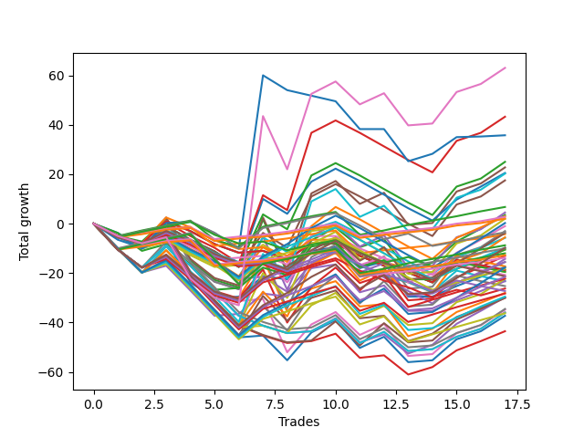

# Long Bulldog 005 DB 
- Symbol: ES
- Date Range: 03/18/2022 - 07/15/2022
- Trading Period: 7:20-12:30
- Number of Trades: 17



| Name | Win Percent | Profit | Avg Profit / Trade | Avg Time / Trade |      | Name | Win Percent | Profit | Avg Profit / Trade | Avg Time / Trade |
| ---- | ----------- | ------ | ------------------ | ---------------- | ---- | ---- | ----------- | ------ | ------------------ | ---------------- |
| Sorted By <br> Profit | | | | | | Sorted By <br> Win Percentage ||||
| TEST | 52.94 | 31500.00 | 1852.94 | 29:55 |     | One Hundred Eleven | 82.35 | 1375.00 | 80.88 | 01:51 |
| Forty-Five | 41.18 | 21625.00 | 1272.06 | 13:20 |     | One Hundred Sixteen | 82.35 | 1000.00 | 58.82 | 01:52 |
| Seventy-Three | 47.06 | 17875.00 | 1051.47 | 14:25 |     | Eighty-One | 82.35 | -2125.00 | -125.00 | 06:22 |
| Forty-Four | 41.18 | 12500.00 | 735.29 | 12:47 |     | One Hundred Twenty-Six | 82.35 | -6375.00 | -375.00 | 04:05 |
| Five | 52.94 | 11375.00 | 669.12 | 27:07 |     | One Hundred Twenty-One | 82.35 | -6875.00 | -404.41 | 03:02 |
| Forty-Two | 41.18 | 10250.00 | 602.94 | 09:01 |     | Eighty-Two | 76.47 | 3375.00 | 198.53 | 09:25 |
| Sixty-One | 52.94 | 10125.00 | 595.59 | 19:05 |     | One Hundred Twenty-Seven | 76.47 | -4375.00 | -257.35 | 06:21 |
| Forty-Seven | 41.18 | 8750.00 | 514.71 | 12:39 |     | One Hundred Twenty-Two | 76.47 | -5000.00 | -294.12 | 05:18 |
| Eighty-Two | 76.47 | 3375.00 | 198.53 | 09:25 |     | One Hundred Twelve | 64.71 | -1750.00 | -102.94 | 02:43 |
| Four | 52.94 | 2250.00 | 132.35 | 26:34 |     | Eighty-Five | 58.82 | -1875.00 | -110.29 | 18:43 |
| Two | 52.94 | 1750.00 | 102.94 | 21:35 |     | One Hundred Thirty | 58.82 | -4875.00 | -286.76 | 12:01 |
| Forty-Three | 41.18 | 1500.00 | 88.24 | 10:02 |     | Sixty-Four | 58.82 | -5250.00 | -308.82 | 08:47 |
| One Hundred Eleven | 82.35 | 1375.00 | 80.88 | 01:51 |     | One Hundred Seventeen | 58.82 | -6000.00 | -352.94 | 02:31 |
| One Hundred Sixteen | 82.35 | 1000.00 | 58.82 | 01:52 |     | Eighty-Four | 58.82 | -7750.00 | -455.88 | 17:31 |
| Sixty | 52.94 | 1000.00 | 58.82 | 18:32 |     | Zero | 58.82 | -8750.00 | -514.71 | 13:14 |
| One Hundred Fifteen | 47.06 | 125.00 | 7.35 | 06:15 |     | One Hundred Twenty-Five | 58.82 | -8875.00 | -522.06 | 11:12 |
| Fifty-Eight | 52.94 | -500.00 | -29.41 | 13:44 |     | One Hundred Twenty-Nine | 58.82 | -10750.00 | -632.35 | 10:49 |
| Seven | 52.94 | -1500.00 | -88.24 | 26:27 |     | Eighty-Three | 58.82 | -11125.00 | -654.41 | 15:47 |
| One Hundred Twelve | 64.71 | -1750.00 | -102.94 | 02:43 |     | Fifty-Six | 58.82 | -11625.00 | -683.82 | 08:54 |
| Eighty-Five | 58.82 | -1875.00 | -110.29 | 18:43 |     | One Hundred Twenty-Eight | 58.82 | -14125.00 | -830.88 | 09:05 |
| Eighty-One | 82.35 | -2125.00 | -125.00 | 06:22 |     | One Hundred Twenty-Four | 58.82 | -14750.00 | -867.65 | 10:00 |
| Sixty-Three | 52.94 | -2750.00 | -161.76 | 18:25 |     | One Hundred Twenty-Three | 58.82 | -18125.00 | -1066.18 | 08:16 |
| Forty-One | 41.18 | -2875.00 | -169.12 | 08:13 |     | TEST | 52.94 | 31500.00 | 1852.94 | 29:55 |
| One Hundred Twenty-Seven | 76.47 | -4375.00 | -257.35 | 06:21 |     | Five | 52.94 | 11375.00 | 669.12 | 27:07 |
| One Hundred Thirty | 58.82 | -4875.00 | -286.76 | 12:01 |     | Sixty-One | 52.94 | 10125.00 | 595.59 | 19:05 |
| One Hundred Fourteen | 47.06 | -4875.00 | -286.76 | 05:04 |     | Four | 52.94 | 2250.00 | 132.35 | 26:34 |
| One Hundred Twenty-Two | 76.47 | -5000.00 | -294.12 | 05:18 |     | Two | 52.94 | 1750.00 | 102.94 | 21:35 |
| Sixty-Four | 58.82 | -5250.00 | -308.82 | 08:47 |     | Sixty | 52.94 | 1000.00 | 58.82 | 18:32 |
| Forty | 47.06 | -5250.00 | -308.82 | 05:35 |     | Fifty-Eight | 52.94 | -500.00 | -29.41 | 13:44 |
| One Hundred Seventeen | 58.82 | -6000.00 | -352.94 | 02:31 |     | Seven | 52.94 | -1500.00 | -88.24 | 26:27 |
| One Hundred Twenty-Six | 82.35 | -6375.00 | -375.00 | 04:05 |     | Sixty-Three | 52.94 | -2750.00 | -161.76 | 18:25 |
| Three | 52.94 | -6500.00 | -382.35 | 23:40 |     | Three | 52.94 | -6500.00 | -382.35 | 23:40 |
| One Hundred Twenty-One | 82.35 | -6875.00 | -404.41 | 03:02 |     | Fifty-Nine | 52.94 | -7750.00 | -455.88 | 15:38 |
| Forty-Six | 41.18 | -7125.00 | -419.12 | 10:02 |     | Seventy | 52.94 | -11125.00 | -654.41 | 16:01 |
| Eighty-Four | 58.82 | -7750.00 | -455.88 | 17:31 |     | One | 52.94 | -14000.00 | -823.53 | 20:02 |
| Fifty-Nine | 52.94 | -7750.00 | -455.88 | 15:38 |     | Fifty-Seven | 52.94 | -15000.00 | -882.35 | 12:43 |
| Fifty-Three | 29.41 | -8625.00 | -507.35 | 05:21 |     | Six | 52.94 | -17375.00 | -1022.06 | 23:49 |
| Zero | 58.82 | -8750.00 | -514.71 | 13:14 |     | Sixty-Two | 52.94 | -18625.00 | -1095.59 | 15:47 |
| One Hundred Twenty-Five | 58.82 | -8875.00 | -522.06 | 11:12 |     | Seventy-Three | 47.06 | 17875.00 | 1051.47 | 14:25 |
| One Hundred Thirteen | 47.06 | -9125.00 | -536.76 | 04:06 |     | One Hundred Fifteen | 47.06 | 125.00 | 7.35 | 06:15 |
| Fifty-Five | 29.41 | -9375.00 | -551.47 | 05:18 |     | One Hundred Fourteen | 47.06 | -4875.00 | -286.76 | 05:04 |
| Fifty-Two | 29.41 | -9375.00 | -551.47 | 05:18 |     | Forty | 47.06 | -5250.00 | -308.82 | 05:35 |
| Fifty-Four | 29.41 | -9750.00 | -573.53 | 04:27 |     | One Hundred Thirteen | 47.06 | -9125.00 | -536.76 | 04:06 |
| Fifty | 29.41 | -9750.00 | -573.53 | 04:50 |     | Sixty-Six | 47.06 | -14875.00 | -875.00 | 13:11 |
| Forty-Eight | 35.29 | -10375.00 | -610.29 | 03:51 |     | Sixty-Seven | 47.06 | -15000.00 | -882.35 | 15:14 |
| One Hundred Twenty | 29.41 | -10625.00 | -625.00 | 04:17 |     | Sixty-Nine | 47.06 | -17250.00 | -1014.71 | 17:24 |
| One Hundred Twenty-Nine | 58.82 | -10750.00 | -632.35 | 10:49 |     | Sixty-Eight | 47.06 | -17875.00 | -1051.47 | 17:19 |
| Eighty-Three | 58.82 | -11125.00 | -654.41 | 15:47 |     | Seventy-One | 47.06 | -18000.00 | -1058.82 | 17:22 |
| Seventy | 52.94 | -11125.00 | -654.41 | 16:01 |     | Sixty-Five | 47.06 | -21750.00 | -1279.41 | 12:26 |
| Fifty-Six | 58.82 | -11625.00 | -683.82 | 08:54 |     | Forty-Five | 41.18 | 21625.00 | 1272.06 | 13:20 |
| Fifty-One | 29.41 | -11625.00 | -683.82 | 04:40 |     | Forty-Four | 41.18 | 12500.00 | 735.29 | 12:47 |
| Forty-Nine | 29.41 | -12625.00 | -742.65 | 04:31 |     | Forty-Two | 41.18 | 10250.00 | 602.94 | 09:01 |
| One Hundred Eighteen | 35.29 | -13125.00 | -772.06 | 03:28 |     | Forty-Seven | 41.18 | 8750.00 | 514.71 | 12:39 |
| One Hundred Ninteen | 29.41 | -13625.00 | -801.47 | 03:44 |     | Forty-Three | 41.18 | 1500.00 | 88.24 | 10:02 |
| One | 52.94 | -14000.00 | -823.53 | 20:02 |     | Forty-One | 41.18 | -2875.00 | -169.12 | 08:13 |
| One Hundred Twenty-Eight | 58.82 | -14125.00 | -830.88 | 09:05 |     | Forty-Six | 41.18 | -7125.00 | -419.12 | 10:02 |
| One Hundred Twenty-Four | 58.82 | -14750.00 | -867.65 | 10:00 |     | Forty-Eight | 35.29 | -10375.00 | -610.29 | 03:51 |
| Sixty-Six | 47.06 | -14875.00 | -875.00 | 13:11 |     | One Hundred Eighteen | 35.29 | -13125.00 | -772.06 | 03:28 |
| Fifty-Seven | 52.94 | -15000.00 | -882.35 | 12:43 |     | Fifty-Three | 29.41 | -8625.00 | -507.35 | 05:21 |
| Sixty-Seven | 47.06 | -15000.00 | -882.35 | 15:14 |     | Fifty-Five | 29.41 | -9375.00 | -551.47 | 05:18 |
| Sixty-Nine | 47.06 | -17250.00 | -1014.71 | 17:24 |     | Fifty-Two | 29.41 | -9375.00 | -551.47 | 05:18 |
| Six | 52.94 | -17375.00 | -1022.06 | 23:49 |     | Fifty-Four | 29.41 | -9750.00 | -573.53 | 04:27 |
| Sixty-Eight | 47.06 | -17875.00 | -1051.47 | 17:19 |     | Fifty | 29.41 | -9750.00 | -573.53 | 04:50 |
| Seventy-One | 47.06 | -18000.00 | -1058.82 | 17:22 |     | One Hundred Twenty | 29.41 | -10625.00 | -625.00 | 04:17 |
| One Hundred Twenty-Three | 58.82 | -18125.00 | -1066.18 | 08:16 |     | Fifty-One | 29.41 | -11625.00 | -683.82 | 04:40 |
| Sixty-Two | 52.94 | -18625.00 | -1095.59 | 15:47 |     | Forty-Nine | 29.41 | -12625.00 | -742.65 | 04:31 |
| Sixty-Five | 47.06 | -21750.00 | -1279.41 | 12:26 |     | One Hundred Ninteen | 29.41 | -13625.00 | -801.47 | 03:44 |

## NO STOPLOSS

### Test Zero
* Sell when price hits the middle line of the 20p bollinger
* No Stoploss
* Results:
```
Total Trades: 17
Percent Up: 58.82
Percent Down: 41.18
Total Points Moved Up: -17.50
Potential Profit: -8750.00
Total Points Ups: 39.50 Count Ups: 10
Total Points Downs: -57.00 Count Downs: 7
```

<details><summary>Trades</summary>

<code>In: 2022-03-23 10:23:00		Out: 2022-03-23 10:38:15		Total Position Time: 15:15		Total Move Up: -3.75		Total to Date: -3.75</code> <br />
<code>In: 2022-03-25 08:14:00		Out: 2022-03-25 08:36:40		Total Position Time: 22:40		Total Move Up: -6.00		Total to Date: -9.75</code> <br />
<code>In: 2022-03-28 07:39:00		Out: 2022-03-28 07:42:50		Total Position Time: 03:50		Total Move Up: 2.75		Total to Date: -7.00</code> <br />
<code>In: 2022-03-28 08:27:00		Out: 2022-03-28 08:56:55		Total Position Time: 29:55		Total Move Up: -16.75		Total to Date: -23.75</code> <br />
<code>In: 2022-04-18 08:26:00		Out: 2022-04-18 08:55:05		Total Position Time: 29:05		Total Move Up: -6.50		Total to Date: -30.25</code> <br />
<code>In: 2022-04-20 11:38:00		Out: 2022-04-20 11:48:15		Total Position Time: 10:15		Total Move Up: 0.75		Total to Date: -29.50</code> <br />
<code>In: 2022-05-04 11:36:00		Out: 2022-05-04 11:36:40		Total Position Time: 00:40		Total Move Up: 8.25		Total to Date: -21.25</code> <br />
<code>In: 2022-05-11 09:32:00		Out: 2022-05-11 09:49:15		Total Position Time: 17:15		Total Move Up: -1.25		Total to Date: -22.50</code> <br />
<code>In: 2022-05-17 11:24:00		Out: 2022-05-17 11:27:30		Total Position Time: 03:30		Total Move Up: 11.50		Total to Date: -11.00</code> <br />
<code>In: 2022-05-25 09:29:00		Out: 2022-05-25 09:41:25		Total Position Time: 12:25		Total Move Up: 1.50		Total to Date: -9.50</code> <br />
<code>In: 2022-06-06 08:14:00		Out: 2022-06-06 08:31:35		Total Position Time: 17:35		Total Move Up: -8.50		Total to Date: -18.00</code> <br />
<code>In: 2022-06-06 08:19:00		Out: 2022-06-06 08:31:35		Total Position Time: 12:35		Total Move Up: 2.75		Total to Date: -15.25</code> <br />
<code>In: 2022-06-08 09:29:00		Out: 2022-06-08 09:53:05		Total Position Time: 24:05		Total Move Up: -14.25		Total to Date: -29.50</code> <br />
<code>In: 2022-06-08 09:41:00		Out: 2022-06-08 09:53:05		Total Position Time: 12:05		Total Move Up: 0.00		Total to Date: -29.50</code> <br />
<code>In: 2022-06-29 08:25:00		Out: 2022-06-29 08:28:15		Total Position Time: 03:15		Total Move Up: 4.25		Total to Date: -25.25</code> <br />
<code>In: 2022-07-05 08:02:00		Out: 2022-07-05 08:08:20		Total Position Time: 06:20		Total Move Up: 3.75		Total to Date: -21.50</code> <br />
<code>In: 2022-07-05 08:04:00		Out: 2022-07-05 08:08:20		Total Position Time: 04:20		Total Move Up: 4.00		Total to Date: -17.50</code> <br />


</details>

### Test One
* Sell when the price hits the upper line of the 20p 1std bollinger
* No Stoploss
* Results:
```
Total Trades: 17
Percent Up: 52.94
Percent Down: 47.06
Total Points Moved Up: -28.00
Potential Profit: -14000.00
Total Points Ups: 51.75 Count Ups: 9
Total Points Downs: -79.75 Count Downs: 8
```

<details><summary>Trades</summary>

<code>In: 2022-03-23 10:23:00		Out: 2022-03-23 10:51:45		Total Position Time: 28:45		Total Move Up: -4.75		Total to Date: -4.75</code> <br />
<code>In: 2022-03-25 08:14:00		Out: 2022-03-25 08:41:05		Total Position Time: 27:05		Total Move Up: -4.75		Total to Date: -9.50</code> <br />
<code>In: 2022-03-28 07:39:00		Out: 2022-03-28 07:44:55		Total Position Time: 05:55		Total Move Up: 5.00		Total to Date: -4.50</code> <br />
<code>In: 2022-03-28 08:27:00		Out: 2022-03-28 08:56:55		Total Position Time: 29:55		Total Move Up: -16.75		Total to Date: -21.25</code> <br />
<code>In: 2022-04-18 08:26:00		Out: 2022-04-18 08:55:55		Total Position Time: 29:55		Total Move Up: -7.75		Total to Date: -29.00</code> <br />
<code>In: 2022-04-20 11:38:00		Out: 2022-04-20 12:04:20		Total Position Time: 26:20		Total Move Up: -1.00		Total to Date: -30.00</code> <br />
<code>In: 2022-05-04 11:36:00		Out: 2022-05-04 11:41:35		Total Position Time: 05:35		Total Move Up: 16.00		Total to Date: -14.00</code> <br />
<code>In: 2022-05-11 09:32:00		Out: 2022-05-11 10:01:55		Total Position Time: 29:55		Total Move Up: -21.50		Total to Date: -35.50</code> <br />
<code>In: 2022-05-17 11:24:00		Out: 2022-05-17 11:37:35		Total Position Time: 13:35		Total Move Up: 9.25		Total to Date: -26.25</code> <br />
<code>In: 2022-05-25 09:29:00		Out: 2022-05-25 09:44:25		Total Position Time: 15:25		Total Move Up: 3.00		Total to Date: -23.25</code> <br />
<code>In: 2022-06-06 08:14:00		Out: 2022-06-06 08:39:15		Total Position Time: 25:15		Total Move Up: -10.25		Total to Date: -33.50</code> <br />
<code>In: 2022-06-06 08:19:00		Out: 2022-06-06 08:39:15		Total Position Time: 20:15		Total Move Up: 1.00		Total to Date: -32.50</code> <br />
<code>In: 2022-06-08 09:29:00		Out: 2022-06-08 09:58:55		Total Position Time: 29:55		Total Move Up: -13.00		Total to Date: -45.50</code> <br />
<code>In: 2022-06-08 09:41:00		Out: 2022-06-08 09:59:05		Total Position Time: 18:05		Total Move Up: 3.00		Total to Date: -42.50</code> <br />
<code>In: 2022-06-29 08:25:00		Out: 2022-06-29 08:32:20		Total Position Time: 07:20		Total Move Up: 6.75		Total to Date: -35.75</code> <br />
<code>In: 2022-07-05 08:02:00		Out: 2022-07-05 08:16:40		Total Position Time: 14:40		Total Move Up: 3.75		Total to Date: -32.00</code> <br />
<code>In: 2022-07-05 08:04:00		Out: 2022-07-05 08:16:40		Total Position Time: 12:40		Total Move Up: 4.00		Total to Date: -28.00</code> <br />


</details>

### Test Two
* Sell when the price hits the upper line of the 20p 2std bollinger
* No Stoploss
* Results:
```
Total Trades: 17
Percent Up: 52.94
Percent Down: 47.06
Total Points Moved Up: 3.50
Potential Profit: 1750.00
Total Points Ups: 80.75 Count Ups: 9
Total Points Downs: -77.25 Count Downs: 8
```

<details><summary>Trades</summary>

<code>In: 2022-03-23 10:23:00		Out: 2022-03-23 10:52:55		Total Position Time: 29:55		Total Move Up: -5.00		Total to Date: -5.00</code> <br />
<code>In: 2022-03-25 08:14:00		Out: 2022-03-25 08:41:45		Total Position Time: 27:45		Total Move Up: -2.25		Total to Date: -7.25</code> <br />
<code>In: 2022-03-28 07:39:00		Out: 2022-03-28 07:48:05		Total Position Time: 09:05		Total Move Up: 9.00		Total to Date: 1.75</code> <br />
<code>In: 2022-03-28 08:27:00		Out: 2022-03-28 08:56:55		Total Position Time: 29:55		Total Move Up: -16.75		Total to Date: -15.00</code> <br />
<code>In: 2022-04-18 08:26:00		Out: 2022-04-18 08:55:55		Total Position Time: 29:55		Total Move Up: -7.75		Total to Date: -22.75</code> <br />
<code>In: 2022-04-20 11:38:00		Out: 2022-04-20 12:07:55		Total Position Time: 29:55		Total Move Up: -3.00		Total to Date: -25.75</code> <br />
<code>In: 2022-05-04 11:36:00		Out: 2022-05-04 11:43:45		Total Position Time: 07:45		Total Move Up: 27.50		Total to Date: 1.75</code> <br />
<code>In: 2022-05-11 09:32:00		Out: 2022-05-11 10:01:55		Total Position Time: 29:55		Total Move Up: -21.50		Total to Date: -19.75</code> <br />
<code>In: 2022-05-17 11:24:00		Out: 2022-05-17 11:40:00		Total Position Time: 16:00		Total Move Up: 13.00		Total to Date: -6.75</code> <br />
<code>In: 2022-05-25 09:29:00		Out: 2022-05-25 09:45:20		Total Position Time: 16:20		Total Move Up: 5.25		Total to Date: -1.50</code> <br />
<code>In: 2022-06-06 08:14:00		Out: 2022-06-06 08:43:00		Total Position Time: 29:00		Total Move Up: -8.00		Total to Date: -9.50</code> <br />
<code>In: 2022-06-06 08:19:00		Out: 2022-06-06 08:43:00		Total Position Time: 24:00		Total Move Up: 3.25		Total to Date: -6.25</code> <br />
<code>In: 2022-06-08 09:29:00		Out: 2022-06-08 09:58:55		Total Position Time: 29:55		Total Move Up: -13.00		Total to Date: -19.25</code> <br />
<code>In: 2022-06-08 09:41:00		Out: 2022-06-08 09:59:10		Total Position Time: 18:10		Total Move Up: 3.50		Total to Date: -15.75</code> <br />
<code>In: 2022-06-29 08:25:00		Out: 2022-06-29 08:34:40		Total Position Time: 09:40		Total Move Up: 8.50		Total to Date: -7.25</code> <br />
<code>In: 2022-07-05 08:02:00		Out: 2022-07-05 08:17:55		Total Position Time: 15:55		Total Move Up: 5.25		Total to Date: -2.00</code> <br />
<code>In: 2022-07-05 08:04:00		Out: 2022-07-05 08:17:55		Total Position Time: 13:55		Total Move Up: 5.50		Total to Date: 3.50</code> <br />


</details>

### Test Three
* Sell when price hits the middle line of the 50p bollinger
* No Stoploss
* Results:
```
Total Trades: 17
Percent Up: 52.94
Percent Down: 47.06
Total Points Moved Up: -13.00
Potential Profit: -6500.00
Total Points Ups: 66.25 Count Ups: 9
Total Points Downs: -79.25 Count Downs: 8
```

<details><summary>Trades</summary>

<code>In: 2022-03-23 10:23:00		Out: 2022-03-23 10:52:55		Total Position Time: 29:55		Total Move Up: -5.00		Total to Date: -5.00</code> <br />
<code>In: 2022-03-25 08:14:00		Out: 2022-03-25 08:43:55		Total Position Time: 29:55		Total Move Up: -3.00		Total to Date: -8.00</code> <br />
<code>In: 2022-03-28 07:39:00		Out: 2022-03-28 07:45:05		Total Position Time: 06:05		Total Move Up: 5.25		Total to Date: -2.75</code> <br />
<code>In: 2022-03-28 08:27:00		Out: 2022-03-28 08:56:55		Total Position Time: 29:55		Total Move Up: -16.75		Total to Date: -19.50</code> <br />
<code>In: 2022-04-18 08:26:00		Out: 2022-04-18 08:55:55		Total Position Time: 29:55		Total Move Up: -7.75		Total to Date: -27.25</code> <br />
<code>In: 2022-04-20 11:38:00		Out: 2022-04-20 12:07:55		Total Position Time: 29:55		Total Move Up: -3.00		Total to Date: -30.25</code> <br />
<code>In: 2022-05-04 11:36:00		Out: 2022-05-04 11:41:15		Total Position Time: 05:15		Total Move Up: 11.75		Total to Date: -18.50</code> <br />
<code>In: 2022-05-11 09:32:00		Out: 2022-05-11 10:01:55		Total Position Time: 29:55		Total Move Up: -21.50		Total to Date: -40.00</code> <br />
<code>In: 2022-05-17 11:24:00		Out: 2022-05-17 11:40:05		Total Position Time: 16:05		Total Move Up: 14.50		Total to Date: -25.50</code> <br />
<code>In: 2022-05-25 09:29:00		Out: 2022-05-25 09:49:05		Total Position Time: 20:05		Total Move Up: 7.75		Total to Date: -17.75</code> <br />
<code>In: 2022-06-06 08:14:00		Out: 2022-06-06 08:43:55		Total Position Time: 29:55		Total Move Up: -9.25		Total to Date: -27.00</code> <br />
<code>In: 2022-06-06 08:19:00		Out: 2022-06-06 08:46:10		Total Position Time: 27:10		Total Move Up: 9.00		Total to Date: -18.00</code> <br />
<code>In: 2022-06-08 09:29:00		Out: 2022-06-08 09:58:55		Total Position Time: 29:55		Total Move Up: -13.00		Total to Date: -31.00</code> <br />
<code>In: 2022-06-08 09:41:00		Out: 2022-06-08 10:10:55		Total Position Time: 29:55		Total Move Up: 0.75		Total to Date: -30.25</code> <br />
<code>In: 2022-06-29 08:25:00		Out: 2022-06-29 08:34:40		Total Position Time: 09:40		Total Move Up: 8.50		Total to Date: -21.75</code> <br />
<code>In: 2022-07-05 08:02:00		Out: 2022-07-05 08:27:25		Total Position Time: 25:25		Total Move Up: 4.25		Total to Date: -17.50</code> <br />
<code>In: 2022-07-05 08:04:00		Out: 2022-07-05 08:27:25		Total Position Time: 23:25		Total Move Up: 4.50		Total to Date: -13.00</code> <br />


</details>

### Test Four
* Sell when the price hits the upper line of the 50p 1std bollinger
* No Stoploss
* Results:
```
Total Trades: 17
Percent Up: 52.94
Percent Down: 47.06
Total Points Moved Up: 4.50
Potential Profit: 2250.00
Total Points Ups: 83.75 Count Ups: 9
Total Points Downs: -79.25 Count Downs: 8
```

<details><summary>Trades</summary>

<code>In: 2022-03-23 10:23:00		Out: 2022-03-23 10:52:55		Total Position Time: 29:55		Total Move Up: -5.00		Total to Date: -5.00</code> <br />
<code>In: 2022-03-25 08:14:00		Out: 2022-03-25 08:43:55		Total Position Time: 29:55		Total Move Up: -3.00		Total to Date: -8.00</code> <br />
<code>In: 2022-03-28 07:39:00		Out: 2022-03-28 07:48:05		Total Position Time: 09:05		Total Move Up: 9.00		Total to Date: 1.00</code> <br />
<code>In: 2022-03-28 08:27:00		Out: 2022-03-28 08:56:55		Total Position Time: 29:55		Total Move Up: -16.75		Total to Date: -15.75</code> <br />
<code>In: 2022-04-18 08:26:00		Out: 2022-04-18 08:55:55		Total Position Time: 29:55		Total Move Up: -7.75		Total to Date: -23.50</code> <br />
<code>In: 2022-04-20 11:38:00		Out: 2022-04-20 12:07:55		Total Position Time: 29:55		Total Move Up: -3.00		Total to Date: -26.50</code> <br />
<code>In: 2022-05-04 11:36:00		Out: 2022-05-04 11:42:00		Total Position Time: 06:00		Total Move Up: 21.25		Total to Date: -5.25</code> <br />
<code>In: 2022-05-11 09:32:00		Out: 2022-05-11 10:01:55		Total Position Time: 29:55		Total Move Up: -21.50		Total to Date: -26.75</code> <br />
<code>In: 2022-05-17 11:24:00		Out: 2022-05-17 11:44:30		Total Position Time: 20:30		Total Move Up: 21.75		Total to Date: -5.00</code> <br />
<code>In: 2022-05-25 09:29:00		Out: 2022-05-25 09:58:55		Total Position Time: 29:55		Total Move Up: 5.00		Total to Date: 0.00</code> <br />
<code>In: 2022-06-06 08:14:00		Out: 2022-06-06 08:43:55		Total Position Time: 29:55		Total Move Up: -9.25		Total to Date: -9.25</code> <br />
<code>In: 2022-06-06 08:19:00		Out: 2022-06-06 08:48:55		Total Position Time: 29:55		Total Move Up: 4.50		Total to Date: -4.75</code> <br />
<code>In: 2022-06-08 09:29:00		Out: 2022-06-08 09:58:55		Total Position Time: 29:55		Total Move Up: -13.00		Total to Date: -17.75</code> <br />
<code>In: 2022-06-08 09:41:00		Out: 2022-06-08 10:10:55		Total Position Time: 29:55		Total Move Up: 0.75		Total to Date: -17.00</code> <br />
<code>In: 2022-06-29 08:25:00		Out: 2022-06-29 08:53:10		Total Position Time: 28:10		Total Move Up: 11.50		Total to Date: -5.50</code> <br />
<code>In: 2022-07-05 08:02:00		Out: 2022-07-05 08:31:55		Total Position Time: 29:55		Total Move Up: 3.25		Total to Date: -2.25</code> <br />
<code>In: 2022-07-05 08:04:00		Out: 2022-07-05 08:33:05		Total Position Time: 29:05		Total Move Up: 6.75		Total to Date: 4.50</code> <br />


</details>

### Test Five
* Sell when the price hits the upper line of the 50p 2std bollinger
* No Stoploss
* Results:
```
Total Trades: 17
Percent Up: 52.94
Percent Down: 47.06
Total Points Moved Up: 22.75
Potential Profit: 11375.00
Total Points Ups: 102.00 Count Ups: 9
Total Points Downs: -79.25 Count Downs: 8
```

<details><summary>Trades</summary>

<code>In: 2022-03-23 10:23:00		Out: 2022-03-23 10:52:55		Total Position Time: 29:55		Total Move Up: -5.00		Total to Date: -5.00</code> <br />
<code>In: 2022-03-25 08:14:00		Out: 2022-03-25 08:43:55		Total Position Time: 29:55		Total Move Up: -3.00		Total to Date: -8.00</code> <br />
<code>In: 2022-03-28 07:39:00		Out: 2022-03-28 07:48:50		Total Position Time: 09:50		Total Move Up: 10.50		Total to Date: 2.50</code> <br />
<code>In: 2022-03-28 08:27:00		Out: 2022-03-28 08:56:55		Total Position Time: 29:55		Total Move Up: -16.75		Total to Date: -14.25</code> <br />
<code>In: 2022-04-18 08:26:00		Out: 2022-04-18 08:55:55		Total Position Time: 29:55		Total Move Up: -7.75		Total to Date: -22.00</code> <br />
<code>In: 2022-04-20 11:38:00		Out: 2022-04-20 12:07:55		Total Position Time: 29:55		Total Move Up: -3.00		Total to Date: -25.00</code> <br />
<code>In: 2022-05-04 11:36:00		Out: 2022-05-04 11:43:45		Total Position Time: 07:45		Total Move Up: 27.50		Total to Date: 2.50</code> <br />
<code>In: 2022-05-11 09:32:00		Out: 2022-05-11 10:01:55		Total Position Time: 29:55		Total Move Up: -21.50		Total to Date: -19.00</code> <br />
<code>In: 2022-05-17 11:24:00		Out: 2022-05-17 11:48:45		Total Position Time: 24:45		Total Move Up: 31.25		Total to Date: 12.25</code> <br />
<code>In: 2022-05-25 09:29:00		Out: 2022-05-25 09:58:55		Total Position Time: 29:55		Total Move Up: 5.00		Total to Date: 17.25</code> <br />
<code>In: 2022-06-06 08:14:00		Out: 2022-06-06 08:43:55		Total Position Time: 29:55		Total Move Up: -9.25		Total to Date: 8.00</code> <br />
<code>In: 2022-06-06 08:19:00		Out: 2022-06-06 08:48:55		Total Position Time: 29:55		Total Move Up: 4.50		Total to Date: 12.50</code> <br />
<code>In: 2022-06-08 09:29:00		Out: 2022-06-08 09:58:55		Total Position Time: 29:55		Total Move Up: -13.00		Total to Date: -0.50</code> <br />
<code>In: 2022-06-08 09:41:00		Out: 2022-06-08 10:10:55		Total Position Time: 29:55		Total Move Up: 0.75		Total to Date: 0.25</code> <br />
<code>In: 2022-06-29 08:25:00		Out: 2022-06-29 08:54:55		Total Position Time: 29:55		Total Move Up: 12.75		Total to Date: 13.00</code> <br />
<code>In: 2022-07-05 08:02:00		Out: 2022-07-05 08:31:55		Total Position Time: 29:55		Total Move Up: 3.25		Total to Date: 16.25</code> <br />
<code>In: 2022-07-05 08:04:00		Out: 2022-07-05 08:33:55		Total Position Time: 29:55		Total Move Up: 6.50		Total to Date: 22.75</code> <br />


</details>

### Test Six
* Sell when the price hits the middle line of the 1std VWAP
* No Stoploss
* Results:
```
Total Trades: 17
Percent Up: 52.94
Percent Down: 47.06
Total Points Moved Up: -34.75
Potential Profit: -17375.00
Total Points Ups: 44.50 Count Ups: 9
Total Points Downs: -79.25 Count Downs: 8
```

<details><summary>Trades</summary>

<code>In: 2022-03-23 10:23:00		Out: 2022-03-23 10:52:55		Total Position Time: 29:55		Total Move Up: -5.00		Total to Date: -5.00</code> <br />
<code>In: 2022-03-25 08:14:00		Out: 2022-03-25 08:43:55		Total Position Time: 29:55		Total Move Up: -3.00		Total to Date: -8.00</code> <br />
<code>In: 2022-03-28 07:39:00		Out: 2022-03-28 07:43:10		Total Position Time: 04:10		Total Move Up: 4.25		Total to Date: -3.75</code> <br />
<code>In: 2022-03-28 08:27:00		Out: 2022-03-28 08:56:55		Total Position Time: 29:55		Total Move Up: -16.75		Total to Date: -20.50</code> <br />
<code>In: 2022-04-18 08:26:00		Out: 2022-04-18 08:55:55		Total Position Time: 29:55		Total Move Up: -7.75		Total to Date: -28.25</code> <br />
<code>In: 2022-04-20 11:38:00		Out: 2022-04-20 12:07:55		Total Position Time: 29:55		Total Move Up: -3.00		Total to Date: -31.25</code> <br />
<code>In: 2022-05-04 11:36:00		Out: 2022-05-04 11:36:10		Total Position Time: 00:10		Total Move Up: 0.75		Total to Date: -30.50</code> <br />
<code>In: 2022-05-11 09:32:00		Out: 2022-05-11 10:01:55		Total Position Time: 29:55		Total Move Up: -21.50		Total to Date: -52.00</code> <br />
<code>In: 2022-05-17 11:24:00		Out: 2022-05-17 11:27:25		Total Position Time: 03:25		Total Move Up: 11.25		Total to Date: -40.75</code> <br />
<code>In: 2022-05-25 09:29:00		Out: 2022-05-25 09:58:55		Total Position Time: 29:55		Total Move Up: 5.00		Total to Date: -35.75</code> <br />
<code>In: 2022-06-06 08:14:00		Out: 2022-06-06 08:43:55		Total Position Time: 29:55		Total Move Up: -9.25		Total to Date: -45.00</code> <br />
<code>In: 2022-06-06 08:19:00		Out: 2022-06-06 08:48:55		Total Position Time: 29:55		Total Move Up: 4.50		Total to Date: -40.50</code> <br />
<code>In: 2022-06-08 09:29:00		Out: 2022-06-08 09:58:55		Total Position Time: 29:55		Total Move Up: -13.00		Total to Date: -53.50</code> <br />
<code>In: 2022-06-08 09:41:00		Out: 2022-06-08 10:10:55		Total Position Time: 29:55		Total Move Up: 0.75		Total to Date: -52.75</code> <br />
<code>In: 2022-06-29 08:25:00		Out: 2022-06-29 08:34:40		Total Position Time: 09:40		Total Move Up: 8.50		Total to Date: -44.25</code> <br />
<code>In: 2022-07-05 08:02:00		Out: 2022-07-05 08:31:55		Total Position Time: 29:55		Total Move Up: 3.25		Total to Date: -41.00</code> <br />
<code>In: 2022-07-05 08:04:00		Out: 2022-07-05 08:32:40		Total Position Time: 28:40		Total Move Up: 6.25		Total to Date: -34.75</code> <br />


</details>

### Test Seven
* Sell when the price hits the upper line of the 1std VWAP
* No Stoploss
* Results:
```
Total Trades: 17
Percent Up: 52.94
Percent Down: 47.06
Total Points Moved Up: -3.00
Potential Profit: -1500.00
Total Points Ups: 76.25 Count Ups: 9
Total Points Downs: -79.25 Count Downs: 8
```

<details><summary>Trades</summary>

<code>In: 2022-03-23 10:23:00		Out: 2022-03-23 10:52:55		Total Position Time: 29:55		Total Move Up: -5.00		Total to Date: -5.00</code> <br />
<code>In: 2022-03-25 08:14:00		Out: 2022-03-25 08:43:55		Total Position Time: 29:55		Total Move Up: -3.00		Total to Date: -8.00</code> <br />
<code>In: 2022-03-28 07:39:00		Out: 2022-03-28 07:48:05		Total Position Time: 09:05		Total Move Up: 9.00		Total to Date: 1.00</code> <br />
<code>In: 2022-03-28 08:27:00		Out: 2022-03-28 08:56:55		Total Position Time: 29:55		Total Move Up: -16.75		Total to Date: -15.75</code> <br />
<code>In: 2022-04-18 08:26:00		Out: 2022-04-18 08:55:55		Total Position Time: 29:55		Total Move Up: -7.75		Total to Date: -23.50</code> <br />
<code>In: 2022-04-20 11:38:00		Out: 2022-04-20 12:07:55		Total Position Time: 29:55		Total Move Up: -3.00		Total to Date: -26.50</code> <br />
<code>In: 2022-05-04 11:36:00		Out: 2022-05-04 11:41:30		Total Position Time: 05:30		Total Move Up: 13.75		Total to Date: -12.75</code> <br />
<code>In: 2022-05-11 09:32:00		Out: 2022-05-11 10:01:55		Total Position Time: 29:55		Total Move Up: -21.50		Total to Date: -34.25</code> <br />
<code>In: 2022-05-17 11:24:00		Out: 2022-05-17 11:40:20		Total Position Time: 16:20		Total Move Up: 20.75		Total to Date: -13.50</code> <br />
<code>In: 2022-05-25 09:29:00		Out: 2022-05-25 09:58:55		Total Position Time: 29:55		Total Move Up: 5.00		Total to Date: -8.50</code> <br />
<code>In: 2022-06-06 08:14:00		Out: 2022-06-06 08:43:55		Total Position Time: 29:55		Total Move Up: -9.25		Total to Date: -17.75</code> <br />
<code>In: 2022-06-06 08:19:00		Out: 2022-06-06 08:48:55		Total Position Time: 29:55		Total Move Up: 4.50		Total to Date: -13.25</code> <br />
<code>In: 2022-06-08 09:29:00		Out: 2022-06-08 09:58:55		Total Position Time: 29:55		Total Move Up: -13.00		Total to Date: -26.25</code> <br />
<code>In: 2022-06-08 09:41:00		Out: 2022-06-08 10:10:55		Total Position Time: 29:55		Total Move Up: 0.75		Total to Date: -25.50</code> <br />
<code>In: 2022-06-29 08:25:00		Out: 2022-06-29 08:54:55		Total Position Time: 29:55		Total Move Up: 12.75		Total to Date: -12.75</code> <br />
<code>In: 2022-07-05 08:02:00		Out: 2022-07-05 08:31:55		Total Position Time: 29:55		Total Move Up: 3.25		Total to Date: -9.50</code> <br />
<code>In: 2022-07-05 08:04:00		Out: 2022-07-05 08:33:55		Total Position Time: 29:55		Total Move Up: 6.50		Total to Date: -3.00</code> <br />


</details>

## STOPLOSS OF 5

### Test Forty
* Sell when price hits the middle line of the 20p bollinger
* Stoploss is 5 points
* Results:
```
Total Trades: 17
Percent Up: 47.06
Percent Down: 52.94
Total Points Moved Up: -10.50
Potential Profit: -5250.00
Total Points Ups: 36.75 Count Ups: 8
Total Points Downs: -47.25 Count Downs: 9
```

<details><summary>Trades</summary>

<code>In: 2022-03-23 10:23:00		Out: 2022-03-23 10:25:30		Total Position Time: 02:30		Total Move Up: -5.25		Total to Date: -5.25</code> <br />
<code>In: 2022-03-25 08:14:00		Out: 2022-03-25 08:24:25		Total Position Time: 10:25		Total Move Up: -4.75		Total to Date: -10.00</code> <br />
<code>In: 2022-03-28 07:39:00		Out: 2022-03-28 07:42:50		Total Position Time: 03:50		Total Move Up: 2.75		Total to Date: -7.25</code> <br />
<code>In: 2022-03-28 08:27:00		Out: 2022-03-28 08:33:30		Total Position Time: 06:30		Total Move Up: -5.50		Total to Date: -12.75</code> <br />
<code>In: 2022-04-18 08:26:00		Out: 2022-04-18 08:33:50		Total Position Time: 07:50		Total Move Up: -4.75		Total to Date: -17.50</code> <br />
<code>In: 2022-04-20 11:38:00		Out: 2022-04-20 11:48:15		Total Position Time: 10:15		Total Move Up: 0.75		Total to Date: -16.75</code> <br />
<code>In: 2022-05-04 11:36:00		Out: 2022-05-04 11:36:40		Total Position Time: 00:40		Total Move Up: 8.25		Total to Date: -8.50</code> <br />
<code>In: 2022-05-11 09:32:00		Out: 2022-05-11 09:43:45		Total Position Time: 11:45		Total Move Up: -6.00		Total to Date: -14.50</code> <br />
<code>In: 2022-05-17 11:24:00		Out: 2022-05-17 11:27:30		Total Position Time: 03:30		Total Move Up: 11.50		Total to Date: -3.00</code> <br />
<code>In: 2022-05-25 09:29:00		Out: 2022-05-25 09:41:25		Total Position Time: 12:25		Total Move Up: 1.50		Total to Date: -1.50</code> <br />
<code>In: 2022-06-06 08:14:00		Out: 2022-06-06 08:16:45		Total Position Time: 02:45		Total Move Up: -5.00		Total to Date: -6.50</code> <br />
<code>In: 2022-06-06 08:19:00		Out: 2022-06-06 08:20:05		Total Position Time: 01:05		Total Move Up: -5.50		Total to Date: -12.00</code> <br />
<code>In: 2022-06-08 09:29:00		Out: 2022-06-08 09:33:00		Total Position Time: 04:00		Total Move Up: -5.50		Total to Date: -17.50</code> <br />
<code>In: 2022-06-08 09:41:00		Out: 2022-06-08 09:44:45		Total Position Time: 03:45		Total Move Up: -5.00		Total to Date: -22.50</code> <br />
<code>In: 2022-06-29 08:25:00		Out: 2022-06-29 08:28:15		Total Position Time: 03:15		Total Move Up: 4.25		Total to Date: -18.25</code> <br />
<code>In: 2022-07-05 08:02:00		Out: 2022-07-05 08:08:20		Total Position Time: 06:20		Total Move Up: 3.75		Total to Date: -14.50</code> <br />
<code>In: 2022-07-05 08:04:00		Out: 2022-07-05 08:08:20		Total Position Time: 04:20		Total Move Up: 4.00		Total to Date: -10.50</code> <br />


</details>

### Test Forty-One
* Sell when the price hits the upper line of the 20p 1std bollinger
* Stoploss is 5 points
* Results:
```
Total Trades: 17
Percent Up: 41.18
Percent Down: 58.82
Total Points Moved Up: -5.75
Potential Profit: -2875.00
Total Points Ups: 47.75 Count Ups: 7
Total Points Downs: -53.50 Count Downs: 10
```

<details><summary>Trades</summary>

<code>In: 2022-03-23 10:23:00		Out: 2022-03-23 10:25:30		Total Position Time: 02:30		Total Move Up: -5.25		Total to Date: -5.25</code> <br />
<code>In: 2022-03-25 08:14:00		Out: 2022-03-25 08:24:25		Total Position Time: 10:25		Total Move Up: -4.75		Total to Date: -10.00</code> <br />
<code>In: 2022-03-28 07:39:00		Out: 2022-03-28 07:44:55		Total Position Time: 05:55		Total Move Up: 5.00		Total to Date: -5.00</code> <br />
<code>In: 2022-03-28 08:27:00		Out: 2022-03-28 08:33:30		Total Position Time: 06:30		Total Move Up: -5.50		Total to Date: -10.50</code> <br />
<code>In: 2022-04-18 08:26:00		Out: 2022-04-18 08:33:50		Total Position Time: 07:50		Total Move Up: -4.75		Total to Date: -15.25</code> <br />
<code>In: 2022-04-20 11:38:00		Out: 2022-04-20 11:52:05		Total Position Time: 14:05		Total Move Up: -6.25		Total to Date: -21.50</code> <br />
<code>In: 2022-05-04 11:36:00		Out: 2022-05-04 11:41:35		Total Position Time: 05:35		Total Move Up: 16.00		Total to Date: -5.50</code> <br />
<code>In: 2022-05-11 09:32:00		Out: 2022-05-11 09:43:45		Total Position Time: 11:45		Total Move Up: -6.00		Total to Date: -11.50</code> <br />
<code>In: 2022-05-17 11:24:00		Out: 2022-05-17 11:37:35		Total Position Time: 13:35		Total Move Up: 9.25		Total to Date: -2.25</code> <br />
<code>In: 2022-05-25 09:29:00		Out: 2022-05-25 09:44:25		Total Position Time: 15:25		Total Move Up: 3.00		Total to Date: 0.75</code> <br />
<code>In: 2022-06-06 08:14:00		Out: 2022-06-06 08:16:45		Total Position Time: 02:45		Total Move Up: -5.00		Total to Date: -4.25</code> <br />
<code>In: 2022-06-06 08:19:00		Out: 2022-06-06 08:20:05		Total Position Time: 01:05		Total Move Up: -5.50		Total to Date: -9.75</code> <br />
<code>In: 2022-06-08 09:29:00		Out: 2022-06-08 09:33:00		Total Position Time: 04:00		Total Move Up: -5.50		Total to Date: -15.25</code> <br />
<code>In: 2022-06-08 09:41:00		Out: 2022-06-08 09:44:45		Total Position Time: 03:45		Total Move Up: -5.00		Total to Date: -20.25</code> <br />
<code>In: 2022-06-29 08:25:00		Out: 2022-06-29 08:32:20		Total Position Time: 07:20		Total Move Up: 6.75		Total to Date: -13.50</code> <br />
<code>In: 2022-07-05 08:02:00		Out: 2022-07-05 08:16:40		Total Position Time: 14:40		Total Move Up: 3.75		Total to Date: -9.75</code> <br />
<code>In: 2022-07-05 08:04:00		Out: 2022-07-05 08:16:40		Total Position Time: 12:40		Total Move Up: 4.00		Total to Date: -5.75</code> <br />


</details>

### Test Forty-Two
* Sell when the price hits the upper line of the 20p 2std bollinger
* Stoploss is 5 points
* Results:
```
Total Trades: 17
Percent Up: 41.18
Percent Down: 58.82
Total Points Moved Up: 20.50
Potential Profit: 10250.00
Total Points Ups: 74.00 Count Ups: 7
Total Points Downs: -53.50 Count Downs: 10
```

<details><summary>Trades</summary>

<code>In: 2022-03-23 10:23:00		Out: 2022-03-23 10:25:30		Total Position Time: 02:30		Total Move Up: -5.25		Total to Date: -5.25</code> <br />
<code>In: 2022-03-25 08:14:00		Out: 2022-03-25 08:24:25		Total Position Time: 10:25		Total Move Up: -4.75		Total to Date: -10.00</code> <br />
<code>In: 2022-03-28 07:39:00		Out: 2022-03-28 07:48:05		Total Position Time: 09:05		Total Move Up: 9.00		Total to Date: -1.00</code> <br />
<code>In: 2022-03-28 08:27:00		Out: 2022-03-28 08:33:30		Total Position Time: 06:30		Total Move Up: -5.50		Total to Date: -6.50</code> <br />
<code>In: 2022-04-18 08:26:00		Out: 2022-04-18 08:33:50		Total Position Time: 07:50		Total Move Up: -4.75		Total to Date: -11.25</code> <br />
<code>In: 2022-04-20 11:38:00		Out: 2022-04-20 11:52:05		Total Position Time: 14:05		Total Move Up: -6.25		Total to Date: -17.50</code> <br />
<code>In: 2022-05-04 11:36:00		Out: 2022-05-04 11:43:45		Total Position Time: 07:45		Total Move Up: 27.50		Total to Date: 10.00</code> <br />
<code>In: 2022-05-11 09:32:00		Out: 2022-05-11 09:43:45		Total Position Time: 11:45		Total Move Up: -6.00		Total to Date: 4.00</code> <br />
<code>In: 2022-05-17 11:24:00		Out: 2022-05-17 11:40:00		Total Position Time: 16:00		Total Move Up: 13.00		Total to Date: 17.00</code> <br />
<code>In: 2022-05-25 09:29:00		Out: 2022-05-25 09:45:20		Total Position Time: 16:20		Total Move Up: 5.25		Total to Date: 22.25</code> <br />
<code>In: 2022-06-06 08:14:00		Out: 2022-06-06 08:16:45		Total Position Time: 02:45		Total Move Up: -5.00		Total to Date: 17.25</code> <br />
<code>In: 2022-06-06 08:19:00		Out: 2022-06-06 08:20:05		Total Position Time: 01:05		Total Move Up: -5.50		Total to Date: 11.75</code> <br />
<code>In: 2022-06-08 09:29:00		Out: 2022-06-08 09:33:00		Total Position Time: 04:00		Total Move Up: -5.50		Total to Date: 6.25</code> <br />
<code>In: 2022-06-08 09:41:00		Out: 2022-06-08 09:44:45		Total Position Time: 03:45		Total Move Up: -5.00		Total to Date: 1.25</code> <br />
<code>In: 2022-06-29 08:25:00		Out: 2022-06-29 08:34:40		Total Position Time: 09:40		Total Move Up: 8.50		Total to Date: 9.75</code> <br />
<code>In: 2022-07-05 08:02:00		Out: 2022-07-05 08:17:55		Total Position Time: 15:55		Total Move Up: 5.25		Total to Date: 15.00</code> <br />
<code>In: 2022-07-05 08:04:00		Out: 2022-07-05 08:17:55		Total Position Time: 13:55		Total Move Up: 5.50		Total to Date: 20.50</code> <br />


</details>

### Test Forty-Three
* Sell when price hits the middle line of the 50p bollinger
* Stoploss is 5 points
* Results:
```
Total Trades: 17
Percent Up: 41.18
Percent Down: 58.82
Total Points Moved Up: 3.00
Potential Profit: 1500.00
Total Points Ups: 56.50 Count Ups: 7
Total Points Downs: -53.50 Count Downs: 10
```

<details><summary>Trades</summary>

<code>In: 2022-03-23 10:23:00		Out: 2022-03-23 10:25:30		Total Position Time: 02:30		Total Move Up: -5.25		Total to Date: -5.25</code> <br />
<code>In: 2022-03-25 08:14:00		Out: 2022-03-25 08:24:25		Total Position Time: 10:25		Total Move Up: -4.75		Total to Date: -10.00</code> <br />
<code>In: 2022-03-28 07:39:00		Out: 2022-03-28 07:45:05		Total Position Time: 06:05		Total Move Up: 5.25		Total to Date: -4.75</code> <br />
<code>In: 2022-03-28 08:27:00		Out: 2022-03-28 08:33:30		Total Position Time: 06:30		Total Move Up: -5.50		Total to Date: -10.25</code> <br />
<code>In: 2022-04-18 08:26:00		Out: 2022-04-18 08:33:50		Total Position Time: 07:50		Total Move Up: -4.75		Total to Date: -15.00</code> <br />
<code>In: 2022-04-20 11:38:00		Out: 2022-04-20 11:52:05		Total Position Time: 14:05		Total Move Up: -6.25		Total to Date: -21.25</code> <br />
<code>In: 2022-05-04 11:36:00		Out: 2022-05-04 11:41:15		Total Position Time: 05:15		Total Move Up: 11.75		Total to Date: -9.50</code> <br />
<code>In: 2022-05-11 09:32:00		Out: 2022-05-11 09:43:45		Total Position Time: 11:45		Total Move Up: -6.00		Total to Date: -15.50</code> <br />
<code>In: 2022-05-17 11:24:00		Out: 2022-05-17 11:40:05		Total Position Time: 16:05		Total Move Up: 14.50		Total to Date: -1.00</code> <br />
<code>In: 2022-05-25 09:29:00		Out: 2022-05-25 09:49:05		Total Position Time: 20:05		Total Move Up: 7.75		Total to Date: 6.75</code> <br />
<code>In: 2022-06-06 08:14:00		Out: 2022-06-06 08:16:45		Total Position Time: 02:45		Total Move Up: -5.00		Total to Date: 1.75</code> <br />
<code>In: 2022-06-06 08:19:00		Out: 2022-06-06 08:20:05		Total Position Time: 01:05		Total Move Up: -5.50		Total to Date: -3.75</code> <br />
<code>In: 2022-06-08 09:29:00		Out: 2022-06-08 09:33:00		Total Position Time: 04:00		Total Move Up: -5.50		Total to Date: -9.25</code> <br />
<code>In: 2022-06-08 09:41:00		Out: 2022-06-08 09:44:45		Total Position Time: 03:45		Total Move Up: -5.00		Total to Date: -14.25</code> <br />
<code>In: 2022-06-29 08:25:00		Out: 2022-06-29 08:34:40		Total Position Time: 09:40		Total Move Up: 8.50		Total to Date: -5.75</code> <br />
<code>In: 2022-07-05 08:02:00		Out: 2022-07-05 08:27:25		Total Position Time: 25:25		Total Move Up: 4.25		Total to Date: -1.50</code> <br />
<code>In: 2022-07-05 08:04:00		Out: 2022-07-05 08:27:25		Total Position Time: 23:25		Total Move Up: 4.50		Total to Date: 3.00</code> <br />


</details>

### Test Forty-Four
* Sell when the price hits the upper line of the 50p 1std bollinger
* Stoploss is 5 points
* Results:
```
Total Trades: 17
Percent Up: 41.18
Percent Down: 58.82
Total Points Moved Up: 25.00
Potential Profit: 12500.00
Total Points Ups: 78.50 Count Ups: 7
Total Points Downs: -53.50 Count Downs: 10
```

<details><summary>Trades</summary>

<code>In: 2022-03-23 10:23:00		Out: 2022-03-23 10:25:30		Total Position Time: 02:30		Total Move Up: -5.25		Total to Date: -5.25</code> <br />
<code>In: 2022-03-25 08:14:00		Out: 2022-03-25 08:24:25		Total Position Time: 10:25		Total Move Up: -4.75		Total to Date: -10.00</code> <br />
<code>In: 2022-03-28 07:39:00		Out: 2022-03-28 07:48:05		Total Position Time: 09:05		Total Move Up: 9.00		Total to Date: -1.00</code> <br />
<code>In: 2022-03-28 08:27:00		Out: 2022-03-28 08:33:30		Total Position Time: 06:30		Total Move Up: -5.50		Total to Date: -6.50</code> <br />
<code>In: 2022-04-18 08:26:00		Out: 2022-04-18 08:33:50		Total Position Time: 07:50		Total Move Up: -4.75		Total to Date: -11.25</code> <br />
<code>In: 2022-04-20 11:38:00		Out: 2022-04-20 11:52:05		Total Position Time: 14:05		Total Move Up: -6.25		Total to Date: -17.50</code> <br />
<code>In: 2022-05-04 11:36:00		Out: 2022-05-04 11:42:00		Total Position Time: 06:00		Total Move Up: 21.25		Total to Date: 3.75</code> <br />
<code>In: 2022-05-11 09:32:00		Out: 2022-05-11 09:43:45		Total Position Time: 11:45		Total Move Up: -6.00		Total to Date: -2.25</code> <br />
<code>In: 2022-05-17 11:24:00		Out: 2022-05-17 11:44:30		Total Position Time: 20:30		Total Move Up: 21.75		Total to Date: 19.50</code> <br />
<code>In: 2022-05-25 09:29:00		Out: 2022-05-25 09:58:55		Total Position Time: 29:55		Total Move Up: 5.00		Total to Date: 24.50</code> <br />
<code>In: 2022-06-06 08:14:00		Out: 2022-06-06 08:16:45		Total Position Time: 02:45		Total Move Up: -5.00		Total to Date: 19.50</code> <br />
<code>In: 2022-06-06 08:19:00		Out: 2022-06-06 08:20:05		Total Position Time: 01:05		Total Move Up: -5.50		Total to Date: 14.00</code> <br />
<code>In: 2022-06-08 09:29:00		Out: 2022-06-08 09:33:00		Total Position Time: 04:00		Total Move Up: -5.50		Total to Date: 8.50</code> <br />
<code>In: 2022-06-08 09:41:00		Out: 2022-06-08 09:44:45		Total Position Time: 03:45		Total Move Up: -5.00		Total to Date: 3.50</code> <br />
<code>In: 2022-06-29 08:25:00		Out: 2022-06-29 08:53:10		Total Position Time: 28:10		Total Move Up: 11.50		Total to Date: 15.00</code> <br />
<code>In: 2022-07-05 08:02:00		Out: 2022-07-05 08:31:55		Total Position Time: 29:55		Total Move Up: 3.25		Total to Date: 18.25</code> <br />
<code>In: 2022-07-05 08:04:00		Out: 2022-07-05 08:33:05		Total Position Time: 29:05		Total Move Up: 6.75		Total to Date: 25.00</code> <br />


</details>

### Test Forty-Five
* Sell when the price hits the upper line of the 50p 2std bollinger
* Stoploss is 5 points
* Results:
```
Total Trades: 17
Percent Up: 41.18
Percent Down: 58.82
Total Points Moved Up: 43.25
Potential Profit: 21625.00
Total Points Ups: 96.75 Count Ups: 7
Total Points Downs: -53.50 Count Downs: 10
```

<details><summary>Trades</summary>

<code>In: 2022-03-23 10:23:00		Out: 2022-03-23 10:25:30		Total Position Time: 02:30		Total Move Up: -5.25		Total to Date: -5.25</code> <br />
<code>In: 2022-03-25 08:14:00		Out: 2022-03-25 08:24:25		Total Position Time: 10:25		Total Move Up: -4.75		Total to Date: -10.00</code> <br />
<code>In: 2022-03-28 07:39:00		Out: 2022-03-28 07:48:50		Total Position Time: 09:50		Total Move Up: 10.50		Total to Date: 0.50</code> <br />
<code>In: 2022-03-28 08:27:00		Out: 2022-03-28 08:33:30		Total Position Time: 06:30		Total Move Up: -5.50		Total to Date: -5.00</code> <br />
<code>In: 2022-04-18 08:26:00		Out: 2022-04-18 08:33:50		Total Position Time: 07:50		Total Move Up: -4.75		Total to Date: -9.75</code> <br />
<code>In: 2022-04-20 11:38:00		Out: 2022-04-20 11:52:05		Total Position Time: 14:05		Total Move Up: -6.25		Total to Date: -16.00</code> <br />
<code>In: 2022-05-04 11:36:00		Out: 2022-05-04 11:43:45		Total Position Time: 07:45		Total Move Up: 27.50		Total to Date: 11.50</code> <br />
<code>In: 2022-05-11 09:32:00		Out: 2022-05-11 09:43:45		Total Position Time: 11:45		Total Move Up: -6.00		Total to Date: 5.50</code> <br />
<code>In: 2022-05-17 11:24:00		Out: 2022-05-17 11:48:45		Total Position Time: 24:45		Total Move Up: 31.25		Total to Date: 36.75</code> <br />
<code>In: 2022-05-25 09:29:00		Out: 2022-05-25 09:58:55		Total Position Time: 29:55		Total Move Up: 5.00		Total to Date: 41.75</code> <br />
<code>In: 2022-06-06 08:14:00		Out: 2022-06-06 08:16:45		Total Position Time: 02:45		Total Move Up: -5.00		Total to Date: 36.75</code> <br />
<code>In: 2022-06-06 08:19:00		Out: 2022-06-06 08:20:05		Total Position Time: 01:05		Total Move Up: -5.50		Total to Date: 31.25</code> <br />
<code>In: 2022-06-08 09:29:00		Out: 2022-06-08 09:33:00		Total Position Time: 04:00		Total Move Up: -5.50		Total to Date: 25.75</code> <br />
<code>In: 2022-06-08 09:41:00		Out: 2022-06-08 09:44:45		Total Position Time: 03:45		Total Move Up: -5.00		Total to Date: 20.75</code> <br />
<code>In: 2022-06-29 08:25:00		Out: 2022-06-29 08:54:55		Total Position Time: 29:55		Total Move Up: 12.75		Total to Date: 33.50</code> <br />
<code>In: 2022-07-05 08:02:00		Out: 2022-07-05 08:31:55		Total Position Time: 29:55		Total Move Up: 3.25		Total to Date: 36.75</code> <br />
<code>In: 2022-07-05 08:04:00		Out: 2022-07-05 08:33:55		Total Position Time: 29:55		Total Move Up: 6.50		Total to Date: 43.25</code> <br />


</details>

### Test Forty-Six
* Sell when the price hits the middle line of the 1std VWAP
* Stoploss is 5 points
* Results:
```
Total Trades: 17
Percent Up: 41.18
Percent Down: 58.82
Total Points Moved Up: -14.25
Potential Profit: -7125.00
Total Points Ups: 39.25 Count Ups: 7
Total Points Downs: -53.50 Count Downs: 10
```

<details><summary>Trades</summary>

<code>In: 2022-03-23 10:23:00		Out: 2022-03-23 10:25:30		Total Position Time: 02:30		Total Move Up: -5.25		Total to Date: -5.25</code> <br />
<code>In: 2022-03-25 08:14:00		Out: 2022-03-25 08:24:25		Total Position Time: 10:25		Total Move Up: -4.75		Total to Date: -10.00</code> <br />
<code>In: 2022-03-28 07:39:00		Out: 2022-03-28 07:43:10		Total Position Time: 04:10		Total Move Up: 4.25		Total to Date: -5.75</code> <br />
<code>In: 2022-03-28 08:27:00		Out: 2022-03-28 08:33:30		Total Position Time: 06:30		Total Move Up: -5.50		Total to Date: -11.25</code> <br />
<code>In: 2022-04-18 08:26:00		Out: 2022-04-18 08:33:50		Total Position Time: 07:50		Total Move Up: -4.75		Total to Date: -16.00</code> <br />
<code>In: 2022-04-20 11:38:00		Out: 2022-04-20 11:52:05		Total Position Time: 14:05		Total Move Up: -6.25		Total to Date: -22.25</code> <br />
<code>In: 2022-05-04 11:36:00		Out: 2022-05-04 11:36:10		Total Position Time: 00:10		Total Move Up: 0.75		Total to Date: -21.50</code> <br />
<code>In: 2022-05-11 09:32:00		Out: 2022-05-11 09:43:45		Total Position Time: 11:45		Total Move Up: -6.00		Total to Date: -27.50</code> <br />
<code>In: 2022-05-17 11:24:00		Out: 2022-05-17 11:27:25		Total Position Time: 03:25		Total Move Up: 11.25		Total to Date: -16.25</code> <br />
<code>In: 2022-05-25 09:29:00		Out: 2022-05-25 09:58:55		Total Position Time: 29:55		Total Move Up: 5.00		Total to Date: -11.25</code> <br />
<code>In: 2022-06-06 08:14:00		Out: 2022-06-06 08:16:45		Total Position Time: 02:45		Total Move Up: -5.00		Total to Date: -16.25</code> <br />
<code>In: 2022-06-06 08:19:00		Out: 2022-06-06 08:20:05		Total Position Time: 01:05		Total Move Up: -5.50		Total to Date: -21.75</code> <br />
<code>In: 2022-06-08 09:29:00		Out: 2022-06-08 09:33:00		Total Position Time: 04:00		Total Move Up: -5.50		Total to Date: -27.25</code> <br />
<code>In: 2022-06-08 09:41:00		Out: 2022-06-08 09:44:45		Total Position Time: 03:45		Total Move Up: -5.00		Total to Date: -32.25</code> <br />
<code>In: 2022-06-29 08:25:00		Out: 2022-06-29 08:34:40		Total Position Time: 09:40		Total Move Up: 8.50		Total to Date: -23.75</code> <br />
<code>In: 2022-07-05 08:02:00		Out: 2022-07-05 08:31:55		Total Position Time: 29:55		Total Move Up: 3.25		Total to Date: -20.50</code> <br />
<code>In: 2022-07-05 08:04:00		Out: 2022-07-05 08:32:40		Total Position Time: 28:40		Total Move Up: 6.25		Total to Date: -14.25</code> <br />


</details>

### Test Forty-Seven
* Sell when the price hits the upper line of the 1std VWAP
* Stoploss is 5 points
* Results:
```
Total Trades: 17
Percent Up: 41.18
Percent Down: 58.82
Total Points Moved Up: 17.50
Potential Profit: 8750.00
Total Points Ups: 71.00 Count Ups: 7
Total Points Downs: -53.50 Count Downs: 10
```

<details><summary>Trades</summary>

<code>In: 2022-03-23 10:23:00		Out: 2022-03-23 10:25:30		Total Position Time: 02:30		Total Move Up: -5.25		Total to Date: -5.25</code> <br />
<code>In: 2022-03-25 08:14:00		Out: 2022-03-25 08:24:25		Total Position Time: 10:25		Total Move Up: -4.75		Total to Date: -10.00</code> <br />
<code>In: 2022-03-28 07:39:00		Out: 2022-03-28 07:48:05		Total Position Time: 09:05		Total Move Up: 9.00		Total to Date: -1.00</code> <br />
<code>In: 2022-03-28 08:27:00		Out: 2022-03-28 08:33:30		Total Position Time: 06:30		Total Move Up: -5.50		Total to Date: -6.50</code> <br />
<code>In: 2022-04-18 08:26:00		Out: 2022-04-18 08:33:50		Total Position Time: 07:50		Total Move Up: -4.75		Total to Date: -11.25</code> <br />
<code>In: 2022-04-20 11:38:00		Out: 2022-04-20 11:52:05		Total Position Time: 14:05		Total Move Up: -6.25		Total to Date: -17.50</code> <br />
<code>In: 2022-05-04 11:36:00		Out: 2022-05-04 11:41:30		Total Position Time: 05:30		Total Move Up: 13.75		Total to Date: -3.75</code> <br />
<code>In: 2022-05-11 09:32:00		Out: 2022-05-11 09:43:45		Total Position Time: 11:45		Total Move Up: -6.00		Total to Date: -9.75</code> <br />
<code>In: 2022-05-17 11:24:00		Out: 2022-05-17 11:40:20		Total Position Time: 16:20		Total Move Up: 20.75		Total to Date: 11.00</code> <br />
<code>In: 2022-05-25 09:29:00		Out: 2022-05-25 09:58:55		Total Position Time: 29:55		Total Move Up: 5.00		Total to Date: 16.00</code> <br />
<code>In: 2022-06-06 08:14:00		Out: 2022-06-06 08:16:45		Total Position Time: 02:45		Total Move Up: -5.00		Total to Date: 11.00</code> <br />
<code>In: 2022-06-06 08:19:00		Out: 2022-06-06 08:20:05		Total Position Time: 01:05		Total Move Up: -5.50		Total to Date: 5.50</code> <br />
<code>In: 2022-06-08 09:29:00		Out: 2022-06-08 09:33:00		Total Position Time: 04:00		Total Move Up: -5.50		Total to Date: 0.00</code> <br />
<code>In: 2022-06-08 09:41:00		Out: 2022-06-08 09:44:45		Total Position Time: 03:45		Total Move Up: -5.00		Total to Date: -5.00</code> <br />
<code>In: 2022-06-29 08:25:00		Out: 2022-06-29 08:54:55		Total Position Time: 29:55		Total Move Up: 12.75		Total to Date: 7.75</code> <br />
<code>In: 2022-07-05 08:02:00		Out: 2022-07-05 08:31:55		Total Position Time: 29:55		Total Move Up: 3.25		Total to Date: 11.00</code> <br />
<code>In: 2022-07-05 08:04:00		Out: 2022-07-05 08:33:55		Total Position Time: 29:55		Total Move Up: 6.50		Total to Date: 17.50</code> <br />


</details>

## TRAIL STOP OF 5

### Test Forty-Eight
* Sell when price hits the middle line of the 20p bollinger
* Trailing Stop is 5 points
* Results:
```
Total Trades: 17
Percent Up: 35.29
Percent Down: 64.71
Total Points Moved Up: -20.75
Potential Profit: -10375.00
Total Points Ups: 20.00 Count Ups: 6
Total Points Downs: -40.75 Count Downs: 11
```

<details><summary>Trades</summary>

<code>In: 2022-03-23 10:23:00		Out: 2022-03-23 10:25:45		Total Position Time: 02:45		Total Move Up: -5.50		Total to Date: -5.50</code> <br />
<code>In: 2022-03-25 08:14:00		Out: 2022-03-25 08:20:40		Total Position Time: 06:40		Total Move Up: -2.50		Total to Date: -8.00</code> <br />
<code>In: 2022-03-28 07:39:00		Out: 2022-03-28 07:42:50		Total Position Time: 03:50		Total Move Up: 2.75		Total to Date: -5.25</code> <br />
<code>In: 2022-03-28 08:27:00		Out: 2022-03-28 08:32:10		Total Position Time: 05:10		Total Move Up: -4.00		Total to Date: -9.25</code> <br />
<code>In: 2022-04-18 08:26:00		Out: 2022-04-18 08:34:00		Total Position Time: 08:00		Total Move Up: -5.25		Total to Date: -14.50</code> <br />
<code>In: 2022-04-20 11:38:00		Out: 2022-04-20 11:48:15		Total Position Time: 10:15		Total Move Up: 0.75		Total to Date: -13.75</code> <br />
<code>In: 2022-05-04 11:36:00		Out: 2022-05-04 11:36:10		Total Position Time: 00:10		Total Move Up: 0.75		Total to Date: -13.00</code> <br />
<code>In: 2022-05-11 09:32:00		Out: 2022-05-11 09:33:35		Total Position Time: 01:35		Total Move Up: -3.50		Total to Date: -16.50</code> <br />
<code>In: 2022-05-17 11:24:00		Out: 2022-05-17 11:27:30		Total Position Time: 03:30		Total Move Up: 11.50		Total to Date: -5.00</code> <br />
<code>In: 2022-05-25 09:29:00		Out: 2022-05-25 09:33:30		Total Position Time: 04:30		Total Move Up: 0.00		Total to Date: -5.00</code> <br />
<code>In: 2022-06-06 08:14:00		Out: 2022-06-06 08:16:45		Total Position Time: 02:45		Total Move Up: -5.00		Total to Date: -10.00</code> <br />
<code>In: 2022-06-06 08:19:00		Out: 2022-06-06 08:20:00		Total Position Time: 01:00		Total Move Up: -4.00		Total to Date: -14.00</code> <br />
<code>In: 2022-06-08 09:29:00		Out: 2022-06-08 09:32:50		Total Position Time: 03:50		Total Move Up: -2.75		Total to Date: -16.75</code> <br />
<code>In: 2022-06-08 09:41:00		Out: 2022-06-08 09:43:35		Total Position Time: 02:35		Total Move Up: -4.00		Total to Date: -20.75</code> <br />
<code>In: 2022-06-29 08:25:00		Out: 2022-06-29 08:28:15		Total Position Time: 03:15		Total Move Up: 4.25		Total to Date: -16.50</code> <br />
<code>In: 2022-07-05 08:02:00		Out: 2022-07-05 08:05:50		Total Position Time: 03:50		Total Move Up: -2.25		Total to Date: -18.75</code> <br />
<code>In: 2022-07-05 08:04:00		Out: 2022-07-05 08:05:50		Total Position Time: 01:50		Total Move Up: -2.00		Total to Date: -20.75</code> <br />


</details>

### Test Forty-Nine
* Sell when the price hits the upper line of the 20p 1std bollinger
* Trailing Stop is 5 points
* Results:
```
Total Trades: 17
Percent Up: 29.41
Percent Down: 70.59
Total Points Moved Up: -25.25
Potential Profit: -12625.00
Total Points Ups: 19.00 Count Ups: 5
Total Points Downs: -44.25 Count Downs: 12
```

<details><summary>Trades</summary>

<code>In: 2022-03-23 10:23:00		Out: 2022-03-23 10:25:45		Total Position Time: 02:45		Total Move Up: -5.50		Total to Date: -5.50</code> <br />
<code>In: 2022-03-25 08:14:00		Out: 2022-03-25 08:20:40		Total Position Time: 06:40		Total Move Up: -2.50		Total to Date: -8.00</code> <br />
<code>In: 2022-03-28 07:39:00		Out: 2022-03-28 07:44:55		Total Position Time: 05:55		Total Move Up: 5.00		Total to Date: -3.00</code> <br />
<code>In: 2022-03-28 08:27:00		Out: 2022-03-28 08:32:10		Total Position Time: 05:10		Total Move Up: -4.00		Total to Date: -7.00</code> <br />
<code>In: 2022-04-18 08:26:00		Out: 2022-04-18 08:34:00		Total Position Time: 08:00		Total Move Up: -5.25		Total to Date: -12.25</code> <br />
<code>In: 2022-04-20 11:38:00		Out: 2022-04-20 11:51:45		Total Position Time: 13:45		Total Move Up: -3.50		Total to Date: -15.75</code> <br />
<code>In: 2022-05-04 11:36:00		Out: 2022-05-04 11:36:10		Total Position Time: 00:10		Total Move Up: 0.75		Total to Date: -15.00</code> <br />
<code>In: 2022-05-11 09:32:00		Out: 2022-05-11 09:33:35		Total Position Time: 01:35		Total Move Up: -3.50		Total to Date: -18.50</code> <br />
<code>In: 2022-05-17 11:24:00		Out: 2022-05-17 11:29:15		Total Position Time: 05:15		Total Move Up: 6.50		Total to Date: -12.00</code> <br />
<code>In: 2022-05-25 09:29:00		Out: 2022-05-25 09:33:30		Total Position Time: 04:30		Total Move Up: 0.00		Total to Date: -12.00</code> <br />
<code>In: 2022-06-06 08:14:00		Out: 2022-06-06 08:16:45		Total Position Time: 02:45		Total Move Up: -5.00		Total to Date: -17.00</code> <br />
<code>In: 2022-06-06 08:19:00		Out: 2022-06-06 08:20:00		Total Position Time: 01:00		Total Move Up: -4.00		Total to Date: -21.00</code> <br />
<code>In: 2022-06-08 09:29:00		Out: 2022-06-08 09:32:50		Total Position Time: 03:50		Total Move Up: -2.75		Total to Date: -23.75</code> <br />
<code>In: 2022-06-08 09:41:00		Out: 2022-06-08 09:43:35		Total Position Time: 02:35		Total Move Up: -4.00		Total to Date: -27.75</code> <br />
<code>In: 2022-06-29 08:25:00		Out: 2022-06-29 08:32:20		Total Position Time: 07:20		Total Move Up: 6.75		Total to Date: -21.00</code> <br />
<code>In: 2022-07-05 08:02:00		Out: 2022-07-05 08:05:50		Total Position Time: 03:50		Total Move Up: -2.25		Total to Date: -23.25</code> <br />
<code>In: 2022-07-05 08:04:00		Out: 2022-07-05 08:05:50		Total Position Time: 01:50		Total Move Up: -2.00		Total to Date: -25.25</code> <br />


</details>

### Test Fifty
* Sell when the price hits the upper line of the 20p 2std bollinger
* Trailing Stop is 5 points
* Results:
```
Total Trades: 17
Percent Up: 29.41
Percent Down: 70.59
Total Points Moved Up: -19.50
Potential Profit: -9750.00
Total Points Ups: 24.75 Count Ups: 5
Total Points Downs: -44.25 Count Downs: 12
```

<details><summary>Trades</summary>

<code>In: 2022-03-23 10:23:00		Out: 2022-03-23 10:25:45		Total Position Time: 02:45		Total Move Up: -5.50		Total to Date: -5.50</code> <br />
<code>In: 2022-03-25 08:14:00		Out: 2022-03-25 08:20:40		Total Position Time: 06:40		Total Move Up: -2.50		Total to Date: -8.00</code> <br />
<code>In: 2022-03-28 07:39:00		Out: 2022-03-28 07:48:05		Total Position Time: 09:05		Total Move Up: 9.00		Total to Date: 1.00</code> <br />
<code>In: 2022-03-28 08:27:00		Out: 2022-03-28 08:32:10		Total Position Time: 05:10		Total Move Up: -4.00		Total to Date: -3.00</code> <br />
<code>In: 2022-04-18 08:26:00		Out: 2022-04-18 08:34:00		Total Position Time: 08:00		Total Move Up: -5.25		Total to Date: -8.25</code> <br />
<code>In: 2022-04-20 11:38:00		Out: 2022-04-20 11:51:45		Total Position Time: 13:45		Total Move Up: -3.50		Total to Date: -11.75</code> <br />
<code>In: 2022-05-04 11:36:00		Out: 2022-05-04 11:36:10		Total Position Time: 00:10		Total Move Up: 0.75		Total to Date: -11.00</code> <br />
<code>In: 2022-05-11 09:32:00		Out: 2022-05-11 09:33:35		Total Position Time: 01:35		Total Move Up: -3.50		Total to Date: -14.50</code> <br />
<code>In: 2022-05-17 11:24:00		Out: 2022-05-17 11:29:15		Total Position Time: 05:15		Total Move Up: 6.50		Total to Date: -8.00</code> <br />
<code>In: 2022-05-25 09:29:00		Out: 2022-05-25 09:33:30		Total Position Time: 04:30		Total Move Up: 0.00		Total to Date: -8.00</code> <br />
<code>In: 2022-06-06 08:14:00		Out: 2022-06-06 08:16:45		Total Position Time: 02:45		Total Move Up: -5.00		Total to Date: -13.00</code> <br />
<code>In: 2022-06-06 08:19:00		Out: 2022-06-06 08:20:00		Total Position Time: 01:00		Total Move Up: -4.00		Total to Date: -17.00</code> <br />
<code>In: 2022-06-08 09:29:00		Out: 2022-06-08 09:32:50		Total Position Time: 03:50		Total Move Up: -2.75		Total to Date: -19.75</code> <br />
<code>In: 2022-06-08 09:41:00		Out: 2022-06-08 09:43:35		Total Position Time: 02:35		Total Move Up: -4.00		Total to Date: -23.75</code> <br />
<code>In: 2022-06-29 08:25:00		Out: 2022-06-29 08:34:40		Total Position Time: 09:40		Total Move Up: 8.50		Total to Date: -15.25</code> <br />
<code>In: 2022-07-05 08:02:00		Out: 2022-07-05 08:05:50		Total Position Time: 03:50		Total Move Up: -2.25		Total to Date: -17.50</code> <br />
<code>In: 2022-07-05 08:04:00		Out: 2022-07-05 08:05:50		Total Position Time: 01:50		Total Move Up: -2.00		Total to Date: -19.50</code> <br />


</details>

### Test Fifty-One
* Sell when price hits the middle line of the 50p bollinger
* Trailing Stop is 5 points
* Results:
```
Total Trades: 17
Percent Up: 29.41
Percent Down: 70.59
Total Points Moved Up: -23.25
Potential Profit: -11625.00
Total Points Ups: 21.00 Count Ups: 5
Total Points Downs: -44.25 Count Downs: 12
```

<details><summary>Trades</summary>

<code>In: 2022-03-23 10:23:00		Out: 2022-03-23 10:25:45		Total Position Time: 02:45		Total Move Up: -5.50		Total to Date: -5.50</code> <br />
<code>In: 2022-03-25 08:14:00		Out: 2022-03-25 08:20:40		Total Position Time: 06:40		Total Move Up: -2.50		Total to Date: -8.00</code> <br />
<code>In: 2022-03-28 07:39:00		Out: 2022-03-28 07:45:05		Total Position Time: 06:05		Total Move Up: 5.25		Total to Date: -2.75</code> <br />
<code>In: 2022-03-28 08:27:00		Out: 2022-03-28 08:32:10		Total Position Time: 05:10		Total Move Up: -4.00		Total to Date: -6.75</code> <br />
<code>In: 2022-04-18 08:26:00		Out: 2022-04-18 08:34:00		Total Position Time: 08:00		Total Move Up: -5.25		Total to Date: -12.00</code> <br />
<code>In: 2022-04-20 11:38:00		Out: 2022-04-20 11:51:45		Total Position Time: 13:45		Total Move Up: -3.50		Total to Date: -15.50</code> <br />
<code>In: 2022-05-04 11:36:00		Out: 2022-05-04 11:36:10		Total Position Time: 00:10		Total Move Up: 0.75		Total to Date: -14.75</code> <br />
<code>In: 2022-05-11 09:32:00		Out: 2022-05-11 09:33:35		Total Position Time: 01:35		Total Move Up: -3.50		Total to Date: -18.25</code> <br />
<code>In: 2022-05-17 11:24:00		Out: 2022-05-17 11:29:15		Total Position Time: 05:15		Total Move Up: 6.50		Total to Date: -11.75</code> <br />
<code>In: 2022-05-25 09:29:00		Out: 2022-05-25 09:33:30		Total Position Time: 04:30		Total Move Up: 0.00		Total to Date: -11.75</code> <br />
<code>In: 2022-06-06 08:14:00		Out: 2022-06-06 08:16:45		Total Position Time: 02:45		Total Move Up: -5.00		Total to Date: -16.75</code> <br />
<code>In: 2022-06-06 08:19:00		Out: 2022-06-06 08:20:00		Total Position Time: 01:00		Total Move Up: -4.00		Total to Date: -20.75</code> <br />
<code>In: 2022-06-08 09:29:00		Out: 2022-06-08 09:32:50		Total Position Time: 03:50		Total Move Up: -2.75		Total to Date: -23.50</code> <br />
<code>In: 2022-06-08 09:41:00		Out: 2022-06-08 09:43:35		Total Position Time: 02:35		Total Move Up: -4.00		Total to Date: -27.50</code> <br />
<code>In: 2022-06-29 08:25:00		Out: 2022-06-29 08:34:40		Total Position Time: 09:40		Total Move Up: 8.50		Total to Date: -19.00</code> <br />
<code>In: 2022-07-05 08:02:00		Out: 2022-07-05 08:05:50		Total Position Time: 03:50		Total Move Up: -2.25		Total to Date: -21.25</code> <br />
<code>In: 2022-07-05 08:04:00		Out: 2022-07-05 08:05:50		Total Position Time: 01:50		Total Move Up: -2.00		Total to Date: -23.25</code> <br />


</details>

### Test Fifty-Two
* Sell when the price hits the upper line of the 50p 1std bollinger
* Trailing Stop is 5 points
* Results:
```
Total Trades: 17
Percent Up: 29.41
Percent Down: 70.59
Total Points Moved Up: -18.75
Potential Profit: -9375.00
Total Points Ups: 25.50 Count Ups: 5
Total Points Downs: -44.25 Count Downs: 12
```

<details><summary>Trades</summary>

<code>In: 2022-03-23 10:23:00		Out: 2022-03-23 10:25:45		Total Position Time: 02:45		Total Move Up: -5.50		Total to Date: -5.50</code> <br />
<code>In: 2022-03-25 08:14:00		Out: 2022-03-25 08:20:40		Total Position Time: 06:40		Total Move Up: -2.50		Total to Date: -8.00</code> <br />
<code>In: 2022-03-28 07:39:00		Out: 2022-03-28 07:48:05		Total Position Time: 09:05		Total Move Up: 9.00		Total to Date: 1.00</code> <br />
<code>In: 2022-03-28 08:27:00		Out: 2022-03-28 08:32:10		Total Position Time: 05:10		Total Move Up: -4.00		Total to Date: -3.00</code> <br />
<code>In: 2022-04-18 08:26:00		Out: 2022-04-18 08:34:00		Total Position Time: 08:00		Total Move Up: -5.25		Total to Date: -8.25</code> <br />
<code>In: 2022-04-20 11:38:00		Out: 2022-04-20 11:51:45		Total Position Time: 13:45		Total Move Up: -3.50		Total to Date: -11.75</code> <br />
<code>In: 2022-05-04 11:36:00		Out: 2022-05-04 11:36:10		Total Position Time: 00:10		Total Move Up: 0.75		Total to Date: -11.00</code> <br />
<code>In: 2022-05-11 09:32:00		Out: 2022-05-11 09:33:35		Total Position Time: 01:35		Total Move Up: -3.50		Total to Date: -14.50</code> <br />
<code>In: 2022-05-17 11:24:00		Out: 2022-05-17 11:29:15		Total Position Time: 05:15		Total Move Up: 6.50		Total to Date: -8.00</code> <br />
<code>In: 2022-05-25 09:29:00		Out: 2022-05-25 09:33:30		Total Position Time: 04:30		Total Move Up: 0.00		Total to Date: -8.00</code> <br />
<code>In: 2022-06-06 08:14:00		Out: 2022-06-06 08:16:45		Total Position Time: 02:45		Total Move Up: -5.00		Total to Date: -13.00</code> <br />
<code>In: 2022-06-06 08:19:00		Out: 2022-06-06 08:20:00		Total Position Time: 01:00		Total Move Up: -4.00		Total to Date: -17.00</code> <br />
<code>In: 2022-06-08 09:29:00		Out: 2022-06-08 09:32:50		Total Position Time: 03:50		Total Move Up: -2.75		Total to Date: -19.75</code> <br />
<code>In: 2022-06-08 09:41:00		Out: 2022-06-08 09:43:35		Total Position Time: 02:35		Total Move Up: -4.00		Total to Date: -23.75</code> <br />
<code>In: 2022-06-29 08:25:00		Out: 2022-06-29 08:42:30		Total Position Time: 17:30		Total Move Up: 9.25		Total to Date: -14.50</code> <br />
<code>In: 2022-07-05 08:02:00		Out: 2022-07-05 08:05:50		Total Position Time: 03:50		Total Move Up: -2.25		Total to Date: -16.75</code> <br />
<code>In: 2022-07-05 08:04:00		Out: 2022-07-05 08:05:50		Total Position Time: 01:50		Total Move Up: -2.00		Total to Date: -18.75</code> <br />


</details>

### Test Fifty-Three
* Sell when the price hits the upper line of the 50p 2std bollinger
* Trailing Stop is 5 points
* Results:
```
Total Trades: 17
Percent Up: 29.41
Percent Down: 70.59
Total Points Moved Up: -17.25
Potential Profit: -8625.00
Total Points Ups: 27.00 Count Ups: 5
Total Points Downs: -44.25 Count Downs: 12
```

<details><summary>Trades</summary>

<code>In: 2022-03-23 10:23:00		Out: 2022-03-23 10:25:45		Total Position Time: 02:45		Total Move Up: -5.50		Total to Date: -5.50</code> <br />
<code>In: 2022-03-25 08:14:00		Out: 2022-03-25 08:20:40		Total Position Time: 06:40		Total Move Up: -2.50		Total to Date: -8.00</code> <br />
<code>In: 2022-03-28 07:39:00		Out: 2022-03-28 07:48:50		Total Position Time: 09:50		Total Move Up: 10.50		Total to Date: 2.50</code> <br />
<code>In: 2022-03-28 08:27:00		Out: 2022-03-28 08:32:10		Total Position Time: 05:10		Total Move Up: -4.00		Total to Date: -1.50</code> <br />
<code>In: 2022-04-18 08:26:00		Out: 2022-04-18 08:34:00		Total Position Time: 08:00		Total Move Up: -5.25		Total to Date: -6.75</code> <br />
<code>In: 2022-04-20 11:38:00		Out: 2022-04-20 11:51:45		Total Position Time: 13:45		Total Move Up: -3.50		Total to Date: -10.25</code> <br />
<code>In: 2022-05-04 11:36:00		Out: 2022-05-04 11:36:10		Total Position Time: 00:10		Total Move Up: 0.75		Total to Date: -9.50</code> <br />
<code>In: 2022-05-11 09:32:00		Out: 2022-05-11 09:33:35		Total Position Time: 01:35		Total Move Up: -3.50		Total to Date: -13.00</code> <br />
<code>In: 2022-05-17 11:24:00		Out: 2022-05-17 11:29:15		Total Position Time: 05:15		Total Move Up: 6.50		Total to Date: -6.50</code> <br />
<code>In: 2022-05-25 09:29:00		Out: 2022-05-25 09:33:30		Total Position Time: 04:30		Total Move Up: 0.00		Total to Date: -6.50</code> <br />
<code>In: 2022-06-06 08:14:00		Out: 2022-06-06 08:16:45		Total Position Time: 02:45		Total Move Up: -5.00		Total to Date: -11.50</code> <br />
<code>In: 2022-06-06 08:19:00		Out: 2022-06-06 08:20:00		Total Position Time: 01:00		Total Move Up: -4.00		Total to Date: -15.50</code> <br />
<code>In: 2022-06-08 09:29:00		Out: 2022-06-08 09:32:50		Total Position Time: 03:50		Total Move Up: -2.75		Total to Date: -18.25</code> <br />
<code>In: 2022-06-08 09:41:00		Out: 2022-06-08 09:43:35		Total Position Time: 02:35		Total Move Up: -4.00		Total to Date: -22.25</code> <br />
<code>In: 2022-06-29 08:25:00		Out: 2022-06-29 08:42:30		Total Position Time: 17:30		Total Move Up: 9.25		Total to Date: -13.00</code> <br />
<code>In: 2022-07-05 08:02:00		Out: 2022-07-05 08:05:50		Total Position Time: 03:50		Total Move Up: -2.25		Total to Date: -15.25</code> <br />
<code>In: 2022-07-05 08:04:00		Out: 2022-07-05 08:05:50		Total Position Time: 01:50		Total Move Up: -2.00		Total to Date: -17.25</code> <br />


</details>

### Test Fifty-Four
* Sell when the price hits the middle line of the 1std VWAP
* Trailing Stop is 5 points
* Results:
```
Total Trades: 17
Percent Up: 29.41
Percent Down: 70.59
Total Points Moved Up: -19.50
Potential Profit: -9750.00
Total Points Ups: 24.75 Count Ups: 5
Total Points Downs: -44.25 Count Downs: 12
```

<details><summary>Trades</summary>

<code>In: 2022-03-23 10:23:00		Out: 2022-03-23 10:25:45		Total Position Time: 02:45		Total Move Up: -5.50		Total to Date: -5.50</code> <br />
<code>In: 2022-03-25 08:14:00		Out: 2022-03-25 08:20:40		Total Position Time: 06:40		Total Move Up: -2.50		Total to Date: -8.00</code> <br />
<code>In: 2022-03-28 07:39:00		Out: 2022-03-28 07:43:10		Total Position Time: 04:10		Total Move Up: 4.25		Total to Date: -3.75</code> <br />
<code>In: 2022-03-28 08:27:00		Out: 2022-03-28 08:32:10		Total Position Time: 05:10		Total Move Up: -4.00		Total to Date: -7.75</code> <br />
<code>In: 2022-04-18 08:26:00		Out: 2022-04-18 08:34:00		Total Position Time: 08:00		Total Move Up: -5.25		Total to Date: -13.00</code> <br />
<code>In: 2022-04-20 11:38:00		Out: 2022-04-20 11:51:45		Total Position Time: 13:45		Total Move Up: -3.50		Total to Date: -16.50</code> <br />
<code>In: 2022-05-04 11:36:00		Out: 2022-05-04 11:36:10		Total Position Time: 00:10		Total Move Up: 0.75		Total to Date: -15.75</code> <br />
<code>In: 2022-05-11 09:32:00		Out: 2022-05-11 09:33:35		Total Position Time: 01:35		Total Move Up: -3.50		Total to Date: -19.25</code> <br />
<code>In: 2022-05-17 11:24:00		Out: 2022-05-17 11:27:25		Total Position Time: 03:25		Total Move Up: 11.25		Total to Date: -8.00</code> <br />
<code>In: 2022-05-25 09:29:00		Out: 2022-05-25 09:33:30		Total Position Time: 04:30		Total Move Up: 0.00		Total to Date: -8.00</code> <br />
<code>In: 2022-06-06 08:14:00		Out: 2022-06-06 08:16:45		Total Position Time: 02:45		Total Move Up: -5.00		Total to Date: -13.00</code> <br />
<code>In: 2022-06-06 08:19:00		Out: 2022-06-06 08:20:00		Total Position Time: 01:00		Total Move Up: -4.00		Total to Date: -17.00</code> <br />
<code>In: 2022-06-08 09:29:00		Out: 2022-06-08 09:32:50		Total Position Time: 03:50		Total Move Up: -2.75		Total to Date: -19.75</code> <br />
<code>In: 2022-06-08 09:41:00		Out: 2022-06-08 09:43:35		Total Position Time: 02:35		Total Move Up: -4.00		Total to Date: -23.75</code> <br />
<code>In: 2022-06-29 08:25:00		Out: 2022-06-29 08:34:40		Total Position Time: 09:40		Total Move Up: 8.50		Total to Date: -15.25</code> <br />
<code>In: 2022-07-05 08:02:00		Out: 2022-07-05 08:05:50		Total Position Time: 03:50		Total Move Up: -2.25		Total to Date: -17.50</code> <br />
<code>In: 2022-07-05 08:04:00		Out: 2022-07-05 08:05:50		Total Position Time: 01:50		Total Move Up: -2.00		Total to Date: -19.50</code> <br />


</details>

### Test Fifty-Five
* Sell when the price hits the upper line of the 1std VWAP
* Trailing Stop is 5 points
* Results:
```
Total Trades: 17
Percent Up: 29.41
Percent Down: 70.59
Total Points Moved Up: -18.75
Potential Profit: -9375.00
Total Points Ups: 25.50 Count Ups: 5
Total Points Downs: -44.25 Count Downs: 12
```

<details><summary>Trades</summary>

<code>In: 2022-03-23 10:23:00		Out: 2022-03-23 10:25:45		Total Position Time: 02:45		Total Move Up: -5.50		Total to Date: -5.50</code> <br />
<code>In: 2022-03-25 08:14:00		Out: 2022-03-25 08:20:40		Total Position Time: 06:40		Total Move Up: -2.50		Total to Date: -8.00</code> <br />
<code>In: 2022-03-28 07:39:00		Out: 2022-03-28 07:48:05		Total Position Time: 09:05		Total Move Up: 9.00		Total to Date: 1.00</code> <br />
<code>In: 2022-03-28 08:27:00		Out: 2022-03-28 08:32:10		Total Position Time: 05:10		Total Move Up: -4.00		Total to Date: -3.00</code> <br />
<code>In: 2022-04-18 08:26:00		Out: 2022-04-18 08:34:00		Total Position Time: 08:00		Total Move Up: -5.25		Total to Date: -8.25</code> <br />
<code>In: 2022-04-20 11:38:00		Out: 2022-04-20 11:51:45		Total Position Time: 13:45		Total Move Up: -3.50		Total to Date: -11.75</code> <br />
<code>In: 2022-05-04 11:36:00		Out: 2022-05-04 11:36:10		Total Position Time: 00:10		Total Move Up: 0.75		Total to Date: -11.00</code> <br />
<code>In: 2022-05-11 09:32:00		Out: 2022-05-11 09:33:35		Total Position Time: 01:35		Total Move Up: -3.50		Total to Date: -14.50</code> <br />
<code>In: 2022-05-17 11:24:00		Out: 2022-05-17 11:29:15		Total Position Time: 05:15		Total Move Up: 6.50		Total to Date: -8.00</code> <br />
<code>In: 2022-05-25 09:29:00		Out: 2022-05-25 09:33:30		Total Position Time: 04:30		Total Move Up: 0.00		Total to Date: -8.00</code> <br />
<code>In: 2022-06-06 08:14:00		Out: 2022-06-06 08:16:45		Total Position Time: 02:45		Total Move Up: -5.00		Total to Date: -13.00</code> <br />
<code>In: 2022-06-06 08:19:00		Out: 2022-06-06 08:20:00		Total Position Time: 01:00		Total Move Up: -4.00		Total to Date: -17.00</code> <br />
<code>In: 2022-06-08 09:29:00		Out: 2022-06-08 09:32:50		Total Position Time: 03:50		Total Move Up: -2.75		Total to Date: -19.75</code> <br />
<code>In: 2022-06-08 09:41:00		Out: 2022-06-08 09:43:35		Total Position Time: 02:35		Total Move Up: -4.00		Total to Date: -23.75</code> <br />
<code>In: 2022-06-29 08:25:00		Out: 2022-06-29 08:42:30		Total Position Time: 17:30		Total Move Up: 9.25		Total to Date: -14.50</code> <br />
<code>In: 2022-07-05 08:02:00		Out: 2022-07-05 08:05:50		Total Position Time: 03:50		Total Move Up: -2.25		Total to Date: -16.75</code> <br />
<code>In: 2022-07-05 08:04:00		Out: 2022-07-05 08:05:50		Total Position Time: 01:50		Total Move Up: -2.00		Total to Date: -18.75</code> <br />


</details>

## STOPLOSS OF 10

### Test Fifty-Six
* Sell when price hits the middle line of the 20p bollinger
* Stoploss is 10 points
* Results:
```
Total Trades: 17
Percent Up: 58.82
Percent Down: 41.18
Total Points Moved Up: -23.25
Potential Profit: -11625.00
Total Points Ups: 39.50 Count Ups: 10
Total Points Downs: -62.75 Count Downs: 7
```

<details><summary>Trades</summary>

<code>In: 2022-03-23 10:23:00		Out: 2022-03-23 10:30:15		Total Position Time: 07:15		Total Move Up: -10.00		Total to Date: -10.00</code> <br />
<code>In: 2022-03-25 08:14:00		Out: 2022-03-25 08:26:25		Total Position Time: 12:25		Total Move Up: -9.75		Total to Date: -19.75</code> <br />
<code>In: 2022-03-28 07:39:00		Out: 2022-03-28 07:42:50		Total Position Time: 03:50		Total Move Up: 2.75		Total to Date: -17.00</code> <br />
<code>In: 2022-03-28 08:27:00		Out: 2022-03-28 08:36:20		Total Position Time: 09:20		Total Move Up: -10.00		Total to Date: -27.00</code> <br />
<code>In: 2022-04-18 08:26:00		Out: 2022-04-18 08:48:20		Total Position Time: 22:20		Total Move Up: -10.25		Total to Date: -37.25</code> <br />
<code>In: 2022-04-20 11:38:00		Out: 2022-04-20 11:48:15		Total Position Time: 10:15		Total Move Up: 0.75		Total to Date: -36.50</code> <br />
<code>In: 2022-05-04 11:36:00		Out: 2022-05-04 11:36:40		Total Position Time: 00:40		Total Move Up: 8.25		Total to Date: -28.25</code> <br />
<code>In: 2022-05-11 09:32:00		Out: 2022-05-11 09:49:15		Total Position Time: 17:15		Total Move Up: -1.25		Total to Date: -29.50</code> <br />
<code>In: 2022-05-17 11:24:00		Out: 2022-05-17 11:27:30		Total Position Time: 03:30		Total Move Up: 11.50		Total to Date: -18.00</code> <br />
<code>In: 2022-05-25 09:29:00		Out: 2022-05-25 09:41:25		Total Position Time: 12:25		Total Move Up: 1.50		Total to Date: -16.50</code> <br />
<code>In: 2022-06-06 08:14:00		Out: 2022-06-06 08:17:30		Total Position Time: 03:30		Total Move Up: -11.25		Total to Date: -27.75</code> <br />
<code>In: 2022-06-06 08:19:00		Out: 2022-06-06 08:31:35		Total Position Time: 12:35		Total Move Up: 2.75		Total to Date: -25.00</code> <br />
<code>In: 2022-06-08 09:29:00		Out: 2022-06-08 09:39:10		Total Position Time: 10:10		Total Move Up: -10.25		Total to Date: -35.25</code> <br />
<code>In: 2022-06-08 09:41:00		Out: 2022-06-08 09:53:05		Total Position Time: 12:05		Total Move Up: 0.00		Total to Date: -35.25</code> <br />
<code>In: 2022-06-29 08:25:00		Out: 2022-06-29 08:28:15		Total Position Time: 03:15		Total Move Up: 4.25		Total to Date: -31.00</code> <br />
<code>In: 2022-07-05 08:02:00		Out: 2022-07-05 08:08:20		Total Position Time: 06:20		Total Move Up: 3.75		Total to Date: -27.25</code> <br />
<code>In: 2022-07-05 08:04:00		Out: 2022-07-05 08:08:20		Total Position Time: 04:20		Total Move Up: 4.00		Total to Date: -23.25</code> <br />


</details>

### Test Fifty-Seven
* Sell when the price hits the upper line of the 20p 1std bollinger
* Stoploss is 10 points
* Results:
```
Total Trades: 17
Percent Up: 52.94
Percent Down: 47.06
Total Points Moved Up: -30.00
Potential Profit: -15000.00
Total Points Ups: 51.75 Count Ups: 9
Total Points Downs: -81.75 Count Downs: 8
```

<details><summary>Trades</summary>

<code>In: 2022-03-23 10:23:00		Out: 2022-03-23 10:30:15		Total Position Time: 07:15		Total Move Up: -10.00		Total to Date: -10.00</code> <br />
<code>In: 2022-03-25 08:14:00		Out: 2022-03-25 08:26:25		Total Position Time: 12:25		Total Move Up: -9.75		Total to Date: -19.75</code> <br />
<code>In: 2022-03-28 07:39:00		Out: 2022-03-28 07:44:55		Total Position Time: 05:55		Total Move Up: 5.00		Total to Date: -14.75</code> <br />
<code>In: 2022-03-28 08:27:00		Out: 2022-03-28 08:36:20		Total Position Time: 09:20		Total Move Up: -10.00		Total to Date: -24.75</code> <br />
<code>In: 2022-04-18 08:26:00		Out: 2022-04-18 08:48:20		Total Position Time: 22:20		Total Move Up: -10.25		Total to Date: -35.00</code> <br />
<code>In: 2022-04-20 11:38:00		Out: 2022-04-20 11:54:40		Total Position Time: 16:40		Total Move Up: -10.25		Total to Date: -45.25</code> <br />
<code>In: 2022-05-04 11:36:00		Out: 2022-05-04 11:41:35		Total Position Time: 05:35		Total Move Up: 16.00		Total to Date: -29.25</code> <br />
<code>In: 2022-05-11 09:32:00		Out: 2022-05-11 09:53:10		Total Position Time: 21:10		Total Move Up: -10.00		Total to Date: -39.25</code> <br />
<code>In: 2022-05-17 11:24:00		Out: 2022-05-17 11:37:35		Total Position Time: 13:35		Total Move Up: 9.25		Total to Date: -30.00</code> <br />
<code>In: 2022-05-25 09:29:00		Out: 2022-05-25 09:44:25		Total Position Time: 15:25		Total Move Up: 3.00		Total to Date: -27.00</code> <br />
<code>In: 2022-06-06 08:14:00		Out: 2022-06-06 08:17:30		Total Position Time: 03:30		Total Move Up: -11.25		Total to Date: -38.25</code> <br />
<code>In: 2022-06-06 08:19:00		Out: 2022-06-06 08:39:15		Total Position Time: 20:15		Total Move Up: 1.00		Total to Date: -37.25</code> <br />
<code>In: 2022-06-08 09:29:00		Out: 2022-06-08 09:39:10		Total Position Time: 10:10		Total Move Up: -10.25		Total to Date: -47.50</code> <br />
<code>In: 2022-06-08 09:41:00		Out: 2022-06-08 09:59:05		Total Position Time: 18:05		Total Move Up: 3.00		Total to Date: -44.50</code> <br />
<code>In: 2022-06-29 08:25:00		Out: 2022-06-29 08:32:20		Total Position Time: 07:20		Total Move Up: 6.75		Total to Date: -37.75</code> <br />
<code>In: 2022-07-05 08:02:00		Out: 2022-07-05 08:16:40		Total Position Time: 14:40		Total Move Up: 3.75		Total to Date: -34.00</code> <br />
<code>In: 2022-07-05 08:04:00		Out: 2022-07-05 08:16:40		Total Position Time: 12:40		Total Move Up: 4.00		Total to Date: -30.00</code> <br />


</details>

### Test Fifty-Eight
* Sell when the price hits the upper line of the 20p 2std bollinger
* Stoploss is 10 points
* Results:
```
Total Trades: 17
Percent Up: 52.94
Percent Down: 47.06
Total Points Moved Up: -1.00
Potential Profit: -500.00
Total Points Ups: 80.75 Count Ups: 9
Total Points Downs: -81.75 Count Downs: 8
```

<details><summary>Trades</summary>

<code>In: 2022-03-23 10:23:00		Out: 2022-03-23 10:30:15		Total Position Time: 07:15		Total Move Up: -10.00		Total to Date: -10.00</code> <br />
<code>In: 2022-03-25 08:14:00		Out: 2022-03-25 08:26:25		Total Position Time: 12:25		Total Move Up: -9.75		Total to Date: -19.75</code> <br />
<code>In: 2022-03-28 07:39:00		Out: 2022-03-28 07:48:05		Total Position Time: 09:05		Total Move Up: 9.00		Total to Date: -10.75</code> <br />
<code>In: 2022-03-28 08:27:00		Out: 2022-03-28 08:36:20		Total Position Time: 09:20		Total Move Up: -10.00		Total to Date: -20.75</code> <br />
<code>In: 2022-04-18 08:26:00		Out: 2022-04-18 08:48:20		Total Position Time: 22:20		Total Move Up: -10.25		Total to Date: -31.00</code> <br />
<code>In: 2022-04-20 11:38:00		Out: 2022-04-20 11:54:40		Total Position Time: 16:40		Total Move Up: -10.25		Total to Date: -41.25</code> <br />
<code>In: 2022-05-04 11:36:00		Out: 2022-05-04 11:43:45		Total Position Time: 07:45		Total Move Up: 27.50		Total to Date: -13.75</code> <br />
<code>In: 2022-05-11 09:32:00		Out: 2022-05-11 09:53:10		Total Position Time: 21:10		Total Move Up: -10.00		Total to Date: -23.75</code> <br />
<code>In: 2022-05-17 11:24:00		Out: 2022-05-17 11:40:00		Total Position Time: 16:00		Total Move Up: 13.00		Total to Date: -10.75</code> <br />
<code>In: 2022-05-25 09:29:00		Out: 2022-05-25 09:45:20		Total Position Time: 16:20		Total Move Up: 5.25		Total to Date: -5.50</code> <br />
<code>In: 2022-06-06 08:14:00		Out: 2022-06-06 08:17:30		Total Position Time: 03:30		Total Move Up: -11.25		Total to Date: -16.75</code> <br />
<code>In: 2022-06-06 08:19:00		Out: 2022-06-06 08:43:00		Total Position Time: 24:00		Total Move Up: 3.25		Total to Date: -13.50</code> <br />
<code>In: 2022-06-08 09:29:00		Out: 2022-06-08 09:39:10		Total Position Time: 10:10		Total Move Up: -10.25		Total to Date: -23.75</code> <br />
<code>In: 2022-06-08 09:41:00		Out: 2022-06-08 09:59:10		Total Position Time: 18:10		Total Move Up: 3.50		Total to Date: -20.25</code> <br />
<code>In: 2022-06-29 08:25:00		Out: 2022-06-29 08:34:40		Total Position Time: 09:40		Total Move Up: 8.50		Total to Date: -11.75</code> <br />
<code>In: 2022-07-05 08:02:00		Out: 2022-07-05 08:17:55		Total Position Time: 15:55		Total Move Up: 5.25		Total to Date: -6.50</code> <br />
<code>In: 2022-07-05 08:04:00		Out: 2022-07-05 08:17:55		Total Position Time: 13:55		Total Move Up: 5.50		Total to Date: -1.00</code> <br />


</details>

### Test Fifty-Nine
* Sell when price hits the middle line of the 50p bollinger
* Stoploss is 10 points
* Results:
```
Total Trades: 17
Percent Up: 52.94
Percent Down: 47.06
Total Points Moved Up: -15.50
Potential Profit: -7750.00
Total Points Ups: 66.25 Count Ups: 9
Total Points Downs: -81.75 Count Downs: 8
```

<details><summary>Trades</summary>

<code>In: 2022-03-23 10:23:00		Out: 2022-03-23 10:30:15		Total Position Time: 07:15		Total Move Up: -10.00		Total to Date: -10.00</code> <br />
<code>In: 2022-03-25 08:14:00		Out: 2022-03-25 08:26:25		Total Position Time: 12:25		Total Move Up: -9.75		Total to Date: -19.75</code> <br />
<code>In: 2022-03-28 07:39:00		Out: 2022-03-28 07:45:05		Total Position Time: 06:05		Total Move Up: 5.25		Total to Date: -14.50</code> <br />
<code>In: 2022-03-28 08:27:00		Out: 2022-03-28 08:36:20		Total Position Time: 09:20		Total Move Up: -10.00		Total to Date: -24.50</code> <br />
<code>In: 2022-04-18 08:26:00		Out: 2022-04-18 08:48:20		Total Position Time: 22:20		Total Move Up: -10.25		Total to Date: -34.75</code> <br />
<code>In: 2022-04-20 11:38:00		Out: 2022-04-20 11:54:40		Total Position Time: 16:40		Total Move Up: -10.25		Total to Date: -45.00</code> <br />
<code>In: 2022-05-04 11:36:00		Out: 2022-05-04 11:41:15		Total Position Time: 05:15		Total Move Up: 11.75		Total to Date: -33.25</code> <br />
<code>In: 2022-05-11 09:32:00		Out: 2022-05-11 09:53:10		Total Position Time: 21:10		Total Move Up: -10.00		Total to Date: -43.25</code> <br />
<code>In: 2022-05-17 11:24:00		Out: 2022-05-17 11:40:05		Total Position Time: 16:05		Total Move Up: 14.50		Total to Date: -28.75</code> <br />
<code>In: 2022-05-25 09:29:00		Out: 2022-05-25 09:49:05		Total Position Time: 20:05		Total Move Up: 7.75		Total to Date: -21.00</code> <br />
<code>In: 2022-06-06 08:14:00		Out: 2022-06-06 08:17:30		Total Position Time: 03:30		Total Move Up: -11.25		Total to Date: -32.25</code> <br />
<code>In: 2022-06-06 08:19:00		Out: 2022-06-06 08:46:10		Total Position Time: 27:10		Total Move Up: 9.00		Total to Date: -23.25</code> <br />
<code>In: 2022-06-08 09:29:00		Out: 2022-06-08 09:39:10		Total Position Time: 10:10		Total Move Up: -10.25		Total to Date: -33.50</code> <br />
<code>In: 2022-06-08 09:41:00		Out: 2022-06-08 10:10:55		Total Position Time: 29:55		Total Move Up: 0.75		Total to Date: -32.75</code> <br />
<code>In: 2022-06-29 08:25:00		Out: 2022-06-29 08:34:40		Total Position Time: 09:40		Total Move Up: 8.50		Total to Date: -24.25</code> <br />
<code>In: 2022-07-05 08:02:00		Out: 2022-07-05 08:27:25		Total Position Time: 25:25		Total Move Up: 4.25		Total to Date: -20.00</code> <br />
<code>In: 2022-07-05 08:04:00		Out: 2022-07-05 08:27:25		Total Position Time: 23:25		Total Move Up: 4.50		Total to Date: -15.50</code> <br />


</details>

### Test Sixty
* Sell when the price hits the upper line of the 50p 1std bollinger
* Stoploss is 10 points
* Results:
```
Total Trades: 17
Percent Up: 52.94
Percent Down: 47.06
Total Points Moved Up: 2.00
Potential Profit: 1000.00
Total Points Ups: 83.75 Count Ups: 9
Total Points Downs: -81.75 Count Downs: 8
```

<details><summary>Trades</summary>

<code>In: 2022-03-23 10:23:00		Out: 2022-03-23 10:30:15		Total Position Time: 07:15		Total Move Up: -10.00		Total to Date: -10.00</code> <br />
<code>In: 2022-03-25 08:14:00		Out: 2022-03-25 08:26:25		Total Position Time: 12:25		Total Move Up: -9.75		Total to Date: -19.75</code> <br />
<code>In: 2022-03-28 07:39:00		Out: 2022-03-28 07:48:05		Total Position Time: 09:05		Total Move Up: 9.00		Total to Date: -10.75</code> <br />
<code>In: 2022-03-28 08:27:00		Out: 2022-03-28 08:36:20		Total Position Time: 09:20		Total Move Up: -10.00		Total to Date: -20.75</code> <br />
<code>In: 2022-04-18 08:26:00		Out: 2022-04-18 08:48:20		Total Position Time: 22:20		Total Move Up: -10.25		Total to Date: -31.00</code> <br />
<code>In: 2022-04-20 11:38:00		Out: 2022-04-20 11:54:40		Total Position Time: 16:40		Total Move Up: -10.25		Total to Date: -41.25</code> <br />
<code>In: 2022-05-04 11:36:00		Out: 2022-05-04 11:42:00		Total Position Time: 06:00		Total Move Up: 21.25		Total to Date: -20.00</code> <br />
<code>In: 2022-05-11 09:32:00		Out: 2022-05-11 09:53:10		Total Position Time: 21:10		Total Move Up: -10.00		Total to Date: -30.00</code> <br />
<code>In: 2022-05-17 11:24:00		Out: 2022-05-17 11:44:30		Total Position Time: 20:30		Total Move Up: 21.75		Total to Date: -8.25</code> <br />
<code>In: 2022-05-25 09:29:00		Out: 2022-05-25 09:58:55		Total Position Time: 29:55		Total Move Up: 5.00		Total to Date: -3.25</code> <br />
<code>In: 2022-06-06 08:14:00		Out: 2022-06-06 08:17:30		Total Position Time: 03:30		Total Move Up: -11.25		Total to Date: -14.50</code> <br />
<code>In: 2022-06-06 08:19:00		Out: 2022-06-06 08:48:55		Total Position Time: 29:55		Total Move Up: 4.50		Total to Date: -10.00</code> <br />
<code>In: 2022-06-08 09:29:00		Out: 2022-06-08 09:39:10		Total Position Time: 10:10		Total Move Up: -10.25		Total to Date: -20.25</code> <br />
<code>In: 2022-06-08 09:41:00		Out: 2022-06-08 10:10:55		Total Position Time: 29:55		Total Move Up: 0.75		Total to Date: -19.50</code> <br />
<code>In: 2022-06-29 08:25:00		Out: 2022-06-29 08:53:10		Total Position Time: 28:10		Total Move Up: 11.50		Total to Date: -8.00</code> <br />
<code>In: 2022-07-05 08:02:00		Out: 2022-07-05 08:31:55		Total Position Time: 29:55		Total Move Up: 3.25		Total to Date: -4.75</code> <br />
<code>In: 2022-07-05 08:04:00		Out: 2022-07-05 08:33:05		Total Position Time: 29:05		Total Move Up: 6.75		Total to Date: 2.00</code> <br />


</details>

### Test Sixty-One
* Sell when the price hits the upper line of the 50p 2std bollinger
* Stoploss is 10 points
* Results:
```
Total Trades: 17
Percent Up: 52.94
Percent Down: 47.06
Total Points Moved Up: 20.25
Potential Profit: 10125.00
Total Points Ups: 102.00 Count Ups: 9
Total Points Downs: -81.75 Count Downs: 8
```

<details><summary>Trades</summary>

<code>In: 2022-03-23 10:23:00		Out: 2022-03-23 10:30:15		Total Position Time: 07:15		Total Move Up: -10.00		Total to Date: -10.00</code> <br />
<code>In: 2022-03-25 08:14:00		Out: 2022-03-25 08:26:25		Total Position Time: 12:25		Total Move Up: -9.75		Total to Date: -19.75</code> <br />
<code>In: 2022-03-28 07:39:00		Out: 2022-03-28 07:48:50		Total Position Time: 09:50		Total Move Up: 10.50		Total to Date: -9.25</code> <br />
<code>In: 2022-03-28 08:27:00		Out: 2022-03-28 08:36:20		Total Position Time: 09:20		Total Move Up: -10.00		Total to Date: -19.25</code> <br />
<code>In: 2022-04-18 08:26:00		Out: 2022-04-18 08:48:20		Total Position Time: 22:20		Total Move Up: -10.25		Total to Date: -29.50</code> <br />
<code>In: 2022-04-20 11:38:00		Out: 2022-04-20 11:54:40		Total Position Time: 16:40		Total Move Up: -10.25		Total to Date: -39.75</code> <br />
<code>In: 2022-05-04 11:36:00		Out: 2022-05-04 11:43:45		Total Position Time: 07:45		Total Move Up: 27.50		Total to Date: -12.25</code> <br />
<code>In: 2022-05-11 09:32:00		Out: 2022-05-11 09:53:10		Total Position Time: 21:10		Total Move Up: -10.00		Total to Date: -22.25</code> <br />
<code>In: 2022-05-17 11:24:00		Out: 2022-05-17 11:48:45		Total Position Time: 24:45		Total Move Up: 31.25		Total to Date: 9.00</code> <br />
<code>In: 2022-05-25 09:29:00		Out: 2022-05-25 09:58:55		Total Position Time: 29:55		Total Move Up: 5.00		Total to Date: 14.00</code> <br />
<code>In: 2022-06-06 08:14:00		Out: 2022-06-06 08:17:30		Total Position Time: 03:30		Total Move Up: -11.25		Total to Date: 2.75</code> <br />
<code>In: 2022-06-06 08:19:00		Out: 2022-06-06 08:48:55		Total Position Time: 29:55		Total Move Up: 4.50		Total to Date: 7.25</code> <br />
<code>In: 2022-06-08 09:29:00		Out: 2022-06-08 09:39:10		Total Position Time: 10:10		Total Move Up: -10.25		Total to Date: -3.00</code> <br />
<code>In: 2022-06-08 09:41:00		Out: 2022-06-08 10:10:55		Total Position Time: 29:55		Total Move Up: 0.75		Total to Date: -2.25</code> <br />
<code>In: 2022-06-29 08:25:00		Out: 2022-06-29 08:54:55		Total Position Time: 29:55		Total Move Up: 12.75		Total to Date: 10.50</code> <br />
<code>In: 2022-07-05 08:02:00		Out: 2022-07-05 08:31:55		Total Position Time: 29:55		Total Move Up: 3.25		Total to Date: 13.75</code> <br />
<code>In: 2022-07-05 08:04:00		Out: 2022-07-05 08:33:55		Total Position Time: 29:55		Total Move Up: 6.50		Total to Date: 20.25</code> <br />


</details>

### Test Sixty-Two
* Sell when the price hits the middle line of the 1std VWAP
* Stoploss is 10 points
* Results:
```
Total Trades: 17
Percent Up: 52.94
Percent Down: 47.06
Total Points Moved Up: -37.25
Potential Profit: -18625.00
Total Points Ups: 44.50 Count Ups: 9
Total Points Downs: -81.75 Count Downs: 8
```

<details><summary>Trades</summary>

<code>In: 2022-03-23 10:23:00		Out: 2022-03-23 10:30:15		Total Position Time: 07:15		Total Move Up: -10.00		Total to Date: -10.00</code> <br />
<code>In: 2022-03-25 08:14:00		Out: 2022-03-25 08:26:25		Total Position Time: 12:25		Total Move Up: -9.75		Total to Date: -19.75</code> <br />
<code>In: 2022-03-28 07:39:00		Out: 2022-03-28 07:43:10		Total Position Time: 04:10		Total Move Up: 4.25		Total to Date: -15.50</code> <br />
<code>In: 2022-03-28 08:27:00		Out: 2022-03-28 08:36:20		Total Position Time: 09:20		Total Move Up: -10.00		Total to Date: -25.50</code> <br />
<code>In: 2022-04-18 08:26:00		Out: 2022-04-18 08:48:20		Total Position Time: 22:20		Total Move Up: -10.25		Total to Date: -35.75</code> <br />
<code>In: 2022-04-20 11:38:00		Out: 2022-04-20 11:54:40		Total Position Time: 16:40		Total Move Up: -10.25		Total to Date: -46.00</code> <br />
<code>In: 2022-05-04 11:36:00		Out: 2022-05-04 11:36:10		Total Position Time: 00:10		Total Move Up: 0.75		Total to Date: -45.25</code> <br />
<code>In: 2022-05-11 09:32:00		Out: 2022-05-11 09:53:10		Total Position Time: 21:10		Total Move Up: -10.00		Total to Date: -55.25</code> <br />
<code>In: 2022-05-17 11:24:00		Out: 2022-05-17 11:27:25		Total Position Time: 03:25		Total Move Up: 11.25		Total to Date: -44.00</code> <br />
<code>In: 2022-05-25 09:29:00		Out: 2022-05-25 09:58:55		Total Position Time: 29:55		Total Move Up: 5.00		Total to Date: -39.00</code> <br />
<code>In: 2022-06-06 08:14:00		Out: 2022-06-06 08:17:30		Total Position Time: 03:30		Total Move Up: -11.25		Total to Date: -50.25</code> <br />
<code>In: 2022-06-06 08:19:00		Out: 2022-06-06 08:48:55		Total Position Time: 29:55		Total Move Up: 4.50		Total to Date: -45.75</code> <br />
<code>In: 2022-06-08 09:29:00		Out: 2022-06-08 09:39:10		Total Position Time: 10:10		Total Move Up: -10.25		Total to Date: -56.00</code> <br />
<code>In: 2022-06-08 09:41:00		Out: 2022-06-08 10:10:55		Total Position Time: 29:55		Total Move Up: 0.75		Total to Date: -55.25</code> <br />
<code>In: 2022-06-29 08:25:00		Out: 2022-06-29 08:34:40		Total Position Time: 09:40		Total Move Up: 8.50		Total to Date: -46.75</code> <br />
<code>In: 2022-07-05 08:02:00		Out: 2022-07-05 08:31:55		Total Position Time: 29:55		Total Move Up: 3.25		Total to Date: -43.50</code> <br />
<code>In: 2022-07-05 08:04:00		Out: 2022-07-05 08:32:40		Total Position Time: 28:40		Total Move Up: 6.25		Total to Date: -37.25</code> <br />


</details>

### Test Sixty-Three
* Sell when the price hits the upper line of the 1std VWAP
* Stoploss is 10 points
* Results:
```
Total Trades: 17
Percent Up: 52.94
Percent Down: 47.06
Total Points Moved Up: -5.50
Potential Profit: -2750.00
Total Points Ups: 76.25 Count Ups: 9
Total Points Downs: -81.75 Count Downs: 8
```

<details><summary>Trades</summary>

<code>In: 2022-03-23 10:23:00		Out: 2022-03-23 10:30:15		Total Position Time: 07:15		Total Move Up: -10.00		Total to Date: -10.00</code> <br />
<code>In: 2022-03-25 08:14:00		Out: 2022-03-25 08:26:25		Total Position Time: 12:25		Total Move Up: -9.75		Total to Date: -19.75</code> <br />
<code>In: 2022-03-28 07:39:00		Out: 2022-03-28 07:48:05		Total Position Time: 09:05		Total Move Up: 9.00		Total to Date: -10.75</code> <br />
<code>In: 2022-03-28 08:27:00		Out: 2022-03-28 08:36:20		Total Position Time: 09:20		Total Move Up: -10.00		Total to Date: -20.75</code> <br />
<code>In: 2022-04-18 08:26:00		Out: 2022-04-18 08:48:20		Total Position Time: 22:20		Total Move Up: -10.25		Total to Date: -31.00</code> <br />
<code>In: 2022-04-20 11:38:00		Out: 2022-04-20 11:54:40		Total Position Time: 16:40		Total Move Up: -10.25		Total to Date: -41.25</code> <br />
<code>In: 2022-05-04 11:36:00		Out: 2022-05-04 11:41:30		Total Position Time: 05:30		Total Move Up: 13.75		Total to Date: -27.50</code> <br />
<code>In: 2022-05-11 09:32:00		Out: 2022-05-11 09:53:10		Total Position Time: 21:10		Total Move Up: -10.00		Total to Date: -37.50</code> <br />
<code>In: 2022-05-17 11:24:00		Out: 2022-05-17 11:40:20		Total Position Time: 16:20		Total Move Up: 20.75		Total to Date: -16.75</code> <br />
<code>In: 2022-05-25 09:29:00		Out: 2022-05-25 09:58:55		Total Position Time: 29:55		Total Move Up: 5.00		Total to Date: -11.75</code> <br />
<code>In: 2022-06-06 08:14:00		Out: 2022-06-06 08:17:30		Total Position Time: 03:30		Total Move Up: -11.25		Total to Date: -23.00</code> <br />
<code>In: 2022-06-06 08:19:00		Out: 2022-06-06 08:48:55		Total Position Time: 29:55		Total Move Up: 4.50		Total to Date: -18.50</code> <br />
<code>In: 2022-06-08 09:29:00		Out: 2022-06-08 09:39:10		Total Position Time: 10:10		Total Move Up: -10.25		Total to Date: -28.75</code> <br />
<code>In: 2022-06-08 09:41:00		Out: 2022-06-08 10:10:55		Total Position Time: 29:55		Total Move Up: 0.75		Total to Date: -28.00</code> <br />
<code>In: 2022-06-29 08:25:00		Out: 2022-06-29 08:54:55		Total Position Time: 29:55		Total Move Up: 12.75		Total to Date: -15.25</code> <br />
<code>In: 2022-07-05 08:02:00		Out: 2022-07-05 08:31:55		Total Position Time: 29:55		Total Move Up: 3.25		Total to Date: -12.00</code> <br />
<code>In: 2022-07-05 08:04:00		Out: 2022-07-05 08:33:55		Total Position Time: 29:55		Total Move Up: 6.50		Total to Date: -5.50</code> <br />


</details>

## TRAIL STOP OF 10

### Test Sixty-Four
* Sell when price hits the middle line of the 20p bollinger
* Trailing Stop is 10 points
* Results:
```
Total Trades: 17
Percent Up: 58.82
Percent Down: 41.18
Total Points Moved Up: -10.50
Potential Profit: -5250.00
Total Points Ups: 39.50 Count Ups: 10
Total Points Downs: -50.00 Count Downs: 7
```

<details><summary>Trades</summary>

<code>In: 2022-03-23 10:23:00		Out: 2022-03-23 10:38:15		Total Position Time: 15:15		Total Move Up: -3.75		Total to Date: -3.75</code> <br />
<code>In: 2022-03-25 08:14:00		Out: 2022-03-25 08:25:00		Total Position Time: 11:00		Total Move Up: -7.25		Total to Date: -11.00</code> <br />
<code>In: 2022-03-28 07:39:00		Out: 2022-03-28 07:42:50		Total Position Time: 03:50		Total Move Up: 2.75		Total to Date: -8.25</code> <br />
<code>In: 2022-03-28 08:27:00		Out: 2022-03-28 08:35:45		Total Position Time: 08:45		Total Move Up: -8.25		Total to Date: -16.50</code> <br />
<code>In: 2022-04-18 08:26:00		Out: 2022-04-18 08:48:20		Total Position Time: 22:20		Total Move Up: -10.25		Total to Date: -26.75</code> <br />
<code>In: 2022-04-20 11:38:00		Out: 2022-04-20 11:48:15		Total Position Time: 10:15		Total Move Up: 0.75		Total to Date: -26.00</code> <br />
<code>In: 2022-05-04 11:36:00		Out: 2022-05-04 11:36:40		Total Position Time: 00:40		Total Move Up: 8.25		Total to Date: -17.75</code> <br />
<code>In: 2022-05-11 09:32:00		Out: 2022-05-11 09:43:10		Total Position Time: 11:10		Total Move Up: -3.00		Total to Date: -20.75</code> <br />
<code>In: 2022-05-17 11:24:00		Out: 2022-05-17 11:27:30		Total Position Time: 03:30		Total Move Up: 11.50		Total to Date: -9.25</code> <br />
<code>In: 2022-05-25 09:29:00		Out: 2022-05-25 09:41:25		Total Position Time: 12:25		Total Move Up: 1.50		Total to Date: -7.75</code> <br />
<code>In: 2022-06-06 08:14:00		Out: 2022-06-06 08:17:25		Total Position Time: 03:25		Total Move Up: -9.75		Total to Date: -17.50</code> <br />
<code>In: 2022-06-06 08:19:00		Out: 2022-06-06 08:31:35		Total Position Time: 12:35		Total Move Up: 2.75		Total to Date: -14.75</code> <br />
<code>In: 2022-06-08 09:29:00		Out: 2022-06-08 09:37:15		Total Position Time: 08:15		Total Move Up: -7.75		Total to Date: -22.50</code> <br />
<code>In: 2022-06-08 09:41:00		Out: 2022-06-08 09:53:05		Total Position Time: 12:05		Total Move Up: 0.00		Total to Date: -22.50</code> <br />
<code>In: 2022-06-29 08:25:00		Out: 2022-06-29 08:28:15		Total Position Time: 03:15		Total Move Up: 4.25		Total to Date: -18.25</code> <br />
<code>In: 2022-07-05 08:02:00		Out: 2022-07-05 08:08:20		Total Position Time: 06:20		Total Move Up: 3.75		Total to Date: -14.50</code> <br />
<code>In: 2022-07-05 08:04:00		Out: 2022-07-05 08:08:20		Total Position Time: 04:20		Total Move Up: 4.00		Total to Date: -10.50</code> <br />


</details>

### Test Sixty-Five
* Sell when the price hits the upper line of the 20p 1std bollinger
* Trailing Stop is 10 points
* Results:
```
Total Trades: 17
Percent Up: 47.06
Percent Down: 52.94
Total Points Moved Up: -43.50
Potential Profit: -21750.00
Total Points Ups: 27.25 Count Ups: 8
Total Points Downs: -70.75 Count Downs: 9
```

<details><summary>Trades</summary>

<code>In: 2022-03-23 10:23:00		Out: 2022-03-23 10:48:15		Total Position Time: 25:15		Total Move Up: -10.50		Total to Date: -10.50</code> <br />
<code>In: 2022-03-25 08:14:00		Out: 2022-03-25 08:25:00		Total Position Time: 11:00		Total Move Up: -7.25		Total to Date: -17.75</code> <br />
<code>In: 2022-03-28 07:39:00		Out: 2022-03-28 07:44:55		Total Position Time: 05:55		Total Move Up: 5.00		Total to Date: -12.75</code> <br />
<code>In: 2022-03-28 08:27:00		Out: 2022-03-28 08:35:45		Total Position Time: 08:45		Total Move Up: -8.25		Total to Date: -21.00</code> <br />
<code>In: 2022-04-18 08:26:00		Out: 2022-04-18 08:48:20		Total Position Time: 22:20		Total Move Up: -10.25		Total to Date: -31.25</code> <br />
<code>In: 2022-04-20 11:38:00		Out: 2022-04-20 11:54:35		Total Position Time: 16:35		Total Move Up: -10.00		Total to Date: -41.25</code> <br />
<code>In: 2022-05-04 11:36:00		Out: 2022-05-04 11:37:15		Total Position Time: 01:15		Total Move Up: -4.00		Total to Date: -45.25</code> <br />
<code>In: 2022-05-11 09:32:00		Out: 2022-05-11 09:43:10		Total Position Time: 11:10		Total Move Up: -3.00		Total to Date: -48.25</code> <br />
<code>In: 2022-05-17 11:24:00		Out: 2022-05-17 11:33:15		Total Position Time: 09:15		Total Move Up: 0.75		Total to Date: -47.50</code> <br />
<code>In: 2022-05-25 09:29:00		Out: 2022-05-25 09:44:25		Total Position Time: 15:25		Total Move Up: 3.00		Total to Date: -44.50</code> <br />
<code>In: 2022-06-06 08:14:00		Out: 2022-06-06 08:17:25		Total Position Time: 03:25		Total Move Up: -9.75		Total to Date: -54.25</code> <br />
<code>In: 2022-06-06 08:19:00		Out: 2022-06-06 08:39:15		Total Position Time: 20:15		Total Move Up: 1.00		Total to Date: -53.25</code> <br />
<code>In: 2022-06-08 09:29:00		Out: 2022-06-08 09:37:15		Total Position Time: 08:15		Total Move Up: -7.75		Total to Date: -61.00</code> <br />
<code>In: 2022-06-08 09:41:00		Out: 2022-06-08 09:59:05		Total Position Time: 18:05		Total Move Up: 3.00		Total to Date: -58.00</code> <br />
<code>In: 2022-06-29 08:25:00		Out: 2022-06-29 08:32:20		Total Position Time: 07:20		Total Move Up: 6.75		Total to Date: -51.25</code> <br />
<code>In: 2022-07-05 08:02:00		Out: 2022-07-05 08:16:40		Total Position Time: 14:40		Total Move Up: 3.75		Total to Date: -47.50</code> <br />
<code>In: 2022-07-05 08:04:00		Out: 2022-07-05 08:16:40		Total Position Time: 12:40		Total Move Up: 4.00		Total to Date: -43.50</code> <br />


</details>

### Test Sixty-Six
* Sell when the price hits the upper line of the 20p 2std bollinger
* Trailing Stop is 10 points
* Results:
```
Total Trades: 17
Percent Up: 47.06
Percent Down: 52.94
Total Points Moved Up: -29.75
Potential Profit: -14875.00
Total Points Ups: 41.00 Count Ups: 8
Total Points Downs: -70.75 Count Downs: 9
```

<details><summary>Trades</summary>

<code>In: 2022-03-23 10:23:00		Out: 2022-03-23 10:48:15		Total Position Time: 25:15		Total Move Up: -10.50		Total to Date: -10.50</code> <br />
<code>In: 2022-03-25 08:14:00		Out: 2022-03-25 08:25:00		Total Position Time: 11:00		Total Move Up: -7.25		Total to Date: -17.75</code> <br />
<code>In: 2022-03-28 07:39:00		Out: 2022-03-28 07:48:05		Total Position Time: 09:05		Total Move Up: 9.00		Total to Date: -8.75</code> <br />
<code>In: 2022-03-28 08:27:00		Out: 2022-03-28 08:35:45		Total Position Time: 08:45		Total Move Up: -8.25		Total to Date: -17.00</code> <br />
<code>In: 2022-04-18 08:26:00		Out: 2022-04-18 08:48:20		Total Position Time: 22:20		Total Move Up: -10.25		Total to Date: -27.25</code> <br />
<code>In: 2022-04-20 11:38:00		Out: 2022-04-20 11:54:35		Total Position Time: 16:35		Total Move Up: -10.00		Total to Date: -37.25</code> <br />
<code>In: 2022-05-04 11:36:00		Out: 2022-05-04 11:37:15		Total Position Time: 01:15		Total Move Up: -4.00		Total to Date: -41.25</code> <br />
<code>In: 2022-05-11 09:32:00		Out: 2022-05-11 09:43:10		Total Position Time: 11:10		Total Move Up: -3.00		Total to Date: -44.25</code> <br />
<code>In: 2022-05-17 11:24:00		Out: 2022-05-17 11:33:15		Total Position Time: 09:15		Total Move Up: 0.75		Total to Date: -43.50</code> <br />
<code>In: 2022-05-25 09:29:00		Out: 2022-05-25 09:45:20		Total Position Time: 16:20		Total Move Up: 5.25		Total to Date: -38.25</code> <br />
<code>In: 2022-06-06 08:14:00		Out: 2022-06-06 08:17:25		Total Position Time: 03:25		Total Move Up: -9.75		Total to Date: -48.00</code> <br />
<code>In: 2022-06-06 08:19:00		Out: 2022-06-06 08:43:00		Total Position Time: 24:00		Total Move Up: 3.25		Total to Date: -44.75</code> <br />
<code>In: 2022-06-08 09:29:00		Out: 2022-06-08 09:37:15		Total Position Time: 08:15		Total Move Up: -7.75		Total to Date: -52.50</code> <br />
<code>In: 2022-06-08 09:41:00		Out: 2022-06-08 09:59:10		Total Position Time: 18:10		Total Move Up: 3.50		Total to Date: -49.00</code> <br />
<code>In: 2022-06-29 08:25:00		Out: 2022-06-29 08:34:40		Total Position Time: 09:40		Total Move Up: 8.50		Total to Date: -40.50</code> <br />
<code>In: 2022-07-05 08:02:00		Out: 2022-07-05 08:17:55		Total Position Time: 15:55		Total Move Up: 5.25		Total to Date: -35.25</code> <br />
<code>In: 2022-07-05 08:04:00		Out: 2022-07-05 08:17:55		Total Position Time: 13:55		Total Move Up: 5.50		Total to Date: -29.75</code> <br />


</details>

### Test Sixty-Seven
* Sell when price hits the middle line of the 50p bollinger
* Trailing Stop is 10 points
* Results:
```
Total Trades: 17
Percent Up: 47.06
Percent Down: 52.94
Total Points Moved Up: -30.00
Potential Profit: -15000.00
Total Points Ups: 40.75 Count Ups: 8
Total Points Downs: -70.75 Count Downs: 9
```

<details><summary>Trades</summary>

<code>In: 2022-03-23 10:23:00		Out: 2022-03-23 10:48:15		Total Position Time: 25:15		Total Move Up: -10.50		Total to Date: -10.50</code> <br />
<code>In: 2022-03-25 08:14:00		Out: 2022-03-25 08:25:00		Total Position Time: 11:00		Total Move Up: -7.25		Total to Date: -17.75</code> <br />
<code>In: 2022-03-28 07:39:00		Out: 2022-03-28 07:45:05		Total Position Time: 06:05		Total Move Up: 5.25		Total to Date: -12.50</code> <br />
<code>In: 2022-03-28 08:27:00		Out: 2022-03-28 08:35:45		Total Position Time: 08:45		Total Move Up: -8.25		Total to Date: -20.75</code> <br />
<code>In: 2022-04-18 08:26:00		Out: 2022-04-18 08:48:20		Total Position Time: 22:20		Total Move Up: -10.25		Total to Date: -31.00</code> <br />
<code>In: 2022-04-20 11:38:00		Out: 2022-04-20 11:54:35		Total Position Time: 16:35		Total Move Up: -10.00		Total to Date: -41.00</code> <br />
<code>In: 2022-05-04 11:36:00		Out: 2022-05-04 11:37:15		Total Position Time: 01:15		Total Move Up: -4.00		Total to Date: -45.00</code> <br />
<code>In: 2022-05-11 09:32:00		Out: 2022-05-11 09:43:10		Total Position Time: 11:10		Total Move Up: -3.00		Total to Date: -48.00</code> <br />
<code>In: 2022-05-17 11:24:00		Out: 2022-05-17 11:33:15		Total Position Time: 09:15		Total Move Up: 0.75		Total to Date: -47.25</code> <br />
<code>In: 2022-05-25 09:29:00		Out: 2022-05-25 09:49:05		Total Position Time: 20:05		Total Move Up: 7.75		Total to Date: -39.50</code> <br />
<code>In: 2022-06-06 08:14:00		Out: 2022-06-06 08:17:25		Total Position Time: 03:25		Total Move Up: -9.75		Total to Date: -49.25</code> <br />
<code>In: 2022-06-06 08:19:00		Out: 2022-06-06 08:46:10		Total Position Time: 27:10		Total Move Up: 9.00		Total to Date: -40.25</code> <br />
<code>In: 2022-06-08 09:29:00		Out: 2022-06-08 09:37:15		Total Position Time: 08:15		Total Move Up: -7.75		Total to Date: -48.00</code> <br />
<code>In: 2022-06-08 09:41:00		Out: 2022-06-08 10:10:55		Total Position Time: 29:55		Total Move Up: 0.75		Total to Date: -47.25</code> <br />
<code>In: 2022-06-29 08:25:00		Out: 2022-06-29 08:34:40		Total Position Time: 09:40		Total Move Up: 8.50		Total to Date: -38.75</code> <br />
<code>In: 2022-07-05 08:02:00		Out: 2022-07-05 08:27:25		Total Position Time: 25:25		Total Move Up: 4.25		Total to Date: -34.50</code> <br />
<code>In: 2022-07-05 08:04:00		Out: 2022-07-05 08:27:25		Total Position Time: 23:25		Total Move Up: 4.50		Total to Date: -30.00</code> <br />


</details>

### Test Sixty-Eight
* Sell when the price hits the upper line of the 50p 1std bollinger
* Trailing Stop is 10 points
* Results:
```
Total Trades: 17
Percent Up: 47.06
Percent Down: 52.94
Total Points Moved Up: -35.75
Potential Profit: -17875.00
Total Points Ups: 35.00 Count Ups: 8
Total Points Downs: -70.75 Count Downs: 9
```

<details><summary>Trades</summary>

<code>In: 2022-03-23 10:23:00		Out: 2022-03-23 10:48:15		Total Position Time: 25:15		Total Move Up: -10.50		Total to Date: -10.50</code> <br />
<code>In: 2022-03-25 08:14:00		Out: 2022-03-25 08:25:00		Total Position Time: 11:00		Total Move Up: -7.25		Total to Date: -17.75</code> <br />
<code>In: 2022-03-28 07:39:00		Out: 2022-03-28 07:48:05		Total Position Time: 09:05		Total Move Up: 9.00		Total to Date: -8.75</code> <br />
<code>In: 2022-03-28 08:27:00		Out: 2022-03-28 08:35:45		Total Position Time: 08:45		Total Move Up: -8.25		Total to Date: -17.00</code> <br />
<code>In: 2022-04-18 08:26:00		Out: 2022-04-18 08:48:20		Total Position Time: 22:20		Total Move Up: -10.25		Total to Date: -27.25</code> <br />
<code>In: 2022-04-20 11:38:00		Out: 2022-04-20 11:54:35		Total Position Time: 16:35		Total Move Up: -10.00		Total to Date: -37.25</code> <br />
<code>In: 2022-05-04 11:36:00		Out: 2022-05-04 11:37:15		Total Position Time: 01:15		Total Move Up: -4.00		Total to Date: -41.25</code> <br />
<code>In: 2022-05-11 09:32:00		Out: 2022-05-11 09:43:10		Total Position Time: 11:10		Total Move Up: -3.00		Total to Date: -44.25</code> <br />
<code>In: 2022-05-17 11:24:00		Out: 2022-05-17 11:33:15		Total Position Time: 09:15		Total Move Up: 0.75		Total to Date: -43.50</code> <br />
<code>In: 2022-05-25 09:29:00		Out: 2022-05-25 09:58:55		Total Position Time: 29:55		Total Move Up: 5.00		Total to Date: -38.50</code> <br />
<code>In: 2022-06-06 08:14:00		Out: 2022-06-06 08:17:25		Total Position Time: 03:25		Total Move Up: -9.75		Total to Date: -48.25</code> <br />
<code>In: 2022-06-06 08:19:00		Out: 2022-06-06 08:48:55		Total Position Time: 29:55		Total Move Up: 4.50		Total to Date: -43.75</code> <br />
<code>In: 2022-06-08 09:29:00		Out: 2022-06-08 09:37:15		Total Position Time: 08:15		Total Move Up: -7.75		Total to Date: -51.50</code> <br />
<code>In: 2022-06-08 09:41:00		Out: 2022-06-08 10:10:55		Total Position Time: 29:55		Total Move Up: 0.75		Total to Date: -50.75</code> <br />
<code>In: 2022-06-29 08:25:00		Out: 2022-06-29 08:44:20		Total Position Time: 19:20		Total Move Up: 5.00		Total to Date: -45.75</code> <br />
<code>In: 2022-07-05 08:02:00		Out: 2022-07-05 08:31:55		Total Position Time: 29:55		Total Move Up: 3.25		Total to Date: -42.50</code> <br />
<code>In: 2022-07-05 08:04:00		Out: 2022-07-05 08:33:05		Total Position Time: 29:05		Total Move Up: 6.75		Total to Date: -35.75</code> <br />


</details>

### Test Sixty-Nine
* Sell when the price hits the upper line of the 50p 2std bollinger
* Trailing Stop is 10 points
* Results:
```
Total Trades: 17
Percent Up: 47.06
Percent Down: 52.94
Total Points Moved Up: -34.50
Potential Profit: -17250.00
Total Points Ups: 36.25 Count Ups: 8
Total Points Downs: -70.75 Count Downs: 9
```

<details><summary>Trades</summary>

<code>In: 2022-03-23 10:23:00		Out: 2022-03-23 10:48:15		Total Position Time: 25:15		Total Move Up: -10.50		Total to Date: -10.50</code> <br />
<code>In: 2022-03-25 08:14:00		Out: 2022-03-25 08:25:00		Total Position Time: 11:00		Total Move Up: -7.25		Total to Date: -17.75</code> <br />
<code>In: 2022-03-28 07:39:00		Out: 2022-03-28 07:48:50		Total Position Time: 09:50		Total Move Up: 10.50		Total to Date: -7.25</code> <br />
<code>In: 2022-03-28 08:27:00		Out: 2022-03-28 08:35:45		Total Position Time: 08:45		Total Move Up: -8.25		Total to Date: -15.50</code> <br />
<code>In: 2022-04-18 08:26:00		Out: 2022-04-18 08:48:20		Total Position Time: 22:20		Total Move Up: -10.25		Total to Date: -25.75</code> <br />
<code>In: 2022-04-20 11:38:00		Out: 2022-04-20 11:54:35		Total Position Time: 16:35		Total Move Up: -10.00		Total to Date: -35.75</code> <br />
<code>In: 2022-05-04 11:36:00		Out: 2022-05-04 11:37:15		Total Position Time: 01:15		Total Move Up: -4.00		Total to Date: -39.75</code> <br />
<code>In: 2022-05-11 09:32:00		Out: 2022-05-11 09:43:10		Total Position Time: 11:10		Total Move Up: -3.00		Total to Date: -42.75</code> <br />
<code>In: 2022-05-17 11:24:00		Out: 2022-05-17 11:33:15		Total Position Time: 09:15		Total Move Up: 0.75		Total to Date: -42.00</code> <br />
<code>In: 2022-05-25 09:29:00		Out: 2022-05-25 09:58:55		Total Position Time: 29:55		Total Move Up: 5.00		Total to Date: -37.00</code> <br />
<code>In: 2022-06-06 08:14:00		Out: 2022-06-06 08:17:25		Total Position Time: 03:25		Total Move Up: -9.75		Total to Date: -46.75</code> <br />
<code>In: 2022-06-06 08:19:00		Out: 2022-06-06 08:48:55		Total Position Time: 29:55		Total Move Up: 4.50		Total to Date: -42.25</code> <br />
<code>In: 2022-06-08 09:29:00		Out: 2022-06-08 09:37:15		Total Position Time: 08:15		Total Move Up: -7.75		Total to Date: -50.00</code> <br />
<code>In: 2022-06-08 09:41:00		Out: 2022-06-08 10:10:55		Total Position Time: 29:55		Total Move Up: 0.75		Total to Date: -49.25</code> <br />
<code>In: 2022-06-29 08:25:00		Out: 2022-06-29 08:44:20		Total Position Time: 19:20		Total Move Up: 5.00		Total to Date: -44.25</code> <br />
<code>In: 2022-07-05 08:02:00		Out: 2022-07-05 08:31:55		Total Position Time: 29:55		Total Move Up: 3.25		Total to Date: -41.00</code> <br />
<code>In: 2022-07-05 08:04:00		Out: 2022-07-05 08:33:55		Total Position Time: 29:55		Total Move Up: 6.50		Total to Date: -34.50</code> <br />


</details>

### Test Seventy
* Sell when the price hits the middle line of the 1std VWAP
* Trailing Stop is 10 points
* Results:
```
Total Trades: 17
Percent Up: 52.94
Percent Down: 47.06
Total Points Moved Up: -22.25
Potential Profit: -11125.00
Total Points Ups: 44.50 Count Ups: 9
Total Points Downs: -66.75 Count Downs: 8
```

<details><summary>Trades</summary>

<code>In: 2022-03-23 10:23:00		Out: 2022-03-23 10:48:15		Total Position Time: 25:15		Total Move Up: -10.50		Total to Date: -10.50</code> <br />
<code>In: 2022-03-25 08:14:00		Out: 2022-03-25 08:25:00		Total Position Time: 11:00		Total Move Up: -7.25		Total to Date: -17.75</code> <br />
<code>In: 2022-03-28 07:39:00		Out: 2022-03-28 07:43:10		Total Position Time: 04:10		Total Move Up: 4.25		Total to Date: -13.50</code> <br />
<code>In: 2022-03-28 08:27:00		Out: 2022-03-28 08:35:45		Total Position Time: 08:45		Total Move Up: -8.25		Total to Date: -21.75</code> <br />
<code>In: 2022-04-18 08:26:00		Out: 2022-04-18 08:48:20		Total Position Time: 22:20		Total Move Up: -10.25		Total to Date: -32.00</code> <br />
<code>In: 2022-04-20 11:38:00		Out: 2022-04-20 11:54:35		Total Position Time: 16:35		Total Move Up: -10.00		Total to Date: -42.00</code> <br />
<code>In: 2022-05-04 11:36:00		Out: 2022-05-04 11:36:10		Total Position Time: 00:10		Total Move Up: 0.75		Total to Date: -41.25</code> <br />
<code>In: 2022-05-11 09:32:00		Out: 2022-05-11 09:43:10		Total Position Time: 11:10		Total Move Up: -3.00		Total to Date: -44.25</code> <br />
<code>In: 2022-05-17 11:24:00		Out: 2022-05-17 11:27:25		Total Position Time: 03:25		Total Move Up: 11.25		Total to Date: -33.00</code> <br />
<code>In: 2022-05-25 09:29:00		Out: 2022-05-25 09:58:55		Total Position Time: 29:55		Total Move Up: 5.00		Total to Date: -28.00</code> <br />
<code>In: 2022-06-06 08:14:00		Out: 2022-06-06 08:17:25		Total Position Time: 03:25		Total Move Up: -9.75		Total to Date: -37.75</code> <br />
<code>In: 2022-06-06 08:19:00		Out: 2022-06-06 08:48:55		Total Position Time: 29:55		Total Move Up: 4.50		Total to Date: -33.25</code> <br />
<code>In: 2022-06-08 09:29:00		Out: 2022-06-08 09:37:15		Total Position Time: 08:15		Total Move Up: -7.75		Total to Date: -41.00</code> <br />
<code>In: 2022-06-08 09:41:00		Out: 2022-06-08 10:10:55		Total Position Time: 29:55		Total Move Up: 0.75		Total to Date: -40.25</code> <br />
<code>In: 2022-06-29 08:25:00		Out: 2022-06-29 08:34:40		Total Position Time: 09:40		Total Move Up: 8.50		Total to Date: -31.75</code> <br />
<code>In: 2022-07-05 08:02:00		Out: 2022-07-05 08:31:55		Total Position Time: 29:55		Total Move Up: 3.25		Total to Date: -28.50</code> <br />
<code>In: 2022-07-05 08:04:00		Out: 2022-07-05 08:32:40		Total Position Time: 28:40		Total Move Up: 6.25		Total to Date: -22.25</code> <br />


</details>

### Test Seventy-One
* Sell when the price hits the upper line of the 1std VWAP
* Trailing Stop is 10 points
* Results:
```
Total Trades: 17
Percent Up: 47.06
Percent Down: 52.94
Total Points Moved Up: -36.00
Potential Profit: -18000.00
Total Points Ups: 34.75 Count Ups: 8
Total Points Downs: -70.75 Count Downs: 9
```

<details><summary>Trades</summary>

<code>In: 2022-03-23 10:23:00		Out: 2022-03-23 10:48:15		Total Position Time: 25:15		Total Move Up: -10.50		Total to Date: -10.50</code> <br />
<code>In: 2022-03-25 08:14:00		Out: 2022-03-25 08:25:00		Total Position Time: 11:00		Total Move Up: -7.25		Total to Date: -17.75</code> <br />
<code>In: 2022-03-28 07:39:00		Out: 2022-03-28 07:48:05		Total Position Time: 09:05		Total Move Up: 9.00		Total to Date: -8.75</code> <br />
<code>In: 2022-03-28 08:27:00		Out: 2022-03-28 08:35:45		Total Position Time: 08:45		Total Move Up: -8.25		Total to Date: -17.00</code> <br />
<code>In: 2022-04-18 08:26:00		Out: 2022-04-18 08:48:20		Total Position Time: 22:20		Total Move Up: -10.25		Total to Date: -27.25</code> <br />
<code>In: 2022-04-20 11:38:00		Out: 2022-04-20 11:54:35		Total Position Time: 16:35		Total Move Up: -10.00		Total to Date: -37.25</code> <br />
<code>In: 2022-05-04 11:36:00		Out: 2022-05-04 11:37:15		Total Position Time: 01:15		Total Move Up: -4.00		Total to Date: -41.25</code> <br />
<code>In: 2022-05-11 09:32:00		Out: 2022-05-11 09:43:10		Total Position Time: 11:10		Total Move Up: -3.00		Total to Date: -44.25</code> <br />
<code>In: 2022-05-17 11:24:00		Out: 2022-05-17 11:33:15		Total Position Time: 09:15		Total Move Up: 0.75		Total to Date: -43.50</code> <br />
<code>In: 2022-05-25 09:29:00		Out: 2022-05-25 09:58:55		Total Position Time: 29:55		Total Move Up: 5.00		Total to Date: -38.50</code> <br />
<code>In: 2022-06-06 08:14:00		Out: 2022-06-06 08:17:25		Total Position Time: 03:25		Total Move Up: -9.75		Total to Date: -48.25</code> <br />
<code>In: 2022-06-06 08:19:00		Out: 2022-06-06 08:48:55		Total Position Time: 29:55		Total Move Up: 4.50		Total to Date: -43.75</code> <br />
<code>In: 2022-06-08 09:29:00		Out: 2022-06-08 09:37:15		Total Position Time: 08:15		Total Move Up: -7.75		Total to Date: -51.50</code> <br />
<code>In: 2022-06-08 09:41:00		Out: 2022-06-08 10:10:55		Total Position Time: 29:55		Total Move Up: 0.75		Total to Date: -50.75</code> <br />
<code>In: 2022-06-29 08:25:00		Out: 2022-06-29 08:44:20		Total Position Time: 19:20		Total Move Up: 5.00		Total to Date: -45.75</code> <br />
<code>In: 2022-07-05 08:02:00		Out: 2022-07-05 08:31:55		Total Position Time: 29:55		Total Move Up: 3.25		Total to Date: -42.50</code> <br />
<code>In: 2022-07-05 08:04:00		Out: 2022-07-05 08:33:55		Total Position Time: 29:55		Total Move Up: 6.50		Total to Date: -36.00</code> <br />


</details>

## SPECIAL EXIT CONDITIONS 

### Test Seventy-Three
* Sell when the linear regression slope changes to negative
* No Stoploss
* Results:
```
Total Trades: 17
Percent Up: 47.06
Percent Down: 52.94
Total Points Moved Up: 35.75
Potential Profit: 17875.00
Total Points Ups: 91.00 Count Ups: 8
Total Points Downs: -55.25 Count Downs: 9
```

<details><summary>Trades</summary>

<code>In: 2022-03-23 10:23:00		Out: 2022-03-23 10:41:05		Total Position Time: 18:05		Total Move Up: -6.50		Total to Date: -6.50</code> <br />
<code>In: 2022-03-25 08:14:00		Out: 2022-03-25 08:24:05		Total Position Time: 10:05		Total Move Up: -3.25		Total to Date: -9.75</code> <br />
<code>In: 2022-03-28 07:39:00		Out: 2022-03-28 07:57:05		Total Position Time: 18:05		Total Move Up: 10.00		Total to Date: 0.25</code> <br />
<code>In: 2022-03-28 08:27:00		Out: 2022-03-28 08:31:05		Total Position Time: 04:05		Total Move Up: 0.50		Total to Date: 0.75</code> <br />
<code>In: 2022-04-18 08:26:00		Out: 2022-04-18 08:37:05		Total Position Time: 11:05		Total Move Up: -4.50		Total to Date: -3.75</code> <br />
<code>In: 2022-04-20 11:38:00		Out: 2022-04-20 11:52:05		Total Position Time: 14:05		Total Move Up: -6.25		Total to Date: -10.00</code> <br />
<code>In: 2022-05-04 11:36:00		Out: 2022-05-04 11:58:05		Total Position Time: 22:05		Total Move Up: 70.00		Total to Date: 60.00</code> <br />
<code>In: 2022-05-11 09:32:00		Out: 2022-05-11 09:44:05		Total Position Time: 12:05		Total Move Up: -6.00		Total to Date: 54.00</code> <br />
<code>In: 2022-05-17 11:24:00		Out: 2022-05-17 11:35:05		Total Position Time: 11:05		Total Move Up: -2.25		Total to Date: 51.75</code> <br />
<code>In: 2022-05-25 09:29:00		Out: 2022-05-25 09:36:05		Total Position Time: 07:05		Total Move Up: -2.25		Total to Date: 49.50</code> <br />
<code>In: 2022-06-06 08:14:00		Out: 2022-06-06 08:34:05		Total Position Time: 20:05		Total Move Up: -11.25		Total to Date: 38.25</code> <br />
<code>In: 2022-06-06 08:19:00		Out: 2022-06-06 08:34:05		Total Position Time: 15:05		Total Move Up: 0.00		Total to Date: 38.25</code> <br />
<code>In: 2022-06-08 09:29:00		Out: 2022-06-08 09:58:55		Total Position Time: 29:55		Total Move Up: -13.00		Total to Date: 25.25</code> <br />
<code>In: 2022-06-08 09:41:00		Out: 2022-06-08 09:59:05		Total Position Time: 18:05		Total Move Up: 3.00		Total to Date: 28.25</code> <br />
<code>In: 2022-06-29 08:25:00		Out: 2022-06-29 08:43:05		Total Position Time: 18:05		Total Move Up: 6.75		Total to Date: 35.00</code> <br />
<code>In: 2022-07-05 08:02:00		Out: 2022-07-05 08:11:05		Total Position Time: 09:05		Total Move Up: 0.25		Total to Date: 35.25</code> <br />
<code>In: 2022-07-05 08:04:00		Out: 2022-07-05 08:11:05		Total Position Time: 07:05		Total Move Up: 0.50		Total to Date: 35.75</code> <br />


</details>

## TAKE PROFIT

### Test Eighty-One
* Take Profit of 1 Point
* No Stoploss
* Results:
```
Total Trades: 17
Percent Up: 82.35
Percent Down: 17.65
Total Points Moved Up: -4.25
Potential Profit: -2125.00
Total Points Ups: 17.75 Count Ups: 14
Total Points Downs: -22.00 Count Downs: 3
```

<details><summary>Trades</summary>

<code>In: 2022-03-23 10:23:00		Out: 2022-03-23 10:52:55		Total Position Time: 29:55		Total Move Up: -5.00		Total to Date: -5.00</code> <br />
<code>In: 2022-03-25 08:14:00		Out: 2022-03-25 08:15:50		Total Position Time: 01:50		Total Move Up: 1.25		Total to Date: -3.75</code> <br />
<code>In: 2022-03-28 07:39:00		Out: 2022-03-28 07:39:20		Total Position Time: 00:20		Total Move Up: 1.75		Total to Date: -2.00</code> <br />
<code>In: 2022-03-28 08:27:00		Out: 2022-03-28 08:27:45		Total Position Time: 00:45		Total Move Up: 0.75		Total to Date: -1.25</code> <br />
<code>In: 2022-04-18 08:26:00		Out: 2022-04-18 08:55:55		Total Position Time: 29:55		Total Move Up: -7.75		Total to Date: -9.00</code> <br />
<code>In: 2022-04-20 11:38:00		Out: 2022-04-20 11:48:20		Total Position Time: 10:20		Total Move Up: 1.00		Total to Date: -8.00</code> <br />
<code>In: 2022-05-04 11:36:00		Out: 2022-05-04 11:36:10		Total Position Time: 00:10		Total Move Up: 0.75		Total to Date: -7.25</code> <br />
<code>In: 2022-05-11 09:32:00		Out: 2022-05-11 09:32:30		Total Position Time: 00:30		Total Move Up: 1.25		Total to Date: -6.00</code> <br />
<code>In: 2022-05-17 11:24:00		Out: 2022-05-17 11:24:25		Total Position Time: 00:25		Total Move Up: 1.75		Total to Date: -4.25</code> <br />
<code>In: 2022-05-25 09:29:00		Out: 2022-05-25 09:30:00		Total Position Time: 01:00		Total Move Up: 1.50		Total to Date: -2.75</code> <br />
<code>In: 2022-06-06 08:14:00		Out: 2022-06-06 08:43:55		Total Position Time: 29:55		Total Move Up: -9.25		Total to Date: -12.00</code> <br />
<code>In: 2022-06-06 08:19:00		Out: 2022-06-06 08:19:10		Total Position Time: 00:10		Total Move Up: 1.25		Total to Date: -10.75</code> <br />
<code>In: 2022-06-08 09:29:00		Out: 2022-06-08 09:29:15		Total Position Time: 00:15		Total Move Up: 1.00		Total to Date: -9.75</code> <br />
<code>In: 2022-06-08 09:41:00		Out: 2022-06-08 09:41:35		Total Position Time: 00:35		Total Move Up: 1.00		Total to Date: -8.75</code> <br />
<code>In: 2022-06-29 08:25:00		Out: 2022-06-29 08:25:15		Total Position Time: 00:15		Total Move Up: 1.75		Total to Date: -7.00</code> <br />
<code>In: 2022-07-05 08:02:00		Out: 2022-07-05 08:03:45		Total Position Time: 01:45		Total Move Up: 1.00		Total to Date: -6.00</code> <br />
<code>In: 2022-07-05 08:04:00		Out: 2022-07-05 08:04:10		Total Position Time: 00:10		Total Move Up: 1.75		Total to Date: -4.25</code> <br />


</details>

### Test Eighty-Two
* Take Profit of 2 Point
* No Stoploss
* Results:
```
Total Trades: 17
Percent Up: 76.47
Percent Down: 23.53
Total Points Moved Up: 6.75
Potential Profit: 3375.00
Total Points Ups: 31.75 Count Ups: 13
Total Points Downs: -25.00 Count Downs: 4
```

<details><summary>Trades</summary>

<code>In: 2022-03-23 10:23:00		Out: 2022-03-23 10:52:55		Total Position Time: 29:55		Total Move Up: -5.00		Total to Date: -5.00</code> <br />
<code>In: 2022-03-25 08:14:00		Out: 2022-03-25 08:16:05		Total Position Time: 02:05		Total Move Up: 2.25		Total to Date: -2.75</code> <br />
<code>In: 2022-03-28 07:39:00		Out: 2022-03-28 07:40:00		Total Position Time: 01:00		Total Move Up: 2.00		Total to Date: -0.75</code> <br />
<code>In: 2022-03-28 08:27:00		Out: 2022-03-28 08:28:10		Total Position Time: 01:10		Total Move Up: 2.00		Total to Date: 1.25</code> <br />
<code>In: 2022-04-18 08:26:00		Out: 2022-04-18 08:55:55		Total Position Time: 29:55		Total Move Up: -7.75		Total to Date: -6.50</code> <br />
<code>In: 2022-04-20 11:38:00		Out: 2022-04-20 12:07:55		Total Position Time: 29:55		Total Move Up: -3.00		Total to Date: -9.50</code> <br />
<code>In: 2022-05-04 11:36:00		Out: 2022-05-04 11:36:40		Total Position Time: 00:40		Total Move Up: 8.25		Total to Date: -1.25</code> <br />
<code>In: 2022-05-11 09:32:00		Out: 2022-05-11 09:35:20		Total Position Time: 03:20		Total Move Up: 2.00		Total to Date: 0.75</code> <br />
<code>In: 2022-05-17 11:24:00		Out: 2022-05-17 11:24:35		Total Position Time: 00:35		Total Move Up: 2.25		Total to Date: 3.00</code> <br />
<code>In: 2022-05-25 09:29:00		Out: 2022-05-25 09:30:05		Total Position Time: 01:05		Total Move Up: 1.75		Total to Date: 4.75</code> <br />
<code>In: 2022-06-06 08:14:00		Out: 2022-06-06 08:43:55		Total Position Time: 29:55		Total Move Up: -9.25		Total to Date: -4.50</code> <br />
<code>In: 2022-06-06 08:19:00		Out: 2022-06-06 08:29:05		Total Position Time: 10:05		Total Move Up: 1.75		Total to Date: -2.75</code> <br />
<code>In: 2022-06-08 09:29:00		Out: 2022-06-08 09:29:55		Total Position Time: 00:55		Total Move Up: 2.25		Total to Date: -0.50</code> <br />
<code>In: 2022-06-08 09:41:00		Out: 2022-06-08 09:57:10		Total Position Time: 16:10		Total Move Up: 1.75		Total to Date: 1.25</code> <br />
<code>In: 2022-06-29 08:25:00		Out: 2022-06-29 08:25:15		Total Position Time: 00:15		Total Move Up: 1.75		Total to Date: 3.00</code> <br />
<code>In: 2022-07-05 08:02:00		Out: 2022-07-05 08:04:40		Total Position Time: 02:40		Total Move Up: 2.00		Total to Date: 5.00</code> <br />
<code>In: 2022-07-05 08:04:00		Out: 2022-07-05 08:04:30		Total Position Time: 00:30		Total Move Up: 1.75		Total to Date: 6.75</code> <br />


</details>

### Test Eighty-Three
* Take Profit of 3 Point
* No Stoploss
* Results:
```
Total Trades: 17
Percent Up: 58.82
Percent Down: 41.18
Total Points Moved Up: -22.25
Potential Profit: -11125.00
Total Points Ups: 35.50 Count Ups: 10
Total Points Downs: -57.75 Count Downs: 7
```

<details><summary>Trades</summary>

<code>In: 2022-03-23 10:23:00		Out: 2022-03-23 10:52:55		Total Position Time: 29:55		Total Move Up: -5.00		Total to Date: -5.00</code> <br />
<code>In: 2022-03-25 08:14:00		Out: 2022-03-25 08:43:55		Total Position Time: 29:55		Total Move Up: -3.00		Total to Date: -8.00</code> <br />
<code>In: 2022-03-28 07:39:00		Out: 2022-03-28 07:43:00		Total Position Time: 04:00		Total Move Up: 3.50		Total to Date: -4.50</code> <br />
<code>In: 2022-03-28 08:27:00		Out: 2022-03-28 08:56:55		Total Position Time: 29:55		Total Move Up: -16.75		Total to Date: -21.25</code> <br />
<code>In: 2022-04-18 08:26:00		Out: 2022-04-18 08:55:55		Total Position Time: 29:55		Total Move Up: -7.75		Total to Date: -29.00</code> <br />
<code>In: 2022-04-20 11:38:00		Out: 2022-04-20 12:07:55		Total Position Time: 29:55		Total Move Up: -3.00		Total to Date: -32.00</code> <br />
<code>In: 2022-05-04 11:36:00		Out: 2022-05-04 11:36:40		Total Position Time: 00:40		Total Move Up: 8.25		Total to Date: -23.75</code> <br />
<code>In: 2022-05-11 09:32:00		Out: 2022-05-11 09:35:30		Total Position Time: 03:30		Total Move Up: 3.00		Total to Date: -20.75</code> <br />
<code>In: 2022-05-17 11:24:00		Out: 2022-05-17 11:24:40		Total Position Time: 00:40		Total Move Up: 3.25		Total to Date: -17.50</code> <br />
<code>In: 2022-05-25 09:29:00		Out: 2022-05-25 09:30:15		Total Position Time: 01:15		Total Move Up: 2.75		Total to Date: -14.75</code> <br />
<code>In: 2022-06-06 08:14:00		Out: 2022-06-06 08:43:55		Total Position Time: 29:55		Total Move Up: -9.25		Total to Date: -24.00</code> <br />
<code>In: 2022-06-06 08:19:00		Out: 2022-06-06 08:43:00		Total Position Time: 24:00		Total Move Up: 3.25		Total to Date: -20.75</code> <br />
<code>In: 2022-06-08 09:29:00		Out: 2022-06-08 09:58:55		Total Position Time: 29:55		Total Move Up: -13.00		Total to Date: -33.75</code> <br />
<code>In: 2022-06-08 09:41:00		Out: 2022-06-08 09:59:05		Total Position Time: 18:05		Total Move Up: 3.00		Total to Date: -30.75</code> <br />
<code>In: 2022-06-29 08:25:00		Out: 2022-06-29 08:25:20		Total Position Time: 00:20		Total Move Up: 3.00		Total to Date: -27.75</code> <br />
<code>In: 2022-07-05 08:02:00		Out: 2022-07-05 08:07:50		Total Position Time: 05:50		Total Move Up: 2.75		Total to Date: -25.00</code> <br />
<code>In: 2022-07-05 08:04:00		Out: 2022-07-05 08:04:45		Total Position Time: 00:45		Total Move Up: 2.75		Total to Date: -22.25</code> <br />


</details>

### Test Eighty-Four
* Take Profit of 4 Point
* No Stoploss
* Results:
```
Total Trades: 17
Percent Up: 58.82
Percent Down: 41.18
Total Points Moved Up: -15.50
Potential Profit: -7750.00
Total Points Ups: 42.25 Count Ups: 10
Total Points Downs: -57.75 Count Downs: 7
```

<details><summary>Trades</summary>

<code>In: 2022-03-23 10:23:00		Out: 2022-03-23 10:52:55		Total Position Time: 29:55		Total Move Up: -5.00		Total to Date: -5.00</code> <br />
<code>In: 2022-03-25 08:14:00		Out: 2022-03-25 08:43:55		Total Position Time: 29:55		Total Move Up: -3.00		Total to Date: -8.00</code> <br />
<code>In: 2022-03-28 07:39:00		Out: 2022-03-28 07:43:10		Total Position Time: 04:10		Total Move Up: 4.25		Total to Date: -3.75</code> <br />
<code>In: 2022-03-28 08:27:00		Out: 2022-03-28 08:56:55		Total Position Time: 29:55		Total Move Up: -16.75		Total to Date: -20.50</code> <br />
<code>In: 2022-04-18 08:26:00		Out: 2022-04-18 08:55:55		Total Position Time: 29:55		Total Move Up: -7.75		Total to Date: -28.25</code> <br />
<code>In: 2022-04-20 11:38:00		Out: 2022-04-20 12:07:55		Total Position Time: 29:55		Total Move Up: -3.00		Total to Date: -31.25</code> <br />
<code>In: 2022-05-04 11:36:00		Out: 2022-05-04 11:36:40		Total Position Time: 00:40		Total Move Up: 8.25		Total to Date: -23.00</code> <br />
<code>In: 2022-05-11 09:32:00		Out: 2022-05-11 09:35:50		Total Position Time: 03:50		Total Move Up: 4.75		Total to Date: -18.25</code> <br />
<code>In: 2022-05-17 11:24:00		Out: 2022-05-17 11:24:50		Total Position Time: 00:50		Total Move Up: 3.75		Total to Date: -14.50</code> <br />
<code>In: 2022-05-25 09:29:00		Out: 2022-05-25 09:30:30		Total Position Time: 01:30		Total Move Up: 4.00		Total to Date: -10.50</code> <br />
<code>In: 2022-06-06 08:14:00		Out: 2022-06-06 08:43:55		Total Position Time: 29:55		Total Move Up: -9.25		Total to Date: -19.75</code> <br />
<code>In: 2022-06-06 08:19:00		Out: 2022-06-06 08:44:15		Total Position Time: 25:15		Total Move Up: 3.75		Total to Date: -16.00</code> <br />
<code>In: 2022-06-08 09:29:00		Out: 2022-06-08 09:58:55		Total Position Time: 29:55		Total Move Up: -13.00		Total to Date: -29.00</code> <br />
<code>In: 2022-06-08 09:41:00		Out: 2022-06-08 10:10:55		Total Position Time: 29:55		Total Move Up: 0.75		Total to Date: -28.25</code> <br />
<code>In: 2022-06-29 08:25:00		Out: 2022-06-29 08:28:15		Total Position Time: 03:15		Total Move Up: 4.25		Total to Date: -24.00</code> <br />
<code>In: 2022-07-05 08:02:00		Out: 2022-07-05 08:16:45		Total Position Time: 14:45		Total Move Up: 4.50		Total to Date: -19.50</code> <br />
<code>In: 2022-07-05 08:04:00		Out: 2022-07-05 08:08:20		Total Position Time: 04:20		Total Move Up: 4.00		Total to Date: -15.50</code> <br />


</details>

### Test Eighty-Five
* Take Profit of 5 Point
* No Stoploss
* Results:
```
Total Trades: 17
Percent Up: 58.82
Percent Down: 41.18
Total Points Moved Up: -3.75
Potential Profit: -1875.00
Total Points Ups: 54.00 Count Ups: 10
Total Points Downs: -57.75 Count Downs: 7
```

<details><summary>Trades</summary>

<code>In: 2022-03-23 10:23:00		Out: 2022-03-23 10:52:55		Total Position Time: 29:55		Total Move Up: -5.00		Total to Date: -5.00</code> <br />
<code>In: 2022-03-25 08:14:00		Out: 2022-03-25 08:43:55		Total Position Time: 29:55		Total Move Up: -3.00		Total to Date: -8.00</code> <br />
<code>In: 2022-03-28 07:39:00		Out: 2022-03-28 07:44:55		Total Position Time: 05:55		Total Move Up: 5.00		Total to Date: -3.00</code> <br />
<code>In: 2022-03-28 08:27:00		Out: 2022-03-28 08:56:55		Total Position Time: 29:55		Total Move Up: -16.75		Total to Date: -19.75</code> <br />
<code>In: 2022-04-18 08:26:00		Out: 2022-04-18 08:55:55		Total Position Time: 29:55		Total Move Up: -7.75		Total to Date: -27.50</code> <br />
<code>In: 2022-04-20 11:38:00		Out: 2022-04-20 12:07:55		Total Position Time: 29:55		Total Move Up: -3.00		Total to Date: -30.50</code> <br />
<code>In: 2022-05-04 11:36:00		Out: 2022-05-04 11:36:40		Total Position Time: 00:40		Total Move Up: 8.25		Total to Date: -22.25</code> <br />
<code>In: 2022-05-11 09:32:00		Out: 2022-05-11 09:36:05		Total Position Time: 04:05		Total Move Up: 5.00		Total to Date: -17.25</code> <br />
<code>In: 2022-05-17 11:24:00		Out: 2022-05-17 11:26:40		Total Position Time: 02:40		Total Move Up: 6.50		Total to Date: -10.75</code> <br />
<code>In: 2022-05-25 09:29:00		Out: 2022-05-25 09:32:10		Total Position Time: 03:10		Total Move Up: 5.00		Total to Date: -5.75</code> <br />
<code>In: 2022-06-06 08:14:00		Out: 2022-06-06 08:43:55		Total Position Time: 29:55		Total Move Up: -9.25		Total to Date: -15.00</code> <br />
<code>In: 2022-06-06 08:19:00		Out: 2022-06-06 08:44:30		Total Position Time: 25:30		Total Move Up: 5.50		Total to Date: -9.50</code> <br />
<code>In: 2022-06-08 09:29:00		Out: 2022-06-08 09:58:55		Total Position Time: 29:55		Total Move Up: -13.00		Total to Date: -22.50</code> <br />
<code>In: 2022-06-08 09:41:00		Out: 2022-06-08 10:10:55		Total Position Time: 29:55		Total Move Up: 0.75		Total to Date: -21.75</code> <br />
<code>In: 2022-06-29 08:25:00		Out: 2022-06-29 08:32:15		Total Position Time: 07:15		Total Move Up: 5.75		Total to Date: -16.00</code> <br />
<code>In: 2022-07-05 08:02:00		Out: 2022-07-05 08:17:50		Total Position Time: 15:50		Total Move Up: 6.00		Total to Date: -10.00</code> <br />
<code>In: 2022-07-05 08:04:00		Out: 2022-07-05 08:17:50		Total Position Time: 13:50		Total Move Up: 6.25		Total to Date: -3.75</code> <br />


</details>

## TAKE PROFIT Stoploss of Five

### Test One Hundred Eleven
* Take Profit of 1 Point
* Stoploss is 5 points
* Results:
```
Total Trades: 17
Percent Up: 82.35
Percent Down: 17.65
Total Points Moved Up: 2.75
Potential Profit: 1375.00
Total Points Ups: 17.75 Count Ups: 14
Total Points Downs: -15.00 Count Downs: 3
```

<details><summary>Trades</summary>

<code>In: 2022-03-23 10:23:00		Out: 2022-03-23 10:25:30		Total Position Time: 02:30		Total Move Up: -5.25		Total to Date: -5.25</code> <br />
<code>In: 2022-03-25 08:14:00		Out: 2022-03-25 08:15:50		Total Position Time: 01:50		Total Move Up: 1.25		Total to Date: -4.00</code> <br />
<code>In: 2022-03-28 07:39:00		Out: 2022-03-28 07:39:20		Total Position Time: 00:20		Total Move Up: 1.75		Total to Date: -2.25</code> <br />
<code>In: 2022-03-28 08:27:00		Out: 2022-03-28 08:27:45		Total Position Time: 00:45		Total Move Up: 0.75		Total to Date: -1.50</code> <br />
<code>In: 2022-04-18 08:26:00		Out: 2022-04-18 08:33:50		Total Position Time: 07:50		Total Move Up: -4.75		Total to Date: -6.25</code> <br />
<code>In: 2022-04-20 11:38:00		Out: 2022-04-20 11:48:20		Total Position Time: 10:20		Total Move Up: 1.00		Total to Date: -5.25</code> <br />
<code>In: 2022-05-04 11:36:00		Out: 2022-05-04 11:36:10		Total Position Time: 00:10		Total Move Up: 0.75		Total to Date: -4.50</code> <br />
<code>In: 2022-05-11 09:32:00		Out: 2022-05-11 09:32:30		Total Position Time: 00:30		Total Move Up: 1.25		Total to Date: -3.25</code> <br />
<code>In: 2022-05-17 11:24:00		Out: 2022-05-17 11:24:25		Total Position Time: 00:25		Total Move Up: 1.75		Total to Date: -1.50</code> <br />
<code>In: 2022-05-25 09:29:00		Out: 2022-05-25 09:30:00		Total Position Time: 01:00		Total Move Up: 1.50		Total to Date: 0.00</code> <br />
<code>In: 2022-06-06 08:14:00		Out: 2022-06-06 08:16:45		Total Position Time: 02:45		Total Move Up: -5.00		Total to Date: -5.00</code> <br />
<code>In: 2022-06-06 08:19:00		Out: 2022-06-06 08:19:10		Total Position Time: 00:10		Total Move Up: 1.25		Total to Date: -3.75</code> <br />
<code>In: 2022-06-08 09:29:00		Out: 2022-06-08 09:29:15		Total Position Time: 00:15		Total Move Up: 1.00		Total to Date: -2.75</code> <br />
<code>In: 2022-06-08 09:41:00		Out: 2022-06-08 09:41:35		Total Position Time: 00:35		Total Move Up: 1.00		Total to Date: -1.75</code> <br />
<code>In: 2022-06-29 08:25:00		Out: 2022-06-29 08:25:15		Total Position Time: 00:15		Total Move Up: 1.75		Total to Date: 0.00</code> <br />
<code>In: 2022-07-05 08:02:00		Out: 2022-07-05 08:03:45		Total Position Time: 01:45		Total Move Up: 1.00		Total to Date: 1.00</code> <br />
<code>In: 2022-07-05 08:04:00		Out: 2022-07-05 08:04:10		Total Position Time: 00:10		Total Move Up: 1.75		Total to Date: 2.75</code> <br />


</details>

### Test One Hundred Twelve
* Take Profit of 2 Point
* Stoploss is 5 points
* Results:
```
Total Trades: 17
Percent Up: 64.71
Percent Down: 35.29
Total Points Moved Up: -3.50
Potential Profit: -1750.00
Total Points Ups: 28.25 Count Ups: 11
Total Points Downs: -31.75 Count Downs: 6
```

<details><summary>Trades</summary>

<code>In: 2022-03-23 10:23:00		Out: 2022-03-23 10:25:30		Total Position Time: 02:30		Total Move Up: -5.25		Total to Date: -5.25</code> <br />
<code>In: 2022-03-25 08:14:00		Out: 2022-03-25 08:16:05		Total Position Time: 02:05		Total Move Up: 2.25		Total to Date: -3.00</code> <br />
<code>In: 2022-03-28 07:39:00		Out: 2022-03-28 07:40:00		Total Position Time: 01:00		Total Move Up: 2.00		Total to Date: -1.00</code> <br />
<code>In: 2022-03-28 08:27:00		Out: 2022-03-28 08:28:10		Total Position Time: 01:10		Total Move Up: 2.00		Total to Date: 1.00</code> <br />
<code>In: 2022-04-18 08:26:00		Out: 2022-04-18 08:33:50		Total Position Time: 07:50		Total Move Up: -4.75		Total to Date: -3.75</code> <br />
<code>In: 2022-04-20 11:38:00		Out: 2022-04-20 11:52:05		Total Position Time: 14:05		Total Move Up: -6.25		Total to Date: -10.00</code> <br />
<code>In: 2022-05-04 11:36:00		Out: 2022-05-04 11:36:40		Total Position Time: 00:40		Total Move Up: 8.25		Total to Date: -1.75</code> <br />
<code>In: 2022-05-11 09:32:00		Out: 2022-05-11 09:35:20		Total Position Time: 03:20		Total Move Up: 2.00		Total to Date: 0.25</code> <br />
<code>In: 2022-05-17 11:24:00		Out: 2022-05-17 11:24:35		Total Position Time: 00:35		Total Move Up: 2.25		Total to Date: 2.50</code> <br />
<code>In: 2022-05-25 09:29:00		Out: 2022-05-25 09:30:05		Total Position Time: 01:05		Total Move Up: 1.75		Total to Date: 4.25</code> <br />
<code>In: 2022-06-06 08:14:00		Out: 2022-06-06 08:16:45		Total Position Time: 02:45		Total Move Up: -5.00		Total to Date: -0.75</code> <br />
<code>In: 2022-06-06 08:19:00		Out: 2022-06-06 08:20:05		Total Position Time: 01:05		Total Move Up: -5.50		Total to Date: -6.25</code> <br />
<code>In: 2022-06-08 09:29:00		Out: 2022-06-08 09:29:55		Total Position Time: 00:55		Total Move Up: 2.25		Total to Date: -4.00</code> <br />
<code>In: 2022-06-08 09:41:00		Out: 2022-06-08 09:44:45		Total Position Time: 03:45		Total Move Up: -5.00		Total to Date: -9.00</code> <br />
<code>In: 2022-06-29 08:25:00		Out: 2022-06-29 08:25:15		Total Position Time: 00:15		Total Move Up: 1.75		Total to Date: -7.25</code> <br />
<code>In: 2022-07-05 08:02:00		Out: 2022-07-05 08:04:40		Total Position Time: 02:40		Total Move Up: 2.00		Total to Date: -5.25</code> <br />
<code>In: 2022-07-05 08:04:00		Out: 2022-07-05 08:04:30		Total Position Time: 00:30		Total Move Up: 1.75		Total to Date: -3.50</code> <br />


</details>

### Test One Hundred Thirteen
* Take Profit of 3 Point
* Stoploss is 5 points
* Results:
```
Total Trades: 17
Percent Up: 47.06
Percent Down: 52.94
Total Points Moved Up: -18.25
Potential Profit: -9125.00
Total Points Ups: 29.25 Count Ups: 8
Total Points Downs: -47.50 Count Downs: 9
```

<details><summary>Trades</summary>

<code>In: 2022-03-23 10:23:00		Out: 2022-03-23 10:25:30		Total Position Time: 02:30		Total Move Up: -5.25		Total to Date: -5.25</code> <br />
<code>In: 2022-03-25 08:14:00		Out: 2022-03-25 08:24:25		Total Position Time: 10:25		Total Move Up: -4.75		Total to Date: -10.00</code> <br />
<code>In: 2022-03-28 07:39:00		Out: 2022-03-28 07:43:00		Total Position Time: 04:00		Total Move Up: 3.50		Total to Date: -6.50</code> <br />
<code>In: 2022-03-28 08:27:00		Out: 2022-03-28 08:33:30		Total Position Time: 06:30		Total Move Up: -5.50		Total to Date: -12.00</code> <br />
<code>In: 2022-04-18 08:26:00		Out: 2022-04-18 08:33:50		Total Position Time: 07:50		Total Move Up: -4.75		Total to Date: -16.75</code> <br />
<code>In: 2022-04-20 11:38:00		Out: 2022-04-20 11:52:05		Total Position Time: 14:05		Total Move Up: -6.25		Total to Date: -23.00</code> <br />
<code>In: 2022-05-04 11:36:00		Out: 2022-05-04 11:36:40		Total Position Time: 00:40		Total Move Up: 8.25		Total to Date: -14.75</code> <br />
<code>In: 2022-05-11 09:32:00		Out: 2022-05-11 09:35:30		Total Position Time: 03:30		Total Move Up: 3.00		Total to Date: -11.75</code> <br />
<code>In: 2022-05-17 11:24:00		Out: 2022-05-17 11:24:40		Total Position Time: 00:40		Total Move Up: 3.25		Total to Date: -8.50</code> <br />
<code>In: 2022-05-25 09:29:00		Out: 2022-05-25 09:30:15		Total Position Time: 01:15		Total Move Up: 2.75		Total to Date: -5.75</code> <br />
<code>In: 2022-06-06 08:14:00		Out: 2022-06-06 08:16:45		Total Position Time: 02:45		Total Move Up: -5.00		Total to Date: -10.75</code> <br />
<code>In: 2022-06-06 08:19:00		Out: 2022-06-06 08:20:05		Total Position Time: 01:05		Total Move Up: -5.50		Total to Date: -16.25</code> <br />
<code>In: 2022-06-08 09:29:00		Out: 2022-06-08 09:33:00		Total Position Time: 04:00		Total Move Up: -5.50		Total to Date: -21.75</code> <br />
<code>In: 2022-06-08 09:41:00		Out: 2022-06-08 09:44:45		Total Position Time: 03:45		Total Move Up: -5.00		Total to Date: -26.75</code> <br />
<code>In: 2022-06-29 08:25:00		Out: 2022-06-29 08:25:20		Total Position Time: 00:20		Total Move Up: 3.00		Total to Date: -23.75</code> <br />
<code>In: 2022-07-05 08:02:00		Out: 2022-07-05 08:07:50		Total Position Time: 05:50		Total Move Up: 2.75		Total to Date: -21.00</code> <br />
<code>In: 2022-07-05 08:04:00		Out: 2022-07-05 08:04:45		Total Position Time: 00:45		Total Move Up: 2.75		Total to Date: -18.25</code> <br />


</details>

### Test One Hundred Fourteen
* Take Profit of 4 Point
* Stoploss is 5 points
* Results:
```
Total Trades: 17
Percent Up: 47.06
Percent Down: 52.94
Total Points Moved Up: -9.75
Potential Profit: -4875.00
Total Points Ups: 37.75 Count Ups: 8
Total Points Downs: -47.50 Count Downs: 9
```

<details><summary>Trades</summary>

<code>In: 2022-03-23 10:23:00		Out: 2022-03-23 10:25:30		Total Position Time: 02:30		Total Move Up: -5.25		Total to Date: -5.25</code> <br />
<code>In: 2022-03-25 08:14:00		Out: 2022-03-25 08:24:25		Total Position Time: 10:25		Total Move Up: -4.75		Total to Date: -10.00</code> <br />
<code>In: 2022-03-28 07:39:00		Out: 2022-03-28 07:43:10		Total Position Time: 04:10		Total Move Up: 4.25		Total to Date: -5.75</code> <br />
<code>In: 2022-03-28 08:27:00		Out: 2022-03-28 08:33:30		Total Position Time: 06:30		Total Move Up: -5.50		Total to Date: -11.25</code> <br />
<code>In: 2022-04-18 08:26:00		Out: 2022-04-18 08:33:50		Total Position Time: 07:50		Total Move Up: -4.75		Total to Date: -16.00</code> <br />
<code>In: 2022-04-20 11:38:00		Out: 2022-04-20 11:52:05		Total Position Time: 14:05		Total Move Up: -6.25		Total to Date: -22.25</code> <br />
<code>In: 2022-05-04 11:36:00		Out: 2022-05-04 11:36:40		Total Position Time: 00:40		Total Move Up: 8.25		Total to Date: -14.00</code> <br />
<code>In: 2022-05-11 09:32:00		Out: 2022-05-11 09:35:50		Total Position Time: 03:50		Total Move Up: 4.75		Total to Date: -9.25</code> <br />
<code>In: 2022-05-17 11:24:00		Out: 2022-05-17 11:24:50		Total Position Time: 00:50		Total Move Up: 3.75		Total to Date: -5.50</code> <br />
<code>In: 2022-05-25 09:29:00		Out: 2022-05-25 09:30:30		Total Position Time: 01:30		Total Move Up: 4.00		Total to Date: -1.50</code> <br />
<code>In: 2022-06-06 08:14:00		Out: 2022-06-06 08:16:45		Total Position Time: 02:45		Total Move Up: -5.00		Total to Date: -6.50</code> <br />
<code>In: 2022-06-06 08:19:00		Out: 2022-06-06 08:20:05		Total Position Time: 01:05		Total Move Up: -5.50		Total to Date: -12.00</code> <br />
<code>In: 2022-06-08 09:29:00		Out: 2022-06-08 09:33:00		Total Position Time: 04:00		Total Move Up: -5.50		Total to Date: -17.50</code> <br />
<code>In: 2022-06-08 09:41:00		Out: 2022-06-08 09:44:45		Total Position Time: 03:45		Total Move Up: -5.00		Total to Date: -22.50</code> <br />
<code>In: 2022-06-29 08:25:00		Out: 2022-06-29 08:28:15		Total Position Time: 03:15		Total Move Up: 4.25		Total to Date: -18.25</code> <br />
<code>In: 2022-07-05 08:02:00		Out: 2022-07-05 08:16:45		Total Position Time: 14:45		Total Move Up: 4.50		Total to Date: -13.75</code> <br />
<code>In: 2022-07-05 08:04:00		Out: 2022-07-05 08:08:20		Total Position Time: 04:20		Total Move Up: 4.00		Total to Date: -9.75</code> <br />


</details>

### Test One Hundred Fifteen
* Take Profit of 5 Point
* Stoploss is 5 points
* Results:
```
Total Trades: 17
Percent Up: 47.06
Percent Down: 52.94
Total Points Moved Up: 0.25
Potential Profit: 125.00
Total Points Ups: 47.75 Count Ups: 8
Total Points Downs: -47.50 Count Downs: 9
```

<details><summary>Trades</summary>

<code>In: 2022-03-23 10:23:00		Out: 2022-03-23 10:25:30		Total Position Time: 02:30		Total Move Up: -5.25		Total to Date: -5.25</code> <br />
<code>In: 2022-03-25 08:14:00		Out: 2022-03-25 08:24:25		Total Position Time: 10:25		Total Move Up: -4.75		Total to Date: -10.00</code> <br />
<code>In: 2022-03-28 07:39:00		Out: 2022-03-28 07:44:55		Total Position Time: 05:55		Total Move Up: 5.00		Total to Date: -5.00</code> <br />
<code>In: 2022-03-28 08:27:00		Out: 2022-03-28 08:33:30		Total Position Time: 06:30		Total Move Up: -5.50		Total to Date: -10.50</code> <br />
<code>In: 2022-04-18 08:26:00		Out: 2022-04-18 08:33:50		Total Position Time: 07:50		Total Move Up: -4.75		Total to Date: -15.25</code> <br />
<code>In: 2022-04-20 11:38:00		Out: 2022-04-20 11:52:05		Total Position Time: 14:05		Total Move Up: -6.25		Total to Date: -21.50</code> <br />
<code>In: 2022-05-04 11:36:00		Out: 2022-05-04 11:36:40		Total Position Time: 00:40		Total Move Up: 8.25		Total to Date: -13.25</code> <br />
<code>In: 2022-05-11 09:32:00		Out: 2022-05-11 09:36:05		Total Position Time: 04:05		Total Move Up: 5.00		Total to Date: -8.25</code> <br />
<code>In: 2022-05-17 11:24:00		Out: 2022-05-17 11:26:40		Total Position Time: 02:40		Total Move Up: 6.50		Total to Date: -1.75</code> <br />
<code>In: 2022-05-25 09:29:00		Out: 2022-05-25 09:32:10		Total Position Time: 03:10		Total Move Up: 5.00		Total to Date: 3.25</code> <br />
<code>In: 2022-06-06 08:14:00		Out: 2022-06-06 08:16:45		Total Position Time: 02:45		Total Move Up: -5.00		Total to Date: -1.75</code> <br />
<code>In: 2022-06-06 08:19:00		Out: 2022-06-06 08:20:05		Total Position Time: 01:05		Total Move Up: -5.50		Total to Date: -7.25</code> <br />
<code>In: 2022-06-08 09:29:00		Out: 2022-06-08 09:33:00		Total Position Time: 04:00		Total Move Up: -5.50		Total to Date: -12.75</code> <br />
<code>In: 2022-06-08 09:41:00		Out: 2022-06-08 09:44:45		Total Position Time: 03:45		Total Move Up: -5.00		Total to Date: -17.75</code> <br />
<code>In: 2022-06-29 08:25:00		Out: 2022-06-29 08:32:15		Total Position Time: 07:15		Total Move Up: 5.75		Total to Date: -12.00</code> <br />
<code>In: 2022-07-05 08:02:00		Out: 2022-07-05 08:17:50		Total Position Time: 15:50		Total Move Up: 6.00		Total to Date: -6.00</code> <br />
<code>In: 2022-07-05 08:04:00		Out: 2022-07-05 08:17:50		Total Position Time: 13:50		Total Move Up: 6.25		Total to Date: 0.25</code> <br />


</details>

## TAKE PROFIT Trailstop of Five

### Test One Hundred Sixteen
* Take Profit of 1 Point
* Trailing stop is 5 points
* Results:
```
Total Trades: 17
Percent Up: 82.35
Percent Down: 17.65
Total Points Moved Up: 2.00
Potential Profit: 1000.00
Total Points Ups: 17.75 Count Ups: 14
Total Points Downs: -15.75 Count Downs: 3
```

<details><summary>Trades</summary>

<code>In: 2022-03-23 10:23:00		Out: 2022-03-23 10:25:45		Total Position Time: 02:45		Total Move Up: -5.50		Total to Date: -5.50</code> <br />
<code>In: 2022-03-25 08:14:00		Out: 2022-03-25 08:15:50		Total Position Time: 01:50		Total Move Up: 1.25		Total to Date: -4.25</code> <br />
<code>In: 2022-03-28 07:39:00		Out: 2022-03-28 07:39:20		Total Position Time: 00:20		Total Move Up: 1.75		Total to Date: -2.50</code> <br />
<code>In: 2022-03-28 08:27:00		Out: 2022-03-28 08:27:45		Total Position Time: 00:45		Total Move Up: 0.75		Total to Date: -1.75</code> <br />
<code>In: 2022-04-18 08:26:00		Out: 2022-04-18 08:34:00		Total Position Time: 08:00		Total Move Up: -5.25		Total to Date: -7.00</code> <br />
<code>In: 2022-04-20 11:38:00		Out: 2022-04-20 11:48:20		Total Position Time: 10:20		Total Move Up: 1.00		Total to Date: -6.00</code> <br />
<code>In: 2022-05-04 11:36:00		Out: 2022-05-04 11:36:10		Total Position Time: 00:10		Total Move Up: 0.75		Total to Date: -5.25</code> <br />
<code>In: 2022-05-11 09:32:00		Out: 2022-05-11 09:32:30		Total Position Time: 00:30		Total Move Up: 1.25		Total to Date: -4.00</code> <br />
<code>In: 2022-05-17 11:24:00		Out: 2022-05-17 11:24:25		Total Position Time: 00:25		Total Move Up: 1.75		Total to Date: -2.25</code> <br />
<code>In: 2022-05-25 09:29:00		Out: 2022-05-25 09:30:00		Total Position Time: 01:00		Total Move Up: 1.50		Total to Date: -0.75</code> <br />
<code>In: 2022-06-06 08:14:00		Out: 2022-06-06 08:16:45		Total Position Time: 02:45		Total Move Up: -5.00		Total to Date: -5.75</code> <br />
<code>In: 2022-06-06 08:19:00		Out: 2022-06-06 08:19:10		Total Position Time: 00:10		Total Move Up: 1.25		Total to Date: -4.50</code> <br />
<code>In: 2022-06-08 09:29:00		Out: 2022-06-08 09:29:15		Total Position Time: 00:15		Total Move Up: 1.00		Total to Date: -3.50</code> <br />
<code>In: 2022-06-08 09:41:00		Out: 2022-06-08 09:41:35		Total Position Time: 00:35		Total Move Up: 1.00		Total to Date: -2.50</code> <br />
<code>In: 2022-06-29 08:25:00		Out: 2022-06-29 08:25:15		Total Position Time: 00:15		Total Move Up: 1.75		Total to Date: -0.75</code> <br />
<code>In: 2022-07-05 08:02:00		Out: 2022-07-05 08:03:45		Total Position Time: 01:45		Total Move Up: 1.00		Total to Date: 0.25</code> <br />
<code>In: 2022-07-05 08:04:00		Out: 2022-07-05 08:04:10		Total Position Time: 00:10		Total Move Up: 1.75		Total to Date: 2.00</code> <br />


</details>

### Test One Hundred Seventeen
* Take Profit of 2 Point
* Trailing stop is 5 points
* Results:
```
Total Trades: 17
Percent Up: 58.82
Percent Down: 41.18
Total Points Moved Up: -12.00
Potential Profit: -6000.00
Total Points Ups: 18.75 Count Ups: 10
Total Points Downs: -30.75 Count Downs: 7
```

<details><summary>Trades</summary>

<code>In: 2022-03-23 10:23:00		Out: 2022-03-23 10:25:45		Total Position Time: 02:45		Total Move Up: -5.50		Total to Date: -5.50</code> <br />
<code>In: 2022-03-25 08:14:00		Out: 2022-03-25 08:16:05		Total Position Time: 02:05		Total Move Up: 2.25		Total to Date: -3.25</code> <br />
<code>In: 2022-03-28 07:39:00		Out: 2022-03-28 07:40:00		Total Position Time: 01:00		Total Move Up: 2.00		Total to Date: -1.25</code> <br />
<code>In: 2022-03-28 08:27:00		Out: 2022-03-28 08:28:10		Total Position Time: 01:10		Total Move Up: 2.00		Total to Date: 0.75</code> <br />
<code>In: 2022-04-18 08:26:00		Out: 2022-04-18 08:34:00		Total Position Time: 08:00		Total Move Up: -5.25		Total to Date: -4.50</code> <br />
<code>In: 2022-04-20 11:38:00		Out: 2022-04-20 11:51:45		Total Position Time: 13:45		Total Move Up: -3.50		Total to Date: -8.00</code> <br />
<code>In: 2022-05-04 11:36:00		Out: 2022-05-04 11:36:10		Total Position Time: 00:10		Total Move Up: 0.75		Total to Date: -7.25</code> <br />
<code>In: 2022-05-11 09:32:00		Out: 2022-05-11 09:33:35		Total Position Time: 01:35		Total Move Up: -3.50		Total to Date: -10.75</code> <br />
<code>In: 2022-05-17 11:24:00		Out: 2022-05-17 11:24:35		Total Position Time: 00:35		Total Move Up: 2.25		Total to Date: -8.50</code> <br />
<code>In: 2022-05-25 09:29:00		Out: 2022-05-25 09:30:05		Total Position Time: 01:05		Total Move Up: 1.75		Total to Date: -6.75</code> <br />
<code>In: 2022-06-06 08:14:00		Out: 2022-06-06 08:16:45		Total Position Time: 02:45		Total Move Up: -5.00		Total to Date: -11.75</code> <br />
<code>In: 2022-06-06 08:19:00		Out: 2022-06-06 08:20:00		Total Position Time: 01:00		Total Move Up: -4.00		Total to Date: -15.75</code> <br />
<code>In: 2022-06-08 09:29:00		Out: 2022-06-08 09:29:55		Total Position Time: 00:55		Total Move Up: 2.25		Total to Date: -13.50</code> <br />
<code>In: 2022-06-08 09:41:00		Out: 2022-06-08 09:43:35		Total Position Time: 02:35		Total Move Up: -4.00		Total to Date: -17.50</code> <br />
<code>In: 2022-06-29 08:25:00		Out: 2022-06-29 08:25:15		Total Position Time: 00:15		Total Move Up: 1.75		Total to Date: -15.75</code> <br />
<code>In: 2022-07-05 08:02:00		Out: 2022-07-05 08:04:40		Total Position Time: 02:40		Total Move Up: 2.00		Total to Date: -13.75</code> <br />
<code>In: 2022-07-05 08:04:00		Out: 2022-07-05 08:04:30		Total Position Time: 00:30		Total Move Up: 1.75		Total to Date: -12.00</code> <br />


</details>

### Test One Hundred Eighteen
* Take Profit of 3 Point
* Trailing stop is 5 points
* Results:
```
Total Trades: 17
Percent Up: 35.29
Percent Down: 64.71
Total Points Moved Up: -26.25
Potential Profit: -13125.00
Total Points Ups: 16.00 Count Ups: 6
Total Points Downs: -42.25 Count Downs: 11
```

<details><summary>Trades</summary>

<code>In: 2022-03-23 10:23:00		Out: 2022-03-23 10:25:45		Total Position Time: 02:45		Total Move Up: -5.50		Total to Date: -5.50</code> <br />
<code>In: 2022-03-25 08:14:00		Out: 2022-03-25 08:20:40		Total Position Time: 06:40		Total Move Up: -2.50		Total to Date: -8.00</code> <br />
<code>In: 2022-03-28 07:39:00		Out: 2022-03-28 07:43:00		Total Position Time: 04:00		Total Move Up: 3.50		Total to Date: -4.50</code> <br />
<code>In: 2022-03-28 08:27:00		Out: 2022-03-28 08:32:10		Total Position Time: 05:10		Total Move Up: -4.00		Total to Date: -8.50</code> <br />
<code>In: 2022-04-18 08:26:00		Out: 2022-04-18 08:34:00		Total Position Time: 08:00		Total Move Up: -5.25		Total to Date: -13.75</code> <br />
<code>In: 2022-04-20 11:38:00		Out: 2022-04-20 11:51:45		Total Position Time: 13:45		Total Move Up: -3.50		Total to Date: -17.25</code> <br />
<code>In: 2022-05-04 11:36:00		Out: 2022-05-04 11:36:10		Total Position Time: 00:10		Total Move Up: 0.75		Total to Date: -16.50</code> <br />
<code>In: 2022-05-11 09:32:00		Out: 2022-05-11 09:33:35		Total Position Time: 01:35		Total Move Up: -3.50		Total to Date: -20.00</code> <br />
<code>In: 2022-05-17 11:24:00		Out: 2022-05-17 11:24:40		Total Position Time: 00:40		Total Move Up: 3.25		Total to Date: -16.75</code> <br />
<code>In: 2022-05-25 09:29:00		Out: 2022-05-25 09:30:15		Total Position Time: 01:15		Total Move Up: 2.75		Total to Date: -14.00</code> <br />
<code>In: 2022-06-06 08:14:00		Out: 2022-06-06 08:16:45		Total Position Time: 02:45		Total Move Up: -5.00		Total to Date: -19.00</code> <br />
<code>In: 2022-06-06 08:19:00		Out: 2022-06-06 08:20:00		Total Position Time: 01:00		Total Move Up: -4.00		Total to Date: -23.00</code> <br />
<code>In: 2022-06-08 09:29:00		Out: 2022-06-08 09:32:50		Total Position Time: 03:50		Total Move Up: -2.75		Total to Date: -25.75</code> <br />
<code>In: 2022-06-08 09:41:00		Out: 2022-06-08 09:43:35		Total Position Time: 02:35		Total Move Up: -4.00		Total to Date: -29.75</code> <br />
<code>In: 2022-06-29 08:25:00		Out: 2022-06-29 08:25:20		Total Position Time: 00:20		Total Move Up: 3.00		Total to Date: -26.75</code> <br />
<code>In: 2022-07-05 08:02:00		Out: 2022-07-05 08:05:50		Total Position Time: 03:50		Total Move Up: -2.25		Total to Date: -29.00</code> <br />
<code>In: 2022-07-05 08:04:00		Out: 2022-07-05 08:04:45		Total Position Time: 00:45		Total Move Up: 2.75		Total to Date: -26.25</code> <br />


</details>

### Test One Hundred Ninteen
* Take Profit of 4 Point
* Trailing stop is 5 points
* Results:
```
Total Trades: 17
Percent Up: 29.41
Percent Down: 70.59
Total Points Moved Up: -27.25
Potential Profit: -13625.00
Total Points Ups: 17.00 Count Ups: 5
Total Points Downs: -44.25 Count Downs: 12
```

<details><summary>Trades</summary>

<code>In: 2022-03-23 10:23:00		Out: 2022-03-23 10:25:45		Total Position Time: 02:45		Total Move Up: -5.50		Total to Date: -5.50</code> <br />
<code>In: 2022-03-25 08:14:00		Out: 2022-03-25 08:20:40		Total Position Time: 06:40		Total Move Up: -2.50		Total to Date: -8.00</code> <br />
<code>In: 2022-03-28 07:39:00		Out: 2022-03-28 07:43:10		Total Position Time: 04:10		Total Move Up: 4.25		Total to Date: -3.75</code> <br />
<code>In: 2022-03-28 08:27:00		Out: 2022-03-28 08:32:10		Total Position Time: 05:10		Total Move Up: -4.00		Total to Date: -7.75</code> <br />
<code>In: 2022-04-18 08:26:00		Out: 2022-04-18 08:34:00		Total Position Time: 08:00		Total Move Up: -5.25		Total to Date: -13.00</code> <br />
<code>In: 2022-04-20 11:38:00		Out: 2022-04-20 11:51:45		Total Position Time: 13:45		Total Move Up: -3.50		Total to Date: -16.50</code> <br />
<code>In: 2022-05-04 11:36:00		Out: 2022-05-04 11:36:10		Total Position Time: 00:10		Total Move Up: 0.75		Total to Date: -15.75</code> <br />
<code>In: 2022-05-11 09:32:00		Out: 2022-05-11 09:33:35		Total Position Time: 01:35		Total Move Up: -3.50		Total to Date: -19.25</code> <br />
<code>In: 2022-05-17 11:24:00		Out: 2022-05-17 11:24:50		Total Position Time: 00:50		Total Move Up: 3.75		Total to Date: -15.50</code> <br />
<code>In: 2022-05-25 09:29:00		Out: 2022-05-25 09:30:30		Total Position Time: 01:30		Total Move Up: 4.00		Total to Date: -11.50</code> <br />
<code>In: 2022-06-06 08:14:00		Out: 2022-06-06 08:16:45		Total Position Time: 02:45		Total Move Up: -5.00		Total to Date: -16.50</code> <br />
<code>In: 2022-06-06 08:19:00		Out: 2022-06-06 08:20:00		Total Position Time: 01:00		Total Move Up: -4.00		Total to Date: -20.50</code> <br />
<code>In: 2022-06-08 09:29:00		Out: 2022-06-08 09:32:50		Total Position Time: 03:50		Total Move Up: -2.75		Total to Date: -23.25</code> <br />
<code>In: 2022-06-08 09:41:00		Out: 2022-06-08 09:43:35		Total Position Time: 02:35		Total Move Up: -4.00		Total to Date: -27.25</code> <br />
<code>In: 2022-06-29 08:25:00		Out: 2022-06-29 08:28:15		Total Position Time: 03:15		Total Move Up: 4.25		Total to Date: -23.00</code> <br />
<code>In: 2022-07-05 08:02:00		Out: 2022-07-05 08:05:50		Total Position Time: 03:50		Total Move Up: -2.25		Total to Date: -25.25</code> <br />
<code>In: 2022-07-05 08:04:00		Out: 2022-07-05 08:05:50		Total Position Time: 01:50		Total Move Up: -2.00		Total to Date: -27.25</code> <br />


</details>

### Test One Hundred Twenty
* Take Profit of 5 Point
* Trailing stop is 5 points
* Results:
```
Total Trades: 17
Percent Up: 29.41
Percent Down: 70.59
Total Points Moved Up: -21.25
Potential Profit: -10625.00
Total Points Ups: 23.00 Count Ups: 5
Total Points Downs: -44.25 Count Downs: 12
```

<details><summary>Trades</summary>

<code>In: 2022-03-23 10:23:00		Out: 2022-03-23 10:25:45		Total Position Time: 02:45		Total Move Up: -5.50		Total to Date: -5.50</code> <br />
<code>In: 2022-03-25 08:14:00		Out: 2022-03-25 08:20:40		Total Position Time: 06:40		Total Move Up: -2.50		Total to Date: -8.00</code> <br />
<code>In: 2022-03-28 07:39:00		Out: 2022-03-28 07:44:55		Total Position Time: 05:55		Total Move Up: 5.00		Total to Date: -3.00</code> <br />
<code>In: 2022-03-28 08:27:00		Out: 2022-03-28 08:32:10		Total Position Time: 05:10		Total Move Up: -4.00		Total to Date: -7.00</code> <br />
<code>In: 2022-04-18 08:26:00		Out: 2022-04-18 08:34:00		Total Position Time: 08:00		Total Move Up: -5.25		Total to Date: -12.25</code> <br />
<code>In: 2022-04-20 11:38:00		Out: 2022-04-20 11:51:45		Total Position Time: 13:45		Total Move Up: -3.50		Total to Date: -15.75</code> <br />
<code>In: 2022-05-04 11:36:00		Out: 2022-05-04 11:36:10		Total Position Time: 00:10		Total Move Up: 0.75		Total to Date: -15.00</code> <br />
<code>In: 2022-05-11 09:32:00		Out: 2022-05-11 09:33:35		Total Position Time: 01:35		Total Move Up: -3.50		Total to Date: -18.50</code> <br />
<code>In: 2022-05-17 11:24:00		Out: 2022-05-17 11:26:40		Total Position Time: 02:40		Total Move Up: 6.50		Total to Date: -12.00</code> <br />
<code>In: 2022-05-25 09:29:00		Out: 2022-05-25 09:32:10		Total Position Time: 03:10		Total Move Up: 5.00		Total to Date: -7.00</code> <br />
<code>In: 2022-06-06 08:14:00		Out: 2022-06-06 08:16:45		Total Position Time: 02:45		Total Move Up: -5.00		Total to Date: -12.00</code> <br />
<code>In: 2022-06-06 08:19:00		Out: 2022-06-06 08:20:00		Total Position Time: 01:00		Total Move Up: -4.00		Total to Date: -16.00</code> <br />
<code>In: 2022-06-08 09:29:00		Out: 2022-06-08 09:32:50		Total Position Time: 03:50		Total Move Up: -2.75		Total to Date: -18.75</code> <br />
<code>In: 2022-06-08 09:41:00		Out: 2022-06-08 09:43:35		Total Position Time: 02:35		Total Move Up: -4.00		Total to Date: -22.75</code> <br />
<code>In: 2022-06-29 08:25:00		Out: 2022-06-29 08:32:15		Total Position Time: 07:15		Total Move Up: 5.75		Total to Date: -17.00</code> <br />
<code>In: 2022-07-05 08:02:00		Out: 2022-07-05 08:05:50		Total Position Time: 03:50		Total Move Up: -2.25		Total to Date: -19.25</code> <br />
<code>In: 2022-07-05 08:04:00		Out: 2022-07-05 08:05:50		Total Position Time: 01:50		Total Move Up: -2.00		Total to Date: -21.25</code> <br />


</details>

## TAKE PROFIT Stoploss of Ten

### Test One Hundred Twenty-One
* Take Profit of 1 Point
* Stoploss is 10 points
* Results:
```
Total Trades: 17
Percent Up: 82.35
Percent Down: 17.65
Total Points Moved Up: -13.75
Potential Profit: -6875.00
Total Points Ups: 17.75 Count Ups: 14
Total Points Downs: -31.50 Count Downs: 3
```

<details><summary>Trades</summary>

<code>In: 2022-03-23 10:23:00		Out: 2022-03-23 10:30:15		Total Position Time: 07:15		Total Move Up: -10.00		Total to Date: -10.00</code> <br />
<code>In: 2022-03-25 08:14:00		Out: 2022-03-25 08:15:50		Total Position Time: 01:50		Total Move Up: 1.25		Total to Date: -8.75</code> <br />
<code>In: 2022-03-28 07:39:00		Out: 2022-03-28 07:39:20		Total Position Time: 00:20		Total Move Up: 1.75		Total to Date: -7.00</code> <br />
<code>In: 2022-03-28 08:27:00		Out: 2022-03-28 08:27:45		Total Position Time: 00:45		Total Move Up: 0.75		Total to Date: -6.25</code> <br />
<code>In: 2022-04-18 08:26:00		Out: 2022-04-18 08:48:20		Total Position Time: 22:20		Total Move Up: -10.25		Total to Date: -16.50</code> <br />
<code>In: 2022-04-20 11:38:00		Out: 2022-04-20 11:48:20		Total Position Time: 10:20		Total Move Up: 1.00		Total to Date: -15.50</code> <br />
<code>In: 2022-05-04 11:36:00		Out: 2022-05-04 11:36:10		Total Position Time: 00:10		Total Move Up: 0.75		Total to Date: -14.75</code> <br />
<code>In: 2022-05-11 09:32:00		Out: 2022-05-11 09:32:30		Total Position Time: 00:30		Total Move Up: 1.25		Total to Date: -13.50</code> <br />
<code>In: 2022-05-17 11:24:00		Out: 2022-05-17 11:24:25		Total Position Time: 00:25		Total Move Up: 1.75		Total to Date: -11.75</code> <br />
<code>In: 2022-05-25 09:29:00		Out: 2022-05-25 09:30:00		Total Position Time: 01:00		Total Move Up: 1.50		Total to Date: -10.25</code> <br />
<code>In: 2022-06-06 08:14:00		Out: 2022-06-06 08:17:30		Total Position Time: 03:30		Total Move Up: -11.25		Total to Date: -21.50</code> <br />
<code>In: 2022-06-06 08:19:00		Out: 2022-06-06 08:19:10		Total Position Time: 00:10		Total Move Up: 1.25		Total to Date: -20.25</code> <br />
<code>In: 2022-06-08 09:29:00		Out: 2022-06-08 09:29:15		Total Position Time: 00:15		Total Move Up: 1.00		Total to Date: -19.25</code> <br />
<code>In: 2022-06-08 09:41:00		Out: 2022-06-08 09:41:35		Total Position Time: 00:35		Total Move Up: 1.00		Total to Date: -18.25</code> <br />
<code>In: 2022-06-29 08:25:00		Out: 2022-06-29 08:25:15		Total Position Time: 00:15		Total Move Up: 1.75		Total to Date: -16.50</code> <br />
<code>In: 2022-07-05 08:02:00		Out: 2022-07-05 08:03:45		Total Position Time: 01:45		Total Move Up: 1.00		Total to Date: -15.50</code> <br />
<code>In: 2022-07-05 08:04:00		Out: 2022-07-05 08:04:10		Total Position Time: 00:10		Total Move Up: 1.75		Total to Date: -13.75</code> <br />


</details>

### Test One Hundred Twenty-Two
* Take Profit of 2 Point
* Stoploss is 10 points
* Results:
```
Total Trades: 17
Percent Up: 76.47
Percent Down: 23.53
Total Points Moved Up: -10.00
Potential Profit: -5000.00
Total Points Ups: 31.75 Count Ups: 13
Total Points Downs: -41.75 Count Downs: 4
```

<details><summary>Trades</summary>

<code>In: 2022-03-23 10:23:00		Out: 2022-03-23 10:30:15		Total Position Time: 07:15		Total Move Up: -10.00		Total to Date: -10.00</code> <br />
<code>In: 2022-03-25 08:14:00		Out: 2022-03-25 08:16:05		Total Position Time: 02:05		Total Move Up: 2.25		Total to Date: -7.75</code> <br />
<code>In: 2022-03-28 07:39:00		Out: 2022-03-28 07:40:00		Total Position Time: 01:00		Total Move Up: 2.00		Total to Date: -5.75</code> <br />
<code>In: 2022-03-28 08:27:00		Out: 2022-03-28 08:28:10		Total Position Time: 01:10		Total Move Up: 2.00		Total to Date: -3.75</code> <br />
<code>In: 2022-04-18 08:26:00		Out: 2022-04-18 08:48:20		Total Position Time: 22:20		Total Move Up: -10.25		Total to Date: -14.00</code> <br />
<code>In: 2022-04-20 11:38:00		Out: 2022-04-20 11:54:40		Total Position Time: 16:40		Total Move Up: -10.25		Total to Date: -24.25</code> <br />
<code>In: 2022-05-04 11:36:00		Out: 2022-05-04 11:36:40		Total Position Time: 00:40		Total Move Up: 8.25		Total to Date: -16.00</code> <br />
<code>In: 2022-05-11 09:32:00		Out: 2022-05-11 09:35:20		Total Position Time: 03:20		Total Move Up: 2.00		Total to Date: -14.00</code> <br />
<code>In: 2022-05-17 11:24:00		Out: 2022-05-17 11:24:35		Total Position Time: 00:35		Total Move Up: 2.25		Total to Date: -11.75</code> <br />
<code>In: 2022-05-25 09:29:00		Out: 2022-05-25 09:30:05		Total Position Time: 01:05		Total Move Up: 1.75		Total to Date: -10.00</code> <br />
<code>In: 2022-06-06 08:14:00		Out: 2022-06-06 08:17:30		Total Position Time: 03:30		Total Move Up: -11.25		Total to Date: -21.25</code> <br />
<code>In: 2022-06-06 08:19:00		Out: 2022-06-06 08:29:05		Total Position Time: 10:05		Total Move Up: 1.75		Total to Date: -19.50</code> <br />
<code>In: 2022-06-08 09:29:00		Out: 2022-06-08 09:29:55		Total Position Time: 00:55		Total Move Up: 2.25		Total to Date: -17.25</code> <br />
<code>In: 2022-06-08 09:41:00		Out: 2022-06-08 09:57:10		Total Position Time: 16:10		Total Move Up: 1.75		Total to Date: -15.50</code> <br />
<code>In: 2022-06-29 08:25:00		Out: 2022-06-29 08:25:15		Total Position Time: 00:15		Total Move Up: 1.75		Total to Date: -13.75</code> <br />
<code>In: 2022-07-05 08:02:00		Out: 2022-07-05 08:04:40		Total Position Time: 02:40		Total Move Up: 2.00		Total to Date: -11.75</code> <br />
<code>In: 2022-07-05 08:04:00		Out: 2022-07-05 08:04:30		Total Position Time: 00:30		Total Move Up: 1.75		Total to Date: -10.00</code> <br />


</details>

### Test One Hundred Twenty-Three
* Take Profit of 3 Point
* Stoploss is 10 points
* Results:
```
Total Trades: 17
Percent Up: 58.82
Percent Down: 41.18
Total Points Moved Up: -36.25
Potential Profit: -18125.00
Total Points Ups: 35.50 Count Ups: 10
Total Points Downs: -71.75 Count Downs: 7
```

<details><summary>Trades</summary>

<code>In: 2022-03-23 10:23:00		Out: 2022-03-23 10:30:15		Total Position Time: 07:15		Total Move Up: -10.00		Total to Date: -10.00</code> <br />
<code>In: 2022-03-25 08:14:00		Out: 2022-03-25 08:26:25		Total Position Time: 12:25		Total Move Up: -9.75		Total to Date: -19.75</code> <br />
<code>In: 2022-03-28 07:39:00		Out: 2022-03-28 07:43:00		Total Position Time: 04:00		Total Move Up: 3.50		Total to Date: -16.25</code> <br />
<code>In: 2022-03-28 08:27:00		Out: 2022-03-28 08:36:20		Total Position Time: 09:20		Total Move Up: -10.00		Total to Date: -26.25</code> <br />
<code>In: 2022-04-18 08:26:00		Out: 2022-04-18 08:48:20		Total Position Time: 22:20		Total Move Up: -10.25		Total to Date: -36.50</code> <br />
<code>In: 2022-04-20 11:38:00		Out: 2022-04-20 11:54:40		Total Position Time: 16:40		Total Move Up: -10.25		Total to Date: -46.75</code> <br />
<code>In: 2022-05-04 11:36:00		Out: 2022-05-04 11:36:40		Total Position Time: 00:40		Total Move Up: 8.25		Total to Date: -38.50</code> <br />
<code>In: 2022-05-11 09:32:00		Out: 2022-05-11 09:35:30		Total Position Time: 03:30		Total Move Up: 3.00		Total to Date: -35.50</code> <br />
<code>In: 2022-05-17 11:24:00		Out: 2022-05-17 11:24:40		Total Position Time: 00:40		Total Move Up: 3.25		Total to Date: -32.25</code> <br />
<code>In: 2022-05-25 09:29:00		Out: 2022-05-25 09:30:15		Total Position Time: 01:15		Total Move Up: 2.75		Total to Date: -29.50</code> <br />
<code>In: 2022-06-06 08:14:00		Out: 2022-06-06 08:17:30		Total Position Time: 03:30		Total Move Up: -11.25		Total to Date: -40.75</code> <br />
<code>In: 2022-06-06 08:19:00		Out: 2022-06-06 08:43:00		Total Position Time: 24:00		Total Move Up: 3.25		Total to Date: -37.50</code> <br />
<code>In: 2022-06-08 09:29:00		Out: 2022-06-08 09:39:10		Total Position Time: 10:10		Total Move Up: -10.25		Total to Date: -47.75</code> <br />
<code>In: 2022-06-08 09:41:00		Out: 2022-06-08 09:59:05		Total Position Time: 18:05		Total Move Up: 3.00		Total to Date: -44.75</code> <br />
<code>In: 2022-06-29 08:25:00		Out: 2022-06-29 08:25:20		Total Position Time: 00:20		Total Move Up: 3.00		Total to Date: -41.75</code> <br />
<code>In: 2022-07-05 08:02:00		Out: 2022-07-05 08:07:50		Total Position Time: 05:50		Total Move Up: 2.75		Total to Date: -39.00</code> <br />
<code>In: 2022-07-05 08:04:00		Out: 2022-07-05 08:04:45		Total Position Time: 00:45		Total Move Up: 2.75		Total to Date: -36.25</code> <br />


</details>

### Test One Hundred Twenty-Four
* Take Profit of 4 Point
* Stoploss is 10 points
* Results:
```
Total Trades: 17
Percent Up: 58.82
Percent Down: 41.18
Total Points Moved Up: -29.50
Potential Profit: -14750.00
Total Points Ups: 42.25 Count Ups: 10
Total Points Downs: -71.75 Count Downs: 7
```

<details><summary>Trades</summary>

<code>In: 2022-03-23 10:23:00		Out: 2022-03-23 10:30:15		Total Position Time: 07:15		Total Move Up: -10.00		Total to Date: -10.00</code> <br />
<code>In: 2022-03-25 08:14:00		Out: 2022-03-25 08:26:25		Total Position Time: 12:25		Total Move Up: -9.75		Total to Date: -19.75</code> <br />
<code>In: 2022-03-28 07:39:00		Out: 2022-03-28 07:43:10		Total Position Time: 04:10		Total Move Up: 4.25		Total to Date: -15.50</code> <br />
<code>In: 2022-03-28 08:27:00		Out: 2022-03-28 08:36:20		Total Position Time: 09:20		Total Move Up: -10.00		Total to Date: -25.50</code> <br />
<code>In: 2022-04-18 08:26:00		Out: 2022-04-18 08:48:20		Total Position Time: 22:20		Total Move Up: -10.25		Total to Date: -35.75</code> <br />
<code>In: 2022-04-20 11:38:00		Out: 2022-04-20 11:54:40		Total Position Time: 16:40		Total Move Up: -10.25		Total to Date: -46.00</code> <br />
<code>In: 2022-05-04 11:36:00		Out: 2022-05-04 11:36:40		Total Position Time: 00:40		Total Move Up: 8.25		Total to Date: -37.75</code> <br />
<code>In: 2022-05-11 09:32:00		Out: 2022-05-11 09:35:50		Total Position Time: 03:50		Total Move Up: 4.75		Total to Date: -33.00</code> <br />
<code>In: 2022-05-17 11:24:00		Out: 2022-05-17 11:24:50		Total Position Time: 00:50		Total Move Up: 3.75		Total to Date: -29.25</code> <br />
<code>In: 2022-05-25 09:29:00		Out: 2022-05-25 09:30:30		Total Position Time: 01:30		Total Move Up: 4.00		Total to Date: -25.25</code> <br />
<code>In: 2022-06-06 08:14:00		Out: 2022-06-06 08:17:30		Total Position Time: 03:30		Total Move Up: -11.25		Total to Date: -36.50</code> <br />
<code>In: 2022-06-06 08:19:00		Out: 2022-06-06 08:44:15		Total Position Time: 25:15		Total Move Up: 3.75		Total to Date: -32.75</code> <br />
<code>In: 2022-06-08 09:29:00		Out: 2022-06-08 09:39:10		Total Position Time: 10:10		Total Move Up: -10.25		Total to Date: -43.00</code> <br />
<code>In: 2022-06-08 09:41:00		Out: 2022-06-08 10:10:55		Total Position Time: 29:55		Total Move Up: 0.75		Total to Date: -42.25</code> <br />
<code>In: 2022-06-29 08:25:00		Out: 2022-06-29 08:28:15		Total Position Time: 03:15		Total Move Up: 4.25		Total to Date: -38.00</code> <br />
<code>In: 2022-07-05 08:02:00		Out: 2022-07-05 08:16:45		Total Position Time: 14:45		Total Move Up: 4.50		Total to Date: -33.50</code> <br />
<code>In: 2022-07-05 08:04:00		Out: 2022-07-05 08:08:20		Total Position Time: 04:20		Total Move Up: 4.00		Total to Date: -29.50</code> <br />


</details>

### Test One Hundred Twenty-Five
* Take Profit of 5 Point
* Stoploss is 10 points
* Results:
```
Total Trades: 17
Percent Up: 58.82
Percent Down: 41.18
Total Points Moved Up: -17.75
Potential Profit: -8875.00
Total Points Ups: 54.00 Count Ups: 10
Total Points Downs: -71.75 Count Downs: 7
```

<details><summary>Trades</summary>

<code>In: 2022-03-23 10:23:00		Out: 2022-03-23 10:30:15		Total Position Time: 07:15		Total Move Up: -10.00		Total to Date: -10.00</code> <br />
<code>In: 2022-03-25 08:14:00		Out: 2022-03-25 08:26:25		Total Position Time: 12:25		Total Move Up: -9.75		Total to Date: -19.75</code> <br />
<code>In: 2022-03-28 07:39:00		Out: 2022-03-28 07:44:55		Total Position Time: 05:55		Total Move Up: 5.00		Total to Date: -14.75</code> <br />
<code>In: 2022-03-28 08:27:00		Out: 2022-03-28 08:36:20		Total Position Time: 09:20		Total Move Up: -10.00		Total to Date: -24.75</code> <br />
<code>In: 2022-04-18 08:26:00		Out: 2022-04-18 08:48:20		Total Position Time: 22:20		Total Move Up: -10.25		Total to Date: -35.00</code> <br />
<code>In: 2022-04-20 11:38:00		Out: 2022-04-20 11:54:40		Total Position Time: 16:40		Total Move Up: -10.25		Total to Date: -45.25</code> <br />
<code>In: 2022-05-04 11:36:00		Out: 2022-05-04 11:36:40		Total Position Time: 00:40		Total Move Up: 8.25		Total to Date: -37.00</code> <br />
<code>In: 2022-05-11 09:32:00		Out: 2022-05-11 09:36:05		Total Position Time: 04:05		Total Move Up: 5.00		Total to Date: -32.00</code> <br />
<code>In: 2022-05-17 11:24:00		Out: 2022-05-17 11:26:40		Total Position Time: 02:40		Total Move Up: 6.50		Total to Date: -25.50</code> <br />
<code>In: 2022-05-25 09:29:00		Out: 2022-05-25 09:32:10		Total Position Time: 03:10		Total Move Up: 5.00		Total to Date: -20.50</code> <br />
<code>In: 2022-06-06 08:14:00		Out: 2022-06-06 08:17:30		Total Position Time: 03:30		Total Move Up: -11.25		Total to Date: -31.75</code> <br />
<code>In: 2022-06-06 08:19:00		Out: 2022-06-06 08:44:30		Total Position Time: 25:30		Total Move Up: 5.50		Total to Date: -26.25</code> <br />
<code>In: 2022-06-08 09:29:00		Out: 2022-06-08 09:39:10		Total Position Time: 10:10		Total Move Up: -10.25		Total to Date: -36.50</code> <br />
<code>In: 2022-06-08 09:41:00		Out: 2022-06-08 10:10:55		Total Position Time: 29:55		Total Move Up: 0.75		Total to Date: -35.75</code> <br />
<code>In: 2022-06-29 08:25:00		Out: 2022-06-29 08:32:15		Total Position Time: 07:15		Total Move Up: 5.75		Total to Date: -30.00</code> <br />
<code>In: 2022-07-05 08:02:00		Out: 2022-07-05 08:17:50		Total Position Time: 15:50		Total Move Up: 6.00		Total to Date: -24.00</code> <br />
<code>In: 2022-07-05 08:04:00		Out: 2022-07-05 08:17:50		Total Position Time: 13:50		Total Move Up: 6.25		Total to Date: -17.75</code> <br />


</details>

## TAKE PROFIT Trailstop of Ten

### Test One Hundred Twenty-Six
* Take Profit of 1 Point
* Trailing stop is 10 points
* Results:
```
Total Trades: 17
Percent Up: 82.35
Percent Down: 17.65
Total Points Moved Up: -12.75
Potential Profit: -6375.00
Total Points Ups: 17.75 Count Ups: 14
Total Points Downs: -30.50 Count Downs: 3
```

<details><summary>Trades</summary>

<code>In: 2022-03-23 10:23:00		Out: 2022-03-23 10:48:15		Total Position Time: 25:15		Total Move Up: -10.50		Total to Date: -10.50</code> <br />
<code>In: 2022-03-25 08:14:00		Out: 2022-03-25 08:15:50		Total Position Time: 01:50		Total Move Up: 1.25		Total to Date: -9.25</code> <br />
<code>In: 2022-03-28 07:39:00		Out: 2022-03-28 07:39:20		Total Position Time: 00:20		Total Move Up: 1.75		Total to Date: -7.50</code> <br />
<code>In: 2022-03-28 08:27:00		Out: 2022-03-28 08:27:45		Total Position Time: 00:45		Total Move Up: 0.75		Total to Date: -6.75</code> <br />
<code>In: 2022-04-18 08:26:00		Out: 2022-04-18 08:48:20		Total Position Time: 22:20		Total Move Up: -10.25		Total to Date: -17.00</code> <br />
<code>In: 2022-04-20 11:38:00		Out: 2022-04-20 11:48:20		Total Position Time: 10:20		Total Move Up: 1.00		Total to Date: -16.00</code> <br />
<code>In: 2022-05-04 11:36:00		Out: 2022-05-04 11:36:10		Total Position Time: 00:10		Total Move Up: 0.75		Total to Date: -15.25</code> <br />
<code>In: 2022-05-11 09:32:00		Out: 2022-05-11 09:32:30		Total Position Time: 00:30		Total Move Up: 1.25		Total to Date: -14.00</code> <br />
<code>In: 2022-05-17 11:24:00		Out: 2022-05-17 11:24:25		Total Position Time: 00:25		Total Move Up: 1.75		Total to Date: -12.25</code> <br />
<code>In: 2022-05-25 09:29:00		Out: 2022-05-25 09:30:00		Total Position Time: 01:00		Total Move Up: 1.50		Total to Date: -10.75</code> <br />
<code>In: 2022-06-06 08:14:00		Out: 2022-06-06 08:17:25		Total Position Time: 03:25		Total Move Up: -9.75		Total to Date: -20.50</code> <br />
<code>In: 2022-06-06 08:19:00		Out: 2022-06-06 08:19:10		Total Position Time: 00:10		Total Move Up: 1.25		Total to Date: -19.25</code> <br />
<code>In: 2022-06-08 09:29:00		Out: 2022-06-08 09:29:15		Total Position Time: 00:15		Total Move Up: 1.00		Total to Date: -18.25</code> <br />
<code>In: 2022-06-08 09:41:00		Out: 2022-06-08 09:41:35		Total Position Time: 00:35		Total Move Up: 1.00		Total to Date: -17.25</code> <br />
<code>In: 2022-06-29 08:25:00		Out: 2022-06-29 08:25:15		Total Position Time: 00:15		Total Move Up: 1.75		Total to Date: -15.50</code> <br />
<code>In: 2022-07-05 08:02:00		Out: 2022-07-05 08:03:45		Total Position Time: 01:45		Total Move Up: 1.00		Total to Date: -14.50</code> <br />
<code>In: 2022-07-05 08:04:00		Out: 2022-07-05 08:04:10		Total Position Time: 00:10		Total Move Up: 1.75		Total to Date: -12.75</code> <br />


</details>

### Test One Hundred Twenty-Seven
* Take Profit of 2 Point
* Trailing stop is 10 points
* Results:
```
Total Trades: 17
Percent Up: 76.47
Percent Down: 23.53
Total Points Moved Up: -8.75
Potential Profit: -4375.00
Total Points Ups: 31.75 Count Ups: 13
Total Points Downs: -40.50 Count Downs: 4
```

<details><summary>Trades</summary>

<code>In: 2022-03-23 10:23:00		Out: 2022-03-23 10:48:15		Total Position Time: 25:15		Total Move Up: -10.50		Total to Date: -10.50</code> <br />
<code>In: 2022-03-25 08:14:00		Out: 2022-03-25 08:16:05		Total Position Time: 02:05		Total Move Up: 2.25		Total to Date: -8.25</code> <br />
<code>In: 2022-03-28 07:39:00		Out: 2022-03-28 07:40:00		Total Position Time: 01:00		Total Move Up: 2.00		Total to Date: -6.25</code> <br />
<code>In: 2022-03-28 08:27:00		Out: 2022-03-28 08:28:10		Total Position Time: 01:10		Total Move Up: 2.00		Total to Date: -4.25</code> <br />
<code>In: 2022-04-18 08:26:00		Out: 2022-04-18 08:48:20		Total Position Time: 22:20		Total Move Up: -10.25		Total to Date: -14.50</code> <br />
<code>In: 2022-04-20 11:38:00		Out: 2022-04-20 11:54:35		Total Position Time: 16:35		Total Move Up: -10.00		Total to Date: -24.50</code> <br />
<code>In: 2022-05-04 11:36:00		Out: 2022-05-04 11:36:40		Total Position Time: 00:40		Total Move Up: 8.25		Total to Date: -16.25</code> <br />
<code>In: 2022-05-11 09:32:00		Out: 2022-05-11 09:35:20		Total Position Time: 03:20		Total Move Up: 2.00		Total to Date: -14.25</code> <br />
<code>In: 2022-05-17 11:24:00		Out: 2022-05-17 11:24:35		Total Position Time: 00:35		Total Move Up: 2.25		Total to Date: -12.00</code> <br />
<code>In: 2022-05-25 09:29:00		Out: 2022-05-25 09:30:05		Total Position Time: 01:05		Total Move Up: 1.75		Total to Date: -10.25</code> <br />
<code>In: 2022-06-06 08:14:00		Out: 2022-06-06 08:17:25		Total Position Time: 03:25		Total Move Up: -9.75		Total to Date: -20.00</code> <br />
<code>In: 2022-06-06 08:19:00		Out: 2022-06-06 08:29:05		Total Position Time: 10:05		Total Move Up: 1.75		Total to Date: -18.25</code> <br />
<code>In: 2022-06-08 09:29:00		Out: 2022-06-08 09:29:55		Total Position Time: 00:55		Total Move Up: 2.25		Total to Date: -16.00</code> <br />
<code>In: 2022-06-08 09:41:00		Out: 2022-06-08 09:57:10		Total Position Time: 16:10		Total Move Up: 1.75		Total to Date: -14.25</code> <br />
<code>In: 2022-06-29 08:25:00		Out: 2022-06-29 08:25:15		Total Position Time: 00:15		Total Move Up: 1.75		Total to Date: -12.50</code> <br />
<code>In: 2022-07-05 08:02:00		Out: 2022-07-05 08:04:40		Total Position Time: 02:40		Total Move Up: 2.00		Total to Date: -10.50</code> <br />
<code>In: 2022-07-05 08:04:00		Out: 2022-07-05 08:04:30		Total Position Time: 00:30		Total Move Up: 1.75		Total to Date: -8.75</code> <br />


</details>

### Test One Hundred Twenty-Eight
* Take Profit of 3 Point
* Trailing stop is 10 points
* Results:
```
Total Trades: 17
Percent Up: 58.82
Percent Down: 41.18
Total Points Moved Up: -28.25
Potential Profit: -14125.00
Total Points Ups: 35.50 Count Ups: 10
Total Points Downs: -63.75 Count Downs: 7
```

<details><summary>Trades</summary>

<code>In: 2022-03-23 10:23:00		Out: 2022-03-23 10:48:15		Total Position Time: 25:15		Total Move Up: -10.50		Total to Date: -10.50</code> <br />
<code>In: 2022-03-25 08:14:00		Out: 2022-03-25 08:25:00		Total Position Time: 11:00		Total Move Up: -7.25		Total to Date: -17.75</code> <br />
<code>In: 2022-03-28 07:39:00		Out: 2022-03-28 07:43:00		Total Position Time: 04:00		Total Move Up: 3.50		Total to Date: -14.25</code> <br />
<code>In: 2022-03-28 08:27:00		Out: 2022-03-28 08:35:45		Total Position Time: 08:45		Total Move Up: -8.25		Total to Date: -22.50</code> <br />
<code>In: 2022-04-18 08:26:00		Out: 2022-04-18 08:48:20		Total Position Time: 22:20		Total Move Up: -10.25		Total to Date: -32.75</code> <br />
<code>In: 2022-04-20 11:38:00		Out: 2022-04-20 11:54:35		Total Position Time: 16:35		Total Move Up: -10.00		Total to Date: -42.75</code> <br />
<code>In: 2022-05-04 11:36:00		Out: 2022-05-04 11:36:40		Total Position Time: 00:40		Total Move Up: 8.25		Total to Date: -34.50</code> <br />
<code>In: 2022-05-11 09:32:00		Out: 2022-05-11 09:35:30		Total Position Time: 03:30		Total Move Up: 3.00		Total to Date: -31.50</code> <br />
<code>In: 2022-05-17 11:24:00		Out: 2022-05-17 11:24:40		Total Position Time: 00:40		Total Move Up: 3.25		Total to Date: -28.25</code> <br />
<code>In: 2022-05-25 09:29:00		Out: 2022-05-25 09:30:15		Total Position Time: 01:15		Total Move Up: 2.75		Total to Date: -25.50</code> <br />
<code>In: 2022-06-06 08:14:00		Out: 2022-06-06 08:17:25		Total Position Time: 03:25		Total Move Up: -9.75		Total to Date: -35.25</code> <br />
<code>In: 2022-06-06 08:19:00		Out: 2022-06-06 08:43:00		Total Position Time: 24:00		Total Move Up: 3.25		Total to Date: -32.00</code> <br />
<code>In: 2022-06-08 09:29:00		Out: 2022-06-08 09:37:15		Total Position Time: 08:15		Total Move Up: -7.75		Total to Date: -39.75</code> <br />
<code>In: 2022-06-08 09:41:00		Out: 2022-06-08 09:59:05		Total Position Time: 18:05		Total Move Up: 3.00		Total to Date: -36.75</code> <br />
<code>In: 2022-06-29 08:25:00		Out: 2022-06-29 08:25:20		Total Position Time: 00:20		Total Move Up: 3.00		Total to Date: -33.75</code> <br />
<code>In: 2022-07-05 08:02:00		Out: 2022-07-05 08:07:50		Total Position Time: 05:50		Total Move Up: 2.75		Total to Date: -31.00</code> <br />
<code>In: 2022-07-05 08:04:00		Out: 2022-07-05 08:04:45		Total Position Time: 00:45		Total Move Up: 2.75		Total to Date: -28.25</code> <br />


</details>

### Test One Hundred Twenty-Nine
* Take Profit of 4 Point
* Trailing stop is 10 points
* Results:
```
Total Trades: 17
Percent Up: 58.82
Percent Down: 41.18
Total Points Moved Up: -21.50
Potential Profit: -10750.00
Total Points Ups: 42.25 Count Ups: 10
Total Points Downs: -63.75 Count Downs: 7
```

<details><summary>Trades</summary>

<code>In: 2022-03-23 10:23:00		Out: 2022-03-23 10:48:15		Total Position Time: 25:15		Total Move Up: -10.50		Total to Date: -10.50</code> <br />
<code>In: 2022-03-25 08:14:00		Out: 2022-03-25 08:25:00		Total Position Time: 11:00		Total Move Up: -7.25		Total to Date: -17.75</code> <br />
<code>In: 2022-03-28 07:39:00		Out: 2022-03-28 07:43:10		Total Position Time: 04:10		Total Move Up: 4.25		Total to Date: -13.50</code> <br />
<code>In: 2022-03-28 08:27:00		Out: 2022-03-28 08:35:45		Total Position Time: 08:45		Total Move Up: -8.25		Total to Date: -21.75</code> <br />
<code>In: 2022-04-18 08:26:00		Out: 2022-04-18 08:48:20		Total Position Time: 22:20		Total Move Up: -10.25		Total to Date: -32.00</code> <br />
<code>In: 2022-04-20 11:38:00		Out: 2022-04-20 11:54:35		Total Position Time: 16:35		Total Move Up: -10.00		Total to Date: -42.00</code> <br />
<code>In: 2022-05-04 11:36:00		Out: 2022-05-04 11:36:40		Total Position Time: 00:40		Total Move Up: 8.25		Total to Date: -33.75</code> <br />
<code>In: 2022-05-11 09:32:00		Out: 2022-05-11 09:35:50		Total Position Time: 03:50		Total Move Up: 4.75		Total to Date: -29.00</code> <br />
<code>In: 2022-05-17 11:24:00		Out: 2022-05-17 11:24:50		Total Position Time: 00:50		Total Move Up: 3.75		Total to Date: -25.25</code> <br />
<code>In: 2022-05-25 09:29:00		Out: 2022-05-25 09:30:30		Total Position Time: 01:30		Total Move Up: 4.00		Total to Date: -21.25</code> <br />
<code>In: 2022-06-06 08:14:00		Out: 2022-06-06 08:17:25		Total Position Time: 03:25		Total Move Up: -9.75		Total to Date: -31.00</code> <br />
<code>In: 2022-06-06 08:19:00		Out: 2022-06-06 08:44:15		Total Position Time: 25:15		Total Move Up: 3.75		Total to Date: -27.25</code> <br />
<code>In: 2022-06-08 09:29:00		Out: 2022-06-08 09:37:15		Total Position Time: 08:15		Total Move Up: -7.75		Total to Date: -35.00</code> <br />
<code>In: 2022-06-08 09:41:00		Out: 2022-06-08 10:10:55		Total Position Time: 29:55		Total Move Up: 0.75		Total to Date: -34.25</code> <br />
<code>In: 2022-06-29 08:25:00		Out: 2022-06-29 08:28:15		Total Position Time: 03:15		Total Move Up: 4.25		Total to Date: -30.00</code> <br />
<code>In: 2022-07-05 08:02:00		Out: 2022-07-05 08:16:45		Total Position Time: 14:45		Total Move Up: 4.50		Total to Date: -25.50</code> <br />
<code>In: 2022-07-05 08:04:00		Out: 2022-07-05 08:08:20		Total Position Time: 04:20		Total Move Up: 4.00		Total to Date: -21.50</code> <br />


</details>

### Test One Hundred Thirty
* Take Profit of 5 Point
* Trailing stop is 10 points
* Results:
```
Total Trades: 17
Percent Up: 58.82
Percent Down: 41.18
Total Points Moved Up: -9.75
Potential Profit: -4875.00
Total Points Ups: 54.00 Count Ups: 10
Total Points Downs: -63.75 Count Downs: 7
```

<details><summary>Trades</summary>

<code>In: 2022-03-23 10:23:00		Out: 2022-03-23 10:48:15		Total Position Time: 25:15		Total Move Up: -10.50		Total to Date: -10.50</code> <br />
<code>In: 2022-03-25 08:14:00		Out: 2022-03-25 08:25:00		Total Position Time: 11:00		Total Move Up: -7.25		Total to Date: -17.75</code> <br />
<code>In: 2022-03-28 07:39:00		Out: 2022-03-28 07:44:55		Total Position Time: 05:55		Total Move Up: 5.00		Total to Date: -12.75</code> <br />
<code>In: 2022-03-28 08:27:00		Out: 2022-03-28 08:35:45		Total Position Time: 08:45		Total Move Up: -8.25		Total to Date: -21.00</code> <br />
<code>In: 2022-04-18 08:26:00		Out: 2022-04-18 08:48:20		Total Position Time: 22:20		Total Move Up: -10.25		Total to Date: -31.25</code> <br />
<code>In: 2022-04-20 11:38:00		Out: 2022-04-20 11:54:35		Total Position Time: 16:35		Total Move Up: -10.00		Total to Date: -41.25</code> <br />
<code>In: 2022-05-04 11:36:00		Out: 2022-05-04 11:36:40		Total Position Time: 00:40		Total Move Up: 8.25		Total to Date: -33.00</code> <br />
<code>In: 2022-05-11 09:32:00		Out: 2022-05-11 09:36:05		Total Position Time: 04:05		Total Move Up: 5.00		Total to Date: -28.00</code> <br />
<code>In: 2022-05-17 11:24:00		Out: 2022-05-17 11:26:40		Total Position Time: 02:40		Total Move Up: 6.50		Total to Date: -21.50</code> <br />
<code>In: 2022-05-25 09:29:00		Out: 2022-05-25 09:32:10		Total Position Time: 03:10		Total Move Up: 5.00		Total to Date: -16.50</code> <br />
<code>In: 2022-06-06 08:14:00		Out: 2022-06-06 08:17:25		Total Position Time: 03:25		Total Move Up: -9.75		Total to Date: -26.25</code> <br />
<code>In: 2022-06-06 08:19:00		Out: 2022-06-06 08:44:30		Total Position Time: 25:30		Total Move Up: 5.50		Total to Date: -20.75</code> <br />
<code>In: 2022-06-08 09:29:00		Out: 2022-06-08 09:37:15		Total Position Time: 08:15		Total Move Up: -7.75		Total to Date: -28.50</code> <br />
<code>In: 2022-06-08 09:41:00		Out: 2022-06-08 10:10:55		Total Position Time: 29:55		Total Move Up: 0.75		Total to Date: -27.75</code> <br />
<code>In: 2022-06-29 08:25:00		Out: 2022-06-29 08:32:15		Total Position Time: 07:15		Total Move Up: 5.75		Total to Date: -22.00</code> <br />
<code>In: 2022-07-05 08:02:00		Out: 2022-07-05 08:17:50		Total Position Time: 15:50		Total Move Up: 6.00		Total to Date: -16.00</code> <br />
<code>In: 2022-07-05 08:04:00		Out: 2022-07-05 08:17:50		Total Position Time: 13:50		Total Move Up: 6.25		Total to Date: -9.75</code> <br />


</details>

### Test TEST
* Move to Upper/Lower with bias, move to midline against bias
* No stop
* Results:
```
Total Trades: 17
Percent Up: 52.94
Percent Down: 47.06
Total Points Moved Up: 63.00
Potential Profit: 31500.00
Total Points Ups: 142.25 Count Ups: 9
Total Points Downs: -79.25 Count Downs: 8
```

<details><summary>Trades</summary>

<code>In: 2022-03-23 10:23:00		Out: 2022-03-23 10:52:55		Total Position Time: 29:55		Total Move Up: -5.00		Total to Date: -5.00</code> <br />
<code>In: 2022-03-25 08:14:00		Out: 2022-03-25 08:43:55		Total Position Time: 29:55		Total Move Up: -3.00		Total to Date: -8.00</code> <br />
<code>In: 2022-03-28 07:39:00		Out: 2022-03-28 08:08:55		Total Position Time: 29:55		Total Move Up: 2.50		Total to Date: -5.50</code> <br />
<code>In: 2022-03-28 08:27:00		Out: 2022-03-28 08:56:55		Total Position Time: 29:55		Total Move Up: -16.75		Total to Date: -22.25</code> <br />
<code>In: 2022-04-18 08:26:00		Out: 2022-04-18 08:55:55		Total Position Time: 29:55		Total Move Up: -7.75		Total to Date: -30.00</code> <br />
<code>In: 2022-04-20 11:38:00		Out: 2022-04-20 12:07:55		Total Position Time: 29:55		Total Move Up: -3.00		Total to Date: -33.00</code> <br />
<code>In: 2022-05-04 11:36:00		Out: 2022-05-04 12:05:55		Total Position Time: 29:55		Total Move Up: 76.50		Total to Date: 43.50</code> <br />
<code>In: 2022-05-11 09:32:00		Out: 2022-05-11 10:01:55		Total Position Time: 29:55		Total Move Up: -21.50		Total to Date: 22.00</code> <br />
<code>In: 2022-05-17 11:24:00		Out: 2022-05-17 11:53:55		Total Position Time: 29:55		Total Move Up: 30.50		Total to Date: 52.50</code> <br />
<code>In: 2022-05-25 09:29:00		Out: 2022-05-25 09:58:55		Total Position Time: 29:55		Total Move Up: 5.00		Total to Date: 57.50</code> <br />
<code>In: 2022-06-06 08:14:00		Out: 2022-06-06 08:43:55		Total Position Time: 29:55		Total Move Up: -9.25		Total to Date: 48.25</code> <br />
<code>In: 2022-06-06 08:19:00		Out: 2022-06-06 08:48:55		Total Position Time: 29:55		Total Move Up: 4.50		Total to Date: 52.75</code> <br />
<code>In: 2022-06-08 09:29:00		Out: 2022-06-08 09:58:55		Total Position Time: 29:55		Total Move Up: -13.00		Total to Date: 39.75</code> <br />
<code>In: 2022-06-08 09:41:00		Out: 2022-06-08 10:10:55		Total Position Time: 29:55		Total Move Up: 0.75		Total to Date: 40.50</code> <br />
<code>In: 2022-06-29 08:25:00		Out: 2022-06-29 08:54:55		Total Position Time: 29:55		Total Move Up: 12.75		Total to Date: 53.25</code> <br />
<code>In: 2022-07-05 08:02:00		Out: 2022-07-05 08:31:55		Total Position Time: 29:55		Total Move Up: 3.25		Total to Date: 56.50</code> <br />
<code>In: 2022-07-05 08:04:00		Out: 2022-07-05 08:33:55		Total Position Time: 29:55		Total Move Up: 6.50		Total to Date: 63.00</code> <br />


</details>