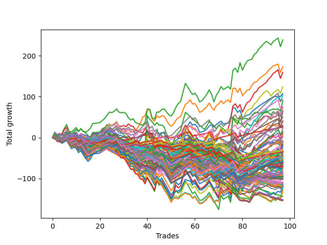

# Long Bulldog 005 
- Symbol: ES
- Date Range: 03/18/2022 - 07/15/2022
- Trading Period: 7:20-12:30
- Number of Trades: 97



| Name | Win Percent | Profit | Avg Profit / Trade | Avg Time / Trade |      | Name | Win Percent | Profit | Avg Profit / Trade | Avg Time / Trade |
| ---- | ----------- | ------ | ------------------ | ---------------- | ---- | ---- | ----------- | ------ | ------------------ | ---------------- |
| Sorted By <br> Profit | | | | | | Sorted By <br> Win Percentage ||||
| Two | 62.89 | 119500.00 | 1231.96 | 21:16 |     | Eighty-One | 89.69 | 12750.00 | 131.44 | 05:51 |
| One | 69.07 | 86750.00 | 894.33 | 16:58 |     | One Hundred Twenty-One | 85.57 | -15875.00 | -163.66 | 03:27 |
| Three | 62.89 | 79750.00 | 822.16 | 21:37 |     | One Hundred Twenty-Six | 85.57 | -17500.00 | -180.41 | 03:56 |
| Fifty-Eight | 58.76 | 62250.00 | 641.75 | 15:41 |     | Eighty-Two | 81.44 | 15000.00 | 154.64 | 09:48 |
| Zero | 65.98 | 53750.00 | 554.12 | 11:25 |     | One Hundred Twenty-Seven | 77.32 | -21250.00 | -219.07 | 06:15 |
| Fifty-Nine | 59.79 | 51625.00 | 532.22 | 15:55 |     | One Hundred Twenty-Two | 77.32 | -24750.00 | -255.15 | 05:50 |
| Eighty-Five | 71.13 | 46500.00 | 479.38 | 17:14 |     | One Hundred Eleven | 75.26 | -14875.00 | -153.35 | 02:01 |
| Seventy-Three | 48.45 | 44375.00 | 457.47 | 11:40 |     | Eighty-Three | 74.23 | 14125.00 | 145.62 | 13:24 |
| Eighty-Four | 73.20 | 37875.00 | 390.46 | 14:49 |     | Eighty-Four | 73.20 | 37875.00 | 390.46 | 14:49 |
| Forty-Two | 39.18 | 37250.00 | 384.02 | 10:10 |     | Eighty-Five | 71.13 | 46500.00 | 479.38 | 17:14 |
| Sixty-Six | 53.61 | 36625.00 | 377.58 | 13:50 |     | One Hundred Twenty-Three | 70.10 | -29375.00 | -302.84 | 08:06 |
| Fifty-Seven | 65.98 | 33000.00 | 340.21 | 12:10 |     | One Hundred Sixteen | 70.10 | -31500.00 | -324.74 | 02:02 |
| Five | 50.52 | 31750.00 | 327.32 | 28:08 |     | One | 69.07 | 86750.00 | 894.33 | 16:58 |
| Sixty-Seven | 52.58 | 25375.00 | 261.60 | 14:19 |     | One Hundred Twenty-Four | 69.07 | -6250.00 | -64.43 | 09:29 |
| Sixty-Five | 59.79 | 20500.00 | 211.34 | 11:21 |     | One Hundred Twenty-Eight | 68.04 | -30625.00 | -315.72 | 08:17 |
| Forty-One | 46.39 | 19875.00 | 204.90 | 08:00 |     | One Hundred Twenty-Five | 67.01 | 6750.00 | 69.59 | 11:41 |
| Eighty-Two | 81.44 | 15000.00 | 154.64 | 09:48 |     | Zero | 65.98 | 53750.00 | 554.12 | 11:25 |
| Eighty-Three | 74.23 | 14125.00 | 145.62 | 13:24 |     | Fifty-Seven | 65.98 | 33000.00 | 340.21 | 12:10 |
| Eighty-One | 89.69 | 12750.00 | 131.44 | 05:51 |     | One Hundred Twenty-Nine | 65.98 | -13375.00 | -137.89 | 09:29 |
| Seven | 50.52 | 11375.00 | 117.27 | 28:14 |     | Fifty-Six | 64.95 | 4375.00 | 45.10 | 08:22 |
| Forty-Three | 37.11 | 7000.00 | 72.16 | 10:38 |     | Two | 62.89 | 119500.00 | 1231.96 | 21:16 |
| One Hundred Twenty-Five | 67.01 | 6750.00 | 69.59 | 11:41 |     | Three | 62.89 | 79750.00 | 822.16 | 21:37 |
| Four | 50.52 | 4750.00 | 48.97 | 27:05 |     | One Hundred Twelve | 62.89 | -22250.00 | -229.38 | 03:24 |
| Fifty-Six | 64.95 | 4375.00 | 45.10 | 08:22 |     | One Hundred Thirty | 61.86 | -4375.00 | -45.10 | 11:00 |
| Sixty-One | 47.42 | 3625.00 | 37.37 | 21:27 |     | Sixty-Four | 60.82 | 750.00 | 7.73 | 08:08 |
| Sixty-Four | 60.82 | 750.00 | 7.73 | 08:08 |     | One Hundred One | 60.82 | -22750.00 | -234.54 | 01:11 |
| Forty-Five | 29.90 | -4000.00 | -41.24 | 14:18 |     | Fifty-Nine | 59.79 | 51625.00 | 532.22 | 15:55 |
| One Hundred Thirty | 61.86 | -4375.00 | -45.10 | 11:00 |     | Sixty-Five | 59.79 | 20500.00 | 211.34 | 11:21 |
| One Hundred Twenty-Four | 69.07 | -6250.00 | -64.43 | 09:29 |     | Fifty-Eight | 58.76 | 62250.00 | 641.75 | 15:41 |
| Six | 51.55 | -6250.00 | -64.43 | 27:21 |     | Ninety-One | 56.70 | -15875.00 | -163.66 | 00:48 |
| Forty | 47.42 | -6250.00 | -64.43 | 05:37 |     | One Hundred Six | 55.67 | -35250.00 | -363.40 | 01:09 |
| Seventy | 47.42 | -10500.00 | -108.25 | 17:52 |     | One Hundred Seventeen | 55.67 | -42500.00 | -438.14 | 03:13 |
| One Hundred Twenty-Nine | 65.98 | -13375.00 | -137.89 | 09:29 |     | Sixty-Six | 53.61 | 36625.00 | 377.58 | 13:50 |
| One Hundred Eleven | 75.26 | -14875.00 | -153.35 | 02:01 |     | Sixty-Seven | 52.58 | 25375.00 | 261.60 | 14:19 |
| One Hundred Twenty-One | 85.57 | -15875.00 | -163.66 | 03:27 |     | Six | 51.55 | -6250.00 | -64.43 | 27:21 |
| Ninety-One | 56.70 | -15875.00 | -163.66 | 00:48 |     | One Hundred Thirteen | 51.55 | -37125.00 | -382.73 | 04:53 |
| Sixty-Three | 47.42 | -16750.00 | -172.68 | 21:32 |     | Five | 50.52 | 31750.00 | 327.32 | 28:08 |
| One Hundred Twenty-Six | 85.57 | -17500.00 | -180.41 | 03:56 |     | Seven | 50.52 | 11375.00 | 117.27 | 28:14 |
| Ninety-Two | 43.30 | -17625.00 | -181.70 | 01:15 |     | Four | 50.52 | 4750.00 | 48.97 | 27:05 |
| One Hundred Fifteen | 45.36 | -20250.00 | -208.76 | 07:04 |     | One Hundred Fourteen | 49.48 | -23125.00 | -238.40 | 05:47 |
| Sixty-Eight | 45.36 | -20250.00 | -208.76 | 17:30 |     | Seventy-Three | 48.45 | 44375.00 | 457.47 | 11:40 |
| One Hundred Twenty-Seven | 77.32 | -21250.00 | -219.07 | 06:15 |     | Sixty-Two | 48.45 | -32250.00 | -332.47 | 20:47 |
| One Hundred Twelve | 62.89 | -22250.00 | -229.38 | 03:24 |     | Sixty-One | 47.42 | 3625.00 | 37.37 | 21:27 |
| Forty-Four | 29.90 | -22500.00 | -231.96 | 13:27 |     | Forty | 47.42 | -6250.00 | -64.43 | 05:37 |
| Forty-Seven | 29.90 | -22625.00 | -233.25 | 14:11 |     | Seventy | 47.42 | -10500.00 | -108.25 | 17:52 |
| One Hundred One | 60.82 | -22750.00 | -234.54 | 01:11 |     | Sixty-Three | 47.42 | -16750.00 | -172.68 | 21:32 |
| Sixty | 47.42 | -23000.00 | -237.11 | 20:24 |     | Sixty | 47.42 | -23000.00 | -237.11 | 20:24 |
| One Hundred Fourteen | 49.48 | -23125.00 | -238.40 | 05:47 |     | One Hundred Two | 47.42 | -29000.00 | -298.97 | 01:46 |
| One Hundred Twenty-Two | 77.32 | -24750.00 | -255.15 | 05:50 |     | Forty-One | 46.39 | 19875.00 | 204.90 | 08:00 |
| Ninety-Four | 27.84 | -25750.00 | -265.46 | 02:07 |     | Ninety-Six | 46.39 | -34125.00 | -351.80 | 00:45 |
| Ninety-Three | 31.96 | -26750.00 | -275.77 | 01:50 |     | One Hundred Fifteen | 45.36 | -20250.00 | -208.76 | 07:04 |
| Ninety-Five | 22.68 | -28000.00 | -288.66 | 02:42 |     | Sixty-Eight | 45.36 | -20250.00 | -208.76 | 17:30 |
| Sixty-Nine | 45.36 | -28875.00 | -297.68 | 18:14 |     | Sixty-Nine | 45.36 | -28875.00 | -297.68 | 18:14 |
| One Hundred Two | 47.42 | -29000.00 | -298.97 | 01:46 |     | Seventy-One | 45.36 | -35875.00 | -369.85 | 18:16 |
| One Hundred Twenty-Three | 70.10 | -29375.00 | -302.84 | 08:06 |     | Ninety-Two | 43.30 | -17625.00 | -181.70 | 01:15 |
| One Hundred Twenty-Eight | 68.04 | -30625.00 | -315.72 | 08:17 |     | One Hundred Eighteen | 41.24 | -59500.00 | -613.40 | 03:59 |
| One Hundred Sixteen | 70.10 | -31500.00 | -324.74 | 02:02 |     | Forty-Two | 39.18 | 37250.00 | 384.02 | 10:10 |
| Sixty-Two | 48.45 | -32250.00 | -332.47 | 20:47 |     | One Hundred Seven | 39.18 | -44500.00 | -458.76 | 01:33 |
| Ninety-Six | 46.39 | -34125.00 | -351.80 | 00:45 |     | Forty-Three | 37.11 | 7000.00 | 72.16 | 10:38 |
| One Hundred Six | 55.67 | -35250.00 | -363.40 | 01:09 |     | One Hundred Ninteen | 37.11 | -54000.00 | -556.70 | 04:22 |
| Seventy-One | 45.36 | -35875.00 | -369.85 | 18:16 |     | Forty-Eight | 36.08 | -48750.00 | -502.58 | 04:07 |
| One Hundred Thirteen | 51.55 | -37125.00 | -382.73 | 04:53 |     | One Hundred Three | 34.02 | -47500.00 | -489.69 | 02:29 |
| Ninety-Seven | 32.99 | -42250.00 | -435.57 | 00:55 |     | Ninety-Seven | 32.99 | -42250.00 | -435.57 | 00:55 |
| One Hundred Seventeen | 55.67 | -42500.00 | -438.14 | 03:13 |     | Ninety-Three | 31.96 | -26750.00 | -275.77 | 01:50 |
| One Hundred Four | 30.93 | -43625.00 | -449.74 | 02:49 |     | Forty-Nine | 31.96 | -61500.00 | -634.02 | 05:11 |
| One Hundred Seven | 39.18 | -44500.00 | -458.76 | 01:33 |     | One Hundred Four | 30.93 | -43625.00 | -449.74 | 02:49 |
| Forty-Six | 30.93 | -45750.00 | -471.65 | 13:29 |     | Forty-Six | 30.93 | -45750.00 | -471.65 | 13:29 |
| Ninety-Eight | 28.87 | -46750.00 | -481.96 | 01:04 |     | Forty-Five | 29.90 | -4000.00 | -41.24 | 14:18 |
| One Hundred Five | 25.77 | -46750.00 | -481.96 | 03:38 |     | Forty-Four | 29.90 | -22500.00 | -231.96 | 13:27 |
| One Hundred Three | 34.02 | -47500.00 | -489.69 | 02:29 |     | Forty-Seven | 29.90 | -22625.00 | -233.25 | 14:11 |
| One Hundred | 28.87 | -47625.00 | -490.98 | 01:09 |     | Ninety-Eight | 28.87 | -46750.00 | -481.96 | 01:04 |
| Ninety-Nine | 28.87 | -48625.00 | -501.29 | 01:05 |     | One Hundred | 28.87 | -47625.00 | -490.98 | 01:09 |
| Forty-Eight | 36.08 | -48750.00 | -502.58 | 04:07 |     | Ninety-Nine | 28.87 | -48625.00 | -501.29 | 01:05 |
| Fifty | 28.87 | -50250.00 | -518.04 | 05:50 |     | Fifty | 28.87 | -50250.00 | -518.04 | 05:50 |
| One Hundred Eight | 27.84 | -51000.00 | -525.77 | 01:56 |     | Fifty-One | 28.87 | -59250.00 | -610.82 | 05:55 |
| One Hundred Ninteen | 37.11 | -54000.00 | -556.70 | 04:22 |     | One Hundred Twenty | 28.87 | -59750.00 | -615.98 | 05:06 |
| One Hundred Nine | 27.84 | -54375.00 | -560.57 | 02:03 |     | Ninety-Four | 27.84 | -25750.00 | -265.46 | 02:07 |
| One Hundred Ten | 27.84 | -56875.00 | -586.34 | 02:14 |     | One Hundred Eight | 27.84 | -51000.00 | -525.77 | 01:56 |
| Fifty-One | 28.87 | -59250.00 | -610.82 | 05:55 |     | One Hundred Nine | 27.84 | -54375.00 | -560.57 | 02:03 |
| One Hundred Eighteen | 41.24 | -59500.00 | -613.40 | 03:59 |     | One Hundred Ten | 27.84 | -56875.00 | -586.34 | 02:14 |
| One Hundred Twenty | 28.87 | -59750.00 | -615.98 | 05:06 |     | Fifty-Two | 27.84 | -71875.00 | -740.98 | 06:26 |
| Forty-Nine | 31.96 | -61500.00 | -634.02 | 05:11 |     | Fifty-Four | 26.80 | -75625.00 | -779.64 | 06:32 |
| Fifty-Two | 27.84 | -71875.00 | -740.98 | 06:26 |     | Fifty-Three | 26.80 | -76250.00 | -786.08 | 06:44 |
| Fifty-Four | 26.80 | -75625.00 | -779.64 | 06:32 |     | Fifty-Five | 26.80 | -77125.00 | -795.10 | 06:40 |
| Fifty-Three | 26.80 | -76250.00 | -786.08 | 06:44 |     | One Hundred Five | 25.77 | -46750.00 | -481.96 | 03:38 |
| Fifty-Five | 26.80 | -77125.00 | -795.10 | 06:40 |     | Ninety-Five | 22.68 | -28000.00 | -288.66 | 02:42 |

## NO STOPLOSS

### Test Zero
* Sell when price hits the middle line of the 20p bollinger
* No Stoploss
* Results:
```
Total Trades: 97
Percent Up: 65.98
Percent Down: 34.02
Total Points Moved Up: 107.50
Potential Profit: 53750.00
Total Points Ups: 303.50 Count Ups: 64
Total Points Downs: -196.00 Count Downs: 33
```

<details><summary>Trades</summary>

<code>In: 2022-03-21 10:21:00		Out: 2022-03-21 10:26:15		Total Position Time: 05:15		Total Move Up: 5.75		Total to Date: 5.75</code> <br />
<code>In: 2022-03-23 10:23:00		Out: 2022-03-23 10:38:15		Total Position Time: 15:15		Total Move Up: -3.75		Total to Date: 2.00</code> <br />
<code>In: 2022-03-23 10:28:00		Out: 2022-03-23 10:38:15		Total Position Time: 10:15		Total Move Up: 1.00		Total to Date: 3.00</code> <br />
<code>In: 2022-03-25 08:14:00		Out: 2022-03-25 08:36:40		Total Position Time: 22:40		Total Move Up: -6.00		Total to Date: -3.00</code> <br />
<code>In: 2022-03-25 08:29:00		Out: 2022-03-25 08:36:40		Total Position Time: 07:40		Total Move Up: 8.00		Total to Date: 5.00</code> <br />
<code>In: 2022-03-28 07:39:00		Out: 2022-03-28 07:43:00		Total Position Time: 04:00		Total Move Up: 3.50		Total to Date: 8.50</code> <br />
<code>In: 2022-03-28 08:27:00		Out: 2022-03-28 08:56:55		Total Position Time: 29:55		Total Move Up: -16.75		Total to Date: -8.25</code> <br />
<code>In: 2022-03-28 08:38:00		Out: 2022-03-28 09:01:50		Total Position Time: 23:50		Total Move Up: -4.50		Total to Date: -12.75</code> <br />
<code>In: 2022-03-28 08:51:00		Out: 2022-03-28 09:01:50		Total Position Time: 10:50		Total Move Up: 1.75		Total to Date: -11.00</code> <br />
<code>In: 2022-03-28 08:55:00		Out: 2022-03-28 09:01:50		Total Position Time: 06:50		Total Move Up: 2.50		Total to Date: -8.50</code> <br />
<code>In: 2022-03-30 08:02:00		Out: 2022-03-30 08:19:20		Total Position Time: 17:20		Total Move Up: -5.50		Total to Date: -14.00</code> <br />
<code>In: 2022-03-30 08:13:00		Out: 2022-03-30 08:19:20		Total Position Time: 06:20		Total Move Up: 4.75		Total to Date: -9.25</code> <br />
<code>In: 2022-03-30 12:00:00		Out: 2022-03-30 12:28:15		Total Position Time: 28:15		Total Move Up: -6.75		Total to Date: -16.00</code> <br />
<code>In: 2022-03-30 12:06:00		Out: 2022-03-30 12:28:15		Total Position Time: 22:15		Total Move Up: -5.25		Total to Date: -21.25</code> <br />
<code>In: 2022-03-30 12:13:00		Out: 2022-03-30 12:28:15		Total Position Time: 15:15		Total Move Up: -2.00		Total to Date: -23.25</code> <br />
<code>In: 2022-03-30 12:20:00		Out: 2022-03-30 12:28:15		Total Position Time: 08:15		Total Move Up: 0.75		Total to Date: -22.50</code> <br />
<code>In: 2022-03-30 12:26:00		Out: 2022-03-30 12:28:15		Total Position Time: 02:15		Total Move Up: 6.25		Total to Date: -16.25</code> <br />
<code>In: 2022-03-31 10:00:00		Out: 2022-03-31 10:04:00		Total Position Time: 04:00		Total Move Up: 2.50		Total to Date: -13.75</code> <br />
<code>In: 2022-03-31 10:08:00		Out: 2022-03-31 10:19:05		Total Position Time: 11:05		Total Move Up: -1.00		Total to Date: -14.75</code> <br />
<code>In: 2022-03-31 10:11:00		Out: 2022-03-31 10:19:05		Total Position Time: 08:05		Total Move Up: -0.50		Total to Date: -15.25</code> <br />
<code>In: 2022-04-01 07:24:00		Out: 2022-04-01 07:34:30		Total Position Time: 10:30		Total Move Up: 3.25		Total to Date: -12.00</code> <br />
<code>In: 2022-04-06 09:22:00		Out: 2022-04-06 09:31:15		Total Position Time: 09:15		Total Move Up: 3.75		Total to Date: -8.25</code> <br />
<code>In: 2022-04-07 07:23:00		Out: 2022-04-07 07:25:15		Total Position Time: 02:15		Total Move Up: 4.25		Total to Date: -4.00</code> <br />
<code>In: 2022-04-07 07:43:00		Out: 2022-04-07 07:55:15		Total Position Time: 12:15		Total Move Up: 2.75		Total to Date: -1.25</code> <br />
<code>In: 2022-04-11 07:30:00		Out: 2022-04-11 07:51:10		Total Position Time: 21:10		Total Move Up: -3.75		Total to Date: -5.00</code> <br />
<code>In: 2022-04-12 09:28:00		Out: 2022-04-12 09:41:50		Total Position Time: 13:50		Total Move Up: 1.75		Total to Date: -3.25</code> <br />
<code>In: 2022-04-12 11:35:00		Out: 2022-04-12 11:35:50		Total Position Time: 00:50		Total Move Up: 1.50		Total to Date: -1.75</code> <br />
<code>In: 2022-04-18 08:26:00		Out: 2022-04-18 08:55:05		Total Position Time: 29:05		Total Move Up: -6.50		Total to Date: -8.25</code> <br />
<code>In: 2022-04-18 08:29:00		Out: 2022-04-18 08:55:05		Total Position Time: 26:05		Total Move Up: -4.50		Total to Date: -12.75</code> <br />
<code>In: 2022-04-18 09:17:00		Out: 2022-04-18 09:32:05		Total Position Time: 15:05		Total Move Up: -0.25		Total to Date: -13.00</code> <br />
<code>In: 2022-04-20 11:38:00		Out: 2022-04-20 11:48:20		Total Position Time: 10:20		Total Move Up: 1.00		Total to Date: -12.00</code> <br />
<code>In: 2022-04-21 07:22:00		Out: 2022-04-21 07:29:05		Total Position Time: 07:05		Total Move Up: 2.50		Total to Date: -9.50</code> <br />
<code>In: 2022-04-21 07:42:00		Out: 2022-04-21 08:01:10		Total Position Time: 19:10		Total Move Up: -6.75		Total to Date: -16.25</code> <br />
<code>In: 2022-04-21 07:50:00		Out: 2022-04-21 08:01:10		Total Position Time: 11:10		Total Move Up: 2.00		Total to Date: -14.25</code> <br />
<code>In: 2022-05-02 09:56:00		Out: 2022-05-02 10:08:15		Total Position Time: 12:15		Total Move Up: -2.25		Total to Date: -16.50</code> <br />
<code>In: 2022-05-02 10:01:00		Out: 2022-05-02 10:08:15		Total Position Time: 07:15		Total Move Up: 6.00		Total to Date: -10.50</code> <br />
<code>In: 2022-05-02 10:02:00		Out: 2022-05-02 10:08:15		Total Position Time: 06:15		Total Move Up: 5.00		Total to Date: -5.50</code> <br />
<code>In: 2022-05-02 10:05:00		Out: 2022-05-02 10:08:15		Total Position Time: 03:15		Total Move Up: 12.25		Total to Date: 6.75</code> <br />
<code>In: 2022-05-02 10:49:00		Out: 2022-05-02 10:59:45		Total Position Time: 10:45		Total Move Up: 2.00		Total to Date: 8.75</code> <br />
<code>In: 2022-05-04 11:36:00		Out: 2022-05-04 11:36:40		Total Position Time: 00:40		Total Move Up: 8.25		Total to Date: 17.00</code> <br />
<code>In: 2022-05-09 07:26:00		Out: 2022-05-09 07:42:30		Total Position Time: 16:30		Total Move Up: -5.75		Total to Date: 11.25</code> <br />
<code>In: 2022-05-11 09:32:00		Out: 2022-05-11 09:49:25		Total Position Time: 17:25		Total Move Up: -0.50		Total to Date: 10.75</code> <br />
<code>In: 2022-05-11 09:59:00		Out: 2022-05-11 10:15:25		Total Position Time: 16:25		Total Move Up: -3.75		Total to Date: 7.00</code> <br />
<code>In: 2022-05-11 11:00:00		Out: 2022-05-11 11:00:50		Total Position Time: 00:50		Total Move Up: 8.25		Total to Date: 15.25</code> <br />
<code>In: 2022-05-12 10:40:00		Out: 2022-05-12 10:57:35		Total Position Time: 17:35		Total Move Up: -6.25		Total to Date: 9.00</code> <br />
<code>In: 2022-05-12 11:34:00		Out: 2022-05-12 11:45:20		Total Position Time: 11:20		Total Move Up: 3.25		Total to Date: 12.25</code> <br />
<code>In: 2022-05-12 11:35:00		Out: 2022-05-12 11:45:20		Total Position Time: 10:20		Total Move Up: -1.25		Total to Date: 11.00</code> <br />
<code>In: 2022-05-17 07:31:00		Out: 2022-05-17 07:55:10		Total Position Time: 24:10		Total Move Up: -11.25		Total to Date: -0.25</code> <br />
<code>In: 2022-05-17 07:33:00		Out: 2022-05-17 07:55:10		Total Position Time: 22:10		Total Move Up: -11.50		Total to Date: -11.75</code> <br />
<code>In: 2022-05-17 07:38:00		Out: 2022-05-17 07:55:10		Total Position Time: 17:10		Total Move Up: -6.75		Total to Date: -18.50</code> <br />
<code>In: 2022-05-17 07:47:00		Out: 2022-05-17 07:55:10		Total Position Time: 08:10		Total Move Up: 4.00		Total to Date: -14.50</code> <br />
<code>In: 2022-05-17 11:24:00		Out: 2022-05-17 11:31:30		Total Position Time: 07:30		Total Move Up: 7.75		Total to Date: -6.75</code> <br />
<code>In: 2022-05-18 08:32:00		Out: 2022-05-18 08:36:55		Total Position Time: 04:55		Total Move Up: 4.00		Total to Date: -2.75</code> <br />
<code>In: 2022-05-25 09:29:00		Out: 2022-05-25 09:41:25		Total Position Time: 12:25		Total Move Up: 1.50		Total to Date: -1.25</code> <br />
<code>In: 2022-05-25 11:09:00		Out: 2022-05-25 11:10:20		Total Position Time: 01:20		Total Move Up: 13.00		Total to Date: 11.75</code> <br />
<code>In: 2022-05-25 11:10:00		Out: 2022-05-25 11:10:20		Total Position Time: 00:20		Total Move Up: 11.00		Total to Date: 22.75</code> <br />
<code>In: 2022-06-03 07:40:00		Out: 2022-06-03 07:46:50		Total Position Time: 06:50		Total Move Up: 6.75		Total to Date: 29.50</code> <br />
<code>In: 2022-06-03 07:42:00		Out: 2022-06-03 07:46:50		Total Position Time: 04:50		Total Move Up: 9.25		Total to Date: 38.75</code> <br />
<code>In: 2022-06-06 08:14:00		Out: 2022-06-06 08:31:35		Total Position Time: 17:35		Total Move Up: -8.50		Total to Date: 30.25</code> <br />
<code>In: 2022-06-06 08:19:00		Out: 2022-06-06 08:31:35		Total Position Time: 12:35		Total Move Up: 2.75		Total to Date: 33.00</code> <br />
<code>In: 2022-06-06 09:06:00		Out: 2022-06-06 09:26:40		Total Position Time: 20:40		Total Move Up: -6.50		Total to Date: 26.50</code> <br />
<code>In: 2022-06-08 09:29:00		Out: 2022-06-08 09:54:10		Total Position Time: 25:10		Total Move Up: -13.25		Total to Date: 13.25</code> <br />
<code>In: 2022-06-08 09:41:00		Out: 2022-06-08 09:54:10		Total Position Time: 13:10		Total Move Up: 1.00		Total to Date: 14.25</code> <br />
<code>In: 2022-06-08 10:35:00		Out: 2022-06-08 10:42:15		Total Position Time: 07:15		Total Move Up: 2.25		Total to Date: 16.50</code> <br />
<code>In: 2022-06-09 08:06:00		Out: 2022-06-09 08:11:10		Total Position Time: 05:10		Total Move Up: 4.25		Total to Date: 20.75</code> <br />
<code>In: 2022-06-09 08:09:00		Out: 2022-06-09 08:11:10		Total Position Time: 02:10		Total Move Up: 7.25		Total to Date: 28.00</code> <br />
<code>In: 2022-06-09 11:26:00		Out: 2022-06-09 11:28:10		Total Position Time: 02:10		Total Move Up: 4.25		Total to Date: 32.25</code> <br />
<code>In: 2022-06-09 12:03:00		Out: 2022-06-09 12:19:25		Total Position Time: 16:25		Total Move Up: -6.25		Total to Date: 26.00</code> <br />
<code>In: 2022-06-13 12:15:00		Out: 2022-06-13 12:16:50		Total Position Time: 01:50		Total Move Up: 6.00		Total to Date: 32.00</code> <br />
<code>In: 2022-06-13 12:17:00		Out: 2022-06-13 12:17:10		Total Position Time: 00:10		Total Move Up: 4.00		Total to Date: 36.00</code> <br />
<code>In: 2022-06-14 12:16:00		Out: 2022-06-14 12:25:45		Total Position Time: 09:45		Total Move Up: 4.50		Total to Date: 40.50</code> <br />
<code>In: 2022-06-15 07:57:00		Out: 2022-06-15 08:26:55		Total Position Time: 29:55		Total Move Up: -7.25		Total to Date: 33.25</code> <br />
<code>In: 2022-06-15 08:15:00		Out: 2022-06-15 08:32:00		Total Position Time: 17:00		Total Move Up: 1.75		Total to Date: 35.00</code> <br />
<code>In: 2022-06-15 08:16:00		Out: 2022-06-15 08:32:00		Total Position Time: 16:00		Total Move Up: 0.00		Total to Date: 35.00</code> <br />
<code>In: 2022-06-15 11:08:00		Out: 2022-06-15 11:16:45		Total Position Time: 08:45		Total Move Up: 13.50		Total to Date: 48.50</code> <br />
<code>In: 2022-06-15 11:34:00		Out: 2022-06-15 11:38:05		Total Position Time: 04:05		Total Move Up: 25.25		Total to Date: 73.75</code> <br />
<code>In: 2022-06-16 07:46:00		Out: 2022-06-16 08:01:50		Total Position Time: 15:50		Total Move Up: -1.75		Total to Date: 72.00</code> <br />
<code>In: 2022-06-16 11:02:00		Out: 2022-06-16 11:31:55		Total Position Time: 29:55		Total Move Up: -10.25		Total to Date: 61.75</code> <br />
<code>In: 2022-06-16 11:51:00		Out: 2022-06-16 12:00:35		Total Position Time: 09:35		Total Move Up: 5.50		Total to Date: 67.25</code> <br />
<code>In: 2022-06-17 07:24:00		Out: 2022-06-17 07:53:55		Total Position Time: 29:55		Total Move Up: -18.50		Total to Date: 48.75</code> <br />
<code>In: 2022-06-17 07:37:00		Out: 2022-06-17 07:55:05		Total Position Time: 18:05		Total Move Up: 2.75		Total to Date: 51.50</code> <br />
<code>In: 2022-06-23 09:06:00		Out: 2022-06-23 09:17:10		Total Position Time: 11:10		Total Move Up: 3.50		Total to Date: 55.00</code> <br />
<code>In: 2022-06-23 09:54:00		Out: 2022-06-23 09:54:10		Total Position Time: 00:10		Total Move Up: 1.25		Total to Date: 56.25</code> <br />
<code>In: 2022-06-27 12:07:00		Out: 2022-06-27 12:10:20		Total Position Time: 03:20		Total Move Up: 7.00		Total to Date: 63.25</code> <br />
<code>In: 2022-06-29 08:25:00		Out: 2022-06-29 08:29:10		Total Position Time: 04:10		Total Move Up: 5.00		Total to Date: 68.25</code> <br />
<code>In: 2022-06-29 09:15:00		Out: 2022-06-29 09:21:05		Total Position Time: 06:05		Total Move Up: 4.50		Total to Date: 72.75</code> <br />
<code>In: 2022-06-29 09:29:00		Out: 2022-06-29 09:36:40		Total Position Time: 07:40		Total Move Up: 4.50		Total to Date: 77.25</code> <br />
<code>In: 2022-07-05 08:02:00		Out: 2022-07-05 08:08:20		Total Position Time: 06:20		Total Move Up: 3.75		Total to Date: 81.00</code> <br />
<code>In: 2022-07-05 08:04:00		Out: 2022-07-05 08:08:20		Total Position Time: 04:20		Total Move Up: 4.00		Total to Date: 85.00</code> <br />
<code>In: 2022-07-05 08:07:00		Out: 2022-07-05 08:08:20		Total Position Time: 01:20		Total Move Up: 3.25		Total to Date: 88.25</code> <br />
<code>In: 2022-07-06 08:05:00		Out: 2022-07-06 08:15:05		Total Position Time: 10:05		Total Move Up: 5.00		Total to Date: 93.25</code> <br />
<code>In: 2022-07-06 08:06:00		Out: 2022-07-06 08:15:05		Total Position Time: 09:05		Total Move Up: 2.50		Total to Date: 95.75</code> <br />
<code>In: 2022-07-06 08:34:00		Out: 2022-07-06 08:46:30		Total Position Time: 12:30		Total Move Up: 4.25		Total to Date: 100.00</code> <br />
<code>In: 2022-07-06 08:35:00		Out: 2022-07-06 08:46:30		Total Position Time: 11:30		Total Move Up: 0.25		Total to Date: 100.25</code> <br />
<code>In: 2022-07-06 08:46:00		Out: 2022-07-06 08:46:30		Total Position Time: 00:30		Total Move Up: 1.00		Total to Date: 101.25</code> <br />
<code>In: 2022-07-12 12:06:00		Out: 2022-07-12 12:20:20		Total Position Time: 14:20		Total Move Up: -0.75		Total to Date: 100.50</code> <br />
<code>In: 2022-07-13 07:22:00		Out: 2022-07-13 07:26:20		Total Position Time: 04:20		Total Move Up: 7.00		Total to Date: 107.50</code> <br />


</details>

### Test One
* Sell when the price hits the upper line of the 20p 1std bollinger
* No Stoploss
* Results:
```
Total Trades: 97
Percent Up: 69.07
Percent Down: 30.93
Total Points Moved Up: 173.50
Potential Profit: 86750.00
Total Points Ups: 415.00 Count Ups: 67
Total Points Downs: -241.50 Count Downs: 30
```

<details><summary>Trades</summary>

<code>In: 2022-03-21 10:21:00		Out: 2022-03-21 10:31:50		Total Position Time: 10:50		Total Move Up: 7.50		Total to Date: 7.50</code> <br />
<code>In: 2022-03-23 10:23:00		Out: 2022-03-23 10:51:50		Total Position Time: 28:50		Total Move Up: -4.50		Total to Date: 3.00</code> <br />
<code>In: 2022-03-23 10:28:00		Out: 2022-03-23 10:51:50		Total Position Time: 23:50		Total Move Up: 0.25		Total to Date: 3.25</code> <br />
<code>In: 2022-03-25 08:14:00		Out: 2022-03-25 08:41:05		Total Position Time: 27:05		Total Move Up: -4.75		Total to Date: -1.50</code> <br />
<code>In: 2022-03-25 08:29:00		Out: 2022-03-25 08:41:05		Total Position Time: 12:05		Total Move Up: 9.25		Total to Date: 7.75</code> <br />
<code>In: 2022-03-28 07:39:00		Out: 2022-03-28 07:45:05		Total Position Time: 06:05		Total Move Up: 5.25		Total to Date: 13.00</code> <br />
<code>In: 2022-03-28 08:27:00		Out: 2022-03-28 08:56:55		Total Position Time: 29:55		Total Move Up: -16.75		Total to Date: -3.75</code> <br />
<code>In: 2022-03-28 08:38:00		Out: 2022-03-28 09:04:55		Total Position Time: 26:55		Total Move Up: -2.75		Total to Date: -6.50</code> <br />
<code>In: 2022-03-28 08:51:00		Out: 2022-03-28 09:04:55		Total Position Time: 13:55		Total Move Up: 3.50		Total to Date: -3.00</code> <br />
<code>In: 2022-03-28 08:55:00		Out: 2022-03-28 09:04:55		Total Position Time: 09:55		Total Move Up: 4.25		Total to Date: 1.25</code> <br />
<code>In: 2022-03-30 08:02:00		Out: 2022-03-30 08:31:55		Total Position Time: 29:55		Total Move Up: -9.00		Total to Date: -7.75</code> <br />
<code>In: 2022-03-30 08:13:00		Out: 2022-03-30 08:34:45		Total Position Time: 21:45		Total Move Up: 4.75		Total to Date: -3.00</code> <br />
<code>In: 2022-03-30 12:00:00		Out: 2022-03-30 12:29:55		Total Position Time: 29:55		Total Move Up: -7.75		Total to Date: -10.75</code> <br />
<code>In: 2022-03-30 12:06:00		Out: 2022-03-30 12:32:20		Total Position Time: 26:20		Total Move Up: -3.00		Total to Date: -13.75</code> <br />
<code>In: 2022-03-30 12:13:00		Out: 2022-03-30 12:32:20		Total Position Time: 19:20		Total Move Up: 0.25		Total to Date: -13.50</code> <br />
<code>In: 2022-03-30 12:20:00		Out: 2022-03-30 12:32:20		Total Position Time: 12:20		Total Move Up: 3.00		Total to Date: -10.50</code> <br />
<code>In: 2022-03-30 12:26:00		Out: 2022-03-30 12:32:20		Total Position Time: 06:20		Total Move Up: 8.50		Total to Date: -2.00</code> <br />
<code>In: 2022-03-31 10:00:00		Out: 2022-03-31 10:19:40		Total Position Time: 19:40		Total Move Up: 1.25		Total to Date: -0.75</code> <br />
<code>In: 2022-03-31 10:08:00		Out: 2022-03-31 10:19:40		Total Position Time: 11:40		Total Move Up: 1.00		Total to Date: 0.25</code> <br />
<code>In: 2022-03-31 10:11:00		Out: 2022-03-31 10:19:40		Total Position Time: 08:40		Total Move Up: 1.50		Total to Date: 1.75</code> <br />
<code>In: 2022-04-01 07:24:00		Out: 2022-04-01 07:45:55		Total Position Time: 21:55		Total Move Up: 3.00		Total to Date: 4.75</code> <br />
<code>In: 2022-04-06 09:22:00		Out: 2022-04-06 09:34:05		Total Position Time: 12:05		Total Move Up: 3.75		Total to Date: 8.50</code> <br />
<code>In: 2022-04-07 07:23:00		Out: 2022-04-07 07:31:35		Total Position Time: 08:35		Total Move Up: 5.75		Total to Date: 14.25</code> <br />
<code>In: 2022-04-07 07:43:00		Out: 2022-04-07 08:00:05		Total Position Time: 17:05		Total Move Up: 7.75		Total to Date: 22.00</code> <br />
<code>In: 2022-04-11 07:30:00		Out: 2022-04-11 07:52:05		Total Position Time: 22:05		Total Move Up: -2.25		Total to Date: 19.75</code> <br />
<code>In: 2022-04-12 09:28:00		Out: 2022-04-12 09:50:15		Total Position Time: 22:15		Total Move Up: 3.25		Total to Date: 23.00</code> <br />
<code>In: 2022-04-12 11:35:00		Out: 2022-04-12 11:37:20		Total Position Time: 02:20		Total Move Up: 3.50		Total to Date: 26.50</code> <br />
<code>In: 2022-04-18 08:26:00		Out: 2022-04-18 08:55:55		Total Position Time: 29:55		Total Move Up: -7.75		Total to Date: 18.75</code> <br />
<code>In: 2022-04-18 08:29:00		Out: 2022-04-18 08:57:20		Total Position Time: 28:20		Total Move Up: -3.00		Total to Date: 15.75</code> <br />
<code>In: 2022-04-18 09:17:00		Out: 2022-04-18 09:35:20		Total Position Time: 18:20		Total Move Up: 0.25		Total to Date: 16.00</code> <br />
<code>In: 2022-04-20 11:38:00		Out: 2022-04-20 12:04:20		Total Position Time: 26:20		Total Move Up: -1.00		Total to Date: 15.00</code> <br />
<code>In: 2022-04-21 07:22:00		Out: 2022-04-21 07:29:20		Total Position Time: 07:20		Total Move Up: 5.00		Total to Date: 20.00</code> <br />
<code>In: 2022-04-21 07:42:00		Out: 2022-04-21 08:11:25		Total Position Time: 29:25		Total Move Up: -7.00		Total to Date: 13.00</code> <br />
<code>In: 2022-04-21 07:50:00		Out: 2022-04-21 08:11:25		Total Position Time: 21:25		Total Move Up: 1.75		Total to Date: 14.75</code> <br />
<code>In: 2022-05-02 09:56:00		Out: 2022-05-02 10:10:55		Total Position Time: 14:55		Total Move Up: 1.25		Total to Date: 16.00</code> <br />
<code>In: 2022-05-02 10:01:00		Out: 2022-05-02 10:10:55		Total Position Time: 09:55		Total Move Up: 9.50		Total to Date: 25.50</code> <br />
<code>In: 2022-05-02 10:02:00		Out: 2022-05-02 10:10:55		Total Position Time: 08:55		Total Move Up: 8.50		Total to Date: 34.00</code> <br />
<code>In: 2022-05-02 10:05:00		Out: 2022-05-02 10:10:55		Total Position Time: 05:55		Total Move Up: 15.75		Total to Date: 49.75</code> <br />
<code>In: 2022-05-02 10:49:00		Out: 2022-05-02 11:02:25		Total Position Time: 13:25		Total Move Up: 3.75		Total to Date: 53.50</code> <br />
<code>In: 2022-05-04 11:36:00		Out: 2022-05-04 11:41:40		Total Position Time: 05:40		Total Move Up: 17.25		Total to Date: 70.75</code> <br />
<code>In: 2022-05-09 07:26:00		Out: 2022-05-09 07:46:05		Total Position Time: 20:05		Total Move Up: -4.00		Total to Date: 66.75</code> <br />
<code>In: 2022-05-11 09:32:00		Out: 2022-05-11 10:01:55		Total Position Time: 29:55		Total Move Up: -21.50		Total to Date: 45.25</code> <br />
<code>In: 2022-05-11 09:59:00		Out: 2022-05-11 10:24:35		Total Position Time: 25:35		Total Move Up: -4.75		Total to Date: 40.50</code> <br />
<code>In: 2022-05-11 11:00:00		Out: 2022-05-11 11:01:20		Total Position Time: 01:20		Total Move Up: 12.50		Total to Date: 53.00</code> <br />
<code>In: 2022-05-12 10:40:00		Out: 2022-05-12 11:03:10		Total Position Time: 23:10		Total Move Up: -3.75		Total to Date: 49.25</code> <br />
<code>In: 2022-05-12 11:34:00		Out: 2022-05-12 11:52:55		Total Position Time: 18:55		Total Move Up: 4.00		Total to Date: 53.25</code> <br />
<code>In: 2022-05-12 11:35:00		Out: 2022-05-12 11:52:55		Total Position Time: 17:55		Total Move Up: -0.50		Total to Date: 52.75</code> <br />
<code>In: 2022-05-17 07:31:00		Out: 2022-05-17 07:59:05		Total Position Time: 28:05		Total Move Up: -9.75		Total to Date: 43.00</code> <br />
<code>In: 2022-05-17 07:33:00		Out: 2022-05-17 07:59:05		Total Position Time: 26:05		Total Move Up: -10.00		Total to Date: 33.00</code> <br />
<code>In: 2022-05-17 07:38:00		Out: 2022-05-17 07:59:05		Total Position Time: 21:05		Total Move Up: -5.25		Total to Date: 27.75</code> <br />
<code>In: 2022-05-17 07:47:00		Out: 2022-05-17 07:59:05		Total Position Time: 12:05		Total Move Up: 5.50		Total to Date: 33.25</code> <br />
<code>In: 2022-05-17 11:24:00		Out: 2022-05-17 11:37:35		Total Position Time: 13:35		Total Move Up: 9.25		Total to Date: 42.50</code> <br />
<code>In: 2022-05-18 08:32:00		Out: 2022-05-18 08:41:15		Total Position Time: 09:15		Total Move Up: 6.00		Total to Date: 48.50</code> <br />
<code>In: 2022-05-25 09:29:00		Out: 2022-05-25 09:44:25		Total Position Time: 15:25		Total Move Up: 3.00		Total to Date: 51.50</code> <br />
<code>In: 2022-05-25 11:09:00		Out: 2022-05-25 11:10:25		Total Position Time: 01:25		Total Move Up: 15.75		Total to Date: 67.25</code> <br />
<code>In: 2022-05-25 11:10:00		Out: 2022-05-25 11:10:25		Total Position Time: 00:25		Total Move Up: 13.75		Total to Date: 81.00</code> <br />
<code>In: 2022-06-03 07:40:00		Out: 2022-06-03 07:58:10		Total Position Time: 18:10		Total Move Up: 4.50		Total to Date: 85.50</code> <br />
<code>In: 2022-06-03 07:42:00		Out: 2022-06-03 07:58:10		Total Position Time: 16:10		Total Move Up: 7.00		Total to Date: 92.50</code> <br />
<code>In: 2022-06-06 08:14:00		Out: 2022-06-06 08:39:15		Total Position Time: 25:15		Total Move Up: -10.25		Total to Date: 82.25</code> <br />
<code>In: 2022-06-06 08:19:00		Out: 2022-06-06 08:39:15		Total Position Time: 20:15		Total Move Up: 1.00		Total to Date: 83.25</code> <br />
<code>In: 2022-06-06 09:06:00		Out: 2022-06-06 09:35:55		Total Position Time: 29:55		Total Move Up: -8.50		Total to Date: 74.75</code> <br />
<code>In: 2022-06-08 09:29:00		Out: 2022-06-08 09:58:55		Total Position Time: 29:55		Total Move Up: -13.00		Total to Date: 61.75</code> <br />
<code>In: 2022-06-08 09:41:00		Out: 2022-06-08 09:59:05		Total Position Time: 18:05		Total Move Up: 3.00		Total to Date: 64.75</code> <br />
<code>In: 2022-06-08 10:35:00		Out: 2022-06-08 10:47:05		Total Position Time: 12:05		Total Move Up: 5.25		Total to Date: 70.00</code> <br />
<code>In: 2022-06-09 08:06:00		Out: 2022-06-09 08:21:10		Total Position Time: 15:10		Total Move Up: 5.75		Total to Date: 75.75</code> <br />
<code>In: 2022-06-09 08:09:00		Out: 2022-06-09 08:21:10		Total Position Time: 12:10		Total Move Up: 8.75		Total to Date: 84.50</code> <br />
<code>In: 2022-06-09 11:26:00		Out: 2022-06-09 11:55:55		Total Position Time: 29:55		Total Move Up: -10.25		Total to Date: 74.25</code> <br />
<code>In: 2022-06-09 12:03:00		Out: 2022-06-09 12:24:30		Total Position Time: 21:30		Total Move Up: -7.00		Total to Date: 67.25</code> <br />
<code>In: 2022-06-13 12:15:00		Out: 2022-06-13 12:17:10		Total Position Time: 02:10		Total Move Up: 11.00		Total to Date: 78.25</code> <br />
<code>In: 2022-06-13 12:17:00		Out: 2022-06-13 12:17:10		Total Position Time: 00:10		Total Move Up: 4.00		Total to Date: 82.25</code> <br />
<code>In: 2022-06-14 12:16:00		Out: 2022-06-14 12:27:20		Total Position Time: 11:20		Total Move Up: 8.25		Total to Date: 90.50</code> <br />
<code>In: 2022-06-15 07:57:00		Out: 2022-06-15 08:26:55		Total Position Time: 29:55		Total Move Up: -7.25		Total to Date: 83.25</code> <br />
<code>In: 2022-06-15 08:15:00		Out: 2022-06-15 08:38:55		Total Position Time: 23:55		Total Move Up: 5.50		Total to Date: 88.75</code> <br />
<code>In: 2022-06-15 08:16:00		Out: 2022-06-15 08:38:55		Total Position Time: 22:55		Total Move Up: 3.75		Total to Date: 92.50</code> <br />
<code>In: 2022-06-15 11:08:00		Out: 2022-06-15 11:37:55		Total Position Time: 29:55		Total Move Up: -6.50		Total to Date: 86.00</code> <br />
<code>In: 2022-06-15 11:34:00		Out: 2022-06-15 11:38:10		Total Position Time: 04:10		Total Move Up: 34.50		Total to Date: 120.50</code> <br />
<code>In: 2022-06-16 07:46:00		Out: 2022-06-16 08:11:30		Total Position Time: 25:30		Total Move Up: 0.25		Total to Date: 120.75</code> <br />
<code>In: 2022-06-16 11:02:00		Out: 2022-06-16 11:31:55		Total Position Time: 29:55		Total Move Up: -10.25		Total to Date: 110.50</code> <br />
<code>In: 2022-06-16 11:51:00		Out: 2022-06-16 12:01:45		Total Position Time: 10:45		Total Move Up: 10.50		Total to Date: 121.00</code> <br />
<code>In: 2022-06-17 07:24:00		Out: 2022-06-17 07:53:55		Total Position Time: 29:55		Total Move Up: -18.50		Total to Date: 102.50</code> <br />
<code>In: 2022-06-17 07:37:00		Out: 2022-06-17 07:56:20		Total Position Time: 19:20		Total Move Up: 6.50		Total to Date: 109.00</code> <br />
<code>In: 2022-06-23 09:06:00		Out: 2022-06-23 09:18:25		Total Position Time: 12:25		Total Move Up: 7.50		Total to Date: 116.50</code> <br />
<code>In: 2022-06-23 09:54:00		Out: 2022-06-23 09:56:15		Total Position Time: 02:15		Total Move Up: 1.00		Total to Date: 117.50</code> <br />
<code>In: 2022-06-27 12:07:00		Out: 2022-06-27 12:12:10		Total Position Time: 05:10		Total Move Up: 10.00		Total to Date: 127.50</code> <br />
<code>In: 2022-06-29 08:25:00		Out: 2022-06-29 08:33:05		Total Position Time: 08:05		Total Move Up: 7.75		Total to Date: 135.25</code> <br />
<code>In: 2022-06-29 09:15:00		Out: 2022-06-29 09:37:20		Total Position Time: 22:20		Total Move Up: 1.25		Total to Date: 136.50</code> <br />
<code>In: 2022-06-29 09:29:00		Out: 2022-06-29 09:37:20		Total Position Time: 08:20		Total Move Up: 7.00		Total to Date: 143.50</code> <br />
<code>In: 2022-07-05 08:02:00		Out: 2022-07-05 08:16:45		Total Position Time: 14:45		Total Move Up: 4.50		Total to Date: 148.00</code> <br />
<code>In: 2022-07-05 08:04:00		Out: 2022-07-05 08:16:45		Total Position Time: 12:45		Total Move Up: 4.75		Total to Date: 152.75</code> <br />
<code>In: 2022-07-05 08:07:00		Out: 2022-07-05 08:16:45		Total Position Time: 09:45		Total Move Up: 4.00		Total to Date: 156.75</code> <br />
<code>In: 2022-07-06 08:05:00		Out: 2022-07-06 08:19:05		Total Position Time: 14:05		Total Move Up: 7.75		Total to Date: 164.50</code> <br />
<code>In: 2022-07-06 08:06:00		Out: 2022-07-06 08:19:05		Total Position Time: 13:05		Total Move Up: 5.25		Total to Date: 169.75</code> <br />
<code>In: 2022-07-06 08:34:00		Out: 2022-07-06 08:48:20		Total Position Time: 14:20		Total Move Up: 5.75		Total to Date: 175.50</code> <br />
<code>In: 2022-07-06 08:35:00		Out: 2022-07-06 08:48:20		Total Position Time: 13:20		Total Move Up: 1.75		Total to Date: 177.25</code> <br />
<code>In: 2022-07-06 08:46:00		Out: 2022-07-06 08:48:20		Total Position Time: 02:20		Total Move Up: 2.50		Total to Date: 179.75</code> <br />
<code>In: 2022-07-12 12:06:00		Out: 2022-07-12 12:35:55		Total Position Time: 29:55		Total Move Up: -21.00		Total to Date: 158.75</code> <br />
<code>In: 2022-07-13 07:22:00		Out: 2022-07-13 07:31:20		Total Position Time: 09:20		Total Move Up: 14.75		Total to Date: 173.50</code> <br />


</details>

### Test Two
* Sell when the price hits the upper line of the 20p 2std bollinger
* No Stoploss
* Results:
```
Total Trades: 97
Percent Up: 62.89
Percent Down: 37.11
Total Points Moved Up: 239.00
Potential Profit: 119500.00
Total Points Ups: 515.75 Count Ups: 61
Total Points Downs: -276.75 Count Downs: 36
```

<details><summary>Trades</summary>

<code>In: 2022-03-21 10:21:00		Out: 2022-03-21 10:34:15		Total Position Time: 13:15		Total Move Up: 11.75		Total to Date: 11.75</code> <br />
<code>In: 2022-03-23 10:23:00		Out: 2022-03-23 10:52:55		Total Position Time: 29:55		Total Move Up: -5.00		Total to Date: 6.75</code> <br />
<code>In: 2022-03-23 10:28:00		Out: 2022-03-23 10:54:30		Total Position Time: 26:30		Total Move Up: 2.75		Total to Date: 9.50</code> <br />
<code>In: 2022-03-25 08:14:00		Out: 2022-03-25 08:41:55		Total Position Time: 27:55		Total Move Up: -0.50		Total to Date: 9.00</code> <br />
<code>In: 2022-03-25 08:29:00		Out: 2022-03-25 08:41:55		Total Position Time: 12:55		Total Move Up: 13.50		Total to Date: 22.50</code> <br />
<code>In: 2022-03-28 07:39:00		Out: 2022-03-28 07:48:10		Total Position Time: 09:10		Total Move Up: 9.50		Total to Date: 32.00</code> <br />
<code>In: 2022-03-28 08:27:00		Out: 2022-03-28 08:56:55		Total Position Time: 29:55		Total Move Up: -16.75		Total to Date: 15.25</code> <br />
<code>In: 2022-03-28 08:38:00		Out: 2022-03-28 09:07:10		Total Position Time: 29:10		Total Move Up: -1.25		Total to Date: 14.00</code> <br />
<code>In: 2022-03-28 08:51:00		Out: 2022-03-28 09:07:10		Total Position Time: 16:10		Total Move Up: 5.00		Total to Date: 19.00</code> <br />
<code>In: 2022-03-28 08:55:00		Out: 2022-03-28 09:07:10		Total Position Time: 12:10		Total Move Up: 5.75		Total to Date: 24.75</code> <br />
<code>In: 2022-03-30 08:02:00		Out: 2022-03-30 08:31:55		Total Position Time: 29:55		Total Move Up: -9.00		Total to Date: 15.75</code> <br />
<code>In: 2022-03-30 08:13:00		Out: 2022-03-30 08:35:15		Total Position Time: 22:15		Total Move Up: 6.50		Total to Date: 22.25</code> <br />
<code>In: 2022-03-30 12:00:00		Out: 2022-03-30 12:29:55		Total Position Time: 29:55		Total Move Up: -7.75		Total to Date: 14.50</code> <br />
<code>In: 2022-03-30 12:06:00		Out: 2022-03-30 12:35:55		Total Position Time: 29:55		Total Move Up: -0.75		Total to Date: 13.75</code> <br />
<code>In: 2022-03-30 12:13:00		Out: 2022-03-30 12:36:25		Total Position Time: 23:25		Total Move Up: 3.25		Total to Date: 17.00</code> <br />
<code>In: 2022-03-30 12:20:00		Out: 2022-03-30 12:36:25		Total Position Time: 16:25		Total Move Up: 6.00		Total to Date: 23.00</code> <br />
<code>In: 2022-03-30 12:26:00		Out: 2022-03-30 12:36:25		Total Position Time: 10:25		Total Move Up: 11.50		Total to Date: 34.50</code> <br />
<code>In: 2022-03-31 10:00:00		Out: 2022-03-31 10:28:00		Total Position Time: 28:00		Total Move Up: 0.75		Total to Date: 35.25</code> <br />
<code>In: 2022-03-31 10:08:00		Out: 2022-03-31 10:28:00		Total Position Time: 20:00		Total Move Up: 0.50		Total to Date: 35.75</code> <br />
<code>In: 2022-03-31 10:11:00		Out: 2022-03-31 10:28:00		Total Position Time: 17:00		Total Move Up: 1.00		Total to Date: 36.75</code> <br />
<code>In: 2022-04-01 07:24:00		Out: 2022-04-01 07:46:55		Total Position Time: 22:55		Total Move Up: 5.00		Total to Date: 41.75</code> <br />
<code>In: 2022-04-06 09:22:00		Out: 2022-04-06 09:34:25		Total Position Time: 12:25		Total Move Up: 5.00		Total to Date: 46.75</code> <br />
<code>In: 2022-04-07 07:23:00		Out: 2022-04-07 07:36:15		Total Position Time: 13:15		Total Move Up: 8.00		Total to Date: 54.75</code> <br />
<code>In: 2022-04-07 07:43:00		Out: 2022-04-07 08:00:05		Total Position Time: 17:05		Total Move Up: 7.75		Total to Date: 62.50</code> <br />
<code>In: 2022-04-11 07:30:00		Out: 2022-04-11 07:56:35		Total Position Time: 26:35		Total Move Up: -1.50		Total to Date: 61.00</code> <br />
<code>In: 2022-04-12 09:28:00		Out: 2022-04-12 09:50:15		Total Position Time: 22:15		Total Move Up: 3.25		Total to Date: 64.25</code> <br />
<code>In: 2022-04-12 11:35:00		Out: 2022-04-12 11:47:05		Total Position Time: 12:05		Total Move Up: 6.00		Total to Date: 70.25</code> <br />
<code>In: 2022-04-18 08:26:00		Out: 2022-04-18 08:55:55		Total Position Time: 29:55		Total Move Up: -7.75		Total to Date: 62.50</code> <br />
<code>In: 2022-04-18 08:29:00		Out: 2022-04-18 08:58:55		Total Position Time: 29:55		Total Move Up: -1.75		Total to Date: 60.75</code> <br />
<code>In: 2022-04-18 09:17:00		Out: 2022-04-18 09:42:50		Total Position Time: 25:50		Total Move Up: 1.00		Total to Date: 61.75</code> <br />
<code>In: 2022-04-20 11:38:00		Out: 2022-04-20 12:07:55		Total Position Time: 29:55		Total Move Up: -3.00		Total to Date: 58.75</code> <br />
<code>In: 2022-04-21 07:22:00		Out: 2022-04-21 07:51:55		Total Position Time: 29:55		Total Move Up: -10.25		Total to Date: 48.50</code> <br />
<code>In: 2022-04-21 07:42:00		Out: 2022-04-21 08:11:45		Total Position Time: 29:45		Total Move Up: -5.50		Total to Date: 43.00</code> <br />
<code>In: 2022-04-21 07:50:00		Out: 2022-04-21 08:11:45		Total Position Time: 21:45		Total Move Up: 3.25		Total to Date: 46.25</code> <br />
<code>In: 2022-05-02 09:56:00		Out: 2022-05-02 10:25:55		Total Position Time: 29:55		Total Move Up: -9.50		Total to Date: 36.75</code> <br />
<code>In: 2022-05-02 10:01:00		Out: 2022-05-02 10:30:55		Total Position Time: 29:55		Total Move Up: -2.00		Total to Date: 34.75</code> <br />
<code>In: 2022-05-02 10:02:00		Out: 2022-05-02 10:31:55		Total Position Time: 29:55		Total Move Up: -2.50		Total to Date: 32.25</code> <br />
<code>In: 2022-05-02 10:05:00		Out: 2022-05-02 10:34:55		Total Position Time: 29:55		Total Move Up: -1.75		Total to Date: 30.50</code> <br />
<code>In: 2022-05-02 10:49:00		Out: 2022-05-02 11:03:45		Total Position Time: 14:45		Total Move Up: 6.50		Total to Date: 37.00</code> <br />
<code>In: 2022-05-04 11:36:00		Out: 2022-05-04 11:43:55		Total Position Time: 07:55		Total Move Up: 32.25		Total to Date: 69.25</code> <br />
<code>In: 2022-05-09 07:26:00		Out: 2022-05-09 07:49:10		Total Position Time: 23:10		Total Move Up: 0.00		Total to Date: 69.25</code> <br />
<code>In: 2022-05-11 09:32:00		Out: 2022-05-11 10:01:55		Total Position Time: 29:55		Total Move Up: -21.50		Total to Date: 47.75</code> <br />
<code>In: 2022-05-11 09:59:00		Out: 2022-05-11 10:24:50		Total Position Time: 25:50		Total Move Up: -1.75		Total to Date: 46.00</code> <br />
<code>In: 2022-05-11 11:00:00		Out: 2022-05-11 11:04:55		Total Position Time: 04:55		Total Move Up: 16.50		Total to Date: 62.50</code> <br />
<code>In: 2022-05-12 10:40:00		Out: 2022-05-12 11:03:55		Total Position Time: 23:55		Total Move Up: 0.00		Total to Date: 62.50</code> <br />
<code>In: 2022-05-12 11:34:00		Out: 2022-05-12 11:53:25		Total Position Time: 19:25		Total Move Up: 6.25		Total to Date: 68.75</code> <br />
<code>In: 2022-05-12 11:35:00		Out: 2022-05-12 11:53:25		Total Position Time: 18:25		Total Move Up: 1.75		Total to Date: 70.50</code> <br />
<code>In: 2022-05-17 07:31:00		Out: 2022-05-17 08:00:05		Total Position Time: 29:05		Total Move Up: -7.25		Total to Date: 63.25</code> <br />
<code>In: 2022-05-17 07:33:00		Out: 2022-05-17 08:00:05		Total Position Time: 27:05		Total Move Up: -7.50		Total to Date: 55.75</code> <br />
<code>In: 2022-05-17 07:38:00		Out: 2022-05-17 08:00:05		Total Position Time: 22:05		Total Move Up: -2.75		Total to Date: 53.00</code> <br />
<code>In: 2022-05-17 07:47:00		Out: 2022-05-17 08:00:05		Total Position Time: 13:05		Total Move Up: 8.00		Total to Date: 61.00</code> <br />
<code>In: 2022-05-17 11:24:00		Out: 2022-05-17 11:40:00		Total Position Time: 16:00		Total Move Up: 13.00		Total to Date: 74.00</code> <br />
<code>In: 2022-05-18 08:32:00		Out: 2022-05-18 08:43:00		Total Position Time: 11:00		Total Move Up: 9.25		Total to Date: 83.25</code> <br />
<code>In: 2022-05-25 09:29:00		Out: 2022-05-25 09:45:20		Total Position Time: 16:20		Total Move Up: 5.25		Total to Date: 88.50</code> <br />
<code>In: 2022-05-25 11:09:00		Out: 2022-05-25 11:16:50		Total Position Time: 07:50		Total Move Up: 23.00		Total to Date: 111.50</code> <br />
<code>In: 2022-05-25 11:10:00		Out: 2022-05-25 11:16:50		Total Position Time: 06:50		Total Move Up: 21.00		Total to Date: 132.50</code> <br />
<code>In: 2022-06-03 07:40:00		Out: 2022-06-03 08:09:55		Total Position Time: 29:55		Total Move Up: -9.00		Total to Date: 123.50</code> <br />
<code>In: 2022-06-03 07:42:00		Out: 2022-06-03 08:11:55		Total Position Time: 29:55		Total Move Up: -10.00		Total to Date: 113.50</code> <br />
<code>In: 2022-06-06 08:14:00		Out: 2022-06-06 08:43:00		Total Position Time: 29:00		Total Move Up: -8.00		Total to Date: 105.50</code> <br />
<code>In: 2022-06-06 08:19:00		Out: 2022-06-06 08:43:00		Total Position Time: 24:00		Total Move Up: 3.25		Total to Date: 108.75</code> <br />
<code>In: 2022-06-06 09:06:00		Out: 2022-06-06 09:35:55		Total Position Time: 29:55		Total Move Up: -8.50		Total to Date: 100.25</code> <br />
<code>In: 2022-06-08 09:29:00		Out: 2022-06-08 09:58:55		Total Position Time: 29:55		Total Move Up: -13.00		Total to Date: 87.25</code> <br />
<code>In: 2022-06-08 09:41:00		Out: 2022-06-08 09:59:10		Total Position Time: 18:10		Total Move Up: 3.50		Total to Date: 90.75</code> <br />
<code>In: 2022-06-08 10:35:00		Out: 2022-06-08 11:03:45		Total Position Time: 28:45		Total Move Up: 7.00		Total to Date: 97.75</code> <br />
<code>In: 2022-06-09 08:06:00		Out: 2022-06-09 08:22:35		Total Position Time: 16:35		Total Move Up: 8.00		Total to Date: 105.75</code> <br />
<code>In: 2022-06-09 08:09:00		Out: 2022-06-09 08:22:35		Total Position Time: 13:35		Total Move Up: 11.00		Total to Date: 116.75</code> <br />
<code>In: 2022-06-09 11:26:00		Out: 2022-06-09 11:55:55		Total Position Time: 29:55		Total Move Up: -10.25		Total to Date: 106.50</code> <br />
<code>In: 2022-06-09 12:03:00		Out: 2022-06-09 12:32:55		Total Position Time: 29:55		Total Move Up: -19.00		Total to Date: 87.50</code> <br />
<code>In: 2022-06-13 12:15:00		Out: 2022-06-13 12:17:15		Total Position Time: 02:15		Total Move Up: 15.75		Total to Date: 103.25</code> <br />
<code>In: 2022-06-13 12:17:00		Out: 2022-06-13 12:17:15		Total Position Time: 00:15		Total Move Up: 8.75		Total to Date: 112.00</code> <br />
<code>In: 2022-06-14 12:16:00		Out: 2022-06-14 12:29:35		Total Position Time: 13:35		Total Move Up: 12.75		Total to Date: 124.75</code> <br />
<code>In: 2022-06-15 07:57:00		Out: 2022-06-15 08:26:55		Total Position Time: 29:55		Total Move Up: -7.25		Total to Date: 117.50</code> <br />
<code>In: 2022-06-15 08:15:00		Out: 2022-06-15 08:44:55		Total Position Time: 29:55		Total Move Up: 3.50		Total to Date: 121.00</code> <br />
<code>In: 2022-06-15 08:16:00		Out: 2022-06-15 08:45:55		Total Position Time: 29:55		Total Move Up: 4.00		Total to Date: 125.00</code> <br />
<code>In: 2022-06-15 11:08:00		Out: 2022-06-15 11:37:55		Total Position Time: 29:55		Total Move Up: -6.50		Total to Date: 118.50</code> <br />
<code>In: 2022-06-15 11:34:00		Out: 2022-06-15 11:38:55		Total Position Time: 04:55		Total Move Up: 45.75		Total to Date: 164.25</code> <br />
<code>In: 2022-06-16 07:46:00		Out: 2022-06-16 08:12:35		Total Position Time: 26:35		Total Move Up: 5.50		Total to Date: 169.75</code> <br />
<code>In: 2022-06-16 11:02:00		Out: 2022-06-16 11:31:55		Total Position Time: 29:55		Total Move Up: -10.25		Total to Date: 159.50</code> <br />
<code>In: 2022-06-16 11:51:00		Out: 2022-06-16 12:10:20		Total Position Time: 19:20		Total Move Up: 23.75		Total to Date: 183.25</code> <br />
<code>In: 2022-06-17 07:24:00		Out: 2022-06-17 07:53:55		Total Position Time: 29:55		Total Move Up: -18.50		Total to Date: 164.75</code> <br />
<code>In: 2022-06-17 07:37:00		Out: 2022-06-17 08:02:30		Total Position Time: 25:30		Total Move Up: 12.50		Total to Date: 177.25</code> <br />
<code>In: 2022-06-23 09:06:00		Out: 2022-06-23 09:19:05		Total Position Time: 13:05		Total Move Up: 9.75		Total to Date: 187.00</code> <br />
<code>In: 2022-06-23 09:54:00		Out: 2022-06-23 10:07:40		Total Position Time: 13:40		Total Move Up: 3.00		Total to Date: 190.00</code> <br />
<code>In: 2022-06-27 12:07:00		Out: 2022-06-27 12:36:55		Total Position Time: 29:55		Total Move Up: 1.75		Total to Date: 191.75</code> <br />
<code>In: 2022-06-29 08:25:00		Out: 2022-06-29 08:35:35		Total Position Time: 10:35		Total Move Up: 11.75		Total to Date: 203.50</code> <br />
<code>In: 2022-06-29 09:15:00		Out: 2022-06-29 09:38:35		Total Position Time: 23:35		Total Move Up: 4.00		Total to Date: 207.50</code> <br />
<code>In: 2022-06-29 09:29:00		Out: 2022-06-29 09:38:35		Total Position Time: 09:35		Total Move Up: 9.75		Total to Date: 217.25</code> <br />
<code>In: 2022-07-05 08:02:00		Out: 2022-07-05 08:20:35		Total Position Time: 18:35		Total Move Up: 6.00		Total to Date: 223.25</code> <br />
<code>In: 2022-07-05 08:04:00		Out: 2022-07-05 08:20:35		Total Position Time: 16:35		Total Move Up: 6.25		Total to Date: 229.50</code> <br />
<code>In: 2022-07-05 08:07:00		Out: 2022-07-05 08:20:35		Total Position Time: 13:35		Total Move Up: 5.50		Total to Date: 235.00</code> <br />
<code>In: 2022-07-06 08:05:00		Out: 2022-07-06 08:34:55		Total Position Time: 29:55		Total Move Up: -3.00		Total to Date: 232.00</code> <br />
<code>In: 2022-07-06 08:06:00		Out: 2022-07-06 08:35:55		Total Position Time: 29:55		Total Move Up: -5.25		Total to Date: 226.75</code> <br />
<code>In: 2022-07-06 08:34:00		Out: 2022-07-06 08:51:15		Total Position Time: 17:15		Total Move Up: 8.00		Total to Date: 234.75</code> <br />
<code>In: 2022-07-06 08:35:00		Out: 2022-07-06 08:51:15		Total Position Time: 16:15		Total Move Up: 4.00		Total to Date: 238.75</code> <br />
<code>In: 2022-07-06 08:46:00		Out: 2022-07-06 08:51:15		Total Position Time: 05:15		Total Move Up: 4.75		Total to Date: 243.50</code> <br />
<code>In: 2022-07-12 12:06:00		Out: 2022-07-12 12:35:55		Total Position Time: 29:55		Total Move Up: -21.00		Total to Date: 222.50</code> <br />
<code>In: 2022-07-13 07:22:00		Out: 2022-07-13 07:31:30		Total Position Time: 09:30		Total Move Up: 16.50		Total to Date: 239.00</code> <br />


</details>

### Test Three
* Sell when price hits the middle line of the 50p bollinger
* No Stoploss
* Results:
```
Total Trades: 97
Percent Up: 62.89
Percent Down: 37.11
Total Points Moved Up: 159.50
Potential Profit: 79750.00
Total Points Ups: 471.50 Count Ups: 61
Total Points Downs: -312.00 Count Downs: 36
```

<details><summary>Trades</summary>

<code>In: 2022-03-21 10:21:00		Out: 2022-03-21 10:34:25		Total Position Time: 13:25		Total Move Up: 12.00		Total to Date: 12.00</code> <br />
<code>In: 2022-03-23 10:23:00		Out: 2022-03-23 10:52:55		Total Position Time: 29:55		Total Move Up: -5.00		Total to Date: 7.00</code> <br />
<code>In: 2022-03-23 10:28:00		Out: 2022-03-23 10:54:50		Total Position Time: 26:50		Total Move Up: 3.00		Total to Date: 10.00</code> <br />
<code>In: 2022-03-25 08:14:00		Out: 2022-03-25 08:43:55		Total Position Time: 29:55		Total Move Up: -3.00		Total to Date: 7.00</code> <br />
<code>In: 2022-03-25 08:29:00		Out: 2022-03-25 08:53:00		Total Position Time: 24:00		Total Move Up: 12.75		Total to Date: 19.75</code> <br />
<code>In: 2022-03-28 07:39:00		Out: 2022-03-28 07:45:05		Total Position Time: 06:05		Total Move Up: 5.25		Total to Date: 25.00</code> <br />
<code>In: 2022-03-28 08:27:00		Out: 2022-03-28 08:56:55		Total Position Time: 29:55		Total Move Up: -16.75		Total to Date: 8.25</code> <br />
<code>In: 2022-03-28 08:38:00		Out: 2022-03-28 09:07:55		Total Position Time: 29:55		Total Move Up: -2.75		Total to Date: 5.50</code> <br />
<code>In: 2022-03-28 08:51:00		Out: 2022-03-28 09:20:55		Total Position Time: 29:55		Total Move Up: -3.25		Total to Date: 2.25</code> <br />
<code>In: 2022-03-28 08:55:00		Out: 2022-03-28 09:24:55		Total Position Time: 29:55		Total Move Up: 1.25		Total to Date: 3.50</code> <br />
<code>In: 2022-03-30 08:02:00		Out: 2022-03-30 08:31:55		Total Position Time: 29:55		Total Move Up: -9.00		Total to Date: -5.50</code> <br />
<code>In: 2022-03-30 08:13:00		Out: 2022-03-30 08:35:20		Total Position Time: 22:20		Total Move Up: 7.00		Total to Date: 1.50</code> <br />
<code>In: 2022-03-30 12:00:00		Out: 2022-03-30 12:29:55		Total Position Time: 29:55		Total Move Up: -7.75		Total to Date: -6.25</code> <br />
<code>In: 2022-03-30 12:06:00		Out: 2022-03-30 12:33:25		Total Position Time: 27:25		Total Move Up: -1.25		Total to Date: -7.50</code> <br />
<code>In: 2022-03-30 12:13:00		Out: 2022-03-30 12:33:25		Total Position Time: 20:25		Total Move Up: 2.00		Total to Date: -5.50</code> <br />
<code>In: 2022-03-30 12:20:00		Out: 2022-03-30 12:33:25		Total Position Time: 13:25		Total Move Up: 4.75		Total to Date: -0.75</code> <br />
<code>In: 2022-03-30 12:26:00		Out: 2022-03-30 12:33:25		Total Position Time: 07:25		Total Move Up: 10.25		Total to Date: 9.50</code> <br />
<code>In: 2022-03-31 10:00:00		Out: 2022-03-31 10:28:00		Total Position Time: 28:00		Total Move Up: 0.75		Total to Date: 10.25</code> <br />
<code>In: 2022-03-31 10:08:00		Out: 2022-03-31 10:28:00		Total Position Time: 20:00		Total Move Up: 0.50		Total to Date: 10.75</code> <br />
<code>In: 2022-03-31 10:11:00		Out: 2022-03-31 10:28:00		Total Position Time: 17:00		Total Move Up: 1.00		Total to Date: 11.75</code> <br />
<code>In: 2022-04-01 07:24:00		Out: 2022-04-01 07:46:55		Total Position Time: 22:55		Total Move Up: 5.00		Total to Date: 16.75</code> <br />
<code>In: 2022-04-06 09:22:00		Out: 2022-04-06 09:51:55		Total Position Time: 29:55		Total Move Up: 2.50		Total to Date: 19.25</code> <br />
<code>In: 2022-04-07 07:23:00		Out: 2022-04-07 07:35:20		Total Position Time: 12:20		Total Move Up: 6.25		Total to Date: 25.50</code> <br />
<code>In: 2022-04-07 07:43:00		Out: 2022-04-07 08:00:05		Total Position Time: 17:05		Total Move Up: 7.75		Total to Date: 33.25</code> <br />
<code>In: 2022-04-11 07:30:00		Out: 2022-04-11 07:59:55		Total Position Time: 29:55		Total Move Up: -4.75		Total to Date: 28.50</code> <br />
<code>In: 2022-04-12 09:28:00		Out: 2022-04-12 09:57:55		Total Position Time: 29:55		Total Move Up: 2.25		Total to Date: 30.75</code> <br />
<code>In: 2022-04-12 11:35:00		Out: 2022-04-12 11:47:05		Total Position Time: 12:05		Total Move Up: 6.00		Total to Date: 36.75</code> <br />
<code>In: 2022-04-18 08:26:00		Out: 2022-04-18 08:55:55		Total Position Time: 29:55		Total Move Up: -7.75		Total to Date: 29.00</code> <br />
<code>In: 2022-04-18 08:29:00		Out: 2022-04-18 08:58:55		Total Position Time: 29:55		Total Move Up: -1.75		Total to Date: 27.25</code> <br />
<code>In: 2022-04-18 09:17:00		Out: 2022-04-18 09:46:00		Total Position Time: 29:00		Total Move Up: 2.50		Total to Date: 29.75</code> <br />
<code>In: 2022-04-20 11:38:00		Out: 2022-04-20 12:07:55		Total Position Time: 29:55		Total Move Up: -3.00		Total to Date: 26.75</code> <br />
<code>In: 2022-04-21 07:22:00		Out: 2022-04-21 07:35:05		Total Position Time: 13:05		Total Move Up: 7.00		Total to Date: 33.75</code> <br />
<code>In: 2022-04-21 07:42:00		Out: 2022-04-21 08:11:55		Total Position Time: 29:55		Total Move Up: -5.50		Total to Date: 28.25</code> <br />
<code>In: 2022-04-21 07:50:00		Out: 2022-04-21 08:19:55		Total Position Time: 29:55		Total Move Up: -0.50		Total to Date: 27.75</code> <br />
<code>In: 2022-05-02 09:56:00		Out: 2022-05-02 10:25:55		Total Position Time: 29:55		Total Move Up: -9.50		Total to Date: 18.25</code> <br />
<code>In: 2022-05-02 10:01:00		Out: 2022-05-02 10:30:55		Total Position Time: 29:55		Total Move Up: -2.00		Total to Date: 16.25</code> <br />
<code>In: 2022-05-02 10:02:00		Out: 2022-05-02 10:31:55		Total Position Time: 29:55		Total Move Up: -2.50		Total to Date: 13.75</code> <br />
<code>In: 2022-05-02 10:05:00		Out: 2022-05-02 10:34:55		Total Position Time: 29:55		Total Move Up: -1.75		Total to Date: 12.00</code> <br />
<code>In: 2022-05-02 10:49:00		Out: 2022-05-02 11:04:55		Total Position Time: 15:55		Total Move Up: 8.75		Total to Date: 20.75</code> <br />
<code>In: 2022-05-04 11:36:00		Out: 2022-05-04 11:41:15		Total Position Time: 05:15		Total Move Up: 11.75		Total to Date: 32.50</code> <br />
<code>In: 2022-05-09 07:26:00		Out: 2022-05-09 07:55:55		Total Position Time: 29:55		Total Move Up: -18.25		Total to Date: 14.25</code> <br />
<code>In: 2022-05-11 09:32:00		Out: 2022-05-11 10:01:55		Total Position Time: 29:55		Total Move Up: -21.50		Total to Date: -7.25</code> <br />
<code>In: 2022-05-11 09:59:00		Out: 2022-05-11 10:28:55		Total Position Time: 29:55		Total Move Up: -13.00		Total to Date: -20.25</code> <br />
<code>In: 2022-05-11 11:00:00		Out: 2022-05-11 11:05:00		Total Position Time: 05:00		Total Move Up: 18.25		Total to Date: -2.00</code> <br />
<code>In: 2022-05-12 10:40:00		Out: 2022-05-12 11:09:55		Total Position Time: 29:55		Total Move Up: -17.50		Total to Date: -19.50</code> <br />
<code>In: 2022-05-12 11:34:00		Out: 2022-05-12 11:53:25		Total Position Time: 19:25		Total Move Up: 6.25		Total to Date: -13.25</code> <br />
<code>In: 2022-05-12 11:35:00		Out: 2022-05-12 11:53:25		Total Position Time: 18:25		Total Move Up: 1.75		Total to Date: -11.50</code> <br />
<code>In: 2022-05-17 07:31:00		Out: 2022-05-17 08:00:55		Total Position Time: 29:55		Total Move Up: -6.25		Total to Date: -17.75</code> <br />
<code>In: 2022-05-17 07:33:00		Out: 2022-05-17 08:02:55		Total Position Time: 29:55		Total Move Up: -5.25		Total to Date: -23.00</code> <br />
<code>In: 2022-05-17 07:38:00		Out: 2022-05-17 08:04:10		Total Position Time: 26:10		Total Move Up: 1.50		Total to Date: -21.50</code> <br />
<code>In: 2022-05-17 07:47:00		Out: 2022-05-17 08:04:10		Total Position Time: 17:10		Total Move Up: 12.25		Total to Date: -9.25</code> <br />
<code>In: 2022-05-17 11:24:00		Out: 2022-05-17 11:40:05		Total Position Time: 16:05		Total Move Up: 14.50		Total to Date: 5.25</code> <br />
<code>In: 2022-05-18 08:32:00		Out: 2022-05-18 09:01:55		Total Position Time: 29:55		Total Move Up: -6.50		Total to Date: -1.25</code> <br />
<code>In: 2022-05-25 09:29:00		Out: 2022-05-25 09:49:05		Total Position Time: 20:05		Total Move Up: 7.75		Total to Date: 6.50</code> <br />
<code>In: 2022-05-25 11:09:00		Out: 2022-05-25 11:10:20		Total Position Time: 01:20		Total Move Up: 13.00		Total to Date: 19.50</code> <br />
<code>In: 2022-05-25 11:10:00		Out: 2022-05-25 11:10:20		Total Position Time: 00:20		Total Move Up: 11.00		Total to Date: 30.50</code> <br />
<code>In: 2022-06-03 07:40:00		Out: 2022-06-03 08:09:55		Total Position Time: 29:55		Total Move Up: -9.00		Total to Date: 21.50</code> <br />
<code>In: 2022-06-03 07:42:00		Out: 2022-06-03 08:11:55		Total Position Time: 29:55		Total Move Up: -10.00		Total to Date: 11.50</code> <br />
<code>In: 2022-06-06 08:14:00		Out: 2022-06-06 08:43:55		Total Position Time: 29:55		Total Move Up: -9.25		Total to Date: 2.25</code> <br />
<code>In: 2022-06-06 08:19:00		Out: 2022-06-06 08:48:55		Total Position Time: 29:55		Total Move Up: 4.50		Total to Date: 6.75</code> <br />
<code>In: 2022-06-06 09:06:00		Out: 2022-06-06 09:35:55		Total Position Time: 29:55		Total Move Up: -8.50		Total to Date: -1.75</code> <br />
<code>In: 2022-06-08 09:29:00		Out: 2022-06-08 09:58:55		Total Position Time: 29:55		Total Move Up: -13.00		Total to Date: -14.75</code> <br />
<code>In: 2022-06-08 09:41:00		Out: 2022-06-08 10:10:55		Total Position Time: 29:55		Total Move Up: 0.75		Total to Date: -14.00</code> <br />
<code>In: 2022-06-08 10:35:00		Out: 2022-06-08 10:48:35		Total Position Time: 13:35		Total Move Up: 6.50		Total to Date: -7.50</code> <br />
<code>In: 2022-06-09 08:06:00		Out: 2022-06-09 08:22:45		Total Position Time: 16:45		Total Move Up: 8.75		Total to Date: 1.25</code> <br />
<code>In: 2022-06-09 08:09:00		Out: 2022-06-09 08:22:45		Total Position Time: 13:45		Total Move Up: 11.75		Total to Date: 13.00</code> <br />
<code>In: 2022-06-09 11:26:00		Out: 2022-06-09 11:55:55		Total Position Time: 29:55		Total Move Up: -10.25		Total to Date: 2.75</code> <br />
<code>In: 2022-06-09 12:03:00		Out: 2022-06-09 12:32:55		Total Position Time: 29:55		Total Move Up: -19.00		Total to Date: -16.25</code> <br />
<code>In: 2022-06-13 12:15:00		Out: 2022-06-13 12:17:15		Total Position Time: 02:15		Total Move Up: 15.75		Total to Date: -0.50</code> <br />
<code>In: 2022-06-13 12:17:00		Out: 2022-06-13 12:17:15		Total Position Time: 00:15		Total Move Up: 8.75		Total to Date: 8.25</code> <br />
<code>In: 2022-06-14 12:16:00		Out: 2022-06-14 12:29:10		Total Position Time: 13:10		Total Move Up: 11.25		Total to Date: 19.50</code> <br />
<code>In: 2022-06-15 07:57:00		Out: 2022-06-15 08:26:55		Total Position Time: 29:55		Total Move Up: -7.25		Total to Date: 12.25</code> <br />
<code>In: 2022-06-15 08:15:00		Out: 2022-06-15 08:38:55		Total Position Time: 23:55		Total Move Up: 5.50		Total to Date: 17.75</code> <br />
<code>In: 2022-06-15 08:16:00		Out: 2022-06-15 08:38:55		Total Position Time: 22:55		Total Move Up: 3.75		Total to Date: 21.50</code> <br />
<code>In: 2022-06-15 11:08:00		Out: 2022-06-15 11:17:05		Total Position Time: 09:05		Total Move Up: 21.25		Total to Date: 42.75</code> <br />
<code>In: 2022-06-15 11:34:00		Out: 2022-06-15 11:38:10		Total Position Time: 04:10		Total Move Up: 34.50		Total to Date: 77.25</code> <br />
<code>In: 2022-06-16 07:46:00		Out: 2022-06-16 08:12:35		Total Position Time: 26:35		Total Move Up: 5.50		Total to Date: 82.75</code> <br />
<code>In: 2022-06-16 11:02:00		Out: 2022-06-16 11:31:55		Total Position Time: 29:55		Total Move Up: -10.25		Total to Date: 72.50</code> <br />
<code>In: 2022-06-16 11:51:00		Out: 2022-06-16 12:01:35		Total Position Time: 10:35		Total Move Up: 8.25		Total to Date: 80.75</code> <br />
<code>In: 2022-06-17 07:24:00		Out: 2022-06-17 07:53:55		Total Position Time: 29:55		Total Move Up: -18.50		Total to Date: 62.25</code> <br />
<code>In: 2022-06-17 07:37:00		Out: 2022-06-17 08:02:30		Total Position Time: 25:30		Total Move Up: 12.50		Total to Date: 74.75</code> <br />
<code>In: 2022-06-23 09:06:00		Out: 2022-06-23 09:21:10		Total Position Time: 15:10		Total Move Up: 10.75		Total to Date: 85.50</code> <br />
<code>In: 2022-06-23 09:54:00		Out: 2022-06-23 10:07:40		Total Position Time: 13:40		Total Move Up: 3.00		Total to Date: 88.50</code> <br />
<code>In: 2022-06-27 12:07:00		Out: 2022-06-27 12:11:50		Total Position Time: 04:50		Total Move Up: 9.00		Total to Date: 97.50</code> <br />
<code>In: 2022-06-29 08:25:00		Out: 2022-06-29 08:35:35		Total Position Time: 10:35		Total Move Up: 11.75		Total to Date: 109.25</code> <br />
<code>In: 2022-06-29 09:15:00		Out: 2022-06-29 09:38:30		Total Position Time: 23:30		Total Move Up: 3.75		Total to Date: 113.00</code> <br />
<code>In: 2022-06-29 09:29:00		Out: 2022-06-29 09:38:30		Total Position Time: 09:30		Total Move Up: 9.50		Total to Date: 122.50</code> <br />
<code>In: 2022-07-05 08:02:00		Out: 2022-07-05 08:31:55		Total Position Time: 29:55		Total Move Up: 3.25		Total to Date: 125.75</code> <br />
<code>In: 2022-07-05 08:04:00		Out: 2022-07-05 08:32:25		Total Position Time: 28:25		Total Move Up: 4.75		Total to Date: 130.50</code> <br />
<code>In: 2022-07-05 08:07:00		Out: 2022-07-05 08:32:25		Total Position Time: 25:25		Total Move Up: 4.00		Total to Date: 134.50</code> <br />
<code>In: 2022-07-06 08:05:00		Out: 2022-07-06 08:21:35		Total Position Time: 16:35		Total Move Up: 8.50		Total to Date: 143.00</code> <br />
<code>In: 2022-07-06 08:06:00		Out: 2022-07-06 08:21:35		Total Position Time: 15:35		Total Move Up: 6.00		Total to Date: 149.00</code> <br />
<code>In: 2022-07-06 08:34:00		Out: 2022-07-06 08:51:15		Total Position Time: 17:15		Total Move Up: 8.00		Total to Date: 157.00</code> <br />
<code>In: 2022-07-06 08:35:00		Out: 2022-07-06 08:51:15		Total Position Time: 16:15		Total Move Up: 4.00		Total to Date: 161.00</code> <br />
<code>In: 2022-07-06 08:46:00		Out: 2022-07-06 08:51:15		Total Position Time: 05:15		Total Move Up: 4.75		Total to Date: 165.75</code> <br />
<code>In: 2022-07-12 12:06:00		Out: 2022-07-12 12:35:55		Total Position Time: 29:55		Total Move Up: -21.00		Total to Date: 144.75</code> <br />
<code>In: 2022-07-13 07:22:00		Out: 2022-07-13 07:31:20		Total Position Time: 09:20		Total Move Up: 14.75		Total to Date: 159.50</code> <br />


</details>

### Test Four
* Sell when the price hits the upper line of the 50p 1std bollinger
* No Stoploss
* Results:
```
Total Trades: 97
Percent Up: 50.52
Percent Down: 49.48
Total Points Moved Up: 9.50
Potential Profit: 4750.00
Total Points Ups: 423.75 Count Ups: 49
Total Points Downs: -414.25 Count Downs: 48
```

<details><summary>Trades</summary>

<code>In: 2022-03-21 10:21:00		Out: 2022-03-21 10:50:05		Total Position Time: 29:05		Total Move Up: 12.75		Total to Date: 12.75</code> <br />
<code>In: 2022-03-23 10:23:00		Out: 2022-03-23 10:52:55		Total Position Time: 29:55		Total Move Up: -5.00		Total to Date: 7.75</code> <br />
<code>In: 2022-03-23 10:28:00		Out: 2022-03-23 10:57:55		Total Position Time: 29:55		Total Move Up: 2.50		Total to Date: 10.25</code> <br />
<code>In: 2022-03-25 08:14:00		Out: 2022-03-25 08:43:55		Total Position Time: 29:55		Total Move Up: -3.00		Total to Date: 7.25</code> <br />
<code>In: 2022-03-25 08:29:00		Out: 2022-03-25 08:58:55		Total Position Time: 29:55		Total Move Up: 2.50		Total to Date: 9.75</code> <br />
<code>In: 2022-03-28 07:39:00		Out: 2022-03-28 07:48:05		Total Position Time: 09:05		Total Move Up: 9.00		Total to Date: 18.75</code> <br />
<code>In: 2022-03-28 08:27:00		Out: 2022-03-28 08:56:55		Total Position Time: 29:55		Total Move Up: -16.75		Total to Date: 2.00</code> <br />
<code>In: 2022-03-28 08:38:00		Out: 2022-03-28 09:07:55		Total Position Time: 29:55		Total Move Up: -2.75		Total to Date: -0.75</code> <br />
<code>In: 2022-03-28 08:51:00		Out: 2022-03-28 09:20:55		Total Position Time: 29:55		Total Move Up: -3.25		Total to Date: -4.00</code> <br />
<code>In: 2022-03-28 08:55:00		Out: 2022-03-28 09:24:55		Total Position Time: 29:55		Total Move Up: 1.25		Total to Date: -2.75</code> <br />
<code>In: 2022-03-30 08:02:00		Out: 2022-03-30 08:31:55		Total Position Time: 29:55		Total Move Up: -9.00		Total to Date: -11.75</code> <br />
<code>In: 2022-03-30 08:13:00		Out: 2022-03-30 08:42:55		Total Position Time: 29:55		Total Move Up: 4.25		Total to Date: -7.50</code> <br />
<code>In: 2022-03-30 12:00:00		Out: 2022-03-30 12:29:55		Total Position Time: 29:55		Total Move Up: -7.75		Total to Date: -15.25</code> <br />
<code>In: 2022-03-30 12:06:00		Out: 2022-03-30 12:35:55		Total Position Time: 29:55		Total Move Up: -0.75		Total to Date: -16.00</code> <br />
<code>In: 2022-03-30 12:13:00		Out: 2022-03-30 12:42:55		Total Position Time: 29:55		Total Move Up: 1.75		Total to Date: -14.25</code> <br />
<code>In: 2022-03-30 12:20:00		Out: 2022-03-30 12:46:00		Total Position Time: 26:00		Total Move Up: 5.50		Total to Date: -8.75</code> <br />
<code>In: 2022-03-30 12:26:00		Out: 2022-03-30 12:46:00		Total Position Time: 20:00		Total Move Up: 11.00		Total to Date: 2.25</code> <br />
<code>In: 2022-03-31 10:00:00		Out: 2022-03-31 10:29:50		Total Position Time: 29:50		Total Move Up: 3.25		Total to Date: 5.50</code> <br />
<code>In: 2022-03-31 10:08:00		Out: 2022-03-31 10:29:50		Total Position Time: 21:50		Total Move Up: 3.00		Total to Date: 8.50</code> <br />
<code>In: 2022-03-31 10:11:00		Out: 2022-03-31 10:29:50		Total Position Time: 18:50		Total Move Up: 3.50		Total to Date: 12.00</code> <br />
<code>In: 2022-04-01 07:24:00		Out: 2022-04-01 07:52:25		Total Position Time: 28:25		Total Move Up: 10.00		Total to Date: 22.00</code> <br />
<code>In: 2022-04-06 09:22:00		Out: 2022-04-06 09:51:55		Total Position Time: 29:55		Total Move Up: 2.50		Total to Date: 24.50</code> <br />
<code>In: 2022-04-07 07:23:00		Out: 2022-04-07 07:52:55		Total Position Time: 29:55		Total Move Up: -6.00		Total to Date: 18.50</code> <br />
<code>In: 2022-04-07 07:43:00		Out: 2022-04-07 08:12:55		Total Position Time: 29:55		Total Move Up: -0.75		Total to Date: 17.75</code> <br />
<code>In: 2022-04-11 07:30:00		Out: 2022-04-11 07:59:55		Total Position Time: 29:55		Total Move Up: -4.75		Total to Date: 13.00</code> <br />
<code>In: 2022-04-12 09:28:00		Out: 2022-04-12 09:57:55		Total Position Time: 29:55		Total Move Up: 2.25		Total to Date: 15.25</code> <br />
<code>In: 2022-04-12 11:35:00		Out: 2022-04-12 12:04:55		Total Position Time: 29:55		Total Move Up: -7.50		Total to Date: 7.75</code> <br />
<code>In: 2022-04-18 08:26:00		Out: 2022-04-18 08:55:55		Total Position Time: 29:55		Total Move Up: -7.75		Total to Date: 0.00</code> <br />
<code>In: 2022-04-18 08:29:00		Out: 2022-04-18 08:58:55		Total Position Time: 29:55		Total Move Up: -1.75		Total to Date: -1.75</code> <br />
<code>In: 2022-04-18 09:17:00		Out: 2022-04-18 09:46:55		Total Position Time: 29:55		Total Move Up: 3.00		Total to Date: 1.25</code> <br />
<code>In: 2022-04-20 11:38:00		Out: 2022-04-20 12:07:55		Total Position Time: 29:55		Total Move Up: -3.00		Total to Date: -1.75</code> <br />
<code>In: 2022-04-21 07:22:00		Out: 2022-04-21 07:51:55		Total Position Time: 29:55		Total Move Up: -10.25		Total to Date: -12.00</code> <br />
<code>In: 2022-04-21 07:42:00		Out: 2022-04-21 08:11:55		Total Position Time: 29:55		Total Move Up: -5.50		Total to Date: -17.50</code> <br />
<code>In: 2022-04-21 07:50:00		Out: 2022-04-21 08:19:55		Total Position Time: 29:55		Total Move Up: -0.50		Total to Date: -18.00</code> <br />
<code>In: 2022-05-02 09:56:00		Out: 2022-05-02 10:25:55		Total Position Time: 29:55		Total Move Up: -9.50		Total to Date: -27.50</code> <br />
<code>In: 2022-05-02 10:01:00		Out: 2022-05-02 10:30:55		Total Position Time: 29:55		Total Move Up: -2.00		Total to Date: -29.50</code> <br />
<code>In: 2022-05-02 10:02:00		Out: 2022-05-02 10:31:55		Total Position Time: 29:55		Total Move Up: -2.50		Total to Date: -32.00</code> <br />
<code>In: 2022-05-02 10:05:00		Out: 2022-05-02 10:34:55		Total Position Time: 29:55		Total Move Up: -1.75		Total to Date: -33.75</code> <br />
<code>In: 2022-05-02 10:49:00		Out: 2022-05-02 11:18:55		Total Position Time: 29:55		Total Move Up: -13.25		Total to Date: -47.00</code> <br />
<code>In: 2022-05-04 11:36:00		Out: 2022-05-04 11:42:00		Total Position Time: 06:00		Total Move Up: 21.25		Total to Date: -25.75</code> <br />
<code>In: 2022-05-09 07:26:00		Out: 2022-05-09 07:55:55		Total Position Time: 29:55		Total Move Up: -18.25		Total to Date: -44.00</code> <br />
<code>In: 2022-05-11 09:32:00		Out: 2022-05-11 10:01:55		Total Position Time: 29:55		Total Move Up: -21.50		Total to Date: -65.50</code> <br />
<code>In: 2022-05-11 09:59:00		Out: 2022-05-11 10:28:55		Total Position Time: 29:55		Total Move Up: -13.00		Total to Date: -78.50</code> <br />
<code>In: 2022-05-11 11:00:00		Out: 2022-05-11 11:18:15		Total Position Time: 18:15		Total Move Up: 19.50		Total to Date: -59.00</code> <br />
<code>In: 2022-05-12 10:40:00		Out: 2022-05-12 11:09:55		Total Position Time: 29:55		Total Move Up: -17.50		Total to Date: -76.50</code> <br />
<code>In: 2022-05-12 11:34:00		Out: 2022-05-12 12:03:55		Total Position Time: 29:55		Total Move Up: 8.75		Total to Date: -67.75</code> <br />
<code>In: 2022-05-12 11:35:00		Out: 2022-05-12 12:04:10		Total Position Time: 29:10		Total Move Up: 6.75		Total to Date: -61.00</code> <br />
<code>In: 2022-05-17 07:31:00		Out: 2022-05-17 08:00:55		Total Position Time: 29:55		Total Move Up: -6.25		Total to Date: -67.25</code> <br />
<code>In: 2022-05-17 07:33:00		Out: 2022-05-17 08:02:55		Total Position Time: 29:55		Total Move Up: -5.25		Total to Date: -72.50</code> <br />
<code>In: 2022-05-17 07:38:00		Out: 2022-05-17 08:07:55		Total Position Time: 29:55		Total Move Up: 2.25		Total to Date: -70.25</code> <br />
<code>In: 2022-05-17 07:47:00		Out: 2022-05-17 08:16:55		Total Position Time: 29:55		Total Move Up: 9.25		Total to Date: -61.00</code> <br />
<code>In: 2022-05-17 11:24:00		Out: 2022-05-17 11:45:45		Total Position Time: 21:45		Total Move Up: 22.25		Total to Date: -38.75</code> <br />
<code>In: 2022-05-18 08:32:00		Out: 2022-05-18 09:01:55		Total Position Time: 29:55		Total Move Up: -6.50		Total to Date: -45.25</code> <br />
<code>In: 2022-05-25 09:29:00		Out: 2022-05-25 09:58:55		Total Position Time: 29:55		Total Move Up: 5.00		Total to Date: -40.25</code> <br />
<code>In: 2022-05-25 11:09:00		Out: 2022-05-25 11:10:25		Total Position Time: 01:25		Total Move Up: 15.75		Total to Date: -24.50</code> <br />
<code>In: 2022-05-25 11:10:00		Out: 2022-05-25 11:10:25		Total Position Time: 00:25		Total Move Up: 13.75		Total to Date: -10.75</code> <br />
<code>In: 2022-06-03 07:40:00		Out: 2022-06-03 08:09:55		Total Position Time: 29:55		Total Move Up: -9.00		Total to Date: -19.75</code> <br />
<code>In: 2022-06-03 07:42:00		Out: 2022-06-03 08:11:55		Total Position Time: 29:55		Total Move Up: -10.00		Total to Date: -29.75</code> <br />
<code>In: 2022-06-06 08:14:00		Out: 2022-06-06 08:43:55		Total Position Time: 29:55		Total Move Up: -9.25		Total to Date: -39.00</code> <br />
<code>In: 2022-06-06 08:19:00		Out: 2022-06-06 08:48:55		Total Position Time: 29:55		Total Move Up: 4.50		Total to Date: -34.50</code> <br />
<code>In: 2022-06-06 09:06:00		Out: 2022-06-06 09:35:55		Total Position Time: 29:55		Total Move Up: -8.50		Total to Date: -43.00</code> <br />
<code>In: 2022-06-08 09:29:00		Out: 2022-06-08 09:58:55		Total Position Time: 29:55		Total Move Up: -13.00		Total to Date: -56.00</code> <br />
<code>In: 2022-06-08 09:41:00		Out: 2022-06-08 10:10:55		Total Position Time: 29:55		Total Move Up: 0.75		Total to Date: -55.25</code> <br />
<code>In: 2022-06-08 10:35:00		Out: 2022-06-08 11:04:55		Total Position Time: 29:55		Total Move Up: 4.50		Total to Date: -50.75</code> <br />
<code>In: 2022-06-09 08:06:00		Out: 2022-06-09 08:35:55		Total Position Time: 29:55		Total Move Up: 5.50		Total to Date: -45.25</code> <br />
<code>In: 2022-06-09 08:09:00		Out: 2022-06-09 08:38:55		Total Position Time: 29:55		Total Move Up: 8.50		Total to Date: -36.75</code> <br />
<code>In: 2022-06-09 11:26:00		Out: 2022-06-09 11:55:55		Total Position Time: 29:55		Total Move Up: -10.25		Total to Date: -47.00</code> <br />
<code>In: 2022-06-09 12:03:00		Out: 2022-06-09 12:32:55		Total Position Time: 29:55		Total Move Up: -19.00		Total to Date: -66.00</code> <br />
<code>In: 2022-06-13 12:15:00		Out: 2022-06-13 12:44:55		Total Position Time: 29:55		Total Move Up: -21.25		Total to Date: -87.25</code> <br />
<code>In: 2022-06-13 12:17:00		Out: 2022-06-13 12:46:00		Total Position Time: 29:00		Total Move Up: -25.00		Total to Date: -112.25</code> <br />
<code>In: 2022-06-14 12:16:00		Out: 2022-06-14 12:30:35		Total Position Time: 14:35		Total Move Up: 18.00		Total to Date: -94.25</code> <br />
<code>In: 2022-06-15 07:57:00		Out: 2022-06-15 08:26:55		Total Position Time: 29:55		Total Move Up: -7.25		Total to Date: -101.50</code> <br />
<code>In: 2022-06-15 08:15:00		Out: 2022-06-15 08:44:55		Total Position Time: 29:55		Total Move Up: 3.50		Total to Date: -98.00</code> <br />
<code>In: 2022-06-15 08:16:00		Out: 2022-06-15 08:45:55		Total Position Time: 29:55		Total Move Up: 4.00		Total to Date: -94.00</code> <br />
<code>In: 2022-06-15 11:08:00		Out: 2022-06-15 11:37:55		Total Position Time: 29:55		Total Move Up: -6.50		Total to Date: -100.50</code> <br />
<code>In: 2022-06-15 11:34:00		Out: 2022-06-15 11:38:50		Total Position Time: 04:50		Total Move Up: 40.50		Total to Date: -60.00</code> <br />
<code>In: 2022-06-16 07:46:00		Out: 2022-06-16 08:15:55		Total Position Time: 29:55		Total Move Up: 9.75		Total to Date: -50.25</code> <br />
<code>In: 2022-06-16 11:02:00		Out: 2022-06-16 11:31:55		Total Position Time: 29:55		Total Move Up: -10.25		Total to Date: -60.50</code> <br />
<code>In: 2022-06-16 11:51:00		Out: 2022-06-16 12:04:10		Total Position Time: 13:10		Total Move Up: 13.75		Total to Date: -46.75</code> <br />
<code>In: 2022-06-17 07:24:00		Out: 2022-06-17 07:53:55		Total Position Time: 29:55		Total Move Up: -18.50		Total to Date: -65.25</code> <br />
<code>In: 2022-06-17 07:37:00		Out: 2022-06-17 08:06:05		Total Position Time: 29:05		Total Move Up: 20.25		Total to Date: -45.00</code> <br />
<code>In: 2022-06-23 09:06:00		Out: 2022-06-23 09:35:55		Total Position Time: 29:55		Total Move Up: -3.75		Total to Date: -48.75</code> <br />
<code>In: 2022-06-23 09:54:00		Out: 2022-06-23 10:18:05		Total Position Time: 24:05		Total Move Up: 4.25		Total to Date: -44.50</code> <br />
<code>In: 2022-06-27 12:07:00		Out: 2022-06-27 12:15:30		Total Position Time: 08:30		Total Move Up: 12.50		Total to Date: -32.00</code> <br />
<code>In: 2022-06-29 08:25:00		Out: 2022-06-29 08:53:10		Total Position Time: 28:10		Total Move Up: 11.50		Total to Date: -20.50</code> <br />
<code>In: 2022-06-29 09:15:00		Out: 2022-06-29 09:44:55		Total Position Time: 29:55		Total Move Up: 2.50		Total to Date: -18.00</code> <br />
<code>In: 2022-06-29 09:29:00		Out: 2022-06-29 09:58:55		Total Position Time: 29:55		Total Move Up: 8.00		Total to Date: -10.00</code> <br />
<code>In: 2022-07-05 08:02:00		Out: 2022-07-05 08:31:55		Total Position Time: 29:55		Total Move Up: 3.25		Total to Date: -6.75</code> <br />
<code>In: 2022-07-05 08:04:00		Out: 2022-07-05 08:33:10		Total Position Time: 29:10		Total Move Up: 8.00		Total to Date: 1.25</code> <br />
<code>In: 2022-07-05 08:07:00		Out: 2022-07-05 08:33:10		Total Position Time: 26:10		Total Move Up: 7.25		Total to Date: 8.50</code> <br />
<code>In: 2022-07-06 08:05:00		Out: 2022-07-06 08:34:55		Total Position Time: 29:55		Total Move Up: -3.00		Total to Date: 5.50</code> <br />
<code>In: 2022-07-06 08:06:00		Out: 2022-07-06 08:35:55		Total Position Time: 29:55		Total Move Up: -5.25		Total to Date: 0.25</code> <br />
<code>In: 2022-07-06 08:34:00		Out: 2022-07-06 09:03:55		Total Position Time: 29:55		Total Move Up: 6.25		Total to Date: 6.50</code> <br />
<code>In: 2022-07-06 08:35:00		Out: 2022-07-06 09:04:55		Total Position Time: 29:55		Total Move Up: -0.25		Total to Date: 6.25</code> <br />
<code>In: 2022-07-06 08:46:00		Out: 2022-07-06 09:13:25		Total Position Time: 27:25		Total Move Up: 5.00		Total to Date: 11.25</code> <br />
<code>In: 2022-07-12 12:06:00		Out: 2022-07-12 12:35:55		Total Position Time: 29:55		Total Move Up: -21.00		Total to Date: -9.75</code> <br />
<code>In: 2022-07-13 07:22:00		Out: 2022-07-13 07:31:35		Total Position Time: 09:35		Total Move Up: 19.25		Total to Date: 9.50</code> <br />


</details>

### Test Five
* Sell when the price hits the upper line of the 50p 2std bollinger
* No Stoploss
* Results:
```
Total Trades: 97
Percent Up: 50.52
Percent Down: 49.48
Total Points Moved Up: 63.50
Potential Profit: 31750.00
Total Points Ups: 477.75 Count Ups: 49
Total Points Downs: -414.25 Count Downs: 48
```

<details><summary>Trades</summary>

<code>In: 2022-03-21 10:21:00		Out: 2022-03-21 10:50:55		Total Position Time: 29:55		Total Move Up: 10.75		Total to Date: 10.75</code> <br />
<code>In: 2022-03-23 10:23:00		Out: 2022-03-23 10:52:55		Total Position Time: 29:55		Total Move Up: -5.00		Total to Date: 5.75</code> <br />
<code>In: 2022-03-23 10:28:00		Out: 2022-03-23 10:57:55		Total Position Time: 29:55		Total Move Up: 2.50		Total to Date: 8.25</code> <br />
<code>In: 2022-03-25 08:14:00		Out: 2022-03-25 08:43:55		Total Position Time: 29:55		Total Move Up: -3.00		Total to Date: 5.25</code> <br />
<code>In: 2022-03-25 08:29:00		Out: 2022-03-25 08:58:55		Total Position Time: 29:55		Total Move Up: 2.50		Total to Date: 7.75</code> <br />
<code>In: 2022-03-28 07:39:00		Out: 2022-03-28 07:53:50		Total Position Time: 14:50		Total Move Up: 10.75		Total to Date: 18.50</code> <br />
<code>In: 2022-03-28 08:27:00		Out: 2022-03-28 08:56:55		Total Position Time: 29:55		Total Move Up: -16.75		Total to Date: 1.75</code> <br />
<code>In: 2022-03-28 08:38:00		Out: 2022-03-28 09:07:55		Total Position Time: 29:55		Total Move Up: -2.75		Total to Date: -1.00</code> <br />
<code>In: 2022-03-28 08:51:00		Out: 2022-03-28 09:20:55		Total Position Time: 29:55		Total Move Up: -3.25		Total to Date: -4.25</code> <br />
<code>In: 2022-03-28 08:55:00		Out: 2022-03-28 09:24:55		Total Position Time: 29:55		Total Move Up: 1.25		Total to Date: -3.00</code> <br />
<code>In: 2022-03-30 08:02:00		Out: 2022-03-30 08:31:55		Total Position Time: 29:55		Total Move Up: -9.00		Total to Date: -12.00</code> <br />
<code>In: 2022-03-30 08:13:00		Out: 2022-03-30 08:42:55		Total Position Time: 29:55		Total Move Up: 4.25		Total to Date: -7.75</code> <br />
<code>In: 2022-03-30 12:00:00		Out: 2022-03-30 12:29:55		Total Position Time: 29:55		Total Move Up: -7.75		Total to Date: -15.50</code> <br />
<code>In: 2022-03-30 12:06:00		Out: 2022-03-30 12:35:55		Total Position Time: 29:55		Total Move Up: -0.75		Total to Date: -16.25</code> <br />
<code>In: 2022-03-30 12:13:00		Out: 2022-03-30 12:42:55		Total Position Time: 29:55		Total Move Up: 1.75		Total to Date: -14.50</code> <br />
<code>In: 2022-03-30 12:20:00		Out: 2022-03-30 12:46:00		Total Position Time: 26:00		Total Move Up: 5.50		Total to Date: -9.00</code> <br />
<code>In: 2022-03-30 12:26:00		Out: 2022-03-30 12:46:00		Total Position Time: 20:00		Total Move Up: 11.00		Total to Date: 2.00</code> <br />
<code>In: 2022-03-31 10:00:00		Out: 2022-03-31 10:29:55		Total Position Time: 29:55		Total Move Up: 2.75		Total to Date: 4.75</code> <br />
<code>In: 2022-03-31 10:08:00		Out: 2022-03-31 10:37:55		Total Position Time: 29:55		Total Move Up: 0.00		Total to Date: 4.75</code> <br />
<code>In: 2022-03-31 10:11:00		Out: 2022-03-31 10:40:55		Total Position Time: 29:55		Total Move Up: 1.50		Total to Date: 6.25</code> <br />
<code>In: 2022-04-01 07:24:00		Out: 2022-04-01 07:53:55		Total Position Time: 29:55		Total Move Up: 10.00		Total to Date: 16.25</code> <br />
<code>In: 2022-04-06 09:22:00		Out: 2022-04-06 09:51:55		Total Position Time: 29:55		Total Move Up: 2.50		Total to Date: 18.75</code> <br />
<code>In: 2022-04-07 07:23:00		Out: 2022-04-07 07:52:55		Total Position Time: 29:55		Total Move Up: -6.00		Total to Date: 12.75</code> <br />
<code>In: 2022-04-07 07:43:00		Out: 2022-04-07 08:12:55		Total Position Time: 29:55		Total Move Up: -0.75		Total to Date: 12.00</code> <br />
<code>In: 2022-04-11 07:30:00		Out: 2022-04-11 07:59:55		Total Position Time: 29:55		Total Move Up: -4.75		Total to Date: 7.25</code> <br />
<code>In: 2022-04-12 09:28:00		Out: 2022-04-12 09:57:55		Total Position Time: 29:55		Total Move Up: 2.25		Total to Date: 9.50</code> <br />
<code>In: 2022-04-12 11:35:00		Out: 2022-04-12 12:04:55		Total Position Time: 29:55		Total Move Up: -7.50		Total to Date: 2.00</code> <br />
<code>In: 2022-04-18 08:26:00		Out: 2022-04-18 08:55:55		Total Position Time: 29:55		Total Move Up: -7.75		Total to Date: -5.75</code> <br />
<code>In: 2022-04-18 08:29:00		Out: 2022-04-18 08:58:55		Total Position Time: 29:55		Total Move Up: -1.75		Total to Date: -7.50</code> <br />
<code>In: 2022-04-18 09:17:00		Out: 2022-04-18 09:46:55		Total Position Time: 29:55		Total Move Up: 3.00		Total to Date: -4.50</code> <br />
<code>In: 2022-04-20 11:38:00		Out: 2022-04-20 12:07:55		Total Position Time: 29:55		Total Move Up: -3.00		Total to Date: -7.50</code> <br />
<code>In: 2022-04-21 07:22:00		Out: 2022-04-21 07:51:55		Total Position Time: 29:55		Total Move Up: -10.25		Total to Date: -17.75</code> <br />
<code>In: 2022-04-21 07:42:00		Out: 2022-04-21 08:11:55		Total Position Time: 29:55		Total Move Up: -5.50		Total to Date: -23.25</code> <br />
<code>In: 2022-04-21 07:50:00		Out: 2022-04-21 08:19:55		Total Position Time: 29:55		Total Move Up: -0.50		Total to Date: -23.75</code> <br />
<code>In: 2022-05-02 09:56:00		Out: 2022-05-02 10:25:55		Total Position Time: 29:55		Total Move Up: -9.50		Total to Date: -33.25</code> <br />
<code>In: 2022-05-02 10:01:00		Out: 2022-05-02 10:30:55		Total Position Time: 29:55		Total Move Up: -2.00		Total to Date: -35.25</code> <br />
<code>In: 2022-05-02 10:02:00		Out: 2022-05-02 10:31:55		Total Position Time: 29:55		Total Move Up: -2.50		Total to Date: -37.75</code> <br />
<code>In: 2022-05-02 10:05:00		Out: 2022-05-02 10:34:55		Total Position Time: 29:55		Total Move Up: -1.75		Total to Date: -39.50</code> <br />
<code>In: 2022-05-02 10:49:00		Out: 2022-05-02 11:18:55		Total Position Time: 29:55		Total Move Up: -13.25		Total to Date: -52.75</code> <br />
<code>In: 2022-05-04 11:36:00		Out: 2022-05-04 11:43:55		Total Position Time: 07:55		Total Move Up: 32.25		Total to Date: -20.50</code> <br />
<code>In: 2022-05-09 07:26:00		Out: 2022-05-09 07:55:55		Total Position Time: 29:55		Total Move Up: -18.25		Total to Date: -38.75</code> <br />
<code>In: 2022-05-11 09:32:00		Out: 2022-05-11 10:01:55		Total Position Time: 29:55		Total Move Up: -21.50		Total to Date: -60.25</code> <br />
<code>In: 2022-05-11 09:59:00		Out: 2022-05-11 10:28:55		Total Position Time: 29:55		Total Move Up: -13.00		Total to Date: -73.25</code> <br />
<code>In: 2022-05-11 11:00:00		Out: 2022-05-11 11:23:40		Total Position Time: 23:40		Total Move Up: 24.75		Total to Date: -48.50</code> <br />
<code>In: 2022-05-12 10:40:00		Out: 2022-05-12 11:09:55		Total Position Time: 29:55		Total Move Up: -17.50		Total to Date: -66.00</code> <br />
<code>In: 2022-05-12 11:34:00		Out: 2022-05-12 12:03:55		Total Position Time: 29:55		Total Move Up: 8.75		Total to Date: -57.25</code> <br />
<code>In: 2022-05-12 11:35:00		Out: 2022-05-12 12:04:55		Total Position Time: 29:55		Total Move Up: 7.50		Total to Date: -49.75</code> <br />
<code>In: 2022-05-17 07:31:00		Out: 2022-05-17 08:00:55		Total Position Time: 29:55		Total Move Up: -6.25		Total to Date: -56.00</code> <br />
<code>In: 2022-05-17 07:33:00		Out: 2022-05-17 08:02:55		Total Position Time: 29:55		Total Move Up: -5.25		Total to Date: -61.25</code> <br />
<code>In: 2022-05-17 07:38:00		Out: 2022-05-17 08:07:55		Total Position Time: 29:55		Total Move Up: 2.25		Total to Date: -59.00</code> <br />
<code>In: 2022-05-17 07:47:00		Out: 2022-05-17 08:16:55		Total Position Time: 29:55		Total Move Up: 9.25		Total to Date: -49.75</code> <br />
<code>In: 2022-05-17 11:24:00		Out: 2022-05-17 11:48:45		Total Position Time: 24:45		Total Move Up: 31.25		Total to Date: -18.50</code> <br />
<code>In: 2022-05-18 08:32:00		Out: 2022-05-18 09:01:55		Total Position Time: 29:55		Total Move Up: -6.50		Total to Date: -25.00</code> <br />
<code>In: 2022-05-25 09:29:00		Out: 2022-05-25 09:58:55		Total Position Time: 29:55		Total Move Up: 5.00		Total to Date: -20.00</code> <br />
<code>In: 2022-05-25 11:09:00		Out: 2022-05-25 11:16:25		Total Position Time: 07:25		Total Move Up: 20.00		Total to Date: 0.00</code> <br />
<code>In: 2022-05-25 11:10:00		Out: 2022-05-25 11:16:25		Total Position Time: 06:25		Total Move Up: 18.00		Total to Date: 18.00</code> <br />
<code>In: 2022-06-03 07:40:00		Out: 2022-06-03 08:09:55		Total Position Time: 29:55		Total Move Up: -9.00		Total to Date: 9.00</code> <br />
<code>In: 2022-06-03 07:42:00		Out: 2022-06-03 08:11:55		Total Position Time: 29:55		Total Move Up: -10.00		Total to Date: -1.00</code> <br />
<code>In: 2022-06-06 08:14:00		Out: 2022-06-06 08:43:55		Total Position Time: 29:55		Total Move Up: -9.25		Total to Date: -10.25</code> <br />
<code>In: 2022-06-06 08:19:00		Out: 2022-06-06 08:48:55		Total Position Time: 29:55		Total Move Up: 4.50		Total to Date: -5.75</code> <br />
<code>In: 2022-06-06 09:06:00		Out: 2022-06-06 09:35:55		Total Position Time: 29:55		Total Move Up: -8.50		Total to Date: -14.25</code> <br />
<code>In: 2022-06-08 09:29:00		Out: 2022-06-08 09:58:55		Total Position Time: 29:55		Total Move Up: -13.00		Total to Date: -27.25</code> <br />
<code>In: 2022-06-08 09:41:00		Out: 2022-06-08 10:10:55		Total Position Time: 29:55		Total Move Up: 0.75		Total to Date: -26.50</code> <br />
<code>In: 2022-06-08 10:35:00		Out: 2022-06-08 11:04:55		Total Position Time: 29:55		Total Move Up: 4.50		Total to Date: -22.00</code> <br />
<code>In: 2022-06-09 08:06:00		Out: 2022-06-09 08:35:55		Total Position Time: 29:55		Total Move Up: 5.50		Total to Date: -16.50</code> <br />
<code>In: 2022-06-09 08:09:00		Out: 2022-06-09 08:38:55		Total Position Time: 29:55		Total Move Up: 8.50		Total to Date: -8.00</code> <br />
<code>In: 2022-06-09 11:26:00		Out: 2022-06-09 11:55:55		Total Position Time: 29:55		Total Move Up: -10.25		Total to Date: -18.25</code> <br />
<code>In: 2022-06-09 12:03:00		Out: 2022-06-09 12:32:55		Total Position Time: 29:55		Total Move Up: -19.00		Total to Date: -37.25</code> <br />
<code>In: 2022-06-13 12:15:00		Out: 2022-06-13 12:44:55		Total Position Time: 29:55		Total Move Up: -21.25		Total to Date: -58.50</code> <br />
<code>In: 2022-06-13 12:17:00		Out: 2022-06-13 12:46:00		Total Position Time: 29:00		Total Move Up: -25.00		Total to Date: -83.50</code> <br />
<code>In: 2022-06-14 12:16:00		Out: 2022-06-14 12:37:55		Total Position Time: 21:55		Total Move Up: 26.75		Total to Date: -56.75</code> <br />
<code>In: 2022-06-15 07:57:00		Out: 2022-06-15 08:26:55		Total Position Time: 29:55		Total Move Up: -7.25		Total to Date: -64.00</code> <br />
<code>In: 2022-06-15 08:15:00		Out: 2022-06-15 08:44:55		Total Position Time: 29:55		Total Move Up: 3.50		Total to Date: -60.50</code> <br />
<code>In: 2022-06-15 08:16:00		Out: 2022-06-15 08:45:55		Total Position Time: 29:55		Total Move Up: 4.00		Total to Date: -56.50</code> <br />
<code>In: 2022-06-15 11:08:00		Out: 2022-06-15 11:37:55		Total Position Time: 29:55		Total Move Up: -6.50		Total to Date: -63.00</code> <br />
<code>In: 2022-06-15 11:34:00		Out: 2022-06-15 11:41:00		Total Position Time: 07:00		Total Move Up: 57.25		Total to Date: -5.75</code> <br />
<code>In: 2022-06-16 07:46:00		Out: 2022-06-16 08:15:55		Total Position Time: 29:55		Total Move Up: 9.75		Total to Date: 4.00</code> <br />
<code>In: 2022-06-16 11:02:00		Out: 2022-06-16 11:31:55		Total Position Time: 29:55		Total Move Up: -10.25		Total to Date: -6.25</code> <br />
<code>In: 2022-06-16 11:51:00		Out: 2022-06-16 12:10:00		Total Position Time: 19:00		Total Move Up: 19.25		Total to Date: 13.00</code> <br />
<code>In: 2022-06-17 07:24:00		Out: 2022-06-17 07:53:55		Total Position Time: 29:55		Total Move Up: -18.50		Total to Date: -5.50</code> <br />
<code>In: 2022-06-17 07:37:00		Out: 2022-06-17 08:06:55		Total Position Time: 29:55		Total Move Up: 18.75		Total to Date: 13.25</code> <br />
<code>In: 2022-06-23 09:06:00		Out: 2022-06-23 09:35:55		Total Position Time: 29:55		Total Move Up: -3.75		Total to Date: 9.50</code> <br />
<code>In: 2022-06-23 09:54:00		Out: 2022-06-23 10:23:20		Total Position Time: 29:20		Total Move Up: 7.75		Total to Date: 17.25</code> <br />
<code>In: 2022-06-27 12:07:00		Out: 2022-06-27 12:36:55		Total Position Time: 29:55		Total Move Up: 1.75		Total to Date: 19.00</code> <br />
<code>In: 2022-06-29 08:25:00		Out: 2022-06-29 08:54:55		Total Position Time: 29:55		Total Move Up: 12.75		Total to Date: 31.75</code> <br />
<code>In: 2022-06-29 09:15:00		Out: 2022-06-29 09:44:55		Total Position Time: 29:55		Total Move Up: 2.50		Total to Date: 34.25</code> <br />
<code>In: 2022-06-29 09:29:00		Out: 2022-06-29 09:58:55		Total Position Time: 29:55		Total Move Up: 8.00		Total to Date: 42.25</code> <br />
<code>In: 2022-07-05 08:02:00		Out: 2022-07-05 08:31:55		Total Position Time: 29:55		Total Move Up: 3.25		Total to Date: 45.50</code> <br />
<code>In: 2022-07-05 08:04:00		Out: 2022-07-05 08:33:55		Total Position Time: 29:55		Total Move Up: 6.50		Total to Date: 52.00</code> <br />
<code>In: 2022-07-05 08:07:00		Out: 2022-07-05 08:36:55		Total Position Time: 29:55		Total Move Up: 1.00		Total to Date: 53.00</code> <br />
<code>In: 2022-07-06 08:05:00		Out: 2022-07-06 08:34:55		Total Position Time: 29:55		Total Move Up: -3.00		Total to Date: 50.00</code> <br />
<code>In: 2022-07-06 08:06:00		Out: 2022-07-06 08:35:55		Total Position Time: 29:55		Total Move Up: -5.25		Total to Date: 44.75</code> <br />
<code>In: 2022-07-06 08:34:00		Out: 2022-07-06 09:03:55		Total Position Time: 29:55		Total Move Up: 6.25		Total to Date: 51.00</code> <br />
<code>In: 2022-07-06 08:35:00		Out: 2022-07-06 09:04:55		Total Position Time: 29:55		Total Move Up: -0.25		Total to Date: 50.75</code> <br />
<code>In: 2022-07-06 08:46:00		Out: 2022-07-06 09:15:10		Total Position Time: 29:10		Total Move Up: 7.50		Total to Date: 58.25</code> <br />
<code>In: 2022-07-12 12:06:00		Out: 2022-07-12 12:35:55		Total Position Time: 29:55		Total Move Up: -21.00		Total to Date: 37.25</code> <br />
<code>In: 2022-07-13 07:22:00		Out: 2022-07-13 07:32:50		Total Position Time: 10:50		Total Move Up: 26.25		Total to Date: 63.50</code> <br />


</details>

### Test Six
* Sell when the price hits the middle line of the 1std VWAP
* No Stoploss
* Results:
```
Total Trades: 97
Percent Up: 51.55
Percent Down: 48.45
Total Points Moved Up: -12.50
Potential Profit: -6250.00
Total Points Ups: 395.75 Count Ups: 50
Total Points Downs: -408.25 Count Downs: 47
```

<details><summary>Trades</summary>

<code>In: 2022-03-21 10:21:00		Out: 2022-03-21 10:50:55		Total Position Time: 29:55		Total Move Up: 10.75		Total to Date: 10.75</code> <br />
<code>In: 2022-03-23 10:23:00		Out: 2022-03-23 10:52:55		Total Position Time: 29:55		Total Move Up: -5.00		Total to Date: 5.75</code> <br />
<code>In: 2022-03-23 10:28:00		Out: 2022-03-23 10:57:55		Total Position Time: 29:55		Total Move Up: 2.50		Total to Date: 8.25</code> <br />
<code>In: 2022-03-25 08:14:00		Out: 2022-03-25 08:43:55		Total Position Time: 29:55		Total Move Up: -3.00		Total to Date: 5.25</code> <br />
<code>In: 2022-03-25 08:29:00		Out: 2022-03-25 08:58:55		Total Position Time: 29:55		Total Move Up: 2.50		Total to Date: 7.75</code> <br />
<code>In: 2022-03-28 07:39:00		Out: 2022-03-28 07:43:15		Total Position Time: 04:15		Total Move Up: 4.75		Total to Date: 12.50</code> <br />
<code>In: 2022-03-28 08:27:00		Out: 2022-03-28 08:56:55		Total Position Time: 29:55		Total Move Up: -16.75		Total to Date: -4.25</code> <br />
<code>In: 2022-03-28 08:38:00		Out: 2022-03-28 09:07:55		Total Position Time: 29:55		Total Move Up: -2.75		Total to Date: -7.00</code> <br />
<code>In: 2022-03-28 08:51:00		Out: 2022-03-28 09:20:55		Total Position Time: 29:55		Total Move Up: -3.25		Total to Date: -10.25</code> <br />
<code>In: 2022-03-28 08:55:00		Out: 2022-03-28 09:24:55		Total Position Time: 29:55		Total Move Up: 1.25		Total to Date: -9.00</code> <br />
<code>In: 2022-03-30 08:02:00		Out: 2022-03-30 08:31:55		Total Position Time: 29:55		Total Move Up: -9.00		Total to Date: -18.00</code> <br />
<code>In: 2022-03-30 08:13:00		Out: 2022-03-30 08:42:55		Total Position Time: 29:55		Total Move Up: 4.25		Total to Date: -13.75</code> <br />
<code>In: 2022-03-30 12:00:00		Out: 2022-03-30 12:29:55		Total Position Time: 29:55		Total Move Up: -7.75		Total to Date: -21.50</code> <br />
<code>In: 2022-03-30 12:06:00		Out: 2022-03-30 12:35:55		Total Position Time: 29:55		Total Move Up: -0.75		Total to Date: -22.25</code> <br />
<code>In: 2022-03-30 12:13:00		Out: 2022-03-30 12:42:55		Total Position Time: 29:55		Total Move Up: 1.75		Total to Date: -20.50</code> <br />
<code>In: 2022-03-30 12:20:00		Out: 2022-03-30 12:46:00		Total Position Time: 26:00		Total Move Up: 5.50		Total to Date: -15.00</code> <br />
<code>In: 2022-03-30 12:26:00		Out: 2022-03-30 12:46:00		Total Position Time: 20:00		Total Move Up: 11.00		Total to Date: -4.00</code> <br />
<code>In: 2022-03-31 10:00:00		Out: 2022-03-31 10:29:55		Total Position Time: 29:55		Total Move Up: 2.75		Total to Date: -1.25</code> <br />
<code>In: 2022-03-31 10:08:00		Out: 2022-03-31 10:37:55		Total Position Time: 29:55		Total Move Up: 0.00		Total to Date: -1.25</code> <br />
<code>In: 2022-03-31 10:11:00		Out: 2022-03-31 10:40:55		Total Position Time: 29:55		Total Move Up: 1.50		Total to Date: 0.25</code> <br />
<code>In: 2022-04-01 07:24:00		Out: 2022-04-01 07:51:50		Total Position Time: 27:50		Total Move Up: 9.25		Total to Date: 9.50</code> <br />
<code>In: 2022-04-06 09:22:00		Out: 2022-04-06 09:51:55		Total Position Time: 29:55		Total Move Up: 2.50		Total to Date: 12.00</code> <br />
<code>In: 2022-04-07 07:23:00		Out: 2022-04-07 07:35:40		Total Position Time: 12:40		Total Move Up: 7.00		Total to Date: 19.00</code> <br />
<code>In: 2022-04-07 07:43:00		Out: 2022-04-07 08:12:55		Total Position Time: 29:55		Total Move Up: -0.75		Total to Date: 18.25</code> <br />
<code>In: 2022-04-11 07:30:00		Out: 2022-04-11 07:59:55		Total Position Time: 29:55		Total Move Up: -4.75		Total to Date: 13.50</code> <br />
<code>In: 2022-04-12 09:28:00		Out: 2022-04-12 09:57:55		Total Position Time: 29:55		Total Move Up: 2.25		Total to Date: 15.75</code> <br />
<code>In: 2022-04-12 11:35:00		Out: 2022-04-12 12:04:55		Total Position Time: 29:55		Total Move Up: -7.50		Total to Date: 8.25</code> <br />
<code>In: 2022-04-18 08:26:00		Out: 2022-04-18 08:55:55		Total Position Time: 29:55		Total Move Up: -7.75		Total to Date: 0.50</code> <br />
<code>In: 2022-04-18 08:29:00		Out: 2022-04-18 08:58:55		Total Position Time: 29:55		Total Move Up: -1.75		Total to Date: -1.25</code> <br />
<code>In: 2022-04-18 09:17:00		Out: 2022-04-18 09:46:55		Total Position Time: 29:55		Total Move Up: 3.00		Total to Date: 1.75</code> <br />
<code>In: 2022-04-20 11:38:00		Out: 2022-04-20 12:07:55		Total Position Time: 29:55		Total Move Up: -3.00		Total to Date: -1.25</code> <br />
<code>In: 2022-04-21 07:22:00		Out: 2022-04-21 07:51:55		Total Position Time: 29:55		Total Move Up: -10.25		Total to Date: -11.50</code> <br />
<code>In: 2022-04-21 07:42:00		Out: 2022-04-21 08:11:55		Total Position Time: 29:55		Total Move Up: -5.50		Total to Date: -17.00</code> <br />
<code>In: 2022-04-21 07:50:00		Out: 2022-04-21 08:19:55		Total Position Time: 29:55		Total Move Up: -0.50		Total to Date: -17.50</code> <br />
<code>In: 2022-05-02 09:56:00		Out: 2022-05-02 10:25:55		Total Position Time: 29:55		Total Move Up: -9.50		Total to Date: -27.00</code> <br />
<code>In: 2022-05-02 10:01:00		Out: 2022-05-02 10:30:55		Total Position Time: 29:55		Total Move Up: -2.00		Total to Date: -29.00</code> <br />
<code>In: 2022-05-02 10:02:00		Out: 2022-05-02 10:31:55		Total Position Time: 29:55		Total Move Up: -2.50		Total to Date: -31.50</code> <br />
<code>In: 2022-05-02 10:05:00		Out: 2022-05-02 10:34:55		Total Position Time: 29:55		Total Move Up: -1.75		Total to Date: -33.25</code> <br />
<code>In: 2022-05-02 10:49:00		Out: 2022-05-02 11:18:55		Total Position Time: 29:55		Total Move Up: -13.25		Total to Date: -46.50</code> <br />
<code>In: 2022-05-04 11:36:00		Out: 2022-05-04 11:36:10		Total Position Time: 00:10		Total Move Up: 0.75		Total to Date: -45.75</code> <br />
<code>In: 2022-05-09 07:26:00		Out: 2022-05-09 07:55:55		Total Position Time: 29:55		Total Move Up: -18.25		Total to Date: -64.00</code> <br />
<code>In: 2022-05-11 09:32:00		Out: 2022-05-11 10:01:55		Total Position Time: 29:55		Total Move Up: -21.50		Total to Date: -85.50</code> <br />
<code>In: 2022-05-11 09:59:00		Out: 2022-05-11 10:28:55		Total Position Time: 29:55		Total Move Up: -13.00		Total to Date: -98.50</code> <br />
<code>In: 2022-05-11 11:00:00		Out: 2022-05-11 11:29:55		Total Position Time: 29:55		Total Move Up: 26.00		Total to Date: -72.50</code> <br />
<code>In: 2022-05-12 10:40:00		Out: 2022-05-12 11:09:55		Total Position Time: 29:55		Total Move Up: -17.50		Total to Date: -90.00</code> <br />
<code>In: 2022-05-12 11:34:00		Out: 2022-05-12 12:03:55		Total Position Time: 29:55		Total Move Up: 8.75		Total to Date: -81.25</code> <br />
<code>In: 2022-05-12 11:35:00		Out: 2022-05-12 12:04:55		Total Position Time: 29:55		Total Move Up: 7.50		Total to Date: -73.75</code> <br />
<code>In: 2022-05-17 07:31:00		Out: 2022-05-17 08:00:55		Total Position Time: 29:55		Total Move Up: -6.25		Total to Date: -80.00</code> <br />
<code>In: 2022-05-17 07:33:00		Out: 2022-05-17 08:02:55		Total Position Time: 29:55		Total Move Up: -5.25		Total to Date: -85.25</code> <br />
<code>In: 2022-05-17 07:38:00		Out: 2022-05-17 08:07:55		Total Position Time: 29:55		Total Move Up: 2.25		Total to Date: -83.00</code> <br />
<code>In: 2022-05-17 07:47:00		Out: 2022-05-17 08:16:55		Total Position Time: 29:55		Total Move Up: 9.25		Total to Date: -73.75</code> <br />
<code>In: 2022-05-17 11:24:00		Out: 2022-05-17 11:27:25		Total Position Time: 03:25		Total Move Up: 11.25		Total to Date: -62.50</code> <br />
<code>In: 2022-05-18 08:32:00		Out: 2022-05-18 09:01:55		Total Position Time: 29:55		Total Move Up: -6.50		Total to Date: -69.00</code> <br />
<code>In: 2022-05-25 09:29:00		Out: 2022-05-25 09:58:55		Total Position Time: 29:55		Total Move Up: 5.00		Total to Date: -64.00</code> <br />
<code>In: 2022-05-25 11:09:00		Out: 2022-05-25 11:10:20		Total Position Time: 01:20		Total Move Up: 13.00		Total to Date: -51.00</code> <br />
<code>In: 2022-05-25 11:10:00		Out: 2022-05-25 11:10:20		Total Position Time: 00:20		Total Move Up: 11.00		Total to Date: -40.00</code> <br />
<code>In: 2022-06-03 07:40:00		Out: 2022-06-03 08:09:55		Total Position Time: 29:55		Total Move Up: -9.00		Total to Date: -49.00</code> <br />
<code>In: 2022-06-03 07:42:00		Out: 2022-06-03 08:11:55		Total Position Time: 29:55		Total Move Up: -10.00		Total to Date: -59.00</code> <br />
<code>In: 2022-06-06 08:14:00		Out: 2022-06-06 08:43:55		Total Position Time: 29:55		Total Move Up: -9.25		Total to Date: -68.25</code> <br />
<code>In: 2022-06-06 08:19:00		Out: 2022-06-06 08:48:55		Total Position Time: 29:55		Total Move Up: 4.50		Total to Date: -63.75</code> <br />
<code>In: 2022-06-06 09:06:00		Out: 2022-06-06 09:35:55		Total Position Time: 29:55		Total Move Up: -8.50		Total to Date: -72.25</code> <br />
<code>In: 2022-06-08 09:29:00		Out: 2022-06-08 09:58:55		Total Position Time: 29:55		Total Move Up: -13.00		Total to Date: -85.25</code> <br />
<code>In: 2022-06-08 09:41:00		Out: 2022-06-08 10:10:55		Total Position Time: 29:55		Total Move Up: 0.75		Total to Date: -84.50</code> <br />
<code>In: 2022-06-08 10:35:00		Out: 2022-06-08 11:04:55		Total Position Time: 29:55		Total Move Up: 4.50		Total to Date: -80.00</code> <br />
<code>In: 2022-06-09 08:06:00		Out: 2022-06-09 08:35:55		Total Position Time: 29:55		Total Move Up: 5.50		Total to Date: -74.50</code> <br />
<code>In: 2022-06-09 08:09:00		Out: 2022-06-09 08:38:55		Total Position Time: 29:55		Total Move Up: 8.50		Total to Date: -66.00</code> <br />
<code>In: 2022-06-09 11:26:00		Out: 2022-06-09 11:55:55		Total Position Time: 29:55		Total Move Up: -10.25		Total to Date: -76.25</code> <br />
<code>In: 2022-06-09 12:03:00		Out: 2022-06-09 12:32:55		Total Position Time: 29:55		Total Move Up: -19.00		Total to Date: -95.25</code> <br />
<code>In: 2022-06-13 12:15:00		Out: 2022-06-13 12:44:55		Total Position Time: 29:55		Total Move Up: -21.25		Total to Date: -116.50</code> <br />
<code>In: 2022-06-13 12:17:00		Out: 2022-06-13 12:46:00		Total Position Time: 29:00		Total Move Up: -25.00		Total to Date: -141.50</code> <br />
<code>In: 2022-06-14 12:16:00		Out: 2022-06-14 12:42:00		Total Position Time: 26:00		Total Move Up: 35.00		Total to Date: -106.50</code> <br />
<code>In: 2022-06-15 07:57:00		Out: 2022-06-15 08:26:55		Total Position Time: 29:55		Total Move Up: -7.25		Total to Date: -113.75</code> <br />
<code>In: 2022-06-15 08:15:00		Out: 2022-06-15 08:44:55		Total Position Time: 29:55		Total Move Up: 3.50		Total to Date: -110.25</code> <br />
<code>In: 2022-06-15 08:16:00		Out: 2022-06-15 08:45:55		Total Position Time: 29:55		Total Move Up: 4.00		Total to Date: -106.25</code> <br />
<code>In: 2022-06-15 11:08:00		Out: 2022-06-15 11:37:55		Total Position Time: 29:55		Total Move Up: -6.50		Total to Date: -112.75</code> <br />
<code>In: 2022-06-15 11:34:00		Out: 2022-06-15 11:38:45		Total Position Time: 04:45		Total Move Up: 38.75		Total to Date: -74.00</code> <br />
<code>In: 2022-06-16 07:46:00		Out: 2022-06-16 08:15:55		Total Position Time: 29:55		Total Move Up: 9.75		Total to Date: -64.25</code> <br />
<code>In: 2022-06-16 11:02:00		Out: 2022-06-16 11:31:55		Total Position Time: 29:55		Total Move Up: -10.25		Total to Date: -74.50</code> <br />
<code>In: 2022-06-16 11:51:00		Out: 2022-06-16 12:20:55		Total Position Time: 29:55		Total Move Up: 20.00		Total to Date: -54.50</code> <br />
<code>In: 2022-06-17 07:24:00		Out: 2022-06-17 07:53:55		Total Position Time: 29:55		Total Move Up: -18.50		Total to Date: -73.00</code> <br />
<code>In: 2022-06-17 07:37:00		Out: 2022-06-17 08:06:55		Total Position Time: 29:55		Total Move Up: 18.75		Total to Date: -54.25</code> <br />
<code>In: 2022-06-23 09:06:00		Out: 2022-06-23 09:35:55		Total Position Time: 29:55		Total Move Up: -3.75		Total to Date: -58.00</code> <br />
<code>In: 2022-06-23 09:54:00		Out: 2022-06-23 10:23:55		Total Position Time: 29:55		Total Move Up: 5.50		Total to Date: -52.50</code> <br />
<code>In: 2022-06-27 12:07:00		Out: 2022-06-27 12:36:55		Total Position Time: 29:55		Total Move Up: 1.75		Total to Date: -50.75</code> <br />
<code>In: 2022-06-29 08:25:00		Out: 2022-06-29 08:35:35		Total Position Time: 10:35		Total Move Up: 11.75		Total to Date: -39.00</code> <br />
<code>In: 2022-06-29 09:15:00		Out: 2022-06-29 09:44:55		Total Position Time: 29:55		Total Move Up: 2.50		Total to Date: -36.50</code> <br />
<code>In: 2022-06-29 09:29:00		Out: 2022-06-29 09:58:55		Total Position Time: 29:55		Total Move Up: 8.00		Total to Date: -28.50</code> <br />
<code>In: 2022-07-05 08:02:00		Out: 2022-07-05 08:31:55		Total Position Time: 29:55		Total Move Up: 3.25		Total to Date: -25.25</code> <br />
<code>In: 2022-07-05 08:04:00		Out: 2022-07-05 08:33:10		Total Position Time: 29:10		Total Move Up: 8.00		Total to Date: -17.25</code> <br />
<code>In: 2022-07-05 08:07:00		Out: 2022-07-05 08:33:10		Total Position Time: 26:10		Total Move Up: 7.25		Total to Date: -10.00</code> <br />
<code>In: 2022-07-06 08:05:00		Out: 2022-07-06 08:34:55		Total Position Time: 29:55		Total Move Up: -3.00		Total to Date: -13.00</code> <br />
<code>In: 2022-07-06 08:06:00		Out: 2022-07-06 08:35:55		Total Position Time: 29:55		Total Move Up: -5.25		Total to Date: -18.25</code> <br />
<code>In: 2022-07-06 08:34:00		Out: 2022-07-06 09:03:55		Total Position Time: 29:55		Total Move Up: 6.25		Total to Date: -12.00</code> <br />
<code>In: 2022-07-06 08:35:00		Out: 2022-07-06 09:04:55		Total Position Time: 29:55		Total Move Up: -0.25		Total to Date: -12.25</code> <br />
<code>In: 2022-07-06 08:46:00		Out: 2022-07-06 09:15:55		Total Position Time: 29:55		Total Move Up: 6.00		Total to Date: -6.25</code> <br />
<code>In: 2022-07-12 12:06:00		Out: 2022-07-12 12:35:55		Total Position Time: 29:55		Total Move Up: -21.00		Total to Date: -27.25</code> <br />
<code>In: 2022-07-13 07:22:00		Out: 2022-07-13 07:31:20		Total Position Time: 09:20		Total Move Up: 14.75		Total to Date: -12.50</code> <br />


</details>

### Test Seven
* Sell when the price hits the upper line of the 1std VWAP
* No Stoploss
* Results:
```
Total Trades: 97
Percent Up: 50.52
Percent Down: 49.48
Total Points Moved Up: 22.75
Potential Profit: 11375.00
Total Points Ups: 437.00 Count Ups: 49
Total Points Downs: -414.25 Count Downs: 48
```

<details><summary>Trades</summary>

<code>In: 2022-03-21 10:21:00		Out: 2022-03-21 10:50:55		Total Position Time: 29:55		Total Move Up: 10.75		Total to Date: 10.75</code> <br />
<code>In: 2022-03-23 10:23:00		Out: 2022-03-23 10:52:55		Total Position Time: 29:55		Total Move Up: -5.00		Total to Date: 5.75</code> <br />
<code>In: 2022-03-23 10:28:00		Out: 2022-03-23 10:57:55		Total Position Time: 29:55		Total Move Up: 2.50		Total to Date: 8.25</code> <br />
<code>In: 2022-03-25 08:14:00		Out: 2022-03-25 08:43:55		Total Position Time: 29:55		Total Move Up: -3.00		Total to Date: 5.25</code> <br />
<code>In: 2022-03-25 08:29:00		Out: 2022-03-25 08:58:55		Total Position Time: 29:55		Total Move Up: 2.50		Total to Date: 7.75</code> <br />
<code>In: 2022-03-28 07:39:00		Out: 2022-03-28 07:48:05		Total Position Time: 09:05		Total Move Up: 9.00		Total to Date: 16.75</code> <br />
<code>In: 2022-03-28 08:27:00		Out: 2022-03-28 08:56:55		Total Position Time: 29:55		Total Move Up: -16.75		Total to Date: 0.00</code> <br />
<code>In: 2022-03-28 08:38:00		Out: 2022-03-28 09:07:55		Total Position Time: 29:55		Total Move Up: -2.75		Total to Date: -2.75</code> <br />
<code>In: 2022-03-28 08:51:00		Out: 2022-03-28 09:20:55		Total Position Time: 29:55		Total Move Up: -3.25		Total to Date: -6.00</code> <br />
<code>In: 2022-03-28 08:55:00		Out: 2022-03-28 09:24:55		Total Position Time: 29:55		Total Move Up: 1.25		Total to Date: -4.75</code> <br />
<code>In: 2022-03-30 08:02:00		Out: 2022-03-30 08:31:55		Total Position Time: 29:55		Total Move Up: -9.00		Total to Date: -13.75</code> <br />
<code>In: 2022-03-30 08:13:00		Out: 2022-03-30 08:42:55		Total Position Time: 29:55		Total Move Up: 4.25		Total to Date: -9.50</code> <br />
<code>In: 2022-03-30 12:00:00		Out: 2022-03-30 12:29:55		Total Position Time: 29:55		Total Move Up: -7.75		Total to Date: -17.25</code> <br />
<code>In: 2022-03-30 12:06:00		Out: 2022-03-30 12:35:55		Total Position Time: 29:55		Total Move Up: -0.75		Total to Date: -18.00</code> <br />
<code>In: 2022-03-30 12:13:00		Out: 2022-03-30 12:42:55		Total Position Time: 29:55		Total Move Up: 1.75		Total to Date: -16.25</code> <br />
<code>In: 2022-03-30 12:20:00		Out: 2022-03-30 12:46:00		Total Position Time: 26:00		Total Move Up: 5.50		Total to Date: -10.75</code> <br />
<code>In: 2022-03-30 12:26:00		Out: 2022-03-30 12:46:00		Total Position Time: 20:00		Total Move Up: 11.00		Total to Date: 0.25</code> <br />
<code>In: 2022-03-31 10:00:00		Out: 2022-03-31 10:29:55		Total Position Time: 29:55		Total Move Up: 2.75		Total to Date: 3.00</code> <br />
<code>In: 2022-03-31 10:08:00		Out: 2022-03-31 10:37:55		Total Position Time: 29:55		Total Move Up: 0.00		Total to Date: 3.00</code> <br />
<code>In: 2022-03-31 10:11:00		Out: 2022-03-31 10:40:55		Total Position Time: 29:55		Total Move Up: 1.50		Total to Date: 4.50</code> <br />
<code>In: 2022-04-01 07:24:00		Out: 2022-04-01 07:53:55		Total Position Time: 29:55		Total Move Up: 10.00		Total to Date: 14.50</code> <br />
<code>In: 2022-04-06 09:22:00		Out: 2022-04-06 09:51:55		Total Position Time: 29:55		Total Move Up: 2.50		Total to Date: 17.00</code> <br />
<code>In: 2022-04-07 07:23:00		Out: 2022-04-07 07:52:55		Total Position Time: 29:55		Total Move Up: -6.00		Total to Date: 11.00</code> <br />
<code>In: 2022-04-07 07:43:00		Out: 2022-04-07 08:12:55		Total Position Time: 29:55		Total Move Up: -0.75		Total to Date: 10.25</code> <br />
<code>In: 2022-04-11 07:30:00		Out: 2022-04-11 07:59:55		Total Position Time: 29:55		Total Move Up: -4.75		Total to Date: 5.50</code> <br />
<code>In: 2022-04-12 09:28:00		Out: 2022-04-12 09:57:55		Total Position Time: 29:55		Total Move Up: 2.25		Total to Date: 7.75</code> <br />
<code>In: 2022-04-12 11:35:00		Out: 2022-04-12 12:04:55		Total Position Time: 29:55		Total Move Up: -7.50		Total to Date: 0.25</code> <br />
<code>In: 2022-04-18 08:26:00		Out: 2022-04-18 08:55:55		Total Position Time: 29:55		Total Move Up: -7.75		Total to Date: -7.50</code> <br />
<code>In: 2022-04-18 08:29:00		Out: 2022-04-18 08:58:55		Total Position Time: 29:55		Total Move Up: -1.75		Total to Date: -9.25</code> <br />
<code>In: 2022-04-18 09:17:00		Out: 2022-04-18 09:46:55		Total Position Time: 29:55		Total Move Up: 3.00		Total to Date: -6.25</code> <br />
<code>In: 2022-04-20 11:38:00		Out: 2022-04-20 12:07:55		Total Position Time: 29:55		Total Move Up: -3.00		Total to Date: -9.25</code> <br />
<code>In: 2022-04-21 07:22:00		Out: 2022-04-21 07:51:55		Total Position Time: 29:55		Total Move Up: -10.25		Total to Date: -19.50</code> <br />
<code>In: 2022-04-21 07:42:00		Out: 2022-04-21 08:11:55		Total Position Time: 29:55		Total Move Up: -5.50		Total to Date: -25.00</code> <br />
<code>In: 2022-04-21 07:50:00		Out: 2022-04-21 08:19:55		Total Position Time: 29:55		Total Move Up: -0.50		Total to Date: -25.50</code> <br />
<code>In: 2022-05-02 09:56:00		Out: 2022-05-02 10:25:55		Total Position Time: 29:55		Total Move Up: -9.50		Total to Date: -35.00</code> <br />
<code>In: 2022-05-02 10:01:00		Out: 2022-05-02 10:30:55		Total Position Time: 29:55		Total Move Up: -2.00		Total to Date: -37.00</code> <br />
<code>In: 2022-05-02 10:02:00		Out: 2022-05-02 10:31:55		Total Position Time: 29:55		Total Move Up: -2.50		Total to Date: -39.50</code> <br />
<code>In: 2022-05-02 10:05:00		Out: 2022-05-02 10:34:55		Total Position Time: 29:55		Total Move Up: -1.75		Total to Date: -41.25</code> <br />
<code>In: 2022-05-02 10:49:00		Out: 2022-05-02 11:18:55		Total Position Time: 29:55		Total Move Up: -13.25		Total to Date: -54.50</code> <br />
<code>In: 2022-05-04 11:36:00		Out: 2022-05-04 11:41:35		Total Position Time: 05:35		Total Move Up: 16.00		Total to Date: -38.50</code> <br />
<code>In: 2022-05-09 07:26:00		Out: 2022-05-09 07:55:55		Total Position Time: 29:55		Total Move Up: -18.25		Total to Date: -56.75</code> <br />
<code>In: 2022-05-11 09:32:00		Out: 2022-05-11 10:01:55		Total Position Time: 29:55		Total Move Up: -21.50		Total to Date: -78.25</code> <br />
<code>In: 2022-05-11 09:59:00		Out: 2022-05-11 10:28:55		Total Position Time: 29:55		Total Move Up: -13.00		Total to Date: -91.25</code> <br />
<code>In: 2022-05-11 11:00:00		Out: 2022-05-11 11:29:55		Total Position Time: 29:55		Total Move Up: 26.00		Total to Date: -65.25</code> <br />
<code>In: 2022-05-12 10:40:00		Out: 2022-05-12 11:09:55		Total Position Time: 29:55		Total Move Up: -17.50		Total to Date: -82.75</code> <br />
<code>In: 2022-05-12 11:34:00		Out: 2022-05-12 12:03:55		Total Position Time: 29:55		Total Move Up: 8.75		Total to Date: -74.00</code> <br />
<code>In: 2022-05-12 11:35:00		Out: 2022-05-12 12:04:55		Total Position Time: 29:55		Total Move Up: 7.50		Total to Date: -66.50</code> <br />
<code>In: 2022-05-17 07:31:00		Out: 2022-05-17 08:00:55		Total Position Time: 29:55		Total Move Up: -6.25		Total to Date: -72.75</code> <br />
<code>In: 2022-05-17 07:33:00		Out: 2022-05-17 08:02:55		Total Position Time: 29:55		Total Move Up: -5.25		Total to Date: -78.00</code> <br />
<code>In: 2022-05-17 07:38:00		Out: 2022-05-17 08:07:55		Total Position Time: 29:55		Total Move Up: 2.25		Total to Date: -75.75</code> <br />
<code>In: 2022-05-17 07:47:00		Out: 2022-05-17 08:16:55		Total Position Time: 29:55		Total Move Up: 9.25		Total to Date: -66.50</code> <br />
<code>In: 2022-05-17 11:24:00		Out: 2022-05-17 11:40:20		Total Position Time: 16:20		Total Move Up: 20.75		Total to Date: -45.75</code> <br />
<code>In: 2022-05-18 08:32:00		Out: 2022-05-18 09:01:55		Total Position Time: 29:55		Total Move Up: -6.50		Total to Date: -52.25</code> <br />
<code>In: 2022-05-25 09:29:00		Out: 2022-05-25 09:58:55		Total Position Time: 29:55		Total Move Up: 5.00		Total to Date: -47.25</code> <br />
<code>In: 2022-05-25 11:09:00		Out: 2022-05-25 11:16:30		Total Position Time: 07:30		Total Move Up: 21.50		Total to Date: -25.75</code> <br />
<code>In: 2022-05-25 11:10:00		Out: 2022-05-25 11:16:30		Total Position Time: 06:30		Total Move Up: 19.50		Total to Date: -6.25</code> <br />
<code>In: 2022-06-03 07:40:00		Out: 2022-06-03 08:09:55		Total Position Time: 29:55		Total Move Up: -9.00		Total to Date: -15.25</code> <br />
<code>In: 2022-06-03 07:42:00		Out: 2022-06-03 08:11:55		Total Position Time: 29:55		Total Move Up: -10.00		Total to Date: -25.25</code> <br />
<code>In: 2022-06-06 08:14:00		Out: 2022-06-06 08:43:55		Total Position Time: 29:55		Total Move Up: -9.25		Total to Date: -34.50</code> <br />
<code>In: 2022-06-06 08:19:00		Out: 2022-06-06 08:48:55		Total Position Time: 29:55		Total Move Up: 4.50		Total to Date: -30.00</code> <br />
<code>In: 2022-06-06 09:06:00		Out: 2022-06-06 09:35:55		Total Position Time: 29:55		Total Move Up: -8.50		Total to Date: -38.50</code> <br />
<code>In: 2022-06-08 09:29:00		Out: 2022-06-08 09:58:55		Total Position Time: 29:55		Total Move Up: -13.00		Total to Date: -51.50</code> <br />
<code>In: 2022-06-08 09:41:00		Out: 2022-06-08 10:10:55		Total Position Time: 29:55		Total Move Up: 0.75		Total to Date: -50.75</code> <br />
<code>In: 2022-06-08 10:35:00		Out: 2022-06-08 11:04:55		Total Position Time: 29:55		Total Move Up: 4.50		Total to Date: -46.25</code> <br />
<code>In: 2022-06-09 08:06:00		Out: 2022-06-09 08:35:55		Total Position Time: 29:55		Total Move Up: 5.50		Total to Date: -40.75</code> <br />
<code>In: 2022-06-09 08:09:00		Out: 2022-06-09 08:38:55		Total Position Time: 29:55		Total Move Up: 8.50		Total to Date: -32.25</code> <br />
<code>In: 2022-06-09 11:26:00		Out: 2022-06-09 11:55:55		Total Position Time: 29:55		Total Move Up: -10.25		Total to Date: -42.50</code> <br />
<code>In: 2022-06-09 12:03:00		Out: 2022-06-09 12:32:55		Total Position Time: 29:55		Total Move Up: -19.00		Total to Date: -61.50</code> <br />
<code>In: 2022-06-13 12:15:00		Out: 2022-06-13 12:44:55		Total Position Time: 29:55		Total Move Up: -21.25		Total to Date: -82.75</code> <br />
<code>In: 2022-06-13 12:17:00		Out: 2022-06-13 12:46:00		Total Position Time: 29:00		Total Move Up: -25.00		Total to Date: -107.75</code> <br />
<code>In: 2022-06-14 12:16:00		Out: 2022-06-14 12:45:55		Total Position Time: 29:55		Total Move Up: 24.75		Total to Date: -83.00</code> <br />
<code>In: 2022-06-15 07:57:00		Out: 2022-06-15 08:26:55		Total Position Time: 29:55		Total Move Up: -7.25		Total to Date: -90.25</code> <br />
<code>In: 2022-06-15 08:15:00		Out: 2022-06-15 08:44:55		Total Position Time: 29:55		Total Move Up: 3.50		Total to Date: -86.75</code> <br />
<code>In: 2022-06-15 08:16:00		Out: 2022-06-15 08:45:55		Total Position Time: 29:55		Total Move Up: 4.00		Total to Date: -82.75</code> <br />
<code>In: 2022-06-15 11:08:00		Out: 2022-06-15 11:37:55		Total Position Time: 29:55		Total Move Up: -6.50		Total to Date: -89.25</code> <br />
<code>In: 2022-06-15 11:34:00		Out: 2022-06-15 11:40:55		Total Position Time: 06:55		Total Move Up: 52.75		Total to Date: -36.50</code> <br />
<code>In: 2022-06-16 07:46:00		Out: 2022-06-16 08:15:55		Total Position Time: 29:55		Total Move Up: 9.75		Total to Date: -26.75</code> <br />
<code>In: 2022-06-16 11:02:00		Out: 2022-06-16 11:31:55		Total Position Time: 29:55		Total Move Up: -10.25		Total to Date: -37.00</code> <br />
<code>In: 2022-06-16 11:51:00		Out: 2022-06-16 12:20:55		Total Position Time: 29:55		Total Move Up: 20.00		Total to Date: -17.00</code> <br />
<code>In: 2022-06-17 07:24:00		Out: 2022-06-17 07:53:55		Total Position Time: 29:55		Total Move Up: -18.50		Total to Date: -35.50</code> <br />
<code>In: 2022-06-17 07:37:00		Out: 2022-06-17 08:06:55		Total Position Time: 29:55		Total Move Up: 18.75		Total to Date: -16.75</code> <br />
<code>In: 2022-06-23 09:06:00		Out: 2022-06-23 09:35:55		Total Position Time: 29:55		Total Move Up: -3.75		Total to Date: -20.50</code> <br />
<code>In: 2022-06-23 09:54:00		Out: 2022-06-23 10:23:55		Total Position Time: 29:55		Total Move Up: 5.50		Total to Date: -15.00</code> <br />
<code>In: 2022-06-27 12:07:00		Out: 2022-06-27 12:36:55		Total Position Time: 29:55		Total Move Up: 1.75		Total to Date: -13.25</code> <br />
<code>In: 2022-06-29 08:25:00		Out: 2022-06-29 08:54:55		Total Position Time: 29:55		Total Move Up: 12.75		Total to Date: -0.50</code> <br />
<code>In: 2022-06-29 09:15:00		Out: 2022-06-29 09:44:55		Total Position Time: 29:55		Total Move Up: 2.50		Total to Date: 2.00</code> <br />
<code>In: 2022-06-29 09:29:00		Out: 2022-06-29 09:58:55		Total Position Time: 29:55		Total Move Up: 8.00		Total to Date: 10.00</code> <br />
<code>In: 2022-07-05 08:02:00		Out: 2022-07-05 08:31:55		Total Position Time: 29:55		Total Move Up: 3.25		Total to Date: 13.25</code> <br />
<code>In: 2022-07-05 08:04:00		Out: 2022-07-05 08:33:55		Total Position Time: 29:55		Total Move Up: 6.50		Total to Date: 19.75</code> <br />
<code>In: 2022-07-05 08:07:00		Out: 2022-07-05 08:36:55		Total Position Time: 29:55		Total Move Up: 1.00		Total to Date: 20.75</code> <br />
<code>In: 2022-07-06 08:05:00		Out: 2022-07-06 08:34:55		Total Position Time: 29:55		Total Move Up: -3.00		Total to Date: 17.75</code> <br />
<code>In: 2022-07-06 08:06:00		Out: 2022-07-06 08:35:55		Total Position Time: 29:55		Total Move Up: -5.25		Total to Date: 12.50</code> <br />
<code>In: 2022-07-06 08:34:00		Out: 2022-07-06 09:03:55		Total Position Time: 29:55		Total Move Up: 6.25		Total to Date: 18.75</code> <br />
<code>In: 2022-07-06 08:35:00		Out: 2022-07-06 09:04:55		Total Position Time: 29:55		Total Move Up: -0.25		Total to Date: 18.50</code> <br />
<code>In: 2022-07-06 08:46:00		Out: 2022-07-06 09:15:55		Total Position Time: 29:55		Total Move Up: 6.00		Total to Date: 24.50</code> <br />
<code>In: 2022-07-12 12:06:00		Out: 2022-07-12 12:35:55		Total Position Time: 29:55		Total Move Up: -21.00		Total to Date: 3.50</code> <br />
<code>In: 2022-07-13 07:22:00		Out: 2022-07-13 07:31:35		Total Position Time: 09:35		Total Move Up: 19.25		Total to Date: 22.75</code> <br />


</details>

## STOPLOSS OF 5

### Test Forty
* Sell when price hits the middle line of the 20p bollinger
* Stoploss is 5 points
* Results:
```
Total Trades: 97
Percent Up: 47.42
Percent Down: 52.58
Total Points Moved Up: -12.50
Potential Profit: -6250.00
Total Points Ups: 242.00 Count Ups: 46
Total Points Downs: -254.50 Count Downs: 51
```

<details><summary>Trades</summary>

<code>In: 2022-03-21 10:21:00		Out: 2022-03-21 10:26:15		Total Position Time: 05:15		Total Move Up: 5.75		Total to Date: 5.75</code> <br />
<code>In: 2022-03-23 10:23:00		Out: 2022-03-23 10:25:30		Total Position Time: 02:30		Total Move Up: -5.25		Total to Date: 0.50</code> <br />
<code>In: 2022-03-23 10:28:00		Out: 2022-03-23 10:30:15		Total Position Time: 02:15		Total Move Up: -5.25		Total to Date: -4.75</code> <br />
<code>In: 2022-03-25 08:14:00		Out: 2022-03-25 08:24:25		Total Position Time: 10:25		Total Move Up: -4.75		Total to Date: -9.50</code> <br />
<code>In: 2022-03-25 08:29:00		Out: 2022-03-25 08:36:40		Total Position Time: 07:40		Total Move Up: 8.00		Total to Date: -1.50</code> <br />
<code>In: 2022-03-28 07:39:00		Out: 2022-03-28 07:43:00		Total Position Time: 04:00		Total Move Up: 3.50		Total to Date: 2.00</code> <br />
<code>In: 2022-03-28 08:27:00		Out: 2022-03-28 08:33:30		Total Position Time: 06:30		Total Move Up: -5.50		Total to Date: -3.50</code> <br />
<code>In: 2022-03-28 08:38:00		Out: 2022-03-28 08:49:00		Total Position Time: 11:00		Total Move Up: -5.00		Total to Date: -8.50</code> <br />
<code>In: 2022-03-28 08:51:00		Out: 2022-03-28 09:01:50		Total Position Time: 10:50		Total Move Up: 1.75		Total to Date: -6.75</code> <br />
<code>In: 2022-03-28 08:55:00		Out: 2022-03-28 09:01:50		Total Position Time: 06:50		Total Move Up: 2.50		Total to Date: -4.25</code> <br />
<code>In: 2022-03-30 08:02:00		Out: 2022-03-30 08:08:00		Total Position Time: 06:00		Total Move Up: -5.00		Total to Date: -9.25</code> <br />
<code>In: 2022-03-30 08:13:00		Out: 2022-03-30 08:19:20		Total Position Time: 06:20		Total Move Up: 4.75		Total to Date: -4.50</code> <br />
<code>In: 2022-03-30 12:00:00		Out: 2022-03-30 12:11:45		Total Position Time: 11:45		Total Move Up: -5.25		Total to Date: -9.75</code> <br />
<code>In: 2022-03-30 12:06:00		Out: 2022-03-30 12:17:40		Total Position Time: 11:40		Total Move Up: -4.75		Total to Date: -14.50</code> <br />
<code>In: 2022-03-30 12:13:00		Out: 2022-03-30 12:22:50		Total Position Time: 09:50		Total Move Up: -6.00		Total to Date: -20.50</code> <br />
<code>In: 2022-03-30 12:20:00		Out: 2022-03-30 12:23:15		Total Position Time: 03:15		Total Move Up: -5.00		Total to Date: -25.50</code> <br />
<code>In: 2022-03-30 12:26:00		Out: 2022-03-30 12:28:15		Total Position Time: 02:15		Total Move Up: 6.25		Total to Date: -19.25</code> <br />
<code>In: 2022-03-31 10:00:00		Out: 2022-03-31 10:04:00		Total Position Time: 04:00		Total Move Up: 2.50		Total to Date: -16.75</code> <br />
<code>In: 2022-03-31 10:08:00		Out: 2022-03-31 10:19:05		Total Position Time: 11:05		Total Move Up: -1.00		Total to Date: -17.75</code> <br />
<code>In: 2022-03-31 10:11:00		Out: 2022-03-31 10:19:05		Total Position Time: 08:05		Total Move Up: -0.50		Total to Date: -18.25</code> <br />
<code>In: 2022-04-01 07:24:00		Out: 2022-04-01 07:34:30		Total Position Time: 10:30		Total Move Up: 3.25		Total to Date: -15.00</code> <br />
<code>In: 2022-04-06 09:22:00		Out: 2022-04-06 09:31:15		Total Position Time: 09:15		Total Move Up: 3.75		Total to Date: -11.25</code> <br />
<code>In: 2022-04-07 07:23:00		Out: 2022-04-07 07:25:15		Total Position Time: 02:15		Total Move Up: 4.25		Total to Date: -7.00</code> <br />
<code>In: 2022-04-07 07:43:00		Out: 2022-04-07 07:49:15		Total Position Time: 06:15		Total Move Up: -5.25		Total to Date: -12.25</code> <br />
<code>In: 2022-04-11 07:30:00		Out: 2022-04-11 07:38:00		Total Position Time: 08:00		Total Move Up: -5.25		Total to Date: -17.50</code> <br />
<code>In: 2022-04-12 09:28:00		Out: 2022-04-12 09:41:50		Total Position Time: 13:50		Total Move Up: 1.75		Total to Date: -15.75</code> <br />
<code>In: 2022-04-12 11:35:00		Out: 2022-04-12 11:35:50		Total Position Time: 00:50		Total Move Up: 1.50		Total to Date: -14.25</code> <br />
<code>In: 2022-04-18 08:26:00		Out: 2022-04-18 08:33:50		Total Position Time: 07:50		Total Move Up: -4.75		Total to Date: -19.00</code> <br />
<code>In: 2022-04-18 08:29:00		Out: 2022-04-18 08:39:25		Total Position Time: 10:25		Total Move Up: -5.00		Total to Date: -24.00</code> <br />
<code>In: 2022-04-18 09:17:00		Out: 2022-04-18 09:32:05		Total Position Time: 15:05		Total Move Up: -0.25		Total to Date: -24.25</code> <br />
<code>In: 2022-04-20 11:38:00		Out: 2022-04-20 11:48:20		Total Position Time: 10:20		Total Move Up: 1.00		Total to Date: -23.25</code> <br />
<code>In: 2022-04-21 07:22:00		Out: 2022-04-21 07:29:05		Total Position Time: 07:05		Total Move Up: 2.50		Total to Date: -20.75</code> <br />
<code>In: 2022-04-21 07:42:00		Out: 2022-04-21 07:47:00		Total Position Time: 05:00		Total Move Up: -5.00		Total to Date: -25.75</code> <br />
<code>In: 2022-04-21 07:50:00		Out: 2022-04-21 08:01:10		Total Position Time: 11:10		Total Move Up: 2.00		Total to Date: -23.75</code> <br />
<code>In: 2022-05-02 09:56:00		Out: 2022-05-02 09:58:10		Total Position Time: 02:10		Total Move Up: -5.00		Total to Date: -28.75</code> <br />
<code>In: 2022-05-02 10:01:00		Out: 2022-05-02 10:03:20		Total Position Time: 02:20		Total Move Up: -5.25		Total to Date: -34.00</code> <br />
<code>In: 2022-05-02 10:02:00		Out: 2022-05-02 10:03:05		Total Position Time: 01:05		Total Move Up: -5.00		Total to Date: -39.00</code> <br />
<code>In: 2022-05-02 10:05:00		Out: 2022-05-02 10:08:15		Total Position Time: 03:15		Total Move Up: 12.25		Total to Date: -26.75</code> <br />
<code>In: 2022-05-02 10:49:00		Out: 2022-05-02 10:59:45		Total Position Time: 10:45		Total Move Up: 2.00		Total to Date: -24.75</code> <br />
<code>In: 2022-05-04 11:36:00		Out: 2022-05-04 11:36:40		Total Position Time: 00:40		Total Move Up: 8.25		Total to Date: -16.50</code> <br />
<code>In: 2022-05-09 07:26:00		Out: 2022-05-09 07:29:00		Total Position Time: 03:00		Total Move Up: -5.25		Total to Date: -21.75</code> <br />
<code>In: 2022-05-11 09:32:00		Out: 2022-05-11 09:43:45		Total Position Time: 11:45		Total Move Up: -6.00		Total to Date: -27.75</code> <br />
<code>In: 2022-05-11 09:59:00		Out: 2022-05-11 10:02:10		Total Position Time: 03:10		Total Move Up: -5.25		Total to Date: -33.00</code> <br />
<code>In: 2022-05-11 11:00:00		Out: 2022-05-11 11:00:50		Total Position Time: 00:50		Total Move Up: 8.25		Total to Date: -24.75</code> <br />
<code>In: 2022-05-12 10:40:00		Out: 2022-05-12 10:46:30		Total Position Time: 06:30		Total Move Up: -5.75		Total to Date: -30.50</code> <br />
<code>In: 2022-05-12 11:34:00		Out: 2022-05-12 11:43:25		Total Position Time: 09:25		Total Move Up: -5.50		Total to Date: -36.00</code> <br />
<code>In: 2022-05-12 11:35:00		Out: 2022-05-12 11:38:35		Total Position Time: 03:35		Total Move Up: -5.00		Total to Date: -41.00</code> <br />
<code>In: 2022-05-17 07:31:00		Out: 2022-05-17 07:36:45		Total Position Time: 05:45		Total Move Up: -5.50		Total to Date: -46.50</code> <br />
<code>In: 2022-05-17 07:33:00		Out: 2022-05-17 07:36:45		Total Position Time: 03:45		Total Move Up: -5.75		Total to Date: -52.25</code> <br />
<code>In: 2022-05-17 07:38:00		Out: 2022-05-17 07:40:20		Total Position Time: 02:20		Total Move Up: -6.00		Total to Date: -58.25</code> <br />
<code>In: 2022-05-17 07:47:00		Out: 2022-05-17 07:55:10		Total Position Time: 08:10		Total Move Up: 4.00		Total to Date: -54.25</code> <br />
<code>In: 2022-05-17 11:24:00		Out: 2022-05-17 11:31:30		Total Position Time: 07:30		Total Move Up: 7.75		Total to Date: -46.50</code> <br />
<code>In: 2022-05-18 08:32:00		Out: 2022-05-18 08:36:55		Total Position Time: 04:55		Total Move Up: 4.00		Total to Date: -42.50</code> <br />
<code>In: 2022-05-25 09:29:00		Out: 2022-05-25 09:41:25		Total Position Time: 12:25		Total Move Up: 1.50		Total to Date: -41.00</code> <br />
<code>In: 2022-05-25 11:09:00		Out: 2022-05-25 11:10:20		Total Position Time: 01:20		Total Move Up: 13.00		Total to Date: -28.00</code> <br />
<code>In: 2022-05-25 11:10:00		Out: 2022-05-25 11:10:20		Total Position Time: 00:20		Total Move Up: 11.00		Total to Date: -17.00</code> <br />
<code>In: 2022-06-03 07:40:00		Out: 2022-06-03 07:46:50		Total Position Time: 06:50		Total Move Up: 6.75		Total to Date: -10.25</code> <br />
<code>In: 2022-06-03 07:42:00		Out: 2022-06-03 07:46:50		Total Position Time: 04:50		Total Move Up: 9.25		Total to Date: -1.00</code> <br />
<code>In: 2022-06-06 08:14:00		Out: 2022-06-06 08:16:45		Total Position Time: 02:45		Total Move Up: -5.00		Total to Date: -6.00</code> <br />
<code>In: 2022-06-06 08:19:00		Out: 2022-06-06 08:20:05		Total Position Time: 01:05		Total Move Up: -5.50		Total to Date: -11.50</code> <br />
<code>In: 2022-06-06 09:06:00		Out: 2022-06-06 09:09:20		Total Position Time: 03:20		Total Move Up: -5.50		Total to Date: -17.00</code> <br />
<code>In: 2022-06-08 09:29:00		Out: 2022-06-08 09:33:00		Total Position Time: 04:00		Total Move Up: -5.50		Total to Date: -22.50</code> <br />
<code>In: 2022-06-08 09:41:00		Out: 2022-06-08 09:44:45		Total Position Time: 03:45		Total Move Up: -5.00		Total to Date: -27.50</code> <br />
<code>In: 2022-06-08 10:35:00		Out: 2022-06-08 10:38:15		Total Position Time: 03:15		Total Move Up: -5.00		Total to Date: -32.50</code> <br />
<code>In: 2022-06-09 08:06:00		Out: 2022-06-09 08:11:10		Total Position Time: 05:10		Total Move Up: 4.25		Total to Date: -28.25</code> <br />
<code>In: 2022-06-09 08:09:00		Out: 2022-06-09 08:11:10		Total Position Time: 02:10		Total Move Up: 7.25		Total to Date: -21.00</code> <br />
<code>In: 2022-06-09 11:26:00		Out: 2022-06-09 11:28:10		Total Position Time: 02:10		Total Move Up: 4.25		Total to Date: -16.75</code> <br />
<code>In: 2022-06-09 12:03:00		Out: 2022-06-09 12:04:35		Total Position Time: 01:35		Total Move Up: -5.25		Total to Date: -22.00</code> <br />
<code>In: 2022-06-13 12:15:00		Out: 2022-06-13 12:15:55		Total Position Time: 00:55		Total Move Up: -7.25		Total to Date: -29.25</code> <br />
<code>In: 2022-06-13 12:17:00		Out: 2022-06-13 12:17:10		Total Position Time: 00:10		Total Move Up: 4.00		Total to Date: -25.25</code> <br />
<code>In: 2022-06-14 12:16:00		Out: 2022-06-14 12:18:10		Total Position Time: 02:10		Total Move Up: -4.75		Total to Date: -30.00</code> <br />
<code>In: 2022-06-15 07:57:00		Out: 2022-06-15 08:10:15		Total Position Time: 13:15		Total Move Up: -4.75		Total to Date: -34.75</code> <br />
<code>In: 2022-06-15 08:15:00		Out: 2022-06-15 08:21:10		Total Position Time: 06:10		Total Move Up: -5.00		Total to Date: -39.75</code> <br />
<code>In: 2022-06-15 08:16:00		Out: 2022-06-15 08:17:25		Total Position Time: 01:25		Total Move Up: -5.50		Total to Date: -45.25</code> <br />
<code>In: 2022-06-15 11:08:00		Out: 2022-06-15 11:08:10		Total Position Time: 00:10		Total Move Up: -6.00		Total to Date: -51.25</code> <br />
<code>In: 2022-06-15 11:34:00		Out: 2022-06-15 11:38:05		Total Position Time: 04:05		Total Move Up: 25.25		Total to Date: -26.00</code> <br />
<code>In: 2022-06-16 07:46:00		Out: 2022-06-16 07:48:55		Total Position Time: 02:55		Total Move Up: -5.00		Total to Date: -31.00</code> <br />
<code>In: 2022-06-16 11:02:00		Out: 2022-06-16 11:02:30		Total Position Time: 00:30		Total Move Up: -5.00		Total to Date: -36.00</code> <br />
<code>In: 2022-06-16 11:51:00		Out: 2022-06-16 11:52:15		Total Position Time: 01:15		Total Move Up: -4.75		Total to Date: -40.75</code> <br />
<code>In: 2022-06-17 07:24:00		Out: 2022-06-17 07:29:50		Total Position Time: 05:50		Total Move Up: -5.25		Total to Date: -46.00</code> <br />
<code>In: 2022-06-17 07:37:00		Out: 2022-06-17 07:48:40		Total Position Time: 11:40		Total Move Up: -5.25		Total to Date: -51.25</code> <br />
<code>In: 2022-06-23 09:06:00		Out: 2022-06-23 09:17:10		Total Position Time: 11:10		Total Move Up: 3.50		Total to Date: -47.75</code> <br />
<code>In: 2022-06-23 09:54:00		Out: 2022-06-23 09:54:10		Total Position Time: 00:10		Total Move Up: 1.25		Total to Date: -46.50</code> <br />
<code>In: 2022-06-27 12:07:00		Out: 2022-06-27 12:10:20		Total Position Time: 03:20		Total Move Up: 7.00		Total to Date: -39.50</code> <br />
<code>In: 2022-06-29 08:25:00		Out: 2022-06-29 08:29:10		Total Position Time: 04:10		Total Move Up: 5.00		Total to Date: -34.50</code> <br />
<code>In: 2022-06-29 09:15:00		Out: 2022-06-29 09:21:05		Total Position Time: 06:05		Total Move Up: 4.50		Total to Date: -30.00</code> <br />
<code>In: 2022-06-29 09:29:00		Out: 2022-06-29 09:36:40		Total Position Time: 07:40		Total Move Up: 4.50		Total to Date: -25.50</code> <br />
<code>In: 2022-07-05 08:02:00		Out: 2022-07-05 08:08:20		Total Position Time: 06:20		Total Move Up: 3.75		Total to Date: -21.75</code> <br />
<code>In: 2022-07-05 08:04:00		Out: 2022-07-05 08:08:20		Total Position Time: 04:20		Total Move Up: 4.00		Total to Date: -17.75</code> <br />
<code>In: 2022-07-05 08:07:00		Out: 2022-07-05 08:08:20		Total Position Time: 01:20		Total Move Up: 3.25		Total to Date: -14.50</code> <br />
<code>In: 2022-07-06 08:05:00		Out: 2022-07-06 08:15:05		Total Position Time: 10:05		Total Move Up: 5.00		Total to Date: -9.50</code> <br />
<code>In: 2022-07-06 08:06:00		Out: 2022-07-06 08:10:20		Total Position Time: 04:20		Total Move Up: -5.00		Total to Date: -14.50</code> <br />
<code>In: 2022-07-06 08:34:00		Out: 2022-07-06 08:46:30		Total Position Time: 12:30		Total Move Up: 4.25		Total to Date: -10.25</code> <br />
<code>In: 2022-07-06 08:35:00		Out: 2022-07-06 08:45:15		Total Position Time: 10:15		Total Move Up: -5.25		Total to Date: -15.50</code> <br />
<code>In: 2022-07-06 08:46:00		Out: 2022-07-06 08:46:30		Total Position Time: 00:30		Total Move Up: 1.00		Total to Date: -14.50</code> <br />
<code>In: 2022-07-12 12:06:00		Out: 2022-07-12 12:09:30		Total Position Time: 03:30		Total Move Up: -5.00		Total to Date: -19.50</code> <br />
<code>In: 2022-07-13 07:22:00		Out: 2022-07-13 07:26:20		Total Position Time: 04:20		Total Move Up: 7.00		Total to Date: -12.50</code> <br />


</details>

### Test Forty-One
* Sell when the price hits the upper line of the 20p 1std bollinger
* Stoploss is 5 points
* Results:
```
Total Trades: 97
Percent Up: 46.39
Percent Down: 53.61
Total Points Moved Up: 39.75
Potential Profit: 19875.00
Total Points Ups: 314.00 Count Ups: 45
Total Points Downs: -274.25 Count Downs: 52
```

<details><summary>Trades</summary>

<code>In: 2022-03-21 10:21:00		Out: 2022-03-21 10:31:50		Total Position Time: 10:50		Total Move Up: 7.50		Total to Date: 7.50</code> <br />
<code>In: 2022-03-23 10:23:00		Out: 2022-03-23 10:25:30		Total Position Time: 02:30		Total Move Up: -5.25		Total to Date: 2.25</code> <br />
<code>In: 2022-03-23 10:28:00		Out: 2022-03-23 10:30:15		Total Position Time: 02:15		Total Move Up: -5.25		Total to Date: -3.00</code> <br />
<code>In: 2022-03-25 08:14:00		Out: 2022-03-25 08:24:25		Total Position Time: 10:25		Total Move Up: -4.75		Total to Date: -7.75</code> <br />
<code>In: 2022-03-25 08:29:00		Out: 2022-03-25 08:41:05		Total Position Time: 12:05		Total Move Up: 9.25		Total to Date: 1.50</code> <br />
<code>In: 2022-03-28 07:39:00		Out: 2022-03-28 07:45:05		Total Position Time: 06:05		Total Move Up: 5.25		Total to Date: 6.75</code> <br />
<code>In: 2022-03-28 08:27:00		Out: 2022-03-28 08:33:30		Total Position Time: 06:30		Total Move Up: -5.50		Total to Date: 1.25</code> <br />
<code>In: 2022-03-28 08:38:00		Out: 2022-03-28 08:49:00		Total Position Time: 11:00		Total Move Up: -5.00		Total to Date: -3.75</code> <br />
<code>In: 2022-03-28 08:51:00		Out: 2022-03-28 09:04:55		Total Position Time: 13:55		Total Move Up: 3.50		Total to Date: -0.25</code> <br />
<code>In: 2022-03-28 08:55:00		Out: 2022-03-28 09:04:55		Total Position Time: 09:55		Total Move Up: 4.25		Total to Date: 4.00</code> <br />
<code>In: 2022-03-30 08:02:00		Out: 2022-03-30 08:08:00		Total Position Time: 06:00		Total Move Up: -5.00		Total to Date: -1.00</code> <br />
<code>In: 2022-03-30 08:13:00		Out: 2022-03-30 08:34:45		Total Position Time: 21:45		Total Move Up: 4.75		Total to Date: 3.75</code> <br />
<code>In: 2022-03-30 12:00:00		Out: 2022-03-30 12:11:45		Total Position Time: 11:45		Total Move Up: -5.25		Total to Date: -1.50</code> <br />
<code>In: 2022-03-30 12:06:00		Out: 2022-03-30 12:17:40		Total Position Time: 11:40		Total Move Up: -4.75		Total to Date: -6.25</code> <br />
<code>In: 2022-03-30 12:13:00		Out: 2022-03-30 12:22:50		Total Position Time: 09:50		Total Move Up: -6.00		Total to Date: -12.25</code> <br />
<code>In: 2022-03-30 12:20:00		Out: 2022-03-30 12:23:15		Total Position Time: 03:15		Total Move Up: -5.00		Total to Date: -17.25</code> <br />
<code>In: 2022-03-30 12:26:00		Out: 2022-03-30 12:32:20		Total Position Time: 06:20		Total Move Up: 8.50		Total to Date: -8.75</code> <br />
<code>In: 2022-03-31 10:00:00		Out: 2022-03-31 10:19:40		Total Position Time: 19:40		Total Move Up: 1.25		Total to Date: -7.50</code> <br />
<code>In: 2022-03-31 10:08:00		Out: 2022-03-31 10:19:40		Total Position Time: 11:40		Total Move Up: 1.00		Total to Date: -6.50</code> <br />
<code>In: 2022-03-31 10:11:00		Out: 2022-03-31 10:19:40		Total Position Time: 08:40		Total Move Up: 1.50		Total to Date: -5.00</code> <br />
<code>In: 2022-04-01 07:24:00		Out: 2022-04-01 07:45:55		Total Position Time: 21:55		Total Move Up: 3.00		Total to Date: -2.00</code> <br />
<code>In: 2022-04-06 09:22:00		Out: 2022-04-06 09:34:05		Total Position Time: 12:05		Total Move Up: 3.75		Total to Date: 1.75</code> <br />
<code>In: 2022-04-07 07:23:00		Out: 2022-04-07 07:31:35		Total Position Time: 08:35		Total Move Up: 5.75		Total to Date: 7.50</code> <br />
<code>In: 2022-04-07 07:43:00		Out: 2022-04-07 07:49:15		Total Position Time: 06:15		Total Move Up: -5.25		Total to Date: 2.25</code> <br />
<code>In: 2022-04-11 07:30:00		Out: 2022-04-11 07:38:00		Total Position Time: 08:00		Total Move Up: -5.25		Total to Date: -3.00</code> <br />
<code>In: 2022-04-12 09:28:00		Out: 2022-04-12 09:47:05		Total Position Time: 19:05		Total Move Up: -5.25		Total to Date: -8.25</code> <br />
<code>In: 2022-04-12 11:35:00		Out: 2022-04-12 11:37:20		Total Position Time: 02:20		Total Move Up: 3.50		Total to Date: -4.75</code> <br />
<code>In: 2022-04-18 08:26:00		Out: 2022-04-18 08:33:50		Total Position Time: 07:50		Total Move Up: -4.75		Total to Date: -9.50</code> <br />
<code>In: 2022-04-18 08:29:00		Out: 2022-04-18 08:39:25		Total Position Time: 10:25		Total Move Up: -5.00		Total to Date: -14.50</code> <br />
<code>In: 2022-04-18 09:17:00		Out: 2022-04-18 09:35:20		Total Position Time: 18:20		Total Move Up: 0.25		Total to Date: -14.25</code> <br />
<code>In: 2022-04-20 11:38:00		Out: 2022-04-20 11:52:05		Total Position Time: 14:05		Total Move Up: -6.25		Total to Date: -20.50</code> <br />
<code>In: 2022-04-21 07:22:00		Out: 2022-04-21 07:29:20		Total Position Time: 07:20		Total Move Up: 5.00		Total to Date: -15.50</code> <br />
<code>In: 2022-04-21 07:42:00		Out: 2022-04-21 07:47:00		Total Position Time: 05:00		Total Move Up: -5.00		Total to Date: -20.50</code> <br />
<code>In: 2022-04-21 07:50:00		Out: 2022-04-21 08:11:25		Total Position Time: 21:25		Total Move Up: 1.75		Total to Date: -18.75</code> <br />
<code>In: 2022-05-02 09:56:00		Out: 2022-05-02 09:58:10		Total Position Time: 02:10		Total Move Up: -5.00		Total to Date: -23.75</code> <br />
<code>In: 2022-05-02 10:01:00		Out: 2022-05-02 10:03:20		Total Position Time: 02:20		Total Move Up: -5.25		Total to Date: -29.00</code> <br />
<code>In: 2022-05-02 10:02:00		Out: 2022-05-02 10:03:05		Total Position Time: 01:05		Total Move Up: -5.00		Total to Date: -34.00</code> <br />
<code>In: 2022-05-02 10:05:00		Out: 2022-05-02 10:10:55		Total Position Time: 05:55		Total Move Up: 15.75		Total to Date: -18.25</code> <br />
<code>In: 2022-05-02 10:49:00		Out: 2022-05-02 11:02:25		Total Position Time: 13:25		Total Move Up: 3.75		Total to Date: -14.50</code> <br />
<code>In: 2022-05-04 11:36:00		Out: 2022-05-04 11:41:40		Total Position Time: 05:40		Total Move Up: 17.25		Total to Date: 2.75</code> <br />
<code>In: 2022-05-09 07:26:00		Out: 2022-05-09 07:29:00		Total Position Time: 03:00		Total Move Up: -5.25		Total to Date: -2.50</code> <br />
<code>In: 2022-05-11 09:32:00		Out: 2022-05-11 09:43:45		Total Position Time: 11:45		Total Move Up: -6.00		Total to Date: -8.50</code> <br />
<code>In: 2022-05-11 09:59:00		Out: 2022-05-11 10:02:10		Total Position Time: 03:10		Total Move Up: -5.25		Total to Date: -13.75</code> <br />
<code>In: 2022-05-11 11:00:00		Out: 2022-05-11 11:01:20		Total Position Time: 01:20		Total Move Up: 12.50		Total to Date: -1.25</code> <br />
<code>In: 2022-05-12 10:40:00		Out: 2022-05-12 10:46:30		Total Position Time: 06:30		Total Move Up: -5.75		Total to Date: -7.00</code> <br />
<code>In: 2022-05-12 11:34:00		Out: 2022-05-12 11:43:25		Total Position Time: 09:25		Total Move Up: -5.50		Total to Date: -12.50</code> <br />
<code>In: 2022-05-12 11:35:00		Out: 2022-05-12 11:38:35		Total Position Time: 03:35		Total Move Up: -5.00		Total to Date: -17.50</code> <br />
<code>In: 2022-05-17 07:31:00		Out: 2022-05-17 07:36:45		Total Position Time: 05:45		Total Move Up: -5.50		Total to Date: -23.00</code> <br />
<code>In: 2022-05-17 07:33:00		Out: 2022-05-17 07:36:45		Total Position Time: 03:45		Total Move Up: -5.75		Total to Date: -28.75</code> <br />
<code>In: 2022-05-17 07:38:00		Out: 2022-05-17 07:40:20		Total Position Time: 02:20		Total Move Up: -6.00		Total to Date: -34.75</code> <br />
<code>In: 2022-05-17 07:47:00		Out: 2022-05-17 07:59:05		Total Position Time: 12:05		Total Move Up: 5.50		Total to Date: -29.25</code> <br />
<code>In: 2022-05-17 11:24:00		Out: 2022-05-17 11:37:35		Total Position Time: 13:35		Total Move Up: 9.25		Total to Date: -20.00</code> <br />
<code>In: 2022-05-18 08:32:00		Out: 2022-05-18 08:41:15		Total Position Time: 09:15		Total Move Up: 6.00		Total to Date: -14.00</code> <br />
<code>In: 2022-05-25 09:29:00		Out: 2022-05-25 09:44:25		Total Position Time: 15:25		Total Move Up: 3.00		Total to Date: -11.00</code> <br />
<code>In: 2022-05-25 11:09:00		Out: 2022-05-25 11:10:25		Total Position Time: 01:25		Total Move Up: 15.75		Total to Date: 4.75</code> <br />
<code>In: 2022-05-25 11:10:00		Out: 2022-05-25 11:10:25		Total Position Time: 00:25		Total Move Up: 13.75		Total to Date: 18.50</code> <br />
<code>In: 2022-06-03 07:40:00		Out: 2022-06-03 07:58:10		Total Position Time: 18:10		Total Move Up: 4.50		Total to Date: 23.00</code> <br />
<code>In: 2022-06-03 07:42:00		Out: 2022-06-03 07:58:10		Total Position Time: 16:10		Total Move Up: 7.00		Total to Date: 30.00</code> <br />
<code>In: 2022-06-06 08:14:00		Out: 2022-06-06 08:16:45		Total Position Time: 02:45		Total Move Up: -5.00		Total to Date: 25.00</code> <br />
<code>In: 2022-06-06 08:19:00		Out: 2022-06-06 08:20:05		Total Position Time: 01:05		Total Move Up: -5.50		Total to Date: 19.50</code> <br />
<code>In: 2022-06-06 09:06:00		Out: 2022-06-06 09:09:20		Total Position Time: 03:20		Total Move Up: -5.50		Total to Date: 14.00</code> <br />
<code>In: 2022-06-08 09:29:00		Out: 2022-06-08 09:33:00		Total Position Time: 04:00		Total Move Up: -5.50		Total to Date: 8.50</code> <br />
<code>In: 2022-06-08 09:41:00		Out: 2022-06-08 09:44:45		Total Position Time: 03:45		Total Move Up: -5.00		Total to Date: 3.50</code> <br />
<code>In: 2022-06-08 10:35:00		Out: 2022-06-08 10:38:15		Total Position Time: 03:15		Total Move Up: -5.00		Total to Date: -1.50</code> <br />
<code>In: 2022-06-09 08:06:00		Out: 2022-06-09 08:21:10		Total Position Time: 15:10		Total Move Up: 5.75		Total to Date: 4.25</code> <br />
<code>In: 2022-06-09 08:09:00		Out: 2022-06-09 08:21:10		Total Position Time: 12:10		Total Move Up: 8.75		Total to Date: 13.00</code> <br />
<code>In: 2022-06-09 11:26:00		Out: 2022-06-09 11:37:50		Total Position Time: 11:50		Total Move Up: -5.00		Total to Date: 8.00</code> <br />
<code>In: 2022-06-09 12:03:00		Out: 2022-06-09 12:04:35		Total Position Time: 01:35		Total Move Up: -5.25		Total to Date: 2.75</code> <br />
<code>In: 2022-06-13 12:15:00		Out: 2022-06-13 12:15:55		Total Position Time: 00:55		Total Move Up: -7.25		Total to Date: -4.50</code> <br />
<code>In: 2022-06-13 12:17:00		Out: 2022-06-13 12:17:10		Total Position Time: 00:10		Total Move Up: 4.00		Total to Date: -0.50</code> <br />
<code>In: 2022-06-14 12:16:00		Out: 2022-06-14 12:18:10		Total Position Time: 02:10		Total Move Up: -4.75		Total to Date: -5.25</code> <br />
<code>In: 2022-06-15 07:57:00		Out: 2022-06-15 08:10:15		Total Position Time: 13:15		Total Move Up: -4.75		Total to Date: -10.00</code> <br />
<code>In: 2022-06-15 08:15:00		Out: 2022-06-15 08:21:10		Total Position Time: 06:10		Total Move Up: -5.00		Total to Date: -15.00</code> <br />
<code>In: 2022-06-15 08:16:00		Out: 2022-06-15 08:17:25		Total Position Time: 01:25		Total Move Up: -5.50		Total to Date: -20.50</code> <br />
<code>In: 2022-06-15 11:08:00		Out: 2022-06-15 11:08:10		Total Position Time: 00:10		Total Move Up: -6.00		Total to Date: -26.50</code> <br />
<code>In: 2022-06-15 11:34:00		Out: 2022-06-15 11:38:10		Total Position Time: 04:10		Total Move Up: 34.50		Total to Date: 8.00</code> <br />
<code>In: 2022-06-16 07:46:00		Out: 2022-06-16 07:48:55		Total Position Time: 02:55		Total Move Up: -5.00		Total to Date: 3.00</code> <br />
<code>In: 2022-06-16 11:02:00		Out: 2022-06-16 11:02:30		Total Position Time: 00:30		Total Move Up: -5.00		Total to Date: -2.00</code> <br />
<code>In: 2022-06-16 11:51:00		Out: 2022-06-16 11:52:15		Total Position Time: 01:15		Total Move Up: -4.75		Total to Date: -6.75</code> <br />
<code>In: 2022-06-17 07:24:00		Out: 2022-06-17 07:29:50		Total Position Time: 05:50		Total Move Up: -5.25		Total to Date: -12.00</code> <br />
<code>In: 2022-06-17 07:37:00		Out: 2022-06-17 07:48:40		Total Position Time: 11:40		Total Move Up: -5.25		Total to Date: -17.25</code> <br />
<code>In: 2022-06-23 09:06:00		Out: 2022-06-23 09:18:25		Total Position Time: 12:25		Total Move Up: 7.50		Total to Date: -9.75</code> <br />
<code>In: 2022-06-23 09:54:00		Out: 2022-06-23 09:56:15		Total Position Time: 02:15		Total Move Up: 1.00		Total to Date: -8.75</code> <br />
<code>In: 2022-06-27 12:07:00		Out: 2022-06-27 12:12:10		Total Position Time: 05:10		Total Move Up: 10.00		Total to Date: 1.25</code> <br />
<code>In: 2022-06-29 08:25:00		Out: 2022-06-29 08:33:05		Total Position Time: 08:05		Total Move Up: 7.75		Total to Date: 9.00</code> <br />
<code>In: 2022-06-29 09:15:00		Out: 2022-06-29 09:24:25		Total Position Time: 09:25		Total Move Up: -5.00		Total to Date: 4.00</code> <br />
<code>In: 2022-06-29 09:29:00		Out: 2022-06-29 09:37:20		Total Position Time: 08:20		Total Move Up: 7.00		Total to Date: 11.00</code> <br />
<code>In: 2022-07-05 08:02:00		Out: 2022-07-05 08:16:45		Total Position Time: 14:45		Total Move Up: 4.50		Total to Date: 15.50</code> <br />
<code>In: 2022-07-05 08:04:00		Out: 2022-07-05 08:16:45		Total Position Time: 12:45		Total Move Up: 4.75		Total to Date: 20.25</code> <br />
<code>In: 2022-07-05 08:07:00		Out: 2022-07-05 08:16:45		Total Position Time: 09:45		Total Move Up: 4.00		Total to Date: 24.25</code> <br />
<code>In: 2022-07-06 08:05:00		Out: 2022-07-06 08:19:05		Total Position Time: 14:05		Total Move Up: 7.75		Total to Date: 32.00</code> <br />
<code>In: 2022-07-06 08:06:00		Out: 2022-07-06 08:10:20		Total Position Time: 04:20		Total Move Up: -5.00		Total to Date: 27.00</code> <br />
<code>In: 2022-07-06 08:34:00		Out: 2022-07-06 08:48:20		Total Position Time: 14:20		Total Move Up: 5.75		Total to Date: 32.75</code> <br />
<code>In: 2022-07-06 08:35:00		Out: 2022-07-06 08:45:15		Total Position Time: 10:15		Total Move Up: -5.25		Total to Date: 27.50</code> <br />
<code>In: 2022-07-06 08:46:00		Out: 2022-07-06 08:48:20		Total Position Time: 02:20		Total Move Up: 2.50		Total to Date: 30.00</code> <br />
<code>In: 2022-07-12 12:06:00		Out: 2022-07-12 12:09:30		Total Position Time: 03:30		Total Move Up: -5.00		Total to Date: 25.00</code> <br />
<code>In: 2022-07-13 07:22:00		Out: 2022-07-13 07:31:20		Total Position Time: 09:20		Total Move Up: 14.75		Total to Date: 39.75</code> <br />


</details>

### Test Forty-Two
* Sell when the price hits the upper line of the 20p 2std bollinger
* Stoploss is 5 points
* Results:
```
Total Trades: 97
Percent Up: 39.18
Percent Down: 60.82
Total Points Moved Up: 74.50
Potential Profit: 37250.00
Total Points Ups: 381.25 Count Ups: 38
Total Points Downs: -306.75 Count Downs: 59
```

<details><summary>Trades</summary>

<code>In: 2022-03-21 10:21:00		Out: 2022-03-21 10:34:15		Total Position Time: 13:15		Total Move Up: 11.75		Total to Date: 11.75</code> <br />
<code>In: 2022-03-23 10:23:00		Out: 2022-03-23 10:25:30		Total Position Time: 02:30		Total Move Up: -5.25		Total to Date: 6.50</code> <br />
<code>In: 2022-03-23 10:28:00		Out: 2022-03-23 10:30:15		Total Position Time: 02:15		Total Move Up: -5.25		Total to Date: 1.25</code> <br />
<code>In: 2022-03-25 08:14:00		Out: 2022-03-25 08:24:25		Total Position Time: 10:25		Total Move Up: -4.75		Total to Date: -3.50</code> <br />
<code>In: 2022-03-25 08:29:00		Out: 2022-03-25 08:41:55		Total Position Time: 12:55		Total Move Up: 13.50		Total to Date: 10.00</code> <br />
<code>In: 2022-03-28 07:39:00		Out: 2022-03-28 07:48:10		Total Position Time: 09:10		Total Move Up: 9.50		Total to Date: 19.50</code> <br />
<code>In: 2022-03-28 08:27:00		Out: 2022-03-28 08:33:30		Total Position Time: 06:30		Total Move Up: -5.50		Total to Date: 14.00</code> <br />
<code>In: 2022-03-28 08:38:00		Out: 2022-03-28 08:49:00		Total Position Time: 11:00		Total Move Up: -5.00		Total to Date: 9.00</code> <br />
<code>In: 2022-03-28 08:51:00		Out: 2022-03-28 09:07:10		Total Position Time: 16:10		Total Move Up: 5.00		Total to Date: 14.00</code> <br />
<code>In: 2022-03-28 08:55:00		Out: 2022-03-28 09:07:10		Total Position Time: 12:10		Total Move Up: 5.75		Total to Date: 19.75</code> <br />
<code>In: 2022-03-30 08:02:00		Out: 2022-03-30 08:08:00		Total Position Time: 06:00		Total Move Up: -5.00		Total to Date: 14.75</code> <br />
<code>In: 2022-03-30 08:13:00		Out: 2022-03-30 08:35:15		Total Position Time: 22:15		Total Move Up: 6.50		Total to Date: 21.25</code> <br />
<code>In: 2022-03-30 12:00:00		Out: 2022-03-30 12:11:45		Total Position Time: 11:45		Total Move Up: -5.25		Total to Date: 16.00</code> <br />
<code>In: 2022-03-30 12:06:00		Out: 2022-03-30 12:17:40		Total Position Time: 11:40		Total Move Up: -4.75		Total to Date: 11.25</code> <br />
<code>In: 2022-03-30 12:13:00		Out: 2022-03-30 12:22:50		Total Position Time: 09:50		Total Move Up: -6.00		Total to Date: 5.25</code> <br />
<code>In: 2022-03-30 12:20:00		Out: 2022-03-30 12:23:15		Total Position Time: 03:15		Total Move Up: -5.00		Total to Date: 0.25</code> <br />
<code>In: 2022-03-30 12:26:00		Out: 2022-03-30 12:36:25		Total Position Time: 10:25		Total Move Up: 11.50		Total to Date: 11.75</code> <br />
<code>In: 2022-03-31 10:00:00		Out: 2022-03-31 10:28:00		Total Position Time: 28:00		Total Move Up: 0.75		Total to Date: 12.50</code> <br />
<code>In: 2022-03-31 10:08:00		Out: 2022-03-31 10:28:00		Total Position Time: 20:00		Total Move Up: 0.50		Total to Date: 13.00</code> <br />
<code>In: 2022-03-31 10:11:00		Out: 2022-03-31 10:28:00		Total Position Time: 17:00		Total Move Up: 1.00		Total to Date: 14.00</code> <br />
<code>In: 2022-04-01 07:24:00		Out: 2022-04-01 07:46:55		Total Position Time: 22:55		Total Move Up: 5.00		Total to Date: 19.00</code> <br />
<code>In: 2022-04-06 09:22:00		Out: 2022-04-06 09:34:25		Total Position Time: 12:25		Total Move Up: 5.00		Total to Date: 24.00</code> <br />
<code>In: 2022-04-07 07:23:00		Out: 2022-04-07 07:36:15		Total Position Time: 13:15		Total Move Up: 8.00		Total to Date: 32.00</code> <br />
<code>In: 2022-04-07 07:43:00		Out: 2022-04-07 07:49:15		Total Position Time: 06:15		Total Move Up: -5.25		Total to Date: 26.75</code> <br />
<code>In: 2022-04-11 07:30:00		Out: 2022-04-11 07:38:00		Total Position Time: 08:00		Total Move Up: -5.25		Total to Date: 21.50</code> <br />
<code>In: 2022-04-12 09:28:00		Out: 2022-04-12 09:47:05		Total Position Time: 19:05		Total Move Up: -5.25		Total to Date: 16.25</code> <br />
<code>In: 2022-04-12 11:35:00		Out: 2022-04-12 11:47:05		Total Position Time: 12:05		Total Move Up: 6.00		Total to Date: 22.25</code> <br />
<code>In: 2022-04-18 08:26:00		Out: 2022-04-18 08:33:50		Total Position Time: 07:50		Total Move Up: -4.75		Total to Date: 17.50</code> <br />
<code>In: 2022-04-18 08:29:00		Out: 2022-04-18 08:39:25		Total Position Time: 10:25		Total Move Up: -5.00		Total to Date: 12.50</code> <br />
<code>In: 2022-04-18 09:17:00		Out: 2022-04-18 09:41:20		Total Position Time: 24:20		Total Move Up: -4.75		Total to Date: 7.75</code> <br />
<code>In: 2022-04-20 11:38:00		Out: 2022-04-20 11:52:05		Total Position Time: 14:05		Total Move Up: -6.25		Total to Date: 1.50</code> <br />
<code>In: 2022-04-21 07:22:00		Out: 2022-04-21 07:47:00		Total Position Time: 25:00		Total Move Up: -5.75		Total to Date: -4.25</code> <br />
<code>In: 2022-04-21 07:42:00		Out: 2022-04-21 07:47:00		Total Position Time: 05:00		Total Move Up: -5.00		Total to Date: -9.25</code> <br />
<code>In: 2022-04-21 07:50:00		Out: 2022-04-21 08:11:45		Total Position Time: 21:45		Total Move Up: 3.25		Total to Date: -6.00</code> <br />
<code>In: 2022-05-02 09:56:00		Out: 2022-05-02 09:58:10		Total Position Time: 02:10		Total Move Up: -5.00		Total to Date: -11.00</code> <br />
<code>In: 2022-05-02 10:01:00		Out: 2022-05-02 10:03:20		Total Position Time: 02:20		Total Move Up: -5.25		Total to Date: -16.25</code> <br />
<code>In: 2022-05-02 10:02:00		Out: 2022-05-02 10:03:05		Total Position Time: 01:05		Total Move Up: -5.00		Total to Date: -21.25</code> <br />
<code>In: 2022-05-02 10:05:00		Out: 2022-05-02 10:34:55		Total Position Time: 29:55		Total Move Up: -1.75		Total to Date: -23.00</code> <br />
<code>In: 2022-05-02 10:49:00		Out: 2022-05-02 11:03:45		Total Position Time: 14:45		Total Move Up: 6.50		Total to Date: -16.50</code> <br />
<code>In: 2022-05-04 11:36:00		Out: 2022-05-04 11:43:55		Total Position Time: 07:55		Total Move Up: 32.25		Total to Date: 15.75</code> <br />
<code>In: 2022-05-09 07:26:00		Out: 2022-05-09 07:29:00		Total Position Time: 03:00		Total Move Up: -5.25		Total to Date: 10.50</code> <br />
<code>In: 2022-05-11 09:32:00		Out: 2022-05-11 09:43:45		Total Position Time: 11:45		Total Move Up: -6.00		Total to Date: 4.50</code> <br />
<code>In: 2022-05-11 09:59:00		Out: 2022-05-11 10:02:10		Total Position Time: 03:10		Total Move Up: -5.25		Total to Date: -0.75</code> <br />
<code>In: 2022-05-11 11:00:00		Out: 2022-05-11 11:04:55		Total Position Time: 04:55		Total Move Up: 16.50		Total to Date: 15.75</code> <br />
<code>In: 2022-05-12 10:40:00		Out: 2022-05-12 10:46:30		Total Position Time: 06:30		Total Move Up: -5.75		Total to Date: 10.00</code> <br />
<code>In: 2022-05-12 11:34:00		Out: 2022-05-12 11:43:25		Total Position Time: 09:25		Total Move Up: -5.50		Total to Date: 4.50</code> <br />
<code>In: 2022-05-12 11:35:00		Out: 2022-05-12 11:38:35		Total Position Time: 03:35		Total Move Up: -5.00		Total to Date: -0.50</code> <br />
<code>In: 2022-05-17 07:31:00		Out: 2022-05-17 07:36:45		Total Position Time: 05:45		Total Move Up: -5.50		Total to Date: -6.00</code> <br />
<code>In: 2022-05-17 07:33:00		Out: 2022-05-17 07:36:45		Total Position Time: 03:45		Total Move Up: -5.75		Total to Date: -11.75</code> <br />
<code>In: 2022-05-17 07:38:00		Out: 2022-05-17 07:40:20		Total Position Time: 02:20		Total Move Up: -6.00		Total to Date: -17.75</code> <br />
<code>In: 2022-05-17 07:47:00		Out: 2022-05-17 08:00:05		Total Position Time: 13:05		Total Move Up: 8.00		Total to Date: -9.75</code> <br />
<code>In: 2022-05-17 11:24:00		Out: 2022-05-17 11:40:00		Total Position Time: 16:00		Total Move Up: 13.00		Total to Date: 3.25</code> <br />
<code>In: 2022-05-18 08:32:00		Out: 2022-05-18 08:43:00		Total Position Time: 11:00		Total Move Up: 9.25		Total to Date: 12.50</code> <br />
<code>In: 2022-05-25 09:29:00		Out: 2022-05-25 09:45:20		Total Position Time: 16:20		Total Move Up: 5.25		Total to Date: 17.75</code> <br />
<code>In: 2022-05-25 11:09:00		Out: 2022-05-25 11:16:50		Total Position Time: 07:50		Total Move Up: 23.00		Total to Date: 40.75</code> <br />
<code>In: 2022-05-25 11:10:00		Out: 2022-05-25 11:16:50		Total Position Time: 06:50		Total Move Up: 21.00		Total to Date: 61.75</code> <br />
<code>In: 2022-06-03 07:40:00		Out: 2022-06-03 08:04:00		Total Position Time: 24:00		Total Move Up: -5.25		Total to Date: 56.50</code> <br />
<code>In: 2022-06-03 07:42:00		Out: 2022-06-03 08:04:30		Total Position Time: 22:30		Total Move Up: -4.75		Total to Date: 51.75</code> <br />
<code>In: 2022-06-06 08:14:00		Out: 2022-06-06 08:16:45		Total Position Time: 02:45		Total Move Up: -5.00		Total to Date: 46.75</code> <br />
<code>In: 2022-06-06 08:19:00		Out: 2022-06-06 08:20:05		Total Position Time: 01:05		Total Move Up: -5.50		Total to Date: 41.25</code> <br />
<code>In: 2022-06-06 09:06:00		Out: 2022-06-06 09:09:20		Total Position Time: 03:20		Total Move Up: -5.50		Total to Date: 35.75</code> <br />
<code>In: 2022-06-08 09:29:00		Out: 2022-06-08 09:33:00		Total Position Time: 04:00		Total Move Up: -5.50		Total to Date: 30.25</code> <br />
<code>In: 2022-06-08 09:41:00		Out: 2022-06-08 09:44:45		Total Position Time: 03:45		Total Move Up: -5.00		Total to Date: 25.25</code> <br />
<code>In: 2022-06-08 10:35:00		Out: 2022-06-08 10:38:15		Total Position Time: 03:15		Total Move Up: -5.00		Total to Date: 20.25</code> <br />
<code>In: 2022-06-09 08:06:00		Out: 2022-06-09 08:22:35		Total Position Time: 16:35		Total Move Up: 8.00		Total to Date: 28.25</code> <br />
<code>In: 2022-06-09 08:09:00		Out: 2022-06-09 08:22:35		Total Position Time: 13:35		Total Move Up: 11.00		Total to Date: 39.25</code> <br />
<code>In: 2022-06-09 11:26:00		Out: 2022-06-09 11:37:50		Total Position Time: 11:50		Total Move Up: -5.00		Total to Date: 34.25</code> <br />
<code>In: 2022-06-09 12:03:00		Out: 2022-06-09 12:04:35		Total Position Time: 01:35		Total Move Up: -5.25		Total to Date: 29.00</code> <br />
<code>In: 2022-06-13 12:15:00		Out: 2022-06-13 12:15:55		Total Position Time: 00:55		Total Move Up: -7.25		Total to Date: 21.75</code> <br />
<code>In: 2022-06-13 12:17:00		Out: 2022-06-13 12:17:15		Total Position Time: 00:15		Total Move Up: 8.75		Total to Date: 30.50</code> <br />
<code>In: 2022-06-14 12:16:00		Out: 2022-06-14 12:18:10		Total Position Time: 02:10		Total Move Up: -4.75		Total to Date: 25.75</code> <br />
<code>In: 2022-06-15 07:57:00		Out: 2022-06-15 08:10:15		Total Position Time: 13:15		Total Move Up: -4.75		Total to Date: 21.00</code> <br />
<code>In: 2022-06-15 08:15:00		Out: 2022-06-15 08:21:10		Total Position Time: 06:10		Total Move Up: -5.00		Total to Date: 16.00</code> <br />
<code>In: 2022-06-15 08:16:00		Out: 2022-06-15 08:17:25		Total Position Time: 01:25		Total Move Up: -5.50		Total to Date: 10.50</code> <br />
<code>In: 2022-06-15 11:08:00		Out: 2022-06-15 11:08:10		Total Position Time: 00:10		Total Move Up: -6.00		Total to Date: 4.50</code> <br />
<code>In: 2022-06-15 11:34:00		Out: 2022-06-15 11:38:55		Total Position Time: 04:55		Total Move Up: 45.75		Total to Date: 50.25</code> <br />
<code>In: 2022-06-16 07:46:00		Out: 2022-06-16 07:48:55		Total Position Time: 02:55		Total Move Up: -5.00		Total to Date: 45.25</code> <br />
<code>In: 2022-06-16 11:02:00		Out: 2022-06-16 11:02:30		Total Position Time: 00:30		Total Move Up: -5.00		Total to Date: 40.25</code> <br />
<code>In: 2022-06-16 11:51:00		Out: 2022-06-16 11:52:15		Total Position Time: 01:15		Total Move Up: -4.75		Total to Date: 35.50</code> <br />
<code>In: 2022-06-17 07:24:00		Out: 2022-06-17 07:29:50		Total Position Time: 05:50		Total Move Up: -5.25		Total to Date: 30.25</code> <br />
<code>In: 2022-06-17 07:37:00		Out: 2022-06-17 07:48:40		Total Position Time: 11:40		Total Move Up: -5.25		Total to Date: 25.00</code> <br />
<code>In: 2022-06-23 09:06:00		Out: 2022-06-23 09:19:05		Total Position Time: 13:05		Total Move Up: 9.75		Total to Date: 34.75</code> <br />
<code>In: 2022-06-23 09:54:00		Out: 2022-06-23 10:00:30		Total Position Time: 06:30		Total Move Up: -5.25		Total to Date: 29.50</code> <br />
<code>In: 2022-06-27 12:07:00		Out: 2022-06-27 12:36:55		Total Position Time: 29:55		Total Move Up: 1.75		Total to Date: 31.25</code> <br />
<code>In: 2022-06-29 08:25:00		Out: 2022-06-29 08:35:35		Total Position Time: 10:35		Total Move Up: 11.75		Total to Date: 43.00</code> <br />
<code>In: 2022-06-29 09:15:00		Out: 2022-06-29 09:24:25		Total Position Time: 09:25		Total Move Up: -5.00		Total to Date: 38.00</code> <br />
<code>In: 2022-06-29 09:29:00		Out: 2022-06-29 09:38:35		Total Position Time: 09:35		Total Move Up: 9.75		Total to Date: 47.75</code> <br />
<code>In: 2022-07-05 08:02:00		Out: 2022-07-05 08:20:35		Total Position Time: 18:35		Total Move Up: 6.00		Total to Date: 53.75</code> <br />
<code>In: 2022-07-05 08:04:00		Out: 2022-07-05 08:20:35		Total Position Time: 16:35		Total Move Up: 6.25		Total to Date: 60.00</code> <br />
<code>In: 2022-07-05 08:07:00		Out: 2022-07-05 08:20:35		Total Position Time: 13:35		Total Move Up: 5.50		Total to Date: 65.50</code> <br />
<code>In: 2022-07-06 08:05:00		Out: 2022-07-06 08:32:30		Total Position Time: 27:30		Total Move Up: -5.00		Total to Date: 60.50</code> <br />
<code>In: 2022-07-06 08:06:00		Out: 2022-07-06 08:10:20		Total Position Time: 04:20		Total Move Up: -5.00		Total to Date: 55.50</code> <br />
<code>In: 2022-07-06 08:34:00		Out: 2022-07-06 08:51:15		Total Position Time: 17:15		Total Move Up: 8.00		Total to Date: 63.50</code> <br />
<code>In: 2022-07-06 08:35:00		Out: 2022-07-06 08:45:15		Total Position Time: 10:15		Total Move Up: -5.25		Total to Date: 58.25</code> <br />
<code>In: 2022-07-06 08:46:00		Out: 2022-07-06 08:51:15		Total Position Time: 05:15		Total Move Up: 4.75		Total to Date: 63.00</code> <br />
<code>In: 2022-07-12 12:06:00		Out: 2022-07-12 12:09:30		Total Position Time: 03:30		Total Move Up: -5.00		Total to Date: 58.00</code> <br />
<code>In: 2022-07-13 07:22:00		Out: 2022-07-13 07:31:30		Total Position Time: 09:30		Total Move Up: 16.50		Total to Date: 74.50</code> <br />


</details>

### Test Forty-Three
* Sell when price hits the middle line of the 50p bollinger
* Stoploss is 5 points
* Results:
```
Total Trades: 97
Percent Up: 37.11
Percent Down: 62.89
Total Points Moved Up: 14.00
Potential Profit: 7000.00
Total Points Ups: 326.25 Count Ups: 36
Total Points Downs: -312.25 Count Downs: 61
```

<details><summary>Trades</summary>

<code>In: 2022-03-21 10:21:00		Out: 2022-03-21 10:34:25		Total Position Time: 13:25		Total Move Up: 12.00		Total to Date: 12.00</code> <br />
<code>In: 2022-03-23 10:23:00		Out: 2022-03-23 10:25:30		Total Position Time: 02:30		Total Move Up: -5.25		Total to Date: 6.75</code> <br />
<code>In: 2022-03-23 10:28:00		Out: 2022-03-23 10:30:15		Total Position Time: 02:15		Total Move Up: -5.25		Total to Date: 1.50</code> <br />
<code>In: 2022-03-25 08:14:00		Out: 2022-03-25 08:24:25		Total Position Time: 10:25		Total Move Up: -4.75		Total to Date: -3.25</code> <br />
<code>In: 2022-03-25 08:29:00		Out: 2022-03-25 08:53:00		Total Position Time: 24:00		Total Move Up: 12.75		Total to Date: 9.50</code> <br />
<code>In: 2022-03-28 07:39:00		Out: 2022-03-28 07:45:05		Total Position Time: 06:05		Total Move Up: 5.25		Total to Date: 14.75</code> <br />
<code>In: 2022-03-28 08:27:00		Out: 2022-03-28 08:33:30		Total Position Time: 06:30		Total Move Up: -5.50		Total to Date: 9.25</code> <br />
<code>In: 2022-03-28 08:38:00		Out: 2022-03-28 08:49:00		Total Position Time: 11:00		Total Move Up: -5.00		Total to Date: 4.25</code> <br />
<code>In: 2022-03-28 08:51:00		Out: 2022-03-28 09:17:25		Total Position Time: 26:25		Total Move Up: -5.25		Total to Date: -1.00</code> <br />
<code>In: 2022-03-28 08:55:00		Out: 2022-03-28 09:17:30		Total Position Time: 22:30		Total Move Up: -5.50		Total to Date: -6.50</code> <br />
<code>In: 2022-03-30 08:02:00		Out: 2022-03-30 08:08:00		Total Position Time: 06:00		Total Move Up: -5.00		Total to Date: -11.50</code> <br />
<code>In: 2022-03-30 08:13:00		Out: 2022-03-30 08:35:20		Total Position Time: 22:20		Total Move Up: 7.00		Total to Date: -4.50</code> <br />
<code>In: 2022-03-30 12:00:00		Out: 2022-03-30 12:11:45		Total Position Time: 11:45		Total Move Up: -5.25		Total to Date: -9.75</code> <br />
<code>In: 2022-03-30 12:06:00		Out: 2022-03-30 12:17:40		Total Position Time: 11:40		Total Move Up: -4.75		Total to Date: -14.50</code> <br />
<code>In: 2022-03-30 12:13:00		Out: 2022-03-30 12:22:50		Total Position Time: 09:50		Total Move Up: -6.00		Total to Date: -20.50</code> <br />
<code>In: 2022-03-30 12:20:00		Out: 2022-03-30 12:23:15		Total Position Time: 03:15		Total Move Up: -5.00		Total to Date: -25.50</code> <br />
<code>In: 2022-03-30 12:26:00		Out: 2022-03-30 12:33:25		Total Position Time: 07:25		Total Move Up: 10.25		Total to Date: -15.25</code> <br />
<code>In: 2022-03-31 10:00:00		Out: 2022-03-31 10:28:00		Total Position Time: 28:00		Total Move Up: 0.75		Total to Date: -14.50</code> <br />
<code>In: 2022-03-31 10:08:00		Out: 2022-03-31 10:28:00		Total Position Time: 20:00		Total Move Up: 0.50		Total to Date: -14.00</code> <br />
<code>In: 2022-03-31 10:11:00		Out: 2022-03-31 10:28:00		Total Position Time: 17:00		Total Move Up: 1.00		Total to Date: -13.00</code> <br />
<code>In: 2022-04-01 07:24:00		Out: 2022-04-01 07:46:55		Total Position Time: 22:55		Total Move Up: 5.00		Total to Date: -8.00</code> <br />
<code>In: 2022-04-06 09:22:00		Out: 2022-04-06 09:51:55		Total Position Time: 29:55		Total Move Up: 2.50		Total to Date: -5.50</code> <br />
<code>In: 2022-04-07 07:23:00		Out: 2022-04-07 07:35:20		Total Position Time: 12:20		Total Move Up: 6.25		Total to Date: 0.75</code> <br />
<code>In: 2022-04-07 07:43:00		Out: 2022-04-07 07:49:15		Total Position Time: 06:15		Total Move Up: -5.25		Total to Date: -4.50</code> <br />
<code>In: 2022-04-11 07:30:00		Out: 2022-04-11 07:38:00		Total Position Time: 08:00		Total Move Up: -5.25		Total to Date: -9.75</code> <br />
<code>In: 2022-04-12 09:28:00		Out: 2022-04-12 09:47:05		Total Position Time: 19:05		Total Move Up: -5.25		Total to Date: -15.00</code> <br />
<code>In: 2022-04-12 11:35:00		Out: 2022-04-12 11:47:05		Total Position Time: 12:05		Total Move Up: 6.00		Total to Date: -9.00</code> <br />
<code>In: 2022-04-18 08:26:00		Out: 2022-04-18 08:33:50		Total Position Time: 07:50		Total Move Up: -4.75		Total to Date: -13.75</code> <br />
<code>In: 2022-04-18 08:29:00		Out: 2022-04-18 08:39:25		Total Position Time: 10:25		Total Move Up: -5.00		Total to Date: -18.75</code> <br />
<code>In: 2022-04-18 09:17:00		Out: 2022-04-18 09:41:20		Total Position Time: 24:20		Total Move Up: -4.75		Total to Date: -23.50</code> <br />
<code>In: 2022-04-20 11:38:00		Out: 2022-04-20 11:52:05		Total Position Time: 14:05		Total Move Up: -6.25		Total to Date: -29.75</code> <br />
<code>In: 2022-04-21 07:22:00		Out: 2022-04-21 07:35:05		Total Position Time: 13:05		Total Move Up: 7.00		Total to Date: -22.75</code> <br />
<code>In: 2022-04-21 07:42:00		Out: 2022-04-21 07:47:00		Total Position Time: 05:00		Total Move Up: -5.00		Total to Date: -27.75</code> <br />
<code>In: 2022-04-21 07:50:00		Out: 2022-04-21 08:19:55		Total Position Time: 29:55		Total Move Up: -0.50		Total to Date: -28.25</code> <br />
<code>In: 2022-05-02 09:56:00		Out: 2022-05-02 09:58:10		Total Position Time: 02:10		Total Move Up: -5.00		Total to Date: -33.25</code> <br />
<code>In: 2022-05-02 10:01:00		Out: 2022-05-02 10:03:20		Total Position Time: 02:20		Total Move Up: -5.25		Total to Date: -38.50</code> <br />
<code>In: 2022-05-02 10:02:00		Out: 2022-05-02 10:03:05		Total Position Time: 01:05		Total Move Up: -5.00		Total to Date: -43.50</code> <br />
<code>In: 2022-05-02 10:05:00		Out: 2022-05-02 10:34:55		Total Position Time: 29:55		Total Move Up: -1.75		Total to Date: -45.25</code> <br />
<code>In: 2022-05-02 10:49:00		Out: 2022-05-02 11:04:55		Total Position Time: 15:55		Total Move Up: 8.75		Total to Date: -36.50</code> <br />
<code>In: 2022-05-04 11:36:00		Out: 2022-05-04 11:41:15		Total Position Time: 05:15		Total Move Up: 11.75		Total to Date: -24.75</code> <br />
<code>In: 2022-05-09 07:26:00		Out: 2022-05-09 07:29:00		Total Position Time: 03:00		Total Move Up: -5.25		Total to Date: -30.00</code> <br />
<code>In: 2022-05-11 09:32:00		Out: 2022-05-11 09:43:45		Total Position Time: 11:45		Total Move Up: -6.00		Total to Date: -36.00</code> <br />
<code>In: 2022-05-11 09:59:00		Out: 2022-05-11 10:02:10		Total Position Time: 03:10		Total Move Up: -5.25		Total to Date: -41.25</code> <br />
<code>In: 2022-05-11 11:00:00		Out: 2022-05-11 11:05:00		Total Position Time: 05:00		Total Move Up: 18.25		Total to Date: -23.00</code> <br />
<code>In: 2022-05-12 10:40:00		Out: 2022-05-12 10:46:30		Total Position Time: 06:30		Total Move Up: -5.75		Total to Date: -28.75</code> <br />
<code>In: 2022-05-12 11:34:00		Out: 2022-05-12 11:43:25		Total Position Time: 09:25		Total Move Up: -5.50		Total to Date: -34.25</code> <br />
<code>In: 2022-05-12 11:35:00		Out: 2022-05-12 11:38:35		Total Position Time: 03:35		Total Move Up: -5.00		Total to Date: -39.25</code> <br />
<code>In: 2022-05-17 07:31:00		Out: 2022-05-17 07:36:45		Total Position Time: 05:45		Total Move Up: -5.50		Total to Date: -44.75</code> <br />
<code>In: 2022-05-17 07:33:00		Out: 2022-05-17 07:36:45		Total Position Time: 03:45		Total Move Up: -5.75		Total to Date: -50.50</code> <br />
<code>In: 2022-05-17 07:38:00		Out: 2022-05-17 07:40:20		Total Position Time: 02:20		Total Move Up: -6.00		Total to Date: -56.50</code> <br />
<code>In: 2022-05-17 07:47:00		Out: 2022-05-17 08:04:10		Total Position Time: 17:10		Total Move Up: 12.25		Total to Date: -44.25</code> <br />
<code>In: 2022-05-17 11:24:00		Out: 2022-05-17 11:40:05		Total Position Time: 16:05		Total Move Up: 14.50		Total to Date: -29.75</code> <br />
<code>In: 2022-05-18 08:32:00		Out: 2022-05-18 08:54:35		Total Position Time: 22:35		Total Move Up: -5.00		Total to Date: -34.75</code> <br />
<code>In: 2022-05-25 09:29:00		Out: 2022-05-25 09:49:05		Total Position Time: 20:05		Total Move Up: 7.75		Total to Date: -27.00</code> <br />
<code>In: 2022-05-25 11:09:00		Out: 2022-05-25 11:10:20		Total Position Time: 01:20		Total Move Up: 13.00		Total to Date: -14.00</code> <br />
<code>In: 2022-05-25 11:10:00		Out: 2022-05-25 11:10:20		Total Position Time: 00:20		Total Move Up: 11.00		Total to Date: -3.00</code> <br />
<code>In: 2022-06-03 07:40:00		Out: 2022-06-03 08:04:00		Total Position Time: 24:00		Total Move Up: -5.25		Total to Date: -8.25</code> <br />
<code>In: 2022-06-03 07:42:00		Out: 2022-06-03 08:04:30		Total Position Time: 22:30		Total Move Up: -4.75		Total to Date: -13.00</code> <br />
<code>In: 2022-06-06 08:14:00		Out: 2022-06-06 08:16:45		Total Position Time: 02:45		Total Move Up: -5.00		Total to Date: -18.00</code> <br />
<code>In: 2022-06-06 08:19:00		Out: 2022-06-06 08:20:05		Total Position Time: 01:05		Total Move Up: -5.50		Total to Date: -23.50</code> <br />
<code>In: 2022-06-06 09:06:00		Out: 2022-06-06 09:09:20		Total Position Time: 03:20		Total Move Up: -5.50		Total to Date: -29.00</code> <br />
<code>In: 2022-06-08 09:29:00		Out: 2022-06-08 09:33:00		Total Position Time: 04:00		Total Move Up: -5.50		Total to Date: -34.50</code> <br />
<code>In: 2022-06-08 09:41:00		Out: 2022-06-08 09:44:45		Total Position Time: 03:45		Total Move Up: -5.00		Total to Date: -39.50</code> <br />
<code>In: 2022-06-08 10:35:00		Out: 2022-06-08 10:38:15		Total Position Time: 03:15		Total Move Up: -5.00		Total to Date: -44.50</code> <br />
<code>In: 2022-06-09 08:06:00		Out: 2022-06-09 08:22:45		Total Position Time: 16:45		Total Move Up: 8.75		Total to Date: -35.75</code> <br />
<code>In: 2022-06-09 08:09:00		Out: 2022-06-09 08:22:45		Total Position Time: 13:45		Total Move Up: 11.75		Total to Date: -24.00</code> <br />
<code>In: 2022-06-09 11:26:00		Out: 2022-06-09 11:37:50		Total Position Time: 11:50		Total Move Up: -5.00		Total to Date: -29.00</code> <br />
<code>In: 2022-06-09 12:03:00		Out: 2022-06-09 12:04:35		Total Position Time: 01:35		Total Move Up: -5.25		Total to Date: -34.25</code> <br />
<code>In: 2022-06-13 12:15:00		Out: 2022-06-13 12:15:55		Total Position Time: 00:55		Total Move Up: -7.25		Total to Date: -41.50</code> <br />
<code>In: 2022-06-13 12:17:00		Out: 2022-06-13 12:17:15		Total Position Time: 00:15		Total Move Up: 8.75		Total to Date: -32.75</code> <br />
<code>In: 2022-06-14 12:16:00		Out: 2022-06-14 12:18:10		Total Position Time: 02:10		Total Move Up: -4.75		Total to Date: -37.50</code> <br />
<code>In: 2022-06-15 07:57:00		Out: 2022-06-15 08:10:15		Total Position Time: 13:15		Total Move Up: -4.75		Total to Date: -42.25</code> <br />
<code>In: 2022-06-15 08:15:00		Out: 2022-06-15 08:21:10		Total Position Time: 06:10		Total Move Up: -5.00		Total to Date: -47.25</code> <br />
<code>In: 2022-06-15 08:16:00		Out: 2022-06-15 08:17:25		Total Position Time: 01:25		Total Move Up: -5.50		Total to Date: -52.75</code> <br />
<code>In: 2022-06-15 11:08:00		Out: 2022-06-15 11:08:10		Total Position Time: 00:10		Total Move Up: -6.00		Total to Date: -58.75</code> <br />
<code>In: 2022-06-15 11:34:00		Out: 2022-06-15 11:38:10		Total Position Time: 04:10		Total Move Up: 34.50		Total to Date: -24.25</code> <br />
<code>In: 2022-06-16 07:46:00		Out: 2022-06-16 07:48:55		Total Position Time: 02:55		Total Move Up: -5.00		Total to Date: -29.25</code> <br />
<code>In: 2022-06-16 11:02:00		Out: 2022-06-16 11:02:30		Total Position Time: 00:30		Total Move Up: -5.00		Total to Date: -34.25</code> <br />
<code>In: 2022-06-16 11:51:00		Out: 2022-06-16 11:52:15		Total Position Time: 01:15		Total Move Up: -4.75		Total to Date: -39.00</code> <br />
<code>In: 2022-06-17 07:24:00		Out: 2022-06-17 07:29:50		Total Position Time: 05:50		Total Move Up: -5.25		Total to Date: -44.25</code> <br />
<code>In: 2022-06-17 07:37:00		Out: 2022-06-17 07:48:40		Total Position Time: 11:40		Total Move Up: -5.25		Total to Date: -49.50</code> <br />
<code>In: 2022-06-23 09:06:00		Out: 2022-06-23 09:21:10		Total Position Time: 15:10		Total Move Up: 10.75		Total to Date: -38.75</code> <br />
<code>In: 2022-06-23 09:54:00		Out: 2022-06-23 10:00:30		Total Position Time: 06:30		Total Move Up: -5.25		Total to Date: -44.00</code> <br />
<code>In: 2022-06-27 12:07:00		Out: 2022-06-27 12:11:50		Total Position Time: 04:50		Total Move Up: 9.00		Total to Date: -35.00</code> <br />
<code>In: 2022-06-29 08:25:00		Out: 2022-06-29 08:35:35		Total Position Time: 10:35		Total Move Up: 11.75		Total to Date: -23.25</code> <br />
<code>In: 2022-06-29 09:15:00		Out: 2022-06-29 09:24:25		Total Position Time: 09:25		Total Move Up: -5.00		Total to Date: -28.25</code> <br />
<code>In: 2022-06-29 09:29:00		Out: 2022-06-29 09:38:30		Total Position Time: 09:30		Total Move Up: 9.50		Total to Date: -18.75</code> <br />
<code>In: 2022-07-05 08:02:00		Out: 2022-07-05 08:31:55		Total Position Time: 29:55		Total Move Up: 3.25		Total to Date: -15.50</code> <br />
<code>In: 2022-07-05 08:04:00		Out: 2022-07-05 08:32:25		Total Position Time: 28:25		Total Move Up: 4.75		Total to Date: -10.75</code> <br />
<code>In: 2022-07-05 08:07:00		Out: 2022-07-05 08:32:25		Total Position Time: 25:25		Total Move Up: 4.00		Total to Date: -6.75</code> <br />
<code>In: 2022-07-06 08:05:00		Out: 2022-07-06 08:21:35		Total Position Time: 16:35		Total Move Up: 8.50		Total to Date: 1.75</code> <br />
<code>In: 2022-07-06 08:06:00		Out: 2022-07-06 08:10:20		Total Position Time: 04:20		Total Move Up: -5.00		Total to Date: -3.25</code> <br />
<code>In: 2022-07-06 08:34:00		Out: 2022-07-06 08:51:15		Total Position Time: 17:15		Total Move Up: 8.00		Total to Date: 4.75</code> <br />
<code>In: 2022-07-06 08:35:00		Out: 2022-07-06 08:45:15		Total Position Time: 10:15		Total Move Up: -5.25		Total to Date: -0.50</code> <br />
<code>In: 2022-07-06 08:46:00		Out: 2022-07-06 08:51:15		Total Position Time: 05:15		Total Move Up: 4.75		Total to Date: 4.25</code> <br />
<code>In: 2022-07-12 12:06:00		Out: 2022-07-12 12:09:30		Total Position Time: 03:30		Total Move Up: -5.00		Total to Date: -0.75</code> <br />
<code>In: 2022-07-13 07:22:00		Out: 2022-07-13 07:31:20		Total Position Time: 09:20		Total Move Up: 14.75		Total to Date: 14.00</code> <br />


</details>

### Test Forty-Four
* Sell when the price hits the upper line of the 50p 1std bollinger
* Stoploss is 5 points
* Results:
```
Total Trades: 97
Percent Up: 29.90
Percent Down: 70.10
Total Points Moved Up: -45.00
Potential Profit: -22500.00
Total Points Ups: 304.00 Count Ups: 29
Total Points Downs: -349.00 Count Downs: 68
```

<details><summary>Trades</summary>

<code>In: 2022-03-21 10:21:00		Out: 2022-03-21 10:50:05		Total Position Time: 29:05		Total Move Up: 12.75		Total to Date: 12.75</code> <br />
<code>In: 2022-03-23 10:23:00		Out: 2022-03-23 10:25:30		Total Position Time: 02:30		Total Move Up: -5.25		Total to Date: 7.50</code> <br />
<code>In: 2022-03-23 10:28:00		Out: 2022-03-23 10:30:15		Total Position Time: 02:15		Total Move Up: -5.25		Total to Date: 2.25</code> <br />
<code>In: 2022-03-25 08:14:00		Out: 2022-03-25 08:24:25		Total Position Time: 10:25		Total Move Up: -4.75		Total to Date: -2.50</code> <br />
<code>In: 2022-03-25 08:29:00		Out: 2022-03-25 08:58:55		Total Position Time: 29:55		Total Move Up: 2.50		Total to Date: 0.00</code> <br />
<code>In: 2022-03-28 07:39:00		Out: 2022-03-28 07:48:05		Total Position Time: 09:05		Total Move Up: 9.00		Total to Date: 9.00</code> <br />
<code>In: 2022-03-28 08:27:00		Out: 2022-03-28 08:33:30		Total Position Time: 06:30		Total Move Up: -5.50		Total to Date: 3.50</code> <br />
<code>In: 2022-03-28 08:38:00		Out: 2022-03-28 08:49:00		Total Position Time: 11:00		Total Move Up: -5.00		Total to Date: -1.50</code> <br />
<code>In: 2022-03-28 08:51:00		Out: 2022-03-28 09:17:25		Total Position Time: 26:25		Total Move Up: -5.25		Total to Date: -6.75</code> <br />
<code>In: 2022-03-28 08:55:00		Out: 2022-03-28 09:17:30		Total Position Time: 22:30		Total Move Up: -5.50		Total to Date: -12.25</code> <br />
<code>In: 2022-03-30 08:02:00		Out: 2022-03-30 08:08:00		Total Position Time: 06:00		Total Move Up: -5.00		Total to Date: -17.25</code> <br />
<code>In: 2022-03-30 08:13:00		Out: 2022-03-30 08:42:55		Total Position Time: 29:55		Total Move Up: 4.25		Total to Date: -13.00</code> <br />
<code>In: 2022-03-30 12:00:00		Out: 2022-03-30 12:11:45		Total Position Time: 11:45		Total Move Up: -5.25		Total to Date: -18.25</code> <br />
<code>In: 2022-03-30 12:06:00		Out: 2022-03-30 12:17:40		Total Position Time: 11:40		Total Move Up: -4.75		Total to Date: -23.00</code> <br />
<code>In: 2022-03-30 12:13:00		Out: 2022-03-30 12:22:50		Total Position Time: 09:50		Total Move Up: -6.00		Total to Date: -29.00</code> <br />
<code>In: 2022-03-30 12:20:00		Out: 2022-03-30 12:23:15		Total Position Time: 03:15		Total Move Up: -5.00		Total to Date: -34.00</code> <br />
<code>In: 2022-03-30 12:26:00		Out: 2022-03-30 12:46:00		Total Position Time: 20:00		Total Move Up: 11.00		Total to Date: -23.00</code> <br />
<code>In: 2022-03-31 10:00:00		Out: 2022-03-31 10:29:50		Total Position Time: 29:50		Total Move Up: 3.25		Total to Date: -19.75</code> <br />
<code>In: 2022-03-31 10:08:00		Out: 2022-03-31 10:29:50		Total Position Time: 21:50		Total Move Up: 3.00		Total to Date: -16.75</code> <br />
<code>In: 2022-03-31 10:11:00		Out: 2022-03-31 10:29:50		Total Position Time: 18:50		Total Move Up: 3.50		Total to Date: -13.25</code> <br />
<code>In: 2022-04-01 07:24:00		Out: 2022-04-01 07:52:25		Total Position Time: 28:25		Total Move Up: 10.00		Total to Date: -3.25</code> <br />
<code>In: 2022-04-06 09:22:00		Out: 2022-04-06 09:51:55		Total Position Time: 29:55		Total Move Up: 2.50		Total to Date: -0.75</code> <br />
<code>In: 2022-04-07 07:23:00		Out: 2022-04-07 07:40:15		Total Position Time: 17:15		Total Move Up: -5.25		Total to Date: -6.00</code> <br />
<code>In: 2022-04-07 07:43:00		Out: 2022-04-07 07:49:15		Total Position Time: 06:15		Total Move Up: -5.25		Total to Date: -11.25</code> <br />
<code>In: 2022-04-11 07:30:00		Out: 2022-04-11 07:38:00		Total Position Time: 08:00		Total Move Up: -5.25		Total to Date: -16.50</code> <br />
<code>In: 2022-04-12 09:28:00		Out: 2022-04-12 09:47:05		Total Position Time: 19:05		Total Move Up: -5.25		Total to Date: -21.75</code> <br />
<code>In: 2022-04-12 11:35:00		Out: 2022-04-12 12:03:05		Total Position Time: 28:05		Total Move Up: -5.25		Total to Date: -27.00</code> <br />
<code>In: 2022-04-18 08:26:00		Out: 2022-04-18 08:33:50		Total Position Time: 07:50		Total Move Up: -4.75		Total to Date: -31.75</code> <br />
<code>In: 2022-04-18 08:29:00		Out: 2022-04-18 08:39:25		Total Position Time: 10:25		Total Move Up: -5.00		Total to Date: -36.75</code> <br />
<code>In: 2022-04-18 09:17:00		Out: 2022-04-18 09:41:20		Total Position Time: 24:20		Total Move Up: -4.75		Total to Date: -41.50</code> <br />
<code>In: 2022-04-20 11:38:00		Out: 2022-04-20 11:52:05		Total Position Time: 14:05		Total Move Up: -6.25		Total to Date: -47.75</code> <br />
<code>In: 2022-04-21 07:22:00		Out: 2022-04-21 07:47:00		Total Position Time: 25:00		Total Move Up: -5.75		Total to Date: -53.50</code> <br />
<code>In: 2022-04-21 07:42:00		Out: 2022-04-21 07:47:00		Total Position Time: 05:00		Total Move Up: -5.00		Total to Date: -58.50</code> <br />
<code>In: 2022-04-21 07:50:00		Out: 2022-04-21 08:19:55		Total Position Time: 29:55		Total Move Up: -0.50		Total to Date: -59.00</code> <br />
<code>In: 2022-05-02 09:56:00		Out: 2022-05-02 09:58:10		Total Position Time: 02:10		Total Move Up: -5.00		Total to Date: -64.00</code> <br />
<code>In: 2022-05-02 10:01:00		Out: 2022-05-02 10:03:20		Total Position Time: 02:20		Total Move Up: -5.25		Total to Date: -69.25</code> <br />
<code>In: 2022-05-02 10:02:00		Out: 2022-05-02 10:03:05		Total Position Time: 01:05		Total Move Up: -5.00		Total to Date: -74.25</code> <br />
<code>In: 2022-05-02 10:05:00		Out: 2022-05-02 10:34:55		Total Position Time: 29:55		Total Move Up: -1.75		Total to Date: -76.00</code> <br />
<code>In: 2022-05-02 10:49:00		Out: 2022-05-02 11:12:30		Total Position Time: 23:30		Total Move Up: -6.50		Total to Date: -82.50</code> <br />
<code>In: 2022-05-04 11:36:00		Out: 2022-05-04 11:42:00		Total Position Time: 06:00		Total Move Up: 21.25		Total to Date: -61.25</code> <br />
<code>In: 2022-05-09 07:26:00		Out: 2022-05-09 07:29:00		Total Position Time: 03:00		Total Move Up: -5.25		Total to Date: -66.50</code> <br />
<code>In: 2022-05-11 09:32:00		Out: 2022-05-11 09:43:45		Total Position Time: 11:45		Total Move Up: -6.00		Total to Date: -72.50</code> <br />
<code>In: 2022-05-11 09:59:00		Out: 2022-05-11 10:02:10		Total Position Time: 03:10		Total Move Up: -5.25		Total to Date: -77.75</code> <br />
<code>In: 2022-05-11 11:00:00		Out: 2022-05-11 11:18:15		Total Position Time: 18:15		Total Move Up: 19.50		Total to Date: -58.25</code> <br />
<code>In: 2022-05-12 10:40:00		Out: 2022-05-12 10:46:30		Total Position Time: 06:30		Total Move Up: -5.75		Total to Date: -64.00</code> <br />
<code>In: 2022-05-12 11:34:00		Out: 2022-05-12 11:43:25		Total Position Time: 09:25		Total Move Up: -5.50		Total to Date: -69.50</code> <br />
<code>In: 2022-05-12 11:35:00		Out: 2022-05-12 11:38:35		Total Position Time: 03:35		Total Move Up: -5.00		Total to Date: -74.50</code> <br />
<code>In: 2022-05-17 07:31:00		Out: 2022-05-17 07:36:45		Total Position Time: 05:45		Total Move Up: -5.50		Total to Date: -80.00</code> <br />
<code>In: 2022-05-17 07:33:00		Out: 2022-05-17 07:36:45		Total Position Time: 03:45		Total Move Up: -5.75		Total to Date: -85.75</code> <br />
<code>In: 2022-05-17 07:38:00		Out: 2022-05-17 07:40:20		Total Position Time: 02:20		Total Move Up: -6.00		Total to Date: -91.75</code> <br />
<code>In: 2022-05-17 07:47:00		Out: 2022-05-17 08:16:55		Total Position Time: 29:55		Total Move Up: 9.25		Total to Date: -82.50</code> <br />
<code>In: 2022-05-17 11:24:00		Out: 2022-05-17 11:45:45		Total Position Time: 21:45		Total Move Up: 22.25		Total to Date: -60.25</code> <br />
<code>In: 2022-05-18 08:32:00		Out: 2022-05-18 08:54:35		Total Position Time: 22:35		Total Move Up: -5.00		Total to Date: -65.25</code> <br />
<code>In: 2022-05-25 09:29:00		Out: 2022-05-25 09:58:55		Total Position Time: 29:55		Total Move Up: 5.00		Total to Date: -60.25</code> <br />
<code>In: 2022-05-25 11:09:00		Out: 2022-05-25 11:10:25		Total Position Time: 01:25		Total Move Up: 15.75		Total to Date: -44.50</code> <br />
<code>In: 2022-05-25 11:10:00		Out: 2022-05-25 11:10:25		Total Position Time: 00:25		Total Move Up: 13.75		Total to Date: -30.75</code> <br />
<code>In: 2022-06-03 07:40:00		Out: 2022-06-03 08:04:00		Total Position Time: 24:00		Total Move Up: -5.25		Total to Date: -36.00</code> <br />
<code>In: 2022-06-03 07:42:00		Out: 2022-06-03 08:04:30		Total Position Time: 22:30		Total Move Up: -4.75		Total to Date: -40.75</code> <br />
<code>In: 2022-06-06 08:14:00		Out: 2022-06-06 08:16:45		Total Position Time: 02:45		Total Move Up: -5.00		Total to Date: -45.75</code> <br />
<code>In: 2022-06-06 08:19:00		Out: 2022-06-06 08:20:05		Total Position Time: 01:05		Total Move Up: -5.50		Total to Date: -51.25</code> <br />
<code>In: 2022-06-06 09:06:00		Out: 2022-06-06 09:09:20		Total Position Time: 03:20		Total Move Up: -5.50		Total to Date: -56.75</code> <br />
<code>In: 2022-06-08 09:29:00		Out: 2022-06-08 09:33:00		Total Position Time: 04:00		Total Move Up: -5.50		Total to Date: -62.25</code> <br />
<code>In: 2022-06-08 09:41:00		Out: 2022-06-08 09:44:45		Total Position Time: 03:45		Total Move Up: -5.00		Total to Date: -67.25</code> <br />
<code>In: 2022-06-08 10:35:00		Out: 2022-06-08 10:38:15		Total Position Time: 03:15		Total Move Up: -5.00		Total to Date: -72.25</code> <br />
<code>In: 2022-06-09 08:06:00		Out: 2022-06-09 08:35:55		Total Position Time: 29:55		Total Move Up: 5.50		Total to Date: -66.75</code> <br />
<code>In: 2022-06-09 08:09:00		Out: 2022-06-09 08:38:55		Total Position Time: 29:55		Total Move Up: 8.50		Total to Date: -58.25</code> <br />
<code>In: 2022-06-09 11:26:00		Out: 2022-06-09 11:37:50		Total Position Time: 11:50		Total Move Up: -5.00		Total to Date: -63.25</code> <br />
<code>In: 2022-06-09 12:03:00		Out: 2022-06-09 12:04:35		Total Position Time: 01:35		Total Move Up: -5.25		Total to Date: -68.50</code> <br />
<code>In: 2022-06-13 12:15:00		Out: 2022-06-13 12:15:55		Total Position Time: 00:55		Total Move Up: -7.25		Total to Date: -75.75</code> <br />
<code>In: 2022-06-13 12:17:00		Out: 2022-06-13 12:17:55		Total Position Time: 00:55		Total Move Up: -5.25		Total to Date: -81.00</code> <br />
<code>In: 2022-06-14 12:16:00		Out: 2022-06-14 12:18:10		Total Position Time: 02:10		Total Move Up: -4.75		Total to Date: -85.75</code> <br />
<code>In: 2022-06-15 07:57:00		Out: 2022-06-15 08:10:15		Total Position Time: 13:15		Total Move Up: -4.75		Total to Date: -90.50</code> <br />
<code>In: 2022-06-15 08:15:00		Out: 2022-06-15 08:21:10		Total Position Time: 06:10		Total Move Up: -5.00		Total to Date: -95.50</code> <br />
<code>In: 2022-06-15 08:16:00		Out: 2022-06-15 08:17:25		Total Position Time: 01:25		Total Move Up: -5.50		Total to Date: -101.00</code> <br />
<code>In: 2022-06-15 11:08:00		Out: 2022-06-15 11:08:10		Total Position Time: 00:10		Total Move Up: -6.00		Total to Date: -107.00</code> <br />
<code>In: 2022-06-15 11:34:00		Out: 2022-06-15 11:38:50		Total Position Time: 04:50		Total Move Up: 40.50		Total to Date: -66.50</code> <br />
<code>In: 2022-06-16 07:46:00		Out: 2022-06-16 07:48:55		Total Position Time: 02:55		Total Move Up: -5.00		Total to Date: -71.50</code> <br />
<code>In: 2022-06-16 11:02:00		Out: 2022-06-16 11:02:30		Total Position Time: 00:30		Total Move Up: -5.00		Total to Date: -76.50</code> <br />
<code>In: 2022-06-16 11:51:00		Out: 2022-06-16 11:52:15		Total Position Time: 01:15		Total Move Up: -4.75		Total to Date: -81.25</code> <br />
<code>In: 2022-06-17 07:24:00		Out: 2022-06-17 07:29:50		Total Position Time: 05:50		Total Move Up: -5.25		Total to Date: -86.50</code> <br />
<code>In: 2022-06-17 07:37:00		Out: 2022-06-17 07:48:40		Total Position Time: 11:40		Total Move Up: -5.25		Total to Date: -91.75</code> <br />
<code>In: 2022-06-23 09:06:00		Out: 2022-06-23 09:35:55		Total Position Time: 29:55		Total Move Up: -3.75		Total to Date: -95.50</code> <br />
<code>In: 2022-06-23 09:54:00		Out: 2022-06-23 10:00:30		Total Position Time: 06:30		Total Move Up: -5.25		Total to Date: -100.75</code> <br />
<code>In: 2022-06-27 12:07:00		Out: 2022-06-27 12:15:30		Total Position Time: 08:30		Total Move Up: 12.50		Total to Date: -88.25</code> <br />
<code>In: 2022-06-29 08:25:00		Out: 2022-06-29 08:53:10		Total Position Time: 28:10		Total Move Up: 11.50		Total to Date: -76.75</code> <br />
<code>In: 2022-06-29 09:15:00		Out: 2022-06-29 09:24:25		Total Position Time: 09:25		Total Move Up: -5.00		Total to Date: -81.75</code> <br />
<code>In: 2022-06-29 09:29:00		Out: 2022-06-29 09:58:55		Total Position Time: 29:55		Total Move Up: 8.00		Total to Date: -73.75</code> <br />
<code>In: 2022-07-05 08:02:00		Out: 2022-07-05 08:31:55		Total Position Time: 29:55		Total Move Up: 3.25		Total to Date: -70.50</code> <br />
<code>In: 2022-07-05 08:04:00		Out: 2022-07-05 08:33:10		Total Position Time: 29:10		Total Move Up: 8.00		Total to Date: -62.50</code> <br />
<code>In: 2022-07-05 08:07:00		Out: 2022-07-05 08:33:10		Total Position Time: 26:10		Total Move Up: 7.25		Total to Date: -55.25</code> <br />
<code>In: 2022-07-06 08:05:00		Out: 2022-07-06 08:32:30		Total Position Time: 27:30		Total Move Up: -5.00		Total to Date: -60.25</code> <br />
<code>In: 2022-07-06 08:06:00		Out: 2022-07-06 08:10:20		Total Position Time: 04:20		Total Move Up: -5.00		Total to Date: -65.25</code> <br />
<code>In: 2022-07-06 08:34:00		Out: 2022-07-06 09:03:55		Total Position Time: 29:55		Total Move Up: 6.25		Total to Date: -59.00</code> <br />
<code>In: 2022-07-06 08:35:00		Out: 2022-07-06 08:45:15		Total Position Time: 10:15		Total Move Up: -5.25		Total to Date: -64.25</code> <br />
<code>In: 2022-07-06 08:46:00		Out: 2022-07-06 09:13:25		Total Position Time: 27:25		Total Move Up: 5.00		Total to Date: -59.25</code> <br />
<code>In: 2022-07-12 12:06:00		Out: 2022-07-12 12:09:30		Total Position Time: 03:30		Total Move Up: -5.00		Total to Date: -64.25</code> <br />
<code>In: 2022-07-13 07:22:00		Out: 2022-07-13 07:31:35		Total Position Time: 09:35		Total Move Up: 19.25		Total to Date: -45.00</code> <br />


</details>

### Test Forty-Five
* Sell when the price hits the upper line of the 50p 2std bollinger
* Stoploss is 5 points
* Results:
```
Total Trades: 97
Percent Up: 29.90
Percent Down: 70.10
Total Points Moved Up: -8.00
Potential Profit: -4000.00
Total Points Ups: 341.00 Count Ups: 29
Total Points Downs: -349.00 Count Downs: 68
```

<details><summary>Trades</summary>

<code>In: 2022-03-21 10:21:00		Out: 2022-03-21 10:50:55		Total Position Time: 29:55		Total Move Up: 10.75		Total to Date: 10.75</code> <br />
<code>In: 2022-03-23 10:23:00		Out: 2022-03-23 10:25:30		Total Position Time: 02:30		Total Move Up: -5.25		Total to Date: 5.50</code> <br />
<code>In: 2022-03-23 10:28:00		Out: 2022-03-23 10:30:15		Total Position Time: 02:15		Total Move Up: -5.25		Total to Date: 0.25</code> <br />
<code>In: 2022-03-25 08:14:00		Out: 2022-03-25 08:24:25		Total Position Time: 10:25		Total Move Up: -4.75		Total to Date: -4.50</code> <br />
<code>In: 2022-03-25 08:29:00		Out: 2022-03-25 08:58:55		Total Position Time: 29:55		Total Move Up: 2.50		Total to Date: -2.00</code> <br />
<code>In: 2022-03-28 07:39:00		Out: 2022-03-28 07:53:50		Total Position Time: 14:50		Total Move Up: 10.75		Total to Date: 8.75</code> <br />
<code>In: 2022-03-28 08:27:00		Out: 2022-03-28 08:33:30		Total Position Time: 06:30		Total Move Up: -5.50		Total to Date: 3.25</code> <br />
<code>In: 2022-03-28 08:38:00		Out: 2022-03-28 08:49:00		Total Position Time: 11:00		Total Move Up: -5.00		Total to Date: -1.75</code> <br />
<code>In: 2022-03-28 08:51:00		Out: 2022-03-28 09:17:25		Total Position Time: 26:25		Total Move Up: -5.25		Total to Date: -7.00</code> <br />
<code>In: 2022-03-28 08:55:00		Out: 2022-03-28 09:17:30		Total Position Time: 22:30		Total Move Up: -5.50		Total to Date: -12.50</code> <br />
<code>In: 2022-03-30 08:02:00		Out: 2022-03-30 08:08:00		Total Position Time: 06:00		Total Move Up: -5.00		Total to Date: -17.50</code> <br />
<code>In: 2022-03-30 08:13:00		Out: 2022-03-30 08:42:55		Total Position Time: 29:55		Total Move Up: 4.25		Total to Date: -13.25</code> <br />
<code>In: 2022-03-30 12:00:00		Out: 2022-03-30 12:11:45		Total Position Time: 11:45		Total Move Up: -5.25		Total to Date: -18.50</code> <br />
<code>In: 2022-03-30 12:06:00		Out: 2022-03-30 12:17:40		Total Position Time: 11:40		Total Move Up: -4.75		Total to Date: -23.25</code> <br />
<code>In: 2022-03-30 12:13:00		Out: 2022-03-30 12:22:50		Total Position Time: 09:50		Total Move Up: -6.00		Total to Date: -29.25</code> <br />
<code>In: 2022-03-30 12:20:00		Out: 2022-03-30 12:23:15		Total Position Time: 03:15		Total Move Up: -5.00		Total to Date: -34.25</code> <br />
<code>In: 2022-03-30 12:26:00		Out: 2022-03-30 12:46:00		Total Position Time: 20:00		Total Move Up: 11.00		Total to Date: -23.25</code> <br />
<code>In: 2022-03-31 10:00:00		Out: 2022-03-31 10:29:55		Total Position Time: 29:55		Total Move Up: 2.75		Total to Date: -20.50</code> <br />
<code>In: 2022-03-31 10:08:00		Out: 2022-03-31 10:37:55		Total Position Time: 29:55		Total Move Up: 0.00		Total to Date: -20.50</code> <br />
<code>In: 2022-03-31 10:11:00		Out: 2022-03-31 10:40:55		Total Position Time: 29:55		Total Move Up: 1.50		Total to Date: -19.00</code> <br />
<code>In: 2022-04-01 07:24:00		Out: 2022-04-01 07:53:55		Total Position Time: 29:55		Total Move Up: 10.00		Total to Date: -9.00</code> <br />
<code>In: 2022-04-06 09:22:00		Out: 2022-04-06 09:51:55		Total Position Time: 29:55		Total Move Up: 2.50		Total to Date: -6.50</code> <br />
<code>In: 2022-04-07 07:23:00		Out: 2022-04-07 07:40:15		Total Position Time: 17:15		Total Move Up: -5.25		Total to Date: -11.75</code> <br />
<code>In: 2022-04-07 07:43:00		Out: 2022-04-07 07:49:15		Total Position Time: 06:15		Total Move Up: -5.25		Total to Date: -17.00</code> <br />
<code>In: 2022-04-11 07:30:00		Out: 2022-04-11 07:38:00		Total Position Time: 08:00		Total Move Up: -5.25		Total to Date: -22.25</code> <br />
<code>In: 2022-04-12 09:28:00		Out: 2022-04-12 09:47:05		Total Position Time: 19:05		Total Move Up: -5.25		Total to Date: -27.50</code> <br />
<code>In: 2022-04-12 11:35:00		Out: 2022-04-12 12:03:05		Total Position Time: 28:05		Total Move Up: -5.25		Total to Date: -32.75</code> <br />
<code>In: 2022-04-18 08:26:00		Out: 2022-04-18 08:33:50		Total Position Time: 07:50		Total Move Up: -4.75		Total to Date: -37.50</code> <br />
<code>In: 2022-04-18 08:29:00		Out: 2022-04-18 08:39:25		Total Position Time: 10:25		Total Move Up: -5.00		Total to Date: -42.50</code> <br />
<code>In: 2022-04-18 09:17:00		Out: 2022-04-18 09:41:20		Total Position Time: 24:20		Total Move Up: -4.75		Total to Date: -47.25</code> <br />
<code>In: 2022-04-20 11:38:00		Out: 2022-04-20 11:52:05		Total Position Time: 14:05		Total Move Up: -6.25		Total to Date: -53.50</code> <br />
<code>In: 2022-04-21 07:22:00		Out: 2022-04-21 07:47:00		Total Position Time: 25:00		Total Move Up: -5.75		Total to Date: -59.25</code> <br />
<code>In: 2022-04-21 07:42:00		Out: 2022-04-21 07:47:00		Total Position Time: 05:00		Total Move Up: -5.00		Total to Date: -64.25</code> <br />
<code>In: 2022-04-21 07:50:00		Out: 2022-04-21 08:19:55		Total Position Time: 29:55		Total Move Up: -0.50		Total to Date: -64.75</code> <br />
<code>In: 2022-05-02 09:56:00		Out: 2022-05-02 09:58:10		Total Position Time: 02:10		Total Move Up: -5.00		Total to Date: -69.75</code> <br />
<code>In: 2022-05-02 10:01:00		Out: 2022-05-02 10:03:20		Total Position Time: 02:20		Total Move Up: -5.25		Total to Date: -75.00</code> <br />
<code>In: 2022-05-02 10:02:00		Out: 2022-05-02 10:03:05		Total Position Time: 01:05		Total Move Up: -5.00		Total to Date: -80.00</code> <br />
<code>In: 2022-05-02 10:05:00		Out: 2022-05-02 10:34:55		Total Position Time: 29:55		Total Move Up: -1.75		Total to Date: -81.75</code> <br />
<code>In: 2022-05-02 10:49:00		Out: 2022-05-02 11:12:30		Total Position Time: 23:30		Total Move Up: -6.50		Total to Date: -88.25</code> <br />
<code>In: 2022-05-04 11:36:00		Out: 2022-05-04 11:43:55		Total Position Time: 07:55		Total Move Up: 32.25		Total to Date: -56.00</code> <br />
<code>In: 2022-05-09 07:26:00		Out: 2022-05-09 07:29:00		Total Position Time: 03:00		Total Move Up: -5.25		Total to Date: -61.25</code> <br />
<code>In: 2022-05-11 09:32:00		Out: 2022-05-11 09:43:45		Total Position Time: 11:45		Total Move Up: -6.00		Total to Date: -67.25</code> <br />
<code>In: 2022-05-11 09:59:00		Out: 2022-05-11 10:02:10		Total Position Time: 03:10		Total Move Up: -5.25		Total to Date: -72.50</code> <br />
<code>In: 2022-05-11 11:00:00		Out: 2022-05-11 11:23:40		Total Position Time: 23:40		Total Move Up: 24.75		Total to Date: -47.75</code> <br />
<code>In: 2022-05-12 10:40:00		Out: 2022-05-12 10:46:30		Total Position Time: 06:30		Total Move Up: -5.75		Total to Date: -53.50</code> <br />
<code>In: 2022-05-12 11:34:00		Out: 2022-05-12 11:43:25		Total Position Time: 09:25		Total Move Up: -5.50		Total to Date: -59.00</code> <br />
<code>In: 2022-05-12 11:35:00		Out: 2022-05-12 11:38:35		Total Position Time: 03:35		Total Move Up: -5.00		Total to Date: -64.00</code> <br />
<code>In: 2022-05-17 07:31:00		Out: 2022-05-17 07:36:45		Total Position Time: 05:45		Total Move Up: -5.50		Total to Date: -69.50</code> <br />
<code>In: 2022-05-17 07:33:00		Out: 2022-05-17 07:36:45		Total Position Time: 03:45		Total Move Up: -5.75		Total to Date: -75.25</code> <br />
<code>In: 2022-05-17 07:38:00		Out: 2022-05-17 07:40:20		Total Position Time: 02:20		Total Move Up: -6.00		Total to Date: -81.25</code> <br />
<code>In: 2022-05-17 07:47:00		Out: 2022-05-17 08:16:55		Total Position Time: 29:55		Total Move Up: 9.25		Total to Date: -72.00</code> <br />
<code>In: 2022-05-17 11:24:00		Out: 2022-05-17 11:48:45		Total Position Time: 24:45		Total Move Up: 31.25		Total to Date: -40.75</code> <br />
<code>In: 2022-05-18 08:32:00		Out: 2022-05-18 08:54:35		Total Position Time: 22:35		Total Move Up: -5.00		Total to Date: -45.75</code> <br />
<code>In: 2022-05-25 09:29:00		Out: 2022-05-25 09:58:55		Total Position Time: 29:55		Total Move Up: 5.00		Total to Date: -40.75</code> <br />
<code>In: 2022-05-25 11:09:00		Out: 2022-05-25 11:16:25		Total Position Time: 07:25		Total Move Up: 20.00		Total to Date: -20.75</code> <br />
<code>In: 2022-05-25 11:10:00		Out: 2022-05-25 11:16:25		Total Position Time: 06:25		Total Move Up: 18.00		Total to Date: -2.75</code> <br />
<code>In: 2022-06-03 07:40:00		Out: 2022-06-03 08:04:00		Total Position Time: 24:00		Total Move Up: -5.25		Total to Date: -8.00</code> <br />
<code>In: 2022-06-03 07:42:00		Out: 2022-06-03 08:04:30		Total Position Time: 22:30		Total Move Up: -4.75		Total to Date: -12.75</code> <br />
<code>In: 2022-06-06 08:14:00		Out: 2022-06-06 08:16:45		Total Position Time: 02:45		Total Move Up: -5.00		Total to Date: -17.75</code> <br />
<code>In: 2022-06-06 08:19:00		Out: 2022-06-06 08:20:05		Total Position Time: 01:05		Total Move Up: -5.50		Total to Date: -23.25</code> <br />
<code>In: 2022-06-06 09:06:00		Out: 2022-06-06 09:09:20		Total Position Time: 03:20		Total Move Up: -5.50		Total to Date: -28.75</code> <br />
<code>In: 2022-06-08 09:29:00		Out: 2022-06-08 09:33:00		Total Position Time: 04:00		Total Move Up: -5.50		Total to Date: -34.25</code> <br />
<code>In: 2022-06-08 09:41:00		Out: 2022-06-08 09:44:45		Total Position Time: 03:45		Total Move Up: -5.00		Total to Date: -39.25</code> <br />
<code>In: 2022-06-08 10:35:00		Out: 2022-06-08 10:38:15		Total Position Time: 03:15		Total Move Up: -5.00		Total to Date: -44.25</code> <br />
<code>In: 2022-06-09 08:06:00		Out: 2022-06-09 08:35:55		Total Position Time: 29:55		Total Move Up: 5.50		Total to Date: -38.75</code> <br />
<code>In: 2022-06-09 08:09:00		Out: 2022-06-09 08:38:55		Total Position Time: 29:55		Total Move Up: 8.50		Total to Date: -30.25</code> <br />
<code>In: 2022-06-09 11:26:00		Out: 2022-06-09 11:37:50		Total Position Time: 11:50		Total Move Up: -5.00		Total to Date: -35.25</code> <br />
<code>In: 2022-06-09 12:03:00		Out: 2022-06-09 12:04:35		Total Position Time: 01:35		Total Move Up: -5.25		Total to Date: -40.50</code> <br />
<code>In: 2022-06-13 12:15:00		Out: 2022-06-13 12:15:55		Total Position Time: 00:55		Total Move Up: -7.25		Total to Date: -47.75</code> <br />
<code>In: 2022-06-13 12:17:00		Out: 2022-06-13 12:17:55		Total Position Time: 00:55		Total Move Up: -5.25		Total to Date: -53.00</code> <br />
<code>In: 2022-06-14 12:16:00		Out: 2022-06-14 12:18:10		Total Position Time: 02:10		Total Move Up: -4.75		Total to Date: -57.75</code> <br />
<code>In: 2022-06-15 07:57:00		Out: 2022-06-15 08:10:15		Total Position Time: 13:15		Total Move Up: -4.75		Total to Date: -62.50</code> <br />
<code>In: 2022-06-15 08:15:00		Out: 2022-06-15 08:21:10		Total Position Time: 06:10		Total Move Up: -5.00		Total to Date: -67.50</code> <br />
<code>In: 2022-06-15 08:16:00		Out: 2022-06-15 08:17:25		Total Position Time: 01:25		Total Move Up: -5.50		Total to Date: -73.00</code> <br />
<code>In: 2022-06-15 11:08:00		Out: 2022-06-15 11:08:10		Total Position Time: 00:10		Total Move Up: -6.00		Total to Date: -79.00</code> <br />
<code>In: 2022-06-15 11:34:00		Out: 2022-06-15 11:41:00		Total Position Time: 07:00		Total Move Up: 57.25		Total to Date: -21.75</code> <br />
<code>In: 2022-06-16 07:46:00		Out: 2022-06-16 07:48:55		Total Position Time: 02:55		Total Move Up: -5.00		Total to Date: -26.75</code> <br />
<code>In: 2022-06-16 11:02:00		Out: 2022-06-16 11:02:30		Total Position Time: 00:30		Total Move Up: -5.00		Total to Date: -31.75</code> <br />
<code>In: 2022-06-16 11:51:00		Out: 2022-06-16 11:52:15		Total Position Time: 01:15		Total Move Up: -4.75		Total to Date: -36.50</code> <br />
<code>In: 2022-06-17 07:24:00		Out: 2022-06-17 07:29:50		Total Position Time: 05:50		Total Move Up: -5.25		Total to Date: -41.75</code> <br />
<code>In: 2022-06-17 07:37:00		Out: 2022-06-17 07:48:40		Total Position Time: 11:40		Total Move Up: -5.25		Total to Date: -47.00</code> <br />
<code>In: 2022-06-23 09:06:00		Out: 2022-06-23 09:35:55		Total Position Time: 29:55		Total Move Up: -3.75		Total to Date: -50.75</code> <br />
<code>In: 2022-06-23 09:54:00		Out: 2022-06-23 10:00:30		Total Position Time: 06:30		Total Move Up: -5.25		Total to Date: -56.00</code> <br />
<code>In: 2022-06-27 12:07:00		Out: 2022-06-27 12:36:55		Total Position Time: 29:55		Total Move Up: 1.75		Total to Date: -54.25</code> <br />
<code>In: 2022-06-29 08:25:00		Out: 2022-06-29 08:54:55		Total Position Time: 29:55		Total Move Up: 12.75		Total to Date: -41.50</code> <br />
<code>In: 2022-06-29 09:15:00		Out: 2022-06-29 09:24:25		Total Position Time: 09:25		Total Move Up: -5.00		Total to Date: -46.50</code> <br />
<code>In: 2022-06-29 09:29:00		Out: 2022-06-29 09:58:55		Total Position Time: 29:55		Total Move Up: 8.00		Total to Date: -38.50</code> <br />
<code>In: 2022-07-05 08:02:00		Out: 2022-07-05 08:31:55		Total Position Time: 29:55		Total Move Up: 3.25		Total to Date: -35.25</code> <br />
<code>In: 2022-07-05 08:04:00		Out: 2022-07-05 08:33:55		Total Position Time: 29:55		Total Move Up: 6.50		Total to Date: -28.75</code> <br />
<code>In: 2022-07-05 08:07:00		Out: 2022-07-05 08:36:55		Total Position Time: 29:55		Total Move Up: 1.00		Total to Date: -27.75</code> <br />
<code>In: 2022-07-06 08:05:00		Out: 2022-07-06 08:32:30		Total Position Time: 27:30		Total Move Up: -5.00		Total to Date: -32.75</code> <br />
<code>In: 2022-07-06 08:06:00		Out: 2022-07-06 08:10:20		Total Position Time: 04:20		Total Move Up: -5.00		Total to Date: -37.75</code> <br />
<code>In: 2022-07-06 08:34:00		Out: 2022-07-06 09:03:55		Total Position Time: 29:55		Total Move Up: 6.25		Total to Date: -31.50</code> <br />
<code>In: 2022-07-06 08:35:00		Out: 2022-07-06 08:45:15		Total Position Time: 10:15		Total Move Up: -5.25		Total to Date: -36.75</code> <br />
<code>In: 2022-07-06 08:46:00		Out: 2022-07-06 09:15:10		Total Position Time: 29:10		Total Move Up: 7.50		Total to Date: -29.25</code> <br />
<code>In: 2022-07-12 12:06:00		Out: 2022-07-12 12:09:30		Total Position Time: 03:30		Total Move Up: -5.00		Total to Date: -34.25</code> <br />
<code>In: 2022-07-13 07:22:00		Out: 2022-07-13 07:32:50		Total Position Time: 10:50		Total Move Up: 26.25		Total to Date: -8.00</code> <br />


</details>

### Test Forty-Six
* Sell when the price hits the middle line of the 1std VWAP
* Stoploss is 5 points
* Results:
```
Total Trades: 97
Percent Up: 30.93
Percent Down: 69.07
Total Points Moved Up: -91.50
Potential Profit: -45750.00
Total Points Ups: 252.25 Count Ups: 30
Total Points Downs: -343.75 Count Downs: 67
```

<details><summary>Trades</summary>

<code>In: 2022-03-21 10:21:00		Out: 2022-03-21 10:50:55		Total Position Time: 29:55		Total Move Up: 10.75		Total to Date: 10.75</code> <br />
<code>In: 2022-03-23 10:23:00		Out: 2022-03-23 10:25:30		Total Position Time: 02:30		Total Move Up: -5.25		Total to Date: 5.50</code> <br />
<code>In: 2022-03-23 10:28:00		Out: 2022-03-23 10:30:15		Total Position Time: 02:15		Total Move Up: -5.25		Total to Date: 0.25</code> <br />
<code>In: 2022-03-25 08:14:00		Out: 2022-03-25 08:24:25		Total Position Time: 10:25		Total Move Up: -4.75		Total to Date: -4.50</code> <br />
<code>In: 2022-03-25 08:29:00		Out: 2022-03-25 08:58:55		Total Position Time: 29:55		Total Move Up: 2.50		Total to Date: -2.00</code> <br />
<code>In: 2022-03-28 07:39:00		Out: 2022-03-28 07:43:15		Total Position Time: 04:15		Total Move Up: 4.75		Total to Date: 2.75</code> <br />
<code>In: 2022-03-28 08:27:00		Out: 2022-03-28 08:33:30		Total Position Time: 06:30		Total Move Up: -5.50		Total to Date: -2.75</code> <br />
<code>In: 2022-03-28 08:38:00		Out: 2022-03-28 08:49:00		Total Position Time: 11:00		Total Move Up: -5.00		Total to Date: -7.75</code> <br />
<code>In: 2022-03-28 08:51:00		Out: 2022-03-28 09:17:25		Total Position Time: 26:25		Total Move Up: -5.25		Total to Date: -13.00</code> <br />
<code>In: 2022-03-28 08:55:00		Out: 2022-03-28 09:17:30		Total Position Time: 22:30		Total Move Up: -5.50		Total to Date: -18.50</code> <br />
<code>In: 2022-03-30 08:02:00		Out: 2022-03-30 08:08:00		Total Position Time: 06:00		Total Move Up: -5.00		Total to Date: -23.50</code> <br />
<code>In: 2022-03-30 08:13:00		Out: 2022-03-30 08:42:55		Total Position Time: 29:55		Total Move Up: 4.25		Total to Date: -19.25</code> <br />
<code>In: 2022-03-30 12:00:00		Out: 2022-03-30 12:11:45		Total Position Time: 11:45		Total Move Up: -5.25		Total to Date: -24.50</code> <br />
<code>In: 2022-03-30 12:06:00		Out: 2022-03-30 12:17:40		Total Position Time: 11:40		Total Move Up: -4.75		Total to Date: -29.25</code> <br />
<code>In: 2022-03-30 12:13:00		Out: 2022-03-30 12:22:50		Total Position Time: 09:50		Total Move Up: -6.00		Total to Date: -35.25</code> <br />
<code>In: 2022-03-30 12:20:00		Out: 2022-03-30 12:23:15		Total Position Time: 03:15		Total Move Up: -5.00		Total to Date: -40.25</code> <br />
<code>In: 2022-03-30 12:26:00		Out: 2022-03-30 12:46:00		Total Position Time: 20:00		Total Move Up: 11.00		Total to Date: -29.25</code> <br />
<code>In: 2022-03-31 10:00:00		Out: 2022-03-31 10:29:55		Total Position Time: 29:55		Total Move Up: 2.75		Total to Date: -26.50</code> <br />
<code>In: 2022-03-31 10:08:00		Out: 2022-03-31 10:37:55		Total Position Time: 29:55		Total Move Up: 0.00		Total to Date: -26.50</code> <br />
<code>In: 2022-03-31 10:11:00		Out: 2022-03-31 10:40:55		Total Position Time: 29:55		Total Move Up: 1.50		Total to Date: -25.00</code> <br />
<code>In: 2022-04-01 07:24:00		Out: 2022-04-01 07:51:50		Total Position Time: 27:50		Total Move Up: 9.25		Total to Date: -15.75</code> <br />
<code>In: 2022-04-06 09:22:00		Out: 2022-04-06 09:51:55		Total Position Time: 29:55		Total Move Up: 2.50		Total to Date: -13.25</code> <br />
<code>In: 2022-04-07 07:23:00		Out: 2022-04-07 07:35:40		Total Position Time: 12:40		Total Move Up: 7.00		Total to Date: -6.25</code> <br />
<code>In: 2022-04-07 07:43:00		Out: 2022-04-07 07:49:15		Total Position Time: 06:15		Total Move Up: -5.25		Total to Date: -11.50</code> <br />
<code>In: 2022-04-11 07:30:00		Out: 2022-04-11 07:38:00		Total Position Time: 08:00		Total Move Up: -5.25		Total to Date: -16.75</code> <br />
<code>In: 2022-04-12 09:28:00		Out: 2022-04-12 09:47:05		Total Position Time: 19:05		Total Move Up: -5.25		Total to Date: -22.00</code> <br />
<code>In: 2022-04-12 11:35:00		Out: 2022-04-12 12:03:05		Total Position Time: 28:05		Total Move Up: -5.25		Total to Date: -27.25</code> <br />
<code>In: 2022-04-18 08:26:00		Out: 2022-04-18 08:33:50		Total Position Time: 07:50		Total Move Up: -4.75		Total to Date: -32.00</code> <br />
<code>In: 2022-04-18 08:29:00		Out: 2022-04-18 08:39:25		Total Position Time: 10:25		Total Move Up: -5.00		Total to Date: -37.00</code> <br />
<code>In: 2022-04-18 09:17:00		Out: 2022-04-18 09:41:20		Total Position Time: 24:20		Total Move Up: -4.75		Total to Date: -41.75</code> <br />
<code>In: 2022-04-20 11:38:00		Out: 2022-04-20 11:52:05		Total Position Time: 14:05		Total Move Up: -6.25		Total to Date: -48.00</code> <br />
<code>In: 2022-04-21 07:22:00		Out: 2022-04-21 07:47:00		Total Position Time: 25:00		Total Move Up: -5.75		Total to Date: -53.75</code> <br />
<code>In: 2022-04-21 07:42:00		Out: 2022-04-21 07:47:00		Total Position Time: 05:00		Total Move Up: -5.00		Total to Date: -58.75</code> <br />
<code>In: 2022-04-21 07:50:00		Out: 2022-04-21 08:19:55		Total Position Time: 29:55		Total Move Up: -0.50		Total to Date: -59.25</code> <br />
<code>In: 2022-05-02 09:56:00		Out: 2022-05-02 09:58:10		Total Position Time: 02:10		Total Move Up: -5.00		Total to Date: -64.25</code> <br />
<code>In: 2022-05-02 10:01:00		Out: 2022-05-02 10:03:20		Total Position Time: 02:20		Total Move Up: -5.25		Total to Date: -69.50</code> <br />
<code>In: 2022-05-02 10:02:00		Out: 2022-05-02 10:03:05		Total Position Time: 01:05		Total Move Up: -5.00		Total to Date: -74.50</code> <br />
<code>In: 2022-05-02 10:05:00		Out: 2022-05-02 10:34:55		Total Position Time: 29:55		Total Move Up: -1.75		Total to Date: -76.25</code> <br />
<code>In: 2022-05-02 10:49:00		Out: 2022-05-02 11:12:30		Total Position Time: 23:30		Total Move Up: -6.50		Total to Date: -82.75</code> <br />
<code>In: 2022-05-04 11:36:00		Out: 2022-05-04 11:36:10		Total Position Time: 00:10		Total Move Up: 0.75		Total to Date: -82.00</code> <br />
<code>In: 2022-05-09 07:26:00		Out: 2022-05-09 07:29:00		Total Position Time: 03:00		Total Move Up: -5.25		Total to Date: -87.25</code> <br />
<code>In: 2022-05-11 09:32:00		Out: 2022-05-11 09:43:45		Total Position Time: 11:45		Total Move Up: -6.00		Total to Date: -93.25</code> <br />
<code>In: 2022-05-11 09:59:00		Out: 2022-05-11 10:02:10		Total Position Time: 03:10		Total Move Up: -5.25		Total to Date: -98.50</code> <br />
<code>In: 2022-05-11 11:00:00		Out: 2022-05-11 11:29:55		Total Position Time: 29:55		Total Move Up: 26.00		Total to Date: -72.50</code> <br />
<code>In: 2022-05-12 10:40:00		Out: 2022-05-12 10:46:30		Total Position Time: 06:30		Total Move Up: -5.75		Total to Date: -78.25</code> <br />
<code>In: 2022-05-12 11:34:00		Out: 2022-05-12 11:43:25		Total Position Time: 09:25		Total Move Up: -5.50		Total to Date: -83.75</code> <br />
<code>In: 2022-05-12 11:35:00		Out: 2022-05-12 11:38:35		Total Position Time: 03:35		Total Move Up: -5.00		Total to Date: -88.75</code> <br />
<code>In: 2022-05-17 07:31:00		Out: 2022-05-17 07:36:45		Total Position Time: 05:45		Total Move Up: -5.50		Total to Date: -94.25</code> <br />
<code>In: 2022-05-17 07:33:00		Out: 2022-05-17 07:36:45		Total Position Time: 03:45		Total Move Up: -5.75		Total to Date: -100.00</code> <br />
<code>In: 2022-05-17 07:38:00		Out: 2022-05-17 07:40:20		Total Position Time: 02:20		Total Move Up: -6.00		Total to Date: -106.00</code> <br />
<code>In: 2022-05-17 07:47:00		Out: 2022-05-17 08:16:55		Total Position Time: 29:55		Total Move Up: 9.25		Total to Date: -96.75</code> <br />
<code>In: 2022-05-17 11:24:00		Out: 2022-05-17 11:27:25		Total Position Time: 03:25		Total Move Up: 11.25		Total to Date: -85.50</code> <br />
<code>In: 2022-05-18 08:32:00		Out: 2022-05-18 08:54:35		Total Position Time: 22:35		Total Move Up: -5.00		Total to Date: -90.50</code> <br />
<code>In: 2022-05-25 09:29:00		Out: 2022-05-25 09:58:55		Total Position Time: 29:55		Total Move Up: 5.00		Total to Date: -85.50</code> <br />
<code>In: 2022-05-25 11:09:00		Out: 2022-05-25 11:10:20		Total Position Time: 01:20		Total Move Up: 13.00		Total to Date: -72.50</code> <br />
<code>In: 2022-05-25 11:10:00		Out: 2022-05-25 11:10:20		Total Position Time: 00:20		Total Move Up: 11.00		Total to Date: -61.50</code> <br />
<code>In: 2022-06-03 07:40:00		Out: 2022-06-03 08:04:00		Total Position Time: 24:00		Total Move Up: -5.25		Total to Date: -66.75</code> <br />
<code>In: 2022-06-03 07:42:00		Out: 2022-06-03 08:04:30		Total Position Time: 22:30		Total Move Up: -4.75		Total to Date: -71.50</code> <br />
<code>In: 2022-06-06 08:14:00		Out: 2022-06-06 08:16:45		Total Position Time: 02:45		Total Move Up: -5.00		Total to Date: -76.50</code> <br />
<code>In: 2022-06-06 08:19:00		Out: 2022-06-06 08:20:05		Total Position Time: 01:05		Total Move Up: -5.50		Total to Date: -82.00</code> <br />
<code>In: 2022-06-06 09:06:00		Out: 2022-06-06 09:09:20		Total Position Time: 03:20		Total Move Up: -5.50		Total to Date: -87.50</code> <br />
<code>In: 2022-06-08 09:29:00		Out: 2022-06-08 09:33:00		Total Position Time: 04:00		Total Move Up: -5.50		Total to Date: -93.00</code> <br />
<code>In: 2022-06-08 09:41:00		Out: 2022-06-08 09:44:45		Total Position Time: 03:45		Total Move Up: -5.00		Total to Date: -98.00</code> <br />
<code>In: 2022-06-08 10:35:00		Out: 2022-06-08 10:38:15		Total Position Time: 03:15		Total Move Up: -5.00		Total to Date: -103.00</code> <br />
<code>In: 2022-06-09 08:06:00		Out: 2022-06-09 08:35:55		Total Position Time: 29:55		Total Move Up: 5.50		Total to Date: -97.50</code> <br />
<code>In: 2022-06-09 08:09:00		Out: 2022-06-09 08:38:55		Total Position Time: 29:55		Total Move Up: 8.50		Total to Date: -89.00</code> <br />
<code>In: 2022-06-09 11:26:00		Out: 2022-06-09 11:37:50		Total Position Time: 11:50		Total Move Up: -5.00		Total to Date: -94.00</code> <br />
<code>In: 2022-06-09 12:03:00		Out: 2022-06-09 12:04:35		Total Position Time: 01:35		Total Move Up: -5.25		Total to Date: -99.25</code> <br />
<code>In: 2022-06-13 12:15:00		Out: 2022-06-13 12:15:55		Total Position Time: 00:55		Total Move Up: -7.25		Total to Date: -106.50</code> <br />
<code>In: 2022-06-13 12:17:00		Out: 2022-06-13 12:17:55		Total Position Time: 00:55		Total Move Up: -5.25		Total to Date: -111.75</code> <br />
<code>In: 2022-06-14 12:16:00		Out: 2022-06-14 12:18:10		Total Position Time: 02:10		Total Move Up: -4.75		Total to Date: -116.50</code> <br />
<code>In: 2022-06-15 07:57:00		Out: 2022-06-15 08:10:15		Total Position Time: 13:15		Total Move Up: -4.75		Total to Date: -121.25</code> <br />
<code>In: 2022-06-15 08:15:00		Out: 2022-06-15 08:21:10		Total Position Time: 06:10		Total Move Up: -5.00		Total to Date: -126.25</code> <br />
<code>In: 2022-06-15 08:16:00		Out: 2022-06-15 08:17:25		Total Position Time: 01:25		Total Move Up: -5.50		Total to Date: -131.75</code> <br />
<code>In: 2022-06-15 11:08:00		Out: 2022-06-15 11:08:10		Total Position Time: 00:10		Total Move Up: -6.00		Total to Date: -137.75</code> <br />
<code>In: 2022-06-15 11:34:00		Out: 2022-06-15 11:38:45		Total Position Time: 04:45		Total Move Up: 38.75		Total to Date: -99.00</code> <br />
<code>In: 2022-06-16 07:46:00		Out: 2022-06-16 07:48:55		Total Position Time: 02:55		Total Move Up: -5.00		Total to Date: -104.00</code> <br />
<code>In: 2022-06-16 11:02:00		Out: 2022-06-16 11:02:30		Total Position Time: 00:30		Total Move Up: -5.00		Total to Date: -109.00</code> <br />
<code>In: 2022-06-16 11:51:00		Out: 2022-06-16 11:52:15		Total Position Time: 01:15		Total Move Up: -4.75		Total to Date: -113.75</code> <br />
<code>In: 2022-06-17 07:24:00		Out: 2022-06-17 07:29:50		Total Position Time: 05:50		Total Move Up: -5.25		Total to Date: -119.00</code> <br />
<code>In: 2022-06-17 07:37:00		Out: 2022-06-17 07:48:40		Total Position Time: 11:40		Total Move Up: -5.25		Total to Date: -124.25</code> <br />
<code>In: 2022-06-23 09:06:00		Out: 2022-06-23 09:35:55		Total Position Time: 29:55		Total Move Up: -3.75		Total to Date: -128.00</code> <br />
<code>In: 2022-06-23 09:54:00		Out: 2022-06-23 10:00:30		Total Position Time: 06:30		Total Move Up: -5.25		Total to Date: -133.25</code> <br />
<code>In: 2022-06-27 12:07:00		Out: 2022-06-27 12:36:55		Total Position Time: 29:55		Total Move Up: 1.75		Total to Date: -131.50</code> <br />
<code>In: 2022-06-29 08:25:00		Out: 2022-06-29 08:35:35		Total Position Time: 10:35		Total Move Up: 11.75		Total to Date: -119.75</code> <br />
<code>In: 2022-06-29 09:15:00		Out: 2022-06-29 09:24:25		Total Position Time: 09:25		Total Move Up: -5.00		Total to Date: -124.75</code> <br />
<code>In: 2022-06-29 09:29:00		Out: 2022-06-29 09:58:55		Total Position Time: 29:55		Total Move Up: 8.00		Total to Date: -116.75</code> <br />
<code>In: 2022-07-05 08:02:00		Out: 2022-07-05 08:31:55		Total Position Time: 29:55		Total Move Up: 3.25		Total to Date: -113.50</code> <br />
<code>In: 2022-07-05 08:04:00		Out: 2022-07-05 08:33:10		Total Position Time: 29:10		Total Move Up: 8.00		Total to Date: -105.50</code> <br />
<code>In: 2022-07-05 08:07:00		Out: 2022-07-05 08:33:10		Total Position Time: 26:10		Total Move Up: 7.25		Total to Date: -98.25</code> <br />
<code>In: 2022-07-06 08:05:00		Out: 2022-07-06 08:32:30		Total Position Time: 27:30		Total Move Up: -5.00		Total to Date: -103.25</code> <br />
<code>In: 2022-07-06 08:06:00		Out: 2022-07-06 08:10:20		Total Position Time: 04:20		Total Move Up: -5.00		Total to Date: -108.25</code> <br />
<code>In: 2022-07-06 08:34:00		Out: 2022-07-06 09:03:55		Total Position Time: 29:55		Total Move Up: 6.25		Total to Date: -102.00</code> <br />
<code>In: 2022-07-06 08:35:00		Out: 2022-07-06 08:45:15		Total Position Time: 10:15		Total Move Up: -5.25		Total to Date: -107.25</code> <br />
<code>In: 2022-07-06 08:46:00		Out: 2022-07-06 09:15:55		Total Position Time: 29:55		Total Move Up: 6.00		Total to Date: -101.25</code> <br />
<code>In: 2022-07-12 12:06:00		Out: 2022-07-12 12:09:30		Total Position Time: 03:30		Total Move Up: -5.00		Total to Date: -106.25</code> <br />
<code>In: 2022-07-13 07:22:00		Out: 2022-07-13 07:31:20		Total Position Time: 09:20		Total Move Up: 14.75		Total to Date: -91.50</code> <br />


</details>

### Test Forty-Seven
* Sell when the price hits the upper line of the 1std VWAP
* Stoploss is 5 points
* Results:
```
Total Trades: 97
Percent Up: 29.90
Percent Down: 70.10
Total Points Moved Up: -45.25
Potential Profit: -22625.00
Total Points Ups: 303.75 Count Ups: 29
Total Points Downs: -349.00 Count Downs: 68
```

<details><summary>Trades</summary>

<code>In: 2022-03-21 10:21:00		Out: 2022-03-21 10:50:55		Total Position Time: 29:55		Total Move Up: 10.75		Total to Date: 10.75</code> <br />
<code>In: 2022-03-23 10:23:00		Out: 2022-03-23 10:25:30		Total Position Time: 02:30		Total Move Up: -5.25		Total to Date: 5.50</code> <br />
<code>In: 2022-03-23 10:28:00		Out: 2022-03-23 10:30:15		Total Position Time: 02:15		Total Move Up: -5.25		Total to Date: 0.25</code> <br />
<code>In: 2022-03-25 08:14:00		Out: 2022-03-25 08:24:25		Total Position Time: 10:25		Total Move Up: -4.75		Total to Date: -4.50</code> <br />
<code>In: 2022-03-25 08:29:00		Out: 2022-03-25 08:58:55		Total Position Time: 29:55		Total Move Up: 2.50		Total to Date: -2.00</code> <br />
<code>In: 2022-03-28 07:39:00		Out: 2022-03-28 07:48:05		Total Position Time: 09:05		Total Move Up: 9.00		Total to Date: 7.00</code> <br />
<code>In: 2022-03-28 08:27:00		Out: 2022-03-28 08:33:30		Total Position Time: 06:30		Total Move Up: -5.50		Total to Date: 1.50</code> <br />
<code>In: 2022-03-28 08:38:00		Out: 2022-03-28 08:49:00		Total Position Time: 11:00		Total Move Up: -5.00		Total to Date: -3.50</code> <br />
<code>In: 2022-03-28 08:51:00		Out: 2022-03-28 09:17:25		Total Position Time: 26:25		Total Move Up: -5.25		Total to Date: -8.75</code> <br />
<code>In: 2022-03-28 08:55:00		Out: 2022-03-28 09:17:30		Total Position Time: 22:30		Total Move Up: -5.50		Total to Date: -14.25</code> <br />
<code>In: 2022-03-30 08:02:00		Out: 2022-03-30 08:08:00		Total Position Time: 06:00		Total Move Up: -5.00		Total to Date: -19.25</code> <br />
<code>In: 2022-03-30 08:13:00		Out: 2022-03-30 08:42:55		Total Position Time: 29:55		Total Move Up: 4.25		Total to Date: -15.00</code> <br />
<code>In: 2022-03-30 12:00:00		Out: 2022-03-30 12:11:45		Total Position Time: 11:45		Total Move Up: -5.25		Total to Date: -20.25</code> <br />
<code>In: 2022-03-30 12:06:00		Out: 2022-03-30 12:17:40		Total Position Time: 11:40		Total Move Up: -4.75		Total to Date: -25.00</code> <br />
<code>In: 2022-03-30 12:13:00		Out: 2022-03-30 12:22:50		Total Position Time: 09:50		Total Move Up: -6.00		Total to Date: -31.00</code> <br />
<code>In: 2022-03-30 12:20:00		Out: 2022-03-30 12:23:15		Total Position Time: 03:15		Total Move Up: -5.00		Total to Date: -36.00</code> <br />
<code>In: 2022-03-30 12:26:00		Out: 2022-03-30 12:46:00		Total Position Time: 20:00		Total Move Up: 11.00		Total to Date: -25.00</code> <br />
<code>In: 2022-03-31 10:00:00		Out: 2022-03-31 10:29:55		Total Position Time: 29:55		Total Move Up: 2.75		Total to Date: -22.25</code> <br />
<code>In: 2022-03-31 10:08:00		Out: 2022-03-31 10:37:55		Total Position Time: 29:55		Total Move Up: 0.00		Total to Date: -22.25</code> <br />
<code>In: 2022-03-31 10:11:00		Out: 2022-03-31 10:40:55		Total Position Time: 29:55		Total Move Up: 1.50		Total to Date: -20.75</code> <br />
<code>In: 2022-04-01 07:24:00		Out: 2022-04-01 07:53:55		Total Position Time: 29:55		Total Move Up: 10.00		Total to Date: -10.75</code> <br />
<code>In: 2022-04-06 09:22:00		Out: 2022-04-06 09:51:55		Total Position Time: 29:55		Total Move Up: 2.50		Total to Date: -8.25</code> <br />
<code>In: 2022-04-07 07:23:00		Out: 2022-04-07 07:40:15		Total Position Time: 17:15		Total Move Up: -5.25		Total to Date: -13.50</code> <br />
<code>In: 2022-04-07 07:43:00		Out: 2022-04-07 07:49:15		Total Position Time: 06:15		Total Move Up: -5.25		Total to Date: -18.75</code> <br />
<code>In: 2022-04-11 07:30:00		Out: 2022-04-11 07:38:00		Total Position Time: 08:00		Total Move Up: -5.25		Total to Date: -24.00</code> <br />
<code>In: 2022-04-12 09:28:00		Out: 2022-04-12 09:47:05		Total Position Time: 19:05		Total Move Up: -5.25		Total to Date: -29.25</code> <br />
<code>In: 2022-04-12 11:35:00		Out: 2022-04-12 12:03:05		Total Position Time: 28:05		Total Move Up: -5.25		Total to Date: -34.50</code> <br />
<code>In: 2022-04-18 08:26:00		Out: 2022-04-18 08:33:50		Total Position Time: 07:50		Total Move Up: -4.75		Total to Date: -39.25</code> <br />
<code>In: 2022-04-18 08:29:00		Out: 2022-04-18 08:39:25		Total Position Time: 10:25		Total Move Up: -5.00		Total to Date: -44.25</code> <br />
<code>In: 2022-04-18 09:17:00		Out: 2022-04-18 09:41:20		Total Position Time: 24:20		Total Move Up: -4.75		Total to Date: -49.00</code> <br />
<code>In: 2022-04-20 11:38:00		Out: 2022-04-20 11:52:05		Total Position Time: 14:05		Total Move Up: -6.25		Total to Date: -55.25</code> <br />
<code>In: 2022-04-21 07:22:00		Out: 2022-04-21 07:47:00		Total Position Time: 25:00		Total Move Up: -5.75		Total to Date: -61.00</code> <br />
<code>In: 2022-04-21 07:42:00		Out: 2022-04-21 07:47:00		Total Position Time: 05:00		Total Move Up: -5.00		Total to Date: -66.00</code> <br />
<code>In: 2022-04-21 07:50:00		Out: 2022-04-21 08:19:55		Total Position Time: 29:55		Total Move Up: -0.50		Total to Date: -66.50</code> <br />
<code>In: 2022-05-02 09:56:00		Out: 2022-05-02 09:58:10		Total Position Time: 02:10		Total Move Up: -5.00		Total to Date: -71.50</code> <br />
<code>In: 2022-05-02 10:01:00		Out: 2022-05-02 10:03:20		Total Position Time: 02:20		Total Move Up: -5.25		Total to Date: -76.75</code> <br />
<code>In: 2022-05-02 10:02:00		Out: 2022-05-02 10:03:05		Total Position Time: 01:05		Total Move Up: -5.00		Total to Date: -81.75</code> <br />
<code>In: 2022-05-02 10:05:00		Out: 2022-05-02 10:34:55		Total Position Time: 29:55		Total Move Up: -1.75		Total to Date: -83.50</code> <br />
<code>In: 2022-05-02 10:49:00		Out: 2022-05-02 11:12:30		Total Position Time: 23:30		Total Move Up: -6.50		Total to Date: -90.00</code> <br />
<code>In: 2022-05-04 11:36:00		Out: 2022-05-04 11:41:35		Total Position Time: 05:35		Total Move Up: 16.00		Total to Date: -74.00</code> <br />
<code>In: 2022-05-09 07:26:00		Out: 2022-05-09 07:29:00		Total Position Time: 03:00		Total Move Up: -5.25		Total to Date: -79.25</code> <br />
<code>In: 2022-05-11 09:32:00		Out: 2022-05-11 09:43:45		Total Position Time: 11:45		Total Move Up: -6.00		Total to Date: -85.25</code> <br />
<code>In: 2022-05-11 09:59:00		Out: 2022-05-11 10:02:10		Total Position Time: 03:10		Total Move Up: -5.25		Total to Date: -90.50</code> <br />
<code>In: 2022-05-11 11:00:00		Out: 2022-05-11 11:29:55		Total Position Time: 29:55		Total Move Up: 26.00		Total to Date: -64.50</code> <br />
<code>In: 2022-05-12 10:40:00		Out: 2022-05-12 10:46:30		Total Position Time: 06:30		Total Move Up: -5.75		Total to Date: -70.25</code> <br />
<code>In: 2022-05-12 11:34:00		Out: 2022-05-12 11:43:25		Total Position Time: 09:25		Total Move Up: -5.50		Total to Date: -75.75</code> <br />
<code>In: 2022-05-12 11:35:00		Out: 2022-05-12 11:38:35		Total Position Time: 03:35		Total Move Up: -5.00		Total to Date: -80.75</code> <br />
<code>In: 2022-05-17 07:31:00		Out: 2022-05-17 07:36:45		Total Position Time: 05:45		Total Move Up: -5.50		Total to Date: -86.25</code> <br />
<code>In: 2022-05-17 07:33:00		Out: 2022-05-17 07:36:45		Total Position Time: 03:45		Total Move Up: -5.75		Total to Date: -92.00</code> <br />
<code>In: 2022-05-17 07:38:00		Out: 2022-05-17 07:40:20		Total Position Time: 02:20		Total Move Up: -6.00		Total to Date: -98.00</code> <br />
<code>In: 2022-05-17 07:47:00		Out: 2022-05-17 08:16:55		Total Position Time: 29:55		Total Move Up: 9.25		Total to Date: -88.75</code> <br />
<code>In: 2022-05-17 11:24:00		Out: 2022-05-17 11:40:20		Total Position Time: 16:20		Total Move Up: 20.75		Total to Date: -68.00</code> <br />
<code>In: 2022-05-18 08:32:00		Out: 2022-05-18 08:54:35		Total Position Time: 22:35		Total Move Up: -5.00		Total to Date: -73.00</code> <br />
<code>In: 2022-05-25 09:29:00		Out: 2022-05-25 09:58:55		Total Position Time: 29:55		Total Move Up: 5.00		Total to Date: -68.00</code> <br />
<code>In: 2022-05-25 11:09:00		Out: 2022-05-25 11:16:30		Total Position Time: 07:30		Total Move Up: 21.50		Total to Date: -46.50</code> <br />
<code>In: 2022-05-25 11:10:00		Out: 2022-05-25 11:16:30		Total Position Time: 06:30		Total Move Up: 19.50		Total to Date: -27.00</code> <br />
<code>In: 2022-06-03 07:40:00		Out: 2022-06-03 08:04:00		Total Position Time: 24:00		Total Move Up: -5.25		Total to Date: -32.25</code> <br />
<code>In: 2022-06-03 07:42:00		Out: 2022-06-03 08:04:30		Total Position Time: 22:30		Total Move Up: -4.75		Total to Date: -37.00</code> <br />
<code>In: 2022-06-06 08:14:00		Out: 2022-06-06 08:16:45		Total Position Time: 02:45		Total Move Up: -5.00		Total to Date: -42.00</code> <br />
<code>In: 2022-06-06 08:19:00		Out: 2022-06-06 08:20:05		Total Position Time: 01:05		Total Move Up: -5.50		Total to Date: -47.50</code> <br />
<code>In: 2022-06-06 09:06:00		Out: 2022-06-06 09:09:20		Total Position Time: 03:20		Total Move Up: -5.50		Total to Date: -53.00</code> <br />
<code>In: 2022-06-08 09:29:00		Out: 2022-06-08 09:33:00		Total Position Time: 04:00		Total Move Up: -5.50		Total to Date: -58.50</code> <br />
<code>In: 2022-06-08 09:41:00		Out: 2022-06-08 09:44:45		Total Position Time: 03:45		Total Move Up: -5.00		Total to Date: -63.50</code> <br />
<code>In: 2022-06-08 10:35:00		Out: 2022-06-08 10:38:15		Total Position Time: 03:15		Total Move Up: -5.00		Total to Date: -68.50</code> <br />
<code>In: 2022-06-09 08:06:00		Out: 2022-06-09 08:35:55		Total Position Time: 29:55		Total Move Up: 5.50		Total to Date: -63.00</code> <br />
<code>In: 2022-06-09 08:09:00		Out: 2022-06-09 08:38:55		Total Position Time: 29:55		Total Move Up: 8.50		Total to Date: -54.50</code> <br />
<code>In: 2022-06-09 11:26:00		Out: 2022-06-09 11:37:50		Total Position Time: 11:50		Total Move Up: -5.00		Total to Date: -59.50</code> <br />
<code>In: 2022-06-09 12:03:00		Out: 2022-06-09 12:04:35		Total Position Time: 01:35		Total Move Up: -5.25		Total to Date: -64.75</code> <br />
<code>In: 2022-06-13 12:15:00		Out: 2022-06-13 12:15:55		Total Position Time: 00:55		Total Move Up: -7.25		Total to Date: -72.00</code> <br />
<code>In: 2022-06-13 12:17:00		Out: 2022-06-13 12:17:55		Total Position Time: 00:55		Total Move Up: -5.25		Total to Date: -77.25</code> <br />
<code>In: 2022-06-14 12:16:00		Out: 2022-06-14 12:18:10		Total Position Time: 02:10		Total Move Up: -4.75		Total to Date: -82.00</code> <br />
<code>In: 2022-06-15 07:57:00		Out: 2022-06-15 08:10:15		Total Position Time: 13:15		Total Move Up: -4.75		Total to Date: -86.75</code> <br />
<code>In: 2022-06-15 08:15:00		Out: 2022-06-15 08:21:10		Total Position Time: 06:10		Total Move Up: -5.00		Total to Date: -91.75</code> <br />
<code>In: 2022-06-15 08:16:00		Out: 2022-06-15 08:17:25		Total Position Time: 01:25		Total Move Up: -5.50		Total to Date: -97.25</code> <br />
<code>In: 2022-06-15 11:08:00		Out: 2022-06-15 11:08:10		Total Position Time: 00:10		Total Move Up: -6.00		Total to Date: -103.25</code> <br />
<code>In: 2022-06-15 11:34:00		Out: 2022-06-15 11:40:55		Total Position Time: 06:55		Total Move Up: 52.75		Total to Date: -50.50</code> <br />
<code>In: 2022-06-16 07:46:00		Out: 2022-06-16 07:48:55		Total Position Time: 02:55		Total Move Up: -5.00		Total to Date: -55.50</code> <br />
<code>In: 2022-06-16 11:02:00		Out: 2022-06-16 11:02:30		Total Position Time: 00:30		Total Move Up: -5.00		Total to Date: -60.50</code> <br />
<code>In: 2022-06-16 11:51:00		Out: 2022-06-16 11:52:15		Total Position Time: 01:15		Total Move Up: -4.75		Total to Date: -65.25</code> <br />
<code>In: 2022-06-17 07:24:00		Out: 2022-06-17 07:29:50		Total Position Time: 05:50		Total Move Up: -5.25		Total to Date: -70.50</code> <br />
<code>In: 2022-06-17 07:37:00		Out: 2022-06-17 07:48:40		Total Position Time: 11:40		Total Move Up: -5.25		Total to Date: -75.75</code> <br />
<code>In: 2022-06-23 09:06:00		Out: 2022-06-23 09:35:55		Total Position Time: 29:55		Total Move Up: -3.75		Total to Date: -79.50</code> <br />
<code>In: 2022-06-23 09:54:00		Out: 2022-06-23 10:00:30		Total Position Time: 06:30		Total Move Up: -5.25		Total to Date: -84.75</code> <br />
<code>In: 2022-06-27 12:07:00		Out: 2022-06-27 12:36:55		Total Position Time: 29:55		Total Move Up: 1.75		Total to Date: -83.00</code> <br />
<code>In: 2022-06-29 08:25:00		Out: 2022-06-29 08:54:55		Total Position Time: 29:55		Total Move Up: 12.75		Total to Date: -70.25</code> <br />
<code>In: 2022-06-29 09:15:00		Out: 2022-06-29 09:24:25		Total Position Time: 09:25		Total Move Up: -5.00		Total to Date: -75.25</code> <br />
<code>In: 2022-06-29 09:29:00		Out: 2022-06-29 09:58:55		Total Position Time: 29:55		Total Move Up: 8.00		Total to Date: -67.25</code> <br />
<code>In: 2022-07-05 08:02:00		Out: 2022-07-05 08:31:55		Total Position Time: 29:55		Total Move Up: 3.25		Total to Date: -64.00</code> <br />
<code>In: 2022-07-05 08:04:00		Out: 2022-07-05 08:33:55		Total Position Time: 29:55		Total Move Up: 6.50		Total to Date: -57.50</code> <br />
<code>In: 2022-07-05 08:07:00		Out: 2022-07-05 08:36:55		Total Position Time: 29:55		Total Move Up: 1.00		Total to Date: -56.50</code> <br />
<code>In: 2022-07-06 08:05:00		Out: 2022-07-06 08:32:30		Total Position Time: 27:30		Total Move Up: -5.00		Total to Date: -61.50</code> <br />
<code>In: 2022-07-06 08:06:00		Out: 2022-07-06 08:10:20		Total Position Time: 04:20		Total Move Up: -5.00		Total to Date: -66.50</code> <br />
<code>In: 2022-07-06 08:34:00		Out: 2022-07-06 09:03:55		Total Position Time: 29:55		Total Move Up: 6.25		Total to Date: -60.25</code> <br />
<code>In: 2022-07-06 08:35:00		Out: 2022-07-06 08:45:15		Total Position Time: 10:15		Total Move Up: -5.25		Total to Date: -65.50</code> <br />
<code>In: 2022-07-06 08:46:00		Out: 2022-07-06 09:15:55		Total Position Time: 29:55		Total Move Up: 6.00		Total to Date: -59.50</code> <br />
<code>In: 2022-07-12 12:06:00		Out: 2022-07-12 12:09:30		Total Position Time: 03:30		Total Move Up: -5.00		Total to Date: -64.50</code> <br />
<code>In: 2022-07-13 07:22:00		Out: 2022-07-13 07:31:35		Total Position Time: 09:35		Total Move Up: 19.25		Total to Date: -45.25</code> <br />


</details>

## TRAIL STOP OF 5

### Test Forty-Eight
* Sell when price hits the middle line of the 20p bollinger
* Trailing Stop is 5 points
* Results:
```
Total Trades: 97
Percent Up: 36.08
Percent Down: 63.92
Total Points Moved Up: -97.50
Potential Profit: -48750.00
Total Points Ups: 140.50 Count Ups: 35
Total Points Downs: -238.00 Count Downs: 62
```

<details><summary>Trades</summary>

<code>In: 2022-03-21 10:21:00		Out: 2022-03-21 10:26:15		Total Position Time: 05:15		Total Move Up: 5.75		Total to Date: 5.75</code> <br />
<code>In: 2022-03-23 10:23:00		Out: 2022-03-23 10:25:45		Total Position Time: 02:45		Total Move Up: -5.50		Total to Date: 0.25</code> <br />
<code>In: 2022-03-23 10:28:00		Out: 2022-03-23 10:30:15		Total Position Time: 02:15		Total Move Up: -5.25		Total to Date: -5.00</code> <br />
<code>In: 2022-03-25 08:14:00		Out: 2022-03-25 08:20:40		Total Position Time: 06:40		Total Move Up: -2.50		Total to Date: -7.50</code> <br />
<code>In: 2022-03-25 08:29:00		Out: 2022-03-25 08:32:20		Total Position Time: 03:20		Total Move Up: 1.75		Total to Date: -5.75</code> <br />
<code>In: 2022-03-28 07:39:00		Out: 2022-03-28 07:43:00		Total Position Time: 04:00		Total Move Up: 3.50		Total to Date: -2.25</code> <br />
<code>In: 2022-03-28 08:27:00		Out: 2022-03-28 08:32:10		Total Position Time: 05:10		Total Move Up: -4.00		Total to Date: -6.25</code> <br />
<code>In: 2022-03-28 08:38:00		Out: 2022-03-28 08:46:25		Total Position Time: 08:25		Total Move Up: -3.25		Total to Date: -9.50</code> <br />
<code>In: 2022-03-28 08:51:00		Out: 2022-03-28 09:01:50		Total Position Time: 10:50		Total Move Up: 1.75		Total to Date: -7.75</code> <br />
<code>In: 2022-03-28 08:55:00		Out: 2022-03-28 09:01:50		Total Position Time: 06:50		Total Move Up: 2.50		Total to Date: -5.25</code> <br />
<code>In: 2022-03-30 08:02:00		Out: 2022-03-30 08:07:05		Total Position Time: 05:05		Total Move Up: -4.75		Total to Date: -10.00</code> <br />
<code>In: 2022-03-30 08:13:00		Out: 2022-03-30 08:19:20		Total Position Time: 06:20		Total Move Up: 4.75		Total to Date: -5.25</code> <br />
<code>In: 2022-03-30 12:00:00		Out: 2022-03-30 12:11:35		Total Position Time: 11:35		Total Move Up: -4.75		Total to Date: -10.00</code> <br />
<code>In: 2022-03-30 12:06:00		Out: 2022-03-30 12:11:45		Total Position Time: 05:45		Total Move Up: -3.75		Total to Date: -13.75</code> <br />
<code>In: 2022-03-30 12:13:00		Out: 2022-03-30 12:17:40		Total Position Time: 04:40		Total Move Up: -1.50		Total to Date: -15.25</code> <br />
<code>In: 2022-03-30 12:20:00		Out: 2022-03-30 12:23:30		Total Position Time: 03:30		Total Move Up: -5.75		Total to Date: -21.00</code> <br />
<code>In: 2022-03-30 12:26:00		Out: 2022-03-30 12:28:15		Total Position Time: 02:15		Total Move Up: 6.25		Total to Date: -14.75</code> <br />
<code>In: 2022-03-31 10:00:00		Out: 2022-03-31 10:04:00		Total Position Time: 04:00		Total Move Up: 2.50		Total to Date: -12.25</code> <br />
<code>In: 2022-03-31 10:08:00		Out: 2022-03-31 10:19:05		Total Position Time: 11:05		Total Move Up: -1.00		Total to Date: -13.25</code> <br />
<code>In: 2022-03-31 10:11:00		Out: 2022-03-31 10:19:05		Total Position Time: 08:05		Total Move Up: -0.50		Total to Date: -13.75</code> <br />
<code>In: 2022-04-01 07:24:00		Out: 2022-04-01 07:34:30		Total Position Time: 10:30		Total Move Up: 3.25		Total to Date: -10.50</code> <br />
<code>In: 2022-04-06 09:22:00		Out: 2022-04-06 09:31:15		Total Position Time: 09:15		Total Move Up: 3.75		Total to Date: -6.75</code> <br />
<code>In: 2022-04-07 07:23:00		Out: 2022-04-07 07:25:15		Total Position Time: 02:15		Total Move Up: 4.25		Total to Date: -2.50</code> <br />
<code>In: 2022-04-07 07:43:00		Out: 2022-04-07 07:49:15		Total Position Time: 06:15		Total Move Up: -5.25		Total to Date: -7.75</code> <br />
<code>In: 2022-04-11 07:30:00		Out: 2022-04-11 07:37:05		Total Position Time: 07:05		Total Move Up: -4.25		Total to Date: -12.00</code> <br />
<code>In: 2022-04-12 09:28:00		Out: 2022-04-12 09:41:50		Total Position Time: 13:50		Total Move Up: 1.75		Total to Date: -10.25</code> <br />
<code>In: 2022-04-12 11:35:00		Out: 2022-04-12 11:35:50		Total Position Time: 00:50		Total Move Up: 1.50		Total to Date: -8.75</code> <br />
<code>In: 2022-04-18 08:26:00		Out: 2022-04-18 08:34:00		Total Position Time: 08:00		Total Move Up: -5.25		Total to Date: -14.00</code> <br />
<code>In: 2022-04-18 08:29:00		Out: 2022-04-18 08:36:50		Total Position Time: 07:50		Total Move Up: -3.50		Total to Date: -17.50</code> <br />
<code>In: 2022-04-18 09:17:00		Out: 2022-04-18 09:32:05		Total Position Time: 15:05		Total Move Up: -0.25		Total to Date: -17.75</code> <br />
<code>In: 2022-04-20 11:38:00		Out: 2022-04-20 11:48:20		Total Position Time: 10:20		Total Move Up: 1.00		Total to Date: -16.75</code> <br />
<code>In: 2022-04-21 07:22:00		Out: 2022-04-21 07:25:10		Total Position Time: 03:10		Total Move Up: -2.50		Total to Date: -19.25</code> <br />
<code>In: 2022-04-21 07:42:00		Out: 2022-04-21 07:47:00		Total Position Time: 05:00		Total Move Up: -5.00		Total to Date: -24.25</code> <br />
<code>In: 2022-04-21 07:50:00		Out: 2022-04-21 07:51:30		Total Position Time: 01:30		Total Move Up: -2.75		Total to Date: -27.00</code> <br />
<code>In: 2022-05-02 09:56:00		Out: 2022-05-02 09:58:00		Total Position Time: 02:00		Total Move Up: -3.75		Total to Date: -30.75</code> <br />
<code>In: 2022-05-02 10:01:00		Out: 2022-05-02 10:02:55		Total Position Time: 01:55		Total Move Up: -2.75		Total to Date: -33.50</code> <br />
<code>In: 2022-05-02 10:02:00		Out: 2022-05-02 10:03:15		Total Position Time: 01:15		Total Move Up: -6.00		Total to Date: -39.50</code> <br />
<code>In: 2022-05-02 10:05:00		Out: 2022-05-02 10:08:15		Total Position Time: 03:15		Total Move Up: 12.25		Total to Date: -27.25</code> <br />
<code>In: 2022-05-02 10:49:00		Out: 2022-05-02 10:53:45		Total Position Time: 04:45		Total Move Up: -4.00		Total to Date: -31.25</code> <br />
<code>In: 2022-05-04 11:36:00		Out: 2022-05-04 11:36:10		Total Position Time: 00:10		Total Move Up: 0.75		Total to Date: -30.50</code> <br />
<code>In: 2022-05-09 07:26:00		Out: 2022-05-09 07:28:20		Total Position Time: 02:20		Total Move Up: -3.75		Total to Date: -34.25</code> <br />
<code>In: 2022-05-11 09:32:00		Out: 2022-05-11 09:33:35		Total Position Time: 01:35		Total Move Up: -3.50		Total to Date: -37.75</code> <br />
<code>In: 2022-05-11 09:59:00		Out: 2022-05-11 10:02:10		Total Position Time: 03:10		Total Move Up: -5.25		Total to Date: -43.00</code> <br />
<code>In: 2022-05-11 11:00:00		Out: 2022-05-11 11:00:50		Total Position Time: 00:50		Total Move Up: 8.25		Total to Date: -34.75</code> <br />
<code>In: 2022-05-12 10:40:00		Out: 2022-05-12 10:46:10		Total Position Time: 06:10		Total Move Up: -3.25		Total to Date: -38.00</code> <br />
<code>In: 2022-05-12 11:34:00		Out: 2022-05-12 11:38:35		Total Position Time: 04:35		Total Move Up: -0.50		Total to Date: -38.50</code> <br />
<code>In: 2022-05-12 11:35:00		Out: 2022-05-12 11:39:05		Total Position Time: 04:05		Total Move Up: -5.25		Total to Date: -43.75</code> <br />
<code>In: 2022-05-17 07:31:00		Out: 2022-05-17 07:32:10		Total Position Time: 01:10		Total Move Up: -3.00		Total to Date: -46.75</code> <br />
<code>In: 2022-05-17 07:33:00		Out: 2022-05-17 07:36:45		Total Position Time: 03:45		Total Move Up: -5.75		Total to Date: -52.50</code> <br />
<code>In: 2022-05-17 07:38:00		Out: 2022-05-17 07:41:45		Total Position Time: 03:45		Total Move Up: -6.25		Total to Date: -58.75</code> <br />
<code>In: 2022-05-17 07:47:00		Out: 2022-05-17 07:55:10		Total Position Time: 08:10		Total Move Up: 4.00		Total to Date: -54.75</code> <br />
<code>In: 2022-05-17 11:24:00		Out: 2022-05-17 11:29:15		Total Position Time: 05:15		Total Move Up: 6.50		Total to Date: -48.25</code> <br />
<code>In: 2022-05-18 08:32:00		Out: 2022-05-18 08:36:55		Total Position Time: 04:55		Total Move Up: 4.00		Total to Date: -44.25</code> <br />
<code>In: 2022-05-25 09:29:00		Out: 2022-05-25 09:33:30		Total Position Time: 04:30		Total Move Up: 0.00		Total to Date: -44.25</code> <br />
<code>In: 2022-05-25 11:09:00		Out: 2022-05-25 11:09:10		Total Position Time: 00:10		Total Move Up: -3.50		Total to Date: -47.75</code> <br />
<code>In: 2022-05-25 11:10:00		Out: 2022-05-25 11:10:10		Total Position Time: 00:10		Total Move Up: 2.50		Total to Date: -45.25</code> <br />
<code>In: 2022-06-03 07:40:00		Out: 2022-06-03 07:46:50		Total Position Time: 06:50		Total Move Up: 6.75		Total to Date: -38.50</code> <br />
<code>In: 2022-06-03 07:42:00		Out: 2022-06-03 07:46:50		Total Position Time: 04:50		Total Move Up: 9.25		Total to Date: -29.25</code> <br />
<code>In: 2022-06-06 08:14:00		Out: 2022-06-06 08:16:45		Total Position Time: 02:45		Total Move Up: -5.00		Total to Date: -34.25</code> <br />
<code>In: 2022-06-06 08:19:00		Out: 2022-06-06 08:20:00		Total Position Time: 01:00		Total Move Up: -4.00		Total to Date: -38.25</code> <br />
<code>In: 2022-06-06 09:06:00		Out: 2022-06-06 09:09:10		Total Position Time: 03:10		Total Move Up: -4.00		Total to Date: -42.25</code> <br />
<code>In: 2022-06-08 09:29:00		Out: 2022-06-08 09:32:50		Total Position Time: 03:50		Total Move Up: -2.75		Total to Date: -45.00</code> <br />
<code>In: 2022-06-08 09:41:00		Out: 2022-06-08 09:43:35		Total Position Time: 02:35		Total Move Up: -4.00		Total to Date: -49.00</code> <br />
<code>In: 2022-06-08 10:35:00		Out: 2022-06-08 10:38:40		Total Position Time: 03:40		Total Move Up: -5.25		Total to Date: -54.25</code> <br />
<code>In: 2022-06-09 08:06:00		Out: 2022-06-09 08:08:20		Total Position Time: 02:20		Total Move Up: -4.50		Total to Date: -58.75</code> <br />
<code>In: 2022-06-09 08:09:00		Out: 2022-06-09 08:11:10		Total Position Time: 02:10		Total Move Up: 7.25		Total to Date: -51.50</code> <br />
<code>In: 2022-06-09 11:26:00		Out: 2022-06-09 11:28:10		Total Position Time: 02:10		Total Move Up: 4.25		Total to Date: -47.25</code> <br />
<code>In: 2022-06-09 12:03:00		Out: 2022-06-09 12:05:05		Total Position Time: 02:05		Total Move Up: -6.75		Total to Date: -54.00</code> <br />
<code>In: 2022-06-13 12:15:00		Out: 2022-06-13 12:15:55		Total Position Time: 00:55		Total Move Up: -7.25		Total to Date: -61.25</code> <br />
<code>In: 2022-06-13 12:17:00		Out: 2022-06-13 12:17:10		Total Position Time: 00:10		Total Move Up: 4.00		Total to Date: -57.25</code> <br />
<code>In: 2022-06-14 12:16:00		Out: 2022-06-14 12:18:10		Total Position Time: 02:10		Total Move Up: -4.75		Total to Date: -62.00</code> <br />
<code>In: 2022-06-15 07:57:00		Out: 2022-06-15 07:57:15		Total Position Time: 00:15		Total Move Up: -3.50		Total to Date: -65.50</code> <br />
<code>In: 2022-06-15 08:15:00		Out: 2022-06-15 08:15:10		Total Position Time: 00:10		Total Move Up: -3.75		Total to Date: -69.25</code> <br />
<code>In: 2022-06-15 08:16:00		Out: 2022-06-15 08:21:05		Total Position Time: 05:05		Total Move Up: -6.00		Total to Date: -75.25</code> <br />
<code>In: 2022-06-15 11:08:00		Out: 2022-06-15 11:08:45		Total Position Time: 00:45		Total Move Up: -6.25		Total to Date: -81.50</code> <br />
<code>In: 2022-06-15 11:34:00		Out: 2022-06-15 11:34:10		Total Position Time: 00:10		Total Move Up: -3.25		Total to Date: -84.75</code> <br />
<code>In: 2022-06-16 07:46:00		Out: 2022-06-16 07:49:05		Total Position Time: 03:05		Total Move Up: -5.75		Total to Date: -90.50</code> <br />
<code>In: 2022-06-16 11:02:00		Out: 2022-06-16 11:07:05		Total Position Time: 05:05		Total Move Up: -8.00		Total to Date: -98.50</code> <br />
<code>In: 2022-06-16 11:51:00		Out: 2022-06-16 11:53:40		Total Position Time: 02:40		Total Move Up: -6.75		Total to Date: -105.25</code> <br />
<code>In: 2022-06-17 07:24:00		Out: 2022-06-17 07:27:05		Total Position Time: 03:05		Total Move Up: -0.75		Total to Date: -106.00</code> <br />
<code>In: 2022-06-17 07:37:00		Out: 2022-06-17 07:37:10		Total Position Time: 00:10		Total Move Up: 0.00		Total to Date: -106.00</code> <br />
<code>In: 2022-06-23 09:06:00		Out: 2022-06-23 09:08:55		Total Position Time: 02:55		Total Move Up: -1.00		Total to Date: -107.00</code> <br />
<code>In: 2022-06-23 09:54:00		Out: 2022-06-23 09:54:10		Total Position Time: 00:10		Total Move Up: 1.25		Total to Date: -105.75</code> <br />
<code>In: 2022-06-27 12:07:00		Out: 2022-06-27 12:10:20		Total Position Time: 03:20		Total Move Up: 7.00		Total to Date: -98.75</code> <br />
<code>In: 2022-06-29 08:25:00		Out: 2022-06-29 08:29:10		Total Position Time: 04:10		Total Move Up: 5.00		Total to Date: -93.75</code> <br />
<code>In: 2022-06-29 09:15:00		Out: 2022-06-29 09:21:05		Total Position Time: 06:05		Total Move Up: 4.50		Total to Date: -89.25</code> <br />
<code>In: 2022-06-29 09:29:00		Out: 2022-06-29 09:36:40		Total Position Time: 07:40		Total Move Up: 4.50		Total to Date: -84.75</code> <br />
<code>In: 2022-07-05 08:02:00		Out: 2022-07-05 08:05:50		Total Position Time: 03:50		Total Move Up: -2.25		Total to Date: -87.00</code> <br />
<code>In: 2022-07-05 08:04:00		Out: 2022-07-05 08:05:50		Total Position Time: 01:50		Total Move Up: -2.00		Total to Date: -89.00</code> <br />
<code>In: 2022-07-05 08:07:00		Out: 2022-07-05 08:08:20		Total Position Time: 01:20		Total Move Up: 3.25		Total to Date: -85.75</code> <br />
<code>In: 2022-07-06 08:05:00		Out: 2022-07-06 08:10:15		Total Position Time: 05:15		Total Move Up: -1.50		Total to Date: -87.25</code> <br />
<code>In: 2022-07-06 08:06:00		Out: 2022-07-06 08:10:15		Total Position Time: 04:15		Total Move Up: -4.00		Total to Date: -91.25</code> <br />
<code>In: 2022-07-06 08:34:00		Out: 2022-07-06 08:34:15		Total Position Time: 00:15		Total Move Up: -0.75		Total to Date: -92.00</code> <br />
<code>In: 2022-07-06 08:35:00		Out: 2022-07-06 08:41:35		Total Position Time: 06:35		Total Move Up: -2.50		Total to Date: -94.50</code> <br />
<code>In: 2022-07-06 08:46:00		Out: 2022-07-06 08:46:30		Total Position Time: 00:30		Total Move Up: 1.00		Total to Date: -93.50</code> <br />
<code>In: 2022-07-12 12:06:00		Out: 2022-07-12 12:08:10		Total Position Time: 02:10		Total Move Up: -2.75		Total to Date: -96.25</code> <br />
<code>In: 2022-07-13 07:22:00		Out: 2022-07-13 07:24:40		Total Position Time: 02:40		Total Move Up: -1.25		Total to Date: -97.50</code> <br />


</details>

### Test Forty-Nine
* Sell when the price hits the upper line of the 20p 1std bollinger
* Trailing Stop is 5 points
* Results:
```
Total Trades: 97
Percent Up: 31.96
Percent Down: 68.04
Total Points Moved Up: -123.00
Potential Profit: -61500.00
Total Points Ups: 125.50 Count Ups: 31
Total Points Downs: -248.50 Count Downs: 66
```

<details><summary>Trades</summary>

<code>In: 2022-03-21 10:21:00		Out: 2022-03-21 10:29:55		Total Position Time: 08:55		Total Move Up: 2.50		Total to Date: 2.50</code> <br />
<code>In: 2022-03-23 10:23:00		Out: 2022-03-23 10:25:45		Total Position Time: 02:45		Total Move Up: -5.50		Total to Date: -3.00</code> <br />
<code>In: 2022-03-23 10:28:00		Out: 2022-03-23 10:30:15		Total Position Time: 02:15		Total Move Up: -5.25		Total to Date: -8.25</code> <br />
<code>In: 2022-03-25 08:14:00		Out: 2022-03-25 08:20:40		Total Position Time: 06:40		Total Move Up: -2.50		Total to Date: -10.75</code> <br />
<code>In: 2022-03-25 08:29:00		Out: 2022-03-25 08:32:20		Total Position Time: 03:20		Total Move Up: 1.75		Total to Date: -9.00</code> <br />
<code>In: 2022-03-28 07:39:00		Out: 2022-03-28 07:45:05		Total Position Time: 06:05		Total Move Up: 5.25		Total to Date: -3.75</code> <br />
<code>In: 2022-03-28 08:27:00		Out: 2022-03-28 08:32:10		Total Position Time: 05:10		Total Move Up: -4.00		Total to Date: -7.75</code> <br />
<code>In: 2022-03-28 08:38:00		Out: 2022-03-28 08:46:25		Total Position Time: 08:25		Total Move Up: -3.25		Total to Date: -11.00</code> <br />
<code>In: 2022-03-28 08:51:00		Out: 2022-03-28 09:04:55		Total Position Time: 13:55		Total Move Up: 3.50		Total to Date: -7.50</code> <br />
<code>In: 2022-03-28 08:55:00		Out: 2022-03-28 09:04:55		Total Position Time: 09:55		Total Move Up: 4.25		Total to Date: -3.25</code> <br />
<code>In: 2022-03-30 08:02:00		Out: 2022-03-30 08:07:05		Total Position Time: 05:05		Total Move Up: -4.75		Total to Date: -8.00</code> <br />
<code>In: 2022-03-30 08:13:00		Out: 2022-03-30 08:27:05		Total Position Time: 14:05		Total Move Up: 1.25		Total to Date: -6.75</code> <br />
<code>In: 2022-03-30 12:00:00		Out: 2022-03-30 12:11:35		Total Position Time: 11:35		Total Move Up: -4.75		Total to Date: -11.50</code> <br />
<code>In: 2022-03-30 12:06:00		Out: 2022-03-30 12:11:45		Total Position Time: 05:45		Total Move Up: -3.75		Total to Date: -15.25</code> <br />
<code>In: 2022-03-30 12:13:00		Out: 2022-03-30 12:17:40		Total Position Time: 04:40		Total Move Up: -1.50		Total to Date: -16.75</code> <br />
<code>In: 2022-03-30 12:20:00		Out: 2022-03-30 12:23:30		Total Position Time: 03:30		Total Move Up: -5.75		Total to Date: -22.50</code> <br />
<code>In: 2022-03-30 12:26:00		Out: 2022-03-30 12:32:20		Total Position Time: 06:20		Total Move Up: 8.50		Total to Date: -14.00</code> <br />
<code>In: 2022-03-31 10:00:00		Out: 2022-03-31 10:11:55		Total Position Time: 11:55		Total Move Up: -2.25		Total to Date: -16.25</code> <br />
<code>In: 2022-03-31 10:08:00		Out: 2022-03-31 10:19:40		Total Position Time: 11:40		Total Move Up: 1.00		Total to Date: -15.25</code> <br />
<code>In: 2022-03-31 10:11:00		Out: 2022-03-31 10:19:40		Total Position Time: 08:40		Total Move Up: 1.50		Total to Date: -13.75</code> <br />
<code>In: 2022-04-01 07:24:00		Out: 2022-04-01 07:39:35		Total Position Time: 15:35		Total Move Up: 0.25		Total to Date: -13.50</code> <br />
<code>In: 2022-04-06 09:22:00		Out: 2022-04-06 09:34:05		Total Position Time: 12:05		Total Move Up: 3.75		Total to Date: -9.75</code> <br />
<code>In: 2022-04-07 07:23:00		Out: 2022-04-07 07:28:05		Total Position Time: 05:05		Total Move Up: -0.50		Total to Date: -10.25</code> <br />
<code>In: 2022-04-07 07:43:00		Out: 2022-04-07 07:49:15		Total Position Time: 06:15		Total Move Up: -5.25		Total to Date: -15.50</code> <br />
<code>In: 2022-04-11 07:30:00		Out: 2022-04-11 07:37:05		Total Position Time: 07:05		Total Move Up: -4.25		Total to Date: -19.75</code> <br />
<code>In: 2022-04-12 09:28:00		Out: 2022-04-12 09:43:00		Total Position Time: 15:00		Total Move Up: -3.00		Total to Date: -22.75</code> <br />
<code>In: 2022-04-12 11:35:00		Out: 2022-04-12 11:37:20		Total Position Time: 02:20		Total Move Up: 3.50		Total to Date: -19.25</code> <br />
<code>In: 2022-04-18 08:26:00		Out: 2022-04-18 08:34:00		Total Position Time: 08:00		Total Move Up: -5.25		Total to Date: -24.50</code> <br />
<code>In: 2022-04-18 08:29:00		Out: 2022-04-18 08:36:50		Total Position Time: 07:50		Total Move Up: -3.50		Total to Date: -28.00</code> <br />
<code>In: 2022-04-18 09:17:00		Out: 2022-04-18 09:35:20		Total Position Time: 18:20		Total Move Up: 0.25		Total to Date: -27.75</code> <br />
<code>In: 2022-04-20 11:38:00		Out: 2022-04-20 11:51:45		Total Position Time: 13:45		Total Move Up: -3.50		Total to Date: -31.25</code> <br />
<code>In: 2022-04-21 07:22:00		Out: 2022-04-21 07:25:10		Total Position Time: 03:10		Total Move Up: -2.50		Total to Date: -33.75</code> <br />
<code>In: 2022-04-21 07:42:00		Out: 2022-04-21 07:47:00		Total Position Time: 05:00		Total Move Up: -5.00		Total to Date: -38.75</code> <br />
<code>In: 2022-04-21 07:50:00		Out: 2022-04-21 07:51:30		Total Position Time: 01:30		Total Move Up: -2.75		Total to Date: -41.50</code> <br />
<code>In: 2022-05-02 09:56:00		Out: 2022-05-02 09:58:00		Total Position Time: 02:00		Total Move Up: -3.75		Total to Date: -45.25</code> <br />
<code>In: 2022-05-02 10:01:00		Out: 2022-05-02 10:02:55		Total Position Time: 01:55		Total Move Up: -2.75		Total to Date: -48.00</code> <br />
<code>In: 2022-05-02 10:02:00		Out: 2022-05-02 10:03:15		Total Position Time: 01:15		Total Move Up: -6.00		Total to Date: -54.00</code> <br />
<code>In: 2022-05-02 10:05:00		Out: 2022-05-02 10:09:15		Total Position Time: 04:15		Total Move Up: 7.50		Total to Date: -46.50</code> <br />
<code>In: 2022-05-02 10:49:00		Out: 2022-05-02 10:53:45		Total Position Time: 04:45		Total Move Up: -4.00		Total to Date: -50.50</code> <br />
<code>In: 2022-05-04 11:36:00		Out: 2022-05-04 11:36:10		Total Position Time: 00:10		Total Move Up: 0.75		Total to Date: -49.75</code> <br />
<code>In: 2022-05-09 07:26:00		Out: 2022-05-09 07:28:20		Total Position Time: 02:20		Total Move Up: -3.75		Total to Date: -53.50</code> <br />
<code>In: 2022-05-11 09:32:00		Out: 2022-05-11 09:33:35		Total Position Time: 01:35		Total Move Up: -3.50		Total to Date: -57.00</code> <br />
<code>In: 2022-05-11 09:59:00		Out: 2022-05-11 10:02:10		Total Position Time: 03:10		Total Move Up: -5.25		Total to Date: -62.25</code> <br />
<code>In: 2022-05-11 11:00:00		Out: 2022-05-11 11:01:20		Total Position Time: 01:20		Total Move Up: 12.50		Total to Date: -49.75</code> <br />
<code>In: 2022-05-12 10:40:00		Out: 2022-05-12 10:46:10		Total Position Time: 06:10		Total Move Up: -3.25		Total to Date: -53.00</code> <br />
<code>In: 2022-05-12 11:34:00		Out: 2022-05-12 11:38:35		Total Position Time: 04:35		Total Move Up: -0.50		Total to Date: -53.50</code> <br />
<code>In: 2022-05-12 11:35:00		Out: 2022-05-12 11:39:05		Total Position Time: 04:05		Total Move Up: -5.25		Total to Date: -58.75</code> <br />
<code>In: 2022-05-17 07:31:00		Out: 2022-05-17 07:32:10		Total Position Time: 01:10		Total Move Up: -3.00		Total to Date: -61.75</code> <br />
<code>In: 2022-05-17 07:33:00		Out: 2022-05-17 07:36:45		Total Position Time: 03:45		Total Move Up: -5.75		Total to Date: -67.50</code> <br />
<code>In: 2022-05-17 07:38:00		Out: 2022-05-17 07:41:45		Total Position Time: 03:45		Total Move Up: -6.25		Total to Date: -73.75</code> <br />
<code>In: 2022-05-17 07:47:00		Out: 2022-05-17 07:59:05		Total Position Time: 12:05		Total Move Up: 5.50		Total to Date: -68.25</code> <br />
<code>In: 2022-05-17 11:24:00		Out: 2022-05-17 11:29:15		Total Position Time: 05:15		Total Move Up: 6.50		Total to Date: -61.75</code> <br />
<code>In: 2022-05-18 08:32:00		Out: 2022-05-18 08:41:15		Total Position Time: 09:15		Total Move Up: 6.00		Total to Date: -55.75</code> <br />
<code>In: 2022-05-25 09:29:00		Out: 2022-05-25 09:33:30		Total Position Time: 04:30		Total Move Up: 0.00		Total to Date: -55.75</code> <br />
<code>In: 2022-05-25 11:09:00		Out: 2022-05-25 11:09:10		Total Position Time: 00:10		Total Move Up: -3.50		Total to Date: -59.25</code> <br />
<code>In: 2022-05-25 11:10:00		Out: 2022-05-25 11:10:10		Total Position Time: 00:10		Total Move Up: 2.50		Total to Date: -56.75</code> <br />
<code>In: 2022-06-03 07:40:00		Out: 2022-06-03 07:52:20		Total Position Time: 12:20		Total Move Up: 1.75		Total to Date: -55.00</code> <br />
<code>In: 2022-06-03 07:42:00		Out: 2022-06-03 07:52:20		Total Position Time: 10:20		Total Move Up: 4.25		Total to Date: -50.75</code> <br />
<code>In: 2022-06-06 08:14:00		Out: 2022-06-06 08:16:45		Total Position Time: 02:45		Total Move Up: -5.00		Total to Date: -55.75</code> <br />
<code>In: 2022-06-06 08:19:00		Out: 2022-06-06 08:20:00		Total Position Time: 01:00		Total Move Up: -4.00		Total to Date: -59.75</code> <br />
<code>In: 2022-06-06 09:06:00		Out: 2022-06-06 09:09:10		Total Position Time: 03:10		Total Move Up: -4.00		Total to Date: -63.75</code> <br />
<code>In: 2022-06-08 09:29:00		Out: 2022-06-08 09:32:50		Total Position Time: 03:50		Total Move Up: -2.75		Total to Date: -66.50</code> <br />
<code>In: 2022-06-08 09:41:00		Out: 2022-06-08 09:43:35		Total Position Time: 02:35		Total Move Up: -4.00		Total to Date: -70.50</code> <br />
<code>In: 2022-06-08 10:35:00		Out: 2022-06-08 10:38:40		Total Position Time: 03:40		Total Move Up: -5.25		Total to Date: -75.75</code> <br />
<code>In: 2022-06-09 08:06:00		Out: 2022-06-09 08:08:20		Total Position Time: 02:20		Total Move Up: -4.50		Total to Date: -80.25</code> <br />
<code>In: 2022-06-09 08:09:00		Out: 2022-06-09 08:21:10		Total Position Time: 12:10		Total Move Up: 8.75		Total to Date: -71.50</code> <br />
<code>In: 2022-06-09 11:26:00		Out: 2022-06-09 11:30:35		Total Position Time: 04:35		Total Move Up: -0.50		Total to Date: -72.00</code> <br />
<code>In: 2022-06-09 12:03:00		Out: 2022-06-09 12:05:05		Total Position Time: 02:05		Total Move Up: -6.75		Total to Date: -78.75</code> <br />
<code>In: 2022-06-13 12:15:00		Out: 2022-06-13 12:15:55		Total Position Time: 00:55		Total Move Up: -7.25		Total to Date: -86.00</code> <br />
<code>In: 2022-06-13 12:17:00		Out: 2022-06-13 12:17:10		Total Position Time: 00:10		Total Move Up: 4.00		Total to Date: -82.00</code> <br />
<code>In: 2022-06-14 12:16:00		Out: 2022-06-14 12:18:10		Total Position Time: 02:10		Total Move Up: -4.75		Total to Date: -86.75</code> <br />
<code>In: 2022-06-15 07:57:00		Out: 2022-06-15 07:57:15		Total Position Time: 00:15		Total Move Up: -3.50		Total to Date: -90.25</code> <br />
<code>In: 2022-06-15 08:15:00		Out: 2022-06-15 08:15:10		Total Position Time: 00:10		Total Move Up: -3.75		Total to Date: -94.00</code> <br />
<code>In: 2022-06-15 08:16:00		Out: 2022-06-15 08:21:05		Total Position Time: 05:05		Total Move Up: -6.00		Total to Date: -100.00</code> <br />
<code>In: 2022-06-15 11:08:00		Out: 2022-06-15 11:08:45		Total Position Time: 00:45		Total Move Up: -6.25		Total to Date: -106.25</code> <br />
<code>In: 2022-06-15 11:34:00		Out: 2022-06-15 11:34:10		Total Position Time: 00:10		Total Move Up: -3.25		Total to Date: -109.50</code> <br />
<code>In: 2022-06-16 07:46:00		Out: 2022-06-16 07:49:05		Total Position Time: 03:05		Total Move Up: -5.75		Total to Date: -115.25</code> <br />
<code>In: 2022-06-16 11:02:00		Out: 2022-06-16 11:07:05		Total Position Time: 05:05		Total Move Up: -8.00		Total to Date: -123.25</code> <br />
<code>In: 2022-06-16 11:51:00		Out: 2022-06-16 11:53:40		Total Position Time: 02:40		Total Move Up: -6.75		Total to Date: -130.00</code> <br />
<code>In: 2022-06-17 07:24:00		Out: 2022-06-17 07:27:05		Total Position Time: 03:05		Total Move Up: -0.75		Total to Date: -130.75</code> <br />
<code>In: 2022-06-17 07:37:00		Out: 2022-06-17 07:37:10		Total Position Time: 00:10		Total Move Up: 0.00		Total to Date: -130.75</code> <br />
<code>In: 2022-06-23 09:06:00		Out: 2022-06-23 09:08:55		Total Position Time: 02:55		Total Move Up: -1.00		Total to Date: -131.75</code> <br />
<code>In: 2022-06-23 09:54:00		Out: 2022-06-23 09:56:15		Total Position Time: 02:15		Total Move Up: 1.00		Total to Date: -130.75</code> <br />
<code>In: 2022-06-27 12:07:00		Out: 2022-06-27 12:12:10		Total Position Time: 05:10		Total Move Up: 10.00		Total to Date: -120.75</code> <br />
<code>In: 2022-06-29 08:25:00		Out: 2022-06-29 08:33:05		Total Position Time: 08:05		Total Move Up: 7.75		Total to Date: -113.00</code> <br />
<code>In: 2022-06-29 09:15:00		Out: 2022-06-29 09:23:30		Total Position Time: 08:30		Total Move Up: -0.75		Total to Date: -113.75</code> <br />
<code>In: 2022-06-29 09:29:00		Out: 2022-06-29 09:37:20		Total Position Time: 08:20		Total Move Up: 7.00		Total to Date: -106.75</code> <br />
<code>In: 2022-07-05 08:02:00		Out: 2022-07-05 08:05:50		Total Position Time: 03:50		Total Move Up: -2.25		Total to Date: -109.00</code> <br />
<code>In: 2022-07-05 08:04:00		Out: 2022-07-05 08:05:50		Total Position Time: 01:50		Total Move Up: -2.00		Total to Date: -111.00</code> <br />
<code>In: 2022-07-05 08:07:00		Out: 2022-07-05 08:11:35		Total Position Time: 04:35		Total Move Up: -1.75		Total to Date: -112.75</code> <br />
<code>In: 2022-07-06 08:05:00		Out: 2022-07-06 08:10:15		Total Position Time: 05:15		Total Move Up: -1.50		Total to Date: -114.25</code> <br />
<code>In: 2022-07-06 08:06:00		Out: 2022-07-06 08:10:15		Total Position Time: 04:15		Total Move Up: -4.00		Total to Date: -118.25</code> <br />
<code>In: 2022-07-06 08:34:00		Out: 2022-07-06 08:34:15		Total Position Time: 00:15		Total Move Up: -0.75		Total to Date: -119.00</code> <br />
<code>In: 2022-07-06 08:35:00		Out: 2022-07-06 08:41:35		Total Position Time: 06:35		Total Move Up: -2.50		Total to Date: -121.50</code> <br />
<code>In: 2022-07-06 08:46:00		Out: 2022-07-06 08:48:20		Total Position Time: 02:20		Total Move Up: 2.50		Total to Date: -119.00</code> <br />
<code>In: 2022-07-12 12:06:00		Out: 2022-07-12 12:08:10		Total Position Time: 02:10		Total Move Up: -2.75		Total to Date: -121.75</code> <br />
<code>In: 2022-07-13 07:22:00		Out: 2022-07-13 07:24:40		Total Position Time: 02:40		Total Move Up: -1.25		Total to Date: -123.00</code> <br />


</details>

### Test Fifty
* Sell when the price hits the upper line of the 20p 2std bollinger
* Trailing Stop is 5 points
* Results:
```
Total Trades: 97
Percent Up: 28.87
Percent Down: 71.13
Total Points Moved Up: -100.50
Potential Profit: -50250.00
Total Points Ups: 155.75 Count Ups: 28
Total Points Downs: -256.25 Count Downs: 69
```

<details><summary>Trades</summary>

<code>In: 2022-03-21 10:21:00		Out: 2022-03-21 10:29:55		Total Position Time: 08:55		Total Move Up: 2.50		Total to Date: 2.50</code> <br />
<code>In: 2022-03-23 10:23:00		Out: 2022-03-23 10:25:45		Total Position Time: 02:45		Total Move Up: -5.50		Total to Date: -3.00</code> <br />
<code>In: 2022-03-23 10:28:00		Out: 2022-03-23 10:30:15		Total Position Time: 02:15		Total Move Up: -5.25		Total to Date: -8.25</code> <br />
<code>In: 2022-03-25 08:14:00		Out: 2022-03-25 08:20:40		Total Position Time: 06:40		Total Move Up: -2.50		Total to Date: -10.75</code> <br />
<code>In: 2022-03-25 08:29:00		Out: 2022-03-25 08:32:20		Total Position Time: 03:20		Total Move Up: 1.75		Total to Date: -9.00</code> <br />
<code>In: 2022-03-28 07:39:00		Out: 2022-03-28 07:48:10		Total Position Time: 09:10		Total Move Up: 9.50		Total to Date: 0.50</code> <br />
<code>In: 2022-03-28 08:27:00		Out: 2022-03-28 08:32:10		Total Position Time: 05:10		Total Move Up: -4.00		Total to Date: -3.50</code> <br />
<code>In: 2022-03-28 08:38:00		Out: 2022-03-28 08:46:25		Total Position Time: 08:25		Total Move Up: -3.25		Total to Date: -6.75</code> <br />
<code>In: 2022-03-28 08:51:00		Out: 2022-03-28 09:07:10		Total Position Time: 16:10		Total Move Up: 5.00		Total to Date: -1.75</code> <br />
<code>In: 2022-03-28 08:55:00		Out: 2022-03-28 09:07:10		Total Position Time: 12:10		Total Move Up: 5.75		Total to Date: 4.00</code> <br />
<code>In: 2022-03-30 08:02:00		Out: 2022-03-30 08:07:05		Total Position Time: 05:05		Total Move Up: -4.75		Total to Date: -0.75</code> <br />
<code>In: 2022-03-30 08:13:00		Out: 2022-03-30 08:27:05		Total Position Time: 14:05		Total Move Up: 1.25		Total to Date: 0.50</code> <br />
<code>In: 2022-03-30 12:00:00		Out: 2022-03-30 12:11:35		Total Position Time: 11:35		Total Move Up: -4.75		Total to Date: -4.25</code> <br />
<code>In: 2022-03-30 12:06:00		Out: 2022-03-30 12:11:45		Total Position Time: 05:45		Total Move Up: -3.75		Total to Date: -8.00</code> <br />
<code>In: 2022-03-30 12:13:00		Out: 2022-03-30 12:17:40		Total Position Time: 04:40		Total Move Up: -1.50		Total to Date: -9.50</code> <br />
<code>In: 2022-03-30 12:20:00		Out: 2022-03-30 12:23:30		Total Position Time: 03:30		Total Move Up: -5.75		Total to Date: -15.25</code> <br />
<code>In: 2022-03-30 12:26:00		Out: 2022-03-30 12:36:25		Total Position Time: 10:25		Total Move Up: 11.50		Total to Date: -3.75</code> <br />
<code>In: 2022-03-31 10:00:00		Out: 2022-03-31 10:11:55		Total Position Time: 11:55		Total Move Up: -2.25		Total to Date: -6.00</code> <br />
<code>In: 2022-03-31 10:08:00		Out: 2022-03-31 10:28:00		Total Position Time: 20:00		Total Move Up: 0.50		Total to Date: -5.50</code> <br />
<code>In: 2022-03-31 10:11:00		Out: 2022-03-31 10:28:00		Total Position Time: 17:00		Total Move Up: 1.00		Total to Date: -4.50</code> <br />
<code>In: 2022-04-01 07:24:00		Out: 2022-04-01 07:39:35		Total Position Time: 15:35		Total Move Up: 0.25		Total to Date: -4.25</code> <br />
<code>In: 2022-04-06 09:22:00		Out: 2022-04-06 09:34:25		Total Position Time: 12:25		Total Move Up: 5.00		Total to Date: 0.75</code> <br />
<code>In: 2022-04-07 07:23:00		Out: 2022-04-07 07:28:05		Total Position Time: 05:05		Total Move Up: -0.50		Total to Date: 0.25</code> <br />
<code>In: 2022-04-07 07:43:00		Out: 2022-04-07 07:49:15		Total Position Time: 06:15		Total Move Up: -5.25		Total to Date: -5.00</code> <br />
<code>In: 2022-04-11 07:30:00		Out: 2022-04-11 07:37:05		Total Position Time: 07:05		Total Move Up: -4.25		Total to Date: -9.25</code> <br />
<code>In: 2022-04-12 09:28:00		Out: 2022-04-12 09:43:00		Total Position Time: 15:00		Total Move Up: -3.00		Total to Date: -12.25</code> <br />
<code>In: 2022-04-12 11:35:00		Out: 2022-04-12 11:40:05		Total Position Time: 05:05		Total Move Up: -0.75		Total to Date: -13.00</code> <br />
<code>In: 2022-04-18 08:26:00		Out: 2022-04-18 08:34:00		Total Position Time: 08:00		Total Move Up: -5.25		Total to Date: -18.25</code> <br />
<code>In: 2022-04-18 08:29:00		Out: 2022-04-18 08:36:50		Total Position Time: 07:50		Total Move Up: -3.50		Total to Date: -21.75</code> <br />
<code>In: 2022-04-18 09:17:00		Out: 2022-04-18 09:41:05		Total Position Time: 24:05		Total Move Up: -4.50		Total to Date: -26.25</code> <br />
<code>In: 2022-04-20 11:38:00		Out: 2022-04-20 11:51:45		Total Position Time: 13:45		Total Move Up: -3.50		Total to Date: -29.75</code> <br />
<code>In: 2022-04-21 07:22:00		Out: 2022-04-21 07:25:10		Total Position Time: 03:10		Total Move Up: -2.50		Total to Date: -32.25</code> <br />
<code>In: 2022-04-21 07:42:00		Out: 2022-04-21 07:47:00		Total Position Time: 05:00		Total Move Up: -5.00		Total to Date: -37.25</code> <br />
<code>In: 2022-04-21 07:50:00		Out: 2022-04-21 07:51:30		Total Position Time: 01:30		Total Move Up: -2.75		Total to Date: -40.00</code> <br />
<code>In: 2022-05-02 09:56:00		Out: 2022-05-02 09:58:00		Total Position Time: 02:00		Total Move Up: -3.75		Total to Date: -43.75</code> <br />
<code>In: 2022-05-02 10:01:00		Out: 2022-05-02 10:02:55		Total Position Time: 01:55		Total Move Up: -2.75		Total to Date: -46.50</code> <br />
<code>In: 2022-05-02 10:02:00		Out: 2022-05-02 10:03:15		Total Position Time: 01:15		Total Move Up: -6.00		Total to Date: -52.50</code> <br />
<code>In: 2022-05-02 10:05:00		Out: 2022-05-02 10:09:15		Total Position Time: 04:15		Total Move Up: 7.50		Total to Date: -45.00</code> <br />
<code>In: 2022-05-02 10:49:00		Out: 2022-05-02 10:53:45		Total Position Time: 04:45		Total Move Up: -4.00		Total to Date: -49.00</code> <br />
<code>In: 2022-05-04 11:36:00		Out: 2022-05-04 11:36:10		Total Position Time: 00:10		Total Move Up: 0.75		Total to Date: -48.25</code> <br />
<code>In: 2022-05-09 07:26:00		Out: 2022-05-09 07:28:20		Total Position Time: 02:20		Total Move Up: -3.75		Total to Date: -52.00</code> <br />
<code>In: 2022-05-11 09:32:00		Out: 2022-05-11 09:33:35		Total Position Time: 01:35		Total Move Up: -3.50		Total to Date: -55.50</code> <br />
<code>In: 2022-05-11 09:59:00		Out: 2022-05-11 10:02:10		Total Position Time: 03:10		Total Move Up: -5.25		Total to Date: -60.75</code> <br />
<code>In: 2022-05-11 11:00:00		Out: 2022-05-11 11:04:55		Total Position Time: 04:55		Total Move Up: 16.50		Total to Date: -44.25</code> <br />
<code>In: 2022-05-12 10:40:00		Out: 2022-05-12 10:46:10		Total Position Time: 06:10		Total Move Up: -3.25		Total to Date: -47.50</code> <br />
<code>In: 2022-05-12 11:34:00		Out: 2022-05-12 11:38:35		Total Position Time: 04:35		Total Move Up: -0.50		Total to Date: -48.00</code> <br />
<code>In: 2022-05-12 11:35:00		Out: 2022-05-12 11:39:05		Total Position Time: 04:05		Total Move Up: -5.25		Total to Date: -53.25</code> <br />
<code>In: 2022-05-17 07:31:00		Out: 2022-05-17 07:32:10		Total Position Time: 01:10		Total Move Up: -3.00		Total to Date: -56.25</code> <br />
<code>In: 2022-05-17 07:33:00		Out: 2022-05-17 07:36:45		Total Position Time: 03:45		Total Move Up: -5.75		Total to Date: -62.00</code> <br />
<code>In: 2022-05-17 07:38:00		Out: 2022-05-17 07:41:45		Total Position Time: 03:45		Total Move Up: -6.25		Total to Date: -68.25</code> <br />
<code>In: 2022-05-17 07:47:00		Out: 2022-05-17 08:00:05		Total Position Time: 13:05		Total Move Up: 8.00		Total to Date: -60.25</code> <br />
<code>In: 2022-05-17 11:24:00		Out: 2022-05-17 11:29:15		Total Position Time: 05:15		Total Move Up: 6.50		Total to Date: -53.75</code> <br />
<code>In: 2022-05-18 08:32:00		Out: 2022-05-18 08:43:00		Total Position Time: 11:00		Total Move Up: 9.25		Total to Date: -44.50</code> <br />
<code>In: 2022-05-25 09:29:00		Out: 2022-05-25 09:33:30		Total Position Time: 04:30		Total Move Up: 0.00		Total to Date: -44.50</code> <br />
<code>In: 2022-05-25 11:09:00		Out: 2022-05-25 11:09:10		Total Position Time: 00:10		Total Move Up: -3.50		Total to Date: -48.00</code> <br />
<code>In: 2022-05-25 11:10:00		Out: 2022-05-25 11:10:10		Total Position Time: 00:10		Total Move Up: 2.50		Total to Date: -45.50</code> <br />
<code>In: 2022-06-03 07:40:00		Out: 2022-06-03 07:52:20		Total Position Time: 12:20		Total Move Up: 1.75		Total to Date: -43.75</code> <br />
<code>In: 2022-06-03 07:42:00		Out: 2022-06-03 07:52:20		Total Position Time: 10:20		Total Move Up: 4.25		Total to Date: -39.50</code> <br />
<code>In: 2022-06-06 08:14:00		Out: 2022-06-06 08:16:45		Total Position Time: 02:45		Total Move Up: -5.00		Total to Date: -44.50</code> <br />
<code>In: 2022-06-06 08:19:00		Out: 2022-06-06 08:20:00		Total Position Time: 01:00		Total Move Up: -4.00		Total to Date: -48.50</code> <br />
<code>In: 2022-06-06 09:06:00		Out: 2022-06-06 09:09:10		Total Position Time: 03:10		Total Move Up: -4.00		Total to Date: -52.50</code> <br />
<code>In: 2022-06-08 09:29:00		Out: 2022-06-08 09:32:50		Total Position Time: 03:50		Total Move Up: -2.75		Total to Date: -55.25</code> <br />
<code>In: 2022-06-08 09:41:00		Out: 2022-06-08 09:43:35		Total Position Time: 02:35		Total Move Up: -4.00		Total to Date: -59.25</code> <br />
<code>In: 2022-06-08 10:35:00		Out: 2022-06-08 10:38:40		Total Position Time: 03:40		Total Move Up: -5.25		Total to Date: -64.50</code> <br />
<code>In: 2022-06-09 08:06:00		Out: 2022-06-09 08:08:20		Total Position Time: 02:20		Total Move Up: -4.50		Total to Date: -69.00</code> <br />
<code>In: 2022-06-09 08:09:00		Out: 2022-06-09 08:22:35		Total Position Time: 13:35		Total Move Up: 11.00		Total to Date: -58.00</code> <br />
<code>In: 2022-06-09 11:26:00		Out: 2022-06-09 11:30:35		Total Position Time: 04:35		Total Move Up: -0.50		Total to Date: -58.50</code> <br />
<code>In: 2022-06-09 12:03:00		Out: 2022-06-09 12:05:05		Total Position Time: 02:05		Total Move Up: -6.75		Total to Date: -65.25</code> <br />
<code>In: 2022-06-13 12:15:00		Out: 2022-06-13 12:15:55		Total Position Time: 00:55		Total Move Up: -7.25		Total to Date: -72.50</code> <br />
<code>In: 2022-06-13 12:17:00		Out: 2022-06-13 12:17:15		Total Position Time: 00:15		Total Move Up: 8.75		Total to Date: -63.75</code> <br />
<code>In: 2022-06-14 12:16:00		Out: 2022-06-14 12:18:10		Total Position Time: 02:10		Total Move Up: -4.75		Total to Date: -68.50</code> <br />
<code>In: 2022-06-15 07:57:00		Out: 2022-06-15 07:57:15		Total Position Time: 00:15		Total Move Up: -3.50		Total to Date: -72.00</code> <br />
<code>In: 2022-06-15 08:15:00		Out: 2022-06-15 08:15:10		Total Position Time: 00:10		Total Move Up: -3.75		Total to Date: -75.75</code> <br />
<code>In: 2022-06-15 08:16:00		Out: 2022-06-15 08:21:05		Total Position Time: 05:05		Total Move Up: -6.00		Total to Date: -81.75</code> <br />
<code>In: 2022-06-15 11:08:00		Out: 2022-06-15 11:08:45		Total Position Time: 00:45		Total Move Up: -6.25		Total to Date: -88.00</code> <br />
<code>In: 2022-06-15 11:34:00		Out: 2022-06-15 11:34:10		Total Position Time: 00:10		Total Move Up: -3.25		Total to Date: -91.25</code> <br />
<code>In: 2022-06-16 07:46:00		Out: 2022-06-16 07:49:05		Total Position Time: 03:05		Total Move Up: -5.75		Total to Date: -97.00</code> <br />
<code>In: 2022-06-16 11:02:00		Out: 2022-06-16 11:07:05		Total Position Time: 05:05		Total Move Up: -8.00		Total to Date: -105.00</code> <br />
<code>In: 2022-06-16 11:51:00		Out: 2022-06-16 11:53:40		Total Position Time: 02:40		Total Move Up: -6.75		Total to Date: -111.75</code> <br />
<code>In: 2022-06-17 07:24:00		Out: 2022-06-17 07:27:05		Total Position Time: 03:05		Total Move Up: -0.75		Total to Date: -112.50</code> <br />
<code>In: 2022-06-17 07:37:00		Out: 2022-06-17 07:37:10		Total Position Time: 00:10		Total Move Up: 0.00		Total to Date: -112.50</code> <br />
<code>In: 2022-06-23 09:06:00		Out: 2022-06-23 09:08:55		Total Position Time: 02:55		Total Move Up: -1.00		Total to Date: -113.50</code> <br />
<code>In: 2022-06-23 09:54:00		Out: 2022-06-23 09:58:15		Total Position Time: 04:15		Total Move Up: -2.50		Total to Date: -116.00</code> <br />
<code>In: 2022-06-27 12:07:00		Out: 2022-06-27 12:21:40		Total Position Time: 14:40		Total Move Up: 8.75		Total to Date: -107.25</code> <br />
<code>In: 2022-06-29 08:25:00		Out: 2022-06-29 08:35:35		Total Position Time: 10:35		Total Move Up: 11.75		Total to Date: -95.50</code> <br />
<code>In: 2022-06-29 09:15:00		Out: 2022-06-29 09:23:30		Total Position Time: 08:30		Total Move Up: -0.75		Total to Date: -96.25</code> <br />
<code>In: 2022-06-29 09:29:00		Out: 2022-06-29 09:38:35		Total Position Time: 09:35		Total Move Up: 9.75		Total to Date: -86.50</code> <br />
<code>In: 2022-07-05 08:02:00		Out: 2022-07-05 08:05:50		Total Position Time: 03:50		Total Move Up: -2.25		Total to Date: -88.75</code> <br />
<code>In: 2022-07-05 08:04:00		Out: 2022-07-05 08:05:50		Total Position Time: 01:50		Total Move Up: -2.00		Total to Date: -90.75</code> <br />
<code>In: 2022-07-05 08:07:00		Out: 2022-07-05 08:11:35		Total Position Time: 04:35		Total Move Up: -1.75		Total to Date: -92.50</code> <br />
<code>In: 2022-07-06 08:05:00		Out: 2022-07-06 08:10:15		Total Position Time: 05:15		Total Move Up: -1.50		Total to Date: -94.00</code> <br />
<code>In: 2022-07-06 08:06:00		Out: 2022-07-06 08:10:15		Total Position Time: 04:15		Total Move Up: -4.00		Total to Date: -98.00</code> <br />
<code>In: 2022-07-06 08:34:00		Out: 2022-07-06 08:34:15		Total Position Time: 00:15		Total Move Up: -0.75		Total to Date: -98.75</code> <br />
<code>In: 2022-07-06 08:35:00		Out: 2022-07-06 08:41:35		Total Position Time: 06:35		Total Move Up: -2.50		Total to Date: -101.25</code> <br />
<code>In: 2022-07-06 08:46:00		Out: 2022-07-06 08:51:15		Total Position Time: 05:15		Total Move Up: 4.75		Total to Date: -96.50</code> <br />
<code>In: 2022-07-12 12:06:00		Out: 2022-07-12 12:08:10		Total Position Time: 02:10		Total Move Up: -2.75		Total to Date: -99.25</code> <br />
<code>In: 2022-07-13 07:22:00		Out: 2022-07-13 07:24:40		Total Position Time: 02:40		Total Move Up: -1.25		Total to Date: -100.50</code> <br />


</details>

### Test Fifty-One
* Sell when price hits the middle line of the 50p bollinger
* Trailing Stop is 5 points
* Results:
```
Total Trades: 97
Percent Up: 28.87
Percent Down: 71.13
Total Points Moved Up: -118.50
Potential Profit: -59250.00
Total Points Ups: 137.75 Count Ups: 28
Total Points Downs: -256.25 Count Downs: 69
```

<details><summary>Trades</summary>

<code>In: 2022-03-21 10:21:00		Out: 2022-03-21 10:29:55		Total Position Time: 08:55		Total Move Up: 2.50		Total to Date: 2.50</code> <br />
<code>In: 2022-03-23 10:23:00		Out: 2022-03-23 10:25:45		Total Position Time: 02:45		Total Move Up: -5.50		Total to Date: -3.00</code> <br />
<code>In: 2022-03-23 10:28:00		Out: 2022-03-23 10:30:15		Total Position Time: 02:15		Total Move Up: -5.25		Total to Date: -8.25</code> <br />
<code>In: 2022-03-25 08:14:00		Out: 2022-03-25 08:20:40		Total Position Time: 06:40		Total Move Up: -2.50		Total to Date: -10.75</code> <br />
<code>In: 2022-03-25 08:29:00		Out: 2022-03-25 08:32:20		Total Position Time: 03:20		Total Move Up: 1.75		Total to Date: -9.00</code> <br />
<code>In: 2022-03-28 07:39:00		Out: 2022-03-28 07:45:05		Total Position Time: 06:05		Total Move Up: 5.25		Total to Date: -3.75</code> <br />
<code>In: 2022-03-28 08:27:00		Out: 2022-03-28 08:32:10		Total Position Time: 05:10		Total Move Up: -4.00		Total to Date: -7.75</code> <br />
<code>In: 2022-03-28 08:38:00		Out: 2022-03-28 08:46:25		Total Position Time: 08:25		Total Move Up: -3.25		Total to Date: -11.00</code> <br />
<code>In: 2022-03-28 08:51:00		Out: 2022-03-28 09:10:10		Total Position Time: 19:10		Total Move Up: 0.25		Total to Date: -10.75</code> <br />
<code>In: 2022-03-28 08:55:00		Out: 2022-03-28 09:10:10		Total Position Time: 15:10		Total Move Up: 1.00		Total to Date: -9.75</code> <br />
<code>In: 2022-03-30 08:02:00		Out: 2022-03-30 08:07:05		Total Position Time: 05:05		Total Move Up: -4.75		Total to Date: -14.50</code> <br />
<code>In: 2022-03-30 08:13:00		Out: 2022-03-30 08:27:05		Total Position Time: 14:05		Total Move Up: 1.25		Total to Date: -13.25</code> <br />
<code>In: 2022-03-30 12:00:00		Out: 2022-03-30 12:11:35		Total Position Time: 11:35		Total Move Up: -4.75		Total to Date: -18.00</code> <br />
<code>In: 2022-03-30 12:06:00		Out: 2022-03-30 12:11:45		Total Position Time: 05:45		Total Move Up: -3.75		Total to Date: -21.75</code> <br />
<code>In: 2022-03-30 12:13:00		Out: 2022-03-30 12:17:40		Total Position Time: 04:40		Total Move Up: -1.50		Total to Date: -23.25</code> <br />
<code>In: 2022-03-30 12:20:00		Out: 2022-03-30 12:23:30		Total Position Time: 03:30		Total Move Up: -5.75		Total to Date: -29.00</code> <br />
<code>In: 2022-03-30 12:26:00		Out: 2022-03-30 12:33:25		Total Position Time: 07:25		Total Move Up: 10.25		Total to Date: -18.75</code> <br />
<code>In: 2022-03-31 10:00:00		Out: 2022-03-31 10:11:55		Total Position Time: 11:55		Total Move Up: -2.25		Total to Date: -21.00</code> <br />
<code>In: 2022-03-31 10:08:00		Out: 2022-03-31 10:28:00		Total Position Time: 20:00		Total Move Up: 0.50		Total to Date: -20.50</code> <br />
<code>In: 2022-03-31 10:11:00		Out: 2022-03-31 10:28:00		Total Position Time: 17:00		Total Move Up: 1.00		Total to Date: -19.50</code> <br />
<code>In: 2022-04-01 07:24:00		Out: 2022-04-01 07:39:35		Total Position Time: 15:35		Total Move Up: 0.25		Total to Date: -19.25</code> <br />
<code>In: 2022-04-06 09:22:00		Out: 2022-04-06 09:46:35		Total Position Time: 24:35		Total Move Up: 0.25		Total to Date: -19.00</code> <br />
<code>In: 2022-04-07 07:23:00		Out: 2022-04-07 07:28:05		Total Position Time: 05:05		Total Move Up: -0.50		Total to Date: -19.50</code> <br />
<code>In: 2022-04-07 07:43:00		Out: 2022-04-07 07:49:15		Total Position Time: 06:15		Total Move Up: -5.25		Total to Date: -24.75</code> <br />
<code>In: 2022-04-11 07:30:00		Out: 2022-04-11 07:37:05		Total Position Time: 07:05		Total Move Up: -4.25		Total to Date: -29.00</code> <br />
<code>In: 2022-04-12 09:28:00		Out: 2022-04-12 09:43:00		Total Position Time: 15:00		Total Move Up: -3.00		Total to Date: -32.00</code> <br />
<code>In: 2022-04-12 11:35:00		Out: 2022-04-12 11:40:05		Total Position Time: 05:05		Total Move Up: -0.75		Total to Date: -32.75</code> <br />
<code>In: 2022-04-18 08:26:00		Out: 2022-04-18 08:34:00		Total Position Time: 08:00		Total Move Up: -5.25		Total to Date: -38.00</code> <br />
<code>In: 2022-04-18 08:29:00		Out: 2022-04-18 08:36:50		Total Position Time: 07:50		Total Move Up: -3.50		Total to Date: -41.50</code> <br />
<code>In: 2022-04-18 09:17:00		Out: 2022-04-18 09:41:05		Total Position Time: 24:05		Total Move Up: -4.50		Total to Date: -46.00</code> <br />
<code>In: 2022-04-20 11:38:00		Out: 2022-04-20 11:51:45		Total Position Time: 13:45		Total Move Up: -3.50		Total to Date: -49.50</code> <br />
<code>In: 2022-04-21 07:22:00		Out: 2022-04-21 07:25:10		Total Position Time: 03:10		Total Move Up: -2.50		Total to Date: -52.00</code> <br />
<code>In: 2022-04-21 07:42:00		Out: 2022-04-21 07:47:00		Total Position Time: 05:00		Total Move Up: -5.00		Total to Date: -57.00</code> <br />
<code>In: 2022-04-21 07:50:00		Out: 2022-04-21 07:51:30		Total Position Time: 01:30		Total Move Up: -2.75		Total to Date: -59.75</code> <br />
<code>In: 2022-05-02 09:56:00		Out: 2022-05-02 09:58:00		Total Position Time: 02:00		Total Move Up: -3.75		Total to Date: -63.50</code> <br />
<code>In: 2022-05-02 10:01:00		Out: 2022-05-02 10:02:55		Total Position Time: 01:55		Total Move Up: -2.75		Total to Date: -66.25</code> <br />
<code>In: 2022-05-02 10:02:00		Out: 2022-05-02 10:03:15		Total Position Time: 01:15		Total Move Up: -6.00		Total to Date: -72.25</code> <br />
<code>In: 2022-05-02 10:05:00		Out: 2022-05-02 10:09:15		Total Position Time: 04:15		Total Move Up: 7.50		Total to Date: -64.75</code> <br />
<code>In: 2022-05-02 10:49:00		Out: 2022-05-02 10:53:45		Total Position Time: 04:45		Total Move Up: -4.00		Total to Date: -68.75</code> <br />
<code>In: 2022-05-04 11:36:00		Out: 2022-05-04 11:36:10		Total Position Time: 00:10		Total Move Up: 0.75		Total to Date: -68.00</code> <br />
<code>In: 2022-05-09 07:26:00		Out: 2022-05-09 07:28:20		Total Position Time: 02:20		Total Move Up: -3.75		Total to Date: -71.75</code> <br />
<code>In: 2022-05-11 09:32:00		Out: 2022-05-11 09:33:35		Total Position Time: 01:35		Total Move Up: -3.50		Total to Date: -75.25</code> <br />
<code>In: 2022-05-11 09:59:00		Out: 2022-05-11 10:02:10		Total Position Time: 03:10		Total Move Up: -5.25		Total to Date: -80.50</code> <br />
<code>In: 2022-05-11 11:00:00		Out: 2022-05-11 11:05:00		Total Position Time: 05:00		Total Move Up: 18.25		Total to Date: -62.25</code> <br />
<code>In: 2022-05-12 10:40:00		Out: 2022-05-12 10:46:10		Total Position Time: 06:10		Total Move Up: -3.25		Total to Date: -65.50</code> <br />
<code>In: 2022-05-12 11:34:00		Out: 2022-05-12 11:38:35		Total Position Time: 04:35		Total Move Up: -0.50		Total to Date: -66.00</code> <br />
<code>In: 2022-05-12 11:35:00		Out: 2022-05-12 11:39:05		Total Position Time: 04:05		Total Move Up: -5.25		Total to Date: -71.25</code> <br />
<code>In: 2022-05-17 07:31:00		Out: 2022-05-17 07:32:10		Total Position Time: 01:10		Total Move Up: -3.00		Total to Date: -74.25</code> <br />
<code>In: 2022-05-17 07:33:00		Out: 2022-05-17 07:36:45		Total Position Time: 03:45		Total Move Up: -5.75		Total to Date: -80.00</code> <br />
<code>In: 2022-05-17 07:38:00		Out: 2022-05-17 07:41:45		Total Position Time: 03:45		Total Move Up: -6.25		Total to Date: -86.25</code> <br />
<code>In: 2022-05-17 07:47:00		Out: 2022-05-17 08:04:10		Total Position Time: 17:10		Total Move Up: 12.25		Total to Date: -74.00</code> <br />
<code>In: 2022-05-17 11:24:00		Out: 2022-05-17 11:29:15		Total Position Time: 05:15		Total Move Up: 6.50		Total to Date: -67.50</code> <br />
<code>In: 2022-05-18 08:32:00		Out: 2022-05-18 08:45:55		Total Position Time: 13:55		Total Move Up: 4.25		Total to Date: -63.25</code> <br />
<code>In: 2022-05-25 09:29:00		Out: 2022-05-25 09:33:30		Total Position Time: 04:30		Total Move Up: 0.00		Total to Date: -63.25</code> <br />
<code>In: 2022-05-25 11:09:00		Out: 2022-05-25 11:09:10		Total Position Time: 00:10		Total Move Up: -3.50		Total to Date: -66.75</code> <br />
<code>In: 2022-05-25 11:10:00		Out: 2022-05-25 11:10:10		Total Position Time: 00:10		Total Move Up: 2.50		Total to Date: -64.25</code> <br />
<code>In: 2022-06-03 07:40:00		Out: 2022-06-03 07:52:20		Total Position Time: 12:20		Total Move Up: 1.75		Total to Date: -62.50</code> <br />
<code>In: 2022-06-03 07:42:00		Out: 2022-06-03 07:52:20		Total Position Time: 10:20		Total Move Up: 4.25		Total to Date: -58.25</code> <br />
<code>In: 2022-06-06 08:14:00		Out: 2022-06-06 08:16:45		Total Position Time: 02:45		Total Move Up: -5.00		Total to Date: -63.25</code> <br />
<code>In: 2022-06-06 08:19:00		Out: 2022-06-06 08:20:00		Total Position Time: 01:00		Total Move Up: -4.00		Total to Date: -67.25</code> <br />
<code>In: 2022-06-06 09:06:00		Out: 2022-06-06 09:09:10		Total Position Time: 03:10		Total Move Up: -4.00		Total to Date: -71.25</code> <br />
<code>In: 2022-06-08 09:29:00		Out: 2022-06-08 09:32:50		Total Position Time: 03:50		Total Move Up: -2.75		Total to Date: -74.00</code> <br />
<code>In: 2022-06-08 09:41:00		Out: 2022-06-08 09:43:35		Total Position Time: 02:35		Total Move Up: -4.00		Total to Date: -78.00</code> <br />
<code>In: 2022-06-08 10:35:00		Out: 2022-06-08 10:38:40		Total Position Time: 03:40		Total Move Up: -5.25		Total to Date: -83.25</code> <br />
<code>In: 2022-06-09 08:06:00		Out: 2022-06-09 08:08:20		Total Position Time: 02:20		Total Move Up: -4.50		Total to Date: -87.75</code> <br />
<code>In: 2022-06-09 08:09:00		Out: 2022-06-09 08:22:45		Total Position Time: 13:45		Total Move Up: 11.75		Total to Date: -76.00</code> <br />
<code>In: 2022-06-09 11:26:00		Out: 2022-06-09 11:30:35		Total Position Time: 04:35		Total Move Up: -0.50		Total to Date: -76.50</code> <br />
<code>In: 2022-06-09 12:03:00		Out: 2022-06-09 12:05:05		Total Position Time: 02:05		Total Move Up: -6.75		Total to Date: -83.25</code> <br />
<code>In: 2022-06-13 12:15:00		Out: 2022-06-13 12:15:55		Total Position Time: 00:55		Total Move Up: -7.25		Total to Date: -90.50</code> <br />
<code>In: 2022-06-13 12:17:00		Out: 2022-06-13 12:17:15		Total Position Time: 00:15		Total Move Up: 8.75		Total to Date: -81.75</code> <br />
<code>In: 2022-06-14 12:16:00		Out: 2022-06-14 12:18:10		Total Position Time: 02:10		Total Move Up: -4.75		Total to Date: -86.50</code> <br />
<code>In: 2022-06-15 07:57:00		Out: 2022-06-15 07:57:15		Total Position Time: 00:15		Total Move Up: -3.50		Total to Date: -90.00</code> <br />
<code>In: 2022-06-15 08:15:00		Out: 2022-06-15 08:15:10		Total Position Time: 00:10		Total Move Up: -3.75		Total to Date: -93.75</code> <br />
<code>In: 2022-06-15 08:16:00		Out: 2022-06-15 08:21:05		Total Position Time: 05:05		Total Move Up: -6.00		Total to Date: -99.75</code> <br />
<code>In: 2022-06-15 11:08:00		Out: 2022-06-15 11:08:45		Total Position Time: 00:45		Total Move Up: -6.25		Total to Date: -106.00</code> <br />
<code>In: 2022-06-15 11:34:00		Out: 2022-06-15 11:34:10		Total Position Time: 00:10		Total Move Up: -3.25		Total to Date: -109.25</code> <br />
<code>In: 2022-06-16 07:46:00		Out: 2022-06-16 07:49:05		Total Position Time: 03:05		Total Move Up: -5.75		Total to Date: -115.00</code> <br />
<code>In: 2022-06-16 11:02:00		Out: 2022-06-16 11:07:05		Total Position Time: 05:05		Total Move Up: -8.00		Total to Date: -123.00</code> <br />
<code>In: 2022-06-16 11:51:00		Out: 2022-06-16 11:53:40		Total Position Time: 02:40		Total Move Up: -6.75		Total to Date: -129.75</code> <br />
<code>In: 2022-06-17 07:24:00		Out: 2022-06-17 07:27:05		Total Position Time: 03:05		Total Move Up: -0.75		Total to Date: -130.50</code> <br />
<code>In: 2022-06-17 07:37:00		Out: 2022-06-17 07:37:10		Total Position Time: 00:10		Total Move Up: 0.00		Total to Date: -130.50</code> <br />
<code>In: 2022-06-23 09:06:00		Out: 2022-06-23 09:08:55		Total Position Time: 02:55		Total Move Up: -1.00		Total to Date: -131.50</code> <br />
<code>In: 2022-06-23 09:54:00		Out: 2022-06-23 09:58:15		Total Position Time: 04:15		Total Move Up: -2.50		Total to Date: -134.00</code> <br />
<code>In: 2022-06-27 12:07:00		Out: 2022-06-27 12:11:50		Total Position Time: 04:50		Total Move Up: 9.00		Total to Date: -125.00</code> <br />
<code>In: 2022-06-29 08:25:00		Out: 2022-06-29 08:35:35		Total Position Time: 10:35		Total Move Up: 11.75		Total to Date: -113.25</code> <br />
<code>In: 2022-06-29 09:15:00		Out: 2022-06-29 09:23:30		Total Position Time: 08:30		Total Move Up: -0.75		Total to Date: -114.00</code> <br />
<code>In: 2022-06-29 09:29:00		Out: 2022-06-29 09:38:30		Total Position Time: 09:30		Total Move Up: 9.50		Total to Date: -104.50</code> <br />
<code>In: 2022-07-05 08:02:00		Out: 2022-07-05 08:05:50		Total Position Time: 03:50		Total Move Up: -2.25		Total to Date: -106.75</code> <br />
<code>In: 2022-07-05 08:04:00		Out: 2022-07-05 08:05:50		Total Position Time: 01:50		Total Move Up: -2.00		Total to Date: -108.75</code> <br />
<code>In: 2022-07-05 08:07:00		Out: 2022-07-05 08:11:35		Total Position Time: 04:35		Total Move Up: -1.75		Total to Date: -110.50</code> <br />
<code>In: 2022-07-06 08:05:00		Out: 2022-07-06 08:10:15		Total Position Time: 05:15		Total Move Up: -1.50		Total to Date: -112.00</code> <br />
<code>In: 2022-07-06 08:06:00		Out: 2022-07-06 08:10:15		Total Position Time: 04:15		Total Move Up: -4.00		Total to Date: -116.00</code> <br />
<code>In: 2022-07-06 08:34:00		Out: 2022-07-06 08:34:15		Total Position Time: 00:15		Total Move Up: -0.75		Total to Date: -116.75</code> <br />
<code>In: 2022-07-06 08:35:00		Out: 2022-07-06 08:41:35		Total Position Time: 06:35		Total Move Up: -2.50		Total to Date: -119.25</code> <br />
<code>In: 2022-07-06 08:46:00		Out: 2022-07-06 08:51:15		Total Position Time: 05:15		Total Move Up: 4.75		Total to Date: -114.50</code> <br />
<code>In: 2022-07-12 12:06:00		Out: 2022-07-12 12:08:10		Total Position Time: 02:10		Total Move Up: -2.75		Total to Date: -117.25</code> <br />
<code>In: 2022-07-13 07:22:00		Out: 2022-07-13 07:24:40		Total Position Time: 02:40		Total Move Up: -1.25		Total to Date: -118.50</code> <br />


</details>

### Test Fifty-Two
* Sell when the price hits the upper line of the 50p 1std bollinger
* Trailing Stop is 5 points
* Results:
```
Total Trades: 97
Percent Up: 27.84
Percent Down: 72.16
Total Points Moved Up: -143.75
Potential Profit: -71875.00
Total Points Ups: 112.75 Count Ups: 27
Total Points Downs: -256.50 Count Downs: 70
```

<details><summary>Trades</summary>

<code>In: 2022-03-21 10:21:00		Out: 2022-03-21 10:29:55		Total Position Time: 08:55		Total Move Up: 2.50		Total to Date: 2.50</code> <br />
<code>In: 2022-03-23 10:23:00		Out: 2022-03-23 10:25:45		Total Position Time: 02:45		Total Move Up: -5.50		Total to Date: -3.00</code> <br />
<code>In: 2022-03-23 10:28:00		Out: 2022-03-23 10:30:15		Total Position Time: 02:15		Total Move Up: -5.25		Total to Date: -8.25</code> <br />
<code>In: 2022-03-25 08:14:00		Out: 2022-03-25 08:20:40		Total Position Time: 06:40		Total Move Up: -2.50		Total to Date: -10.75</code> <br />
<code>In: 2022-03-25 08:29:00		Out: 2022-03-25 08:32:20		Total Position Time: 03:20		Total Move Up: 1.75		Total to Date: -9.00</code> <br />
<code>In: 2022-03-28 07:39:00		Out: 2022-03-28 07:48:05		Total Position Time: 09:05		Total Move Up: 9.00		Total to Date: 0.00</code> <br />
<code>In: 2022-03-28 08:27:00		Out: 2022-03-28 08:32:10		Total Position Time: 05:10		Total Move Up: -4.00		Total to Date: -4.00</code> <br />
<code>In: 2022-03-28 08:38:00		Out: 2022-03-28 08:46:25		Total Position Time: 08:25		Total Move Up: -3.25		Total to Date: -7.25</code> <br />
<code>In: 2022-03-28 08:51:00		Out: 2022-03-28 09:10:10		Total Position Time: 19:10		Total Move Up: 0.25		Total to Date: -7.00</code> <br />
<code>In: 2022-03-28 08:55:00		Out: 2022-03-28 09:10:10		Total Position Time: 15:10		Total Move Up: 1.00		Total to Date: -6.00</code> <br />
<code>In: 2022-03-30 08:02:00		Out: 2022-03-30 08:07:05		Total Position Time: 05:05		Total Move Up: -4.75		Total to Date: -10.75</code> <br />
<code>In: 2022-03-30 08:13:00		Out: 2022-03-30 08:27:05		Total Position Time: 14:05		Total Move Up: 1.25		Total to Date: -9.50</code> <br />
<code>In: 2022-03-30 12:00:00		Out: 2022-03-30 12:11:35		Total Position Time: 11:35		Total Move Up: -4.75		Total to Date: -14.25</code> <br />
<code>In: 2022-03-30 12:06:00		Out: 2022-03-30 12:11:45		Total Position Time: 05:45		Total Move Up: -3.75		Total to Date: -18.00</code> <br />
<code>In: 2022-03-30 12:13:00		Out: 2022-03-30 12:17:40		Total Position Time: 04:40		Total Move Up: -1.50		Total to Date: -19.50</code> <br />
<code>In: 2022-03-30 12:20:00		Out: 2022-03-30 12:23:30		Total Position Time: 03:30		Total Move Up: -5.75		Total to Date: -25.25</code> <br />
<code>In: 2022-03-30 12:26:00		Out: 2022-03-30 12:38:50		Total Position Time: 12:50		Total Move Up: 7.50		Total to Date: -17.75</code> <br />
<code>In: 2022-03-31 10:00:00		Out: 2022-03-31 10:11:55		Total Position Time: 11:55		Total Move Up: -2.25		Total to Date: -20.00</code> <br />
<code>In: 2022-03-31 10:08:00		Out: 2022-03-31 10:29:50		Total Position Time: 21:50		Total Move Up: 3.00		Total to Date: -17.00</code> <br />
<code>In: 2022-03-31 10:11:00		Out: 2022-03-31 10:29:50		Total Position Time: 18:50		Total Move Up: 3.50		Total to Date: -13.50</code> <br />
<code>In: 2022-04-01 07:24:00		Out: 2022-04-01 07:39:35		Total Position Time: 15:35		Total Move Up: 0.25		Total to Date: -13.25</code> <br />
<code>In: 2022-04-06 09:22:00		Out: 2022-04-06 09:46:35		Total Position Time: 24:35		Total Move Up: 0.25		Total to Date: -13.00</code> <br />
<code>In: 2022-04-07 07:23:00		Out: 2022-04-07 07:28:05		Total Position Time: 05:05		Total Move Up: -0.50		Total to Date: -13.50</code> <br />
<code>In: 2022-04-07 07:43:00		Out: 2022-04-07 07:49:15		Total Position Time: 06:15		Total Move Up: -5.25		Total to Date: -18.75</code> <br />
<code>In: 2022-04-11 07:30:00		Out: 2022-04-11 07:37:05		Total Position Time: 07:05		Total Move Up: -4.25		Total to Date: -23.00</code> <br />
<code>In: 2022-04-12 09:28:00		Out: 2022-04-12 09:43:00		Total Position Time: 15:00		Total Move Up: -3.00		Total to Date: -26.00</code> <br />
<code>In: 2022-04-12 11:35:00		Out: 2022-04-12 11:40:05		Total Position Time: 05:05		Total Move Up: -0.75		Total to Date: -26.75</code> <br />
<code>In: 2022-04-18 08:26:00		Out: 2022-04-18 08:34:00		Total Position Time: 08:00		Total Move Up: -5.25		Total to Date: -32.00</code> <br />
<code>In: 2022-04-18 08:29:00		Out: 2022-04-18 08:36:50		Total Position Time: 07:50		Total Move Up: -3.50		Total to Date: -35.50</code> <br />
<code>In: 2022-04-18 09:17:00		Out: 2022-04-18 09:41:05		Total Position Time: 24:05		Total Move Up: -4.50		Total to Date: -40.00</code> <br />
<code>In: 2022-04-20 11:38:00		Out: 2022-04-20 11:51:45		Total Position Time: 13:45		Total Move Up: -3.50		Total to Date: -43.50</code> <br />
<code>In: 2022-04-21 07:22:00		Out: 2022-04-21 07:25:10		Total Position Time: 03:10		Total Move Up: -2.50		Total to Date: -46.00</code> <br />
<code>In: 2022-04-21 07:42:00		Out: 2022-04-21 07:47:00		Total Position Time: 05:00		Total Move Up: -5.00		Total to Date: -51.00</code> <br />
<code>In: 2022-04-21 07:50:00		Out: 2022-04-21 07:51:30		Total Position Time: 01:30		Total Move Up: -2.75		Total to Date: -53.75</code> <br />
<code>In: 2022-05-02 09:56:00		Out: 2022-05-02 09:58:00		Total Position Time: 02:00		Total Move Up: -3.75		Total to Date: -57.50</code> <br />
<code>In: 2022-05-02 10:01:00		Out: 2022-05-02 10:02:55		Total Position Time: 01:55		Total Move Up: -2.75		Total to Date: -60.25</code> <br />
<code>In: 2022-05-02 10:02:00		Out: 2022-05-02 10:03:15		Total Position Time: 01:15		Total Move Up: -6.00		Total to Date: -66.25</code> <br />
<code>In: 2022-05-02 10:05:00		Out: 2022-05-02 10:09:15		Total Position Time: 04:15		Total Move Up: 7.50		Total to Date: -58.75</code> <br />
<code>In: 2022-05-02 10:49:00		Out: 2022-05-02 10:53:45		Total Position Time: 04:45		Total Move Up: -4.00		Total to Date: -62.75</code> <br />
<code>In: 2022-05-04 11:36:00		Out: 2022-05-04 11:36:10		Total Position Time: 00:10		Total Move Up: 0.75		Total to Date: -62.00</code> <br />
<code>In: 2022-05-09 07:26:00		Out: 2022-05-09 07:28:20		Total Position Time: 02:20		Total Move Up: -3.75		Total to Date: -65.75</code> <br />
<code>In: 2022-05-11 09:32:00		Out: 2022-05-11 09:33:35		Total Position Time: 01:35		Total Move Up: -3.50		Total to Date: -69.25</code> <br />
<code>In: 2022-05-11 09:59:00		Out: 2022-05-11 10:02:10		Total Position Time: 03:10		Total Move Up: -5.25		Total to Date: -74.50</code> <br />
<code>In: 2022-05-11 11:00:00		Out: 2022-05-11 11:06:55		Total Position Time: 06:55		Total Move Up: 11.75		Total to Date: -62.75</code> <br />
<code>In: 2022-05-12 10:40:00		Out: 2022-05-12 10:46:10		Total Position Time: 06:10		Total Move Up: -3.25		Total to Date: -66.00</code> <br />
<code>In: 2022-05-12 11:34:00		Out: 2022-05-12 11:38:35		Total Position Time: 04:35		Total Move Up: -0.50		Total to Date: -66.50</code> <br />
<code>In: 2022-05-12 11:35:00		Out: 2022-05-12 11:39:05		Total Position Time: 04:05		Total Move Up: -5.25		Total to Date: -71.75</code> <br />
<code>In: 2022-05-17 07:31:00		Out: 2022-05-17 07:32:10		Total Position Time: 01:10		Total Move Up: -3.00		Total to Date: -74.75</code> <br />
<code>In: 2022-05-17 07:33:00		Out: 2022-05-17 07:36:45		Total Position Time: 03:45		Total Move Up: -5.75		Total to Date: -80.50</code> <br />
<code>In: 2022-05-17 07:38:00		Out: 2022-05-17 07:41:45		Total Position Time: 03:45		Total Move Up: -6.25		Total to Date: -86.75</code> <br />
<code>In: 2022-05-17 07:47:00		Out: 2022-05-17 08:16:00		Total Position Time: 29:00		Total Move Up: 9.25		Total to Date: -77.50</code> <br />
<code>In: 2022-05-17 11:24:00		Out: 2022-05-17 11:29:15		Total Position Time: 05:15		Total Move Up: 6.50		Total to Date: -71.00</code> <br />
<code>In: 2022-05-18 08:32:00		Out: 2022-05-18 08:45:55		Total Position Time: 13:55		Total Move Up: 4.25		Total to Date: -66.75</code> <br />
<code>In: 2022-05-25 09:29:00		Out: 2022-05-25 09:33:30		Total Position Time: 04:30		Total Move Up: 0.00		Total to Date: -66.75</code> <br />
<code>In: 2022-05-25 11:09:00		Out: 2022-05-25 11:09:10		Total Position Time: 00:10		Total Move Up: -3.50		Total to Date: -70.25</code> <br />
<code>In: 2022-05-25 11:10:00		Out: 2022-05-25 11:10:10		Total Position Time: 00:10		Total Move Up: 2.50		Total to Date: -67.75</code> <br />
<code>In: 2022-06-03 07:40:00		Out: 2022-06-03 07:52:20		Total Position Time: 12:20		Total Move Up: 1.75		Total to Date: -66.00</code> <br />
<code>In: 2022-06-03 07:42:00		Out: 2022-06-03 07:52:20		Total Position Time: 10:20		Total Move Up: 4.25		Total to Date: -61.75</code> <br />
<code>In: 2022-06-06 08:14:00		Out: 2022-06-06 08:16:45		Total Position Time: 02:45		Total Move Up: -5.00		Total to Date: -66.75</code> <br />
<code>In: 2022-06-06 08:19:00		Out: 2022-06-06 08:20:00		Total Position Time: 01:00		Total Move Up: -4.00		Total to Date: -70.75</code> <br />
<code>In: 2022-06-06 09:06:00		Out: 2022-06-06 09:09:10		Total Position Time: 03:10		Total Move Up: -4.00		Total to Date: -74.75</code> <br />
<code>In: 2022-06-08 09:29:00		Out: 2022-06-08 09:32:50		Total Position Time: 03:50		Total Move Up: -2.75		Total to Date: -77.50</code> <br />
<code>In: 2022-06-08 09:41:00		Out: 2022-06-08 09:43:35		Total Position Time: 02:35		Total Move Up: -4.00		Total to Date: -81.50</code> <br />
<code>In: 2022-06-08 10:35:00		Out: 2022-06-08 10:38:40		Total Position Time: 03:40		Total Move Up: -5.25		Total to Date: -86.75</code> <br />
<code>In: 2022-06-09 08:06:00		Out: 2022-06-09 08:08:20		Total Position Time: 02:20		Total Move Up: -4.50		Total to Date: -91.25</code> <br />
<code>In: 2022-06-09 08:09:00		Out: 2022-06-09 08:23:40		Total Position Time: 14:40		Total Move Up: 6.75		Total to Date: -84.50</code> <br />
<code>In: 2022-06-09 11:26:00		Out: 2022-06-09 11:30:35		Total Position Time: 04:35		Total Move Up: -0.50		Total to Date: -85.00</code> <br />
<code>In: 2022-06-09 12:03:00		Out: 2022-06-09 12:05:05		Total Position Time: 02:05		Total Move Up: -6.75		Total to Date: -91.75</code> <br />
<code>In: 2022-06-13 12:15:00		Out: 2022-06-13 12:15:55		Total Position Time: 00:55		Total Move Up: -7.25		Total to Date: -99.00</code> <br />
<code>In: 2022-06-13 12:17:00		Out: 2022-06-13 12:17:30		Total Position Time: 00:30		Total Move Up: 0.00		Total to Date: -99.00</code> <br />
<code>In: 2022-06-14 12:16:00		Out: 2022-06-14 12:18:10		Total Position Time: 02:10		Total Move Up: -4.75		Total to Date: -103.75</code> <br />
<code>In: 2022-06-15 07:57:00		Out: 2022-06-15 07:57:15		Total Position Time: 00:15		Total Move Up: -3.50		Total to Date: -107.25</code> <br />
<code>In: 2022-06-15 08:15:00		Out: 2022-06-15 08:15:10		Total Position Time: 00:10		Total Move Up: -3.75		Total to Date: -111.00</code> <br />
<code>In: 2022-06-15 08:16:00		Out: 2022-06-15 08:21:05		Total Position Time: 05:05		Total Move Up: -6.00		Total to Date: -117.00</code> <br />
<code>In: 2022-06-15 11:08:00		Out: 2022-06-15 11:08:45		Total Position Time: 00:45		Total Move Up: -6.25		Total to Date: -123.25</code> <br />
<code>In: 2022-06-15 11:34:00		Out: 2022-06-15 11:34:10		Total Position Time: 00:10		Total Move Up: -3.25		Total to Date: -126.50</code> <br />
<code>In: 2022-06-16 07:46:00		Out: 2022-06-16 07:49:05		Total Position Time: 03:05		Total Move Up: -5.75		Total to Date: -132.25</code> <br />
<code>In: 2022-06-16 11:02:00		Out: 2022-06-16 11:07:05		Total Position Time: 05:05		Total Move Up: -8.00		Total to Date: -140.25</code> <br />
<code>In: 2022-06-16 11:51:00		Out: 2022-06-16 11:53:40		Total Position Time: 02:40		Total Move Up: -6.75		Total to Date: -147.00</code> <br />
<code>In: 2022-06-17 07:24:00		Out: 2022-06-17 07:27:05		Total Position Time: 03:05		Total Move Up: -0.75		Total to Date: -147.75</code> <br />
<code>In: 2022-06-17 07:37:00		Out: 2022-06-17 07:37:10		Total Position Time: 00:10		Total Move Up: 0.00		Total to Date: -147.75</code> <br />
<code>In: 2022-06-23 09:06:00		Out: 2022-06-23 09:08:55		Total Position Time: 02:55		Total Move Up: -1.00		Total to Date: -148.75</code> <br />
<code>In: 2022-06-23 09:54:00		Out: 2022-06-23 09:58:15		Total Position Time: 04:15		Total Move Up: -2.50		Total to Date: -151.25</code> <br />
<code>In: 2022-06-27 12:07:00		Out: 2022-06-27 12:15:30		Total Position Time: 08:30		Total Move Up: 12.50		Total to Date: -138.75</code> <br />
<code>In: 2022-06-29 08:25:00		Out: 2022-06-29 08:42:30		Total Position Time: 17:30		Total Move Up: 9.25		Total to Date: -129.50</code> <br />
<code>In: 2022-06-29 09:15:00		Out: 2022-06-29 09:23:30		Total Position Time: 08:30		Total Move Up: -0.75		Total to Date: -130.25</code> <br />
<code>In: 2022-06-29 09:29:00		Out: 2022-06-29 09:47:30		Total Position Time: 18:30		Total Move Up: 5.50		Total to Date: -124.75</code> <br />
<code>In: 2022-07-05 08:02:00		Out: 2022-07-05 08:05:50		Total Position Time: 03:50		Total Move Up: -2.25		Total to Date: -127.00</code> <br />
<code>In: 2022-07-05 08:04:00		Out: 2022-07-05 08:05:50		Total Position Time: 01:50		Total Move Up: -2.00		Total to Date: -129.00</code> <br />
<code>In: 2022-07-05 08:07:00		Out: 2022-07-05 08:11:35		Total Position Time: 04:35		Total Move Up: -1.75		Total to Date: -130.75</code> <br />
<code>In: 2022-07-06 08:05:00		Out: 2022-07-06 08:10:15		Total Position Time: 05:15		Total Move Up: -1.50		Total to Date: -132.25</code> <br />
<code>In: 2022-07-06 08:06:00		Out: 2022-07-06 08:10:15		Total Position Time: 04:15		Total Move Up: -4.00		Total to Date: -136.25</code> <br />
<code>In: 2022-07-06 08:34:00		Out: 2022-07-06 08:34:15		Total Position Time: 00:15		Total Move Up: -0.75		Total to Date: -137.00</code> <br />
<code>In: 2022-07-06 08:35:00		Out: 2022-07-06 08:41:35		Total Position Time: 06:35		Total Move Up: -2.50		Total to Date: -139.50</code> <br />
<code>In: 2022-07-06 08:46:00		Out: 2022-07-06 08:53:15		Total Position Time: 07:15		Total Move Up: -0.25		Total to Date: -139.75</code> <br />
<code>In: 2022-07-12 12:06:00		Out: 2022-07-12 12:08:10		Total Position Time: 02:10		Total Move Up: -2.75		Total to Date: -142.50</code> <br />
<code>In: 2022-07-13 07:22:00		Out: 2022-07-13 07:24:40		Total Position Time: 02:40		Total Move Up: -1.25		Total to Date: -143.75</code> <br />


</details>

### Test Fifty-Three
* Sell when the price hits the upper line of the 50p 2std bollinger
* Trailing Stop is 5 points
* Results:
```
Total Trades: 97
Percent Up: 26.80
Percent Down: 73.20
Total Points Moved Up: -152.50
Potential Profit: -76250.00
Total Points Ups: 104.25 Count Ups: 26
Total Points Downs: -256.75 Count Downs: 71
```

<details><summary>Trades</summary>

<code>In: 2022-03-21 10:21:00		Out: 2022-03-21 10:29:55		Total Position Time: 08:55		Total Move Up: 2.50		Total to Date: 2.50</code> <br />
<code>In: 2022-03-23 10:23:00		Out: 2022-03-23 10:25:45		Total Position Time: 02:45		Total Move Up: -5.50		Total to Date: -3.00</code> <br />
<code>In: 2022-03-23 10:28:00		Out: 2022-03-23 10:30:15		Total Position Time: 02:15		Total Move Up: -5.25		Total to Date: -8.25</code> <br />
<code>In: 2022-03-25 08:14:00		Out: 2022-03-25 08:20:40		Total Position Time: 06:40		Total Move Up: -2.50		Total to Date: -10.75</code> <br />
<code>In: 2022-03-25 08:29:00		Out: 2022-03-25 08:32:20		Total Position Time: 03:20		Total Move Up: 1.75		Total to Date: -9.00</code> <br />
<code>In: 2022-03-28 07:39:00		Out: 2022-03-28 07:53:50		Total Position Time: 14:50		Total Move Up: 10.75		Total to Date: 1.75</code> <br />
<code>In: 2022-03-28 08:27:00		Out: 2022-03-28 08:32:10		Total Position Time: 05:10		Total Move Up: -4.00		Total to Date: -2.25</code> <br />
<code>In: 2022-03-28 08:38:00		Out: 2022-03-28 08:46:25		Total Position Time: 08:25		Total Move Up: -3.25		Total to Date: -5.50</code> <br />
<code>In: 2022-03-28 08:51:00		Out: 2022-03-28 09:10:10		Total Position Time: 19:10		Total Move Up: 0.25		Total to Date: -5.25</code> <br />
<code>In: 2022-03-28 08:55:00		Out: 2022-03-28 09:10:10		Total Position Time: 15:10		Total Move Up: 1.00		Total to Date: -4.25</code> <br />
<code>In: 2022-03-30 08:02:00		Out: 2022-03-30 08:07:05		Total Position Time: 05:05		Total Move Up: -4.75		Total to Date: -9.00</code> <br />
<code>In: 2022-03-30 08:13:00		Out: 2022-03-30 08:27:05		Total Position Time: 14:05		Total Move Up: 1.25		Total to Date: -7.75</code> <br />
<code>In: 2022-03-30 12:00:00		Out: 2022-03-30 12:11:35		Total Position Time: 11:35		Total Move Up: -4.75		Total to Date: -12.50</code> <br />
<code>In: 2022-03-30 12:06:00		Out: 2022-03-30 12:11:45		Total Position Time: 05:45		Total Move Up: -3.75		Total to Date: -16.25</code> <br />
<code>In: 2022-03-30 12:13:00		Out: 2022-03-30 12:17:40		Total Position Time: 04:40		Total Move Up: -1.50		Total to Date: -17.75</code> <br />
<code>In: 2022-03-30 12:20:00		Out: 2022-03-30 12:23:30		Total Position Time: 03:30		Total Move Up: -5.75		Total to Date: -23.50</code> <br />
<code>In: 2022-03-30 12:26:00		Out: 2022-03-30 12:38:50		Total Position Time: 12:50		Total Move Up: 7.50		Total to Date: -16.00</code> <br />
<code>In: 2022-03-31 10:00:00		Out: 2022-03-31 10:11:55		Total Position Time: 11:55		Total Move Up: -2.25		Total to Date: -18.25</code> <br />
<code>In: 2022-03-31 10:08:00		Out: 2022-03-31 10:37:55		Total Position Time: 29:55		Total Move Up: 0.00		Total to Date: -18.25</code> <br />
<code>In: 2022-03-31 10:11:00		Out: 2022-03-31 10:39:20		Total Position Time: 28:20		Total Move Up: -0.25		Total to Date: -18.50</code> <br />
<code>In: 2022-04-01 07:24:00		Out: 2022-04-01 07:39:35		Total Position Time: 15:35		Total Move Up: 0.25		Total to Date: -18.25</code> <br />
<code>In: 2022-04-06 09:22:00		Out: 2022-04-06 09:46:35		Total Position Time: 24:35		Total Move Up: 0.25		Total to Date: -18.00</code> <br />
<code>In: 2022-04-07 07:23:00		Out: 2022-04-07 07:28:05		Total Position Time: 05:05		Total Move Up: -0.50		Total to Date: -18.50</code> <br />
<code>In: 2022-04-07 07:43:00		Out: 2022-04-07 07:49:15		Total Position Time: 06:15		Total Move Up: -5.25		Total to Date: -23.75</code> <br />
<code>In: 2022-04-11 07:30:00		Out: 2022-04-11 07:37:05		Total Position Time: 07:05		Total Move Up: -4.25		Total to Date: -28.00</code> <br />
<code>In: 2022-04-12 09:28:00		Out: 2022-04-12 09:43:00		Total Position Time: 15:00		Total Move Up: -3.00		Total to Date: -31.00</code> <br />
<code>In: 2022-04-12 11:35:00		Out: 2022-04-12 11:40:05		Total Position Time: 05:05		Total Move Up: -0.75		Total to Date: -31.75</code> <br />
<code>In: 2022-04-18 08:26:00		Out: 2022-04-18 08:34:00		Total Position Time: 08:00		Total Move Up: -5.25		Total to Date: -37.00</code> <br />
<code>In: 2022-04-18 08:29:00		Out: 2022-04-18 08:36:50		Total Position Time: 07:50		Total Move Up: -3.50		Total to Date: -40.50</code> <br />
<code>In: 2022-04-18 09:17:00		Out: 2022-04-18 09:41:05		Total Position Time: 24:05		Total Move Up: -4.50		Total to Date: -45.00</code> <br />
<code>In: 2022-04-20 11:38:00		Out: 2022-04-20 11:51:45		Total Position Time: 13:45		Total Move Up: -3.50		Total to Date: -48.50</code> <br />
<code>In: 2022-04-21 07:22:00		Out: 2022-04-21 07:25:10		Total Position Time: 03:10		Total Move Up: -2.50		Total to Date: -51.00</code> <br />
<code>In: 2022-04-21 07:42:00		Out: 2022-04-21 07:47:00		Total Position Time: 05:00		Total Move Up: -5.00		Total to Date: -56.00</code> <br />
<code>In: 2022-04-21 07:50:00		Out: 2022-04-21 07:51:30		Total Position Time: 01:30		Total Move Up: -2.75		Total to Date: -58.75</code> <br />
<code>In: 2022-05-02 09:56:00		Out: 2022-05-02 09:58:00		Total Position Time: 02:00		Total Move Up: -3.75		Total to Date: -62.50</code> <br />
<code>In: 2022-05-02 10:01:00		Out: 2022-05-02 10:02:55		Total Position Time: 01:55		Total Move Up: -2.75		Total to Date: -65.25</code> <br />
<code>In: 2022-05-02 10:02:00		Out: 2022-05-02 10:03:15		Total Position Time: 01:15		Total Move Up: -6.00		Total to Date: -71.25</code> <br />
<code>In: 2022-05-02 10:05:00		Out: 2022-05-02 10:09:15		Total Position Time: 04:15		Total Move Up: 7.50		Total to Date: -63.75</code> <br />
<code>In: 2022-05-02 10:49:00		Out: 2022-05-02 10:53:45		Total Position Time: 04:45		Total Move Up: -4.00		Total to Date: -67.75</code> <br />
<code>In: 2022-05-04 11:36:00		Out: 2022-05-04 11:36:10		Total Position Time: 00:10		Total Move Up: 0.75		Total to Date: -67.00</code> <br />
<code>In: 2022-05-09 07:26:00		Out: 2022-05-09 07:28:20		Total Position Time: 02:20		Total Move Up: -3.75		Total to Date: -70.75</code> <br />
<code>In: 2022-05-11 09:32:00		Out: 2022-05-11 09:33:35		Total Position Time: 01:35		Total Move Up: -3.50		Total to Date: -74.25</code> <br />
<code>In: 2022-05-11 09:59:00		Out: 2022-05-11 10:02:10		Total Position Time: 03:10		Total Move Up: -5.25		Total to Date: -79.50</code> <br />
<code>In: 2022-05-11 11:00:00		Out: 2022-05-11 11:06:55		Total Position Time: 06:55		Total Move Up: 11.75		Total to Date: -67.75</code> <br />
<code>In: 2022-05-12 10:40:00		Out: 2022-05-12 10:46:10		Total Position Time: 06:10		Total Move Up: -3.25		Total to Date: -71.00</code> <br />
<code>In: 2022-05-12 11:34:00		Out: 2022-05-12 11:38:35		Total Position Time: 04:35		Total Move Up: -0.50		Total to Date: -71.50</code> <br />
<code>In: 2022-05-12 11:35:00		Out: 2022-05-12 11:39:05		Total Position Time: 04:05		Total Move Up: -5.25		Total to Date: -76.75</code> <br />
<code>In: 2022-05-17 07:31:00		Out: 2022-05-17 07:32:10		Total Position Time: 01:10		Total Move Up: -3.00		Total to Date: -79.75</code> <br />
<code>In: 2022-05-17 07:33:00		Out: 2022-05-17 07:36:45		Total Position Time: 03:45		Total Move Up: -5.75		Total to Date: -85.50</code> <br />
<code>In: 2022-05-17 07:38:00		Out: 2022-05-17 07:41:45		Total Position Time: 03:45		Total Move Up: -6.25		Total to Date: -91.75</code> <br />
<code>In: 2022-05-17 07:47:00		Out: 2022-05-17 08:16:00		Total Position Time: 29:00		Total Move Up: 9.25		Total to Date: -82.50</code> <br />
<code>In: 2022-05-17 11:24:00		Out: 2022-05-17 11:29:15		Total Position Time: 05:15		Total Move Up: 6.50		Total to Date: -76.00</code> <br />
<code>In: 2022-05-18 08:32:00		Out: 2022-05-18 08:45:55		Total Position Time: 13:55		Total Move Up: 4.25		Total to Date: -71.75</code> <br />
<code>In: 2022-05-25 09:29:00		Out: 2022-05-25 09:33:30		Total Position Time: 04:30		Total Move Up: 0.00		Total to Date: -71.75</code> <br />
<code>In: 2022-05-25 11:09:00		Out: 2022-05-25 11:09:10		Total Position Time: 00:10		Total Move Up: -3.50		Total to Date: -75.25</code> <br />
<code>In: 2022-05-25 11:10:00		Out: 2022-05-25 11:10:10		Total Position Time: 00:10		Total Move Up: 2.50		Total to Date: -72.75</code> <br />
<code>In: 2022-06-03 07:40:00		Out: 2022-06-03 07:52:20		Total Position Time: 12:20		Total Move Up: 1.75		Total to Date: -71.00</code> <br />
<code>In: 2022-06-03 07:42:00		Out: 2022-06-03 07:52:20		Total Position Time: 10:20		Total Move Up: 4.25		Total to Date: -66.75</code> <br />
<code>In: 2022-06-06 08:14:00		Out: 2022-06-06 08:16:45		Total Position Time: 02:45		Total Move Up: -5.00		Total to Date: -71.75</code> <br />
<code>In: 2022-06-06 08:19:00		Out: 2022-06-06 08:20:00		Total Position Time: 01:00		Total Move Up: -4.00		Total to Date: -75.75</code> <br />
<code>In: 2022-06-06 09:06:00		Out: 2022-06-06 09:09:10		Total Position Time: 03:10		Total Move Up: -4.00		Total to Date: -79.75</code> <br />
<code>In: 2022-06-08 09:29:00		Out: 2022-06-08 09:32:50		Total Position Time: 03:50		Total Move Up: -2.75		Total to Date: -82.50</code> <br />
<code>In: 2022-06-08 09:41:00		Out: 2022-06-08 09:43:35		Total Position Time: 02:35		Total Move Up: -4.00		Total to Date: -86.50</code> <br />
<code>In: 2022-06-08 10:35:00		Out: 2022-06-08 10:38:40		Total Position Time: 03:40		Total Move Up: -5.25		Total to Date: -91.75</code> <br />
<code>In: 2022-06-09 08:06:00		Out: 2022-06-09 08:08:20		Total Position Time: 02:20		Total Move Up: -4.50		Total to Date: -96.25</code> <br />
<code>In: 2022-06-09 08:09:00		Out: 2022-06-09 08:23:40		Total Position Time: 14:40		Total Move Up: 6.75		Total to Date: -89.50</code> <br />
<code>In: 2022-06-09 11:26:00		Out: 2022-06-09 11:30:35		Total Position Time: 04:35		Total Move Up: -0.50		Total to Date: -90.00</code> <br />
<code>In: 2022-06-09 12:03:00		Out: 2022-06-09 12:05:05		Total Position Time: 02:05		Total Move Up: -6.75		Total to Date: -96.75</code> <br />
<code>In: 2022-06-13 12:15:00		Out: 2022-06-13 12:15:55		Total Position Time: 00:55		Total Move Up: -7.25		Total to Date: -104.00</code> <br />
<code>In: 2022-06-13 12:17:00		Out: 2022-06-13 12:17:30		Total Position Time: 00:30		Total Move Up: 0.00		Total to Date: -104.00</code> <br />
<code>In: 2022-06-14 12:16:00		Out: 2022-06-14 12:18:10		Total Position Time: 02:10		Total Move Up: -4.75		Total to Date: -108.75</code> <br />
<code>In: 2022-06-15 07:57:00		Out: 2022-06-15 07:57:15		Total Position Time: 00:15		Total Move Up: -3.50		Total to Date: -112.25</code> <br />
<code>In: 2022-06-15 08:15:00		Out: 2022-06-15 08:15:10		Total Position Time: 00:10		Total Move Up: -3.75		Total to Date: -116.00</code> <br />
<code>In: 2022-06-15 08:16:00		Out: 2022-06-15 08:21:05		Total Position Time: 05:05		Total Move Up: -6.00		Total to Date: -122.00</code> <br />
<code>In: 2022-06-15 11:08:00		Out: 2022-06-15 11:08:45		Total Position Time: 00:45		Total Move Up: -6.25		Total to Date: -128.25</code> <br />
<code>In: 2022-06-15 11:34:00		Out: 2022-06-15 11:34:10		Total Position Time: 00:10		Total Move Up: -3.25		Total to Date: -131.50</code> <br />
<code>In: 2022-06-16 07:46:00		Out: 2022-06-16 07:49:05		Total Position Time: 03:05		Total Move Up: -5.75		Total to Date: -137.25</code> <br />
<code>In: 2022-06-16 11:02:00		Out: 2022-06-16 11:07:05		Total Position Time: 05:05		Total Move Up: -8.00		Total to Date: -145.25</code> <br />
<code>In: 2022-06-16 11:51:00		Out: 2022-06-16 11:53:40		Total Position Time: 02:40		Total Move Up: -6.75		Total to Date: -152.00</code> <br />
<code>In: 2022-06-17 07:24:00		Out: 2022-06-17 07:27:05		Total Position Time: 03:05		Total Move Up: -0.75		Total to Date: -152.75</code> <br />
<code>In: 2022-06-17 07:37:00		Out: 2022-06-17 07:37:10		Total Position Time: 00:10		Total Move Up: 0.00		Total to Date: -152.75</code> <br />
<code>In: 2022-06-23 09:06:00		Out: 2022-06-23 09:08:55		Total Position Time: 02:55		Total Move Up: -1.00		Total to Date: -153.75</code> <br />
<code>In: 2022-06-23 09:54:00		Out: 2022-06-23 09:58:15		Total Position Time: 04:15		Total Move Up: -2.50		Total to Date: -156.25</code> <br />
<code>In: 2022-06-27 12:07:00		Out: 2022-06-27 12:21:40		Total Position Time: 14:40		Total Move Up: 8.75		Total to Date: -147.50</code> <br />
<code>In: 2022-06-29 08:25:00		Out: 2022-06-29 08:42:30		Total Position Time: 17:30		Total Move Up: 9.25		Total to Date: -138.25</code> <br />
<code>In: 2022-06-29 09:15:00		Out: 2022-06-29 09:23:30		Total Position Time: 08:30		Total Move Up: -0.75		Total to Date: -139.00</code> <br />
<code>In: 2022-06-29 09:29:00		Out: 2022-06-29 09:47:30		Total Position Time: 18:30		Total Move Up: 5.50		Total to Date: -133.50</code> <br />
<code>In: 2022-07-05 08:02:00		Out: 2022-07-05 08:05:50		Total Position Time: 03:50		Total Move Up: -2.25		Total to Date: -135.75</code> <br />
<code>In: 2022-07-05 08:04:00		Out: 2022-07-05 08:05:50		Total Position Time: 01:50		Total Move Up: -2.00		Total to Date: -137.75</code> <br />
<code>In: 2022-07-05 08:07:00		Out: 2022-07-05 08:11:35		Total Position Time: 04:35		Total Move Up: -1.75		Total to Date: -139.50</code> <br />
<code>In: 2022-07-06 08:05:00		Out: 2022-07-06 08:10:15		Total Position Time: 05:15		Total Move Up: -1.50		Total to Date: -141.00</code> <br />
<code>In: 2022-07-06 08:06:00		Out: 2022-07-06 08:10:15		Total Position Time: 04:15		Total Move Up: -4.00		Total to Date: -145.00</code> <br />
<code>In: 2022-07-06 08:34:00		Out: 2022-07-06 08:34:15		Total Position Time: 00:15		Total Move Up: -0.75		Total to Date: -145.75</code> <br />
<code>In: 2022-07-06 08:35:00		Out: 2022-07-06 08:41:35		Total Position Time: 06:35		Total Move Up: -2.50		Total to Date: -148.25</code> <br />
<code>In: 2022-07-06 08:46:00		Out: 2022-07-06 08:53:15		Total Position Time: 07:15		Total Move Up: -0.25		Total to Date: -148.50</code> <br />
<code>In: 2022-07-12 12:06:00		Out: 2022-07-12 12:08:10		Total Position Time: 02:10		Total Move Up: -2.75		Total to Date: -151.25</code> <br />
<code>In: 2022-07-13 07:22:00		Out: 2022-07-13 07:24:40		Total Position Time: 02:40		Total Move Up: -1.25		Total to Date: -152.50</code> <br />


</details>

### Test Fifty-Four
* Sell when the price hits the middle line of the 1std VWAP
* Trailing Stop is 5 points
* Results:
```
Total Trades: 97
Percent Up: 26.80
Percent Down: 73.20
Total Points Moved Up: -151.25
Potential Profit: -75625.00
Total Points Ups: 105.50 Count Ups: 26
Total Points Downs: -256.75 Count Downs: 71
```

<details><summary>Trades</summary>

<code>In: 2022-03-21 10:21:00		Out: 2022-03-21 10:29:55		Total Position Time: 08:55		Total Move Up: 2.50		Total to Date: 2.50</code> <br />
<code>In: 2022-03-23 10:23:00		Out: 2022-03-23 10:25:45		Total Position Time: 02:45		Total Move Up: -5.50		Total to Date: -3.00</code> <br />
<code>In: 2022-03-23 10:28:00		Out: 2022-03-23 10:30:15		Total Position Time: 02:15		Total Move Up: -5.25		Total to Date: -8.25</code> <br />
<code>In: 2022-03-25 08:14:00		Out: 2022-03-25 08:20:40		Total Position Time: 06:40		Total Move Up: -2.50		Total to Date: -10.75</code> <br />
<code>In: 2022-03-25 08:29:00		Out: 2022-03-25 08:32:20		Total Position Time: 03:20		Total Move Up: 1.75		Total to Date: -9.00</code> <br />
<code>In: 2022-03-28 07:39:00		Out: 2022-03-28 07:43:15		Total Position Time: 04:15		Total Move Up: 4.75		Total to Date: -4.25</code> <br />
<code>In: 2022-03-28 08:27:00		Out: 2022-03-28 08:32:10		Total Position Time: 05:10		Total Move Up: -4.00		Total to Date: -8.25</code> <br />
<code>In: 2022-03-28 08:38:00		Out: 2022-03-28 08:46:25		Total Position Time: 08:25		Total Move Up: -3.25		Total to Date: -11.50</code> <br />
<code>In: 2022-03-28 08:51:00		Out: 2022-03-28 09:10:10		Total Position Time: 19:10		Total Move Up: 0.25		Total to Date: -11.25</code> <br />
<code>In: 2022-03-28 08:55:00		Out: 2022-03-28 09:10:10		Total Position Time: 15:10		Total Move Up: 1.00		Total to Date: -10.25</code> <br />
<code>In: 2022-03-30 08:02:00		Out: 2022-03-30 08:07:05		Total Position Time: 05:05		Total Move Up: -4.75		Total to Date: -15.00</code> <br />
<code>In: 2022-03-30 08:13:00		Out: 2022-03-30 08:27:05		Total Position Time: 14:05		Total Move Up: 1.25		Total to Date: -13.75</code> <br />
<code>In: 2022-03-30 12:00:00		Out: 2022-03-30 12:11:35		Total Position Time: 11:35		Total Move Up: -4.75		Total to Date: -18.50</code> <br />
<code>In: 2022-03-30 12:06:00		Out: 2022-03-30 12:11:45		Total Position Time: 05:45		Total Move Up: -3.75		Total to Date: -22.25</code> <br />
<code>In: 2022-03-30 12:13:00		Out: 2022-03-30 12:17:40		Total Position Time: 04:40		Total Move Up: -1.50		Total to Date: -23.75</code> <br />
<code>In: 2022-03-30 12:20:00		Out: 2022-03-30 12:23:30		Total Position Time: 03:30		Total Move Up: -5.75		Total to Date: -29.50</code> <br />
<code>In: 2022-03-30 12:26:00		Out: 2022-03-30 12:38:50		Total Position Time: 12:50		Total Move Up: 7.50		Total to Date: -22.00</code> <br />
<code>In: 2022-03-31 10:00:00		Out: 2022-03-31 10:11:55		Total Position Time: 11:55		Total Move Up: -2.25		Total to Date: -24.25</code> <br />
<code>In: 2022-03-31 10:08:00		Out: 2022-03-31 10:37:55		Total Position Time: 29:55		Total Move Up: 0.00		Total to Date: -24.25</code> <br />
<code>In: 2022-03-31 10:11:00		Out: 2022-03-31 10:39:20		Total Position Time: 28:20		Total Move Up: -0.25		Total to Date: -24.50</code> <br />
<code>In: 2022-04-01 07:24:00		Out: 2022-04-01 07:39:35		Total Position Time: 15:35		Total Move Up: 0.25		Total to Date: -24.25</code> <br />
<code>In: 2022-04-06 09:22:00		Out: 2022-04-06 09:46:35		Total Position Time: 24:35		Total Move Up: 0.25		Total to Date: -24.00</code> <br />
<code>In: 2022-04-07 07:23:00		Out: 2022-04-07 07:28:05		Total Position Time: 05:05		Total Move Up: -0.50		Total to Date: -24.50</code> <br />
<code>In: 2022-04-07 07:43:00		Out: 2022-04-07 07:49:15		Total Position Time: 06:15		Total Move Up: -5.25		Total to Date: -29.75</code> <br />
<code>In: 2022-04-11 07:30:00		Out: 2022-04-11 07:37:05		Total Position Time: 07:05		Total Move Up: -4.25		Total to Date: -34.00</code> <br />
<code>In: 2022-04-12 09:28:00		Out: 2022-04-12 09:43:00		Total Position Time: 15:00		Total Move Up: -3.00		Total to Date: -37.00</code> <br />
<code>In: 2022-04-12 11:35:00		Out: 2022-04-12 11:40:05		Total Position Time: 05:05		Total Move Up: -0.75		Total to Date: -37.75</code> <br />
<code>In: 2022-04-18 08:26:00		Out: 2022-04-18 08:34:00		Total Position Time: 08:00		Total Move Up: -5.25		Total to Date: -43.00</code> <br />
<code>In: 2022-04-18 08:29:00		Out: 2022-04-18 08:36:50		Total Position Time: 07:50		Total Move Up: -3.50		Total to Date: -46.50</code> <br />
<code>In: 2022-04-18 09:17:00		Out: 2022-04-18 09:41:05		Total Position Time: 24:05		Total Move Up: -4.50		Total to Date: -51.00</code> <br />
<code>In: 2022-04-20 11:38:00		Out: 2022-04-20 11:51:45		Total Position Time: 13:45		Total Move Up: -3.50		Total to Date: -54.50</code> <br />
<code>In: 2022-04-21 07:22:00		Out: 2022-04-21 07:25:10		Total Position Time: 03:10		Total Move Up: -2.50		Total to Date: -57.00</code> <br />
<code>In: 2022-04-21 07:42:00		Out: 2022-04-21 07:47:00		Total Position Time: 05:00		Total Move Up: -5.00		Total to Date: -62.00</code> <br />
<code>In: 2022-04-21 07:50:00		Out: 2022-04-21 07:51:30		Total Position Time: 01:30		Total Move Up: -2.75		Total to Date: -64.75</code> <br />
<code>In: 2022-05-02 09:56:00		Out: 2022-05-02 09:58:00		Total Position Time: 02:00		Total Move Up: -3.75		Total to Date: -68.50</code> <br />
<code>In: 2022-05-02 10:01:00		Out: 2022-05-02 10:02:55		Total Position Time: 01:55		Total Move Up: -2.75		Total to Date: -71.25</code> <br />
<code>In: 2022-05-02 10:02:00		Out: 2022-05-02 10:03:15		Total Position Time: 01:15		Total Move Up: -6.00		Total to Date: -77.25</code> <br />
<code>In: 2022-05-02 10:05:00		Out: 2022-05-02 10:09:15		Total Position Time: 04:15		Total Move Up: 7.50		Total to Date: -69.75</code> <br />
<code>In: 2022-05-02 10:49:00		Out: 2022-05-02 10:53:45		Total Position Time: 04:45		Total Move Up: -4.00		Total to Date: -73.75</code> <br />
<code>In: 2022-05-04 11:36:00		Out: 2022-05-04 11:36:10		Total Position Time: 00:10		Total Move Up: 0.75		Total to Date: -73.00</code> <br />
<code>In: 2022-05-09 07:26:00		Out: 2022-05-09 07:28:20		Total Position Time: 02:20		Total Move Up: -3.75		Total to Date: -76.75</code> <br />
<code>In: 2022-05-11 09:32:00		Out: 2022-05-11 09:33:35		Total Position Time: 01:35		Total Move Up: -3.50		Total to Date: -80.25</code> <br />
<code>In: 2022-05-11 09:59:00		Out: 2022-05-11 10:02:10		Total Position Time: 03:10		Total Move Up: -5.25		Total to Date: -85.50</code> <br />
<code>In: 2022-05-11 11:00:00		Out: 2022-05-11 11:06:55		Total Position Time: 06:55		Total Move Up: 11.75		Total to Date: -73.75</code> <br />
<code>In: 2022-05-12 10:40:00		Out: 2022-05-12 10:46:10		Total Position Time: 06:10		Total Move Up: -3.25		Total to Date: -77.00</code> <br />
<code>In: 2022-05-12 11:34:00		Out: 2022-05-12 11:38:35		Total Position Time: 04:35		Total Move Up: -0.50		Total to Date: -77.50</code> <br />
<code>In: 2022-05-12 11:35:00		Out: 2022-05-12 11:39:05		Total Position Time: 04:05		Total Move Up: -5.25		Total to Date: -82.75</code> <br />
<code>In: 2022-05-17 07:31:00		Out: 2022-05-17 07:32:10		Total Position Time: 01:10		Total Move Up: -3.00		Total to Date: -85.75</code> <br />
<code>In: 2022-05-17 07:33:00		Out: 2022-05-17 07:36:45		Total Position Time: 03:45		Total Move Up: -5.75		Total to Date: -91.50</code> <br />
<code>In: 2022-05-17 07:38:00		Out: 2022-05-17 07:41:45		Total Position Time: 03:45		Total Move Up: -6.25		Total to Date: -97.75</code> <br />
<code>In: 2022-05-17 07:47:00		Out: 2022-05-17 08:16:00		Total Position Time: 29:00		Total Move Up: 9.25		Total to Date: -88.50</code> <br />
<code>In: 2022-05-17 11:24:00		Out: 2022-05-17 11:27:25		Total Position Time: 03:25		Total Move Up: 11.25		Total to Date: -77.25</code> <br />
<code>In: 2022-05-18 08:32:00		Out: 2022-05-18 08:45:55		Total Position Time: 13:55		Total Move Up: 4.25		Total to Date: -73.00</code> <br />
<code>In: 2022-05-25 09:29:00		Out: 2022-05-25 09:33:30		Total Position Time: 04:30		Total Move Up: 0.00		Total to Date: -73.00</code> <br />
<code>In: 2022-05-25 11:09:00		Out: 2022-05-25 11:09:10		Total Position Time: 00:10		Total Move Up: -3.50		Total to Date: -76.50</code> <br />
<code>In: 2022-05-25 11:10:00		Out: 2022-05-25 11:10:10		Total Position Time: 00:10		Total Move Up: 2.50		Total to Date: -74.00</code> <br />
<code>In: 2022-06-03 07:40:00		Out: 2022-06-03 07:52:20		Total Position Time: 12:20		Total Move Up: 1.75		Total to Date: -72.25</code> <br />
<code>In: 2022-06-03 07:42:00		Out: 2022-06-03 07:52:20		Total Position Time: 10:20		Total Move Up: 4.25		Total to Date: -68.00</code> <br />
<code>In: 2022-06-06 08:14:00		Out: 2022-06-06 08:16:45		Total Position Time: 02:45		Total Move Up: -5.00		Total to Date: -73.00</code> <br />
<code>In: 2022-06-06 08:19:00		Out: 2022-06-06 08:20:00		Total Position Time: 01:00		Total Move Up: -4.00		Total to Date: -77.00</code> <br />
<code>In: 2022-06-06 09:06:00		Out: 2022-06-06 09:09:10		Total Position Time: 03:10		Total Move Up: -4.00		Total to Date: -81.00</code> <br />
<code>In: 2022-06-08 09:29:00		Out: 2022-06-08 09:32:50		Total Position Time: 03:50		Total Move Up: -2.75		Total to Date: -83.75</code> <br />
<code>In: 2022-06-08 09:41:00		Out: 2022-06-08 09:43:35		Total Position Time: 02:35		Total Move Up: -4.00		Total to Date: -87.75</code> <br />
<code>In: 2022-06-08 10:35:00		Out: 2022-06-08 10:38:40		Total Position Time: 03:40		Total Move Up: -5.25		Total to Date: -93.00</code> <br />
<code>In: 2022-06-09 08:06:00		Out: 2022-06-09 08:08:20		Total Position Time: 02:20		Total Move Up: -4.50		Total to Date: -97.50</code> <br />
<code>In: 2022-06-09 08:09:00		Out: 2022-06-09 08:23:40		Total Position Time: 14:40		Total Move Up: 6.75		Total to Date: -90.75</code> <br />
<code>In: 2022-06-09 11:26:00		Out: 2022-06-09 11:30:35		Total Position Time: 04:35		Total Move Up: -0.50		Total to Date: -91.25</code> <br />
<code>In: 2022-06-09 12:03:00		Out: 2022-06-09 12:05:05		Total Position Time: 02:05		Total Move Up: -6.75		Total to Date: -98.00</code> <br />
<code>In: 2022-06-13 12:15:00		Out: 2022-06-13 12:15:55		Total Position Time: 00:55		Total Move Up: -7.25		Total to Date: -105.25</code> <br />
<code>In: 2022-06-13 12:17:00		Out: 2022-06-13 12:17:30		Total Position Time: 00:30		Total Move Up: 0.00		Total to Date: -105.25</code> <br />
<code>In: 2022-06-14 12:16:00		Out: 2022-06-14 12:18:10		Total Position Time: 02:10		Total Move Up: -4.75		Total to Date: -110.00</code> <br />
<code>In: 2022-06-15 07:57:00		Out: 2022-06-15 07:57:15		Total Position Time: 00:15		Total Move Up: -3.50		Total to Date: -113.50</code> <br />
<code>In: 2022-06-15 08:15:00		Out: 2022-06-15 08:15:10		Total Position Time: 00:10		Total Move Up: -3.75		Total to Date: -117.25</code> <br />
<code>In: 2022-06-15 08:16:00		Out: 2022-06-15 08:21:05		Total Position Time: 05:05		Total Move Up: -6.00		Total to Date: -123.25</code> <br />
<code>In: 2022-06-15 11:08:00		Out: 2022-06-15 11:08:45		Total Position Time: 00:45		Total Move Up: -6.25		Total to Date: -129.50</code> <br />
<code>In: 2022-06-15 11:34:00		Out: 2022-06-15 11:34:10		Total Position Time: 00:10		Total Move Up: -3.25		Total to Date: -132.75</code> <br />
<code>In: 2022-06-16 07:46:00		Out: 2022-06-16 07:49:05		Total Position Time: 03:05		Total Move Up: -5.75		Total to Date: -138.50</code> <br />
<code>In: 2022-06-16 11:02:00		Out: 2022-06-16 11:07:05		Total Position Time: 05:05		Total Move Up: -8.00		Total to Date: -146.50</code> <br />
<code>In: 2022-06-16 11:51:00		Out: 2022-06-16 11:53:40		Total Position Time: 02:40		Total Move Up: -6.75		Total to Date: -153.25</code> <br />
<code>In: 2022-06-17 07:24:00		Out: 2022-06-17 07:27:05		Total Position Time: 03:05		Total Move Up: -0.75		Total to Date: -154.00</code> <br />
<code>In: 2022-06-17 07:37:00		Out: 2022-06-17 07:37:10		Total Position Time: 00:10		Total Move Up: 0.00		Total to Date: -154.00</code> <br />
<code>In: 2022-06-23 09:06:00		Out: 2022-06-23 09:08:55		Total Position Time: 02:55		Total Move Up: -1.00		Total to Date: -155.00</code> <br />
<code>In: 2022-06-23 09:54:00		Out: 2022-06-23 09:58:15		Total Position Time: 04:15		Total Move Up: -2.50		Total to Date: -157.50</code> <br />
<code>In: 2022-06-27 12:07:00		Out: 2022-06-27 12:21:40		Total Position Time: 14:40		Total Move Up: 8.75		Total to Date: -148.75</code> <br />
<code>In: 2022-06-29 08:25:00		Out: 2022-06-29 08:35:35		Total Position Time: 10:35		Total Move Up: 11.75		Total to Date: -137.00</code> <br />
<code>In: 2022-06-29 09:15:00		Out: 2022-06-29 09:23:30		Total Position Time: 08:30		Total Move Up: -0.75		Total to Date: -137.75</code> <br />
<code>In: 2022-06-29 09:29:00		Out: 2022-06-29 09:47:30		Total Position Time: 18:30		Total Move Up: 5.50		Total to Date: -132.25</code> <br />
<code>In: 2022-07-05 08:02:00		Out: 2022-07-05 08:05:50		Total Position Time: 03:50		Total Move Up: -2.25		Total to Date: -134.50</code> <br />
<code>In: 2022-07-05 08:04:00		Out: 2022-07-05 08:05:50		Total Position Time: 01:50		Total Move Up: -2.00		Total to Date: -136.50</code> <br />
<code>In: 2022-07-05 08:07:00		Out: 2022-07-05 08:11:35		Total Position Time: 04:35		Total Move Up: -1.75		Total to Date: -138.25</code> <br />
<code>In: 2022-07-06 08:05:00		Out: 2022-07-06 08:10:15		Total Position Time: 05:15		Total Move Up: -1.50		Total to Date: -139.75</code> <br />
<code>In: 2022-07-06 08:06:00		Out: 2022-07-06 08:10:15		Total Position Time: 04:15		Total Move Up: -4.00		Total to Date: -143.75</code> <br />
<code>In: 2022-07-06 08:34:00		Out: 2022-07-06 08:34:15		Total Position Time: 00:15		Total Move Up: -0.75		Total to Date: -144.50</code> <br />
<code>In: 2022-07-06 08:35:00		Out: 2022-07-06 08:41:35		Total Position Time: 06:35		Total Move Up: -2.50		Total to Date: -147.00</code> <br />
<code>In: 2022-07-06 08:46:00		Out: 2022-07-06 08:53:15		Total Position Time: 07:15		Total Move Up: -0.25		Total to Date: -147.25</code> <br />
<code>In: 2022-07-12 12:06:00		Out: 2022-07-12 12:08:10		Total Position Time: 02:10		Total Move Up: -2.75		Total to Date: -150.00</code> <br />
<code>In: 2022-07-13 07:22:00		Out: 2022-07-13 07:24:40		Total Position Time: 02:40		Total Move Up: -1.25		Total to Date: -151.25</code> <br />


</details>

### Test Fifty-Five
* Sell when the price hits the upper line of the 1std VWAP
* Trailing Stop is 5 points
* Results:
```
Total Trades: 97
Percent Up: 26.80
Percent Down: 73.20
Total Points Moved Up: -154.25
Potential Profit: -77125.00
Total Points Ups: 102.50 Count Ups: 26
Total Points Downs: -256.75 Count Downs: 71
```

<details><summary>Trades</summary>

<code>In: 2022-03-21 10:21:00		Out: 2022-03-21 10:29:55		Total Position Time: 08:55		Total Move Up: 2.50		Total to Date: 2.50</code> <br />
<code>In: 2022-03-23 10:23:00		Out: 2022-03-23 10:25:45		Total Position Time: 02:45		Total Move Up: -5.50		Total to Date: -3.00</code> <br />
<code>In: 2022-03-23 10:28:00		Out: 2022-03-23 10:30:15		Total Position Time: 02:15		Total Move Up: -5.25		Total to Date: -8.25</code> <br />
<code>In: 2022-03-25 08:14:00		Out: 2022-03-25 08:20:40		Total Position Time: 06:40		Total Move Up: -2.50		Total to Date: -10.75</code> <br />
<code>In: 2022-03-25 08:29:00		Out: 2022-03-25 08:32:20		Total Position Time: 03:20		Total Move Up: 1.75		Total to Date: -9.00</code> <br />
<code>In: 2022-03-28 07:39:00		Out: 2022-03-28 07:48:05		Total Position Time: 09:05		Total Move Up: 9.00		Total to Date: 0.00</code> <br />
<code>In: 2022-03-28 08:27:00		Out: 2022-03-28 08:32:10		Total Position Time: 05:10		Total Move Up: -4.00		Total to Date: -4.00</code> <br />
<code>In: 2022-03-28 08:38:00		Out: 2022-03-28 08:46:25		Total Position Time: 08:25		Total Move Up: -3.25		Total to Date: -7.25</code> <br />
<code>In: 2022-03-28 08:51:00		Out: 2022-03-28 09:10:10		Total Position Time: 19:10		Total Move Up: 0.25		Total to Date: -7.00</code> <br />
<code>In: 2022-03-28 08:55:00		Out: 2022-03-28 09:10:10		Total Position Time: 15:10		Total Move Up: 1.00		Total to Date: -6.00</code> <br />
<code>In: 2022-03-30 08:02:00		Out: 2022-03-30 08:07:05		Total Position Time: 05:05		Total Move Up: -4.75		Total to Date: -10.75</code> <br />
<code>In: 2022-03-30 08:13:00		Out: 2022-03-30 08:27:05		Total Position Time: 14:05		Total Move Up: 1.25		Total to Date: -9.50</code> <br />
<code>In: 2022-03-30 12:00:00		Out: 2022-03-30 12:11:35		Total Position Time: 11:35		Total Move Up: -4.75		Total to Date: -14.25</code> <br />
<code>In: 2022-03-30 12:06:00		Out: 2022-03-30 12:11:45		Total Position Time: 05:45		Total Move Up: -3.75		Total to Date: -18.00</code> <br />
<code>In: 2022-03-30 12:13:00		Out: 2022-03-30 12:17:40		Total Position Time: 04:40		Total Move Up: -1.50		Total to Date: -19.50</code> <br />
<code>In: 2022-03-30 12:20:00		Out: 2022-03-30 12:23:30		Total Position Time: 03:30		Total Move Up: -5.75		Total to Date: -25.25</code> <br />
<code>In: 2022-03-30 12:26:00		Out: 2022-03-30 12:38:50		Total Position Time: 12:50		Total Move Up: 7.50		Total to Date: -17.75</code> <br />
<code>In: 2022-03-31 10:00:00		Out: 2022-03-31 10:11:55		Total Position Time: 11:55		Total Move Up: -2.25		Total to Date: -20.00</code> <br />
<code>In: 2022-03-31 10:08:00		Out: 2022-03-31 10:37:55		Total Position Time: 29:55		Total Move Up: 0.00		Total to Date: -20.00</code> <br />
<code>In: 2022-03-31 10:11:00		Out: 2022-03-31 10:39:20		Total Position Time: 28:20		Total Move Up: -0.25		Total to Date: -20.25</code> <br />
<code>In: 2022-04-01 07:24:00		Out: 2022-04-01 07:39:35		Total Position Time: 15:35		Total Move Up: 0.25		Total to Date: -20.00</code> <br />
<code>In: 2022-04-06 09:22:00		Out: 2022-04-06 09:46:35		Total Position Time: 24:35		Total Move Up: 0.25		Total to Date: -19.75</code> <br />
<code>In: 2022-04-07 07:23:00		Out: 2022-04-07 07:28:05		Total Position Time: 05:05		Total Move Up: -0.50		Total to Date: -20.25</code> <br />
<code>In: 2022-04-07 07:43:00		Out: 2022-04-07 07:49:15		Total Position Time: 06:15		Total Move Up: -5.25		Total to Date: -25.50</code> <br />
<code>In: 2022-04-11 07:30:00		Out: 2022-04-11 07:37:05		Total Position Time: 07:05		Total Move Up: -4.25		Total to Date: -29.75</code> <br />
<code>In: 2022-04-12 09:28:00		Out: 2022-04-12 09:43:00		Total Position Time: 15:00		Total Move Up: -3.00		Total to Date: -32.75</code> <br />
<code>In: 2022-04-12 11:35:00		Out: 2022-04-12 11:40:05		Total Position Time: 05:05		Total Move Up: -0.75		Total to Date: -33.50</code> <br />
<code>In: 2022-04-18 08:26:00		Out: 2022-04-18 08:34:00		Total Position Time: 08:00		Total Move Up: -5.25		Total to Date: -38.75</code> <br />
<code>In: 2022-04-18 08:29:00		Out: 2022-04-18 08:36:50		Total Position Time: 07:50		Total Move Up: -3.50		Total to Date: -42.25</code> <br />
<code>In: 2022-04-18 09:17:00		Out: 2022-04-18 09:41:05		Total Position Time: 24:05		Total Move Up: -4.50		Total to Date: -46.75</code> <br />
<code>In: 2022-04-20 11:38:00		Out: 2022-04-20 11:51:45		Total Position Time: 13:45		Total Move Up: -3.50		Total to Date: -50.25</code> <br />
<code>In: 2022-04-21 07:22:00		Out: 2022-04-21 07:25:10		Total Position Time: 03:10		Total Move Up: -2.50		Total to Date: -52.75</code> <br />
<code>In: 2022-04-21 07:42:00		Out: 2022-04-21 07:47:00		Total Position Time: 05:00		Total Move Up: -5.00		Total to Date: -57.75</code> <br />
<code>In: 2022-04-21 07:50:00		Out: 2022-04-21 07:51:30		Total Position Time: 01:30		Total Move Up: -2.75		Total to Date: -60.50</code> <br />
<code>In: 2022-05-02 09:56:00		Out: 2022-05-02 09:58:00		Total Position Time: 02:00		Total Move Up: -3.75		Total to Date: -64.25</code> <br />
<code>In: 2022-05-02 10:01:00		Out: 2022-05-02 10:02:55		Total Position Time: 01:55		Total Move Up: -2.75		Total to Date: -67.00</code> <br />
<code>In: 2022-05-02 10:02:00		Out: 2022-05-02 10:03:15		Total Position Time: 01:15		Total Move Up: -6.00		Total to Date: -73.00</code> <br />
<code>In: 2022-05-02 10:05:00		Out: 2022-05-02 10:09:15		Total Position Time: 04:15		Total Move Up: 7.50		Total to Date: -65.50</code> <br />
<code>In: 2022-05-02 10:49:00		Out: 2022-05-02 10:53:45		Total Position Time: 04:45		Total Move Up: -4.00		Total to Date: -69.50</code> <br />
<code>In: 2022-05-04 11:36:00		Out: 2022-05-04 11:36:10		Total Position Time: 00:10		Total Move Up: 0.75		Total to Date: -68.75</code> <br />
<code>In: 2022-05-09 07:26:00		Out: 2022-05-09 07:28:20		Total Position Time: 02:20		Total Move Up: -3.75		Total to Date: -72.50</code> <br />
<code>In: 2022-05-11 09:32:00		Out: 2022-05-11 09:33:35		Total Position Time: 01:35		Total Move Up: -3.50		Total to Date: -76.00</code> <br />
<code>In: 2022-05-11 09:59:00		Out: 2022-05-11 10:02:10		Total Position Time: 03:10		Total Move Up: -5.25		Total to Date: -81.25</code> <br />
<code>In: 2022-05-11 11:00:00		Out: 2022-05-11 11:06:55		Total Position Time: 06:55		Total Move Up: 11.75		Total to Date: -69.50</code> <br />
<code>In: 2022-05-12 10:40:00		Out: 2022-05-12 10:46:10		Total Position Time: 06:10		Total Move Up: -3.25		Total to Date: -72.75</code> <br />
<code>In: 2022-05-12 11:34:00		Out: 2022-05-12 11:38:35		Total Position Time: 04:35		Total Move Up: -0.50		Total to Date: -73.25</code> <br />
<code>In: 2022-05-12 11:35:00		Out: 2022-05-12 11:39:05		Total Position Time: 04:05		Total Move Up: -5.25		Total to Date: -78.50</code> <br />
<code>In: 2022-05-17 07:31:00		Out: 2022-05-17 07:32:10		Total Position Time: 01:10		Total Move Up: -3.00		Total to Date: -81.50</code> <br />
<code>In: 2022-05-17 07:33:00		Out: 2022-05-17 07:36:45		Total Position Time: 03:45		Total Move Up: -5.75		Total to Date: -87.25</code> <br />
<code>In: 2022-05-17 07:38:00		Out: 2022-05-17 07:41:45		Total Position Time: 03:45		Total Move Up: -6.25		Total to Date: -93.50</code> <br />
<code>In: 2022-05-17 07:47:00		Out: 2022-05-17 08:16:00		Total Position Time: 29:00		Total Move Up: 9.25		Total to Date: -84.25</code> <br />
<code>In: 2022-05-17 11:24:00		Out: 2022-05-17 11:29:15		Total Position Time: 05:15		Total Move Up: 6.50		Total to Date: -77.75</code> <br />
<code>In: 2022-05-18 08:32:00		Out: 2022-05-18 08:45:55		Total Position Time: 13:55		Total Move Up: 4.25		Total to Date: -73.50</code> <br />
<code>In: 2022-05-25 09:29:00		Out: 2022-05-25 09:33:30		Total Position Time: 04:30		Total Move Up: 0.00		Total to Date: -73.50</code> <br />
<code>In: 2022-05-25 11:09:00		Out: 2022-05-25 11:09:10		Total Position Time: 00:10		Total Move Up: -3.50		Total to Date: -77.00</code> <br />
<code>In: 2022-05-25 11:10:00		Out: 2022-05-25 11:10:10		Total Position Time: 00:10		Total Move Up: 2.50		Total to Date: -74.50</code> <br />
<code>In: 2022-06-03 07:40:00		Out: 2022-06-03 07:52:20		Total Position Time: 12:20		Total Move Up: 1.75		Total to Date: -72.75</code> <br />
<code>In: 2022-06-03 07:42:00		Out: 2022-06-03 07:52:20		Total Position Time: 10:20		Total Move Up: 4.25		Total to Date: -68.50</code> <br />
<code>In: 2022-06-06 08:14:00		Out: 2022-06-06 08:16:45		Total Position Time: 02:45		Total Move Up: -5.00		Total to Date: -73.50</code> <br />
<code>In: 2022-06-06 08:19:00		Out: 2022-06-06 08:20:00		Total Position Time: 01:00		Total Move Up: -4.00		Total to Date: -77.50</code> <br />
<code>In: 2022-06-06 09:06:00		Out: 2022-06-06 09:09:10		Total Position Time: 03:10		Total Move Up: -4.00		Total to Date: -81.50</code> <br />
<code>In: 2022-06-08 09:29:00		Out: 2022-06-08 09:32:50		Total Position Time: 03:50		Total Move Up: -2.75		Total to Date: -84.25</code> <br />
<code>In: 2022-06-08 09:41:00		Out: 2022-06-08 09:43:35		Total Position Time: 02:35		Total Move Up: -4.00		Total to Date: -88.25</code> <br />
<code>In: 2022-06-08 10:35:00		Out: 2022-06-08 10:38:40		Total Position Time: 03:40		Total Move Up: -5.25		Total to Date: -93.50</code> <br />
<code>In: 2022-06-09 08:06:00		Out: 2022-06-09 08:08:20		Total Position Time: 02:20		Total Move Up: -4.50		Total to Date: -98.00</code> <br />
<code>In: 2022-06-09 08:09:00		Out: 2022-06-09 08:23:40		Total Position Time: 14:40		Total Move Up: 6.75		Total to Date: -91.25</code> <br />
<code>In: 2022-06-09 11:26:00		Out: 2022-06-09 11:30:35		Total Position Time: 04:35		Total Move Up: -0.50		Total to Date: -91.75</code> <br />
<code>In: 2022-06-09 12:03:00		Out: 2022-06-09 12:05:05		Total Position Time: 02:05		Total Move Up: -6.75		Total to Date: -98.50</code> <br />
<code>In: 2022-06-13 12:15:00		Out: 2022-06-13 12:15:55		Total Position Time: 00:55		Total Move Up: -7.25		Total to Date: -105.75</code> <br />
<code>In: 2022-06-13 12:17:00		Out: 2022-06-13 12:17:30		Total Position Time: 00:30		Total Move Up: 0.00		Total to Date: -105.75</code> <br />
<code>In: 2022-06-14 12:16:00		Out: 2022-06-14 12:18:10		Total Position Time: 02:10		Total Move Up: -4.75		Total to Date: -110.50</code> <br />
<code>In: 2022-06-15 07:57:00		Out: 2022-06-15 07:57:15		Total Position Time: 00:15		Total Move Up: -3.50		Total to Date: -114.00</code> <br />
<code>In: 2022-06-15 08:15:00		Out: 2022-06-15 08:15:10		Total Position Time: 00:10		Total Move Up: -3.75		Total to Date: -117.75</code> <br />
<code>In: 2022-06-15 08:16:00		Out: 2022-06-15 08:21:05		Total Position Time: 05:05		Total Move Up: -6.00		Total to Date: -123.75</code> <br />
<code>In: 2022-06-15 11:08:00		Out: 2022-06-15 11:08:45		Total Position Time: 00:45		Total Move Up: -6.25		Total to Date: -130.00</code> <br />
<code>In: 2022-06-15 11:34:00		Out: 2022-06-15 11:34:10		Total Position Time: 00:10		Total Move Up: -3.25		Total to Date: -133.25</code> <br />
<code>In: 2022-06-16 07:46:00		Out: 2022-06-16 07:49:05		Total Position Time: 03:05		Total Move Up: -5.75		Total to Date: -139.00</code> <br />
<code>In: 2022-06-16 11:02:00		Out: 2022-06-16 11:07:05		Total Position Time: 05:05		Total Move Up: -8.00		Total to Date: -147.00</code> <br />
<code>In: 2022-06-16 11:51:00		Out: 2022-06-16 11:53:40		Total Position Time: 02:40		Total Move Up: -6.75		Total to Date: -153.75</code> <br />
<code>In: 2022-06-17 07:24:00		Out: 2022-06-17 07:27:05		Total Position Time: 03:05		Total Move Up: -0.75		Total to Date: -154.50</code> <br />
<code>In: 2022-06-17 07:37:00		Out: 2022-06-17 07:37:10		Total Position Time: 00:10		Total Move Up: 0.00		Total to Date: -154.50</code> <br />
<code>In: 2022-06-23 09:06:00		Out: 2022-06-23 09:08:55		Total Position Time: 02:55		Total Move Up: -1.00		Total to Date: -155.50</code> <br />
<code>In: 2022-06-23 09:54:00		Out: 2022-06-23 09:58:15		Total Position Time: 04:15		Total Move Up: -2.50		Total to Date: -158.00</code> <br />
<code>In: 2022-06-27 12:07:00		Out: 2022-06-27 12:21:40		Total Position Time: 14:40		Total Move Up: 8.75		Total to Date: -149.25</code> <br />
<code>In: 2022-06-29 08:25:00		Out: 2022-06-29 08:42:30		Total Position Time: 17:30		Total Move Up: 9.25		Total to Date: -140.00</code> <br />
<code>In: 2022-06-29 09:15:00		Out: 2022-06-29 09:23:30		Total Position Time: 08:30		Total Move Up: -0.75		Total to Date: -140.75</code> <br />
<code>In: 2022-06-29 09:29:00		Out: 2022-06-29 09:47:30		Total Position Time: 18:30		Total Move Up: 5.50		Total to Date: -135.25</code> <br />
<code>In: 2022-07-05 08:02:00		Out: 2022-07-05 08:05:50		Total Position Time: 03:50		Total Move Up: -2.25		Total to Date: -137.50</code> <br />
<code>In: 2022-07-05 08:04:00		Out: 2022-07-05 08:05:50		Total Position Time: 01:50		Total Move Up: -2.00		Total to Date: -139.50</code> <br />
<code>In: 2022-07-05 08:07:00		Out: 2022-07-05 08:11:35		Total Position Time: 04:35		Total Move Up: -1.75		Total to Date: -141.25</code> <br />
<code>In: 2022-07-06 08:05:00		Out: 2022-07-06 08:10:15		Total Position Time: 05:15		Total Move Up: -1.50		Total to Date: -142.75</code> <br />
<code>In: 2022-07-06 08:06:00		Out: 2022-07-06 08:10:15		Total Position Time: 04:15		Total Move Up: -4.00		Total to Date: -146.75</code> <br />
<code>In: 2022-07-06 08:34:00		Out: 2022-07-06 08:34:15		Total Position Time: 00:15		Total Move Up: -0.75		Total to Date: -147.50</code> <br />
<code>In: 2022-07-06 08:35:00		Out: 2022-07-06 08:41:35		Total Position Time: 06:35		Total Move Up: -2.50		Total to Date: -150.00</code> <br />
<code>In: 2022-07-06 08:46:00		Out: 2022-07-06 08:53:15		Total Position Time: 07:15		Total Move Up: -0.25		Total to Date: -150.25</code> <br />
<code>In: 2022-07-12 12:06:00		Out: 2022-07-12 12:08:10		Total Position Time: 02:10		Total Move Up: -2.75		Total to Date: -153.00</code> <br />
<code>In: 2022-07-13 07:22:00		Out: 2022-07-13 07:24:40		Total Position Time: 02:40		Total Move Up: -1.25		Total to Date: -154.25</code> <br />


</details>

## STOPLOSS OF 10

### Test Fifty-Six
* Sell when price hits the middle line of the 20p bollinger
* Stoploss is 10 points
* Results:
```
Total Trades: 97
Percent Up: 64.95
Percent Down: 35.05
Total Points Moved Up: 8.75
Potential Profit: 4375.00
Total Points Ups: 298.50 Count Ups: 63
Total Points Downs: -289.75 Count Downs: 34
```

<details><summary>Trades</summary>

<code>In: 2022-03-21 10:21:00		Out: 2022-03-21 10:26:15		Total Position Time: 05:15		Total Move Up: 5.75		Total to Date: 5.75</code> <br />
<code>In: 2022-03-23 10:23:00		Out: 2022-03-23 10:30:15		Total Position Time: 07:15		Total Move Up: -10.00		Total to Date: -4.25</code> <br />
<code>In: 2022-03-23 10:28:00		Out: 2022-03-23 10:38:15		Total Position Time: 10:15		Total Move Up: 1.00		Total to Date: -3.25</code> <br />
<code>In: 2022-03-25 08:14:00		Out: 2022-03-25 08:26:25		Total Position Time: 12:25		Total Move Up: -9.75		Total to Date: -13.00</code> <br />
<code>In: 2022-03-25 08:29:00		Out: 2022-03-25 08:36:40		Total Position Time: 07:40		Total Move Up: 8.00		Total to Date: -5.00</code> <br />
<code>In: 2022-03-28 07:39:00		Out: 2022-03-28 07:43:00		Total Position Time: 04:00		Total Move Up: 3.50		Total to Date: -1.50</code> <br />
<code>In: 2022-03-28 08:27:00		Out: 2022-03-28 08:36:20		Total Position Time: 09:20		Total Move Up: -10.00		Total to Date: -11.50</code> <br />
<code>In: 2022-03-28 08:38:00		Out: 2022-03-28 08:50:15		Total Position Time: 12:15		Total Move Up: -10.25		Total to Date: -21.75</code> <br />
<code>In: 2022-03-28 08:51:00		Out: 2022-03-28 09:01:50		Total Position Time: 10:50		Total Move Up: 1.75		Total to Date: -20.00</code> <br />
<code>In: 2022-03-28 08:55:00		Out: 2022-03-28 09:01:50		Total Position Time: 06:50		Total Move Up: 2.50		Total to Date: -17.50</code> <br />
<code>In: 2022-03-30 08:02:00		Out: 2022-03-30 08:11:10		Total Position Time: 09:10		Total Move Up: -10.25		Total to Date: -27.75</code> <br />
<code>In: 2022-03-30 08:13:00		Out: 2022-03-30 08:19:20		Total Position Time: 06:20		Total Move Up: 4.75		Total to Date: -23.00</code> <br />
<code>In: 2022-03-30 12:00:00		Out: 2022-03-30 12:22:50		Total Position Time: 22:50		Total Move Up: -10.75		Total to Date: -33.75</code> <br />
<code>In: 2022-03-30 12:06:00		Out: 2022-03-30 12:23:10		Total Position Time: 17:10		Total Move Up: -10.25		Total to Date: -44.00</code> <br />
<code>In: 2022-03-30 12:13:00		Out: 2022-03-30 12:28:15		Total Position Time: 15:15		Total Move Up: -2.00		Total to Date: -46.00</code> <br />
<code>In: 2022-03-30 12:20:00		Out: 2022-03-30 12:28:15		Total Position Time: 08:15		Total Move Up: 0.75		Total to Date: -45.25</code> <br />
<code>In: 2022-03-30 12:26:00		Out: 2022-03-30 12:28:15		Total Position Time: 02:15		Total Move Up: 6.25		Total to Date: -39.00</code> <br />
<code>In: 2022-03-31 10:00:00		Out: 2022-03-31 10:04:00		Total Position Time: 04:00		Total Move Up: 2.50		Total to Date: -36.50</code> <br />
<code>In: 2022-03-31 10:08:00		Out: 2022-03-31 10:19:05		Total Position Time: 11:05		Total Move Up: -1.00		Total to Date: -37.50</code> <br />
<code>In: 2022-03-31 10:11:00		Out: 2022-03-31 10:19:05		Total Position Time: 08:05		Total Move Up: -0.50		Total to Date: -38.00</code> <br />
<code>In: 2022-04-01 07:24:00		Out: 2022-04-01 07:34:30		Total Position Time: 10:30		Total Move Up: 3.25		Total to Date: -34.75</code> <br />
<code>In: 2022-04-06 09:22:00		Out: 2022-04-06 09:31:15		Total Position Time: 09:15		Total Move Up: 3.75		Total to Date: -31.00</code> <br />
<code>In: 2022-04-07 07:23:00		Out: 2022-04-07 07:25:15		Total Position Time: 02:15		Total Move Up: 4.25		Total to Date: -26.75</code> <br />
<code>In: 2022-04-07 07:43:00		Out: 2022-04-07 07:55:15		Total Position Time: 12:15		Total Move Up: 2.75		Total to Date: -24.00</code> <br />
<code>In: 2022-04-11 07:30:00		Out: 2022-04-11 07:51:10		Total Position Time: 21:10		Total Move Up: -3.75		Total to Date: -27.75</code> <br />
<code>In: 2022-04-12 09:28:00		Out: 2022-04-12 09:41:50		Total Position Time: 13:50		Total Move Up: 1.75		Total to Date: -26.00</code> <br />
<code>In: 2022-04-12 11:35:00		Out: 2022-04-12 11:35:50		Total Position Time: 00:50		Total Move Up: 1.50		Total to Date: -24.50</code> <br />
<code>In: 2022-04-18 08:26:00		Out: 2022-04-18 08:48:20		Total Position Time: 22:20		Total Move Up: -10.25		Total to Date: -34.75</code> <br />
<code>In: 2022-04-18 08:29:00		Out: 2022-04-18 08:49:35		Total Position Time: 20:35		Total Move Up: -9.75		Total to Date: -44.50</code> <br />
<code>In: 2022-04-18 09:17:00		Out: 2022-04-18 09:32:05		Total Position Time: 15:05		Total Move Up: -0.25		Total to Date: -44.75</code> <br />
<code>In: 2022-04-20 11:38:00		Out: 2022-04-20 11:48:20		Total Position Time: 10:20		Total Move Up: 1.00		Total to Date: -43.75</code> <br />
<code>In: 2022-04-21 07:22:00		Out: 2022-04-21 07:29:05		Total Position Time: 07:05		Total Move Up: 2.50		Total to Date: -41.25</code> <br />
<code>In: 2022-04-21 07:42:00		Out: 2022-04-21 07:49:40		Total Position Time: 07:40		Total Move Up: -10.00		Total to Date: -51.25</code> <br />
<code>In: 2022-04-21 07:50:00		Out: 2022-04-21 08:01:10		Total Position Time: 11:10		Total Move Up: 2.00		Total to Date: -49.25</code> <br />
<code>In: 2022-05-02 09:56:00		Out: 2022-05-02 09:59:10		Total Position Time: 03:10		Total Move Up: -10.25		Total to Date: -59.50</code> <br />
<code>In: 2022-05-02 10:01:00		Out: 2022-05-02 10:08:15		Total Position Time: 07:15		Total Move Up: 6.00		Total to Date: -53.50</code> <br />
<code>In: 2022-05-02 10:02:00		Out: 2022-05-02 10:04:05		Total Position Time: 02:05		Total Move Up: -10.50		Total to Date: -64.00</code> <br />
<code>In: 2022-05-02 10:05:00		Out: 2022-05-02 10:08:15		Total Position Time: 03:15		Total Move Up: 12.25		Total to Date: -51.75</code> <br />
<code>In: 2022-05-02 10:49:00		Out: 2022-05-02 10:59:45		Total Position Time: 10:45		Total Move Up: 2.00		Total to Date: -49.75</code> <br />
<code>In: 2022-05-04 11:36:00		Out: 2022-05-04 11:36:40		Total Position Time: 00:40		Total Move Up: 8.25		Total to Date: -41.50</code> <br />
<code>In: 2022-05-09 07:26:00		Out: 2022-05-09 07:32:50		Total Position Time: 06:50		Total Move Up: -10.25		Total to Date: -51.75</code> <br />
<code>In: 2022-05-11 09:32:00		Out: 2022-05-11 09:49:25		Total Position Time: 17:25		Total Move Up: -0.50		Total to Date: -52.25</code> <br />
<code>In: 2022-05-11 09:59:00		Out: 2022-05-11 10:06:15		Total Position Time: 07:15		Total Move Up: -11.50		Total to Date: -63.75</code> <br />
<code>In: 2022-05-11 11:00:00		Out: 2022-05-11 11:00:50		Total Position Time: 00:50		Total Move Up: 8.25		Total to Date: -55.50</code> <br />
<code>In: 2022-05-12 10:40:00		Out: 2022-05-12 10:48:10		Total Position Time: 08:10		Total Move Up: -11.00		Total to Date: -66.50</code> <br />
<code>In: 2022-05-12 11:34:00		Out: 2022-05-12 11:45:20		Total Position Time: 11:20		Total Move Up: 3.25		Total to Date: -63.25</code> <br />
<code>In: 2022-05-12 11:35:00		Out: 2022-05-12 11:43:25		Total Position Time: 08:25		Total Move Up: -10.00		Total to Date: -73.25</code> <br />
<code>In: 2022-05-17 07:31:00		Out: 2022-05-17 07:40:20		Total Position Time: 09:20		Total Move Up: -10.50		Total to Date: -83.75</code> <br />
<code>In: 2022-05-17 07:33:00		Out: 2022-05-17 07:40:20		Total Position Time: 07:20		Total Move Up: -10.75		Total to Date: -94.50</code> <br />
<code>In: 2022-05-17 07:38:00		Out: 2022-05-17 07:45:15		Total Position Time: 07:15		Total Move Up: -10.50		Total to Date: -105.00</code> <br />
<code>In: 2022-05-17 07:47:00		Out: 2022-05-17 07:55:10		Total Position Time: 08:10		Total Move Up: 4.00		Total to Date: -101.00</code> <br />
<code>In: 2022-05-17 11:24:00		Out: 2022-05-17 11:31:30		Total Position Time: 07:30		Total Move Up: 7.75		Total to Date: -93.25</code> <br />
<code>In: 2022-05-18 08:32:00		Out: 2022-05-18 08:36:55		Total Position Time: 04:55		Total Move Up: 4.00		Total to Date: -89.25</code> <br />
<code>In: 2022-05-25 09:29:00		Out: 2022-05-25 09:41:25		Total Position Time: 12:25		Total Move Up: 1.50		Total to Date: -87.75</code> <br />
<code>In: 2022-05-25 11:09:00		Out: 2022-05-25 11:10:20		Total Position Time: 01:20		Total Move Up: 13.00		Total to Date: -74.75</code> <br />
<code>In: 2022-05-25 11:10:00		Out: 2022-05-25 11:10:20		Total Position Time: 00:20		Total Move Up: 11.00		Total to Date: -63.75</code> <br />
<code>In: 2022-06-03 07:40:00		Out: 2022-06-03 07:46:50		Total Position Time: 06:50		Total Move Up: 6.75		Total to Date: -57.00</code> <br />
<code>In: 2022-06-03 07:42:00		Out: 2022-06-03 07:46:50		Total Position Time: 04:50		Total Move Up: 9.25		Total to Date: -47.75</code> <br />
<code>In: 2022-06-06 08:14:00		Out: 2022-06-06 08:17:30		Total Position Time: 03:30		Total Move Up: -11.25		Total to Date: -59.00</code> <br />
<code>In: 2022-06-06 08:19:00		Out: 2022-06-06 08:31:35		Total Position Time: 12:35		Total Move Up: 2.75		Total to Date: -56.25</code> <br />
<code>In: 2022-06-06 09:06:00		Out: 2022-06-06 09:13:10		Total Position Time: 07:10		Total Move Up: -10.75		Total to Date: -67.00</code> <br />
<code>In: 2022-06-08 09:29:00		Out: 2022-06-08 09:39:10		Total Position Time: 10:10		Total Move Up: -10.25		Total to Date: -77.25</code> <br />
<code>In: 2022-06-08 09:41:00		Out: 2022-06-08 09:54:10		Total Position Time: 13:10		Total Move Up: 1.00		Total to Date: -76.25</code> <br />
<code>In: 2022-06-08 10:35:00		Out: 2022-06-08 10:42:15		Total Position Time: 07:15		Total Move Up: 2.25		Total to Date: -74.00</code> <br />
<code>In: 2022-06-09 08:06:00		Out: 2022-06-09 08:11:10		Total Position Time: 05:10		Total Move Up: 4.25		Total to Date: -69.75</code> <br />
<code>In: 2022-06-09 08:09:00		Out: 2022-06-09 08:11:10		Total Position Time: 02:10		Total Move Up: 7.25		Total to Date: -62.50</code> <br />
<code>In: 2022-06-09 11:26:00		Out: 2022-06-09 11:28:10		Total Position Time: 02:10		Total Move Up: 4.25		Total to Date: -58.25</code> <br />
<code>In: 2022-06-09 12:03:00		Out: 2022-06-09 12:08:35		Total Position Time: 05:35		Total Move Up: -10.50		Total to Date: -68.75</code> <br />
<code>In: 2022-06-13 12:15:00		Out: 2022-06-13 12:16:50		Total Position Time: 01:50		Total Move Up: 6.00		Total to Date: -62.75</code> <br />
<code>In: 2022-06-13 12:17:00		Out: 2022-06-13 12:17:10		Total Position Time: 00:10		Total Move Up: 4.00		Total to Date: -58.75</code> <br />
<code>In: 2022-06-14 12:16:00		Out: 2022-06-14 12:25:45		Total Position Time: 09:45		Total Move Up: 4.50		Total to Date: -54.25</code> <br />
<code>In: 2022-06-15 07:57:00		Out: 2022-06-15 08:15:20		Total Position Time: 18:20		Total Move Up: -10.00		Total to Date: -64.25</code> <br />
<code>In: 2022-06-15 08:15:00		Out: 2022-06-15 08:32:00		Total Position Time: 17:00		Total Move Up: 1.75		Total to Date: -62.50</code> <br />
<code>In: 2022-06-15 08:16:00		Out: 2022-06-15 08:32:00		Total Position Time: 16:00		Total Move Up: 0.00		Total to Date: -62.50</code> <br />
<code>In: 2022-06-15 11:08:00		Out: 2022-06-15 11:16:45		Total Position Time: 08:45		Total Move Up: 13.50		Total to Date: -49.00</code> <br />
<code>In: 2022-06-15 11:34:00		Out: 2022-06-15 11:38:05		Total Position Time: 04:05		Total Move Up: 25.25		Total to Date: -23.75</code> <br />
<code>In: 2022-06-16 07:46:00		Out: 2022-06-16 07:50:30		Total Position Time: 04:30		Total Move Up: -11.00		Total to Date: -34.75</code> <br />
<code>In: 2022-06-16 11:02:00		Out: 2022-06-16 11:08:05		Total Position Time: 06:05		Total Move Up: -10.00		Total to Date: -44.75</code> <br />
<code>In: 2022-06-16 11:51:00		Out: 2022-06-16 12:00:35		Total Position Time: 09:35		Total Move Up: 5.50		Total to Date: -39.25</code> <br />
<code>In: 2022-06-17 07:24:00		Out: 2022-06-17 07:34:00		Total Position Time: 10:00		Total Move Up: -10.75		Total to Date: -50.00</code> <br />
<code>In: 2022-06-17 07:37:00		Out: 2022-06-17 07:55:05		Total Position Time: 18:05		Total Move Up: 2.75		Total to Date: -47.25</code> <br />
<code>In: 2022-06-23 09:06:00		Out: 2022-06-23 09:17:10		Total Position Time: 11:10		Total Move Up: 3.50		Total to Date: -43.75</code> <br />
<code>In: 2022-06-23 09:54:00		Out: 2022-06-23 09:54:10		Total Position Time: 00:10		Total Move Up: 1.25		Total to Date: -42.50</code> <br />
<code>In: 2022-06-27 12:07:00		Out: 2022-06-27 12:10:20		Total Position Time: 03:20		Total Move Up: 7.00		Total to Date: -35.50</code> <br />
<code>In: 2022-06-29 08:25:00		Out: 2022-06-29 08:29:10		Total Position Time: 04:10		Total Move Up: 5.00		Total to Date: -30.50</code> <br />
<code>In: 2022-06-29 09:15:00		Out: 2022-06-29 09:21:05		Total Position Time: 06:05		Total Move Up: 4.50		Total to Date: -26.00</code> <br />
<code>In: 2022-06-29 09:29:00		Out: 2022-06-29 09:36:40		Total Position Time: 07:40		Total Move Up: 4.50		Total to Date: -21.50</code> <br />
<code>In: 2022-07-05 08:02:00		Out: 2022-07-05 08:08:20		Total Position Time: 06:20		Total Move Up: 3.75		Total to Date: -17.75</code> <br />
<code>In: 2022-07-05 08:04:00		Out: 2022-07-05 08:08:20		Total Position Time: 04:20		Total Move Up: 4.00		Total to Date: -13.75</code> <br />
<code>In: 2022-07-05 08:07:00		Out: 2022-07-05 08:08:20		Total Position Time: 01:20		Total Move Up: 3.25		Total to Date: -10.50</code> <br />
<code>In: 2022-07-06 08:05:00		Out: 2022-07-06 08:15:05		Total Position Time: 10:05		Total Move Up: 5.00		Total to Date: -5.50</code> <br />
<code>In: 2022-07-06 08:06:00		Out: 2022-07-06 08:15:05		Total Position Time: 09:05		Total Move Up: 2.50		Total to Date: -3.00</code> <br />
<code>In: 2022-07-06 08:34:00		Out: 2022-07-06 08:46:30		Total Position Time: 12:30		Total Move Up: 4.25		Total to Date: 1.25</code> <br />
<code>In: 2022-07-06 08:35:00		Out: 2022-07-06 08:46:30		Total Position Time: 11:30		Total Move Up: 0.25		Total to Date: 1.50</code> <br />
<code>In: 2022-07-06 08:46:00		Out: 2022-07-06 08:46:30		Total Position Time: 00:30		Total Move Up: 1.00		Total to Date: 2.50</code> <br />
<code>In: 2022-07-12 12:06:00		Out: 2022-07-12 12:20:20		Total Position Time: 14:20		Total Move Up: -0.75		Total to Date: 1.75</code> <br />
<code>In: 2022-07-13 07:22:00		Out: 2022-07-13 07:26:20		Total Position Time: 04:20		Total Move Up: 7.00		Total to Date: 8.75</code> <br />


</details>

### Test Fifty-Seven
* Sell when the price hits the upper line of the 20p 1std bollinger
* Stoploss is 10 points
* Results:
```
Total Trades: 97
Percent Up: 65.98
Percent Down: 34.02
Total Points Moved Up: 66.00
Potential Profit: 33000.00
Total Points Ups: 405.00 Count Ups: 64
Total Points Downs: -339.00 Count Downs: 33
```

<details><summary>Trades</summary>

<code>In: 2022-03-21 10:21:00		Out: 2022-03-21 10:31:50		Total Position Time: 10:50		Total Move Up: 7.50		Total to Date: 7.50</code> <br />
<code>In: 2022-03-23 10:23:00		Out: 2022-03-23 10:30:15		Total Position Time: 07:15		Total Move Up: -10.00		Total to Date: -2.50</code> <br />
<code>In: 2022-03-23 10:28:00		Out: 2022-03-23 10:51:50		Total Position Time: 23:50		Total Move Up: 0.25		Total to Date: -2.25</code> <br />
<code>In: 2022-03-25 08:14:00		Out: 2022-03-25 08:26:25		Total Position Time: 12:25		Total Move Up: -9.75		Total to Date: -12.00</code> <br />
<code>In: 2022-03-25 08:29:00		Out: 2022-03-25 08:41:05		Total Position Time: 12:05		Total Move Up: 9.25		Total to Date: -2.75</code> <br />
<code>In: 2022-03-28 07:39:00		Out: 2022-03-28 07:45:05		Total Position Time: 06:05		Total Move Up: 5.25		Total to Date: 2.50</code> <br />
<code>In: 2022-03-28 08:27:00		Out: 2022-03-28 08:36:20		Total Position Time: 09:20		Total Move Up: -10.00		Total to Date: -7.50</code> <br />
<code>In: 2022-03-28 08:38:00		Out: 2022-03-28 08:50:15		Total Position Time: 12:15		Total Move Up: -10.25		Total to Date: -17.75</code> <br />
<code>In: 2022-03-28 08:51:00		Out: 2022-03-28 09:04:55		Total Position Time: 13:55		Total Move Up: 3.50		Total to Date: -14.25</code> <br />
<code>In: 2022-03-28 08:55:00		Out: 2022-03-28 09:04:55		Total Position Time: 09:55		Total Move Up: 4.25		Total to Date: -10.00</code> <br />
<code>In: 2022-03-30 08:02:00		Out: 2022-03-30 08:11:10		Total Position Time: 09:10		Total Move Up: -10.25		Total to Date: -20.25</code> <br />
<code>In: 2022-03-30 08:13:00		Out: 2022-03-30 08:34:45		Total Position Time: 21:45		Total Move Up: 4.75		Total to Date: -15.50</code> <br />
<code>In: 2022-03-30 12:00:00		Out: 2022-03-30 12:22:50		Total Position Time: 22:50		Total Move Up: -10.75		Total to Date: -26.25</code> <br />
<code>In: 2022-03-30 12:06:00		Out: 2022-03-30 12:23:10		Total Position Time: 17:10		Total Move Up: -10.25		Total to Date: -36.50</code> <br />
<code>In: 2022-03-30 12:13:00		Out: 2022-03-30 12:32:20		Total Position Time: 19:20		Total Move Up: 0.25		Total to Date: -36.25</code> <br />
<code>In: 2022-03-30 12:20:00		Out: 2022-03-30 12:32:20		Total Position Time: 12:20		Total Move Up: 3.00		Total to Date: -33.25</code> <br />
<code>In: 2022-03-30 12:26:00		Out: 2022-03-30 12:32:20		Total Position Time: 06:20		Total Move Up: 8.50		Total to Date: -24.75</code> <br />
<code>In: 2022-03-31 10:00:00		Out: 2022-03-31 10:19:40		Total Position Time: 19:40		Total Move Up: 1.25		Total to Date: -23.50</code> <br />
<code>In: 2022-03-31 10:08:00		Out: 2022-03-31 10:19:40		Total Position Time: 11:40		Total Move Up: 1.00		Total to Date: -22.50</code> <br />
<code>In: 2022-03-31 10:11:00		Out: 2022-03-31 10:19:40		Total Position Time: 08:40		Total Move Up: 1.50		Total to Date: -21.00</code> <br />
<code>In: 2022-04-01 07:24:00		Out: 2022-04-01 07:45:55		Total Position Time: 21:55		Total Move Up: 3.00		Total to Date: -18.00</code> <br />
<code>In: 2022-04-06 09:22:00		Out: 2022-04-06 09:34:05		Total Position Time: 12:05		Total Move Up: 3.75		Total to Date: -14.25</code> <br />
<code>In: 2022-04-07 07:23:00		Out: 2022-04-07 07:31:35		Total Position Time: 08:35		Total Move Up: 5.75		Total to Date: -8.50</code> <br />
<code>In: 2022-04-07 07:43:00		Out: 2022-04-07 08:00:05		Total Position Time: 17:05		Total Move Up: 7.75		Total to Date: -0.75</code> <br />
<code>In: 2022-04-11 07:30:00		Out: 2022-04-11 07:52:05		Total Position Time: 22:05		Total Move Up: -2.25		Total to Date: -3.00</code> <br />
<code>In: 2022-04-12 09:28:00		Out: 2022-04-12 09:50:15		Total Position Time: 22:15		Total Move Up: 3.25		Total to Date: 0.25</code> <br />
<code>In: 2022-04-12 11:35:00		Out: 2022-04-12 11:37:20		Total Position Time: 02:20		Total Move Up: 3.50		Total to Date: 3.75</code> <br />
<code>In: 2022-04-18 08:26:00		Out: 2022-04-18 08:48:20		Total Position Time: 22:20		Total Move Up: -10.25		Total to Date: -6.50</code> <br />
<code>In: 2022-04-18 08:29:00		Out: 2022-04-18 08:49:35		Total Position Time: 20:35		Total Move Up: -9.75		Total to Date: -16.25</code> <br />
<code>In: 2022-04-18 09:17:00		Out: 2022-04-18 09:35:20		Total Position Time: 18:20		Total Move Up: 0.25		Total to Date: -16.00</code> <br />
<code>In: 2022-04-20 11:38:00		Out: 2022-04-20 11:54:40		Total Position Time: 16:40		Total Move Up: -10.25		Total to Date: -26.25</code> <br />
<code>In: 2022-04-21 07:22:00		Out: 2022-04-21 07:29:20		Total Position Time: 07:20		Total Move Up: 5.00		Total to Date: -21.25</code> <br />
<code>In: 2022-04-21 07:42:00		Out: 2022-04-21 07:49:40		Total Position Time: 07:40		Total Move Up: -10.00		Total to Date: -31.25</code> <br />
<code>In: 2022-04-21 07:50:00		Out: 2022-04-21 08:11:25		Total Position Time: 21:25		Total Move Up: 1.75		Total to Date: -29.50</code> <br />
<code>In: 2022-05-02 09:56:00		Out: 2022-05-02 09:59:10		Total Position Time: 03:10		Total Move Up: -10.25		Total to Date: -39.75</code> <br />
<code>In: 2022-05-02 10:01:00		Out: 2022-05-02 10:10:55		Total Position Time: 09:55		Total Move Up: 9.50		Total to Date: -30.25</code> <br />
<code>In: 2022-05-02 10:02:00		Out: 2022-05-02 10:04:05		Total Position Time: 02:05		Total Move Up: -10.50		Total to Date: -40.75</code> <br />
<code>In: 2022-05-02 10:05:00		Out: 2022-05-02 10:10:55		Total Position Time: 05:55		Total Move Up: 15.75		Total to Date: -25.00</code> <br />
<code>In: 2022-05-02 10:49:00		Out: 2022-05-02 11:02:25		Total Position Time: 13:25		Total Move Up: 3.75		Total to Date: -21.25</code> <br />
<code>In: 2022-05-04 11:36:00		Out: 2022-05-04 11:41:40		Total Position Time: 05:40		Total Move Up: 17.25		Total to Date: -4.00</code> <br />
<code>In: 2022-05-09 07:26:00		Out: 2022-05-09 07:32:50		Total Position Time: 06:50		Total Move Up: -10.25		Total to Date: -14.25</code> <br />
<code>In: 2022-05-11 09:32:00		Out: 2022-05-11 09:53:10		Total Position Time: 21:10		Total Move Up: -10.00		Total to Date: -24.25</code> <br />
<code>In: 2022-05-11 09:59:00		Out: 2022-05-11 10:06:15		Total Position Time: 07:15		Total Move Up: -11.50		Total to Date: -35.75</code> <br />
<code>In: 2022-05-11 11:00:00		Out: 2022-05-11 11:01:20		Total Position Time: 01:20		Total Move Up: 12.50		Total to Date: -23.25</code> <br />
<code>In: 2022-05-12 10:40:00		Out: 2022-05-12 10:48:10		Total Position Time: 08:10		Total Move Up: -11.00		Total to Date: -34.25</code> <br />
<code>In: 2022-05-12 11:34:00		Out: 2022-05-12 11:52:55		Total Position Time: 18:55		Total Move Up: 4.00		Total to Date: -30.25</code> <br />
<code>In: 2022-05-12 11:35:00		Out: 2022-05-12 11:43:25		Total Position Time: 08:25		Total Move Up: -10.00		Total to Date: -40.25</code> <br />
<code>In: 2022-05-17 07:31:00		Out: 2022-05-17 07:40:20		Total Position Time: 09:20		Total Move Up: -10.50		Total to Date: -50.75</code> <br />
<code>In: 2022-05-17 07:33:00		Out: 2022-05-17 07:40:20		Total Position Time: 07:20		Total Move Up: -10.75		Total to Date: -61.50</code> <br />
<code>In: 2022-05-17 07:38:00		Out: 2022-05-17 07:45:15		Total Position Time: 07:15		Total Move Up: -10.50		Total to Date: -72.00</code> <br />
<code>In: 2022-05-17 07:47:00		Out: 2022-05-17 07:59:05		Total Position Time: 12:05		Total Move Up: 5.50		Total to Date: -66.50</code> <br />
<code>In: 2022-05-17 11:24:00		Out: 2022-05-17 11:37:35		Total Position Time: 13:35		Total Move Up: 9.25		Total to Date: -57.25</code> <br />
<code>In: 2022-05-18 08:32:00		Out: 2022-05-18 08:41:15		Total Position Time: 09:15		Total Move Up: 6.00		Total to Date: -51.25</code> <br />
<code>In: 2022-05-25 09:29:00		Out: 2022-05-25 09:44:25		Total Position Time: 15:25		Total Move Up: 3.00		Total to Date: -48.25</code> <br />
<code>In: 2022-05-25 11:09:00		Out: 2022-05-25 11:10:25		Total Position Time: 01:25		Total Move Up: 15.75		Total to Date: -32.50</code> <br />
<code>In: 2022-05-25 11:10:00		Out: 2022-05-25 11:10:25		Total Position Time: 00:25		Total Move Up: 13.75		Total to Date: -18.75</code> <br />
<code>In: 2022-06-03 07:40:00		Out: 2022-06-03 07:58:10		Total Position Time: 18:10		Total Move Up: 4.50		Total to Date: -14.25</code> <br />
<code>In: 2022-06-03 07:42:00		Out: 2022-06-03 07:58:10		Total Position Time: 16:10		Total Move Up: 7.00		Total to Date: -7.25</code> <br />
<code>In: 2022-06-06 08:14:00		Out: 2022-06-06 08:17:30		Total Position Time: 03:30		Total Move Up: -11.25		Total to Date: -18.50</code> <br />
<code>In: 2022-06-06 08:19:00		Out: 2022-06-06 08:39:15		Total Position Time: 20:15		Total Move Up: 1.00		Total to Date: -17.50</code> <br />
<code>In: 2022-06-06 09:06:00		Out: 2022-06-06 09:13:10		Total Position Time: 07:10		Total Move Up: -10.75		Total to Date: -28.25</code> <br />
<code>In: 2022-06-08 09:29:00		Out: 2022-06-08 09:39:10		Total Position Time: 10:10		Total Move Up: -10.25		Total to Date: -38.50</code> <br />
<code>In: 2022-06-08 09:41:00		Out: 2022-06-08 09:59:05		Total Position Time: 18:05		Total Move Up: 3.00		Total to Date: -35.50</code> <br />
<code>In: 2022-06-08 10:35:00		Out: 2022-06-08 10:47:05		Total Position Time: 12:05		Total Move Up: 5.25		Total to Date: -30.25</code> <br />
<code>In: 2022-06-09 08:06:00		Out: 2022-06-09 08:21:10		Total Position Time: 15:10		Total Move Up: 5.75		Total to Date: -24.50</code> <br />
<code>In: 2022-06-09 08:09:00		Out: 2022-06-09 08:21:10		Total Position Time: 12:10		Total Move Up: 8.75		Total to Date: -15.75</code> <br />
<code>In: 2022-06-09 11:26:00		Out: 2022-06-09 11:55:55		Total Position Time: 29:55		Total Move Up: -10.25		Total to Date: -26.00</code> <br />
<code>In: 2022-06-09 12:03:00		Out: 2022-06-09 12:08:35		Total Position Time: 05:35		Total Move Up: -10.50		Total to Date: -36.50</code> <br />
<code>In: 2022-06-13 12:15:00		Out: 2022-06-13 12:17:10		Total Position Time: 02:10		Total Move Up: 11.00		Total to Date: -25.50</code> <br />
<code>In: 2022-06-13 12:17:00		Out: 2022-06-13 12:17:10		Total Position Time: 00:10		Total Move Up: 4.00		Total to Date: -21.50</code> <br />
<code>In: 2022-06-14 12:16:00		Out: 2022-06-14 12:27:20		Total Position Time: 11:20		Total Move Up: 8.25		Total to Date: -13.25</code> <br />
<code>In: 2022-06-15 07:57:00		Out: 2022-06-15 08:15:20		Total Position Time: 18:20		Total Move Up: -10.00		Total to Date: -23.25</code> <br />
<code>In: 2022-06-15 08:15:00		Out: 2022-06-15 08:38:55		Total Position Time: 23:55		Total Move Up: 5.50		Total to Date: -17.75</code> <br />
<code>In: 2022-06-15 08:16:00		Out: 2022-06-15 08:38:55		Total Position Time: 22:55		Total Move Up: 3.75		Total to Date: -14.00</code> <br />
<code>In: 2022-06-15 11:08:00		Out: 2022-06-15 11:31:30		Total Position Time: 23:30		Total Move Up: -15.00		Total to Date: -29.00</code> <br />
<code>In: 2022-06-15 11:34:00		Out: 2022-06-15 11:38:10		Total Position Time: 04:10		Total Move Up: 34.50		Total to Date: 5.50</code> <br />
<code>In: 2022-06-16 07:46:00		Out: 2022-06-16 07:50:30		Total Position Time: 04:30		Total Move Up: -11.00		Total to Date: -5.50</code> <br />
<code>In: 2022-06-16 11:02:00		Out: 2022-06-16 11:08:05		Total Position Time: 06:05		Total Move Up: -10.00		Total to Date: -15.50</code> <br />
<code>In: 2022-06-16 11:51:00		Out: 2022-06-16 12:01:45		Total Position Time: 10:45		Total Move Up: 10.50		Total to Date: -5.00</code> <br />
<code>In: 2022-06-17 07:24:00		Out: 2022-06-17 07:34:00		Total Position Time: 10:00		Total Move Up: -10.75		Total to Date: -15.75</code> <br />
<code>In: 2022-06-17 07:37:00		Out: 2022-06-17 07:56:20		Total Position Time: 19:20		Total Move Up: 6.50		Total to Date: -9.25</code> <br />
<code>In: 2022-06-23 09:06:00		Out: 2022-06-23 09:18:25		Total Position Time: 12:25		Total Move Up: 7.50		Total to Date: -1.75</code> <br />
<code>In: 2022-06-23 09:54:00		Out: 2022-06-23 09:56:15		Total Position Time: 02:15		Total Move Up: 1.00		Total to Date: -0.75</code> <br />
<code>In: 2022-06-27 12:07:00		Out: 2022-06-27 12:12:10		Total Position Time: 05:10		Total Move Up: 10.00		Total to Date: 9.25</code> <br />
<code>In: 2022-06-29 08:25:00		Out: 2022-06-29 08:33:05		Total Position Time: 08:05		Total Move Up: 7.75		Total to Date: 17.00</code> <br />
<code>In: 2022-06-29 09:15:00		Out: 2022-06-29 09:37:20		Total Position Time: 22:20		Total Move Up: 1.25		Total to Date: 18.25</code> <br />
<code>In: 2022-06-29 09:29:00		Out: 2022-06-29 09:37:20		Total Position Time: 08:20		Total Move Up: 7.00		Total to Date: 25.25</code> <br />
<code>In: 2022-07-05 08:02:00		Out: 2022-07-05 08:16:45		Total Position Time: 14:45		Total Move Up: 4.50		Total to Date: 29.75</code> <br />
<code>In: 2022-07-05 08:04:00		Out: 2022-07-05 08:16:45		Total Position Time: 12:45		Total Move Up: 4.75		Total to Date: 34.50</code> <br />
<code>In: 2022-07-05 08:07:00		Out: 2022-07-05 08:16:45		Total Position Time: 09:45		Total Move Up: 4.00		Total to Date: 38.50</code> <br />
<code>In: 2022-07-06 08:05:00		Out: 2022-07-06 08:19:05		Total Position Time: 14:05		Total Move Up: 7.75		Total to Date: 46.25</code> <br />
<code>In: 2022-07-06 08:06:00		Out: 2022-07-06 08:19:05		Total Position Time: 13:05		Total Move Up: 5.25		Total to Date: 51.50</code> <br />
<code>In: 2022-07-06 08:34:00		Out: 2022-07-06 08:48:20		Total Position Time: 14:20		Total Move Up: 5.75		Total to Date: 57.25</code> <br />
<code>In: 2022-07-06 08:35:00		Out: 2022-07-06 08:48:20		Total Position Time: 13:20		Total Move Up: 1.75		Total to Date: 59.00</code> <br />
<code>In: 2022-07-06 08:46:00		Out: 2022-07-06 08:48:20		Total Position Time: 02:20		Total Move Up: 2.50		Total to Date: 61.50</code> <br />
<code>In: 2022-07-12 12:06:00		Out: 2022-07-12 12:24:00		Total Position Time: 18:00		Total Move Up: -10.25		Total to Date: 51.25</code> <br />
<code>In: 2022-07-13 07:22:00		Out: 2022-07-13 07:31:20		Total Position Time: 09:20		Total Move Up: 14.75		Total to Date: 66.00</code> <br />


</details>

### Test Fifty-Eight
* Sell when the price hits the upper line of the 20p 2std bollinger
* Stoploss is 10 points
* Results:
```
Total Trades: 97
Percent Up: 58.76
Percent Down: 41.24
Total Points Moved Up: 124.50
Potential Profit: 62250.00
Total Points Ups: 508.50 Count Ups: 57
Total Points Downs: -384.00 Count Downs: 40
```

<details><summary>Trades</summary>

<code>In: 2022-03-21 10:21:00		Out: 2022-03-21 10:34:15		Total Position Time: 13:15		Total Move Up: 11.75		Total to Date: 11.75</code> <br />
<code>In: 2022-03-23 10:23:00		Out: 2022-03-23 10:30:15		Total Position Time: 07:15		Total Move Up: -10.00		Total to Date: 1.75</code> <br />
<code>In: 2022-03-23 10:28:00		Out: 2022-03-23 10:54:30		Total Position Time: 26:30		Total Move Up: 2.75		Total to Date: 4.50</code> <br />
<code>In: 2022-03-25 08:14:00		Out: 2022-03-25 08:26:25		Total Position Time: 12:25		Total Move Up: -9.75		Total to Date: -5.25</code> <br />
<code>In: 2022-03-25 08:29:00		Out: 2022-03-25 08:41:55		Total Position Time: 12:55		Total Move Up: 13.50		Total to Date: 8.25</code> <br />
<code>In: 2022-03-28 07:39:00		Out: 2022-03-28 07:48:10		Total Position Time: 09:10		Total Move Up: 9.50		Total to Date: 17.75</code> <br />
<code>In: 2022-03-28 08:27:00		Out: 2022-03-28 08:36:20		Total Position Time: 09:20		Total Move Up: -10.00		Total to Date: 7.75</code> <br />
<code>In: 2022-03-28 08:38:00		Out: 2022-03-28 08:50:15		Total Position Time: 12:15		Total Move Up: -10.25		Total to Date: -2.50</code> <br />
<code>In: 2022-03-28 08:51:00		Out: 2022-03-28 09:07:10		Total Position Time: 16:10		Total Move Up: 5.00		Total to Date: 2.50</code> <br />
<code>In: 2022-03-28 08:55:00		Out: 2022-03-28 09:07:10		Total Position Time: 12:10		Total Move Up: 5.75		Total to Date: 8.25</code> <br />
<code>In: 2022-03-30 08:02:00		Out: 2022-03-30 08:11:10		Total Position Time: 09:10		Total Move Up: -10.25		Total to Date: -2.00</code> <br />
<code>In: 2022-03-30 08:13:00		Out: 2022-03-30 08:35:15		Total Position Time: 22:15		Total Move Up: 6.50		Total to Date: 4.50</code> <br />
<code>In: 2022-03-30 12:00:00		Out: 2022-03-30 12:22:50		Total Position Time: 22:50		Total Move Up: -10.75		Total to Date: -6.25</code> <br />
<code>In: 2022-03-30 12:06:00		Out: 2022-03-30 12:23:10		Total Position Time: 17:10		Total Move Up: -10.25		Total to Date: -16.50</code> <br />
<code>In: 2022-03-30 12:13:00		Out: 2022-03-30 12:36:25		Total Position Time: 23:25		Total Move Up: 3.25		Total to Date: -13.25</code> <br />
<code>In: 2022-03-30 12:20:00		Out: 2022-03-30 12:36:25		Total Position Time: 16:25		Total Move Up: 6.00		Total to Date: -7.25</code> <br />
<code>In: 2022-03-30 12:26:00		Out: 2022-03-30 12:36:25		Total Position Time: 10:25		Total Move Up: 11.50		Total to Date: 4.25</code> <br />
<code>In: 2022-03-31 10:00:00		Out: 2022-03-31 10:28:00		Total Position Time: 28:00		Total Move Up: 0.75		Total to Date: 5.00</code> <br />
<code>In: 2022-03-31 10:08:00		Out: 2022-03-31 10:28:00		Total Position Time: 20:00		Total Move Up: 0.50		Total to Date: 5.50</code> <br />
<code>In: 2022-03-31 10:11:00		Out: 2022-03-31 10:28:00		Total Position Time: 17:00		Total Move Up: 1.00		Total to Date: 6.50</code> <br />
<code>In: 2022-04-01 07:24:00		Out: 2022-04-01 07:46:55		Total Position Time: 22:55		Total Move Up: 5.00		Total to Date: 11.50</code> <br />
<code>In: 2022-04-06 09:22:00		Out: 2022-04-06 09:34:25		Total Position Time: 12:25		Total Move Up: 5.00		Total to Date: 16.50</code> <br />
<code>In: 2022-04-07 07:23:00		Out: 2022-04-07 07:36:15		Total Position Time: 13:15		Total Move Up: 8.00		Total to Date: 24.50</code> <br />
<code>In: 2022-04-07 07:43:00		Out: 2022-04-07 08:00:05		Total Position Time: 17:05		Total Move Up: 7.75		Total to Date: 32.25</code> <br />
<code>In: 2022-04-11 07:30:00		Out: 2022-04-11 07:56:35		Total Position Time: 26:35		Total Move Up: -1.50		Total to Date: 30.75</code> <br />
<code>In: 2022-04-12 09:28:00		Out: 2022-04-12 09:50:15		Total Position Time: 22:15		Total Move Up: 3.25		Total to Date: 34.00</code> <br />
<code>In: 2022-04-12 11:35:00		Out: 2022-04-12 11:47:05		Total Position Time: 12:05		Total Move Up: 6.00		Total to Date: 40.00</code> <br />
<code>In: 2022-04-18 08:26:00		Out: 2022-04-18 08:48:20		Total Position Time: 22:20		Total Move Up: -10.25		Total to Date: 29.75</code> <br />
<code>In: 2022-04-18 08:29:00		Out: 2022-04-18 08:49:35		Total Position Time: 20:35		Total Move Up: -9.75		Total to Date: 20.00</code> <br />
<code>In: 2022-04-18 09:17:00		Out: 2022-04-18 09:42:50		Total Position Time: 25:50		Total Move Up: 1.00		Total to Date: 21.00</code> <br />
<code>In: 2022-04-20 11:38:00		Out: 2022-04-20 11:54:40		Total Position Time: 16:40		Total Move Up: -10.25		Total to Date: 10.75</code> <br />
<code>In: 2022-04-21 07:22:00		Out: 2022-04-21 07:48:45		Total Position Time: 26:45		Total Move Up: -10.00		Total to Date: 0.75</code> <br />
<code>In: 2022-04-21 07:42:00		Out: 2022-04-21 07:49:40		Total Position Time: 07:40		Total Move Up: -10.00		Total to Date: -9.25</code> <br />
<code>In: 2022-04-21 07:50:00		Out: 2022-04-21 08:11:45		Total Position Time: 21:45		Total Move Up: 3.25		Total to Date: -6.00</code> <br />
<code>In: 2022-05-02 09:56:00		Out: 2022-05-02 09:59:10		Total Position Time: 03:10		Total Move Up: -10.25		Total to Date: -16.25</code> <br />
<code>In: 2022-05-02 10:01:00		Out: 2022-05-02 10:30:55		Total Position Time: 29:55		Total Move Up: -2.00		Total to Date: -18.25</code> <br />
<code>In: 2022-05-02 10:02:00		Out: 2022-05-02 10:04:05		Total Position Time: 02:05		Total Move Up: -10.50		Total to Date: -28.75</code> <br />
<code>In: 2022-05-02 10:05:00		Out: 2022-05-02 10:34:55		Total Position Time: 29:55		Total Move Up: -1.75		Total to Date: -30.50</code> <br />
<code>In: 2022-05-02 10:49:00		Out: 2022-05-02 11:03:45		Total Position Time: 14:45		Total Move Up: 6.50		Total to Date: -24.00</code> <br />
<code>In: 2022-05-04 11:36:00		Out: 2022-05-04 11:43:55		Total Position Time: 07:55		Total Move Up: 32.25		Total to Date: 8.25</code> <br />
<code>In: 2022-05-09 07:26:00		Out: 2022-05-09 07:32:50		Total Position Time: 06:50		Total Move Up: -10.25		Total to Date: -2.00</code> <br />
<code>In: 2022-05-11 09:32:00		Out: 2022-05-11 09:53:10		Total Position Time: 21:10		Total Move Up: -10.00		Total to Date: -12.00</code> <br />
<code>In: 2022-05-11 09:59:00		Out: 2022-05-11 10:06:15		Total Position Time: 07:15		Total Move Up: -11.50		Total to Date: -23.50</code> <br />
<code>In: 2022-05-11 11:00:00		Out: 2022-05-11 11:04:55		Total Position Time: 04:55		Total Move Up: 16.50		Total to Date: -7.00</code> <br />
<code>In: 2022-05-12 10:40:00		Out: 2022-05-12 10:48:10		Total Position Time: 08:10		Total Move Up: -11.00		Total to Date: -18.00</code> <br />
<code>In: 2022-05-12 11:34:00		Out: 2022-05-12 11:53:25		Total Position Time: 19:25		Total Move Up: 6.25		Total to Date: -11.75</code> <br />
<code>In: 2022-05-12 11:35:00		Out: 2022-05-12 11:43:25		Total Position Time: 08:25		Total Move Up: -10.00		Total to Date: -21.75</code> <br />
<code>In: 2022-05-17 07:31:00		Out: 2022-05-17 07:40:20		Total Position Time: 09:20		Total Move Up: -10.50		Total to Date: -32.25</code> <br />
<code>In: 2022-05-17 07:33:00		Out: 2022-05-17 07:40:20		Total Position Time: 07:20		Total Move Up: -10.75		Total to Date: -43.00</code> <br />
<code>In: 2022-05-17 07:38:00		Out: 2022-05-17 07:45:15		Total Position Time: 07:15		Total Move Up: -10.50		Total to Date: -53.50</code> <br />
<code>In: 2022-05-17 07:47:00		Out: 2022-05-17 08:00:05		Total Position Time: 13:05		Total Move Up: 8.00		Total to Date: -45.50</code> <br />
<code>In: 2022-05-17 11:24:00		Out: 2022-05-17 11:40:00		Total Position Time: 16:00		Total Move Up: 13.00		Total to Date: -32.50</code> <br />
<code>In: 2022-05-18 08:32:00		Out: 2022-05-18 08:43:00		Total Position Time: 11:00		Total Move Up: 9.25		Total to Date: -23.25</code> <br />
<code>In: 2022-05-25 09:29:00		Out: 2022-05-25 09:45:20		Total Position Time: 16:20		Total Move Up: 5.25		Total to Date: -18.00</code> <br />
<code>In: 2022-05-25 11:09:00		Out: 2022-05-25 11:16:50		Total Position Time: 07:50		Total Move Up: 23.00		Total to Date: 5.00</code> <br />
<code>In: 2022-05-25 11:10:00		Out: 2022-05-25 11:16:50		Total Position Time: 06:50		Total Move Up: 21.00		Total to Date: 26.00</code> <br />
<code>In: 2022-06-03 07:40:00		Out: 2022-06-03 08:09:55		Total Position Time: 29:55		Total Move Up: -9.00		Total to Date: 17.00</code> <br />
<code>In: 2022-06-03 07:42:00		Out: 2022-06-03 08:11:55		Total Position Time: 29:55		Total Move Up: -10.00		Total to Date: 7.00</code> <br />
<code>In: 2022-06-06 08:14:00		Out: 2022-06-06 08:17:30		Total Position Time: 03:30		Total Move Up: -11.25		Total to Date: -4.25</code> <br />
<code>In: 2022-06-06 08:19:00		Out: 2022-06-06 08:43:00		Total Position Time: 24:00		Total Move Up: 3.25		Total to Date: -1.00</code> <br />
<code>In: 2022-06-06 09:06:00		Out: 2022-06-06 09:13:10		Total Position Time: 07:10		Total Move Up: -10.75		Total to Date: -11.75</code> <br />
<code>In: 2022-06-08 09:29:00		Out: 2022-06-08 09:39:10		Total Position Time: 10:10		Total Move Up: -10.25		Total to Date: -22.00</code> <br />
<code>In: 2022-06-08 09:41:00		Out: 2022-06-08 09:59:10		Total Position Time: 18:10		Total Move Up: 3.50		Total to Date: -18.50</code> <br />
<code>In: 2022-06-08 10:35:00		Out: 2022-06-08 11:03:45		Total Position Time: 28:45		Total Move Up: 7.00		Total to Date: -11.50</code> <br />
<code>In: 2022-06-09 08:06:00		Out: 2022-06-09 08:22:35		Total Position Time: 16:35		Total Move Up: 8.00		Total to Date: -3.50</code> <br />
<code>In: 2022-06-09 08:09:00		Out: 2022-06-09 08:22:35		Total Position Time: 13:35		Total Move Up: 11.00		Total to Date: 7.50</code> <br />
<code>In: 2022-06-09 11:26:00		Out: 2022-06-09 11:55:55		Total Position Time: 29:55		Total Move Up: -10.25		Total to Date: -2.75</code> <br />
<code>In: 2022-06-09 12:03:00		Out: 2022-06-09 12:08:35		Total Position Time: 05:35		Total Move Up: -10.50		Total to Date: -13.25</code> <br />
<code>In: 2022-06-13 12:15:00		Out: 2022-06-13 12:17:15		Total Position Time: 02:15		Total Move Up: 15.75		Total to Date: 2.50</code> <br />
<code>In: 2022-06-13 12:17:00		Out: 2022-06-13 12:17:15		Total Position Time: 00:15		Total Move Up: 8.75		Total to Date: 11.25</code> <br />
<code>In: 2022-06-14 12:16:00		Out: 2022-06-14 12:29:35		Total Position Time: 13:35		Total Move Up: 12.75		Total to Date: 24.00</code> <br />
<code>In: 2022-06-15 07:57:00		Out: 2022-06-15 08:15:20		Total Position Time: 18:20		Total Move Up: -10.00		Total to Date: 14.00</code> <br />
<code>In: 2022-06-15 08:15:00		Out: 2022-06-15 08:44:55		Total Position Time: 29:55		Total Move Up: 3.50		Total to Date: 17.50</code> <br />
<code>In: 2022-06-15 08:16:00		Out: 2022-06-15 08:45:55		Total Position Time: 29:55		Total Move Up: 4.00		Total to Date: 21.50</code> <br />
<code>In: 2022-06-15 11:08:00		Out: 2022-06-15 11:31:30		Total Position Time: 23:30		Total Move Up: -15.00		Total to Date: 6.50</code> <br />
<code>In: 2022-06-15 11:34:00		Out: 2022-06-15 11:38:55		Total Position Time: 04:55		Total Move Up: 45.75		Total to Date: 52.25</code> <br />
<code>In: 2022-06-16 07:46:00		Out: 2022-06-16 07:50:30		Total Position Time: 04:30		Total Move Up: -11.00		Total to Date: 41.25</code> <br />
<code>In: 2022-06-16 11:02:00		Out: 2022-06-16 11:08:05		Total Position Time: 06:05		Total Move Up: -10.00		Total to Date: 31.25</code> <br />
<code>In: 2022-06-16 11:51:00		Out: 2022-06-16 12:10:20		Total Position Time: 19:20		Total Move Up: 23.75		Total to Date: 55.00</code> <br />
<code>In: 2022-06-17 07:24:00		Out: 2022-06-17 07:34:00		Total Position Time: 10:00		Total Move Up: -10.75		Total to Date: 44.25</code> <br />
<code>In: 2022-06-17 07:37:00		Out: 2022-06-17 08:02:30		Total Position Time: 25:30		Total Move Up: 12.50		Total to Date: 56.75</code> <br />
<code>In: 2022-06-23 09:06:00		Out: 2022-06-23 09:19:05		Total Position Time: 13:05		Total Move Up: 9.75		Total to Date: 66.50</code> <br />
<code>In: 2022-06-23 09:54:00		Out: 2022-06-23 10:07:40		Total Position Time: 13:40		Total Move Up: 3.00		Total to Date: 69.50</code> <br />
<code>In: 2022-06-27 12:07:00		Out: 2022-06-27 12:36:55		Total Position Time: 29:55		Total Move Up: 1.75		Total to Date: 71.25</code> <br />
<code>In: 2022-06-29 08:25:00		Out: 2022-06-29 08:35:35		Total Position Time: 10:35		Total Move Up: 11.75		Total to Date: 83.00</code> <br />
<code>In: 2022-06-29 09:15:00		Out: 2022-06-29 09:38:35		Total Position Time: 23:35		Total Move Up: 4.00		Total to Date: 87.00</code> <br />
<code>In: 2022-06-29 09:29:00		Out: 2022-06-29 09:38:35		Total Position Time: 09:35		Total Move Up: 9.75		Total to Date: 96.75</code> <br />
<code>In: 2022-07-05 08:02:00		Out: 2022-07-05 08:20:35		Total Position Time: 18:35		Total Move Up: 6.00		Total to Date: 102.75</code> <br />
<code>In: 2022-07-05 08:04:00		Out: 2022-07-05 08:20:35		Total Position Time: 16:35		Total Move Up: 6.25		Total to Date: 109.00</code> <br />
<code>In: 2022-07-05 08:07:00		Out: 2022-07-05 08:20:35		Total Position Time: 13:35		Total Move Up: 5.50		Total to Date: 114.50</code> <br />
<code>In: 2022-07-06 08:05:00		Out: 2022-07-06 08:34:55		Total Position Time: 29:55		Total Move Up: -3.00		Total to Date: 111.50</code> <br />
<code>In: 2022-07-06 08:06:00		Out: 2022-07-06 08:32:50		Total Position Time: 26:50		Total Move Up: -10.00		Total to Date: 101.50</code> <br />
<code>In: 2022-07-06 08:34:00		Out: 2022-07-06 08:51:15		Total Position Time: 17:15		Total Move Up: 8.00		Total to Date: 109.50</code> <br />
<code>In: 2022-07-06 08:35:00		Out: 2022-07-06 08:51:15		Total Position Time: 16:15		Total Move Up: 4.00		Total to Date: 113.50</code> <br />
<code>In: 2022-07-06 08:46:00		Out: 2022-07-06 08:51:15		Total Position Time: 05:15		Total Move Up: 4.75		Total to Date: 118.25</code> <br />
<code>In: 2022-07-12 12:06:00		Out: 2022-07-12 12:24:00		Total Position Time: 18:00		Total Move Up: -10.25		Total to Date: 108.00</code> <br />
<code>In: 2022-07-13 07:22:00		Out: 2022-07-13 07:31:30		Total Position Time: 09:30		Total Move Up: 16.50		Total to Date: 124.50</code> <br />


</details>

### Test Fifty-Nine
* Sell when price hits the middle line of the 50p bollinger
* Stoploss is 10 points
* Results:
```
Total Trades: 97
Percent Up: 59.79
Percent Down: 40.21
Total Points Moved Up: 103.25
Potential Profit: 51625.00
Total Points Ups: 462.75 Count Ups: 58
Total Points Downs: -359.50 Count Downs: 39
```

<details><summary>Trades</summary>

<code>In: 2022-03-21 10:21:00		Out: 2022-03-21 10:34:25		Total Position Time: 13:25		Total Move Up: 12.00		Total to Date: 12.00</code> <br />
<code>In: 2022-03-23 10:23:00		Out: 2022-03-23 10:30:15		Total Position Time: 07:15		Total Move Up: -10.00		Total to Date: 2.00</code> <br />
<code>In: 2022-03-23 10:28:00		Out: 2022-03-23 10:54:50		Total Position Time: 26:50		Total Move Up: 3.00		Total to Date: 5.00</code> <br />
<code>In: 2022-03-25 08:14:00		Out: 2022-03-25 08:26:25		Total Position Time: 12:25		Total Move Up: -9.75		Total to Date: -4.75</code> <br />
<code>In: 2022-03-25 08:29:00		Out: 2022-03-25 08:53:00		Total Position Time: 24:00		Total Move Up: 12.75		Total to Date: 8.00</code> <br />
<code>In: 2022-03-28 07:39:00		Out: 2022-03-28 07:45:05		Total Position Time: 06:05		Total Move Up: 5.25		Total to Date: 13.25</code> <br />
<code>In: 2022-03-28 08:27:00		Out: 2022-03-28 08:36:20		Total Position Time: 09:20		Total Move Up: -10.00		Total to Date: 3.25</code> <br />
<code>In: 2022-03-28 08:38:00		Out: 2022-03-28 08:50:15		Total Position Time: 12:15		Total Move Up: -10.25		Total to Date: -7.00</code> <br />
<code>In: 2022-03-28 08:51:00		Out: 2022-03-28 09:20:55		Total Position Time: 29:55		Total Move Up: -3.25		Total to Date: -10.25</code> <br />
<code>In: 2022-03-28 08:55:00		Out: 2022-03-28 09:24:55		Total Position Time: 29:55		Total Move Up: 1.25		Total to Date: -9.00</code> <br />
<code>In: 2022-03-30 08:02:00		Out: 2022-03-30 08:11:10		Total Position Time: 09:10		Total Move Up: -10.25		Total to Date: -19.25</code> <br />
<code>In: 2022-03-30 08:13:00		Out: 2022-03-30 08:35:20		Total Position Time: 22:20		Total Move Up: 7.00		Total to Date: -12.25</code> <br />
<code>In: 2022-03-30 12:00:00		Out: 2022-03-30 12:22:50		Total Position Time: 22:50		Total Move Up: -10.75		Total to Date: -23.00</code> <br />
<code>In: 2022-03-30 12:06:00		Out: 2022-03-30 12:23:10		Total Position Time: 17:10		Total Move Up: -10.25		Total to Date: -33.25</code> <br />
<code>In: 2022-03-30 12:13:00		Out: 2022-03-30 12:33:25		Total Position Time: 20:25		Total Move Up: 2.00		Total to Date: -31.25</code> <br />
<code>In: 2022-03-30 12:20:00		Out: 2022-03-30 12:33:25		Total Position Time: 13:25		Total Move Up: 4.75		Total to Date: -26.50</code> <br />
<code>In: 2022-03-30 12:26:00		Out: 2022-03-30 12:33:25		Total Position Time: 07:25		Total Move Up: 10.25		Total to Date: -16.25</code> <br />
<code>In: 2022-03-31 10:00:00		Out: 2022-03-31 10:28:00		Total Position Time: 28:00		Total Move Up: 0.75		Total to Date: -15.50</code> <br />
<code>In: 2022-03-31 10:08:00		Out: 2022-03-31 10:28:00		Total Position Time: 20:00		Total Move Up: 0.50		Total to Date: -15.00</code> <br />
<code>In: 2022-03-31 10:11:00		Out: 2022-03-31 10:28:00		Total Position Time: 17:00		Total Move Up: 1.00		Total to Date: -14.00</code> <br />
<code>In: 2022-04-01 07:24:00		Out: 2022-04-01 07:46:55		Total Position Time: 22:55		Total Move Up: 5.00		Total to Date: -9.00</code> <br />
<code>In: 2022-04-06 09:22:00		Out: 2022-04-06 09:51:55		Total Position Time: 29:55		Total Move Up: 2.50		Total to Date: -6.50</code> <br />
<code>In: 2022-04-07 07:23:00		Out: 2022-04-07 07:35:20		Total Position Time: 12:20		Total Move Up: 6.25		Total to Date: -0.25</code> <br />
<code>In: 2022-04-07 07:43:00		Out: 2022-04-07 08:00:05		Total Position Time: 17:05		Total Move Up: 7.75		Total to Date: 7.50</code> <br />
<code>In: 2022-04-11 07:30:00		Out: 2022-04-11 07:59:55		Total Position Time: 29:55		Total Move Up: -4.75		Total to Date: 2.75</code> <br />
<code>In: 2022-04-12 09:28:00		Out: 2022-04-12 09:57:55		Total Position Time: 29:55		Total Move Up: 2.25		Total to Date: 5.00</code> <br />
<code>In: 2022-04-12 11:35:00		Out: 2022-04-12 11:47:05		Total Position Time: 12:05		Total Move Up: 6.00		Total to Date: 11.00</code> <br />
<code>In: 2022-04-18 08:26:00		Out: 2022-04-18 08:48:20		Total Position Time: 22:20		Total Move Up: -10.25		Total to Date: 0.75</code> <br />
<code>In: 2022-04-18 08:29:00		Out: 2022-04-18 08:49:35		Total Position Time: 20:35		Total Move Up: -9.75		Total to Date: -9.00</code> <br />
<code>In: 2022-04-18 09:17:00		Out: 2022-04-18 09:46:00		Total Position Time: 29:00		Total Move Up: 2.50		Total to Date: -6.50</code> <br />
<code>In: 2022-04-20 11:38:00		Out: 2022-04-20 11:54:40		Total Position Time: 16:40		Total Move Up: -10.25		Total to Date: -16.75</code> <br />
<code>In: 2022-04-21 07:22:00		Out: 2022-04-21 07:35:05		Total Position Time: 13:05		Total Move Up: 7.00		Total to Date: -9.75</code> <br />
<code>In: 2022-04-21 07:42:00		Out: 2022-04-21 07:49:40		Total Position Time: 07:40		Total Move Up: -10.00		Total to Date: -19.75</code> <br />
<code>In: 2022-04-21 07:50:00		Out: 2022-04-21 08:19:55		Total Position Time: 29:55		Total Move Up: -0.50		Total to Date: -20.25</code> <br />
<code>In: 2022-05-02 09:56:00		Out: 2022-05-02 09:59:10		Total Position Time: 03:10		Total Move Up: -10.25		Total to Date: -30.50</code> <br />
<code>In: 2022-05-02 10:01:00		Out: 2022-05-02 10:30:55		Total Position Time: 29:55		Total Move Up: -2.00		Total to Date: -32.50</code> <br />
<code>In: 2022-05-02 10:02:00		Out: 2022-05-02 10:04:05		Total Position Time: 02:05		Total Move Up: -10.50		Total to Date: -43.00</code> <br />
<code>In: 2022-05-02 10:05:00		Out: 2022-05-02 10:34:55		Total Position Time: 29:55		Total Move Up: -1.75		Total to Date: -44.75</code> <br />
<code>In: 2022-05-02 10:49:00		Out: 2022-05-02 11:04:55		Total Position Time: 15:55		Total Move Up: 8.75		Total to Date: -36.00</code> <br />
<code>In: 2022-05-04 11:36:00		Out: 2022-05-04 11:41:15		Total Position Time: 05:15		Total Move Up: 11.75		Total to Date: -24.25</code> <br />
<code>In: 2022-05-09 07:26:00		Out: 2022-05-09 07:32:50		Total Position Time: 06:50		Total Move Up: -10.25		Total to Date: -34.50</code> <br />
<code>In: 2022-05-11 09:32:00		Out: 2022-05-11 09:53:10		Total Position Time: 21:10		Total Move Up: -10.00		Total to Date: -44.50</code> <br />
<code>In: 2022-05-11 09:59:00		Out: 2022-05-11 10:06:15		Total Position Time: 07:15		Total Move Up: -11.50		Total to Date: -56.00</code> <br />
<code>In: 2022-05-11 11:00:00		Out: 2022-05-11 11:05:00		Total Position Time: 05:00		Total Move Up: 18.25		Total to Date: -37.75</code> <br />
<code>In: 2022-05-12 10:40:00		Out: 2022-05-12 10:48:10		Total Position Time: 08:10		Total Move Up: -11.00		Total to Date: -48.75</code> <br />
<code>In: 2022-05-12 11:34:00		Out: 2022-05-12 11:53:25		Total Position Time: 19:25		Total Move Up: 6.25		Total to Date: -42.50</code> <br />
<code>In: 2022-05-12 11:35:00		Out: 2022-05-12 11:43:25		Total Position Time: 08:25		Total Move Up: -10.00		Total to Date: -52.50</code> <br />
<code>In: 2022-05-17 07:31:00		Out: 2022-05-17 07:40:20		Total Position Time: 09:20		Total Move Up: -10.50		Total to Date: -63.00</code> <br />
<code>In: 2022-05-17 07:33:00		Out: 2022-05-17 07:40:20		Total Position Time: 07:20		Total Move Up: -10.75		Total to Date: -73.75</code> <br />
<code>In: 2022-05-17 07:38:00		Out: 2022-05-17 07:45:15		Total Position Time: 07:15		Total Move Up: -10.50		Total to Date: -84.25</code> <br />
<code>In: 2022-05-17 07:47:00		Out: 2022-05-17 08:04:10		Total Position Time: 17:10		Total Move Up: 12.25		Total to Date: -72.00</code> <br />
<code>In: 2022-05-17 11:24:00		Out: 2022-05-17 11:40:05		Total Position Time: 16:05		Total Move Up: 14.50		Total to Date: -57.50</code> <br />
<code>In: 2022-05-18 08:32:00		Out: 2022-05-18 09:01:55		Total Position Time: 29:55		Total Move Up: -6.50		Total to Date: -64.00</code> <br />
<code>In: 2022-05-25 09:29:00		Out: 2022-05-25 09:49:05		Total Position Time: 20:05		Total Move Up: 7.75		Total to Date: -56.25</code> <br />
<code>In: 2022-05-25 11:09:00		Out: 2022-05-25 11:10:20		Total Position Time: 01:20		Total Move Up: 13.00		Total to Date: -43.25</code> <br />
<code>In: 2022-05-25 11:10:00		Out: 2022-05-25 11:10:20		Total Position Time: 00:20		Total Move Up: 11.00		Total to Date: -32.25</code> <br />
<code>In: 2022-06-03 07:40:00		Out: 2022-06-03 08:09:55		Total Position Time: 29:55		Total Move Up: -9.00		Total to Date: -41.25</code> <br />
<code>In: 2022-06-03 07:42:00		Out: 2022-06-03 08:11:55		Total Position Time: 29:55		Total Move Up: -10.00		Total to Date: -51.25</code> <br />
<code>In: 2022-06-06 08:14:00		Out: 2022-06-06 08:17:30		Total Position Time: 03:30		Total Move Up: -11.25		Total to Date: -62.50</code> <br />
<code>In: 2022-06-06 08:19:00		Out: 2022-06-06 08:48:55		Total Position Time: 29:55		Total Move Up: 4.50		Total to Date: -58.00</code> <br />
<code>In: 2022-06-06 09:06:00		Out: 2022-06-06 09:13:10		Total Position Time: 07:10		Total Move Up: -10.75		Total to Date: -68.75</code> <br />
<code>In: 2022-06-08 09:29:00		Out: 2022-06-08 09:39:10		Total Position Time: 10:10		Total Move Up: -10.25		Total to Date: -79.00</code> <br />
<code>In: 2022-06-08 09:41:00		Out: 2022-06-08 10:10:55		Total Position Time: 29:55		Total Move Up: 0.75		Total to Date: -78.25</code> <br />
<code>In: 2022-06-08 10:35:00		Out: 2022-06-08 10:48:35		Total Position Time: 13:35		Total Move Up: 6.50		Total to Date: -71.75</code> <br />
<code>In: 2022-06-09 08:06:00		Out: 2022-06-09 08:22:45		Total Position Time: 16:45		Total Move Up: 8.75		Total to Date: -63.00</code> <br />
<code>In: 2022-06-09 08:09:00		Out: 2022-06-09 08:22:45		Total Position Time: 13:45		Total Move Up: 11.75		Total to Date: -51.25</code> <br />
<code>In: 2022-06-09 11:26:00		Out: 2022-06-09 11:55:55		Total Position Time: 29:55		Total Move Up: -10.25		Total to Date: -61.50</code> <br />
<code>In: 2022-06-09 12:03:00		Out: 2022-06-09 12:08:35		Total Position Time: 05:35		Total Move Up: -10.50		Total to Date: -72.00</code> <br />
<code>In: 2022-06-13 12:15:00		Out: 2022-06-13 12:17:15		Total Position Time: 02:15		Total Move Up: 15.75		Total to Date: -56.25</code> <br />
<code>In: 2022-06-13 12:17:00		Out: 2022-06-13 12:17:15		Total Position Time: 00:15		Total Move Up: 8.75		Total to Date: -47.50</code> <br />
<code>In: 2022-06-14 12:16:00		Out: 2022-06-14 12:29:10		Total Position Time: 13:10		Total Move Up: 11.25		Total to Date: -36.25</code> <br />
<code>In: 2022-06-15 07:57:00		Out: 2022-06-15 08:15:20		Total Position Time: 18:20		Total Move Up: -10.00		Total to Date: -46.25</code> <br />
<code>In: 2022-06-15 08:15:00		Out: 2022-06-15 08:38:55		Total Position Time: 23:55		Total Move Up: 5.50		Total to Date: -40.75</code> <br />
<code>In: 2022-06-15 08:16:00		Out: 2022-06-15 08:38:55		Total Position Time: 22:55		Total Move Up: 3.75		Total to Date: -37.00</code> <br />
<code>In: 2022-06-15 11:08:00		Out: 2022-06-15 11:17:05		Total Position Time: 09:05		Total Move Up: 21.25		Total to Date: -15.75</code> <br />
<code>In: 2022-06-15 11:34:00		Out: 2022-06-15 11:38:10		Total Position Time: 04:10		Total Move Up: 34.50		Total to Date: 18.75</code> <br />
<code>In: 2022-06-16 07:46:00		Out: 2022-06-16 07:50:30		Total Position Time: 04:30		Total Move Up: -11.00		Total to Date: 7.75</code> <br />
<code>In: 2022-06-16 11:02:00		Out: 2022-06-16 11:08:05		Total Position Time: 06:05		Total Move Up: -10.00		Total to Date: -2.25</code> <br />
<code>In: 2022-06-16 11:51:00		Out: 2022-06-16 12:01:35		Total Position Time: 10:35		Total Move Up: 8.25		Total to Date: 6.00</code> <br />
<code>In: 2022-06-17 07:24:00		Out: 2022-06-17 07:34:00		Total Position Time: 10:00		Total Move Up: -10.75		Total to Date: -4.75</code> <br />
<code>In: 2022-06-17 07:37:00		Out: 2022-06-17 08:02:30		Total Position Time: 25:30		Total Move Up: 12.50		Total to Date: 7.75</code> <br />
<code>In: 2022-06-23 09:06:00		Out: 2022-06-23 09:21:10		Total Position Time: 15:10		Total Move Up: 10.75		Total to Date: 18.50</code> <br />
<code>In: 2022-06-23 09:54:00		Out: 2022-06-23 10:07:40		Total Position Time: 13:40		Total Move Up: 3.00		Total to Date: 21.50</code> <br />
<code>In: 2022-06-27 12:07:00		Out: 2022-06-27 12:11:50		Total Position Time: 04:50		Total Move Up: 9.00		Total to Date: 30.50</code> <br />
<code>In: 2022-06-29 08:25:00		Out: 2022-06-29 08:35:35		Total Position Time: 10:35		Total Move Up: 11.75		Total to Date: 42.25</code> <br />
<code>In: 2022-06-29 09:15:00		Out: 2022-06-29 09:38:30		Total Position Time: 23:30		Total Move Up: 3.75		Total to Date: 46.00</code> <br />
<code>In: 2022-06-29 09:29:00		Out: 2022-06-29 09:38:30		Total Position Time: 09:30		Total Move Up: 9.50		Total to Date: 55.50</code> <br />
<code>In: 2022-07-05 08:02:00		Out: 2022-07-05 08:31:55		Total Position Time: 29:55		Total Move Up: 3.25		Total to Date: 58.75</code> <br />
<code>In: 2022-07-05 08:04:00		Out: 2022-07-05 08:32:25		Total Position Time: 28:25		Total Move Up: 4.75		Total to Date: 63.50</code> <br />
<code>In: 2022-07-05 08:07:00		Out: 2022-07-05 08:32:25		Total Position Time: 25:25		Total Move Up: 4.00		Total to Date: 67.50</code> <br />
<code>In: 2022-07-06 08:05:00		Out: 2022-07-06 08:21:35		Total Position Time: 16:35		Total Move Up: 8.50		Total to Date: 76.00</code> <br />
<code>In: 2022-07-06 08:06:00		Out: 2022-07-06 08:21:35		Total Position Time: 15:35		Total Move Up: 6.00		Total to Date: 82.00</code> <br />
<code>In: 2022-07-06 08:34:00		Out: 2022-07-06 08:51:15		Total Position Time: 17:15		Total Move Up: 8.00		Total to Date: 90.00</code> <br />
<code>In: 2022-07-06 08:35:00		Out: 2022-07-06 08:51:15		Total Position Time: 16:15		Total Move Up: 4.00		Total to Date: 94.00</code> <br />
<code>In: 2022-07-06 08:46:00		Out: 2022-07-06 08:51:15		Total Position Time: 05:15		Total Move Up: 4.75		Total to Date: 98.75</code> <br />
<code>In: 2022-07-12 12:06:00		Out: 2022-07-12 12:24:00		Total Position Time: 18:00		Total Move Up: -10.25		Total to Date: 88.50</code> <br />
<code>In: 2022-07-13 07:22:00		Out: 2022-07-13 07:31:20		Total Position Time: 09:20		Total Move Up: 14.75		Total to Date: 103.25</code> <br />


</details>

### Test Sixty
* Sell when the price hits the upper line of the 50p 1std bollinger
* Stoploss is 10 points
* Results:
```
Total Trades: 97
Percent Up: 47.42
Percent Down: 52.58
Total Points Moved Up: -46.00
Potential Profit: -23000.00
Total Points Ups: 405.00 Count Ups: 46
Total Points Downs: -451.00 Count Downs: 51
```

<details><summary>Trades</summary>

<code>In: 2022-03-21 10:21:00		Out: 2022-03-21 10:50:05		Total Position Time: 29:05		Total Move Up: 12.75		Total to Date: 12.75</code> <br />
<code>In: 2022-03-23 10:23:00		Out: 2022-03-23 10:30:15		Total Position Time: 07:15		Total Move Up: -10.00		Total to Date: 2.75</code> <br />
<code>In: 2022-03-23 10:28:00		Out: 2022-03-23 10:57:55		Total Position Time: 29:55		Total Move Up: 2.50		Total to Date: 5.25</code> <br />
<code>In: 2022-03-25 08:14:00		Out: 2022-03-25 08:26:25		Total Position Time: 12:25		Total Move Up: -9.75		Total to Date: -4.50</code> <br />
<code>In: 2022-03-25 08:29:00		Out: 2022-03-25 08:58:55		Total Position Time: 29:55		Total Move Up: 2.50		Total to Date: -2.00</code> <br />
<code>In: 2022-03-28 07:39:00		Out: 2022-03-28 07:48:05		Total Position Time: 09:05		Total Move Up: 9.00		Total to Date: 7.00</code> <br />
<code>In: 2022-03-28 08:27:00		Out: 2022-03-28 08:36:20		Total Position Time: 09:20		Total Move Up: -10.00		Total to Date: -3.00</code> <br />
<code>In: 2022-03-28 08:38:00		Out: 2022-03-28 08:50:15		Total Position Time: 12:15		Total Move Up: -10.25		Total to Date: -13.25</code> <br />
<code>In: 2022-03-28 08:51:00		Out: 2022-03-28 09:20:55		Total Position Time: 29:55		Total Move Up: -3.25		Total to Date: -16.50</code> <br />
<code>In: 2022-03-28 08:55:00		Out: 2022-03-28 09:24:55		Total Position Time: 29:55		Total Move Up: 1.25		Total to Date: -15.25</code> <br />
<code>In: 2022-03-30 08:02:00		Out: 2022-03-30 08:11:10		Total Position Time: 09:10		Total Move Up: -10.25		Total to Date: -25.50</code> <br />
<code>In: 2022-03-30 08:13:00		Out: 2022-03-30 08:42:55		Total Position Time: 29:55		Total Move Up: 4.25		Total to Date: -21.25</code> <br />
<code>In: 2022-03-30 12:00:00		Out: 2022-03-30 12:22:50		Total Position Time: 22:50		Total Move Up: -10.75		Total to Date: -32.00</code> <br />
<code>In: 2022-03-30 12:06:00		Out: 2022-03-30 12:23:10		Total Position Time: 17:10		Total Move Up: -10.25		Total to Date: -42.25</code> <br />
<code>In: 2022-03-30 12:13:00		Out: 2022-03-30 12:42:55		Total Position Time: 29:55		Total Move Up: 1.75		Total to Date: -40.50</code> <br />
<code>In: 2022-03-30 12:20:00		Out: 2022-03-30 12:46:00		Total Position Time: 26:00		Total Move Up: 5.50		Total to Date: -35.00</code> <br />
<code>In: 2022-03-30 12:26:00		Out: 2022-03-30 12:46:00		Total Position Time: 20:00		Total Move Up: 11.00		Total to Date: -24.00</code> <br />
<code>In: 2022-03-31 10:00:00		Out: 2022-03-31 10:29:50		Total Position Time: 29:50		Total Move Up: 3.25		Total to Date: -20.75</code> <br />
<code>In: 2022-03-31 10:08:00		Out: 2022-03-31 10:29:50		Total Position Time: 21:50		Total Move Up: 3.00		Total to Date: -17.75</code> <br />
<code>In: 2022-03-31 10:11:00		Out: 2022-03-31 10:29:50		Total Position Time: 18:50		Total Move Up: 3.50		Total to Date: -14.25</code> <br />
<code>In: 2022-04-01 07:24:00		Out: 2022-04-01 07:52:25		Total Position Time: 28:25		Total Move Up: 10.00		Total to Date: -4.25</code> <br />
<code>In: 2022-04-06 09:22:00		Out: 2022-04-06 09:51:55		Total Position Time: 29:55		Total Move Up: 2.50		Total to Date: -1.75</code> <br />
<code>In: 2022-04-07 07:23:00		Out: 2022-04-07 07:41:10		Total Position Time: 18:10		Total Move Up: -10.25		Total to Date: -12.00</code> <br />
<code>In: 2022-04-07 07:43:00		Out: 2022-04-07 08:12:55		Total Position Time: 29:55		Total Move Up: -0.75		Total to Date: -12.75</code> <br />
<code>In: 2022-04-11 07:30:00		Out: 2022-04-11 07:59:55		Total Position Time: 29:55		Total Move Up: -4.75		Total to Date: -17.50</code> <br />
<code>In: 2022-04-12 09:28:00		Out: 2022-04-12 09:57:55		Total Position Time: 29:55		Total Move Up: 2.25		Total to Date: -15.25</code> <br />
<code>In: 2022-04-12 11:35:00		Out: 2022-04-12 12:04:55		Total Position Time: 29:55		Total Move Up: -7.50		Total to Date: -22.75</code> <br />
<code>In: 2022-04-18 08:26:00		Out: 2022-04-18 08:48:20		Total Position Time: 22:20		Total Move Up: -10.25		Total to Date: -33.00</code> <br />
<code>In: 2022-04-18 08:29:00		Out: 2022-04-18 08:49:35		Total Position Time: 20:35		Total Move Up: -9.75		Total to Date: -42.75</code> <br />
<code>In: 2022-04-18 09:17:00		Out: 2022-04-18 09:46:55		Total Position Time: 29:55		Total Move Up: 3.00		Total to Date: -39.75</code> <br />
<code>In: 2022-04-20 11:38:00		Out: 2022-04-20 11:54:40		Total Position Time: 16:40		Total Move Up: -10.25		Total to Date: -50.00</code> <br />
<code>In: 2022-04-21 07:22:00		Out: 2022-04-21 07:48:45		Total Position Time: 26:45		Total Move Up: -10.00		Total to Date: -60.00</code> <br />
<code>In: 2022-04-21 07:42:00		Out: 2022-04-21 07:49:40		Total Position Time: 07:40		Total Move Up: -10.00		Total to Date: -70.00</code> <br />
<code>In: 2022-04-21 07:50:00		Out: 2022-04-21 08:19:55		Total Position Time: 29:55		Total Move Up: -0.50		Total to Date: -70.50</code> <br />
<code>In: 2022-05-02 09:56:00		Out: 2022-05-02 09:59:10		Total Position Time: 03:10		Total Move Up: -10.25		Total to Date: -80.75</code> <br />
<code>In: 2022-05-02 10:01:00		Out: 2022-05-02 10:30:55		Total Position Time: 29:55		Total Move Up: -2.00		Total to Date: -82.75</code> <br />
<code>In: 2022-05-02 10:02:00		Out: 2022-05-02 10:04:05		Total Position Time: 02:05		Total Move Up: -10.50		Total to Date: -93.25</code> <br />
<code>In: 2022-05-02 10:05:00		Out: 2022-05-02 10:34:55		Total Position Time: 29:55		Total Move Up: -1.75		Total to Date: -95.00</code> <br />
<code>In: 2022-05-02 10:49:00		Out: 2022-05-02 11:13:45		Total Position Time: 24:45		Total Move Up: -10.25		Total to Date: -105.25</code> <br />
<code>In: 2022-05-04 11:36:00		Out: 2022-05-04 11:42:00		Total Position Time: 06:00		Total Move Up: 21.25		Total to Date: -84.00</code> <br />
<code>In: 2022-05-09 07:26:00		Out: 2022-05-09 07:32:50		Total Position Time: 06:50		Total Move Up: -10.25		Total to Date: -94.25</code> <br />
<code>In: 2022-05-11 09:32:00		Out: 2022-05-11 09:53:10		Total Position Time: 21:10		Total Move Up: -10.00		Total to Date: -104.25</code> <br />
<code>In: 2022-05-11 09:59:00		Out: 2022-05-11 10:06:15		Total Position Time: 07:15		Total Move Up: -11.50		Total to Date: -115.75</code> <br />
<code>In: 2022-05-11 11:00:00		Out: 2022-05-11 11:18:15		Total Position Time: 18:15		Total Move Up: 19.50		Total to Date: -96.25</code> <br />
<code>In: 2022-05-12 10:40:00		Out: 2022-05-12 10:48:10		Total Position Time: 08:10		Total Move Up: -11.00		Total to Date: -107.25</code> <br />
<code>In: 2022-05-12 11:34:00		Out: 2022-05-12 12:03:55		Total Position Time: 29:55		Total Move Up: 8.75		Total to Date: -98.50</code> <br />
<code>In: 2022-05-12 11:35:00		Out: 2022-05-12 11:43:25		Total Position Time: 08:25		Total Move Up: -10.00		Total to Date: -108.50</code> <br />
<code>In: 2022-05-17 07:31:00		Out: 2022-05-17 07:40:20		Total Position Time: 09:20		Total Move Up: -10.50		Total to Date: -119.00</code> <br />
<code>In: 2022-05-17 07:33:00		Out: 2022-05-17 07:40:20		Total Position Time: 07:20		Total Move Up: -10.75		Total to Date: -129.75</code> <br />
<code>In: 2022-05-17 07:38:00		Out: 2022-05-17 07:45:15		Total Position Time: 07:15		Total Move Up: -10.50		Total to Date: -140.25</code> <br />
<code>In: 2022-05-17 07:47:00		Out: 2022-05-17 08:16:55		Total Position Time: 29:55		Total Move Up: 9.25		Total to Date: -131.00</code> <br />
<code>In: 2022-05-17 11:24:00		Out: 2022-05-17 11:45:45		Total Position Time: 21:45		Total Move Up: 22.25		Total to Date: -108.75</code> <br />
<code>In: 2022-05-18 08:32:00		Out: 2022-05-18 09:01:55		Total Position Time: 29:55		Total Move Up: -6.50		Total to Date: -115.25</code> <br />
<code>In: 2022-05-25 09:29:00		Out: 2022-05-25 09:58:55		Total Position Time: 29:55		Total Move Up: 5.00		Total to Date: -110.25</code> <br />
<code>In: 2022-05-25 11:09:00		Out: 2022-05-25 11:10:25		Total Position Time: 01:25		Total Move Up: 15.75		Total to Date: -94.50</code> <br />
<code>In: 2022-05-25 11:10:00		Out: 2022-05-25 11:10:25		Total Position Time: 00:25		Total Move Up: 13.75		Total to Date: -80.75</code> <br />
<code>In: 2022-06-03 07:40:00		Out: 2022-06-03 08:09:55		Total Position Time: 29:55		Total Move Up: -9.00		Total to Date: -89.75</code> <br />
<code>In: 2022-06-03 07:42:00		Out: 2022-06-03 08:11:55		Total Position Time: 29:55		Total Move Up: -10.00		Total to Date: -99.75</code> <br />
<code>In: 2022-06-06 08:14:00		Out: 2022-06-06 08:17:30		Total Position Time: 03:30		Total Move Up: -11.25		Total to Date: -111.00</code> <br />
<code>In: 2022-06-06 08:19:00		Out: 2022-06-06 08:48:55		Total Position Time: 29:55		Total Move Up: 4.50		Total to Date: -106.50</code> <br />
<code>In: 2022-06-06 09:06:00		Out: 2022-06-06 09:13:10		Total Position Time: 07:10		Total Move Up: -10.75		Total to Date: -117.25</code> <br />
<code>In: 2022-06-08 09:29:00		Out: 2022-06-08 09:39:10		Total Position Time: 10:10		Total Move Up: -10.25		Total to Date: -127.50</code> <br />
<code>In: 2022-06-08 09:41:00		Out: 2022-06-08 10:10:55		Total Position Time: 29:55		Total Move Up: 0.75		Total to Date: -126.75</code> <br />
<code>In: 2022-06-08 10:35:00		Out: 2022-06-08 11:04:55		Total Position Time: 29:55		Total Move Up: 4.50		Total to Date: -122.25</code> <br />
<code>In: 2022-06-09 08:06:00		Out: 2022-06-09 08:35:55		Total Position Time: 29:55		Total Move Up: 5.50		Total to Date: -116.75</code> <br />
<code>In: 2022-06-09 08:09:00		Out: 2022-06-09 08:38:55		Total Position Time: 29:55		Total Move Up: 8.50		Total to Date: -108.25</code> <br />
<code>In: 2022-06-09 11:26:00		Out: 2022-06-09 11:55:55		Total Position Time: 29:55		Total Move Up: -10.25		Total to Date: -118.50</code> <br />
<code>In: 2022-06-09 12:03:00		Out: 2022-06-09 12:08:35		Total Position Time: 05:35		Total Move Up: -10.50		Total to Date: -129.00</code> <br />
<code>In: 2022-06-13 12:15:00		Out: 2022-06-13 12:27:15		Total Position Time: 12:15		Total Move Up: -10.25		Total to Date: -139.25</code> <br />
<code>In: 2022-06-13 12:17:00		Out: 2022-06-13 12:19:25		Total Position Time: 02:25		Total Move Up: -10.50		Total to Date: -149.75</code> <br />
<code>In: 2022-06-14 12:16:00		Out: 2022-06-14 12:30:35		Total Position Time: 14:35		Total Move Up: 18.00		Total to Date: -131.75</code> <br />
<code>In: 2022-06-15 07:57:00		Out: 2022-06-15 08:15:20		Total Position Time: 18:20		Total Move Up: -10.00		Total to Date: -141.75</code> <br />
<code>In: 2022-06-15 08:15:00		Out: 2022-06-15 08:44:55		Total Position Time: 29:55		Total Move Up: 3.50		Total to Date: -138.25</code> <br />
<code>In: 2022-06-15 08:16:00		Out: 2022-06-15 08:45:55		Total Position Time: 29:55		Total Move Up: 4.00		Total to Date: -134.25</code> <br />
<code>In: 2022-06-15 11:08:00		Out: 2022-06-15 11:31:30		Total Position Time: 23:30		Total Move Up: -15.00		Total to Date: -149.25</code> <br />
<code>In: 2022-06-15 11:34:00		Out: 2022-06-15 11:38:50		Total Position Time: 04:50		Total Move Up: 40.50		Total to Date: -108.75</code> <br />
<code>In: 2022-06-16 07:46:00		Out: 2022-06-16 07:50:30		Total Position Time: 04:30		Total Move Up: -11.00		Total to Date: -119.75</code> <br />
<code>In: 2022-06-16 11:02:00		Out: 2022-06-16 11:08:05		Total Position Time: 06:05		Total Move Up: -10.00		Total to Date: -129.75</code> <br />
<code>In: 2022-06-16 11:51:00		Out: 2022-06-16 12:04:10		Total Position Time: 13:10		Total Move Up: 13.75		Total to Date: -116.00</code> <br />
<code>In: 2022-06-17 07:24:00		Out: 2022-06-17 07:34:00		Total Position Time: 10:00		Total Move Up: -10.75		Total to Date: -126.75</code> <br />
<code>In: 2022-06-17 07:37:00		Out: 2022-06-17 08:06:05		Total Position Time: 29:05		Total Move Up: 20.25		Total to Date: -106.50</code> <br />
<code>In: 2022-06-23 09:06:00		Out: 2022-06-23 09:35:55		Total Position Time: 29:55		Total Move Up: -3.75		Total to Date: -110.25</code> <br />
<code>In: 2022-06-23 09:54:00		Out: 2022-06-23 10:18:05		Total Position Time: 24:05		Total Move Up: 4.25		Total to Date: -106.00</code> <br />
<code>In: 2022-06-27 12:07:00		Out: 2022-06-27 12:15:30		Total Position Time: 08:30		Total Move Up: 12.50		Total to Date: -93.50</code> <br />
<code>In: 2022-06-29 08:25:00		Out: 2022-06-29 08:53:10		Total Position Time: 28:10		Total Move Up: 11.50		Total to Date: -82.00</code> <br />
<code>In: 2022-06-29 09:15:00		Out: 2022-06-29 09:44:55		Total Position Time: 29:55		Total Move Up: 2.50		Total to Date: -79.50</code> <br />
<code>In: 2022-06-29 09:29:00		Out: 2022-06-29 09:58:55		Total Position Time: 29:55		Total Move Up: 8.00		Total to Date: -71.50</code> <br />
<code>In: 2022-07-05 08:02:00		Out: 2022-07-05 08:31:55		Total Position Time: 29:55		Total Move Up: 3.25		Total to Date: -68.25</code> <br />
<code>In: 2022-07-05 08:04:00		Out: 2022-07-05 08:33:10		Total Position Time: 29:10		Total Move Up: 8.00		Total to Date: -60.25</code> <br />
<code>In: 2022-07-05 08:07:00		Out: 2022-07-05 08:33:10		Total Position Time: 26:10		Total Move Up: 7.25		Total to Date: -53.00</code> <br />
<code>In: 2022-07-06 08:05:00		Out: 2022-07-06 08:34:55		Total Position Time: 29:55		Total Move Up: -3.00		Total to Date: -56.00</code> <br />
<code>In: 2022-07-06 08:06:00		Out: 2022-07-06 08:32:50		Total Position Time: 26:50		Total Move Up: -10.00		Total to Date: -66.00</code> <br />
<code>In: 2022-07-06 08:34:00		Out: 2022-07-06 09:03:55		Total Position Time: 29:55		Total Move Up: 6.25		Total to Date: -59.75</code> <br />
<code>In: 2022-07-06 08:35:00		Out: 2022-07-06 09:04:55		Total Position Time: 29:55		Total Move Up: -0.25		Total to Date: -60.00</code> <br />
<code>In: 2022-07-06 08:46:00		Out: 2022-07-06 09:13:25		Total Position Time: 27:25		Total Move Up: 5.00		Total to Date: -55.00</code> <br />
<code>In: 2022-07-12 12:06:00		Out: 2022-07-12 12:24:00		Total Position Time: 18:00		Total Move Up: -10.25		Total to Date: -65.25</code> <br />
<code>In: 2022-07-13 07:22:00		Out: 2022-07-13 07:31:35		Total Position Time: 09:35		Total Move Up: 19.25		Total to Date: -46.00</code> <br />


</details>

### Test Sixty-One
* Sell when the price hits the upper line of the 50p 2std bollinger
* Stoploss is 10 points
* Results:
```
Total Trades: 97
Percent Up: 47.42
Percent Down: 52.58
Total Points Moved Up: 7.25
Potential Profit: 3625.00
Total Points Ups: 458.25 Count Ups: 46
Total Points Downs: -451.00 Count Downs: 51
```

<details><summary>Trades</summary>

<code>In: 2022-03-21 10:21:00		Out: 2022-03-21 10:50:55		Total Position Time: 29:55		Total Move Up: 10.75		Total to Date: 10.75</code> <br />
<code>In: 2022-03-23 10:23:00		Out: 2022-03-23 10:30:15		Total Position Time: 07:15		Total Move Up: -10.00		Total to Date: 0.75</code> <br />
<code>In: 2022-03-23 10:28:00		Out: 2022-03-23 10:57:55		Total Position Time: 29:55		Total Move Up: 2.50		Total to Date: 3.25</code> <br />
<code>In: 2022-03-25 08:14:00		Out: 2022-03-25 08:26:25		Total Position Time: 12:25		Total Move Up: -9.75		Total to Date: -6.50</code> <br />
<code>In: 2022-03-25 08:29:00		Out: 2022-03-25 08:58:55		Total Position Time: 29:55		Total Move Up: 2.50		Total to Date: -4.00</code> <br />
<code>In: 2022-03-28 07:39:00		Out: 2022-03-28 07:53:50		Total Position Time: 14:50		Total Move Up: 10.75		Total to Date: 6.75</code> <br />
<code>In: 2022-03-28 08:27:00		Out: 2022-03-28 08:36:20		Total Position Time: 09:20		Total Move Up: -10.00		Total to Date: -3.25</code> <br />
<code>In: 2022-03-28 08:38:00		Out: 2022-03-28 08:50:15		Total Position Time: 12:15		Total Move Up: -10.25		Total to Date: -13.50</code> <br />
<code>In: 2022-03-28 08:51:00		Out: 2022-03-28 09:20:55		Total Position Time: 29:55		Total Move Up: -3.25		Total to Date: -16.75</code> <br />
<code>In: 2022-03-28 08:55:00		Out: 2022-03-28 09:24:55		Total Position Time: 29:55		Total Move Up: 1.25		Total to Date: -15.50</code> <br />
<code>In: 2022-03-30 08:02:00		Out: 2022-03-30 08:11:10		Total Position Time: 09:10		Total Move Up: -10.25		Total to Date: -25.75</code> <br />
<code>In: 2022-03-30 08:13:00		Out: 2022-03-30 08:42:55		Total Position Time: 29:55		Total Move Up: 4.25		Total to Date: -21.50</code> <br />
<code>In: 2022-03-30 12:00:00		Out: 2022-03-30 12:22:50		Total Position Time: 22:50		Total Move Up: -10.75		Total to Date: -32.25</code> <br />
<code>In: 2022-03-30 12:06:00		Out: 2022-03-30 12:23:10		Total Position Time: 17:10		Total Move Up: -10.25		Total to Date: -42.50</code> <br />
<code>In: 2022-03-30 12:13:00		Out: 2022-03-30 12:42:55		Total Position Time: 29:55		Total Move Up: 1.75		Total to Date: -40.75</code> <br />
<code>In: 2022-03-30 12:20:00		Out: 2022-03-30 12:46:00		Total Position Time: 26:00		Total Move Up: 5.50		Total to Date: -35.25</code> <br />
<code>In: 2022-03-30 12:26:00		Out: 2022-03-30 12:46:00		Total Position Time: 20:00		Total Move Up: 11.00		Total to Date: -24.25</code> <br />
<code>In: 2022-03-31 10:00:00		Out: 2022-03-31 10:29:55		Total Position Time: 29:55		Total Move Up: 2.75		Total to Date: -21.50</code> <br />
<code>In: 2022-03-31 10:08:00		Out: 2022-03-31 10:37:55		Total Position Time: 29:55		Total Move Up: 0.00		Total to Date: -21.50</code> <br />
<code>In: 2022-03-31 10:11:00		Out: 2022-03-31 10:40:55		Total Position Time: 29:55		Total Move Up: 1.50		Total to Date: -20.00</code> <br />
<code>In: 2022-04-01 07:24:00		Out: 2022-04-01 07:53:55		Total Position Time: 29:55		Total Move Up: 10.00		Total to Date: -10.00</code> <br />
<code>In: 2022-04-06 09:22:00		Out: 2022-04-06 09:51:55		Total Position Time: 29:55		Total Move Up: 2.50		Total to Date: -7.50</code> <br />
<code>In: 2022-04-07 07:23:00		Out: 2022-04-07 07:41:10		Total Position Time: 18:10		Total Move Up: -10.25		Total to Date: -17.75</code> <br />
<code>In: 2022-04-07 07:43:00		Out: 2022-04-07 08:12:55		Total Position Time: 29:55		Total Move Up: -0.75		Total to Date: -18.50</code> <br />
<code>In: 2022-04-11 07:30:00		Out: 2022-04-11 07:59:55		Total Position Time: 29:55		Total Move Up: -4.75		Total to Date: -23.25</code> <br />
<code>In: 2022-04-12 09:28:00		Out: 2022-04-12 09:57:55		Total Position Time: 29:55		Total Move Up: 2.25		Total to Date: -21.00</code> <br />
<code>In: 2022-04-12 11:35:00		Out: 2022-04-12 12:04:55		Total Position Time: 29:55		Total Move Up: -7.50		Total to Date: -28.50</code> <br />
<code>In: 2022-04-18 08:26:00		Out: 2022-04-18 08:48:20		Total Position Time: 22:20		Total Move Up: -10.25		Total to Date: -38.75</code> <br />
<code>In: 2022-04-18 08:29:00		Out: 2022-04-18 08:49:35		Total Position Time: 20:35		Total Move Up: -9.75		Total to Date: -48.50</code> <br />
<code>In: 2022-04-18 09:17:00		Out: 2022-04-18 09:46:55		Total Position Time: 29:55		Total Move Up: 3.00		Total to Date: -45.50</code> <br />
<code>In: 2022-04-20 11:38:00		Out: 2022-04-20 11:54:40		Total Position Time: 16:40		Total Move Up: -10.25		Total to Date: -55.75</code> <br />
<code>In: 2022-04-21 07:22:00		Out: 2022-04-21 07:48:45		Total Position Time: 26:45		Total Move Up: -10.00		Total to Date: -65.75</code> <br />
<code>In: 2022-04-21 07:42:00		Out: 2022-04-21 07:49:40		Total Position Time: 07:40		Total Move Up: -10.00		Total to Date: -75.75</code> <br />
<code>In: 2022-04-21 07:50:00		Out: 2022-04-21 08:19:55		Total Position Time: 29:55		Total Move Up: -0.50		Total to Date: -76.25</code> <br />
<code>In: 2022-05-02 09:56:00		Out: 2022-05-02 09:59:10		Total Position Time: 03:10		Total Move Up: -10.25		Total to Date: -86.50</code> <br />
<code>In: 2022-05-02 10:01:00		Out: 2022-05-02 10:30:55		Total Position Time: 29:55		Total Move Up: -2.00		Total to Date: -88.50</code> <br />
<code>In: 2022-05-02 10:02:00		Out: 2022-05-02 10:04:05		Total Position Time: 02:05		Total Move Up: -10.50		Total to Date: -99.00</code> <br />
<code>In: 2022-05-02 10:05:00		Out: 2022-05-02 10:34:55		Total Position Time: 29:55		Total Move Up: -1.75		Total to Date: -100.75</code> <br />
<code>In: 2022-05-02 10:49:00		Out: 2022-05-02 11:13:45		Total Position Time: 24:45		Total Move Up: -10.25		Total to Date: -111.00</code> <br />
<code>In: 2022-05-04 11:36:00		Out: 2022-05-04 11:43:55		Total Position Time: 07:55		Total Move Up: 32.25		Total to Date: -78.75</code> <br />
<code>In: 2022-05-09 07:26:00		Out: 2022-05-09 07:32:50		Total Position Time: 06:50		Total Move Up: -10.25		Total to Date: -89.00</code> <br />
<code>In: 2022-05-11 09:32:00		Out: 2022-05-11 09:53:10		Total Position Time: 21:10		Total Move Up: -10.00		Total to Date: -99.00</code> <br />
<code>In: 2022-05-11 09:59:00		Out: 2022-05-11 10:06:15		Total Position Time: 07:15		Total Move Up: -11.50		Total to Date: -110.50</code> <br />
<code>In: 2022-05-11 11:00:00		Out: 2022-05-11 11:23:40		Total Position Time: 23:40		Total Move Up: 24.75		Total to Date: -85.75</code> <br />
<code>In: 2022-05-12 10:40:00		Out: 2022-05-12 10:48:10		Total Position Time: 08:10		Total Move Up: -11.00		Total to Date: -96.75</code> <br />
<code>In: 2022-05-12 11:34:00		Out: 2022-05-12 12:03:55		Total Position Time: 29:55		Total Move Up: 8.75		Total to Date: -88.00</code> <br />
<code>In: 2022-05-12 11:35:00		Out: 2022-05-12 11:43:25		Total Position Time: 08:25		Total Move Up: -10.00		Total to Date: -98.00</code> <br />
<code>In: 2022-05-17 07:31:00		Out: 2022-05-17 07:40:20		Total Position Time: 09:20		Total Move Up: -10.50		Total to Date: -108.50</code> <br />
<code>In: 2022-05-17 07:33:00		Out: 2022-05-17 07:40:20		Total Position Time: 07:20		Total Move Up: -10.75		Total to Date: -119.25</code> <br />
<code>In: 2022-05-17 07:38:00		Out: 2022-05-17 07:45:15		Total Position Time: 07:15		Total Move Up: -10.50		Total to Date: -129.75</code> <br />
<code>In: 2022-05-17 07:47:00		Out: 2022-05-17 08:16:55		Total Position Time: 29:55		Total Move Up: 9.25		Total to Date: -120.50</code> <br />
<code>In: 2022-05-17 11:24:00		Out: 2022-05-17 11:48:45		Total Position Time: 24:45		Total Move Up: 31.25		Total to Date: -89.25</code> <br />
<code>In: 2022-05-18 08:32:00		Out: 2022-05-18 09:01:55		Total Position Time: 29:55		Total Move Up: -6.50		Total to Date: -95.75</code> <br />
<code>In: 2022-05-25 09:29:00		Out: 2022-05-25 09:58:55		Total Position Time: 29:55		Total Move Up: 5.00		Total to Date: -90.75</code> <br />
<code>In: 2022-05-25 11:09:00		Out: 2022-05-25 11:16:25		Total Position Time: 07:25		Total Move Up: 20.00		Total to Date: -70.75</code> <br />
<code>In: 2022-05-25 11:10:00		Out: 2022-05-25 11:16:25		Total Position Time: 06:25		Total Move Up: 18.00		Total to Date: -52.75</code> <br />
<code>In: 2022-06-03 07:40:00		Out: 2022-06-03 08:09:55		Total Position Time: 29:55		Total Move Up: -9.00		Total to Date: -61.75</code> <br />
<code>In: 2022-06-03 07:42:00		Out: 2022-06-03 08:11:55		Total Position Time: 29:55		Total Move Up: -10.00		Total to Date: -71.75</code> <br />
<code>In: 2022-06-06 08:14:00		Out: 2022-06-06 08:17:30		Total Position Time: 03:30		Total Move Up: -11.25		Total to Date: -83.00</code> <br />
<code>In: 2022-06-06 08:19:00		Out: 2022-06-06 08:48:55		Total Position Time: 29:55		Total Move Up: 4.50		Total to Date: -78.50</code> <br />
<code>In: 2022-06-06 09:06:00		Out: 2022-06-06 09:13:10		Total Position Time: 07:10		Total Move Up: -10.75		Total to Date: -89.25</code> <br />
<code>In: 2022-06-08 09:29:00		Out: 2022-06-08 09:39:10		Total Position Time: 10:10		Total Move Up: -10.25		Total to Date: -99.50</code> <br />
<code>In: 2022-06-08 09:41:00		Out: 2022-06-08 10:10:55		Total Position Time: 29:55		Total Move Up: 0.75		Total to Date: -98.75</code> <br />
<code>In: 2022-06-08 10:35:00		Out: 2022-06-08 11:04:55		Total Position Time: 29:55		Total Move Up: 4.50		Total to Date: -94.25</code> <br />
<code>In: 2022-06-09 08:06:00		Out: 2022-06-09 08:35:55		Total Position Time: 29:55		Total Move Up: 5.50		Total to Date: -88.75</code> <br />
<code>In: 2022-06-09 08:09:00		Out: 2022-06-09 08:38:55		Total Position Time: 29:55		Total Move Up: 8.50		Total to Date: -80.25</code> <br />
<code>In: 2022-06-09 11:26:00		Out: 2022-06-09 11:55:55		Total Position Time: 29:55		Total Move Up: -10.25		Total to Date: -90.50</code> <br />
<code>In: 2022-06-09 12:03:00		Out: 2022-06-09 12:08:35		Total Position Time: 05:35		Total Move Up: -10.50		Total to Date: -101.00</code> <br />
<code>In: 2022-06-13 12:15:00		Out: 2022-06-13 12:27:15		Total Position Time: 12:15		Total Move Up: -10.25		Total to Date: -111.25</code> <br />
<code>In: 2022-06-13 12:17:00		Out: 2022-06-13 12:19:25		Total Position Time: 02:25		Total Move Up: -10.50		Total to Date: -121.75</code> <br />
<code>In: 2022-06-14 12:16:00		Out: 2022-06-14 12:37:55		Total Position Time: 21:55		Total Move Up: 26.75		Total to Date: -95.00</code> <br />
<code>In: 2022-06-15 07:57:00		Out: 2022-06-15 08:15:20		Total Position Time: 18:20		Total Move Up: -10.00		Total to Date: -105.00</code> <br />
<code>In: 2022-06-15 08:15:00		Out: 2022-06-15 08:44:55		Total Position Time: 29:55		Total Move Up: 3.50		Total to Date: -101.50</code> <br />
<code>In: 2022-06-15 08:16:00		Out: 2022-06-15 08:45:55		Total Position Time: 29:55		Total Move Up: 4.00		Total to Date: -97.50</code> <br />
<code>In: 2022-06-15 11:08:00		Out: 2022-06-15 11:31:30		Total Position Time: 23:30		Total Move Up: -15.00		Total to Date: -112.50</code> <br />
<code>In: 2022-06-15 11:34:00		Out: 2022-06-15 11:41:00		Total Position Time: 07:00		Total Move Up: 57.25		Total to Date: -55.25</code> <br />
<code>In: 2022-06-16 07:46:00		Out: 2022-06-16 07:50:30		Total Position Time: 04:30		Total Move Up: -11.00		Total to Date: -66.25</code> <br />
<code>In: 2022-06-16 11:02:00		Out: 2022-06-16 11:08:05		Total Position Time: 06:05		Total Move Up: -10.00		Total to Date: -76.25</code> <br />
<code>In: 2022-06-16 11:51:00		Out: 2022-06-16 12:10:00		Total Position Time: 19:00		Total Move Up: 19.25		Total to Date: -57.00</code> <br />
<code>In: 2022-06-17 07:24:00		Out: 2022-06-17 07:34:00		Total Position Time: 10:00		Total Move Up: -10.75		Total to Date: -67.75</code> <br />
<code>In: 2022-06-17 07:37:00		Out: 2022-06-17 08:06:55		Total Position Time: 29:55		Total Move Up: 18.75		Total to Date: -49.00</code> <br />
<code>In: 2022-06-23 09:06:00		Out: 2022-06-23 09:35:55		Total Position Time: 29:55		Total Move Up: -3.75		Total to Date: -52.75</code> <br />
<code>In: 2022-06-23 09:54:00		Out: 2022-06-23 10:23:20		Total Position Time: 29:20		Total Move Up: 7.75		Total to Date: -45.00</code> <br />
<code>In: 2022-06-27 12:07:00		Out: 2022-06-27 12:36:55		Total Position Time: 29:55		Total Move Up: 1.75		Total to Date: -43.25</code> <br />
<code>In: 2022-06-29 08:25:00		Out: 2022-06-29 08:54:55		Total Position Time: 29:55		Total Move Up: 12.75		Total to Date: -30.50</code> <br />
<code>In: 2022-06-29 09:15:00		Out: 2022-06-29 09:44:55		Total Position Time: 29:55		Total Move Up: 2.50		Total to Date: -28.00</code> <br />
<code>In: 2022-06-29 09:29:00		Out: 2022-06-29 09:58:55		Total Position Time: 29:55		Total Move Up: 8.00		Total to Date: -20.00</code> <br />
<code>In: 2022-07-05 08:02:00		Out: 2022-07-05 08:31:55		Total Position Time: 29:55		Total Move Up: 3.25		Total to Date: -16.75</code> <br />
<code>In: 2022-07-05 08:04:00		Out: 2022-07-05 08:33:55		Total Position Time: 29:55		Total Move Up: 6.50		Total to Date: -10.25</code> <br />
<code>In: 2022-07-05 08:07:00		Out: 2022-07-05 08:36:55		Total Position Time: 29:55		Total Move Up: 1.00		Total to Date: -9.25</code> <br />
<code>In: 2022-07-06 08:05:00		Out: 2022-07-06 08:34:55		Total Position Time: 29:55		Total Move Up: -3.00		Total to Date: -12.25</code> <br />
<code>In: 2022-07-06 08:06:00		Out: 2022-07-06 08:32:50		Total Position Time: 26:50		Total Move Up: -10.00		Total to Date: -22.25</code> <br />
<code>In: 2022-07-06 08:34:00		Out: 2022-07-06 09:03:55		Total Position Time: 29:55		Total Move Up: 6.25		Total to Date: -16.00</code> <br />
<code>In: 2022-07-06 08:35:00		Out: 2022-07-06 09:04:55		Total Position Time: 29:55		Total Move Up: -0.25		Total to Date: -16.25</code> <br />
<code>In: 2022-07-06 08:46:00		Out: 2022-07-06 09:15:10		Total Position Time: 29:10		Total Move Up: 7.50		Total to Date: -8.75</code> <br />
<code>In: 2022-07-12 12:06:00		Out: 2022-07-12 12:24:00		Total Position Time: 18:00		Total Move Up: -10.25		Total to Date: -19.00</code> <br />
<code>In: 2022-07-13 07:22:00		Out: 2022-07-13 07:32:50		Total Position Time: 10:50		Total Move Up: 26.25		Total to Date: 7.25</code> <br />


</details>

### Test Sixty-Two
* Sell when the price hits the middle line of the 1std VWAP
* Stoploss is 10 points
* Results:
```
Total Trades: 97
Percent Up: 48.45
Percent Down: 51.55
Total Points Moved Up: -64.50
Potential Profit: -32250.00
Total Points Ups: 376.25 Count Ups: 47
Total Points Downs: -440.75 Count Downs: 50
```

<details><summary>Trades</summary>

<code>In: 2022-03-21 10:21:00		Out: 2022-03-21 10:50:55		Total Position Time: 29:55		Total Move Up: 10.75		Total to Date: 10.75</code> <br />
<code>In: 2022-03-23 10:23:00		Out: 2022-03-23 10:30:15		Total Position Time: 07:15		Total Move Up: -10.00		Total to Date: 0.75</code> <br />
<code>In: 2022-03-23 10:28:00		Out: 2022-03-23 10:57:55		Total Position Time: 29:55		Total Move Up: 2.50		Total to Date: 3.25</code> <br />
<code>In: 2022-03-25 08:14:00		Out: 2022-03-25 08:26:25		Total Position Time: 12:25		Total Move Up: -9.75		Total to Date: -6.50</code> <br />
<code>In: 2022-03-25 08:29:00		Out: 2022-03-25 08:58:55		Total Position Time: 29:55		Total Move Up: 2.50		Total to Date: -4.00</code> <br />
<code>In: 2022-03-28 07:39:00		Out: 2022-03-28 07:43:15		Total Position Time: 04:15		Total Move Up: 4.75		Total to Date: 0.75</code> <br />
<code>In: 2022-03-28 08:27:00		Out: 2022-03-28 08:36:20		Total Position Time: 09:20		Total Move Up: -10.00		Total to Date: -9.25</code> <br />
<code>In: 2022-03-28 08:38:00		Out: 2022-03-28 08:50:15		Total Position Time: 12:15		Total Move Up: -10.25		Total to Date: -19.50</code> <br />
<code>In: 2022-03-28 08:51:00		Out: 2022-03-28 09:20:55		Total Position Time: 29:55		Total Move Up: -3.25		Total to Date: -22.75</code> <br />
<code>In: 2022-03-28 08:55:00		Out: 2022-03-28 09:24:55		Total Position Time: 29:55		Total Move Up: 1.25		Total to Date: -21.50</code> <br />
<code>In: 2022-03-30 08:02:00		Out: 2022-03-30 08:11:10		Total Position Time: 09:10		Total Move Up: -10.25		Total to Date: -31.75</code> <br />
<code>In: 2022-03-30 08:13:00		Out: 2022-03-30 08:42:55		Total Position Time: 29:55		Total Move Up: 4.25		Total to Date: -27.50</code> <br />
<code>In: 2022-03-30 12:00:00		Out: 2022-03-30 12:22:50		Total Position Time: 22:50		Total Move Up: -10.75		Total to Date: -38.25</code> <br />
<code>In: 2022-03-30 12:06:00		Out: 2022-03-30 12:23:10		Total Position Time: 17:10		Total Move Up: -10.25		Total to Date: -48.50</code> <br />
<code>In: 2022-03-30 12:13:00		Out: 2022-03-30 12:42:55		Total Position Time: 29:55		Total Move Up: 1.75		Total to Date: -46.75</code> <br />
<code>In: 2022-03-30 12:20:00		Out: 2022-03-30 12:46:00		Total Position Time: 26:00		Total Move Up: 5.50		Total to Date: -41.25</code> <br />
<code>In: 2022-03-30 12:26:00		Out: 2022-03-30 12:46:00		Total Position Time: 20:00		Total Move Up: 11.00		Total to Date: -30.25</code> <br />
<code>In: 2022-03-31 10:00:00		Out: 2022-03-31 10:29:55		Total Position Time: 29:55		Total Move Up: 2.75		Total to Date: -27.50</code> <br />
<code>In: 2022-03-31 10:08:00		Out: 2022-03-31 10:37:55		Total Position Time: 29:55		Total Move Up: 0.00		Total to Date: -27.50</code> <br />
<code>In: 2022-03-31 10:11:00		Out: 2022-03-31 10:40:55		Total Position Time: 29:55		Total Move Up: 1.50		Total to Date: -26.00</code> <br />
<code>In: 2022-04-01 07:24:00		Out: 2022-04-01 07:51:50		Total Position Time: 27:50		Total Move Up: 9.25		Total to Date: -16.75</code> <br />
<code>In: 2022-04-06 09:22:00		Out: 2022-04-06 09:51:55		Total Position Time: 29:55		Total Move Up: 2.50		Total to Date: -14.25</code> <br />
<code>In: 2022-04-07 07:23:00		Out: 2022-04-07 07:35:40		Total Position Time: 12:40		Total Move Up: 7.00		Total to Date: -7.25</code> <br />
<code>In: 2022-04-07 07:43:00		Out: 2022-04-07 08:12:55		Total Position Time: 29:55		Total Move Up: -0.75		Total to Date: -8.00</code> <br />
<code>In: 2022-04-11 07:30:00		Out: 2022-04-11 07:59:55		Total Position Time: 29:55		Total Move Up: -4.75		Total to Date: -12.75</code> <br />
<code>In: 2022-04-12 09:28:00		Out: 2022-04-12 09:57:55		Total Position Time: 29:55		Total Move Up: 2.25		Total to Date: -10.50</code> <br />
<code>In: 2022-04-12 11:35:00		Out: 2022-04-12 12:04:55		Total Position Time: 29:55		Total Move Up: -7.50		Total to Date: -18.00</code> <br />
<code>In: 2022-04-18 08:26:00		Out: 2022-04-18 08:48:20		Total Position Time: 22:20		Total Move Up: -10.25		Total to Date: -28.25</code> <br />
<code>In: 2022-04-18 08:29:00		Out: 2022-04-18 08:49:35		Total Position Time: 20:35		Total Move Up: -9.75		Total to Date: -38.00</code> <br />
<code>In: 2022-04-18 09:17:00		Out: 2022-04-18 09:46:55		Total Position Time: 29:55		Total Move Up: 3.00		Total to Date: -35.00</code> <br />
<code>In: 2022-04-20 11:38:00		Out: 2022-04-20 11:54:40		Total Position Time: 16:40		Total Move Up: -10.25		Total to Date: -45.25</code> <br />
<code>In: 2022-04-21 07:22:00		Out: 2022-04-21 07:48:45		Total Position Time: 26:45		Total Move Up: -10.00		Total to Date: -55.25</code> <br />
<code>In: 2022-04-21 07:42:00		Out: 2022-04-21 07:49:40		Total Position Time: 07:40		Total Move Up: -10.00		Total to Date: -65.25</code> <br />
<code>In: 2022-04-21 07:50:00		Out: 2022-04-21 08:19:55		Total Position Time: 29:55		Total Move Up: -0.50		Total to Date: -65.75</code> <br />
<code>In: 2022-05-02 09:56:00		Out: 2022-05-02 09:59:10		Total Position Time: 03:10		Total Move Up: -10.25		Total to Date: -76.00</code> <br />
<code>In: 2022-05-02 10:01:00		Out: 2022-05-02 10:30:55		Total Position Time: 29:55		Total Move Up: -2.00		Total to Date: -78.00</code> <br />
<code>In: 2022-05-02 10:02:00		Out: 2022-05-02 10:04:05		Total Position Time: 02:05		Total Move Up: -10.50		Total to Date: -88.50</code> <br />
<code>In: 2022-05-02 10:05:00		Out: 2022-05-02 10:34:55		Total Position Time: 29:55		Total Move Up: -1.75		Total to Date: -90.25</code> <br />
<code>In: 2022-05-02 10:49:00		Out: 2022-05-02 11:13:45		Total Position Time: 24:45		Total Move Up: -10.25		Total to Date: -100.50</code> <br />
<code>In: 2022-05-04 11:36:00		Out: 2022-05-04 11:36:10		Total Position Time: 00:10		Total Move Up: 0.75		Total to Date: -99.75</code> <br />
<code>In: 2022-05-09 07:26:00		Out: 2022-05-09 07:32:50		Total Position Time: 06:50		Total Move Up: -10.25		Total to Date: -110.00</code> <br />
<code>In: 2022-05-11 09:32:00		Out: 2022-05-11 09:53:10		Total Position Time: 21:10		Total Move Up: -10.00		Total to Date: -120.00</code> <br />
<code>In: 2022-05-11 09:59:00		Out: 2022-05-11 10:06:15		Total Position Time: 07:15		Total Move Up: -11.50		Total to Date: -131.50</code> <br />
<code>In: 2022-05-11 11:00:00		Out: 2022-05-11 11:29:55		Total Position Time: 29:55		Total Move Up: 26.00		Total to Date: -105.50</code> <br />
<code>In: 2022-05-12 10:40:00		Out: 2022-05-12 10:48:10		Total Position Time: 08:10		Total Move Up: -11.00		Total to Date: -116.50</code> <br />
<code>In: 2022-05-12 11:34:00		Out: 2022-05-12 12:03:55		Total Position Time: 29:55		Total Move Up: 8.75		Total to Date: -107.75</code> <br />
<code>In: 2022-05-12 11:35:00		Out: 2022-05-12 11:43:25		Total Position Time: 08:25		Total Move Up: -10.00		Total to Date: -117.75</code> <br />
<code>In: 2022-05-17 07:31:00		Out: 2022-05-17 07:40:20		Total Position Time: 09:20		Total Move Up: -10.50		Total to Date: -128.25</code> <br />
<code>In: 2022-05-17 07:33:00		Out: 2022-05-17 07:40:20		Total Position Time: 07:20		Total Move Up: -10.75		Total to Date: -139.00</code> <br />
<code>In: 2022-05-17 07:38:00		Out: 2022-05-17 07:45:15		Total Position Time: 07:15		Total Move Up: -10.50		Total to Date: -149.50</code> <br />
<code>In: 2022-05-17 07:47:00		Out: 2022-05-17 08:16:55		Total Position Time: 29:55		Total Move Up: 9.25		Total to Date: -140.25</code> <br />
<code>In: 2022-05-17 11:24:00		Out: 2022-05-17 11:27:25		Total Position Time: 03:25		Total Move Up: 11.25		Total to Date: -129.00</code> <br />
<code>In: 2022-05-18 08:32:00		Out: 2022-05-18 09:01:55		Total Position Time: 29:55		Total Move Up: -6.50		Total to Date: -135.50</code> <br />
<code>In: 2022-05-25 09:29:00		Out: 2022-05-25 09:58:55		Total Position Time: 29:55		Total Move Up: 5.00		Total to Date: -130.50</code> <br />
<code>In: 2022-05-25 11:09:00		Out: 2022-05-25 11:10:20		Total Position Time: 01:20		Total Move Up: 13.00		Total to Date: -117.50</code> <br />
<code>In: 2022-05-25 11:10:00		Out: 2022-05-25 11:10:20		Total Position Time: 00:20		Total Move Up: 11.00		Total to Date: -106.50</code> <br />
<code>In: 2022-06-03 07:40:00		Out: 2022-06-03 08:09:55		Total Position Time: 29:55		Total Move Up: -9.00		Total to Date: -115.50</code> <br />
<code>In: 2022-06-03 07:42:00		Out: 2022-06-03 08:11:55		Total Position Time: 29:55		Total Move Up: -10.00		Total to Date: -125.50</code> <br />
<code>In: 2022-06-06 08:14:00		Out: 2022-06-06 08:17:30		Total Position Time: 03:30		Total Move Up: -11.25		Total to Date: -136.75</code> <br />
<code>In: 2022-06-06 08:19:00		Out: 2022-06-06 08:48:55		Total Position Time: 29:55		Total Move Up: 4.50		Total to Date: -132.25</code> <br />
<code>In: 2022-06-06 09:06:00		Out: 2022-06-06 09:13:10		Total Position Time: 07:10		Total Move Up: -10.75		Total to Date: -143.00</code> <br />
<code>In: 2022-06-08 09:29:00		Out: 2022-06-08 09:39:10		Total Position Time: 10:10		Total Move Up: -10.25		Total to Date: -153.25</code> <br />
<code>In: 2022-06-08 09:41:00		Out: 2022-06-08 10:10:55		Total Position Time: 29:55		Total Move Up: 0.75		Total to Date: -152.50</code> <br />
<code>In: 2022-06-08 10:35:00		Out: 2022-06-08 11:04:55		Total Position Time: 29:55		Total Move Up: 4.50		Total to Date: -148.00</code> <br />
<code>In: 2022-06-09 08:06:00		Out: 2022-06-09 08:35:55		Total Position Time: 29:55		Total Move Up: 5.50		Total to Date: -142.50</code> <br />
<code>In: 2022-06-09 08:09:00		Out: 2022-06-09 08:38:55		Total Position Time: 29:55		Total Move Up: 8.50		Total to Date: -134.00</code> <br />
<code>In: 2022-06-09 11:26:00		Out: 2022-06-09 11:55:55		Total Position Time: 29:55		Total Move Up: -10.25		Total to Date: -144.25</code> <br />
<code>In: 2022-06-09 12:03:00		Out: 2022-06-09 12:08:35		Total Position Time: 05:35		Total Move Up: -10.50		Total to Date: -154.75</code> <br />
<code>In: 2022-06-13 12:15:00		Out: 2022-06-13 12:27:15		Total Position Time: 12:15		Total Move Up: -10.25		Total to Date: -165.00</code> <br />
<code>In: 2022-06-13 12:17:00		Out: 2022-06-13 12:19:25		Total Position Time: 02:25		Total Move Up: -10.50		Total to Date: -175.50</code> <br />
<code>In: 2022-06-14 12:16:00		Out: 2022-06-14 12:42:00		Total Position Time: 26:00		Total Move Up: 35.00		Total to Date: -140.50</code> <br />
<code>In: 2022-06-15 07:57:00		Out: 2022-06-15 08:15:20		Total Position Time: 18:20		Total Move Up: -10.00		Total to Date: -150.50</code> <br />
<code>In: 2022-06-15 08:15:00		Out: 2022-06-15 08:44:55		Total Position Time: 29:55		Total Move Up: 3.50		Total to Date: -147.00</code> <br />
<code>In: 2022-06-15 08:16:00		Out: 2022-06-15 08:45:55		Total Position Time: 29:55		Total Move Up: 4.00		Total to Date: -143.00</code> <br />
<code>In: 2022-06-15 11:08:00		Out: 2022-06-15 11:31:30		Total Position Time: 23:30		Total Move Up: -15.00		Total to Date: -158.00</code> <br />
<code>In: 2022-06-15 11:34:00		Out: 2022-06-15 11:38:45		Total Position Time: 04:45		Total Move Up: 38.75		Total to Date: -119.25</code> <br />
<code>In: 2022-06-16 07:46:00		Out: 2022-06-16 07:50:30		Total Position Time: 04:30		Total Move Up: -11.00		Total to Date: -130.25</code> <br />
<code>In: 2022-06-16 11:02:00		Out: 2022-06-16 11:08:05		Total Position Time: 06:05		Total Move Up: -10.00		Total to Date: -140.25</code> <br />
<code>In: 2022-06-16 11:51:00		Out: 2022-06-16 12:20:55		Total Position Time: 29:55		Total Move Up: 20.00		Total to Date: -120.25</code> <br />
<code>In: 2022-06-17 07:24:00		Out: 2022-06-17 07:34:00		Total Position Time: 10:00		Total Move Up: -10.75		Total to Date: -131.00</code> <br />
<code>In: 2022-06-17 07:37:00		Out: 2022-06-17 08:06:55		Total Position Time: 29:55		Total Move Up: 18.75		Total to Date: -112.25</code> <br />
<code>In: 2022-06-23 09:06:00		Out: 2022-06-23 09:35:55		Total Position Time: 29:55		Total Move Up: -3.75		Total to Date: -116.00</code> <br />
<code>In: 2022-06-23 09:54:00		Out: 2022-06-23 10:23:55		Total Position Time: 29:55		Total Move Up: 5.50		Total to Date: -110.50</code> <br />
<code>In: 2022-06-27 12:07:00		Out: 2022-06-27 12:36:55		Total Position Time: 29:55		Total Move Up: 1.75		Total to Date: -108.75</code> <br />
<code>In: 2022-06-29 08:25:00		Out: 2022-06-29 08:35:35		Total Position Time: 10:35		Total Move Up: 11.75		Total to Date: -97.00</code> <br />
<code>In: 2022-06-29 09:15:00		Out: 2022-06-29 09:44:55		Total Position Time: 29:55		Total Move Up: 2.50		Total to Date: -94.50</code> <br />
<code>In: 2022-06-29 09:29:00		Out: 2022-06-29 09:58:55		Total Position Time: 29:55		Total Move Up: 8.00		Total to Date: -86.50</code> <br />
<code>In: 2022-07-05 08:02:00		Out: 2022-07-05 08:31:55		Total Position Time: 29:55		Total Move Up: 3.25		Total to Date: -83.25</code> <br />
<code>In: 2022-07-05 08:04:00		Out: 2022-07-05 08:33:10		Total Position Time: 29:10		Total Move Up: 8.00		Total to Date: -75.25</code> <br />
<code>In: 2022-07-05 08:07:00		Out: 2022-07-05 08:33:10		Total Position Time: 26:10		Total Move Up: 7.25		Total to Date: -68.00</code> <br />
<code>In: 2022-07-06 08:05:00		Out: 2022-07-06 08:34:55		Total Position Time: 29:55		Total Move Up: -3.00		Total to Date: -71.00</code> <br />
<code>In: 2022-07-06 08:06:00		Out: 2022-07-06 08:32:50		Total Position Time: 26:50		Total Move Up: -10.00		Total to Date: -81.00</code> <br />
<code>In: 2022-07-06 08:34:00		Out: 2022-07-06 09:03:55		Total Position Time: 29:55		Total Move Up: 6.25		Total to Date: -74.75</code> <br />
<code>In: 2022-07-06 08:35:00		Out: 2022-07-06 09:04:55		Total Position Time: 29:55		Total Move Up: -0.25		Total to Date: -75.00</code> <br />
<code>In: 2022-07-06 08:46:00		Out: 2022-07-06 09:15:55		Total Position Time: 29:55		Total Move Up: 6.00		Total to Date: -69.00</code> <br />
<code>In: 2022-07-12 12:06:00		Out: 2022-07-12 12:24:00		Total Position Time: 18:00		Total Move Up: -10.25		Total to Date: -79.25</code> <br />
<code>In: 2022-07-13 07:22:00		Out: 2022-07-13 07:31:20		Total Position Time: 09:20		Total Move Up: 14.75		Total to Date: -64.50</code> <br />


</details>

### Test Sixty-Three
* Sell when the price hits the upper line of the 1std VWAP
* Stoploss is 10 points
* Results:
```
Total Trades: 97
Percent Up: 47.42
Percent Down: 52.58
Total Points Moved Up: -33.50
Potential Profit: -16750.00
Total Points Ups: 417.50 Count Ups: 46
Total Points Downs: -451.00 Count Downs: 51
```

<details><summary>Trades</summary>

<code>In: 2022-03-21 10:21:00		Out: 2022-03-21 10:50:55		Total Position Time: 29:55		Total Move Up: 10.75		Total to Date: 10.75</code> <br />
<code>In: 2022-03-23 10:23:00		Out: 2022-03-23 10:30:15		Total Position Time: 07:15		Total Move Up: -10.00		Total to Date: 0.75</code> <br />
<code>In: 2022-03-23 10:28:00		Out: 2022-03-23 10:57:55		Total Position Time: 29:55		Total Move Up: 2.50		Total to Date: 3.25</code> <br />
<code>In: 2022-03-25 08:14:00		Out: 2022-03-25 08:26:25		Total Position Time: 12:25		Total Move Up: -9.75		Total to Date: -6.50</code> <br />
<code>In: 2022-03-25 08:29:00		Out: 2022-03-25 08:58:55		Total Position Time: 29:55		Total Move Up: 2.50		Total to Date: -4.00</code> <br />
<code>In: 2022-03-28 07:39:00		Out: 2022-03-28 07:48:05		Total Position Time: 09:05		Total Move Up: 9.00		Total to Date: 5.00</code> <br />
<code>In: 2022-03-28 08:27:00		Out: 2022-03-28 08:36:20		Total Position Time: 09:20		Total Move Up: -10.00		Total to Date: -5.00</code> <br />
<code>In: 2022-03-28 08:38:00		Out: 2022-03-28 08:50:15		Total Position Time: 12:15		Total Move Up: -10.25		Total to Date: -15.25</code> <br />
<code>In: 2022-03-28 08:51:00		Out: 2022-03-28 09:20:55		Total Position Time: 29:55		Total Move Up: -3.25		Total to Date: -18.50</code> <br />
<code>In: 2022-03-28 08:55:00		Out: 2022-03-28 09:24:55		Total Position Time: 29:55		Total Move Up: 1.25		Total to Date: -17.25</code> <br />
<code>In: 2022-03-30 08:02:00		Out: 2022-03-30 08:11:10		Total Position Time: 09:10		Total Move Up: -10.25		Total to Date: -27.50</code> <br />
<code>In: 2022-03-30 08:13:00		Out: 2022-03-30 08:42:55		Total Position Time: 29:55		Total Move Up: 4.25		Total to Date: -23.25</code> <br />
<code>In: 2022-03-30 12:00:00		Out: 2022-03-30 12:22:50		Total Position Time: 22:50		Total Move Up: -10.75		Total to Date: -34.00</code> <br />
<code>In: 2022-03-30 12:06:00		Out: 2022-03-30 12:23:10		Total Position Time: 17:10		Total Move Up: -10.25		Total to Date: -44.25</code> <br />
<code>In: 2022-03-30 12:13:00		Out: 2022-03-30 12:42:55		Total Position Time: 29:55		Total Move Up: 1.75		Total to Date: -42.50</code> <br />
<code>In: 2022-03-30 12:20:00		Out: 2022-03-30 12:46:00		Total Position Time: 26:00		Total Move Up: 5.50		Total to Date: -37.00</code> <br />
<code>In: 2022-03-30 12:26:00		Out: 2022-03-30 12:46:00		Total Position Time: 20:00		Total Move Up: 11.00		Total to Date: -26.00</code> <br />
<code>In: 2022-03-31 10:00:00		Out: 2022-03-31 10:29:55		Total Position Time: 29:55		Total Move Up: 2.75		Total to Date: -23.25</code> <br />
<code>In: 2022-03-31 10:08:00		Out: 2022-03-31 10:37:55		Total Position Time: 29:55		Total Move Up: 0.00		Total to Date: -23.25</code> <br />
<code>In: 2022-03-31 10:11:00		Out: 2022-03-31 10:40:55		Total Position Time: 29:55		Total Move Up: 1.50		Total to Date: -21.75</code> <br />
<code>In: 2022-04-01 07:24:00		Out: 2022-04-01 07:53:55		Total Position Time: 29:55		Total Move Up: 10.00		Total to Date: -11.75</code> <br />
<code>In: 2022-04-06 09:22:00		Out: 2022-04-06 09:51:55		Total Position Time: 29:55		Total Move Up: 2.50		Total to Date: -9.25</code> <br />
<code>In: 2022-04-07 07:23:00		Out: 2022-04-07 07:41:10		Total Position Time: 18:10		Total Move Up: -10.25		Total to Date: -19.50</code> <br />
<code>In: 2022-04-07 07:43:00		Out: 2022-04-07 08:12:55		Total Position Time: 29:55		Total Move Up: -0.75		Total to Date: -20.25</code> <br />
<code>In: 2022-04-11 07:30:00		Out: 2022-04-11 07:59:55		Total Position Time: 29:55		Total Move Up: -4.75		Total to Date: -25.00</code> <br />
<code>In: 2022-04-12 09:28:00		Out: 2022-04-12 09:57:55		Total Position Time: 29:55		Total Move Up: 2.25		Total to Date: -22.75</code> <br />
<code>In: 2022-04-12 11:35:00		Out: 2022-04-12 12:04:55		Total Position Time: 29:55		Total Move Up: -7.50		Total to Date: -30.25</code> <br />
<code>In: 2022-04-18 08:26:00		Out: 2022-04-18 08:48:20		Total Position Time: 22:20		Total Move Up: -10.25		Total to Date: -40.50</code> <br />
<code>In: 2022-04-18 08:29:00		Out: 2022-04-18 08:49:35		Total Position Time: 20:35		Total Move Up: -9.75		Total to Date: -50.25</code> <br />
<code>In: 2022-04-18 09:17:00		Out: 2022-04-18 09:46:55		Total Position Time: 29:55		Total Move Up: 3.00		Total to Date: -47.25</code> <br />
<code>In: 2022-04-20 11:38:00		Out: 2022-04-20 11:54:40		Total Position Time: 16:40		Total Move Up: -10.25		Total to Date: -57.50</code> <br />
<code>In: 2022-04-21 07:22:00		Out: 2022-04-21 07:48:45		Total Position Time: 26:45		Total Move Up: -10.00		Total to Date: -67.50</code> <br />
<code>In: 2022-04-21 07:42:00		Out: 2022-04-21 07:49:40		Total Position Time: 07:40		Total Move Up: -10.00		Total to Date: -77.50</code> <br />
<code>In: 2022-04-21 07:50:00		Out: 2022-04-21 08:19:55		Total Position Time: 29:55		Total Move Up: -0.50		Total to Date: -78.00</code> <br />
<code>In: 2022-05-02 09:56:00		Out: 2022-05-02 09:59:10		Total Position Time: 03:10		Total Move Up: -10.25		Total to Date: -88.25</code> <br />
<code>In: 2022-05-02 10:01:00		Out: 2022-05-02 10:30:55		Total Position Time: 29:55		Total Move Up: -2.00		Total to Date: -90.25</code> <br />
<code>In: 2022-05-02 10:02:00		Out: 2022-05-02 10:04:05		Total Position Time: 02:05		Total Move Up: -10.50		Total to Date: -100.75</code> <br />
<code>In: 2022-05-02 10:05:00		Out: 2022-05-02 10:34:55		Total Position Time: 29:55		Total Move Up: -1.75		Total to Date: -102.50</code> <br />
<code>In: 2022-05-02 10:49:00		Out: 2022-05-02 11:13:45		Total Position Time: 24:45		Total Move Up: -10.25		Total to Date: -112.75</code> <br />
<code>In: 2022-05-04 11:36:00		Out: 2022-05-04 11:41:35		Total Position Time: 05:35		Total Move Up: 16.00		Total to Date: -96.75</code> <br />
<code>In: 2022-05-09 07:26:00		Out: 2022-05-09 07:32:50		Total Position Time: 06:50		Total Move Up: -10.25		Total to Date: -107.00</code> <br />
<code>In: 2022-05-11 09:32:00		Out: 2022-05-11 09:53:10		Total Position Time: 21:10		Total Move Up: -10.00		Total to Date: -117.00</code> <br />
<code>In: 2022-05-11 09:59:00		Out: 2022-05-11 10:06:15		Total Position Time: 07:15		Total Move Up: -11.50		Total to Date: -128.50</code> <br />
<code>In: 2022-05-11 11:00:00		Out: 2022-05-11 11:29:55		Total Position Time: 29:55		Total Move Up: 26.00		Total to Date: -102.50</code> <br />
<code>In: 2022-05-12 10:40:00		Out: 2022-05-12 10:48:10		Total Position Time: 08:10		Total Move Up: -11.00		Total to Date: -113.50</code> <br />
<code>In: 2022-05-12 11:34:00		Out: 2022-05-12 12:03:55		Total Position Time: 29:55		Total Move Up: 8.75		Total to Date: -104.75</code> <br />
<code>In: 2022-05-12 11:35:00		Out: 2022-05-12 11:43:25		Total Position Time: 08:25		Total Move Up: -10.00		Total to Date: -114.75</code> <br />
<code>In: 2022-05-17 07:31:00		Out: 2022-05-17 07:40:20		Total Position Time: 09:20		Total Move Up: -10.50		Total to Date: -125.25</code> <br />
<code>In: 2022-05-17 07:33:00		Out: 2022-05-17 07:40:20		Total Position Time: 07:20		Total Move Up: -10.75		Total to Date: -136.00</code> <br />
<code>In: 2022-05-17 07:38:00		Out: 2022-05-17 07:45:15		Total Position Time: 07:15		Total Move Up: -10.50		Total to Date: -146.50</code> <br />
<code>In: 2022-05-17 07:47:00		Out: 2022-05-17 08:16:55		Total Position Time: 29:55		Total Move Up: 9.25		Total to Date: -137.25</code> <br />
<code>In: 2022-05-17 11:24:00		Out: 2022-05-17 11:40:20		Total Position Time: 16:20		Total Move Up: 20.75		Total to Date: -116.50</code> <br />
<code>In: 2022-05-18 08:32:00		Out: 2022-05-18 09:01:55		Total Position Time: 29:55		Total Move Up: -6.50		Total to Date: -123.00</code> <br />
<code>In: 2022-05-25 09:29:00		Out: 2022-05-25 09:58:55		Total Position Time: 29:55		Total Move Up: 5.00		Total to Date: -118.00</code> <br />
<code>In: 2022-05-25 11:09:00		Out: 2022-05-25 11:16:30		Total Position Time: 07:30		Total Move Up: 21.50		Total to Date: -96.50</code> <br />
<code>In: 2022-05-25 11:10:00		Out: 2022-05-25 11:16:30		Total Position Time: 06:30		Total Move Up: 19.50		Total to Date: -77.00</code> <br />
<code>In: 2022-06-03 07:40:00		Out: 2022-06-03 08:09:55		Total Position Time: 29:55		Total Move Up: -9.00		Total to Date: -86.00</code> <br />
<code>In: 2022-06-03 07:42:00		Out: 2022-06-03 08:11:55		Total Position Time: 29:55		Total Move Up: -10.00		Total to Date: -96.00</code> <br />
<code>In: 2022-06-06 08:14:00		Out: 2022-06-06 08:17:30		Total Position Time: 03:30		Total Move Up: -11.25		Total to Date: -107.25</code> <br />
<code>In: 2022-06-06 08:19:00		Out: 2022-06-06 08:48:55		Total Position Time: 29:55		Total Move Up: 4.50		Total to Date: -102.75</code> <br />
<code>In: 2022-06-06 09:06:00		Out: 2022-06-06 09:13:10		Total Position Time: 07:10		Total Move Up: -10.75		Total to Date: -113.50</code> <br />
<code>In: 2022-06-08 09:29:00		Out: 2022-06-08 09:39:10		Total Position Time: 10:10		Total Move Up: -10.25		Total to Date: -123.75</code> <br />
<code>In: 2022-06-08 09:41:00		Out: 2022-06-08 10:10:55		Total Position Time: 29:55		Total Move Up: 0.75		Total to Date: -123.00</code> <br />
<code>In: 2022-06-08 10:35:00		Out: 2022-06-08 11:04:55		Total Position Time: 29:55		Total Move Up: 4.50		Total to Date: -118.50</code> <br />
<code>In: 2022-06-09 08:06:00		Out: 2022-06-09 08:35:55		Total Position Time: 29:55		Total Move Up: 5.50		Total to Date: -113.00</code> <br />
<code>In: 2022-06-09 08:09:00		Out: 2022-06-09 08:38:55		Total Position Time: 29:55		Total Move Up: 8.50		Total to Date: -104.50</code> <br />
<code>In: 2022-06-09 11:26:00		Out: 2022-06-09 11:55:55		Total Position Time: 29:55		Total Move Up: -10.25		Total to Date: -114.75</code> <br />
<code>In: 2022-06-09 12:03:00		Out: 2022-06-09 12:08:35		Total Position Time: 05:35		Total Move Up: -10.50		Total to Date: -125.25</code> <br />
<code>In: 2022-06-13 12:15:00		Out: 2022-06-13 12:27:15		Total Position Time: 12:15		Total Move Up: -10.25		Total to Date: -135.50</code> <br />
<code>In: 2022-06-13 12:17:00		Out: 2022-06-13 12:19:25		Total Position Time: 02:25		Total Move Up: -10.50		Total to Date: -146.00</code> <br />
<code>In: 2022-06-14 12:16:00		Out: 2022-06-14 12:45:55		Total Position Time: 29:55		Total Move Up: 24.75		Total to Date: -121.25</code> <br />
<code>In: 2022-06-15 07:57:00		Out: 2022-06-15 08:15:20		Total Position Time: 18:20		Total Move Up: -10.00		Total to Date: -131.25</code> <br />
<code>In: 2022-06-15 08:15:00		Out: 2022-06-15 08:44:55		Total Position Time: 29:55		Total Move Up: 3.50		Total to Date: -127.75</code> <br />
<code>In: 2022-06-15 08:16:00		Out: 2022-06-15 08:45:55		Total Position Time: 29:55		Total Move Up: 4.00		Total to Date: -123.75</code> <br />
<code>In: 2022-06-15 11:08:00		Out: 2022-06-15 11:31:30		Total Position Time: 23:30		Total Move Up: -15.00		Total to Date: -138.75</code> <br />
<code>In: 2022-06-15 11:34:00		Out: 2022-06-15 11:40:55		Total Position Time: 06:55		Total Move Up: 52.75		Total to Date: -86.00</code> <br />
<code>In: 2022-06-16 07:46:00		Out: 2022-06-16 07:50:30		Total Position Time: 04:30		Total Move Up: -11.00		Total to Date: -97.00</code> <br />
<code>In: 2022-06-16 11:02:00		Out: 2022-06-16 11:08:05		Total Position Time: 06:05		Total Move Up: -10.00		Total to Date: -107.00</code> <br />
<code>In: 2022-06-16 11:51:00		Out: 2022-06-16 12:20:55		Total Position Time: 29:55		Total Move Up: 20.00		Total to Date: -87.00</code> <br />
<code>In: 2022-06-17 07:24:00		Out: 2022-06-17 07:34:00		Total Position Time: 10:00		Total Move Up: -10.75		Total to Date: -97.75</code> <br />
<code>In: 2022-06-17 07:37:00		Out: 2022-06-17 08:06:55		Total Position Time: 29:55		Total Move Up: 18.75		Total to Date: -79.00</code> <br />
<code>In: 2022-06-23 09:06:00		Out: 2022-06-23 09:35:55		Total Position Time: 29:55		Total Move Up: -3.75		Total to Date: -82.75</code> <br />
<code>In: 2022-06-23 09:54:00		Out: 2022-06-23 10:23:55		Total Position Time: 29:55		Total Move Up: 5.50		Total to Date: -77.25</code> <br />
<code>In: 2022-06-27 12:07:00		Out: 2022-06-27 12:36:55		Total Position Time: 29:55		Total Move Up: 1.75		Total to Date: -75.50</code> <br />
<code>In: 2022-06-29 08:25:00		Out: 2022-06-29 08:54:55		Total Position Time: 29:55		Total Move Up: 12.75		Total to Date: -62.75</code> <br />
<code>In: 2022-06-29 09:15:00		Out: 2022-06-29 09:44:55		Total Position Time: 29:55		Total Move Up: 2.50		Total to Date: -60.25</code> <br />
<code>In: 2022-06-29 09:29:00		Out: 2022-06-29 09:58:55		Total Position Time: 29:55		Total Move Up: 8.00		Total to Date: -52.25</code> <br />
<code>In: 2022-07-05 08:02:00		Out: 2022-07-05 08:31:55		Total Position Time: 29:55		Total Move Up: 3.25		Total to Date: -49.00</code> <br />
<code>In: 2022-07-05 08:04:00		Out: 2022-07-05 08:33:55		Total Position Time: 29:55		Total Move Up: 6.50		Total to Date: -42.50</code> <br />
<code>In: 2022-07-05 08:07:00		Out: 2022-07-05 08:36:55		Total Position Time: 29:55		Total Move Up: 1.00		Total to Date: -41.50</code> <br />
<code>In: 2022-07-06 08:05:00		Out: 2022-07-06 08:34:55		Total Position Time: 29:55		Total Move Up: -3.00		Total to Date: -44.50</code> <br />
<code>In: 2022-07-06 08:06:00		Out: 2022-07-06 08:32:50		Total Position Time: 26:50		Total Move Up: -10.00		Total to Date: -54.50</code> <br />
<code>In: 2022-07-06 08:34:00		Out: 2022-07-06 09:03:55		Total Position Time: 29:55		Total Move Up: 6.25		Total to Date: -48.25</code> <br />
<code>In: 2022-07-06 08:35:00		Out: 2022-07-06 09:04:55		Total Position Time: 29:55		Total Move Up: -0.25		Total to Date: -48.50</code> <br />
<code>In: 2022-07-06 08:46:00		Out: 2022-07-06 09:15:55		Total Position Time: 29:55		Total Move Up: 6.00		Total to Date: -42.50</code> <br />
<code>In: 2022-07-12 12:06:00		Out: 2022-07-12 12:24:00		Total Position Time: 18:00		Total Move Up: -10.25		Total to Date: -52.75</code> <br />
<code>In: 2022-07-13 07:22:00		Out: 2022-07-13 07:31:35		Total Position Time: 09:35		Total Move Up: 19.25		Total to Date: -33.50</code> <br />


</details>

## TRAIL STOP OF 10

### Test Sixty-Four
* Sell when price hits the middle line of the 20p bollinger
* Trailing Stop is 10 points
* Results:
```
Total Trades: 97
Percent Up: 60.82
Percent Down: 39.18
Total Points Moved Up: 1.50
Potential Profit: 750.00
Total Points Ups: 273.00 Count Ups: 59
Total Points Downs: -271.50 Count Downs: 38
```

<details><summary>Trades</summary>

<code>In: 2022-03-21 10:21:00		Out: 2022-03-21 10:26:15		Total Position Time: 05:15		Total Move Up: 5.75		Total to Date: 5.75</code> <br />
<code>In: 2022-03-23 10:23:00		Out: 2022-03-23 10:38:15		Total Position Time: 15:15		Total Move Up: -3.75		Total to Date: 2.00</code> <br />
<code>In: 2022-03-23 10:28:00		Out: 2022-03-23 10:38:15		Total Position Time: 10:15		Total Move Up: 1.00		Total to Date: 3.00</code> <br />
<code>In: 2022-03-25 08:14:00		Out: 2022-03-25 08:25:00		Total Position Time: 11:00		Total Move Up: -7.25		Total to Date: -4.25</code> <br />
<code>In: 2022-03-25 08:29:00		Out: 2022-03-25 08:36:40		Total Position Time: 07:40		Total Move Up: 8.00		Total to Date: 3.75</code> <br />
<code>In: 2022-03-28 07:39:00		Out: 2022-03-28 07:43:00		Total Position Time: 04:00		Total Move Up: 3.50		Total to Date: 7.25</code> <br />
<code>In: 2022-03-28 08:27:00		Out: 2022-03-28 08:35:45		Total Position Time: 08:45		Total Move Up: -8.25		Total to Date: -1.00</code> <br />
<code>In: 2022-03-28 08:38:00		Out: 2022-03-28 08:49:45		Total Position Time: 11:45		Total Move Up: -8.00		Total to Date: -9.00</code> <br />
<code>In: 2022-03-28 08:51:00		Out: 2022-03-28 09:01:50		Total Position Time: 10:50		Total Move Up: 1.75		Total to Date: -7.25</code> <br />
<code>In: 2022-03-28 08:55:00		Out: 2022-03-28 09:01:50		Total Position Time: 06:50		Total Move Up: 2.50		Total to Date: -4.75</code> <br />
<code>In: 2022-03-30 08:02:00		Out: 2022-03-30 08:11:10		Total Position Time: 09:10		Total Move Up: -10.25		Total to Date: -15.00</code> <br />
<code>In: 2022-03-30 08:13:00		Out: 2022-03-30 08:19:20		Total Position Time: 06:20		Total Move Up: 4.75		Total to Date: -10.25</code> <br />
<code>In: 2022-03-30 12:00:00		Out: 2022-03-30 12:22:45		Total Position Time: 22:45		Total Move Up: -9.50		Total to Date: -19.75</code> <br />
<code>In: 2022-03-30 12:06:00		Out: 2022-03-30 12:22:50		Total Position Time: 16:50		Total Move Up: -9.25		Total to Date: -29.00</code> <br />
<code>In: 2022-03-30 12:13:00		Out: 2022-03-30 12:23:10		Total Position Time: 10:10		Total Move Up: -7.00		Total to Date: -36.00</code> <br />
<code>In: 2022-03-30 12:20:00		Out: 2022-03-30 12:28:15		Total Position Time: 08:15		Total Move Up: 0.75		Total to Date: -35.25</code> <br />
<code>In: 2022-03-30 12:26:00		Out: 2022-03-30 12:28:15		Total Position Time: 02:15		Total Move Up: 6.25		Total to Date: -29.00</code> <br />
<code>In: 2022-03-31 10:00:00		Out: 2022-03-31 10:04:00		Total Position Time: 04:00		Total Move Up: 2.50		Total to Date: -26.50</code> <br />
<code>In: 2022-03-31 10:08:00		Out: 2022-03-31 10:19:05		Total Position Time: 11:05		Total Move Up: -1.00		Total to Date: -27.50</code> <br />
<code>In: 2022-03-31 10:11:00		Out: 2022-03-31 10:19:05		Total Position Time: 08:05		Total Move Up: -0.50		Total to Date: -28.00</code> <br />
<code>In: 2022-04-01 07:24:00		Out: 2022-04-01 07:34:30		Total Position Time: 10:30		Total Move Up: 3.25		Total to Date: -24.75</code> <br />
<code>In: 2022-04-06 09:22:00		Out: 2022-04-06 09:31:15		Total Position Time: 09:15		Total Move Up: 3.75		Total to Date: -21.00</code> <br />
<code>In: 2022-04-07 07:23:00		Out: 2022-04-07 07:25:15		Total Position Time: 02:15		Total Move Up: 4.25		Total to Date: -16.75</code> <br />
<code>In: 2022-04-07 07:43:00		Out: 2022-04-07 07:55:15		Total Position Time: 12:15		Total Move Up: 2.75		Total to Date: -14.00</code> <br />
<code>In: 2022-04-11 07:30:00		Out: 2022-04-11 07:51:10		Total Position Time: 21:10		Total Move Up: -3.75		Total to Date: -17.75</code> <br />
<code>In: 2022-04-12 09:28:00		Out: 2022-04-12 09:41:50		Total Position Time: 13:50		Total Move Up: 1.75		Total to Date: -16.00</code> <br />
<code>In: 2022-04-12 11:35:00		Out: 2022-04-12 11:35:50		Total Position Time: 00:50		Total Move Up: 1.50		Total to Date: -14.50</code> <br />
<code>In: 2022-04-18 08:26:00		Out: 2022-04-18 08:48:20		Total Position Time: 22:20		Total Move Up: -10.25		Total to Date: -24.75</code> <br />
<code>In: 2022-04-18 08:29:00		Out: 2022-04-18 08:48:40		Total Position Time: 19:40		Total Move Up: -8.50		Total to Date: -33.25</code> <br />
<code>In: 2022-04-18 09:17:00		Out: 2022-04-18 09:32:05		Total Position Time: 15:05		Total Move Up: -0.25		Total to Date: -33.50</code> <br />
<code>In: 2022-04-20 11:38:00		Out: 2022-04-20 11:48:20		Total Position Time: 10:20		Total Move Up: 1.00		Total to Date: -32.50</code> <br />
<code>In: 2022-04-21 07:22:00		Out: 2022-04-21 07:29:05		Total Position Time: 07:05		Total Move Up: 2.50		Total to Date: -30.00</code> <br />
<code>In: 2022-04-21 07:42:00		Out: 2022-04-21 07:48:25		Total Position Time: 06:25		Total Move Up: -8.75		Total to Date: -38.75</code> <br />
<code>In: 2022-04-21 07:50:00		Out: 2022-04-21 08:01:10		Total Position Time: 11:10		Total Move Up: 2.00		Total to Date: -36.75</code> <br />
<code>In: 2022-05-02 09:56:00		Out: 2022-05-02 09:58:40		Total Position Time: 02:40		Total Move Up: -9.25		Total to Date: -46.00</code> <br />
<code>In: 2022-05-02 10:01:00		Out: 2022-05-02 10:03:45		Total Position Time: 02:45		Total Move Up: -8.00		Total to Date: -54.00</code> <br />
<code>In: 2022-05-02 10:02:00		Out: 2022-05-02 10:04:25		Total Position Time: 02:25		Total Move Up: -10.75		Total to Date: -64.75</code> <br />
<code>In: 2022-05-02 10:05:00		Out: 2022-05-02 10:08:15		Total Position Time: 03:15		Total Move Up: 12.25		Total to Date: -52.50</code> <br />
<code>In: 2022-05-02 10:49:00		Out: 2022-05-02 10:59:45		Total Position Time: 10:45		Total Move Up: 2.00		Total to Date: -50.50</code> <br />
<code>In: 2022-05-04 11:36:00		Out: 2022-05-04 11:36:40		Total Position Time: 00:40		Total Move Up: 8.25		Total to Date: -42.25</code> <br />
<code>In: 2022-05-09 07:26:00		Out: 2022-05-09 07:30:10		Total Position Time: 04:10		Total Move Up: -8.75		Total to Date: -51.00</code> <br />
<code>In: 2022-05-11 09:32:00		Out: 2022-05-11 09:43:10		Total Position Time: 11:10		Total Move Up: -3.00		Total to Date: -54.00</code> <br />
<code>In: 2022-05-11 09:59:00		Out: 2022-05-11 10:06:15		Total Position Time: 07:15		Total Move Up: -11.50		Total to Date: -65.50</code> <br />
<code>In: 2022-05-11 11:00:00		Out: 2022-05-11 11:00:50		Total Position Time: 00:50		Total Move Up: 8.25		Total to Date: -57.25</code> <br />
<code>In: 2022-05-12 10:40:00		Out: 2022-05-12 10:47:40		Total Position Time: 07:40		Total Move Up: -8.50		Total to Date: -65.75</code> <br />
<code>In: 2022-05-12 11:34:00		Out: 2022-05-12 11:43:25		Total Position Time: 09:25		Total Move Up: -5.50		Total to Date: -71.25</code> <br />
<code>In: 2022-05-12 11:35:00		Out: 2022-05-12 11:45:20		Total Position Time: 10:20		Total Move Up: -1.25		Total to Date: -72.50</code> <br />
<code>In: 2022-05-17 07:31:00		Out: 2022-05-17 07:37:15		Total Position Time: 06:15		Total Move Up: -8.00		Total to Date: -80.50</code> <br />
<code>In: 2022-05-17 07:33:00		Out: 2022-05-17 07:40:20		Total Position Time: 07:20		Total Move Up: -10.75		Total to Date: -91.25</code> <br />
<code>In: 2022-05-17 07:38:00		Out: 2022-05-17 07:45:45		Total Position Time: 07:45		Total Move Up: -12.25		Total to Date: -103.50</code> <br />
<code>In: 2022-05-17 07:47:00		Out: 2022-05-17 07:55:10		Total Position Time: 08:10		Total Move Up: 4.00		Total to Date: -99.50</code> <br />
<code>In: 2022-05-17 11:24:00		Out: 2022-05-17 11:31:30		Total Position Time: 07:30		Total Move Up: 7.75		Total to Date: -91.75</code> <br />
<code>In: 2022-05-18 08:32:00		Out: 2022-05-18 08:36:55		Total Position Time: 04:55		Total Move Up: 4.00		Total to Date: -87.75</code> <br />
<code>In: 2022-05-25 09:29:00		Out: 2022-05-25 09:41:25		Total Position Time: 12:25		Total Move Up: 1.50		Total to Date: -86.25</code> <br />
<code>In: 2022-05-25 11:09:00		Out: 2022-05-25 11:10:20		Total Position Time: 01:20		Total Move Up: 13.00		Total to Date: -73.25</code> <br />
<code>In: 2022-05-25 11:10:00		Out: 2022-05-25 11:10:20		Total Position Time: 00:20		Total Move Up: 11.00		Total to Date: -62.25</code> <br />
<code>In: 2022-06-03 07:40:00		Out: 2022-06-03 07:46:50		Total Position Time: 06:50		Total Move Up: 6.75		Total to Date: -55.50</code> <br />
<code>In: 2022-06-03 07:42:00		Out: 2022-06-03 07:46:50		Total Position Time: 04:50		Total Move Up: 9.25		Total to Date: -46.25</code> <br />
<code>In: 2022-06-06 08:14:00		Out: 2022-06-06 08:17:25		Total Position Time: 03:25		Total Move Up: -9.75		Total to Date: -56.00</code> <br />
<code>In: 2022-06-06 08:19:00		Out: 2022-06-06 08:31:35		Total Position Time: 12:35		Total Move Up: 2.75		Total to Date: -53.25</code> <br />
<code>In: 2022-06-06 09:06:00		Out: 2022-06-06 09:12:50		Total Position Time: 06:50		Total Move Up: -9.25		Total to Date: -62.50</code> <br />
<code>In: 2022-06-08 09:29:00		Out: 2022-06-08 09:37:15		Total Position Time: 08:15		Total Move Up: -7.75		Total to Date: -70.25</code> <br />
<code>In: 2022-06-08 09:41:00		Out: 2022-06-08 09:54:10		Total Position Time: 13:10		Total Move Up: 1.00		Total to Date: -69.25</code> <br />
<code>In: 2022-06-08 10:35:00		Out: 2022-06-08 10:42:15		Total Position Time: 07:15		Total Move Up: 2.25		Total to Date: -67.00</code> <br />
<code>In: 2022-06-09 08:06:00		Out: 2022-06-09 08:11:10		Total Position Time: 05:10		Total Move Up: 4.25		Total to Date: -62.75</code> <br />
<code>In: 2022-06-09 08:09:00		Out: 2022-06-09 08:11:10		Total Position Time: 02:10		Total Move Up: 7.25		Total to Date: -55.50</code> <br />
<code>In: 2022-06-09 11:26:00		Out: 2022-06-09 11:28:10		Total Position Time: 02:10		Total Move Up: 4.25		Total to Date: -51.25</code> <br />
<code>In: 2022-06-09 12:03:00		Out: 2022-06-09 12:14:00		Total Position Time: 11:00		Total Move Up: -11.25		Total to Date: -62.50</code> <br />
<code>In: 2022-06-13 12:15:00		Out: 2022-06-13 12:16:50		Total Position Time: 01:50		Total Move Up: 6.00		Total to Date: -56.50</code> <br />
<code>In: 2022-06-13 12:17:00		Out: 2022-06-13 12:17:10		Total Position Time: 00:10		Total Move Up: 4.00		Total to Date: -52.50</code> <br />
<code>In: 2022-06-14 12:16:00		Out: 2022-06-14 12:25:45		Total Position Time: 09:45		Total Move Up: 4.50		Total to Date: -48.00</code> <br />
<code>In: 2022-06-15 07:57:00		Out: 2022-06-15 08:11:30		Total Position Time: 14:30		Total Move Up: -7.75		Total to Date: -55.75</code> <br />
<code>In: 2022-06-15 08:15:00		Out: 2022-06-15 08:32:00		Total Position Time: 17:00		Total Move Up: 1.75		Total to Date: -54.00</code> <br />
<code>In: 2022-06-15 08:16:00		Out: 2022-06-15 08:32:00		Total Position Time: 16:00		Total Move Up: 0.00		Total to Date: -54.00</code> <br />
<code>In: 2022-06-15 11:08:00		Out: 2022-06-15 11:10:15		Total Position Time: 02:15		Total Move Up: -2.25		Total to Date: -56.25</code> <br />
<code>In: 2022-06-15 11:34:00		Out: 2022-06-15 11:38:05		Total Position Time: 04:05		Total Move Up: 25.25		Total to Date: -31.00</code> <br />
<code>In: 2022-06-16 07:46:00		Out: 2022-06-16 07:50:30		Total Position Time: 04:30		Total Move Up: -11.00		Total to Date: -42.00</code> <br />
<code>In: 2022-06-16 11:02:00		Out: 2022-06-16 11:23:40		Total Position Time: 21:40		Total Move Up: -12.50		Total to Date: -54.50</code> <br />
<code>In: 2022-06-16 11:51:00		Out: 2022-06-16 12:00:35		Total Position Time: 09:35		Total Move Up: 5.50		Total to Date: -49.00</code> <br />
<code>In: 2022-06-17 07:24:00		Out: 2022-06-17 07:29:50		Total Position Time: 05:50		Total Move Up: -5.25		Total to Date: -54.25</code> <br />
<code>In: 2022-06-17 07:37:00		Out: 2022-06-17 07:47:40		Total Position Time: 10:40		Total Move Up: -0.25		Total to Date: -54.50</code> <br />
<code>In: 2022-06-23 09:06:00		Out: 2022-06-23 09:17:10		Total Position Time: 11:10		Total Move Up: 3.50		Total to Date: -51.00</code> <br />
<code>In: 2022-06-23 09:54:00		Out: 2022-06-23 09:54:10		Total Position Time: 00:10		Total Move Up: 1.25		Total to Date: -49.75</code> <br />
<code>In: 2022-06-27 12:07:00		Out: 2022-06-27 12:10:20		Total Position Time: 03:20		Total Move Up: 7.00		Total to Date: -42.75</code> <br />
<code>In: 2022-06-29 08:25:00		Out: 2022-06-29 08:29:10		Total Position Time: 04:10		Total Move Up: 5.00		Total to Date: -37.75</code> <br />
<code>In: 2022-06-29 09:15:00		Out: 2022-06-29 09:21:05		Total Position Time: 06:05		Total Move Up: 4.50		Total to Date: -33.25</code> <br />
<code>In: 2022-06-29 09:29:00		Out: 2022-06-29 09:36:40		Total Position Time: 07:40		Total Move Up: 4.50		Total to Date: -28.75</code> <br />
<code>In: 2022-07-05 08:02:00		Out: 2022-07-05 08:08:20		Total Position Time: 06:20		Total Move Up: 3.75		Total to Date: -25.00</code> <br />
<code>In: 2022-07-05 08:04:00		Out: 2022-07-05 08:08:20		Total Position Time: 04:20		Total Move Up: 4.00		Total to Date: -21.00</code> <br />
<code>In: 2022-07-05 08:07:00		Out: 2022-07-05 08:08:20		Total Position Time: 01:20		Total Move Up: 3.25		Total to Date: -17.75</code> <br />
<code>In: 2022-07-06 08:05:00		Out: 2022-07-06 08:15:05		Total Position Time: 10:05		Total Move Up: 5.00		Total to Date: -12.75</code> <br />
<code>In: 2022-07-06 08:06:00		Out: 2022-07-06 08:15:05		Total Position Time: 09:05		Total Move Up: 2.50		Total to Date: -10.25</code> <br />
<code>In: 2022-07-06 08:34:00		Out: 2022-07-06 08:46:30		Total Position Time: 12:30		Total Move Up: 4.25		Total to Date: -6.00</code> <br />
<code>In: 2022-07-06 08:35:00		Out: 2022-07-06 08:46:30		Total Position Time: 11:30		Total Move Up: 0.25		Total to Date: -5.75</code> <br />
<code>In: 2022-07-06 08:46:00		Out: 2022-07-06 08:46:30		Total Position Time: 00:30		Total Move Up: 1.00		Total to Date: -4.75</code> <br />
<code>In: 2022-07-12 12:06:00		Out: 2022-07-12 12:20:20		Total Position Time: 14:20		Total Move Up: -0.75		Total to Date: -5.50</code> <br />
<code>In: 2022-07-13 07:22:00		Out: 2022-07-13 07:26:20		Total Position Time: 04:20		Total Move Up: 7.00		Total to Date: 1.50</code> <br />


</details>

### Test Sixty-Five
* Sell when the price hits the upper line of the 20p 1std bollinger
* Trailing Stop is 10 points
* Results:
```
Total Trades: 97
Percent Up: 59.79
Percent Down: 40.21
Total Points Moved Up: 41.00
Potential Profit: 20500.00
Total Points Ups: 357.75 Count Ups: 58
Total Points Downs: -316.75 Count Downs: 39
```

<details><summary>Trades</summary>

<code>In: 2022-03-21 10:21:00		Out: 2022-03-21 10:31:50		Total Position Time: 10:50		Total Move Up: 7.50		Total to Date: 7.50</code> <br />
<code>In: 2022-03-23 10:23:00		Out: 2022-03-23 10:48:15		Total Position Time: 25:15		Total Move Up: -10.50		Total to Date: -3.00</code> <br />
<code>In: 2022-03-23 10:28:00		Out: 2022-03-23 10:51:50		Total Position Time: 23:50		Total Move Up: 0.25		Total to Date: -2.75</code> <br />
<code>In: 2022-03-25 08:14:00		Out: 2022-03-25 08:25:00		Total Position Time: 11:00		Total Move Up: -7.25		Total to Date: -10.00</code> <br />
<code>In: 2022-03-25 08:29:00		Out: 2022-03-25 08:41:05		Total Position Time: 12:05		Total Move Up: 9.25		Total to Date: -0.75</code> <br />
<code>In: 2022-03-28 07:39:00		Out: 2022-03-28 07:45:05		Total Position Time: 06:05		Total Move Up: 5.25		Total to Date: 4.50</code> <br />
<code>In: 2022-03-28 08:27:00		Out: 2022-03-28 08:35:45		Total Position Time: 08:45		Total Move Up: -8.25		Total to Date: -3.75</code> <br />
<code>In: 2022-03-28 08:38:00		Out: 2022-03-28 08:49:45		Total Position Time: 11:45		Total Move Up: -8.00		Total to Date: -11.75</code> <br />
<code>In: 2022-03-28 08:51:00		Out: 2022-03-28 09:04:55		Total Position Time: 13:55		Total Move Up: 3.50		Total to Date: -8.25</code> <br />
<code>In: 2022-03-28 08:55:00		Out: 2022-03-28 09:04:55		Total Position Time: 09:55		Total Move Up: 4.25		Total to Date: -4.00</code> <br />
<code>In: 2022-03-30 08:02:00		Out: 2022-03-30 08:11:10		Total Position Time: 09:10		Total Move Up: -10.25		Total to Date: -14.25</code> <br />
<code>In: 2022-03-30 08:13:00		Out: 2022-03-30 08:34:45		Total Position Time: 21:45		Total Move Up: 4.75		Total to Date: -9.50</code> <br />
<code>In: 2022-03-30 12:00:00		Out: 2022-03-30 12:22:45		Total Position Time: 22:45		Total Move Up: -9.50		Total to Date: -19.00</code> <br />
<code>In: 2022-03-30 12:06:00		Out: 2022-03-30 12:22:50		Total Position Time: 16:50		Total Move Up: -9.25		Total to Date: -28.25</code> <br />
<code>In: 2022-03-30 12:13:00		Out: 2022-03-30 12:23:10		Total Position Time: 10:10		Total Move Up: -7.00		Total to Date: -35.25</code> <br />
<code>In: 2022-03-30 12:20:00		Out: 2022-03-30 12:32:20		Total Position Time: 12:20		Total Move Up: 3.00		Total to Date: -32.25</code> <br />
<code>In: 2022-03-30 12:26:00		Out: 2022-03-30 12:32:20		Total Position Time: 06:20		Total Move Up: 8.50		Total to Date: -23.75</code> <br />
<code>In: 2022-03-31 10:00:00		Out: 2022-03-31 10:19:40		Total Position Time: 19:40		Total Move Up: 1.25		Total to Date: -22.50</code> <br />
<code>In: 2022-03-31 10:08:00		Out: 2022-03-31 10:19:40		Total Position Time: 11:40		Total Move Up: 1.00		Total to Date: -21.50</code> <br />
<code>In: 2022-03-31 10:11:00		Out: 2022-03-31 10:19:40		Total Position Time: 08:40		Total Move Up: 1.50		Total to Date: -20.00</code> <br />
<code>In: 2022-04-01 07:24:00		Out: 2022-04-01 07:45:55		Total Position Time: 21:55		Total Move Up: 3.00		Total to Date: -17.00</code> <br />
<code>In: 2022-04-06 09:22:00		Out: 2022-04-06 09:34:05		Total Position Time: 12:05		Total Move Up: 3.75		Total to Date: -13.25</code> <br />
<code>In: 2022-04-07 07:23:00		Out: 2022-04-07 07:31:35		Total Position Time: 08:35		Total Move Up: 5.75		Total to Date: -7.50</code> <br />
<code>In: 2022-04-07 07:43:00		Out: 2022-04-07 08:00:05		Total Position Time: 17:05		Total Move Up: 7.75		Total to Date: 0.25</code> <br />
<code>In: 2022-04-11 07:30:00		Out: 2022-04-11 07:52:05		Total Position Time: 22:05		Total Move Up: -2.25		Total to Date: -2.00</code> <br />
<code>In: 2022-04-12 09:28:00		Out: 2022-04-12 09:50:15		Total Position Time: 22:15		Total Move Up: 3.25		Total to Date: 1.25</code> <br />
<code>In: 2022-04-12 11:35:00		Out: 2022-04-12 11:37:20		Total Position Time: 02:20		Total Move Up: 3.50		Total to Date: 4.75</code> <br />
<code>In: 2022-04-18 08:26:00		Out: 2022-04-18 08:48:20		Total Position Time: 22:20		Total Move Up: -10.25		Total to Date: -5.50</code> <br />
<code>In: 2022-04-18 08:29:00		Out: 2022-04-18 08:48:40		Total Position Time: 19:40		Total Move Up: -8.50		Total to Date: -14.00</code> <br />
<code>In: 2022-04-18 09:17:00		Out: 2022-04-18 09:35:20		Total Position Time: 18:20		Total Move Up: 0.25		Total to Date: -13.75</code> <br />
<code>In: 2022-04-20 11:38:00		Out: 2022-04-20 11:54:35		Total Position Time: 16:35		Total Move Up: -10.00		Total to Date: -23.75</code> <br />
<code>In: 2022-04-21 07:22:00		Out: 2022-04-21 07:29:20		Total Position Time: 07:20		Total Move Up: 5.00		Total to Date: -18.75</code> <br />
<code>In: 2022-04-21 07:42:00		Out: 2022-04-21 07:48:25		Total Position Time: 06:25		Total Move Up: -8.75		Total to Date: -27.50</code> <br />
<code>In: 2022-04-21 07:50:00		Out: 2022-04-21 08:11:25		Total Position Time: 21:25		Total Move Up: 1.75		Total to Date: -25.75</code> <br />
<code>In: 2022-05-02 09:56:00		Out: 2022-05-02 09:58:40		Total Position Time: 02:40		Total Move Up: -9.25		Total to Date: -35.00</code> <br />
<code>In: 2022-05-02 10:01:00		Out: 2022-05-02 10:03:45		Total Position Time: 02:45		Total Move Up: -8.00		Total to Date: -43.00</code> <br />
<code>In: 2022-05-02 10:02:00		Out: 2022-05-02 10:04:25		Total Position Time: 02:25		Total Move Up: -10.75		Total to Date: -53.75</code> <br />
<code>In: 2022-05-02 10:05:00		Out: 2022-05-02 10:10:55		Total Position Time: 05:55		Total Move Up: 15.75		Total to Date: -38.00</code> <br />
<code>In: 2022-05-02 10:49:00		Out: 2022-05-02 11:02:25		Total Position Time: 13:25		Total Move Up: 3.75		Total to Date: -34.25</code> <br />
<code>In: 2022-05-04 11:36:00		Out: 2022-05-04 11:37:15		Total Position Time: 01:15		Total Move Up: -4.00		Total to Date: -38.25</code> <br />
<code>In: 2022-05-09 07:26:00		Out: 2022-05-09 07:30:10		Total Position Time: 04:10		Total Move Up: -8.75		Total to Date: -47.00</code> <br />
<code>In: 2022-05-11 09:32:00		Out: 2022-05-11 09:43:10		Total Position Time: 11:10		Total Move Up: -3.00		Total to Date: -50.00</code> <br />
<code>In: 2022-05-11 09:59:00		Out: 2022-05-11 10:06:15		Total Position Time: 07:15		Total Move Up: -11.50		Total to Date: -61.50</code> <br />
<code>In: 2022-05-11 11:00:00		Out: 2022-05-11 11:01:20		Total Position Time: 01:20		Total Move Up: 12.50		Total to Date: -49.00</code> <br />
<code>In: 2022-05-12 10:40:00		Out: 2022-05-12 10:47:40		Total Position Time: 07:40		Total Move Up: -8.50		Total to Date: -57.50</code> <br />
<code>In: 2022-05-12 11:34:00		Out: 2022-05-12 11:43:25		Total Position Time: 09:25		Total Move Up: -5.50		Total to Date: -63.00</code> <br />
<code>In: 2022-05-12 11:35:00		Out: 2022-05-12 11:50:15		Total Position Time: 15:15		Total Move Up: -10.25		Total to Date: -73.25</code> <br />
<code>In: 2022-05-17 07:31:00		Out: 2022-05-17 07:37:15		Total Position Time: 06:15		Total Move Up: -8.00		Total to Date: -81.25</code> <br />
<code>In: 2022-05-17 07:33:00		Out: 2022-05-17 07:40:20		Total Position Time: 07:20		Total Move Up: -10.75		Total to Date: -92.00</code> <br />
<code>In: 2022-05-17 07:38:00		Out: 2022-05-17 07:45:45		Total Position Time: 07:45		Total Move Up: -12.25		Total to Date: -104.25</code> <br />
<code>In: 2022-05-17 07:47:00		Out: 2022-05-17 07:59:05		Total Position Time: 12:05		Total Move Up: 5.50		Total to Date: -98.75</code> <br />
<code>In: 2022-05-17 11:24:00		Out: 2022-05-17 11:33:15		Total Position Time: 09:15		Total Move Up: 0.75		Total to Date: -98.00</code> <br />
<code>In: 2022-05-18 08:32:00		Out: 2022-05-18 08:41:15		Total Position Time: 09:15		Total Move Up: 6.00		Total to Date: -92.00</code> <br />
<code>In: 2022-05-25 09:29:00		Out: 2022-05-25 09:44:25		Total Position Time: 15:25		Total Move Up: 3.00		Total to Date: -89.00</code> <br />
<code>In: 2022-05-25 11:09:00		Out: 2022-05-25 11:10:25		Total Position Time: 01:25		Total Move Up: 15.75		Total to Date: -73.25</code> <br />
<code>In: 2022-05-25 11:10:00		Out: 2022-05-25 11:10:25		Total Position Time: 00:25		Total Move Up: 13.75		Total to Date: -59.50</code> <br />
<code>In: 2022-06-03 07:40:00		Out: 2022-06-03 07:58:10		Total Position Time: 18:10		Total Move Up: 4.50		Total to Date: -55.00</code> <br />
<code>In: 2022-06-03 07:42:00		Out: 2022-06-03 07:58:10		Total Position Time: 16:10		Total Move Up: 7.00		Total to Date: -48.00</code> <br />
<code>In: 2022-06-06 08:14:00		Out: 2022-06-06 08:17:25		Total Position Time: 03:25		Total Move Up: -9.75		Total to Date: -57.75</code> <br />
<code>In: 2022-06-06 08:19:00		Out: 2022-06-06 08:39:15		Total Position Time: 20:15		Total Move Up: 1.00		Total to Date: -56.75</code> <br />
<code>In: 2022-06-06 09:06:00		Out: 2022-06-06 09:12:50		Total Position Time: 06:50		Total Move Up: -9.25		Total to Date: -66.00</code> <br />
<code>In: 2022-06-08 09:29:00		Out: 2022-06-08 09:37:15		Total Position Time: 08:15		Total Move Up: -7.75		Total to Date: -73.75</code> <br />
<code>In: 2022-06-08 09:41:00		Out: 2022-06-08 09:59:05		Total Position Time: 18:05		Total Move Up: 3.00		Total to Date: -70.75</code> <br />
<code>In: 2022-06-08 10:35:00		Out: 2022-06-08 10:47:05		Total Position Time: 12:05		Total Move Up: 5.25		Total to Date: -65.50</code> <br />
<code>In: 2022-06-09 08:06:00		Out: 2022-06-09 08:21:10		Total Position Time: 15:10		Total Move Up: 5.75		Total to Date: -59.75</code> <br />
<code>In: 2022-06-09 08:09:00		Out: 2022-06-09 08:21:10		Total Position Time: 12:10		Total Move Up: 8.75		Total to Date: -51.00</code> <br />
<code>In: 2022-06-09 11:26:00		Out: 2022-06-09 11:38:00		Total Position Time: 12:00		Total Move Up: -5.50		Total to Date: -56.50</code> <br />
<code>In: 2022-06-09 12:03:00		Out: 2022-06-09 12:14:00		Total Position Time: 11:00		Total Move Up: -11.25		Total to Date: -67.75</code> <br />
<code>In: 2022-06-13 12:15:00		Out: 2022-06-13 12:17:10		Total Position Time: 02:10		Total Move Up: 11.00		Total to Date: -56.75</code> <br />
<code>In: 2022-06-13 12:17:00		Out: 2022-06-13 12:17:10		Total Position Time: 00:10		Total Move Up: 4.00		Total to Date: -52.75</code> <br />
<code>In: 2022-06-14 12:16:00		Out: 2022-06-14 12:27:20		Total Position Time: 11:20		Total Move Up: 8.25		Total to Date: -44.50</code> <br />
<code>In: 2022-06-15 07:57:00		Out: 2022-06-15 08:11:30		Total Position Time: 14:30		Total Move Up: -7.75		Total to Date: -52.25</code> <br />
<code>In: 2022-06-15 08:15:00		Out: 2022-06-15 08:38:55		Total Position Time: 23:55		Total Move Up: 5.50		Total to Date: -46.75</code> <br />
<code>In: 2022-06-15 08:16:00		Out: 2022-06-15 08:38:55		Total Position Time: 22:55		Total Move Up: 3.75		Total to Date: -43.00</code> <br />
<code>In: 2022-06-15 11:08:00		Out: 2022-06-15 11:10:15		Total Position Time: 02:15		Total Move Up: -2.25		Total to Date: -45.25</code> <br />
<code>In: 2022-06-15 11:34:00		Out: 2022-06-15 11:38:10		Total Position Time: 04:10		Total Move Up: 34.50		Total to Date: -10.75</code> <br />
<code>In: 2022-06-16 07:46:00		Out: 2022-06-16 07:50:30		Total Position Time: 04:30		Total Move Up: -11.00		Total to Date: -21.75</code> <br />
<code>In: 2022-06-16 11:02:00		Out: 2022-06-16 11:23:40		Total Position Time: 21:40		Total Move Up: -12.50		Total to Date: -34.25</code> <br />
<code>In: 2022-06-16 11:51:00		Out: 2022-06-16 12:01:45		Total Position Time: 10:45		Total Move Up: 10.50		Total to Date: -23.75</code> <br />
<code>In: 2022-06-17 07:24:00		Out: 2022-06-17 07:29:50		Total Position Time: 05:50		Total Move Up: -5.25		Total to Date: -29.00</code> <br />
<code>In: 2022-06-17 07:37:00		Out: 2022-06-17 07:47:40		Total Position Time: 10:40		Total Move Up: -0.25		Total to Date: -29.25</code> <br />
<code>In: 2022-06-23 09:06:00		Out: 2022-06-23 09:18:25		Total Position Time: 12:25		Total Move Up: 7.50		Total to Date: -21.75</code> <br />
<code>In: 2022-06-23 09:54:00		Out: 2022-06-23 09:56:15		Total Position Time: 02:15		Total Move Up: 1.00		Total to Date: -20.75</code> <br />
<code>In: 2022-06-27 12:07:00		Out: 2022-06-27 12:12:10		Total Position Time: 05:10		Total Move Up: 10.00		Total to Date: -10.75</code> <br />
<code>In: 2022-06-29 08:25:00		Out: 2022-06-29 08:33:05		Total Position Time: 08:05		Total Move Up: 7.75		Total to Date: -3.00</code> <br />
<code>In: 2022-06-29 09:15:00		Out: 2022-06-29 09:24:40		Total Position Time: 09:40		Total Move Up: -5.00		Total to Date: -8.00</code> <br />
<code>In: 2022-06-29 09:29:00		Out: 2022-06-29 09:37:20		Total Position Time: 08:20		Total Move Up: 7.00		Total to Date: -1.00</code> <br />
<code>In: 2022-07-05 08:02:00		Out: 2022-07-05 08:16:45		Total Position Time: 14:45		Total Move Up: 4.50		Total to Date: 3.50</code> <br />
<code>In: 2022-07-05 08:04:00		Out: 2022-07-05 08:16:45		Total Position Time: 12:45		Total Move Up: 4.75		Total to Date: 8.25</code> <br />
<code>In: 2022-07-05 08:07:00		Out: 2022-07-05 08:16:45		Total Position Time: 09:45		Total Move Up: 4.00		Total to Date: 12.25</code> <br />
<code>In: 2022-07-06 08:05:00		Out: 2022-07-06 08:19:05		Total Position Time: 14:05		Total Move Up: 7.75		Total to Date: 20.00</code> <br />
<code>In: 2022-07-06 08:06:00		Out: 2022-07-06 08:19:05		Total Position Time: 13:05		Total Move Up: 5.25		Total to Date: 25.25</code> <br />
<code>In: 2022-07-06 08:34:00		Out: 2022-07-06 08:48:20		Total Position Time: 14:20		Total Move Up: 5.75		Total to Date: 31.00</code> <br />
<code>In: 2022-07-06 08:35:00		Out: 2022-07-06 08:48:20		Total Position Time: 13:20		Total Move Up: 1.75		Total to Date: 32.75</code> <br />
<code>In: 2022-07-06 08:46:00		Out: 2022-07-06 08:48:20		Total Position Time: 02:20		Total Move Up: 2.50		Total to Date: 35.25</code> <br />
<code>In: 2022-07-12 12:06:00		Out: 2022-07-12 12:23:55		Total Position Time: 17:55		Total Move Up: -9.00		Total to Date: 26.25</code> <br />
<code>In: 2022-07-13 07:22:00		Out: 2022-07-13 07:31:20		Total Position Time: 09:20		Total Move Up: 14.75		Total to Date: 41.00</code> <br />


</details>

### Test Sixty-Six
* Sell when the price hits the upper line of the 20p 2std bollinger
* Trailing Stop is 10 points
* Results:
```
Total Trades: 97
Percent Up: 53.61
Percent Down: 46.39
Total Points Moved Up: 73.25
Potential Profit: 36625.00
Total Points Ups: 409.00 Count Ups: 52
Total Points Downs: -335.75 Count Downs: 45
```

<details><summary>Trades</summary>

<code>In: 2022-03-21 10:21:00		Out: 2022-03-21 10:34:15		Total Position Time: 13:15		Total Move Up: 11.75		Total to Date: 11.75</code> <br />
<code>In: 2022-03-23 10:23:00		Out: 2022-03-23 10:48:15		Total Position Time: 25:15		Total Move Up: -10.50		Total to Date: 1.25</code> <br />
<code>In: 2022-03-23 10:28:00		Out: 2022-03-23 10:54:30		Total Position Time: 26:30		Total Move Up: 2.75		Total to Date: 4.00</code> <br />
<code>In: 2022-03-25 08:14:00		Out: 2022-03-25 08:25:00		Total Position Time: 11:00		Total Move Up: -7.25		Total to Date: -3.25</code> <br />
<code>In: 2022-03-25 08:29:00		Out: 2022-03-25 08:41:55		Total Position Time: 12:55		Total Move Up: 13.50		Total to Date: 10.25</code> <br />
<code>In: 2022-03-28 07:39:00		Out: 2022-03-28 07:48:10		Total Position Time: 09:10		Total Move Up: 9.50		Total to Date: 19.75</code> <br />
<code>In: 2022-03-28 08:27:00		Out: 2022-03-28 08:35:45		Total Position Time: 08:45		Total Move Up: -8.25		Total to Date: 11.50</code> <br />
<code>In: 2022-03-28 08:38:00		Out: 2022-03-28 08:49:45		Total Position Time: 11:45		Total Move Up: -8.00		Total to Date: 3.50</code> <br />
<code>In: 2022-03-28 08:51:00		Out: 2022-03-28 09:07:10		Total Position Time: 16:10		Total Move Up: 5.00		Total to Date: 8.50</code> <br />
<code>In: 2022-03-28 08:55:00		Out: 2022-03-28 09:07:10		Total Position Time: 12:10		Total Move Up: 5.75		Total to Date: 14.25</code> <br />
<code>In: 2022-03-30 08:02:00		Out: 2022-03-30 08:11:10		Total Position Time: 09:10		Total Move Up: -10.25		Total to Date: 4.00</code> <br />
<code>In: 2022-03-30 08:13:00		Out: 2022-03-30 08:35:15		Total Position Time: 22:15		Total Move Up: 6.50		Total to Date: 10.50</code> <br />
<code>In: 2022-03-30 12:00:00		Out: 2022-03-30 12:22:45		Total Position Time: 22:45		Total Move Up: -9.50		Total to Date: 1.00</code> <br />
<code>In: 2022-03-30 12:06:00		Out: 2022-03-30 12:22:50		Total Position Time: 16:50		Total Move Up: -9.25		Total to Date: -8.25</code> <br />
<code>In: 2022-03-30 12:13:00		Out: 2022-03-30 12:23:10		Total Position Time: 10:10		Total Move Up: -7.00		Total to Date: -15.25</code> <br />
<code>In: 2022-03-30 12:20:00		Out: 2022-03-30 12:36:25		Total Position Time: 16:25		Total Move Up: 6.00		Total to Date: -9.25</code> <br />
<code>In: 2022-03-30 12:26:00		Out: 2022-03-30 12:36:25		Total Position Time: 10:25		Total Move Up: 11.50		Total to Date: 2.25</code> <br />
<code>In: 2022-03-31 10:00:00		Out: 2022-03-31 10:28:00		Total Position Time: 28:00		Total Move Up: 0.75		Total to Date: 3.00</code> <br />
<code>In: 2022-03-31 10:08:00		Out: 2022-03-31 10:28:00		Total Position Time: 20:00		Total Move Up: 0.50		Total to Date: 3.50</code> <br />
<code>In: 2022-03-31 10:11:00		Out: 2022-03-31 10:28:00		Total Position Time: 17:00		Total Move Up: 1.00		Total to Date: 4.50</code> <br />
<code>In: 2022-04-01 07:24:00		Out: 2022-04-01 07:46:55		Total Position Time: 22:55		Total Move Up: 5.00		Total to Date: 9.50</code> <br />
<code>In: 2022-04-06 09:22:00		Out: 2022-04-06 09:34:25		Total Position Time: 12:25		Total Move Up: 5.00		Total to Date: 14.50</code> <br />
<code>In: 2022-04-07 07:23:00		Out: 2022-04-07 07:36:15		Total Position Time: 13:15		Total Move Up: 8.00		Total to Date: 22.50</code> <br />
<code>In: 2022-04-07 07:43:00		Out: 2022-04-07 08:00:05		Total Position Time: 17:05		Total Move Up: 7.75		Total to Date: 30.25</code> <br />
<code>In: 2022-04-11 07:30:00		Out: 2022-04-11 07:56:35		Total Position Time: 26:35		Total Move Up: -1.50		Total to Date: 28.75</code> <br />
<code>In: 2022-04-12 09:28:00		Out: 2022-04-12 09:50:15		Total Position Time: 22:15		Total Move Up: 3.25		Total to Date: 32.00</code> <br />
<code>In: 2022-04-12 11:35:00		Out: 2022-04-12 11:47:05		Total Position Time: 12:05		Total Move Up: 6.00		Total to Date: 38.00</code> <br />
<code>In: 2022-04-18 08:26:00		Out: 2022-04-18 08:48:20		Total Position Time: 22:20		Total Move Up: -10.25		Total to Date: 27.75</code> <br />
<code>In: 2022-04-18 08:29:00		Out: 2022-04-18 08:48:40		Total Position Time: 19:40		Total Move Up: -8.50		Total to Date: 19.25</code> <br />
<code>In: 2022-04-18 09:17:00		Out: 2022-04-18 09:42:50		Total Position Time: 25:50		Total Move Up: 1.00		Total to Date: 20.25</code> <br />
<code>In: 2022-04-20 11:38:00		Out: 2022-04-20 11:54:35		Total Position Time: 16:35		Total Move Up: -10.00		Total to Date: 10.25</code> <br />
<code>In: 2022-04-21 07:22:00		Out: 2022-04-21 07:41:20		Total Position Time: 19:20		Total Move Up: -3.25		Total to Date: 7.00</code> <br />
<code>In: 2022-04-21 07:42:00		Out: 2022-04-21 07:48:25		Total Position Time: 06:25		Total Move Up: -8.75		Total to Date: -1.75</code> <br />
<code>In: 2022-04-21 07:50:00		Out: 2022-04-21 08:11:45		Total Position Time: 21:45		Total Move Up: 3.25		Total to Date: 1.50</code> <br />
<code>In: 2022-05-02 09:56:00		Out: 2022-05-02 09:58:40		Total Position Time: 02:40		Total Move Up: -9.25		Total to Date: -7.75</code> <br />
<code>In: 2022-05-02 10:01:00		Out: 2022-05-02 10:03:45		Total Position Time: 02:45		Total Move Up: -8.00		Total to Date: -15.75</code> <br />
<code>In: 2022-05-02 10:02:00		Out: 2022-05-02 10:04:25		Total Position Time: 02:25		Total Move Up: -10.75		Total to Date: -26.50</code> <br />
<code>In: 2022-05-02 10:05:00		Out: 2022-05-02 10:18:05		Total Position Time: 13:05		Total Move Up: 6.25		Total to Date: -20.25</code> <br />
<code>In: 2022-05-02 10:49:00		Out: 2022-05-02 11:03:45		Total Position Time: 14:45		Total Move Up: 6.50		Total to Date: -13.75</code> <br />
<code>In: 2022-05-04 11:36:00		Out: 2022-05-04 11:37:15		Total Position Time: 01:15		Total Move Up: -4.00		Total to Date: -17.75</code> <br />
<code>In: 2022-05-09 07:26:00		Out: 2022-05-09 07:30:10		Total Position Time: 04:10		Total Move Up: -8.75		Total to Date: -26.50</code> <br />
<code>In: 2022-05-11 09:32:00		Out: 2022-05-11 09:43:10		Total Position Time: 11:10		Total Move Up: -3.00		Total to Date: -29.50</code> <br />
<code>In: 2022-05-11 09:59:00		Out: 2022-05-11 10:06:15		Total Position Time: 07:15		Total Move Up: -11.50		Total to Date: -41.00</code> <br />
<code>In: 2022-05-11 11:00:00		Out: 2022-05-11 11:04:55		Total Position Time: 04:55		Total Move Up: 16.50		Total to Date: -24.50</code> <br />
<code>In: 2022-05-12 10:40:00		Out: 2022-05-12 10:47:40		Total Position Time: 07:40		Total Move Up: -8.50		Total to Date: -33.00</code> <br />
<code>In: 2022-05-12 11:34:00		Out: 2022-05-12 11:43:25		Total Position Time: 09:25		Total Move Up: -5.50		Total to Date: -38.50</code> <br />
<code>In: 2022-05-12 11:35:00		Out: 2022-05-12 11:50:15		Total Position Time: 15:15		Total Move Up: -10.25		Total to Date: -48.75</code> <br />
<code>In: 2022-05-17 07:31:00		Out: 2022-05-17 07:37:15		Total Position Time: 06:15		Total Move Up: -8.00		Total to Date: -56.75</code> <br />
<code>In: 2022-05-17 07:33:00		Out: 2022-05-17 07:40:20		Total Position Time: 07:20		Total Move Up: -10.75		Total to Date: -67.50</code> <br />
<code>In: 2022-05-17 07:38:00		Out: 2022-05-17 07:45:45		Total Position Time: 07:45		Total Move Up: -12.25		Total to Date: -79.75</code> <br />
<code>In: 2022-05-17 07:47:00		Out: 2022-05-17 08:00:05		Total Position Time: 13:05		Total Move Up: 8.00		Total to Date: -71.75</code> <br />
<code>In: 2022-05-17 11:24:00		Out: 2022-05-17 11:33:15		Total Position Time: 09:15		Total Move Up: 0.75		Total to Date: -71.00</code> <br />
<code>In: 2022-05-18 08:32:00		Out: 2022-05-18 08:43:00		Total Position Time: 11:00		Total Move Up: 9.25		Total to Date: -61.75</code> <br />
<code>In: 2022-05-25 09:29:00		Out: 2022-05-25 09:45:20		Total Position Time: 16:20		Total Move Up: 5.25		Total to Date: -56.50</code> <br />
<code>In: 2022-05-25 11:09:00		Out: 2022-05-25 11:12:10		Total Position Time: 03:10		Total Move Up: 5.75		Total to Date: -50.75</code> <br />
<code>In: 2022-05-25 11:10:00		Out: 2022-05-25 11:12:10		Total Position Time: 02:10		Total Move Up: 3.75		Total to Date: -47.00</code> <br />
<code>In: 2022-06-03 07:40:00		Out: 2022-06-03 08:03:40		Total Position Time: 23:40		Total Move Up: -3.25		Total to Date: -50.25</code> <br />
<code>In: 2022-06-03 07:42:00		Out: 2022-06-03 08:03:40		Total Position Time: 21:40		Total Move Up: -0.75		Total to Date: -51.00</code> <br />
<code>In: 2022-06-06 08:14:00		Out: 2022-06-06 08:17:25		Total Position Time: 03:25		Total Move Up: -9.75		Total to Date: -60.75</code> <br />
<code>In: 2022-06-06 08:19:00		Out: 2022-06-06 08:43:00		Total Position Time: 24:00		Total Move Up: 3.25		Total to Date: -57.50</code> <br />
<code>In: 2022-06-06 09:06:00		Out: 2022-06-06 09:12:50		Total Position Time: 06:50		Total Move Up: -9.25		Total to Date: -66.75</code> <br />
<code>In: 2022-06-08 09:29:00		Out: 2022-06-08 09:37:15		Total Position Time: 08:15		Total Move Up: -7.75		Total to Date: -74.50</code> <br />
<code>In: 2022-06-08 09:41:00		Out: 2022-06-08 09:59:10		Total Position Time: 18:10		Total Move Up: 3.50		Total to Date: -71.00</code> <br />
<code>In: 2022-06-08 10:35:00		Out: 2022-06-08 11:03:45		Total Position Time: 28:45		Total Move Up: 7.00		Total to Date: -64.00</code> <br />
<code>In: 2022-06-09 08:06:00		Out: 2022-06-09 08:22:35		Total Position Time: 16:35		Total Move Up: 8.00		Total to Date: -56.00</code> <br />
<code>In: 2022-06-09 08:09:00		Out: 2022-06-09 08:22:35		Total Position Time: 13:35		Total Move Up: 11.00		Total to Date: -45.00</code> <br />
<code>In: 2022-06-09 11:26:00		Out: 2022-06-09 11:38:00		Total Position Time: 12:00		Total Move Up: -5.50		Total to Date: -50.50</code> <br />
<code>In: 2022-06-09 12:03:00		Out: 2022-06-09 12:14:00		Total Position Time: 11:00		Total Move Up: -11.25		Total to Date: -61.75</code> <br />
<code>In: 2022-06-13 12:15:00		Out: 2022-06-13 12:17:15		Total Position Time: 02:15		Total Move Up: 15.75		Total to Date: -46.00</code> <br />
<code>In: 2022-06-13 12:17:00		Out: 2022-06-13 12:17:15		Total Position Time: 00:15		Total Move Up: 8.75		Total to Date: -37.25</code> <br />
<code>In: 2022-06-14 12:16:00		Out: 2022-06-14 12:29:35		Total Position Time: 13:35		Total Move Up: 12.75		Total to Date: -24.50</code> <br />
<code>In: 2022-06-15 07:57:00		Out: 2022-06-15 08:11:30		Total Position Time: 14:30		Total Move Up: -7.75		Total to Date: -32.25</code> <br />
<code>In: 2022-06-15 08:15:00		Out: 2022-06-15 08:44:55		Total Position Time: 29:55		Total Move Up: 3.50		Total to Date: -28.75</code> <br />
<code>In: 2022-06-15 08:16:00		Out: 2022-06-15 08:45:55		Total Position Time: 29:55		Total Move Up: 4.00		Total to Date: -24.75</code> <br />
<code>In: 2022-06-15 11:08:00		Out: 2022-06-15 11:10:15		Total Position Time: 02:15		Total Move Up: -2.25		Total to Date: -27.00</code> <br />
<code>In: 2022-06-15 11:34:00		Out: 2022-06-15 11:38:55		Total Position Time: 04:55		Total Move Up: 45.75		Total to Date: 18.75</code> <br />
<code>In: 2022-06-16 07:46:00		Out: 2022-06-16 07:50:30		Total Position Time: 04:30		Total Move Up: -11.00		Total to Date: 7.75</code> <br />
<code>In: 2022-06-16 11:02:00		Out: 2022-06-16 11:23:40		Total Position Time: 21:40		Total Move Up: -12.50		Total to Date: -4.75</code> <br />
<code>In: 2022-06-16 11:51:00		Out: 2022-06-16 12:10:20		Total Position Time: 19:20		Total Move Up: 23.75		Total to Date: 19.00</code> <br />
<code>In: 2022-06-17 07:24:00		Out: 2022-06-17 07:29:50		Total Position Time: 05:50		Total Move Up: -5.25		Total to Date: 13.75</code> <br />
<code>In: 2022-06-17 07:37:00		Out: 2022-06-17 07:47:40		Total Position Time: 10:40		Total Move Up: -0.25		Total to Date: 13.50</code> <br />
<code>In: 2022-06-23 09:06:00		Out: 2022-06-23 09:19:05		Total Position Time: 13:05		Total Move Up: 9.75		Total to Date: 23.25</code> <br />
<code>In: 2022-06-23 09:54:00		Out: 2022-06-23 10:01:15		Total Position Time: 07:15		Total Move Up: -7.50		Total to Date: 15.75</code> <br />
<code>In: 2022-06-27 12:07:00		Out: 2022-06-27 12:35:15		Total Position Time: 28:15		Total Move Up: 4.00		Total to Date: 19.75</code> <br />
<code>In: 2022-06-29 08:25:00		Out: 2022-06-29 08:35:35		Total Position Time: 10:35		Total Move Up: 11.75		Total to Date: 31.50</code> <br />
<code>In: 2022-06-29 09:15:00		Out: 2022-06-29 09:24:40		Total Position Time: 09:40		Total Move Up: -5.00		Total to Date: 26.50</code> <br />
<code>In: 2022-06-29 09:29:00		Out: 2022-06-29 09:38:35		Total Position Time: 09:35		Total Move Up: 9.75		Total to Date: 36.25</code> <br />
<code>In: 2022-07-05 08:02:00		Out: 2022-07-05 08:20:35		Total Position Time: 18:35		Total Move Up: 6.00		Total to Date: 42.25</code> <br />
<code>In: 2022-07-05 08:04:00		Out: 2022-07-05 08:20:35		Total Position Time: 16:35		Total Move Up: 6.25		Total to Date: 48.50</code> <br />
<code>In: 2022-07-05 08:07:00		Out: 2022-07-05 08:20:35		Total Position Time: 13:35		Total Move Up: 5.50		Total to Date: 54.00</code> <br />
<code>In: 2022-07-06 08:05:00		Out: 2022-07-06 08:30:45		Total Position Time: 25:45		Total Move Up: -1.25		Total to Date: 52.75</code> <br />
<code>In: 2022-07-06 08:06:00		Out: 2022-07-06 08:30:45		Total Position Time: 24:45		Total Move Up: -3.75		Total to Date: 49.00</code> <br />
<code>In: 2022-07-06 08:34:00		Out: 2022-07-06 08:51:15		Total Position Time: 17:15		Total Move Up: 8.00		Total to Date: 57.00</code> <br />
<code>In: 2022-07-06 08:35:00		Out: 2022-07-06 08:51:15		Total Position Time: 16:15		Total Move Up: 4.00		Total to Date: 61.00</code> <br />
<code>In: 2022-07-06 08:46:00		Out: 2022-07-06 08:51:15		Total Position Time: 05:15		Total Move Up: 4.75		Total to Date: 65.75</code> <br />
<code>In: 2022-07-12 12:06:00		Out: 2022-07-12 12:23:55		Total Position Time: 17:55		Total Move Up: -9.00		Total to Date: 56.75</code> <br />
<code>In: 2022-07-13 07:22:00		Out: 2022-07-13 07:31:30		Total Position Time: 09:30		Total Move Up: 16.50		Total to Date: 73.25</code> <br />


</details>

### Test Sixty-Seven
* Sell when price hits the middle line of the 50p bollinger
* Trailing Stop is 10 points
* Results:
```
Total Trades: 97
Percent Up: 52.58
Percent Down: 47.42
Total Points Moved Up: 50.75
Potential Profit: 25375.00
Total Points Ups: 393.50 Count Ups: 51
Total Points Downs: -342.75 Count Downs: 46
```

<details><summary>Trades</summary>

<code>In: 2022-03-21 10:21:00		Out: 2022-03-21 10:34:25		Total Position Time: 13:25		Total Move Up: 12.00		Total to Date: 12.00</code> <br />
<code>In: 2022-03-23 10:23:00		Out: 2022-03-23 10:48:15		Total Position Time: 25:15		Total Move Up: -10.50		Total to Date: 1.50</code> <br />
<code>In: 2022-03-23 10:28:00		Out: 2022-03-23 10:54:50		Total Position Time: 26:50		Total Move Up: 3.00		Total to Date: 4.50</code> <br />
<code>In: 2022-03-25 08:14:00		Out: 2022-03-25 08:25:00		Total Position Time: 11:00		Total Move Up: -7.25		Total to Date: -2.75</code> <br />
<code>In: 2022-03-25 08:29:00		Out: 2022-03-25 08:53:00		Total Position Time: 24:00		Total Move Up: 12.75		Total to Date: 10.00</code> <br />
<code>In: 2022-03-28 07:39:00		Out: 2022-03-28 07:45:05		Total Position Time: 06:05		Total Move Up: 5.25		Total to Date: 15.25</code> <br />
<code>In: 2022-03-28 08:27:00		Out: 2022-03-28 08:35:45		Total Position Time: 08:45		Total Move Up: -8.25		Total to Date: 7.00</code> <br />
<code>In: 2022-03-28 08:38:00		Out: 2022-03-28 08:49:45		Total Position Time: 11:45		Total Move Up: -8.00		Total to Date: -1.00</code> <br />
<code>In: 2022-03-28 08:51:00		Out: 2022-03-28 09:17:25		Total Position Time: 26:25		Total Move Up: -5.25		Total to Date: -6.25</code> <br />
<code>In: 2022-03-28 08:55:00		Out: 2022-03-28 09:17:25		Total Position Time: 22:25		Total Move Up: -4.50		Total to Date: -10.75</code> <br />
<code>In: 2022-03-30 08:02:00		Out: 2022-03-30 08:11:10		Total Position Time: 09:10		Total Move Up: -10.25		Total to Date: -21.00</code> <br />
<code>In: 2022-03-30 08:13:00		Out: 2022-03-30 08:35:20		Total Position Time: 22:20		Total Move Up: 7.00		Total to Date: -14.00</code> <br />
<code>In: 2022-03-30 12:00:00		Out: 2022-03-30 12:22:45		Total Position Time: 22:45		Total Move Up: -9.50		Total to Date: -23.50</code> <br />
<code>In: 2022-03-30 12:06:00		Out: 2022-03-30 12:22:50		Total Position Time: 16:50		Total Move Up: -9.25		Total to Date: -32.75</code> <br />
<code>In: 2022-03-30 12:13:00		Out: 2022-03-30 12:23:10		Total Position Time: 10:10		Total Move Up: -7.00		Total to Date: -39.75</code> <br />
<code>In: 2022-03-30 12:20:00		Out: 2022-03-30 12:33:25		Total Position Time: 13:25		Total Move Up: 4.75		Total to Date: -35.00</code> <br />
<code>In: 2022-03-30 12:26:00		Out: 2022-03-30 12:33:25		Total Position Time: 07:25		Total Move Up: 10.25		Total to Date: -24.75</code> <br />
<code>In: 2022-03-31 10:00:00		Out: 2022-03-31 10:28:00		Total Position Time: 28:00		Total Move Up: 0.75		Total to Date: -24.00</code> <br />
<code>In: 2022-03-31 10:08:00		Out: 2022-03-31 10:28:00		Total Position Time: 20:00		Total Move Up: 0.50		Total to Date: -23.50</code> <br />
<code>In: 2022-03-31 10:11:00		Out: 2022-03-31 10:28:00		Total Position Time: 17:00		Total Move Up: 1.00		Total to Date: -22.50</code> <br />
<code>In: 2022-04-01 07:24:00		Out: 2022-04-01 07:46:55		Total Position Time: 22:55		Total Move Up: 5.00		Total to Date: -17.50</code> <br />
<code>In: 2022-04-06 09:22:00		Out: 2022-04-06 09:51:55		Total Position Time: 29:55		Total Move Up: 2.50		Total to Date: -15.00</code> <br />
<code>In: 2022-04-07 07:23:00		Out: 2022-04-07 07:35:20		Total Position Time: 12:20		Total Move Up: 6.25		Total to Date: -8.75</code> <br />
<code>In: 2022-04-07 07:43:00		Out: 2022-04-07 08:00:05		Total Position Time: 17:05		Total Move Up: 7.75		Total to Date: -1.00</code> <br />
<code>In: 2022-04-11 07:30:00		Out: 2022-04-11 07:59:55		Total Position Time: 29:55		Total Move Up: -4.75		Total to Date: -5.75</code> <br />
<code>In: 2022-04-12 09:28:00		Out: 2022-04-12 09:57:55		Total Position Time: 29:55		Total Move Up: 2.25		Total to Date: -3.50</code> <br />
<code>In: 2022-04-12 11:35:00		Out: 2022-04-12 11:47:05		Total Position Time: 12:05		Total Move Up: 6.00		Total to Date: 2.50</code> <br />
<code>In: 2022-04-18 08:26:00		Out: 2022-04-18 08:48:20		Total Position Time: 22:20		Total Move Up: -10.25		Total to Date: -7.75</code> <br />
<code>In: 2022-04-18 08:29:00		Out: 2022-04-18 08:48:40		Total Position Time: 19:40		Total Move Up: -8.50		Total to Date: -16.25</code> <br />
<code>In: 2022-04-18 09:17:00		Out: 2022-04-18 09:46:00		Total Position Time: 29:00		Total Move Up: 2.50		Total to Date: -13.75</code> <br />
<code>In: 2022-04-20 11:38:00		Out: 2022-04-20 11:54:35		Total Position Time: 16:35		Total Move Up: -10.00		Total to Date: -23.75</code> <br />
<code>In: 2022-04-21 07:22:00		Out: 2022-04-21 07:35:05		Total Position Time: 13:05		Total Move Up: 7.00		Total to Date: -16.75</code> <br />
<code>In: 2022-04-21 07:42:00		Out: 2022-04-21 07:48:25		Total Position Time: 06:25		Total Move Up: -8.75		Total to Date: -25.50</code> <br />
<code>In: 2022-04-21 07:50:00		Out: 2022-04-21 08:19:55		Total Position Time: 29:55		Total Move Up: -0.50		Total to Date: -26.00</code> <br />
<code>In: 2022-05-02 09:56:00		Out: 2022-05-02 09:58:40		Total Position Time: 02:40		Total Move Up: -9.25		Total to Date: -35.25</code> <br />
<code>In: 2022-05-02 10:01:00		Out: 2022-05-02 10:03:45		Total Position Time: 02:45		Total Move Up: -8.00		Total to Date: -43.25</code> <br />
<code>In: 2022-05-02 10:02:00		Out: 2022-05-02 10:04:25		Total Position Time: 02:25		Total Move Up: -10.75		Total to Date: -54.00</code> <br />
<code>In: 2022-05-02 10:05:00		Out: 2022-05-02 10:18:05		Total Position Time: 13:05		Total Move Up: 6.25		Total to Date: -47.75</code> <br />
<code>In: 2022-05-02 10:49:00		Out: 2022-05-02 11:04:55		Total Position Time: 15:55		Total Move Up: 8.75		Total to Date: -39.00</code> <br />
<code>In: 2022-05-04 11:36:00		Out: 2022-05-04 11:37:15		Total Position Time: 01:15		Total Move Up: -4.00		Total to Date: -43.00</code> <br />
<code>In: 2022-05-09 07:26:00		Out: 2022-05-09 07:30:10		Total Position Time: 04:10		Total Move Up: -8.75		Total to Date: -51.75</code> <br />
<code>In: 2022-05-11 09:32:00		Out: 2022-05-11 09:43:10		Total Position Time: 11:10		Total Move Up: -3.00		Total to Date: -54.75</code> <br />
<code>In: 2022-05-11 09:59:00		Out: 2022-05-11 10:06:15		Total Position Time: 07:15		Total Move Up: -11.50		Total to Date: -66.25</code> <br />
<code>In: 2022-05-11 11:00:00		Out: 2022-05-11 11:05:00		Total Position Time: 05:00		Total Move Up: 18.25		Total to Date: -48.00</code> <br />
<code>In: 2022-05-12 10:40:00		Out: 2022-05-12 10:47:40		Total Position Time: 07:40		Total Move Up: -8.50		Total to Date: -56.50</code> <br />
<code>In: 2022-05-12 11:34:00		Out: 2022-05-12 11:43:25		Total Position Time: 09:25		Total Move Up: -5.50		Total to Date: -62.00</code> <br />
<code>In: 2022-05-12 11:35:00		Out: 2022-05-12 11:50:15		Total Position Time: 15:15		Total Move Up: -10.25		Total to Date: -72.25</code> <br />
<code>In: 2022-05-17 07:31:00		Out: 2022-05-17 07:37:15		Total Position Time: 06:15		Total Move Up: -8.00		Total to Date: -80.25</code> <br />
<code>In: 2022-05-17 07:33:00		Out: 2022-05-17 07:40:20		Total Position Time: 07:20		Total Move Up: -10.75		Total to Date: -91.00</code> <br />
<code>In: 2022-05-17 07:38:00		Out: 2022-05-17 07:45:45		Total Position Time: 07:45		Total Move Up: -12.25		Total to Date: -103.25</code> <br />
<code>In: 2022-05-17 07:47:00		Out: 2022-05-17 08:04:10		Total Position Time: 17:10		Total Move Up: 12.25		Total to Date: -91.00</code> <br />
<code>In: 2022-05-17 11:24:00		Out: 2022-05-17 11:33:15		Total Position Time: 09:15		Total Move Up: 0.75		Total to Date: -90.25</code> <br />
<code>In: 2022-05-18 08:32:00		Out: 2022-05-18 08:53:20		Total Position Time: 21:20		Total Move Up: -1.75		Total to Date: -92.00</code> <br />
<code>In: 2022-05-25 09:29:00		Out: 2022-05-25 09:49:05		Total Position Time: 20:05		Total Move Up: 7.75		Total to Date: -84.25</code> <br />
<code>In: 2022-05-25 11:09:00		Out: 2022-05-25 11:10:20		Total Position Time: 01:20		Total Move Up: 13.00		Total to Date: -71.25</code> <br />
<code>In: 2022-05-25 11:10:00		Out: 2022-05-25 11:10:20		Total Position Time: 00:20		Total Move Up: 11.00		Total to Date: -60.25</code> <br />
<code>In: 2022-06-03 07:40:00		Out: 2022-06-03 08:03:40		Total Position Time: 23:40		Total Move Up: -3.25		Total to Date: -63.50</code> <br />
<code>In: 2022-06-03 07:42:00		Out: 2022-06-03 08:03:40		Total Position Time: 21:40		Total Move Up: -0.75		Total to Date: -64.25</code> <br />
<code>In: 2022-06-06 08:14:00		Out: 2022-06-06 08:17:25		Total Position Time: 03:25		Total Move Up: -9.75		Total to Date: -74.00</code> <br />
<code>In: 2022-06-06 08:19:00		Out: 2022-06-06 08:48:55		Total Position Time: 29:55		Total Move Up: 4.50		Total to Date: -69.50</code> <br />
<code>In: 2022-06-06 09:06:00		Out: 2022-06-06 09:12:50		Total Position Time: 06:50		Total Move Up: -9.25		Total to Date: -78.75</code> <br />
<code>In: 2022-06-08 09:29:00		Out: 2022-06-08 09:37:15		Total Position Time: 08:15		Total Move Up: -7.75		Total to Date: -86.50</code> <br />
<code>In: 2022-06-08 09:41:00		Out: 2022-06-08 10:10:55		Total Position Time: 29:55		Total Move Up: 0.75		Total to Date: -85.75</code> <br />
<code>In: 2022-06-08 10:35:00		Out: 2022-06-08 10:48:35		Total Position Time: 13:35		Total Move Up: 6.50		Total to Date: -79.25</code> <br />
<code>In: 2022-06-09 08:06:00		Out: 2022-06-09 08:22:45		Total Position Time: 16:45		Total Move Up: 8.75		Total to Date: -70.50</code> <br />
<code>In: 2022-06-09 08:09:00		Out: 2022-06-09 08:22:45		Total Position Time: 13:45		Total Move Up: 11.75		Total to Date: -58.75</code> <br />
<code>In: 2022-06-09 11:26:00		Out: 2022-06-09 11:38:00		Total Position Time: 12:00		Total Move Up: -5.50		Total to Date: -64.25</code> <br />
<code>In: 2022-06-09 12:03:00		Out: 2022-06-09 12:14:00		Total Position Time: 11:00		Total Move Up: -11.25		Total to Date: -75.50</code> <br />
<code>In: 2022-06-13 12:15:00		Out: 2022-06-13 12:17:15		Total Position Time: 02:15		Total Move Up: 15.75		Total to Date: -59.75</code> <br />
<code>In: 2022-06-13 12:17:00		Out: 2022-06-13 12:17:15		Total Position Time: 00:15		Total Move Up: 8.75		Total to Date: -51.00</code> <br />
<code>In: 2022-06-14 12:16:00		Out: 2022-06-14 12:29:10		Total Position Time: 13:10		Total Move Up: 11.25		Total to Date: -39.75</code> <br />
<code>In: 2022-06-15 07:57:00		Out: 2022-06-15 08:11:30		Total Position Time: 14:30		Total Move Up: -7.75		Total to Date: -47.50</code> <br />
<code>In: 2022-06-15 08:15:00		Out: 2022-06-15 08:38:55		Total Position Time: 23:55		Total Move Up: 5.50		Total to Date: -42.00</code> <br />
<code>In: 2022-06-15 08:16:00		Out: 2022-06-15 08:38:55		Total Position Time: 22:55		Total Move Up: 3.75		Total to Date: -38.25</code> <br />
<code>In: 2022-06-15 11:08:00		Out: 2022-06-15 11:10:15		Total Position Time: 02:15		Total Move Up: -2.25		Total to Date: -40.50</code> <br />
<code>In: 2022-06-15 11:34:00		Out: 2022-06-15 11:38:10		Total Position Time: 04:10		Total Move Up: 34.50		Total to Date: -6.00</code> <br />
<code>In: 2022-06-16 07:46:00		Out: 2022-06-16 07:50:30		Total Position Time: 04:30		Total Move Up: -11.00		Total to Date: -17.00</code> <br />
<code>In: 2022-06-16 11:02:00		Out: 2022-06-16 11:23:40		Total Position Time: 21:40		Total Move Up: -12.50		Total to Date: -29.50</code> <br />
<code>In: 2022-06-16 11:51:00		Out: 2022-06-16 12:01:35		Total Position Time: 10:35		Total Move Up: 8.25		Total to Date: -21.25</code> <br />
<code>In: 2022-06-17 07:24:00		Out: 2022-06-17 07:29:50		Total Position Time: 05:50		Total Move Up: -5.25		Total to Date: -26.50</code> <br />
<code>In: 2022-06-17 07:37:00		Out: 2022-06-17 07:47:40		Total Position Time: 10:40		Total Move Up: -0.25		Total to Date: -26.75</code> <br />
<code>In: 2022-06-23 09:06:00		Out: 2022-06-23 09:21:10		Total Position Time: 15:10		Total Move Up: 10.75		Total to Date: -16.00</code> <br />
<code>In: 2022-06-23 09:54:00		Out: 2022-06-23 10:01:15		Total Position Time: 07:15		Total Move Up: -7.50		Total to Date: -23.50</code> <br />
<code>In: 2022-06-27 12:07:00		Out: 2022-06-27 12:11:50		Total Position Time: 04:50		Total Move Up: 9.00		Total to Date: -14.50</code> <br />
<code>In: 2022-06-29 08:25:00		Out: 2022-06-29 08:35:35		Total Position Time: 10:35		Total Move Up: 11.75		Total to Date: -2.75</code> <br />
<code>In: 2022-06-29 09:15:00		Out: 2022-06-29 09:24:40		Total Position Time: 09:40		Total Move Up: -5.00		Total to Date: -7.75</code> <br />
<code>In: 2022-06-29 09:29:00		Out: 2022-06-29 09:38:30		Total Position Time: 09:30		Total Move Up: 9.50		Total to Date: 1.75</code> <br />
<code>In: 2022-07-05 08:02:00		Out: 2022-07-05 08:31:55		Total Position Time: 29:55		Total Move Up: 3.25		Total to Date: 5.00</code> <br />
<code>In: 2022-07-05 08:04:00		Out: 2022-07-05 08:32:25		Total Position Time: 28:25		Total Move Up: 4.75		Total to Date: 9.75</code> <br />
<code>In: 2022-07-05 08:07:00		Out: 2022-07-05 08:32:25		Total Position Time: 25:25		Total Move Up: 4.00		Total to Date: 13.75</code> <br />
<code>In: 2022-07-06 08:05:00		Out: 2022-07-06 08:21:35		Total Position Time: 16:35		Total Move Up: 8.50		Total to Date: 22.25</code> <br />
<code>In: 2022-07-06 08:06:00		Out: 2022-07-06 08:21:35		Total Position Time: 15:35		Total Move Up: 6.00		Total to Date: 28.25</code> <br />
<code>In: 2022-07-06 08:34:00		Out: 2022-07-06 08:51:15		Total Position Time: 17:15		Total Move Up: 8.00		Total to Date: 36.25</code> <br />
<code>In: 2022-07-06 08:35:00		Out: 2022-07-06 08:51:15		Total Position Time: 16:15		Total Move Up: 4.00		Total to Date: 40.25</code> <br />
<code>In: 2022-07-06 08:46:00		Out: 2022-07-06 08:51:15		Total Position Time: 05:15		Total Move Up: 4.75		Total to Date: 45.00</code> <br />
<code>In: 2022-07-12 12:06:00		Out: 2022-07-12 12:23:55		Total Position Time: 17:55		Total Move Up: -9.00		Total to Date: 36.00</code> <br />
<code>In: 2022-07-13 07:22:00		Out: 2022-07-13 07:31:20		Total Position Time: 09:20		Total Move Up: 14.75		Total to Date: 50.75</code> <br />


</details>

### Test Sixty-Eight
* Sell when the price hits the upper line of the 50p 1std bollinger
* Trailing Stop is 10 points
* Results:
```
Total Trades: 97
Percent Up: 45.36
Percent Down: 54.64
Total Points Moved Up: -40.50
Potential Profit: -20250.00
Total Points Ups: 318.25 Count Ups: 44
Total Points Downs: -358.75 Count Downs: 53
```

<details><summary>Trades</summary>

<code>In: 2022-03-21 10:21:00		Out: 2022-03-21 10:44:10		Total Position Time: 23:10		Total Move Up: 6.25		Total to Date: 6.25</code> <br />
<code>In: 2022-03-23 10:23:00		Out: 2022-03-23 10:48:15		Total Position Time: 25:15		Total Move Up: -10.50		Total to Date: -4.25</code> <br />
<code>In: 2022-03-23 10:28:00		Out: 2022-03-23 10:57:55		Total Position Time: 29:55		Total Move Up: 2.50		Total to Date: -1.75</code> <br />
<code>In: 2022-03-25 08:14:00		Out: 2022-03-25 08:25:00		Total Position Time: 11:00		Total Move Up: -7.25		Total to Date: -9.00</code> <br />
<code>In: 2022-03-25 08:29:00		Out: 2022-03-25 08:57:05		Total Position Time: 28:05		Total Move Up: 4.00		Total to Date: -5.00</code> <br />
<code>In: 2022-03-28 07:39:00		Out: 2022-03-28 07:48:05		Total Position Time: 09:05		Total Move Up: 9.00		Total to Date: 4.00</code> <br />
<code>In: 2022-03-28 08:27:00		Out: 2022-03-28 08:35:45		Total Position Time: 08:45		Total Move Up: -8.25		Total to Date: -4.25</code> <br />
<code>In: 2022-03-28 08:38:00		Out: 2022-03-28 08:49:45		Total Position Time: 11:45		Total Move Up: -8.00		Total to Date: -12.25</code> <br />
<code>In: 2022-03-28 08:51:00		Out: 2022-03-28 09:17:25		Total Position Time: 26:25		Total Move Up: -5.25		Total to Date: -17.50</code> <br />
<code>In: 2022-03-28 08:55:00		Out: 2022-03-28 09:17:25		Total Position Time: 22:25		Total Move Up: -4.50		Total to Date: -22.00</code> <br />
<code>In: 2022-03-30 08:02:00		Out: 2022-03-30 08:11:10		Total Position Time: 09:10		Total Move Up: -10.25		Total to Date: -32.25</code> <br />
<code>In: 2022-03-30 08:13:00		Out: 2022-03-30 08:42:55		Total Position Time: 29:55		Total Move Up: 4.25		Total to Date: -28.00</code> <br />
<code>In: 2022-03-30 12:00:00		Out: 2022-03-30 12:22:45		Total Position Time: 22:45		Total Move Up: -9.50		Total to Date: -37.50</code> <br />
<code>In: 2022-03-30 12:06:00		Out: 2022-03-30 12:22:50		Total Position Time: 16:50		Total Move Up: -9.25		Total to Date: -46.75</code> <br />
<code>In: 2022-03-30 12:13:00		Out: 2022-03-30 12:23:10		Total Position Time: 10:10		Total Move Up: -7.00		Total to Date: -53.75</code> <br />
<code>In: 2022-03-30 12:20:00		Out: 2022-03-30 12:46:00		Total Position Time: 26:00		Total Move Up: 5.50		Total to Date: -48.25</code> <br />
<code>In: 2022-03-30 12:26:00		Out: 2022-03-30 12:46:00		Total Position Time: 20:00		Total Move Up: 11.00		Total to Date: -37.25</code> <br />
<code>In: 2022-03-31 10:00:00		Out: 2022-03-31 10:29:50		Total Position Time: 29:50		Total Move Up: 3.25		Total to Date: -34.00</code> <br />
<code>In: 2022-03-31 10:08:00		Out: 2022-03-31 10:29:50		Total Position Time: 21:50		Total Move Up: 3.00		Total to Date: -31.00</code> <br />
<code>In: 2022-03-31 10:11:00		Out: 2022-03-31 10:29:50		Total Position Time: 18:50		Total Move Up: 3.50		Total to Date: -27.50</code> <br />
<code>In: 2022-04-01 07:24:00		Out: 2022-04-01 07:52:25		Total Position Time: 28:25		Total Move Up: 10.00		Total to Date: -17.50</code> <br />
<code>In: 2022-04-06 09:22:00		Out: 2022-04-06 09:51:55		Total Position Time: 29:55		Total Move Up: 2.50		Total to Date: -15.00</code> <br />
<code>In: 2022-04-07 07:23:00		Out: 2022-04-07 07:40:05		Total Position Time: 17:05		Total Move Up: -1.75		Total to Date: -16.75</code> <br />
<code>In: 2022-04-07 07:43:00		Out: 2022-04-07 08:09:35		Total Position Time: 26:35		Total Move Up: 1.00		Total to Date: -15.75</code> <br />
<code>In: 2022-04-11 07:30:00		Out: 2022-04-11 07:59:55		Total Position Time: 29:55		Total Move Up: -4.75		Total to Date: -20.50</code> <br />
<code>In: 2022-04-12 09:28:00		Out: 2022-04-12 09:57:55		Total Position Time: 29:55		Total Move Up: 2.25		Total to Date: -18.25</code> <br />
<code>In: 2022-04-12 11:35:00		Out: 2022-04-12 12:02:50		Total Position Time: 27:50		Total Move Up: -3.75		Total to Date: -22.00</code> <br />
<code>In: 2022-04-18 08:26:00		Out: 2022-04-18 08:48:20		Total Position Time: 22:20		Total Move Up: -10.25		Total to Date: -32.25</code> <br />
<code>In: 2022-04-18 08:29:00		Out: 2022-04-18 08:48:40		Total Position Time: 19:40		Total Move Up: -8.50		Total to Date: -40.75</code> <br />
<code>In: 2022-04-18 09:17:00		Out: 2022-04-18 09:46:55		Total Position Time: 29:55		Total Move Up: 3.00		Total to Date: -37.75</code> <br />
<code>In: 2022-04-20 11:38:00		Out: 2022-04-20 11:54:35		Total Position Time: 16:35		Total Move Up: -10.00		Total to Date: -47.75</code> <br />
<code>In: 2022-04-21 07:22:00		Out: 2022-04-21 07:41:20		Total Position Time: 19:20		Total Move Up: -3.25		Total to Date: -51.00</code> <br />
<code>In: 2022-04-21 07:42:00		Out: 2022-04-21 07:48:25		Total Position Time: 06:25		Total Move Up: -8.75		Total to Date: -59.75</code> <br />
<code>In: 2022-04-21 07:50:00		Out: 2022-04-21 08:19:55		Total Position Time: 29:55		Total Move Up: -0.50		Total to Date: -60.25</code> <br />
<code>In: 2022-05-02 09:56:00		Out: 2022-05-02 09:58:40		Total Position Time: 02:40		Total Move Up: -9.25		Total to Date: -69.50</code> <br />
<code>In: 2022-05-02 10:01:00		Out: 2022-05-02 10:03:45		Total Position Time: 02:45		Total Move Up: -8.00		Total to Date: -77.50</code> <br />
<code>In: 2022-05-02 10:02:00		Out: 2022-05-02 10:04:25		Total Position Time: 02:25		Total Move Up: -10.75		Total to Date: -88.25</code> <br />
<code>In: 2022-05-02 10:05:00		Out: 2022-05-02 10:18:05		Total Position Time: 13:05		Total Move Up: 6.25		Total to Date: -82.00</code> <br />
<code>In: 2022-05-02 10:49:00		Out: 2022-05-02 11:09:25		Total Position Time: 20:25		Total Move Up: 3.75		Total to Date: -78.25</code> <br />
<code>In: 2022-05-04 11:36:00		Out: 2022-05-04 11:37:15		Total Position Time: 01:15		Total Move Up: -4.00		Total to Date: -82.25</code> <br />
<code>In: 2022-05-09 07:26:00		Out: 2022-05-09 07:30:10		Total Position Time: 04:10		Total Move Up: -8.75		Total to Date: -91.00</code> <br />
<code>In: 2022-05-11 09:32:00		Out: 2022-05-11 09:43:10		Total Position Time: 11:10		Total Move Up: -3.00		Total to Date: -94.00</code> <br />
<code>In: 2022-05-11 09:59:00		Out: 2022-05-11 10:06:15		Total Position Time: 07:15		Total Move Up: -11.50		Total to Date: -105.50</code> <br />
<code>In: 2022-05-11 11:00:00		Out: 2022-05-11 11:10:00		Total Position Time: 10:00		Total Move Up: 8.25		Total to Date: -97.25</code> <br />
<code>In: 2022-05-12 10:40:00		Out: 2022-05-12 10:47:40		Total Position Time: 07:40		Total Move Up: -8.50		Total to Date: -105.75</code> <br />
<code>In: 2022-05-12 11:34:00		Out: 2022-05-12 11:43:25		Total Position Time: 09:25		Total Move Up: -5.50		Total to Date: -111.25</code> <br />
<code>In: 2022-05-12 11:35:00		Out: 2022-05-12 11:50:15		Total Position Time: 15:15		Total Move Up: -10.25		Total to Date: -121.50</code> <br />
<code>In: 2022-05-17 07:31:00		Out: 2022-05-17 07:37:15		Total Position Time: 06:15		Total Move Up: -8.00		Total to Date: -129.50</code> <br />
<code>In: 2022-05-17 07:33:00		Out: 2022-05-17 07:40:20		Total Position Time: 07:20		Total Move Up: -10.75		Total to Date: -140.25</code> <br />
<code>In: 2022-05-17 07:38:00		Out: 2022-05-17 07:45:45		Total Position Time: 07:45		Total Move Up: -12.25		Total to Date: -152.50</code> <br />
<code>In: 2022-05-17 07:47:00		Out: 2022-05-17 08:16:55		Total Position Time: 29:55		Total Move Up: 9.25		Total to Date: -143.25</code> <br />
<code>In: 2022-05-17 11:24:00		Out: 2022-05-17 11:33:15		Total Position Time: 09:15		Total Move Up: 0.75		Total to Date: -142.50</code> <br />
<code>In: 2022-05-18 08:32:00		Out: 2022-05-18 08:53:20		Total Position Time: 21:20		Total Move Up: -1.75		Total to Date: -144.25</code> <br />
<code>In: 2022-05-25 09:29:00		Out: 2022-05-25 09:58:55		Total Position Time: 29:55		Total Move Up: 5.00		Total to Date: -139.25</code> <br />
<code>In: 2022-05-25 11:09:00		Out: 2022-05-25 11:10:25		Total Position Time: 01:25		Total Move Up: 15.75		Total to Date: -123.50</code> <br />
<code>In: 2022-05-25 11:10:00		Out: 2022-05-25 11:10:25		Total Position Time: 00:25		Total Move Up: 13.75		Total to Date: -109.75</code> <br />
<code>In: 2022-06-03 07:40:00		Out: 2022-06-03 08:03:40		Total Position Time: 23:40		Total Move Up: -3.25		Total to Date: -113.00</code> <br />
<code>In: 2022-06-03 07:42:00		Out: 2022-06-03 08:03:40		Total Position Time: 21:40		Total Move Up: -0.75		Total to Date: -113.75</code> <br />
<code>In: 2022-06-06 08:14:00		Out: 2022-06-06 08:17:25		Total Position Time: 03:25		Total Move Up: -9.75		Total to Date: -123.50</code> <br />
<code>In: 2022-06-06 08:19:00		Out: 2022-06-06 08:48:55		Total Position Time: 29:55		Total Move Up: 4.50		Total to Date: -119.00</code> <br />
<code>In: 2022-06-06 09:06:00		Out: 2022-06-06 09:12:50		Total Position Time: 06:50		Total Move Up: -9.25		Total to Date: -128.25</code> <br />
<code>In: 2022-06-08 09:29:00		Out: 2022-06-08 09:37:15		Total Position Time: 08:15		Total Move Up: -7.75		Total to Date: -136.00</code> <br />
<code>In: 2022-06-08 09:41:00		Out: 2022-06-08 10:10:55		Total Position Time: 29:55		Total Move Up: 0.75		Total to Date: -135.25</code> <br />
<code>In: 2022-06-08 10:35:00		Out: 2022-06-08 11:04:55		Total Position Time: 29:55		Total Move Up: 4.50		Total to Date: -130.75</code> <br />
<code>In: 2022-06-09 08:06:00		Out: 2022-06-09 08:35:55		Total Position Time: 29:55		Total Move Up: 5.50		Total to Date: -125.25</code> <br />
<code>In: 2022-06-09 08:09:00		Out: 2022-06-09 08:38:55		Total Position Time: 29:55		Total Move Up: 8.50		Total to Date: -116.75</code> <br />
<code>In: 2022-06-09 11:26:00		Out: 2022-06-09 11:38:00		Total Position Time: 12:00		Total Move Up: -5.50		Total to Date: -122.25</code> <br />
<code>In: 2022-06-09 12:03:00		Out: 2022-06-09 12:14:00		Total Position Time: 11:00		Total Move Up: -11.25		Total to Date: -133.50</code> <br />
<code>In: 2022-06-13 12:15:00		Out: 2022-06-13 12:17:40		Total Position Time: 02:40		Total Move Up: 5.00		Total to Date: -128.50</code> <br />
<code>In: 2022-06-13 12:17:00		Out: 2022-06-13 12:17:40		Total Position Time: 00:40		Total Move Up: -2.00		Total to Date: -130.50</code> <br />
<code>In: 2022-06-14 12:16:00		Out: 2022-06-14 12:30:35		Total Position Time: 14:35		Total Move Up: 18.00		Total to Date: -112.50</code> <br />
<code>In: 2022-06-15 07:57:00		Out: 2022-06-15 08:11:30		Total Position Time: 14:30		Total Move Up: -7.75		Total to Date: -120.25</code> <br />
<code>In: 2022-06-15 08:15:00		Out: 2022-06-15 08:44:55		Total Position Time: 29:55		Total Move Up: 3.50		Total to Date: -116.75</code> <br />
<code>In: 2022-06-15 08:16:00		Out: 2022-06-15 08:45:55		Total Position Time: 29:55		Total Move Up: 4.00		Total to Date: -112.75</code> <br />
<code>In: 2022-06-15 11:08:00		Out: 2022-06-15 11:10:15		Total Position Time: 02:15		Total Move Up: -2.25		Total to Date: -115.00</code> <br />
<code>In: 2022-06-15 11:34:00		Out: 2022-06-15 11:38:50		Total Position Time: 04:50		Total Move Up: 40.50		Total to Date: -74.50</code> <br />
<code>In: 2022-06-16 07:46:00		Out: 2022-06-16 07:50:30		Total Position Time: 04:30		Total Move Up: -11.00		Total to Date: -85.50</code> <br />
<code>In: 2022-06-16 11:02:00		Out: 2022-06-16 11:23:40		Total Position Time: 21:40		Total Move Up: -12.50		Total to Date: -98.00</code> <br />
<code>In: 2022-06-16 11:51:00		Out: 2022-06-16 12:04:10		Total Position Time: 13:10		Total Move Up: 13.75		Total to Date: -84.25</code> <br />
<code>In: 2022-06-17 07:24:00		Out: 2022-06-17 07:29:50		Total Position Time: 05:50		Total Move Up: -5.25		Total to Date: -89.50</code> <br />
<code>In: 2022-06-17 07:37:00		Out: 2022-06-17 07:47:40		Total Position Time: 10:40		Total Move Up: -0.25		Total to Date: -89.75</code> <br />
<code>In: 2022-06-23 09:06:00		Out: 2022-06-23 09:32:00		Total Position Time: 26:00		Total Move Up: 1.50		Total to Date: -88.25</code> <br />
<code>In: 2022-06-23 09:54:00		Out: 2022-06-23 10:01:15		Total Position Time: 07:15		Total Move Up: -7.50		Total to Date: -95.75</code> <br />
<code>In: 2022-06-27 12:07:00		Out: 2022-06-27 12:15:30		Total Position Time: 08:30		Total Move Up: 12.50		Total to Date: -83.25</code> <br />
<code>In: 2022-06-29 08:25:00		Out: 2022-06-29 08:44:20		Total Position Time: 19:20		Total Move Up: 5.00		Total to Date: -78.25</code> <br />
<code>In: 2022-06-29 09:15:00		Out: 2022-06-29 09:24:40		Total Position Time: 09:40		Total Move Up: -5.00		Total to Date: -83.25</code> <br />
<code>In: 2022-06-29 09:29:00		Out: 2022-06-29 09:58:55		Total Position Time: 29:55		Total Move Up: 8.00		Total to Date: -75.25</code> <br />
<code>In: 2022-07-05 08:02:00		Out: 2022-07-05 08:31:55		Total Position Time: 29:55		Total Move Up: 3.25		Total to Date: -72.00</code> <br />
<code>In: 2022-07-05 08:04:00		Out: 2022-07-05 08:33:10		Total Position Time: 29:10		Total Move Up: 8.00		Total to Date: -64.00</code> <br />
<code>In: 2022-07-05 08:07:00		Out: 2022-07-05 08:33:10		Total Position Time: 26:10		Total Move Up: 7.25		Total to Date: -56.75</code> <br />
<code>In: 2022-07-06 08:05:00		Out: 2022-07-06 08:30:45		Total Position Time: 25:45		Total Move Up: -1.25		Total to Date: -58.00</code> <br />
<code>In: 2022-07-06 08:06:00		Out: 2022-07-06 08:30:45		Total Position Time: 24:45		Total Move Up: -3.75		Total to Date: -61.75</code> <br />
<code>In: 2022-07-06 08:34:00		Out: 2022-07-06 09:03:55		Total Position Time: 29:55		Total Move Up: 6.25		Total to Date: -55.50</code> <br />
<code>In: 2022-07-06 08:35:00		Out: 2022-07-06 09:04:55		Total Position Time: 29:55		Total Move Up: -0.25		Total to Date: -55.75</code> <br />
<code>In: 2022-07-06 08:46:00		Out: 2022-07-06 09:13:25		Total Position Time: 27:25		Total Move Up: 5.00		Total to Date: -50.75</code> <br />
<code>In: 2022-07-12 12:06:00		Out: 2022-07-12 12:23:55		Total Position Time: 17:55		Total Move Up: -9.00		Total to Date: -59.75</code> <br />
<code>In: 2022-07-13 07:22:00		Out: 2022-07-13 07:31:35		Total Position Time: 09:35		Total Move Up: 19.25		Total to Date: -40.50</code> <br />


</details>

### Test Sixty-Nine
* Sell when the price hits the upper line of the 50p 2std bollinger
* Trailing Stop is 10 points
* Results:
```
Total Trades: 97
Percent Up: 45.36
Percent Down: 54.64
Total Points Moved Up: -57.75
Potential Profit: -28875.00
Total Points Ups: 301.00 Count Ups: 44
Total Points Downs: -358.75 Count Downs: 53
```

<details><summary>Trades</summary>

<code>In: 2022-03-21 10:21:00		Out: 2022-03-21 10:44:10		Total Position Time: 23:10		Total Move Up: 6.25		Total to Date: 6.25</code> <br />
<code>In: 2022-03-23 10:23:00		Out: 2022-03-23 10:48:15		Total Position Time: 25:15		Total Move Up: -10.50		Total to Date: -4.25</code> <br />
<code>In: 2022-03-23 10:28:00		Out: 2022-03-23 10:57:55		Total Position Time: 29:55		Total Move Up: 2.50		Total to Date: -1.75</code> <br />
<code>In: 2022-03-25 08:14:00		Out: 2022-03-25 08:25:00		Total Position Time: 11:00		Total Move Up: -7.25		Total to Date: -9.00</code> <br />
<code>In: 2022-03-25 08:29:00		Out: 2022-03-25 08:57:05		Total Position Time: 28:05		Total Move Up: 4.00		Total to Date: -5.00</code> <br />
<code>In: 2022-03-28 07:39:00		Out: 2022-03-28 07:53:50		Total Position Time: 14:50		Total Move Up: 10.75		Total to Date: 5.75</code> <br />
<code>In: 2022-03-28 08:27:00		Out: 2022-03-28 08:35:45		Total Position Time: 08:45		Total Move Up: -8.25		Total to Date: -2.50</code> <br />
<code>In: 2022-03-28 08:38:00		Out: 2022-03-28 08:49:45		Total Position Time: 11:45		Total Move Up: -8.00		Total to Date: -10.50</code> <br />
<code>In: 2022-03-28 08:51:00		Out: 2022-03-28 09:17:25		Total Position Time: 26:25		Total Move Up: -5.25		Total to Date: -15.75</code> <br />
<code>In: 2022-03-28 08:55:00		Out: 2022-03-28 09:17:25		Total Position Time: 22:25		Total Move Up: -4.50		Total to Date: -20.25</code> <br />
<code>In: 2022-03-30 08:02:00		Out: 2022-03-30 08:11:10		Total Position Time: 09:10		Total Move Up: -10.25		Total to Date: -30.50</code> <br />
<code>In: 2022-03-30 08:13:00		Out: 2022-03-30 08:42:55		Total Position Time: 29:55		Total Move Up: 4.25		Total to Date: -26.25</code> <br />
<code>In: 2022-03-30 12:00:00		Out: 2022-03-30 12:22:45		Total Position Time: 22:45		Total Move Up: -9.50		Total to Date: -35.75</code> <br />
<code>In: 2022-03-30 12:06:00		Out: 2022-03-30 12:22:50		Total Position Time: 16:50		Total Move Up: -9.25		Total to Date: -45.00</code> <br />
<code>In: 2022-03-30 12:13:00		Out: 2022-03-30 12:23:10		Total Position Time: 10:10		Total Move Up: -7.00		Total to Date: -52.00</code> <br />
<code>In: 2022-03-30 12:20:00		Out: 2022-03-30 12:46:00		Total Position Time: 26:00		Total Move Up: 5.50		Total to Date: -46.50</code> <br />
<code>In: 2022-03-30 12:26:00		Out: 2022-03-30 12:46:00		Total Position Time: 20:00		Total Move Up: 11.00		Total to Date: -35.50</code> <br />
<code>In: 2022-03-31 10:00:00		Out: 2022-03-31 10:29:55		Total Position Time: 29:55		Total Move Up: 2.75		Total to Date: -32.75</code> <br />
<code>In: 2022-03-31 10:08:00		Out: 2022-03-31 10:37:55		Total Position Time: 29:55		Total Move Up: 0.00		Total to Date: -32.75</code> <br />
<code>In: 2022-03-31 10:11:00		Out: 2022-03-31 10:40:55		Total Position Time: 29:55		Total Move Up: 1.50		Total to Date: -31.25</code> <br />
<code>In: 2022-04-01 07:24:00		Out: 2022-04-01 07:53:55		Total Position Time: 29:55		Total Move Up: 10.00		Total to Date: -21.25</code> <br />
<code>In: 2022-04-06 09:22:00		Out: 2022-04-06 09:51:55		Total Position Time: 29:55		Total Move Up: 2.50		Total to Date: -18.75</code> <br />
<code>In: 2022-04-07 07:23:00		Out: 2022-04-07 07:40:05		Total Position Time: 17:05		Total Move Up: -1.75		Total to Date: -20.50</code> <br />
<code>In: 2022-04-07 07:43:00		Out: 2022-04-07 08:09:35		Total Position Time: 26:35		Total Move Up: 1.00		Total to Date: -19.50</code> <br />
<code>In: 2022-04-11 07:30:00		Out: 2022-04-11 07:59:55		Total Position Time: 29:55		Total Move Up: -4.75		Total to Date: -24.25</code> <br />
<code>In: 2022-04-12 09:28:00		Out: 2022-04-12 09:57:55		Total Position Time: 29:55		Total Move Up: 2.25		Total to Date: -22.00</code> <br />
<code>In: 2022-04-12 11:35:00		Out: 2022-04-12 12:02:50		Total Position Time: 27:50		Total Move Up: -3.75		Total to Date: -25.75</code> <br />
<code>In: 2022-04-18 08:26:00		Out: 2022-04-18 08:48:20		Total Position Time: 22:20		Total Move Up: -10.25		Total to Date: -36.00</code> <br />
<code>In: 2022-04-18 08:29:00		Out: 2022-04-18 08:48:40		Total Position Time: 19:40		Total Move Up: -8.50		Total to Date: -44.50</code> <br />
<code>In: 2022-04-18 09:17:00		Out: 2022-04-18 09:46:55		Total Position Time: 29:55		Total Move Up: 3.00		Total to Date: -41.50</code> <br />
<code>In: 2022-04-20 11:38:00		Out: 2022-04-20 11:54:35		Total Position Time: 16:35		Total Move Up: -10.00		Total to Date: -51.50</code> <br />
<code>In: 2022-04-21 07:22:00		Out: 2022-04-21 07:41:20		Total Position Time: 19:20		Total Move Up: -3.25		Total to Date: -54.75</code> <br />
<code>In: 2022-04-21 07:42:00		Out: 2022-04-21 07:48:25		Total Position Time: 06:25		Total Move Up: -8.75		Total to Date: -63.50</code> <br />
<code>In: 2022-04-21 07:50:00		Out: 2022-04-21 08:19:55		Total Position Time: 29:55		Total Move Up: -0.50		Total to Date: -64.00</code> <br />
<code>In: 2022-05-02 09:56:00		Out: 2022-05-02 09:58:40		Total Position Time: 02:40		Total Move Up: -9.25		Total to Date: -73.25</code> <br />
<code>In: 2022-05-02 10:01:00		Out: 2022-05-02 10:03:45		Total Position Time: 02:45		Total Move Up: -8.00		Total to Date: -81.25</code> <br />
<code>In: 2022-05-02 10:02:00		Out: 2022-05-02 10:04:25		Total Position Time: 02:25		Total Move Up: -10.75		Total to Date: -92.00</code> <br />
<code>In: 2022-05-02 10:05:00		Out: 2022-05-02 10:18:05		Total Position Time: 13:05		Total Move Up: 6.25		Total to Date: -85.75</code> <br />
<code>In: 2022-05-02 10:49:00		Out: 2022-05-02 11:09:25		Total Position Time: 20:25		Total Move Up: 3.75		Total to Date: -82.00</code> <br />
<code>In: 2022-05-04 11:36:00		Out: 2022-05-04 11:37:15		Total Position Time: 01:15		Total Move Up: -4.00		Total to Date: -86.00</code> <br />
<code>In: 2022-05-09 07:26:00		Out: 2022-05-09 07:30:10		Total Position Time: 04:10		Total Move Up: -8.75		Total to Date: -94.75</code> <br />
<code>In: 2022-05-11 09:32:00		Out: 2022-05-11 09:43:10		Total Position Time: 11:10		Total Move Up: -3.00		Total to Date: -97.75</code> <br />
<code>In: 2022-05-11 09:59:00		Out: 2022-05-11 10:06:15		Total Position Time: 07:15		Total Move Up: -11.50		Total to Date: -109.25</code> <br />
<code>In: 2022-05-11 11:00:00		Out: 2022-05-11 11:10:00		Total Position Time: 10:00		Total Move Up: 8.25		Total to Date: -101.00</code> <br />
<code>In: 2022-05-12 10:40:00		Out: 2022-05-12 10:47:40		Total Position Time: 07:40		Total Move Up: -8.50		Total to Date: -109.50</code> <br />
<code>In: 2022-05-12 11:34:00		Out: 2022-05-12 11:43:25		Total Position Time: 09:25		Total Move Up: -5.50		Total to Date: -115.00</code> <br />
<code>In: 2022-05-12 11:35:00		Out: 2022-05-12 11:50:15		Total Position Time: 15:15		Total Move Up: -10.25		Total to Date: -125.25</code> <br />
<code>In: 2022-05-17 07:31:00		Out: 2022-05-17 07:37:15		Total Position Time: 06:15		Total Move Up: -8.00		Total to Date: -133.25</code> <br />
<code>In: 2022-05-17 07:33:00		Out: 2022-05-17 07:40:20		Total Position Time: 07:20		Total Move Up: -10.75		Total to Date: -144.00</code> <br />
<code>In: 2022-05-17 07:38:00		Out: 2022-05-17 07:45:45		Total Position Time: 07:45		Total Move Up: -12.25		Total to Date: -156.25</code> <br />
<code>In: 2022-05-17 07:47:00		Out: 2022-05-17 08:16:55		Total Position Time: 29:55		Total Move Up: 9.25		Total to Date: -147.00</code> <br />
<code>In: 2022-05-17 11:24:00		Out: 2022-05-17 11:33:15		Total Position Time: 09:15		Total Move Up: 0.75		Total to Date: -146.25</code> <br />
<code>In: 2022-05-18 08:32:00		Out: 2022-05-18 08:53:20		Total Position Time: 21:20		Total Move Up: -1.75		Total to Date: -148.00</code> <br />
<code>In: 2022-05-25 09:29:00		Out: 2022-05-25 09:58:55		Total Position Time: 29:55		Total Move Up: 5.00		Total to Date: -143.00</code> <br />
<code>In: 2022-05-25 11:09:00		Out: 2022-05-25 11:12:10		Total Position Time: 03:10		Total Move Up: 5.75		Total to Date: -137.25</code> <br />
<code>In: 2022-05-25 11:10:00		Out: 2022-05-25 11:12:10		Total Position Time: 02:10		Total Move Up: 3.75		Total to Date: -133.50</code> <br />
<code>In: 2022-06-03 07:40:00		Out: 2022-06-03 08:03:40		Total Position Time: 23:40		Total Move Up: -3.25		Total to Date: -136.75</code> <br />
<code>In: 2022-06-03 07:42:00		Out: 2022-06-03 08:03:40		Total Position Time: 21:40		Total Move Up: -0.75		Total to Date: -137.50</code> <br />
<code>In: 2022-06-06 08:14:00		Out: 2022-06-06 08:17:25		Total Position Time: 03:25		Total Move Up: -9.75		Total to Date: -147.25</code> <br />
<code>In: 2022-06-06 08:19:00		Out: 2022-06-06 08:48:55		Total Position Time: 29:55		Total Move Up: 4.50		Total to Date: -142.75</code> <br />
<code>In: 2022-06-06 09:06:00		Out: 2022-06-06 09:12:50		Total Position Time: 06:50		Total Move Up: -9.25		Total to Date: -152.00</code> <br />
<code>In: 2022-06-08 09:29:00		Out: 2022-06-08 09:37:15		Total Position Time: 08:15		Total Move Up: -7.75		Total to Date: -159.75</code> <br />
<code>In: 2022-06-08 09:41:00		Out: 2022-06-08 10:10:55		Total Position Time: 29:55		Total Move Up: 0.75		Total to Date: -159.00</code> <br />
<code>In: 2022-06-08 10:35:00		Out: 2022-06-08 11:04:55		Total Position Time: 29:55		Total Move Up: 4.50		Total to Date: -154.50</code> <br />
<code>In: 2022-06-09 08:06:00		Out: 2022-06-09 08:35:55		Total Position Time: 29:55		Total Move Up: 5.50		Total to Date: -149.00</code> <br />
<code>In: 2022-06-09 08:09:00		Out: 2022-06-09 08:38:55		Total Position Time: 29:55		Total Move Up: 8.50		Total to Date: -140.50</code> <br />
<code>In: 2022-06-09 11:26:00		Out: 2022-06-09 11:38:00		Total Position Time: 12:00		Total Move Up: -5.50		Total to Date: -146.00</code> <br />
<code>In: 2022-06-09 12:03:00		Out: 2022-06-09 12:14:00		Total Position Time: 11:00		Total Move Up: -11.25		Total to Date: -157.25</code> <br />
<code>In: 2022-06-13 12:15:00		Out: 2022-06-13 12:17:40		Total Position Time: 02:40		Total Move Up: 5.00		Total to Date: -152.25</code> <br />
<code>In: 2022-06-13 12:17:00		Out: 2022-06-13 12:17:40		Total Position Time: 00:40		Total Move Up: -2.00		Total to Date: -154.25</code> <br />
<code>In: 2022-06-14 12:16:00		Out: 2022-06-14 12:37:55		Total Position Time: 21:55		Total Move Up: 26.75		Total to Date: -127.50</code> <br />
<code>In: 2022-06-15 07:57:00		Out: 2022-06-15 08:11:30		Total Position Time: 14:30		Total Move Up: -7.75		Total to Date: -135.25</code> <br />
<code>In: 2022-06-15 08:15:00		Out: 2022-06-15 08:44:55		Total Position Time: 29:55		Total Move Up: 3.50		Total to Date: -131.75</code> <br />
<code>In: 2022-06-15 08:16:00		Out: 2022-06-15 08:45:55		Total Position Time: 29:55		Total Move Up: 4.00		Total to Date: -127.75</code> <br />
<code>In: 2022-06-15 11:08:00		Out: 2022-06-15 11:10:15		Total Position Time: 02:15		Total Move Up: -2.25		Total to Date: -130.00</code> <br />
<code>In: 2022-06-15 11:34:00		Out: 2022-06-15 11:39:20		Total Position Time: 05:20		Total Move Up: 39.50		Total to Date: -90.50</code> <br />
<code>In: 2022-06-16 07:46:00		Out: 2022-06-16 07:50:30		Total Position Time: 04:30		Total Move Up: -11.00		Total to Date: -101.50</code> <br />
<code>In: 2022-06-16 11:02:00		Out: 2022-06-16 11:23:40		Total Position Time: 21:40		Total Move Up: -12.50		Total to Date: -114.00</code> <br />
<code>In: 2022-06-16 11:51:00		Out: 2022-06-16 12:10:00		Total Position Time: 19:00		Total Move Up: 19.25		Total to Date: -94.75</code> <br />
<code>In: 2022-06-17 07:24:00		Out: 2022-06-17 07:29:50		Total Position Time: 05:50		Total Move Up: -5.25		Total to Date: -100.00</code> <br />
<code>In: 2022-06-17 07:37:00		Out: 2022-06-17 07:47:40		Total Position Time: 10:40		Total Move Up: -0.25		Total to Date: -100.25</code> <br />
<code>In: 2022-06-23 09:06:00		Out: 2022-06-23 09:32:00		Total Position Time: 26:00		Total Move Up: 1.50		Total to Date: -98.75</code> <br />
<code>In: 2022-06-23 09:54:00		Out: 2022-06-23 10:01:15		Total Position Time: 07:15		Total Move Up: -7.50		Total to Date: -106.25</code> <br />
<code>In: 2022-06-27 12:07:00		Out: 2022-06-27 12:35:15		Total Position Time: 28:15		Total Move Up: 4.00		Total to Date: -102.25</code> <br />
<code>In: 2022-06-29 08:25:00		Out: 2022-06-29 08:44:20		Total Position Time: 19:20		Total Move Up: 5.00		Total to Date: -97.25</code> <br />
<code>In: 2022-06-29 09:15:00		Out: 2022-06-29 09:24:40		Total Position Time: 09:40		Total Move Up: -5.00		Total to Date: -102.25</code> <br />
<code>In: 2022-06-29 09:29:00		Out: 2022-06-29 09:58:55		Total Position Time: 29:55		Total Move Up: 8.00		Total to Date: -94.25</code> <br />
<code>In: 2022-07-05 08:02:00		Out: 2022-07-05 08:31:55		Total Position Time: 29:55		Total Move Up: 3.25		Total to Date: -91.00</code> <br />
<code>In: 2022-07-05 08:04:00		Out: 2022-07-05 08:33:55		Total Position Time: 29:55		Total Move Up: 6.50		Total to Date: -84.50</code> <br />
<code>In: 2022-07-05 08:07:00		Out: 2022-07-05 08:36:55		Total Position Time: 29:55		Total Move Up: 1.00		Total to Date: -83.50</code> <br />
<code>In: 2022-07-06 08:05:00		Out: 2022-07-06 08:30:45		Total Position Time: 25:45		Total Move Up: -1.25		Total to Date: -84.75</code> <br />
<code>In: 2022-07-06 08:06:00		Out: 2022-07-06 08:30:45		Total Position Time: 24:45		Total Move Up: -3.75		Total to Date: -88.50</code> <br />
<code>In: 2022-07-06 08:34:00		Out: 2022-07-06 09:03:55		Total Position Time: 29:55		Total Move Up: 6.25		Total to Date: -82.25</code> <br />
<code>In: 2022-07-06 08:35:00		Out: 2022-07-06 09:04:55		Total Position Time: 29:55		Total Move Up: -0.25		Total to Date: -82.50</code> <br />
<code>In: 2022-07-06 08:46:00		Out: 2022-07-06 09:15:10		Total Position Time: 29:10		Total Move Up: 7.50		Total to Date: -75.00</code> <br />
<code>In: 2022-07-12 12:06:00		Out: 2022-07-12 12:23:55		Total Position Time: 17:55		Total Move Up: -9.00		Total to Date: -84.00</code> <br />
<code>In: 2022-07-13 07:22:00		Out: 2022-07-13 07:32:50		Total Position Time: 10:50		Total Move Up: 26.25		Total to Date: -57.75</code> <br />


</details>

### Test Seventy
* Sell when the price hits the middle line of the 1std VWAP
* Trailing Stop is 10 points
* Results:
```
Total Trades: 97
Percent Up: 47.42
Percent Down: 52.58
Total Points Moved Up: -21.00
Potential Profit: -10500.00
Total Points Ups: 332.00 Count Ups: 46
Total Points Downs: -353.00 Count Downs: 51
```

<details><summary>Trades</summary>

<code>In: 2022-03-21 10:21:00		Out: 2022-03-21 10:44:10		Total Position Time: 23:10		Total Move Up: 6.25		Total to Date: 6.25</code> <br />
<code>In: 2022-03-23 10:23:00		Out: 2022-03-23 10:48:15		Total Position Time: 25:15		Total Move Up: -10.50		Total to Date: -4.25</code> <br />
<code>In: 2022-03-23 10:28:00		Out: 2022-03-23 10:57:55		Total Position Time: 29:55		Total Move Up: 2.50		Total to Date: -1.75</code> <br />
<code>In: 2022-03-25 08:14:00		Out: 2022-03-25 08:25:00		Total Position Time: 11:00		Total Move Up: -7.25		Total to Date: -9.00</code> <br />
<code>In: 2022-03-25 08:29:00		Out: 2022-03-25 08:57:05		Total Position Time: 28:05		Total Move Up: 4.00		Total to Date: -5.00</code> <br />
<code>In: 2022-03-28 07:39:00		Out: 2022-03-28 07:43:15		Total Position Time: 04:15		Total Move Up: 4.75		Total to Date: -0.25</code> <br />
<code>In: 2022-03-28 08:27:00		Out: 2022-03-28 08:35:45		Total Position Time: 08:45		Total Move Up: -8.25		Total to Date: -8.50</code> <br />
<code>In: 2022-03-28 08:38:00		Out: 2022-03-28 08:49:45		Total Position Time: 11:45		Total Move Up: -8.00		Total to Date: -16.50</code> <br />
<code>In: 2022-03-28 08:51:00		Out: 2022-03-28 09:17:25		Total Position Time: 26:25		Total Move Up: -5.25		Total to Date: -21.75</code> <br />
<code>In: 2022-03-28 08:55:00		Out: 2022-03-28 09:17:25		Total Position Time: 22:25		Total Move Up: -4.50		Total to Date: -26.25</code> <br />
<code>In: 2022-03-30 08:02:00		Out: 2022-03-30 08:11:10		Total Position Time: 09:10		Total Move Up: -10.25		Total to Date: -36.50</code> <br />
<code>In: 2022-03-30 08:13:00		Out: 2022-03-30 08:42:55		Total Position Time: 29:55		Total Move Up: 4.25		Total to Date: -32.25</code> <br />
<code>In: 2022-03-30 12:00:00		Out: 2022-03-30 12:22:45		Total Position Time: 22:45		Total Move Up: -9.50		Total to Date: -41.75</code> <br />
<code>In: 2022-03-30 12:06:00		Out: 2022-03-30 12:22:50		Total Position Time: 16:50		Total Move Up: -9.25		Total to Date: -51.00</code> <br />
<code>In: 2022-03-30 12:13:00		Out: 2022-03-30 12:23:10		Total Position Time: 10:10		Total Move Up: -7.00		Total to Date: -58.00</code> <br />
<code>In: 2022-03-30 12:20:00		Out: 2022-03-30 12:46:00		Total Position Time: 26:00		Total Move Up: 5.50		Total to Date: -52.50</code> <br />
<code>In: 2022-03-30 12:26:00		Out: 2022-03-30 12:46:00		Total Position Time: 20:00		Total Move Up: 11.00		Total to Date: -41.50</code> <br />
<code>In: 2022-03-31 10:00:00		Out: 2022-03-31 10:29:55		Total Position Time: 29:55		Total Move Up: 2.75		Total to Date: -38.75</code> <br />
<code>In: 2022-03-31 10:08:00		Out: 2022-03-31 10:37:55		Total Position Time: 29:55		Total Move Up: 0.00		Total to Date: -38.75</code> <br />
<code>In: 2022-03-31 10:11:00		Out: 2022-03-31 10:40:55		Total Position Time: 29:55		Total Move Up: 1.50		Total to Date: -37.25</code> <br />
<code>In: 2022-04-01 07:24:00		Out: 2022-04-01 07:51:50		Total Position Time: 27:50		Total Move Up: 9.25		Total to Date: -28.00</code> <br />
<code>In: 2022-04-06 09:22:00		Out: 2022-04-06 09:51:55		Total Position Time: 29:55		Total Move Up: 2.50		Total to Date: -25.50</code> <br />
<code>In: 2022-04-07 07:23:00		Out: 2022-04-07 07:35:40		Total Position Time: 12:40		Total Move Up: 7.00		Total to Date: -18.50</code> <br />
<code>In: 2022-04-07 07:43:00		Out: 2022-04-07 08:09:35		Total Position Time: 26:35		Total Move Up: 1.00		Total to Date: -17.50</code> <br />
<code>In: 2022-04-11 07:30:00		Out: 2022-04-11 07:59:55		Total Position Time: 29:55		Total Move Up: -4.75		Total to Date: -22.25</code> <br />
<code>In: 2022-04-12 09:28:00		Out: 2022-04-12 09:57:55		Total Position Time: 29:55		Total Move Up: 2.25		Total to Date: -20.00</code> <br />
<code>In: 2022-04-12 11:35:00		Out: 2022-04-12 12:02:50		Total Position Time: 27:50		Total Move Up: -3.75		Total to Date: -23.75</code> <br />
<code>In: 2022-04-18 08:26:00		Out: 2022-04-18 08:48:20		Total Position Time: 22:20		Total Move Up: -10.25		Total to Date: -34.00</code> <br />
<code>In: 2022-04-18 08:29:00		Out: 2022-04-18 08:48:40		Total Position Time: 19:40		Total Move Up: -8.50		Total to Date: -42.50</code> <br />
<code>In: 2022-04-18 09:17:00		Out: 2022-04-18 09:46:55		Total Position Time: 29:55		Total Move Up: 3.00		Total to Date: -39.50</code> <br />
<code>In: 2022-04-20 11:38:00		Out: 2022-04-20 11:54:35		Total Position Time: 16:35		Total Move Up: -10.00		Total to Date: -49.50</code> <br />
<code>In: 2022-04-21 07:22:00		Out: 2022-04-21 07:41:20		Total Position Time: 19:20		Total Move Up: -3.25		Total to Date: -52.75</code> <br />
<code>In: 2022-04-21 07:42:00		Out: 2022-04-21 07:48:25		Total Position Time: 06:25		Total Move Up: -8.75		Total to Date: -61.50</code> <br />
<code>In: 2022-04-21 07:50:00		Out: 2022-04-21 08:19:55		Total Position Time: 29:55		Total Move Up: -0.50		Total to Date: -62.00</code> <br />
<code>In: 2022-05-02 09:56:00		Out: 2022-05-02 09:58:40		Total Position Time: 02:40		Total Move Up: -9.25		Total to Date: -71.25</code> <br />
<code>In: 2022-05-02 10:01:00		Out: 2022-05-02 10:03:45		Total Position Time: 02:45		Total Move Up: -8.00		Total to Date: -79.25</code> <br />
<code>In: 2022-05-02 10:02:00		Out: 2022-05-02 10:04:25		Total Position Time: 02:25		Total Move Up: -10.75		Total to Date: -90.00</code> <br />
<code>In: 2022-05-02 10:05:00		Out: 2022-05-02 10:18:05		Total Position Time: 13:05		Total Move Up: 6.25		Total to Date: -83.75</code> <br />
<code>In: 2022-05-02 10:49:00		Out: 2022-05-02 11:09:25		Total Position Time: 20:25		Total Move Up: 3.75		Total to Date: -80.00</code> <br />
<code>In: 2022-05-04 11:36:00		Out: 2022-05-04 11:36:10		Total Position Time: 00:10		Total Move Up: 0.75		Total to Date: -79.25</code> <br />
<code>In: 2022-05-09 07:26:00		Out: 2022-05-09 07:30:10		Total Position Time: 04:10		Total Move Up: -8.75		Total to Date: -88.00</code> <br />
<code>In: 2022-05-11 09:32:00		Out: 2022-05-11 09:43:10		Total Position Time: 11:10		Total Move Up: -3.00		Total to Date: -91.00</code> <br />
<code>In: 2022-05-11 09:59:00		Out: 2022-05-11 10:06:15		Total Position Time: 07:15		Total Move Up: -11.50		Total to Date: -102.50</code> <br />
<code>In: 2022-05-11 11:00:00		Out: 2022-05-11 11:10:00		Total Position Time: 10:00		Total Move Up: 8.25		Total to Date: -94.25</code> <br />
<code>In: 2022-05-12 10:40:00		Out: 2022-05-12 10:47:40		Total Position Time: 07:40		Total Move Up: -8.50		Total to Date: -102.75</code> <br />
<code>In: 2022-05-12 11:34:00		Out: 2022-05-12 11:43:25		Total Position Time: 09:25		Total Move Up: -5.50		Total to Date: -108.25</code> <br />
<code>In: 2022-05-12 11:35:00		Out: 2022-05-12 11:50:15		Total Position Time: 15:15		Total Move Up: -10.25		Total to Date: -118.50</code> <br />
<code>In: 2022-05-17 07:31:00		Out: 2022-05-17 07:37:15		Total Position Time: 06:15		Total Move Up: -8.00		Total to Date: -126.50</code> <br />
<code>In: 2022-05-17 07:33:00		Out: 2022-05-17 07:40:20		Total Position Time: 07:20		Total Move Up: -10.75		Total to Date: -137.25</code> <br />
<code>In: 2022-05-17 07:38:00		Out: 2022-05-17 07:45:45		Total Position Time: 07:45		Total Move Up: -12.25		Total to Date: -149.50</code> <br />
<code>In: 2022-05-17 07:47:00		Out: 2022-05-17 08:16:55		Total Position Time: 29:55		Total Move Up: 9.25		Total to Date: -140.25</code> <br />
<code>In: 2022-05-17 11:24:00		Out: 2022-05-17 11:27:25		Total Position Time: 03:25		Total Move Up: 11.25		Total to Date: -129.00</code> <br />
<code>In: 2022-05-18 08:32:00		Out: 2022-05-18 08:53:20		Total Position Time: 21:20		Total Move Up: -1.75		Total to Date: -130.75</code> <br />
<code>In: 2022-05-25 09:29:00		Out: 2022-05-25 09:58:55		Total Position Time: 29:55		Total Move Up: 5.00		Total to Date: -125.75</code> <br />
<code>In: 2022-05-25 11:09:00		Out: 2022-05-25 11:10:20		Total Position Time: 01:20		Total Move Up: 13.00		Total to Date: -112.75</code> <br />
<code>In: 2022-05-25 11:10:00		Out: 2022-05-25 11:10:20		Total Position Time: 00:20		Total Move Up: 11.00		Total to Date: -101.75</code> <br />
<code>In: 2022-06-03 07:40:00		Out: 2022-06-03 08:03:40		Total Position Time: 23:40		Total Move Up: -3.25		Total to Date: -105.00</code> <br />
<code>In: 2022-06-03 07:42:00		Out: 2022-06-03 08:03:40		Total Position Time: 21:40		Total Move Up: -0.75		Total to Date: -105.75</code> <br />
<code>In: 2022-06-06 08:14:00		Out: 2022-06-06 08:17:25		Total Position Time: 03:25		Total Move Up: -9.75		Total to Date: -115.50</code> <br />
<code>In: 2022-06-06 08:19:00		Out: 2022-06-06 08:48:55		Total Position Time: 29:55		Total Move Up: 4.50		Total to Date: -111.00</code> <br />
<code>In: 2022-06-06 09:06:00		Out: 2022-06-06 09:12:50		Total Position Time: 06:50		Total Move Up: -9.25		Total to Date: -120.25</code> <br />
<code>In: 2022-06-08 09:29:00		Out: 2022-06-08 09:37:15		Total Position Time: 08:15		Total Move Up: -7.75		Total to Date: -128.00</code> <br />
<code>In: 2022-06-08 09:41:00		Out: 2022-06-08 10:10:55		Total Position Time: 29:55		Total Move Up: 0.75		Total to Date: -127.25</code> <br />
<code>In: 2022-06-08 10:35:00		Out: 2022-06-08 11:04:55		Total Position Time: 29:55		Total Move Up: 4.50		Total to Date: -122.75</code> <br />
<code>In: 2022-06-09 08:06:00		Out: 2022-06-09 08:35:55		Total Position Time: 29:55		Total Move Up: 5.50		Total to Date: -117.25</code> <br />
<code>In: 2022-06-09 08:09:00		Out: 2022-06-09 08:38:55		Total Position Time: 29:55		Total Move Up: 8.50		Total to Date: -108.75</code> <br />
<code>In: 2022-06-09 11:26:00		Out: 2022-06-09 11:38:00		Total Position Time: 12:00		Total Move Up: -5.50		Total to Date: -114.25</code> <br />
<code>In: 2022-06-09 12:03:00		Out: 2022-06-09 12:14:00		Total Position Time: 11:00		Total Move Up: -11.25		Total to Date: -125.50</code> <br />
<code>In: 2022-06-13 12:15:00		Out: 2022-06-13 12:17:40		Total Position Time: 02:40		Total Move Up: 5.00		Total to Date: -120.50</code> <br />
<code>In: 2022-06-13 12:17:00		Out: 2022-06-13 12:17:40		Total Position Time: 00:40		Total Move Up: -2.00		Total to Date: -122.50</code> <br />
<code>In: 2022-06-14 12:16:00		Out: 2022-06-14 12:42:00		Total Position Time: 26:00		Total Move Up: 35.00		Total to Date: -87.50</code> <br />
<code>In: 2022-06-15 07:57:00		Out: 2022-06-15 08:11:30		Total Position Time: 14:30		Total Move Up: -7.75		Total to Date: -95.25</code> <br />
<code>In: 2022-06-15 08:15:00		Out: 2022-06-15 08:44:55		Total Position Time: 29:55		Total Move Up: 3.50		Total to Date: -91.75</code> <br />
<code>In: 2022-06-15 08:16:00		Out: 2022-06-15 08:45:55		Total Position Time: 29:55		Total Move Up: 4.00		Total to Date: -87.75</code> <br />
<code>In: 2022-06-15 11:08:00		Out: 2022-06-15 11:10:15		Total Position Time: 02:15		Total Move Up: -2.25		Total to Date: -90.00</code> <br />
<code>In: 2022-06-15 11:34:00		Out: 2022-06-15 11:38:45		Total Position Time: 04:45		Total Move Up: 38.75		Total to Date: -51.25</code> <br />
<code>In: 2022-06-16 07:46:00		Out: 2022-06-16 07:50:30		Total Position Time: 04:30		Total Move Up: -11.00		Total to Date: -62.25</code> <br />
<code>In: 2022-06-16 11:02:00		Out: 2022-06-16 11:23:40		Total Position Time: 21:40		Total Move Up: -12.50		Total to Date: -74.75</code> <br />
<code>In: 2022-06-16 11:51:00		Out: 2022-06-16 12:12:55		Total Position Time: 21:55		Total Move Up: 15.25		Total to Date: -59.50</code> <br />
<code>In: 2022-06-17 07:24:00		Out: 2022-06-17 07:29:50		Total Position Time: 05:50		Total Move Up: -5.25		Total to Date: -64.75</code> <br />
<code>In: 2022-06-17 07:37:00		Out: 2022-06-17 07:47:40		Total Position Time: 10:40		Total Move Up: -0.25		Total to Date: -65.00</code> <br />
<code>In: 2022-06-23 09:06:00		Out: 2022-06-23 09:32:00		Total Position Time: 26:00		Total Move Up: 1.50		Total to Date: -63.50</code> <br />
<code>In: 2022-06-23 09:54:00		Out: 2022-06-23 10:01:15		Total Position Time: 07:15		Total Move Up: -7.50		Total to Date: -71.00</code> <br />
<code>In: 2022-06-27 12:07:00		Out: 2022-06-27 12:35:15		Total Position Time: 28:15		Total Move Up: 4.00		Total to Date: -67.00</code> <br />
<code>In: 2022-06-29 08:25:00		Out: 2022-06-29 08:35:35		Total Position Time: 10:35		Total Move Up: 11.75		Total to Date: -55.25</code> <br />
<code>In: 2022-06-29 09:15:00		Out: 2022-06-29 09:24:40		Total Position Time: 09:40		Total Move Up: -5.00		Total to Date: -60.25</code> <br />
<code>In: 2022-06-29 09:29:00		Out: 2022-06-29 09:58:55		Total Position Time: 29:55		Total Move Up: 8.00		Total to Date: -52.25</code> <br />
<code>In: 2022-07-05 08:02:00		Out: 2022-07-05 08:31:55		Total Position Time: 29:55		Total Move Up: 3.25		Total to Date: -49.00</code> <br />
<code>In: 2022-07-05 08:04:00		Out: 2022-07-05 08:33:10		Total Position Time: 29:10		Total Move Up: 8.00		Total to Date: -41.00</code> <br />
<code>In: 2022-07-05 08:07:00		Out: 2022-07-05 08:33:10		Total Position Time: 26:10		Total Move Up: 7.25		Total to Date: -33.75</code> <br />
<code>In: 2022-07-06 08:05:00		Out: 2022-07-06 08:30:45		Total Position Time: 25:45		Total Move Up: -1.25		Total to Date: -35.00</code> <br />
<code>In: 2022-07-06 08:06:00		Out: 2022-07-06 08:30:45		Total Position Time: 24:45		Total Move Up: -3.75		Total to Date: -38.75</code> <br />
<code>In: 2022-07-06 08:34:00		Out: 2022-07-06 09:03:55		Total Position Time: 29:55		Total Move Up: 6.25		Total to Date: -32.50</code> <br />
<code>In: 2022-07-06 08:35:00		Out: 2022-07-06 09:04:55		Total Position Time: 29:55		Total Move Up: -0.25		Total to Date: -32.75</code> <br />
<code>In: 2022-07-06 08:46:00		Out: 2022-07-06 09:15:55		Total Position Time: 29:55		Total Move Up: 6.00		Total to Date: -26.75</code> <br />
<code>In: 2022-07-12 12:06:00		Out: 2022-07-12 12:23:55		Total Position Time: 17:55		Total Move Up: -9.00		Total to Date: -35.75</code> <br />
<code>In: 2022-07-13 07:22:00		Out: 2022-07-13 07:31:20		Total Position Time: 09:20		Total Move Up: 14.75		Total to Date: -21.00</code> <br />


</details>

### Test Seventy-One
* Sell when the price hits the upper line of the 1std VWAP
* Trailing Stop is 10 points
* Results:
```
Total Trades: 97
Percent Up: 45.36
Percent Down: 54.64
Total Points Moved Up: -71.75
Potential Profit: -35875.00
Total Points Ups: 287.00 Count Ups: 44
Total Points Downs: -358.75 Count Downs: 53
```

<details><summary>Trades</summary>

<code>In: 2022-03-21 10:21:00		Out: 2022-03-21 10:44:10		Total Position Time: 23:10		Total Move Up: 6.25		Total to Date: 6.25</code> <br />
<code>In: 2022-03-23 10:23:00		Out: 2022-03-23 10:48:15		Total Position Time: 25:15		Total Move Up: -10.50		Total to Date: -4.25</code> <br />
<code>In: 2022-03-23 10:28:00		Out: 2022-03-23 10:57:55		Total Position Time: 29:55		Total Move Up: 2.50		Total to Date: -1.75</code> <br />
<code>In: 2022-03-25 08:14:00		Out: 2022-03-25 08:25:00		Total Position Time: 11:00		Total Move Up: -7.25		Total to Date: -9.00</code> <br />
<code>In: 2022-03-25 08:29:00		Out: 2022-03-25 08:57:05		Total Position Time: 28:05		Total Move Up: 4.00		Total to Date: -5.00</code> <br />
<code>In: 2022-03-28 07:39:00		Out: 2022-03-28 07:48:05		Total Position Time: 09:05		Total Move Up: 9.00		Total to Date: 4.00</code> <br />
<code>In: 2022-03-28 08:27:00		Out: 2022-03-28 08:35:45		Total Position Time: 08:45		Total Move Up: -8.25		Total to Date: -4.25</code> <br />
<code>In: 2022-03-28 08:38:00		Out: 2022-03-28 08:49:45		Total Position Time: 11:45		Total Move Up: -8.00		Total to Date: -12.25</code> <br />
<code>In: 2022-03-28 08:51:00		Out: 2022-03-28 09:17:25		Total Position Time: 26:25		Total Move Up: -5.25		Total to Date: -17.50</code> <br />
<code>In: 2022-03-28 08:55:00		Out: 2022-03-28 09:17:25		Total Position Time: 22:25		Total Move Up: -4.50		Total to Date: -22.00</code> <br />
<code>In: 2022-03-30 08:02:00		Out: 2022-03-30 08:11:10		Total Position Time: 09:10		Total Move Up: -10.25		Total to Date: -32.25</code> <br />
<code>In: 2022-03-30 08:13:00		Out: 2022-03-30 08:42:55		Total Position Time: 29:55		Total Move Up: 4.25		Total to Date: -28.00</code> <br />
<code>In: 2022-03-30 12:00:00		Out: 2022-03-30 12:22:45		Total Position Time: 22:45		Total Move Up: -9.50		Total to Date: -37.50</code> <br />
<code>In: 2022-03-30 12:06:00		Out: 2022-03-30 12:22:50		Total Position Time: 16:50		Total Move Up: -9.25		Total to Date: -46.75</code> <br />
<code>In: 2022-03-30 12:13:00		Out: 2022-03-30 12:23:10		Total Position Time: 10:10		Total Move Up: -7.00		Total to Date: -53.75</code> <br />
<code>In: 2022-03-30 12:20:00		Out: 2022-03-30 12:46:00		Total Position Time: 26:00		Total Move Up: 5.50		Total to Date: -48.25</code> <br />
<code>In: 2022-03-30 12:26:00		Out: 2022-03-30 12:46:00		Total Position Time: 20:00		Total Move Up: 11.00		Total to Date: -37.25</code> <br />
<code>In: 2022-03-31 10:00:00		Out: 2022-03-31 10:29:55		Total Position Time: 29:55		Total Move Up: 2.75		Total to Date: -34.50</code> <br />
<code>In: 2022-03-31 10:08:00		Out: 2022-03-31 10:37:55		Total Position Time: 29:55		Total Move Up: 0.00		Total to Date: -34.50</code> <br />
<code>In: 2022-03-31 10:11:00		Out: 2022-03-31 10:40:55		Total Position Time: 29:55		Total Move Up: 1.50		Total to Date: -33.00</code> <br />
<code>In: 2022-04-01 07:24:00		Out: 2022-04-01 07:53:55		Total Position Time: 29:55		Total Move Up: 10.00		Total to Date: -23.00</code> <br />
<code>In: 2022-04-06 09:22:00		Out: 2022-04-06 09:51:55		Total Position Time: 29:55		Total Move Up: 2.50		Total to Date: -20.50</code> <br />
<code>In: 2022-04-07 07:23:00		Out: 2022-04-07 07:40:05		Total Position Time: 17:05		Total Move Up: -1.75		Total to Date: -22.25</code> <br />
<code>In: 2022-04-07 07:43:00		Out: 2022-04-07 08:09:35		Total Position Time: 26:35		Total Move Up: 1.00		Total to Date: -21.25</code> <br />
<code>In: 2022-04-11 07:30:00		Out: 2022-04-11 07:59:55		Total Position Time: 29:55		Total Move Up: -4.75		Total to Date: -26.00</code> <br />
<code>In: 2022-04-12 09:28:00		Out: 2022-04-12 09:57:55		Total Position Time: 29:55		Total Move Up: 2.25		Total to Date: -23.75</code> <br />
<code>In: 2022-04-12 11:35:00		Out: 2022-04-12 12:02:50		Total Position Time: 27:50		Total Move Up: -3.75		Total to Date: -27.50</code> <br />
<code>In: 2022-04-18 08:26:00		Out: 2022-04-18 08:48:20		Total Position Time: 22:20		Total Move Up: -10.25		Total to Date: -37.75</code> <br />
<code>In: 2022-04-18 08:29:00		Out: 2022-04-18 08:48:40		Total Position Time: 19:40		Total Move Up: -8.50		Total to Date: -46.25</code> <br />
<code>In: 2022-04-18 09:17:00		Out: 2022-04-18 09:46:55		Total Position Time: 29:55		Total Move Up: 3.00		Total to Date: -43.25</code> <br />
<code>In: 2022-04-20 11:38:00		Out: 2022-04-20 11:54:35		Total Position Time: 16:35		Total Move Up: -10.00		Total to Date: -53.25</code> <br />
<code>In: 2022-04-21 07:22:00		Out: 2022-04-21 07:41:20		Total Position Time: 19:20		Total Move Up: -3.25		Total to Date: -56.50</code> <br />
<code>In: 2022-04-21 07:42:00		Out: 2022-04-21 07:48:25		Total Position Time: 06:25		Total Move Up: -8.75		Total to Date: -65.25</code> <br />
<code>In: 2022-04-21 07:50:00		Out: 2022-04-21 08:19:55		Total Position Time: 29:55		Total Move Up: -0.50		Total to Date: -65.75</code> <br />
<code>In: 2022-05-02 09:56:00		Out: 2022-05-02 09:58:40		Total Position Time: 02:40		Total Move Up: -9.25		Total to Date: -75.00</code> <br />
<code>In: 2022-05-02 10:01:00		Out: 2022-05-02 10:03:45		Total Position Time: 02:45		Total Move Up: -8.00		Total to Date: -83.00</code> <br />
<code>In: 2022-05-02 10:02:00		Out: 2022-05-02 10:04:25		Total Position Time: 02:25		Total Move Up: -10.75		Total to Date: -93.75</code> <br />
<code>In: 2022-05-02 10:05:00		Out: 2022-05-02 10:18:05		Total Position Time: 13:05		Total Move Up: 6.25		Total to Date: -87.50</code> <br />
<code>In: 2022-05-02 10:49:00		Out: 2022-05-02 11:09:25		Total Position Time: 20:25		Total Move Up: 3.75		Total to Date: -83.75</code> <br />
<code>In: 2022-05-04 11:36:00		Out: 2022-05-04 11:37:15		Total Position Time: 01:15		Total Move Up: -4.00		Total to Date: -87.75</code> <br />
<code>In: 2022-05-09 07:26:00		Out: 2022-05-09 07:30:10		Total Position Time: 04:10		Total Move Up: -8.75		Total to Date: -96.50</code> <br />
<code>In: 2022-05-11 09:32:00		Out: 2022-05-11 09:43:10		Total Position Time: 11:10		Total Move Up: -3.00		Total to Date: -99.50</code> <br />
<code>In: 2022-05-11 09:59:00		Out: 2022-05-11 10:06:15		Total Position Time: 07:15		Total Move Up: -11.50		Total to Date: -111.00</code> <br />
<code>In: 2022-05-11 11:00:00		Out: 2022-05-11 11:10:00		Total Position Time: 10:00		Total Move Up: 8.25		Total to Date: -102.75</code> <br />
<code>In: 2022-05-12 10:40:00		Out: 2022-05-12 10:47:40		Total Position Time: 07:40		Total Move Up: -8.50		Total to Date: -111.25</code> <br />
<code>In: 2022-05-12 11:34:00		Out: 2022-05-12 11:43:25		Total Position Time: 09:25		Total Move Up: -5.50		Total to Date: -116.75</code> <br />
<code>In: 2022-05-12 11:35:00		Out: 2022-05-12 11:50:15		Total Position Time: 15:15		Total Move Up: -10.25		Total to Date: -127.00</code> <br />
<code>In: 2022-05-17 07:31:00		Out: 2022-05-17 07:37:15		Total Position Time: 06:15		Total Move Up: -8.00		Total to Date: -135.00</code> <br />
<code>In: 2022-05-17 07:33:00		Out: 2022-05-17 07:40:20		Total Position Time: 07:20		Total Move Up: -10.75		Total to Date: -145.75</code> <br />
<code>In: 2022-05-17 07:38:00		Out: 2022-05-17 07:45:45		Total Position Time: 07:45		Total Move Up: -12.25		Total to Date: -158.00</code> <br />
<code>In: 2022-05-17 07:47:00		Out: 2022-05-17 08:16:55		Total Position Time: 29:55		Total Move Up: 9.25		Total to Date: -148.75</code> <br />
<code>In: 2022-05-17 11:24:00		Out: 2022-05-17 11:33:15		Total Position Time: 09:15		Total Move Up: 0.75		Total to Date: -148.00</code> <br />
<code>In: 2022-05-18 08:32:00		Out: 2022-05-18 08:53:20		Total Position Time: 21:20		Total Move Up: -1.75		Total to Date: -149.75</code> <br />
<code>In: 2022-05-25 09:29:00		Out: 2022-05-25 09:58:55		Total Position Time: 29:55		Total Move Up: 5.00		Total to Date: -144.75</code> <br />
<code>In: 2022-05-25 11:09:00		Out: 2022-05-25 11:12:10		Total Position Time: 03:10		Total Move Up: 5.75		Total to Date: -139.00</code> <br />
<code>In: 2022-05-25 11:10:00		Out: 2022-05-25 11:12:10		Total Position Time: 02:10		Total Move Up: 3.75		Total to Date: -135.25</code> <br />
<code>In: 2022-06-03 07:40:00		Out: 2022-06-03 08:03:40		Total Position Time: 23:40		Total Move Up: -3.25		Total to Date: -138.50</code> <br />
<code>In: 2022-06-03 07:42:00		Out: 2022-06-03 08:03:40		Total Position Time: 21:40		Total Move Up: -0.75		Total to Date: -139.25</code> <br />
<code>In: 2022-06-06 08:14:00		Out: 2022-06-06 08:17:25		Total Position Time: 03:25		Total Move Up: -9.75		Total to Date: -149.00</code> <br />
<code>In: 2022-06-06 08:19:00		Out: 2022-06-06 08:48:55		Total Position Time: 29:55		Total Move Up: 4.50		Total to Date: -144.50</code> <br />
<code>In: 2022-06-06 09:06:00		Out: 2022-06-06 09:12:50		Total Position Time: 06:50		Total Move Up: -9.25		Total to Date: -153.75</code> <br />
<code>In: 2022-06-08 09:29:00		Out: 2022-06-08 09:37:15		Total Position Time: 08:15		Total Move Up: -7.75		Total to Date: -161.50</code> <br />
<code>In: 2022-06-08 09:41:00		Out: 2022-06-08 10:10:55		Total Position Time: 29:55		Total Move Up: 0.75		Total to Date: -160.75</code> <br />
<code>In: 2022-06-08 10:35:00		Out: 2022-06-08 11:04:55		Total Position Time: 29:55		Total Move Up: 4.50		Total to Date: -156.25</code> <br />
<code>In: 2022-06-09 08:06:00		Out: 2022-06-09 08:35:55		Total Position Time: 29:55		Total Move Up: 5.50		Total to Date: -150.75</code> <br />
<code>In: 2022-06-09 08:09:00		Out: 2022-06-09 08:38:55		Total Position Time: 29:55		Total Move Up: 8.50		Total to Date: -142.25</code> <br />
<code>In: 2022-06-09 11:26:00		Out: 2022-06-09 11:38:00		Total Position Time: 12:00		Total Move Up: -5.50		Total to Date: -147.75</code> <br />
<code>In: 2022-06-09 12:03:00		Out: 2022-06-09 12:14:00		Total Position Time: 11:00		Total Move Up: -11.25		Total to Date: -159.00</code> <br />
<code>In: 2022-06-13 12:15:00		Out: 2022-06-13 12:17:40		Total Position Time: 02:40		Total Move Up: 5.00		Total to Date: -154.00</code> <br />
<code>In: 2022-06-13 12:17:00		Out: 2022-06-13 12:17:40		Total Position Time: 00:40		Total Move Up: -2.00		Total to Date: -156.00</code> <br />
<code>In: 2022-06-14 12:16:00		Out: 2022-06-14 12:44:05		Total Position Time: 28:05		Total Move Up: 27.00		Total to Date: -129.00</code> <br />
<code>In: 2022-06-15 07:57:00		Out: 2022-06-15 08:11:30		Total Position Time: 14:30		Total Move Up: -7.75		Total to Date: -136.75</code> <br />
<code>In: 2022-06-15 08:15:00		Out: 2022-06-15 08:44:55		Total Position Time: 29:55		Total Move Up: 3.50		Total to Date: -133.25</code> <br />
<code>In: 2022-06-15 08:16:00		Out: 2022-06-15 08:45:55		Total Position Time: 29:55		Total Move Up: 4.00		Total to Date: -129.25</code> <br />
<code>In: 2022-06-15 11:08:00		Out: 2022-06-15 11:10:15		Total Position Time: 02:15		Total Move Up: -2.25		Total to Date: -131.50</code> <br />
<code>In: 2022-06-15 11:34:00		Out: 2022-06-15 11:39:20		Total Position Time: 05:20		Total Move Up: 39.50		Total to Date: -92.00</code> <br />
<code>In: 2022-06-16 07:46:00		Out: 2022-06-16 07:50:30		Total Position Time: 04:30		Total Move Up: -11.00		Total to Date: -103.00</code> <br />
<code>In: 2022-06-16 11:02:00		Out: 2022-06-16 11:23:40		Total Position Time: 21:40		Total Move Up: -12.50		Total to Date: -115.50</code> <br />
<code>In: 2022-06-16 11:51:00		Out: 2022-06-16 12:12:55		Total Position Time: 21:55		Total Move Up: 15.25		Total to Date: -100.25</code> <br />
<code>In: 2022-06-17 07:24:00		Out: 2022-06-17 07:29:50		Total Position Time: 05:50		Total Move Up: -5.25		Total to Date: -105.50</code> <br />
<code>In: 2022-06-17 07:37:00		Out: 2022-06-17 07:47:40		Total Position Time: 10:40		Total Move Up: -0.25		Total to Date: -105.75</code> <br />
<code>In: 2022-06-23 09:06:00		Out: 2022-06-23 09:32:00		Total Position Time: 26:00		Total Move Up: 1.50		Total to Date: -104.25</code> <br />
<code>In: 2022-06-23 09:54:00		Out: 2022-06-23 10:01:15		Total Position Time: 07:15		Total Move Up: -7.50		Total to Date: -111.75</code> <br />
<code>In: 2022-06-27 12:07:00		Out: 2022-06-27 12:35:15		Total Position Time: 28:15		Total Move Up: 4.00		Total to Date: -107.75</code> <br />
<code>In: 2022-06-29 08:25:00		Out: 2022-06-29 08:44:20		Total Position Time: 19:20		Total Move Up: 5.00		Total to Date: -102.75</code> <br />
<code>In: 2022-06-29 09:15:00		Out: 2022-06-29 09:24:40		Total Position Time: 09:40		Total Move Up: -5.00		Total to Date: -107.75</code> <br />
<code>In: 2022-06-29 09:29:00		Out: 2022-06-29 09:58:55		Total Position Time: 29:55		Total Move Up: 8.00		Total to Date: -99.75</code> <br />
<code>In: 2022-07-05 08:02:00		Out: 2022-07-05 08:31:55		Total Position Time: 29:55		Total Move Up: 3.25		Total to Date: -96.50</code> <br />
<code>In: 2022-07-05 08:04:00		Out: 2022-07-05 08:33:55		Total Position Time: 29:55		Total Move Up: 6.50		Total to Date: -90.00</code> <br />
<code>In: 2022-07-05 08:07:00		Out: 2022-07-05 08:36:55		Total Position Time: 29:55		Total Move Up: 1.00		Total to Date: -89.00</code> <br />
<code>In: 2022-07-06 08:05:00		Out: 2022-07-06 08:30:45		Total Position Time: 25:45		Total Move Up: -1.25		Total to Date: -90.25</code> <br />
<code>In: 2022-07-06 08:06:00		Out: 2022-07-06 08:30:45		Total Position Time: 24:45		Total Move Up: -3.75		Total to Date: -94.00</code> <br />
<code>In: 2022-07-06 08:34:00		Out: 2022-07-06 09:03:55		Total Position Time: 29:55		Total Move Up: 6.25		Total to Date: -87.75</code> <br />
<code>In: 2022-07-06 08:35:00		Out: 2022-07-06 09:04:55		Total Position Time: 29:55		Total Move Up: -0.25		Total to Date: -88.00</code> <br />
<code>In: 2022-07-06 08:46:00		Out: 2022-07-06 09:15:55		Total Position Time: 29:55		Total Move Up: 6.00		Total to Date: -82.00</code> <br />
<code>In: 2022-07-12 12:06:00		Out: 2022-07-12 12:23:55		Total Position Time: 17:55		Total Move Up: -9.00		Total to Date: -91.00</code> <br />
<code>In: 2022-07-13 07:22:00		Out: 2022-07-13 07:31:35		Total Position Time: 09:35		Total Move Up: 19.25		Total to Date: -71.75</code> <br />


</details>

## SPECIAL EXIT CONDITIONS 

### Test Seventy-Three
* Sell when the linear regression slope changes to negative
* No Stoploss
* Results:
```
Total Trades: 97
Percent Up: 48.45
Percent Down: 51.55
Total Points Moved Up: 88.75
Potential Profit: 44375.00
Total Points Ups: 346.00 Count Ups: 47
Total Points Downs: -257.25 Count Downs: 50
```

<details><summary>Trades</summary>

<code>In: 2022-03-21 10:21:00		Out: 2022-03-21 10:36:05		Total Position Time: 15:05		Total Move Up: 9.00		Total to Date: 9.00</code> <br />
<code>In: 2022-03-23 10:23:00		Out: 2022-03-23 10:41:05		Total Position Time: 18:05		Total Move Up: -6.50		Total to Date: 2.50</code> <br />
<code>In: 2022-03-23 10:28:00		Out: 2022-03-23 10:41:05		Total Position Time: 13:05		Total Move Up: -1.75		Total to Date: 0.75</code> <br />
<code>In: 2022-03-25 08:14:00		Out: 2022-03-25 08:24:05		Total Position Time: 10:05		Total Move Up: -3.25		Total to Date: -2.50</code> <br />
<code>In: 2022-03-25 08:29:00		Out: 2022-03-25 08:32:05		Total Position Time: 03:05		Total Move Up: 4.00		Total to Date: 1.50</code> <br />
<code>In: 2022-03-28 07:39:00		Out: 2022-03-28 07:57:05		Total Position Time: 18:05		Total Move Up: 10.00		Total to Date: 11.50</code> <br />
<code>In: 2022-03-28 08:27:00		Out: 2022-03-28 08:31:05		Total Position Time: 04:05		Total Move Up: 0.50		Total to Date: 12.00</code> <br />
<code>In: 2022-03-28 08:38:00		Out: 2022-03-28 08:47:05		Total Position Time: 09:05		Total Move Up: -3.00		Total to Date: 9.00</code> <br />
<code>In: 2022-03-28 08:51:00		Out: 2022-03-28 09:10:05		Total Position Time: 19:05		Total Move Up: 0.25		Total to Date: 9.25</code> <br />
<code>In: 2022-03-28 08:55:00		Out: 2022-03-28 09:10:05		Total Position Time: 15:05		Total Move Up: 1.00		Total to Date: 10.25</code> <br />
<code>In: 2022-03-30 08:02:00		Out: 2022-03-30 08:26:05		Total Position Time: 24:05		Total Move Up: -8.00		Total to Date: 2.25</code> <br />
<code>In: 2022-03-30 08:13:00		Out: 2022-03-30 08:26:05		Total Position Time: 13:05		Total Move Up: 2.25		Total to Date: 4.50</code> <br />
<code>In: 2022-03-30 12:00:00		Out: 2022-03-30 12:11:05		Total Position Time: 11:05		Total Move Up: -3.75		Total to Date: 0.75</code> <br />
<code>In: 2022-03-30 12:06:00		Out: 2022-03-30 12:11:05		Total Position Time: 05:05		Total Move Up: -2.25		Total to Date: -1.50</code> <br />
<code>In: 2022-03-30 12:13:00		Out: 2022-03-30 12:17:05		Total Position Time: 04:05		Total Move Up: -1.25		Total to Date: -2.75</code> <br />
<code>In: 2022-03-30 12:20:00		Out: 2022-03-30 12:39:05		Total Position Time: 19:05		Total Move Up: 1.75		Total to Date: -1.00</code> <br />
<code>In: 2022-03-30 12:26:00		Out: 2022-03-30 12:39:05		Total Position Time: 13:05		Total Move Up: 7.25		Total to Date: 6.25</code> <br />
<code>In: 2022-03-31 10:00:00		Out: 2022-03-31 10:05:05		Total Position Time: 05:05		Total Move Up: 0.75		Total to Date: 7.00</code> <br />
<code>In: 2022-03-31 10:08:00		Out: 2022-03-31 10:12:05		Total Position Time: 04:05		Total Move Up: -1.75		Total to Date: 5.25</code> <br />
<code>In: 2022-03-31 10:11:00		Out: 2022-03-31 10:12:05		Total Position Time: 01:05		Total Move Up: -1.25		Total to Date: 4.00</code> <br />
<code>In: 2022-04-01 07:24:00		Out: 2022-04-01 07:40:05		Total Position Time: 16:05		Total Move Up: 1.50		Total to Date: 5.50</code> <br />
<code>In: 2022-04-06 09:22:00		Out: 2022-04-06 09:24:05		Total Position Time: 02:05		Total Move Up: 1.00		Total to Date: 6.50</code> <br />
<code>In: 2022-04-07 07:23:00		Out: 2022-04-07 07:28:05		Total Position Time: 05:05		Total Move Up: -0.50		Total to Date: 6.00</code> <br />
<code>In: 2022-04-07 07:43:00		Out: 2022-04-07 08:04:05		Total Position Time: 21:05		Total Move Up: 4.50		Total to Date: 10.50</code> <br />
<code>In: 2022-04-11 07:30:00		Out: 2022-04-11 07:37:05		Total Position Time: 07:05		Total Move Up: -4.25		Total to Date: 6.25</code> <br />
<code>In: 2022-04-12 09:28:00		Out: 2022-04-12 09:35:05		Total Position Time: 07:05		Total Move Up: -1.50		Total to Date: 4.75</code> <br />
<code>In: 2022-04-12 11:35:00		Out: 2022-04-12 11:40:05		Total Position Time: 05:05		Total Move Up: -0.75		Total to Date: 4.00</code> <br />
<code>In: 2022-04-18 08:26:00		Out: 2022-04-18 08:37:05		Total Position Time: 11:05		Total Move Up: -4.50		Total to Date: -0.50</code> <br />
<code>In: 2022-04-18 08:29:00		Out: 2022-04-18 08:37:05		Total Position Time: 08:05		Total Move Up: -2.50		Total to Date: -3.00</code> <br />
<code>In: 2022-04-18 09:17:00		Out: 2022-04-18 09:26:05		Total Position Time: 09:05		Total Move Up: -2.50		Total to Date: -5.50</code> <br />
<code>In: 2022-04-20 11:38:00		Out: 2022-04-20 11:52:05		Total Position Time: 14:05		Total Move Up: -6.25		Total to Date: -11.75</code> <br />
<code>In: 2022-04-21 07:22:00		Out: 2022-04-21 07:37:05		Total Position Time: 15:05		Total Move Up: 4.00		Total to Date: -7.75</code> <br />
<code>In: 2022-04-21 07:42:00		Out: 2022-04-21 08:06:05		Total Position Time: 24:05		Total Move Up: -11.25		Total to Date: -19.00</code> <br />
<code>In: 2022-04-21 07:50:00		Out: 2022-04-21 08:06:05		Total Position Time: 16:05		Total Move Up: -2.50		Total to Date: -21.50</code> <br />
<code>In: 2022-05-02 09:56:00		Out: 2022-05-02 10:17:05		Total Position Time: 21:05		Total Move Up: -6.00		Total to Date: -27.50</code> <br />
<code>In: 2022-05-02 10:01:00		Out: 2022-05-02 10:17:05		Total Position Time: 16:05		Total Move Up: 2.25		Total to Date: -25.25</code> <br />
<code>In: 2022-05-02 10:02:00		Out: 2022-05-02 10:17:05		Total Position Time: 15:05		Total Move Up: 1.25		Total to Date: -24.00</code> <br />
<code>In: 2022-05-02 10:05:00		Out: 2022-05-02 10:17:05		Total Position Time: 12:05		Total Move Up: 8.50		Total to Date: -15.50</code> <br />
<code>In: 2022-05-02 10:49:00		Out: 2022-05-02 11:01:05		Total Position Time: 12:05		Total Move Up: -0.75		Total to Date: -16.25</code> <br />
<code>In: 2022-05-04 11:36:00		Out: 2022-05-04 11:58:05		Total Position Time: 22:05		Total Move Up: 70.00		Total to Date: 53.75</code> <br />
<code>In: 2022-05-09 07:26:00		Out: 2022-05-09 07:37:05		Total Position Time: 11:05		Total Move Up: -9.00		Total to Date: 44.75</code> <br />
<code>In: 2022-05-11 09:32:00		Out: 2022-05-11 09:44:05		Total Position Time: 12:05		Total Move Up: -6.00		Total to Date: 38.75</code> <br />
<code>In: 2022-05-11 09:59:00		Out: 2022-05-11 10:20:05		Total Position Time: 21:05		Total Move Up: -8.50		Total to Date: 30.25</code> <br />
<code>In: 2022-05-11 11:00:00		Out: 2022-05-11 11:10:05		Total Position Time: 10:05		Total Move Up: 6.25		Total to Date: 36.50</code> <br />
<code>In: 2022-05-12 10:40:00		Out: 2022-05-12 10:47:05		Total Position Time: 07:05		Total Move Up: -6.25		Total to Date: 30.25</code> <br />
<code>In: 2022-05-12 11:34:00		Out: 2022-05-12 11:36:05		Total Position Time: 02:05		Total Move Up: 0.50		Total to Date: 30.75</code> <br />
<code>In: 2022-05-12 11:35:00		Out: 2022-05-12 11:36:05		Total Position Time: 01:05		Total Move Up: -4.00		Total to Date: 26.75</code> <br />
<code>In: 2022-05-17 07:31:00		Out: 2022-05-17 07:51:05		Total Position Time: 20:05		Total Move Up: -16.00		Total to Date: 10.75</code> <br />
<code>In: 2022-05-17 07:33:00		Out: 2022-05-17 07:51:05		Total Position Time: 18:05		Total Move Up: -16.25		Total to Date: -5.50</code> <br />
<code>In: 2022-05-17 07:38:00		Out: 2022-05-17 07:51:05		Total Position Time: 13:05		Total Move Up: -11.50		Total to Date: -17.00</code> <br />
<code>In: 2022-05-17 07:47:00		Out: 2022-05-17 07:51:05		Total Position Time: 04:05		Total Move Up: -0.75		Total to Date: -17.75</code> <br />
<code>In: 2022-05-17 11:24:00		Out: 2022-05-17 11:35:05		Total Position Time: 11:05		Total Move Up: -2.25		Total to Date: -20.00</code> <br />
<code>In: 2022-05-18 08:32:00		Out: 2022-05-18 08:46:05		Total Position Time: 14:05		Total Move Up: 3.00		Total to Date: -17.00</code> <br />
<code>In: 2022-05-25 09:29:00		Out: 2022-05-25 09:36:05		Total Position Time: 07:05		Total Move Up: -2.25		Total to Date: -19.25</code> <br />
<code>In: 2022-05-25 11:09:00		Out: 2022-05-25 11:12:05		Total Position Time: 03:05		Total Move Up: 6.75		Total to Date: -12.50</code> <br />
<code>In: 2022-05-25 11:10:00		Out: 2022-05-25 11:12:05		Total Position Time: 02:05		Total Move Up: 4.75		Total to Date: -7.75</code> <br />
<code>In: 2022-06-03 07:40:00		Out: 2022-06-03 07:55:05		Total Position Time: 15:05		Total Move Up: 2.50		Total to Date: -5.25</code> <br />
<code>In: 2022-06-03 07:42:00		Out: 2022-06-03 07:55:05		Total Position Time: 13:05		Total Move Up: 5.00		Total to Date: -0.25</code> <br />
<code>In: 2022-06-06 08:14:00		Out: 2022-06-06 08:34:05		Total Position Time: 20:05		Total Move Up: -11.25		Total to Date: -11.50</code> <br />
<code>In: 2022-06-06 08:19:00		Out: 2022-06-06 08:34:05		Total Position Time: 15:05		Total Move Up: 0.00		Total to Date: -11.50</code> <br />
<code>In: 2022-06-06 09:06:00		Out: 2022-06-06 09:16:05		Total Position Time: 10:05		Total Move Up: -9.75		Total to Date: -21.25</code> <br />
<code>In: 2022-06-08 09:29:00		Out: 2022-06-08 09:58:55		Total Position Time: 29:55		Total Move Up: -13.00		Total to Date: -34.25</code> <br />
<code>In: 2022-06-08 09:41:00		Out: 2022-06-08 09:59:05		Total Position Time: 18:05		Total Move Up: 3.00		Total to Date: -31.25</code> <br />
<code>In: 2022-06-08 10:35:00		Out: 2022-06-08 10:52:05		Total Position Time: 17:05		Total Move Up: 1.75		Total to Date: -29.50</code> <br />
<code>In: 2022-06-09 08:06:00		Out: 2022-06-09 08:22:05		Total Position Time: 16:05		Total Move Up: 5.00		Total to Date: -24.50</code> <br />
<code>In: 2022-06-09 08:09:00		Out: 2022-06-09 08:22:05		Total Position Time: 13:05		Total Move Up: 8.00		Total to Date: -16.50</code> <br />
<code>In: 2022-06-09 11:26:00		Out: 2022-06-09 11:31:05		Total Position Time: 05:05		Total Move Up: 1.00		Total to Date: -15.50</code> <br />
<code>In: 2022-06-09 12:03:00		Out: 2022-06-09 12:14:05		Total Position Time: 11:05		Total Move Up: -11.25		Total to Date: -26.75</code> <br />
<code>In: 2022-06-13 12:15:00		Out: 2022-06-13 12:23:05		Total Position Time: 08:05		Total Move Up: -4.25		Total to Date: -31.00</code> <br />
<code>In: 2022-06-13 12:17:00		Out: 2022-06-13 12:23:05		Total Position Time: 06:05		Total Move Up: -11.25		Total to Date: -42.25</code> <br />
<code>In: 2022-06-14 12:16:00		Out: 2022-06-14 12:44:05		Total Position Time: 28:05		Total Move Up: 27.00		Total to Date: -15.25</code> <br />
<code>In: 2022-06-15 07:57:00		Out: 2022-06-15 08:08:05		Total Position Time: 11:05		Total Move Up: 0.25		Total to Date: -15.00</code> <br />
<code>In: 2022-06-15 08:15:00		Out: 2022-06-15 08:20:05		Total Position Time: 05:05		Total Move Up: -2.75		Total to Date: -17.75</code> <br />
<code>In: 2022-06-15 08:16:00		Out: 2022-06-15 08:20:05		Total Position Time: 04:05		Total Move Up: -4.50		Total to Date: -22.25</code> <br />
<code>In: 2022-06-15 11:08:00		Out: 2022-06-15 11:23:05		Total Position Time: 15:05		Total Move Up: 4.75		Total to Date: -17.50</code> <br />
<code>In: 2022-06-15 11:34:00		Out: 2022-06-15 11:48:05		Total Position Time: 14:05		Total Move Up: 67.00		Total to Date: 49.50</code> <br />
<code>In: 2022-06-16 07:46:00		Out: 2022-06-16 08:00:05		Total Position Time: 14:05		Total Move Up: -11.25		Total to Date: 38.25</code> <br />
<code>In: 2022-06-16 11:02:00		Out: 2022-06-16 11:05:05		Total Position Time: 03:05		Total Move Up: -4.25		Total to Date: 34.00</code> <br />
<code>In: 2022-06-16 11:51:00		Out: 2022-06-16 12:13:05		Total Position Time: 22:05		Total Move Up: 14.25		Total to Date: 48.25</code> <br />
<code>In: 2022-06-17 07:24:00		Out: 2022-06-17 07:28:05		Total Position Time: 04:05		Total Move Up: -3.25		Total to Date: 45.00</code> <br />
<code>In: 2022-06-17 07:37:00		Out: 2022-06-17 07:41:05		Total Position Time: 04:05		Total Move Up: 2.00		Total to Date: 47.00</code> <br />
<code>In: 2022-06-23 09:06:00		Out: 2022-06-23 09:12:05		Total Position Time: 06:05		Total Move Up: -0.75		Total to Date: 46.25</code> <br />
<code>In: 2022-06-23 09:54:00		Out: 2022-06-23 09:58:05		Total Position Time: 04:05		Total Move Up: -2.00		Total to Date: 44.25</code> <br />
<code>In: 2022-06-27 12:07:00		Out: 2022-06-27 12:21:05		Total Position Time: 14:05		Total Move Up: 9.75		Total to Date: 54.00</code> <br />
<code>In: 2022-06-29 08:25:00		Out: 2022-06-29 08:43:05		Total Position Time: 18:05		Total Move Up: 6.75		Total to Date: 60.75</code> <br />
<code>In: 2022-06-29 09:15:00		Out: 2022-06-29 09:23:05		Total Position Time: 08:05		Total Move Up: 1.00		Total to Date: 61.75</code> <br />
<code>In: 2022-06-29 09:29:00		Out: 2022-06-29 09:34:05		Total Position Time: 05:05		Total Move Up: -1.50		Total to Date: 60.25</code> <br />
<code>In: 2022-07-05 08:02:00		Out: 2022-07-05 08:11:05		Total Position Time: 09:05		Total Move Up: 0.25		Total to Date: 60.50</code> <br />
<code>In: 2022-07-05 08:04:00		Out: 2022-07-05 08:11:05		Total Position Time: 07:05		Total Move Up: 0.50		Total to Date: 61.00</code> <br />
<code>In: 2022-07-05 08:07:00		Out: 2022-07-05 08:11:05		Total Position Time: 04:05		Total Move Up: -0.25		Total to Date: 60.75</code> <br />
<code>In: 2022-07-06 08:05:00		Out: 2022-07-06 08:23:05		Total Position Time: 18:05		Total Move Up: 4.75		Total to Date: 65.50</code> <br />
<code>In: 2022-07-06 08:06:00		Out: 2022-07-06 08:23:05		Total Position Time: 17:05		Total Move Up: 2.25		Total to Date: 67.75</code> <br />
<code>In: 2022-07-06 08:34:00		Out: 2022-07-06 08:42:05		Total Position Time: 08:05		Total Move Up: 2.50		Total to Date: 70.25</code> <br />
<code>In: 2022-07-06 08:35:00		Out: 2022-07-06 08:42:05		Total Position Time: 07:05		Total Move Up: -1.50		Total to Date: 68.75</code> <br />
<code>In: 2022-07-06 08:46:00		Out: 2022-07-06 08:55:05		Total Position Time: 09:05		Total Move Up: 1.75		Total to Date: 70.50</code> <br />
<code>In: 2022-07-12 12:06:00		Out: 2022-07-12 12:22:05		Total Position Time: 16:05		Total Move Up: -5.75		Total to Date: 64.75</code> <br />
<code>In: 2022-07-13 07:22:00		Out: 2022-07-13 07:39:05		Total Position Time: 17:05		Total Move Up: 24.00		Total to Date: 88.75</code> <br />


</details>

## TAKE PROFIT

### Test Eighty-One
* Take Profit of 1 Point
* No Stoploss
* Results:
```
Total Trades: 97
Percent Up: 89.69
Percent Down: 10.31
Total Points Moved Up: 25.50
Potential Profit: 12750.00
Total Points Ups: 116.50 Count Ups: 87
Total Points Downs: -91.00 Count Downs: 10
```

<details><summary>Trades</summary>

<code>In: 2022-03-21 10:21:00		Out: 2022-03-21 10:23:45		Total Position Time: 02:45		Total Move Up: 0.75		Total to Date: 0.75</code> <br />
<code>In: 2022-03-23 10:23:00		Out: 2022-03-23 10:52:55		Total Position Time: 29:55		Total Move Up: -5.00		Total to Date: -4.25</code> <br />
<code>In: 2022-03-23 10:28:00		Out: 2022-03-23 10:34:30		Total Position Time: 06:30		Total Move Up: 0.75		Total to Date: -3.50</code> <br />
<code>In: 2022-03-25 08:14:00		Out: 2022-03-25 08:15:50		Total Position Time: 01:50		Total Move Up: 1.25		Total to Date: -2.25</code> <br />
<code>In: 2022-03-25 08:29:00		Out: 2022-03-25 08:29:10		Total Position Time: 00:10		Total Move Up: 1.00		Total to Date: -1.25</code> <br />
<code>In: 2022-03-28 07:39:00		Out: 2022-03-28 07:39:20		Total Position Time: 00:20		Total Move Up: 1.75		Total to Date: 0.50</code> <br />
<code>In: 2022-03-28 08:27:00		Out: 2022-03-28 08:27:45		Total Position Time: 00:45		Total Move Up: 0.75		Total to Date: 1.25</code> <br />
<code>In: 2022-03-28 08:38:00		Out: 2022-03-28 08:38:50		Total Position Time: 00:50		Total Move Up: 1.00		Total to Date: 2.25</code> <br />
<code>In: 2022-03-28 08:51:00		Out: 2022-03-28 09:01:40		Total Position Time: 10:40		Total Move Up: 1.00		Total to Date: 3.25</code> <br />
<code>In: 2022-03-28 08:55:00		Out: 2022-03-28 09:01:40		Total Position Time: 06:40		Total Move Up: 1.75		Total to Date: 5.00</code> <br />
<code>In: 2022-03-30 08:02:00		Out: 2022-03-30 08:31:55		Total Position Time: 29:55		Total Move Up: -9.00		Total to Date: -4.00</code> <br />
<code>In: 2022-03-30 08:13:00		Out: 2022-03-30 08:13:25		Total Position Time: 00:25		Total Move Up: 1.50		Total to Date: -2.50</code> <br />
<code>In: 2022-03-30 12:00:00		Out: 2022-03-30 12:29:55		Total Position Time: 29:55		Total Move Up: -7.75		Total to Date: -10.25</code> <br />
<code>In: 2022-03-30 12:06:00		Out: 2022-03-30 12:06:45		Total Position Time: 00:45		Total Move Up: 1.00		Total to Date: -9.25</code> <br />
<code>In: 2022-03-30 12:13:00		Out: 2022-03-30 12:13:10		Total Position Time: 00:10		Total Move Up: 2.00		Total to Date: -7.25</code> <br />
<code>In: 2022-03-30 12:20:00		Out: 2022-03-30 12:28:50		Total Position Time: 08:50		Total Move Up: 1.00		Total to Date: -6.25</code> <br />
<code>In: 2022-03-30 12:26:00		Out: 2022-03-30 12:26:15		Total Position Time: 00:15		Total Move Up: 1.00		Total to Date: -5.25</code> <br />
<code>In: 2022-03-31 10:00:00		Out: 2022-03-31 10:01:25		Total Position Time: 01:25		Total Move Up: 0.75		Total to Date: -4.50</code> <br />
<code>In: 2022-03-31 10:08:00		Out: 2022-03-31 10:19:40		Total Position Time: 11:40		Total Move Up: 1.00		Total to Date: -3.50</code> <br />
<code>In: 2022-03-31 10:11:00		Out: 2022-03-31 10:19:25		Total Position Time: 08:25		Total Move Up: 0.75		Total to Date: -2.75</code> <br />
<code>In: 2022-04-01 07:24:00		Out: 2022-04-01 07:25:05		Total Position Time: 01:05		Total Move Up: 1.00		Total to Date: -1.75</code> <br />
<code>In: 2022-04-06 09:22:00		Out: 2022-04-06 09:22:35		Total Position Time: 00:35		Total Move Up: 1.00		Total to Date: -0.75</code> <br />
<code>In: 2022-04-07 07:23:00		Out: 2022-04-07 07:24:25		Total Position Time: 01:25		Total Move Up: 1.00		Total to Date: 0.25</code> <br />
<code>In: 2022-04-07 07:43:00		Out: 2022-04-07 07:50:15		Total Position Time: 07:15		Total Move Up: 1.25		Total to Date: 1.50</code> <br />
<code>In: 2022-04-11 07:30:00		Out: 2022-04-11 07:59:55		Total Position Time: 29:55		Total Move Up: -4.75		Total to Date: -3.25</code> <br />
<code>In: 2022-04-12 09:28:00		Out: 2022-04-12 09:31:30		Total Position Time: 03:30		Total Move Up: 1.25		Total to Date: -2.00</code> <br />
<code>In: 2022-04-12 11:35:00		Out: 2022-04-12 11:35:45		Total Position Time: 00:45		Total Move Up: 1.25		Total to Date: -0.75</code> <br />
<code>In: 2022-04-18 08:26:00		Out: 2022-04-18 08:55:55		Total Position Time: 29:55		Total Move Up: -7.75		Total to Date: -8.50</code> <br />
<code>In: 2022-04-18 08:29:00		Out: 2022-04-18 08:29:25		Total Position Time: 00:25		Total Move Up: 1.00		Total to Date: -7.50</code> <br />
<code>In: 2022-04-18 09:17:00		Out: 2022-04-18 09:18:15		Total Position Time: 01:15		Total Move Up: 1.00		Total to Date: -6.50</code> <br />
<code>In: 2022-04-20 11:38:00		Out: 2022-04-20 11:48:20		Total Position Time: 10:20		Total Move Up: 1.00		Total to Date: -5.50</code> <br />
<code>In: 2022-04-21 07:22:00		Out: 2022-04-21 07:23:15		Total Position Time: 01:15		Total Move Up: 1.00		Total to Date: -4.50</code> <br />
<code>In: 2022-04-21 07:42:00		Out: 2022-04-21 07:42:20		Total Position Time: 00:20		Total Move Up: 1.00		Total to Date: -3.50</code> <br />
<code>In: 2022-04-21 07:50:00		Out: 2022-04-21 07:50:20		Total Position Time: 00:20		Total Move Up: 1.75		Total to Date: -1.75</code> <br />
<code>In: 2022-05-02 09:56:00		Out: 2022-05-02 09:56:10		Total Position Time: 00:10		Total Move Up: 2.00		Total to Date: 0.25</code> <br />
<code>In: 2022-05-02 10:01:00		Out: 2022-05-02 10:01:50		Total Position Time: 00:50		Total Move Up: 1.25		Total to Date: 1.50</code> <br />
<code>In: 2022-05-02 10:02:00		Out: 2022-05-02 10:08:10		Total Position Time: 06:10		Total Move Up: 1.00		Total to Date: 2.50</code> <br />
<code>In: 2022-05-02 10:05:00		Out: 2022-05-02 10:05:20		Total Position Time: 00:20		Total Move Up: 2.50		Total to Date: 5.00</code> <br />
<code>In: 2022-05-02 10:49:00		Out: 2022-05-02 10:50:55		Total Position Time: 01:55		Total Move Up: 1.00		Total to Date: 6.00</code> <br />
<code>In: 2022-05-04 11:36:00		Out: 2022-05-04 11:36:10		Total Position Time: 00:10		Total Move Up: 0.75		Total to Date: 6.75</code> <br />
<code>In: 2022-05-09 07:26:00		Out: 2022-05-09 07:26:30		Total Position Time: 00:30		Total Move Up: 1.50		Total to Date: 8.25</code> <br />
<code>In: 2022-05-11 09:32:00		Out: 2022-05-11 09:32:30		Total Position Time: 00:30		Total Move Up: 1.25		Total to Date: 9.50</code> <br />
<code>In: 2022-05-11 09:59:00		Out: 2022-05-11 10:28:55		Total Position Time: 29:55		Total Move Up: -13.00		Total to Date: -3.50</code> <br />
<code>In: 2022-05-11 11:00:00		Out: 2022-05-11 11:00:10		Total Position Time: 00:10		Total Move Up: 3.25		Total to Date: -0.25</code> <br />
<code>In: 2022-05-12 10:40:00		Out: 2022-05-12 10:41:50		Total Position Time: 01:50		Total Move Up: 0.75		Total to Date: 0.50</code> <br />
<code>In: 2022-05-12 11:34:00		Out: 2022-05-12 11:34:25		Total Position Time: 00:25		Total Move Up: 0.75		Total to Date: 1.25</code> <br />
<code>In: 2022-05-12 11:35:00		Out: 2022-05-12 11:53:25		Total Position Time: 18:25		Total Move Up: 1.75		Total to Date: 3.00</code> <br />
<code>In: 2022-05-17 07:31:00		Out: 2022-05-17 07:31:10		Total Position Time: 00:10		Total Move Up: 1.00		Total to Date: 4.00</code> <br />
<code>In: 2022-05-17 07:33:00		Out: 2022-05-17 08:02:55		Total Position Time: 29:55		Total Move Up: -5.25		Total to Date: -1.25</code> <br />
<code>In: 2022-05-17 07:38:00		Out: 2022-05-17 08:04:10		Total Position Time: 26:10		Total Move Up: 1.50		Total to Date: 0.25</code> <br />
<code>In: 2022-05-17 07:47:00		Out: 2022-05-17 07:47:30		Total Position Time: 00:30		Total Move Up: 1.25		Total to Date: 1.50</code> <br />
<code>In: 2022-05-17 11:24:00		Out: 2022-05-17 11:24:25		Total Position Time: 00:25		Total Move Up: 1.75		Total to Date: 3.25</code> <br />
<code>In: 2022-05-18 08:32:00		Out: 2022-05-18 08:33:20		Total Position Time: 01:20		Total Move Up: 1.25		Total to Date: 4.50</code> <br />
<code>In: 2022-05-25 09:29:00		Out: 2022-05-25 09:30:00		Total Position Time: 01:00		Total Move Up: 1.50		Total to Date: 6.00</code> <br />
<code>In: 2022-05-25 11:09:00		Out: 2022-05-25 11:09:50		Total Position Time: 00:50		Total Move Up: 2.50		Total to Date: 8.50</code> <br />
<code>In: 2022-05-25 11:10:00		Out: 2022-05-25 11:10:10		Total Position Time: 00:10		Total Move Up: 2.50		Total to Date: 11.00</code> <br />
<code>In: 2022-06-03 07:40:00		Out: 2022-06-03 07:44:45		Total Position Time: 04:45		Total Move Up: 1.50		Total to Date: 12.50</code> <br />
<code>In: 2022-06-03 07:42:00		Out: 2022-06-03 07:43:30		Total Position Time: 01:30		Total Move Up: 1.00		Total to Date: 13.50</code> <br />
<code>In: 2022-06-06 08:14:00		Out: 2022-06-06 08:43:55		Total Position Time: 29:55		Total Move Up: -9.25		Total to Date: 4.25</code> <br />
<code>In: 2022-06-06 08:19:00		Out: 2022-06-06 08:19:10		Total Position Time: 00:10		Total Move Up: 1.25		Total to Date: 5.50</code> <br />
<code>In: 2022-06-06 09:06:00		Out: 2022-06-06 09:08:00		Total Position Time: 02:00		Total Move Up: 1.00		Total to Date: 6.50</code> <br />
<code>In: 2022-06-08 09:29:00		Out: 2022-06-08 09:29:15		Total Position Time: 00:15		Total Move Up: 1.00		Total to Date: 7.50</code> <br />
<code>In: 2022-06-08 09:41:00		Out: 2022-06-08 09:41:35		Total Position Time: 00:35		Total Move Up: 1.00		Total to Date: 8.50</code> <br />
<code>In: 2022-06-08 10:35:00		Out: 2022-06-08 10:41:55		Total Position Time: 06:55		Total Move Up: 1.00		Total to Date: 9.50</code> <br />
<code>In: 2022-06-09 08:06:00		Out: 2022-06-09 08:09:25		Total Position Time: 03:25		Total Move Up: 1.25		Total to Date: 10.75</code> <br />
<code>In: 2022-06-09 08:09:00		Out: 2022-06-09 08:09:10		Total Position Time: 00:10		Total Move Up: 1.75		Total to Date: 12.50</code> <br />
<code>In: 2022-06-09 11:26:00		Out: 2022-06-09 11:26:10		Total Position Time: 00:10		Total Move Up: 1.75		Total to Date: 14.25</code> <br />
<code>In: 2022-06-09 12:03:00		Out: 2022-06-09 12:32:55		Total Position Time: 29:55		Total Move Up: -19.00		Total to Date: -4.75</code> <br />
<code>In: 2022-06-13 12:15:00		Out: 2022-06-13 12:16:35		Total Position Time: 01:35		Total Move Up: 0.75		Total to Date: -4.00</code> <br />
<code>In: 2022-06-13 12:17:00		Out: 2022-06-13 12:17:10		Total Position Time: 00:10		Total Move Up: 4.00		Total to Date: 0.00</code> <br />
<code>In: 2022-06-14 12:16:00		Out: 2022-06-14 12:22:05		Total Position Time: 06:05		Total Move Up: 1.00		Total to Date: 1.00</code> <br />
<code>In: 2022-06-15 07:57:00		Out: 2022-06-15 07:59:05		Total Position Time: 02:05		Total Move Up: 1.25		Total to Date: 2.25</code> <br />
<code>In: 2022-06-15 08:15:00		Out: 2022-06-15 08:29:25		Total Position Time: 14:25		Total Move Up: 1.25		Total to Date: 3.50</code> <br />
<code>In: 2022-06-15 08:16:00		Out: 2022-06-15 08:34:40		Total Position Time: 18:40		Total Move Up: 1.25		Total to Date: 4.75</code> <br />
<code>In: 2022-06-15 11:08:00		Out: 2022-06-15 11:09:25		Total Position Time: 01:25		Total Move Up: 2.50		Total to Date: 7.25</code> <br />
<code>In: 2022-06-15 11:34:00		Out: 2022-06-15 11:34:35		Total Position Time: 00:35		Total Move Up: 2.25		Total to Date: 9.50</code> <br />
<code>In: 2022-06-16 07:46:00		Out: 2022-06-16 08:11:40		Total Position Time: 25:40		Total Move Up: 2.00		Total to Date: 11.50</code> <br />
<code>In: 2022-06-16 11:02:00		Out: 2022-06-16 11:31:55		Total Position Time: 29:55		Total Move Up: -10.25		Total to Date: 1.25</code> <br />
<code>In: 2022-06-16 11:51:00		Out: 2022-06-16 12:00:20		Total Position Time: 09:20		Total Move Up: 2.75		Total to Date: 4.00</code> <br />
<code>In: 2022-06-17 07:24:00		Out: 2022-06-17 07:24:55		Total Position Time: 00:55		Total Move Up: 1.50		Total to Date: 5.50</code> <br />
<code>In: 2022-06-17 07:37:00		Out: 2022-06-17 07:37:20		Total Position Time: 00:20		Total Move Up: 1.25		Total to Date: 6.75</code> <br />
<code>In: 2022-06-23 09:06:00		Out: 2022-06-23 09:06:55		Total Position Time: 00:55		Total Move Up: 2.25		Total to Date: 9.00</code> <br />
<code>In: 2022-06-23 09:54:00		Out: 2022-06-23 09:54:10		Total Position Time: 00:10		Total Move Up: 1.25		Total to Date: 10.25</code> <br />
<code>In: 2022-06-27 12:07:00		Out: 2022-06-27 12:07:50		Total Position Time: 00:50		Total Move Up: 1.00		Total to Date: 11.25</code> <br />
<code>In: 2022-06-29 08:25:00		Out: 2022-06-29 08:25:15		Total Position Time: 00:15		Total Move Up: 1.75		Total to Date: 13.00</code> <br />
<code>In: 2022-06-29 09:15:00		Out: 2022-06-29 09:15:10		Total Position Time: 00:10		Total Move Up: 0.75		Total to Date: 13.75</code> <br />
<code>In: 2022-06-29 09:29:00		Out: 2022-06-29 09:32:00		Total Position Time: 03:00		Total Move Up: 1.00		Total to Date: 14.75</code> <br />
<code>In: 2022-07-05 08:02:00		Out: 2022-07-05 08:03:45		Total Position Time: 01:45		Total Move Up: 1.00		Total to Date: 15.75</code> <br />
<code>In: 2022-07-05 08:04:00		Out: 2022-07-05 08:04:10		Total Position Time: 00:10		Total Move Up: 1.75		Total to Date: 17.50</code> <br />
<code>In: 2022-07-05 08:07:00		Out: 2022-07-05 08:07:20		Total Position Time: 00:20		Total Move Up: 1.00		Total to Date: 18.50</code> <br />
<code>In: 2022-07-06 08:05:00		Out: 2022-07-06 08:05:15		Total Position Time: 00:15		Total Move Up: 0.75		Total to Date: 19.25</code> <br />
<code>In: 2022-07-06 08:06:00		Out: 2022-07-06 08:09:30		Total Position Time: 03:30		Total Move Up: 1.25		Total to Date: 20.50</code> <br />
<code>In: 2022-07-06 08:34:00		Out: 2022-07-06 08:34:30		Total Position Time: 00:30		Total Move Up: 1.00		Total to Date: 21.50</code> <br />
<code>In: 2022-07-06 08:35:00		Out: 2022-07-06 08:36:55		Total Position Time: 01:55		Total Move Up: 1.00		Total to Date: 22.50</code> <br />
<code>In: 2022-07-06 08:46:00		Out: 2022-07-06 08:46:30		Total Position Time: 00:30		Total Move Up: 1.00		Total to Date: 23.50</code> <br />
<code>In: 2022-07-12 12:06:00		Out: 2022-07-12 12:06:20		Total Position Time: 00:20		Total Move Up: 1.00		Total to Date: 24.50</code> <br />
<code>In: 2022-07-13 07:22:00		Out: 2022-07-13 07:22:10		Total Position Time: 00:10		Total Move Up: 1.00		Total to Date: 25.50</code> <br />


</details>

### Test Eighty-Two
* Take Profit of 2 Point
* No Stoploss
* Results:
```
Total Trades: 97
Percent Up: 81.44
Percent Down: 18.56
Total Points Moved Up: 30.00
Potential Profit: 15000.00
Total Points Ups: 185.75 Count Ups: 79
Total Points Downs: -155.75 Count Downs: 18
```

<details><summary>Trades</summary>

<code>In: 2022-03-21 10:21:00		Out: 2022-03-21 10:23:50		Total Position Time: 02:50		Total Move Up: 2.00		Total to Date: 2.00</code> <br />
<code>In: 2022-03-23 10:23:00		Out: 2022-03-23 10:52:55		Total Position Time: 29:55		Total Move Up: -5.00		Total to Date: -3.00</code> <br />
<code>In: 2022-03-23 10:28:00		Out: 2022-03-23 10:54:25		Total Position Time: 26:25		Total Move Up: 2.00		Total to Date: -1.00</code> <br />
<code>In: 2022-03-25 08:14:00		Out: 2022-03-25 08:16:05		Total Position Time: 02:05		Total Move Up: 2.25		Total to Date: 1.25</code> <br />
<code>In: 2022-03-25 08:29:00		Out: 2022-03-25 08:29:20		Total Position Time: 00:20		Total Move Up: 2.00		Total to Date: 3.25</code> <br />
<code>In: 2022-03-28 07:39:00		Out: 2022-03-28 07:40:00		Total Position Time: 01:00		Total Move Up: 2.00		Total to Date: 5.25</code> <br />
<code>In: 2022-03-28 08:27:00		Out: 2022-03-28 08:28:10		Total Position Time: 01:10		Total Move Up: 2.00		Total to Date: 7.25</code> <br />
<code>In: 2022-03-28 08:38:00		Out: 2022-03-28 08:44:40		Total Position Time: 06:40		Total Move Up: 2.25		Total to Date: 9.50</code> <br />
<code>In: 2022-03-28 08:51:00		Out: 2022-03-28 09:02:00		Total Position Time: 11:00		Total Move Up: 1.75		Total to Date: 11.25</code> <br />
<code>In: 2022-03-28 08:55:00		Out: 2022-03-28 09:01:50		Total Position Time: 06:50		Total Move Up: 2.50		Total to Date: 13.75</code> <br />
<code>In: 2022-03-30 08:02:00		Out: 2022-03-30 08:31:55		Total Position Time: 29:55		Total Move Up: -9.00		Total to Date: 4.75</code> <br />
<code>In: 2022-03-30 08:13:00		Out: 2022-03-30 08:13:35		Total Position Time: 00:35		Total Move Up: 2.00		Total to Date: 6.75</code> <br />
<code>In: 2022-03-30 12:00:00		Out: 2022-03-30 12:29:55		Total Position Time: 29:55		Total Move Up: -7.75		Total to Date: -1.00</code> <br />
<code>In: 2022-03-30 12:06:00		Out: 2022-03-30 12:35:55		Total Position Time: 29:55		Total Move Up: -0.75		Total to Date: -1.75</code> <br />
<code>In: 2022-03-30 12:13:00		Out: 2022-03-30 12:13:15		Total Position Time: 00:15		Total Move Up: 3.00		Total to Date: 1.25</code> <br />
<code>In: 2022-03-30 12:20:00		Out: 2022-03-30 12:32:05		Total Position Time: 12:05		Total Move Up: 2.00		Total to Date: 3.25</code> <br />
<code>In: 2022-03-30 12:26:00		Out: 2022-03-30 12:26:45		Total Position Time: 00:45		Total Move Up: 2.25		Total to Date: 5.50</code> <br />
<code>In: 2022-03-31 10:00:00		Out: 2022-03-31 10:03:55		Total Position Time: 03:55		Total Move Up: 2.25		Total to Date: 7.75</code> <br />
<code>In: 2022-03-31 10:08:00		Out: 2022-03-31 10:29:20		Total Position Time: 21:20		Total Move Up: 2.00		Total to Date: 9.75</code> <br />
<code>In: 2022-03-31 10:11:00		Out: 2022-03-31 10:29:20		Total Position Time: 18:20		Total Move Up: 2.50		Total to Date: 12.25</code> <br />
<code>In: 2022-04-01 07:24:00		Out: 2022-04-01 07:31:25		Total Position Time: 07:25		Total Move Up: 2.00		Total to Date: 14.25</code> <br />
<code>In: 2022-04-06 09:22:00		Out: 2022-04-06 09:23:00		Total Position Time: 01:00		Total Move Up: 2.25		Total to Date: 16.50</code> <br />
<code>In: 2022-04-07 07:23:00		Out: 2022-04-07 07:25:00		Total Position Time: 02:00		Total Move Up: 2.00		Total to Date: 18.50</code> <br />
<code>In: 2022-04-07 07:43:00		Out: 2022-04-07 07:50:30		Total Position Time: 07:30		Total Move Up: 1.75		Total to Date: 20.25</code> <br />
<code>In: 2022-04-11 07:30:00		Out: 2022-04-11 07:59:55		Total Position Time: 29:55		Total Move Up: -4.75		Total to Date: 15.50</code> <br />
<code>In: 2022-04-12 09:28:00		Out: 2022-04-12 09:33:30		Total Position Time: 05:30		Total Move Up: 2.25		Total to Date: 17.75</code> <br />
<code>In: 2022-04-12 11:35:00		Out: 2022-04-12 11:35:55		Total Position Time: 00:55		Total Move Up: 2.00		Total to Date: 19.75</code> <br />
<code>In: 2022-04-18 08:26:00		Out: 2022-04-18 08:55:55		Total Position Time: 29:55		Total Move Up: -7.75		Total to Date: 12.00</code> <br />
<code>In: 2022-04-18 08:29:00		Out: 2022-04-18 08:58:55		Total Position Time: 29:55		Total Move Up: -1.75		Total to Date: 10.25</code> <br />
<code>In: 2022-04-18 09:17:00		Out: 2022-04-18 09:45:55		Total Position Time: 28:55		Total Move Up: 2.25		Total to Date: 12.50</code> <br />
<code>In: 2022-04-20 11:38:00		Out: 2022-04-20 12:07:55		Total Position Time: 29:55		Total Move Up: -3.00		Total to Date: 9.50</code> <br />
<code>In: 2022-04-21 07:22:00		Out: 2022-04-21 07:23:25		Total Position Time: 01:25		Total Move Up: 2.25		Total to Date: 11.75</code> <br />
<code>In: 2022-04-21 07:42:00		Out: 2022-04-21 08:11:55		Total Position Time: 29:55		Total Move Up: -5.50		Total to Date: 6.25</code> <br />
<code>In: 2022-04-21 07:50:00		Out: 2022-04-21 07:50:25		Total Position Time: 00:25		Total Move Up: 2.00		Total to Date: 8.25</code> <br />
<code>In: 2022-05-02 09:56:00		Out: 2022-05-02 10:25:55		Total Position Time: 29:55		Total Move Up: -9.50		Total to Date: -1.25</code> <br />
<code>In: 2022-05-02 10:01:00		Out: 2022-05-02 10:01:55		Total Position Time: 00:55		Total Move Up: 2.25		Total to Date: 1.00</code> <br />
<code>In: 2022-05-02 10:02:00		Out: 2022-05-02 10:08:15		Total Position Time: 06:15		Total Move Up: 5.00		Total to Date: 6.00</code> <br />
<code>In: 2022-05-02 10:05:00		Out: 2022-05-02 10:05:20		Total Position Time: 00:20		Total Move Up: 2.50		Total to Date: 8.50</code> <br />
<code>In: 2022-05-02 10:49:00		Out: 2022-05-02 10:55:45		Total Position Time: 06:45		Total Move Up: 2.25		Total to Date: 10.75</code> <br />
<code>In: 2022-05-04 11:36:00		Out: 2022-05-04 11:36:40		Total Position Time: 00:40		Total Move Up: 8.25		Total to Date: 19.00</code> <br />
<code>In: 2022-05-09 07:26:00		Out: 2022-05-09 07:55:55		Total Position Time: 29:55		Total Move Up: -18.25		Total to Date: 0.75</code> <br />
<code>In: 2022-05-11 09:32:00		Out: 2022-05-11 09:35:20		Total Position Time: 03:20		Total Move Up: 2.00		Total to Date: 2.75</code> <br />
<code>In: 2022-05-11 09:59:00		Out: 2022-05-11 10:28:55		Total Position Time: 29:55		Total Move Up: -13.00		Total to Date: -10.25</code> <br />
<code>In: 2022-05-11 11:00:00		Out: 2022-05-11 11:00:10		Total Position Time: 00:10		Total Move Up: 3.25		Total to Date: -7.00</code> <br />
<code>In: 2022-05-12 10:40:00		Out: 2022-05-12 11:09:55		Total Position Time: 29:55		Total Move Up: -17.50		Total to Date: -24.50</code> <br />
<code>In: 2022-05-12 11:34:00		Out: 2022-05-12 11:34:55		Total Position Time: 00:55		Total Move Up: 3.25		Total to Date: -21.25</code> <br />
<code>In: 2022-05-12 11:35:00		Out: 2022-05-12 11:53:25		Total Position Time: 18:25		Total Move Up: 1.75		Total to Date: -19.50</code> <br />
<code>In: 2022-05-17 07:31:00		Out: 2022-05-17 07:31:35		Total Position Time: 00:35		Total Move Up: 2.00		Total to Date: -17.50</code> <br />
<code>In: 2022-05-17 07:33:00		Out: 2022-05-17 08:02:55		Total Position Time: 29:55		Total Move Up: -5.25		Total to Date: -22.75</code> <br />
<code>In: 2022-05-17 07:38:00		Out: 2022-05-17 08:04:20		Total Position Time: 26:20		Total Move Up: 1.75		Total to Date: -21.00</code> <br />
<code>In: 2022-05-17 07:47:00		Out: 2022-05-17 07:47:45		Total Position Time: 00:45		Total Move Up: 2.25		Total to Date: -18.75</code> <br />
<code>In: 2022-05-17 11:24:00		Out: 2022-05-17 11:24:35		Total Position Time: 00:35		Total Move Up: 2.25		Total to Date: -16.50</code> <br />
<code>In: 2022-05-18 08:32:00		Out: 2022-05-18 08:35:00		Total Position Time: 03:00		Total Move Up: 2.25		Total to Date: -14.25</code> <br />
<code>In: 2022-05-25 09:29:00		Out: 2022-05-25 09:30:05		Total Position Time: 01:05		Total Move Up: 1.75		Total to Date: -12.50</code> <br />
<code>In: 2022-05-25 11:09:00		Out: 2022-05-25 11:09:50		Total Position Time: 00:50		Total Move Up: 2.50		Total to Date: -10.00</code> <br />
<code>In: 2022-05-25 11:10:00		Out: 2022-05-25 11:10:10		Total Position Time: 00:10		Total Move Up: 2.50		Total to Date: -7.50</code> <br />
<code>In: 2022-06-03 07:40:00		Out: 2022-06-03 07:46:00		Total Position Time: 06:00		Total Move Up: 2.00		Total to Date: -5.50</code> <br />
<code>In: 2022-06-03 07:42:00		Out: 2022-06-03 07:43:40		Total Position Time: 01:40		Total Move Up: 1.75		Total to Date: -3.75</code> <br />
<code>In: 2022-06-06 08:14:00		Out: 2022-06-06 08:43:55		Total Position Time: 29:55		Total Move Up: -9.25		Total to Date: -13.00</code> <br />
<code>In: 2022-06-06 08:19:00		Out: 2022-06-06 08:29:05		Total Position Time: 10:05		Total Move Up: 1.75		Total to Date: -11.25</code> <br />
<code>In: 2022-06-06 09:06:00		Out: 2022-06-06 09:35:55		Total Position Time: 29:55		Total Move Up: -8.50		Total to Date: -19.75</code> <br />
<code>In: 2022-06-08 09:29:00		Out: 2022-06-08 09:29:55		Total Position Time: 00:55		Total Move Up: 2.25		Total to Date: -17.50</code> <br />
<code>In: 2022-06-08 09:41:00		Out: 2022-06-08 09:57:10		Total Position Time: 16:10		Total Move Up: 1.75		Total to Date: -15.75</code> <br />
<code>In: 2022-06-08 10:35:00		Out: 2022-06-08 10:42:15		Total Position Time: 07:15		Total Move Up: 2.25		Total to Date: -13.50</code> <br />
<code>In: 2022-06-09 08:06:00		Out: 2022-06-09 08:10:35		Total Position Time: 04:35		Total Move Up: 2.25		Total to Date: -11.25</code> <br />
<code>In: 2022-06-09 08:09:00		Out: 2022-06-09 08:09:15		Total Position Time: 00:15		Total Move Up: 2.25		Total to Date: -9.00</code> <br />
<code>In: 2022-06-09 11:26:00		Out: 2022-06-09 11:26:30		Total Position Time: 00:30		Total Move Up: 2.25		Total to Date: -6.75</code> <br />
<code>In: 2022-06-09 12:03:00		Out: 2022-06-09 12:32:55		Total Position Time: 29:55		Total Move Up: -19.00		Total to Date: -25.75</code> <br />
<code>In: 2022-06-13 12:15:00		Out: 2022-06-13 12:16:45		Total Position Time: 01:45		Total Move Up: 2.75		Total to Date: -23.00</code> <br />
<code>In: 2022-06-13 12:17:00		Out: 2022-06-13 12:17:10		Total Position Time: 00:10		Total Move Up: 4.00		Total to Date: -19.00</code> <br />
<code>In: 2022-06-14 12:16:00		Out: 2022-06-14 12:25:35		Total Position Time: 09:35		Total Move Up: 2.50		Total to Date: -16.50</code> <br />
<code>In: 2022-06-15 07:57:00		Out: 2022-06-15 08:00:20		Total Position Time: 03:20		Total Move Up: 1.75		Total to Date: -14.75</code> <br />
<code>In: 2022-06-15 08:15:00		Out: 2022-06-15 08:34:25		Total Position Time: 19:25		Total Move Up: 2.25		Total to Date: -12.50</code> <br />
<code>In: 2022-06-15 08:16:00		Out: 2022-06-15 08:38:25		Total Position Time: 22:25		Total Move Up: 1.75		Total to Date: -10.75</code> <br />
<code>In: 2022-06-15 11:08:00		Out: 2022-06-15 11:09:25		Total Position Time: 01:25		Total Move Up: 2.50		Total to Date: -8.25</code> <br />
<code>In: 2022-06-15 11:34:00		Out: 2022-06-15 11:34:35		Total Position Time: 00:35		Total Move Up: 2.25		Total to Date: -6.00</code> <br />
<code>In: 2022-06-16 07:46:00		Out: 2022-06-16 08:11:45		Total Position Time: 25:45		Total Move Up: 2.25		Total to Date: -3.75</code> <br />
<code>In: 2022-06-16 11:02:00		Out: 2022-06-16 11:31:55		Total Position Time: 29:55		Total Move Up: -10.25		Total to Date: -14.00</code> <br />
<code>In: 2022-06-16 11:51:00		Out: 2022-06-16 12:00:20		Total Position Time: 09:20		Total Move Up: 2.75		Total to Date: -11.25</code> <br />
<code>In: 2022-06-17 07:24:00		Out: 2022-06-17 07:25:35		Total Position Time: 01:35		Total Move Up: 3.00		Total to Date: -8.25</code> <br />
<code>In: 2022-06-17 07:37:00		Out: 2022-06-17 07:37:25		Total Position Time: 00:25		Total Move Up: 2.25		Total to Date: -6.00</code> <br />
<code>In: 2022-06-23 09:06:00		Out: 2022-06-23 09:06:55		Total Position Time: 00:55		Total Move Up: 2.25		Total to Date: -3.75</code> <br />
<code>In: 2022-06-23 09:54:00		Out: 2022-06-23 09:56:45		Total Position Time: 02:45		Total Move Up: 2.25		Total to Date: -1.50</code> <br />
<code>In: 2022-06-27 12:07:00		Out: 2022-06-27 12:08:30		Total Position Time: 01:30		Total Move Up: 1.75		Total to Date: 0.25</code> <br />
<code>In: 2022-06-29 08:25:00		Out: 2022-06-29 08:25:15		Total Position Time: 00:15		Total Move Up: 1.75		Total to Date: 2.00</code> <br />
<code>In: 2022-06-29 09:15:00		Out: 2022-06-29 09:15:40		Total Position Time: 00:40		Total Move Up: 4.00		Total to Date: 6.00</code> <br />
<code>In: 2022-06-29 09:29:00		Out: 2022-06-29 09:32:45		Total Position Time: 03:45		Total Move Up: 2.50		Total to Date: 8.50</code> <br />
<code>In: 2022-07-05 08:02:00		Out: 2022-07-05 08:04:40		Total Position Time: 02:40		Total Move Up: 2.00		Total to Date: 10.50</code> <br />
<code>In: 2022-07-05 08:04:00		Out: 2022-07-05 08:04:30		Total Position Time: 00:30		Total Move Up: 1.75		Total to Date: 12.25</code> <br />
<code>In: 2022-07-05 08:07:00		Out: 2022-07-05 08:07:50		Total Position Time: 00:50		Total Move Up: 2.25		Total to Date: 14.50</code> <br />
<code>In: 2022-07-06 08:05:00		Out: 2022-07-06 08:05:40		Total Position Time: 00:40		Total Move Up: 2.00		Total to Date: 16.50</code> <br />
<code>In: 2022-07-06 08:06:00		Out: 2022-07-06 08:14:25		Total Position Time: 08:25		Total Move Up: 2.00		Total to Date: 18.50</code> <br />
<code>In: 2022-07-06 08:34:00		Out: 2022-07-06 08:34:40		Total Position Time: 00:40		Total Move Up: 2.25		Total to Date: 20.75</code> <br />
<code>In: 2022-07-06 08:35:00		Out: 2022-07-06 08:37:05		Total Position Time: 02:05		Total Move Up: 2.25		Total to Date: 23.00</code> <br />
<code>In: 2022-07-06 08:46:00		Out: 2022-07-06 08:47:00		Total Position Time: 01:00		Total Move Up: 2.25		Total to Date: 25.25</code> <br />
<code>In: 2022-07-12 12:06:00		Out: 2022-07-12 12:07:00		Total Position Time: 01:00		Total Move Up: 2.00		Total to Date: 27.25</code> <br />
<code>In: 2022-07-13 07:22:00		Out: 2022-07-13 07:22:30		Total Position Time: 00:30		Total Move Up: 2.75		Total to Date: 30.00</code> <br />


</details>

### Test Eighty-Three
* Take Profit of 3 Point
* No Stoploss
* Results:
```
Total Trades: 97
Percent Up: 74.23
Percent Down: 25.77
Total Points Moved Up: 28.25
Potential Profit: 14125.00
Total Points Ups: 254.00 Count Ups: 72
Total Points Downs: -225.75 Count Downs: 25
```

<details><summary>Trades</summary>

<code>In: 2022-03-21 10:21:00		Out: 2022-03-21 10:23:55		Total Position Time: 02:55		Total Move Up: 2.75		Total to Date: 2.75</code> <br />
<code>In: 2022-03-23 10:23:00		Out: 2022-03-23 10:52:55		Total Position Time: 29:55		Total Move Up: -5.00		Total to Date: -2.25</code> <br />
<code>In: 2022-03-23 10:28:00		Out: 2022-03-23 10:54:50		Total Position Time: 26:50		Total Move Up: 3.00		Total to Date: 0.75</code> <br />
<code>In: 2022-03-25 08:14:00		Out: 2022-03-25 08:43:55		Total Position Time: 29:55		Total Move Up: -3.00		Total to Date: -2.25</code> <br />
<code>In: 2022-03-25 08:29:00		Out: 2022-03-25 08:29:55		Total Position Time: 00:55		Total Move Up: 3.75		Total to Date: 1.50</code> <br />
<code>In: 2022-03-28 07:39:00		Out: 2022-03-28 07:43:00		Total Position Time: 04:00		Total Move Up: 3.50		Total to Date: 5.00</code> <br />
<code>In: 2022-03-28 08:27:00		Out: 2022-03-28 08:56:55		Total Position Time: 29:55		Total Move Up: -16.75		Total to Date: -11.75</code> <br />
<code>In: 2022-03-28 08:38:00		Out: 2022-03-28 09:07:55		Total Position Time: 29:55		Total Move Up: -2.75		Total to Date: -14.50</code> <br />
<code>In: 2022-03-28 08:51:00		Out: 2022-03-28 09:02:25		Total Position Time: 11:25		Total Move Up: 2.75		Total to Date: -11.75</code> <br />
<code>In: 2022-03-28 08:55:00		Out: 2022-03-28 09:02:10		Total Position Time: 07:10		Total Move Up: 3.50		Total to Date: -8.25</code> <br />
<code>In: 2022-03-30 08:02:00		Out: 2022-03-30 08:31:55		Total Position Time: 29:55		Total Move Up: -9.00		Total to Date: -17.25</code> <br />
<code>In: 2022-03-30 08:13:00		Out: 2022-03-30 08:15:25		Total Position Time: 02:25		Total Move Up: 2.75		Total to Date: -14.50</code> <br />
<code>In: 2022-03-30 12:00:00		Out: 2022-03-30 12:29:55		Total Position Time: 29:55		Total Move Up: -7.75		Total to Date: -22.25</code> <br />
<code>In: 2022-03-30 12:06:00		Out: 2022-03-30 12:35:55		Total Position Time: 29:55		Total Move Up: -0.75		Total to Date: -23.00</code> <br />
<code>In: 2022-03-30 12:13:00		Out: 2022-03-30 12:13:15		Total Position Time: 00:15		Total Move Up: 3.00		Total to Date: -20.00</code> <br />
<code>In: 2022-03-30 12:20:00		Out: 2022-03-30 12:32:20		Total Position Time: 12:20		Total Move Up: 3.00		Total to Date: -17.00</code> <br />
<code>In: 2022-03-30 12:26:00		Out: 2022-03-30 12:26:55		Total Position Time: 00:55		Total Move Up: 3.00		Total to Date: -14.00</code> <br />
<code>In: 2022-03-31 10:00:00		Out: 2022-03-31 10:29:50		Total Position Time: 29:50		Total Move Up: 3.25		Total to Date: -10.75</code> <br />
<code>In: 2022-03-31 10:08:00		Out: 2022-03-31 10:29:50		Total Position Time: 21:50		Total Move Up: 3.00		Total to Date: -7.75</code> <br />
<code>In: 2022-03-31 10:11:00		Out: 2022-03-31 10:29:40		Total Position Time: 18:40		Total Move Up: 2.75		Total to Date: -5.00</code> <br />
<code>In: 2022-04-01 07:24:00		Out: 2022-04-01 07:34:30		Total Position Time: 10:30		Total Move Up: 3.25		Total to Date: -1.75</code> <br />
<code>In: 2022-04-06 09:22:00		Out: 2022-04-06 09:27:35		Total Position Time: 05:35		Total Move Up: 2.75		Total to Date: 1.00</code> <br />
<code>In: 2022-04-07 07:23:00		Out: 2022-04-07 07:25:05		Total Position Time: 02:05		Total Move Up: 3.25		Total to Date: 4.25</code> <br />
<code>In: 2022-04-07 07:43:00		Out: 2022-04-07 07:50:40		Total Position Time: 07:40		Total Move Up: 2.75		Total to Date: 7.00</code> <br />
<code>In: 2022-04-11 07:30:00		Out: 2022-04-11 07:59:55		Total Position Time: 29:55		Total Move Up: -4.75		Total to Date: 2.25</code> <br />
<code>In: 2022-04-12 09:28:00		Out: 2022-04-12 09:50:15		Total Position Time: 22:15		Total Move Up: 3.25		Total to Date: 5.50</code> <br />
<code>In: 2022-04-12 11:35:00		Out: 2022-04-12 11:37:20		Total Position Time: 02:20		Total Move Up: 3.50		Total to Date: 9.00</code> <br />
<code>In: 2022-04-18 08:26:00		Out: 2022-04-18 08:55:55		Total Position Time: 29:55		Total Move Up: -7.75		Total to Date: 1.25</code> <br />
<code>In: 2022-04-18 08:29:00		Out: 2022-04-18 08:58:55		Total Position Time: 29:55		Total Move Up: -1.75		Total to Date: -0.50</code> <br />
<code>In: 2022-04-18 09:17:00		Out: 2022-04-18 09:46:50		Total Position Time: 29:50		Total Move Up: 3.25		Total to Date: 2.75</code> <br />
<code>In: 2022-04-20 11:38:00		Out: 2022-04-20 12:07:55		Total Position Time: 29:55		Total Move Up: -3.00		Total to Date: -0.25</code> <br />
<code>In: 2022-04-21 07:22:00		Out: 2022-04-21 07:29:10		Total Position Time: 07:10		Total Move Up: 3.75		Total to Date: 3.50</code> <br />
<code>In: 2022-04-21 07:42:00		Out: 2022-04-21 08:11:55		Total Position Time: 29:55		Total Move Up: -5.50		Total to Date: -2.00</code> <br />
<code>In: 2022-04-21 07:50:00		Out: 2022-04-21 08:01:55		Total Position Time: 11:55		Total Move Up: 3.25		Total to Date: 1.25</code> <br />
<code>In: 2022-05-02 09:56:00		Out: 2022-05-02 10:25:55		Total Position Time: 29:55		Total Move Up: -9.50		Total to Date: -8.25</code> <br />
<code>In: 2022-05-02 10:01:00		Out: 2022-05-02 10:08:15		Total Position Time: 07:15		Total Move Up: 6.00		Total to Date: -2.25</code> <br />
<code>In: 2022-05-02 10:02:00		Out: 2022-05-02 10:08:15		Total Position Time: 06:15		Total Move Up: 5.00		Total to Date: 2.75</code> <br />
<code>In: 2022-05-02 10:05:00		Out: 2022-05-02 10:05:25		Total Position Time: 00:25		Total Move Up: 3.75		Total to Date: 6.50</code> <br />
<code>In: 2022-05-02 10:49:00		Out: 2022-05-02 10:56:00		Total Position Time: 07:00		Total Move Up: 3.00		Total to Date: 9.50</code> <br />
<code>In: 2022-05-04 11:36:00		Out: 2022-05-04 11:36:40		Total Position Time: 00:40		Total Move Up: 8.25		Total to Date: 17.75</code> <br />
<code>In: 2022-05-09 07:26:00		Out: 2022-05-09 07:55:55		Total Position Time: 29:55		Total Move Up: -18.25		Total to Date: -0.50</code> <br />
<code>In: 2022-05-11 09:32:00		Out: 2022-05-11 09:35:30		Total Position Time: 03:30		Total Move Up: 3.00		Total to Date: 2.50</code> <br />
<code>In: 2022-05-11 09:59:00		Out: 2022-05-11 10:28:55		Total Position Time: 29:55		Total Move Up: -13.00		Total to Date: -10.50</code> <br />
<code>In: 2022-05-11 11:00:00		Out: 2022-05-11 11:00:10		Total Position Time: 00:10		Total Move Up: 3.25		Total to Date: -7.25</code> <br />
<code>In: 2022-05-12 10:40:00		Out: 2022-05-12 11:09:55		Total Position Time: 29:55		Total Move Up: -17.50		Total to Date: -24.75</code> <br />
<code>In: 2022-05-12 11:34:00		Out: 2022-05-12 11:34:55		Total Position Time: 00:55		Total Move Up: 3.25		Total to Date: -21.50</code> <br />
<code>In: 2022-05-12 11:35:00		Out: 2022-05-12 12:00:50		Total Position Time: 25:50		Total Move Up: 3.25		Total to Date: -18.25</code> <br />
<code>In: 2022-05-17 07:31:00		Out: 2022-05-17 08:00:55		Total Position Time: 29:55		Total Move Up: -6.25		Total to Date: -24.50</code> <br />
<code>In: 2022-05-17 07:33:00		Out: 2022-05-17 08:02:55		Total Position Time: 29:55		Total Move Up: -5.25		Total to Date: -29.75</code> <br />
<code>In: 2022-05-17 07:38:00		Out: 2022-05-17 08:04:55		Total Position Time: 26:55		Total Move Up: 3.50		Total to Date: -26.25</code> <br />
<code>In: 2022-05-17 07:47:00		Out: 2022-05-17 07:47:50		Total Position Time: 00:50		Total Move Up: 3.25		Total to Date: -23.00</code> <br />
<code>In: 2022-05-17 11:24:00		Out: 2022-05-17 11:24:40		Total Position Time: 00:40		Total Move Up: 3.25		Total to Date: -19.75</code> <br />
<code>In: 2022-05-18 08:32:00		Out: 2022-05-18 08:35:30		Total Position Time: 03:30		Total Move Up: 3.75		Total to Date: -16.00</code> <br />
<code>In: 2022-05-25 09:29:00		Out: 2022-05-25 09:30:15		Total Position Time: 01:15		Total Move Up: 2.75		Total to Date: -13.25</code> <br />
<code>In: 2022-05-25 11:09:00		Out: 2022-05-25 11:09:50		Total Position Time: 00:50		Total Move Up: 2.50		Total to Date: -10.75</code> <br />
<code>In: 2022-05-25 11:10:00		Out: 2022-05-25 11:10:15		Total Position Time: 00:15		Total Move Up: 5.50		Total to Date: -5.25</code> <br />
<code>In: 2022-06-03 07:40:00		Out: 2022-06-03 07:46:05		Total Position Time: 06:05		Total Move Up: 3.50		Total to Date: -1.75</code> <br />
<code>In: 2022-06-03 07:42:00		Out: 2022-06-03 07:44:45		Total Position Time: 02:45		Total Move Up: 4.00		Total to Date: 2.25</code> <br />
<code>In: 2022-06-06 08:14:00		Out: 2022-06-06 08:43:55		Total Position Time: 29:55		Total Move Up: -9.25		Total to Date: -7.00</code> <br />
<code>In: 2022-06-06 08:19:00		Out: 2022-06-06 08:43:00		Total Position Time: 24:00		Total Move Up: 3.25		Total to Date: -3.75</code> <br />
<code>In: 2022-06-06 09:06:00		Out: 2022-06-06 09:35:55		Total Position Time: 29:55		Total Move Up: -8.50		Total to Date: -12.25</code> <br />
<code>In: 2022-06-08 09:29:00		Out: 2022-06-08 09:58:55		Total Position Time: 29:55		Total Move Up: -13.00		Total to Date: -25.25</code> <br />
<code>In: 2022-06-08 09:41:00		Out: 2022-06-08 09:59:05		Total Position Time: 18:05		Total Move Up: 3.00		Total to Date: -22.25</code> <br />
<code>In: 2022-06-08 10:35:00		Out: 2022-06-08 10:44:05		Total Position Time: 09:05		Total Move Up: 3.25		Total to Date: -19.00</code> <br />
<code>In: 2022-06-09 08:06:00		Out: 2022-06-09 08:10:45		Total Position Time: 04:45		Total Move Up: 3.00		Total to Date: -16.00</code> <br />
<code>In: 2022-06-09 08:09:00		Out: 2022-06-09 08:09:25		Total Position Time: 00:25		Total Move Up: 4.25		Total to Date: -11.75</code> <br />
<code>In: 2022-06-09 11:26:00		Out: 2022-06-09 11:27:50		Total Position Time: 01:50		Total Move Up: 3.50		Total to Date: -8.25</code> <br />
<code>In: 2022-06-09 12:03:00		Out: 2022-06-09 12:32:55		Total Position Time: 29:55		Total Move Up: -19.00		Total to Date: -27.25</code> <br />
<code>In: 2022-06-13 12:15:00		Out: 2022-06-13 12:16:50		Total Position Time: 01:50		Total Move Up: 6.00		Total to Date: -21.25</code> <br />
<code>In: 2022-06-13 12:17:00		Out: 2022-06-13 12:17:10		Total Position Time: 00:10		Total Move Up: 4.00		Total to Date: -17.25</code> <br />
<code>In: 2022-06-14 12:16:00		Out: 2022-06-14 12:25:40		Total Position Time: 09:40		Total Move Up: 3.25		Total to Date: -14.00</code> <br />
<code>In: 2022-06-15 07:57:00		Out: 2022-06-15 08:26:55		Total Position Time: 29:55		Total Move Up: -7.25		Total to Date: -21.25</code> <br />
<code>In: 2022-06-15 08:15:00		Out: 2022-06-15 08:34:40		Total Position Time: 19:40		Total Move Up: 3.00		Total to Date: -18.25</code> <br />
<code>In: 2022-06-15 08:16:00		Out: 2022-06-15 08:38:55		Total Position Time: 22:55		Total Move Up: 3.75		Total to Date: -14.50</code> <br />
<code>In: 2022-06-15 11:08:00		Out: 2022-06-15 11:09:40		Total Position Time: 01:40		Total Move Up: 4.50		Total to Date: -10.00</code> <br />
<code>In: 2022-06-15 11:34:00		Out: 2022-06-15 11:34:40		Total Position Time: 00:40		Total Move Up: 5.50		Total to Date: -4.50</code> <br />
<code>In: 2022-06-16 07:46:00		Out: 2022-06-16 08:12:35		Total Position Time: 26:35		Total Move Up: 5.50		Total to Date: 1.00</code> <br />
<code>In: 2022-06-16 11:02:00		Out: 2022-06-16 11:31:55		Total Position Time: 29:55		Total Move Up: -10.25		Total to Date: -9.25</code> <br />
<code>In: 2022-06-16 11:51:00		Out: 2022-06-16 12:00:25		Total Position Time: 09:25		Total Move Up: 4.50		Total to Date: -4.75</code> <br />
<code>In: 2022-06-17 07:24:00		Out: 2022-06-17 07:25:35		Total Position Time: 01:35		Total Move Up: 3.00		Total to Date: -1.75</code> <br />
<code>In: 2022-06-17 07:37:00		Out: 2022-06-17 07:37:40		Total Position Time: 00:40		Total Move Up: 4.00		Total to Date: 2.25</code> <br />
<code>In: 2022-06-23 09:06:00		Out: 2022-06-23 09:07:10		Total Position Time: 01:10		Total Move Up: 3.75		Total to Date: 6.00</code> <br />
<code>In: 2022-06-23 09:54:00		Out: 2022-06-23 10:07:40		Total Position Time: 13:40		Total Move Up: 3.00		Total to Date: 9.00</code> <br />
<code>In: 2022-06-27 12:07:00		Out: 2022-06-27 12:09:10		Total Position Time: 02:10		Total Move Up: 3.00		Total to Date: 12.00</code> <br />
<code>In: 2022-06-29 08:25:00		Out: 2022-06-29 08:25:20		Total Position Time: 00:20		Total Move Up: 3.00		Total to Date: 15.00</code> <br />
<code>In: 2022-06-29 09:15:00		Out: 2022-06-29 09:15:40		Total Position Time: 00:40		Total Move Up: 4.00		Total to Date: 19.00</code> <br />
<code>In: 2022-06-29 09:29:00		Out: 2022-06-29 09:36:40		Total Position Time: 07:40		Total Move Up: 4.50		Total to Date: 23.50</code> <br />
<code>In: 2022-07-05 08:02:00		Out: 2022-07-05 08:07:50		Total Position Time: 05:50		Total Move Up: 2.75		Total to Date: 26.25</code> <br />
<code>In: 2022-07-05 08:04:00		Out: 2022-07-05 08:04:45		Total Position Time: 00:45		Total Move Up: 2.75		Total to Date: 29.00</code> <br />
<code>In: 2022-07-05 08:07:00		Out: 2022-07-05 08:08:15		Total Position Time: 01:15		Total Move Up: 3.00		Total to Date: 32.00</code> <br />
<code>In: 2022-07-06 08:05:00		Out: 2022-07-06 08:09:25		Total Position Time: 04:25		Total Move Up: 2.75		Total to Date: 34.75</code> <br />
<code>In: 2022-07-06 08:06:00		Out: 2022-07-06 08:15:15		Total Position Time: 09:15		Total Move Up: 3.25		Total to Date: 38.00</code> <br />
<code>In: 2022-07-06 08:34:00		Out: 2022-07-06 08:34:45		Total Position Time: 00:45		Total Move Up: 3.00		Total to Date: 41.00</code> <br />
<code>In: 2022-07-06 08:35:00		Out: 2022-07-06 08:49:20		Total Position Time: 14:20		Total Move Up: 2.75		Total to Date: 43.75</code> <br />
<code>In: 2022-07-06 08:46:00		Out: 2022-07-06 08:48:25		Total Position Time: 02:25		Total Move Up: 2.75		Total to Date: 46.50</code> <br />
<code>In: 2022-07-12 12:06:00		Out: 2022-07-12 12:35:55		Total Position Time: 29:55		Total Move Up: -21.00		Total to Date: 25.50</code> <br />
<code>In: 2022-07-13 07:22:00		Out: 2022-07-13 07:22:30		Total Position Time: 00:30		Total Move Up: 2.75		Total to Date: 28.25</code> <br />


</details>

### Test Eighty-Four
* Take Profit of 4 Point
* No Stoploss
* Results:
```
Total Trades: 97
Percent Up: 73.20
Percent Down: 26.80
Total Points Moved Up: 75.75
Potential Profit: 37875.00
Total Points Ups: 302.00 Count Ups: 71
Total Points Downs: -226.25 Count Downs: 26
```

<details><summary>Trades</summary>

<code>In: 2022-03-21 10:21:00		Out: 2022-03-21 10:25:30		Total Position Time: 04:30		Total Move Up: 4.00		Total to Date: 4.00</code> <br />
<code>In: 2022-03-23 10:23:00		Out: 2022-03-23 10:52:55		Total Position Time: 29:55		Total Move Up: -5.00		Total to Date: -1.00</code> <br />
<code>In: 2022-03-23 10:28:00		Out: 2022-03-23 10:55:05		Total Position Time: 27:05		Total Move Up: 4.00		Total to Date: 3.00</code> <br />
<code>In: 2022-03-25 08:14:00		Out: 2022-03-25 08:43:55		Total Position Time: 29:55		Total Move Up: -3.00		Total to Date: 0.00</code> <br />
<code>In: 2022-03-25 08:29:00		Out: 2022-03-25 08:29:55		Total Position Time: 00:55		Total Move Up: 3.75		Total to Date: 3.75</code> <br />
<code>In: 2022-03-28 07:39:00		Out: 2022-03-28 07:43:10		Total Position Time: 04:10		Total Move Up: 4.25		Total to Date: 8.00</code> <br />
<code>In: 2022-03-28 08:27:00		Out: 2022-03-28 08:56:55		Total Position Time: 29:55		Total Move Up: -16.75		Total to Date: -8.75</code> <br />
<code>In: 2022-03-28 08:38:00		Out: 2022-03-28 09:07:55		Total Position Time: 29:55		Total Move Up: -2.75		Total to Date: -11.50</code> <br />
<code>In: 2022-03-28 08:51:00		Out: 2022-03-28 09:05:30		Total Position Time: 14:30		Total Move Up: 3.75		Total to Date: -7.75</code> <br />
<code>In: 2022-03-28 08:55:00		Out: 2022-03-28 09:02:50		Total Position Time: 07:50		Total Move Up: 4.25		Total to Date: -3.50</code> <br />
<code>In: 2022-03-30 08:02:00		Out: 2022-03-30 08:31:55		Total Position Time: 29:55		Total Move Up: -9.00		Total to Date: -12.50</code> <br />
<code>In: 2022-03-30 08:13:00		Out: 2022-03-30 08:15:40		Total Position Time: 02:40		Total Move Up: 4.00		Total to Date: -8.50</code> <br />
<code>In: 2022-03-30 12:00:00		Out: 2022-03-30 12:29:55		Total Position Time: 29:55		Total Move Up: -7.75		Total to Date: -16.25</code> <br />
<code>In: 2022-03-30 12:06:00		Out: 2022-03-30 12:35:55		Total Position Time: 29:55		Total Move Up: -0.75		Total to Date: -17.00</code> <br />
<code>In: 2022-03-30 12:13:00		Out: 2022-03-30 12:36:55		Total Position Time: 23:55		Total Move Up: 4.00		Total to Date: -13.00</code> <br />
<code>In: 2022-03-30 12:20:00		Out: 2022-03-30 12:32:30		Total Position Time: 12:30		Total Move Up: 3.75		Total to Date: -9.25</code> <br />
<code>In: 2022-03-30 12:26:00		Out: 2022-03-30 12:27:05		Total Position Time: 01:05		Total Move Up: 4.50		Total to Date: -4.75</code> <br />
<code>In: 2022-03-31 10:00:00		Out: 2022-03-31 10:29:55		Total Position Time: 29:55		Total Move Up: 2.75		Total to Date: -2.00</code> <br />
<code>In: 2022-03-31 10:08:00		Out: 2022-03-31 10:31:40		Total Position Time: 23:40		Total Move Up: 4.00		Total to Date: 2.00</code> <br />
<code>In: 2022-03-31 10:11:00		Out: 2022-03-31 10:31:20		Total Position Time: 20:20		Total Move Up: 4.25		Total to Date: 6.25</code> <br />
<code>In: 2022-04-01 07:24:00		Out: 2022-04-01 07:35:25		Total Position Time: 11:25		Total Move Up: 4.25		Total to Date: 10.50</code> <br />
<code>In: 2022-04-06 09:22:00		Out: 2022-04-06 09:31:25		Total Position Time: 09:25		Total Move Up: 4.50		Total to Date: 15.00</code> <br />
<code>In: 2022-04-07 07:23:00		Out: 2022-04-07 07:25:15		Total Position Time: 02:15		Total Move Up: 4.25		Total to Date: 19.25</code> <br />
<code>In: 2022-04-07 07:43:00		Out: 2022-04-07 07:55:55		Total Position Time: 12:55		Total Move Up: 4.00		Total to Date: 23.25</code> <br />
<code>In: 2022-04-11 07:30:00		Out: 2022-04-11 07:59:55		Total Position Time: 29:55		Total Move Up: -4.75		Total to Date: 18.50</code> <br />
<code>In: 2022-04-12 09:28:00		Out: 2022-04-12 09:50:35		Total Position Time: 22:35		Total Move Up: 4.25		Total to Date: 22.75</code> <br />
<code>In: 2022-04-12 11:35:00		Out: 2022-04-12 11:37:35		Total Position Time: 02:35		Total Move Up: 4.00		Total to Date: 26.75</code> <br />
<code>In: 2022-04-18 08:26:00		Out: 2022-04-18 08:55:55		Total Position Time: 29:55		Total Move Up: -7.75		Total to Date: 19.00</code> <br />
<code>In: 2022-04-18 08:29:00		Out: 2022-04-18 08:58:55		Total Position Time: 29:55		Total Move Up: -1.75		Total to Date: 17.25</code> <br />
<code>In: 2022-04-18 09:17:00		Out: 2022-04-18 09:46:55		Total Position Time: 29:55		Total Move Up: 3.00		Total to Date: 20.25</code> <br />
<code>In: 2022-04-20 11:38:00		Out: 2022-04-20 12:07:55		Total Position Time: 29:55		Total Move Up: -3.00		Total to Date: 17.25</code> <br />
<code>In: 2022-04-21 07:22:00		Out: 2022-04-21 07:29:10		Total Position Time: 07:10		Total Move Up: 3.75		Total to Date: 21.00</code> <br />
<code>In: 2022-04-21 07:42:00		Out: 2022-04-21 08:11:55		Total Position Time: 29:55		Total Move Up: -5.50		Total to Date: 15.50</code> <br />
<code>In: 2022-04-21 07:50:00		Out: 2022-04-21 08:19:55		Total Position Time: 29:55		Total Move Up: -0.50		Total to Date: 15.00</code> <br />
<code>In: 2022-05-02 09:56:00		Out: 2022-05-02 10:25:55		Total Position Time: 29:55		Total Move Up: -9.50		Total to Date: 5.50</code> <br />
<code>In: 2022-05-02 10:01:00		Out: 2022-05-02 10:08:15		Total Position Time: 07:15		Total Move Up: 6.00		Total to Date: 11.50</code> <br />
<code>In: 2022-05-02 10:02:00		Out: 2022-05-02 10:08:15		Total Position Time: 06:15		Total Move Up: 5.00		Total to Date: 16.50</code> <br />
<code>In: 2022-05-02 10:05:00		Out: 2022-05-02 10:05:25		Total Position Time: 00:25		Total Move Up: 3.75		Total to Date: 20.25</code> <br />
<code>In: 2022-05-02 10:49:00		Out: 2022-05-02 11:02:25		Total Position Time: 13:25		Total Move Up: 3.75		Total to Date: 24.00</code> <br />
<code>In: 2022-05-04 11:36:00		Out: 2022-05-04 11:36:40		Total Position Time: 00:40		Total Move Up: 8.25		Total to Date: 32.25</code> <br />
<code>In: 2022-05-09 07:26:00		Out: 2022-05-09 07:55:55		Total Position Time: 29:55		Total Move Up: -18.25		Total to Date: 14.00</code> <br />
<code>In: 2022-05-11 09:32:00		Out: 2022-05-11 09:35:50		Total Position Time: 03:50		Total Move Up: 4.75		Total to Date: 18.75</code> <br />
<code>In: 2022-05-11 09:59:00		Out: 2022-05-11 10:28:55		Total Position Time: 29:55		Total Move Up: -13.00		Total to Date: 5.75</code> <br />
<code>In: 2022-05-11 11:00:00		Out: 2022-05-11 11:00:15		Total Position Time: 00:15		Total Move Up: 6.25		Total to Date: 12.00</code> <br />
<code>In: 2022-05-12 10:40:00		Out: 2022-05-12 11:09:55		Total Position Time: 29:55		Total Move Up: -17.50		Total to Date: -5.50</code> <br />
<code>In: 2022-05-12 11:34:00		Out: 2022-05-12 11:35:00		Total Position Time: 01:00		Total Move Up: 4.50		Total to Date: -1.00</code> <br />
<code>In: 2022-05-12 11:35:00		Out: 2022-05-12 12:03:45		Total Position Time: 28:45		Total Move Up: 4.00		Total to Date: 3.00</code> <br />
<code>In: 2022-05-17 07:31:00		Out: 2022-05-17 08:00:55		Total Position Time: 29:55		Total Move Up: -6.25		Total to Date: -3.25</code> <br />
<code>In: 2022-05-17 07:33:00		Out: 2022-05-17 08:02:55		Total Position Time: 29:55		Total Move Up: -5.25		Total to Date: -8.50</code> <br />
<code>In: 2022-05-17 07:38:00		Out: 2022-05-17 08:06:25		Total Position Time: 28:25		Total Move Up: 4.00		Total to Date: -4.50</code> <br />
<code>In: 2022-05-17 07:47:00		Out: 2022-05-17 07:52:40		Total Position Time: 05:40		Total Move Up: 3.75		Total to Date: -0.75</code> <br />
<code>In: 2022-05-17 11:24:00		Out: 2022-05-17 11:24:50		Total Position Time: 00:50		Total Move Up: 3.75		Total to Date: 3.00</code> <br />
<code>In: 2022-05-18 08:32:00		Out: 2022-05-18 08:35:35		Total Position Time: 03:35		Total Move Up: 3.75		Total to Date: 6.75</code> <br />
<code>In: 2022-05-25 09:29:00		Out: 2022-05-25 09:30:30		Total Position Time: 01:30		Total Move Up: 4.00		Total to Date: 10.75</code> <br />
<code>In: 2022-05-25 11:09:00		Out: 2022-05-25 11:10:05		Total Position Time: 01:05		Total Move Up: 4.50		Total to Date: 15.25</code> <br />
<code>In: 2022-05-25 11:10:00		Out: 2022-05-25 11:10:15		Total Position Time: 00:15		Total Move Up: 5.50		Total to Date: 20.75</code> <br />
<code>In: 2022-06-03 07:40:00		Out: 2022-06-03 07:46:15		Total Position Time: 06:15		Total Move Up: 4.25		Total to Date: 25.00</code> <br />
<code>In: 2022-06-03 07:42:00		Out: 2022-06-03 07:44:45		Total Position Time: 02:45		Total Move Up: 4.00		Total to Date: 29.00</code> <br />
<code>In: 2022-06-06 08:14:00		Out: 2022-06-06 08:43:55		Total Position Time: 29:55		Total Move Up: -9.25		Total to Date: 19.75</code> <br />
<code>In: 2022-06-06 08:19:00		Out: 2022-06-06 08:44:15		Total Position Time: 25:15		Total Move Up: 3.75		Total to Date: 23.50</code> <br />
<code>In: 2022-06-06 09:06:00		Out: 2022-06-06 09:35:55		Total Position Time: 29:55		Total Move Up: -8.50		Total to Date: 15.00</code> <br />
<code>In: 2022-06-08 09:29:00		Out: 2022-06-08 09:58:55		Total Position Time: 29:55		Total Move Up: -13.00		Total to Date: 2.00</code> <br />
<code>In: 2022-06-08 09:41:00		Out: 2022-06-08 10:10:55		Total Position Time: 29:55		Total Move Up: 0.75		Total to Date: 2.75</code> <br />
<code>In: 2022-06-08 10:35:00		Out: 2022-06-08 10:45:20		Total Position Time: 10:20		Total Move Up: 4.50		Total to Date: 7.25</code> <br />
<code>In: 2022-06-09 08:06:00		Out: 2022-06-09 08:11:10		Total Position Time: 05:10		Total Move Up: 4.25		Total to Date: 11.50</code> <br />
<code>In: 2022-06-09 08:09:00		Out: 2022-06-09 08:09:25		Total Position Time: 00:25		Total Move Up: 4.25		Total to Date: 15.75</code> <br />
<code>In: 2022-06-09 11:26:00		Out: 2022-06-09 11:28:10		Total Position Time: 02:10		Total Move Up: 4.25		Total to Date: 20.00</code> <br />
<code>In: 2022-06-09 12:03:00		Out: 2022-06-09 12:32:55		Total Position Time: 29:55		Total Move Up: -19.00		Total to Date: 1.00</code> <br />
<code>In: 2022-06-13 12:15:00		Out: 2022-06-13 12:16:50		Total Position Time: 01:50		Total Move Up: 6.00		Total to Date: 7.00</code> <br />
<code>In: 2022-06-13 12:17:00		Out: 2022-06-13 12:17:10		Total Position Time: 00:10		Total Move Up: 4.00		Total to Date: 11.00</code> <br />
<code>In: 2022-06-14 12:16:00		Out: 2022-06-14 12:25:45		Total Position Time: 09:45		Total Move Up: 4.50		Total to Date: 15.50</code> <br />
<code>In: 2022-06-15 07:57:00		Out: 2022-06-15 08:26:55		Total Position Time: 29:55		Total Move Up: -7.25		Total to Date: 8.25</code> <br />
<code>In: 2022-06-15 08:15:00		Out: 2022-06-15 08:38:35		Total Position Time: 23:35		Total Move Up: 4.00		Total to Date: 12.25</code> <br />
<code>In: 2022-06-15 08:16:00		Out: 2022-06-15 08:39:10		Total Position Time: 23:10		Total Move Up: 3.75		Total to Date: 16.00</code> <br />
<code>In: 2022-06-15 11:08:00		Out: 2022-06-15 11:09:40		Total Position Time: 01:40		Total Move Up: 4.50		Total to Date: 20.50</code> <br />
<code>In: 2022-06-15 11:34:00		Out: 2022-06-15 11:34:40		Total Position Time: 00:40		Total Move Up: 5.50		Total to Date: 26.00</code> <br />
<code>In: 2022-06-16 07:46:00		Out: 2022-06-16 08:12:35		Total Position Time: 26:35		Total Move Up: 5.50		Total to Date: 31.50</code> <br />
<code>In: 2022-06-16 11:02:00		Out: 2022-06-16 11:31:55		Total Position Time: 29:55		Total Move Up: -10.25		Total to Date: 21.25</code> <br />
<code>In: 2022-06-16 11:51:00		Out: 2022-06-16 12:00:25		Total Position Time: 09:25		Total Move Up: 4.50		Total to Date: 25.75</code> <br />
<code>In: 2022-06-17 07:24:00		Out: 2022-06-17 07:25:40		Total Position Time: 01:40		Total Move Up: 4.00		Total to Date: 29.75</code> <br />
<code>In: 2022-06-17 07:37:00		Out: 2022-06-17 07:37:40		Total Position Time: 00:40		Total Move Up: 4.00		Total to Date: 33.75</code> <br />
<code>In: 2022-06-23 09:06:00		Out: 2022-06-23 09:07:25		Total Position Time: 01:25		Total Move Up: 4.00		Total to Date: 37.75</code> <br />
<code>In: 2022-06-23 09:54:00		Out: 2022-06-23 10:11:35		Total Position Time: 17:35		Total Move Up: 3.75		Total to Date: 41.50</code> <br />
<code>In: 2022-06-27 12:07:00		Out: 2022-06-27 12:09:30		Total Position Time: 02:30		Total Move Up: 4.75		Total to Date: 46.25</code> <br />
<code>In: 2022-06-29 08:25:00		Out: 2022-06-29 08:28:15		Total Position Time: 03:15		Total Move Up: 4.25		Total to Date: 50.50</code> <br />
<code>In: 2022-06-29 09:15:00		Out: 2022-06-29 09:15:40		Total Position Time: 00:40		Total Move Up: 4.00		Total to Date: 54.50</code> <br />
<code>In: 2022-06-29 09:29:00		Out: 2022-06-29 09:36:40		Total Position Time: 07:40		Total Move Up: 4.50		Total to Date: 59.00</code> <br />
<code>In: 2022-07-05 08:02:00		Out: 2022-07-05 08:16:45		Total Position Time: 14:45		Total Move Up: 4.50		Total to Date: 63.50</code> <br />
<code>In: 2022-07-05 08:04:00		Out: 2022-07-05 08:08:20		Total Position Time: 04:20		Total Move Up: 4.00		Total to Date: 67.50</code> <br />
<code>In: 2022-07-05 08:07:00		Out: 2022-07-05 08:16:45		Total Position Time: 09:45		Total Move Up: 4.00		Total to Date: 71.50</code> <br />
<code>In: 2022-07-06 08:05:00		Out: 2022-07-06 08:13:15		Total Position Time: 08:15		Total Move Up: 4.00		Total to Date: 75.50</code> <br />
<code>In: 2022-07-06 08:06:00		Out: 2022-07-06 08:16:50		Total Position Time: 10:50		Total Move Up: 4.00		Total to Date: 79.50</code> <br />
<code>In: 2022-07-06 08:34:00		Out: 2022-07-06 08:35:00		Total Position Time: 01:00		Total Move Up: 4.00		Total to Date: 83.50</code> <br />
<code>In: 2022-07-06 08:35:00		Out: 2022-07-06 08:51:15		Total Position Time: 16:15		Total Move Up: 4.00		Total to Date: 87.50</code> <br />
<code>In: 2022-07-06 08:46:00		Out: 2022-07-06 08:51:15		Total Position Time: 05:15		Total Move Up: 4.75		Total to Date: 92.25</code> <br />
<code>In: 2022-07-12 12:06:00		Out: 2022-07-12 12:35:55		Total Position Time: 29:55		Total Move Up: -21.00		Total to Date: 71.25</code> <br />
<code>In: 2022-07-13 07:22:00		Out: 2022-07-13 07:22:45		Total Position Time: 00:45		Total Move Up: 4.50		Total to Date: 75.75</code> <br />


</details>

### Test Eighty-Five
* Take Profit of 5 Point
* No Stoploss
* Results:
```
Total Trades: 97
Percent Up: 71.13
Percent Down: 28.87
Total Points Moved Up: 93.00
Potential Profit: 46500.00
Total Points Ups: 348.00 Count Ups: 69
Total Points Downs: -255.00 Count Downs: 28
```

<details><summary>Trades</summary>

<code>In: 2022-03-21 10:21:00		Out: 2022-03-21 10:25:55		Total Position Time: 04:55		Total Move Up: 5.00		Total to Date: 5.00</code> <br />
<code>In: 2022-03-23 10:23:00		Out: 2022-03-23 10:52:55		Total Position Time: 29:55		Total Move Up: -5.00		Total to Date: 0.00</code> <br />
<code>In: 2022-03-23 10:28:00		Out: 2022-03-23 10:57:55		Total Position Time: 29:55		Total Move Up: 2.50		Total to Date: 2.50</code> <br />
<code>In: 2022-03-25 08:14:00		Out: 2022-03-25 08:43:55		Total Position Time: 29:55		Total Move Up: -3.00		Total to Date: -0.50</code> <br />
<code>In: 2022-03-25 08:29:00		Out: 2022-03-25 08:30:20		Total Position Time: 01:20		Total Move Up: 5.50		Total to Date: 5.00</code> <br />
<code>In: 2022-03-28 07:39:00		Out: 2022-03-28 07:44:55		Total Position Time: 05:55		Total Move Up: 5.00		Total to Date: 10.00</code> <br />
<code>In: 2022-03-28 08:27:00		Out: 2022-03-28 08:56:55		Total Position Time: 29:55		Total Move Up: -16.75		Total to Date: -6.75</code> <br />
<code>In: 2022-03-28 08:38:00		Out: 2022-03-28 09:07:55		Total Position Time: 29:55		Total Move Up: -2.75		Total to Date: -9.50</code> <br />
<code>In: 2022-03-28 08:51:00		Out: 2022-03-28 09:07:10		Total Position Time: 16:10		Total Move Up: 5.00		Total to Date: -4.50</code> <br />
<code>In: 2022-03-28 08:55:00		Out: 2022-03-28 09:07:05		Total Position Time: 12:05		Total Move Up: 5.25		Total to Date: 0.75</code> <br />
<code>In: 2022-03-30 08:02:00		Out: 2022-03-30 08:31:55		Total Position Time: 29:55		Total Move Up: -9.00		Total to Date: -8.25</code> <br />
<code>In: 2022-03-30 08:13:00		Out: 2022-03-30 08:19:20		Total Position Time: 06:20		Total Move Up: 4.75		Total to Date: -3.50</code> <br />
<code>In: 2022-03-30 12:00:00		Out: 2022-03-30 12:29:55		Total Position Time: 29:55		Total Move Up: -7.75		Total to Date: -11.25</code> <br />
<code>In: 2022-03-30 12:06:00		Out: 2022-03-30 12:35:55		Total Position Time: 29:55		Total Move Up: -0.75		Total to Date: -12.00</code> <br />
<code>In: 2022-03-30 12:13:00		Out: 2022-03-30 12:42:55		Total Position Time: 29:55		Total Move Up: 1.75		Total to Date: -10.25</code> <br />
<code>In: 2022-03-30 12:20:00		Out: 2022-03-30 12:33:40		Total Position Time: 13:40		Total Move Up: 4.75		Total to Date: -5.50</code> <br />
<code>In: 2022-03-30 12:26:00		Out: 2022-03-30 12:27:45		Total Position Time: 01:45		Total Move Up: 5.00		Total to Date: -0.50</code> <br />
<code>In: 2022-03-31 10:00:00		Out: 2022-03-31 10:29:55		Total Position Time: 29:55		Total Move Up: 2.75		Total to Date: 2.25</code> <br />
<code>In: 2022-03-31 10:08:00		Out: 2022-03-31 10:37:55		Total Position Time: 29:55		Total Move Up: 0.00		Total to Date: 2.25</code> <br />
<code>In: 2022-03-31 10:11:00		Out: 2022-03-31 10:40:55		Total Position Time: 29:55		Total Move Up: 1.50		Total to Date: 3.75</code> <br />
<code>In: 2022-04-01 07:24:00		Out: 2022-04-01 07:36:05		Total Position Time: 12:05		Total Move Up: 4.75		Total to Date: 8.50</code> <br />
<code>In: 2022-04-06 09:22:00		Out: 2022-04-06 09:34:25		Total Position Time: 12:25		Total Move Up: 5.00		Total to Date: 13.50</code> <br />
<code>In: 2022-04-07 07:23:00		Out: 2022-04-07 07:31:10		Total Position Time: 08:10		Total Move Up: 5.50		Total to Date: 19.00</code> <br />
<code>In: 2022-04-07 07:43:00		Out: 2022-04-07 07:56:05		Total Position Time: 13:05		Total Move Up: 4.75		Total to Date: 23.75</code> <br />
<code>In: 2022-04-11 07:30:00		Out: 2022-04-11 07:59:55		Total Position Time: 29:55		Total Move Up: -4.75		Total to Date: 19.00</code> <br />
<code>In: 2022-04-12 09:28:00		Out: 2022-04-12 09:50:40		Total Position Time: 22:40		Total Move Up: 5.00		Total to Date: 24.00</code> <br />
<code>In: 2022-04-12 11:35:00		Out: 2022-04-12 11:47:05		Total Position Time: 12:05		Total Move Up: 6.00		Total to Date: 30.00</code> <br />
<code>In: 2022-04-18 08:26:00		Out: 2022-04-18 08:55:55		Total Position Time: 29:55		Total Move Up: -7.75		Total to Date: 22.25</code> <br />
<code>In: 2022-04-18 08:29:00		Out: 2022-04-18 08:58:55		Total Position Time: 29:55		Total Move Up: -1.75		Total to Date: 20.50</code> <br />
<code>In: 2022-04-18 09:17:00		Out: 2022-04-18 09:46:55		Total Position Time: 29:55		Total Move Up: 3.00		Total to Date: 23.50</code> <br />
<code>In: 2022-04-20 11:38:00		Out: 2022-04-20 12:07:55		Total Position Time: 29:55		Total Move Up: -3.00		Total to Date: 20.50</code> <br />
<code>In: 2022-04-21 07:22:00		Out: 2022-04-21 07:29:20		Total Position Time: 07:20		Total Move Up: 5.00		Total to Date: 25.50</code> <br />
<code>In: 2022-04-21 07:42:00		Out: 2022-04-21 08:11:55		Total Position Time: 29:55		Total Move Up: -5.50		Total to Date: 20.00</code> <br />
<code>In: 2022-04-21 07:50:00		Out: 2022-04-21 08:19:55		Total Position Time: 29:55		Total Move Up: -0.50		Total to Date: 19.50</code> <br />
<code>In: 2022-05-02 09:56:00		Out: 2022-05-02 10:25:55		Total Position Time: 29:55		Total Move Up: -9.50		Total to Date: 10.00</code> <br />
<code>In: 2022-05-02 10:01:00		Out: 2022-05-02 10:08:15		Total Position Time: 07:15		Total Move Up: 6.00		Total to Date: 16.00</code> <br />
<code>In: 2022-05-02 10:02:00		Out: 2022-05-02 10:08:15		Total Position Time: 06:15		Total Move Up: 5.00		Total to Date: 21.00</code> <br />
<code>In: 2022-05-02 10:05:00		Out: 2022-05-02 10:07:45		Total Position Time: 02:45		Total Move Up: 6.75		Total to Date: 27.75</code> <br />
<code>In: 2022-05-02 10:49:00		Out: 2022-05-02 11:02:45		Total Position Time: 13:45		Total Move Up: 5.00		Total to Date: 32.75</code> <br />
<code>In: 2022-05-04 11:36:00		Out: 2022-05-04 11:36:40		Total Position Time: 00:40		Total Move Up: 8.25		Total to Date: 41.00</code> <br />
<code>In: 2022-05-09 07:26:00		Out: 2022-05-09 07:55:55		Total Position Time: 29:55		Total Move Up: -18.25		Total to Date: 22.75</code> <br />
<code>In: 2022-05-11 09:32:00		Out: 2022-05-11 09:36:05		Total Position Time: 04:05		Total Move Up: 5.00		Total to Date: 27.75</code> <br />
<code>In: 2022-05-11 09:59:00		Out: 2022-05-11 10:28:55		Total Position Time: 29:55		Total Move Up: -13.00		Total to Date: 14.75</code> <br />
<code>In: 2022-05-11 11:00:00		Out: 2022-05-11 11:00:15		Total Position Time: 00:15		Total Move Up: 6.25		Total to Date: 21.00</code> <br />
<code>In: 2022-05-12 10:40:00		Out: 2022-05-12 11:09:55		Total Position Time: 29:55		Total Move Up: -17.50		Total to Date: 3.50</code> <br />
<code>In: 2022-05-12 11:34:00		Out: 2022-05-12 11:53:25		Total Position Time: 19:25		Total Move Up: 6.25		Total to Date: 9.75</code> <br />
<code>In: 2022-05-12 11:35:00		Out: 2022-05-12 12:04:05		Total Position Time: 29:05		Total Move Up: 4.75		Total to Date: 14.50</code> <br />
<code>In: 2022-05-17 07:31:00		Out: 2022-05-17 08:00:55		Total Position Time: 29:55		Total Move Up: -6.25		Total to Date: 8.25</code> <br />
<code>In: 2022-05-17 07:33:00		Out: 2022-05-17 08:02:55		Total Position Time: 29:55		Total Move Up: -5.25		Total to Date: 3.00</code> <br />
<code>In: 2022-05-17 07:38:00		Out: 2022-05-17 08:07:55		Total Position Time: 29:55		Total Move Up: 2.25		Total to Date: 5.25</code> <br />
<code>In: 2022-05-17 07:47:00		Out: 2022-05-17 07:55:15		Total Position Time: 08:15		Total Move Up: 5.00		Total to Date: 10.25</code> <br />
<code>In: 2022-05-17 11:24:00		Out: 2022-05-17 11:26:40		Total Position Time: 02:40		Total Move Up: 6.50		Total to Date: 16.75</code> <br />
<code>In: 2022-05-18 08:32:00		Out: 2022-05-18 08:37:40		Total Position Time: 05:40		Total Move Up: 5.50		Total to Date: 22.25</code> <br />
<code>In: 2022-05-25 09:29:00		Out: 2022-05-25 09:32:10		Total Position Time: 03:10		Total Move Up: 5.00		Total to Date: 27.25</code> <br />
<code>In: 2022-05-25 11:09:00		Out: 2022-05-25 11:10:15		Total Position Time: 01:15		Total Move Up: 7.50		Total to Date: 34.75</code> <br />
<code>In: 2022-05-25 11:10:00		Out: 2022-05-25 11:10:15		Total Position Time: 00:15		Total Move Up: 5.50		Total to Date: 40.25</code> <br />
<code>In: 2022-06-03 07:40:00		Out: 2022-06-03 07:46:25		Total Position Time: 06:25		Total Move Up: 6.25		Total to Date: 46.50</code> <br />
<code>In: 2022-06-03 07:42:00		Out: 2022-06-03 07:46:05		Total Position Time: 04:05		Total Move Up: 6.00		Total to Date: 52.50</code> <br />
<code>In: 2022-06-06 08:14:00		Out: 2022-06-06 08:43:55		Total Position Time: 29:55		Total Move Up: -9.25		Total to Date: 43.25</code> <br />
<code>In: 2022-06-06 08:19:00		Out: 2022-06-06 08:44:30		Total Position Time: 25:30		Total Move Up: 5.50		Total to Date: 48.75</code> <br />
<code>In: 2022-06-06 09:06:00		Out: 2022-06-06 09:35:55		Total Position Time: 29:55		Total Move Up: -8.50		Total to Date: 40.25</code> <br />
<code>In: 2022-06-08 09:29:00		Out: 2022-06-08 09:58:55		Total Position Time: 29:55		Total Move Up: -13.00		Total to Date: 27.25</code> <br />
<code>In: 2022-06-08 09:41:00		Out: 2022-06-08 10:10:55		Total Position Time: 29:55		Total Move Up: 0.75		Total to Date: 28.00</code> <br />
<code>In: 2022-06-08 10:35:00		Out: 2022-06-08 10:47:05		Total Position Time: 12:05		Total Move Up: 5.25		Total to Date: 33.25</code> <br />
<code>In: 2022-06-09 08:06:00		Out: 2022-06-09 08:11:30		Total Position Time: 05:30		Total Move Up: 5.00		Total to Date: 38.25</code> <br />
<code>In: 2022-06-09 08:09:00		Out: 2022-06-09 08:10:35		Total Position Time: 01:35		Total Move Up: 5.25		Total to Date: 43.50</code> <br />
<code>In: 2022-06-09 11:26:00		Out: 2022-06-09 11:55:55		Total Position Time: 29:55		Total Move Up: -10.25		Total to Date: 33.25</code> <br />
<code>In: 2022-06-09 12:03:00		Out: 2022-06-09 12:32:55		Total Position Time: 29:55		Total Move Up: -19.00		Total to Date: 14.25</code> <br />
<code>In: 2022-06-13 12:15:00		Out: 2022-06-13 12:16:50		Total Position Time: 01:50		Total Move Up: 6.00		Total to Date: 20.25</code> <br />
<code>In: 2022-06-13 12:17:00		Out: 2022-06-13 12:17:15		Total Position Time: 00:15		Total Move Up: 8.75		Total to Date: 29.00</code> <br />
<code>In: 2022-06-14 12:16:00		Out: 2022-06-14 12:27:05		Total Position Time: 11:05		Total Move Up: 5.75		Total to Date: 34.75</code> <br />
<code>In: 2022-06-15 07:57:00		Out: 2022-06-15 08:26:55		Total Position Time: 29:55		Total Move Up: -7.25		Total to Date: 27.50</code> <br />
<code>In: 2022-06-15 08:15:00		Out: 2022-06-15 08:38:55		Total Position Time: 23:55		Total Move Up: 5.50		Total to Date: 33.00</code> <br />
<code>In: 2022-06-15 08:16:00		Out: 2022-06-15 08:45:55		Total Position Time: 29:55		Total Move Up: 4.00		Total to Date: 37.00</code> <br />
<code>In: 2022-06-15 11:08:00		Out: 2022-06-15 11:09:55		Total Position Time: 01:55		Total Move Up: 8.00		Total to Date: 45.00</code> <br />
<code>In: 2022-06-15 11:34:00		Out: 2022-06-15 11:34:40		Total Position Time: 00:40		Total Move Up: 5.50		Total to Date: 50.50</code> <br />
<code>In: 2022-06-16 07:46:00		Out: 2022-06-16 08:12:35		Total Position Time: 26:35		Total Move Up: 5.50		Total to Date: 56.00</code> <br />
<code>In: 2022-06-16 11:02:00		Out: 2022-06-16 11:31:55		Total Position Time: 29:55		Total Move Up: -10.25		Total to Date: 45.75</code> <br />
<code>In: 2022-06-16 11:51:00		Out: 2022-06-16 12:00:35		Total Position Time: 09:35		Total Move Up: 5.50		Total to Date: 51.25</code> <br />
<code>In: 2022-06-17 07:24:00		Out: 2022-06-17 07:53:55		Total Position Time: 29:55		Total Move Up: -18.50		Total to Date: 32.75</code> <br />
<code>In: 2022-06-17 07:37:00		Out: 2022-06-17 07:38:00		Total Position Time: 01:00		Total Move Up: 5.50		Total to Date: 38.25</code> <br />
<code>In: 2022-06-23 09:06:00		Out: 2022-06-23 09:18:00		Total Position Time: 12:00		Total Move Up: 4.75		Total to Date: 43.00</code> <br />
<code>In: 2022-06-23 09:54:00		Out: 2022-06-23 10:18:15		Total Position Time: 24:15		Total Move Up: 5.00		Total to Date: 48.00</code> <br />
<code>In: 2022-06-27 12:07:00		Out: 2022-06-27 12:09:30		Total Position Time: 02:30		Total Move Up: 4.75		Total to Date: 52.75</code> <br />
<code>In: 2022-06-29 08:25:00		Out: 2022-06-29 08:32:15		Total Position Time: 07:15		Total Move Up: 5.75		Total to Date: 58.50</code> <br />
<code>In: 2022-06-29 09:15:00		Out: 2022-06-29 09:44:55		Total Position Time: 29:55		Total Move Up: 2.50		Total to Date: 61.00</code> <br />
<code>In: 2022-06-29 09:29:00		Out: 2022-06-29 09:36:45		Total Position Time: 07:45		Total Move Up: 5.25		Total to Date: 66.25</code> <br />
<code>In: 2022-07-05 08:02:00		Out: 2022-07-05 08:17:50		Total Position Time: 15:50		Total Move Up: 6.00		Total to Date: 72.25</code> <br />
<code>In: 2022-07-05 08:04:00		Out: 2022-07-05 08:17:50		Total Position Time: 13:50		Total Move Up: 6.25		Total to Date: 78.50</code> <br />
<code>In: 2022-07-05 08:07:00		Out: 2022-07-05 08:17:50		Total Position Time: 10:50		Total Move Up: 5.50		Total to Date: 84.00</code> <br />
<code>In: 2022-07-06 08:05:00		Out: 2022-07-06 08:15:10		Total Position Time: 10:10		Total Move Up: 5.00		Total to Date: 89.00</code> <br />
<code>In: 2022-07-06 08:06:00		Out: 2022-07-06 08:17:40		Total Position Time: 11:40		Total Move Up: 4.75		Total to Date: 93.75</code> <br />
<code>In: 2022-07-06 08:34:00		Out: 2022-07-06 08:36:55		Total Position Time: 02:55		Total Move Up: 5.00		Total to Date: 98.75</code> <br />
<code>In: 2022-07-06 08:35:00		Out: 2022-07-06 08:58:10		Total Position Time: 23:10		Total Move Up: 5.00		Total to Date: 103.75</code> <br />
<code>In: 2022-07-06 08:46:00		Out: 2022-07-06 08:51:20		Total Position Time: 05:20		Total Move Up: 5.25		Total to Date: 109.00</code> <br />
<code>In: 2022-07-12 12:06:00		Out: 2022-07-12 12:35:55		Total Position Time: 29:55		Total Move Up: -21.00		Total to Date: 88.00</code> <br />
<code>In: 2022-07-13 07:22:00		Out: 2022-07-13 07:23:20		Total Position Time: 01:20		Total Move Up: 5.00		Total to Date: 93.00</code> <br />


</details>

## TAKE PROFIT Stoploss of Two

### Test Ninety-One
* Take Profit of 1 Point
* Stoploss is 2 points
* Results:
```
Total Trades: 97
Percent Up: 56.70
Percent Down: 43.30
Total Points Moved Up: -31.75
Potential Profit: -15875.00
Total Points Ups: 74.00 Count Ups: 55
Total Points Downs: -105.75 Count Downs: 42
```

<details><summary>Trades</summary>

<code>In: 2022-03-21 10:21:00		Out: 2022-03-21 10:21:40		Total Position Time: 00:40		Total Move Up: -2.00		Total to Date: -2.00</code> <br />
<code>In: 2022-03-23 10:23:00		Out: 2022-03-23 10:23:50		Total Position Time: 00:50		Total Move Up: -1.75		Total to Date: -3.75</code> <br />
<code>In: 2022-03-23 10:28:00		Out: 2022-03-23 10:28:40		Total Position Time: 00:40		Total Move Up: -2.00		Total to Date: -5.75</code> <br />
<code>In: 2022-03-25 08:14:00		Out: 2022-03-25 08:15:50		Total Position Time: 01:50		Total Move Up: 1.25		Total to Date: -4.50</code> <br />
<code>In: 2022-03-25 08:29:00		Out: 2022-03-25 08:29:10		Total Position Time: 00:10		Total Move Up: 1.00		Total to Date: -3.50</code> <br />
<code>In: 2022-03-28 07:39:00		Out: 2022-03-28 07:39:20		Total Position Time: 00:20		Total Move Up: 1.75		Total to Date: -1.75</code> <br />
<code>In: 2022-03-28 08:27:00		Out: 2022-03-28 08:27:45		Total Position Time: 00:45		Total Move Up: 0.75		Total to Date: -1.00</code> <br />
<code>In: 2022-03-28 08:38:00		Out: 2022-03-28 08:38:50		Total Position Time: 00:50		Total Move Up: 1.00		Total to Date: 0.00</code> <br />
<code>In: 2022-03-28 08:51:00		Out: 2022-03-28 08:54:05		Total Position Time: 03:05		Total Move Up: -2.25		Total to Date: -2.25</code> <br />
<code>In: 2022-03-28 08:55:00		Out: 2022-03-28 08:59:45		Total Position Time: 04:45		Total Move Up: -2.25		Total to Date: -4.50</code> <br />
<code>In: 2022-03-30 08:02:00		Out: 2022-03-30 08:04:05		Total Position Time: 02:05		Total Move Up: -2.50		Total to Date: -7.00</code> <br />
<code>In: 2022-03-30 08:13:00		Out: 2022-03-30 08:13:25		Total Position Time: 00:25		Total Move Up: 1.50		Total to Date: -5.50</code> <br />
<code>In: 2022-03-30 12:00:00		Out: 2022-03-30 12:04:15		Total Position Time: 04:15		Total Move Up: -2.25		Total to Date: -7.75</code> <br />
<code>In: 2022-03-30 12:06:00		Out: 2022-03-30 12:06:45		Total Position Time: 00:45		Total Move Up: 1.00		Total to Date: -6.75</code> <br />
<code>In: 2022-03-30 12:13:00		Out: 2022-03-30 12:13:10		Total Position Time: 00:10		Total Move Up: 2.00		Total to Date: -4.75</code> <br />
<code>In: 2022-03-30 12:20:00		Out: 2022-03-30 12:22:45		Total Position Time: 02:45		Total Move Up: -2.00		Total to Date: -6.75</code> <br />
<code>In: 2022-03-30 12:26:00		Out: 2022-03-30 12:26:15		Total Position Time: 00:15		Total Move Up: 1.00		Total to Date: -5.75</code> <br />
<code>In: 2022-03-31 10:00:00		Out: 2022-03-31 10:01:25		Total Position Time: 01:25		Total Move Up: 0.75		Total to Date: -5.00</code> <br />
<code>In: 2022-03-31 10:08:00		Out: 2022-03-31 10:11:25		Total Position Time: 03:25		Total Move Up: -2.25		Total to Date: -7.25</code> <br />
<code>In: 2022-03-31 10:11:00		Out: 2022-03-31 10:11:35		Total Position Time: 00:35		Total Move Up: -2.25		Total to Date: -9.50</code> <br />
<code>In: 2022-04-01 07:24:00		Out: 2022-04-01 07:25:05		Total Position Time: 01:05		Total Move Up: 1.00		Total to Date: -8.50</code> <br />
<code>In: 2022-04-06 09:22:00		Out: 2022-04-06 09:22:35		Total Position Time: 00:35		Total Move Up: 1.00		Total to Date: -7.50</code> <br />
<code>In: 2022-04-07 07:23:00		Out: 2022-04-07 07:24:25		Total Position Time: 01:25		Total Move Up: 1.00		Total to Date: -6.50</code> <br />
<code>In: 2022-04-07 07:43:00		Out: 2022-04-07 07:43:35		Total Position Time: 00:35		Total Move Up: -2.00		Total to Date: -8.50</code> <br />
<code>In: 2022-04-11 07:30:00		Out: 2022-04-11 07:30:10		Total Position Time: 00:10		Total Move Up: -2.50		Total to Date: -11.00</code> <br />
<code>In: 2022-04-12 09:28:00		Out: 2022-04-12 09:31:30		Total Position Time: 03:30		Total Move Up: 1.25		Total to Date: -9.75</code> <br />
<code>In: 2022-04-12 11:35:00		Out: 2022-04-12 11:35:20		Total Position Time: 00:20		Total Move Up: -2.00		Total to Date: -11.75</code> <br />
<code>In: 2022-04-18 08:26:00		Out: 2022-04-18 08:27:15		Total Position Time: 01:15		Total Move Up: -2.25		Total to Date: -14.00</code> <br />
<code>In: 2022-04-18 08:29:00		Out: 2022-04-18 08:29:25		Total Position Time: 00:25		Total Move Up: 1.00		Total to Date: -13.00</code> <br />
<code>In: 2022-04-18 09:17:00		Out: 2022-04-18 09:18:15		Total Position Time: 01:15		Total Move Up: 1.00		Total to Date: -12.00</code> <br />
<code>In: 2022-04-20 11:38:00		Out: 2022-04-20 11:40:45		Total Position Time: 02:45		Total Move Up: -2.25		Total to Date: -14.25</code> <br />
<code>In: 2022-04-21 07:22:00		Out: 2022-04-21 07:23:15		Total Position Time: 01:15		Total Move Up: 1.00		Total to Date: -13.25</code> <br />
<code>In: 2022-04-21 07:42:00		Out: 2022-04-21 07:42:20		Total Position Time: 00:20		Total Move Up: 1.00		Total to Date: -12.25</code> <br />
<code>In: 2022-04-21 07:50:00		Out: 2022-04-21 07:50:20		Total Position Time: 00:20		Total Move Up: 1.75		Total to Date: -10.50</code> <br />
<code>In: 2022-05-02 09:56:00		Out: 2022-05-02 09:56:10		Total Position Time: 00:10		Total Move Up: 2.00		Total to Date: -8.50</code> <br />
<code>In: 2022-05-02 10:01:00		Out: 2022-05-02 10:01:45		Total Position Time: 00:45		Total Move Up: -2.00		Total to Date: -10.50</code> <br />
<code>In: 2022-05-02 10:02:00		Out: 2022-05-02 10:02:35		Total Position Time: 00:35		Total Move Up: -2.00		Total to Date: -12.50</code> <br />
<code>In: 2022-05-02 10:05:00		Out: 2022-05-02 10:05:20		Total Position Time: 00:20		Total Move Up: 2.50		Total to Date: -10.00</code> <br />
<code>In: 2022-05-02 10:49:00		Out: 2022-05-02 10:49:40		Total Position Time: 00:40		Total Move Up: -2.25		Total to Date: -12.25</code> <br />
<code>In: 2022-05-04 11:36:00		Out: 2022-05-04 11:36:10		Total Position Time: 00:10		Total Move Up: 0.75		Total to Date: -11.50</code> <br />
<code>In: 2022-05-09 07:26:00		Out: 2022-05-09 07:26:30		Total Position Time: 00:30		Total Move Up: 1.50		Total to Date: -10.00</code> <br />
<code>In: 2022-05-11 09:32:00		Out: 2022-05-11 09:32:30		Total Position Time: 00:30		Total Move Up: 1.25		Total to Date: -8.75</code> <br />
<code>In: 2022-05-11 09:59:00		Out: 2022-05-11 10:00:10		Total Position Time: 01:10		Total Move Up: -2.25		Total to Date: -11.00</code> <br />
<code>In: 2022-05-11 11:00:00		Out: 2022-05-11 11:00:10		Total Position Time: 00:10		Total Move Up: 3.25		Total to Date: -7.75</code> <br />
<code>In: 2022-05-12 10:40:00		Out: 2022-05-12 10:41:50		Total Position Time: 01:50		Total Move Up: 0.75		Total to Date: -7.00</code> <br />
<code>In: 2022-05-12 11:34:00		Out: 2022-05-12 11:34:25		Total Position Time: 00:25		Total Move Up: 0.75		Total to Date: -6.25</code> <br />
<code>In: 2022-05-12 11:35:00		Out: 2022-05-12 11:35:25		Total Position Time: 00:25		Total Move Up: -3.00		Total to Date: -9.25</code> <br />
<code>In: 2022-05-17 07:31:00		Out: 2022-05-17 07:31:10		Total Position Time: 00:10		Total Move Up: 1.00		Total to Date: -8.25</code> <br />
<code>In: 2022-05-17 07:33:00		Out: 2022-05-17 07:34:40		Total Position Time: 01:40		Total Move Up: -2.50		Total to Date: -10.75</code> <br />
<code>In: 2022-05-17 07:38:00		Out: 2022-05-17 07:38:20		Total Position Time: 00:20		Total Move Up: -2.25		Total to Date: -13.00</code> <br />
<code>In: 2022-05-17 07:47:00		Out: 2022-05-17 07:47:30		Total Position Time: 00:30		Total Move Up: 1.25		Total to Date: -11.75</code> <br />
<code>In: 2022-05-17 11:24:00		Out: 2022-05-17 11:24:25		Total Position Time: 00:25		Total Move Up: 1.75		Total to Date: -10.00</code> <br />
<code>In: 2022-05-18 08:32:00		Out: 2022-05-18 08:33:20		Total Position Time: 01:20		Total Move Up: 1.25		Total to Date: -8.75</code> <br />
<code>In: 2022-05-25 09:29:00		Out: 2022-05-25 09:30:00		Total Position Time: 01:00		Total Move Up: 1.50		Total to Date: -7.25</code> <br />
<code>In: 2022-05-25 11:09:00		Out: 2022-05-25 11:09:10		Total Position Time: 00:10		Total Move Up: -3.50		Total to Date: -10.75</code> <br />
<code>In: 2022-05-25 11:10:00		Out: 2022-05-25 11:10:10		Total Position Time: 00:10		Total Move Up: 2.50		Total to Date: -8.25</code> <br />
<code>In: 2022-06-03 07:40:00		Out: 2022-06-03 07:40:20		Total Position Time: 00:20		Total Move Up: -2.50		Total to Date: -10.75</code> <br />
<code>In: 2022-06-03 07:42:00		Out: 2022-06-03 07:43:30		Total Position Time: 01:30		Total Move Up: 1.00		Total to Date: -9.75</code> <br />
<code>In: 2022-06-06 08:14:00		Out: 2022-06-06 08:15:50		Total Position Time: 01:50		Total Move Up: -2.00		Total to Date: -11.75</code> <br />
<code>In: 2022-06-06 08:19:00		Out: 2022-06-06 08:19:10		Total Position Time: 00:10		Total Move Up: 1.25		Total to Date: -10.50</code> <br />
<code>In: 2022-06-06 09:06:00		Out: 2022-06-06 09:06:45		Total Position Time: 00:45		Total Move Up: -2.50		Total to Date: -13.00</code> <br />
<code>In: 2022-06-08 09:29:00		Out: 2022-06-08 09:29:15		Total Position Time: 00:15		Total Move Up: 1.00		Total to Date: -12.00</code> <br />
<code>In: 2022-06-08 09:41:00		Out: 2022-06-08 09:41:35		Total Position Time: 00:35		Total Move Up: 1.00		Total to Date: -11.00</code> <br />
<code>In: 2022-06-08 10:35:00		Out: 2022-06-08 10:35:45		Total Position Time: 00:45		Total Move Up: -2.25		Total to Date: -13.25</code> <br />
<code>In: 2022-06-09 08:06:00		Out: 2022-06-09 08:07:20		Total Position Time: 01:20		Total Move Up: -2.50		Total to Date: -15.75</code> <br />
<code>In: 2022-06-09 08:09:00		Out: 2022-06-09 08:09:10		Total Position Time: 00:10		Total Move Up: 1.75		Total to Date: -14.00</code> <br />
<code>In: 2022-06-09 11:26:00		Out: 2022-06-09 11:26:10		Total Position Time: 00:10		Total Move Up: 1.75		Total to Date: -12.25</code> <br />
<code>In: 2022-06-09 12:03:00		Out: 2022-06-09 12:03:30		Total Position Time: 00:30		Total Move Up: -2.25		Total to Date: -14.50</code> <br />
<code>In: 2022-06-13 12:15:00		Out: 2022-06-13 12:15:15		Total Position Time: 00:15		Total Move Up: -2.75		Total to Date: -17.25</code> <br />
<code>In: 2022-06-13 12:17:00		Out: 2022-06-13 12:17:10		Total Position Time: 00:10		Total Move Up: 4.00		Total to Date: -13.25</code> <br />
<code>In: 2022-06-14 12:16:00		Out: 2022-06-14 12:16:10		Total Position Time: 00:10		Total Move Up: -2.00		Total to Date: -15.25</code> <br />
<code>In: 2022-06-15 07:57:00		Out: 2022-06-15 07:57:10		Total Position Time: 00:10		Total Move Up: -3.25		Total to Date: -18.50</code> <br />
<code>In: 2022-06-15 08:15:00		Out: 2022-06-15 08:15:10		Total Position Time: 00:10		Total Move Up: -3.75		Total to Date: -22.25</code> <br />
<code>In: 2022-06-15 08:16:00		Out: 2022-06-15 08:16:10		Total Position Time: 00:10		Total Move Up: -2.75		Total to Date: -25.00</code> <br />
<code>In: 2022-06-15 11:08:00		Out: 2022-06-15 11:08:10		Total Position Time: 00:10		Total Move Up: -6.00		Total to Date: -31.00</code> <br />
<code>In: 2022-06-15 11:34:00		Out: 2022-06-15 11:34:10		Total Position Time: 00:10		Total Move Up: -3.25		Total to Date: -34.25</code> <br />
<code>In: 2022-06-16 07:46:00		Out: 2022-06-16 07:46:10		Total Position Time: 00:10		Total Move Up: -2.50		Total to Date: -36.75</code> <br />
<code>In: 2022-06-16 11:02:00		Out: 2022-06-16 11:02:10		Total Position Time: 00:10		Total Move Up: -3.50		Total to Date: -40.25</code> <br />
<code>In: 2022-06-16 11:51:00		Out: 2022-06-16 11:51:10		Total Position Time: 00:10		Total Move Up: -3.25		Total to Date: -43.50</code> <br />
<code>In: 2022-06-17 07:24:00		Out: 2022-06-17 07:24:55		Total Position Time: 00:55		Total Move Up: 1.50		Total to Date: -42.00</code> <br />
<code>In: 2022-06-17 07:37:00		Out: 2022-06-17 07:37:20		Total Position Time: 00:20		Total Move Up: 1.25		Total to Date: -40.75</code> <br />
<code>In: 2022-06-23 09:06:00		Out: 2022-06-23 09:06:55		Total Position Time: 00:55		Total Move Up: 2.25		Total to Date: -38.50</code> <br />
<code>In: 2022-06-23 09:54:00		Out: 2022-06-23 09:54:10		Total Position Time: 00:10		Total Move Up: 1.25		Total to Date: -37.25</code> <br />
<code>In: 2022-06-27 12:07:00		Out: 2022-06-27 12:07:50		Total Position Time: 00:50		Total Move Up: 1.00		Total to Date: -36.25</code> <br />
<code>In: 2022-06-29 08:25:00		Out: 2022-06-29 08:25:15		Total Position Time: 00:15		Total Move Up: 1.75		Total to Date: -34.50</code> <br />
<code>In: 2022-06-29 09:15:00		Out: 2022-06-29 09:15:10		Total Position Time: 00:10		Total Move Up: 0.75		Total to Date: -33.75</code> <br />
<code>In: 2022-06-29 09:29:00		Out: 2022-06-29 09:29:20		Total Position Time: 00:20		Total Move Up: -2.50		Total to Date: -36.25</code> <br />
<code>In: 2022-07-05 08:02:00		Out: 2022-07-05 08:02:20		Total Position Time: 00:20		Total Move Up: -2.00		Total to Date: -38.25</code> <br />
<code>In: 2022-07-05 08:04:00		Out: 2022-07-05 08:04:10		Total Position Time: 00:10		Total Move Up: 1.75		Total to Date: -36.50</code> <br />
<code>In: 2022-07-05 08:07:00		Out: 2022-07-05 08:07:20		Total Position Time: 00:20		Total Move Up: 1.00		Total to Date: -35.50</code> <br />
<code>In: 2022-07-06 08:05:00		Out: 2022-07-06 08:05:15		Total Position Time: 00:15		Total Move Up: 0.75		Total to Date: -34.75</code> <br />
<code>In: 2022-07-06 08:06:00		Out: 2022-07-06 08:06:20		Total Position Time: 00:20		Total Move Up: -2.00		Total to Date: -36.75</code> <br />
<code>In: 2022-07-06 08:34:00		Out: 2022-07-06 08:34:30		Total Position Time: 00:30		Total Move Up: 1.00		Total to Date: -35.75</code> <br />
<code>In: 2022-07-06 08:35:00		Out: 2022-07-06 08:36:55		Total Position Time: 01:55		Total Move Up: 1.00		Total to Date: -34.75</code> <br />
<code>In: 2022-07-06 08:46:00		Out: 2022-07-06 08:46:30		Total Position Time: 00:30		Total Move Up: 1.00		Total to Date: -33.75</code> <br />
<code>In: 2022-07-12 12:06:00		Out: 2022-07-12 12:06:20		Total Position Time: 00:20		Total Move Up: 1.00		Total to Date: -32.75</code> <br />
<code>In: 2022-07-13 07:22:00		Out: 2022-07-13 07:22:10		Total Position Time: 00:10		Total Move Up: 1.00		Total to Date: -31.75</code> <br />


</details>

### Test Ninety-Two
* Take Profit of 2 Point
* Stoploss is 2 points
* Results:
```
Total Trades: 97
Percent Up: 43.30
Percent Down: 56.70
Total Points Moved Up: -35.25
Potential Profit: -17625.00
Total Points Ups: 97.75 Count Ups: 42
Total Points Downs: -133.00 Count Downs: 55
```

<details><summary>Trades</summary>

<code>In: 2022-03-21 10:21:00		Out: 2022-03-21 10:21:40		Total Position Time: 00:40		Total Move Up: -2.00		Total to Date: -2.00</code> <br />
<code>In: 2022-03-23 10:23:00		Out: 2022-03-23 10:23:50		Total Position Time: 00:50		Total Move Up: -1.75		Total to Date: -3.75</code> <br />
<code>In: 2022-03-23 10:28:00		Out: 2022-03-23 10:28:40		Total Position Time: 00:40		Total Move Up: -2.00		Total to Date: -5.75</code> <br />
<code>In: 2022-03-25 08:14:00		Out: 2022-03-25 08:16:05		Total Position Time: 02:05		Total Move Up: 2.25		Total to Date: -3.50</code> <br />
<code>In: 2022-03-25 08:29:00		Out: 2022-03-25 08:29:20		Total Position Time: 00:20		Total Move Up: 2.00		Total to Date: -1.50</code> <br />
<code>In: 2022-03-28 07:39:00		Out: 2022-03-28 07:40:00		Total Position Time: 01:00		Total Move Up: 2.00		Total to Date: 0.50</code> <br />
<code>In: 2022-03-28 08:27:00		Out: 2022-03-28 08:28:10		Total Position Time: 01:10		Total Move Up: 2.00		Total to Date: 2.50</code> <br />
<code>In: 2022-03-28 08:38:00		Out: 2022-03-28 08:44:40		Total Position Time: 06:40		Total Move Up: 2.25		Total to Date: 4.75</code> <br />
<code>In: 2022-03-28 08:51:00		Out: 2022-03-28 08:54:05		Total Position Time: 03:05		Total Move Up: -2.25		Total to Date: 2.50</code> <br />
<code>In: 2022-03-28 08:55:00		Out: 2022-03-28 08:59:45		Total Position Time: 04:45		Total Move Up: -2.25		Total to Date: 0.25</code> <br />
<code>In: 2022-03-30 08:02:00		Out: 2022-03-30 08:04:05		Total Position Time: 02:05		Total Move Up: -2.50		Total to Date: -2.25</code> <br />
<code>In: 2022-03-30 08:13:00		Out: 2022-03-30 08:13:35		Total Position Time: 00:35		Total Move Up: 2.00		Total to Date: -0.25</code> <br />
<code>In: 2022-03-30 12:00:00		Out: 2022-03-30 12:04:15		Total Position Time: 04:15		Total Move Up: -2.25		Total to Date: -2.50</code> <br />
<code>In: 2022-03-30 12:06:00		Out: 2022-03-30 12:09:10		Total Position Time: 03:10		Total Move Up: -2.00		Total to Date: -4.50</code> <br />
<code>In: 2022-03-30 12:13:00		Out: 2022-03-30 12:13:15		Total Position Time: 00:15		Total Move Up: 3.00		Total to Date: -1.50</code> <br />
<code>In: 2022-03-30 12:20:00		Out: 2022-03-30 12:22:45		Total Position Time: 02:45		Total Move Up: -2.00		Total to Date: -3.50</code> <br />
<code>In: 2022-03-30 12:26:00		Out: 2022-03-30 12:26:45		Total Position Time: 00:45		Total Move Up: 2.25		Total to Date: -1.25</code> <br />
<code>In: 2022-03-31 10:00:00		Out: 2022-03-31 10:03:55		Total Position Time: 03:55		Total Move Up: 2.25		Total to Date: 1.00</code> <br />
<code>In: 2022-03-31 10:08:00		Out: 2022-03-31 10:11:25		Total Position Time: 03:25		Total Move Up: -2.25		Total to Date: -1.25</code> <br />
<code>In: 2022-03-31 10:11:00		Out: 2022-03-31 10:11:35		Total Position Time: 00:35		Total Move Up: -2.25		Total to Date: -3.50</code> <br />
<code>In: 2022-04-01 07:24:00		Out: 2022-04-01 07:26:40		Total Position Time: 02:40		Total Move Up: -2.25		Total to Date: -5.75</code> <br />
<code>In: 2022-04-06 09:22:00		Out: 2022-04-06 09:23:00		Total Position Time: 01:00		Total Move Up: 2.25		Total to Date: -3.50</code> <br />
<code>In: 2022-04-07 07:23:00		Out: 2022-04-07 07:25:00		Total Position Time: 02:00		Total Move Up: 2.00		Total to Date: -1.50</code> <br />
<code>In: 2022-04-07 07:43:00		Out: 2022-04-07 07:43:35		Total Position Time: 00:35		Total Move Up: -2.00		Total to Date: -3.50</code> <br />
<code>In: 2022-04-11 07:30:00		Out: 2022-04-11 07:30:10		Total Position Time: 00:10		Total Move Up: -2.50		Total to Date: -6.00</code> <br />
<code>In: 2022-04-12 09:28:00		Out: 2022-04-12 09:33:30		Total Position Time: 05:30		Total Move Up: 2.25		Total to Date: -3.75</code> <br />
<code>In: 2022-04-12 11:35:00		Out: 2022-04-12 11:35:20		Total Position Time: 00:20		Total Move Up: -2.00		Total to Date: -5.75</code> <br />
<code>In: 2022-04-18 08:26:00		Out: 2022-04-18 08:27:15		Total Position Time: 01:15		Total Move Up: -2.25		Total to Date: -8.00</code> <br />
<code>In: 2022-04-18 08:29:00		Out: 2022-04-18 08:33:05		Total Position Time: 04:05		Total Move Up: -1.75		Total to Date: -9.75</code> <br />
<code>In: 2022-04-18 09:17:00		Out: 2022-04-18 09:26:05		Total Position Time: 09:05		Total Move Up: -2.50		Total to Date: -12.25</code> <br />
<code>In: 2022-04-20 11:38:00		Out: 2022-04-20 11:40:45		Total Position Time: 02:45		Total Move Up: -2.25		Total to Date: -14.50</code> <br />
<code>In: 2022-04-21 07:22:00		Out: 2022-04-21 07:23:25		Total Position Time: 01:25		Total Move Up: 2.25		Total to Date: -12.25</code> <br />
<code>In: 2022-04-21 07:42:00		Out: 2022-04-21 07:43:50		Total Position Time: 01:50		Total Move Up: -2.25		Total to Date: -14.50</code> <br />
<code>In: 2022-04-21 07:50:00		Out: 2022-04-21 07:50:25		Total Position Time: 00:25		Total Move Up: 2.00		Total to Date: -12.50</code> <br />
<code>In: 2022-05-02 09:56:00		Out: 2022-05-02 09:56:40		Total Position Time: 00:40		Total Move Up: -2.75		Total to Date: -15.25</code> <br />
<code>In: 2022-05-02 10:01:00		Out: 2022-05-02 10:01:45		Total Position Time: 00:45		Total Move Up: -2.00		Total to Date: -17.25</code> <br />
<code>In: 2022-05-02 10:02:00		Out: 2022-05-02 10:02:35		Total Position Time: 00:35		Total Move Up: -2.00		Total to Date: -19.25</code> <br />
<code>In: 2022-05-02 10:05:00		Out: 2022-05-02 10:05:20		Total Position Time: 00:20		Total Move Up: 2.50		Total to Date: -16.75</code> <br />
<code>In: 2022-05-02 10:49:00		Out: 2022-05-02 10:49:40		Total Position Time: 00:40		Total Move Up: -2.25		Total to Date: -19.00</code> <br />
<code>In: 2022-05-04 11:36:00		Out: 2022-05-04 11:36:15		Total Position Time: 00:15		Total Move Up: -2.00		Total to Date: -21.00</code> <br />
<code>In: 2022-05-09 07:26:00		Out: 2022-05-09 07:26:55		Total Position Time: 00:55		Total Move Up: -1.75		Total to Date: -22.75</code> <br />
<code>In: 2022-05-11 09:32:00		Out: 2022-05-11 09:33:05		Total Position Time: 01:05		Total Move Up: -2.00		Total to Date: -24.75</code> <br />
<code>In: 2022-05-11 09:59:00		Out: 2022-05-11 10:00:10		Total Position Time: 01:10		Total Move Up: -2.25		Total to Date: -27.00</code> <br />
<code>In: 2022-05-11 11:00:00		Out: 2022-05-11 11:00:10		Total Position Time: 00:10		Total Move Up: 3.25		Total to Date: -23.75</code> <br />
<code>In: 2022-05-12 10:40:00		Out: 2022-05-12 10:42:00		Total Position Time: 02:00		Total Move Up: -2.00		Total to Date: -25.75</code> <br />
<code>In: 2022-05-12 11:34:00		Out: 2022-05-12 11:34:55		Total Position Time: 00:55		Total Move Up: 3.25		Total to Date: -22.50</code> <br />
<code>In: 2022-05-12 11:35:00		Out: 2022-05-12 11:35:25		Total Position Time: 00:25		Total Move Up: -3.00		Total to Date: -25.50</code> <br />
<code>In: 2022-05-17 07:31:00		Out: 2022-05-17 07:31:35		Total Position Time: 00:35		Total Move Up: 2.00		Total to Date: -23.50</code> <br />
<code>In: 2022-05-17 07:33:00		Out: 2022-05-17 07:34:40		Total Position Time: 01:40		Total Move Up: -2.50		Total to Date: -26.00</code> <br />
<code>In: 2022-05-17 07:38:00		Out: 2022-05-17 07:38:20		Total Position Time: 00:20		Total Move Up: -2.25		Total to Date: -28.25</code> <br />
<code>In: 2022-05-17 07:47:00		Out: 2022-05-17 07:47:45		Total Position Time: 00:45		Total Move Up: 2.25		Total to Date: -26.00</code> <br />
<code>In: 2022-05-17 11:24:00		Out: 2022-05-17 11:24:35		Total Position Time: 00:35		Total Move Up: 2.25		Total to Date: -23.75</code> <br />
<code>In: 2022-05-18 08:32:00		Out: 2022-05-18 08:35:00		Total Position Time: 03:00		Total Move Up: 2.25		Total to Date: -21.50</code> <br />
<code>In: 2022-05-25 09:29:00		Out: 2022-05-25 09:30:05		Total Position Time: 01:05		Total Move Up: 1.75		Total to Date: -19.75</code> <br />
<code>In: 2022-05-25 11:09:00		Out: 2022-05-25 11:09:10		Total Position Time: 00:10		Total Move Up: -3.50		Total to Date: -23.25</code> <br />
<code>In: 2022-05-25 11:10:00		Out: 2022-05-25 11:10:10		Total Position Time: 00:10		Total Move Up: 2.50		Total to Date: -20.75</code> <br />
<code>In: 2022-06-03 07:40:00		Out: 2022-06-03 07:40:20		Total Position Time: 00:20		Total Move Up: -2.50		Total to Date: -23.25</code> <br />
<code>In: 2022-06-03 07:42:00		Out: 2022-06-03 07:43:40		Total Position Time: 01:40		Total Move Up: 1.75		Total to Date: -21.50</code> <br />
<code>In: 2022-06-06 08:14:00		Out: 2022-06-06 08:15:50		Total Position Time: 01:50		Total Move Up: -2.00		Total to Date: -23.50</code> <br />
<code>In: 2022-06-06 08:19:00		Out: 2022-06-06 08:19:30		Total Position Time: 00:30		Total Move Up: -2.25		Total to Date: -25.75</code> <br />
<code>In: 2022-06-06 09:06:00		Out: 2022-06-06 09:06:45		Total Position Time: 00:45		Total Move Up: -2.50		Total to Date: -28.25</code> <br />
<code>In: 2022-06-08 09:29:00		Out: 2022-06-08 09:29:55		Total Position Time: 00:55		Total Move Up: 2.25		Total to Date: -26.00</code> <br />
<code>In: 2022-06-08 09:41:00		Out: 2022-06-08 09:42:25		Total Position Time: 01:25		Total Move Up: -1.75		Total to Date: -27.75</code> <br />
<code>In: 2022-06-08 10:35:00		Out: 2022-06-08 10:35:45		Total Position Time: 00:45		Total Move Up: -2.25		Total to Date: -30.00</code> <br />
<code>In: 2022-06-09 08:06:00		Out: 2022-06-09 08:07:20		Total Position Time: 01:20		Total Move Up: -2.50		Total to Date: -32.50</code> <br />
<code>In: 2022-06-09 08:09:00		Out: 2022-06-09 08:09:15		Total Position Time: 00:15		Total Move Up: 2.25		Total to Date: -30.25</code> <br />
<code>In: 2022-06-09 11:26:00		Out: 2022-06-09 11:26:30		Total Position Time: 00:30		Total Move Up: 2.25		Total to Date: -28.00</code> <br />
<code>In: 2022-06-09 12:03:00		Out: 2022-06-09 12:03:30		Total Position Time: 00:30		Total Move Up: -2.25		Total to Date: -30.25</code> <br />
<code>In: 2022-06-13 12:15:00		Out: 2022-06-13 12:15:15		Total Position Time: 00:15		Total Move Up: -2.75		Total to Date: -33.00</code> <br />
<code>In: 2022-06-13 12:17:00		Out: 2022-06-13 12:17:10		Total Position Time: 00:10		Total Move Up: 4.00		Total to Date: -29.00</code> <br />
<code>In: 2022-06-14 12:16:00		Out: 2022-06-14 12:16:10		Total Position Time: 00:10		Total Move Up: -2.00		Total to Date: -31.00</code> <br />
<code>In: 2022-06-15 07:57:00		Out: 2022-06-15 07:57:10		Total Position Time: 00:10		Total Move Up: -3.25		Total to Date: -34.25</code> <br />
<code>In: 2022-06-15 08:15:00		Out: 2022-06-15 08:15:10		Total Position Time: 00:10		Total Move Up: -3.75		Total to Date: -38.00</code> <br />
<code>In: 2022-06-15 08:16:00		Out: 2022-06-15 08:16:10		Total Position Time: 00:10		Total Move Up: -2.75		Total to Date: -40.75</code> <br />
<code>In: 2022-06-15 11:08:00		Out: 2022-06-15 11:08:10		Total Position Time: 00:10		Total Move Up: -6.00		Total to Date: -46.75</code> <br />
<code>In: 2022-06-15 11:34:00		Out: 2022-06-15 11:34:10		Total Position Time: 00:10		Total Move Up: -3.25		Total to Date: -50.00</code> <br />
<code>In: 2022-06-16 07:46:00		Out: 2022-06-16 07:46:10		Total Position Time: 00:10		Total Move Up: -2.50		Total to Date: -52.50</code> <br />
<code>In: 2022-06-16 11:02:00		Out: 2022-06-16 11:02:10		Total Position Time: 00:10		Total Move Up: -3.50		Total to Date: -56.00</code> <br />
<code>In: 2022-06-16 11:51:00		Out: 2022-06-16 11:51:10		Total Position Time: 00:10		Total Move Up: -3.25		Total to Date: -59.25</code> <br />
<code>In: 2022-06-17 07:24:00		Out: 2022-06-17 07:25:35		Total Position Time: 01:35		Total Move Up: 3.00		Total to Date: -56.25</code> <br />
<code>In: 2022-06-17 07:37:00		Out: 2022-06-17 07:37:25		Total Position Time: 00:25		Total Move Up: 2.25		Total to Date: -54.00</code> <br />
<code>In: 2022-06-23 09:06:00		Out: 2022-06-23 09:06:55		Total Position Time: 00:55		Total Move Up: 2.25		Total to Date: -51.75</code> <br />
<code>In: 2022-06-23 09:54:00		Out: 2022-06-23 09:55:20		Total Position Time: 01:20		Total Move Up: -2.00		Total to Date: -53.75</code> <br />
<code>In: 2022-06-27 12:07:00		Out: 2022-06-27 12:08:30		Total Position Time: 01:30		Total Move Up: 1.75		Total to Date: -52.00</code> <br />
<code>In: 2022-06-29 08:25:00		Out: 2022-06-29 08:25:15		Total Position Time: 00:15		Total Move Up: 1.75		Total to Date: -50.25</code> <br />
<code>In: 2022-06-29 09:15:00		Out: 2022-06-29 09:15:40		Total Position Time: 00:40		Total Move Up: 4.00		Total to Date: -46.25</code> <br />
<code>In: 2022-06-29 09:29:00		Out: 2022-06-29 09:29:20		Total Position Time: 00:20		Total Move Up: -2.50		Total to Date: -48.75</code> <br />
<code>In: 2022-07-05 08:02:00		Out: 2022-07-05 08:02:20		Total Position Time: 00:20		Total Move Up: -2.00		Total to Date: -50.75</code> <br />
<code>In: 2022-07-05 08:04:00		Out: 2022-07-05 08:04:30		Total Position Time: 00:30		Total Move Up: 1.75		Total to Date: -49.00</code> <br />
<code>In: 2022-07-05 08:07:00		Out: 2022-07-05 08:07:50		Total Position Time: 00:50		Total Move Up: 2.25		Total to Date: -46.75</code> <br />
<code>In: 2022-07-06 08:05:00		Out: 2022-07-06 08:05:40		Total Position Time: 00:40		Total Move Up: 2.00		Total to Date: -44.75</code> <br />
<code>In: 2022-07-06 08:06:00		Out: 2022-07-06 08:06:20		Total Position Time: 00:20		Total Move Up: -2.00		Total to Date: -46.75</code> <br />
<code>In: 2022-07-06 08:34:00		Out: 2022-07-06 08:34:40		Total Position Time: 00:40		Total Move Up: 2.25		Total to Date: -44.50</code> <br />
<code>In: 2022-07-06 08:35:00		Out: 2022-07-06 08:37:05		Total Position Time: 02:05		Total Move Up: 2.25		Total to Date: -42.25</code> <br />
<code>In: 2022-07-06 08:46:00		Out: 2022-07-06 08:47:00		Total Position Time: 01:00		Total Move Up: 2.25		Total to Date: -40.00</code> <br />
<code>In: 2022-07-12 12:06:00		Out: 2022-07-12 12:07:00		Total Position Time: 01:00		Total Move Up: 2.00		Total to Date: -38.00</code> <br />
<code>In: 2022-07-13 07:22:00		Out: 2022-07-13 07:22:30		Total Position Time: 00:30		Total Move Up: 2.75		Total to Date: -35.25</code> <br />


</details>

### Test Ninety-Three
* Take Profit of 3 Point
* Stoploss is 2 points
* Results:
```
Total Trades: 97
Percent Up: 31.96
Percent Down: 68.04
Total Points Moved Up: -53.50
Potential Profit: -26750.00
Total Points Ups: 104.25 Count Ups: 31
Total Points Downs: -157.75 Count Downs: 66
```

<details><summary>Trades</summary>

<code>In: 2022-03-21 10:21:00		Out: 2022-03-21 10:21:40		Total Position Time: 00:40		Total Move Up: -2.00		Total to Date: -2.00</code> <br />
<code>In: 2022-03-23 10:23:00		Out: 2022-03-23 10:23:50		Total Position Time: 00:50		Total Move Up: -1.75		Total to Date: -3.75</code> <br />
<code>In: 2022-03-23 10:28:00		Out: 2022-03-23 10:28:40		Total Position Time: 00:40		Total Move Up: -2.00		Total to Date: -5.75</code> <br />
<code>In: 2022-03-25 08:14:00		Out: 2022-03-25 08:20:40		Total Position Time: 06:40		Total Move Up: -2.50		Total to Date: -8.25</code> <br />
<code>In: 2022-03-25 08:29:00		Out: 2022-03-25 08:29:55		Total Position Time: 00:55		Total Move Up: 3.75		Total to Date: -4.50</code> <br />
<code>In: 2022-03-28 07:39:00		Out: 2022-03-28 07:43:00		Total Position Time: 04:00		Total Move Up: 3.50		Total to Date: -1.00</code> <br />
<code>In: 2022-03-28 08:27:00		Out: 2022-03-28 08:32:05		Total Position Time: 05:05		Total Move Up: -2.75		Total to Date: -3.75</code> <br />
<code>In: 2022-03-28 08:38:00		Out: 2022-03-28 08:46:10		Total Position Time: 08:10		Total Move Up: -1.75		Total to Date: -5.50</code> <br />
<code>In: 2022-03-28 08:51:00		Out: 2022-03-28 08:54:05		Total Position Time: 03:05		Total Move Up: -2.25		Total to Date: -7.75</code> <br />
<code>In: 2022-03-28 08:55:00		Out: 2022-03-28 08:59:45		Total Position Time: 04:45		Total Move Up: -2.25		Total to Date: -10.00</code> <br />
<code>In: 2022-03-30 08:02:00		Out: 2022-03-30 08:04:05		Total Position Time: 02:05		Total Move Up: -2.50		Total to Date: -12.50</code> <br />
<code>In: 2022-03-30 08:13:00		Out: 2022-03-30 08:15:25		Total Position Time: 02:25		Total Move Up: 2.75		Total to Date: -9.75</code> <br />
<code>In: 2022-03-30 12:00:00		Out: 2022-03-30 12:04:15		Total Position Time: 04:15		Total Move Up: -2.25		Total to Date: -12.00</code> <br />
<code>In: 2022-03-30 12:06:00		Out: 2022-03-30 12:09:10		Total Position Time: 03:10		Total Move Up: -2.00		Total to Date: -14.00</code> <br />
<code>In: 2022-03-30 12:13:00		Out: 2022-03-30 12:13:15		Total Position Time: 00:15		Total Move Up: 3.00		Total to Date: -11.00</code> <br />
<code>In: 2022-03-30 12:20:00		Out: 2022-03-30 12:22:45		Total Position Time: 02:45		Total Move Up: -2.00		Total to Date: -13.00</code> <br />
<code>In: 2022-03-30 12:26:00		Out: 2022-03-30 12:26:55		Total Position Time: 00:55		Total Move Up: 3.00		Total to Date: -10.00</code> <br />
<code>In: 2022-03-31 10:00:00		Out: 2022-03-31 10:11:25		Total Position Time: 11:25		Total Move Up: -2.00		Total to Date: -12.00</code> <br />
<code>In: 2022-03-31 10:08:00		Out: 2022-03-31 10:11:25		Total Position Time: 03:25		Total Move Up: -2.25		Total to Date: -14.25</code> <br />
<code>In: 2022-03-31 10:11:00		Out: 2022-03-31 10:11:35		Total Position Time: 00:35		Total Move Up: -2.25		Total to Date: -16.50</code> <br />
<code>In: 2022-04-01 07:24:00		Out: 2022-04-01 07:26:40		Total Position Time: 02:40		Total Move Up: -2.25		Total to Date: -18.75</code> <br />
<code>In: 2022-04-06 09:22:00		Out: 2022-04-06 09:27:35		Total Position Time: 05:35		Total Move Up: 2.75		Total to Date: -16.00</code> <br />
<code>In: 2022-04-07 07:23:00		Out: 2022-04-07 07:25:05		Total Position Time: 02:05		Total Move Up: 3.25		Total to Date: -12.75</code> <br />
<code>In: 2022-04-07 07:43:00		Out: 2022-04-07 07:43:35		Total Position Time: 00:35		Total Move Up: -2.00		Total to Date: -14.75</code> <br />
<code>In: 2022-04-11 07:30:00		Out: 2022-04-11 07:30:10		Total Position Time: 00:10		Total Move Up: -2.50		Total to Date: -17.25</code> <br />
<code>In: 2022-04-12 09:28:00		Out: 2022-04-12 09:40:40		Total Position Time: 12:40		Total Move Up: -2.00		Total to Date: -19.25</code> <br />
<code>In: 2022-04-12 11:35:00		Out: 2022-04-12 11:35:20		Total Position Time: 00:20		Total Move Up: -2.00		Total to Date: -21.25</code> <br />
<code>In: 2022-04-18 08:26:00		Out: 2022-04-18 08:27:15		Total Position Time: 01:15		Total Move Up: -2.25		Total to Date: -23.50</code> <br />
<code>In: 2022-04-18 08:29:00		Out: 2022-04-18 08:33:05		Total Position Time: 04:05		Total Move Up: -1.75		Total to Date: -25.25</code> <br />
<code>In: 2022-04-18 09:17:00		Out: 2022-04-18 09:26:05		Total Position Time: 09:05		Total Move Up: -2.50		Total to Date: -27.75</code> <br />
<code>In: 2022-04-20 11:38:00		Out: 2022-04-20 11:40:45		Total Position Time: 02:45		Total Move Up: -2.25		Total to Date: -30.00</code> <br />
<code>In: 2022-04-21 07:22:00		Out: 2022-04-21 07:25:10		Total Position Time: 03:10		Total Move Up: -2.50		Total to Date: -32.50</code> <br />
<code>In: 2022-04-21 07:42:00		Out: 2022-04-21 07:43:50		Total Position Time: 01:50		Total Move Up: -2.25		Total to Date: -34.75</code> <br />
<code>In: 2022-04-21 07:50:00		Out: 2022-04-21 07:51:20		Total Position Time: 01:20		Total Move Up: -2.25		Total to Date: -37.00</code> <br />
<code>In: 2022-05-02 09:56:00		Out: 2022-05-02 09:56:40		Total Position Time: 00:40		Total Move Up: -2.75		Total to Date: -39.75</code> <br />
<code>In: 2022-05-02 10:01:00		Out: 2022-05-02 10:01:45		Total Position Time: 00:45		Total Move Up: -2.00		Total to Date: -41.75</code> <br />
<code>In: 2022-05-02 10:02:00		Out: 2022-05-02 10:02:35		Total Position Time: 00:35		Total Move Up: -2.00		Total to Date: -43.75</code> <br />
<code>In: 2022-05-02 10:05:00		Out: 2022-05-02 10:05:25		Total Position Time: 00:25		Total Move Up: 3.75		Total to Date: -40.00</code> <br />
<code>In: 2022-05-02 10:49:00		Out: 2022-05-02 10:49:40		Total Position Time: 00:40		Total Move Up: -2.25		Total to Date: -42.25</code> <br />
<code>In: 2022-05-04 11:36:00		Out: 2022-05-04 11:36:15		Total Position Time: 00:15		Total Move Up: -2.00		Total to Date: -44.25</code> <br />
<code>In: 2022-05-09 07:26:00		Out: 2022-05-09 07:26:55		Total Position Time: 00:55		Total Move Up: -1.75		Total to Date: -46.00</code> <br />
<code>In: 2022-05-11 09:32:00		Out: 2022-05-11 09:33:05		Total Position Time: 01:05		Total Move Up: -2.00		Total to Date: -48.00</code> <br />
<code>In: 2022-05-11 09:59:00		Out: 2022-05-11 10:00:10		Total Position Time: 01:10		Total Move Up: -2.25		Total to Date: -50.25</code> <br />
<code>In: 2022-05-11 11:00:00		Out: 2022-05-11 11:00:10		Total Position Time: 00:10		Total Move Up: 3.25		Total to Date: -47.00</code> <br />
<code>In: 2022-05-12 10:40:00		Out: 2022-05-12 10:42:00		Total Position Time: 02:00		Total Move Up: -2.00		Total to Date: -49.00</code> <br />
<code>In: 2022-05-12 11:34:00		Out: 2022-05-12 11:34:55		Total Position Time: 00:55		Total Move Up: 3.25		Total to Date: -45.75</code> <br />
<code>In: 2022-05-12 11:35:00		Out: 2022-05-12 11:35:25		Total Position Time: 00:25		Total Move Up: -3.00		Total to Date: -48.75</code> <br />
<code>In: 2022-05-17 07:31:00		Out: 2022-05-17 07:31:55		Total Position Time: 00:55		Total Move Up: -2.00		Total to Date: -50.75</code> <br />
<code>In: 2022-05-17 07:33:00		Out: 2022-05-17 07:34:40		Total Position Time: 01:40		Total Move Up: -2.50		Total to Date: -53.25</code> <br />
<code>In: 2022-05-17 07:38:00		Out: 2022-05-17 07:38:20		Total Position Time: 00:20		Total Move Up: -2.25		Total to Date: -55.50</code> <br />
<code>In: 2022-05-17 07:47:00		Out: 2022-05-17 07:47:50		Total Position Time: 00:50		Total Move Up: 3.25		Total to Date: -52.25</code> <br />
<code>In: 2022-05-17 11:24:00		Out: 2022-05-17 11:24:40		Total Position Time: 00:40		Total Move Up: 3.25		Total to Date: -49.00</code> <br />
<code>In: 2022-05-18 08:32:00		Out: 2022-05-18 08:35:30		Total Position Time: 03:30		Total Move Up: 3.75		Total to Date: -45.25</code> <br />
<code>In: 2022-05-25 09:29:00		Out: 2022-05-25 09:30:15		Total Position Time: 01:15		Total Move Up: 2.75		Total to Date: -42.50</code> <br />
<code>In: 2022-05-25 11:09:00		Out: 2022-05-25 11:09:10		Total Position Time: 00:10		Total Move Up: -3.50		Total to Date: -46.00</code> <br />
<code>In: 2022-05-25 11:10:00		Out: 2022-05-25 11:10:15		Total Position Time: 00:15		Total Move Up: 5.50		Total to Date: -40.50</code> <br />
<code>In: 2022-06-03 07:40:00		Out: 2022-06-03 07:40:20		Total Position Time: 00:20		Total Move Up: -2.50		Total to Date: -43.00</code> <br />
<code>In: 2022-06-03 07:42:00		Out: 2022-06-03 07:44:45		Total Position Time: 02:45		Total Move Up: 4.00		Total to Date: -39.00</code> <br />
<code>In: 2022-06-06 08:14:00		Out: 2022-06-06 08:15:50		Total Position Time: 01:50		Total Move Up: -2.00		Total to Date: -41.00</code> <br />
<code>In: 2022-06-06 08:19:00		Out: 2022-06-06 08:19:30		Total Position Time: 00:30		Total Move Up: -2.25		Total to Date: -43.25</code> <br />
<code>In: 2022-06-06 09:06:00		Out: 2022-06-06 09:06:45		Total Position Time: 00:45		Total Move Up: -2.50		Total to Date: -45.75</code> <br />
<code>In: 2022-06-08 09:29:00		Out: 2022-06-08 09:32:25		Total Position Time: 03:25		Total Move Up: -2.25		Total to Date: -48.00</code> <br />
<code>In: 2022-06-08 09:41:00		Out: 2022-06-08 09:42:25		Total Position Time: 01:25		Total Move Up: -1.75		Total to Date: -49.75</code> <br />
<code>In: 2022-06-08 10:35:00		Out: 2022-06-08 10:35:45		Total Position Time: 00:45		Total Move Up: -2.25		Total to Date: -52.00</code> <br />
<code>In: 2022-06-09 08:06:00		Out: 2022-06-09 08:07:20		Total Position Time: 01:20		Total Move Up: -2.50		Total to Date: -54.50</code> <br />
<code>In: 2022-06-09 08:09:00		Out: 2022-06-09 08:09:25		Total Position Time: 00:25		Total Move Up: 4.25		Total to Date: -50.25</code> <br />
<code>In: 2022-06-09 11:26:00		Out: 2022-06-09 11:27:50		Total Position Time: 01:50		Total Move Up: 3.50		Total to Date: -46.75</code> <br />
<code>In: 2022-06-09 12:03:00		Out: 2022-06-09 12:03:30		Total Position Time: 00:30		Total Move Up: -2.25		Total to Date: -49.00</code> <br />
<code>In: 2022-06-13 12:15:00		Out: 2022-06-13 12:15:15		Total Position Time: 00:15		Total Move Up: -2.75		Total to Date: -51.75</code> <br />
<code>In: 2022-06-13 12:17:00		Out: 2022-06-13 12:17:10		Total Position Time: 00:10		Total Move Up: 4.00		Total to Date: -47.75</code> <br />
<code>In: 2022-06-14 12:16:00		Out: 2022-06-14 12:16:10		Total Position Time: 00:10		Total Move Up: -2.00		Total to Date: -49.75</code> <br />
<code>In: 2022-06-15 07:57:00		Out: 2022-06-15 07:57:10		Total Position Time: 00:10		Total Move Up: -3.25		Total to Date: -53.00</code> <br />
<code>In: 2022-06-15 08:15:00		Out: 2022-06-15 08:15:10		Total Position Time: 00:10		Total Move Up: -3.75		Total to Date: -56.75</code> <br />
<code>In: 2022-06-15 08:16:00		Out: 2022-06-15 08:16:10		Total Position Time: 00:10		Total Move Up: -2.75		Total to Date: -59.50</code> <br />
<code>In: 2022-06-15 11:08:00		Out: 2022-06-15 11:08:10		Total Position Time: 00:10		Total Move Up: -6.00		Total to Date: -65.50</code> <br />
<code>In: 2022-06-15 11:34:00		Out: 2022-06-15 11:34:10		Total Position Time: 00:10		Total Move Up: -3.25		Total to Date: -68.75</code> <br />
<code>In: 2022-06-16 07:46:00		Out: 2022-06-16 07:46:10		Total Position Time: 00:10		Total Move Up: -2.50		Total to Date: -71.25</code> <br />
<code>In: 2022-06-16 11:02:00		Out: 2022-06-16 11:02:10		Total Position Time: 00:10		Total Move Up: -3.50		Total to Date: -74.75</code> <br />
<code>In: 2022-06-16 11:51:00		Out: 2022-06-16 11:51:10		Total Position Time: 00:10		Total Move Up: -3.25		Total to Date: -78.00</code> <br />
<code>In: 2022-06-17 07:24:00		Out: 2022-06-17 07:25:35		Total Position Time: 01:35		Total Move Up: 3.00		Total to Date: -75.00</code> <br />
<code>In: 2022-06-17 07:37:00		Out: 2022-06-17 07:37:40		Total Position Time: 00:40		Total Move Up: 4.00		Total to Date: -71.00</code> <br />
<code>In: 2022-06-23 09:06:00		Out: 2022-06-23 09:07:10		Total Position Time: 01:10		Total Move Up: 3.75		Total to Date: -67.25</code> <br />
<code>In: 2022-06-23 09:54:00		Out: 2022-06-23 09:55:20		Total Position Time: 01:20		Total Move Up: -2.00		Total to Date: -69.25</code> <br />
<code>In: 2022-06-27 12:07:00		Out: 2022-06-27 12:09:10		Total Position Time: 02:10		Total Move Up: 3.00		Total to Date: -66.25</code> <br />
<code>In: 2022-06-29 08:25:00		Out: 2022-06-29 08:25:20		Total Position Time: 00:20		Total Move Up: 3.00		Total to Date: -63.25</code> <br />
<code>In: 2022-06-29 09:15:00		Out: 2022-06-29 09:15:40		Total Position Time: 00:40		Total Move Up: 4.00		Total to Date: -59.25</code> <br />
<code>In: 2022-06-29 09:29:00		Out: 2022-06-29 09:29:20		Total Position Time: 00:20		Total Move Up: -2.50		Total to Date: -61.75</code> <br />
<code>In: 2022-07-05 08:02:00		Out: 2022-07-05 08:02:20		Total Position Time: 00:20		Total Move Up: -2.00		Total to Date: -63.75</code> <br />
<code>In: 2022-07-05 08:04:00		Out: 2022-07-05 08:04:45		Total Position Time: 00:45		Total Move Up: 2.75		Total to Date: -61.00</code> <br />
<code>In: 2022-07-05 08:07:00		Out: 2022-07-05 08:08:15		Total Position Time: 01:15		Total Move Up: 3.00		Total to Date: -58.00</code> <br />
<code>In: 2022-07-06 08:05:00		Out: 2022-07-06 08:09:25		Total Position Time: 04:25		Total Move Up: 2.75		Total to Date: -55.25</code> <br />
<code>In: 2022-07-06 08:06:00		Out: 2022-07-06 08:06:20		Total Position Time: 00:20		Total Move Up: -2.00		Total to Date: -57.25</code> <br />
<code>In: 2022-07-06 08:34:00		Out: 2022-07-06 08:34:45		Total Position Time: 00:45		Total Move Up: 3.00		Total to Date: -54.25</code> <br />
<code>In: 2022-07-06 08:35:00		Out: 2022-07-06 08:41:35		Total Position Time: 06:35		Total Move Up: -2.50		Total to Date: -56.75</code> <br />
<code>In: 2022-07-06 08:46:00		Out: 2022-07-06 08:48:25		Total Position Time: 02:25		Total Move Up: 2.75		Total to Date: -54.00</code> <br />
<code>In: 2022-07-12 12:06:00		Out: 2022-07-12 12:07:40		Total Position Time: 01:40		Total Move Up: -2.25		Total to Date: -56.25</code> <br />
<code>In: 2022-07-13 07:22:00		Out: 2022-07-13 07:22:30		Total Position Time: 00:30		Total Move Up: 2.75		Total to Date: -53.50</code> <br />


</details>

### Test Ninety-Four
* Take Profit of 4 Point
* Stoploss is 2 points
* Results:
```
Total Trades: 97
Percent Up: 27.84
Percent Down: 72.16
Total Points Moved Up: -51.50
Potential Profit: -25750.00
Total Points Ups: 115.25 Count Ups: 27
Total Points Downs: -166.75 Count Downs: 70
```

<details><summary>Trades</summary>

<code>In: 2022-03-21 10:21:00		Out: 2022-03-21 10:21:40		Total Position Time: 00:40		Total Move Up: -2.00		Total to Date: -2.00</code> <br />
<code>In: 2022-03-23 10:23:00		Out: 2022-03-23 10:23:50		Total Position Time: 00:50		Total Move Up: -1.75		Total to Date: -3.75</code> <br />
<code>In: 2022-03-23 10:28:00		Out: 2022-03-23 10:28:40		Total Position Time: 00:40		Total Move Up: -2.00		Total to Date: -5.75</code> <br />
<code>In: 2022-03-25 08:14:00		Out: 2022-03-25 08:20:40		Total Position Time: 06:40		Total Move Up: -2.50		Total to Date: -8.25</code> <br />
<code>In: 2022-03-25 08:29:00		Out: 2022-03-25 08:29:55		Total Position Time: 00:55		Total Move Up: 3.75		Total to Date: -4.50</code> <br />
<code>In: 2022-03-28 07:39:00		Out: 2022-03-28 07:43:10		Total Position Time: 04:10		Total Move Up: 4.25		Total to Date: -0.25</code> <br />
<code>In: 2022-03-28 08:27:00		Out: 2022-03-28 08:32:05		Total Position Time: 05:05		Total Move Up: -2.75		Total to Date: -3.00</code> <br />
<code>In: 2022-03-28 08:38:00		Out: 2022-03-28 08:46:10		Total Position Time: 08:10		Total Move Up: -1.75		Total to Date: -4.75</code> <br />
<code>In: 2022-03-28 08:51:00		Out: 2022-03-28 08:54:05		Total Position Time: 03:05		Total Move Up: -2.25		Total to Date: -7.00</code> <br />
<code>In: 2022-03-28 08:55:00		Out: 2022-03-28 08:59:45		Total Position Time: 04:45		Total Move Up: -2.25		Total to Date: -9.25</code> <br />
<code>In: 2022-03-30 08:02:00		Out: 2022-03-30 08:04:05		Total Position Time: 02:05		Total Move Up: -2.50		Total to Date: -11.75</code> <br />
<code>In: 2022-03-30 08:13:00		Out: 2022-03-30 08:15:40		Total Position Time: 02:40		Total Move Up: 4.00		Total to Date: -7.75</code> <br />
<code>In: 2022-03-30 12:00:00		Out: 2022-03-30 12:04:15		Total Position Time: 04:15		Total Move Up: -2.25		Total to Date: -10.00</code> <br />
<code>In: 2022-03-30 12:06:00		Out: 2022-03-30 12:09:10		Total Position Time: 03:10		Total Move Up: -2.00		Total to Date: -12.00</code> <br />
<code>In: 2022-03-30 12:13:00		Out: 2022-03-30 12:18:00		Total Position Time: 05:00		Total Move Up: -2.00		Total to Date: -14.00</code> <br />
<code>In: 2022-03-30 12:20:00		Out: 2022-03-30 12:22:45		Total Position Time: 02:45		Total Move Up: -2.00		Total to Date: -16.00</code> <br />
<code>In: 2022-03-30 12:26:00		Out: 2022-03-30 12:27:05		Total Position Time: 01:05		Total Move Up: 4.50		Total to Date: -11.50</code> <br />
<code>In: 2022-03-31 10:00:00		Out: 2022-03-31 10:11:25		Total Position Time: 11:25		Total Move Up: -2.00		Total to Date: -13.50</code> <br />
<code>In: 2022-03-31 10:08:00		Out: 2022-03-31 10:11:25		Total Position Time: 03:25		Total Move Up: -2.25		Total to Date: -15.75</code> <br />
<code>In: 2022-03-31 10:11:00		Out: 2022-03-31 10:11:35		Total Position Time: 00:35		Total Move Up: -2.25		Total to Date: -18.00</code> <br />
<code>In: 2022-04-01 07:24:00		Out: 2022-04-01 07:26:40		Total Position Time: 02:40		Total Move Up: -2.25		Total to Date: -20.25</code> <br />
<code>In: 2022-04-06 09:22:00		Out: 2022-04-06 09:31:25		Total Position Time: 09:25		Total Move Up: 4.50		Total to Date: -15.75</code> <br />
<code>In: 2022-04-07 07:23:00		Out: 2022-04-07 07:25:15		Total Position Time: 02:15		Total Move Up: 4.25		Total to Date: -11.50</code> <br />
<code>In: 2022-04-07 07:43:00		Out: 2022-04-07 07:43:35		Total Position Time: 00:35		Total Move Up: -2.00		Total to Date: -13.50</code> <br />
<code>In: 2022-04-11 07:30:00		Out: 2022-04-11 07:30:10		Total Position Time: 00:10		Total Move Up: -2.50		Total to Date: -16.00</code> <br />
<code>In: 2022-04-12 09:28:00		Out: 2022-04-12 09:40:40		Total Position Time: 12:40		Total Move Up: -2.00		Total to Date: -18.00</code> <br />
<code>In: 2022-04-12 11:35:00		Out: 2022-04-12 11:35:20		Total Position Time: 00:20		Total Move Up: -2.00		Total to Date: -20.00</code> <br />
<code>In: 2022-04-18 08:26:00		Out: 2022-04-18 08:27:15		Total Position Time: 01:15		Total Move Up: -2.25		Total to Date: -22.25</code> <br />
<code>In: 2022-04-18 08:29:00		Out: 2022-04-18 08:33:05		Total Position Time: 04:05		Total Move Up: -1.75		Total to Date: -24.00</code> <br />
<code>In: 2022-04-18 09:17:00		Out: 2022-04-18 09:26:05		Total Position Time: 09:05		Total Move Up: -2.50		Total to Date: -26.50</code> <br />
<code>In: 2022-04-20 11:38:00		Out: 2022-04-20 11:40:45		Total Position Time: 02:45		Total Move Up: -2.25		Total to Date: -28.75</code> <br />
<code>In: 2022-04-21 07:22:00		Out: 2022-04-21 07:25:10		Total Position Time: 03:10		Total Move Up: -2.50		Total to Date: -31.25</code> <br />
<code>In: 2022-04-21 07:42:00		Out: 2022-04-21 07:43:50		Total Position Time: 01:50		Total Move Up: -2.25		Total to Date: -33.50</code> <br />
<code>In: 2022-04-21 07:50:00		Out: 2022-04-21 07:51:20		Total Position Time: 01:20		Total Move Up: -2.25		Total to Date: -35.75</code> <br />
<code>In: 2022-05-02 09:56:00		Out: 2022-05-02 09:56:40		Total Position Time: 00:40		Total Move Up: -2.75		Total to Date: -38.50</code> <br />
<code>In: 2022-05-02 10:01:00		Out: 2022-05-02 10:01:45		Total Position Time: 00:45		Total Move Up: -2.00		Total to Date: -40.50</code> <br />
<code>In: 2022-05-02 10:02:00		Out: 2022-05-02 10:02:35		Total Position Time: 00:35		Total Move Up: -2.00		Total to Date: -42.50</code> <br />
<code>In: 2022-05-02 10:05:00		Out: 2022-05-02 10:05:25		Total Position Time: 00:25		Total Move Up: 3.75		Total to Date: -38.75</code> <br />
<code>In: 2022-05-02 10:49:00		Out: 2022-05-02 10:49:40		Total Position Time: 00:40		Total Move Up: -2.25		Total to Date: -41.00</code> <br />
<code>In: 2022-05-04 11:36:00		Out: 2022-05-04 11:36:15		Total Position Time: 00:15		Total Move Up: -2.00		Total to Date: -43.00</code> <br />
<code>In: 2022-05-09 07:26:00		Out: 2022-05-09 07:26:55		Total Position Time: 00:55		Total Move Up: -1.75		Total to Date: -44.75</code> <br />
<code>In: 2022-05-11 09:32:00		Out: 2022-05-11 09:33:05		Total Position Time: 01:05		Total Move Up: -2.00		Total to Date: -46.75</code> <br />
<code>In: 2022-05-11 09:59:00		Out: 2022-05-11 10:00:10		Total Position Time: 01:10		Total Move Up: -2.25		Total to Date: -49.00</code> <br />
<code>In: 2022-05-11 11:00:00		Out: 2022-05-11 11:00:15		Total Position Time: 00:15		Total Move Up: 6.25		Total to Date: -42.75</code> <br />
<code>In: 2022-05-12 10:40:00		Out: 2022-05-12 10:42:00		Total Position Time: 02:00		Total Move Up: -2.00		Total to Date: -44.75</code> <br />
<code>In: 2022-05-12 11:34:00		Out: 2022-05-12 11:35:00		Total Position Time: 01:00		Total Move Up: 4.50		Total to Date: -40.25</code> <br />
<code>In: 2022-05-12 11:35:00		Out: 2022-05-12 11:35:25		Total Position Time: 00:25		Total Move Up: -3.00		Total to Date: -43.25</code> <br />
<code>In: 2022-05-17 07:31:00		Out: 2022-05-17 07:31:55		Total Position Time: 00:55		Total Move Up: -2.00		Total to Date: -45.25</code> <br />
<code>In: 2022-05-17 07:33:00		Out: 2022-05-17 07:34:40		Total Position Time: 01:40		Total Move Up: -2.50		Total to Date: -47.75</code> <br />
<code>In: 2022-05-17 07:38:00		Out: 2022-05-17 07:38:20		Total Position Time: 00:20		Total Move Up: -2.25		Total to Date: -50.00</code> <br />
<code>In: 2022-05-17 07:47:00		Out: 2022-05-17 07:52:40		Total Position Time: 05:40		Total Move Up: 3.75		Total to Date: -46.25</code> <br />
<code>In: 2022-05-17 11:24:00		Out: 2022-05-17 11:24:50		Total Position Time: 00:50		Total Move Up: 3.75		Total to Date: -42.50</code> <br />
<code>In: 2022-05-18 08:32:00		Out: 2022-05-18 08:35:35		Total Position Time: 03:35		Total Move Up: 3.75		Total to Date: -38.75</code> <br />
<code>In: 2022-05-25 09:29:00		Out: 2022-05-25 09:30:30		Total Position Time: 01:30		Total Move Up: 4.00		Total to Date: -34.75</code> <br />
<code>In: 2022-05-25 11:09:00		Out: 2022-05-25 11:09:10		Total Position Time: 00:10		Total Move Up: -3.50		Total to Date: -38.25</code> <br />
<code>In: 2022-05-25 11:10:00		Out: 2022-05-25 11:10:15		Total Position Time: 00:15		Total Move Up: 5.50		Total to Date: -32.75</code> <br />
<code>In: 2022-06-03 07:40:00		Out: 2022-06-03 07:40:20		Total Position Time: 00:20		Total Move Up: -2.50		Total to Date: -35.25</code> <br />
<code>In: 2022-06-03 07:42:00		Out: 2022-06-03 07:44:45		Total Position Time: 02:45		Total Move Up: 4.00		Total to Date: -31.25</code> <br />
<code>In: 2022-06-06 08:14:00		Out: 2022-06-06 08:15:50		Total Position Time: 01:50		Total Move Up: -2.00		Total to Date: -33.25</code> <br />
<code>In: 2022-06-06 08:19:00		Out: 2022-06-06 08:19:30		Total Position Time: 00:30		Total Move Up: -2.25		Total to Date: -35.50</code> <br />
<code>In: 2022-06-06 09:06:00		Out: 2022-06-06 09:06:45		Total Position Time: 00:45		Total Move Up: -2.50		Total to Date: -38.00</code> <br />
<code>In: 2022-06-08 09:29:00		Out: 2022-06-08 09:32:25		Total Position Time: 03:25		Total Move Up: -2.25		Total to Date: -40.25</code> <br />
<code>In: 2022-06-08 09:41:00		Out: 2022-06-08 09:42:25		Total Position Time: 01:25		Total Move Up: -1.75		Total to Date: -42.00</code> <br />
<code>In: 2022-06-08 10:35:00		Out: 2022-06-08 10:35:45		Total Position Time: 00:45		Total Move Up: -2.25		Total to Date: -44.25</code> <br />
<code>In: 2022-06-09 08:06:00		Out: 2022-06-09 08:07:20		Total Position Time: 01:20		Total Move Up: -2.50		Total to Date: -46.75</code> <br />
<code>In: 2022-06-09 08:09:00		Out: 2022-06-09 08:09:25		Total Position Time: 00:25		Total Move Up: 4.25		Total to Date: -42.50</code> <br />
<code>In: 2022-06-09 11:26:00		Out: 2022-06-09 11:28:10		Total Position Time: 02:10		Total Move Up: 4.25		Total to Date: -38.25</code> <br />
<code>In: 2022-06-09 12:03:00		Out: 2022-06-09 12:03:30		Total Position Time: 00:30		Total Move Up: -2.25		Total to Date: -40.50</code> <br />
<code>In: 2022-06-13 12:15:00		Out: 2022-06-13 12:15:15		Total Position Time: 00:15		Total Move Up: -2.75		Total to Date: -43.25</code> <br />
<code>In: 2022-06-13 12:17:00		Out: 2022-06-13 12:17:10		Total Position Time: 00:10		Total Move Up: 4.00		Total to Date: -39.25</code> <br />
<code>In: 2022-06-14 12:16:00		Out: 2022-06-14 12:16:10		Total Position Time: 00:10		Total Move Up: -2.00		Total to Date: -41.25</code> <br />
<code>In: 2022-06-15 07:57:00		Out: 2022-06-15 07:57:10		Total Position Time: 00:10		Total Move Up: -3.25		Total to Date: -44.50</code> <br />
<code>In: 2022-06-15 08:15:00		Out: 2022-06-15 08:15:10		Total Position Time: 00:10		Total Move Up: -3.75		Total to Date: -48.25</code> <br />
<code>In: 2022-06-15 08:16:00		Out: 2022-06-15 08:16:10		Total Position Time: 00:10		Total Move Up: -2.75		Total to Date: -51.00</code> <br />
<code>In: 2022-06-15 11:08:00		Out: 2022-06-15 11:08:10		Total Position Time: 00:10		Total Move Up: -6.00		Total to Date: -57.00</code> <br />
<code>In: 2022-06-15 11:34:00		Out: 2022-06-15 11:34:10		Total Position Time: 00:10		Total Move Up: -3.25		Total to Date: -60.25</code> <br />
<code>In: 2022-06-16 07:46:00		Out: 2022-06-16 07:46:10		Total Position Time: 00:10		Total Move Up: -2.50		Total to Date: -62.75</code> <br />
<code>In: 2022-06-16 11:02:00		Out: 2022-06-16 11:02:10		Total Position Time: 00:10		Total Move Up: -3.50		Total to Date: -66.25</code> <br />
<code>In: 2022-06-16 11:51:00		Out: 2022-06-16 11:51:10		Total Position Time: 00:10		Total Move Up: -3.25		Total to Date: -69.50</code> <br />
<code>In: 2022-06-17 07:24:00		Out: 2022-06-17 07:25:40		Total Position Time: 01:40		Total Move Up: 4.00		Total to Date: -65.50</code> <br />
<code>In: 2022-06-17 07:37:00		Out: 2022-06-17 07:37:40		Total Position Time: 00:40		Total Move Up: 4.00		Total to Date: -61.50</code> <br />
<code>In: 2022-06-23 09:06:00		Out: 2022-06-23 09:07:25		Total Position Time: 01:25		Total Move Up: 4.00		Total to Date: -57.50</code> <br />
<code>In: 2022-06-23 09:54:00		Out: 2022-06-23 09:55:20		Total Position Time: 01:20		Total Move Up: -2.00		Total to Date: -59.50</code> <br />
<code>In: 2022-06-27 12:07:00		Out: 2022-06-27 12:09:30		Total Position Time: 02:30		Total Move Up: 4.75		Total to Date: -54.75</code> <br />
<code>In: 2022-06-29 08:25:00		Out: 2022-06-29 08:28:15		Total Position Time: 03:15		Total Move Up: 4.25		Total to Date: -50.50</code> <br />
<code>In: 2022-06-29 09:15:00		Out: 2022-06-29 09:15:40		Total Position Time: 00:40		Total Move Up: 4.00		Total to Date: -46.50</code> <br />
<code>In: 2022-06-29 09:29:00		Out: 2022-06-29 09:29:20		Total Position Time: 00:20		Total Move Up: -2.50		Total to Date: -49.00</code> <br />
<code>In: 2022-07-05 08:02:00		Out: 2022-07-05 08:02:20		Total Position Time: 00:20		Total Move Up: -2.00		Total to Date: -51.00</code> <br />
<code>In: 2022-07-05 08:04:00		Out: 2022-07-05 08:05:50		Total Position Time: 01:50		Total Move Up: -2.00		Total to Date: -53.00</code> <br />
<code>In: 2022-07-05 08:07:00		Out: 2022-07-05 08:11:50		Total Position Time: 04:50		Total Move Up: -2.50		Total to Date: -55.50</code> <br />
<code>In: 2022-07-06 08:05:00		Out: 2022-07-06 08:10:20		Total Position Time: 05:20		Total Move Up: -2.50		Total to Date: -58.00</code> <br />
<code>In: 2022-07-06 08:06:00		Out: 2022-07-06 08:06:20		Total Position Time: 00:20		Total Move Up: -2.00		Total to Date: -60.00</code> <br />
<code>In: 2022-07-06 08:34:00		Out: 2022-07-06 08:35:00		Total Position Time: 01:00		Total Move Up: 4.00		Total to Date: -56.00</code> <br />
<code>In: 2022-07-06 08:35:00		Out: 2022-07-06 08:41:35		Total Position Time: 06:35		Total Move Up: -2.50		Total to Date: -58.50</code> <br />
<code>In: 2022-07-06 08:46:00		Out: 2022-07-06 08:51:15		Total Position Time: 05:15		Total Move Up: 4.75		Total to Date: -53.75</code> <br />
<code>In: 2022-07-12 12:06:00		Out: 2022-07-12 12:07:40		Total Position Time: 01:40		Total Move Up: -2.25		Total to Date: -56.00</code> <br />
<code>In: 2022-07-13 07:22:00		Out: 2022-07-13 07:22:45		Total Position Time: 00:45		Total Move Up: 4.50		Total to Date: -51.50</code> <br />


</details>

### Test Ninety-Five
* Take Profit of 5 Point
* Stoploss is 2 points
* Results:
```
Total Trades: 97
Percent Up: 22.68
Percent Down: 77.32
Total Points Moved Up: -56.00
Potential Profit: -28000.00
Total Points Ups: 122.50 Count Ups: 22
Total Points Downs: -178.50 Count Downs: 75
```

<details><summary>Trades</summary>

<code>In: 2022-03-21 10:21:00		Out: 2022-03-21 10:21:40		Total Position Time: 00:40		Total Move Up: -2.00		Total to Date: -2.00</code> <br />
<code>In: 2022-03-23 10:23:00		Out: 2022-03-23 10:23:50		Total Position Time: 00:50		Total Move Up: -1.75		Total to Date: -3.75</code> <br />
<code>In: 2022-03-23 10:28:00		Out: 2022-03-23 10:28:40		Total Position Time: 00:40		Total Move Up: -2.00		Total to Date: -5.75</code> <br />
<code>In: 2022-03-25 08:14:00		Out: 2022-03-25 08:20:40		Total Position Time: 06:40		Total Move Up: -2.50		Total to Date: -8.25</code> <br />
<code>In: 2022-03-25 08:29:00		Out: 2022-03-25 08:30:20		Total Position Time: 01:20		Total Move Up: 5.50		Total to Date: -2.75</code> <br />
<code>In: 2022-03-28 07:39:00		Out: 2022-03-28 07:44:55		Total Position Time: 05:55		Total Move Up: 5.00		Total to Date: 2.25</code> <br />
<code>In: 2022-03-28 08:27:00		Out: 2022-03-28 08:32:05		Total Position Time: 05:05		Total Move Up: -2.75		Total to Date: -0.50</code> <br />
<code>In: 2022-03-28 08:38:00		Out: 2022-03-28 08:46:10		Total Position Time: 08:10		Total Move Up: -1.75		Total to Date: -2.25</code> <br />
<code>In: 2022-03-28 08:51:00		Out: 2022-03-28 08:54:05		Total Position Time: 03:05		Total Move Up: -2.25		Total to Date: -4.50</code> <br />
<code>In: 2022-03-28 08:55:00		Out: 2022-03-28 08:59:45		Total Position Time: 04:45		Total Move Up: -2.25		Total to Date: -6.75</code> <br />
<code>In: 2022-03-30 08:02:00		Out: 2022-03-30 08:04:05		Total Position Time: 02:05		Total Move Up: -2.50		Total to Date: -9.25</code> <br />
<code>In: 2022-03-30 08:13:00		Out: 2022-03-30 08:19:20		Total Position Time: 06:20		Total Move Up: 4.75		Total to Date: -4.50</code> <br />
<code>In: 2022-03-30 12:00:00		Out: 2022-03-30 12:04:15		Total Position Time: 04:15		Total Move Up: -2.25		Total to Date: -6.75</code> <br />
<code>In: 2022-03-30 12:06:00		Out: 2022-03-30 12:09:10		Total Position Time: 03:10		Total Move Up: -2.00		Total to Date: -8.75</code> <br />
<code>In: 2022-03-30 12:13:00		Out: 2022-03-30 12:18:00		Total Position Time: 05:00		Total Move Up: -2.00		Total to Date: -10.75</code> <br />
<code>In: 2022-03-30 12:20:00		Out: 2022-03-30 12:22:45		Total Position Time: 02:45		Total Move Up: -2.00		Total to Date: -12.75</code> <br />
<code>In: 2022-03-30 12:26:00		Out: 2022-03-30 12:27:45		Total Position Time: 01:45		Total Move Up: 5.00		Total to Date: -7.75</code> <br />
<code>In: 2022-03-31 10:00:00		Out: 2022-03-31 10:11:25		Total Position Time: 11:25		Total Move Up: -2.00		Total to Date: -9.75</code> <br />
<code>In: 2022-03-31 10:08:00		Out: 2022-03-31 10:11:25		Total Position Time: 03:25		Total Move Up: -2.25		Total to Date: -12.00</code> <br />
<code>In: 2022-03-31 10:11:00		Out: 2022-03-31 10:11:35		Total Position Time: 00:35		Total Move Up: -2.25		Total to Date: -14.25</code> <br />
<code>In: 2022-04-01 07:24:00		Out: 2022-04-01 07:26:40		Total Position Time: 02:40		Total Move Up: -2.25		Total to Date: -16.50</code> <br />
<code>In: 2022-04-06 09:22:00		Out: 2022-04-06 09:34:25		Total Position Time: 12:25		Total Move Up: 5.00		Total to Date: -11.50</code> <br />
<code>In: 2022-04-07 07:23:00		Out: 2022-04-07 07:31:10		Total Position Time: 08:10		Total Move Up: 5.50		Total to Date: -6.00</code> <br />
<code>In: 2022-04-07 07:43:00		Out: 2022-04-07 07:43:35		Total Position Time: 00:35		Total Move Up: -2.00		Total to Date: -8.00</code> <br />
<code>In: 2022-04-11 07:30:00		Out: 2022-04-11 07:30:10		Total Position Time: 00:10		Total Move Up: -2.50		Total to Date: -10.50</code> <br />
<code>In: 2022-04-12 09:28:00		Out: 2022-04-12 09:40:40		Total Position Time: 12:40		Total Move Up: -2.00		Total to Date: -12.50</code> <br />
<code>In: 2022-04-12 11:35:00		Out: 2022-04-12 11:35:20		Total Position Time: 00:20		Total Move Up: -2.00		Total to Date: -14.50</code> <br />
<code>In: 2022-04-18 08:26:00		Out: 2022-04-18 08:27:15		Total Position Time: 01:15		Total Move Up: -2.25		Total to Date: -16.75</code> <br />
<code>In: 2022-04-18 08:29:00		Out: 2022-04-18 08:33:05		Total Position Time: 04:05		Total Move Up: -1.75		Total to Date: -18.50</code> <br />
<code>In: 2022-04-18 09:17:00		Out: 2022-04-18 09:26:05		Total Position Time: 09:05		Total Move Up: -2.50		Total to Date: -21.00</code> <br />
<code>In: 2022-04-20 11:38:00		Out: 2022-04-20 11:40:45		Total Position Time: 02:45		Total Move Up: -2.25		Total to Date: -23.25</code> <br />
<code>In: 2022-04-21 07:22:00		Out: 2022-04-21 07:25:10		Total Position Time: 03:10		Total Move Up: -2.50		Total to Date: -25.75</code> <br />
<code>In: 2022-04-21 07:42:00		Out: 2022-04-21 07:43:50		Total Position Time: 01:50		Total Move Up: -2.25		Total to Date: -28.00</code> <br />
<code>In: 2022-04-21 07:50:00		Out: 2022-04-21 07:51:20		Total Position Time: 01:20		Total Move Up: -2.25		Total to Date: -30.25</code> <br />
<code>In: 2022-05-02 09:56:00		Out: 2022-05-02 09:56:40		Total Position Time: 00:40		Total Move Up: -2.75		Total to Date: -33.00</code> <br />
<code>In: 2022-05-02 10:01:00		Out: 2022-05-02 10:01:45		Total Position Time: 00:45		Total Move Up: -2.00		Total to Date: -35.00</code> <br />
<code>In: 2022-05-02 10:02:00		Out: 2022-05-02 10:02:35		Total Position Time: 00:35		Total Move Up: -2.00		Total to Date: -37.00</code> <br />
<code>In: 2022-05-02 10:05:00		Out: 2022-05-02 10:07:45		Total Position Time: 02:45		Total Move Up: 6.75		Total to Date: -30.25</code> <br />
<code>In: 2022-05-02 10:49:00		Out: 2022-05-02 10:49:40		Total Position Time: 00:40		Total Move Up: -2.25		Total to Date: -32.50</code> <br />
<code>In: 2022-05-04 11:36:00		Out: 2022-05-04 11:36:15		Total Position Time: 00:15		Total Move Up: -2.00		Total to Date: -34.50</code> <br />
<code>In: 2022-05-09 07:26:00		Out: 2022-05-09 07:26:55		Total Position Time: 00:55		Total Move Up: -1.75		Total to Date: -36.25</code> <br />
<code>In: 2022-05-11 09:32:00		Out: 2022-05-11 09:33:05		Total Position Time: 01:05		Total Move Up: -2.00		Total to Date: -38.25</code> <br />
<code>In: 2022-05-11 09:59:00		Out: 2022-05-11 10:00:10		Total Position Time: 01:10		Total Move Up: -2.25		Total to Date: -40.50</code> <br />
<code>In: 2022-05-11 11:00:00		Out: 2022-05-11 11:00:15		Total Position Time: 00:15		Total Move Up: 6.25		Total to Date: -34.25</code> <br />
<code>In: 2022-05-12 10:40:00		Out: 2022-05-12 10:42:00		Total Position Time: 02:00		Total Move Up: -2.00		Total to Date: -36.25</code> <br />
<code>In: 2022-05-12 11:34:00		Out: 2022-05-12 11:39:15		Total Position Time: 05:15		Total Move Up: -2.50		Total to Date: -38.75</code> <br />
<code>In: 2022-05-12 11:35:00		Out: 2022-05-12 11:35:25		Total Position Time: 00:25		Total Move Up: -3.00		Total to Date: -41.75</code> <br />
<code>In: 2022-05-17 07:31:00		Out: 2022-05-17 07:31:55		Total Position Time: 00:55		Total Move Up: -2.00		Total to Date: -43.75</code> <br />
<code>In: 2022-05-17 07:33:00		Out: 2022-05-17 07:34:40		Total Position Time: 01:40		Total Move Up: -2.50		Total to Date: -46.25</code> <br />
<code>In: 2022-05-17 07:38:00		Out: 2022-05-17 07:38:20		Total Position Time: 00:20		Total Move Up: -2.25		Total to Date: -48.50</code> <br />
<code>In: 2022-05-17 07:47:00		Out: 2022-05-17 07:55:15		Total Position Time: 08:15		Total Move Up: 5.00		Total to Date: -43.50</code> <br />
<code>In: 2022-05-17 11:24:00		Out: 2022-05-17 11:26:40		Total Position Time: 02:40		Total Move Up: 6.50		Total to Date: -37.00</code> <br />
<code>In: 2022-05-18 08:32:00		Out: 2022-05-18 08:37:40		Total Position Time: 05:40		Total Move Up: 5.50		Total to Date: -31.50</code> <br />
<code>In: 2022-05-25 09:29:00		Out: 2022-05-25 09:32:10		Total Position Time: 03:10		Total Move Up: 5.00		Total to Date: -26.50</code> <br />
<code>In: 2022-05-25 11:09:00		Out: 2022-05-25 11:09:10		Total Position Time: 00:10		Total Move Up: -3.50		Total to Date: -30.00</code> <br />
<code>In: 2022-05-25 11:10:00		Out: 2022-05-25 11:10:15		Total Position Time: 00:15		Total Move Up: 5.50		Total to Date: -24.50</code> <br />
<code>In: 2022-06-03 07:40:00		Out: 2022-06-03 07:40:20		Total Position Time: 00:20		Total Move Up: -2.50		Total to Date: -27.00</code> <br />
<code>In: 2022-06-03 07:42:00		Out: 2022-06-03 07:46:05		Total Position Time: 04:05		Total Move Up: 6.00		Total to Date: -21.00</code> <br />
<code>In: 2022-06-06 08:14:00		Out: 2022-06-06 08:15:50		Total Position Time: 01:50		Total Move Up: -2.00		Total to Date: -23.00</code> <br />
<code>In: 2022-06-06 08:19:00		Out: 2022-06-06 08:19:30		Total Position Time: 00:30		Total Move Up: -2.25		Total to Date: -25.25</code> <br />
<code>In: 2022-06-06 09:06:00		Out: 2022-06-06 09:06:45		Total Position Time: 00:45		Total Move Up: -2.50		Total to Date: -27.75</code> <br />
<code>In: 2022-06-08 09:29:00		Out: 2022-06-08 09:32:25		Total Position Time: 03:25		Total Move Up: -2.25		Total to Date: -30.00</code> <br />
<code>In: 2022-06-08 09:41:00		Out: 2022-06-08 09:42:25		Total Position Time: 01:25		Total Move Up: -1.75		Total to Date: -31.75</code> <br />
<code>In: 2022-06-08 10:35:00		Out: 2022-06-08 10:35:45		Total Position Time: 00:45		Total Move Up: -2.25		Total to Date: -34.00</code> <br />
<code>In: 2022-06-09 08:06:00		Out: 2022-06-09 08:07:20		Total Position Time: 01:20		Total Move Up: -2.50		Total to Date: -36.50</code> <br />
<code>In: 2022-06-09 08:09:00		Out: 2022-06-09 08:10:35		Total Position Time: 01:35		Total Move Up: 5.25		Total to Date: -31.25</code> <br />
<code>In: 2022-06-09 11:26:00		Out: 2022-06-09 11:32:20		Total Position Time: 06:20		Total Move Up: -2.00		Total to Date: -33.25</code> <br />
<code>In: 2022-06-09 12:03:00		Out: 2022-06-09 12:03:30		Total Position Time: 00:30		Total Move Up: -2.25		Total to Date: -35.50</code> <br />
<code>In: 2022-06-13 12:15:00		Out: 2022-06-13 12:15:15		Total Position Time: 00:15		Total Move Up: -2.75		Total to Date: -38.25</code> <br />
<code>In: 2022-06-13 12:17:00		Out: 2022-06-13 12:17:15		Total Position Time: 00:15		Total Move Up: 8.75		Total to Date: -29.50</code> <br />
<code>In: 2022-06-14 12:16:00		Out: 2022-06-14 12:16:10		Total Position Time: 00:10		Total Move Up: -2.00		Total to Date: -31.50</code> <br />
<code>In: 2022-06-15 07:57:00		Out: 2022-06-15 07:57:10		Total Position Time: 00:10		Total Move Up: -3.25		Total to Date: -34.75</code> <br />
<code>In: 2022-06-15 08:15:00		Out: 2022-06-15 08:15:10		Total Position Time: 00:10		Total Move Up: -3.75		Total to Date: -38.50</code> <br />
<code>In: 2022-06-15 08:16:00		Out: 2022-06-15 08:16:10		Total Position Time: 00:10		Total Move Up: -2.75		Total to Date: -41.25</code> <br />
<code>In: 2022-06-15 11:08:00		Out: 2022-06-15 11:08:10		Total Position Time: 00:10		Total Move Up: -6.00		Total to Date: -47.25</code> <br />
<code>In: 2022-06-15 11:34:00		Out: 2022-06-15 11:34:10		Total Position Time: 00:10		Total Move Up: -3.25		Total to Date: -50.50</code> <br />
<code>In: 2022-06-16 07:46:00		Out: 2022-06-16 07:46:10		Total Position Time: 00:10		Total Move Up: -2.50		Total to Date: -53.00</code> <br />
<code>In: 2022-06-16 11:02:00		Out: 2022-06-16 11:02:10		Total Position Time: 00:10		Total Move Up: -3.50		Total to Date: -56.50</code> <br />
<code>In: 2022-06-16 11:51:00		Out: 2022-06-16 11:51:10		Total Position Time: 00:10		Total Move Up: -3.25		Total to Date: -59.75</code> <br />
<code>In: 2022-06-17 07:24:00		Out: 2022-06-17 07:28:05		Total Position Time: 04:05		Total Move Up: -3.25		Total to Date: -63.00</code> <br />
<code>In: 2022-06-17 07:37:00		Out: 2022-06-17 07:38:00		Total Position Time: 01:00		Total Move Up: 5.50		Total to Date: -57.50</code> <br />
<code>In: 2022-06-23 09:06:00		Out: 2022-06-23 09:09:30		Total Position Time: 03:30		Total Move Up: -1.75		Total to Date: -59.25</code> <br />
<code>In: 2022-06-23 09:54:00		Out: 2022-06-23 09:55:20		Total Position Time: 01:20		Total Move Up: -2.00		Total to Date: -61.25</code> <br />
<code>In: 2022-06-27 12:07:00		Out: 2022-06-27 12:09:30		Total Position Time: 02:30		Total Move Up: 4.75		Total to Date: -56.50</code> <br />
<code>In: 2022-06-29 08:25:00		Out: 2022-06-29 08:32:15		Total Position Time: 07:15		Total Move Up: 5.75		Total to Date: -50.75</code> <br />
<code>In: 2022-06-29 09:15:00		Out: 2022-06-29 09:23:45		Total Position Time: 08:45		Total Move Up: -2.25		Total to Date: -53.00</code> <br />
<code>In: 2022-06-29 09:29:00		Out: 2022-06-29 09:29:20		Total Position Time: 00:20		Total Move Up: -2.50		Total to Date: -55.50</code> <br />
<code>In: 2022-07-05 08:02:00		Out: 2022-07-05 08:02:20		Total Position Time: 00:20		Total Move Up: -2.00		Total to Date: -57.50</code> <br />
<code>In: 2022-07-05 08:04:00		Out: 2022-07-05 08:05:50		Total Position Time: 01:50		Total Move Up: -2.00		Total to Date: -59.50</code> <br />
<code>In: 2022-07-05 08:07:00		Out: 2022-07-05 08:11:50		Total Position Time: 04:50		Total Move Up: -2.50		Total to Date: -62.00</code> <br />
<code>In: 2022-07-06 08:05:00		Out: 2022-07-06 08:10:20		Total Position Time: 05:20		Total Move Up: -2.50		Total to Date: -64.50</code> <br />
<code>In: 2022-07-06 08:06:00		Out: 2022-07-06 08:06:20		Total Position Time: 00:20		Total Move Up: -2.00		Total to Date: -66.50</code> <br />
<code>In: 2022-07-06 08:34:00		Out: 2022-07-06 08:36:55		Total Position Time: 02:55		Total Move Up: 5.00		Total to Date: -61.50</code> <br />
<code>In: 2022-07-06 08:35:00		Out: 2022-07-06 08:41:35		Total Position Time: 06:35		Total Move Up: -2.50		Total to Date: -64.00</code> <br />
<code>In: 2022-07-06 08:46:00		Out: 2022-07-06 08:51:20		Total Position Time: 05:20		Total Move Up: 5.25		Total to Date: -58.75</code> <br />
<code>In: 2022-07-12 12:06:00		Out: 2022-07-12 12:07:40		Total Position Time: 01:40		Total Move Up: -2.25		Total to Date: -61.00</code> <br />
<code>In: 2022-07-13 07:22:00		Out: 2022-07-13 07:23:20		Total Position Time: 01:20		Total Move Up: 5.00		Total to Date: -56.00</code> <br />


</details>

## TAKE PROFIT Trailstop of Two

### Test Ninety-Six
* Take Profit of 1 Point
* Trailing stop is 2 points
* Results:
```
Total Trades: 97
Percent Up: 46.39
Percent Down: 53.61
Total Points Moved Up: -68.25
Potential Profit: -34125.00
Total Points Ups: 52.75 Count Ups: 45
Total Points Downs: -121.00 Count Downs: 52
```

<details><summary>Trades</summary>

<code>In: 2022-03-21 10:21:00		Out: 2022-03-21 10:21:55		Total Position Time: 00:55		Total Move Up: -2.75		Total to Date: -2.75</code> <br />
<code>In: 2022-03-23 10:23:00		Out: 2022-03-23 10:24:05		Total Position Time: 01:05		Total Move Up: -2.75		Total to Date: -5.50</code> <br />
<code>In: 2022-03-23 10:28:00		Out: 2022-03-23 10:29:05		Total Position Time: 01:05		Total Move Up: -2.75		Total to Date: -8.25</code> <br />
<code>In: 2022-03-25 08:14:00		Out: 2022-03-25 08:15:50		Total Position Time: 01:50		Total Move Up: 1.25		Total to Date: -7.00</code> <br />
<code>In: 2022-03-25 08:29:00		Out: 2022-03-25 08:29:10		Total Position Time: 00:10		Total Move Up: 1.00		Total to Date: -6.00</code> <br />
<code>In: 2022-03-28 07:39:00		Out: 2022-03-28 07:39:20		Total Position Time: 00:20		Total Move Up: 1.75		Total to Date: -4.25</code> <br />
<code>In: 2022-03-28 08:27:00		Out: 2022-03-28 08:27:45		Total Position Time: 00:45		Total Move Up: 0.75		Total to Date: -3.50</code> <br />
<code>In: 2022-03-28 08:38:00		Out: 2022-03-28 08:38:50		Total Position Time: 00:50		Total Move Up: 1.00		Total to Date: -2.50</code> <br />
<code>In: 2022-03-28 08:51:00		Out: 2022-03-28 08:53:45		Total Position Time: 02:45		Total Move Up: -1.50		Total to Date: -4.00</code> <br />
<code>In: 2022-03-28 08:55:00		Out: 2022-03-28 08:57:00		Total Position Time: 02:00		Total Move Up: -1.25		Total to Date: -5.25</code> <br />
<code>In: 2022-03-30 08:02:00		Out: 2022-03-30 08:04:05		Total Position Time: 02:05		Total Move Up: -2.50		Total to Date: -7.75</code> <br />
<code>In: 2022-03-30 08:13:00		Out: 2022-03-30 08:13:25		Total Position Time: 00:25		Total Move Up: 1.50		Total to Date: -6.25</code> <br />
<code>In: 2022-03-30 12:00:00		Out: 2022-03-30 12:01:30		Total Position Time: 01:30		Total Move Up: -1.50		Total to Date: -7.75</code> <br />
<code>In: 2022-03-30 12:06:00		Out: 2022-03-30 12:06:45		Total Position Time: 00:45		Total Move Up: 1.00		Total to Date: -6.75</code> <br />
<code>In: 2022-03-30 12:13:00		Out: 2022-03-30 12:13:10		Total Position Time: 00:10		Total Move Up: 2.00		Total to Date: -4.75</code> <br />
<code>In: 2022-03-30 12:20:00		Out: 2022-03-30 12:22:50		Total Position Time: 02:50		Total Move Up: -3.25		Total to Date: -8.00</code> <br />
<code>In: 2022-03-30 12:26:00		Out: 2022-03-30 12:26:10		Total Position Time: 00:10		Total Move Up: 0.50		Total to Date: -7.50</code> <br />
<code>In: 2022-03-31 10:00:00		Out: 2022-03-31 10:01:25		Total Position Time: 01:25		Total Move Up: 0.75		Total to Date: -6.75</code> <br />
<code>In: 2022-03-31 10:08:00		Out: 2022-03-31 10:11:25		Total Position Time: 03:25		Total Move Up: -2.25		Total to Date: -9.00</code> <br />
<code>In: 2022-03-31 10:11:00		Out: 2022-03-31 10:14:40		Total Position Time: 03:40		Total Move Up: -2.75		Total to Date: -11.75</code> <br />
<code>In: 2022-04-01 07:24:00		Out: 2022-04-01 07:25:05		Total Position Time: 01:05		Total Move Up: 1.00		Total to Date: -10.75</code> <br />
<code>In: 2022-04-06 09:22:00		Out: 2022-04-06 09:22:10		Total Position Time: 00:10		Total Move Up: 0.25		Total to Date: -10.50</code> <br />
<code>In: 2022-04-07 07:23:00		Out: 2022-04-07 07:23:50		Total Position Time: 00:50		Total Move Up: -1.25		Total to Date: -11.75</code> <br />
<code>In: 2022-04-07 07:43:00		Out: 2022-04-07 07:43:35		Total Position Time: 00:35		Total Move Up: -2.00		Total to Date: -13.75</code> <br />
<code>In: 2022-04-11 07:30:00		Out: 2022-04-11 07:30:15		Total Position Time: 00:15		Total Move Up: -2.75		Total to Date: -16.50</code> <br />
<code>In: 2022-04-12 09:28:00		Out: 2022-04-12 09:30:20		Total Position Time: 02:20		Total Move Up: -1.75		Total to Date: -18.25</code> <br />
<code>In: 2022-04-12 11:35:00		Out: 2022-04-12 11:35:10		Total Position Time: 00:10		Total Move Up: -0.50		Total to Date: -18.75</code> <br />
<code>In: 2022-04-18 08:26:00		Out: 2022-04-18 08:27:15		Total Position Time: 01:15		Total Move Up: -2.25		Total to Date: -21.00</code> <br />
<code>In: 2022-04-18 08:29:00		Out: 2022-04-18 08:29:25		Total Position Time: 00:25		Total Move Up: 1.00		Total to Date: -20.00</code> <br />
<code>In: 2022-04-18 09:17:00		Out: 2022-04-18 09:18:15		Total Position Time: 01:15		Total Move Up: 1.00		Total to Date: -19.00</code> <br />
<code>In: 2022-04-20 11:38:00		Out: 2022-04-20 11:42:30		Total Position Time: 04:30		Total Move Up: -2.00		Total to Date: -21.00</code> <br />
<code>In: 2022-04-21 07:22:00		Out: 2022-04-21 07:22:15		Total Position Time: 00:15		Total Move Up: -1.50		Total to Date: -22.50</code> <br />
<code>In: 2022-04-21 07:42:00		Out: 2022-04-21 07:42:20		Total Position Time: 00:20		Total Move Up: 1.00		Total to Date: -21.50</code> <br />
<code>In: 2022-04-21 07:50:00		Out: 2022-04-21 07:50:20		Total Position Time: 00:20		Total Move Up: 1.75		Total to Date: -19.75</code> <br />
<code>In: 2022-05-02 09:56:00		Out: 2022-05-02 09:56:10		Total Position Time: 00:10		Total Move Up: 2.00		Total to Date: -17.75</code> <br />
<code>In: 2022-05-02 10:01:00		Out: 2022-05-02 10:01:30		Total Position Time: 00:30		Total Move Up: -1.25		Total to Date: -19.00</code> <br />
<code>In: 2022-05-02 10:02:00		Out: 2022-05-02 10:02:50		Total Position Time: 00:50		Total Move Up: -3.00		Total to Date: -22.00</code> <br />
<code>In: 2022-05-02 10:05:00		Out: 2022-05-02 10:05:10		Total Position Time: 00:10		Total Move Up: 0.00		Total to Date: -22.00</code> <br />
<code>In: 2022-05-02 10:49:00		Out: 2022-05-02 10:49:35		Total Position Time: 00:35		Total Move Up: -1.75		Total to Date: -23.75</code> <br />
<code>In: 2022-05-04 11:36:00		Out: 2022-05-04 11:36:10		Total Position Time: 00:10		Total Move Up: 0.75		Total to Date: -23.00</code> <br />
<code>In: 2022-05-09 07:26:00		Out: 2022-05-09 07:26:30		Total Position Time: 00:30		Total Move Up: 1.50		Total to Date: -21.50</code> <br />
<code>In: 2022-05-11 09:32:00		Out: 2022-05-11 09:32:30		Total Position Time: 00:30		Total Move Up: 1.25		Total to Date: -20.25</code> <br />
<code>In: 2022-05-11 09:59:00		Out: 2022-05-11 10:00:10		Total Position Time: 01:10		Total Move Up: -2.25		Total to Date: -22.50</code> <br />
<code>In: 2022-05-11 11:00:00		Out: 2022-05-11 11:00:10		Total Position Time: 00:10		Total Move Up: 3.25		Total to Date: -19.25</code> <br />
<code>In: 2022-05-12 10:40:00		Out: 2022-05-12 10:41:15		Total Position Time: 01:15		Total Move Up: -1.50		Total to Date: -20.75</code> <br />
<code>In: 2022-05-12 11:34:00		Out: 2022-05-12 11:34:10		Total Position Time: 00:10		Total Move Up: 0.00		Total to Date: -20.75</code> <br />
<code>In: 2022-05-12 11:35:00		Out: 2022-05-12 11:35:25		Total Position Time: 00:25		Total Move Up: -3.00		Total to Date: -23.75</code> <br />
<code>In: 2022-05-17 07:31:00		Out: 2022-05-17 07:31:10		Total Position Time: 00:10		Total Move Up: 1.00		Total to Date: -22.75</code> <br />
<code>In: 2022-05-17 07:33:00		Out: 2022-05-17 07:33:55		Total Position Time: 00:55		Total Move Up: -1.75		Total to Date: -24.50</code> <br />
<code>In: 2022-05-17 07:38:00		Out: 2022-05-17 07:38:25		Total Position Time: 00:25		Total Move Up: -3.50		Total to Date: -28.00</code> <br />
<code>In: 2022-05-17 07:47:00		Out: 2022-05-17 07:47:10		Total Position Time: 00:10		Total Move Up: -0.25		Total to Date: -28.25</code> <br />
<code>In: 2022-05-17 11:24:00		Out: 2022-05-17 11:24:10		Total Position Time: 00:10		Total Move Up: -0.75		Total to Date: -29.00</code> <br />
<code>In: 2022-05-18 08:32:00		Out: 2022-05-18 08:32:25		Total Position Time: 00:25		Total Move Up: -1.25		Total to Date: -30.25</code> <br />
<code>In: 2022-05-25 09:29:00		Out: 2022-05-25 09:29:10		Total Position Time: 00:10		Total Move Up: -0.50		Total to Date: -30.75</code> <br />
<code>In: 2022-05-25 11:09:00		Out: 2022-05-25 11:09:10		Total Position Time: 00:10		Total Move Up: -3.50		Total to Date: -34.25</code> <br />
<code>In: 2022-05-25 11:10:00		Out: 2022-05-25 11:10:10		Total Position Time: 00:10		Total Move Up: 2.50		Total to Date: -31.75</code> <br />
<code>In: 2022-06-03 07:40:00		Out: 2022-06-03 07:40:20		Total Position Time: 00:20		Total Move Up: -2.50		Total to Date: -34.25</code> <br />
<code>In: 2022-06-03 07:42:00		Out: 2022-06-03 07:43:30		Total Position Time: 01:30		Total Move Up: 1.00		Total to Date: -33.25</code> <br />
<code>In: 2022-06-06 08:14:00		Out: 2022-06-06 08:15:50		Total Position Time: 01:50		Total Move Up: -2.00		Total to Date: -35.25</code> <br />
<code>In: 2022-06-06 08:19:00		Out: 2022-06-06 08:19:10		Total Position Time: 00:10		Total Move Up: 1.25		Total to Date: -34.00</code> <br />
<code>In: 2022-06-06 09:06:00		Out: 2022-06-06 09:08:00		Total Position Time: 02:00		Total Move Up: 1.00		Total to Date: -33.00</code> <br />
<code>In: 2022-06-08 09:29:00		Out: 2022-06-08 09:29:15		Total Position Time: 00:15		Total Move Up: 1.00		Total to Date: -32.00</code> <br />
<code>In: 2022-06-08 09:41:00		Out: 2022-06-08 09:41:35		Total Position Time: 00:35		Total Move Up: 1.00		Total to Date: -31.00</code> <br />
<code>In: 2022-06-08 10:35:00		Out: 2022-06-08 10:35:45		Total Position Time: 00:45		Total Move Up: -2.25		Total to Date: -33.25</code> <br />
<code>In: 2022-06-09 08:06:00		Out: 2022-06-09 08:07:20		Total Position Time: 01:20		Total Move Up: -2.50		Total to Date: -35.75</code> <br />
<code>In: 2022-06-09 08:09:00		Out: 2022-06-09 08:09:10		Total Position Time: 00:10		Total Move Up: 1.75		Total to Date: -34.00</code> <br />
<code>In: 2022-06-09 11:26:00		Out: 2022-06-09 11:26:10		Total Position Time: 00:10		Total Move Up: 1.75		Total to Date: -32.25</code> <br />
<code>In: 2022-06-09 12:03:00		Out: 2022-06-09 12:04:35		Total Position Time: 01:35		Total Move Up: -5.25		Total to Date: -37.50</code> <br />
<code>In: 2022-06-13 12:15:00		Out: 2022-06-13 12:15:35		Total Position Time: 00:35		Total Move Up: -3.25		Total to Date: -40.75</code> <br />
<code>In: 2022-06-13 12:17:00		Out: 2022-06-13 12:17:10		Total Position Time: 00:10		Total Move Up: 4.00		Total to Date: -36.75</code> <br />
<code>In: 2022-06-14 12:16:00		Out: 2022-06-14 12:16:10		Total Position Time: 00:10		Total Move Up: -2.00		Total to Date: -38.75</code> <br />
<code>In: 2022-06-15 07:57:00		Out: 2022-06-15 07:57:10		Total Position Time: 00:10		Total Move Up: -3.25		Total to Date: -42.00</code> <br />
<code>In: 2022-06-15 08:15:00		Out: 2022-06-15 08:15:10		Total Position Time: 00:10		Total Move Up: -3.75		Total to Date: -45.75</code> <br />
<code>In: 2022-06-15 08:16:00		Out: 2022-06-15 08:16:10		Total Position Time: 00:10		Total Move Up: -2.75		Total to Date: -48.50</code> <br />
<code>In: 2022-06-15 11:08:00		Out: 2022-06-15 11:08:10		Total Position Time: 00:10		Total Move Up: -6.00		Total to Date: -54.50</code> <br />
<code>In: 2022-06-15 11:34:00		Out: 2022-06-15 11:34:10		Total Position Time: 00:10		Total Move Up: -3.25		Total to Date: -57.75</code> <br />
<code>In: 2022-06-16 07:46:00		Out: 2022-06-16 07:46:45		Total Position Time: 00:45		Total Move Up: -3.00		Total to Date: -60.75</code> <br />
<code>In: 2022-06-16 11:02:00		Out: 2022-06-16 11:02:30		Total Position Time: 00:30		Total Move Up: -5.00		Total to Date: -65.75</code> <br />
<code>In: 2022-06-16 11:51:00		Out: 2022-06-16 11:51:25		Total Position Time: 00:25		Total Move Up: -3.50		Total to Date: -69.25</code> <br />
<code>In: 2022-06-17 07:24:00		Out: 2022-06-17 07:24:25		Total Position Time: 00:25		Total Move Up: -1.25		Total to Date: -70.50</code> <br />
<code>In: 2022-06-17 07:37:00		Out: 2022-06-17 07:37:10		Total Position Time: 00:10		Total Move Up: 0.00		Total to Date: -70.50</code> <br />
<code>In: 2022-06-23 09:06:00		Out: 2022-06-23 09:06:10		Total Position Time: 00:10		Total Move Up: -0.75		Total to Date: -71.25</code> <br />
<code>In: 2022-06-23 09:54:00		Out: 2022-06-23 09:54:10		Total Position Time: 00:10		Total Move Up: 1.25		Total to Date: -70.00</code> <br />
<code>In: 2022-06-27 12:07:00		Out: 2022-06-27 12:07:50		Total Position Time: 00:50		Total Move Up: 1.00		Total to Date: -69.00</code> <br />
<code>In: 2022-06-29 08:25:00		Out: 2022-06-29 08:25:15		Total Position Time: 00:15		Total Move Up: 1.75		Total to Date: -67.25</code> <br />
<code>In: 2022-06-29 09:15:00		Out: 2022-06-29 09:15:10		Total Position Time: 00:10		Total Move Up: 0.75		Total to Date: -66.50</code> <br />
<code>In: 2022-06-29 09:29:00		Out: 2022-06-29 09:29:25		Total Position Time: 00:25		Total Move Up: -2.75		Total to Date: -69.25</code> <br />
<code>In: 2022-07-05 08:02:00		Out: 2022-07-05 08:02:55		Total Position Time: 00:55		Total Move Up: -1.50		Total to Date: -70.75</code> <br />
<code>In: 2022-07-05 08:04:00		Out: 2022-07-05 08:04:10		Total Position Time: 00:10		Total Move Up: 1.75		Total to Date: -69.00</code> <br />
<code>In: 2022-07-05 08:07:00		Out: 2022-07-05 08:07:20		Total Position Time: 00:20		Total Move Up: 1.00		Total to Date: -68.00</code> <br />
<code>In: 2022-07-06 08:05:00		Out: 2022-07-06 08:05:10		Total Position Time: 00:10		Total Move Up: 0.50		Total to Date: -67.50</code> <br />
<code>In: 2022-07-06 08:06:00		Out: 2022-07-06 08:07:25		Total Position Time: 01:25		Total Move Up: -2.75		Total to Date: -70.25</code> <br />
<code>In: 2022-07-06 08:34:00		Out: 2022-07-06 08:34:10		Total Position Time: 00:10		Total Move Up: -0.25		Total to Date: -70.50</code> <br />
<code>In: 2022-07-06 08:35:00		Out: 2022-07-06 08:36:55		Total Position Time: 01:55		Total Move Up: 1.00		Total to Date: -69.50</code> <br />
<code>In: 2022-07-06 08:46:00		Out: 2022-07-06 08:46:10		Total Position Time: 00:10		Total Move Up: 0.00		Total to Date: -69.50</code> <br />
<code>In: 2022-07-12 12:06:00		Out: 2022-07-12 12:06:10		Total Position Time: 00:10		Total Move Up: 0.25		Total to Date: -69.25</code> <br />
<code>In: 2022-07-13 07:22:00		Out: 2022-07-13 07:22:10		Total Position Time: 00:10		Total Move Up: 1.00		Total to Date: -68.25</code> <br />


</details>

### Test Ninety-Seven
* Take Profit of 2 Point
* Trailing stop is 2 points
* Results:
```
Total Trades: 97
Percent Up: 32.99
Percent Down: 67.01
Total Points Moved Up: -84.50
Potential Profit: -42250.00
Total Points Ups: 50.00 Count Ups: 32
Total Points Downs: -134.50 Count Downs: 65
```

<details><summary>Trades</summary>

<code>In: 2022-03-21 10:21:00		Out: 2022-03-21 10:21:55		Total Position Time: 00:55		Total Move Up: -2.75		Total to Date: -2.75</code> <br />
<code>In: 2022-03-23 10:23:00		Out: 2022-03-23 10:24:05		Total Position Time: 01:05		Total Move Up: -2.75		Total to Date: -5.50</code> <br />
<code>In: 2022-03-23 10:28:00		Out: 2022-03-23 10:29:05		Total Position Time: 01:05		Total Move Up: -2.75		Total to Date: -8.25</code> <br />
<code>In: 2022-03-25 08:14:00		Out: 2022-03-25 08:16:05		Total Position Time: 02:05		Total Move Up: 2.25		Total to Date: -6.00</code> <br />
<code>In: 2022-03-25 08:29:00		Out: 2022-03-25 08:29:10		Total Position Time: 00:10		Total Move Up: 1.00		Total to Date: -5.00</code> <br />
<code>In: 2022-03-28 07:39:00		Out: 2022-03-28 07:40:00		Total Position Time: 01:00		Total Move Up: 2.00		Total to Date: -3.00</code> <br />
<code>In: 2022-03-28 08:27:00		Out: 2022-03-28 08:28:10		Total Position Time: 01:10		Total Move Up: 2.00		Total to Date: -1.00</code> <br />
<code>In: 2022-03-28 08:38:00		Out: 2022-03-28 08:39:30		Total Position Time: 01:30		Total Move Up: -1.00		Total to Date: -2.00</code> <br />
<code>In: 2022-03-28 08:51:00		Out: 2022-03-28 08:53:45		Total Position Time: 02:45		Total Move Up: -1.50		Total to Date: -3.50</code> <br />
<code>In: 2022-03-28 08:55:00		Out: 2022-03-28 08:57:00		Total Position Time: 02:00		Total Move Up: -1.25		Total to Date: -4.75</code> <br />
<code>In: 2022-03-30 08:02:00		Out: 2022-03-30 08:04:05		Total Position Time: 02:05		Total Move Up: -2.50		Total to Date: -7.25</code> <br />
<code>In: 2022-03-30 08:13:00		Out: 2022-03-30 08:13:35		Total Position Time: 00:35		Total Move Up: 2.00		Total to Date: -5.25</code> <br />
<code>In: 2022-03-30 12:00:00		Out: 2022-03-30 12:01:30		Total Position Time: 01:30		Total Move Up: -1.50		Total to Date: -6.75</code> <br />
<code>In: 2022-03-30 12:06:00		Out: 2022-03-30 12:07:20		Total Position Time: 01:20		Total Move Up: -0.75		Total to Date: -7.50</code> <br />
<code>In: 2022-03-30 12:13:00		Out: 2022-03-30 12:13:15		Total Position Time: 00:15		Total Move Up: 3.00		Total to Date: -4.50</code> <br />
<code>In: 2022-03-30 12:20:00		Out: 2022-03-30 12:22:50		Total Position Time: 02:50		Total Move Up: -3.25		Total to Date: -7.75</code> <br />
<code>In: 2022-03-30 12:26:00		Out: 2022-03-30 12:26:10		Total Position Time: 00:10		Total Move Up: 0.50		Total to Date: -7.25</code> <br />
<code>In: 2022-03-31 10:00:00		Out: 2022-03-31 10:03:55		Total Position Time: 03:55		Total Move Up: 2.25		Total to Date: -5.00</code> <br />
<code>In: 2022-03-31 10:08:00		Out: 2022-03-31 10:11:25		Total Position Time: 03:25		Total Move Up: -2.25		Total to Date: -7.25</code> <br />
<code>In: 2022-03-31 10:11:00		Out: 2022-03-31 10:14:40		Total Position Time: 03:40		Total Move Up: -2.75		Total to Date: -10.00</code> <br />
<code>In: 2022-04-01 07:24:00		Out: 2022-04-01 07:25:15		Total Position Time: 01:15		Total Move Up: -1.25		Total to Date: -11.25</code> <br />
<code>In: 2022-04-06 09:22:00		Out: 2022-04-06 09:22:10		Total Position Time: 00:10		Total Move Up: 0.25		Total to Date: -11.00</code> <br />
<code>In: 2022-04-07 07:23:00		Out: 2022-04-07 07:23:50		Total Position Time: 00:50		Total Move Up: -1.25		Total to Date: -12.25</code> <br />
<code>In: 2022-04-07 07:43:00		Out: 2022-04-07 07:43:35		Total Position Time: 00:35		Total Move Up: -2.00		Total to Date: -14.25</code> <br />
<code>In: 2022-04-11 07:30:00		Out: 2022-04-11 07:30:15		Total Position Time: 00:15		Total Move Up: -2.75		Total to Date: -17.00</code> <br />
<code>In: 2022-04-12 09:28:00		Out: 2022-04-12 09:30:20		Total Position Time: 02:20		Total Move Up: -1.75		Total to Date: -18.75</code> <br />
<code>In: 2022-04-12 11:35:00		Out: 2022-04-12 11:35:10		Total Position Time: 00:10		Total Move Up: -0.50		Total to Date: -19.25</code> <br />
<code>In: 2022-04-18 08:26:00		Out: 2022-04-18 08:27:15		Total Position Time: 01:15		Total Move Up: -2.25		Total to Date: -21.50</code> <br />
<code>In: 2022-04-18 08:29:00		Out: 2022-04-18 08:32:15		Total Position Time: 03:15		Total Move Up: -0.50		Total to Date: -22.00</code> <br />
<code>In: 2022-04-18 09:17:00		Out: 2022-04-18 09:18:50		Total Position Time: 01:50		Total Move Up: -1.00		Total to Date: -23.00</code> <br />
<code>In: 2022-04-20 11:38:00		Out: 2022-04-20 11:42:30		Total Position Time: 04:30		Total Move Up: -2.00		Total to Date: -25.00</code> <br />
<code>In: 2022-04-21 07:22:00		Out: 2022-04-21 07:22:15		Total Position Time: 00:15		Total Move Up: -1.50		Total to Date: -26.50</code> <br />
<code>In: 2022-04-21 07:42:00		Out: 2022-04-21 07:43:45		Total Position Time: 01:45		Total Move Up: -1.50		Total to Date: -28.00</code> <br />
<code>In: 2022-04-21 07:50:00		Out: 2022-04-21 07:50:25		Total Position Time: 00:25		Total Move Up: 2.00		Total to Date: -26.00</code> <br />
<code>In: 2022-05-02 09:56:00		Out: 2022-05-02 09:56:35		Total Position Time: 00:35		Total Move Up: -1.75		Total to Date: -27.75</code> <br />
<code>In: 2022-05-02 10:01:00		Out: 2022-05-02 10:01:30		Total Position Time: 00:30		Total Move Up: -1.25		Total to Date: -29.00</code> <br />
<code>In: 2022-05-02 10:02:00		Out: 2022-05-02 10:02:50		Total Position Time: 00:50		Total Move Up: -3.00		Total to Date: -32.00</code> <br />
<code>In: 2022-05-02 10:05:00		Out: 2022-05-02 10:05:10		Total Position Time: 00:10		Total Move Up: 0.00		Total to Date: -32.00</code> <br />
<code>In: 2022-05-02 10:49:00		Out: 2022-05-02 10:49:35		Total Position Time: 00:35		Total Move Up: -1.75		Total to Date: -33.75</code> <br />
<code>In: 2022-05-04 11:36:00		Out: 2022-05-04 11:36:10		Total Position Time: 00:10		Total Move Up: 0.75		Total to Date: -33.00</code> <br />
<code>In: 2022-05-09 07:26:00		Out: 2022-05-09 07:26:45		Total Position Time: 00:45		Total Move Up: -1.00		Total to Date: -34.00</code> <br />
<code>In: 2022-05-11 09:32:00		Out: 2022-05-11 09:33:00		Total Position Time: 01:00		Total Move Up: -0.75		Total to Date: -34.75</code> <br />
<code>In: 2022-05-11 09:59:00		Out: 2022-05-11 10:00:10		Total Position Time: 01:10		Total Move Up: -2.25		Total to Date: -37.00</code> <br />
<code>In: 2022-05-11 11:00:00		Out: 2022-05-11 11:00:10		Total Position Time: 00:10		Total Move Up: 3.25		Total to Date: -33.75</code> <br />
<code>In: 2022-05-12 10:40:00		Out: 2022-05-12 10:41:15		Total Position Time: 01:15		Total Move Up: -1.50		Total to Date: -35.25</code> <br />
<code>In: 2022-05-12 11:34:00		Out: 2022-05-12 11:34:10		Total Position Time: 00:10		Total Move Up: 0.00		Total to Date: -35.25</code> <br />
<code>In: 2022-05-12 11:35:00		Out: 2022-05-12 11:35:25		Total Position Time: 00:25		Total Move Up: -3.00		Total to Date: -38.25</code> <br />
<code>In: 2022-05-17 07:31:00		Out: 2022-05-17 07:31:35		Total Position Time: 00:35		Total Move Up: 2.00		Total to Date: -36.25</code> <br />
<code>In: 2022-05-17 07:33:00		Out: 2022-05-17 07:33:55		Total Position Time: 00:55		Total Move Up: -1.75		Total to Date: -38.00</code> <br />
<code>In: 2022-05-17 07:38:00		Out: 2022-05-17 07:38:25		Total Position Time: 00:25		Total Move Up: -3.50		Total to Date: -41.50</code> <br />
<code>In: 2022-05-17 07:47:00		Out: 2022-05-17 07:47:10		Total Position Time: 00:10		Total Move Up: -0.25		Total to Date: -41.75</code> <br />
<code>In: 2022-05-17 11:24:00		Out: 2022-05-17 11:24:10		Total Position Time: 00:10		Total Move Up: -0.75		Total to Date: -42.50</code> <br />
<code>In: 2022-05-18 08:32:00		Out: 2022-05-18 08:32:25		Total Position Time: 00:25		Total Move Up: -1.25		Total to Date: -43.75</code> <br />
<code>In: 2022-05-25 09:29:00		Out: 2022-05-25 09:29:10		Total Position Time: 00:10		Total Move Up: -0.50		Total to Date: -44.25</code> <br />
<code>In: 2022-05-25 11:09:00		Out: 2022-05-25 11:09:10		Total Position Time: 00:10		Total Move Up: -3.50		Total to Date: -47.75</code> <br />
<code>In: 2022-05-25 11:10:00		Out: 2022-05-25 11:10:10		Total Position Time: 00:10		Total Move Up: 2.50		Total to Date: -45.25</code> <br />
<code>In: 2022-06-03 07:40:00		Out: 2022-06-03 07:40:20		Total Position Time: 00:20		Total Move Up: -2.50		Total to Date: -47.75</code> <br />
<code>In: 2022-06-03 07:42:00		Out: 2022-06-03 07:43:40		Total Position Time: 01:40		Total Move Up: 1.75		Total to Date: -46.00</code> <br />
<code>In: 2022-06-06 08:14:00		Out: 2022-06-06 08:15:50		Total Position Time: 01:50		Total Move Up: -2.00		Total to Date: -48.00</code> <br />
<code>In: 2022-06-06 08:19:00		Out: 2022-06-06 08:19:25		Total Position Time: 00:25		Total Move Up: -1.00		Total to Date: -49.00</code> <br />
<code>In: 2022-06-06 09:06:00		Out: 2022-06-06 09:08:25		Total Position Time: 02:25		Total Move Up: -1.00		Total to Date: -50.00</code> <br />
<code>In: 2022-06-08 09:29:00		Out: 2022-06-08 09:29:55		Total Position Time: 00:55		Total Move Up: 2.25		Total to Date: -47.75</code> <br />
<code>In: 2022-06-08 09:41:00		Out: 2022-06-08 09:42:05		Total Position Time: 01:05		Total Move Up: -1.25		Total to Date: -49.00</code> <br />
<code>In: 2022-06-08 10:35:00		Out: 2022-06-08 10:35:45		Total Position Time: 00:45		Total Move Up: -2.25		Total to Date: -51.25</code> <br />
<code>In: 2022-06-09 08:06:00		Out: 2022-06-09 08:07:20		Total Position Time: 01:20		Total Move Up: -2.50		Total to Date: -53.75</code> <br />
<code>In: 2022-06-09 08:09:00		Out: 2022-06-09 08:09:10		Total Position Time: 00:10		Total Move Up: 1.75		Total to Date: -52.00</code> <br />
<code>In: 2022-06-09 11:26:00		Out: 2022-06-09 11:26:30		Total Position Time: 00:30		Total Move Up: 2.25		Total to Date: -49.75</code> <br />
<code>In: 2022-06-09 12:03:00		Out: 2022-06-09 12:04:35		Total Position Time: 01:35		Total Move Up: -5.25		Total to Date: -55.00</code> <br />
<code>In: 2022-06-13 12:15:00		Out: 2022-06-13 12:15:35		Total Position Time: 00:35		Total Move Up: -3.25		Total to Date: -58.25</code> <br />
<code>In: 2022-06-13 12:17:00		Out: 2022-06-13 12:17:10		Total Position Time: 00:10		Total Move Up: 4.00		Total to Date: -54.25</code> <br />
<code>In: 2022-06-14 12:16:00		Out: 2022-06-14 12:16:10		Total Position Time: 00:10		Total Move Up: -2.00		Total to Date: -56.25</code> <br />
<code>In: 2022-06-15 07:57:00		Out: 2022-06-15 07:57:10		Total Position Time: 00:10		Total Move Up: -3.25		Total to Date: -59.50</code> <br />
<code>In: 2022-06-15 08:15:00		Out: 2022-06-15 08:15:10		Total Position Time: 00:10		Total Move Up: -3.75		Total to Date: -63.25</code> <br />
<code>In: 2022-06-15 08:16:00		Out: 2022-06-15 08:16:10		Total Position Time: 00:10		Total Move Up: -2.75		Total to Date: -66.00</code> <br />
<code>In: 2022-06-15 11:08:00		Out: 2022-06-15 11:08:10		Total Position Time: 00:10		Total Move Up: -6.00		Total to Date: -72.00</code> <br />
<code>In: 2022-06-15 11:34:00		Out: 2022-06-15 11:34:10		Total Position Time: 00:10		Total Move Up: -3.25		Total to Date: -75.25</code> <br />
<code>In: 2022-06-16 07:46:00		Out: 2022-06-16 07:46:45		Total Position Time: 00:45		Total Move Up: -3.00		Total to Date: -78.25</code> <br />
<code>In: 2022-06-16 11:02:00		Out: 2022-06-16 11:02:30		Total Position Time: 00:30		Total Move Up: -5.00		Total to Date: -83.25</code> <br />
<code>In: 2022-06-16 11:51:00		Out: 2022-06-16 11:51:25		Total Position Time: 00:25		Total Move Up: -3.50		Total to Date: -86.75</code> <br />
<code>In: 2022-06-17 07:24:00		Out: 2022-06-17 07:24:25		Total Position Time: 00:25		Total Move Up: -1.25		Total to Date: -88.00</code> <br />
<code>In: 2022-06-17 07:37:00		Out: 2022-06-17 07:37:10		Total Position Time: 00:10		Total Move Up: 0.00		Total to Date: -88.00</code> <br />
<code>In: 2022-06-23 09:06:00		Out: 2022-06-23 09:06:10		Total Position Time: 00:10		Total Move Up: -0.75		Total to Date: -88.75</code> <br />
<code>In: 2022-06-23 09:54:00		Out: 2022-06-23 09:55:05		Total Position Time: 01:05		Total Move Up: -0.75		Total to Date: -89.50</code> <br />
<code>In: 2022-06-27 12:07:00		Out: 2022-06-27 12:08:30		Total Position Time: 01:30		Total Move Up: 1.75		Total to Date: -87.75</code> <br />
<code>In: 2022-06-29 08:25:00		Out: 2022-06-29 08:25:15		Total Position Time: 00:15		Total Move Up: 1.75		Total to Date: -86.00</code> <br />
<code>In: 2022-06-29 09:15:00		Out: 2022-06-29 09:15:10		Total Position Time: 00:10		Total Move Up: 0.75		Total to Date: -85.25</code> <br />
<code>In: 2022-06-29 09:29:00		Out: 2022-06-29 09:29:25		Total Position Time: 00:25		Total Move Up: -2.75		Total to Date: -88.00</code> <br />
<code>In: 2022-07-05 08:02:00		Out: 2022-07-05 08:02:55		Total Position Time: 00:55		Total Move Up: -1.50		Total to Date: -89.50</code> <br />
<code>In: 2022-07-05 08:04:00		Out: 2022-07-05 08:04:30		Total Position Time: 00:30		Total Move Up: 1.75		Total to Date: -87.75</code> <br />
<code>In: 2022-07-05 08:07:00		Out: 2022-07-05 08:07:50		Total Position Time: 00:50		Total Move Up: 2.25		Total to Date: -85.50</code> <br />
<code>In: 2022-07-06 08:05:00		Out: 2022-07-06 08:05:10		Total Position Time: 00:10		Total Move Up: 0.50		Total to Date: -85.00</code> <br />
<code>In: 2022-07-06 08:06:00		Out: 2022-07-06 08:07:25		Total Position Time: 01:25		Total Move Up: -2.75		Total to Date: -87.75</code> <br />
<code>In: 2022-07-06 08:34:00		Out: 2022-07-06 08:34:10		Total Position Time: 00:10		Total Move Up: -0.25		Total to Date: -88.00</code> <br />
<code>In: 2022-07-06 08:35:00		Out: 2022-07-06 08:37:05		Total Position Time: 02:05		Total Move Up: 2.25		Total to Date: -85.75</code> <br />
<code>In: 2022-07-06 08:46:00		Out: 2022-07-06 08:46:10		Total Position Time: 00:10		Total Move Up: 0.00		Total to Date: -85.75</code> <br />
<code>In: 2022-07-12 12:06:00		Out: 2022-07-12 12:06:10		Total Position Time: 00:10		Total Move Up: 0.25		Total to Date: -85.50</code> <br />
<code>In: 2022-07-13 07:22:00		Out: 2022-07-13 07:22:10		Total Position Time: 00:10		Total Move Up: 1.00		Total to Date: -84.50</code> <br />


</details>

### Test Ninety-Eight
* Take Profit of 3 Point
* Trailing stop is 2 points
* Results:
```
Total Trades: 97
Percent Up: 28.87
Percent Down: 71.13
Total Points Moved Up: -93.50
Potential Profit: -46750.00
Total Points Ups: 43.00 Count Ups: 28
Total Points Downs: -136.50 Count Downs: 69
```

<details><summary>Trades</summary>

<code>In: 2022-03-21 10:21:00		Out: 2022-03-21 10:21:55		Total Position Time: 00:55		Total Move Up: -2.75		Total to Date: -2.75</code> <br />
<code>In: 2022-03-23 10:23:00		Out: 2022-03-23 10:24:05		Total Position Time: 01:05		Total Move Up: -2.75		Total to Date: -5.50</code> <br />
<code>In: 2022-03-23 10:28:00		Out: 2022-03-23 10:29:05		Total Position Time: 01:05		Total Move Up: -2.75		Total to Date: -8.25</code> <br />
<code>In: 2022-03-25 08:14:00		Out: 2022-03-25 08:17:20		Total Position Time: 03:20		Total Move Up: 0.75		Total to Date: -7.50</code> <br />
<code>In: 2022-03-25 08:29:00		Out: 2022-03-25 08:29:10		Total Position Time: 00:10		Total Move Up: 1.00		Total to Date: -6.50</code> <br />
<code>In: 2022-03-28 07:39:00		Out: 2022-03-28 07:43:00		Total Position Time: 04:00		Total Move Up: 3.50		Total to Date: -3.00</code> <br />
<code>In: 2022-03-28 08:27:00		Out: 2022-03-28 08:29:05		Total Position Time: 02:05		Total Move Up: -0.25		Total to Date: -3.25</code> <br />
<code>In: 2022-03-28 08:38:00		Out: 2022-03-28 08:39:30		Total Position Time: 01:30		Total Move Up: -1.00		Total to Date: -4.25</code> <br />
<code>In: 2022-03-28 08:51:00		Out: 2022-03-28 08:53:45		Total Position Time: 02:45		Total Move Up: -1.50		Total to Date: -5.75</code> <br />
<code>In: 2022-03-28 08:55:00		Out: 2022-03-28 08:57:00		Total Position Time: 02:00		Total Move Up: -1.25		Total to Date: -7.00</code> <br />
<code>In: 2022-03-30 08:02:00		Out: 2022-03-30 08:04:05		Total Position Time: 02:05		Total Move Up: -2.50		Total to Date: -9.50</code> <br />
<code>In: 2022-03-30 08:13:00		Out: 2022-03-30 08:15:25		Total Position Time: 02:25		Total Move Up: 2.75		Total to Date: -6.75</code> <br />
<code>In: 2022-03-30 12:00:00		Out: 2022-03-30 12:01:30		Total Position Time: 01:30		Total Move Up: -1.50		Total to Date: -8.25</code> <br />
<code>In: 2022-03-30 12:06:00		Out: 2022-03-30 12:07:20		Total Position Time: 01:20		Total Move Up: -0.75		Total to Date: -9.00</code> <br />
<code>In: 2022-03-30 12:13:00		Out: 2022-03-30 12:13:15		Total Position Time: 00:15		Total Move Up: 3.00		Total to Date: -6.00</code> <br />
<code>In: 2022-03-30 12:20:00		Out: 2022-03-30 12:22:50		Total Position Time: 02:50		Total Move Up: -3.25		Total to Date: -9.25</code> <br />
<code>In: 2022-03-30 12:26:00		Out: 2022-03-30 12:26:10		Total Position Time: 00:10		Total Move Up: 0.50		Total to Date: -8.75</code> <br />
<code>In: 2022-03-31 10:00:00		Out: 2022-03-31 10:04:35		Total Position Time: 04:35		Total Move Up: 0.50		Total to Date: -8.25</code> <br />
<code>In: 2022-03-31 10:08:00		Out: 2022-03-31 10:11:25		Total Position Time: 03:25		Total Move Up: -2.25		Total to Date: -10.50</code> <br />
<code>In: 2022-03-31 10:11:00		Out: 2022-03-31 10:14:40		Total Position Time: 03:40		Total Move Up: -2.75		Total to Date: -13.25</code> <br />
<code>In: 2022-04-01 07:24:00		Out: 2022-04-01 07:25:15		Total Position Time: 01:15		Total Move Up: -1.25		Total to Date: -14.50</code> <br />
<code>In: 2022-04-06 09:22:00		Out: 2022-04-06 09:22:10		Total Position Time: 00:10		Total Move Up: 0.25		Total to Date: -14.25</code> <br />
<code>In: 2022-04-07 07:23:00		Out: 2022-04-07 07:23:50		Total Position Time: 00:50		Total Move Up: -1.25		Total to Date: -15.50</code> <br />
<code>In: 2022-04-07 07:43:00		Out: 2022-04-07 07:43:35		Total Position Time: 00:35		Total Move Up: -2.00		Total to Date: -17.50</code> <br />
<code>In: 2022-04-11 07:30:00		Out: 2022-04-11 07:30:15		Total Position Time: 00:15		Total Move Up: -2.75		Total to Date: -20.25</code> <br />
<code>In: 2022-04-12 09:28:00		Out: 2022-04-12 09:30:20		Total Position Time: 02:20		Total Move Up: -1.75		Total to Date: -22.00</code> <br />
<code>In: 2022-04-12 11:35:00		Out: 2022-04-12 11:35:10		Total Position Time: 00:10		Total Move Up: -0.50		Total to Date: -22.50</code> <br />
<code>In: 2022-04-18 08:26:00		Out: 2022-04-18 08:27:15		Total Position Time: 01:15		Total Move Up: -2.25		Total to Date: -24.75</code> <br />
<code>In: 2022-04-18 08:29:00		Out: 2022-04-18 08:32:15		Total Position Time: 03:15		Total Move Up: -0.50		Total to Date: -25.25</code> <br />
<code>In: 2022-04-18 09:17:00		Out: 2022-04-18 09:18:50		Total Position Time: 01:50		Total Move Up: -1.00		Total to Date: -26.25</code> <br />
<code>In: 2022-04-20 11:38:00		Out: 2022-04-20 11:42:30		Total Position Time: 04:30		Total Move Up: -2.00		Total to Date: -28.25</code> <br />
<code>In: 2022-04-21 07:22:00		Out: 2022-04-21 07:22:15		Total Position Time: 00:15		Total Move Up: -1.50		Total to Date: -29.75</code> <br />
<code>In: 2022-04-21 07:42:00		Out: 2022-04-21 07:43:45		Total Position Time: 01:45		Total Move Up: -1.50		Total to Date: -31.25</code> <br />
<code>In: 2022-04-21 07:50:00		Out: 2022-04-21 07:51:10		Total Position Time: 01:10		Total Move Up: -0.75		Total to Date: -32.00</code> <br />
<code>In: 2022-05-02 09:56:00		Out: 2022-05-02 09:56:35		Total Position Time: 00:35		Total Move Up: -1.75		Total to Date: -33.75</code> <br />
<code>In: 2022-05-02 10:01:00		Out: 2022-05-02 10:01:30		Total Position Time: 00:30		Total Move Up: -1.25		Total to Date: -35.00</code> <br />
<code>In: 2022-05-02 10:02:00		Out: 2022-05-02 10:02:50		Total Position Time: 00:50		Total Move Up: -3.00		Total to Date: -38.00</code> <br />
<code>In: 2022-05-02 10:05:00		Out: 2022-05-02 10:05:10		Total Position Time: 00:10		Total Move Up: 0.00		Total to Date: -38.00</code> <br />
<code>In: 2022-05-02 10:49:00		Out: 2022-05-02 10:49:35		Total Position Time: 00:35		Total Move Up: -1.75		Total to Date: -39.75</code> <br />
<code>In: 2022-05-04 11:36:00		Out: 2022-05-04 11:36:10		Total Position Time: 00:10		Total Move Up: 0.75		Total to Date: -39.00</code> <br />
<code>In: 2022-05-09 07:26:00		Out: 2022-05-09 07:26:45		Total Position Time: 00:45		Total Move Up: -1.00		Total to Date: -40.00</code> <br />
<code>In: 2022-05-11 09:32:00		Out: 2022-05-11 09:33:00		Total Position Time: 01:00		Total Move Up: -0.75		Total to Date: -40.75</code> <br />
<code>In: 2022-05-11 09:59:00		Out: 2022-05-11 10:00:10		Total Position Time: 01:10		Total Move Up: -2.25		Total to Date: -43.00</code> <br />
<code>In: 2022-05-11 11:00:00		Out: 2022-05-11 11:00:10		Total Position Time: 00:10		Total Move Up: 3.25		Total to Date: -39.75</code> <br />
<code>In: 2022-05-12 10:40:00		Out: 2022-05-12 10:41:15		Total Position Time: 01:15		Total Move Up: -1.50		Total to Date: -41.25</code> <br />
<code>In: 2022-05-12 11:34:00		Out: 2022-05-12 11:34:10		Total Position Time: 00:10		Total Move Up: 0.00		Total to Date: -41.25</code> <br />
<code>In: 2022-05-12 11:35:00		Out: 2022-05-12 11:35:25		Total Position Time: 00:25		Total Move Up: -3.00		Total to Date: -44.25</code> <br />
<code>In: 2022-05-17 07:31:00		Out: 2022-05-17 07:31:45		Total Position Time: 00:45		Total Move Up: -0.75		Total to Date: -45.00</code> <br />
<code>In: 2022-05-17 07:33:00		Out: 2022-05-17 07:33:55		Total Position Time: 00:55		Total Move Up: -1.75		Total to Date: -46.75</code> <br />
<code>In: 2022-05-17 07:38:00		Out: 2022-05-17 07:38:25		Total Position Time: 00:25		Total Move Up: -3.50		Total to Date: -50.25</code> <br />
<code>In: 2022-05-17 07:47:00		Out: 2022-05-17 07:47:10		Total Position Time: 00:10		Total Move Up: -0.25		Total to Date: -50.50</code> <br />
<code>In: 2022-05-17 11:24:00		Out: 2022-05-17 11:24:10		Total Position Time: 00:10		Total Move Up: -0.75		Total to Date: -51.25</code> <br />
<code>In: 2022-05-18 08:32:00		Out: 2022-05-18 08:32:25		Total Position Time: 00:25		Total Move Up: -1.25		Total to Date: -52.50</code> <br />
<code>In: 2022-05-25 09:29:00		Out: 2022-05-25 09:29:10		Total Position Time: 00:10		Total Move Up: -0.50		Total to Date: -53.00</code> <br />
<code>In: 2022-05-25 11:09:00		Out: 2022-05-25 11:09:10		Total Position Time: 00:10		Total Move Up: -3.50		Total to Date: -56.50</code> <br />
<code>In: 2022-05-25 11:10:00		Out: 2022-05-25 11:10:10		Total Position Time: 00:10		Total Move Up: 2.50		Total to Date: -54.00</code> <br />
<code>In: 2022-06-03 07:40:00		Out: 2022-06-03 07:40:20		Total Position Time: 00:20		Total Move Up: -2.50		Total to Date: -56.50</code> <br />
<code>In: 2022-06-03 07:42:00		Out: 2022-06-03 07:43:50		Total Position Time: 01:50		Total Move Up: -0.25		Total to Date: -56.75</code> <br />
<code>In: 2022-06-06 08:14:00		Out: 2022-06-06 08:15:50		Total Position Time: 01:50		Total Move Up: -2.00		Total to Date: -58.75</code> <br />
<code>In: 2022-06-06 08:19:00		Out: 2022-06-06 08:19:25		Total Position Time: 00:25		Total Move Up: -1.00		Total to Date: -59.75</code> <br />
<code>In: 2022-06-06 09:06:00		Out: 2022-06-06 09:08:25		Total Position Time: 02:25		Total Move Up: -1.00		Total to Date: -60.75</code> <br />
<code>In: 2022-06-08 09:29:00		Out: 2022-06-08 09:31:10		Total Position Time: 02:10		Total Move Up: 0.25		Total to Date: -60.50</code> <br />
<code>In: 2022-06-08 09:41:00		Out: 2022-06-08 09:42:05		Total Position Time: 01:05		Total Move Up: -1.25		Total to Date: -61.75</code> <br />
<code>In: 2022-06-08 10:35:00		Out: 2022-06-08 10:35:45		Total Position Time: 00:45		Total Move Up: -2.25		Total to Date: -64.00</code> <br />
<code>In: 2022-06-09 08:06:00		Out: 2022-06-09 08:07:20		Total Position Time: 01:20		Total Move Up: -2.50		Total to Date: -66.50</code> <br />
<code>In: 2022-06-09 08:09:00		Out: 2022-06-09 08:09:10		Total Position Time: 00:10		Total Move Up: 1.75		Total to Date: -64.75</code> <br />
<code>In: 2022-06-09 11:26:00		Out: 2022-06-09 11:27:50		Total Position Time: 01:50		Total Move Up: 3.50		Total to Date: -61.25</code> <br />
<code>In: 2022-06-09 12:03:00		Out: 2022-06-09 12:04:35		Total Position Time: 01:35		Total Move Up: -5.25		Total to Date: -66.50</code> <br />
<code>In: 2022-06-13 12:15:00		Out: 2022-06-13 12:15:35		Total Position Time: 00:35		Total Move Up: -3.25		Total to Date: -69.75</code> <br />
<code>In: 2022-06-13 12:17:00		Out: 2022-06-13 12:17:10		Total Position Time: 00:10		Total Move Up: 4.00		Total to Date: -65.75</code> <br />
<code>In: 2022-06-14 12:16:00		Out: 2022-06-14 12:16:10		Total Position Time: 00:10		Total Move Up: -2.00		Total to Date: -67.75</code> <br />
<code>In: 2022-06-15 07:57:00		Out: 2022-06-15 07:57:10		Total Position Time: 00:10		Total Move Up: -3.25		Total to Date: -71.00</code> <br />
<code>In: 2022-06-15 08:15:00		Out: 2022-06-15 08:15:10		Total Position Time: 00:10		Total Move Up: -3.75		Total to Date: -74.75</code> <br />
<code>In: 2022-06-15 08:16:00		Out: 2022-06-15 08:16:10		Total Position Time: 00:10		Total Move Up: -2.75		Total to Date: -77.50</code> <br />
<code>In: 2022-06-15 11:08:00		Out: 2022-06-15 11:08:10		Total Position Time: 00:10		Total Move Up: -6.00		Total to Date: -83.50</code> <br />
<code>In: 2022-06-15 11:34:00		Out: 2022-06-15 11:34:10		Total Position Time: 00:10		Total Move Up: -3.25		Total to Date: -86.75</code> <br />
<code>In: 2022-06-16 07:46:00		Out: 2022-06-16 07:46:45		Total Position Time: 00:45		Total Move Up: -3.00		Total to Date: -89.75</code> <br />
<code>In: 2022-06-16 11:02:00		Out: 2022-06-16 11:02:30		Total Position Time: 00:30		Total Move Up: -5.00		Total to Date: -94.75</code> <br />
<code>In: 2022-06-16 11:51:00		Out: 2022-06-16 11:51:25		Total Position Time: 00:25		Total Move Up: -3.50		Total to Date: -98.25</code> <br />
<code>In: 2022-06-17 07:24:00		Out: 2022-06-17 07:24:25		Total Position Time: 00:25		Total Move Up: -1.25		Total to Date: -99.50</code> <br />
<code>In: 2022-06-17 07:37:00		Out: 2022-06-17 07:37:10		Total Position Time: 00:10		Total Move Up: 0.00		Total to Date: -99.50</code> <br />
<code>In: 2022-06-23 09:06:00		Out: 2022-06-23 09:06:10		Total Position Time: 00:10		Total Move Up: -0.75		Total to Date: -100.25</code> <br />
<code>In: 2022-06-23 09:54:00		Out: 2022-06-23 09:55:05		Total Position Time: 01:05		Total Move Up: -0.75		Total to Date: -101.00</code> <br />
<code>In: 2022-06-27 12:07:00		Out: 2022-06-27 12:09:10		Total Position Time: 02:10		Total Move Up: 3.00		Total to Date: -98.00</code> <br />
<code>In: 2022-06-29 08:25:00		Out: 2022-06-29 08:25:20		Total Position Time: 00:20		Total Move Up: 3.00		Total to Date: -95.00</code> <br />
<code>In: 2022-06-29 09:15:00		Out: 2022-06-29 09:15:10		Total Position Time: 00:10		Total Move Up: 0.75		Total to Date: -94.25</code> <br />
<code>In: 2022-06-29 09:29:00		Out: 2022-06-29 09:29:25		Total Position Time: 00:25		Total Move Up: -2.75		Total to Date: -97.00</code> <br />
<code>In: 2022-07-05 08:02:00		Out: 2022-07-05 08:02:55		Total Position Time: 00:55		Total Move Up: -1.50		Total to Date: -98.50</code> <br />
<code>In: 2022-07-05 08:04:00		Out: 2022-07-05 08:04:45		Total Position Time: 00:45		Total Move Up: 2.75		Total to Date: -95.75</code> <br />
<code>In: 2022-07-05 08:07:00		Out: 2022-07-05 08:08:15		Total Position Time: 01:15		Total Move Up: 3.00		Total to Date: -92.75</code> <br />
<code>In: 2022-07-06 08:05:00		Out: 2022-07-06 08:05:10		Total Position Time: 00:10		Total Move Up: 0.50		Total to Date: -92.25</code> <br />
<code>In: 2022-07-06 08:06:00		Out: 2022-07-06 08:07:25		Total Position Time: 01:25		Total Move Up: -2.75		Total to Date: -95.00</code> <br />
<code>In: 2022-07-06 08:34:00		Out: 2022-07-06 08:34:10		Total Position Time: 00:10		Total Move Up: -0.25		Total to Date: -95.25</code> <br />
<code>In: 2022-07-06 08:35:00		Out: 2022-07-06 08:37:40		Total Position Time: 02:40		Total Move Up: 0.50		Total to Date: -94.75</code> <br />
<code>In: 2022-07-06 08:46:00		Out: 2022-07-06 08:46:10		Total Position Time: 00:10		Total Move Up: 0.00		Total to Date: -94.75</code> <br />
<code>In: 2022-07-12 12:06:00		Out: 2022-07-12 12:06:10		Total Position Time: 00:10		Total Move Up: 0.25		Total to Date: -94.50</code> <br />
<code>In: 2022-07-13 07:22:00		Out: 2022-07-13 07:22:10		Total Position Time: 00:10		Total Move Up: 1.00		Total to Date: -93.50</code> <br />


</details>

### Test Ninety-Nine
* Take Profit of 4 Point
* Trailing stop is 2 points
* Results:
```
Total Trades: 97
Percent Up: 28.87
Percent Down: 71.13
Total Points Moved Up: -97.25
Potential Profit: -48625.00
Total Points Ups: 39.25 Count Ups: 28
Total Points Downs: -136.50 Count Downs: 69
```

<details><summary>Trades</summary>

<code>In: 2022-03-21 10:21:00		Out: 2022-03-21 10:21:55		Total Position Time: 00:55		Total Move Up: -2.75		Total to Date: -2.75</code> <br />
<code>In: 2022-03-23 10:23:00		Out: 2022-03-23 10:24:05		Total Position Time: 01:05		Total Move Up: -2.75		Total to Date: -5.50</code> <br />
<code>In: 2022-03-23 10:28:00		Out: 2022-03-23 10:29:05		Total Position Time: 01:05		Total Move Up: -2.75		Total to Date: -8.25</code> <br />
<code>In: 2022-03-25 08:14:00		Out: 2022-03-25 08:17:20		Total Position Time: 03:20		Total Move Up: 0.75		Total to Date: -7.50</code> <br />
<code>In: 2022-03-25 08:29:00		Out: 2022-03-25 08:29:10		Total Position Time: 00:10		Total Move Up: 1.00		Total to Date: -6.50</code> <br />
<code>In: 2022-03-28 07:39:00		Out: 2022-03-28 07:43:10		Total Position Time: 04:10		Total Move Up: 4.25		Total to Date: -2.25</code> <br />
<code>In: 2022-03-28 08:27:00		Out: 2022-03-28 08:29:05		Total Position Time: 02:05		Total Move Up: -0.25		Total to Date: -2.50</code> <br />
<code>In: 2022-03-28 08:38:00		Out: 2022-03-28 08:39:30		Total Position Time: 01:30		Total Move Up: -1.00		Total to Date: -3.50</code> <br />
<code>In: 2022-03-28 08:51:00		Out: 2022-03-28 08:53:45		Total Position Time: 02:45		Total Move Up: -1.50		Total to Date: -5.00</code> <br />
<code>In: 2022-03-28 08:55:00		Out: 2022-03-28 08:57:00		Total Position Time: 02:00		Total Move Up: -1.25		Total to Date: -6.25</code> <br />
<code>In: 2022-03-30 08:02:00		Out: 2022-03-30 08:04:05		Total Position Time: 02:05		Total Move Up: -2.50		Total to Date: -8.75</code> <br />
<code>In: 2022-03-30 08:13:00		Out: 2022-03-30 08:15:40		Total Position Time: 02:40		Total Move Up: 4.00		Total to Date: -4.75</code> <br />
<code>In: 2022-03-30 12:00:00		Out: 2022-03-30 12:01:30		Total Position Time: 01:30		Total Move Up: -1.50		Total to Date: -6.25</code> <br />
<code>In: 2022-03-30 12:06:00		Out: 2022-03-30 12:07:20		Total Position Time: 01:20		Total Move Up: -0.75		Total to Date: -7.00</code> <br />
<code>In: 2022-03-30 12:13:00		Out: 2022-03-30 12:13:40		Total Position Time: 00:40		Total Move Up: 1.00		Total to Date: -6.00</code> <br />
<code>In: 2022-03-30 12:20:00		Out: 2022-03-30 12:22:50		Total Position Time: 02:50		Total Move Up: -3.25		Total to Date: -9.25</code> <br />
<code>In: 2022-03-30 12:26:00		Out: 2022-03-30 12:26:10		Total Position Time: 00:10		Total Move Up: 0.50		Total to Date: -8.75</code> <br />
<code>In: 2022-03-31 10:00:00		Out: 2022-03-31 10:04:35		Total Position Time: 04:35		Total Move Up: 0.50		Total to Date: -8.25</code> <br />
<code>In: 2022-03-31 10:08:00		Out: 2022-03-31 10:11:25		Total Position Time: 03:25		Total Move Up: -2.25		Total to Date: -10.50</code> <br />
<code>In: 2022-03-31 10:11:00		Out: 2022-03-31 10:14:40		Total Position Time: 03:40		Total Move Up: -2.75		Total to Date: -13.25</code> <br />
<code>In: 2022-04-01 07:24:00		Out: 2022-04-01 07:25:15		Total Position Time: 01:15		Total Move Up: -1.25		Total to Date: -14.50</code> <br />
<code>In: 2022-04-06 09:22:00		Out: 2022-04-06 09:22:10		Total Position Time: 00:10		Total Move Up: 0.25		Total to Date: -14.25</code> <br />
<code>In: 2022-04-07 07:23:00		Out: 2022-04-07 07:23:50		Total Position Time: 00:50		Total Move Up: -1.25		Total to Date: -15.50</code> <br />
<code>In: 2022-04-07 07:43:00		Out: 2022-04-07 07:43:35		Total Position Time: 00:35		Total Move Up: -2.00		Total to Date: -17.50</code> <br />
<code>In: 2022-04-11 07:30:00		Out: 2022-04-11 07:30:15		Total Position Time: 00:15		Total Move Up: -2.75		Total to Date: -20.25</code> <br />
<code>In: 2022-04-12 09:28:00		Out: 2022-04-12 09:30:20		Total Position Time: 02:20		Total Move Up: -1.75		Total to Date: -22.00</code> <br />
<code>In: 2022-04-12 11:35:00		Out: 2022-04-12 11:35:10		Total Position Time: 00:10		Total Move Up: -0.50		Total to Date: -22.50</code> <br />
<code>In: 2022-04-18 08:26:00		Out: 2022-04-18 08:27:15		Total Position Time: 01:15		Total Move Up: -2.25		Total to Date: -24.75</code> <br />
<code>In: 2022-04-18 08:29:00		Out: 2022-04-18 08:32:15		Total Position Time: 03:15		Total Move Up: -0.50		Total to Date: -25.25</code> <br />
<code>In: 2022-04-18 09:17:00		Out: 2022-04-18 09:18:50		Total Position Time: 01:50		Total Move Up: -1.00		Total to Date: -26.25</code> <br />
<code>In: 2022-04-20 11:38:00		Out: 2022-04-20 11:42:30		Total Position Time: 04:30		Total Move Up: -2.00		Total to Date: -28.25</code> <br />
<code>In: 2022-04-21 07:22:00		Out: 2022-04-21 07:22:15		Total Position Time: 00:15		Total Move Up: -1.50		Total to Date: -29.75</code> <br />
<code>In: 2022-04-21 07:42:00		Out: 2022-04-21 07:43:45		Total Position Time: 01:45		Total Move Up: -1.50		Total to Date: -31.25</code> <br />
<code>In: 2022-04-21 07:50:00		Out: 2022-04-21 07:51:10		Total Position Time: 01:10		Total Move Up: -0.75		Total to Date: -32.00</code> <br />
<code>In: 2022-05-02 09:56:00		Out: 2022-05-02 09:56:35		Total Position Time: 00:35		Total Move Up: -1.75		Total to Date: -33.75</code> <br />
<code>In: 2022-05-02 10:01:00		Out: 2022-05-02 10:01:30		Total Position Time: 00:30		Total Move Up: -1.25		Total to Date: -35.00</code> <br />
<code>In: 2022-05-02 10:02:00		Out: 2022-05-02 10:02:50		Total Position Time: 00:50		Total Move Up: -3.00		Total to Date: -38.00</code> <br />
<code>In: 2022-05-02 10:05:00		Out: 2022-05-02 10:05:10		Total Position Time: 00:10		Total Move Up: 0.00		Total to Date: -38.00</code> <br />
<code>In: 2022-05-02 10:49:00		Out: 2022-05-02 10:49:35		Total Position Time: 00:35		Total Move Up: -1.75		Total to Date: -39.75</code> <br />
<code>In: 2022-05-04 11:36:00		Out: 2022-05-04 11:36:10		Total Position Time: 00:10		Total Move Up: 0.75		Total to Date: -39.00</code> <br />
<code>In: 2022-05-09 07:26:00		Out: 2022-05-09 07:26:45		Total Position Time: 00:45		Total Move Up: -1.00		Total to Date: -40.00</code> <br />
<code>In: 2022-05-11 09:32:00		Out: 2022-05-11 09:33:00		Total Position Time: 01:00		Total Move Up: -0.75		Total to Date: -40.75</code> <br />
<code>In: 2022-05-11 09:59:00		Out: 2022-05-11 10:00:10		Total Position Time: 01:10		Total Move Up: -2.25		Total to Date: -43.00</code> <br />
<code>In: 2022-05-11 11:00:00		Out: 2022-05-11 11:00:10		Total Position Time: 00:10		Total Move Up: 3.25		Total to Date: -39.75</code> <br />
<code>In: 2022-05-12 10:40:00		Out: 2022-05-12 10:41:15		Total Position Time: 01:15		Total Move Up: -1.50		Total to Date: -41.25</code> <br />
<code>In: 2022-05-12 11:34:00		Out: 2022-05-12 11:34:10		Total Position Time: 00:10		Total Move Up: 0.00		Total to Date: -41.25</code> <br />
<code>In: 2022-05-12 11:35:00		Out: 2022-05-12 11:35:25		Total Position Time: 00:25		Total Move Up: -3.00		Total to Date: -44.25</code> <br />
<code>In: 2022-05-17 07:31:00		Out: 2022-05-17 07:31:45		Total Position Time: 00:45		Total Move Up: -0.75		Total to Date: -45.00</code> <br />
<code>In: 2022-05-17 07:33:00		Out: 2022-05-17 07:33:55		Total Position Time: 00:55		Total Move Up: -1.75		Total to Date: -46.75</code> <br />
<code>In: 2022-05-17 07:38:00		Out: 2022-05-17 07:38:25		Total Position Time: 00:25		Total Move Up: -3.50		Total to Date: -50.25</code> <br />
<code>In: 2022-05-17 07:47:00		Out: 2022-05-17 07:47:10		Total Position Time: 00:10		Total Move Up: -0.25		Total to Date: -50.50</code> <br />
<code>In: 2022-05-17 11:24:00		Out: 2022-05-17 11:24:10		Total Position Time: 00:10		Total Move Up: -0.75		Total to Date: -51.25</code> <br />
<code>In: 2022-05-18 08:32:00		Out: 2022-05-18 08:32:25		Total Position Time: 00:25		Total Move Up: -1.25		Total to Date: -52.50</code> <br />
<code>In: 2022-05-25 09:29:00		Out: 2022-05-25 09:29:10		Total Position Time: 00:10		Total Move Up: -0.50		Total to Date: -53.00</code> <br />
<code>In: 2022-05-25 11:09:00		Out: 2022-05-25 11:09:10		Total Position Time: 00:10		Total Move Up: -3.50		Total to Date: -56.50</code> <br />
<code>In: 2022-05-25 11:10:00		Out: 2022-05-25 11:10:10		Total Position Time: 00:10		Total Move Up: 2.50		Total to Date: -54.00</code> <br />
<code>In: 2022-06-03 07:40:00		Out: 2022-06-03 07:40:20		Total Position Time: 00:20		Total Move Up: -2.50		Total to Date: -56.50</code> <br />
<code>In: 2022-06-03 07:42:00		Out: 2022-06-03 07:43:50		Total Position Time: 01:50		Total Move Up: -0.25		Total to Date: -56.75</code> <br />
<code>In: 2022-06-06 08:14:00		Out: 2022-06-06 08:15:50		Total Position Time: 01:50		Total Move Up: -2.00		Total to Date: -58.75</code> <br />
<code>In: 2022-06-06 08:19:00		Out: 2022-06-06 08:19:25		Total Position Time: 00:25		Total Move Up: -1.00		Total to Date: -59.75</code> <br />
<code>In: 2022-06-06 09:06:00		Out: 2022-06-06 09:08:25		Total Position Time: 02:25		Total Move Up: -1.00		Total to Date: -60.75</code> <br />
<code>In: 2022-06-08 09:29:00		Out: 2022-06-08 09:31:10		Total Position Time: 02:10		Total Move Up: 0.25		Total to Date: -60.50</code> <br />
<code>In: 2022-06-08 09:41:00		Out: 2022-06-08 09:42:05		Total Position Time: 01:05		Total Move Up: -1.25		Total to Date: -61.75</code> <br />
<code>In: 2022-06-08 10:35:00		Out: 2022-06-08 10:35:45		Total Position Time: 00:45		Total Move Up: -2.25		Total to Date: -64.00</code> <br />
<code>In: 2022-06-09 08:06:00		Out: 2022-06-09 08:07:20		Total Position Time: 01:20		Total Move Up: -2.50		Total to Date: -66.50</code> <br />
<code>In: 2022-06-09 08:09:00		Out: 2022-06-09 08:09:10		Total Position Time: 00:10		Total Move Up: 1.75		Total to Date: -64.75</code> <br />
<code>In: 2022-06-09 11:26:00		Out: 2022-06-09 11:28:10		Total Position Time: 02:10		Total Move Up: 4.25		Total to Date: -60.50</code> <br />
<code>In: 2022-06-09 12:03:00		Out: 2022-06-09 12:04:35		Total Position Time: 01:35		Total Move Up: -5.25		Total to Date: -65.75</code> <br />
<code>In: 2022-06-13 12:15:00		Out: 2022-06-13 12:15:35		Total Position Time: 00:35		Total Move Up: -3.25		Total to Date: -69.00</code> <br />
<code>In: 2022-06-13 12:17:00		Out: 2022-06-13 12:17:10		Total Position Time: 00:10		Total Move Up: 4.00		Total to Date: -65.00</code> <br />
<code>In: 2022-06-14 12:16:00		Out: 2022-06-14 12:16:10		Total Position Time: 00:10		Total Move Up: -2.00		Total to Date: -67.00</code> <br />
<code>In: 2022-06-15 07:57:00		Out: 2022-06-15 07:57:10		Total Position Time: 00:10		Total Move Up: -3.25		Total to Date: -70.25</code> <br />
<code>In: 2022-06-15 08:15:00		Out: 2022-06-15 08:15:10		Total Position Time: 00:10		Total Move Up: -3.75		Total to Date: -74.00</code> <br />
<code>In: 2022-06-15 08:16:00		Out: 2022-06-15 08:16:10		Total Position Time: 00:10		Total Move Up: -2.75		Total to Date: -76.75</code> <br />
<code>In: 2022-06-15 11:08:00		Out: 2022-06-15 11:08:10		Total Position Time: 00:10		Total Move Up: -6.00		Total to Date: -82.75</code> <br />
<code>In: 2022-06-15 11:34:00		Out: 2022-06-15 11:34:10		Total Position Time: 00:10		Total Move Up: -3.25		Total to Date: -86.00</code> <br />
<code>In: 2022-06-16 07:46:00		Out: 2022-06-16 07:46:45		Total Position Time: 00:45		Total Move Up: -3.00		Total to Date: -89.00</code> <br />
<code>In: 2022-06-16 11:02:00		Out: 2022-06-16 11:02:30		Total Position Time: 00:30		Total Move Up: -5.00		Total to Date: -94.00</code> <br />
<code>In: 2022-06-16 11:51:00		Out: 2022-06-16 11:51:25		Total Position Time: 00:25		Total Move Up: -3.50		Total to Date: -97.50</code> <br />
<code>In: 2022-06-17 07:24:00		Out: 2022-06-17 07:24:25		Total Position Time: 00:25		Total Move Up: -1.25		Total to Date: -98.75</code> <br />
<code>In: 2022-06-17 07:37:00		Out: 2022-06-17 07:37:10		Total Position Time: 00:10		Total Move Up: 0.00		Total to Date: -98.75</code> <br />
<code>In: 2022-06-23 09:06:00		Out: 2022-06-23 09:06:10		Total Position Time: 00:10		Total Move Up: -0.75		Total to Date: -99.50</code> <br />
<code>In: 2022-06-23 09:54:00		Out: 2022-06-23 09:55:05		Total Position Time: 01:05		Total Move Up: -0.75		Total to Date: -100.25</code> <br />
<code>In: 2022-06-27 12:07:00		Out: 2022-06-27 12:09:30		Total Position Time: 02:30		Total Move Up: 4.75		Total to Date: -95.50</code> <br />
<code>In: 2022-06-29 08:25:00		Out: 2022-06-29 08:25:50		Total Position Time: 00:50		Total Move Up: 1.50		Total to Date: -94.00</code> <br />
<code>In: 2022-06-29 09:15:00		Out: 2022-06-29 09:15:10		Total Position Time: 00:10		Total Move Up: 0.75		Total to Date: -93.25</code> <br />
<code>In: 2022-06-29 09:29:00		Out: 2022-06-29 09:29:25		Total Position Time: 00:25		Total Move Up: -2.75		Total to Date: -96.00</code> <br />
<code>In: 2022-07-05 08:02:00		Out: 2022-07-05 08:02:55		Total Position Time: 00:55		Total Move Up: -1.50		Total to Date: -97.50</code> <br />
<code>In: 2022-07-05 08:04:00		Out: 2022-07-05 08:05:10		Total Position Time: 01:10		Total Move Up: 0.50		Total to Date: -97.00</code> <br />
<code>In: 2022-07-05 08:07:00		Out: 2022-07-05 08:08:35		Total Position Time: 01:35		Total Move Up: 0.50		Total to Date: -96.50</code> <br />
<code>In: 2022-07-06 08:05:00		Out: 2022-07-06 08:05:10		Total Position Time: 00:10		Total Move Up: 0.50		Total to Date: -96.00</code> <br />
<code>In: 2022-07-06 08:06:00		Out: 2022-07-06 08:07:25		Total Position Time: 01:25		Total Move Up: -2.75		Total to Date: -98.75</code> <br />
<code>In: 2022-07-06 08:34:00		Out: 2022-07-06 08:34:10		Total Position Time: 00:10		Total Move Up: -0.25		Total to Date: -99.00</code> <br />
<code>In: 2022-07-06 08:35:00		Out: 2022-07-06 08:37:40		Total Position Time: 02:40		Total Move Up: 0.50		Total to Date: -98.50</code> <br />
<code>In: 2022-07-06 08:46:00		Out: 2022-07-06 08:46:10		Total Position Time: 00:10		Total Move Up: 0.00		Total to Date: -98.50</code> <br />
<code>In: 2022-07-12 12:06:00		Out: 2022-07-12 12:06:10		Total Position Time: 00:10		Total Move Up: 0.25		Total to Date: -98.25</code> <br />
<code>In: 2022-07-13 07:22:00		Out: 2022-07-13 07:22:10		Total Position Time: 00:10		Total Move Up: 1.00		Total to Date: -97.25</code> <br />


</details>

### Test One Hundred
* Take Profit of 5 Point
* Trailing stop is 2 points
* Results:
```
Total Trades: 97
Percent Up: 28.87
Percent Down: 71.13
Total Points Moved Up: -95.25
Potential Profit: -47625.00
Total Points Ups: 41.25 Count Ups: 28
Total Points Downs: -136.50 Count Downs: 69
```

<details><summary>Trades</summary>

<code>In: 2022-03-21 10:21:00		Out: 2022-03-21 10:21:55		Total Position Time: 00:55		Total Move Up: -2.75		Total to Date: -2.75</code> <br />
<code>In: 2022-03-23 10:23:00		Out: 2022-03-23 10:24:05		Total Position Time: 01:05		Total Move Up: -2.75		Total to Date: -5.50</code> <br />
<code>In: 2022-03-23 10:28:00		Out: 2022-03-23 10:29:05		Total Position Time: 01:05		Total Move Up: -2.75		Total to Date: -8.25</code> <br />
<code>In: 2022-03-25 08:14:00		Out: 2022-03-25 08:17:20		Total Position Time: 03:20		Total Move Up: 0.75		Total to Date: -7.50</code> <br />
<code>In: 2022-03-25 08:29:00		Out: 2022-03-25 08:29:10		Total Position Time: 00:10		Total Move Up: 1.00		Total to Date: -6.50</code> <br />
<code>In: 2022-03-28 07:39:00		Out: 2022-03-28 07:43:40		Total Position Time: 04:40		Total Move Up: 2.50		Total to Date: -4.00</code> <br />
<code>In: 2022-03-28 08:27:00		Out: 2022-03-28 08:29:05		Total Position Time: 02:05		Total Move Up: -0.25		Total to Date: -4.25</code> <br />
<code>In: 2022-03-28 08:38:00		Out: 2022-03-28 08:39:30		Total Position Time: 01:30		Total Move Up: -1.00		Total to Date: -5.25</code> <br />
<code>In: 2022-03-28 08:51:00		Out: 2022-03-28 08:53:45		Total Position Time: 02:45		Total Move Up: -1.50		Total to Date: -6.75</code> <br />
<code>In: 2022-03-28 08:55:00		Out: 2022-03-28 08:57:00		Total Position Time: 02:00		Total Move Up: -1.25		Total to Date: -8.00</code> <br />
<code>In: 2022-03-30 08:02:00		Out: 2022-03-30 08:04:05		Total Position Time: 02:05		Total Move Up: -2.50		Total to Date: -10.50</code> <br />
<code>In: 2022-03-30 08:13:00		Out: 2022-03-30 08:19:20		Total Position Time: 06:20		Total Move Up: 4.75		Total to Date: -5.75</code> <br />
<code>In: 2022-03-30 12:00:00		Out: 2022-03-30 12:01:30		Total Position Time: 01:30		Total Move Up: -1.50		Total to Date: -7.25</code> <br />
<code>In: 2022-03-30 12:06:00		Out: 2022-03-30 12:07:20		Total Position Time: 01:20		Total Move Up: -0.75		Total to Date: -8.00</code> <br />
<code>In: 2022-03-30 12:13:00		Out: 2022-03-30 12:13:40		Total Position Time: 00:40		Total Move Up: 1.00		Total to Date: -7.00</code> <br />
<code>In: 2022-03-30 12:20:00		Out: 2022-03-30 12:22:50		Total Position Time: 02:50		Total Move Up: -3.25		Total to Date: -10.25</code> <br />
<code>In: 2022-03-30 12:26:00		Out: 2022-03-30 12:26:10		Total Position Time: 00:10		Total Move Up: 0.50		Total to Date: -9.75</code> <br />
<code>In: 2022-03-31 10:00:00		Out: 2022-03-31 10:04:35		Total Position Time: 04:35		Total Move Up: 0.50		Total to Date: -9.25</code> <br />
<code>In: 2022-03-31 10:08:00		Out: 2022-03-31 10:11:25		Total Position Time: 03:25		Total Move Up: -2.25		Total to Date: -11.50</code> <br />
<code>In: 2022-03-31 10:11:00		Out: 2022-03-31 10:14:40		Total Position Time: 03:40		Total Move Up: -2.75		Total to Date: -14.25</code> <br />
<code>In: 2022-04-01 07:24:00		Out: 2022-04-01 07:25:15		Total Position Time: 01:15		Total Move Up: -1.25		Total to Date: -15.50</code> <br />
<code>In: 2022-04-06 09:22:00		Out: 2022-04-06 09:22:10		Total Position Time: 00:10		Total Move Up: 0.25		Total to Date: -15.25</code> <br />
<code>In: 2022-04-07 07:23:00		Out: 2022-04-07 07:23:50		Total Position Time: 00:50		Total Move Up: -1.25		Total to Date: -16.50</code> <br />
<code>In: 2022-04-07 07:43:00		Out: 2022-04-07 07:43:35		Total Position Time: 00:35		Total Move Up: -2.00		Total to Date: -18.50</code> <br />
<code>In: 2022-04-11 07:30:00		Out: 2022-04-11 07:30:15		Total Position Time: 00:15		Total Move Up: -2.75		Total to Date: -21.25</code> <br />
<code>In: 2022-04-12 09:28:00		Out: 2022-04-12 09:30:20		Total Position Time: 02:20		Total Move Up: -1.75		Total to Date: -23.00</code> <br />
<code>In: 2022-04-12 11:35:00		Out: 2022-04-12 11:35:10		Total Position Time: 00:10		Total Move Up: -0.50		Total to Date: -23.50</code> <br />
<code>In: 2022-04-18 08:26:00		Out: 2022-04-18 08:27:15		Total Position Time: 01:15		Total Move Up: -2.25		Total to Date: -25.75</code> <br />
<code>In: 2022-04-18 08:29:00		Out: 2022-04-18 08:32:15		Total Position Time: 03:15		Total Move Up: -0.50		Total to Date: -26.25</code> <br />
<code>In: 2022-04-18 09:17:00		Out: 2022-04-18 09:18:50		Total Position Time: 01:50		Total Move Up: -1.00		Total to Date: -27.25</code> <br />
<code>In: 2022-04-20 11:38:00		Out: 2022-04-20 11:42:30		Total Position Time: 04:30		Total Move Up: -2.00		Total to Date: -29.25</code> <br />
<code>In: 2022-04-21 07:22:00		Out: 2022-04-21 07:22:15		Total Position Time: 00:15		Total Move Up: -1.50		Total to Date: -30.75</code> <br />
<code>In: 2022-04-21 07:42:00		Out: 2022-04-21 07:43:45		Total Position Time: 01:45		Total Move Up: -1.50		Total to Date: -32.25</code> <br />
<code>In: 2022-04-21 07:50:00		Out: 2022-04-21 07:51:10		Total Position Time: 01:10		Total Move Up: -0.75		Total to Date: -33.00</code> <br />
<code>In: 2022-05-02 09:56:00		Out: 2022-05-02 09:56:35		Total Position Time: 00:35		Total Move Up: -1.75		Total to Date: -34.75</code> <br />
<code>In: 2022-05-02 10:01:00		Out: 2022-05-02 10:01:30		Total Position Time: 00:30		Total Move Up: -1.25		Total to Date: -36.00</code> <br />
<code>In: 2022-05-02 10:02:00		Out: 2022-05-02 10:02:50		Total Position Time: 00:50		Total Move Up: -3.00		Total to Date: -39.00</code> <br />
<code>In: 2022-05-02 10:05:00		Out: 2022-05-02 10:05:10		Total Position Time: 00:10		Total Move Up: 0.00		Total to Date: -39.00</code> <br />
<code>In: 2022-05-02 10:49:00		Out: 2022-05-02 10:49:35		Total Position Time: 00:35		Total Move Up: -1.75		Total to Date: -40.75</code> <br />
<code>In: 2022-05-04 11:36:00		Out: 2022-05-04 11:36:10		Total Position Time: 00:10		Total Move Up: 0.75		Total to Date: -40.00</code> <br />
<code>In: 2022-05-09 07:26:00		Out: 2022-05-09 07:26:45		Total Position Time: 00:45		Total Move Up: -1.00		Total to Date: -41.00</code> <br />
<code>In: 2022-05-11 09:32:00		Out: 2022-05-11 09:33:00		Total Position Time: 01:00		Total Move Up: -0.75		Total to Date: -41.75</code> <br />
<code>In: 2022-05-11 09:59:00		Out: 2022-05-11 10:00:10		Total Position Time: 01:10		Total Move Up: -2.25		Total to Date: -44.00</code> <br />
<code>In: 2022-05-11 11:00:00		Out: 2022-05-11 11:00:10		Total Position Time: 00:10		Total Move Up: 3.25		Total to Date: -40.75</code> <br />
<code>In: 2022-05-12 10:40:00		Out: 2022-05-12 10:41:15		Total Position Time: 01:15		Total Move Up: -1.50		Total to Date: -42.25</code> <br />
<code>In: 2022-05-12 11:34:00		Out: 2022-05-12 11:34:10		Total Position Time: 00:10		Total Move Up: 0.00		Total to Date: -42.25</code> <br />
<code>In: 2022-05-12 11:35:00		Out: 2022-05-12 11:35:25		Total Position Time: 00:25		Total Move Up: -3.00		Total to Date: -45.25</code> <br />
<code>In: 2022-05-17 07:31:00		Out: 2022-05-17 07:31:45		Total Position Time: 00:45		Total Move Up: -0.75		Total to Date: -46.00</code> <br />
<code>In: 2022-05-17 07:33:00		Out: 2022-05-17 07:33:55		Total Position Time: 00:55		Total Move Up: -1.75		Total to Date: -47.75</code> <br />
<code>In: 2022-05-17 07:38:00		Out: 2022-05-17 07:38:25		Total Position Time: 00:25		Total Move Up: -3.50		Total to Date: -51.25</code> <br />
<code>In: 2022-05-17 07:47:00		Out: 2022-05-17 07:47:10		Total Position Time: 00:10		Total Move Up: -0.25		Total to Date: -51.50</code> <br />
<code>In: 2022-05-17 11:24:00		Out: 2022-05-17 11:24:10		Total Position Time: 00:10		Total Move Up: -0.75		Total to Date: -52.25</code> <br />
<code>In: 2022-05-18 08:32:00		Out: 2022-05-18 08:32:25		Total Position Time: 00:25		Total Move Up: -1.25		Total to Date: -53.50</code> <br />
<code>In: 2022-05-25 09:29:00		Out: 2022-05-25 09:29:10		Total Position Time: 00:10		Total Move Up: -0.50		Total to Date: -54.00</code> <br />
<code>In: 2022-05-25 11:09:00		Out: 2022-05-25 11:09:10		Total Position Time: 00:10		Total Move Up: -3.50		Total to Date: -57.50</code> <br />
<code>In: 2022-05-25 11:10:00		Out: 2022-05-25 11:10:10		Total Position Time: 00:10		Total Move Up: 2.50		Total to Date: -55.00</code> <br />
<code>In: 2022-06-03 07:40:00		Out: 2022-06-03 07:40:20		Total Position Time: 00:20		Total Move Up: -2.50		Total to Date: -57.50</code> <br />
<code>In: 2022-06-03 07:42:00		Out: 2022-06-03 07:43:50		Total Position Time: 01:50		Total Move Up: -0.25		Total to Date: -57.75</code> <br />
<code>In: 2022-06-06 08:14:00		Out: 2022-06-06 08:15:50		Total Position Time: 01:50		Total Move Up: -2.00		Total to Date: -59.75</code> <br />
<code>In: 2022-06-06 08:19:00		Out: 2022-06-06 08:19:25		Total Position Time: 00:25		Total Move Up: -1.00		Total to Date: -60.75</code> <br />
<code>In: 2022-06-06 09:06:00		Out: 2022-06-06 09:08:25		Total Position Time: 02:25		Total Move Up: -1.00		Total to Date: -61.75</code> <br />
<code>In: 2022-06-08 09:29:00		Out: 2022-06-08 09:31:10		Total Position Time: 02:10		Total Move Up: 0.25		Total to Date: -61.50</code> <br />
<code>In: 2022-06-08 09:41:00		Out: 2022-06-08 09:42:05		Total Position Time: 01:05		Total Move Up: -1.25		Total to Date: -62.75</code> <br />
<code>In: 2022-06-08 10:35:00		Out: 2022-06-08 10:35:45		Total Position Time: 00:45		Total Move Up: -2.25		Total to Date: -65.00</code> <br />
<code>In: 2022-06-09 08:06:00		Out: 2022-06-09 08:07:20		Total Position Time: 01:20		Total Move Up: -2.50		Total to Date: -67.50</code> <br />
<code>In: 2022-06-09 08:09:00		Out: 2022-06-09 08:09:10		Total Position Time: 00:10		Total Move Up: 1.75		Total to Date: -65.75</code> <br />
<code>In: 2022-06-09 11:26:00		Out: 2022-06-09 11:29:45		Total Position Time: 03:45		Total Move Up: 2.50		Total to Date: -63.25</code> <br />
<code>In: 2022-06-09 12:03:00		Out: 2022-06-09 12:04:35		Total Position Time: 01:35		Total Move Up: -5.25		Total to Date: -68.50</code> <br />
<code>In: 2022-06-13 12:15:00		Out: 2022-06-13 12:15:35		Total Position Time: 00:35		Total Move Up: -3.25		Total to Date: -71.75</code> <br />
<code>In: 2022-06-13 12:17:00		Out: 2022-06-13 12:17:15		Total Position Time: 00:15		Total Move Up: 8.75		Total to Date: -63.00</code> <br />
<code>In: 2022-06-14 12:16:00		Out: 2022-06-14 12:16:10		Total Position Time: 00:10		Total Move Up: -2.00		Total to Date: -65.00</code> <br />
<code>In: 2022-06-15 07:57:00		Out: 2022-06-15 07:57:10		Total Position Time: 00:10		Total Move Up: -3.25		Total to Date: -68.25</code> <br />
<code>In: 2022-06-15 08:15:00		Out: 2022-06-15 08:15:10		Total Position Time: 00:10		Total Move Up: -3.75		Total to Date: -72.00</code> <br />
<code>In: 2022-06-15 08:16:00		Out: 2022-06-15 08:16:10		Total Position Time: 00:10		Total Move Up: -2.75		Total to Date: -74.75</code> <br />
<code>In: 2022-06-15 11:08:00		Out: 2022-06-15 11:08:10		Total Position Time: 00:10		Total Move Up: -6.00		Total to Date: -80.75</code> <br />
<code>In: 2022-06-15 11:34:00		Out: 2022-06-15 11:34:10		Total Position Time: 00:10		Total Move Up: -3.25		Total to Date: -84.00</code> <br />
<code>In: 2022-06-16 07:46:00		Out: 2022-06-16 07:46:45		Total Position Time: 00:45		Total Move Up: -3.00		Total to Date: -87.00</code> <br />
<code>In: 2022-06-16 11:02:00		Out: 2022-06-16 11:02:30		Total Position Time: 00:30		Total Move Up: -5.00		Total to Date: -92.00</code> <br />
<code>In: 2022-06-16 11:51:00		Out: 2022-06-16 11:51:25		Total Position Time: 00:25		Total Move Up: -3.50		Total to Date: -95.50</code> <br />
<code>In: 2022-06-17 07:24:00		Out: 2022-06-17 07:24:25		Total Position Time: 00:25		Total Move Up: -1.25		Total to Date: -96.75</code> <br />
<code>In: 2022-06-17 07:37:00		Out: 2022-06-17 07:37:10		Total Position Time: 00:10		Total Move Up: 0.00		Total to Date: -96.75</code> <br />
<code>In: 2022-06-23 09:06:00		Out: 2022-06-23 09:06:10		Total Position Time: 00:10		Total Move Up: -0.75		Total to Date: -97.50</code> <br />
<code>In: 2022-06-23 09:54:00		Out: 2022-06-23 09:55:05		Total Position Time: 01:05		Total Move Up: -0.75		Total to Date: -98.25</code> <br />
<code>In: 2022-06-27 12:07:00		Out: 2022-06-27 12:09:30		Total Position Time: 02:30		Total Move Up: 4.75		Total to Date: -93.50</code> <br />
<code>In: 2022-06-29 08:25:00		Out: 2022-06-29 08:25:50		Total Position Time: 00:50		Total Move Up: 1.50		Total to Date: -92.00</code> <br />
<code>In: 2022-06-29 09:15:00		Out: 2022-06-29 09:15:10		Total Position Time: 00:10		Total Move Up: 0.75		Total to Date: -91.25</code> <br />
<code>In: 2022-06-29 09:29:00		Out: 2022-06-29 09:29:25		Total Position Time: 00:25		Total Move Up: -2.75		Total to Date: -94.00</code> <br />
<code>In: 2022-07-05 08:02:00		Out: 2022-07-05 08:02:55		Total Position Time: 00:55		Total Move Up: -1.50		Total to Date: -95.50</code> <br />
<code>In: 2022-07-05 08:04:00		Out: 2022-07-05 08:05:10		Total Position Time: 01:10		Total Move Up: 0.50		Total to Date: -95.00</code> <br />
<code>In: 2022-07-05 08:07:00		Out: 2022-07-05 08:08:35		Total Position Time: 01:35		Total Move Up: 0.50		Total to Date: -94.50</code> <br />
<code>In: 2022-07-06 08:05:00		Out: 2022-07-06 08:05:10		Total Position Time: 00:10		Total Move Up: 0.50		Total to Date: -94.00</code> <br />
<code>In: 2022-07-06 08:06:00		Out: 2022-07-06 08:07:25		Total Position Time: 01:25		Total Move Up: -2.75		Total to Date: -96.75</code> <br />
<code>In: 2022-07-06 08:34:00		Out: 2022-07-06 08:34:10		Total Position Time: 00:10		Total Move Up: -0.25		Total to Date: -97.00</code> <br />
<code>In: 2022-07-06 08:35:00		Out: 2022-07-06 08:37:40		Total Position Time: 02:40		Total Move Up: 0.50		Total to Date: -96.50</code> <br />
<code>In: 2022-07-06 08:46:00		Out: 2022-07-06 08:46:10		Total Position Time: 00:10		Total Move Up: 0.00		Total to Date: -96.50</code> <br />
<code>In: 2022-07-12 12:06:00		Out: 2022-07-12 12:06:10		Total Position Time: 00:10		Total Move Up: 0.25		Total to Date: -96.25</code> <br />
<code>In: 2022-07-13 07:22:00		Out: 2022-07-13 07:22:10		Total Position Time: 00:10		Total Move Up: 1.00		Total to Date: -95.25</code> <br />


</details>

## TAKE PROFIT Stoploss of Three

### Test One Hundred One
* Take Profit of 1 Point
* Stoploss is 3 points
* Results:
```
Total Trades: 97
Percent Up: 60.82
Percent Down: 39.18
Total Points Moved Up: -45.50
Potential Profit: -22750.00
Total Points Ups: 79.25 Count Ups: 59
Total Points Downs: -124.75 Count Downs: 38
```

<details><summary>Trades</summary>

<code>In: 2022-03-21 10:21:00		Out: 2022-03-21 10:22:45		Total Position Time: 01:45		Total Move Up: -3.00		Total to Date: -3.00</code> <br />
<code>In: 2022-03-23 10:23:00		Out: 2022-03-23 10:24:10		Total Position Time: 01:10		Total Move Up: -3.25		Total to Date: -6.25</code> <br />
<code>In: 2022-03-23 10:28:00		Out: 2022-03-23 10:29:35		Total Position Time: 01:35		Total Move Up: -3.50		Total to Date: -9.75</code> <br />
<code>In: 2022-03-25 08:14:00		Out: 2022-03-25 08:15:50		Total Position Time: 01:50		Total Move Up: 1.25		Total to Date: -8.50</code> <br />
<code>In: 2022-03-25 08:29:00		Out: 2022-03-25 08:29:10		Total Position Time: 00:10		Total Move Up: 1.00		Total to Date: -7.50</code> <br />
<code>In: 2022-03-28 07:39:00		Out: 2022-03-28 07:39:20		Total Position Time: 00:20		Total Move Up: 1.75		Total to Date: -5.75</code> <br />
<code>In: 2022-03-28 08:27:00		Out: 2022-03-28 08:27:45		Total Position Time: 00:45		Total Move Up: 0.75		Total to Date: -5.00</code> <br />
<code>In: 2022-03-28 08:38:00		Out: 2022-03-28 08:38:50		Total Position Time: 00:50		Total Move Up: 1.00		Total to Date: -4.00</code> <br />
<code>In: 2022-03-28 08:51:00		Out: 2022-03-28 08:54:20		Total Position Time: 03:20		Total Move Up: -3.75		Total to Date: -7.75</code> <br />
<code>In: 2022-03-28 08:55:00		Out: 2022-03-28 09:01:40		Total Position Time: 06:40		Total Move Up: 1.75		Total to Date: -6.00</code> <br />
<code>In: 2022-03-30 08:02:00		Out: 2022-03-30 08:06:00		Total Position Time: 04:00		Total Move Up: -3.00		Total to Date: -9.00</code> <br />
<code>In: 2022-03-30 08:13:00		Out: 2022-03-30 08:13:25		Total Position Time: 00:25		Total Move Up: 1.50		Total to Date: -7.50</code> <br />
<code>In: 2022-03-30 12:00:00		Out: 2022-03-30 12:08:55		Total Position Time: 08:55		Total Move Up: -2.75		Total to Date: -10.25</code> <br />
<code>In: 2022-03-30 12:06:00		Out: 2022-03-30 12:06:45		Total Position Time: 00:45		Total Move Up: 1.00		Total to Date: -9.25</code> <br />
<code>In: 2022-03-30 12:13:00		Out: 2022-03-30 12:13:10		Total Position Time: 00:10		Total Move Up: 2.00		Total to Date: -7.25</code> <br />
<code>In: 2022-03-30 12:20:00		Out: 2022-03-30 12:22:50		Total Position Time: 02:50		Total Move Up: -3.25		Total to Date: -10.50</code> <br />
<code>In: 2022-03-30 12:26:00		Out: 2022-03-30 12:26:15		Total Position Time: 00:15		Total Move Up: 1.00		Total to Date: -9.50</code> <br />
<code>In: 2022-03-31 10:00:00		Out: 2022-03-31 10:01:25		Total Position Time: 01:25		Total Move Up: 0.75		Total to Date: -8.75</code> <br />
<code>In: 2022-03-31 10:08:00		Out: 2022-03-31 10:12:30		Total Position Time: 04:30		Total Move Up: -3.00		Total to Date: -11.75</code> <br />
<code>In: 2022-03-31 10:11:00		Out: 2022-03-31 10:15:15		Total Position Time: 04:15		Total Move Up: -3.00		Total to Date: -14.75</code> <br />
<code>In: 2022-04-01 07:24:00		Out: 2022-04-01 07:25:05		Total Position Time: 01:05		Total Move Up: 1.00		Total to Date: -13.75</code> <br />
<code>In: 2022-04-06 09:22:00		Out: 2022-04-06 09:22:35		Total Position Time: 00:35		Total Move Up: 1.00		Total to Date: -12.75</code> <br />
<code>In: 2022-04-07 07:23:00		Out: 2022-04-07 07:24:25		Total Position Time: 01:25		Total Move Up: 1.00		Total to Date: -11.75</code> <br />
<code>In: 2022-04-07 07:43:00		Out: 2022-04-07 07:44:05		Total Position Time: 01:05		Total Move Up: -3.50		Total to Date: -15.25</code> <br />
<code>In: 2022-04-11 07:30:00		Out: 2022-04-11 07:36:15		Total Position Time: 06:15		Total Move Up: -2.75		Total to Date: -18.00</code> <br />
<code>In: 2022-04-12 09:28:00		Out: 2022-04-12 09:31:30		Total Position Time: 03:30		Total Move Up: 1.25		Total to Date: -16.75</code> <br />
<code>In: 2022-04-12 11:35:00		Out: 2022-04-12 11:35:45		Total Position Time: 00:45		Total Move Up: 1.25		Total to Date: -15.50</code> <br />
<code>In: 2022-04-18 08:26:00		Out: 2022-04-18 08:27:50		Total Position Time: 01:50		Total Move Up: -3.50		Total to Date: -19.00</code> <br />
<code>In: 2022-04-18 08:29:00		Out: 2022-04-18 08:29:25		Total Position Time: 00:25		Total Move Up: 1.00		Total to Date: -18.00</code> <br />
<code>In: 2022-04-18 09:17:00		Out: 2022-04-18 09:18:15		Total Position Time: 01:15		Total Move Up: 1.00		Total to Date: -17.00</code> <br />
<code>In: 2022-04-20 11:38:00		Out: 2022-04-20 11:45:20		Total Position Time: 07:20		Total Move Up: -2.75		Total to Date: -19.75</code> <br />
<code>In: 2022-04-21 07:22:00		Out: 2022-04-21 07:23:15		Total Position Time: 01:15		Total Move Up: 1.00		Total to Date: -18.75</code> <br />
<code>In: 2022-04-21 07:42:00		Out: 2022-04-21 07:42:20		Total Position Time: 00:20		Total Move Up: 1.00		Total to Date: -17.75</code> <br />
<code>In: 2022-04-21 07:50:00		Out: 2022-04-21 07:50:20		Total Position Time: 00:20		Total Move Up: 1.75		Total to Date: -16.00</code> <br />
<code>In: 2022-05-02 09:56:00		Out: 2022-05-02 09:56:10		Total Position Time: 00:10		Total Move Up: 2.00		Total to Date: -14.00</code> <br />
<code>In: 2022-05-02 10:01:00		Out: 2022-05-02 10:01:50		Total Position Time: 00:50		Total Move Up: 1.25		Total to Date: -12.75</code> <br />
<code>In: 2022-05-02 10:02:00		Out: 2022-05-02 10:02:55		Total Position Time: 00:55		Total Move Up: -3.75		Total to Date: -16.50</code> <br />
<code>In: 2022-05-02 10:05:00		Out: 2022-05-02 10:05:20		Total Position Time: 00:20		Total Move Up: 2.50		Total to Date: -14.00</code> <br />
<code>In: 2022-05-02 10:49:00		Out: 2022-05-02 10:49:50		Total Position Time: 00:50		Total Move Up: -3.25		Total to Date: -17.25</code> <br />
<code>In: 2022-05-04 11:36:00		Out: 2022-05-04 11:36:10		Total Position Time: 00:10		Total Move Up: 0.75		Total to Date: -16.50</code> <br />
<code>In: 2022-05-09 07:26:00		Out: 2022-05-09 07:26:30		Total Position Time: 00:30		Total Move Up: 1.50		Total to Date: -15.00</code> <br />
<code>In: 2022-05-11 09:32:00		Out: 2022-05-11 09:32:30		Total Position Time: 00:30		Total Move Up: 1.25		Total to Date: -13.75</code> <br />
<code>In: 2022-05-11 09:59:00		Out: 2022-05-11 10:00:30		Total Position Time: 01:30		Total Move Up: -3.25		Total to Date: -17.00</code> <br />
<code>In: 2022-05-11 11:00:00		Out: 2022-05-11 11:00:10		Total Position Time: 00:10		Total Move Up: 3.25		Total to Date: -13.75</code> <br />
<code>In: 2022-05-12 10:40:00		Out: 2022-05-12 10:41:50		Total Position Time: 01:50		Total Move Up: 0.75		Total to Date: -13.00</code> <br />
<code>In: 2022-05-12 11:34:00		Out: 2022-05-12 11:34:25		Total Position Time: 00:25		Total Move Up: 0.75		Total to Date: -12.25</code> <br />
<code>In: 2022-05-12 11:35:00		Out: 2022-05-12 11:35:25		Total Position Time: 00:25		Total Move Up: -3.00		Total to Date: -15.25</code> <br />
<code>In: 2022-05-17 07:31:00		Out: 2022-05-17 07:31:10		Total Position Time: 00:10		Total Move Up: 1.00		Total to Date: -14.25</code> <br />
<code>In: 2022-05-17 07:33:00		Out: 2022-05-17 07:35:10		Total Position Time: 02:10		Total Move Up: -3.00		Total to Date: -17.25</code> <br />
<code>In: 2022-05-17 07:38:00		Out: 2022-05-17 07:38:25		Total Position Time: 00:25		Total Move Up: -3.50		Total to Date: -20.75</code> <br />
<code>In: 2022-05-17 07:47:00		Out: 2022-05-17 07:47:30		Total Position Time: 00:30		Total Move Up: 1.25		Total to Date: -19.50</code> <br />
<code>In: 2022-05-17 11:24:00		Out: 2022-05-17 11:24:25		Total Position Time: 00:25		Total Move Up: 1.75		Total to Date: -17.75</code> <br />
<code>In: 2022-05-18 08:32:00		Out: 2022-05-18 08:33:20		Total Position Time: 01:20		Total Move Up: 1.25		Total to Date: -16.50</code> <br />
<code>In: 2022-05-25 09:29:00		Out: 2022-05-25 09:30:00		Total Position Time: 01:00		Total Move Up: 1.50		Total to Date: -15.00</code> <br />
<code>In: 2022-05-25 11:09:00		Out: 2022-05-25 11:09:10		Total Position Time: 00:10		Total Move Up: -3.50		Total to Date: -18.50</code> <br />
<code>In: 2022-05-25 11:10:00		Out: 2022-05-25 11:10:10		Total Position Time: 00:10		Total Move Up: 2.50		Total to Date: -16.00</code> <br />
<code>In: 2022-06-03 07:40:00		Out: 2022-06-03 07:40:25		Total Position Time: 00:25		Total Move Up: -3.25		Total to Date: -19.25</code> <br />
<code>In: 2022-06-03 07:42:00		Out: 2022-06-03 07:43:30		Total Position Time: 01:30		Total Move Up: 1.00		Total to Date: -18.25</code> <br />
<code>In: 2022-06-06 08:14:00		Out: 2022-06-06 08:16:15		Total Position Time: 02:15		Total Move Up: -3.25		Total to Date: -21.50</code> <br />
<code>In: 2022-06-06 08:19:00		Out: 2022-06-06 08:19:10		Total Position Time: 00:10		Total Move Up: 1.25		Total to Date: -20.25</code> <br />
<code>In: 2022-06-06 09:06:00		Out: 2022-06-06 09:08:00		Total Position Time: 02:00		Total Move Up: 1.00		Total to Date: -19.25</code> <br />
<code>In: 2022-06-08 09:29:00		Out: 2022-06-08 09:29:15		Total Position Time: 00:15		Total Move Up: 1.00		Total to Date: -18.25</code> <br />
<code>In: 2022-06-08 09:41:00		Out: 2022-06-08 09:41:35		Total Position Time: 00:35		Total Move Up: 1.00		Total to Date: -17.25</code> <br />
<code>In: 2022-06-08 10:35:00		Out: 2022-06-08 10:37:30		Total Position Time: 02:30		Total Move Up: -3.00		Total to Date: -20.25</code> <br />
<code>In: 2022-06-09 08:06:00		Out: 2022-06-09 08:07:25		Total Position Time: 01:25		Total Move Up: -3.50		Total to Date: -23.75</code> <br />
<code>In: 2022-06-09 08:09:00		Out: 2022-06-09 08:09:10		Total Position Time: 00:10		Total Move Up: 1.75		Total to Date: -22.00</code> <br />
<code>In: 2022-06-09 11:26:00		Out: 2022-06-09 11:26:10		Total Position Time: 00:10		Total Move Up: 1.75		Total to Date: -20.25</code> <br />
<code>In: 2022-06-09 12:03:00		Out: 2022-06-09 12:04:25		Total Position Time: 01:25		Total Move Up: -3.00		Total to Date: -23.25</code> <br />
<code>In: 2022-06-13 12:15:00		Out: 2022-06-13 12:15:25		Total Position Time: 00:25		Total Move Up: -3.00		Total to Date: -26.25</code> <br />
<code>In: 2022-06-13 12:17:00		Out: 2022-06-13 12:17:10		Total Position Time: 00:10		Total Move Up: 4.00		Total to Date: -22.25</code> <br />
<code>In: 2022-06-14 12:16:00		Out: 2022-06-14 12:16:15		Total Position Time: 00:15		Total Move Up: -3.00		Total to Date: -25.25</code> <br />
<code>In: 2022-06-15 07:57:00		Out: 2022-06-15 07:57:10		Total Position Time: 00:10		Total Move Up: -3.25		Total to Date: -28.50</code> <br />
<code>In: 2022-06-15 08:15:00		Out: 2022-06-15 08:15:10		Total Position Time: 00:10		Total Move Up: -3.75		Total to Date: -32.25</code> <br />
<code>In: 2022-06-15 08:16:00		Out: 2022-06-15 08:16:10		Total Position Time: 00:10		Total Move Up: -2.75		Total to Date: -35.00</code> <br />
<code>In: 2022-06-15 11:08:00		Out: 2022-06-15 11:08:10		Total Position Time: 00:10		Total Move Up: -6.00		Total to Date: -41.00</code> <br />
<code>In: 2022-06-15 11:34:00		Out: 2022-06-15 11:34:10		Total Position Time: 00:10		Total Move Up: -3.25		Total to Date: -44.25</code> <br />
<code>In: 2022-06-16 07:46:00		Out: 2022-06-16 07:46:45		Total Position Time: 00:45		Total Move Up: -3.00		Total to Date: -47.25</code> <br />
<code>In: 2022-06-16 11:02:00		Out: 2022-06-16 11:02:10		Total Position Time: 00:10		Total Move Up: -3.50		Total to Date: -50.75</code> <br />
<code>In: 2022-06-16 11:51:00		Out: 2022-06-16 11:51:10		Total Position Time: 00:10		Total Move Up: -3.25		Total to Date: -54.00</code> <br />
<code>In: 2022-06-17 07:24:00		Out: 2022-06-17 07:24:55		Total Position Time: 00:55		Total Move Up: 1.50		Total to Date: -52.50</code> <br />
<code>In: 2022-06-17 07:37:00		Out: 2022-06-17 07:37:20		Total Position Time: 00:20		Total Move Up: 1.25		Total to Date: -51.25</code> <br />
<code>In: 2022-06-23 09:06:00		Out: 2022-06-23 09:06:55		Total Position Time: 00:55		Total Move Up: 2.25		Total to Date: -49.00</code> <br />
<code>In: 2022-06-23 09:54:00		Out: 2022-06-23 09:54:10		Total Position Time: 00:10		Total Move Up: 1.25		Total to Date: -47.75</code> <br />
<code>In: 2022-06-27 12:07:00		Out: 2022-06-27 12:07:50		Total Position Time: 00:50		Total Move Up: 1.00		Total to Date: -46.75</code> <br />
<code>In: 2022-06-29 08:25:00		Out: 2022-06-29 08:25:15		Total Position Time: 00:15		Total Move Up: 1.75		Total to Date: -45.00</code> <br />
<code>In: 2022-06-29 09:15:00		Out: 2022-06-29 09:15:10		Total Position Time: 00:10		Total Move Up: 0.75		Total to Date: -44.25</code> <br />
<code>In: 2022-06-29 09:29:00		Out: 2022-06-29 09:29:30		Total Position Time: 00:30		Total Move Up: -3.50		Total to Date: -47.75</code> <br />
<code>In: 2022-07-05 08:02:00		Out: 2022-07-05 08:03:10		Total Position Time: 01:10		Total Move Up: -3.00		Total to Date: -50.75</code> <br />
<code>In: 2022-07-05 08:04:00		Out: 2022-07-05 08:04:10		Total Position Time: 00:10		Total Move Up: 1.75		Total to Date: -49.00</code> <br />
<code>In: 2022-07-05 08:07:00		Out: 2022-07-05 08:07:20		Total Position Time: 00:20		Total Move Up: 1.00		Total to Date: -48.00</code> <br />
<code>In: 2022-07-06 08:05:00		Out: 2022-07-06 08:05:15		Total Position Time: 00:15		Total Move Up: 0.75		Total to Date: -47.25</code> <br />
<code>In: 2022-07-06 08:06:00		Out: 2022-07-06 08:08:20		Total Position Time: 02:20		Total Move Up: -3.25		Total to Date: -50.50</code> <br />
<code>In: 2022-07-06 08:34:00		Out: 2022-07-06 08:34:30		Total Position Time: 00:30		Total Move Up: 1.00		Total to Date: -49.50</code> <br />
<code>In: 2022-07-06 08:35:00		Out: 2022-07-06 08:36:55		Total Position Time: 01:55		Total Move Up: 1.00		Total to Date: -48.50</code> <br />
<code>In: 2022-07-06 08:46:00		Out: 2022-07-06 08:46:30		Total Position Time: 00:30		Total Move Up: 1.00		Total to Date: -47.50</code> <br />
<code>In: 2022-07-12 12:06:00		Out: 2022-07-12 12:06:20		Total Position Time: 00:20		Total Move Up: 1.00		Total to Date: -46.50</code> <br />
<code>In: 2022-07-13 07:22:00		Out: 2022-07-13 07:22:10		Total Position Time: 00:10		Total Move Up: 1.00		Total to Date: -45.50</code> <br />


</details>

### Test One Hundred Two
* Take Profit of 2 Point
* Stoploss is 3 points
* Results:
```
Total Trades: 97
Percent Up: 47.42
Percent Down: 52.58
Total Points Moved Up: -58.00
Potential Profit: -29000.00
Total Points Ups: 106.75 Count Ups: 46
Total Points Downs: -164.75 Count Downs: 51
```

<details><summary>Trades</summary>

<code>In: 2022-03-21 10:21:00		Out: 2022-03-21 10:22:45		Total Position Time: 01:45		Total Move Up: -3.00		Total to Date: -3.00</code> <br />
<code>In: 2022-03-23 10:23:00		Out: 2022-03-23 10:24:10		Total Position Time: 01:10		Total Move Up: -3.25		Total to Date: -6.25</code> <br />
<code>In: 2022-03-23 10:28:00		Out: 2022-03-23 10:29:35		Total Position Time: 01:35		Total Move Up: -3.50		Total to Date: -9.75</code> <br />
<code>In: 2022-03-25 08:14:00		Out: 2022-03-25 08:16:05		Total Position Time: 02:05		Total Move Up: 2.25		Total to Date: -7.50</code> <br />
<code>In: 2022-03-25 08:29:00		Out: 2022-03-25 08:29:20		Total Position Time: 00:20		Total Move Up: 2.00		Total to Date: -5.50</code> <br />
<code>In: 2022-03-28 07:39:00		Out: 2022-03-28 07:40:00		Total Position Time: 01:00		Total Move Up: 2.00		Total to Date: -3.50</code> <br />
<code>In: 2022-03-28 08:27:00		Out: 2022-03-28 08:28:10		Total Position Time: 01:10		Total Move Up: 2.00		Total to Date: -1.50</code> <br />
<code>In: 2022-03-28 08:38:00		Out: 2022-03-28 08:44:40		Total Position Time: 06:40		Total Move Up: 2.25		Total to Date: 0.75</code> <br />
<code>In: 2022-03-28 08:51:00		Out: 2022-03-28 08:54:20		Total Position Time: 03:20		Total Move Up: -3.75		Total to Date: -3.00</code> <br />
<code>In: 2022-03-28 08:55:00		Out: 2022-03-28 09:01:50		Total Position Time: 06:50		Total Move Up: 2.50		Total to Date: -0.50</code> <br />
<code>In: 2022-03-30 08:02:00		Out: 2022-03-30 08:06:00		Total Position Time: 04:00		Total Move Up: -3.00		Total to Date: -3.50</code> <br />
<code>In: 2022-03-30 08:13:00		Out: 2022-03-30 08:13:35		Total Position Time: 00:35		Total Move Up: 2.00		Total to Date: -1.50</code> <br />
<code>In: 2022-03-30 12:00:00		Out: 2022-03-30 12:08:55		Total Position Time: 08:55		Total Move Up: -2.75		Total to Date: -4.25</code> <br />
<code>In: 2022-03-30 12:06:00		Out: 2022-03-30 12:11:35		Total Position Time: 05:35		Total Move Up: -3.25		Total to Date: -7.50</code> <br />
<code>In: 2022-03-30 12:13:00		Out: 2022-03-30 12:13:15		Total Position Time: 00:15		Total Move Up: 3.00		Total to Date: -4.50</code> <br />
<code>In: 2022-03-30 12:20:00		Out: 2022-03-30 12:22:50		Total Position Time: 02:50		Total Move Up: -3.25		Total to Date: -7.75</code> <br />
<code>In: 2022-03-30 12:26:00		Out: 2022-03-30 12:26:45		Total Position Time: 00:45		Total Move Up: 2.25		Total to Date: -5.50</code> <br />
<code>In: 2022-03-31 10:00:00		Out: 2022-03-31 10:03:55		Total Position Time: 03:55		Total Move Up: 2.25		Total to Date: -3.25</code> <br />
<code>In: 2022-03-31 10:08:00		Out: 2022-03-31 10:12:30		Total Position Time: 04:30		Total Move Up: -3.00		Total to Date: -6.25</code> <br />
<code>In: 2022-03-31 10:11:00		Out: 2022-03-31 10:15:15		Total Position Time: 04:15		Total Move Up: -3.00		Total to Date: -9.25</code> <br />
<code>In: 2022-04-01 07:24:00		Out: 2022-04-01 07:27:00		Total Position Time: 03:00		Total Move Up: -3.25		Total to Date: -12.50</code> <br />
<code>In: 2022-04-06 09:22:00		Out: 2022-04-06 09:23:00		Total Position Time: 01:00		Total Move Up: 2.25		Total to Date: -10.25</code> <br />
<code>In: 2022-04-07 07:23:00		Out: 2022-04-07 07:25:00		Total Position Time: 02:00		Total Move Up: 2.00		Total to Date: -8.25</code> <br />
<code>In: 2022-04-07 07:43:00		Out: 2022-04-07 07:44:05		Total Position Time: 01:05		Total Move Up: -3.50		Total to Date: -11.75</code> <br />
<code>In: 2022-04-11 07:30:00		Out: 2022-04-11 07:36:15		Total Position Time: 06:15		Total Move Up: -2.75		Total to Date: -14.50</code> <br />
<code>In: 2022-04-12 09:28:00		Out: 2022-04-12 09:33:30		Total Position Time: 05:30		Total Move Up: 2.25		Total to Date: -12.25</code> <br />
<code>In: 2022-04-12 11:35:00		Out: 2022-04-12 11:35:55		Total Position Time: 00:55		Total Move Up: 2.00		Total to Date: -10.25</code> <br />
<code>In: 2022-04-18 08:26:00		Out: 2022-04-18 08:27:50		Total Position Time: 01:50		Total Move Up: -3.50		Total to Date: -13.75</code> <br />
<code>In: 2022-04-18 08:29:00		Out: 2022-04-18 08:33:50		Total Position Time: 04:50		Total Move Up: -2.75		Total to Date: -16.50</code> <br />
<code>In: 2022-04-18 09:17:00		Out: 2022-04-18 09:26:40		Total Position Time: 09:40		Total Move Up: -3.00		Total to Date: -19.50</code> <br />
<code>In: 2022-04-20 11:38:00		Out: 2022-04-20 11:45:20		Total Position Time: 07:20		Total Move Up: -2.75		Total to Date: -22.25</code> <br />
<code>In: 2022-04-21 07:22:00		Out: 2022-04-21 07:23:25		Total Position Time: 01:25		Total Move Up: 2.25		Total to Date: -20.00</code> <br />
<code>In: 2022-04-21 07:42:00		Out: 2022-04-21 07:46:00		Total Position Time: 04:00		Total Move Up: -3.25		Total to Date: -23.25</code> <br />
<code>In: 2022-04-21 07:50:00		Out: 2022-04-21 07:50:25		Total Position Time: 00:25		Total Move Up: 2.00		Total to Date: -21.25</code> <br />
<code>In: 2022-05-02 09:56:00		Out: 2022-05-02 09:56:40		Total Position Time: 00:40		Total Move Up: -2.75		Total to Date: -24.00</code> <br />
<code>In: 2022-05-02 10:01:00		Out: 2022-05-02 10:01:55		Total Position Time: 00:55		Total Move Up: 2.25		Total to Date: -21.75</code> <br />
<code>In: 2022-05-02 10:02:00		Out: 2022-05-02 10:02:55		Total Position Time: 00:55		Total Move Up: -3.75		Total to Date: -25.50</code> <br />
<code>In: 2022-05-02 10:05:00		Out: 2022-05-02 10:05:20		Total Position Time: 00:20		Total Move Up: 2.50		Total to Date: -23.00</code> <br />
<code>In: 2022-05-02 10:49:00		Out: 2022-05-02 10:49:50		Total Position Time: 00:50		Total Move Up: -3.25		Total to Date: -26.25</code> <br />
<code>In: 2022-05-04 11:36:00		Out: 2022-05-04 11:36:25		Total Position Time: 00:25		Total Move Up: -2.75		Total to Date: -29.00</code> <br />
<code>In: 2022-05-09 07:26:00		Out: 2022-05-09 07:28:15		Total Position Time: 02:15		Total Move Up: -3.25		Total to Date: -32.25</code> <br />
<code>In: 2022-05-11 09:32:00		Out: 2022-05-11 09:33:25		Total Position Time: 01:25		Total Move Up: -3.25		Total to Date: -35.50</code> <br />
<code>In: 2022-05-11 09:59:00		Out: 2022-05-11 10:00:30		Total Position Time: 01:30		Total Move Up: -3.25		Total to Date: -38.75</code> <br />
<code>In: 2022-05-11 11:00:00		Out: 2022-05-11 11:00:10		Total Position Time: 00:10		Total Move Up: 3.25		Total to Date: -35.50</code> <br />
<code>In: 2022-05-12 10:40:00		Out: 2022-05-12 10:42:25		Total Position Time: 02:25		Total Move Up: -3.00		Total to Date: -38.50</code> <br />
<code>In: 2022-05-12 11:34:00		Out: 2022-05-12 11:34:55		Total Position Time: 00:55		Total Move Up: 3.25		Total to Date: -35.25</code> <br />
<code>In: 2022-05-12 11:35:00		Out: 2022-05-12 11:35:25		Total Position Time: 00:25		Total Move Up: -3.00		Total to Date: -38.25</code> <br />
<code>In: 2022-05-17 07:31:00		Out: 2022-05-17 07:31:35		Total Position Time: 00:35		Total Move Up: 2.00		Total to Date: -36.25</code> <br />
<code>In: 2022-05-17 07:33:00		Out: 2022-05-17 07:35:10		Total Position Time: 02:10		Total Move Up: -3.00		Total to Date: -39.25</code> <br />
<code>In: 2022-05-17 07:38:00		Out: 2022-05-17 07:38:25		Total Position Time: 00:25		Total Move Up: -3.50		Total to Date: -42.75</code> <br />
<code>In: 2022-05-17 07:47:00		Out: 2022-05-17 07:47:45		Total Position Time: 00:45		Total Move Up: 2.25		Total to Date: -40.50</code> <br />
<code>In: 2022-05-17 11:24:00		Out: 2022-05-17 11:24:35		Total Position Time: 00:35		Total Move Up: 2.25		Total to Date: -38.25</code> <br />
<code>In: 2022-05-18 08:32:00		Out: 2022-05-18 08:35:00		Total Position Time: 03:00		Total Move Up: 2.25		Total to Date: -36.00</code> <br />
<code>In: 2022-05-25 09:29:00		Out: 2022-05-25 09:30:05		Total Position Time: 01:05		Total Move Up: 1.75		Total to Date: -34.25</code> <br />
<code>In: 2022-05-25 11:09:00		Out: 2022-05-25 11:09:10		Total Position Time: 00:10		Total Move Up: -3.50		Total to Date: -37.75</code> <br />
<code>In: 2022-05-25 11:10:00		Out: 2022-05-25 11:10:10		Total Position Time: 00:10		Total Move Up: 2.50		Total to Date: -35.25</code> <br />
<code>In: 2022-06-03 07:40:00		Out: 2022-06-03 07:40:25		Total Position Time: 00:25		Total Move Up: -3.25		Total to Date: -38.50</code> <br />
<code>In: 2022-06-03 07:42:00		Out: 2022-06-03 07:43:40		Total Position Time: 01:40		Total Move Up: 1.75		Total to Date: -36.75</code> <br />
<code>In: 2022-06-06 08:14:00		Out: 2022-06-06 08:16:15		Total Position Time: 02:15		Total Move Up: -3.25		Total to Date: -40.00</code> <br />
<code>In: 2022-06-06 08:19:00		Out: 2022-06-06 08:19:55		Total Position Time: 00:55		Total Move Up: -3.75		Total to Date: -43.75</code> <br />
<code>In: 2022-06-06 09:06:00		Out: 2022-06-06 09:08:55		Total Position Time: 02:55		Total Move Up: -2.75		Total to Date: -46.50</code> <br />
<code>In: 2022-06-08 09:29:00		Out: 2022-06-08 09:29:55		Total Position Time: 00:55		Total Move Up: 2.25		Total to Date: -44.25</code> <br />
<code>In: 2022-06-08 09:41:00		Out: 2022-06-08 09:43:10		Total Position Time: 02:10		Total Move Up: -3.00		Total to Date: -47.25</code> <br />
<code>In: 2022-06-08 10:35:00		Out: 2022-06-08 10:37:30		Total Position Time: 02:30		Total Move Up: -3.00		Total to Date: -50.25</code> <br />
<code>In: 2022-06-09 08:06:00		Out: 2022-06-09 08:07:25		Total Position Time: 01:25		Total Move Up: -3.50		Total to Date: -53.75</code> <br />
<code>In: 2022-06-09 08:09:00		Out: 2022-06-09 08:09:15		Total Position Time: 00:15		Total Move Up: 2.25		Total to Date: -51.50</code> <br />
<code>In: 2022-06-09 11:26:00		Out: 2022-06-09 11:26:30		Total Position Time: 00:30		Total Move Up: 2.25		Total to Date: -49.25</code> <br />
<code>In: 2022-06-09 12:03:00		Out: 2022-06-09 12:04:25		Total Position Time: 01:25		Total Move Up: -3.00		Total to Date: -52.25</code> <br />
<code>In: 2022-06-13 12:15:00		Out: 2022-06-13 12:15:25		Total Position Time: 00:25		Total Move Up: -3.00		Total to Date: -55.25</code> <br />
<code>In: 2022-06-13 12:17:00		Out: 2022-06-13 12:17:10		Total Position Time: 00:10		Total Move Up: 4.00		Total to Date: -51.25</code> <br />
<code>In: 2022-06-14 12:16:00		Out: 2022-06-14 12:16:15		Total Position Time: 00:15		Total Move Up: -3.00		Total to Date: -54.25</code> <br />
<code>In: 2022-06-15 07:57:00		Out: 2022-06-15 07:57:10		Total Position Time: 00:10		Total Move Up: -3.25		Total to Date: -57.50</code> <br />
<code>In: 2022-06-15 08:15:00		Out: 2022-06-15 08:15:10		Total Position Time: 00:10		Total Move Up: -3.75		Total to Date: -61.25</code> <br />
<code>In: 2022-06-15 08:16:00		Out: 2022-06-15 08:16:10		Total Position Time: 00:10		Total Move Up: -2.75		Total to Date: -64.00</code> <br />
<code>In: 2022-06-15 11:08:00		Out: 2022-06-15 11:08:10		Total Position Time: 00:10		Total Move Up: -6.00		Total to Date: -70.00</code> <br />
<code>In: 2022-06-15 11:34:00		Out: 2022-06-15 11:34:10		Total Position Time: 00:10		Total Move Up: -3.25		Total to Date: -73.25</code> <br />
<code>In: 2022-06-16 07:46:00		Out: 2022-06-16 07:46:45		Total Position Time: 00:45		Total Move Up: -3.00		Total to Date: -76.25</code> <br />
<code>In: 2022-06-16 11:02:00		Out: 2022-06-16 11:02:10		Total Position Time: 00:10		Total Move Up: -3.50		Total to Date: -79.75</code> <br />
<code>In: 2022-06-16 11:51:00		Out: 2022-06-16 11:51:10		Total Position Time: 00:10		Total Move Up: -3.25		Total to Date: -83.00</code> <br />
<code>In: 2022-06-17 07:24:00		Out: 2022-06-17 07:25:35		Total Position Time: 01:35		Total Move Up: 3.00		Total to Date: -80.00</code> <br />
<code>In: 2022-06-17 07:37:00		Out: 2022-06-17 07:37:25		Total Position Time: 00:25		Total Move Up: 2.25		Total to Date: -77.75</code> <br />
<code>In: 2022-06-23 09:06:00		Out: 2022-06-23 09:06:55		Total Position Time: 00:55		Total Move Up: 2.25		Total to Date: -75.50</code> <br />
<code>In: 2022-06-23 09:54:00		Out: 2022-06-23 09:56:45		Total Position Time: 02:45		Total Move Up: 2.25		Total to Date: -73.25</code> <br />
<code>In: 2022-06-27 12:07:00		Out: 2022-06-27 12:08:30		Total Position Time: 01:30		Total Move Up: 1.75		Total to Date: -71.50</code> <br />
<code>In: 2022-06-29 08:25:00		Out: 2022-06-29 08:25:15		Total Position Time: 00:15		Total Move Up: 1.75		Total to Date: -69.75</code> <br />
<code>In: 2022-06-29 09:15:00		Out: 2022-06-29 09:15:40		Total Position Time: 00:40		Total Move Up: 4.00		Total to Date: -65.75</code> <br />
<code>In: 2022-06-29 09:29:00		Out: 2022-06-29 09:29:30		Total Position Time: 00:30		Total Move Up: -3.50		Total to Date: -69.25</code> <br />
<code>In: 2022-07-05 08:02:00		Out: 2022-07-05 08:03:10		Total Position Time: 01:10		Total Move Up: -3.00		Total to Date: -72.25</code> <br />
<code>In: 2022-07-05 08:04:00		Out: 2022-07-05 08:04:30		Total Position Time: 00:30		Total Move Up: 1.75		Total to Date: -70.50</code> <br />
<code>In: 2022-07-05 08:07:00		Out: 2022-07-05 08:07:50		Total Position Time: 00:50		Total Move Up: 2.25		Total to Date: -68.25</code> <br />
<code>In: 2022-07-06 08:05:00		Out: 2022-07-06 08:05:40		Total Position Time: 00:40		Total Move Up: 2.00		Total to Date: -66.25</code> <br />
<code>In: 2022-07-06 08:06:00		Out: 2022-07-06 08:08:20		Total Position Time: 02:20		Total Move Up: -3.25		Total to Date: -69.50</code> <br />
<code>In: 2022-07-06 08:34:00		Out: 2022-07-06 08:34:40		Total Position Time: 00:40		Total Move Up: 2.25		Total to Date: -67.25</code> <br />
<code>In: 2022-07-06 08:35:00		Out: 2022-07-06 08:37:05		Total Position Time: 02:05		Total Move Up: 2.25		Total to Date: -65.00</code> <br />
<code>In: 2022-07-06 08:46:00		Out: 2022-07-06 08:47:00		Total Position Time: 01:00		Total Move Up: 2.25		Total to Date: -62.75</code> <br />
<code>In: 2022-07-12 12:06:00		Out: 2022-07-12 12:07:00		Total Position Time: 01:00		Total Move Up: 2.00		Total to Date: -60.75</code> <br />
<code>In: 2022-07-13 07:22:00		Out: 2022-07-13 07:22:30		Total Position Time: 00:30		Total Move Up: 2.75		Total to Date: -58.00</code> <br />


</details>

### Test One Hundred Three
* Take Profit of 3 Point
* Stoploss is 3 points
* Results:
```
Total Trades: 97
Percent Up: 34.02
Percent Down: 65.98
Total Points Moved Up: -95.00
Potential Profit: -47500.00
Total Points Ups: 111.25 Count Ups: 33
Total Points Downs: -206.25 Count Downs: 64
```

<details><summary>Trades</summary>

<code>In: 2022-03-21 10:21:00		Out: 2022-03-21 10:22:45		Total Position Time: 01:45		Total Move Up: -3.00		Total to Date: -3.00</code> <br />
<code>In: 2022-03-23 10:23:00		Out: 2022-03-23 10:24:10		Total Position Time: 01:10		Total Move Up: -3.25		Total to Date: -6.25</code> <br />
<code>In: 2022-03-23 10:28:00		Out: 2022-03-23 10:29:35		Total Position Time: 01:35		Total Move Up: -3.50		Total to Date: -9.75</code> <br />
<code>In: 2022-03-25 08:14:00		Out: 2022-03-25 08:20:45		Total Position Time: 06:45		Total Move Up: -3.00		Total to Date: -12.75</code> <br />
<code>In: 2022-03-25 08:29:00		Out: 2022-03-25 08:29:55		Total Position Time: 00:55		Total Move Up: 3.75		Total to Date: -9.00</code> <br />
<code>In: 2022-03-28 07:39:00		Out: 2022-03-28 07:43:00		Total Position Time: 04:00		Total Move Up: 3.50		Total to Date: -5.50</code> <br />
<code>In: 2022-03-28 08:27:00		Out: 2022-03-28 08:32:10		Total Position Time: 05:10		Total Move Up: -4.00		Total to Date: -9.50</code> <br />
<code>In: 2022-03-28 08:38:00		Out: 2022-03-28 08:46:25		Total Position Time: 08:25		Total Move Up: -3.25		Total to Date: -12.75</code> <br />
<code>In: 2022-03-28 08:51:00		Out: 2022-03-28 08:54:20		Total Position Time: 03:20		Total Move Up: -3.75		Total to Date: -16.50</code> <br />
<code>In: 2022-03-28 08:55:00		Out: 2022-03-28 09:02:10		Total Position Time: 07:10		Total Move Up: 3.50		Total to Date: -13.00</code> <br />
<code>In: 2022-03-30 08:02:00		Out: 2022-03-30 08:06:00		Total Position Time: 04:00		Total Move Up: -3.00		Total to Date: -16.00</code> <br />
<code>In: 2022-03-30 08:13:00		Out: 2022-03-30 08:15:25		Total Position Time: 02:25		Total Move Up: 2.75		Total to Date: -13.25</code> <br />
<code>In: 2022-03-30 12:00:00		Out: 2022-03-30 12:08:55		Total Position Time: 08:55		Total Move Up: -2.75		Total to Date: -16.00</code> <br />
<code>In: 2022-03-30 12:06:00		Out: 2022-03-30 12:11:35		Total Position Time: 05:35		Total Move Up: -3.25		Total to Date: -19.25</code> <br />
<code>In: 2022-03-30 12:13:00		Out: 2022-03-30 12:13:15		Total Position Time: 00:15		Total Move Up: 3.00		Total to Date: -16.25</code> <br />
<code>In: 2022-03-30 12:20:00		Out: 2022-03-30 12:22:50		Total Position Time: 02:50		Total Move Up: -3.25		Total to Date: -19.50</code> <br />
<code>In: 2022-03-30 12:26:00		Out: 2022-03-30 12:26:55		Total Position Time: 00:55		Total Move Up: 3.00		Total to Date: -16.50</code> <br />
<code>In: 2022-03-31 10:00:00		Out: 2022-03-31 10:14:40		Total Position Time: 14:40		Total Move Up: -3.00		Total to Date: -19.50</code> <br />
<code>In: 2022-03-31 10:08:00		Out: 2022-03-31 10:12:30		Total Position Time: 04:30		Total Move Up: -3.00		Total to Date: -22.50</code> <br />
<code>In: 2022-03-31 10:11:00		Out: 2022-03-31 10:15:15		Total Position Time: 04:15		Total Move Up: -3.00		Total to Date: -25.50</code> <br />
<code>In: 2022-04-01 07:24:00		Out: 2022-04-01 07:27:00		Total Position Time: 03:00		Total Move Up: -3.25		Total to Date: -28.75</code> <br />
<code>In: 2022-04-06 09:22:00		Out: 2022-04-06 09:27:35		Total Position Time: 05:35		Total Move Up: 2.75		Total to Date: -26.00</code> <br />
<code>In: 2022-04-07 07:23:00		Out: 2022-04-07 07:25:05		Total Position Time: 02:05		Total Move Up: 3.25		Total to Date: -22.75</code> <br />
<code>In: 2022-04-07 07:43:00		Out: 2022-04-07 07:44:05		Total Position Time: 01:05		Total Move Up: -3.50		Total to Date: -26.25</code> <br />
<code>In: 2022-04-11 07:30:00		Out: 2022-04-11 07:36:15		Total Position Time: 06:15		Total Move Up: -2.75		Total to Date: -29.00</code> <br />
<code>In: 2022-04-12 09:28:00		Out: 2022-04-12 09:43:00		Total Position Time: 15:00		Total Move Up: -3.00		Total to Date: -32.00</code> <br />
<code>In: 2022-04-12 11:35:00		Out: 2022-04-12 11:37:20		Total Position Time: 02:20		Total Move Up: 3.50		Total to Date: -28.50</code> <br />
<code>In: 2022-04-18 08:26:00		Out: 2022-04-18 08:27:50		Total Position Time: 01:50		Total Move Up: -3.50		Total to Date: -32.00</code> <br />
<code>In: 2022-04-18 08:29:00		Out: 2022-04-18 08:33:50		Total Position Time: 04:50		Total Move Up: -2.75		Total to Date: -34.75</code> <br />
<code>In: 2022-04-18 09:17:00		Out: 2022-04-18 09:26:40		Total Position Time: 09:40		Total Move Up: -3.00		Total to Date: -37.75</code> <br />
<code>In: 2022-04-20 11:38:00		Out: 2022-04-20 11:45:20		Total Position Time: 07:20		Total Move Up: -2.75		Total to Date: -40.50</code> <br />
<code>In: 2022-04-21 07:22:00		Out: 2022-04-21 07:25:20		Total Position Time: 03:20		Total Move Up: -3.00		Total to Date: -43.50</code> <br />
<code>In: 2022-04-21 07:42:00		Out: 2022-04-21 07:46:00		Total Position Time: 04:00		Total Move Up: -3.25		Total to Date: -46.75</code> <br />
<code>In: 2022-04-21 07:50:00		Out: 2022-04-21 07:51:35		Total Position Time: 01:35		Total Move Up: -3.00		Total to Date: -49.75</code> <br />
<code>In: 2022-05-02 09:56:00		Out: 2022-05-02 09:56:40		Total Position Time: 00:40		Total Move Up: -2.75		Total to Date: -52.50</code> <br />
<code>In: 2022-05-02 10:01:00		Out: 2022-05-02 10:03:00		Total Position Time: 02:00		Total Move Up: -3.50		Total to Date: -56.00</code> <br />
<code>In: 2022-05-02 10:02:00		Out: 2022-05-02 10:02:55		Total Position Time: 00:55		Total Move Up: -3.75		Total to Date: -59.75</code> <br />
<code>In: 2022-05-02 10:05:00		Out: 2022-05-02 10:05:25		Total Position Time: 00:25		Total Move Up: 3.75		Total to Date: -56.00</code> <br />
<code>In: 2022-05-02 10:49:00		Out: 2022-05-02 10:49:50		Total Position Time: 00:50		Total Move Up: -3.25		Total to Date: -59.25</code> <br />
<code>In: 2022-05-04 11:36:00		Out: 2022-05-04 11:36:25		Total Position Time: 00:25		Total Move Up: -2.75		Total to Date: -62.00</code> <br />
<code>In: 2022-05-09 07:26:00		Out: 2022-05-09 07:28:15		Total Position Time: 02:15		Total Move Up: -3.25		Total to Date: -65.25</code> <br />
<code>In: 2022-05-11 09:32:00		Out: 2022-05-11 09:33:25		Total Position Time: 01:25		Total Move Up: -3.25		Total to Date: -68.50</code> <br />
<code>In: 2022-05-11 09:59:00		Out: 2022-05-11 10:00:30		Total Position Time: 01:30		Total Move Up: -3.25		Total to Date: -71.75</code> <br />
<code>In: 2022-05-11 11:00:00		Out: 2022-05-11 11:00:10		Total Position Time: 00:10		Total Move Up: 3.25		Total to Date: -68.50</code> <br />
<code>In: 2022-05-12 10:40:00		Out: 2022-05-12 10:42:25		Total Position Time: 02:25		Total Move Up: -3.00		Total to Date: -71.50</code> <br />
<code>In: 2022-05-12 11:34:00		Out: 2022-05-12 11:34:55		Total Position Time: 00:55		Total Move Up: 3.25		Total to Date: -68.25</code> <br />
<code>In: 2022-05-12 11:35:00		Out: 2022-05-12 11:35:25		Total Position Time: 00:25		Total Move Up: -3.00		Total to Date: -71.25</code> <br />
<code>In: 2022-05-17 07:31:00		Out: 2022-05-17 07:32:10		Total Position Time: 01:10		Total Move Up: -3.00		Total to Date: -74.25</code> <br />
<code>In: 2022-05-17 07:33:00		Out: 2022-05-17 07:35:10		Total Position Time: 02:10		Total Move Up: -3.00		Total to Date: -77.25</code> <br />
<code>In: 2022-05-17 07:38:00		Out: 2022-05-17 07:38:25		Total Position Time: 00:25		Total Move Up: -3.50		Total to Date: -80.75</code> <br />
<code>In: 2022-05-17 07:47:00		Out: 2022-05-17 07:47:50		Total Position Time: 00:50		Total Move Up: 3.25		Total to Date: -77.50</code> <br />
<code>In: 2022-05-17 11:24:00		Out: 2022-05-17 11:24:40		Total Position Time: 00:40		Total Move Up: 3.25		Total to Date: -74.25</code> <br />
<code>In: 2022-05-18 08:32:00		Out: 2022-05-18 08:35:30		Total Position Time: 03:30		Total Move Up: 3.75		Total to Date: -70.50</code> <br />
<code>In: 2022-05-25 09:29:00		Out: 2022-05-25 09:30:15		Total Position Time: 01:15		Total Move Up: 2.75		Total to Date: -67.75</code> <br />
<code>In: 2022-05-25 11:09:00		Out: 2022-05-25 11:09:10		Total Position Time: 00:10		Total Move Up: -3.50		Total to Date: -71.25</code> <br />
<code>In: 2022-05-25 11:10:00		Out: 2022-05-25 11:10:15		Total Position Time: 00:15		Total Move Up: 5.50		Total to Date: -65.75</code> <br />
<code>In: 2022-06-03 07:40:00		Out: 2022-06-03 07:40:25		Total Position Time: 00:25		Total Move Up: -3.25		Total to Date: -69.00</code> <br />
<code>In: 2022-06-03 07:42:00		Out: 2022-06-03 07:44:45		Total Position Time: 02:45		Total Move Up: 4.00		Total to Date: -65.00</code> <br />
<code>In: 2022-06-06 08:14:00		Out: 2022-06-06 08:16:15		Total Position Time: 02:15		Total Move Up: -3.25		Total to Date: -68.25</code> <br />
<code>In: 2022-06-06 08:19:00		Out: 2022-06-06 08:19:55		Total Position Time: 00:55		Total Move Up: -3.75		Total to Date: -72.00</code> <br />
<code>In: 2022-06-06 09:06:00		Out: 2022-06-06 09:08:55		Total Position Time: 02:55		Total Move Up: -2.75		Total to Date: -74.75</code> <br />
<code>In: 2022-06-08 09:29:00		Out: 2022-06-08 09:32:55		Total Position Time: 03:55		Total Move Up: -3.75		Total to Date: -78.50</code> <br />
<code>In: 2022-06-08 09:41:00		Out: 2022-06-08 09:43:10		Total Position Time: 02:10		Total Move Up: -3.00		Total to Date: -81.50</code> <br />
<code>In: 2022-06-08 10:35:00		Out: 2022-06-08 10:37:30		Total Position Time: 02:30		Total Move Up: -3.00		Total to Date: -84.50</code> <br />
<code>In: 2022-06-09 08:06:00		Out: 2022-06-09 08:07:25		Total Position Time: 01:25		Total Move Up: -3.50		Total to Date: -88.00</code> <br />
<code>In: 2022-06-09 08:09:00		Out: 2022-06-09 08:09:25		Total Position Time: 00:25		Total Move Up: 4.25		Total to Date: -83.75</code> <br />
<code>In: 2022-06-09 11:26:00		Out: 2022-06-09 11:27:50		Total Position Time: 01:50		Total Move Up: 3.50		Total to Date: -80.25</code> <br />
<code>In: 2022-06-09 12:03:00		Out: 2022-06-09 12:04:25		Total Position Time: 01:25		Total Move Up: -3.00		Total to Date: -83.25</code> <br />
<code>In: 2022-06-13 12:15:00		Out: 2022-06-13 12:15:25		Total Position Time: 00:25		Total Move Up: -3.00		Total to Date: -86.25</code> <br />
<code>In: 2022-06-13 12:17:00		Out: 2022-06-13 12:17:10		Total Position Time: 00:10		Total Move Up: 4.00		Total to Date: -82.25</code> <br />
<code>In: 2022-06-14 12:16:00		Out: 2022-06-14 12:16:15		Total Position Time: 00:15		Total Move Up: -3.00		Total to Date: -85.25</code> <br />
<code>In: 2022-06-15 07:57:00		Out: 2022-06-15 07:57:10		Total Position Time: 00:10		Total Move Up: -3.25		Total to Date: -88.50</code> <br />
<code>In: 2022-06-15 08:15:00		Out: 2022-06-15 08:15:10		Total Position Time: 00:10		Total Move Up: -3.75		Total to Date: -92.25</code> <br />
<code>In: 2022-06-15 08:16:00		Out: 2022-06-15 08:16:10		Total Position Time: 00:10		Total Move Up: -2.75		Total to Date: -95.00</code> <br />
<code>In: 2022-06-15 11:08:00		Out: 2022-06-15 11:08:10		Total Position Time: 00:10		Total Move Up: -6.00		Total to Date: -101.00</code> <br />
<code>In: 2022-06-15 11:34:00		Out: 2022-06-15 11:34:10		Total Position Time: 00:10		Total Move Up: -3.25		Total to Date: -104.25</code> <br />
<code>In: 2022-06-16 07:46:00		Out: 2022-06-16 07:46:45		Total Position Time: 00:45		Total Move Up: -3.00		Total to Date: -107.25</code> <br />
<code>In: 2022-06-16 11:02:00		Out: 2022-06-16 11:02:10		Total Position Time: 00:10		Total Move Up: -3.50		Total to Date: -110.75</code> <br />
<code>In: 2022-06-16 11:51:00		Out: 2022-06-16 11:51:10		Total Position Time: 00:10		Total Move Up: -3.25		Total to Date: -114.00</code> <br />
<code>In: 2022-06-17 07:24:00		Out: 2022-06-17 07:25:35		Total Position Time: 01:35		Total Move Up: 3.00		Total to Date: -111.00</code> <br />
<code>In: 2022-06-17 07:37:00		Out: 2022-06-17 07:37:40		Total Position Time: 00:40		Total Move Up: 4.00		Total to Date: -107.00</code> <br />
<code>In: 2022-06-23 09:06:00		Out: 2022-06-23 09:07:10		Total Position Time: 01:10		Total Move Up: 3.75		Total to Date: -103.25</code> <br />
<code>In: 2022-06-23 09:54:00		Out: 2022-06-23 09:59:15		Total Position Time: 05:15		Total Move Up: -3.25		Total to Date: -106.50</code> <br />
<code>In: 2022-06-27 12:07:00		Out: 2022-06-27 12:09:10		Total Position Time: 02:10		Total Move Up: 3.00		Total to Date: -103.50</code> <br />
<code>In: 2022-06-29 08:25:00		Out: 2022-06-29 08:25:20		Total Position Time: 00:20		Total Move Up: 3.00		Total to Date: -100.50</code> <br />
<code>In: 2022-06-29 09:15:00		Out: 2022-06-29 09:15:40		Total Position Time: 00:40		Total Move Up: 4.00		Total to Date: -96.50</code> <br />
<code>In: 2022-06-29 09:29:00		Out: 2022-06-29 09:29:30		Total Position Time: 00:30		Total Move Up: -3.50		Total to Date: -100.00</code> <br />
<code>In: 2022-07-05 08:02:00		Out: 2022-07-05 08:03:10		Total Position Time: 01:10		Total Move Up: -3.00		Total to Date: -103.00</code> <br />
<code>In: 2022-07-05 08:04:00		Out: 2022-07-05 08:04:45		Total Position Time: 00:45		Total Move Up: 2.75		Total to Date: -100.25</code> <br />
<code>In: 2022-07-05 08:07:00		Out: 2022-07-05 08:08:15		Total Position Time: 01:15		Total Move Up: 3.00		Total to Date: -97.25</code> <br />
<code>In: 2022-07-06 08:05:00		Out: 2022-07-06 08:09:25		Total Position Time: 04:25		Total Move Up: 2.75		Total to Date: -94.50</code> <br />
<code>In: 2022-07-06 08:06:00		Out: 2022-07-06 08:08:20		Total Position Time: 02:20		Total Move Up: -3.25		Total to Date: -97.75</code> <br />
<code>In: 2022-07-06 08:34:00		Out: 2022-07-06 08:34:45		Total Position Time: 00:45		Total Move Up: 3.00		Total to Date: -94.75</code> <br />
<code>In: 2022-07-06 08:35:00		Out: 2022-07-06 08:42:20		Total Position Time: 07:20		Total Move Up: -3.00		Total to Date: -97.75</code> <br />
<code>In: 2022-07-06 08:46:00		Out: 2022-07-06 08:48:25		Total Position Time: 02:25		Total Move Up: 2.75		Total to Date: -95.00</code> <br />
<code>In: 2022-07-12 12:06:00		Out: 2022-07-12 12:08:10		Total Position Time: 02:10		Total Move Up: -2.75		Total to Date: -97.75</code> <br />
<code>In: 2022-07-13 07:22:00		Out: 2022-07-13 07:22:30		Total Position Time: 00:30		Total Move Up: 2.75		Total to Date: -95.00</code> <br />


</details>

### Test One Hundred Four
* Take Profit of 4 Point
* Stoploss is 3 points
* Results:
```
Total Trades: 97
Percent Up: 30.93
Percent Down: 69.07
Total Points Moved Up: -87.25
Potential Profit: -43625.00
Total Points Ups: 127.50 Count Ups: 30
Total Points Downs: -214.75 Count Downs: 67
```

<details><summary>Trades</summary>

<code>In: 2022-03-21 10:21:00		Out: 2022-03-21 10:22:45		Total Position Time: 01:45		Total Move Up: -3.00		Total to Date: -3.00</code> <br />
<code>In: 2022-03-23 10:23:00		Out: 2022-03-23 10:24:10		Total Position Time: 01:10		Total Move Up: -3.25		Total to Date: -6.25</code> <br />
<code>In: 2022-03-23 10:28:00		Out: 2022-03-23 10:29:35		Total Position Time: 01:35		Total Move Up: -3.50		Total to Date: -9.75</code> <br />
<code>In: 2022-03-25 08:14:00		Out: 2022-03-25 08:20:45		Total Position Time: 06:45		Total Move Up: -3.00		Total to Date: -12.75</code> <br />
<code>In: 2022-03-25 08:29:00		Out: 2022-03-25 08:29:55		Total Position Time: 00:55		Total Move Up: 3.75		Total to Date: -9.00</code> <br />
<code>In: 2022-03-28 07:39:00		Out: 2022-03-28 07:43:10		Total Position Time: 04:10		Total Move Up: 4.25		Total to Date: -4.75</code> <br />
<code>In: 2022-03-28 08:27:00		Out: 2022-03-28 08:32:10		Total Position Time: 05:10		Total Move Up: -4.00		Total to Date: -8.75</code> <br />
<code>In: 2022-03-28 08:38:00		Out: 2022-03-28 08:46:25		Total Position Time: 08:25		Total Move Up: -3.25		Total to Date: -12.00</code> <br />
<code>In: 2022-03-28 08:51:00		Out: 2022-03-28 08:54:20		Total Position Time: 03:20		Total Move Up: -3.75		Total to Date: -15.75</code> <br />
<code>In: 2022-03-28 08:55:00		Out: 2022-03-28 09:02:50		Total Position Time: 07:50		Total Move Up: 4.25		Total to Date: -11.50</code> <br />
<code>In: 2022-03-30 08:02:00		Out: 2022-03-30 08:06:00		Total Position Time: 04:00		Total Move Up: -3.00		Total to Date: -14.50</code> <br />
<code>In: 2022-03-30 08:13:00		Out: 2022-03-30 08:15:40		Total Position Time: 02:40		Total Move Up: 4.00		Total to Date: -10.50</code> <br />
<code>In: 2022-03-30 12:00:00		Out: 2022-03-30 12:08:55		Total Position Time: 08:55		Total Move Up: -2.75		Total to Date: -13.25</code> <br />
<code>In: 2022-03-30 12:06:00		Out: 2022-03-30 12:11:35		Total Position Time: 05:35		Total Move Up: -3.25		Total to Date: -16.50</code> <br />
<code>In: 2022-03-30 12:13:00		Out: 2022-03-30 12:18:15		Total Position Time: 05:15		Total Move Up: -3.00		Total to Date: -19.50</code> <br />
<code>In: 2022-03-30 12:20:00		Out: 2022-03-30 12:22:50		Total Position Time: 02:50		Total Move Up: -3.25		Total to Date: -22.75</code> <br />
<code>In: 2022-03-30 12:26:00		Out: 2022-03-30 12:27:05		Total Position Time: 01:05		Total Move Up: 4.50		Total to Date: -18.25</code> <br />
<code>In: 2022-03-31 10:00:00		Out: 2022-03-31 10:14:40		Total Position Time: 14:40		Total Move Up: -3.00		Total to Date: -21.25</code> <br />
<code>In: 2022-03-31 10:08:00		Out: 2022-03-31 10:12:30		Total Position Time: 04:30		Total Move Up: -3.00		Total to Date: -24.25</code> <br />
<code>In: 2022-03-31 10:11:00		Out: 2022-03-31 10:15:15		Total Position Time: 04:15		Total Move Up: -3.00		Total to Date: -27.25</code> <br />
<code>In: 2022-04-01 07:24:00		Out: 2022-04-01 07:27:00		Total Position Time: 03:00		Total Move Up: -3.25		Total to Date: -30.50</code> <br />
<code>In: 2022-04-06 09:22:00		Out: 2022-04-06 09:31:25		Total Position Time: 09:25		Total Move Up: 4.50		Total to Date: -26.00</code> <br />
<code>In: 2022-04-07 07:23:00		Out: 2022-04-07 07:25:15		Total Position Time: 02:15		Total Move Up: 4.25		Total to Date: -21.75</code> <br />
<code>In: 2022-04-07 07:43:00		Out: 2022-04-07 07:44:05		Total Position Time: 01:05		Total Move Up: -3.50		Total to Date: -25.25</code> <br />
<code>In: 2022-04-11 07:30:00		Out: 2022-04-11 07:36:15		Total Position Time: 06:15		Total Move Up: -2.75		Total to Date: -28.00</code> <br />
<code>In: 2022-04-12 09:28:00		Out: 2022-04-12 09:43:00		Total Position Time: 15:00		Total Move Up: -3.00		Total to Date: -31.00</code> <br />
<code>In: 2022-04-12 11:35:00		Out: 2022-04-12 11:37:35		Total Position Time: 02:35		Total Move Up: 4.00		Total to Date: -27.00</code> <br />
<code>In: 2022-04-18 08:26:00		Out: 2022-04-18 08:27:50		Total Position Time: 01:50		Total Move Up: -3.50		Total to Date: -30.50</code> <br />
<code>In: 2022-04-18 08:29:00		Out: 2022-04-18 08:33:50		Total Position Time: 04:50		Total Move Up: -2.75		Total to Date: -33.25</code> <br />
<code>In: 2022-04-18 09:17:00		Out: 2022-04-18 09:26:40		Total Position Time: 09:40		Total Move Up: -3.00		Total to Date: -36.25</code> <br />
<code>In: 2022-04-20 11:38:00		Out: 2022-04-20 11:45:20		Total Position Time: 07:20		Total Move Up: -2.75		Total to Date: -39.00</code> <br />
<code>In: 2022-04-21 07:22:00		Out: 2022-04-21 07:25:20		Total Position Time: 03:20		Total Move Up: -3.00		Total to Date: -42.00</code> <br />
<code>In: 2022-04-21 07:42:00		Out: 2022-04-21 07:46:00		Total Position Time: 04:00		Total Move Up: -3.25		Total to Date: -45.25</code> <br />
<code>In: 2022-04-21 07:50:00		Out: 2022-04-21 07:51:35		Total Position Time: 01:35		Total Move Up: -3.00		Total to Date: -48.25</code> <br />
<code>In: 2022-05-02 09:56:00		Out: 2022-05-02 09:56:40		Total Position Time: 00:40		Total Move Up: -2.75		Total to Date: -51.00</code> <br />
<code>In: 2022-05-02 10:01:00		Out: 2022-05-02 10:03:00		Total Position Time: 02:00		Total Move Up: -3.50		Total to Date: -54.50</code> <br />
<code>In: 2022-05-02 10:02:00		Out: 2022-05-02 10:02:55		Total Position Time: 00:55		Total Move Up: -3.75		Total to Date: -58.25</code> <br />
<code>In: 2022-05-02 10:05:00		Out: 2022-05-02 10:05:25		Total Position Time: 00:25		Total Move Up: 3.75		Total to Date: -54.50</code> <br />
<code>In: 2022-05-02 10:49:00		Out: 2022-05-02 10:49:50		Total Position Time: 00:50		Total Move Up: -3.25		Total to Date: -57.75</code> <br />
<code>In: 2022-05-04 11:36:00		Out: 2022-05-04 11:36:25		Total Position Time: 00:25		Total Move Up: -2.75		Total to Date: -60.50</code> <br />
<code>In: 2022-05-09 07:26:00		Out: 2022-05-09 07:28:15		Total Position Time: 02:15		Total Move Up: -3.25		Total to Date: -63.75</code> <br />
<code>In: 2022-05-11 09:32:00		Out: 2022-05-11 09:33:25		Total Position Time: 01:25		Total Move Up: -3.25		Total to Date: -67.00</code> <br />
<code>In: 2022-05-11 09:59:00		Out: 2022-05-11 10:00:30		Total Position Time: 01:30		Total Move Up: -3.25		Total to Date: -70.25</code> <br />
<code>In: 2022-05-11 11:00:00		Out: 2022-05-11 11:00:15		Total Position Time: 00:15		Total Move Up: 6.25		Total to Date: -64.00</code> <br />
<code>In: 2022-05-12 10:40:00		Out: 2022-05-12 10:42:25		Total Position Time: 02:25		Total Move Up: -3.00		Total to Date: -67.00</code> <br />
<code>In: 2022-05-12 11:34:00		Out: 2022-05-12 11:35:00		Total Position Time: 01:00		Total Move Up: 4.50		Total to Date: -62.50</code> <br />
<code>In: 2022-05-12 11:35:00		Out: 2022-05-12 11:35:25		Total Position Time: 00:25		Total Move Up: -3.00		Total to Date: -65.50</code> <br />
<code>In: 2022-05-17 07:31:00		Out: 2022-05-17 07:32:10		Total Position Time: 01:10		Total Move Up: -3.00		Total to Date: -68.50</code> <br />
<code>In: 2022-05-17 07:33:00		Out: 2022-05-17 07:35:10		Total Position Time: 02:10		Total Move Up: -3.00		Total to Date: -71.50</code> <br />
<code>In: 2022-05-17 07:38:00		Out: 2022-05-17 07:38:25		Total Position Time: 00:25		Total Move Up: -3.50		Total to Date: -75.00</code> <br />
<code>In: 2022-05-17 07:47:00		Out: 2022-05-17 07:52:40		Total Position Time: 05:40		Total Move Up: 3.75		Total to Date: -71.25</code> <br />
<code>In: 2022-05-17 11:24:00		Out: 2022-05-17 11:24:50		Total Position Time: 00:50		Total Move Up: 3.75		Total to Date: -67.50</code> <br />
<code>In: 2022-05-18 08:32:00		Out: 2022-05-18 08:35:35		Total Position Time: 03:35		Total Move Up: 3.75		Total to Date: -63.75</code> <br />
<code>In: 2022-05-25 09:29:00		Out: 2022-05-25 09:30:30		Total Position Time: 01:30		Total Move Up: 4.00		Total to Date: -59.75</code> <br />
<code>In: 2022-05-25 11:09:00		Out: 2022-05-25 11:09:10		Total Position Time: 00:10		Total Move Up: -3.50		Total to Date: -63.25</code> <br />
<code>In: 2022-05-25 11:10:00		Out: 2022-05-25 11:10:15		Total Position Time: 00:15		Total Move Up: 5.50		Total to Date: -57.75</code> <br />
<code>In: 2022-06-03 07:40:00		Out: 2022-06-03 07:40:25		Total Position Time: 00:25		Total Move Up: -3.25		Total to Date: -61.00</code> <br />
<code>In: 2022-06-03 07:42:00		Out: 2022-06-03 07:44:45		Total Position Time: 02:45		Total Move Up: 4.00		Total to Date: -57.00</code> <br />
<code>In: 2022-06-06 08:14:00		Out: 2022-06-06 08:16:15		Total Position Time: 02:15		Total Move Up: -3.25		Total to Date: -60.25</code> <br />
<code>In: 2022-06-06 08:19:00		Out: 2022-06-06 08:19:55		Total Position Time: 00:55		Total Move Up: -3.75		Total to Date: -64.00</code> <br />
<code>In: 2022-06-06 09:06:00		Out: 2022-06-06 09:08:55		Total Position Time: 02:55		Total Move Up: -2.75		Total to Date: -66.75</code> <br />
<code>In: 2022-06-08 09:29:00		Out: 2022-06-08 09:32:55		Total Position Time: 03:55		Total Move Up: -3.75		Total to Date: -70.50</code> <br />
<code>In: 2022-06-08 09:41:00		Out: 2022-06-08 09:43:10		Total Position Time: 02:10		Total Move Up: -3.00		Total to Date: -73.50</code> <br />
<code>In: 2022-06-08 10:35:00		Out: 2022-06-08 10:37:30		Total Position Time: 02:30		Total Move Up: -3.00		Total to Date: -76.50</code> <br />
<code>In: 2022-06-09 08:06:00		Out: 2022-06-09 08:07:25		Total Position Time: 01:25		Total Move Up: -3.50		Total to Date: -80.00</code> <br />
<code>In: 2022-06-09 08:09:00		Out: 2022-06-09 08:09:25		Total Position Time: 00:25		Total Move Up: 4.25		Total to Date: -75.75</code> <br />
<code>In: 2022-06-09 11:26:00		Out: 2022-06-09 11:28:10		Total Position Time: 02:10		Total Move Up: 4.25		Total to Date: -71.50</code> <br />
<code>In: 2022-06-09 12:03:00		Out: 2022-06-09 12:04:25		Total Position Time: 01:25		Total Move Up: -3.00		Total to Date: -74.50</code> <br />
<code>In: 2022-06-13 12:15:00		Out: 2022-06-13 12:15:25		Total Position Time: 00:25		Total Move Up: -3.00		Total to Date: -77.50</code> <br />
<code>In: 2022-06-13 12:17:00		Out: 2022-06-13 12:17:10		Total Position Time: 00:10		Total Move Up: 4.00		Total to Date: -73.50</code> <br />
<code>In: 2022-06-14 12:16:00		Out: 2022-06-14 12:16:15		Total Position Time: 00:15		Total Move Up: -3.00		Total to Date: -76.50</code> <br />
<code>In: 2022-06-15 07:57:00		Out: 2022-06-15 07:57:10		Total Position Time: 00:10		Total Move Up: -3.25		Total to Date: -79.75</code> <br />
<code>In: 2022-06-15 08:15:00		Out: 2022-06-15 08:15:10		Total Position Time: 00:10		Total Move Up: -3.75		Total to Date: -83.50</code> <br />
<code>In: 2022-06-15 08:16:00		Out: 2022-06-15 08:16:10		Total Position Time: 00:10		Total Move Up: -2.75		Total to Date: -86.25</code> <br />
<code>In: 2022-06-15 11:08:00		Out: 2022-06-15 11:08:10		Total Position Time: 00:10		Total Move Up: -6.00		Total to Date: -92.25</code> <br />
<code>In: 2022-06-15 11:34:00		Out: 2022-06-15 11:34:10		Total Position Time: 00:10		Total Move Up: -3.25		Total to Date: -95.50</code> <br />
<code>In: 2022-06-16 07:46:00		Out: 2022-06-16 07:46:45		Total Position Time: 00:45		Total Move Up: -3.00		Total to Date: -98.50</code> <br />
<code>In: 2022-06-16 11:02:00		Out: 2022-06-16 11:02:10		Total Position Time: 00:10		Total Move Up: -3.50		Total to Date: -102.00</code> <br />
<code>In: 2022-06-16 11:51:00		Out: 2022-06-16 11:51:10		Total Position Time: 00:10		Total Move Up: -3.25		Total to Date: -105.25</code> <br />
<code>In: 2022-06-17 07:24:00		Out: 2022-06-17 07:25:40		Total Position Time: 01:40		Total Move Up: 4.00		Total to Date: -101.25</code> <br />
<code>In: 2022-06-17 07:37:00		Out: 2022-06-17 07:37:40		Total Position Time: 00:40		Total Move Up: 4.00		Total to Date: -97.25</code> <br />
<code>In: 2022-06-23 09:06:00		Out: 2022-06-23 09:07:25		Total Position Time: 01:25		Total Move Up: 4.00		Total to Date: -93.25</code> <br />
<code>In: 2022-06-23 09:54:00		Out: 2022-06-23 09:59:15		Total Position Time: 05:15		Total Move Up: -3.25		Total to Date: -96.50</code> <br />
<code>In: 2022-06-27 12:07:00		Out: 2022-06-27 12:09:30		Total Position Time: 02:30		Total Move Up: 4.75		Total to Date: -91.75</code> <br />
<code>In: 2022-06-29 08:25:00		Out: 2022-06-29 08:28:15		Total Position Time: 03:15		Total Move Up: 4.25		Total to Date: -87.50</code> <br />
<code>In: 2022-06-29 09:15:00		Out: 2022-06-29 09:15:40		Total Position Time: 00:40		Total Move Up: 4.00		Total to Date: -83.50</code> <br />
<code>In: 2022-06-29 09:29:00		Out: 2022-06-29 09:29:30		Total Position Time: 00:30		Total Move Up: -3.50		Total to Date: -87.00</code> <br />
<code>In: 2022-07-05 08:02:00		Out: 2022-07-05 08:03:10		Total Position Time: 01:10		Total Move Up: -3.00		Total to Date: -90.00</code> <br />
<code>In: 2022-07-05 08:04:00		Out: 2022-07-05 08:05:55		Total Position Time: 01:55		Total Move Up: -2.75		Total to Date: -92.75</code> <br />
<code>In: 2022-07-05 08:07:00		Out: 2022-07-05 08:12:00		Total Position Time: 05:00		Total Move Up: -2.75		Total to Date: -95.50</code> <br />
<code>In: 2022-07-06 08:05:00		Out: 2022-07-06 08:13:15		Total Position Time: 08:15		Total Move Up: 4.00		Total to Date: -91.50</code> <br />
<code>In: 2022-07-06 08:06:00		Out: 2022-07-06 08:08:20		Total Position Time: 02:20		Total Move Up: -3.25		Total to Date: -94.75</code> <br />
<code>In: 2022-07-06 08:34:00		Out: 2022-07-06 08:35:00		Total Position Time: 01:00		Total Move Up: 4.00		Total to Date: -90.75</code> <br />
<code>In: 2022-07-06 08:35:00		Out: 2022-07-06 08:42:20		Total Position Time: 07:20		Total Move Up: -3.00		Total to Date: -93.75</code> <br />
<code>In: 2022-07-06 08:46:00		Out: 2022-07-06 08:51:15		Total Position Time: 05:15		Total Move Up: 4.75		Total to Date: -89.00</code> <br />
<code>In: 2022-07-12 12:06:00		Out: 2022-07-12 12:08:10		Total Position Time: 02:10		Total Move Up: -2.75		Total to Date: -91.75</code> <br />
<code>In: 2022-07-13 07:22:00		Out: 2022-07-13 07:22:45		Total Position Time: 00:45		Total Move Up: 4.50		Total to Date: -87.25</code> <br />


</details>

### Test One Hundred Five
* Take Profit of 5 Point
* Stoploss is 3 points
* Results:
```
Total Trades: 97
Percent Up: 25.77
Percent Down: 74.23
Total Points Moved Up: -93.50
Potential Profit: -46750.00
Total Points Ups: 137.50 Count Ups: 25
Total Points Downs: -231.00 Count Downs: 72
```

<details><summary>Trades</summary>

<code>In: 2022-03-21 10:21:00		Out: 2022-03-21 10:22:45		Total Position Time: 01:45		Total Move Up: -3.00		Total to Date: -3.00</code> <br />
<code>In: 2022-03-23 10:23:00		Out: 2022-03-23 10:24:10		Total Position Time: 01:10		Total Move Up: -3.25		Total to Date: -6.25</code> <br />
<code>In: 2022-03-23 10:28:00		Out: 2022-03-23 10:29:35		Total Position Time: 01:35		Total Move Up: -3.50		Total to Date: -9.75</code> <br />
<code>In: 2022-03-25 08:14:00		Out: 2022-03-25 08:20:45		Total Position Time: 06:45		Total Move Up: -3.00		Total to Date: -12.75</code> <br />
<code>In: 2022-03-25 08:29:00		Out: 2022-03-25 08:30:20		Total Position Time: 01:20		Total Move Up: 5.50		Total to Date: -7.25</code> <br />
<code>In: 2022-03-28 07:39:00		Out: 2022-03-28 07:44:55		Total Position Time: 05:55		Total Move Up: 5.00		Total to Date: -2.25</code> <br />
<code>In: 2022-03-28 08:27:00		Out: 2022-03-28 08:32:10		Total Position Time: 05:10		Total Move Up: -4.00		Total to Date: -6.25</code> <br />
<code>In: 2022-03-28 08:38:00		Out: 2022-03-28 08:46:25		Total Position Time: 08:25		Total Move Up: -3.25		Total to Date: -9.50</code> <br />
<code>In: 2022-03-28 08:51:00		Out: 2022-03-28 08:54:20		Total Position Time: 03:20		Total Move Up: -3.75		Total to Date: -13.25</code> <br />
<code>In: 2022-03-28 08:55:00		Out: 2022-03-28 09:07:05		Total Position Time: 12:05		Total Move Up: 5.25		Total to Date: -8.00</code> <br />
<code>In: 2022-03-30 08:02:00		Out: 2022-03-30 08:06:00		Total Position Time: 04:00		Total Move Up: -3.00		Total to Date: -11.00</code> <br />
<code>In: 2022-03-30 08:13:00		Out: 2022-03-30 08:19:20		Total Position Time: 06:20		Total Move Up: 4.75		Total to Date: -6.25</code> <br />
<code>In: 2022-03-30 12:00:00		Out: 2022-03-30 12:08:55		Total Position Time: 08:55		Total Move Up: -2.75		Total to Date: -9.00</code> <br />
<code>In: 2022-03-30 12:06:00		Out: 2022-03-30 12:11:35		Total Position Time: 05:35		Total Move Up: -3.25		Total to Date: -12.25</code> <br />
<code>In: 2022-03-30 12:13:00		Out: 2022-03-30 12:18:15		Total Position Time: 05:15		Total Move Up: -3.00		Total to Date: -15.25</code> <br />
<code>In: 2022-03-30 12:20:00		Out: 2022-03-30 12:22:50		Total Position Time: 02:50		Total Move Up: -3.25		Total to Date: -18.50</code> <br />
<code>In: 2022-03-30 12:26:00		Out: 2022-03-30 12:27:45		Total Position Time: 01:45		Total Move Up: 5.00		Total to Date: -13.50</code> <br />
<code>In: 2022-03-31 10:00:00		Out: 2022-03-31 10:14:40		Total Position Time: 14:40		Total Move Up: -3.00		Total to Date: -16.50</code> <br />
<code>In: 2022-03-31 10:08:00		Out: 2022-03-31 10:12:30		Total Position Time: 04:30		Total Move Up: -3.00		Total to Date: -19.50</code> <br />
<code>In: 2022-03-31 10:11:00		Out: 2022-03-31 10:15:15		Total Position Time: 04:15		Total Move Up: -3.00		Total to Date: -22.50</code> <br />
<code>In: 2022-04-01 07:24:00		Out: 2022-04-01 07:27:00		Total Position Time: 03:00		Total Move Up: -3.25		Total to Date: -25.75</code> <br />
<code>In: 2022-04-06 09:22:00		Out: 2022-04-06 09:34:25		Total Position Time: 12:25		Total Move Up: 5.00		Total to Date: -20.75</code> <br />
<code>In: 2022-04-07 07:23:00		Out: 2022-04-07 07:31:10		Total Position Time: 08:10		Total Move Up: 5.50		Total to Date: -15.25</code> <br />
<code>In: 2022-04-07 07:43:00		Out: 2022-04-07 07:44:05		Total Position Time: 01:05		Total Move Up: -3.50		Total to Date: -18.75</code> <br />
<code>In: 2022-04-11 07:30:00		Out: 2022-04-11 07:36:15		Total Position Time: 06:15		Total Move Up: -2.75		Total to Date: -21.50</code> <br />
<code>In: 2022-04-12 09:28:00		Out: 2022-04-12 09:43:00		Total Position Time: 15:00		Total Move Up: -3.00		Total to Date: -24.50</code> <br />
<code>In: 2022-04-12 11:35:00		Out: 2022-04-12 11:43:20		Total Position Time: 08:20		Total Move Up: -3.50		Total to Date: -28.00</code> <br />
<code>In: 2022-04-18 08:26:00		Out: 2022-04-18 08:27:50		Total Position Time: 01:50		Total Move Up: -3.50		Total to Date: -31.50</code> <br />
<code>In: 2022-04-18 08:29:00		Out: 2022-04-18 08:33:50		Total Position Time: 04:50		Total Move Up: -2.75		Total to Date: -34.25</code> <br />
<code>In: 2022-04-18 09:17:00		Out: 2022-04-18 09:26:40		Total Position Time: 09:40		Total Move Up: -3.00		Total to Date: -37.25</code> <br />
<code>In: 2022-04-20 11:38:00		Out: 2022-04-20 11:45:20		Total Position Time: 07:20		Total Move Up: -2.75		Total to Date: -40.00</code> <br />
<code>In: 2022-04-21 07:22:00		Out: 2022-04-21 07:25:20		Total Position Time: 03:20		Total Move Up: -3.00		Total to Date: -43.00</code> <br />
<code>In: 2022-04-21 07:42:00		Out: 2022-04-21 07:46:00		Total Position Time: 04:00		Total Move Up: -3.25		Total to Date: -46.25</code> <br />
<code>In: 2022-04-21 07:50:00		Out: 2022-04-21 07:51:35		Total Position Time: 01:35		Total Move Up: -3.00		Total to Date: -49.25</code> <br />
<code>In: 2022-05-02 09:56:00		Out: 2022-05-02 09:56:40		Total Position Time: 00:40		Total Move Up: -2.75		Total to Date: -52.00</code> <br />
<code>In: 2022-05-02 10:01:00		Out: 2022-05-02 10:03:00		Total Position Time: 02:00		Total Move Up: -3.50		Total to Date: -55.50</code> <br />
<code>In: 2022-05-02 10:02:00		Out: 2022-05-02 10:02:55		Total Position Time: 00:55		Total Move Up: -3.75		Total to Date: -59.25</code> <br />
<code>In: 2022-05-02 10:05:00		Out: 2022-05-02 10:07:45		Total Position Time: 02:45		Total Move Up: 6.75		Total to Date: -52.50</code> <br />
<code>In: 2022-05-02 10:49:00		Out: 2022-05-02 10:49:50		Total Position Time: 00:50		Total Move Up: -3.25		Total to Date: -55.75</code> <br />
<code>In: 2022-05-04 11:36:00		Out: 2022-05-04 11:36:25		Total Position Time: 00:25		Total Move Up: -2.75		Total to Date: -58.50</code> <br />
<code>In: 2022-05-09 07:26:00		Out: 2022-05-09 07:28:15		Total Position Time: 02:15		Total Move Up: -3.25		Total to Date: -61.75</code> <br />
<code>In: 2022-05-11 09:32:00		Out: 2022-05-11 09:33:25		Total Position Time: 01:25		Total Move Up: -3.25		Total to Date: -65.00</code> <br />
<code>In: 2022-05-11 09:59:00		Out: 2022-05-11 10:00:30		Total Position Time: 01:30		Total Move Up: -3.25		Total to Date: -68.25</code> <br />
<code>In: 2022-05-11 11:00:00		Out: 2022-05-11 11:00:15		Total Position Time: 00:15		Total Move Up: 6.25		Total to Date: -62.00</code> <br />
<code>In: 2022-05-12 10:40:00		Out: 2022-05-12 10:42:25		Total Position Time: 02:25		Total Move Up: -3.00		Total to Date: -65.00</code> <br />
<code>In: 2022-05-12 11:34:00		Out: 2022-05-12 11:39:50		Total Position Time: 05:50		Total Move Up: -2.75		Total to Date: -67.75</code> <br />
<code>In: 2022-05-12 11:35:00		Out: 2022-05-12 11:35:25		Total Position Time: 00:25		Total Move Up: -3.00		Total to Date: -70.75</code> <br />
<code>In: 2022-05-17 07:31:00		Out: 2022-05-17 07:32:10		Total Position Time: 01:10		Total Move Up: -3.00		Total to Date: -73.75</code> <br />
<code>In: 2022-05-17 07:33:00		Out: 2022-05-17 07:35:10		Total Position Time: 02:10		Total Move Up: -3.00		Total to Date: -76.75</code> <br />
<code>In: 2022-05-17 07:38:00		Out: 2022-05-17 07:38:25		Total Position Time: 00:25		Total Move Up: -3.50		Total to Date: -80.25</code> <br />
<code>In: 2022-05-17 07:47:00		Out: 2022-05-17 07:55:15		Total Position Time: 08:15		Total Move Up: 5.00		Total to Date: -75.25</code> <br />
<code>In: 2022-05-17 11:24:00		Out: 2022-05-17 11:26:40		Total Position Time: 02:40		Total Move Up: 6.50		Total to Date: -68.75</code> <br />
<code>In: 2022-05-18 08:32:00		Out: 2022-05-18 08:37:40		Total Position Time: 05:40		Total Move Up: 5.50		Total to Date: -63.25</code> <br />
<code>In: 2022-05-25 09:29:00		Out: 2022-05-25 09:32:10		Total Position Time: 03:10		Total Move Up: 5.00		Total to Date: -58.25</code> <br />
<code>In: 2022-05-25 11:09:00		Out: 2022-05-25 11:09:10		Total Position Time: 00:10		Total Move Up: -3.50		Total to Date: -61.75</code> <br />
<code>In: 2022-05-25 11:10:00		Out: 2022-05-25 11:10:15		Total Position Time: 00:15		Total Move Up: 5.50		Total to Date: -56.25</code> <br />
<code>In: 2022-06-03 07:40:00		Out: 2022-06-03 07:40:25		Total Position Time: 00:25		Total Move Up: -3.25		Total to Date: -59.50</code> <br />
<code>In: 2022-06-03 07:42:00		Out: 2022-06-03 07:46:05		Total Position Time: 04:05		Total Move Up: 6.00		Total to Date: -53.50</code> <br />
<code>In: 2022-06-06 08:14:00		Out: 2022-06-06 08:16:15		Total Position Time: 02:15		Total Move Up: -3.25		Total to Date: -56.75</code> <br />
<code>In: 2022-06-06 08:19:00		Out: 2022-06-06 08:19:55		Total Position Time: 00:55		Total Move Up: -3.75		Total to Date: -60.50</code> <br />
<code>In: 2022-06-06 09:06:00		Out: 2022-06-06 09:08:55		Total Position Time: 02:55		Total Move Up: -2.75		Total to Date: -63.25</code> <br />
<code>In: 2022-06-08 09:29:00		Out: 2022-06-08 09:32:55		Total Position Time: 03:55		Total Move Up: -3.75		Total to Date: -67.00</code> <br />
<code>In: 2022-06-08 09:41:00		Out: 2022-06-08 09:43:10		Total Position Time: 02:10		Total Move Up: -3.00		Total to Date: -70.00</code> <br />
<code>In: 2022-06-08 10:35:00		Out: 2022-06-08 10:37:30		Total Position Time: 02:30		Total Move Up: -3.00		Total to Date: -73.00</code> <br />
<code>In: 2022-06-09 08:06:00		Out: 2022-06-09 08:07:25		Total Position Time: 01:25		Total Move Up: -3.50		Total to Date: -76.50</code> <br />
<code>In: 2022-06-09 08:09:00		Out: 2022-06-09 08:10:35		Total Position Time: 01:35		Total Move Up: 5.25		Total to Date: -71.25</code> <br />
<code>In: 2022-06-09 11:26:00		Out: 2022-06-09 11:33:00		Total Position Time: 07:00		Total Move Up: -3.50		Total to Date: -74.75</code> <br />
<code>In: 2022-06-09 12:03:00		Out: 2022-06-09 12:04:25		Total Position Time: 01:25		Total Move Up: -3.00		Total to Date: -77.75</code> <br />
<code>In: 2022-06-13 12:15:00		Out: 2022-06-13 12:15:25		Total Position Time: 00:25		Total Move Up: -3.00		Total to Date: -80.75</code> <br />
<code>In: 2022-06-13 12:17:00		Out: 2022-06-13 12:17:15		Total Position Time: 00:15		Total Move Up: 8.75		Total to Date: -72.00</code> <br />
<code>In: 2022-06-14 12:16:00		Out: 2022-06-14 12:16:15		Total Position Time: 00:15		Total Move Up: -3.00		Total to Date: -75.00</code> <br />
<code>In: 2022-06-15 07:57:00		Out: 2022-06-15 07:57:10		Total Position Time: 00:10		Total Move Up: -3.25		Total to Date: -78.25</code> <br />
<code>In: 2022-06-15 08:15:00		Out: 2022-06-15 08:15:10		Total Position Time: 00:10		Total Move Up: -3.75		Total to Date: -82.00</code> <br />
<code>In: 2022-06-15 08:16:00		Out: 2022-06-15 08:16:10		Total Position Time: 00:10		Total Move Up: -2.75		Total to Date: -84.75</code> <br />
<code>In: 2022-06-15 11:08:00		Out: 2022-06-15 11:08:10		Total Position Time: 00:10		Total Move Up: -6.00		Total to Date: -90.75</code> <br />
<code>In: 2022-06-15 11:34:00		Out: 2022-06-15 11:34:10		Total Position Time: 00:10		Total Move Up: -3.25		Total to Date: -94.00</code> <br />
<code>In: 2022-06-16 07:46:00		Out: 2022-06-16 07:46:45		Total Position Time: 00:45		Total Move Up: -3.00		Total to Date: -97.00</code> <br />
<code>In: 2022-06-16 11:02:00		Out: 2022-06-16 11:02:10		Total Position Time: 00:10		Total Move Up: -3.50		Total to Date: -100.50</code> <br />
<code>In: 2022-06-16 11:51:00		Out: 2022-06-16 11:51:10		Total Position Time: 00:10		Total Move Up: -3.25		Total to Date: -103.75</code> <br />
<code>In: 2022-06-17 07:24:00		Out: 2022-06-17 07:28:05		Total Position Time: 04:05		Total Move Up: -3.25		Total to Date: -107.00</code> <br />
<code>In: 2022-06-17 07:37:00		Out: 2022-06-17 07:38:00		Total Position Time: 01:00		Total Move Up: 5.50		Total to Date: -101.50</code> <br />
<code>In: 2022-06-23 09:06:00		Out: 2022-06-23 09:18:00		Total Position Time: 12:00		Total Move Up: 4.75		Total to Date: -96.75</code> <br />
<code>In: 2022-06-23 09:54:00		Out: 2022-06-23 09:59:15		Total Position Time: 05:15		Total Move Up: -3.25		Total to Date: -100.00</code> <br />
<code>In: 2022-06-27 12:07:00		Out: 2022-06-27 12:09:30		Total Position Time: 02:30		Total Move Up: 4.75		Total to Date: -95.25</code> <br />
<code>In: 2022-06-29 08:25:00		Out: 2022-06-29 08:32:15		Total Position Time: 07:15		Total Move Up: 5.75		Total to Date: -89.50</code> <br />
<code>In: 2022-06-29 09:15:00		Out: 2022-06-29 09:24:00		Total Position Time: 09:00		Total Move Up: -3.25		Total to Date: -92.75</code> <br />
<code>In: 2022-06-29 09:29:00		Out: 2022-06-29 09:29:30		Total Position Time: 00:30		Total Move Up: -3.50		Total to Date: -96.25</code> <br />
<code>In: 2022-07-05 08:02:00		Out: 2022-07-05 08:03:10		Total Position Time: 01:10		Total Move Up: -3.00		Total to Date: -99.25</code> <br />
<code>In: 2022-07-05 08:04:00		Out: 2022-07-05 08:05:55		Total Position Time: 01:55		Total Move Up: -2.75		Total to Date: -102.00</code> <br />
<code>In: 2022-07-05 08:07:00		Out: 2022-07-05 08:12:00		Total Position Time: 05:00		Total Move Up: -2.75		Total to Date: -104.75</code> <br />
<code>In: 2022-07-06 08:05:00		Out: 2022-07-06 08:15:10		Total Position Time: 10:10		Total Move Up: 5.00		Total to Date: -99.75</code> <br />
<code>In: 2022-07-06 08:06:00		Out: 2022-07-06 08:08:20		Total Position Time: 02:20		Total Move Up: -3.25		Total to Date: -103.00</code> <br />
<code>In: 2022-07-06 08:34:00		Out: 2022-07-06 08:36:55		Total Position Time: 02:55		Total Move Up: 5.00		Total to Date: -98.00</code> <br />
<code>In: 2022-07-06 08:35:00		Out: 2022-07-06 08:42:20		Total Position Time: 07:20		Total Move Up: -3.00		Total to Date: -101.00</code> <br />
<code>In: 2022-07-06 08:46:00		Out: 2022-07-06 08:51:20		Total Position Time: 05:20		Total Move Up: 5.25		Total to Date: -95.75</code> <br />
<code>In: 2022-07-12 12:06:00		Out: 2022-07-12 12:08:10		Total Position Time: 02:10		Total Move Up: -2.75		Total to Date: -98.50</code> <br />
<code>In: 2022-07-13 07:22:00		Out: 2022-07-13 07:23:20		Total Position Time: 01:20		Total Move Up: 5.00		Total to Date: -93.50</code> <br />


</details>

## TAKE PROFIT Trailstop of Three

### Test One Hundred Six
* Take Profit of 1 Point
* Trailing stop is 3 points
* Results:
```
Total Trades: 97
Percent Up: 55.67
Percent Down: 44.33
Total Points Moved Up: -70.50
Potential Profit: -35250.00
Total Points Ups: 68.25 Count Ups: 54
Total Points Downs: -138.75 Count Downs: 43
```

<details><summary>Trades</summary>

<code>In: 2022-03-21 10:21:00		Out: 2022-03-21 10:23:45		Total Position Time: 02:45		Total Move Up: 0.75		Total to Date: 0.75</code> <br />
<code>In: 2022-03-23 10:23:00		Out: 2022-03-23 10:25:05		Total Position Time: 02:05		Total Move Up: -4.00		Total to Date: -3.25</code> <br />
<code>In: 2022-03-23 10:28:00		Out: 2022-03-23 10:29:35		Total Position Time: 01:35		Total Move Up: -3.50		Total to Date: -6.75</code> <br />
<code>In: 2022-03-25 08:14:00		Out: 2022-03-25 08:15:50		Total Position Time: 01:50		Total Move Up: 1.25		Total to Date: -5.50</code> <br />
<code>In: 2022-03-25 08:29:00		Out: 2022-03-25 08:29:10		Total Position Time: 00:10		Total Move Up: 1.00		Total to Date: -4.50</code> <br />
<code>In: 2022-03-28 07:39:00		Out: 2022-03-28 07:39:20		Total Position Time: 00:20		Total Move Up: 1.75		Total to Date: -2.75</code> <br />
<code>In: 2022-03-28 08:27:00		Out: 2022-03-28 08:27:45		Total Position Time: 00:45		Total Move Up: 0.75		Total to Date: -2.00</code> <br />
<code>In: 2022-03-28 08:38:00		Out: 2022-03-28 08:38:50		Total Position Time: 00:50		Total Move Up: 1.00		Total to Date: -1.00</code> <br />
<code>In: 2022-03-28 08:51:00		Out: 2022-03-28 08:54:10		Total Position Time: 03:10		Total Move Up: -2.25		Total to Date: -3.25</code> <br />
<code>In: 2022-03-28 08:55:00		Out: 2022-03-28 08:59:45		Total Position Time: 04:45		Total Move Up: -2.25		Total to Date: -5.50</code> <br />
<code>In: 2022-03-30 08:02:00		Out: 2022-03-30 08:04:35		Total Position Time: 02:35		Total Move Up: -2.75		Total to Date: -8.25</code> <br />
<code>In: 2022-03-30 08:13:00		Out: 2022-03-30 08:13:25		Total Position Time: 00:25		Total Move Up: 1.50		Total to Date: -6.75</code> <br />
<code>In: 2022-03-30 12:00:00		Out: 2022-03-30 12:05:05		Total Position Time: 05:05		Total Move Up: -2.50		Total to Date: -9.25</code> <br />
<code>In: 2022-03-30 12:06:00		Out: 2022-03-30 12:06:45		Total Position Time: 00:45		Total Move Up: 1.00		Total to Date: -8.25</code> <br />
<code>In: 2022-03-30 12:13:00		Out: 2022-03-30 12:13:10		Total Position Time: 00:10		Total Move Up: 2.00		Total to Date: -6.25</code> <br />
<code>In: 2022-03-30 12:20:00		Out: 2022-03-30 12:23:05		Total Position Time: 03:05		Total Move Up: -3.50		Total to Date: -9.75</code> <br />
<code>In: 2022-03-30 12:26:00		Out: 2022-03-30 12:26:10		Total Position Time: 00:10		Total Move Up: 0.50		Total to Date: -9.25</code> <br />
<code>In: 2022-03-31 10:00:00		Out: 2022-03-31 10:01:25		Total Position Time: 01:25		Total Move Up: 0.75		Total to Date: -8.50</code> <br />
<code>In: 2022-03-31 10:08:00		Out: 2022-03-31 10:14:40		Total Position Time: 06:40		Total Move Up: -3.25		Total to Date: -11.75</code> <br />
<code>In: 2022-03-31 10:11:00		Out: 2022-03-31 10:15:40		Total Position Time: 04:40		Total Move Up: -3.50		Total to Date: -15.25</code> <br />
<code>In: 2022-04-01 07:24:00		Out: 2022-04-01 07:25:05		Total Position Time: 01:05		Total Move Up: 1.00		Total to Date: -14.25</code> <br />
<code>In: 2022-04-06 09:22:00		Out: 2022-04-06 09:22:35		Total Position Time: 00:35		Total Move Up: 1.00		Total to Date: -13.25</code> <br />
<code>In: 2022-04-07 07:23:00		Out: 2022-04-07 07:24:25		Total Position Time: 01:25		Total Move Up: 1.00		Total to Date: -12.25</code> <br />
<code>In: 2022-04-07 07:43:00		Out: 2022-04-07 07:44:00		Total Position Time: 01:00		Total Move Up: -3.00		Total to Date: -15.25</code> <br />
<code>In: 2022-04-11 07:30:00		Out: 2022-04-11 07:33:45		Total Position Time: 03:45		Total Move Up: -2.75		Total to Date: -18.00</code> <br />
<code>In: 2022-04-12 09:28:00		Out: 2022-04-12 09:31:30		Total Position Time: 03:30		Total Move Up: 1.25		Total to Date: -16.75</code> <br />
<code>In: 2022-04-12 11:35:00		Out: 2022-04-12 11:35:10		Total Position Time: 00:10		Total Move Up: -0.50		Total to Date: -17.25</code> <br />
<code>In: 2022-04-18 08:26:00		Out: 2022-04-18 08:27:50		Total Position Time: 01:50		Total Move Up: -3.50		Total to Date: -20.75</code> <br />
<code>In: 2022-04-18 08:29:00		Out: 2022-04-18 08:29:25		Total Position Time: 00:25		Total Move Up: 1.00		Total to Date: -19.75</code> <br />
<code>In: 2022-04-18 09:17:00		Out: 2022-04-18 09:18:15		Total Position Time: 01:15		Total Move Up: 1.00		Total to Date: -18.75</code> <br />
<code>In: 2022-04-20 11:38:00		Out: 2022-04-20 11:43:40		Total Position Time: 05:40		Total Move Up: -2.75		Total to Date: -21.50</code> <br />
<code>In: 2022-04-21 07:22:00		Out: 2022-04-21 07:23:15		Total Position Time: 01:15		Total Move Up: 1.00		Total to Date: -20.50</code> <br />
<code>In: 2022-04-21 07:42:00		Out: 2022-04-21 07:42:20		Total Position Time: 00:20		Total Move Up: 1.00		Total to Date: -19.50</code> <br />
<code>In: 2022-04-21 07:50:00		Out: 2022-04-21 07:50:20		Total Position Time: 00:20		Total Move Up: 1.75		Total to Date: -17.75</code> <br />
<code>In: 2022-05-02 09:56:00		Out: 2022-05-02 09:56:10		Total Position Time: 00:10		Total Move Up: 2.00		Total to Date: -15.75</code> <br />
<code>In: 2022-05-02 10:01:00		Out: 2022-05-02 10:01:45		Total Position Time: 00:45		Total Move Up: -2.00		Total to Date: -17.75</code> <br />
<code>In: 2022-05-02 10:02:00		Out: 2022-05-02 10:02:55		Total Position Time: 00:55		Total Move Up: -3.75		Total to Date: -21.50</code> <br />
<code>In: 2022-05-02 10:05:00		Out: 2022-05-02 10:05:20		Total Position Time: 00:20		Total Move Up: 2.50		Total to Date: -19.00</code> <br />
<code>In: 2022-05-02 10:49:00		Out: 2022-05-02 10:49:45		Total Position Time: 00:45		Total Move Up: -3.00		Total to Date: -22.00</code> <br />
<code>In: 2022-05-04 11:36:00		Out: 2022-05-04 11:36:10		Total Position Time: 00:10		Total Move Up: 0.75		Total to Date: -21.25</code> <br />
<code>In: 2022-05-09 07:26:00		Out: 2022-05-09 07:26:30		Total Position Time: 00:30		Total Move Up: 1.50		Total to Date: -19.75</code> <br />
<code>In: 2022-05-11 09:32:00		Out: 2022-05-11 09:32:30		Total Position Time: 00:30		Total Move Up: 1.25		Total to Date: -18.50</code> <br />
<code>In: 2022-05-11 09:59:00		Out: 2022-05-11 10:00:30		Total Position Time: 01:30		Total Move Up: -3.25		Total to Date: -21.75</code> <br />
<code>In: 2022-05-11 11:00:00		Out: 2022-05-11 11:00:10		Total Position Time: 00:10		Total Move Up: 3.25		Total to Date: -18.50</code> <br />
<code>In: 2022-05-12 10:40:00		Out: 2022-05-12 10:41:50		Total Position Time: 01:50		Total Move Up: 0.75		Total to Date: -17.75</code> <br />
<code>In: 2022-05-12 11:34:00		Out: 2022-05-12 11:34:10		Total Position Time: 00:10		Total Move Up: 0.00		Total to Date: -17.75</code> <br />
<code>In: 2022-05-12 11:35:00		Out: 2022-05-12 11:36:05		Total Position Time: 01:05		Total Move Up: -4.00		Total to Date: -21.75</code> <br />
<code>In: 2022-05-17 07:31:00		Out: 2022-05-17 07:31:10		Total Position Time: 00:10		Total Move Up: 1.00		Total to Date: -20.75</code> <br />
<code>In: 2022-05-17 07:33:00		Out: 2022-05-17 07:34:40		Total Position Time: 01:40		Total Move Up: -2.50		Total to Date: -23.25</code> <br />
<code>In: 2022-05-17 07:38:00		Out: 2022-05-17 07:40:20		Total Position Time: 02:20		Total Move Up: -6.00		Total to Date: -29.25</code> <br />
<code>In: 2022-05-17 07:47:00		Out: 2022-05-17 07:47:30		Total Position Time: 00:30		Total Move Up: 1.25		Total to Date: -28.00</code> <br />
<code>In: 2022-05-17 11:24:00		Out: 2022-05-17 11:24:10		Total Position Time: 00:10		Total Move Up: -0.75		Total to Date: -28.75</code> <br />
<code>In: 2022-05-18 08:32:00		Out: 2022-05-18 08:33:20		Total Position Time: 01:20		Total Move Up: 1.25		Total to Date: -27.50</code> <br />
<code>In: 2022-05-25 09:29:00		Out: 2022-05-25 09:30:00		Total Position Time: 01:00		Total Move Up: 1.50		Total to Date: -26.00</code> <br />
<code>In: 2022-05-25 11:09:00		Out: 2022-05-25 11:09:10		Total Position Time: 00:10		Total Move Up: -3.50		Total to Date: -29.50</code> <br />
<code>In: 2022-05-25 11:10:00		Out: 2022-05-25 11:10:10		Total Position Time: 00:10		Total Move Up: 2.50		Total to Date: -27.00</code> <br />
<code>In: 2022-06-03 07:40:00		Out: 2022-06-03 07:40:25		Total Position Time: 00:25		Total Move Up: -3.25		Total to Date: -30.25</code> <br />
<code>In: 2022-06-03 07:42:00		Out: 2022-06-03 07:43:30		Total Position Time: 01:30		Total Move Up: 1.00		Total to Date: -29.25</code> <br />
<code>In: 2022-06-06 08:14:00		Out: 2022-06-06 08:16:15		Total Position Time: 02:15		Total Move Up: -3.25		Total to Date: -32.50</code> <br />
<code>In: 2022-06-06 08:19:00		Out: 2022-06-06 08:19:10		Total Position Time: 00:10		Total Move Up: 1.25		Total to Date: -31.25</code> <br />
<code>In: 2022-06-06 09:06:00		Out: 2022-06-06 09:08:00		Total Position Time: 02:00		Total Move Up: 1.00		Total to Date: -30.25</code> <br />
<code>In: 2022-06-08 09:29:00		Out: 2022-06-08 09:29:15		Total Position Time: 00:15		Total Move Up: 1.00		Total to Date: -29.25</code> <br />
<code>In: 2022-06-08 09:41:00		Out: 2022-06-08 09:41:35		Total Position Time: 00:35		Total Move Up: 1.00		Total to Date: -28.25</code> <br />
<code>In: 2022-06-08 10:35:00		Out: 2022-06-08 10:37:35		Total Position Time: 02:35		Total Move Up: -4.00		Total to Date: -32.25</code> <br />
<code>In: 2022-06-09 08:06:00		Out: 2022-06-09 08:07:20		Total Position Time: 01:20		Total Move Up: -2.50		Total to Date: -34.75</code> <br />
<code>In: 2022-06-09 08:09:00		Out: 2022-06-09 08:09:10		Total Position Time: 00:10		Total Move Up: 1.75		Total to Date: -33.00</code> <br />
<code>In: 2022-06-09 11:26:00		Out: 2022-06-09 11:26:10		Total Position Time: 00:10		Total Move Up: 1.75		Total to Date: -31.25</code> <br />
<code>In: 2022-06-09 12:03:00		Out: 2022-06-09 12:04:35		Total Position Time: 01:35		Total Move Up: -5.25		Total to Date: -36.50</code> <br />
<code>In: 2022-06-13 12:15:00		Out: 2022-06-13 12:15:55		Total Position Time: 00:55		Total Move Up: -7.25		Total to Date: -43.75</code> <br />
<code>In: 2022-06-13 12:17:00		Out: 2022-06-13 12:17:10		Total Position Time: 00:10		Total Move Up: 4.00		Total to Date: -39.75</code> <br />
<code>In: 2022-06-14 12:16:00		Out: 2022-06-14 12:16:15		Total Position Time: 00:15		Total Move Up: -3.00		Total to Date: -42.75</code> <br />
<code>In: 2022-06-15 07:57:00		Out: 2022-06-15 07:57:10		Total Position Time: 00:10		Total Move Up: -3.25		Total to Date: -46.00</code> <br />
<code>In: 2022-06-15 08:15:00		Out: 2022-06-15 08:15:10		Total Position Time: 00:10		Total Move Up: -3.75		Total to Date: -49.75</code> <br />
<code>In: 2022-06-15 08:16:00		Out: 2022-06-15 08:16:20		Total Position Time: 00:20		Total Move Up: -4.00		Total to Date: -53.75</code> <br />
<code>In: 2022-06-15 11:08:00		Out: 2022-06-15 11:08:15		Total Position Time: 00:15		Total Move Up: -5.75		Total to Date: -59.50</code> <br />
<code>In: 2022-06-15 11:34:00		Out: 2022-06-15 11:34:10		Total Position Time: 00:10		Total Move Up: -3.25		Total to Date: -62.75</code> <br />
<code>In: 2022-06-16 07:46:00		Out: 2022-06-16 07:47:00		Total Position Time: 01:00		Total Move Up: -3.50		Total to Date: -66.25</code> <br />
<code>In: 2022-06-16 11:02:00		Out: 2022-06-16 11:02:35		Total Position Time: 00:35		Total Move Up: -5.75		Total to Date: -72.00</code> <br />
<code>In: 2022-06-16 11:51:00		Out: 2022-06-16 11:51:35		Total Position Time: 00:35		Total Move Up: -4.25		Total to Date: -76.25</code> <br />
<code>In: 2022-06-17 07:24:00		Out: 2022-06-17 07:24:55		Total Position Time: 00:55		Total Move Up: 1.50		Total to Date: -74.75</code> <br />
<code>In: 2022-06-17 07:37:00		Out: 2022-06-17 07:37:10		Total Position Time: 00:10		Total Move Up: 0.00		Total to Date: -74.75</code> <br />
<code>In: 2022-06-23 09:06:00		Out: 2022-06-23 09:06:10		Total Position Time: 00:10		Total Move Up: -0.75		Total to Date: -75.50</code> <br />
<code>In: 2022-06-23 09:54:00		Out: 2022-06-23 09:54:10		Total Position Time: 00:10		Total Move Up: 1.25		Total to Date: -74.25</code> <br />
<code>In: 2022-06-27 12:07:00		Out: 2022-06-27 12:07:50		Total Position Time: 00:50		Total Move Up: 1.00		Total to Date: -73.25</code> <br />
<code>In: 2022-06-29 08:25:00		Out: 2022-06-29 08:25:15		Total Position Time: 00:15		Total Move Up: 1.75		Total to Date: -71.50</code> <br />
<code>In: 2022-06-29 09:15:00		Out: 2022-06-29 09:15:10		Total Position Time: 00:10		Total Move Up: 0.75		Total to Date: -70.75</code> <br />
<code>In: 2022-06-29 09:29:00		Out: 2022-06-29 09:32:00		Total Position Time: 03:00		Total Move Up: 1.00		Total to Date: -69.75</code> <br />
<code>In: 2022-07-05 08:02:00		Out: 2022-07-05 08:03:10		Total Position Time: 01:10		Total Move Up: -3.00		Total to Date: -72.75</code> <br />
<code>In: 2022-07-05 08:04:00		Out: 2022-07-05 08:04:10		Total Position Time: 00:10		Total Move Up: 1.75		Total to Date: -71.00</code> <br />
<code>In: 2022-07-05 08:07:00		Out: 2022-07-05 08:07:20		Total Position Time: 00:20		Total Move Up: 1.00		Total to Date: -70.00</code> <br />
<code>In: 2022-07-06 08:05:00		Out: 2022-07-06 08:05:15		Total Position Time: 00:15		Total Move Up: 0.75		Total to Date: -69.25</code> <br />
<code>In: 2022-07-06 08:06:00		Out: 2022-07-06 08:08:20		Total Position Time: 02:20		Total Move Up: -3.25		Total to Date: -72.50</code> <br />
<code>In: 2022-07-06 08:34:00		Out: 2022-07-06 08:34:10		Total Position Time: 00:10		Total Move Up: -0.25		Total to Date: -72.75</code> <br />
<code>In: 2022-07-06 08:35:00		Out: 2022-07-06 08:36:55		Total Position Time: 01:55		Total Move Up: 1.00		Total to Date: -71.75</code> <br />
<code>In: 2022-07-06 08:46:00		Out: 2022-07-06 08:46:20		Total Position Time: 00:20		Total Move Up: -0.75		Total to Date: -72.50</code> <br />
<code>In: 2022-07-12 12:06:00		Out: 2022-07-12 12:06:20		Total Position Time: 00:20		Total Move Up: 1.00		Total to Date: -71.50</code> <br />
<code>In: 2022-07-13 07:22:00		Out: 2022-07-13 07:22:10		Total Position Time: 00:10		Total Move Up: 1.00		Total to Date: -70.50</code> <br />


</details>

### Test One Hundred Seven
* Take Profit of 2 Point
* Trailing stop is 3 points
* Results:
```
Total Trades: 97
Percent Up: 39.18
Percent Down: 60.82
Total Points Moved Up: -89.00
Potential Profit: -44500.00
Total Points Ups: 79.50 Count Ups: 38
Total Points Downs: -168.50 Count Downs: 59
```

<details><summary>Trades</summary>

<code>In: 2022-03-21 10:21:00		Out: 2022-03-21 10:23:50		Total Position Time: 02:50		Total Move Up: 2.00		Total to Date: 2.00</code> <br />
<code>In: 2022-03-23 10:23:00		Out: 2022-03-23 10:25:05		Total Position Time: 02:05		Total Move Up: -4.00		Total to Date: -2.00</code> <br />
<code>In: 2022-03-23 10:28:00		Out: 2022-03-23 10:29:35		Total Position Time: 01:35		Total Move Up: -3.50		Total to Date: -5.50</code> <br />
<code>In: 2022-03-25 08:14:00		Out: 2022-03-25 08:16:05		Total Position Time: 02:05		Total Move Up: 2.25		Total to Date: -3.25</code> <br />
<code>In: 2022-03-25 08:29:00		Out: 2022-03-25 08:29:20		Total Position Time: 00:20		Total Move Up: 2.00		Total to Date: -1.25</code> <br />
<code>In: 2022-03-28 07:39:00		Out: 2022-03-28 07:40:00		Total Position Time: 01:00		Total Move Up: 2.00		Total to Date: 0.75</code> <br />
<code>In: 2022-03-28 08:27:00		Out: 2022-03-28 08:28:10		Total Position Time: 01:10		Total Move Up: 2.00		Total to Date: 2.75</code> <br />
<code>In: 2022-03-28 08:38:00		Out: 2022-03-28 08:41:25		Total Position Time: 03:25		Total Move Up: -1.50		Total to Date: 1.25</code> <br />
<code>In: 2022-03-28 08:51:00		Out: 2022-03-28 08:54:10		Total Position Time: 03:10		Total Move Up: -2.25		Total to Date: -1.00</code> <br />
<code>In: 2022-03-28 08:55:00		Out: 2022-03-28 08:59:45		Total Position Time: 04:45		Total Move Up: -2.25		Total to Date: -3.25</code> <br />
<code>In: 2022-03-30 08:02:00		Out: 2022-03-30 08:04:35		Total Position Time: 02:35		Total Move Up: -2.75		Total to Date: -6.00</code> <br />
<code>In: 2022-03-30 08:13:00		Out: 2022-03-30 08:13:35		Total Position Time: 00:35		Total Move Up: 2.00		Total to Date: -4.00</code> <br />
<code>In: 2022-03-30 12:00:00		Out: 2022-03-30 12:05:05		Total Position Time: 05:05		Total Move Up: -2.50		Total to Date: -6.50</code> <br />
<code>In: 2022-03-30 12:06:00		Out: 2022-03-30 12:09:10		Total Position Time: 03:10		Total Move Up: -2.00		Total to Date: -8.50</code> <br />
<code>In: 2022-03-30 12:13:00		Out: 2022-03-30 12:13:15		Total Position Time: 00:15		Total Move Up: 3.00		Total to Date: -5.50</code> <br />
<code>In: 2022-03-30 12:20:00		Out: 2022-03-30 12:23:05		Total Position Time: 03:05		Total Move Up: -3.50		Total to Date: -9.00</code> <br />
<code>In: 2022-03-30 12:26:00		Out: 2022-03-30 12:26:10		Total Position Time: 00:10		Total Move Up: 0.50		Total to Date: -8.50</code> <br />
<code>In: 2022-03-31 10:00:00		Out: 2022-03-31 10:03:55		Total Position Time: 03:55		Total Move Up: 2.25		Total to Date: -6.25</code> <br />
<code>In: 2022-03-31 10:08:00		Out: 2022-03-31 10:14:40		Total Position Time: 06:40		Total Move Up: -3.25		Total to Date: -9.50</code> <br />
<code>In: 2022-03-31 10:11:00		Out: 2022-03-31 10:15:40		Total Position Time: 04:40		Total Move Up: -3.50		Total to Date: -13.00</code> <br />
<code>In: 2022-04-01 07:24:00		Out: 2022-04-01 07:26:40		Total Position Time: 02:40		Total Move Up: -2.25		Total to Date: -15.25</code> <br />
<code>In: 2022-04-06 09:22:00		Out: 2022-04-06 09:23:00		Total Position Time: 01:00		Total Move Up: 2.25		Total to Date: -13.00</code> <br />
<code>In: 2022-04-07 07:23:00		Out: 2022-04-07 07:25:00		Total Position Time: 02:00		Total Move Up: 2.00		Total to Date: -11.00</code> <br />
<code>In: 2022-04-07 07:43:00		Out: 2022-04-07 07:44:00		Total Position Time: 01:00		Total Move Up: -3.00		Total to Date: -14.00</code> <br />
<code>In: 2022-04-11 07:30:00		Out: 2022-04-11 07:33:45		Total Position Time: 03:45		Total Move Up: -2.75		Total to Date: -16.75</code> <br />
<code>In: 2022-04-12 09:28:00		Out: 2022-04-12 09:32:25		Total Position Time: 04:25		Total Move Up: -1.75		Total to Date: -18.50</code> <br />
<code>In: 2022-04-12 11:35:00		Out: 2022-04-12 11:35:10		Total Position Time: 00:10		Total Move Up: -0.50		Total to Date: -19.00</code> <br />
<code>In: 2022-04-18 08:26:00		Out: 2022-04-18 08:27:50		Total Position Time: 01:50		Total Move Up: -3.50		Total to Date: -22.50</code> <br />
<code>In: 2022-04-18 08:29:00		Out: 2022-04-18 08:33:05		Total Position Time: 04:05		Total Move Up: -1.75		Total to Date: -24.25</code> <br />
<code>In: 2022-04-18 09:17:00		Out: 2022-04-18 09:26:05		Total Position Time: 09:05		Total Move Up: -2.50		Total to Date: -26.75</code> <br />
<code>In: 2022-04-20 11:38:00		Out: 2022-04-20 11:43:40		Total Position Time: 05:40		Total Move Up: -2.75		Total to Date: -29.50</code> <br />
<code>In: 2022-04-21 07:22:00		Out: 2022-04-21 07:23:25		Total Position Time: 01:25		Total Move Up: 2.25		Total to Date: -27.25</code> <br />
<code>In: 2022-04-21 07:42:00		Out: 2022-04-21 07:43:45		Total Position Time: 01:45		Total Move Up: -1.50		Total to Date: -28.75</code> <br />
<code>In: 2022-04-21 07:50:00		Out: 2022-04-21 07:50:25		Total Position Time: 00:25		Total Move Up: 2.00		Total to Date: -26.75</code> <br />
<code>In: 2022-05-02 09:56:00		Out: 2022-05-02 09:56:35		Total Position Time: 00:35		Total Move Up: -1.75		Total to Date: -28.50</code> <br />
<code>In: 2022-05-02 10:01:00		Out: 2022-05-02 10:01:45		Total Position Time: 00:45		Total Move Up: -2.00		Total to Date: -30.50</code> <br />
<code>In: 2022-05-02 10:02:00		Out: 2022-05-02 10:02:55		Total Position Time: 00:55		Total Move Up: -3.75		Total to Date: -34.25</code> <br />
<code>In: 2022-05-02 10:05:00		Out: 2022-05-02 10:05:20		Total Position Time: 00:20		Total Move Up: 2.50		Total to Date: -31.75</code> <br />
<code>In: 2022-05-02 10:49:00		Out: 2022-05-02 10:49:45		Total Position Time: 00:45		Total Move Up: -3.00		Total to Date: -34.75</code> <br />
<code>In: 2022-05-04 11:36:00		Out: 2022-05-04 11:36:10		Total Position Time: 00:10		Total Move Up: 0.75		Total to Date: -34.00</code> <br />
<code>In: 2022-05-09 07:26:00		Out: 2022-05-09 07:26:55		Total Position Time: 00:55		Total Move Up: -1.75		Total to Date: -35.75</code> <br />
<code>In: 2022-05-11 09:32:00		Out: 2022-05-11 09:33:05		Total Position Time: 01:05		Total Move Up: -2.00		Total to Date: -37.75</code> <br />
<code>In: 2022-05-11 09:59:00		Out: 2022-05-11 10:00:30		Total Position Time: 01:30		Total Move Up: -3.25		Total to Date: -41.00</code> <br />
<code>In: 2022-05-11 11:00:00		Out: 2022-05-11 11:00:10		Total Position Time: 00:10		Total Move Up: 3.25		Total to Date: -37.75</code> <br />
<code>In: 2022-05-12 10:40:00		Out: 2022-05-12 10:42:00		Total Position Time: 02:00		Total Move Up: -2.00		Total to Date: -39.75</code> <br />
<code>In: 2022-05-12 11:34:00		Out: 2022-05-12 11:34:10		Total Position Time: 00:10		Total Move Up: 0.00		Total to Date: -39.75</code> <br />
<code>In: 2022-05-12 11:35:00		Out: 2022-05-12 11:36:05		Total Position Time: 01:05		Total Move Up: -4.00		Total to Date: -43.75</code> <br />
<code>In: 2022-05-17 07:31:00		Out: 2022-05-17 07:31:35		Total Position Time: 00:35		Total Move Up: 2.00		Total to Date: -41.75</code> <br />
<code>In: 2022-05-17 07:33:00		Out: 2022-05-17 07:34:40		Total Position Time: 01:40		Total Move Up: -2.50		Total to Date: -44.25</code> <br />
<code>In: 2022-05-17 07:38:00		Out: 2022-05-17 07:40:20		Total Position Time: 02:20		Total Move Up: -6.00		Total to Date: -50.25</code> <br />
<code>In: 2022-05-17 07:47:00		Out: 2022-05-17 07:47:45		Total Position Time: 00:45		Total Move Up: 2.25		Total to Date: -48.00</code> <br />
<code>In: 2022-05-17 11:24:00		Out: 2022-05-17 11:24:10		Total Position Time: 00:10		Total Move Up: -0.75		Total to Date: -48.75</code> <br />
<code>In: 2022-05-18 08:32:00		Out: 2022-05-18 08:35:00		Total Position Time: 03:00		Total Move Up: 2.25		Total to Date: -46.50</code> <br />
<code>In: 2022-05-25 09:29:00		Out: 2022-05-25 09:30:05		Total Position Time: 01:05		Total Move Up: 1.75		Total to Date: -44.75</code> <br />
<code>In: 2022-05-25 11:09:00		Out: 2022-05-25 11:09:10		Total Position Time: 00:10		Total Move Up: -3.50		Total to Date: -48.25</code> <br />
<code>In: 2022-05-25 11:10:00		Out: 2022-05-25 11:10:10		Total Position Time: 00:10		Total Move Up: 2.50		Total to Date: -45.75</code> <br />
<code>In: 2022-06-03 07:40:00		Out: 2022-06-03 07:40:25		Total Position Time: 00:25		Total Move Up: -3.25		Total to Date: -49.00</code> <br />
<code>In: 2022-06-03 07:42:00		Out: 2022-06-03 07:43:40		Total Position Time: 01:40		Total Move Up: 1.75		Total to Date: -47.25</code> <br />
<code>In: 2022-06-06 08:14:00		Out: 2022-06-06 08:16:15		Total Position Time: 02:15		Total Move Up: -3.25		Total to Date: -50.50</code> <br />
<code>In: 2022-06-06 08:19:00		Out: 2022-06-06 08:19:30		Total Position Time: 00:30		Total Move Up: -2.25		Total to Date: -52.75</code> <br />
<code>In: 2022-06-06 09:06:00		Out: 2022-06-06 09:08:40		Total Position Time: 02:40		Total Move Up: -2.50		Total to Date: -55.25</code> <br />
<code>In: 2022-06-08 09:29:00		Out: 2022-06-08 09:29:55		Total Position Time: 00:55		Total Move Up: 2.25		Total to Date: -53.00</code> <br />
<code>In: 2022-06-08 09:41:00		Out: 2022-06-08 09:42:25		Total Position Time: 01:25		Total Move Up: -1.75		Total to Date: -54.75</code> <br />
<code>In: 2022-06-08 10:35:00		Out: 2022-06-08 10:37:35		Total Position Time: 02:35		Total Move Up: -4.00		Total to Date: -58.75</code> <br />
<code>In: 2022-06-09 08:06:00		Out: 2022-06-09 08:07:20		Total Position Time: 01:20		Total Move Up: -2.50		Total to Date: -61.25</code> <br />
<code>In: 2022-06-09 08:09:00		Out: 2022-06-09 08:09:15		Total Position Time: 00:15		Total Move Up: 2.25		Total to Date: -59.00</code> <br />
<code>In: 2022-06-09 11:26:00		Out: 2022-06-09 11:26:30		Total Position Time: 00:30		Total Move Up: 2.25		Total to Date: -56.75</code> <br />
<code>In: 2022-06-09 12:03:00		Out: 2022-06-09 12:04:35		Total Position Time: 01:35		Total Move Up: -5.25		Total to Date: -62.00</code> <br />
<code>In: 2022-06-13 12:15:00		Out: 2022-06-13 12:15:55		Total Position Time: 00:55		Total Move Up: -7.25		Total to Date: -69.25</code> <br />
<code>In: 2022-06-13 12:17:00		Out: 2022-06-13 12:17:10		Total Position Time: 00:10		Total Move Up: 4.00		Total to Date: -65.25</code> <br />
<code>In: 2022-06-14 12:16:00		Out: 2022-06-14 12:16:15		Total Position Time: 00:15		Total Move Up: -3.00		Total to Date: -68.25</code> <br />
<code>In: 2022-06-15 07:57:00		Out: 2022-06-15 07:57:10		Total Position Time: 00:10		Total Move Up: -3.25		Total to Date: -71.50</code> <br />
<code>In: 2022-06-15 08:15:00		Out: 2022-06-15 08:15:10		Total Position Time: 00:10		Total Move Up: -3.75		Total to Date: -75.25</code> <br />
<code>In: 2022-06-15 08:16:00		Out: 2022-06-15 08:16:20		Total Position Time: 00:20		Total Move Up: -4.00		Total to Date: -79.25</code> <br />
<code>In: 2022-06-15 11:08:00		Out: 2022-06-15 11:08:15		Total Position Time: 00:15		Total Move Up: -5.75		Total to Date: -85.00</code> <br />
<code>In: 2022-06-15 11:34:00		Out: 2022-06-15 11:34:10		Total Position Time: 00:10		Total Move Up: -3.25		Total to Date: -88.25</code> <br />
<code>In: 2022-06-16 07:46:00		Out: 2022-06-16 07:47:00		Total Position Time: 01:00		Total Move Up: -3.50		Total to Date: -91.75</code> <br />
<code>In: 2022-06-16 11:02:00		Out: 2022-06-16 11:02:35		Total Position Time: 00:35		Total Move Up: -5.75		Total to Date: -97.50</code> <br />
<code>In: 2022-06-16 11:51:00		Out: 2022-06-16 11:51:35		Total Position Time: 00:35		Total Move Up: -4.25		Total to Date: -101.75</code> <br />
<code>In: 2022-06-17 07:24:00		Out: 2022-06-17 07:25:35		Total Position Time: 01:35		Total Move Up: 3.00		Total to Date: -98.75</code> <br />
<code>In: 2022-06-17 07:37:00		Out: 2022-06-17 07:37:10		Total Position Time: 00:10		Total Move Up: 0.00		Total to Date: -98.75</code> <br />
<code>In: 2022-06-23 09:06:00		Out: 2022-06-23 09:06:10		Total Position Time: 00:10		Total Move Up: -0.75		Total to Date: -99.50</code> <br />
<code>In: 2022-06-23 09:54:00		Out: 2022-06-23 09:55:20		Total Position Time: 01:20		Total Move Up: -2.00		Total to Date: -101.50</code> <br />
<code>In: 2022-06-27 12:07:00		Out: 2022-06-27 12:08:30		Total Position Time: 01:30		Total Move Up: 1.75		Total to Date: -99.75</code> <br />
<code>In: 2022-06-29 08:25:00		Out: 2022-06-29 08:25:15		Total Position Time: 00:15		Total Move Up: 1.75		Total to Date: -98.00</code> <br />
<code>In: 2022-06-29 09:15:00		Out: 2022-06-29 09:15:40		Total Position Time: 00:40		Total Move Up: 4.00		Total to Date: -94.00</code> <br />
<code>In: 2022-06-29 09:29:00		Out: 2022-06-29 09:32:45		Total Position Time: 03:45		Total Move Up: 2.50		Total to Date: -91.50</code> <br />
<code>In: 2022-07-05 08:02:00		Out: 2022-07-05 08:03:10		Total Position Time: 01:10		Total Move Up: -3.00		Total to Date: -94.50</code> <br />
<code>In: 2022-07-05 08:04:00		Out: 2022-07-05 08:04:30		Total Position Time: 00:30		Total Move Up: 1.75		Total to Date: -92.75</code> <br />
<code>In: 2022-07-05 08:07:00		Out: 2022-07-05 08:07:50		Total Position Time: 00:50		Total Move Up: 2.25		Total to Date: -90.50</code> <br />
<code>In: 2022-07-06 08:05:00		Out: 2022-07-06 08:05:40		Total Position Time: 00:40		Total Move Up: 2.00		Total to Date: -88.50</code> <br />
<code>In: 2022-07-06 08:06:00		Out: 2022-07-06 08:08:20		Total Position Time: 02:20		Total Move Up: -3.25		Total to Date: -91.75</code> <br />
<code>In: 2022-07-06 08:34:00		Out: 2022-07-06 08:34:10		Total Position Time: 00:10		Total Move Up: -0.25		Total to Date: -92.00</code> <br />
<code>In: 2022-07-06 08:35:00		Out: 2022-07-06 08:37:05		Total Position Time: 02:05		Total Move Up: 2.25		Total to Date: -89.75</code> <br />
<code>In: 2022-07-06 08:46:00		Out: 2022-07-06 08:46:20		Total Position Time: 00:20		Total Move Up: -0.75		Total to Date: -90.50</code> <br />
<code>In: 2022-07-12 12:06:00		Out: 2022-07-12 12:07:00		Total Position Time: 01:00		Total Move Up: 2.00		Total to Date: -88.50</code> <br />
<code>In: 2022-07-13 07:22:00		Out: 2022-07-13 07:22:25		Total Position Time: 00:25		Total Move Up: -0.50		Total to Date: -89.00</code> <br />


</details>

### Test One Hundred Eight
* Take Profit of 3 Point
* Trailing stop is 3 points
* Results:
```
Total Trades: 97
Percent Up: 27.84
Percent Down: 72.16
Total Points Moved Up: -102.00
Potential Profit: -51000.00
Total Points Ups: 76.75 Count Ups: 27
Total Points Downs: -178.75 Count Downs: 70
```

<details><summary>Trades</summary>

<code>In: 2022-03-21 10:21:00		Out: 2022-03-21 10:23:55		Total Position Time: 02:55		Total Move Up: 2.75		Total to Date: 2.75</code> <br />
<code>In: 2022-03-23 10:23:00		Out: 2022-03-23 10:25:05		Total Position Time: 02:05		Total Move Up: -4.00		Total to Date: -1.25</code> <br />
<code>In: 2022-03-23 10:28:00		Out: 2022-03-23 10:29:35		Total Position Time: 01:35		Total Move Up: -3.50		Total to Date: -4.75</code> <br />
<code>In: 2022-03-25 08:14:00		Out: 2022-03-25 08:19:35		Total Position Time: 05:35		Total Move Up: -0.75		Total to Date: -5.50</code> <br />
<code>In: 2022-03-25 08:29:00		Out: 2022-03-25 08:29:55		Total Position Time: 00:55		Total Move Up: 3.75		Total to Date: -1.75</code> <br />
<code>In: 2022-03-28 07:39:00		Out: 2022-03-28 07:43:00		Total Position Time: 04:00		Total Move Up: 3.50		Total to Date: 1.75</code> <br />
<code>In: 2022-03-28 08:27:00		Out: 2022-03-28 08:31:35		Total Position Time: 04:35		Total Move Up: -1.50		Total to Date: 0.25</code> <br />
<code>In: 2022-03-28 08:38:00		Out: 2022-03-28 08:41:25		Total Position Time: 03:25		Total Move Up: -1.50		Total to Date: -1.25</code> <br />
<code>In: 2022-03-28 08:51:00		Out: 2022-03-28 08:54:10		Total Position Time: 03:10		Total Move Up: -2.25		Total to Date: -3.50</code> <br />
<code>In: 2022-03-28 08:55:00		Out: 2022-03-28 08:59:45		Total Position Time: 04:45		Total Move Up: -2.25		Total to Date: -5.75</code> <br />
<code>In: 2022-03-30 08:02:00		Out: 2022-03-30 08:04:35		Total Position Time: 02:35		Total Move Up: -2.75		Total to Date: -8.50</code> <br />
<code>In: 2022-03-30 08:13:00		Out: 2022-03-30 08:15:25		Total Position Time: 02:25		Total Move Up: 2.75		Total to Date: -5.75</code> <br />
<code>In: 2022-03-30 12:00:00		Out: 2022-03-30 12:05:05		Total Position Time: 05:05		Total Move Up: -2.50		Total to Date: -8.25</code> <br />
<code>In: 2022-03-30 12:06:00		Out: 2022-03-30 12:09:10		Total Position Time: 03:10		Total Move Up: -2.00		Total to Date: -10.25</code> <br />
<code>In: 2022-03-30 12:13:00		Out: 2022-03-30 12:13:15		Total Position Time: 00:15		Total Move Up: 3.00		Total to Date: -7.25</code> <br />
<code>In: 2022-03-30 12:20:00		Out: 2022-03-30 12:23:05		Total Position Time: 03:05		Total Move Up: -3.50		Total to Date: -10.75</code> <br />
<code>In: 2022-03-30 12:26:00		Out: 2022-03-30 12:26:10		Total Position Time: 00:10		Total Move Up: 0.50		Total to Date: -10.25</code> <br />
<code>In: 2022-03-31 10:00:00		Out: 2022-03-31 10:06:35		Total Position Time: 06:35		Total Move Up: -1.00		Total to Date: -11.25</code> <br />
<code>In: 2022-03-31 10:08:00		Out: 2022-03-31 10:14:40		Total Position Time: 06:40		Total Move Up: -3.25		Total to Date: -14.50</code> <br />
<code>In: 2022-03-31 10:11:00		Out: 2022-03-31 10:15:40		Total Position Time: 04:40		Total Move Up: -3.50		Total to Date: -18.00</code> <br />
<code>In: 2022-04-01 07:24:00		Out: 2022-04-01 07:26:40		Total Position Time: 02:40		Total Move Up: -2.25		Total to Date: -20.25</code> <br />
<code>In: 2022-04-06 09:22:00		Out: 2022-04-06 09:27:35		Total Position Time: 05:35		Total Move Up: 2.75		Total to Date: -17.50</code> <br />
<code>In: 2022-04-07 07:23:00		Out: 2022-04-07 07:25:05		Total Position Time: 02:05		Total Move Up: 3.25		Total to Date: -14.25</code> <br />
<code>In: 2022-04-07 07:43:00		Out: 2022-04-07 07:44:00		Total Position Time: 01:00		Total Move Up: -3.00		Total to Date: -17.25</code> <br />
<code>In: 2022-04-11 07:30:00		Out: 2022-04-11 07:33:45		Total Position Time: 03:45		Total Move Up: -2.75		Total to Date: -20.00</code> <br />
<code>In: 2022-04-12 09:28:00		Out: 2022-04-12 09:32:25		Total Position Time: 04:25		Total Move Up: -1.75		Total to Date: -21.75</code> <br />
<code>In: 2022-04-12 11:35:00		Out: 2022-04-12 11:35:10		Total Position Time: 00:10		Total Move Up: -0.50		Total to Date: -22.25</code> <br />
<code>In: 2022-04-18 08:26:00		Out: 2022-04-18 08:27:50		Total Position Time: 01:50		Total Move Up: -3.50		Total to Date: -25.75</code> <br />
<code>In: 2022-04-18 08:29:00		Out: 2022-04-18 08:33:05		Total Position Time: 04:05		Total Move Up: -1.75		Total to Date: -27.50</code> <br />
<code>In: 2022-04-18 09:17:00		Out: 2022-04-18 09:26:05		Total Position Time: 09:05		Total Move Up: -2.50		Total to Date: -30.00</code> <br />
<code>In: 2022-04-20 11:38:00		Out: 2022-04-20 11:43:40		Total Position Time: 05:40		Total Move Up: -2.75		Total to Date: -32.75</code> <br />
<code>In: 2022-04-21 07:22:00		Out: 2022-04-21 07:24:15		Total Position Time: 02:15		Total Move Up: -0.25		Total to Date: -33.00</code> <br />
<code>In: 2022-04-21 07:42:00		Out: 2022-04-21 07:43:45		Total Position Time: 01:45		Total Move Up: -1.50		Total to Date: -34.50</code> <br />
<code>In: 2022-04-21 07:50:00		Out: 2022-04-21 07:51:10		Total Position Time: 01:10		Total Move Up: -0.75		Total to Date: -35.25</code> <br />
<code>In: 2022-05-02 09:56:00		Out: 2022-05-02 09:56:35		Total Position Time: 00:35		Total Move Up: -1.75		Total to Date: -37.00</code> <br />
<code>In: 2022-05-02 10:01:00		Out: 2022-05-02 10:01:45		Total Position Time: 00:45		Total Move Up: -2.00		Total to Date: -39.00</code> <br />
<code>In: 2022-05-02 10:02:00		Out: 2022-05-02 10:02:55		Total Position Time: 00:55		Total Move Up: -3.75		Total to Date: -42.75</code> <br />
<code>In: 2022-05-02 10:05:00		Out: 2022-05-02 10:05:25		Total Position Time: 00:25		Total Move Up: 3.75		Total to Date: -39.00</code> <br />
<code>In: 2022-05-02 10:49:00		Out: 2022-05-02 10:49:45		Total Position Time: 00:45		Total Move Up: -3.00		Total to Date: -42.00</code> <br />
<code>In: 2022-05-04 11:36:00		Out: 2022-05-04 11:36:10		Total Position Time: 00:10		Total Move Up: 0.75		Total to Date: -41.25</code> <br />
<code>In: 2022-05-09 07:26:00		Out: 2022-05-09 07:26:55		Total Position Time: 00:55		Total Move Up: -1.75		Total to Date: -43.00</code> <br />
<code>In: 2022-05-11 09:32:00		Out: 2022-05-11 09:33:05		Total Position Time: 01:05		Total Move Up: -2.00		Total to Date: -45.00</code> <br />
<code>In: 2022-05-11 09:59:00		Out: 2022-05-11 10:00:30		Total Position Time: 01:30		Total Move Up: -3.25		Total to Date: -48.25</code> <br />
<code>In: 2022-05-11 11:00:00		Out: 2022-05-11 11:00:10		Total Position Time: 00:10		Total Move Up: 3.25		Total to Date: -45.00</code> <br />
<code>In: 2022-05-12 10:40:00		Out: 2022-05-12 10:42:00		Total Position Time: 02:00		Total Move Up: -2.00		Total to Date: -47.00</code> <br />
<code>In: 2022-05-12 11:34:00		Out: 2022-05-12 11:34:10		Total Position Time: 00:10		Total Move Up: 0.00		Total to Date: -47.00</code> <br />
<code>In: 2022-05-12 11:35:00		Out: 2022-05-12 11:36:05		Total Position Time: 01:05		Total Move Up: -4.00		Total to Date: -51.00</code> <br />
<code>In: 2022-05-17 07:31:00		Out: 2022-05-17 07:31:50		Total Position Time: 00:50		Total Move Up: -1.25		Total to Date: -52.25</code> <br />
<code>In: 2022-05-17 07:33:00		Out: 2022-05-17 07:34:40		Total Position Time: 01:40		Total Move Up: -2.50		Total to Date: -54.75</code> <br />
<code>In: 2022-05-17 07:38:00		Out: 2022-05-17 07:40:20		Total Position Time: 02:20		Total Move Up: -6.00		Total to Date: -60.75</code> <br />
<code>In: 2022-05-17 07:47:00		Out: 2022-05-17 07:47:50		Total Position Time: 00:50		Total Move Up: 3.25		Total to Date: -57.50</code> <br />
<code>In: 2022-05-17 11:24:00		Out: 2022-05-17 11:24:10		Total Position Time: 00:10		Total Move Up: -0.75		Total to Date: -58.25</code> <br />
<code>In: 2022-05-18 08:32:00		Out: 2022-05-18 08:35:30		Total Position Time: 03:30		Total Move Up: 3.75		Total to Date: -54.50</code> <br />
<code>In: 2022-05-25 09:29:00		Out: 2022-05-25 09:30:15		Total Position Time: 01:15		Total Move Up: 2.75		Total to Date: -51.75</code> <br />
<code>In: 2022-05-25 11:09:00		Out: 2022-05-25 11:09:10		Total Position Time: 00:10		Total Move Up: -3.50		Total to Date: -55.25</code> <br />
<code>In: 2022-05-25 11:10:00		Out: 2022-05-25 11:10:10		Total Position Time: 00:10		Total Move Up: 2.50		Total to Date: -52.75</code> <br />
<code>In: 2022-06-03 07:40:00		Out: 2022-06-03 07:40:25		Total Position Time: 00:25		Total Move Up: -3.25		Total to Date: -56.00</code> <br />
<code>In: 2022-06-03 07:42:00		Out: 2022-06-03 07:44:45		Total Position Time: 02:45		Total Move Up: 4.00		Total to Date: -52.00</code> <br />
<code>In: 2022-06-06 08:14:00		Out: 2022-06-06 08:16:15		Total Position Time: 02:15		Total Move Up: -3.25		Total to Date: -55.25</code> <br />
<code>In: 2022-06-06 08:19:00		Out: 2022-06-06 08:19:30		Total Position Time: 00:30		Total Move Up: -2.25		Total to Date: -57.50</code> <br />
<code>In: 2022-06-06 09:06:00		Out: 2022-06-06 09:08:40		Total Position Time: 02:40		Total Move Up: -2.50		Total to Date: -60.00</code> <br />
<code>In: 2022-06-08 09:29:00		Out: 2022-06-08 09:31:55		Total Position Time: 02:55		Total Move Up: -0.50		Total to Date: -60.50</code> <br />
<code>In: 2022-06-08 09:41:00		Out: 2022-06-08 09:42:25		Total Position Time: 01:25		Total Move Up: -1.75		Total to Date: -62.25</code> <br />
<code>In: 2022-06-08 10:35:00		Out: 2022-06-08 10:37:35		Total Position Time: 02:35		Total Move Up: -4.00		Total to Date: -66.25</code> <br />
<code>In: 2022-06-09 08:06:00		Out: 2022-06-09 08:07:20		Total Position Time: 01:20		Total Move Up: -2.50		Total to Date: -68.75</code> <br />
<code>In: 2022-06-09 08:09:00		Out: 2022-06-09 08:09:25		Total Position Time: 00:25		Total Move Up: 4.25		Total to Date: -64.50</code> <br />
<code>In: 2022-06-09 11:26:00		Out: 2022-06-09 11:27:50		Total Position Time: 01:50		Total Move Up: 3.50		Total to Date: -61.00</code> <br />
<code>In: 2022-06-09 12:03:00		Out: 2022-06-09 12:04:35		Total Position Time: 01:35		Total Move Up: -5.25		Total to Date: -66.25</code> <br />
<code>In: 2022-06-13 12:15:00		Out: 2022-06-13 12:15:55		Total Position Time: 00:55		Total Move Up: -7.25		Total to Date: -73.50</code> <br />
<code>In: 2022-06-13 12:17:00		Out: 2022-06-13 12:17:10		Total Position Time: 00:10		Total Move Up: 4.00		Total to Date: -69.50</code> <br />
<code>In: 2022-06-14 12:16:00		Out: 2022-06-14 12:16:15		Total Position Time: 00:15		Total Move Up: -3.00		Total to Date: -72.50</code> <br />
<code>In: 2022-06-15 07:57:00		Out: 2022-06-15 07:57:10		Total Position Time: 00:10		Total Move Up: -3.25		Total to Date: -75.75</code> <br />
<code>In: 2022-06-15 08:15:00		Out: 2022-06-15 08:15:10		Total Position Time: 00:10		Total Move Up: -3.75		Total to Date: -79.50</code> <br />
<code>In: 2022-06-15 08:16:00		Out: 2022-06-15 08:16:20		Total Position Time: 00:20		Total Move Up: -4.00		Total to Date: -83.50</code> <br />
<code>In: 2022-06-15 11:08:00		Out: 2022-06-15 11:08:15		Total Position Time: 00:15		Total Move Up: -5.75		Total to Date: -89.25</code> <br />
<code>In: 2022-06-15 11:34:00		Out: 2022-06-15 11:34:10		Total Position Time: 00:10		Total Move Up: -3.25		Total to Date: -92.50</code> <br />
<code>In: 2022-06-16 07:46:00		Out: 2022-06-16 07:47:00		Total Position Time: 01:00		Total Move Up: -3.50		Total to Date: -96.00</code> <br />
<code>In: 2022-06-16 11:02:00		Out: 2022-06-16 11:02:35		Total Position Time: 00:35		Total Move Up: -5.75		Total to Date: -101.75</code> <br />
<code>In: 2022-06-16 11:51:00		Out: 2022-06-16 11:51:35		Total Position Time: 00:35		Total Move Up: -4.25		Total to Date: -106.00</code> <br />
<code>In: 2022-06-17 07:24:00		Out: 2022-06-17 07:25:35		Total Position Time: 01:35		Total Move Up: 3.00		Total to Date: -103.00</code> <br />
<code>In: 2022-06-17 07:37:00		Out: 2022-06-17 07:37:10		Total Position Time: 00:10		Total Move Up: 0.00		Total to Date: -103.00</code> <br />
<code>In: 2022-06-23 09:06:00		Out: 2022-06-23 09:06:10		Total Position Time: 00:10		Total Move Up: -0.75		Total to Date: -103.75</code> <br />
<code>In: 2022-06-23 09:54:00		Out: 2022-06-23 09:55:20		Total Position Time: 01:20		Total Move Up: -2.00		Total to Date: -105.75</code> <br />
<code>In: 2022-06-27 12:07:00		Out: 2022-06-27 12:09:10		Total Position Time: 02:10		Total Move Up: 3.00		Total to Date: -102.75</code> <br />
<code>In: 2022-06-29 08:25:00		Out: 2022-06-29 08:25:20		Total Position Time: 00:20		Total Move Up: 3.00		Total to Date: -99.75</code> <br />
<code>In: 2022-06-29 09:15:00		Out: 2022-06-29 09:15:40		Total Position Time: 00:40		Total Move Up: 4.00		Total to Date: -95.75</code> <br />
<code>In: 2022-06-29 09:29:00		Out: 2022-06-29 09:34:00		Total Position Time: 05:00		Total Move Up: -1.50		Total to Date: -97.25</code> <br />
<code>In: 2022-07-05 08:02:00		Out: 2022-07-05 08:03:10		Total Position Time: 01:10		Total Move Up: -3.00		Total to Date: -100.25</code> <br />
<code>In: 2022-07-05 08:04:00		Out: 2022-07-05 08:04:45		Total Position Time: 00:45		Total Move Up: 2.75		Total to Date: -97.50</code> <br />
<code>In: 2022-07-05 08:07:00		Out: 2022-07-05 08:08:15		Total Position Time: 01:15		Total Move Up: 3.00		Total to Date: -94.50</code> <br />
<code>In: 2022-07-06 08:05:00		Out: 2022-07-06 08:08:20		Total Position Time: 03:20		Total Move Up: -0.75		Total to Date: -95.25</code> <br />
<code>In: 2022-07-06 08:06:00		Out: 2022-07-06 08:08:20		Total Position Time: 02:20		Total Move Up: -3.25		Total to Date: -98.50</code> <br />
<code>In: 2022-07-06 08:34:00		Out: 2022-07-06 08:34:10		Total Position Time: 00:10		Total Move Up: -0.25		Total to Date: -98.75</code> <br />
<code>In: 2022-07-06 08:35:00		Out: 2022-07-06 08:40:10		Total Position Time: 05:10		Total Move Up: -0.50		Total to Date: -99.25</code> <br />
<code>In: 2022-07-06 08:46:00		Out: 2022-07-06 08:46:20		Total Position Time: 00:20		Total Move Up: -0.75		Total to Date: -100.00</code> <br />
<code>In: 2022-07-12 12:06:00		Out: 2022-07-12 12:07:25		Total Position Time: 01:25		Total Move Up: -1.50		Total to Date: -101.50</code> <br />
<code>In: 2022-07-13 07:22:00		Out: 2022-07-13 07:22:25		Total Position Time: 00:25		Total Move Up: -0.50		Total to Date: -102.00</code> <br />


</details>

### Test One Hundred Nine
* Take Profit of 4 Point
* Trailing stop is 3 points
* Results:
```
Total Trades: 97
Percent Up: 27.84
Percent Down: 72.16
Total Points Moved Up: -108.75
Potential Profit: -54375.00
Total Points Ups: 70.00 Count Ups: 27
Total Points Downs: -178.75 Count Downs: 70
```

<details><summary>Trades</summary>

<code>In: 2022-03-21 10:21:00		Out: 2022-03-21 10:25:30		Total Position Time: 04:30		Total Move Up: 4.00		Total to Date: 4.00</code> <br />
<code>In: 2022-03-23 10:23:00		Out: 2022-03-23 10:25:05		Total Position Time: 02:05		Total Move Up: -4.00		Total to Date: 0.00</code> <br />
<code>In: 2022-03-23 10:28:00		Out: 2022-03-23 10:29:35		Total Position Time: 01:35		Total Move Up: -3.50		Total to Date: -3.50</code> <br />
<code>In: 2022-03-25 08:14:00		Out: 2022-03-25 08:19:35		Total Position Time: 05:35		Total Move Up: -0.75		Total to Date: -4.25</code> <br />
<code>In: 2022-03-25 08:29:00		Out: 2022-03-25 08:29:55		Total Position Time: 00:55		Total Move Up: 3.75		Total to Date: -0.50</code> <br />
<code>In: 2022-03-28 07:39:00		Out: 2022-03-28 07:43:10		Total Position Time: 04:10		Total Move Up: 4.25		Total to Date: 3.75</code> <br />
<code>In: 2022-03-28 08:27:00		Out: 2022-03-28 08:31:35		Total Position Time: 04:35		Total Move Up: -1.50		Total to Date: 2.25</code> <br />
<code>In: 2022-03-28 08:38:00		Out: 2022-03-28 08:41:25		Total Position Time: 03:25		Total Move Up: -1.50		Total to Date: 0.75</code> <br />
<code>In: 2022-03-28 08:51:00		Out: 2022-03-28 08:54:10		Total Position Time: 03:10		Total Move Up: -2.25		Total to Date: -1.50</code> <br />
<code>In: 2022-03-28 08:55:00		Out: 2022-03-28 08:59:45		Total Position Time: 04:45		Total Move Up: -2.25		Total to Date: -3.75</code> <br />
<code>In: 2022-03-30 08:02:00		Out: 2022-03-30 08:04:35		Total Position Time: 02:35		Total Move Up: -2.75		Total to Date: -6.50</code> <br />
<code>In: 2022-03-30 08:13:00		Out: 2022-03-30 08:15:40		Total Position Time: 02:40		Total Move Up: 4.00		Total to Date: -2.50</code> <br />
<code>In: 2022-03-30 12:00:00		Out: 2022-03-30 12:05:05		Total Position Time: 05:05		Total Move Up: -2.50		Total to Date: -5.00</code> <br />
<code>In: 2022-03-30 12:06:00		Out: 2022-03-30 12:09:10		Total Position Time: 03:10		Total Move Up: -2.00		Total to Date: -7.00</code> <br />
<code>In: 2022-03-30 12:13:00		Out: 2022-03-30 12:16:30		Total Position Time: 03:30		Total Move Up: 0.25		Total to Date: -6.75</code> <br />
<code>In: 2022-03-30 12:20:00		Out: 2022-03-30 12:23:05		Total Position Time: 03:05		Total Move Up: -3.50		Total to Date: -10.25</code> <br />
<code>In: 2022-03-30 12:26:00		Out: 2022-03-30 12:26:10		Total Position Time: 00:10		Total Move Up: 0.50		Total to Date: -9.75</code> <br />
<code>In: 2022-03-31 10:00:00		Out: 2022-03-31 10:06:35		Total Position Time: 06:35		Total Move Up: -1.00		Total to Date: -10.75</code> <br />
<code>In: 2022-03-31 10:08:00		Out: 2022-03-31 10:14:40		Total Position Time: 06:40		Total Move Up: -3.25		Total to Date: -14.00</code> <br />
<code>In: 2022-03-31 10:11:00		Out: 2022-03-31 10:15:40		Total Position Time: 04:40		Total Move Up: -3.50		Total to Date: -17.50</code> <br />
<code>In: 2022-04-01 07:24:00		Out: 2022-04-01 07:26:40		Total Position Time: 02:40		Total Move Up: -2.25		Total to Date: -19.75</code> <br />
<code>In: 2022-04-06 09:22:00		Out: 2022-04-06 09:30:20		Total Position Time: 08:20		Total Move Up: 0.00		Total to Date: -19.75</code> <br />
<code>In: 2022-04-07 07:23:00		Out: 2022-04-07 07:25:15		Total Position Time: 02:15		Total Move Up: 4.25		Total to Date: -15.50</code> <br />
<code>In: 2022-04-07 07:43:00		Out: 2022-04-07 07:44:00		Total Position Time: 01:00		Total Move Up: -3.00		Total to Date: -18.50</code> <br />
<code>In: 2022-04-11 07:30:00		Out: 2022-04-11 07:33:45		Total Position Time: 03:45		Total Move Up: -2.75		Total to Date: -21.25</code> <br />
<code>In: 2022-04-12 09:28:00		Out: 2022-04-12 09:32:25		Total Position Time: 04:25		Total Move Up: -1.75		Total to Date: -23.00</code> <br />
<code>In: 2022-04-12 11:35:00		Out: 2022-04-12 11:35:10		Total Position Time: 00:10		Total Move Up: -0.50		Total to Date: -23.50</code> <br />
<code>In: 2022-04-18 08:26:00		Out: 2022-04-18 08:27:50		Total Position Time: 01:50		Total Move Up: -3.50		Total to Date: -27.00</code> <br />
<code>In: 2022-04-18 08:29:00		Out: 2022-04-18 08:33:05		Total Position Time: 04:05		Total Move Up: -1.75		Total to Date: -28.75</code> <br />
<code>In: 2022-04-18 09:17:00		Out: 2022-04-18 09:26:05		Total Position Time: 09:05		Total Move Up: -2.50		Total to Date: -31.25</code> <br />
<code>In: 2022-04-20 11:38:00		Out: 2022-04-20 11:43:40		Total Position Time: 05:40		Total Move Up: -2.75		Total to Date: -34.00</code> <br />
<code>In: 2022-04-21 07:22:00		Out: 2022-04-21 07:24:15		Total Position Time: 02:15		Total Move Up: -0.25		Total to Date: -34.25</code> <br />
<code>In: 2022-04-21 07:42:00		Out: 2022-04-21 07:43:45		Total Position Time: 01:45		Total Move Up: -1.50		Total to Date: -35.75</code> <br />
<code>In: 2022-04-21 07:50:00		Out: 2022-04-21 07:51:10		Total Position Time: 01:10		Total Move Up: -0.75		Total to Date: -36.50</code> <br />
<code>In: 2022-05-02 09:56:00		Out: 2022-05-02 09:56:35		Total Position Time: 00:35		Total Move Up: -1.75		Total to Date: -38.25</code> <br />
<code>In: 2022-05-02 10:01:00		Out: 2022-05-02 10:01:45		Total Position Time: 00:45		Total Move Up: -2.00		Total to Date: -40.25</code> <br />
<code>In: 2022-05-02 10:02:00		Out: 2022-05-02 10:02:55		Total Position Time: 00:55		Total Move Up: -3.75		Total to Date: -44.00</code> <br />
<code>In: 2022-05-02 10:05:00		Out: 2022-05-02 10:05:25		Total Position Time: 00:25		Total Move Up: 3.75		Total to Date: -40.25</code> <br />
<code>In: 2022-05-02 10:49:00		Out: 2022-05-02 10:49:45		Total Position Time: 00:45		Total Move Up: -3.00		Total to Date: -43.25</code> <br />
<code>In: 2022-05-04 11:36:00		Out: 2022-05-04 11:36:10		Total Position Time: 00:10		Total Move Up: 0.75		Total to Date: -42.50</code> <br />
<code>In: 2022-05-09 07:26:00		Out: 2022-05-09 07:26:55		Total Position Time: 00:55		Total Move Up: -1.75		Total to Date: -44.25</code> <br />
<code>In: 2022-05-11 09:32:00		Out: 2022-05-11 09:33:05		Total Position Time: 01:05		Total Move Up: -2.00		Total to Date: -46.25</code> <br />
<code>In: 2022-05-11 09:59:00		Out: 2022-05-11 10:00:30		Total Position Time: 01:30		Total Move Up: -3.25		Total to Date: -49.50</code> <br />
<code>In: 2022-05-11 11:00:00		Out: 2022-05-11 11:00:10		Total Position Time: 00:10		Total Move Up: 3.25		Total to Date: -46.25</code> <br />
<code>In: 2022-05-12 10:40:00		Out: 2022-05-12 10:42:00		Total Position Time: 02:00		Total Move Up: -2.00		Total to Date: -48.25</code> <br />
<code>In: 2022-05-12 11:34:00		Out: 2022-05-12 11:34:10		Total Position Time: 00:10		Total Move Up: 0.00		Total to Date: -48.25</code> <br />
<code>In: 2022-05-12 11:35:00		Out: 2022-05-12 11:36:05		Total Position Time: 01:05		Total Move Up: -4.00		Total to Date: -52.25</code> <br />
<code>In: 2022-05-17 07:31:00		Out: 2022-05-17 07:31:50		Total Position Time: 00:50		Total Move Up: -1.25		Total to Date: -53.50</code> <br />
<code>In: 2022-05-17 07:33:00		Out: 2022-05-17 07:34:40		Total Position Time: 01:40		Total Move Up: -2.50		Total to Date: -56.00</code> <br />
<code>In: 2022-05-17 07:38:00		Out: 2022-05-17 07:40:20		Total Position Time: 02:20		Total Move Up: -6.00		Total to Date: -62.00</code> <br />
<code>In: 2022-05-17 07:47:00		Out: 2022-05-17 07:48:15		Total Position Time: 01:15		Total Move Up: 0.25		Total to Date: -61.75</code> <br />
<code>In: 2022-05-17 11:24:00		Out: 2022-05-17 11:24:10		Total Position Time: 00:10		Total Move Up: -0.75		Total to Date: -62.50</code> <br />
<code>In: 2022-05-18 08:32:00		Out: 2022-05-18 08:35:35		Total Position Time: 03:35		Total Move Up: 3.75		Total to Date: -58.75</code> <br />
<code>In: 2022-05-25 09:29:00		Out: 2022-05-25 09:30:30		Total Position Time: 01:30		Total Move Up: 4.00		Total to Date: -54.75</code> <br />
<code>In: 2022-05-25 11:09:00		Out: 2022-05-25 11:09:10		Total Position Time: 00:10		Total Move Up: -3.50		Total to Date: -58.25</code> <br />
<code>In: 2022-05-25 11:10:00		Out: 2022-05-25 11:10:10		Total Position Time: 00:10		Total Move Up: 2.50		Total to Date: -55.75</code> <br />
<code>In: 2022-06-03 07:40:00		Out: 2022-06-03 07:40:25		Total Position Time: 00:25		Total Move Up: -3.25		Total to Date: -59.00</code> <br />
<code>In: 2022-06-03 07:42:00		Out: 2022-06-03 07:44:45		Total Position Time: 02:45		Total Move Up: 4.00		Total to Date: -55.00</code> <br />
<code>In: 2022-06-06 08:14:00		Out: 2022-06-06 08:16:15		Total Position Time: 02:15		Total Move Up: -3.25		Total to Date: -58.25</code> <br />
<code>In: 2022-06-06 08:19:00		Out: 2022-06-06 08:19:30		Total Position Time: 00:30		Total Move Up: -2.25		Total to Date: -60.50</code> <br />
<code>In: 2022-06-06 09:06:00		Out: 2022-06-06 09:08:40		Total Position Time: 02:40		Total Move Up: -2.50		Total to Date: -63.00</code> <br />
<code>In: 2022-06-08 09:29:00		Out: 2022-06-08 09:31:55		Total Position Time: 02:55		Total Move Up: -0.50		Total to Date: -63.50</code> <br />
<code>In: 2022-06-08 09:41:00		Out: 2022-06-08 09:42:25		Total Position Time: 01:25		Total Move Up: -1.75		Total to Date: -65.25</code> <br />
<code>In: 2022-06-08 10:35:00		Out: 2022-06-08 10:37:35		Total Position Time: 02:35		Total Move Up: -4.00		Total to Date: -69.25</code> <br />
<code>In: 2022-06-09 08:06:00		Out: 2022-06-09 08:07:20		Total Position Time: 01:20		Total Move Up: -2.50		Total to Date: -71.75</code> <br />
<code>In: 2022-06-09 08:09:00		Out: 2022-06-09 08:09:25		Total Position Time: 00:25		Total Move Up: 4.25		Total to Date: -67.50</code> <br />
<code>In: 2022-06-09 11:26:00		Out: 2022-06-09 11:28:10		Total Position Time: 02:10		Total Move Up: 4.25		Total to Date: -63.25</code> <br />
<code>In: 2022-06-09 12:03:00		Out: 2022-06-09 12:04:35		Total Position Time: 01:35		Total Move Up: -5.25		Total to Date: -68.50</code> <br />
<code>In: 2022-06-13 12:15:00		Out: 2022-06-13 12:15:55		Total Position Time: 00:55		Total Move Up: -7.25		Total to Date: -75.75</code> <br />
<code>In: 2022-06-13 12:17:00		Out: 2022-06-13 12:17:10		Total Position Time: 00:10		Total Move Up: 4.00		Total to Date: -71.75</code> <br />
<code>In: 2022-06-14 12:16:00		Out: 2022-06-14 12:16:15		Total Position Time: 00:15		Total Move Up: -3.00		Total to Date: -74.75</code> <br />
<code>In: 2022-06-15 07:57:00		Out: 2022-06-15 07:57:10		Total Position Time: 00:10		Total Move Up: -3.25		Total to Date: -78.00</code> <br />
<code>In: 2022-06-15 08:15:00		Out: 2022-06-15 08:15:10		Total Position Time: 00:10		Total Move Up: -3.75		Total to Date: -81.75</code> <br />
<code>In: 2022-06-15 08:16:00		Out: 2022-06-15 08:16:20		Total Position Time: 00:20		Total Move Up: -4.00		Total to Date: -85.75</code> <br />
<code>In: 2022-06-15 11:08:00		Out: 2022-06-15 11:08:15		Total Position Time: 00:15		Total Move Up: -5.75		Total to Date: -91.50</code> <br />
<code>In: 2022-06-15 11:34:00		Out: 2022-06-15 11:34:10		Total Position Time: 00:10		Total Move Up: -3.25		Total to Date: -94.75</code> <br />
<code>In: 2022-06-16 07:46:00		Out: 2022-06-16 07:47:00		Total Position Time: 01:00		Total Move Up: -3.50		Total to Date: -98.25</code> <br />
<code>In: 2022-06-16 11:02:00		Out: 2022-06-16 11:02:35		Total Position Time: 00:35		Total Move Up: -5.75		Total to Date: -104.00</code> <br />
<code>In: 2022-06-16 11:51:00		Out: 2022-06-16 11:51:35		Total Position Time: 00:35		Total Move Up: -4.25		Total to Date: -108.25</code> <br />
<code>In: 2022-06-17 07:24:00		Out: 2022-06-17 07:25:40		Total Position Time: 01:40		Total Move Up: 4.00		Total to Date: -104.25</code> <br />
<code>In: 2022-06-17 07:37:00		Out: 2022-06-17 07:37:10		Total Position Time: 00:10		Total Move Up: 0.00		Total to Date: -104.25</code> <br />
<code>In: 2022-06-23 09:06:00		Out: 2022-06-23 09:06:10		Total Position Time: 00:10		Total Move Up: -0.75		Total to Date: -105.00</code> <br />
<code>In: 2022-06-23 09:54:00		Out: 2022-06-23 09:55:20		Total Position Time: 01:20		Total Move Up: -2.00		Total to Date: -107.00</code> <br />
<code>In: 2022-06-27 12:07:00		Out: 2022-06-27 12:09:30		Total Position Time: 02:30		Total Move Up: 4.75		Total to Date: -102.25</code> <br />
<code>In: 2022-06-29 08:25:00		Out: 2022-06-29 08:26:00		Total Position Time: 01:00		Total Move Up: 1.00		Total to Date: -101.25</code> <br />
<code>In: 2022-06-29 09:15:00		Out: 2022-06-29 09:15:40		Total Position Time: 00:40		Total Move Up: 4.00		Total to Date: -97.25</code> <br />
<code>In: 2022-06-29 09:29:00		Out: 2022-06-29 09:34:00		Total Position Time: 05:00		Total Move Up: -1.50		Total to Date: -98.75</code> <br />
<code>In: 2022-07-05 08:02:00		Out: 2022-07-05 08:03:10		Total Position Time: 01:10		Total Move Up: -3.00		Total to Date: -101.75</code> <br />
<code>In: 2022-07-05 08:04:00		Out: 2022-07-05 08:05:35		Total Position Time: 01:35		Total Move Up: 0.00		Total to Date: -101.75</code> <br />
<code>In: 2022-07-05 08:07:00		Out: 2022-07-05 08:08:35		Total Position Time: 01:35		Total Move Up: 0.50		Total to Date: -101.25</code> <br />
<code>In: 2022-07-06 08:05:00		Out: 2022-07-06 08:08:20		Total Position Time: 03:20		Total Move Up: -0.75		Total to Date: -102.00</code> <br />
<code>In: 2022-07-06 08:06:00		Out: 2022-07-06 08:08:20		Total Position Time: 02:20		Total Move Up: -3.25		Total to Date: -105.25</code> <br />
<code>In: 2022-07-06 08:34:00		Out: 2022-07-06 08:34:10		Total Position Time: 00:10		Total Move Up: -0.25		Total to Date: -105.50</code> <br />
<code>In: 2022-07-06 08:35:00		Out: 2022-07-06 08:40:10		Total Position Time: 05:10		Total Move Up: -0.50		Total to Date: -106.00</code> <br />
<code>In: 2022-07-06 08:46:00		Out: 2022-07-06 08:46:20		Total Position Time: 00:20		Total Move Up: -0.75		Total to Date: -106.75</code> <br />
<code>In: 2022-07-12 12:06:00		Out: 2022-07-12 12:07:25		Total Position Time: 01:25		Total Move Up: -1.50		Total to Date: -108.25</code> <br />
<code>In: 2022-07-13 07:22:00		Out: 2022-07-13 07:22:25		Total Position Time: 00:25		Total Move Up: -0.50		Total to Date: -108.75</code> <br />


</details>

### Test One Hundred Ten
* Take Profit of 5 Point
* Trailing stop is 3 points
* Results:
```
Total Trades: 97
Percent Up: 27.84
Percent Down: 72.16
Total Points Moved Up: -113.75
Potential Profit: -56875.00
Total Points Ups: 65.00 Count Ups: 27
Total Points Downs: -178.75 Count Downs: 70
```

<details><summary>Trades</summary>

<code>In: 2022-03-21 10:21:00		Out: 2022-03-21 10:25:55		Total Position Time: 04:55		Total Move Up: 5.00		Total to Date: 5.00</code> <br />
<code>In: 2022-03-23 10:23:00		Out: 2022-03-23 10:25:05		Total Position Time: 02:05		Total Move Up: -4.00		Total to Date: 1.00</code> <br />
<code>In: 2022-03-23 10:28:00		Out: 2022-03-23 10:29:35		Total Position Time: 01:35		Total Move Up: -3.50		Total to Date: -2.50</code> <br />
<code>In: 2022-03-25 08:14:00		Out: 2022-03-25 08:19:35		Total Position Time: 05:35		Total Move Up: -0.75		Total to Date: -3.25</code> <br />
<code>In: 2022-03-25 08:29:00		Out: 2022-03-25 08:30:20		Total Position Time: 01:20		Total Move Up: 5.50		Total to Date: 2.25</code> <br />
<code>In: 2022-03-28 07:39:00		Out: 2022-03-28 07:44:55		Total Position Time: 05:55		Total Move Up: 5.00		Total to Date: 7.25</code> <br />
<code>In: 2022-03-28 08:27:00		Out: 2022-03-28 08:31:35		Total Position Time: 04:35		Total Move Up: -1.50		Total to Date: 5.75</code> <br />
<code>In: 2022-03-28 08:38:00		Out: 2022-03-28 08:41:25		Total Position Time: 03:25		Total Move Up: -1.50		Total to Date: 4.25</code> <br />
<code>In: 2022-03-28 08:51:00		Out: 2022-03-28 08:54:10		Total Position Time: 03:10		Total Move Up: -2.25		Total to Date: 2.00</code> <br />
<code>In: 2022-03-28 08:55:00		Out: 2022-03-28 08:59:45		Total Position Time: 04:45		Total Move Up: -2.25		Total to Date: -0.25</code> <br />
<code>In: 2022-03-30 08:02:00		Out: 2022-03-30 08:04:35		Total Position Time: 02:35		Total Move Up: -2.75		Total to Date: -3.00</code> <br />
<code>In: 2022-03-30 08:13:00		Out: 2022-03-30 08:19:20		Total Position Time: 06:20		Total Move Up: 4.75		Total to Date: 1.75</code> <br />
<code>In: 2022-03-30 12:00:00		Out: 2022-03-30 12:05:05		Total Position Time: 05:05		Total Move Up: -2.50		Total to Date: -0.75</code> <br />
<code>In: 2022-03-30 12:06:00		Out: 2022-03-30 12:09:10		Total Position Time: 03:10		Total Move Up: -2.00		Total to Date: -2.75</code> <br />
<code>In: 2022-03-30 12:13:00		Out: 2022-03-30 12:16:30		Total Position Time: 03:30		Total Move Up: 0.25		Total to Date: -2.50</code> <br />
<code>In: 2022-03-30 12:20:00		Out: 2022-03-30 12:23:05		Total Position Time: 03:05		Total Move Up: -3.50		Total to Date: -6.00</code> <br />
<code>In: 2022-03-30 12:26:00		Out: 2022-03-30 12:26:10		Total Position Time: 00:10		Total Move Up: 0.50		Total to Date: -5.50</code> <br />
<code>In: 2022-03-31 10:00:00		Out: 2022-03-31 10:06:35		Total Position Time: 06:35		Total Move Up: -1.00		Total to Date: -6.50</code> <br />
<code>In: 2022-03-31 10:08:00		Out: 2022-03-31 10:14:40		Total Position Time: 06:40		Total Move Up: -3.25		Total to Date: -9.75</code> <br />
<code>In: 2022-03-31 10:11:00		Out: 2022-03-31 10:15:40		Total Position Time: 04:40		Total Move Up: -3.50		Total to Date: -13.25</code> <br />
<code>In: 2022-04-01 07:24:00		Out: 2022-04-01 07:26:40		Total Position Time: 02:40		Total Move Up: -2.25		Total to Date: -15.50</code> <br />
<code>In: 2022-04-06 09:22:00		Out: 2022-04-06 09:30:20		Total Position Time: 08:20		Total Move Up: 0.00		Total to Date: -15.50</code> <br />
<code>In: 2022-04-07 07:23:00		Out: 2022-04-07 07:27:15		Total Position Time: 04:15		Total Move Up: 1.50		Total to Date: -14.00</code> <br />
<code>In: 2022-04-07 07:43:00		Out: 2022-04-07 07:44:00		Total Position Time: 01:00		Total Move Up: -3.00		Total to Date: -17.00</code> <br />
<code>In: 2022-04-11 07:30:00		Out: 2022-04-11 07:33:45		Total Position Time: 03:45		Total Move Up: -2.75		Total to Date: -19.75</code> <br />
<code>In: 2022-04-12 09:28:00		Out: 2022-04-12 09:32:25		Total Position Time: 04:25		Total Move Up: -1.75		Total to Date: -21.50</code> <br />
<code>In: 2022-04-12 11:35:00		Out: 2022-04-12 11:35:10		Total Position Time: 00:10		Total Move Up: -0.50		Total to Date: -22.00</code> <br />
<code>In: 2022-04-18 08:26:00		Out: 2022-04-18 08:27:50		Total Position Time: 01:50		Total Move Up: -3.50		Total to Date: -25.50</code> <br />
<code>In: 2022-04-18 08:29:00		Out: 2022-04-18 08:33:05		Total Position Time: 04:05		Total Move Up: -1.75		Total to Date: -27.25</code> <br />
<code>In: 2022-04-18 09:17:00		Out: 2022-04-18 09:26:05		Total Position Time: 09:05		Total Move Up: -2.50		Total to Date: -29.75</code> <br />
<code>In: 2022-04-20 11:38:00		Out: 2022-04-20 11:43:40		Total Position Time: 05:40		Total Move Up: -2.75		Total to Date: -32.50</code> <br />
<code>In: 2022-04-21 07:22:00		Out: 2022-04-21 07:24:15		Total Position Time: 02:15		Total Move Up: -0.25		Total to Date: -32.75</code> <br />
<code>In: 2022-04-21 07:42:00		Out: 2022-04-21 07:43:45		Total Position Time: 01:45		Total Move Up: -1.50		Total to Date: -34.25</code> <br />
<code>In: 2022-04-21 07:50:00		Out: 2022-04-21 07:51:10		Total Position Time: 01:10		Total Move Up: -0.75		Total to Date: -35.00</code> <br />
<code>In: 2022-05-02 09:56:00		Out: 2022-05-02 09:56:35		Total Position Time: 00:35		Total Move Up: -1.75		Total to Date: -36.75</code> <br />
<code>In: 2022-05-02 10:01:00		Out: 2022-05-02 10:01:45		Total Position Time: 00:45		Total Move Up: -2.00		Total to Date: -38.75</code> <br />
<code>In: 2022-05-02 10:02:00		Out: 2022-05-02 10:02:55		Total Position Time: 00:55		Total Move Up: -3.75		Total to Date: -42.50</code> <br />
<code>In: 2022-05-02 10:05:00		Out: 2022-05-02 10:06:05		Total Position Time: 01:05		Total Move Up: 0.75		Total to Date: -41.75</code> <br />
<code>In: 2022-05-02 10:49:00		Out: 2022-05-02 10:49:45		Total Position Time: 00:45		Total Move Up: -3.00		Total to Date: -44.75</code> <br />
<code>In: 2022-05-04 11:36:00		Out: 2022-05-04 11:36:10		Total Position Time: 00:10		Total Move Up: 0.75		Total to Date: -44.00</code> <br />
<code>In: 2022-05-09 07:26:00		Out: 2022-05-09 07:26:55		Total Position Time: 00:55		Total Move Up: -1.75		Total to Date: -45.75</code> <br />
<code>In: 2022-05-11 09:32:00		Out: 2022-05-11 09:33:05		Total Position Time: 01:05		Total Move Up: -2.00		Total to Date: -47.75</code> <br />
<code>In: 2022-05-11 09:59:00		Out: 2022-05-11 10:00:30		Total Position Time: 01:30		Total Move Up: -3.25		Total to Date: -51.00</code> <br />
<code>In: 2022-05-11 11:00:00		Out: 2022-05-11 11:00:10		Total Position Time: 00:10		Total Move Up: 3.25		Total to Date: -47.75</code> <br />
<code>In: 2022-05-12 10:40:00		Out: 2022-05-12 10:42:00		Total Position Time: 02:00		Total Move Up: -2.00		Total to Date: -49.75</code> <br />
<code>In: 2022-05-12 11:34:00		Out: 2022-05-12 11:34:10		Total Position Time: 00:10		Total Move Up: 0.00		Total to Date: -49.75</code> <br />
<code>In: 2022-05-12 11:35:00		Out: 2022-05-12 11:36:05		Total Position Time: 01:05		Total Move Up: -4.00		Total to Date: -53.75</code> <br />
<code>In: 2022-05-17 07:31:00		Out: 2022-05-17 07:31:50		Total Position Time: 00:50		Total Move Up: -1.25		Total to Date: -55.00</code> <br />
<code>In: 2022-05-17 07:33:00		Out: 2022-05-17 07:34:40		Total Position Time: 01:40		Total Move Up: -2.50		Total to Date: -57.50</code> <br />
<code>In: 2022-05-17 07:38:00		Out: 2022-05-17 07:40:20		Total Position Time: 02:20		Total Move Up: -6.00		Total to Date: -63.50</code> <br />
<code>In: 2022-05-17 07:47:00		Out: 2022-05-17 07:48:15		Total Position Time: 01:15		Total Move Up: 0.25		Total to Date: -63.25</code> <br />
<code>In: 2022-05-17 11:24:00		Out: 2022-05-17 11:24:10		Total Position Time: 00:10		Total Move Up: -0.75		Total to Date: -64.00</code> <br />
<code>In: 2022-05-18 08:32:00		Out: 2022-05-18 08:36:05		Total Position Time: 04:05		Total Move Up: 1.25		Total to Date: -62.75</code> <br />
<code>In: 2022-05-25 09:29:00		Out: 2022-05-25 09:32:10		Total Position Time: 03:10		Total Move Up: 5.00		Total to Date: -57.75</code> <br />
<code>In: 2022-05-25 11:09:00		Out: 2022-05-25 11:09:10		Total Position Time: 00:10		Total Move Up: -3.50		Total to Date: -61.25</code> <br />
<code>In: 2022-05-25 11:10:00		Out: 2022-05-25 11:10:10		Total Position Time: 00:10		Total Move Up: 2.50		Total to Date: -58.75</code> <br />
<code>In: 2022-06-03 07:40:00		Out: 2022-06-03 07:40:25		Total Position Time: 00:25		Total Move Up: -3.25		Total to Date: -62.00</code> <br />
<code>In: 2022-06-03 07:42:00		Out: 2022-06-03 07:46:05		Total Position Time: 04:05		Total Move Up: 6.00		Total to Date: -56.00</code> <br />
<code>In: 2022-06-06 08:14:00		Out: 2022-06-06 08:16:15		Total Position Time: 02:15		Total Move Up: -3.25		Total to Date: -59.25</code> <br />
<code>In: 2022-06-06 08:19:00		Out: 2022-06-06 08:19:30		Total Position Time: 00:30		Total Move Up: -2.25		Total to Date: -61.50</code> <br />
<code>In: 2022-06-06 09:06:00		Out: 2022-06-06 09:08:40		Total Position Time: 02:40		Total Move Up: -2.50		Total to Date: -64.00</code> <br />
<code>In: 2022-06-08 09:29:00		Out: 2022-06-08 09:31:55		Total Position Time: 02:55		Total Move Up: -0.50		Total to Date: -64.50</code> <br />
<code>In: 2022-06-08 09:41:00		Out: 2022-06-08 09:42:25		Total Position Time: 01:25		Total Move Up: -1.75		Total to Date: -66.25</code> <br />
<code>In: 2022-06-08 10:35:00		Out: 2022-06-08 10:37:35		Total Position Time: 02:35		Total Move Up: -4.00		Total to Date: -70.25</code> <br />
<code>In: 2022-06-09 08:06:00		Out: 2022-06-09 08:07:20		Total Position Time: 01:20		Total Move Up: -2.50		Total to Date: -72.75</code> <br />
<code>In: 2022-06-09 08:09:00		Out: 2022-06-09 08:10:35		Total Position Time: 01:35		Total Move Up: 5.25		Total to Date: -67.50</code> <br />
<code>In: 2022-06-09 11:26:00		Out: 2022-06-09 11:30:10		Total Position Time: 04:10		Total Move Up: 1.00		Total to Date: -66.50</code> <br />
<code>In: 2022-06-09 12:03:00		Out: 2022-06-09 12:04:35		Total Position Time: 01:35		Total Move Up: -5.25		Total to Date: -71.75</code> <br />
<code>In: 2022-06-13 12:15:00		Out: 2022-06-13 12:15:55		Total Position Time: 00:55		Total Move Up: -7.25		Total to Date: -79.00</code> <br />
<code>In: 2022-06-13 12:17:00		Out: 2022-06-13 12:17:15		Total Position Time: 00:15		Total Move Up: 8.75		Total to Date: -70.25</code> <br />
<code>In: 2022-06-14 12:16:00		Out: 2022-06-14 12:16:15		Total Position Time: 00:15		Total Move Up: -3.00		Total to Date: -73.25</code> <br />
<code>In: 2022-06-15 07:57:00		Out: 2022-06-15 07:57:10		Total Position Time: 00:10		Total Move Up: -3.25		Total to Date: -76.50</code> <br />
<code>In: 2022-06-15 08:15:00		Out: 2022-06-15 08:15:10		Total Position Time: 00:10		Total Move Up: -3.75		Total to Date: -80.25</code> <br />
<code>In: 2022-06-15 08:16:00		Out: 2022-06-15 08:16:20		Total Position Time: 00:20		Total Move Up: -4.00		Total to Date: -84.25</code> <br />
<code>In: 2022-06-15 11:08:00		Out: 2022-06-15 11:08:15		Total Position Time: 00:15		Total Move Up: -5.75		Total to Date: -90.00</code> <br />
<code>In: 2022-06-15 11:34:00		Out: 2022-06-15 11:34:10		Total Position Time: 00:10		Total Move Up: -3.25		Total to Date: -93.25</code> <br />
<code>In: 2022-06-16 07:46:00		Out: 2022-06-16 07:47:00		Total Position Time: 01:00		Total Move Up: -3.50		Total to Date: -96.75</code> <br />
<code>In: 2022-06-16 11:02:00		Out: 2022-06-16 11:02:35		Total Position Time: 00:35		Total Move Up: -5.75		Total to Date: -102.50</code> <br />
<code>In: 2022-06-16 11:51:00		Out: 2022-06-16 11:51:35		Total Position Time: 00:35		Total Move Up: -4.25		Total to Date: -106.75</code> <br />
<code>In: 2022-06-17 07:24:00		Out: 2022-06-17 07:26:55		Total Position Time: 02:55		Total Move Up: 1.50		Total to Date: -105.25</code> <br />
<code>In: 2022-06-17 07:37:00		Out: 2022-06-17 07:37:10		Total Position Time: 00:10		Total Move Up: 0.00		Total to Date: -105.25</code> <br />
<code>In: 2022-06-23 09:06:00		Out: 2022-06-23 09:06:10		Total Position Time: 00:10		Total Move Up: -0.75		Total to Date: -106.00</code> <br />
<code>In: 2022-06-23 09:54:00		Out: 2022-06-23 09:55:20		Total Position Time: 01:20		Total Move Up: -2.00		Total to Date: -108.00</code> <br />
<code>In: 2022-06-27 12:07:00		Out: 2022-06-27 12:09:30		Total Position Time: 02:30		Total Move Up: 4.75		Total to Date: -103.25</code> <br />
<code>In: 2022-06-29 08:25:00		Out: 2022-06-29 08:26:00		Total Position Time: 01:00		Total Move Up: 1.00		Total to Date: -102.25</code> <br />
<code>In: 2022-06-29 09:15:00		Out: 2022-06-29 09:16:35		Total Position Time: 01:35		Total Move Up: 0.00		Total to Date: -102.25</code> <br />
<code>In: 2022-06-29 09:29:00		Out: 2022-06-29 09:34:00		Total Position Time: 05:00		Total Move Up: -1.50		Total to Date: -103.75</code> <br />
<code>In: 2022-07-05 08:02:00		Out: 2022-07-05 08:03:10		Total Position Time: 01:10		Total Move Up: -3.00		Total to Date: -106.75</code> <br />
<code>In: 2022-07-05 08:04:00		Out: 2022-07-05 08:05:35		Total Position Time: 01:35		Total Move Up: 0.00		Total to Date: -106.75</code> <br />
<code>In: 2022-07-05 08:07:00		Out: 2022-07-05 08:08:35		Total Position Time: 01:35		Total Move Up: 0.50		Total to Date: -106.25</code> <br />
<code>In: 2022-07-06 08:05:00		Out: 2022-07-06 08:08:20		Total Position Time: 03:20		Total Move Up: -0.75		Total to Date: -107.00</code> <br />
<code>In: 2022-07-06 08:06:00		Out: 2022-07-06 08:08:20		Total Position Time: 02:20		Total Move Up: -3.25		Total to Date: -110.25</code> <br />
<code>In: 2022-07-06 08:34:00		Out: 2022-07-06 08:34:10		Total Position Time: 00:10		Total Move Up: -0.25		Total to Date: -110.50</code> <br />
<code>In: 2022-07-06 08:35:00		Out: 2022-07-06 08:40:10		Total Position Time: 05:10		Total Move Up: -0.50		Total to Date: -111.00</code> <br />
<code>In: 2022-07-06 08:46:00		Out: 2022-07-06 08:46:20		Total Position Time: 00:20		Total Move Up: -0.75		Total to Date: -111.75</code> <br />
<code>In: 2022-07-12 12:06:00		Out: 2022-07-12 12:07:25		Total Position Time: 01:25		Total Move Up: -1.50		Total to Date: -113.25</code> <br />
<code>In: 2022-07-13 07:22:00		Out: 2022-07-13 07:22:25		Total Position Time: 00:25		Total Move Up: -0.50		Total to Date: -113.75</code> <br />


</details>

## TAKE PROFIT Stoploss of Five

### Test One Hundred Eleven
* Take Profit of 1 Point
* Stoploss is 5 points
* Results:
```
Total Trades: 97
Percent Up: 75.26
Percent Down: 24.74
Total Points Moved Up: -29.75
Potential Profit: -14875.00
Total Points Ups: 96.75 Count Ups: 73
Total Points Downs: -126.50 Count Downs: 24
```

<details><summary>Trades</summary>

<code>In: 2022-03-21 10:21:00		Out: 2022-03-21 10:23:45		Total Position Time: 02:45		Total Move Up: 0.75		Total to Date: 0.75</code> <br />
<code>In: 2022-03-23 10:23:00		Out: 2022-03-23 10:25:30		Total Position Time: 02:30		Total Move Up: -5.25		Total to Date: -4.50</code> <br />
<code>In: 2022-03-23 10:28:00		Out: 2022-03-23 10:30:15		Total Position Time: 02:15		Total Move Up: -5.25		Total to Date: -9.75</code> <br />
<code>In: 2022-03-25 08:14:00		Out: 2022-03-25 08:15:50		Total Position Time: 01:50		Total Move Up: 1.25		Total to Date: -8.50</code> <br />
<code>In: 2022-03-25 08:29:00		Out: 2022-03-25 08:29:10		Total Position Time: 00:10		Total Move Up: 1.00		Total to Date: -7.50</code> <br />
<code>In: 2022-03-28 07:39:00		Out: 2022-03-28 07:39:20		Total Position Time: 00:20		Total Move Up: 1.75		Total to Date: -5.75</code> <br />
<code>In: 2022-03-28 08:27:00		Out: 2022-03-28 08:27:45		Total Position Time: 00:45		Total Move Up: 0.75		Total to Date: -5.00</code> <br />
<code>In: 2022-03-28 08:38:00		Out: 2022-03-28 08:38:50		Total Position Time: 00:50		Total Move Up: 1.00		Total to Date: -4.00</code> <br />
<code>In: 2022-03-28 08:51:00		Out: 2022-03-28 09:01:40		Total Position Time: 10:40		Total Move Up: 1.00		Total to Date: -3.00</code> <br />
<code>In: 2022-03-28 08:55:00		Out: 2022-03-28 09:01:40		Total Position Time: 06:40		Total Move Up: 1.75		Total to Date: -1.25</code> <br />
<code>In: 2022-03-30 08:02:00		Out: 2022-03-30 08:08:00		Total Position Time: 06:00		Total Move Up: -5.00		Total to Date: -6.25</code> <br />
<code>In: 2022-03-30 08:13:00		Out: 2022-03-30 08:13:25		Total Position Time: 00:25		Total Move Up: 1.50		Total to Date: -4.75</code> <br />
<code>In: 2022-03-30 12:00:00		Out: 2022-03-30 12:11:45		Total Position Time: 11:45		Total Move Up: -5.25		Total to Date: -10.00</code> <br />
<code>In: 2022-03-30 12:06:00		Out: 2022-03-30 12:06:45		Total Position Time: 00:45		Total Move Up: 1.00		Total to Date: -9.00</code> <br />
<code>In: 2022-03-30 12:13:00		Out: 2022-03-30 12:13:10		Total Position Time: 00:10		Total Move Up: 2.00		Total to Date: -7.00</code> <br />
<code>In: 2022-03-30 12:20:00		Out: 2022-03-30 12:23:15		Total Position Time: 03:15		Total Move Up: -5.00		Total to Date: -12.00</code> <br />
<code>In: 2022-03-30 12:26:00		Out: 2022-03-30 12:26:15		Total Position Time: 00:15		Total Move Up: 1.00		Total to Date: -11.00</code> <br />
<code>In: 2022-03-31 10:00:00		Out: 2022-03-31 10:01:25		Total Position Time: 01:25		Total Move Up: 0.75		Total to Date: -10.25</code> <br />
<code>In: 2022-03-31 10:08:00		Out: 2022-03-31 10:19:40		Total Position Time: 11:40		Total Move Up: 1.00		Total to Date: -9.25</code> <br />
<code>In: 2022-03-31 10:11:00		Out: 2022-03-31 10:19:25		Total Position Time: 08:25		Total Move Up: 0.75		Total to Date: -8.50</code> <br />
<code>In: 2022-04-01 07:24:00		Out: 2022-04-01 07:25:05		Total Position Time: 01:05		Total Move Up: 1.00		Total to Date: -7.50</code> <br />
<code>In: 2022-04-06 09:22:00		Out: 2022-04-06 09:22:35		Total Position Time: 00:35		Total Move Up: 1.00		Total to Date: -6.50</code> <br />
<code>In: 2022-04-07 07:23:00		Out: 2022-04-07 07:24:25		Total Position Time: 01:25		Total Move Up: 1.00		Total to Date: -5.50</code> <br />
<code>In: 2022-04-07 07:43:00		Out: 2022-04-07 07:49:15		Total Position Time: 06:15		Total Move Up: -5.25		Total to Date: -10.75</code> <br />
<code>In: 2022-04-11 07:30:00		Out: 2022-04-11 07:38:00		Total Position Time: 08:00		Total Move Up: -5.25		Total to Date: -16.00</code> <br />
<code>In: 2022-04-12 09:28:00		Out: 2022-04-12 09:31:30		Total Position Time: 03:30		Total Move Up: 1.25		Total to Date: -14.75</code> <br />
<code>In: 2022-04-12 11:35:00		Out: 2022-04-12 11:35:45		Total Position Time: 00:45		Total Move Up: 1.25		Total to Date: -13.50</code> <br />
<code>In: 2022-04-18 08:26:00		Out: 2022-04-18 08:33:50		Total Position Time: 07:50		Total Move Up: -4.75		Total to Date: -18.25</code> <br />
<code>In: 2022-04-18 08:29:00		Out: 2022-04-18 08:29:25		Total Position Time: 00:25		Total Move Up: 1.00		Total to Date: -17.25</code> <br />
<code>In: 2022-04-18 09:17:00		Out: 2022-04-18 09:18:15		Total Position Time: 01:15		Total Move Up: 1.00		Total to Date: -16.25</code> <br />
<code>In: 2022-04-20 11:38:00		Out: 2022-04-20 11:48:20		Total Position Time: 10:20		Total Move Up: 1.00		Total to Date: -15.25</code> <br />
<code>In: 2022-04-21 07:22:00		Out: 2022-04-21 07:23:15		Total Position Time: 01:15		Total Move Up: 1.00		Total to Date: -14.25</code> <br />
<code>In: 2022-04-21 07:42:00		Out: 2022-04-21 07:42:20		Total Position Time: 00:20		Total Move Up: 1.00		Total to Date: -13.25</code> <br />
<code>In: 2022-04-21 07:50:00		Out: 2022-04-21 07:50:20		Total Position Time: 00:20		Total Move Up: 1.75		Total to Date: -11.50</code> <br />
<code>In: 2022-05-02 09:56:00		Out: 2022-05-02 09:56:10		Total Position Time: 00:10		Total Move Up: 2.00		Total to Date: -9.50</code> <br />
<code>In: 2022-05-02 10:01:00		Out: 2022-05-02 10:01:50		Total Position Time: 00:50		Total Move Up: 1.25		Total to Date: -8.25</code> <br />
<code>In: 2022-05-02 10:02:00		Out: 2022-05-02 10:03:05		Total Position Time: 01:05		Total Move Up: -5.00		Total to Date: -13.25</code> <br />
<code>In: 2022-05-02 10:05:00		Out: 2022-05-02 10:05:20		Total Position Time: 00:20		Total Move Up: 2.50		Total to Date: -10.75</code> <br />
<code>In: 2022-05-02 10:49:00		Out: 2022-05-02 10:50:55		Total Position Time: 01:55		Total Move Up: 1.00		Total to Date: -9.75</code> <br />
<code>In: 2022-05-04 11:36:00		Out: 2022-05-04 11:36:10		Total Position Time: 00:10		Total Move Up: 0.75		Total to Date: -9.00</code> <br />
<code>In: 2022-05-09 07:26:00		Out: 2022-05-09 07:26:30		Total Position Time: 00:30		Total Move Up: 1.50		Total to Date: -7.50</code> <br />
<code>In: 2022-05-11 09:32:00		Out: 2022-05-11 09:32:30		Total Position Time: 00:30		Total Move Up: 1.25		Total to Date: -6.25</code> <br />
<code>In: 2022-05-11 09:59:00		Out: 2022-05-11 10:02:10		Total Position Time: 03:10		Total Move Up: -5.25		Total to Date: -11.50</code> <br />
<code>In: 2022-05-11 11:00:00		Out: 2022-05-11 11:00:10		Total Position Time: 00:10		Total Move Up: 3.25		Total to Date: -8.25</code> <br />
<code>In: 2022-05-12 10:40:00		Out: 2022-05-12 10:41:50		Total Position Time: 01:50		Total Move Up: 0.75		Total to Date: -7.50</code> <br />
<code>In: 2022-05-12 11:34:00		Out: 2022-05-12 11:34:25		Total Position Time: 00:25		Total Move Up: 0.75		Total to Date: -6.75</code> <br />
<code>In: 2022-05-12 11:35:00		Out: 2022-05-12 11:38:35		Total Position Time: 03:35		Total Move Up: -5.00		Total to Date: -11.75</code> <br />
<code>In: 2022-05-17 07:31:00		Out: 2022-05-17 07:31:10		Total Position Time: 00:10		Total Move Up: 1.00		Total to Date: -10.75</code> <br />
<code>In: 2022-05-17 07:33:00		Out: 2022-05-17 07:36:45		Total Position Time: 03:45		Total Move Up: -5.75		Total to Date: -16.50</code> <br />
<code>In: 2022-05-17 07:38:00		Out: 2022-05-17 07:40:20		Total Position Time: 02:20		Total Move Up: -6.00		Total to Date: -22.50</code> <br />
<code>In: 2022-05-17 07:47:00		Out: 2022-05-17 07:47:30		Total Position Time: 00:30		Total Move Up: 1.25		Total to Date: -21.25</code> <br />
<code>In: 2022-05-17 11:24:00		Out: 2022-05-17 11:24:25		Total Position Time: 00:25		Total Move Up: 1.75		Total to Date: -19.50</code> <br />
<code>In: 2022-05-18 08:32:00		Out: 2022-05-18 08:33:20		Total Position Time: 01:20		Total Move Up: 1.25		Total to Date: -18.25</code> <br />
<code>In: 2022-05-25 09:29:00		Out: 2022-05-25 09:30:00		Total Position Time: 01:00		Total Move Up: 1.50		Total to Date: -16.75</code> <br />
<code>In: 2022-05-25 11:09:00		Out: 2022-05-25 11:09:50		Total Position Time: 00:50		Total Move Up: 2.50		Total to Date: -14.25</code> <br />
<code>In: 2022-05-25 11:10:00		Out: 2022-05-25 11:10:10		Total Position Time: 00:10		Total Move Up: 2.50		Total to Date: -11.75</code> <br />
<code>In: 2022-06-03 07:40:00		Out: 2022-06-03 07:44:45		Total Position Time: 04:45		Total Move Up: 1.50		Total to Date: -10.25</code> <br />
<code>In: 2022-06-03 07:42:00		Out: 2022-06-03 07:43:30		Total Position Time: 01:30		Total Move Up: 1.00		Total to Date: -9.25</code> <br />
<code>In: 2022-06-06 08:14:00		Out: 2022-06-06 08:16:45		Total Position Time: 02:45		Total Move Up: -5.00		Total to Date: -14.25</code> <br />
<code>In: 2022-06-06 08:19:00		Out: 2022-06-06 08:19:10		Total Position Time: 00:10		Total Move Up: 1.25		Total to Date: -13.00</code> <br />
<code>In: 2022-06-06 09:06:00		Out: 2022-06-06 09:08:00		Total Position Time: 02:00		Total Move Up: 1.00		Total to Date: -12.00</code> <br />
<code>In: 2022-06-08 09:29:00		Out: 2022-06-08 09:29:15		Total Position Time: 00:15		Total Move Up: 1.00		Total to Date: -11.00</code> <br />
<code>In: 2022-06-08 09:41:00		Out: 2022-06-08 09:41:35		Total Position Time: 00:35		Total Move Up: 1.00		Total to Date: -10.00</code> <br />
<code>In: 2022-06-08 10:35:00		Out: 2022-06-08 10:38:15		Total Position Time: 03:15		Total Move Up: -5.00		Total to Date: -15.00</code> <br />
<code>In: 2022-06-09 08:06:00		Out: 2022-06-09 08:09:25		Total Position Time: 03:25		Total Move Up: 1.25		Total to Date: -13.75</code> <br />
<code>In: 2022-06-09 08:09:00		Out: 2022-06-09 08:09:10		Total Position Time: 00:10		Total Move Up: 1.75		Total to Date: -12.00</code> <br />
<code>In: 2022-06-09 11:26:00		Out: 2022-06-09 11:26:10		Total Position Time: 00:10		Total Move Up: 1.75		Total to Date: -10.25</code> <br />
<code>In: 2022-06-09 12:03:00		Out: 2022-06-09 12:04:35		Total Position Time: 01:35		Total Move Up: -5.25		Total to Date: -15.50</code> <br />
<code>In: 2022-06-13 12:15:00		Out: 2022-06-13 12:15:55		Total Position Time: 00:55		Total Move Up: -7.25		Total to Date: -22.75</code> <br />
<code>In: 2022-06-13 12:17:00		Out: 2022-06-13 12:17:10		Total Position Time: 00:10		Total Move Up: 4.00		Total to Date: -18.75</code> <br />
<code>In: 2022-06-14 12:16:00		Out: 2022-06-14 12:18:10		Total Position Time: 02:10		Total Move Up: -4.75		Total to Date: -23.50</code> <br />
<code>In: 2022-06-15 07:57:00		Out: 2022-06-15 07:59:05		Total Position Time: 02:05		Total Move Up: 1.25		Total to Date: -22.25</code> <br />
<code>In: 2022-06-15 08:15:00		Out: 2022-06-15 08:21:10		Total Position Time: 06:10		Total Move Up: -5.00		Total to Date: -27.25</code> <br />
<code>In: 2022-06-15 08:16:00		Out: 2022-06-15 08:17:25		Total Position Time: 01:25		Total Move Up: -5.50		Total to Date: -32.75</code> <br />
<code>In: 2022-06-15 11:08:00		Out: 2022-06-15 11:08:10		Total Position Time: 00:10		Total Move Up: -6.00		Total to Date: -38.75</code> <br />
<code>In: 2022-06-15 11:34:00		Out: 2022-06-15 11:34:35		Total Position Time: 00:35		Total Move Up: 2.25		Total to Date: -36.50</code> <br />
<code>In: 2022-06-16 07:46:00		Out: 2022-06-16 07:48:55		Total Position Time: 02:55		Total Move Up: -5.00		Total to Date: -41.50</code> <br />
<code>In: 2022-06-16 11:02:00		Out: 2022-06-16 11:02:30		Total Position Time: 00:30		Total Move Up: -5.00		Total to Date: -46.50</code> <br />
<code>In: 2022-06-16 11:51:00		Out: 2022-06-16 11:52:15		Total Position Time: 01:15		Total Move Up: -4.75		Total to Date: -51.25</code> <br />
<code>In: 2022-06-17 07:24:00		Out: 2022-06-17 07:24:55		Total Position Time: 00:55		Total Move Up: 1.50		Total to Date: -49.75</code> <br />
<code>In: 2022-06-17 07:37:00		Out: 2022-06-17 07:37:20		Total Position Time: 00:20		Total Move Up: 1.25		Total to Date: -48.50</code> <br />
<code>In: 2022-06-23 09:06:00		Out: 2022-06-23 09:06:55		Total Position Time: 00:55		Total Move Up: 2.25		Total to Date: -46.25</code> <br />
<code>In: 2022-06-23 09:54:00		Out: 2022-06-23 09:54:10		Total Position Time: 00:10		Total Move Up: 1.25		Total to Date: -45.00</code> <br />
<code>In: 2022-06-27 12:07:00		Out: 2022-06-27 12:07:50		Total Position Time: 00:50		Total Move Up: 1.00		Total to Date: -44.00</code> <br />
<code>In: 2022-06-29 08:25:00		Out: 2022-06-29 08:25:15		Total Position Time: 00:15		Total Move Up: 1.75		Total to Date: -42.25</code> <br />
<code>In: 2022-06-29 09:15:00		Out: 2022-06-29 09:15:10		Total Position Time: 00:10		Total Move Up: 0.75		Total to Date: -41.50</code> <br />
<code>In: 2022-06-29 09:29:00		Out: 2022-06-29 09:32:00		Total Position Time: 03:00		Total Move Up: 1.00		Total to Date: -40.50</code> <br />
<code>In: 2022-07-05 08:02:00		Out: 2022-07-05 08:03:45		Total Position Time: 01:45		Total Move Up: 1.00		Total to Date: -39.50</code> <br />
<code>In: 2022-07-05 08:04:00		Out: 2022-07-05 08:04:10		Total Position Time: 00:10		Total Move Up: 1.75		Total to Date: -37.75</code> <br />
<code>In: 2022-07-05 08:07:00		Out: 2022-07-05 08:07:20		Total Position Time: 00:20		Total Move Up: 1.00		Total to Date: -36.75</code> <br />
<code>In: 2022-07-06 08:05:00		Out: 2022-07-06 08:05:15		Total Position Time: 00:15		Total Move Up: 0.75		Total to Date: -36.00</code> <br />
<code>In: 2022-07-06 08:06:00		Out: 2022-07-06 08:09:30		Total Position Time: 03:30		Total Move Up: 1.25		Total to Date: -34.75</code> <br />
<code>In: 2022-07-06 08:34:00		Out: 2022-07-06 08:34:30		Total Position Time: 00:30		Total Move Up: 1.00		Total to Date: -33.75</code> <br />
<code>In: 2022-07-06 08:35:00		Out: 2022-07-06 08:36:55		Total Position Time: 01:55		Total Move Up: 1.00		Total to Date: -32.75</code> <br />
<code>In: 2022-07-06 08:46:00		Out: 2022-07-06 08:46:30		Total Position Time: 00:30		Total Move Up: 1.00		Total to Date: -31.75</code> <br />
<code>In: 2022-07-12 12:06:00		Out: 2022-07-12 12:06:20		Total Position Time: 00:20		Total Move Up: 1.00		Total to Date: -30.75</code> <br />
<code>In: 2022-07-13 07:22:00		Out: 2022-07-13 07:22:10		Total Position Time: 00:10		Total Move Up: 1.00		Total to Date: -29.75</code> <br />


</details>

### Test One Hundred Twelve
* Take Profit of 2 Point
* Stoploss is 5 points
* Results:
```
Total Trades: 97
Percent Up: 62.89
Percent Down: 37.11
Total Points Moved Up: -44.50
Potential Profit: -22250.00
Total Points Ups: 144.75 Count Ups: 61
Total Points Downs: -189.25 Count Downs: 36
```

<details><summary>Trades</summary>

<code>In: 2022-03-21 10:21:00		Out: 2022-03-21 10:23:50		Total Position Time: 02:50		Total Move Up: 2.00		Total to Date: 2.00</code> <br />
<code>In: 2022-03-23 10:23:00		Out: 2022-03-23 10:25:30		Total Position Time: 02:30		Total Move Up: -5.25		Total to Date: -3.25</code> <br />
<code>In: 2022-03-23 10:28:00		Out: 2022-03-23 10:30:15		Total Position Time: 02:15		Total Move Up: -5.25		Total to Date: -8.50</code> <br />
<code>In: 2022-03-25 08:14:00		Out: 2022-03-25 08:16:05		Total Position Time: 02:05		Total Move Up: 2.25		Total to Date: -6.25</code> <br />
<code>In: 2022-03-25 08:29:00		Out: 2022-03-25 08:29:20		Total Position Time: 00:20		Total Move Up: 2.00		Total to Date: -4.25</code> <br />
<code>In: 2022-03-28 07:39:00		Out: 2022-03-28 07:40:00		Total Position Time: 01:00		Total Move Up: 2.00		Total to Date: -2.25</code> <br />
<code>In: 2022-03-28 08:27:00		Out: 2022-03-28 08:28:10		Total Position Time: 01:10		Total Move Up: 2.00		Total to Date: -0.25</code> <br />
<code>In: 2022-03-28 08:38:00		Out: 2022-03-28 08:44:40		Total Position Time: 06:40		Total Move Up: 2.25		Total to Date: 2.00</code> <br />
<code>In: 2022-03-28 08:51:00		Out: 2022-03-28 09:02:00		Total Position Time: 11:00		Total Move Up: 1.75		Total to Date: 3.75</code> <br />
<code>In: 2022-03-28 08:55:00		Out: 2022-03-28 09:01:50		Total Position Time: 06:50		Total Move Up: 2.50		Total to Date: 6.25</code> <br />
<code>In: 2022-03-30 08:02:00		Out: 2022-03-30 08:08:00		Total Position Time: 06:00		Total Move Up: -5.00		Total to Date: 1.25</code> <br />
<code>In: 2022-03-30 08:13:00		Out: 2022-03-30 08:13:35		Total Position Time: 00:35		Total Move Up: 2.00		Total to Date: 3.25</code> <br />
<code>In: 2022-03-30 12:00:00		Out: 2022-03-30 12:11:45		Total Position Time: 11:45		Total Move Up: -5.25		Total to Date: -2.00</code> <br />
<code>In: 2022-03-30 12:06:00		Out: 2022-03-30 12:17:40		Total Position Time: 11:40		Total Move Up: -4.75		Total to Date: -6.75</code> <br />
<code>In: 2022-03-30 12:13:00		Out: 2022-03-30 12:13:15		Total Position Time: 00:15		Total Move Up: 3.00		Total to Date: -3.75</code> <br />
<code>In: 2022-03-30 12:20:00		Out: 2022-03-30 12:23:15		Total Position Time: 03:15		Total Move Up: -5.00		Total to Date: -8.75</code> <br />
<code>In: 2022-03-30 12:26:00		Out: 2022-03-30 12:26:45		Total Position Time: 00:45		Total Move Up: 2.25		Total to Date: -6.50</code> <br />
<code>In: 2022-03-31 10:00:00		Out: 2022-03-31 10:03:55		Total Position Time: 03:55		Total Move Up: 2.25		Total to Date: -4.25</code> <br />
<code>In: 2022-03-31 10:08:00		Out: 2022-03-31 10:29:20		Total Position Time: 21:20		Total Move Up: 2.00		Total to Date: -2.25</code> <br />
<code>In: 2022-03-31 10:11:00		Out: 2022-03-31 10:29:20		Total Position Time: 18:20		Total Move Up: 2.50		Total to Date: 0.25</code> <br />
<code>In: 2022-04-01 07:24:00		Out: 2022-04-01 07:31:25		Total Position Time: 07:25		Total Move Up: 2.00		Total to Date: 2.25</code> <br />
<code>In: 2022-04-06 09:22:00		Out: 2022-04-06 09:23:00		Total Position Time: 01:00		Total Move Up: 2.25		Total to Date: 4.50</code> <br />
<code>In: 2022-04-07 07:23:00		Out: 2022-04-07 07:25:00		Total Position Time: 02:00		Total Move Up: 2.00		Total to Date: 6.50</code> <br />
<code>In: 2022-04-07 07:43:00		Out: 2022-04-07 07:49:15		Total Position Time: 06:15		Total Move Up: -5.25		Total to Date: 1.25</code> <br />
<code>In: 2022-04-11 07:30:00		Out: 2022-04-11 07:38:00		Total Position Time: 08:00		Total Move Up: -5.25		Total to Date: -4.00</code> <br />
<code>In: 2022-04-12 09:28:00		Out: 2022-04-12 09:33:30		Total Position Time: 05:30		Total Move Up: 2.25		Total to Date: -1.75</code> <br />
<code>In: 2022-04-12 11:35:00		Out: 2022-04-12 11:35:55		Total Position Time: 00:55		Total Move Up: 2.00		Total to Date: 0.25</code> <br />
<code>In: 2022-04-18 08:26:00		Out: 2022-04-18 08:33:50		Total Position Time: 07:50		Total Move Up: -4.75		Total to Date: -4.50</code> <br />
<code>In: 2022-04-18 08:29:00		Out: 2022-04-18 08:39:25		Total Position Time: 10:25		Total Move Up: -5.00		Total to Date: -9.50</code> <br />
<code>In: 2022-04-18 09:17:00		Out: 2022-04-18 09:41:20		Total Position Time: 24:20		Total Move Up: -4.75		Total to Date: -14.25</code> <br />
<code>In: 2022-04-20 11:38:00		Out: 2022-04-20 11:52:05		Total Position Time: 14:05		Total Move Up: -6.25		Total to Date: -20.50</code> <br />
<code>In: 2022-04-21 07:22:00		Out: 2022-04-21 07:23:25		Total Position Time: 01:25		Total Move Up: 2.25		Total to Date: -18.25</code> <br />
<code>In: 2022-04-21 07:42:00		Out: 2022-04-21 07:47:00		Total Position Time: 05:00		Total Move Up: -5.00		Total to Date: -23.25</code> <br />
<code>In: 2022-04-21 07:50:00		Out: 2022-04-21 07:50:25		Total Position Time: 00:25		Total Move Up: 2.00		Total to Date: -21.25</code> <br />
<code>In: 2022-05-02 09:56:00		Out: 2022-05-02 09:58:10		Total Position Time: 02:10		Total Move Up: -5.00		Total to Date: -26.25</code> <br />
<code>In: 2022-05-02 10:01:00		Out: 2022-05-02 10:01:55		Total Position Time: 00:55		Total Move Up: 2.25		Total to Date: -24.00</code> <br />
<code>In: 2022-05-02 10:02:00		Out: 2022-05-02 10:03:05		Total Position Time: 01:05		Total Move Up: -5.00		Total to Date: -29.00</code> <br />
<code>In: 2022-05-02 10:05:00		Out: 2022-05-02 10:05:20		Total Position Time: 00:20		Total Move Up: 2.50		Total to Date: -26.50</code> <br />
<code>In: 2022-05-02 10:49:00		Out: 2022-05-02 10:55:45		Total Position Time: 06:45		Total Move Up: 2.25		Total to Date: -24.25</code> <br />
<code>In: 2022-05-04 11:36:00		Out: 2022-05-04 11:36:40		Total Position Time: 00:40		Total Move Up: 8.25		Total to Date: -16.00</code> <br />
<code>In: 2022-05-09 07:26:00		Out: 2022-05-09 07:29:00		Total Position Time: 03:00		Total Move Up: -5.25		Total to Date: -21.25</code> <br />
<code>In: 2022-05-11 09:32:00		Out: 2022-05-11 09:35:20		Total Position Time: 03:20		Total Move Up: 2.00		Total to Date: -19.25</code> <br />
<code>In: 2022-05-11 09:59:00		Out: 2022-05-11 10:02:10		Total Position Time: 03:10		Total Move Up: -5.25		Total to Date: -24.50</code> <br />
<code>In: 2022-05-11 11:00:00		Out: 2022-05-11 11:00:10		Total Position Time: 00:10		Total Move Up: 3.25		Total to Date: -21.25</code> <br />
<code>In: 2022-05-12 10:40:00		Out: 2022-05-12 10:46:30		Total Position Time: 06:30		Total Move Up: -5.75		Total to Date: -27.00</code> <br />
<code>In: 2022-05-12 11:34:00		Out: 2022-05-12 11:34:55		Total Position Time: 00:55		Total Move Up: 3.25		Total to Date: -23.75</code> <br />
<code>In: 2022-05-12 11:35:00		Out: 2022-05-12 11:38:35		Total Position Time: 03:35		Total Move Up: -5.00		Total to Date: -28.75</code> <br />
<code>In: 2022-05-17 07:31:00		Out: 2022-05-17 07:31:35		Total Position Time: 00:35		Total Move Up: 2.00		Total to Date: -26.75</code> <br />
<code>In: 2022-05-17 07:33:00		Out: 2022-05-17 07:36:45		Total Position Time: 03:45		Total Move Up: -5.75		Total to Date: -32.50</code> <br />
<code>In: 2022-05-17 07:38:00		Out: 2022-05-17 07:40:20		Total Position Time: 02:20		Total Move Up: -6.00		Total to Date: -38.50</code> <br />
<code>In: 2022-05-17 07:47:00		Out: 2022-05-17 07:47:45		Total Position Time: 00:45		Total Move Up: 2.25		Total to Date: -36.25</code> <br />
<code>In: 2022-05-17 11:24:00		Out: 2022-05-17 11:24:35		Total Position Time: 00:35		Total Move Up: 2.25		Total to Date: -34.00</code> <br />
<code>In: 2022-05-18 08:32:00		Out: 2022-05-18 08:35:00		Total Position Time: 03:00		Total Move Up: 2.25		Total to Date: -31.75</code> <br />
<code>In: 2022-05-25 09:29:00		Out: 2022-05-25 09:30:05		Total Position Time: 01:05		Total Move Up: 1.75		Total to Date: -30.00</code> <br />
<code>In: 2022-05-25 11:09:00		Out: 2022-05-25 11:09:50		Total Position Time: 00:50		Total Move Up: 2.50		Total to Date: -27.50</code> <br />
<code>In: 2022-05-25 11:10:00		Out: 2022-05-25 11:10:10		Total Position Time: 00:10		Total Move Up: 2.50		Total to Date: -25.00</code> <br />
<code>In: 2022-06-03 07:40:00		Out: 2022-06-03 07:46:00		Total Position Time: 06:00		Total Move Up: 2.00		Total to Date: -23.00</code> <br />
<code>In: 2022-06-03 07:42:00		Out: 2022-06-03 07:43:40		Total Position Time: 01:40		Total Move Up: 1.75		Total to Date: -21.25</code> <br />
<code>In: 2022-06-06 08:14:00		Out: 2022-06-06 08:16:45		Total Position Time: 02:45		Total Move Up: -5.00		Total to Date: -26.25</code> <br />
<code>In: 2022-06-06 08:19:00		Out: 2022-06-06 08:20:05		Total Position Time: 01:05		Total Move Up: -5.50		Total to Date: -31.75</code> <br />
<code>In: 2022-06-06 09:06:00		Out: 2022-06-06 09:09:20		Total Position Time: 03:20		Total Move Up: -5.50		Total to Date: -37.25</code> <br />
<code>In: 2022-06-08 09:29:00		Out: 2022-06-08 09:29:55		Total Position Time: 00:55		Total Move Up: 2.25		Total to Date: -35.00</code> <br />
<code>In: 2022-06-08 09:41:00		Out: 2022-06-08 09:44:45		Total Position Time: 03:45		Total Move Up: -5.00		Total to Date: -40.00</code> <br />
<code>In: 2022-06-08 10:35:00		Out: 2022-06-08 10:38:15		Total Position Time: 03:15		Total Move Up: -5.00		Total to Date: -45.00</code> <br />
<code>In: 2022-06-09 08:06:00		Out: 2022-06-09 08:10:35		Total Position Time: 04:35		Total Move Up: 2.25		Total to Date: -42.75</code> <br />
<code>In: 2022-06-09 08:09:00		Out: 2022-06-09 08:09:15		Total Position Time: 00:15		Total Move Up: 2.25		Total to Date: -40.50</code> <br />
<code>In: 2022-06-09 11:26:00		Out: 2022-06-09 11:26:30		Total Position Time: 00:30		Total Move Up: 2.25		Total to Date: -38.25</code> <br />
<code>In: 2022-06-09 12:03:00		Out: 2022-06-09 12:04:35		Total Position Time: 01:35		Total Move Up: -5.25		Total to Date: -43.50</code> <br />
<code>In: 2022-06-13 12:15:00		Out: 2022-06-13 12:15:55		Total Position Time: 00:55		Total Move Up: -7.25		Total to Date: -50.75</code> <br />
<code>In: 2022-06-13 12:17:00		Out: 2022-06-13 12:17:10		Total Position Time: 00:10		Total Move Up: 4.00		Total to Date: -46.75</code> <br />
<code>In: 2022-06-14 12:16:00		Out: 2022-06-14 12:18:10		Total Position Time: 02:10		Total Move Up: -4.75		Total to Date: -51.50</code> <br />
<code>In: 2022-06-15 07:57:00		Out: 2022-06-15 08:00:20		Total Position Time: 03:20		Total Move Up: 1.75		Total to Date: -49.75</code> <br />
<code>In: 2022-06-15 08:15:00		Out: 2022-06-15 08:21:10		Total Position Time: 06:10		Total Move Up: -5.00		Total to Date: -54.75</code> <br />
<code>In: 2022-06-15 08:16:00		Out: 2022-06-15 08:17:25		Total Position Time: 01:25		Total Move Up: -5.50		Total to Date: -60.25</code> <br />
<code>In: 2022-06-15 11:08:00		Out: 2022-06-15 11:08:10		Total Position Time: 00:10		Total Move Up: -6.00		Total to Date: -66.25</code> <br />
<code>In: 2022-06-15 11:34:00		Out: 2022-06-15 11:34:35		Total Position Time: 00:35		Total Move Up: 2.25		Total to Date: -64.00</code> <br />
<code>In: 2022-06-16 07:46:00		Out: 2022-06-16 07:48:55		Total Position Time: 02:55		Total Move Up: -5.00		Total to Date: -69.00</code> <br />
<code>In: 2022-06-16 11:02:00		Out: 2022-06-16 11:02:30		Total Position Time: 00:30		Total Move Up: -5.00		Total to Date: -74.00</code> <br />
<code>In: 2022-06-16 11:51:00		Out: 2022-06-16 11:52:15		Total Position Time: 01:15		Total Move Up: -4.75		Total to Date: -78.75</code> <br />
<code>In: 2022-06-17 07:24:00		Out: 2022-06-17 07:25:35		Total Position Time: 01:35		Total Move Up: 3.00		Total to Date: -75.75</code> <br />
<code>In: 2022-06-17 07:37:00		Out: 2022-06-17 07:37:25		Total Position Time: 00:25		Total Move Up: 2.25		Total to Date: -73.50</code> <br />
<code>In: 2022-06-23 09:06:00		Out: 2022-06-23 09:06:55		Total Position Time: 00:55		Total Move Up: 2.25		Total to Date: -71.25</code> <br />
<code>In: 2022-06-23 09:54:00		Out: 2022-06-23 09:56:45		Total Position Time: 02:45		Total Move Up: 2.25		Total to Date: -69.00</code> <br />
<code>In: 2022-06-27 12:07:00		Out: 2022-06-27 12:08:30		Total Position Time: 01:30		Total Move Up: 1.75		Total to Date: -67.25</code> <br />
<code>In: 2022-06-29 08:25:00		Out: 2022-06-29 08:25:15		Total Position Time: 00:15		Total Move Up: 1.75		Total to Date: -65.50</code> <br />
<code>In: 2022-06-29 09:15:00		Out: 2022-06-29 09:15:40		Total Position Time: 00:40		Total Move Up: 4.00		Total to Date: -61.50</code> <br />
<code>In: 2022-06-29 09:29:00		Out: 2022-06-29 09:32:45		Total Position Time: 03:45		Total Move Up: 2.50		Total to Date: -59.00</code> <br />
<code>In: 2022-07-05 08:02:00		Out: 2022-07-05 08:04:40		Total Position Time: 02:40		Total Move Up: 2.00		Total to Date: -57.00</code> <br />
<code>In: 2022-07-05 08:04:00		Out: 2022-07-05 08:04:30		Total Position Time: 00:30		Total Move Up: 1.75		Total to Date: -55.25</code> <br />
<code>In: 2022-07-05 08:07:00		Out: 2022-07-05 08:07:50		Total Position Time: 00:50		Total Move Up: 2.25		Total to Date: -53.00</code> <br />
<code>In: 2022-07-06 08:05:00		Out: 2022-07-06 08:05:40		Total Position Time: 00:40		Total Move Up: 2.00		Total to Date: -51.00</code> <br />
<code>In: 2022-07-06 08:06:00		Out: 2022-07-06 08:10:20		Total Position Time: 04:20		Total Move Up: -5.00		Total to Date: -56.00</code> <br />
<code>In: 2022-07-06 08:34:00		Out: 2022-07-06 08:34:40		Total Position Time: 00:40		Total Move Up: 2.25		Total to Date: -53.75</code> <br />
<code>In: 2022-07-06 08:35:00		Out: 2022-07-06 08:37:05		Total Position Time: 02:05		Total Move Up: 2.25		Total to Date: -51.50</code> <br />
<code>In: 2022-07-06 08:46:00		Out: 2022-07-06 08:47:00		Total Position Time: 01:00		Total Move Up: 2.25		Total to Date: -49.25</code> <br />
<code>In: 2022-07-12 12:06:00		Out: 2022-07-12 12:07:00		Total Position Time: 01:00		Total Move Up: 2.00		Total to Date: -47.25</code> <br />
<code>In: 2022-07-13 07:22:00		Out: 2022-07-13 07:22:30		Total Position Time: 00:30		Total Move Up: 2.75		Total to Date: -44.50</code> <br />


</details>

### Test One Hundred Thirteen
* Take Profit of 3 Point
* Stoploss is 5 points
* Results:
```
Total Trades: 97
Percent Up: 51.55
Percent Down: 48.45
Total Points Moved Up: -74.25
Potential Profit: -37125.00
Total Points Ups: 172.00 Count Ups: 50
Total Points Downs: -246.25 Count Downs: 47
```

<details><summary>Trades</summary>

<code>In: 2022-03-21 10:21:00		Out: 2022-03-21 10:23:55		Total Position Time: 02:55		Total Move Up: 2.75		Total to Date: 2.75</code> <br />
<code>In: 2022-03-23 10:23:00		Out: 2022-03-23 10:25:30		Total Position Time: 02:30		Total Move Up: -5.25		Total to Date: -2.50</code> <br />
<code>In: 2022-03-23 10:28:00		Out: 2022-03-23 10:30:15		Total Position Time: 02:15		Total Move Up: -5.25		Total to Date: -7.75</code> <br />
<code>In: 2022-03-25 08:14:00		Out: 2022-03-25 08:24:25		Total Position Time: 10:25		Total Move Up: -4.75		Total to Date: -12.50</code> <br />
<code>In: 2022-03-25 08:29:00		Out: 2022-03-25 08:29:55		Total Position Time: 00:55		Total Move Up: 3.75		Total to Date: -8.75</code> <br />
<code>In: 2022-03-28 07:39:00		Out: 2022-03-28 07:43:00		Total Position Time: 04:00		Total Move Up: 3.50		Total to Date: -5.25</code> <br />
<code>In: 2022-03-28 08:27:00		Out: 2022-03-28 08:33:30		Total Position Time: 06:30		Total Move Up: -5.50		Total to Date: -10.75</code> <br />
<code>In: 2022-03-28 08:38:00		Out: 2022-03-28 08:49:00		Total Position Time: 11:00		Total Move Up: -5.00		Total to Date: -15.75</code> <br />
<code>In: 2022-03-28 08:51:00		Out: 2022-03-28 09:02:25		Total Position Time: 11:25		Total Move Up: 2.75		Total to Date: -13.00</code> <br />
<code>In: 2022-03-28 08:55:00		Out: 2022-03-28 09:02:10		Total Position Time: 07:10		Total Move Up: 3.50		Total to Date: -9.50</code> <br />
<code>In: 2022-03-30 08:02:00		Out: 2022-03-30 08:08:00		Total Position Time: 06:00		Total Move Up: -5.00		Total to Date: -14.50</code> <br />
<code>In: 2022-03-30 08:13:00		Out: 2022-03-30 08:15:25		Total Position Time: 02:25		Total Move Up: 2.75		Total to Date: -11.75</code> <br />
<code>In: 2022-03-30 12:00:00		Out: 2022-03-30 12:11:45		Total Position Time: 11:45		Total Move Up: -5.25		Total to Date: -17.00</code> <br />
<code>In: 2022-03-30 12:06:00		Out: 2022-03-30 12:17:40		Total Position Time: 11:40		Total Move Up: -4.75		Total to Date: -21.75</code> <br />
<code>In: 2022-03-30 12:13:00		Out: 2022-03-30 12:13:15		Total Position Time: 00:15		Total Move Up: 3.00		Total to Date: -18.75</code> <br />
<code>In: 2022-03-30 12:20:00		Out: 2022-03-30 12:23:15		Total Position Time: 03:15		Total Move Up: -5.00		Total to Date: -23.75</code> <br />
<code>In: 2022-03-30 12:26:00		Out: 2022-03-30 12:26:55		Total Position Time: 00:55		Total Move Up: 3.00		Total to Date: -20.75</code> <br />
<code>In: 2022-03-31 10:00:00		Out: 2022-03-31 10:29:50		Total Position Time: 29:50		Total Move Up: 3.25		Total to Date: -17.50</code> <br />
<code>In: 2022-03-31 10:08:00		Out: 2022-03-31 10:29:50		Total Position Time: 21:50		Total Move Up: 3.00		Total to Date: -14.50</code> <br />
<code>In: 2022-03-31 10:11:00		Out: 2022-03-31 10:29:40		Total Position Time: 18:40		Total Move Up: 2.75		Total to Date: -11.75</code> <br />
<code>In: 2022-04-01 07:24:00		Out: 2022-04-01 07:34:30		Total Position Time: 10:30		Total Move Up: 3.25		Total to Date: -8.50</code> <br />
<code>In: 2022-04-06 09:22:00		Out: 2022-04-06 09:27:35		Total Position Time: 05:35		Total Move Up: 2.75		Total to Date: -5.75</code> <br />
<code>In: 2022-04-07 07:23:00		Out: 2022-04-07 07:25:05		Total Position Time: 02:05		Total Move Up: 3.25		Total to Date: -2.50</code> <br />
<code>In: 2022-04-07 07:43:00		Out: 2022-04-07 07:49:15		Total Position Time: 06:15		Total Move Up: -5.25		Total to Date: -7.75</code> <br />
<code>In: 2022-04-11 07:30:00		Out: 2022-04-11 07:38:00		Total Position Time: 08:00		Total Move Up: -5.25		Total to Date: -13.00</code> <br />
<code>In: 2022-04-12 09:28:00		Out: 2022-04-12 09:47:05		Total Position Time: 19:05		Total Move Up: -5.25		Total to Date: -18.25</code> <br />
<code>In: 2022-04-12 11:35:00		Out: 2022-04-12 11:37:20		Total Position Time: 02:20		Total Move Up: 3.50		Total to Date: -14.75</code> <br />
<code>In: 2022-04-18 08:26:00		Out: 2022-04-18 08:33:50		Total Position Time: 07:50		Total Move Up: -4.75		Total to Date: -19.50</code> <br />
<code>In: 2022-04-18 08:29:00		Out: 2022-04-18 08:39:25		Total Position Time: 10:25		Total Move Up: -5.00		Total to Date: -24.50</code> <br />
<code>In: 2022-04-18 09:17:00		Out: 2022-04-18 09:41:20		Total Position Time: 24:20		Total Move Up: -4.75		Total to Date: -29.25</code> <br />
<code>In: 2022-04-20 11:38:00		Out: 2022-04-20 11:52:05		Total Position Time: 14:05		Total Move Up: -6.25		Total to Date: -35.50</code> <br />
<code>In: 2022-04-21 07:22:00		Out: 2022-04-21 07:29:10		Total Position Time: 07:10		Total Move Up: 3.75		Total to Date: -31.75</code> <br />
<code>In: 2022-04-21 07:42:00		Out: 2022-04-21 07:47:00		Total Position Time: 05:00		Total Move Up: -5.00		Total to Date: -36.75</code> <br />
<code>In: 2022-04-21 07:50:00		Out: 2022-04-21 08:01:55		Total Position Time: 11:55		Total Move Up: 3.25		Total to Date: -33.50</code> <br />
<code>In: 2022-05-02 09:56:00		Out: 2022-05-02 09:58:10		Total Position Time: 02:10		Total Move Up: -5.00		Total to Date: -38.50</code> <br />
<code>In: 2022-05-02 10:01:00		Out: 2022-05-02 10:03:20		Total Position Time: 02:20		Total Move Up: -5.25		Total to Date: -43.75</code> <br />
<code>In: 2022-05-02 10:02:00		Out: 2022-05-02 10:03:05		Total Position Time: 01:05		Total Move Up: -5.00		Total to Date: -48.75</code> <br />
<code>In: 2022-05-02 10:05:00		Out: 2022-05-02 10:05:25		Total Position Time: 00:25		Total Move Up: 3.75		Total to Date: -45.00</code> <br />
<code>In: 2022-05-02 10:49:00		Out: 2022-05-02 10:56:00		Total Position Time: 07:00		Total Move Up: 3.00		Total to Date: -42.00</code> <br />
<code>In: 2022-05-04 11:36:00		Out: 2022-05-04 11:36:40		Total Position Time: 00:40		Total Move Up: 8.25		Total to Date: -33.75</code> <br />
<code>In: 2022-05-09 07:26:00		Out: 2022-05-09 07:29:00		Total Position Time: 03:00		Total Move Up: -5.25		Total to Date: -39.00</code> <br />
<code>In: 2022-05-11 09:32:00		Out: 2022-05-11 09:35:30		Total Position Time: 03:30		Total Move Up: 3.00		Total to Date: -36.00</code> <br />
<code>In: 2022-05-11 09:59:00		Out: 2022-05-11 10:02:10		Total Position Time: 03:10		Total Move Up: -5.25		Total to Date: -41.25</code> <br />
<code>In: 2022-05-11 11:00:00		Out: 2022-05-11 11:00:10		Total Position Time: 00:10		Total Move Up: 3.25		Total to Date: -38.00</code> <br />
<code>In: 2022-05-12 10:40:00		Out: 2022-05-12 10:46:30		Total Position Time: 06:30		Total Move Up: -5.75		Total to Date: -43.75</code> <br />
<code>In: 2022-05-12 11:34:00		Out: 2022-05-12 11:34:55		Total Position Time: 00:55		Total Move Up: 3.25		Total to Date: -40.50</code> <br />
<code>In: 2022-05-12 11:35:00		Out: 2022-05-12 11:38:35		Total Position Time: 03:35		Total Move Up: -5.00		Total to Date: -45.50</code> <br />
<code>In: 2022-05-17 07:31:00		Out: 2022-05-17 07:36:45		Total Position Time: 05:45		Total Move Up: -5.50		Total to Date: -51.00</code> <br />
<code>In: 2022-05-17 07:33:00		Out: 2022-05-17 07:36:45		Total Position Time: 03:45		Total Move Up: -5.75		Total to Date: -56.75</code> <br />
<code>In: 2022-05-17 07:38:00		Out: 2022-05-17 07:40:20		Total Position Time: 02:20		Total Move Up: -6.00		Total to Date: -62.75</code> <br />
<code>In: 2022-05-17 07:47:00		Out: 2022-05-17 07:47:50		Total Position Time: 00:50		Total Move Up: 3.25		Total to Date: -59.50</code> <br />
<code>In: 2022-05-17 11:24:00		Out: 2022-05-17 11:24:40		Total Position Time: 00:40		Total Move Up: 3.25		Total to Date: -56.25</code> <br />
<code>In: 2022-05-18 08:32:00		Out: 2022-05-18 08:35:30		Total Position Time: 03:30		Total Move Up: 3.75		Total to Date: -52.50</code> <br />
<code>In: 2022-05-25 09:29:00		Out: 2022-05-25 09:30:15		Total Position Time: 01:15		Total Move Up: 2.75		Total to Date: -49.75</code> <br />
<code>In: 2022-05-25 11:09:00		Out: 2022-05-25 11:09:50		Total Position Time: 00:50		Total Move Up: 2.50		Total to Date: -47.25</code> <br />
<code>In: 2022-05-25 11:10:00		Out: 2022-05-25 11:10:15		Total Position Time: 00:15		Total Move Up: 5.50		Total to Date: -41.75</code> <br />
<code>In: 2022-06-03 07:40:00		Out: 2022-06-03 07:46:05		Total Position Time: 06:05		Total Move Up: 3.50		Total to Date: -38.25</code> <br />
<code>In: 2022-06-03 07:42:00		Out: 2022-06-03 07:44:45		Total Position Time: 02:45		Total Move Up: 4.00		Total to Date: -34.25</code> <br />
<code>In: 2022-06-06 08:14:00		Out: 2022-06-06 08:16:45		Total Position Time: 02:45		Total Move Up: -5.00		Total to Date: -39.25</code> <br />
<code>In: 2022-06-06 08:19:00		Out: 2022-06-06 08:20:05		Total Position Time: 01:05		Total Move Up: -5.50		Total to Date: -44.75</code> <br />
<code>In: 2022-06-06 09:06:00		Out: 2022-06-06 09:09:20		Total Position Time: 03:20		Total Move Up: -5.50		Total to Date: -50.25</code> <br />
<code>In: 2022-06-08 09:29:00		Out: 2022-06-08 09:33:00		Total Position Time: 04:00		Total Move Up: -5.50		Total to Date: -55.75</code> <br />
<code>In: 2022-06-08 09:41:00		Out: 2022-06-08 09:44:45		Total Position Time: 03:45		Total Move Up: -5.00		Total to Date: -60.75</code> <br />
<code>In: 2022-06-08 10:35:00		Out: 2022-06-08 10:38:15		Total Position Time: 03:15		Total Move Up: -5.00		Total to Date: -65.75</code> <br />
<code>In: 2022-06-09 08:06:00		Out: 2022-06-09 08:10:45		Total Position Time: 04:45		Total Move Up: 3.00		Total to Date: -62.75</code> <br />
<code>In: 2022-06-09 08:09:00		Out: 2022-06-09 08:09:25		Total Position Time: 00:25		Total Move Up: 4.25		Total to Date: -58.50</code> <br />
<code>In: 2022-06-09 11:26:00		Out: 2022-06-09 11:27:50		Total Position Time: 01:50		Total Move Up: 3.50		Total to Date: -55.00</code> <br />
<code>In: 2022-06-09 12:03:00		Out: 2022-06-09 12:04:35		Total Position Time: 01:35		Total Move Up: -5.25		Total to Date: -60.25</code> <br />
<code>In: 2022-06-13 12:15:00		Out: 2022-06-13 12:15:55		Total Position Time: 00:55		Total Move Up: -7.25		Total to Date: -67.50</code> <br />
<code>In: 2022-06-13 12:17:00		Out: 2022-06-13 12:17:10		Total Position Time: 00:10		Total Move Up: 4.00		Total to Date: -63.50</code> <br />
<code>In: 2022-06-14 12:16:00		Out: 2022-06-14 12:18:10		Total Position Time: 02:10		Total Move Up: -4.75		Total to Date: -68.25</code> <br />
<code>In: 2022-06-15 07:57:00		Out: 2022-06-15 08:10:15		Total Position Time: 13:15		Total Move Up: -4.75		Total to Date: -73.00</code> <br />
<code>In: 2022-06-15 08:15:00		Out: 2022-06-15 08:21:10		Total Position Time: 06:10		Total Move Up: -5.00		Total to Date: -78.00</code> <br />
<code>In: 2022-06-15 08:16:00		Out: 2022-06-15 08:17:25		Total Position Time: 01:25		Total Move Up: -5.50		Total to Date: -83.50</code> <br />
<code>In: 2022-06-15 11:08:00		Out: 2022-06-15 11:08:10		Total Position Time: 00:10		Total Move Up: -6.00		Total to Date: -89.50</code> <br />
<code>In: 2022-06-15 11:34:00		Out: 2022-06-15 11:34:40		Total Position Time: 00:40		Total Move Up: 5.50		Total to Date: -84.00</code> <br />
<code>In: 2022-06-16 07:46:00		Out: 2022-06-16 07:48:55		Total Position Time: 02:55		Total Move Up: -5.00		Total to Date: -89.00</code> <br />
<code>In: 2022-06-16 11:02:00		Out: 2022-06-16 11:02:30		Total Position Time: 00:30		Total Move Up: -5.00		Total to Date: -94.00</code> <br />
<code>In: 2022-06-16 11:51:00		Out: 2022-06-16 11:52:15		Total Position Time: 01:15		Total Move Up: -4.75		Total to Date: -98.75</code> <br />
<code>In: 2022-06-17 07:24:00		Out: 2022-06-17 07:25:35		Total Position Time: 01:35		Total Move Up: 3.00		Total to Date: -95.75</code> <br />
<code>In: 2022-06-17 07:37:00		Out: 2022-06-17 07:37:40		Total Position Time: 00:40		Total Move Up: 4.00		Total to Date: -91.75</code> <br />
<code>In: 2022-06-23 09:06:00		Out: 2022-06-23 09:07:10		Total Position Time: 01:10		Total Move Up: 3.75		Total to Date: -88.00</code> <br />
<code>In: 2022-06-23 09:54:00		Out: 2022-06-23 10:00:30		Total Position Time: 06:30		Total Move Up: -5.25		Total to Date: -93.25</code> <br />
<code>In: 2022-06-27 12:07:00		Out: 2022-06-27 12:09:10		Total Position Time: 02:10		Total Move Up: 3.00		Total to Date: -90.25</code> <br />
<code>In: 2022-06-29 08:25:00		Out: 2022-06-29 08:25:20		Total Position Time: 00:20		Total Move Up: 3.00		Total to Date: -87.25</code> <br />
<code>In: 2022-06-29 09:15:00		Out: 2022-06-29 09:15:40		Total Position Time: 00:40		Total Move Up: 4.00		Total to Date: -83.25</code> <br />
<code>In: 2022-06-29 09:29:00		Out: 2022-06-29 09:36:40		Total Position Time: 07:40		Total Move Up: 4.50		Total to Date: -78.75</code> <br />
<code>In: 2022-07-05 08:02:00		Out: 2022-07-05 08:07:50		Total Position Time: 05:50		Total Move Up: 2.75		Total to Date: -76.00</code> <br />
<code>In: 2022-07-05 08:04:00		Out: 2022-07-05 08:04:45		Total Position Time: 00:45		Total Move Up: 2.75		Total to Date: -73.25</code> <br />
<code>In: 2022-07-05 08:07:00		Out: 2022-07-05 08:08:15		Total Position Time: 01:15		Total Move Up: 3.00		Total to Date: -70.25</code> <br />
<code>In: 2022-07-06 08:05:00		Out: 2022-07-06 08:09:25		Total Position Time: 04:25		Total Move Up: 2.75		Total to Date: -67.50</code> <br />
<code>In: 2022-07-06 08:06:00		Out: 2022-07-06 08:10:20		Total Position Time: 04:20		Total Move Up: -5.00		Total to Date: -72.50</code> <br />
<code>In: 2022-07-06 08:34:00		Out: 2022-07-06 08:34:45		Total Position Time: 00:45		Total Move Up: 3.00		Total to Date: -69.50</code> <br />
<code>In: 2022-07-06 08:35:00		Out: 2022-07-06 08:45:15		Total Position Time: 10:15		Total Move Up: -5.25		Total to Date: -74.75</code> <br />
<code>In: 2022-07-06 08:46:00		Out: 2022-07-06 08:48:25		Total Position Time: 02:25		Total Move Up: 2.75		Total to Date: -72.00</code> <br />
<code>In: 2022-07-12 12:06:00		Out: 2022-07-12 12:09:30		Total Position Time: 03:30		Total Move Up: -5.00		Total to Date: -77.00</code> <br />
<code>In: 2022-07-13 07:22:00		Out: 2022-07-13 07:22:30		Total Position Time: 00:30		Total Move Up: 2.75		Total to Date: -74.25</code> <br />


</details>

### Test One Hundred Fourteen
* Take Profit of 4 Point
* Stoploss is 5 points
* Results:
```
Total Trades: 97
Percent Up: 49.48
Percent Down: 50.52
Total Points Moved Up: -46.25
Potential Profit: -23125.00
Total Points Ups: 206.50 Count Ups: 48
Total Points Downs: -252.75 Count Downs: 49
```

<details><summary>Trades</summary>

<code>In: 2022-03-21 10:21:00		Out: 2022-03-21 10:25:30		Total Position Time: 04:30		Total Move Up: 4.00		Total to Date: 4.00</code> <br />
<code>In: 2022-03-23 10:23:00		Out: 2022-03-23 10:25:30		Total Position Time: 02:30		Total Move Up: -5.25		Total to Date: -1.25</code> <br />
<code>In: 2022-03-23 10:28:00		Out: 2022-03-23 10:30:15		Total Position Time: 02:15		Total Move Up: -5.25		Total to Date: -6.50</code> <br />
<code>In: 2022-03-25 08:14:00		Out: 2022-03-25 08:24:25		Total Position Time: 10:25		Total Move Up: -4.75		Total to Date: -11.25</code> <br />
<code>In: 2022-03-25 08:29:00		Out: 2022-03-25 08:29:55		Total Position Time: 00:55		Total Move Up: 3.75		Total to Date: -7.50</code> <br />
<code>In: 2022-03-28 07:39:00		Out: 2022-03-28 07:43:10		Total Position Time: 04:10		Total Move Up: 4.25		Total to Date: -3.25</code> <br />
<code>In: 2022-03-28 08:27:00		Out: 2022-03-28 08:33:30		Total Position Time: 06:30		Total Move Up: -5.50		Total to Date: -8.75</code> <br />
<code>In: 2022-03-28 08:38:00		Out: 2022-03-28 08:49:00		Total Position Time: 11:00		Total Move Up: -5.00		Total to Date: -13.75</code> <br />
<code>In: 2022-03-28 08:51:00		Out: 2022-03-28 09:05:30		Total Position Time: 14:30		Total Move Up: 3.75		Total to Date: -10.00</code> <br />
<code>In: 2022-03-28 08:55:00		Out: 2022-03-28 09:02:50		Total Position Time: 07:50		Total Move Up: 4.25		Total to Date: -5.75</code> <br />
<code>In: 2022-03-30 08:02:00		Out: 2022-03-30 08:08:00		Total Position Time: 06:00		Total Move Up: -5.00		Total to Date: -10.75</code> <br />
<code>In: 2022-03-30 08:13:00		Out: 2022-03-30 08:15:40		Total Position Time: 02:40		Total Move Up: 4.00		Total to Date: -6.75</code> <br />
<code>In: 2022-03-30 12:00:00		Out: 2022-03-30 12:11:45		Total Position Time: 11:45		Total Move Up: -5.25		Total to Date: -12.00</code> <br />
<code>In: 2022-03-30 12:06:00		Out: 2022-03-30 12:17:40		Total Position Time: 11:40		Total Move Up: -4.75		Total to Date: -16.75</code> <br />
<code>In: 2022-03-30 12:13:00		Out: 2022-03-30 12:22:50		Total Position Time: 09:50		Total Move Up: -6.00		Total to Date: -22.75</code> <br />
<code>In: 2022-03-30 12:20:00		Out: 2022-03-30 12:23:15		Total Position Time: 03:15		Total Move Up: -5.00		Total to Date: -27.75</code> <br />
<code>In: 2022-03-30 12:26:00		Out: 2022-03-30 12:27:05		Total Position Time: 01:05		Total Move Up: 4.50		Total to Date: -23.25</code> <br />
<code>In: 2022-03-31 10:00:00		Out: 2022-03-31 10:29:55		Total Position Time: 29:55		Total Move Up: 2.75		Total to Date: -20.50</code> <br />
<code>In: 2022-03-31 10:08:00		Out: 2022-03-31 10:31:40		Total Position Time: 23:40		Total Move Up: 4.00		Total to Date: -16.50</code> <br />
<code>In: 2022-03-31 10:11:00		Out: 2022-03-31 10:31:20		Total Position Time: 20:20		Total Move Up: 4.25		Total to Date: -12.25</code> <br />
<code>In: 2022-04-01 07:24:00		Out: 2022-04-01 07:35:25		Total Position Time: 11:25		Total Move Up: 4.25		Total to Date: -8.00</code> <br />
<code>In: 2022-04-06 09:22:00		Out: 2022-04-06 09:31:25		Total Position Time: 09:25		Total Move Up: 4.50		Total to Date: -3.50</code> <br />
<code>In: 2022-04-07 07:23:00		Out: 2022-04-07 07:25:15		Total Position Time: 02:15		Total Move Up: 4.25		Total to Date: 0.75</code> <br />
<code>In: 2022-04-07 07:43:00		Out: 2022-04-07 07:49:15		Total Position Time: 06:15		Total Move Up: -5.25		Total to Date: -4.50</code> <br />
<code>In: 2022-04-11 07:30:00		Out: 2022-04-11 07:38:00		Total Position Time: 08:00		Total Move Up: -5.25		Total to Date: -9.75</code> <br />
<code>In: 2022-04-12 09:28:00		Out: 2022-04-12 09:47:05		Total Position Time: 19:05		Total Move Up: -5.25		Total to Date: -15.00</code> <br />
<code>In: 2022-04-12 11:35:00		Out: 2022-04-12 11:37:35		Total Position Time: 02:35		Total Move Up: 4.00		Total to Date: -11.00</code> <br />
<code>In: 2022-04-18 08:26:00		Out: 2022-04-18 08:33:50		Total Position Time: 07:50		Total Move Up: -4.75		Total to Date: -15.75</code> <br />
<code>In: 2022-04-18 08:29:00		Out: 2022-04-18 08:39:25		Total Position Time: 10:25		Total Move Up: -5.00		Total to Date: -20.75</code> <br />
<code>In: 2022-04-18 09:17:00		Out: 2022-04-18 09:41:20		Total Position Time: 24:20		Total Move Up: -4.75		Total to Date: -25.50</code> <br />
<code>In: 2022-04-20 11:38:00		Out: 2022-04-20 11:52:05		Total Position Time: 14:05		Total Move Up: -6.25		Total to Date: -31.75</code> <br />
<code>In: 2022-04-21 07:22:00		Out: 2022-04-21 07:29:10		Total Position Time: 07:10		Total Move Up: 3.75		Total to Date: -28.00</code> <br />
<code>In: 2022-04-21 07:42:00		Out: 2022-04-21 07:47:00		Total Position Time: 05:00		Total Move Up: -5.00		Total to Date: -33.00</code> <br />
<code>In: 2022-04-21 07:50:00		Out: 2022-04-21 08:19:55		Total Position Time: 29:55		Total Move Up: -0.50		Total to Date: -33.50</code> <br />
<code>In: 2022-05-02 09:56:00		Out: 2022-05-02 09:58:10		Total Position Time: 02:10		Total Move Up: -5.00		Total to Date: -38.50</code> <br />
<code>In: 2022-05-02 10:01:00		Out: 2022-05-02 10:03:20		Total Position Time: 02:20		Total Move Up: -5.25		Total to Date: -43.75</code> <br />
<code>In: 2022-05-02 10:02:00		Out: 2022-05-02 10:03:05		Total Position Time: 01:05		Total Move Up: -5.00		Total to Date: -48.75</code> <br />
<code>In: 2022-05-02 10:05:00		Out: 2022-05-02 10:05:25		Total Position Time: 00:25		Total Move Up: 3.75		Total to Date: -45.00</code> <br />
<code>In: 2022-05-02 10:49:00		Out: 2022-05-02 11:02:25		Total Position Time: 13:25		Total Move Up: 3.75		Total to Date: -41.25</code> <br />
<code>In: 2022-05-04 11:36:00		Out: 2022-05-04 11:36:40		Total Position Time: 00:40		Total Move Up: 8.25		Total to Date: -33.00</code> <br />
<code>In: 2022-05-09 07:26:00		Out: 2022-05-09 07:29:00		Total Position Time: 03:00		Total Move Up: -5.25		Total to Date: -38.25</code> <br />
<code>In: 2022-05-11 09:32:00		Out: 2022-05-11 09:35:50		Total Position Time: 03:50		Total Move Up: 4.75		Total to Date: -33.50</code> <br />
<code>In: 2022-05-11 09:59:00		Out: 2022-05-11 10:02:10		Total Position Time: 03:10		Total Move Up: -5.25		Total to Date: -38.75</code> <br />
<code>In: 2022-05-11 11:00:00		Out: 2022-05-11 11:00:15		Total Position Time: 00:15		Total Move Up: 6.25		Total to Date: -32.50</code> <br />
<code>In: 2022-05-12 10:40:00		Out: 2022-05-12 10:46:30		Total Position Time: 06:30		Total Move Up: -5.75		Total to Date: -38.25</code> <br />
<code>In: 2022-05-12 11:34:00		Out: 2022-05-12 11:35:00		Total Position Time: 01:00		Total Move Up: 4.50		Total to Date: -33.75</code> <br />
<code>In: 2022-05-12 11:35:00		Out: 2022-05-12 11:38:35		Total Position Time: 03:35		Total Move Up: -5.00		Total to Date: -38.75</code> <br />
<code>In: 2022-05-17 07:31:00		Out: 2022-05-17 07:36:45		Total Position Time: 05:45		Total Move Up: -5.50		Total to Date: -44.25</code> <br />
<code>In: 2022-05-17 07:33:00		Out: 2022-05-17 07:36:45		Total Position Time: 03:45		Total Move Up: -5.75		Total to Date: -50.00</code> <br />
<code>In: 2022-05-17 07:38:00		Out: 2022-05-17 07:40:20		Total Position Time: 02:20		Total Move Up: -6.00		Total to Date: -56.00</code> <br />
<code>In: 2022-05-17 07:47:00		Out: 2022-05-17 07:52:40		Total Position Time: 05:40		Total Move Up: 3.75		Total to Date: -52.25</code> <br />
<code>In: 2022-05-17 11:24:00		Out: 2022-05-17 11:24:50		Total Position Time: 00:50		Total Move Up: 3.75		Total to Date: -48.50</code> <br />
<code>In: 2022-05-18 08:32:00		Out: 2022-05-18 08:35:35		Total Position Time: 03:35		Total Move Up: 3.75		Total to Date: -44.75</code> <br />
<code>In: 2022-05-25 09:29:00		Out: 2022-05-25 09:30:30		Total Position Time: 01:30		Total Move Up: 4.00		Total to Date: -40.75</code> <br />
<code>In: 2022-05-25 11:09:00		Out: 2022-05-25 11:10:05		Total Position Time: 01:05		Total Move Up: 4.50		Total to Date: -36.25</code> <br />
<code>In: 2022-05-25 11:10:00		Out: 2022-05-25 11:10:15		Total Position Time: 00:15		Total Move Up: 5.50		Total to Date: -30.75</code> <br />
<code>In: 2022-06-03 07:40:00		Out: 2022-06-03 07:46:15		Total Position Time: 06:15		Total Move Up: 4.25		Total to Date: -26.50</code> <br />
<code>In: 2022-06-03 07:42:00		Out: 2022-06-03 07:44:45		Total Position Time: 02:45		Total Move Up: 4.00		Total to Date: -22.50</code> <br />
<code>In: 2022-06-06 08:14:00		Out: 2022-06-06 08:16:45		Total Position Time: 02:45		Total Move Up: -5.00		Total to Date: -27.50</code> <br />
<code>In: 2022-06-06 08:19:00		Out: 2022-06-06 08:20:05		Total Position Time: 01:05		Total Move Up: -5.50		Total to Date: -33.00</code> <br />
<code>In: 2022-06-06 09:06:00		Out: 2022-06-06 09:09:20		Total Position Time: 03:20		Total Move Up: -5.50		Total to Date: -38.50</code> <br />
<code>In: 2022-06-08 09:29:00		Out: 2022-06-08 09:33:00		Total Position Time: 04:00		Total Move Up: -5.50		Total to Date: -44.00</code> <br />
<code>In: 2022-06-08 09:41:00		Out: 2022-06-08 09:44:45		Total Position Time: 03:45		Total Move Up: -5.00		Total to Date: -49.00</code> <br />
<code>In: 2022-06-08 10:35:00		Out: 2022-06-08 10:38:15		Total Position Time: 03:15		Total Move Up: -5.00		Total to Date: -54.00</code> <br />
<code>In: 2022-06-09 08:06:00		Out: 2022-06-09 08:11:10		Total Position Time: 05:10		Total Move Up: 4.25		Total to Date: -49.75</code> <br />
<code>In: 2022-06-09 08:09:00		Out: 2022-06-09 08:09:25		Total Position Time: 00:25		Total Move Up: 4.25		Total to Date: -45.50</code> <br />
<code>In: 2022-06-09 11:26:00		Out: 2022-06-09 11:28:10		Total Position Time: 02:10		Total Move Up: 4.25		Total to Date: -41.25</code> <br />
<code>In: 2022-06-09 12:03:00		Out: 2022-06-09 12:04:35		Total Position Time: 01:35		Total Move Up: -5.25		Total to Date: -46.50</code> <br />
<code>In: 2022-06-13 12:15:00		Out: 2022-06-13 12:15:55		Total Position Time: 00:55		Total Move Up: -7.25		Total to Date: -53.75</code> <br />
<code>In: 2022-06-13 12:17:00		Out: 2022-06-13 12:17:10		Total Position Time: 00:10		Total Move Up: 4.00		Total to Date: -49.75</code> <br />
<code>In: 2022-06-14 12:16:00		Out: 2022-06-14 12:18:10		Total Position Time: 02:10		Total Move Up: -4.75		Total to Date: -54.50</code> <br />
<code>In: 2022-06-15 07:57:00		Out: 2022-06-15 08:10:15		Total Position Time: 13:15		Total Move Up: -4.75		Total to Date: -59.25</code> <br />
<code>In: 2022-06-15 08:15:00		Out: 2022-06-15 08:21:10		Total Position Time: 06:10		Total Move Up: -5.00		Total to Date: -64.25</code> <br />
<code>In: 2022-06-15 08:16:00		Out: 2022-06-15 08:17:25		Total Position Time: 01:25		Total Move Up: -5.50		Total to Date: -69.75</code> <br />
<code>In: 2022-06-15 11:08:00		Out: 2022-06-15 11:08:10		Total Position Time: 00:10		Total Move Up: -6.00		Total to Date: -75.75</code> <br />
<code>In: 2022-06-15 11:34:00		Out: 2022-06-15 11:34:40		Total Position Time: 00:40		Total Move Up: 5.50		Total to Date: -70.25</code> <br />
<code>In: 2022-06-16 07:46:00		Out: 2022-06-16 07:48:55		Total Position Time: 02:55		Total Move Up: -5.00		Total to Date: -75.25</code> <br />
<code>In: 2022-06-16 11:02:00		Out: 2022-06-16 11:02:30		Total Position Time: 00:30		Total Move Up: -5.00		Total to Date: -80.25</code> <br />
<code>In: 2022-06-16 11:51:00		Out: 2022-06-16 11:52:15		Total Position Time: 01:15		Total Move Up: -4.75		Total to Date: -85.00</code> <br />
<code>In: 2022-06-17 07:24:00		Out: 2022-06-17 07:25:40		Total Position Time: 01:40		Total Move Up: 4.00		Total to Date: -81.00</code> <br />
<code>In: 2022-06-17 07:37:00		Out: 2022-06-17 07:37:40		Total Position Time: 00:40		Total Move Up: 4.00		Total to Date: -77.00</code> <br />
<code>In: 2022-06-23 09:06:00		Out: 2022-06-23 09:07:25		Total Position Time: 01:25		Total Move Up: 4.00		Total to Date: -73.00</code> <br />
<code>In: 2022-06-23 09:54:00		Out: 2022-06-23 10:00:30		Total Position Time: 06:30		Total Move Up: -5.25		Total to Date: -78.25</code> <br />
<code>In: 2022-06-27 12:07:00		Out: 2022-06-27 12:09:30		Total Position Time: 02:30		Total Move Up: 4.75		Total to Date: -73.50</code> <br />
<code>In: 2022-06-29 08:25:00		Out: 2022-06-29 08:28:15		Total Position Time: 03:15		Total Move Up: 4.25		Total to Date: -69.25</code> <br />
<code>In: 2022-06-29 09:15:00		Out: 2022-06-29 09:15:40		Total Position Time: 00:40		Total Move Up: 4.00		Total to Date: -65.25</code> <br />
<code>In: 2022-06-29 09:29:00		Out: 2022-06-29 09:36:40		Total Position Time: 07:40		Total Move Up: 4.50		Total to Date: -60.75</code> <br />
<code>In: 2022-07-05 08:02:00		Out: 2022-07-05 08:16:45		Total Position Time: 14:45		Total Move Up: 4.50		Total to Date: -56.25</code> <br />
<code>In: 2022-07-05 08:04:00		Out: 2022-07-05 08:08:20		Total Position Time: 04:20		Total Move Up: 4.00		Total to Date: -52.25</code> <br />
<code>In: 2022-07-05 08:07:00		Out: 2022-07-05 08:16:45		Total Position Time: 09:45		Total Move Up: 4.00		Total to Date: -48.25</code> <br />
<code>In: 2022-07-06 08:05:00		Out: 2022-07-06 08:13:15		Total Position Time: 08:15		Total Move Up: 4.00		Total to Date: -44.25</code> <br />
<code>In: 2022-07-06 08:06:00		Out: 2022-07-06 08:10:20		Total Position Time: 04:20		Total Move Up: -5.00		Total to Date: -49.25</code> <br />
<code>In: 2022-07-06 08:34:00		Out: 2022-07-06 08:35:00		Total Position Time: 01:00		Total Move Up: 4.00		Total to Date: -45.25</code> <br />
<code>In: 2022-07-06 08:35:00		Out: 2022-07-06 08:45:15		Total Position Time: 10:15		Total Move Up: -5.25		Total to Date: -50.50</code> <br />
<code>In: 2022-07-06 08:46:00		Out: 2022-07-06 08:51:15		Total Position Time: 05:15		Total Move Up: 4.75		Total to Date: -45.75</code> <br />
<code>In: 2022-07-12 12:06:00		Out: 2022-07-12 12:09:30		Total Position Time: 03:30		Total Move Up: -5.00		Total to Date: -50.75</code> <br />
<code>In: 2022-07-13 07:22:00		Out: 2022-07-13 07:22:45		Total Position Time: 00:45		Total Move Up: 4.50		Total to Date: -46.25</code> <br />


</details>

### Test One Hundred Fifteen
* Take Profit of 5 Point
* Stoploss is 5 points
* Results:
```
Total Trades: 97
Percent Up: 45.36
Percent Down: 54.64
Total Points Moved Up: -40.50
Potential Profit: -20250.00
Total Points Ups: 233.00 Count Ups: 44
Total Points Downs: -273.50 Count Downs: 53
```

<details><summary>Trades</summary>

<code>In: 2022-03-21 10:21:00		Out: 2022-03-21 10:25:55		Total Position Time: 04:55		Total Move Up: 5.00		Total to Date: 5.00</code> <br />
<code>In: 2022-03-23 10:23:00		Out: 2022-03-23 10:25:30		Total Position Time: 02:30		Total Move Up: -5.25		Total to Date: -0.25</code> <br />
<code>In: 2022-03-23 10:28:00		Out: 2022-03-23 10:30:15		Total Position Time: 02:15		Total Move Up: -5.25		Total to Date: -5.50</code> <br />
<code>In: 2022-03-25 08:14:00		Out: 2022-03-25 08:24:25		Total Position Time: 10:25		Total Move Up: -4.75		Total to Date: -10.25</code> <br />
<code>In: 2022-03-25 08:29:00		Out: 2022-03-25 08:30:20		Total Position Time: 01:20		Total Move Up: 5.50		Total to Date: -4.75</code> <br />
<code>In: 2022-03-28 07:39:00		Out: 2022-03-28 07:44:55		Total Position Time: 05:55		Total Move Up: 5.00		Total to Date: 0.25</code> <br />
<code>In: 2022-03-28 08:27:00		Out: 2022-03-28 08:33:30		Total Position Time: 06:30		Total Move Up: -5.50		Total to Date: -5.25</code> <br />
<code>In: 2022-03-28 08:38:00		Out: 2022-03-28 08:49:00		Total Position Time: 11:00		Total Move Up: -5.00		Total to Date: -10.25</code> <br />
<code>In: 2022-03-28 08:51:00		Out: 2022-03-28 09:07:10		Total Position Time: 16:10		Total Move Up: 5.00		Total to Date: -5.25</code> <br />
<code>In: 2022-03-28 08:55:00		Out: 2022-03-28 09:07:05		Total Position Time: 12:05		Total Move Up: 5.25		Total to Date: 0.00</code> <br />
<code>In: 2022-03-30 08:02:00		Out: 2022-03-30 08:08:00		Total Position Time: 06:00		Total Move Up: -5.00		Total to Date: -5.00</code> <br />
<code>In: 2022-03-30 08:13:00		Out: 2022-03-30 08:19:20		Total Position Time: 06:20		Total Move Up: 4.75		Total to Date: -0.25</code> <br />
<code>In: 2022-03-30 12:00:00		Out: 2022-03-30 12:11:45		Total Position Time: 11:45		Total Move Up: -5.25		Total to Date: -5.50</code> <br />
<code>In: 2022-03-30 12:06:00		Out: 2022-03-30 12:17:40		Total Position Time: 11:40		Total Move Up: -4.75		Total to Date: -10.25</code> <br />
<code>In: 2022-03-30 12:13:00		Out: 2022-03-30 12:22:50		Total Position Time: 09:50		Total Move Up: -6.00		Total to Date: -16.25</code> <br />
<code>In: 2022-03-30 12:20:00		Out: 2022-03-30 12:23:15		Total Position Time: 03:15		Total Move Up: -5.00		Total to Date: -21.25</code> <br />
<code>In: 2022-03-30 12:26:00		Out: 2022-03-30 12:27:45		Total Position Time: 01:45		Total Move Up: 5.00		Total to Date: -16.25</code> <br />
<code>In: 2022-03-31 10:00:00		Out: 2022-03-31 10:29:55		Total Position Time: 29:55		Total Move Up: 2.75		Total to Date: -13.50</code> <br />
<code>In: 2022-03-31 10:08:00		Out: 2022-03-31 10:37:55		Total Position Time: 29:55		Total Move Up: 0.00		Total to Date: -13.50</code> <br />
<code>In: 2022-03-31 10:11:00		Out: 2022-03-31 10:40:55		Total Position Time: 29:55		Total Move Up: 1.50		Total to Date: -12.00</code> <br />
<code>In: 2022-04-01 07:24:00		Out: 2022-04-01 07:36:05		Total Position Time: 12:05		Total Move Up: 4.75		Total to Date: -7.25</code> <br />
<code>In: 2022-04-06 09:22:00		Out: 2022-04-06 09:34:25		Total Position Time: 12:25		Total Move Up: 5.00		Total to Date: -2.25</code> <br />
<code>In: 2022-04-07 07:23:00		Out: 2022-04-07 07:31:10		Total Position Time: 08:10		Total Move Up: 5.50		Total to Date: 3.25</code> <br />
<code>In: 2022-04-07 07:43:00		Out: 2022-04-07 07:49:15		Total Position Time: 06:15		Total Move Up: -5.25		Total to Date: -2.00</code> <br />
<code>In: 2022-04-11 07:30:00		Out: 2022-04-11 07:38:00		Total Position Time: 08:00		Total Move Up: -5.25		Total to Date: -7.25</code> <br />
<code>In: 2022-04-12 09:28:00		Out: 2022-04-12 09:47:05		Total Position Time: 19:05		Total Move Up: -5.25		Total to Date: -12.50</code> <br />
<code>In: 2022-04-12 11:35:00		Out: 2022-04-12 11:47:05		Total Position Time: 12:05		Total Move Up: 6.00		Total to Date: -6.50</code> <br />
<code>In: 2022-04-18 08:26:00		Out: 2022-04-18 08:33:50		Total Position Time: 07:50		Total Move Up: -4.75		Total to Date: -11.25</code> <br />
<code>In: 2022-04-18 08:29:00		Out: 2022-04-18 08:39:25		Total Position Time: 10:25		Total Move Up: -5.00		Total to Date: -16.25</code> <br />
<code>In: 2022-04-18 09:17:00		Out: 2022-04-18 09:41:20		Total Position Time: 24:20		Total Move Up: -4.75		Total to Date: -21.00</code> <br />
<code>In: 2022-04-20 11:38:00		Out: 2022-04-20 11:52:05		Total Position Time: 14:05		Total Move Up: -6.25		Total to Date: -27.25</code> <br />
<code>In: 2022-04-21 07:22:00		Out: 2022-04-21 07:29:20		Total Position Time: 07:20		Total Move Up: 5.00		Total to Date: -22.25</code> <br />
<code>In: 2022-04-21 07:42:00		Out: 2022-04-21 07:47:00		Total Position Time: 05:00		Total Move Up: -5.00		Total to Date: -27.25</code> <br />
<code>In: 2022-04-21 07:50:00		Out: 2022-04-21 08:19:55		Total Position Time: 29:55		Total Move Up: -0.50		Total to Date: -27.75</code> <br />
<code>In: 2022-05-02 09:56:00		Out: 2022-05-02 09:58:10		Total Position Time: 02:10		Total Move Up: -5.00		Total to Date: -32.75</code> <br />
<code>In: 2022-05-02 10:01:00		Out: 2022-05-02 10:03:20		Total Position Time: 02:20		Total Move Up: -5.25		Total to Date: -38.00</code> <br />
<code>In: 2022-05-02 10:02:00		Out: 2022-05-02 10:03:05		Total Position Time: 01:05		Total Move Up: -5.00		Total to Date: -43.00</code> <br />
<code>In: 2022-05-02 10:05:00		Out: 2022-05-02 10:07:45		Total Position Time: 02:45		Total Move Up: 6.75		Total to Date: -36.25</code> <br />
<code>In: 2022-05-02 10:49:00		Out: 2022-05-02 11:02:45		Total Position Time: 13:45		Total Move Up: 5.00		Total to Date: -31.25</code> <br />
<code>In: 2022-05-04 11:36:00		Out: 2022-05-04 11:36:40		Total Position Time: 00:40		Total Move Up: 8.25		Total to Date: -23.00</code> <br />
<code>In: 2022-05-09 07:26:00		Out: 2022-05-09 07:29:00		Total Position Time: 03:00		Total Move Up: -5.25		Total to Date: -28.25</code> <br />
<code>In: 2022-05-11 09:32:00		Out: 2022-05-11 09:36:05		Total Position Time: 04:05		Total Move Up: 5.00		Total to Date: -23.25</code> <br />
<code>In: 2022-05-11 09:59:00		Out: 2022-05-11 10:02:10		Total Position Time: 03:10		Total Move Up: -5.25		Total to Date: -28.50</code> <br />
<code>In: 2022-05-11 11:00:00		Out: 2022-05-11 11:00:15		Total Position Time: 00:15		Total Move Up: 6.25		Total to Date: -22.25</code> <br />
<code>In: 2022-05-12 10:40:00		Out: 2022-05-12 10:46:30		Total Position Time: 06:30		Total Move Up: -5.75		Total to Date: -28.00</code> <br />
<code>In: 2022-05-12 11:34:00		Out: 2022-05-12 11:43:25		Total Position Time: 09:25		Total Move Up: -5.50		Total to Date: -33.50</code> <br />
<code>In: 2022-05-12 11:35:00		Out: 2022-05-12 11:38:35		Total Position Time: 03:35		Total Move Up: -5.00		Total to Date: -38.50</code> <br />
<code>In: 2022-05-17 07:31:00		Out: 2022-05-17 07:36:45		Total Position Time: 05:45		Total Move Up: -5.50		Total to Date: -44.00</code> <br />
<code>In: 2022-05-17 07:33:00		Out: 2022-05-17 07:36:45		Total Position Time: 03:45		Total Move Up: -5.75		Total to Date: -49.75</code> <br />
<code>In: 2022-05-17 07:38:00		Out: 2022-05-17 07:40:20		Total Position Time: 02:20		Total Move Up: -6.00		Total to Date: -55.75</code> <br />
<code>In: 2022-05-17 07:47:00		Out: 2022-05-17 07:55:15		Total Position Time: 08:15		Total Move Up: 5.00		Total to Date: -50.75</code> <br />
<code>In: 2022-05-17 11:24:00		Out: 2022-05-17 11:26:40		Total Position Time: 02:40		Total Move Up: 6.50		Total to Date: -44.25</code> <br />
<code>In: 2022-05-18 08:32:00		Out: 2022-05-18 08:37:40		Total Position Time: 05:40		Total Move Up: 5.50		Total to Date: -38.75</code> <br />
<code>In: 2022-05-25 09:29:00		Out: 2022-05-25 09:32:10		Total Position Time: 03:10		Total Move Up: 5.00		Total to Date: -33.75</code> <br />
<code>In: 2022-05-25 11:09:00		Out: 2022-05-25 11:10:15		Total Position Time: 01:15		Total Move Up: 7.50		Total to Date: -26.25</code> <br />
<code>In: 2022-05-25 11:10:00		Out: 2022-05-25 11:10:15		Total Position Time: 00:15		Total Move Up: 5.50		Total to Date: -20.75</code> <br />
<code>In: 2022-06-03 07:40:00		Out: 2022-06-03 07:46:25		Total Position Time: 06:25		Total Move Up: 6.25		Total to Date: -14.50</code> <br />
<code>In: 2022-06-03 07:42:00		Out: 2022-06-03 07:46:05		Total Position Time: 04:05		Total Move Up: 6.00		Total to Date: -8.50</code> <br />
<code>In: 2022-06-06 08:14:00		Out: 2022-06-06 08:16:45		Total Position Time: 02:45		Total Move Up: -5.00		Total to Date: -13.50</code> <br />
<code>In: 2022-06-06 08:19:00		Out: 2022-06-06 08:20:05		Total Position Time: 01:05		Total Move Up: -5.50		Total to Date: -19.00</code> <br />
<code>In: 2022-06-06 09:06:00		Out: 2022-06-06 09:09:20		Total Position Time: 03:20		Total Move Up: -5.50		Total to Date: -24.50</code> <br />
<code>In: 2022-06-08 09:29:00		Out: 2022-06-08 09:33:00		Total Position Time: 04:00		Total Move Up: -5.50		Total to Date: -30.00</code> <br />
<code>In: 2022-06-08 09:41:00		Out: 2022-06-08 09:44:45		Total Position Time: 03:45		Total Move Up: -5.00		Total to Date: -35.00</code> <br />
<code>In: 2022-06-08 10:35:00		Out: 2022-06-08 10:38:15		Total Position Time: 03:15		Total Move Up: -5.00		Total to Date: -40.00</code> <br />
<code>In: 2022-06-09 08:06:00		Out: 2022-06-09 08:11:30		Total Position Time: 05:30		Total Move Up: 5.00		Total to Date: -35.00</code> <br />
<code>In: 2022-06-09 08:09:00		Out: 2022-06-09 08:10:35		Total Position Time: 01:35		Total Move Up: 5.25		Total to Date: -29.75</code> <br />
<code>In: 2022-06-09 11:26:00		Out: 2022-06-09 11:37:50		Total Position Time: 11:50		Total Move Up: -5.00		Total to Date: -34.75</code> <br />
<code>In: 2022-06-09 12:03:00		Out: 2022-06-09 12:04:35		Total Position Time: 01:35		Total Move Up: -5.25		Total to Date: -40.00</code> <br />
<code>In: 2022-06-13 12:15:00		Out: 2022-06-13 12:15:55		Total Position Time: 00:55		Total Move Up: -7.25		Total to Date: -47.25</code> <br />
<code>In: 2022-06-13 12:17:00		Out: 2022-06-13 12:17:15		Total Position Time: 00:15		Total Move Up: 8.75		Total to Date: -38.50</code> <br />
<code>In: 2022-06-14 12:16:00		Out: 2022-06-14 12:18:10		Total Position Time: 02:10		Total Move Up: -4.75		Total to Date: -43.25</code> <br />
<code>In: 2022-06-15 07:57:00		Out: 2022-06-15 08:10:15		Total Position Time: 13:15		Total Move Up: -4.75		Total to Date: -48.00</code> <br />
<code>In: 2022-06-15 08:15:00		Out: 2022-06-15 08:21:10		Total Position Time: 06:10		Total Move Up: -5.00		Total to Date: -53.00</code> <br />
<code>In: 2022-06-15 08:16:00		Out: 2022-06-15 08:17:25		Total Position Time: 01:25		Total Move Up: -5.50		Total to Date: -58.50</code> <br />
<code>In: 2022-06-15 11:08:00		Out: 2022-06-15 11:08:10		Total Position Time: 00:10		Total Move Up: -6.00		Total to Date: -64.50</code> <br />
<code>In: 2022-06-15 11:34:00		Out: 2022-06-15 11:34:40		Total Position Time: 00:40		Total Move Up: 5.50		Total to Date: -59.00</code> <br />
<code>In: 2022-06-16 07:46:00		Out: 2022-06-16 07:48:55		Total Position Time: 02:55		Total Move Up: -5.00		Total to Date: -64.00</code> <br />
<code>In: 2022-06-16 11:02:00		Out: 2022-06-16 11:02:30		Total Position Time: 00:30		Total Move Up: -5.00		Total to Date: -69.00</code> <br />
<code>In: 2022-06-16 11:51:00		Out: 2022-06-16 11:52:15		Total Position Time: 01:15		Total Move Up: -4.75		Total to Date: -73.75</code> <br />
<code>In: 2022-06-17 07:24:00		Out: 2022-06-17 07:29:50		Total Position Time: 05:50		Total Move Up: -5.25		Total to Date: -79.00</code> <br />
<code>In: 2022-06-17 07:37:00		Out: 2022-06-17 07:38:00		Total Position Time: 01:00		Total Move Up: 5.50		Total to Date: -73.50</code> <br />
<code>In: 2022-06-23 09:06:00		Out: 2022-06-23 09:18:00		Total Position Time: 12:00		Total Move Up: 4.75		Total to Date: -68.75</code> <br />
<code>In: 2022-06-23 09:54:00		Out: 2022-06-23 10:00:30		Total Position Time: 06:30		Total Move Up: -5.25		Total to Date: -74.00</code> <br />
<code>In: 2022-06-27 12:07:00		Out: 2022-06-27 12:09:30		Total Position Time: 02:30		Total Move Up: 4.75		Total to Date: -69.25</code> <br />
<code>In: 2022-06-29 08:25:00		Out: 2022-06-29 08:32:15		Total Position Time: 07:15		Total Move Up: 5.75		Total to Date: -63.50</code> <br />
<code>In: 2022-06-29 09:15:00		Out: 2022-06-29 09:24:25		Total Position Time: 09:25		Total Move Up: -5.00		Total to Date: -68.50</code> <br />
<code>In: 2022-06-29 09:29:00		Out: 2022-06-29 09:36:45		Total Position Time: 07:45		Total Move Up: 5.25		Total to Date: -63.25</code> <br />
<code>In: 2022-07-05 08:02:00		Out: 2022-07-05 08:17:50		Total Position Time: 15:50		Total Move Up: 6.00		Total to Date: -57.25</code> <br />
<code>In: 2022-07-05 08:04:00		Out: 2022-07-05 08:17:50		Total Position Time: 13:50		Total Move Up: 6.25		Total to Date: -51.00</code> <br />
<code>In: 2022-07-05 08:07:00		Out: 2022-07-05 08:17:50		Total Position Time: 10:50		Total Move Up: 5.50		Total to Date: -45.50</code> <br />
<code>In: 2022-07-06 08:05:00		Out: 2022-07-06 08:15:10		Total Position Time: 10:10		Total Move Up: 5.00		Total to Date: -40.50</code> <br />
<code>In: 2022-07-06 08:06:00		Out: 2022-07-06 08:10:20		Total Position Time: 04:20		Total Move Up: -5.00		Total to Date: -45.50</code> <br />
<code>In: 2022-07-06 08:34:00		Out: 2022-07-06 08:36:55		Total Position Time: 02:55		Total Move Up: 5.00		Total to Date: -40.50</code> <br />
<code>In: 2022-07-06 08:35:00		Out: 2022-07-06 08:45:15		Total Position Time: 10:15		Total Move Up: -5.25		Total to Date: -45.75</code> <br />
<code>In: 2022-07-06 08:46:00		Out: 2022-07-06 08:51:20		Total Position Time: 05:20		Total Move Up: 5.25		Total to Date: -40.50</code> <br />
<code>In: 2022-07-12 12:06:00		Out: 2022-07-12 12:09:30		Total Position Time: 03:30		Total Move Up: -5.00		Total to Date: -45.50</code> <br />
<code>In: 2022-07-13 07:22:00		Out: 2022-07-13 07:23:20		Total Position Time: 01:20		Total Move Up: 5.00		Total to Date: -40.50</code> <br />


</details>

## TAKE PROFIT Trailstop of Five

### Test One Hundred Sixteen
* Take Profit of 1 Point
* Trailing stop is 5 points
* Results:
```
Total Trades: 97
Percent Up: 70.10
Percent Down: 29.90
Total Points Moved Up: -63.00
Potential Profit: -31500.00
Total Points Ups: 87.25 Count Ups: 68
Total Points Downs: -150.25 Count Downs: 29
```

<details><summary>Trades</summary>

<code>In: 2022-03-21 10:21:00		Out: 2022-03-21 10:23:45		Total Position Time: 02:45		Total Move Up: 0.75		Total to Date: 0.75</code> <br />
<code>In: 2022-03-23 10:23:00		Out: 2022-03-23 10:25:45		Total Position Time: 02:45		Total Move Up: -5.50		Total to Date: -4.75</code> <br />
<code>In: 2022-03-23 10:28:00		Out: 2022-03-23 10:30:15		Total Position Time: 02:15		Total Move Up: -5.25		Total to Date: -10.00</code> <br />
<code>In: 2022-03-25 08:14:00		Out: 2022-03-25 08:15:50		Total Position Time: 01:50		Total Move Up: 1.25		Total to Date: -8.75</code> <br />
<code>In: 2022-03-25 08:29:00		Out: 2022-03-25 08:29:10		Total Position Time: 00:10		Total Move Up: 1.00		Total to Date: -7.75</code> <br />
<code>In: 2022-03-28 07:39:00		Out: 2022-03-28 07:39:20		Total Position Time: 00:20		Total Move Up: 1.75		Total to Date: -6.00</code> <br />
<code>In: 2022-03-28 08:27:00		Out: 2022-03-28 08:27:45		Total Position Time: 00:45		Total Move Up: 0.75		Total to Date: -5.25</code> <br />
<code>In: 2022-03-28 08:38:00		Out: 2022-03-28 08:38:50		Total Position Time: 00:50		Total Move Up: 1.00		Total to Date: -4.25</code> <br />
<code>In: 2022-03-28 08:51:00		Out: 2022-03-28 09:01:40		Total Position Time: 10:40		Total Move Up: 1.00		Total to Date: -3.25</code> <br />
<code>In: 2022-03-28 08:55:00		Out: 2022-03-28 09:01:40		Total Position Time: 06:40		Total Move Up: 1.75		Total to Date: -1.50</code> <br />
<code>In: 2022-03-30 08:02:00		Out: 2022-03-30 08:07:05		Total Position Time: 05:05		Total Move Up: -4.75		Total to Date: -6.25</code> <br />
<code>In: 2022-03-30 08:13:00		Out: 2022-03-30 08:13:25		Total Position Time: 00:25		Total Move Up: 1.50		Total to Date: -4.75</code> <br />
<code>In: 2022-03-30 12:00:00		Out: 2022-03-30 12:11:35		Total Position Time: 11:35		Total Move Up: -4.75		Total to Date: -9.50</code> <br />
<code>In: 2022-03-30 12:06:00		Out: 2022-03-30 12:06:45		Total Position Time: 00:45		Total Move Up: 1.00		Total to Date: -8.50</code> <br />
<code>In: 2022-03-30 12:13:00		Out: 2022-03-30 12:13:10		Total Position Time: 00:10		Total Move Up: 2.00		Total to Date: -6.50</code> <br />
<code>In: 2022-03-30 12:20:00		Out: 2022-03-30 12:23:30		Total Position Time: 03:30		Total Move Up: -5.75		Total to Date: -12.25</code> <br />
<code>In: 2022-03-30 12:26:00		Out: 2022-03-30 12:26:15		Total Position Time: 00:15		Total Move Up: 1.00		Total to Date: -11.25</code> <br />
<code>In: 2022-03-31 10:00:00		Out: 2022-03-31 10:01:25		Total Position Time: 01:25		Total Move Up: 0.75		Total to Date: -10.50</code> <br />
<code>In: 2022-03-31 10:08:00		Out: 2022-03-31 10:19:40		Total Position Time: 11:40		Total Move Up: 1.00		Total to Date: -9.50</code> <br />
<code>In: 2022-03-31 10:11:00		Out: 2022-03-31 10:19:25		Total Position Time: 08:25		Total Move Up: 0.75		Total to Date: -8.75</code> <br />
<code>In: 2022-04-01 07:24:00		Out: 2022-04-01 07:25:05		Total Position Time: 01:05		Total Move Up: 1.00		Total to Date: -7.75</code> <br />
<code>In: 2022-04-06 09:22:00		Out: 2022-04-06 09:22:35		Total Position Time: 00:35		Total Move Up: 1.00		Total to Date: -6.75</code> <br />
<code>In: 2022-04-07 07:23:00		Out: 2022-04-07 07:24:25		Total Position Time: 01:25		Total Move Up: 1.00		Total to Date: -5.75</code> <br />
<code>In: 2022-04-07 07:43:00		Out: 2022-04-07 07:49:15		Total Position Time: 06:15		Total Move Up: -5.25		Total to Date: -11.00</code> <br />
<code>In: 2022-04-11 07:30:00		Out: 2022-04-11 07:37:05		Total Position Time: 07:05		Total Move Up: -4.25		Total to Date: -15.25</code> <br />
<code>In: 2022-04-12 09:28:00		Out: 2022-04-12 09:31:30		Total Position Time: 03:30		Total Move Up: 1.25		Total to Date: -14.00</code> <br />
<code>In: 2022-04-12 11:35:00		Out: 2022-04-12 11:35:45		Total Position Time: 00:45		Total Move Up: 1.25		Total to Date: -12.75</code> <br />
<code>In: 2022-04-18 08:26:00		Out: 2022-04-18 08:34:00		Total Position Time: 08:00		Total Move Up: -5.25		Total to Date: -18.00</code> <br />
<code>In: 2022-04-18 08:29:00		Out: 2022-04-18 08:29:25		Total Position Time: 00:25		Total Move Up: 1.00		Total to Date: -17.00</code> <br />
<code>In: 2022-04-18 09:17:00		Out: 2022-04-18 09:18:15		Total Position Time: 01:15		Total Move Up: 1.00		Total to Date: -16.00</code> <br />
<code>In: 2022-04-20 11:38:00		Out: 2022-04-20 11:48:20		Total Position Time: 10:20		Total Move Up: 1.00		Total to Date: -15.00</code> <br />
<code>In: 2022-04-21 07:22:00		Out: 2022-04-21 07:23:15		Total Position Time: 01:15		Total Move Up: 1.00		Total to Date: -14.00</code> <br />
<code>In: 2022-04-21 07:42:00		Out: 2022-04-21 07:42:20		Total Position Time: 00:20		Total Move Up: 1.00		Total to Date: -13.00</code> <br />
<code>In: 2022-04-21 07:50:00		Out: 2022-04-21 07:50:20		Total Position Time: 00:20		Total Move Up: 1.75		Total to Date: -11.25</code> <br />
<code>In: 2022-05-02 09:56:00		Out: 2022-05-02 09:56:10		Total Position Time: 00:10		Total Move Up: 2.00		Total to Date: -9.25</code> <br />
<code>In: 2022-05-02 10:01:00		Out: 2022-05-02 10:01:50		Total Position Time: 00:50		Total Move Up: 1.25		Total to Date: -8.00</code> <br />
<code>In: 2022-05-02 10:02:00		Out: 2022-05-02 10:03:15		Total Position Time: 01:15		Total Move Up: -6.00		Total to Date: -14.00</code> <br />
<code>In: 2022-05-02 10:05:00		Out: 2022-05-02 10:05:20		Total Position Time: 00:20		Total Move Up: 2.50		Total to Date: -11.50</code> <br />
<code>In: 2022-05-02 10:49:00		Out: 2022-05-02 10:50:55		Total Position Time: 01:55		Total Move Up: 1.00		Total to Date: -10.50</code> <br />
<code>In: 2022-05-04 11:36:00		Out: 2022-05-04 11:36:10		Total Position Time: 00:10		Total Move Up: 0.75		Total to Date: -9.75</code> <br />
<code>In: 2022-05-09 07:26:00		Out: 2022-05-09 07:26:30		Total Position Time: 00:30		Total Move Up: 1.50		Total to Date: -8.25</code> <br />
<code>In: 2022-05-11 09:32:00		Out: 2022-05-11 09:32:30		Total Position Time: 00:30		Total Move Up: 1.25		Total to Date: -7.00</code> <br />
<code>In: 2022-05-11 09:59:00		Out: 2022-05-11 10:02:10		Total Position Time: 03:10		Total Move Up: -5.25		Total to Date: -12.25</code> <br />
<code>In: 2022-05-11 11:00:00		Out: 2022-05-11 11:00:10		Total Position Time: 00:10		Total Move Up: 3.25		Total to Date: -9.00</code> <br />
<code>In: 2022-05-12 10:40:00		Out: 2022-05-12 10:41:50		Total Position Time: 01:50		Total Move Up: 0.75		Total to Date: -8.25</code> <br />
<code>In: 2022-05-12 11:34:00		Out: 2022-05-12 11:34:25		Total Position Time: 00:25		Total Move Up: 0.75		Total to Date: -7.50</code> <br />
<code>In: 2022-05-12 11:35:00		Out: 2022-05-12 11:39:05		Total Position Time: 04:05		Total Move Up: -5.25		Total to Date: -12.75</code> <br />
<code>In: 2022-05-17 07:31:00		Out: 2022-05-17 07:31:10		Total Position Time: 00:10		Total Move Up: 1.00		Total to Date: -11.75</code> <br />
<code>In: 2022-05-17 07:33:00		Out: 2022-05-17 07:36:45		Total Position Time: 03:45		Total Move Up: -5.75		Total to Date: -17.50</code> <br />
<code>In: 2022-05-17 07:38:00		Out: 2022-05-17 07:41:45		Total Position Time: 03:45		Total Move Up: -6.25		Total to Date: -23.75</code> <br />
<code>In: 2022-05-17 07:47:00		Out: 2022-05-17 07:47:30		Total Position Time: 00:30		Total Move Up: 1.25		Total to Date: -22.50</code> <br />
<code>In: 2022-05-17 11:24:00		Out: 2022-05-17 11:24:25		Total Position Time: 00:25		Total Move Up: 1.75		Total to Date: -20.75</code> <br />
<code>In: 2022-05-18 08:32:00		Out: 2022-05-18 08:33:20		Total Position Time: 01:20		Total Move Up: 1.25		Total to Date: -19.50</code> <br />
<code>In: 2022-05-25 09:29:00		Out: 2022-05-25 09:30:00		Total Position Time: 01:00		Total Move Up: 1.50		Total to Date: -18.00</code> <br />
<code>In: 2022-05-25 11:09:00		Out: 2022-05-25 11:09:10		Total Position Time: 00:10		Total Move Up: -3.50		Total to Date: -21.50</code> <br />
<code>In: 2022-05-25 11:10:00		Out: 2022-05-25 11:10:10		Total Position Time: 00:10		Total Move Up: 2.50		Total to Date: -19.00</code> <br />
<code>In: 2022-06-03 07:40:00		Out: 2022-06-03 07:44:45		Total Position Time: 04:45		Total Move Up: 1.50		Total to Date: -17.50</code> <br />
<code>In: 2022-06-03 07:42:00		Out: 2022-06-03 07:43:30		Total Position Time: 01:30		Total Move Up: 1.00		Total to Date: -16.50</code> <br />
<code>In: 2022-06-06 08:14:00		Out: 2022-06-06 08:16:45		Total Position Time: 02:45		Total Move Up: -5.00		Total to Date: -21.50</code> <br />
<code>In: 2022-06-06 08:19:00		Out: 2022-06-06 08:19:10		Total Position Time: 00:10		Total Move Up: 1.25		Total to Date: -20.25</code> <br />
<code>In: 2022-06-06 09:06:00		Out: 2022-06-06 09:08:00		Total Position Time: 02:00		Total Move Up: 1.00		Total to Date: -19.25</code> <br />
<code>In: 2022-06-08 09:29:00		Out: 2022-06-08 09:29:15		Total Position Time: 00:15		Total Move Up: 1.00		Total to Date: -18.25</code> <br />
<code>In: 2022-06-08 09:41:00		Out: 2022-06-08 09:41:35		Total Position Time: 00:35		Total Move Up: 1.00		Total to Date: -17.25</code> <br />
<code>In: 2022-06-08 10:35:00		Out: 2022-06-08 10:38:40		Total Position Time: 03:40		Total Move Up: -5.25		Total to Date: -22.50</code> <br />
<code>In: 2022-06-09 08:06:00		Out: 2022-06-09 08:08:20		Total Position Time: 02:20		Total Move Up: -4.50		Total to Date: -27.00</code> <br />
<code>In: 2022-06-09 08:09:00		Out: 2022-06-09 08:09:10		Total Position Time: 00:10		Total Move Up: 1.75		Total to Date: -25.25</code> <br />
<code>In: 2022-06-09 11:26:00		Out: 2022-06-09 11:26:10		Total Position Time: 00:10		Total Move Up: 1.75		Total to Date: -23.50</code> <br />
<code>In: 2022-06-09 12:03:00		Out: 2022-06-09 12:05:05		Total Position Time: 02:05		Total Move Up: -6.75		Total to Date: -30.25</code> <br />
<code>In: 2022-06-13 12:15:00		Out: 2022-06-13 12:15:55		Total Position Time: 00:55		Total Move Up: -7.25		Total to Date: -37.50</code> <br />
<code>In: 2022-06-13 12:17:00		Out: 2022-06-13 12:17:10		Total Position Time: 00:10		Total Move Up: 4.00		Total to Date: -33.50</code> <br />
<code>In: 2022-06-14 12:16:00		Out: 2022-06-14 12:18:10		Total Position Time: 02:10		Total Move Up: -4.75		Total to Date: -38.25</code> <br />
<code>In: 2022-06-15 07:57:00		Out: 2022-06-15 07:57:15		Total Position Time: 00:15		Total Move Up: -3.50		Total to Date: -41.75</code> <br />
<code>In: 2022-06-15 08:15:00		Out: 2022-06-15 08:15:10		Total Position Time: 00:10		Total Move Up: -3.75		Total to Date: -45.50</code> <br />
<code>In: 2022-06-15 08:16:00		Out: 2022-06-15 08:21:05		Total Position Time: 05:05		Total Move Up: -6.00		Total to Date: -51.50</code> <br />
<code>In: 2022-06-15 11:08:00		Out: 2022-06-15 11:08:45		Total Position Time: 00:45		Total Move Up: -6.25		Total to Date: -57.75</code> <br />
<code>In: 2022-06-15 11:34:00		Out: 2022-06-15 11:34:10		Total Position Time: 00:10		Total Move Up: -3.25		Total to Date: -61.00</code> <br />
<code>In: 2022-06-16 07:46:00		Out: 2022-06-16 07:49:05		Total Position Time: 03:05		Total Move Up: -5.75		Total to Date: -66.75</code> <br />
<code>In: 2022-06-16 11:02:00		Out: 2022-06-16 11:07:05		Total Position Time: 05:05		Total Move Up: -8.00		Total to Date: -74.75</code> <br />
<code>In: 2022-06-16 11:51:00		Out: 2022-06-16 11:53:40		Total Position Time: 02:40		Total Move Up: -6.75		Total to Date: -81.50</code> <br />
<code>In: 2022-06-17 07:24:00		Out: 2022-06-17 07:24:55		Total Position Time: 00:55		Total Move Up: 1.50		Total to Date: -80.00</code> <br />
<code>In: 2022-06-17 07:37:00		Out: 2022-06-17 07:37:10		Total Position Time: 00:10		Total Move Up: 0.00		Total to Date: -80.00</code> <br />
<code>In: 2022-06-23 09:06:00		Out: 2022-06-23 09:06:55		Total Position Time: 00:55		Total Move Up: 2.25		Total to Date: -77.75</code> <br />
<code>In: 2022-06-23 09:54:00		Out: 2022-06-23 09:54:10		Total Position Time: 00:10		Total Move Up: 1.25		Total to Date: -76.50</code> <br />
<code>In: 2022-06-27 12:07:00		Out: 2022-06-27 12:07:50		Total Position Time: 00:50		Total Move Up: 1.00		Total to Date: -75.50</code> <br />
<code>In: 2022-06-29 08:25:00		Out: 2022-06-29 08:25:15		Total Position Time: 00:15		Total Move Up: 1.75		Total to Date: -73.75</code> <br />
<code>In: 2022-06-29 09:15:00		Out: 2022-06-29 09:15:10		Total Position Time: 00:10		Total Move Up: 0.75		Total to Date: -73.00</code> <br />
<code>In: 2022-06-29 09:29:00		Out: 2022-06-29 09:32:00		Total Position Time: 03:00		Total Move Up: 1.00		Total to Date: -72.00</code> <br />
<code>In: 2022-07-05 08:02:00		Out: 2022-07-05 08:03:45		Total Position Time: 01:45		Total Move Up: 1.00		Total to Date: -71.00</code> <br />
<code>In: 2022-07-05 08:04:00		Out: 2022-07-05 08:04:10		Total Position Time: 00:10		Total Move Up: 1.75		Total to Date: -69.25</code> <br />
<code>In: 2022-07-05 08:07:00		Out: 2022-07-05 08:07:20		Total Position Time: 00:20		Total Move Up: 1.00		Total to Date: -68.25</code> <br />
<code>In: 2022-07-06 08:05:00		Out: 2022-07-06 08:05:15		Total Position Time: 00:15		Total Move Up: 0.75		Total to Date: -67.50</code> <br />
<code>In: 2022-07-06 08:06:00		Out: 2022-07-06 08:09:30		Total Position Time: 03:30		Total Move Up: 1.25		Total to Date: -66.25</code> <br />
<code>In: 2022-07-06 08:34:00		Out: 2022-07-06 08:34:15		Total Position Time: 00:15		Total Move Up: -0.75		Total to Date: -67.00</code> <br />
<code>In: 2022-07-06 08:35:00		Out: 2022-07-06 08:36:55		Total Position Time: 01:55		Total Move Up: 1.00		Total to Date: -66.00</code> <br />
<code>In: 2022-07-06 08:46:00		Out: 2022-07-06 08:46:30		Total Position Time: 00:30		Total Move Up: 1.00		Total to Date: -65.00</code> <br />
<code>In: 2022-07-12 12:06:00		Out: 2022-07-12 12:06:20		Total Position Time: 00:20		Total Move Up: 1.00		Total to Date: -64.00</code> <br />
<code>In: 2022-07-13 07:22:00		Out: 2022-07-13 07:22:10		Total Position Time: 00:10		Total Move Up: 1.00		Total to Date: -63.00</code> <br />


</details>

### Test One Hundred Seventeen
* Take Profit of 2 Point
* Trailing stop is 5 points
* Results:
```
Total Trades: 97
Percent Up: 55.67
Percent Down: 44.33
Total Points Moved Up: -85.00
Potential Profit: -42500.00
Total Points Ups: 119.75 Count Ups: 54
Total Points Downs: -204.75 Count Downs: 43
```

<details><summary>Trades</summary>

<code>In: 2022-03-21 10:21:00		Out: 2022-03-21 10:23:50		Total Position Time: 02:50		Total Move Up: 2.00		Total to Date: 2.00</code> <br />
<code>In: 2022-03-23 10:23:00		Out: 2022-03-23 10:25:45		Total Position Time: 02:45		Total Move Up: -5.50		Total to Date: -3.50</code> <br />
<code>In: 2022-03-23 10:28:00		Out: 2022-03-23 10:30:15		Total Position Time: 02:15		Total Move Up: -5.25		Total to Date: -8.75</code> <br />
<code>In: 2022-03-25 08:14:00		Out: 2022-03-25 08:16:05		Total Position Time: 02:05		Total Move Up: 2.25		Total to Date: -6.50</code> <br />
<code>In: 2022-03-25 08:29:00		Out: 2022-03-25 08:29:20		Total Position Time: 00:20		Total Move Up: 2.00		Total to Date: -4.50</code> <br />
<code>In: 2022-03-28 07:39:00		Out: 2022-03-28 07:40:00		Total Position Time: 01:00		Total Move Up: 2.00		Total to Date: -2.50</code> <br />
<code>In: 2022-03-28 08:27:00		Out: 2022-03-28 08:28:10		Total Position Time: 01:10		Total Move Up: 2.00		Total to Date: -0.50</code> <br />
<code>In: 2022-03-28 08:38:00		Out: 2022-03-28 08:44:40		Total Position Time: 06:40		Total Move Up: 2.25		Total to Date: 1.75</code> <br />
<code>In: 2022-03-28 08:51:00		Out: 2022-03-28 09:02:00		Total Position Time: 11:00		Total Move Up: 1.75		Total to Date: 3.50</code> <br />
<code>In: 2022-03-28 08:55:00		Out: 2022-03-28 09:01:50		Total Position Time: 06:50		Total Move Up: 2.50		Total to Date: 6.00</code> <br />
<code>In: 2022-03-30 08:02:00		Out: 2022-03-30 08:07:05		Total Position Time: 05:05		Total Move Up: -4.75		Total to Date: 1.25</code> <br />
<code>In: 2022-03-30 08:13:00		Out: 2022-03-30 08:13:35		Total Position Time: 00:35		Total Move Up: 2.00		Total to Date: 3.25</code> <br />
<code>In: 2022-03-30 12:00:00		Out: 2022-03-30 12:11:35		Total Position Time: 11:35		Total Move Up: -4.75		Total to Date: -1.50</code> <br />
<code>In: 2022-03-30 12:06:00		Out: 2022-03-30 12:11:45		Total Position Time: 05:45		Total Move Up: -3.75		Total to Date: -5.25</code> <br />
<code>In: 2022-03-30 12:13:00		Out: 2022-03-30 12:13:15		Total Position Time: 00:15		Total Move Up: 3.00		Total to Date: -2.25</code> <br />
<code>In: 2022-03-30 12:20:00		Out: 2022-03-30 12:23:30		Total Position Time: 03:30		Total Move Up: -5.75		Total to Date: -8.00</code> <br />
<code>In: 2022-03-30 12:26:00		Out: 2022-03-30 12:26:45		Total Position Time: 00:45		Total Move Up: 2.25		Total to Date: -5.75</code> <br />
<code>In: 2022-03-31 10:00:00		Out: 2022-03-31 10:03:55		Total Position Time: 03:55		Total Move Up: 2.25		Total to Date: -3.50</code> <br />
<code>In: 2022-03-31 10:08:00		Out: 2022-03-31 10:29:20		Total Position Time: 21:20		Total Move Up: 2.00		Total to Date: -1.50</code> <br />
<code>In: 2022-03-31 10:11:00		Out: 2022-03-31 10:29:20		Total Position Time: 18:20		Total Move Up: 2.50		Total to Date: 1.00</code> <br />
<code>In: 2022-04-01 07:24:00		Out: 2022-04-01 07:31:25		Total Position Time: 07:25		Total Move Up: 2.00		Total to Date: 3.00</code> <br />
<code>In: 2022-04-06 09:22:00		Out: 2022-04-06 09:23:00		Total Position Time: 01:00		Total Move Up: 2.25		Total to Date: 5.25</code> <br />
<code>In: 2022-04-07 07:23:00		Out: 2022-04-07 07:25:00		Total Position Time: 02:00		Total Move Up: 2.00		Total to Date: 7.25</code> <br />
<code>In: 2022-04-07 07:43:00		Out: 2022-04-07 07:49:15		Total Position Time: 06:15		Total Move Up: -5.25		Total to Date: 2.00</code> <br />
<code>In: 2022-04-11 07:30:00		Out: 2022-04-11 07:37:05		Total Position Time: 07:05		Total Move Up: -4.25		Total to Date: -2.25</code> <br />
<code>In: 2022-04-12 09:28:00		Out: 2022-04-12 09:33:30		Total Position Time: 05:30		Total Move Up: 2.25		Total to Date: 0.00</code> <br />
<code>In: 2022-04-12 11:35:00		Out: 2022-04-12 11:35:55		Total Position Time: 00:55		Total Move Up: 2.00		Total to Date: 2.00</code> <br />
<code>In: 2022-04-18 08:26:00		Out: 2022-04-18 08:34:00		Total Position Time: 08:00		Total Move Up: -5.25		Total to Date: -3.25</code> <br />
<code>In: 2022-04-18 08:29:00		Out: 2022-04-18 08:36:50		Total Position Time: 07:50		Total Move Up: -3.50		Total to Date: -6.75</code> <br />
<code>In: 2022-04-18 09:17:00		Out: 2022-04-18 09:41:05		Total Position Time: 24:05		Total Move Up: -4.50		Total to Date: -11.25</code> <br />
<code>In: 2022-04-20 11:38:00		Out: 2022-04-20 11:51:45		Total Position Time: 13:45		Total Move Up: -3.50		Total to Date: -14.75</code> <br />
<code>In: 2022-04-21 07:22:00		Out: 2022-04-21 07:23:25		Total Position Time: 01:25		Total Move Up: 2.25		Total to Date: -12.50</code> <br />
<code>In: 2022-04-21 07:42:00		Out: 2022-04-21 07:47:00		Total Position Time: 05:00		Total Move Up: -5.00		Total to Date: -17.50</code> <br />
<code>In: 2022-04-21 07:50:00		Out: 2022-04-21 07:50:25		Total Position Time: 00:25		Total Move Up: 2.00		Total to Date: -15.50</code> <br />
<code>In: 2022-05-02 09:56:00		Out: 2022-05-02 09:58:00		Total Position Time: 02:00		Total Move Up: -3.75		Total to Date: -19.25</code> <br />
<code>In: 2022-05-02 10:01:00		Out: 2022-05-02 10:01:55		Total Position Time: 00:55		Total Move Up: 2.25		Total to Date: -17.00</code> <br />
<code>In: 2022-05-02 10:02:00		Out: 2022-05-02 10:03:15		Total Position Time: 01:15		Total Move Up: -6.00		Total to Date: -23.00</code> <br />
<code>In: 2022-05-02 10:05:00		Out: 2022-05-02 10:05:20		Total Position Time: 00:20		Total Move Up: 2.50		Total to Date: -20.50</code> <br />
<code>In: 2022-05-02 10:49:00		Out: 2022-05-02 10:53:45		Total Position Time: 04:45		Total Move Up: -4.00		Total to Date: -24.50</code> <br />
<code>In: 2022-05-04 11:36:00		Out: 2022-05-04 11:36:10		Total Position Time: 00:10		Total Move Up: 0.75		Total to Date: -23.75</code> <br />
<code>In: 2022-05-09 07:26:00		Out: 2022-05-09 07:28:20		Total Position Time: 02:20		Total Move Up: -3.75		Total to Date: -27.50</code> <br />
<code>In: 2022-05-11 09:32:00		Out: 2022-05-11 09:33:35		Total Position Time: 01:35		Total Move Up: -3.50		Total to Date: -31.00</code> <br />
<code>In: 2022-05-11 09:59:00		Out: 2022-05-11 10:02:10		Total Position Time: 03:10		Total Move Up: -5.25		Total to Date: -36.25</code> <br />
<code>In: 2022-05-11 11:00:00		Out: 2022-05-11 11:00:10		Total Position Time: 00:10		Total Move Up: 3.25		Total to Date: -33.00</code> <br />
<code>In: 2022-05-12 10:40:00		Out: 2022-05-12 10:46:10		Total Position Time: 06:10		Total Move Up: -3.25		Total to Date: -36.25</code> <br />
<code>In: 2022-05-12 11:34:00		Out: 2022-05-12 11:34:55		Total Position Time: 00:55		Total Move Up: 3.25		Total to Date: -33.00</code> <br />
<code>In: 2022-05-12 11:35:00		Out: 2022-05-12 11:39:05		Total Position Time: 04:05		Total Move Up: -5.25		Total to Date: -38.25</code> <br />
<code>In: 2022-05-17 07:31:00		Out: 2022-05-17 07:31:35		Total Position Time: 00:35		Total Move Up: 2.00		Total to Date: -36.25</code> <br />
<code>In: 2022-05-17 07:33:00		Out: 2022-05-17 07:36:45		Total Position Time: 03:45		Total Move Up: -5.75		Total to Date: -42.00</code> <br />
<code>In: 2022-05-17 07:38:00		Out: 2022-05-17 07:41:45		Total Position Time: 03:45		Total Move Up: -6.25		Total to Date: -48.25</code> <br />
<code>In: 2022-05-17 07:47:00		Out: 2022-05-17 07:47:45		Total Position Time: 00:45		Total Move Up: 2.25		Total to Date: -46.00</code> <br />
<code>In: 2022-05-17 11:24:00		Out: 2022-05-17 11:24:35		Total Position Time: 00:35		Total Move Up: 2.25		Total to Date: -43.75</code> <br />
<code>In: 2022-05-18 08:32:00		Out: 2022-05-18 08:35:00		Total Position Time: 03:00		Total Move Up: 2.25		Total to Date: -41.50</code> <br />
<code>In: 2022-05-25 09:29:00		Out: 2022-05-25 09:30:05		Total Position Time: 01:05		Total Move Up: 1.75		Total to Date: -39.75</code> <br />
<code>In: 2022-05-25 11:09:00		Out: 2022-05-25 11:09:10		Total Position Time: 00:10		Total Move Up: -3.50		Total to Date: -43.25</code> <br />
<code>In: 2022-05-25 11:10:00		Out: 2022-05-25 11:10:10		Total Position Time: 00:10		Total Move Up: 2.50		Total to Date: -40.75</code> <br />
<code>In: 2022-06-03 07:40:00		Out: 2022-06-03 07:46:00		Total Position Time: 06:00		Total Move Up: 2.00		Total to Date: -38.75</code> <br />
<code>In: 2022-06-03 07:42:00		Out: 2022-06-03 07:43:40		Total Position Time: 01:40		Total Move Up: 1.75		Total to Date: -37.00</code> <br />
<code>In: 2022-06-06 08:14:00		Out: 2022-06-06 08:16:45		Total Position Time: 02:45		Total Move Up: -5.00		Total to Date: -42.00</code> <br />
<code>In: 2022-06-06 08:19:00		Out: 2022-06-06 08:20:00		Total Position Time: 01:00		Total Move Up: -4.00		Total to Date: -46.00</code> <br />
<code>In: 2022-06-06 09:06:00		Out: 2022-06-06 09:09:10		Total Position Time: 03:10		Total Move Up: -4.00		Total to Date: -50.00</code> <br />
<code>In: 2022-06-08 09:29:00		Out: 2022-06-08 09:29:55		Total Position Time: 00:55		Total Move Up: 2.25		Total to Date: -47.75</code> <br />
<code>In: 2022-06-08 09:41:00		Out: 2022-06-08 09:43:35		Total Position Time: 02:35		Total Move Up: -4.00		Total to Date: -51.75</code> <br />
<code>In: 2022-06-08 10:35:00		Out: 2022-06-08 10:38:40		Total Position Time: 03:40		Total Move Up: -5.25		Total to Date: -57.00</code> <br />
<code>In: 2022-06-09 08:06:00		Out: 2022-06-09 08:08:20		Total Position Time: 02:20		Total Move Up: -4.50		Total to Date: -61.50</code> <br />
<code>In: 2022-06-09 08:09:00		Out: 2022-06-09 08:09:15		Total Position Time: 00:15		Total Move Up: 2.25		Total to Date: -59.25</code> <br />
<code>In: 2022-06-09 11:26:00		Out: 2022-06-09 11:26:30		Total Position Time: 00:30		Total Move Up: 2.25		Total to Date: -57.00</code> <br />
<code>In: 2022-06-09 12:03:00		Out: 2022-06-09 12:05:05		Total Position Time: 02:05		Total Move Up: -6.75		Total to Date: -63.75</code> <br />
<code>In: 2022-06-13 12:15:00		Out: 2022-06-13 12:15:55		Total Position Time: 00:55		Total Move Up: -7.25		Total to Date: -71.00</code> <br />
<code>In: 2022-06-13 12:17:00		Out: 2022-06-13 12:17:10		Total Position Time: 00:10		Total Move Up: 4.00		Total to Date: -67.00</code> <br />
<code>In: 2022-06-14 12:16:00		Out: 2022-06-14 12:18:10		Total Position Time: 02:10		Total Move Up: -4.75		Total to Date: -71.75</code> <br />
<code>In: 2022-06-15 07:57:00		Out: 2022-06-15 07:57:15		Total Position Time: 00:15		Total Move Up: -3.50		Total to Date: -75.25</code> <br />
<code>In: 2022-06-15 08:15:00		Out: 2022-06-15 08:15:10		Total Position Time: 00:10		Total Move Up: -3.75		Total to Date: -79.00</code> <br />
<code>In: 2022-06-15 08:16:00		Out: 2022-06-15 08:21:05		Total Position Time: 05:05		Total Move Up: -6.00		Total to Date: -85.00</code> <br />
<code>In: 2022-06-15 11:08:00		Out: 2022-06-15 11:08:45		Total Position Time: 00:45		Total Move Up: -6.25		Total to Date: -91.25</code> <br />
<code>In: 2022-06-15 11:34:00		Out: 2022-06-15 11:34:10		Total Position Time: 00:10		Total Move Up: -3.25		Total to Date: -94.50</code> <br />
<code>In: 2022-06-16 07:46:00		Out: 2022-06-16 07:49:05		Total Position Time: 03:05		Total Move Up: -5.75		Total to Date: -100.25</code> <br />
<code>In: 2022-06-16 11:02:00		Out: 2022-06-16 11:07:05		Total Position Time: 05:05		Total Move Up: -8.00		Total to Date: -108.25</code> <br />
<code>In: 2022-06-16 11:51:00		Out: 2022-06-16 11:53:40		Total Position Time: 02:40		Total Move Up: -6.75		Total to Date: -115.00</code> <br />
<code>In: 2022-06-17 07:24:00		Out: 2022-06-17 07:25:35		Total Position Time: 01:35		Total Move Up: 3.00		Total to Date: -112.00</code> <br />
<code>In: 2022-06-17 07:37:00		Out: 2022-06-17 07:37:10		Total Position Time: 00:10		Total Move Up: 0.00		Total to Date: -112.00</code> <br />
<code>In: 2022-06-23 09:06:00		Out: 2022-06-23 09:06:55		Total Position Time: 00:55		Total Move Up: 2.25		Total to Date: -109.75</code> <br />
<code>In: 2022-06-23 09:54:00		Out: 2022-06-23 09:56:45		Total Position Time: 02:45		Total Move Up: 2.25		Total to Date: -107.50</code> <br />
<code>In: 2022-06-27 12:07:00		Out: 2022-06-27 12:08:30		Total Position Time: 01:30		Total Move Up: 1.75		Total to Date: -105.75</code> <br />
<code>In: 2022-06-29 08:25:00		Out: 2022-06-29 08:25:15		Total Position Time: 00:15		Total Move Up: 1.75		Total to Date: -104.00</code> <br />
<code>In: 2022-06-29 09:15:00		Out: 2022-06-29 09:15:40		Total Position Time: 00:40		Total Move Up: 4.00		Total to Date: -100.00</code> <br />
<code>In: 2022-06-29 09:29:00		Out: 2022-06-29 09:32:45		Total Position Time: 03:45		Total Move Up: 2.50		Total to Date: -97.50</code> <br />
<code>In: 2022-07-05 08:02:00		Out: 2022-07-05 08:04:40		Total Position Time: 02:40		Total Move Up: 2.00		Total to Date: -95.50</code> <br />
<code>In: 2022-07-05 08:04:00		Out: 2022-07-05 08:04:30		Total Position Time: 00:30		Total Move Up: 1.75		Total to Date: -93.75</code> <br />
<code>In: 2022-07-05 08:07:00		Out: 2022-07-05 08:07:50		Total Position Time: 00:50		Total Move Up: 2.25		Total to Date: -91.50</code> <br />
<code>In: 2022-07-06 08:05:00		Out: 2022-07-06 08:05:40		Total Position Time: 00:40		Total Move Up: 2.00		Total to Date: -89.50</code> <br />
<code>In: 2022-07-06 08:06:00		Out: 2022-07-06 08:10:15		Total Position Time: 04:15		Total Move Up: -4.00		Total to Date: -93.50</code> <br />
<code>In: 2022-07-06 08:34:00		Out: 2022-07-06 08:34:15		Total Position Time: 00:15		Total Move Up: -0.75		Total to Date: -94.25</code> <br />
<code>In: 2022-07-06 08:35:00		Out: 2022-07-06 08:37:05		Total Position Time: 02:05		Total Move Up: 2.25		Total to Date: -92.00</code> <br />
<code>In: 2022-07-06 08:46:00		Out: 2022-07-06 08:47:00		Total Position Time: 01:00		Total Move Up: 2.25		Total to Date: -89.75</code> <br />
<code>In: 2022-07-12 12:06:00		Out: 2022-07-12 12:07:00		Total Position Time: 01:00		Total Move Up: 2.00		Total to Date: -87.75</code> <br />
<code>In: 2022-07-13 07:22:00		Out: 2022-07-13 07:22:30		Total Position Time: 00:30		Total Move Up: 2.75		Total to Date: -85.00</code> <br />


</details>

### Test One Hundred Eighteen
* Take Profit of 3 Point
* Trailing stop is 5 points
* Results:
```
Total Trades: 97
Percent Up: 41.24
Percent Down: 58.76
Total Points Moved Up: -119.00
Potential Profit: -59500.00
Total Points Ups: 124.50 Count Ups: 40
Total Points Downs: -243.50 Count Downs: 57
```

<details><summary>Trades</summary>

<code>In: 2022-03-21 10:21:00		Out: 2022-03-21 10:23:55		Total Position Time: 02:55		Total Move Up: 2.75		Total to Date: 2.75</code> <br />
<code>In: 2022-03-23 10:23:00		Out: 2022-03-23 10:25:45		Total Position Time: 02:45		Total Move Up: -5.50		Total to Date: -2.75</code> <br />
<code>In: 2022-03-23 10:28:00		Out: 2022-03-23 10:30:15		Total Position Time: 02:15		Total Move Up: -5.25		Total to Date: -8.00</code> <br />
<code>In: 2022-03-25 08:14:00		Out: 2022-03-25 08:20:40		Total Position Time: 06:40		Total Move Up: -2.50		Total to Date: -10.50</code> <br />
<code>In: 2022-03-25 08:29:00		Out: 2022-03-25 08:29:55		Total Position Time: 00:55		Total Move Up: 3.75		Total to Date: -6.75</code> <br />
<code>In: 2022-03-28 07:39:00		Out: 2022-03-28 07:43:00		Total Position Time: 04:00		Total Move Up: 3.50		Total to Date: -3.25</code> <br />
<code>In: 2022-03-28 08:27:00		Out: 2022-03-28 08:32:10		Total Position Time: 05:10		Total Move Up: -4.00		Total to Date: -7.25</code> <br />
<code>In: 2022-03-28 08:38:00		Out: 2022-03-28 08:46:25		Total Position Time: 08:25		Total Move Up: -3.25		Total to Date: -10.50</code> <br />
<code>In: 2022-03-28 08:51:00		Out: 2022-03-28 09:02:25		Total Position Time: 11:25		Total Move Up: 2.75		Total to Date: -7.75</code> <br />
<code>In: 2022-03-28 08:55:00		Out: 2022-03-28 09:02:10		Total Position Time: 07:10		Total Move Up: 3.50		Total to Date: -4.25</code> <br />
<code>In: 2022-03-30 08:02:00		Out: 2022-03-30 08:07:05		Total Position Time: 05:05		Total Move Up: -4.75		Total to Date: -9.00</code> <br />
<code>In: 2022-03-30 08:13:00		Out: 2022-03-30 08:15:25		Total Position Time: 02:25		Total Move Up: 2.75		Total to Date: -6.25</code> <br />
<code>In: 2022-03-30 12:00:00		Out: 2022-03-30 12:11:35		Total Position Time: 11:35		Total Move Up: -4.75		Total to Date: -11.00</code> <br />
<code>In: 2022-03-30 12:06:00		Out: 2022-03-30 12:11:45		Total Position Time: 05:45		Total Move Up: -3.75		Total to Date: -14.75</code> <br />
<code>In: 2022-03-30 12:13:00		Out: 2022-03-30 12:13:15		Total Position Time: 00:15		Total Move Up: 3.00		Total to Date: -11.75</code> <br />
<code>In: 2022-03-30 12:20:00		Out: 2022-03-30 12:23:30		Total Position Time: 03:30		Total Move Up: -5.75		Total to Date: -17.50</code> <br />
<code>In: 2022-03-30 12:26:00		Out: 2022-03-30 12:26:55		Total Position Time: 00:55		Total Move Up: 3.00		Total to Date: -14.50</code> <br />
<code>In: 2022-03-31 10:00:00		Out: 2022-03-31 10:11:55		Total Position Time: 11:55		Total Move Up: -2.25		Total to Date: -16.75</code> <br />
<code>In: 2022-03-31 10:08:00		Out: 2022-03-31 10:29:50		Total Position Time: 21:50		Total Move Up: 3.00		Total to Date: -13.75</code> <br />
<code>In: 2022-03-31 10:11:00		Out: 2022-03-31 10:29:40		Total Position Time: 18:40		Total Move Up: 2.75		Total to Date: -11.00</code> <br />
<code>In: 2022-04-01 07:24:00		Out: 2022-04-01 07:34:30		Total Position Time: 10:30		Total Move Up: 3.25		Total to Date: -7.75</code> <br />
<code>In: 2022-04-06 09:22:00		Out: 2022-04-06 09:27:35		Total Position Time: 05:35		Total Move Up: 2.75		Total to Date: -5.00</code> <br />
<code>In: 2022-04-07 07:23:00		Out: 2022-04-07 07:25:05		Total Position Time: 02:05		Total Move Up: 3.25		Total to Date: -1.75</code> <br />
<code>In: 2022-04-07 07:43:00		Out: 2022-04-07 07:49:15		Total Position Time: 06:15		Total Move Up: -5.25		Total to Date: -7.00</code> <br />
<code>In: 2022-04-11 07:30:00		Out: 2022-04-11 07:37:05		Total Position Time: 07:05		Total Move Up: -4.25		Total to Date: -11.25</code> <br />
<code>In: 2022-04-12 09:28:00		Out: 2022-04-12 09:43:00		Total Position Time: 15:00		Total Move Up: -3.00		Total to Date: -14.25</code> <br />
<code>In: 2022-04-12 11:35:00		Out: 2022-04-12 11:37:20		Total Position Time: 02:20		Total Move Up: 3.50		Total to Date: -10.75</code> <br />
<code>In: 2022-04-18 08:26:00		Out: 2022-04-18 08:34:00		Total Position Time: 08:00		Total Move Up: -5.25		Total to Date: -16.00</code> <br />
<code>In: 2022-04-18 08:29:00		Out: 2022-04-18 08:36:50		Total Position Time: 07:50		Total Move Up: -3.50		Total to Date: -19.50</code> <br />
<code>In: 2022-04-18 09:17:00		Out: 2022-04-18 09:41:05		Total Position Time: 24:05		Total Move Up: -4.50		Total to Date: -24.00</code> <br />
<code>In: 2022-04-20 11:38:00		Out: 2022-04-20 11:51:45		Total Position Time: 13:45		Total Move Up: -3.50		Total to Date: -27.50</code> <br />
<code>In: 2022-04-21 07:22:00		Out: 2022-04-21 07:25:10		Total Position Time: 03:10		Total Move Up: -2.50		Total to Date: -30.00</code> <br />
<code>In: 2022-04-21 07:42:00		Out: 2022-04-21 07:47:00		Total Position Time: 05:00		Total Move Up: -5.00		Total to Date: -35.00</code> <br />
<code>In: 2022-04-21 07:50:00		Out: 2022-04-21 07:51:30		Total Position Time: 01:30		Total Move Up: -2.75		Total to Date: -37.75</code> <br />
<code>In: 2022-05-02 09:56:00		Out: 2022-05-02 09:58:00		Total Position Time: 02:00		Total Move Up: -3.75		Total to Date: -41.50</code> <br />
<code>In: 2022-05-02 10:01:00		Out: 2022-05-02 10:02:55		Total Position Time: 01:55		Total Move Up: -2.75		Total to Date: -44.25</code> <br />
<code>In: 2022-05-02 10:02:00		Out: 2022-05-02 10:03:15		Total Position Time: 01:15		Total Move Up: -6.00		Total to Date: -50.25</code> <br />
<code>In: 2022-05-02 10:05:00		Out: 2022-05-02 10:05:25		Total Position Time: 00:25		Total Move Up: 3.75		Total to Date: -46.50</code> <br />
<code>In: 2022-05-02 10:49:00		Out: 2022-05-02 10:53:45		Total Position Time: 04:45		Total Move Up: -4.00		Total to Date: -50.50</code> <br />
<code>In: 2022-05-04 11:36:00		Out: 2022-05-04 11:36:10		Total Position Time: 00:10		Total Move Up: 0.75		Total to Date: -49.75</code> <br />
<code>In: 2022-05-09 07:26:00		Out: 2022-05-09 07:28:20		Total Position Time: 02:20		Total Move Up: -3.75		Total to Date: -53.50</code> <br />
<code>In: 2022-05-11 09:32:00		Out: 2022-05-11 09:33:35		Total Position Time: 01:35		Total Move Up: -3.50		Total to Date: -57.00</code> <br />
<code>In: 2022-05-11 09:59:00		Out: 2022-05-11 10:02:10		Total Position Time: 03:10		Total Move Up: -5.25		Total to Date: -62.25</code> <br />
<code>In: 2022-05-11 11:00:00		Out: 2022-05-11 11:00:10		Total Position Time: 00:10		Total Move Up: 3.25		Total to Date: -59.00</code> <br />
<code>In: 2022-05-12 10:40:00		Out: 2022-05-12 10:46:10		Total Position Time: 06:10		Total Move Up: -3.25		Total to Date: -62.25</code> <br />
<code>In: 2022-05-12 11:34:00		Out: 2022-05-12 11:34:55		Total Position Time: 00:55		Total Move Up: 3.25		Total to Date: -59.00</code> <br />
<code>In: 2022-05-12 11:35:00		Out: 2022-05-12 11:39:05		Total Position Time: 04:05		Total Move Up: -5.25		Total to Date: -64.25</code> <br />
<code>In: 2022-05-17 07:31:00		Out: 2022-05-17 07:32:10		Total Position Time: 01:10		Total Move Up: -3.00		Total to Date: -67.25</code> <br />
<code>In: 2022-05-17 07:33:00		Out: 2022-05-17 07:36:45		Total Position Time: 03:45		Total Move Up: -5.75		Total to Date: -73.00</code> <br />
<code>In: 2022-05-17 07:38:00		Out: 2022-05-17 07:41:45		Total Position Time: 03:45		Total Move Up: -6.25		Total to Date: -79.25</code> <br />
<code>In: 2022-05-17 07:47:00		Out: 2022-05-17 07:47:50		Total Position Time: 00:50		Total Move Up: 3.25		Total to Date: -76.00</code> <br />
<code>In: 2022-05-17 11:24:00		Out: 2022-05-17 11:24:40		Total Position Time: 00:40		Total Move Up: 3.25		Total to Date: -72.75</code> <br />
<code>In: 2022-05-18 08:32:00		Out: 2022-05-18 08:35:30		Total Position Time: 03:30		Total Move Up: 3.75		Total to Date: -69.00</code> <br />
<code>In: 2022-05-25 09:29:00		Out: 2022-05-25 09:30:15		Total Position Time: 01:15		Total Move Up: 2.75		Total to Date: -66.25</code> <br />
<code>In: 2022-05-25 11:09:00		Out: 2022-05-25 11:09:10		Total Position Time: 00:10		Total Move Up: -3.50		Total to Date: -69.75</code> <br />
<code>In: 2022-05-25 11:10:00		Out: 2022-05-25 11:10:10		Total Position Time: 00:10		Total Move Up: 2.50		Total to Date: -67.25</code> <br />
<code>In: 2022-06-03 07:40:00		Out: 2022-06-03 07:46:05		Total Position Time: 06:05		Total Move Up: 3.50		Total to Date: -63.75</code> <br />
<code>In: 2022-06-03 07:42:00		Out: 2022-06-03 07:44:45		Total Position Time: 02:45		Total Move Up: 4.00		Total to Date: -59.75</code> <br />
<code>In: 2022-06-06 08:14:00		Out: 2022-06-06 08:16:45		Total Position Time: 02:45		Total Move Up: -5.00		Total to Date: -64.75</code> <br />
<code>In: 2022-06-06 08:19:00		Out: 2022-06-06 08:20:00		Total Position Time: 01:00		Total Move Up: -4.00		Total to Date: -68.75</code> <br />
<code>In: 2022-06-06 09:06:00		Out: 2022-06-06 09:09:10		Total Position Time: 03:10		Total Move Up: -4.00		Total to Date: -72.75</code> <br />
<code>In: 2022-06-08 09:29:00		Out: 2022-06-08 09:32:50		Total Position Time: 03:50		Total Move Up: -2.75		Total to Date: -75.50</code> <br />
<code>In: 2022-06-08 09:41:00		Out: 2022-06-08 09:43:35		Total Position Time: 02:35		Total Move Up: -4.00		Total to Date: -79.50</code> <br />
<code>In: 2022-06-08 10:35:00		Out: 2022-06-08 10:38:40		Total Position Time: 03:40		Total Move Up: -5.25		Total to Date: -84.75</code> <br />
<code>In: 2022-06-09 08:06:00		Out: 2022-06-09 08:08:20		Total Position Time: 02:20		Total Move Up: -4.50		Total to Date: -89.25</code> <br />
<code>In: 2022-06-09 08:09:00		Out: 2022-06-09 08:09:25		Total Position Time: 00:25		Total Move Up: 4.25		Total to Date: -85.00</code> <br />
<code>In: 2022-06-09 11:26:00		Out: 2022-06-09 11:27:50		Total Position Time: 01:50		Total Move Up: 3.50		Total to Date: -81.50</code> <br />
<code>In: 2022-06-09 12:03:00		Out: 2022-06-09 12:05:05		Total Position Time: 02:05		Total Move Up: -6.75		Total to Date: -88.25</code> <br />
<code>In: 2022-06-13 12:15:00		Out: 2022-06-13 12:15:55		Total Position Time: 00:55		Total Move Up: -7.25		Total to Date: -95.50</code> <br />
<code>In: 2022-06-13 12:17:00		Out: 2022-06-13 12:17:10		Total Position Time: 00:10		Total Move Up: 4.00		Total to Date: -91.50</code> <br />
<code>In: 2022-06-14 12:16:00		Out: 2022-06-14 12:18:10		Total Position Time: 02:10		Total Move Up: -4.75		Total to Date: -96.25</code> <br />
<code>In: 2022-06-15 07:57:00		Out: 2022-06-15 07:57:15		Total Position Time: 00:15		Total Move Up: -3.50		Total to Date: -99.75</code> <br />
<code>In: 2022-06-15 08:15:00		Out: 2022-06-15 08:15:10		Total Position Time: 00:10		Total Move Up: -3.75		Total to Date: -103.50</code> <br />
<code>In: 2022-06-15 08:16:00		Out: 2022-06-15 08:21:05		Total Position Time: 05:05		Total Move Up: -6.00		Total to Date: -109.50</code> <br />
<code>In: 2022-06-15 11:08:00		Out: 2022-06-15 11:08:45		Total Position Time: 00:45		Total Move Up: -6.25		Total to Date: -115.75</code> <br />
<code>In: 2022-06-15 11:34:00		Out: 2022-06-15 11:34:10		Total Position Time: 00:10		Total Move Up: -3.25		Total to Date: -119.00</code> <br />
<code>In: 2022-06-16 07:46:00		Out: 2022-06-16 07:49:05		Total Position Time: 03:05		Total Move Up: -5.75		Total to Date: -124.75</code> <br />
<code>In: 2022-06-16 11:02:00		Out: 2022-06-16 11:07:05		Total Position Time: 05:05		Total Move Up: -8.00		Total to Date: -132.75</code> <br />
<code>In: 2022-06-16 11:51:00		Out: 2022-06-16 11:53:40		Total Position Time: 02:40		Total Move Up: -6.75		Total to Date: -139.50</code> <br />
<code>In: 2022-06-17 07:24:00		Out: 2022-06-17 07:25:35		Total Position Time: 01:35		Total Move Up: 3.00		Total to Date: -136.50</code> <br />
<code>In: 2022-06-17 07:37:00		Out: 2022-06-17 07:37:10		Total Position Time: 00:10		Total Move Up: 0.00		Total to Date: -136.50</code> <br />
<code>In: 2022-06-23 09:06:00		Out: 2022-06-23 09:07:10		Total Position Time: 01:10		Total Move Up: 3.75		Total to Date: -132.75</code> <br />
<code>In: 2022-06-23 09:54:00		Out: 2022-06-23 09:58:15		Total Position Time: 04:15		Total Move Up: -2.50		Total to Date: -135.25</code> <br />
<code>In: 2022-06-27 12:07:00		Out: 2022-06-27 12:09:10		Total Position Time: 02:10		Total Move Up: 3.00		Total to Date: -132.25</code> <br />
<code>In: 2022-06-29 08:25:00		Out: 2022-06-29 08:25:20		Total Position Time: 00:20		Total Move Up: 3.00		Total to Date: -129.25</code> <br />
<code>In: 2022-06-29 09:15:00		Out: 2022-06-29 09:15:40		Total Position Time: 00:40		Total Move Up: 4.00		Total to Date: -125.25</code> <br />
<code>In: 2022-06-29 09:29:00		Out: 2022-06-29 09:36:40		Total Position Time: 07:40		Total Move Up: 4.50		Total to Date: -120.75</code> <br />
<code>In: 2022-07-05 08:02:00		Out: 2022-07-05 08:05:50		Total Position Time: 03:50		Total Move Up: -2.25		Total to Date: -123.00</code> <br />
<code>In: 2022-07-05 08:04:00		Out: 2022-07-05 08:04:45		Total Position Time: 00:45		Total Move Up: 2.75		Total to Date: -120.25</code> <br />
<code>In: 2022-07-05 08:07:00		Out: 2022-07-05 08:08:15		Total Position Time: 01:15		Total Move Up: 3.00		Total to Date: -117.25</code> <br />
<code>In: 2022-07-06 08:05:00		Out: 2022-07-06 08:09:25		Total Position Time: 04:25		Total Move Up: 2.75		Total to Date: -114.50</code> <br />
<code>In: 2022-07-06 08:06:00		Out: 2022-07-06 08:10:15		Total Position Time: 04:15		Total Move Up: -4.00		Total to Date: -118.50</code> <br />
<code>In: 2022-07-06 08:34:00		Out: 2022-07-06 08:34:15		Total Position Time: 00:15		Total Move Up: -0.75		Total to Date: -119.25</code> <br />
<code>In: 2022-07-06 08:35:00		Out: 2022-07-06 08:41:35		Total Position Time: 06:35		Total Move Up: -2.50		Total to Date: -121.75</code> <br />
<code>In: 2022-07-06 08:46:00		Out: 2022-07-06 08:48:25		Total Position Time: 02:25		Total Move Up: 2.75		Total to Date: -119.00</code> <br />
<code>In: 2022-07-12 12:06:00		Out: 2022-07-12 12:08:10		Total Position Time: 02:10		Total Move Up: -2.75		Total to Date: -121.75</code> <br />
<code>In: 2022-07-13 07:22:00		Out: 2022-07-13 07:22:30		Total Position Time: 00:30		Total Move Up: 2.75		Total to Date: -119.00</code> <br />


</details>

### Test One Hundred Ninteen
* Take Profit of 4 Point
* Trailing stop is 5 points
* Results:
```
Total Trades: 97
Percent Up: 37.11
Percent Down: 62.89
Total Points Moved Up: -108.00
Potential Profit: -54000.00
Total Points Ups: 142.25 Count Ups: 36
Total Points Downs: -250.25 Count Downs: 61
```

<details><summary>Trades</summary>

<code>In: 2022-03-21 10:21:00		Out: 2022-03-21 10:25:30		Total Position Time: 04:30		Total Move Up: 4.00		Total to Date: 4.00</code> <br />
<code>In: 2022-03-23 10:23:00		Out: 2022-03-23 10:25:45		Total Position Time: 02:45		Total Move Up: -5.50		Total to Date: -1.50</code> <br />
<code>In: 2022-03-23 10:28:00		Out: 2022-03-23 10:30:15		Total Position Time: 02:15		Total Move Up: -5.25		Total to Date: -6.75</code> <br />
<code>In: 2022-03-25 08:14:00		Out: 2022-03-25 08:20:40		Total Position Time: 06:40		Total Move Up: -2.50		Total to Date: -9.25</code> <br />
<code>In: 2022-03-25 08:29:00		Out: 2022-03-25 08:29:55		Total Position Time: 00:55		Total Move Up: 3.75		Total to Date: -5.50</code> <br />
<code>In: 2022-03-28 07:39:00		Out: 2022-03-28 07:43:10		Total Position Time: 04:10		Total Move Up: 4.25		Total to Date: -1.25</code> <br />
<code>In: 2022-03-28 08:27:00		Out: 2022-03-28 08:32:10		Total Position Time: 05:10		Total Move Up: -4.00		Total to Date: -5.25</code> <br />
<code>In: 2022-03-28 08:38:00		Out: 2022-03-28 08:46:25		Total Position Time: 08:25		Total Move Up: -3.25		Total to Date: -8.50</code> <br />
<code>In: 2022-03-28 08:51:00		Out: 2022-03-28 09:05:30		Total Position Time: 14:30		Total Move Up: 3.75		Total to Date: -4.75</code> <br />
<code>In: 2022-03-28 08:55:00		Out: 2022-03-28 09:02:50		Total Position Time: 07:50		Total Move Up: 4.25		Total to Date: -0.50</code> <br />
<code>In: 2022-03-30 08:02:00		Out: 2022-03-30 08:07:05		Total Position Time: 05:05		Total Move Up: -4.75		Total to Date: -5.25</code> <br />
<code>In: 2022-03-30 08:13:00		Out: 2022-03-30 08:15:40		Total Position Time: 02:40		Total Move Up: 4.00		Total to Date: -1.25</code> <br />
<code>In: 2022-03-30 12:00:00		Out: 2022-03-30 12:11:35		Total Position Time: 11:35		Total Move Up: -4.75		Total to Date: -6.00</code> <br />
<code>In: 2022-03-30 12:06:00		Out: 2022-03-30 12:11:45		Total Position Time: 05:45		Total Move Up: -3.75		Total to Date: -9.75</code> <br />
<code>In: 2022-03-30 12:13:00		Out: 2022-03-30 12:17:40		Total Position Time: 04:40		Total Move Up: -1.50		Total to Date: -11.25</code> <br />
<code>In: 2022-03-30 12:20:00		Out: 2022-03-30 12:23:30		Total Position Time: 03:30		Total Move Up: -5.75		Total to Date: -17.00</code> <br />
<code>In: 2022-03-30 12:26:00		Out: 2022-03-30 12:27:05		Total Position Time: 01:05		Total Move Up: 4.50		Total to Date: -12.50</code> <br />
<code>In: 2022-03-31 10:00:00		Out: 2022-03-31 10:11:55		Total Position Time: 11:55		Total Move Up: -2.25		Total to Date: -14.75</code> <br />
<code>In: 2022-03-31 10:08:00		Out: 2022-03-31 10:31:40		Total Position Time: 23:40		Total Move Up: 4.00		Total to Date: -10.75</code> <br />
<code>In: 2022-03-31 10:11:00		Out: 2022-03-31 10:31:20		Total Position Time: 20:20		Total Move Up: 4.25		Total to Date: -6.50</code> <br />
<code>In: 2022-04-01 07:24:00		Out: 2022-04-01 07:35:25		Total Position Time: 11:25		Total Move Up: 4.25		Total to Date: -2.25</code> <br />
<code>In: 2022-04-06 09:22:00		Out: 2022-04-06 09:31:25		Total Position Time: 09:25		Total Move Up: 4.50		Total to Date: 2.25</code> <br />
<code>In: 2022-04-07 07:23:00		Out: 2022-04-07 07:25:15		Total Position Time: 02:15		Total Move Up: 4.25		Total to Date: 6.50</code> <br />
<code>In: 2022-04-07 07:43:00		Out: 2022-04-07 07:49:15		Total Position Time: 06:15		Total Move Up: -5.25		Total to Date: 1.25</code> <br />
<code>In: 2022-04-11 07:30:00		Out: 2022-04-11 07:37:05		Total Position Time: 07:05		Total Move Up: -4.25		Total to Date: -3.00</code> <br />
<code>In: 2022-04-12 09:28:00		Out: 2022-04-12 09:43:00		Total Position Time: 15:00		Total Move Up: -3.00		Total to Date: -6.00</code> <br />
<code>In: 2022-04-12 11:35:00		Out: 2022-04-12 11:37:35		Total Position Time: 02:35		Total Move Up: 4.00		Total to Date: -2.00</code> <br />
<code>In: 2022-04-18 08:26:00		Out: 2022-04-18 08:34:00		Total Position Time: 08:00		Total Move Up: -5.25		Total to Date: -7.25</code> <br />
<code>In: 2022-04-18 08:29:00		Out: 2022-04-18 08:36:50		Total Position Time: 07:50		Total Move Up: -3.50		Total to Date: -10.75</code> <br />
<code>In: 2022-04-18 09:17:00		Out: 2022-04-18 09:41:05		Total Position Time: 24:05		Total Move Up: -4.50		Total to Date: -15.25</code> <br />
<code>In: 2022-04-20 11:38:00		Out: 2022-04-20 11:51:45		Total Position Time: 13:45		Total Move Up: -3.50		Total to Date: -18.75</code> <br />
<code>In: 2022-04-21 07:22:00		Out: 2022-04-21 07:25:10		Total Position Time: 03:10		Total Move Up: -2.50		Total to Date: -21.25</code> <br />
<code>In: 2022-04-21 07:42:00		Out: 2022-04-21 07:47:00		Total Position Time: 05:00		Total Move Up: -5.00		Total to Date: -26.25</code> <br />
<code>In: 2022-04-21 07:50:00		Out: 2022-04-21 07:51:30		Total Position Time: 01:30		Total Move Up: -2.75		Total to Date: -29.00</code> <br />
<code>In: 2022-05-02 09:56:00		Out: 2022-05-02 09:58:00		Total Position Time: 02:00		Total Move Up: -3.75		Total to Date: -32.75</code> <br />
<code>In: 2022-05-02 10:01:00		Out: 2022-05-02 10:02:55		Total Position Time: 01:55		Total Move Up: -2.75		Total to Date: -35.50</code> <br />
<code>In: 2022-05-02 10:02:00		Out: 2022-05-02 10:03:15		Total Position Time: 01:15		Total Move Up: -6.00		Total to Date: -41.50</code> <br />
<code>In: 2022-05-02 10:05:00		Out: 2022-05-02 10:05:25		Total Position Time: 00:25		Total Move Up: 3.75		Total to Date: -37.75</code> <br />
<code>In: 2022-05-02 10:49:00		Out: 2022-05-02 10:53:45		Total Position Time: 04:45		Total Move Up: -4.00		Total to Date: -41.75</code> <br />
<code>In: 2022-05-04 11:36:00		Out: 2022-05-04 11:36:10		Total Position Time: 00:10		Total Move Up: 0.75		Total to Date: -41.00</code> <br />
<code>In: 2022-05-09 07:26:00		Out: 2022-05-09 07:28:20		Total Position Time: 02:20		Total Move Up: -3.75		Total to Date: -44.75</code> <br />
<code>In: 2022-05-11 09:32:00		Out: 2022-05-11 09:33:35		Total Position Time: 01:35		Total Move Up: -3.50		Total to Date: -48.25</code> <br />
<code>In: 2022-05-11 09:59:00		Out: 2022-05-11 10:02:10		Total Position Time: 03:10		Total Move Up: -5.25		Total to Date: -53.50</code> <br />
<code>In: 2022-05-11 11:00:00		Out: 2022-05-11 11:00:15		Total Position Time: 00:15		Total Move Up: 6.25		Total to Date: -47.25</code> <br />
<code>In: 2022-05-12 10:40:00		Out: 2022-05-12 10:46:10		Total Position Time: 06:10		Total Move Up: -3.25		Total to Date: -50.50</code> <br />
<code>In: 2022-05-12 11:34:00		Out: 2022-05-12 11:35:00		Total Position Time: 01:00		Total Move Up: 4.50		Total to Date: -46.00</code> <br />
<code>In: 2022-05-12 11:35:00		Out: 2022-05-12 11:39:05		Total Position Time: 04:05		Total Move Up: -5.25		Total to Date: -51.25</code> <br />
<code>In: 2022-05-17 07:31:00		Out: 2022-05-17 07:32:10		Total Position Time: 01:10		Total Move Up: -3.00		Total to Date: -54.25</code> <br />
<code>In: 2022-05-17 07:33:00		Out: 2022-05-17 07:36:45		Total Position Time: 03:45		Total Move Up: -5.75		Total to Date: -60.00</code> <br />
<code>In: 2022-05-17 07:38:00		Out: 2022-05-17 07:41:45		Total Position Time: 03:45		Total Move Up: -6.25		Total to Date: -66.25</code> <br />
<code>In: 2022-05-17 07:47:00		Out: 2022-05-17 07:52:40		Total Position Time: 05:40		Total Move Up: 3.75		Total to Date: -62.50</code> <br />
<code>In: 2022-05-17 11:24:00		Out: 2022-05-17 11:24:50		Total Position Time: 00:50		Total Move Up: 3.75		Total to Date: -58.75</code> <br />
<code>In: 2022-05-18 08:32:00		Out: 2022-05-18 08:35:35		Total Position Time: 03:35		Total Move Up: 3.75		Total to Date: -55.00</code> <br />
<code>In: 2022-05-25 09:29:00		Out: 2022-05-25 09:30:30		Total Position Time: 01:30		Total Move Up: 4.00		Total to Date: -51.00</code> <br />
<code>In: 2022-05-25 11:09:00		Out: 2022-05-25 11:09:10		Total Position Time: 00:10		Total Move Up: -3.50		Total to Date: -54.50</code> <br />
<code>In: 2022-05-25 11:10:00		Out: 2022-05-25 11:10:10		Total Position Time: 00:10		Total Move Up: 2.50		Total to Date: -52.00</code> <br />
<code>In: 2022-06-03 07:40:00		Out: 2022-06-03 07:46:15		Total Position Time: 06:15		Total Move Up: 4.25		Total to Date: -47.75</code> <br />
<code>In: 2022-06-03 07:42:00		Out: 2022-06-03 07:44:45		Total Position Time: 02:45		Total Move Up: 4.00		Total to Date: -43.75</code> <br />
<code>In: 2022-06-06 08:14:00		Out: 2022-06-06 08:16:45		Total Position Time: 02:45		Total Move Up: -5.00		Total to Date: -48.75</code> <br />
<code>In: 2022-06-06 08:19:00		Out: 2022-06-06 08:20:00		Total Position Time: 01:00		Total Move Up: -4.00		Total to Date: -52.75</code> <br />
<code>In: 2022-06-06 09:06:00		Out: 2022-06-06 09:09:10		Total Position Time: 03:10		Total Move Up: -4.00		Total to Date: -56.75</code> <br />
<code>In: 2022-06-08 09:29:00		Out: 2022-06-08 09:32:50		Total Position Time: 03:50		Total Move Up: -2.75		Total to Date: -59.50</code> <br />
<code>In: 2022-06-08 09:41:00		Out: 2022-06-08 09:43:35		Total Position Time: 02:35		Total Move Up: -4.00		Total to Date: -63.50</code> <br />
<code>In: 2022-06-08 10:35:00		Out: 2022-06-08 10:38:40		Total Position Time: 03:40		Total Move Up: -5.25		Total to Date: -68.75</code> <br />
<code>In: 2022-06-09 08:06:00		Out: 2022-06-09 08:08:20		Total Position Time: 02:20		Total Move Up: -4.50		Total to Date: -73.25</code> <br />
<code>In: 2022-06-09 08:09:00		Out: 2022-06-09 08:09:25		Total Position Time: 00:25		Total Move Up: 4.25		Total to Date: -69.00</code> <br />
<code>In: 2022-06-09 11:26:00		Out: 2022-06-09 11:28:10		Total Position Time: 02:10		Total Move Up: 4.25		Total to Date: -64.75</code> <br />
<code>In: 2022-06-09 12:03:00		Out: 2022-06-09 12:05:05		Total Position Time: 02:05		Total Move Up: -6.75		Total to Date: -71.50</code> <br />
<code>In: 2022-06-13 12:15:00		Out: 2022-06-13 12:15:55		Total Position Time: 00:55		Total Move Up: -7.25		Total to Date: -78.75</code> <br />
<code>In: 2022-06-13 12:17:00		Out: 2022-06-13 12:17:10		Total Position Time: 00:10		Total Move Up: 4.00		Total to Date: -74.75</code> <br />
<code>In: 2022-06-14 12:16:00		Out: 2022-06-14 12:18:10		Total Position Time: 02:10		Total Move Up: -4.75		Total to Date: -79.50</code> <br />
<code>In: 2022-06-15 07:57:00		Out: 2022-06-15 07:57:15		Total Position Time: 00:15		Total Move Up: -3.50		Total to Date: -83.00</code> <br />
<code>In: 2022-06-15 08:15:00		Out: 2022-06-15 08:15:10		Total Position Time: 00:10		Total Move Up: -3.75		Total to Date: -86.75</code> <br />
<code>In: 2022-06-15 08:16:00		Out: 2022-06-15 08:21:05		Total Position Time: 05:05		Total Move Up: -6.00		Total to Date: -92.75</code> <br />
<code>In: 2022-06-15 11:08:00		Out: 2022-06-15 11:08:45		Total Position Time: 00:45		Total Move Up: -6.25		Total to Date: -99.00</code> <br />
<code>In: 2022-06-15 11:34:00		Out: 2022-06-15 11:34:10		Total Position Time: 00:10		Total Move Up: -3.25		Total to Date: -102.25</code> <br />
<code>In: 2022-06-16 07:46:00		Out: 2022-06-16 07:49:05		Total Position Time: 03:05		Total Move Up: -5.75		Total to Date: -108.00</code> <br />
<code>In: 2022-06-16 11:02:00		Out: 2022-06-16 11:07:05		Total Position Time: 05:05		Total Move Up: -8.00		Total to Date: -116.00</code> <br />
<code>In: 2022-06-16 11:51:00		Out: 2022-06-16 11:53:40		Total Position Time: 02:40		Total Move Up: -6.75		Total to Date: -122.75</code> <br />
<code>In: 2022-06-17 07:24:00		Out: 2022-06-17 07:25:40		Total Position Time: 01:40		Total Move Up: 4.00		Total to Date: -118.75</code> <br />
<code>In: 2022-06-17 07:37:00		Out: 2022-06-17 07:37:10		Total Position Time: 00:10		Total Move Up: 0.00		Total to Date: -118.75</code> <br />
<code>In: 2022-06-23 09:06:00		Out: 2022-06-23 09:07:25		Total Position Time: 01:25		Total Move Up: 4.00		Total to Date: -114.75</code> <br />
<code>In: 2022-06-23 09:54:00		Out: 2022-06-23 09:58:15		Total Position Time: 04:15		Total Move Up: -2.50		Total to Date: -117.25</code> <br />
<code>In: 2022-06-27 12:07:00		Out: 2022-06-27 12:09:30		Total Position Time: 02:30		Total Move Up: 4.75		Total to Date: -112.50</code> <br />
<code>In: 2022-06-29 08:25:00		Out: 2022-06-29 08:28:15		Total Position Time: 03:15		Total Move Up: 4.25		Total to Date: -108.25</code> <br />
<code>In: 2022-06-29 09:15:00		Out: 2022-06-29 09:15:40		Total Position Time: 00:40		Total Move Up: 4.00		Total to Date: -104.25</code> <br />
<code>In: 2022-06-29 09:29:00		Out: 2022-06-29 09:36:40		Total Position Time: 07:40		Total Move Up: 4.50		Total to Date: -99.75</code> <br />
<code>In: 2022-07-05 08:02:00		Out: 2022-07-05 08:05:50		Total Position Time: 03:50		Total Move Up: -2.25		Total to Date: -102.00</code> <br />
<code>In: 2022-07-05 08:04:00		Out: 2022-07-05 08:05:50		Total Position Time: 01:50		Total Move Up: -2.00		Total to Date: -104.00</code> <br />
<code>In: 2022-07-05 08:07:00		Out: 2022-07-05 08:11:35		Total Position Time: 04:35		Total Move Up: -1.75		Total to Date: -105.75</code> <br />
<code>In: 2022-07-06 08:05:00		Out: 2022-07-06 08:10:15		Total Position Time: 05:15		Total Move Up: -1.50		Total to Date: -107.25</code> <br />
<code>In: 2022-07-06 08:06:00		Out: 2022-07-06 08:10:15		Total Position Time: 04:15		Total Move Up: -4.00		Total to Date: -111.25</code> <br />
<code>In: 2022-07-06 08:34:00		Out: 2022-07-06 08:34:15		Total Position Time: 00:15		Total Move Up: -0.75		Total to Date: -112.00</code> <br />
<code>In: 2022-07-06 08:35:00		Out: 2022-07-06 08:41:35		Total Position Time: 06:35		Total Move Up: -2.50		Total to Date: -114.50</code> <br />
<code>In: 2022-07-06 08:46:00		Out: 2022-07-06 08:51:15		Total Position Time: 05:15		Total Move Up: 4.75		Total to Date: -109.75</code> <br />
<code>In: 2022-07-12 12:06:00		Out: 2022-07-12 12:08:10		Total Position Time: 02:10		Total Move Up: -2.75		Total to Date: -112.50</code> <br />
<code>In: 2022-07-13 07:22:00		Out: 2022-07-13 07:22:45		Total Position Time: 00:45		Total Move Up: 4.50		Total to Date: -108.00</code> <br />


</details>

### Test One Hundred Twenty
* Take Profit of 5 Point
* Trailing stop is 5 points
* Results:
```
Total Trades: 97
Percent Up: 28.87
Percent Down: 71.13
Total Points Moved Up: -119.50
Potential Profit: -59750.00
Total Points Ups: 135.75 Count Ups: 28
Total Points Downs: -255.25 Count Downs: 69
```

<details><summary>Trades</summary>

<code>In: 2022-03-21 10:21:00		Out: 2022-03-21 10:25:55		Total Position Time: 04:55		Total Move Up: 5.00		Total to Date: 5.00</code> <br />
<code>In: 2022-03-23 10:23:00		Out: 2022-03-23 10:25:45		Total Position Time: 02:45		Total Move Up: -5.50		Total to Date: -0.50</code> <br />
<code>In: 2022-03-23 10:28:00		Out: 2022-03-23 10:30:15		Total Position Time: 02:15		Total Move Up: -5.25		Total to Date: -5.75</code> <br />
<code>In: 2022-03-25 08:14:00		Out: 2022-03-25 08:20:40		Total Position Time: 06:40		Total Move Up: -2.50		Total to Date: -8.25</code> <br />
<code>In: 2022-03-25 08:29:00		Out: 2022-03-25 08:30:20		Total Position Time: 01:20		Total Move Up: 5.50		Total to Date: -2.75</code> <br />
<code>In: 2022-03-28 07:39:00		Out: 2022-03-28 07:44:55		Total Position Time: 05:55		Total Move Up: 5.00		Total to Date: 2.25</code> <br />
<code>In: 2022-03-28 08:27:00		Out: 2022-03-28 08:32:10		Total Position Time: 05:10		Total Move Up: -4.00		Total to Date: -1.75</code> <br />
<code>In: 2022-03-28 08:38:00		Out: 2022-03-28 08:46:25		Total Position Time: 08:25		Total Move Up: -3.25		Total to Date: -5.00</code> <br />
<code>In: 2022-03-28 08:51:00		Out: 2022-03-28 09:07:10		Total Position Time: 16:10		Total Move Up: 5.00		Total to Date: 0.00</code> <br />
<code>In: 2022-03-28 08:55:00		Out: 2022-03-28 09:07:05		Total Position Time: 12:05		Total Move Up: 5.25		Total to Date: 5.25</code> <br />
<code>In: 2022-03-30 08:02:00		Out: 2022-03-30 08:07:05		Total Position Time: 05:05		Total Move Up: -4.75		Total to Date: 0.50</code> <br />
<code>In: 2022-03-30 08:13:00		Out: 2022-03-30 08:19:20		Total Position Time: 06:20		Total Move Up: 4.75		Total to Date: 5.25</code> <br />
<code>In: 2022-03-30 12:00:00		Out: 2022-03-30 12:11:35		Total Position Time: 11:35		Total Move Up: -4.75		Total to Date: 0.50</code> <br />
<code>In: 2022-03-30 12:06:00		Out: 2022-03-30 12:11:45		Total Position Time: 05:45		Total Move Up: -3.75		Total to Date: -3.25</code> <br />
<code>In: 2022-03-30 12:13:00		Out: 2022-03-30 12:17:40		Total Position Time: 04:40		Total Move Up: -1.50		Total to Date: -4.75</code> <br />
<code>In: 2022-03-30 12:20:00		Out: 2022-03-30 12:23:30		Total Position Time: 03:30		Total Move Up: -5.75		Total to Date: -10.50</code> <br />
<code>In: 2022-03-30 12:26:00		Out: 2022-03-30 12:27:45		Total Position Time: 01:45		Total Move Up: 5.00		Total to Date: -5.50</code> <br />
<code>In: 2022-03-31 10:00:00		Out: 2022-03-31 10:11:55		Total Position Time: 11:55		Total Move Up: -2.25		Total to Date: -7.75</code> <br />
<code>In: 2022-03-31 10:08:00		Out: 2022-03-31 10:37:55		Total Position Time: 29:55		Total Move Up: 0.00		Total to Date: -7.75</code> <br />
<code>In: 2022-03-31 10:11:00		Out: 2022-03-31 10:39:20		Total Position Time: 28:20		Total Move Up: -0.25		Total to Date: -8.00</code> <br />
<code>In: 2022-04-01 07:24:00		Out: 2022-04-01 07:36:05		Total Position Time: 12:05		Total Move Up: 4.75		Total to Date: -3.25</code> <br />
<code>In: 2022-04-06 09:22:00		Out: 2022-04-06 09:34:25		Total Position Time: 12:25		Total Move Up: 5.00		Total to Date: 1.75</code> <br />
<code>In: 2022-04-07 07:23:00		Out: 2022-04-07 07:28:05		Total Position Time: 05:05		Total Move Up: -0.50		Total to Date: 1.25</code> <br />
<code>In: 2022-04-07 07:43:00		Out: 2022-04-07 07:49:15		Total Position Time: 06:15		Total Move Up: -5.25		Total to Date: -4.00</code> <br />
<code>In: 2022-04-11 07:30:00		Out: 2022-04-11 07:37:05		Total Position Time: 07:05		Total Move Up: -4.25		Total to Date: -8.25</code> <br />
<code>In: 2022-04-12 09:28:00		Out: 2022-04-12 09:43:00		Total Position Time: 15:00		Total Move Up: -3.00		Total to Date: -11.25</code> <br />
<code>In: 2022-04-12 11:35:00		Out: 2022-04-12 11:40:05		Total Position Time: 05:05		Total Move Up: -0.75		Total to Date: -12.00</code> <br />
<code>In: 2022-04-18 08:26:00		Out: 2022-04-18 08:34:00		Total Position Time: 08:00		Total Move Up: -5.25		Total to Date: -17.25</code> <br />
<code>In: 2022-04-18 08:29:00		Out: 2022-04-18 08:36:50		Total Position Time: 07:50		Total Move Up: -3.50		Total to Date: -20.75</code> <br />
<code>In: 2022-04-18 09:17:00		Out: 2022-04-18 09:41:05		Total Position Time: 24:05		Total Move Up: -4.50		Total to Date: -25.25</code> <br />
<code>In: 2022-04-20 11:38:00		Out: 2022-04-20 11:51:45		Total Position Time: 13:45		Total Move Up: -3.50		Total to Date: -28.75</code> <br />
<code>In: 2022-04-21 07:22:00		Out: 2022-04-21 07:25:10		Total Position Time: 03:10		Total Move Up: -2.50		Total to Date: -31.25</code> <br />
<code>In: 2022-04-21 07:42:00		Out: 2022-04-21 07:47:00		Total Position Time: 05:00		Total Move Up: -5.00		Total to Date: -36.25</code> <br />
<code>In: 2022-04-21 07:50:00		Out: 2022-04-21 07:51:30		Total Position Time: 01:30		Total Move Up: -2.75		Total to Date: -39.00</code> <br />
<code>In: 2022-05-02 09:56:00		Out: 2022-05-02 09:58:00		Total Position Time: 02:00		Total Move Up: -3.75		Total to Date: -42.75</code> <br />
<code>In: 2022-05-02 10:01:00		Out: 2022-05-02 10:02:55		Total Position Time: 01:55		Total Move Up: -2.75		Total to Date: -45.50</code> <br />
<code>In: 2022-05-02 10:02:00		Out: 2022-05-02 10:03:15		Total Position Time: 01:15		Total Move Up: -6.00		Total to Date: -51.50</code> <br />
<code>In: 2022-05-02 10:05:00		Out: 2022-05-02 10:07:45		Total Position Time: 02:45		Total Move Up: 6.75		Total to Date: -44.75</code> <br />
<code>In: 2022-05-02 10:49:00		Out: 2022-05-02 10:53:45		Total Position Time: 04:45		Total Move Up: -4.00		Total to Date: -48.75</code> <br />
<code>In: 2022-05-04 11:36:00		Out: 2022-05-04 11:36:10		Total Position Time: 00:10		Total Move Up: 0.75		Total to Date: -48.00</code> <br />
<code>In: 2022-05-09 07:26:00		Out: 2022-05-09 07:28:20		Total Position Time: 02:20		Total Move Up: -3.75		Total to Date: -51.75</code> <br />
<code>In: 2022-05-11 09:32:00		Out: 2022-05-11 09:33:35		Total Position Time: 01:35		Total Move Up: -3.50		Total to Date: -55.25</code> <br />
<code>In: 2022-05-11 09:59:00		Out: 2022-05-11 10:02:10		Total Position Time: 03:10		Total Move Up: -5.25		Total to Date: -60.50</code> <br />
<code>In: 2022-05-11 11:00:00		Out: 2022-05-11 11:00:15		Total Position Time: 00:15		Total Move Up: 6.25		Total to Date: -54.25</code> <br />
<code>In: 2022-05-12 10:40:00		Out: 2022-05-12 10:46:10		Total Position Time: 06:10		Total Move Up: -3.25		Total to Date: -57.50</code> <br />
<code>In: 2022-05-12 11:34:00		Out: 2022-05-12 11:38:35		Total Position Time: 04:35		Total Move Up: -0.50		Total to Date: -58.00</code> <br />
<code>In: 2022-05-12 11:35:00		Out: 2022-05-12 11:39:05		Total Position Time: 04:05		Total Move Up: -5.25		Total to Date: -63.25</code> <br />
<code>In: 2022-05-17 07:31:00		Out: 2022-05-17 07:32:10		Total Position Time: 01:10		Total Move Up: -3.00		Total to Date: -66.25</code> <br />
<code>In: 2022-05-17 07:33:00		Out: 2022-05-17 07:36:45		Total Position Time: 03:45		Total Move Up: -5.75		Total to Date: -72.00</code> <br />
<code>In: 2022-05-17 07:38:00		Out: 2022-05-17 07:41:45		Total Position Time: 03:45		Total Move Up: -6.25		Total to Date: -78.25</code> <br />
<code>In: 2022-05-17 07:47:00		Out: 2022-05-17 07:55:15		Total Position Time: 08:15		Total Move Up: 5.00		Total to Date: -73.25</code> <br />
<code>In: 2022-05-17 11:24:00		Out: 2022-05-17 11:26:40		Total Position Time: 02:40		Total Move Up: 6.50		Total to Date: -66.75</code> <br />
<code>In: 2022-05-18 08:32:00		Out: 2022-05-18 08:37:40		Total Position Time: 05:40		Total Move Up: 5.50		Total to Date: -61.25</code> <br />
<code>In: 2022-05-25 09:29:00		Out: 2022-05-25 09:32:10		Total Position Time: 03:10		Total Move Up: 5.00		Total to Date: -56.25</code> <br />
<code>In: 2022-05-25 11:09:00		Out: 2022-05-25 11:09:10		Total Position Time: 00:10		Total Move Up: -3.50		Total to Date: -59.75</code> <br />
<code>In: 2022-05-25 11:10:00		Out: 2022-05-25 11:10:10		Total Position Time: 00:10		Total Move Up: 2.50		Total to Date: -57.25</code> <br />
<code>In: 2022-06-03 07:40:00		Out: 2022-06-03 07:46:25		Total Position Time: 06:25		Total Move Up: 6.25		Total to Date: -51.00</code> <br />
<code>In: 2022-06-03 07:42:00		Out: 2022-06-03 07:46:05		Total Position Time: 04:05		Total Move Up: 6.00		Total to Date: -45.00</code> <br />
<code>In: 2022-06-06 08:14:00		Out: 2022-06-06 08:16:45		Total Position Time: 02:45		Total Move Up: -5.00		Total to Date: -50.00</code> <br />
<code>In: 2022-06-06 08:19:00		Out: 2022-06-06 08:20:00		Total Position Time: 01:00		Total Move Up: -4.00		Total to Date: -54.00</code> <br />
<code>In: 2022-06-06 09:06:00		Out: 2022-06-06 09:09:10		Total Position Time: 03:10		Total Move Up: -4.00		Total to Date: -58.00</code> <br />
<code>In: 2022-06-08 09:29:00		Out: 2022-06-08 09:32:50		Total Position Time: 03:50		Total Move Up: -2.75		Total to Date: -60.75</code> <br />
<code>In: 2022-06-08 09:41:00		Out: 2022-06-08 09:43:35		Total Position Time: 02:35		Total Move Up: -4.00		Total to Date: -64.75</code> <br />
<code>In: 2022-06-08 10:35:00		Out: 2022-06-08 10:38:40		Total Position Time: 03:40		Total Move Up: -5.25		Total to Date: -70.00</code> <br />
<code>In: 2022-06-09 08:06:00		Out: 2022-06-09 08:08:20		Total Position Time: 02:20		Total Move Up: -4.50		Total to Date: -74.50</code> <br />
<code>In: 2022-06-09 08:09:00		Out: 2022-06-09 08:10:35		Total Position Time: 01:35		Total Move Up: 5.25		Total to Date: -69.25</code> <br />
<code>In: 2022-06-09 11:26:00		Out: 2022-06-09 11:30:35		Total Position Time: 04:35		Total Move Up: -0.50		Total to Date: -69.75</code> <br />
<code>In: 2022-06-09 12:03:00		Out: 2022-06-09 12:05:05		Total Position Time: 02:05		Total Move Up: -6.75		Total to Date: -76.50</code> <br />
<code>In: 2022-06-13 12:15:00		Out: 2022-06-13 12:15:55		Total Position Time: 00:55		Total Move Up: -7.25		Total to Date: -83.75</code> <br />
<code>In: 2022-06-13 12:17:00		Out: 2022-06-13 12:17:15		Total Position Time: 00:15		Total Move Up: 8.75		Total to Date: -75.00</code> <br />
<code>In: 2022-06-14 12:16:00		Out: 2022-06-14 12:18:10		Total Position Time: 02:10		Total Move Up: -4.75		Total to Date: -79.75</code> <br />
<code>In: 2022-06-15 07:57:00		Out: 2022-06-15 07:57:15		Total Position Time: 00:15		Total Move Up: -3.50		Total to Date: -83.25</code> <br />
<code>In: 2022-06-15 08:15:00		Out: 2022-06-15 08:15:10		Total Position Time: 00:10		Total Move Up: -3.75		Total to Date: -87.00</code> <br />
<code>In: 2022-06-15 08:16:00		Out: 2022-06-15 08:21:05		Total Position Time: 05:05		Total Move Up: -6.00		Total to Date: -93.00</code> <br />
<code>In: 2022-06-15 11:08:00		Out: 2022-06-15 11:08:45		Total Position Time: 00:45		Total Move Up: -6.25		Total to Date: -99.25</code> <br />
<code>In: 2022-06-15 11:34:00		Out: 2022-06-15 11:34:10		Total Position Time: 00:10		Total Move Up: -3.25		Total to Date: -102.50</code> <br />
<code>In: 2022-06-16 07:46:00		Out: 2022-06-16 07:49:05		Total Position Time: 03:05		Total Move Up: -5.75		Total to Date: -108.25</code> <br />
<code>In: 2022-06-16 11:02:00		Out: 2022-06-16 11:07:05		Total Position Time: 05:05		Total Move Up: -8.00		Total to Date: -116.25</code> <br />
<code>In: 2022-06-16 11:51:00		Out: 2022-06-16 11:53:40		Total Position Time: 02:40		Total Move Up: -6.75		Total to Date: -123.00</code> <br />
<code>In: 2022-06-17 07:24:00		Out: 2022-06-17 07:27:05		Total Position Time: 03:05		Total Move Up: -0.75		Total to Date: -123.75</code> <br />
<code>In: 2022-06-17 07:37:00		Out: 2022-06-17 07:37:10		Total Position Time: 00:10		Total Move Up: 0.00		Total to Date: -123.75</code> <br />
<code>In: 2022-06-23 09:06:00		Out: 2022-06-23 09:08:55		Total Position Time: 02:55		Total Move Up: -1.00		Total to Date: -124.75</code> <br />
<code>In: 2022-06-23 09:54:00		Out: 2022-06-23 09:58:15		Total Position Time: 04:15		Total Move Up: -2.50		Total to Date: -127.25</code> <br />
<code>In: 2022-06-27 12:07:00		Out: 2022-06-27 12:09:30		Total Position Time: 02:30		Total Move Up: 4.75		Total to Date: -122.50</code> <br />
<code>In: 2022-06-29 08:25:00		Out: 2022-06-29 08:32:15		Total Position Time: 07:15		Total Move Up: 5.75		Total to Date: -116.75</code> <br />
<code>In: 2022-06-29 09:15:00		Out: 2022-06-29 09:23:30		Total Position Time: 08:30		Total Move Up: -0.75		Total to Date: -117.50</code> <br />
<code>In: 2022-06-29 09:29:00		Out: 2022-06-29 09:36:45		Total Position Time: 07:45		Total Move Up: 5.25		Total to Date: -112.25</code> <br />
<code>In: 2022-07-05 08:02:00		Out: 2022-07-05 08:05:50		Total Position Time: 03:50		Total Move Up: -2.25		Total to Date: -114.50</code> <br />
<code>In: 2022-07-05 08:04:00		Out: 2022-07-05 08:05:50		Total Position Time: 01:50		Total Move Up: -2.00		Total to Date: -116.50</code> <br />
<code>In: 2022-07-05 08:07:00		Out: 2022-07-05 08:11:35		Total Position Time: 04:35		Total Move Up: -1.75		Total to Date: -118.25</code> <br />
<code>In: 2022-07-06 08:05:00		Out: 2022-07-06 08:10:15		Total Position Time: 05:15		Total Move Up: -1.50		Total to Date: -119.75</code> <br />
<code>In: 2022-07-06 08:06:00		Out: 2022-07-06 08:10:15		Total Position Time: 04:15		Total Move Up: -4.00		Total to Date: -123.75</code> <br />
<code>In: 2022-07-06 08:34:00		Out: 2022-07-06 08:34:15		Total Position Time: 00:15		Total Move Up: -0.75		Total to Date: -124.50</code> <br />
<code>In: 2022-07-06 08:35:00		Out: 2022-07-06 08:41:35		Total Position Time: 06:35		Total Move Up: -2.50		Total to Date: -127.00</code> <br />
<code>In: 2022-07-06 08:46:00		Out: 2022-07-06 08:51:20		Total Position Time: 05:20		Total Move Up: 5.25		Total to Date: -121.75</code> <br />
<code>In: 2022-07-12 12:06:00		Out: 2022-07-12 12:08:10		Total Position Time: 02:10		Total Move Up: -2.75		Total to Date: -124.50</code> <br />
<code>In: 2022-07-13 07:22:00		Out: 2022-07-13 07:23:20		Total Position Time: 01:20		Total Move Up: 5.00		Total to Date: -119.50</code> <br />


</details>

## TAKE PROFIT Stoploss of Ten

### Test One Hundred Twenty-One
* Take Profit of 1 Point
* Stoploss is 10 points
* Results:
```
Total Trades: 97
Percent Up: 85.57
Percent Down: 14.43
Total Points Moved Up: -31.75
Potential Profit: -15875.00
Total Points Ups: 110.25 Count Ups: 83
Total Points Downs: -142.00 Count Downs: 14
```

<details><summary>Trades</summary>

<code>In: 2022-03-21 10:21:00		Out: 2022-03-21 10:23:45		Total Position Time: 02:45		Total Move Up: 0.75		Total to Date: 0.75</code> <br />
<code>In: 2022-03-23 10:23:00		Out: 2022-03-23 10:30:15		Total Position Time: 07:15		Total Move Up: -10.00		Total to Date: -9.25</code> <br />
<code>In: 2022-03-23 10:28:00		Out: 2022-03-23 10:34:30		Total Position Time: 06:30		Total Move Up: 0.75		Total to Date: -8.50</code> <br />
<code>In: 2022-03-25 08:14:00		Out: 2022-03-25 08:15:50		Total Position Time: 01:50		Total Move Up: 1.25		Total to Date: -7.25</code> <br />
<code>In: 2022-03-25 08:29:00		Out: 2022-03-25 08:29:10		Total Position Time: 00:10		Total Move Up: 1.00		Total to Date: -6.25</code> <br />
<code>In: 2022-03-28 07:39:00		Out: 2022-03-28 07:39:20		Total Position Time: 00:20		Total Move Up: 1.75		Total to Date: -4.50</code> <br />
<code>In: 2022-03-28 08:27:00		Out: 2022-03-28 08:27:45		Total Position Time: 00:45		Total Move Up: 0.75		Total to Date: -3.75</code> <br />
<code>In: 2022-03-28 08:38:00		Out: 2022-03-28 08:38:50		Total Position Time: 00:50		Total Move Up: 1.00		Total to Date: -2.75</code> <br />
<code>In: 2022-03-28 08:51:00		Out: 2022-03-28 09:01:40		Total Position Time: 10:40		Total Move Up: 1.00		Total to Date: -1.75</code> <br />
<code>In: 2022-03-28 08:55:00		Out: 2022-03-28 09:01:40		Total Position Time: 06:40		Total Move Up: 1.75		Total to Date: 0.00</code> <br />
<code>In: 2022-03-30 08:02:00		Out: 2022-03-30 08:11:10		Total Position Time: 09:10		Total Move Up: -10.25		Total to Date: -10.25</code> <br />
<code>In: 2022-03-30 08:13:00		Out: 2022-03-30 08:13:25		Total Position Time: 00:25		Total Move Up: 1.50		Total to Date: -8.75</code> <br />
<code>In: 2022-03-30 12:00:00		Out: 2022-03-30 12:22:50		Total Position Time: 22:50		Total Move Up: -10.75		Total to Date: -19.50</code> <br />
<code>In: 2022-03-30 12:06:00		Out: 2022-03-30 12:06:45		Total Position Time: 00:45		Total Move Up: 1.00		Total to Date: -18.50</code> <br />
<code>In: 2022-03-30 12:13:00		Out: 2022-03-30 12:13:10		Total Position Time: 00:10		Total Move Up: 2.00		Total to Date: -16.50</code> <br />
<code>In: 2022-03-30 12:20:00		Out: 2022-03-30 12:28:50		Total Position Time: 08:50		Total Move Up: 1.00		Total to Date: -15.50</code> <br />
<code>In: 2022-03-30 12:26:00		Out: 2022-03-30 12:26:15		Total Position Time: 00:15		Total Move Up: 1.00		Total to Date: -14.50</code> <br />
<code>In: 2022-03-31 10:00:00		Out: 2022-03-31 10:01:25		Total Position Time: 01:25		Total Move Up: 0.75		Total to Date: -13.75</code> <br />
<code>In: 2022-03-31 10:08:00		Out: 2022-03-31 10:19:40		Total Position Time: 11:40		Total Move Up: 1.00		Total to Date: -12.75</code> <br />
<code>In: 2022-03-31 10:11:00		Out: 2022-03-31 10:19:25		Total Position Time: 08:25		Total Move Up: 0.75		Total to Date: -12.00</code> <br />
<code>In: 2022-04-01 07:24:00		Out: 2022-04-01 07:25:05		Total Position Time: 01:05		Total Move Up: 1.00		Total to Date: -11.00</code> <br />
<code>In: 2022-04-06 09:22:00		Out: 2022-04-06 09:22:35		Total Position Time: 00:35		Total Move Up: 1.00		Total to Date: -10.00</code> <br />
<code>In: 2022-04-07 07:23:00		Out: 2022-04-07 07:24:25		Total Position Time: 01:25		Total Move Up: 1.00		Total to Date: -9.00</code> <br />
<code>In: 2022-04-07 07:43:00		Out: 2022-04-07 07:50:15		Total Position Time: 07:15		Total Move Up: 1.25		Total to Date: -7.75</code> <br />
<code>In: 2022-04-11 07:30:00		Out: 2022-04-11 07:59:55		Total Position Time: 29:55		Total Move Up: -4.75		Total to Date: -12.50</code> <br />
<code>In: 2022-04-12 09:28:00		Out: 2022-04-12 09:31:30		Total Position Time: 03:30		Total Move Up: 1.25		Total to Date: -11.25</code> <br />
<code>In: 2022-04-12 11:35:00		Out: 2022-04-12 11:35:45		Total Position Time: 00:45		Total Move Up: 1.25		Total to Date: -10.00</code> <br />
<code>In: 2022-04-18 08:26:00		Out: 2022-04-18 08:48:20		Total Position Time: 22:20		Total Move Up: -10.25		Total to Date: -20.25</code> <br />
<code>In: 2022-04-18 08:29:00		Out: 2022-04-18 08:29:25		Total Position Time: 00:25		Total Move Up: 1.00		Total to Date: -19.25</code> <br />
<code>In: 2022-04-18 09:17:00		Out: 2022-04-18 09:18:15		Total Position Time: 01:15		Total Move Up: 1.00		Total to Date: -18.25</code> <br />
<code>In: 2022-04-20 11:38:00		Out: 2022-04-20 11:48:20		Total Position Time: 10:20		Total Move Up: 1.00		Total to Date: -17.25</code> <br />
<code>In: 2022-04-21 07:22:00		Out: 2022-04-21 07:23:15		Total Position Time: 01:15		Total Move Up: 1.00		Total to Date: -16.25</code> <br />
<code>In: 2022-04-21 07:42:00		Out: 2022-04-21 07:42:20		Total Position Time: 00:20		Total Move Up: 1.00		Total to Date: -15.25</code> <br />
<code>In: 2022-04-21 07:50:00		Out: 2022-04-21 07:50:20		Total Position Time: 00:20		Total Move Up: 1.75		Total to Date: -13.50</code> <br />
<code>In: 2022-05-02 09:56:00		Out: 2022-05-02 09:56:10		Total Position Time: 00:10		Total Move Up: 2.00		Total to Date: -11.50</code> <br />
<code>In: 2022-05-02 10:01:00		Out: 2022-05-02 10:01:50		Total Position Time: 00:50		Total Move Up: 1.25		Total to Date: -10.25</code> <br />
<code>In: 2022-05-02 10:02:00		Out: 2022-05-02 10:04:05		Total Position Time: 02:05		Total Move Up: -10.50		Total to Date: -20.75</code> <br />
<code>In: 2022-05-02 10:05:00		Out: 2022-05-02 10:05:20		Total Position Time: 00:20		Total Move Up: 2.50		Total to Date: -18.25</code> <br />
<code>In: 2022-05-02 10:49:00		Out: 2022-05-02 10:50:55		Total Position Time: 01:55		Total Move Up: 1.00		Total to Date: -17.25</code> <br />
<code>In: 2022-05-04 11:36:00		Out: 2022-05-04 11:36:10		Total Position Time: 00:10		Total Move Up: 0.75		Total to Date: -16.50</code> <br />
<code>In: 2022-05-09 07:26:00		Out: 2022-05-09 07:26:30		Total Position Time: 00:30		Total Move Up: 1.50		Total to Date: -15.00</code> <br />
<code>In: 2022-05-11 09:32:00		Out: 2022-05-11 09:32:30		Total Position Time: 00:30		Total Move Up: 1.25		Total to Date: -13.75</code> <br />
<code>In: 2022-05-11 09:59:00		Out: 2022-05-11 10:06:15		Total Position Time: 07:15		Total Move Up: -11.50		Total to Date: -25.25</code> <br />
<code>In: 2022-05-11 11:00:00		Out: 2022-05-11 11:00:10		Total Position Time: 00:10		Total Move Up: 3.25		Total to Date: -22.00</code> <br />
<code>In: 2022-05-12 10:40:00		Out: 2022-05-12 10:41:50		Total Position Time: 01:50		Total Move Up: 0.75		Total to Date: -21.25</code> <br />
<code>In: 2022-05-12 11:34:00		Out: 2022-05-12 11:34:25		Total Position Time: 00:25		Total Move Up: 0.75		Total to Date: -20.50</code> <br />
<code>In: 2022-05-12 11:35:00		Out: 2022-05-12 11:43:25		Total Position Time: 08:25		Total Move Up: -10.00		Total to Date: -30.50</code> <br />
<code>In: 2022-05-17 07:31:00		Out: 2022-05-17 07:31:10		Total Position Time: 00:10		Total Move Up: 1.00		Total to Date: -29.50</code> <br />
<code>In: 2022-05-17 07:33:00		Out: 2022-05-17 07:40:20		Total Position Time: 07:20		Total Move Up: -10.75		Total to Date: -40.25</code> <br />
<code>In: 2022-05-17 07:38:00		Out: 2022-05-17 07:45:15		Total Position Time: 07:15		Total Move Up: -10.50		Total to Date: -50.75</code> <br />
<code>In: 2022-05-17 07:47:00		Out: 2022-05-17 07:47:30		Total Position Time: 00:30		Total Move Up: 1.25		Total to Date: -49.50</code> <br />
<code>In: 2022-05-17 11:24:00		Out: 2022-05-17 11:24:25		Total Position Time: 00:25		Total Move Up: 1.75		Total to Date: -47.75</code> <br />
<code>In: 2022-05-18 08:32:00		Out: 2022-05-18 08:33:20		Total Position Time: 01:20		Total Move Up: 1.25		Total to Date: -46.50</code> <br />
<code>In: 2022-05-25 09:29:00		Out: 2022-05-25 09:30:00		Total Position Time: 01:00		Total Move Up: 1.50		Total to Date: -45.00</code> <br />
<code>In: 2022-05-25 11:09:00		Out: 2022-05-25 11:09:50		Total Position Time: 00:50		Total Move Up: 2.50		Total to Date: -42.50</code> <br />
<code>In: 2022-05-25 11:10:00		Out: 2022-05-25 11:10:10		Total Position Time: 00:10		Total Move Up: 2.50		Total to Date: -40.00</code> <br />
<code>In: 2022-06-03 07:40:00		Out: 2022-06-03 07:44:45		Total Position Time: 04:45		Total Move Up: 1.50		Total to Date: -38.50</code> <br />
<code>In: 2022-06-03 07:42:00		Out: 2022-06-03 07:43:30		Total Position Time: 01:30		Total Move Up: 1.00		Total to Date: -37.50</code> <br />
<code>In: 2022-06-06 08:14:00		Out: 2022-06-06 08:17:30		Total Position Time: 03:30		Total Move Up: -11.25		Total to Date: -48.75</code> <br />
<code>In: 2022-06-06 08:19:00		Out: 2022-06-06 08:19:10		Total Position Time: 00:10		Total Move Up: 1.25		Total to Date: -47.50</code> <br />
<code>In: 2022-06-06 09:06:00		Out: 2022-06-06 09:08:00		Total Position Time: 02:00		Total Move Up: 1.00		Total to Date: -46.50</code> <br />
<code>In: 2022-06-08 09:29:00		Out: 2022-06-08 09:29:15		Total Position Time: 00:15		Total Move Up: 1.00		Total to Date: -45.50</code> <br />
<code>In: 2022-06-08 09:41:00		Out: 2022-06-08 09:41:35		Total Position Time: 00:35		Total Move Up: 1.00		Total to Date: -44.50</code> <br />
<code>In: 2022-06-08 10:35:00		Out: 2022-06-08 10:41:55		Total Position Time: 06:55		Total Move Up: 1.00		Total to Date: -43.50</code> <br />
<code>In: 2022-06-09 08:06:00		Out: 2022-06-09 08:09:25		Total Position Time: 03:25		Total Move Up: 1.25		Total to Date: -42.25</code> <br />
<code>In: 2022-06-09 08:09:00		Out: 2022-06-09 08:09:10		Total Position Time: 00:10		Total Move Up: 1.75		Total to Date: -40.50</code> <br />
<code>In: 2022-06-09 11:26:00		Out: 2022-06-09 11:26:10		Total Position Time: 00:10		Total Move Up: 1.75		Total to Date: -38.75</code> <br />
<code>In: 2022-06-09 12:03:00		Out: 2022-06-09 12:08:35		Total Position Time: 05:35		Total Move Up: -10.50		Total to Date: -49.25</code> <br />
<code>In: 2022-06-13 12:15:00		Out: 2022-06-13 12:16:35		Total Position Time: 01:35		Total Move Up: 0.75		Total to Date: -48.50</code> <br />
<code>In: 2022-06-13 12:17:00		Out: 2022-06-13 12:17:10		Total Position Time: 00:10		Total Move Up: 4.00		Total to Date: -44.50</code> <br />
<code>In: 2022-06-14 12:16:00		Out: 2022-06-14 12:22:05		Total Position Time: 06:05		Total Move Up: 1.00		Total to Date: -43.50</code> <br />
<code>In: 2022-06-15 07:57:00		Out: 2022-06-15 07:59:05		Total Position Time: 02:05		Total Move Up: 1.25		Total to Date: -42.25</code> <br />
<code>In: 2022-06-15 08:15:00		Out: 2022-06-15 08:29:25		Total Position Time: 14:25		Total Move Up: 1.25		Total to Date: -41.00</code> <br />
<code>In: 2022-06-15 08:16:00		Out: 2022-06-15 08:34:40		Total Position Time: 18:40		Total Move Up: 1.25		Total to Date: -39.75</code> <br />
<code>In: 2022-06-15 11:08:00		Out: 2022-06-15 11:09:25		Total Position Time: 01:25		Total Move Up: 2.50		Total to Date: -37.25</code> <br />
<code>In: 2022-06-15 11:34:00		Out: 2022-06-15 11:34:35		Total Position Time: 00:35		Total Move Up: 2.25		Total to Date: -35.00</code> <br />
<code>In: 2022-06-16 07:46:00		Out: 2022-06-16 07:50:30		Total Position Time: 04:30		Total Move Up: -11.00		Total to Date: -46.00</code> <br />
<code>In: 2022-06-16 11:02:00		Out: 2022-06-16 11:08:05		Total Position Time: 06:05		Total Move Up: -10.00		Total to Date: -56.00</code> <br />
<code>In: 2022-06-16 11:51:00		Out: 2022-06-16 12:00:20		Total Position Time: 09:20		Total Move Up: 2.75		Total to Date: -53.25</code> <br />
<code>In: 2022-06-17 07:24:00		Out: 2022-06-17 07:24:55		Total Position Time: 00:55		Total Move Up: 1.50		Total to Date: -51.75</code> <br />
<code>In: 2022-06-17 07:37:00		Out: 2022-06-17 07:37:20		Total Position Time: 00:20		Total Move Up: 1.25		Total to Date: -50.50</code> <br />
<code>In: 2022-06-23 09:06:00		Out: 2022-06-23 09:06:55		Total Position Time: 00:55		Total Move Up: 2.25		Total to Date: -48.25</code> <br />
<code>In: 2022-06-23 09:54:00		Out: 2022-06-23 09:54:10		Total Position Time: 00:10		Total Move Up: 1.25		Total to Date: -47.00</code> <br />
<code>In: 2022-06-27 12:07:00		Out: 2022-06-27 12:07:50		Total Position Time: 00:50		Total Move Up: 1.00		Total to Date: -46.00</code> <br />
<code>In: 2022-06-29 08:25:00		Out: 2022-06-29 08:25:15		Total Position Time: 00:15		Total Move Up: 1.75		Total to Date: -44.25</code> <br />
<code>In: 2022-06-29 09:15:00		Out: 2022-06-29 09:15:10		Total Position Time: 00:10		Total Move Up: 0.75		Total to Date: -43.50</code> <br />
<code>In: 2022-06-29 09:29:00		Out: 2022-06-29 09:32:00		Total Position Time: 03:00		Total Move Up: 1.00		Total to Date: -42.50</code> <br />
<code>In: 2022-07-05 08:02:00		Out: 2022-07-05 08:03:45		Total Position Time: 01:45		Total Move Up: 1.00		Total to Date: -41.50</code> <br />
<code>In: 2022-07-05 08:04:00		Out: 2022-07-05 08:04:10		Total Position Time: 00:10		Total Move Up: 1.75		Total to Date: -39.75</code> <br />
<code>In: 2022-07-05 08:07:00		Out: 2022-07-05 08:07:20		Total Position Time: 00:20		Total Move Up: 1.00		Total to Date: -38.75</code> <br />
<code>In: 2022-07-06 08:05:00		Out: 2022-07-06 08:05:15		Total Position Time: 00:15		Total Move Up: 0.75		Total to Date: -38.00</code> <br />
<code>In: 2022-07-06 08:06:00		Out: 2022-07-06 08:09:30		Total Position Time: 03:30		Total Move Up: 1.25		Total to Date: -36.75</code> <br />
<code>In: 2022-07-06 08:34:00		Out: 2022-07-06 08:34:30		Total Position Time: 00:30		Total Move Up: 1.00		Total to Date: -35.75</code> <br />
<code>In: 2022-07-06 08:35:00		Out: 2022-07-06 08:36:55		Total Position Time: 01:55		Total Move Up: 1.00		Total to Date: -34.75</code> <br />
<code>In: 2022-07-06 08:46:00		Out: 2022-07-06 08:46:30		Total Position Time: 00:30		Total Move Up: 1.00		Total to Date: -33.75</code> <br />
<code>In: 2022-07-12 12:06:00		Out: 2022-07-12 12:06:20		Total Position Time: 00:20		Total Move Up: 1.00		Total to Date: -32.75</code> <br />
<code>In: 2022-07-13 07:22:00		Out: 2022-07-13 07:22:10		Total Position Time: 00:10		Total Move Up: 1.00		Total to Date: -31.75</code> <br />


</details>

### Test One Hundred Twenty-Two
* Take Profit of 2 Point
* Stoploss is 10 points
* Results:
```
Total Trades: 97
Percent Up: 77.32
Percent Down: 22.68
Total Points Moved Up: -49.50
Potential Profit: -24750.00
Total Points Ups: 175.00 Count Ups: 75
Total Points Downs: -224.50 Count Downs: 22
```

<details><summary>Trades</summary>

<code>In: 2022-03-21 10:21:00		Out: 2022-03-21 10:23:50		Total Position Time: 02:50		Total Move Up: 2.00		Total to Date: 2.00</code> <br />
<code>In: 2022-03-23 10:23:00		Out: 2022-03-23 10:30:15		Total Position Time: 07:15		Total Move Up: -10.00		Total to Date: -8.00</code> <br />
<code>In: 2022-03-23 10:28:00		Out: 2022-03-23 10:54:25		Total Position Time: 26:25		Total Move Up: 2.00		Total to Date: -6.00</code> <br />
<code>In: 2022-03-25 08:14:00		Out: 2022-03-25 08:16:05		Total Position Time: 02:05		Total Move Up: 2.25		Total to Date: -3.75</code> <br />
<code>In: 2022-03-25 08:29:00		Out: 2022-03-25 08:29:20		Total Position Time: 00:20		Total Move Up: 2.00		Total to Date: -1.75</code> <br />
<code>In: 2022-03-28 07:39:00		Out: 2022-03-28 07:40:00		Total Position Time: 01:00		Total Move Up: 2.00		Total to Date: 0.25</code> <br />
<code>In: 2022-03-28 08:27:00		Out: 2022-03-28 08:28:10		Total Position Time: 01:10		Total Move Up: 2.00		Total to Date: 2.25</code> <br />
<code>In: 2022-03-28 08:38:00		Out: 2022-03-28 08:44:40		Total Position Time: 06:40		Total Move Up: 2.25		Total to Date: 4.50</code> <br />
<code>In: 2022-03-28 08:51:00		Out: 2022-03-28 09:02:00		Total Position Time: 11:00		Total Move Up: 1.75		Total to Date: 6.25</code> <br />
<code>In: 2022-03-28 08:55:00		Out: 2022-03-28 09:01:50		Total Position Time: 06:50		Total Move Up: 2.50		Total to Date: 8.75</code> <br />
<code>In: 2022-03-30 08:02:00		Out: 2022-03-30 08:11:10		Total Position Time: 09:10		Total Move Up: -10.25		Total to Date: -1.50</code> <br />
<code>In: 2022-03-30 08:13:00		Out: 2022-03-30 08:13:35		Total Position Time: 00:35		Total Move Up: 2.00		Total to Date: 0.50</code> <br />
<code>In: 2022-03-30 12:00:00		Out: 2022-03-30 12:22:50		Total Position Time: 22:50		Total Move Up: -10.75		Total to Date: -10.25</code> <br />
<code>In: 2022-03-30 12:06:00		Out: 2022-03-30 12:23:10		Total Position Time: 17:10		Total Move Up: -10.25		Total to Date: -20.50</code> <br />
<code>In: 2022-03-30 12:13:00		Out: 2022-03-30 12:13:15		Total Position Time: 00:15		Total Move Up: 3.00		Total to Date: -17.50</code> <br />
<code>In: 2022-03-30 12:20:00		Out: 2022-03-30 12:32:05		Total Position Time: 12:05		Total Move Up: 2.00		Total to Date: -15.50</code> <br />
<code>In: 2022-03-30 12:26:00		Out: 2022-03-30 12:26:45		Total Position Time: 00:45		Total Move Up: 2.25		Total to Date: -13.25</code> <br />
<code>In: 2022-03-31 10:00:00		Out: 2022-03-31 10:03:55		Total Position Time: 03:55		Total Move Up: 2.25		Total to Date: -11.00</code> <br />
<code>In: 2022-03-31 10:08:00		Out: 2022-03-31 10:29:20		Total Position Time: 21:20		Total Move Up: 2.00		Total to Date: -9.00</code> <br />
<code>In: 2022-03-31 10:11:00		Out: 2022-03-31 10:29:20		Total Position Time: 18:20		Total Move Up: 2.50		Total to Date: -6.50</code> <br />
<code>In: 2022-04-01 07:24:00		Out: 2022-04-01 07:31:25		Total Position Time: 07:25		Total Move Up: 2.00		Total to Date: -4.50</code> <br />
<code>In: 2022-04-06 09:22:00		Out: 2022-04-06 09:23:00		Total Position Time: 01:00		Total Move Up: 2.25		Total to Date: -2.25</code> <br />
<code>In: 2022-04-07 07:23:00		Out: 2022-04-07 07:25:00		Total Position Time: 02:00		Total Move Up: 2.00		Total to Date: -0.25</code> <br />
<code>In: 2022-04-07 07:43:00		Out: 2022-04-07 07:50:30		Total Position Time: 07:30		Total Move Up: 1.75		Total to Date: 1.50</code> <br />
<code>In: 2022-04-11 07:30:00		Out: 2022-04-11 07:59:55		Total Position Time: 29:55		Total Move Up: -4.75		Total to Date: -3.25</code> <br />
<code>In: 2022-04-12 09:28:00		Out: 2022-04-12 09:33:30		Total Position Time: 05:30		Total Move Up: 2.25		Total to Date: -1.00</code> <br />
<code>In: 2022-04-12 11:35:00		Out: 2022-04-12 11:35:55		Total Position Time: 00:55		Total Move Up: 2.00		Total to Date: 1.00</code> <br />
<code>In: 2022-04-18 08:26:00		Out: 2022-04-18 08:48:20		Total Position Time: 22:20		Total Move Up: -10.25		Total to Date: -9.25</code> <br />
<code>In: 2022-04-18 08:29:00		Out: 2022-04-18 08:49:35		Total Position Time: 20:35		Total Move Up: -9.75		Total to Date: -19.00</code> <br />
<code>In: 2022-04-18 09:17:00		Out: 2022-04-18 09:45:55		Total Position Time: 28:55		Total Move Up: 2.25		Total to Date: -16.75</code> <br />
<code>In: 2022-04-20 11:38:00		Out: 2022-04-20 11:54:40		Total Position Time: 16:40		Total Move Up: -10.25		Total to Date: -27.00</code> <br />
<code>In: 2022-04-21 07:22:00		Out: 2022-04-21 07:23:25		Total Position Time: 01:25		Total Move Up: 2.25		Total to Date: -24.75</code> <br />
<code>In: 2022-04-21 07:42:00		Out: 2022-04-21 07:49:40		Total Position Time: 07:40		Total Move Up: -10.00		Total to Date: -34.75</code> <br />
<code>In: 2022-04-21 07:50:00		Out: 2022-04-21 07:50:25		Total Position Time: 00:25		Total Move Up: 2.00		Total to Date: -32.75</code> <br />
<code>In: 2022-05-02 09:56:00		Out: 2022-05-02 09:59:10		Total Position Time: 03:10		Total Move Up: -10.25		Total to Date: -43.00</code> <br />
<code>In: 2022-05-02 10:01:00		Out: 2022-05-02 10:01:55		Total Position Time: 00:55		Total Move Up: 2.25		Total to Date: -40.75</code> <br />
<code>In: 2022-05-02 10:02:00		Out: 2022-05-02 10:04:05		Total Position Time: 02:05		Total Move Up: -10.50		Total to Date: -51.25</code> <br />
<code>In: 2022-05-02 10:05:00		Out: 2022-05-02 10:05:20		Total Position Time: 00:20		Total Move Up: 2.50		Total to Date: -48.75</code> <br />
<code>In: 2022-05-02 10:49:00		Out: 2022-05-02 10:55:45		Total Position Time: 06:45		Total Move Up: 2.25		Total to Date: -46.50</code> <br />
<code>In: 2022-05-04 11:36:00		Out: 2022-05-04 11:36:40		Total Position Time: 00:40		Total Move Up: 8.25		Total to Date: -38.25</code> <br />
<code>In: 2022-05-09 07:26:00		Out: 2022-05-09 07:32:50		Total Position Time: 06:50		Total Move Up: -10.25		Total to Date: -48.50</code> <br />
<code>In: 2022-05-11 09:32:00		Out: 2022-05-11 09:35:20		Total Position Time: 03:20		Total Move Up: 2.00		Total to Date: -46.50</code> <br />
<code>In: 2022-05-11 09:59:00		Out: 2022-05-11 10:06:15		Total Position Time: 07:15		Total Move Up: -11.50		Total to Date: -58.00</code> <br />
<code>In: 2022-05-11 11:00:00		Out: 2022-05-11 11:00:10		Total Position Time: 00:10		Total Move Up: 3.25		Total to Date: -54.75</code> <br />
<code>In: 2022-05-12 10:40:00		Out: 2022-05-12 10:48:10		Total Position Time: 08:10		Total Move Up: -11.00		Total to Date: -65.75</code> <br />
<code>In: 2022-05-12 11:34:00		Out: 2022-05-12 11:34:55		Total Position Time: 00:55		Total Move Up: 3.25		Total to Date: -62.50</code> <br />
<code>In: 2022-05-12 11:35:00		Out: 2022-05-12 11:43:25		Total Position Time: 08:25		Total Move Up: -10.00		Total to Date: -72.50</code> <br />
<code>In: 2022-05-17 07:31:00		Out: 2022-05-17 07:31:35		Total Position Time: 00:35		Total Move Up: 2.00		Total to Date: -70.50</code> <br />
<code>In: 2022-05-17 07:33:00		Out: 2022-05-17 07:40:20		Total Position Time: 07:20		Total Move Up: -10.75		Total to Date: -81.25</code> <br />
<code>In: 2022-05-17 07:38:00		Out: 2022-05-17 07:45:15		Total Position Time: 07:15		Total Move Up: -10.50		Total to Date: -91.75</code> <br />
<code>In: 2022-05-17 07:47:00		Out: 2022-05-17 07:47:45		Total Position Time: 00:45		Total Move Up: 2.25		Total to Date: -89.50</code> <br />
<code>In: 2022-05-17 11:24:00		Out: 2022-05-17 11:24:35		Total Position Time: 00:35		Total Move Up: 2.25		Total to Date: -87.25</code> <br />
<code>In: 2022-05-18 08:32:00		Out: 2022-05-18 08:35:00		Total Position Time: 03:00		Total Move Up: 2.25		Total to Date: -85.00</code> <br />
<code>In: 2022-05-25 09:29:00		Out: 2022-05-25 09:30:05		Total Position Time: 01:05		Total Move Up: 1.75		Total to Date: -83.25</code> <br />
<code>In: 2022-05-25 11:09:00		Out: 2022-05-25 11:09:50		Total Position Time: 00:50		Total Move Up: 2.50		Total to Date: -80.75</code> <br />
<code>In: 2022-05-25 11:10:00		Out: 2022-05-25 11:10:10		Total Position Time: 00:10		Total Move Up: 2.50		Total to Date: -78.25</code> <br />
<code>In: 2022-06-03 07:40:00		Out: 2022-06-03 07:46:00		Total Position Time: 06:00		Total Move Up: 2.00		Total to Date: -76.25</code> <br />
<code>In: 2022-06-03 07:42:00		Out: 2022-06-03 07:43:40		Total Position Time: 01:40		Total Move Up: 1.75		Total to Date: -74.50</code> <br />
<code>In: 2022-06-06 08:14:00		Out: 2022-06-06 08:17:30		Total Position Time: 03:30		Total Move Up: -11.25		Total to Date: -85.75</code> <br />
<code>In: 2022-06-06 08:19:00		Out: 2022-06-06 08:29:05		Total Position Time: 10:05		Total Move Up: 1.75		Total to Date: -84.00</code> <br />
<code>In: 2022-06-06 09:06:00		Out: 2022-06-06 09:13:10		Total Position Time: 07:10		Total Move Up: -10.75		Total to Date: -94.75</code> <br />
<code>In: 2022-06-08 09:29:00		Out: 2022-06-08 09:29:55		Total Position Time: 00:55		Total Move Up: 2.25		Total to Date: -92.50</code> <br />
<code>In: 2022-06-08 09:41:00		Out: 2022-06-08 09:57:10		Total Position Time: 16:10		Total Move Up: 1.75		Total to Date: -90.75</code> <br />
<code>In: 2022-06-08 10:35:00		Out: 2022-06-08 10:42:15		Total Position Time: 07:15		Total Move Up: 2.25		Total to Date: -88.50</code> <br />
<code>In: 2022-06-09 08:06:00		Out: 2022-06-09 08:10:35		Total Position Time: 04:35		Total Move Up: 2.25		Total to Date: -86.25</code> <br />
<code>In: 2022-06-09 08:09:00		Out: 2022-06-09 08:09:15		Total Position Time: 00:15		Total Move Up: 2.25		Total to Date: -84.00</code> <br />
<code>In: 2022-06-09 11:26:00		Out: 2022-06-09 11:26:30		Total Position Time: 00:30		Total Move Up: 2.25		Total to Date: -81.75</code> <br />
<code>In: 2022-06-09 12:03:00		Out: 2022-06-09 12:08:35		Total Position Time: 05:35		Total Move Up: -10.50		Total to Date: -92.25</code> <br />
<code>In: 2022-06-13 12:15:00		Out: 2022-06-13 12:16:45		Total Position Time: 01:45		Total Move Up: 2.75		Total to Date: -89.50</code> <br />
<code>In: 2022-06-13 12:17:00		Out: 2022-06-13 12:17:10		Total Position Time: 00:10		Total Move Up: 4.00		Total to Date: -85.50</code> <br />
<code>In: 2022-06-14 12:16:00		Out: 2022-06-14 12:25:35		Total Position Time: 09:35		Total Move Up: 2.50		Total to Date: -83.00</code> <br />
<code>In: 2022-06-15 07:57:00		Out: 2022-06-15 08:00:20		Total Position Time: 03:20		Total Move Up: 1.75		Total to Date: -81.25</code> <br />
<code>In: 2022-06-15 08:15:00		Out: 2022-06-15 08:34:25		Total Position Time: 19:25		Total Move Up: 2.25		Total to Date: -79.00</code> <br />
<code>In: 2022-06-15 08:16:00		Out: 2022-06-15 08:38:25		Total Position Time: 22:25		Total Move Up: 1.75		Total to Date: -77.25</code> <br />
<code>In: 2022-06-15 11:08:00		Out: 2022-06-15 11:09:25		Total Position Time: 01:25		Total Move Up: 2.50		Total to Date: -74.75</code> <br />
<code>In: 2022-06-15 11:34:00		Out: 2022-06-15 11:34:35		Total Position Time: 00:35		Total Move Up: 2.25		Total to Date: -72.50</code> <br />
<code>In: 2022-06-16 07:46:00		Out: 2022-06-16 07:50:30		Total Position Time: 04:30		Total Move Up: -11.00		Total to Date: -83.50</code> <br />
<code>In: 2022-06-16 11:02:00		Out: 2022-06-16 11:08:05		Total Position Time: 06:05		Total Move Up: -10.00		Total to Date: -93.50</code> <br />
<code>In: 2022-06-16 11:51:00		Out: 2022-06-16 12:00:20		Total Position Time: 09:20		Total Move Up: 2.75		Total to Date: -90.75</code> <br />
<code>In: 2022-06-17 07:24:00		Out: 2022-06-17 07:25:35		Total Position Time: 01:35		Total Move Up: 3.00		Total to Date: -87.75</code> <br />
<code>In: 2022-06-17 07:37:00		Out: 2022-06-17 07:37:25		Total Position Time: 00:25		Total Move Up: 2.25		Total to Date: -85.50</code> <br />
<code>In: 2022-06-23 09:06:00		Out: 2022-06-23 09:06:55		Total Position Time: 00:55		Total Move Up: 2.25		Total to Date: -83.25</code> <br />
<code>In: 2022-06-23 09:54:00		Out: 2022-06-23 09:56:45		Total Position Time: 02:45		Total Move Up: 2.25		Total to Date: -81.00</code> <br />
<code>In: 2022-06-27 12:07:00		Out: 2022-06-27 12:08:30		Total Position Time: 01:30		Total Move Up: 1.75		Total to Date: -79.25</code> <br />
<code>In: 2022-06-29 08:25:00		Out: 2022-06-29 08:25:15		Total Position Time: 00:15		Total Move Up: 1.75		Total to Date: -77.50</code> <br />
<code>In: 2022-06-29 09:15:00		Out: 2022-06-29 09:15:40		Total Position Time: 00:40		Total Move Up: 4.00		Total to Date: -73.50</code> <br />
<code>In: 2022-06-29 09:29:00		Out: 2022-06-29 09:32:45		Total Position Time: 03:45		Total Move Up: 2.50		Total to Date: -71.00</code> <br />
<code>In: 2022-07-05 08:02:00		Out: 2022-07-05 08:04:40		Total Position Time: 02:40		Total Move Up: 2.00		Total to Date: -69.00</code> <br />
<code>In: 2022-07-05 08:04:00		Out: 2022-07-05 08:04:30		Total Position Time: 00:30		Total Move Up: 1.75		Total to Date: -67.25</code> <br />
<code>In: 2022-07-05 08:07:00		Out: 2022-07-05 08:07:50		Total Position Time: 00:50		Total Move Up: 2.25		Total to Date: -65.00</code> <br />
<code>In: 2022-07-06 08:05:00		Out: 2022-07-06 08:05:40		Total Position Time: 00:40		Total Move Up: 2.00		Total to Date: -63.00</code> <br />
<code>In: 2022-07-06 08:06:00		Out: 2022-07-06 08:14:25		Total Position Time: 08:25		Total Move Up: 2.00		Total to Date: -61.00</code> <br />
<code>In: 2022-07-06 08:34:00		Out: 2022-07-06 08:34:40		Total Position Time: 00:40		Total Move Up: 2.25		Total to Date: -58.75</code> <br />
<code>In: 2022-07-06 08:35:00		Out: 2022-07-06 08:37:05		Total Position Time: 02:05		Total Move Up: 2.25		Total to Date: -56.50</code> <br />
<code>In: 2022-07-06 08:46:00		Out: 2022-07-06 08:47:00		Total Position Time: 01:00		Total Move Up: 2.25		Total to Date: -54.25</code> <br />
<code>In: 2022-07-12 12:06:00		Out: 2022-07-12 12:07:00		Total Position Time: 01:00		Total Move Up: 2.00		Total to Date: -52.25</code> <br />
<code>In: 2022-07-13 07:22:00		Out: 2022-07-13 07:22:30		Total Position Time: 00:30		Total Move Up: 2.75		Total to Date: -49.50</code> <br />


</details>

### Test One Hundred Twenty-Three
* Take Profit of 3 Point
* Stoploss is 10 points
* Results:
```
Total Trades: 97
Percent Up: 70.10
Percent Down: 29.90
Total Points Moved Up: -58.75
Potential Profit: -29375.00
Total Points Ups: 236.75 Count Ups: 68
Total Points Downs: -295.50 Count Downs: 29
```

<details><summary>Trades</summary>

<code>In: 2022-03-21 10:21:00		Out: 2022-03-21 10:23:55		Total Position Time: 02:55		Total Move Up: 2.75		Total to Date: 2.75</code> <br />
<code>In: 2022-03-23 10:23:00		Out: 2022-03-23 10:30:15		Total Position Time: 07:15		Total Move Up: -10.00		Total to Date: -7.25</code> <br />
<code>In: 2022-03-23 10:28:00		Out: 2022-03-23 10:54:50		Total Position Time: 26:50		Total Move Up: 3.00		Total to Date: -4.25</code> <br />
<code>In: 2022-03-25 08:14:00		Out: 2022-03-25 08:26:25		Total Position Time: 12:25		Total Move Up: -9.75		Total to Date: -14.00</code> <br />
<code>In: 2022-03-25 08:29:00		Out: 2022-03-25 08:29:55		Total Position Time: 00:55		Total Move Up: 3.75		Total to Date: -10.25</code> <br />
<code>In: 2022-03-28 07:39:00		Out: 2022-03-28 07:43:00		Total Position Time: 04:00		Total Move Up: 3.50		Total to Date: -6.75</code> <br />
<code>In: 2022-03-28 08:27:00		Out: 2022-03-28 08:36:20		Total Position Time: 09:20		Total Move Up: -10.00		Total to Date: -16.75</code> <br />
<code>In: 2022-03-28 08:38:00		Out: 2022-03-28 08:50:15		Total Position Time: 12:15		Total Move Up: -10.25		Total to Date: -27.00</code> <br />
<code>In: 2022-03-28 08:51:00		Out: 2022-03-28 09:02:25		Total Position Time: 11:25		Total Move Up: 2.75		Total to Date: -24.25</code> <br />
<code>In: 2022-03-28 08:55:00		Out: 2022-03-28 09:02:10		Total Position Time: 07:10		Total Move Up: 3.50		Total to Date: -20.75</code> <br />
<code>In: 2022-03-30 08:02:00		Out: 2022-03-30 08:11:10		Total Position Time: 09:10		Total Move Up: -10.25		Total to Date: -31.00</code> <br />
<code>In: 2022-03-30 08:13:00		Out: 2022-03-30 08:15:25		Total Position Time: 02:25		Total Move Up: 2.75		Total to Date: -28.25</code> <br />
<code>In: 2022-03-30 12:00:00		Out: 2022-03-30 12:22:50		Total Position Time: 22:50		Total Move Up: -10.75		Total to Date: -39.00</code> <br />
<code>In: 2022-03-30 12:06:00		Out: 2022-03-30 12:23:10		Total Position Time: 17:10		Total Move Up: -10.25		Total to Date: -49.25</code> <br />
<code>In: 2022-03-30 12:13:00		Out: 2022-03-30 12:13:15		Total Position Time: 00:15		Total Move Up: 3.00		Total to Date: -46.25</code> <br />
<code>In: 2022-03-30 12:20:00		Out: 2022-03-30 12:32:20		Total Position Time: 12:20		Total Move Up: 3.00		Total to Date: -43.25</code> <br />
<code>In: 2022-03-30 12:26:00		Out: 2022-03-30 12:26:55		Total Position Time: 00:55		Total Move Up: 3.00		Total to Date: -40.25</code> <br />
<code>In: 2022-03-31 10:00:00		Out: 2022-03-31 10:29:50		Total Position Time: 29:50		Total Move Up: 3.25		Total to Date: -37.00</code> <br />
<code>In: 2022-03-31 10:08:00		Out: 2022-03-31 10:29:50		Total Position Time: 21:50		Total Move Up: 3.00		Total to Date: -34.00</code> <br />
<code>In: 2022-03-31 10:11:00		Out: 2022-03-31 10:29:40		Total Position Time: 18:40		Total Move Up: 2.75		Total to Date: -31.25</code> <br />
<code>In: 2022-04-01 07:24:00		Out: 2022-04-01 07:34:30		Total Position Time: 10:30		Total Move Up: 3.25		Total to Date: -28.00</code> <br />
<code>In: 2022-04-06 09:22:00		Out: 2022-04-06 09:27:35		Total Position Time: 05:35		Total Move Up: 2.75		Total to Date: -25.25</code> <br />
<code>In: 2022-04-07 07:23:00		Out: 2022-04-07 07:25:05		Total Position Time: 02:05		Total Move Up: 3.25		Total to Date: -22.00</code> <br />
<code>In: 2022-04-07 07:43:00		Out: 2022-04-07 07:50:40		Total Position Time: 07:40		Total Move Up: 2.75		Total to Date: -19.25</code> <br />
<code>In: 2022-04-11 07:30:00		Out: 2022-04-11 07:59:55		Total Position Time: 29:55		Total Move Up: -4.75		Total to Date: -24.00</code> <br />
<code>In: 2022-04-12 09:28:00		Out: 2022-04-12 09:50:15		Total Position Time: 22:15		Total Move Up: 3.25		Total to Date: -20.75</code> <br />
<code>In: 2022-04-12 11:35:00		Out: 2022-04-12 11:37:20		Total Position Time: 02:20		Total Move Up: 3.50		Total to Date: -17.25</code> <br />
<code>In: 2022-04-18 08:26:00		Out: 2022-04-18 08:48:20		Total Position Time: 22:20		Total Move Up: -10.25		Total to Date: -27.50</code> <br />
<code>In: 2022-04-18 08:29:00		Out: 2022-04-18 08:49:35		Total Position Time: 20:35		Total Move Up: -9.75		Total to Date: -37.25</code> <br />
<code>In: 2022-04-18 09:17:00		Out: 2022-04-18 09:46:50		Total Position Time: 29:50		Total Move Up: 3.25		Total to Date: -34.00</code> <br />
<code>In: 2022-04-20 11:38:00		Out: 2022-04-20 11:54:40		Total Position Time: 16:40		Total Move Up: -10.25		Total to Date: -44.25</code> <br />
<code>In: 2022-04-21 07:22:00		Out: 2022-04-21 07:29:10		Total Position Time: 07:10		Total Move Up: 3.75		Total to Date: -40.50</code> <br />
<code>In: 2022-04-21 07:42:00		Out: 2022-04-21 07:49:40		Total Position Time: 07:40		Total Move Up: -10.00		Total to Date: -50.50</code> <br />
<code>In: 2022-04-21 07:50:00		Out: 2022-04-21 08:01:55		Total Position Time: 11:55		Total Move Up: 3.25		Total to Date: -47.25</code> <br />
<code>In: 2022-05-02 09:56:00		Out: 2022-05-02 09:59:10		Total Position Time: 03:10		Total Move Up: -10.25		Total to Date: -57.50</code> <br />
<code>In: 2022-05-02 10:01:00		Out: 2022-05-02 10:08:15		Total Position Time: 07:15		Total Move Up: 6.00		Total to Date: -51.50</code> <br />
<code>In: 2022-05-02 10:02:00		Out: 2022-05-02 10:04:05		Total Position Time: 02:05		Total Move Up: -10.50		Total to Date: -62.00</code> <br />
<code>In: 2022-05-02 10:05:00		Out: 2022-05-02 10:05:25		Total Position Time: 00:25		Total Move Up: 3.75		Total to Date: -58.25</code> <br />
<code>In: 2022-05-02 10:49:00		Out: 2022-05-02 10:56:00		Total Position Time: 07:00		Total Move Up: 3.00		Total to Date: -55.25</code> <br />
<code>In: 2022-05-04 11:36:00		Out: 2022-05-04 11:36:40		Total Position Time: 00:40		Total Move Up: 8.25		Total to Date: -47.00</code> <br />
<code>In: 2022-05-09 07:26:00		Out: 2022-05-09 07:32:50		Total Position Time: 06:50		Total Move Up: -10.25		Total to Date: -57.25</code> <br />
<code>In: 2022-05-11 09:32:00		Out: 2022-05-11 09:35:30		Total Position Time: 03:30		Total Move Up: 3.00		Total to Date: -54.25</code> <br />
<code>In: 2022-05-11 09:59:00		Out: 2022-05-11 10:06:15		Total Position Time: 07:15		Total Move Up: -11.50		Total to Date: -65.75</code> <br />
<code>In: 2022-05-11 11:00:00		Out: 2022-05-11 11:00:10		Total Position Time: 00:10		Total Move Up: 3.25		Total to Date: -62.50</code> <br />
<code>In: 2022-05-12 10:40:00		Out: 2022-05-12 10:48:10		Total Position Time: 08:10		Total Move Up: -11.00		Total to Date: -73.50</code> <br />
<code>In: 2022-05-12 11:34:00		Out: 2022-05-12 11:34:55		Total Position Time: 00:55		Total Move Up: 3.25		Total to Date: -70.25</code> <br />
<code>In: 2022-05-12 11:35:00		Out: 2022-05-12 11:43:25		Total Position Time: 08:25		Total Move Up: -10.00		Total to Date: -80.25</code> <br />
<code>In: 2022-05-17 07:31:00		Out: 2022-05-17 07:40:20		Total Position Time: 09:20		Total Move Up: -10.50		Total to Date: -90.75</code> <br />
<code>In: 2022-05-17 07:33:00		Out: 2022-05-17 07:40:20		Total Position Time: 07:20		Total Move Up: -10.75		Total to Date: -101.50</code> <br />
<code>In: 2022-05-17 07:38:00		Out: 2022-05-17 07:45:15		Total Position Time: 07:15		Total Move Up: -10.50		Total to Date: -112.00</code> <br />
<code>In: 2022-05-17 07:47:00		Out: 2022-05-17 07:47:50		Total Position Time: 00:50		Total Move Up: 3.25		Total to Date: -108.75</code> <br />
<code>In: 2022-05-17 11:24:00		Out: 2022-05-17 11:24:40		Total Position Time: 00:40		Total Move Up: 3.25		Total to Date: -105.50</code> <br />
<code>In: 2022-05-18 08:32:00		Out: 2022-05-18 08:35:30		Total Position Time: 03:30		Total Move Up: 3.75		Total to Date: -101.75</code> <br />
<code>In: 2022-05-25 09:29:00		Out: 2022-05-25 09:30:15		Total Position Time: 01:15		Total Move Up: 2.75		Total to Date: -99.00</code> <br />
<code>In: 2022-05-25 11:09:00		Out: 2022-05-25 11:09:50		Total Position Time: 00:50		Total Move Up: 2.50		Total to Date: -96.50</code> <br />
<code>In: 2022-05-25 11:10:00		Out: 2022-05-25 11:10:15		Total Position Time: 00:15		Total Move Up: 5.50		Total to Date: -91.00</code> <br />
<code>In: 2022-06-03 07:40:00		Out: 2022-06-03 07:46:05		Total Position Time: 06:05		Total Move Up: 3.50		Total to Date: -87.50</code> <br />
<code>In: 2022-06-03 07:42:00		Out: 2022-06-03 07:44:45		Total Position Time: 02:45		Total Move Up: 4.00		Total to Date: -83.50</code> <br />
<code>In: 2022-06-06 08:14:00		Out: 2022-06-06 08:17:30		Total Position Time: 03:30		Total Move Up: -11.25		Total to Date: -94.75</code> <br />
<code>In: 2022-06-06 08:19:00		Out: 2022-06-06 08:43:00		Total Position Time: 24:00		Total Move Up: 3.25		Total to Date: -91.50</code> <br />
<code>In: 2022-06-06 09:06:00		Out: 2022-06-06 09:13:10		Total Position Time: 07:10		Total Move Up: -10.75		Total to Date: -102.25</code> <br />
<code>In: 2022-06-08 09:29:00		Out: 2022-06-08 09:39:10		Total Position Time: 10:10		Total Move Up: -10.25		Total to Date: -112.50</code> <br />
<code>In: 2022-06-08 09:41:00		Out: 2022-06-08 09:59:05		Total Position Time: 18:05		Total Move Up: 3.00		Total to Date: -109.50</code> <br />
<code>In: 2022-06-08 10:35:00		Out: 2022-06-08 10:44:05		Total Position Time: 09:05		Total Move Up: 3.25		Total to Date: -106.25</code> <br />
<code>In: 2022-06-09 08:06:00		Out: 2022-06-09 08:10:45		Total Position Time: 04:45		Total Move Up: 3.00		Total to Date: -103.25</code> <br />
<code>In: 2022-06-09 08:09:00		Out: 2022-06-09 08:09:25		Total Position Time: 00:25		Total Move Up: 4.25		Total to Date: -99.00</code> <br />
<code>In: 2022-06-09 11:26:00		Out: 2022-06-09 11:27:50		Total Position Time: 01:50		Total Move Up: 3.50		Total to Date: -95.50</code> <br />
<code>In: 2022-06-09 12:03:00		Out: 2022-06-09 12:08:35		Total Position Time: 05:35		Total Move Up: -10.50		Total to Date: -106.00</code> <br />
<code>In: 2022-06-13 12:15:00		Out: 2022-06-13 12:16:50		Total Position Time: 01:50		Total Move Up: 6.00		Total to Date: -100.00</code> <br />
<code>In: 2022-06-13 12:17:00		Out: 2022-06-13 12:17:10		Total Position Time: 00:10		Total Move Up: 4.00		Total to Date: -96.00</code> <br />
<code>In: 2022-06-14 12:16:00		Out: 2022-06-14 12:25:40		Total Position Time: 09:40		Total Move Up: 3.25		Total to Date: -92.75</code> <br />
<code>In: 2022-06-15 07:57:00		Out: 2022-06-15 08:15:20		Total Position Time: 18:20		Total Move Up: -10.00		Total to Date: -102.75</code> <br />
<code>In: 2022-06-15 08:15:00		Out: 2022-06-15 08:34:40		Total Position Time: 19:40		Total Move Up: 3.00		Total to Date: -99.75</code> <br />
<code>In: 2022-06-15 08:16:00		Out: 2022-06-15 08:38:55		Total Position Time: 22:55		Total Move Up: 3.75		Total to Date: -96.00</code> <br />
<code>In: 2022-06-15 11:08:00		Out: 2022-06-15 11:09:40		Total Position Time: 01:40		Total Move Up: 4.50		Total to Date: -91.50</code> <br />
<code>In: 2022-06-15 11:34:00		Out: 2022-06-15 11:34:40		Total Position Time: 00:40		Total Move Up: 5.50		Total to Date: -86.00</code> <br />
<code>In: 2022-06-16 07:46:00		Out: 2022-06-16 07:50:30		Total Position Time: 04:30		Total Move Up: -11.00		Total to Date: -97.00</code> <br />
<code>In: 2022-06-16 11:02:00		Out: 2022-06-16 11:08:05		Total Position Time: 06:05		Total Move Up: -10.00		Total to Date: -107.00</code> <br />
<code>In: 2022-06-16 11:51:00		Out: 2022-06-16 12:00:25		Total Position Time: 09:25		Total Move Up: 4.50		Total to Date: -102.50</code> <br />
<code>In: 2022-06-17 07:24:00		Out: 2022-06-17 07:25:35		Total Position Time: 01:35		Total Move Up: 3.00		Total to Date: -99.50</code> <br />
<code>In: 2022-06-17 07:37:00		Out: 2022-06-17 07:37:40		Total Position Time: 00:40		Total Move Up: 4.00		Total to Date: -95.50</code> <br />
<code>In: 2022-06-23 09:06:00		Out: 2022-06-23 09:07:10		Total Position Time: 01:10		Total Move Up: 3.75		Total to Date: -91.75</code> <br />
<code>In: 2022-06-23 09:54:00		Out: 2022-06-23 10:07:40		Total Position Time: 13:40		Total Move Up: 3.00		Total to Date: -88.75</code> <br />
<code>In: 2022-06-27 12:07:00		Out: 2022-06-27 12:09:10		Total Position Time: 02:10		Total Move Up: 3.00		Total to Date: -85.75</code> <br />
<code>In: 2022-06-29 08:25:00		Out: 2022-06-29 08:25:20		Total Position Time: 00:20		Total Move Up: 3.00		Total to Date: -82.75</code> <br />
<code>In: 2022-06-29 09:15:00		Out: 2022-06-29 09:15:40		Total Position Time: 00:40		Total Move Up: 4.00		Total to Date: -78.75</code> <br />
<code>In: 2022-06-29 09:29:00		Out: 2022-06-29 09:36:40		Total Position Time: 07:40		Total Move Up: 4.50		Total to Date: -74.25</code> <br />
<code>In: 2022-07-05 08:02:00		Out: 2022-07-05 08:07:50		Total Position Time: 05:50		Total Move Up: 2.75		Total to Date: -71.50</code> <br />
<code>In: 2022-07-05 08:04:00		Out: 2022-07-05 08:04:45		Total Position Time: 00:45		Total Move Up: 2.75		Total to Date: -68.75</code> <br />
<code>In: 2022-07-05 08:07:00		Out: 2022-07-05 08:08:15		Total Position Time: 01:15		Total Move Up: 3.00		Total to Date: -65.75</code> <br />
<code>In: 2022-07-06 08:05:00		Out: 2022-07-06 08:09:25		Total Position Time: 04:25		Total Move Up: 2.75		Total to Date: -63.00</code> <br />
<code>In: 2022-07-06 08:06:00		Out: 2022-07-06 08:15:15		Total Position Time: 09:15		Total Move Up: 3.25		Total to Date: -59.75</code> <br />
<code>In: 2022-07-06 08:34:00		Out: 2022-07-06 08:34:45		Total Position Time: 00:45		Total Move Up: 3.00		Total to Date: -56.75</code> <br />
<code>In: 2022-07-06 08:35:00		Out: 2022-07-06 08:49:20		Total Position Time: 14:20		Total Move Up: 2.75		Total to Date: -54.00</code> <br />
<code>In: 2022-07-06 08:46:00		Out: 2022-07-06 08:48:25		Total Position Time: 02:25		Total Move Up: 2.75		Total to Date: -51.25</code> <br />
<code>In: 2022-07-12 12:06:00		Out: 2022-07-12 12:24:00		Total Position Time: 18:00		Total Move Up: -10.25		Total to Date: -61.50</code> <br />
<code>In: 2022-07-13 07:22:00		Out: 2022-07-13 07:22:30		Total Position Time: 00:30		Total Move Up: 2.75		Total to Date: -58.75</code> <br />


</details>

### Test One Hundred Twenty-Four
* Take Profit of 4 Point
* Stoploss is 10 points
* Results:
```
Total Trades: 97
Percent Up: 69.07
Percent Down: 30.93
Total Points Moved Up: -12.50
Potential Profit: -6250.00
Total Points Ups: 283.50 Count Ups: 67
Total Points Downs: -296.00 Count Downs: 30
```

<details><summary>Trades</summary>

<code>In: 2022-03-21 10:21:00		Out: 2022-03-21 10:25:30		Total Position Time: 04:30		Total Move Up: 4.00		Total to Date: 4.00</code> <br />
<code>In: 2022-03-23 10:23:00		Out: 2022-03-23 10:30:15		Total Position Time: 07:15		Total Move Up: -10.00		Total to Date: -6.00</code> <br />
<code>In: 2022-03-23 10:28:00		Out: 2022-03-23 10:55:05		Total Position Time: 27:05		Total Move Up: 4.00		Total to Date: -2.00</code> <br />
<code>In: 2022-03-25 08:14:00		Out: 2022-03-25 08:26:25		Total Position Time: 12:25		Total Move Up: -9.75		Total to Date: -11.75</code> <br />
<code>In: 2022-03-25 08:29:00		Out: 2022-03-25 08:29:55		Total Position Time: 00:55		Total Move Up: 3.75		Total to Date: -8.00</code> <br />
<code>In: 2022-03-28 07:39:00		Out: 2022-03-28 07:43:10		Total Position Time: 04:10		Total Move Up: 4.25		Total to Date: -3.75</code> <br />
<code>In: 2022-03-28 08:27:00		Out: 2022-03-28 08:36:20		Total Position Time: 09:20		Total Move Up: -10.00		Total to Date: -13.75</code> <br />
<code>In: 2022-03-28 08:38:00		Out: 2022-03-28 08:50:15		Total Position Time: 12:15		Total Move Up: -10.25		Total to Date: -24.00</code> <br />
<code>In: 2022-03-28 08:51:00		Out: 2022-03-28 09:05:30		Total Position Time: 14:30		Total Move Up: 3.75		Total to Date: -20.25</code> <br />
<code>In: 2022-03-28 08:55:00		Out: 2022-03-28 09:02:50		Total Position Time: 07:50		Total Move Up: 4.25		Total to Date: -16.00</code> <br />
<code>In: 2022-03-30 08:02:00		Out: 2022-03-30 08:11:10		Total Position Time: 09:10		Total Move Up: -10.25		Total to Date: -26.25</code> <br />
<code>In: 2022-03-30 08:13:00		Out: 2022-03-30 08:15:40		Total Position Time: 02:40		Total Move Up: 4.00		Total to Date: -22.25</code> <br />
<code>In: 2022-03-30 12:00:00		Out: 2022-03-30 12:22:50		Total Position Time: 22:50		Total Move Up: -10.75		Total to Date: -33.00</code> <br />
<code>In: 2022-03-30 12:06:00		Out: 2022-03-30 12:23:10		Total Position Time: 17:10		Total Move Up: -10.25		Total to Date: -43.25</code> <br />
<code>In: 2022-03-30 12:13:00		Out: 2022-03-30 12:36:55		Total Position Time: 23:55		Total Move Up: 4.00		Total to Date: -39.25</code> <br />
<code>In: 2022-03-30 12:20:00		Out: 2022-03-30 12:32:30		Total Position Time: 12:30		Total Move Up: 3.75		Total to Date: -35.50</code> <br />
<code>In: 2022-03-30 12:26:00		Out: 2022-03-30 12:27:05		Total Position Time: 01:05		Total Move Up: 4.50		Total to Date: -31.00</code> <br />
<code>In: 2022-03-31 10:00:00		Out: 2022-03-31 10:29:55		Total Position Time: 29:55		Total Move Up: 2.75		Total to Date: -28.25</code> <br />
<code>In: 2022-03-31 10:08:00		Out: 2022-03-31 10:31:40		Total Position Time: 23:40		Total Move Up: 4.00		Total to Date: -24.25</code> <br />
<code>In: 2022-03-31 10:11:00		Out: 2022-03-31 10:31:20		Total Position Time: 20:20		Total Move Up: 4.25		Total to Date: -20.00</code> <br />
<code>In: 2022-04-01 07:24:00		Out: 2022-04-01 07:35:25		Total Position Time: 11:25		Total Move Up: 4.25		Total to Date: -15.75</code> <br />
<code>In: 2022-04-06 09:22:00		Out: 2022-04-06 09:31:25		Total Position Time: 09:25		Total Move Up: 4.50		Total to Date: -11.25</code> <br />
<code>In: 2022-04-07 07:23:00		Out: 2022-04-07 07:25:15		Total Position Time: 02:15		Total Move Up: 4.25		Total to Date: -7.00</code> <br />
<code>In: 2022-04-07 07:43:00		Out: 2022-04-07 07:55:55		Total Position Time: 12:55		Total Move Up: 4.00		Total to Date: -3.00</code> <br />
<code>In: 2022-04-11 07:30:00		Out: 2022-04-11 07:59:55		Total Position Time: 29:55		Total Move Up: -4.75		Total to Date: -7.75</code> <br />
<code>In: 2022-04-12 09:28:00		Out: 2022-04-12 09:50:35		Total Position Time: 22:35		Total Move Up: 4.25		Total to Date: -3.50</code> <br />
<code>In: 2022-04-12 11:35:00		Out: 2022-04-12 11:37:35		Total Position Time: 02:35		Total Move Up: 4.00		Total to Date: 0.50</code> <br />
<code>In: 2022-04-18 08:26:00		Out: 2022-04-18 08:48:20		Total Position Time: 22:20		Total Move Up: -10.25		Total to Date: -9.75</code> <br />
<code>In: 2022-04-18 08:29:00		Out: 2022-04-18 08:49:35		Total Position Time: 20:35		Total Move Up: -9.75		Total to Date: -19.50</code> <br />
<code>In: 2022-04-18 09:17:00		Out: 2022-04-18 09:46:55		Total Position Time: 29:55		Total Move Up: 3.00		Total to Date: -16.50</code> <br />
<code>In: 2022-04-20 11:38:00		Out: 2022-04-20 11:54:40		Total Position Time: 16:40		Total Move Up: -10.25		Total to Date: -26.75</code> <br />
<code>In: 2022-04-21 07:22:00		Out: 2022-04-21 07:29:10		Total Position Time: 07:10		Total Move Up: 3.75		Total to Date: -23.00</code> <br />
<code>In: 2022-04-21 07:42:00		Out: 2022-04-21 07:49:40		Total Position Time: 07:40		Total Move Up: -10.00		Total to Date: -33.00</code> <br />
<code>In: 2022-04-21 07:50:00		Out: 2022-04-21 08:19:55		Total Position Time: 29:55		Total Move Up: -0.50		Total to Date: -33.50</code> <br />
<code>In: 2022-05-02 09:56:00		Out: 2022-05-02 09:59:10		Total Position Time: 03:10		Total Move Up: -10.25		Total to Date: -43.75</code> <br />
<code>In: 2022-05-02 10:01:00		Out: 2022-05-02 10:08:15		Total Position Time: 07:15		Total Move Up: 6.00		Total to Date: -37.75</code> <br />
<code>In: 2022-05-02 10:02:00		Out: 2022-05-02 10:04:05		Total Position Time: 02:05		Total Move Up: -10.50		Total to Date: -48.25</code> <br />
<code>In: 2022-05-02 10:05:00		Out: 2022-05-02 10:05:25		Total Position Time: 00:25		Total Move Up: 3.75		Total to Date: -44.50</code> <br />
<code>In: 2022-05-02 10:49:00		Out: 2022-05-02 11:02:25		Total Position Time: 13:25		Total Move Up: 3.75		Total to Date: -40.75</code> <br />
<code>In: 2022-05-04 11:36:00		Out: 2022-05-04 11:36:40		Total Position Time: 00:40		Total Move Up: 8.25		Total to Date: -32.50</code> <br />
<code>In: 2022-05-09 07:26:00		Out: 2022-05-09 07:32:50		Total Position Time: 06:50		Total Move Up: -10.25		Total to Date: -42.75</code> <br />
<code>In: 2022-05-11 09:32:00		Out: 2022-05-11 09:35:50		Total Position Time: 03:50		Total Move Up: 4.75		Total to Date: -38.00</code> <br />
<code>In: 2022-05-11 09:59:00		Out: 2022-05-11 10:06:15		Total Position Time: 07:15		Total Move Up: -11.50		Total to Date: -49.50</code> <br />
<code>In: 2022-05-11 11:00:00		Out: 2022-05-11 11:00:15		Total Position Time: 00:15		Total Move Up: 6.25		Total to Date: -43.25</code> <br />
<code>In: 2022-05-12 10:40:00		Out: 2022-05-12 10:48:10		Total Position Time: 08:10		Total Move Up: -11.00		Total to Date: -54.25</code> <br />
<code>In: 2022-05-12 11:34:00		Out: 2022-05-12 11:35:00		Total Position Time: 01:00		Total Move Up: 4.50		Total to Date: -49.75</code> <br />
<code>In: 2022-05-12 11:35:00		Out: 2022-05-12 11:43:25		Total Position Time: 08:25		Total Move Up: -10.00		Total to Date: -59.75</code> <br />
<code>In: 2022-05-17 07:31:00		Out: 2022-05-17 07:40:20		Total Position Time: 09:20		Total Move Up: -10.50		Total to Date: -70.25</code> <br />
<code>In: 2022-05-17 07:33:00		Out: 2022-05-17 07:40:20		Total Position Time: 07:20		Total Move Up: -10.75		Total to Date: -81.00</code> <br />
<code>In: 2022-05-17 07:38:00		Out: 2022-05-17 07:45:15		Total Position Time: 07:15		Total Move Up: -10.50		Total to Date: -91.50</code> <br />
<code>In: 2022-05-17 07:47:00		Out: 2022-05-17 07:52:40		Total Position Time: 05:40		Total Move Up: 3.75		Total to Date: -87.75</code> <br />
<code>In: 2022-05-17 11:24:00		Out: 2022-05-17 11:24:50		Total Position Time: 00:50		Total Move Up: 3.75		Total to Date: -84.00</code> <br />
<code>In: 2022-05-18 08:32:00		Out: 2022-05-18 08:35:35		Total Position Time: 03:35		Total Move Up: 3.75		Total to Date: -80.25</code> <br />
<code>In: 2022-05-25 09:29:00		Out: 2022-05-25 09:30:30		Total Position Time: 01:30		Total Move Up: 4.00		Total to Date: -76.25</code> <br />
<code>In: 2022-05-25 11:09:00		Out: 2022-05-25 11:10:05		Total Position Time: 01:05		Total Move Up: 4.50		Total to Date: -71.75</code> <br />
<code>In: 2022-05-25 11:10:00		Out: 2022-05-25 11:10:15		Total Position Time: 00:15		Total Move Up: 5.50		Total to Date: -66.25</code> <br />
<code>In: 2022-06-03 07:40:00		Out: 2022-06-03 07:46:15		Total Position Time: 06:15		Total Move Up: 4.25		Total to Date: -62.00</code> <br />
<code>In: 2022-06-03 07:42:00		Out: 2022-06-03 07:44:45		Total Position Time: 02:45		Total Move Up: 4.00		Total to Date: -58.00</code> <br />
<code>In: 2022-06-06 08:14:00		Out: 2022-06-06 08:17:30		Total Position Time: 03:30		Total Move Up: -11.25		Total to Date: -69.25</code> <br />
<code>In: 2022-06-06 08:19:00		Out: 2022-06-06 08:44:15		Total Position Time: 25:15		Total Move Up: 3.75		Total to Date: -65.50</code> <br />
<code>In: 2022-06-06 09:06:00		Out: 2022-06-06 09:13:10		Total Position Time: 07:10		Total Move Up: -10.75		Total to Date: -76.25</code> <br />
<code>In: 2022-06-08 09:29:00		Out: 2022-06-08 09:39:10		Total Position Time: 10:10		Total Move Up: -10.25		Total to Date: -86.50</code> <br />
<code>In: 2022-06-08 09:41:00		Out: 2022-06-08 10:10:55		Total Position Time: 29:55		Total Move Up: 0.75		Total to Date: -85.75</code> <br />
<code>In: 2022-06-08 10:35:00		Out: 2022-06-08 10:45:20		Total Position Time: 10:20		Total Move Up: 4.50		Total to Date: -81.25</code> <br />
<code>In: 2022-06-09 08:06:00		Out: 2022-06-09 08:11:10		Total Position Time: 05:10		Total Move Up: 4.25		Total to Date: -77.00</code> <br />
<code>In: 2022-06-09 08:09:00		Out: 2022-06-09 08:09:25		Total Position Time: 00:25		Total Move Up: 4.25		Total to Date: -72.75</code> <br />
<code>In: 2022-06-09 11:26:00		Out: 2022-06-09 11:28:10		Total Position Time: 02:10		Total Move Up: 4.25		Total to Date: -68.50</code> <br />
<code>In: 2022-06-09 12:03:00		Out: 2022-06-09 12:08:35		Total Position Time: 05:35		Total Move Up: -10.50		Total to Date: -79.00</code> <br />
<code>In: 2022-06-13 12:15:00		Out: 2022-06-13 12:16:50		Total Position Time: 01:50		Total Move Up: 6.00		Total to Date: -73.00</code> <br />
<code>In: 2022-06-13 12:17:00		Out: 2022-06-13 12:17:10		Total Position Time: 00:10		Total Move Up: 4.00		Total to Date: -69.00</code> <br />
<code>In: 2022-06-14 12:16:00		Out: 2022-06-14 12:25:45		Total Position Time: 09:45		Total Move Up: 4.50		Total to Date: -64.50</code> <br />
<code>In: 2022-06-15 07:57:00		Out: 2022-06-15 08:15:20		Total Position Time: 18:20		Total Move Up: -10.00		Total to Date: -74.50</code> <br />
<code>In: 2022-06-15 08:15:00		Out: 2022-06-15 08:38:35		Total Position Time: 23:35		Total Move Up: 4.00		Total to Date: -70.50</code> <br />
<code>In: 2022-06-15 08:16:00		Out: 2022-06-15 08:39:10		Total Position Time: 23:10		Total Move Up: 3.75		Total to Date: -66.75</code> <br />
<code>In: 2022-06-15 11:08:00		Out: 2022-06-15 11:09:40		Total Position Time: 01:40		Total Move Up: 4.50		Total to Date: -62.25</code> <br />
<code>In: 2022-06-15 11:34:00		Out: 2022-06-15 11:34:40		Total Position Time: 00:40		Total Move Up: 5.50		Total to Date: -56.75</code> <br />
<code>In: 2022-06-16 07:46:00		Out: 2022-06-16 07:50:30		Total Position Time: 04:30		Total Move Up: -11.00		Total to Date: -67.75</code> <br />
<code>In: 2022-06-16 11:02:00		Out: 2022-06-16 11:08:05		Total Position Time: 06:05		Total Move Up: -10.00		Total to Date: -77.75</code> <br />
<code>In: 2022-06-16 11:51:00		Out: 2022-06-16 12:00:25		Total Position Time: 09:25		Total Move Up: 4.50		Total to Date: -73.25</code> <br />
<code>In: 2022-06-17 07:24:00		Out: 2022-06-17 07:25:40		Total Position Time: 01:40		Total Move Up: 4.00		Total to Date: -69.25</code> <br />
<code>In: 2022-06-17 07:37:00		Out: 2022-06-17 07:37:40		Total Position Time: 00:40		Total Move Up: 4.00		Total to Date: -65.25</code> <br />
<code>In: 2022-06-23 09:06:00		Out: 2022-06-23 09:07:25		Total Position Time: 01:25		Total Move Up: 4.00		Total to Date: -61.25</code> <br />
<code>In: 2022-06-23 09:54:00		Out: 2022-06-23 10:11:35		Total Position Time: 17:35		Total Move Up: 3.75		Total to Date: -57.50</code> <br />
<code>In: 2022-06-27 12:07:00		Out: 2022-06-27 12:09:30		Total Position Time: 02:30		Total Move Up: 4.75		Total to Date: -52.75</code> <br />
<code>In: 2022-06-29 08:25:00		Out: 2022-06-29 08:28:15		Total Position Time: 03:15		Total Move Up: 4.25		Total to Date: -48.50</code> <br />
<code>In: 2022-06-29 09:15:00		Out: 2022-06-29 09:15:40		Total Position Time: 00:40		Total Move Up: 4.00		Total to Date: -44.50</code> <br />
<code>In: 2022-06-29 09:29:00		Out: 2022-06-29 09:36:40		Total Position Time: 07:40		Total Move Up: 4.50		Total to Date: -40.00</code> <br />
<code>In: 2022-07-05 08:02:00		Out: 2022-07-05 08:16:45		Total Position Time: 14:45		Total Move Up: 4.50		Total to Date: -35.50</code> <br />
<code>In: 2022-07-05 08:04:00		Out: 2022-07-05 08:08:20		Total Position Time: 04:20		Total Move Up: 4.00		Total to Date: -31.50</code> <br />
<code>In: 2022-07-05 08:07:00		Out: 2022-07-05 08:16:45		Total Position Time: 09:45		Total Move Up: 4.00		Total to Date: -27.50</code> <br />
<code>In: 2022-07-06 08:05:00		Out: 2022-07-06 08:13:15		Total Position Time: 08:15		Total Move Up: 4.00		Total to Date: -23.50</code> <br />
<code>In: 2022-07-06 08:06:00		Out: 2022-07-06 08:16:50		Total Position Time: 10:50		Total Move Up: 4.00		Total to Date: -19.50</code> <br />
<code>In: 2022-07-06 08:34:00		Out: 2022-07-06 08:35:00		Total Position Time: 01:00		Total Move Up: 4.00		Total to Date: -15.50</code> <br />
<code>In: 2022-07-06 08:35:00		Out: 2022-07-06 08:51:15		Total Position Time: 16:15		Total Move Up: 4.00		Total to Date: -11.50</code> <br />
<code>In: 2022-07-06 08:46:00		Out: 2022-07-06 08:51:15		Total Position Time: 05:15		Total Move Up: 4.75		Total to Date: -6.75</code> <br />
<code>In: 2022-07-12 12:06:00		Out: 2022-07-12 12:24:00		Total Position Time: 18:00		Total Move Up: -10.25		Total to Date: -17.00</code> <br />
<code>In: 2022-07-13 07:22:00		Out: 2022-07-13 07:22:45		Total Position Time: 00:45		Total Move Up: 4.50		Total to Date: -12.50</code> <br />


</details>

### Test One Hundred Twenty-Five
* Take Profit of 5 Point
* Stoploss is 10 points
* Results:
```
Total Trades: 97
Percent Up: 67.01
Percent Down: 32.99
Total Points Moved Up: 13.50
Potential Profit: 6750.00
Total Points Ups: 330.50 Count Ups: 65
Total Points Downs: -317.00 Count Downs: 32
```

<details><summary>Trades</summary>

<code>In: 2022-03-21 10:21:00		Out: 2022-03-21 10:25:55		Total Position Time: 04:55		Total Move Up: 5.00		Total to Date: 5.00</code> <br />
<code>In: 2022-03-23 10:23:00		Out: 2022-03-23 10:30:15		Total Position Time: 07:15		Total Move Up: -10.00		Total to Date: -5.00</code> <br />
<code>In: 2022-03-23 10:28:00		Out: 2022-03-23 10:57:55		Total Position Time: 29:55		Total Move Up: 2.50		Total to Date: -2.50</code> <br />
<code>In: 2022-03-25 08:14:00		Out: 2022-03-25 08:26:25		Total Position Time: 12:25		Total Move Up: -9.75		Total to Date: -12.25</code> <br />
<code>In: 2022-03-25 08:29:00		Out: 2022-03-25 08:30:20		Total Position Time: 01:20		Total Move Up: 5.50		Total to Date: -6.75</code> <br />
<code>In: 2022-03-28 07:39:00		Out: 2022-03-28 07:44:55		Total Position Time: 05:55		Total Move Up: 5.00		Total to Date: -1.75</code> <br />
<code>In: 2022-03-28 08:27:00		Out: 2022-03-28 08:36:20		Total Position Time: 09:20		Total Move Up: -10.00		Total to Date: -11.75</code> <br />
<code>In: 2022-03-28 08:38:00		Out: 2022-03-28 08:50:15		Total Position Time: 12:15		Total Move Up: -10.25		Total to Date: -22.00</code> <br />
<code>In: 2022-03-28 08:51:00		Out: 2022-03-28 09:07:10		Total Position Time: 16:10		Total Move Up: 5.00		Total to Date: -17.00</code> <br />
<code>In: 2022-03-28 08:55:00		Out: 2022-03-28 09:07:05		Total Position Time: 12:05		Total Move Up: 5.25		Total to Date: -11.75</code> <br />
<code>In: 2022-03-30 08:02:00		Out: 2022-03-30 08:11:10		Total Position Time: 09:10		Total Move Up: -10.25		Total to Date: -22.00</code> <br />
<code>In: 2022-03-30 08:13:00		Out: 2022-03-30 08:19:20		Total Position Time: 06:20		Total Move Up: 4.75		Total to Date: -17.25</code> <br />
<code>In: 2022-03-30 12:00:00		Out: 2022-03-30 12:22:50		Total Position Time: 22:50		Total Move Up: -10.75		Total to Date: -28.00</code> <br />
<code>In: 2022-03-30 12:06:00		Out: 2022-03-30 12:23:10		Total Position Time: 17:10		Total Move Up: -10.25		Total to Date: -38.25</code> <br />
<code>In: 2022-03-30 12:13:00		Out: 2022-03-30 12:42:55		Total Position Time: 29:55		Total Move Up: 1.75		Total to Date: -36.50</code> <br />
<code>In: 2022-03-30 12:20:00		Out: 2022-03-30 12:33:40		Total Position Time: 13:40		Total Move Up: 4.75		Total to Date: -31.75</code> <br />
<code>In: 2022-03-30 12:26:00		Out: 2022-03-30 12:27:45		Total Position Time: 01:45		Total Move Up: 5.00		Total to Date: -26.75</code> <br />
<code>In: 2022-03-31 10:00:00		Out: 2022-03-31 10:29:55		Total Position Time: 29:55		Total Move Up: 2.75		Total to Date: -24.00</code> <br />
<code>In: 2022-03-31 10:08:00		Out: 2022-03-31 10:37:55		Total Position Time: 29:55		Total Move Up: 0.00		Total to Date: -24.00</code> <br />
<code>In: 2022-03-31 10:11:00		Out: 2022-03-31 10:40:55		Total Position Time: 29:55		Total Move Up: 1.50		Total to Date: -22.50</code> <br />
<code>In: 2022-04-01 07:24:00		Out: 2022-04-01 07:36:05		Total Position Time: 12:05		Total Move Up: 4.75		Total to Date: -17.75</code> <br />
<code>In: 2022-04-06 09:22:00		Out: 2022-04-06 09:34:25		Total Position Time: 12:25		Total Move Up: 5.00		Total to Date: -12.75</code> <br />
<code>In: 2022-04-07 07:23:00		Out: 2022-04-07 07:31:10		Total Position Time: 08:10		Total Move Up: 5.50		Total to Date: -7.25</code> <br />
<code>In: 2022-04-07 07:43:00		Out: 2022-04-07 07:56:05		Total Position Time: 13:05		Total Move Up: 4.75		Total to Date: -2.50</code> <br />
<code>In: 2022-04-11 07:30:00		Out: 2022-04-11 07:59:55		Total Position Time: 29:55		Total Move Up: -4.75		Total to Date: -7.25</code> <br />
<code>In: 2022-04-12 09:28:00		Out: 2022-04-12 09:50:40		Total Position Time: 22:40		Total Move Up: 5.00		Total to Date: -2.25</code> <br />
<code>In: 2022-04-12 11:35:00		Out: 2022-04-12 11:47:05		Total Position Time: 12:05		Total Move Up: 6.00		Total to Date: 3.75</code> <br />
<code>In: 2022-04-18 08:26:00		Out: 2022-04-18 08:48:20		Total Position Time: 22:20		Total Move Up: -10.25		Total to Date: -6.50</code> <br />
<code>In: 2022-04-18 08:29:00		Out: 2022-04-18 08:49:35		Total Position Time: 20:35		Total Move Up: -9.75		Total to Date: -16.25</code> <br />
<code>In: 2022-04-18 09:17:00		Out: 2022-04-18 09:46:55		Total Position Time: 29:55		Total Move Up: 3.00		Total to Date: -13.25</code> <br />
<code>In: 2022-04-20 11:38:00		Out: 2022-04-20 11:54:40		Total Position Time: 16:40		Total Move Up: -10.25		Total to Date: -23.50</code> <br />
<code>In: 2022-04-21 07:22:00		Out: 2022-04-21 07:29:20		Total Position Time: 07:20		Total Move Up: 5.00		Total to Date: -18.50</code> <br />
<code>In: 2022-04-21 07:42:00		Out: 2022-04-21 07:49:40		Total Position Time: 07:40		Total Move Up: -10.00		Total to Date: -28.50</code> <br />
<code>In: 2022-04-21 07:50:00		Out: 2022-04-21 08:19:55		Total Position Time: 29:55		Total Move Up: -0.50		Total to Date: -29.00</code> <br />
<code>In: 2022-05-02 09:56:00		Out: 2022-05-02 09:59:10		Total Position Time: 03:10		Total Move Up: -10.25		Total to Date: -39.25</code> <br />
<code>In: 2022-05-02 10:01:00		Out: 2022-05-02 10:08:15		Total Position Time: 07:15		Total Move Up: 6.00		Total to Date: -33.25</code> <br />
<code>In: 2022-05-02 10:02:00		Out: 2022-05-02 10:04:05		Total Position Time: 02:05		Total Move Up: -10.50		Total to Date: -43.75</code> <br />
<code>In: 2022-05-02 10:05:00		Out: 2022-05-02 10:07:45		Total Position Time: 02:45		Total Move Up: 6.75		Total to Date: -37.00</code> <br />
<code>In: 2022-05-02 10:49:00		Out: 2022-05-02 11:02:45		Total Position Time: 13:45		Total Move Up: 5.00		Total to Date: -32.00</code> <br />
<code>In: 2022-05-04 11:36:00		Out: 2022-05-04 11:36:40		Total Position Time: 00:40		Total Move Up: 8.25		Total to Date: -23.75</code> <br />
<code>In: 2022-05-09 07:26:00		Out: 2022-05-09 07:32:50		Total Position Time: 06:50		Total Move Up: -10.25		Total to Date: -34.00</code> <br />
<code>In: 2022-05-11 09:32:00		Out: 2022-05-11 09:36:05		Total Position Time: 04:05		Total Move Up: 5.00		Total to Date: -29.00</code> <br />
<code>In: 2022-05-11 09:59:00		Out: 2022-05-11 10:06:15		Total Position Time: 07:15		Total Move Up: -11.50		Total to Date: -40.50</code> <br />
<code>In: 2022-05-11 11:00:00		Out: 2022-05-11 11:00:15		Total Position Time: 00:15		Total Move Up: 6.25		Total to Date: -34.25</code> <br />
<code>In: 2022-05-12 10:40:00		Out: 2022-05-12 10:48:10		Total Position Time: 08:10		Total Move Up: -11.00		Total to Date: -45.25</code> <br />
<code>In: 2022-05-12 11:34:00		Out: 2022-05-12 11:53:25		Total Position Time: 19:25		Total Move Up: 6.25		Total to Date: -39.00</code> <br />
<code>In: 2022-05-12 11:35:00		Out: 2022-05-12 11:43:25		Total Position Time: 08:25		Total Move Up: -10.00		Total to Date: -49.00</code> <br />
<code>In: 2022-05-17 07:31:00		Out: 2022-05-17 07:40:20		Total Position Time: 09:20		Total Move Up: -10.50		Total to Date: -59.50</code> <br />
<code>In: 2022-05-17 07:33:00		Out: 2022-05-17 07:40:20		Total Position Time: 07:20		Total Move Up: -10.75		Total to Date: -70.25</code> <br />
<code>In: 2022-05-17 07:38:00		Out: 2022-05-17 07:45:15		Total Position Time: 07:15		Total Move Up: -10.50		Total to Date: -80.75</code> <br />
<code>In: 2022-05-17 07:47:00		Out: 2022-05-17 07:55:15		Total Position Time: 08:15		Total Move Up: 5.00		Total to Date: -75.75</code> <br />
<code>In: 2022-05-17 11:24:00		Out: 2022-05-17 11:26:40		Total Position Time: 02:40		Total Move Up: 6.50		Total to Date: -69.25</code> <br />
<code>In: 2022-05-18 08:32:00		Out: 2022-05-18 08:37:40		Total Position Time: 05:40		Total Move Up: 5.50		Total to Date: -63.75</code> <br />
<code>In: 2022-05-25 09:29:00		Out: 2022-05-25 09:32:10		Total Position Time: 03:10		Total Move Up: 5.00		Total to Date: -58.75</code> <br />
<code>In: 2022-05-25 11:09:00		Out: 2022-05-25 11:10:15		Total Position Time: 01:15		Total Move Up: 7.50		Total to Date: -51.25</code> <br />
<code>In: 2022-05-25 11:10:00		Out: 2022-05-25 11:10:15		Total Position Time: 00:15		Total Move Up: 5.50		Total to Date: -45.75</code> <br />
<code>In: 2022-06-03 07:40:00		Out: 2022-06-03 07:46:25		Total Position Time: 06:25		Total Move Up: 6.25		Total to Date: -39.50</code> <br />
<code>In: 2022-06-03 07:42:00		Out: 2022-06-03 07:46:05		Total Position Time: 04:05		Total Move Up: 6.00		Total to Date: -33.50</code> <br />
<code>In: 2022-06-06 08:14:00		Out: 2022-06-06 08:17:30		Total Position Time: 03:30		Total Move Up: -11.25		Total to Date: -44.75</code> <br />
<code>In: 2022-06-06 08:19:00		Out: 2022-06-06 08:44:30		Total Position Time: 25:30		Total Move Up: 5.50		Total to Date: -39.25</code> <br />
<code>In: 2022-06-06 09:06:00		Out: 2022-06-06 09:13:10		Total Position Time: 07:10		Total Move Up: -10.75		Total to Date: -50.00</code> <br />
<code>In: 2022-06-08 09:29:00		Out: 2022-06-08 09:39:10		Total Position Time: 10:10		Total Move Up: -10.25		Total to Date: -60.25</code> <br />
<code>In: 2022-06-08 09:41:00		Out: 2022-06-08 10:10:55		Total Position Time: 29:55		Total Move Up: 0.75		Total to Date: -59.50</code> <br />
<code>In: 2022-06-08 10:35:00		Out: 2022-06-08 10:47:05		Total Position Time: 12:05		Total Move Up: 5.25		Total to Date: -54.25</code> <br />
<code>In: 2022-06-09 08:06:00		Out: 2022-06-09 08:11:30		Total Position Time: 05:30		Total Move Up: 5.00		Total to Date: -49.25</code> <br />
<code>In: 2022-06-09 08:09:00		Out: 2022-06-09 08:10:35		Total Position Time: 01:35		Total Move Up: 5.25		Total to Date: -44.00</code> <br />
<code>In: 2022-06-09 11:26:00		Out: 2022-06-09 11:55:55		Total Position Time: 29:55		Total Move Up: -10.25		Total to Date: -54.25</code> <br />
<code>In: 2022-06-09 12:03:00		Out: 2022-06-09 12:08:35		Total Position Time: 05:35		Total Move Up: -10.50		Total to Date: -64.75</code> <br />
<code>In: 2022-06-13 12:15:00		Out: 2022-06-13 12:16:50		Total Position Time: 01:50		Total Move Up: 6.00		Total to Date: -58.75</code> <br />
<code>In: 2022-06-13 12:17:00		Out: 2022-06-13 12:17:15		Total Position Time: 00:15		Total Move Up: 8.75		Total to Date: -50.00</code> <br />
<code>In: 2022-06-14 12:16:00		Out: 2022-06-14 12:27:05		Total Position Time: 11:05		Total Move Up: 5.75		Total to Date: -44.25</code> <br />
<code>In: 2022-06-15 07:57:00		Out: 2022-06-15 08:15:20		Total Position Time: 18:20		Total Move Up: -10.00		Total to Date: -54.25</code> <br />
<code>In: 2022-06-15 08:15:00		Out: 2022-06-15 08:38:55		Total Position Time: 23:55		Total Move Up: 5.50		Total to Date: -48.75</code> <br />
<code>In: 2022-06-15 08:16:00		Out: 2022-06-15 08:45:55		Total Position Time: 29:55		Total Move Up: 4.00		Total to Date: -44.75</code> <br />
<code>In: 2022-06-15 11:08:00		Out: 2022-06-15 11:09:55		Total Position Time: 01:55		Total Move Up: 8.00		Total to Date: -36.75</code> <br />
<code>In: 2022-06-15 11:34:00		Out: 2022-06-15 11:34:40		Total Position Time: 00:40		Total Move Up: 5.50		Total to Date: -31.25</code> <br />
<code>In: 2022-06-16 07:46:00		Out: 2022-06-16 07:50:30		Total Position Time: 04:30		Total Move Up: -11.00		Total to Date: -42.25</code> <br />
<code>In: 2022-06-16 11:02:00		Out: 2022-06-16 11:08:05		Total Position Time: 06:05		Total Move Up: -10.00		Total to Date: -52.25</code> <br />
<code>In: 2022-06-16 11:51:00		Out: 2022-06-16 12:00:35		Total Position Time: 09:35		Total Move Up: 5.50		Total to Date: -46.75</code> <br />
<code>In: 2022-06-17 07:24:00		Out: 2022-06-17 07:34:00		Total Position Time: 10:00		Total Move Up: -10.75		Total to Date: -57.50</code> <br />
<code>In: 2022-06-17 07:37:00		Out: 2022-06-17 07:38:00		Total Position Time: 01:00		Total Move Up: 5.50		Total to Date: -52.00</code> <br />
<code>In: 2022-06-23 09:06:00		Out: 2022-06-23 09:18:00		Total Position Time: 12:00		Total Move Up: 4.75		Total to Date: -47.25</code> <br />
<code>In: 2022-06-23 09:54:00		Out: 2022-06-23 10:18:15		Total Position Time: 24:15		Total Move Up: 5.00		Total to Date: -42.25</code> <br />
<code>In: 2022-06-27 12:07:00		Out: 2022-06-27 12:09:30		Total Position Time: 02:30		Total Move Up: 4.75		Total to Date: -37.50</code> <br />
<code>In: 2022-06-29 08:25:00		Out: 2022-06-29 08:32:15		Total Position Time: 07:15		Total Move Up: 5.75		Total to Date: -31.75</code> <br />
<code>In: 2022-06-29 09:15:00		Out: 2022-06-29 09:44:55		Total Position Time: 29:55		Total Move Up: 2.50		Total to Date: -29.25</code> <br />
<code>In: 2022-06-29 09:29:00		Out: 2022-06-29 09:36:45		Total Position Time: 07:45		Total Move Up: 5.25		Total to Date: -24.00</code> <br />
<code>In: 2022-07-05 08:02:00		Out: 2022-07-05 08:17:50		Total Position Time: 15:50		Total Move Up: 6.00		Total to Date: -18.00</code> <br />
<code>In: 2022-07-05 08:04:00		Out: 2022-07-05 08:17:50		Total Position Time: 13:50		Total Move Up: 6.25		Total to Date: -11.75</code> <br />
<code>In: 2022-07-05 08:07:00		Out: 2022-07-05 08:17:50		Total Position Time: 10:50		Total Move Up: 5.50		Total to Date: -6.25</code> <br />
<code>In: 2022-07-06 08:05:00		Out: 2022-07-06 08:15:10		Total Position Time: 10:10		Total Move Up: 5.00		Total to Date: -1.25</code> <br />
<code>In: 2022-07-06 08:06:00		Out: 2022-07-06 08:17:40		Total Position Time: 11:40		Total Move Up: 4.75		Total to Date: 3.50</code> <br />
<code>In: 2022-07-06 08:34:00		Out: 2022-07-06 08:36:55		Total Position Time: 02:55		Total Move Up: 5.00		Total to Date: 8.50</code> <br />
<code>In: 2022-07-06 08:35:00		Out: 2022-07-06 08:58:10		Total Position Time: 23:10		Total Move Up: 5.00		Total to Date: 13.50</code> <br />
<code>In: 2022-07-06 08:46:00		Out: 2022-07-06 08:51:20		Total Position Time: 05:20		Total Move Up: 5.25		Total to Date: 18.75</code> <br />
<code>In: 2022-07-12 12:06:00		Out: 2022-07-12 12:24:00		Total Position Time: 18:00		Total Move Up: -10.25		Total to Date: 8.50</code> <br />
<code>In: 2022-07-13 07:22:00		Out: 2022-07-13 07:23:20		Total Position Time: 01:20		Total Move Up: 5.00		Total to Date: 13.50</code> <br />


</details>

## TAKE PROFIT Trailstop of Ten

### Test One Hundred Twenty-Six
* Take Profit of 1 Point
* Trailing stop is 10 points
* Results:
```
Total Trades: 97
Percent Up: 85.57
Percent Down: 14.43
Total Points Moved Up: -35.00
Potential Profit: -17500.00
Total Points Ups: 110.25 Count Ups: 83
Total Points Downs: -145.25 Count Downs: 14
```

<details><summary>Trades</summary>

<code>In: 2022-03-21 10:21:00		Out: 2022-03-21 10:23:45		Total Position Time: 02:45		Total Move Up: 0.75		Total to Date: 0.75</code> <br />
<code>In: 2022-03-23 10:23:00		Out: 2022-03-23 10:48:15		Total Position Time: 25:15		Total Move Up: -10.50		Total to Date: -9.75</code> <br />
<code>In: 2022-03-23 10:28:00		Out: 2022-03-23 10:34:30		Total Position Time: 06:30		Total Move Up: 0.75		Total to Date: -9.00</code> <br />
<code>In: 2022-03-25 08:14:00		Out: 2022-03-25 08:15:50		Total Position Time: 01:50		Total Move Up: 1.25		Total to Date: -7.75</code> <br />
<code>In: 2022-03-25 08:29:00		Out: 2022-03-25 08:29:10		Total Position Time: 00:10		Total Move Up: 1.00		Total to Date: -6.75</code> <br />
<code>In: 2022-03-28 07:39:00		Out: 2022-03-28 07:39:20		Total Position Time: 00:20		Total Move Up: 1.75		Total to Date: -5.00</code> <br />
<code>In: 2022-03-28 08:27:00		Out: 2022-03-28 08:27:45		Total Position Time: 00:45		Total Move Up: 0.75		Total to Date: -4.25</code> <br />
<code>In: 2022-03-28 08:38:00		Out: 2022-03-28 08:38:50		Total Position Time: 00:50		Total Move Up: 1.00		Total to Date: -3.25</code> <br />
<code>In: 2022-03-28 08:51:00		Out: 2022-03-28 09:01:40		Total Position Time: 10:40		Total Move Up: 1.00		Total to Date: -2.25</code> <br />
<code>In: 2022-03-28 08:55:00		Out: 2022-03-28 09:01:40		Total Position Time: 06:40		Total Move Up: 1.75		Total to Date: -0.50</code> <br />
<code>In: 2022-03-30 08:02:00		Out: 2022-03-30 08:11:10		Total Position Time: 09:10		Total Move Up: -10.25		Total to Date: -10.75</code> <br />
<code>In: 2022-03-30 08:13:00		Out: 2022-03-30 08:13:25		Total Position Time: 00:25		Total Move Up: 1.50		Total to Date: -9.25</code> <br />
<code>In: 2022-03-30 12:00:00		Out: 2022-03-30 12:22:45		Total Position Time: 22:45		Total Move Up: -9.50		Total to Date: -18.75</code> <br />
<code>In: 2022-03-30 12:06:00		Out: 2022-03-30 12:06:45		Total Position Time: 00:45		Total Move Up: 1.00		Total to Date: -17.75</code> <br />
<code>In: 2022-03-30 12:13:00		Out: 2022-03-30 12:13:10		Total Position Time: 00:10		Total Move Up: 2.00		Total to Date: -15.75</code> <br />
<code>In: 2022-03-30 12:20:00		Out: 2022-03-30 12:28:50		Total Position Time: 08:50		Total Move Up: 1.00		Total to Date: -14.75</code> <br />
<code>In: 2022-03-30 12:26:00		Out: 2022-03-30 12:26:15		Total Position Time: 00:15		Total Move Up: 1.00		Total to Date: -13.75</code> <br />
<code>In: 2022-03-31 10:00:00		Out: 2022-03-31 10:01:25		Total Position Time: 01:25		Total Move Up: 0.75		Total to Date: -13.00</code> <br />
<code>In: 2022-03-31 10:08:00		Out: 2022-03-31 10:19:40		Total Position Time: 11:40		Total Move Up: 1.00		Total to Date: -12.00</code> <br />
<code>In: 2022-03-31 10:11:00		Out: 2022-03-31 10:19:25		Total Position Time: 08:25		Total Move Up: 0.75		Total to Date: -11.25</code> <br />
<code>In: 2022-04-01 07:24:00		Out: 2022-04-01 07:25:05		Total Position Time: 01:05		Total Move Up: 1.00		Total to Date: -10.25</code> <br />
<code>In: 2022-04-06 09:22:00		Out: 2022-04-06 09:22:35		Total Position Time: 00:35		Total Move Up: 1.00		Total to Date: -9.25</code> <br />
<code>In: 2022-04-07 07:23:00		Out: 2022-04-07 07:24:25		Total Position Time: 01:25		Total Move Up: 1.00		Total to Date: -8.25</code> <br />
<code>In: 2022-04-07 07:43:00		Out: 2022-04-07 07:50:15		Total Position Time: 07:15		Total Move Up: 1.25		Total to Date: -7.00</code> <br />
<code>In: 2022-04-11 07:30:00		Out: 2022-04-11 07:59:55		Total Position Time: 29:55		Total Move Up: -4.75		Total to Date: -11.75</code> <br />
<code>In: 2022-04-12 09:28:00		Out: 2022-04-12 09:31:30		Total Position Time: 03:30		Total Move Up: 1.25		Total to Date: -10.50</code> <br />
<code>In: 2022-04-12 11:35:00		Out: 2022-04-12 11:35:45		Total Position Time: 00:45		Total Move Up: 1.25		Total to Date: -9.25</code> <br />
<code>In: 2022-04-18 08:26:00		Out: 2022-04-18 08:48:20		Total Position Time: 22:20		Total Move Up: -10.25		Total to Date: -19.50</code> <br />
<code>In: 2022-04-18 08:29:00		Out: 2022-04-18 08:29:25		Total Position Time: 00:25		Total Move Up: 1.00		Total to Date: -18.50</code> <br />
<code>In: 2022-04-18 09:17:00		Out: 2022-04-18 09:18:15		Total Position Time: 01:15		Total Move Up: 1.00		Total to Date: -17.50</code> <br />
<code>In: 2022-04-20 11:38:00		Out: 2022-04-20 11:48:20		Total Position Time: 10:20		Total Move Up: 1.00		Total to Date: -16.50</code> <br />
<code>In: 2022-04-21 07:22:00		Out: 2022-04-21 07:23:15		Total Position Time: 01:15		Total Move Up: 1.00		Total to Date: -15.50</code> <br />
<code>In: 2022-04-21 07:42:00		Out: 2022-04-21 07:42:20		Total Position Time: 00:20		Total Move Up: 1.00		Total to Date: -14.50</code> <br />
<code>In: 2022-04-21 07:50:00		Out: 2022-04-21 07:50:20		Total Position Time: 00:20		Total Move Up: 1.75		Total to Date: -12.75</code> <br />
<code>In: 2022-05-02 09:56:00		Out: 2022-05-02 09:56:10		Total Position Time: 00:10		Total Move Up: 2.00		Total to Date: -10.75</code> <br />
<code>In: 2022-05-02 10:01:00		Out: 2022-05-02 10:01:50		Total Position Time: 00:50		Total Move Up: 1.25		Total to Date: -9.50</code> <br />
<code>In: 2022-05-02 10:02:00		Out: 2022-05-02 10:04:25		Total Position Time: 02:25		Total Move Up: -10.75		Total to Date: -20.25</code> <br />
<code>In: 2022-05-02 10:05:00		Out: 2022-05-02 10:05:20		Total Position Time: 00:20		Total Move Up: 2.50		Total to Date: -17.75</code> <br />
<code>In: 2022-05-02 10:49:00		Out: 2022-05-02 10:50:55		Total Position Time: 01:55		Total Move Up: 1.00		Total to Date: -16.75</code> <br />
<code>In: 2022-05-04 11:36:00		Out: 2022-05-04 11:36:10		Total Position Time: 00:10		Total Move Up: 0.75		Total to Date: -16.00</code> <br />
<code>In: 2022-05-09 07:26:00		Out: 2022-05-09 07:26:30		Total Position Time: 00:30		Total Move Up: 1.50		Total to Date: -14.50</code> <br />
<code>In: 2022-05-11 09:32:00		Out: 2022-05-11 09:32:30		Total Position Time: 00:30		Total Move Up: 1.25		Total to Date: -13.25</code> <br />
<code>In: 2022-05-11 09:59:00		Out: 2022-05-11 10:06:15		Total Position Time: 07:15		Total Move Up: -11.50		Total to Date: -24.75</code> <br />
<code>In: 2022-05-11 11:00:00		Out: 2022-05-11 11:00:10		Total Position Time: 00:10		Total Move Up: 3.25		Total to Date: -21.50</code> <br />
<code>In: 2022-05-12 10:40:00		Out: 2022-05-12 10:41:50		Total Position Time: 01:50		Total Move Up: 0.75		Total to Date: -20.75</code> <br />
<code>In: 2022-05-12 11:34:00		Out: 2022-05-12 11:34:25		Total Position Time: 00:25		Total Move Up: 0.75		Total to Date: -20.00</code> <br />
<code>In: 2022-05-12 11:35:00		Out: 2022-05-12 11:50:15		Total Position Time: 15:15		Total Move Up: -10.25		Total to Date: -30.25</code> <br />
<code>In: 2022-05-17 07:31:00		Out: 2022-05-17 07:31:10		Total Position Time: 00:10		Total Move Up: 1.00		Total to Date: -29.25</code> <br />
<code>In: 2022-05-17 07:33:00		Out: 2022-05-17 07:40:20		Total Position Time: 07:20		Total Move Up: -10.75		Total to Date: -40.00</code> <br />
<code>In: 2022-05-17 07:38:00		Out: 2022-05-17 07:45:45		Total Position Time: 07:45		Total Move Up: -12.25		Total to Date: -52.25</code> <br />
<code>In: 2022-05-17 07:47:00		Out: 2022-05-17 07:47:30		Total Position Time: 00:30		Total Move Up: 1.25		Total to Date: -51.00</code> <br />
<code>In: 2022-05-17 11:24:00		Out: 2022-05-17 11:24:25		Total Position Time: 00:25		Total Move Up: 1.75		Total to Date: -49.25</code> <br />
<code>In: 2022-05-18 08:32:00		Out: 2022-05-18 08:33:20		Total Position Time: 01:20		Total Move Up: 1.25		Total to Date: -48.00</code> <br />
<code>In: 2022-05-25 09:29:00		Out: 2022-05-25 09:30:00		Total Position Time: 01:00		Total Move Up: 1.50		Total to Date: -46.50</code> <br />
<code>In: 2022-05-25 11:09:00		Out: 2022-05-25 11:09:50		Total Position Time: 00:50		Total Move Up: 2.50		Total to Date: -44.00</code> <br />
<code>In: 2022-05-25 11:10:00		Out: 2022-05-25 11:10:10		Total Position Time: 00:10		Total Move Up: 2.50		Total to Date: -41.50</code> <br />
<code>In: 2022-06-03 07:40:00		Out: 2022-06-03 07:44:45		Total Position Time: 04:45		Total Move Up: 1.50		Total to Date: -40.00</code> <br />
<code>In: 2022-06-03 07:42:00		Out: 2022-06-03 07:43:30		Total Position Time: 01:30		Total Move Up: 1.00		Total to Date: -39.00</code> <br />
<code>In: 2022-06-06 08:14:00		Out: 2022-06-06 08:17:25		Total Position Time: 03:25		Total Move Up: -9.75		Total to Date: -48.75</code> <br />
<code>In: 2022-06-06 08:19:00		Out: 2022-06-06 08:19:10		Total Position Time: 00:10		Total Move Up: 1.25		Total to Date: -47.50</code> <br />
<code>In: 2022-06-06 09:06:00		Out: 2022-06-06 09:08:00		Total Position Time: 02:00		Total Move Up: 1.00		Total to Date: -46.50</code> <br />
<code>In: 2022-06-08 09:29:00		Out: 2022-06-08 09:29:15		Total Position Time: 00:15		Total Move Up: 1.00		Total to Date: -45.50</code> <br />
<code>In: 2022-06-08 09:41:00		Out: 2022-06-08 09:41:35		Total Position Time: 00:35		Total Move Up: 1.00		Total to Date: -44.50</code> <br />
<code>In: 2022-06-08 10:35:00		Out: 2022-06-08 10:41:55		Total Position Time: 06:55		Total Move Up: 1.00		Total to Date: -43.50</code> <br />
<code>In: 2022-06-09 08:06:00		Out: 2022-06-09 08:09:25		Total Position Time: 03:25		Total Move Up: 1.25		Total to Date: -42.25</code> <br />
<code>In: 2022-06-09 08:09:00		Out: 2022-06-09 08:09:10		Total Position Time: 00:10		Total Move Up: 1.75		Total to Date: -40.50</code> <br />
<code>In: 2022-06-09 11:26:00		Out: 2022-06-09 11:26:10		Total Position Time: 00:10		Total Move Up: 1.75		Total to Date: -38.75</code> <br />
<code>In: 2022-06-09 12:03:00		Out: 2022-06-09 12:14:00		Total Position Time: 11:00		Total Move Up: -11.25		Total to Date: -50.00</code> <br />
<code>In: 2022-06-13 12:15:00		Out: 2022-06-13 12:16:35		Total Position Time: 01:35		Total Move Up: 0.75		Total to Date: -49.25</code> <br />
<code>In: 2022-06-13 12:17:00		Out: 2022-06-13 12:17:10		Total Position Time: 00:10		Total Move Up: 4.00		Total to Date: -45.25</code> <br />
<code>In: 2022-06-14 12:16:00		Out: 2022-06-14 12:22:05		Total Position Time: 06:05		Total Move Up: 1.00		Total to Date: -44.25</code> <br />
<code>In: 2022-06-15 07:57:00		Out: 2022-06-15 07:59:05		Total Position Time: 02:05		Total Move Up: 1.25		Total to Date: -43.00</code> <br />
<code>In: 2022-06-15 08:15:00		Out: 2022-06-15 08:29:25		Total Position Time: 14:25		Total Move Up: 1.25		Total to Date: -41.75</code> <br />
<code>In: 2022-06-15 08:16:00		Out: 2022-06-15 08:34:40		Total Position Time: 18:40		Total Move Up: 1.25		Total to Date: -40.50</code> <br />
<code>In: 2022-06-15 11:08:00		Out: 2022-06-15 11:09:25		Total Position Time: 01:25		Total Move Up: 2.50		Total to Date: -38.00</code> <br />
<code>In: 2022-06-15 11:34:00		Out: 2022-06-15 11:34:35		Total Position Time: 00:35		Total Move Up: 2.25		Total to Date: -35.75</code> <br />
<code>In: 2022-06-16 07:46:00		Out: 2022-06-16 07:50:30		Total Position Time: 04:30		Total Move Up: -11.00		Total to Date: -46.75</code> <br />
<code>In: 2022-06-16 11:02:00		Out: 2022-06-16 11:23:40		Total Position Time: 21:40		Total Move Up: -12.50		Total to Date: -59.25</code> <br />
<code>In: 2022-06-16 11:51:00		Out: 2022-06-16 12:00:20		Total Position Time: 09:20		Total Move Up: 2.75		Total to Date: -56.50</code> <br />
<code>In: 2022-06-17 07:24:00		Out: 2022-06-17 07:24:55		Total Position Time: 00:55		Total Move Up: 1.50		Total to Date: -55.00</code> <br />
<code>In: 2022-06-17 07:37:00		Out: 2022-06-17 07:37:20		Total Position Time: 00:20		Total Move Up: 1.25		Total to Date: -53.75</code> <br />
<code>In: 2022-06-23 09:06:00		Out: 2022-06-23 09:06:55		Total Position Time: 00:55		Total Move Up: 2.25		Total to Date: -51.50</code> <br />
<code>In: 2022-06-23 09:54:00		Out: 2022-06-23 09:54:10		Total Position Time: 00:10		Total Move Up: 1.25		Total to Date: -50.25</code> <br />
<code>In: 2022-06-27 12:07:00		Out: 2022-06-27 12:07:50		Total Position Time: 00:50		Total Move Up: 1.00		Total to Date: -49.25</code> <br />
<code>In: 2022-06-29 08:25:00		Out: 2022-06-29 08:25:15		Total Position Time: 00:15		Total Move Up: 1.75		Total to Date: -47.50</code> <br />
<code>In: 2022-06-29 09:15:00		Out: 2022-06-29 09:15:10		Total Position Time: 00:10		Total Move Up: 0.75		Total to Date: -46.75</code> <br />
<code>In: 2022-06-29 09:29:00		Out: 2022-06-29 09:32:00		Total Position Time: 03:00		Total Move Up: 1.00		Total to Date: -45.75</code> <br />
<code>In: 2022-07-05 08:02:00		Out: 2022-07-05 08:03:45		Total Position Time: 01:45		Total Move Up: 1.00		Total to Date: -44.75</code> <br />
<code>In: 2022-07-05 08:04:00		Out: 2022-07-05 08:04:10		Total Position Time: 00:10		Total Move Up: 1.75		Total to Date: -43.00</code> <br />
<code>In: 2022-07-05 08:07:00		Out: 2022-07-05 08:07:20		Total Position Time: 00:20		Total Move Up: 1.00		Total to Date: -42.00</code> <br />
<code>In: 2022-07-06 08:05:00		Out: 2022-07-06 08:05:15		Total Position Time: 00:15		Total Move Up: 0.75		Total to Date: -41.25</code> <br />
<code>In: 2022-07-06 08:06:00		Out: 2022-07-06 08:09:30		Total Position Time: 03:30		Total Move Up: 1.25		Total to Date: -40.00</code> <br />
<code>In: 2022-07-06 08:34:00		Out: 2022-07-06 08:34:30		Total Position Time: 00:30		Total Move Up: 1.00		Total to Date: -39.00</code> <br />
<code>In: 2022-07-06 08:35:00		Out: 2022-07-06 08:36:55		Total Position Time: 01:55		Total Move Up: 1.00		Total to Date: -38.00</code> <br />
<code>In: 2022-07-06 08:46:00		Out: 2022-07-06 08:46:30		Total Position Time: 00:30		Total Move Up: 1.00		Total to Date: -37.00</code> <br />
<code>In: 2022-07-12 12:06:00		Out: 2022-07-12 12:06:20		Total Position Time: 00:20		Total Move Up: 1.00		Total to Date: -36.00</code> <br />
<code>In: 2022-07-13 07:22:00		Out: 2022-07-13 07:22:10		Total Position Time: 00:10		Total Move Up: 1.00		Total to Date: -35.00</code> <br />


</details>

### Test One Hundred Twenty-Seven
* Take Profit of 2 Point
* Trailing stop is 10 points
* Results:
```
Total Trades: 97
Percent Up: 77.32
Percent Down: 22.68
Total Points Moved Up: -42.50
Potential Profit: -21250.00
Total Points Ups: 175.00 Count Ups: 75
Total Points Downs: -217.50 Count Downs: 22
```

<details><summary>Trades</summary>

<code>In: 2022-03-21 10:21:00		Out: 2022-03-21 10:23:50		Total Position Time: 02:50		Total Move Up: 2.00		Total to Date: 2.00</code> <br />
<code>In: 2022-03-23 10:23:00		Out: 2022-03-23 10:48:15		Total Position Time: 25:15		Total Move Up: -10.50		Total to Date: -8.50</code> <br />
<code>In: 2022-03-23 10:28:00		Out: 2022-03-23 10:54:25		Total Position Time: 26:25		Total Move Up: 2.00		Total to Date: -6.50</code> <br />
<code>In: 2022-03-25 08:14:00		Out: 2022-03-25 08:16:05		Total Position Time: 02:05		Total Move Up: 2.25		Total to Date: -4.25</code> <br />
<code>In: 2022-03-25 08:29:00		Out: 2022-03-25 08:29:20		Total Position Time: 00:20		Total Move Up: 2.00		Total to Date: -2.25</code> <br />
<code>In: 2022-03-28 07:39:00		Out: 2022-03-28 07:40:00		Total Position Time: 01:00		Total Move Up: 2.00		Total to Date: -0.25</code> <br />
<code>In: 2022-03-28 08:27:00		Out: 2022-03-28 08:28:10		Total Position Time: 01:10		Total Move Up: 2.00		Total to Date: 1.75</code> <br />
<code>In: 2022-03-28 08:38:00		Out: 2022-03-28 08:44:40		Total Position Time: 06:40		Total Move Up: 2.25		Total to Date: 4.00</code> <br />
<code>In: 2022-03-28 08:51:00		Out: 2022-03-28 09:02:00		Total Position Time: 11:00		Total Move Up: 1.75		Total to Date: 5.75</code> <br />
<code>In: 2022-03-28 08:55:00		Out: 2022-03-28 09:01:50		Total Position Time: 06:50		Total Move Up: 2.50		Total to Date: 8.25</code> <br />
<code>In: 2022-03-30 08:02:00		Out: 2022-03-30 08:11:10		Total Position Time: 09:10		Total Move Up: -10.25		Total to Date: -2.00</code> <br />
<code>In: 2022-03-30 08:13:00		Out: 2022-03-30 08:13:35		Total Position Time: 00:35		Total Move Up: 2.00		Total to Date: 0.00</code> <br />
<code>In: 2022-03-30 12:00:00		Out: 2022-03-30 12:22:45		Total Position Time: 22:45		Total Move Up: -9.50		Total to Date: -9.50</code> <br />
<code>In: 2022-03-30 12:06:00		Out: 2022-03-30 12:22:50		Total Position Time: 16:50		Total Move Up: -9.25		Total to Date: -18.75</code> <br />
<code>In: 2022-03-30 12:13:00		Out: 2022-03-30 12:13:15		Total Position Time: 00:15		Total Move Up: 3.00		Total to Date: -15.75</code> <br />
<code>In: 2022-03-30 12:20:00		Out: 2022-03-30 12:32:05		Total Position Time: 12:05		Total Move Up: 2.00		Total to Date: -13.75</code> <br />
<code>In: 2022-03-30 12:26:00		Out: 2022-03-30 12:26:45		Total Position Time: 00:45		Total Move Up: 2.25		Total to Date: -11.50</code> <br />
<code>In: 2022-03-31 10:00:00		Out: 2022-03-31 10:03:55		Total Position Time: 03:55		Total Move Up: 2.25		Total to Date: -9.25</code> <br />
<code>In: 2022-03-31 10:08:00		Out: 2022-03-31 10:29:20		Total Position Time: 21:20		Total Move Up: 2.00		Total to Date: -7.25</code> <br />
<code>In: 2022-03-31 10:11:00		Out: 2022-03-31 10:29:20		Total Position Time: 18:20		Total Move Up: 2.50		Total to Date: -4.75</code> <br />
<code>In: 2022-04-01 07:24:00		Out: 2022-04-01 07:31:25		Total Position Time: 07:25		Total Move Up: 2.00		Total to Date: -2.75</code> <br />
<code>In: 2022-04-06 09:22:00		Out: 2022-04-06 09:23:00		Total Position Time: 01:00		Total Move Up: 2.25		Total to Date: -0.50</code> <br />
<code>In: 2022-04-07 07:23:00		Out: 2022-04-07 07:25:00		Total Position Time: 02:00		Total Move Up: 2.00		Total to Date: 1.50</code> <br />
<code>In: 2022-04-07 07:43:00		Out: 2022-04-07 07:50:30		Total Position Time: 07:30		Total Move Up: 1.75		Total to Date: 3.25</code> <br />
<code>In: 2022-04-11 07:30:00		Out: 2022-04-11 07:59:55		Total Position Time: 29:55		Total Move Up: -4.75		Total to Date: -1.50</code> <br />
<code>In: 2022-04-12 09:28:00		Out: 2022-04-12 09:33:30		Total Position Time: 05:30		Total Move Up: 2.25		Total to Date: 0.75</code> <br />
<code>In: 2022-04-12 11:35:00		Out: 2022-04-12 11:35:55		Total Position Time: 00:55		Total Move Up: 2.00		Total to Date: 2.75</code> <br />
<code>In: 2022-04-18 08:26:00		Out: 2022-04-18 08:48:20		Total Position Time: 22:20		Total Move Up: -10.25		Total to Date: -7.50</code> <br />
<code>In: 2022-04-18 08:29:00		Out: 2022-04-18 08:48:40		Total Position Time: 19:40		Total Move Up: -8.50		Total to Date: -16.00</code> <br />
<code>In: 2022-04-18 09:17:00		Out: 2022-04-18 09:45:55		Total Position Time: 28:55		Total Move Up: 2.25		Total to Date: -13.75</code> <br />
<code>In: 2022-04-20 11:38:00		Out: 2022-04-20 11:54:35		Total Position Time: 16:35		Total Move Up: -10.00		Total to Date: -23.75</code> <br />
<code>In: 2022-04-21 07:22:00		Out: 2022-04-21 07:23:25		Total Position Time: 01:25		Total Move Up: 2.25		Total to Date: -21.50</code> <br />
<code>In: 2022-04-21 07:42:00		Out: 2022-04-21 07:48:25		Total Position Time: 06:25		Total Move Up: -8.75		Total to Date: -30.25</code> <br />
<code>In: 2022-04-21 07:50:00		Out: 2022-04-21 07:50:25		Total Position Time: 00:25		Total Move Up: 2.00		Total to Date: -28.25</code> <br />
<code>In: 2022-05-02 09:56:00		Out: 2022-05-02 09:58:40		Total Position Time: 02:40		Total Move Up: -9.25		Total to Date: -37.50</code> <br />
<code>In: 2022-05-02 10:01:00		Out: 2022-05-02 10:01:55		Total Position Time: 00:55		Total Move Up: 2.25		Total to Date: -35.25</code> <br />
<code>In: 2022-05-02 10:02:00		Out: 2022-05-02 10:04:25		Total Position Time: 02:25		Total Move Up: -10.75		Total to Date: -46.00</code> <br />
<code>In: 2022-05-02 10:05:00		Out: 2022-05-02 10:05:20		Total Position Time: 00:20		Total Move Up: 2.50		Total to Date: -43.50</code> <br />
<code>In: 2022-05-02 10:49:00		Out: 2022-05-02 10:55:45		Total Position Time: 06:45		Total Move Up: 2.25		Total to Date: -41.25</code> <br />
<code>In: 2022-05-04 11:36:00		Out: 2022-05-04 11:36:40		Total Position Time: 00:40		Total Move Up: 8.25		Total to Date: -33.00</code> <br />
<code>In: 2022-05-09 07:26:00		Out: 2022-05-09 07:30:10		Total Position Time: 04:10		Total Move Up: -8.75		Total to Date: -41.75</code> <br />
<code>In: 2022-05-11 09:32:00		Out: 2022-05-11 09:35:20		Total Position Time: 03:20		Total Move Up: 2.00		Total to Date: -39.75</code> <br />
<code>In: 2022-05-11 09:59:00		Out: 2022-05-11 10:06:15		Total Position Time: 07:15		Total Move Up: -11.50		Total to Date: -51.25</code> <br />
<code>In: 2022-05-11 11:00:00		Out: 2022-05-11 11:00:10		Total Position Time: 00:10		Total Move Up: 3.25		Total to Date: -48.00</code> <br />
<code>In: 2022-05-12 10:40:00		Out: 2022-05-12 10:47:40		Total Position Time: 07:40		Total Move Up: -8.50		Total to Date: -56.50</code> <br />
<code>In: 2022-05-12 11:34:00		Out: 2022-05-12 11:34:55		Total Position Time: 00:55		Total Move Up: 3.25		Total to Date: -53.25</code> <br />
<code>In: 2022-05-12 11:35:00		Out: 2022-05-12 11:50:15		Total Position Time: 15:15		Total Move Up: -10.25		Total to Date: -63.50</code> <br />
<code>In: 2022-05-17 07:31:00		Out: 2022-05-17 07:31:35		Total Position Time: 00:35		Total Move Up: 2.00		Total to Date: -61.50</code> <br />
<code>In: 2022-05-17 07:33:00		Out: 2022-05-17 07:40:20		Total Position Time: 07:20		Total Move Up: -10.75		Total to Date: -72.25</code> <br />
<code>In: 2022-05-17 07:38:00		Out: 2022-05-17 07:45:45		Total Position Time: 07:45		Total Move Up: -12.25		Total to Date: -84.50</code> <br />
<code>In: 2022-05-17 07:47:00		Out: 2022-05-17 07:47:45		Total Position Time: 00:45		Total Move Up: 2.25		Total to Date: -82.25</code> <br />
<code>In: 2022-05-17 11:24:00		Out: 2022-05-17 11:24:35		Total Position Time: 00:35		Total Move Up: 2.25		Total to Date: -80.00</code> <br />
<code>In: 2022-05-18 08:32:00		Out: 2022-05-18 08:35:00		Total Position Time: 03:00		Total Move Up: 2.25		Total to Date: -77.75</code> <br />
<code>In: 2022-05-25 09:29:00		Out: 2022-05-25 09:30:05		Total Position Time: 01:05		Total Move Up: 1.75		Total to Date: -76.00</code> <br />
<code>In: 2022-05-25 11:09:00		Out: 2022-05-25 11:09:50		Total Position Time: 00:50		Total Move Up: 2.50		Total to Date: -73.50</code> <br />
<code>In: 2022-05-25 11:10:00		Out: 2022-05-25 11:10:10		Total Position Time: 00:10		Total Move Up: 2.50		Total to Date: -71.00</code> <br />
<code>In: 2022-06-03 07:40:00		Out: 2022-06-03 07:46:00		Total Position Time: 06:00		Total Move Up: 2.00		Total to Date: -69.00</code> <br />
<code>In: 2022-06-03 07:42:00		Out: 2022-06-03 07:43:40		Total Position Time: 01:40		Total Move Up: 1.75		Total to Date: -67.25</code> <br />
<code>In: 2022-06-06 08:14:00		Out: 2022-06-06 08:17:25		Total Position Time: 03:25		Total Move Up: -9.75		Total to Date: -77.00</code> <br />
<code>In: 2022-06-06 08:19:00		Out: 2022-06-06 08:29:05		Total Position Time: 10:05		Total Move Up: 1.75		Total to Date: -75.25</code> <br />
<code>In: 2022-06-06 09:06:00		Out: 2022-06-06 09:12:50		Total Position Time: 06:50		Total Move Up: -9.25		Total to Date: -84.50</code> <br />
<code>In: 2022-06-08 09:29:00		Out: 2022-06-08 09:29:55		Total Position Time: 00:55		Total Move Up: 2.25		Total to Date: -82.25</code> <br />
<code>In: 2022-06-08 09:41:00		Out: 2022-06-08 09:57:10		Total Position Time: 16:10		Total Move Up: 1.75		Total to Date: -80.50</code> <br />
<code>In: 2022-06-08 10:35:00		Out: 2022-06-08 10:42:15		Total Position Time: 07:15		Total Move Up: 2.25		Total to Date: -78.25</code> <br />
<code>In: 2022-06-09 08:06:00		Out: 2022-06-09 08:10:35		Total Position Time: 04:35		Total Move Up: 2.25		Total to Date: -76.00</code> <br />
<code>In: 2022-06-09 08:09:00		Out: 2022-06-09 08:09:15		Total Position Time: 00:15		Total Move Up: 2.25		Total to Date: -73.75</code> <br />
<code>In: 2022-06-09 11:26:00		Out: 2022-06-09 11:26:30		Total Position Time: 00:30		Total Move Up: 2.25		Total to Date: -71.50</code> <br />
<code>In: 2022-06-09 12:03:00		Out: 2022-06-09 12:14:00		Total Position Time: 11:00		Total Move Up: -11.25		Total to Date: -82.75</code> <br />
<code>In: 2022-06-13 12:15:00		Out: 2022-06-13 12:16:45		Total Position Time: 01:45		Total Move Up: 2.75		Total to Date: -80.00</code> <br />
<code>In: 2022-06-13 12:17:00		Out: 2022-06-13 12:17:10		Total Position Time: 00:10		Total Move Up: 4.00		Total to Date: -76.00</code> <br />
<code>In: 2022-06-14 12:16:00		Out: 2022-06-14 12:25:35		Total Position Time: 09:35		Total Move Up: 2.50		Total to Date: -73.50</code> <br />
<code>In: 2022-06-15 07:57:00		Out: 2022-06-15 08:00:20		Total Position Time: 03:20		Total Move Up: 1.75		Total to Date: -71.75</code> <br />
<code>In: 2022-06-15 08:15:00		Out: 2022-06-15 08:34:25		Total Position Time: 19:25		Total Move Up: 2.25		Total to Date: -69.50</code> <br />
<code>In: 2022-06-15 08:16:00		Out: 2022-06-15 08:38:25		Total Position Time: 22:25		Total Move Up: 1.75		Total to Date: -67.75</code> <br />
<code>In: 2022-06-15 11:08:00		Out: 2022-06-15 11:09:25		Total Position Time: 01:25		Total Move Up: 2.50		Total to Date: -65.25</code> <br />
<code>In: 2022-06-15 11:34:00		Out: 2022-06-15 11:34:35		Total Position Time: 00:35		Total Move Up: 2.25		Total to Date: -63.00</code> <br />
<code>In: 2022-06-16 07:46:00		Out: 2022-06-16 07:50:30		Total Position Time: 04:30		Total Move Up: -11.00		Total to Date: -74.00</code> <br />
<code>In: 2022-06-16 11:02:00		Out: 2022-06-16 11:23:40		Total Position Time: 21:40		Total Move Up: -12.50		Total to Date: -86.50</code> <br />
<code>In: 2022-06-16 11:51:00		Out: 2022-06-16 12:00:20		Total Position Time: 09:20		Total Move Up: 2.75		Total to Date: -83.75</code> <br />
<code>In: 2022-06-17 07:24:00		Out: 2022-06-17 07:25:35		Total Position Time: 01:35		Total Move Up: 3.00		Total to Date: -80.75</code> <br />
<code>In: 2022-06-17 07:37:00		Out: 2022-06-17 07:37:25		Total Position Time: 00:25		Total Move Up: 2.25		Total to Date: -78.50</code> <br />
<code>In: 2022-06-23 09:06:00		Out: 2022-06-23 09:06:55		Total Position Time: 00:55		Total Move Up: 2.25		Total to Date: -76.25</code> <br />
<code>In: 2022-06-23 09:54:00		Out: 2022-06-23 09:56:45		Total Position Time: 02:45		Total Move Up: 2.25		Total to Date: -74.00</code> <br />
<code>In: 2022-06-27 12:07:00		Out: 2022-06-27 12:08:30		Total Position Time: 01:30		Total Move Up: 1.75		Total to Date: -72.25</code> <br />
<code>In: 2022-06-29 08:25:00		Out: 2022-06-29 08:25:15		Total Position Time: 00:15		Total Move Up: 1.75		Total to Date: -70.50</code> <br />
<code>In: 2022-06-29 09:15:00		Out: 2022-06-29 09:15:40		Total Position Time: 00:40		Total Move Up: 4.00		Total to Date: -66.50</code> <br />
<code>In: 2022-06-29 09:29:00		Out: 2022-06-29 09:32:45		Total Position Time: 03:45		Total Move Up: 2.50		Total to Date: -64.00</code> <br />
<code>In: 2022-07-05 08:02:00		Out: 2022-07-05 08:04:40		Total Position Time: 02:40		Total Move Up: 2.00		Total to Date: -62.00</code> <br />
<code>In: 2022-07-05 08:04:00		Out: 2022-07-05 08:04:30		Total Position Time: 00:30		Total Move Up: 1.75		Total to Date: -60.25</code> <br />
<code>In: 2022-07-05 08:07:00		Out: 2022-07-05 08:07:50		Total Position Time: 00:50		Total Move Up: 2.25		Total to Date: -58.00</code> <br />
<code>In: 2022-07-06 08:05:00		Out: 2022-07-06 08:05:40		Total Position Time: 00:40		Total Move Up: 2.00		Total to Date: -56.00</code> <br />
<code>In: 2022-07-06 08:06:00		Out: 2022-07-06 08:14:25		Total Position Time: 08:25		Total Move Up: 2.00		Total to Date: -54.00</code> <br />
<code>In: 2022-07-06 08:34:00		Out: 2022-07-06 08:34:40		Total Position Time: 00:40		Total Move Up: 2.25		Total to Date: -51.75</code> <br />
<code>In: 2022-07-06 08:35:00		Out: 2022-07-06 08:37:05		Total Position Time: 02:05		Total Move Up: 2.25		Total to Date: -49.50</code> <br />
<code>In: 2022-07-06 08:46:00		Out: 2022-07-06 08:47:00		Total Position Time: 01:00		Total Move Up: 2.25		Total to Date: -47.25</code> <br />
<code>In: 2022-07-12 12:06:00		Out: 2022-07-12 12:07:00		Total Position Time: 01:00		Total Move Up: 2.00		Total to Date: -45.25</code> <br />
<code>In: 2022-07-13 07:22:00		Out: 2022-07-13 07:22:30		Total Position Time: 00:30		Total Move Up: 2.75		Total to Date: -42.50</code> <br />


</details>

### Test One Hundred Twenty-Eight
* Take Profit of 3 Point
* Trailing stop is 10 points
* Results:
```
Total Trades: 97
Percent Up: 68.04
Percent Down: 31.96
Total Points Moved Up: -61.25
Potential Profit: -30625.00
Total Points Ups: 227.75 Count Ups: 66
Total Points Downs: -289.00 Count Downs: 31
```

<details><summary>Trades</summary>

<code>In: 2022-03-21 10:21:00		Out: 2022-03-21 10:23:55		Total Position Time: 02:55		Total Move Up: 2.75		Total to Date: 2.75</code> <br />
<code>In: 2022-03-23 10:23:00		Out: 2022-03-23 10:48:15		Total Position Time: 25:15		Total Move Up: -10.50		Total to Date: -7.75</code> <br />
<code>In: 2022-03-23 10:28:00		Out: 2022-03-23 10:54:50		Total Position Time: 26:50		Total Move Up: 3.00		Total to Date: -4.75</code> <br />
<code>In: 2022-03-25 08:14:00		Out: 2022-03-25 08:25:00		Total Position Time: 11:00		Total Move Up: -7.25		Total to Date: -12.00</code> <br />
<code>In: 2022-03-25 08:29:00		Out: 2022-03-25 08:29:55		Total Position Time: 00:55		Total Move Up: 3.75		Total to Date: -8.25</code> <br />
<code>In: 2022-03-28 07:39:00		Out: 2022-03-28 07:43:00		Total Position Time: 04:00		Total Move Up: 3.50		Total to Date: -4.75</code> <br />
<code>In: 2022-03-28 08:27:00		Out: 2022-03-28 08:35:45		Total Position Time: 08:45		Total Move Up: -8.25		Total to Date: -13.00</code> <br />
<code>In: 2022-03-28 08:38:00		Out: 2022-03-28 08:49:45		Total Position Time: 11:45		Total Move Up: -8.00		Total to Date: -21.00</code> <br />
<code>In: 2022-03-28 08:51:00		Out: 2022-03-28 09:02:25		Total Position Time: 11:25		Total Move Up: 2.75		Total to Date: -18.25</code> <br />
<code>In: 2022-03-28 08:55:00		Out: 2022-03-28 09:02:10		Total Position Time: 07:10		Total Move Up: 3.50		Total to Date: -14.75</code> <br />
<code>In: 2022-03-30 08:02:00		Out: 2022-03-30 08:11:10		Total Position Time: 09:10		Total Move Up: -10.25		Total to Date: -25.00</code> <br />
<code>In: 2022-03-30 08:13:00		Out: 2022-03-30 08:15:25		Total Position Time: 02:25		Total Move Up: 2.75		Total to Date: -22.25</code> <br />
<code>In: 2022-03-30 12:00:00		Out: 2022-03-30 12:22:45		Total Position Time: 22:45		Total Move Up: -9.50		Total to Date: -31.75</code> <br />
<code>In: 2022-03-30 12:06:00		Out: 2022-03-30 12:22:50		Total Position Time: 16:50		Total Move Up: -9.25		Total to Date: -41.00</code> <br />
<code>In: 2022-03-30 12:13:00		Out: 2022-03-30 12:13:15		Total Position Time: 00:15		Total Move Up: 3.00		Total to Date: -38.00</code> <br />
<code>In: 2022-03-30 12:20:00		Out: 2022-03-30 12:32:20		Total Position Time: 12:20		Total Move Up: 3.00		Total to Date: -35.00</code> <br />
<code>In: 2022-03-30 12:26:00		Out: 2022-03-30 12:26:55		Total Position Time: 00:55		Total Move Up: 3.00		Total to Date: -32.00</code> <br />
<code>In: 2022-03-31 10:00:00		Out: 2022-03-31 10:29:50		Total Position Time: 29:50		Total Move Up: 3.25		Total to Date: -28.75</code> <br />
<code>In: 2022-03-31 10:08:00		Out: 2022-03-31 10:29:50		Total Position Time: 21:50		Total Move Up: 3.00		Total to Date: -25.75</code> <br />
<code>In: 2022-03-31 10:11:00		Out: 2022-03-31 10:29:40		Total Position Time: 18:40		Total Move Up: 2.75		Total to Date: -23.00</code> <br />
<code>In: 2022-04-01 07:24:00		Out: 2022-04-01 07:34:30		Total Position Time: 10:30		Total Move Up: 3.25		Total to Date: -19.75</code> <br />
<code>In: 2022-04-06 09:22:00		Out: 2022-04-06 09:27:35		Total Position Time: 05:35		Total Move Up: 2.75		Total to Date: -17.00</code> <br />
<code>In: 2022-04-07 07:23:00		Out: 2022-04-07 07:25:05		Total Position Time: 02:05		Total Move Up: 3.25		Total to Date: -13.75</code> <br />
<code>In: 2022-04-07 07:43:00		Out: 2022-04-07 07:50:40		Total Position Time: 07:40		Total Move Up: 2.75		Total to Date: -11.00</code> <br />
<code>In: 2022-04-11 07:30:00		Out: 2022-04-11 07:59:55		Total Position Time: 29:55		Total Move Up: -4.75		Total to Date: -15.75</code> <br />
<code>In: 2022-04-12 09:28:00		Out: 2022-04-12 09:50:15		Total Position Time: 22:15		Total Move Up: 3.25		Total to Date: -12.50</code> <br />
<code>In: 2022-04-12 11:35:00		Out: 2022-04-12 11:37:20		Total Position Time: 02:20		Total Move Up: 3.50		Total to Date: -9.00</code> <br />
<code>In: 2022-04-18 08:26:00		Out: 2022-04-18 08:48:20		Total Position Time: 22:20		Total Move Up: -10.25		Total to Date: -19.25</code> <br />
<code>In: 2022-04-18 08:29:00		Out: 2022-04-18 08:48:40		Total Position Time: 19:40		Total Move Up: -8.50		Total to Date: -27.75</code> <br />
<code>In: 2022-04-18 09:17:00		Out: 2022-04-18 09:46:50		Total Position Time: 29:50		Total Move Up: 3.25		Total to Date: -24.50</code> <br />
<code>In: 2022-04-20 11:38:00		Out: 2022-04-20 11:54:35		Total Position Time: 16:35		Total Move Up: -10.00		Total to Date: -34.50</code> <br />
<code>In: 2022-04-21 07:22:00		Out: 2022-04-21 07:29:10		Total Position Time: 07:10		Total Move Up: 3.75		Total to Date: -30.75</code> <br />
<code>In: 2022-04-21 07:42:00		Out: 2022-04-21 07:48:25		Total Position Time: 06:25		Total Move Up: -8.75		Total to Date: -39.50</code> <br />
<code>In: 2022-04-21 07:50:00		Out: 2022-04-21 08:01:55		Total Position Time: 11:55		Total Move Up: 3.25		Total to Date: -36.25</code> <br />
<code>In: 2022-05-02 09:56:00		Out: 2022-05-02 09:58:40		Total Position Time: 02:40		Total Move Up: -9.25		Total to Date: -45.50</code> <br />
<code>In: 2022-05-02 10:01:00		Out: 2022-05-02 10:03:45		Total Position Time: 02:45		Total Move Up: -8.00		Total to Date: -53.50</code> <br />
<code>In: 2022-05-02 10:02:00		Out: 2022-05-02 10:04:25		Total Position Time: 02:25		Total Move Up: -10.75		Total to Date: -64.25</code> <br />
<code>In: 2022-05-02 10:05:00		Out: 2022-05-02 10:05:25		Total Position Time: 00:25		Total Move Up: 3.75		Total to Date: -60.50</code> <br />
<code>In: 2022-05-02 10:49:00		Out: 2022-05-02 10:56:00		Total Position Time: 07:00		Total Move Up: 3.00		Total to Date: -57.50</code> <br />
<code>In: 2022-05-04 11:36:00		Out: 2022-05-04 11:36:40		Total Position Time: 00:40		Total Move Up: 8.25		Total to Date: -49.25</code> <br />
<code>In: 2022-05-09 07:26:00		Out: 2022-05-09 07:30:10		Total Position Time: 04:10		Total Move Up: -8.75		Total to Date: -58.00</code> <br />
<code>In: 2022-05-11 09:32:00		Out: 2022-05-11 09:35:30		Total Position Time: 03:30		Total Move Up: 3.00		Total to Date: -55.00</code> <br />
<code>In: 2022-05-11 09:59:00		Out: 2022-05-11 10:06:15		Total Position Time: 07:15		Total Move Up: -11.50		Total to Date: -66.50</code> <br />
<code>In: 2022-05-11 11:00:00		Out: 2022-05-11 11:00:10		Total Position Time: 00:10		Total Move Up: 3.25		Total to Date: -63.25</code> <br />
<code>In: 2022-05-12 10:40:00		Out: 2022-05-12 10:47:40		Total Position Time: 07:40		Total Move Up: -8.50		Total to Date: -71.75</code> <br />
<code>In: 2022-05-12 11:34:00		Out: 2022-05-12 11:34:55		Total Position Time: 00:55		Total Move Up: 3.25		Total to Date: -68.50</code> <br />
<code>In: 2022-05-12 11:35:00		Out: 2022-05-12 11:50:15		Total Position Time: 15:15		Total Move Up: -10.25		Total to Date: -78.75</code> <br />
<code>In: 2022-05-17 07:31:00		Out: 2022-05-17 07:37:15		Total Position Time: 06:15		Total Move Up: -8.00		Total to Date: -86.75</code> <br />
<code>In: 2022-05-17 07:33:00		Out: 2022-05-17 07:40:20		Total Position Time: 07:20		Total Move Up: -10.75		Total to Date: -97.50</code> <br />
<code>In: 2022-05-17 07:38:00		Out: 2022-05-17 07:45:45		Total Position Time: 07:45		Total Move Up: -12.25		Total to Date: -109.75</code> <br />
<code>In: 2022-05-17 07:47:00		Out: 2022-05-17 07:47:50		Total Position Time: 00:50		Total Move Up: 3.25		Total to Date: -106.50</code> <br />
<code>In: 2022-05-17 11:24:00		Out: 2022-05-17 11:24:40		Total Position Time: 00:40		Total Move Up: 3.25		Total to Date: -103.25</code> <br />
<code>In: 2022-05-18 08:32:00		Out: 2022-05-18 08:35:30		Total Position Time: 03:30		Total Move Up: 3.75		Total to Date: -99.50</code> <br />
<code>In: 2022-05-25 09:29:00		Out: 2022-05-25 09:30:15		Total Position Time: 01:15		Total Move Up: 2.75		Total to Date: -96.75</code> <br />
<code>In: 2022-05-25 11:09:00		Out: 2022-05-25 11:09:50		Total Position Time: 00:50		Total Move Up: 2.50		Total to Date: -94.25</code> <br />
<code>In: 2022-05-25 11:10:00		Out: 2022-05-25 11:10:15		Total Position Time: 00:15		Total Move Up: 5.50		Total to Date: -88.75</code> <br />
<code>In: 2022-06-03 07:40:00		Out: 2022-06-03 07:46:05		Total Position Time: 06:05		Total Move Up: 3.50		Total to Date: -85.25</code> <br />
<code>In: 2022-06-03 07:42:00		Out: 2022-06-03 07:44:45		Total Position Time: 02:45		Total Move Up: 4.00		Total to Date: -81.25</code> <br />
<code>In: 2022-06-06 08:14:00		Out: 2022-06-06 08:17:25		Total Position Time: 03:25		Total Move Up: -9.75		Total to Date: -91.00</code> <br />
<code>In: 2022-06-06 08:19:00		Out: 2022-06-06 08:43:00		Total Position Time: 24:00		Total Move Up: 3.25		Total to Date: -87.75</code> <br />
<code>In: 2022-06-06 09:06:00		Out: 2022-06-06 09:12:50		Total Position Time: 06:50		Total Move Up: -9.25		Total to Date: -97.00</code> <br />
<code>In: 2022-06-08 09:29:00		Out: 2022-06-08 09:37:15		Total Position Time: 08:15		Total Move Up: -7.75		Total to Date: -104.75</code> <br />
<code>In: 2022-06-08 09:41:00		Out: 2022-06-08 09:59:05		Total Position Time: 18:05		Total Move Up: 3.00		Total to Date: -101.75</code> <br />
<code>In: 2022-06-08 10:35:00		Out: 2022-06-08 10:44:05		Total Position Time: 09:05		Total Move Up: 3.25		Total to Date: -98.50</code> <br />
<code>In: 2022-06-09 08:06:00		Out: 2022-06-09 08:10:45		Total Position Time: 04:45		Total Move Up: 3.00		Total to Date: -95.50</code> <br />
<code>In: 2022-06-09 08:09:00		Out: 2022-06-09 08:09:25		Total Position Time: 00:25		Total Move Up: 4.25		Total to Date: -91.25</code> <br />
<code>In: 2022-06-09 11:26:00		Out: 2022-06-09 11:27:50		Total Position Time: 01:50		Total Move Up: 3.50		Total to Date: -87.75</code> <br />
<code>In: 2022-06-09 12:03:00		Out: 2022-06-09 12:14:00		Total Position Time: 11:00		Total Move Up: -11.25		Total to Date: -99.00</code> <br />
<code>In: 2022-06-13 12:15:00		Out: 2022-06-13 12:16:50		Total Position Time: 01:50		Total Move Up: 6.00		Total to Date: -93.00</code> <br />
<code>In: 2022-06-13 12:17:00		Out: 2022-06-13 12:17:10		Total Position Time: 00:10		Total Move Up: 4.00		Total to Date: -89.00</code> <br />
<code>In: 2022-06-14 12:16:00		Out: 2022-06-14 12:25:40		Total Position Time: 09:40		Total Move Up: 3.25		Total to Date: -85.75</code> <br />
<code>In: 2022-06-15 07:57:00		Out: 2022-06-15 08:11:30		Total Position Time: 14:30		Total Move Up: -7.75		Total to Date: -93.50</code> <br />
<code>In: 2022-06-15 08:15:00		Out: 2022-06-15 08:34:40		Total Position Time: 19:40		Total Move Up: 3.00		Total to Date: -90.50</code> <br />
<code>In: 2022-06-15 08:16:00		Out: 2022-06-15 08:38:55		Total Position Time: 22:55		Total Move Up: 3.75		Total to Date: -86.75</code> <br />
<code>In: 2022-06-15 11:08:00		Out: 2022-06-15 11:09:40		Total Position Time: 01:40		Total Move Up: 4.50		Total to Date: -82.25</code> <br />
<code>In: 2022-06-15 11:34:00		Out: 2022-06-15 11:34:40		Total Position Time: 00:40		Total Move Up: 5.50		Total to Date: -76.75</code> <br />
<code>In: 2022-06-16 07:46:00		Out: 2022-06-16 07:50:30		Total Position Time: 04:30		Total Move Up: -11.00		Total to Date: -87.75</code> <br />
<code>In: 2022-06-16 11:02:00		Out: 2022-06-16 11:23:40		Total Position Time: 21:40		Total Move Up: -12.50		Total to Date: -100.25</code> <br />
<code>In: 2022-06-16 11:51:00		Out: 2022-06-16 12:00:25		Total Position Time: 09:25		Total Move Up: 4.50		Total to Date: -95.75</code> <br />
<code>In: 2022-06-17 07:24:00		Out: 2022-06-17 07:25:35		Total Position Time: 01:35		Total Move Up: 3.00		Total to Date: -92.75</code> <br />
<code>In: 2022-06-17 07:37:00		Out: 2022-06-17 07:37:40		Total Position Time: 00:40		Total Move Up: 4.00		Total to Date: -88.75</code> <br />
<code>In: 2022-06-23 09:06:00		Out: 2022-06-23 09:07:10		Total Position Time: 01:10		Total Move Up: 3.75		Total to Date: -85.00</code> <br />
<code>In: 2022-06-23 09:54:00		Out: 2022-06-23 10:01:15		Total Position Time: 07:15		Total Move Up: -7.50		Total to Date: -92.50</code> <br />
<code>In: 2022-06-27 12:07:00		Out: 2022-06-27 12:09:10		Total Position Time: 02:10		Total Move Up: 3.00		Total to Date: -89.50</code> <br />
<code>In: 2022-06-29 08:25:00		Out: 2022-06-29 08:25:20		Total Position Time: 00:20		Total Move Up: 3.00		Total to Date: -86.50</code> <br />
<code>In: 2022-06-29 09:15:00		Out: 2022-06-29 09:15:40		Total Position Time: 00:40		Total Move Up: 4.00		Total to Date: -82.50</code> <br />
<code>In: 2022-06-29 09:29:00		Out: 2022-06-29 09:36:40		Total Position Time: 07:40		Total Move Up: 4.50		Total to Date: -78.00</code> <br />
<code>In: 2022-07-05 08:02:00		Out: 2022-07-05 08:07:50		Total Position Time: 05:50		Total Move Up: 2.75		Total to Date: -75.25</code> <br />
<code>In: 2022-07-05 08:04:00		Out: 2022-07-05 08:04:45		Total Position Time: 00:45		Total Move Up: 2.75		Total to Date: -72.50</code> <br />
<code>In: 2022-07-05 08:07:00		Out: 2022-07-05 08:08:15		Total Position Time: 01:15		Total Move Up: 3.00		Total to Date: -69.50</code> <br />
<code>In: 2022-07-06 08:05:00		Out: 2022-07-06 08:09:25		Total Position Time: 04:25		Total Move Up: 2.75		Total to Date: -66.75</code> <br />
<code>In: 2022-07-06 08:06:00		Out: 2022-07-06 08:15:15		Total Position Time: 09:15		Total Move Up: 3.25		Total to Date: -63.50</code> <br />
<code>In: 2022-07-06 08:34:00		Out: 2022-07-06 08:34:45		Total Position Time: 00:45		Total Move Up: 3.00		Total to Date: -60.50</code> <br />
<code>In: 2022-07-06 08:35:00		Out: 2022-07-06 08:49:20		Total Position Time: 14:20		Total Move Up: 2.75		Total to Date: -57.75</code> <br />
<code>In: 2022-07-06 08:46:00		Out: 2022-07-06 08:48:25		Total Position Time: 02:25		Total Move Up: 2.75		Total to Date: -55.00</code> <br />
<code>In: 2022-07-12 12:06:00		Out: 2022-07-12 12:23:55		Total Position Time: 17:55		Total Move Up: -9.00		Total to Date: -64.00</code> <br />
<code>In: 2022-07-13 07:22:00		Out: 2022-07-13 07:22:30		Total Position Time: 00:30		Total Move Up: 2.75		Total to Date: -61.25</code> <br />


</details>

### Test One Hundred Twenty-Nine
* Take Profit of 4 Point
* Trailing stop is 10 points
* Results:
```
Total Trades: 97
Percent Up: 65.98
Percent Down: 34.02
Total Points Moved Up: -26.75
Potential Profit: -13375.00
Total Points Ups: 269.75 Count Ups: 64
Total Points Downs: -296.50 Count Downs: 33
```

<details><summary>Trades</summary>

<code>In: 2022-03-21 10:21:00		Out: 2022-03-21 10:25:30		Total Position Time: 04:30		Total Move Up: 4.00		Total to Date: 4.00</code> <br />
<code>In: 2022-03-23 10:23:00		Out: 2022-03-23 10:48:15		Total Position Time: 25:15		Total Move Up: -10.50		Total to Date: -6.50</code> <br />
<code>In: 2022-03-23 10:28:00		Out: 2022-03-23 10:55:05		Total Position Time: 27:05		Total Move Up: 4.00		Total to Date: -2.50</code> <br />
<code>In: 2022-03-25 08:14:00		Out: 2022-03-25 08:25:00		Total Position Time: 11:00		Total Move Up: -7.25		Total to Date: -9.75</code> <br />
<code>In: 2022-03-25 08:29:00		Out: 2022-03-25 08:29:55		Total Position Time: 00:55		Total Move Up: 3.75		Total to Date: -6.00</code> <br />
<code>In: 2022-03-28 07:39:00		Out: 2022-03-28 07:43:10		Total Position Time: 04:10		Total Move Up: 4.25		Total to Date: -1.75</code> <br />
<code>In: 2022-03-28 08:27:00		Out: 2022-03-28 08:35:45		Total Position Time: 08:45		Total Move Up: -8.25		Total to Date: -10.00</code> <br />
<code>In: 2022-03-28 08:38:00		Out: 2022-03-28 08:49:45		Total Position Time: 11:45		Total Move Up: -8.00		Total to Date: -18.00</code> <br />
<code>In: 2022-03-28 08:51:00		Out: 2022-03-28 09:05:30		Total Position Time: 14:30		Total Move Up: 3.75		Total to Date: -14.25</code> <br />
<code>In: 2022-03-28 08:55:00		Out: 2022-03-28 09:02:50		Total Position Time: 07:50		Total Move Up: 4.25		Total to Date: -10.00</code> <br />
<code>In: 2022-03-30 08:02:00		Out: 2022-03-30 08:11:10		Total Position Time: 09:10		Total Move Up: -10.25		Total to Date: -20.25</code> <br />
<code>In: 2022-03-30 08:13:00		Out: 2022-03-30 08:15:40		Total Position Time: 02:40		Total Move Up: 4.00		Total to Date: -16.25</code> <br />
<code>In: 2022-03-30 12:00:00		Out: 2022-03-30 12:22:45		Total Position Time: 22:45		Total Move Up: -9.50		Total to Date: -25.75</code> <br />
<code>In: 2022-03-30 12:06:00		Out: 2022-03-30 12:22:50		Total Position Time: 16:50		Total Move Up: -9.25		Total to Date: -35.00</code> <br />
<code>In: 2022-03-30 12:13:00		Out: 2022-03-30 12:23:10		Total Position Time: 10:10		Total Move Up: -7.00		Total to Date: -42.00</code> <br />
<code>In: 2022-03-30 12:20:00		Out: 2022-03-30 12:32:30		Total Position Time: 12:30		Total Move Up: 3.75		Total to Date: -38.25</code> <br />
<code>In: 2022-03-30 12:26:00		Out: 2022-03-30 12:27:05		Total Position Time: 01:05		Total Move Up: 4.50		Total to Date: -33.75</code> <br />
<code>In: 2022-03-31 10:00:00		Out: 2022-03-31 10:29:55		Total Position Time: 29:55		Total Move Up: 2.75		Total to Date: -31.00</code> <br />
<code>In: 2022-03-31 10:08:00		Out: 2022-03-31 10:31:40		Total Position Time: 23:40		Total Move Up: 4.00		Total to Date: -27.00</code> <br />
<code>In: 2022-03-31 10:11:00		Out: 2022-03-31 10:31:20		Total Position Time: 20:20		Total Move Up: 4.25		Total to Date: -22.75</code> <br />
<code>In: 2022-04-01 07:24:00		Out: 2022-04-01 07:35:25		Total Position Time: 11:25		Total Move Up: 4.25		Total to Date: -18.50</code> <br />
<code>In: 2022-04-06 09:22:00		Out: 2022-04-06 09:31:25		Total Position Time: 09:25		Total Move Up: 4.50		Total to Date: -14.00</code> <br />
<code>In: 2022-04-07 07:23:00		Out: 2022-04-07 07:25:15		Total Position Time: 02:15		Total Move Up: 4.25		Total to Date: -9.75</code> <br />
<code>In: 2022-04-07 07:43:00		Out: 2022-04-07 07:55:55		Total Position Time: 12:55		Total Move Up: 4.00		Total to Date: -5.75</code> <br />
<code>In: 2022-04-11 07:30:00		Out: 2022-04-11 07:59:55		Total Position Time: 29:55		Total Move Up: -4.75		Total to Date: -10.50</code> <br />
<code>In: 2022-04-12 09:28:00		Out: 2022-04-12 09:50:35		Total Position Time: 22:35		Total Move Up: 4.25		Total to Date: -6.25</code> <br />
<code>In: 2022-04-12 11:35:00		Out: 2022-04-12 11:37:35		Total Position Time: 02:35		Total Move Up: 4.00		Total to Date: -2.25</code> <br />
<code>In: 2022-04-18 08:26:00		Out: 2022-04-18 08:48:20		Total Position Time: 22:20		Total Move Up: -10.25		Total to Date: -12.50</code> <br />
<code>In: 2022-04-18 08:29:00		Out: 2022-04-18 08:48:40		Total Position Time: 19:40		Total Move Up: -8.50		Total to Date: -21.00</code> <br />
<code>In: 2022-04-18 09:17:00		Out: 2022-04-18 09:46:55		Total Position Time: 29:55		Total Move Up: 3.00		Total to Date: -18.00</code> <br />
<code>In: 2022-04-20 11:38:00		Out: 2022-04-20 11:54:35		Total Position Time: 16:35		Total Move Up: -10.00		Total to Date: -28.00</code> <br />
<code>In: 2022-04-21 07:22:00		Out: 2022-04-21 07:29:10		Total Position Time: 07:10		Total Move Up: 3.75		Total to Date: -24.25</code> <br />
<code>In: 2022-04-21 07:42:00		Out: 2022-04-21 07:48:25		Total Position Time: 06:25		Total Move Up: -8.75		Total to Date: -33.00</code> <br />
<code>In: 2022-04-21 07:50:00		Out: 2022-04-21 08:19:55		Total Position Time: 29:55		Total Move Up: -0.50		Total to Date: -33.50</code> <br />
<code>In: 2022-05-02 09:56:00		Out: 2022-05-02 09:58:40		Total Position Time: 02:40		Total Move Up: -9.25		Total to Date: -42.75</code> <br />
<code>In: 2022-05-02 10:01:00		Out: 2022-05-02 10:03:45		Total Position Time: 02:45		Total Move Up: -8.00		Total to Date: -50.75</code> <br />
<code>In: 2022-05-02 10:02:00		Out: 2022-05-02 10:04:25		Total Position Time: 02:25		Total Move Up: -10.75		Total to Date: -61.50</code> <br />
<code>In: 2022-05-02 10:05:00		Out: 2022-05-02 10:05:25		Total Position Time: 00:25		Total Move Up: 3.75		Total to Date: -57.75</code> <br />
<code>In: 2022-05-02 10:49:00		Out: 2022-05-02 11:02:25		Total Position Time: 13:25		Total Move Up: 3.75		Total to Date: -54.00</code> <br />
<code>In: 2022-05-04 11:36:00		Out: 2022-05-04 11:36:40		Total Position Time: 00:40		Total Move Up: 8.25		Total to Date: -45.75</code> <br />
<code>In: 2022-05-09 07:26:00		Out: 2022-05-09 07:30:10		Total Position Time: 04:10		Total Move Up: -8.75		Total to Date: -54.50</code> <br />
<code>In: 2022-05-11 09:32:00		Out: 2022-05-11 09:35:50		Total Position Time: 03:50		Total Move Up: 4.75		Total to Date: -49.75</code> <br />
<code>In: 2022-05-11 09:59:00		Out: 2022-05-11 10:06:15		Total Position Time: 07:15		Total Move Up: -11.50		Total to Date: -61.25</code> <br />
<code>In: 2022-05-11 11:00:00		Out: 2022-05-11 11:00:15		Total Position Time: 00:15		Total Move Up: 6.25		Total to Date: -55.00</code> <br />
<code>In: 2022-05-12 10:40:00		Out: 2022-05-12 10:47:40		Total Position Time: 07:40		Total Move Up: -8.50		Total to Date: -63.50</code> <br />
<code>In: 2022-05-12 11:34:00		Out: 2022-05-12 11:35:00		Total Position Time: 01:00		Total Move Up: 4.50		Total to Date: -59.00</code> <br />
<code>In: 2022-05-12 11:35:00		Out: 2022-05-12 11:50:15		Total Position Time: 15:15		Total Move Up: -10.25		Total to Date: -69.25</code> <br />
<code>In: 2022-05-17 07:31:00		Out: 2022-05-17 07:37:15		Total Position Time: 06:15		Total Move Up: -8.00		Total to Date: -77.25</code> <br />
<code>In: 2022-05-17 07:33:00		Out: 2022-05-17 07:40:20		Total Position Time: 07:20		Total Move Up: -10.75		Total to Date: -88.00</code> <br />
<code>In: 2022-05-17 07:38:00		Out: 2022-05-17 07:45:45		Total Position Time: 07:45		Total Move Up: -12.25		Total to Date: -100.25</code> <br />
<code>In: 2022-05-17 07:47:00		Out: 2022-05-17 07:52:40		Total Position Time: 05:40		Total Move Up: 3.75		Total to Date: -96.50</code> <br />
<code>In: 2022-05-17 11:24:00		Out: 2022-05-17 11:24:50		Total Position Time: 00:50		Total Move Up: 3.75		Total to Date: -92.75</code> <br />
<code>In: 2022-05-18 08:32:00		Out: 2022-05-18 08:35:35		Total Position Time: 03:35		Total Move Up: 3.75		Total to Date: -89.00</code> <br />
<code>In: 2022-05-25 09:29:00		Out: 2022-05-25 09:30:30		Total Position Time: 01:30		Total Move Up: 4.00		Total to Date: -85.00</code> <br />
<code>In: 2022-05-25 11:09:00		Out: 2022-05-25 11:10:05		Total Position Time: 01:05		Total Move Up: 4.50		Total to Date: -80.50</code> <br />
<code>In: 2022-05-25 11:10:00		Out: 2022-05-25 11:10:15		Total Position Time: 00:15		Total Move Up: 5.50		Total to Date: -75.00</code> <br />
<code>In: 2022-06-03 07:40:00		Out: 2022-06-03 07:46:15		Total Position Time: 06:15		Total Move Up: 4.25		Total to Date: -70.75</code> <br />
<code>In: 2022-06-03 07:42:00		Out: 2022-06-03 07:44:45		Total Position Time: 02:45		Total Move Up: 4.00		Total to Date: -66.75</code> <br />
<code>In: 2022-06-06 08:14:00		Out: 2022-06-06 08:17:25		Total Position Time: 03:25		Total Move Up: -9.75		Total to Date: -76.50</code> <br />
<code>In: 2022-06-06 08:19:00		Out: 2022-06-06 08:44:15		Total Position Time: 25:15		Total Move Up: 3.75		Total to Date: -72.75</code> <br />
<code>In: 2022-06-06 09:06:00		Out: 2022-06-06 09:12:50		Total Position Time: 06:50		Total Move Up: -9.25		Total to Date: -82.00</code> <br />
<code>In: 2022-06-08 09:29:00		Out: 2022-06-08 09:37:15		Total Position Time: 08:15		Total Move Up: -7.75		Total to Date: -89.75</code> <br />
<code>In: 2022-06-08 09:41:00		Out: 2022-06-08 10:10:55		Total Position Time: 29:55		Total Move Up: 0.75		Total to Date: -89.00</code> <br />
<code>In: 2022-06-08 10:35:00		Out: 2022-06-08 10:45:20		Total Position Time: 10:20		Total Move Up: 4.50		Total to Date: -84.50</code> <br />
<code>In: 2022-06-09 08:06:00		Out: 2022-06-09 08:11:10		Total Position Time: 05:10		Total Move Up: 4.25		Total to Date: -80.25</code> <br />
<code>In: 2022-06-09 08:09:00		Out: 2022-06-09 08:09:25		Total Position Time: 00:25		Total Move Up: 4.25		Total to Date: -76.00</code> <br />
<code>In: 2022-06-09 11:26:00		Out: 2022-06-09 11:28:10		Total Position Time: 02:10		Total Move Up: 4.25		Total to Date: -71.75</code> <br />
<code>In: 2022-06-09 12:03:00		Out: 2022-06-09 12:14:00		Total Position Time: 11:00		Total Move Up: -11.25		Total to Date: -83.00</code> <br />
<code>In: 2022-06-13 12:15:00		Out: 2022-06-13 12:16:50		Total Position Time: 01:50		Total Move Up: 6.00		Total to Date: -77.00</code> <br />
<code>In: 2022-06-13 12:17:00		Out: 2022-06-13 12:17:10		Total Position Time: 00:10		Total Move Up: 4.00		Total to Date: -73.00</code> <br />
<code>In: 2022-06-14 12:16:00		Out: 2022-06-14 12:25:45		Total Position Time: 09:45		Total Move Up: 4.50		Total to Date: -68.50</code> <br />
<code>In: 2022-06-15 07:57:00		Out: 2022-06-15 08:11:30		Total Position Time: 14:30		Total Move Up: -7.75		Total to Date: -76.25</code> <br />
<code>In: 2022-06-15 08:15:00		Out: 2022-06-15 08:38:35		Total Position Time: 23:35		Total Move Up: 4.00		Total to Date: -72.25</code> <br />
<code>In: 2022-06-15 08:16:00		Out: 2022-06-15 08:39:10		Total Position Time: 23:10		Total Move Up: 3.75		Total to Date: -68.50</code> <br />
<code>In: 2022-06-15 11:08:00		Out: 2022-06-15 11:09:40		Total Position Time: 01:40		Total Move Up: 4.50		Total to Date: -64.00</code> <br />
<code>In: 2022-06-15 11:34:00		Out: 2022-06-15 11:34:40		Total Position Time: 00:40		Total Move Up: 5.50		Total to Date: -58.50</code> <br />
<code>In: 2022-06-16 07:46:00		Out: 2022-06-16 07:50:30		Total Position Time: 04:30		Total Move Up: -11.00		Total to Date: -69.50</code> <br />
<code>In: 2022-06-16 11:02:00		Out: 2022-06-16 11:23:40		Total Position Time: 21:40		Total Move Up: -12.50		Total to Date: -82.00</code> <br />
<code>In: 2022-06-16 11:51:00		Out: 2022-06-16 12:00:25		Total Position Time: 09:25		Total Move Up: 4.50		Total to Date: -77.50</code> <br />
<code>In: 2022-06-17 07:24:00		Out: 2022-06-17 07:25:40		Total Position Time: 01:40		Total Move Up: 4.00		Total to Date: -73.50</code> <br />
<code>In: 2022-06-17 07:37:00		Out: 2022-06-17 07:37:40		Total Position Time: 00:40		Total Move Up: 4.00		Total to Date: -69.50</code> <br />
<code>In: 2022-06-23 09:06:00		Out: 2022-06-23 09:07:25		Total Position Time: 01:25		Total Move Up: 4.00		Total to Date: -65.50</code> <br />
<code>In: 2022-06-23 09:54:00		Out: 2022-06-23 10:01:15		Total Position Time: 07:15		Total Move Up: -7.50		Total to Date: -73.00</code> <br />
<code>In: 2022-06-27 12:07:00		Out: 2022-06-27 12:09:30		Total Position Time: 02:30		Total Move Up: 4.75		Total to Date: -68.25</code> <br />
<code>In: 2022-06-29 08:25:00		Out: 2022-06-29 08:28:15		Total Position Time: 03:15		Total Move Up: 4.25		Total to Date: -64.00</code> <br />
<code>In: 2022-06-29 09:15:00		Out: 2022-06-29 09:15:40		Total Position Time: 00:40		Total Move Up: 4.00		Total to Date: -60.00</code> <br />
<code>In: 2022-06-29 09:29:00		Out: 2022-06-29 09:36:40		Total Position Time: 07:40		Total Move Up: 4.50		Total to Date: -55.50</code> <br />
<code>In: 2022-07-05 08:02:00		Out: 2022-07-05 08:16:45		Total Position Time: 14:45		Total Move Up: 4.50		Total to Date: -51.00</code> <br />
<code>In: 2022-07-05 08:04:00		Out: 2022-07-05 08:08:20		Total Position Time: 04:20		Total Move Up: 4.00		Total to Date: -47.00</code> <br />
<code>In: 2022-07-05 08:07:00		Out: 2022-07-05 08:16:45		Total Position Time: 09:45		Total Move Up: 4.00		Total to Date: -43.00</code> <br />
<code>In: 2022-07-06 08:05:00		Out: 2022-07-06 08:13:15		Total Position Time: 08:15		Total Move Up: 4.00		Total to Date: -39.00</code> <br />
<code>In: 2022-07-06 08:06:00		Out: 2022-07-06 08:16:50		Total Position Time: 10:50		Total Move Up: 4.00		Total to Date: -35.00</code> <br />
<code>In: 2022-07-06 08:34:00		Out: 2022-07-06 08:35:00		Total Position Time: 01:00		Total Move Up: 4.00		Total to Date: -31.00</code> <br />
<code>In: 2022-07-06 08:35:00		Out: 2022-07-06 08:51:15		Total Position Time: 16:15		Total Move Up: 4.00		Total to Date: -27.00</code> <br />
<code>In: 2022-07-06 08:46:00		Out: 2022-07-06 08:51:15		Total Position Time: 05:15		Total Move Up: 4.75		Total to Date: -22.25</code> <br />
<code>In: 2022-07-12 12:06:00		Out: 2022-07-12 12:23:55		Total Position Time: 17:55		Total Move Up: -9.00		Total to Date: -31.25</code> <br />
<code>In: 2022-07-13 07:22:00		Out: 2022-07-13 07:22:45		Total Position Time: 00:45		Total Move Up: 4.50		Total to Date: -26.75</code> <br />


</details>

### Test One Hundred Thirty
* Take Profit of 5 Point
* Trailing stop is 10 points
* Results:
```
Total Trades: 97
Percent Up: 61.86
Percent Down: 38.14
Total Points Moved Up: -8.75
Potential Profit: -4375.00
Total Points Ups: 309.00 Count Ups: 60
Total Points Downs: -317.75 Count Downs: 37
```

<details><summary>Trades</summary>

<code>In: 2022-03-21 10:21:00		Out: 2022-03-21 10:25:55		Total Position Time: 04:55		Total Move Up: 5.00		Total to Date: 5.00</code> <br />
<code>In: 2022-03-23 10:23:00		Out: 2022-03-23 10:48:15		Total Position Time: 25:15		Total Move Up: -10.50		Total to Date: -5.50</code> <br />
<code>In: 2022-03-23 10:28:00		Out: 2022-03-23 10:57:55		Total Position Time: 29:55		Total Move Up: 2.50		Total to Date: -3.00</code> <br />
<code>In: 2022-03-25 08:14:00		Out: 2022-03-25 08:25:00		Total Position Time: 11:00		Total Move Up: -7.25		Total to Date: -10.25</code> <br />
<code>In: 2022-03-25 08:29:00		Out: 2022-03-25 08:30:20		Total Position Time: 01:20		Total Move Up: 5.50		Total to Date: -4.75</code> <br />
<code>In: 2022-03-28 07:39:00		Out: 2022-03-28 07:44:55		Total Position Time: 05:55		Total Move Up: 5.00		Total to Date: 0.25</code> <br />
<code>In: 2022-03-28 08:27:00		Out: 2022-03-28 08:35:45		Total Position Time: 08:45		Total Move Up: -8.25		Total to Date: -8.00</code> <br />
<code>In: 2022-03-28 08:38:00		Out: 2022-03-28 08:49:45		Total Position Time: 11:45		Total Move Up: -8.00		Total to Date: -16.00</code> <br />
<code>In: 2022-03-28 08:51:00		Out: 2022-03-28 09:07:10		Total Position Time: 16:10		Total Move Up: 5.00		Total to Date: -11.00</code> <br />
<code>In: 2022-03-28 08:55:00		Out: 2022-03-28 09:07:05		Total Position Time: 12:05		Total Move Up: 5.25		Total to Date: -5.75</code> <br />
<code>In: 2022-03-30 08:02:00		Out: 2022-03-30 08:11:10		Total Position Time: 09:10		Total Move Up: -10.25		Total to Date: -16.00</code> <br />
<code>In: 2022-03-30 08:13:00		Out: 2022-03-30 08:19:20		Total Position Time: 06:20		Total Move Up: 4.75		Total to Date: -11.25</code> <br />
<code>In: 2022-03-30 12:00:00		Out: 2022-03-30 12:22:45		Total Position Time: 22:45		Total Move Up: -9.50		Total to Date: -20.75</code> <br />
<code>In: 2022-03-30 12:06:00		Out: 2022-03-30 12:22:50		Total Position Time: 16:50		Total Move Up: -9.25		Total to Date: -30.00</code> <br />
<code>In: 2022-03-30 12:13:00		Out: 2022-03-30 12:23:10		Total Position Time: 10:10		Total Move Up: -7.00		Total to Date: -37.00</code> <br />
<code>In: 2022-03-30 12:20:00		Out: 2022-03-30 12:33:40		Total Position Time: 13:40		Total Move Up: 4.75		Total to Date: -32.25</code> <br />
<code>In: 2022-03-30 12:26:00		Out: 2022-03-30 12:27:45		Total Position Time: 01:45		Total Move Up: 5.00		Total to Date: -27.25</code> <br />
<code>In: 2022-03-31 10:00:00		Out: 2022-03-31 10:29:55		Total Position Time: 29:55		Total Move Up: 2.75		Total to Date: -24.50</code> <br />
<code>In: 2022-03-31 10:08:00		Out: 2022-03-31 10:37:55		Total Position Time: 29:55		Total Move Up: 0.00		Total to Date: -24.50</code> <br />
<code>In: 2022-03-31 10:11:00		Out: 2022-03-31 10:40:55		Total Position Time: 29:55		Total Move Up: 1.50		Total to Date: -23.00</code> <br />
<code>In: 2022-04-01 07:24:00		Out: 2022-04-01 07:36:05		Total Position Time: 12:05		Total Move Up: 4.75		Total to Date: -18.25</code> <br />
<code>In: 2022-04-06 09:22:00		Out: 2022-04-06 09:34:25		Total Position Time: 12:25		Total Move Up: 5.00		Total to Date: -13.25</code> <br />
<code>In: 2022-04-07 07:23:00		Out: 2022-04-07 07:31:10		Total Position Time: 08:10		Total Move Up: 5.50		Total to Date: -7.75</code> <br />
<code>In: 2022-04-07 07:43:00		Out: 2022-04-07 07:56:05		Total Position Time: 13:05		Total Move Up: 4.75		Total to Date: -3.00</code> <br />
<code>In: 2022-04-11 07:30:00		Out: 2022-04-11 07:59:55		Total Position Time: 29:55		Total Move Up: -4.75		Total to Date: -7.75</code> <br />
<code>In: 2022-04-12 09:28:00		Out: 2022-04-12 09:50:40		Total Position Time: 22:40		Total Move Up: 5.00		Total to Date: -2.75</code> <br />
<code>In: 2022-04-12 11:35:00		Out: 2022-04-12 11:47:05		Total Position Time: 12:05		Total Move Up: 6.00		Total to Date: 3.25</code> <br />
<code>In: 2022-04-18 08:26:00		Out: 2022-04-18 08:48:20		Total Position Time: 22:20		Total Move Up: -10.25		Total to Date: -7.00</code> <br />
<code>In: 2022-04-18 08:29:00		Out: 2022-04-18 08:48:40		Total Position Time: 19:40		Total Move Up: -8.50		Total to Date: -15.50</code> <br />
<code>In: 2022-04-18 09:17:00		Out: 2022-04-18 09:46:55		Total Position Time: 29:55		Total Move Up: 3.00		Total to Date: -12.50</code> <br />
<code>In: 2022-04-20 11:38:00		Out: 2022-04-20 11:54:35		Total Position Time: 16:35		Total Move Up: -10.00		Total to Date: -22.50</code> <br />
<code>In: 2022-04-21 07:22:00		Out: 2022-04-21 07:29:20		Total Position Time: 07:20		Total Move Up: 5.00		Total to Date: -17.50</code> <br />
<code>In: 2022-04-21 07:42:00		Out: 2022-04-21 07:48:25		Total Position Time: 06:25		Total Move Up: -8.75		Total to Date: -26.25</code> <br />
<code>In: 2022-04-21 07:50:00		Out: 2022-04-21 08:19:55		Total Position Time: 29:55		Total Move Up: -0.50		Total to Date: -26.75</code> <br />
<code>In: 2022-05-02 09:56:00		Out: 2022-05-02 09:58:40		Total Position Time: 02:40		Total Move Up: -9.25		Total to Date: -36.00</code> <br />
<code>In: 2022-05-02 10:01:00		Out: 2022-05-02 10:03:45		Total Position Time: 02:45		Total Move Up: -8.00		Total to Date: -44.00</code> <br />
<code>In: 2022-05-02 10:02:00		Out: 2022-05-02 10:04:25		Total Position Time: 02:25		Total Move Up: -10.75		Total to Date: -54.75</code> <br />
<code>In: 2022-05-02 10:05:00		Out: 2022-05-02 10:07:45		Total Position Time: 02:45		Total Move Up: 6.75		Total to Date: -48.00</code> <br />
<code>In: 2022-05-02 10:49:00		Out: 2022-05-02 11:02:45		Total Position Time: 13:45		Total Move Up: 5.00		Total to Date: -43.00</code> <br />
<code>In: 2022-05-04 11:36:00		Out: 2022-05-04 11:36:40		Total Position Time: 00:40		Total Move Up: 8.25		Total to Date: -34.75</code> <br />
<code>In: 2022-05-09 07:26:00		Out: 2022-05-09 07:30:10		Total Position Time: 04:10		Total Move Up: -8.75		Total to Date: -43.50</code> <br />
<code>In: 2022-05-11 09:32:00		Out: 2022-05-11 09:36:05		Total Position Time: 04:05		Total Move Up: 5.00		Total to Date: -38.50</code> <br />
<code>In: 2022-05-11 09:59:00		Out: 2022-05-11 10:06:15		Total Position Time: 07:15		Total Move Up: -11.50		Total to Date: -50.00</code> <br />
<code>In: 2022-05-11 11:00:00		Out: 2022-05-11 11:00:15		Total Position Time: 00:15		Total Move Up: 6.25		Total to Date: -43.75</code> <br />
<code>In: 2022-05-12 10:40:00		Out: 2022-05-12 10:47:40		Total Position Time: 07:40		Total Move Up: -8.50		Total to Date: -52.25</code> <br />
<code>In: 2022-05-12 11:34:00		Out: 2022-05-12 11:43:25		Total Position Time: 09:25		Total Move Up: -5.50		Total to Date: -57.75</code> <br />
<code>In: 2022-05-12 11:35:00		Out: 2022-05-12 11:50:15		Total Position Time: 15:15		Total Move Up: -10.25		Total to Date: -68.00</code> <br />
<code>In: 2022-05-17 07:31:00		Out: 2022-05-17 07:37:15		Total Position Time: 06:15		Total Move Up: -8.00		Total to Date: -76.00</code> <br />
<code>In: 2022-05-17 07:33:00		Out: 2022-05-17 07:40:20		Total Position Time: 07:20		Total Move Up: -10.75		Total to Date: -86.75</code> <br />
<code>In: 2022-05-17 07:38:00		Out: 2022-05-17 07:45:45		Total Position Time: 07:45		Total Move Up: -12.25		Total to Date: -99.00</code> <br />
<code>In: 2022-05-17 07:47:00		Out: 2022-05-17 07:55:15		Total Position Time: 08:15		Total Move Up: 5.00		Total to Date: -94.00</code> <br />
<code>In: 2022-05-17 11:24:00		Out: 2022-05-17 11:26:40		Total Position Time: 02:40		Total Move Up: 6.50		Total to Date: -87.50</code> <br />
<code>In: 2022-05-18 08:32:00		Out: 2022-05-18 08:37:40		Total Position Time: 05:40		Total Move Up: 5.50		Total to Date: -82.00</code> <br />
<code>In: 2022-05-25 09:29:00		Out: 2022-05-25 09:32:10		Total Position Time: 03:10		Total Move Up: 5.00		Total to Date: -77.00</code> <br />
<code>In: 2022-05-25 11:09:00		Out: 2022-05-25 11:10:15		Total Position Time: 01:15		Total Move Up: 7.50		Total to Date: -69.50</code> <br />
<code>In: 2022-05-25 11:10:00		Out: 2022-05-25 11:10:15		Total Position Time: 00:15		Total Move Up: 5.50		Total to Date: -64.00</code> <br />
<code>In: 2022-06-03 07:40:00		Out: 2022-06-03 07:46:25		Total Position Time: 06:25		Total Move Up: 6.25		Total to Date: -57.75</code> <br />
<code>In: 2022-06-03 07:42:00		Out: 2022-06-03 07:46:05		Total Position Time: 04:05		Total Move Up: 6.00		Total to Date: -51.75</code> <br />
<code>In: 2022-06-06 08:14:00		Out: 2022-06-06 08:17:25		Total Position Time: 03:25		Total Move Up: -9.75		Total to Date: -61.50</code> <br />
<code>In: 2022-06-06 08:19:00		Out: 2022-06-06 08:44:30		Total Position Time: 25:30		Total Move Up: 5.50		Total to Date: -56.00</code> <br />
<code>In: 2022-06-06 09:06:00		Out: 2022-06-06 09:12:50		Total Position Time: 06:50		Total Move Up: -9.25		Total to Date: -65.25</code> <br />
<code>In: 2022-06-08 09:29:00		Out: 2022-06-08 09:37:15		Total Position Time: 08:15		Total Move Up: -7.75		Total to Date: -73.00</code> <br />
<code>In: 2022-06-08 09:41:00		Out: 2022-06-08 10:10:55		Total Position Time: 29:55		Total Move Up: 0.75		Total to Date: -72.25</code> <br />
<code>In: 2022-06-08 10:35:00		Out: 2022-06-08 10:47:05		Total Position Time: 12:05		Total Move Up: 5.25		Total to Date: -67.00</code> <br />
<code>In: 2022-06-09 08:06:00		Out: 2022-06-09 08:11:30		Total Position Time: 05:30		Total Move Up: 5.00		Total to Date: -62.00</code> <br />
<code>In: 2022-06-09 08:09:00		Out: 2022-06-09 08:10:35		Total Position Time: 01:35		Total Move Up: 5.25		Total to Date: -56.75</code> <br />
<code>In: 2022-06-09 11:26:00		Out: 2022-06-09 11:38:00		Total Position Time: 12:00		Total Move Up: -5.50		Total to Date: -62.25</code> <br />
<code>In: 2022-06-09 12:03:00		Out: 2022-06-09 12:14:00		Total Position Time: 11:00		Total Move Up: -11.25		Total to Date: -73.50</code> <br />
<code>In: 2022-06-13 12:15:00		Out: 2022-06-13 12:16:50		Total Position Time: 01:50		Total Move Up: 6.00		Total to Date: -67.50</code> <br />
<code>In: 2022-06-13 12:17:00		Out: 2022-06-13 12:17:15		Total Position Time: 00:15		Total Move Up: 8.75		Total to Date: -58.75</code> <br />
<code>In: 2022-06-14 12:16:00		Out: 2022-06-14 12:27:05		Total Position Time: 11:05		Total Move Up: 5.75		Total to Date: -53.00</code> <br />
<code>In: 2022-06-15 07:57:00		Out: 2022-06-15 08:11:30		Total Position Time: 14:30		Total Move Up: -7.75		Total to Date: -60.75</code> <br />
<code>In: 2022-06-15 08:15:00		Out: 2022-06-15 08:38:55		Total Position Time: 23:55		Total Move Up: 5.50		Total to Date: -55.25</code> <br />
<code>In: 2022-06-15 08:16:00		Out: 2022-06-15 08:45:55		Total Position Time: 29:55		Total Move Up: 4.00		Total to Date: -51.25</code> <br />
<code>In: 2022-06-15 11:08:00		Out: 2022-06-15 11:09:55		Total Position Time: 01:55		Total Move Up: 8.00		Total to Date: -43.25</code> <br />
<code>In: 2022-06-15 11:34:00		Out: 2022-06-15 11:34:40		Total Position Time: 00:40		Total Move Up: 5.50		Total to Date: -37.75</code> <br />
<code>In: 2022-06-16 07:46:00		Out: 2022-06-16 07:50:30		Total Position Time: 04:30		Total Move Up: -11.00		Total to Date: -48.75</code> <br />
<code>In: 2022-06-16 11:02:00		Out: 2022-06-16 11:23:40		Total Position Time: 21:40		Total Move Up: -12.50		Total to Date: -61.25</code> <br />
<code>In: 2022-06-16 11:51:00		Out: 2022-06-16 12:00:35		Total Position Time: 09:35		Total Move Up: 5.50		Total to Date: -55.75</code> <br />
<code>In: 2022-06-17 07:24:00		Out: 2022-06-17 07:29:50		Total Position Time: 05:50		Total Move Up: -5.25		Total to Date: -61.00</code> <br />
<code>In: 2022-06-17 07:37:00		Out: 2022-06-17 07:38:00		Total Position Time: 01:00		Total Move Up: 5.50		Total to Date: -55.50</code> <br />
<code>In: 2022-06-23 09:06:00		Out: 2022-06-23 09:18:00		Total Position Time: 12:00		Total Move Up: 4.75		Total to Date: -50.75</code> <br />
<code>In: 2022-06-23 09:54:00		Out: 2022-06-23 10:01:15		Total Position Time: 07:15		Total Move Up: -7.50		Total to Date: -58.25</code> <br />
<code>In: 2022-06-27 12:07:00		Out: 2022-06-27 12:09:30		Total Position Time: 02:30		Total Move Up: 4.75		Total to Date: -53.50</code> <br />
<code>In: 2022-06-29 08:25:00		Out: 2022-06-29 08:32:15		Total Position Time: 07:15		Total Move Up: 5.75		Total to Date: -47.75</code> <br />
<code>In: 2022-06-29 09:15:00		Out: 2022-06-29 09:24:40		Total Position Time: 09:40		Total Move Up: -5.00		Total to Date: -52.75</code> <br />
<code>In: 2022-06-29 09:29:00		Out: 2022-06-29 09:36:45		Total Position Time: 07:45		Total Move Up: 5.25		Total to Date: -47.50</code> <br />
<code>In: 2022-07-05 08:02:00		Out: 2022-07-05 08:17:50		Total Position Time: 15:50		Total Move Up: 6.00		Total to Date: -41.50</code> <br />
<code>In: 2022-07-05 08:04:00		Out: 2022-07-05 08:17:50		Total Position Time: 13:50		Total Move Up: 6.25		Total to Date: -35.25</code> <br />
<code>In: 2022-07-05 08:07:00		Out: 2022-07-05 08:17:50		Total Position Time: 10:50		Total Move Up: 5.50		Total to Date: -29.75</code> <br />
<code>In: 2022-07-06 08:05:00		Out: 2022-07-06 08:15:10		Total Position Time: 10:10		Total Move Up: 5.00		Total to Date: -24.75</code> <br />
<code>In: 2022-07-06 08:06:00		Out: 2022-07-06 08:17:40		Total Position Time: 11:40		Total Move Up: 4.75		Total to Date: -20.00</code> <br />
<code>In: 2022-07-06 08:34:00		Out: 2022-07-06 08:36:55		Total Position Time: 02:55		Total Move Up: 5.00		Total to Date: -15.00</code> <br />
<code>In: 2022-07-06 08:35:00		Out: 2022-07-06 08:58:10		Total Position Time: 23:10		Total Move Up: 5.00		Total to Date: -10.00</code> <br />
<code>In: 2022-07-06 08:46:00		Out: 2022-07-06 08:51:20		Total Position Time: 05:20		Total Move Up: 5.25		Total to Date: -4.75</code> <br />
<code>In: 2022-07-12 12:06:00		Out: 2022-07-12 12:23:55		Total Position Time: 17:55		Total Move Up: -9.00		Total to Date: -13.75</code> <br />
<code>In: 2022-07-13 07:22:00		Out: 2022-07-13 07:23:20		Total Position Time: 01:20		Total Move Up: 5.00		Total to Date: -8.75</code> <br />


</details>