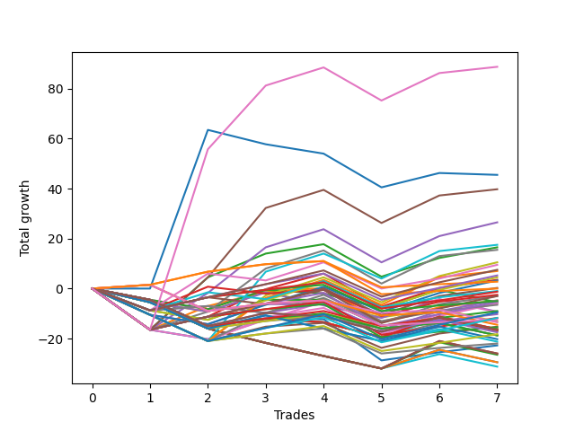

# Long Bulldog 006 DB 
- Symbol: ES
- Date Range: 03/18/2022 - 07/15/2022
- Trading Period: 7:20-12:30
- Number of Trades: 7



| Name | Win Percent | Profit | Avg Profit / Trade | Avg Time / Trade |      | Name | Win Percent | Profit | Avg Profit / Trade | Avg Time / Trade |
| ---- | ----------- | ------ | ------------------ | ---------------- | ---- | ---- | ----------- | ------ | ------------------ | ---------------- |
| Sorted By <br> Profit | | | | | | Sorted By <br> Win Percentage ||||
| TEST | 71.43 | 44375.00 | 6339.29 | 29:55 |     | One Hundred Twenty-Six | 85.71 | 1375.00 | 196.43 | 02:30 |
| Seventy-Three | 42.86 | 22750.00 | 3250.00 | 13:13 |     | Eighty-One | 85.71 | 0.00 | 0.00 | 05:43 |
| Five | 71.43 | 19875.00 | 2839.29 | 25:43 |     | TEST | 71.43 | 44375.00 | 6339.29 | 29:55 |
| Four | 71.43 | 13250.00 | 1892.86 | 24:12 |     | Five | 71.43 | 19875.00 | 2839.29 | 25:43 |
| Sixty-One | 57.14 | 8750.00 | 1250.00 | 18:28 |     | Four | 71.43 | 13250.00 | 1892.86 | 24:12 |
| Two | 71.43 | 8250.00 | 1178.57 | 16:49 |     | Two | 71.43 | 8250.00 | 1178.57 | 16:49 |
| Seven | 71.43 | 7750.00 | 1107.14 | 24:12 |     | Seven | 71.43 | 7750.00 | 1107.14 | 24:12 |
| Sixty | 57.14 | 5250.00 | 750.00 | 17:12 |     | One Hundred Thirty | 71.43 | 3750.00 | 535.71 | 08:52 |
| Sixty-Eight | 57.14 | 4750.00 | 678.57 | 14:57 |     | One Hundred Twenty-Nine | 71.43 | 2625.00 | 375.00 | 08:22 |
| One Hundred Thirty | 71.43 | 3750.00 | 535.71 | 08:52 |     | Three | 71.43 | 1750.00 | 250.00 | 18:28 |
| Sixty-Three | 57.14 | 3500.00 | 500.00 | 17:16 |     | One Hundred Twenty-Eight | 71.43 | -625.00 | -89.29 | 05:15 |
| One Hundred Twenty-Nine | 71.43 | 2625.00 | 375.00 | 08:22 |     | Eighty-Five | 71.43 | -1500.00 | -214.29 | 15:16 |
| Seventy | 57.14 | 2250.00 | 321.43 | 11:59 |     | One | 71.43 | -2375.00 | -339.29 | 15:30 |
| Three | 71.43 | 1750.00 | 250.00 | 18:28 |     | One Hundred Twenty-Seven | 71.43 | -2500.00 | -357.14 | 03:45 |
| Sixty-Two | 57.14 | 1625.00 | 232.14 | 12:03 |     | Eighty-Four | 71.43 | -2625.00 | -375.00 | 14:46 |
| One Hundred Twenty-Six | 85.71 | 1375.00 | 196.43 | 02:30 |     | Eighty-Three | 71.43 | -5875.00 | -839.29 | 11:38 |
| Sixty-Seven | 57.14 | 125.00 | 17.86 | 11:06 |     | One Hundred Twenty-One | 71.43 | -6250.00 | -892.86 | 01:55 |
| Eighty-One | 85.71 | 0.00 | 0.00 | 05:43 |     | Eighty-Two | 71.43 | -7750.00 | -1107.14 | 10:09 |
| Seventy-One | 57.14 | -500.00 | -71.43 | 15:08 |     | Sixty-One | 57.14 | 8750.00 | 1250.00 | 18:28 |
| One Hundred Twenty-Eight | 71.43 | -625.00 | -89.29 | 05:15 |     | Sixty | 57.14 | 5250.00 | 750.00 | 17:12 |
| Sixty-Five | 57.14 | -1250.00 | -178.57 | 08:37 |     | Sixty-Eight | 57.14 | 4750.00 | 678.57 | 14:57 |
| Eighty-Five | 71.43 | -1500.00 | -214.29 | 15:16 |     | Sixty-Three | 57.14 | 3500.00 | 500.00 | 17:16 |
| Fifty-Nine | 57.14 | -1500.00 | -214.29 | 11:35 |     | Seventy | 57.14 | 2250.00 | 321.43 | 11:59 |
| One | 71.43 | -2375.00 | -339.29 | 15:30 |     | Sixty-Two | 57.14 | 1625.00 | 232.14 | 12:03 |
| Sixty-Six | 57.14 | -2375.00 | -339.29 | 09:25 |     | Sixty-Seven | 57.14 | 125.00 | 17.86 | 11:06 |
| One Hundred Twenty-Seven | 71.43 | -2500.00 | -357.14 | 03:45 |     | Seventy-One | 57.14 | -500.00 | -71.43 | 15:08 |
| Eighty-Four | 71.43 | -2625.00 | -375.00 | 14:46 |     | Sixty-Five | 57.14 | -1250.00 | -178.57 | 08:37 |
| Fifty-Four | 28.57 | -2750.00 | -392.86 | 03:18 |     | Fifty-Nine | 57.14 | -1500.00 | -214.29 | 11:35 |
| Fifty-Eight | 57.14 | -3000.00 | -428.57 | 09:40 |     | Sixty-Six | 57.14 | -2375.00 | -339.29 | 09:25 |
| Six | 57.14 | -3000.00 | -428.57 | 18:22 |     | Fifty-Eight | 57.14 | -3000.00 | -428.57 | 09:40 |
| Sixty-Nine | 57.14 | -3250.00 | -464.29 | 15:19 |     | Six | 57.14 | -3000.00 | -428.57 | 18:22 |
| Sixty-Four | 57.14 | -4500.00 | -642.86 | 04:57 |     | Sixty-Nine | 57.14 | -3250.00 | -464.29 | 15:19 |
| Forty-Six | 28.57 | -4625.00 | -660.71 | 03:52 |     | Sixty-Four | 57.14 | -4500.00 | -642.86 | 04:57 |
| One Hundred Twenty-Five | 57.14 | -4750.00 | -678.57 | 08:22 |     | One Hundred Twenty-Five | 57.14 | -4750.00 | -678.57 | 08:22 |
| Forty-Eight | 28.57 | -4750.00 | -678.57 | 02:24 |     | Fifty-Six | 57.14 | -5125.00 | -732.14 | 05:02 |
| Fifty-Six | 57.14 | -5125.00 | -732.14 | 05:02 |     | One Hundred Twenty-Four | 57.14 | -5875.00 | -839.29 | 07:52 |
| Eighty-Three | 71.43 | -5875.00 | -839.29 | 11:38 |     | One Hundred Eleven | 57.14 | -6750.00 | -964.29 | 01:06 |
| One Hundred Twenty-Four | 57.14 | -5875.00 | -839.29 | 07:52 |     | One Hundred Sixteen | 57.14 | -7250.00 | -1035.71 | 01:07 |
| One Hundred Twenty-One | 71.43 | -6250.00 | -892.86 | 01:55 |     | Fifty-Seven | 57.14 | -7625.00 | -1089.29 | 08:41 |
| Forty | 28.57 | -6625.00 | -946.43 | 02:57 |     | One Hundred Twenty-Three | 57.14 | -9125.00 | -1303.57 | 04:45 |
| One Hundred Eleven | 57.14 | -6750.00 | -964.29 | 01:06 |     | One Hundred Twenty-Two | 57.14 | -11000.00 | -1571.43 | 03:15 |
| One Hundred Sixteen | 57.14 | -7250.00 | -1035.71 | 01:07 |     | Zero | 57.14 | -11375.00 | -1625.00 | 10:22 |
| Fifty-Seven | 57.14 | -7625.00 | -1089.29 | 08:41 |     | Seventy-Three | 42.86 | 22750.00 | 3250.00 | 13:13 |
| Eighty-Two | 71.43 | -7750.00 | -1107.14 | 10:09 |     | One Hundred Eighteen | 42.86 | -8375.00 | -1196.43 | 02:02 |
| Fifty-Five | 28.57 | -8125.00 | -1160.71 | 04:42 |     | One Hundred Thirteen | 42.86 | -8375.00 | -1196.43 | 02:12 |
| Fifty-Three | 28.57 | -8125.00 | -1160.71 | 04:42 |     | One Hundred Seventeen | 42.86 | -9375.00 | -1339.29 | 01:50 |
| Fifty-Two | 28.57 | -8125.00 | -1160.71 | 04:42 |     | One Hundred Twelve | 42.86 | -9375.00 | -1339.29 | 02:00 |
| One Hundred Twenty | 28.57 | -8250.00 | -1178.57 | 02:56 |     | Fifty-Four | 28.57 | -2750.00 | -392.86 | 03:18 |
| One Hundred Eighteen | 42.86 | -8375.00 | -1196.43 | 02:02 |     | Forty-Six | 28.57 | -4625.00 | -660.71 | 03:52 |
| One Hundred Thirteen | 42.86 | -8375.00 | -1196.43 | 02:12 |     | Forty-Eight | 28.57 | -4750.00 | -678.57 | 02:24 |
| Fifty-One | 28.57 | -8500.00 | -1214.29 | 03:35 |     | Forty | 28.57 | -6625.00 | -946.43 | 02:57 |
| Fifty | 28.57 | -8500.00 | -1214.29 | 03:35 |     | Fifty-Five | 28.57 | -8125.00 | -1160.71 | 04:42 |
| One Hundred Ninteen | 28.57 | -8750.00 | -1250.00 | 02:55 |     | Fifty-Three | 28.57 | -8125.00 | -1160.71 | 04:42 |
| One Hundred Twenty-Three | 57.14 | -9125.00 | -1303.57 | 04:45 |     | Fifty-Two | 28.57 | -8125.00 | -1160.71 | 04:42 |
| One Hundred Seventeen | 42.86 | -9375.00 | -1339.29 | 01:50 |     | One Hundred Twenty | 28.57 | -8250.00 | -1178.57 | 02:56 |
| One Hundred Twelve | 42.86 | -9375.00 | -1339.29 | 02:00 |     | Fifty-One | 28.57 | -8500.00 | -1214.29 | 03:35 |
| Forty-Nine | 28.57 | -9375.00 | -1339.29 | 03:15 |     | Fifty | 28.57 | -8500.00 | -1214.29 | 03:35 |
| One Hundred Fifteen | 28.57 | -10125.00 | -1446.43 | 03:30 |     | One Hundred Ninteen | 28.57 | -8750.00 | -1250.00 | 02:55 |
| One Hundred Fourteen | 28.57 | -10625.00 | -1517.86 | 03:29 |     | Forty-Nine | 28.57 | -9375.00 | -1339.29 | 03:15 |
| One Hundred Twenty-Two | 57.14 | -11000.00 | -1571.43 | 03:15 |     | One Hundred Fifteen | 28.57 | -10125.00 | -1446.43 | 03:30 |
| Zero | 57.14 | -11375.00 | -1625.00 | 10:22 |     | One Hundred Fourteen | 28.57 | -10625.00 | -1517.86 | 03:29 |
| Forty-Seven | 14.29 | -13000.00 | -1857.14 | 08:00 |     | Forty-Seven | 14.29 | -13000.00 | -1857.14 | 08:00 |
| Forty-Five | 14.29 | -13000.00 | -1857.14 | 08:00 |     | Forty-Five | 14.29 | -13000.00 | -1857.14 | 08:00 |
| Forty-Four | 14.29 | -13250.00 | -1892.86 | 07:37 |     | Forty-Four | 14.29 | -13250.00 | -1892.86 | 07:37 |
| Forty-Three | 14.29 | -14750.00 | -2107.14 | 04:58 |     | Forty-Three | 14.29 | -14750.00 | -2107.14 | 04:58 |
| Forty-Two | 14.29 | -14750.00 | -2107.14 | 04:58 |     | Forty-Two | 14.29 | -14750.00 | -2107.14 | 04:58 |
| Forty-One | 14.29 | -15625.00 | -2232.14 | 04:38 |     | Forty-One | 14.29 | -15625.00 | -2232.14 | 04:38 |

## NO STOPLOSS

### Test Zero
* Sell when price hits the middle line of the 20p bollinger
* No Stoploss
* Results:
```
Total Trades: 7
Percent Up: 57.14
Percent Down: 42.86
Total Points Moved Up: -22.75
Potential Profit: -11375.00
Total Points Ups: 14.00 Count Ups: 4
Total Points Downs: -36.75 Count Downs: 3
```

<details><summary>Trades</summary>

<code>In: 2022-03-28 08:28:00		Out: 2022-03-28 08:57:55		Total Position Time: 29:55		Total Move Up: -16.50		Total to Date: -16.50</code> <br />
<code>In: 2022-05-04 11:37:00		Out: 2022-05-04 11:37:10		Total Position Time: 00:10		Total Move Up: -3.75		Total to Date: -20.25</code> <br />
<code>In: 2022-05-17 11:25:00		Out: 2022-05-17 11:27:30		Total Position Time: 02:30		Total Move Up: 8.00		Total to Date: -12.25</code> <br />
<code>In: 2022-05-25 09:30:00		Out: 2022-05-25 09:41:25		Total Position Time: 11:25		Total Move Up: 0.00		Total to Date: -12.25</code> <br />
<code>In: 2022-06-08 09:30:00		Out: 2022-06-08 09:53:05		Total Position Time: 23:05		Total Move Up: -16.50		Total to Date: -28.75</code> <br />
<code>In: 2022-06-29 08:26:00		Out: 2022-06-29 08:28:15		Total Position Time: 02:15		Total Move Up: 3.25		Total to Date: -25.50</code> <br />
<code>In: 2022-07-05 08:05:00		Out: 2022-07-05 08:08:20		Total Position Time: 03:20		Total Move Up: 2.75		Total to Date: -22.75</code> <br />


</details>

### Test One
* Sell when the price hits the upper line of the 20p 1std bollinger
* No Stoploss
* Results:
```
Total Trades: 7
Percent Up: 71.43
Percent Down: 28.57
Total Points Moved Up: -4.75
Potential Profit: -2375.00
Total Points Ups: 25.25 Count Ups: 5
Total Points Downs: -30.00 Count Downs: 2
```

<details><summary>Trades</summary>

<code>In: 2022-03-28 08:28:00		Out: 2022-03-28 08:57:55		Total Position Time: 29:55		Total Move Up: -16.50		Total to Date: -16.50</code> <br />
<code>In: 2022-05-04 11:37:00		Out: 2022-05-04 11:41:35		Total Position Time: 04:35		Total Move Up: 9.50		Total to Date: -7.00</code> <br />
<code>In: 2022-05-17 11:25:00		Out: 2022-05-17 11:37:35		Total Position Time: 12:35		Total Move Up: 5.75		Total to Date: -1.25</code> <br />
<code>In: 2022-05-25 09:30:00		Out: 2022-05-25 09:44:25		Total Position Time: 14:25		Total Move Up: 1.50		Total to Date: 0.25</code> <br />
<code>In: 2022-06-08 09:30:00		Out: 2022-06-08 09:59:05		Total Position Time: 29:05		Total Move Up: -13.50		Total to Date: -13.25</code> <br />
<code>In: 2022-06-29 08:26:00		Out: 2022-06-29 08:32:20		Total Position Time: 06:20		Total Move Up: 5.75		Total to Date: -7.50</code> <br />
<code>In: 2022-07-05 08:05:00		Out: 2022-07-05 08:16:40		Total Position Time: 11:40		Total Move Up: 2.75		Total to Date: -4.75</code> <br />


</details>

### Test Two
* Sell when the price hits the upper line of the 20p 2std bollinger
* No Stoploss
* Results:
```
Total Trades: 7
Percent Up: 71.43
Percent Down: 28.57
Total Points Moved Up: 16.50
Potential Profit: 8250.00
Total Points Ups: 46.00 Count Ups: 5
Total Points Downs: -29.50 Count Downs: 2
```

<details><summary>Trades</summary>

<code>In: 2022-03-28 08:28:00		Out: 2022-03-28 08:57:55		Total Position Time: 29:55		Total Move Up: -16.50		Total to Date: -16.50</code> <br />
<code>In: 2022-05-04 11:37:00		Out: 2022-05-04 11:43:45		Total Position Time: 06:45		Total Move Up: 21.00		Total to Date: 4.50</code> <br />
<code>In: 2022-05-17 11:25:00		Out: 2022-05-17 11:40:00		Total Position Time: 15:00		Total Move Up: 9.50		Total to Date: 14.00</code> <br />
<code>In: 2022-05-25 09:30:00		Out: 2022-05-25 09:45:20		Total Position Time: 15:20		Total Move Up: 3.75		Total to Date: 17.75</code> <br />
<code>In: 2022-06-08 09:30:00		Out: 2022-06-08 09:59:10		Total Position Time: 29:10		Total Move Up: -13.00		Total to Date: 4.75</code> <br />
<code>In: 2022-06-29 08:26:00		Out: 2022-06-29 08:34:40		Total Position Time: 08:40		Total Move Up: 7.50		Total to Date: 12.25</code> <br />
<code>In: 2022-07-05 08:05:00		Out: 2022-07-05 08:17:55		Total Position Time: 12:55		Total Move Up: 4.25		Total to Date: 16.50</code> <br />


</details>

### Test Three
* Sell when price hits the middle line of the 50p bollinger
* No Stoploss
* Results:
```
Total Trades: 7
Percent Up: 71.43
Percent Down: 28.57
Total Points Moved Up: 3.50
Potential Profit: 1750.00
Total Points Ups: 33.25 Count Ups: 5
Total Points Downs: -29.75 Count Downs: 2
```

<details><summary>Trades</summary>

<code>In: 2022-03-28 08:28:00		Out: 2022-03-28 08:57:55		Total Position Time: 29:55		Total Move Up: -16.50		Total to Date: -16.50</code> <br />
<code>In: 2022-05-04 11:37:00		Out: 2022-05-04 11:41:15		Total Position Time: 04:15		Total Move Up: 5.25		Total to Date: -11.25</code> <br />
<code>In: 2022-05-17 11:25:00		Out: 2022-05-17 11:40:05		Total Position Time: 15:05		Total Move Up: 11.00		Total to Date: -0.25</code> <br />
<code>In: 2022-05-25 09:30:00		Out: 2022-05-25 09:49:05		Total Position Time: 19:05		Total Move Up: 6.25		Total to Date: 6.00</code> <br />
<code>In: 2022-06-08 09:30:00		Out: 2022-06-08 09:59:55		Total Position Time: 29:55		Total Move Up: -13.25		Total to Date: -7.25</code> <br />
<code>In: 2022-06-29 08:26:00		Out: 2022-06-29 08:34:40		Total Position Time: 08:40		Total Move Up: 7.50		Total to Date: 0.25</code> <br />
<code>In: 2022-07-05 08:05:00		Out: 2022-07-05 08:27:25		Total Position Time: 22:25		Total Move Up: 3.25		Total to Date: 3.50</code> <br />


</details>

### Test Four
* Sell when the price hits the upper line of the 50p 1std bollinger
* No Stoploss
* Results:
```
Total Trades: 7
Percent Up: 71.43
Percent Down: 28.57
Total Points Moved Up: 26.50
Potential Profit: 13250.00
Total Points Ups: 56.25 Count Ups: 5
Total Points Downs: -29.75 Count Downs: 2
```

<details><summary>Trades</summary>

<code>In: 2022-03-28 08:28:00		Out: 2022-03-28 08:57:55		Total Position Time: 29:55		Total Move Up: -16.50		Total to Date: -16.50</code> <br />
<code>In: 2022-05-04 11:37:00		Out: 2022-05-04 11:42:00		Total Position Time: 05:00		Total Move Up: 14.75		Total to Date: -1.75</code> <br />
<code>In: 2022-05-17 11:25:00		Out: 2022-05-17 11:44:30		Total Position Time: 19:30		Total Move Up: 18.25		Total to Date: 16.50</code> <br />
<code>In: 2022-05-25 09:30:00		Out: 2022-05-25 09:59:55		Total Position Time: 29:55		Total Move Up: 7.25		Total to Date: 23.75</code> <br />
<code>In: 2022-06-08 09:30:00		Out: 2022-06-08 09:59:55		Total Position Time: 29:55		Total Move Up: -13.25		Total to Date: 10.50</code> <br />
<code>In: 2022-06-29 08:26:00		Out: 2022-06-29 08:53:10		Total Position Time: 27:10		Total Move Up: 10.50		Total to Date: 21.00</code> <br />
<code>In: 2022-07-05 08:05:00		Out: 2022-07-05 08:33:05		Total Position Time: 28:05		Total Move Up: 5.50		Total to Date: 26.50</code> <br />


</details>

### Test Five
* Sell when the price hits the upper line of the 50p 2std bollinger
* No Stoploss
* Results:
```
Total Trades: 7
Percent Up: 71.43
Percent Down: 28.57
Total Points Moved Up: 39.75
Potential Profit: 19875.00
Total Points Ups: 69.50 Count Ups: 5
Total Points Downs: -29.75 Count Downs: 2
```

<details><summary>Trades</summary>

<code>In: 2022-03-28 08:28:00		Out: 2022-03-28 08:57:55		Total Position Time: 29:55		Total Move Up: -16.50		Total to Date: -16.50</code> <br />
<code>In: 2022-05-04 11:37:00		Out: 2022-05-04 11:43:45		Total Position Time: 06:45		Total Move Up: 21.00		Total to Date: 4.50</code> <br />
<code>In: 2022-05-17 11:25:00		Out: 2022-05-17 11:48:45		Total Position Time: 23:45		Total Move Up: 27.75		Total to Date: 32.25</code> <br />
<code>In: 2022-05-25 09:30:00		Out: 2022-05-25 09:59:55		Total Position Time: 29:55		Total Move Up: 7.25		Total to Date: 39.50</code> <br />
<code>In: 2022-06-08 09:30:00		Out: 2022-06-08 09:59:55		Total Position Time: 29:55		Total Move Up: -13.25		Total to Date: 26.25</code> <br />
<code>In: 2022-06-29 08:26:00		Out: 2022-06-29 08:55:55		Total Position Time: 29:55		Total Move Up: 11.00		Total to Date: 37.25</code> <br />
<code>In: 2022-07-05 08:05:00		Out: 2022-07-05 08:34:55		Total Position Time: 29:55		Total Move Up: 2.50		Total to Date: 39.75</code> <br />


</details>

### Test Six
* Sell when the price hits the middle line of the 1std VWAP
* No Stoploss
* Results:
```
Total Trades: 7
Percent Up: 57.14
Percent Down: 42.86
Total Points Moved Up: -6.00
Potential Profit: -3000.00
Total Points Ups: 27.50 Count Ups: 4
Total Points Downs: -33.50 Count Downs: 3
```

<details><summary>Trades</summary>

<code>In: 2022-03-28 08:28:00		Out: 2022-03-28 08:57:55		Total Position Time: 29:55		Total Move Up: -16.50		Total to Date: -16.50</code> <br />
<code>In: 2022-05-04 11:37:00		Out: 2022-05-04 11:37:10		Total Position Time: 00:10		Total Move Up: -3.75		Total to Date: -20.25</code> <br />
<code>In: 2022-05-17 11:25:00		Out: 2022-05-17 11:27:25		Total Position Time: 02:25		Total Move Up: 7.75		Total to Date: -12.50</code> <br />
<code>In: 2022-05-25 09:30:00		Out: 2022-05-25 09:59:55		Total Position Time: 29:55		Total Move Up: 7.25		Total to Date: -5.25</code> <br />
<code>In: 2022-06-08 09:30:00		Out: 2022-06-08 09:59:55		Total Position Time: 29:55		Total Move Up: -13.25		Total to Date: -18.50</code> <br />
<code>In: 2022-06-29 08:26:00		Out: 2022-06-29 08:34:40		Total Position Time: 08:40		Total Move Up: 7.50		Total to Date: -11.00</code> <br />
<code>In: 2022-07-05 08:05:00		Out: 2022-07-05 08:32:40		Total Position Time: 27:40		Total Move Up: 5.00		Total to Date: -6.00</code> <br />


</details>

### Test Seven
* Sell when the price hits the upper line of the 1std VWAP
* No Stoploss
* Results:
```
Total Trades: 7
Percent Up: 71.43
Percent Down: 28.57
Total Points Moved Up: 15.50
Potential Profit: 7750.00
Total Points Ups: 45.25 Count Ups: 5
Total Points Downs: -29.75 Count Downs: 2
```

<details><summary>Trades</summary>

<code>In: 2022-03-28 08:28:00		Out: 2022-03-28 08:57:55		Total Position Time: 29:55		Total Move Up: -16.50		Total to Date: -16.50</code> <br />
<code>In: 2022-05-04 11:37:00		Out: 2022-05-04 11:41:30		Total Position Time: 04:30		Total Move Up: 7.25		Total to Date: -9.25</code> <br />
<code>In: 2022-05-17 11:25:00		Out: 2022-05-17 11:40:20		Total Position Time: 15:20		Total Move Up: 17.25		Total to Date: 8.00</code> <br />
<code>In: 2022-05-25 09:30:00		Out: 2022-05-25 09:59:55		Total Position Time: 29:55		Total Move Up: 7.25		Total to Date: 15.25</code> <br />
<code>In: 2022-06-08 09:30:00		Out: 2022-06-08 09:59:55		Total Position Time: 29:55		Total Move Up: -13.25		Total to Date: 2.00</code> <br />
<code>In: 2022-06-29 08:26:00		Out: 2022-06-29 08:55:55		Total Position Time: 29:55		Total Move Up: 11.00		Total to Date: 13.00</code> <br />
<code>In: 2022-07-05 08:05:00		Out: 2022-07-05 08:34:55		Total Position Time: 29:55		Total Move Up: 2.50		Total to Date: 15.50</code> <br />


</details>

## STOPLOSS OF 5

### Test Forty
* Sell when price hits the middle line of the 20p bollinger
* Stoploss is 5 points
* Results:
```
Total Trades: 7
Percent Up: 28.57
Percent Down: 71.43
Total Points Moved Up: -13.25
Potential Profit: -6625.00
Total Points Ups: 11.25 Count Ups: 2
Total Points Downs: -24.50 Count Downs: 5
```

<details><summary>Trades</summary>

<code>In: 2022-03-28 08:28:00		Out: 2022-03-28 08:33:25		Total Position Time: 05:25		Total Move Up: -5.50		Total to Date: -5.50</code> <br />
<code>In: 2022-05-04 11:37:00		Out: 2022-05-04 11:37:10		Total Position Time: 00:10		Total Move Up: -3.75		Total to Date: -9.25</code> <br />
<code>In: 2022-05-17 11:25:00		Out: 2022-05-17 11:27:30		Total Position Time: 02:30		Total Move Up: 8.00		Total to Date: -1.25</code> <br />
<code>In: 2022-05-25 09:30:00		Out: 2022-05-25 09:36:15		Total Position Time: 06:15		Total Move Up: -5.25		Total to Date: -6.50</code> <br />
<code>In: 2022-06-08 09:30:00		Out: 2022-06-08 09:32:50		Total Position Time: 02:50		Total Move Up: -5.00		Total to Date: -11.50</code> <br />
<code>In: 2022-06-29 08:26:00		Out: 2022-06-29 08:28:15		Total Position Time: 02:15		Total Move Up: 3.25		Total to Date: -8.25</code> <br />
<code>In: 2022-07-05 08:05:00		Out: 2022-07-05 08:06:20		Total Position Time: 01:20		Total Move Up: -5.00		Total to Date: -13.25</code> <br />


</details>

### Test Forty-One
* Sell when the price hits the upper line of the 20p 1std bollinger
* Stoploss is 5 points
* Results:
```
Total Trades: 7
Percent Up: 14.29
Percent Down: 85.71
Total Points Moved Up: -31.25
Potential Profit: -15625.00
Total Points Ups: 5.75 Count Ups: 1
Total Points Downs: -37.00 Count Downs: 6
```

<details><summary>Trades</summary>

<code>In: 2022-03-28 08:28:00		Out: 2022-03-28 08:33:25		Total Position Time: 05:25		Total Move Up: -5.50		Total to Date: -5.50</code> <br />
<code>In: 2022-05-04 11:37:00		Out: 2022-05-04 11:37:15		Total Position Time: 00:15		Total Move Up: -10.50		Total to Date: -16.00</code> <br />
<code>In: 2022-05-17 11:25:00		Out: 2022-05-17 11:35:05		Total Position Time: 10:05		Total Move Up: -5.75		Total to Date: -21.75</code> <br />
<code>In: 2022-05-25 09:30:00		Out: 2022-05-25 09:36:15		Total Position Time: 06:15		Total Move Up: -5.25		Total to Date: -27.00</code> <br />
<code>In: 2022-06-08 09:30:00		Out: 2022-06-08 09:32:50		Total Position Time: 02:50		Total Move Up: -5.00		Total to Date: -32.00</code> <br />
<code>In: 2022-06-29 08:26:00		Out: 2022-06-29 08:32:20		Total Position Time: 06:20		Total Move Up: 5.75		Total to Date: -26.25</code> <br />
<code>In: 2022-07-05 08:05:00		Out: 2022-07-05 08:06:20		Total Position Time: 01:20		Total Move Up: -5.00		Total to Date: -31.25</code> <br />


</details>

### Test Forty-Two
* Sell when the price hits the upper line of the 20p 2std bollinger
* Stoploss is 5 points
* Results:
```
Total Trades: 7
Percent Up: 14.29
Percent Down: 85.71
Total Points Moved Up: -29.50
Potential Profit: -14750.00
Total Points Ups: 7.50 Count Ups: 1
Total Points Downs: -37.00 Count Downs: 6
```

<details><summary>Trades</summary>

<code>In: 2022-03-28 08:28:00		Out: 2022-03-28 08:33:25		Total Position Time: 05:25		Total Move Up: -5.50		Total to Date: -5.50</code> <br />
<code>In: 2022-05-04 11:37:00		Out: 2022-05-04 11:37:15		Total Position Time: 00:15		Total Move Up: -10.50		Total to Date: -16.00</code> <br />
<code>In: 2022-05-17 11:25:00		Out: 2022-05-17 11:35:05		Total Position Time: 10:05		Total Move Up: -5.75		Total to Date: -21.75</code> <br />
<code>In: 2022-05-25 09:30:00		Out: 2022-05-25 09:36:15		Total Position Time: 06:15		Total Move Up: -5.25		Total to Date: -27.00</code> <br />
<code>In: 2022-06-08 09:30:00		Out: 2022-06-08 09:32:50		Total Position Time: 02:50		Total Move Up: -5.00		Total to Date: -32.00</code> <br />
<code>In: 2022-06-29 08:26:00		Out: 2022-06-29 08:34:40		Total Position Time: 08:40		Total Move Up: 7.50		Total to Date: -24.50</code> <br />
<code>In: 2022-07-05 08:05:00		Out: 2022-07-05 08:06:20		Total Position Time: 01:20		Total Move Up: -5.00		Total to Date: -29.50</code> <br />


</details>

### Test Forty-Three
* Sell when price hits the middle line of the 50p bollinger
* Stoploss is 5 points
* Results:
```
Total Trades: 7
Percent Up: 14.29
Percent Down: 85.71
Total Points Moved Up: -29.50
Potential Profit: -14750.00
Total Points Ups: 7.50 Count Ups: 1
Total Points Downs: -37.00 Count Downs: 6
```

<details><summary>Trades</summary>

<code>In: 2022-03-28 08:28:00		Out: 2022-03-28 08:33:25		Total Position Time: 05:25		Total Move Up: -5.50		Total to Date: -5.50</code> <br />
<code>In: 2022-05-04 11:37:00		Out: 2022-05-04 11:37:15		Total Position Time: 00:15		Total Move Up: -10.50		Total to Date: -16.00</code> <br />
<code>In: 2022-05-17 11:25:00		Out: 2022-05-17 11:35:05		Total Position Time: 10:05		Total Move Up: -5.75		Total to Date: -21.75</code> <br />
<code>In: 2022-05-25 09:30:00		Out: 2022-05-25 09:36:15		Total Position Time: 06:15		Total Move Up: -5.25		Total to Date: -27.00</code> <br />
<code>In: 2022-06-08 09:30:00		Out: 2022-06-08 09:32:50		Total Position Time: 02:50		Total Move Up: -5.00		Total to Date: -32.00</code> <br />
<code>In: 2022-06-29 08:26:00		Out: 2022-06-29 08:34:40		Total Position Time: 08:40		Total Move Up: 7.50		Total to Date: -24.50</code> <br />
<code>In: 2022-07-05 08:05:00		Out: 2022-07-05 08:06:20		Total Position Time: 01:20		Total Move Up: -5.00		Total to Date: -29.50</code> <br />


</details>

### Test Forty-Four
* Sell when the price hits the upper line of the 50p 1std bollinger
* Stoploss is 5 points
* Results:
```
Total Trades: 7
Percent Up: 14.29
Percent Down: 85.71
Total Points Moved Up: -26.50
Potential Profit: -13250.00
Total Points Ups: 10.50 Count Ups: 1
Total Points Downs: -37.00 Count Downs: 6
```

<details><summary>Trades</summary>

<code>In: 2022-03-28 08:28:00		Out: 2022-03-28 08:33:25		Total Position Time: 05:25		Total Move Up: -5.50		Total to Date: -5.50</code> <br />
<code>In: 2022-05-04 11:37:00		Out: 2022-05-04 11:37:15		Total Position Time: 00:15		Total Move Up: -10.50		Total to Date: -16.00</code> <br />
<code>In: 2022-05-17 11:25:00		Out: 2022-05-17 11:35:05		Total Position Time: 10:05		Total Move Up: -5.75		Total to Date: -21.75</code> <br />
<code>In: 2022-05-25 09:30:00		Out: 2022-05-25 09:36:15		Total Position Time: 06:15		Total Move Up: -5.25		Total to Date: -27.00</code> <br />
<code>In: 2022-06-08 09:30:00		Out: 2022-06-08 09:32:50		Total Position Time: 02:50		Total Move Up: -5.00		Total to Date: -32.00</code> <br />
<code>In: 2022-06-29 08:26:00		Out: 2022-06-29 08:53:10		Total Position Time: 27:10		Total Move Up: 10.50		Total to Date: -21.50</code> <br />
<code>In: 2022-07-05 08:05:00		Out: 2022-07-05 08:06:20		Total Position Time: 01:20		Total Move Up: -5.00		Total to Date: -26.50</code> <br />


</details>

### Test Forty-Five
* Sell when the price hits the upper line of the 50p 2std bollinger
* Stoploss is 5 points
* Results:
```
Total Trades: 7
Percent Up: 14.29
Percent Down: 85.71
Total Points Moved Up: -26.00
Potential Profit: -13000.00
Total Points Ups: 11.00 Count Ups: 1
Total Points Downs: -37.00 Count Downs: 6
```

<details><summary>Trades</summary>

<code>In: 2022-03-28 08:28:00		Out: 2022-03-28 08:33:25		Total Position Time: 05:25		Total Move Up: -5.50		Total to Date: -5.50</code> <br />
<code>In: 2022-05-04 11:37:00		Out: 2022-05-04 11:37:15		Total Position Time: 00:15		Total Move Up: -10.50		Total to Date: -16.00</code> <br />
<code>In: 2022-05-17 11:25:00		Out: 2022-05-17 11:35:05		Total Position Time: 10:05		Total Move Up: -5.75		Total to Date: -21.75</code> <br />
<code>In: 2022-05-25 09:30:00		Out: 2022-05-25 09:36:15		Total Position Time: 06:15		Total Move Up: -5.25		Total to Date: -27.00</code> <br />
<code>In: 2022-06-08 09:30:00		Out: 2022-06-08 09:32:50		Total Position Time: 02:50		Total Move Up: -5.00		Total to Date: -32.00</code> <br />
<code>In: 2022-06-29 08:26:00		Out: 2022-06-29 08:55:55		Total Position Time: 29:55		Total Move Up: 11.00		Total to Date: -21.00</code> <br />
<code>In: 2022-07-05 08:05:00		Out: 2022-07-05 08:06:20		Total Position Time: 01:20		Total Move Up: -5.00		Total to Date: -26.00</code> <br />


</details>

### Test Forty-Six
* Sell when the price hits the middle line of the 1std VWAP
* Stoploss is 5 points
* Results:
```
Total Trades: 7
Percent Up: 28.57
Percent Down: 71.43
Total Points Moved Up: -9.25
Potential Profit: -4625.00
Total Points Ups: 15.25 Count Ups: 2
Total Points Downs: -24.50 Count Downs: 5
```

<details><summary>Trades</summary>

<code>In: 2022-03-28 08:28:00		Out: 2022-03-28 08:33:25		Total Position Time: 05:25		Total Move Up: -5.50		Total to Date: -5.50</code> <br />
<code>In: 2022-05-04 11:37:00		Out: 2022-05-04 11:37:10		Total Position Time: 00:10		Total Move Up: -3.75		Total to Date: -9.25</code> <br />
<code>In: 2022-05-17 11:25:00		Out: 2022-05-17 11:27:25		Total Position Time: 02:25		Total Move Up: 7.75		Total to Date: -1.50</code> <br />
<code>In: 2022-05-25 09:30:00		Out: 2022-05-25 09:36:15		Total Position Time: 06:15		Total Move Up: -5.25		Total to Date: -6.75</code> <br />
<code>In: 2022-06-08 09:30:00		Out: 2022-06-08 09:32:50		Total Position Time: 02:50		Total Move Up: -5.00		Total to Date: -11.75</code> <br />
<code>In: 2022-06-29 08:26:00		Out: 2022-06-29 08:34:40		Total Position Time: 08:40		Total Move Up: 7.50		Total to Date: -4.25</code> <br />
<code>In: 2022-07-05 08:05:00		Out: 2022-07-05 08:06:20		Total Position Time: 01:20		Total Move Up: -5.00		Total to Date: -9.25</code> <br />


</details>

### Test Forty-Seven
* Sell when the price hits the upper line of the 1std VWAP
* Stoploss is 5 points
* Results:
```
Total Trades: 7
Percent Up: 14.29
Percent Down: 85.71
Total Points Moved Up: -26.00
Potential Profit: -13000.00
Total Points Ups: 11.00 Count Ups: 1
Total Points Downs: -37.00 Count Downs: 6
```

<details><summary>Trades</summary>

<code>In: 2022-03-28 08:28:00		Out: 2022-03-28 08:33:25		Total Position Time: 05:25		Total Move Up: -5.50		Total to Date: -5.50</code> <br />
<code>In: 2022-05-04 11:37:00		Out: 2022-05-04 11:37:15		Total Position Time: 00:15		Total Move Up: -10.50		Total to Date: -16.00</code> <br />
<code>In: 2022-05-17 11:25:00		Out: 2022-05-17 11:35:05		Total Position Time: 10:05		Total Move Up: -5.75		Total to Date: -21.75</code> <br />
<code>In: 2022-05-25 09:30:00		Out: 2022-05-25 09:36:15		Total Position Time: 06:15		Total Move Up: -5.25		Total to Date: -27.00</code> <br />
<code>In: 2022-06-08 09:30:00		Out: 2022-06-08 09:32:50		Total Position Time: 02:50		Total Move Up: -5.00		Total to Date: -32.00</code> <br />
<code>In: 2022-06-29 08:26:00		Out: 2022-06-29 08:55:55		Total Position Time: 29:55		Total Move Up: 11.00		Total to Date: -21.00</code> <br />
<code>In: 2022-07-05 08:05:00		Out: 2022-07-05 08:06:20		Total Position Time: 01:20		Total Move Up: -5.00		Total to Date: -26.00</code> <br />


</details>

## TRAIL STOP OF 5

### Test Forty-Eight
* Sell when price hits the middle line of the 20p bollinger
* Trailing Stop is 5 points
* Results:
```
Total Trades: 7
Percent Up: 28.57
Percent Down: 71.43
Total Points Moved Up: -9.50
Potential Profit: -4750.00
Total Points Ups: 11.25 Count Ups: 2
Total Points Downs: -20.75 Count Downs: 5
```

<details><summary>Trades</summary>

<code>In: 2022-03-28 08:28:00		Out: 2022-03-28 08:32:10		Total Position Time: 04:10		Total Move Up: -4.50		Total to Date: -4.50</code> <br />
<code>In: 2022-05-04 11:37:00		Out: 2022-05-04 11:37:10		Total Position Time: 00:10		Total Move Up: -3.75		Total to Date: -8.25</code> <br />
<code>In: 2022-05-17 11:25:00		Out: 2022-05-17 11:27:30		Total Position Time: 02:30		Total Move Up: 8.00		Total to Date: -0.25</code> <br />
<code>In: 2022-05-25 09:30:00		Out: 2022-05-25 09:33:30		Total Position Time: 03:30		Total Move Up: -1.50		Total to Date: -1.75</code> <br />
<code>In: 2022-06-08 09:30:00		Out: 2022-06-08 09:32:55		Total Position Time: 02:55		Total Move Up: -6.00		Total to Date: -7.75</code> <br />
<code>In: 2022-06-29 08:26:00		Out: 2022-06-29 08:28:15		Total Position Time: 02:15		Total Move Up: 3.25		Total to Date: -4.50</code> <br />
<code>In: 2022-07-05 08:05:00		Out: 2022-07-05 08:06:20		Total Position Time: 01:20		Total Move Up: -5.00		Total to Date: -9.50</code> <br />


</details>

### Test Forty-Nine
* Sell when the price hits the upper line of the 20p 1std bollinger
* Trailing Stop is 5 points
* Results:
```
Total Trades: 7
Percent Up: 28.57
Percent Down: 71.43
Total Points Moved Up: -18.75
Potential Profit: -9375.00
Total Points Ups: 8.75 Count Ups: 2
Total Points Downs: -27.50 Count Downs: 5
```

<details><summary>Trades</summary>

<code>In: 2022-03-28 08:28:00		Out: 2022-03-28 08:32:10		Total Position Time: 04:10		Total Move Up: -4.50		Total to Date: -4.50</code> <br />
<code>In: 2022-05-04 11:37:00		Out: 2022-05-04 11:37:15		Total Position Time: 00:15		Total Move Up: -10.50		Total to Date: -15.00</code> <br />
<code>In: 2022-05-17 11:25:00		Out: 2022-05-17 11:29:15		Total Position Time: 04:15		Total Move Up: 3.00		Total to Date: -12.00</code> <br />
<code>In: 2022-05-25 09:30:00		Out: 2022-05-25 09:33:30		Total Position Time: 03:30		Total Move Up: -1.50		Total to Date: -13.50</code> <br />
<code>In: 2022-06-08 09:30:00		Out: 2022-06-08 09:32:55		Total Position Time: 02:55		Total Move Up: -6.00		Total to Date: -19.50</code> <br />
<code>In: 2022-06-29 08:26:00		Out: 2022-06-29 08:32:20		Total Position Time: 06:20		Total Move Up: 5.75		Total to Date: -13.75</code> <br />
<code>In: 2022-07-05 08:05:00		Out: 2022-07-05 08:06:20		Total Position Time: 01:20		Total Move Up: -5.00		Total to Date: -18.75</code> <br />


</details>

### Test Fifty
* Sell when the price hits the upper line of the 20p 2std bollinger
* Trailing Stop is 5 points
* Results:
```
Total Trades: 7
Percent Up: 28.57
Percent Down: 71.43
Total Points Moved Up: -17.00
Potential Profit: -8500.00
Total Points Ups: 10.50 Count Ups: 2
Total Points Downs: -27.50 Count Downs: 5
```

<details><summary>Trades</summary>

<code>In: 2022-03-28 08:28:00		Out: 2022-03-28 08:32:10		Total Position Time: 04:10		Total Move Up: -4.50		Total to Date: -4.50</code> <br />
<code>In: 2022-05-04 11:37:00		Out: 2022-05-04 11:37:15		Total Position Time: 00:15		Total Move Up: -10.50		Total to Date: -15.00</code> <br />
<code>In: 2022-05-17 11:25:00		Out: 2022-05-17 11:29:15		Total Position Time: 04:15		Total Move Up: 3.00		Total to Date: -12.00</code> <br />
<code>In: 2022-05-25 09:30:00		Out: 2022-05-25 09:33:30		Total Position Time: 03:30		Total Move Up: -1.50		Total to Date: -13.50</code> <br />
<code>In: 2022-06-08 09:30:00		Out: 2022-06-08 09:32:55		Total Position Time: 02:55		Total Move Up: -6.00		Total to Date: -19.50</code> <br />
<code>In: 2022-06-29 08:26:00		Out: 2022-06-29 08:34:40		Total Position Time: 08:40		Total Move Up: 7.50		Total to Date: -12.00</code> <br />
<code>In: 2022-07-05 08:05:00		Out: 2022-07-05 08:06:20		Total Position Time: 01:20		Total Move Up: -5.00		Total to Date: -17.00</code> <br />


</details>

### Test Fifty-One
* Sell when price hits the middle line of the 50p bollinger
* Trailing Stop is 5 points
* Results:
```
Total Trades: 7
Percent Up: 28.57
Percent Down: 71.43
Total Points Moved Up: -17.00
Potential Profit: -8500.00
Total Points Ups: 10.50 Count Ups: 2
Total Points Downs: -27.50 Count Downs: 5
```

<details><summary>Trades</summary>

<code>In: 2022-03-28 08:28:00		Out: 2022-03-28 08:32:10		Total Position Time: 04:10		Total Move Up: -4.50		Total to Date: -4.50</code> <br />
<code>In: 2022-05-04 11:37:00		Out: 2022-05-04 11:37:15		Total Position Time: 00:15		Total Move Up: -10.50		Total to Date: -15.00</code> <br />
<code>In: 2022-05-17 11:25:00		Out: 2022-05-17 11:29:15		Total Position Time: 04:15		Total Move Up: 3.00		Total to Date: -12.00</code> <br />
<code>In: 2022-05-25 09:30:00		Out: 2022-05-25 09:33:30		Total Position Time: 03:30		Total Move Up: -1.50		Total to Date: -13.50</code> <br />
<code>In: 2022-06-08 09:30:00		Out: 2022-06-08 09:32:55		Total Position Time: 02:55		Total Move Up: -6.00		Total to Date: -19.50</code> <br />
<code>In: 2022-06-29 08:26:00		Out: 2022-06-29 08:34:40		Total Position Time: 08:40		Total Move Up: 7.50		Total to Date: -12.00</code> <br />
<code>In: 2022-07-05 08:05:00		Out: 2022-07-05 08:06:20		Total Position Time: 01:20		Total Move Up: -5.00		Total to Date: -17.00</code> <br />


</details>

### Test Fifty-Two
* Sell when the price hits the upper line of the 50p 1std bollinger
* Trailing Stop is 5 points
* Results:
```
Total Trades: 7
Percent Up: 28.57
Percent Down: 71.43
Total Points Moved Up: -16.25
Potential Profit: -8125.00
Total Points Ups: 11.25 Count Ups: 2
Total Points Downs: -27.50 Count Downs: 5
```

<details><summary>Trades</summary>

<code>In: 2022-03-28 08:28:00		Out: 2022-03-28 08:32:10		Total Position Time: 04:10		Total Move Up: -4.50		Total to Date: -4.50</code> <br />
<code>In: 2022-05-04 11:37:00		Out: 2022-05-04 11:37:15		Total Position Time: 00:15		Total Move Up: -10.50		Total to Date: -15.00</code> <br />
<code>In: 2022-05-17 11:25:00		Out: 2022-05-17 11:29:15		Total Position Time: 04:15		Total Move Up: 3.00		Total to Date: -12.00</code> <br />
<code>In: 2022-05-25 09:30:00		Out: 2022-05-25 09:33:30		Total Position Time: 03:30		Total Move Up: -1.50		Total to Date: -13.50</code> <br />
<code>In: 2022-06-08 09:30:00		Out: 2022-06-08 09:32:55		Total Position Time: 02:55		Total Move Up: -6.00		Total to Date: -19.50</code> <br />
<code>In: 2022-06-29 08:26:00		Out: 2022-06-29 08:42:30		Total Position Time: 16:30		Total Move Up: 8.25		Total to Date: -11.25</code> <br />
<code>In: 2022-07-05 08:05:00		Out: 2022-07-05 08:06:20		Total Position Time: 01:20		Total Move Up: -5.00		Total to Date: -16.25</code> <br />


</details>

### Test Fifty-Three
* Sell when the price hits the upper line of the 50p 2std bollinger
* Trailing Stop is 5 points
* Results:
```
Total Trades: 7
Percent Up: 28.57
Percent Down: 71.43
Total Points Moved Up: -16.25
Potential Profit: -8125.00
Total Points Ups: 11.25 Count Ups: 2
Total Points Downs: -27.50 Count Downs: 5
```

<details><summary>Trades</summary>

<code>In: 2022-03-28 08:28:00		Out: 2022-03-28 08:32:10		Total Position Time: 04:10		Total Move Up: -4.50		Total to Date: -4.50</code> <br />
<code>In: 2022-05-04 11:37:00		Out: 2022-05-04 11:37:15		Total Position Time: 00:15		Total Move Up: -10.50		Total to Date: -15.00</code> <br />
<code>In: 2022-05-17 11:25:00		Out: 2022-05-17 11:29:15		Total Position Time: 04:15		Total Move Up: 3.00		Total to Date: -12.00</code> <br />
<code>In: 2022-05-25 09:30:00		Out: 2022-05-25 09:33:30		Total Position Time: 03:30		Total Move Up: -1.50		Total to Date: -13.50</code> <br />
<code>In: 2022-06-08 09:30:00		Out: 2022-06-08 09:32:55		Total Position Time: 02:55		Total Move Up: -6.00		Total to Date: -19.50</code> <br />
<code>In: 2022-06-29 08:26:00		Out: 2022-06-29 08:42:30		Total Position Time: 16:30		Total Move Up: 8.25		Total to Date: -11.25</code> <br />
<code>In: 2022-07-05 08:05:00		Out: 2022-07-05 08:06:20		Total Position Time: 01:20		Total Move Up: -5.00		Total to Date: -16.25</code> <br />


</details>

### Test Fifty-Four
* Sell when the price hits the middle line of the 1std VWAP
* Trailing Stop is 5 points
* Results:
```
Total Trades: 7
Percent Up: 28.57
Percent Down: 71.43
Total Points Moved Up: -5.50
Potential Profit: -2750.00
Total Points Ups: 15.25 Count Ups: 2
Total Points Downs: -20.75 Count Downs: 5
```

<details><summary>Trades</summary>

<code>In: 2022-03-28 08:28:00		Out: 2022-03-28 08:32:10		Total Position Time: 04:10		Total Move Up: -4.50		Total to Date: -4.50</code> <br />
<code>In: 2022-05-04 11:37:00		Out: 2022-05-04 11:37:10		Total Position Time: 00:10		Total Move Up: -3.75		Total to Date: -8.25</code> <br />
<code>In: 2022-05-17 11:25:00		Out: 2022-05-17 11:27:25		Total Position Time: 02:25		Total Move Up: 7.75		Total to Date: -0.50</code> <br />
<code>In: 2022-05-25 09:30:00		Out: 2022-05-25 09:33:30		Total Position Time: 03:30		Total Move Up: -1.50		Total to Date: -2.00</code> <br />
<code>In: 2022-06-08 09:30:00		Out: 2022-06-08 09:32:55		Total Position Time: 02:55		Total Move Up: -6.00		Total to Date: -8.00</code> <br />
<code>In: 2022-06-29 08:26:00		Out: 2022-06-29 08:34:40		Total Position Time: 08:40		Total Move Up: 7.50		Total to Date: -0.50</code> <br />
<code>In: 2022-07-05 08:05:00		Out: 2022-07-05 08:06:20		Total Position Time: 01:20		Total Move Up: -5.00		Total to Date: -5.50</code> <br />


</details>

### Test Fifty-Five
* Sell when the price hits the upper line of the 1std VWAP
* Trailing Stop is 5 points
* Results:
```
Total Trades: 7
Percent Up: 28.57
Percent Down: 71.43
Total Points Moved Up: -16.25
Potential Profit: -8125.00
Total Points Ups: 11.25 Count Ups: 2
Total Points Downs: -27.50 Count Downs: 5
```

<details><summary>Trades</summary>

<code>In: 2022-03-28 08:28:00		Out: 2022-03-28 08:32:10		Total Position Time: 04:10		Total Move Up: -4.50		Total to Date: -4.50</code> <br />
<code>In: 2022-05-04 11:37:00		Out: 2022-05-04 11:37:15		Total Position Time: 00:15		Total Move Up: -10.50		Total to Date: -15.00</code> <br />
<code>In: 2022-05-17 11:25:00		Out: 2022-05-17 11:29:15		Total Position Time: 04:15		Total Move Up: 3.00		Total to Date: -12.00</code> <br />
<code>In: 2022-05-25 09:30:00		Out: 2022-05-25 09:33:30		Total Position Time: 03:30		Total Move Up: -1.50		Total to Date: -13.50</code> <br />
<code>In: 2022-06-08 09:30:00		Out: 2022-06-08 09:32:55		Total Position Time: 02:55		Total Move Up: -6.00		Total to Date: -19.50</code> <br />
<code>In: 2022-06-29 08:26:00		Out: 2022-06-29 08:42:30		Total Position Time: 16:30		Total Move Up: 8.25		Total to Date: -11.25</code> <br />
<code>In: 2022-07-05 08:05:00		Out: 2022-07-05 08:06:20		Total Position Time: 01:20		Total Move Up: -5.00		Total to Date: -16.25</code> <br />


</details>

## STOPLOSS OF 10

### Test Fifty-Six
* Sell when price hits the middle line of the 20p bollinger
* Stoploss is 10 points
* Results:
```
Total Trades: 7
Percent Up: 57.14
Percent Down: 42.86
Total Points Moved Up: -10.25
Potential Profit: -5125.00
Total Points Ups: 14.00 Count Ups: 4
Total Points Downs: -24.25 Count Downs: 3
```

<details><summary>Trades</summary>

<code>In: 2022-03-28 08:28:00		Out: 2022-03-28 08:36:20		Total Position Time: 08:20		Total Move Up: -10.50		Total to Date: -10.50</code> <br />
<code>In: 2022-05-04 11:37:00		Out: 2022-05-04 11:37:10		Total Position Time: 00:10		Total Move Up: -3.75		Total to Date: -14.25</code> <br />
<code>In: 2022-05-17 11:25:00		Out: 2022-05-17 11:27:30		Total Position Time: 02:30		Total Move Up: 8.00		Total to Date: -6.25</code> <br />
<code>In: 2022-05-25 09:30:00		Out: 2022-05-25 09:41:25		Total Position Time: 11:25		Total Move Up: 0.00		Total to Date: -6.25</code> <br />
<code>In: 2022-06-08 09:30:00		Out: 2022-06-08 09:37:15		Total Position Time: 07:15		Total Move Up: -10.00		Total to Date: -16.25</code> <br />
<code>In: 2022-06-29 08:26:00		Out: 2022-06-29 08:28:15		Total Position Time: 02:15		Total Move Up: 3.25		Total to Date: -13.00</code> <br />
<code>In: 2022-07-05 08:05:00		Out: 2022-07-05 08:08:20		Total Position Time: 03:20		Total Move Up: 2.75		Total to Date: -10.25</code> <br />


</details>

### Test Fifty-Seven
* Sell when the price hits the upper line of the 20p 1std bollinger
* Stoploss is 10 points
* Results:
```
Total Trades: 7
Percent Up: 57.14
Percent Down: 42.86
Total Points Moved Up: -15.25
Potential Profit: -7625.00
Total Points Ups: 15.75 Count Ups: 4
Total Points Downs: -31.00 Count Downs: 3
```

<details><summary>Trades</summary>

<code>In: 2022-03-28 08:28:00		Out: 2022-03-28 08:36:20		Total Position Time: 08:20		Total Move Up: -10.50		Total to Date: -10.50</code> <br />
<code>In: 2022-05-04 11:37:00		Out: 2022-05-04 11:37:15		Total Position Time: 00:15		Total Move Up: -10.50		Total to Date: -21.00</code> <br />
<code>In: 2022-05-17 11:25:00		Out: 2022-05-17 11:37:35		Total Position Time: 12:35		Total Move Up: 5.75		Total to Date: -15.25</code> <br />
<code>In: 2022-05-25 09:30:00		Out: 2022-05-25 09:44:25		Total Position Time: 14:25		Total Move Up: 1.50		Total to Date: -13.75</code> <br />
<code>In: 2022-06-08 09:30:00		Out: 2022-06-08 09:37:15		Total Position Time: 07:15		Total Move Up: -10.00		Total to Date: -23.75</code> <br />
<code>In: 2022-06-29 08:26:00		Out: 2022-06-29 08:32:20		Total Position Time: 06:20		Total Move Up: 5.75		Total to Date: -18.00</code> <br />
<code>In: 2022-07-05 08:05:00		Out: 2022-07-05 08:16:40		Total Position Time: 11:40		Total Move Up: 2.75		Total to Date: -15.25</code> <br />


</details>

### Test Fifty-Eight
* Sell when the price hits the upper line of the 20p 2std bollinger
* Stoploss is 10 points
* Results:
```
Total Trades: 7
Percent Up: 57.14
Percent Down: 42.86
Total Points Moved Up: -6.00
Potential Profit: -3000.00
Total Points Ups: 25.00 Count Ups: 4
Total Points Downs: -31.00 Count Downs: 3
```

<details><summary>Trades</summary>

<code>In: 2022-03-28 08:28:00		Out: 2022-03-28 08:36:20		Total Position Time: 08:20		Total Move Up: -10.50		Total to Date: -10.50</code> <br />
<code>In: 2022-05-04 11:37:00		Out: 2022-05-04 11:37:15		Total Position Time: 00:15		Total Move Up: -10.50		Total to Date: -21.00</code> <br />
<code>In: 2022-05-17 11:25:00		Out: 2022-05-17 11:40:00		Total Position Time: 15:00		Total Move Up: 9.50		Total to Date: -11.50</code> <br />
<code>In: 2022-05-25 09:30:00		Out: 2022-05-25 09:45:20		Total Position Time: 15:20		Total Move Up: 3.75		Total to Date: -7.75</code> <br />
<code>In: 2022-06-08 09:30:00		Out: 2022-06-08 09:37:15		Total Position Time: 07:15		Total Move Up: -10.00		Total to Date: -17.75</code> <br />
<code>In: 2022-06-29 08:26:00		Out: 2022-06-29 08:34:40		Total Position Time: 08:40		Total Move Up: 7.50		Total to Date: -10.25</code> <br />
<code>In: 2022-07-05 08:05:00		Out: 2022-07-05 08:17:55		Total Position Time: 12:55		Total Move Up: 4.25		Total to Date: -6.00</code> <br />


</details>

### Test Fifty-Nine
* Sell when price hits the middle line of the 50p bollinger
* Stoploss is 10 points
* Results:
```
Total Trades: 7
Percent Up: 57.14
Percent Down: 42.86
Total Points Moved Up: -3.00
Potential Profit: -1500.00
Total Points Ups: 28.00 Count Ups: 4
Total Points Downs: -31.00 Count Downs: 3
```

<details><summary>Trades</summary>

<code>In: 2022-03-28 08:28:00		Out: 2022-03-28 08:36:20		Total Position Time: 08:20		Total Move Up: -10.50		Total to Date: -10.50</code> <br />
<code>In: 2022-05-04 11:37:00		Out: 2022-05-04 11:37:15		Total Position Time: 00:15		Total Move Up: -10.50		Total to Date: -21.00</code> <br />
<code>In: 2022-05-17 11:25:00		Out: 2022-05-17 11:40:05		Total Position Time: 15:05		Total Move Up: 11.00		Total to Date: -10.00</code> <br />
<code>In: 2022-05-25 09:30:00		Out: 2022-05-25 09:49:05		Total Position Time: 19:05		Total Move Up: 6.25		Total to Date: -3.75</code> <br />
<code>In: 2022-06-08 09:30:00		Out: 2022-06-08 09:37:15		Total Position Time: 07:15		Total Move Up: -10.00		Total to Date: -13.75</code> <br />
<code>In: 2022-06-29 08:26:00		Out: 2022-06-29 08:34:40		Total Position Time: 08:40		Total Move Up: 7.50		Total to Date: -6.25</code> <br />
<code>In: 2022-07-05 08:05:00		Out: 2022-07-05 08:27:25		Total Position Time: 22:25		Total Move Up: 3.25		Total to Date: -3.00</code> <br />


</details>

### Test Sixty
* Sell when the price hits the upper line of the 50p 1std bollinger
* Stoploss is 10 points
* Results:
```
Total Trades: 7
Percent Up: 57.14
Percent Down: 42.86
Total Points Moved Up: 10.50
Potential Profit: 5250.00
Total Points Ups: 41.50 Count Ups: 4
Total Points Downs: -31.00 Count Downs: 3
```

<details><summary>Trades</summary>

<code>In: 2022-03-28 08:28:00		Out: 2022-03-28 08:36:20		Total Position Time: 08:20		Total Move Up: -10.50		Total to Date: -10.50</code> <br />
<code>In: 2022-05-04 11:37:00		Out: 2022-05-04 11:37:15		Total Position Time: 00:15		Total Move Up: -10.50		Total to Date: -21.00</code> <br />
<code>In: 2022-05-17 11:25:00		Out: 2022-05-17 11:44:30		Total Position Time: 19:30		Total Move Up: 18.25		Total to Date: -2.75</code> <br />
<code>In: 2022-05-25 09:30:00		Out: 2022-05-25 09:59:55		Total Position Time: 29:55		Total Move Up: 7.25		Total to Date: 4.50</code> <br />
<code>In: 2022-06-08 09:30:00		Out: 2022-06-08 09:37:15		Total Position Time: 07:15		Total Move Up: -10.00		Total to Date: -5.50</code> <br />
<code>In: 2022-06-29 08:26:00		Out: 2022-06-29 08:53:10		Total Position Time: 27:10		Total Move Up: 10.50		Total to Date: 5.00</code> <br />
<code>In: 2022-07-05 08:05:00		Out: 2022-07-05 08:33:05		Total Position Time: 28:05		Total Move Up: 5.50		Total to Date: 10.50</code> <br />


</details>

### Test Sixty-One
* Sell when the price hits the upper line of the 50p 2std bollinger
* Stoploss is 10 points
* Results:
```
Total Trades: 7
Percent Up: 57.14
Percent Down: 42.86
Total Points Moved Up: 17.50
Potential Profit: 8750.00
Total Points Ups: 48.50 Count Ups: 4
Total Points Downs: -31.00 Count Downs: 3
```

<details><summary>Trades</summary>

<code>In: 2022-03-28 08:28:00		Out: 2022-03-28 08:36:20		Total Position Time: 08:20		Total Move Up: -10.50		Total to Date: -10.50</code> <br />
<code>In: 2022-05-04 11:37:00		Out: 2022-05-04 11:37:15		Total Position Time: 00:15		Total Move Up: -10.50		Total to Date: -21.00</code> <br />
<code>In: 2022-05-17 11:25:00		Out: 2022-05-17 11:48:45		Total Position Time: 23:45		Total Move Up: 27.75		Total to Date: 6.75</code> <br />
<code>In: 2022-05-25 09:30:00		Out: 2022-05-25 09:59:55		Total Position Time: 29:55		Total Move Up: 7.25		Total to Date: 14.00</code> <br />
<code>In: 2022-06-08 09:30:00		Out: 2022-06-08 09:37:15		Total Position Time: 07:15		Total Move Up: -10.00		Total to Date: 4.00</code> <br />
<code>In: 2022-06-29 08:26:00		Out: 2022-06-29 08:55:55		Total Position Time: 29:55		Total Move Up: 11.00		Total to Date: 15.00</code> <br />
<code>In: 2022-07-05 08:05:00		Out: 2022-07-05 08:34:55		Total Position Time: 29:55		Total Move Up: 2.50		Total to Date: 17.50</code> <br />


</details>

### Test Sixty-Two
* Sell when the price hits the middle line of the 1std VWAP
* Stoploss is 10 points
* Results:
```
Total Trades: 7
Percent Up: 57.14
Percent Down: 42.86
Total Points Moved Up: 3.25
Potential Profit: 1625.00
Total Points Ups: 27.50 Count Ups: 4
Total Points Downs: -24.25 Count Downs: 3
```

<details><summary>Trades</summary>

<code>In: 2022-03-28 08:28:00		Out: 2022-03-28 08:36:20		Total Position Time: 08:20		Total Move Up: -10.50		Total to Date: -10.50</code> <br />
<code>In: 2022-05-04 11:37:00		Out: 2022-05-04 11:37:10		Total Position Time: 00:10		Total Move Up: -3.75		Total to Date: -14.25</code> <br />
<code>In: 2022-05-17 11:25:00		Out: 2022-05-17 11:27:25		Total Position Time: 02:25		Total Move Up: 7.75		Total to Date: -6.50</code> <br />
<code>In: 2022-05-25 09:30:00		Out: 2022-05-25 09:59:55		Total Position Time: 29:55		Total Move Up: 7.25		Total to Date: 0.75</code> <br />
<code>In: 2022-06-08 09:30:00		Out: 2022-06-08 09:37:15		Total Position Time: 07:15		Total Move Up: -10.00		Total to Date: -9.25</code> <br />
<code>In: 2022-06-29 08:26:00		Out: 2022-06-29 08:34:40		Total Position Time: 08:40		Total Move Up: 7.50		Total to Date: -1.75</code> <br />
<code>In: 2022-07-05 08:05:00		Out: 2022-07-05 08:32:40		Total Position Time: 27:40		Total Move Up: 5.00		Total to Date: 3.25</code> <br />


</details>

### Test Sixty-Three
* Sell when the price hits the upper line of the 1std VWAP
* Stoploss is 10 points
* Results:
```
Total Trades: 7
Percent Up: 57.14
Percent Down: 42.86
Total Points Moved Up: 7.00
Potential Profit: 3500.00
Total Points Ups: 38.00 Count Ups: 4
Total Points Downs: -31.00 Count Downs: 3
```

<details><summary>Trades</summary>

<code>In: 2022-03-28 08:28:00		Out: 2022-03-28 08:36:20		Total Position Time: 08:20		Total Move Up: -10.50		Total to Date: -10.50</code> <br />
<code>In: 2022-05-04 11:37:00		Out: 2022-05-04 11:37:15		Total Position Time: 00:15		Total Move Up: -10.50		Total to Date: -21.00</code> <br />
<code>In: 2022-05-17 11:25:00		Out: 2022-05-17 11:40:20		Total Position Time: 15:20		Total Move Up: 17.25		Total to Date: -3.75</code> <br />
<code>In: 2022-05-25 09:30:00		Out: 2022-05-25 09:59:55		Total Position Time: 29:55		Total Move Up: 7.25		Total to Date: 3.50</code> <br />
<code>In: 2022-06-08 09:30:00		Out: 2022-06-08 09:37:15		Total Position Time: 07:15		Total Move Up: -10.00		Total to Date: -6.50</code> <br />
<code>In: 2022-06-29 08:26:00		Out: 2022-06-29 08:55:55		Total Position Time: 29:55		Total Move Up: 11.00		Total to Date: 4.50</code> <br />
<code>In: 2022-07-05 08:05:00		Out: 2022-07-05 08:34:55		Total Position Time: 29:55		Total Move Up: 2.50		Total to Date: 7.00</code> <br />


</details>

## TRAIL STOP OF 10

### Test Sixty-Four
* Sell when price hits the middle line of the 20p bollinger
* Trailing Stop is 10 points
* Results:
```
Total Trades: 7
Percent Up: 57.14
Percent Down: 42.86
Total Points Moved Up: -9.00
Potential Profit: -4500.00
Total Points Ups: 14.00 Count Ups: 4
Total Points Downs: -23.00 Count Downs: 3
```

<details><summary>Trades</summary>

<code>In: 2022-03-28 08:28:00		Out: 2022-03-28 08:35:45		Total Position Time: 07:45		Total Move Up: -8.75		Total to Date: -8.75</code> <br />
<code>In: 2022-05-04 11:37:00		Out: 2022-05-04 11:37:10		Total Position Time: 00:10		Total Move Up: -3.75		Total to Date: -12.50</code> <br />
<code>In: 2022-05-17 11:25:00		Out: 2022-05-17 11:27:30		Total Position Time: 02:30		Total Move Up: 8.00		Total to Date: -4.50</code> <br />
<code>In: 2022-05-25 09:30:00		Out: 2022-05-25 09:41:25		Total Position Time: 11:25		Total Move Up: 0.00		Total to Date: -4.50</code> <br />
<code>In: 2022-06-08 09:30:00		Out: 2022-06-08 09:37:20		Total Position Time: 07:20		Total Move Up: -10.50		Total to Date: -15.00</code> <br />
<code>In: 2022-06-29 08:26:00		Out: 2022-06-29 08:28:15		Total Position Time: 02:15		Total Move Up: 3.25		Total to Date: -11.75</code> <br />
<code>In: 2022-07-05 08:05:00		Out: 2022-07-05 08:08:20		Total Position Time: 03:20		Total Move Up: 2.75		Total to Date: -9.00</code> <br />


</details>

### Test Sixty-Five
* Sell when the price hits the upper line of the 20p 1std bollinger
* Trailing Stop is 10 points
* Results:
```
Total Trades: 7
Percent Up: 57.14
Percent Down: 42.86
Total Points Moved Up: -2.50
Potential Profit: -1250.00
Total Points Ups: 19.50 Count Ups: 4
Total Points Downs: -22.00 Count Downs: 3
```

<details><summary>Trades</summary>

<code>In: 2022-03-28 08:28:00		Out: 2022-03-28 08:35:45		Total Position Time: 07:45		Total Move Up: -8.75		Total to Date: -8.75</code> <br />
<code>In: 2022-05-04 11:37:00		Out: 2022-05-04 11:41:35		Total Position Time: 04:35		Total Move Up: 9.50		Total to Date: 0.75</code> <br />
<code>In: 2022-05-17 11:25:00		Out: 2022-05-17 11:33:15		Total Position Time: 08:15		Total Move Up: -2.75		Total to Date: -2.00</code> <br />
<code>In: 2022-05-25 09:30:00		Out: 2022-05-25 09:44:25		Total Position Time: 14:25		Total Move Up: 1.50		Total to Date: -0.50</code> <br />
<code>In: 2022-06-08 09:30:00		Out: 2022-06-08 09:37:20		Total Position Time: 07:20		Total Move Up: -10.50		Total to Date: -11.00</code> <br />
<code>In: 2022-06-29 08:26:00		Out: 2022-06-29 08:32:20		Total Position Time: 06:20		Total Move Up: 5.75		Total to Date: -5.25</code> <br />
<code>In: 2022-07-05 08:05:00		Out: 2022-07-05 08:16:40		Total Position Time: 11:40		Total Move Up: 2.75		Total to Date: -2.50</code> <br />


</details>

### Test Sixty-Six
* Sell when the price hits the upper line of the 20p 2std bollinger
* Trailing Stop is 10 points
* Results:
```
Total Trades: 7
Percent Up: 57.14
Percent Down: 42.86
Total Points Moved Up: -4.75
Potential Profit: -2375.00
Total Points Ups: 17.25 Count Ups: 4
Total Points Downs: -22.00 Count Downs: 3
```

<details><summary>Trades</summary>

<code>In: 2022-03-28 08:28:00		Out: 2022-03-28 08:35:45		Total Position Time: 07:45		Total Move Up: -8.75		Total to Date: -8.75</code> <br />
<code>In: 2022-05-04 11:37:00		Out: 2022-05-04 11:42:45		Total Position Time: 05:45		Total Move Up: 1.75		Total to Date: -7.00</code> <br />
<code>In: 2022-05-17 11:25:00		Out: 2022-05-17 11:33:15		Total Position Time: 08:15		Total Move Up: -2.75		Total to Date: -9.75</code> <br />
<code>In: 2022-05-25 09:30:00		Out: 2022-05-25 09:45:20		Total Position Time: 15:20		Total Move Up: 3.75		Total to Date: -6.00</code> <br />
<code>In: 2022-06-08 09:30:00		Out: 2022-06-08 09:37:20		Total Position Time: 07:20		Total Move Up: -10.50		Total to Date: -16.50</code> <br />
<code>In: 2022-06-29 08:26:00		Out: 2022-06-29 08:34:40		Total Position Time: 08:40		Total Move Up: 7.50		Total to Date: -9.00</code> <br />
<code>In: 2022-07-05 08:05:00		Out: 2022-07-05 08:17:55		Total Position Time: 12:55		Total Move Up: 4.25		Total to Date: -4.75</code> <br />


</details>

### Test Sixty-Seven
* Sell when price hits the middle line of the 50p bollinger
* Trailing Stop is 10 points
* Results:
```
Total Trades: 7
Percent Up: 57.14
Percent Down: 42.86
Total Points Moved Up: 0.25
Potential Profit: 125.00
Total Points Ups: 22.25 Count Ups: 4
Total Points Downs: -22.00 Count Downs: 3
```

<details><summary>Trades</summary>

<code>In: 2022-03-28 08:28:00		Out: 2022-03-28 08:35:45		Total Position Time: 07:45		Total Move Up: -8.75		Total to Date: -8.75</code> <br />
<code>In: 2022-05-04 11:37:00		Out: 2022-05-04 11:41:15		Total Position Time: 04:15		Total Move Up: 5.25		Total to Date: -3.50</code> <br />
<code>In: 2022-05-17 11:25:00		Out: 2022-05-17 11:33:15		Total Position Time: 08:15		Total Move Up: -2.75		Total to Date: -6.25</code> <br />
<code>In: 2022-05-25 09:30:00		Out: 2022-05-25 09:49:05		Total Position Time: 19:05		Total Move Up: 6.25		Total to Date: 0.00</code> <br />
<code>In: 2022-06-08 09:30:00		Out: 2022-06-08 09:37:20		Total Position Time: 07:20		Total Move Up: -10.50		Total to Date: -10.50</code> <br />
<code>In: 2022-06-29 08:26:00		Out: 2022-06-29 08:34:40		Total Position Time: 08:40		Total Move Up: 7.50		Total to Date: -3.00</code> <br />
<code>In: 2022-07-05 08:05:00		Out: 2022-07-05 08:27:25		Total Position Time: 22:25		Total Move Up: 3.25		Total to Date: 0.25</code> <br />


</details>

### Test Sixty-Eight
* Sell when the price hits the upper line of the 50p 1std bollinger
* Trailing Stop is 10 points
* Results:
```
Total Trades: 7
Percent Up: 57.14
Percent Down: 42.86
Total Points Moved Up: 9.50
Potential Profit: 4750.00
Total Points Ups: 31.50 Count Ups: 4
Total Points Downs: -22.00 Count Downs: 3
```

<details><summary>Trades</summary>

<code>In: 2022-03-28 08:28:00		Out: 2022-03-28 08:35:45		Total Position Time: 07:45		Total Move Up: -8.75		Total to Date: -8.75</code> <br />
<code>In: 2022-05-04 11:37:00		Out: 2022-05-04 11:42:00		Total Position Time: 05:00		Total Move Up: 14.75		Total to Date: 6.00</code> <br />
<code>In: 2022-05-17 11:25:00		Out: 2022-05-17 11:33:15		Total Position Time: 08:15		Total Move Up: -2.75		Total to Date: 3.25</code> <br />
<code>In: 2022-05-25 09:30:00		Out: 2022-05-25 09:59:55		Total Position Time: 29:55		Total Move Up: 7.25		Total to Date: 10.50</code> <br />
<code>In: 2022-06-08 09:30:00		Out: 2022-06-08 09:37:20		Total Position Time: 07:20		Total Move Up: -10.50		Total to Date: 0.00</code> <br />
<code>In: 2022-06-29 08:26:00		Out: 2022-06-29 08:44:20		Total Position Time: 18:20		Total Move Up: 4.00		Total to Date: 4.00</code> <br />
<code>In: 2022-07-05 08:05:00		Out: 2022-07-05 08:33:05		Total Position Time: 28:05		Total Move Up: 5.50		Total to Date: 9.50</code> <br />


</details>

### Test Sixty-Nine
* Sell when the price hits the upper line of the 50p 2std bollinger
* Trailing Stop is 10 points
* Results:
```
Total Trades: 7
Percent Up: 57.14
Percent Down: 42.86
Total Points Moved Up: -6.50
Potential Profit: -3250.00
Total Points Ups: 15.50 Count Ups: 4
Total Points Downs: -22.00 Count Downs: 3
```

<details><summary>Trades</summary>

<code>In: 2022-03-28 08:28:00		Out: 2022-03-28 08:35:45		Total Position Time: 07:45		Total Move Up: -8.75		Total to Date: -8.75</code> <br />
<code>In: 2022-05-04 11:37:00		Out: 2022-05-04 11:42:45		Total Position Time: 05:45		Total Move Up: 1.75		Total to Date: -7.00</code> <br />
<code>In: 2022-05-17 11:25:00		Out: 2022-05-17 11:33:15		Total Position Time: 08:15		Total Move Up: -2.75		Total to Date: -9.75</code> <br />
<code>In: 2022-05-25 09:30:00		Out: 2022-05-25 09:59:55		Total Position Time: 29:55		Total Move Up: 7.25		Total to Date: -2.50</code> <br />
<code>In: 2022-06-08 09:30:00		Out: 2022-06-08 09:37:20		Total Position Time: 07:20		Total Move Up: -10.50		Total to Date: -13.00</code> <br />
<code>In: 2022-06-29 08:26:00		Out: 2022-06-29 08:44:20		Total Position Time: 18:20		Total Move Up: 4.00		Total to Date: -9.00</code> <br />
<code>In: 2022-07-05 08:05:00		Out: 2022-07-05 08:34:55		Total Position Time: 29:55		Total Move Up: 2.50		Total to Date: -6.50</code> <br />


</details>

### Test Seventy
* Sell when the price hits the middle line of the 1std VWAP
* Trailing Stop is 10 points
* Results:
```
Total Trades: 7
Percent Up: 57.14
Percent Down: 42.86
Total Points Moved Up: 4.50
Potential Profit: 2250.00
Total Points Ups: 27.50 Count Ups: 4
Total Points Downs: -23.00 Count Downs: 3
```

<details><summary>Trades</summary>

<code>In: 2022-03-28 08:28:00		Out: 2022-03-28 08:35:45		Total Position Time: 07:45		Total Move Up: -8.75		Total to Date: -8.75</code> <br />
<code>In: 2022-05-04 11:37:00		Out: 2022-05-04 11:37:10		Total Position Time: 00:10		Total Move Up: -3.75		Total to Date: -12.50</code> <br />
<code>In: 2022-05-17 11:25:00		Out: 2022-05-17 11:27:25		Total Position Time: 02:25		Total Move Up: 7.75		Total to Date: -4.75</code> <br />
<code>In: 2022-05-25 09:30:00		Out: 2022-05-25 09:59:55		Total Position Time: 29:55		Total Move Up: 7.25		Total to Date: 2.50</code> <br />
<code>In: 2022-06-08 09:30:00		Out: 2022-06-08 09:37:20		Total Position Time: 07:20		Total Move Up: -10.50		Total to Date: -8.00</code> <br />
<code>In: 2022-06-29 08:26:00		Out: 2022-06-29 08:34:40		Total Position Time: 08:40		Total Move Up: 7.50		Total to Date: -0.50</code> <br />
<code>In: 2022-07-05 08:05:00		Out: 2022-07-05 08:32:40		Total Position Time: 27:40		Total Move Up: 5.00		Total to Date: 4.50</code> <br />


</details>

### Test Seventy-One
* Sell when the price hits the upper line of the 1std VWAP
* Trailing Stop is 10 points
* Results:
```
Total Trades: 7
Percent Up: 57.14
Percent Down: 42.86
Total Points Moved Up: -1.00
Potential Profit: -500.00
Total Points Ups: 21.00 Count Ups: 4
Total Points Downs: -22.00 Count Downs: 3
```

<details><summary>Trades</summary>

<code>In: 2022-03-28 08:28:00		Out: 2022-03-28 08:35:45		Total Position Time: 07:45		Total Move Up: -8.75		Total to Date: -8.75</code> <br />
<code>In: 2022-05-04 11:37:00		Out: 2022-05-04 11:41:30		Total Position Time: 04:30		Total Move Up: 7.25		Total to Date: -1.50</code> <br />
<code>In: 2022-05-17 11:25:00		Out: 2022-05-17 11:33:15		Total Position Time: 08:15		Total Move Up: -2.75		Total to Date: -4.25</code> <br />
<code>In: 2022-05-25 09:30:00		Out: 2022-05-25 09:59:55		Total Position Time: 29:55		Total Move Up: 7.25		Total to Date: 3.00</code> <br />
<code>In: 2022-06-08 09:30:00		Out: 2022-06-08 09:37:20		Total Position Time: 07:20		Total Move Up: -10.50		Total to Date: -7.50</code> <br />
<code>In: 2022-06-29 08:26:00		Out: 2022-06-29 08:44:20		Total Position Time: 18:20		Total Move Up: 4.00		Total to Date: -3.50</code> <br />
<code>In: 2022-07-05 08:05:00		Out: 2022-07-05 08:34:55		Total Position Time: 29:55		Total Move Up: 2.50		Total to Date: -1.00</code> <br />


</details>

## SPECIAL EXIT CONDITIONS 

### Test Seventy-Three
* Sell when the linear regression slope changes to negative
* No Stoploss
* Results:
```
Total Trades: 7
Percent Up: 42.86
Percent Down: 57.14
Total Points Moved Up: 45.50
Potential Profit: 22750.00
Total Points Ups: 69.25 Count Ups: 3
Total Points Downs: -23.75 Count Downs: 4
```

<details><summary>Trades</summary>

<code>In: 2022-03-28 08:28:00		Out: 2022-03-28 08:31:05		Total Position Time: 03:05		Total Move Up: 0.00		Total to Date: 0.00</code> <br />
<code>In: 2022-05-04 11:37:00		Out: 2022-05-04 11:58:05		Total Position Time: 21:05		Total Move Up: 63.50		Total to Date: 63.50</code> <br />
<code>In: 2022-05-17 11:25:00		Out: 2022-05-17 11:35:05		Total Position Time: 10:05		Total Move Up: -5.75		Total to Date: 57.75</code> <br />
<code>In: 2022-05-25 09:30:00		Out: 2022-05-25 09:36:05		Total Position Time: 06:05		Total Move Up: -3.75		Total to Date: 54.00</code> <br />
<code>In: 2022-06-08 09:30:00		Out: 2022-06-08 09:59:05		Total Position Time: 29:05		Total Move Up: -13.50		Total to Date: 40.50</code> <br />
<code>In: 2022-06-29 08:26:00		Out: 2022-06-29 08:43:05		Total Position Time: 17:05		Total Move Up: 5.75		Total to Date: 46.25</code> <br />
<code>In: 2022-07-05 08:05:00		Out: 2022-07-05 08:11:05		Total Position Time: 06:05		Total Move Up: -0.75		Total to Date: 45.50</code> <br />


</details>

## TAKE PROFIT

### Test Eighty-One
* Take Profit of 1 Point
* No Stoploss
* Results:
```
Total Trades: 7
Percent Up: 85.71
Percent Down: 14.29
Total Points Moved Up: 0.00
Potential Profit: 0.00
Total Points Ups: 13.25 Count Ups: 6
Total Points Downs: -13.25 Count Downs: 1
```

<details><summary>Trades</summary>

<code>In: 2022-03-28 08:28:00		Out: 2022-03-28 08:28:10		Total Position Time: 00:10		Total Move Up: 1.50		Total to Date: 1.50</code> <br />
<code>In: 2022-05-04 11:37:00		Out: 2022-05-04 11:41:15		Total Position Time: 04:15		Total Move Up: 5.25		Total to Date: 6.75</code> <br />
<code>In: 2022-05-17 11:25:00		Out: 2022-05-17 11:26:40		Total Position Time: 01:40		Total Move Up: 3.00		Total to Date: 9.75</code> <br />
<code>In: 2022-05-25 09:30:00		Out: 2022-05-25 09:30:15		Total Position Time: 00:15		Total Move Up: 1.25		Total to Date: 11.00</code> <br />
<code>In: 2022-06-08 09:30:00		Out: 2022-06-08 09:59:55		Total Position Time: 29:55		Total Move Up: -13.25		Total to Date: -2.25</code> <br />
<code>In: 2022-06-29 08:26:00		Out: 2022-06-29 08:27:15		Total Position Time: 01:15		Total Move Up: 1.25		Total to Date: -1.00</code> <br />
<code>In: 2022-07-05 08:05:00		Out: 2022-07-05 08:07:35		Total Position Time: 02:35		Total Move Up: 1.00		Total to Date: 0.00</code> <br />


</details>

### Test Eighty-Two
* Take Profit of 2 Point
* No Stoploss
* Results:
```
Total Trades: 7
Percent Up: 71.43
Percent Down: 28.57
Total Points Moved Up: -15.50
Potential Profit: -7750.00
Total Points Ups: 14.25 Count Ups: 5
Total Points Downs: -29.75 Count Downs: 2
```

<details><summary>Trades</summary>

<code>In: 2022-03-28 08:28:00		Out: 2022-03-28 08:57:55		Total Position Time: 29:55		Total Move Up: -16.50		Total to Date: -16.50</code> <br />
<code>In: 2022-05-04 11:37:00		Out: 2022-05-04 11:41:15		Total Position Time: 04:15		Total Move Up: 5.25		Total to Date: -11.25</code> <br />
<code>In: 2022-05-17 11:25:00		Out: 2022-05-17 11:26:40		Total Position Time: 01:40		Total Move Up: 3.00		Total to Date: -8.25</code> <br />
<code>In: 2022-05-25 09:30:00		Out: 2022-05-25 09:30:25		Total Position Time: 00:25		Total Move Up: 2.00		Total to Date: -6.25</code> <br />
<code>In: 2022-06-08 09:30:00		Out: 2022-06-08 09:59:55		Total Position Time: 29:55		Total Move Up: -13.25		Total to Date: -19.50</code> <br />
<code>In: 2022-06-29 08:26:00		Out: 2022-06-29 08:28:05		Total Position Time: 02:05		Total Move Up: 2.25		Total to Date: -17.25</code> <br />
<code>In: 2022-07-05 08:05:00		Out: 2022-07-05 08:07:50		Total Position Time: 02:50		Total Move Up: 1.75		Total to Date: -15.50</code> <br />


</details>

### Test Eighty-Three
* Take Profit of 3 Point
* No Stoploss
* Results:
```
Total Trades: 7
Percent Up: 71.43
Percent Down: 28.57
Total Points Moved Up: -11.75
Potential Profit: -5875.00
Total Points Ups: 18.00 Count Ups: 5
Total Points Downs: -29.75 Count Downs: 2
```

<details><summary>Trades</summary>

<code>In: 2022-03-28 08:28:00		Out: 2022-03-28 08:57:55		Total Position Time: 29:55		Total Move Up: -16.50		Total to Date: -16.50</code> <br />
<code>In: 2022-05-04 11:37:00		Out: 2022-05-04 11:41:15		Total Position Time: 04:15		Total Move Up: 5.25		Total to Date: -11.25</code> <br />
<code>In: 2022-05-17 11:25:00		Out: 2022-05-17 11:26:40		Total Position Time: 01:40		Total Move Up: 3.00		Total to Date: -8.25</code> <br />
<code>In: 2022-05-25 09:30:00		Out: 2022-05-25 09:31:45		Total Position Time: 01:45		Total Move Up: 3.00		Total to Date: -5.25</code> <br />
<code>In: 2022-06-08 09:30:00		Out: 2022-06-08 09:59:55		Total Position Time: 29:55		Total Move Up: -13.25		Total to Date: -18.50</code> <br />
<code>In: 2022-06-29 08:26:00		Out: 2022-06-29 08:28:15		Total Position Time: 02:15		Total Move Up: 3.25		Total to Date: -15.25</code> <br />
<code>In: 2022-07-05 08:05:00		Out: 2022-07-05 08:16:45		Total Position Time: 11:45		Total Move Up: 3.50		Total to Date: -11.75</code> <br />


</details>

### Test Eighty-Four
* Take Profit of 4 Point
* No Stoploss
* Results:
```
Total Trades: 7
Percent Up: 71.43
Percent Down: 28.57
Total Points Moved Up: -5.25
Potential Profit: -2625.00
Total Points Ups: 24.50 Count Ups: 5
Total Points Downs: -29.75 Count Downs: 2
```

<details><summary>Trades</summary>

<code>In: 2022-03-28 08:28:00		Out: 2022-03-28 08:57:55		Total Position Time: 29:55		Total Move Up: -16.50		Total to Date: -16.50</code> <br />
<code>In: 2022-05-04 11:37:00		Out: 2022-05-04 11:41:15		Total Position Time: 04:15		Total Move Up: 5.25		Total to Date: -11.25</code> <br />
<code>In: 2022-05-17 11:25:00		Out: 2022-05-17 11:27:05		Total Position Time: 02:05		Total Move Up: 5.25		Total to Date: -6.00</code> <br />
<code>In: 2022-05-25 09:30:00		Out: 2022-05-25 09:48:10		Total Position Time: 18:10		Total Move Up: 4.25		Total to Date: -1.75</code> <br />
<code>In: 2022-06-08 09:30:00		Out: 2022-06-08 09:59:55		Total Position Time: 29:55		Total Move Up: -13.25		Total to Date: -15.00</code> <br />
<code>In: 2022-06-29 08:26:00		Out: 2022-06-29 08:32:15		Total Position Time: 06:15		Total Move Up: 4.75		Total to Date: -10.25</code> <br />
<code>In: 2022-07-05 08:05:00		Out: 2022-07-05 08:17:50		Total Position Time: 12:50		Total Move Up: 5.00		Total to Date: -5.25</code> <br />


</details>

### Test Eighty-Five
* Take Profit of 5 Point
* No Stoploss
* Results:
```
Total Trades: 7
Percent Up: 71.43
Percent Down: 28.57
Total Points Moved Up: -3.00
Potential Profit: -1500.00
Total Points Ups: 26.75 Count Ups: 5
Total Points Downs: -29.75 Count Downs: 2
```

<details><summary>Trades</summary>

<code>In: 2022-03-28 08:28:00		Out: 2022-03-28 08:57:55		Total Position Time: 29:55		Total Move Up: -16.50		Total to Date: -16.50</code> <br />
<code>In: 2022-05-04 11:37:00		Out: 2022-05-04 11:41:15		Total Position Time: 04:15		Total Move Up: 5.25		Total to Date: -11.25</code> <br />
<code>In: 2022-05-17 11:25:00		Out: 2022-05-17 11:27:05		Total Position Time: 02:05		Total Move Up: 5.25		Total to Date: -6.00</code> <br />
<code>In: 2022-05-25 09:30:00		Out: 2022-05-25 09:48:50		Total Position Time: 18:50		Total Move Up: 5.50		Total to Date: -0.50</code> <br />
<code>In: 2022-06-08 09:30:00		Out: 2022-06-08 09:59:55		Total Position Time: 29:55		Total Move Up: -13.25		Total to Date: -13.75</code> <br />
<code>In: 2022-06-29 08:26:00		Out: 2022-06-29 08:32:20		Total Position Time: 06:20		Total Move Up: 5.75		Total to Date: -8.00</code> <br />
<code>In: 2022-07-05 08:05:00		Out: 2022-07-05 08:20:35		Total Position Time: 15:35		Total Move Up: 5.00		Total to Date: -3.00</code> <br />


</details>

## TAKE PROFIT Stoploss of Five

### Test One Hundred Eleven
* Take Profit of 1 Point
* Stoploss is 5 points
* Results:
```
Total Trades: 7
Percent Up: 57.14
Percent Down: 42.86
Total Points Moved Up: -13.50
Potential Profit: -6750.00
Total Points Ups: 7.00 Count Ups: 4
Total Points Downs: -20.50 Count Downs: 3
```

<details><summary>Trades</summary>

<code>In: 2022-03-28 08:28:00		Out: 2022-03-28 08:28:10		Total Position Time: 00:10		Total Move Up: 1.50		Total to Date: 1.50</code> <br />
<code>In: 2022-05-04 11:37:00		Out: 2022-05-04 11:37:15		Total Position Time: 00:15		Total Move Up: -10.50		Total to Date: -9.00</code> <br />
<code>In: 2022-05-17 11:25:00		Out: 2022-05-17 11:26:40		Total Position Time: 01:40		Total Move Up: 3.00		Total to Date: -6.00</code> <br />
<code>In: 2022-05-25 09:30:00		Out: 2022-05-25 09:30:15		Total Position Time: 00:15		Total Move Up: 1.25		Total to Date: -4.75</code> <br />
<code>In: 2022-06-08 09:30:00		Out: 2022-06-08 09:32:50		Total Position Time: 02:50		Total Move Up: -5.00		Total to Date: -9.75</code> <br />
<code>In: 2022-06-29 08:26:00		Out: 2022-06-29 08:27:15		Total Position Time: 01:15		Total Move Up: 1.25		Total to Date: -8.50</code> <br />
<code>In: 2022-07-05 08:05:00		Out: 2022-07-05 08:06:20		Total Position Time: 01:20		Total Move Up: -5.00		Total to Date: -13.50</code> <br />


</details>

### Test One Hundred Twelve
* Take Profit of 2 Point
* Stoploss is 5 points
* Results:
```
Total Trades: 7
Percent Up: 42.86
Percent Down: 57.14
Total Points Moved Up: -18.75
Potential Profit: -9375.00
Total Points Ups: 7.25 Count Ups: 3
Total Points Downs: -26.00 Count Downs: 4
```

<details><summary>Trades</summary>

<code>In: 2022-03-28 08:28:00		Out: 2022-03-28 08:33:25		Total Position Time: 05:25		Total Move Up: -5.50		Total to Date: -5.50</code> <br />
<code>In: 2022-05-04 11:37:00		Out: 2022-05-04 11:37:15		Total Position Time: 00:15		Total Move Up: -10.50		Total to Date: -16.00</code> <br />
<code>In: 2022-05-17 11:25:00		Out: 2022-05-17 11:26:40		Total Position Time: 01:40		Total Move Up: 3.00		Total to Date: -13.00</code> <br />
<code>In: 2022-05-25 09:30:00		Out: 2022-05-25 09:30:25		Total Position Time: 00:25		Total Move Up: 2.00		Total to Date: -11.00</code> <br />
<code>In: 2022-06-08 09:30:00		Out: 2022-06-08 09:32:50		Total Position Time: 02:50		Total Move Up: -5.00		Total to Date: -16.00</code> <br />
<code>In: 2022-06-29 08:26:00		Out: 2022-06-29 08:28:05		Total Position Time: 02:05		Total Move Up: 2.25		Total to Date: -13.75</code> <br />
<code>In: 2022-07-05 08:05:00		Out: 2022-07-05 08:06:20		Total Position Time: 01:20		Total Move Up: -5.00		Total to Date: -18.75</code> <br />


</details>

### Test One Hundred Thirteen
* Take Profit of 3 Point
* Stoploss is 5 points
* Results:
```
Total Trades: 7
Percent Up: 42.86
Percent Down: 57.14
Total Points Moved Up: -16.75
Potential Profit: -8375.00
Total Points Ups: 9.25 Count Ups: 3
Total Points Downs: -26.00 Count Downs: 4
```

<details><summary>Trades</summary>

<code>In: 2022-03-28 08:28:00		Out: 2022-03-28 08:33:25		Total Position Time: 05:25		Total Move Up: -5.50		Total to Date: -5.50</code> <br />
<code>In: 2022-05-04 11:37:00		Out: 2022-05-04 11:37:15		Total Position Time: 00:15		Total Move Up: -10.50		Total to Date: -16.00</code> <br />
<code>In: 2022-05-17 11:25:00		Out: 2022-05-17 11:26:40		Total Position Time: 01:40		Total Move Up: 3.00		Total to Date: -13.00</code> <br />
<code>In: 2022-05-25 09:30:00		Out: 2022-05-25 09:31:45		Total Position Time: 01:45		Total Move Up: 3.00		Total to Date: -10.00</code> <br />
<code>In: 2022-06-08 09:30:00		Out: 2022-06-08 09:32:50		Total Position Time: 02:50		Total Move Up: -5.00		Total to Date: -15.00</code> <br />
<code>In: 2022-06-29 08:26:00		Out: 2022-06-29 08:28:15		Total Position Time: 02:15		Total Move Up: 3.25		Total to Date: -11.75</code> <br />
<code>In: 2022-07-05 08:05:00		Out: 2022-07-05 08:06:20		Total Position Time: 01:20		Total Move Up: -5.00		Total to Date: -16.75</code> <br />


</details>

### Test One Hundred Fourteen
* Take Profit of 4 Point
* Stoploss is 5 points
* Results:
```
Total Trades: 7
Percent Up: 28.57
Percent Down: 71.43
Total Points Moved Up: -21.25
Potential Profit: -10625.00
Total Points Ups: 10.00 Count Ups: 2
Total Points Downs: -31.25 Count Downs: 5
```

<details><summary>Trades</summary>

<code>In: 2022-03-28 08:28:00		Out: 2022-03-28 08:33:25		Total Position Time: 05:25		Total Move Up: -5.50		Total to Date: -5.50</code> <br />
<code>In: 2022-05-04 11:37:00		Out: 2022-05-04 11:37:15		Total Position Time: 00:15		Total Move Up: -10.50		Total to Date: -16.00</code> <br />
<code>In: 2022-05-17 11:25:00		Out: 2022-05-17 11:27:05		Total Position Time: 02:05		Total Move Up: 5.25		Total to Date: -10.75</code> <br />
<code>In: 2022-05-25 09:30:00		Out: 2022-05-25 09:36:15		Total Position Time: 06:15		Total Move Up: -5.25		Total to Date: -16.00</code> <br />
<code>In: 2022-06-08 09:30:00		Out: 2022-06-08 09:32:50		Total Position Time: 02:50		Total Move Up: -5.00		Total to Date: -21.00</code> <br />
<code>In: 2022-06-29 08:26:00		Out: 2022-06-29 08:32:15		Total Position Time: 06:15		Total Move Up: 4.75		Total to Date: -16.25</code> <br />
<code>In: 2022-07-05 08:05:00		Out: 2022-07-05 08:06:20		Total Position Time: 01:20		Total Move Up: -5.00		Total to Date: -21.25</code> <br />


</details>

### Test One Hundred Fifteen
* Take Profit of 5 Point
* Stoploss is 5 points
* Results:
```
Total Trades: 7
Percent Up: 28.57
Percent Down: 71.43
Total Points Moved Up: -20.25
Potential Profit: -10125.00
Total Points Ups: 11.00 Count Ups: 2
Total Points Downs: -31.25 Count Downs: 5
```

<details><summary>Trades</summary>

<code>In: 2022-03-28 08:28:00		Out: 2022-03-28 08:33:25		Total Position Time: 05:25		Total Move Up: -5.50		Total to Date: -5.50</code> <br />
<code>In: 2022-05-04 11:37:00		Out: 2022-05-04 11:37:15		Total Position Time: 00:15		Total Move Up: -10.50		Total to Date: -16.00</code> <br />
<code>In: 2022-05-17 11:25:00		Out: 2022-05-17 11:27:05		Total Position Time: 02:05		Total Move Up: 5.25		Total to Date: -10.75</code> <br />
<code>In: 2022-05-25 09:30:00		Out: 2022-05-25 09:36:15		Total Position Time: 06:15		Total Move Up: -5.25		Total to Date: -16.00</code> <br />
<code>In: 2022-06-08 09:30:00		Out: 2022-06-08 09:32:50		Total Position Time: 02:50		Total Move Up: -5.00		Total to Date: -21.00</code> <br />
<code>In: 2022-06-29 08:26:00		Out: 2022-06-29 08:32:20		Total Position Time: 06:20		Total Move Up: 5.75		Total to Date: -15.25</code> <br />
<code>In: 2022-07-05 08:05:00		Out: 2022-07-05 08:06:20		Total Position Time: 01:20		Total Move Up: -5.00		Total to Date: -20.25</code> <br />


</details>

## TAKE PROFIT Trailstop of Five

### Test One Hundred Sixteen
* Take Profit of 1 Point
* Trailing stop is 5 points
* Results:
```
Total Trades: 7
Percent Up: 57.14
Percent Down: 42.86
Total Points Moved Up: -14.50
Potential Profit: -7250.00
Total Points Ups: 7.00 Count Ups: 4
Total Points Downs: -21.50 Count Downs: 3
```

<details><summary>Trades</summary>

<code>In: 2022-03-28 08:28:00		Out: 2022-03-28 08:28:10		Total Position Time: 00:10		Total Move Up: 1.50		Total to Date: 1.50</code> <br />
<code>In: 2022-05-04 11:37:00		Out: 2022-05-04 11:37:15		Total Position Time: 00:15		Total Move Up: -10.50		Total to Date: -9.00</code> <br />
<code>In: 2022-05-17 11:25:00		Out: 2022-05-17 11:26:40		Total Position Time: 01:40		Total Move Up: 3.00		Total to Date: -6.00</code> <br />
<code>In: 2022-05-25 09:30:00		Out: 2022-05-25 09:30:15		Total Position Time: 00:15		Total Move Up: 1.25		Total to Date: -4.75</code> <br />
<code>In: 2022-06-08 09:30:00		Out: 2022-06-08 09:32:55		Total Position Time: 02:55		Total Move Up: -6.00		Total to Date: -10.75</code> <br />
<code>In: 2022-06-29 08:26:00		Out: 2022-06-29 08:27:15		Total Position Time: 01:15		Total Move Up: 1.25		Total to Date: -9.50</code> <br />
<code>In: 2022-07-05 08:05:00		Out: 2022-07-05 08:06:20		Total Position Time: 01:20		Total Move Up: -5.00		Total to Date: -14.50</code> <br />


</details>

### Test One Hundred Seventeen
* Take Profit of 2 Point
* Trailing stop is 5 points
* Results:
```
Total Trades: 7
Percent Up: 42.86
Percent Down: 57.14
Total Points Moved Up: -18.75
Potential Profit: -9375.00
Total Points Ups: 7.25 Count Ups: 3
Total Points Downs: -26.00 Count Downs: 4
```

<details><summary>Trades</summary>

<code>In: 2022-03-28 08:28:00		Out: 2022-03-28 08:32:10		Total Position Time: 04:10		Total Move Up: -4.50		Total to Date: -4.50</code> <br />
<code>In: 2022-05-04 11:37:00		Out: 2022-05-04 11:37:15		Total Position Time: 00:15		Total Move Up: -10.50		Total to Date: -15.00</code> <br />
<code>In: 2022-05-17 11:25:00		Out: 2022-05-17 11:26:40		Total Position Time: 01:40		Total Move Up: 3.00		Total to Date: -12.00</code> <br />
<code>In: 2022-05-25 09:30:00		Out: 2022-05-25 09:30:25		Total Position Time: 00:25		Total Move Up: 2.00		Total to Date: -10.00</code> <br />
<code>In: 2022-06-08 09:30:00		Out: 2022-06-08 09:32:55		Total Position Time: 02:55		Total Move Up: -6.00		Total to Date: -16.00</code> <br />
<code>In: 2022-06-29 08:26:00		Out: 2022-06-29 08:28:05		Total Position Time: 02:05		Total Move Up: 2.25		Total to Date: -13.75</code> <br />
<code>In: 2022-07-05 08:05:00		Out: 2022-07-05 08:06:20		Total Position Time: 01:20		Total Move Up: -5.00		Total to Date: -18.75</code> <br />


</details>

### Test One Hundred Eighteen
* Take Profit of 3 Point
* Trailing stop is 5 points
* Results:
```
Total Trades: 7
Percent Up: 42.86
Percent Down: 57.14
Total Points Moved Up: -16.75
Potential Profit: -8375.00
Total Points Ups: 9.25 Count Ups: 3
Total Points Downs: -26.00 Count Downs: 4
```

<details><summary>Trades</summary>

<code>In: 2022-03-28 08:28:00		Out: 2022-03-28 08:32:10		Total Position Time: 04:10		Total Move Up: -4.50		Total to Date: -4.50</code> <br />
<code>In: 2022-05-04 11:37:00		Out: 2022-05-04 11:37:15		Total Position Time: 00:15		Total Move Up: -10.50		Total to Date: -15.00</code> <br />
<code>In: 2022-05-17 11:25:00		Out: 2022-05-17 11:26:40		Total Position Time: 01:40		Total Move Up: 3.00		Total to Date: -12.00</code> <br />
<code>In: 2022-05-25 09:30:00		Out: 2022-05-25 09:31:45		Total Position Time: 01:45		Total Move Up: 3.00		Total to Date: -9.00</code> <br />
<code>In: 2022-06-08 09:30:00		Out: 2022-06-08 09:32:55		Total Position Time: 02:55		Total Move Up: -6.00		Total to Date: -15.00</code> <br />
<code>In: 2022-06-29 08:26:00		Out: 2022-06-29 08:28:15		Total Position Time: 02:15		Total Move Up: 3.25		Total to Date: -11.75</code> <br />
<code>In: 2022-07-05 08:05:00		Out: 2022-07-05 08:06:20		Total Position Time: 01:20		Total Move Up: -5.00		Total to Date: -16.75</code> <br />


</details>

### Test One Hundred Ninteen
* Take Profit of 4 Point
* Trailing stop is 5 points
* Results:
```
Total Trades: 7
Percent Up: 28.57
Percent Down: 71.43
Total Points Moved Up: -17.50
Potential Profit: -8750.00
Total Points Ups: 10.00 Count Ups: 2
Total Points Downs: -27.50 Count Downs: 5
```

<details><summary>Trades</summary>

<code>In: 2022-03-28 08:28:00		Out: 2022-03-28 08:32:10		Total Position Time: 04:10		Total Move Up: -4.50		Total to Date: -4.50</code> <br />
<code>In: 2022-05-04 11:37:00		Out: 2022-05-04 11:37:15		Total Position Time: 00:15		Total Move Up: -10.50		Total to Date: -15.00</code> <br />
<code>In: 2022-05-17 11:25:00		Out: 2022-05-17 11:27:05		Total Position Time: 02:05		Total Move Up: 5.25		Total to Date: -9.75</code> <br />
<code>In: 2022-05-25 09:30:00		Out: 2022-05-25 09:33:30		Total Position Time: 03:30		Total Move Up: -1.50		Total to Date: -11.25</code> <br />
<code>In: 2022-06-08 09:30:00		Out: 2022-06-08 09:32:55		Total Position Time: 02:55		Total Move Up: -6.00		Total to Date: -17.25</code> <br />
<code>In: 2022-06-29 08:26:00		Out: 2022-06-29 08:32:15		Total Position Time: 06:15		Total Move Up: 4.75		Total to Date: -12.50</code> <br />
<code>In: 2022-07-05 08:05:00		Out: 2022-07-05 08:06:20		Total Position Time: 01:20		Total Move Up: -5.00		Total to Date: -17.50</code> <br />


</details>

### Test One Hundred Twenty
* Take Profit of 5 Point
* Trailing stop is 5 points
* Results:
```
Total Trades: 7
Percent Up: 28.57
Percent Down: 71.43
Total Points Moved Up: -16.50
Potential Profit: -8250.00
Total Points Ups: 11.00 Count Ups: 2
Total Points Downs: -27.50 Count Downs: 5
```

<details><summary>Trades</summary>

<code>In: 2022-03-28 08:28:00		Out: 2022-03-28 08:32:10		Total Position Time: 04:10		Total Move Up: -4.50		Total to Date: -4.50</code> <br />
<code>In: 2022-05-04 11:37:00		Out: 2022-05-04 11:37:15		Total Position Time: 00:15		Total Move Up: -10.50		Total to Date: -15.00</code> <br />
<code>In: 2022-05-17 11:25:00		Out: 2022-05-17 11:27:05		Total Position Time: 02:05		Total Move Up: 5.25		Total to Date: -9.75</code> <br />
<code>In: 2022-05-25 09:30:00		Out: 2022-05-25 09:33:30		Total Position Time: 03:30		Total Move Up: -1.50		Total to Date: -11.25</code> <br />
<code>In: 2022-06-08 09:30:00		Out: 2022-06-08 09:32:55		Total Position Time: 02:55		Total Move Up: -6.00		Total to Date: -17.25</code> <br />
<code>In: 2022-06-29 08:26:00		Out: 2022-06-29 08:32:20		Total Position Time: 06:20		Total Move Up: 5.75		Total to Date: -11.50</code> <br />
<code>In: 2022-07-05 08:05:00		Out: 2022-07-05 08:06:20		Total Position Time: 01:20		Total Move Up: -5.00		Total to Date: -16.50</code> <br />


</details>

## TAKE PROFIT Stoploss of Ten

### Test One Hundred Twenty-One
* Take Profit of 1 Point
* Stoploss is 10 points
* Results:
```
Total Trades: 7
Percent Up: 71.43
Percent Down: 28.57
Total Points Moved Up: -12.50
Potential Profit: -6250.00
Total Points Ups: 8.00 Count Ups: 5
Total Points Downs: -20.50 Count Downs: 2
```

<details><summary>Trades</summary>

<code>In: 2022-03-28 08:28:00		Out: 2022-03-28 08:28:10		Total Position Time: 00:10		Total Move Up: 1.50		Total to Date: 1.50</code> <br />
<code>In: 2022-05-04 11:37:00		Out: 2022-05-04 11:37:15		Total Position Time: 00:15		Total Move Up: -10.50		Total to Date: -9.00</code> <br />
<code>In: 2022-05-17 11:25:00		Out: 2022-05-17 11:26:40		Total Position Time: 01:40		Total Move Up: 3.00		Total to Date: -6.00</code> <br />
<code>In: 2022-05-25 09:30:00		Out: 2022-05-25 09:30:15		Total Position Time: 00:15		Total Move Up: 1.25		Total to Date: -4.75</code> <br />
<code>In: 2022-06-08 09:30:00		Out: 2022-06-08 09:37:15		Total Position Time: 07:15		Total Move Up: -10.00		Total to Date: -14.75</code> <br />
<code>In: 2022-06-29 08:26:00		Out: 2022-06-29 08:27:15		Total Position Time: 01:15		Total Move Up: 1.25		Total to Date: -13.50</code> <br />
<code>In: 2022-07-05 08:05:00		Out: 2022-07-05 08:07:35		Total Position Time: 02:35		Total Move Up: 1.00		Total to Date: -12.50</code> <br />


</details>

### Test One Hundred Twenty-Two
* Take Profit of 2 Point
* Stoploss is 10 points
* Results:
```
Total Trades: 7
Percent Up: 57.14
Percent Down: 42.86
Total Points Moved Up: -22.00
Potential Profit: -11000.00
Total Points Ups: 9.00 Count Ups: 4
Total Points Downs: -31.00 Count Downs: 3
```

<details><summary>Trades</summary>

<code>In: 2022-03-28 08:28:00		Out: 2022-03-28 08:36:20		Total Position Time: 08:20		Total Move Up: -10.50		Total to Date: -10.50</code> <br />
<code>In: 2022-05-04 11:37:00		Out: 2022-05-04 11:37:15		Total Position Time: 00:15		Total Move Up: -10.50		Total to Date: -21.00</code> <br />
<code>In: 2022-05-17 11:25:00		Out: 2022-05-17 11:26:40		Total Position Time: 01:40		Total Move Up: 3.00		Total to Date: -18.00</code> <br />
<code>In: 2022-05-25 09:30:00		Out: 2022-05-25 09:30:25		Total Position Time: 00:25		Total Move Up: 2.00		Total to Date: -16.00</code> <br />
<code>In: 2022-06-08 09:30:00		Out: 2022-06-08 09:37:15		Total Position Time: 07:15		Total Move Up: -10.00		Total to Date: -26.00</code> <br />
<code>In: 2022-06-29 08:26:00		Out: 2022-06-29 08:28:05		Total Position Time: 02:05		Total Move Up: 2.25		Total to Date: -23.75</code> <br />
<code>In: 2022-07-05 08:05:00		Out: 2022-07-05 08:07:50		Total Position Time: 02:50		Total Move Up: 1.75		Total to Date: -22.00</code> <br />


</details>

### Test One Hundred Twenty-Three
* Take Profit of 3 Point
* Stoploss is 10 points
* Results:
```
Total Trades: 7
Percent Up: 57.14
Percent Down: 42.86
Total Points Moved Up: -18.25
Potential Profit: -9125.00
Total Points Ups: 12.75 Count Ups: 4
Total Points Downs: -31.00 Count Downs: 3
```

<details><summary>Trades</summary>

<code>In: 2022-03-28 08:28:00		Out: 2022-03-28 08:36:20		Total Position Time: 08:20		Total Move Up: -10.50		Total to Date: -10.50</code> <br />
<code>In: 2022-05-04 11:37:00		Out: 2022-05-04 11:37:15		Total Position Time: 00:15		Total Move Up: -10.50		Total to Date: -21.00</code> <br />
<code>In: 2022-05-17 11:25:00		Out: 2022-05-17 11:26:40		Total Position Time: 01:40		Total Move Up: 3.00		Total to Date: -18.00</code> <br />
<code>In: 2022-05-25 09:30:00		Out: 2022-05-25 09:31:45		Total Position Time: 01:45		Total Move Up: 3.00		Total to Date: -15.00</code> <br />
<code>In: 2022-06-08 09:30:00		Out: 2022-06-08 09:37:15		Total Position Time: 07:15		Total Move Up: -10.00		Total to Date: -25.00</code> <br />
<code>In: 2022-06-29 08:26:00		Out: 2022-06-29 08:28:15		Total Position Time: 02:15		Total Move Up: 3.25		Total to Date: -21.75</code> <br />
<code>In: 2022-07-05 08:05:00		Out: 2022-07-05 08:16:45		Total Position Time: 11:45		Total Move Up: 3.50		Total to Date: -18.25</code> <br />


</details>

### Test One Hundred Twenty-Four
* Take Profit of 4 Point
* Stoploss is 10 points
* Results:
```
Total Trades: 7
Percent Up: 57.14
Percent Down: 42.86
Total Points Moved Up: -11.75
Potential Profit: -5875.00
Total Points Ups: 19.25 Count Ups: 4
Total Points Downs: -31.00 Count Downs: 3
```

<details><summary>Trades</summary>

<code>In: 2022-03-28 08:28:00		Out: 2022-03-28 08:36:20		Total Position Time: 08:20		Total Move Up: -10.50		Total to Date: -10.50</code> <br />
<code>In: 2022-05-04 11:37:00		Out: 2022-05-04 11:37:15		Total Position Time: 00:15		Total Move Up: -10.50		Total to Date: -21.00</code> <br />
<code>In: 2022-05-17 11:25:00		Out: 2022-05-17 11:27:05		Total Position Time: 02:05		Total Move Up: 5.25		Total to Date: -15.75</code> <br />
<code>In: 2022-05-25 09:30:00		Out: 2022-05-25 09:48:10		Total Position Time: 18:10		Total Move Up: 4.25		Total to Date: -11.50</code> <br />
<code>In: 2022-06-08 09:30:00		Out: 2022-06-08 09:37:15		Total Position Time: 07:15		Total Move Up: -10.00		Total to Date: -21.50</code> <br />
<code>In: 2022-06-29 08:26:00		Out: 2022-06-29 08:32:15		Total Position Time: 06:15		Total Move Up: 4.75		Total to Date: -16.75</code> <br />
<code>In: 2022-07-05 08:05:00		Out: 2022-07-05 08:17:50		Total Position Time: 12:50		Total Move Up: 5.00		Total to Date: -11.75</code> <br />


</details>

### Test One Hundred Twenty-Five
* Take Profit of 5 Point
* Stoploss is 10 points
* Results:
```
Total Trades: 7
Percent Up: 57.14
Percent Down: 42.86
Total Points Moved Up: -9.50
Potential Profit: -4750.00
Total Points Ups: 21.50 Count Ups: 4
Total Points Downs: -31.00 Count Downs: 3
```

<details><summary>Trades</summary>

<code>In: 2022-03-28 08:28:00		Out: 2022-03-28 08:36:20		Total Position Time: 08:20		Total Move Up: -10.50		Total to Date: -10.50</code> <br />
<code>In: 2022-05-04 11:37:00		Out: 2022-05-04 11:37:15		Total Position Time: 00:15		Total Move Up: -10.50		Total to Date: -21.00</code> <br />
<code>In: 2022-05-17 11:25:00		Out: 2022-05-17 11:27:05		Total Position Time: 02:05		Total Move Up: 5.25		Total to Date: -15.75</code> <br />
<code>In: 2022-05-25 09:30:00		Out: 2022-05-25 09:48:50		Total Position Time: 18:50		Total Move Up: 5.50		Total to Date: -10.25</code> <br />
<code>In: 2022-06-08 09:30:00		Out: 2022-06-08 09:37:15		Total Position Time: 07:15		Total Move Up: -10.00		Total to Date: -20.25</code> <br />
<code>In: 2022-06-29 08:26:00		Out: 2022-06-29 08:32:20		Total Position Time: 06:20		Total Move Up: 5.75		Total to Date: -14.50</code> <br />
<code>In: 2022-07-05 08:05:00		Out: 2022-07-05 08:20:35		Total Position Time: 15:35		Total Move Up: 5.00		Total to Date: -9.50</code> <br />


</details>

## TAKE PROFIT Trailstop of Ten

### Test One Hundred Twenty-Six
* Take Profit of 1 Point
* Trailing stop is 10 points
* Results:
```
Total Trades: 7
Percent Up: 85.71
Percent Down: 14.29
Total Points Moved Up: 2.75
Potential Profit: 1375.00
Total Points Ups: 13.25 Count Ups: 6
Total Points Downs: -10.50 Count Downs: 1
```

<details><summary>Trades</summary>

<code>In: 2022-03-28 08:28:00		Out: 2022-03-28 08:28:10		Total Position Time: 00:10		Total Move Up: 1.50		Total to Date: 1.50</code> <br />
<code>In: 2022-05-04 11:37:00		Out: 2022-05-04 11:41:15		Total Position Time: 04:15		Total Move Up: 5.25		Total to Date: 6.75</code> <br />
<code>In: 2022-05-17 11:25:00		Out: 2022-05-17 11:26:40		Total Position Time: 01:40		Total Move Up: 3.00		Total to Date: 9.75</code> <br />
<code>In: 2022-05-25 09:30:00		Out: 2022-05-25 09:30:15		Total Position Time: 00:15		Total Move Up: 1.25		Total to Date: 11.00</code> <br />
<code>In: 2022-06-08 09:30:00		Out: 2022-06-08 09:37:20		Total Position Time: 07:20		Total Move Up: -10.50		Total to Date: 0.50</code> <br />
<code>In: 2022-06-29 08:26:00		Out: 2022-06-29 08:27:15		Total Position Time: 01:15		Total Move Up: 1.25		Total to Date: 1.75</code> <br />
<code>In: 2022-07-05 08:05:00		Out: 2022-07-05 08:07:35		Total Position Time: 02:35		Total Move Up: 1.00		Total to Date: 2.75</code> <br />


</details>

### Test One Hundred Twenty-Seven
* Take Profit of 2 Point
* Trailing stop is 10 points
* Results:
```
Total Trades: 7
Percent Up: 71.43
Percent Down: 28.57
Total Points Moved Up: -5.00
Potential Profit: -2500.00
Total Points Ups: 14.25 Count Ups: 5
Total Points Downs: -19.25 Count Downs: 2
```

<details><summary>Trades</summary>

<code>In: 2022-03-28 08:28:00		Out: 2022-03-28 08:35:45		Total Position Time: 07:45		Total Move Up: -8.75		Total to Date: -8.75</code> <br />
<code>In: 2022-05-04 11:37:00		Out: 2022-05-04 11:41:15		Total Position Time: 04:15		Total Move Up: 5.25		Total to Date: -3.50</code> <br />
<code>In: 2022-05-17 11:25:00		Out: 2022-05-17 11:26:40		Total Position Time: 01:40		Total Move Up: 3.00		Total to Date: -0.50</code> <br />
<code>In: 2022-05-25 09:30:00		Out: 2022-05-25 09:30:25		Total Position Time: 00:25		Total Move Up: 2.00		Total to Date: 1.50</code> <br />
<code>In: 2022-06-08 09:30:00		Out: 2022-06-08 09:37:20		Total Position Time: 07:20		Total Move Up: -10.50		Total to Date: -9.00</code> <br />
<code>In: 2022-06-29 08:26:00		Out: 2022-06-29 08:28:05		Total Position Time: 02:05		Total Move Up: 2.25		Total to Date: -6.75</code> <br />
<code>In: 2022-07-05 08:05:00		Out: 2022-07-05 08:07:50		Total Position Time: 02:50		Total Move Up: 1.75		Total to Date: -5.00</code> <br />


</details>

### Test One Hundred Twenty-Eight
* Take Profit of 3 Point
* Trailing stop is 10 points
* Results:
```
Total Trades: 7
Percent Up: 71.43
Percent Down: 28.57
Total Points Moved Up: -1.25
Potential Profit: -625.00
Total Points Ups: 18.00 Count Ups: 5
Total Points Downs: -19.25 Count Downs: 2
```

<details><summary>Trades</summary>

<code>In: 2022-03-28 08:28:00		Out: 2022-03-28 08:35:45		Total Position Time: 07:45		Total Move Up: -8.75		Total to Date: -8.75</code> <br />
<code>In: 2022-05-04 11:37:00		Out: 2022-05-04 11:41:15		Total Position Time: 04:15		Total Move Up: 5.25		Total to Date: -3.50</code> <br />
<code>In: 2022-05-17 11:25:00		Out: 2022-05-17 11:26:40		Total Position Time: 01:40		Total Move Up: 3.00		Total to Date: -0.50</code> <br />
<code>In: 2022-05-25 09:30:00		Out: 2022-05-25 09:31:45		Total Position Time: 01:45		Total Move Up: 3.00		Total to Date: 2.50</code> <br />
<code>In: 2022-06-08 09:30:00		Out: 2022-06-08 09:37:20		Total Position Time: 07:20		Total Move Up: -10.50		Total to Date: -8.00</code> <br />
<code>In: 2022-06-29 08:26:00		Out: 2022-06-29 08:28:15		Total Position Time: 02:15		Total Move Up: 3.25		Total to Date: -4.75</code> <br />
<code>In: 2022-07-05 08:05:00		Out: 2022-07-05 08:16:45		Total Position Time: 11:45		Total Move Up: 3.50		Total to Date: -1.25</code> <br />


</details>

### Test One Hundred Twenty-Nine
* Take Profit of 4 Point
* Trailing stop is 10 points
* Results:
```
Total Trades: 7
Percent Up: 71.43
Percent Down: 28.57
Total Points Moved Up: 5.25
Potential Profit: 2625.00
Total Points Ups: 24.50 Count Ups: 5
Total Points Downs: -19.25 Count Downs: 2
```

<details><summary>Trades</summary>

<code>In: 2022-03-28 08:28:00		Out: 2022-03-28 08:35:45		Total Position Time: 07:45		Total Move Up: -8.75		Total to Date: -8.75</code> <br />
<code>In: 2022-05-04 11:37:00		Out: 2022-05-04 11:41:15		Total Position Time: 04:15		Total Move Up: 5.25		Total to Date: -3.50</code> <br />
<code>In: 2022-05-17 11:25:00		Out: 2022-05-17 11:27:05		Total Position Time: 02:05		Total Move Up: 5.25		Total to Date: 1.75</code> <br />
<code>In: 2022-05-25 09:30:00		Out: 2022-05-25 09:48:10		Total Position Time: 18:10		Total Move Up: 4.25		Total to Date: 6.00</code> <br />
<code>In: 2022-06-08 09:30:00		Out: 2022-06-08 09:37:20		Total Position Time: 07:20		Total Move Up: -10.50		Total to Date: -4.50</code> <br />
<code>In: 2022-06-29 08:26:00		Out: 2022-06-29 08:32:15		Total Position Time: 06:15		Total Move Up: 4.75		Total to Date: 0.25</code> <br />
<code>In: 2022-07-05 08:05:00		Out: 2022-07-05 08:17:50		Total Position Time: 12:50		Total Move Up: 5.00		Total to Date: 5.25</code> <br />


</details>

### Test One Hundred Thirty
* Take Profit of 5 Point
* Trailing stop is 10 points
* Results:
```
Total Trades: 7
Percent Up: 71.43
Percent Down: 28.57
Total Points Moved Up: 7.50
Potential Profit: 3750.00
Total Points Ups: 26.75 Count Ups: 5
Total Points Downs: -19.25 Count Downs: 2
```

<details><summary>Trades</summary>

<code>In: 2022-03-28 08:28:00		Out: 2022-03-28 08:35:45		Total Position Time: 07:45		Total Move Up: -8.75		Total to Date: -8.75</code> <br />
<code>In: 2022-05-04 11:37:00		Out: 2022-05-04 11:41:15		Total Position Time: 04:15		Total Move Up: 5.25		Total to Date: -3.50</code> <br />
<code>In: 2022-05-17 11:25:00		Out: 2022-05-17 11:27:05		Total Position Time: 02:05		Total Move Up: 5.25		Total to Date: 1.75</code> <br />
<code>In: 2022-05-25 09:30:00		Out: 2022-05-25 09:48:50		Total Position Time: 18:50		Total Move Up: 5.50		Total to Date: 7.25</code> <br />
<code>In: 2022-06-08 09:30:00		Out: 2022-06-08 09:37:20		Total Position Time: 07:20		Total Move Up: -10.50		Total to Date: -3.25</code> <br />
<code>In: 2022-06-29 08:26:00		Out: 2022-06-29 08:32:20		Total Position Time: 06:20		Total Move Up: 5.75		Total to Date: 2.50</code> <br />
<code>In: 2022-07-05 08:05:00		Out: 2022-07-05 08:20:35		Total Position Time: 15:35		Total Move Up: 5.00		Total to Date: 7.50</code> <br />


</details>

### Test TEST
* Move to Upper/Lower with bias, move to midline against bias
* No stop
* Results:
```
Total Trades: 7
Percent Up: 71.43
Percent Down: 28.57
Total Points Moved Up: 88.75
Potential Profit: 44375.00
Total Points Ups: 118.50 Count Ups: 5
Total Points Downs: -29.75 Count Downs: 2
```

<details><summary>Trades</summary>

<code>In: 2022-03-28 08:28:00		Out: 2022-03-28 08:57:55		Total Position Time: 29:55		Total Move Up: -16.50		Total to Date: -16.50</code> <br />
<code>In: 2022-05-04 11:37:00		Out: 2022-05-04 12:06:55		Total Position Time: 29:55		Total Move Up: 72.25		Total to Date: 55.75</code> <br />
<code>In: 2022-05-17 11:25:00		Out: 2022-05-17 11:54:55		Total Position Time: 29:55		Total Move Up: 25.50		Total to Date: 81.25</code> <br />
<code>In: 2022-05-25 09:30:00		Out: 2022-05-25 09:59:55		Total Position Time: 29:55		Total Move Up: 7.25		Total to Date: 88.50</code> <br />
<code>In: 2022-06-08 09:30:00		Out: 2022-06-08 09:59:55		Total Position Time: 29:55		Total Move Up: -13.25		Total to Date: 75.25</code> <br />
<code>In: 2022-06-29 08:26:00		Out: 2022-06-29 08:55:55		Total Position Time: 29:55		Total Move Up: 11.00		Total to Date: 86.25</code> <br />
<code>In: 2022-07-05 08:05:00		Out: 2022-07-05 08:34:55		Total Position Time: 29:55		Total Move Up: 2.50		Total to Date: 88.75</code> <br />


</details>