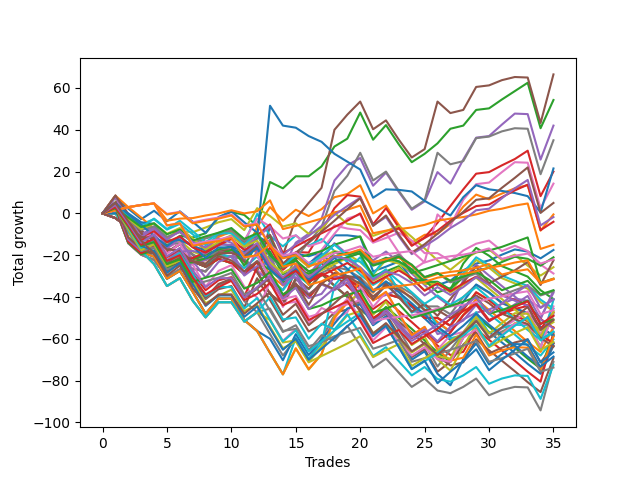

# Long Bulldog 006 
- Symbol: ES
- Date Range: 03/18/2022 - 07/15/2022
- Trading Period: 7:20-12:30
- Number of Trades: 35



| Name | Win Percent | Profit | Avg Profit / Trade | Avg Time / Trade |      | Name | Win Percent | Profit | Avg Profit / Trade | Avg Time / Trade |
| ---- | ----------- | ------ | ------------------ | ---------------- | ---- | ---- | ----------- | ------ | ------------------ | ---------------- |
| Sorted By <br> Profit | | | | | | Sorted By <br> Win Percentage ||||
| Two | 68.57 | 38750.00 | 1107.14 | 19:27 |     | Eighty-One | 85.71 | -7500.00 | -214.29 | 07:45 |
| Five | 60.00 | 37250.00 | 1064.29 | 27:17 |     | One Hundred Twenty-Six | 80.00 | -15750.00 | -450.00 | 04:38 |
| Four | 60.00 | 24125.00 | 689.29 | 25:54 |     | Eighty-Three | 77.14 | -2000.00 | -57.14 | 14:05 |
| Seven | 60.00 | 18625.00 | 532.14 | 27:09 |     | Eighty-Two | 77.14 | -15625.00 | -446.43 | 11:16 |
| Three | 62.86 | 13500.00 | 385.71 | 20:33 |     | One Hundred Twenty-One | 77.14 | -23125.00 | -660.71 | 04:15 |
| Seventy-Three | 28.57 | 10750.00 | 307.14 | 09:06 |     | Eighty-Four | 71.43 | -875.00 | -25.00 | 16:28 |
| One | 62.86 | 8375.00 | 239.29 | 16:09 |     | One Hundred Eleven | 71.43 | -11000.00 | -314.29 | 02:22 |
| Six | 57.14 | 5000.00 | 142.86 | 25:45 |     | Two | 68.57 | 38750.00 | 1107.14 | 19:27 |
| Eighty-Five | 68.57 | 2500.00 | 71.43 | 19:06 |     | Eighty-Five | 68.57 | 2500.00 | 71.43 | 19:06 |
| Eighty-Four | 71.43 | -875.00 | -25.00 | 16:28 |     | One Hundred Sixteen | 68.57 | -15625.00 | -446.43 | 02:30 |
| Eighty-Three | 77.14 | -2000.00 | -57.14 | 14:05 |     | One Hundred Twenty-Seven | 68.57 | -25375.00 | -725.00 | 05:53 |
| Eighty-One | 85.71 | -7500.00 | -214.29 | 07:45 |     | One Hundred Twenty-Two | 65.71 | -36875.00 | -1053.57 | 05:40 |
| Sixty-Seven | 51.43 | -8750.00 | -250.00 | 13:22 |     | Three | 62.86 | 13500.00 | 385.71 | 20:33 |
| One Hundred Two | 48.57 | -8750.00 | -250.00 | 01:29 |     | One | 62.86 | 8375.00 | 239.29 | 16:09 |
| Ninety-Two | 42.86 | -8750.00 | -250.00 | 01:07 |     | One Hundred Twenty-Eight | 62.86 | -24500.00 | -700.00 | 08:03 |
| One Hundred Eleven | 71.43 | -11000.00 | -314.29 | 02:22 |     | One Hundred Twenty-Three | 62.86 | -30750.00 | -878.57 | 07:55 |
| Zero | 60.00 | -11500.00 | -328.57 | 10:17 |     | Five | 60.00 | 37250.00 | 1064.29 | 27:17 |
| Ninety-One | 48.57 | -12000.00 | -342.86 | 00:51 |     | Four | 60.00 | 24125.00 | 689.29 | 25:54 |
| One Hundred One | 54.29 | -12125.00 | -346.43 | 01:13 |     | Seven | 60.00 | 18625.00 | 532.14 | 27:09 |
| Sixty-Six | 54.29 | -12750.00 | -364.29 | 12:19 |     | Zero | 60.00 | -11500.00 | -328.57 | 10:17 |
| One Hundred Six | 57.14 | -14250.00 | -407.14 | 01:30 |     | Sixty-Four | 60.00 | -19125.00 | -546.43 | 07:09 |
| One Hundred Seven | 45.71 | -14500.00 | -414.29 | 01:49 |     | One Hundred Twenty-Nine | 60.00 | -20625.00 | -589.29 | 09:33 |
| Ninety-Three | 28.57 | -15125.00 | -432.14 | 01:41 |     | One Hundred Twenty-Four | 60.00 | -28375.00 | -810.71 | 09:37 |
| Eighty-Two | 77.14 | -15625.00 | -446.43 | 11:16 |     | Fifty-Six | 60.00 | -34625.00 | -989.29 | 07:05 |
| One Hundred Sixteen | 68.57 | -15625.00 | -446.43 | 02:30 |     | Six | 57.14 | 5000.00 | 142.86 | 25:45 |
| One Hundred Twenty-Six | 80.00 | -15750.00 | -450.00 | 04:38 |     | One Hundred Six | 57.14 | -14250.00 | -407.14 | 01:30 |
| Ninety-Four | 22.86 | -15750.00 | -450.00 | 02:04 |     | One Hundred Seventeen | 57.14 | -18375.00 | -525.00 | 02:56 |
| Fifty-Eight | 54.29 | -16500.00 | -471.43 | 13:10 |     | One Hundred Twelve | 57.14 | -18625.00 | -532.14 | 03:08 |
| Ninety-Seven | 40.00 | -16750.00 | -478.57 | 00:57 |     | Fifty-Seven | 57.14 | -26750.00 | -764.29 | 10:36 |
| One Hundred Three | 34.29 | -17250.00 | -492.86 | 02:29 |     | One Hundred One | 54.29 | -12125.00 | -346.43 | 01:13 |
| Ninety-Eight | 34.29 | -17875.00 | -510.71 | 01:10 |     | Sixty-Six | 54.29 | -12750.00 | -364.29 | 12:19 |
| Ninety-Nine | 34.29 | -18250.00 | -521.43 | 01:16 |     | Fifty-Eight | 54.29 | -16500.00 | -471.43 | 13:10 |
| One Hundred Seventeen | 57.14 | -18375.00 | -525.00 | 02:56 |     | Sixty-Five | 54.29 | -18625.00 | -532.14 | 10:24 |
| One Hundred Twelve | 57.14 | -18625.00 | -532.14 | 03:08 |     | One Hundred Thirty | 54.29 | -25500.00 | -728.57 | 11:38 |
| Sixty-Five | 54.29 | -18625.00 | -532.14 | 10:24 |     | One Hundred Twenty-Five | 54.29 | -33250.00 | -950.00 | 11:51 |
| Ninety-Six | 45.71 | -19000.00 | -542.86 | 00:49 |     | Sixty-Seven | 51.43 | -8750.00 | -250.00 | 13:22 |
| Sixty-One | 45.71 | -19000.00 | -542.86 | 19:46 |     | One Hundred Two | 48.57 | -8750.00 | -250.00 | 01:29 |
| Sixty-Four | 60.00 | -19125.00 | -546.43 | 07:09 |     | Ninety-One | 48.57 | -12000.00 | -342.86 | 00:51 |
| Fifty | 31.43 | -19250.00 | -550.00 | 05:42 |     | Fifty-Nine | 48.57 | -21875.00 | -625.00 | 14:13 |
| One Hundred Eight | 28.57 | -19250.00 | -550.00 | 02:16 |     | Seventy | 48.57 | -25000.00 | -714.29 | 16:46 |
| One Hundred | 34.29 | -19375.00 | -553.57 | 01:21 |     | One Hundred Seven | 45.71 | -14500.00 | -414.29 | 01:49 |
| One Hundred Four | 28.57 | -19500.00 | -557.14 | 03:13 |     | Ninety-Six | 45.71 | -19000.00 | -542.86 | 00:49 |
| Fifty-One | 25.71 | -19625.00 | -560.71 | 05:51 |     | Sixty-One | 45.71 | -19000.00 | -542.86 | 19:46 |
| One Hundred Nine | 25.71 | -19875.00 | -567.86 | 02:28 |     | Forty | 45.71 | -22125.00 | -632.14 | 04:30 |
| Ninety-Five | 17.14 | -20375.00 | -582.14 | 02:42 |     | Sixty | 45.71 | -22250.00 | -635.71 | 18:31 |
| One Hundred Twenty-Nine | 60.00 | -20625.00 | -589.29 | 09:33 |     | Sixty-Eight | 45.71 | -22625.00 | -646.43 | 16:48 |
| One Hundred Five | 25.71 | -20875.00 | -596.43 | 04:03 |     | One Hundred Thirteen | 45.71 | -26000.00 | -742.86 | 04:33 |
| Fifty-Four | 28.57 | -21250.00 | -607.14 | 06:40 |     | Sixty-Three | 45.71 | -29500.00 | -842.86 | 19:42 |
| One Hundred Ten | 25.71 | -21375.00 | -610.71 | 02:36 |     | Sixty-Two | 45.71 | -33125.00 | -946.43 | 18:25 |
| Fifty-Nine | 48.57 | -21875.00 | -625.00 | 14:13 |     | Seventy-One | 45.71 | -35125.00 | -1003.57 | 17:32 |
| Forty | 45.71 | -22125.00 | -632.14 | 04:30 |     | Sixty-Nine | 45.71 | -35500.00 | -1014.29 | 17:37 |
| Sixty | 45.71 | -22250.00 | -635.71 | 18:31 |     | Ninety-Two | 42.86 | -8750.00 | -250.00 | 01:07 |
| Sixty-Eight | 45.71 | -22625.00 | -646.43 | 16:48 |     | Forty-Eight | 42.86 | -23000.00 | -657.14 | 03:38 |
| Forty-Six | 34.29 | -22875.00 | -653.57 | 11:46 |     | Ninety-Seven | 40.00 | -16750.00 | -478.57 | 00:57 |
| Forty-Eight | 42.86 | -23000.00 | -657.14 | 03:38 |     | One Hundred Eighteen | 40.00 | -27375.00 | -782.14 | 04:04 |
| One Hundred Twenty-One | 77.14 | -23125.00 | -660.71 | 04:15 |     | One Hundred Fourteen | 40.00 | -28250.00 | -807.14 | 05:29 |
| One Hundred Twenty-Eight | 62.86 | -24500.00 | -700.00 | 08:03 |     | One Hundred Three | 34.29 | -17250.00 | -492.86 | 02:29 |
| Seventy | 48.57 | -25000.00 | -714.29 | 16:46 |     | Ninety-Eight | 34.29 | -17875.00 | -510.71 | 01:10 |
| Forty-Three | 28.57 | -25000.00 | -714.29 | 08:48 |     | Ninety-Nine | 34.29 | -18250.00 | -521.43 | 01:16 |
| One Hundred Twenty-Seven | 68.57 | -25375.00 | -725.00 | 05:53 |     | One Hundred | 34.29 | -19375.00 | -553.57 | 01:21 |
| One Hundred Thirty | 54.29 | -25500.00 | -728.57 | 11:38 |     | Forty-Six | 34.29 | -22875.00 | -653.57 | 11:46 |
| One Hundred Thirteen | 45.71 | -26000.00 | -742.86 | 04:33 |     | Forty-One | 34.29 | -26500.00 | -757.14 | 06:38 |
| Forty-One | 34.29 | -26500.00 | -757.14 | 06:38 |     | One Hundred Fifteen | 34.29 | -34250.00 | -978.57 | 06:50 |
| Forty-Two | 31.43 | -26625.00 | -760.71 | 08:33 |     | Fifty | 31.43 | -19250.00 | -550.00 | 05:42 |
| Fifty-Seven | 57.14 | -26750.00 | -764.29 | 10:36 |     | Forty-Two | 31.43 | -26625.00 | -760.71 | 08:33 |
| One Hundred Eighteen | 40.00 | -27375.00 | -782.14 | 04:04 |     | One Hundred Ninteen | 31.43 | -27500.00 | -785.71 | 04:35 |
| One Hundred Ninteen | 31.43 | -27500.00 | -785.71 | 04:35 |     | Forty-Nine | 31.43 | -27875.00 | -796.43 | 04:59 |
| Forty-Nine | 31.43 | -27875.00 | -796.43 | 04:59 |     | Seventy-Three | 28.57 | 10750.00 | 307.14 | 09:06 |
| One Hundred Fourteen | 40.00 | -28250.00 | -807.14 | 05:29 |     | Ninety-Three | 28.57 | -15125.00 | -432.14 | 01:41 |
| One Hundred Twenty-Four | 60.00 | -28375.00 | -810.71 | 09:37 |     | One Hundred Eight | 28.57 | -19250.00 | -550.00 | 02:16 |
| Forty-Five | 28.57 | -28625.00 | -817.86 | 12:25 |     | One Hundred Four | 28.57 | -19500.00 | -557.14 | 03:13 |
| Forty-Four | 28.57 | -29000.00 | -828.57 | 11:30 |     | Fifty-Four | 28.57 | -21250.00 | -607.14 | 06:40 |
| Fifty-Two | 25.71 | -29250.00 | -835.71 | 06:46 |     | Forty-Three | 28.57 | -25000.00 | -714.29 | 08:48 |
| Sixty-Three | 45.71 | -29500.00 | -842.86 | 19:42 |     | Forty-Five | 28.57 | -28625.00 | -817.86 | 12:25 |
| One Hundred Twenty-Three | 62.86 | -30750.00 | -878.57 | 07:55 |     | Forty-Four | 28.57 | -29000.00 | -828.57 | 11:30 |
| Fifty-Five | 25.71 | -31125.00 | -889.29 | 06:56 |     | Forty-Seven | 28.57 | -34625.00 | -989.29 | 12:35 |
| Fifty-Three | 25.71 | -31125.00 | -889.29 | 06:56 |     | Fifty-One | 25.71 | -19625.00 | -560.71 | 05:51 |
| One Hundred Twenty | 25.71 | -31875.00 | -910.71 | 05:19 |     | One Hundred Nine | 25.71 | -19875.00 | -567.86 | 02:28 |
| Sixty-Two | 45.71 | -33125.00 | -946.43 | 18:25 |     | One Hundred Five | 25.71 | -20875.00 | -596.43 | 04:03 |
| One Hundred Twenty-Five | 54.29 | -33250.00 | -950.00 | 11:51 |     | One Hundred Ten | 25.71 | -21375.00 | -610.71 | 02:36 |
| One Hundred Fifteen | 34.29 | -34250.00 | -978.57 | 06:50 |     | Fifty-Two | 25.71 | -29250.00 | -835.71 | 06:46 |
| Fifty-Six | 60.00 | -34625.00 | -989.29 | 07:05 |     | Fifty-Five | 25.71 | -31125.00 | -889.29 | 06:56 |
| Forty-Seven | 28.57 | -34625.00 | -989.29 | 12:35 |     | Fifty-Three | 25.71 | -31125.00 | -889.29 | 06:56 |
| Seventy-One | 45.71 | -35125.00 | -1003.57 | 17:32 |     | One Hundred Twenty | 25.71 | -31875.00 | -910.71 | 05:19 |
| Sixty-Nine | 45.71 | -35500.00 | -1014.29 | 17:37 |     | Ninety-Four | 22.86 | -15750.00 | -450.00 | 02:04 |
| One Hundred Twenty-Two | 65.71 | -36875.00 | -1053.57 | 05:40 |     | Ninety-Five | 17.14 | -20375.00 | -582.14 | 02:42 |

## NO STOPLOSS

### Test Zero
* Sell when price hits the middle line of the 20p bollinger
* No Stoploss
* Results:
```
Total Trades: 35
Percent Up: 60.00
Percent Down: 40.00
Total Points Moved Up: -23.00
Potential Profit: -11500.00
Total Points Ups: 58.00 Count Ups: 21
Total Points Downs: -81.00 Count Downs: 14
```

<details><summary>Trades</summary>

<code>In: 2022-03-25 08:30:00		Out: 2022-03-25 08:36:40		Total Position Time: 06:40		Total Move Up: 4.00		Total to Date: 4.00</code> <br />
<code>In: 2022-03-28 08:28:00		Out: 2022-03-28 08:57:55		Total Position Time: 29:55		Total Move Up: -16.50		Total to Date: -12.50</code> <br />
<code>In: 2022-03-28 08:39:00		Out: 2022-03-28 09:01:50		Total Position Time: 22:50		Total Move Up: -5.75		Total to Date: -18.25</code> <br />
<code>In: 2022-03-28 08:52:00		Out: 2022-03-28 09:01:50		Total Position Time: 09:50		Total Move Up: 0.75		Total to Date: -17.50</code> <br />
<code>In: 2022-03-30 08:03:00		Out: 2022-03-30 08:19:20		Total Position Time: 16:20		Total Move Up: -5.75		Total to Date: -23.25</code> <br />
<code>In: 2022-03-30 08:14:00		Out: 2022-03-30 08:19:20		Total Position Time: 05:20		Total Move Up: 3.00		Total to Date: -20.25</code> <br />
<code>In: 2022-03-30 12:07:00		Out: 2022-03-30 12:28:15		Total Position Time: 21:15		Total Move Up: -5.75		Total to Date: -26.00</code> <br />
<code>In: 2022-03-30 12:14:00		Out: 2022-03-30 12:28:15		Total Position Time: 14:15		Total Move Up: -3.00		Total to Date: -29.00</code> <br />
<code>In: 2022-03-30 12:27:00		Out: 2022-03-30 12:28:15		Total Position Time: 01:15		Total Move Up: 2.50		Total to Date: -26.50</code> <br />
<code>In: 2022-04-06 09:23:00		Out: 2022-04-06 09:31:15		Total Position Time: 08:15		Total Move Up: 1.50		Total to Date: -25.00</code> <br />
<code>In: 2022-04-18 08:30:00		Out: 2022-04-18 08:55:05		Total Position Time: 25:05		Total Move Up: -5.25		Total to Date: -30.25</code> <br />
<code>In: 2022-05-02 10:06:00		Out: 2022-05-02 10:08:15		Total Position Time: 02:15		Total Move Up: 10.50		Total to Date: -19.75</code> <br />
<code>In: 2022-05-04 11:37:00		Out: 2022-05-04 11:40:45		Total Position Time: 03:45		Total Move Up: -1.25		Total to Date: -21.00</code> <br />
<code>In: 2022-05-09 07:27:00		Out: 2022-05-09 07:42:30		Total Position Time: 15:30		Total Move Up: -6.25		Total to Date: -27.25</code> <br />
<code>In: 2022-05-11 11:01:00		Out: 2022-05-11 11:01:10		Total Position Time: 00:10		Total Move Up: 1.50		Total to Date: -25.75</code> <br />
<code>In: 2022-05-12 11:35:00		Out: 2022-05-12 11:45:20		Total Position Time: 10:20		Total Move Up: -1.25		Total to Date: -27.00</code> <br />
<code>In: 2022-05-17 07:48:00		Out: 2022-05-17 07:55:10		Total Position Time: 07:10		Total Move Up: 2.00		Total to Date: -25.00</code> <br />
<code>In: 2022-05-17 11:25:00		Out: 2022-05-17 11:31:30		Total Position Time: 06:30		Total Move Up: 4.25		Total to Date: -20.75</code> <br />
<code>In: 2022-05-25 09:30:00		Out: 2022-05-25 09:41:25		Total Position Time: 11:25		Total Move Up: 0.00		Total to Date: -20.75</code> <br />
<code>In: 2022-05-25 11:11:00		Out: 2022-05-25 11:11:10		Total Position Time: 00:10		Total Move Up: -0.75		Total to Date: -21.50</code> <br />
<code>In: 2022-06-08 09:30:00		Out: 2022-06-08 09:54:10		Total Position Time: 24:10		Total Move Up: -15.50		Total to Date: -37.00</code> <br />
<code>In: 2022-06-09 08:10:00		Out: 2022-06-09 08:11:10		Total Position Time: 01:10		Total Move Up: 3.25		Total to Date: -33.75</code> <br />
<code>In: 2022-06-09 11:27:00		Out: 2022-06-09 11:28:10		Total Position Time: 01:10		Total Move Up: 3.00		Total to Date: -30.75</code> <br />
<code>In: 2022-06-15 07:58:00		Out: 2022-06-15 08:27:55		Total Position Time: 29:55		Total Move Up: -8.50		Total to Date: -39.25</code> <br />
<code>In: 2022-06-15 08:16:00		Out: 2022-06-15 08:32:00		Total Position Time: 16:00		Total Move Up: 0.00		Total to Date: -39.25</code> <br />
<code>In: 2022-06-17 07:38:00		Out: 2022-06-17 07:55:05		Total Position Time: 17:05		Total Move Up: -2.75		Total to Date: -42.00</code> <br />
<code>In: 2022-06-23 09:07:00		Out: 2022-06-23 09:17:10		Total Position Time: 10:10		Total Move Up: 0.75		Total to Date: -41.25</code> <br />
<code>In: 2022-06-27 12:08:00		Out: 2022-06-27 12:10:20		Total Position Time: 02:20		Total Move Up: 6.00		Total to Date: -35.25</code> <br />
<code>In: 2022-06-29 08:26:00		Out: 2022-06-29 08:29:10		Total Position Time: 03:10		Total Move Up: 4.00		Total to Date: -31.25</code> <br />
<code>In: 2022-06-29 09:16:00		Out: 2022-06-29 09:21:05		Total Position Time: 05:05		Total Move Up: 1.50		Total to Date: -29.75</code> <br />
<code>In: 2022-07-05 08:05:00		Out: 2022-07-05 08:08:20		Total Position Time: 03:20		Total Move Up: 2.75		Total to Date: -27.00</code> <br />
<code>In: 2022-07-05 08:08:00		Out: 2022-07-05 08:08:20		Total Position Time: 00:20		Total Move Up: 2.50		Total to Date: -24.50</code> <br />
<code>In: 2022-07-06 08:35:00		Out: 2022-07-06 08:46:30		Total Position Time: 11:30		Total Move Up: 0.25		Total to Date: -24.25</code> <br />
<code>In: 2022-07-12 12:07:00		Out: 2022-07-12 12:20:20		Total Position Time: 13:20		Total Move Up: -2.75		Total to Date: -27.00</code> <br />
<code>In: 2022-07-13 07:23:00		Out: 2022-07-13 07:26:20		Total Position Time: 03:20		Total Move Up: 4.00		Total to Date: -23.00</code> <br />


</details>

### Test One
* Sell when the price hits the upper line of the 20p 1std bollinger
* No Stoploss
* Results:
```
Total Trades: 35
Percent Up: 62.86
Percent Down: 37.14
Total Points Moved Up: 16.75
Potential Profit: 8375.00
Total Points Ups: 113.25 Count Ups: 22
Total Points Downs: -96.50 Count Downs: 13
```

<details><summary>Trades</summary>

<code>In: 2022-03-25 08:30:00		Out: 2022-03-25 08:41:05		Total Position Time: 11:05		Total Move Up: 5.25		Total to Date: 5.25</code> <br />
<code>In: 2022-03-28 08:28:00		Out: 2022-03-28 08:57:55		Total Position Time: 29:55		Total Move Up: -16.50		Total to Date: -11.25</code> <br />
<code>In: 2022-03-28 08:39:00		Out: 2022-03-28 09:04:55		Total Position Time: 25:55		Total Move Up: -4.00		Total to Date: -15.25</code> <br />
<code>In: 2022-03-28 08:52:00		Out: 2022-03-28 09:04:55		Total Position Time: 12:55		Total Move Up: 2.50		Total to Date: -12.75</code> <br />
<code>In: 2022-03-30 08:03:00		Out: 2022-03-30 08:32:55		Total Position Time: 29:55		Total Move Up: -8.25		Total to Date: -21.00</code> <br />
<code>In: 2022-03-30 08:14:00		Out: 2022-03-30 08:34:45		Total Position Time: 20:45		Total Move Up: 3.00		Total to Date: -18.00</code> <br />
<code>In: 2022-03-30 12:07:00		Out: 2022-03-30 12:32:20		Total Position Time: 25:20		Total Move Up: -3.50		Total to Date: -21.50</code> <br />
<code>In: 2022-03-30 12:14:00		Out: 2022-03-30 12:32:20		Total Position Time: 18:20		Total Move Up: -0.75		Total to Date: -22.25</code> <br />
<code>In: 2022-03-30 12:27:00		Out: 2022-03-30 12:32:20		Total Position Time: 05:20		Total Move Up: 4.75		Total to Date: -17.50</code> <br />
<code>In: 2022-04-06 09:23:00		Out: 2022-04-06 09:34:05		Total Position Time: 11:05		Total Move Up: 1.50		Total to Date: -16.00</code> <br />
<code>In: 2022-04-18 08:30:00		Out: 2022-04-18 08:57:20		Total Position Time: 27:20		Total Move Up: -3.75		Total to Date: -19.75</code> <br />
<code>In: 2022-05-02 10:06:00		Out: 2022-05-02 10:10:55		Total Position Time: 04:55		Total Move Up: 14.00		Total to Date: -5.75</code> <br />
<code>In: 2022-05-04 11:37:00		Out: 2022-05-04 11:41:40		Total Position Time: 04:40		Total Move Up: 10.75		Total to Date: 5.00</code> <br />
<code>In: 2022-05-09 07:27:00		Out: 2022-05-09 07:46:05		Total Position Time: 19:05		Total Move Up: -4.50		Total to Date: 0.50</code> <br />
<code>In: 2022-05-11 11:01:00		Out: 2022-05-11 11:01:20		Total Position Time: 00:20		Total Move Up: 5.25		Total to Date: 5.75</code> <br />
<code>In: 2022-05-12 11:35:00		Out: 2022-05-12 11:52:55		Total Position Time: 17:55		Total Move Up: -0.50		Total to Date: 5.25</code> <br />
<code>In: 2022-05-17 07:48:00		Out: 2022-05-17 07:59:05		Total Position Time: 11:05		Total Move Up: 3.50		Total to Date: 8.75</code> <br />
<code>In: 2022-05-17 11:25:00		Out: 2022-05-17 11:37:35		Total Position Time: 12:35		Total Move Up: 5.75		Total to Date: 14.50</code> <br />
<code>In: 2022-05-25 09:30:00		Out: 2022-05-25 09:44:25		Total Position Time: 14:25		Total Move Up: 1.50		Total to Date: 16.00</code> <br />
<code>In: 2022-05-25 11:11:00		Out: 2022-05-25 11:15:55		Total Position Time: 04:55		Total Move Up: 5.25		Total to Date: 21.25</code> <br />
<code>In: 2022-06-08 09:30:00		Out: 2022-06-08 09:59:05		Total Position Time: 29:05		Total Move Up: -13.50		Total to Date: 7.75</code> <br />
<code>In: 2022-06-09 08:10:00		Out: 2022-06-09 08:21:10		Total Position Time: 11:10		Total Move Up: 4.75		Total to Date: 12.50</code> <br />
<code>In: 2022-06-09 11:27:00		Out: 2022-06-09 11:56:55		Total Position Time: 29:55		Total Move Up: -9.25		Total to Date: 3.25</code> <br />
<code>In: 2022-06-15 07:58:00		Out: 2022-06-15 08:27:55		Total Position Time: 29:55		Total Move Up: -8.50		Total to Date: -5.25</code> <br />
<code>In: 2022-06-15 08:16:00		Out: 2022-06-15 08:38:55		Total Position Time: 22:55		Total Move Up: 3.75		Total to Date: -1.50</code> <br />
<code>In: 2022-06-17 07:38:00		Out: 2022-06-17 07:56:20		Total Position Time: 18:20		Total Move Up: 1.00		Total to Date: -0.50</code> <br />
<code>In: 2022-06-23 09:07:00		Out: 2022-06-23 09:18:25		Total Position Time: 11:25		Total Move Up: 4.75		Total to Date: 4.25</code> <br />
<code>In: 2022-06-27 12:08:00		Out: 2022-06-27 12:12:10		Total Position Time: 04:10		Total Move Up: 9.00		Total to Date: 13.25</code> <br />
<code>In: 2022-06-29 08:26:00		Out: 2022-06-29 08:33:05		Total Position Time: 07:05		Total Move Up: 6.75		Total to Date: 20.00</code> <br />
<code>In: 2022-06-29 09:16:00		Out: 2022-06-29 09:37:20		Total Position Time: 21:20		Total Move Up: -1.75		Total to Date: 18.25</code> <br />
<code>In: 2022-07-05 08:05:00		Out: 2022-07-05 08:16:45		Total Position Time: 11:45		Total Move Up: 3.50		Total to Date: 21.75</code> <br />
<code>In: 2022-07-05 08:08:00		Out: 2022-07-05 08:16:45		Total Position Time: 08:45		Total Move Up: 3.25		Total to Date: 25.00</code> <br />
<code>In: 2022-07-06 08:35:00		Out: 2022-07-06 08:48:20		Total Position Time: 13:20		Total Move Up: 1.75		Total to Date: 26.75</code> <br />
<code>In: 2022-07-12 12:07:00		Out: 2022-07-12 12:36:55		Total Position Time: 29:55		Total Move Up: -21.75		Total to Date: 5.00</code> <br />
<code>In: 2022-07-13 07:23:00		Out: 2022-07-13 07:31:20		Total Position Time: 08:20		Total Move Up: 11.75		Total to Date: 16.75</code> <br />


</details>

### Test Two
* Sell when the price hits the upper line of the 20p 2std bollinger
* No Stoploss
* Results:
```
Total Trades: 35
Percent Up: 68.57
Percent Down: 31.43
Total Points Moved Up: 77.50
Potential Profit: 38750.00
Total Points Ups: 165.00 Count Ups: 24
Total Points Downs: -87.50 Count Downs: 11
```

<details><summary>Trades</summary>

<code>In: 2022-03-25 08:30:00		Out: 2022-03-25 08:41:55		Total Position Time: 11:55		Total Move Up: 9.50		Total to Date: 9.50</code> <br />
<code>In: 2022-03-28 08:28:00		Out: 2022-03-28 08:57:55		Total Position Time: 29:55		Total Move Up: -16.50		Total to Date: -7.00</code> <br />
<code>In: 2022-03-28 08:39:00		Out: 2022-03-28 09:07:10		Total Position Time: 28:10		Total Move Up: -2.50		Total to Date: -9.50</code> <br />
<code>In: 2022-03-28 08:52:00		Out: 2022-03-28 09:07:10		Total Position Time: 15:10		Total Move Up: 4.00		Total to Date: -5.50</code> <br />
<code>In: 2022-03-30 08:03:00		Out: 2022-03-30 08:32:55		Total Position Time: 29:55		Total Move Up: -8.25		Total to Date: -13.75</code> <br />
<code>In: 2022-03-30 08:14:00		Out: 2022-03-30 08:35:15		Total Position Time: 21:15		Total Move Up: 4.75		Total to Date: -9.00</code> <br />
<code>In: 2022-03-30 12:07:00		Out: 2022-03-30 12:36:25		Total Position Time: 29:25		Total Move Up: -0.50		Total to Date: -9.50</code> <br />
<code>In: 2022-03-30 12:14:00		Out: 2022-03-30 12:36:25		Total Position Time: 22:25		Total Move Up: 2.25		Total to Date: -7.25</code> <br />
<code>In: 2022-03-30 12:27:00		Out: 2022-03-30 12:36:25		Total Position Time: 09:25		Total Move Up: 7.75		Total to Date: 0.50</code> <br />
<code>In: 2022-04-06 09:23:00		Out: 2022-04-06 09:34:25		Total Position Time: 11:25		Total Move Up: 2.75		Total to Date: 3.25</code> <br />
<code>In: 2022-04-18 08:30:00		Out: 2022-04-18 08:59:35		Total Position Time: 29:35		Total Move Up: -1.50		Total to Date: 1.75</code> <br />
<code>In: 2022-05-02 10:06:00		Out: 2022-05-02 10:35:55		Total Position Time: 29:55		Total Move Up: -5.25		Total to Date: -3.50</code> <br />
<code>In: 2022-05-04 11:37:00		Out: 2022-05-04 11:43:55		Total Position Time: 06:55		Total Move Up: 25.75		Total to Date: 22.25</code> <br />
<code>In: 2022-05-09 07:27:00		Out: 2022-05-09 07:49:10		Total Position Time: 22:10		Total Move Up: -0.50		Total to Date: 21.75</code> <br />
<code>In: 2022-05-11 11:01:00		Out: 2022-05-11 11:04:55		Total Position Time: 03:55		Total Move Up: 9.25		Total to Date: 31.00</code> <br />
<code>In: 2022-05-12 11:35:00		Out: 2022-05-12 11:53:25		Total Position Time: 18:25		Total Move Up: 1.75		Total to Date: 32.75</code> <br />
<code>In: 2022-05-17 07:48:00		Out: 2022-05-17 08:00:05		Total Position Time: 12:05		Total Move Up: 6.00		Total to Date: 38.75</code> <br />
<code>In: 2022-05-17 11:25:00		Out: 2022-05-17 11:40:00		Total Position Time: 15:00		Total Move Up: 9.50		Total to Date: 48.25</code> <br />
<code>In: 2022-05-25 09:30:00		Out: 2022-05-25 09:45:20		Total Position Time: 15:20		Total Move Up: 3.75		Total to Date: 52.00</code> <br />
<code>In: 2022-05-25 11:11:00		Out: 2022-05-25 11:16:50		Total Position Time: 05:50		Total Move Up: 12.50		Total to Date: 64.50</code> <br />
<code>In: 2022-06-08 09:30:00		Out: 2022-06-08 09:59:10		Total Position Time: 29:10		Total Move Up: -13.00		Total to Date: 51.50</code> <br />
<code>In: 2022-06-09 08:10:00		Out: 2022-06-09 08:22:35		Total Position Time: 12:35		Total Move Up: 7.00		Total to Date: 58.50</code> <br />
<code>In: 2022-06-09 11:27:00		Out: 2022-06-09 11:56:55		Total Position Time: 29:55		Total Move Up: -9.25		Total to Date: 49.25</code> <br />
<code>In: 2022-06-15 07:58:00		Out: 2022-06-15 08:27:55		Total Position Time: 29:55		Total Move Up: -8.50		Total to Date: 40.75</code> <br />
<code>In: 2022-06-15 08:16:00		Out: 2022-06-15 08:45:55		Total Position Time: 29:55		Total Move Up: 4.00		Total to Date: 44.75</code> <br />
<code>In: 2022-06-17 07:38:00		Out: 2022-06-17 08:02:30		Total Position Time: 24:30		Total Move Up: 7.00		Total to Date: 51.75</code> <br />
<code>In: 2022-06-23 09:07:00		Out: 2022-06-23 09:19:05		Total Position Time: 12:05		Total Move Up: 7.00		Total to Date: 58.75</code> <br />
<code>In: 2022-06-27 12:08:00		Out: 2022-06-27 12:37:55		Total Position Time: 29:55		Total Move Up: 1.50		Total to Date: 60.25</code> <br />
<code>In: 2022-06-29 08:26:00		Out: 2022-06-29 08:35:35		Total Position Time: 09:35		Total Move Up: 10.75		Total to Date: 71.00</code> <br />
<code>In: 2022-06-29 09:16:00		Out: 2022-06-29 09:38:35		Total Position Time: 22:35		Total Move Up: 1.00		Total to Date: 72.00</code> <br />
<code>In: 2022-07-05 08:05:00		Out: 2022-07-05 08:20:35		Total Position Time: 15:35		Total Move Up: 5.00		Total to Date: 77.00</code> <br />
<code>In: 2022-07-05 08:08:00		Out: 2022-07-05 08:20:35		Total Position Time: 12:35		Total Move Up: 4.75		Total to Date: 81.75</code> <br />
<code>In: 2022-07-06 08:35:00		Out: 2022-07-06 08:51:15		Total Position Time: 16:15		Total Move Up: 4.00		Total to Date: 85.75</code> <br />
<code>In: 2022-07-12 12:07:00		Out: 2022-07-12 12:36:55		Total Position Time: 29:55		Total Move Up: -21.75		Total to Date: 64.00</code> <br />
<code>In: 2022-07-13 07:23:00		Out: 2022-07-13 07:31:30		Total Position Time: 08:30		Total Move Up: 13.50		Total to Date: 77.50</code> <br />


</details>

### Test Three
* Sell when price hits the middle line of the 50p bollinger
* No Stoploss
* Results:
```
Total Trades: 35
Percent Up: 62.86
Percent Down: 37.14
Total Points Moved Up: 27.00
Potential Profit: 13500.00
Total Points Ups: 135.50 Count Ups: 22
Total Points Downs: -108.50 Count Downs: 13
```

<details><summary>Trades</summary>

<code>In: 2022-03-25 08:30:00		Out: 2022-03-25 08:53:00		Total Position Time: 23:00		Total Move Up: 8.75		Total to Date: 8.75</code> <br />
<code>In: 2022-03-28 08:28:00		Out: 2022-03-28 08:57:55		Total Position Time: 29:55		Total Move Up: -16.50		Total to Date: -7.75</code> <br />
<code>In: 2022-03-28 08:39:00		Out: 2022-03-28 09:08:55		Total Position Time: 29:55		Total Move Up: -5.50		Total to Date: -13.25</code> <br />
<code>In: 2022-03-28 08:52:00		Out: 2022-03-28 09:21:55		Total Position Time: 29:55		Total Move Up: -2.50		Total to Date: -15.75</code> <br />
<code>In: 2022-03-30 08:03:00		Out: 2022-03-30 08:32:55		Total Position Time: 29:55		Total Move Up: -8.25		Total to Date: -24.00</code> <br />
<code>In: 2022-03-30 08:14:00		Out: 2022-03-30 08:35:20		Total Position Time: 21:20		Total Move Up: 5.25		Total to Date: -18.75</code> <br />
<code>In: 2022-03-30 12:07:00		Out: 2022-03-30 12:33:25		Total Position Time: 26:25		Total Move Up: -1.75		Total to Date: -20.50</code> <br />
<code>In: 2022-03-30 12:14:00		Out: 2022-03-30 12:33:25		Total Position Time: 19:25		Total Move Up: 1.00		Total to Date: -19.50</code> <br />
<code>In: 2022-03-30 12:27:00		Out: 2022-03-30 12:33:25		Total Position Time: 06:25		Total Move Up: 6.50		Total to Date: -13.00</code> <br />
<code>In: 2022-04-06 09:23:00		Out: 2022-04-06 09:52:55		Total Position Time: 29:55		Total Move Up: 0.00		Total to Date: -13.00</code> <br />
<code>In: 2022-04-18 08:30:00		Out: 2022-04-18 08:59:55		Total Position Time: 29:55		Total Move Up: -1.50		Total to Date: -14.50</code> <br />
<code>In: 2022-05-02 10:06:00		Out: 2022-05-02 10:35:55		Total Position Time: 29:55		Total Move Up: -5.25		Total to Date: -19.75</code> <br />
<code>In: 2022-05-04 11:37:00		Out: 2022-05-04 11:41:15		Total Position Time: 04:15		Total Move Up: 5.25		Total to Date: -14.50</code> <br />
<code>In: 2022-05-09 07:27:00		Out: 2022-05-09 07:56:55		Total Position Time: 29:55		Total Move Up: -13.75		Total to Date: -28.25</code> <br />
<code>In: 2022-05-11 11:01:00		Out: 2022-05-11 11:05:00		Total Position Time: 04:00		Total Move Up: 11.00		Total to Date: -17.25</code> <br />
<code>In: 2022-05-12 11:35:00		Out: 2022-05-12 11:53:25		Total Position Time: 18:25		Total Move Up: 1.75		Total to Date: -15.50</code> <br />
<code>In: 2022-05-17 07:48:00		Out: 2022-05-17 08:04:10		Total Position Time: 16:10		Total Move Up: 10.25		Total to Date: -5.25</code> <br />
<code>In: 2022-05-17 11:25:00		Out: 2022-05-17 11:40:05		Total Position Time: 15:05		Total Move Up: 11.00		Total to Date: 5.75</code> <br />
<code>In: 2022-05-25 09:30:00		Out: 2022-05-25 09:49:05		Total Position Time: 19:05		Total Move Up: 6.25		Total to Date: 12.00</code> <br />
<code>In: 2022-05-25 11:11:00		Out: 2022-05-25 11:11:10		Total Position Time: 00:10		Total Move Up: -0.75		Total to Date: 11.25</code> <br />
<code>In: 2022-06-08 09:30:00		Out: 2022-06-08 09:59:55		Total Position Time: 29:55		Total Move Up: -13.25		Total to Date: -2.00</code> <br />
<code>In: 2022-06-09 08:10:00		Out: 2022-06-09 08:22:45		Total Position Time: 12:45		Total Move Up: 7.75		Total to Date: 5.75</code> <br />
<code>In: 2022-06-09 11:27:00		Out: 2022-06-09 11:56:55		Total Position Time: 29:55		Total Move Up: -9.25		Total to Date: -3.50</code> <br />
<code>In: 2022-06-15 07:58:00		Out: 2022-06-15 08:27:55		Total Position Time: 29:55		Total Move Up: -8.50		Total to Date: -12.00</code> <br />
<code>In: 2022-06-15 08:16:00		Out: 2022-06-15 08:38:55		Total Position Time: 22:55		Total Move Up: 3.75		Total to Date: -8.25</code> <br />
<code>In: 2022-06-17 07:38:00		Out: 2022-06-17 08:02:30		Total Position Time: 24:30		Total Move Up: 7.00		Total to Date: -1.25</code> <br />
<code>In: 2022-06-23 09:07:00		Out: 2022-06-23 09:21:10		Total Position Time: 14:10		Total Move Up: 8.00		Total to Date: 6.75</code> <br />
<code>In: 2022-06-27 12:08:00		Out: 2022-06-27 12:11:50		Total Position Time: 03:50		Total Move Up: 8.00		Total to Date: 14.75</code> <br />
<code>In: 2022-06-29 08:26:00		Out: 2022-06-29 08:35:35		Total Position Time: 09:35		Total Move Up: 10.75		Total to Date: 25.50</code> <br />
<code>In: 2022-06-29 09:16:00		Out: 2022-06-29 09:38:30		Total Position Time: 22:30		Total Move Up: 0.75		Total to Date: 26.25</code> <br />
<code>In: 2022-07-05 08:05:00		Out: 2022-07-05 08:32:25		Total Position Time: 27:25		Total Move Up: 3.50		Total to Date: 29.75</code> <br />
<code>In: 2022-07-05 08:08:00		Out: 2022-07-05 08:32:25		Total Position Time: 24:25		Total Move Up: 3.25		Total to Date: 33.00</code> <br />
<code>In: 2022-07-06 08:35:00		Out: 2022-07-06 08:51:15		Total Position Time: 16:15		Total Move Up: 4.00		Total to Date: 37.00</code> <br />
<code>In: 2022-07-12 12:07:00		Out: 2022-07-12 12:36:55		Total Position Time: 29:55		Total Move Up: -21.75		Total to Date: 15.25</code> <br />
<code>In: 2022-07-13 07:23:00		Out: 2022-07-13 07:31:20		Total Position Time: 08:20		Total Move Up: 11.75		Total to Date: 27.00</code> <br />


</details>

### Test Four
* Sell when the price hits the upper line of the 50p 1std bollinger
* No Stoploss
* Results:
```
Total Trades: 35
Percent Up: 60.00
Percent Down: 40.00
Total Points Moved Up: 48.25
Potential Profit: 24125.00
Total Points Ups: 161.25 Count Ups: 21
Total Points Downs: -113.00 Count Downs: 14
```

<details><summary>Trades</summary>

<code>In: 2022-03-25 08:30:00		Out: 2022-03-25 08:59:55		Total Position Time: 29:55		Total Move Up: 2.25		Total to Date: 2.25</code> <br />
<code>In: 2022-03-28 08:28:00		Out: 2022-03-28 08:57:55		Total Position Time: 29:55		Total Move Up: -16.50		Total to Date: -14.25</code> <br />
<code>In: 2022-03-28 08:39:00		Out: 2022-03-28 09:08:55		Total Position Time: 29:55		Total Move Up: -5.50		Total to Date: -19.75</code> <br />
<code>In: 2022-03-28 08:52:00		Out: 2022-03-28 09:21:55		Total Position Time: 29:55		Total Move Up: -2.50		Total to Date: -22.25</code> <br />
<code>In: 2022-03-30 08:03:00		Out: 2022-03-30 08:32:55		Total Position Time: 29:55		Total Move Up: -8.25		Total to Date: -30.50</code> <br />
<code>In: 2022-03-30 08:14:00		Out: 2022-03-30 08:43:55		Total Position Time: 29:55		Total Move Up: 3.75		Total to Date: -26.75</code> <br />
<code>In: 2022-03-30 12:07:00		Out: 2022-03-30 12:36:55		Total Position Time: 29:55		Total Move Up: 0.25		Total to Date: -26.50</code> <br />
<code>In: 2022-03-30 12:14:00		Out: 2022-03-30 12:43:55		Total Position Time: 29:55		Total Move Up: -1.25		Total to Date: -27.75</code> <br />
<code>In: 2022-03-30 12:27:00		Out: 2022-03-30 12:46:00		Total Position Time: 19:00		Total Move Up: 7.25		Total to Date: -20.50</code> <br />
<code>In: 2022-04-06 09:23:00		Out: 2022-04-06 09:52:55		Total Position Time: 29:55		Total Move Up: 0.00		Total to Date: -20.50</code> <br />
<code>In: 2022-04-18 08:30:00		Out: 2022-04-18 08:59:55		Total Position Time: 29:55		Total Move Up: -1.50		Total to Date: -22.00</code> <br />
<code>In: 2022-05-02 10:06:00		Out: 2022-05-02 10:35:55		Total Position Time: 29:55		Total Move Up: -5.25		Total to Date: -27.25</code> <br />
<code>In: 2022-05-04 11:37:00		Out: 2022-05-04 11:42:00		Total Position Time: 05:00		Total Move Up: 14.75		Total to Date: -12.50</code> <br />
<code>In: 2022-05-09 07:27:00		Out: 2022-05-09 07:56:55		Total Position Time: 29:55		Total Move Up: -13.75		Total to Date: -26.25</code> <br />
<code>In: 2022-05-11 11:01:00		Out: 2022-05-11 11:18:15		Total Position Time: 17:15		Total Move Up: 12.25		Total to Date: -14.00</code> <br />
<code>In: 2022-05-12 11:35:00		Out: 2022-05-12 12:04:10		Total Position Time: 29:10		Total Move Up: 6.75		Total to Date: -7.25</code> <br />
<code>In: 2022-05-17 07:48:00		Out: 2022-05-17 08:17:55		Total Position Time: 29:55		Total Move Up: 7.25		Total to Date: 0.00</code> <br />
<code>In: 2022-05-17 11:25:00		Out: 2022-05-17 11:45:45		Total Position Time: 20:45		Total Move Up: 18.75		Total to Date: 18.75</code> <br />
<code>In: 2022-05-25 09:30:00		Out: 2022-05-25 09:59:55		Total Position Time: 29:55		Total Move Up: 7.25		Total to Date: 26.00</code> <br />
<code>In: 2022-05-25 11:11:00		Out: 2022-05-25 11:14:05		Total Position Time: 03:05		Total Move Up: 3.50		Total to Date: 29.50</code> <br />
<code>In: 2022-06-08 09:30:00		Out: 2022-06-08 09:59:55		Total Position Time: 29:55		Total Move Up: -13.25		Total to Date: 16.25</code> <br />
<code>In: 2022-06-09 08:10:00		Out: 2022-06-09 08:39:45		Total Position Time: 29:45		Total Move Up: 6.25		Total to Date: 22.50</code> <br />
<code>In: 2022-06-09 11:27:00		Out: 2022-06-09 11:56:55		Total Position Time: 29:55		Total Move Up: -9.25		Total to Date: 13.25</code> <br />
<code>In: 2022-06-15 07:58:00		Out: 2022-06-15 08:27:55		Total Position Time: 29:55		Total Move Up: -8.50		Total to Date: 4.75</code> <br />
<code>In: 2022-06-15 08:16:00		Out: 2022-06-15 08:45:55		Total Position Time: 29:55		Total Move Up: 4.00		Total to Date: 8.75</code> <br />
<code>In: 2022-06-17 07:38:00		Out: 2022-06-17 08:06:05		Total Position Time: 28:05		Total Move Up: 14.75		Total to Date: 23.50</code> <br />
<code>In: 2022-06-23 09:07:00		Out: 2022-06-23 09:36:55		Total Position Time: 29:55		Total Move Up: -5.50		Total to Date: 18.00</code> <br />
<code>In: 2022-06-27 12:08:00		Out: 2022-06-27 12:15:30		Total Position Time: 07:30		Total Move Up: 11.50		Total to Date: 29.50</code> <br />
<code>In: 2022-06-29 08:26:00		Out: 2022-06-29 08:53:10		Total Position Time: 27:10		Total Move Up: 10.50		Total to Date: 40.00</code> <br />
<code>In: 2022-06-29 09:16:00		Out: 2022-06-29 09:45:55		Total Position Time: 29:55		Total Move Up: 0.75		Total to Date: 40.75</code> <br />
<code>In: 2022-07-05 08:05:00		Out: 2022-07-05 08:33:10		Total Position Time: 28:10		Total Move Up: 6.75		Total to Date: 47.50</code> <br />
<code>In: 2022-07-05 08:08:00		Out: 2022-07-05 08:33:10		Total Position Time: 25:10		Total Move Up: 6.50		Total to Date: 54.00</code> <br />
<code>In: 2022-07-06 08:35:00		Out: 2022-07-06 09:04:55		Total Position Time: 29:55		Total Move Up: -0.25		Total to Date: 53.75</code> <br />
<code>In: 2022-07-12 12:07:00		Out: 2022-07-12 12:36:55		Total Position Time: 29:55		Total Move Up: -21.75		Total to Date: 32.00</code> <br />
<code>In: 2022-07-13 07:23:00		Out: 2022-07-13 07:31:35		Total Position Time: 08:35		Total Move Up: 16.25		Total to Date: 48.25</code> <br />


</details>

### Test Five
* Sell when the price hits the upper line of the 50p 2std bollinger
* No Stoploss
* Results:
```
Total Trades: 35
Percent Up: 60.00
Percent Down: 40.00
Total Points Moved Up: 74.50
Potential Profit: 37250.00
Total Points Ups: 187.50 Count Ups: 21
Total Points Downs: -113.00 Count Downs: 14
```

<details><summary>Trades</summary>

<code>In: 2022-03-25 08:30:00		Out: 2022-03-25 08:59:55		Total Position Time: 29:55		Total Move Up: 2.25		Total to Date: 2.25</code> <br />
<code>In: 2022-03-28 08:28:00		Out: 2022-03-28 08:57:55		Total Position Time: 29:55		Total Move Up: -16.50		Total to Date: -14.25</code> <br />
<code>In: 2022-03-28 08:39:00		Out: 2022-03-28 09:08:55		Total Position Time: 29:55		Total Move Up: -5.50		Total to Date: -19.75</code> <br />
<code>In: 2022-03-28 08:52:00		Out: 2022-03-28 09:21:55		Total Position Time: 29:55		Total Move Up: -2.50		Total to Date: -22.25</code> <br />
<code>In: 2022-03-30 08:03:00		Out: 2022-03-30 08:32:55		Total Position Time: 29:55		Total Move Up: -8.25		Total to Date: -30.50</code> <br />
<code>In: 2022-03-30 08:14:00		Out: 2022-03-30 08:43:55		Total Position Time: 29:55		Total Move Up: 3.75		Total to Date: -26.75</code> <br />
<code>In: 2022-03-30 12:07:00		Out: 2022-03-30 12:36:55		Total Position Time: 29:55		Total Move Up: 0.25		Total to Date: -26.50</code> <br />
<code>In: 2022-03-30 12:14:00		Out: 2022-03-30 12:43:55		Total Position Time: 29:55		Total Move Up: -1.25		Total to Date: -27.75</code> <br />
<code>In: 2022-03-30 12:27:00		Out: 2022-03-30 12:46:00		Total Position Time: 19:00		Total Move Up: 7.25		Total to Date: -20.50</code> <br />
<code>In: 2022-04-06 09:23:00		Out: 2022-04-06 09:52:55		Total Position Time: 29:55		Total Move Up: 0.00		Total to Date: -20.50</code> <br />
<code>In: 2022-04-18 08:30:00		Out: 2022-04-18 08:59:55		Total Position Time: 29:55		Total Move Up: -1.50		Total to Date: -22.00</code> <br />
<code>In: 2022-05-02 10:06:00		Out: 2022-05-02 10:35:55		Total Position Time: 29:55		Total Move Up: -5.25		Total to Date: -27.25</code> <br />
<code>In: 2022-05-04 11:37:00		Out: 2022-05-04 11:43:55		Total Position Time: 06:55		Total Move Up: 25.75		Total to Date: -1.50</code> <br />
<code>In: 2022-05-09 07:27:00		Out: 2022-05-09 07:56:55		Total Position Time: 29:55		Total Move Up: -13.75		Total to Date: -15.25</code> <br />
<code>In: 2022-05-11 11:01:00		Out: 2022-05-11 11:23:40		Total Position Time: 22:40		Total Move Up: 17.50		Total to Date: 2.25</code> <br />
<code>In: 2022-05-12 11:35:00		Out: 2022-05-12 12:04:55		Total Position Time: 29:55		Total Move Up: 7.50		Total to Date: 9.75</code> <br />
<code>In: 2022-05-17 07:48:00		Out: 2022-05-17 08:17:55		Total Position Time: 29:55		Total Move Up: 7.25		Total to Date: 17.00</code> <br />
<code>In: 2022-05-17 11:25:00		Out: 2022-05-17 11:48:45		Total Position Time: 23:45		Total Move Up: 27.75		Total to Date: 44.75</code> <br />
<code>In: 2022-05-25 09:30:00		Out: 2022-05-25 09:59:55		Total Position Time: 29:55		Total Move Up: 7.25		Total to Date: 52.00</code> <br />
<code>In: 2022-05-25 11:11:00		Out: 2022-05-25 11:16:25		Total Position Time: 05:25		Total Move Up: 9.50		Total to Date: 61.50</code> <br />
<code>In: 2022-06-08 09:30:00		Out: 2022-06-08 09:59:55		Total Position Time: 29:55		Total Move Up: -13.25		Total to Date: 48.25</code> <br />
<code>In: 2022-06-09 08:10:00		Out: 2022-06-09 08:39:55		Total Position Time: 29:55		Total Move Up: 4.25		Total to Date: 52.50</code> <br />
<code>In: 2022-06-09 11:27:00		Out: 2022-06-09 11:56:55		Total Position Time: 29:55		Total Move Up: -9.25		Total to Date: 43.25</code> <br />
<code>In: 2022-06-15 07:58:00		Out: 2022-06-15 08:27:55		Total Position Time: 29:55		Total Move Up: -8.50		Total to Date: 34.75</code> <br />
<code>In: 2022-06-15 08:16:00		Out: 2022-06-15 08:45:55		Total Position Time: 29:55		Total Move Up: 4.00		Total to Date: 38.75</code> <br />
<code>In: 2022-06-17 07:38:00		Out: 2022-06-17 08:07:55		Total Position Time: 29:55		Total Move Up: 22.75		Total to Date: 61.50</code> <br />
<code>In: 2022-06-23 09:07:00		Out: 2022-06-23 09:36:55		Total Position Time: 29:55		Total Move Up: -5.50		Total to Date: 56.00</code> <br />
<code>In: 2022-06-27 12:08:00		Out: 2022-06-27 12:37:55		Total Position Time: 29:55		Total Move Up: 1.50		Total to Date: 57.50</code> <br />
<code>In: 2022-06-29 08:26:00		Out: 2022-06-29 08:55:55		Total Position Time: 29:55		Total Move Up: 11.00		Total to Date: 68.50</code> <br />
<code>In: 2022-06-29 09:16:00		Out: 2022-06-29 09:45:55		Total Position Time: 29:55		Total Move Up: 0.75		Total to Date: 69.25</code> <br />
<code>In: 2022-07-05 08:05:00		Out: 2022-07-05 08:34:55		Total Position Time: 29:55		Total Move Up: 2.50		Total to Date: 71.75</code> <br />
<code>In: 2022-07-05 08:08:00		Out: 2022-07-05 08:37:55		Total Position Time: 29:55		Total Move Up: 1.50		Total to Date: 73.25</code> <br />
<code>In: 2022-07-06 08:35:00		Out: 2022-07-06 09:04:55		Total Position Time: 29:55		Total Move Up: -0.25		Total to Date: 73.00</code> <br />
<code>In: 2022-07-12 12:07:00		Out: 2022-07-12 12:36:55		Total Position Time: 29:55		Total Move Up: -21.75		Total to Date: 51.25</code> <br />
<code>In: 2022-07-13 07:23:00		Out: 2022-07-13 07:32:50		Total Position Time: 09:50		Total Move Up: 23.25		Total to Date: 74.50</code> <br />


</details>

### Test Six
* Sell when the price hits the middle line of the 1std VWAP
* No Stoploss
* Results:
```
Total Trades: 35
Percent Up: 57.14
Percent Down: 42.86
Total Points Moved Up: 10.00
Potential Profit: 5000.00
Total Points Ups: 126.75 Count Ups: 20
Total Points Downs: -116.75 Count Downs: 15
```

<details><summary>Trades</summary>

<code>In: 2022-03-25 08:30:00		Out: 2022-03-25 08:59:55		Total Position Time: 29:55		Total Move Up: 2.25		Total to Date: 2.25</code> <br />
<code>In: 2022-03-28 08:28:00		Out: 2022-03-28 08:57:55		Total Position Time: 29:55		Total Move Up: -16.50		Total to Date: -14.25</code> <br />
<code>In: 2022-03-28 08:39:00		Out: 2022-03-28 09:08:55		Total Position Time: 29:55		Total Move Up: -5.50		Total to Date: -19.75</code> <br />
<code>In: 2022-03-28 08:52:00		Out: 2022-03-28 09:21:55		Total Position Time: 29:55		Total Move Up: -2.50		Total to Date: -22.25</code> <br />
<code>In: 2022-03-30 08:03:00		Out: 2022-03-30 08:32:55		Total Position Time: 29:55		Total Move Up: -8.25		Total to Date: -30.50</code> <br />
<code>In: 2022-03-30 08:14:00		Out: 2022-03-30 08:43:55		Total Position Time: 29:55		Total Move Up: 3.75		Total to Date: -26.75</code> <br />
<code>In: 2022-03-30 12:07:00		Out: 2022-03-30 12:36:55		Total Position Time: 29:55		Total Move Up: 0.25		Total to Date: -26.50</code> <br />
<code>In: 2022-03-30 12:14:00		Out: 2022-03-30 12:43:55		Total Position Time: 29:55		Total Move Up: -1.25		Total to Date: -27.75</code> <br />
<code>In: 2022-03-30 12:27:00		Out: 2022-03-30 12:46:00		Total Position Time: 19:00		Total Move Up: 7.25		Total to Date: -20.50</code> <br />
<code>In: 2022-04-06 09:23:00		Out: 2022-04-06 09:52:55		Total Position Time: 29:55		Total Move Up: 0.00		Total to Date: -20.50</code> <br />
<code>In: 2022-04-18 08:30:00		Out: 2022-04-18 08:59:55		Total Position Time: 29:55		Total Move Up: -1.50		Total to Date: -22.00</code> <br />
<code>In: 2022-05-02 10:06:00		Out: 2022-05-02 10:35:55		Total Position Time: 29:55		Total Move Up: -5.25		Total to Date: -27.25</code> <br />
<code>In: 2022-05-04 11:37:00		Out: 2022-05-04 11:37:10		Total Position Time: 00:10		Total Move Up: -3.75		Total to Date: -31.00</code> <br />
<code>In: 2022-05-09 07:27:00		Out: 2022-05-09 07:56:55		Total Position Time: 29:55		Total Move Up: -13.75		Total to Date: -44.75</code> <br />
<code>In: 2022-05-11 11:01:00		Out: 2022-05-11 11:30:55		Total Position Time: 29:55		Total Move Up: 12.50		Total to Date: -32.25</code> <br />
<code>In: 2022-05-12 11:35:00		Out: 2022-05-12 12:04:55		Total Position Time: 29:55		Total Move Up: 7.50		Total to Date: -24.75</code> <br />
<code>In: 2022-05-17 07:48:00		Out: 2022-05-17 08:17:55		Total Position Time: 29:55		Total Move Up: 7.25		Total to Date: -17.50</code> <br />
<code>In: 2022-05-17 11:25:00		Out: 2022-05-17 11:27:25		Total Position Time: 02:25		Total Move Up: 7.75		Total to Date: -9.75</code> <br />
<code>In: 2022-05-25 09:30:00		Out: 2022-05-25 09:59:55		Total Position Time: 29:55		Total Move Up: 7.25		Total to Date: -2.50</code> <br />
<code>In: 2022-05-25 11:11:00		Out: 2022-05-25 11:11:40		Total Position Time: 00:40		Total Move Up: 2.00		Total to Date: -0.50</code> <br />
<code>In: 2022-06-08 09:30:00		Out: 2022-06-08 09:59:55		Total Position Time: 29:55		Total Move Up: -13.25		Total to Date: -13.75</code> <br />
<code>In: 2022-06-09 08:10:00		Out: 2022-06-09 08:39:55		Total Position Time: 29:55		Total Move Up: 4.25		Total to Date: -9.50</code> <br />
<code>In: 2022-06-09 11:27:00		Out: 2022-06-09 11:56:55		Total Position Time: 29:55		Total Move Up: -9.25		Total to Date: -18.75</code> <br />
<code>In: 2022-06-15 07:58:00		Out: 2022-06-15 08:27:55		Total Position Time: 29:55		Total Move Up: -8.50		Total to Date: -27.25</code> <br />
<code>In: 2022-06-15 08:16:00		Out: 2022-06-15 08:45:55		Total Position Time: 29:55		Total Move Up: 4.00		Total to Date: -23.25</code> <br />
<code>In: 2022-06-17 07:38:00		Out: 2022-06-17 08:07:55		Total Position Time: 29:55		Total Move Up: 22.75		Total to Date: -0.50</code> <br />
<code>In: 2022-06-23 09:07:00		Out: 2022-06-23 09:36:55		Total Position Time: 29:55		Total Move Up: -5.50		Total to Date: -6.00</code> <br />
<code>In: 2022-06-27 12:08:00		Out: 2022-06-27 12:37:55		Total Position Time: 29:55		Total Move Up: 1.50		Total to Date: -4.50</code> <br />
<code>In: 2022-06-29 08:26:00		Out: 2022-06-29 08:35:35		Total Position Time: 09:35		Total Move Up: 10.75		Total to Date: 6.25</code> <br />
<code>In: 2022-06-29 09:16:00		Out: 2022-06-29 09:45:55		Total Position Time: 29:55		Total Move Up: 0.75		Total to Date: 7.00</code> <br />
<code>In: 2022-07-05 08:05:00		Out: 2022-07-05 08:33:10		Total Position Time: 28:10		Total Move Up: 6.75		Total to Date: 13.75</code> <br />
<code>In: 2022-07-05 08:08:00		Out: 2022-07-05 08:33:10		Total Position Time: 25:10		Total Move Up: 6.50		Total to Date: 20.25</code> <br />
<code>In: 2022-07-06 08:35:00		Out: 2022-07-06 09:04:55		Total Position Time: 29:55		Total Move Up: -0.25		Total to Date: 20.00</code> <br />
<code>In: 2022-07-12 12:07:00		Out: 2022-07-12 12:36:55		Total Position Time: 29:55		Total Move Up: -21.75		Total to Date: -1.75</code> <br />
<code>In: 2022-07-13 07:23:00		Out: 2022-07-13 07:31:20		Total Position Time: 08:20		Total Move Up: 11.75		Total to Date: 10.00</code> <br />


</details>

### Test Seven
* Sell when the price hits the upper line of the 1std VWAP
* No Stoploss
* Results:
```
Total Trades: 35
Percent Up: 60.00
Percent Down: 40.00
Total Points Moved Up: 37.25
Potential Profit: 18625.00
Total Points Ups: 150.25 Count Ups: 21
Total Points Downs: -113.00 Count Downs: 14
```

<details><summary>Trades</summary>

<code>In: 2022-03-25 08:30:00		Out: 2022-03-25 08:59:55		Total Position Time: 29:55		Total Move Up: 2.25		Total to Date: 2.25</code> <br />
<code>In: 2022-03-28 08:28:00		Out: 2022-03-28 08:57:55		Total Position Time: 29:55		Total Move Up: -16.50		Total to Date: -14.25</code> <br />
<code>In: 2022-03-28 08:39:00		Out: 2022-03-28 09:08:55		Total Position Time: 29:55		Total Move Up: -5.50		Total to Date: -19.75</code> <br />
<code>In: 2022-03-28 08:52:00		Out: 2022-03-28 09:21:55		Total Position Time: 29:55		Total Move Up: -2.50		Total to Date: -22.25</code> <br />
<code>In: 2022-03-30 08:03:00		Out: 2022-03-30 08:32:55		Total Position Time: 29:55		Total Move Up: -8.25		Total to Date: -30.50</code> <br />
<code>In: 2022-03-30 08:14:00		Out: 2022-03-30 08:43:55		Total Position Time: 29:55		Total Move Up: 3.75		Total to Date: -26.75</code> <br />
<code>In: 2022-03-30 12:07:00		Out: 2022-03-30 12:36:55		Total Position Time: 29:55		Total Move Up: 0.25		Total to Date: -26.50</code> <br />
<code>In: 2022-03-30 12:14:00		Out: 2022-03-30 12:43:55		Total Position Time: 29:55		Total Move Up: -1.25		Total to Date: -27.75</code> <br />
<code>In: 2022-03-30 12:27:00		Out: 2022-03-30 12:46:00		Total Position Time: 19:00		Total Move Up: 7.25		Total to Date: -20.50</code> <br />
<code>In: 2022-04-06 09:23:00		Out: 2022-04-06 09:52:55		Total Position Time: 29:55		Total Move Up: 0.00		Total to Date: -20.50</code> <br />
<code>In: 2022-04-18 08:30:00		Out: 2022-04-18 08:59:55		Total Position Time: 29:55		Total Move Up: -1.50		Total to Date: -22.00</code> <br />
<code>In: 2022-05-02 10:06:00		Out: 2022-05-02 10:35:55		Total Position Time: 29:55		Total Move Up: -5.25		Total to Date: -27.25</code> <br />
<code>In: 2022-05-04 11:37:00		Out: 2022-05-04 11:41:35		Total Position Time: 04:35		Total Move Up: 9.50		Total to Date: -17.75</code> <br />
<code>In: 2022-05-09 07:27:00		Out: 2022-05-09 07:56:55		Total Position Time: 29:55		Total Move Up: -13.75		Total to Date: -31.50</code> <br />
<code>In: 2022-05-11 11:01:00		Out: 2022-05-11 11:30:55		Total Position Time: 29:55		Total Move Up: 12.50		Total to Date: -19.00</code> <br />
<code>In: 2022-05-12 11:35:00		Out: 2022-05-12 12:04:55		Total Position Time: 29:55		Total Move Up: 7.50		Total to Date: -11.50</code> <br />
<code>In: 2022-05-17 07:48:00		Out: 2022-05-17 08:17:55		Total Position Time: 29:55		Total Move Up: 7.25		Total to Date: -4.25</code> <br />
<code>In: 2022-05-17 11:25:00		Out: 2022-05-17 11:40:20		Total Position Time: 15:20		Total Move Up: 17.25		Total to Date: 13.00</code> <br />
<code>In: 2022-05-25 09:30:00		Out: 2022-05-25 09:59:55		Total Position Time: 29:55		Total Move Up: 7.25		Total to Date: 20.25</code> <br />
<code>In: 2022-05-25 11:11:00		Out: 2022-05-25 11:16:30		Total Position Time: 05:30		Total Move Up: 11.00		Total to Date: 31.25</code> <br />
<code>In: 2022-06-08 09:30:00		Out: 2022-06-08 09:59:55		Total Position Time: 29:55		Total Move Up: -13.25		Total to Date: 18.00</code> <br />
<code>In: 2022-06-09 08:10:00		Out: 2022-06-09 08:39:55		Total Position Time: 29:55		Total Move Up: 4.25		Total to Date: 22.25</code> <br />
<code>In: 2022-06-09 11:27:00		Out: 2022-06-09 11:56:55		Total Position Time: 29:55		Total Move Up: -9.25		Total to Date: 13.00</code> <br />
<code>In: 2022-06-15 07:58:00		Out: 2022-06-15 08:27:55		Total Position Time: 29:55		Total Move Up: -8.50		Total to Date: 4.50</code> <br />
<code>In: 2022-06-15 08:16:00		Out: 2022-06-15 08:45:55		Total Position Time: 29:55		Total Move Up: 4.00		Total to Date: 8.50</code> <br />
<code>In: 2022-06-17 07:38:00		Out: 2022-06-17 08:07:55		Total Position Time: 29:55		Total Move Up: 22.75		Total to Date: 31.25</code> <br />
<code>In: 2022-06-23 09:07:00		Out: 2022-06-23 09:36:55		Total Position Time: 29:55		Total Move Up: -5.50		Total to Date: 25.75</code> <br />
<code>In: 2022-06-27 12:08:00		Out: 2022-06-27 12:37:55		Total Position Time: 29:55		Total Move Up: 1.50		Total to Date: 27.25</code> <br />
<code>In: 2022-06-29 08:26:00		Out: 2022-06-29 08:55:55		Total Position Time: 29:55		Total Move Up: 11.00		Total to Date: 38.25</code> <br />
<code>In: 2022-06-29 09:16:00		Out: 2022-06-29 09:45:55		Total Position Time: 29:55		Total Move Up: 0.75		Total to Date: 39.00</code> <br />
<code>In: 2022-07-05 08:05:00		Out: 2022-07-05 08:34:55		Total Position Time: 29:55		Total Move Up: 2.50		Total to Date: 41.50</code> <br />
<code>In: 2022-07-05 08:08:00		Out: 2022-07-05 08:37:55		Total Position Time: 29:55		Total Move Up: 1.50		Total to Date: 43.00</code> <br />
<code>In: 2022-07-06 08:35:00		Out: 2022-07-06 09:04:55		Total Position Time: 29:55		Total Move Up: -0.25		Total to Date: 42.75</code> <br />
<code>In: 2022-07-12 12:07:00		Out: 2022-07-12 12:36:55		Total Position Time: 29:55		Total Move Up: -21.75		Total to Date: 21.00</code> <br />
<code>In: 2022-07-13 07:23:00		Out: 2022-07-13 07:31:35		Total Position Time: 08:35		Total Move Up: 16.25		Total to Date: 37.25</code> <br />


</details>

## STOPLOSS OF 5

### Test Forty
* Sell when price hits the middle line of the 20p bollinger
* Stoploss is 5 points
* Results:
```
Total Trades: 35
Percent Up: 45.71
Percent Down: 54.29
Total Points Moved Up: -44.25
Potential Profit: -22125.00
Total Points Ups: 54.25 Count Ups: 16
Total Points Downs: -98.50 Count Downs: 19
```

<details><summary>Trades</summary>

<code>In: 2022-03-25 08:30:00		Out: 2022-03-25 08:36:40		Total Position Time: 06:40		Total Move Up: 4.00		Total to Date: 4.00</code> <br />
<code>In: 2022-03-28 08:28:00		Out: 2022-03-28 08:33:25		Total Position Time: 05:25		Total Move Up: -5.50		Total to Date: -1.50</code> <br />
<code>In: 2022-03-28 08:39:00		Out: 2022-03-28 08:46:30		Total Position Time: 07:30		Total Move Up: -5.00		Total to Date: -6.50</code> <br />
<code>In: 2022-03-28 08:52:00		Out: 2022-03-28 09:01:50		Total Position Time: 09:50		Total Move Up: 0.75		Total to Date: -5.75</code> <br />
<code>In: 2022-03-30 08:03:00		Out: 2022-03-30 08:07:05		Total Position Time: 04:05		Total Move Up: -5.00		Total to Date: -10.75</code> <br />
<code>In: 2022-03-30 08:14:00		Out: 2022-03-30 08:19:20		Total Position Time: 05:20		Total Move Up: 3.00		Total to Date: -7.75</code> <br />
<code>In: 2022-03-30 12:07:00		Out: 2022-03-30 12:17:05		Total Position Time: 10:05		Total Move Up: -5.00		Total to Date: -12.75</code> <br />
<code>In: 2022-03-30 12:14:00		Out: 2022-03-30 12:19:15		Total Position Time: 05:15		Total Move Up: -5.25		Total to Date: -18.00</code> <br />
<code>In: 2022-03-30 12:27:00		Out: 2022-03-30 12:28:15		Total Position Time: 01:15		Total Move Up: 2.50		Total to Date: -15.50</code> <br />
<code>In: 2022-04-06 09:23:00		Out: 2022-04-06 09:31:15		Total Position Time: 08:15		Total Move Up: 1.50		Total to Date: -14.00</code> <br />
<code>In: 2022-04-18 08:30:00		Out: 2022-04-18 08:38:10		Total Position Time: 08:10		Total Move Up: -5.25		Total to Date: -19.25</code> <br />
<code>In: 2022-05-02 10:06:00		Out: 2022-05-02 10:08:15		Total Position Time: 02:15		Total Move Up: 10.50		Total to Date: -8.75</code> <br />
<code>In: 2022-05-04 11:37:00		Out: 2022-05-04 11:37:15		Total Position Time: 00:15		Total Move Up: -10.50		Total to Date: -19.25</code> <br />
<code>In: 2022-05-09 07:27:00		Out: 2022-05-09 07:28:45		Total Position Time: 01:45		Total Move Up: -5.00		Total to Date: -24.25</code> <br />
<code>In: 2022-05-11 11:01:00		Out: 2022-05-11 11:01:10		Total Position Time: 00:10		Total Move Up: 1.50		Total to Date: -22.75</code> <br />
<code>In: 2022-05-12 11:35:00		Out: 2022-05-12 11:38:35		Total Position Time: 03:35		Total Move Up: -5.00		Total to Date: -27.75</code> <br />
<code>In: 2022-05-17 07:48:00		Out: 2022-05-17 07:55:10		Total Position Time: 07:10		Total Move Up: 2.00		Total to Date: -25.75</code> <br />
<code>In: 2022-05-17 11:25:00		Out: 2022-05-17 11:31:30		Total Position Time: 06:30		Total Move Up: 4.25		Total to Date: -21.50</code> <br />
<code>In: 2022-05-25 09:30:00		Out: 2022-05-25 09:36:15		Total Position Time: 06:15		Total Move Up: -5.25		Total to Date: -26.75</code> <br />
<code>In: 2022-05-25 11:11:00		Out: 2022-05-25 11:11:10		Total Position Time: 00:10		Total Move Up: -0.75		Total to Date: -27.50</code> <br />
<code>In: 2022-06-08 09:30:00		Out: 2022-06-08 09:32:50		Total Position Time: 02:50		Total Move Up: -5.00		Total to Date: -32.50</code> <br />
<code>In: 2022-06-09 08:10:00		Out: 2022-06-09 08:11:10		Total Position Time: 01:10		Total Move Up: 3.25		Total to Date: -29.25</code> <br />
<code>In: 2022-06-09 11:27:00		Out: 2022-06-09 11:28:10		Total Position Time: 01:10		Total Move Up: 3.00		Total to Date: -26.25</code> <br />
<code>In: 2022-06-15 07:58:00		Out: 2022-06-15 08:10:05		Total Position Time: 12:05		Total Move Up: -5.25		Total to Date: -31.50</code> <br />
<code>In: 2022-06-15 08:16:00		Out: 2022-06-15 08:17:25		Total Position Time: 01:25		Total Move Up: -5.50		Total to Date: -37.00</code> <br />
<code>In: 2022-06-17 07:38:00		Out: 2022-06-17 07:47:40		Total Position Time: 09:40		Total Move Up: -5.75		Total to Date: -42.75</code> <br />
<code>In: 2022-06-23 09:07:00		Out: 2022-06-23 09:09:30		Total Position Time: 02:30		Total Move Up: -4.50		Total to Date: -47.25</code> <br />
<code>In: 2022-06-27 12:08:00		Out: 2022-06-27 12:10:20		Total Position Time: 02:20		Total Move Up: 6.00		Total to Date: -41.25</code> <br />
<code>In: 2022-06-29 08:26:00		Out: 2022-06-29 08:29:10		Total Position Time: 03:10		Total Move Up: 4.00		Total to Date: -37.25</code> <br />
<code>In: 2022-06-29 09:16:00		Out: 2022-06-29 09:21:05		Total Position Time: 05:05		Total Move Up: 1.50		Total to Date: -35.75</code> <br />
<code>In: 2022-07-05 08:05:00		Out: 2022-07-05 08:06:20		Total Position Time: 01:20		Total Move Up: -5.00		Total to Date: -40.75</code> <br />
<code>In: 2022-07-05 08:08:00		Out: 2022-07-05 08:08:20		Total Position Time: 00:20		Total Move Up: 2.50		Total to Date: -38.25</code> <br />
<code>In: 2022-07-06 08:35:00		Out: 2022-07-06 08:45:15		Total Position Time: 10:15		Total Move Up: -5.25		Total to Date: -43.50</code> <br />
<code>In: 2022-07-12 12:07:00		Out: 2022-07-12 12:08:10		Total Position Time: 01:10		Total Move Up: -4.75		Total to Date: -48.25</code> <br />
<code>In: 2022-07-13 07:23:00		Out: 2022-07-13 07:26:20		Total Position Time: 03:20		Total Move Up: 4.00		Total to Date: -44.25</code> <br />


</details>

### Test Forty-One
* Sell when the price hits the upper line of the 20p 1std bollinger
* Stoploss is 5 points
* Results:
```
Total Trades: 35
Percent Up: 34.29
Percent Down: 65.71
Total Points Moved Up: -53.00
Potential Profit: -26500.00
Total Points Ups: 72.00 Count Ups: 12
Total Points Downs: -125.00 Count Downs: 23
```

<details><summary>Trades</summary>

<code>In: 2022-03-25 08:30:00		Out: 2022-03-25 08:41:05		Total Position Time: 11:05		Total Move Up: 5.25		Total to Date: 5.25</code> <br />
<code>In: 2022-03-28 08:28:00		Out: 2022-03-28 08:33:25		Total Position Time: 05:25		Total Move Up: -5.50		Total to Date: -0.25</code> <br />
<code>In: 2022-03-28 08:39:00		Out: 2022-03-28 08:46:30		Total Position Time: 07:30		Total Move Up: -5.00		Total to Date: -5.25</code> <br />
<code>In: 2022-03-28 08:52:00		Out: 2022-03-28 09:04:55		Total Position Time: 12:55		Total Move Up: 2.50		Total to Date: -2.75</code> <br />
<code>In: 2022-03-30 08:03:00		Out: 2022-03-30 08:07:05		Total Position Time: 04:05		Total Move Up: -5.00		Total to Date: -7.75</code> <br />
<code>In: 2022-03-30 08:14:00		Out: 2022-03-30 08:34:45		Total Position Time: 20:45		Total Move Up: 3.00		Total to Date: -4.75</code> <br />
<code>In: 2022-03-30 12:07:00		Out: 2022-03-30 12:17:05		Total Position Time: 10:05		Total Move Up: -5.00		Total to Date: -9.75</code> <br />
<code>In: 2022-03-30 12:14:00		Out: 2022-03-30 12:19:15		Total Position Time: 05:15		Total Move Up: -5.25		Total to Date: -15.00</code> <br />
<code>In: 2022-03-30 12:27:00		Out: 2022-03-30 12:32:20		Total Position Time: 05:20		Total Move Up: 4.75		Total to Date: -10.25</code> <br />
<code>In: 2022-04-06 09:23:00		Out: 2022-04-06 09:34:05		Total Position Time: 11:05		Total Move Up: 1.50		Total to Date: -8.75</code> <br />
<code>In: 2022-04-18 08:30:00		Out: 2022-04-18 08:38:10		Total Position Time: 08:10		Total Move Up: -5.25		Total to Date: -14.00</code> <br />
<code>In: 2022-05-02 10:06:00		Out: 2022-05-02 10:10:55		Total Position Time: 04:55		Total Move Up: 14.00		Total to Date: 0.00</code> <br />
<code>In: 2022-05-04 11:37:00		Out: 2022-05-04 11:37:15		Total Position Time: 00:15		Total Move Up: -10.50		Total to Date: -10.50</code> <br />
<code>In: 2022-05-09 07:27:00		Out: 2022-05-09 07:28:45		Total Position Time: 01:45		Total Move Up: -5.00		Total to Date: -15.50</code> <br />
<code>In: 2022-05-11 11:01:00		Out: 2022-05-11 11:01:20		Total Position Time: 00:20		Total Move Up: 5.25		Total to Date: -10.25</code> <br />
<code>In: 2022-05-12 11:35:00		Out: 2022-05-12 11:38:35		Total Position Time: 03:35		Total Move Up: -5.00		Total to Date: -15.25</code> <br />
<code>In: 2022-05-17 07:48:00		Out: 2022-05-17 07:59:05		Total Position Time: 11:05		Total Move Up: 3.50		Total to Date: -11.75</code> <br />
<code>In: 2022-05-17 11:25:00		Out: 2022-05-17 11:35:05		Total Position Time: 10:05		Total Move Up: -5.75		Total to Date: -17.50</code> <br />
<code>In: 2022-05-25 09:30:00		Out: 2022-05-25 09:36:15		Total Position Time: 06:15		Total Move Up: -5.25		Total to Date: -22.75</code> <br />
<code>In: 2022-05-25 11:11:00		Out: 2022-05-25 11:12:15		Total Position Time: 01:15		Total Move Up: -6.00		Total to Date: -28.75</code> <br />
<code>In: 2022-06-08 09:30:00		Out: 2022-06-08 09:32:50		Total Position Time: 02:50		Total Move Up: -5.00		Total to Date: -33.75</code> <br />
<code>In: 2022-06-09 08:10:00		Out: 2022-06-09 08:21:10		Total Position Time: 11:10		Total Move Up: 4.75		Total to Date: -29.00</code> <br />
<code>In: 2022-06-09 11:27:00		Out: 2022-06-09 11:34:05		Total Position Time: 07:05		Total Move Up: -5.25		Total to Date: -34.25</code> <br />
<code>In: 2022-06-15 07:58:00		Out: 2022-06-15 08:10:05		Total Position Time: 12:05		Total Move Up: -5.25		Total to Date: -39.50</code> <br />
<code>In: 2022-06-15 08:16:00		Out: 2022-06-15 08:17:25		Total Position Time: 01:25		Total Move Up: -5.50		Total to Date: -45.00</code> <br />
<code>In: 2022-06-17 07:38:00		Out: 2022-06-17 07:47:40		Total Position Time: 09:40		Total Move Up: -5.75		Total to Date: -50.75</code> <br />
<code>In: 2022-06-23 09:07:00		Out: 2022-06-23 09:09:30		Total Position Time: 02:30		Total Move Up: -4.50		Total to Date: -55.25</code> <br />
<code>In: 2022-06-27 12:08:00		Out: 2022-06-27 12:12:10		Total Position Time: 04:10		Total Move Up: 9.00		Total to Date: -46.25</code> <br />
<code>In: 2022-06-29 08:26:00		Out: 2022-06-29 08:33:05		Total Position Time: 07:05		Total Move Up: 6.75		Total to Date: -39.50</code> <br />
<code>In: 2022-06-29 09:16:00		Out: 2022-06-29 09:23:45		Total Position Time: 07:45		Total Move Up: -5.25		Total to Date: -44.75</code> <br />
<code>In: 2022-07-05 08:05:00		Out: 2022-07-05 08:06:20		Total Position Time: 01:20		Total Move Up: -5.00		Total to Date: -49.75</code> <br />
<code>In: 2022-07-05 08:08:00		Out: 2022-07-05 08:12:10		Total Position Time: 04:10		Total Move Up: -5.00		Total to Date: -54.75</code> <br />
<code>In: 2022-07-06 08:35:00		Out: 2022-07-06 08:45:15		Total Position Time: 10:15		Total Move Up: -5.25		Total to Date: -60.00</code> <br />
<code>In: 2022-07-12 12:07:00		Out: 2022-07-12 12:08:10		Total Position Time: 01:10		Total Move Up: -4.75		Total to Date: -64.75</code> <br />
<code>In: 2022-07-13 07:23:00		Out: 2022-07-13 07:31:20		Total Position Time: 08:20		Total Move Up: 11.75		Total to Date: -53.00</code> <br />


</details>

### Test Forty-Two
* Sell when the price hits the upper line of the 20p 2std bollinger
* Stoploss is 5 points
* Results:
```
Total Trades: 35
Percent Up: 31.43
Percent Down: 68.57
Total Points Moved Up: -53.25
Potential Profit: -26625.00
Total Points Ups: 76.75 Count Ups: 11
Total Points Downs: -130.00 Count Downs: 24
```

<details><summary>Trades</summary>

<code>In: 2022-03-25 08:30:00		Out: 2022-03-25 08:41:55		Total Position Time: 11:55		Total Move Up: 9.50		Total to Date: 9.50</code> <br />
<code>In: 2022-03-28 08:28:00		Out: 2022-03-28 08:33:25		Total Position Time: 05:25		Total Move Up: -5.50		Total to Date: 4.00</code> <br />
<code>In: 2022-03-28 08:39:00		Out: 2022-03-28 08:46:30		Total Position Time: 07:30		Total Move Up: -5.00		Total to Date: -1.00</code> <br />
<code>In: 2022-03-28 08:52:00		Out: 2022-03-28 09:07:10		Total Position Time: 15:10		Total Move Up: 4.00		Total to Date: 3.00</code> <br />
<code>In: 2022-03-30 08:03:00		Out: 2022-03-30 08:07:05		Total Position Time: 04:05		Total Move Up: -5.00		Total to Date: -2.00</code> <br />
<code>In: 2022-03-30 08:14:00		Out: 2022-03-30 08:35:15		Total Position Time: 21:15		Total Move Up: 4.75		Total to Date: 2.75</code> <br />
<code>In: 2022-03-30 12:07:00		Out: 2022-03-30 12:17:05		Total Position Time: 10:05		Total Move Up: -5.00		Total to Date: -2.25</code> <br />
<code>In: 2022-03-30 12:14:00		Out: 2022-03-30 12:19:15		Total Position Time: 05:15		Total Move Up: -5.25		Total to Date: -7.50</code> <br />
<code>In: 2022-03-30 12:27:00		Out: 2022-03-30 12:36:25		Total Position Time: 09:25		Total Move Up: 7.75		Total to Date: 0.25</code> <br />
<code>In: 2022-04-06 09:23:00		Out: 2022-04-06 09:34:25		Total Position Time: 11:25		Total Move Up: 2.75		Total to Date: 3.00</code> <br />
<code>In: 2022-04-18 08:30:00		Out: 2022-04-18 08:38:10		Total Position Time: 08:10		Total Move Up: -5.25		Total to Date: -2.25</code> <br />
<code>In: 2022-05-02 10:06:00		Out: 2022-05-02 10:35:35		Total Position Time: 29:35		Total Move Up: -5.00		Total to Date: -7.25</code> <br />
<code>In: 2022-05-04 11:37:00		Out: 2022-05-04 11:37:15		Total Position Time: 00:15		Total Move Up: -10.50		Total to Date: -17.75</code> <br />
<code>In: 2022-05-09 07:27:00		Out: 2022-05-09 07:28:45		Total Position Time: 01:45		Total Move Up: -5.00		Total to Date: -22.75</code> <br />
<code>In: 2022-05-11 11:01:00		Out: 2022-05-11 11:04:55		Total Position Time: 03:55		Total Move Up: 9.25		Total to Date: -13.50</code> <br />
<code>In: 2022-05-12 11:35:00		Out: 2022-05-12 11:38:35		Total Position Time: 03:35		Total Move Up: -5.00		Total to Date: -18.50</code> <br />
<code>In: 2022-05-17 07:48:00		Out: 2022-05-17 08:00:05		Total Position Time: 12:05		Total Move Up: 6.00		Total to Date: -12.50</code> <br />
<code>In: 2022-05-17 11:25:00		Out: 2022-05-17 11:35:05		Total Position Time: 10:05		Total Move Up: -5.75		Total to Date: -18.25</code> <br />
<code>In: 2022-05-25 09:30:00		Out: 2022-05-25 09:36:15		Total Position Time: 06:15		Total Move Up: -5.25		Total to Date: -23.50</code> <br />
<code>In: 2022-05-25 11:11:00		Out: 2022-05-25 11:12:15		Total Position Time: 01:15		Total Move Up: -6.00		Total to Date: -29.50</code> <br />
<code>In: 2022-06-08 09:30:00		Out: 2022-06-08 09:32:50		Total Position Time: 02:50		Total Move Up: -5.00		Total to Date: -34.50</code> <br />
<code>In: 2022-06-09 08:10:00		Out: 2022-06-09 08:22:35		Total Position Time: 12:35		Total Move Up: 7.00		Total to Date: -27.50</code> <br />
<code>In: 2022-06-09 11:27:00		Out: 2022-06-09 11:34:05		Total Position Time: 07:05		Total Move Up: -5.25		Total to Date: -32.75</code> <br />
<code>In: 2022-06-15 07:58:00		Out: 2022-06-15 08:10:05		Total Position Time: 12:05		Total Move Up: -5.25		Total to Date: -38.00</code> <br />
<code>In: 2022-06-15 08:16:00		Out: 2022-06-15 08:17:25		Total Position Time: 01:25		Total Move Up: -5.50		Total to Date: -43.50</code> <br />
<code>In: 2022-06-17 07:38:00		Out: 2022-06-17 07:47:40		Total Position Time: 09:40		Total Move Up: -5.75		Total to Date: -49.25</code> <br />
<code>In: 2022-06-23 09:07:00		Out: 2022-06-23 09:09:30		Total Position Time: 02:30		Total Move Up: -4.50		Total to Date: -53.75</code> <br />
<code>In: 2022-06-27 12:08:00		Out: 2022-06-27 12:37:55		Total Position Time: 29:55		Total Move Up: 1.50		Total to Date: -52.25</code> <br />
<code>In: 2022-06-29 08:26:00		Out: 2022-06-29 08:35:35		Total Position Time: 09:35		Total Move Up: 10.75		Total to Date: -41.50</code> <br />
<code>In: 2022-06-29 09:16:00		Out: 2022-06-29 09:23:45		Total Position Time: 07:45		Total Move Up: -5.25		Total to Date: -46.75</code> <br />
<code>In: 2022-07-05 08:05:00		Out: 2022-07-05 08:06:20		Total Position Time: 01:20		Total Move Up: -5.00		Total to Date: -51.75</code> <br />
<code>In: 2022-07-05 08:08:00		Out: 2022-07-05 08:12:10		Total Position Time: 04:10		Total Move Up: -5.00		Total to Date: -56.75</code> <br />
<code>In: 2022-07-06 08:35:00		Out: 2022-07-06 08:45:15		Total Position Time: 10:15		Total Move Up: -5.25		Total to Date: -62.00</code> <br />
<code>In: 2022-07-12 12:07:00		Out: 2022-07-12 12:08:10		Total Position Time: 01:10		Total Move Up: -4.75		Total to Date: -66.75</code> <br />
<code>In: 2022-07-13 07:23:00		Out: 2022-07-13 07:31:30		Total Position Time: 08:30		Total Move Up: 13.50		Total to Date: -53.25</code> <br />


</details>

### Test Forty-Three
* Sell when price hits the middle line of the 50p bollinger
* Stoploss is 5 points
* Results:
```
Total Trades: 35
Percent Up: 28.57
Percent Down: 71.43
Total Points Moved Up: -50.00
Potential Profit: -25000.00
Total Points Ups: 80.00 Count Ups: 10
Total Points Downs: -130.00 Count Downs: 25
```

<details><summary>Trades</summary>

<code>In: 2022-03-25 08:30:00		Out: 2022-03-25 08:53:00		Total Position Time: 23:00		Total Move Up: 8.75		Total to Date: 8.75</code> <br />
<code>In: 2022-03-28 08:28:00		Out: 2022-03-28 08:33:25		Total Position Time: 05:25		Total Move Up: -5.50		Total to Date: 3.25</code> <br />
<code>In: 2022-03-28 08:39:00		Out: 2022-03-28 08:46:30		Total Position Time: 07:30		Total Move Up: -5.00		Total to Date: -1.75</code> <br />
<code>In: 2022-03-28 08:52:00		Out: 2022-03-28 09:12:20		Total Position Time: 20:20		Total Move Up: -5.25		Total to Date: -7.00</code> <br />
<code>In: 2022-03-30 08:03:00		Out: 2022-03-30 08:07:05		Total Position Time: 04:05		Total Move Up: -5.00		Total to Date: -12.00</code> <br />
<code>In: 2022-03-30 08:14:00		Out: 2022-03-30 08:35:20		Total Position Time: 21:20		Total Move Up: 5.25		Total to Date: -6.75</code> <br />
<code>In: 2022-03-30 12:07:00		Out: 2022-03-30 12:17:05		Total Position Time: 10:05		Total Move Up: -5.00		Total to Date: -11.75</code> <br />
<code>In: 2022-03-30 12:14:00		Out: 2022-03-30 12:19:15		Total Position Time: 05:15		Total Move Up: -5.25		Total to Date: -17.00</code> <br />
<code>In: 2022-03-30 12:27:00		Out: 2022-03-30 12:33:25		Total Position Time: 06:25		Total Move Up: 6.50		Total to Date: -10.50</code> <br />
<code>In: 2022-04-06 09:23:00		Out: 2022-04-06 09:52:55		Total Position Time: 29:55		Total Move Up: 0.00		Total to Date: -10.50</code> <br />
<code>In: 2022-04-18 08:30:00		Out: 2022-04-18 08:38:10		Total Position Time: 08:10		Total Move Up: -5.25		Total to Date: -15.75</code> <br />
<code>In: 2022-05-02 10:06:00		Out: 2022-05-02 10:35:35		Total Position Time: 29:35		Total Move Up: -5.00		Total to Date: -20.75</code> <br />
<code>In: 2022-05-04 11:37:00		Out: 2022-05-04 11:37:15		Total Position Time: 00:15		Total Move Up: -10.50		Total to Date: -31.25</code> <br />
<code>In: 2022-05-09 07:27:00		Out: 2022-05-09 07:28:45		Total Position Time: 01:45		Total Move Up: -5.00		Total to Date: -36.25</code> <br />
<code>In: 2022-05-11 11:01:00		Out: 2022-05-11 11:05:00		Total Position Time: 04:00		Total Move Up: 11.00		Total to Date: -25.25</code> <br />
<code>In: 2022-05-12 11:35:00		Out: 2022-05-12 11:38:35		Total Position Time: 03:35		Total Move Up: -5.00		Total to Date: -30.25</code> <br />
<code>In: 2022-05-17 07:48:00		Out: 2022-05-17 08:04:10		Total Position Time: 16:10		Total Move Up: 10.25		Total to Date: -20.00</code> <br />
<code>In: 2022-05-17 11:25:00		Out: 2022-05-17 11:35:05		Total Position Time: 10:05		Total Move Up: -5.75		Total to Date: -25.75</code> <br />
<code>In: 2022-05-25 09:30:00		Out: 2022-05-25 09:36:15		Total Position Time: 06:15		Total Move Up: -5.25		Total to Date: -31.00</code> <br />
<code>In: 2022-05-25 11:11:00		Out: 2022-05-25 11:11:10		Total Position Time: 00:10		Total Move Up: -0.75		Total to Date: -31.75</code> <br />
<code>In: 2022-06-08 09:30:00		Out: 2022-06-08 09:32:50		Total Position Time: 02:50		Total Move Up: -5.00		Total to Date: -36.75</code> <br />
<code>In: 2022-06-09 08:10:00		Out: 2022-06-09 08:22:45		Total Position Time: 12:45		Total Move Up: 7.75		Total to Date: -29.00</code> <br />
<code>In: 2022-06-09 11:27:00		Out: 2022-06-09 11:34:05		Total Position Time: 07:05		Total Move Up: -5.25		Total to Date: -34.25</code> <br />
<code>In: 2022-06-15 07:58:00		Out: 2022-06-15 08:10:05		Total Position Time: 12:05		Total Move Up: -5.25		Total to Date: -39.50</code> <br />
<code>In: 2022-06-15 08:16:00		Out: 2022-06-15 08:17:25		Total Position Time: 01:25		Total Move Up: -5.50		Total to Date: -45.00</code> <br />
<code>In: 2022-06-17 07:38:00		Out: 2022-06-17 07:47:40		Total Position Time: 09:40		Total Move Up: -5.75		Total to Date: -50.75</code> <br />
<code>In: 2022-06-23 09:07:00		Out: 2022-06-23 09:09:30		Total Position Time: 02:30		Total Move Up: -4.50		Total to Date: -55.25</code> <br />
<code>In: 2022-06-27 12:08:00		Out: 2022-06-27 12:11:50		Total Position Time: 03:50		Total Move Up: 8.00		Total to Date: -47.25</code> <br />
<code>In: 2022-06-29 08:26:00		Out: 2022-06-29 08:35:35		Total Position Time: 09:35		Total Move Up: 10.75		Total to Date: -36.50</code> <br />
<code>In: 2022-06-29 09:16:00		Out: 2022-06-29 09:23:45		Total Position Time: 07:45		Total Move Up: -5.25		Total to Date: -41.75</code> <br />
<code>In: 2022-07-05 08:05:00		Out: 2022-07-05 08:06:20		Total Position Time: 01:20		Total Move Up: -5.00		Total to Date: -46.75</code> <br />
<code>In: 2022-07-05 08:08:00		Out: 2022-07-05 08:12:10		Total Position Time: 04:10		Total Move Up: -5.00		Total to Date: -51.75</code> <br />
<code>In: 2022-07-06 08:35:00		Out: 2022-07-06 08:45:15		Total Position Time: 10:15		Total Move Up: -5.25		Total to Date: -57.00</code> <br />
<code>In: 2022-07-12 12:07:00		Out: 2022-07-12 12:08:10		Total Position Time: 01:10		Total Move Up: -4.75		Total to Date: -61.75</code> <br />
<code>In: 2022-07-13 07:23:00		Out: 2022-07-13 07:31:20		Total Position Time: 08:20		Total Move Up: 11.75		Total to Date: -50.00</code> <br />


</details>

### Test Forty-Four
* Sell when the price hits the upper line of the 50p 1std bollinger
* Stoploss is 5 points
* Results:
```
Total Trades: 35
Percent Up: 28.57
Percent Down: 71.43
Total Points Moved Up: -58.00
Potential Profit: -29000.00
Total Points Ups: 77.25 Count Ups: 10
Total Points Downs: -135.25 Count Downs: 25
```

<details><summary>Trades</summary>

<code>In: 2022-03-25 08:30:00		Out: 2022-03-25 08:59:55		Total Position Time: 29:55		Total Move Up: 2.25		Total to Date: 2.25</code> <br />
<code>In: 2022-03-28 08:28:00		Out: 2022-03-28 08:33:25		Total Position Time: 05:25		Total Move Up: -5.50		Total to Date: -3.25</code> <br />
<code>In: 2022-03-28 08:39:00		Out: 2022-03-28 08:46:30		Total Position Time: 07:30		Total Move Up: -5.00		Total to Date: -8.25</code> <br />
<code>In: 2022-03-28 08:52:00		Out: 2022-03-28 09:12:20		Total Position Time: 20:20		Total Move Up: -5.25		Total to Date: -13.50</code> <br />
<code>In: 2022-03-30 08:03:00		Out: 2022-03-30 08:07:05		Total Position Time: 04:05		Total Move Up: -5.00		Total to Date: -18.50</code> <br />
<code>In: 2022-03-30 08:14:00		Out: 2022-03-30 08:43:55		Total Position Time: 29:55		Total Move Up: 3.75		Total to Date: -14.75</code> <br />
<code>In: 2022-03-30 12:07:00		Out: 2022-03-30 12:17:05		Total Position Time: 10:05		Total Move Up: -5.00		Total to Date: -19.75</code> <br />
<code>In: 2022-03-30 12:14:00		Out: 2022-03-30 12:19:15		Total Position Time: 05:15		Total Move Up: -5.25		Total to Date: -25.00</code> <br />
<code>In: 2022-03-30 12:27:00		Out: 2022-03-30 12:46:00		Total Position Time: 19:00		Total Move Up: 7.25		Total to Date: -17.75</code> <br />
<code>In: 2022-04-06 09:23:00		Out: 2022-04-06 09:52:55		Total Position Time: 29:55		Total Move Up: 0.00		Total to Date: -17.75</code> <br />
<code>In: 2022-04-18 08:30:00		Out: 2022-04-18 08:38:10		Total Position Time: 08:10		Total Move Up: -5.25		Total to Date: -23.00</code> <br />
<code>In: 2022-05-02 10:06:00		Out: 2022-05-02 10:35:35		Total Position Time: 29:35		Total Move Up: -5.00		Total to Date: -28.00</code> <br />
<code>In: 2022-05-04 11:37:00		Out: 2022-05-04 11:37:15		Total Position Time: 00:15		Total Move Up: -10.50		Total to Date: -38.50</code> <br />
<code>In: 2022-05-09 07:27:00		Out: 2022-05-09 07:28:45		Total Position Time: 01:45		Total Move Up: -5.00		Total to Date: -43.50</code> <br />
<code>In: 2022-05-11 11:01:00		Out: 2022-05-11 11:18:15		Total Position Time: 17:15		Total Move Up: 12.25		Total to Date: -31.25</code> <br />
<code>In: 2022-05-12 11:35:00		Out: 2022-05-12 11:38:35		Total Position Time: 03:35		Total Move Up: -5.00		Total to Date: -36.25</code> <br />
<code>In: 2022-05-17 07:48:00		Out: 2022-05-17 08:17:55		Total Position Time: 29:55		Total Move Up: 7.25		Total to Date: -29.00</code> <br />
<code>In: 2022-05-17 11:25:00		Out: 2022-05-17 11:35:05		Total Position Time: 10:05		Total Move Up: -5.75		Total to Date: -34.75</code> <br />
<code>In: 2022-05-25 09:30:00		Out: 2022-05-25 09:36:15		Total Position Time: 06:15		Total Move Up: -5.25		Total to Date: -40.00</code> <br />
<code>In: 2022-05-25 11:11:00		Out: 2022-05-25 11:12:15		Total Position Time: 01:15		Total Move Up: -6.00		Total to Date: -46.00</code> <br />
<code>In: 2022-06-08 09:30:00		Out: 2022-06-08 09:32:50		Total Position Time: 02:50		Total Move Up: -5.00		Total to Date: -51.00</code> <br />
<code>In: 2022-06-09 08:10:00		Out: 2022-06-09 08:39:45		Total Position Time: 29:45		Total Move Up: 6.25		Total to Date: -44.75</code> <br />
<code>In: 2022-06-09 11:27:00		Out: 2022-06-09 11:34:05		Total Position Time: 07:05		Total Move Up: -5.25		Total to Date: -50.00</code> <br />
<code>In: 2022-06-15 07:58:00		Out: 2022-06-15 08:10:05		Total Position Time: 12:05		Total Move Up: -5.25		Total to Date: -55.25</code> <br />
<code>In: 2022-06-15 08:16:00		Out: 2022-06-15 08:17:25		Total Position Time: 01:25		Total Move Up: -5.50		Total to Date: -60.75</code> <br />
<code>In: 2022-06-17 07:38:00		Out: 2022-06-17 07:47:40		Total Position Time: 09:40		Total Move Up: -5.75		Total to Date: -66.50</code> <br />
<code>In: 2022-06-23 09:07:00		Out: 2022-06-23 09:09:30		Total Position Time: 02:30		Total Move Up: -4.50		Total to Date: -71.00</code> <br />
<code>In: 2022-06-27 12:08:00		Out: 2022-06-27 12:15:30		Total Position Time: 07:30		Total Move Up: 11.50		Total to Date: -59.50</code> <br />
<code>In: 2022-06-29 08:26:00		Out: 2022-06-29 08:53:10		Total Position Time: 27:10		Total Move Up: 10.50		Total to Date: -49.00</code> <br />
<code>In: 2022-06-29 09:16:00		Out: 2022-06-29 09:23:45		Total Position Time: 07:45		Total Move Up: -5.25		Total to Date: -54.25</code> <br />
<code>In: 2022-07-05 08:05:00		Out: 2022-07-05 08:06:20		Total Position Time: 01:20		Total Move Up: -5.00		Total to Date: -59.25</code> <br />
<code>In: 2022-07-05 08:08:00		Out: 2022-07-05 08:12:10		Total Position Time: 04:10		Total Move Up: -5.00		Total to Date: -64.25</code> <br />
<code>In: 2022-07-06 08:35:00		Out: 2022-07-06 08:45:15		Total Position Time: 10:15		Total Move Up: -5.25		Total to Date: -69.50</code> <br />
<code>In: 2022-07-12 12:07:00		Out: 2022-07-12 12:08:10		Total Position Time: 01:10		Total Move Up: -4.75		Total to Date: -74.25</code> <br />
<code>In: 2022-07-13 07:23:00		Out: 2022-07-13 07:31:35		Total Position Time: 08:35		Total Move Up: 16.25		Total to Date: -58.00</code> <br />


</details>

### Test Forty-Five
* Sell when the price hits the upper line of the 50p 2std bollinger
* Stoploss is 5 points
* Results:
```
Total Trades: 35
Percent Up: 28.57
Percent Down: 71.43
Total Points Moved Up: -57.25
Potential Profit: -28625.00
Total Points Ups: 78.00 Count Ups: 10
Total Points Downs: -135.25 Count Downs: 25
```

<details><summary>Trades</summary>

<code>In: 2022-03-25 08:30:00		Out: 2022-03-25 08:59:55		Total Position Time: 29:55		Total Move Up: 2.25		Total to Date: 2.25</code> <br />
<code>In: 2022-03-28 08:28:00		Out: 2022-03-28 08:33:25		Total Position Time: 05:25		Total Move Up: -5.50		Total to Date: -3.25</code> <br />
<code>In: 2022-03-28 08:39:00		Out: 2022-03-28 08:46:30		Total Position Time: 07:30		Total Move Up: -5.00		Total to Date: -8.25</code> <br />
<code>In: 2022-03-28 08:52:00		Out: 2022-03-28 09:12:20		Total Position Time: 20:20		Total Move Up: -5.25		Total to Date: -13.50</code> <br />
<code>In: 2022-03-30 08:03:00		Out: 2022-03-30 08:07:05		Total Position Time: 04:05		Total Move Up: -5.00		Total to Date: -18.50</code> <br />
<code>In: 2022-03-30 08:14:00		Out: 2022-03-30 08:43:55		Total Position Time: 29:55		Total Move Up: 3.75		Total to Date: -14.75</code> <br />
<code>In: 2022-03-30 12:07:00		Out: 2022-03-30 12:17:05		Total Position Time: 10:05		Total Move Up: -5.00		Total to Date: -19.75</code> <br />
<code>In: 2022-03-30 12:14:00		Out: 2022-03-30 12:19:15		Total Position Time: 05:15		Total Move Up: -5.25		Total to Date: -25.00</code> <br />
<code>In: 2022-03-30 12:27:00		Out: 2022-03-30 12:46:00		Total Position Time: 19:00		Total Move Up: 7.25		Total to Date: -17.75</code> <br />
<code>In: 2022-04-06 09:23:00		Out: 2022-04-06 09:52:55		Total Position Time: 29:55		Total Move Up: 0.00		Total to Date: -17.75</code> <br />
<code>In: 2022-04-18 08:30:00		Out: 2022-04-18 08:38:10		Total Position Time: 08:10		Total Move Up: -5.25		Total to Date: -23.00</code> <br />
<code>In: 2022-05-02 10:06:00		Out: 2022-05-02 10:35:35		Total Position Time: 29:35		Total Move Up: -5.00		Total to Date: -28.00</code> <br />
<code>In: 2022-05-04 11:37:00		Out: 2022-05-04 11:37:15		Total Position Time: 00:15		Total Move Up: -10.50		Total to Date: -38.50</code> <br />
<code>In: 2022-05-09 07:27:00		Out: 2022-05-09 07:28:45		Total Position Time: 01:45		Total Move Up: -5.00		Total to Date: -43.50</code> <br />
<code>In: 2022-05-11 11:01:00		Out: 2022-05-11 11:23:40		Total Position Time: 22:40		Total Move Up: 17.50		Total to Date: -26.00</code> <br />
<code>In: 2022-05-12 11:35:00		Out: 2022-05-12 11:38:35		Total Position Time: 03:35		Total Move Up: -5.00		Total to Date: -31.00</code> <br />
<code>In: 2022-05-17 07:48:00		Out: 2022-05-17 08:17:55		Total Position Time: 29:55		Total Move Up: 7.25		Total to Date: -23.75</code> <br />
<code>In: 2022-05-17 11:25:00		Out: 2022-05-17 11:35:05		Total Position Time: 10:05		Total Move Up: -5.75		Total to Date: -29.50</code> <br />
<code>In: 2022-05-25 09:30:00		Out: 2022-05-25 09:36:15		Total Position Time: 06:15		Total Move Up: -5.25		Total to Date: -34.75</code> <br />
<code>In: 2022-05-25 11:11:00		Out: 2022-05-25 11:12:15		Total Position Time: 01:15		Total Move Up: -6.00		Total to Date: -40.75</code> <br />
<code>In: 2022-06-08 09:30:00		Out: 2022-06-08 09:32:50		Total Position Time: 02:50		Total Move Up: -5.00		Total to Date: -45.75</code> <br />
<code>In: 2022-06-09 08:10:00		Out: 2022-06-09 08:39:55		Total Position Time: 29:55		Total Move Up: 4.25		Total to Date: -41.50</code> <br />
<code>In: 2022-06-09 11:27:00		Out: 2022-06-09 11:34:05		Total Position Time: 07:05		Total Move Up: -5.25		Total to Date: -46.75</code> <br />
<code>In: 2022-06-15 07:58:00		Out: 2022-06-15 08:10:05		Total Position Time: 12:05		Total Move Up: -5.25		Total to Date: -52.00</code> <br />
<code>In: 2022-06-15 08:16:00		Out: 2022-06-15 08:17:25		Total Position Time: 01:25		Total Move Up: -5.50		Total to Date: -57.50</code> <br />
<code>In: 2022-06-17 07:38:00		Out: 2022-06-17 07:47:40		Total Position Time: 09:40		Total Move Up: -5.75		Total to Date: -63.25</code> <br />
<code>In: 2022-06-23 09:07:00		Out: 2022-06-23 09:09:30		Total Position Time: 02:30		Total Move Up: -4.50		Total to Date: -67.75</code> <br />
<code>In: 2022-06-27 12:08:00		Out: 2022-06-27 12:37:55		Total Position Time: 29:55		Total Move Up: 1.50		Total to Date: -66.25</code> <br />
<code>In: 2022-06-29 08:26:00		Out: 2022-06-29 08:55:55		Total Position Time: 29:55		Total Move Up: 11.00		Total to Date: -55.25</code> <br />
<code>In: 2022-06-29 09:16:00		Out: 2022-06-29 09:23:45		Total Position Time: 07:45		Total Move Up: -5.25		Total to Date: -60.50</code> <br />
<code>In: 2022-07-05 08:05:00		Out: 2022-07-05 08:06:20		Total Position Time: 01:20		Total Move Up: -5.00		Total to Date: -65.50</code> <br />
<code>In: 2022-07-05 08:08:00		Out: 2022-07-05 08:12:10		Total Position Time: 04:10		Total Move Up: -5.00		Total to Date: -70.50</code> <br />
<code>In: 2022-07-06 08:35:00		Out: 2022-07-06 08:45:15		Total Position Time: 10:15		Total Move Up: -5.25		Total to Date: -75.75</code> <br />
<code>In: 2022-07-12 12:07:00		Out: 2022-07-12 12:08:10		Total Position Time: 01:10		Total Move Up: -4.75		Total to Date: -80.50</code> <br />
<code>In: 2022-07-13 07:23:00		Out: 2022-07-13 07:32:50		Total Position Time: 09:50		Total Move Up: 23.25		Total to Date: -57.25</code> <br />


</details>

### Test Forty-Six
* Sell when the price hits the middle line of the 1std VWAP
* Stoploss is 5 points
* Results:
```
Total Trades: 35
Percent Up: 34.29
Percent Down: 65.71
Total Points Moved Up: -45.75
Potential Profit: -22875.00
Total Points Ups: 71.00 Count Ups: 12
Total Points Downs: -116.75 Count Downs: 23
```

<details><summary>Trades</summary>

<code>In: 2022-03-25 08:30:00		Out: 2022-03-25 08:59:55		Total Position Time: 29:55		Total Move Up: 2.25		Total to Date: 2.25</code> <br />
<code>In: 2022-03-28 08:28:00		Out: 2022-03-28 08:33:25		Total Position Time: 05:25		Total Move Up: -5.50		Total to Date: -3.25</code> <br />
<code>In: 2022-03-28 08:39:00		Out: 2022-03-28 08:46:30		Total Position Time: 07:30		Total Move Up: -5.00		Total to Date: -8.25</code> <br />
<code>In: 2022-03-28 08:52:00		Out: 2022-03-28 09:12:20		Total Position Time: 20:20		Total Move Up: -5.25		Total to Date: -13.50</code> <br />
<code>In: 2022-03-30 08:03:00		Out: 2022-03-30 08:07:05		Total Position Time: 04:05		Total Move Up: -5.00		Total to Date: -18.50</code> <br />
<code>In: 2022-03-30 08:14:00		Out: 2022-03-30 08:43:55		Total Position Time: 29:55		Total Move Up: 3.75		Total to Date: -14.75</code> <br />
<code>In: 2022-03-30 12:07:00		Out: 2022-03-30 12:17:05		Total Position Time: 10:05		Total Move Up: -5.00		Total to Date: -19.75</code> <br />
<code>In: 2022-03-30 12:14:00		Out: 2022-03-30 12:19:15		Total Position Time: 05:15		Total Move Up: -5.25		Total to Date: -25.00</code> <br />
<code>In: 2022-03-30 12:27:00		Out: 2022-03-30 12:46:00		Total Position Time: 19:00		Total Move Up: 7.25		Total to Date: -17.75</code> <br />
<code>In: 2022-04-06 09:23:00		Out: 2022-04-06 09:52:55		Total Position Time: 29:55		Total Move Up: 0.00		Total to Date: -17.75</code> <br />
<code>In: 2022-04-18 08:30:00		Out: 2022-04-18 08:38:10		Total Position Time: 08:10		Total Move Up: -5.25		Total to Date: -23.00</code> <br />
<code>In: 2022-05-02 10:06:00		Out: 2022-05-02 10:35:35		Total Position Time: 29:35		Total Move Up: -5.00		Total to Date: -28.00</code> <br />
<code>In: 2022-05-04 11:37:00		Out: 2022-05-04 11:37:10		Total Position Time: 00:10		Total Move Up: -3.75		Total to Date: -31.75</code> <br />
<code>In: 2022-05-09 07:27:00		Out: 2022-05-09 07:28:45		Total Position Time: 01:45		Total Move Up: -5.00		Total to Date: -36.75</code> <br />
<code>In: 2022-05-11 11:01:00		Out: 2022-05-11 11:30:55		Total Position Time: 29:55		Total Move Up: 12.50		Total to Date: -24.25</code> <br />
<code>In: 2022-05-12 11:35:00		Out: 2022-05-12 11:38:35		Total Position Time: 03:35		Total Move Up: -5.00		Total to Date: -29.25</code> <br />
<code>In: 2022-05-17 07:48:00		Out: 2022-05-17 08:17:55		Total Position Time: 29:55		Total Move Up: 7.25		Total to Date: -22.00</code> <br />
<code>In: 2022-05-17 11:25:00		Out: 2022-05-17 11:27:25		Total Position Time: 02:25		Total Move Up: 7.75		Total to Date: -14.25</code> <br />
<code>In: 2022-05-25 09:30:00		Out: 2022-05-25 09:36:15		Total Position Time: 06:15		Total Move Up: -5.25		Total to Date: -19.50</code> <br />
<code>In: 2022-05-25 11:11:00		Out: 2022-05-25 11:11:40		Total Position Time: 00:40		Total Move Up: 2.00		Total to Date: -17.50</code> <br />
<code>In: 2022-06-08 09:30:00		Out: 2022-06-08 09:32:50		Total Position Time: 02:50		Total Move Up: -5.00		Total to Date: -22.50</code> <br />
<code>In: 2022-06-09 08:10:00		Out: 2022-06-09 08:39:55		Total Position Time: 29:55		Total Move Up: 4.25		Total to Date: -18.25</code> <br />
<code>In: 2022-06-09 11:27:00		Out: 2022-06-09 11:34:05		Total Position Time: 07:05		Total Move Up: -5.25		Total to Date: -23.50</code> <br />
<code>In: 2022-06-15 07:58:00		Out: 2022-06-15 08:10:05		Total Position Time: 12:05		Total Move Up: -5.25		Total to Date: -28.75</code> <br />
<code>In: 2022-06-15 08:16:00		Out: 2022-06-15 08:17:25		Total Position Time: 01:25		Total Move Up: -5.50		Total to Date: -34.25</code> <br />
<code>In: 2022-06-17 07:38:00		Out: 2022-06-17 07:47:40		Total Position Time: 09:40		Total Move Up: -5.75		Total to Date: -40.00</code> <br />
<code>In: 2022-06-23 09:07:00		Out: 2022-06-23 09:09:30		Total Position Time: 02:30		Total Move Up: -4.50		Total to Date: -44.50</code> <br />
<code>In: 2022-06-27 12:08:00		Out: 2022-06-27 12:37:55		Total Position Time: 29:55		Total Move Up: 1.50		Total to Date: -43.00</code> <br />
<code>In: 2022-06-29 08:26:00		Out: 2022-06-29 08:35:35		Total Position Time: 09:35		Total Move Up: 10.75		Total to Date: -32.25</code> <br />
<code>In: 2022-06-29 09:16:00		Out: 2022-06-29 09:23:45		Total Position Time: 07:45		Total Move Up: -5.25		Total to Date: -37.50</code> <br />
<code>In: 2022-07-05 08:05:00		Out: 2022-07-05 08:06:20		Total Position Time: 01:20		Total Move Up: -5.00		Total to Date: -42.50</code> <br />
<code>In: 2022-07-05 08:08:00		Out: 2022-07-05 08:12:10		Total Position Time: 04:10		Total Move Up: -5.00		Total to Date: -47.50</code> <br />
<code>In: 2022-07-06 08:35:00		Out: 2022-07-06 08:45:15		Total Position Time: 10:15		Total Move Up: -5.25		Total to Date: -52.75</code> <br />
<code>In: 2022-07-12 12:07:00		Out: 2022-07-12 12:08:10		Total Position Time: 01:10		Total Move Up: -4.75		Total to Date: -57.50</code> <br />
<code>In: 2022-07-13 07:23:00		Out: 2022-07-13 07:31:20		Total Position Time: 08:20		Total Move Up: 11.75		Total to Date: -45.75</code> <br />


</details>

### Test Forty-Seven
* Sell when the price hits the upper line of the 1std VWAP
* Stoploss is 5 points
* Results:
```
Total Trades: 35
Percent Up: 28.57
Percent Down: 71.43
Total Points Moved Up: -69.25
Potential Profit: -34625.00
Total Points Ups: 66.00 Count Ups: 10
Total Points Downs: -135.25 Count Downs: 25
```

<details><summary>Trades</summary>

<code>In: 2022-03-25 08:30:00		Out: 2022-03-25 08:59:55		Total Position Time: 29:55		Total Move Up: 2.25		Total to Date: 2.25</code> <br />
<code>In: 2022-03-28 08:28:00		Out: 2022-03-28 08:33:25		Total Position Time: 05:25		Total Move Up: -5.50		Total to Date: -3.25</code> <br />
<code>In: 2022-03-28 08:39:00		Out: 2022-03-28 08:46:30		Total Position Time: 07:30		Total Move Up: -5.00		Total to Date: -8.25</code> <br />
<code>In: 2022-03-28 08:52:00		Out: 2022-03-28 09:12:20		Total Position Time: 20:20		Total Move Up: -5.25		Total to Date: -13.50</code> <br />
<code>In: 2022-03-30 08:03:00		Out: 2022-03-30 08:07:05		Total Position Time: 04:05		Total Move Up: -5.00		Total to Date: -18.50</code> <br />
<code>In: 2022-03-30 08:14:00		Out: 2022-03-30 08:43:55		Total Position Time: 29:55		Total Move Up: 3.75		Total to Date: -14.75</code> <br />
<code>In: 2022-03-30 12:07:00		Out: 2022-03-30 12:17:05		Total Position Time: 10:05		Total Move Up: -5.00		Total to Date: -19.75</code> <br />
<code>In: 2022-03-30 12:14:00		Out: 2022-03-30 12:19:15		Total Position Time: 05:15		Total Move Up: -5.25		Total to Date: -25.00</code> <br />
<code>In: 2022-03-30 12:27:00		Out: 2022-03-30 12:46:00		Total Position Time: 19:00		Total Move Up: 7.25		Total to Date: -17.75</code> <br />
<code>In: 2022-04-06 09:23:00		Out: 2022-04-06 09:52:55		Total Position Time: 29:55		Total Move Up: 0.00		Total to Date: -17.75</code> <br />
<code>In: 2022-04-18 08:30:00		Out: 2022-04-18 08:38:10		Total Position Time: 08:10		Total Move Up: -5.25		Total to Date: -23.00</code> <br />
<code>In: 2022-05-02 10:06:00		Out: 2022-05-02 10:35:35		Total Position Time: 29:35		Total Move Up: -5.00		Total to Date: -28.00</code> <br />
<code>In: 2022-05-04 11:37:00		Out: 2022-05-04 11:37:15		Total Position Time: 00:15		Total Move Up: -10.50		Total to Date: -38.50</code> <br />
<code>In: 2022-05-09 07:27:00		Out: 2022-05-09 07:28:45		Total Position Time: 01:45		Total Move Up: -5.00		Total to Date: -43.50</code> <br />
<code>In: 2022-05-11 11:01:00		Out: 2022-05-11 11:30:55		Total Position Time: 29:55		Total Move Up: 12.50		Total to Date: -31.00</code> <br />
<code>In: 2022-05-12 11:35:00		Out: 2022-05-12 11:38:35		Total Position Time: 03:35		Total Move Up: -5.00		Total to Date: -36.00</code> <br />
<code>In: 2022-05-17 07:48:00		Out: 2022-05-17 08:17:55		Total Position Time: 29:55		Total Move Up: 7.25		Total to Date: -28.75</code> <br />
<code>In: 2022-05-17 11:25:00		Out: 2022-05-17 11:35:05		Total Position Time: 10:05		Total Move Up: -5.75		Total to Date: -34.50</code> <br />
<code>In: 2022-05-25 09:30:00		Out: 2022-05-25 09:36:15		Total Position Time: 06:15		Total Move Up: -5.25		Total to Date: -39.75</code> <br />
<code>In: 2022-05-25 11:11:00		Out: 2022-05-25 11:12:15		Total Position Time: 01:15		Total Move Up: -6.00		Total to Date: -45.75</code> <br />
<code>In: 2022-06-08 09:30:00		Out: 2022-06-08 09:32:50		Total Position Time: 02:50		Total Move Up: -5.00		Total to Date: -50.75</code> <br />
<code>In: 2022-06-09 08:10:00		Out: 2022-06-09 08:39:55		Total Position Time: 29:55		Total Move Up: 4.25		Total to Date: -46.50</code> <br />
<code>In: 2022-06-09 11:27:00		Out: 2022-06-09 11:34:05		Total Position Time: 07:05		Total Move Up: -5.25		Total to Date: -51.75</code> <br />
<code>In: 2022-06-15 07:58:00		Out: 2022-06-15 08:10:05		Total Position Time: 12:05		Total Move Up: -5.25		Total to Date: -57.00</code> <br />
<code>In: 2022-06-15 08:16:00		Out: 2022-06-15 08:17:25		Total Position Time: 01:25		Total Move Up: -5.50		Total to Date: -62.50</code> <br />
<code>In: 2022-06-17 07:38:00		Out: 2022-06-17 07:47:40		Total Position Time: 09:40		Total Move Up: -5.75		Total to Date: -68.25</code> <br />
<code>In: 2022-06-23 09:07:00		Out: 2022-06-23 09:09:30		Total Position Time: 02:30		Total Move Up: -4.50		Total to Date: -72.75</code> <br />
<code>In: 2022-06-27 12:08:00		Out: 2022-06-27 12:37:55		Total Position Time: 29:55		Total Move Up: 1.50		Total to Date: -71.25</code> <br />
<code>In: 2022-06-29 08:26:00		Out: 2022-06-29 08:55:55		Total Position Time: 29:55		Total Move Up: 11.00		Total to Date: -60.25</code> <br />
<code>In: 2022-06-29 09:16:00		Out: 2022-06-29 09:23:45		Total Position Time: 07:45		Total Move Up: -5.25		Total to Date: -65.50</code> <br />
<code>In: 2022-07-05 08:05:00		Out: 2022-07-05 08:06:20		Total Position Time: 01:20		Total Move Up: -5.00		Total to Date: -70.50</code> <br />
<code>In: 2022-07-05 08:08:00		Out: 2022-07-05 08:12:10		Total Position Time: 04:10		Total Move Up: -5.00		Total to Date: -75.50</code> <br />
<code>In: 2022-07-06 08:35:00		Out: 2022-07-06 08:45:15		Total Position Time: 10:15		Total Move Up: -5.25		Total to Date: -80.75</code> <br />
<code>In: 2022-07-12 12:07:00		Out: 2022-07-12 12:08:10		Total Position Time: 01:10		Total Move Up: -4.75		Total to Date: -85.50</code> <br />
<code>In: 2022-07-13 07:23:00		Out: 2022-07-13 07:31:35		Total Position Time: 08:35		Total Move Up: 16.25		Total to Date: -69.25</code> <br />


</details>

## TRAIL STOP OF 5

### Test Forty-Eight
* Sell when price hits the middle line of the 20p bollinger
* Trailing Stop is 5 points
* Results:
```
Total Trades: 35
Percent Up: 42.86
Percent Down: 57.14
Total Points Moved Up: -46.00
Potential Profit: -23000.00
Total Points Ups: 45.00 Count Ups: 15
Total Points Downs: -91.00 Count Downs: 20
```

<details><summary>Trades</summary>

<code>In: 2022-03-25 08:30:00		Out: 2022-03-25 08:32:20		Total Position Time: 02:20		Total Move Up: -2.25		Total to Date: -2.25</code> <br />
<code>In: 2022-03-28 08:28:00		Out: 2022-03-28 08:32:10		Total Position Time: 04:10		Total Move Up: -4.50		Total to Date: -6.75</code> <br />
<code>In: 2022-03-28 08:39:00		Out: 2022-03-28 08:46:25		Total Position Time: 07:25		Total Move Up: -4.50		Total to Date: -11.25</code> <br />
<code>In: 2022-03-28 08:52:00		Out: 2022-03-28 09:01:50		Total Position Time: 09:50		Total Move Up: 0.75		Total to Date: -10.50</code> <br />
<code>In: 2022-03-30 08:03:00		Out: 2022-03-30 08:08:00		Total Position Time: 05:00		Total Move Up: -5.25		Total to Date: -15.75</code> <br />
<code>In: 2022-03-30 08:14:00		Out: 2022-03-30 08:19:20		Total Position Time: 05:20		Total Move Up: 3.00		Total to Date: -12.75</code> <br />
<code>In: 2022-03-30 12:07:00		Out: 2022-03-30 12:17:40		Total Position Time: 10:40		Total Move Up: -5.25		Total to Date: -18.00</code> <br />
<code>In: 2022-03-30 12:14:00		Out: 2022-03-30 12:17:40		Total Position Time: 03:40		Total Move Up: -2.50		Total to Date: -20.50</code> <br />
<code>In: 2022-03-30 12:27:00		Out: 2022-03-30 12:28:15		Total Position Time: 01:15		Total Move Up: 2.50		Total to Date: -18.00</code> <br />
<code>In: 2022-04-06 09:23:00		Out: 2022-04-06 09:31:15		Total Position Time: 08:15		Total Move Up: 1.50		Total to Date: -16.50</code> <br />
<code>In: 2022-04-18 08:30:00		Out: 2022-04-18 08:38:10		Total Position Time: 08:10		Total Move Up: -5.25		Total to Date: -21.75</code> <br />
<code>In: 2022-05-02 10:06:00		Out: 2022-05-02 10:08:15		Total Position Time: 02:15		Total Move Up: 10.50		Total to Date: -11.25</code> <br />
<code>In: 2022-05-04 11:37:00		Out: 2022-05-04 11:37:15		Total Position Time: 00:15		Total Move Up: -10.50		Total to Date: -21.75</code> <br />
<code>In: 2022-05-09 07:27:00		Out: 2022-05-09 07:29:00		Total Position Time: 02:00		Total Move Up: -5.75		Total to Date: -27.50</code> <br />
<code>In: 2022-05-11 11:01:00		Out: 2022-05-11 11:01:10		Total Position Time: 00:10		Total Move Up: 1.50		Total to Date: -26.00</code> <br />
<code>In: 2022-05-12 11:35:00		Out: 2022-05-12 11:39:05		Total Position Time: 04:05		Total Move Up: -5.25		Total to Date: -31.25</code> <br />
<code>In: 2022-05-17 07:48:00		Out: 2022-05-17 07:55:10		Total Position Time: 07:10		Total Move Up: 2.00		Total to Date: -29.25</code> <br />
<code>In: 2022-05-17 11:25:00		Out: 2022-05-17 11:29:15		Total Position Time: 04:15		Total Move Up: 3.00		Total to Date: -26.25</code> <br />
<code>In: 2022-05-25 09:30:00		Out: 2022-05-25 09:33:30		Total Position Time: 03:30		Total Move Up: -1.50		Total to Date: -27.75</code> <br />
<code>In: 2022-05-25 11:11:00		Out: 2022-05-25 11:11:10		Total Position Time: 00:10		Total Move Up: -0.75		Total to Date: -28.50</code> <br />
<code>In: 2022-06-08 09:30:00		Out: 2022-06-08 09:32:55		Total Position Time: 02:55		Total Move Up: -6.00		Total to Date: -34.50</code> <br />
<code>In: 2022-06-09 08:10:00		Out: 2022-06-09 08:11:10		Total Position Time: 01:10		Total Move Up: 3.25		Total to Date: -31.25</code> <br />
<code>In: 2022-06-09 11:27:00		Out: 2022-06-09 11:28:10		Total Position Time: 01:10		Total Move Up: 3.00		Total to Date: -28.25</code> <br />
<code>In: 2022-06-15 07:58:00		Out: 2022-06-15 07:58:10		Total Position Time: 00:10		Total Move Up: -3.75		Total to Date: -32.00</code> <br />
<code>In: 2022-06-15 08:16:00		Out: 2022-06-15 08:21:05		Total Position Time: 05:05		Total Move Up: -6.00		Total to Date: -38.00</code> <br />
<code>In: 2022-06-17 07:38:00		Out: 2022-06-17 07:40:05		Total Position Time: 02:05		Total Move Up: 0.00		Total to Date: -38.00</code> <br />
<code>In: 2022-06-23 09:07:00		Out: 2022-06-23 09:08:55		Total Position Time: 01:55		Total Move Up: -3.75		Total to Date: -41.75</code> <br />
<code>In: 2022-06-27 12:08:00		Out: 2022-06-27 12:10:20		Total Position Time: 02:20		Total Move Up: 6.00		Total to Date: -35.75</code> <br />
<code>In: 2022-06-29 08:26:00		Out: 2022-06-29 08:29:10		Total Position Time: 03:10		Total Move Up: 4.00		Total to Date: -31.75</code> <br />
<code>In: 2022-06-29 09:16:00		Out: 2022-06-29 09:21:05		Total Position Time: 05:05		Total Move Up: 1.50		Total to Date: -30.25</code> <br />
<code>In: 2022-07-05 08:05:00		Out: 2022-07-05 08:06:20		Total Position Time: 01:20		Total Move Up: -5.00		Total to Date: -35.25</code> <br />
<code>In: 2022-07-05 08:08:00		Out: 2022-07-05 08:08:20		Total Position Time: 00:20		Total Move Up: 2.50		Total to Date: -32.75</code> <br />
<code>In: 2022-07-06 08:35:00		Out: 2022-07-06 08:41:35		Total Position Time: 06:35		Total Move Up: -2.50		Total to Date: -35.25</code> <br />
<code>In: 2022-07-12 12:07:00		Out: 2022-07-12 12:09:20		Total Position Time: 02:20		Total Move Up: -6.50		Total to Date: -41.75</code> <br />
<code>In: 2022-07-13 07:23:00		Out: 2022-07-13 07:24:40		Total Position Time: 01:40		Total Move Up: -4.25		Total to Date: -46.00</code> <br />


</details>

### Test Forty-Nine
* Sell when the price hits the upper line of the 20p 1std bollinger
* Trailing Stop is 5 points
* Results:
```
Total Trades: 35
Percent Up: 31.43
Percent Down: 68.57
Total Points Moved Up: -55.75
Potential Profit: -27875.00
Total Points Ups: 46.75 Count Ups: 11
Total Points Downs: -102.50 Count Downs: 24
```

<details><summary>Trades</summary>

<code>In: 2022-03-25 08:30:00		Out: 2022-03-25 08:32:20		Total Position Time: 02:20		Total Move Up: -2.25		Total to Date: -2.25</code> <br />
<code>In: 2022-03-28 08:28:00		Out: 2022-03-28 08:32:10		Total Position Time: 04:10		Total Move Up: -4.50		Total to Date: -6.75</code> <br />
<code>In: 2022-03-28 08:39:00		Out: 2022-03-28 08:46:25		Total Position Time: 07:25		Total Move Up: -4.50		Total to Date: -11.25</code> <br />
<code>In: 2022-03-28 08:52:00		Out: 2022-03-28 09:04:55		Total Position Time: 12:55		Total Move Up: 2.50		Total to Date: -8.75</code> <br />
<code>In: 2022-03-30 08:03:00		Out: 2022-03-30 08:08:00		Total Position Time: 05:00		Total Move Up: -5.25		Total to Date: -14.00</code> <br />
<code>In: 2022-03-30 08:14:00		Out: 2022-03-30 08:27:05		Total Position Time: 13:05		Total Move Up: -0.50		Total to Date: -14.50</code> <br />
<code>In: 2022-03-30 12:07:00		Out: 2022-03-30 12:17:40		Total Position Time: 10:40		Total Move Up: -5.25		Total to Date: -19.75</code> <br />
<code>In: 2022-03-30 12:14:00		Out: 2022-03-30 12:17:40		Total Position Time: 03:40		Total Move Up: -2.50		Total to Date: -22.25</code> <br />
<code>In: 2022-03-30 12:27:00		Out: 2022-03-30 12:32:20		Total Position Time: 05:20		Total Move Up: 4.75		Total to Date: -17.50</code> <br />
<code>In: 2022-04-06 09:23:00		Out: 2022-04-06 09:34:05		Total Position Time: 11:05		Total Move Up: 1.50		Total to Date: -16.00</code> <br />
<code>In: 2022-04-18 08:30:00		Out: 2022-04-18 08:38:10		Total Position Time: 08:10		Total Move Up: -5.25		Total to Date: -21.25</code> <br />
<code>In: 2022-05-02 10:06:00		Out: 2022-05-02 10:09:15		Total Position Time: 03:15		Total Move Up: 5.75		Total to Date: -15.50</code> <br />
<code>In: 2022-05-04 11:37:00		Out: 2022-05-04 11:37:15		Total Position Time: 00:15		Total Move Up: -10.50		Total to Date: -26.00</code> <br />
<code>In: 2022-05-09 07:27:00		Out: 2022-05-09 07:29:00		Total Position Time: 02:00		Total Move Up: -5.75		Total to Date: -31.75</code> <br />
<code>In: 2022-05-11 11:01:00		Out: 2022-05-11 11:01:20		Total Position Time: 00:20		Total Move Up: 5.25		Total to Date: -26.50</code> <br />
<code>In: 2022-05-12 11:35:00		Out: 2022-05-12 11:39:05		Total Position Time: 04:05		Total Move Up: -5.25		Total to Date: -31.75</code> <br />
<code>In: 2022-05-17 07:48:00		Out: 2022-05-17 07:59:05		Total Position Time: 11:05		Total Move Up: 3.50		Total to Date: -28.25</code> <br />
<code>In: 2022-05-17 11:25:00		Out: 2022-05-17 11:29:15		Total Position Time: 04:15		Total Move Up: 3.00		Total to Date: -25.25</code> <br />
<code>In: 2022-05-25 09:30:00		Out: 2022-05-25 09:33:30		Total Position Time: 03:30		Total Move Up: -1.50		Total to Date: -26.75</code> <br />
<code>In: 2022-05-25 11:11:00		Out: 2022-05-25 11:12:05		Total Position Time: 01:05		Total Move Up: -3.75		Total to Date: -30.50</code> <br />
<code>In: 2022-06-08 09:30:00		Out: 2022-06-08 09:32:55		Total Position Time: 02:55		Total Move Up: -6.00		Total to Date: -36.50</code> <br />
<code>In: 2022-06-09 08:10:00		Out: 2022-06-09 08:21:10		Total Position Time: 11:10		Total Move Up: 4.75		Total to Date: -31.75</code> <br />
<code>In: 2022-06-09 11:27:00		Out: 2022-06-09 11:30:35		Total Position Time: 03:35		Total Move Up: -1.75		Total to Date: -33.50</code> <br />
<code>In: 2022-06-15 07:58:00		Out: 2022-06-15 07:58:10		Total Position Time: 00:10		Total Move Up: -3.75		Total to Date: -37.25</code> <br />
<code>In: 2022-06-15 08:16:00		Out: 2022-06-15 08:21:05		Total Position Time: 05:05		Total Move Up: -6.00		Total to Date: -43.25</code> <br />
<code>In: 2022-06-17 07:38:00		Out: 2022-06-17 07:40:05		Total Position Time: 02:05		Total Move Up: 0.00		Total to Date: -43.25</code> <br />
<code>In: 2022-06-23 09:07:00		Out: 2022-06-23 09:08:55		Total Position Time: 01:55		Total Move Up: -3.75		Total to Date: -47.00</code> <br />
<code>In: 2022-06-27 12:08:00		Out: 2022-06-27 12:12:10		Total Position Time: 04:10		Total Move Up: 9.00		Total to Date: -38.00</code> <br />
<code>In: 2022-06-29 08:26:00		Out: 2022-06-29 08:33:05		Total Position Time: 07:05		Total Move Up: 6.75		Total to Date: -31.25</code> <br />
<code>In: 2022-06-29 09:16:00		Out: 2022-06-29 09:23:30		Total Position Time: 07:30		Total Move Up: -3.75		Total to Date: -35.00</code> <br />
<code>In: 2022-07-05 08:05:00		Out: 2022-07-05 08:06:20		Total Position Time: 01:20		Total Move Up: -5.00		Total to Date: -40.00</code> <br />
<code>In: 2022-07-05 08:08:00		Out: 2022-07-05 08:11:35		Total Position Time: 03:35		Total Move Up: -2.50		Total to Date: -42.50</code> <br />
<code>In: 2022-07-06 08:35:00		Out: 2022-07-06 08:41:35		Total Position Time: 06:35		Total Move Up: -2.50		Total to Date: -45.00</code> <br />
<code>In: 2022-07-12 12:07:00		Out: 2022-07-12 12:09:20		Total Position Time: 02:20		Total Move Up: -6.50		Total to Date: -51.50</code> <br />
<code>In: 2022-07-13 07:23:00		Out: 2022-07-13 07:24:40		Total Position Time: 01:40		Total Move Up: -4.25		Total to Date: -55.75</code> <br />


</details>

### Test Fifty
* Sell when the price hits the upper line of the 20p 2std bollinger
* Trailing Stop is 5 points
* Results:
```
Total Trades: 35
Percent Up: 31.43
Percent Down: 68.57
Total Points Moved Up: -38.50
Potential Profit: -19250.00
Total Points Ups: 64.00 Count Ups: 11
Total Points Downs: -102.50 Count Downs: 24
```

<details><summary>Trades</summary>

<code>In: 2022-03-25 08:30:00		Out: 2022-03-25 08:32:20		Total Position Time: 02:20		Total Move Up: -2.25		Total to Date: -2.25</code> <br />
<code>In: 2022-03-28 08:28:00		Out: 2022-03-28 08:32:10		Total Position Time: 04:10		Total Move Up: -4.50		Total to Date: -6.75</code> <br />
<code>In: 2022-03-28 08:39:00		Out: 2022-03-28 08:46:25		Total Position Time: 07:25		Total Move Up: -4.50		Total to Date: -11.25</code> <br />
<code>In: 2022-03-28 08:52:00		Out: 2022-03-28 09:07:10		Total Position Time: 15:10		Total Move Up: 4.00		Total to Date: -7.25</code> <br />
<code>In: 2022-03-30 08:03:00		Out: 2022-03-30 08:08:00		Total Position Time: 05:00		Total Move Up: -5.25		Total to Date: -12.50</code> <br />
<code>In: 2022-03-30 08:14:00		Out: 2022-03-30 08:27:05		Total Position Time: 13:05		Total Move Up: -0.50		Total to Date: -13.00</code> <br />
<code>In: 2022-03-30 12:07:00		Out: 2022-03-30 12:17:40		Total Position Time: 10:40		Total Move Up: -5.25		Total to Date: -18.25</code> <br />
<code>In: 2022-03-30 12:14:00		Out: 2022-03-30 12:17:40		Total Position Time: 03:40		Total Move Up: -2.50		Total to Date: -20.75</code> <br />
<code>In: 2022-03-30 12:27:00		Out: 2022-03-30 12:36:25		Total Position Time: 09:25		Total Move Up: 7.75		Total to Date: -13.00</code> <br />
<code>In: 2022-04-06 09:23:00		Out: 2022-04-06 09:34:25		Total Position Time: 11:25		Total Move Up: 2.75		Total to Date: -10.25</code> <br />
<code>In: 2022-04-18 08:30:00		Out: 2022-04-18 08:38:10		Total Position Time: 08:10		Total Move Up: -5.25		Total to Date: -15.50</code> <br />
<code>In: 2022-05-02 10:06:00		Out: 2022-05-02 10:09:15		Total Position Time: 03:15		Total Move Up: 5.75		Total to Date: -9.75</code> <br />
<code>In: 2022-05-04 11:37:00		Out: 2022-05-04 11:37:15		Total Position Time: 00:15		Total Move Up: -10.50		Total to Date: -20.25</code> <br />
<code>In: 2022-05-09 07:27:00		Out: 2022-05-09 07:29:00		Total Position Time: 02:00		Total Move Up: -5.75		Total to Date: -26.00</code> <br />
<code>In: 2022-05-11 11:01:00		Out: 2022-05-11 11:04:55		Total Position Time: 03:55		Total Move Up: 9.25		Total to Date: -16.75</code> <br />
<code>In: 2022-05-12 11:35:00		Out: 2022-05-12 11:39:05		Total Position Time: 04:05		Total Move Up: -5.25		Total to Date: -22.00</code> <br />
<code>In: 2022-05-17 07:48:00		Out: 2022-05-17 08:00:05		Total Position Time: 12:05		Total Move Up: 6.00		Total to Date: -16.00</code> <br />
<code>In: 2022-05-17 11:25:00		Out: 2022-05-17 11:29:15		Total Position Time: 04:15		Total Move Up: 3.00		Total to Date: -13.00</code> <br />
<code>In: 2022-05-25 09:30:00		Out: 2022-05-25 09:33:30		Total Position Time: 03:30		Total Move Up: -1.50		Total to Date: -14.50</code> <br />
<code>In: 2022-05-25 11:11:00		Out: 2022-05-25 11:12:05		Total Position Time: 01:05		Total Move Up: -3.75		Total to Date: -18.25</code> <br />
<code>In: 2022-06-08 09:30:00		Out: 2022-06-08 09:32:55		Total Position Time: 02:55		Total Move Up: -6.00		Total to Date: -24.25</code> <br />
<code>In: 2022-06-09 08:10:00		Out: 2022-06-09 08:22:35		Total Position Time: 12:35		Total Move Up: 7.00		Total to Date: -17.25</code> <br />
<code>In: 2022-06-09 11:27:00		Out: 2022-06-09 11:30:35		Total Position Time: 03:35		Total Move Up: -1.75		Total to Date: -19.00</code> <br />
<code>In: 2022-06-15 07:58:00		Out: 2022-06-15 07:58:10		Total Position Time: 00:10		Total Move Up: -3.75		Total to Date: -22.75</code> <br />
<code>In: 2022-06-15 08:16:00		Out: 2022-06-15 08:21:05		Total Position Time: 05:05		Total Move Up: -6.00		Total to Date: -28.75</code> <br />
<code>In: 2022-06-17 07:38:00		Out: 2022-06-17 07:40:05		Total Position Time: 02:05		Total Move Up: 0.00		Total to Date: -28.75</code> <br />
<code>In: 2022-06-23 09:07:00		Out: 2022-06-23 09:08:55		Total Position Time: 01:55		Total Move Up: -3.75		Total to Date: -32.50</code> <br />
<code>In: 2022-06-27 12:08:00		Out: 2022-06-27 12:21:40		Total Position Time: 13:40		Total Move Up: 7.75		Total to Date: -24.75</code> <br />
<code>In: 2022-06-29 08:26:00		Out: 2022-06-29 08:35:35		Total Position Time: 09:35		Total Move Up: 10.75		Total to Date: -14.00</code> <br />
<code>In: 2022-06-29 09:16:00		Out: 2022-06-29 09:23:30		Total Position Time: 07:30		Total Move Up: -3.75		Total to Date: -17.75</code> <br />
<code>In: 2022-07-05 08:05:00		Out: 2022-07-05 08:06:20		Total Position Time: 01:20		Total Move Up: -5.00		Total to Date: -22.75</code> <br />
<code>In: 2022-07-05 08:08:00		Out: 2022-07-05 08:11:35		Total Position Time: 03:35		Total Move Up: -2.50		Total to Date: -25.25</code> <br />
<code>In: 2022-07-06 08:35:00		Out: 2022-07-06 08:41:35		Total Position Time: 06:35		Total Move Up: -2.50		Total to Date: -27.75</code> <br />
<code>In: 2022-07-12 12:07:00		Out: 2022-07-12 12:09:20		Total Position Time: 02:20		Total Move Up: -6.50		Total to Date: -34.25</code> <br />
<code>In: 2022-07-13 07:23:00		Out: 2022-07-13 07:24:40		Total Position Time: 01:40		Total Move Up: -4.25		Total to Date: -38.50</code> <br />


</details>

### Test Fifty-One
* Sell when price hits the middle line of the 50p bollinger
* Trailing Stop is 5 points
* Results:
```
Total Trades: 35
Percent Up: 25.71
Percent Down: 74.29
Total Points Moved Up: -39.25
Potential Profit: -19625.00
Total Points Ups: 63.00 Count Ups: 9
Total Points Downs: -102.25 Count Downs: 26
```

<details><summary>Trades</summary>

<code>In: 2022-03-25 08:30:00		Out: 2022-03-25 08:32:20		Total Position Time: 02:20		Total Move Up: -2.25		Total to Date: -2.25</code> <br />
<code>In: 2022-03-28 08:28:00		Out: 2022-03-28 08:32:10		Total Position Time: 04:10		Total Move Up: -4.50		Total to Date: -6.75</code> <br />
<code>In: 2022-03-28 08:39:00		Out: 2022-03-28 08:46:25		Total Position Time: 07:25		Total Move Up: -4.50		Total to Date: -11.25</code> <br />
<code>In: 2022-03-28 08:52:00		Out: 2022-03-28 09:10:10		Total Position Time: 18:10		Total Move Up: -0.75		Total to Date: -12.00</code> <br />
<code>In: 2022-03-30 08:03:00		Out: 2022-03-30 08:08:00		Total Position Time: 05:00		Total Move Up: -5.25		Total to Date: -17.25</code> <br />
<code>In: 2022-03-30 08:14:00		Out: 2022-03-30 08:27:05		Total Position Time: 13:05		Total Move Up: -0.50		Total to Date: -17.75</code> <br />
<code>In: 2022-03-30 12:07:00		Out: 2022-03-30 12:17:40		Total Position Time: 10:40		Total Move Up: -5.25		Total to Date: -23.00</code> <br />
<code>In: 2022-03-30 12:14:00		Out: 2022-03-30 12:17:40		Total Position Time: 03:40		Total Move Up: -2.50		Total to Date: -25.50</code> <br />
<code>In: 2022-03-30 12:27:00		Out: 2022-03-30 12:33:25		Total Position Time: 06:25		Total Move Up: 6.50		Total to Date: -19.00</code> <br />
<code>In: 2022-04-06 09:23:00		Out: 2022-04-06 09:46:35		Total Position Time: 23:35		Total Move Up: -2.00		Total to Date: -21.00</code> <br />
<code>In: 2022-04-18 08:30:00		Out: 2022-04-18 08:38:10		Total Position Time: 08:10		Total Move Up: -5.25		Total to Date: -26.25</code> <br />
<code>In: 2022-05-02 10:06:00		Out: 2022-05-02 10:09:15		Total Position Time: 03:15		Total Move Up: 5.75		Total to Date: -20.50</code> <br />
<code>In: 2022-05-04 11:37:00		Out: 2022-05-04 11:37:15		Total Position Time: 00:15		Total Move Up: -10.50		Total to Date: -31.00</code> <br />
<code>In: 2022-05-09 07:27:00		Out: 2022-05-09 07:29:00		Total Position Time: 02:00		Total Move Up: -5.75		Total to Date: -36.75</code> <br />
<code>In: 2022-05-11 11:01:00		Out: 2022-05-11 11:05:00		Total Position Time: 04:00		Total Move Up: 11.00		Total to Date: -25.75</code> <br />
<code>In: 2022-05-12 11:35:00		Out: 2022-05-12 11:39:05		Total Position Time: 04:05		Total Move Up: -5.25		Total to Date: -31.00</code> <br />
<code>In: 2022-05-17 07:48:00		Out: 2022-05-17 08:04:10		Total Position Time: 16:10		Total Move Up: 10.25		Total to Date: -20.75</code> <br />
<code>In: 2022-05-17 11:25:00		Out: 2022-05-17 11:29:15		Total Position Time: 04:15		Total Move Up: 3.00		Total to Date: -17.75</code> <br />
<code>In: 2022-05-25 09:30:00		Out: 2022-05-25 09:33:30		Total Position Time: 03:30		Total Move Up: -1.50		Total to Date: -19.25</code> <br />
<code>In: 2022-05-25 11:11:00		Out: 2022-05-25 11:11:10		Total Position Time: 00:10		Total Move Up: -0.75		Total to Date: -20.00</code> <br />
<code>In: 2022-06-08 09:30:00		Out: 2022-06-08 09:32:55		Total Position Time: 02:55		Total Move Up: -6.00		Total to Date: -26.00</code> <br />
<code>In: 2022-06-09 08:10:00		Out: 2022-06-09 08:22:45		Total Position Time: 12:45		Total Move Up: 7.75		Total to Date: -18.25</code> <br />
<code>In: 2022-06-09 11:27:00		Out: 2022-06-09 11:30:35		Total Position Time: 03:35		Total Move Up: -1.75		Total to Date: -20.00</code> <br />
<code>In: 2022-06-15 07:58:00		Out: 2022-06-15 07:58:10		Total Position Time: 00:10		Total Move Up: -3.75		Total to Date: -23.75</code> <br />
<code>In: 2022-06-15 08:16:00		Out: 2022-06-15 08:21:05		Total Position Time: 05:05		Total Move Up: -6.00		Total to Date: -29.75</code> <br />
<code>In: 2022-06-17 07:38:00		Out: 2022-06-17 07:40:05		Total Position Time: 02:05		Total Move Up: 0.00		Total to Date: -29.75</code> <br />
<code>In: 2022-06-23 09:07:00		Out: 2022-06-23 09:08:55		Total Position Time: 01:55		Total Move Up: -3.75		Total to Date: -33.50</code> <br />
<code>In: 2022-06-27 12:08:00		Out: 2022-06-27 12:11:50		Total Position Time: 03:50		Total Move Up: 8.00		Total to Date: -25.50</code> <br />
<code>In: 2022-06-29 08:26:00		Out: 2022-06-29 08:35:35		Total Position Time: 09:35		Total Move Up: 10.75		Total to Date: -14.75</code> <br />
<code>In: 2022-06-29 09:16:00		Out: 2022-06-29 09:23:30		Total Position Time: 07:30		Total Move Up: -3.75		Total to Date: -18.50</code> <br />
<code>In: 2022-07-05 08:05:00		Out: 2022-07-05 08:06:20		Total Position Time: 01:20		Total Move Up: -5.00		Total to Date: -23.50</code> <br />
<code>In: 2022-07-05 08:08:00		Out: 2022-07-05 08:11:35		Total Position Time: 03:35		Total Move Up: -2.50		Total to Date: -26.00</code> <br />
<code>In: 2022-07-06 08:35:00		Out: 2022-07-06 08:41:35		Total Position Time: 06:35		Total Move Up: -2.50		Total to Date: -28.50</code> <br />
<code>In: 2022-07-12 12:07:00		Out: 2022-07-12 12:09:20		Total Position Time: 02:20		Total Move Up: -6.50		Total to Date: -35.00</code> <br />
<code>In: 2022-07-13 07:23:00		Out: 2022-07-13 07:24:40		Total Position Time: 01:40		Total Move Up: -4.25		Total to Date: -39.25</code> <br />


</details>

### Test Fifty-Two
* Sell when the price hits the upper line of the 50p 1std bollinger
* Trailing Stop is 5 points
* Results:
```
Total Trades: 35
Percent Up: 25.71
Percent Down: 74.29
Total Points Moved Up: -58.50
Potential Profit: -29250.00
Total Points Ups: 46.75 Count Ups: 9
Total Points Downs: -105.25 Count Downs: 26
```

<details><summary>Trades</summary>

<code>In: 2022-03-25 08:30:00		Out: 2022-03-25 08:32:20		Total Position Time: 02:20		Total Move Up: -2.25		Total to Date: -2.25</code> <br />
<code>In: 2022-03-28 08:28:00		Out: 2022-03-28 08:32:10		Total Position Time: 04:10		Total Move Up: -4.50		Total to Date: -6.75</code> <br />
<code>In: 2022-03-28 08:39:00		Out: 2022-03-28 08:46:25		Total Position Time: 07:25		Total Move Up: -4.50		Total to Date: -11.25</code> <br />
<code>In: 2022-03-28 08:52:00		Out: 2022-03-28 09:10:10		Total Position Time: 18:10		Total Move Up: -0.75		Total to Date: -12.00</code> <br />
<code>In: 2022-03-30 08:03:00		Out: 2022-03-30 08:08:00		Total Position Time: 05:00		Total Move Up: -5.25		Total to Date: -17.25</code> <br />
<code>In: 2022-03-30 08:14:00		Out: 2022-03-30 08:27:05		Total Position Time: 13:05		Total Move Up: -0.50		Total to Date: -17.75</code> <br />
<code>In: 2022-03-30 12:07:00		Out: 2022-03-30 12:17:40		Total Position Time: 10:40		Total Move Up: -5.25		Total to Date: -23.00</code> <br />
<code>In: 2022-03-30 12:14:00		Out: 2022-03-30 12:17:40		Total Position Time: 03:40		Total Move Up: -2.50		Total to Date: -25.50</code> <br />
<code>In: 2022-03-30 12:27:00		Out: 2022-03-30 12:38:50		Total Position Time: 11:50		Total Move Up: 3.75		Total to Date: -21.75</code> <br />
<code>In: 2022-04-06 09:23:00		Out: 2022-04-06 09:46:35		Total Position Time: 23:35		Total Move Up: -2.00		Total to Date: -23.75</code> <br />
<code>In: 2022-04-18 08:30:00		Out: 2022-04-18 08:38:10		Total Position Time: 08:10		Total Move Up: -5.25		Total to Date: -29.00</code> <br />
<code>In: 2022-05-02 10:06:00		Out: 2022-05-02 10:09:15		Total Position Time: 03:15		Total Move Up: 5.75		Total to Date: -23.25</code> <br />
<code>In: 2022-05-04 11:37:00		Out: 2022-05-04 11:37:15		Total Position Time: 00:15		Total Move Up: -10.50		Total to Date: -33.75</code> <br />
<code>In: 2022-05-09 07:27:00		Out: 2022-05-09 07:29:00		Total Position Time: 02:00		Total Move Up: -5.75		Total to Date: -39.50</code> <br />
<code>In: 2022-05-11 11:01:00		Out: 2022-05-11 11:06:55		Total Position Time: 05:55		Total Move Up: 4.50		Total to Date: -35.00</code> <br />
<code>In: 2022-05-12 11:35:00		Out: 2022-05-12 11:39:05		Total Position Time: 04:05		Total Move Up: -5.25		Total to Date: -40.25</code> <br />
<code>In: 2022-05-17 07:48:00		Out: 2022-05-17 08:16:00		Total Position Time: 28:00		Total Move Up: 7.25		Total to Date: -33.00</code> <br />
<code>In: 2022-05-17 11:25:00		Out: 2022-05-17 11:29:15		Total Position Time: 04:15		Total Move Up: 3.00		Total to Date: -30.00</code> <br />
<code>In: 2022-05-25 09:30:00		Out: 2022-05-25 09:33:30		Total Position Time: 03:30		Total Move Up: -1.50		Total to Date: -31.50</code> <br />
<code>In: 2022-05-25 11:11:00		Out: 2022-05-25 11:12:05		Total Position Time: 01:05		Total Move Up: -3.75		Total to Date: -35.25</code> <br />
<code>In: 2022-06-08 09:30:00		Out: 2022-06-08 09:32:55		Total Position Time: 02:55		Total Move Up: -6.00		Total to Date: -41.25</code> <br />
<code>In: 2022-06-09 08:10:00		Out: 2022-06-09 08:23:40		Total Position Time: 13:40		Total Move Up: 2.75		Total to Date: -38.50</code> <br />
<code>In: 2022-06-09 11:27:00		Out: 2022-06-09 11:30:35		Total Position Time: 03:35		Total Move Up: -1.75		Total to Date: -40.25</code> <br />
<code>In: 2022-06-15 07:58:00		Out: 2022-06-15 07:58:10		Total Position Time: 00:10		Total Move Up: -3.75		Total to Date: -44.00</code> <br />
<code>In: 2022-06-15 08:16:00		Out: 2022-06-15 08:21:05		Total Position Time: 05:05		Total Move Up: -6.00		Total to Date: -50.00</code> <br />
<code>In: 2022-06-17 07:38:00		Out: 2022-06-17 07:40:05		Total Position Time: 02:05		Total Move Up: 0.00		Total to Date: -50.00</code> <br />
<code>In: 2022-06-23 09:07:00		Out: 2022-06-23 09:08:55		Total Position Time: 01:55		Total Move Up: -3.75		Total to Date: -53.75</code> <br />
<code>In: 2022-06-27 12:08:00		Out: 2022-06-27 12:15:30		Total Position Time: 07:30		Total Move Up: 11.50		Total to Date: -42.25</code> <br />
<code>In: 2022-06-29 08:26:00		Out: 2022-06-29 08:42:30		Total Position Time: 16:30		Total Move Up: 8.25		Total to Date: -34.00</code> <br />
<code>In: 2022-06-29 09:16:00		Out: 2022-06-29 09:23:30		Total Position Time: 07:30		Total Move Up: -3.75		Total to Date: -37.75</code> <br />
<code>In: 2022-07-05 08:05:00		Out: 2022-07-05 08:06:20		Total Position Time: 01:20		Total Move Up: -5.00		Total to Date: -42.75</code> <br />
<code>In: 2022-07-05 08:08:00		Out: 2022-07-05 08:11:35		Total Position Time: 03:35		Total Move Up: -2.50		Total to Date: -45.25</code> <br />
<code>In: 2022-07-06 08:35:00		Out: 2022-07-06 08:41:35		Total Position Time: 06:35		Total Move Up: -2.50		Total to Date: -47.75</code> <br />
<code>In: 2022-07-12 12:07:00		Out: 2022-07-12 12:09:20		Total Position Time: 02:20		Total Move Up: -6.50		Total to Date: -54.25</code> <br />
<code>In: 2022-07-13 07:23:00		Out: 2022-07-13 07:24:40		Total Position Time: 01:40		Total Move Up: -4.25		Total to Date: -58.50</code> <br />


</details>

### Test Fifty-Three
* Sell when the price hits the upper line of the 50p 2std bollinger
* Trailing Stop is 5 points
* Results:
```
Total Trades: 35
Percent Up: 25.71
Percent Down: 74.29
Total Points Moved Up: -62.25
Potential Profit: -31125.00
Total Points Ups: 43.00 Count Ups: 9
Total Points Downs: -105.25 Count Downs: 26
```

<details><summary>Trades</summary>

<code>In: 2022-03-25 08:30:00		Out: 2022-03-25 08:32:20		Total Position Time: 02:20		Total Move Up: -2.25		Total to Date: -2.25</code> <br />
<code>In: 2022-03-28 08:28:00		Out: 2022-03-28 08:32:10		Total Position Time: 04:10		Total Move Up: -4.50		Total to Date: -6.75</code> <br />
<code>In: 2022-03-28 08:39:00		Out: 2022-03-28 08:46:25		Total Position Time: 07:25		Total Move Up: -4.50		Total to Date: -11.25</code> <br />
<code>In: 2022-03-28 08:52:00		Out: 2022-03-28 09:10:10		Total Position Time: 18:10		Total Move Up: -0.75		Total to Date: -12.00</code> <br />
<code>In: 2022-03-30 08:03:00		Out: 2022-03-30 08:08:00		Total Position Time: 05:00		Total Move Up: -5.25		Total to Date: -17.25</code> <br />
<code>In: 2022-03-30 08:14:00		Out: 2022-03-30 08:27:05		Total Position Time: 13:05		Total Move Up: -0.50		Total to Date: -17.75</code> <br />
<code>In: 2022-03-30 12:07:00		Out: 2022-03-30 12:17:40		Total Position Time: 10:40		Total Move Up: -5.25		Total to Date: -23.00</code> <br />
<code>In: 2022-03-30 12:14:00		Out: 2022-03-30 12:17:40		Total Position Time: 03:40		Total Move Up: -2.50		Total to Date: -25.50</code> <br />
<code>In: 2022-03-30 12:27:00		Out: 2022-03-30 12:38:50		Total Position Time: 11:50		Total Move Up: 3.75		Total to Date: -21.75</code> <br />
<code>In: 2022-04-06 09:23:00		Out: 2022-04-06 09:46:35		Total Position Time: 23:35		Total Move Up: -2.00		Total to Date: -23.75</code> <br />
<code>In: 2022-04-18 08:30:00		Out: 2022-04-18 08:38:10		Total Position Time: 08:10		Total Move Up: -5.25		Total to Date: -29.00</code> <br />
<code>In: 2022-05-02 10:06:00		Out: 2022-05-02 10:09:15		Total Position Time: 03:15		Total Move Up: 5.75		Total to Date: -23.25</code> <br />
<code>In: 2022-05-04 11:37:00		Out: 2022-05-04 11:37:15		Total Position Time: 00:15		Total Move Up: -10.50		Total to Date: -33.75</code> <br />
<code>In: 2022-05-09 07:27:00		Out: 2022-05-09 07:29:00		Total Position Time: 02:00		Total Move Up: -5.75		Total to Date: -39.50</code> <br />
<code>In: 2022-05-11 11:01:00		Out: 2022-05-11 11:06:55		Total Position Time: 05:55		Total Move Up: 4.50		Total to Date: -35.00</code> <br />
<code>In: 2022-05-12 11:35:00		Out: 2022-05-12 11:39:05		Total Position Time: 04:05		Total Move Up: -5.25		Total to Date: -40.25</code> <br />
<code>In: 2022-05-17 07:48:00		Out: 2022-05-17 08:16:00		Total Position Time: 28:00		Total Move Up: 7.25		Total to Date: -33.00</code> <br />
<code>In: 2022-05-17 11:25:00		Out: 2022-05-17 11:29:15		Total Position Time: 04:15		Total Move Up: 3.00		Total to Date: -30.00</code> <br />
<code>In: 2022-05-25 09:30:00		Out: 2022-05-25 09:33:30		Total Position Time: 03:30		Total Move Up: -1.50		Total to Date: -31.50</code> <br />
<code>In: 2022-05-25 11:11:00		Out: 2022-05-25 11:12:05		Total Position Time: 01:05		Total Move Up: -3.75		Total to Date: -35.25</code> <br />
<code>In: 2022-06-08 09:30:00		Out: 2022-06-08 09:32:55		Total Position Time: 02:55		Total Move Up: -6.00		Total to Date: -41.25</code> <br />
<code>In: 2022-06-09 08:10:00		Out: 2022-06-09 08:23:40		Total Position Time: 13:40		Total Move Up: 2.75		Total to Date: -38.50</code> <br />
<code>In: 2022-06-09 11:27:00		Out: 2022-06-09 11:30:35		Total Position Time: 03:35		Total Move Up: -1.75		Total to Date: -40.25</code> <br />
<code>In: 2022-06-15 07:58:00		Out: 2022-06-15 07:58:10		Total Position Time: 00:10		Total Move Up: -3.75		Total to Date: -44.00</code> <br />
<code>In: 2022-06-15 08:16:00		Out: 2022-06-15 08:21:05		Total Position Time: 05:05		Total Move Up: -6.00		Total to Date: -50.00</code> <br />
<code>In: 2022-06-17 07:38:00		Out: 2022-06-17 07:40:05		Total Position Time: 02:05		Total Move Up: 0.00		Total to Date: -50.00</code> <br />
<code>In: 2022-06-23 09:07:00		Out: 2022-06-23 09:08:55		Total Position Time: 01:55		Total Move Up: -3.75		Total to Date: -53.75</code> <br />
<code>In: 2022-06-27 12:08:00		Out: 2022-06-27 12:21:40		Total Position Time: 13:40		Total Move Up: 7.75		Total to Date: -46.00</code> <br />
<code>In: 2022-06-29 08:26:00		Out: 2022-06-29 08:42:30		Total Position Time: 16:30		Total Move Up: 8.25		Total to Date: -37.75</code> <br />
<code>In: 2022-06-29 09:16:00		Out: 2022-06-29 09:23:30		Total Position Time: 07:30		Total Move Up: -3.75		Total to Date: -41.50</code> <br />
<code>In: 2022-07-05 08:05:00		Out: 2022-07-05 08:06:20		Total Position Time: 01:20		Total Move Up: -5.00		Total to Date: -46.50</code> <br />
<code>In: 2022-07-05 08:08:00		Out: 2022-07-05 08:11:35		Total Position Time: 03:35		Total Move Up: -2.50		Total to Date: -49.00</code> <br />
<code>In: 2022-07-06 08:35:00		Out: 2022-07-06 08:41:35		Total Position Time: 06:35		Total Move Up: -2.50		Total to Date: -51.50</code> <br />
<code>In: 2022-07-12 12:07:00		Out: 2022-07-12 12:09:20		Total Position Time: 02:20		Total Move Up: -6.50		Total to Date: -58.00</code> <br />
<code>In: 2022-07-13 07:23:00		Out: 2022-07-13 07:24:40		Total Position Time: 01:40		Total Move Up: -4.25		Total to Date: -62.25</code> <br />


</details>

### Test Fifty-Four
* Sell when the price hits the middle line of the 1std VWAP
* Trailing Stop is 5 points
* Results:
```
Total Trades: 35
Percent Up: 28.57
Percent Down: 71.43
Total Points Moved Up: -42.50
Potential Profit: -21250.00
Total Points Ups: 52.25 Count Ups: 10
Total Points Downs: -94.75 Count Downs: 25
```

<details><summary>Trades</summary>

<code>In: 2022-03-25 08:30:00		Out: 2022-03-25 08:32:20		Total Position Time: 02:20		Total Move Up: -2.25		Total to Date: -2.25</code> <br />
<code>In: 2022-03-28 08:28:00		Out: 2022-03-28 08:32:10		Total Position Time: 04:10		Total Move Up: -4.50		Total to Date: -6.75</code> <br />
<code>In: 2022-03-28 08:39:00		Out: 2022-03-28 08:46:25		Total Position Time: 07:25		Total Move Up: -4.50		Total to Date: -11.25</code> <br />
<code>In: 2022-03-28 08:52:00		Out: 2022-03-28 09:10:10		Total Position Time: 18:10		Total Move Up: -0.75		Total to Date: -12.00</code> <br />
<code>In: 2022-03-30 08:03:00		Out: 2022-03-30 08:08:00		Total Position Time: 05:00		Total Move Up: -5.25		Total to Date: -17.25</code> <br />
<code>In: 2022-03-30 08:14:00		Out: 2022-03-30 08:27:05		Total Position Time: 13:05		Total Move Up: -0.50		Total to Date: -17.75</code> <br />
<code>In: 2022-03-30 12:07:00		Out: 2022-03-30 12:17:40		Total Position Time: 10:40		Total Move Up: -5.25		Total to Date: -23.00</code> <br />
<code>In: 2022-03-30 12:14:00		Out: 2022-03-30 12:17:40		Total Position Time: 03:40		Total Move Up: -2.50		Total to Date: -25.50</code> <br />
<code>In: 2022-03-30 12:27:00		Out: 2022-03-30 12:38:50		Total Position Time: 11:50		Total Move Up: 3.75		Total to Date: -21.75</code> <br />
<code>In: 2022-04-06 09:23:00		Out: 2022-04-06 09:46:35		Total Position Time: 23:35		Total Move Up: -2.00		Total to Date: -23.75</code> <br />
<code>In: 2022-04-18 08:30:00		Out: 2022-04-18 08:38:10		Total Position Time: 08:10		Total Move Up: -5.25		Total to Date: -29.00</code> <br />
<code>In: 2022-05-02 10:06:00		Out: 2022-05-02 10:09:15		Total Position Time: 03:15		Total Move Up: 5.75		Total to Date: -23.25</code> <br />
<code>In: 2022-05-04 11:37:00		Out: 2022-05-04 11:37:10		Total Position Time: 00:10		Total Move Up: -3.75		Total to Date: -27.00</code> <br />
<code>In: 2022-05-09 07:27:00		Out: 2022-05-09 07:29:00		Total Position Time: 02:00		Total Move Up: -5.75		Total to Date: -32.75</code> <br />
<code>In: 2022-05-11 11:01:00		Out: 2022-05-11 11:06:55		Total Position Time: 05:55		Total Move Up: 4.50		Total to Date: -28.25</code> <br />
<code>In: 2022-05-12 11:35:00		Out: 2022-05-12 11:39:05		Total Position Time: 04:05		Total Move Up: -5.25		Total to Date: -33.50</code> <br />
<code>In: 2022-05-17 07:48:00		Out: 2022-05-17 08:16:00		Total Position Time: 28:00		Total Move Up: 7.25		Total to Date: -26.25</code> <br />
<code>In: 2022-05-17 11:25:00		Out: 2022-05-17 11:27:25		Total Position Time: 02:25		Total Move Up: 7.75		Total to Date: -18.50</code> <br />
<code>In: 2022-05-25 09:30:00		Out: 2022-05-25 09:33:30		Total Position Time: 03:30		Total Move Up: -1.50		Total to Date: -20.00</code> <br />
<code>In: 2022-05-25 11:11:00		Out: 2022-05-25 11:11:40		Total Position Time: 00:40		Total Move Up: 2.00		Total to Date: -18.00</code> <br />
<code>In: 2022-06-08 09:30:00		Out: 2022-06-08 09:32:55		Total Position Time: 02:55		Total Move Up: -6.00		Total to Date: -24.00</code> <br />
<code>In: 2022-06-09 08:10:00		Out: 2022-06-09 08:23:40		Total Position Time: 13:40		Total Move Up: 2.75		Total to Date: -21.25</code> <br />
<code>In: 2022-06-09 11:27:00		Out: 2022-06-09 11:30:35		Total Position Time: 03:35		Total Move Up: -1.75		Total to Date: -23.00</code> <br />
<code>In: 2022-06-15 07:58:00		Out: 2022-06-15 07:58:10		Total Position Time: 00:10		Total Move Up: -3.75		Total to Date: -26.75</code> <br />
<code>In: 2022-06-15 08:16:00		Out: 2022-06-15 08:21:05		Total Position Time: 05:05		Total Move Up: -6.00		Total to Date: -32.75</code> <br />
<code>In: 2022-06-17 07:38:00		Out: 2022-06-17 07:40:05		Total Position Time: 02:05		Total Move Up: 0.00		Total to Date: -32.75</code> <br />
<code>In: 2022-06-23 09:07:00		Out: 2022-06-23 09:08:55		Total Position Time: 01:55		Total Move Up: -3.75		Total to Date: -36.50</code> <br />
<code>In: 2022-06-27 12:08:00		Out: 2022-06-27 12:21:40		Total Position Time: 13:40		Total Move Up: 7.75		Total to Date: -28.75</code> <br />
<code>In: 2022-06-29 08:26:00		Out: 2022-06-29 08:35:35		Total Position Time: 09:35		Total Move Up: 10.75		Total to Date: -18.00</code> <br />
<code>In: 2022-06-29 09:16:00		Out: 2022-06-29 09:23:30		Total Position Time: 07:30		Total Move Up: -3.75		Total to Date: -21.75</code> <br />
<code>In: 2022-07-05 08:05:00		Out: 2022-07-05 08:06:20		Total Position Time: 01:20		Total Move Up: -5.00		Total to Date: -26.75</code> <br />
<code>In: 2022-07-05 08:08:00		Out: 2022-07-05 08:11:35		Total Position Time: 03:35		Total Move Up: -2.50		Total to Date: -29.25</code> <br />
<code>In: 2022-07-06 08:35:00		Out: 2022-07-06 08:41:35		Total Position Time: 06:35		Total Move Up: -2.50		Total to Date: -31.75</code> <br />
<code>In: 2022-07-12 12:07:00		Out: 2022-07-12 12:09:20		Total Position Time: 02:20		Total Move Up: -6.50		Total to Date: -38.25</code> <br />
<code>In: 2022-07-13 07:23:00		Out: 2022-07-13 07:24:40		Total Position Time: 01:40		Total Move Up: -4.25		Total to Date: -42.50</code> <br />


</details>

### Test Fifty-Five
* Sell when the price hits the upper line of the 1std VWAP
* Trailing Stop is 5 points
* Results:
```
Total Trades: 35
Percent Up: 25.71
Percent Down: 74.29
Total Points Moved Up: -62.25
Potential Profit: -31125.00
Total Points Ups: 43.00 Count Ups: 9
Total Points Downs: -105.25 Count Downs: 26
```

<details><summary>Trades</summary>

<code>In: 2022-03-25 08:30:00		Out: 2022-03-25 08:32:20		Total Position Time: 02:20		Total Move Up: -2.25		Total to Date: -2.25</code> <br />
<code>In: 2022-03-28 08:28:00		Out: 2022-03-28 08:32:10		Total Position Time: 04:10		Total Move Up: -4.50		Total to Date: -6.75</code> <br />
<code>In: 2022-03-28 08:39:00		Out: 2022-03-28 08:46:25		Total Position Time: 07:25		Total Move Up: -4.50		Total to Date: -11.25</code> <br />
<code>In: 2022-03-28 08:52:00		Out: 2022-03-28 09:10:10		Total Position Time: 18:10		Total Move Up: -0.75		Total to Date: -12.00</code> <br />
<code>In: 2022-03-30 08:03:00		Out: 2022-03-30 08:08:00		Total Position Time: 05:00		Total Move Up: -5.25		Total to Date: -17.25</code> <br />
<code>In: 2022-03-30 08:14:00		Out: 2022-03-30 08:27:05		Total Position Time: 13:05		Total Move Up: -0.50		Total to Date: -17.75</code> <br />
<code>In: 2022-03-30 12:07:00		Out: 2022-03-30 12:17:40		Total Position Time: 10:40		Total Move Up: -5.25		Total to Date: -23.00</code> <br />
<code>In: 2022-03-30 12:14:00		Out: 2022-03-30 12:17:40		Total Position Time: 03:40		Total Move Up: -2.50		Total to Date: -25.50</code> <br />
<code>In: 2022-03-30 12:27:00		Out: 2022-03-30 12:38:50		Total Position Time: 11:50		Total Move Up: 3.75		Total to Date: -21.75</code> <br />
<code>In: 2022-04-06 09:23:00		Out: 2022-04-06 09:46:35		Total Position Time: 23:35		Total Move Up: -2.00		Total to Date: -23.75</code> <br />
<code>In: 2022-04-18 08:30:00		Out: 2022-04-18 08:38:10		Total Position Time: 08:10		Total Move Up: -5.25		Total to Date: -29.00</code> <br />
<code>In: 2022-05-02 10:06:00		Out: 2022-05-02 10:09:15		Total Position Time: 03:15		Total Move Up: 5.75		Total to Date: -23.25</code> <br />
<code>In: 2022-05-04 11:37:00		Out: 2022-05-04 11:37:15		Total Position Time: 00:15		Total Move Up: -10.50		Total to Date: -33.75</code> <br />
<code>In: 2022-05-09 07:27:00		Out: 2022-05-09 07:29:00		Total Position Time: 02:00		Total Move Up: -5.75		Total to Date: -39.50</code> <br />
<code>In: 2022-05-11 11:01:00		Out: 2022-05-11 11:06:55		Total Position Time: 05:55		Total Move Up: 4.50		Total to Date: -35.00</code> <br />
<code>In: 2022-05-12 11:35:00		Out: 2022-05-12 11:39:05		Total Position Time: 04:05		Total Move Up: -5.25		Total to Date: -40.25</code> <br />
<code>In: 2022-05-17 07:48:00		Out: 2022-05-17 08:16:00		Total Position Time: 28:00		Total Move Up: 7.25		Total to Date: -33.00</code> <br />
<code>In: 2022-05-17 11:25:00		Out: 2022-05-17 11:29:15		Total Position Time: 04:15		Total Move Up: 3.00		Total to Date: -30.00</code> <br />
<code>In: 2022-05-25 09:30:00		Out: 2022-05-25 09:33:30		Total Position Time: 03:30		Total Move Up: -1.50		Total to Date: -31.50</code> <br />
<code>In: 2022-05-25 11:11:00		Out: 2022-05-25 11:12:05		Total Position Time: 01:05		Total Move Up: -3.75		Total to Date: -35.25</code> <br />
<code>In: 2022-06-08 09:30:00		Out: 2022-06-08 09:32:55		Total Position Time: 02:55		Total Move Up: -6.00		Total to Date: -41.25</code> <br />
<code>In: 2022-06-09 08:10:00		Out: 2022-06-09 08:23:40		Total Position Time: 13:40		Total Move Up: 2.75		Total to Date: -38.50</code> <br />
<code>In: 2022-06-09 11:27:00		Out: 2022-06-09 11:30:35		Total Position Time: 03:35		Total Move Up: -1.75		Total to Date: -40.25</code> <br />
<code>In: 2022-06-15 07:58:00		Out: 2022-06-15 07:58:10		Total Position Time: 00:10		Total Move Up: -3.75		Total to Date: -44.00</code> <br />
<code>In: 2022-06-15 08:16:00		Out: 2022-06-15 08:21:05		Total Position Time: 05:05		Total Move Up: -6.00		Total to Date: -50.00</code> <br />
<code>In: 2022-06-17 07:38:00		Out: 2022-06-17 07:40:05		Total Position Time: 02:05		Total Move Up: 0.00		Total to Date: -50.00</code> <br />
<code>In: 2022-06-23 09:07:00		Out: 2022-06-23 09:08:55		Total Position Time: 01:55		Total Move Up: -3.75		Total to Date: -53.75</code> <br />
<code>In: 2022-06-27 12:08:00		Out: 2022-06-27 12:21:40		Total Position Time: 13:40		Total Move Up: 7.75		Total to Date: -46.00</code> <br />
<code>In: 2022-06-29 08:26:00		Out: 2022-06-29 08:42:30		Total Position Time: 16:30		Total Move Up: 8.25		Total to Date: -37.75</code> <br />
<code>In: 2022-06-29 09:16:00		Out: 2022-06-29 09:23:30		Total Position Time: 07:30		Total Move Up: -3.75		Total to Date: -41.50</code> <br />
<code>In: 2022-07-05 08:05:00		Out: 2022-07-05 08:06:20		Total Position Time: 01:20		Total Move Up: -5.00		Total to Date: -46.50</code> <br />
<code>In: 2022-07-05 08:08:00		Out: 2022-07-05 08:11:35		Total Position Time: 03:35		Total Move Up: -2.50		Total to Date: -49.00</code> <br />
<code>In: 2022-07-06 08:35:00		Out: 2022-07-06 08:41:35		Total Position Time: 06:35		Total Move Up: -2.50		Total to Date: -51.50</code> <br />
<code>In: 2022-07-12 12:07:00		Out: 2022-07-12 12:09:20		Total Position Time: 02:20		Total Move Up: -6.50		Total to Date: -58.00</code> <br />
<code>In: 2022-07-13 07:23:00		Out: 2022-07-13 07:24:40		Total Position Time: 01:40		Total Move Up: -4.25		Total to Date: -62.25</code> <br />


</details>

## STOPLOSS OF 10

### Test Fifty-Six
* Sell when price hits the middle line of the 20p bollinger
* Stoploss is 10 points
* Results:
```
Total Trades: 35
Percent Up: 60.00
Percent Down: 40.00
Total Points Moved Up: -69.25
Potential Profit: -34625.00
Total Points Ups: 58.00 Count Ups: 21
Total Points Downs: -127.25 Count Downs: 14
```

<details><summary>Trades</summary>

<code>In: 2022-03-25 08:30:00		Out: 2022-03-25 08:36:40		Total Position Time: 06:40		Total Move Up: 4.00		Total to Date: 4.00</code> <br />
<code>In: 2022-03-28 08:28:00		Out: 2022-03-28 08:36:20		Total Position Time: 08:20		Total Move Up: -10.50		Total to Date: -6.50</code> <br />
<code>In: 2022-03-28 08:39:00		Out: 2022-03-28 08:50:00		Total Position Time: 11:00		Total Move Up: -10.00		Total to Date: -16.50</code> <br />
<code>In: 2022-03-28 08:52:00		Out: 2022-03-28 09:01:50		Total Position Time: 09:50		Total Move Up: 0.75		Total to Date: -15.75</code> <br />
<code>In: 2022-03-30 08:03:00		Out: 2022-03-30 08:11:10		Total Position Time: 08:10		Total Move Up: -10.50		Total to Date: -26.25</code> <br />
<code>In: 2022-03-30 08:14:00		Out: 2022-03-30 08:19:20		Total Position Time: 05:20		Total Move Up: 3.00		Total to Date: -23.25</code> <br />
<code>In: 2022-03-30 12:07:00		Out: 2022-03-30 12:23:05		Total Position Time: 16:05		Total Move Up: -10.00		Total to Date: -33.25</code> <br />
<code>In: 2022-03-30 12:14:00		Out: 2022-03-30 12:24:40		Total Position Time: 10:40		Total Move Up: -10.50		Total to Date: -43.75</code> <br />
<code>In: 2022-03-30 12:27:00		Out: 2022-03-30 12:28:15		Total Position Time: 01:15		Total Move Up: 2.50		Total to Date: -41.25</code> <br />
<code>In: 2022-04-06 09:23:00		Out: 2022-04-06 09:31:15		Total Position Time: 08:15		Total Move Up: 1.50		Total to Date: -39.75</code> <br />
<code>In: 2022-04-18 08:30:00		Out: 2022-04-18 08:49:10		Total Position Time: 19:10		Total Move Up: -10.25		Total to Date: -50.00</code> <br />
<code>In: 2022-05-02 10:06:00		Out: 2022-05-02 10:08:15		Total Position Time: 02:15		Total Move Up: 10.50		Total to Date: -39.50</code> <br />
<code>In: 2022-05-04 11:37:00		Out: 2022-05-04 11:37:15		Total Position Time: 00:15		Total Move Up: -10.50		Total to Date: -50.00</code> <br />
<code>In: 2022-05-09 07:27:00		Out: 2022-05-09 07:30:20		Total Position Time: 03:20		Total Move Up: -10.25		Total to Date: -60.25</code> <br />
<code>In: 2022-05-11 11:01:00		Out: 2022-05-11 11:01:10		Total Position Time: 00:10		Total Move Up: 1.50		Total to Date: -58.75</code> <br />
<code>In: 2022-05-12 11:35:00		Out: 2022-05-12 11:43:25		Total Position Time: 08:25		Total Move Up: -10.00		Total to Date: -68.75</code> <br />
<code>In: 2022-05-17 07:48:00		Out: 2022-05-17 07:55:10		Total Position Time: 07:10		Total Move Up: 2.00		Total to Date: -66.75</code> <br />
<code>In: 2022-05-17 11:25:00		Out: 2022-05-17 11:31:30		Total Position Time: 06:30		Total Move Up: 4.25		Total to Date: -62.50</code> <br />
<code>In: 2022-05-25 09:30:00		Out: 2022-05-25 09:41:25		Total Position Time: 11:25		Total Move Up: 0.00		Total to Date: -62.50</code> <br />
<code>In: 2022-05-25 11:11:00		Out: 2022-05-25 11:11:10		Total Position Time: 00:10		Total Move Up: -0.75		Total to Date: -63.25</code> <br />
<code>In: 2022-06-08 09:30:00		Out: 2022-06-08 09:37:15		Total Position Time: 07:15		Total Move Up: -10.00		Total to Date: -73.25</code> <br />
<code>In: 2022-06-09 08:10:00		Out: 2022-06-09 08:11:10		Total Position Time: 01:10		Total Move Up: 3.25		Total to Date: -70.00</code> <br />
<code>In: 2022-06-09 11:27:00		Out: 2022-06-09 11:28:10		Total Position Time: 01:10		Total Move Up: 3.00		Total to Date: -67.00</code> <br />
<code>In: 2022-06-15 07:58:00		Out: 2022-06-15 08:13:05		Total Position Time: 15:05		Total Move Up: -10.50		Total to Date: -77.50</code> <br />
<code>In: 2022-06-15 08:16:00		Out: 2022-06-15 08:32:00		Total Position Time: 16:00		Total Move Up: 0.00		Total to Date: -77.50</code> <br />
<code>In: 2022-06-17 07:38:00		Out: 2022-06-17 07:48:40		Total Position Time: 10:40		Total Move Up: -10.75		Total to Date: -88.25</code> <br />
<code>In: 2022-06-23 09:07:00		Out: 2022-06-23 09:17:10		Total Position Time: 10:10		Total Move Up: 0.75		Total to Date: -87.50</code> <br />
<code>In: 2022-06-27 12:08:00		Out: 2022-06-27 12:10:20		Total Position Time: 02:20		Total Move Up: 6.00		Total to Date: -81.50</code> <br />
<code>In: 2022-06-29 08:26:00		Out: 2022-06-29 08:29:10		Total Position Time: 03:10		Total Move Up: 4.00		Total to Date: -77.50</code> <br />
<code>In: 2022-06-29 09:16:00		Out: 2022-06-29 09:21:05		Total Position Time: 05:05		Total Move Up: 1.50		Total to Date: -76.00</code> <br />
<code>In: 2022-07-05 08:05:00		Out: 2022-07-05 08:08:20		Total Position Time: 03:20		Total Move Up: 2.75		Total to Date: -73.25</code> <br />
<code>In: 2022-07-05 08:08:00		Out: 2022-07-05 08:08:20		Total Position Time: 00:20		Total Move Up: 2.50		Total to Date: -70.75</code> <br />
<code>In: 2022-07-06 08:35:00		Out: 2022-07-06 08:46:30		Total Position Time: 11:30		Total Move Up: 0.25		Total to Date: -70.50</code> <br />
<code>In: 2022-07-12 12:07:00		Out: 2022-07-12 12:20:20		Total Position Time: 13:20		Total Move Up: -2.75		Total to Date: -73.25</code> <br />
<code>In: 2022-07-13 07:23:00		Out: 2022-07-13 07:26:20		Total Position Time: 03:20		Total Move Up: 4.00		Total to Date: -69.25</code> <br />


</details>

### Test Fifty-Seven
* Sell when the price hits the upper line of the 20p 1std bollinger
* Stoploss is 10 points
* Results:
```
Total Trades: 35
Percent Up: 57.14
Percent Down: 42.86
Total Points Moved Up: -53.50
Potential Profit: -26750.00
Total Points Ups: 101.50 Count Ups: 20
Total Points Downs: -155.00 Count Downs: 15
```

<details><summary>Trades</summary>

<code>In: 2022-03-25 08:30:00		Out: 2022-03-25 08:41:05		Total Position Time: 11:05		Total Move Up: 5.25		Total to Date: 5.25</code> <br />
<code>In: 2022-03-28 08:28:00		Out: 2022-03-28 08:36:20		Total Position Time: 08:20		Total Move Up: -10.50		Total to Date: -5.25</code> <br />
<code>In: 2022-03-28 08:39:00		Out: 2022-03-28 08:50:00		Total Position Time: 11:00		Total Move Up: -10.00		Total to Date: -15.25</code> <br />
<code>In: 2022-03-28 08:52:00		Out: 2022-03-28 09:04:55		Total Position Time: 12:55		Total Move Up: 2.50		Total to Date: -12.75</code> <br />
<code>In: 2022-03-30 08:03:00		Out: 2022-03-30 08:11:10		Total Position Time: 08:10		Total Move Up: -10.50		Total to Date: -23.25</code> <br />
<code>In: 2022-03-30 08:14:00		Out: 2022-03-30 08:34:45		Total Position Time: 20:45		Total Move Up: 3.00		Total to Date: -20.25</code> <br />
<code>In: 2022-03-30 12:07:00		Out: 2022-03-30 12:23:05		Total Position Time: 16:05		Total Move Up: -10.00		Total to Date: -30.25</code> <br />
<code>In: 2022-03-30 12:14:00		Out: 2022-03-30 12:24:40		Total Position Time: 10:40		Total Move Up: -10.50		Total to Date: -40.75</code> <br />
<code>In: 2022-03-30 12:27:00		Out: 2022-03-30 12:32:20		Total Position Time: 05:20		Total Move Up: 4.75		Total to Date: -36.00</code> <br />
<code>In: 2022-04-06 09:23:00		Out: 2022-04-06 09:34:05		Total Position Time: 11:05		Total Move Up: 1.50		Total to Date: -34.50</code> <br />
<code>In: 2022-04-18 08:30:00		Out: 2022-04-18 08:49:10		Total Position Time: 19:10		Total Move Up: -10.25		Total to Date: -44.75</code> <br />
<code>In: 2022-05-02 10:06:00		Out: 2022-05-02 10:10:55		Total Position Time: 04:55		Total Move Up: 14.00		Total to Date: -30.75</code> <br />
<code>In: 2022-05-04 11:37:00		Out: 2022-05-04 11:37:15		Total Position Time: 00:15		Total Move Up: -10.50		Total to Date: -41.25</code> <br />
<code>In: 2022-05-09 07:27:00		Out: 2022-05-09 07:30:20		Total Position Time: 03:20		Total Move Up: -10.25		Total to Date: -51.50</code> <br />
<code>In: 2022-05-11 11:01:00		Out: 2022-05-11 11:01:20		Total Position Time: 00:20		Total Move Up: 5.25		Total to Date: -46.25</code> <br />
<code>In: 2022-05-12 11:35:00		Out: 2022-05-12 11:43:25		Total Position Time: 08:25		Total Move Up: -10.00		Total to Date: -56.25</code> <br />
<code>In: 2022-05-17 07:48:00		Out: 2022-05-17 07:59:05		Total Position Time: 11:05		Total Move Up: 3.50		Total to Date: -52.75</code> <br />
<code>In: 2022-05-17 11:25:00		Out: 2022-05-17 11:37:35		Total Position Time: 12:35		Total Move Up: 5.75		Total to Date: -47.00</code> <br />
<code>In: 2022-05-25 09:30:00		Out: 2022-05-25 09:44:25		Total Position Time: 14:25		Total Move Up: 1.50		Total to Date: -45.50</code> <br />
<code>In: 2022-05-25 11:11:00		Out: 2022-05-25 11:15:55		Total Position Time: 04:55		Total Move Up: 5.25		Total to Date: -40.25</code> <br />
<code>In: 2022-06-08 09:30:00		Out: 2022-06-08 09:37:15		Total Position Time: 07:15		Total Move Up: -10.00		Total to Date: -50.25</code> <br />
<code>In: 2022-06-09 08:10:00		Out: 2022-06-09 08:21:10		Total Position Time: 11:10		Total Move Up: 4.75		Total to Date: -45.50</code> <br />
<code>In: 2022-06-09 11:27:00		Out: 2022-06-09 11:43:10		Total Position Time: 16:10		Total Move Up: -10.25		Total to Date: -55.75</code> <br />
<code>In: 2022-06-15 07:58:00		Out: 2022-06-15 08:13:05		Total Position Time: 15:05		Total Move Up: -10.50		Total to Date: -66.25</code> <br />
<code>In: 2022-06-15 08:16:00		Out: 2022-06-15 08:38:55		Total Position Time: 22:55		Total Move Up: 3.75		Total to Date: -62.50</code> <br />
<code>In: 2022-06-17 07:38:00		Out: 2022-06-17 07:48:40		Total Position Time: 10:40		Total Move Up: -10.75		Total to Date: -73.25</code> <br />
<code>In: 2022-06-23 09:07:00		Out: 2022-06-23 09:18:25		Total Position Time: 11:25		Total Move Up: 4.75		Total to Date: -68.50</code> <br />
<code>In: 2022-06-27 12:08:00		Out: 2022-06-27 12:12:10		Total Position Time: 04:10		Total Move Up: 9.00		Total to Date: -59.50</code> <br />
<code>In: 2022-06-29 08:26:00		Out: 2022-06-29 08:33:05		Total Position Time: 07:05		Total Move Up: 6.75		Total to Date: -52.75</code> <br />
<code>In: 2022-06-29 09:16:00		Out: 2022-06-29 09:27:25		Total Position Time: 11:25		Total Move Up: -10.00		Total to Date: -62.75</code> <br />
<code>In: 2022-07-05 08:05:00		Out: 2022-07-05 08:16:45		Total Position Time: 11:45		Total Move Up: 3.50		Total to Date: -59.25</code> <br />
<code>In: 2022-07-05 08:08:00		Out: 2022-07-05 08:16:45		Total Position Time: 08:45		Total Move Up: 3.25		Total to Date: -56.00</code> <br />
<code>In: 2022-07-06 08:35:00		Out: 2022-07-06 08:48:20		Total Position Time: 13:20		Total Move Up: 1.75		Total to Date: -54.25</code> <br />
<code>In: 2022-07-12 12:07:00		Out: 2022-07-12 12:23:55		Total Position Time: 16:55		Total Move Up: -11.00		Total to Date: -65.25</code> <br />
<code>In: 2022-07-13 07:23:00		Out: 2022-07-13 07:31:20		Total Position Time: 08:20		Total Move Up: 11.75		Total to Date: -53.50</code> <br />


</details>

### Test Fifty-Eight
* Sell when the price hits the upper line of the 20p 2std bollinger
* Stoploss is 10 points
* Results:
```
Total Trades: 35
Percent Up: 54.29
Percent Down: 45.71
Total Points Moved Up: -33.00
Potential Profit: -16500.00
Total Points Ups: 127.25 Count Ups: 19
Total Points Downs: -160.25 Count Downs: 16
```

<details><summary>Trades</summary>

<code>In: 2022-03-25 08:30:00		Out: 2022-03-25 08:41:55		Total Position Time: 11:55		Total Move Up: 9.50		Total to Date: 9.50</code> <br />
<code>In: 2022-03-28 08:28:00		Out: 2022-03-28 08:36:20		Total Position Time: 08:20		Total Move Up: -10.50		Total to Date: -1.00</code> <br />
<code>In: 2022-03-28 08:39:00		Out: 2022-03-28 08:50:00		Total Position Time: 11:00		Total Move Up: -10.00		Total to Date: -11.00</code> <br />
<code>In: 2022-03-28 08:52:00		Out: 2022-03-28 09:07:10		Total Position Time: 15:10		Total Move Up: 4.00		Total to Date: -7.00</code> <br />
<code>In: 2022-03-30 08:03:00		Out: 2022-03-30 08:11:10		Total Position Time: 08:10		Total Move Up: -10.50		Total to Date: -17.50</code> <br />
<code>In: 2022-03-30 08:14:00		Out: 2022-03-30 08:35:15		Total Position Time: 21:15		Total Move Up: 4.75		Total to Date: -12.75</code> <br />
<code>In: 2022-03-30 12:07:00		Out: 2022-03-30 12:23:05		Total Position Time: 16:05		Total Move Up: -10.00		Total to Date: -22.75</code> <br />
<code>In: 2022-03-30 12:14:00		Out: 2022-03-30 12:24:40		Total Position Time: 10:40		Total Move Up: -10.50		Total to Date: -33.25</code> <br />
<code>In: 2022-03-30 12:27:00		Out: 2022-03-30 12:36:25		Total Position Time: 09:25		Total Move Up: 7.75		Total to Date: -25.50</code> <br />
<code>In: 2022-04-06 09:23:00		Out: 2022-04-06 09:34:25		Total Position Time: 11:25		Total Move Up: 2.75		Total to Date: -22.75</code> <br />
<code>In: 2022-04-18 08:30:00		Out: 2022-04-18 08:49:10		Total Position Time: 19:10		Total Move Up: -10.25		Total to Date: -33.00</code> <br />
<code>In: 2022-05-02 10:06:00		Out: 2022-05-02 10:35:55		Total Position Time: 29:55		Total Move Up: -5.25		Total to Date: -38.25</code> <br />
<code>In: 2022-05-04 11:37:00		Out: 2022-05-04 11:37:15		Total Position Time: 00:15		Total Move Up: -10.50		Total to Date: -48.75</code> <br />
<code>In: 2022-05-09 07:27:00		Out: 2022-05-09 07:30:20		Total Position Time: 03:20		Total Move Up: -10.25		Total to Date: -59.00</code> <br />
<code>In: 2022-05-11 11:01:00		Out: 2022-05-11 11:04:55		Total Position Time: 03:55		Total Move Up: 9.25		Total to Date: -49.75</code> <br />
<code>In: 2022-05-12 11:35:00		Out: 2022-05-12 11:43:25		Total Position Time: 08:25		Total Move Up: -10.00		Total to Date: -59.75</code> <br />
<code>In: 2022-05-17 07:48:00		Out: 2022-05-17 08:00:05		Total Position Time: 12:05		Total Move Up: 6.00		Total to Date: -53.75</code> <br />
<code>In: 2022-05-17 11:25:00		Out: 2022-05-17 11:40:00		Total Position Time: 15:00		Total Move Up: 9.50		Total to Date: -44.25</code> <br />
<code>In: 2022-05-25 09:30:00		Out: 2022-05-25 09:45:20		Total Position Time: 15:20		Total Move Up: 3.75		Total to Date: -40.50</code> <br />
<code>In: 2022-05-25 11:11:00		Out: 2022-05-25 11:16:50		Total Position Time: 05:50		Total Move Up: 12.50		Total to Date: -28.00</code> <br />
<code>In: 2022-06-08 09:30:00		Out: 2022-06-08 09:37:15		Total Position Time: 07:15		Total Move Up: -10.00		Total to Date: -38.00</code> <br />
<code>In: 2022-06-09 08:10:00		Out: 2022-06-09 08:22:35		Total Position Time: 12:35		Total Move Up: 7.00		Total to Date: -31.00</code> <br />
<code>In: 2022-06-09 11:27:00		Out: 2022-06-09 11:43:10		Total Position Time: 16:10		Total Move Up: -10.25		Total to Date: -41.25</code> <br />
<code>In: 2022-06-15 07:58:00		Out: 2022-06-15 08:13:05		Total Position Time: 15:05		Total Move Up: -10.50		Total to Date: -51.75</code> <br />
<code>In: 2022-06-15 08:16:00		Out: 2022-06-15 08:45:55		Total Position Time: 29:55		Total Move Up: 4.00		Total to Date: -47.75</code> <br />
<code>In: 2022-06-17 07:38:00		Out: 2022-06-17 07:48:40		Total Position Time: 10:40		Total Move Up: -10.75		Total to Date: -58.50</code> <br />
<code>In: 2022-06-23 09:07:00		Out: 2022-06-23 09:19:05		Total Position Time: 12:05		Total Move Up: 7.00		Total to Date: -51.50</code> <br />
<code>In: 2022-06-27 12:08:00		Out: 2022-06-27 12:37:55		Total Position Time: 29:55		Total Move Up: 1.50		Total to Date: -50.00</code> <br />
<code>In: 2022-06-29 08:26:00		Out: 2022-06-29 08:35:35		Total Position Time: 09:35		Total Move Up: 10.75		Total to Date: -39.25</code> <br />
<code>In: 2022-06-29 09:16:00		Out: 2022-06-29 09:27:25		Total Position Time: 11:25		Total Move Up: -10.00		Total to Date: -49.25</code> <br />
<code>In: 2022-07-05 08:05:00		Out: 2022-07-05 08:20:35		Total Position Time: 15:35		Total Move Up: 5.00		Total to Date: -44.25</code> <br />
<code>In: 2022-07-05 08:08:00		Out: 2022-07-05 08:20:35		Total Position Time: 12:35		Total Move Up: 4.75		Total to Date: -39.50</code> <br />
<code>In: 2022-07-06 08:35:00		Out: 2022-07-06 08:51:15		Total Position Time: 16:15		Total Move Up: 4.00		Total to Date: -35.50</code> <br />
<code>In: 2022-07-12 12:07:00		Out: 2022-07-12 12:23:55		Total Position Time: 16:55		Total Move Up: -11.00		Total to Date: -46.50</code> <br />
<code>In: 2022-07-13 07:23:00		Out: 2022-07-13 07:31:30		Total Position Time: 08:30		Total Move Up: 13.50		Total to Date: -33.00</code> <br />


</details>

### Test Fifty-Nine
* Sell when price hits the middle line of the 50p bollinger
* Stoploss is 10 points
* Results:
```
Total Trades: 35
Percent Up: 48.57
Percent Down: 51.43
Total Points Moved Up: -43.75
Potential Profit: -21875.00
Total Points Ups: 119.75 Count Ups: 17
Total Points Downs: -163.50 Count Downs: 18
```

<details><summary>Trades</summary>

<code>In: 2022-03-25 08:30:00		Out: 2022-03-25 08:53:00		Total Position Time: 23:00		Total Move Up: 8.75		Total to Date: 8.75</code> <br />
<code>In: 2022-03-28 08:28:00		Out: 2022-03-28 08:36:20		Total Position Time: 08:20		Total Move Up: -10.50		Total to Date: -1.75</code> <br />
<code>In: 2022-03-28 08:39:00		Out: 2022-03-28 08:50:00		Total Position Time: 11:00		Total Move Up: -10.00		Total to Date: -11.75</code> <br />
<code>In: 2022-03-28 08:52:00		Out: 2022-03-28 09:21:55		Total Position Time: 29:55		Total Move Up: -2.50		Total to Date: -14.25</code> <br />
<code>In: 2022-03-30 08:03:00		Out: 2022-03-30 08:11:10		Total Position Time: 08:10		Total Move Up: -10.50		Total to Date: -24.75</code> <br />
<code>In: 2022-03-30 08:14:00		Out: 2022-03-30 08:35:20		Total Position Time: 21:20		Total Move Up: 5.25		Total to Date: -19.50</code> <br />
<code>In: 2022-03-30 12:07:00		Out: 2022-03-30 12:23:05		Total Position Time: 16:05		Total Move Up: -10.00		Total to Date: -29.50</code> <br />
<code>In: 2022-03-30 12:14:00		Out: 2022-03-30 12:24:40		Total Position Time: 10:40		Total Move Up: -10.50		Total to Date: -40.00</code> <br />
<code>In: 2022-03-30 12:27:00		Out: 2022-03-30 12:33:25		Total Position Time: 06:25		Total Move Up: 6.50		Total to Date: -33.50</code> <br />
<code>In: 2022-04-06 09:23:00		Out: 2022-04-06 09:52:55		Total Position Time: 29:55		Total Move Up: 0.00		Total to Date: -33.50</code> <br />
<code>In: 2022-04-18 08:30:00		Out: 2022-04-18 08:49:10		Total Position Time: 19:10		Total Move Up: -10.25		Total to Date: -43.75</code> <br />
<code>In: 2022-05-02 10:06:00		Out: 2022-05-02 10:35:55		Total Position Time: 29:55		Total Move Up: -5.25		Total to Date: -49.00</code> <br />
<code>In: 2022-05-04 11:37:00		Out: 2022-05-04 11:37:15		Total Position Time: 00:15		Total Move Up: -10.50		Total to Date: -59.50</code> <br />
<code>In: 2022-05-09 07:27:00		Out: 2022-05-09 07:30:20		Total Position Time: 03:20		Total Move Up: -10.25		Total to Date: -69.75</code> <br />
<code>In: 2022-05-11 11:01:00		Out: 2022-05-11 11:05:00		Total Position Time: 04:00		Total Move Up: 11.00		Total to Date: -58.75</code> <br />
<code>In: 2022-05-12 11:35:00		Out: 2022-05-12 11:43:25		Total Position Time: 08:25		Total Move Up: -10.00		Total to Date: -68.75</code> <br />
<code>In: 2022-05-17 07:48:00		Out: 2022-05-17 08:04:10		Total Position Time: 16:10		Total Move Up: 10.25		Total to Date: -58.50</code> <br />
<code>In: 2022-05-17 11:25:00		Out: 2022-05-17 11:40:05		Total Position Time: 15:05		Total Move Up: 11.00		Total to Date: -47.50</code> <br />
<code>In: 2022-05-25 09:30:00		Out: 2022-05-25 09:49:05		Total Position Time: 19:05		Total Move Up: 6.25		Total to Date: -41.25</code> <br />
<code>In: 2022-05-25 11:11:00		Out: 2022-05-25 11:11:10		Total Position Time: 00:10		Total Move Up: -0.75		Total to Date: -42.00</code> <br />
<code>In: 2022-06-08 09:30:00		Out: 2022-06-08 09:37:15		Total Position Time: 07:15		Total Move Up: -10.00		Total to Date: -52.00</code> <br />
<code>In: 2022-06-09 08:10:00		Out: 2022-06-09 08:22:45		Total Position Time: 12:45		Total Move Up: 7.75		Total to Date: -44.25</code> <br />
<code>In: 2022-06-09 11:27:00		Out: 2022-06-09 11:43:10		Total Position Time: 16:10		Total Move Up: -10.25		Total to Date: -54.50</code> <br />
<code>In: 2022-06-15 07:58:00		Out: 2022-06-15 08:13:05		Total Position Time: 15:05		Total Move Up: -10.50		Total to Date: -65.00</code> <br />
<code>In: 2022-06-15 08:16:00		Out: 2022-06-15 08:38:55		Total Position Time: 22:55		Total Move Up: 3.75		Total to Date: -61.25</code> <br />
<code>In: 2022-06-17 07:38:00		Out: 2022-06-17 07:48:40		Total Position Time: 10:40		Total Move Up: -10.75		Total to Date: -72.00</code> <br />
<code>In: 2022-06-23 09:07:00		Out: 2022-06-23 09:21:10		Total Position Time: 14:10		Total Move Up: 8.00		Total to Date: -64.00</code> <br />
<code>In: 2022-06-27 12:08:00		Out: 2022-06-27 12:11:50		Total Position Time: 03:50		Total Move Up: 8.00		Total to Date: -56.00</code> <br />
<code>In: 2022-06-29 08:26:00		Out: 2022-06-29 08:35:35		Total Position Time: 09:35		Total Move Up: 10.75		Total to Date: -45.25</code> <br />
<code>In: 2022-06-29 09:16:00		Out: 2022-06-29 09:27:25		Total Position Time: 11:25		Total Move Up: -10.00		Total to Date: -55.25</code> <br />
<code>In: 2022-07-05 08:05:00		Out: 2022-07-05 08:32:25		Total Position Time: 27:25		Total Move Up: 3.50		Total to Date: -51.75</code> <br />
<code>In: 2022-07-05 08:08:00		Out: 2022-07-05 08:32:25		Total Position Time: 24:25		Total Move Up: 3.25		Total to Date: -48.50</code> <br />
<code>In: 2022-07-06 08:35:00		Out: 2022-07-06 08:51:15		Total Position Time: 16:15		Total Move Up: 4.00		Total to Date: -44.50</code> <br />
<code>In: 2022-07-12 12:07:00		Out: 2022-07-12 12:23:55		Total Position Time: 16:55		Total Move Up: -11.00		Total to Date: -55.50</code> <br />
<code>In: 2022-07-13 07:23:00		Out: 2022-07-13 07:31:20		Total Position Time: 08:20		Total Move Up: 11.75		Total to Date: -43.75</code> <br />


</details>

### Test Sixty
* Sell when the price hits the upper line of the 50p 1std bollinger
* Stoploss is 10 points
* Results:
```
Total Trades: 35
Percent Up: 45.71
Percent Down: 54.29
Total Points Moved Up: -44.50
Potential Profit: -22250.00
Total Points Ups: 124.00 Count Ups: 16
Total Points Downs: -168.50 Count Downs: 19
```

<details><summary>Trades</summary>

<code>In: 2022-03-25 08:30:00		Out: 2022-03-25 08:59:55		Total Position Time: 29:55		Total Move Up: 2.25		Total to Date: 2.25</code> <br />
<code>In: 2022-03-28 08:28:00		Out: 2022-03-28 08:36:20		Total Position Time: 08:20		Total Move Up: -10.50		Total to Date: -8.25</code> <br />
<code>In: 2022-03-28 08:39:00		Out: 2022-03-28 08:50:00		Total Position Time: 11:00		Total Move Up: -10.00		Total to Date: -18.25</code> <br />
<code>In: 2022-03-28 08:52:00		Out: 2022-03-28 09:21:55		Total Position Time: 29:55		Total Move Up: -2.50		Total to Date: -20.75</code> <br />
<code>In: 2022-03-30 08:03:00		Out: 2022-03-30 08:11:10		Total Position Time: 08:10		Total Move Up: -10.50		Total to Date: -31.25</code> <br />
<code>In: 2022-03-30 08:14:00		Out: 2022-03-30 08:43:55		Total Position Time: 29:55		Total Move Up: 3.75		Total to Date: -27.50</code> <br />
<code>In: 2022-03-30 12:07:00		Out: 2022-03-30 12:23:05		Total Position Time: 16:05		Total Move Up: -10.00		Total to Date: -37.50</code> <br />
<code>In: 2022-03-30 12:14:00		Out: 2022-03-30 12:24:40		Total Position Time: 10:40		Total Move Up: -10.50		Total to Date: -48.00</code> <br />
<code>In: 2022-03-30 12:27:00		Out: 2022-03-30 12:46:00		Total Position Time: 19:00		Total Move Up: 7.25		Total to Date: -40.75</code> <br />
<code>In: 2022-04-06 09:23:00		Out: 2022-04-06 09:52:55		Total Position Time: 29:55		Total Move Up: 0.00		Total to Date: -40.75</code> <br />
<code>In: 2022-04-18 08:30:00		Out: 2022-04-18 08:49:10		Total Position Time: 19:10		Total Move Up: -10.25		Total to Date: -51.00</code> <br />
<code>In: 2022-05-02 10:06:00		Out: 2022-05-02 10:35:55		Total Position Time: 29:55		Total Move Up: -5.25		Total to Date: -56.25</code> <br />
<code>In: 2022-05-04 11:37:00		Out: 2022-05-04 11:37:15		Total Position Time: 00:15		Total Move Up: -10.50		Total to Date: -66.75</code> <br />
<code>In: 2022-05-09 07:27:00		Out: 2022-05-09 07:30:20		Total Position Time: 03:20		Total Move Up: -10.25		Total to Date: -77.00</code> <br />
<code>In: 2022-05-11 11:01:00		Out: 2022-05-11 11:18:15		Total Position Time: 17:15		Total Move Up: 12.25		Total to Date: -64.75</code> <br />
<code>In: 2022-05-12 11:35:00		Out: 2022-05-12 11:43:25		Total Position Time: 08:25		Total Move Up: -10.00		Total to Date: -74.75</code> <br />
<code>In: 2022-05-17 07:48:00		Out: 2022-05-17 08:17:55		Total Position Time: 29:55		Total Move Up: 7.25		Total to Date: -67.50</code> <br />
<code>In: 2022-05-17 11:25:00		Out: 2022-05-17 11:45:45		Total Position Time: 20:45		Total Move Up: 18.75		Total to Date: -48.75</code> <br />
<code>In: 2022-05-25 09:30:00		Out: 2022-05-25 09:59:55		Total Position Time: 29:55		Total Move Up: 7.25		Total to Date: -41.50</code> <br />
<code>In: 2022-05-25 11:11:00		Out: 2022-05-25 11:14:05		Total Position Time: 03:05		Total Move Up: 3.50		Total to Date: -38.00</code> <br />
<code>In: 2022-06-08 09:30:00		Out: 2022-06-08 09:37:15		Total Position Time: 07:15		Total Move Up: -10.00		Total to Date: -48.00</code> <br />
<code>In: 2022-06-09 08:10:00		Out: 2022-06-09 08:39:45		Total Position Time: 29:45		Total Move Up: 6.25		Total to Date: -41.75</code> <br />
<code>In: 2022-06-09 11:27:00		Out: 2022-06-09 11:43:10		Total Position Time: 16:10		Total Move Up: -10.25		Total to Date: -52.00</code> <br />
<code>In: 2022-06-15 07:58:00		Out: 2022-06-15 08:13:05		Total Position Time: 15:05		Total Move Up: -10.50		Total to Date: -62.50</code> <br />
<code>In: 2022-06-15 08:16:00		Out: 2022-06-15 08:45:55		Total Position Time: 29:55		Total Move Up: 4.00		Total to Date: -58.50</code> <br />
<code>In: 2022-06-17 07:38:00		Out: 2022-06-17 07:48:40		Total Position Time: 10:40		Total Move Up: -10.75		Total to Date: -69.25</code> <br />
<code>In: 2022-06-23 09:07:00		Out: 2022-06-23 09:36:55		Total Position Time: 29:55		Total Move Up: -5.50		Total to Date: -74.75</code> <br />
<code>In: 2022-06-27 12:08:00		Out: 2022-06-27 12:15:30		Total Position Time: 07:30		Total Move Up: 11.50		Total to Date: -63.25</code> <br />
<code>In: 2022-06-29 08:26:00		Out: 2022-06-29 08:53:10		Total Position Time: 27:10		Total Move Up: 10.50		Total to Date: -52.75</code> <br />
<code>In: 2022-06-29 09:16:00		Out: 2022-06-29 09:27:25		Total Position Time: 11:25		Total Move Up: -10.00		Total to Date: -62.75</code> <br />
<code>In: 2022-07-05 08:05:00		Out: 2022-07-05 08:33:10		Total Position Time: 28:10		Total Move Up: 6.75		Total to Date: -56.00</code> <br />
<code>In: 2022-07-05 08:08:00		Out: 2022-07-05 08:33:10		Total Position Time: 25:10		Total Move Up: 6.50		Total to Date: -49.50</code> <br />
<code>In: 2022-07-06 08:35:00		Out: 2022-07-06 09:04:55		Total Position Time: 29:55		Total Move Up: -0.25		Total to Date: -49.75</code> <br />
<code>In: 2022-07-12 12:07:00		Out: 2022-07-12 12:23:55		Total Position Time: 16:55		Total Move Up: -11.00		Total to Date: -60.75</code> <br />
<code>In: 2022-07-13 07:23:00		Out: 2022-07-13 07:31:35		Total Position Time: 08:35		Total Move Up: 16.25		Total to Date: -44.50</code> <br />


</details>

### Test Sixty-One
* Sell when the price hits the upper line of the 50p 2std bollinger
* Stoploss is 10 points
* Results:
```
Total Trades: 35
Percent Up: 45.71
Percent Down: 54.29
Total Points Moved Up: -38.00
Potential Profit: -19000.00
Total Points Ups: 130.50 Count Ups: 16
Total Points Downs: -168.50 Count Downs: 19
```

<details><summary>Trades</summary>

<code>In: 2022-03-25 08:30:00		Out: 2022-03-25 08:59:55		Total Position Time: 29:55		Total Move Up: 2.25		Total to Date: 2.25</code> <br />
<code>In: 2022-03-28 08:28:00		Out: 2022-03-28 08:36:20		Total Position Time: 08:20		Total Move Up: -10.50		Total to Date: -8.25</code> <br />
<code>In: 2022-03-28 08:39:00		Out: 2022-03-28 08:50:00		Total Position Time: 11:00		Total Move Up: -10.00		Total to Date: -18.25</code> <br />
<code>In: 2022-03-28 08:52:00		Out: 2022-03-28 09:21:55		Total Position Time: 29:55		Total Move Up: -2.50		Total to Date: -20.75</code> <br />
<code>In: 2022-03-30 08:03:00		Out: 2022-03-30 08:11:10		Total Position Time: 08:10		Total Move Up: -10.50		Total to Date: -31.25</code> <br />
<code>In: 2022-03-30 08:14:00		Out: 2022-03-30 08:43:55		Total Position Time: 29:55		Total Move Up: 3.75		Total to Date: -27.50</code> <br />
<code>In: 2022-03-30 12:07:00		Out: 2022-03-30 12:23:05		Total Position Time: 16:05		Total Move Up: -10.00		Total to Date: -37.50</code> <br />
<code>In: 2022-03-30 12:14:00		Out: 2022-03-30 12:24:40		Total Position Time: 10:40		Total Move Up: -10.50		Total to Date: -48.00</code> <br />
<code>In: 2022-03-30 12:27:00		Out: 2022-03-30 12:46:00		Total Position Time: 19:00		Total Move Up: 7.25		Total to Date: -40.75</code> <br />
<code>In: 2022-04-06 09:23:00		Out: 2022-04-06 09:52:55		Total Position Time: 29:55		Total Move Up: 0.00		Total to Date: -40.75</code> <br />
<code>In: 2022-04-18 08:30:00		Out: 2022-04-18 08:49:10		Total Position Time: 19:10		Total Move Up: -10.25		Total to Date: -51.00</code> <br />
<code>In: 2022-05-02 10:06:00		Out: 2022-05-02 10:35:55		Total Position Time: 29:55		Total Move Up: -5.25		Total to Date: -56.25</code> <br />
<code>In: 2022-05-04 11:37:00		Out: 2022-05-04 11:37:15		Total Position Time: 00:15		Total Move Up: -10.50		Total to Date: -66.75</code> <br />
<code>In: 2022-05-09 07:27:00		Out: 2022-05-09 07:30:20		Total Position Time: 03:20		Total Move Up: -10.25		Total to Date: -77.00</code> <br />
<code>In: 2022-05-11 11:01:00		Out: 2022-05-11 11:23:40		Total Position Time: 22:40		Total Move Up: 17.50		Total to Date: -59.50</code> <br />
<code>In: 2022-05-12 11:35:00		Out: 2022-05-12 11:43:25		Total Position Time: 08:25		Total Move Up: -10.00		Total to Date: -69.50</code> <br />
<code>In: 2022-05-17 07:48:00		Out: 2022-05-17 08:17:55		Total Position Time: 29:55		Total Move Up: 7.25		Total to Date: -62.25</code> <br />
<code>In: 2022-05-17 11:25:00		Out: 2022-05-17 11:48:45		Total Position Time: 23:45		Total Move Up: 27.75		Total to Date: -34.50</code> <br />
<code>In: 2022-05-25 09:30:00		Out: 2022-05-25 09:59:55		Total Position Time: 29:55		Total Move Up: 7.25		Total to Date: -27.25</code> <br />
<code>In: 2022-05-25 11:11:00		Out: 2022-05-25 11:16:25		Total Position Time: 05:25		Total Move Up: 9.50		Total to Date: -17.75</code> <br />
<code>In: 2022-06-08 09:30:00		Out: 2022-06-08 09:37:15		Total Position Time: 07:15		Total Move Up: -10.00		Total to Date: -27.75</code> <br />
<code>In: 2022-06-09 08:10:00		Out: 2022-06-09 08:39:55		Total Position Time: 29:55		Total Move Up: 4.25		Total to Date: -23.50</code> <br />
<code>In: 2022-06-09 11:27:00		Out: 2022-06-09 11:43:10		Total Position Time: 16:10		Total Move Up: -10.25		Total to Date: -33.75</code> <br />
<code>In: 2022-06-15 07:58:00		Out: 2022-06-15 08:13:05		Total Position Time: 15:05		Total Move Up: -10.50		Total to Date: -44.25</code> <br />
<code>In: 2022-06-15 08:16:00		Out: 2022-06-15 08:45:55		Total Position Time: 29:55		Total Move Up: 4.00		Total to Date: -40.25</code> <br />
<code>In: 2022-06-17 07:38:00		Out: 2022-06-17 07:48:40		Total Position Time: 10:40		Total Move Up: -10.75		Total to Date: -51.00</code> <br />
<code>In: 2022-06-23 09:07:00		Out: 2022-06-23 09:36:55		Total Position Time: 29:55		Total Move Up: -5.50		Total to Date: -56.50</code> <br />
<code>In: 2022-06-27 12:08:00		Out: 2022-06-27 12:37:55		Total Position Time: 29:55		Total Move Up: 1.50		Total to Date: -55.00</code> <br />
<code>In: 2022-06-29 08:26:00		Out: 2022-06-29 08:55:55		Total Position Time: 29:55		Total Move Up: 11.00		Total to Date: -44.00</code> <br />
<code>In: 2022-06-29 09:16:00		Out: 2022-06-29 09:27:25		Total Position Time: 11:25		Total Move Up: -10.00		Total to Date: -54.00</code> <br />
<code>In: 2022-07-05 08:05:00		Out: 2022-07-05 08:34:55		Total Position Time: 29:55		Total Move Up: 2.50		Total to Date: -51.50</code> <br />
<code>In: 2022-07-05 08:08:00		Out: 2022-07-05 08:37:55		Total Position Time: 29:55		Total Move Up: 1.50		Total to Date: -50.00</code> <br />
<code>In: 2022-07-06 08:35:00		Out: 2022-07-06 09:04:55		Total Position Time: 29:55		Total Move Up: -0.25		Total to Date: -50.25</code> <br />
<code>In: 2022-07-12 12:07:00		Out: 2022-07-12 12:23:55		Total Position Time: 16:55		Total Move Up: -11.00		Total to Date: -61.25</code> <br />
<code>In: 2022-07-13 07:23:00		Out: 2022-07-13 07:32:50		Total Position Time: 09:50		Total Move Up: 23.25		Total to Date: -38.00</code> <br />


</details>

### Test Sixty-Two
* Sell when the price hits the middle line of the 1std VWAP
* Stoploss is 10 points
* Results:
```
Total Trades: 35
Percent Up: 45.71
Percent Down: 54.29
Total Points Moved Up: -66.25
Potential Profit: -33125.00
Total Points Ups: 95.50 Count Ups: 16
Total Points Downs: -161.75 Count Downs: 19
```

<details><summary>Trades</summary>

<code>In: 2022-03-25 08:30:00		Out: 2022-03-25 08:59:55		Total Position Time: 29:55		Total Move Up: 2.25		Total to Date: 2.25</code> <br />
<code>In: 2022-03-28 08:28:00		Out: 2022-03-28 08:36:20		Total Position Time: 08:20		Total Move Up: -10.50		Total to Date: -8.25</code> <br />
<code>In: 2022-03-28 08:39:00		Out: 2022-03-28 08:50:00		Total Position Time: 11:00		Total Move Up: -10.00		Total to Date: -18.25</code> <br />
<code>In: 2022-03-28 08:52:00		Out: 2022-03-28 09:21:55		Total Position Time: 29:55		Total Move Up: -2.50		Total to Date: -20.75</code> <br />
<code>In: 2022-03-30 08:03:00		Out: 2022-03-30 08:11:10		Total Position Time: 08:10		Total Move Up: -10.50		Total to Date: -31.25</code> <br />
<code>In: 2022-03-30 08:14:00		Out: 2022-03-30 08:43:55		Total Position Time: 29:55		Total Move Up: 3.75		Total to Date: -27.50</code> <br />
<code>In: 2022-03-30 12:07:00		Out: 2022-03-30 12:23:05		Total Position Time: 16:05		Total Move Up: -10.00		Total to Date: -37.50</code> <br />
<code>In: 2022-03-30 12:14:00		Out: 2022-03-30 12:24:40		Total Position Time: 10:40		Total Move Up: -10.50		Total to Date: -48.00</code> <br />
<code>In: 2022-03-30 12:27:00		Out: 2022-03-30 12:46:00		Total Position Time: 19:00		Total Move Up: 7.25		Total to Date: -40.75</code> <br />
<code>In: 2022-04-06 09:23:00		Out: 2022-04-06 09:52:55		Total Position Time: 29:55		Total Move Up: 0.00		Total to Date: -40.75</code> <br />
<code>In: 2022-04-18 08:30:00		Out: 2022-04-18 08:49:10		Total Position Time: 19:10		Total Move Up: -10.25		Total to Date: -51.00</code> <br />
<code>In: 2022-05-02 10:06:00		Out: 2022-05-02 10:35:55		Total Position Time: 29:55		Total Move Up: -5.25		Total to Date: -56.25</code> <br />
<code>In: 2022-05-04 11:37:00		Out: 2022-05-04 11:37:10		Total Position Time: 00:10		Total Move Up: -3.75		Total to Date: -60.00</code> <br />
<code>In: 2022-05-09 07:27:00		Out: 2022-05-09 07:30:20		Total Position Time: 03:20		Total Move Up: -10.25		Total to Date: -70.25</code> <br />
<code>In: 2022-05-11 11:01:00		Out: 2022-05-11 11:30:55		Total Position Time: 29:55		Total Move Up: 12.50		Total to Date: -57.75</code> <br />
<code>In: 2022-05-12 11:35:00		Out: 2022-05-12 11:43:25		Total Position Time: 08:25		Total Move Up: -10.00		Total to Date: -67.75</code> <br />
<code>In: 2022-05-17 07:48:00		Out: 2022-05-17 08:17:55		Total Position Time: 29:55		Total Move Up: 7.25		Total to Date: -60.50</code> <br />
<code>In: 2022-05-17 11:25:00		Out: 2022-05-17 11:27:25		Total Position Time: 02:25		Total Move Up: 7.75		Total to Date: -52.75</code> <br />
<code>In: 2022-05-25 09:30:00		Out: 2022-05-25 09:59:55		Total Position Time: 29:55		Total Move Up: 7.25		Total to Date: -45.50</code> <br />
<code>In: 2022-05-25 11:11:00		Out: 2022-05-25 11:11:40		Total Position Time: 00:40		Total Move Up: 2.00		Total to Date: -43.50</code> <br />
<code>In: 2022-06-08 09:30:00		Out: 2022-06-08 09:37:15		Total Position Time: 07:15		Total Move Up: -10.00		Total to Date: -53.50</code> <br />
<code>In: 2022-06-09 08:10:00		Out: 2022-06-09 08:39:55		Total Position Time: 29:55		Total Move Up: 4.25		Total to Date: -49.25</code> <br />
<code>In: 2022-06-09 11:27:00		Out: 2022-06-09 11:43:10		Total Position Time: 16:10		Total Move Up: -10.25		Total to Date: -59.50</code> <br />
<code>In: 2022-06-15 07:58:00		Out: 2022-06-15 08:13:05		Total Position Time: 15:05		Total Move Up: -10.50		Total to Date: -70.00</code> <br />
<code>In: 2022-06-15 08:16:00		Out: 2022-06-15 08:45:55		Total Position Time: 29:55		Total Move Up: 4.00		Total to Date: -66.00</code> <br />
<code>In: 2022-06-17 07:38:00		Out: 2022-06-17 07:48:40		Total Position Time: 10:40		Total Move Up: -10.75		Total to Date: -76.75</code> <br />
<code>In: 2022-06-23 09:07:00		Out: 2022-06-23 09:36:55		Total Position Time: 29:55		Total Move Up: -5.50		Total to Date: -82.25</code> <br />
<code>In: 2022-06-27 12:08:00		Out: 2022-06-27 12:37:55		Total Position Time: 29:55		Total Move Up: 1.50		Total to Date: -80.75</code> <br />
<code>In: 2022-06-29 08:26:00		Out: 2022-06-29 08:35:35		Total Position Time: 09:35		Total Move Up: 10.75		Total to Date: -70.00</code> <br />
<code>In: 2022-06-29 09:16:00		Out: 2022-06-29 09:27:25		Total Position Time: 11:25		Total Move Up: -10.00		Total to Date: -80.00</code> <br />
<code>In: 2022-07-05 08:05:00		Out: 2022-07-05 08:33:10		Total Position Time: 28:10		Total Move Up: 6.75		Total to Date: -73.25</code> <br />
<code>In: 2022-07-05 08:08:00		Out: 2022-07-05 08:33:10		Total Position Time: 25:10		Total Move Up: 6.50		Total to Date: -66.75</code> <br />
<code>In: 2022-07-06 08:35:00		Out: 2022-07-06 09:04:55		Total Position Time: 29:55		Total Move Up: -0.25		Total to Date: -67.00</code> <br />
<code>In: 2022-07-12 12:07:00		Out: 2022-07-12 12:23:55		Total Position Time: 16:55		Total Move Up: -11.00		Total to Date: -78.00</code> <br />
<code>In: 2022-07-13 07:23:00		Out: 2022-07-13 07:31:20		Total Position Time: 08:20		Total Move Up: 11.75		Total to Date: -66.25</code> <br />


</details>

### Test Sixty-Three
* Sell when the price hits the upper line of the 1std VWAP
* Stoploss is 10 points
* Results:
```
Total Trades: 35
Percent Up: 45.71
Percent Down: 54.29
Total Points Moved Up: -59.00
Potential Profit: -29500.00
Total Points Ups: 109.50 Count Ups: 16
Total Points Downs: -168.50 Count Downs: 19
```

<details><summary>Trades</summary>

<code>In: 2022-03-25 08:30:00		Out: 2022-03-25 08:59:55		Total Position Time: 29:55		Total Move Up: 2.25		Total to Date: 2.25</code> <br />
<code>In: 2022-03-28 08:28:00		Out: 2022-03-28 08:36:20		Total Position Time: 08:20		Total Move Up: -10.50		Total to Date: -8.25</code> <br />
<code>In: 2022-03-28 08:39:00		Out: 2022-03-28 08:50:00		Total Position Time: 11:00		Total Move Up: -10.00		Total to Date: -18.25</code> <br />
<code>In: 2022-03-28 08:52:00		Out: 2022-03-28 09:21:55		Total Position Time: 29:55		Total Move Up: -2.50		Total to Date: -20.75</code> <br />
<code>In: 2022-03-30 08:03:00		Out: 2022-03-30 08:11:10		Total Position Time: 08:10		Total Move Up: -10.50		Total to Date: -31.25</code> <br />
<code>In: 2022-03-30 08:14:00		Out: 2022-03-30 08:43:55		Total Position Time: 29:55		Total Move Up: 3.75		Total to Date: -27.50</code> <br />
<code>In: 2022-03-30 12:07:00		Out: 2022-03-30 12:23:05		Total Position Time: 16:05		Total Move Up: -10.00		Total to Date: -37.50</code> <br />
<code>In: 2022-03-30 12:14:00		Out: 2022-03-30 12:24:40		Total Position Time: 10:40		Total Move Up: -10.50		Total to Date: -48.00</code> <br />
<code>In: 2022-03-30 12:27:00		Out: 2022-03-30 12:46:00		Total Position Time: 19:00		Total Move Up: 7.25		Total to Date: -40.75</code> <br />
<code>In: 2022-04-06 09:23:00		Out: 2022-04-06 09:52:55		Total Position Time: 29:55		Total Move Up: 0.00		Total to Date: -40.75</code> <br />
<code>In: 2022-04-18 08:30:00		Out: 2022-04-18 08:49:10		Total Position Time: 19:10		Total Move Up: -10.25		Total to Date: -51.00</code> <br />
<code>In: 2022-05-02 10:06:00		Out: 2022-05-02 10:35:55		Total Position Time: 29:55		Total Move Up: -5.25		Total to Date: -56.25</code> <br />
<code>In: 2022-05-04 11:37:00		Out: 2022-05-04 11:37:15		Total Position Time: 00:15		Total Move Up: -10.50		Total to Date: -66.75</code> <br />
<code>In: 2022-05-09 07:27:00		Out: 2022-05-09 07:30:20		Total Position Time: 03:20		Total Move Up: -10.25		Total to Date: -77.00</code> <br />
<code>In: 2022-05-11 11:01:00		Out: 2022-05-11 11:30:55		Total Position Time: 29:55		Total Move Up: 12.50		Total to Date: -64.50</code> <br />
<code>In: 2022-05-12 11:35:00		Out: 2022-05-12 11:43:25		Total Position Time: 08:25		Total Move Up: -10.00		Total to Date: -74.50</code> <br />
<code>In: 2022-05-17 07:48:00		Out: 2022-05-17 08:17:55		Total Position Time: 29:55		Total Move Up: 7.25		Total to Date: -67.25</code> <br />
<code>In: 2022-05-17 11:25:00		Out: 2022-05-17 11:40:20		Total Position Time: 15:20		Total Move Up: 17.25		Total to Date: -50.00</code> <br />
<code>In: 2022-05-25 09:30:00		Out: 2022-05-25 09:59:55		Total Position Time: 29:55		Total Move Up: 7.25		Total to Date: -42.75</code> <br />
<code>In: 2022-05-25 11:11:00		Out: 2022-05-25 11:16:30		Total Position Time: 05:30		Total Move Up: 11.00		Total to Date: -31.75</code> <br />
<code>In: 2022-06-08 09:30:00		Out: 2022-06-08 09:37:15		Total Position Time: 07:15		Total Move Up: -10.00		Total to Date: -41.75</code> <br />
<code>In: 2022-06-09 08:10:00		Out: 2022-06-09 08:39:55		Total Position Time: 29:55		Total Move Up: 4.25		Total to Date: -37.50</code> <br />
<code>In: 2022-06-09 11:27:00		Out: 2022-06-09 11:43:10		Total Position Time: 16:10		Total Move Up: -10.25		Total to Date: -47.75</code> <br />
<code>In: 2022-06-15 07:58:00		Out: 2022-06-15 08:13:05		Total Position Time: 15:05		Total Move Up: -10.50		Total to Date: -58.25</code> <br />
<code>In: 2022-06-15 08:16:00		Out: 2022-06-15 08:45:55		Total Position Time: 29:55		Total Move Up: 4.00		Total to Date: -54.25</code> <br />
<code>In: 2022-06-17 07:38:00		Out: 2022-06-17 07:48:40		Total Position Time: 10:40		Total Move Up: -10.75		Total to Date: -65.00</code> <br />
<code>In: 2022-06-23 09:07:00		Out: 2022-06-23 09:36:55		Total Position Time: 29:55		Total Move Up: -5.50		Total to Date: -70.50</code> <br />
<code>In: 2022-06-27 12:08:00		Out: 2022-06-27 12:37:55		Total Position Time: 29:55		Total Move Up: 1.50		Total to Date: -69.00</code> <br />
<code>In: 2022-06-29 08:26:00		Out: 2022-06-29 08:55:55		Total Position Time: 29:55		Total Move Up: 11.00		Total to Date: -58.00</code> <br />
<code>In: 2022-06-29 09:16:00		Out: 2022-06-29 09:27:25		Total Position Time: 11:25		Total Move Up: -10.00		Total to Date: -68.00</code> <br />
<code>In: 2022-07-05 08:05:00		Out: 2022-07-05 08:34:55		Total Position Time: 29:55		Total Move Up: 2.50		Total to Date: -65.50</code> <br />
<code>In: 2022-07-05 08:08:00		Out: 2022-07-05 08:37:55		Total Position Time: 29:55		Total Move Up: 1.50		Total to Date: -64.00</code> <br />
<code>In: 2022-07-06 08:35:00		Out: 2022-07-06 09:04:55		Total Position Time: 29:55		Total Move Up: -0.25		Total to Date: -64.25</code> <br />
<code>In: 2022-07-12 12:07:00		Out: 2022-07-12 12:23:55		Total Position Time: 16:55		Total Move Up: -11.00		Total to Date: -75.25</code> <br />
<code>In: 2022-07-13 07:23:00		Out: 2022-07-13 07:31:35		Total Position Time: 08:35		Total Move Up: 16.25		Total to Date: -59.00</code> <br />


</details>

## TRAIL STOP OF 10

### Test Sixty-Four
* Sell when price hits the middle line of the 20p bollinger
* Trailing Stop is 10 points
* Results:
```
Total Trades: 35
Percent Up: 60.00
Percent Down: 40.00
Total Points Moved Up: -38.25
Potential Profit: -19125.00
Total Points Ups: 58.00 Count Ups: 21
Total Points Downs: -96.25 Count Downs: 14
```

<details><summary>Trades</summary>

<code>In: 2022-03-25 08:30:00		Out: 2022-03-25 08:36:40		Total Position Time: 06:40		Total Move Up: 4.00		Total to Date: 4.00</code> <br />
<code>In: 2022-03-28 08:28:00		Out: 2022-03-28 08:35:45		Total Position Time: 07:45		Total Move Up: -8.75		Total to Date: -4.75</code> <br />
<code>In: 2022-03-28 08:39:00		Out: 2022-03-28 08:49:45		Total Position Time: 10:45		Total Move Up: -9.25		Total to Date: -14.00</code> <br />
<code>In: 2022-03-28 08:52:00		Out: 2022-03-28 09:01:50		Total Position Time: 09:50		Total Move Up: 0.75		Total to Date: -13.25</code> <br />
<code>In: 2022-03-30 08:03:00		Out: 2022-03-30 08:11:10		Total Position Time: 08:10		Total Move Up: -10.50		Total to Date: -23.75</code> <br />
<code>In: 2022-03-30 08:14:00		Out: 2022-03-30 08:19:20		Total Position Time: 05:20		Total Move Up: 3.00		Total to Date: -20.75</code> <br />
<code>In: 2022-03-30 12:07:00		Out: 2022-03-30 12:23:10		Total Position Time: 16:10		Total Move Up: -10.75		Total to Date: -31.50</code> <br />
<code>In: 2022-03-30 12:14:00		Out: 2022-03-30 12:23:10		Total Position Time: 09:10		Total Move Up: -8.00		Total to Date: -39.50</code> <br />
<code>In: 2022-03-30 12:27:00		Out: 2022-03-30 12:28:15		Total Position Time: 01:15		Total Move Up: 2.50		Total to Date: -37.00</code> <br />
<code>In: 2022-04-06 09:23:00		Out: 2022-04-06 09:31:15		Total Position Time: 08:15		Total Move Up: 1.50		Total to Date: -35.50</code> <br />
<code>In: 2022-04-18 08:30:00		Out: 2022-04-18 08:48:40		Total Position Time: 18:40		Total Move Up: -9.25		Total to Date: -44.75</code> <br />
<code>In: 2022-05-02 10:06:00		Out: 2022-05-02 10:08:15		Total Position Time: 02:15		Total Move Up: 10.50		Total to Date: -34.25</code> <br />
<code>In: 2022-05-04 11:37:00		Out: 2022-05-04 11:40:45		Total Position Time: 03:45		Total Move Up: -1.25		Total to Date: -35.50</code> <br />
<code>In: 2022-05-09 07:27:00		Out: 2022-05-09 07:32:50		Total Position Time: 05:50		Total Move Up: -10.75		Total to Date: -46.25</code> <br />
<code>In: 2022-05-11 11:01:00		Out: 2022-05-11 11:01:10		Total Position Time: 00:10		Total Move Up: 1.50		Total to Date: -44.75</code> <br />
<code>In: 2022-05-12 11:35:00		Out: 2022-05-12 11:45:20		Total Position Time: 10:20		Total Move Up: -1.25		Total to Date: -46.00</code> <br />
<code>In: 2022-05-17 07:48:00		Out: 2022-05-17 07:55:10		Total Position Time: 07:10		Total Move Up: 2.00		Total to Date: -44.00</code> <br />
<code>In: 2022-05-17 11:25:00		Out: 2022-05-17 11:31:30		Total Position Time: 06:30		Total Move Up: 4.25		Total to Date: -39.75</code> <br />
<code>In: 2022-05-25 09:30:00		Out: 2022-05-25 09:41:25		Total Position Time: 11:25		Total Move Up: 0.00		Total to Date: -39.75</code> <br />
<code>In: 2022-05-25 11:11:00		Out: 2022-05-25 11:11:10		Total Position Time: 00:10		Total Move Up: -0.75		Total to Date: -40.50</code> <br />
<code>In: 2022-06-08 09:30:00		Out: 2022-06-08 09:37:20		Total Position Time: 07:20		Total Move Up: -10.50		Total to Date: -51.00</code> <br />
<code>In: 2022-06-09 08:10:00		Out: 2022-06-09 08:11:10		Total Position Time: 01:10		Total Move Up: 3.25		Total to Date: -47.75</code> <br />
<code>In: 2022-06-09 11:27:00		Out: 2022-06-09 11:28:10		Total Position Time: 01:10		Total Move Up: 3.00		Total to Date: -44.75</code> <br />
<code>In: 2022-06-15 07:58:00		Out: 2022-06-15 08:11:15		Total Position Time: 13:15		Total Move Up: -6.75		Total to Date: -51.50</code> <br />
<code>In: 2022-06-15 08:16:00		Out: 2022-06-15 08:32:00		Total Position Time: 16:00		Total Move Up: 0.00		Total to Date: -51.50</code> <br />
<code>In: 2022-06-17 07:38:00		Out: 2022-06-17 07:47:40		Total Position Time: 09:40		Total Move Up: -5.75		Total to Date: -57.25</code> <br />
<code>In: 2022-06-23 09:07:00		Out: 2022-06-23 09:17:10		Total Position Time: 10:10		Total Move Up: 0.75		Total to Date: -56.50</code> <br />
<code>In: 2022-06-27 12:08:00		Out: 2022-06-27 12:10:20		Total Position Time: 02:20		Total Move Up: 6.00		Total to Date: -50.50</code> <br />
<code>In: 2022-06-29 08:26:00		Out: 2022-06-29 08:29:10		Total Position Time: 03:10		Total Move Up: 4.00		Total to Date: -46.50</code> <br />
<code>In: 2022-06-29 09:16:00		Out: 2022-06-29 09:21:05		Total Position Time: 05:05		Total Move Up: 1.50		Total to Date: -45.00</code> <br />
<code>In: 2022-07-05 08:05:00		Out: 2022-07-05 08:08:20		Total Position Time: 03:20		Total Move Up: 2.75		Total to Date: -42.25</code> <br />
<code>In: 2022-07-05 08:08:00		Out: 2022-07-05 08:08:20		Total Position Time: 00:20		Total Move Up: 2.50		Total to Date: -39.75</code> <br />
<code>In: 2022-07-06 08:35:00		Out: 2022-07-06 08:46:30		Total Position Time: 11:30		Total Move Up: 0.25		Total to Date: -39.50</code> <br />
<code>In: 2022-07-12 12:07:00		Out: 2022-07-12 12:20:20		Total Position Time: 13:20		Total Move Up: -2.75		Total to Date: -42.25</code> <br />
<code>In: 2022-07-13 07:23:00		Out: 2022-07-13 07:26:20		Total Position Time: 03:20		Total Move Up: 4.00		Total to Date: -38.25</code> <br />


</details>

### Test Sixty-Five
* Sell when the price hits the upper line of the 20p 1std bollinger
* Trailing Stop is 10 points
* Results:
```
Total Trades: 35
Percent Up: 54.29
Percent Down: 45.71
Total Points Moved Up: -37.25
Potential Profit: -18625.00
Total Points Ups: 101.25 Count Ups: 19
Total Points Downs: -138.50 Count Downs: 16
```

<details><summary>Trades</summary>

<code>In: 2022-03-25 08:30:00		Out: 2022-03-25 08:41:05		Total Position Time: 11:05		Total Move Up: 5.25		Total to Date: 5.25</code> <br />
<code>In: 2022-03-28 08:28:00		Out: 2022-03-28 08:35:45		Total Position Time: 07:45		Total Move Up: -8.75		Total to Date: -3.50</code> <br />
<code>In: 2022-03-28 08:39:00		Out: 2022-03-28 08:49:45		Total Position Time: 10:45		Total Move Up: -9.25		Total to Date: -12.75</code> <br />
<code>In: 2022-03-28 08:52:00		Out: 2022-03-28 09:04:55		Total Position Time: 12:55		Total Move Up: 2.50		Total to Date: -10.25</code> <br />
<code>In: 2022-03-30 08:03:00		Out: 2022-03-30 08:11:10		Total Position Time: 08:10		Total Move Up: -10.50		Total to Date: -20.75</code> <br />
<code>In: 2022-03-30 08:14:00		Out: 2022-03-30 08:34:45		Total Position Time: 20:45		Total Move Up: 3.00		Total to Date: -17.75</code> <br />
<code>In: 2022-03-30 12:07:00		Out: 2022-03-30 12:23:10		Total Position Time: 16:10		Total Move Up: -10.75		Total to Date: -28.50</code> <br />
<code>In: 2022-03-30 12:14:00		Out: 2022-03-30 12:23:10		Total Position Time: 09:10		Total Move Up: -8.00		Total to Date: -36.50</code> <br />
<code>In: 2022-03-30 12:27:00		Out: 2022-03-30 12:32:20		Total Position Time: 05:20		Total Move Up: 4.75		Total to Date: -31.75</code> <br />
<code>In: 2022-04-06 09:23:00		Out: 2022-04-06 09:34:05		Total Position Time: 11:05		Total Move Up: 1.50		Total to Date: -30.25</code> <br />
<code>In: 2022-04-18 08:30:00		Out: 2022-04-18 08:48:40		Total Position Time: 18:40		Total Move Up: -9.25		Total to Date: -39.50</code> <br />
<code>In: 2022-05-02 10:06:00		Out: 2022-05-02 10:10:55		Total Position Time: 04:55		Total Move Up: 14.00		Total to Date: -25.50</code> <br />
<code>In: 2022-05-04 11:37:00		Out: 2022-05-04 11:41:40		Total Position Time: 04:40		Total Move Up: 10.75		Total to Date: -14.75</code> <br />
<code>In: 2022-05-09 07:27:00		Out: 2022-05-09 07:32:50		Total Position Time: 05:50		Total Move Up: -10.75		Total to Date: -25.50</code> <br />
<code>In: 2022-05-11 11:01:00		Out: 2022-05-11 11:01:20		Total Position Time: 00:20		Total Move Up: 5.25		Total to Date: -20.25</code> <br />
<code>In: 2022-05-12 11:35:00		Out: 2022-05-12 11:50:15		Total Position Time: 15:15		Total Move Up: -10.25		Total to Date: -30.50</code> <br />
<code>In: 2022-05-17 07:48:00		Out: 2022-05-17 07:59:05		Total Position Time: 11:05		Total Move Up: 3.50		Total to Date: -27.00</code> <br />
<code>In: 2022-05-17 11:25:00		Out: 2022-05-17 11:33:15		Total Position Time: 08:15		Total Move Up: -2.75		Total to Date: -29.75</code> <br />
<code>In: 2022-05-25 09:30:00		Out: 2022-05-25 09:44:25		Total Position Time: 14:25		Total Move Up: 1.50		Total to Date: -28.25</code> <br />
<code>In: 2022-05-25 11:11:00		Out: 2022-05-25 11:12:45		Total Position Time: 01:45		Total Move Up: -9.50		Total to Date: -37.75</code> <br />
<code>In: 2022-06-08 09:30:00		Out: 2022-06-08 09:37:20		Total Position Time: 07:20		Total Move Up: -10.50		Total to Date: -48.25</code> <br />
<code>In: 2022-06-09 08:10:00		Out: 2022-06-09 08:21:10		Total Position Time: 11:10		Total Move Up: 4.75		Total to Date: -43.50</code> <br />
<code>In: 2022-06-09 11:27:00		Out: 2022-06-09 11:38:00		Total Position Time: 11:00		Total Move Up: -6.75		Total to Date: -50.25</code> <br />
<code>In: 2022-06-15 07:58:00		Out: 2022-06-15 08:11:15		Total Position Time: 13:15		Total Move Up: -6.75		Total to Date: -57.00</code> <br />
<code>In: 2022-06-15 08:16:00		Out: 2022-06-15 08:38:55		Total Position Time: 22:55		Total Move Up: 3.75		Total to Date: -53.25</code> <br />
<code>In: 2022-06-17 07:38:00		Out: 2022-06-17 07:47:40		Total Position Time: 09:40		Total Move Up: -5.75		Total to Date: -59.00</code> <br />
<code>In: 2022-06-23 09:07:00		Out: 2022-06-23 09:18:25		Total Position Time: 11:25		Total Move Up: 4.75		Total to Date: -54.25</code> <br />
<code>In: 2022-06-27 12:08:00		Out: 2022-06-27 12:12:10		Total Position Time: 04:10		Total Move Up: 9.00		Total to Date: -45.25</code> <br />
<code>In: 2022-06-29 08:26:00		Out: 2022-06-29 08:33:05		Total Position Time: 07:05		Total Move Up: 6.75		Total to Date: -38.50</code> <br />
<code>In: 2022-06-29 09:16:00		Out: 2022-06-29 09:24:40		Total Position Time: 08:40		Total Move Up: -8.00		Total to Date: -46.50</code> <br />
<code>In: 2022-07-05 08:05:00		Out: 2022-07-05 08:16:45		Total Position Time: 11:45		Total Move Up: 3.50		Total to Date: -43.00</code> <br />
<code>In: 2022-07-05 08:08:00		Out: 2022-07-05 08:16:45		Total Position Time: 08:45		Total Move Up: 3.25		Total to Date: -39.75</code> <br />
<code>In: 2022-07-06 08:35:00		Out: 2022-07-06 08:48:20		Total Position Time: 13:20		Total Move Up: 1.75		Total to Date: -38.00</code> <br />
<code>In: 2022-07-12 12:07:00		Out: 2022-07-12 12:23:55		Total Position Time: 16:55		Total Move Up: -11.00		Total to Date: -49.00</code> <br />
<code>In: 2022-07-13 07:23:00		Out: 2022-07-13 07:31:20		Total Position Time: 08:20		Total Move Up: 11.75		Total to Date: -37.25</code> <br />


</details>

### Test Sixty-Six
* Sell when the price hits the upper line of the 20p 2std bollinger
* Trailing Stop is 10 points
* Results:
```
Total Trades: 35
Percent Up: 54.29
Percent Down: 45.71
Total Points Moved Up: -25.50
Potential Profit: -12750.00
Total Points Ups: 113.00 Count Ups: 19
Total Points Downs: -138.50 Count Downs: 16
```

<details><summary>Trades</summary>

<code>In: 2022-03-25 08:30:00		Out: 2022-03-25 08:41:55		Total Position Time: 11:55		Total Move Up: 9.50		Total to Date: 9.50</code> <br />
<code>In: 2022-03-28 08:28:00		Out: 2022-03-28 08:35:45		Total Position Time: 07:45		Total Move Up: -8.75		Total to Date: 0.75</code> <br />
<code>In: 2022-03-28 08:39:00		Out: 2022-03-28 08:49:45		Total Position Time: 10:45		Total Move Up: -9.25		Total to Date: -8.50</code> <br />
<code>In: 2022-03-28 08:52:00		Out: 2022-03-28 09:07:10		Total Position Time: 15:10		Total Move Up: 4.00		Total to Date: -4.50</code> <br />
<code>In: 2022-03-30 08:03:00		Out: 2022-03-30 08:11:10		Total Position Time: 08:10		Total Move Up: -10.50		Total to Date: -15.00</code> <br />
<code>In: 2022-03-30 08:14:00		Out: 2022-03-30 08:35:15		Total Position Time: 21:15		Total Move Up: 4.75		Total to Date: -10.25</code> <br />
<code>In: 2022-03-30 12:07:00		Out: 2022-03-30 12:23:10		Total Position Time: 16:10		Total Move Up: -10.75		Total to Date: -21.00</code> <br />
<code>In: 2022-03-30 12:14:00		Out: 2022-03-30 12:23:10		Total Position Time: 09:10		Total Move Up: -8.00		Total to Date: -29.00</code> <br />
<code>In: 2022-03-30 12:27:00		Out: 2022-03-30 12:36:25		Total Position Time: 09:25		Total Move Up: 7.75		Total to Date: -21.25</code> <br />
<code>In: 2022-04-06 09:23:00		Out: 2022-04-06 09:34:25		Total Position Time: 11:25		Total Move Up: 2.75		Total to Date: -18.50</code> <br />
<code>In: 2022-04-18 08:30:00		Out: 2022-04-18 08:48:40		Total Position Time: 18:40		Total Move Up: -9.25		Total to Date: -27.75</code> <br />
<code>In: 2022-05-02 10:06:00		Out: 2022-05-02 10:18:05		Total Position Time: 12:05		Total Move Up: 4.50		Total to Date: -23.25</code> <br />
<code>In: 2022-05-04 11:37:00		Out: 2022-05-04 11:42:45		Total Position Time: 05:45		Total Move Up: 1.75		Total to Date: -21.50</code> <br />
<code>In: 2022-05-09 07:27:00		Out: 2022-05-09 07:32:50		Total Position Time: 05:50		Total Move Up: -10.75		Total to Date: -32.25</code> <br />
<code>In: 2022-05-11 11:01:00		Out: 2022-05-11 11:04:55		Total Position Time: 03:55		Total Move Up: 9.25		Total to Date: -23.00</code> <br />
<code>In: 2022-05-12 11:35:00		Out: 2022-05-12 11:50:15		Total Position Time: 15:15		Total Move Up: -10.25		Total to Date: -33.25</code> <br />
<code>In: 2022-05-17 07:48:00		Out: 2022-05-17 08:00:05		Total Position Time: 12:05		Total Move Up: 6.00		Total to Date: -27.25</code> <br />
<code>In: 2022-05-17 11:25:00		Out: 2022-05-17 11:33:15		Total Position Time: 08:15		Total Move Up: -2.75		Total to Date: -30.00</code> <br />
<code>In: 2022-05-25 09:30:00		Out: 2022-05-25 09:45:20		Total Position Time: 15:20		Total Move Up: 3.75		Total to Date: -26.25</code> <br />
<code>In: 2022-05-25 11:11:00		Out: 2022-05-25 11:12:45		Total Position Time: 01:45		Total Move Up: -9.50		Total to Date: -35.75</code> <br />
<code>In: 2022-06-08 09:30:00		Out: 2022-06-08 09:37:20		Total Position Time: 07:20		Total Move Up: -10.50		Total to Date: -46.25</code> <br />
<code>In: 2022-06-09 08:10:00		Out: 2022-06-09 08:22:35		Total Position Time: 12:35		Total Move Up: 7.00		Total to Date: -39.25</code> <br />
<code>In: 2022-06-09 11:27:00		Out: 2022-06-09 11:38:00		Total Position Time: 11:00		Total Move Up: -6.75		Total to Date: -46.00</code> <br />
<code>In: 2022-06-15 07:58:00		Out: 2022-06-15 08:11:15		Total Position Time: 13:15		Total Move Up: -6.75		Total to Date: -52.75</code> <br />
<code>In: 2022-06-15 08:16:00		Out: 2022-06-15 08:45:55		Total Position Time: 29:55		Total Move Up: 4.00		Total to Date: -48.75</code> <br />
<code>In: 2022-06-17 07:38:00		Out: 2022-06-17 07:47:40		Total Position Time: 09:40		Total Move Up: -5.75		Total to Date: -54.50</code> <br />
<code>In: 2022-06-23 09:07:00		Out: 2022-06-23 09:19:05		Total Position Time: 12:05		Total Move Up: 7.00		Total to Date: -47.50</code> <br />
<code>In: 2022-06-27 12:08:00		Out: 2022-06-27 12:35:15		Total Position Time: 27:15		Total Move Up: 3.00		Total to Date: -44.50</code> <br />
<code>In: 2022-06-29 08:26:00		Out: 2022-06-29 08:35:35		Total Position Time: 09:35		Total Move Up: 10.75		Total to Date: -33.75</code> <br />
<code>In: 2022-06-29 09:16:00		Out: 2022-06-29 09:24:40		Total Position Time: 08:40		Total Move Up: -8.00		Total to Date: -41.75</code> <br />
<code>In: 2022-07-05 08:05:00		Out: 2022-07-05 08:20:35		Total Position Time: 15:35		Total Move Up: 5.00		Total to Date: -36.75</code> <br />
<code>In: 2022-07-05 08:08:00		Out: 2022-07-05 08:20:35		Total Position Time: 12:35		Total Move Up: 4.75		Total to Date: -32.00</code> <br />
<code>In: 2022-07-06 08:35:00		Out: 2022-07-06 08:51:15		Total Position Time: 16:15		Total Move Up: 4.00		Total to Date: -28.00</code> <br />
<code>In: 2022-07-12 12:07:00		Out: 2022-07-12 12:23:55		Total Position Time: 16:55		Total Move Up: -11.00		Total to Date: -39.00</code> <br />
<code>In: 2022-07-13 07:23:00		Out: 2022-07-13 07:31:30		Total Position Time: 08:30		Total Move Up: 13.50		Total to Date: -25.50</code> <br />


</details>

### Test Sixty-Seven
* Sell when price hits the middle line of the 50p bollinger
* Trailing Stop is 10 points
* Results:
```
Total Trades: 35
Percent Up: 51.43
Percent Down: 48.57
Total Points Moved Up: -17.50
Potential Profit: -8750.00
Total Points Ups: 118.50 Count Ups: 18
Total Points Downs: -136.00 Count Downs: 17
```

<details><summary>Trades</summary>

<code>In: 2022-03-25 08:30:00		Out: 2022-03-25 08:53:00		Total Position Time: 23:00		Total Move Up: 8.75		Total to Date: 8.75</code> <br />
<code>In: 2022-03-28 08:28:00		Out: 2022-03-28 08:35:45		Total Position Time: 07:45		Total Move Up: -8.75		Total to Date: 0.00</code> <br />
<code>In: 2022-03-28 08:39:00		Out: 2022-03-28 08:49:45		Total Position Time: 10:45		Total Move Up: -9.25		Total to Date: -9.25</code> <br />
<code>In: 2022-03-28 08:52:00		Out: 2022-03-28 09:17:25		Total Position Time: 25:25		Total Move Up: -6.25		Total to Date: -15.50</code> <br />
<code>In: 2022-03-30 08:03:00		Out: 2022-03-30 08:11:10		Total Position Time: 08:10		Total Move Up: -10.50		Total to Date: -26.00</code> <br />
<code>In: 2022-03-30 08:14:00		Out: 2022-03-30 08:35:20		Total Position Time: 21:20		Total Move Up: 5.25		Total to Date: -20.75</code> <br />
<code>In: 2022-03-30 12:07:00		Out: 2022-03-30 12:23:10		Total Position Time: 16:10		Total Move Up: -10.75		Total to Date: -31.50</code> <br />
<code>In: 2022-03-30 12:14:00		Out: 2022-03-30 12:23:10		Total Position Time: 09:10		Total Move Up: -8.00		Total to Date: -39.50</code> <br />
<code>In: 2022-03-30 12:27:00		Out: 2022-03-30 12:33:25		Total Position Time: 06:25		Total Move Up: 6.50		Total to Date: -33.00</code> <br />
<code>In: 2022-04-06 09:23:00		Out: 2022-04-06 09:52:55		Total Position Time: 29:55		Total Move Up: 0.00		Total to Date: -33.00</code> <br />
<code>In: 2022-04-18 08:30:00		Out: 2022-04-18 08:48:40		Total Position Time: 18:40		Total Move Up: -9.25		Total to Date: -42.25</code> <br />
<code>In: 2022-05-02 10:06:00		Out: 2022-05-02 10:18:05		Total Position Time: 12:05		Total Move Up: 4.50		Total to Date: -37.75</code> <br />
<code>In: 2022-05-04 11:37:00		Out: 2022-05-04 11:41:15		Total Position Time: 04:15		Total Move Up: 5.25		Total to Date: -32.50</code> <br />
<code>In: 2022-05-09 07:27:00		Out: 2022-05-09 07:32:50		Total Position Time: 05:50		Total Move Up: -10.75		Total to Date: -43.25</code> <br />
<code>In: 2022-05-11 11:01:00		Out: 2022-05-11 11:05:00		Total Position Time: 04:00		Total Move Up: 11.00		Total to Date: -32.25</code> <br />
<code>In: 2022-05-12 11:35:00		Out: 2022-05-12 11:50:15		Total Position Time: 15:15		Total Move Up: -10.25		Total to Date: -42.50</code> <br />
<code>In: 2022-05-17 07:48:00		Out: 2022-05-17 08:04:10		Total Position Time: 16:10		Total Move Up: 10.25		Total to Date: -32.25</code> <br />
<code>In: 2022-05-17 11:25:00		Out: 2022-05-17 11:33:15		Total Position Time: 08:15		Total Move Up: -2.75		Total to Date: -35.00</code> <br />
<code>In: 2022-05-25 09:30:00		Out: 2022-05-25 09:49:05		Total Position Time: 19:05		Total Move Up: 6.25		Total to Date: -28.75</code> <br />
<code>In: 2022-05-25 11:11:00		Out: 2022-05-25 11:11:10		Total Position Time: 00:10		Total Move Up: -0.75		Total to Date: -29.50</code> <br />
<code>In: 2022-06-08 09:30:00		Out: 2022-06-08 09:37:20		Total Position Time: 07:20		Total Move Up: -10.50		Total to Date: -40.00</code> <br />
<code>In: 2022-06-09 08:10:00		Out: 2022-06-09 08:22:45		Total Position Time: 12:45		Total Move Up: 7.75		Total to Date: -32.25</code> <br />
<code>In: 2022-06-09 11:27:00		Out: 2022-06-09 11:38:00		Total Position Time: 11:00		Total Move Up: -6.75		Total to Date: -39.00</code> <br />
<code>In: 2022-06-15 07:58:00		Out: 2022-06-15 08:11:15		Total Position Time: 13:15		Total Move Up: -6.75		Total to Date: -45.75</code> <br />
<code>In: 2022-06-15 08:16:00		Out: 2022-06-15 08:38:55		Total Position Time: 22:55		Total Move Up: 3.75		Total to Date: -42.00</code> <br />
<code>In: 2022-06-17 07:38:00		Out: 2022-06-17 07:47:40		Total Position Time: 09:40		Total Move Up: -5.75		Total to Date: -47.75</code> <br />
<code>In: 2022-06-23 09:07:00		Out: 2022-06-23 09:21:10		Total Position Time: 14:10		Total Move Up: 8.00		Total to Date: -39.75</code> <br />
<code>In: 2022-06-27 12:08:00		Out: 2022-06-27 12:11:50		Total Position Time: 03:50		Total Move Up: 8.00		Total to Date: -31.75</code> <br />
<code>In: 2022-06-29 08:26:00		Out: 2022-06-29 08:35:35		Total Position Time: 09:35		Total Move Up: 10.75		Total to Date: -21.00</code> <br />
<code>In: 2022-06-29 09:16:00		Out: 2022-06-29 09:24:40		Total Position Time: 08:40		Total Move Up: -8.00		Total to Date: -29.00</code> <br />
<code>In: 2022-07-05 08:05:00		Out: 2022-07-05 08:32:25		Total Position Time: 27:25		Total Move Up: 3.50		Total to Date: -25.50</code> <br />
<code>In: 2022-07-05 08:08:00		Out: 2022-07-05 08:32:25		Total Position Time: 24:25		Total Move Up: 3.25		Total to Date: -22.25</code> <br />
<code>In: 2022-07-06 08:35:00		Out: 2022-07-06 08:51:15		Total Position Time: 16:15		Total Move Up: 4.00		Total to Date: -18.25</code> <br />
<code>In: 2022-07-12 12:07:00		Out: 2022-07-12 12:23:55		Total Position Time: 16:55		Total Move Up: -11.00		Total to Date: -29.25</code> <br />
<code>In: 2022-07-13 07:23:00		Out: 2022-07-13 07:31:20		Total Position Time: 08:20		Total Move Up: 11.75		Total to Date: -17.50</code> <br />


</details>

### Test Sixty-Eight
* Sell when the price hits the upper line of the 50p 1std bollinger
* Trailing Stop is 10 points
* Results:
```
Total Trades: 35
Percent Up: 45.71
Percent Down: 54.29
Total Points Moved Up: -45.25
Potential Profit: -22625.00
Total Points Ups: 101.00 Count Ups: 16
Total Points Downs: -146.25 Count Downs: 19
```

<details><summary>Trades</summary>

<code>In: 2022-03-25 08:30:00		Out: 2022-03-25 08:57:05		Total Position Time: 27:05		Total Move Up: 0.00		Total to Date: 0.00</code> <br />
<code>In: 2022-03-28 08:28:00		Out: 2022-03-28 08:35:45		Total Position Time: 07:45		Total Move Up: -8.75		Total to Date: -8.75</code> <br />
<code>In: 2022-03-28 08:39:00		Out: 2022-03-28 08:49:45		Total Position Time: 10:45		Total Move Up: -9.25		Total to Date: -18.00</code> <br />
<code>In: 2022-03-28 08:52:00		Out: 2022-03-28 09:17:25		Total Position Time: 25:25		Total Move Up: -6.25		Total to Date: -24.25</code> <br />
<code>In: 2022-03-30 08:03:00		Out: 2022-03-30 08:11:10		Total Position Time: 08:10		Total Move Up: -10.50		Total to Date: -34.75</code> <br />
<code>In: 2022-03-30 08:14:00		Out: 2022-03-30 08:43:55		Total Position Time: 29:55		Total Move Up: 3.75		Total to Date: -31.00</code> <br />
<code>In: 2022-03-30 12:07:00		Out: 2022-03-30 12:23:10		Total Position Time: 16:10		Total Move Up: -10.75		Total to Date: -41.75</code> <br />
<code>In: 2022-03-30 12:14:00		Out: 2022-03-30 12:23:10		Total Position Time: 09:10		Total Move Up: -8.00		Total to Date: -49.75</code> <br />
<code>In: 2022-03-30 12:27:00		Out: 2022-03-30 12:46:00		Total Position Time: 19:00		Total Move Up: 7.25		Total to Date: -42.50</code> <br />
<code>In: 2022-04-06 09:23:00		Out: 2022-04-06 09:52:55		Total Position Time: 29:55		Total Move Up: 0.00		Total to Date: -42.50</code> <br />
<code>In: 2022-04-18 08:30:00		Out: 2022-04-18 08:48:40		Total Position Time: 18:40		Total Move Up: -9.25		Total to Date: -51.75</code> <br />
<code>In: 2022-05-02 10:06:00		Out: 2022-05-02 10:18:05		Total Position Time: 12:05		Total Move Up: 4.50		Total to Date: -47.25</code> <br />
<code>In: 2022-05-04 11:37:00		Out: 2022-05-04 11:42:00		Total Position Time: 05:00		Total Move Up: 14.75		Total to Date: -32.50</code> <br />
<code>In: 2022-05-09 07:27:00		Out: 2022-05-09 07:32:50		Total Position Time: 05:50		Total Move Up: -10.75		Total to Date: -43.25</code> <br />
<code>In: 2022-05-11 11:01:00		Out: 2022-05-11 11:10:00		Total Position Time: 09:00		Total Move Up: 1.00		Total to Date: -42.25</code> <br />
<code>In: 2022-05-12 11:35:00		Out: 2022-05-12 11:50:15		Total Position Time: 15:15		Total Move Up: -10.25		Total to Date: -52.50</code> <br />
<code>In: 2022-05-17 07:48:00		Out: 2022-05-17 08:17:55		Total Position Time: 29:55		Total Move Up: 7.25		Total to Date: -45.25</code> <br />
<code>In: 2022-05-17 11:25:00		Out: 2022-05-17 11:33:15		Total Position Time: 08:15		Total Move Up: -2.75		Total to Date: -48.00</code> <br />
<code>In: 2022-05-25 09:30:00		Out: 2022-05-25 09:59:55		Total Position Time: 29:55		Total Move Up: 7.25		Total to Date: -40.75</code> <br />
<code>In: 2022-05-25 11:11:00		Out: 2022-05-25 11:12:45		Total Position Time: 01:45		Total Move Up: -9.50		Total to Date: -50.25</code> <br />
<code>In: 2022-06-08 09:30:00		Out: 2022-06-08 09:37:20		Total Position Time: 07:20		Total Move Up: -10.50		Total to Date: -60.75</code> <br />
<code>In: 2022-06-09 08:10:00		Out: 2022-06-09 08:39:45		Total Position Time: 29:45		Total Move Up: 6.25		Total to Date: -54.50</code> <br />
<code>In: 2022-06-09 11:27:00		Out: 2022-06-09 11:38:00		Total Position Time: 11:00		Total Move Up: -6.75		Total to Date: -61.25</code> <br />
<code>In: 2022-06-15 07:58:00		Out: 2022-06-15 08:11:15		Total Position Time: 13:15		Total Move Up: -6.75		Total to Date: -68.00</code> <br />
<code>In: 2022-06-15 08:16:00		Out: 2022-06-15 08:45:55		Total Position Time: 29:55		Total Move Up: 4.00		Total to Date: -64.00</code> <br />
<code>In: 2022-06-17 07:38:00		Out: 2022-06-17 07:47:40		Total Position Time: 09:40		Total Move Up: -5.75		Total to Date: -69.75</code> <br />
<code>In: 2022-06-23 09:07:00		Out: 2022-06-23 09:32:00		Total Position Time: 25:00		Total Move Up: -1.25		Total to Date: -71.00</code> <br />
<code>In: 2022-06-27 12:08:00		Out: 2022-06-27 12:15:30		Total Position Time: 07:30		Total Move Up: 11.50		Total to Date: -59.50</code> <br />
<code>In: 2022-06-29 08:26:00		Out: 2022-06-29 08:44:20		Total Position Time: 18:20		Total Move Up: 4.00		Total to Date: -55.50</code> <br />
<code>In: 2022-06-29 09:16:00		Out: 2022-06-29 09:24:40		Total Position Time: 08:40		Total Move Up: -8.00		Total to Date: -63.50</code> <br />
<code>In: 2022-07-05 08:05:00		Out: 2022-07-05 08:33:10		Total Position Time: 28:10		Total Move Up: 6.75		Total to Date: -56.75</code> <br />
<code>In: 2022-07-05 08:08:00		Out: 2022-07-05 08:33:10		Total Position Time: 25:10		Total Move Up: 6.50		Total to Date: -50.25</code> <br />
<code>In: 2022-07-06 08:35:00		Out: 2022-07-06 09:04:55		Total Position Time: 29:55		Total Move Up: -0.25		Total to Date: -50.50</code> <br />
<code>In: 2022-07-12 12:07:00		Out: 2022-07-12 12:23:55		Total Position Time: 16:55		Total Move Up: -11.00		Total to Date: -61.50</code> <br />
<code>In: 2022-07-13 07:23:00		Out: 2022-07-13 07:31:35		Total Position Time: 08:35		Total Move Up: 16.25		Total to Date: -45.25</code> <br />


</details>

### Test Sixty-Nine
* Sell when the price hits the upper line of the 50p 2std bollinger
* Trailing Stop is 10 points
* Results:
```
Total Trades: 35
Percent Up: 45.71
Percent Down: 54.29
Total Points Moved Up: -71.00
Potential Profit: -35500.00
Total Points Ups: 75.25 Count Ups: 16
Total Points Downs: -146.25 Count Downs: 19
```

<details><summary>Trades</summary>

<code>In: 2022-03-25 08:30:00		Out: 2022-03-25 08:57:05		Total Position Time: 27:05		Total Move Up: 0.00		Total to Date: 0.00</code> <br />
<code>In: 2022-03-28 08:28:00		Out: 2022-03-28 08:35:45		Total Position Time: 07:45		Total Move Up: -8.75		Total to Date: -8.75</code> <br />
<code>In: 2022-03-28 08:39:00		Out: 2022-03-28 08:49:45		Total Position Time: 10:45		Total Move Up: -9.25		Total to Date: -18.00</code> <br />
<code>In: 2022-03-28 08:52:00		Out: 2022-03-28 09:17:25		Total Position Time: 25:25		Total Move Up: -6.25		Total to Date: -24.25</code> <br />
<code>In: 2022-03-30 08:03:00		Out: 2022-03-30 08:11:10		Total Position Time: 08:10		Total Move Up: -10.50		Total to Date: -34.75</code> <br />
<code>In: 2022-03-30 08:14:00		Out: 2022-03-30 08:43:55		Total Position Time: 29:55		Total Move Up: 3.75		Total to Date: -31.00</code> <br />
<code>In: 2022-03-30 12:07:00		Out: 2022-03-30 12:23:10		Total Position Time: 16:10		Total Move Up: -10.75		Total to Date: -41.75</code> <br />
<code>In: 2022-03-30 12:14:00		Out: 2022-03-30 12:23:10		Total Position Time: 09:10		Total Move Up: -8.00		Total to Date: -49.75</code> <br />
<code>In: 2022-03-30 12:27:00		Out: 2022-03-30 12:46:00		Total Position Time: 19:00		Total Move Up: 7.25		Total to Date: -42.50</code> <br />
<code>In: 2022-04-06 09:23:00		Out: 2022-04-06 09:52:55		Total Position Time: 29:55		Total Move Up: 0.00		Total to Date: -42.50</code> <br />
<code>In: 2022-04-18 08:30:00		Out: 2022-04-18 08:48:40		Total Position Time: 18:40		Total Move Up: -9.25		Total to Date: -51.75</code> <br />
<code>In: 2022-05-02 10:06:00		Out: 2022-05-02 10:18:05		Total Position Time: 12:05		Total Move Up: 4.50		Total to Date: -47.25</code> <br />
<code>In: 2022-05-04 11:37:00		Out: 2022-05-04 11:42:45		Total Position Time: 05:45		Total Move Up: 1.75		Total to Date: -45.50</code> <br />
<code>In: 2022-05-09 07:27:00		Out: 2022-05-09 07:32:50		Total Position Time: 05:50		Total Move Up: -10.75		Total to Date: -56.25</code> <br />
<code>In: 2022-05-11 11:01:00		Out: 2022-05-11 11:10:00		Total Position Time: 09:00		Total Move Up: 1.00		Total to Date: -55.25</code> <br />
<code>In: 2022-05-12 11:35:00		Out: 2022-05-12 11:50:15		Total Position Time: 15:15		Total Move Up: -10.25		Total to Date: -65.50</code> <br />
<code>In: 2022-05-17 07:48:00		Out: 2022-05-17 08:17:55		Total Position Time: 29:55		Total Move Up: 7.25		Total to Date: -58.25</code> <br />
<code>In: 2022-05-17 11:25:00		Out: 2022-05-17 11:33:15		Total Position Time: 08:15		Total Move Up: -2.75		Total to Date: -61.00</code> <br />
<code>In: 2022-05-25 09:30:00		Out: 2022-05-25 09:59:55		Total Position Time: 29:55		Total Move Up: 7.25		Total to Date: -53.75</code> <br />
<code>In: 2022-05-25 11:11:00		Out: 2022-05-25 11:12:45		Total Position Time: 01:45		Total Move Up: -9.50		Total to Date: -63.25</code> <br />
<code>In: 2022-06-08 09:30:00		Out: 2022-06-08 09:37:20		Total Position Time: 07:20		Total Move Up: -10.50		Total to Date: -73.75</code> <br />
<code>In: 2022-06-09 08:10:00		Out: 2022-06-09 08:39:55		Total Position Time: 29:55		Total Move Up: 4.25		Total to Date: -69.50</code> <br />
<code>In: 2022-06-09 11:27:00		Out: 2022-06-09 11:38:00		Total Position Time: 11:00		Total Move Up: -6.75		Total to Date: -76.25</code> <br />
<code>In: 2022-06-15 07:58:00		Out: 2022-06-15 08:11:15		Total Position Time: 13:15		Total Move Up: -6.75		Total to Date: -83.00</code> <br />
<code>In: 2022-06-15 08:16:00		Out: 2022-06-15 08:45:55		Total Position Time: 29:55		Total Move Up: 4.00		Total to Date: -79.00</code> <br />
<code>In: 2022-06-17 07:38:00		Out: 2022-06-17 07:47:40		Total Position Time: 09:40		Total Move Up: -5.75		Total to Date: -84.75</code> <br />
<code>In: 2022-06-23 09:07:00		Out: 2022-06-23 09:32:00		Total Position Time: 25:00		Total Move Up: -1.25		Total to Date: -86.00</code> <br />
<code>In: 2022-06-27 12:08:00		Out: 2022-06-27 12:35:15		Total Position Time: 27:15		Total Move Up: 3.00		Total to Date: -83.00</code> <br />
<code>In: 2022-06-29 08:26:00		Out: 2022-06-29 08:44:20		Total Position Time: 18:20		Total Move Up: 4.00		Total to Date: -79.00</code> <br />
<code>In: 2022-06-29 09:16:00		Out: 2022-06-29 09:24:40		Total Position Time: 08:40		Total Move Up: -8.00		Total to Date: -87.00</code> <br />
<code>In: 2022-07-05 08:05:00		Out: 2022-07-05 08:34:55		Total Position Time: 29:55		Total Move Up: 2.50		Total to Date: -84.50</code> <br />
<code>In: 2022-07-05 08:08:00		Out: 2022-07-05 08:37:55		Total Position Time: 29:55		Total Move Up: 1.50		Total to Date: -83.00</code> <br />
<code>In: 2022-07-06 08:35:00		Out: 2022-07-06 09:04:55		Total Position Time: 29:55		Total Move Up: -0.25		Total to Date: -83.25</code> <br />
<code>In: 2022-07-12 12:07:00		Out: 2022-07-12 12:23:55		Total Position Time: 16:55		Total Move Up: -11.00		Total to Date: -94.25</code> <br />
<code>In: 2022-07-13 07:23:00		Out: 2022-07-13 07:32:50		Total Position Time: 09:50		Total Move Up: 23.25		Total to Date: -71.00</code> <br />


</details>

### Test Seventy
* Sell when the price hits the middle line of the 1std VWAP
* Trailing Stop is 10 points
* Results:
```
Total Trades: 35
Percent Up: 48.57
Percent Down: 51.43
Total Points Moved Up: -50.00
Potential Profit: -25000.00
Total Points Ups: 87.75 Count Ups: 17
Total Points Downs: -137.75 Count Downs: 18
```

<details><summary>Trades</summary>

<code>In: 2022-03-25 08:30:00		Out: 2022-03-25 08:57:05		Total Position Time: 27:05		Total Move Up: 0.00		Total to Date: 0.00</code> <br />
<code>In: 2022-03-28 08:28:00		Out: 2022-03-28 08:35:45		Total Position Time: 07:45		Total Move Up: -8.75		Total to Date: -8.75</code> <br />
<code>In: 2022-03-28 08:39:00		Out: 2022-03-28 08:49:45		Total Position Time: 10:45		Total Move Up: -9.25		Total to Date: -18.00</code> <br />
<code>In: 2022-03-28 08:52:00		Out: 2022-03-28 09:17:25		Total Position Time: 25:25		Total Move Up: -6.25		Total to Date: -24.25</code> <br />
<code>In: 2022-03-30 08:03:00		Out: 2022-03-30 08:11:10		Total Position Time: 08:10		Total Move Up: -10.50		Total to Date: -34.75</code> <br />
<code>In: 2022-03-30 08:14:00		Out: 2022-03-30 08:43:55		Total Position Time: 29:55		Total Move Up: 3.75		Total to Date: -31.00</code> <br />
<code>In: 2022-03-30 12:07:00		Out: 2022-03-30 12:23:10		Total Position Time: 16:10		Total Move Up: -10.75		Total to Date: -41.75</code> <br />
<code>In: 2022-03-30 12:14:00		Out: 2022-03-30 12:23:10		Total Position Time: 09:10		Total Move Up: -8.00		Total to Date: -49.75</code> <br />
<code>In: 2022-03-30 12:27:00		Out: 2022-03-30 12:46:00		Total Position Time: 19:00		Total Move Up: 7.25		Total to Date: -42.50</code> <br />
<code>In: 2022-04-06 09:23:00		Out: 2022-04-06 09:52:55		Total Position Time: 29:55		Total Move Up: 0.00		Total to Date: -42.50</code> <br />
<code>In: 2022-04-18 08:30:00		Out: 2022-04-18 08:48:40		Total Position Time: 18:40		Total Move Up: -9.25		Total to Date: -51.75</code> <br />
<code>In: 2022-05-02 10:06:00		Out: 2022-05-02 10:18:05		Total Position Time: 12:05		Total Move Up: 4.50		Total to Date: -47.25</code> <br />
<code>In: 2022-05-04 11:37:00		Out: 2022-05-04 11:37:10		Total Position Time: 00:10		Total Move Up: -3.75		Total to Date: -51.00</code> <br />
<code>In: 2022-05-09 07:27:00		Out: 2022-05-09 07:32:50		Total Position Time: 05:50		Total Move Up: -10.75		Total to Date: -61.75</code> <br />
<code>In: 2022-05-11 11:01:00		Out: 2022-05-11 11:10:00		Total Position Time: 09:00		Total Move Up: 1.00		Total to Date: -60.75</code> <br />
<code>In: 2022-05-12 11:35:00		Out: 2022-05-12 11:50:15		Total Position Time: 15:15		Total Move Up: -10.25		Total to Date: -71.00</code> <br />
<code>In: 2022-05-17 07:48:00		Out: 2022-05-17 08:17:55		Total Position Time: 29:55		Total Move Up: 7.25		Total to Date: -63.75</code> <br />
<code>In: 2022-05-17 11:25:00		Out: 2022-05-17 11:27:25		Total Position Time: 02:25		Total Move Up: 7.75		Total to Date: -56.00</code> <br />
<code>In: 2022-05-25 09:30:00		Out: 2022-05-25 09:59:55		Total Position Time: 29:55		Total Move Up: 7.25		Total to Date: -48.75</code> <br />
<code>In: 2022-05-25 11:11:00		Out: 2022-05-25 11:11:40		Total Position Time: 00:40		Total Move Up: 2.00		Total to Date: -46.75</code> <br />
<code>In: 2022-06-08 09:30:00		Out: 2022-06-08 09:37:20		Total Position Time: 07:20		Total Move Up: -10.50		Total to Date: -57.25</code> <br />
<code>In: 2022-06-09 08:10:00		Out: 2022-06-09 08:39:55		Total Position Time: 29:55		Total Move Up: 4.25		Total to Date: -53.00</code> <br />
<code>In: 2022-06-09 11:27:00		Out: 2022-06-09 11:38:00		Total Position Time: 11:00		Total Move Up: -6.75		Total to Date: -59.75</code> <br />
<code>In: 2022-06-15 07:58:00		Out: 2022-06-15 08:11:15		Total Position Time: 13:15		Total Move Up: -6.75		Total to Date: -66.50</code> <br />
<code>In: 2022-06-15 08:16:00		Out: 2022-06-15 08:45:55		Total Position Time: 29:55		Total Move Up: 4.00		Total to Date: -62.50</code> <br />
<code>In: 2022-06-17 07:38:00		Out: 2022-06-17 07:47:40		Total Position Time: 09:40		Total Move Up: -5.75		Total to Date: -68.25</code> <br />
<code>In: 2022-06-23 09:07:00		Out: 2022-06-23 09:32:00		Total Position Time: 25:00		Total Move Up: -1.25		Total to Date: -69.50</code> <br />
<code>In: 2022-06-27 12:08:00		Out: 2022-06-27 12:35:15		Total Position Time: 27:15		Total Move Up: 3.00		Total to Date: -66.50</code> <br />
<code>In: 2022-06-29 08:26:00		Out: 2022-06-29 08:35:35		Total Position Time: 09:35		Total Move Up: 10.75		Total to Date: -55.75</code> <br />
<code>In: 2022-06-29 09:16:00		Out: 2022-06-29 09:24:40		Total Position Time: 08:40		Total Move Up: -8.00		Total to Date: -63.75</code> <br />
<code>In: 2022-07-05 08:05:00		Out: 2022-07-05 08:33:10		Total Position Time: 28:10		Total Move Up: 6.75		Total to Date: -57.00</code> <br />
<code>In: 2022-07-05 08:08:00		Out: 2022-07-05 08:33:10		Total Position Time: 25:10		Total Move Up: 6.50		Total to Date: -50.50</code> <br />
<code>In: 2022-07-06 08:35:00		Out: 2022-07-06 09:04:55		Total Position Time: 29:55		Total Move Up: -0.25		Total to Date: -50.75</code> <br />
<code>In: 2022-07-12 12:07:00		Out: 2022-07-12 12:23:55		Total Position Time: 16:55		Total Move Up: -11.00		Total to Date: -61.75</code> <br />
<code>In: 2022-07-13 07:23:00		Out: 2022-07-13 07:31:20		Total Position Time: 08:20		Total Move Up: 11.75		Total to Date: -50.00</code> <br />


</details>

### Test Seventy-One
* Sell when the price hits the upper line of the 1std VWAP
* Trailing Stop is 10 points
* Results:
```
Total Trades: 35
Percent Up: 45.71
Percent Down: 54.29
Total Points Moved Up: -70.25
Potential Profit: -35125.00
Total Points Ups: 76.00 Count Ups: 16
Total Points Downs: -146.25 Count Downs: 19
```

<details><summary>Trades</summary>

<code>In: 2022-03-25 08:30:00		Out: 2022-03-25 08:57:05		Total Position Time: 27:05		Total Move Up: 0.00		Total to Date: 0.00</code> <br />
<code>In: 2022-03-28 08:28:00		Out: 2022-03-28 08:35:45		Total Position Time: 07:45		Total Move Up: -8.75		Total to Date: -8.75</code> <br />
<code>In: 2022-03-28 08:39:00		Out: 2022-03-28 08:49:45		Total Position Time: 10:45		Total Move Up: -9.25		Total to Date: -18.00</code> <br />
<code>In: 2022-03-28 08:52:00		Out: 2022-03-28 09:17:25		Total Position Time: 25:25		Total Move Up: -6.25		Total to Date: -24.25</code> <br />
<code>In: 2022-03-30 08:03:00		Out: 2022-03-30 08:11:10		Total Position Time: 08:10		Total Move Up: -10.50		Total to Date: -34.75</code> <br />
<code>In: 2022-03-30 08:14:00		Out: 2022-03-30 08:43:55		Total Position Time: 29:55		Total Move Up: 3.75		Total to Date: -31.00</code> <br />
<code>In: 2022-03-30 12:07:00		Out: 2022-03-30 12:23:10		Total Position Time: 16:10		Total Move Up: -10.75		Total to Date: -41.75</code> <br />
<code>In: 2022-03-30 12:14:00		Out: 2022-03-30 12:23:10		Total Position Time: 09:10		Total Move Up: -8.00		Total to Date: -49.75</code> <br />
<code>In: 2022-03-30 12:27:00		Out: 2022-03-30 12:46:00		Total Position Time: 19:00		Total Move Up: 7.25		Total to Date: -42.50</code> <br />
<code>In: 2022-04-06 09:23:00		Out: 2022-04-06 09:52:55		Total Position Time: 29:55		Total Move Up: 0.00		Total to Date: -42.50</code> <br />
<code>In: 2022-04-18 08:30:00		Out: 2022-04-18 08:48:40		Total Position Time: 18:40		Total Move Up: -9.25		Total to Date: -51.75</code> <br />
<code>In: 2022-05-02 10:06:00		Out: 2022-05-02 10:18:05		Total Position Time: 12:05		Total Move Up: 4.50		Total to Date: -47.25</code> <br />
<code>In: 2022-05-04 11:37:00		Out: 2022-05-04 11:41:35		Total Position Time: 04:35		Total Move Up: 9.50		Total to Date: -37.75</code> <br />
<code>In: 2022-05-09 07:27:00		Out: 2022-05-09 07:32:50		Total Position Time: 05:50		Total Move Up: -10.75		Total to Date: -48.50</code> <br />
<code>In: 2022-05-11 11:01:00		Out: 2022-05-11 11:10:00		Total Position Time: 09:00		Total Move Up: 1.00		Total to Date: -47.50</code> <br />
<code>In: 2022-05-12 11:35:00		Out: 2022-05-12 11:50:15		Total Position Time: 15:15		Total Move Up: -10.25		Total to Date: -57.75</code> <br />
<code>In: 2022-05-17 07:48:00		Out: 2022-05-17 08:17:55		Total Position Time: 29:55		Total Move Up: 7.25		Total to Date: -50.50</code> <br />
<code>In: 2022-05-17 11:25:00		Out: 2022-05-17 11:33:15		Total Position Time: 08:15		Total Move Up: -2.75		Total to Date: -53.25</code> <br />
<code>In: 2022-05-25 09:30:00		Out: 2022-05-25 09:59:55		Total Position Time: 29:55		Total Move Up: 7.25		Total to Date: -46.00</code> <br />
<code>In: 2022-05-25 11:11:00		Out: 2022-05-25 11:12:45		Total Position Time: 01:45		Total Move Up: -9.50		Total to Date: -55.50</code> <br />
<code>In: 2022-06-08 09:30:00		Out: 2022-06-08 09:37:20		Total Position Time: 07:20		Total Move Up: -10.50		Total to Date: -66.00</code> <br />
<code>In: 2022-06-09 08:10:00		Out: 2022-06-09 08:39:55		Total Position Time: 29:55		Total Move Up: 4.25		Total to Date: -61.75</code> <br />
<code>In: 2022-06-09 11:27:00		Out: 2022-06-09 11:38:00		Total Position Time: 11:00		Total Move Up: -6.75		Total to Date: -68.50</code> <br />
<code>In: 2022-06-15 07:58:00		Out: 2022-06-15 08:11:15		Total Position Time: 13:15		Total Move Up: -6.75		Total to Date: -75.25</code> <br />
<code>In: 2022-06-15 08:16:00		Out: 2022-06-15 08:45:55		Total Position Time: 29:55		Total Move Up: 4.00		Total to Date: -71.25</code> <br />
<code>In: 2022-06-17 07:38:00		Out: 2022-06-17 07:47:40		Total Position Time: 09:40		Total Move Up: -5.75		Total to Date: -77.00</code> <br />
<code>In: 2022-06-23 09:07:00		Out: 2022-06-23 09:32:00		Total Position Time: 25:00		Total Move Up: -1.25		Total to Date: -78.25</code> <br />
<code>In: 2022-06-27 12:08:00		Out: 2022-06-27 12:35:15		Total Position Time: 27:15		Total Move Up: 3.00		Total to Date: -75.25</code> <br />
<code>In: 2022-06-29 08:26:00		Out: 2022-06-29 08:44:20		Total Position Time: 18:20		Total Move Up: 4.00		Total to Date: -71.25</code> <br />
<code>In: 2022-06-29 09:16:00		Out: 2022-06-29 09:24:40		Total Position Time: 08:40		Total Move Up: -8.00		Total to Date: -79.25</code> <br />
<code>In: 2022-07-05 08:05:00		Out: 2022-07-05 08:34:55		Total Position Time: 29:55		Total Move Up: 2.50		Total to Date: -76.75</code> <br />
<code>In: 2022-07-05 08:08:00		Out: 2022-07-05 08:37:55		Total Position Time: 29:55		Total Move Up: 1.50		Total to Date: -75.25</code> <br />
<code>In: 2022-07-06 08:35:00		Out: 2022-07-06 09:04:55		Total Position Time: 29:55		Total Move Up: -0.25		Total to Date: -75.50</code> <br />
<code>In: 2022-07-12 12:07:00		Out: 2022-07-12 12:23:55		Total Position Time: 16:55		Total Move Up: -11.00		Total to Date: -86.50</code> <br />
<code>In: 2022-07-13 07:23:00		Out: 2022-07-13 07:31:35		Total Position Time: 08:35		Total Move Up: 16.25		Total to Date: -70.25</code> <br />


</details>

## SPECIAL EXIT CONDITIONS 

### Test Seventy-Three
* Sell when the linear regression slope changes to negative
* No Stoploss
* Results:
```
Total Trades: 35
Percent Up: 28.57
Percent Down: 71.43
Total Points Moved Up: 21.50
Potential Profit: 10750.00
Total Points Ups: 113.75 Count Ups: 10
Total Points Downs: -92.25 Count Downs: 25
```

<details><summary>Trades</summary>

<code>In: 2022-03-25 08:30:00		Out: 2022-03-25 08:32:05		Total Position Time: 02:05		Total Move Up: 0.00		Total to Date: 0.00</code> <br />
<code>In: 2022-03-28 08:28:00		Out: 2022-03-28 08:31:05		Total Position Time: 03:05		Total Move Up: 0.00		Total to Date: 0.00</code> <br />
<code>In: 2022-03-28 08:39:00		Out: 2022-03-28 08:47:05		Total Position Time: 08:05		Total Move Up: -4.25		Total to Date: -4.25</code> <br />
<code>In: 2022-03-28 08:52:00		Out: 2022-03-28 09:10:05		Total Position Time: 18:05		Total Move Up: -0.75		Total to Date: -5.00</code> <br />
<code>In: 2022-03-30 08:03:00		Out: 2022-03-30 08:26:05		Total Position Time: 23:05		Total Move Up: -8.25		Total to Date: -13.25</code> <br />
<code>In: 2022-03-30 08:14:00		Out: 2022-03-30 08:26:05		Total Position Time: 12:05		Total Move Up: 0.50		Total to Date: -12.75</code> <br />
<code>In: 2022-03-30 12:07:00		Out: 2022-03-30 12:11:05		Total Position Time: 04:05		Total Move Up: -2.75		Total to Date: -15.50</code> <br />
<code>In: 2022-03-30 12:14:00		Out: 2022-03-30 12:17:05		Total Position Time: 03:05		Total Move Up: -2.25		Total to Date: -17.75</code> <br />
<code>In: 2022-03-30 12:27:00		Out: 2022-03-30 12:39:05		Total Position Time: 12:05		Total Move Up: 3.50		Total to Date: -14.25</code> <br />
<code>In: 2022-04-06 09:23:00		Out: 2022-04-06 09:24:05		Total Position Time: 01:05		Total Move Up: -1.25		Total to Date: -15.50</code> <br />
<code>In: 2022-04-18 08:30:00		Out: 2022-04-18 08:37:05		Total Position Time: 07:05		Total Move Up: -3.25		Total to Date: -18.75</code> <br />
<code>In: 2022-05-02 10:06:00		Out: 2022-05-02 10:17:05		Total Position Time: 11:05		Total Move Up: 6.75		Total to Date: -12.00</code> <br />
<code>In: 2022-05-04 11:37:00		Out: 2022-05-04 11:58:05		Total Position Time: 21:05		Total Move Up: 63.50		Total to Date: 51.50</code> <br />
<code>In: 2022-05-09 07:27:00		Out: 2022-05-09 07:37:05		Total Position Time: 10:05		Total Move Up: -9.50		Total to Date: 42.00</code> <br />
<code>In: 2022-05-11 11:01:00		Out: 2022-05-11 11:10:05		Total Position Time: 09:05		Total Move Up: -1.00		Total to Date: 41.00</code> <br />
<code>In: 2022-05-12 11:35:00		Out: 2022-05-12 11:36:05		Total Position Time: 01:05		Total Move Up: -4.00		Total to Date: 37.00</code> <br />
<code>In: 2022-05-17 07:48:00		Out: 2022-05-17 07:51:05		Total Position Time: 03:05		Total Move Up: -2.75		Total to Date: 34.25</code> <br />
<code>In: 2022-05-17 11:25:00		Out: 2022-05-17 11:35:05		Total Position Time: 10:05		Total Move Up: -5.75		Total to Date: 28.50</code> <br />
<code>In: 2022-05-25 09:30:00		Out: 2022-05-25 09:36:05		Total Position Time: 06:05		Total Move Up: -3.75		Total to Date: 24.75</code> <br />
<code>In: 2022-05-25 11:11:00		Out: 2022-05-25 11:12:05		Total Position Time: 01:05		Total Move Up: -3.75		Total to Date: 21.00</code> <br />
<code>In: 2022-06-08 09:30:00		Out: 2022-06-08 09:59:05		Total Position Time: 29:05		Total Move Up: -13.50		Total to Date: 7.50</code> <br />
<code>In: 2022-06-09 08:10:00		Out: 2022-06-09 08:22:05		Total Position Time: 12:05		Total Move Up: 4.00		Total to Date: 11.50</code> <br />
<code>In: 2022-06-09 11:27:00		Out: 2022-06-09 11:31:05		Total Position Time: 04:05		Total Move Up: -0.25		Total to Date: 11.25</code> <br />
<code>In: 2022-06-15 07:58:00		Out: 2022-06-15 08:08:05		Total Position Time: 10:05		Total Move Up: -0.75		Total to Date: 10.50</code> <br />
<code>In: 2022-06-15 08:16:00		Out: 2022-06-15 08:20:05		Total Position Time: 04:05		Total Move Up: -4.50		Total to Date: 6.00</code> <br />
<code>In: 2022-06-17 07:38:00		Out: 2022-06-17 07:41:05		Total Position Time: 03:05		Total Move Up: -3.50		Total to Date: 2.50</code> <br />
<code>In: 2022-06-23 09:07:00		Out: 2022-06-23 09:12:05		Total Position Time: 05:05		Total Move Up: -3.50		Total to Date: -1.00</code> <br />
<code>In: 2022-06-27 12:08:00		Out: 2022-06-27 12:21:05		Total Position Time: 13:05		Total Move Up: 8.75		Total to Date: 7.75</code> <br />
<code>In: 2022-06-29 08:26:00		Out: 2022-06-29 08:43:05		Total Position Time: 17:05		Total Move Up: 5.75		Total to Date: 13.50</code> <br />
<code>In: 2022-06-29 09:16:00		Out: 2022-06-29 09:23:05		Total Position Time: 07:05		Total Move Up: -2.00		Total to Date: 11.50</code> <br />
<code>In: 2022-07-05 08:05:00		Out: 2022-07-05 08:11:05		Total Position Time: 06:05		Total Move Up: -0.75		Total to Date: 10.75</code> <br />
<code>In: 2022-07-05 08:08:00		Out: 2022-07-05 08:11:05		Total Position Time: 03:05		Total Move Up: -1.00		Total to Date: 9.75</code> <br />
<code>In: 2022-07-06 08:35:00		Out: 2022-07-06 08:42:05		Total Position Time: 07:05		Total Move Up: -1.50		Total to Date: 8.25</code> <br />
<code>In: 2022-07-12 12:07:00		Out: 2022-07-12 12:22:05		Total Position Time: 15:05		Total Move Up: -7.75		Total to Date: 0.50</code> <br />
<code>In: 2022-07-13 07:23:00		Out: 2022-07-13 07:39:05		Total Position Time: 16:05		Total Move Up: 21.00		Total to Date: 21.50</code> <br />


</details>

## TAKE PROFIT

### Test Eighty-One
* Take Profit of 1 Point
* No Stoploss
* Results:
```
Total Trades: 35
Percent Up: 85.71
Percent Down: 14.29
Total Points Moved Up: -15.00
Potential Profit: -7500.00
Total Points Ups: 43.50 Count Ups: 30
Total Points Downs: -58.50 Count Downs: 5
```

<details><summary>Trades</summary>

<code>In: 2022-03-25 08:30:00		Out: 2022-03-25 08:30:20		Total Position Time: 00:20		Total Move Up: 1.50		Total to Date: 1.50</code> <br />
<code>In: 2022-03-28 08:28:00		Out: 2022-03-28 08:28:10		Total Position Time: 00:10		Total Move Up: 1.50		Total to Date: 3.00</code> <br />
<code>In: 2022-03-28 08:39:00		Out: 2022-03-28 08:44:40		Total Position Time: 05:40		Total Move Up: 1.00		Total to Date: 4.00</code> <br />
<code>In: 2022-03-28 08:52:00		Out: 2022-03-28 09:02:00		Total Position Time: 10:00		Total Move Up: 0.75		Total to Date: 4.75</code> <br />
<code>In: 2022-03-30 08:03:00		Out: 2022-03-30 08:32:55		Total Position Time: 29:55		Total Move Up: -8.25		Total to Date: -3.50</code> <br />
<code>In: 2022-03-30 08:14:00		Out: 2022-03-30 08:15:25		Total Position Time: 01:25		Total Move Up: 1.00		Total to Date: -2.50</code> <br />
<code>In: 2022-03-30 12:07:00		Out: 2022-03-30 12:36:55		Total Position Time: 29:55		Total Move Up: 0.25		Total to Date: -2.25</code> <br />
<code>In: 2022-03-30 12:14:00		Out: 2022-03-30 12:14:50		Total Position Time: 00:50		Total Move Up: 1.25		Total to Date: -1.00</code> <br />
<code>In: 2022-03-30 12:27:00		Out: 2022-03-30 12:27:35		Total Position Time: 00:35		Total Move Up: 1.00		Total to Date: 0.00</code> <br />
<code>In: 2022-04-06 09:23:00		Out: 2022-04-06 09:31:15		Total Position Time: 08:15		Total Move Up: 1.50		Total to Date: 1.50</code> <br />
<code>In: 2022-04-18 08:30:00		Out: 2022-04-18 08:59:55		Total Position Time: 29:55		Total Move Up: -1.50		Total to Date: 0.00</code> <br />
<code>In: 2022-05-02 10:06:00		Out: 2022-05-02 10:07:25		Total Position Time: 01:25		Total Move Up: 1.00		Total to Date: 1.00</code> <br />
<code>In: 2022-05-04 11:37:00		Out: 2022-05-04 11:41:15		Total Position Time: 04:15		Total Move Up: 5.25		Total to Date: 6.25</code> <br />
<code>In: 2022-05-09 07:27:00		Out: 2022-05-09 07:56:55		Total Position Time: 29:55		Total Move Up: -13.75		Total to Date: -7.50</code> <br />
<code>In: 2022-05-11 11:01:00		Out: 2022-05-11 11:01:10		Total Position Time: 00:10		Total Move Up: 1.50		Total to Date: -6.00</code> <br />
<code>In: 2022-05-12 11:35:00		Out: 2022-05-12 11:53:25		Total Position Time: 18:25		Total Move Up: 1.75		Total to Date: -4.25</code> <br />
<code>In: 2022-05-17 07:48:00		Out: 2022-05-17 07:52:35		Total Position Time: 04:35		Total Move Up: 1.75		Total to Date: -2.50</code> <br />
<code>In: 2022-05-17 11:25:00		Out: 2022-05-17 11:26:40		Total Position Time: 01:40		Total Move Up: 3.00		Total to Date: 0.50</code> <br />
<code>In: 2022-05-25 09:30:00		Out: 2022-05-25 09:30:15		Total Position Time: 00:15		Total Move Up: 1.25		Total to Date: 1.75</code> <br />
<code>In: 2022-05-25 11:11:00		Out: 2022-05-25 11:11:40		Total Position Time: 00:40		Total Move Up: 2.00		Total to Date: 3.75</code> <br />
<code>In: 2022-06-08 09:30:00		Out: 2022-06-08 09:59:55		Total Position Time: 29:55		Total Move Up: -13.25		Total to Date: -9.50</code> <br />
<code>In: 2022-06-09 08:10:00		Out: 2022-06-09 08:10:35		Total Position Time: 00:35		Total Move Up: 1.25		Total to Date: -8.25</code> <br />
<code>In: 2022-06-09 11:27:00		Out: 2022-06-09 11:27:35		Total Position Time: 00:35		Total Move Up: 0.75		Total to Date: -7.50</code> <br />
<code>In: 2022-06-15 07:58:00		Out: 2022-06-15 08:00:20		Total Position Time: 02:20		Total Move Up: 0.75		Total to Date: -6.75</code> <br />
<code>In: 2022-06-15 08:16:00		Out: 2022-06-15 08:34:40		Total Position Time: 18:40		Total Move Up: 1.25		Total to Date: -5.50</code> <br />
<code>In: 2022-06-17 07:38:00		Out: 2022-06-17 07:38:10		Total Position Time: 00:10		Total Move Up: 2.00		Total to Date: -3.50</code> <br />
<code>In: 2022-06-23 09:07:00		Out: 2022-06-23 09:07:10		Total Position Time: 00:10		Total Move Up: 1.00		Total to Date: -2.50</code> <br />
<code>In: 2022-06-27 12:08:00		Out: 2022-06-27 12:08:30		Total Position Time: 00:30		Total Move Up: 0.75		Total to Date: -1.75</code> <br />
<code>In: 2022-06-29 08:26:00		Out: 2022-06-29 08:27:15		Total Position Time: 01:15		Total Move Up: 1.25		Total to Date: -0.50</code> <br />
<code>In: 2022-06-29 09:16:00		Out: 2022-06-29 09:20:20		Total Position Time: 04:20		Total Move Up: 1.75		Total to Date: 1.25</code> <br />
<code>In: 2022-07-05 08:05:00		Out: 2022-07-05 08:07:35		Total Position Time: 02:35		Total Move Up: 1.00		Total to Date: 2.25</code> <br />
<code>In: 2022-07-05 08:08:00		Out: 2022-07-05 08:08:10		Total Position Time: 00:10		Total Move Up: 1.50		Total to Date: 3.75</code> <br />
<code>In: 2022-07-06 08:35:00		Out: 2022-07-06 08:36:55		Total Position Time: 01:55		Total Move Up: 1.00		Total to Date: 4.75</code> <br />
<code>In: 2022-07-12 12:07:00		Out: 2022-07-12 12:36:55		Total Position Time: 29:55		Total Move Up: -21.75		Total to Date: -17.00</code> <br />
<code>In: 2022-07-13 07:23:00		Out: 2022-07-13 07:23:20		Total Position Time: 00:20		Total Move Up: 2.00		Total to Date: -15.00</code> <br />


</details>

### Test Eighty-Two
* Take Profit of 2 Point
* No Stoploss
* Results:
```
Total Trades: 35
Percent Up: 77.14
Percent Down: 22.86
Total Points Moved Up: -31.25
Potential Profit: -15625.00
Total Points Ups: 57.75 Count Ups: 27
Total Points Downs: -89.00 Count Downs: 8
```

<details><summary>Trades</summary>

<code>In: 2022-03-25 08:30:00		Out: 2022-03-25 08:30:30		Total Position Time: 00:30		Total Move Up: 2.50		Total to Date: 2.50</code> <br />
<code>In: 2022-03-28 08:28:00		Out: 2022-03-28 08:57:55		Total Position Time: 29:55		Total Move Up: -16.50		Total to Date: -14.00</code> <br />
<code>In: 2022-03-28 08:39:00		Out: 2022-03-28 09:08:55		Total Position Time: 29:55		Total Move Up: -5.50		Total to Date: -19.50</code> <br />
<code>In: 2022-03-28 08:52:00		Out: 2022-03-28 09:02:25		Total Position Time: 10:25		Total Move Up: 1.75		Total to Date: -17.75</code> <br />
<code>In: 2022-03-30 08:03:00		Out: 2022-03-30 08:32:55		Total Position Time: 29:55		Total Move Up: -8.25		Total to Date: -26.00</code> <br />
<code>In: 2022-03-30 08:14:00		Out: 2022-03-30 08:15:40		Total Position Time: 01:40		Total Move Up: 2.25		Total to Date: -23.75</code> <br />
<code>In: 2022-03-30 12:07:00		Out: 2022-03-30 12:36:55		Total Position Time: 29:55		Total Move Up: 0.25		Total to Date: -23.50</code> <br />
<code>In: 2022-03-30 12:14:00		Out: 2022-03-30 12:15:20		Total Position Time: 01:20		Total Move Up: 2.00		Total to Date: -21.50</code> <br />
<code>In: 2022-03-30 12:27:00		Out: 2022-03-30 12:28:00		Total Position Time: 01:00		Total Move Up: 1.75		Total to Date: -19.75</code> <br />
<code>In: 2022-04-06 09:23:00		Out: 2022-04-06 09:31:25		Total Position Time: 08:25		Total Move Up: 2.25		Total to Date: -17.50</code> <br />
<code>In: 2022-04-18 08:30:00		Out: 2022-04-18 08:59:55		Total Position Time: 29:55		Total Move Up: -1.50		Total to Date: -19.00</code> <br />
<code>In: 2022-05-02 10:06:00		Out: 2022-05-02 10:07:30		Total Position Time: 01:30		Total Move Up: 2.75		Total to Date: -16.25</code> <br />
<code>In: 2022-05-04 11:37:00		Out: 2022-05-04 11:41:15		Total Position Time: 04:15		Total Move Up: 5.25		Total to Date: -11.00</code> <br />
<code>In: 2022-05-09 07:27:00		Out: 2022-05-09 07:56:55		Total Position Time: 29:55		Total Move Up: -13.75		Total to Date: -24.75</code> <br />
<code>In: 2022-05-11 11:01:00		Out: 2022-05-11 11:01:15		Total Position Time: 00:15		Total Move Up: 3.25		Total to Date: -21.50</code> <br />
<code>In: 2022-05-12 11:35:00		Out: 2022-05-12 11:53:25		Total Position Time: 18:25		Total Move Up: 1.75		Total to Date: -19.75</code> <br />
<code>In: 2022-05-17 07:48:00		Out: 2022-05-17 07:52:40		Total Position Time: 04:40		Total Move Up: 1.75		Total to Date: -18.00</code> <br />
<code>In: 2022-05-17 11:25:00		Out: 2022-05-17 11:26:40		Total Position Time: 01:40		Total Move Up: 3.00		Total to Date: -15.00</code> <br />
<code>In: 2022-05-25 09:30:00		Out: 2022-05-25 09:30:25		Total Position Time: 00:25		Total Move Up: 2.00		Total to Date: -13.00</code> <br />
<code>In: 2022-05-25 11:11:00		Out: 2022-05-25 11:11:40		Total Position Time: 00:40		Total Move Up: 2.00		Total to Date: -11.00</code> <br />
<code>In: 2022-06-08 09:30:00		Out: 2022-06-08 09:59:55		Total Position Time: 29:55		Total Move Up: -13.25		Total to Date: -24.25</code> <br />
<code>In: 2022-06-09 08:10:00		Out: 2022-06-09 08:10:45		Total Position Time: 00:45		Total Move Up: 2.00		Total to Date: -22.25</code> <br />
<code>In: 2022-06-09 11:27:00		Out: 2022-06-09 11:27:50		Total Position Time: 00:50		Total Move Up: 2.25		Total to Date: -20.00</code> <br />
<code>In: 2022-06-15 07:58:00		Out: 2022-06-15 08:27:55		Total Position Time: 29:55		Total Move Up: -8.50		Total to Date: -28.50</code> <br />
<code>In: 2022-06-15 08:16:00		Out: 2022-06-15 08:38:25		Total Position Time: 22:25		Total Move Up: 1.75		Total to Date: -26.75</code> <br />
<code>In: 2022-06-17 07:38:00		Out: 2022-06-17 07:38:10		Total Position Time: 00:10		Total Move Up: 2.00		Total to Date: -24.75</code> <br />
<code>In: 2022-06-23 09:07:00		Out: 2022-06-23 09:14:30		Total Position Time: 07:30		Total Move Up: 2.00		Total to Date: -22.75</code> <br />
<code>In: 2022-06-27 12:08:00		Out: 2022-06-27 12:09:10		Total Position Time: 01:10		Total Move Up: 2.00		Total to Date: -20.75</code> <br />
<code>In: 2022-06-29 08:26:00		Out: 2022-06-29 08:28:05		Total Position Time: 02:05		Total Move Up: 2.25		Total to Date: -18.50</code> <br />
<code>In: 2022-06-29 09:16:00		Out: 2022-06-29 09:45:55		Total Position Time: 29:55		Total Move Up: 0.75		Total to Date: -17.75</code> <br />
<code>In: 2022-07-05 08:05:00		Out: 2022-07-05 08:07:50		Total Position Time: 02:50		Total Move Up: 1.75		Total to Date: -16.00</code> <br />
<code>In: 2022-07-05 08:08:00		Out: 2022-07-05 08:08:15		Total Position Time: 00:15		Total Move Up: 2.25		Total to Date: -13.75</code> <br />
<code>In: 2022-07-06 08:35:00		Out: 2022-07-06 08:37:05		Total Position Time: 02:05		Total Move Up: 2.25		Total to Date: -11.50</code> <br />
<code>In: 2022-07-12 12:07:00		Out: 2022-07-12 12:36:55		Total Position Time: 29:55		Total Move Up: -21.75		Total to Date: -33.25</code> <br />
<code>In: 2022-07-13 07:23:00		Out: 2022-07-13 07:23:20		Total Position Time: 00:20		Total Move Up: 2.00		Total to Date: -31.25</code> <br />


</details>

### Test Eighty-Three
* Take Profit of 3 Point
* No Stoploss
* Results:
```
Total Trades: 35
Percent Up: 77.14
Percent Down: 22.86
Total Points Moved Up: -4.00
Potential Profit: -2000.00
Total Points Ups: 85.00 Count Ups: 27
Total Points Downs: -89.00 Count Downs: 8
```

<details><summary>Trades</summary>

<code>In: 2022-03-25 08:30:00		Out: 2022-03-25 08:35:05		Total Position Time: 05:05		Total Move Up: 3.00		Total to Date: 3.00</code> <br />
<code>In: 2022-03-28 08:28:00		Out: 2022-03-28 08:57:55		Total Position Time: 29:55		Total Move Up: -16.50		Total to Date: -13.50</code> <br />
<code>In: 2022-03-28 08:39:00		Out: 2022-03-28 09:08:55		Total Position Time: 29:55		Total Move Up: -5.50		Total to Date: -19.00</code> <br />
<code>In: 2022-03-28 08:52:00		Out: 2022-03-28 09:05:30		Total Position Time: 13:30		Total Move Up: 2.75		Total to Date: -16.25</code> <br />
<code>In: 2022-03-30 08:03:00		Out: 2022-03-30 08:32:55		Total Position Time: 29:55		Total Move Up: -8.25		Total to Date: -24.50</code> <br />
<code>In: 2022-03-30 08:14:00		Out: 2022-03-30 08:19:15		Total Position Time: 05:15		Total Move Up: 2.75		Total to Date: -21.75</code> <br />
<code>In: 2022-03-30 12:07:00		Out: 2022-03-30 12:36:55		Total Position Time: 29:55		Total Move Up: 0.25		Total to Date: -21.50</code> <br />
<code>In: 2022-03-30 12:14:00		Out: 2022-03-30 12:36:55		Total Position Time: 22:55		Total Move Up: 3.00		Total to Date: -18.50</code> <br />
<code>In: 2022-03-30 12:27:00		Out: 2022-03-30 12:31:35		Total Position Time: 04:35		Total Move Up: 3.50		Total to Date: -15.00</code> <br />
<code>In: 2022-04-06 09:23:00		Out: 2022-04-06 09:41:10		Total Position Time: 18:10		Total Move Up: 3.00		Total to Date: -12.00</code> <br />
<code>In: 2022-04-18 08:30:00		Out: 2022-04-18 08:59:55		Total Position Time: 29:55		Total Move Up: -1.50		Total to Date: -13.50</code> <br />
<code>In: 2022-05-02 10:06:00		Out: 2022-05-02 10:07:40		Total Position Time: 01:40		Total Move Up: 3.00		Total to Date: -10.50</code> <br />
<code>In: 2022-05-04 11:37:00		Out: 2022-05-04 11:41:15		Total Position Time: 04:15		Total Move Up: 5.25		Total to Date: -5.25</code> <br />
<code>In: 2022-05-09 07:27:00		Out: 2022-05-09 07:56:55		Total Position Time: 29:55		Total Move Up: -13.75		Total to Date: -19.00</code> <br />
<code>In: 2022-05-11 11:01:00		Out: 2022-05-11 11:01:15		Total Position Time: 00:15		Total Move Up: 3.25		Total to Date: -15.75</code> <br />
<code>In: 2022-05-12 11:35:00		Out: 2022-05-12 12:00:50		Total Position Time: 25:50		Total Move Up: 3.25		Total to Date: -12.50</code> <br />
<code>In: 2022-05-17 07:48:00		Out: 2022-05-17 07:55:15		Total Position Time: 07:15		Total Move Up: 3.00		Total to Date: -9.50</code> <br />
<code>In: 2022-05-17 11:25:00		Out: 2022-05-17 11:26:40		Total Position Time: 01:40		Total Move Up: 3.00		Total to Date: -6.50</code> <br />
<code>In: 2022-05-25 09:30:00		Out: 2022-05-25 09:31:45		Total Position Time: 01:45		Total Move Up: 3.00		Total to Date: -3.50</code> <br />
<code>In: 2022-05-25 11:11:00		Out: 2022-05-25 11:14:05		Total Position Time: 03:05		Total Move Up: 3.50		Total to Date: 0.00</code> <br />
<code>In: 2022-06-08 09:30:00		Out: 2022-06-08 09:59:55		Total Position Time: 29:55		Total Move Up: -13.25		Total to Date: -13.25</code> <br />
<code>In: 2022-06-09 08:10:00		Out: 2022-06-09 08:11:10		Total Position Time: 01:10		Total Move Up: 3.25		Total to Date: -10.00</code> <br />
<code>In: 2022-06-09 11:27:00		Out: 2022-06-09 11:28:10		Total Position Time: 01:10		Total Move Up: 3.00		Total to Date: -7.00</code> <br />
<code>In: 2022-06-15 07:58:00		Out: 2022-06-15 08:27:55		Total Position Time: 29:55		Total Move Up: -8.50		Total to Date: -15.50</code> <br />
<code>In: 2022-06-15 08:16:00		Out: 2022-06-15 08:38:55		Total Position Time: 22:55		Total Move Up: 3.75		Total to Date: -11.75</code> <br />
<code>In: 2022-06-17 07:38:00		Out: 2022-06-17 07:38:20		Total Position Time: 00:20		Total Move Up: 3.50		Total to Date: -8.25</code> <br />
<code>In: 2022-06-23 09:07:00		Out: 2022-06-23 09:18:25		Total Position Time: 11:25		Total Move Up: 4.75		Total to Date: -3.50</code> <br />
<code>In: 2022-06-27 12:08:00		Out: 2022-06-27 12:09:30		Total Position Time: 01:30		Total Move Up: 3.75		Total to Date: 0.25</code> <br />
<code>In: 2022-06-29 08:26:00		Out: 2022-06-29 08:28:15		Total Position Time: 02:15		Total Move Up: 3.25		Total to Date: 3.50</code> <br />
<code>In: 2022-06-29 09:16:00		Out: 2022-06-29 09:45:55		Total Position Time: 29:55		Total Move Up: 0.75		Total to Date: 4.25</code> <br />
<code>In: 2022-07-05 08:05:00		Out: 2022-07-05 08:16:45		Total Position Time: 11:45		Total Move Up: 3.50		Total to Date: 7.75</code> <br />
<code>In: 2022-07-05 08:08:00		Out: 2022-07-05 08:16:45		Total Position Time: 08:45		Total Move Up: 3.25		Total to Date: 11.00</code> <br />
<code>In: 2022-07-06 08:35:00		Out: 2022-07-06 08:49:20		Total Position Time: 14:20		Total Move Up: 2.75		Total to Date: 13.75</code> <br />
<code>In: 2022-07-12 12:07:00		Out: 2022-07-12 12:36:55		Total Position Time: 29:55		Total Move Up: -21.75		Total to Date: -8.00</code> <br />
<code>In: 2022-07-13 07:23:00		Out: 2022-07-13 07:26:20		Total Position Time: 03:20		Total Move Up: 4.00		Total to Date: -4.00</code> <br />


</details>

### Test Eighty-Four
* Take Profit of 4 Point
* No Stoploss
* Results:
```
Total Trades: 35
Percent Up: 71.43
Percent Down: 28.57
Total Points Moved Up: -1.75
Potential Profit: -875.00
Total Points Ups: 97.75 Count Ups: 25
Total Points Downs: -99.50 Count Downs: 10
```

<details><summary>Trades</summary>

<code>In: 2022-03-25 08:30:00		Out: 2022-03-25 08:36:55		Total Position Time: 06:55		Total Move Up: 4.00		Total to Date: 4.00</code> <br />
<code>In: 2022-03-28 08:28:00		Out: 2022-03-28 08:57:55		Total Position Time: 29:55		Total Move Up: -16.50		Total to Date: -12.50</code> <br />
<code>In: 2022-03-28 08:39:00		Out: 2022-03-28 09:08:55		Total Position Time: 29:55		Total Move Up: -5.50		Total to Date: -18.00</code> <br />
<code>In: 2022-03-28 08:52:00		Out: 2022-03-28 09:07:10		Total Position Time: 15:10		Total Move Up: 4.00		Total to Date: -14.00</code> <br />
<code>In: 2022-03-30 08:03:00		Out: 2022-03-30 08:32:55		Total Position Time: 29:55		Total Move Up: -8.25		Total to Date: -22.25</code> <br />
<code>In: 2022-03-30 08:14:00		Out: 2022-03-30 08:19:30		Total Position Time: 05:30		Total Move Up: 4.00		Total to Date: -18.25</code> <br />
<code>In: 2022-03-30 12:07:00		Out: 2022-03-30 12:36:55		Total Position Time: 29:55		Total Move Up: 0.25		Total to Date: -18.00</code> <br />
<code>In: 2022-03-30 12:14:00		Out: 2022-03-30 12:43:55		Total Position Time: 29:55		Total Move Up: -1.25		Total to Date: -19.25</code> <br />
<code>In: 2022-03-30 12:27:00		Out: 2022-03-30 12:32:15		Total Position Time: 05:15		Total Move Up: 4.25		Total to Date: -15.00</code> <br />
<code>In: 2022-04-06 09:23:00		Out: 2022-04-06 09:52:55		Total Position Time: 29:55		Total Move Up: 0.00		Total to Date: -15.00</code> <br />
<code>In: 2022-04-18 08:30:00		Out: 2022-04-18 08:59:55		Total Position Time: 29:55		Total Move Up: -1.50		Total to Date: -16.50</code> <br />
<code>In: 2022-05-02 10:06:00		Out: 2022-05-02 10:07:45		Total Position Time: 01:45		Total Move Up: 5.00		Total to Date: -11.50</code> <br />
<code>In: 2022-05-04 11:37:00		Out: 2022-05-04 11:41:15		Total Position Time: 04:15		Total Move Up: 5.25		Total to Date: -6.25</code> <br />
<code>In: 2022-05-09 07:27:00		Out: 2022-05-09 07:56:55		Total Position Time: 29:55		Total Move Up: -13.75		Total to Date: -20.00</code> <br />
<code>In: 2022-05-11 11:01:00		Out: 2022-05-11 11:01:20		Total Position Time: 00:20		Total Move Up: 5.25		Total to Date: -14.75</code> <br />
<code>In: 2022-05-12 11:35:00		Out: 2022-05-12 12:03:45		Total Position Time: 28:45		Total Move Up: 4.00		Total to Date: -10.75</code> <br />
<code>In: 2022-05-17 07:48:00		Out: 2022-05-17 07:56:10		Total Position Time: 08:10		Total Move Up: 4.75		Total to Date: -6.00</code> <br />
<code>In: 2022-05-17 11:25:00		Out: 2022-05-17 11:27:05		Total Position Time: 02:05		Total Move Up: 5.25		Total to Date: -0.75</code> <br />
<code>In: 2022-05-25 09:30:00		Out: 2022-05-25 09:48:10		Total Position Time: 18:10		Total Move Up: 4.25		Total to Date: 3.50</code> <br />
<code>In: 2022-05-25 11:11:00		Out: 2022-05-25 11:15:40		Total Position Time: 04:40		Total Move Up: 4.00		Total to Date: 7.50</code> <br />
<code>In: 2022-06-08 09:30:00		Out: 2022-06-08 09:59:55		Total Position Time: 29:55		Total Move Up: -13.25		Total to Date: -5.75</code> <br />
<code>In: 2022-06-09 08:10:00		Out: 2022-06-09 08:11:30		Total Position Time: 01:30		Total Move Up: 4.00		Total to Date: -1.75</code> <br />
<code>In: 2022-06-09 11:27:00		Out: 2022-06-09 11:56:55		Total Position Time: 29:55		Total Move Up: -9.25		Total to Date: -11.00</code> <br />
<code>In: 2022-06-15 07:58:00		Out: 2022-06-15 08:27:55		Total Position Time: 29:55		Total Move Up: -8.50		Total to Date: -19.50</code> <br />
<code>In: 2022-06-15 08:16:00		Out: 2022-06-15 08:39:10		Total Position Time: 23:10		Total Move Up: 3.75		Total to Date: -15.75</code> <br />
<code>In: 2022-06-17 07:38:00		Out: 2022-06-17 07:38:25		Total Position Time: 00:25		Total Move Up: 4.00		Total to Date: -11.75</code> <br />
<code>In: 2022-06-23 09:07:00		Out: 2022-06-23 09:18:25		Total Position Time: 11:25		Total Move Up: 4.75		Total to Date: -7.00</code> <br />
<code>In: 2022-06-27 12:08:00		Out: 2022-06-27 12:09:30		Total Position Time: 01:30		Total Move Up: 3.75		Total to Date: -3.25</code> <br />
<code>In: 2022-06-29 08:26:00		Out: 2022-06-29 08:32:15		Total Position Time: 06:15		Total Move Up: 4.75		Total to Date: 1.50</code> <br />
<code>In: 2022-06-29 09:16:00		Out: 2022-06-29 09:45:55		Total Position Time: 29:55		Total Move Up: 0.75		Total to Date: 2.25</code> <br />
<code>In: 2022-07-05 08:05:00		Out: 2022-07-05 08:17:50		Total Position Time: 12:50		Total Move Up: 5.00		Total to Date: 7.25</code> <br />
<code>In: 2022-07-05 08:08:00		Out: 2022-07-05 08:17:50		Total Position Time: 09:50		Total Move Up: 4.75		Total to Date: 12.00</code> <br />
<code>In: 2022-07-06 08:35:00		Out: 2022-07-06 08:51:15		Total Position Time: 16:15		Total Move Up: 4.00		Total to Date: 16.00</code> <br />
<code>In: 2022-07-12 12:07:00		Out: 2022-07-12 12:36:55		Total Position Time: 29:55		Total Move Up: -21.75		Total to Date: -5.75</code> <br />
<code>In: 2022-07-13 07:23:00		Out: 2022-07-13 07:26:20		Total Position Time: 03:20		Total Move Up: 4.00		Total to Date: -1.75</code> <br />


</details>

### Test Eighty-Five
* Take Profit of 5 Point
* No Stoploss
* Results:
```
Total Trades: 35
Percent Up: 68.57
Percent Down: 31.43
Total Points Moved Up: 5.00
Potential Profit: 2500.00
Total Points Ups: 107.00 Count Ups: 24
Total Points Downs: -102.00 Count Downs: 11
```

<details><summary>Trades</summary>

<code>In: 2022-03-25 08:30:00		Out: 2022-03-25 08:40:40		Total Position Time: 10:40		Total Move Up: 5.00		Total to Date: 5.00</code> <br />
<code>In: 2022-03-28 08:28:00		Out: 2022-03-28 08:57:55		Total Position Time: 29:55		Total Move Up: -16.50		Total to Date: -11.50</code> <br />
<code>In: 2022-03-28 08:39:00		Out: 2022-03-28 09:08:55		Total Position Time: 29:55		Total Move Up: -5.50		Total to Date: -17.00</code> <br />
<code>In: 2022-03-28 08:52:00		Out: 2022-03-28 09:21:55		Total Position Time: 29:55		Total Move Up: -2.50		Total to Date: -19.50</code> <br />
<code>In: 2022-03-30 08:03:00		Out: 2022-03-30 08:32:55		Total Position Time: 29:55		Total Move Up: -8.25		Total to Date: -27.75</code> <br />
<code>In: 2022-03-30 08:14:00		Out: 2022-03-30 08:35:15		Total Position Time: 21:15		Total Move Up: 4.75		Total to Date: -23.00</code> <br />
<code>In: 2022-03-30 12:07:00		Out: 2022-03-30 12:36:55		Total Position Time: 29:55		Total Move Up: 0.25		Total to Date: -22.75</code> <br />
<code>In: 2022-03-30 12:14:00		Out: 2022-03-30 12:43:55		Total Position Time: 29:55		Total Move Up: -1.25		Total to Date: -24.00</code> <br />
<code>In: 2022-03-30 12:27:00		Out: 2022-03-30 12:32:25		Total Position Time: 05:25		Total Move Up: 5.00		Total to Date: -19.00</code> <br />
<code>In: 2022-04-06 09:23:00		Out: 2022-04-06 09:52:55		Total Position Time: 29:55		Total Move Up: 0.00		Total to Date: -19.00</code> <br />
<code>In: 2022-04-18 08:30:00		Out: 2022-04-18 08:59:55		Total Position Time: 29:55		Total Move Up: -1.50		Total to Date: -20.50</code> <br />
<code>In: 2022-05-02 10:06:00		Out: 2022-05-02 10:07:45		Total Position Time: 01:45		Total Move Up: 5.00		Total to Date: -15.50</code> <br />
<code>In: 2022-05-04 11:37:00		Out: 2022-05-04 11:41:15		Total Position Time: 04:15		Total Move Up: 5.25		Total to Date: -10.25</code> <br />
<code>In: 2022-05-09 07:27:00		Out: 2022-05-09 07:56:55		Total Position Time: 29:55		Total Move Up: -13.75		Total to Date: -24.00</code> <br />
<code>In: 2022-05-11 11:01:00		Out: 2022-05-11 11:01:20		Total Position Time: 00:20		Total Move Up: 5.25		Total to Date: -18.75</code> <br />
<code>In: 2022-05-12 11:35:00		Out: 2022-05-12 12:04:05		Total Position Time: 29:05		Total Move Up: 4.75		Total to Date: -14.00</code> <br />
<code>In: 2022-05-17 07:48:00		Out: 2022-05-17 07:59:15		Total Position Time: 11:15		Total Move Up: 5.25		Total to Date: -8.75</code> <br />
<code>In: 2022-05-17 11:25:00		Out: 2022-05-17 11:27:05		Total Position Time: 02:05		Total Move Up: 5.25		Total to Date: -3.50</code> <br />
<code>In: 2022-05-25 09:30:00		Out: 2022-05-25 09:48:50		Total Position Time: 18:50		Total Move Up: 5.50		Total to Date: 2.00</code> <br />
<code>In: 2022-05-25 11:11:00		Out: 2022-05-25 11:15:55		Total Position Time: 04:55		Total Move Up: 5.25		Total to Date: 7.25</code> <br />
<code>In: 2022-06-08 09:30:00		Out: 2022-06-08 09:59:55		Total Position Time: 29:55		Total Move Up: -13.25		Total to Date: -6.00</code> <br />
<code>In: 2022-06-09 08:10:00		Out: 2022-06-09 08:21:15		Total Position Time: 11:15		Total Move Up: 5.00		Total to Date: -1.00</code> <br />
<code>In: 2022-06-09 11:27:00		Out: 2022-06-09 11:56:55		Total Position Time: 29:55		Total Move Up: -9.25		Total to Date: -10.25</code> <br />
<code>In: 2022-06-15 07:58:00		Out: 2022-06-15 08:27:55		Total Position Time: 29:55		Total Move Up: -8.50		Total to Date: -18.75</code> <br />
<code>In: 2022-06-15 08:16:00		Out: 2022-06-15 08:45:55		Total Position Time: 29:55		Total Move Up: 4.00		Total to Date: -14.75</code> <br />
<code>In: 2022-06-17 07:38:00		Out: 2022-06-17 08:02:25		Total Position Time: 24:25		Total Move Up: 5.00		Total to Date: -9.75</code> <br />
<code>In: 2022-06-23 09:07:00		Out: 2022-06-23 09:18:40		Total Position Time: 11:40		Total Move Up: 5.50		Total to Date: -4.25</code> <br />
<code>In: 2022-06-27 12:08:00		Out: 2022-06-27 12:09:45		Total Position Time: 01:45		Total Move Up: 5.00		Total to Date: 0.75</code> <br />
<code>In: 2022-06-29 08:26:00		Out: 2022-06-29 08:32:20		Total Position Time: 06:20		Total Move Up: 5.75		Total to Date: 6.50</code> <br />
<code>In: 2022-06-29 09:16:00		Out: 2022-06-29 09:45:55		Total Position Time: 29:55		Total Move Up: 0.75		Total to Date: 7.25</code> <br />
<code>In: 2022-07-05 08:05:00		Out: 2022-07-05 08:20:35		Total Position Time: 15:35		Total Move Up: 5.00		Total to Date: 12.25</code> <br />
<code>In: 2022-07-05 08:08:00		Out: 2022-07-05 08:20:45		Total Position Time: 12:45		Total Move Up: 4.75		Total to Date: 17.00</code> <br />
<code>In: 2022-07-06 08:35:00		Out: 2022-07-06 08:58:10		Total Position Time: 23:10		Total Move Up: 5.00		Total to Date: 22.00</code> <br />
<code>In: 2022-07-12 12:07:00		Out: 2022-07-12 12:36:55		Total Position Time: 29:55		Total Move Up: -21.75		Total to Date: 0.25</code> <br />
<code>In: 2022-07-13 07:23:00		Out: 2022-07-13 07:26:25		Total Position Time: 03:25		Total Move Up: 4.75		Total to Date: 5.00</code> <br />


</details>

## TAKE PROFIT Stoploss of Two

### Test Ninety-One
* Take Profit of 1 Point
* Stoploss is 2 points
* Results:
```
Total Trades: 35
Percent Up: 48.57
Percent Down: 51.43
Total Points Moved Up: -24.00
Potential Profit: -12000.00
Total Points Ups: 21.50 Count Ups: 17
Total Points Downs: -45.50 Count Downs: 18
```

<details><summary>Trades</summary>

<code>In: 2022-03-25 08:30:00		Out: 2022-03-25 08:30:20		Total Position Time: 00:20		Total Move Up: 1.50		Total to Date: 1.50</code> <br />
<code>In: 2022-03-28 08:28:00		Out: 2022-03-28 08:28:10		Total Position Time: 00:10		Total Move Up: 1.50		Total to Date: 3.00</code> <br />
<code>In: 2022-03-28 08:39:00		Out: 2022-03-28 08:39:30		Total Position Time: 00:30		Total Move Up: -2.25		Total to Date: 0.75</code> <br />
<code>In: 2022-03-28 08:52:00		Out: 2022-03-28 08:52:15		Total Position Time: 00:15		Total Move Up: -1.75		Total to Date: -1.00</code> <br />
<code>In: 2022-03-30 08:03:00		Out: 2022-03-30 08:04:05		Total Position Time: 01:05		Total Move Up: -2.75		Total to Date: -3.75</code> <br />
<code>In: 2022-03-30 08:14:00		Out: 2022-03-30 08:15:25		Total Position Time: 01:25		Total Move Up: 1.00		Total to Date: -2.75</code> <br />
<code>In: 2022-03-30 12:07:00		Out: 2022-03-30 12:08:55		Total Position Time: 01:55		Total Move Up: -1.75		Total to Date: -4.50</code> <br />
<code>In: 2022-03-30 12:14:00		Out: 2022-03-30 12:14:50		Total Position Time: 00:50		Total Move Up: 1.25		Total to Date: -3.25</code> <br />
<code>In: 2022-03-30 12:27:00		Out: 2022-03-30 12:27:35		Total Position Time: 00:35		Total Move Up: 1.00		Total to Date: -2.25</code> <br />
<code>In: 2022-04-06 09:23:00		Out: 2022-04-06 09:30:15		Total Position Time: 07:15		Total Move Up: -2.00		Total to Date: -4.25</code> <br />
<code>In: 2022-04-18 08:30:00		Out: 2022-04-18 08:33:00		Total Position Time: 03:00		Total Move Up: -2.25		Total to Date: -6.50</code> <br />
<code>In: 2022-05-02 10:06:00		Out: 2022-05-02 10:07:25		Total Position Time: 01:25		Total Move Up: 1.00		Total to Date: -5.50</code> <br />
<code>In: 2022-05-04 11:37:00		Out: 2022-05-04 11:37:10		Total Position Time: 00:10		Total Move Up: -3.75		Total to Date: -9.25</code> <br />
<code>In: 2022-05-09 07:27:00		Out: 2022-05-09 07:27:20		Total Position Time: 00:20		Total Move Up: -2.25		Total to Date: -11.50</code> <br />
<code>In: 2022-05-11 11:01:00		Out: 2022-05-11 11:01:10		Total Position Time: 00:10		Total Move Up: 1.50		Total to Date: -10.00</code> <br />
<code>In: 2022-05-12 11:35:00		Out: 2022-05-12 11:35:25		Total Position Time: 00:25		Total Move Up: -3.00		Total to Date: -13.00</code> <br />
<code>In: 2022-05-17 07:48:00		Out: 2022-05-17 07:48:25		Total Position Time: 00:25		Total Move Up: -2.25		Total to Date: -15.25</code> <br />
<code>In: 2022-05-17 11:25:00		Out: 2022-05-17 11:25:35		Total Position Time: 00:35		Total Move Up: -2.25		Total to Date: -17.50</code> <br />
<code>In: 2022-05-25 09:30:00		Out: 2022-05-25 09:30:15		Total Position Time: 00:15		Total Move Up: 1.25		Total to Date: -16.25</code> <br />
<code>In: 2022-05-25 11:11:00		Out: 2022-05-25 11:11:15		Total Position Time: 00:15		Total Move Up: -2.50		Total to Date: -18.75</code> <br />
<code>In: 2022-06-08 09:30:00		Out: 2022-06-08 09:31:10		Total Position Time: 01:10		Total Move Up: -2.00		Total to Date: -20.75</code> <br />
<code>In: 2022-06-09 08:10:00		Out: 2022-06-09 08:10:35		Total Position Time: 00:35		Total Move Up: 1.25		Total to Date: -19.50</code> <br />
<code>In: 2022-06-09 11:27:00		Out: 2022-06-09 11:27:35		Total Position Time: 00:35		Total Move Up: 0.75		Total to Date: -18.75</code> <br />
<code>In: 2022-06-15 07:58:00		Out: 2022-06-15 07:58:10		Total Position Time: 00:10		Total Move Up: -3.75		Total to Date: -22.50</code> <br />
<code>In: 2022-06-15 08:16:00		Out: 2022-06-15 08:16:10		Total Position Time: 00:10		Total Move Up: -2.75		Total to Date: -25.25</code> <br />
<code>In: 2022-06-17 07:38:00		Out: 2022-06-17 07:38:10		Total Position Time: 00:10		Total Move Up: 2.00		Total to Date: -23.25</code> <br />
<code>In: 2022-06-23 09:07:00		Out: 2022-06-23 09:07:10		Total Position Time: 00:10		Total Move Up: 1.00		Total to Date: -22.25</code> <br />
<code>In: 2022-06-27 12:08:00		Out: 2022-06-27 12:08:30		Total Position Time: 00:30		Total Move Up: 0.75		Total to Date: -21.50</code> <br />
<code>In: 2022-06-29 08:26:00		Out: 2022-06-29 08:27:15		Total Position Time: 01:15		Total Move Up: 1.25		Total to Date: -20.25</code> <br />
<code>In: 2022-06-29 09:16:00		Out: 2022-06-29 09:16:35		Total Position Time: 00:35		Total Move Up: -3.00		Total to Date: -23.25</code> <br />
<code>In: 2022-07-05 08:05:00		Out: 2022-07-05 08:05:50		Total Position Time: 00:50		Total Move Up: -3.25		Total to Date: -26.50</code> <br />
<code>In: 2022-07-05 08:08:00		Out: 2022-07-05 08:08:10		Total Position Time: 00:10		Total Move Up: 1.50		Total to Date: -25.00</code> <br />
<code>In: 2022-07-06 08:35:00		Out: 2022-07-06 08:36:55		Total Position Time: 01:55		Total Move Up: 1.00		Total to Date: -24.00</code> <br />
<code>In: 2022-07-12 12:07:00		Out: 2022-07-12 12:07:20		Total Position Time: 00:20		Total Move Up: -2.00		Total to Date: -26.00</code> <br />
<code>In: 2022-07-13 07:23:00		Out: 2022-07-13 07:23:20		Total Position Time: 00:20		Total Move Up: 2.00		Total to Date: -24.00</code> <br />


</details>

### Test Ninety-Two
* Take Profit of 2 Point
* Stoploss is 2 points
* Results:
```
Total Trades: 35
Percent Up: 42.86
Percent Down: 57.14
Total Points Moved Up: -17.50
Potential Profit: -8750.00
Total Points Ups: 33.50 Count Ups: 15
Total Points Downs: -51.00 Count Downs: 20
```

<details><summary>Trades</summary>

<code>In: 2022-03-25 08:30:00		Out: 2022-03-25 08:30:30		Total Position Time: 00:30		Total Move Up: 2.50		Total to Date: 2.50</code> <br />
<code>In: 2022-03-28 08:28:00		Out: 2022-03-28 08:32:05		Total Position Time: 04:05		Total Move Up: -3.25		Total to Date: -0.75</code> <br />
<code>In: 2022-03-28 08:39:00		Out: 2022-03-28 08:39:30		Total Position Time: 00:30		Total Move Up: -2.25		Total to Date: -3.00</code> <br />
<code>In: 2022-03-28 08:52:00		Out: 2022-03-28 08:52:15		Total Position Time: 00:15		Total Move Up: -1.75		Total to Date: -4.75</code> <br />
<code>In: 2022-03-30 08:03:00		Out: 2022-03-30 08:04:05		Total Position Time: 01:05		Total Move Up: -2.75		Total to Date: -7.50</code> <br />
<code>In: 2022-03-30 08:14:00		Out: 2022-03-30 08:15:40		Total Position Time: 01:40		Total Move Up: 2.25		Total to Date: -5.25</code> <br />
<code>In: 2022-03-30 12:07:00		Out: 2022-03-30 12:08:55		Total Position Time: 01:55		Total Move Up: -1.75		Total to Date: -7.00</code> <br />
<code>In: 2022-03-30 12:14:00		Out: 2022-03-30 12:15:20		Total Position Time: 01:20		Total Move Up: 2.00		Total to Date: -5.00</code> <br />
<code>In: 2022-03-30 12:27:00		Out: 2022-03-30 12:28:00		Total Position Time: 01:00		Total Move Up: 1.75		Total to Date: -3.25</code> <br />
<code>In: 2022-04-06 09:23:00		Out: 2022-04-06 09:30:15		Total Position Time: 07:15		Total Move Up: -2.00		Total to Date: -5.25</code> <br />
<code>In: 2022-04-18 08:30:00		Out: 2022-04-18 08:33:00		Total Position Time: 03:00		Total Move Up: -2.25		Total to Date: -7.50</code> <br />
<code>In: 2022-05-02 10:06:00		Out: 2022-05-02 10:07:30		Total Position Time: 01:30		Total Move Up: 2.75		Total to Date: -4.75</code> <br />
<code>In: 2022-05-04 11:37:00		Out: 2022-05-04 11:37:10		Total Position Time: 00:10		Total Move Up: -3.75		Total to Date: -8.50</code> <br />
<code>In: 2022-05-09 07:27:00		Out: 2022-05-09 07:27:20		Total Position Time: 00:20		Total Move Up: -2.25		Total to Date: -10.75</code> <br />
<code>In: 2022-05-11 11:01:00		Out: 2022-05-11 11:01:15		Total Position Time: 00:15		Total Move Up: 3.25		Total to Date: -7.50</code> <br />
<code>In: 2022-05-12 11:35:00		Out: 2022-05-12 11:35:25		Total Position Time: 00:25		Total Move Up: -3.00		Total to Date: -10.50</code> <br />
<code>In: 2022-05-17 07:48:00		Out: 2022-05-17 07:48:25		Total Position Time: 00:25		Total Move Up: -2.25		Total to Date: -12.75</code> <br />
<code>In: 2022-05-17 11:25:00		Out: 2022-05-17 11:25:35		Total Position Time: 00:35		Total Move Up: -2.25		Total to Date: -15.00</code> <br />
<code>In: 2022-05-25 09:30:00		Out: 2022-05-25 09:30:25		Total Position Time: 00:25		Total Move Up: 2.00		Total to Date: -13.00</code> <br />
<code>In: 2022-05-25 11:11:00		Out: 2022-05-25 11:11:15		Total Position Time: 00:15		Total Move Up: -2.50		Total to Date: -15.50</code> <br />
<code>In: 2022-06-08 09:30:00		Out: 2022-06-08 09:31:10		Total Position Time: 01:10		Total Move Up: -2.00		Total to Date: -17.50</code> <br />
<code>In: 2022-06-09 08:10:00		Out: 2022-06-09 08:10:45		Total Position Time: 00:45		Total Move Up: 2.00		Total to Date: -15.50</code> <br />
<code>In: 2022-06-09 11:27:00		Out: 2022-06-09 11:27:50		Total Position Time: 00:50		Total Move Up: 2.25		Total to Date: -13.25</code> <br />
<code>In: 2022-06-15 07:58:00		Out: 2022-06-15 07:58:10		Total Position Time: 00:10		Total Move Up: -3.75		Total to Date: -17.00</code> <br />
<code>In: 2022-06-15 08:16:00		Out: 2022-06-15 08:16:10		Total Position Time: 00:10		Total Move Up: -2.75		Total to Date: -19.75</code> <br />
<code>In: 2022-06-17 07:38:00		Out: 2022-06-17 07:38:10		Total Position Time: 00:10		Total Move Up: 2.00		Total to Date: -17.75</code> <br />
<code>In: 2022-06-23 09:07:00		Out: 2022-06-23 09:08:30		Total Position Time: 01:30		Total Move Up: -2.25		Total to Date: -20.00</code> <br />
<code>In: 2022-06-27 12:08:00		Out: 2022-06-27 12:09:10		Total Position Time: 01:10		Total Move Up: 2.00		Total to Date: -18.00</code> <br />
<code>In: 2022-06-29 08:26:00		Out: 2022-06-29 08:28:05		Total Position Time: 02:05		Total Move Up: 2.25		Total to Date: -15.75</code> <br />
<code>In: 2022-06-29 09:16:00		Out: 2022-06-29 09:16:35		Total Position Time: 00:35		Total Move Up: -3.00		Total to Date: -18.75</code> <br />
<code>In: 2022-07-05 08:05:00		Out: 2022-07-05 08:05:50		Total Position Time: 00:50		Total Move Up: -3.25		Total to Date: -22.00</code> <br />
<code>In: 2022-07-05 08:08:00		Out: 2022-07-05 08:08:15		Total Position Time: 00:15		Total Move Up: 2.25		Total to Date: -19.75</code> <br />
<code>In: 2022-07-06 08:35:00		Out: 2022-07-06 08:37:05		Total Position Time: 02:05		Total Move Up: 2.25		Total to Date: -17.50</code> <br />
<code>In: 2022-07-12 12:07:00		Out: 2022-07-12 12:07:20		Total Position Time: 00:20		Total Move Up: -2.00		Total to Date: -19.50</code> <br />
<code>In: 2022-07-13 07:23:00		Out: 2022-07-13 07:23:20		Total Position Time: 00:20		Total Move Up: 2.00		Total to Date: -17.50</code> <br />


</details>

### Test Ninety-Three
* Take Profit of 3 Point
* Stoploss is 2 points
* Results:
```
Total Trades: 35
Percent Up: 28.57
Percent Down: 71.43
Total Points Moved Up: -30.25
Potential Profit: -15125.00
Total Points Ups: 32.25 Count Ups: 10
Total Points Downs: -62.50 Count Downs: 25
```

<details><summary>Trades</summary>

<code>In: 2022-03-25 08:30:00		Out: 2022-03-25 08:32:20		Total Position Time: 02:20		Total Move Up: -2.25		Total to Date: -2.25</code> <br />
<code>In: 2022-03-28 08:28:00		Out: 2022-03-28 08:32:05		Total Position Time: 04:05		Total Move Up: -3.25		Total to Date: -5.50</code> <br />
<code>In: 2022-03-28 08:39:00		Out: 2022-03-28 08:39:30		Total Position Time: 00:30		Total Move Up: -2.25		Total to Date: -7.75</code> <br />
<code>In: 2022-03-28 08:52:00		Out: 2022-03-28 08:52:15		Total Position Time: 00:15		Total Move Up: -1.75		Total to Date: -9.50</code> <br />
<code>In: 2022-03-30 08:03:00		Out: 2022-03-30 08:04:05		Total Position Time: 01:05		Total Move Up: -2.75		Total to Date: -12.25</code> <br />
<code>In: 2022-03-30 08:14:00		Out: 2022-03-30 08:19:15		Total Position Time: 05:15		Total Move Up: 2.75		Total to Date: -9.50</code> <br />
<code>In: 2022-03-30 12:07:00		Out: 2022-03-30 12:08:55		Total Position Time: 01:55		Total Move Up: -1.75		Total to Date: -11.25</code> <br />
<code>In: 2022-03-30 12:14:00		Out: 2022-03-30 12:17:05		Total Position Time: 03:05		Total Move Up: -2.25		Total to Date: -13.50</code> <br />
<code>In: 2022-03-30 12:27:00		Out: 2022-03-30 12:31:35		Total Position Time: 04:35		Total Move Up: 3.50		Total to Date: -10.00</code> <br />
<code>In: 2022-04-06 09:23:00		Out: 2022-04-06 09:30:15		Total Position Time: 07:15		Total Move Up: -2.00		Total to Date: -12.00</code> <br />
<code>In: 2022-04-18 08:30:00		Out: 2022-04-18 08:33:00		Total Position Time: 03:00		Total Move Up: -2.25		Total to Date: -14.25</code> <br />
<code>In: 2022-05-02 10:06:00		Out: 2022-05-02 10:07:40		Total Position Time: 01:40		Total Move Up: 3.00		Total to Date: -11.25</code> <br />
<code>In: 2022-05-04 11:37:00		Out: 2022-05-04 11:37:10		Total Position Time: 00:10		Total Move Up: -3.75		Total to Date: -15.00</code> <br />
<code>In: 2022-05-09 07:27:00		Out: 2022-05-09 07:27:20		Total Position Time: 00:20		Total Move Up: -2.25		Total to Date: -17.25</code> <br />
<code>In: 2022-05-11 11:01:00		Out: 2022-05-11 11:01:15		Total Position Time: 00:15		Total Move Up: 3.25		Total to Date: -14.00</code> <br />
<code>In: 2022-05-12 11:35:00		Out: 2022-05-12 11:35:25		Total Position Time: 00:25		Total Move Up: -3.00		Total to Date: -17.00</code> <br />
<code>In: 2022-05-17 07:48:00		Out: 2022-05-17 07:48:25		Total Position Time: 00:25		Total Move Up: -2.25		Total to Date: -19.25</code> <br />
<code>In: 2022-05-17 11:25:00		Out: 2022-05-17 11:25:35		Total Position Time: 00:35		Total Move Up: -2.25		Total to Date: -21.50</code> <br />
<code>In: 2022-05-25 09:30:00		Out: 2022-05-25 09:31:45		Total Position Time: 01:45		Total Move Up: 3.00		Total to Date: -18.50</code> <br />
<code>In: 2022-05-25 11:11:00		Out: 2022-05-25 11:11:15		Total Position Time: 00:15		Total Move Up: -2.50		Total to Date: -21.00</code> <br />
<code>In: 2022-06-08 09:30:00		Out: 2022-06-08 09:31:10		Total Position Time: 01:10		Total Move Up: -2.00		Total to Date: -23.00</code> <br />
<code>In: 2022-06-09 08:10:00		Out: 2022-06-09 08:11:10		Total Position Time: 01:10		Total Move Up: 3.25		Total to Date: -19.75</code> <br />
<code>In: 2022-06-09 11:27:00		Out: 2022-06-09 11:28:10		Total Position Time: 01:10		Total Move Up: 3.00		Total to Date: -16.75</code> <br />
<code>In: 2022-06-15 07:58:00		Out: 2022-06-15 07:58:10		Total Position Time: 00:10		Total Move Up: -3.75		Total to Date: -20.50</code> <br />
<code>In: 2022-06-15 08:16:00		Out: 2022-06-15 08:16:10		Total Position Time: 00:10		Total Move Up: -2.75		Total to Date: -23.25</code> <br />
<code>In: 2022-06-17 07:38:00		Out: 2022-06-17 07:38:20		Total Position Time: 00:20		Total Move Up: 3.50		Total to Date: -19.75</code> <br />
<code>In: 2022-06-23 09:07:00		Out: 2022-06-23 09:08:30		Total Position Time: 01:30		Total Move Up: -2.25		Total to Date: -22.00</code> <br />
<code>In: 2022-06-27 12:08:00		Out: 2022-06-27 12:09:30		Total Position Time: 01:30		Total Move Up: 3.75		Total to Date: -18.25</code> <br />
<code>In: 2022-06-29 08:26:00		Out: 2022-06-29 08:28:15		Total Position Time: 02:15		Total Move Up: 3.25		Total to Date: -15.00</code> <br />
<code>In: 2022-06-29 09:16:00		Out: 2022-06-29 09:16:35		Total Position Time: 00:35		Total Move Up: -3.00		Total to Date: -18.00</code> <br />
<code>In: 2022-07-05 08:05:00		Out: 2022-07-05 08:05:50		Total Position Time: 00:50		Total Move Up: -3.25		Total to Date: -21.25</code> <br />
<code>In: 2022-07-05 08:08:00		Out: 2022-07-05 08:09:10		Total Position Time: 01:10		Total Move Up: -2.50		Total to Date: -23.75</code> <br />
<code>In: 2022-07-06 08:35:00		Out: 2022-07-06 08:41:35		Total Position Time: 06:35		Total Move Up: -2.50		Total to Date: -26.25</code> <br />
<code>In: 2022-07-12 12:07:00		Out: 2022-07-12 12:07:20		Total Position Time: 00:20		Total Move Up: -2.00		Total to Date: -28.25</code> <br />
<code>In: 2022-07-13 07:23:00		Out: 2022-07-13 07:24:10		Total Position Time: 01:10		Total Move Up: -2.00		Total to Date: -30.25</code> <br />


</details>

### Test Ninety-Four
* Take Profit of 4 Point
* Stoploss is 2 points
* Results:
```
Total Trades: 35
Percent Up: 22.86
Percent Down: 77.14
Total Points Moved Up: -31.50
Potential Profit: -15750.00
Total Points Ups: 35.00 Count Ups: 8
Total Points Downs: -66.50 Count Downs: 27
```

<details><summary>Trades</summary>

<code>In: 2022-03-25 08:30:00		Out: 2022-03-25 08:32:20		Total Position Time: 02:20		Total Move Up: -2.25		Total to Date: -2.25</code> <br />
<code>In: 2022-03-28 08:28:00		Out: 2022-03-28 08:32:05		Total Position Time: 04:05		Total Move Up: -3.25		Total to Date: -5.50</code> <br />
<code>In: 2022-03-28 08:39:00		Out: 2022-03-28 08:39:30		Total Position Time: 00:30		Total Move Up: -2.25		Total to Date: -7.75</code> <br />
<code>In: 2022-03-28 08:52:00		Out: 2022-03-28 08:52:15		Total Position Time: 00:15		Total Move Up: -1.75		Total to Date: -9.50</code> <br />
<code>In: 2022-03-30 08:03:00		Out: 2022-03-30 08:04:05		Total Position Time: 01:05		Total Move Up: -2.75		Total to Date: -12.25</code> <br />
<code>In: 2022-03-30 08:14:00		Out: 2022-03-30 08:19:30		Total Position Time: 05:30		Total Move Up: 4.00		Total to Date: -8.25</code> <br />
<code>In: 2022-03-30 12:07:00		Out: 2022-03-30 12:08:55		Total Position Time: 01:55		Total Move Up: -1.75		Total to Date: -10.00</code> <br />
<code>In: 2022-03-30 12:14:00		Out: 2022-03-30 12:17:05		Total Position Time: 03:05		Total Move Up: -2.25		Total to Date: -12.25</code> <br />
<code>In: 2022-03-30 12:27:00		Out: 2022-03-30 12:32:15		Total Position Time: 05:15		Total Move Up: 4.25		Total to Date: -8.00</code> <br />
<code>In: 2022-04-06 09:23:00		Out: 2022-04-06 09:30:15		Total Position Time: 07:15		Total Move Up: -2.00		Total to Date: -10.00</code> <br />
<code>In: 2022-04-18 08:30:00		Out: 2022-04-18 08:33:00		Total Position Time: 03:00		Total Move Up: -2.25		Total to Date: -12.25</code> <br />
<code>In: 2022-05-02 10:06:00		Out: 2022-05-02 10:07:45		Total Position Time: 01:45		Total Move Up: 5.00		Total to Date: -7.25</code> <br />
<code>In: 2022-05-04 11:37:00		Out: 2022-05-04 11:37:10		Total Position Time: 00:10		Total Move Up: -3.75		Total to Date: -11.00</code> <br />
<code>In: 2022-05-09 07:27:00		Out: 2022-05-09 07:27:20		Total Position Time: 00:20		Total Move Up: -2.25		Total to Date: -13.25</code> <br />
<code>In: 2022-05-11 11:01:00		Out: 2022-05-11 11:01:20		Total Position Time: 00:20		Total Move Up: 5.25		Total to Date: -8.00</code> <br />
<code>In: 2022-05-12 11:35:00		Out: 2022-05-12 11:35:25		Total Position Time: 00:25		Total Move Up: -3.00		Total to Date: -11.00</code> <br />
<code>In: 2022-05-17 07:48:00		Out: 2022-05-17 07:48:25		Total Position Time: 00:25		Total Move Up: -2.25		Total to Date: -13.25</code> <br />
<code>In: 2022-05-17 11:25:00		Out: 2022-05-17 11:25:35		Total Position Time: 00:35		Total Move Up: -2.25		Total to Date: -15.50</code> <br />
<code>In: 2022-05-25 09:30:00		Out: 2022-05-25 09:35:55		Total Position Time: 05:55		Total Move Up: -2.00		Total to Date: -17.50</code> <br />
<code>In: 2022-05-25 11:11:00		Out: 2022-05-25 11:11:15		Total Position Time: 00:15		Total Move Up: -2.50		Total to Date: -20.00</code> <br />
<code>In: 2022-06-08 09:30:00		Out: 2022-06-08 09:31:10		Total Position Time: 01:10		Total Move Up: -2.00		Total to Date: -22.00</code> <br />
<code>In: 2022-06-09 08:10:00		Out: 2022-06-09 08:11:30		Total Position Time: 01:30		Total Move Up: 4.00		Total to Date: -18.00</code> <br />
<code>In: 2022-06-09 11:27:00		Out: 2022-06-09 11:31:40		Total Position Time: 04:40		Total Move Up: -2.00		Total to Date: -20.00</code> <br />
<code>In: 2022-06-15 07:58:00		Out: 2022-06-15 07:58:10		Total Position Time: 00:10		Total Move Up: -3.75		Total to Date: -23.75</code> <br />
<code>In: 2022-06-15 08:16:00		Out: 2022-06-15 08:16:10		Total Position Time: 00:10		Total Move Up: -2.75		Total to Date: -26.50</code> <br />
<code>In: 2022-06-17 07:38:00		Out: 2022-06-17 07:38:25		Total Position Time: 00:25		Total Move Up: 4.00		Total to Date: -22.50</code> <br />
<code>In: 2022-06-23 09:07:00		Out: 2022-06-23 09:08:30		Total Position Time: 01:30		Total Move Up: -2.25		Total to Date: -24.75</code> <br />
<code>In: 2022-06-27 12:08:00		Out: 2022-06-27 12:09:30		Total Position Time: 01:30		Total Move Up: 3.75		Total to Date: -21.00</code> <br />
<code>In: 2022-06-29 08:26:00		Out: 2022-06-29 08:32:15		Total Position Time: 06:15		Total Move Up: 4.75		Total to Date: -16.25</code> <br />
<code>In: 2022-06-29 09:16:00		Out: 2022-06-29 09:16:35		Total Position Time: 00:35		Total Move Up: -3.00		Total to Date: -19.25</code> <br />
<code>In: 2022-07-05 08:05:00		Out: 2022-07-05 08:05:50		Total Position Time: 00:50		Total Move Up: -3.25		Total to Date: -22.50</code> <br />
<code>In: 2022-07-05 08:08:00		Out: 2022-07-05 08:09:10		Total Position Time: 01:10		Total Move Up: -2.50		Total to Date: -25.00</code> <br />
<code>In: 2022-07-06 08:35:00		Out: 2022-07-06 08:41:35		Total Position Time: 06:35		Total Move Up: -2.50		Total to Date: -27.50</code> <br />
<code>In: 2022-07-12 12:07:00		Out: 2022-07-12 12:07:20		Total Position Time: 00:20		Total Move Up: -2.00		Total to Date: -29.50</code> <br />
<code>In: 2022-07-13 07:23:00		Out: 2022-07-13 07:24:10		Total Position Time: 01:10		Total Move Up: -2.00		Total to Date: -31.50</code> <br />


</details>

### Test Ninety-Five
* Take Profit of 5 Point
* Stoploss is 2 points
* Results:
```
Total Trades: 35
Percent Up: 17.14
Percent Down: 82.86
Total Points Moved Up: -40.75
Potential Profit: -20375.00
Total Points Ups: 31.00 Count Ups: 6
Total Points Downs: -71.75 Count Downs: 29
```

<details><summary>Trades</summary>

<code>In: 2022-03-25 08:30:00		Out: 2022-03-25 08:32:20		Total Position Time: 02:20		Total Move Up: -2.25		Total to Date: -2.25</code> <br />
<code>In: 2022-03-28 08:28:00		Out: 2022-03-28 08:32:05		Total Position Time: 04:05		Total Move Up: -3.25		Total to Date: -5.50</code> <br />
<code>In: 2022-03-28 08:39:00		Out: 2022-03-28 08:39:30		Total Position Time: 00:30		Total Move Up: -2.25		Total to Date: -7.75</code> <br />
<code>In: 2022-03-28 08:52:00		Out: 2022-03-28 08:52:15		Total Position Time: 00:15		Total Move Up: -1.75		Total to Date: -9.50</code> <br />
<code>In: 2022-03-30 08:03:00		Out: 2022-03-30 08:04:05		Total Position Time: 01:05		Total Move Up: -2.75		Total to Date: -12.25</code> <br />
<code>In: 2022-03-30 08:14:00		Out: 2022-03-30 08:28:50		Total Position Time: 14:50		Total Move Up: -2.50		Total to Date: -14.75</code> <br />
<code>In: 2022-03-30 12:07:00		Out: 2022-03-30 12:08:55		Total Position Time: 01:55		Total Move Up: -1.75		Total to Date: -16.50</code> <br />
<code>In: 2022-03-30 12:14:00		Out: 2022-03-30 12:17:05		Total Position Time: 03:05		Total Move Up: -2.25		Total to Date: -18.75</code> <br />
<code>In: 2022-03-30 12:27:00		Out: 2022-03-30 12:32:25		Total Position Time: 05:25		Total Move Up: 5.00		Total to Date: -13.75</code> <br />
<code>In: 2022-04-06 09:23:00		Out: 2022-04-06 09:30:15		Total Position Time: 07:15		Total Move Up: -2.00		Total to Date: -15.75</code> <br />
<code>In: 2022-04-18 08:30:00		Out: 2022-04-18 08:33:00		Total Position Time: 03:00		Total Move Up: -2.25		Total to Date: -18.00</code> <br />
<code>In: 2022-05-02 10:06:00		Out: 2022-05-02 10:07:45		Total Position Time: 01:45		Total Move Up: 5.00		Total to Date: -13.00</code> <br />
<code>In: 2022-05-04 11:37:00		Out: 2022-05-04 11:37:10		Total Position Time: 00:10		Total Move Up: -3.75		Total to Date: -16.75</code> <br />
<code>In: 2022-05-09 07:27:00		Out: 2022-05-09 07:27:20		Total Position Time: 00:20		Total Move Up: -2.25		Total to Date: -19.00</code> <br />
<code>In: 2022-05-11 11:01:00		Out: 2022-05-11 11:01:20		Total Position Time: 00:20		Total Move Up: 5.25		Total to Date: -13.75</code> <br />
<code>In: 2022-05-12 11:35:00		Out: 2022-05-12 11:35:25		Total Position Time: 00:25		Total Move Up: -3.00		Total to Date: -16.75</code> <br />
<code>In: 2022-05-17 07:48:00		Out: 2022-05-17 07:48:25		Total Position Time: 00:25		Total Move Up: -2.25		Total to Date: -19.00</code> <br />
<code>In: 2022-05-17 11:25:00		Out: 2022-05-17 11:25:35		Total Position Time: 00:35		Total Move Up: -2.25		Total to Date: -21.25</code> <br />
<code>In: 2022-05-25 09:30:00		Out: 2022-05-25 09:35:55		Total Position Time: 05:55		Total Move Up: -2.00		Total to Date: -23.25</code> <br />
<code>In: 2022-05-25 11:11:00		Out: 2022-05-25 11:11:15		Total Position Time: 00:15		Total Move Up: -2.50		Total to Date: -25.75</code> <br />
<code>In: 2022-06-08 09:30:00		Out: 2022-06-08 09:31:10		Total Position Time: 01:10		Total Move Up: -2.00		Total to Date: -27.75</code> <br />
<code>In: 2022-06-09 08:10:00		Out: 2022-06-09 08:21:15		Total Position Time: 11:15		Total Move Up: 5.00		Total to Date: -22.75</code> <br />
<code>In: 2022-06-09 11:27:00		Out: 2022-06-09 11:31:40		Total Position Time: 04:40		Total Move Up: -2.00		Total to Date: -24.75</code> <br />
<code>In: 2022-06-15 07:58:00		Out: 2022-06-15 07:58:10		Total Position Time: 00:10		Total Move Up: -3.75		Total to Date: -28.50</code> <br />
<code>In: 2022-06-15 08:16:00		Out: 2022-06-15 08:16:10		Total Position Time: 00:10		Total Move Up: -2.75		Total to Date: -31.25</code> <br />
<code>In: 2022-06-17 07:38:00		Out: 2022-06-17 07:41:00		Total Position Time: 03:00		Total Move Up: -2.75		Total to Date: -34.00</code> <br />
<code>In: 2022-06-23 09:07:00		Out: 2022-06-23 09:08:30		Total Position Time: 01:30		Total Move Up: -2.25		Total to Date: -36.25</code> <br />
<code>In: 2022-06-27 12:08:00		Out: 2022-06-27 12:09:45		Total Position Time: 01:45		Total Move Up: 5.00		Total to Date: -31.25</code> <br />
<code>In: 2022-06-29 08:26:00		Out: 2022-06-29 08:32:20		Total Position Time: 06:20		Total Move Up: 5.75		Total to Date: -25.50</code> <br />
<code>In: 2022-06-29 09:16:00		Out: 2022-06-29 09:16:35		Total Position Time: 00:35		Total Move Up: -3.00		Total to Date: -28.50</code> <br />
<code>In: 2022-07-05 08:05:00		Out: 2022-07-05 08:05:50		Total Position Time: 00:50		Total Move Up: -3.25		Total to Date: -31.75</code> <br />
<code>In: 2022-07-05 08:08:00		Out: 2022-07-05 08:09:10		Total Position Time: 01:10		Total Move Up: -2.50		Total to Date: -34.25</code> <br />
<code>In: 2022-07-06 08:35:00		Out: 2022-07-06 08:41:35		Total Position Time: 06:35		Total Move Up: -2.50		Total to Date: -36.75</code> <br />
<code>In: 2022-07-12 12:07:00		Out: 2022-07-12 12:07:20		Total Position Time: 00:20		Total Move Up: -2.00		Total to Date: -38.75</code> <br />
<code>In: 2022-07-13 07:23:00		Out: 2022-07-13 07:24:10		Total Position Time: 01:10		Total Move Up: -2.00		Total to Date: -40.75</code> <br />


</details>

## TAKE PROFIT Trailstop of Two

### Test Ninety-Six
* Take Profit of 1 Point
* Trailing stop is 2 points
* Results:
```
Total Trades: 35
Percent Up: 45.71
Percent Down: 54.29
Total Points Moved Up: -38.00
Potential Profit: -19000.00
Total Points Ups: 17.75 Count Ups: 16
Total Points Downs: -55.75 Count Downs: 19
```

<details><summary>Trades</summary>

<code>In: 2022-03-25 08:30:00		Out: 2022-03-25 08:30:15		Total Position Time: 00:15		Total Move Up: 0.50		Total to Date: 0.50</code> <br />
<code>In: 2022-03-28 08:28:00		Out: 2022-03-28 08:28:10		Total Position Time: 00:10		Total Move Up: 1.50		Total to Date: 2.00</code> <br />
<code>In: 2022-03-28 08:39:00		Out: 2022-03-28 08:40:30		Total Position Time: 01:30		Total Move Up: -2.75		Total to Date: -0.75</code> <br />
<code>In: 2022-03-28 08:52:00		Out: 2022-03-28 08:53:50		Total Position Time: 01:50		Total Move Up: -2.75		Total to Date: -3.50</code> <br />
<code>In: 2022-03-30 08:03:00		Out: 2022-03-30 08:04:05		Total Position Time: 01:05		Total Move Up: -2.75		Total to Date: -6.25</code> <br />
<code>In: 2022-03-30 08:14:00		Out: 2022-03-30 08:15:25		Total Position Time: 01:25		Total Move Up: 1.00		Total to Date: -5.25</code> <br />
<code>In: 2022-03-30 12:07:00		Out: 2022-03-30 12:09:10		Total Position Time: 02:10		Total Move Up: -2.50		Total to Date: -7.75</code> <br />
<code>In: 2022-03-30 12:14:00		Out: 2022-03-30 12:14:50		Total Position Time: 00:50		Total Move Up: 1.25		Total to Date: -6.50</code> <br />
<code>In: 2022-03-30 12:27:00		Out: 2022-03-30 12:27:10		Total Position Time: 00:10		Total Move Up: 0.00		Total to Date: -6.50</code> <br />
<code>In: 2022-04-06 09:23:00		Out: 2022-04-06 09:26:50		Total Position Time: 03:50		Total Move Up: -1.50		Total to Date: -8.00</code> <br />
<code>In: 2022-04-18 08:30:00		Out: 2022-04-18 08:32:50		Total Position Time: 02:50		Total Move Up: -1.50		Total to Date: -9.50</code> <br />
<code>In: 2022-05-02 10:06:00		Out: 2022-05-02 10:07:25		Total Position Time: 01:25		Total Move Up: 1.00		Total to Date: -8.50</code> <br />
<code>In: 2022-05-04 11:37:00		Out: 2022-05-04 11:37:15		Total Position Time: 00:15		Total Move Up: -10.50		Total to Date: -19.00</code> <br />
<code>In: 2022-05-09 07:27:00		Out: 2022-05-09 07:28:10		Total Position Time: 01:10		Total Move Up: -3.00		Total to Date: -22.00</code> <br />
<code>In: 2022-05-11 11:01:00		Out: 2022-05-11 11:01:10		Total Position Time: 00:10		Total Move Up: 1.50		Total to Date: -20.50</code> <br />
<code>In: 2022-05-12 11:35:00		Out: 2022-05-12 11:35:25		Total Position Time: 00:25		Total Move Up: -3.00		Total to Date: -23.50</code> <br />
<code>In: 2022-05-17 07:48:00		Out: 2022-05-17 07:48:15		Total Position Time: 00:15		Total Move Up: -1.75		Total to Date: -25.25</code> <br />
<code>In: 2022-05-17 11:25:00		Out: 2022-05-17 11:25:30		Total Position Time: 00:30		Total Move Up: -2.00		Total to Date: -27.25</code> <br />
<code>In: 2022-05-25 09:30:00		Out: 2022-05-25 09:30:15		Total Position Time: 00:15		Total Move Up: 1.25		Total to Date: -26.00</code> <br />
<code>In: 2022-05-25 11:11:00		Out: 2022-05-25 11:11:15		Total Position Time: 00:15		Total Move Up: -2.50		Total to Date: -28.50</code> <br />
<code>In: 2022-06-08 09:30:00		Out: 2022-06-08 09:31:15		Total Position Time: 01:15		Total Move Up: -2.50		Total to Date: -31.00</code> <br />
<code>In: 2022-06-09 08:10:00		Out: 2022-06-09 08:10:10		Total Position Time: 00:10		Total Move Up: -0.50		Total to Date: -31.50</code> <br />
<code>In: 2022-06-09 11:27:00		Out: 2022-06-09 11:27:10		Total Position Time: 00:10		Total Move Up: 0.25		Total to Date: -31.25</code> <br />
<code>In: 2022-06-15 07:58:00		Out: 2022-06-15 07:58:10		Total Position Time: 00:10		Total Move Up: -3.75		Total to Date: -35.00</code> <br />
<code>In: 2022-06-15 08:16:00		Out: 2022-06-15 08:16:10		Total Position Time: 00:10		Total Move Up: -2.75		Total to Date: -37.75</code> <br />
<code>In: 2022-06-17 07:38:00		Out: 2022-06-17 07:38:10		Total Position Time: 00:10		Total Move Up: 2.00		Total to Date: -35.75</code> <br />
<code>In: 2022-06-23 09:07:00		Out: 2022-06-23 09:07:10		Total Position Time: 00:10		Total Move Up: 1.00		Total to Date: -34.75</code> <br />
<code>In: 2022-06-27 12:08:00		Out: 2022-06-27 12:08:30		Total Position Time: 00:30		Total Move Up: 0.75		Total to Date: -34.00</code> <br />
<code>In: 2022-06-29 08:26:00		Out: 2022-06-29 08:27:15		Total Position Time: 01:15		Total Move Up: 1.25		Total to Date: -32.75</code> <br />
<code>In: 2022-06-29 09:16:00		Out: 2022-06-29 09:16:35		Total Position Time: 00:35		Total Move Up: -3.00		Total to Date: -35.75</code> <br />
<code>In: 2022-07-05 08:05:00		Out: 2022-07-05 08:05:50		Total Position Time: 00:50		Total Move Up: -3.25		Total to Date: -39.00</code> <br />
<code>In: 2022-07-05 08:08:00		Out: 2022-07-05 08:08:10		Total Position Time: 00:10		Total Move Up: 1.50		Total to Date: -37.50</code> <br />
<code>In: 2022-07-06 08:35:00		Out: 2022-07-06 08:36:55		Total Position Time: 01:55		Total Move Up: 1.00		Total to Date: -36.50</code> <br />
<code>In: 2022-07-12 12:07:00		Out: 2022-07-12 12:07:25		Total Position Time: 00:25		Total Move Up: -3.50		Total to Date: -40.00</code> <br />
<code>In: 2022-07-13 07:23:00		Out: 2022-07-13 07:23:20		Total Position Time: 00:20		Total Move Up: 2.00		Total to Date: -38.00</code> <br />


</details>

### Test Ninety-Seven
* Take Profit of 2 Point
* Trailing stop is 2 points
* Results:
```
Total Trades: 35
Percent Up: 40.00
Percent Down: 60.00
Total Points Moved Up: -33.50
Potential Profit: -16750.00
Total Points Ups: 24.00 Count Ups: 14
Total Points Downs: -57.50 Count Downs: 21
```

<details><summary>Trades</summary>

<code>In: 2022-03-25 08:30:00		Out: 2022-03-25 08:30:15		Total Position Time: 00:15		Total Move Up: 0.50		Total to Date: 0.50</code> <br />
<code>In: 2022-03-28 08:28:00		Out: 2022-03-28 08:29:05		Total Position Time: 01:05		Total Move Up: -0.75		Total to Date: -0.25</code> <br />
<code>In: 2022-03-28 08:39:00		Out: 2022-03-28 08:40:30		Total Position Time: 01:30		Total Move Up: -2.75		Total to Date: -3.00</code> <br />
<code>In: 2022-03-28 08:52:00		Out: 2022-03-28 08:53:50		Total Position Time: 01:50		Total Move Up: -2.75		Total to Date: -5.75</code> <br />
<code>In: 2022-03-30 08:03:00		Out: 2022-03-30 08:04:05		Total Position Time: 01:05		Total Move Up: -2.75		Total to Date: -8.50</code> <br />
<code>In: 2022-03-30 08:14:00		Out: 2022-03-30 08:15:40		Total Position Time: 01:40		Total Move Up: 2.25		Total to Date: -6.25</code> <br />
<code>In: 2022-03-30 12:07:00		Out: 2022-03-30 12:09:10		Total Position Time: 02:10		Total Move Up: -2.50		Total to Date: -8.75</code> <br />
<code>In: 2022-03-30 12:14:00		Out: 2022-03-30 12:15:20		Total Position Time: 01:20		Total Move Up: 2.00		Total to Date: -6.75</code> <br />
<code>In: 2022-03-30 12:27:00		Out: 2022-03-30 12:27:10		Total Position Time: 00:10		Total Move Up: 0.00		Total to Date: -6.75</code> <br />
<code>In: 2022-04-06 09:23:00		Out: 2022-04-06 09:26:50		Total Position Time: 03:50		Total Move Up: -1.50		Total to Date: -8.25</code> <br />
<code>In: 2022-04-18 08:30:00		Out: 2022-04-18 08:32:50		Total Position Time: 02:50		Total Move Up: -1.50		Total to Date: -9.75</code> <br />
<code>In: 2022-05-02 10:06:00		Out: 2022-05-02 10:07:30		Total Position Time: 01:30		Total Move Up: 2.75		Total to Date: -7.00</code> <br />
<code>In: 2022-05-04 11:37:00		Out: 2022-05-04 11:37:15		Total Position Time: 00:15		Total Move Up: -10.50		Total to Date: -17.50</code> <br />
<code>In: 2022-05-09 07:27:00		Out: 2022-05-09 07:28:10		Total Position Time: 01:10		Total Move Up: -3.00		Total to Date: -20.50</code> <br />
<code>In: 2022-05-11 11:01:00		Out: 2022-05-11 11:01:10		Total Position Time: 00:10		Total Move Up: 1.50		Total to Date: -19.00</code> <br />
<code>In: 2022-05-12 11:35:00		Out: 2022-05-12 11:35:25		Total Position Time: 00:25		Total Move Up: -3.00		Total to Date: -22.00</code> <br />
<code>In: 2022-05-17 07:48:00		Out: 2022-05-17 07:48:15		Total Position Time: 00:15		Total Move Up: -1.75		Total to Date: -23.75</code> <br />
<code>In: 2022-05-17 11:25:00		Out: 2022-05-17 11:25:30		Total Position Time: 00:30		Total Move Up: -2.00		Total to Date: -25.75</code> <br />
<code>In: 2022-05-25 09:30:00		Out: 2022-05-25 09:30:25		Total Position Time: 00:25		Total Move Up: 2.00		Total to Date: -23.75</code> <br />
<code>In: 2022-05-25 11:11:00		Out: 2022-05-25 11:11:15		Total Position Time: 00:15		Total Move Up: -2.50		Total to Date: -26.25</code> <br />
<code>In: 2022-06-08 09:30:00		Out: 2022-06-08 09:31:15		Total Position Time: 01:15		Total Move Up: -2.50		Total to Date: -28.75</code> <br />
<code>In: 2022-06-09 08:10:00		Out: 2022-06-09 08:10:10		Total Position Time: 00:10		Total Move Up: -0.50		Total to Date: -29.25</code> <br />
<code>In: 2022-06-09 11:27:00		Out: 2022-06-09 11:27:10		Total Position Time: 00:10		Total Move Up: 0.25		Total to Date: -29.00</code> <br />
<code>In: 2022-06-15 07:58:00		Out: 2022-06-15 07:58:10		Total Position Time: 00:10		Total Move Up: -3.75		Total to Date: -32.75</code> <br />
<code>In: 2022-06-15 08:16:00		Out: 2022-06-15 08:16:10		Total Position Time: 00:10		Total Move Up: -2.75		Total to Date: -35.50</code> <br />
<code>In: 2022-06-17 07:38:00		Out: 2022-06-17 07:38:10		Total Position Time: 00:10		Total Move Up: 2.00		Total to Date: -33.50</code> <br />
<code>In: 2022-06-23 09:07:00		Out: 2022-06-23 09:07:55		Total Position Time: 00:55		Total Move Up: -1.00		Total to Date: -34.50</code> <br />
<code>In: 2022-06-27 12:08:00		Out: 2022-06-27 12:09:10		Total Position Time: 01:10		Total Move Up: 2.00		Total to Date: -32.50</code> <br />
<code>In: 2022-06-29 08:26:00		Out: 2022-06-29 08:28:05		Total Position Time: 02:05		Total Move Up: 2.25		Total to Date: -30.25</code> <br />
<code>In: 2022-06-29 09:16:00		Out: 2022-06-29 09:16:35		Total Position Time: 00:35		Total Move Up: -3.00		Total to Date: -33.25</code> <br />
<code>In: 2022-07-05 08:05:00		Out: 2022-07-05 08:05:50		Total Position Time: 00:50		Total Move Up: -3.25		Total to Date: -36.50</code> <br />
<code>In: 2022-07-05 08:08:00		Out: 2022-07-05 08:08:15		Total Position Time: 00:15		Total Move Up: 2.25		Total to Date: -34.25</code> <br />
<code>In: 2022-07-06 08:35:00		Out: 2022-07-06 08:37:05		Total Position Time: 02:05		Total Move Up: 2.25		Total to Date: -32.00</code> <br />
<code>In: 2022-07-12 12:07:00		Out: 2022-07-12 12:07:25		Total Position Time: 00:25		Total Move Up: -3.50		Total to Date: -35.50</code> <br />
<code>In: 2022-07-13 07:23:00		Out: 2022-07-13 07:23:20		Total Position Time: 00:20		Total Move Up: 2.00		Total to Date: -33.50</code> <br />


</details>

### Test Ninety-Eight
* Take Profit of 3 Point
* Trailing stop is 2 points
* Results:
```
Total Trades: 35
Percent Up: 34.29
Percent Down: 65.71
Total Points Moved Up: -35.75
Potential Profit: -17875.00
Total Points Ups: 22.50 Count Ups: 12
Total Points Downs: -58.25 Count Downs: 23
```

<details><summary>Trades</summary>

<code>In: 2022-03-25 08:30:00		Out: 2022-03-25 08:30:15		Total Position Time: 00:15		Total Move Up: 0.50		Total to Date: 0.50</code> <br />
<code>In: 2022-03-28 08:28:00		Out: 2022-03-28 08:29:05		Total Position Time: 01:05		Total Move Up: -0.75		Total to Date: -0.25</code> <br />
<code>In: 2022-03-28 08:39:00		Out: 2022-03-28 08:40:30		Total Position Time: 01:30		Total Move Up: -2.75		Total to Date: -3.00</code> <br />
<code>In: 2022-03-28 08:52:00		Out: 2022-03-28 08:53:50		Total Position Time: 01:50		Total Move Up: -2.75		Total to Date: -5.75</code> <br />
<code>In: 2022-03-30 08:03:00		Out: 2022-03-30 08:04:05		Total Position Time: 01:05		Total Move Up: -2.75		Total to Date: -8.50</code> <br />
<code>In: 2022-03-30 08:14:00		Out: 2022-03-30 08:19:15		Total Position Time: 05:15		Total Move Up: 2.75		Total to Date: -5.75</code> <br />
<code>In: 2022-03-30 12:07:00		Out: 2022-03-30 12:09:10		Total Position Time: 02:10		Total Move Up: -2.50		Total to Date: -8.25</code> <br />
<code>In: 2022-03-30 12:14:00		Out: 2022-03-30 12:15:55		Total Position Time: 01:55		Total Move Up: 0.50		Total to Date: -7.75</code> <br />
<code>In: 2022-03-30 12:27:00		Out: 2022-03-30 12:27:10		Total Position Time: 00:10		Total Move Up: 0.00		Total to Date: -7.75</code> <br />
<code>In: 2022-04-06 09:23:00		Out: 2022-04-06 09:26:50		Total Position Time: 03:50		Total Move Up: -1.50		Total to Date: -9.25</code> <br />
<code>In: 2022-04-18 08:30:00		Out: 2022-04-18 08:32:50		Total Position Time: 02:50		Total Move Up: -1.50		Total to Date: -10.75</code> <br />
<code>In: 2022-05-02 10:06:00		Out: 2022-05-02 10:07:40		Total Position Time: 01:40		Total Move Up: 3.00		Total to Date: -7.75</code> <br />
<code>In: 2022-05-04 11:37:00		Out: 2022-05-04 11:37:15		Total Position Time: 00:15		Total Move Up: -10.50		Total to Date: -18.25</code> <br />
<code>In: 2022-05-09 07:27:00		Out: 2022-05-09 07:28:10		Total Position Time: 01:10		Total Move Up: -3.00		Total to Date: -21.25</code> <br />
<code>In: 2022-05-11 11:01:00		Out: 2022-05-11 11:01:10		Total Position Time: 00:10		Total Move Up: 1.50		Total to Date: -19.75</code> <br />
<code>In: 2022-05-12 11:35:00		Out: 2022-05-12 11:35:25		Total Position Time: 00:25		Total Move Up: -3.00		Total to Date: -22.75</code> <br />
<code>In: 2022-05-17 07:48:00		Out: 2022-05-17 07:48:15		Total Position Time: 00:15		Total Move Up: -1.75		Total to Date: -24.50</code> <br />
<code>In: 2022-05-17 11:25:00		Out: 2022-05-17 11:25:30		Total Position Time: 00:30		Total Move Up: -2.00		Total to Date: -26.50</code> <br />
<code>In: 2022-05-25 09:30:00		Out: 2022-05-25 09:31:45		Total Position Time: 01:45		Total Move Up: 3.00		Total to Date: -23.50</code> <br />
<code>In: 2022-05-25 11:11:00		Out: 2022-05-25 11:11:15		Total Position Time: 00:15		Total Move Up: -2.50		Total to Date: -26.00</code> <br />
<code>In: 2022-06-08 09:30:00		Out: 2022-06-08 09:31:15		Total Position Time: 01:15		Total Move Up: -2.50		Total to Date: -28.50</code> <br />
<code>In: 2022-06-09 08:10:00		Out: 2022-06-09 08:10:10		Total Position Time: 00:10		Total Move Up: -0.50		Total to Date: -29.00</code> <br />
<code>In: 2022-06-09 11:27:00		Out: 2022-06-09 11:27:10		Total Position Time: 00:10		Total Move Up: 0.25		Total to Date: -28.75</code> <br />
<code>In: 2022-06-15 07:58:00		Out: 2022-06-15 07:58:10		Total Position Time: 00:10		Total Move Up: -3.75		Total to Date: -32.50</code> <br />
<code>In: 2022-06-15 08:16:00		Out: 2022-06-15 08:16:10		Total Position Time: 00:10		Total Move Up: -2.75		Total to Date: -35.25</code> <br />
<code>In: 2022-06-17 07:38:00		Out: 2022-06-17 07:38:20		Total Position Time: 00:20		Total Move Up: 3.50		Total to Date: -31.75</code> <br />
<code>In: 2022-06-23 09:07:00		Out: 2022-06-23 09:07:55		Total Position Time: 00:55		Total Move Up: -1.00		Total to Date: -32.75</code> <br />
<code>In: 2022-06-27 12:08:00		Out: 2022-06-27 12:09:30		Total Position Time: 01:30		Total Move Up: 3.75		Total to Date: -29.00</code> <br />
<code>In: 2022-06-29 08:26:00		Out: 2022-06-29 08:28:15		Total Position Time: 02:15		Total Move Up: 3.25		Total to Date: -25.75</code> <br />
<code>In: 2022-06-29 09:16:00		Out: 2022-06-29 09:16:35		Total Position Time: 00:35		Total Move Up: -3.00		Total to Date: -28.75</code> <br />
<code>In: 2022-07-05 08:05:00		Out: 2022-07-05 08:05:50		Total Position Time: 00:50		Total Move Up: -3.25		Total to Date: -32.00</code> <br />
<code>In: 2022-07-05 08:08:00		Out: 2022-07-05 08:08:35		Total Position Time: 00:35		Total Move Up: -0.25		Total to Date: -32.25</code> <br />
<code>In: 2022-07-06 08:35:00		Out: 2022-07-06 08:37:40		Total Position Time: 02:40		Total Move Up: 0.50		Total to Date: -31.75</code> <br />
<code>In: 2022-07-12 12:07:00		Out: 2022-07-12 12:07:25		Total Position Time: 00:25		Total Move Up: -3.50		Total to Date: -35.25</code> <br />
<code>In: 2022-07-13 07:23:00		Out: 2022-07-13 07:23:35		Total Position Time: 00:35		Total Move Up: -0.50		Total to Date: -35.75</code> <br />


</details>

### Test Ninety-Nine
* Take Profit of 4 Point
* Trailing stop is 2 points
* Results:
```
Total Trades: 35
Percent Up: 34.29
Percent Down: 65.71
Total Points Moved Up: -36.50
Potential Profit: -18250.00
Total Points Ups: 21.75 Count Ups: 12
Total Points Downs: -58.25 Count Downs: 23
```

<details><summary>Trades</summary>

<code>In: 2022-03-25 08:30:00		Out: 2022-03-25 08:30:15		Total Position Time: 00:15		Total Move Up: 0.50		Total to Date: 0.50</code> <br />
<code>In: 2022-03-28 08:28:00		Out: 2022-03-28 08:29:05		Total Position Time: 01:05		Total Move Up: -0.75		Total to Date: -0.25</code> <br />
<code>In: 2022-03-28 08:39:00		Out: 2022-03-28 08:40:30		Total Position Time: 01:30		Total Move Up: -2.75		Total to Date: -3.00</code> <br />
<code>In: 2022-03-28 08:52:00		Out: 2022-03-28 08:53:50		Total Position Time: 01:50		Total Move Up: -2.75		Total to Date: -5.75</code> <br />
<code>In: 2022-03-30 08:03:00		Out: 2022-03-30 08:04:05		Total Position Time: 01:05		Total Move Up: -2.75		Total to Date: -8.50</code> <br />
<code>In: 2022-03-30 08:14:00		Out: 2022-03-30 08:19:30		Total Position Time: 05:30		Total Move Up: 4.00		Total to Date: -4.50</code> <br />
<code>In: 2022-03-30 12:07:00		Out: 2022-03-30 12:09:10		Total Position Time: 02:10		Total Move Up: -2.50		Total to Date: -7.00</code> <br />
<code>In: 2022-03-30 12:14:00		Out: 2022-03-30 12:15:55		Total Position Time: 01:55		Total Move Up: 0.50		Total to Date: -6.50</code> <br />
<code>In: 2022-03-30 12:27:00		Out: 2022-03-30 12:27:10		Total Position Time: 00:10		Total Move Up: 0.00		Total to Date: -6.50</code> <br />
<code>In: 2022-04-06 09:23:00		Out: 2022-04-06 09:26:50		Total Position Time: 03:50		Total Move Up: -1.50		Total to Date: -8.00</code> <br />
<code>In: 2022-04-18 08:30:00		Out: 2022-04-18 08:32:50		Total Position Time: 02:50		Total Move Up: -1.50		Total to Date: -9.50</code> <br />
<code>In: 2022-05-02 10:06:00		Out: 2022-05-02 10:07:45		Total Position Time: 01:45		Total Move Up: 5.00		Total to Date: -4.50</code> <br />
<code>In: 2022-05-04 11:37:00		Out: 2022-05-04 11:37:15		Total Position Time: 00:15		Total Move Up: -10.50		Total to Date: -15.00</code> <br />
<code>In: 2022-05-09 07:27:00		Out: 2022-05-09 07:28:10		Total Position Time: 01:10		Total Move Up: -3.00		Total to Date: -18.00</code> <br />
<code>In: 2022-05-11 11:01:00		Out: 2022-05-11 11:01:10		Total Position Time: 00:10		Total Move Up: 1.50		Total to Date: -16.50</code> <br />
<code>In: 2022-05-12 11:35:00		Out: 2022-05-12 11:35:25		Total Position Time: 00:25		Total Move Up: -3.00		Total to Date: -19.50</code> <br />
<code>In: 2022-05-17 07:48:00		Out: 2022-05-17 07:48:15		Total Position Time: 00:15		Total Move Up: -1.75		Total to Date: -21.25</code> <br />
<code>In: 2022-05-17 11:25:00		Out: 2022-05-17 11:25:30		Total Position Time: 00:30		Total Move Up: -2.00		Total to Date: -23.25</code> <br />
<code>In: 2022-05-25 09:30:00		Out: 2022-05-25 09:33:05		Total Position Time: 03:05		Total Move Up: 0.50		Total to Date: -22.75</code> <br />
<code>In: 2022-05-25 11:11:00		Out: 2022-05-25 11:11:15		Total Position Time: 00:15		Total Move Up: -2.50		Total to Date: -25.25</code> <br />
<code>In: 2022-06-08 09:30:00		Out: 2022-06-08 09:31:15		Total Position Time: 01:15		Total Move Up: -2.50		Total to Date: -27.75</code> <br />
<code>In: 2022-06-09 08:10:00		Out: 2022-06-09 08:10:10		Total Position Time: 00:10		Total Move Up: -0.50		Total to Date: -28.25</code> <br />
<code>In: 2022-06-09 11:27:00		Out: 2022-06-09 11:27:10		Total Position Time: 00:10		Total Move Up: 0.25		Total to Date: -28.00</code> <br />
<code>In: 2022-06-15 07:58:00		Out: 2022-06-15 07:58:10		Total Position Time: 00:10		Total Move Up: -3.75		Total to Date: -31.75</code> <br />
<code>In: 2022-06-15 08:16:00		Out: 2022-06-15 08:16:10		Total Position Time: 00:10		Total Move Up: -2.75		Total to Date: -34.50</code> <br />
<code>In: 2022-06-17 07:38:00		Out: 2022-06-17 07:38:25		Total Position Time: 00:25		Total Move Up: 4.00		Total to Date: -30.50</code> <br />
<code>In: 2022-06-23 09:07:00		Out: 2022-06-23 09:07:55		Total Position Time: 00:55		Total Move Up: -1.00		Total to Date: -31.50</code> <br />
<code>In: 2022-06-27 12:08:00		Out: 2022-06-27 12:09:30		Total Position Time: 01:30		Total Move Up: 3.75		Total to Date: -27.75</code> <br />
<code>In: 2022-06-29 08:26:00		Out: 2022-06-29 08:30:15		Total Position Time: 04:15		Total Move Up: 1.25		Total to Date: -26.50</code> <br />
<code>In: 2022-06-29 09:16:00		Out: 2022-06-29 09:16:35		Total Position Time: 00:35		Total Move Up: -3.00		Total to Date: -29.50</code> <br />
<code>In: 2022-07-05 08:05:00		Out: 2022-07-05 08:05:50		Total Position Time: 00:50		Total Move Up: -3.25		Total to Date: -32.75</code> <br />
<code>In: 2022-07-05 08:08:00		Out: 2022-07-05 08:08:35		Total Position Time: 00:35		Total Move Up: -0.25		Total to Date: -33.00</code> <br />
<code>In: 2022-07-06 08:35:00		Out: 2022-07-06 08:37:40		Total Position Time: 02:40		Total Move Up: 0.50		Total to Date: -32.50</code> <br />
<code>In: 2022-07-12 12:07:00		Out: 2022-07-12 12:07:25		Total Position Time: 00:25		Total Move Up: -3.50		Total to Date: -36.00</code> <br />
<code>In: 2022-07-13 07:23:00		Out: 2022-07-13 07:23:35		Total Position Time: 00:35		Total Move Up: -0.50		Total to Date: -36.50</code> <br />


</details>

### Test One Hundred
* Take Profit of 5 Point
* Trailing stop is 2 points
* Results:
```
Total Trades: 35
Percent Up: 34.29
Percent Down: 65.71
Total Points Moved Up: -38.75
Potential Profit: -19375.00
Total Points Ups: 19.50 Count Ups: 12
Total Points Downs: -58.25 Count Downs: 23
```

<details><summary>Trades</summary>

<code>In: 2022-03-25 08:30:00		Out: 2022-03-25 08:30:15		Total Position Time: 00:15		Total Move Up: 0.50		Total to Date: 0.50</code> <br />
<code>In: 2022-03-28 08:28:00		Out: 2022-03-28 08:29:05		Total Position Time: 01:05		Total Move Up: -0.75		Total to Date: -0.25</code> <br />
<code>In: 2022-03-28 08:39:00		Out: 2022-03-28 08:40:30		Total Position Time: 01:30		Total Move Up: -2.75		Total to Date: -3.00</code> <br />
<code>In: 2022-03-28 08:52:00		Out: 2022-03-28 08:53:50		Total Position Time: 01:50		Total Move Up: -2.75		Total to Date: -5.75</code> <br />
<code>In: 2022-03-30 08:03:00		Out: 2022-03-30 08:04:05		Total Position Time: 01:05		Total Move Up: -2.75		Total to Date: -8.50</code> <br />
<code>In: 2022-03-30 08:14:00		Out: 2022-03-30 08:21:20		Total Position Time: 07:20		Total Move Up: 2.00		Total to Date: -6.50</code> <br />
<code>In: 2022-03-30 12:07:00		Out: 2022-03-30 12:09:10		Total Position Time: 02:10		Total Move Up: -2.50		Total to Date: -9.00</code> <br />
<code>In: 2022-03-30 12:14:00		Out: 2022-03-30 12:15:55		Total Position Time: 01:55		Total Move Up: 0.50		Total to Date: -8.50</code> <br />
<code>In: 2022-03-30 12:27:00		Out: 2022-03-30 12:27:10		Total Position Time: 00:10		Total Move Up: 0.00		Total to Date: -8.50</code> <br />
<code>In: 2022-04-06 09:23:00		Out: 2022-04-06 09:26:50		Total Position Time: 03:50		Total Move Up: -1.50		Total to Date: -10.00</code> <br />
<code>In: 2022-04-18 08:30:00		Out: 2022-04-18 08:32:50		Total Position Time: 02:50		Total Move Up: -1.50		Total to Date: -11.50</code> <br />
<code>In: 2022-05-02 10:06:00		Out: 2022-05-02 10:07:45		Total Position Time: 01:45		Total Move Up: 5.00		Total to Date: -6.50</code> <br />
<code>In: 2022-05-04 11:37:00		Out: 2022-05-04 11:37:15		Total Position Time: 00:15		Total Move Up: -10.50		Total to Date: -17.00</code> <br />
<code>In: 2022-05-09 07:27:00		Out: 2022-05-09 07:28:10		Total Position Time: 01:10		Total Move Up: -3.00		Total to Date: -20.00</code> <br />
<code>In: 2022-05-11 11:01:00		Out: 2022-05-11 11:01:10		Total Position Time: 00:10		Total Move Up: 1.50		Total to Date: -18.50</code> <br />
<code>In: 2022-05-12 11:35:00		Out: 2022-05-12 11:35:25		Total Position Time: 00:25		Total Move Up: -3.00		Total to Date: -21.50</code> <br />
<code>In: 2022-05-17 07:48:00		Out: 2022-05-17 07:48:15		Total Position Time: 00:15		Total Move Up: -1.75		Total to Date: -23.25</code> <br />
<code>In: 2022-05-17 11:25:00		Out: 2022-05-17 11:25:30		Total Position Time: 00:30		Total Move Up: -2.00		Total to Date: -25.25</code> <br />
<code>In: 2022-05-25 09:30:00		Out: 2022-05-25 09:33:05		Total Position Time: 03:05		Total Move Up: 0.50		Total to Date: -24.75</code> <br />
<code>In: 2022-05-25 11:11:00		Out: 2022-05-25 11:11:15		Total Position Time: 00:15		Total Move Up: -2.50		Total to Date: -27.25</code> <br />
<code>In: 2022-06-08 09:30:00		Out: 2022-06-08 09:31:15		Total Position Time: 01:15		Total Move Up: -2.50		Total to Date: -29.75</code> <br />
<code>In: 2022-06-09 08:10:00		Out: 2022-06-09 08:10:10		Total Position Time: 00:10		Total Move Up: -0.50		Total to Date: -30.25</code> <br />
<code>In: 2022-06-09 11:27:00		Out: 2022-06-09 11:27:10		Total Position Time: 00:10		Total Move Up: 0.25		Total to Date: -30.00</code> <br />
<code>In: 2022-06-15 07:58:00		Out: 2022-06-15 07:58:10		Total Position Time: 00:10		Total Move Up: -3.75		Total to Date: -33.75</code> <br />
<code>In: 2022-06-15 08:16:00		Out: 2022-06-15 08:16:10		Total Position Time: 00:10		Total Move Up: -2.75		Total to Date: -36.50</code> <br />
<code>In: 2022-06-17 07:38:00		Out: 2022-06-17 07:38:55		Total Position Time: 00:55		Total Move Up: 2.50		Total to Date: -34.00</code> <br />
<code>In: 2022-06-23 09:07:00		Out: 2022-06-23 09:07:55		Total Position Time: 00:55		Total Move Up: -1.00		Total to Date: -35.00</code> <br />
<code>In: 2022-06-27 12:08:00		Out: 2022-06-27 12:09:45		Total Position Time: 01:45		Total Move Up: 5.00		Total to Date: -30.00</code> <br />
<code>In: 2022-06-29 08:26:00		Out: 2022-06-29 08:30:15		Total Position Time: 04:15		Total Move Up: 1.25		Total to Date: -28.75</code> <br />
<code>In: 2022-06-29 09:16:00		Out: 2022-06-29 09:16:35		Total Position Time: 00:35		Total Move Up: -3.00		Total to Date: -31.75</code> <br />
<code>In: 2022-07-05 08:05:00		Out: 2022-07-05 08:05:50		Total Position Time: 00:50		Total Move Up: -3.25		Total to Date: -35.00</code> <br />
<code>In: 2022-07-05 08:08:00		Out: 2022-07-05 08:08:35		Total Position Time: 00:35		Total Move Up: -0.25		Total to Date: -35.25</code> <br />
<code>In: 2022-07-06 08:35:00		Out: 2022-07-06 08:37:40		Total Position Time: 02:40		Total Move Up: 0.50		Total to Date: -34.75</code> <br />
<code>In: 2022-07-12 12:07:00		Out: 2022-07-12 12:07:25		Total Position Time: 00:25		Total Move Up: -3.50		Total to Date: -38.25</code> <br />
<code>In: 2022-07-13 07:23:00		Out: 2022-07-13 07:23:35		Total Position Time: 00:35		Total Move Up: -0.50		Total to Date: -38.75</code> <br />


</details>

## TAKE PROFIT Stoploss of Three

### Test One Hundred One
* Take Profit of 1 Point
* Stoploss is 3 points
* Results:
```
Total Trades: 35
Percent Up: 54.29
Percent Down: 45.71
Total Points Moved Up: -24.25
Potential Profit: -12125.00
Total Points Ups: 26.00 Count Ups: 19
Total Points Downs: -50.25 Count Downs: 16
```

<details><summary>Trades</summary>

<code>In: 2022-03-25 08:30:00		Out: 2022-03-25 08:30:20		Total Position Time: 00:20		Total Move Up: 1.50		Total to Date: 1.50</code> <br />
<code>In: 2022-03-28 08:28:00		Out: 2022-03-28 08:28:10		Total Position Time: 00:10		Total Move Up: 1.50		Total to Date: 3.00</code> <br />
<code>In: 2022-03-28 08:39:00		Out: 2022-03-28 08:41:25		Total Position Time: 02:25		Total Move Up: -2.75		Total to Date: 0.25</code> <br />
<code>In: 2022-03-28 08:52:00		Out: 2022-03-28 08:54:05		Total Position Time: 02:05		Total Move Up: -3.25		Total to Date: -3.00</code> <br />
<code>In: 2022-03-30 08:03:00		Out: 2022-03-30 08:04:35		Total Position Time: 01:35		Total Move Up: -3.00		Total to Date: -6.00</code> <br />
<code>In: 2022-03-30 08:14:00		Out: 2022-03-30 08:15:25		Total Position Time: 01:25		Total Move Up: 1.00		Total to Date: -5.00</code> <br />
<code>In: 2022-03-30 12:07:00		Out: 2022-03-30 12:10:30		Total Position Time: 03:30		Total Move Up: -3.00		Total to Date: -8.00</code> <br />
<code>In: 2022-03-30 12:14:00		Out: 2022-03-30 12:14:50		Total Position Time: 00:50		Total Move Up: 1.25		Total to Date: -6.75</code> <br />
<code>In: 2022-03-30 12:27:00		Out: 2022-03-30 12:27:35		Total Position Time: 00:35		Total Move Up: 1.00		Total to Date: -5.75</code> <br />
<code>In: 2022-04-06 09:23:00		Out: 2022-04-06 09:31:15		Total Position Time: 08:15		Total Move Up: 1.50		Total to Date: -4.25</code> <br />
<code>In: 2022-04-18 08:30:00		Out: 2022-04-18 08:33:15		Total Position Time: 03:15		Total Move Up: -2.75		Total to Date: -7.00</code> <br />
<code>In: 2022-05-02 10:06:00		Out: 2022-05-02 10:07:25		Total Position Time: 01:25		Total Move Up: 1.00		Total to Date: -6.00</code> <br />
<code>In: 2022-05-04 11:37:00		Out: 2022-05-04 11:37:10		Total Position Time: 00:10		Total Move Up: -3.75		Total to Date: -9.75</code> <br />
<code>In: 2022-05-09 07:27:00		Out: 2022-05-09 07:28:10		Total Position Time: 01:10		Total Move Up: -3.00		Total to Date: -12.75</code> <br />
<code>In: 2022-05-11 11:01:00		Out: 2022-05-11 11:01:10		Total Position Time: 00:10		Total Move Up: 1.50		Total to Date: -11.25</code> <br />
<code>In: 2022-05-12 11:35:00		Out: 2022-05-12 11:35:25		Total Position Time: 00:25		Total Move Up: -3.00		Total to Date: -14.25</code> <br />
<code>In: 2022-05-17 07:48:00		Out: 2022-05-17 07:51:00		Total Position Time: 03:00		Total Move Up: -3.00		Total to Date: -17.25</code> <br />
<code>In: 2022-05-17 11:25:00		Out: 2022-05-17 11:26:40		Total Position Time: 01:40		Total Move Up: 3.00		Total to Date: -14.25</code> <br />
<code>In: 2022-05-25 09:30:00		Out: 2022-05-25 09:30:15		Total Position Time: 00:15		Total Move Up: 1.25		Total to Date: -13.00</code> <br />
<code>In: 2022-05-25 11:11:00		Out: 2022-05-25 11:11:25		Total Position Time: 00:25		Total Move Up: -3.75		Total to Date: -16.75</code> <br />
<code>In: 2022-06-08 09:30:00		Out: 2022-06-08 09:31:55		Total Position Time: 01:55		Total Move Up: -2.75		Total to Date: -19.50</code> <br />
<code>In: 2022-06-09 08:10:00		Out: 2022-06-09 08:10:35		Total Position Time: 00:35		Total Move Up: 1.25		Total to Date: -18.25</code> <br />
<code>In: 2022-06-09 11:27:00		Out: 2022-06-09 11:27:35		Total Position Time: 00:35		Total Move Up: 0.75		Total to Date: -17.50</code> <br />
<code>In: 2022-06-15 07:58:00		Out: 2022-06-15 07:58:10		Total Position Time: 00:10		Total Move Up: -3.75		Total to Date: -21.25</code> <br />
<code>In: 2022-06-15 08:16:00		Out: 2022-06-15 08:16:10		Total Position Time: 00:10		Total Move Up: -2.75		Total to Date: -24.00</code> <br />
<code>In: 2022-06-17 07:38:00		Out: 2022-06-17 07:38:10		Total Position Time: 00:10		Total Move Up: 2.00		Total to Date: -22.00</code> <br />
<code>In: 2022-06-23 09:07:00		Out: 2022-06-23 09:07:10		Total Position Time: 00:10		Total Move Up: 1.00		Total to Date: -21.00</code> <br />
<code>In: 2022-06-27 12:08:00		Out: 2022-06-27 12:08:30		Total Position Time: 00:30		Total Move Up: 0.75		Total to Date: -20.25</code> <br />
<code>In: 2022-06-29 08:26:00		Out: 2022-06-29 08:27:15		Total Position Time: 01:15		Total Move Up: 1.25		Total to Date: -19.00</code> <br />
<code>In: 2022-06-29 09:16:00		Out: 2022-06-29 09:16:35		Total Position Time: 00:35		Total Move Up: -3.00		Total to Date: -22.00</code> <br />
<code>In: 2022-07-05 08:05:00		Out: 2022-07-05 08:05:50		Total Position Time: 00:50		Total Move Up: -3.25		Total to Date: -25.25</code> <br />
<code>In: 2022-07-05 08:08:00		Out: 2022-07-05 08:08:10		Total Position Time: 00:10		Total Move Up: 1.50		Total to Date: -23.75</code> <br />
<code>In: 2022-07-06 08:35:00		Out: 2022-07-06 08:36:55		Total Position Time: 01:55		Total Move Up: 1.00		Total to Date: -22.75</code> <br />
<code>In: 2022-07-12 12:07:00		Out: 2022-07-12 12:07:25		Total Position Time: 00:25		Total Move Up: -3.50		Total to Date: -26.25</code> <br />
<code>In: 2022-07-13 07:23:00		Out: 2022-07-13 07:23:20		Total Position Time: 00:20		Total Move Up: 2.00		Total to Date: -24.25</code> <br />


</details>

### Test One Hundred Two
* Take Profit of 2 Point
* Stoploss is 3 points
* Results:
```
Total Trades: 35
Percent Up: 48.57
Percent Down: 51.43
Total Points Moved Up: -17.50
Potential Profit: -8750.00
Total Points Ups: 38.75 Count Ups: 17
Total Points Downs: -56.25 Count Downs: 18
```

<details><summary>Trades</summary>

<code>In: 2022-03-25 08:30:00		Out: 2022-03-25 08:30:30		Total Position Time: 00:30		Total Move Up: 2.50		Total to Date: 2.50</code> <br />
<code>In: 2022-03-28 08:28:00		Out: 2022-03-28 08:32:05		Total Position Time: 04:05		Total Move Up: -3.25		Total to Date: -0.75</code> <br />
<code>In: 2022-03-28 08:39:00		Out: 2022-03-28 08:41:25		Total Position Time: 02:25		Total Move Up: -2.75		Total to Date: -3.50</code> <br />
<code>In: 2022-03-28 08:52:00		Out: 2022-03-28 08:54:05		Total Position Time: 02:05		Total Move Up: -3.25		Total to Date: -6.75</code> <br />
<code>In: 2022-03-30 08:03:00		Out: 2022-03-30 08:04:35		Total Position Time: 01:35		Total Move Up: -3.00		Total to Date: -9.75</code> <br />
<code>In: 2022-03-30 08:14:00		Out: 2022-03-30 08:15:40		Total Position Time: 01:40		Total Move Up: 2.25		Total to Date: -7.50</code> <br />
<code>In: 2022-03-30 12:07:00		Out: 2022-03-30 12:10:30		Total Position Time: 03:30		Total Move Up: -3.00		Total to Date: -10.50</code> <br />
<code>In: 2022-03-30 12:14:00		Out: 2022-03-30 12:15:20		Total Position Time: 01:20		Total Move Up: 2.00		Total to Date: -8.50</code> <br />
<code>In: 2022-03-30 12:27:00		Out: 2022-03-30 12:28:00		Total Position Time: 01:00		Total Move Up: 1.75		Total to Date: -6.75</code> <br />
<code>In: 2022-04-06 09:23:00		Out: 2022-04-06 09:31:25		Total Position Time: 08:25		Total Move Up: 2.25		Total to Date: -4.50</code> <br />
<code>In: 2022-04-18 08:30:00		Out: 2022-04-18 08:33:15		Total Position Time: 03:15		Total Move Up: -2.75		Total to Date: -7.25</code> <br />
<code>In: 2022-05-02 10:06:00		Out: 2022-05-02 10:07:30		Total Position Time: 01:30		Total Move Up: 2.75		Total to Date: -4.50</code> <br />
<code>In: 2022-05-04 11:37:00		Out: 2022-05-04 11:37:10		Total Position Time: 00:10		Total Move Up: -3.75		Total to Date: -8.25</code> <br />
<code>In: 2022-05-09 07:27:00		Out: 2022-05-09 07:28:10		Total Position Time: 01:10		Total Move Up: -3.00		Total to Date: -11.25</code> <br />
<code>In: 2022-05-11 11:01:00		Out: 2022-05-11 11:01:15		Total Position Time: 00:15		Total Move Up: 3.25		Total to Date: -8.00</code> <br />
<code>In: 2022-05-12 11:35:00		Out: 2022-05-12 11:35:25		Total Position Time: 00:25		Total Move Up: -3.00		Total to Date: -11.00</code> <br />
<code>In: 2022-05-17 07:48:00		Out: 2022-05-17 07:51:00		Total Position Time: 03:00		Total Move Up: -3.00		Total to Date: -14.00</code> <br />
<code>In: 2022-05-17 11:25:00		Out: 2022-05-17 11:26:40		Total Position Time: 01:40		Total Move Up: 3.00		Total to Date: -11.00</code> <br />
<code>In: 2022-05-25 09:30:00		Out: 2022-05-25 09:30:25		Total Position Time: 00:25		Total Move Up: 2.00		Total to Date: -9.00</code> <br />
<code>In: 2022-05-25 11:11:00		Out: 2022-05-25 11:11:25		Total Position Time: 00:25		Total Move Up: -3.75		Total to Date: -12.75</code> <br />
<code>In: 2022-06-08 09:30:00		Out: 2022-06-08 09:31:55		Total Position Time: 01:55		Total Move Up: -2.75		Total to Date: -15.50</code> <br />
<code>In: 2022-06-09 08:10:00		Out: 2022-06-09 08:10:45		Total Position Time: 00:45		Total Move Up: 2.00		Total to Date: -13.50</code> <br />
<code>In: 2022-06-09 11:27:00		Out: 2022-06-09 11:27:50		Total Position Time: 00:50		Total Move Up: 2.25		Total to Date: -11.25</code> <br />
<code>In: 2022-06-15 07:58:00		Out: 2022-06-15 07:58:10		Total Position Time: 00:10		Total Move Up: -3.75		Total to Date: -15.00</code> <br />
<code>In: 2022-06-15 08:16:00		Out: 2022-06-15 08:16:10		Total Position Time: 00:10		Total Move Up: -2.75		Total to Date: -17.75</code> <br />
<code>In: 2022-06-17 07:38:00		Out: 2022-06-17 07:38:10		Total Position Time: 00:10		Total Move Up: 2.00		Total to Date: -15.75</code> <br />
<code>In: 2022-06-23 09:07:00		Out: 2022-06-23 09:08:50		Total Position Time: 01:50		Total Move Up: -2.75		Total to Date: -18.50</code> <br />
<code>In: 2022-06-27 12:08:00		Out: 2022-06-27 12:09:10		Total Position Time: 01:10		Total Move Up: 2.00		Total to Date: -16.50</code> <br />
<code>In: 2022-06-29 08:26:00		Out: 2022-06-29 08:28:05		Total Position Time: 02:05		Total Move Up: 2.25		Total to Date: -14.25</code> <br />
<code>In: 2022-06-29 09:16:00		Out: 2022-06-29 09:16:35		Total Position Time: 00:35		Total Move Up: -3.00		Total to Date: -17.25</code> <br />
<code>In: 2022-07-05 08:05:00		Out: 2022-07-05 08:05:50		Total Position Time: 00:50		Total Move Up: -3.25		Total to Date: -20.50</code> <br />
<code>In: 2022-07-05 08:08:00		Out: 2022-07-05 08:08:15		Total Position Time: 00:15		Total Move Up: 2.25		Total to Date: -18.25</code> <br />
<code>In: 2022-07-06 08:35:00		Out: 2022-07-06 08:37:05		Total Position Time: 02:05		Total Move Up: 2.25		Total to Date: -16.00</code> <br />
<code>In: 2022-07-12 12:07:00		Out: 2022-07-12 12:07:25		Total Position Time: 00:25		Total Move Up: -3.50		Total to Date: -19.50</code> <br />
<code>In: 2022-07-13 07:23:00		Out: 2022-07-13 07:23:20		Total Position Time: 00:20		Total Move Up: 2.00		Total to Date: -17.50</code> <br />


</details>

### Test One Hundred Three
* Take Profit of 3 Point
* Stoploss is 3 points
* Results:
```
Total Trades: 35
Percent Up: 34.29
Percent Down: 65.71
Total Points Moved Up: -34.50
Potential Profit: -17250.00
Total Points Ups: 38.25 Count Ups: 12
Total Points Downs: -72.75 Count Downs: 23
```

<details><summary>Trades</summary>

<code>In: 2022-03-25 08:30:00		Out: 2022-03-25 08:32:30		Total Position Time: 02:30		Total Move Up: -3.00		Total to Date: -3.00</code> <br />
<code>In: 2022-03-28 08:28:00		Out: 2022-03-28 08:32:05		Total Position Time: 04:05		Total Move Up: -3.25		Total to Date: -6.25</code> <br />
<code>In: 2022-03-28 08:39:00		Out: 2022-03-28 08:41:25		Total Position Time: 02:25		Total Move Up: -2.75		Total to Date: -9.00</code> <br />
<code>In: 2022-03-28 08:52:00		Out: 2022-03-28 08:54:05		Total Position Time: 02:05		Total Move Up: -3.25		Total to Date: -12.25</code> <br />
<code>In: 2022-03-30 08:03:00		Out: 2022-03-30 08:04:35		Total Position Time: 01:35		Total Move Up: -3.00		Total to Date: -15.25</code> <br />
<code>In: 2022-03-30 08:14:00		Out: 2022-03-30 08:19:15		Total Position Time: 05:15		Total Move Up: 2.75		Total to Date: -12.50</code> <br />
<code>In: 2022-03-30 12:07:00		Out: 2022-03-30 12:10:30		Total Position Time: 03:30		Total Move Up: -3.00		Total to Date: -15.50</code> <br />
<code>In: 2022-03-30 12:14:00		Out: 2022-03-30 12:18:00		Total Position Time: 04:00		Total Move Up: -3.00		Total to Date: -18.50</code> <br />
<code>In: 2022-03-30 12:27:00		Out: 2022-03-30 12:31:35		Total Position Time: 04:35		Total Move Up: 3.50		Total to Date: -15.00</code> <br />
<code>In: 2022-04-06 09:23:00		Out: 2022-04-06 09:41:10		Total Position Time: 18:10		Total Move Up: 3.00		Total to Date: -12.00</code> <br />
<code>In: 2022-04-18 08:30:00		Out: 2022-04-18 08:33:15		Total Position Time: 03:15		Total Move Up: -2.75		Total to Date: -14.75</code> <br />
<code>In: 2022-05-02 10:06:00		Out: 2022-05-02 10:07:40		Total Position Time: 01:40		Total Move Up: 3.00		Total to Date: -11.75</code> <br />
<code>In: 2022-05-04 11:37:00		Out: 2022-05-04 11:37:10		Total Position Time: 00:10		Total Move Up: -3.75		Total to Date: -15.50</code> <br />
<code>In: 2022-05-09 07:27:00		Out: 2022-05-09 07:28:10		Total Position Time: 01:10		Total Move Up: -3.00		Total to Date: -18.50</code> <br />
<code>In: 2022-05-11 11:01:00		Out: 2022-05-11 11:01:15		Total Position Time: 00:15		Total Move Up: 3.25		Total to Date: -15.25</code> <br />
<code>In: 2022-05-12 11:35:00		Out: 2022-05-12 11:35:25		Total Position Time: 00:25		Total Move Up: -3.00		Total to Date: -18.25</code> <br />
<code>In: 2022-05-17 07:48:00		Out: 2022-05-17 07:51:00		Total Position Time: 03:00		Total Move Up: -3.00		Total to Date: -21.25</code> <br />
<code>In: 2022-05-17 11:25:00		Out: 2022-05-17 11:26:40		Total Position Time: 01:40		Total Move Up: 3.00		Total to Date: -18.25</code> <br />
<code>In: 2022-05-25 09:30:00		Out: 2022-05-25 09:31:45		Total Position Time: 01:45		Total Move Up: 3.00		Total to Date: -15.25</code> <br />
<code>In: 2022-05-25 11:11:00		Out: 2022-05-25 11:11:25		Total Position Time: 00:25		Total Move Up: -3.75		Total to Date: -19.00</code> <br />
<code>In: 2022-06-08 09:30:00		Out: 2022-06-08 09:31:55		Total Position Time: 01:55		Total Move Up: -2.75		Total to Date: -21.75</code> <br />
<code>In: 2022-06-09 08:10:00		Out: 2022-06-09 08:11:10		Total Position Time: 01:10		Total Move Up: 3.25		Total to Date: -18.50</code> <br />
<code>In: 2022-06-09 11:27:00		Out: 2022-06-09 11:28:10		Total Position Time: 01:10		Total Move Up: 3.00		Total to Date: -15.50</code> <br />
<code>In: 2022-06-15 07:58:00		Out: 2022-06-15 07:58:10		Total Position Time: 00:10		Total Move Up: -3.75		Total to Date: -19.25</code> <br />
<code>In: 2022-06-15 08:16:00		Out: 2022-06-15 08:16:10		Total Position Time: 00:10		Total Move Up: -2.75		Total to Date: -22.00</code> <br />
<code>In: 2022-06-17 07:38:00		Out: 2022-06-17 07:38:20		Total Position Time: 00:20		Total Move Up: 3.50		Total to Date: -18.50</code> <br />
<code>In: 2022-06-23 09:07:00		Out: 2022-06-23 09:08:50		Total Position Time: 01:50		Total Move Up: -2.75		Total to Date: -21.25</code> <br />
<code>In: 2022-06-27 12:08:00		Out: 2022-06-27 12:09:30		Total Position Time: 01:30		Total Move Up: 3.75		Total to Date: -17.50</code> <br />
<code>In: 2022-06-29 08:26:00		Out: 2022-06-29 08:28:15		Total Position Time: 02:15		Total Move Up: 3.25		Total to Date: -14.25</code> <br />
<code>In: 2022-06-29 09:16:00		Out: 2022-06-29 09:16:35		Total Position Time: 00:35		Total Move Up: -3.00		Total to Date: -17.25</code> <br />
<code>In: 2022-07-05 08:05:00		Out: 2022-07-05 08:05:50		Total Position Time: 00:50		Total Move Up: -3.25		Total to Date: -20.50</code> <br />
<code>In: 2022-07-05 08:08:00		Out: 2022-07-05 08:11:50		Total Position Time: 03:50		Total Move Up: -3.25		Total to Date: -23.75</code> <br />
<code>In: 2022-07-06 08:35:00		Out: 2022-07-06 08:42:20		Total Position Time: 07:20		Total Move Up: -3.00		Total to Date: -26.75</code> <br />
<code>In: 2022-07-12 12:07:00		Out: 2022-07-12 12:07:25		Total Position Time: 00:25		Total Move Up: -3.50		Total to Date: -30.25</code> <br />
<code>In: 2022-07-13 07:23:00		Out: 2022-07-13 07:24:40		Total Position Time: 01:40		Total Move Up: -4.25		Total to Date: -34.50</code> <br />


</details>

### Test One Hundred Four
* Take Profit of 4 Point
* Stoploss is 3 points
* Results:
```
Total Trades: 35
Percent Up: 28.57
Percent Down: 71.43
Total Points Moved Up: -39.00
Potential Profit: -19500.00
Total Points Ups: 40.25 Count Ups: 10
Total Points Downs: -79.25 Count Downs: 25
```

<details><summary>Trades</summary>

<code>In: 2022-03-25 08:30:00		Out: 2022-03-25 08:32:30		Total Position Time: 02:30		Total Move Up: -3.00		Total to Date: -3.00</code> <br />
<code>In: 2022-03-28 08:28:00		Out: 2022-03-28 08:32:05		Total Position Time: 04:05		Total Move Up: -3.25		Total to Date: -6.25</code> <br />
<code>In: 2022-03-28 08:39:00		Out: 2022-03-28 08:41:25		Total Position Time: 02:25		Total Move Up: -2.75		Total to Date: -9.00</code> <br />
<code>In: 2022-03-28 08:52:00		Out: 2022-03-28 08:54:05		Total Position Time: 02:05		Total Move Up: -3.25		Total to Date: -12.25</code> <br />
<code>In: 2022-03-30 08:03:00		Out: 2022-03-30 08:04:35		Total Position Time: 01:35		Total Move Up: -3.00		Total to Date: -15.25</code> <br />
<code>In: 2022-03-30 08:14:00		Out: 2022-03-30 08:19:30		Total Position Time: 05:30		Total Move Up: 4.00		Total to Date: -11.25</code> <br />
<code>In: 2022-03-30 12:07:00		Out: 2022-03-30 12:10:30		Total Position Time: 03:30		Total Move Up: -3.00		Total to Date: -14.25</code> <br />
<code>In: 2022-03-30 12:14:00		Out: 2022-03-30 12:18:00		Total Position Time: 04:00		Total Move Up: -3.00		Total to Date: -17.25</code> <br />
<code>In: 2022-03-30 12:27:00		Out: 2022-03-30 12:32:15		Total Position Time: 05:15		Total Move Up: 4.25		Total to Date: -13.00</code> <br />
<code>In: 2022-04-06 09:23:00		Out: 2022-04-06 09:52:55		Total Position Time: 29:55		Total Move Up: 0.00		Total to Date: -13.00</code> <br />
<code>In: 2022-04-18 08:30:00		Out: 2022-04-18 08:33:15		Total Position Time: 03:15		Total Move Up: -2.75		Total to Date: -15.75</code> <br />
<code>In: 2022-05-02 10:06:00		Out: 2022-05-02 10:07:45		Total Position Time: 01:45		Total Move Up: 5.00		Total to Date: -10.75</code> <br />
<code>In: 2022-05-04 11:37:00		Out: 2022-05-04 11:37:10		Total Position Time: 00:10		Total Move Up: -3.75		Total to Date: -14.50</code> <br />
<code>In: 2022-05-09 07:27:00		Out: 2022-05-09 07:28:10		Total Position Time: 01:10		Total Move Up: -3.00		Total to Date: -17.50</code> <br />
<code>In: 2022-05-11 11:01:00		Out: 2022-05-11 11:01:20		Total Position Time: 00:20		Total Move Up: 5.25		Total to Date: -12.25</code> <br />
<code>In: 2022-05-12 11:35:00		Out: 2022-05-12 11:35:25		Total Position Time: 00:25		Total Move Up: -3.00		Total to Date: -15.25</code> <br />
<code>In: 2022-05-17 07:48:00		Out: 2022-05-17 07:51:00		Total Position Time: 03:00		Total Move Up: -3.00		Total to Date: -18.25</code> <br />
<code>In: 2022-05-17 11:25:00		Out: 2022-05-17 11:27:05		Total Position Time: 02:05		Total Move Up: 5.25		Total to Date: -13.00</code> <br />
<code>In: 2022-05-25 09:30:00		Out: 2022-05-25 09:36:05		Total Position Time: 06:05		Total Move Up: -3.75		Total to Date: -16.75</code> <br />
<code>In: 2022-05-25 11:11:00		Out: 2022-05-25 11:11:25		Total Position Time: 00:25		Total Move Up: -3.75		Total to Date: -20.50</code> <br />
<code>In: 2022-06-08 09:30:00		Out: 2022-06-08 09:31:55		Total Position Time: 01:55		Total Move Up: -2.75		Total to Date: -23.25</code> <br />
<code>In: 2022-06-09 08:10:00		Out: 2022-06-09 08:11:30		Total Position Time: 01:30		Total Move Up: 4.00		Total to Date: -19.25</code> <br />
<code>In: 2022-06-09 11:27:00		Out: 2022-06-09 11:32:10		Total Position Time: 05:10		Total Move Up: -2.75		Total to Date: -22.00</code> <br />
<code>In: 2022-06-15 07:58:00		Out: 2022-06-15 07:58:10		Total Position Time: 00:10		Total Move Up: -3.75		Total to Date: -25.75</code> <br />
<code>In: 2022-06-15 08:16:00		Out: 2022-06-15 08:16:10		Total Position Time: 00:10		Total Move Up: -2.75		Total to Date: -28.50</code> <br />
<code>In: 2022-06-17 07:38:00		Out: 2022-06-17 07:38:25		Total Position Time: 00:25		Total Move Up: 4.00		Total to Date: -24.50</code> <br />
<code>In: 2022-06-23 09:07:00		Out: 2022-06-23 09:08:50		Total Position Time: 01:50		Total Move Up: -2.75		Total to Date: -27.25</code> <br />
<code>In: 2022-06-27 12:08:00		Out: 2022-06-27 12:09:30		Total Position Time: 01:30		Total Move Up: 3.75		Total to Date: -23.50</code> <br />
<code>In: 2022-06-29 08:26:00		Out: 2022-06-29 08:32:15		Total Position Time: 06:15		Total Move Up: 4.75		Total to Date: -18.75</code> <br />
<code>In: 2022-06-29 09:16:00		Out: 2022-06-29 09:16:35		Total Position Time: 00:35		Total Move Up: -3.00		Total to Date: -21.75</code> <br />
<code>In: 2022-07-05 08:05:00		Out: 2022-07-05 08:05:50		Total Position Time: 00:50		Total Move Up: -3.25		Total to Date: -25.00</code> <br />
<code>In: 2022-07-05 08:08:00		Out: 2022-07-05 08:11:50		Total Position Time: 03:50		Total Move Up: -3.25		Total to Date: -28.25</code> <br />
<code>In: 2022-07-06 08:35:00		Out: 2022-07-06 08:42:20		Total Position Time: 07:20		Total Move Up: -3.00		Total to Date: -31.25</code> <br />
<code>In: 2022-07-12 12:07:00		Out: 2022-07-12 12:07:25		Total Position Time: 00:25		Total Move Up: -3.50		Total to Date: -34.75</code> <br />
<code>In: 2022-07-13 07:23:00		Out: 2022-07-13 07:24:40		Total Position Time: 01:40		Total Move Up: -4.25		Total to Date: -39.00</code> <br />


</details>

### Test One Hundred Five
* Take Profit of 5 Point
* Stoploss is 3 points
* Results:
```
Total Trades: 35
Percent Up: 25.71
Percent Down: 74.29
Total Points Moved Up: -41.75
Potential Profit: -20875.00
Total Points Ups: 41.00 Count Ups: 9
Total Points Downs: -82.75 Count Downs: 26
```

<details><summary>Trades</summary>

<code>In: 2022-03-25 08:30:00		Out: 2022-03-25 08:32:30		Total Position Time: 02:30		Total Move Up: -3.00		Total to Date: -3.00</code> <br />
<code>In: 2022-03-28 08:28:00		Out: 2022-03-28 08:32:05		Total Position Time: 04:05		Total Move Up: -3.25		Total to Date: -6.25</code> <br />
<code>In: 2022-03-28 08:39:00		Out: 2022-03-28 08:41:25		Total Position Time: 02:25		Total Move Up: -2.75		Total to Date: -9.00</code> <br />
<code>In: 2022-03-28 08:52:00		Out: 2022-03-28 08:54:05		Total Position Time: 02:05		Total Move Up: -3.25		Total to Date: -12.25</code> <br />
<code>In: 2022-03-30 08:03:00		Out: 2022-03-30 08:04:35		Total Position Time: 01:35		Total Move Up: -3.00		Total to Date: -15.25</code> <br />
<code>In: 2022-03-30 08:14:00		Out: 2022-03-30 08:35:15		Total Position Time: 21:15		Total Move Up: 4.75		Total to Date: -10.50</code> <br />
<code>In: 2022-03-30 12:07:00		Out: 2022-03-30 12:10:30		Total Position Time: 03:30		Total Move Up: -3.00		Total to Date: -13.50</code> <br />
<code>In: 2022-03-30 12:14:00		Out: 2022-03-30 12:18:00		Total Position Time: 04:00		Total Move Up: -3.00		Total to Date: -16.50</code> <br />
<code>In: 2022-03-30 12:27:00		Out: 2022-03-30 12:32:25		Total Position Time: 05:25		Total Move Up: 5.00		Total to Date: -11.50</code> <br />
<code>In: 2022-04-06 09:23:00		Out: 2022-04-06 09:52:55		Total Position Time: 29:55		Total Move Up: 0.00		Total to Date: -11.50</code> <br />
<code>In: 2022-04-18 08:30:00		Out: 2022-04-18 08:33:15		Total Position Time: 03:15		Total Move Up: -2.75		Total to Date: -14.25</code> <br />
<code>In: 2022-05-02 10:06:00		Out: 2022-05-02 10:07:45		Total Position Time: 01:45		Total Move Up: 5.00		Total to Date: -9.25</code> <br />
<code>In: 2022-05-04 11:37:00		Out: 2022-05-04 11:37:10		Total Position Time: 00:10		Total Move Up: -3.75		Total to Date: -13.00</code> <br />
<code>In: 2022-05-09 07:27:00		Out: 2022-05-09 07:28:10		Total Position Time: 01:10		Total Move Up: -3.00		Total to Date: -16.00</code> <br />
<code>In: 2022-05-11 11:01:00		Out: 2022-05-11 11:01:20		Total Position Time: 00:20		Total Move Up: 5.25		Total to Date: -10.75</code> <br />
<code>In: 2022-05-12 11:35:00		Out: 2022-05-12 11:35:25		Total Position Time: 00:25		Total Move Up: -3.00		Total to Date: -13.75</code> <br />
<code>In: 2022-05-17 07:48:00		Out: 2022-05-17 07:51:00		Total Position Time: 03:00		Total Move Up: -3.00		Total to Date: -16.75</code> <br />
<code>In: 2022-05-17 11:25:00		Out: 2022-05-17 11:27:05		Total Position Time: 02:05		Total Move Up: 5.25		Total to Date: -11.50</code> <br />
<code>In: 2022-05-25 09:30:00		Out: 2022-05-25 09:36:05		Total Position Time: 06:05		Total Move Up: -3.75		Total to Date: -15.25</code> <br />
<code>In: 2022-05-25 11:11:00		Out: 2022-05-25 11:11:25		Total Position Time: 00:25		Total Move Up: -3.75		Total to Date: -19.00</code> <br />
<code>In: 2022-06-08 09:30:00		Out: 2022-06-08 09:31:55		Total Position Time: 01:55		Total Move Up: -2.75		Total to Date: -21.75</code> <br />
<code>In: 2022-06-09 08:10:00		Out: 2022-06-09 08:21:15		Total Position Time: 11:15		Total Move Up: 5.00		Total to Date: -16.75</code> <br />
<code>In: 2022-06-09 11:27:00		Out: 2022-06-09 11:32:10		Total Position Time: 05:10		Total Move Up: -2.75		Total to Date: -19.50</code> <br />
<code>In: 2022-06-15 07:58:00		Out: 2022-06-15 07:58:10		Total Position Time: 00:10		Total Move Up: -3.75		Total to Date: -23.25</code> <br />
<code>In: 2022-06-15 08:16:00		Out: 2022-06-15 08:16:10		Total Position Time: 00:10		Total Move Up: -2.75		Total to Date: -26.00</code> <br />
<code>In: 2022-06-17 07:38:00		Out: 2022-06-17 07:41:05		Total Position Time: 03:05		Total Move Up: -3.50		Total to Date: -29.50</code> <br />
<code>In: 2022-06-23 09:07:00		Out: 2022-06-23 09:08:50		Total Position Time: 01:50		Total Move Up: -2.75		Total to Date: -32.25</code> <br />
<code>In: 2022-06-27 12:08:00		Out: 2022-06-27 12:09:45		Total Position Time: 01:45		Total Move Up: 5.00		Total to Date: -27.25</code> <br />
<code>In: 2022-06-29 08:26:00		Out: 2022-06-29 08:32:20		Total Position Time: 06:20		Total Move Up: 5.75		Total to Date: -21.50</code> <br />
<code>In: 2022-06-29 09:16:00		Out: 2022-06-29 09:16:35		Total Position Time: 00:35		Total Move Up: -3.00		Total to Date: -24.50</code> <br />
<code>In: 2022-07-05 08:05:00		Out: 2022-07-05 08:05:50		Total Position Time: 00:50		Total Move Up: -3.25		Total to Date: -27.75</code> <br />
<code>In: 2022-07-05 08:08:00		Out: 2022-07-05 08:11:50		Total Position Time: 03:50		Total Move Up: -3.25		Total to Date: -31.00</code> <br />
<code>In: 2022-07-06 08:35:00		Out: 2022-07-06 08:42:20		Total Position Time: 07:20		Total Move Up: -3.00		Total to Date: -34.00</code> <br />
<code>In: 2022-07-12 12:07:00		Out: 2022-07-12 12:07:25		Total Position Time: 00:25		Total Move Up: -3.50		Total to Date: -37.50</code> <br />
<code>In: 2022-07-13 07:23:00		Out: 2022-07-13 07:24:40		Total Position Time: 01:40		Total Move Up: -4.25		Total to Date: -41.75</code> <br />


</details>

## TAKE PROFIT Trailstop of Three

### Test One Hundred Six
* Take Profit of 1 Point
* Trailing stop is 3 points
* Results:
```
Total Trades: 35
Percent Up: 57.14
Percent Down: 42.86
Total Points Moved Up: -28.50
Potential Profit: -14250.00
Total Points Ups: 28.00 Count Ups: 20
Total Points Downs: -56.50 Count Downs: 15
```

<details><summary>Trades</summary>

<code>In: 2022-03-25 08:30:00		Out: 2022-03-25 08:30:20		Total Position Time: 00:20		Total Move Up: 1.50		Total to Date: 1.50</code> <br />
<code>In: 2022-03-28 08:28:00		Out: 2022-03-28 08:28:10		Total Position Time: 00:10		Total Move Up: 1.50		Total to Date: 3.00</code> <br />
<code>In: 2022-03-28 08:39:00		Out: 2022-03-28 08:44:40		Total Position Time: 05:40		Total Move Up: 1.00		Total to Date: 4.00</code> <br />
<code>In: 2022-03-28 08:52:00		Out: 2022-03-28 08:54:10		Total Position Time: 02:10		Total Move Up: -3.25		Total to Date: 0.75</code> <br />
<code>In: 2022-03-30 08:03:00		Out: 2022-03-30 08:06:00		Total Position Time: 03:00		Total Move Up: -3.25		Total to Date: -2.50</code> <br />
<code>In: 2022-03-30 08:14:00		Out: 2022-03-30 08:15:25		Total Position Time: 01:25		Total Move Up: 1.00		Total to Date: -1.50</code> <br />
<code>In: 2022-03-30 12:07:00		Out: 2022-03-30 12:11:35		Total Position Time: 04:35		Total Move Up: -3.75		Total to Date: -5.25</code> <br />
<code>In: 2022-03-30 12:14:00		Out: 2022-03-30 12:14:50		Total Position Time: 00:50		Total Move Up: 1.25		Total to Date: -4.00</code> <br />
<code>In: 2022-03-30 12:27:00		Out: 2022-03-30 12:27:35		Total Position Time: 00:35		Total Move Up: 1.00		Total to Date: -3.00</code> <br />
<code>In: 2022-04-06 09:23:00		Out: 2022-04-06 09:30:20		Total Position Time: 07:20		Total Move Up: -2.25		Total to Date: -5.25</code> <br />
<code>In: 2022-04-18 08:30:00		Out: 2022-04-18 08:33:05		Total Position Time: 03:05		Total Move Up: -2.50		Total to Date: -7.75</code> <br />
<code>In: 2022-05-02 10:06:00		Out: 2022-05-02 10:07:25		Total Position Time: 01:25		Total Move Up: 1.00		Total to Date: -6.75</code> <br />
<code>In: 2022-05-04 11:37:00		Out: 2022-05-04 11:37:15		Total Position Time: 00:15		Total Move Up: -10.50		Total to Date: -17.25</code> <br />
<code>In: 2022-05-09 07:27:00		Out: 2022-05-09 07:28:15		Total Position Time: 01:15		Total Move Up: -3.75		Total to Date: -21.00</code> <br />
<code>In: 2022-05-11 11:01:00		Out: 2022-05-11 11:01:10		Total Position Time: 00:10		Total Move Up: 1.50		Total to Date: -19.50</code> <br />
<code>In: 2022-05-12 11:35:00		Out: 2022-05-12 11:36:05		Total Position Time: 01:05		Total Move Up: -4.00		Total to Date: -23.50</code> <br />
<code>In: 2022-05-17 07:48:00		Out: 2022-05-17 07:51:00		Total Position Time: 03:00		Total Move Up: -3.00		Total to Date: -26.50</code> <br />
<code>In: 2022-05-17 11:25:00		Out: 2022-05-17 11:26:40		Total Position Time: 01:40		Total Move Up: 3.00		Total to Date: -23.50</code> <br />
<code>In: 2022-05-25 09:30:00		Out: 2022-05-25 09:30:15		Total Position Time: 00:15		Total Move Up: 1.25		Total to Date: -22.25</code> <br />
<code>In: 2022-05-25 11:11:00		Out: 2022-05-25 11:11:40		Total Position Time: 00:40		Total Move Up: 2.00		Total to Date: -20.25</code> <br />
<code>In: 2022-06-08 09:30:00		Out: 2022-06-08 09:32:05		Total Position Time: 02:05		Total Move Up: -4.00		Total to Date: -24.25</code> <br />
<code>In: 2022-06-09 08:10:00		Out: 2022-06-09 08:10:15		Total Position Time: 00:15		Total Move Up: -1.00		Total to Date: -25.25</code> <br />
<code>In: 2022-06-09 11:27:00		Out: 2022-06-09 11:27:35		Total Position Time: 00:35		Total Move Up: 0.75		Total to Date: -24.50</code> <br />
<code>In: 2022-06-15 07:58:00		Out: 2022-06-15 07:58:10		Total Position Time: 00:10		Total Move Up: -3.75		Total to Date: -28.25</code> <br />
<code>In: 2022-06-15 08:16:00		Out: 2022-06-15 08:16:20		Total Position Time: 00:20		Total Move Up: -4.00		Total to Date: -32.25</code> <br />
<code>In: 2022-06-17 07:38:00		Out: 2022-06-17 07:38:10		Total Position Time: 00:10		Total Move Up: 2.00		Total to Date: -30.25</code> <br />
<code>In: 2022-06-23 09:07:00		Out: 2022-06-23 09:07:10		Total Position Time: 00:10		Total Move Up: 1.00		Total to Date: -29.25</code> <br />
<code>In: 2022-06-27 12:08:00		Out: 2022-06-27 12:08:30		Total Position Time: 00:30		Total Move Up: 0.75		Total to Date: -28.50</code> <br />
<code>In: 2022-06-29 08:26:00		Out: 2022-06-29 08:27:15		Total Position Time: 01:15		Total Move Up: 1.25		Total to Date: -27.25</code> <br />
<code>In: 2022-06-29 09:16:00		Out: 2022-06-29 09:20:20		Total Position Time: 04:20		Total Move Up: 1.75		Total to Date: -25.50</code> <br />
<code>In: 2022-07-05 08:05:00		Out: 2022-07-05 08:05:50		Total Position Time: 00:50		Total Move Up: -3.25		Total to Date: -28.75</code> <br />
<code>In: 2022-07-05 08:08:00		Out: 2022-07-05 08:08:10		Total Position Time: 00:10		Total Move Up: 1.50		Total to Date: -27.25</code> <br />
<code>In: 2022-07-06 08:35:00		Out: 2022-07-06 08:36:55		Total Position Time: 01:55		Total Move Up: 1.00		Total to Date: -26.25</code> <br />
<code>In: 2022-07-12 12:07:00		Out: 2022-07-12 12:07:40		Total Position Time: 00:40		Total Move Up: -4.25		Total to Date: -30.50</code> <br />
<code>In: 2022-07-13 07:23:00		Out: 2022-07-13 07:23:20		Total Position Time: 00:20		Total Move Up: 2.00		Total to Date: -28.50</code> <br />


</details>

### Test One Hundred Seven
* Take Profit of 2 Point
* Trailing stop is 3 points
* Results:
```
Total Trades: 35
Percent Up: 45.71
Percent Down: 54.29
Total Points Moved Up: -29.00
Potential Profit: -14500.00
Total Points Ups: 34.75 Count Ups: 16
Total Points Downs: -63.75 Count Downs: 19
```

<details><summary>Trades</summary>

<code>In: 2022-03-25 08:30:00		Out: 2022-03-25 08:30:30		Total Position Time: 00:30		Total Move Up: 2.50		Total to Date: 2.50</code> <br />
<code>In: 2022-03-28 08:28:00		Out: 2022-03-28 08:31:35		Total Position Time: 03:35		Total Move Up: -2.00		Total to Date: 0.50</code> <br />
<code>In: 2022-03-28 08:39:00		Out: 2022-03-28 08:45:40		Total Position Time: 06:40		Total Move Up: -1.75		Total to Date: -1.25</code> <br />
<code>In: 2022-03-28 08:52:00		Out: 2022-03-28 08:54:10		Total Position Time: 02:10		Total Move Up: -3.25		Total to Date: -4.50</code> <br />
<code>In: 2022-03-30 08:03:00		Out: 2022-03-30 08:06:00		Total Position Time: 03:00		Total Move Up: -3.25		Total to Date: -7.75</code> <br />
<code>In: 2022-03-30 08:14:00		Out: 2022-03-30 08:15:40		Total Position Time: 01:40		Total Move Up: 2.25		Total to Date: -5.50</code> <br />
<code>In: 2022-03-30 12:07:00		Out: 2022-03-30 12:11:35		Total Position Time: 04:35		Total Move Up: -3.75		Total to Date: -9.25</code> <br />
<code>In: 2022-03-30 12:14:00		Out: 2022-03-30 12:15:20		Total Position Time: 01:20		Total Move Up: 2.00		Total to Date: -7.25</code> <br />
<code>In: 2022-03-30 12:27:00		Out: 2022-03-30 12:28:00		Total Position Time: 01:00		Total Move Up: 1.75		Total to Date: -5.50</code> <br />
<code>In: 2022-04-06 09:23:00		Out: 2022-04-06 09:30:20		Total Position Time: 07:20		Total Move Up: -2.25		Total to Date: -7.75</code> <br />
<code>In: 2022-04-18 08:30:00		Out: 2022-04-18 08:33:05		Total Position Time: 03:05		Total Move Up: -2.50		Total to Date: -10.25</code> <br />
<code>In: 2022-05-02 10:06:00		Out: 2022-05-02 10:07:30		Total Position Time: 01:30		Total Move Up: 2.75		Total to Date: -7.50</code> <br />
<code>In: 2022-05-04 11:37:00		Out: 2022-05-04 11:37:15		Total Position Time: 00:15		Total Move Up: -10.50		Total to Date: -18.00</code> <br />
<code>In: 2022-05-09 07:27:00		Out: 2022-05-09 07:28:15		Total Position Time: 01:15		Total Move Up: -3.75		Total to Date: -21.75</code> <br />
<code>In: 2022-05-11 11:01:00		Out: 2022-05-11 11:01:10		Total Position Time: 00:10		Total Move Up: 1.50		Total to Date: -20.25</code> <br />
<code>In: 2022-05-12 11:35:00		Out: 2022-05-12 11:36:05		Total Position Time: 01:05		Total Move Up: -4.00		Total to Date: -24.25</code> <br />
<code>In: 2022-05-17 07:48:00		Out: 2022-05-17 07:51:00		Total Position Time: 03:00		Total Move Up: -3.00		Total to Date: -27.25</code> <br />
<code>In: 2022-05-17 11:25:00		Out: 2022-05-17 11:26:40		Total Position Time: 01:40		Total Move Up: 3.00		Total to Date: -24.25</code> <br />
<code>In: 2022-05-25 09:30:00		Out: 2022-05-25 09:30:25		Total Position Time: 00:25		Total Move Up: 2.00		Total to Date: -22.25</code> <br />
<code>In: 2022-05-25 11:11:00		Out: 2022-05-25 11:11:40		Total Position Time: 00:40		Total Move Up: 2.00		Total to Date: -20.25</code> <br />
<code>In: 2022-06-08 09:30:00		Out: 2022-06-08 09:32:05		Total Position Time: 02:05		Total Move Up: -4.00		Total to Date: -24.25</code> <br />
<code>In: 2022-06-09 08:10:00		Out: 2022-06-09 08:10:15		Total Position Time: 00:15		Total Move Up: -1.00		Total to Date: -25.25</code> <br />
<code>In: 2022-06-09 11:27:00		Out: 2022-06-09 11:27:50		Total Position Time: 00:50		Total Move Up: 2.25		Total to Date: -23.00</code> <br />
<code>In: 2022-06-15 07:58:00		Out: 2022-06-15 07:58:10		Total Position Time: 00:10		Total Move Up: -3.75		Total to Date: -26.75</code> <br />
<code>In: 2022-06-15 08:16:00		Out: 2022-06-15 08:16:20		Total Position Time: 00:20		Total Move Up: -4.00		Total to Date: -30.75</code> <br />
<code>In: 2022-06-17 07:38:00		Out: 2022-06-17 07:38:10		Total Position Time: 00:10		Total Move Up: 2.00		Total to Date: -28.75</code> <br />
<code>In: 2022-06-23 09:07:00		Out: 2022-06-23 09:08:15		Total Position Time: 01:15		Total Move Up: -1.75		Total to Date: -30.50</code> <br />
<code>In: 2022-06-27 12:08:00		Out: 2022-06-27 12:09:10		Total Position Time: 01:10		Total Move Up: 2.00		Total to Date: -28.50</code> <br />
<code>In: 2022-06-29 08:26:00		Out: 2022-06-29 08:28:05		Total Position Time: 02:05		Total Move Up: 2.25		Total to Date: -26.25</code> <br />
<code>In: 2022-06-29 09:16:00		Out: 2022-06-29 09:22:20		Total Position Time: 06:20		Total Move Up: -1.75		Total to Date: -28.00</code> <br />
<code>In: 2022-07-05 08:05:00		Out: 2022-07-05 08:05:50		Total Position Time: 00:50		Total Move Up: -3.25		Total to Date: -31.25</code> <br />
<code>In: 2022-07-05 08:08:00		Out: 2022-07-05 08:08:15		Total Position Time: 00:15		Total Move Up: 2.25		Total to Date: -29.00</code> <br />
<code>In: 2022-07-06 08:35:00		Out: 2022-07-06 08:37:05		Total Position Time: 02:05		Total Move Up: 2.25		Total to Date: -26.75</code> <br />
<code>In: 2022-07-12 12:07:00		Out: 2022-07-12 12:07:40		Total Position Time: 00:40		Total Move Up: -4.25		Total to Date: -31.00</code> <br />
<code>In: 2022-07-13 07:23:00		Out: 2022-07-13 07:23:20		Total Position Time: 00:20		Total Move Up: 2.00		Total to Date: -29.00</code> <br />


</details>

### Test One Hundred Eight
* Take Profit of 3 Point
* Trailing stop is 3 points
* Results:
```
Total Trades: 35
Percent Up: 28.57
Percent Down: 71.43
Total Points Moved Up: -38.50
Potential Profit: -19250.00
Total Points Ups: 30.25 Count Ups: 10
Total Points Downs: -68.75 Count Downs: 25
```

<details><summary>Trades</summary>

<code>In: 2022-03-25 08:30:00		Out: 2022-03-25 08:31:35		Total Position Time: 01:35		Total Move Up: -0.50		Total to Date: -0.50</code> <br />
<code>In: 2022-03-28 08:28:00		Out: 2022-03-28 08:31:35		Total Position Time: 03:35		Total Move Up: -2.00		Total to Date: -2.50</code> <br />
<code>In: 2022-03-28 08:39:00		Out: 2022-03-28 08:45:40		Total Position Time: 06:40		Total Move Up: -1.75		Total to Date: -4.25</code> <br />
<code>In: 2022-03-28 08:52:00		Out: 2022-03-28 08:54:10		Total Position Time: 02:10		Total Move Up: -3.25		Total to Date: -7.50</code> <br />
<code>In: 2022-03-30 08:03:00		Out: 2022-03-30 08:06:00		Total Position Time: 03:00		Total Move Up: -3.25		Total to Date: -10.75</code> <br />
<code>In: 2022-03-30 08:14:00		Out: 2022-03-30 08:19:15		Total Position Time: 05:15		Total Move Up: 2.75		Total to Date: -8.00</code> <br />
<code>In: 2022-03-30 12:07:00		Out: 2022-03-30 12:11:35		Total Position Time: 04:35		Total Move Up: -3.75		Total to Date: -11.75</code> <br />
<code>In: 2022-03-30 12:14:00		Out: 2022-03-30 12:16:30		Total Position Time: 02:30		Total Move Up: -0.75		Total to Date: -12.50</code> <br />
<code>In: 2022-03-30 12:27:00		Out: 2022-03-30 12:31:35		Total Position Time: 04:35		Total Move Up: 3.50		Total to Date: -9.00</code> <br />
<code>In: 2022-04-06 09:23:00		Out: 2022-04-06 09:30:20		Total Position Time: 07:20		Total Move Up: -2.25		Total to Date: -11.25</code> <br />
<code>In: 2022-04-18 08:30:00		Out: 2022-04-18 08:33:05		Total Position Time: 03:05		Total Move Up: -2.50		Total to Date: -13.75</code> <br />
<code>In: 2022-05-02 10:06:00		Out: 2022-05-02 10:07:40		Total Position Time: 01:40		Total Move Up: 3.00		Total to Date: -10.75</code> <br />
<code>In: 2022-05-04 11:37:00		Out: 2022-05-04 11:37:15		Total Position Time: 00:15		Total Move Up: -10.50		Total to Date: -21.25</code> <br />
<code>In: 2022-05-09 07:27:00		Out: 2022-05-09 07:28:15		Total Position Time: 01:15		Total Move Up: -3.75		Total to Date: -25.00</code> <br />
<code>In: 2022-05-11 11:01:00		Out: 2022-05-11 11:01:10		Total Position Time: 00:10		Total Move Up: 1.50		Total to Date: -23.50</code> <br />
<code>In: 2022-05-12 11:35:00		Out: 2022-05-12 11:36:05		Total Position Time: 01:05		Total Move Up: -4.00		Total to Date: -27.50</code> <br />
<code>In: 2022-05-17 07:48:00		Out: 2022-05-17 07:51:00		Total Position Time: 03:00		Total Move Up: -3.00		Total to Date: -30.50</code> <br />
<code>In: 2022-05-17 11:25:00		Out: 2022-05-17 11:26:40		Total Position Time: 01:40		Total Move Up: 3.00		Total to Date: -27.50</code> <br />
<code>In: 2022-05-25 09:30:00		Out: 2022-05-25 09:31:45		Total Position Time: 01:45		Total Move Up: 3.00		Total to Date: -24.50</code> <br />
<code>In: 2022-05-25 11:11:00		Out: 2022-05-25 11:11:55		Total Position Time: 00:55		Total Move Up: -1.75		Total to Date: -26.25</code> <br />
<code>In: 2022-06-08 09:30:00		Out: 2022-06-08 09:32:05		Total Position Time: 02:05		Total Move Up: -4.00		Total to Date: -30.25</code> <br />
<code>In: 2022-06-09 08:10:00		Out: 2022-06-09 08:10:15		Total Position Time: 00:15		Total Move Up: -1.00		Total to Date: -31.25</code> <br />
<code>In: 2022-06-09 11:27:00		Out: 2022-06-09 11:28:10		Total Position Time: 01:10		Total Move Up: 3.00		Total to Date: -28.25</code> <br />
<code>In: 2022-06-15 07:58:00		Out: 2022-06-15 07:58:10		Total Position Time: 00:10		Total Move Up: -3.75		Total to Date: -32.00</code> <br />
<code>In: 2022-06-15 08:16:00		Out: 2022-06-15 08:16:20		Total Position Time: 00:20		Total Move Up: -4.00		Total to Date: -36.00</code> <br />
<code>In: 2022-06-17 07:38:00		Out: 2022-06-17 07:38:20		Total Position Time: 00:20		Total Move Up: 3.50		Total to Date: -32.50</code> <br />
<code>In: 2022-06-23 09:07:00		Out: 2022-06-23 09:08:15		Total Position Time: 01:15		Total Move Up: -1.75		Total to Date: -34.25</code> <br />
<code>In: 2022-06-27 12:08:00		Out: 2022-06-27 12:09:30		Total Position Time: 01:30		Total Move Up: 3.75		Total to Date: -30.50</code> <br />
<code>In: 2022-06-29 08:26:00		Out: 2022-06-29 08:28:15		Total Position Time: 02:15		Total Move Up: 3.25		Total to Date: -27.25</code> <br />
<code>In: 2022-06-29 09:16:00		Out: 2022-06-29 09:22:20		Total Position Time: 06:20		Total Move Up: -1.75		Total to Date: -29.00</code> <br />
<code>In: 2022-07-05 08:05:00		Out: 2022-07-05 08:05:50		Total Position Time: 00:50		Total Move Up: -3.25		Total to Date: -32.25</code> <br />
<code>In: 2022-07-05 08:08:00		Out: 2022-07-05 08:08:35		Total Position Time: 00:35		Total Move Up: -0.25		Total to Date: -32.50</code> <br />
<code>In: 2022-07-06 08:35:00		Out: 2022-07-06 08:40:10		Total Position Time: 05:10		Total Move Up: -0.50		Total to Date: -33.00</code> <br />
<code>In: 2022-07-12 12:07:00		Out: 2022-07-12 12:07:40		Total Position Time: 00:40		Total Move Up: -4.25		Total to Date: -37.25</code> <br />
<code>In: 2022-07-13 07:23:00		Out: 2022-07-13 07:23:40		Total Position Time: 00:40		Total Move Up: -1.25		Total to Date: -38.50</code> <br />


</details>

### Test One Hundred Nine
* Take Profit of 4 Point
* Trailing stop is 3 points
* Results:
```
Total Trades: 35
Percent Up: 25.71
Percent Down: 74.29
Total Points Moved Up: -39.75
Potential Profit: -19875.00
Total Points Ups: 29.25 Count Ups: 9
Total Points Downs: -69.00 Count Downs: 26
```

<details><summary>Trades</summary>

<code>In: 2022-03-25 08:30:00		Out: 2022-03-25 08:31:35		Total Position Time: 01:35		Total Move Up: -0.50		Total to Date: -0.50</code> <br />
<code>In: 2022-03-28 08:28:00		Out: 2022-03-28 08:31:35		Total Position Time: 03:35		Total Move Up: -2.00		Total to Date: -2.50</code> <br />
<code>In: 2022-03-28 08:39:00		Out: 2022-03-28 08:45:40		Total Position Time: 06:40		Total Move Up: -1.75		Total to Date: -4.25</code> <br />
<code>In: 2022-03-28 08:52:00		Out: 2022-03-28 08:54:10		Total Position Time: 02:10		Total Move Up: -3.25		Total to Date: -7.50</code> <br />
<code>In: 2022-03-30 08:03:00		Out: 2022-03-30 08:06:00		Total Position Time: 03:00		Total Move Up: -3.25		Total to Date: -10.75</code> <br />
<code>In: 2022-03-30 08:14:00		Out: 2022-03-30 08:19:30		Total Position Time: 05:30		Total Move Up: 4.00		Total to Date: -6.75</code> <br />
<code>In: 2022-03-30 12:07:00		Out: 2022-03-30 12:11:35		Total Position Time: 04:35		Total Move Up: -3.75		Total to Date: -10.50</code> <br />
<code>In: 2022-03-30 12:14:00		Out: 2022-03-30 12:16:30		Total Position Time: 02:30		Total Move Up: -0.75		Total to Date: -11.25</code> <br />
<code>In: 2022-03-30 12:27:00		Out: 2022-03-30 12:32:15		Total Position Time: 05:15		Total Move Up: 4.25		Total to Date: -7.00</code> <br />
<code>In: 2022-04-06 09:23:00		Out: 2022-04-06 09:30:20		Total Position Time: 07:20		Total Move Up: -2.25		Total to Date: -9.25</code> <br />
<code>In: 2022-04-18 08:30:00		Out: 2022-04-18 08:33:05		Total Position Time: 03:05		Total Move Up: -2.50		Total to Date: -11.75</code> <br />
<code>In: 2022-05-02 10:06:00		Out: 2022-05-02 10:07:45		Total Position Time: 01:45		Total Move Up: 5.00		Total to Date: -6.75</code> <br />
<code>In: 2022-05-04 11:37:00		Out: 2022-05-04 11:37:15		Total Position Time: 00:15		Total Move Up: -10.50		Total to Date: -17.25</code> <br />
<code>In: 2022-05-09 07:27:00		Out: 2022-05-09 07:28:15		Total Position Time: 01:15		Total Move Up: -3.75		Total to Date: -21.00</code> <br />
<code>In: 2022-05-11 11:01:00		Out: 2022-05-11 11:01:10		Total Position Time: 00:10		Total Move Up: 1.50		Total to Date: -19.50</code> <br />
<code>In: 2022-05-12 11:35:00		Out: 2022-05-12 11:36:05		Total Position Time: 01:05		Total Move Up: -4.00		Total to Date: -23.50</code> <br />
<code>In: 2022-05-17 07:48:00		Out: 2022-05-17 07:51:00		Total Position Time: 03:00		Total Move Up: -3.00		Total to Date: -26.50</code> <br />
<code>In: 2022-05-17 11:25:00		Out: 2022-05-17 11:27:05		Total Position Time: 02:05		Total Move Up: 5.25		Total to Date: -21.25</code> <br />
<code>In: 2022-05-25 09:30:00		Out: 2022-05-25 09:33:05		Total Position Time: 03:05		Total Move Up: 0.50		Total to Date: -20.75</code> <br />
<code>In: 2022-05-25 11:11:00		Out: 2022-05-25 11:11:55		Total Position Time: 00:55		Total Move Up: -1.75		Total to Date: -22.50</code> <br />
<code>In: 2022-06-08 09:30:00		Out: 2022-06-08 09:32:05		Total Position Time: 02:05		Total Move Up: -4.00		Total to Date: -26.50</code> <br />
<code>In: 2022-06-09 08:10:00		Out: 2022-06-09 08:10:15		Total Position Time: 00:15		Total Move Up: -1.00		Total to Date: -27.50</code> <br />
<code>In: 2022-06-09 11:27:00		Out: 2022-06-09 11:30:10		Total Position Time: 03:10		Total Move Up: -0.25		Total to Date: -27.75</code> <br />
<code>In: 2022-06-15 07:58:00		Out: 2022-06-15 07:58:10		Total Position Time: 00:10		Total Move Up: -3.75		Total to Date: -31.50</code> <br />
<code>In: 2022-06-15 08:16:00		Out: 2022-06-15 08:16:20		Total Position Time: 00:20		Total Move Up: -4.00		Total to Date: -35.50</code> <br />
<code>In: 2022-06-17 07:38:00		Out: 2022-06-17 07:38:25		Total Position Time: 00:25		Total Move Up: 4.00		Total to Date: -31.50</code> <br />
<code>In: 2022-06-23 09:07:00		Out: 2022-06-23 09:08:15		Total Position Time: 01:15		Total Move Up: -1.75		Total to Date: -33.25</code> <br />
<code>In: 2022-06-27 12:08:00		Out: 2022-06-27 12:09:30		Total Position Time: 01:30		Total Move Up: 3.75		Total to Date: -29.50</code> <br />
<code>In: 2022-06-29 08:26:00		Out: 2022-06-29 08:30:20		Total Position Time: 04:20		Total Move Up: 1.00		Total to Date: -28.50</code> <br />
<code>In: 2022-06-29 09:16:00		Out: 2022-06-29 09:22:20		Total Position Time: 06:20		Total Move Up: -1.75		Total to Date: -30.25</code> <br />
<code>In: 2022-07-05 08:05:00		Out: 2022-07-05 08:05:50		Total Position Time: 00:50		Total Move Up: -3.25		Total to Date: -33.50</code> <br />
<code>In: 2022-07-05 08:08:00		Out: 2022-07-05 08:08:35		Total Position Time: 00:35		Total Move Up: -0.25		Total to Date: -33.75</code> <br />
<code>In: 2022-07-06 08:35:00		Out: 2022-07-06 08:40:10		Total Position Time: 05:10		Total Move Up: -0.50		Total to Date: -34.25</code> <br />
<code>In: 2022-07-12 12:07:00		Out: 2022-07-12 12:07:40		Total Position Time: 00:40		Total Move Up: -4.25		Total to Date: -38.50</code> <br />
<code>In: 2022-07-13 07:23:00		Out: 2022-07-13 07:23:40		Total Position Time: 00:40		Total Move Up: -1.25		Total to Date: -39.75</code> <br />


</details>

### Test One Hundred Ten
* Take Profit of 5 Point
* Trailing stop is 3 points
* Results:
```
Total Trades: 35
Percent Up: 25.71
Percent Down: 74.29
Total Points Moved Up: -42.75
Potential Profit: -21375.00
Total Points Ups: 26.25 Count Ups: 9
Total Points Downs: -69.00 Count Downs: 26
```

<details><summary>Trades</summary>

<code>In: 2022-03-25 08:30:00		Out: 2022-03-25 08:31:35		Total Position Time: 01:35		Total Move Up: -0.50		Total to Date: -0.50</code> <br />
<code>In: 2022-03-28 08:28:00		Out: 2022-03-28 08:31:35		Total Position Time: 03:35		Total Move Up: -2.00		Total to Date: -2.50</code> <br />
<code>In: 2022-03-28 08:39:00		Out: 2022-03-28 08:45:40		Total Position Time: 06:40		Total Move Up: -1.75		Total to Date: -4.25</code> <br />
<code>In: 2022-03-28 08:52:00		Out: 2022-03-28 08:54:10		Total Position Time: 02:10		Total Move Up: -3.25		Total to Date: -7.50</code> <br />
<code>In: 2022-03-30 08:03:00		Out: 2022-03-30 08:06:00		Total Position Time: 03:00		Total Move Up: -3.25		Total to Date: -10.75</code> <br />
<code>In: 2022-03-30 08:14:00		Out: 2022-03-30 08:22:45		Total Position Time: 08:45		Total Move Up: 1.50		Total to Date: -9.25</code> <br />
<code>In: 2022-03-30 12:07:00		Out: 2022-03-30 12:11:35		Total Position Time: 04:35		Total Move Up: -3.75		Total to Date: -13.00</code> <br />
<code>In: 2022-03-30 12:14:00		Out: 2022-03-30 12:16:30		Total Position Time: 02:30		Total Move Up: -0.75		Total to Date: -13.75</code> <br />
<code>In: 2022-03-30 12:27:00		Out: 2022-03-30 12:32:25		Total Position Time: 05:25		Total Move Up: 5.00		Total to Date: -8.75</code> <br />
<code>In: 2022-04-06 09:23:00		Out: 2022-04-06 09:30:20		Total Position Time: 07:20		Total Move Up: -2.25		Total to Date: -11.00</code> <br />
<code>In: 2022-04-18 08:30:00		Out: 2022-04-18 08:33:05		Total Position Time: 03:05		Total Move Up: -2.50		Total to Date: -13.50</code> <br />
<code>In: 2022-05-02 10:06:00		Out: 2022-05-02 10:07:45		Total Position Time: 01:45		Total Move Up: 5.00		Total to Date: -8.50</code> <br />
<code>In: 2022-05-04 11:37:00		Out: 2022-05-04 11:37:15		Total Position Time: 00:15		Total Move Up: -10.50		Total to Date: -19.00</code> <br />
<code>In: 2022-05-09 07:27:00		Out: 2022-05-09 07:28:15		Total Position Time: 01:15		Total Move Up: -3.75		Total to Date: -22.75</code> <br />
<code>In: 2022-05-11 11:01:00		Out: 2022-05-11 11:01:10		Total Position Time: 00:10		Total Move Up: 1.50		Total to Date: -21.25</code> <br />
<code>In: 2022-05-12 11:35:00		Out: 2022-05-12 11:36:05		Total Position Time: 01:05		Total Move Up: -4.00		Total to Date: -25.25</code> <br />
<code>In: 2022-05-17 07:48:00		Out: 2022-05-17 07:51:00		Total Position Time: 03:00		Total Move Up: -3.00		Total to Date: -28.25</code> <br />
<code>In: 2022-05-17 11:25:00		Out: 2022-05-17 11:27:05		Total Position Time: 02:05		Total Move Up: 5.25		Total to Date: -23.00</code> <br />
<code>In: 2022-05-25 09:30:00		Out: 2022-05-25 09:33:05		Total Position Time: 03:05		Total Move Up: 0.50		Total to Date: -22.50</code> <br />
<code>In: 2022-05-25 11:11:00		Out: 2022-05-25 11:11:55		Total Position Time: 00:55		Total Move Up: -1.75		Total to Date: -24.25</code> <br />
<code>In: 2022-06-08 09:30:00		Out: 2022-06-08 09:32:05		Total Position Time: 02:05		Total Move Up: -4.00		Total to Date: -28.25</code> <br />
<code>In: 2022-06-09 08:10:00		Out: 2022-06-09 08:10:15		Total Position Time: 00:15		Total Move Up: -1.00		Total to Date: -29.25</code> <br />
<code>In: 2022-06-09 11:27:00		Out: 2022-06-09 11:30:10		Total Position Time: 03:10		Total Move Up: -0.25		Total to Date: -29.50</code> <br />
<code>In: 2022-06-15 07:58:00		Out: 2022-06-15 07:58:10		Total Position Time: 00:10		Total Move Up: -3.75		Total to Date: -33.25</code> <br />
<code>In: 2022-06-15 08:16:00		Out: 2022-06-15 08:16:20		Total Position Time: 00:20		Total Move Up: -4.00		Total to Date: -37.25</code> <br />
<code>In: 2022-06-17 07:38:00		Out: 2022-06-17 07:39:25		Total Position Time: 01:25		Total Move Up: 1.50		Total to Date: -35.75</code> <br />
<code>In: 2022-06-23 09:07:00		Out: 2022-06-23 09:08:15		Total Position Time: 01:15		Total Move Up: -1.75		Total to Date: -37.50</code> <br />
<code>In: 2022-06-27 12:08:00		Out: 2022-06-27 12:09:45		Total Position Time: 01:45		Total Move Up: 5.00		Total to Date: -32.50</code> <br />
<code>In: 2022-06-29 08:26:00		Out: 2022-06-29 08:30:20		Total Position Time: 04:20		Total Move Up: 1.00		Total to Date: -31.50</code> <br />
<code>In: 2022-06-29 09:16:00		Out: 2022-06-29 09:22:20		Total Position Time: 06:20		Total Move Up: -1.75		Total to Date: -33.25</code> <br />
<code>In: 2022-07-05 08:05:00		Out: 2022-07-05 08:05:50		Total Position Time: 00:50		Total Move Up: -3.25		Total to Date: -36.50</code> <br />
<code>In: 2022-07-05 08:08:00		Out: 2022-07-05 08:08:35		Total Position Time: 00:35		Total Move Up: -0.25		Total to Date: -36.75</code> <br />
<code>In: 2022-07-06 08:35:00		Out: 2022-07-06 08:40:10		Total Position Time: 05:10		Total Move Up: -0.50		Total to Date: -37.25</code> <br />
<code>In: 2022-07-12 12:07:00		Out: 2022-07-12 12:07:40		Total Position Time: 00:40		Total Move Up: -4.25		Total to Date: -41.50</code> <br />
<code>In: 2022-07-13 07:23:00		Out: 2022-07-13 07:23:40		Total Position Time: 00:40		Total Move Up: -1.25		Total to Date: -42.75</code> <br />


</details>

## TAKE PROFIT Stoploss of Five

### Test One Hundred Eleven
* Take Profit of 1 Point
* Stoploss is 5 points
* Results:
```
Total Trades: 35
Percent Up: 71.43
Percent Down: 28.57
Total Points Moved Up: -22.00
Potential Profit: -11000.00
Total Points Ups: 34.00 Count Ups: 25
Total Points Downs: -56.00 Count Downs: 10
```

<details><summary>Trades</summary>

<code>In: 2022-03-25 08:30:00		Out: 2022-03-25 08:30:20		Total Position Time: 00:20		Total Move Up: 1.50		Total to Date: 1.50</code> <br />
<code>In: 2022-03-28 08:28:00		Out: 2022-03-28 08:28:10		Total Position Time: 00:10		Total Move Up: 1.50		Total to Date: 3.00</code> <br />
<code>In: 2022-03-28 08:39:00		Out: 2022-03-28 08:44:40		Total Position Time: 05:40		Total Move Up: 1.00		Total to Date: 4.00</code> <br />
<code>In: 2022-03-28 08:52:00		Out: 2022-03-28 09:02:00		Total Position Time: 10:00		Total Move Up: 0.75		Total to Date: 4.75</code> <br />
<code>In: 2022-03-30 08:03:00		Out: 2022-03-30 08:07:05		Total Position Time: 04:05		Total Move Up: -5.00		Total to Date: -0.25</code> <br />
<code>In: 2022-03-30 08:14:00		Out: 2022-03-30 08:15:25		Total Position Time: 01:25		Total Move Up: 1.00		Total to Date: 0.75</code> <br />
<code>In: 2022-03-30 12:07:00		Out: 2022-03-30 12:17:05		Total Position Time: 10:05		Total Move Up: -5.00		Total to Date: -4.25</code> <br />
<code>In: 2022-03-30 12:14:00		Out: 2022-03-30 12:14:50		Total Position Time: 00:50		Total Move Up: 1.25		Total to Date: -3.00</code> <br />
<code>In: 2022-03-30 12:27:00		Out: 2022-03-30 12:27:35		Total Position Time: 00:35		Total Move Up: 1.00		Total to Date: -2.00</code> <br />
<code>In: 2022-04-06 09:23:00		Out: 2022-04-06 09:31:15		Total Position Time: 08:15		Total Move Up: 1.50		Total to Date: -0.50</code> <br />
<code>In: 2022-04-18 08:30:00		Out: 2022-04-18 08:38:10		Total Position Time: 08:10		Total Move Up: -5.25		Total to Date: -5.75</code> <br />
<code>In: 2022-05-02 10:06:00		Out: 2022-05-02 10:07:25		Total Position Time: 01:25		Total Move Up: 1.00		Total to Date: -4.75</code> <br />
<code>In: 2022-05-04 11:37:00		Out: 2022-05-04 11:37:15		Total Position Time: 00:15		Total Move Up: -10.50		Total to Date: -15.25</code> <br />
<code>In: 2022-05-09 07:27:00		Out: 2022-05-09 07:28:45		Total Position Time: 01:45		Total Move Up: -5.00		Total to Date: -20.25</code> <br />
<code>In: 2022-05-11 11:01:00		Out: 2022-05-11 11:01:10		Total Position Time: 00:10		Total Move Up: 1.50		Total to Date: -18.75</code> <br />
<code>In: 2022-05-12 11:35:00		Out: 2022-05-12 11:38:35		Total Position Time: 03:35		Total Move Up: -5.00		Total to Date: -23.75</code> <br />
<code>In: 2022-05-17 07:48:00		Out: 2022-05-17 07:52:35		Total Position Time: 04:35		Total Move Up: 1.75		Total to Date: -22.00</code> <br />
<code>In: 2022-05-17 11:25:00		Out: 2022-05-17 11:26:40		Total Position Time: 01:40		Total Move Up: 3.00		Total to Date: -19.00</code> <br />
<code>In: 2022-05-25 09:30:00		Out: 2022-05-25 09:30:15		Total Position Time: 00:15		Total Move Up: 1.25		Total to Date: -17.75</code> <br />
<code>In: 2022-05-25 11:11:00		Out: 2022-05-25 11:11:40		Total Position Time: 00:40		Total Move Up: 2.00		Total to Date: -15.75</code> <br />
<code>In: 2022-06-08 09:30:00		Out: 2022-06-08 09:32:50		Total Position Time: 02:50		Total Move Up: -5.00		Total to Date: -20.75</code> <br />
<code>In: 2022-06-09 08:10:00		Out: 2022-06-09 08:10:35		Total Position Time: 00:35		Total Move Up: 1.25		Total to Date: -19.50</code> <br />
<code>In: 2022-06-09 11:27:00		Out: 2022-06-09 11:27:35		Total Position Time: 00:35		Total Move Up: 0.75		Total to Date: -18.75</code> <br />
<code>In: 2022-06-15 07:58:00		Out: 2022-06-15 08:00:20		Total Position Time: 02:20		Total Move Up: 0.75		Total to Date: -18.00</code> <br />
<code>In: 2022-06-15 08:16:00		Out: 2022-06-15 08:17:25		Total Position Time: 01:25		Total Move Up: -5.50		Total to Date: -23.50</code> <br />
<code>In: 2022-06-17 07:38:00		Out: 2022-06-17 07:38:10		Total Position Time: 00:10		Total Move Up: 2.00		Total to Date: -21.50</code> <br />
<code>In: 2022-06-23 09:07:00		Out: 2022-06-23 09:07:10		Total Position Time: 00:10		Total Move Up: 1.00		Total to Date: -20.50</code> <br />
<code>In: 2022-06-27 12:08:00		Out: 2022-06-27 12:08:30		Total Position Time: 00:30		Total Move Up: 0.75		Total to Date: -19.75</code> <br />
<code>In: 2022-06-29 08:26:00		Out: 2022-06-29 08:27:15		Total Position Time: 01:15		Total Move Up: 1.25		Total to Date: -18.50</code> <br />
<code>In: 2022-06-29 09:16:00		Out: 2022-06-29 09:20:20		Total Position Time: 04:20		Total Move Up: 1.75		Total to Date: -16.75</code> <br />
<code>In: 2022-07-05 08:05:00		Out: 2022-07-05 08:06:20		Total Position Time: 01:20		Total Move Up: -5.00		Total to Date: -21.75</code> <br />
<code>In: 2022-07-05 08:08:00		Out: 2022-07-05 08:08:10		Total Position Time: 00:10		Total Move Up: 1.50		Total to Date: -20.25</code> <br />
<code>In: 2022-07-06 08:35:00		Out: 2022-07-06 08:36:55		Total Position Time: 01:55		Total Move Up: 1.00		Total to Date: -19.25</code> <br />
<code>In: 2022-07-12 12:07:00		Out: 2022-07-12 12:08:10		Total Position Time: 01:10		Total Move Up: -4.75		Total to Date: -24.00</code> <br />
<code>In: 2022-07-13 07:23:00		Out: 2022-07-13 07:23:20		Total Position Time: 00:20		Total Move Up: 2.00		Total to Date: -22.00</code> <br />


</details>

### Test One Hundred Twelve
* Take Profit of 2 Point
* Stoploss is 5 points
* Results:
```
Total Trades: 35
Percent Up: 57.14
Percent Down: 42.86
Total Points Moved Up: -37.25
Potential Profit: -18625.00
Total Points Ups: 44.25 Count Ups: 20
Total Points Downs: -81.50 Count Downs: 15
```

<details><summary>Trades</summary>

<code>In: 2022-03-25 08:30:00		Out: 2022-03-25 08:30:30		Total Position Time: 00:30		Total Move Up: 2.50		Total to Date: 2.50</code> <br />
<code>In: 2022-03-28 08:28:00		Out: 2022-03-28 08:33:25		Total Position Time: 05:25		Total Move Up: -5.50		Total to Date: -3.00</code> <br />
<code>In: 2022-03-28 08:39:00		Out: 2022-03-28 08:46:30		Total Position Time: 07:30		Total Move Up: -5.00		Total to Date: -8.00</code> <br />
<code>In: 2022-03-28 08:52:00		Out: 2022-03-28 09:02:25		Total Position Time: 10:25		Total Move Up: 1.75		Total to Date: -6.25</code> <br />
<code>In: 2022-03-30 08:03:00		Out: 2022-03-30 08:07:05		Total Position Time: 04:05		Total Move Up: -5.00		Total to Date: -11.25</code> <br />
<code>In: 2022-03-30 08:14:00		Out: 2022-03-30 08:15:40		Total Position Time: 01:40		Total Move Up: 2.25		Total to Date: -9.00</code> <br />
<code>In: 2022-03-30 12:07:00		Out: 2022-03-30 12:17:05		Total Position Time: 10:05		Total Move Up: -5.00		Total to Date: -14.00</code> <br />
<code>In: 2022-03-30 12:14:00		Out: 2022-03-30 12:15:20		Total Position Time: 01:20		Total Move Up: 2.00		Total to Date: -12.00</code> <br />
<code>In: 2022-03-30 12:27:00		Out: 2022-03-30 12:28:00		Total Position Time: 01:00		Total Move Up: 1.75		Total to Date: -10.25</code> <br />
<code>In: 2022-04-06 09:23:00		Out: 2022-04-06 09:31:25		Total Position Time: 08:25		Total Move Up: 2.25		Total to Date: -8.00</code> <br />
<code>In: 2022-04-18 08:30:00		Out: 2022-04-18 08:38:10		Total Position Time: 08:10		Total Move Up: -5.25		Total to Date: -13.25</code> <br />
<code>In: 2022-05-02 10:06:00		Out: 2022-05-02 10:07:30		Total Position Time: 01:30		Total Move Up: 2.75		Total to Date: -10.50</code> <br />
<code>In: 2022-05-04 11:37:00		Out: 2022-05-04 11:37:15		Total Position Time: 00:15		Total Move Up: -10.50		Total to Date: -21.00</code> <br />
<code>In: 2022-05-09 07:27:00		Out: 2022-05-09 07:28:45		Total Position Time: 01:45		Total Move Up: -5.00		Total to Date: -26.00</code> <br />
<code>In: 2022-05-11 11:01:00		Out: 2022-05-11 11:01:15		Total Position Time: 00:15		Total Move Up: 3.25		Total to Date: -22.75</code> <br />
<code>In: 2022-05-12 11:35:00		Out: 2022-05-12 11:38:35		Total Position Time: 03:35		Total Move Up: -5.00		Total to Date: -27.75</code> <br />
<code>In: 2022-05-17 07:48:00		Out: 2022-05-17 07:52:40		Total Position Time: 04:40		Total Move Up: 1.75		Total to Date: -26.00</code> <br />
<code>In: 2022-05-17 11:25:00		Out: 2022-05-17 11:26:40		Total Position Time: 01:40		Total Move Up: 3.00		Total to Date: -23.00</code> <br />
<code>In: 2022-05-25 09:30:00		Out: 2022-05-25 09:30:25		Total Position Time: 00:25		Total Move Up: 2.00		Total to Date: -21.00</code> <br />
<code>In: 2022-05-25 11:11:00		Out: 2022-05-25 11:11:40		Total Position Time: 00:40		Total Move Up: 2.00		Total to Date: -19.00</code> <br />
<code>In: 2022-06-08 09:30:00		Out: 2022-06-08 09:32:50		Total Position Time: 02:50		Total Move Up: -5.00		Total to Date: -24.00</code> <br />
<code>In: 2022-06-09 08:10:00		Out: 2022-06-09 08:10:45		Total Position Time: 00:45		Total Move Up: 2.00		Total to Date: -22.00</code> <br />
<code>In: 2022-06-09 11:27:00		Out: 2022-06-09 11:27:50		Total Position Time: 00:50		Total Move Up: 2.25		Total to Date: -19.75</code> <br />
<code>In: 2022-06-15 07:58:00		Out: 2022-06-15 08:10:05		Total Position Time: 12:05		Total Move Up: -5.25		Total to Date: -25.00</code> <br />
<code>In: 2022-06-15 08:16:00		Out: 2022-06-15 08:17:25		Total Position Time: 01:25		Total Move Up: -5.50		Total to Date: -30.50</code> <br />
<code>In: 2022-06-17 07:38:00		Out: 2022-06-17 07:38:10		Total Position Time: 00:10		Total Move Up: 2.00		Total to Date: -28.50</code> <br />
<code>In: 2022-06-23 09:07:00		Out: 2022-06-23 09:09:30		Total Position Time: 02:30		Total Move Up: -4.50		Total to Date: -33.00</code> <br />
<code>In: 2022-06-27 12:08:00		Out: 2022-06-27 12:09:10		Total Position Time: 01:10		Total Move Up: 2.00		Total to Date: -31.00</code> <br />
<code>In: 2022-06-29 08:26:00		Out: 2022-06-29 08:28:05		Total Position Time: 02:05		Total Move Up: 2.25		Total to Date: -28.75</code> <br />
<code>In: 2022-06-29 09:16:00		Out: 2022-06-29 09:23:45		Total Position Time: 07:45		Total Move Up: -5.25		Total to Date: -34.00</code> <br />
<code>In: 2022-07-05 08:05:00		Out: 2022-07-05 08:06:20		Total Position Time: 01:20		Total Move Up: -5.00		Total to Date: -39.00</code> <br />
<code>In: 2022-07-05 08:08:00		Out: 2022-07-05 08:08:15		Total Position Time: 00:15		Total Move Up: 2.25		Total to Date: -36.75</code> <br />
<code>In: 2022-07-06 08:35:00		Out: 2022-07-06 08:37:05		Total Position Time: 02:05		Total Move Up: 2.25		Total to Date: -34.50</code> <br />
<code>In: 2022-07-12 12:07:00		Out: 2022-07-12 12:08:10		Total Position Time: 01:10		Total Move Up: -4.75		Total to Date: -39.25</code> <br />
<code>In: 2022-07-13 07:23:00		Out: 2022-07-13 07:23:20		Total Position Time: 00:20		Total Move Up: 2.00		Total to Date: -37.25</code> <br />


</details>

### Test One Hundred Thirteen
* Take Profit of 3 Point
* Stoploss is 5 points
* Results:
```
Total Trades: 35
Percent Up: 45.71
Percent Down: 54.29
Total Points Moved Up: -52.00
Potential Profit: -26000.00
Total Points Ups: 51.00 Count Ups: 16
Total Points Downs: -103.00 Count Downs: 19
```

<details><summary>Trades</summary>

<code>In: 2022-03-25 08:30:00		Out: 2022-03-25 08:35:05		Total Position Time: 05:05		Total Move Up: 3.00		Total to Date: 3.00</code> <br />
<code>In: 2022-03-28 08:28:00		Out: 2022-03-28 08:33:25		Total Position Time: 05:25		Total Move Up: -5.50		Total to Date: -2.50</code> <br />
<code>In: 2022-03-28 08:39:00		Out: 2022-03-28 08:46:30		Total Position Time: 07:30		Total Move Up: -5.00		Total to Date: -7.50</code> <br />
<code>In: 2022-03-28 08:52:00		Out: 2022-03-28 09:05:30		Total Position Time: 13:30		Total Move Up: 2.75		Total to Date: -4.75</code> <br />
<code>In: 2022-03-30 08:03:00		Out: 2022-03-30 08:07:05		Total Position Time: 04:05		Total Move Up: -5.00		Total to Date: -9.75</code> <br />
<code>In: 2022-03-30 08:14:00		Out: 2022-03-30 08:19:15		Total Position Time: 05:15		Total Move Up: 2.75		Total to Date: -7.00</code> <br />
<code>In: 2022-03-30 12:07:00		Out: 2022-03-30 12:17:05		Total Position Time: 10:05		Total Move Up: -5.00		Total to Date: -12.00</code> <br />
<code>In: 2022-03-30 12:14:00		Out: 2022-03-30 12:19:15		Total Position Time: 05:15		Total Move Up: -5.25		Total to Date: -17.25</code> <br />
<code>In: 2022-03-30 12:27:00		Out: 2022-03-30 12:31:35		Total Position Time: 04:35		Total Move Up: 3.50		Total to Date: -13.75</code> <br />
<code>In: 2022-04-06 09:23:00		Out: 2022-04-06 09:41:10		Total Position Time: 18:10		Total Move Up: 3.00		Total to Date: -10.75</code> <br />
<code>In: 2022-04-18 08:30:00		Out: 2022-04-18 08:38:10		Total Position Time: 08:10		Total Move Up: -5.25		Total to Date: -16.00</code> <br />
<code>In: 2022-05-02 10:06:00		Out: 2022-05-02 10:07:40		Total Position Time: 01:40		Total Move Up: 3.00		Total to Date: -13.00</code> <br />
<code>In: 2022-05-04 11:37:00		Out: 2022-05-04 11:37:15		Total Position Time: 00:15		Total Move Up: -10.50		Total to Date: -23.50</code> <br />
<code>In: 2022-05-09 07:27:00		Out: 2022-05-09 07:28:45		Total Position Time: 01:45		Total Move Up: -5.00		Total to Date: -28.50</code> <br />
<code>In: 2022-05-11 11:01:00		Out: 2022-05-11 11:01:15		Total Position Time: 00:15		Total Move Up: 3.25		Total to Date: -25.25</code> <br />
<code>In: 2022-05-12 11:35:00		Out: 2022-05-12 11:38:35		Total Position Time: 03:35		Total Move Up: -5.00		Total to Date: -30.25</code> <br />
<code>In: 2022-05-17 07:48:00		Out: 2022-05-17 07:55:15		Total Position Time: 07:15		Total Move Up: 3.00		Total to Date: -27.25</code> <br />
<code>In: 2022-05-17 11:25:00		Out: 2022-05-17 11:26:40		Total Position Time: 01:40		Total Move Up: 3.00		Total to Date: -24.25</code> <br />
<code>In: 2022-05-25 09:30:00		Out: 2022-05-25 09:31:45		Total Position Time: 01:45		Total Move Up: 3.00		Total to Date: -21.25</code> <br />
<code>In: 2022-05-25 11:11:00		Out: 2022-05-25 11:12:15		Total Position Time: 01:15		Total Move Up: -6.00		Total to Date: -27.25</code> <br />
<code>In: 2022-06-08 09:30:00		Out: 2022-06-08 09:32:50		Total Position Time: 02:50		Total Move Up: -5.00		Total to Date: -32.25</code> <br />
<code>In: 2022-06-09 08:10:00		Out: 2022-06-09 08:11:10		Total Position Time: 01:10		Total Move Up: 3.25		Total to Date: -29.00</code> <br />
<code>In: 2022-06-09 11:27:00		Out: 2022-06-09 11:28:10		Total Position Time: 01:10		Total Move Up: 3.00		Total to Date: -26.00</code> <br />
<code>In: 2022-06-15 07:58:00		Out: 2022-06-15 08:10:05		Total Position Time: 12:05		Total Move Up: -5.25		Total to Date: -31.25</code> <br />
<code>In: 2022-06-15 08:16:00		Out: 2022-06-15 08:17:25		Total Position Time: 01:25		Total Move Up: -5.50		Total to Date: -36.75</code> <br />
<code>In: 2022-06-17 07:38:00		Out: 2022-06-17 07:38:20		Total Position Time: 00:20		Total Move Up: 3.50		Total to Date: -33.25</code> <br />
<code>In: 2022-06-23 09:07:00		Out: 2022-06-23 09:09:30		Total Position Time: 02:30		Total Move Up: -4.50		Total to Date: -37.75</code> <br />
<code>In: 2022-06-27 12:08:00		Out: 2022-06-27 12:09:30		Total Position Time: 01:30		Total Move Up: 3.75		Total to Date: -34.00</code> <br />
<code>In: 2022-06-29 08:26:00		Out: 2022-06-29 08:28:15		Total Position Time: 02:15		Total Move Up: 3.25		Total to Date: -30.75</code> <br />
<code>In: 2022-06-29 09:16:00		Out: 2022-06-29 09:23:45		Total Position Time: 07:45		Total Move Up: -5.25		Total to Date: -36.00</code> <br />
<code>In: 2022-07-05 08:05:00		Out: 2022-07-05 08:06:20		Total Position Time: 01:20		Total Move Up: -5.00		Total to Date: -41.00</code> <br />
<code>In: 2022-07-05 08:08:00		Out: 2022-07-05 08:12:10		Total Position Time: 04:10		Total Move Up: -5.00		Total to Date: -46.00</code> <br />
<code>In: 2022-07-06 08:35:00		Out: 2022-07-06 08:45:15		Total Position Time: 10:15		Total Move Up: -5.25		Total to Date: -51.25</code> <br />
<code>In: 2022-07-12 12:07:00		Out: 2022-07-12 12:08:10		Total Position Time: 01:10		Total Move Up: -4.75		Total to Date: -56.00</code> <br />
<code>In: 2022-07-13 07:23:00		Out: 2022-07-13 07:26:20		Total Position Time: 03:20		Total Move Up: 4.00		Total to Date: -52.00</code> <br />


</details>

### Test One Hundred Fourteen
* Take Profit of 4 Point
* Stoploss is 5 points
* Results:
```
Total Trades: 35
Percent Up: 40.00
Percent Down: 60.00
Total Points Moved Up: -56.50
Potential Profit: -28250.00
Total Points Ups: 57.00 Count Ups: 14
Total Points Downs: -113.50 Count Downs: 21
```

<details><summary>Trades</summary>

<code>In: 2022-03-25 08:30:00		Out: 2022-03-25 08:36:55		Total Position Time: 06:55		Total Move Up: 4.00		Total to Date: 4.00</code> <br />
<code>In: 2022-03-28 08:28:00		Out: 2022-03-28 08:33:25		Total Position Time: 05:25		Total Move Up: -5.50		Total to Date: -1.50</code> <br />
<code>In: 2022-03-28 08:39:00		Out: 2022-03-28 08:46:30		Total Position Time: 07:30		Total Move Up: -5.00		Total to Date: -6.50</code> <br />
<code>In: 2022-03-28 08:52:00		Out: 2022-03-28 09:07:10		Total Position Time: 15:10		Total Move Up: 4.00		Total to Date: -2.50</code> <br />
<code>In: 2022-03-30 08:03:00		Out: 2022-03-30 08:07:05		Total Position Time: 04:05		Total Move Up: -5.00		Total to Date: -7.50</code> <br />
<code>In: 2022-03-30 08:14:00		Out: 2022-03-30 08:19:30		Total Position Time: 05:30		Total Move Up: 4.00		Total to Date: -3.50</code> <br />
<code>In: 2022-03-30 12:07:00		Out: 2022-03-30 12:17:05		Total Position Time: 10:05		Total Move Up: -5.00		Total to Date: -8.50</code> <br />
<code>In: 2022-03-30 12:14:00		Out: 2022-03-30 12:19:15		Total Position Time: 05:15		Total Move Up: -5.25		Total to Date: -13.75</code> <br />
<code>In: 2022-03-30 12:27:00		Out: 2022-03-30 12:32:15		Total Position Time: 05:15		Total Move Up: 4.25		Total to Date: -9.50</code> <br />
<code>In: 2022-04-06 09:23:00		Out: 2022-04-06 09:52:55		Total Position Time: 29:55		Total Move Up: 0.00		Total to Date: -9.50</code> <br />
<code>In: 2022-04-18 08:30:00		Out: 2022-04-18 08:38:10		Total Position Time: 08:10		Total Move Up: -5.25		Total to Date: -14.75</code> <br />
<code>In: 2022-05-02 10:06:00		Out: 2022-05-02 10:07:45		Total Position Time: 01:45		Total Move Up: 5.00		Total to Date: -9.75</code> <br />
<code>In: 2022-05-04 11:37:00		Out: 2022-05-04 11:37:15		Total Position Time: 00:15		Total Move Up: -10.50		Total to Date: -20.25</code> <br />
<code>In: 2022-05-09 07:27:00		Out: 2022-05-09 07:28:45		Total Position Time: 01:45		Total Move Up: -5.00		Total to Date: -25.25</code> <br />
<code>In: 2022-05-11 11:01:00		Out: 2022-05-11 11:01:20		Total Position Time: 00:20		Total Move Up: 5.25		Total to Date: -20.00</code> <br />
<code>In: 2022-05-12 11:35:00		Out: 2022-05-12 11:38:35		Total Position Time: 03:35		Total Move Up: -5.00		Total to Date: -25.00</code> <br />
<code>In: 2022-05-17 07:48:00		Out: 2022-05-17 07:56:10		Total Position Time: 08:10		Total Move Up: 4.75		Total to Date: -20.25</code> <br />
<code>In: 2022-05-17 11:25:00		Out: 2022-05-17 11:27:05		Total Position Time: 02:05		Total Move Up: 5.25		Total to Date: -15.00</code> <br />
<code>In: 2022-05-25 09:30:00		Out: 2022-05-25 09:36:15		Total Position Time: 06:15		Total Move Up: -5.25		Total to Date: -20.25</code> <br />
<code>In: 2022-05-25 11:11:00		Out: 2022-05-25 11:12:15		Total Position Time: 01:15		Total Move Up: -6.00		Total to Date: -26.25</code> <br />
<code>In: 2022-06-08 09:30:00		Out: 2022-06-08 09:32:50		Total Position Time: 02:50		Total Move Up: -5.00		Total to Date: -31.25</code> <br />
<code>In: 2022-06-09 08:10:00		Out: 2022-06-09 08:11:30		Total Position Time: 01:30		Total Move Up: 4.00		Total to Date: -27.25</code> <br />
<code>In: 2022-06-09 11:27:00		Out: 2022-06-09 11:34:05		Total Position Time: 07:05		Total Move Up: -5.25		Total to Date: -32.50</code> <br />
<code>In: 2022-06-15 07:58:00		Out: 2022-06-15 08:10:05		Total Position Time: 12:05		Total Move Up: -5.25		Total to Date: -37.75</code> <br />
<code>In: 2022-06-15 08:16:00		Out: 2022-06-15 08:17:25		Total Position Time: 01:25		Total Move Up: -5.50		Total to Date: -43.25</code> <br />
<code>In: 2022-06-17 07:38:00		Out: 2022-06-17 07:38:25		Total Position Time: 00:25		Total Move Up: 4.00		Total to Date: -39.25</code> <br />
<code>In: 2022-06-23 09:07:00		Out: 2022-06-23 09:09:30		Total Position Time: 02:30		Total Move Up: -4.50		Total to Date: -43.75</code> <br />
<code>In: 2022-06-27 12:08:00		Out: 2022-06-27 12:09:30		Total Position Time: 01:30		Total Move Up: 3.75		Total to Date: -40.00</code> <br />
<code>In: 2022-06-29 08:26:00		Out: 2022-06-29 08:32:15		Total Position Time: 06:15		Total Move Up: 4.75		Total to Date: -35.25</code> <br />
<code>In: 2022-06-29 09:16:00		Out: 2022-06-29 09:23:45		Total Position Time: 07:45		Total Move Up: -5.25		Total to Date: -40.50</code> <br />
<code>In: 2022-07-05 08:05:00		Out: 2022-07-05 08:06:20		Total Position Time: 01:20		Total Move Up: -5.00		Total to Date: -45.50</code> <br />
<code>In: 2022-07-05 08:08:00		Out: 2022-07-05 08:12:10		Total Position Time: 04:10		Total Move Up: -5.00		Total to Date: -50.50</code> <br />
<code>In: 2022-07-06 08:35:00		Out: 2022-07-06 08:45:15		Total Position Time: 10:15		Total Move Up: -5.25		Total to Date: -55.75</code> <br />
<code>In: 2022-07-12 12:07:00		Out: 2022-07-12 12:08:10		Total Position Time: 01:10		Total Move Up: -4.75		Total to Date: -60.50</code> <br />
<code>In: 2022-07-13 07:23:00		Out: 2022-07-13 07:26:20		Total Position Time: 03:20		Total Move Up: 4.00		Total to Date: -56.50</code> <br />


</details>

### Test One Hundred Fifteen
* Take Profit of 5 Point
* Stoploss is 5 points
* Results:
```
Total Trades: 35
Percent Up: 34.29
Percent Down: 65.71
Total Points Moved Up: -68.50
Potential Profit: -34250.00
Total Points Ups: 56.00 Count Ups: 12
Total Points Downs: -124.50 Count Downs: 23
```

<details><summary>Trades</summary>

<code>In: 2022-03-25 08:30:00		Out: 2022-03-25 08:40:40		Total Position Time: 10:40		Total Move Up: 5.00		Total to Date: 5.00</code> <br />
<code>In: 2022-03-28 08:28:00		Out: 2022-03-28 08:33:25		Total Position Time: 05:25		Total Move Up: -5.50		Total to Date: -0.50</code> <br />
<code>In: 2022-03-28 08:39:00		Out: 2022-03-28 08:46:30		Total Position Time: 07:30		Total Move Up: -5.00		Total to Date: -5.50</code> <br />
<code>In: 2022-03-28 08:52:00		Out: 2022-03-28 09:12:20		Total Position Time: 20:20		Total Move Up: -5.25		Total to Date: -10.75</code> <br />
<code>In: 2022-03-30 08:03:00		Out: 2022-03-30 08:07:05		Total Position Time: 04:05		Total Move Up: -5.00		Total to Date: -15.75</code> <br />
<code>In: 2022-03-30 08:14:00		Out: 2022-03-30 08:35:15		Total Position Time: 21:15		Total Move Up: 4.75		Total to Date: -11.00</code> <br />
<code>In: 2022-03-30 12:07:00		Out: 2022-03-30 12:17:05		Total Position Time: 10:05		Total Move Up: -5.00		Total to Date: -16.00</code> <br />
<code>In: 2022-03-30 12:14:00		Out: 2022-03-30 12:19:15		Total Position Time: 05:15		Total Move Up: -5.25		Total to Date: -21.25</code> <br />
<code>In: 2022-03-30 12:27:00		Out: 2022-03-30 12:32:25		Total Position Time: 05:25		Total Move Up: 5.00		Total to Date: -16.25</code> <br />
<code>In: 2022-04-06 09:23:00		Out: 2022-04-06 09:52:55		Total Position Time: 29:55		Total Move Up: 0.00		Total to Date: -16.25</code> <br />
<code>In: 2022-04-18 08:30:00		Out: 2022-04-18 08:38:10		Total Position Time: 08:10		Total Move Up: -5.25		Total to Date: -21.50</code> <br />
<code>In: 2022-05-02 10:06:00		Out: 2022-05-02 10:07:45		Total Position Time: 01:45		Total Move Up: 5.00		Total to Date: -16.50</code> <br />
<code>In: 2022-05-04 11:37:00		Out: 2022-05-04 11:37:15		Total Position Time: 00:15		Total Move Up: -10.50		Total to Date: -27.00</code> <br />
<code>In: 2022-05-09 07:27:00		Out: 2022-05-09 07:28:45		Total Position Time: 01:45		Total Move Up: -5.00		Total to Date: -32.00</code> <br />
<code>In: 2022-05-11 11:01:00		Out: 2022-05-11 11:01:20		Total Position Time: 00:20		Total Move Up: 5.25		Total to Date: -26.75</code> <br />
<code>In: 2022-05-12 11:35:00		Out: 2022-05-12 11:38:35		Total Position Time: 03:35		Total Move Up: -5.00		Total to Date: -31.75</code> <br />
<code>In: 2022-05-17 07:48:00		Out: 2022-05-17 07:59:15		Total Position Time: 11:15		Total Move Up: 5.25		Total to Date: -26.50</code> <br />
<code>In: 2022-05-17 11:25:00		Out: 2022-05-17 11:27:05		Total Position Time: 02:05		Total Move Up: 5.25		Total to Date: -21.25</code> <br />
<code>In: 2022-05-25 09:30:00		Out: 2022-05-25 09:36:15		Total Position Time: 06:15		Total Move Up: -5.25		Total to Date: -26.50</code> <br />
<code>In: 2022-05-25 11:11:00		Out: 2022-05-25 11:12:15		Total Position Time: 01:15		Total Move Up: -6.00		Total to Date: -32.50</code> <br />
<code>In: 2022-06-08 09:30:00		Out: 2022-06-08 09:32:50		Total Position Time: 02:50		Total Move Up: -5.00		Total to Date: -37.50</code> <br />
<code>In: 2022-06-09 08:10:00		Out: 2022-06-09 08:21:15		Total Position Time: 11:15		Total Move Up: 5.00		Total to Date: -32.50</code> <br />
<code>In: 2022-06-09 11:27:00		Out: 2022-06-09 11:34:05		Total Position Time: 07:05		Total Move Up: -5.25		Total to Date: -37.75</code> <br />
<code>In: 2022-06-15 07:58:00		Out: 2022-06-15 08:10:05		Total Position Time: 12:05		Total Move Up: -5.25		Total to Date: -43.00</code> <br />
<code>In: 2022-06-15 08:16:00		Out: 2022-06-15 08:17:25		Total Position Time: 01:25		Total Move Up: -5.50		Total to Date: -48.50</code> <br />
<code>In: 2022-06-17 07:38:00		Out: 2022-06-17 07:47:40		Total Position Time: 09:40		Total Move Up: -5.75		Total to Date: -54.25</code> <br />
<code>In: 2022-06-23 09:07:00		Out: 2022-06-23 09:09:30		Total Position Time: 02:30		Total Move Up: -4.50		Total to Date: -58.75</code> <br />
<code>In: 2022-06-27 12:08:00		Out: 2022-06-27 12:09:45		Total Position Time: 01:45		Total Move Up: 5.00		Total to Date: -53.75</code> <br />
<code>In: 2022-06-29 08:26:00		Out: 2022-06-29 08:32:20		Total Position Time: 06:20		Total Move Up: 5.75		Total to Date: -48.00</code> <br />
<code>In: 2022-06-29 09:16:00		Out: 2022-06-29 09:23:45		Total Position Time: 07:45		Total Move Up: -5.25		Total to Date: -53.25</code> <br />
<code>In: 2022-07-05 08:05:00		Out: 2022-07-05 08:06:20		Total Position Time: 01:20		Total Move Up: -5.00		Total to Date: -58.25</code> <br />
<code>In: 2022-07-05 08:08:00		Out: 2022-07-05 08:12:10		Total Position Time: 04:10		Total Move Up: -5.00		Total to Date: -63.25</code> <br />
<code>In: 2022-07-06 08:35:00		Out: 2022-07-06 08:45:15		Total Position Time: 10:15		Total Move Up: -5.25		Total to Date: -68.50</code> <br />
<code>In: 2022-07-12 12:07:00		Out: 2022-07-12 12:08:10		Total Position Time: 01:10		Total Move Up: -4.75		Total to Date: -73.25</code> <br />
<code>In: 2022-07-13 07:23:00		Out: 2022-07-13 07:26:25		Total Position Time: 03:25		Total Move Up: 4.75		Total to Date: -68.50</code> <br />


</details>

## TAKE PROFIT Trailstop of Five

### Test One Hundred Sixteen
* Take Profit of 1 Point
* Trailing stop is 5 points
* Results:
```
Total Trades: 35
Percent Up: 68.57
Percent Down: 31.43
Total Points Moved Up: -31.25
Potential Profit: -15625.00
Total Points Ups: 33.25 Count Ups: 24
Total Points Downs: -64.50 Count Downs: 11
```

<details><summary>Trades</summary>

<code>In: 2022-03-25 08:30:00		Out: 2022-03-25 08:30:20		Total Position Time: 00:20		Total Move Up: 1.50		Total to Date: 1.50</code> <br />
<code>In: 2022-03-28 08:28:00		Out: 2022-03-28 08:28:10		Total Position Time: 00:10		Total Move Up: 1.50		Total to Date: 3.00</code> <br />
<code>In: 2022-03-28 08:39:00		Out: 2022-03-28 08:44:40		Total Position Time: 05:40		Total Move Up: 1.00		Total to Date: 4.00</code> <br />
<code>In: 2022-03-28 08:52:00		Out: 2022-03-28 09:02:00		Total Position Time: 10:00		Total Move Up: 0.75		Total to Date: 4.75</code> <br />
<code>In: 2022-03-30 08:03:00		Out: 2022-03-30 08:08:00		Total Position Time: 05:00		Total Move Up: -5.25		Total to Date: -0.50</code> <br />
<code>In: 2022-03-30 08:14:00		Out: 2022-03-30 08:15:25		Total Position Time: 01:25		Total Move Up: 1.00		Total to Date: 0.50</code> <br />
<code>In: 2022-03-30 12:07:00		Out: 2022-03-30 12:17:40		Total Position Time: 10:40		Total Move Up: -5.25		Total to Date: -4.75</code> <br />
<code>In: 2022-03-30 12:14:00		Out: 2022-03-30 12:14:50		Total Position Time: 00:50		Total Move Up: 1.25		Total to Date: -3.50</code> <br />
<code>In: 2022-03-30 12:27:00		Out: 2022-03-30 12:27:35		Total Position Time: 00:35		Total Move Up: 1.00		Total to Date: -2.50</code> <br />
<code>In: 2022-04-06 09:23:00		Out: 2022-04-06 09:31:15		Total Position Time: 08:15		Total Move Up: 1.50		Total to Date: -1.00</code> <br />
<code>In: 2022-04-18 08:30:00		Out: 2022-04-18 08:38:10		Total Position Time: 08:10		Total Move Up: -5.25		Total to Date: -6.25</code> <br />
<code>In: 2022-05-02 10:06:00		Out: 2022-05-02 10:07:25		Total Position Time: 01:25		Total Move Up: 1.00		Total to Date: -5.25</code> <br />
<code>In: 2022-05-04 11:37:00		Out: 2022-05-04 11:37:15		Total Position Time: 00:15		Total Move Up: -10.50		Total to Date: -15.75</code> <br />
<code>In: 2022-05-09 07:27:00		Out: 2022-05-09 07:29:00		Total Position Time: 02:00		Total Move Up: -5.75		Total to Date: -21.50</code> <br />
<code>In: 2022-05-11 11:01:00		Out: 2022-05-11 11:01:10		Total Position Time: 00:10		Total Move Up: 1.50		Total to Date: -20.00</code> <br />
<code>In: 2022-05-12 11:35:00		Out: 2022-05-12 11:39:05		Total Position Time: 04:05		Total Move Up: -5.25		Total to Date: -25.25</code> <br />
<code>In: 2022-05-17 07:48:00		Out: 2022-05-17 07:52:35		Total Position Time: 04:35		Total Move Up: 1.75		Total to Date: -23.50</code> <br />
<code>In: 2022-05-17 11:25:00		Out: 2022-05-17 11:26:40		Total Position Time: 01:40		Total Move Up: 3.00		Total to Date: -20.50</code> <br />
<code>In: 2022-05-25 09:30:00		Out: 2022-05-25 09:30:15		Total Position Time: 00:15		Total Move Up: 1.25		Total to Date: -19.25</code> <br />
<code>In: 2022-05-25 11:11:00		Out: 2022-05-25 11:11:40		Total Position Time: 00:40		Total Move Up: 2.00		Total to Date: -17.25</code> <br />
<code>In: 2022-06-08 09:30:00		Out: 2022-06-08 09:32:55		Total Position Time: 02:55		Total Move Up: -6.00		Total to Date: -23.25</code> <br />
<code>In: 2022-06-09 08:10:00		Out: 2022-06-09 08:10:35		Total Position Time: 00:35		Total Move Up: 1.25		Total to Date: -22.00</code> <br />
<code>In: 2022-06-09 11:27:00		Out: 2022-06-09 11:27:35		Total Position Time: 00:35		Total Move Up: 0.75		Total to Date: -21.25</code> <br />
<code>In: 2022-06-15 07:58:00		Out: 2022-06-15 07:58:10		Total Position Time: 00:10		Total Move Up: -3.75		Total to Date: -25.00</code> <br />
<code>In: 2022-06-15 08:16:00		Out: 2022-06-15 08:21:05		Total Position Time: 05:05		Total Move Up: -6.00		Total to Date: -31.00</code> <br />
<code>In: 2022-06-17 07:38:00		Out: 2022-06-17 07:38:10		Total Position Time: 00:10		Total Move Up: 2.00		Total to Date: -29.00</code> <br />
<code>In: 2022-06-23 09:07:00		Out: 2022-06-23 09:07:10		Total Position Time: 00:10		Total Move Up: 1.00		Total to Date: -28.00</code> <br />
<code>In: 2022-06-27 12:08:00		Out: 2022-06-27 12:08:30		Total Position Time: 00:30		Total Move Up: 0.75		Total to Date: -27.25</code> <br />
<code>In: 2022-06-29 08:26:00		Out: 2022-06-29 08:27:15		Total Position Time: 01:15		Total Move Up: 1.25		Total to Date: -26.00</code> <br />
<code>In: 2022-06-29 09:16:00		Out: 2022-06-29 09:20:20		Total Position Time: 04:20		Total Move Up: 1.75		Total to Date: -24.25</code> <br />
<code>In: 2022-07-05 08:05:00		Out: 2022-07-05 08:06:20		Total Position Time: 01:20		Total Move Up: -5.00		Total to Date: -29.25</code> <br />
<code>In: 2022-07-05 08:08:00		Out: 2022-07-05 08:08:10		Total Position Time: 00:10		Total Move Up: 1.50		Total to Date: -27.75</code> <br />
<code>In: 2022-07-06 08:35:00		Out: 2022-07-06 08:36:55		Total Position Time: 01:55		Total Move Up: 1.00		Total to Date: -26.75</code> <br />
<code>In: 2022-07-12 12:07:00		Out: 2022-07-12 12:09:20		Total Position Time: 02:20		Total Move Up: -6.50		Total to Date: -33.25</code> <br />
<code>In: 2022-07-13 07:23:00		Out: 2022-07-13 07:23:20		Total Position Time: 00:20		Total Move Up: 2.00		Total to Date: -31.25</code> <br />


</details>

### Test One Hundred Seventeen
* Take Profit of 2 Point
* Trailing stop is 5 points
* Results:
```
Total Trades: 35
Percent Up: 57.14
Percent Down: 42.86
Total Points Moved Up: -36.75
Potential Profit: -18375.00
Total Points Ups: 44.25 Count Ups: 20
Total Points Downs: -81.00 Count Downs: 15
```

<details><summary>Trades</summary>

<code>In: 2022-03-25 08:30:00		Out: 2022-03-25 08:30:30		Total Position Time: 00:30		Total Move Up: 2.50		Total to Date: 2.50</code> <br />
<code>In: 2022-03-28 08:28:00		Out: 2022-03-28 08:32:10		Total Position Time: 04:10		Total Move Up: -4.50		Total to Date: -2.00</code> <br />
<code>In: 2022-03-28 08:39:00		Out: 2022-03-28 08:46:25		Total Position Time: 07:25		Total Move Up: -4.50		Total to Date: -6.50</code> <br />
<code>In: 2022-03-28 08:52:00		Out: 2022-03-28 09:02:25		Total Position Time: 10:25		Total Move Up: 1.75		Total to Date: -4.75</code> <br />
<code>In: 2022-03-30 08:03:00		Out: 2022-03-30 08:08:00		Total Position Time: 05:00		Total Move Up: -5.25		Total to Date: -10.00</code> <br />
<code>In: 2022-03-30 08:14:00		Out: 2022-03-30 08:15:40		Total Position Time: 01:40		Total Move Up: 2.25		Total to Date: -7.75</code> <br />
<code>In: 2022-03-30 12:07:00		Out: 2022-03-30 12:17:40		Total Position Time: 10:40		Total Move Up: -5.25		Total to Date: -13.00</code> <br />
<code>In: 2022-03-30 12:14:00		Out: 2022-03-30 12:15:20		Total Position Time: 01:20		Total Move Up: 2.00		Total to Date: -11.00</code> <br />
<code>In: 2022-03-30 12:27:00		Out: 2022-03-30 12:28:00		Total Position Time: 01:00		Total Move Up: 1.75		Total to Date: -9.25</code> <br />
<code>In: 2022-04-06 09:23:00		Out: 2022-04-06 09:31:25		Total Position Time: 08:25		Total Move Up: 2.25		Total to Date: -7.00</code> <br />
<code>In: 2022-04-18 08:30:00		Out: 2022-04-18 08:38:10		Total Position Time: 08:10		Total Move Up: -5.25		Total to Date: -12.25</code> <br />
<code>In: 2022-05-02 10:06:00		Out: 2022-05-02 10:07:30		Total Position Time: 01:30		Total Move Up: 2.75		Total to Date: -9.50</code> <br />
<code>In: 2022-05-04 11:37:00		Out: 2022-05-04 11:37:15		Total Position Time: 00:15		Total Move Up: -10.50		Total to Date: -20.00</code> <br />
<code>In: 2022-05-09 07:27:00		Out: 2022-05-09 07:29:00		Total Position Time: 02:00		Total Move Up: -5.75		Total to Date: -25.75</code> <br />
<code>In: 2022-05-11 11:01:00		Out: 2022-05-11 11:01:15		Total Position Time: 00:15		Total Move Up: 3.25		Total to Date: -22.50</code> <br />
<code>In: 2022-05-12 11:35:00		Out: 2022-05-12 11:39:05		Total Position Time: 04:05		Total Move Up: -5.25		Total to Date: -27.75</code> <br />
<code>In: 2022-05-17 07:48:00		Out: 2022-05-17 07:52:40		Total Position Time: 04:40		Total Move Up: 1.75		Total to Date: -26.00</code> <br />
<code>In: 2022-05-17 11:25:00		Out: 2022-05-17 11:26:40		Total Position Time: 01:40		Total Move Up: 3.00		Total to Date: -23.00</code> <br />
<code>In: 2022-05-25 09:30:00		Out: 2022-05-25 09:30:25		Total Position Time: 00:25		Total Move Up: 2.00		Total to Date: -21.00</code> <br />
<code>In: 2022-05-25 11:11:00		Out: 2022-05-25 11:11:40		Total Position Time: 00:40		Total Move Up: 2.00		Total to Date: -19.00</code> <br />
<code>In: 2022-06-08 09:30:00		Out: 2022-06-08 09:32:55		Total Position Time: 02:55		Total Move Up: -6.00		Total to Date: -25.00</code> <br />
<code>In: 2022-06-09 08:10:00		Out: 2022-06-09 08:10:45		Total Position Time: 00:45		Total Move Up: 2.00		Total to Date: -23.00</code> <br />
<code>In: 2022-06-09 11:27:00		Out: 2022-06-09 11:27:50		Total Position Time: 00:50		Total Move Up: 2.25		Total to Date: -20.75</code> <br />
<code>In: 2022-06-15 07:58:00		Out: 2022-06-15 07:58:10		Total Position Time: 00:10		Total Move Up: -3.75		Total to Date: -24.50</code> <br />
<code>In: 2022-06-15 08:16:00		Out: 2022-06-15 08:21:05		Total Position Time: 05:05		Total Move Up: -6.00		Total to Date: -30.50</code> <br />
<code>In: 2022-06-17 07:38:00		Out: 2022-06-17 07:38:10		Total Position Time: 00:10		Total Move Up: 2.00		Total to Date: -28.50</code> <br />
<code>In: 2022-06-23 09:07:00		Out: 2022-06-23 09:08:55		Total Position Time: 01:55		Total Move Up: -3.75		Total to Date: -32.25</code> <br />
<code>In: 2022-06-27 12:08:00		Out: 2022-06-27 12:09:10		Total Position Time: 01:10		Total Move Up: 2.00		Total to Date: -30.25</code> <br />
<code>In: 2022-06-29 08:26:00		Out: 2022-06-29 08:28:05		Total Position Time: 02:05		Total Move Up: 2.25		Total to Date: -28.00</code> <br />
<code>In: 2022-06-29 09:16:00		Out: 2022-06-29 09:23:30		Total Position Time: 07:30		Total Move Up: -3.75		Total to Date: -31.75</code> <br />
<code>In: 2022-07-05 08:05:00		Out: 2022-07-05 08:06:20		Total Position Time: 01:20		Total Move Up: -5.00		Total to Date: -36.75</code> <br />
<code>In: 2022-07-05 08:08:00		Out: 2022-07-05 08:08:15		Total Position Time: 00:15		Total Move Up: 2.25		Total to Date: -34.50</code> <br />
<code>In: 2022-07-06 08:35:00		Out: 2022-07-06 08:37:05		Total Position Time: 02:05		Total Move Up: 2.25		Total to Date: -32.25</code> <br />
<code>In: 2022-07-12 12:07:00		Out: 2022-07-12 12:09:20		Total Position Time: 02:20		Total Move Up: -6.50		Total to Date: -38.75</code> <br />
<code>In: 2022-07-13 07:23:00		Out: 2022-07-13 07:23:20		Total Position Time: 00:20		Total Move Up: 2.00		Total to Date: -36.75</code> <br />


</details>

### Test One Hundred Eighteen
* Take Profit of 3 Point
* Trailing stop is 5 points
* Results:
```
Total Trades: 35
Percent Up: 40.00
Percent Down: 60.00
Total Points Moved Up: -54.75
Potential Profit: -27375.00
Total Points Ups: 44.00 Count Ups: 14
Total Points Downs: -98.75 Count Downs: 21
```

<details><summary>Trades</summary>

<code>In: 2022-03-25 08:30:00		Out: 2022-03-25 08:32:20		Total Position Time: 02:20		Total Move Up: -2.25		Total to Date: -2.25</code> <br />
<code>In: 2022-03-28 08:28:00		Out: 2022-03-28 08:32:10		Total Position Time: 04:10		Total Move Up: -4.50		Total to Date: -6.75</code> <br />
<code>In: 2022-03-28 08:39:00		Out: 2022-03-28 08:46:25		Total Position Time: 07:25		Total Move Up: -4.50		Total to Date: -11.25</code> <br />
<code>In: 2022-03-28 08:52:00		Out: 2022-03-28 09:05:30		Total Position Time: 13:30		Total Move Up: 2.75		Total to Date: -8.50</code> <br />
<code>In: 2022-03-30 08:03:00		Out: 2022-03-30 08:08:00		Total Position Time: 05:00		Total Move Up: -5.25		Total to Date: -13.75</code> <br />
<code>In: 2022-03-30 08:14:00		Out: 2022-03-30 08:19:15		Total Position Time: 05:15		Total Move Up: 2.75		Total to Date: -11.00</code> <br />
<code>In: 2022-03-30 12:07:00		Out: 2022-03-30 12:17:40		Total Position Time: 10:40		Total Move Up: -5.25		Total to Date: -16.25</code> <br />
<code>In: 2022-03-30 12:14:00		Out: 2022-03-30 12:17:40		Total Position Time: 03:40		Total Move Up: -2.50		Total to Date: -18.75</code> <br />
<code>In: 2022-03-30 12:27:00		Out: 2022-03-30 12:31:35		Total Position Time: 04:35		Total Move Up: 3.50		Total to Date: -15.25</code> <br />
<code>In: 2022-04-06 09:23:00		Out: 2022-04-06 09:41:10		Total Position Time: 18:10		Total Move Up: 3.00		Total to Date: -12.25</code> <br />
<code>In: 2022-04-18 08:30:00		Out: 2022-04-18 08:38:10		Total Position Time: 08:10		Total Move Up: -5.25		Total to Date: -17.50</code> <br />
<code>In: 2022-05-02 10:06:00		Out: 2022-05-02 10:07:40		Total Position Time: 01:40		Total Move Up: 3.00		Total to Date: -14.50</code> <br />
<code>In: 2022-05-04 11:37:00		Out: 2022-05-04 11:37:15		Total Position Time: 00:15		Total Move Up: -10.50		Total to Date: -25.00</code> <br />
<code>In: 2022-05-09 07:27:00		Out: 2022-05-09 07:29:00		Total Position Time: 02:00		Total Move Up: -5.75		Total to Date: -30.75</code> <br />
<code>In: 2022-05-11 11:01:00		Out: 2022-05-11 11:01:15		Total Position Time: 00:15		Total Move Up: 3.25		Total to Date: -27.50</code> <br />
<code>In: 2022-05-12 11:35:00		Out: 2022-05-12 11:39:05		Total Position Time: 04:05		Total Move Up: -5.25		Total to Date: -32.75</code> <br />
<code>In: 2022-05-17 07:48:00		Out: 2022-05-17 07:55:15		Total Position Time: 07:15		Total Move Up: 3.00		Total to Date: -29.75</code> <br />
<code>In: 2022-05-17 11:25:00		Out: 2022-05-17 11:26:40		Total Position Time: 01:40		Total Move Up: 3.00		Total to Date: -26.75</code> <br />
<code>In: 2022-05-25 09:30:00		Out: 2022-05-25 09:31:45		Total Position Time: 01:45		Total Move Up: 3.00		Total to Date: -23.75</code> <br />
<code>In: 2022-05-25 11:11:00		Out: 2022-05-25 11:12:05		Total Position Time: 01:05		Total Move Up: -3.75		Total to Date: -27.50</code> <br />
<code>In: 2022-06-08 09:30:00		Out: 2022-06-08 09:32:55		Total Position Time: 02:55		Total Move Up: -6.00		Total to Date: -33.50</code> <br />
<code>In: 2022-06-09 08:10:00		Out: 2022-06-09 08:11:10		Total Position Time: 01:10		Total Move Up: 3.25		Total to Date: -30.25</code> <br />
<code>In: 2022-06-09 11:27:00		Out: 2022-06-09 11:28:10		Total Position Time: 01:10		Total Move Up: 3.00		Total to Date: -27.25</code> <br />
<code>In: 2022-06-15 07:58:00		Out: 2022-06-15 07:58:10		Total Position Time: 00:10		Total Move Up: -3.75		Total to Date: -31.00</code> <br />
<code>In: 2022-06-15 08:16:00		Out: 2022-06-15 08:21:05		Total Position Time: 05:05		Total Move Up: -6.00		Total to Date: -37.00</code> <br />
<code>In: 2022-06-17 07:38:00		Out: 2022-06-17 07:38:20		Total Position Time: 00:20		Total Move Up: 3.50		Total to Date: -33.50</code> <br />
<code>In: 2022-06-23 09:07:00		Out: 2022-06-23 09:08:55		Total Position Time: 01:55		Total Move Up: -3.75		Total to Date: -37.25</code> <br />
<code>In: 2022-06-27 12:08:00		Out: 2022-06-27 12:09:30		Total Position Time: 01:30		Total Move Up: 3.75		Total to Date: -33.50</code> <br />
<code>In: 2022-06-29 08:26:00		Out: 2022-06-29 08:28:15		Total Position Time: 02:15		Total Move Up: 3.25		Total to Date: -30.25</code> <br />
<code>In: 2022-06-29 09:16:00		Out: 2022-06-29 09:23:30		Total Position Time: 07:30		Total Move Up: -3.75		Total to Date: -34.00</code> <br />
<code>In: 2022-07-05 08:05:00		Out: 2022-07-05 08:06:20		Total Position Time: 01:20		Total Move Up: -5.00		Total to Date: -39.00</code> <br />
<code>In: 2022-07-05 08:08:00		Out: 2022-07-05 08:11:35		Total Position Time: 03:35		Total Move Up: -2.50		Total to Date: -41.50</code> <br />
<code>In: 2022-07-06 08:35:00		Out: 2022-07-06 08:41:35		Total Position Time: 06:35		Total Move Up: -2.50		Total to Date: -44.00</code> <br />
<code>In: 2022-07-12 12:07:00		Out: 2022-07-12 12:09:20		Total Position Time: 02:20		Total Move Up: -6.50		Total to Date: -50.50</code> <br />
<code>In: 2022-07-13 07:23:00		Out: 2022-07-13 07:24:40		Total Position Time: 01:40		Total Move Up: -4.25		Total to Date: -54.75</code> <br />


</details>

### Test One Hundred Ninteen
* Take Profit of 4 Point
* Trailing stop is 5 points
* Results:
```
Total Trades: 35
Percent Up: 31.43
Percent Down: 68.57
Total Points Moved Up: -55.00
Potential Profit: -27500.00
Total Points Ups: 49.00 Count Ups: 11
Total Points Downs: -104.00 Count Downs: 24
```

<details><summary>Trades</summary>

<code>In: 2022-03-25 08:30:00		Out: 2022-03-25 08:32:20		Total Position Time: 02:20		Total Move Up: -2.25		Total to Date: -2.25</code> <br />
<code>In: 2022-03-28 08:28:00		Out: 2022-03-28 08:32:10		Total Position Time: 04:10		Total Move Up: -4.50		Total to Date: -6.75</code> <br />
<code>In: 2022-03-28 08:39:00		Out: 2022-03-28 08:46:25		Total Position Time: 07:25		Total Move Up: -4.50		Total to Date: -11.25</code> <br />
<code>In: 2022-03-28 08:52:00		Out: 2022-03-28 09:07:10		Total Position Time: 15:10		Total Move Up: 4.00		Total to Date: -7.25</code> <br />
<code>In: 2022-03-30 08:03:00		Out: 2022-03-30 08:08:00		Total Position Time: 05:00		Total Move Up: -5.25		Total to Date: -12.50</code> <br />
<code>In: 2022-03-30 08:14:00		Out: 2022-03-30 08:19:30		Total Position Time: 05:30		Total Move Up: 4.00		Total to Date: -8.50</code> <br />
<code>In: 2022-03-30 12:07:00		Out: 2022-03-30 12:17:40		Total Position Time: 10:40		Total Move Up: -5.25		Total to Date: -13.75</code> <br />
<code>In: 2022-03-30 12:14:00		Out: 2022-03-30 12:17:40		Total Position Time: 03:40		Total Move Up: -2.50		Total to Date: -16.25</code> <br />
<code>In: 2022-03-30 12:27:00		Out: 2022-03-30 12:32:15		Total Position Time: 05:15		Total Move Up: 4.25		Total to Date: -12.00</code> <br />
<code>In: 2022-04-06 09:23:00		Out: 2022-04-06 09:46:35		Total Position Time: 23:35		Total Move Up: -2.00		Total to Date: -14.00</code> <br />
<code>In: 2022-04-18 08:30:00		Out: 2022-04-18 08:38:10		Total Position Time: 08:10		Total Move Up: -5.25		Total to Date: -19.25</code> <br />
<code>In: 2022-05-02 10:06:00		Out: 2022-05-02 10:07:45		Total Position Time: 01:45		Total Move Up: 5.00		Total to Date: -14.25</code> <br />
<code>In: 2022-05-04 11:37:00		Out: 2022-05-04 11:37:15		Total Position Time: 00:15		Total Move Up: -10.50		Total to Date: -24.75</code> <br />
<code>In: 2022-05-09 07:27:00		Out: 2022-05-09 07:29:00		Total Position Time: 02:00		Total Move Up: -5.75		Total to Date: -30.50</code> <br />
<code>In: 2022-05-11 11:01:00		Out: 2022-05-11 11:01:20		Total Position Time: 00:20		Total Move Up: 5.25		Total to Date: -25.25</code> <br />
<code>In: 2022-05-12 11:35:00		Out: 2022-05-12 11:39:05		Total Position Time: 04:05		Total Move Up: -5.25		Total to Date: -30.50</code> <br />
<code>In: 2022-05-17 07:48:00		Out: 2022-05-17 07:56:10		Total Position Time: 08:10		Total Move Up: 4.75		Total to Date: -25.75</code> <br />
<code>In: 2022-05-17 11:25:00		Out: 2022-05-17 11:27:05		Total Position Time: 02:05		Total Move Up: 5.25		Total to Date: -20.50</code> <br />
<code>In: 2022-05-25 09:30:00		Out: 2022-05-25 09:33:30		Total Position Time: 03:30		Total Move Up: -1.50		Total to Date: -22.00</code> <br />
<code>In: 2022-05-25 11:11:00		Out: 2022-05-25 11:12:05		Total Position Time: 01:05		Total Move Up: -3.75		Total to Date: -25.75</code> <br />
<code>In: 2022-06-08 09:30:00		Out: 2022-06-08 09:32:55		Total Position Time: 02:55		Total Move Up: -6.00		Total to Date: -31.75</code> <br />
<code>In: 2022-06-09 08:10:00		Out: 2022-06-09 08:11:30		Total Position Time: 01:30		Total Move Up: 4.00		Total to Date: -27.75</code> <br />
<code>In: 2022-06-09 11:27:00		Out: 2022-06-09 11:30:35		Total Position Time: 03:35		Total Move Up: -1.75		Total to Date: -29.50</code> <br />
<code>In: 2022-06-15 07:58:00		Out: 2022-06-15 07:58:10		Total Position Time: 00:10		Total Move Up: -3.75		Total to Date: -33.25</code> <br />
<code>In: 2022-06-15 08:16:00		Out: 2022-06-15 08:21:05		Total Position Time: 05:05		Total Move Up: -6.00		Total to Date: -39.25</code> <br />
<code>In: 2022-06-17 07:38:00		Out: 2022-06-17 07:38:25		Total Position Time: 00:25		Total Move Up: 4.00		Total to Date: -35.25</code> <br />
<code>In: 2022-06-23 09:07:00		Out: 2022-06-23 09:08:55		Total Position Time: 01:55		Total Move Up: -3.75		Total to Date: -39.00</code> <br />
<code>In: 2022-06-27 12:08:00		Out: 2022-06-27 12:09:30		Total Position Time: 01:30		Total Move Up: 3.75		Total to Date: -35.25</code> <br />
<code>In: 2022-06-29 08:26:00		Out: 2022-06-29 08:32:15		Total Position Time: 06:15		Total Move Up: 4.75		Total to Date: -30.50</code> <br />
<code>In: 2022-06-29 09:16:00		Out: 2022-06-29 09:23:30		Total Position Time: 07:30		Total Move Up: -3.75		Total to Date: -34.25</code> <br />
<code>In: 2022-07-05 08:05:00		Out: 2022-07-05 08:06:20		Total Position Time: 01:20		Total Move Up: -5.00		Total to Date: -39.25</code> <br />
<code>In: 2022-07-05 08:08:00		Out: 2022-07-05 08:11:35		Total Position Time: 03:35		Total Move Up: -2.50		Total to Date: -41.75</code> <br />
<code>In: 2022-07-06 08:35:00		Out: 2022-07-06 08:41:35		Total Position Time: 06:35		Total Move Up: -2.50		Total to Date: -44.25</code> <br />
<code>In: 2022-07-12 12:07:00		Out: 2022-07-12 12:09:20		Total Position Time: 02:20		Total Move Up: -6.50		Total to Date: -50.75</code> <br />
<code>In: 2022-07-13 07:23:00		Out: 2022-07-13 07:24:40		Total Position Time: 01:40		Total Move Up: -4.25		Total to Date: -55.00</code> <br />


</details>

### Test One Hundred Twenty
* Take Profit of 5 Point
* Trailing stop is 5 points
* Results:
```
Total Trades: 35
Percent Up: 25.71
Percent Down: 74.29
Total Points Moved Up: -63.75
Potential Profit: -31875.00
Total Points Ups: 41.50 Count Ups: 9
Total Points Downs: -105.25 Count Downs: 26
```

<details><summary>Trades</summary>

<code>In: 2022-03-25 08:30:00		Out: 2022-03-25 08:32:20		Total Position Time: 02:20		Total Move Up: -2.25		Total to Date: -2.25</code> <br />
<code>In: 2022-03-28 08:28:00		Out: 2022-03-28 08:32:10		Total Position Time: 04:10		Total Move Up: -4.50		Total to Date: -6.75</code> <br />
<code>In: 2022-03-28 08:39:00		Out: 2022-03-28 08:46:25		Total Position Time: 07:25		Total Move Up: -4.50		Total to Date: -11.25</code> <br />
<code>In: 2022-03-28 08:52:00		Out: 2022-03-28 09:10:10		Total Position Time: 18:10		Total Move Up: -0.75		Total to Date: -12.00</code> <br />
<code>In: 2022-03-30 08:03:00		Out: 2022-03-30 08:08:00		Total Position Time: 05:00		Total Move Up: -5.25		Total to Date: -17.25</code> <br />
<code>In: 2022-03-30 08:14:00		Out: 2022-03-30 08:27:05		Total Position Time: 13:05		Total Move Up: -0.50		Total to Date: -17.75</code> <br />
<code>In: 2022-03-30 12:07:00		Out: 2022-03-30 12:17:40		Total Position Time: 10:40		Total Move Up: -5.25		Total to Date: -23.00</code> <br />
<code>In: 2022-03-30 12:14:00		Out: 2022-03-30 12:17:40		Total Position Time: 03:40		Total Move Up: -2.50		Total to Date: -25.50</code> <br />
<code>In: 2022-03-30 12:27:00		Out: 2022-03-30 12:32:25		Total Position Time: 05:25		Total Move Up: 5.00		Total to Date: -20.50</code> <br />
<code>In: 2022-04-06 09:23:00		Out: 2022-04-06 09:46:35		Total Position Time: 23:35		Total Move Up: -2.00		Total to Date: -22.50</code> <br />
<code>In: 2022-04-18 08:30:00		Out: 2022-04-18 08:38:10		Total Position Time: 08:10		Total Move Up: -5.25		Total to Date: -27.75</code> <br />
<code>In: 2022-05-02 10:06:00		Out: 2022-05-02 10:07:45		Total Position Time: 01:45		Total Move Up: 5.00		Total to Date: -22.75</code> <br />
<code>In: 2022-05-04 11:37:00		Out: 2022-05-04 11:37:15		Total Position Time: 00:15		Total Move Up: -10.50		Total to Date: -33.25</code> <br />
<code>In: 2022-05-09 07:27:00		Out: 2022-05-09 07:29:00		Total Position Time: 02:00		Total Move Up: -5.75		Total to Date: -39.00</code> <br />
<code>In: 2022-05-11 11:01:00		Out: 2022-05-11 11:01:20		Total Position Time: 00:20		Total Move Up: 5.25		Total to Date: -33.75</code> <br />
<code>In: 2022-05-12 11:35:00		Out: 2022-05-12 11:39:05		Total Position Time: 04:05		Total Move Up: -5.25		Total to Date: -39.00</code> <br />
<code>In: 2022-05-17 07:48:00		Out: 2022-05-17 07:59:15		Total Position Time: 11:15		Total Move Up: 5.25		Total to Date: -33.75</code> <br />
<code>In: 2022-05-17 11:25:00		Out: 2022-05-17 11:27:05		Total Position Time: 02:05		Total Move Up: 5.25		Total to Date: -28.50</code> <br />
<code>In: 2022-05-25 09:30:00		Out: 2022-05-25 09:33:30		Total Position Time: 03:30		Total Move Up: -1.50		Total to Date: -30.00</code> <br />
<code>In: 2022-05-25 11:11:00		Out: 2022-05-25 11:12:05		Total Position Time: 01:05		Total Move Up: -3.75		Total to Date: -33.75</code> <br />
<code>In: 2022-06-08 09:30:00		Out: 2022-06-08 09:32:55		Total Position Time: 02:55		Total Move Up: -6.00		Total to Date: -39.75</code> <br />
<code>In: 2022-06-09 08:10:00		Out: 2022-06-09 08:21:15		Total Position Time: 11:15		Total Move Up: 5.00		Total to Date: -34.75</code> <br />
<code>In: 2022-06-09 11:27:00		Out: 2022-06-09 11:30:35		Total Position Time: 03:35		Total Move Up: -1.75		Total to Date: -36.50</code> <br />
<code>In: 2022-06-15 07:58:00		Out: 2022-06-15 07:58:10		Total Position Time: 00:10		Total Move Up: -3.75		Total to Date: -40.25</code> <br />
<code>In: 2022-06-15 08:16:00		Out: 2022-06-15 08:21:05		Total Position Time: 05:05		Total Move Up: -6.00		Total to Date: -46.25</code> <br />
<code>In: 2022-06-17 07:38:00		Out: 2022-06-17 07:40:05		Total Position Time: 02:05		Total Move Up: 0.00		Total to Date: -46.25</code> <br />
<code>In: 2022-06-23 09:07:00		Out: 2022-06-23 09:08:55		Total Position Time: 01:55		Total Move Up: -3.75		Total to Date: -50.00</code> <br />
<code>In: 2022-06-27 12:08:00		Out: 2022-06-27 12:09:45		Total Position Time: 01:45		Total Move Up: 5.00		Total to Date: -45.00</code> <br />
<code>In: 2022-06-29 08:26:00		Out: 2022-06-29 08:32:20		Total Position Time: 06:20		Total Move Up: 5.75		Total to Date: -39.25</code> <br />
<code>In: 2022-06-29 09:16:00		Out: 2022-06-29 09:23:30		Total Position Time: 07:30		Total Move Up: -3.75		Total to Date: -43.00</code> <br />
<code>In: 2022-07-05 08:05:00		Out: 2022-07-05 08:06:20		Total Position Time: 01:20		Total Move Up: -5.00		Total to Date: -48.00</code> <br />
<code>In: 2022-07-05 08:08:00		Out: 2022-07-05 08:11:35		Total Position Time: 03:35		Total Move Up: -2.50		Total to Date: -50.50</code> <br />
<code>In: 2022-07-06 08:35:00		Out: 2022-07-06 08:41:35		Total Position Time: 06:35		Total Move Up: -2.50		Total to Date: -53.00</code> <br />
<code>In: 2022-07-12 12:07:00		Out: 2022-07-12 12:09:20		Total Position Time: 02:20		Total Move Up: -6.50		Total to Date: -59.50</code> <br />
<code>In: 2022-07-13 07:23:00		Out: 2022-07-13 07:24:40		Total Position Time: 01:40		Total Move Up: -4.25		Total to Date: -63.75</code> <br />


</details>

## TAKE PROFIT Stoploss of Ten

### Test One Hundred Twenty-One
* Take Profit of 1 Point
* Stoploss is 10 points
* Results:
```
Total Trades: 35
Percent Up: 77.14
Percent Down: 22.86
Total Points Moved Up: -46.25
Potential Profit: -23125.00
Total Points Ups: 36.25 Count Ups: 27
Total Points Downs: -82.50 Count Downs: 8
```

<details><summary>Trades</summary>

<code>In: 2022-03-25 08:30:00		Out: 2022-03-25 08:30:20		Total Position Time: 00:20		Total Move Up: 1.50		Total to Date: 1.50</code> <br />
<code>In: 2022-03-28 08:28:00		Out: 2022-03-28 08:28:10		Total Position Time: 00:10		Total Move Up: 1.50		Total to Date: 3.00</code> <br />
<code>In: 2022-03-28 08:39:00		Out: 2022-03-28 08:44:40		Total Position Time: 05:40		Total Move Up: 1.00		Total to Date: 4.00</code> <br />
<code>In: 2022-03-28 08:52:00		Out: 2022-03-28 09:02:00		Total Position Time: 10:00		Total Move Up: 0.75		Total to Date: 4.75</code> <br />
<code>In: 2022-03-30 08:03:00		Out: 2022-03-30 08:11:10		Total Position Time: 08:10		Total Move Up: -10.50		Total to Date: -5.75</code> <br />
<code>In: 2022-03-30 08:14:00		Out: 2022-03-30 08:15:25		Total Position Time: 01:25		Total Move Up: 1.00		Total to Date: -4.75</code> <br />
<code>In: 2022-03-30 12:07:00		Out: 2022-03-30 12:23:05		Total Position Time: 16:05		Total Move Up: -10.00		Total to Date: -14.75</code> <br />
<code>In: 2022-03-30 12:14:00		Out: 2022-03-30 12:14:50		Total Position Time: 00:50		Total Move Up: 1.25		Total to Date: -13.50</code> <br />
<code>In: 2022-03-30 12:27:00		Out: 2022-03-30 12:27:35		Total Position Time: 00:35		Total Move Up: 1.00		Total to Date: -12.50</code> <br />
<code>In: 2022-04-06 09:23:00		Out: 2022-04-06 09:31:15		Total Position Time: 08:15		Total Move Up: 1.50		Total to Date: -11.00</code> <br />
<code>In: 2022-04-18 08:30:00		Out: 2022-04-18 08:49:10		Total Position Time: 19:10		Total Move Up: -10.25		Total to Date: -21.25</code> <br />
<code>In: 2022-05-02 10:06:00		Out: 2022-05-02 10:07:25		Total Position Time: 01:25		Total Move Up: 1.00		Total to Date: -20.25</code> <br />
<code>In: 2022-05-04 11:37:00		Out: 2022-05-04 11:37:15		Total Position Time: 00:15		Total Move Up: -10.50		Total to Date: -30.75</code> <br />
<code>In: 2022-05-09 07:27:00		Out: 2022-05-09 07:30:20		Total Position Time: 03:20		Total Move Up: -10.25		Total to Date: -41.00</code> <br />
<code>In: 2022-05-11 11:01:00		Out: 2022-05-11 11:01:10		Total Position Time: 00:10		Total Move Up: 1.50		Total to Date: -39.50</code> <br />
<code>In: 2022-05-12 11:35:00		Out: 2022-05-12 11:43:25		Total Position Time: 08:25		Total Move Up: -10.00		Total to Date: -49.50</code> <br />
<code>In: 2022-05-17 07:48:00		Out: 2022-05-17 07:52:35		Total Position Time: 04:35		Total Move Up: 1.75		Total to Date: -47.75</code> <br />
<code>In: 2022-05-17 11:25:00		Out: 2022-05-17 11:26:40		Total Position Time: 01:40		Total Move Up: 3.00		Total to Date: -44.75</code> <br />
<code>In: 2022-05-25 09:30:00		Out: 2022-05-25 09:30:15		Total Position Time: 00:15		Total Move Up: 1.25		Total to Date: -43.50</code> <br />
<code>In: 2022-05-25 11:11:00		Out: 2022-05-25 11:11:40		Total Position Time: 00:40		Total Move Up: 2.00		Total to Date: -41.50</code> <br />
<code>In: 2022-06-08 09:30:00		Out: 2022-06-08 09:37:15		Total Position Time: 07:15		Total Move Up: -10.00		Total to Date: -51.50</code> <br />
<code>In: 2022-06-09 08:10:00		Out: 2022-06-09 08:10:35		Total Position Time: 00:35		Total Move Up: 1.25		Total to Date: -50.25</code> <br />
<code>In: 2022-06-09 11:27:00		Out: 2022-06-09 11:27:35		Total Position Time: 00:35		Total Move Up: 0.75		Total to Date: -49.50</code> <br />
<code>In: 2022-06-15 07:58:00		Out: 2022-06-15 08:00:20		Total Position Time: 02:20		Total Move Up: 0.75		Total to Date: -48.75</code> <br />
<code>In: 2022-06-15 08:16:00		Out: 2022-06-15 08:34:40		Total Position Time: 18:40		Total Move Up: 1.25		Total to Date: -47.50</code> <br />
<code>In: 2022-06-17 07:38:00		Out: 2022-06-17 07:38:10		Total Position Time: 00:10		Total Move Up: 2.00		Total to Date: -45.50</code> <br />
<code>In: 2022-06-23 09:07:00		Out: 2022-06-23 09:07:10		Total Position Time: 00:10		Total Move Up: 1.00		Total to Date: -44.50</code> <br />
<code>In: 2022-06-27 12:08:00		Out: 2022-06-27 12:08:30		Total Position Time: 00:30		Total Move Up: 0.75		Total to Date: -43.75</code> <br />
<code>In: 2022-06-29 08:26:00		Out: 2022-06-29 08:27:15		Total Position Time: 01:15		Total Move Up: 1.25		Total to Date: -42.50</code> <br />
<code>In: 2022-06-29 09:16:00		Out: 2022-06-29 09:20:20		Total Position Time: 04:20		Total Move Up: 1.75		Total to Date: -40.75</code> <br />
<code>In: 2022-07-05 08:05:00		Out: 2022-07-05 08:07:35		Total Position Time: 02:35		Total Move Up: 1.00		Total to Date: -39.75</code> <br />
<code>In: 2022-07-05 08:08:00		Out: 2022-07-05 08:08:10		Total Position Time: 00:10		Total Move Up: 1.50		Total to Date: -38.25</code> <br />
<code>In: 2022-07-06 08:35:00		Out: 2022-07-06 08:36:55		Total Position Time: 01:55		Total Move Up: 1.00		Total to Date: -37.25</code> <br />
<code>In: 2022-07-12 12:07:00		Out: 2022-07-12 12:23:55		Total Position Time: 16:55		Total Move Up: -11.00		Total to Date: -48.25</code> <br />
<code>In: 2022-07-13 07:23:00		Out: 2022-07-13 07:23:20		Total Position Time: 00:20		Total Move Up: 2.00		Total to Date: -46.25</code> <br />


</details>

### Test One Hundred Twenty-Two
* Take Profit of 2 Point
* Stoploss is 10 points
* Results:
```
Total Trades: 35
Percent Up: 65.71
Percent Down: 34.29
Total Points Moved Up: -73.75
Potential Profit: -36875.00
Total Points Ups: 49.75 Count Ups: 23
Total Points Downs: -123.50 Count Downs: 12
```

<details><summary>Trades</summary>

<code>In: 2022-03-25 08:30:00		Out: 2022-03-25 08:30:30		Total Position Time: 00:30		Total Move Up: 2.50		Total to Date: 2.50</code> <br />
<code>In: 2022-03-28 08:28:00		Out: 2022-03-28 08:36:20		Total Position Time: 08:20		Total Move Up: -10.50		Total to Date: -8.00</code> <br />
<code>In: 2022-03-28 08:39:00		Out: 2022-03-28 08:50:00		Total Position Time: 11:00		Total Move Up: -10.00		Total to Date: -18.00</code> <br />
<code>In: 2022-03-28 08:52:00		Out: 2022-03-28 09:02:25		Total Position Time: 10:25		Total Move Up: 1.75		Total to Date: -16.25</code> <br />
<code>In: 2022-03-30 08:03:00		Out: 2022-03-30 08:11:10		Total Position Time: 08:10		Total Move Up: -10.50		Total to Date: -26.75</code> <br />
<code>In: 2022-03-30 08:14:00		Out: 2022-03-30 08:15:40		Total Position Time: 01:40		Total Move Up: 2.25		Total to Date: -24.50</code> <br />
<code>In: 2022-03-30 12:07:00		Out: 2022-03-30 12:23:05		Total Position Time: 16:05		Total Move Up: -10.00		Total to Date: -34.50</code> <br />
<code>In: 2022-03-30 12:14:00		Out: 2022-03-30 12:15:20		Total Position Time: 01:20		Total Move Up: 2.00		Total to Date: -32.50</code> <br />
<code>In: 2022-03-30 12:27:00		Out: 2022-03-30 12:28:00		Total Position Time: 01:00		Total Move Up: 1.75		Total to Date: -30.75</code> <br />
<code>In: 2022-04-06 09:23:00		Out: 2022-04-06 09:31:25		Total Position Time: 08:25		Total Move Up: 2.25		Total to Date: -28.50</code> <br />
<code>In: 2022-04-18 08:30:00		Out: 2022-04-18 08:49:10		Total Position Time: 19:10		Total Move Up: -10.25		Total to Date: -38.75</code> <br />
<code>In: 2022-05-02 10:06:00		Out: 2022-05-02 10:07:30		Total Position Time: 01:30		Total Move Up: 2.75		Total to Date: -36.00</code> <br />
<code>In: 2022-05-04 11:37:00		Out: 2022-05-04 11:37:15		Total Position Time: 00:15		Total Move Up: -10.50		Total to Date: -46.50</code> <br />
<code>In: 2022-05-09 07:27:00		Out: 2022-05-09 07:30:20		Total Position Time: 03:20		Total Move Up: -10.25		Total to Date: -56.75</code> <br />
<code>In: 2022-05-11 11:01:00		Out: 2022-05-11 11:01:15		Total Position Time: 00:15		Total Move Up: 3.25		Total to Date: -53.50</code> <br />
<code>In: 2022-05-12 11:35:00		Out: 2022-05-12 11:43:25		Total Position Time: 08:25		Total Move Up: -10.00		Total to Date: -63.50</code> <br />
<code>In: 2022-05-17 07:48:00		Out: 2022-05-17 07:52:40		Total Position Time: 04:40		Total Move Up: 1.75		Total to Date: -61.75</code> <br />
<code>In: 2022-05-17 11:25:00		Out: 2022-05-17 11:26:40		Total Position Time: 01:40		Total Move Up: 3.00		Total to Date: -58.75</code> <br />
<code>In: 2022-05-25 09:30:00		Out: 2022-05-25 09:30:25		Total Position Time: 00:25		Total Move Up: 2.00		Total to Date: -56.75</code> <br />
<code>In: 2022-05-25 11:11:00		Out: 2022-05-25 11:11:40		Total Position Time: 00:40		Total Move Up: 2.00		Total to Date: -54.75</code> <br />
<code>In: 2022-06-08 09:30:00		Out: 2022-06-08 09:37:15		Total Position Time: 07:15		Total Move Up: -10.00		Total to Date: -64.75</code> <br />
<code>In: 2022-06-09 08:10:00		Out: 2022-06-09 08:10:45		Total Position Time: 00:45		Total Move Up: 2.00		Total to Date: -62.75</code> <br />
<code>In: 2022-06-09 11:27:00		Out: 2022-06-09 11:27:50		Total Position Time: 00:50		Total Move Up: 2.25		Total to Date: -60.50</code> <br />
<code>In: 2022-06-15 07:58:00		Out: 2022-06-15 08:13:05		Total Position Time: 15:05		Total Move Up: -10.50		Total to Date: -71.00</code> <br />
<code>In: 2022-06-15 08:16:00		Out: 2022-06-15 08:38:25		Total Position Time: 22:25		Total Move Up: 1.75		Total to Date: -69.25</code> <br />
<code>In: 2022-06-17 07:38:00		Out: 2022-06-17 07:38:10		Total Position Time: 00:10		Total Move Up: 2.00		Total to Date: -67.25</code> <br />
<code>In: 2022-06-23 09:07:00		Out: 2022-06-23 09:14:30		Total Position Time: 07:30		Total Move Up: 2.00		Total to Date: -65.25</code> <br />
<code>In: 2022-06-27 12:08:00		Out: 2022-06-27 12:09:10		Total Position Time: 01:10		Total Move Up: 2.00		Total to Date: -63.25</code> <br />
<code>In: 2022-06-29 08:26:00		Out: 2022-06-29 08:28:05		Total Position Time: 02:05		Total Move Up: 2.25		Total to Date: -61.00</code> <br />
<code>In: 2022-06-29 09:16:00		Out: 2022-06-29 09:27:25		Total Position Time: 11:25		Total Move Up: -10.00		Total to Date: -71.00</code> <br />
<code>In: 2022-07-05 08:05:00		Out: 2022-07-05 08:07:50		Total Position Time: 02:50		Total Move Up: 1.75		Total to Date: -69.25</code> <br />
<code>In: 2022-07-05 08:08:00		Out: 2022-07-05 08:08:15		Total Position Time: 00:15		Total Move Up: 2.25		Total to Date: -67.00</code> <br />
<code>In: 2022-07-06 08:35:00		Out: 2022-07-06 08:37:05		Total Position Time: 02:05		Total Move Up: 2.25		Total to Date: -64.75</code> <br />
<code>In: 2022-07-12 12:07:00		Out: 2022-07-12 12:23:55		Total Position Time: 16:55		Total Move Up: -11.00		Total to Date: -75.75</code> <br />
<code>In: 2022-07-13 07:23:00		Out: 2022-07-13 07:23:20		Total Position Time: 00:20		Total Move Up: 2.00		Total to Date: -73.75</code> <br />


</details>

### Test One Hundred Twenty-Three
* Take Profit of 3 Point
* Stoploss is 10 points
* Results:
```
Total Trades: 35
Percent Up: 62.86
Percent Down: 37.14
Total Points Moved Up: -61.50
Potential Profit: -30750.00
Total Points Ups: 72.50 Count Ups: 22
Total Points Downs: -134.00 Count Downs: 13
```

<details><summary>Trades</summary>

<code>In: 2022-03-25 08:30:00		Out: 2022-03-25 08:35:05		Total Position Time: 05:05		Total Move Up: 3.00		Total to Date: 3.00</code> <br />
<code>In: 2022-03-28 08:28:00		Out: 2022-03-28 08:36:20		Total Position Time: 08:20		Total Move Up: -10.50		Total to Date: -7.50</code> <br />
<code>In: 2022-03-28 08:39:00		Out: 2022-03-28 08:50:00		Total Position Time: 11:00		Total Move Up: -10.00		Total to Date: -17.50</code> <br />
<code>In: 2022-03-28 08:52:00		Out: 2022-03-28 09:05:30		Total Position Time: 13:30		Total Move Up: 2.75		Total to Date: -14.75</code> <br />
<code>In: 2022-03-30 08:03:00		Out: 2022-03-30 08:11:10		Total Position Time: 08:10		Total Move Up: -10.50		Total to Date: -25.25</code> <br />
<code>In: 2022-03-30 08:14:00		Out: 2022-03-30 08:19:15		Total Position Time: 05:15		Total Move Up: 2.75		Total to Date: -22.50</code> <br />
<code>In: 2022-03-30 12:07:00		Out: 2022-03-30 12:23:05		Total Position Time: 16:05		Total Move Up: -10.00		Total to Date: -32.50</code> <br />
<code>In: 2022-03-30 12:14:00		Out: 2022-03-30 12:24:40		Total Position Time: 10:40		Total Move Up: -10.50		Total to Date: -43.00</code> <br />
<code>In: 2022-03-30 12:27:00		Out: 2022-03-30 12:31:35		Total Position Time: 04:35		Total Move Up: 3.50		Total to Date: -39.50</code> <br />
<code>In: 2022-04-06 09:23:00		Out: 2022-04-06 09:41:10		Total Position Time: 18:10		Total Move Up: 3.00		Total to Date: -36.50</code> <br />
<code>In: 2022-04-18 08:30:00		Out: 2022-04-18 08:49:10		Total Position Time: 19:10		Total Move Up: -10.25		Total to Date: -46.75</code> <br />
<code>In: 2022-05-02 10:06:00		Out: 2022-05-02 10:07:40		Total Position Time: 01:40		Total Move Up: 3.00		Total to Date: -43.75</code> <br />
<code>In: 2022-05-04 11:37:00		Out: 2022-05-04 11:37:15		Total Position Time: 00:15		Total Move Up: -10.50		Total to Date: -54.25</code> <br />
<code>In: 2022-05-09 07:27:00		Out: 2022-05-09 07:30:20		Total Position Time: 03:20		Total Move Up: -10.25		Total to Date: -64.50</code> <br />
<code>In: 2022-05-11 11:01:00		Out: 2022-05-11 11:01:15		Total Position Time: 00:15		Total Move Up: 3.25		Total to Date: -61.25</code> <br />
<code>In: 2022-05-12 11:35:00		Out: 2022-05-12 11:43:25		Total Position Time: 08:25		Total Move Up: -10.00		Total to Date: -71.25</code> <br />
<code>In: 2022-05-17 07:48:00		Out: 2022-05-17 07:55:15		Total Position Time: 07:15		Total Move Up: 3.00		Total to Date: -68.25</code> <br />
<code>In: 2022-05-17 11:25:00		Out: 2022-05-17 11:26:40		Total Position Time: 01:40		Total Move Up: 3.00		Total to Date: -65.25</code> <br />
<code>In: 2022-05-25 09:30:00		Out: 2022-05-25 09:31:45		Total Position Time: 01:45		Total Move Up: 3.00		Total to Date: -62.25</code> <br />
<code>In: 2022-05-25 11:11:00		Out: 2022-05-25 11:14:05		Total Position Time: 03:05		Total Move Up: 3.50		Total to Date: -58.75</code> <br />
<code>In: 2022-06-08 09:30:00		Out: 2022-06-08 09:37:15		Total Position Time: 07:15		Total Move Up: -10.00		Total to Date: -68.75</code> <br />
<code>In: 2022-06-09 08:10:00		Out: 2022-06-09 08:11:10		Total Position Time: 01:10		Total Move Up: 3.25		Total to Date: -65.50</code> <br />
<code>In: 2022-06-09 11:27:00		Out: 2022-06-09 11:28:10		Total Position Time: 01:10		Total Move Up: 3.00		Total to Date: -62.50</code> <br />
<code>In: 2022-06-15 07:58:00		Out: 2022-06-15 08:13:05		Total Position Time: 15:05		Total Move Up: -10.50		Total to Date: -73.00</code> <br />
<code>In: 2022-06-15 08:16:00		Out: 2022-06-15 08:38:55		Total Position Time: 22:55		Total Move Up: 3.75		Total to Date: -69.25</code> <br />
<code>In: 2022-06-17 07:38:00		Out: 2022-06-17 07:38:20		Total Position Time: 00:20		Total Move Up: 3.50		Total to Date: -65.75</code> <br />
<code>In: 2022-06-23 09:07:00		Out: 2022-06-23 09:18:25		Total Position Time: 11:25		Total Move Up: 4.75		Total to Date: -61.00</code> <br />
<code>In: 2022-06-27 12:08:00		Out: 2022-06-27 12:09:30		Total Position Time: 01:30		Total Move Up: 3.75		Total to Date: -57.25</code> <br />
<code>In: 2022-06-29 08:26:00		Out: 2022-06-29 08:28:15		Total Position Time: 02:15		Total Move Up: 3.25		Total to Date: -54.00</code> <br />
<code>In: 2022-06-29 09:16:00		Out: 2022-06-29 09:27:25		Total Position Time: 11:25		Total Move Up: -10.00		Total to Date: -64.00</code> <br />
<code>In: 2022-07-05 08:05:00		Out: 2022-07-05 08:16:45		Total Position Time: 11:45		Total Move Up: 3.50		Total to Date: -60.50</code> <br />
<code>In: 2022-07-05 08:08:00		Out: 2022-07-05 08:16:45		Total Position Time: 08:45		Total Move Up: 3.25		Total to Date: -57.25</code> <br />
<code>In: 2022-07-06 08:35:00		Out: 2022-07-06 08:49:20		Total Position Time: 14:20		Total Move Up: 2.75		Total to Date: -54.50</code> <br />
<code>In: 2022-07-12 12:07:00		Out: 2022-07-12 12:23:55		Total Position Time: 16:55		Total Move Up: -11.00		Total to Date: -65.50</code> <br />
<code>In: 2022-07-13 07:23:00		Out: 2022-07-13 07:26:20		Total Position Time: 03:20		Total Move Up: 4.00		Total to Date: -61.50</code> <br />


</details>

### Test One Hundred Twenty-Four
* Take Profit of 4 Point
* Stoploss is 10 points
* Results:
```
Total Trades: 35
Percent Up: 60.00
Percent Down: 40.00
Total Points Moved Up: -56.75
Potential Profit: -28375.00
Total Points Ups: 87.50 Count Ups: 21
Total Points Downs: -144.25 Count Downs: 14
```

<details><summary>Trades</summary>

<code>In: 2022-03-25 08:30:00		Out: 2022-03-25 08:36:55		Total Position Time: 06:55		Total Move Up: 4.00		Total to Date: 4.00</code> <br />
<code>In: 2022-03-28 08:28:00		Out: 2022-03-28 08:36:20		Total Position Time: 08:20		Total Move Up: -10.50		Total to Date: -6.50</code> <br />
<code>In: 2022-03-28 08:39:00		Out: 2022-03-28 08:50:00		Total Position Time: 11:00		Total Move Up: -10.00		Total to Date: -16.50</code> <br />
<code>In: 2022-03-28 08:52:00		Out: 2022-03-28 09:07:10		Total Position Time: 15:10		Total Move Up: 4.00		Total to Date: -12.50</code> <br />
<code>In: 2022-03-30 08:03:00		Out: 2022-03-30 08:11:10		Total Position Time: 08:10		Total Move Up: -10.50		Total to Date: -23.00</code> <br />
<code>In: 2022-03-30 08:14:00		Out: 2022-03-30 08:19:30		Total Position Time: 05:30		Total Move Up: 4.00		Total to Date: -19.00</code> <br />
<code>In: 2022-03-30 12:07:00		Out: 2022-03-30 12:23:05		Total Position Time: 16:05		Total Move Up: -10.00		Total to Date: -29.00</code> <br />
<code>In: 2022-03-30 12:14:00		Out: 2022-03-30 12:24:40		Total Position Time: 10:40		Total Move Up: -10.50		Total to Date: -39.50</code> <br />
<code>In: 2022-03-30 12:27:00		Out: 2022-03-30 12:32:15		Total Position Time: 05:15		Total Move Up: 4.25		Total to Date: -35.25</code> <br />
<code>In: 2022-04-06 09:23:00		Out: 2022-04-06 09:52:55		Total Position Time: 29:55		Total Move Up: 0.00		Total to Date: -35.25</code> <br />
<code>In: 2022-04-18 08:30:00		Out: 2022-04-18 08:49:10		Total Position Time: 19:10		Total Move Up: -10.25		Total to Date: -45.50</code> <br />
<code>In: 2022-05-02 10:06:00		Out: 2022-05-02 10:07:45		Total Position Time: 01:45		Total Move Up: 5.00		Total to Date: -40.50</code> <br />
<code>In: 2022-05-04 11:37:00		Out: 2022-05-04 11:37:15		Total Position Time: 00:15		Total Move Up: -10.50		Total to Date: -51.00</code> <br />
<code>In: 2022-05-09 07:27:00		Out: 2022-05-09 07:30:20		Total Position Time: 03:20		Total Move Up: -10.25		Total to Date: -61.25</code> <br />
<code>In: 2022-05-11 11:01:00		Out: 2022-05-11 11:01:20		Total Position Time: 00:20		Total Move Up: 5.25		Total to Date: -56.00</code> <br />
<code>In: 2022-05-12 11:35:00		Out: 2022-05-12 11:43:25		Total Position Time: 08:25		Total Move Up: -10.00		Total to Date: -66.00</code> <br />
<code>In: 2022-05-17 07:48:00		Out: 2022-05-17 07:56:10		Total Position Time: 08:10		Total Move Up: 4.75		Total to Date: -61.25</code> <br />
<code>In: 2022-05-17 11:25:00		Out: 2022-05-17 11:27:05		Total Position Time: 02:05		Total Move Up: 5.25		Total to Date: -56.00</code> <br />
<code>In: 2022-05-25 09:30:00		Out: 2022-05-25 09:48:10		Total Position Time: 18:10		Total Move Up: 4.25		Total to Date: -51.75</code> <br />
<code>In: 2022-05-25 11:11:00		Out: 2022-05-25 11:15:40		Total Position Time: 04:40		Total Move Up: 4.00		Total to Date: -47.75</code> <br />
<code>In: 2022-06-08 09:30:00		Out: 2022-06-08 09:37:15		Total Position Time: 07:15		Total Move Up: -10.00		Total to Date: -57.75</code> <br />
<code>In: 2022-06-09 08:10:00		Out: 2022-06-09 08:11:30		Total Position Time: 01:30		Total Move Up: 4.00		Total to Date: -53.75</code> <br />
<code>In: 2022-06-09 11:27:00		Out: 2022-06-09 11:43:10		Total Position Time: 16:10		Total Move Up: -10.25		Total to Date: -64.00</code> <br />
<code>In: 2022-06-15 07:58:00		Out: 2022-06-15 08:13:05		Total Position Time: 15:05		Total Move Up: -10.50		Total to Date: -74.50</code> <br />
<code>In: 2022-06-15 08:16:00		Out: 2022-06-15 08:39:10		Total Position Time: 23:10		Total Move Up: 3.75		Total to Date: -70.75</code> <br />
<code>In: 2022-06-17 07:38:00		Out: 2022-06-17 07:38:25		Total Position Time: 00:25		Total Move Up: 4.00		Total to Date: -66.75</code> <br />
<code>In: 2022-06-23 09:07:00		Out: 2022-06-23 09:18:25		Total Position Time: 11:25		Total Move Up: 4.75		Total to Date: -62.00</code> <br />
<code>In: 2022-06-27 12:08:00		Out: 2022-06-27 12:09:30		Total Position Time: 01:30		Total Move Up: 3.75		Total to Date: -58.25</code> <br />
<code>In: 2022-06-29 08:26:00		Out: 2022-06-29 08:32:15		Total Position Time: 06:15		Total Move Up: 4.75		Total to Date: -53.50</code> <br />
<code>In: 2022-06-29 09:16:00		Out: 2022-06-29 09:27:25		Total Position Time: 11:25		Total Move Up: -10.00		Total to Date: -63.50</code> <br />
<code>In: 2022-07-05 08:05:00		Out: 2022-07-05 08:17:50		Total Position Time: 12:50		Total Move Up: 5.00		Total to Date: -58.50</code> <br />
<code>In: 2022-07-05 08:08:00		Out: 2022-07-05 08:17:50		Total Position Time: 09:50		Total Move Up: 4.75		Total to Date: -53.75</code> <br />
<code>In: 2022-07-06 08:35:00		Out: 2022-07-06 08:51:15		Total Position Time: 16:15		Total Move Up: 4.00		Total to Date: -49.75</code> <br />
<code>In: 2022-07-12 12:07:00		Out: 2022-07-12 12:23:55		Total Position Time: 16:55		Total Move Up: -11.00		Total to Date: -60.75</code> <br />
<code>In: 2022-07-13 07:23:00		Out: 2022-07-13 07:26:20		Total Position Time: 03:20		Total Move Up: 4.00		Total to Date: -56.75</code> <br />


</details>

### Test One Hundred Twenty-Five
* Take Profit of 5 Point
* Stoploss is 10 points
* Results:
```
Total Trades: 35
Percent Up: 54.29
Percent Down: 45.71
Total Points Moved Up: -66.50
Potential Profit: -33250.00
Total Points Ups: 91.00 Count Ups: 19
Total Points Downs: -157.50 Count Downs: 16
```

<details><summary>Trades</summary>

<code>In: 2022-03-25 08:30:00		Out: 2022-03-25 08:40:40		Total Position Time: 10:40		Total Move Up: 5.00		Total to Date: 5.00</code> <br />
<code>In: 2022-03-28 08:28:00		Out: 2022-03-28 08:36:20		Total Position Time: 08:20		Total Move Up: -10.50		Total to Date: -5.50</code> <br />
<code>In: 2022-03-28 08:39:00		Out: 2022-03-28 08:50:00		Total Position Time: 11:00		Total Move Up: -10.00		Total to Date: -15.50</code> <br />
<code>In: 2022-03-28 08:52:00		Out: 2022-03-28 09:21:55		Total Position Time: 29:55		Total Move Up: -2.50		Total to Date: -18.00</code> <br />
<code>In: 2022-03-30 08:03:00		Out: 2022-03-30 08:11:10		Total Position Time: 08:10		Total Move Up: -10.50		Total to Date: -28.50</code> <br />
<code>In: 2022-03-30 08:14:00		Out: 2022-03-30 08:35:15		Total Position Time: 21:15		Total Move Up: 4.75		Total to Date: -23.75</code> <br />
<code>In: 2022-03-30 12:07:00		Out: 2022-03-30 12:23:05		Total Position Time: 16:05		Total Move Up: -10.00		Total to Date: -33.75</code> <br />
<code>In: 2022-03-30 12:14:00		Out: 2022-03-30 12:24:40		Total Position Time: 10:40		Total Move Up: -10.50		Total to Date: -44.25</code> <br />
<code>In: 2022-03-30 12:27:00		Out: 2022-03-30 12:32:25		Total Position Time: 05:25		Total Move Up: 5.00		Total to Date: -39.25</code> <br />
<code>In: 2022-04-06 09:23:00		Out: 2022-04-06 09:52:55		Total Position Time: 29:55		Total Move Up: 0.00		Total to Date: -39.25</code> <br />
<code>In: 2022-04-18 08:30:00		Out: 2022-04-18 08:49:10		Total Position Time: 19:10		Total Move Up: -10.25		Total to Date: -49.50</code> <br />
<code>In: 2022-05-02 10:06:00		Out: 2022-05-02 10:07:45		Total Position Time: 01:45		Total Move Up: 5.00		Total to Date: -44.50</code> <br />
<code>In: 2022-05-04 11:37:00		Out: 2022-05-04 11:37:15		Total Position Time: 00:15		Total Move Up: -10.50		Total to Date: -55.00</code> <br />
<code>In: 2022-05-09 07:27:00		Out: 2022-05-09 07:30:20		Total Position Time: 03:20		Total Move Up: -10.25		Total to Date: -65.25</code> <br />
<code>In: 2022-05-11 11:01:00		Out: 2022-05-11 11:01:20		Total Position Time: 00:20		Total Move Up: 5.25		Total to Date: -60.00</code> <br />
<code>In: 2022-05-12 11:35:00		Out: 2022-05-12 11:43:25		Total Position Time: 08:25		Total Move Up: -10.00		Total to Date: -70.00</code> <br />
<code>In: 2022-05-17 07:48:00		Out: 2022-05-17 07:59:15		Total Position Time: 11:15		Total Move Up: 5.25		Total to Date: -64.75</code> <br />
<code>In: 2022-05-17 11:25:00		Out: 2022-05-17 11:27:05		Total Position Time: 02:05		Total Move Up: 5.25		Total to Date: -59.50</code> <br />
<code>In: 2022-05-25 09:30:00		Out: 2022-05-25 09:48:50		Total Position Time: 18:50		Total Move Up: 5.50		Total to Date: -54.00</code> <br />
<code>In: 2022-05-25 11:11:00		Out: 2022-05-25 11:15:55		Total Position Time: 04:55		Total Move Up: 5.25		Total to Date: -48.75</code> <br />
<code>In: 2022-06-08 09:30:00		Out: 2022-06-08 09:37:15		Total Position Time: 07:15		Total Move Up: -10.00		Total to Date: -58.75</code> <br />
<code>In: 2022-06-09 08:10:00		Out: 2022-06-09 08:21:15		Total Position Time: 11:15		Total Move Up: 5.00		Total to Date: -53.75</code> <br />
<code>In: 2022-06-09 11:27:00		Out: 2022-06-09 11:43:10		Total Position Time: 16:10		Total Move Up: -10.25		Total to Date: -64.00</code> <br />
<code>In: 2022-06-15 07:58:00		Out: 2022-06-15 08:13:05		Total Position Time: 15:05		Total Move Up: -10.50		Total to Date: -74.50</code> <br />
<code>In: 2022-06-15 08:16:00		Out: 2022-06-15 08:45:55		Total Position Time: 29:55		Total Move Up: 4.00		Total to Date: -70.50</code> <br />
<code>In: 2022-06-17 07:38:00		Out: 2022-06-17 07:48:40		Total Position Time: 10:40		Total Move Up: -10.75		Total to Date: -81.25</code> <br />
<code>In: 2022-06-23 09:07:00		Out: 2022-06-23 09:18:40		Total Position Time: 11:40		Total Move Up: 5.50		Total to Date: -75.75</code> <br />
<code>In: 2022-06-27 12:08:00		Out: 2022-06-27 12:09:45		Total Position Time: 01:45		Total Move Up: 5.00		Total to Date: -70.75</code> <br />
<code>In: 2022-06-29 08:26:00		Out: 2022-06-29 08:32:20		Total Position Time: 06:20		Total Move Up: 5.75		Total to Date: -65.00</code> <br />
<code>In: 2022-06-29 09:16:00		Out: 2022-06-29 09:27:25		Total Position Time: 11:25		Total Move Up: -10.00		Total to Date: -75.00</code> <br />
<code>In: 2022-07-05 08:05:00		Out: 2022-07-05 08:20:35		Total Position Time: 15:35		Total Move Up: 5.00		Total to Date: -70.00</code> <br />
<code>In: 2022-07-05 08:08:00		Out: 2022-07-05 08:20:45		Total Position Time: 12:45		Total Move Up: 4.75		Total to Date: -65.25</code> <br />
<code>In: 2022-07-06 08:35:00		Out: 2022-07-06 08:58:10		Total Position Time: 23:10		Total Move Up: 5.00		Total to Date: -60.25</code> <br />
<code>In: 2022-07-12 12:07:00		Out: 2022-07-12 12:23:55		Total Position Time: 16:55		Total Move Up: -11.00		Total to Date: -71.25</code> <br />
<code>In: 2022-07-13 07:23:00		Out: 2022-07-13 07:26:25		Total Position Time: 03:25		Total Move Up: 4.75		Total to Date: -66.50</code> <br />


</details>

## TAKE PROFIT Trailstop of Ten

### Test One Hundred Twenty-Six
* Take Profit of 1 Point
* Trailing stop is 10 points
* Results:
```
Total Trades: 35
Percent Up: 80.00
Percent Down: 20.00
Total Points Moved Up: -31.50
Potential Profit: -15750.00
Total Points Ups: 41.50 Count Ups: 28
Total Points Downs: -73.00 Count Downs: 7
```

<details><summary>Trades</summary>

<code>In: 2022-03-25 08:30:00		Out: 2022-03-25 08:30:20		Total Position Time: 00:20		Total Move Up: 1.50		Total to Date: 1.50</code> <br />
<code>In: 2022-03-28 08:28:00		Out: 2022-03-28 08:28:10		Total Position Time: 00:10		Total Move Up: 1.50		Total to Date: 3.00</code> <br />
<code>In: 2022-03-28 08:39:00		Out: 2022-03-28 08:44:40		Total Position Time: 05:40		Total Move Up: 1.00		Total to Date: 4.00</code> <br />
<code>In: 2022-03-28 08:52:00		Out: 2022-03-28 09:02:00		Total Position Time: 10:00		Total Move Up: 0.75		Total to Date: 4.75</code> <br />
<code>In: 2022-03-30 08:03:00		Out: 2022-03-30 08:11:10		Total Position Time: 08:10		Total Move Up: -10.50		Total to Date: -5.75</code> <br />
<code>In: 2022-03-30 08:14:00		Out: 2022-03-30 08:15:25		Total Position Time: 01:25		Total Move Up: 1.00		Total to Date: -4.75</code> <br />
<code>In: 2022-03-30 12:07:00		Out: 2022-03-30 12:23:10		Total Position Time: 16:10		Total Move Up: -10.75		Total to Date: -15.50</code> <br />
<code>In: 2022-03-30 12:14:00		Out: 2022-03-30 12:14:50		Total Position Time: 00:50		Total Move Up: 1.25		Total to Date: -14.25</code> <br />
<code>In: 2022-03-30 12:27:00		Out: 2022-03-30 12:27:35		Total Position Time: 00:35		Total Move Up: 1.00		Total to Date: -13.25</code> <br />
<code>In: 2022-04-06 09:23:00		Out: 2022-04-06 09:31:15		Total Position Time: 08:15		Total Move Up: 1.50		Total to Date: -11.75</code> <br />
<code>In: 2022-04-18 08:30:00		Out: 2022-04-18 08:48:40		Total Position Time: 18:40		Total Move Up: -9.25		Total to Date: -21.00</code> <br />
<code>In: 2022-05-02 10:06:00		Out: 2022-05-02 10:07:25		Total Position Time: 01:25		Total Move Up: 1.00		Total to Date: -20.00</code> <br />
<code>In: 2022-05-04 11:37:00		Out: 2022-05-04 11:41:15		Total Position Time: 04:15		Total Move Up: 5.25		Total to Date: -14.75</code> <br />
<code>In: 2022-05-09 07:27:00		Out: 2022-05-09 07:32:50		Total Position Time: 05:50		Total Move Up: -10.75		Total to Date: -25.50</code> <br />
<code>In: 2022-05-11 11:01:00		Out: 2022-05-11 11:01:10		Total Position Time: 00:10		Total Move Up: 1.50		Total to Date: -24.00</code> <br />
<code>In: 2022-05-12 11:35:00		Out: 2022-05-12 11:50:15		Total Position Time: 15:15		Total Move Up: -10.25		Total to Date: -34.25</code> <br />
<code>In: 2022-05-17 07:48:00		Out: 2022-05-17 07:52:35		Total Position Time: 04:35		Total Move Up: 1.75		Total to Date: -32.50</code> <br />
<code>In: 2022-05-17 11:25:00		Out: 2022-05-17 11:26:40		Total Position Time: 01:40		Total Move Up: 3.00		Total to Date: -29.50</code> <br />
<code>In: 2022-05-25 09:30:00		Out: 2022-05-25 09:30:15		Total Position Time: 00:15		Total Move Up: 1.25		Total to Date: -28.25</code> <br />
<code>In: 2022-05-25 11:11:00		Out: 2022-05-25 11:11:40		Total Position Time: 00:40		Total Move Up: 2.00		Total to Date: -26.25</code> <br />
<code>In: 2022-06-08 09:30:00		Out: 2022-06-08 09:37:20		Total Position Time: 07:20		Total Move Up: -10.50		Total to Date: -36.75</code> <br />
<code>In: 2022-06-09 08:10:00		Out: 2022-06-09 08:10:35		Total Position Time: 00:35		Total Move Up: 1.25		Total to Date: -35.50</code> <br />
<code>In: 2022-06-09 11:27:00		Out: 2022-06-09 11:27:35		Total Position Time: 00:35		Total Move Up: 0.75		Total to Date: -34.75</code> <br />
<code>In: 2022-06-15 07:58:00		Out: 2022-06-15 08:00:20		Total Position Time: 02:20		Total Move Up: 0.75		Total to Date: -34.00</code> <br />
<code>In: 2022-06-15 08:16:00		Out: 2022-06-15 08:34:40		Total Position Time: 18:40		Total Move Up: 1.25		Total to Date: -32.75</code> <br />
<code>In: 2022-06-17 07:38:00		Out: 2022-06-17 07:38:10		Total Position Time: 00:10		Total Move Up: 2.00		Total to Date: -30.75</code> <br />
<code>In: 2022-06-23 09:07:00		Out: 2022-06-23 09:07:10		Total Position Time: 00:10		Total Move Up: 1.00		Total to Date: -29.75</code> <br />
<code>In: 2022-06-27 12:08:00		Out: 2022-06-27 12:08:30		Total Position Time: 00:30		Total Move Up: 0.75		Total to Date: -29.00</code> <br />
<code>In: 2022-06-29 08:26:00		Out: 2022-06-29 08:27:15		Total Position Time: 01:15		Total Move Up: 1.25		Total to Date: -27.75</code> <br />
<code>In: 2022-06-29 09:16:00		Out: 2022-06-29 09:20:20		Total Position Time: 04:20		Total Move Up: 1.75		Total to Date: -26.00</code> <br />
<code>In: 2022-07-05 08:05:00		Out: 2022-07-05 08:07:35		Total Position Time: 02:35		Total Move Up: 1.00		Total to Date: -25.00</code> <br />
<code>In: 2022-07-05 08:08:00		Out: 2022-07-05 08:08:10		Total Position Time: 00:10		Total Move Up: 1.50		Total to Date: -23.50</code> <br />
<code>In: 2022-07-06 08:35:00		Out: 2022-07-06 08:36:55		Total Position Time: 01:55		Total Move Up: 1.00		Total to Date: -22.50</code> <br />
<code>In: 2022-07-12 12:07:00		Out: 2022-07-12 12:23:55		Total Position Time: 16:55		Total Move Up: -11.00		Total to Date: -33.50</code> <br />
<code>In: 2022-07-13 07:23:00		Out: 2022-07-13 07:23:20		Total Position Time: 00:20		Total Move Up: 2.00		Total to Date: -31.50</code> <br />


</details>

### Test One Hundred Twenty-Seven
* Take Profit of 2 Point
* Trailing stop is 10 points
* Results:
```
Total Trades: 35
Percent Up: 68.57
Percent Down: 31.43
Total Points Moved Up: -50.75
Potential Profit: -25375.00
Total Points Ups: 55.00 Count Ups: 24
Total Points Downs: -105.75 Count Downs: 11
```

<details><summary>Trades</summary>

<code>In: 2022-03-25 08:30:00		Out: 2022-03-25 08:30:30		Total Position Time: 00:30		Total Move Up: 2.50		Total to Date: 2.50</code> <br />
<code>In: 2022-03-28 08:28:00		Out: 2022-03-28 08:35:45		Total Position Time: 07:45		Total Move Up: -8.75		Total to Date: -6.25</code> <br />
<code>In: 2022-03-28 08:39:00		Out: 2022-03-28 08:49:45		Total Position Time: 10:45		Total Move Up: -9.25		Total to Date: -15.50</code> <br />
<code>In: 2022-03-28 08:52:00		Out: 2022-03-28 09:02:25		Total Position Time: 10:25		Total Move Up: 1.75		Total to Date: -13.75</code> <br />
<code>In: 2022-03-30 08:03:00		Out: 2022-03-30 08:11:10		Total Position Time: 08:10		Total Move Up: -10.50		Total to Date: -24.25</code> <br />
<code>In: 2022-03-30 08:14:00		Out: 2022-03-30 08:15:40		Total Position Time: 01:40		Total Move Up: 2.25		Total to Date: -22.00</code> <br />
<code>In: 2022-03-30 12:07:00		Out: 2022-03-30 12:23:10		Total Position Time: 16:10		Total Move Up: -10.75		Total to Date: -32.75</code> <br />
<code>In: 2022-03-30 12:14:00		Out: 2022-03-30 12:15:20		Total Position Time: 01:20		Total Move Up: 2.00		Total to Date: -30.75</code> <br />
<code>In: 2022-03-30 12:27:00		Out: 2022-03-30 12:28:00		Total Position Time: 01:00		Total Move Up: 1.75		Total to Date: -29.00</code> <br />
<code>In: 2022-04-06 09:23:00		Out: 2022-04-06 09:31:25		Total Position Time: 08:25		Total Move Up: 2.25		Total to Date: -26.75</code> <br />
<code>In: 2022-04-18 08:30:00		Out: 2022-04-18 08:48:40		Total Position Time: 18:40		Total Move Up: -9.25		Total to Date: -36.00</code> <br />
<code>In: 2022-05-02 10:06:00		Out: 2022-05-02 10:07:30		Total Position Time: 01:30		Total Move Up: 2.75		Total to Date: -33.25</code> <br />
<code>In: 2022-05-04 11:37:00		Out: 2022-05-04 11:41:15		Total Position Time: 04:15		Total Move Up: 5.25		Total to Date: -28.00</code> <br />
<code>In: 2022-05-09 07:27:00		Out: 2022-05-09 07:32:50		Total Position Time: 05:50		Total Move Up: -10.75		Total to Date: -38.75</code> <br />
<code>In: 2022-05-11 11:01:00		Out: 2022-05-11 11:01:15		Total Position Time: 00:15		Total Move Up: 3.25		Total to Date: -35.50</code> <br />
<code>In: 2022-05-12 11:35:00		Out: 2022-05-12 11:50:15		Total Position Time: 15:15		Total Move Up: -10.25		Total to Date: -45.75</code> <br />
<code>In: 2022-05-17 07:48:00		Out: 2022-05-17 07:52:40		Total Position Time: 04:40		Total Move Up: 1.75		Total to Date: -44.00</code> <br />
<code>In: 2022-05-17 11:25:00		Out: 2022-05-17 11:26:40		Total Position Time: 01:40		Total Move Up: 3.00		Total to Date: -41.00</code> <br />
<code>In: 2022-05-25 09:30:00		Out: 2022-05-25 09:30:25		Total Position Time: 00:25		Total Move Up: 2.00		Total to Date: -39.00</code> <br />
<code>In: 2022-05-25 11:11:00		Out: 2022-05-25 11:11:40		Total Position Time: 00:40		Total Move Up: 2.00		Total to Date: -37.00</code> <br />
<code>In: 2022-06-08 09:30:00		Out: 2022-06-08 09:37:20		Total Position Time: 07:20		Total Move Up: -10.50		Total to Date: -47.50</code> <br />
<code>In: 2022-06-09 08:10:00		Out: 2022-06-09 08:10:45		Total Position Time: 00:45		Total Move Up: 2.00		Total to Date: -45.50</code> <br />
<code>In: 2022-06-09 11:27:00		Out: 2022-06-09 11:27:50		Total Position Time: 00:50		Total Move Up: 2.25		Total to Date: -43.25</code> <br />
<code>In: 2022-06-15 07:58:00		Out: 2022-06-15 08:11:15		Total Position Time: 13:15		Total Move Up: -6.75		Total to Date: -50.00</code> <br />
<code>In: 2022-06-15 08:16:00		Out: 2022-06-15 08:38:25		Total Position Time: 22:25		Total Move Up: 1.75		Total to Date: -48.25</code> <br />
<code>In: 2022-06-17 07:38:00		Out: 2022-06-17 07:38:10		Total Position Time: 00:10		Total Move Up: 2.00		Total to Date: -46.25</code> <br />
<code>In: 2022-06-23 09:07:00		Out: 2022-06-23 09:14:30		Total Position Time: 07:30		Total Move Up: 2.00		Total to Date: -44.25</code> <br />
<code>In: 2022-06-27 12:08:00		Out: 2022-06-27 12:09:10		Total Position Time: 01:10		Total Move Up: 2.00		Total to Date: -42.25</code> <br />
<code>In: 2022-06-29 08:26:00		Out: 2022-06-29 08:28:05		Total Position Time: 02:05		Total Move Up: 2.25		Total to Date: -40.00</code> <br />
<code>In: 2022-06-29 09:16:00		Out: 2022-06-29 09:24:40		Total Position Time: 08:40		Total Move Up: -8.00		Total to Date: -48.00</code> <br />
<code>In: 2022-07-05 08:05:00		Out: 2022-07-05 08:07:50		Total Position Time: 02:50		Total Move Up: 1.75		Total to Date: -46.25</code> <br />
<code>In: 2022-07-05 08:08:00		Out: 2022-07-05 08:08:15		Total Position Time: 00:15		Total Move Up: 2.25		Total to Date: -44.00</code> <br />
<code>In: 2022-07-06 08:35:00		Out: 2022-07-06 08:37:05		Total Position Time: 02:05		Total Move Up: 2.25		Total to Date: -41.75</code> <br />
<code>In: 2022-07-12 12:07:00		Out: 2022-07-12 12:23:55		Total Position Time: 16:55		Total Move Up: -11.00		Total to Date: -52.75</code> <br />
<code>In: 2022-07-13 07:23:00		Out: 2022-07-13 07:23:20		Total Position Time: 00:20		Total Move Up: 2.00		Total to Date: -50.75</code> <br />


</details>

### Test One Hundred Twenty-Eight
* Take Profit of 3 Point
* Trailing stop is 10 points
* Results:
```
Total Trades: 35
Percent Up: 62.86
Percent Down: 37.14
Total Points Moved Up: -49.00
Potential Profit: -24500.00
Total Points Ups: 74.25 Count Ups: 22
Total Points Downs: -123.25 Count Downs: 13
```

<details><summary>Trades</summary>

<code>In: 2022-03-25 08:30:00		Out: 2022-03-25 08:35:05		Total Position Time: 05:05		Total Move Up: 3.00		Total to Date: 3.00</code> <br />
<code>In: 2022-03-28 08:28:00		Out: 2022-03-28 08:35:45		Total Position Time: 07:45		Total Move Up: -8.75		Total to Date: -5.75</code> <br />
<code>In: 2022-03-28 08:39:00		Out: 2022-03-28 08:49:45		Total Position Time: 10:45		Total Move Up: -9.25		Total to Date: -15.00</code> <br />
<code>In: 2022-03-28 08:52:00		Out: 2022-03-28 09:05:30		Total Position Time: 13:30		Total Move Up: 2.75		Total to Date: -12.25</code> <br />
<code>In: 2022-03-30 08:03:00		Out: 2022-03-30 08:11:10		Total Position Time: 08:10		Total Move Up: -10.50		Total to Date: -22.75</code> <br />
<code>In: 2022-03-30 08:14:00		Out: 2022-03-30 08:19:15		Total Position Time: 05:15		Total Move Up: 2.75		Total to Date: -20.00</code> <br />
<code>In: 2022-03-30 12:07:00		Out: 2022-03-30 12:23:10		Total Position Time: 16:10		Total Move Up: -10.75		Total to Date: -30.75</code> <br />
<code>In: 2022-03-30 12:14:00		Out: 2022-03-30 12:23:10		Total Position Time: 09:10		Total Move Up: -8.00		Total to Date: -38.75</code> <br />
<code>In: 2022-03-30 12:27:00		Out: 2022-03-30 12:31:35		Total Position Time: 04:35		Total Move Up: 3.50		Total to Date: -35.25</code> <br />
<code>In: 2022-04-06 09:23:00		Out: 2022-04-06 09:41:10		Total Position Time: 18:10		Total Move Up: 3.00		Total to Date: -32.25</code> <br />
<code>In: 2022-04-18 08:30:00		Out: 2022-04-18 08:48:40		Total Position Time: 18:40		Total Move Up: -9.25		Total to Date: -41.50</code> <br />
<code>In: 2022-05-02 10:06:00		Out: 2022-05-02 10:07:40		Total Position Time: 01:40		Total Move Up: 3.00		Total to Date: -38.50</code> <br />
<code>In: 2022-05-04 11:37:00		Out: 2022-05-04 11:41:15		Total Position Time: 04:15		Total Move Up: 5.25		Total to Date: -33.25</code> <br />
<code>In: 2022-05-09 07:27:00		Out: 2022-05-09 07:32:50		Total Position Time: 05:50		Total Move Up: -10.75		Total to Date: -44.00</code> <br />
<code>In: 2022-05-11 11:01:00		Out: 2022-05-11 11:01:15		Total Position Time: 00:15		Total Move Up: 3.25		Total to Date: -40.75</code> <br />
<code>In: 2022-05-12 11:35:00		Out: 2022-05-12 11:50:15		Total Position Time: 15:15		Total Move Up: -10.25		Total to Date: -51.00</code> <br />
<code>In: 2022-05-17 07:48:00		Out: 2022-05-17 07:55:15		Total Position Time: 07:15		Total Move Up: 3.00		Total to Date: -48.00</code> <br />
<code>In: 2022-05-17 11:25:00		Out: 2022-05-17 11:26:40		Total Position Time: 01:40		Total Move Up: 3.00		Total to Date: -45.00</code> <br />
<code>In: 2022-05-25 09:30:00		Out: 2022-05-25 09:31:45		Total Position Time: 01:45		Total Move Up: 3.00		Total to Date: -42.00</code> <br />
<code>In: 2022-05-25 11:11:00		Out: 2022-05-25 11:12:45		Total Position Time: 01:45		Total Move Up: -9.50		Total to Date: -51.50</code> <br />
<code>In: 2022-06-08 09:30:00		Out: 2022-06-08 09:37:20		Total Position Time: 07:20		Total Move Up: -10.50		Total to Date: -62.00</code> <br />
<code>In: 2022-06-09 08:10:00		Out: 2022-06-09 08:11:10		Total Position Time: 01:10		Total Move Up: 3.25		Total to Date: -58.75</code> <br />
<code>In: 2022-06-09 11:27:00		Out: 2022-06-09 11:28:10		Total Position Time: 01:10		Total Move Up: 3.00		Total to Date: -55.75</code> <br />
<code>In: 2022-06-15 07:58:00		Out: 2022-06-15 08:11:15		Total Position Time: 13:15		Total Move Up: -6.75		Total to Date: -62.50</code> <br />
<code>In: 2022-06-15 08:16:00		Out: 2022-06-15 08:38:55		Total Position Time: 22:55		Total Move Up: 3.75		Total to Date: -58.75</code> <br />
<code>In: 2022-06-17 07:38:00		Out: 2022-06-17 07:38:20		Total Position Time: 00:20		Total Move Up: 3.50		Total to Date: -55.25</code> <br />
<code>In: 2022-06-23 09:07:00		Out: 2022-06-23 09:18:25		Total Position Time: 11:25		Total Move Up: 4.75		Total to Date: -50.50</code> <br />
<code>In: 2022-06-27 12:08:00		Out: 2022-06-27 12:09:30		Total Position Time: 01:30		Total Move Up: 3.75		Total to Date: -46.75</code> <br />
<code>In: 2022-06-29 08:26:00		Out: 2022-06-29 08:28:15		Total Position Time: 02:15		Total Move Up: 3.25		Total to Date: -43.50</code> <br />
<code>In: 2022-06-29 09:16:00		Out: 2022-06-29 09:24:40		Total Position Time: 08:40		Total Move Up: -8.00		Total to Date: -51.50</code> <br />
<code>In: 2022-07-05 08:05:00		Out: 2022-07-05 08:16:45		Total Position Time: 11:45		Total Move Up: 3.50		Total to Date: -48.00</code> <br />
<code>In: 2022-07-05 08:08:00		Out: 2022-07-05 08:16:45		Total Position Time: 08:45		Total Move Up: 3.25		Total to Date: -44.75</code> <br />
<code>In: 2022-07-06 08:35:00		Out: 2022-07-06 08:49:20		Total Position Time: 14:20		Total Move Up: 2.75		Total to Date: -42.00</code> <br />
<code>In: 2022-07-12 12:07:00		Out: 2022-07-12 12:23:55		Total Position Time: 16:55		Total Move Up: -11.00		Total to Date: -53.00</code> <br />
<code>In: 2022-07-13 07:23:00		Out: 2022-07-13 07:26:20		Total Position Time: 03:20		Total Move Up: 4.00		Total to Date: -49.00</code> <br />


</details>

### Test One Hundred Twenty-Nine
* Take Profit of 4 Point
* Trailing stop is 10 points
* Results:
```
Total Trades: 35
Percent Up: 60.00
Percent Down: 40.00
Total Points Moved Up: -41.25
Potential Profit: -20625.00
Total Points Ups: 88.75 Count Ups: 21
Total Points Downs: -130.00 Count Downs: 14
```

<details><summary>Trades</summary>

<code>In: 2022-03-25 08:30:00		Out: 2022-03-25 08:36:55		Total Position Time: 06:55		Total Move Up: 4.00		Total to Date: 4.00</code> <br />
<code>In: 2022-03-28 08:28:00		Out: 2022-03-28 08:35:45		Total Position Time: 07:45		Total Move Up: -8.75		Total to Date: -4.75</code> <br />
<code>In: 2022-03-28 08:39:00		Out: 2022-03-28 08:49:45		Total Position Time: 10:45		Total Move Up: -9.25		Total to Date: -14.00</code> <br />
<code>In: 2022-03-28 08:52:00		Out: 2022-03-28 09:07:10		Total Position Time: 15:10		Total Move Up: 4.00		Total to Date: -10.00</code> <br />
<code>In: 2022-03-30 08:03:00		Out: 2022-03-30 08:11:10		Total Position Time: 08:10		Total Move Up: -10.50		Total to Date: -20.50</code> <br />
<code>In: 2022-03-30 08:14:00		Out: 2022-03-30 08:19:30		Total Position Time: 05:30		Total Move Up: 4.00		Total to Date: -16.50</code> <br />
<code>In: 2022-03-30 12:07:00		Out: 2022-03-30 12:23:10		Total Position Time: 16:10		Total Move Up: -10.75		Total to Date: -27.25</code> <br />
<code>In: 2022-03-30 12:14:00		Out: 2022-03-30 12:23:10		Total Position Time: 09:10		Total Move Up: -8.00		Total to Date: -35.25</code> <br />
<code>In: 2022-03-30 12:27:00		Out: 2022-03-30 12:32:15		Total Position Time: 05:15		Total Move Up: 4.25		Total to Date: -31.00</code> <br />
<code>In: 2022-04-06 09:23:00		Out: 2022-04-06 09:52:55		Total Position Time: 29:55		Total Move Up: 0.00		Total to Date: -31.00</code> <br />
<code>In: 2022-04-18 08:30:00		Out: 2022-04-18 08:48:40		Total Position Time: 18:40		Total Move Up: -9.25		Total to Date: -40.25</code> <br />
<code>In: 2022-05-02 10:06:00		Out: 2022-05-02 10:07:45		Total Position Time: 01:45		Total Move Up: 5.00		Total to Date: -35.25</code> <br />
<code>In: 2022-05-04 11:37:00		Out: 2022-05-04 11:41:15		Total Position Time: 04:15		Total Move Up: 5.25		Total to Date: -30.00</code> <br />
<code>In: 2022-05-09 07:27:00		Out: 2022-05-09 07:32:50		Total Position Time: 05:50		Total Move Up: -10.75		Total to Date: -40.75</code> <br />
<code>In: 2022-05-11 11:01:00		Out: 2022-05-11 11:01:20		Total Position Time: 00:20		Total Move Up: 5.25		Total to Date: -35.50</code> <br />
<code>In: 2022-05-12 11:35:00		Out: 2022-05-12 11:50:15		Total Position Time: 15:15		Total Move Up: -10.25		Total to Date: -45.75</code> <br />
<code>In: 2022-05-17 07:48:00		Out: 2022-05-17 07:56:10		Total Position Time: 08:10		Total Move Up: 4.75		Total to Date: -41.00</code> <br />
<code>In: 2022-05-17 11:25:00		Out: 2022-05-17 11:27:05		Total Position Time: 02:05		Total Move Up: 5.25		Total to Date: -35.75</code> <br />
<code>In: 2022-05-25 09:30:00		Out: 2022-05-25 09:48:10		Total Position Time: 18:10		Total Move Up: 4.25		Total to Date: -31.50</code> <br />
<code>In: 2022-05-25 11:11:00		Out: 2022-05-25 11:12:45		Total Position Time: 01:45		Total Move Up: -9.50		Total to Date: -41.00</code> <br />
<code>In: 2022-06-08 09:30:00		Out: 2022-06-08 09:37:20		Total Position Time: 07:20		Total Move Up: -10.50		Total to Date: -51.50</code> <br />
<code>In: 2022-06-09 08:10:00		Out: 2022-06-09 08:11:30		Total Position Time: 01:30		Total Move Up: 4.00		Total to Date: -47.50</code> <br />
<code>In: 2022-06-09 11:27:00		Out: 2022-06-09 11:38:00		Total Position Time: 11:00		Total Move Up: -6.75		Total to Date: -54.25</code> <br />
<code>In: 2022-06-15 07:58:00		Out: 2022-06-15 08:11:15		Total Position Time: 13:15		Total Move Up: -6.75		Total to Date: -61.00</code> <br />
<code>In: 2022-06-15 08:16:00		Out: 2022-06-15 08:39:10		Total Position Time: 23:10		Total Move Up: 3.75		Total to Date: -57.25</code> <br />
<code>In: 2022-06-17 07:38:00		Out: 2022-06-17 07:38:25		Total Position Time: 00:25		Total Move Up: 4.00		Total to Date: -53.25</code> <br />
<code>In: 2022-06-23 09:07:00		Out: 2022-06-23 09:18:25		Total Position Time: 11:25		Total Move Up: 4.75		Total to Date: -48.50</code> <br />
<code>In: 2022-06-27 12:08:00		Out: 2022-06-27 12:09:30		Total Position Time: 01:30		Total Move Up: 3.75		Total to Date: -44.75</code> <br />
<code>In: 2022-06-29 08:26:00		Out: 2022-06-29 08:32:15		Total Position Time: 06:15		Total Move Up: 4.75		Total to Date: -40.00</code> <br />
<code>In: 2022-06-29 09:16:00		Out: 2022-06-29 09:24:40		Total Position Time: 08:40		Total Move Up: -8.00		Total to Date: -48.00</code> <br />
<code>In: 2022-07-05 08:05:00		Out: 2022-07-05 08:17:50		Total Position Time: 12:50		Total Move Up: 5.00		Total to Date: -43.00</code> <br />
<code>In: 2022-07-05 08:08:00		Out: 2022-07-05 08:17:50		Total Position Time: 09:50		Total Move Up: 4.75		Total to Date: -38.25</code> <br />
<code>In: 2022-07-06 08:35:00		Out: 2022-07-06 08:51:15		Total Position Time: 16:15		Total Move Up: 4.00		Total to Date: -34.25</code> <br />
<code>In: 2022-07-12 12:07:00		Out: 2022-07-12 12:23:55		Total Position Time: 16:55		Total Move Up: -11.00		Total to Date: -45.25</code> <br />
<code>In: 2022-07-13 07:23:00		Out: 2022-07-13 07:26:20		Total Position Time: 03:20		Total Move Up: 4.00		Total to Date: -41.25</code> <br />


</details>

### Test One Hundred Thirty
* Take Profit of 5 Point
* Trailing stop is 10 points
* Results:
```
Total Trades: 35
Percent Up: 54.29
Percent Down: 45.71
Total Points Moved Up: -51.00
Potential Profit: -25500.00
Total Points Ups: 91.00 Count Ups: 19
Total Points Downs: -142.00 Count Downs: 16
```

<details><summary>Trades</summary>

<code>In: 2022-03-25 08:30:00		Out: 2022-03-25 08:40:40		Total Position Time: 10:40		Total Move Up: 5.00		Total to Date: 5.00</code> <br />
<code>In: 2022-03-28 08:28:00		Out: 2022-03-28 08:35:45		Total Position Time: 07:45		Total Move Up: -8.75		Total to Date: -3.75</code> <br />
<code>In: 2022-03-28 08:39:00		Out: 2022-03-28 08:49:45		Total Position Time: 10:45		Total Move Up: -9.25		Total to Date: -13.00</code> <br />
<code>In: 2022-03-28 08:52:00		Out: 2022-03-28 09:17:25		Total Position Time: 25:25		Total Move Up: -6.25		Total to Date: -19.25</code> <br />
<code>In: 2022-03-30 08:03:00		Out: 2022-03-30 08:11:10		Total Position Time: 08:10		Total Move Up: -10.50		Total to Date: -29.75</code> <br />
<code>In: 2022-03-30 08:14:00		Out: 2022-03-30 08:35:15		Total Position Time: 21:15		Total Move Up: 4.75		Total to Date: -25.00</code> <br />
<code>In: 2022-03-30 12:07:00		Out: 2022-03-30 12:23:10		Total Position Time: 16:10		Total Move Up: -10.75		Total to Date: -35.75</code> <br />
<code>In: 2022-03-30 12:14:00		Out: 2022-03-30 12:23:10		Total Position Time: 09:10		Total Move Up: -8.00		Total to Date: -43.75</code> <br />
<code>In: 2022-03-30 12:27:00		Out: 2022-03-30 12:32:25		Total Position Time: 05:25		Total Move Up: 5.00		Total to Date: -38.75</code> <br />
<code>In: 2022-04-06 09:23:00		Out: 2022-04-06 09:52:55		Total Position Time: 29:55		Total Move Up: 0.00		Total to Date: -38.75</code> <br />
<code>In: 2022-04-18 08:30:00		Out: 2022-04-18 08:48:40		Total Position Time: 18:40		Total Move Up: -9.25		Total to Date: -48.00</code> <br />
<code>In: 2022-05-02 10:06:00		Out: 2022-05-02 10:07:45		Total Position Time: 01:45		Total Move Up: 5.00		Total to Date: -43.00</code> <br />
<code>In: 2022-05-04 11:37:00		Out: 2022-05-04 11:41:15		Total Position Time: 04:15		Total Move Up: 5.25		Total to Date: -37.75</code> <br />
<code>In: 2022-05-09 07:27:00		Out: 2022-05-09 07:32:50		Total Position Time: 05:50		Total Move Up: -10.75		Total to Date: -48.50</code> <br />
<code>In: 2022-05-11 11:01:00		Out: 2022-05-11 11:01:20		Total Position Time: 00:20		Total Move Up: 5.25		Total to Date: -43.25</code> <br />
<code>In: 2022-05-12 11:35:00		Out: 2022-05-12 11:50:15		Total Position Time: 15:15		Total Move Up: -10.25		Total to Date: -53.50</code> <br />
<code>In: 2022-05-17 07:48:00		Out: 2022-05-17 07:59:15		Total Position Time: 11:15		Total Move Up: 5.25		Total to Date: -48.25</code> <br />
<code>In: 2022-05-17 11:25:00		Out: 2022-05-17 11:27:05		Total Position Time: 02:05		Total Move Up: 5.25		Total to Date: -43.00</code> <br />
<code>In: 2022-05-25 09:30:00		Out: 2022-05-25 09:48:50		Total Position Time: 18:50		Total Move Up: 5.50		Total to Date: -37.50</code> <br />
<code>In: 2022-05-25 11:11:00		Out: 2022-05-25 11:12:45		Total Position Time: 01:45		Total Move Up: -9.50		Total to Date: -47.00</code> <br />
<code>In: 2022-06-08 09:30:00		Out: 2022-06-08 09:37:20		Total Position Time: 07:20		Total Move Up: -10.50		Total to Date: -57.50</code> <br />
<code>In: 2022-06-09 08:10:00		Out: 2022-06-09 08:21:15		Total Position Time: 11:15		Total Move Up: 5.00		Total to Date: -52.50</code> <br />
<code>In: 2022-06-09 11:27:00		Out: 2022-06-09 11:38:00		Total Position Time: 11:00		Total Move Up: -6.75		Total to Date: -59.25</code> <br />
<code>In: 2022-06-15 07:58:00		Out: 2022-06-15 08:11:15		Total Position Time: 13:15		Total Move Up: -6.75		Total to Date: -66.00</code> <br />
<code>In: 2022-06-15 08:16:00		Out: 2022-06-15 08:45:55		Total Position Time: 29:55		Total Move Up: 4.00		Total to Date: -62.00</code> <br />
<code>In: 2022-06-17 07:38:00		Out: 2022-06-17 07:47:40		Total Position Time: 09:40		Total Move Up: -5.75		Total to Date: -67.75</code> <br />
<code>In: 2022-06-23 09:07:00		Out: 2022-06-23 09:18:40		Total Position Time: 11:40		Total Move Up: 5.50		Total to Date: -62.25</code> <br />
<code>In: 2022-06-27 12:08:00		Out: 2022-06-27 12:09:45		Total Position Time: 01:45		Total Move Up: 5.00		Total to Date: -57.25</code> <br />
<code>In: 2022-06-29 08:26:00		Out: 2022-06-29 08:32:20		Total Position Time: 06:20		Total Move Up: 5.75		Total to Date: -51.50</code> <br />
<code>In: 2022-06-29 09:16:00		Out: 2022-06-29 09:24:40		Total Position Time: 08:40		Total Move Up: -8.00		Total to Date: -59.50</code> <br />
<code>In: 2022-07-05 08:05:00		Out: 2022-07-05 08:20:35		Total Position Time: 15:35		Total Move Up: 5.00		Total to Date: -54.50</code> <br />
<code>In: 2022-07-05 08:08:00		Out: 2022-07-05 08:20:45		Total Position Time: 12:45		Total Move Up: 4.75		Total to Date: -49.75</code> <br />
<code>In: 2022-07-06 08:35:00		Out: 2022-07-06 08:58:10		Total Position Time: 23:10		Total Move Up: 5.00		Total to Date: -44.75</code> <br />
<code>In: 2022-07-12 12:07:00		Out: 2022-07-12 12:23:55		Total Position Time: 16:55		Total Move Up: -11.00		Total to Date: -55.75</code> <br />
<code>In: 2022-07-13 07:23:00		Out: 2022-07-13 07:26:25		Total Position Time: 03:25		Total Move Up: 4.75		Total to Date: -51.00</code> <br />


</details>