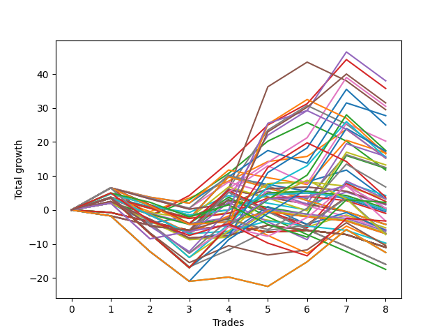

# Long Entry Wallace MJ 007 
- Symbol: ES
- Date Range: 3/19/22 - 5/22/22
- Trading Period: 7:20-12:30
- Number of Trades: 8



| Name | Win Percent | Profit | Avg Profit / Trade |     | Name | Win Percent | Profit | Avg Profit / Trade |
| ---- | ----------- | ------ | ------------------ | --- | ---- | ----------- | ------ | ------------------ |
| Sorted By <br> Profit | | | | | Sorted By <br> Win Percentage ||||
| Four | 62.50 | 19000.00 | 2375.00 |     | Three | 75.00 | 17875.00 | 2234.38 |
| Three | 75.00 | 17875.00 | 2234.38 |     | One | 75.00 | 7625.00 | 953.12 |
| Six | 62.50 | 15250.00 | 1906.25 |     | Zero | 75.00 | 1625.00 | 203.12 |
| Five | 50.00 | 14750.00 | 1843.75 |     | Sixty-Four | 75.00 | 250.00 | 31.25 |
| Thirty | 50.00 | 13875.00 | 1734.38 |     | Fifty-Six | 75.00 | -1625.00 | -203.12 |
| Sixty | 62.50 | 12500.00 | 1562.50 |     | Four | 62.50 | 19000.00 | 2375.00 |
| Forty-Six | 50.00 | 10125.00 | 1265.62 |     | Six | 62.50 | 15250.00 | 1906.25 |
| Sixty-Two | 62.50 | 8750.00 | 1093.75 |     | Sixty | 62.50 | 12500.00 | 1562.50 |
| Seventy | 50.00 | 8625.00 | 1078.12 |     | Sixty-Two | 62.50 | 8750.00 | 1093.75 |
| Seven | 50.00 | 8375.00 | 1046.88 |     | Fifty-Nine | 62.50 | 7750.00 | 968.75 |
| Eleven | 37.50 | 8375.00 | 1046.88 |     | Two | 62.50 | 5875.00 | 734.38 |
| Sixty-One | 50.00 | 8250.00 | 1031.25 |     | Fifty-Seven | 62.50 | -3500.00 | -437.50 |
| Fourteen | 25.00 | 7875.00 | 984.38 |     | Five | 50.00 | 14750.00 | 1843.75 |
| Fifty-Nine | 62.50 | 7750.00 | 968.75 |     | Thirty | 50.00 | 13875.00 | 1734.38 |
| One | 75.00 | 7625.00 | 953.12 |     | Forty-Six | 50.00 | 10125.00 | 1265.62 |
| Twenty-Eight | 37.50 | 6625.00 | 828.12 |     | Seventy | 50.00 | 8625.00 | 1078.12 |
| twenty-Seven | 37.50 | 6250.00 | 781.25 |     | Seven | 50.00 | 8375.00 | 1046.88 |
| Twelve | 25.00 | 6125.00 | 765.62 |     | Sixty-One | 50.00 | 8250.00 | 1031.25 |
| Two | 62.50 | 5875.00 | 734.38 |     | Sixty-Seven | 50.00 | 3375.00 | 421.88 |
| Sixty-Seven | 50.00 | 3375.00 | 421.88 |     | Sixty-Three | 50.00 | 1875.00 | 234.38 |
| Nine | 37.50 | 2125.00 | 265.62 |     | Thirty-Eight | 50.00 | 1625.00 | 203.12 |
| Sixty-Three | 50.00 | 1875.00 | 234.38 |     | Thirty-Five | 50.00 | 875.00 | 109.38 |
| Zero | 75.00 | 1625.00 | 203.12 |     | Thirty-Four | 50.00 | 875.00 | 109.38 |
| Thirty-Eight | 50.00 | 1625.00 | 203.12 |     | Twenty-Four | 50.00 | 750.00 | 93.75 |
| Forty-Four | 37.50 | 1625.00 | 203.12 |     | Sixty-Six | 50.00 | 250.00 | 31.25 |
| Forty-Three | 37.50 | 1250.00 | 156.25 |     | Thirty-Two | 50.00 | 250.00 | 31.25 |
| Thirty-Five | 50.00 | 875.00 | 109.38 |     | Thirty-Nine | 50.00 | 0.00 | 0.00 |
| Thirty-Four | 50.00 | 875.00 | 109.38 |     | Thirty-Seven | 50.00 | 0.00 | 0.00 |
| Twenty-Four | 50.00 | 750.00 | 93.75 |     | Thirty-Six | 50.00 | 0.00 | 0.00 |
| Sixty-Four | 75.00 | 250.00 | 31.25 |     | Thirty-Three | 50.00 | -500.00 | -62.50 |
| Sixty-Six | 50.00 | 250.00 | 31.25 |     | Forty | 50.00 | -3000.00 | -375.00 |
| Thirty-Two | 50.00 | 250.00 | 31.25 |     | Fifty-Eight | 50.00 | -3625.00 | -453.12 |
| Thirty-Nine | 50.00 | 0.00 | 0.00 |     | Sixty-Five | 50.00 | -5250.00 | -656.25 |
| Thirty-Seven | 50.00 | 0.00 | 0.00 |     | Eleven | 37.50 | 8375.00 | 1046.88 |
| Thirty-Six | 50.00 | 0.00 | 0.00 |     | Twenty-Eight | 37.50 | 6625.00 | 828.12 |
| Twenty-Five | 37.50 | 0.00 | 0.00 |     | twenty-Seven | 37.50 | 6250.00 | 781.25 |
| Ten | 25.00 | -250.00 | -31.25 |     | Nine | 37.50 | 2125.00 | 265.62 |
| Thirty-Three | 50.00 | -500.00 | -62.50 |     | Forty-Four | 37.50 | 1625.00 | 203.12 |
| Fifty-Six | 75.00 | -1625.00 | -203.12 |     | Forty-Three | 37.50 | 1250.00 | 156.25 |
| Thirty-One | 25.00 | -2125.00 | -265.62 |     | Twenty-Five | 37.50 | 0.00 | 0.00 |
| Twenty-Nine | 25.00 | -2125.00 | -265.62 |     | Eight | 37.50 | -2625.00 | -328.12 |
| Fifteen | 12.50 | -2125.00 | -265.62 |     | Fifty-Four | 37.50 | -3125.00 | -390.62 |
| Thirteen | 12.50 | -2125.00 | -265.62 |     | Forty-Eight | 37.50 | -3375.00 | -421.88 |
| Eight | 37.50 | -2625.00 | -328.12 |     | Fifty-One | 37.50 | -3500.00 | -437.50 |
| Seventy-Five | 25.00 | -2875.00 | -359.38 |     | Fifty | 37.50 | -3500.00 | -437.50 |
| Seventy-Four | 25.00 | -2875.00 | -359.38 |     | Forty-Nine | 37.50 | -4875.00 | -609.38 |
| Seventy-Three | 25.00 | -2875.00 | -359.38 |     | Forty-One | 37.50 | -5000.00 | -625.00 |
| Twenty-Six | 25.00 | -2875.00 | -359.38 |     | Fifty-Five | 37.50 | -5500.00 | -687.50 |
| Forty | 50.00 | -3000.00 | -375.00 |     | Fifty-Three | 37.50 | -5500.00 | -687.50 |
| Fifty-Four | 37.50 | -3125.00 | -390.62 |     | Fifty-Two | 37.50 | -5500.00 | -687.50 |
| Forty-Eight | 37.50 | -3375.00 | -421.88 |     | Seventy-One | 37.50 | -6250.00 | -781.25 |
| Fifty-Seven | 62.50 | -3500.00 | -437.50 |     | Sixty-Nine | 37.50 | -6250.00 | -781.25 |
| Fifty-One | 37.50 | -3500.00 | -437.50 |     | Sixty-Eight | 37.50 | -6250.00 | -781.25 |
| Fifty | 37.50 | -3500.00 | -437.50 |     | Fourteen | 25.00 | 7875.00 | 984.38 |
| Fifty-Eight | 50.00 | -3625.00 | -453.12 |     | Twelve | 25.00 | 6125.00 | 765.62 |
| Seventy-Two | 0.00 | -4500.00 | -562.50 |     | Ten | 25.00 | -250.00 | -31.25 |
| Forty-Nine | 37.50 | -4875.00 | -609.38 |     | Thirty-One | 25.00 | -2125.00 | -265.62 |
| Forty-One | 37.50 | -5000.00 | -625.00 |     | Twenty-Nine | 25.00 | -2125.00 | -265.62 |
| Sixty-Five | 50.00 | -5250.00 | -656.25 |     | Seventy-Five | 25.00 | -2875.00 | -359.38 |
| Fifty-Five | 37.50 | -5500.00 | -687.50 |     | Seventy-Four | 25.00 | -2875.00 | -359.38 |
| Fifty-Three | 37.50 | -5500.00 | -687.50 |     | Seventy-Three | 25.00 | -2875.00 | -359.38 |
| Fifty-Two | 37.50 | -5500.00 | -687.50 |     | Twenty-Six | 25.00 | -2875.00 | -359.38 |
| Twenty-Three | 25.00 | -5500.00 | -687.50 |     | Twenty-Three | 25.00 | -5500.00 | -687.50 |
| Twenty-Two | 25.00 | -5500.00 | -687.50 |     | Twenty-Two | 25.00 | -5500.00 | -687.50 |
| Twenty-One | 25.00 | -5500.00 | -687.50 |     | Twenty-One | 25.00 | -5500.00 | -687.50 |
| Twenty | 25.00 | -5500.00 | -687.50 |     | Twenty | 25.00 | -5500.00 | -687.50 |
| Nineteen | 25.00 | -5500.00 | -687.50 |     | Nineteen | 25.00 | -5500.00 | -687.50 |
| Eighteen | 25.00 | -5500.00 | -687.50 |     | Eighteen | 25.00 | -5500.00 | -687.50 |
| Seventeen | 25.00 | -5500.00 | -687.50 |     | Seventeen | 25.00 | -5500.00 | -687.50 |
| Sixten | 25.00 | -5500.00 | -687.50 |     | Sixten | 25.00 | -5500.00 | -687.50 |
| Seventy-One | 37.50 | -6250.00 | -781.25 |     | Forty-Seven | 25.00 | -8000.00 | -1000.00 |
| Sixty-Nine | 37.50 | -6250.00 | -781.25 |     | Forty-Five | 25.00 | -8000.00 | -1000.00 |
| Sixty-Eight | 37.50 | -6250.00 | -781.25 |     | Forty-Two | 25.00 | -8750.00 | -1093.75 |
| Forty-Seven | 25.00 | -8000.00 | -1000.00 |     | Fifteen | 12.50 | -2125.00 | -265.62 |
| Forty-Five | 25.00 | -8000.00 | -1000.00 |     | Thirteen | 12.50 | -2125.00 | -265.62 |
| Forty-Two | 25.00 | -8750.00 | -1093.75 |     | Seventy-Two | 0.00 | -4500.00 | -562.50 |

## NO STOPLOSS

### Test Zero
* Sell when price hits the middle line of the 20p bollinger
* No Stoploss
* Results:
```
Total Trades: 8
Percent Up: 75.00
Percent Down: 25.00
Total Points Moved Up: 3.25
Potential Profit: 1625.00
Total Points Ups: 17.75 Count Ups: 6
Total Points Downs: -14.50 Count Downs: 2
```

<details><summary>Trades</summary>

<code>In: 2022-03-23 10:50:00		Out: 2022-03-23 10:51:10		Total Position Time: 01:10		Total Move Up: 2.00		Total to Date: 2.00</code> <br />
<code>In: 2022-03-30 08:03:00		Out: 2022-03-30 08:19:15		Total Position Time: 16:15		Total Move Up: -6.00		Total to Date: -4.00</code> <br />
<code>In: 2022-05-02 08:23:00		Out: 2022-05-02 08:26:05		Total Position Time: 03:05		Total Move Up: 2.25		Total to Date: -1.75</code> <br />
<code>In: 2022-05-16 08:09:00		Out: 2022-05-16 08:09:30		Total Position Time: 00:30		Total Move Up: 1.75		Total to Date: 0.00</code> <br />
<code>In: 2022-05-17 11:25:00		Out: 2022-05-17 11:27:25		Total Position Time: 02:25		Total Move Up: 7.75		Total to Date: 7.75</code> <br />
<code>In: 2022-05-25 09:30:00		Out: 2022-05-25 09:38:50		Total Position Time: 08:50		Total Move Up: 0.50		Total to Date: 8.25</code> <br />
<code>In: 2022-06-14 07:46:00		Out: 2022-06-14 07:46:50		Total Position Time: 00:50		Total Move Up: 3.50		Total to Date: 11.75</code> <br />
<code>In: 2022-06-15 07:58:00		Out: 2022-06-15 08:27:55		Total Position Time: 29:55		Total Move Up: -8.50		Total to Date: 3.25</code> <br />


</details>

### Test One
* Sell when the price hits the upper line of the 20p 1std bollinger
* No Stoploss
* Results:
```
Total Trades: 8
Percent Up: 75.00
Percent Down: 25.00
Total Points Moved Up: 15.25
Potential Profit: 7625.00
Total Points Ups: 28.00 Count Ups: 6
Total Points Downs: -12.75 Count Downs: 2
```

<details><summary>Trades</summary>

<code>In: 2022-03-23 10:50:00		Out: 2022-03-23 10:51:50		Total Position Time: 01:50		Total Move Up: 3.75		Total to Date: 3.75</code> <br />
<code>In: 2022-03-30 08:03:00		Out: 2022-03-30 08:23:50		Total Position Time: 20:50		Total Move Up: -4.25		Total to Date: -0.50</code> <br />
<code>In: 2022-05-02 08:23:00		Out: 2022-05-02 08:34:10		Total Position Time: 11:10		Total Move Up: 4.00		Total to Date: 3.50</code> <br />
<code>In: 2022-05-16 08:09:00		Out: 2022-05-16 08:09:50		Total Position Time: 00:50		Total Move Up: 5.00		Total to Date: 8.50</code> <br />
<code>In: 2022-05-17 11:25:00		Out: 2022-05-17 11:37:35		Total Position Time: 12:35		Total Move Up: 5.75		Total to Date: 14.25</code> <br />
<code>In: 2022-05-25 09:30:00		Out: 2022-05-25 09:44:25		Total Position Time: 14:25		Total Move Up: 1.50		Total to Date: 15.75</code> <br />
<code>In: 2022-06-14 07:46:00		Out: 2022-06-14 07:47:10		Total Position Time: 01:10		Total Move Up: 8.00		Total to Date: 23.75</code> <br />
<code>In: 2022-06-15 07:58:00		Out: 2022-06-15 08:27:55		Total Position Time: 29:55		Total Move Up: -8.50		Total to Date: 15.25</code> <br />


</details>

### Test Two
* Sell when the price hits the upper line of the 20p 2std bollinger
* No Stoploss
* Results:
```
Total Trades: 8
Percent Up: 62.50
Percent Down: 37.50
Total Points Moved Up: 11.75
Potential Profit: 5875.00
Total Points Ups: 34.00 Count Ups: 5
Total Points Downs: -22.25 Count Downs: 3
```

<details><summary>Trades</summary>

<code>In: 2022-03-23 10:50:00		Out: 2022-03-23 10:54:50		Total Position Time: 04:50		Total Move Up: 6.50		Total to Date: 6.50</code> <br />
<code>In: 2022-03-30 08:03:00		Out: 2022-03-30 08:32:55		Total Position Time: 29:55		Total Move Up: -8.25		Total to Date: -1.75</code> <br />
<code>In: 2022-05-02 08:23:00		Out: 2022-05-02 08:36:35		Total Position Time: 13:35		Total Move Up: 4.75		Total to Date: 3.00</code> <br />
<code>In: 2022-05-16 08:09:00		Out: 2022-05-16 08:11:35		Total Position Time: 02:35		Total Move Up: 7.75		Total to Date: 10.75</code> <br />
<code>In: 2022-05-17 11:25:00		Out: 2022-05-17 11:40:00		Total Position Time: 15:00		Total Move Up: 9.50		Total to Date: 20.25</code> <br />
<code>In: 2022-05-25 09:30:00		Out: 2022-05-25 09:48:50		Total Position Time: 18:50		Total Move Up: 5.50		Total to Date: 25.75</code> <br />
<code>In: 2022-06-14 07:46:00		Out: 2022-06-14 08:15:55		Total Position Time: 29:55		Total Move Up: -5.50		Total to Date: 20.25</code> <br />
<code>In: 2022-06-15 07:58:00		Out: 2022-06-15 08:27:55		Total Position Time: 29:55		Total Move Up: -8.50		Total to Date: 11.75</code> <br />


</details>

### Test Three
* Sell when price hits the middle line of the 50p bollinger
* No Stoploss
* Results:
```
Total Trades: 8
Percent Up: 75.00
Percent Down: 25.00
Total Points Moved Up: 35.75
Potential Profit: 17875.00
Total Points Ups: 52.50 Count Ups: 6
Total Points Downs: -16.75 Count Downs: 2
```

<details><summary>Trades</summary>

<code>In: 2022-03-23 10:50:00		Out: 2022-03-23 10:54:50		Total Position Time: 04:50		Total Move Up: 6.50		Total to Date: 6.50</code> <br />
<code>In: 2022-03-30 08:03:00		Out: 2022-03-30 08:32:55		Total Position Time: 29:55		Total Move Up: -8.25		Total to Date: -1.75</code> <br />
<code>In: 2022-05-02 08:23:00		Out: 2022-05-02 08:38:05		Total Position Time: 15:05		Total Move Up: 6.00		Total to Date: 4.25</code> <br />
<code>In: 2022-05-16 08:09:00		Out: 2022-05-16 08:17:00		Total Position Time: 08:00		Total Move Up: 9.75		Total to Date: 14.00</code> <br />
<code>In: 2022-05-17 11:25:00		Out: 2022-05-17 11:40:05		Total Position Time: 15:05		Total Move Up: 11.00		Total to Date: 25.00</code> <br />
<code>In: 2022-05-25 09:30:00		Out: 2022-05-25 09:49:05		Total Position Time: 19:05		Total Move Up: 6.25		Total to Date: 31.25</code> <br />
<code>In: 2022-06-14 07:46:00		Out: 2022-06-14 07:49:55		Total Position Time: 03:55		Total Move Up: 13.00		Total to Date: 44.25</code> <br />
<code>In: 2022-06-15 07:58:00		Out: 2022-06-15 08:27:55		Total Position Time: 29:55		Total Move Up: -8.50		Total to Date: 35.75</code> <br />


</details>

### Test Four
* Sell when the price hits the upper line of the 50p 1std bollinger
* No Stoploss
* Results:
```
Total Trades: 8
Percent Up: 62.50
Percent Down: 37.50
Total Points Moved Up: 38.00
Potential Profit: 19000.00
Total Points Ups: 56.00 Count Ups: 5
Total Points Downs: -18.00 Count Downs: 3
```

<details><summary>Trades</summary>

<code>In: 2022-03-23 10:50:00		Out: 2022-03-23 11:19:55		Total Position Time: 29:55		Total Move Up: 3.50		Total to Date: 3.50</code> <br />
<code>In: 2022-03-30 08:03:00		Out: 2022-03-30 08:32:55		Total Position Time: 29:55		Total Move Up: -8.25		Total to Date: -4.75</code> <br />
<code>In: 2022-05-02 08:23:00		Out: 2022-05-02 08:52:55		Total Position Time: 29:55		Total Move Up: -1.25		Total to Date: -6.00</code> <br />
<code>In: 2022-05-16 08:09:00		Out: 2022-05-16 08:34:50		Total Position Time: 25:50		Total Move Up: 9.25		Total to Date: 3.25</code> <br />
<code>In: 2022-05-17 11:25:00		Out: 2022-05-17 11:45:45		Total Position Time: 20:45		Total Move Up: 18.75		Total to Date: 22.00</code> <br />
<code>In: 2022-05-25 09:30:00		Out: 2022-05-25 09:59:55		Total Position Time: 29:55		Total Move Up: 7.25		Total to Date: 29.25</code> <br />
<code>In: 2022-06-14 07:46:00		Out: 2022-06-14 08:02:20		Total Position Time: 16:20		Total Move Up: 17.25		Total to Date: 46.50</code> <br />
<code>In: 2022-06-15 07:58:00		Out: 2022-06-15 08:27:55		Total Position Time: 29:55		Total Move Up: -8.50		Total to Date: 38.00</code> <br />


</details>

### Test Five
* Sell when the price hits the upper line of the 50p 2std bollinger
* No Stoploss
* Results:
```
Total Trades: 8
Percent Up: 50.00
Percent Down: 50.00
Total Points Moved Up: 29.50
Potential Profit: 14750.00
Total Points Ups: 53.00 Count Ups: 4
Total Points Downs: -23.50 Count Downs: 4
```

<details><summary>Trades</summary>

<code>In: 2022-03-23 10:50:00		Out: 2022-03-23 11:19:55		Total Position Time: 29:55		Total Move Up: 3.50		Total to Date: 3.50</code> <br />
<code>In: 2022-03-30 08:03:00		Out: 2022-03-30 08:32:55		Total Position Time: 29:55		Total Move Up: -8.25		Total to Date: -4.75</code> <br />
<code>In: 2022-05-02 08:23:00		Out: 2022-05-02 08:52:55		Total Position Time: 29:55		Total Move Up: -1.25		Total to Date: -6.00</code> <br />
<code>In: 2022-05-16 08:09:00		Out: 2022-05-16 08:38:55		Total Position Time: 29:55		Total Move Up: 12.25		Total to Date: 6.25</code> <br />
<code>In: 2022-05-17 11:25:00		Out: 2022-05-17 11:49:45		Total Position Time: 24:45		Total Move Up: 30.00		Total to Date: 36.25</code> <br />
<code>In: 2022-05-25 09:30:00		Out: 2022-05-25 09:59:55		Total Position Time: 29:55		Total Move Up: 7.25		Total to Date: 43.50</code> <br />
<code>In: 2022-06-14 07:46:00		Out: 2022-06-14 08:15:55		Total Position Time: 29:55		Total Move Up: -5.50		Total to Date: 38.00</code> <br />
<code>In: 2022-06-15 07:58:00		Out: 2022-06-15 08:27:55		Total Position Time: 29:55		Total Move Up: -8.50		Total to Date: 29.50</code> <br />


</details>

### Test Six
* Sell when the price hits the middle line of the 1std VWAP
* No Stoploss
* Results:
```
Total Trades: 8
Percent Up: 62.50
Percent Down: 37.50
Total Points Moved Up: 30.50
Potential Profit: 15250.00
Total Points Ups: 48.50 Count Ups: 5
Total Points Downs: -18.00 Count Downs: 3
```

<details><summary>Trades</summary>

<code>In: 2022-03-23 10:50:00		Out: 2022-03-23 11:19:55		Total Position Time: 29:55		Total Move Up: 3.50		Total to Date: 3.50</code> <br />
<code>In: 2022-03-30 08:03:00		Out: 2022-03-30 08:32:55		Total Position Time: 29:55		Total Move Up: -8.25		Total to Date: -4.75</code> <br />
<code>In: 2022-05-02 08:23:00		Out: 2022-05-02 08:52:55		Total Position Time: 29:55		Total Move Up: -1.25		Total to Date: -6.00</code> <br />
<code>In: 2022-05-16 08:09:00		Out: 2022-05-16 08:17:40		Total Position Time: 08:40		Total Move Up: 12.25		Total to Date: 6.25</code> <br />
<code>In: 2022-05-17 11:25:00		Out: 2022-05-17 11:27:25		Total Position Time: 02:25		Total Move Up: 7.75		Total to Date: 14.00</code> <br />
<code>In: 2022-05-25 09:30:00		Out: 2022-05-25 09:59:55		Total Position Time: 29:55		Total Move Up: 7.25		Total to Date: 21.25</code> <br />
<code>In: 2022-06-14 07:46:00		Out: 2022-06-14 07:51:40		Total Position Time: 05:40		Total Move Up: 17.75		Total to Date: 39.00</code> <br />
<code>In: 2022-06-15 07:58:00		Out: 2022-06-15 08:27:55		Total Position Time: 29:55		Total Move Up: -8.50		Total to Date: 30.50</code> <br />


</details>

### Test Seven
* Sell when the price hits the upper line of the 1std VWAP
* No Stoploss
* Results:
```
Total Trades: 8
Percent Up: 50.00
Percent Down: 50.00
Total Points Moved Up: 16.75
Potential Profit: 8375.00
Total Points Ups: 40.25 Count Ups: 4
Total Points Downs: -23.50 Count Downs: 4
```

<details><summary>Trades</summary>

<code>In: 2022-03-23 10:50:00		Out: 2022-03-23 11:19:55		Total Position Time: 29:55		Total Move Up: 3.50		Total to Date: 3.50</code> <br />
<code>In: 2022-03-30 08:03:00		Out: 2022-03-30 08:32:55		Total Position Time: 29:55		Total Move Up: -8.25		Total to Date: -4.75</code> <br />
<code>In: 2022-05-02 08:23:00		Out: 2022-05-02 08:52:55		Total Position Time: 29:55		Total Move Up: -1.25		Total to Date: -6.00</code> <br />
<code>In: 2022-05-16 08:09:00		Out: 2022-05-16 08:38:55		Total Position Time: 29:55		Total Move Up: 12.25		Total to Date: 6.25</code> <br />
<code>In: 2022-05-17 11:25:00		Out: 2022-05-17 11:40:20		Total Position Time: 15:20		Total Move Up: 17.25		Total to Date: 23.50</code> <br />
<code>In: 2022-05-25 09:30:00		Out: 2022-05-25 09:59:55		Total Position Time: 29:55		Total Move Up: 7.25		Total to Date: 30.75</code> <br />
<code>In: 2022-06-14 07:46:00		Out: 2022-06-14 08:15:55		Total Position Time: 29:55		Total Move Up: -5.50		Total to Date: 25.25</code> <br />
<code>In: 2022-06-15 07:58:00		Out: 2022-06-15 08:27:55		Total Position Time: 29:55		Total Move Up: -8.50		Total to Date: 16.75</code> <br />


</details>

## STOPLOSS OF 2

### Test Eight
* Sell when price hits the middle line of the 20p bollinger
* Stoploss is 2 points
* Results:
```
Total Trades: 8
Percent Up: 37.50
Percent Down: 62.50
Total Points Moved Up: -5.25
Potential Profit: -2625.00
Total Points Ups: 7.25 Count Ups: 3
Total Points Downs: -12.50 Count Downs: 5
```

<details><summary>Trades</summary>

<code>In: 2022-03-23 10:50:00		Out: 2022-03-23 10:51:10		Total Position Time: 01:10		Total Move Up: 2.00		Total to Date: 2.00</code> <br />
<code>In: 2022-03-30 08:03:00		Out: 2022-03-30 08:04:05		Total Position Time: 01:05		Total Move Up: -2.75		Total to Date: -0.75</code> <br />
<code>In: 2022-05-02 08:23:00		Out: 2022-05-02 08:23:40		Total Position Time: 00:40		Total Move Up: -1.75		Total to Date: -2.50</code> <br />
<code>In: 2022-05-16 08:09:00		Out: 2022-05-16 08:09:30		Total Position Time: 00:30		Total Move Up: 1.75		Total to Date: -0.75</code> <br />
<code>In: 2022-05-17 11:25:00		Out: 2022-05-17 11:25:35		Total Position Time: 00:35		Total Move Up: -2.25		Total to Date: -3.00</code> <br />
<code>In: 2022-05-25 09:30:00		Out: 2022-05-25 09:35:55		Total Position Time: 05:55		Total Move Up: -2.00		Total to Date: -5.00</code> <br />
<code>In: 2022-06-14 07:46:00		Out: 2022-06-14 07:46:50		Total Position Time: 00:50		Total Move Up: 3.50		Total to Date: -1.50</code> <br />
<code>In: 2022-06-15 07:58:00		Out: 2022-06-15 07:58:10		Total Position Time: 00:10		Total Move Up: -3.75		Total to Date: -5.25</code> <br />


</details>

### Test Nine
* Sell when the price hits the upper line of the 20p 1std bollinger
* Stoploss is 2 points
* Results:
```
Total Trades: 8
Percent Up: 37.50
Percent Down: 62.50
Total Points Moved Up: 4.25
Potential Profit: 2125.00
Total Points Ups: 16.75 Count Ups: 3
Total Points Downs: -12.50 Count Downs: 5
```

<details><summary>Trades</summary>

<code>In: 2022-03-23 10:50:00		Out: 2022-03-23 10:51:50		Total Position Time: 01:50		Total Move Up: 3.75		Total to Date: 3.75</code> <br />
<code>In: 2022-03-30 08:03:00		Out: 2022-03-30 08:04:05		Total Position Time: 01:05		Total Move Up: -2.75		Total to Date: 1.00</code> <br />
<code>In: 2022-05-02 08:23:00		Out: 2022-05-02 08:23:40		Total Position Time: 00:40		Total Move Up: -1.75		Total to Date: -0.75</code> <br />
<code>In: 2022-05-16 08:09:00		Out: 2022-05-16 08:09:50		Total Position Time: 00:50		Total Move Up: 5.00		Total to Date: 4.25</code> <br />
<code>In: 2022-05-17 11:25:00		Out: 2022-05-17 11:25:35		Total Position Time: 00:35		Total Move Up: -2.25		Total to Date: 2.00</code> <br />
<code>In: 2022-05-25 09:30:00		Out: 2022-05-25 09:35:55		Total Position Time: 05:55		Total Move Up: -2.00		Total to Date: 0.00</code> <br />
<code>In: 2022-06-14 07:46:00		Out: 2022-06-14 07:47:10		Total Position Time: 01:10		Total Move Up: 8.00		Total to Date: 8.00</code> <br />
<code>In: 2022-06-15 07:58:00		Out: 2022-06-15 07:58:10		Total Position Time: 00:10		Total Move Up: -3.75		Total to Date: 4.25</code> <br />


</details>

### Test Ten
* Sell when the price hits the upper line of the 20p 2std bollinger
* Stoploss is 2 points
* Results:
```
Total Trades: 8
Percent Up: 25.00
Percent Down: 75.00
Total Points Moved Up: -0.50
Potential Profit: -250.00
Total Points Ups: 14.25 Count Ups: 2
Total Points Downs: -14.75 Count Downs: 6
```

<details><summary>Trades</summary>

<code>In: 2022-03-23 10:50:00		Out: 2022-03-23 10:54:50		Total Position Time: 04:50		Total Move Up: 6.50		Total to Date: 6.50</code> <br />
<code>In: 2022-03-30 08:03:00		Out: 2022-03-30 08:04:05		Total Position Time: 01:05		Total Move Up: -2.75		Total to Date: 3.75</code> <br />
<code>In: 2022-05-02 08:23:00		Out: 2022-05-02 08:23:40		Total Position Time: 00:40		Total Move Up: -1.75		Total to Date: 2.00</code> <br />
<code>In: 2022-05-16 08:09:00		Out: 2022-05-16 08:11:35		Total Position Time: 02:35		Total Move Up: 7.75		Total to Date: 9.75</code> <br />
<code>In: 2022-05-17 11:25:00		Out: 2022-05-17 11:25:35		Total Position Time: 00:35		Total Move Up: -2.25		Total to Date: 7.50</code> <br />
<code>In: 2022-05-25 09:30:00		Out: 2022-05-25 09:35:55		Total Position Time: 05:55		Total Move Up: -2.00		Total to Date: 5.50</code> <br />
<code>In: 2022-06-14 07:46:00		Out: 2022-06-14 08:11:25		Total Position Time: 25:25		Total Move Up: -2.25		Total to Date: 3.25</code> <br />
<code>In: 2022-06-15 07:58:00		Out: 2022-06-15 07:58:10		Total Position Time: 00:10		Total Move Up: -3.75		Total to Date: -0.50</code> <br />


</details>

### Test Eleven
* Sell when price hits the middle line of the 50p bollinger
* Stoploss is 2 points
* Results:
```
Total Trades: 8
Percent Up: 37.50
Percent Down: 62.50
Total Points Moved Up: 16.75
Potential Profit: 8375.00
Total Points Ups: 29.25 Count Ups: 3
Total Points Downs: -12.50 Count Downs: 5
```

<details><summary>Trades</summary>

<code>In: 2022-03-23 10:50:00		Out: 2022-03-23 10:54:50		Total Position Time: 04:50		Total Move Up: 6.50		Total to Date: 6.50</code> <br />
<code>In: 2022-03-30 08:03:00		Out: 2022-03-30 08:04:05		Total Position Time: 01:05		Total Move Up: -2.75		Total to Date: 3.75</code> <br />
<code>In: 2022-05-02 08:23:00		Out: 2022-05-02 08:23:40		Total Position Time: 00:40		Total Move Up: -1.75		Total to Date: 2.00</code> <br />
<code>In: 2022-05-16 08:09:00		Out: 2022-05-16 08:17:00		Total Position Time: 08:00		Total Move Up: 9.75		Total to Date: 11.75</code> <br />
<code>In: 2022-05-17 11:25:00		Out: 2022-05-17 11:25:35		Total Position Time: 00:35		Total Move Up: -2.25		Total to Date: 9.50</code> <br />
<code>In: 2022-05-25 09:30:00		Out: 2022-05-25 09:35:55		Total Position Time: 05:55		Total Move Up: -2.00		Total to Date: 7.50</code> <br />
<code>In: 2022-06-14 07:46:00		Out: 2022-06-14 07:49:55		Total Position Time: 03:55		Total Move Up: 13.00		Total to Date: 20.50</code> <br />
<code>In: 2022-06-15 07:58:00		Out: 2022-06-15 07:58:10		Total Position Time: 00:10		Total Move Up: -3.75		Total to Date: 16.75</code> <br />


</details>

### Test Twelve
* Sell when the price hits the upper line of the 50p 1std bollinger
* Stoploss is 2 points
* Results:
```
Total Trades: 8
Percent Up: 25.00
Percent Down: 75.00
Total Points Moved Up: 12.25
Potential Profit: 6125.00
Total Points Ups: 26.50 Count Ups: 2
Total Points Downs: -14.25 Count Downs: 6
```

<details><summary>Trades</summary>

<code>In: 2022-03-23 10:50:00		Out: 2022-03-23 11:10:40		Total Position Time: 20:40		Total Move Up: -1.75		Total to Date: -1.75</code> <br />
<code>In: 2022-03-30 08:03:00		Out: 2022-03-30 08:04:05		Total Position Time: 01:05		Total Move Up: -2.75		Total to Date: -4.50</code> <br />
<code>In: 2022-05-02 08:23:00		Out: 2022-05-02 08:23:40		Total Position Time: 00:40		Total Move Up: -1.75		Total to Date: -6.25</code> <br />
<code>In: 2022-05-16 08:09:00		Out: 2022-05-16 08:34:50		Total Position Time: 25:50		Total Move Up: 9.25		Total to Date: 3.00</code> <br />
<code>In: 2022-05-17 11:25:00		Out: 2022-05-17 11:25:35		Total Position Time: 00:35		Total Move Up: -2.25		Total to Date: 0.75</code> <br />
<code>In: 2022-05-25 09:30:00		Out: 2022-05-25 09:35:55		Total Position Time: 05:55		Total Move Up: -2.00		Total to Date: -1.25</code> <br />
<code>In: 2022-06-14 07:46:00		Out: 2022-06-14 08:02:20		Total Position Time: 16:20		Total Move Up: 17.25		Total to Date: 16.00</code> <br />
<code>In: 2022-06-15 07:58:00		Out: 2022-06-15 07:58:10		Total Position Time: 00:10		Total Move Up: -3.75		Total to Date: 12.25</code> <br />


</details>

### Test Thirteen
* Sell when the price hits the upper line of the 50p 2std bollinger
* Stoploss is 2 points
* Results:
```
Total Trades: 8
Percent Up: 12.50
Percent Down: 87.50
Total Points Moved Up: -4.25
Potential Profit: -2125.00
Total Points Ups: 12.25 Count Ups: 1
Total Points Downs: -16.50 Count Downs: 7
```

<details><summary>Trades</summary>

<code>In: 2022-03-23 10:50:00		Out: 2022-03-23 11:10:40		Total Position Time: 20:40		Total Move Up: -1.75		Total to Date: -1.75</code> <br />
<code>In: 2022-03-30 08:03:00		Out: 2022-03-30 08:04:05		Total Position Time: 01:05		Total Move Up: -2.75		Total to Date: -4.50</code> <br />
<code>In: 2022-05-02 08:23:00		Out: 2022-05-02 08:23:40		Total Position Time: 00:40		Total Move Up: -1.75		Total to Date: -6.25</code> <br />
<code>In: 2022-05-16 08:09:00		Out: 2022-05-16 08:38:55		Total Position Time: 29:55		Total Move Up: 12.25		Total to Date: 6.00</code> <br />
<code>In: 2022-05-17 11:25:00		Out: 2022-05-17 11:25:35		Total Position Time: 00:35		Total Move Up: -2.25		Total to Date: 3.75</code> <br />
<code>In: 2022-05-25 09:30:00		Out: 2022-05-25 09:35:55		Total Position Time: 05:55		Total Move Up: -2.00		Total to Date: 1.75</code> <br />
<code>In: 2022-06-14 07:46:00		Out: 2022-06-14 08:11:25		Total Position Time: 25:25		Total Move Up: -2.25		Total to Date: -0.50</code> <br />
<code>In: 2022-06-15 07:58:00		Out: 2022-06-15 07:58:10		Total Position Time: 00:10		Total Move Up: -3.75		Total to Date: -4.25</code> <br />


</details>

### Test Fourteen
* Sell when the price hits the middle line of the 1std VWAP
* Stoploss is 2 points
* Results:
```
Total Trades: 8
Percent Up: 25.00
Percent Down: 75.00
Total Points Moved Up: 15.75
Potential Profit: 7875.00
Total Points Ups: 30.00 Count Ups: 2
Total Points Downs: -14.25 Count Downs: 6
```

<details><summary>Trades</summary>

<code>In: 2022-03-23 10:50:00		Out: 2022-03-23 11:10:40		Total Position Time: 20:40		Total Move Up: -1.75		Total to Date: -1.75</code> <br />
<code>In: 2022-03-30 08:03:00		Out: 2022-03-30 08:04:05		Total Position Time: 01:05		Total Move Up: -2.75		Total to Date: -4.50</code> <br />
<code>In: 2022-05-02 08:23:00		Out: 2022-05-02 08:23:40		Total Position Time: 00:40		Total Move Up: -1.75		Total to Date: -6.25</code> <br />
<code>In: 2022-05-16 08:09:00		Out: 2022-05-16 08:17:40		Total Position Time: 08:40		Total Move Up: 12.25		Total to Date: 6.00</code> <br />
<code>In: 2022-05-17 11:25:00		Out: 2022-05-17 11:25:35		Total Position Time: 00:35		Total Move Up: -2.25		Total to Date: 3.75</code> <br />
<code>In: 2022-05-25 09:30:00		Out: 2022-05-25 09:35:55		Total Position Time: 05:55		Total Move Up: -2.00		Total to Date: 1.75</code> <br />
<code>In: 2022-06-14 07:46:00		Out: 2022-06-14 07:51:40		Total Position Time: 05:40		Total Move Up: 17.75		Total to Date: 19.50</code> <br />
<code>In: 2022-06-15 07:58:00		Out: 2022-06-15 07:58:10		Total Position Time: 00:10		Total Move Up: -3.75		Total to Date: 15.75</code> <br />


</details>

### Test Fifteen
* Sell when the price hits the upper line of the 1std VWAP
* Stoploss is 2 points
* Results:
```
Total Trades: 8
Percent Up: 12.50
Percent Down: 87.50
Total Points Moved Up: -4.25
Potential Profit: -2125.00
Total Points Ups: 12.25 Count Ups: 1
Total Points Downs: -16.50 Count Downs: 7
```

<details><summary>Trades</summary>

<code>In: 2022-03-23 10:50:00		Out: 2022-03-23 11:10:40		Total Position Time: 20:40		Total Move Up: -1.75		Total to Date: -1.75</code> <br />
<code>In: 2022-03-30 08:03:00		Out: 2022-03-30 08:04:05		Total Position Time: 01:05		Total Move Up: -2.75		Total to Date: -4.50</code> <br />
<code>In: 2022-05-02 08:23:00		Out: 2022-05-02 08:23:40		Total Position Time: 00:40		Total Move Up: -1.75		Total to Date: -6.25</code> <br />
<code>In: 2022-05-16 08:09:00		Out: 2022-05-16 08:38:55		Total Position Time: 29:55		Total Move Up: 12.25		Total to Date: 6.00</code> <br />
<code>In: 2022-05-17 11:25:00		Out: 2022-05-17 11:25:35		Total Position Time: 00:35		Total Move Up: -2.25		Total to Date: 3.75</code> <br />
<code>In: 2022-05-25 09:30:00		Out: 2022-05-25 09:35:55		Total Position Time: 05:55		Total Move Up: -2.00		Total to Date: 1.75</code> <br />
<code>In: 2022-06-14 07:46:00		Out: 2022-06-14 08:11:25		Total Position Time: 25:25		Total Move Up: -2.25		Total to Date: -0.50</code> <br />
<code>In: 2022-06-15 07:58:00		Out: 2022-06-15 07:58:10		Total Position Time: 00:10		Total Move Up: -3.75		Total to Date: -4.25</code> <br />


</details>

## TRAIL STOP OF 2

### Test Sixten
* Sell when price hits the middle line of the 20p bollinger
* Trailing Stop is 2 points
* Results:
```
Total Trades: 8
Percent Up: 25.00
Percent Down: 75.00
Total Points Moved Up: -11.00
Potential Profit: -5500.00
Total Points Ups: 2.00 Count Ups: 2
Total Points Downs: -13.00 Count Downs: 6
```

<details><summary>Trades</summary>

<code>In: 2022-03-23 10:50:00		Out: 2022-03-23 10:50:10		Total Position Time: 00:10		Total Move Up: -0.75		Total to Date: -0.75</code> <br />
<code>In: 2022-03-30 08:03:00		Out: 2022-03-30 08:04:05		Total Position Time: 01:05		Total Move Up: -2.75		Total to Date: -3.50</code> <br />
<code>In: 2022-05-02 08:23:00		Out: 2022-05-02 08:23:45		Total Position Time: 00:45		Total Move Up: -2.50		Total to Date: -6.00</code> <br />
<code>In: 2022-05-16 08:09:00		Out: 2022-05-16 08:09:10		Total Position Time: 00:10		Total Move Up: 1.50		Total to Date: -4.50</code> <br />
<code>In: 2022-05-17 11:25:00		Out: 2022-05-17 11:25:30		Total Position Time: 00:30		Total Move Up: -2.00		Total to Date: -6.50</code> <br />
<code>In: 2022-05-25 09:30:00		Out: 2022-05-25 09:33:05		Total Position Time: 03:05		Total Move Up: 0.50		Total to Date: -6.00</code> <br />
<code>In: 2022-06-14 07:46:00		Out: 2022-06-14 07:46:10		Total Position Time: 00:10		Total Move Up: -1.25		Total to Date: -7.25</code> <br />
<code>In: 2022-06-15 07:58:00		Out: 2022-06-15 07:58:10		Total Position Time: 00:10		Total Move Up: -3.75		Total to Date: -11.00</code> <br />


</details>

### Test Seventeen
* Sell when the price hits the upper line of the 20p 1std bollinger
* Trailing Stop is 2 points
* Results:
```
Total Trades: 8
Percent Up: 25.00
Percent Down: 75.00
Total Points Moved Up: -11.00
Potential Profit: -5500.00
Total Points Ups: 2.00 Count Ups: 2
Total Points Downs: -13.00 Count Downs: 6
```

<details><summary>Trades</summary>

<code>In: 2022-03-23 10:50:00		Out: 2022-03-23 10:50:10		Total Position Time: 00:10		Total Move Up: -0.75		Total to Date: -0.75</code> <br />
<code>In: 2022-03-30 08:03:00		Out: 2022-03-30 08:04:05		Total Position Time: 01:05		Total Move Up: -2.75		Total to Date: -3.50</code> <br />
<code>In: 2022-05-02 08:23:00		Out: 2022-05-02 08:23:45		Total Position Time: 00:45		Total Move Up: -2.50		Total to Date: -6.00</code> <br />
<code>In: 2022-05-16 08:09:00		Out: 2022-05-16 08:09:10		Total Position Time: 00:10		Total Move Up: 1.50		Total to Date: -4.50</code> <br />
<code>In: 2022-05-17 11:25:00		Out: 2022-05-17 11:25:30		Total Position Time: 00:30		Total Move Up: -2.00		Total to Date: -6.50</code> <br />
<code>In: 2022-05-25 09:30:00		Out: 2022-05-25 09:33:05		Total Position Time: 03:05		Total Move Up: 0.50		Total to Date: -6.00</code> <br />
<code>In: 2022-06-14 07:46:00		Out: 2022-06-14 07:46:10		Total Position Time: 00:10		Total Move Up: -1.25		Total to Date: -7.25</code> <br />
<code>In: 2022-06-15 07:58:00		Out: 2022-06-15 07:58:10		Total Position Time: 00:10		Total Move Up: -3.75		Total to Date: -11.00</code> <br />


</details>

### Test Eighteen
* Sell when the price hits the upper line of the 20p 2std bollinger
* Trailing Stop is 2 points
* Results:
```
Total Trades: 8
Percent Up: 25.00
Percent Down: 75.00
Total Points Moved Up: -11.00
Potential Profit: -5500.00
Total Points Ups: 2.00 Count Ups: 2
Total Points Downs: -13.00 Count Downs: 6
```

<details><summary>Trades</summary>

<code>In: 2022-03-23 10:50:00		Out: 2022-03-23 10:50:10		Total Position Time: 00:10		Total Move Up: -0.75		Total to Date: -0.75</code> <br />
<code>In: 2022-03-30 08:03:00		Out: 2022-03-30 08:04:05		Total Position Time: 01:05		Total Move Up: -2.75		Total to Date: -3.50</code> <br />
<code>In: 2022-05-02 08:23:00		Out: 2022-05-02 08:23:45		Total Position Time: 00:45		Total Move Up: -2.50		Total to Date: -6.00</code> <br />
<code>In: 2022-05-16 08:09:00		Out: 2022-05-16 08:09:10		Total Position Time: 00:10		Total Move Up: 1.50		Total to Date: -4.50</code> <br />
<code>In: 2022-05-17 11:25:00		Out: 2022-05-17 11:25:30		Total Position Time: 00:30		Total Move Up: -2.00		Total to Date: -6.50</code> <br />
<code>In: 2022-05-25 09:30:00		Out: 2022-05-25 09:33:05		Total Position Time: 03:05		Total Move Up: 0.50		Total to Date: -6.00</code> <br />
<code>In: 2022-06-14 07:46:00		Out: 2022-06-14 07:46:10		Total Position Time: 00:10		Total Move Up: -1.25		Total to Date: -7.25</code> <br />
<code>In: 2022-06-15 07:58:00		Out: 2022-06-15 07:58:10		Total Position Time: 00:10		Total Move Up: -3.75		Total to Date: -11.00</code> <br />


</details>

### Test Nineteen
* Sell when price hits the middle line of the 50p bollinger
* Trailing Stop is 2 points
* Results:
```
Total Trades: 8
Percent Up: 25.00
Percent Down: 75.00
Total Points Moved Up: -11.00
Potential Profit: -5500.00
Total Points Ups: 2.00 Count Ups: 2
Total Points Downs: -13.00 Count Downs: 6
```

<details><summary>Trades</summary>

<code>In: 2022-03-23 10:50:00		Out: 2022-03-23 10:50:10		Total Position Time: 00:10		Total Move Up: -0.75		Total to Date: -0.75</code> <br />
<code>In: 2022-03-30 08:03:00		Out: 2022-03-30 08:04:05		Total Position Time: 01:05		Total Move Up: -2.75		Total to Date: -3.50</code> <br />
<code>In: 2022-05-02 08:23:00		Out: 2022-05-02 08:23:45		Total Position Time: 00:45		Total Move Up: -2.50		Total to Date: -6.00</code> <br />
<code>In: 2022-05-16 08:09:00		Out: 2022-05-16 08:09:10		Total Position Time: 00:10		Total Move Up: 1.50		Total to Date: -4.50</code> <br />
<code>In: 2022-05-17 11:25:00		Out: 2022-05-17 11:25:30		Total Position Time: 00:30		Total Move Up: -2.00		Total to Date: -6.50</code> <br />
<code>In: 2022-05-25 09:30:00		Out: 2022-05-25 09:33:05		Total Position Time: 03:05		Total Move Up: 0.50		Total to Date: -6.00</code> <br />
<code>In: 2022-06-14 07:46:00		Out: 2022-06-14 07:46:10		Total Position Time: 00:10		Total Move Up: -1.25		Total to Date: -7.25</code> <br />
<code>In: 2022-06-15 07:58:00		Out: 2022-06-15 07:58:10		Total Position Time: 00:10		Total Move Up: -3.75		Total to Date: -11.00</code> <br />


</details>

### Test Twenty
* Sell when the price hits the upper line of the 50p 1std bollinger
* Trailing Stop is 2 points
* Results:
```
Total Trades: 8
Percent Up: 25.00
Percent Down: 75.00
Total Points Moved Up: -11.00
Potential Profit: -5500.00
Total Points Ups: 2.00 Count Ups: 2
Total Points Downs: -13.00 Count Downs: 6
```

<details><summary>Trades</summary>

<code>In: 2022-03-23 10:50:00		Out: 2022-03-23 10:50:10		Total Position Time: 00:10		Total Move Up: -0.75		Total to Date: -0.75</code> <br />
<code>In: 2022-03-30 08:03:00		Out: 2022-03-30 08:04:05		Total Position Time: 01:05		Total Move Up: -2.75		Total to Date: -3.50</code> <br />
<code>In: 2022-05-02 08:23:00		Out: 2022-05-02 08:23:45		Total Position Time: 00:45		Total Move Up: -2.50		Total to Date: -6.00</code> <br />
<code>In: 2022-05-16 08:09:00		Out: 2022-05-16 08:09:10		Total Position Time: 00:10		Total Move Up: 1.50		Total to Date: -4.50</code> <br />
<code>In: 2022-05-17 11:25:00		Out: 2022-05-17 11:25:30		Total Position Time: 00:30		Total Move Up: -2.00		Total to Date: -6.50</code> <br />
<code>In: 2022-05-25 09:30:00		Out: 2022-05-25 09:33:05		Total Position Time: 03:05		Total Move Up: 0.50		Total to Date: -6.00</code> <br />
<code>In: 2022-06-14 07:46:00		Out: 2022-06-14 07:46:10		Total Position Time: 00:10		Total Move Up: -1.25		Total to Date: -7.25</code> <br />
<code>In: 2022-06-15 07:58:00		Out: 2022-06-15 07:58:10		Total Position Time: 00:10		Total Move Up: -3.75		Total to Date: -11.00</code> <br />


</details>

### Test Twenty-One
* Sell when the price hits the upper line of the 50p 2std bollinger
* Trailing Stop is 2 points
* Results:
```
Total Trades: 8
Percent Up: 25.00
Percent Down: 75.00
Total Points Moved Up: -11.00
Potential Profit: -5500.00
Total Points Ups: 2.00 Count Ups: 2
Total Points Downs: -13.00 Count Downs: 6
```

<details><summary>Trades</summary>

<code>In: 2022-03-23 10:50:00		Out: 2022-03-23 10:50:10		Total Position Time: 00:10		Total Move Up: -0.75		Total to Date: -0.75</code> <br />
<code>In: 2022-03-30 08:03:00		Out: 2022-03-30 08:04:05		Total Position Time: 01:05		Total Move Up: -2.75		Total to Date: -3.50</code> <br />
<code>In: 2022-05-02 08:23:00		Out: 2022-05-02 08:23:45		Total Position Time: 00:45		Total Move Up: -2.50		Total to Date: -6.00</code> <br />
<code>In: 2022-05-16 08:09:00		Out: 2022-05-16 08:09:10		Total Position Time: 00:10		Total Move Up: 1.50		Total to Date: -4.50</code> <br />
<code>In: 2022-05-17 11:25:00		Out: 2022-05-17 11:25:30		Total Position Time: 00:30		Total Move Up: -2.00		Total to Date: -6.50</code> <br />
<code>In: 2022-05-25 09:30:00		Out: 2022-05-25 09:33:05		Total Position Time: 03:05		Total Move Up: 0.50		Total to Date: -6.00</code> <br />
<code>In: 2022-06-14 07:46:00		Out: 2022-06-14 07:46:10		Total Position Time: 00:10		Total Move Up: -1.25		Total to Date: -7.25</code> <br />
<code>In: 2022-06-15 07:58:00		Out: 2022-06-15 07:58:10		Total Position Time: 00:10		Total Move Up: -3.75		Total to Date: -11.00</code> <br />


</details>

### Test Twenty-Two
* Sell when the price hits the middle line of the 1std VWAP
* Trailing Stop is 2 points
* Results:
```
Total Trades: 8
Percent Up: 25.00
Percent Down: 75.00
Total Points Moved Up: -11.00
Potential Profit: -5500.00
Total Points Ups: 2.00 Count Ups: 2
Total Points Downs: -13.00 Count Downs: 6
```

<details><summary>Trades</summary>

<code>In: 2022-03-23 10:50:00		Out: 2022-03-23 10:50:10		Total Position Time: 00:10		Total Move Up: -0.75		Total to Date: -0.75</code> <br />
<code>In: 2022-03-30 08:03:00		Out: 2022-03-30 08:04:05		Total Position Time: 01:05		Total Move Up: -2.75		Total to Date: -3.50</code> <br />
<code>In: 2022-05-02 08:23:00		Out: 2022-05-02 08:23:45		Total Position Time: 00:45		Total Move Up: -2.50		Total to Date: -6.00</code> <br />
<code>In: 2022-05-16 08:09:00		Out: 2022-05-16 08:09:10		Total Position Time: 00:10		Total Move Up: 1.50		Total to Date: -4.50</code> <br />
<code>In: 2022-05-17 11:25:00		Out: 2022-05-17 11:25:30		Total Position Time: 00:30		Total Move Up: -2.00		Total to Date: -6.50</code> <br />
<code>In: 2022-05-25 09:30:00		Out: 2022-05-25 09:33:05		Total Position Time: 03:05		Total Move Up: 0.50		Total to Date: -6.00</code> <br />
<code>In: 2022-06-14 07:46:00		Out: 2022-06-14 07:46:10		Total Position Time: 00:10		Total Move Up: -1.25		Total to Date: -7.25</code> <br />
<code>In: 2022-06-15 07:58:00		Out: 2022-06-15 07:58:10		Total Position Time: 00:10		Total Move Up: -3.75		Total to Date: -11.00</code> <br />


</details>

### Test Twenty-Three
* Sell when the price hits the upper line of the 1std VWAP
* Trailing Stop is 2 points
* Results:
```
Total Trades: 8
Percent Up: 25.00
Percent Down: 75.00
Total Points Moved Up: -11.00
Potential Profit: -5500.00
Total Points Ups: 2.00 Count Ups: 2
Total Points Downs: -13.00 Count Downs: 6
```

<details><summary>Trades</summary>

<code>In: 2022-03-23 10:50:00		Out: 2022-03-23 10:50:10		Total Position Time: 00:10		Total Move Up: -0.75		Total to Date: -0.75</code> <br />
<code>In: 2022-03-30 08:03:00		Out: 2022-03-30 08:04:05		Total Position Time: 01:05		Total Move Up: -2.75		Total to Date: -3.50</code> <br />
<code>In: 2022-05-02 08:23:00		Out: 2022-05-02 08:23:45		Total Position Time: 00:45		Total Move Up: -2.50		Total to Date: -6.00</code> <br />
<code>In: 2022-05-16 08:09:00		Out: 2022-05-16 08:09:10		Total Position Time: 00:10		Total Move Up: 1.50		Total to Date: -4.50</code> <br />
<code>In: 2022-05-17 11:25:00		Out: 2022-05-17 11:25:30		Total Position Time: 00:30		Total Move Up: -2.00		Total to Date: -6.50</code> <br />
<code>In: 2022-05-25 09:30:00		Out: 2022-05-25 09:33:05		Total Position Time: 03:05		Total Move Up: 0.50		Total to Date: -6.00</code> <br />
<code>In: 2022-06-14 07:46:00		Out: 2022-06-14 07:46:10		Total Position Time: 00:10		Total Move Up: -1.25		Total to Date: -7.25</code> <br />
<code>In: 2022-06-15 07:58:00		Out: 2022-06-15 07:58:10		Total Position Time: 00:10		Total Move Up: -3.75		Total to Date: -11.00</code> <br />


</details>

## STOPLOSS OF 3

### Test Twenty-Four
* Sell when price hits the middle line of the 20p bollinger
* Stoploss is 3 points
* Results:
```
Total Trades: 8
Percent Up: 50.00
Percent Down: 50.00
Total Points Moved Up: 1.50
Potential Profit: 750.00
Total Points Ups: 15.00 Count Ups: 4
Total Points Downs: -13.50 Count Downs: 4
```

<details><summary>Trades</summary>

<code>In: 2022-03-23 10:50:00		Out: 2022-03-23 10:51:10		Total Position Time: 01:10		Total Move Up: 2.00		Total to Date: 2.00</code> <br />
<code>In: 2022-03-30 08:03:00		Out: 2022-03-30 08:04:35		Total Position Time: 01:35		Total Move Up: -3.00		Total to Date: -1.00</code> <br />
<code>In: 2022-05-02 08:23:00		Out: 2022-05-02 08:24:25		Total Position Time: 01:25		Total Move Up: -3.00		Total to Date: -4.00</code> <br />
<code>In: 2022-05-16 08:09:00		Out: 2022-05-16 08:09:30		Total Position Time: 00:30		Total Move Up: 1.75		Total to Date: -2.25</code> <br />
<code>In: 2022-05-17 11:25:00		Out: 2022-05-17 11:27:25		Total Position Time: 02:25		Total Move Up: 7.75		Total to Date: 5.50</code> <br />
<code>In: 2022-05-25 09:30:00		Out: 2022-05-25 09:36:05		Total Position Time: 06:05		Total Move Up: -3.75		Total to Date: 1.75</code> <br />
<code>In: 2022-06-14 07:46:00		Out: 2022-06-14 07:46:50		Total Position Time: 00:50		Total Move Up: 3.50		Total to Date: 5.25</code> <br />
<code>In: 2022-06-15 07:58:00		Out: 2022-06-15 07:58:10		Total Position Time: 00:10		Total Move Up: -3.75		Total to Date: 1.50</code> <br />


</details>

### Test Twenty-Five
* Sell when the price hits the upper line of the 20p 1std bollinger
* Stoploss is 3 points
* Results:
```
Total Trades: 8
Percent Up: 37.50
Percent Down: 62.50
Total Points Moved Up: 0.00
Potential Profit: 0.00
Total Points Ups: 16.75 Count Ups: 3
Total Points Downs: -16.75 Count Downs: 5
```

<details><summary>Trades</summary>

<code>In: 2022-03-23 10:50:00		Out: 2022-03-23 10:51:50		Total Position Time: 01:50		Total Move Up: 3.75		Total to Date: 3.75</code> <br />
<code>In: 2022-03-30 08:03:00		Out: 2022-03-30 08:04:35		Total Position Time: 01:35		Total Move Up: -3.00		Total to Date: 0.75</code> <br />
<code>In: 2022-05-02 08:23:00		Out: 2022-05-02 08:24:25		Total Position Time: 01:25		Total Move Up: -3.00		Total to Date: -2.25</code> <br />
<code>In: 2022-05-16 08:09:00		Out: 2022-05-16 08:09:50		Total Position Time: 00:50		Total Move Up: 5.00		Total to Date: 2.75</code> <br />
<code>In: 2022-05-17 11:25:00		Out: 2022-05-17 11:34:35		Total Position Time: 09:35		Total Move Up: -3.25		Total to Date: -0.50</code> <br />
<code>In: 2022-05-25 09:30:00		Out: 2022-05-25 09:36:05		Total Position Time: 06:05		Total Move Up: -3.75		Total to Date: -4.25</code> <br />
<code>In: 2022-06-14 07:46:00		Out: 2022-06-14 07:47:10		Total Position Time: 01:10		Total Move Up: 8.00		Total to Date: 3.75</code> <br />
<code>In: 2022-06-15 07:58:00		Out: 2022-06-15 07:58:10		Total Position Time: 00:10		Total Move Up: -3.75		Total to Date: 0.00</code> <br />


</details>

### Test Twenty-Six
* Sell when the price hits the upper line of the 20p 2std bollinger
* Stoploss is 3 points
* Results:
```
Total Trades: 8
Percent Up: 25.00
Percent Down: 75.00
Total Points Moved Up: -5.75
Potential Profit: -2875.00
Total Points Ups: 14.25 Count Ups: 2
Total Points Downs: -20.00 Count Downs: 6
```

<details><summary>Trades</summary>

<code>In: 2022-03-23 10:50:00		Out: 2022-03-23 10:54:50		Total Position Time: 04:50		Total Move Up: 6.50		Total to Date: 6.50</code> <br />
<code>In: 2022-03-30 08:03:00		Out: 2022-03-30 08:04:35		Total Position Time: 01:35		Total Move Up: -3.00		Total to Date: 3.50</code> <br />
<code>In: 2022-05-02 08:23:00		Out: 2022-05-02 08:24:25		Total Position Time: 01:25		Total Move Up: -3.00		Total to Date: 0.50</code> <br />
<code>In: 2022-05-16 08:09:00		Out: 2022-05-16 08:11:35		Total Position Time: 02:35		Total Move Up: 7.75		Total to Date: 8.25</code> <br />
<code>In: 2022-05-17 11:25:00		Out: 2022-05-17 11:34:35		Total Position Time: 09:35		Total Move Up: -3.25		Total to Date: 5.00</code> <br />
<code>In: 2022-05-25 09:30:00		Out: 2022-05-25 09:36:05		Total Position Time: 06:05		Total Move Up: -3.75		Total to Date: 1.25</code> <br />
<code>In: 2022-06-14 07:46:00		Out: 2022-06-14 08:11:45		Total Position Time: 25:45		Total Move Up: -3.25		Total to Date: -2.00</code> <br />
<code>In: 2022-06-15 07:58:00		Out: 2022-06-15 07:58:10		Total Position Time: 00:10		Total Move Up: -3.75		Total to Date: -5.75</code> <br />


</details>

### Test twenty-Seven
* Sell when price hits the middle line of the 50p bollinger
* Stoploss is 3 points
* Results:
```
Total Trades: 8
Percent Up: 37.50
Percent Down: 62.50
Total Points Moved Up: 12.50
Potential Profit: 6250.00
Total Points Ups: 29.25 Count Ups: 3
Total Points Downs: -16.75 Count Downs: 5
```

<details><summary>Trades</summary>

<code>In: 2022-03-23 10:50:00		Out: 2022-03-23 10:54:50		Total Position Time: 04:50		Total Move Up: 6.50		Total to Date: 6.50</code> <br />
<code>In: 2022-03-30 08:03:00		Out: 2022-03-30 08:04:35		Total Position Time: 01:35		Total Move Up: -3.00		Total to Date: 3.50</code> <br />
<code>In: 2022-05-02 08:23:00		Out: 2022-05-02 08:24:25		Total Position Time: 01:25		Total Move Up: -3.00		Total to Date: 0.50</code> <br />
<code>In: 2022-05-16 08:09:00		Out: 2022-05-16 08:17:00		Total Position Time: 08:00		Total Move Up: 9.75		Total to Date: 10.25</code> <br />
<code>In: 2022-05-17 11:25:00		Out: 2022-05-17 11:34:35		Total Position Time: 09:35		Total Move Up: -3.25		Total to Date: 7.00</code> <br />
<code>In: 2022-05-25 09:30:00		Out: 2022-05-25 09:36:05		Total Position Time: 06:05		Total Move Up: -3.75		Total to Date: 3.25</code> <br />
<code>In: 2022-06-14 07:46:00		Out: 2022-06-14 07:49:55		Total Position Time: 03:55		Total Move Up: 13.00		Total to Date: 16.25</code> <br />
<code>In: 2022-06-15 07:58:00		Out: 2022-06-15 07:58:10		Total Position Time: 00:10		Total Move Up: -3.75		Total to Date: 12.50</code> <br />


</details>

### Test Twenty-Eight
* Sell when the price hits the upper line of the 50p 1std bollinger
* Stoploss is 3 points
* Results:
```
Total Trades: 8
Percent Up: 37.50
Percent Down: 62.50
Total Points Moved Up: 13.25
Potential Profit: 6625.00
Total Points Ups: 30.00 Count Ups: 3
Total Points Downs: -16.75 Count Downs: 5
```

<details><summary>Trades</summary>

<code>In: 2022-03-23 10:50:00		Out: 2022-03-23 11:19:55		Total Position Time: 29:55		Total Move Up: 3.50		Total to Date: 3.50</code> <br />
<code>In: 2022-03-30 08:03:00		Out: 2022-03-30 08:04:35		Total Position Time: 01:35		Total Move Up: -3.00		Total to Date: 0.50</code> <br />
<code>In: 2022-05-02 08:23:00		Out: 2022-05-02 08:24:25		Total Position Time: 01:25		Total Move Up: -3.00		Total to Date: -2.50</code> <br />
<code>In: 2022-05-16 08:09:00		Out: 2022-05-16 08:34:50		Total Position Time: 25:50		Total Move Up: 9.25		Total to Date: 6.75</code> <br />
<code>In: 2022-05-17 11:25:00		Out: 2022-05-17 11:34:35		Total Position Time: 09:35		Total Move Up: -3.25		Total to Date: 3.50</code> <br />
<code>In: 2022-05-25 09:30:00		Out: 2022-05-25 09:36:05		Total Position Time: 06:05		Total Move Up: -3.75		Total to Date: -0.25</code> <br />
<code>In: 2022-06-14 07:46:00		Out: 2022-06-14 08:02:20		Total Position Time: 16:20		Total Move Up: 17.25		Total to Date: 17.00</code> <br />
<code>In: 2022-06-15 07:58:00		Out: 2022-06-15 07:58:10		Total Position Time: 00:10		Total Move Up: -3.75		Total to Date: 13.25</code> <br />


</details>

### Test Twenty-Nine
* Sell when the price hits the upper line of the 50p 2std bollinger
* Stoploss is 3 points
* Results:
```
Total Trades: 8
Percent Up: 25.00
Percent Down: 75.00
Total Points Moved Up: -4.25
Potential Profit: -2125.00
Total Points Ups: 15.75 Count Ups: 2
Total Points Downs: -20.00 Count Downs: 6
```

<details><summary>Trades</summary>

<code>In: 2022-03-23 10:50:00		Out: 2022-03-23 11:19:55		Total Position Time: 29:55		Total Move Up: 3.50		Total to Date: 3.50</code> <br />
<code>In: 2022-03-30 08:03:00		Out: 2022-03-30 08:04:35		Total Position Time: 01:35		Total Move Up: -3.00		Total to Date: 0.50</code> <br />
<code>In: 2022-05-02 08:23:00		Out: 2022-05-02 08:24:25		Total Position Time: 01:25		Total Move Up: -3.00		Total to Date: -2.50</code> <br />
<code>In: 2022-05-16 08:09:00		Out: 2022-05-16 08:38:55		Total Position Time: 29:55		Total Move Up: 12.25		Total to Date: 9.75</code> <br />
<code>In: 2022-05-17 11:25:00		Out: 2022-05-17 11:34:35		Total Position Time: 09:35		Total Move Up: -3.25		Total to Date: 6.50</code> <br />
<code>In: 2022-05-25 09:30:00		Out: 2022-05-25 09:36:05		Total Position Time: 06:05		Total Move Up: -3.75		Total to Date: 2.75</code> <br />
<code>In: 2022-06-14 07:46:00		Out: 2022-06-14 08:11:45		Total Position Time: 25:45		Total Move Up: -3.25		Total to Date: -0.50</code> <br />
<code>In: 2022-06-15 07:58:00		Out: 2022-06-15 07:58:10		Total Position Time: 00:10		Total Move Up: -3.75		Total to Date: -4.25</code> <br />


</details>

### Test Thirty
* Sell when the price hits the middle line of the 1std VWAP
* Stoploss is 3 points
* Results:
```
Total Trades: 8
Percent Up: 50.00
Percent Down: 50.00
Total Points Moved Up: 27.75
Potential Profit: 13875.00
Total Points Ups: 41.25 Count Ups: 4
Total Points Downs: -13.50 Count Downs: 4
```

<details><summary>Trades</summary>

<code>In: 2022-03-23 10:50:00		Out: 2022-03-23 11:19:55		Total Position Time: 29:55		Total Move Up: 3.50		Total to Date: 3.50</code> <br />
<code>In: 2022-03-30 08:03:00		Out: 2022-03-30 08:04:35		Total Position Time: 01:35		Total Move Up: -3.00		Total to Date: 0.50</code> <br />
<code>In: 2022-05-02 08:23:00		Out: 2022-05-02 08:24:25		Total Position Time: 01:25		Total Move Up: -3.00		Total to Date: -2.50</code> <br />
<code>In: 2022-05-16 08:09:00		Out: 2022-05-16 08:17:40		Total Position Time: 08:40		Total Move Up: 12.25		Total to Date: 9.75</code> <br />
<code>In: 2022-05-17 11:25:00		Out: 2022-05-17 11:27:25		Total Position Time: 02:25		Total Move Up: 7.75		Total to Date: 17.50</code> <br />
<code>In: 2022-05-25 09:30:00		Out: 2022-05-25 09:36:05		Total Position Time: 06:05		Total Move Up: -3.75		Total to Date: 13.75</code> <br />
<code>In: 2022-06-14 07:46:00		Out: 2022-06-14 07:51:40		Total Position Time: 05:40		Total Move Up: 17.75		Total to Date: 31.50</code> <br />
<code>In: 2022-06-15 07:58:00		Out: 2022-06-15 07:58:10		Total Position Time: 00:10		Total Move Up: -3.75		Total to Date: 27.75</code> <br />


</details>

### Test Thirty-One
* Sell when the price hits the upper line of the 1std VWAP
* Stoploss is 3 points
* Results:
```
Total Trades: 8
Percent Up: 25.00
Percent Down: 75.00
Total Points Moved Up: -4.25
Potential Profit: -2125.00
Total Points Ups: 15.75 Count Ups: 2
Total Points Downs: -20.00 Count Downs: 6
```

<details><summary>Trades</summary>

<code>In: 2022-03-23 10:50:00		Out: 2022-03-23 11:19:55		Total Position Time: 29:55		Total Move Up: 3.50		Total to Date: 3.50</code> <br />
<code>In: 2022-03-30 08:03:00		Out: 2022-03-30 08:04:35		Total Position Time: 01:35		Total Move Up: -3.00		Total to Date: 0.50</code> <br />
<code>In: 2022-05-02 08:23:00		Out: 2022-05-02 08:24:25		Total Position Time: 01:25		Total Move Up: -3.00		Total to Date: -2.50</code> <br />
<code>In: 2022-05-16 08:09:00		Out: 2022-05-16 08:38:55		Total Position Time: 29:55		Total Move Up: 12.25		Total to Date: 9.75</code> <br />
<code>In: 2022-05-17 11:25:00		Out: 2022-05-17 11:34:35		Total Position Time: 09:35		Total Move Up: -3.25		Total to Date: 6.50</code> <br />
<code>In: 2022-05-25 09:30:00		Out: 2022-05-25 09:36:05		Total Position Time: 06:05		Total Move Up: -3.75		Total to Date: 2.75</code> <br />
<code>In: 2022-06-14 07:46:00		Out: 2022-06-14 08:11:45		Total Position Time: 25:45		Total Move Up: -3.25		Total to Date: -0.50</code> <br />
<code>In: 2022-06-15 07:58:00		Out: 2022-06-15 07:58:10		Total Position Time: 00:10		Total Move Up: -3.75		Total to Date: -4.25</code> <br />


</details>

## TRAIL STOP OF 3

### Test Thirty-Two
* Sell when price hits the middle line of the 20p bollinger
* Trailing Stop is 3 points
* Results:
```
Total Trades: 8
Percent Up: 50.00
Percent Down: 50.00
Total Points Moved Up: 0.50
Potential Profit: 250.00
Total Points Ups: 11.75 Count Ups: 4
Total Points Downs: -11.25 Count Downs: 4
```

<details><summary>Trades</summary>

<code>In: 2022-03-23 10:50:00		Out: 2022-03-23 10:51:10		Total Position Time: 01:10		Total Move Up: 2.00		Total to Date: 2.00</code> <br />
<code>In: 2022-03-30 08:03:00		Out: 2022-03-30 08:06:00		Total Position Time: 03:00		Total Move Up: -3.25		Total to Date: -1.25</code> <br />
<code>In: 2022-05-02 08:23:00		Out: 2022-05-02 08:24:25		Total Position Time: 01:25		Total Move Up: -3.00		Total to Date: -4.25</code> <br />
<code>In: 2022-05-16 08:09:00		Out: 2022-05-16 08:09:10		Total Position Time: 00:10		Total Move Up: 1.50		Total to Date: -2.75</code> <br />
<code>In: 2022-05-17 11:25:00		Out: 2022-05-17 11:27:25		Total Position Time: 02:25		Total Move Up: 7.75		Total to Date: 5.00</code> <br />
<code>In: 2022-05-25 09:30:00		Out: 2022-05-25 09:33:05		Total Position Time: 03:05		Total Move Up: 0.50		Total to Date: 5.50</code> <br />
<code>In: 2022-06-14 07:46:00		Out: 2022-06-14 07:46:10		Total Position Time: 00:10		Total Move Up: -1.25		Total to Date: 4.25</code> <br />
<code>In: 2022-06-15 07:58:00		Out: 2022-06-15 07:58:10		Total Position Time: 00:10		Total Move Up: -3.75		Total to Date: 0.50</code> <br />


</details>

### Test Thirty-Three
* Sell when the price hits the upper line of the 20p 1std bollinger
* Trailing Stop is 3 points
* Results:
```
Total Trades: 8
Percent Up: 50.00
Percent Down: 50.00
Total Points Moved Up: -1.00
Potential Profit: -500.00
Total Points Ups: 10.25 Count Ups: 4
Total Points Downs: -11.25 Count Downs: 4
```

<details><summary>Trades</summary>

<code>In: 2022-03-23 10:50:00		Out: 2022-03-23 10:51:50		Total Position Time: 01:50		Total Move Up: 3.75		Total to Date: 3.75</code> <br />
<code>In: 2022-03-30 08:03:00		Out: 2022-03-30 08:06:00		Total Position Time: 03:00		Total Move Up: -3.25		Total to Date: 0.50</code> <br />
<code>In: 2022-05-02 08:23:00		Out: 2022-05-02 08:24:25		Total Position Time: 01:25		Total Move Up: -3.00		Total to Date: -2.50</code> <br />
<code>In: 2022-05-16 08:09:00		Out: 2022-05-16 08:09:10		Total Position Time: 00:10		Total Move Up: 1.50		Total to Date: -1.00</code> <br />
<code>In: 2022-05-17 11:25:00		Out: 2022-05-17 11:28:15		Total Position Time: 03:15		Total Move Up: 4.50		Total to Date: 3.50</code> <br />
<code>In: 2022-05-25 09:30:00		Out: 2022-05-25 09:33:05		Total Position Time: 03:05		Total Move Up: 0.50		Total to Date: 4.00</code> <br />
<code>In: 2022-06-14 07:46:00		Out: 2022-06-14 07:46:10		Total Position Time: 00:10		Total Move Up: -1.25		Total to Date: 2.75</code> <br />
<code>In: 2022-06-15 07:58:00		Out: 2022-06-15 07:58:10		Total Position Time: 00:10		Total Move Up: -3.75		Total to Date: -1.00</code> <br />


</details>

### Test Thirty-Four
* Sell when the price hits the upper line of the 20p 2std bollinger
* Trailing Stop is 3 points
* Results:
```
Total Trades: 8
Percent Up: 50.00
Percent Down: 50.00
Total Points Moved Up: 1.75
Potential Profit: 875.00
Total Points Ups: 13.00 Count Ups: 4
Total Points Downs: -11.25 Count Downs: 4
```

<details><summary>Trades</summary>

<code>In: 2022-03-23 10:50:00		Out: 2022-03-23 10:54:50		Total Position Time: 04:50		Total Move Up: 6.50		Total to Date: 6.50</code> <br />
<code>In: 2022-03-30 08:03:00		Out: 2022-03-30 08:06:00		Total Position Time: 03:00		Total Move Up: -3.25		Total to Date: 3.25</code> <br />
<code>In: 2022-05-02 08:23:00		Out: 2022-05-02 08:24:25		Total Position Time: 01:25		Total Move Up: -3.00		Total to Date: 0.25</code> <br />
<code>In: 2022-05-16 08:09:00		Out: 2022-05-16 08:09:10		Total Position Time: 00:10		Total Move Up: 1.50		Total to Date: 1.75</code> <br />
<code>In: 2022-05-17 11:25:00		Out: 2022-05-17 11:28:15		Total Position Time: 03:15		Total Move Up: 4.50		Total to Date: 6.25</code> <br />
<code>In: 2022-05-25 09:30:00		Out: 2022-05-25 09:33:05		Total Position Time: 03:05		Total Move Up: 0.50		Total to Date: 6.75</code> <br />
<code>In: 2022-06-14 07:46:00		Out: 2022-06-14 07:46:10		Total Position Time: 00:10		Total Move Up: -1.25		Total to Date: 5.50</code> <br />
<code>In: 2022-06-15 07:58:00		Out: 2022-06-15 07:58:10		Total Position Time: 00:10		Total Move Up: -3.75		Total to Date: 1.75</code> <br />


</details>

### Test Thirty-Five
* Sell when price hits the middle line of the 50p bollinger
* Trailing Stop is 3 points
* Results:
```
Total Trades: 8
Percent Up: 50.00
Percent Down: 50.00
Total Points Moved Up: 1.75
Potential Profit: 875.00
Total Points Ups: 13.00 Count Ups: 4
Total Points Downs: -11.25 Count Downs: 4
```

<details><summary>Trades</summary>

<code>In: 2022-03-23 10:50:00		Out: 2022-03-23 10:54:50		Total Position Time: 04:50		Total Move Up: 6.50		Total to Date: 6.50</code> <br />
<code>In: 2022-03-30 08:03:00		Out: 2022-03-30 08:06:00		Total Position Time: 03:00		Total Move Up: -3.25		Total to Date: 3.25</code> <br />
<code>In: 2022-05-02 08:23:00		Out: 2022-05-02 08:24:25		Total Position Time: 01:25		Total Move Up: -3.00		Total to Date: 0.25</code> <br />
<code>In: 2022-05-16 08:09:00		Out: 2022-05-16 08:09:10		Total Position Time: 00:10		Total Move Up: 1.50		Total to Date: 1.75</code> <br />
<code>In: 2022-05-17 11:25:00		Out: 2022-05-17 11:28:15		Total Position Time: 03:15		Total Move Up: 4.50		Total to Date: 6.25</code> <br />
<code>In: 2022-05-25 09:30:00		Out: 2022-05-25 09:33:05		Total Position Time: 03:05		Total Move Up: 0.50		Total to Date: 6.75</code> <br />
<code>In: 2022-06-14 07:46:00		Out: 2022-06-14 07:46:10		Total Position Time: 00:10		Total Move Up: -1.25		Total to Date: 5.50</code> <br />
<code>In: 2022-06-15 07:58:00		Out: 2022-06-15 07:58:10		Total Position Time: 00:10		Total Move Up: -3.75		Total to Date: 1.75</code> <br />


</details>

### Test Thirty-Six
* Sell when the price hits the upper line of the 50p 1std bollinger
* Trailing Stop is 3 points
* Results:
```
Total Trades: 8
Percent Up: 50.00
Percent Down: 50.00
Total Points Moved Up: 0.00
Potential Profit: 0.00
Total Points Ups: 11.25 Count Ups: 4
Total Points Downs: -11.25 Count Downs: 4
```

<details><summary>Trades</summary>

<code>In: 2022-03-23 10:50:00		Out: 2022-03-23 11:00:30		Total Position Time: 10:30		Total Move Up: 4.75		Total to Date: 4.75</code> <br />
<code>In: 2022-03-30 08:03:00		Out: 2022-03-30 08:06:00		Total Position Time: 03:00		Total Move Up: -3.25		Total to Date: 1.50</code> <br />
<code>In: 2022-05-02 08:23:00		Out: 2022-05-02 08:24:25		Total Position Time: 01:25		Total Move Up: -3.00		Total to Date: -1.50</code> <br />
<code>In: 2022-05-16 08:09:00		Out: 2022-05-16 08:09:10		Total Position Time: 00:10		Total Move Up: 1.50		Total to Date: 0.00</code> <br />
<code>In: 2022-05-17 11:25:00		Out: 2022-05-17 11:28:15		Total Position Time: 03:15		Total Move Up: 4.50		Total to Date: 4.50</code> <br />
<code>In: 2022-05-25 09:30:00		Out: 2022-05-25 09:33:05		Total Position Time: 03:05		Total Move Up: 0.50		Total to Date: 5.00</code> <br />
<code>In: 2022-06-14 07:46:00		Out: 2022-06-14 07:46:10		Total Position Time: 00:10		Total Move Up: -1.25		Total to Date: 3.75</code> <br />
<code>In: 2022-06-15 07:58:00		Out: 2022-06-15 07:58:10		Total Position Time: 00:10		Total Move Up: -3.75		Total to Date: 0.00</code> <br />


</details>

### Test Thirty-Seven
* Sell when the price hits the upper line of the 50p 2std bollinger
* Trailing Stop is 3 points
* Results:
```
Total Trades: 8
Percent Up: 50.00
Percent Down: 50.00
Total Points Moved Up: 0.00
Potential Profit: 0.00
Total Points Ups: 11.25 Count Ups: 4
Total Points Downs: -11.25 Count Downs: 4
```

<details><summary>Trades</summary>

<code>In: 2022-03-23 10:50:00		Out: 2022-03-23 11:00:30		Total Position Time: 10:30		Total Move Up: 4.75		Total to Date: 4.75</code> <br />
<code>In: 2022-03-30 08:03:00		Out: 2022-03-30 08:06:00		Total Position Time: 03:00		Total Move Up: -3.25		Total to Date: 1.50</code> <br />
<code>In: 2022-05-02 08:23:00		Out: 2022-05-02 08:24:25		Total Position Time: 01:25		Total Move Up: -3.00		Total to Date: -1.50</code> <br />
<code>In: 2022-05-16 08:09:00		Out: 2022-05-16 08:09:10		Total Position Time: 00:10		Total Move Up: 1.50		Total to Date: 0.00</code> <br />
<code>In: 2022-05-17 11:25:00		Out: 2022-05-17 11:28:15		Total Position Time: 03:15		Total Move Up: 4.50		Total to Date: 4.50</code> <br />
<code>In: 2022-05-25 09:30:00		Out: 2022-05-25 09:33:05		Total Position Time: 03:05		Total Move Up: 0.50		Total to Date: 5.00</code> <br />
<code>In: 2022-06-14 07:46:00		Out: 2022-06-14 07:46:10		Total Position Time: 00:10		Total Move Up: -1.25		Total to Date: 3.75</code> <br />
<code>In: 2022-06-15 07:58:00		Out: 2022-06-15 07:58:10		Total Position Time: 00:10		Total Move Up: -3.75		Total to Date: 0.00</code> <br />


</details>

### Test Thirty-Eight
* Sell when the price hits the middle line of the 1std VWAP
* Trailing Stop is 3 points
* Results:
```
Total Trades: 8
Percent Up: 50.00
Percent Down: 50.00
Total Points Moved Up: 3.25
Potential Profit: 1625.00
Total Points Ups: 14.50 Count Ups: 4
Total Points Downs: -11.25 Count Downs: 4
```

<details><summary>Trades</summary>

<code>In: 2022-03-23 10:50:00		Out: 2022-03-23 11:00:30		Total Position Time: 10:30		Total Move Up: 4.75		Total to Date: 4.75</code> <br />
<code>In: 2022-03-30 08:03:00		Out: 2022-03-30 08:06:00		Total Position Time: 03:00		Total Move Up: -3.25		Total to Date: 1.50</code> <br />
<code>In: 2022-05-02 08:23:00		Out: 2022-05-02 08:24:25		Total Position Time: 01:25		Total Move Up: -3.00		Total to Date: -1.50</code> <br />
<code>In: 2022-05-16 08:09:00		Out: 2022-05-16 08:09:10		Total Position Time: 00:10		Total Move Up: 1.50		Total to Date: 0.00</code> <br />
<code>In: 2022-05-17 11:25:00		Out: 2022-05-17 11:27:25		Total Position Time: 02:25		Total Move Up: 7.75		Total to Date: 7.75</code> <br />
<code>In: 2022-05-25 09:30:00		Out: 2022-05-25 09:33:05		Total Position Time: 03:05		Total Move Up: 0.50		Total to Date: 8.25</code> <br />
<code>In: 2022-06-14 07:46:00		Out: 2022-06-14 07:46:10		Total Position Time: 00:10		Total Move Up: -1.25		Total to Date: 7.00</code> <br />
<code>In: 2022-06-15 07:58:00		Out: 2022-06-15 07:58:10		Total Position Time: 00:10		Total Move Up: -3.75		Total to Date: 3.25</code> <br />


</details>

### Test Thirty-Nine
* Sell when the price hits the upper line of the 1std VWAP
* Trailing Stop is 3 points
* Results:
```
Total Trades: 8
Percent Up: 50.00
Percent Down: 50.00
Total Points Moved Up: 0.00
Potential Profit: 0.00
Total Points Ups: 11.25 Count Ups: 4
Total Points Downs: -11.25 Count Downs: 4
```

<details><summary>Trades</summary>

<code>In: 2022-03-23 10:50:00		Out: 2022-03-23 11:00:30		Total Position Time: 10:30		Total Move Up: 4.75		Total to Date: 4.75</code> <br />
<code>In: 2022-03-30 08:03:00		Out: 2022-03-30 08:06:00		Total Position Time: 03:00		Total Move Up: -3.25		Total to Date: 1.50</code> <br />
<code>In: 2022-05-02 08:23:00		Out: 2022-05-02 08:24:25		Total Position Time: 01:25		Total Move Up: -3.00		Total to Date: -1.50</code> <br />
<code>In: 2022-05-16 08:09:00		Out: 2022-05-16 08:09:10		Total Position Time: 00:10		Total Move Up: 1.50		Total to Date: 0.00</code> <br />
<code>In: 2022-05-17 11:25:00		Out: 2022-05-17 11:28:15		Total Position Time: 03:15		Total Move Up: 4.50		Total to Date: 4.50</code> <br />
<code>In: 2022-05-25 09:30:00		Out: 2022-05-25 09:33:05		Total Position Time: 03:05		Total Move Up: 0.50		Total to Date: 5.00</code> <br />
<code>In: 2022-06-14 07:46:00		Out: 2022-06-14 07:46:10		Total Position Time: 00:10		Total Move Up: -1.25		Total to Date: 3.75</code> <br />
<code>In: 2022-06-15 07:58:00		Out: 2022-06-15 07:58:10		Total Position Time: 00:10		Total Move Up: -3.75		Total to Date: 0.00</code> <br />


</details>

## STOPLOSS OF 5

### Test Forty
* Sell when price hits the middle line of the 20p bollinger
* Stoploss is 5 points
* Results:
```
Total Trades: 8
Percent Up: 50.00
Percent Down: 50.00
Total Points Moved Up: -6.00
Potential Profit: -3000.00
Total Points Ups: 15.00 Count Ups: 4
Total Points Downs: -21.00 Count Downs: 4
```

<details><summary>Trades</summary>

<code>In: 2022-03-23 10:50:00		Out: 2022-03-23 10:51:10		Total Position Time: 01:10		Total Move Up: 2.00		Total to Date: 2.00</code> <br />
<code>In: 2022-03-30 08:03:00		Out: 2022-03-30 08:07:05		Total Position Time: 04:05		Total Move Up: -5.00		Total to Date: -3.00</code> <br />
<code>In: 2022-05-02 08:23:00		Out: 2022-05-02 08:25:20		Total Position Time: 02:20		Total Move Up: -5.50		Total to Date: -8.50</code> <br />
<code>In: 2022-05-16 08:09:00		Out: 2022-05-16 08:09:30		Total Position Time: 00:30		Total Move Up: 1.75		Total to Date: -6.75</code> <br />
<code>In: 2022-05-17 11:25:00		Out: 2022-05-17 11:27:25		Total Position Time: 02:25		Total Move Up: 7.75		Total to Date: 1.00</code> <br />
<code>In: 2022-05-25 09:30:00		Out: 2022-05-25 09:36:15		Total Position Time: 06:15		Total Move Up: -5.25		Total to Date: -4.25</code> <br />
<code>In: 2022-06-14 07:46:00		Out: 2022-06-14 07:46:50		Total Position Time: 00:50		Total Move Up: 3.50		Total to Date: -0.75</code> <br />
<code>In: 2022-06-15 07:58:00		Out: 2022-06-15 08:10:05		Total Position Time: 12:05		Total Move Up: -5.25		Total to Date: -6.00</code> <br />


</details>

### Test Forty-One
* Sell when the price hits the upper line of the 20p 1std bollinger
* Stoploss is 5 points
* Results:
```
Total Trades: 8
Percent Up: 37.50
Percent Down: 62.50
Total Points Moved Up: -10.00
Potential Profit: -5000.00
Total Points Ups: 16.75 Count Ups: 3
Total Points Downs: -26.75 Count Downs: 5
```

<details><summary>Trades</summary>

<code>In: 2022-03-23 10:50:00		Out: 2022-03-23 10:51:50		Total Position Time: 01:50		Total Move Up: 3.75		Total to Date: 3.75</code> <br />
<code>In: 2022-03-30 08:03:00		Out: 2022-03-30 08:07:05		Total Position Time: 04:05		Total Move Up: -5.00		Total to Date: -1.25</code> <br />
<code>In: 2022-05-02 08:23:00		Out: 2022-05-02 08:25:20		Total Position Time: 02:20		Total Move Up: -5.50		Total to Date: -6.75</code> <br />
<code>In: 2022-05-16 08:09:00		Out: 2022-05-16 08:09:50		Total Position Time: 00:50		Total Move Up: 5.00		Total to Date: -1.75</code> <br />
<code>In: 2022-05-17 11:25:00		Out: 2022-05-17 11:35:05		Total Position Time: 10:05		Total Move Up: -5.75		Total to Date: -7.50</code> <br />
<code>In: 2022-05-25 09:30:00		Out: 2022-05-25 09:36:15		Total Position Time: 06:15		Total Move Up: -5.25		Total to Date: -12.75</code> <br />
<code>In: 2022-06-14 07:46:00		Out: 2022-06-14 07:47:10		Total Position Time: 01:10		Total Move Up: 8.00		Total to Date: -4.75</code> <br />
<code>In: 2022-06-15 07:58:00		Out: 2022-06-15 08:10:05		Total Position Time: 12:05		Total Move Up: -5.25		Total to Date: -10.00</code> <br />


</details>

### Test Forty-Two
* Sell when the price hits the upper line of the 20p 2std bollinger
* Stoploss is 5 points
* Results:
```
Total Trades: 8
Percent Up: 25.00
Percent Down: 75.00
Total Points Moved Up: -17.50
Potential Profit: -8750.00
Total Points Ups: 14.25 Count Ups: 2
Total Points Downs: -31.75 Count Downs: 6
```

<details><summary>Trades</summary>

<code>In: 2022-03-23 10:50:00		Out: 2022-03-23 10:54:50		Total Position Time: 04:50		Total Move Up: 6.50		Total to Date: 6.50</code> <br />
<code>In: 2022-03-30 08:03:00		Out: 2022-03-30 08:07:05		Total Position Time: 04:05		Total Move Up: -5.00		Total to Date: 1.50</code> <br />
<code>In: 2022-05-02 08:23:00		Out: 2022-05-02 08:25:20		Total Position Time: 02:20		Total Move Up: -5.50		Total to Date: -4.00</code> <br />
<code>In: 2022-05-16 08:09:00		Out: 2022-05-16 08:11:35		Total Position Time: 02:35		Total Move Up: 7.75		Total to Date: 3.75</code> <br />
<code>In: 2022-05-17 11:25:00		Out: 2022-05-17 11:35:05		Total Position Time: 10:05		Total Move Up: -5.75		Total to Date: -2.00</code> <br />
<code>In: 2022-05-25 09:30:00		Out: 2022-05-25 09:36:15		Total Position Time: 06:15		Total Move Up: -5.25		Total to Date: -7.25</code> <br />
<code>In: 2022-06-14 07:46:00		Out: 2022-06-14 08:15:50		Total Position Time: 29:50		Total Move Up: -5.00		Total to Date: -12.25</code> <br />
<code>In: 2022-06-15 07:58:00		Out: 2022-06-15 08:10:05		Total Position Time: 12:05		Total Move Up: -5.25		Total to Date: -17.50</code> <br />


</details>

### Test Forty-Three
* Sell when price hits the middle line of the 50p bollinger
* Stoploss is 5 points
* Results:
```
Total Trades: 8
Percent Up: 37.50
Percent Down: 62.50
Total Points Moved Up: 2.50
Potential Profit: 1250.00
Total Points Ups: 29.25 Count Ups: 3
Total Points Downs: -26.75 Count Downs: 5
```

<details><summary>Trades</summary>

<code>In: 2022-03-23 10:50:00		Out: 2022-03-23 10:54:50		Total Position Time: 04:50		Total Move Up: 6.50		Total to Date: 6.50</code> <br />
<code>In: 2022-03-30 08:03:00		Out: 2022-03-30 08:07:05		Total Position Time: 04:05		Total Move Up: -5.00		Total to Date: 1.50</code> <br />
<code>In: 2022-05-02 08:23:00		Out: 2022-05-02 08:25:20		Total Position Time: 02:20		Total Move Up: -5.50		Total to Date: -4.00</code> <br />
<code>In: 2022-05-16 08:09:00		Out: 2022-05-16 08:17:00		Total Position Time: 08:00		Total Move Up: 9.75		Total to Date: 5.75</code> <br />
<code>In: 2022-05-17 11:25:00		Out: 2022-05-17 11:35:05		Total Position Time: 10:05		Total Move Up: -5.75		Total to Date: 0.00</code> <br />
<code>In: 2022-05-25 09:30:00		Out: 2022-05-25 09:36:15		Total Position Time: 06:15		Total Move Up: -5.25		Total to Date: -5.25</code> <br />
<code>In: 2022-06-14 07:46:00		Out: 2022-06-14 07:49:55		Total Position Time: 03:55		Total Move Up: 13.00		Total to Date: 7.75</code> <br />
<code>In: 2022-06-15 07:58:00		Out: 2022-06-15 08:10:05		Total Position Time: 12:05		Total Move Up: -5.25		Total to Date: 2.50</code> <br />


</details>

### Test Forty-Four
* Sell when the price hits the upper line of the 50p 1std bollinger
* Stoploss is 5 points
* Results:
```
Total Trades: 8
Percent Up: 37.50
Percent Down: 62.50
Total Points Moved Up: 3.25
Potential Profit: 1625.00
Total Points Ups: 30.00 Count Ups: 3
Total Points Downs: -26.75 Count Downs: 5
```

<details><summary>Trades</summary>

<code>In: 2022-03-23 10:50:00		Out: 2022-03-23 11:19:55		Total Position Time: 29:55		Total Move Up: 3.50		Total to Date: 3.50</code> <br />
<code>In: 2022-03-30 08:03:00		Out: 2022-03-30 08:07:05		Total Position Time: 04:05		Total Move Up: -5.00		Total to Date: -1.50</code> <br />
<code>In: 2022-05-02 08:23:00		Out: 2022-05-02 08:25:20		Total Position Time: 02:20		Total Move Up: -5.50		Total to Date: -7.00</code> <br />
<code>In: 2022-05-16 08:09:00		Out: 2022-05-16 08:34:50		Total Position Time: 25:50		Total Move Up: 9.25		Total to Date: 2.25</code> <br />
<code>In: 2022-05-17 11:25:00		Out: 2022-05-17 11:35:05		Total Position Time: 10:05		Total Move Up: -5.75		Total to Date: -3.50</code> <br />
<code>In: 2022-05-25 09:30:00		Out: 2022-05-25 09:36:15		Total Position Time: 06:15		Total Move Up: -5.25		Total to Date: -8.75</code> <br />
<code>In: 2022-06-14 07:46:00		Out: 2022-06-14 08:02:20		Total Position Time: 16:20		Total Move Up: 17.25		Total to Date: 8.50</code> <br />
<code>In: 2022-06-15 07:58:00		Out: 2022-06-15 08:10:05		Total Position Time: 12:05		Total Move Up: -5.25		Total to Date: 3.25</code> <br />


</details>

### Test Forty-Five
* Sell when the price hits the upper line of the 50p 2std bollinger
* Stoploss is 5 points
* Results:
```
Total Trades: 8
Percent Up: 25.00
Percent Down: 75.00
Total Points Moved Up: -16.00
Potential Profit: -8000.00
Total Points Ups: 15.75 Count Ups: 2
Total Points Downs: -31.75 Count Downs: 6
```

<details><summary>Trades</summary>

<code>In: 2022-03-23 10:50:00		Out: 2022-03-23 11:19:55		Total Position Time: 29:55		Total Move Up: 3.50		Total to Date: 3.50</code> <br />
<code>In: 2022-03-30 08:03:00		Out: 2022-03-30 08:07:05		Total Position Time: 04:05		Total Move Up: -5.00		Total to Date: -1.50</code> <br />
<code>In: 2022-05-02 08:23:00		Out: 2022-05-02 08:25:20		Total Position Time: 02:20		Total Move Up: -5.50		Total to Date: -7.00</code> <br />
<code>In: 2022-05-16 08:09:00		Out: 2022-05-16 08:38:55		Total Position Time: 29:55		Total Move Up: 12.25		Total to Date: 5.25</code> <br />
<code>In: 2022-05-17 11:25:00		Out: 2022-05-17 11:35:05		Total Position Time: 10:05		Total Move Up: -5.75		Total to Date: -0.50</code> <br />
<code>In: 2022-05-25 09:30:00		Out: 2022-05-25 09:36:15		Total Position Time: 06:15		Total Move Up: -5.25		Total to Date: -5.75</code> <br />
<code>In: 2022-06-14 07:46:00		Out: 2022-06-14 08:15:50		Total Position Time: 29:50		Total Move Up: -5.00		Total to Date: -10.75</code> <br />
<code>In: 2022-06-15 07:58:00		Out: 2022-06-15 08:10:05		Total Position Time: 12:05		Total Move Up: -5.25		Total to Date: -16.00</code> <br />


</details>

### Test Forty-Six
* Sell when the price hits the middle line of the 1std VWAP
* Stoploss is 5 points
* Results:
```
Total Trades: 8
Percent Up: 50.00
Percent Down: 50.00
Total Points Moved Up: 20.25
Potential Profit: 10125.00
Total Points Ups: 41.25 Count Ups: 4
Total Points Downs: -21.00 Count Downs: 4
```

<details><summary>Trades</summary>

<code>In: 2022-03-23 10:50:00		Out: 2022-03-23 11:19:55		Total Position Time: 29:55		Total Move Up: 3.50		Total to Date: 3.50</code> <br />
<code>In: 2022-03-30 08:03:00		Out: 2022-03-30 08:07:05		Total Position Time: 04:05		Total Move Up: -5.00		Total to Date: -1.50</code> <br />
<code>In: 2022-05-02 08:23:00		Out: 2022-05-02 08:25:20		Total Position Time: 02:20		Total Move Up: -5.50		Total to Date: -7.00</code> <br />
<code>In: 2022-05-16 08:09:00		Out: 2022-05-16 08:17:40		Total Position Time: 08:40		Total Move Up: 12.25		Total to Date: 5.25</code> <br />
<code>In: 2022-05-17 11:25:00		Out: 2022-05-17 11:27:25		Total Position Time: 02:25		Total Move Up: 7.75		Total to Date: 13.00</code> <br />
<code>In: 2022-05-25 09:30:00		Out: 2022-05-25 09:36:15		Total Position Time: 06:15		Total Move Up: -5.25		Total to Date: 7.75</code> <br />
<code>In: 2022-06-14 07:46:00		Out: 2022-06-14 07:51:40		Total Position Time: 05:40		Total Move Up: 17.75		Total to Date: 25.50</code> <br />
<code>In: 2022-06-15 07:58:00		Out: 2022-06-15 08:10:05		Total Position Time: 12:05		Total Move Up: -5.25		Total to Date: 20.25</code> <br />


</details>

### Test Forty-Seven
* Sell when the price hits the upper line of the 1std VWAP
* Stoploss is 5 points
* Results:
```
Total Trades: 8
Percent Up: 25.00
Percent Down: 75.00
Total Points Moved Up: -16.00
Potential Profit: -8000.00
Total Points Ups: 15.75 Count Ups: 2
Total Points Downs: -31.75 Count Downs: 6
```

<details><summary>Trades</summary>

<code>In: 2022-03-23 10:50:00		Out: 2022-03-23 11:19:55		Total Position Time: 29:55		Total Move Up: 3.50		Total to Date: 3.50</code> <br />
<code>In: 2022-03-30 08:03:00		Out: 2022-03-30 08:07:05		Total Position Time: 04:05		Total Move Up: -5.00		Total to Date: -1.50</code> <br />
<code>In: 2022-05-02 08:23:00		Out: 2022-05-02 08:25:20		Total Position Time: 02:20		Total Move Up: -5.50		Total to Date: -7.00</code> <br />
<code>In: 2022-05-16 08:09:00		Out: 2022-05-16 08:38:55		Total Position Time: 29:55		Total Move Up: 12.25		Total to Date: 5.25</code> <br />
<code>In: 2022-05-17 11:25:00		Out: 2022-05-17 11:35:05		Total Position Time: 10:05		Total Move Up: -5.75		Total to Date: -0.50</code> <br />
<code>In: 2022-05-25 09:30:00		Out: 2022-05-25 09:36:15		Total Position Time: 06:15		Total Move Up: -5.25		Total to Date: -5.75</code> <br />
<code>In: 2022-06-14 07:46:00		Out: 2022-06-14 08:15:50		Total Position Time: 29:50		Total Move Up: -5.00		Total to Date: -10.75</code> <br />
<code>In: 2022-06-15 07:58:00		Out: 2022-06-15 08:10:05		Total Position Time: 12:05		Total Move Up: -5.25		Total to Date: -16.00</code> <br />


</details>

## TRAIL STOP OF 5

### Test Forty-Eight
* Sell when price hits the middle line of the 20p bollinger
* Trailing Stop is 5 points
* Results:
```
Total Trades: 8
Percent Up: 37.50
Percent Down: 62.50
Total Points Moved Up: -6.75
Potential Profit: -3375.00
Total Points Ups: 10.50 Count Ups: 3
Total Points Downs: -17.25 Count Downs: 5
```

<details><summary>Trades</summary>

<code>In: 2022-03-23 10:50:00		Out: 2022-03-23 10:51:10		Total Position Time: 01:10		Total Move Up: 2.00		Total to Date: 2.00</code> <br />
<code>In: 2022-03-30 08:03:00		Out: 2022-03-30 08:08:00		Total Position Time: 05:00		Total Move Up: -5.25		Total to Date: -3.25</code> <br />
<code>In: 2022-05-02 08:23:00		Out: 2022-05-02 08:25:20		Total Position Time: 02:20		Total Move Up: -5.50		Total to Date: -8.75</code> <br />
<code>In: 2022-05-16 08:09:00		Out: 2022-05-16 08:09:15		Total Position Time: 00:15		Total Move Up: 0.75		Total to Date: -8.00</code> <br />
<code>In: 2022-05-17 11:25:00		Out: 2022-05-17 11:27:25		Total Position Time: 02:25		Total Move Up: 7.75		Total to Date: -0.25</code> <br />
<code>In: 2022-05-25 09:30:00		Out: 2022-05-25 09:33:30		Total Position Time: 03:30		Total Move Up: -1.50		Total to Date: -1.75</code> <br />
<code>In: 2022-06-14 07:46:00		Out: 2022-06-14 07:46:10		Total Position Time: 00:10		Total Move Up: -1.25		Total to Date: -3.00</code> <br />
<code>In: 2022-06-15 07:58:00		Out: 2022-06-15 07:58:10		Total Position Time: 00:10		Total Move Up: -3.75		Total to Date: -6.75</code> <br />


</details>

### Test Forty-Nine
* Sell when the price hits the upper line of the 20p 1std bollinger
* Trailing Stop is 5 points
* Results:
```
Total Trades: 8
Percent Up: 37.50
Percent Down: 62.50
Total Points Moved Up: -9.75
Potential Profit: -4875.00
Total Points Ups: 7.50 Count Ups: 3
Total Points Downs: -17.25 Count Downs: 5
```

<details><summary>Trades</summary>

<code>In: 2022-03-23 10:50:00		Out: 2022-03-23 10:51:50		Total Position Time: 01:50		Total Move Up: 3.75		Total to Date: 3.75</code> <br />
<code>In: 2022-03-30 08:03:00		Out: 2022-03-30 08:08:00		Total Position Time: 05:00		Total Move Up: -5.25		Total to Date: -1.50</code> <br />
<code>In: 2022-05-02 08:23:00		Out: 2022-05-02 08:25:20		Total Position Time: 02:20		Total Move Up: -5.50		Total to Date: -7.00</code> <br />
<code>In: 2022-05-16 08:09:00		Out: 2022-05-16 08:09:15		Total Position Time: 00:15		Total Move Up: 0.75		Total to Date: -6.25</code> <br />
<code>In: 2022-05-17 11:25:00		Out: 2022-05-17 11:29:15		Total Position Time: 04:15		Total Move Up: 3.00		Total to Date: -3.25</code> <br />
<code>In: 2022-05-25 09:30:00		Out: 2022-05-25 09:33:30		Total Position Time: 03:30		Total Move Up: -1.50		Total to Date: -4.75</code> <br />
<code>In: 2022-06-14 07:46:00		Out: 2022-06-14 07:46:10		Total Position Time: 00:10		Total Move Up: -1.25		Total to Date: -6.00</code> <br />
<code>In: 2022-06-15 07:58:00		Out: 2022-06-15 07:58:10		Total Position Time: 00:10		Total Move Up: -3.75		Total to Date: -9.75</code> <br />


</details>

### Test Fifty
* Sell when the price hits the upper line of the 20p 2std bollinger
* Trailing Stop is 5 points
* Results:
```
Total Trades: 8
Percent Up: 37.50
Percent Down: 62.50
Total Points Moved Up: -7.00
Potential Profit: -3500.00
Total Points Ups: 10.25 Count Ups: 3
Total Points Downs: -17.25 Count Downs: 5
```

<details><summary>Trades</summary>

<code>In: 2022-03-23 10:50:00		Out: 2022-03-23 10:54:50		Total Position Time: 04:50		Total Move Up: 6.50		Total to Date: 6.50</code> <br />
<code>In: 2022-03-30 08:03:00		Out: 2022-03-30 08:08:00		Total Position Time: 05:00		Total Move Up: -5.25		Total to Date: 1.25</code> <br />
<code>In: 2022-05-02 08:23:00		Out: 2022-05-02 08:25:20		Total Position Time: 02:20		Total Move Up: -5.50		Total to Date: -4.25</code> <br />
<code>In: 2022-05-16 08:09:00		Out: 2022-05-16 08:09:15		Total Position Time: 00:15		Total Move Up: 0.75		Total to Date: -3.50</code> <br />
<code>In: 2022-05-17 11:25:00		Out: 2022-05-17 11:29:15		Total Position Time: 04:15		Total Move Up: 3.00		Total to Date: -0.50</code> <br />
<code>In: 2022-05-25 09:30:00		Out: 2022-05-25 09:33:30		Total Position Time: 03:30		Total Move Up: -1.50		Total to Date: -2.00</code> <br />
<code>In: 2022-06-14 07:46:00		Out: 2022-06-14 07:46:10		Total Position Time: 00:10		Total Move Up: -1.25		Total to Date: -3.25</code> <br />
<code>In: 2022-06-15 07:58:00		Out: 2022-06-15 07:58:10		Total Position Time: 00:10		Total Move Up: -3.75		Total to Date: -7.00</code> <br />


</details>

### Test Fifty-One
* Sell when price hits the middle line of the 50p bollinger
* Trailing Stop is 5 points
* Results:
```
Total Trades: 8
Percent Up: 37.50
Percent Down: 62.50
Total Points Moved Up: -7.00
Potential Profit: -3500.00
Total Points Ups: 10.25 Count Ups: 3
Total Points Downs: -17.25 Count Downs: 5
```

<details><summary>Trades</summary>

<code>In: 2022-03-23 10:50:00		Out: 2022-03-23 10:54:50		Total Position Time: 04:50		Total Move Up: 6.50		Total to Date: 6.50</code> <br />
<code>In: 2022-03-30 08:03:00		Out: 2022-03-30 08:08:00		Total Position Time: 05:00		Total Move Up: -5.25		Total to Date: 1.25</code> <br />
<code>In: 2022-05-02 08:23:00		Out: 2022-05-02 08:25:20		Total Position Time: 02:20		Total Move Up: -5.50		Total to Date: -4.25</code> <br />
<code>In: 2022-05-16 08:09:00		Out: 2022-05-16 08:09:15		Total Position Time: 00:15		Total Move Up: 0.75		Total to Date: -3.50</code> <br />
<code>In: 2022-05-17 11:25:00		Out: 2022-05-17 11:29:15		Total Position Time: 04:15		Total Move Up: 3.00		Total to Date: -0.50</code> <br />
<code>In: 2022-05-25 09:30:00		Out: 2022-05-25 09:33:30		Total Position Time: 03:30		Total Move Up: -1.50		Total to Date: -2.00</code> <br />
<code>In: 2022-06-14 07:46:00		Out: 2022-06-14 07:46:10		Total Position Time: 00:10		Total Move Up: -1.25		Total to Date: -3.25</code> <br />
<code>In: 2022-06-15 07:58:00		Out: 2022-06-15 07:58:10		Total Position Time: 00:10		Total Move Up: -3.75		Total to Date: -7.00</code> <br />


</details>

### Test Fifty-Two
* Sell when the price hits the upper line of the 50p 1std bollinger
* Trailing Stop is 5 points
* Results:
```
Total Trades: 8
Percent Up: 37.50
Percent Down: 62.50
Total Points Moved Up: -11.00
Potential Profit: -5500.00
Total Points Ups: 6.25 Count Ups: 3
Total Points Downs: -17.25 Count Downs: 5
```

<details><summary>Trades</summary>

<code>In: 2022-03-23 10:50:00		Out: 2022-03-23 11:08:55		Total Position Time: 18:55		Total Move Up: 2.50		Total to Date: 2.50</code> <br />
<code>In: 2022-03-30 08:03:00		Out: 2022-03-30 08:08:00		Total Position Time: 05:00		Total Move Up: -5.25		Total to Date: -2.75</code> <br />
<code>In: 2022-05-02 08:23:00		Out: 2022-05-02 08:25:20		Total Position Time: 02:20		Total Move Up: -5.50		Total to Date: -8.25</code> <br />
<code>In: 2022-05-16 08:09:00		Out: 2022-05-16 08:09:15		Total Position Time: 00:15		Total Move Up: 0.75		Total to Date: -7.50</code> <br />
<code>In: 2022-05-17 11:25:00		Out: 2022-05-17 11:29:15		Total Position Time: 04:15		Total Move Up: 3.00		Total to Date: -4.50</code> <br />
<code>In: 2022-05-25 09:30:00		Out: 2022-05-25 09:33:30		Total Position Time: 03:30		Total Move Up: -1.50		Total to Date: -6.00</code> <br />
<code>In: 2022-06-14 07:46:00		Out: 2022-06-14 07:46:10		Total Position Time: 00:10		Total Move Up: -1.25		Total to Date: -7.25</code> <br />
<code>In: 2022-06-15 07:58:00		Out: 2022-06-15 07:58:10		Total Position Time: 00:10		Total Move Up: -3.75		Total to Date: -11.00</code> <br />


</details>

### Test Fifty-Three
* Sell when the price hits the upper line of the 50p 2std bollinger
* Trailing Stop is 5 points
* Results:
```
Total Trades: 8
Percent Up: 37.50
Percent Down: 62.50
Total Points Moved Up: -11.00
Potential Profit: -5500.00
Total Points Ups: 6.25 Count Ups: 3
Total Points Downs: -17.25 Count Downs: 5
```

<details><summary>Trades</summary>

<code>In: 2022-03-23 10:50:00		Out: 2022-03-23 11:08:55		Total Position Time: 18:55		Total Move Up: 2.50		Total to Date: 2.50</code> <br />
<code>In: 2022-03-30 08:03:00		Out: 2022-03-30 08:08:00		Total Position Time: 05:00		Total Move Up: -5.25		Total to Date: -2.75</code> <br />
<code>In: 2022-05-02 08:23:00		Out: 2022-05-02 08:25:20		Total Position Time: 02:20		Total Move Up: -5.50		Total to Date: -8.25</code> <br />
<code>In: 2022-05-16 08:09:00		Out: 2022-05-16 08:09:15		Total Position Time: 00:15		Total Move Up: 0.75		Total to Date: -7.50</code> <br />
<code>In: 2022-05-17 11:25:00		Out: 2022-05-17 11:29:15		Total Position Time: 04:15		Total Move Up: 3.00		Total to Date: -4.50</code> <br />
<code>In: 2022-05-25 09:30:00		Out: 2022-05-25 09:33:30		Total Position Time: 03:30		Total Move Up: -1.50		Total to Date: -6.00</code> <br />
<code>In: 2022-06-14 07:46:00		Out: 2022-06-14 07:46:10		Total Position Time: 00:10		Total Move Up: -1.25		Total to Date: -7.25</code> <br />
<code>In: 2022-06-15 07:58:00		Out: 2022-06-15 07:58:10		Total Position Time: 00:10		Total Move Up: -3.75		Total to Date: -11.00</code> <br />


</details>

### Test Fifty-Four
* Sell when the price hits the middle line of the 1std VWAP
* Trailing Stop is 5 points
* Results:
```
Total Trades: 8
Percent Up: 37.50
Percent Down: 62.50
Total Points Moved Up: -6.25
Potential Profit: -3125.00
Total Points Ups: 11.00 Count Ups: 3
Total Points Downs: -17.25 Count Downs: 5
```

<details><summary>Trades</summary>

<code>In: 2022-03-23 10:50:00		Out: 2022-03-23 11:08:55		Total Position Time: 18:55		Total Move Up: 2.50		Total to Date: 2.50</code> <br />
<code>In: 2022-03-30 08:03:00		Out: 2022-03-30 08:08:00		Total Position Time: 05:00		Total Move Up: -5.25		Total to Date: -2.75</code> <br />
<code>In: 2022-05-02 08:23:00		Out: 2022-05-02 08:25:20		Total Position Time: 02:20		Total Move Up: -5.50		Total to Date: -8.25</code> <br />
<code>In: 2022-05-16 08:09:00		Out: 2022-05-16 08:09:15		Total Position Time: 00:15		Total Move Up: 0.75		Total to Date: -7.50</code> <br />
<code>In: 2022-05-17 11:25:00		Out: 2022-05-17 11:27:25		Total Position Time: 02:25		Total Move Up: 7.75		Total to Date: 0.25</code> <br />
<code>In: 2022-05-25 09:30:00		Out: 2022-05-25 09:33:30		Total Position Time: 03:30		Total Move Up: -1.50		Total to Date: -1.25</code> <br />
<code>In: 2022-06-14 07:46:00		Out: 2022-06-14 07:46:10		Total Position Time: 00:10		Total Move Up: -1.25		Total to Date: -2.50</code> <br />
<code>In: 2022-06-15 07:58:00		Out: 2022-06-15 07:58:10		Total Position Time: 00:10		Total Move Up: -3.75		Total to Date: -6.25</code> <br />


</details>

### Test Fifty-Five
* Sell when the price hits the upper line of the 1std VWAP
* Trailing Stop is 5 points
* Results:
```
Total Trades: 8
Percent Up: 37.50
Percent Down: 62.50
Total Points Moved Up: -11.00
Potential Profit: -5500.00
Total Points Ups: 6.25 Count Ups: 3
Total Points Downs: -17.25 Count Downs: 5
```

<details><summary>Trades</summary>

<code>In: 2022-03-23 10:50:00		Out: 2022-03-23 11:08:55		Total Position Time: 18:55		Total Move Up: 2.50		Total to Date: 2.50</code> <br />
<code>In: 2022-03-30 08:03:00		Out: 2022-03-30 08:08:00		Total Position Time: 05:00		Total Move Up: -5.25		Total to Date: -2.75</code> <br />
<code>In: 2022-05-02 08:23:00		Out: 2022-05-02 08:25:20		Total Position Time: 02:20		Total Move Up: -5.50		Total to Date: -8.25</code> <br />
<code>In: 2022-05-16 08:09:00		Out: 2022-05-16 08:09:15		Total Position Time: 00:15		Total Move Up: 0.75		Total to Date: -7.50</code> <br />
<code>In: 2022-05-17 11:25:00		Out: 2022-05-17 11:29:15		Total Position Time: 04:15		Total Move Up: 3.00		Total to Date: -4.50</code> <br />
<code>In: 2022-05-25 09:30:00		Out: 2022-05-25 09:33:30		Total Position Time: 03:30		Total Move Up: -1.50		Total to Date: -6.00</code> <br />
<code>In: 2022-06-14 07:46:00		Out: 2022-06-14 07:46:10		Total Position Time: 00:10		Total Move Up: -1.25		Total to Date: -7.25</code> <br />
<code>In: 2022-06-15 07:58:00		Out: 2022-06-15 07:58:10		Total Position Time: 00:10		Total Move Up: -3.75		Total to Date: -11.00</code> <br />


</details>

## STOPLOSS OF 10

### Test Fifty-Six
* Sell when price hits the middle line of the 20p bollinger
* Stoploss is 10 points
* Results:
```
Total Trades: 8
Percent Up: 75.00
Percent Down: 25.00
Total Points Moved Up: -3.25
Potential Profit: -1625.00
Total Points Ups: 17.75 Count Ups: 6
Total Points Downs: -21.00 Count Downs: 2
```

<details><summary>Trades</summary>

<code>In: 2022-03-23 10:50:00		Out: 2022-03-23 10:51:10		Total Position Time: 01:10		Total Move Up: 2.00		Total to Date: 2.00</code> <br />
<code>In: 2022-03-30 08:03:00		Out: 2022-03-30 08:11:10		Total Position Time: 08:10		Total Move Up: -10.50		Total to Date: -8.50</code> <br />
<code>In: 2022-05-02 08:23:00		Out: 2022-05-02 08:26:05		Total Position Time: 03:05		Total Move Up: 2.25		Total to Date: -6.25</code> <br />
<code>In: 2022-05-16 08:09:00		Out: 2022-05-16 08:09:30		Total Position Time: 00:30		Total Move Up: 1.75		Total to Date: -4.50</code> <br />
<code>In: 2022-05-17 11:25:00		Out: 2022-05-17 11:27:25		Total Position Time: 02:25		Total Move Up: 7.75		Total to Date: 3.25</code> <br />
<code>In: 2022-05-25 09:30:00		Out: 2022-05-25 09:38:50		Total Position Time: 08:50		Total Move Up: 0.50		Total to Date: 3.75</code> <br />
<code>In: 2022-06-14 07:46:00		Out: 2022-06-14 07:46:50		Total Position Time: 00:50		Total Move Up: 3.50		Total to Date: 7.25</code> <br />
<code>In: 2022-06-15 07:58:00		Out: 2022-06-15 08:13:05		Total Position Time: 15:05		Total Move Up: -10.50		Total to Date: -3.25</code> <br />


</details>

### Test Fifty-Seven
* Sell when the price hits the upper line of the 20p 1std bollinger
* Stoploss is 10 points
* Results:
```
Total Trades: 8
Percent Up: 62.50
Percent Down: 37.50
Total Points Moved Up: -7.00
Potential Profit: -3500.00
Total Points Ups: 24.00 Count Ups: 5
Total Points Downs: -31.00 Count Downs: 3
```

<details><summary>Trades</summary>

<code>In: 2022-03-23 10:50:00		Out: 2022-03-23 10:51:50		Total Position Time: 01:50		Total Move Up: 3.75		Total to Date: 3.75</code> <br />
<code>In: 2022-03-30 08:03:00		Out: 2022-03-30 08:11:10		Total Position Time: 08:10		Total Move Up: -10.50		Total to Date: -6.75</code> <br />
<code>In: 2022-05-02 08:23:00		Out: 2022-05-02 08:32:05		Total Position Time: 09:05		Total Move Up: -10.00		Total to Date: -16.75</code> <br />
<code>In: 2022-05-16 08:09:00		Out: 2022-05-16 08:09:50		Total Position Time: 00:50		Total Move Up: 5.00		Total to Date: -11.75</code> <br />
<code>In: 2022-05-17 11:25:00		Out: 2022-05-17 11:37:35		Total Position Time: 12:35		Total Move Up: 5.75		Total to Date: -6.00</code> <br />
<code>In: 2022-05-25 09:30:00		Out: 2022-05-25 09:44:25		Total Position Time: 14:25		Total Move Up: 1.50		Total to Date: -4.50</code> <br />
<code>In: 2022-06-14 07:46:00		Out: 2022-06-14 07:47:10		Total Position Time: 01:10		Total Move Up: 8.00		Total to Date: 3.50</code> <br />
<code>In: 2022-06-15 07:58:00		Out: 2022-06-15 08:13:05		Total Position Time: 15:05		Total Move Up: -10.50		Total to Date: -7.00</code> <br />


</details>

### Test Fifty-Eight
* Sell when the price hits the upper line of the 20p 2std bollinger
* Stoploss is 10 points
* Results:
```
Total Trades: 8
Percent Up: 50.00
Percent Down: 50.00
Total Points Moved Up: -7.25
Potential Profit: -3625.00
Total Points Ups: 29.25 Count Ups: 4
Total Points Downs: -36.50 Count Downs: 4
```

<details><summary>Trades</summary>

<code>In: 2022-03-23 10:50:00		Out: 2022-03-23 10:54:50		Total Position Time: 04:50		Total Move Up: 6.50		Total to Date: 6.50</code> <br />
<code>In: 2022-03-30 08:03:00		Out: 2022-03-30 08:11:10		Total Position Time: 08:10		Total Move Up: -10.50		Total to Date: -4.00</code> <br />
<code>In: 2022-05-02 08:23:00		Out: 2022-05-02 08:32:05		Total Position Time: 09:05		Total Move Up: -10.00		Total to Date: -14.00</code> <br />
<code>In: 2022-05-16 08:09:00		Out: 2022-05-16 08:11:35		Total Position Time: 02:35		Total Move Up: 7.75		Total to Date: -6.25</code> <br />
<code>In: 2022-05-17 11:25:00		Out: 2022-05-17 11:40:00		Total Position Time: 15:00		Total Move Up: 9.50		Total to Date: 3.25</code> <br />
<code>In: 2022-05-25 09:30:00		Out: 2022-05-25 09:48:50		Total Position Time: 18:50		Total Move Up: 5.50		Total to Date: 8.75</code> <br />
<code>In: 2022-06-14 07:46:00		Out: 2022-06-14 08:15:55		Total Position Time: 29:55		Total Move Up: -5.50		Total to Date: 3.25</code> <br />
<code>In: 2022-06-15 07:58:00		Out: 2022-06-15 08:13:05		Total Position Time: 15:05		Total Move Up: -10.50		Total to Date: -7.25</code> <br />


</details>

### Test Fifty-Nine
* Sell when price hits the middle line of the 50p bollinger
* Stoploss is 10 points
* Results:
```
Total Trades: 8
Percent Up: 62.50
Percent Down: 37.50
Total Points Moved Up: 15.50
Potential Profit: 7750.00
Total Points Ups: 46.50 Count Ups: 5
Total Points Downs: -31.00 Count Downs: 3
```

<details><summary>Trades</summary>

<code>In: 2022-03-23 10:50:00		Out: 2022-03-23 10:54:50		Total Position Time: 04:50		Total Move Up: 6.50		Total to Date: 6.50</code> <br />
<code>In: 2022-03-30 08:03:00		Out: 2022-03-30 08:11:10		Total Position Time: 08:10		Total Move Up: -10.50		Total to Date: -4.00</code> <br />
<code>In: 2022-05-02 08:23:00		Out: 2022-05-02 08:32:05		Total Position Time: 09:05		Total Move Up: -10.00		Total to Date: -14.00</code> <br />
<code>In: 2022-05-16 08:09:00		Out: 2022-05-16 08:17:00		Total Position Time: 08:00		Total Move Up: 9.75		Total to Date: -4.25</code> <br />
<code>In: 2022-05-17 11:25:00		Out: 2022-05-17 11:40:05		Total Position Time: 15:05		Total Move Up: 11.00		Total to Date: 6.75</code> <br />
<code>In: 2022-05-25 09:30:00		Out: 2022-05-25 09:49:05		Total Position Time: 19:05		Total Move Up: 6.25		Total to Date: 13.00</code> <br />
<code>In: 2022-06-14 07:46:00		Out: 2022-06-14 07:49:55		Total Position Time: 03:55		Total Move Up: 13.00		Total to Date: 26.00</code> <br />
<code>In: 2022-06-15 07:58:00		Out: 2022-06-15 08:13:05		Total Position Time: 15:05		Total Move Up: -10.50		Total to Date: 15.50</code> <br />


</details>

### Test Sixty
* Sell when the price hits the upper line of the 50p 1std bollinger
* Stoploss is 10 points
* Results:
```
Total Trades: 8
Percent Up: 62.50
Percent Down: 37.50
Total Points Moved Up: 25.00
Potential Profit: 12500.00
Total Points Ups: 56.00 Count Ups: 5
Total Points Downs: -31.00 Count Downs: 3
```

<details><summary>Trades</summary>

<code>In: 2022-03-23 10:50:00		Out: 2022-03-23 11:19:55		Total Position Time: 29:55		Total Move Up: 3.50		Total to Date: 3.50</code> <br />
<code>In: 2022-03-30 08:03:00		Out: 2022-03-30 08:11:10		Total Position Time: 08:10		Total Move Up: -10.50		Total to Date: -7.00</code> <br />
<code>In: 2022-05-02 08:23:00		Out: 2022-05-02 08:32:05		Total Position Time: 09:05		Total Move Up: -10.00		Total to Date: -17.00</code> <br />
<code>In: 2022-05-16 08:09:00		Out: 2022-05-16 08:34:50		Total Position Time: 25:50		Total Move Up: 9.25		Total to Date: -7.75</code> <br />
<code>In: 2022-05-17 11:25:00		Out: 2022-05-17 11:45:45		Total Position Time: 20:45		Total Move Up: 18.75		Total to Date: 11.00</code> <br />
<code>In: 2022-05-25 09:30:00		Out: 2022-05-25 09:59:55		Total Position Time: 29:55		Total Move Up: 7.25		Total to Date: 18.25</code> <br />
<code>In: 2022-06-14 07:46:00		Out: 2022-06-14 08:02:20		Total Position Time: 16:20		Total Move Up: 17.25		Total to Date: 35.50</code> <br />
<code>In: 2022-06-15 07:58:00		Out: 2022-06-15 08:13:05		Total Position Time: 15:05		Total Move Up: -10.50		Total to Date: 25.00</code> <br />


</details>

### Test Sixty-One
* Sell when the price hits the upper line of the 50p 2std bollinger
* Stoploss is 10 points
* Results:
```
Total Trades: 8
Percent Up: 50.00
Percent Down: 50.00
Total Points Moved Up: 16.50
Potential Profit: 8250.00
Total Points Ups: 53.00 Count Ups: 4
Total Points Downs: -36.50 Count Downs: 4
```

<details><summary>Trades</summary>

<code>In: 2022-03-23 10:50:00		Out: 2022-03-23 11:19:55		Total Position Time: 29:55		Total Move Up: 3.50		Total to Date: 3.50</code> <br />
<code>In: 2022-03-30 08:03:00		Out: 2022-03-30 08:11:10		Total Position Time: 08:10		Total Move Up: -10.50		Total to Date: -7.00</code> <br />
<code>In: 2022-05-02 08:23:00		Out: 2022-05-02 08:32:05		Total Position Time: 09:05		Total Move Up: -10.00		Total to Date: -17.00</code> <br />
<code>In: 2022-05-16 08:09:00		Out: 2022-05-16 08:38:55		Total Position Time: 29:55		Total Move Up: 12.25		Total to Date: -4.75</code> <br />
<code>In: 2022-05-17 11:25:00		Out: 2022-05-17 11:49:45		Total Position Time: 24:45		Total Move Up: 30.00		Total to Date: 25.25</code> <br />
<code>In: 2022-05-25 09:30:00		Out: 2022-05-25 09:59:55		Total Position Time: 29:55		Total Move Up: 7.25		Total to Date: 32.50</code> <br />
<code>In: 2022-06-14 07:46:00		Out: 2022-06-14 08:15:55		Total Position Time: 29:55		Total Move Up: -5.50		Total to Date: 27.00</code> <br />
<code>In: 2022-06-15 07:58:00		Out: 2022-06-15 08:13:05		Total Position Time: 15:05		Total Move Up: -10.50		Total to Date: 16.50</code> <br />


</details>

### Test Sixty-Two
* Sell when the price hits the middle line of the 1std VWAP
* Stoploss is 10 points
* Results:
```
Total Trades: 8
Percent Up: 62.50
Percent Down: 37.50
Total Points Moved Up: 17.50
Potential Profit: 8750.00
Total Points Ups: 48.50 Count Ups: 5
Total Points Downs: -31.00 Count Downs: 3
```

<details><summary>Trades</summary>

<code>In: 2022-03-23 10:50:00		Out: 2022-03-23 11:19:55		Total Position Time: 29:55		Total Move Up: 3.50		Total to Date: 3.50</code> <br />
<code>In: 2022-03-30 08:03:00		Out: 2022-03-30 08:11:10		Total Position Time: 08:10		Total Move Up: -10.50		Total to Date: -7.00</code> <br />
<code>In: 2022-05-02 08:23:00		Out: 2022-05-02 08:32:05		Total Position Time: 09:05		Total Move Up: -10.00		Total to Date: -17.00</code> <br />
<code>In: 2022-05-16 08:09:00		Out: 2022-05-16 08:17:40		Total Position Time: 08:40		Total Move Up: 12.25		Total to Date: -4.75</code> <br />
<code>In: 2022-05-17 11:25:00		Out: 2022-05-17 11:27:25		Total Position Time: 02:25		Total Move Up: 7.75		Total to Date: 3.00</code> <br />
<code>In: 2022-05-25 09:30:00		Out: 2022-05-25 09:59:55		Total Position Time: 29:55		Total Move Up: 7.25		Total to Date: 10.25</code> <br />
<code>In: 2022-06-14 07:46:00		Out: 2022-06-14 07:51:40		Total Position Time: 05:40		Total Move Up: 17.75		Total to Date: 28.00</code> <br />
<code>In: 2022-06-15 07:58:00		Out: 2022-06-15 08:13:05		Total Position Time: 15:05		Total Move Up: -10.50		Total to Date: 17.50</code> <br />


</details>

### Test Sixty-Three
* Sell when the price hits the upper line of the 1std VWAP
* Stoploss is 10 points
* Results:
```
Total Trades: 8
Percent Up: 50.00
Percent Down: 50.00
Total Points Moved Up: 3.75
Potential Profit: 1875.00
Total Points Ups: 40.25 Count Ups: 4
Total Points Downs: -36.50 Count Downs: 4
```

<details><summary>Trades</summary>

<code>In: 2022-03-23 10:50:00		Out: 2022-03-23 11:19:55		Total Position Time: 29:55		Total Move Up: 3.50		Total to Date: 3.50</code> <br />
<code>In: 2022-03-30 08:03:00		Out: 2022-03-30 08:11:10		Total Position Time: 08:10		Total Move Up: -10.50		Total to Date: -7.00</code> <br />
<code>In: 2022-05-02 08:23:00		Out: 2022-05-02 08:32:05		Total Position Time: 09:05		Total Move Up: -10.00		Total to Date: -17.00</code> <br />
<code>In: 2022-05-16 08:09:00		Out: 2022-05-16 08:38:55		Total Position Time: 29:55		Total Move Up: 12.25		Total to Date: -4.75</code> <br />
<code>In: 2022-05-17 11:25:00		Out: 2022-05-17 11:40:20		Total Position Time: 15:20		Total Move Up: 17.25		Total to Date: 12.50</code> <br />
<code>In: 2022-05-25 09:30:00		Out: 2022-05-25 09:59:55		Total Position Time: 29:55		Total Move Up: 7.25		Total to Date: 19.75</code> <br />
<code>In: 2022-06-14 07:46:00		Out: 2022-06-14 08:15:55		Total Position Time: 29:55		Total Move Up: -5.50		Total to Date: 14.25</code> <br />
<code>In: 2022-06-15 07:58:00		Out: 2022-06-15 08:13:05		Total Position Time: 15:05		Total Move Up: -10.50		Total to Date: 3.75</code> <br />


</details>

## TRAIL STOP OF 10

### Test Sixty-Four
* Sell when price hits the middle line of the 20p bollinger
* Trailing Stop is 10 points
* Results:
```
Total Trades: 8
Percent Up: 75.00
Percent Down: 25.00
Total Points Moved Up: 0.50
Potential Profit: 250.00
Total Points Ups: 17.75 Count Ups: 6
Total Points Downs: -17.25 Count Downs: 2
```

<details><summary>Trades</summary>

<code>In: 2022-03-23 10:50:00		Out: 2022-03-23 10:51:10		Total Position Time: 01:10		Total Move Up: 2.00		Total to Date: 2.00</code> <br />
<code>In: 2022-03-30 08:03:00		Out: 2022-03-30 08:11:10		Total Position Time: 08:10		Total Move Up: -10.50		Total to Date: -8.50</code> <br />
<code>In: 2022-05-02 08:23:00		Out: 2022-05-02 08:26:05		Total Position Time: 03:05		Total Move Up: 2.25		Total to Date: -6.25</code> <br />
<code>In: 2022-05-16 08:09:00		Out: 2022-05-16 08:09:30		Total Position Time: 00:30		Total Move Up: 1.75		Total to Date: -4.50</code> <br />
<code>In: 2022-05-17 11:25:00		Out: 2022-05-17 11:27:25		Total Position Time: 02:25		Total Move Up: 7.75		Total to Date: 3.25</code> <br />
<code>In: 2022-05-25 09:30:00		Out: 2022-05-25 09:38:50		Total Position Time: 08:50		Total Move Up: 0.50		Total to Date: 3.75</code> <br />
<code>In: 2022-06-14 07:46:00		Out: 2022-06-14 07:46:50		Total Position Time: 00:50		Total Move Up: 3.50		Total to Date: 7.25</code> <br />
<code>In: 2022-06-15 07:58:00		Out: 2022-06-15 08:11:15		Total Position Time: 13:15		Total Move Up: -6.75		Total to Date: 0.50</code> <br />


</details>

### Test Sixty-Five
* Sell when the price hits the upper line of the 20p 1std bollinger
* Trailing Stop is 10 points
* Results:
```
Total Trades: 8
Percent Up: 50.00
Percent Down: 50.00
Total Points Moved Up: -10.50
Potential Profit: -5250.00
Total Points Ups: 18.25 Count Ups: 4
Total Points Downs: -28.75 Count Downs: 4
```

<details><summary>Trades</summary>

<code>In: 2022-03-23 10:50:00		Out: 2022-03-23 10:51:50		Total Position Time: 01:50		Total Move Up: 3.75		Total to Date: 3.75</code> <br />
<code>In: 2022-03-30 08:03:00		Out: 2022-03-30 08:11:10		Total Position Time: 08:10		Total Move Up: -10.50		Total to Date: -6.75</code> <br />
<code>In: 2022-05-02 08:23:00		Out: 2022-05-02 08:27:15		Total Position Time: 04:15		Total Move Up: -8.75		Total to Date: -15.50</code> <br />
<code>In: 2022-05-16 08:09:00		Out: 2022-05-16 08:09:50		Total Position Time: 00:50		Total Move Up: 5.00		Total to Date: -10.50</code> <br />
<code>In: 2022-05-17 11:25:00		Out: 2022-05-17 11:33:15		Total Position Time: 08:15		Total Move Up: -2.75		Total to Date: -13.25</code> <br />
<code>In: 2022-05-25 09:30:00		Out: 2022-05-25 09:44:25		Total Position Time: 14:25		Total Move Up: 1.50		Total to Date: -11.75</code> <br />
<code>In: 2022-06-14 07:46:00		Out: 2022-06-14 07:47:10		Total Position Time: 01:10		Total Move Up: 8.00		Total to Date: -3.75</code> <br />
<code>In: 2022-06-15 07:58:00		Out: 2022-06-15 08:11:15		Total Position Time: 13:15		Total Move Up: -6.75		Total to Date: -10.50</code> <br />


</details>

### Test Sixty-Six
* Sell when the price hits the upper line of the 20p 2std bollinger
* Trailing Stop is 10 points
* Results:
```
Total Trades: 8
Percent Up: 50.00
Percent Down: 50.00
Total Points Moved Up: 0.50
Potential Profit: 250.00
Total Points Ups: 29.25 Count Ups: 4
Total Points Downs: -28.75 Count Downs: 4
```

<details><summary>Trades</summary>

<code>In: 2022-03-23 10:50:00		Out: 2022-03-23 10:54:50		Total Position Time: 04:50		Total Move Up: 6.50		Total to Date: 6.50</code> <br />
<code>In: 2022-03-30 08:03:00		Out: 2022-03-30 08:11:10		Total Position Time: 08:10		Total Move Up: -10.50		Total to Date: -4.00</code> <br />
<code>In: 2022-05-02 08:23:00		Out: 2022-05-02 08:27:15		Total Position Time: 04:15		Total Move Up: -8.75		Total to Date: -12.75</code> <br />
<code>In: 2022-05-16 08:09:00		Out: 2022-05-16 08:11:35		Total Position Time: 02:35		Total Move Up: 7.75		Total to Date: -5.00</code> <br />
<code>In: 2022-05-17 11:25:00		Out: 2022-05-17 11:33:15		Total Position Time: 08:15		Total Move Up: -2.75		Total to Date: -7.75</code> <br />
<code>In: 2022-05-25 09:30:00		Out: 2022-05-25 09:48:50		Total Position Time: 18:50		Total Move Up: 5.50		Total to Date: -2.25</code> <br />
<code>In: 2022-06-14 07:46:00		Out: 2022-06-14 07:55:10		Total Position Time: 09:10		Total Move Up: 9.50		Total to Date: 7.25</code> <br />
<code>In: 2022-06-15 07:58:00		Out: 2022-06-15 08:11:15		Total Position Time: 13:15		Total Move Up: -6.75		Total to Date: 0.50</code> <br />


</details>

### Test Sixty-Seven
* Sell when price hits the middle line of the 50p bollinger
* Trailing Stop is 10 points
* Results:
```
Total Trades: 8
Percent Up: 50.00
Percent Down: 50.00
Total Points Moved Up: 6.75
Potential Profit: 3375.00
Total Points Ups: 35.50 Count Ups: 4
Total Points Downs: -28.75 Count Downs: 4
```

<details><summary>Trades</summary>

<code>In: 2022-03-23 10:50:00		Out: 2022-03-23 10:54:50		Total Position Time: 04:50		Total Move Up: 6.50		Total to Date: 6.50</code> <br />
<code>In: 2022-03-30 08:03:00		Out: 2022-03-30 08:11:10		Total Position Time: 08:10		Total Move Up: -10.50		Total to Date: -4.00</code> <br />
<code>In: 2022-05-02 08:23:00		Out: 2022-05-02 08:27:15		Total Position Time: 04:15		Total Move Up: -8.75		Total to Date: -12.75</code> <br />
<code>In: 2022-05-16 08:09:00		Out: 2022-05-16 08:17:00		Total Position Time: 08:00		Total Move Up: 9.75		Total to Date: -3.00</code> <br />
<code>In: 2022-05-17 11:25:00		Out: 2022-05-17 11:33:15		Total Position Time: 08:15		Total Move Up: -2.75		Total to Date: -5.75</code> <br />
<code>In: 2022-05-25 09:30:00		Out: 2022-05-25 09:49:05		Total Position Time: 19:05		Total Move Up: 6.25		Total to Date: 0.50</code> <br />
<code>In: 2022-06-14 07:46:00		Out: 2022-06-14 07:49:55		Total Position Time: 03:55		Total Move Up: 13.00		Total to Date: 13.50</code> <br />
<code>In: 2022-06-15 07:58:00		Out: 2022-06-15 08:11:15		Total Position Time: 13:15		Total Move Up: -6.75		Total to Date: 6.75</code> <br />


</details>

### Test Sixty-Eight
* Sell when the price hits the upper line of the 50p 1std bollinger
* Trailing Stop is 10 points
* Results:
```
Total Trades: 8
Percent Up: 37.50
Percent Down: 62.50
Total Points Moved Up: -12.50
Potential Profit: -6250.00
Total Points Ups: 18.00 Count Ups: 3
Total Points Downs: -30.50 Count Downs: 5
```

<details><summary>Trades</summary>

<code>In: 2022-03-23 10:50:00		Out: 2022-03-23 11:10:40		Total Position Time: 20:40		Total Move Up: -1.75		Total to Date: -1.75</code> <br />
<code>In: 2022-03-30 08:03:00		Out: 2022-03-30 08:11:10		Total Position Time: 08:10		Total Move Up: -10.50		Total to Date: -12.25</code> <br />
<code>In: 2022-05-02 08:23:00		Out: 2022-05-02 08:27:15		Total Position Time: 04:15		Total Move Up: -8.75		Total to Date: -21.00</code> <br />
<code>In: 2022-05-16 08:09:00		Out: 2022-05-16 08:32:55		Total Position Time: 23:55		Total Move Up: 1.25		Total to Date: -19.75</code> <br />
<code>In: 2022-05-17 11:25:00		Out: 2022-05-17 11:33:15		Total Position Time: 08:15		Total Move Up: -2.75		Total to Date: -22.50</code> <br />
<code>In: 2022-05-25 09:30:00		Out: 2022-05-25 09:59:55		Total Position Time: 29:55		Total Move Up: 7.25		Total to Date: -15.25</code> <br />
<code>In: 2022-06-14 07:46:00		Out: 2022-06-14 07:55:10		Total Position Time: 09:10		Total Move Up: 9.50		Total to Date: -5.75</code> <br />
<code>In: 2022-06-15 07:58:00		Out: 2022-06-15 08:11:15		Total Position Time: 13:15		Total Move Up: -6.75		Total to Date: -12.50</code> <br />


</details>

### Test Sixty-Nine
* Sell when the price hits the upper line of the 50p 2std bollinger
* Trailing Stop is 10 points
* Results:
```
Total Trades: 8
Percent Up: 37.50
Percent Down: 62.50
Total Points Moved Up: -12.50
Potential Profit: -6250.00
Total Points Ups: 18.00 Count Ups: 3
Total Points Downs: -30.50 Count Downs: 5
```

<details><summary>Trades</summary>

<code>In: 2022-03-23 10:50:00		Out: 2022-03-23 11:10:40		Total Position Time: 20:40		Total Move Up: -1.75		Total to Date: -1.75</code> <br />
<code>In: 2022-03-30 08:03:00		Out: 2022-03-30 08:11:10		Total Position Time: 08:10		Total Move Up: -10.50		Total to Date: -12.25</code> <br />
<code>In: 2022-05-02 08:23:00		Out: 2022-05-02 08:27:15		Total Position Time: 04:15		Total Move Up: -8.75		Total to Date: -21.00</code> <br />
<code>In: 2022-05-16 08:09:00		Out: 2022-05-16 08:32:55		Total Position Time: 23:55		Total Move Up: 1.25		Total to Date: -19.75</code> <br />
<code>In: 2022-05-17 11:25:00		Out: 2022-05-17 11:33:15		Total Position Time: 08:15		Total Move Up: -2.75		Total to Date: -22.50</code> <br />
<code>In: 2022-05-25 09:30:00		Out: 2022-05-25 09:59:55		Total Position Time: 29:55		Total Move Up: 7.25		Total to Date: -15.25</code> <br />
<code>In: 2022-06-14 07:46:00		Out: 2022-06-14 07:55:10		Total Position Time: 09:10		Total Move Up: 9.50		Total to Date: -5.75</code> <br />
<code>In: 2022-06-15 07:58:00		Out: 2022-06-15 08:11:15		Total Position Time: 13:15		Total Move Up: -6.75		Total to Date: -12.50</code> <br />


</details>

### Test Seventy
* Sell when the price hits the middle line of the 1std VWAP
* Trailing Stop is 10 points
* Results:
```
Total Trades: 8
Percent Up: 50.00
Percent Down: 50.00
Total Points Moved Up: 17.25
Potential Profit: 8625.00
Total Points Ups: 45.00 Count Ups: 4
Total Points Downs: -27.75 Count Downs: 4
```

<details><summary>Trades</summary>

<code>In: 2022-03-23 10:50:00		Out: 2022-03-23 11:10:40		Total Position Time: 20:40		Total Move Up: -1.75		Total to Date: -1.75</code> <br />
<code>In: 2022-03-30 08:03:00		Out: 2022-03-30 08:11:10		Total Position Time: 08:10		Total Move Up: -10.50		Total to Date: -12.25</code> <br />
<code>In: 2022-05-02 08:23:00		Out: 2022-05-02 08:27:15		Total Position Time: 04:15		Total Move Up: -8.75		Total to Date: -21.00</code> <br />
<code>In: 2022-05-16 08:09:00		Out: 2022-05-16 08:17:40		Total Position Time: 08:40		Total Move Up: 12.25		Total to Date: -8.75</code> <br />
<code>In: 2022-05-17 11:25:00		Out: 2022-05-17 11:27:25		Total Position Time: 02:25		Total Move Up: 7.75		Total to Date: -1.00</code> <br />
<code>In: 2022-05-25 09:30:00		Out: 2022-05-25 09:59:55		Total Position Time: 29:55		Total Move Up: 7.25		Total to Date: 6.25</code> <br />
<code>In: 2022-06-14 07:46:00		Out: 2022-06-14 07:51:40		Total Position Time: 05:40		Total Move Up: 17.75		Total to Date: 24.00</code> <br />
<code>In: 2022-06-15 07:58:00		Out: 2022-06-15 08:11:15		Total Position Time: 13:15		Total Move Up: -6.75		Total to Date: 17.25</code> <br />


</details>

### Test Seventy-One
* Sell when the price hits the upper line of the 1std VWAP
* Trailing Stop is 10 points
* Results:
```
Total Trades: 8
Percent Up: 37.50
Percent Down: 62.50
Total Points Moved Up: -12.50
Potential Profit: -6250.00
Total Points Ups: 18.00 Count Ups: 3
Total Points Downs: -30.50 Count Downs: 5
```

<details><summary>Trades</summary>

<code>In: 2022-03-23 10:50:00		Out: 2022-03-23 11:10:40		Total Position Time: 20:40		Total Move Up: -1.75		Total to Date: -1.75</code> <br />
<code>In: 2022-03-30 08:03:00		Out: 2022-03-30 08:11:10		Total Position Time: 08:10		Total Move Up: -10.50		Total to Date: -12.25</code> <br />
<code>In: 2022-05-02 08:23:00		Out: 2022-05-02 08:27:15		Total Position Time: 04:15		Total Move Up: -8.75		Total to Date: -21.00</code> <br />
<code>In: 2022-05-16 08:09:00		Out: 2022-05-16 08:32:55		Total Position Time: 23:55		Total Move Up: 1.25		Total to Date: -19.75</code> <br />
<code>In: 2022-05-17 11:25:00		Out: 2022-05-17 11:33:15		Total Position Time: 08:15		Total Move Up: -2.75		Total to Date: -22.50</code> <br />
<code>In: 2022-05-25 09:30:00		Out: 2022-05-25 09:59:55		Total Position Time: 29:55		Total Move Up: 7.25		Total to Date: -15.25</code> <br />
<code>In: 2022-06-14 07:46:00		Out: 2022-06-14 07:55:10		Total Position Time: 09:10		Total Move Up: 9.50		Total to Date: -5.75</code> <br />
<code>In: 2022-06-15 07:58:00		Out: 2022-06-15 08:11:15		Total Position Time: 13:15		Total Move Up: -6.75		Total to Date: -12.50</code> <br />


</details>

## SPECIAL EXIT CONDITIONS 

### Test Seventy-Two
* Sell when the linear regression slope is negative
* No Stoploss
* Results:
```
Total Trades: 8
Percent Up: 0.00
Percent Down: 100.00
Total Points Moved Up: -9.00
Potential Profit: -4500.00
Total Points Ups: 0.00 Count Ups: 0
Total Points Downs: -9.00 Count Downs: 8
```

<details><summary>Trades</summary>

<code>In: 2022-03-23 10:50:00		Out: 2022-03-23 10:50:10		Total Position Time: 00:10		Total Move Up: -0.75		Total to Date: -0.75</code> <br />
<code>In: 2022-03-30 08:03:00		Out: 2022-03-30 08:03:10		Total Position Time: 00:10		Total Move Up: -0.25		Total to Date: -1.00</code> <br />
<code>In: 2022-05-02 08:23:00		Out: 2022-05-02 08:23:10		Total Position Time: 00:10		Total Move Up: -1.50		Total to Date: -2.50</code> <br />
<code>In: 2022-05-16 08:09:00		Out: 2022-05-16 08:36:05		Total Position Time: 27:05		Total Move Up: -0.50		Total to Date: -3.00</code> <br />
<code>In: 2022-05-17 11:25:00		Out: 2022-05-17 11:25:10		Total Position Time: 00:10		Total Move Up: -0.75		Total to Date: -3.75</code> <br />
<code>In: 2022-05-25 09:30:00		Out: 2022-05-25 09:33:15		Total Position Time: 03:15		Total Move Up: -0.25		Total to Date: -4.00</code> <br />
<code>In: 2022-06-14 07:46:00		Out: 2022-06-14 07:46:10		Total Position Time: 00:10		Total Move Up: -1.25		Total to Date: -5.25</code> <br />
<code>In: 2022-06-15 07:58:00		Out: 2022-06-15 07:58:10		Total Position Time: 00:10		Total Move Up: -3.75		Total to Date: -9.00</code> <br />


</details>

### Test Seventy-Three
* Sell when the linear regression slope changes to negative
* No Stoploss
* Results:
```
Total Trades: 8
Percent Up: 25.00
Percent Down: 75.00
Total Points Moved Up: -5.75
Potential Profit: -2875.00
Total Points Ups: 2.50 Count Ups: 2
Total Points Downs: -8.25 Count Downs: 6
```

<details><summary>Trades</summary>

<code>In: 2022-03-23 10:50:00		Out: 2022-03-23 10:50:10		Total Position Time: 00:10		Total Move Up: -0.75		Total to Date: -0.75</code> <br />
<code>In: 2022-03-30 08:03:00		Out: 2022-03-30 08:03:10		Total Position Time: 00:10		Total Move Up: -0.25		Total to Date: -1.00</code> <br />
<code>In: 2022-05-02 08:23:00		Out: 2022-05-02 08:23:10		Total Position Time: 00:10		Total Move Up: -1.50		Total to Date: -2.50</code> <br />
<code>In: 2022-05-16 08:09:00		Out: 2022-05-16 08:09:10		Total Position Time: 00:10		Total Move Up: 1.50		Total to Date: -1.00</code> <br />
<code>In: 2022-05-17 11:25:00		Out: 2022-05-17 11:25:10		Total Position Time: 00:10		Total Move Up: -0.75		Total to Date: -1.75</code> <br />
<code>In: 2022-05-25 09:30:00		Out: 2022-05-25 09:30:10		Total Position Time: 00:10		Total Move Up: 1.00		Total to Date: -0.75</code> <br />
<code>In: 2022-06-14 07:46:00		Out: 2022-06-14 07:46:10		Total Position Time: 00:10		Total Move Up: -1.25		Total to Date: -2.00</code> <br />
<code>In: 2022-06-15 07:58:00		Out: 2022-06-15 07:58:10		Total Position Time: 00:10		Total Move Up: -3.75		Total to Date: -5.75</code> <br />


</details>

### Test Seventy-Four
* Sell when the bias changes to negative
* No Stoploss
* Results:
```
Total Trades: 8
Percent Up: 25.00
Percent Down: 75.00
Total Points Moved Up: -5.75
Potential Profit: -2875.00
Total Points Ups: 2.50 Count Ups: 2
Total Points Downs: -8.25 Count Downs: 6
```

<details><summary>Trades</summary>

<code>In: 2022-03-23 10:50:00		Out: 2022-03-23 10:50:10		Total Position Time: 00:10		Total Move Up: -0.75		Total to Date: -0.75</code> <br />
<code>In: 2022-03-30 08:03:00		Out: 2022-03-30 08:03:10		Total Position Time: 00:10		Total Move Up: -0.25		Total to Date: -1.00</code> <br />
<code>In: 2022-05-02 08:23:00		Out: 2022-05-02 08:23:10		Total Position Time: 00:10		Total Move Up: -1.50		Total to Date: -2.50</code> <br />
<code>In: 2022-05-16 08:09:00		Out: 2022-05-16 08:09:10		Total Position Time: 00:10		Total Move Up: 1.50		Total to Date: -1.00</code> <br />
<code>In: 2022-05-17 11:25:00		Out: 2022-05-17 11:25:10		Total Position Time: 00:10		Total Move Up: -0.75		Total to Date: -1.75</code> <br />
<code>In: 2022-05-25 09:30:00		Out: 2022-05-25 09:30:10		Total Position Time: 00:10		Total Move Up: 1.00		Total to Date: -0.75</code> <br />
<code>In: 2022-06-14 07:46:00		Out: 2022-06-14 07:46:10		Total Position Time: 00:10		Total Move Up: -1.25		Total to Date: -2.00</code> <br />
<code>In: 2022-06-15 07:58:00		Out: 2022-06-15 07:58:10		Total Position Time: 00:10		Total Move Up: -3.75		Total to Date: -5.75</code> <br />


</details>

### Test Seventy-Five
* Sell when the STDEV slope changes to negative
* No Stoploss
* Results:
```
Total Trades: 8
Percent Up: 25.00
Percent Down: 75.00
Total Points Moved Up: -5.75
Potential Profit: -2875.00
Total Points Ups: 2.50 Count Ups: 2
Total Points Downs: -8.25 Count Downs: 6
```

<details><summary>Trades</summary>

<code>In: 2022-03-23 10:50:00		Out: 2022-03-23 10:50:10		Total Position Time: 00:10		Total Move Up: -0.75		Total to Date: -0.75</code> <br />
<code>In: 2022-03-30 08:03:00		Out: 2022-03-30 08:03:10		Total Position Time: 00:10		Total Move Up: -0.25		Total to Date: -1.00</code> <br />
<code>In: 2022-05-02 08:23:00		Out: 2022-05-02 08:23:10		Total Position Time: 00:10		Total Move Up: -1.50		Total to Date: -2.50</code> <br />
<code>In: 2022-05-16 08:09:00		Out: 2022-05-16 08:09:10		Total Position Time: 00:10		Total Move Up: 1.50		Total to Date: -1.00</code> <br />
<code>In: 2022-05-17 11:25:00		Out: 2022-05-17 11:25:10		Total Position Time: 00:10		Total Move Up: -0.75		Total to Date: -1.75</code> <br />
<code>In: 2022-05-25 09:30:00		Out: 2022-05-25 09:30:10		Total Position Time: 00:10		Total Move Up: 1.00		Total to Date: -0.75</code> <br />
<code>In: 2022-06-14 07:46:00		Out: 2022-06-14 07:46:10		Total Position Time: 00:10		Total Move Up: -1.25		Total to Date: -2.00</code> <br />
<code>In: 2022-06-15 07:58:00		Out: 2022-06-15 07:58:10		Total Position Time: 00:10		Total Move Up: -3.75		Total to Date: -5.75</code> <br />


</details>