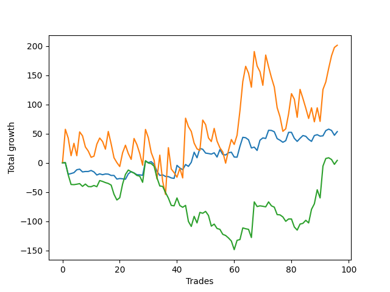

# Long Golden 003 
- Symbol: ES
- Date Range: 3/19/22 - 5/22/22
- Trading Period: 7:20-12:30
- Number of Trades: 99



| Name | Win Percent | Profit | Avg Profit / Trade |     | Name | Win Percent | Profit | Avg Profit / Trade |
| ---- | ----------- | ------ | ------------------ | --- | ---- | ----------- | ------ | ------------------ |
| Sorted By <br> Profit | | | | | Sorted By <br> Win Percentage ||||
| Seventy-Four | 42.42 | 119875.00 | 1210.86 |     | Seventy-Three | 48.48 | 26875.00 | 271.46 |
| Seventy-Three | 48.48 | 26875.00 | 271.46 |     | Seventy-Four | 42.42 | 119875.00 | 1210.86 |
| Seventy-Five | 35.35 | 2875.00 | 29.04 |     | Seventy-Five | 35.35 | 2875.00 | 29.04 |

### Test Seventy-Three
* Sell when the linear regression slope changes to negative
* No Stoploss
* Results:
```
Total Trades: 99
Percent Up: 48.48
Percent Down: 51.52
Total Points Moved Up: 53.75
Potential Profit: 26875.00
Total Points Ups: 256.25 Count Ups: 48
Total Points Downs: -202.50 Count Downs: 51
```

<details><summary>Trades</summary>

<code>In: 2022-03-18 06:46:00		Out: 2022-03-18 06:49:05		Total Position Time: 03:05		Total Move Up: 0.25		Total to Date: 0.25</code> <br />
<code>In: 2022-03-21 08:34:00		Out: 2022-03-21 08:41:05		Total Position Time: 07:05		Total Move Up: 1.25		Total to Date: 1.50</code> <br />
<code>In: 2022-03-22 06:46:00		Out: 2022-03-22 06:52:05		Total Position Time: 06:05		Total Move Up: 1.50		Total to Date: 3.00</code> <br />
<code>In: 2022-03-23 06:46:00		Out: 2022-03-23 07:01:05		Total Position Time: 15:05		Total Move Up: 1.75		Total to Date: 4.75</code> <br />
<code>In: 2022-03-23 07:14:00		Out: 2022-03-23 07:24:05		Total Position Time: 10:05		Total Move Up: 5.00		Total to Date: 9.75</code> <br />
<code>In: 2022-03-24 06:46:00		Out: 2022-03-24 06:51:05		Total Position Time: 05:05		Total Move Up: 1.00		Total to Date: 10.75</code> <br />
<code>In: 2022-03-25 06:46:00		Out: 2022-03-25 06:57:05		Total Position Time: 11:05		Total Move Up: 2.75		Total to Date: 13.50</code> <br />
<code>In: 2022-03-25 06:51:00		Out: 2022-03-25 06:57:05		Total Position Time: 06:05		Total Move Up: -4.75		Total to Date: 8.75</code> <br />
<code>In: 2022-03-25 07:13:00		Out: 2022-03-25 07:17:05		Total Position Time: 04:05		Total Move Up: 0.75		Total to Date: 9.50</code> <br />
<code>In: 2022-03-25 12:11:00		Out: 2022-03-25 12:18:05		Total Position Time: 07:05		Total Move Up: 0.00		Total to Date: 9.50</code> <br />
<code>In: 2022-03-28 06:46:00		Out: 2022-03-28 06:48:05		Total Position Time: 02:05		Total Move Up: 1.75		Total to Date: 11.25</code> <br />
<code>In: 2022-03-28 11:59:00		Out: 2022-03-28 12:02:05		Total Position Time: 03:05		Total Move Up: -2.50		Total to Date: 8.75</code> <br />
<code>In: 2022-03-29 06:46:00		Out: 2022-03-29 06:50:05		Total Position Time: 04:05		Total Move Up: -8.75		Total to Date: 0.00</code> <br />
<code>In: 2022-03-29 08:59:00		Out: 2022-03-29 09:18:05		Total Position Time: 19:05		Total Move Up: -5.25		Total to Date: -5.25</code> <br />
<code>In: 2022-03-29 11:39:00		Out: 2022-03-29 11:44:05		Total Position Time: 05:05		Total Move Up: 2.00		Total to Date: -3.25</code> <br />
<code>In: 2022-03-30 06:58:00		Out: 2022-03-30 07:08:05		Total Position Time: 10:05		Total Move Up: -1.50		Total to Date: -4.75</code> <br />
<code>In: 2022-03-31 06:46:00		Out: 2022-03-31 06:56:05		Total Position Time: 10:05		Total Move Up: 1.75		Total to Date: -3.00</code> <br />
<code>In: 2022-03-31 07:52:00		Out: 2022-03-31 07:56:05		Total Position Time: 04:05		Total Move Up: 1.25		Total to Date: -1.75</code> <br />
<code>In: 2022-04-04 06:46:00		Out: 2022-04-04 06:49:05		Total Position Time: 03:05		Total Move Up: -0.25		Total to Date: -2.00</code> <br />
<code>In: 2022-04-06 10:51:00		Out: 2022-04-06 10:55:05		Total Position Time: 04:05		Total Move Up: 0.00		Total to Date: -2.00</code> <br />
<code>In: 2022-04-06 11:35:00		Out: 2022-04-06 11:39:05		Total Position Time: 04:05		Total Move Up: -6.25		Total to Date: -8.25</code> <br />
<code>In: 2022-04-07 11:18:00		Out: 2022-04-07 11:31:05		Total Position Time: 13:05		Total Move Up: -0.50		Total to Date: -8.75</code> <br />
<code>In: 2022-04-08 07:34:00		Out: 2022-04-08 07:39:05		Total Position Time: 05:05		Total Move Up: -0.75		Total to Date: -9.50</code> <br />
<code>In: 2022-04-11 06:46:00		Out: 2022-04-11 06:48:05		Total Position Time: 02:05		Total Move Up: 2.50		Total to Date: -7.00</code> <br />
<code>In: 2022-04-12 06:46:00		Out: 2022-04-12 06:57:05		Total Position Time: 11:05		Total Move Up: 9.25		Total to Date: 2.25</code> <br />
<code>In: 2022-04-13 06:46:00		Out: 2022-04-13 06:53:05		Total Position Time: 07:05		Total Move Up: 3.75		Total to Date: 6.00</code> <br />
<code>In: 2022-04-13 07:25:00		Out: 2022-04-13 07:28:05		Total Position Time: 03:05		Total Move Up: -2.25		Total to Date: 3.75</code> <br />
<code>In: 2022-04-18 06:46:00		Out: 2022-04-18 06:52:05		Total Position Time: 06:05		Total Move Up: -3.00		Total to Date: 0.75</code> <br />
<code>In: 2022-04-18 07:34:00		Out: 2022-04-18 07:37:05		Total Position Time: 03:05		Total Move Up: -0.25		Total to Date: 0.50</code> <br />
<code>In: 2022-04-18 11:50:00		Out: 2022-04-18 11:57:05		Total Position Time: 07:05		Total Move Up: -0.75		Total to Date: -0.25</code> <br />
<code>In: 2022-04-19 06:46:00		Out: 2022-04-19 07:06:05		Total Position Time: 20:05		Total Move Up: 24.25		Total to Date: 24.00</code> <br />
<code>In: 2022-04-20 07:47:00		Out: 2022-04-20 08:02:05		Total Position Time: 15:05		Total Move Up: -2.50		Total to Date: 21.50</code> <br />
<code>In: 2022-04-20 09:57:00		Out: 2022-04-20 10:03:05		Total Position Time: 06:05		Total Move Up: 1.50		Total to Date: 23.00</code> <br />
<code>In: 2022-04-21 06:46:00		Out: 2022-04-21 06:55:05		Total Position Time: 09:05		Total Move Up: 2.75		Total to Date: 25.75</code> <br />
<code>In: 2022-04-21 06:51:00		Out: 2022-04-21 06:55:05		Total Position Time: 04:05		Total Move Up: -4.50		Total to Date: 21.25</code> <br />
<code>In: 2022-04-25 07:38:00		Out: 2022-04-25 07:40:05		Total Position Time: 02:05		Total Move Up: -11.75		Total to Date: 9.50</code> <br />
<code>In: 2022-04-25 10:26:00		Out: 2022-04-25 10:28:05		Total Position Time: 02:05		Total Move Up: -7.25		Total to Date: 2.25</code> <br />
<code>In: 2022-04-27 06:46:00		Out: 2022-04-27 06:54:05		Total Position Time: 08:05		Total Move Up: 1.00		Total to Date: 3.25</code> <br />
<code>In: 2022-04-27 08:38:00		Out: 2022-04-27 08:41:05		Total Position Time: 03:05		Total Move Up: -2.75		Total to Date: 0.50</code> <br />
<code>In: 2022-04-28 08:39:00		Out: 2022-04-28 09:03:05		Total Position Time: 24:05		Total Move Up: -0.25		Total to Date: 0.25</code> <br />
<code>In: 2022-04-29 06:58:00		Out: 2022-04-29 07:04:05		Total Position Time: 06:05		Total Move Up: -2.25		Total to Date: -2.00</code> <br />
<code>In: 2022-05-02 06:46:00		Out: 2022-05-02 06:52:05		Total Position Time: 06:05		Total Move Up: 11.25		Total to Date: 9.25</code> <br />
<code>In: 2022-05-02 06:49:00		Out: 2022-05-02 06:52:05		Total Position Time: 03:05		Total Move Up: -0.75		Total to Date: 8.50</code> <br />
<code>In: 2022-05-02 07:21:00		Out: 2022-05-02 07:37:05		Total Position Time: 16:05		Total Move Up: 22.25		Total to Date: 30.75</code> <br />
<code>In: 2022-05-03 07:00:00		Out: 2022-05-03 07:08:05		Total Position Time: 08:05		Total Move Up: -4.50		Total to Date: 26.25</code> <br />
<code>In: 2022-05-04 06:46:00		Out: 2022-05-04 06:53:05		Total Position Time: 07:05		Total Move Up: -3.00		Total to Date: 23.25</code> <br />
<code>In: 2022-05-04 09:47:00		Out: 2022-05-04 10:06:05		Total Position Time: 19:05		Total Move Up: 9.00		Total to Date: 32.25</code> <br />
<code>In: 2022-05-06 07:25:00		Out: 2022-05-06 07:29:05		Total Position Time: 04:05		Total Move Up: -3.25		Total to Date: 29.00</code> <br />
<code>In: 2022-05-09 06:46:00		Out: 2022-05-09 07:02:05		Total Position Time: 16:05		Total Move Up: 7.00		Total to Date: 36.00</code> <br />
<code>In: 2022-05-11 06:46:00		Out: 2022-05-11 06:56:05		Total Position Time: 10:05		Total Move Up: 17.25		Total to Date: 53.25</code> <br />
<code>In: 2022-05-12 06:46:00		Out: 2022-05-12 06:53:05		Total Position Time: 07:05		Total Move Up: 4.50		Total to Date: 57.75</code> <br />
<code>In: 2022-05-12 06:48:00		Out: 2022-05-12 06:53:05		Total Position Time: 05:05		Total Move Up: -9.50		Total to Date: 48.25</code> <br />
<code>In: 2022-05-12 07:06:00		Out: 2022-05-12 07:18:05		Total Position Time: 12:05		Total Move Up: 16.00		Total to Date: 64.25</code> <br />
<code>In: 2022-05-13 06:46:00		Out: 2022-05-13 06:49:05		Total Position Time: 03:05		Total Move Up: -1.50		Total to Date: 62.75</code> <br />
<code>In: 2022-05-16 07:20:00		Out: 2022-05-16 07:22:05		Total Position Time: 02:05		Total Move Up: -0.75		Total to Date: 62.00</code> <br />
<code>In: 2022-05-16 08:56:00		Out: 2022-05-16 08:58:05		Total Position Time: 02:05		Total Move Up: -1.00		Total to Date: 61.00</code> <br />
<code>In: 2022-05-17 09:25:00		Out: 2022-05-17 09:32:05		Total Position Time: 07:05		Total Move Up: 2.25		Total to Date: 63.25</code> <br />
<code>In: 2022-05-19 07:17:00		Out: 2022-05-19 07:27:05		Total Position Time: 10:05		Total Move Up: -7.25		Total to Date: 56.00</code> <br />
<code>In: 2022-05-19 08:37:00		Out: 2022-05-19 08:47:05		Total Position Time: 10:05		Total Move Up: 12.75		Total to Date: 68.75</code> <br />
<code>In: 2022-05-20 06:46:00		Out: 2022-05-20 06:48:05		Total Position Time: 02:05		Total Move Up: -8.50		Total to Date: 60.25</code> <br />
<code>In: 2022-05-23 06:46:00		Out: 2022-05-23 06:55:05		Total Position Time: 09:05		Total Move Up: -0.75		Total to Date: 59.50</code> <br />
<code>In: 2022-05-23 07:32:00		Out: 2022-05-23 07:39:05		Total Position Time: 07:05		Total Move Up: 3.75		Total to Date: 63.25</code> <br />
<code>In: 2022-05-24 06:46:00		Out: 2022-05-24 06:49:05		Total Position Time: 03:05		Total Move Up: -4.25		Total to Date: 59.00</code> <br />
<code>In: 2022-05-24 10:44:00		Out: 2022-05-24 10:49:05		Total Position Time: 05:05		Total Move Up: 1.00		Total to Date: 60.00</code> <br />
<code>In: 2022-05-25 06:46:00		Out: 2022-05-25 06:48:05		Total Position Time: 02:05		Total Move Up: -8.25		Total to Date: 51.75</code> <br />
<code>In: 2022-05-25 11:44:00		Out: 2022-05-25 11:46:05		Total Position Time: 02:05		Total Move Up: -0.25		Total to Date: 51.50</code> <br />
<code>In: 2022-05-26 06:46:00		Out: 2022-05-26 07:01:05		Total Position Time: 15:05		Total Move Up: 18.50		Total to Date: 70.00</code> <br />
<code>In: 2022-05-31 07:25:00		Out: 2022-05-31 07:27:05		Total Position Time: 02:05		Total Move Up: -0.75		Total to Date: 69.25</code> <br />
<code>In: 2022-06-02 06:46:00		Out: 2022-06-02 06:52:05		Total Position Time: 06:05		Total Move Up: -3.50		Total to Date: 65.75</code> <br />
<code>In: 2022-06-02 07:14:00		Out: 2022-06-02 07:21:05		Total Position Time: 07:05		Total Move Up: -14.00		Total to Date: 51.75</code> <br />
<code>In: 2022-06-02 07:47:00		Out: 2022-06-02 07:52:05		Total Position Time: 05:05		Total Move Up: 1.50		Total to Date: 53.25</code> <br />
<code>In: 2022-06-03 07:04:00		Out: 2022-06-03 07:06:05		Total Position Time: 02:05		Total Move Up: -5.75		Total to Date: 47.50</code> <br />
<code>In: 2022-06-06 07:02:00		Out: 2022-06-06 07:12:05		Total Position Time: 10:05		Total Move Up: 4.00		Total to Date: 51.50</code> <br />
<code>In: 2022-06-07 06:46:00		Out: 2022-06-07 06:58:05		Total Position Time: 12:05		Total Move Up: -1.00		Total to Date: 50.50</code> <br />
<code>In: 2022-06-09 06:52:00		Out: 2022-06-09 07:02:05		Total Position Time: 10:05		Total Move Up: -0.25		Total to Date: 50.25</code> <br />
<code>In: 2022-06-10 06:46:00		Out: 2022-06-10 06:50:05		Total Position Time: 04:05		Total Move Up: -6.50		Total to Date: 43.75</code> <br />
<code>In: 2022-06-10 06:48:00		Out: 2022-06-10 06:50:05		Total Position Time: 02:05		Total Move Up: -2.25		Total to Date: 41.50</code> <br />
<code>In: 2022-06-14 07:00:00		Out: 2022-06-14 07:06:05		Total Position Time: 06:05		Total Move Up: -11.75		Total to Date: 29.75</code> <br />
<code>In: 2022-06-15 06:46:00		Out: 2022-06-15 06:54:05		Total Position Time: 08:05		Total Move Up: -2.75		Total to Date: 27.00</code> <br />
<code>In: 2022-06-17 06:46:00		Out: 2022-06-17 06:49:05		Total Position Time: 03:05		Total Move Up: -3.50		Total to Date: 23.50</code> <br />
<code>In: 2022-06-17 10:31:00		Out: 2022-06-17 10:42:05		Total Position Time: 11:05		Total Move Up: 2.75		Total to Date: 26.25</code> <br />
<code>In: 2022-06-21 06:46:00		Out: 2022-06-21 07:09:05		Total Position Time: 23:05		Total Move Up: 14.25		Total to Date: 40.50</code> <br />
<code>In: 2022-06-22 06:46:00		Out: 2022-06-22 06:52:05		Total Position Time: 06:05		Total Move Up: 0.00		Total to Date: 40.50</code> <br />
<code>In: 2022-06-23 06:46:00		Out: 2022-06-23 06:51:05		Total Position Time: 05:05		Total Move Up: 1.00		Total to Date: 41.50</code> <br />
<code>In: 2022-06-23 07:03:00		Out: 2022-06-23 07:09:05		Total Position Time: 06:05		Total Move Up: -10.25		Total to Date: 31.25</code> <br />
<code>In: 2022-06-23 07:22:00		Out: 2022-06-23 07:28:05		Total Position Time: 06:05		Total Move Up: -5.25		Total to Date: 26.00</code> <br />
<code>In: 2022-06-24 06:46:00		Out: 2022-06-24 06:56:05		Total Position Time: 10:05		Total Move Up: 5.25		Total to Date: 31.25</code> <br />
<code>In: 2022-06-27 07:50:00		Out: 2022-06-27 08:01:05		Total Position Time: 11:05		Total Move Up: 4.75		Total to Date: 36.00</code> <br />
<code>In: 2022-06-29 06:53:00		Out: 2022-06-29 07:00:05		Total Position Time: 07:05		Total Move Up: -5.25		Total to Date: 30.75</code> <br />
<code>In: 2022-06-30 08:01:00		Out: 2022-06-30 08:03:05		Total Position Time: 02:05		Total Move Up: -3.50		Total to Date: 27.25</code> <br />
<code>In: 2022-07-01 06:46:00		Out: 2022-07-01 06:55:05		Total Position Time: 09:05		Total Move Up: 10.00		Total to Date: 37.25</code> <br />
<code>In: 2022-07-01 10:58:00		Out: 2022-07-01 11:03:05		Total Position Time: 05:05		Total Move Up: 1.50		Total to Date: 38.75</code> <br />
<code>In: 2022-07-05 07:37:00		Out: 2022-07-05 07:44:05		Total Position Time: 07:05		Total Move Up: -2.50		Total to Date: 36.25</code> <br />
<code>In: 2022-07-05 08:55:00		Out: 2022-07-05 08:57:05		Total Position Time: 02:05		Total Move Up: 0.50		Total to Date: 36.75</code> <br />
<code>In: 2022-07-06 06:46:00		Out: 2022-07-06 06:51:05		Total Position Time: 05:05		Total Move Up: 1.50		Total to Date: 38.25</code> <br />
<code>In: 2022-07-06 11:35:00		Out: 2022-07-06 11:41:05		Total Position Time: 06:05		Total Move Up: 9.00		Total to Date: 47.25</code> <br />
<code>In: 2022-07-07 06:46:00		Out: 2022-07-07 06:48:05		Total Position Time: 02:05		Total Move Up: 2.50		Total to Date: 49.75</code> <br />
<code>In: 2022-07-07 07:34:00		Out: 2022-07-07 07:38:05		Total Position Time: 04:05		Total Move Up: -2.25		Total to Date: 47.50</code> <br />
<code>In: 2022-07-08 07:29:00		Out: 2022-07-08 07:37:05		Total Position Time: 08:05		Total Move Up: 6.25		Total to Date: 53.75</code> <br />


</details>

### Test Seventy-Four
* Sell when the bias changes to negative
* No Stoploss
* Results:
```
Total Trades: 99
Percent Up: 42.42
Percent Down: 57.58
Total Points Moved Up: 239.75
Potential Profit: 119875.00
Total Points Ups: 1215.00 Count Ups: 42
Total Points Downs: -975.25 Count Downs: 57
```

<details><summary>Trades</summary>

<code>In: 2022-03-18 06:46:00		Out: 2022-03-18 12:31:00		Total Position Time: 345:00		Total Move Up: 57.50		Total to Date: 57.50</code> <br />
<code>In: 2022-03-21 08:34:00		Out: 2022-03-21 10:03:05		Total Position Time: 89:05		Total Move Up: -30.25		Total to Date: 27.25</code> <br />
<code>In: 2022-03-22 06:46:00		Out: 2022-03-22 12:31:00		Total Position Time: 345:00		Total Move Up: 21.25		Total to Date: 48.50</code> <br />
<code>In: 2022-03-23 06:46:00		Out: 2022-03-23 10:31:05		Total Position Time: 225:05		Total Move Up: -10.25		Total to Date: 38.25</code> <br />
<code>In: 2022-03-23 07:14:00		Out: 2022-03-23 10:31:05		Total Position Time: 197:05		Total Move Up: -21.25		Total to Date: 17.00</code> <br />
<code>In: 2022-03-24 06:46:00		Out: 2022-03-24 12:31:00		Total Position Time: 345:00		Total Move Up: 40.75		Total to Date: 57.75</code> <br />
<code>In: 2022-03-25 06:46:00		Out: 2022-03-25 07:05:05		Total Position Time: 19:05		Total Move Up: 0.75		Total to Date: 58.50</code> <br />
<code>In: 2022-03-25 06:51:00		Out: 2022-03-25 07:05:05		Total Position Time: 14:05		Total Move Up: -6.75		Total to Date: 51.75</code> <br />
<code>In: 2022-03-25 07:13:00		Out: 2022-03-25 08:31:05		Total Position Time: 78:05		Total Move Up: -19.00		Total to Date: 32.75</code> <br />
<code>In: 2022-03-25 12:11:00		Out: 2022-03-25 12:31:00		Total Position Time: 20:00		Total Move Up: -7.00		Total to Date: 25.75</code> <br />
<code>In: 2022-03-28 06:46:00		Out: 2022-03-28 08:36:05		Total Position Time: 110:05		Total Move Up: -10.75		Total to Date: 15.00</code> <br />
<code>In: 2022-03-28 11:59:00		Out: 2022-03-28 12:31:00		Total Position Time: 32:00		Total Move Up: 2.00		Total to Date: 17.00</code> <br />
<code>In: 2022-03-29 06:46:00		Out: 2022-03-29 12:31:00		Total Position Time: 345:00		Total Move Up: 15.00		Total to Date: 32.00</code> <br />
<code>In: 2022-03-29 08:59:00		Out: 2022-03-29 12:31:00		Total Position Time: 212:00		Total Move Up: 20.50		Total to Date: 52.50</code> <br />
<code>In: 2022-03-29 11:39:00		Out: 2022-03-29 12:31:00		Total Position Time: 52:00		Total Move Up: 10.50		Total to Date: 63.00</code> <br />
<code>In: 2022-03-30 06:58:00		Out: 2022-03-30 07:33:05		Total Position Time: 35:05		Total Move Up: -6.00		Total to Date: 57.00</code> <br />
<code>In: 2022-03-31 06:46:00		Out: 2022-03-31 09:36:05		Total Position Time: 170:05		Total Move Up: -6.25		Total to Date: 50.75</code> <br />
<code>In: 2022-03-31 07:52:00		Out: 2022-03-31 09:36:05		Total Position Time: 104:05		Total Move Up: -13.00		Total to Date: 37.75</code> <br />
<code>In: 2022-04-04 06:46:00		Out: 2022-04-04 12:31:00		Total Position Time: 345:00		Total Move Up: 30.25		Total to Date: 68.00</code> <br />
<code>In: 2022-04-06 10:51:00		Out: 2022-04-06 11:15:05		Total Position Time: 24:05		Total Move Up: -23.75		Total to Date: 44.25</code> <br />
<code>In: 2022-04-06 11:35:00		Out: 2022-04-06 12:31:00		Total Position Time: 56:00		Total Move Up: -8.25		Total to Date: 36.00</code> <br />
<code>In: 2022-04-07 11:18:00		Out: 2022-04-07 12:31:00		Total Position Time: 73:00		Total Move Up: 23.50		Total to Date: 59.50</code> <br />
<code>In: 2022-04-08 07:34:00		Out: 2022-04-08 12:31:00		Total Position Time: 297:00		Total Move Up: 13.00		Total to Date: 72.50</code> <br />
<code>In: 2022-04-11 06:46:00		Out: 2022-04-11 12:31:00		Total Position Time: 345:00		Total Move Up: -30.00		Total to Date: 42.50</code> <br />
<code>In: 2022-04-12 06:46:00		Out: 2022-04-12 07:49:05		Total Position Time: 63:05		Total Move Up: -14.25		Total to Date: 28.25</code> <br />
<code>In: 2022-04-13 06:46:00		Out: 2022-04-13 07:13:05		Total Position Time: 27:05		Total Move Up: -10.00		Total to Date: 18.25</code> <br />
<code>In: 2022-04-13 07:25:00		Out: 2022-04-13 12:31:00		Total Position Time: 306:00		Total Move Up: 35.75		Total to Date: 54.00</code> <br />
<code>In: 2022-04-18 06:46:00		Out: 2022-04-18 06:58:05		Total Position Time: 12:05		Total Move Up: -10.50		Total to Date: 43.50</code> <br />
<code>In: 2022-04-18 07:34:00		Out: 2022-04-18 08:31:05		Total Position Time: 57:05		Total Move Up: -15.25		Total to Date: 28.25</code> <br />
<code>In: 2022-04-18 11:50:00		Out: 2022-04-18 12:31:00		Total Position Time: 41:00		Total Move Up: -20.00		Total to Date: 8.25</code> <br />
<code>In: 2022-04-19 06:46:00		Out: 2022-04-19 12:31:00		Total Position Time: 345:00		Total Move Up: 61.25		Total to Date: 69.50</code> <br />
<code>In: 2022-04-20 07:47:00		Out: 2022-04-20 09:20:05		Total Position Time: 93:05		Total Move Up: -14.25		Total to Date: 55.25</code> <br />
<code>In: 2022-04-20 09:57:00		Out: 2022-04-20 11:59:05		Total Position Time: 122:05		Total Move Up: -25.25		Total to Date: 30.00</code> <br />
<code>In: 2022-04-21 06:46:00		Out: 2022-04-21 07:10:05		Total Position Time: 24:05		Total Move Up: -5.75		Total to Date: 24.25</code> <br />
<code>In: 2022-04-21 06:51:00		Out: 2022-04-21 07:10:05		Total Position Time: 19:05		Total Move Up: -13.00		Total to Date: 11.25</code> <br />
<code>In: 2022-04-25 07:38:00		Out: 2022-04-25 08:03:05		Total Position Time: 25:05		Total Move Up: -32.25		Total to Date: -21.00</code> <br />
<code>In: 2022-04-25 10:26:00		Out: 2022-04-25 12:31:00		Total Position Time: 125:00		Total Move Up: 40.75		Total to Date: 19.75</code> <br />
<code>In: 2022-04-27 06:46:00		Out: 2022-04-27 07:19:05		Total Position Time: 33:05		Total Move Up: -44.75		Total to Date: -25.00</code> <br />
<code>In: 2022-04-27 08:38:00		Out: 2022-04-27 12:31:00		Total Position Time: 233:00		Total Move Up: -22.50		Total to Date: -47.50</code> <br />
<code>In: 2022-04-28 08:39:00		Out: 2022-04-28 12:31:00		Total Position Time: 232:00		Total Move Up: 80.00		Total to Date: 32.50</code> <br />
<code>In: 2022-04-29 06:58:00		Out: 2022-04-29 07:24:05		Total Position Time: 26:05		Total Move Up: -36.50		Total to Date: -4.00</code> <br />
<code>In: 2022-05-02 06:46:00		Out: 2022-05-02 07:19:05		Total Position Time: 33:05		Total Move Up: 5.75		Total to Date: 1.75</code> <br />
<code>In: 2022-05-02 06:49:00		Out: 2022-05-02 07:19:05		Total Position Time: 30:05		Total Move Up: -6.25		Total to Date: -4.50</code> <br />
<code>In: 2022-05-02 07:21:00		Out: 2022-05-02 08:34:05		Total Position Time: 73:05		Total Move Up: -7.75		Total to Date: -12.25</code> <br />
<code>In: 2022-05-03 07:00:00		Out: 2022-05-03 12:31:00		Total Position Time: 331:00		Total Move Up: 15.25		Total to Date: 3.00</code> <br />
<code>In: 2022-05-04 06:46:00		Out: 2022-05-04 07:01:05		Total Position Time: 15:05		Total Move Up: -16.50		Total to Date: -13.50</code> <br />
<code>In: 2022-05-04 09:47:00		Out: 2022-05-04 12:31:00		Total Position Time: 164:00		Total Move Up: 102.25		Total to Date: 88.75</code> <br />
<code>In: 2022-05-06 07:25:00		Out: 2022-05-06 12:31:00		Total Position Time: 306:00		Total Move Up: -14.50		Total to Date: 74.25</code> <br />
<code>In: 2022-05-09 06:46:00		Out: 2022-05-09 06:49:05		Total Position Time: 03:05		Total Move Up: -8.25		Total to Date: 66.00</code> <br />
<code>In: 2022-05-11 06:46:00		Out: 2022-05-11 09:48:05		Total Position Time: 182:05		Total Move Up: -20.00		Total to Date: 46.00</code> <br />
<code>In: 2022-05-12 06:46:00		Out: 2022-05-12 07:06:05		Total Position Time: 20:05		Total Move Up: 4.25		Total to Date: 50.25</code> <br />
<code>In: 2022-05-12 06:48:00		Out: 2022-05-12 07:06:05		Total Position Time: 18:05		Total Move Up: -9.75		Total to Date: 40.50</code> <br />
<code>In: 2022-05-12 07:06:00		Out: 2022-05-12 10:25:05		Total Position Time: 199:05		Total Move Up: -2.75		Total to Date: 37.75</code> <br />
<code>In: 2022-05-13 06:46:00		Out: 2022-05-13 12:31:00		Total Position Time: 345:00		Total Move Up: 52.00		Total to Date: 89.75</code> <br />
<code>In: 2022-05-16 07:20:00		Out: 2022-05-16 08:06:05		Total Position Time: 46:05		Total Move Up: -22.75		Total to Date: 67.00</code> <br />
<code>In: 2022-05-16 08:56:00		Out: 2022-05-16 12:31:00		Total Position Time: 215:00		Total Move Up: -6.25		Total to Date: 60.75</code> <br />
<code>In: 2022-05-17 09:25:00		Out: 2022-05-17 12:31:00		Total Position Time: 186:00		Total Move Up: 22.50		Total to Date: 83.25</code> <br />
<code>In: 2022-05-19 07:17:00		Out: 2022-05-19 07:50:05		Total Position Time: 33:05		Total Move Up: -21.75		Total to Date: 61.50</code> <br />
<code>In: 2022-05-19 08:37:00		Out: 2022-05-19 12:31:00		Total Position Time: 234:00		Total Move Up: -11.50		Total to Date: 50.00</code> <br />
<code>In: 2022-05-20 06:46:00		Out: 2022-05-20 06:50:05		Total Position Time: 04:05		Total Move Up: -7.00		Total to Date: 43.00</code> <br />
<code>In: 2022-05-23 06:46:00		Out: 2022-05-23 07:06:05		Total Position Time: 20:05		Total Move Up: -19.25		Total to Date: 23.75</code> <br />
<code>In: 2022-05-23 07:32:00		Out: 2022-05-23 12:31:00		Total Position Time: 299:00		Total Move Up: 21.75		Total to Date: 45.50</code> <br />
<code>In: 2022-05-24 06:46:00		Out: 2022-05-24 12:31:00		Total Position Time: 345:00		Total Move Up: 9.75		Total to Date: 55.25</code> <br />
<code>In: 2022-05-24 10:44:00		Out: 2022-05-24 12:31:00		Total Position Time: 107:00		Total Move Up: 18.75		Total to Date: 74.00</code> <br />
<code>In: 2022-05-25 06:46:00		Out: 2022-05-25 09:47:05		Total Position Time: 181:05		Total Move Up: -8.50		Total to Date: 65.50</code> <br />
<code>In: 2022-05-25 11:44:00		Out: 2022-05-25 12:31:00		Total Position Time: 47:00		Total Move Up: 16.00		Total to Date: 81.50</code> <br />
<code>In: 2022-05-26 06:46:00		Out: 2022-05-26 12:31:00		Total Position Time: 345:00		Total Move Up: 41.75		Total to Date: 123.25</code> <br />
<code>In: 2022-05-31 07:25:00		Out: 2022-05-31 12:31:00		Total Position Time: 306:00		Total Move Up: 26.00		Total to Date: 149.25</code> <br />
<code>In: 2022-06-02 06:46:00		Out: 2022-06-02 06:58:05		Total Position Time: 12:05		Total Move Up: -11.75		Total to Date: 137.50</code> <br />
<code>In: 2022-06-02 07:14:00		Out: 2022-06-02 07:30:05		Total Position Time: 16:05		Total Move Up: -24.00		Total to Date: 113.50</code> <br />
<code>In: 2022-06-02 07:47:00		Out: 2022-06-02 12:31:00		Total Position Time: 284:00		Total Move Up: 61.00		Total to Date: 174.50</code> <br />
<code>In: 2022-06-03 07:04:00		Out: 2022-06-03 07:39:05		Total Position Time: 35:05		Total Move Up: -24.75		Total to Date: 149.75</code> <br />
<code>In: 2022-06-06 07:02:00		Out: 2022-06-06 08:32:05		Total Position Time: 90:05		Total Move Up: -23.25		Total to Date: 126.50</code> <br />
<code>In: 2022-06-07 06:46:00		Out: 2022-06-07 12:31:00		Total Position Time: 345:00		Total Move Up: 51.75		Total to Date: 178.25</code> <br />
<code>In: 2022-06-09 06:52:00		Out: 2022-06-09 07:59:05		Total Position Time: 67:05		Total Move Up: -18.50		Total to Date: 159.75</code> <br />
<code>In: 2022-06-10 06:46:00		Out: 2022-06-10 12:31:00		Total Position Time: 345:00		Total Move Up: -20.50		Total to Date: 139.25</code> <br />
<code>In: 2022-06-10 06:48:00		Out: 2022-06-10 12:31:00		Total Position Time: 343:00		Total Move Up: -16.25		Total to Date: 123.00</code> <br />
<code>In: 2022-06-14 07:00:00		Out: 2022-06-14 07:21:05		Total Position Time: 21:05		Total Move Up: -35.25		Total to Date: 87.75</code> <br />
<code>In: 2022-06-15 06:46:00		Out: 2022-06-15 07:51:05		Total Position Time: 65:05		Total Move Up: -15.75		Total to Date: 72.00</code> <br />
<code>In: 2022-06-17 06:46:00		Out: 2022-06-17 07:19:05		Total Position Time: 33:05		Total Move Up: -24.75		Total to Date: 47.25</code> <br />
<code>In: 2022-06-17 10:31:00		Out: 2022-06-17 12:31:00		Total Position Time: 120:00		Total Move Up: 4.25		Total to Date: 51.50</code> <br />
<code>In: 2022-06-21 06:46:00		Out: 2022-06-21 12:31:00		Total Position Time: 345:00		Total Move Up: 25.75		Total to Date: 77.25</code> <br />
<code>In: 2022-06-22 06:46:00		Out: 2022-06-22 12:31:00		Total Position Time: 345:00		Total Move Up: 34.50		Total to Date: 111.75</code> <br />
<code>In: 2022-06-23 06:46:00		Out: 2022-06-23 07:17:05		Total Position Time: 31:05		Total Move Up: 4.75		Total to Date: 116.50</code> <br />
<code>In: 2022-06-23 07:03:00		Out: 2022-06-23 07:17:05		Total Position Time: 14:05		Total Move Up: -9.50		Total to Date: 107.00</code> <br />
<code>In: 2022-06-23 07:22:00		Out: 2022-06-23 09:05:05		Total Position Time: 103:05		Total Move Up: -31.00		Total to Date: 76.00</code> <br />
<code>In: 2022-06-24 06:46:00		Out: 2022-06-24 12:31:00		Total Position Time: 345:00		Total Move Up: 47.75		Total to Date: 123.75</code> <br />
<code>In: 2022-06-27 07:50:00		Out: 2022-06-27 11:12:05		Total Position Time: 202:05		Total Move Up: -15.50		Total to Date: 108.25</code> <br />
<code>In: 2022-06-29 06:53:00		Out: 2022-06-29 09:09:05		Total Position Time: 136:05		Total Move Up: -17.75		Total to Date: 90.50</code> <br />
<code>In: 2022-06-30 08:01:00		Out: 2022-06-30 12:31:00		Total Position Time: 270:00		Total Move Up: 18.25		Total to Date: 108.75</code> <br />
<code>In: 2022-07-01 06:46:00		Out: 2022-07-01 07:20:05		Total Position Time: 34:05		Total Move Up: -24.00		Total to Date: 84.75</code> <br />
<code>In: 2022-07-01 10:58:00		Out: 2022-07-01 12:31:00		Total Position Time: 93:00		Total Move Up: 24.00		Total to Date: 108.75</code> <br />
<code>In: 2022-07-05 07:37:00		Out: 2022-07-05 08:06:05		Total Position Time: 29:05		Total Move Up: -23.25		Total to Date: 85.50</code> <br />
<code>In: 2022-07-05 08:55:00		Out: 2022-07-05 12:31:00		Total Position Time: 216:00		Total Move Up: 54.50		Total to Date: 140.00</code> <br />
<code>In: 2022-07-06 06:46:00		Out: 2022-07-06 12:31:00		Total Position Time: 345:00		Total Move Up: 38.25		Total to Date: 178.25</code> <br />
<code>In: 2022-07-06 11:35:00		Out: 2022-07-06 12:31:00		Total Position Time: 56:00		Total Move Up: 13.00		Total to Date: 191.25</code> <br />
<code>In: 2022-07-07 06:46:00		Out: 2022-07-07 12:31:00		Total Position Time: 345:00		Total Move Up: 23.25		Total to Date: 214.50</code> <br />
<code>In: 2022-07-07 07:34:00		Out: 2022-07-07 12:31:00		Total Position Time: 297:00		Total Move Up: 21.50		Total to Date: 236.00</code> <br />
<code>In: 2022-07-08 07:29:00		Out: 2022-07-08 12:31:00		Total Position Time: 302:00		Total Move Up: 3.75		Total to Date: 239.75</code> <br />


</details>

### Test Seventy-Five
* Sell when the STDEV slope changes to negative
* No Stoploss
* Results:
```
Total Trades: 99
Percent Up: 35.35
Percent Down: 64.65
Total Points Moved Up: 5.75
Potential Profit: 2875.00
Total Points Ups: 410.25 Count Ups: 35
Total Points Downs: -404.50 Count Downs: 64
```

<details><summary>Trades</summary>

<code>In: 2022-03-18 06:46:00		Out: 2022-03-18 06:55:05		Total Position Time: 09:05		Total Move Up: 0.50		Total to Date: 0.50</code> <br />
<code>In: 2022-03-21 08:34:00		Out: 2022-03-21 09:32:05		Total Position Time: 58:05		Total Move Up: -16.50		Total to Date: -16.00</code> <br />
<code>In: 2022-03-22 06:46:00		Out: 2022-03-22 06:47:05		Total Position Time: 01:05		Total Move Up: -0.25		Total to Date: -16.25</code> <br />
<code>In: 2022-03-23 06:46:00		Out: 2022-03-23 06:47:05		Total Position Time: 01:05		Total Move Up: -1.50		Total to Date: -17.75</code> <br />
<code>In: 2022-03-23 07:14:00		Out: 2022-03-23 07:44:05		Total Position Time: 30:05		Total Move Up: 0.75		Total to Date: -17.00</code> <br />
<code>In: 2022-03-24 06:46:00		Out: 2022-03-24 06:51:05		Total Position Time: 05:05		Total Move Up: 1.00		Total to Date: -16.00</code> <br />
<code>In: 2022-03-25 06:46:00		Out: 2022-03-25 06:57:05		Total Position Time: 11:05		Total Move Up: 2.75		Total to Date: -13.25</code> <br />
<code>In: 2022-03-25 06:51:00		Out: 2022-03-25 06:57:05		Total Position Time: 06:05		Total Move Up: -4.75		Total to Date: -18.00</code> <br />
<code>In: 2022-03-25 07:13:00		Out: 2022-03-25 08:02:05		Total Position Time: 49:05		Total Move Up: 4.00		Total to Date: -14.00</code> <br />
<code>In: 2022-03-25 12:11:00		Out: 2022-03-25 12:22:05		Total Position Time: 11:05		Total Move Up: -4.25		Total to Date: -18.25</code> <br />
<code>In: 2022-03-28 06:46:00		Out: 2022-03-28 06:47:05		Total Position Time: 01:05		Total Move Up: -0.25		Total to Date: -18.50</code> <br />
<code>In: 2022-03-28 11:59:00		Out: 2022-03-28 12:31:00		Total Position Time: 32:00		Total Move Up: 2.00		Total to Date: -16.50</code> <br />
<code>In: 2022-03-29 06:46:00		Out: 2022-03-29 06:48:05		Total Position Time: 02:05		Total Move Up: -1.00		Total to Date: -17.50</code> <br />
<code>In: 2022-03-29 08:59:00		Out: 2022-03-29 09:04:05		Total Position Time: 05:05		Total Move Up: -2.00		Total to Date: -19.50</code> <br />
<code>In: 2022-03-29 11:39:00		Out: 2022-03-29 12:31:00		Total Position Time: 52:00		Total Move Up: 10.50		Total to Date: -9.00</code> <br />
<code>In: 2022-03-30 06:58:00		Out: 2022-03-30 07:08:05		Total Position Time: 10:05		Total Move Up: -1.50		Total to Date: -10.50</code> <br />
<code>In: 2022-03-31 06:46:00		Out: 2022-03-31 06:47:05		Total Position Time: 01:05		Total Move Up: 0.25		Total to Date: -10.25</code> <br />
<code>In: 2022-03-31 07:52:00		Out: 2022-03-31 08:22:05		Total Position Time: 30:05		Total Move Up: -2.00		Total to Date: -12.25</code> <br />
<code>In: 2022-04-04 06:46:00		Out: 2022-04-04 06:48:05		Total Position Time: 02:05		Total Move Up: -1.50		Total to Date: -13.75</code> <br />
<code>In: 2022-04-06 10:51:00		Out: 2022-04-06 11:11:05		Total Position Time: 20:05		Total Move Up: -15.75		Total to Date: -29.50</code> <br />
<code>In: 2022-04-06 11:35:00		Out: 2022-04-06 12:28:05		Total Position Time: 53:05		Total Move Up: -9.75		Total to Date: -39.25</code> <br />
<code>In: 2022-04-07 11:18:00		Out: 2022-04-07 12:31:00		Total Position Time: 73:00		Total Move Up: 23.50		Total to Date: -15.75</code> <br />
<code>In: 2022-04-08 07:34:00		Out: 2022-04-08 09:17:05		Total Position Time: 103:05		Total Move Up: 16.50		Total to Date: 0.75</code> <br />
<code>In: 2022-04-11 06:46:00		Out: 2022-04-11 06:53:05		Total Position Time: 07:05		Total Move Up: -0.50		Total to Date: 0.25</code> <br />
<code>In: 2022-04-12 06:46:00		Out: 2022-04-12 07:03:05		Total Position Time: 17:05		Total Move Up: 7.50		Total to Date: 7.75</code> <br />
<code>In: 2022-04-13 06:46:00		Out: 2022-04-13 06:57:05		Total Position Time: 11:05		Total Move Up: -3.00		Total to Date: 4.75</code> <br />
<code>In: 2022-04-13 07:25:00		Out: 2022-04-13 07:31:05		Total Position Time: 06:05		Total Move Up: -2.25		Total to Date: 2.50</code> <br />
<code>In: 2022-04-18 06:46:00		Out: 2022-04-18 06:47:05		Total Position Time: 01:05		Total Move Up: -4.00		Total to Date: -1.50</code> <br />
<code>In: 2022-04-18 07:34:00		Out: 2022-04-18 07:53:05		Total Position Time: 19:05		Total Move Up: -1.25		Total to Date: -2.75</code> <br />
<code>In: 2022-04-18 11:50:00		Out: 2022-04-18 12:14:05		Total Position Time: 24:05		Total Move Up: -10.50		Total to Date: -13.25</code> <br />
<code>In: 2022-04-19 06:46:00		Out: 2022-04-19 08:02:05		Total Position Time: 76:05		Total Move Up: 37.00		Total to Date: 23.75</code> <br />
<code>In: 2022-04-20 07:47:00		Out: 2022-04-20 08:06:05		Total Position Time: 19:05		Total Move Up: -4.00		Total to Date: 19.75</code> <br />
<code>In: 2022-04-20 09:57:00		Out: 2022-04-20 11:16:05		Total Position Time: 79:05		Total Move Up: -1.00		Total to Date: 18.75</code> <br />
<code>In: 2022-04-21 06:46:00		Out: 2022-04-21 06:47:05		Total Position Time: 01:05		Total Move Up: 3.00		Total to Date: 21.75</code> <br />
<code>In: 2022-04-21 06:51:00		Out: 2022-04-21 06:55:05		Total Position Time: 04:05		Total Move Up: -4.50		Total to Date: 17.25</code> <br />
<code>In: 2022-04-25 07:38:00		Out: 2022-04-25 07:45:05		Total Position Time: 07:05		Total Move Up: -19.50		Total to Date: -2.25</code> <br />
<code>In: 2022-04-25 10:26:00		Out: 2022-04-25 11:05:05		Total Position Time: 39:05		Total Move Up: -14.25		Total to Date: -16.50</code> <br />
<code>In: 2022-04-27 06:46:00		Out: 2022-04-27 06:57:05		Total Position Time: 11:05		Total Move Up: -0.75		Total to Date: -17.25</code> <br />
<code>In: 2022-04-27 08:38:00		Out: 2022-04-27 09:03:05		Total Position Time: 25:05		Total Move Up: -10.50		Total to Date: -27.75</code> <br />
<code>In: 2022-04-28 08:39:00		Out: 2022-04-28 08:47:05		Total Position Time: 08:05		Total Move Up: -9.50		Total to Date: -37.25</code> <br />
<code>In: 2022-04-29 06:58:00		Out: 2022-04-29 07:09:05		Total Position Time: 11:05		Total Move Up: -12.50		Total to Date: -49.75</code> <br />
<code>In: 2022-05-02 06:46:00		Out: 2022-05-02 06:52:05		Total Position Time: 06:05		Total Move Up: 11.25		Total to Date: -38.50</code> <br />
<code>In: 2022-05-02 06:49:00		Out: 2022-05-02 06:52:05		Total Position Time: 03:05		Total Move Up: -0.75		Total to Date: -39.25</code> <br />
<code>In: 2022-05-02 07:21:00		Out: 2022-05-02 07:54:05		Total Position Time: 33:05		Total Move Up: 13.50		Total to Date: -25.75</code> <br />
<code>In: 2022-05-03 07:00:00		Out: 2022-05-03 07:10:05		Total Position Time: 10:05		Total Move Up: -13.00		Total to Date: -38.75</code> <br />
<code>In: 2022-05-04 06:46:00		Out: 2022-05-04 06:53:05		Total Position Time: 07:05		Total Move Up: -3.00		Total to Date: -41.75</code> <br />
<code>In: 2022-05-04 09:47:00		Out: 2022-05-04 11:09:05		Total Position Time: 82:05		Total Move Up: 3.25		Total to Date: -38.50</code> <br />
<code>In: 2022-05-06 07:25:00		Out: 2022-05-06 07:38:05		Total Position Time: 13:05		Total Move Up: -27.50		Total to Date: -66.00</code> <br />
<code>In: 2022-05-09 06:46:00		Out: 2022-05-09 06:47:05		Total Position Time: 01:05		Total Move Up: -8.50		Total to Date: -74.50</code> <br />
<code>In: 2022-05-11 06:46:00		Out: 2022-05-11 06:58:05		Total Position Time: 12:05		Total Move Up: 17.25		Total to Date: -57.25</code> <br />
<code>In: 2022-05-12 06:46:00		Out: 2022-05-12 06:52:05		Total Position Time: 06:05		Total Move Up: 2.75		Total to Date: -54.50</code> <br />
<code>In: 2022-05-12 06:48:00		Out: 2022-05-12 06:52:05		Total Position Time: 04:05		Total Move Up: -11.25		Total to Date: -65.75</code> <br />
<code>In: 2022-05-12 07:06:00		Out: 2022-05-12 07:35:05		Total Position Time: 29:05		Total Move Up: 18.00		Total to Date: -47.75</code> <br />
<code>In: 2022-05-13 06:46:00		Out: 2022-05-13 06:49:05		Total Position Time: 03:05		Total Move Up: -1.50		Total to Date: -49.25</code> <br />
<code>In: 2022-05-16 07:20:00		Out: 2022-05-16 07:35:05		Total Position Time: 15:05		Total Move Up: -7.00		Total to Date: -56.25</code> <br />
<code>In: 2022-05-16 08:56:00		Out: 2022-05-16 09:40:05		Total Position Time: 44:05		Total Move Up: -18.25		Total to Date: -74.50</code> <br />
<code>In: 2022-05-17 09:25:00		Out: 2022-05-17 11:04:05		Total Position Time: 99:05		Total Move Up: 3.50		Total to Date: -71.00</code> <br />
<code>In: 2022-05-19 07:17:00		Out: 2022-05-19 07:28:05		Total Position Time: 11:05		Total Move Up: -7.50		Total to Date: -78.50</code> <br />
<code>In: 2022-05-19 08:37:00		Out: 2022-05-19 09:22:05		Total Position Time: 45:05		Total Move Up: -1.50		Total to Date: -80.00</code> <br />
<code>In: 2022-05-20 06:46:00		Out: 2022-05-20 06:48:05		Total Position Time: 02:05		Total Move Up: -8.50		Total to Date: -88.50</code> <br />
<code>In: 2022-05-23 06:46:00		Out: 2022-05-23 06:56:05		Total Position Time: 10:05		Total Move Up: -2.00		Total to Date: -90.50</code> <br />
<code>In: 2022-05-23 07:32:00		Out: 2022-05-23 07:54:05		Total Position Time: 22:05		Total Move Up: -4.25		Total to Date: -94.75</code> <br />
<code>In: 2022-05-24 06:46:00		Out: 2022-05-24 06:49:05		Total Position Time: 03:05		Total Move Up: -4.25		Total to Date: -99.00</code> <br />
<code>In: 2022-05-24 10:44:00		Out: 2022-05-24 11:52:05		Total Position Time: 68:05		Total Move Up: -5.25		Total to Date: -104.25</code> <br />
<code>In: 2022-05-25 06:46:00		Out: 2022-05-25 06:49:05		Total Position Time: 03:05		Total Move Up: -14.75		Total to Date: -119.00</code> <br />
<code>In: 2022-05-25 11:44:00		Out: 2022-05-25 12:31:00		Total Position Time: 47:00		Total Move Up: 16.00		Total to Date: -103.00</code> <br />
<code>In: 2022-05-26 06:46:00		Out: 2022-05-26 06:47:05		Total Position Time: 01:05		Total Move Up: 1.25		Total to Date: -101.75</code> <br />
<code>In: 2022-05-31 07:25:00		Out: 2022-05-31 08:10:05		Total Position Time: 45:05		Total Move Up: -1.50		Total to Date: -103.25</code> <br />
<code>In: 2022-06-02 06:46:00		Out: 2022-06-02 06:49:05		Total Position Time: 03:05		Total Move Up: -1.00		Total to Date: -104.25</code> <br />
<code>In: 2022-06-02 07:14:00		Out: 2022-06-02 07:21:05		Total Position Time: 07:05		Total Move Up: -14.00		Total to Date: -118.25</code> <br />
<code>In: 2022-06-02 07:47:00		Out: 2022-06-02 12:31:00		Total Position Time: 284:00		Total Move Up: 61.00		Total to Date: -57.25</code> <br />
<code>In: 2022-06-03 07:04:00		Out: 2022-06-03 07:13:05		Total Position Time: 09:05		Total Move Up: -8.00		Total to Date: -65.25</code> <br />
<code>In: 2022-06-06 07:02:00		Out: 2022-06-06 07:25:05		Total Position Time: 23:05		Total Move Up: -0.75		Total to Date: -66.00</code> <br />
<code>In: 2022-06-07 06:46:00		Out: 2022-06-07 06:59:05		Total Position Time: 13:05		Total Move Up: -1.00		Total to Date: -67.00</code> <br />
<code>In: 2022-06-09 06:52:00		Out: 2022-06-09 07:07:05		Total Position Time: 15:05		Total Move Up: -6.75		Total to Date: -73.75</code> <br />
<code>In: 2022-06-10 06:46:00		Out: 2022-06-10 06:48:05		Total Position Time: 02:05		Total Move Up: -6.25		Total to Date: -80.00</code> <br />
<code>In: 2022-06-10 06:48:00		Out: 2022-06-10 06:50:05		Total Position Time: 02:05		Total Move Up: -2.25		Total to Date: -82.25</code> <br />
<code>In: 2022-06-14 07:00:00		Out: 2022-06-14 07:07:05		Total Position Time: 07:05		Total Move Up: -12.75		Total to Date: -95.00</code> <br />
<code>In: 2022-06-15 06:46:00		Out: 2022-06-15 06:56:05		Total Position Time: 10:05		Total Move Up: -0.50		Total to Date: -95.50</code> <br />
<code>In: 2022-06-17 06:46:00		Out: 2022-06-17 06:49:05		Total Position Time: 03:05		Total Move Up: -3.50		Total to Date: -99.00</code> <br />
<code>In: 2022-06-17 10:31:00		Out: 2022-06-17 12:12:05		Total Position Time: 101:05		Total Move Up: -7.50		Total to Date: -106.50</code> <br />
<code>In: 2022-06-21 06:46:00		Out: 2022-06-21 06:47:05		Total Position Time: 01:05		Total Move Up: 4.00		Total to Date: -102.50</code> <br />
<code>In: 2022-06-22 06:46:00		Out: 2022-06-22 06:52:05		Total Position Time: 06:05		Total Move Up: 0.00		Total to Date: -102.50</code> <br />
<code>In: 2022-06-23 06:46:00		Out: 2022-06-23 06:47:05		Total Position Time: 01:05		Total Move Up: 5.50		Total to Date: -97.00</code> <br />
<code>In: 2022-06-23 07:03:00		Out: 2022-06-23 07:10:05		Total Position Time: 07:05		Total Move Up: -13.75		Total to Date: -110.75</code> <br />
<code>In: 2022-06-23 07:22:00		Out: 2022-06-23 07:28:05		Total Position Time: 06:05		Total Move Up: -5.25		Total to Date: -116.00</code> <br />
<code>In: 2022-06-24 06:46:00		Out: 2022-06-24 07:00:05		Total Position Time: 14:05		Total Move Up: 10.25		Total to Date: -105.75</code> <br />
<code>In: 2022-06-27 07:50:00		Out: 2022-06-27 09:03:05		Total Position Time: 73:05		Total Move Up: 1.25		Total to Date: -104.50</code> <br />
<code>In: 2022-06-29 06:53:00		Out: 2022-06-29 07:16:05		Total Position Time: 23:05		Total Move Up: -4.50		Total to Date: -109.00</code> <br />
<code>In: 2022-06-30 08:01:00		Out: 2022-06-30 10:15:05		Total Position Time: 134:05		Total Move Up: 23.25		Total to Date: -85.75</code> <br />
<code>In: 2022-07-01 06:46:00		Out: 2022-07-01 07:01:05		Total Position Time: 15:05		Total Move Up: 9.50		Total to Date: -76.25</code> <br />
<code>In: 2022-07-01 10:58:00		Out: 2022-07-01 12:31:00		Total Position Time: 93:00		Total Move Up: 24.00		Total to Date: -52.25</code> <br />
<code>In: 2022-07-05 07:37:00		Out: 2022-07-05 07:47:05		Total Position Time: 10:05		Total Move Up: -14.00		Total to Date: -66.25</code> <br />
<code>In: 2022-07-05 08:55:00		Out: 2022-07-05 12:31:00		Total Position Time: 216:00		Total Move Up: 54.50		Total to Date: -11.75</code> <br />
<code>In: 2022-07-06 06:46:00		Out: 2022-07-06 06:47:05		Total Position Time: 01:05		Total Move Up: -0.50		Total to Date: -12.25</code> <br />
<code>In: 2022-07-06 11:35:00		Out: 2022-07-06 12:31:00		Total Position Time: 56:00		Total Move Up: 13.00		Total to Date: 0.75</code> <br />
<code>In: 2022-07-07 06:46:00		Out: 2022-07-07 06:54:05		Total Position Time: 08:05		Total Move Up: 1.25		Total to Date: 2.00</code> <br />
<code>In: 2022-07-07 07:34:00		Out: 2022-07-07 07:46:05		Total Position Time: 12:05		Total Move Up: -3.00		Total to Date: -1.00</code> <br />
<code>In: 2022-07-08 07:29:00		Out: 2022-07-08 08:47:05		Total Position Time: 78:05		Total Move Up: 6.75		Total to Date: 5.75</code> <br />


</details>