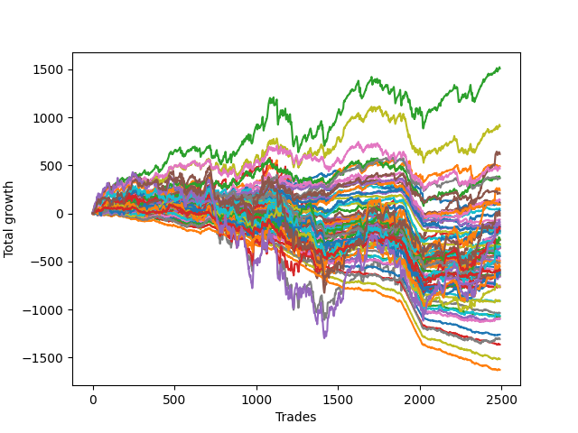

# Long Golden One 
- Symbol: ES
- Date Range: 3/19/22 - 5/22/22
- Trading Period: 7:20-12:30
- Number of Trades: 134



| Name | Win Percent | Profit | Avg Profit / Trade |     | Name | Win Percent | Profit | Avg Profit / Trade |
| ---- | ----------- | ------ | ------------------ | --- | ---- | ----------- | ------ | ------------------ |
| Sorted By <br> Profit | | | | | Sorted By <br> Win Percentage ||||
| Five | 82.84 | 224375.00 | 1674.44 |     | Two | 87.31 | 145125.00 | 1083.02 |
| Sixty-One | 79.10 | 223000.00 | 1664.18 |     | Fifty-Eight | 84.33 | 135750.00 | 1013.06 |
| Seven | 70.15 | 153250.00 | 1143.66 |     | One | 83.58 | 85125.00 | 635.26 |
| Sixty-Three | 67.91 | 152250.00 | 1136.19 |     | Five | 82.84 | 224375.00 | 1674.44 |
| Two | 87.31 | 145125.00 | 1083.02 |     | Fifty-Seven | 82.84 | 73250.00 | 546.64 |
| Fifty-Eight | 84.33 | 135750.00 | 1013.06 |     | Sixty-Five | 81.34 | 67250.00 | 501.87 |
| Six | 67.91 | 120375.00 | 898.32 |     | Sixty-One | 79.10 | 223000.00 | 1664.18 |
| Forty-Five | 57.46 | 110750.00 | 826.49 |     | Four | 76.87 | 69625.00 | 519.59 |
| Seventy-One | 61.94 | 108125.00 | 806.90 |     | Sixty | 75.37 | 79250.00 | 591.42 |
| Sixty-Two | 66.42 | 102500.00 | 764.93 |     | Sixty-Eight | 74.63 | 85125.00 | 635.26 |
| Forty-Seven | 55.22 | 101125.00 | 754.66 |     | Sixty-Six | 74.63 | 84000.00 | 626.87 |
| Seventy | 65.67 | 94500.00 | 705.22 |     | Forty-One | 71.64 | 41250.00 | 307.84 |
| One | 83.58 | 85125.00 | 635.26 |     | Three | 70.90 | 33875.00 | 252.80 |
| Sixty-Eight | 74.63 | 85125.00 | 635.26 |     | Seven | 70.15 | 153250.00 | 1143.66 |
| Sixty-Six | 74.63 | 84000.00 | 626.87 |     | Forty-Four | 70.15 | 81625.00 | 609.14 |
| Forty-Four | 70.15 | 81625.00 | 609.14 |     | Sixty-Seven | 70.15 | 53125.00 | 396.46 |
| Sixty | 75.37 | 79250.00 | 591.42 |     | Fifty-Nine | 70.15 | 51125.00 | 381.53 |
| Fifty-Seven | 82.84 | 73250.00 | 546.64 |     | Zero | 69.40 | 26500.00 | 197.76 |
| Sixty-Nine | 62.69 | 72000.00 | 537.31 |     | Sixty-Four | 69.40 | 22000.00 | 164.18 |
| Four | 76.87 | 69625.00 | 519.59 |     | Fifty-Six | 69.40 | 21250.00 | 158.58 |
| Sixty-Five | 81.34 | 67250.00 | 501.87 |     | Forty | 69.40 | 19625.00 | 146.46 |
| Forty-Six | 57.46 | 61875.00 | 461.75 |     | Forty-Nine | 68.66 | 26875.00 | 200.56 |
| Sixty-Seven | 70.15 | 53125.00 | 396.46 |     | Sixty-Three | 67.91 | 152250.00 | 1136.19 |
| Fifty-Nine | 70.15 | 51125.00 | 381.53 |     | Six | 67.91 | 120375.00 | 898.32 |
| Thirty-One | 41.04 | 47500.00 | 354.48 |     | Sixty-Two | 66.42 | 102500.00 | 764.93 |
| Forty-Three | 66.42 | 46375.00 | 346.08 |     | Forty-Three | 66.42 | 46375.00 | 346.08 |
| Twenty-Eight | 58.96 | 42000.00 | 313.43 |     | Forty-Eight | 66.42 | 15500.00 | 115.67 |
| Forty-One | 71.64 | 41250.00 | 307.84 |     | Seventy | 65.67 | 94500.00 | 705.22 |
| Forty-Two | 61.19 | 41250.00 | 307.84 |     | Fifty-Two | 64.18 | 33250.00 | 248.13 |
| Fourteen | 47.76 | 36000.00 | 268.66 |     | Twenty-Five | 63.43 | 30000.00 | 223.88 |
| Fifteen | 35.07 | 34375.00 | 256.53 |     | Twenty-Four | 63.43 | 7750.00 | 57.84 |
| Three | 70.90 | 33875.00 | 252.80 |     | Sixty-Nine | 62.69 | 72000.00 | 537.31 |
| Fifty-Two | 64.18 | 33250.00 | 248.13 |     | Fifty-One | 62.69 | 23375.00 | 174.44 |
| Twenty-Nine | 39.55 | 33125.00 | 247.20 |     | Thirty-Two | 62.69 | 7625.00 | 56.90 |
| Thirty | 50.00 | 31625.00 | 236.01 |     | Seventy-One | 61.94 | 108125.00 | 806.90 |
| Eleven | 60.45 | 31250.00 | 233.21 |     | Seventy-Five | 61.94 | 7625.00 | 56.90 |
| Fifty-Three | 52.99 | 31000.00 | 231.34 |     | Seventy-Four | 61.94 | 7625.00 | 56.90 |
| Twelve | 52.99 | 30250.00 | 225.75 |     | Seventy-Three | 61.94 | 7625.00 | 56.90 |
| Twenty-Five | 63.43 | 30000.00 | 223.88 |     | Forty-Two | 61.19 | 41250.00 | 307.84 |
| Nine | 58.21 | 29500.00 | 220.15 |     | twenty-Seven | 61.19 | 27375.00 | 204.29 |
| twenty-Seven | 61.19 | 27375.00 | 204.29 |     | Eleven | 60.45 | 31250.00 | 233.21 |
| Forty-Nine | 68.66 | 26875.00 | 200.56 |     | Sixten | 60.45 | 6375.00 | 47.57 |
| Zero | 69.40 | 26500.00 | 197.76 |     | Eight | 59.70 | 6500.00 | 48.51 |
| Fifty-One | 62.69 | 23375.00 | 174.44 |     | Twenty-Eight | 58.96 | 42000.00 | 313.43 |
| Sixty-Four | 69.40 | 22000.00 | 164.18 |     | Nineteen | 58.96 | 1125.00 | 8.40 |
| Fifty-Six | 69.40 | 21250.00 | 158.58 |     | Nine | 58.21 | 29500.00 | 220.15 |
| Forty | 69.40 | 19625.00 | 146.46 |     | Thirty-Five | 58.21 | 875.00 | 6.53 |
| Thirteen | 32.09 | 17250.00 | 128.73 |     | Forty-Five | 57.46 | 110750.00 | 826.49 |
| Forty-Eight | 66.42 | 15500.00 | 115.67 |     | Forty-Six | 57.46 | 61875.00 | 461.75 |
| Twenty-Six | 47.01 | 15375.00 | 114.74 |     | Thirty-Three | 57.46 | 5750.00 | 42.91 |
| Ten | 40.30 | 13125.00 | 97.95 |     | Forty-Seven | 55.22 | 101125.00 | 754.66 |
| Fifty | 52.24 | 11250.00 | 83.96 |     | Twenty | 55.22 | -4875.00 | -36.38 |
| Twenty-Four | 63.43 | 7750.00 | 57.84 |     | Thirty-Six | 54.48 | -1375.00 | -10.26 |
| Thirty-Two | 62.69 | 7625.00 | 56.90 |     | Fifty-Three | 52.99 | 31000.00 | 231.34 |
| Seventy-Five | 61.94 | 7625.00 | 56.90 |     | Twelve | 52.99 | 30250.00 | 225.75 |
| Seventy-Four | 61.94 | 7625.00 | 56.90 |     | Fifty | 52.24 | 11250.00 | 83.96 |
| Seventy-Three | 61.94 | 7625.00 | 56.90 |     | Twenty-Two | 52.24 | -1875.00 | -13.99 |
| Eight | 59.70 | 6500.00 | 48.51 |     | Thirty | 50.00 | 31625.00 | 236.01 |
| Fifty-Five | 47.76 | 6500.00 | 48.51 |     | Fifty-Four | 50.00 | -1375.00 | -10.26 |
| Sixten | 60.45 | 6375.00 | 47.57 |     | Seventeen | 50.00 | -9375.00 | -69.96 |
| Thirty-Three | 57.46 | 5750.00 | 42.91 |     | Fourteen | 47.76 | 36000.00 | 268.66 |
| Nineteen | 58.96 | 1125.00 | 8.40 |     | Fifty-Five | 47.76 | 6500.00 | 48.51 |
| Thirty-Five | 58.21 | 875.00 | 6.53 |     | Twenty-Six | 47.01 | 15375.00 | 114.74 |
| Thirty-Six | 54.48 | -1375.00 | -10.26 |     | Thirty-Eight | 47.01 | -6250.00 | -46.64 |
| Fifty-Four | 50.00 | -1375.00 | -10.26 |     | Thirty-One | 41.04 | 47500.00 | 354.48 |
| Twenty-Two | 52.24 | -1875.00 | -13.99 |     | Ten | 40.30 | 13125.00 | 97.95 |
| Twenty | 55.22 | -4875.00 | -36.38 |     | Twenty-Nine | 39.55 | 33125.00 | 247.20 |
| Thirty-Eight | 47.01 | -6250.00 | -46.64 |     | Twenty-Three | 39.55 | -19875.00 | -148.32 |
| Seventeen | 50.00 | -9375.00 | -69.96 |     | Thirty-Seven | 38.81 | -13375.00 | -99.81 |
| Seventy-Two | 32.09 | -12375.00 | -92.35 |     | Thirty-Four | 38.06 | -25500.00 | -190.30 |
| Thirty-Seven | 38.81 | -13375.00 | -99.81 |     | Eighteen | 37.31 | -24375.00 | -181.90 |
| Twenty-Three | 39.55 | -19875.00 | -148.32 |     | Twenty-One | 35.82 | -29000.00 | -216.42 |
| Eighteen | 37.31 | -24375.00 | -181.90 |     | Fifteen | 35.07 | 34375.00 | 256.53 |
| Thirty-Four | 38.06 | -25500.00 | -190.30 |     | Thirty-Nine | 34.33 | -29625.00 | -221.08 |
| Twenty-One | 35.82 | -29000.00 | -216.42 |     | Thirteen | 32.09 | 17250.00 | 128.73 |
| Thirty-Nine | 34.33 | -29625.00 | -221.08 |     | Seventy-Two | 32.09 | -12375.00 | -92.35 |

## NO STOPLOSS

### Test Zero
* Sell when price hits the middle line of the 20p bollinger
* No Stoploss
* Results:
```
Total Trades: 134
Percent Up: 69.40
Percent Down: 30.60
Total Points Moved Up: 53.00
Potential Profit: 26500.00
Total Points Ups: 107.75 Count Ups: 93
Total Points Downs: -54.75 Count Downs: 41
```

<details><summary>Trades</summary>

<code>In: 2022-07-01 06:56:00		Out: 2022-07-01 06:56:10		Total Position Time: 00:10		Total Move Up: -0.50		Total to Date: -0.50</code> <br />
<code>In: 2022-07-01 07:02:00		Out: 2022-07-01 07:02:15		Total Position Time: 00:15		Total Move Up: -3.00		Total to Date: -3.50</code> <br />
<code>In: 2022-07-01 07:22:00		Out: 2022-07-01 07:42:25		Total Position Time: 20:25		Total Move Up: -7.75		Total to Date: -11.25</code> <br />
<code>In: 2022-07-01 07:42:00		Out: 2022-07-01 07:42:25		Total Position Time: 00:25		Total Move Up: 4.00		Total to Date: -7.25</code> <br />
<code>In: 2022-07-01 07:54:00		Out: 2022-07-01 07:54:10		Total Position Time: 00:10		Total Move Up: 0.25		Total to Date: -7.00</code> <br />
<code>In: 2022-07-01 07:57:00		Out: 2022-07-01 07:57:10		Total Position Time: 00:10		Total Move Up: 2.75		Total to Date: -4.25</code> <br />
<code>In: 2022-07-01 08:02:00		Out: 2022-07-01 08:02:10		Total Position Time: 00:10		Total Move Up: 2.25		Total to Date: -2.00</code> <br />
<code>In: 2022-07-01 08:07:00		Out: 2022-07-01 08:07:10		Total Position Time: 00:10		Total Move Up: 1.00		Total to Date: -1.00</code> <br />
<code>In: 2022-07-01 08:21:00		Out: 2022-07-01 08:21:10		Total Position Time: 00:10		Total Move Up: -1.75		Total to Date: -2.75</code> <br />
<code>In: 2022-07-01 08:31:00		Out: 2022-07-01 08:31:10		Total Position Time: 00:10		Total Move Up: 0.00		Total to Date: -2.75</code> <br />
<code>In: 2022-07-01 08:41:00		Out: 2022-07-01 08:41:10		Total Position Time: 00:10		Total Move Up: 1.25		Total to Date: -1.50</code> <br />
<code>In: 2022-07-01 08:43:00		Out: 2022-07-01 08:43:10		Total Position Time: 00:10		Total Move Up: -1.75		Total to Date: -3.25</code> <br />
<code>In: 2022-07-01 08:48:00		Out: 2022-07-01 08:48:10		Total Position Time: 00:10		Total Move Up: 0.25		Total to Date: -3.00</code> <br />
<code>In: 2022-07-01 08:50:00		Out: 2022-07-01 09:07:50		Total Position Time: 17:50		Total Move Up: -9.75		Total to Date: -12.75</code> <br />
<code>In: 2022-07-01 09:02:00		Out: 2022-07-01 09:07:50		Total Position Time: 05:50		Total Move Up: 4.50		Total to Date: -8.25</code> <br />
<code>In: 2022-07-01 09:04:00		Out: 2022-07-01 09:07:50		Total Position Time: 03:50		Total Move Up: 6.25		Total to Date: -2.00</code> <br />
<code>In: 2022-07-01 09:14:00		Out: 2022-07-01 09:14:10		Total Position Time: 00:10		Total Move Up: 1.50		Total to Date: -0.50</code> <br />
<code>In: 2022-07-01 09:32:00		Out: 2022-07-01 09:32:10		Total Position Time: 00:10		Total Move Up: 0.50		Total to Date: 0.00</code> <br />
<code>In: 2022-07-01 09:50:00		Out: 2022-07-01 09:50:15		Total Position Time: 00:15		Total Move Up: 1.25		Total to Date: 1.25</code> <br />
<code>In: 2022-07-01 10:09:00		Out: 2022-07-01 10:11:00		Total Position Time: 02:00		Total Move Up: 3.00		Total to Date: 4.25</code> <br />
<code>In: 2022-07-01 10:19:00		Out: 2022-07-01 10:19:10		Total Position Time: 00:10		Total Move Up: -0.50		Total to Date: 3.75</code> <br />
<code>In: 2022-07-01 10:24:00		Out: 2022-07-01 10:24:10		Total Position Time: 00:10		Total Move Up: 0.25		Total to Date: 4.00</code> <br />
<code>In: 2022-07-01 10:28:00		Out: 2022-07-01 10:28:10		Total Position Time: 00:10		Total Move Up: 1.25		Total to Date: 5.25</code> <br />
<code>In: 2022-07-01 10:39:00		Out: 2022-07-01 10:39:10		Total Position Time: 00:10		Total Move Up: 2.00		Total to Date: 7.25</code> <br />
<code>In: 2022-07-01 10:53:00		Out: 2022-07-01 10:53:10		Total Position Time: 00:10		Total Move Up: 0.00		Total to Date: 7.25</code> <br />
<code>In: 2022-07-01 11:00:00		Out: 2022-07-01 11:00:10		Total Position Time: 00:10		Total Move Up: -1.00		Total to Date: 6.25</code> <br />
<code>In: 2022-07-01 11:03:00		Out: 2022-07-01 11:03:10		Total Position Time: 00:10		Total Move Up: -1.00		Total to Date: 5.25</code> <br />
<code>In: 2022-07-01 11:07:00		Out: 2022-07-01 11:07:10		Total Position Time: 00:10		Total Move Up: -0.50		Total to Date: 4.75</code> <br />
<code>In: 2022-07-01 11:15:00		Out: 2022-07-01 11:15:10		Total Position Time: 00:10		Total Move Up: -0.25		Total to Date: 4.50</code> <br />
<code>In: 2022-07-01 11:32:00		Out: 2022-07-01 11:32:10		Total Position Time: 00:10		Total Move Up: 0.00		Total to Date: 4.50</code> <br />
<code>In: 2022-07-01 11:34:00		Out: 2022-07-01 11:34:10		Total Position Time: 00:10		Total Move Up: -0.50		Total to Date: 4.00</code> <br />
<code>In: 2022-07-01 11:39:00		Out: 2022-07-01 11:39:10		Total Position Time: 00:10		Total Move Up: -0.50		Total to Date: 3.50</code> <br />
<code>In: 2022-07-01 11:46:00		Out: 2022-07-01 11:46:10		Total Position Time: 00:10		Total Move Up: 0.00		Total to Date: 3.50</code> <br />
<code>In: 2022-07-01 11:58:00		Out: 2022-07-01 11:58:10		Total Position Time: 00:10		Total Move Up: -0.25		Total to Date: 3.25</code> <br />
<code>In: 2022-07-01 12:00:00		Out: 2022-07-01 12:00:10		Total Position Time: 00:10		Total Move Up: -0.25		Total to Date: 3.00</code> <br />
<code>In: 2022-07-01 12:07:00		Out: 2022-07-01 12:07:10		Total Position Time: 00:10		Total Move Up: -0.50		Total to Date: 2.50</code> <br />
<code>In: 2022-07-01 12:09:00		Out: 2022-07-01 12:09:10		Total Position Time: 00:10		Total Move Up: 0.00		Total to Date: 2.50</code> <br />
<code>In: 2022-07-01 12:25:00		Out: 2022-07-01 12:25:10		Total Position Time: 00:10		Total Move Up: -0.25		Total to Date: 2.25</code> <br />
<code>In: 2022-07-05 07:02:00		Out: 2022-07-05 07:03:15		Total Position Time: 01:15		Total Move Up: 0.25		Total to Date: 2.50</code> <br />
<code>In: 2022-07-05 07:10:00		Out: 2022-07-05 07:10:30		Total Position Time: 00:30		Total Move Up: 0.25		Total to Date: 2.75</code> <br />
<code>In: 2022-07-05 07:28:00		Out: 2022-07-05 07:28:10		Total Position Time: 00:10		Total Move Up: 1.25		Total to Date: 4.00</code> <br />
<code>In: 2022-07-05 07:35:00		Out: 2022-07-05 07:35:30		Total Position Time: 00:30		Total Move Up: 1.25		Total to Date: 5.25</code> <br />
<code>In: 2022-07-05 07:54:00		Out: 2022-07-05 08:08:15		Total Position Time: 14:15		Total Move Up: -2.50		Total to Date: 2.75</code> <br />
<code>In: 2022-07-05 07:56:00		Out: 2022-07-05 08:08:15		Total Position Time: 12:15		Total Move Up: -1.25		Total to Date: 1.50</code> <br />
<code>In: 2022-07-05 08:08:00		Out: 2022-07-05 08:08:15		Total Position Time: 00:15		Total Move Up: 2.25		Total to Date: 3.75</code> <br />
<code>In: 2022-07-05 08:13:00		Out: 2022-07-05 08:15:20		Total Position Time: 02:20		Total Move Up: 1.50		Total to Date: 5.25</code> <br />
<code>In: 2022-07-05 08:29:00		Out: 2022-07-05 08:29:10		Total Position Time: 00:10		Total Move Up: 0.25		Total to Date: 5.50</code> <br />
<code>In: 2022-07-05 08:32:00		Out: 2022-07-05 08:32:10		Total Position Time: 00:10		Total Move Up: 0.50		Total to Date: 6.00</code> <br />
<code>In: 2022-07-05 08:41:00		Out: 2022-07-05 08:41:10		Total Position Time: 00:10		Total Move Up: 0.50		Total to Date: 6.50</code> <br />
<code>In: 2022-07-05 08:55:00		Out: 2022-07-05 08:55:10		Total Position Time: 00:10		Total Move Up: -0.75		Total to Date: 5.75</code> <br />
<code>In: 2022-07-05 08:57:00		Out: 2022-07-05 08:57:10		Total Position Time: 00:10		Total Move Up: 0.00		Total to Date: 5.75</code> <br />
<code>In: 2022-07-05 09:02:00		Out: 2022-07-05 09:02:10		Total Position Time: 00:10		Total Move Up: 0.00		Total to Date: 5.75</code> <br />
<code>In: 2022-07-05 09:08:00		Out: 2022-07-05 09:08:10		Total Position Time: 00:10		Total Move Up: 1.00		Total to Date: 6.75</code> <br />
<code>In: 2022-07-05 09:23:00		Out: 2022-07-05 09:23:10		Total Position Time: 00:10		Total Move Up: 0.50		Total to Date: 7.25</code> <br />
<code>In: 2022-07-05 09:38:00		Out: 2022-07-05 09:38:10		Total Position Time: 00:10		Total Move Up: 1.00		Total to Date: 8.25</code> <br />
<code>In: 2022-07-05 09:53:00		Out: 2022-07-05 10:01:05		Total Position Time: 08:05		Total Move Up: 0.00		Total to Date: 8.25</code> <br />
<code>In: 2022-07-05 10:09:00		Out: 2022-07-05 10:09:10		Total Position Time: 00:10		Total Move Up: -0.50		Total to Date: 7.75</code> <br />
<code>In: 2022-07-05 10:34:00		Out: 2022-07-05 10:34:10		Total Position Time: 00:10		Total Move Up: 0.75		Total to Date: 8.50</code> <br />
<code>In: 2022-07-05 10:52:00		Out: 2022-07-05 10:57:20		Total Position Time: 05:20		Total Move Up: 1.00		Total to Date: 9.50</code> <br />
<code>In: 2022-07-05 11:12:00		Out: 2022-07-05 11:12:10		Total Position Time: 00:10		Total Move Up: 1.00		Total to Date: 10.50</code> <br />
<code>In: 2022-07-05 11:18:00		Out: 2022-07-05 11:18:45		Total Position Time: 00:45		Total Move Up: 0.25		Total to Date: 10.75</code> <br />
<code>In: 2022-07-05 11:55:00		Out: 2022-07-05 11:56:30		Total Position Time: 01:30		Total Move Up: 1.00		Total to Date: 11.75</code> <br />
<code>In: 2022-07-05 12:06:00		Out: 2022-07-05 12:06:10		Total Position Time: 00:10		Total Move Up: -1.25		Total to Date: 10.50</code> <br />
<code>In: 2022-07-05 12:22:00		Out: 2022-07-05 12:22:10		Total Position Time: 00:10		Total Move Up: -1.00		Total to Date: 9.50</code> <br />
<code>In: 2022-07-06 06:49:00		Out: 2022-07-06 06:56:35		Total Position Time: 07:35		Total Move Up: -2.25		Total to Date: 7.25</code> <br />
<code>In: 2022-07-06 06:51:00		Out: 2022-07-06 06:56:35		Total Position Time: 05:35		Total Move Up: 2.00		Total to Date: 9.25</code> <br />
<code>In: 2022-07-06 06:57:00		Out: 2022-07-06 06:57:10		Total Position Time: 00:10		Total Move Up: 0.50		Total to Date: 9.75</code> <br />
<code>In: 2022-07-06 07:04:00		Out: 2022-07-06 07:04:10		Total Position Time: 00:10		Total Move Up: -1.25		Total to Date: 8.50</code> <br />
<code>In: 2022-07-06 07:06:00		Out: 2022-07-06 07:06:10		Total Position Time: 00:10		Total Move Up: 2.25		Total to Date: 10.75</code> <br />
<code>In: 2022-07-06 07:23:00		Out: 2022-07-06 07:24:00		Total Position Time: 01:00		Total Move Up: 6.50		Total to Date: 17.25</code> <br />
<code>In: 2022-07-06 07:43:00		Out: 2022-07-06 07:43:15		Total Position Time: 00:15		Total Move Up: 0.50		Total to Date: 17.75</code> <br />
<code>In: 2022-07-06 07:58:00		Out: 2022-07-06 07:58:10		Total Position Time: 00:10		Total Move Up: 0.00		Total to Date: 17.75</code> <br />
<code>In: 2022-07-06 08:12:00		Out: 2022-07-06 08:14:25		Total Position Time: 02:25		Total Move Up: 3.75		Total to Date: 21.50</code> <br />
<code>In: 2022-07-06 08:37:00		Out: 2022-07-06 08:46:30		Total Position Time: 09:30		Total Move Up: -1.25		Total to Date: 20.25</code> <br />
<code>In: 2022-07-06 08:46:00		Out: 2022-07-06 08:46:30		Total Position Time: 00:30		Total Move Up: 1.00		Total to Date: 21.25</code> <br />
<code>In: 2022-07-06 08:56:00		Out: 2022-07-06 08:56:10		Total Position Time: 00:10		Total Move Up: 0.50		Total to Date: 21.75</code> <br />
<code>In: 2022-07-06 09:08:00		Out: 2022-07-06 09:08:40		Total Position Time: 00:40		Total Move Up: 0.00		Total to Date: 21.75</code> <br />
<code>In: 2022-07-06 09:13:00		Out: 2022-07-06 09:13:10		Total Position Time: 00:10		Total Move Up: 1.75		Total to Date: 23.50</code> <br />
<code>In: 2022-07-06 09:21:00		Out: 2022-07-06 09:21:10		Total Position Time: 00:10		Total Move Up: 0.25		Total to Date: 23.75</code> <br />
<code>In: 2022-07-06 09:23:00		Out: 2022-07-06 09:23:10		Total Position Time: 00:10		Total Move Up: 0.75		Total to Date: 24.50</code> <br />
<code>In: 2022-07-06 09:29:00		Out: 2022-07-06 09:29:25		Total Position Time: 00:25		Total Move Up: 2.00		Total to Date: 26.50</code> <br />
<code>In: 2022-07-06 09:34:00		Out: 2022-07-06 09:34:15		Total Position Time: 00:15		Total Move Up: 1.25		Total to Date: 27.75</code> <br />
<code>In: 2022-07-06 09:43:00		Out: 2022-07-06 09:43:10		Total Position Time: 00:10		Total Move Up: 0.00		Total to Date: 27.75</code> <br />
<code>In: 2022-07-06 09:49:00		Out: 2022-07-06 09:49:10		Total Position Time: 00:10		Total Move Up: -0.75		Total to Date: 27.00</code> <br />
<code>In: 2022-07-06 09:58:00		Out: 2022-07-06 09:58:10		Total Position Time: 00:10		Total Move Up: -0.50		Total to Date: 26.50</code> <br />
<code>In: 2022-07-06 10:23:00		Out: 2022-07-06 10:23:15		Total Position Time: 00:15		Total Move Up: 0.25		Total to Date: 26.75</code> <br />
<code>In: 2022-07-06 10:32:00		Out: 2022-07-06 10:32:15		Total Position Time: 00:15		Total Move Up: 0.75		Total to Date: 27.50</code> <br />
<code>In: 2022-07-06 10:35:00		Out: 2022-07-06 10:35:25		Total Position Time: 00:25		Total Move Up: 1.50		Total to Date: 29.00</code> <br />
<code>In: 2022-07-06 10:44:00		Out: 2022-07-06 10:44:10		Total Position Time: 00:10		Total Move Up: -0.25		Total to Date: 28.75</code> <br />
<code>In: 2022-07-06 10:47:00		Out: 2022-07-06 10:47:10		Total Position Time: 00:10		Total Move Up: 0.50		Total to Date: 29.25</code> <br />
<code>In: 2022-07-06 10:58:00		Out: 2022-07-06 10:58:10		Total Position Time: 00:10		Total Move Up: 0.50		Total to Date: 29.75</code> <br />
<code>In: 2022-07-06 11:03:00		Out: 2022-07-06 11:03:20		Total Position Time: 00:20		Total Move Up: 0.00		Total to Date: 29.75</code> <br />
<code>In: 2022-07-06 11:06:00		Out: 2022-07-06 11:06:10		Total Position Time: 00:10		Total Move Up: -1.50		Total to Date: 28.25</code> <br />
<code>In: 2022-07-06 11:21:00		Out: 2022-07-06 11:27:35		Total Position Time: 06:35		Total Move Up: 2.75		Total to Date: 31.00</code> <br />
<code>In: 2022-07-06 11:28:00		Out: 2022-07-06 11:28:10		Total Position Time: 00:10		Total Move Up: -0.50		Total to Date: 30.50</code> <br />
<code>In: 2022-07-06 11:41:00		Out: 2022-07-06 11:41:10		Total Position Time: 00:10		Total Move Up: -0.50		Total to Date: 30.00</code> <br />
<code>In: 2022-07-06 11:56:00		Out: 2022-07-06 11:58:20		Total Position Time: 02:20		Total Move Up: 1.25		Total to Date: 31.25</code> <br />
<code>In: 2022-07-06 11:59:00		Out: 2022-07-06 11:59:10		Total Position Time: 00:10		Total Move Up: 0.00		Total to Date: 31.25</code> <br />
<code>In: 2022-07-06 12:08:00		Out: 2022-07-06 12:08:10		Total Position Time: 00:10		Total Move Up: 0.00		Total to Date: 31.25</code> <br />
<code>In: 2022-07-06 06:49:00		Out: 2022-07-06 06:56:35		Total Position Time: 07:35		Total Move Up: -2.25		Total to Date: 29.00</code> <br />
<code>In: 2022-07-06 06:51:00		Out: 2022-07-06 06:56:35		Total Position Time: 05:35		Total Move Up: 2.00		Total to Date: 31.00</code> <br />
<code>In: 2022-07-06 06:57:00		Out: 2022-07-06 06:57:10		Total Position Time: 00:10		Total Move Up: 0.50		Total to Date: 31.50</code> <br />
<code>In: 2022-07-06 07:04:00		Out: 2022-07-06 07:04:10		Total Position Time: 00:10		Total Move Up: -1.25		Total to Date: 30.25</code> <br />
<code>In: 2022-07-06 07:06:00		Out: 2022-07-06 07:06:10		Total Position Time: 00:10		Total Move Up: 2.25		Total to Date: 32.50</code> <br />
<code>In: 2022-07-06 07:23:00		Out: 2022-07-06 07:24:00		Total Position Time: 01:00		Total Move Up: 6.50		Total to Date: 39.00</code> <br />
<code>In: 2022-07-06 07:43:00		Out: 2022-07-06 07:43:15		Total Position Time: 00:15		Total Move Up: 0.50		Total to Date: 39.50</code> <br />
<code>In: 2022-07-06 07:58:00		Out: 2022-07-06 07:58:10		Total Position Time: 00:10		Total Move Up: 0.00		Total to Date: 39.50</code> <br />
<code>In: 2022-07-06 08:12:00		Out: 2022-07-06 08:14:25		Total Position Time: 02:25		Total Move Up: 3.75		Total to Date: 43.25</code> <br />
<code>In: 2022-07-06 08:37:00		Out: 2022-07-06 08:46:30		Total Position Time: 09:30		Total Move Up: -1.25		Total to Date: 42.00</code> <br />
<code>In: 2022-07-06 08:46:00		Out: 2022-07-06 08:46:30		Total Position Time: 00:30		Total Move Up: 1.00		Total to Date: 43.00</code> <br />
<code>In: 2022-07-06 08:56:00		Out: 2022-07-06 08:56:10		Total Position Time: 00:10		Total Move Up: 0.50		Total to Date: 43.50</code> <br />
<code>In: 2022-07-06 09:08:00		Out: 2022-07-06 09:08:40		Total Position Time: 00:40		Total Move Up: 0.00		Total to Date: 43.50</code> <br />
<code>In: 2022-07-06 09:13:00		Out: 2022-07-06 09:13:10		Total Position Time: 00:10		Total Move Up: 1.75		Total to Date: 45.25</code> <br />
<code>In: 2022-07-06 09:21:00		Out: 2022-07-06 09:21:10		Total Position Time: 00:10		Total Move Up: 0.25		Total to Date: 45.50</code> <br />
<code>In: 2022-07-06 09:23:00		Out: 2022-07-06 09:23:10		Total Position Time: 00:10		Total Move Up: 0.75		Total to Date: 46.25</code> <br />
<code>In: 2022-07-06 09:29:00		Out: 2022-07-06 09:29:25		Total Position Time: 00:25		Total Move Up: 2.00		Total to Date: 48.25</code> <br />
<code>In: 2022-07-06 09:34:00		Out: 2022-07-06 09:34:15		Total Position Time: 00:15		Total Move Up: 1.25		Total to Date: 49.50</code> <br />
<code>In: 2022-07-06 09:43:00		Out: 2022-07-06 09:43:10		Total Position Time: 00:10		Total Move Up: 0.00		Total to Date: 49.50</code> <br />
<code>In: 2022-07-06 09:49:00		Out: 2022-07-06 09:49:10		Total Position Time: 00:10		Total Move Up: -0.75		Total to Date: 48.75</code> <br />
<code>In: 2022-07-06 09:58:00		Out: 2022-07-06 09:58:10		Total Position Time: 00:10		Total Move Up: -0.50		Total to Date: 48.25</code> <br />
<code>In: 2022-07-06 10:23:00		Out: 2022-07-06 10:23:15		Total Position Time: 00:15		Total Move Up: 0.25		Total to Date: 48.50</code> <br />
<code>In: 2022-07-06 10:32:00		Out: 2022-07-06 10:32:15		Total Position Time: 00:15		Total Move Up: 0.75		Total to Date: 49.25</code> <br />
<code>In: 2022-07-06 10:35:00		Out: 2022-07-06 10:35:25		Total Position Time: 00:25		Total Move Up: 1.50		Total to Date: 50.75</code> <br />
<code>In: 2022-07-06 10:44:00		Out: 2022-07-06 10:44:10		Total Position Time: 00:10		Total Move Up: -0.25		Total to Date: 50.50</code> <br />
<code>In: 2022-07-06 10:47:00		Out: 2022-07-06 10:47:10		Total Position Time: 00:10		Total Move Up: 0.50		Total to Date: 51.00</code> <br />
<code>In: 2022-07-06 10:58:00		Out: 2022-07-06 10:58:10		Total Position Time: 00:10		Total Move Up: 0.50		Total to Date: 51.50</code> <br />
<code>In: 2022-07-06 11:03:00		Out: 2022-07-06 11:03:20		Total Position Time: 00:20		Total Move Up: 0.00		Total to Date: 51.50</code> <br />
<code>In: 2022-07-06 11:06:00		Out: 2022-07-06 11:06:10		Total Position Time: 00:10		Total Move Up: -1.50		Total to Date: 50.00</code> <br />
<code>In: 2022-07-06 11:21:00		Out: 2022-07-06 11:27:35		Total Position Time: 06:35		Total Move Up: 2.75		Total to Date: 52.75</code> <br />
<code>In: 2022-07-06 11:28:00		Out: 2022-07-06 11:28:10		Total Position Time: 00:10		Total Move Up: -0.50		Total to Date: 52.25</code> <br />
<code>In: 2022-07-06 11:41:00		Out: 2022-07-06 11:41:10		Total Position Time: 00:10		Total Move Up: -0.50		Total to Date: 51.75</code> <br />
<code>In: 2022-07-06 11:56:00		Out: 2022-07-06 11:58:20		Total Position Time: 02:20		Total Move Up: 1.25		Total to Date: 53.00</code> <br />
<code>In: 2022-07-06 11:59:00		Out: 2022-07-06 11:59:10		Total Position Time: 00:10		Total Move Up: 0.00		Total to Date: 53.00</code> <br />
<code>In: 2022-07-06 12:08:00		Out: 2022-07-06 12:08:10		Total Position Time: 00:10		Total Move Up: 0.00		Total to Date: 53.00</code> <br />


</details>

### Test One
* Sell when the price hits the upper line of the 20p 1std bollinger
* No Stoploss
* Results:
```
Total Trades: 134
Percent Up: 83.58
Percent Down: 16.42
Total Points Moved Up: 170.25
Potential Profit: 85125.00
Total Points Ups: 251.50 Count Ups: 112
Total Points Downs: -81.25 Count Downs: 22
```

<details><summary>Trades</summary>

<code>In: 2022-07-01 06:56:00		Out: 2022-07-01 06:56:20		Total Position Time: 00:20		Total Move Up: 0.25		Total to Date: 0.25</code> <br />
<code>In: 2022-07-01 07:02:00		Out: 2022-07-01 07:31:55		Total Position Time: 29:55		Total Move Up: -46.75		Total to Date: -46.50</code> <br />
<code>In: 2022-07-01 07:22:00		Out: 2022-07-01 07:46:55		Total Position Time: 24:55		Total Move Up: -5.75		Total to Date: -52.25</code> <br />
<code>In: 2022-07-01 07:42:00		Out: 2022-07-01 07:46:55		Total Position Time: 04:55		Total Move Up: 6.00		Total to Date: -46.25</code> <br />
<code>In: 2022-07-01 07:54:00		Out: 2022-07-01 07:54:10		Total Position Time: 00:10		Total Move Up: 0.25		Total to Date: -46.00</code> <br />
<code>In: 2022-07-01 07:57:00		Out: 2022-07-01 07:57:10		Total Position Time: 00:10		Total Move Up: 2.75		Total to Date: -43.25</code> <br />
<code>In: 2022-07-01 08:02:00		Out: 2022-07-01 08:06:15		Total Position Time: 04:15		Total Move Up: 4.00		Total to Date: -39.25</code> <br />
<code>In: 2022-07-01 08:07:00		Out: 2022-07-01 08:07:10		Total Position Time: 00:10		Total Move Up: 1.00		Total to Date: -38.25</code> <br />
<code>In: 2022-07-01 08:21:00		Out: 2022-07-01 08:35:05		Total Position Time: 14:05		Total Move Up: 1.00		Total to Date: -37.25</code> <br />
<code>In: 2022-07-01 08:31:00		Out: 2022-07-01 08:35:05		Total Position Time: 04:05		Total Move Up: 3.75		Total to Date: -33.50</code> <br />
<code>In: 2022-07-01 08:41:00		Out: 2022-07-01 08:41:10		Total Position Time: 00:10		Total Move Up: 1.25		Total to Date: -32.25</code> <br />
<code>In: 2022-07-01 08:43:00		Out: 2022-07-01 08:43:10		Total Position Time: 00:10		Total Move Up: -1.75		Total to Date: -34.00</code> <br />
<code>In: 2022-07-01 08:48:00		Out: 2022-07-01 08:48:10		Total Position Time: 00:10		Total Move Up: 0.25		Total to Date: -33.75</code> <br />
<code>In: 2022-07-01 08:50:00		Out: 2022-07-01 09:09:15		Total Position Time: 19:15		Total Move Up: -9.50		Total to Date: -43.25</code> <br />
<code>In: 2022-07-01 09:02:00		Out: 2022-07-01 09:09:15		Total Position Time: 07:15		Total Move Up: 4.75		Total to Date: -38.50</code> <br />
<code>In: 2022-07-01 09:04:00		Out: 2022-07-01 09:09:15		Total Position Time: 05:15		Total Move Up: 6.50		Total to Date: -32.00</code> <br />
<code>In: 2022-07-01 09:14:00		Out: 2022-07-01 09:14:10		Total Position Time: 00:10		Total Move Up: 1.50		Total to Date: -30.50</code> <br />
<code>In: 2022-07-01 09:32:00		Out: 2022-07-01 09:32:10		Total Position Time: 00:10		Total Move Up: 0.50		Total to Date: -30.00</code> <br />
<code>In: 2022-07-01 09:50:00		Out: 2022-07-01 09:51:50		Total Position Time: 01:50		Total Move Up: 3.00		Total to Date: -27.00</code> <br />
<code>In: 2022-07-01 10:09:00		Out: 2022-07-01 10:15:05		Total Position Time: 06:05		Total Move Up: 4.25		Total to Date: -22.75</code> <br />
<code>In: 2022-07-01 10:19:00		Out: 2022-07-01 10:19:15		Total Position Time: 00:15		Total Move Up: 0.75		Total to Date: -22.00</code> <br />
<code>In: 2022-07-01 10:24:00		Out: 2022-07-01 10:24:15		Total Position Time: 00:15		Total Move Up: 0.75		Total to Date: -21.25</code> <br />
<code>In: 2022-07-01 10:28:00		Out: 2022-07-01 10:28:10		Total Position Time: 00:10		Total Move Up: 1.25		Total to Date: -20.00</code> <br />
<code>In: 2022-07-01 10:39:00		Out: 2022-07-01 10:39:10		Total Position Time: 00:10		Total Move Up: 2.00		Total to Date: -18.00</code> <br />
<code>In: 2022-07-01 10:53:00		Out: 2022-07-01 10:53:10		Total Position Time: 00:10		Total Move Up: 0.00		Total to Date: -18.00</code> <br />
<code>In: 2022-07-01 11:00:00		Out: 2022-07-01 11:00:20		Total Position Time: 00:20		Total Move Up: -0.25		Total to Date: -18.25</code> <br />
<code>In: 2022-07-01 11:03:00		Out: 2022-07-01 11:03:25		Total Position Time: 00:25		Total Move Up: -0.25		Total to Date: -18.50</code> <br />
<code>In: 2022-07-01 11:07:00		Out: 2022-07-01 11:15:25		Total Position Time: 08:25		Total Move Up: 1.00		Total to Date: -17.50</code> <br />
<code>In: 2022-07-01 11:15:00		Out: 2022-07-01 11:15:25		Total Position Time: 00:25		Total Move Up: 1.75		Total to Date: -15.75</code> <br />
<code>In: 2022-07-01 11:32:00		Out: 2022-07-01 11:32:10		Total Position Time: 00:10		Total Move Up: 0.00		Total to Date: -15.75</code> <br />
<code>In: 2022-07-01 11:34:00		Out: 2022-07-01 11:34:10		Total Position Time: 00:10		Total Move Up: -0.50		Total to Date: -16.25</code> <br />
<code>In: 2022-07-01 11:39:00		Out: 2022-07-01 11:39:50		Total Position Time: 00:50		Total Move Up: 1.00		Total to Date: -15.25</code> <br />
<code>In: 2022-07-01 11:46:00		Out: 2022-07-01 11:46:20		Total Position Time: 00:20		Total Move Up: 2.50		Total to Date: -12.75</code> <br />
<code>In: 2022-07-01 11:58:00		Out: 2022-07-01 11:58:30		Total Position Time: 00:30		Total Move Up: 0.25		Total to Date: -12.50</code> <br />
<code>In: 2022-07-01 12:00:00		Out: 2022-07-01 12:00:25		Total Position Time: 00:25		Total Move Up: 0.75		Total to Date: -11.75</code> <br />
<code>In: 2022-07-01 12:07:00		Out: 2022-07-01 12:09:35		Total Position Time: 02:35		Total Move Up: 1.75		Total to Date: -10.00</code> <br />
<code>In: 2022-07-01 12:09:00		Out: 2022-07-01 12:09:35		Total Position Time: 00:35		Total Move Up: 0.50		Total to Date: -9.50</code> <br />
<code>In: 2022-07-01 12:25:00		Out: 2022-07-01 12:31:10		Total Position Time: 06:10		Total Move Up: 2.75		Total to Date: -6.75</code> <br />
<code>In: 2022-07-05 07:02:00		Out: 2022-07-05 07:11:05		Total Position Time: 09:05		Total Move Up: 2.25		Total to Date: -4.50</code> <br />
<code>In: 2022-07-05 07:10:00		Out: 2022-07-05 07:11:05		Total Position Time: 01:05		Total Move Up: 5.75		Total to Date: 1.25</code> <br />
<code>In: 2022-07-05 07:28:00		Out: 2022-07-05 07:28:10		Total Position Time: 00:10		Total Move Up: 1.25		Total to Date: 2.50</code> <br />
<code>In: 2022-07-05 07:35:00		Out: 2022-07-05 07:35:45		Total Position Time: 00:45		Total Move Up: 3.00		Total to Date: 5.50</code> <br />
<code>In: 2022-07-05 07:54:00		Out: 2022-07-05 08:16:40		Total Position Time: 22:40		Total Move Up: -2.25		Total to Date: 3.25</code> <br />
<code>In: 2022-07-05 07:56:00		Out: 2022-07-05 08:16:40		Total Position Time: 20:40		Total Move Up: -1.00		Total to Date: 2.25</code> <br />
<code>In: 2022-07-05 08:08:00		Out: 2022-07-05 08:16:40		Total Position Time: 08:40		Total Move Up: 2.50		Total to Date: 4.75</code> <br />
<code>In: 2022-07-05 08:13:00		Out: 2022-07-05 08:16:40		Total Position Time: 03:40		Total Move Up: 3.75		Total to Date: 8.50</code> <br />
<code>In: 2022-07-05 08:29:00		Out: 2022-07-05 08:29:10		Total Position Time: 00:10		Total Move Up: 0.25		Total to Date: 8.75</code> <br />
<code>In: 2022-07-05 08:32:00		Out: 2022-07-05 08:32:25		Total Position Time: 00:25		Total Move Up: 2.50		Total to Date: 11.25</code> <br />
<code>In: 2022-07-05 08:41:00		Out: 2022-07-05 08:41:10		Total Position Time: 00:10		Total Move Up: 0.50		Total to Date: 11.75</code> <br />
<code>In: 2022-07-05 08:55:00		Out: 2022-07-05 08:55:10		Total Position Time: 00:10		Total Move Up: -0.75		Total to Date: 11.00</code> <br />
<code>In: 2022-07-05 08:57:00		Out: 2022-07-05 08:57:10		Total Position Time: 00:10		Total Move Up: 0.00		Total to Date: 11.00</code> <br />
<code>In: 2022-07-05 09:02:00		Out: 2022-07-05 09:02:10		Total Position Time: 00:10		Total Move Up: 0.00		Total to Date: 11.00</code> <br />
<code>In: 2022-07-05 09:08:00		Out: 2022-07-05 09:08:15		Total Position Time: 00:15		Total Move Up: 2.25		Total to Date: 13.25</code> <br />
<code>In: 2022-07-05 09:23:00		Out: 2022-07-05 09:23:10		Total Position Time: 00:10		Total Move Up: 0.50		Total to Date: 13.75</code> <br />
<code>In: 2022-07-05 09:38:00		Out: 2022-07-05 09:39:00		Total Position Time: 01:00		Total Move Up: 2.75		Total to Date: 16.50</code> <br />
<code>In: 2022-07-05 09:53:00		Out: 2022-07-05 10:03:05		Total Position Time: 10:05		Total Move Up: 1.25		Total to Date: 17.75</code> <br />
<code>In: 2022-07-05 10:09:00		Out: 2022-07-05 10:09:20		Total Position Time: 00:20		Total Move Up: 0.75		Total to Date: 18.50</code> <br />
<code>In: 2022-07-05 10:34:00		Out: 2022-07-05 10:34:55		Total Position Time: 00:55		Total Move Up: 1.75		Total to Date: 20.25</code> <br />
<code>In: 2022-07-05 10:52:00		Out: 2022-07-05 11:02:05		Total Position Time: 10:05		Total Move Up: 2.00		Total to Date: 22.25</code> <br />
<code>In: 2022-07-05 11:12:00		Out: 2022-07-05 11:12:10		Total Position Time: 00:10		Total Move Up: 1.00		Total to Date: 23.25</code> <br />
<code>In: 2022-07-05 11:18:00		Out: 2022-07-05 11:19:50		Total Position Time: 01:50		Total Move Up: 3.75		Total to Date: 27.00</code> <br />
<code>In: 2022-07-05 11:55:00		Out: 2022-07-05 12:05:10		Total Position Time: 10:10		Total Move Up: 1.50		Total to Date: 28.50</code> <br />
<code>In: 2022-07-05 12:06:00		Out: 2022-07-05 12:06:20		Total Position Time: 00:20		Total Move Up: 0.00		Total to Date: 28.50</code> <br />
<code>In: 2022-07-05 12:22:00		Out: 2022-07-05 12:23:05		Total Position Time: 01:05		Total Move Up: 3.25		Total to Date: 31.75</code> <br />
<code>In: 2022-07-06 06:49:00		Out: 2022-07-06 06:57:25		Total Position Time: 08:25		Total Move Up: 2.75		Total to Date: 34.50</code> <br />
<code>In: 2022-07-06 06:51:00		Out: 2022-07-06 06:57:25		Total Position Time: 06:25		Total Move Up: 7.00		Total to Date: 41.50</code> <br />
<code>In: 2022-07-06 06:57:00		Out: 2022-07-06 06:57:25		Total Position Time: 00:25		Total Move Up: 3.25		Total to Date: 44.75</code> <br />
<code>In: 2022-07-06 07:04:00		Out: 2022-07-06 07:04:20		Total Position Time: 00:20		Total Move Up: 1.25		Total to Date: 46.00</code> <br />
<code>In: 2022-07-06 07:06:00		Out: 2022-07-06 07:06:10		Total Position Time: 00:10		Total Move Up: 2.25		Total to Date: 48.25</code> <br />
<code>In: 2022-07-06 07:23:00		Out: 2022-07-06 07:29:25		Total Position Time: 06:25		Total Move Up: 10.50		Total to Date: 58.75</code> <br />
<code>In: 2022-07-06 07:43:00		Out: 2022-07-06 07:44:30		Total Position Time: 01:30		Total Move Up: 3.00		Total to Date: 61.75</code> <br />
<code>In: 2022-07-06 07:58:00		Out: 2022-07-06 08:17:50		Total Position Time: 19:50		Total Move Up: -2.50		Total to Date: 59.25</code> <br />
<code>In: 2022-07-06 08:12:00		Out: 2022-07-06 08:17:50		Total Position Time: 05:50		Total Move Up: 7.25		Total to Date: 66.50</code> <br />
<code>In: 2022-07-06 08:37:00		Out: 2022-07-06 08:48:05		Total Position Time: 11:05		Total Move Up: 0.50		Total to Date: 67.00</code> <br />
<code>In: 2022-07-06 08:46:00		Out: 2022-07-06 08:48:05		Total Position Time: 02:05		Total Move Up: 2.75		Total to Date: 69.75</code> <br />
<code>In: 2022-07-06 08:56:00		Out: 2022-07-06 08:56:20		Total Position Time: 00:20		Total Move Up: 1.75		Total to Date: 71.50</code> <br />
<code>In: 2022-07-06 09:08:00		Out: 2022-07-06 09:13:25		Total Position Time: 05:25		Total Move Up: 1.50		Total to Date: 73.00</code> <br />
<code>In: 2022-07-06 09:13:00		Out: 2022-07-06 09:13:25		Total Position Time: 00:25		Total Move Up: 2.75		Total to Date: 75.75</code> <br />
<code>In: 2022-07-06 09:21:00		Out: 2022-07-06 09:23:30		Total Position Time: 02:30		Total Move Up: 0.50		Total to Date: 76.25</code> <br />
<code>In: 2022-07-06 09:23:00		Out: 2022-07-06 09:23:30		Total Position Time: 00:30		Total Move Up: 1.25		Total to Date: 77.50</code> <br />
<code>In: 2022-07-06 09:29:00		Out: 2022-07-06 09:35:20		Total Position Time: 06:20		Total Move Up: 3.75		Total to Date: 81.25</code> <br />
<code>In: 2022-07-06 09:34:00		Out: 2022-07-06 09:35:20		Total Position Time: 01:20		Total Move Up: 3.25		Total to Date: 84.50</code> <br />
<code>In: 2022-07-06 09:43:00		Out: 2022-07-06 09:43:10		Total Position Time: 00:10		Total Move Up: 0.00		Total to Date: 84.50</code> <br />
<code>In: 2022-07-06 09:49:00		Out: 2022-07-06 09:58:50		Total Position Time: 09:50		Total Move Up: 0.00		Total to Date: 84.50</code> <br />
<code>In: 2022-07-06 09:58:00		Out: 2022-07-06 09:58:50		Total Position Time: 00:50		Total Move Up: 1.00		Total to Date: 85.50</code> <br />
<code>In: 2022-07-06 10:23:00		Out: 2022-07-06 10:37:40		Total Position Time: 14:40		Total Move Up: 0.00		Total to Date: 85.50</code> <br />
<code>In: 2022-07-06 10:32:00		Out: 2022-07-06 10:37:40		Total Position Time: 05:40		Total Move Up: 1.75		Total to Date: 87.25</code> <br />
<code>In: 2022-07-06 10:35:00		Out: 2022-07-06 10:37:40		Total Position Time: 02:40		Total Move Up: 2.00		Total to Date: 89.25</code> <br />
<code>In: 2022-07-06 10:44:00		Out: 2022-07-06 10:44:10		Total Position Time: 00:10		Total Move Up: -0.25		Total to Date: 89.00</code> <br />
<code>In: 2022-07-06 10:47:00		Out: 2022-07-06 10:47:10		Total Position Time: 00:10		Total Move Up: 0.50		Total to Date: 89.50</code> <br />
<code>In: 2022-07-06 10:58:00		Out: 2022-07-06 10:58:10		Total Position Time: 00:10		Total Move Up: 0.50		Total to Date: 90.00</code> <br />
<code>In: 2022-07-06 11:03:00		Out: 2022-07-06 11:05:05		Total Position Time: 02:05		Total Move Up: 2.00		Total to Date: 92.00</code> <br />
<code>In: 2022-07-06 11:06:00		Out: 2022-07-06 11:06:10		Total Position Time: 00:10		Total Move Up: -1.50		Total to Date: 90.50</code> <br />
<code>In: 2022-07-06 11:21:00		Out: 2022-07-06 11:27:50		Total Position Time: 06:50		Total Move Up: 7.50		Total to Date: 98.00</code> <br />
<code>In: 2022-07-06 11:28:00		Out: 2022-07-06 11:28:10		Total Position Time: 00:10		Total Move Up: -0.50		Total to Date: 97.50</code> <br />
<code>In: 2022-07-06 11:41:00		Out: 2022-07-06 11:41:10		Total Position Time: 00:10		Total Move Up: -0.50		Total to Date: 97.00</code> <br />
<code>In: 2022-07-06 11:56:00		Out: 2022-07-06 12:10:30		Total Position Time: 14:30		Total Move Up: 1.75		Total to Date: 98.75</code> <br />
<code>In: 2022-07-06 11:59:00		Out: 2022-07-06 12:10:30		Total Position Time: 11:30		Total Move Up: -1.00		Total to Date: 97.75</code> <br />
<code>In: 2022-07-06 12:08:00		Out: 2022-07-06 12:10:30		Total Position Time: 02:30		Total Move Up: 3.25		Total to Date: 101.00</code> <br />
<code>In: 2022-07-06 06:49:00		Out: 2022-07-06 06:57:25		Total Position Time: 08:25		Total Move Up: 2.75		Total to Date: 103.75</code> <br />
<code>In: 2022-07-06 06:51:00		Out: 2022-07-06 06:57:25		Total Position Time: 06:25		Total Move Up: 7.00		Total to Date: 110.75</code> <br />
<code>In: 2022-07-06 06:57:00		Out: 2022-07-06 06:57:25		Total Position Time: 00:25		Total Move Up: 3.25		Total to Date: 114.00</code> <br />
<code>In: 2022-07-06 07:04:00		Out: 2022-07-06 07:04:20		Total Position Time: 00:20		Total Move Up: 1.25		Total to Date: 115.25</code> <br />
<code>In: 2022-07-06 07:06:00		Out: 2022-07-06 07:06:10		Total Position Time: 00:10		Total Move Up: 2.25		Total to Date: 117.50</code> <br />
<code>In: 2022-07-06 07:23:00		Out: 2022-07-06 07:29:25		Total Position Time: 06:25		Total Move Up: 10.50		Total to Date: 128.00</code> <br />
<code>In: 2022-07-06 07:43:00		Out: 2022-07-06 07:44:30		Total Position Time: 01:30		Total Move Up: 3.00		Total to Date: 131.00</code> <br />
<code>In: 2022-07-06 07:58:00		Out: 2022-07-06 08:17:50		Total Position Time: 19:50		Total Move Up: -2.50		Total to Date: 128.50</code> <br />
<code>In: 2022-07-06 08:12:00		Out: 2022-07-06 08:17:50		Total Position Time: 05:50		Total Move Up: 7.25		Total to Date: 135.75</code> <br />
<code>In: 2022-07-06 08:37:00		Out: 2022-07-06 08:48:05		Total Position Time: 11:05		Total Move Up: 0.50		Total to Date: 136.25</code> <br />
<code>In: 2022-07-06 08:46:00		Out: 2022-07-06 08:48:05		Total Position Time: 02:05		Total Move Up: 2.75		Total to Date: 139.00</code> <br />
<code>In: 2022-07-06 08:56:00		Out: 2022-07-06 08:56:20		Total Position Time: 00:20		Total Move Up: 1.75		Total to Date: 140.75</code> <br />
<code>In: 2022-07-06 09:08:00		Out: 2022-07-06 09:13:25		Total Position Time: 05:25		Total Move Up: 1.50		Total to Date: 142.25</code> <br />
<code>In: 2022-07-06 09:13:00		Out: 2022-07-06 09:13:25		Total Position Time: 00:25		Total Move Up: 2.75		Total to Date: 145.00</code> <br />
<code>In: 2022-07-06 09:21:00		Out: 2022-07-06 09:23:30		Total Position Time: 02:30		Total Move Up: 0.50		Total to Date: 145.50</code> <br />
<code>In: 2022-07-06 09:23:00		Out: 2022-07-06 09:23:30		Total Position Time: 00:30		Total Move Up: 1.25		Total to Date: 146.75</code> <br />
<code>In: 2022-07-06 09:29:00		Out: 2022-07-06 09:35:20		Total Position Time: 06:20		Total Move Up: 3.75		Total to Date: 150.50</code> <br />
<code>In: 2022-07-06 09:34:00		Out: 2022-07-06 09:35:20		Total Position Time: 01:20		Total Move Up: 3.25		Total to Date: 153.75</code> <br />
<code>In: 2022-07-06 09:43:00		Out: 2022-07-06 09:43:10		Total Position Time: 00:10		Total Move Up: 0.00		Total to Date: 153.75</code> <br />
<code>In: 2022-07-06 09:49:00		Out: 2022-07-06 09:58:50		Total Position Time: 09:50		Total Move Up: 0.00		Total to Date: 153.75</code> <br />
<code>In: 2022-07-06 09:58:00		Out: 2022-07-06 09:58:50		Total Position Time: 00:50		Total Move Up: 1.00		Total to Date: 154.75</code> <br />
<code>In: 2022-07-06 10:23:00		Out: 2022-07-06 10:37:40		Total Position Time: 14:40		Total Move Up: 0.00		Total to Date: 154.75</code> <br />
<code>In: 2022-07-06 10:32:00		Out: 2022-07-06 10:37:40		Total Position Time: 05:40		Total Move Up: 1.75		Total to Date: 156.50</code> <br />
<code>In: 2022-07-06 10:35:00		Out: 2022-07-06 10:37:40		Total Position Time: 02:40		Total Move Up: 2.00		Total to Date: 158.50</code> <br />
<code>In: 2022-07-06 10:44:00		Out: 2022-07-06 10:44:10		Total Position Time: 00:10		Total Move Up: -0.25		Total to Date: 158.25</code> <br />
<code>In: 2022-07-06 10:47:00		Out: 2022-07-06 10:47:10		Total Position Time: 00:10		Total Move Up: 0.50		Total to Date: 158.75</code> <br />
<code>In: 2022-07-06 10:58:00		Out: 2022-07-06 10:58:10		Total Position Time: 00:10		Total Move Up: 0.50		Total to Date: 159.25</code> <br />
<code>In: 2022-07-06 11:03:00		Out: 2022-07-06 11:05:05		Total Position Time: 02:05		Total Move Up: 2.00		Total to Date: 161.25</code> <br />
<code>In: 2022-07-06 11:06:00		Out: 2022-07-06 11:06:10		Total Position Time: 00:10		Total Move Up: -1.50		Total to Date: 159.75</code> <br />
<code>In: 2022-07-06 11:21:00		Out: 2022-07-06 11:27:50		Total Position Time: 06:50		Total Move Up: 7.50		Total to Date: 167.25</code> <br />
<code>In: 2022-07-06 11:28:00		Out: 2022-07-06 11:28:10		Total Position Time: 00:10		Total Move Up: -0.50		Total to Date: 166.75</code> <br />
<code>In: 2022-07-06 11:41:00		Out: 2022-07-06 11:41:10		Total Position Time: 00:10		Total Move Up: -0.50		Total to Date: 166.25</code> <br />
<code>In: 2022-07-06 11:56:00		Out: 2022-07-06 12:10:30		Total Position Time: 14:30		Total Move Up: 1.75		Total to Date: 168.00</code> <br />
<code>In: 2022-07-06 11:59:00		Out: 2022-07-06 12:10:30		Total Position Time: 11:30		Total Move Up: -1.00		Total to Date: 167.00</code> <br />
<code>In: 2022-07-06 12:08:00		Out: 2022-07-06 12:10:30		Total Position Time: 02:30		Total Move Up: 3.25		Total to Date: 170.25</code> <br />


</details>

### Test Two
* Sell when the price hits the upper line of the 20p 2std bollinger
* No Stoploss
* Results:
```
Total Trades: 134
Percent Up: 87.31
Percent Down: 12.69
Total Points Moved Up: 290.25
Potential Profit: 145125.00
Total Points Ups: 490.75 Count Ups: 117
Total Points Downs: -200.50 Count Downs: 17
```

<details><summary>Trades</summary>

<code>In: 2022-07-01 06:56:00		Out: 2022-07-01 07:25:55		Total Position Time: 29:55		Total Move Up: -37.75		Total to Date: -37.75</code> <br />
<code>In: 2022-07-01 07:02:00		Out: 2022-07-01 07:31:55		Total Position Time: 29:55		Total Move Up: -46.75		Total to Date: -84.50</code> <br />
<code>In: 2022-07-01 07:22:00		Out: 2022-07-01 07:47:55		Total Position Time: 25:55		Total Move Up: -1.75		Total to Date: -86.25</code> <br />
<code>In: 2022-07-01 07:42:00		Out: 2022-07-01 07:47:55		Total Position Time: 05:55		Total Move Up: 10.00		Total to Date: -76.25</code> <br />
<code>In: 2022-07-01 07:54:00		Out: 2022-07-01 07:57:00		Total Position Time: 03:00		Total Move Up: 6.50		Total to Date: -69.75</code> <br />
<code>In: 2022-07-01 07:57:00		Out: 2022-07-01 07:57:10		Total Position Time: 00:10		Total Move Up: 2.75		Total to Date: -67.00</code> <br />
<code>In: 2022-07-01 08:02:00		Out: 2022-07-01 08:07:05		Total Position Time: 05:05		Total Move Up: 8.25		Total to Date: -58.75</code> <br />
<code>In: 2022-07-01 08:07:00		Out: 2022-07-01 08:07:10		Total Position Time: 00:10		Total Move Up: 1.00		Total to Date: -57.75</code> <br />
<code>In: 2022-07-01 08:21:00		Out: 2022-07-01 08:41:05		Total Position Time: 20:05		Total Move Up: 2.00		Total to Date: -55.75</code> <br />
<code>In: 2022-07-01 08:31:00		Out: 2022-07-01 08:41:05		Total Position Time: 10:05		Total Move Up: 4.75		Total to Date: -51.00</code> <br />
<code>In: 2022-07-01 08:41:00		Out: 2022-07-01 09:10:55		Total Position Time: 29:55		Total Move Up: -13.75		Total to Date: -64.75</code> <br />
<code>In: 2022-07-01 08:43:00		Out: 2022-07-01 09:12:55		Total Position Time: 29:55		Total Move Up: -17.75		Total to Date: -82.50</code> <br />
<code>In: 2022-07-01 08:48:00		Out: 2022-07-01 09:16:20		Total Position Time: 28:20		Total Move Up: -9.00		Total to Date: -91.50</code> <br />
<code>In: 2022-07-01 08:50:00		Out: 2022-07-01 09:16:20		Total Position Time: 26:20		Total Move Up: -6.25		Total to Date: -97.75</code> <br />
<code>In: 2022-07-01 09:02:00		Out: 2022-07-01 09:16:20		Total Position Time: 14:20		Total Move Up: 8.00		Total to Date: -89.75</code> <br />
<code>In: 2022-07-01 09:04:00		Out: 2022-07-01 09:16:20		Total Position Time: 12:20		Total Move Up: 9.75		Total to Date: -80.00</code> <br />
<code>In: 2022-07-01 09:14:00		Out: 2022-07-01 09:16:20		Total Position Time: 02:20		Total Move Up: 5.75		Total to Date: -74.25</code> <br />
<code>In: 2022-07-01 09:32:00		Out: 2022-07-01 09:55:15		Total Position Time: 23:15		Total Move Up: -2.00		Total to Date: -76.25</code> <br />
<code>In: 2022-07-01 09:50:00		Out: 2022-07-01 09:55:15		Total Position Time: 05:15		Total Move Up: 5.00		Total to Date: -71.25</code> <br />
<code>In: 2022-07-01 10:09:00		Out: 2022-07-01 10:15:40		Total Position Time: 06:40		Total Move Up: 6.50		Total to Date: -64.75</code> <br />
<code>In: 2022-07-01 10:19:00		Out: 2022-07-01 10:28:10		Total Position Time: 09:10		Total Move Up: 6.00		Total to Date: -58.75</code> <br />
<code>In: 2022-07-01 10:24:00		Out: 2022-07-01 10:28:10		Total Position Time: 04:10		Total Move Up: 5.00		Total to Date: -53.75</code> <br />
<code>In: 2022-07-01 10:28:00		Out: 2022-07-01 10:28:10		Total Position Time: 00:10		Total Move Up: 1.25		Total to Date: -52.50</code> <br />
<code>In: 2022-07-01 10:39:00		Out: 2022-07-01 10:39:10		Total Position Time: 00:10		Total Move Up: 2.00		Total to Date: -50.50</code> <br />
<code>In: 2022-07-01 10:53:00		Out: 2022-07-01 11:20:00		Total Position Time: 27:00		Total Move Up: 3.50		Total to Date: -47.00</code> <br />
<code>In: 2022-07-01 11:00:00		Out: 2022-07-01 11:20:00		Total Position Time: 20:00		Total Move Up: 3.75		Total to Date: -43.25</code> <br />
<code>In: 2022-07-01 11:03:00		Out: 2022-07-01 11:20:00		Total Position Time: 17:00		Total Move Up: 3.50		Total to Date: -39.75</code> <br />
<code>In: 2022-07-01 11:07:00		Out: 2022-07-01 11:20:00		Total Position Time: 13:00		Total Move Up: 5.25		Total to Date: -34.50</code> <br />
<code>In: 2022-07-01 11:15:00		Out: 2022-07-01 11:20:00		Total Position Time: 05:00		Total Move Up: 6.00		Total to Date: -28.50</code> <br />
<code>In: 2022-07-01 11:32:00		Out: 2022-07-01 11:46:20		Total Position Time: 14:20		Total Move Up: 5.00		Total to Date: -23.50</code> <br />
<code>In: 2022-07-01 11:34:00		Out: 2022-07-01 11:46:20		Total Position Time: 12:20		Total Move Up: 3.50		Total to Date: -20.00</code> <br />
<code>In: 2022-07-01 11:39:00		Out: 2022-07-01 11:46:20		Total Position Time: 07:20		Total Move Up: 4.00		Total to Date: -16.00</code> <br />
<code>In: 2022-07-01 11:46:00		Out: 2022-07-01 11:46:20		Total Position Time: 00:20		Total Move Up: 2.50		Total to Date: -13.50</code> <br />
<code>In: 2022-07-01 11:58:00		Out: 2022-07-01 12:10:40		Total Position Time: 12:40		Total Move Up: 3.75		Total to Date: -9.75</code> <br />
<code>In: 2022-07-01 12:00:00		Out: 2022-07-01 12:10:40		Total Position Time: 10:40		Total Move Up: 4.00		Total to Date: -5.75</code> <br />
<code>In: 2022-07-01 12:07:00		Out: 2022-07-01 12:10:40		Total Position Time: 03:40		Total Move Up: 5.50		Total to Date: -0.25</code> <br />
<code>In: 2022-07-01 12:09:00		Out: 2022-07-01 12:10:40		Total Position Time: 01:40		Total Move Up: 4.25		Total to Date: 4.00</code> <br />
<code>In: 2022-07-01 12:25:00		Out: 2022-07-01 12:31:35		Total Position Time: 06:35		Total Move Up: 6.00		Total to Date: 10.00</code> <br />
<code>In: 2022-07-05 07:02:00		Out: 2022-07-05 07:11:15		Total Position Time: 09:15		Total Move Up: 3.75		Total to Date: 13.75</code> <br />
<code>In: 2022-07-05 07:10:00		Out: 2022-07-05 07:11:15		Total Position Time: 01:15		Total Move Up: 7.25		Total to Date: 21.00</code> <br />
<code>In: 2022-07-05 07:28:00		Out: 2022-07-05 07:33:00		Total Position Time: 05:00		Total Move Up: 3.25		Total to Date: 24.25</code> <br />
<code>In: 2022-07-05 07:35:00		Out: 2022-07-05 07:36:15		Total Position Time: 01:15		Total Move Up: 8.50		Total to Date: 32.75</code> <br />
<code>In: 2022-07-05 07:54:00		Out: 2022-07-05 08:20:35		Total Position Time: 26:35		Total Move Up: 0.00		Total to Date: 32.75</code> <br />
<code>In: 2022-07-05 07:56:00		Out: 2022-07-05 08:20:35		Total Position Time: 24:35		Total Move Up: 1.25		Total to Date: 34.00</code> <br />
<code>In: 2022-07-05 08:08:00		Out: 2022-07-05 08:20:35		Total Position Time: 12:35		Total Move Up: 4.75		Total to Date: 38.75</code> <br />
<code>In: 2022-07-05 08:13:00		Out: 2022-07-05 08:20:35		Total Position Time: 07:35		Total Move Up: 6.00		Total to Date: 44.75</code> <br />
<code>In: 2022-07-05 08:29:00		Out: 2022-07-05 08:32:35		Total Position Time: 03:35		Total Move Up: 3.00		Total to Date: 47.75</code> <br />
<code>In: 2022-07-05 08:32:00		Out: 2022-07-05 08:32:35		Total Position Time: 00:35		Total Move Up: 5.00		Total to Date: 52.75</code> <br />
<code>In: 2022-07-05 08:41:00		Out: 2022-07-05 08:41:45		Total Position Time: 00:45		Total Move Up: 2.50		Total to Date: 55.25</code> <br />
<code>In: 2022-07-05 08:55:00		Out: 2022-07-05 09:10:50		Total Position Time: 15:50		Total Move Up: 3.50		Total to Date: 58.75</code> <br />
<code>In: 2022-07-05 08:57:00		Out: 2022-07-05 09:10:50		Total Position Time: 13:50		Total Move Up: 3.00		Total to Date: 61.75</code> <br />
<code>In: 2022-07-05 09:02:00		Out: 2022-07-05 09:10:50		Total Position Time: 08:50		Total Move Up: 3.00		Total to Date: 64.75</code> <br />
<code>In: 2022-07-05 09:08:00		Out: 2022-07-05 09:10:50		Total Position Time: 02:50		Total Move Up: 6.25		Total to Date: 71.00</code> <br />
<code>In: 2022-07-05 09:23:00		Out: 2022-07-05 09:23:25		Total Position Time: 00:25		Total Move Up: 4.50		Total to Date: 75.50</code> <br />
<code>In: 2022-07-05 09:38:00		Out: 2022-07-05 10:04:45		Total Position Time: 26:45		Total Move Up: -6.50		Total to Date: 69.00</code> <br />
<code>In: 2022-07-05 09:53:00		Out: 2022-07-05 10:04:45		Total Position Time: 11:45		Total Move Up: 4.00		Total to Date: 73.00</code> <br />
<code>In: 2022-07-05 10:09:00		Out: 2022-07-05 10:10:25		Total Position Time: 01:25		Total Move Up: 3.75		Total to Date: 76.75</code> <br />
<code>In: 2022-07-05 10:34:00		Out: 2022-07-05 10:36:35		Total Position Time: 02:35		Total Move Up: 5.00		Total to Date: 81.75</code> <br />
<code>In: 2022-07-05 10:52:00		Out: 2022-07-05 11:02:55		Total Position Time: 10:55		Total Move Up: 3.25		Total to Date: 85.00</code> <br />
<code>In: 2022-07-05 11:12:00		Out: 2022-07-05 11:24:40		Total Position Time: 12:40		Total Move Up: 5.00		Total to Date: 90.00</code> <br />
<code>In: 2022-07-05 11:18:00		Out: 2022-07-05 11:24:40		Total Position Time: 06:40		Total Move Up: 6.50		Total to Date: 96.50</code> <br />
<code>In: 2022-07-05 11:55:00		Out: 2022-07-05 12:05:45		Total Position Time: 10:45		Total Move Up: 3.50		Total to Date: 100.00</code> <br />
<code>In: 2022-07-05 12:06:00		Out: 2022-07-05 12:06:55		Total Position Time: 00:55		Total Move Up: 2.00		Total to Date: 102.00</code> <br />
<code>In: 2022-07-05 12:22:00		Out: 2022-07-05 12:25:20		Total Position Time: 03:20		Total Move Up: 6.25		Total to Date: 108.25</code> <br />
<code>In: 2022-07-06 06:49:00		Out: 2022-07-06 07:06:15		Total Position Time: 17:15		Total Move Up: 5.75		Total to Date: 114.00</code> <br />
<code>In: 2022-07-06 06:51:00		Out: 2022-07-06 07:06:15		Total Position Time: 15:15		Total Move Up: 10.00		Total to Date: 124.00</code> <br />
<code>In: 2022-07-06 06:57:00		Out: 2022-07-06 07:06:15		Total Position Time: 09:15		Total Move Up: 6.25		Total to Date: 130.25</code> <br />
<code>In: 2022-07-06 07:04:00		Out: 2022-07-06 07:06:15		Total Position Time: 02:15		Total Move Up: 6.50		Total to Date: 136.75</code> <br />
<code>In: 2022-07-06 07:06:00		Out: 2022-07-06 07:06:15		Total Position Time: 00:15		Total Move Up: 2.75		Total to Date: 139.50</code> <br />
<code>In: 2022-07-06 07:23:00		Out: 2022-07-06 07:52:55		Total Position Time: 29:55		Total Move Up: 1.50		Total to Date: 141.00</code> <br />
<code>In: 2022-07-06 07:43:00		Out: 2022-07-06 08:12:55		Total Position Time: 29:55		Total Move Up: -11.00		Total to Date: 130.00</code> <br />
<code>In: 2022-07-06 07:58:00		Out: 2022-07-06 08:27:55		Total Position Time: 29:55		Total Move Up: -11.00		Total to Date: 119.00</code> <br />
<code>In: 2022-07-06 08:12:00		Out: 2022-07-06 08:41:55		Total Position Time: 29:55		Total Move Up: -6.00		Total to Date: 113.00</code> <br />
<code>In: 2022-07-06 08:37:00		Out: 2022-07-06 08:51:20		Total Position Time: 14:20		Total Move Up: 3.00		Total to Date: 116.00</code> <br />
<code>In: 2022-07-06 08:46:00		Out: 2022-07-06 08:51:20		Total Position Time: 05:20		Total Move Up: 5.25		Total to Date: 121.25</code> <br />
<code>In: 2022-07-06 08:56:00		Out: 2022-07-06 08:58:15		Total Position Time: 02:15		Total Move Up: 4.50		Total to Date: 125.75</code> <br />
<code>In: 2022-07-06 09:08:00		Out: 2022-07-06 09:35:55		Total Position Time: 27:55		Total Move Up: 3.75		Total to Date: 129.50</code> <br />
<code>In: 2022-07-06 09:13:00		Out: 2022-07-06 09:35:55		Total Position Time: 22:55		Total Move Up: 5.00		Total to Date: 134.50</code> <br />
<code>In: 2022-07-06 09:21:00		Out: 2022-07-06 09:35:55		Total Position Time: 14:55		Total Move Up: 1.75		Total to Date: 136.25</code> <br />
<code>In: 2022-07-06 09:23:00		Out: 2022-07-06 09:35:55		Total Position Time: 12:55		Total Move Up: 2.50		Total to Date: 138.75</code> <br />
<code>In: 2022-07-06 09:29:00		Out: 2022-07-06 09:35:55		Total Position Time: 06:55		Total Move Up: 4.75		Total to Date: 143.50</code> <br />
<code>In: 2022-07-06 09:34:00		Out: 2022-07-06 09:35:55		Total Position Time: 01:55		Total Move Up: 4.25		Total to Date: 147.75</code> <br />
<code>In: 2022-07-06 09:43:00		Out: 2022-07-06 10:00:50		Total Position Time: 17:50		Total Move Up: 2.75		Total to Date: 150.50</code> <br />
<code>In: 2022-07-06 09:49:00		Out: 2022-07-06 10:00:50		Total Position Time: 11:50		Total Move Up: 2.50		Total to Date: 153.00</code> <br />
<code>In: 2022-07-06 09:58:00		Out: 2022-07-06 10:00:50		Total Position Time: 02:50		Total Move Up: 3.50		Total to Date: 156.50</code> <br />
<code>In: 2022-07-06 10:23:00		Out: 2022-07-06 10:44:00		Total Position Time: 21:00		Total Move Up: 1.00		Total to Date: 157.50</code> <br />
<code>In: 2022-07-06 10:32:00		Out: 2022-07-06 10:44:00		Total Position Time: 12:00		Total Move Up: 2.75		Total to Date: 160.25</code> <br />
<code>In: 2022-07-06 10:35:00		Out: 2022-07-06 10:44:00		Total Position Time: 09:00		Total Move Up: 3.00		Total to Date: 163.25</code> <br />
<code>In: 2022-07-06 10:44:00		Out: 2022-07-06 10:44:15		Total Position Time: 00:15		Total Move Up: 0.00		Total to Date: 163.25</code> <br />
<code>In: 2022-07-06 10:47:00		Out: 2022-07-06 10:47:10		Total Position Time: 00:10		Total Move Up: 0.50		Total to Date: 163.75</code> <br />
<code>In: 2022-07-06 10:58:00		Out: 2022-07-06 10:58:25		Total Position Time: 00:25		Total Move Up: 1.00		Total to Date: 164.75</code> <br />
<code>In: 2022-07-06 11:03:00		Out: 2022-07-06 11:05:15		Total Position Time: 02:15		Total Move Up: 6.00		Total to Date: 170.75</code> <br />
<code>In: 2022-07-06 11:06:00		Out: 2022-07-06 11:06:40		Total Position Time: 00:40		Total Move Up: 2.25		Total to Date: 173.00</code> <br />
<code>In: 2022-07-06 11:21:00		Out: 2022-07-06 11:28:20		Total Position Time: 07:20		Total Move Up: 11.00		Total to Date: 184.00</code> <br />
<code>In: 2022-07-06 11:28:00		Out: 2022-07-06 11:28:20		Total Position Time: 00:20		Total Move Up: 3.00		Total to Date: 187.00</code> <br />
<code>In: 2022-07-06 11:41:00		Out: 2022-07-06 12:10:55		Total Position Time: 29:55		Total Move Up: -1.50		Total to Date: 185.50</code> <br />
<code>In: 2022-07-06 11:56:00		Out: 2022-07-06 12:11:25		Total Position Time: 15:25		Total Move Up: 5.00		Total to Date: 190.50</code> <br />
<code>In: 2022-07-06 11:59:00		Out: 2022-07-06 12:11:25		Total Position Time: 12:25		Total Move Up: 2.25		Total to Date: 192.75</code> <br />
<code>In: 2022-07-06 12:08:00		Out: 2022-07-06 12:11:25		Total Position Time: 03:25		Total Move Up: 6.50		Total to Date: 199.25</code> <br />
<code>In: 2022-07-06 06:49:00		Out: 2022-07-06 07:06:15		Total Position Time: 17:15		Total Move Up: 5.75		Total to Date: 205.00</code> <br />
<code>In: 2022-07-06 06:51:00		Out: 2022-07-06 07:06:15		Total Position Time: 15:15		Total Move Up: 10.00		Total to Date: 215.00</code> <br />
<code>In: 2022-07-06 06:57:00		Out: 2022-07-06 07:06:15		Total Position Time: 09:15		Total Move Up: 6.25		Total to Date: 221.25</code> <br />
<code>In: 2022-07-06 07:04:00		Out: 2022-07-06 07:06:15		Total Position Time: 02:15		Total Move Up: 6.50		Total to Date: 227.75</code> <br />
<code>In: 2022-07-06 07:06:00		Out: 2022-07-06 07:06:15		Total Position Time: 00:15		Total Move Up: 2.75		Total to Date: 230.50</code> <br />
<code>In: 2022-07-06 07:23:00		Out: 2022-07-06 07:52:55		Total Position Time: 29:55		Total Move Up: 1.50		Total to Date: 232.00</code> <br />
<code>In: 2022-07-06 07:43:00		Out: 2022-07-06 08:12:55		Total Position Time: 29:55		Total Move Up: -11.00		Total to Date: 221.00</code> <br />
<code>In: 2022-07-06 07:58:00		Out: 2022-07-06 08:27:55		Total Position Time: 29:55		Total Move Up: -11.00		Total to Date: 210.00</code> <br />
<code>In: 2022-07-06 08:12:00		Out: 2022-07-06 08:41:55		Total Position Time: 29:55		Total Move Up: -6.00		Total to Date: 204.00</code> <br />
<code>In: 2022-07-06 08:37:00		Out: 2022-07-06 08:51:20		Total Position Time: 14:20		Total Move Up: 3.00		Total to Date: 207.00</code> <br />
<code>In: 2022-07-06 08:46:00		Out: 2022-07-06 08:51:20		Total Position Time: 05:20		Total Move Up: 5.25		Total to Date: 212.25</code> <br />
<code>In: 2022-07-06 08:56:00		Out: 2022-07-06 08:58:15		Total Position Time: 02:15		Total Move Up: 4.50		Total to Date: 216.75</code> <br />
<code>In: 2022-07-06 09:08:00		Out: 2022-07-06 09:35:55		Total Position Time: 27:55		Total Move Up: 3.75		Total to Date: 220.50</code> <br />
<code>In: 2022-07-06 09:13:00		Out: 2022-07-06 09:35:55		Total Position Time: 22:55		Total Move Up: 5.00		Total to Date: 225.50</code> <br />
<code>In: 2022-07-06 09:21:00		Out: 2022-07-06 09:35:55		Total Position Time: 14:55		Total Move Up: 1.75		Total to Date: 227.25</code> <br />
<code>In: 2022-07-06 09:23:00		Out: 2022-07-06 09:35:55		Total Position Time: 12:55		Total Move Up: 2.50		Total to Date: 229.75</code> <br />
<code>In: 2022-07-06 09:29:00		Out: 2022-07-06 09:35:55		Total Position Time: 06:55		Total Move Up: 4.75		Total to Date: 234.50</code> <br />
<code>In: 2022-07-06 09:34:00		Out: 2022-07-06 09:35:55		Total Position Time: 01:55		Total Move Up: 4.25		Total to Date: 238.75</code> <br />
<code>In: 2022-07-06 09:43:00		Out: 2022-07-06 10:00:50		Total Position Time: 17:50		Total Move Up: 2.75		Total to Date: 241.50</code> <br />
<code>In: 2022-07-06 09:49:00		Out: 2022-07-06 10:00:50		Total Position Time: 11:50		Total Move Up: 2.50		Total to Date: 244.00</code> <br />
<code>In: 2022-07-06 09:58:00		Out: 2022-07-06 10:00:50		Total Position Time: 02:50		Total Move Up: 3.50		Total to Date: 247.50</code> <br />
<code>In: 2022-07-06 10:23:00		Out: 2022-07-06 10:44:00		Total Position Time: 21:00		Total Move Up: 1.00		Total to Date: 248.50</code> <br />
<code>In: 2022-07-06 10:32:00		Out: 2022-07-06 10:44:00		Total Position Time: 12:00		Total Move Up: 2.75		Total to Date: 251.25</code> <br />
<code>In: 2022-07-06 10:35:00		Out: 2022-07-06 10:44:00		Total Position Time: 09:00		Total Move Up: 3.00		Total to Date: 254.25</code> <br />
<code>In: 2022-07-06 10:44:00		Out: 2022-07-06 10:44:15		Total Position Time: 00:15		Total Move Up: 0.00		Total to Date: 254.25</code> <br />
<code>In: 2022-07-06 10:47:00		Out: 2022-07-06 10:47:10		Total Position Time: 00:10		Total Move Up: 0.50		Total to Date: 254.75</code> <br />
<code>In: 2022-07-06 10:58:00		Out: 2022-07-06 10:58:25		Total Position Time: 00:25		Total Move Up: 1.00		Total to Date: 255.75</code> <br />
<code>In: 2022-07-06 11:03:00		Out: 2022-07-06 11:05:15		Total Position Time: 02:15		Total Move Up: 6.00		Total to Date: 261.75</code> <br />
<code>In: 2022-07-06 11:06:00		Out: 2022-07-06 11:06:40		Total Position Time: 00:40		Total Move Up: 2.25		Total to Date: 264.00</code> <br />
<code>In: 2022-07-06 11:21:00		Out: 2022-07-06 11:28:20		Total Position Time: 07:20		Total Move Up: 11.00		Total to Date: 275.00</code> <br />
<code>In: 2022-07-06 11:28:00		Out: 2022-07-06 11:28:20		Total Position Time: 00:20		Total Move Up: 3.00		Total to Date: 278.00</code> <br />
<code>In: 2022-07-06 11:41:00		Out: 2022-07-06 12:10:55		Total Position Time: 29:55		Total Move Up: -1.50		Total to Date: 276.50</code> <br />
<code>In: 2022-07-06 11:56:00		Out: 2022-07-06 12:11:25		Total Position Time: 15:25		Total Move Up: 5.00		Total to Date: 281.50</code> <br />
<code>In: 2022-07-06 11:59:00		Out: 2022-07-06 12:11:25		Total Position Time: 12:25		Total Move Up: 2.25		Total to Date: 283.75</code> <br />
<code>In: 2022-07-06 12:08:00		Out: 2022-07-06 12:11:25		Total Position Time: 03:25		Total Move Up: 6.50		Total to Date: 290.25</code> <br />


</details>

### Test Three
* Sell when price hits the middle line of the 50p bollinger
* No Stoploss
* Results:
```
Total Trades: 134
Percent Up: 70.90
Percent Down: 29.10
Total Points Moved Up: 67.75
Potential Profit: 33875.00
Total Points Ups: 199.25 Count Ups: 95
Total Points Downs: -131.50 Count Downs: 39
```

<details><summary>Trades</summary>

<code>In: 2022-07-01 06:56:00		Out: 2022-07-01 07:25:55		Total Position Time: 29:55		Total Move Up: -37.75		Total to Date: -37.75</code> <br />
<code>In: 2022-07-01 07:02:00		Out: 2022-07-01 07:31:55		Total Position Time: 29:55		Total Move Up: -46.75		Total to Date: -84.50</code> <br />
<code>In: 2022-07-01 07:22:00		Out: 2022-07-01 07:51:55		Total Position Time: 29:55		Total Move Up: -8.50		Total to Date: -93.00</code> <br />
<code>In: 2022-07-01 07:42:00		Out: 2022-07-01 07:56:40		Total Position Time: 14:40		Total Move Up: 11.00		Total to Date: -82.00</code> <br />
<code>In: 2022-07-01 07:54:00		Out: 2022-07-01 07:56:40		Total Position Time: 02:40		Total Move Up: 3.00		Total to Date: -79.00</code> <br />
<code>In: 2022-07-01 07:57:00		Out: 2022-07-01 07:57:10		Total Position Time: 00:10		Total Move Up: 2.75		Total to Date: -76.25</code> <br />
<code>In: 2022-07-01 08:02:00		Out: 2022-07-01 08:02:10		Total Position Time: 00:10		Total Move Up: 2.25		Total to Date: -74.00</code> <br />
<code>In: 2022-07-01 08:07:00		Out: 2022-07-01 08:07:10		Total Position Time: 00:10		Total Move Up: 1.00		Total to Date: -73.00</code> <br />
<code>In: 2022-07-01 08:21:00		Out: 2022-07-01 08:21:10		Total Position Time: 00:10		Total Move Up: -1.75		Total to Date: -74.75</code> <br />
<code>In: 2022-07-01 08:31:00		Out: 2022-07-01 08:31:10		Total Position Time: 00:10		Total Move Up: 0.00		Total to Date: -74.75</code> <br />
<code>In: 2022-07-01 08:41:00		Out: 2022-07-01 08:41:10		Total Position Time: 00:10		Total Move Up: 1.25		Total to Date: -73.50</code> <br />
<code>In: 2022-07-01 08:43:00		Out: 2022-07-01 08:43:10		Total Position Time: 00:10		Total Move Up: -1.75		Total to Date: -75.25</code> <br />
<code>In: 2022-07-01 08:48:00		Out: 2022-07-01 08:48:10		Total Position Time: 00:10		Total Move Up: 0.25		Total to Date: -75.00</code> <br />
<code>In: 2022-07-01 08:50:00		Out: 2022-07-01 08:50:10		Total Position Time: 00:10		Total Move Up: -0.75		Total to Date: -75.75</code> <br />
<code>In: 2022-07-01 09:02:00		Out: 2022-07-01 09:16:20		Total Position Time: 14:20		Total Move Up: 8.00		Total to Date: -67.75</code> <br />
<code>In: 2022-07-01 09:04:00		Out: 2022-07-01 09:16:20		Total Position Time: 12:20		Total Move Up: 9.75		Total to Date: -58.00</code> <br />
<code>In: 2022-07-01 09:14:00		Out: 2022-07-01 09:16:20		Total Position Time: 02:20		Total Move Up: 5.75		Total to Date: -52.25</code> <br />
<code>In: 2022-07-01 09:32:00		Out: 2022-07-01 09:32:10		Total Position Time: 00:10		Total Move Up: 0.50		Total to Date: -51.75</code> <br />
<code>In: 2022-07-01 09:50:00		Out: 2022-07-01 09:50:10		Total Position Time: 00:10		Total Move Up: 0.25		Total to Date: -51.50</code> <br />
<code>In: 2022-07-01 10:09:00		Out: 2022-07-01 10:15:35		Total Position Time: 06:35		Total Move Up: 5.75		Total to Date: -45.75</code> <br />
<code>In: 2022-07-01 10:19:00		Out: 2022-07-01 10:19:15		Total Position Time: 00:15		Total Move Up: 0.75		Total to Date: -45.00</code> <br />
<code>In: 2022-07-01 10:24:00		Out: 2022-07-01 10:24:10		Total Position Time: 00:10		Total Move Up: 0.25		Total to Date: -44.75</code> <br />
<code>In: 2022-07-01 10:28:00		Out: 2022-07-01 10:28:10		Total Position Time: 00:10		Total Move Up: 1.25		Total to Date: -43.50</code> <br />
<code>In: 2022-07-01 10:39:00		Out: 2022-07-01 10:39:10		Total Position Time: 00:10		Total Move Up: 2.00		Total to Date: -41.50</code> <br />
<code>In: 2022-07-01 10:53:00		Out: 2022-07-01 10:53:10		Total Position Time: 00:10		Total Move Up: 0.00		Total to Date: -41.50</code> <br />
<code>In: 2022-07-01 11:00:00		Out: 2022-07-01 11:00:10		Total Position Time: 00:10		Total Move Up: -1.00		Total to Date: -42.50</code> <br />
<code>In: 2022-07-01 11:03:00		Out: 2022-07-01 11:03:10		Total Position Time: 00:10		Total Move Up: -1.00		Total to Date: -43.50</code> <br />
<code>In: 2022-07-01 11:07:00		Out: 2022-07-01 11:07:10		Total Position Time: 00:10		Total Move Up: -0.50		Total to Date: -44.00</code> <br />
<code>In: 2022-07-01 11:15:00		Out: 2022-07-01 11:15:10		Total Position Time: 00:10		Total Move Up: -0.25		Total to Date: -44.25</code> <br />
<code>In: 2022-07-01 11:32:00		Out: 2022-07-01 11:32:10		Total Position Time: 00:10		Total Move Up: 0.00		Total to Date: -44.25</code> <br />
<code>In: 2022-07-01 11:34:00		Out: 2022-07-01 11:34:10		Total Position Time: 00:10		Total Move Up: -0.50		Total to Date: -44.75</code> <br />
<code>In: 2022-07-01 11:39:00		Out: 2022-07-01 11:39:10		Total Position Time: 00:10		Total Move Up: -0.50		Total to Date: -45.25</code> <br />
<code>In: 2022-07-01 11:46:00		Out: 2022-07-01 11:46:10		Total Position Time: 00:10		Total Move Up: 0.00		Total to Date: -45.25</code> <br />
<code>In: 2022-07-01 11:58:00		Out: 2022-07-01 11:58:10		Total Position Time: 00:10		Total Move Up: -0.25		Total to Date: -45.50</code> <br />
<code>In: 2022-07-01 12:00:00		Out: 2022-07-01 12:00:10		Total Position Time: 00:10		Total Move Up: -0.25		Total to Date: -45.75</code> <br />
<code>In: 2022-07-01 12:07:00		Out: 2022-07-01 12:07:10		Total Position Time: 00:10		Total Move Up: -0.50		Total to Date: -46.25</code> <br />
<code>In: 2022-07-01 12:09:00		Out: 2022-07-01 12:09:10		Total Position Time: 00:10		Total Move Up: 0.00		Total to Date: -46.25</code> <br />
<code>In: 2022-07-01 12:25:00		Out: 2022-07-01 12:25:10		Total Position Time: 00:10		Total Move Up: -0.25		Total to Date: -46.50</code> <br />
<code>In: 2022-07-05 07:02:00		Out: 2022-07-05 07:13:20		Total Position Time: 11:20		Total Move Up: 9.00		Total to Date: -37.50</code> <br />
<code>In: 2022-07-05 07:10:00		Out: 2022-07-05 07:13:20		Total Position Time: 03:20		Total Move Up: 12.50		Total to Date: -25.00</code> <br />
<code>In: 2022-07-05 07:28:00		Out: 2022-07-05 07:28:10		Total Position Time: 00:10		Total Move Up: 1.25		Total to Date: -23.75</code> <br />
<code>In: 2022-07-05 07:35:00		Out: 2022-07-05 07:35:10		Total Position Time: 00:10		Total Move Up: 0.25		Total to Date: -23.50</code> <br />
<code>In: 2022-07-05 07:54:00		Out: 2022-07-05 08:23:55		Total Position Time: 29:55		Total Move Up: -6.00		Total to Date: -29.50</code> <br />
<code>In: 2022-07-05 07:56:00		Out: 2022-07-05 08:25:55		Total Position Time: 29:55		Total Move Up: -4.50		Total to Date: -34.00</code> <br />
<code>In: 2022-07-05 08:08:00		Out: 2022-07-05 08:27:20		Total Position Time: 19:20		Total Move Up: 4.25		Total to Date: -29.75</code> <br />
<code>In: 2022-07-05 08:13:00		Out: 2022-07-05 08:27:20		Total Position Time: 14:20		Total Move Up: 5.50		Total to Date: -24.25</code> <br />
<code>In: 2022-07-05 08:29:00		Out: 2022-07-05 08:29:15		Total Position Time: 00:15		Total Move Up: 0.50		Total to Date: -23.75</code> <br />
<code>In: 2022-07-05 08:32:00		Out: 2022-07-05 08:32:25		Total Position Time: 00:25		Total Move Up: 2.50		Total to Date: -21.25</code> <br />
<code>In: 2022-07-05 08:41:00		Out: 2022-07-05 08:41:10		Total Position Time: 00:10		Total Move Up: 0.50		Total to Date: -20.75</code> <br />
<code>In: 2022-07-05 08:55:00		Out: 2022-07-05 08:55:10		Total Position Time: 00:10		Total Move Up: -0.75		Total to Date: -21.50</code> <br />
<code>In: 2022-07-05 08:57:00		Out: 2022-07-05 08:57:10		Total Position Time: 00:10		Total Move Up: 0.00		Total to Date: -21.50</code> <br />
<code>In: 2022-07-05 09:02:00		Out: 2022-07-05 09:02:10		Total Position Time: 00:10		Total Move Up: 0.00		Total to Date: -21.50</code> <br />
<code>In: 2022-07-05 09:08:00		Out: 2022-07-05 09:08:10		Total Position Time: 00:10		Total Move Up: 1.00		Total to Date: -20.50</code> <br />
<code>In: 2022-07-05 09:23:00		Out: 2022-07-05 09:23:10		Total Position Time: 00:10		Total Move Up: 0.50		Total to Date: -20.00</code> <br />
<code>In: 2022-07-05 09:38:00		Out: 2022-07-05 09:38:10		Total Position Time: 00:10		Total Move Up: 1.00		Total to Date: -19.00</code> <br />
<code>In: 2022-07-05 09:53:00		Out: 2022-07-05 10:04:50		Total Position Time: 11:50		Total Move Up: 5.00		Total to Date: -14.00</code> <br />
<code>In: 2022-07-05 10:09:00		Out: 2022-07-05 10:10:20		Total Position Time: 01:20		Total Move Up: 3.25		Total to Date: -10.75</code> <br />
<code>In: 2022-07-05 10:34:00		Out: 2022-07-05 10:34:10		Total Position Time: 00:10		Total Move Up: 0.75		Total to Date: -10.00</code> <br />
<code>In: 2022-07-05 10:52:00		Out: 2022-07-05 10:52:10		Total Position Time: 00:10		Total Move Up: -0.75		Total to Date: -10.75</code> <br />
<code>In: 2022-07-05 11:12:00		Out: 2022-07-05 11:12:10		Total Position Time: 00:10		Total Move Up: 1.00		Total to Date: -9.75</code> <br />
<code>In: 2022-07-05 11:18:00		Out: 2022-07-05 11:18:10		Total Position Time: 00:10		Total Move Up: -2.00		Total to Date: -11.75</code> <br />
<code>In: 2022-07-05 11:55:00		Out: 2022-07-05 11:55:10		Total Position Time: 00:10		Total Move Up: 0.25		Total to Date: -11.50</code> <br />
<code>In: 2022-07-05 12:06:00		Out: 2022-07-05 12:06:10		Total Position Time: 00:10		Total Move Up: -1.25		Total to Date: -12.75</code> <br />
<code>In: 2022-07-05 12:22:00		Out: 2022-07-05 12:22:10		Total Position Time: 00:10		Total Move Up: -1.00		Total to Date: -13.75</code> <br />
<code>In: 2022-07-06 06:49:00		Out: 2022-07-06 06:57:05		Total Position Time: 08:05		Total Move Up: 1.25		Total to Date: -12.50</code> <br />
<code>In: 2022-07-06 06:51:00		Out: 2022-07-06 06:57:05		Total Position Time: 06:05		Total Move Up: 5.50		Total to Date: -7.00</code> <br />
<code>In: 2022-07-06 06:57:00		Out: 2022-07-06 06:57:15		Total Position Time: 00:15		Total Move Up: 1.25		Total to Date: -5.75</code> <br />
<code>In: 2022-07-06 07:04:00		Out: 2022-07-06 07:04:20		Total Position Time: 00:20		Total Move Up: 1.25		Total to Date: -4.50</code> <br />
<code>In: 2022-07-06 07:06:00		Out: 2022-07-06 07:06:10		Total Position Time: 00:10		Total Move Up: 2.25		Total to Date: -2.25</code> <br />
<code>In: 2022-07-06 07:23:00		Out: 2022-07-06 07:24:00		Total Position Time: 01:00		Total Move Up: 6.50		Total to Date: 4.25</code> <br />
<code>In: 2022-07-06 07:43:00		Out: 2022-07-06 07:43:15		Total Position Time: 00:15		Total Move Up: 0.50		Total to Date: 4.75</code> <br />
<code>In: 2022-07-06 07:58:00		Out: 2022-07-06 07:59:05		Total Position Time: 01:05		Total Move Up: 1.50		Total to Date: 6.25</code> <br />
<code>In: 2022-07-06 08:12:00		Out: 2022-07-06 08:21:30		Total Position Time: 09:30		Total Move Up: 7.50		Total to Date: 13.75</code> <br />
<code>In: 2022-07-06 08:37:00		Out: 2022-07-06 08:51:15		Total Position Time: 14:15		Total Move Up: 2.50		Total to Date: 16.25</code> <br />
<code>In: 2022-07-06 08:46:00		Out: 2022-07-06 08:51:15		Total Position Time: 05:15		Total Move Up: 4.75		Total to Date: 21.00</code> <br />
<code>In: 2022-07-06 08:56:00		Out: 2022-07-06 08:56:20		Total Position Time: 00:20		Total Move Up: 1.75		Total to Date: 22.75</code> <br />
<code>In: 2022-07-06 09:08:00		Out: 2022-07-06 09:08:40		Total Position Time: 00:40		Total Move Up: 0.00		Total to Date: 22.75</code> <br />
<code>In: 2022-07-06 09:13:00		Out: 2022-07-06 09:13:10		Total Position Time: 00:10		Total Move Up: 1.75		Total to Date: 24.50</code> <br />
<code>In: 2022-07-06 09:21:00		Out: 2022-07-06 09:21:10		Total Position Time: 00:10		Total Move Up: 0.25		Total to Date: 24.75</code> <br />
<code>In: 2022-07-06 09:23:00		Out: 2022-07-06 09:23:10		Total Position Time: 00:10		Total Move Up: 0.75		Total to Date: 25.50</code> <br />
<code>In: 2022-07-06 09:29:00		Out: 2022-07-06 09:29:10		Total Position Time: 00:10		Total Move Up: 0.25		Total to Date: 25.75</code> <br />
<code>In: 2022-07-06 09:34:00		Out: 2022-07-06 09:34:10		Total Position Time: 00:10		Total Move Up: 1.00		Total to Date: 26.75</code> <br />
<code>In: 2022-07-06 09:43:00		Out: 2022-07-06 09:43:10		Total Position Time: 00:10		Total Move Up: 0.00		Total to Date: 26.75</code> <br />
<code>In: 2022-07-06 09:49:00		Out: 2022-07-06 09:49:10		Total Position Time: 00:10		Total Move Up: -0.75		Total to Date: 26.00</code> <br />
<code>In: 2022-07-06 09:58:00		Out: 2022-07-06 09:58:10		Total Position Time: 00:10		Total Move Up: -0.50		Total to Date: 25.50</code> <br />
<code>In: 2022-07-06 10:23:00		Out: 2022-07-06 10:23:10		Total Position Time: 00:10		Total Move Up: -0.25		Total to Date: 25.25</code> <br />
<code>In: 2022-07-06 10:32:00		Out: 2022-07-06 10:32:10		Total Position Time: 00:10		Total Move Up: 0.50		Total to Date: 25.75</code> <br />
<code>In: 2022-07-06 10:35:00		Out: 2022-07-06 10:35:10		Total Position Time: 00:10		Total Move Up: 0.00		Total to Date: 25.75</code> <br />
<code>In: 2022-07-06 10:44:00		Out: 2022-07-06 10:44:10		Total Position Time: 00:10		Total Move Up: -0.25		Total to Date: 25.50</code> <br />
<code>In: 2022-07-06 10:47:00		Out: 2022-07-06 10:47:10		Total Position Time: 00:10		Total Move Up: 0.50		Total to Date: 26.00</code> <br />
<code>In: 2022-07-06 10:58:00		Out: 2022-07-06 10:58:10		Total Position Time: 00:10		Total Move Up: 0.50		Total to Date: 26.50</code> <br />
<code>In: 2022-07-06 11:03:00		Out: 2022-07-06 11:03:10		Total Position Time: 00:10		Total Move Up: -2.25		Total to Date: 24.25</code> <br />
<code>In: 2022-07-06 11:06:00		Out: 2022-07-06 11:06:10		Total Position Time: 00:10		Total Move Up: -1.50		Total to Date: 22.75</code> <br />
<code>In: 2022-07-06 11:21:00		Out: 2022-07-06 11:27:45		Total Position Time: 06:45		Total Move Up: 5.25		Total to Date: 28.00</code> <br />
<code>In: 2022-07-06 11:28:00		Out: 2022-07-06 11:28:10		Total Position Time: 00:10		Total Move Up: -0.50		Total to Date: 27.50</code> <br />
<code>In: 2022-07-06 11:41:00		Out: 2022-07-06 11:41:10		Total Position Time: 00:10		Total Move Up: -0.50		Total to Date: 27.00</code> <br />
<code>In: 2022-07-06 11:56:00		Out: 2022-07-06 11:56:10		Total Position Time: 00:10		Total Move Up: 0.00		Total to Date: 27.00</code> <br />
<code>In: 2022-07-06 11:59:00		Out: 2022-07-06 11:59:10		Total Position Time: 00:10		Total Move Up: 0.00		Total to Date: 27.00</code> <br />
<code>In: 2022-07-06 12:08:00		Out: 2022-07-06 12:08:10		Total Position Time: 00:10		Total Move Up: 0.00		Total to Date: 27.00</code> <br />
<code>In: 2022-07-06 06:49:00		Out: 2022-07-06 06:57:05		Total Position Time: 08:05		Total Move Up: 1.25		Total to Date: 28.25</code> <br />
<code>In: 2022-07-06 06:51:00		Out: 2022-07-06 06:57:05		Total Position Time: 06:05		Total Move Up: 5.50		Total to Date: 33.75</code> <br />
<code>In: 2022-07-06 06:57:00		Out: 2022-07-06 06:57:15		Total Position Time: 00:15		Total Move Up: 1.25		Total to Date: 35.00</code> <br />
<code>In: 2022-07-06 07:04:00		Out: 2022-07-06 07:04:20		Total Position Time: 00:20		Total Move Up: 1.25		Total to Date: 36.25</code> <br />
<code>In: 2022-07-06 07:06:00		Out: 2022-07-06 07:06:10		Total Position Time: 00:10		Total Move Up: 2.25		Total to Date: 38.50</code> <br />
<code>In: 2022-07-06 07:23:00		Out: 2022-07-06 07:24:00		Total Position Time: 01:00		Total Move Up: 6.50		Total to Date: 45.00</code> <br />
<code>In: 2022-07-06 07:43:00		Out: 2022-07-06 07:43:15		Total Position Time: 00:15		Total Move Up: 0.50		Total to Date: 45.50</code> <br />
<code>In: 2022-07-06 07:58:00		Out: 2022-07-06 07:59:05		Total Position Time: 01:05		Total Move Up: 1.50		Total to Date: 47.00</code> <br />
<code>In: 2022-07-06 08:12:00		Out: 2022-07-06 08:21:30		Total Position Time: 09:30		Total Move Up: 7.50		Total to Date: 54.50</code> <br />
<code>In: 2022-07-06 08:37:00		Out: 2022-07-06 08:51:15		Total Position Time: 14:15		Total Move Up: 2.50		Total to Date: 57.00</code> <br />
<code>In: 2022-07-06 08:46:00		Out: 2022-07-06 08:51:15		Total Position Time: 05:15		Total Move Up: 4.75		Total to Date: 61.75</code> <br />
<code>In: 2022-07-06 08:56:00		Out: 2022-07-06 08:56:20		Total Position Time: 00:20		Total Move Up: 1.75		Total to Date: 63.50</code> <br />
<code>In: 2022-07-06 09:08:00		Out: 2022-07-06 09:08:40		Total Position Time: 00:40		Total Move Up: 0.00		Total to Date: 63.50</code> <br />
<code>In: 2022-07-06 09:13:00		Out: 2022-07-06 09:13:10		Total Position Time: 00:10		Total Move Up: 1.75		Total to Date: 65.25</code> <br />
<code>In: 2022-07-06 09:21:00		Out: 2022-07-06 09:21:10		Total Position Time: 00:10		Total Move Up: 0.25		Total to Date: 65.50</code> <br />
<code>In: 2022-07-06 09:23:00		Out: 2022-07-06 09:23:10		Total Position Time: 00:10		Total Move Up: 0.75		Total to Date: 66.25</code> <br />
<code>In: 2022-07-06 09:29:00		Out: 2022-07-06 09:29:10		Total Position Time: 00:10		Total Move Up: 0.25		Total to Date: 66.50</code> <br />
<code>In: 2022-07-06 09:34:00		Out: 2022-07-06 09:34:10		Total Position Time: 00:10		Total Move Up: 1.00		Total to Date: 67.50</code> <br />
<code>In: 2022-07-06 09:43:00		Out: 2022-07-06 09:43:10		Total Position Time: 00:10		Total Move Up: 0.00		Total to Date: 67.50</code> <br />
<code>In: 2022-07-06 09:49:00		Out: 2022-07-06 09:49:10		Total Position Time: 00:10		Total Move Up: -0.75		Total to Date: 66.75</code> <br />
<code>In: 2022-07-06 09:58:00		Out: 2022-07-06 09:58:10		Total Position Time: 00:10		Total Move Up: -0.50		Total to Date: 66.25</code> <br />
<code>In: 2022-07-06 10:23:00		Out: 2022-07-06 10:23:10		Total Position Time: 00:10		Total Move Up: -0.25		Total to Date: 66.00</code> <br />
<code>In: 2022-07-06 10:32:00		Out: 2022-07-06 10:32:10		Total Position Time: 00:10		Total Move Up: 0.50		Total to Date: 66.50</code> <br />
<code>In: 2022-07-06 10:35:00		Out: 2022-07-06 10:35:10		Total Position Time: 00:10		Total Move Up: 0.00		Total to Date: 66.50</code> <br />
<code>In: 2022-07-06 10:44:00		Out: 2022-07-06 10:44:10		Total Position Time: 00:10		Total Move Up: -0.25		Total to Date: 66.25</code> <br />
<code>In: 2022-07-06 10:47:00		Out: 2022-07-06 10:47:10		Total Position Time: 00:10		Total Move Up: 0.50		Total to Date: 66.75</code> <br />
<code>In: 2022-07-06 10:58:00		Out: 2022-07-06 10:58:10		Total Position Time: 00:10		Total Move Up: 0.50		Total to Date: 67.25</code> <br />
<code>In: 2022-07-06 11:03:00		Out: 2022-07-06 11:03:10		Total Position Time: 00:10		Total Move Up: -2.25		Total to Date: 65.00</code> <br />
<code>In: 2022-07-06 11:06:00		Out: 2022-07-06 11:06:10		Total Position Time: 00:10		Total Move Up: -1.50		Total to Date: 63.50</code> <br />
<code>In: 2022-07-06 11:21:00		Out: 2022-07-06 11:27:45		Total Position Time: 06:45		Total Move Up: 5.25		Total to Date: 68.75</code> <br />
<code>In: 2022-07-06 11:28:00		Out: 2022-07-06 11:28:10		Total Position Time: 00:10		Total Move Up: -0.50		Total to Date: 68.25</code> <br />
<code>In: 2022-07-06 11:41:00		Out: 2022-07-06 11:41:10		Total Position Time: 00:10		Total Move Up: -0.50		Total to Date: 67.75</code> <br />
<code>In: 2022-07-06 11:56:00		Out: 2022-07-06 11:56:10		Total Position Time: 00:10		Total Move Up: 0.00		Total to Date: 67.75</code> <br />
<code>In: 2022-07-06 11:59:00		Out: 2022-07-06 11:59:10		Total Position Time: 00:10		Total Move Up: 0.00		Total to Date: 67.75</code> <br />
<code>In: 2022-07-06 12:08:00		Out: 2022-07-06 12:08:10		Total Position Time: 00:10		Total Move Up: 0.00		Total to Date: 67.75</code> <br />


</details>

### Test Four
* Sell when the price hits the upper line of the 50p 1std bollinger
* No Stoploss
* Results:
```
Total Trades: 134
Percent Up: 76.87
Percent Down: 23.13
Total Points Moved Up: 139.25
Potential Profit: 69625.00
Total Points Ups: 323.75 Count Ups: 103
Total Points Downs: -184.50 Count Downs: 31
```

<details><summary>Trades</summary>

<code>In: 2022-07-01 06:56:00		Out: 2022-07-01 07:25:55		Total Position Time: 29:55		Total Move Up: -37.75		Total to Date: -37.75</code> <br />
<code>In: 2022-07-01 07:02:00		Out: 2022-07-01 07:31:55		Total Position Time: 29:55		Total Move Up: -46.75		Total to Date: -84.50</code> <br />
<code>In: 2022-07-01 07:22:00		Out: 2022-07-01 07:51:55		Total Position Time: 29:55		Total Move Up: -8.50		Total to Date: -93.00</code> <br />
<code>In: 2022-07-01 07:42:00		Out: 2022-07-01 08:06:10		Total Position Time: 24:10		Total Move Up: 12.50		Total to Date: -80.50</code> <br />
<code>In: 2022-07-01 07:54:00		Out: 2022-07-01 08:06:10		Total Position Time: 12:10		Total Move Up: 4.50		Total to Date: -76.00</code> <br />
<code>In: 2022-07-01 07:57:00		Out: 2022-07-01 08:06:10		Total Position Time: 09:10		Total Move Up: -2.00		Total to Date: -78.00</code> <br />
<code>In: 2022-07-01 08:02:00		Out: 2022-07-01 08:06:10		Total Position Time: 04:10		Total Move Up: 3.75		Total to Date: -74.25</code> <br />
<code>In: 2022-07-01 08:07:00		Out: 2022-07-01 08:07:10		Total Position Time: 00:10		Total Move Up: 1.00		Total to Date: -73.25</code> <br />
<code>In: 2022-07-01 08:21:00		Out: 2022-07-01 08:21:10		Total Position Time: 00:10		Total Move Up: -1.75		Total to Date: -75.00</code> <br />
<code>In: 2022-07-01 08:31:00		Out: 2022-07-01 08:31:10		Total Position Time: 00:10		Total Move Up: 0.00		Total to Date: -75.00</code> <br />
<code>In: 2022-07-01 08:41:00		Out: 2022-07-01 08:41:10		Total Position Time: 00:10		Total Move Up: 1.25		Total to Date: -73.75</code> <br />
<code>In: 2022-07-01 08:43:00		Out: 2022-07-01 08:43:10		Total Position Time: 00:10		Total Move Up: -1.75		Total to Date: -75.50</code> <br />
<code>In: 2022-07-01 08:48:00		Out: 2022-07-01 09:17:55		Total Position Time: 29:55		Total Move Up: -8.50		Total to Date: -84.00</code> <br />
<code>In: 2022-07-01 08:50:00		Out: 2022-07-01 09:19:55		Total Position Time: 29:55		Total Move Up: 0.00		Total to Date: -84.00</code> <br />
<code>In: 2022-07-01 09:02:00		Out: 2022-07-01 09:20:45		Total Position Time: 18:45		Total Move Up: 15.00		Total to Date: -69.00</code> <br />
<code>In: 2022-07-01 09:04:00		Out: 2022-07-01 09:20:45		Total Position Time: 16:45		Total Move Up: 16.75		Total to Date: -52.25</code> <br />
<code>In: 2022-07-01 09:14:00		Out: 2022-07-01 09:20:45		Total Position Time: 06:45		Total Move Up: 12.75		Total to Date: -39.50</code> <br />
<code>In: 2022-07-01 09:32:00		Out: 2022-07-01 09:32:10		Total Position Time: 00:10		Total Move Up: 0.50		Total to Date: -39.00</code> <br />
<code>In: 2022-07-01 09:50:00		Out: 2022-07-01 09:52:50		Total Position Time: 02:50		Total Move Up: 4.50		Total to Date: -34.50</code> <br />
<code>In: 2022-07-01 10:09:00		Out: 2022-07-01 10:25:50		Total Position Time: 16:50		Total Move Up: 7.25		Total to Date: -27.25</code> <br />
<code>In: 2022-07-01 10:19:00		Out: 2022-07-01 10:25:50		Total Position Time: 06:50		Total Move Up: 3.25		Total to Date: -24.00</code> <br />
<code>In: 2022-07-01 10:24:00		Out: 2022-07-01 10:25:50		Total Position Time: 01:50		Total Move Up: 2.25		Total to Date: -21.75</code> <br />
<code>In: 2022-07-01 10:28:00		Out: 2022-07-01 10:28:10		Total Position Time: 00:10		Total Move Up: 1.25		Total to Date: -20.50</code> <br />
<code>In: 2022-07-01 10:39:00		Out: 2022-07-01 10:39:10		Total Position Time: 00:10		Total Move Up: 2.00		Total to Date: -18.50</code> <br />
<code>In: 2022-07-01 10:53:00		Out: 2022-07-01 10:53:10		Total Position Time: 00:10		Total Move Up: 0.00		Total to Date: -18.50</code> <br />
<code>In: 2022-07-01 11:00:00		Out: 2022-07-01 11:00:10		Total Position Time: 00:10		Total Move Up: -1.00		Total to Date: -19.50</code> <br />
<code>In: 2022-07-01 11:03:00		Out: 2022-07-01 11:03:10		Total Position Time: 00:10		Total Move Up: -1.00		Total to Date: -20.50</code> <br />
<code>In: 2022-07-01 11:07:00		Out: 2022-07-01 11:15:25		Total Position Time: 08:25		Total Move Up: 1.00		Total to Date: -19.50</code> <br />
<code>In: 2022-07-01 11:15:00		Out: 2022-07-01 11:15:25		Total Position Time: 00:25		Total Move Up: 1.75		Total to Date: -17.75</code> <br />
<code>In: 2022-07-01 11:32:00		Out: 2022-07-01 11:32:10		Total Position Time: 00:10		Total Move Up: 0.00		Total to Date: -17.75</code> <br />
<code>In: 2022-07-01 11:34:00		Out: 2022-07-01 11:34:10		Total Position Time: 00:10		Total Move Up: -0.50		Total to Date: -18.25</code> <br />
<code>In: 2022-07-01 11:39:00		Out: 2022-07-01 11:39:10		Total Position Time: 00:10		Total Move Up: -0.50		Total to Date: -18.75</code> <br />
<code>In: 2022-07-01 11:46:00		Out: 2022-07-01 11:46:10		Total Position Time: 00:10		Total Move Up: 0.00		Total to Date: -18.75</code> <br />
<code>In: 2022-07-01 11:58:00		Out: 2022-07-01 11:58:30		Total Position Time: 00:30		Total Move Up: 0.25		Total to Date: -18.50</code> <br />
<code>In: 2022-07-01 12:00:00		Out: 2022-07-01 12:00:25		Total Position Time: 00:25		Total Move Up: 0.75		Total to Date: -17.75</code> <br />
<code>In: 2022-07-01 12:07:00		Out: 2022-07-01 12:08:55		Total Position Time: 01:55		Total Move Up: 1.25		Total to Date: -16.50</code> <br />
<code>In: 2022-07-01 12:09:00		Out: 2022-07-01 12:09:10		Total Position Time: 00:10		Total Move Up: 0.00		Total to Date: -16.50</code> <br />
<code>In: 2022-07-01 12:25:00		Out: 2022-07-01 12:25:25		Total Position Time: 00:25		Total Move Up: 0.50		Total to Date: -16.00</code> <br />
<code>In: 2022-07-05 07:02:00		Out: 2022-07-05 07:21:30		Total Position Time: 19:30		Total Move Up: 6.00		Total to Date: -10.00</code> <br />
<code>In: 2022-07-05 07:10:00		Out: 2022-07-05 07:21:30		Total Position Time: 11:30		Total Move Up: 9.50		Total to Date: -0.50</code> <br />
<code>In: 2022-07-05 07:28:00		Out: 2022-07-05 07:28:10		Total Position Time: 00:10		Total Move Up: 1.25		Total to Date: 0.75</code> <br />
<code>In: 2022-07-05 07:35:00		Out: 2022-07-05 07:35:45		Total Position Time: 00:45		Total Move Up: 3.00		Total to Date: 3.75</code> <br />
<code>In: 2022-07-05 07:54:00		Out: 2022-07-05 08:23:55		Total Position Time: 29:55		Total Move Up: -6.00		Total to Date: -2.25</code> <br />
<code>In: 2022-07-05 07:56:00		Out: 2022-07-05 08:25:55		Total Position Time: 29:55		Total Move Up: -4.50		Total to Date: -6.75</code> <br />
<code>In: 2022-07-05 08:08:00		Out: 2022-07-05 08:33:05		Total Position Time: 25:05		Total Move Up: 5.25		Total to Date: -1.50</code> <br />
<code>In: 2022-07-05 08:13:00		Out: 2022-07-05 08:33:05		Total Position Time: 20:05		Total Move Up: 6.50		Total to Date: 5.00</code> <br />
<code>In: 2022-07-05 08:29:00		Out: 2022-07-05 08:33:05		Total Position Time: 04:05		Total Move Up: 2.50		Total to Date: 7.50</code> <br />
<code>In: 2022-07-05 08:32:00		Out: 2022-07-05 08:33:05		Total Position Time: 01:05		Total Move Up: 4.50		Total to Date: 12.00</code> <br />
<code>In: 2022-07-05 08:41:00		Out: 2022-07-05 08:41:10		Total Position Time: 00:10		Total Move Up: 0.50		Total to Date: 12.50</code> <br />
<code>In: 2022-07-05 08:55:00		Out: 2022-07-05 08:55:10		Total Position Time: 00:10		Total Move Up: -0.75		Total to Date: 11.75</code> <br />
<code>In: 2022-07-05 08:57:00		Out: 2022-07-05 08:57:10		Total Position Time: 00:10		Total Move Up: 0.00		Total to Date: 11.75</code> <br />
<code>In: 2022-07-05 09:02:00		Out: 2022-07-05 09:02:10		Total Position Time: 00:10		Total Move Up: 0.00		Total to Date: 11.75</code> <br />
<code>In: 2022-07-05 09:08:00		Out: 2022-07-05 09:08:10		Total Position Time: 00:10		Total Move Up: 1.00		Total to Date: 12.75</code> <br />
<code>In: 2022-07-05 09:23:00		Out: 2022-07-05 09:23:10		Total Position Time: 00:10		Total Move Up: 0.50		Total to Date: 13.25</code> <br />
<code>In: 2022-07-05 09:38:00		Out: 2022-07-05 09:38:10		Total Position Time: 00:10		Total Move Up: 1.00		Total to Date: 14.25</code> <br />
<code>In: 2022-07-05 09:53:00		Out: 2022-07-05 10:17:25		Total Position Time: 24:25		Total Move Up: 8.75		Total to Date: 23.00</code> <br />
<code>In: 2022-07-05 10:09:00		Out: 2022-07-05 10:17:25		Total Position Time: 08:25		Total Move Up: 6.75		Total to Date: 29.75</code> <br />
<code>In: 2022-07-05 10:34:00		Out: 2022-07-05 10:34:10		Total Position Time: 00:10		Total Move Up: 0.75		Total to Date: 30.50</code> <br />
<code>In: 2022-07-05 10:52:00		Out: 2022-07-05 11:02:40		Total Position Time: 10:40		Total Move Up: 2.50		Total to Date: 33.00</code> <br />
<code>In: 2022-07-05 11:12:00		Out: 2022-07-05 11:12:10		Total Position Time: 00:10		Total Move Up: 1.00		Total to Date: 34.00</code> <br />
<code>In: 2022-07-05 11:18:00		Out: 2022-07-05 11:18:50		Total Position Time: 00:50		Total Move Up: 0.50		Total to Date: 34.50</code> <br />
<code>In: 2022-07-05 11:55:00		Out: 2022-07-05 11:56:30		Total Position Time: 01:30		Total Move Up: 1.00		Total to Date: 35.50</code> <br />
<code>In: 2022-07-05 12:06:00		Out: 2022-07-05 12:06:55		Total Position Time: 00:55		Total Move Up: 2.00		Total to Date: 37.50</code> <br />
<code>In: 2022-07-05 12:22:00		Out: 2022-07-05 12:23:00		Total Position Time: 01:00		Total Move Up: -0.25		Total to Date: 37.25</code> <br />
<code>In: 2022-07-06 06:49:00		Out: 2022-07-06 06:58:35		Total Position Time: 09:35		Total Move Up: 5.75		Total to Date: 43.00</code> <br />
<code>In: 2022-07-06 06:51:00		Out: 2022-07-06 06:58:35		Total Position Time: 07:35		Total Move Up: 10.00		Total to Date: 53.00</code> <br />
<code>In: 2022-07-06 06:57:00		Out: 2022-07-06 06:58:35		Total Position Time: 01:35		Total Move Up: 6.25		Total to Date: 59.25</code> <br />
<code>In: 2022-07-06 07:04:00		Out: 2022-07-06 07:06:15		Total Position Time: 02:15		Total Move Up: 6.50		Total to Date: 65.75</code> <br />
<code>In: 2022-07-06 07:06:00		Out: 2022-07-06 07:06:15		Total Position Time: 00:15		Total Move Up: 2.75		Total to Date: 68.50</code> <br />
<code>In: 2022-07-06 07:23:00		Out: 2022-07-06 07:29:25		Total Position Time: 06:25		Total Move Up: 10.50		Total to Date: 79.00</code> <br />
<code>In: 2022-07-06 07:43:00		Out: 2022-07-06 08:12:55		Total Position Time: 29:55		Total Move Up: -11.00		Total to Date: 68.00</code> <br />
<code>In: 2022-07-06 07:58:00		Out: 2022-07-06 08:27:55		Total Position Time: 29:55		Total Move Up: -11.00		Total to Date: 57.00</code> <br />
<code>In: 2022-07-06 08:12:00		Out: 2022-07-06 08:41:55		Total Position Time: 29:55		Total Move Up: -6.00		Total to Date: 51.00</code> <br />
<code>In: 2022-07-06 08:37:00		Out: 2022-07-06 09:06:55		Total Position Time: 29:55		Total Move Up: 0.00		Total to Date: 51.00</code> <br />
<code>In: 2022-07-06 08:46:00		Out: 2022-07-06 09:13:25		Total Position Time: 27:25		Total Move Up: 5.00		Total to Date: 56.00</code> <br />
<code>In: 2022-07-06 08:56:00		Out: 2022-07-06 09:13:25		Total Position Time: 17:25		Total Move Up: 3.00		Total to Date: 59.00</code> <br />
<code>In: 2022-07-06 09:08:00		Out: 2022-07-06 09:13:25		Total Position Time: 05:25		Total Move Up: 1.50		Total to Date: 60.50</code> <br />
<code>In: 2022-07-06 09:13:00		Out: 2022-07-06 09:13:25		Total Position Time: 00:25		Total Move Up: 2.75		Total to Date: 63.25</code> <br />
<code>In: 2022-07-06 09:21:00		Out: 2022-07-06 09:21:10		Total Position Time: 00:10		Total Move Up: 0.25		Total to Date: 63.50</code> <br />
<code>In: 2022-07-06 09:23:00		Out: 2022-07-06 09:23:10		Total Position Time: 00:10		Total Move Up: 0.75		Total to Date: 64.25</code> <br />
<code>In: 2022-07-06 09:29:00		Out: 2022-07-06 09:29:55		Total Position Time: 00:55		Total Move Up: 3.00		Total to Date: 67.25</code> <br />
<code>In: 2022-07-06 09:34:00		Out: 2022-07-06 09:34:50		Total Position Time: 00:50		Total Move Up: 2.00		Total to Date: 69.25</code> <br />
<code>In: 2022-07-06 09:43:00		Out: 2022-07-06 09:43:10		Total Position Time: 00:10		Total Move Up: 0.00		Total to Date: 69.25</code> <br />
<code>In: 2022-07-06 09:49:00		Out: 2022-07-06 09:49:10		Total Position Time: 00:10		Total Move Up: -0.75		Total to Date: 68.50</code> <br />
<code>In: 2022-07-06 09:58:00		Out: 2022-07-06 09:58:25		Total Position Time: 00:25		Total Move Up: 0.25		Total to Date: 68.75</code> <br />
<code>In: 2022-07-06 10:23:00		Out: 2022-07-06 10:23:10		Total Position Time: 00:10		Total Move Up: -0.25		Total to Date: 68.50</code> <br />
<code>In: 2022-07-06 10:32:00		Out: 2022-07-06 10:44:15		Total Position Time: 12:15		Total Move Up: 2.75		Total to Date: 71.25</code> <br />
<code>In: 2022-07-06 10:35:00		Out: 2022-07-06 10:44:15		Total Position Time: 09:15		Total Move Up: 3.00		Total to Date: 74.25</code> <br />
<code>In: 2022-07-06 10:44:00		Out: 2022-07-06 10:44:15		Total Position Time: 00:15		Total Move Up: 0.00		Total to Date: 74.25</code> <br />
<code>In: 2022-07-06 10:47:00		Out: 2022-07-06 10:47:10		Total Position Time: 00:10		Total Move Up: 0.50		Total to Date: 74.75</code> <br />
<code>In: 2022-07-06 10:58:00		Out: 2022-07-06 10:58:10		Total Position Time: 00:10		Total Move Up: 0.50		Total to Date: 75.25</code> <br />
<code>In: 2022-07-06 11:03:00		Out: 2022-07-06 11:03:20		Total Position Time: 00:20		Total Move Up: 0.00		Total to Date: 75.25</code> <br />
<code>In: 2022-07-06 11:06:00		Out: 2022-07-06 11:06:10		Total Position Time: 00:10		Total Move Up: -1.50		Total to Date: 73.75</code> <br />
<code>In: 2022-07-06 11:21:00		Out: 2022-07-06 11:27:50		Total Position Time: 06:50		Total Move Up: 7.50		Total to Date: 81.25</code> <br />
<code>In: 2022-07-06 11:28:00		Out: 2022-07-06 11:28:10		Total Position Time: 00:10		Total Move Up: -0.50		Total to Date: 80.75</code> <br />
<code>In: 2022-07-06 11:41:00		Out: 2022-07-06 11:41:10		Total Position Time: 00:10		Total Move Up: -0.50		Total to Date: 80.25</code> <br />
<code>In: 2022-07-06 11:56:00		Out: 2022-07-06 11:58:30		Total Position Time: 02:30		Total Move Up: 1.50		Total to Date: 81.75</code> <br />
<code>In: 2022-07-06 11:59:00		Out: 2022-07-06 11:59:10		Total Position Time: 00:10		Total Move Up: 0.00		Total to Date: 81.75</code> <br />
<code>In: 2022-07-06 12:08:00		Out: 2022-07-06 12:11:25		Total Position Time: 03:25		Total Move Up: 6.50		Total to Date: 88.25</code> <br />
<code>In: 2022-07-06 06:49:00		Out: 2022-07-06 06:58:35		Total Position Time: 09:35		Total Move Up: 5.75		Total to Date: 94.00</code> <br />
<code>In: 2022-07-06 06:51:00		Out: 2022-07-06 06:58:35		Total Position Time: 07:35		Total Move Up: 10.00		Total to Date: 104.00</code> <br />
<code>In: 2022-07-06 06:57:00		Out: 2022-07-06 06:58:35		Total Position Time: 01:35		Total Move Up: 6.25		Total to Date: 110.25</code> <br />
<code>In: 2022-07-06 07:04:00		Out: 2022-07-06 07:06:15		Total Position Time: 02:15		Total Move Up: 6.50		Total to Date: 116.75</code> <br />
<code>In: 2022-07-06 07:06:00		Out: 2022-07-06 07:06:15		Total Position Time: 00:15		Total Move Up: 2.75		Total to Date: 119.50</code> <br />
<code>In: 2022-07-06 07:23:00		Out: 2022-07-06 07:29:25		Total Position Time: 06:25		Total Move Up: 10.50		Total to Date: 130.00</code> <br />
<code>In: 2022-07-06 07:43:00		Out: 2022-07-06 08:12:55		Total Position Time: 29:55		Total Move Up: -11.00		Total to Date: 119.00</code> <br />
<code>In: 2022-07-06 07:58:00		Out: 2022-07-06 08:27:55		Total Position Time: 29:55		Total Move Up: -11.00		Total to Date: 108.00</code> <br />
<code>In: 2022-07-06 08:12:00		Out: 2022-07-06 08:41:55		Total Position Time: 29:55		Total Move Up: -6.00		Total to Date: 102.00</code> <br />
<code>In: 2022-07-06 08:37:00		Out: 2022-07-06 09:06:55		Total Position Time: 29:55		Total Move Up: 0.00		Total to Date: 102.00</code> <br />
<code>In: 2022-07-06 08:46:00		Out: 2022-07-06 09:13:25		Total Position Time: 27:25		Total Move Up: 5.00		Total to Date: 107.00</code> <br />
<code>In: 2022-07-06 08:56:00		Out: 2022-07-06 09:13:25		Total Position Time: 17:25		Total Move Up: 3.00		Total to Date: 110.00</code> <br />
<code>In: 2022-07-06 09:08:00		Out: 2022-07-06 09:13:25		Total Position Time: 05:25		Total Move Up: 1.50		Total to Date: 111.50</code> <br />
<code>In: 2022-07-06 09:13:00		Out: 2022-07-06 09:13:25		Total Position Time: 00:25		Total Move Up: 2.75		Total to Date: 114.25</code> <br />
<code>In: 2022-07-06 09:21:00		Out: 2022-07-06 09:21:10		Total Position Time: 00:10		Total Move Up: 0.25		Total to Date: 114.50</code> <br />
<code>In: 2022-07-06 09:23:00		Out: 2022-07-06 09:23:10		Total Position Time: 00:10		Total Move Up: 0.75		Total to Date: 115.25</code> <br />
<code>In: 2022-07-06 09:29:00		Out: 2022-07-06 09:29:55		Total Position Time: 00:55		Total Move Up: 3.00		Total to Date: 118.25</code> <br />
<code>In: 2022-07-06 09:34:00		Out: 2022-07-06 09:34:50		Total Position Time: 00:50		Total Move Up: 2.00		Total to Date: 120.25</code> <br />
<code>In: 2022-07-06 09:43:00		Out: 2022-07-06 09:43:10		Total Position Time: 00:10		Total Move Up: 0.00		Total to Date: 120.25</code> <br />
<code>In: 2022-07-06 09:49:00		Out: 2022-07-06 09:49:10		Total Position Time: 00:10		Total Move Up: -0.75		Total to Date: 119.50</code> <br />
<code>In: 2022-07-06 09:58:00		Out: 2022-07-06 09:58:25		Total Position Time: 00:25		Total Move Up: 0.25		Total to Date: 119.75</code> <br />
<code>In: 2022-07-06 10:23:00		Out: 2022-07-06 10:23:10		Total Position Time: 00:10		Total Move Up: -0.25		Total to Date: 119.50</code> <br />
<code>In: 2022-07-06 10:32:00		Out: 2022-07-06 10:44:15		Total Position Time: 12:15		Total Move Up: 2.75		Total to Date: 122.25</code> <br />
<code>In: 2022-07-06 10:35:00		Out: 2022-07-06 10:44:15		Total Position Time: 09:15		Total Move Up: 3.00		Total to Date: 125.25</code> <br />
<code>In: 2022-07-06 10:44:00		Out: 2022-07-06 10:44:15		Total Position Time: 00:15		Total Move Up: 0.00		Total to Date: 125.25</code> <br />
<code>In: 2022-07-06 10:47:00		Out: 2022-07-06 10:47:10		Total Position Time: 00:10		Total Move Up: 0.50		Total to Date: 125.75</code> <br />
<code>In: 2022-07-06 10:58:00		Out: 2022-07-06 10:58:10		Total Position Time: 00:10		Total Move Up: 0.50		Total to Date: 126.25</code> <br />
<code>In: 2022-07-06 11:03:00		Out: 2022-07-06 11:03:20		Total Position Time: 00:20		Total Move Up: 0.00		Total to Date: 126.25</code> <br />
<code>In: 2022-07-06 11:06:00		Out: 2022-07-06 11:06:10		Total Position Time: 00:10		Total Move Up: -1.50		Total to Date: 124.75</code> <br />
<code>In: 2022-07-06 11:21:00		Out: 2022-07-06 11:27:50		Total Position Time: 06:50		Total Move Up: 7.50		Total to Date: 132.25</code> <br />
<code>In: 2022-07-06 11:28:00		Out: 2022-07-06 11:28:10		Total Position Time: 00:10		Total Move Up: -0.50		Total to Date: 131.75</code> <br />
<code>In: 2022-07-06 11:41:00		Out: 2022-07-06 11:41:10		Total Position Time: 00:10		Total Move Up: -0.50		Total to Date: 131.25</code> <br />
<code>In: 2022-07-06 11:56:00		Out: 2022-07-06 11:58:30		Total Position Time: 02:30		Total Move Up: 1.50		Total to Date: 132.75</code> <br />
<code>In: 2022-07-06 11:59:00		Out: 2022-07-06 11:59:10		Total Position Time: 00:10		Total Move Up: 0.00		Total to Date: 132.75</code> <br />
<code>In: 2022-07-06 12:08:00		Out: 2022-07-06 12:11:25		Total Position Time: 03:25		Total Move Up: 6.50		Total to Date: 139.25</code> <br />


</details>

### Test Five
* Sell when the price hits the upper line of the 50p 2std bollinger
* No Stoploss
* Results:
```
Total Trades: 134
Percent Up: 82.84
Percent Down: 17.16
Total Points Moved Up: 448.75
Potential Profit: 224375.00
Total Points Ups: 694.75 Count Ups: 111
Total Points Downs: -246.00 Count Downs: 23
```

<details><summary>Trades</summary>

<code>In: 2022-07-01 06:56:00		Out: 2022-07-01 07:25:55		Total Position Time: 29:55		Total Move Up: -37.75		Total to Date: -37.75</code> <br />
<code>In: 2022-07-01 07:02:00		Out: 2022-07-01 07:31:55		Total Position Time: 29:55		Total Move Up: -46.75		Total to Date: -84.50</code> <br />
<code>In: 2022-07-01 07:22:00		Out: 2022-07-01 07:51:55		Total Position Time: 29:55		Total Move Up: -8.50		Total to Date: -93.00</code> <br />
<code>In: 2022-07-01 07:42:00		Out: 2022-07-01 08:08:30		Total Position Time: 26:30		Total Move Up: 20.25		Total to Date: -72.75</code> <br />
<code>In: 2022-07-01 07:54:00		Out: 2022-07-01 08:08:30		Total Position Time: 14:30		Total Move Up: 12.25		Total to Date: -60.50</code> <br />
<code>In: 2022-07-01 07:57:00		Out: 2022-07-01 08:08:30		Total Position Time: 11:30		Total Move Up: 5.75		Total to Date: -54.75</code> <br />
<code>In: 2022-07-01 08:02:00		Out: 2022-07-01 08:08:30		Total Position Time: 06:30		Total Move Up: 11.50		Total to Date: -43.25</code> <br />
<code>In: 2022-07-01 08:07:00		Out: 2022-07-01 08:08:30		Total Position Time: 01:30		Total Move Up: 4.75		Total to Date: -38.50</code> <br />
<code>In: 2022-07-01 08:21:00		Out: 2022-07-01 08:50:55		Total Position Time: 29:55		Total Move Up: -7.50		Total to Date: -46.00</code> <br />
<code>In: 2022-07-01 08:31:00		Out: 2022-07-01 09:00:55		Total Position Time: 29:55		Total Move Up: -13.50		Total to Date: -59.50</code> <br />
<code>In: 2022-07-01 08:41:00		Out: 2022-07-01 09:10:55		Total Position Time: 29:55		Total Move Up: -13.75		Total to Date: -73.25</code> <br />
<code>In: 2022-07-01 08:43:00		Out: 2022-07-01 09:12:55		Total Position Time: 29:55		Total Move Up: -17.75		Total to Date: -91.00</code> <br />
<code>In: 2022-07-01 08:48:00		Out: 2022-07-01 09:17:55		Total Position Time: 29:55		Total Move Up: -8.50		Total to Date: -99.50</code> <br />
<code>In: 2022-07-01 08:50:00		Out: 2022-07-01 09:19:55		Total Position Time: 29:55		Total Move Up: 0.00		Total to Date: -99.50</code> <br />
<code>In: 2022-07-01 09:02:00		Out: 2022-07-01 09:31:55		Total Position Time: 29:55		Total Move Up: 16.50		Total to Date: -83.00</code> <br />
<code>In: 2022-07-01 09:04:00		Out: 2022-07-01 09:33:55		Total Position Time: 29:55		Total Move Up: 16.00		Total to Date: -67.00</code> <br />
<code>In: 2022-07-01 09:14:00		Out: 2022-07-01 09:43:55		Total Position Time: 29:55		Total Move Up: 6.00		Total to Date: -61.00</code> <br />
<code>In: 2022-07-01 09:32:00		Out: 2022-07-01 10:01:55		Total Position Time: 29:55		Total Move Up: -9.25		Total to Date: -70.25</code> <br />
<code>In: 2022-07-01 09:50:00		Out: 2022-07-01 10:19:55		Total Position Time: 29:55		Total Move Up: 0.50		Total to Date: -69.75</code> <br />
<code>In: 2022-07-01 10:09:00		Out: 2022-07-01 10:28:15		Total Position Time: 19:15		Total Move Up: 10.50		Total to Date: -59.25</code> <br />
<code>In: 2022-07-01 10:19:00		Out: 2022-07-01 10:28:15		Total Position Time: 09:15		Total Move Up: 6.50		Total to Date: -52.75</code> <br />
<code>In: 2022-07-01 10:24:00		Out: 2022-07-01 10:28:15		Total Position Time: 04:15		Total Move Up: 5.50		Total to Date: -47.25</code> <br />
<code>In: 2022-07-01 10:28:00		Out: 2022-07-01 10:28:15		Total Position Time: 00:15		Total Move Up: 1.75		Total to Date: -45.50</code> <br />
<code>In: 2022-07-01 10:39:00		Out: 2022-07-01 10:39:10		Total Position Time: 00:10		Total Move Up: 2.00		Total to Date: -43.50</code> <br />
<code>In: 2022-07-01 10:53:00		Out: 2022-07-01 11:21:50		Total Position Time: 28:50		Total Move Up: 4.75		Total to Date: -38.75</code> <br />
<code>In: 2022-07-01 11:00:00		Out: 2022-07-01 11:21:50		Total Position Time: 21:50		Total Move Up: 5.00		Total to Date: -33.75</code> <br />
<code>In: 2022-07-01 11:03:00		Out: 2022-07-01 11:21:50		Total Position Time: 18:50		Total Move Up: 4.75		Total to Date: -29.00</code> <br />
<code>In: 2022-07-01 11:07:00		Out: 2022-07-01 11:21:50		Total Position Time: 14:50		Total Move Up: 6.50		Total to Date: -22.50</code> <br />
<code>In: 2022-07-01 11:15:00		Out: 2022-07-01 11:21:50		Total Position Time: 06:50		Total Move Up: 7.25		Total to Date: -15.25</code> <br />
<code>In: 2022-07-01 11:32:00		Out: 2022-07-01 11:32:20		Total Position Time: 00:20		Total Move Up: 1.00		Total to Date: -14.25</code> <br />
<code>In: 2022-07-01 11:34:00		Out: 2022-07-01 11:34:45		Total Position Time: 00:45		Total Move Up: 1.00		Total to Date: -13.25</code> <br />
<code>In: 2022-07-01 11:39:00		Out: 2022-07-01 12:08:55		Total Position Time: 29:55		Total Move Up: 3.50		Total to Date: -9.75</code> <br />
<code>In: 2022-07-01 11:46:00		Out: 2022-07-01 12:10:40		Total Position Time: 24:40		Total Move Up: 6.25		Total to Date: -3.50</code> <br />
<code>In: 2022-07-01 11:58:00		Out: 2022-07-01 12:10:40		Total Position Time: 12:40		Total Move Up: 3.75		Total to Date: 0.25</code> <br />
<code>In: 2022-07-01 12:00:00		Out: 2022-07-01 12:10:40		Total Position Time: 10:40		Total Move Up: 4.00		Total to Date: 4.25</code> <br />
<code>In: 2022-07-01 12:07:00		Out: 2022-07-01 12:10:40		Total Position Time: 03:40		Total Move Up: 5.50		Total to Date: 9.75</code> <br />
<code>In: 2022-07-01 12:09:00		Out: 2022-07-01 12:10:40		Total Position Time: 01:40		Total Move Up: 4.25		Total to Date: 14.00</code> <br />
<code>In: 2022-07-01 12:25:00		Out: 2022-07-01 12:31:35		Total Position Time: 06:35		Total Move Up: 6.00		Total to Date: 20.00</code> <br />
<code>In: 2022-07-05 07:02:00		Out: 2022-07-05 07:31:55		Total Position Time: 29:55		Total Move Up: 2.00		Total to Date: 22.00</code> <br />
<code>In: 2022-07-05 07:10:00		Out: 2022-07-05 07:36:20		Total Position Time: 26:20		Total Move Up: 15.50		Total to Date: 37.50</code> <br />
<code>In: 2022-07-05 07:28:00		Out: 2022-07-05 07:36:20		Total Position Time: 08:20		Total Move Up: 6.50		Total to Date: 44.00</code> <br />
<code>In: 2022-07-05 07:35:00		Out: 2022-07-05 07:36:20		Total Position Time: 01:20		Total Move Up: 9.00		Total to Date: 53.00</code> <br />
<code>In: 2022-07-05 07:54:00		Out: 2022-07-05 08:23:55		Total Position Time: 29:55		Total Move Up: -6.00		Total to Date: 47.00</code> <br />
<code>In: 2022-07-05 07:56:00		Out: 2022-07-05 08:25:55		Total Position Time: 29:55		Total Move Up: -4.50		Total to Date: 42.50</code> <br />
<code>In: 2022-07-05 08:08:00		Out: 2022-07-05 08:37:55		Total Position Time: 29:55		Total Move Up: 1.50		Total to Date: 44.00</code> <br />
<code>In: 2022-07-05 08:13:00		Out: 2022-07-05 08:42:15		Total Position Time: 29:15		Total Move Up: 8.75		Total to Date: 52.75</code> <br />
<code>In: 2022-07-05 08:29:00		Out: 2022-07-05 08:42:15		Total Position Time: 13:15		Total Move Up: 4.75		Total to Date: 57.50</code> <br />
<code>In: 2022-07-05 08:32:00		Out: 2022-07-05 08:42:15		Total Position Time: 10:15		Total Move Up: 6.75		Total to Date: 64.25</code> <br />
<code>In: 2022-07-05 08:41:00		Out: 2022-07-05 08:42:15		Total Position Time: 01:15		Total Move Up: 4.00		Total to Date: 68.25</code> <br />
<code>In: 2022-07-05 08:55:00		Out: 2022-07-05 08:55:40		Total Position Time: 00:40		Total Move Up: -0.25		Total to Date: 68.00</code> <br />
<code>In: 2022-07-05 08:57:00		Out: 2022-07-05 09:23:35		Total Position Time: 26:35		Total Move Up: 8.75		Total to Date: 76.75</code> <br />
<code>In: 2022-07-05 09:02:00		Out: 2022-07-05 09:23:35		Total Position Time: 21:35		Total Move Up: 8.75		Total to Date: 85.50</code> <br />
<code>In: 2022-07-05 09:08:00		Out: 2022-07-05 09:23:35		Total Position Time: 15:35		Total Move Up: 12.00		Total to Date: 97.50</code> <br />
<code>In: 2022-07-05 09:23:00		Out: 2022-07-05 09:23:35		Total Position Time: 00:35		Total Move Up: 5.50		Total to Date: 103.00</code> <br />
<code>In: 2022-07-05 09:38:00		Out: 2022-07-05 10:07:55		Total Position Time: 29:55		Total Move Up: -12.00		Total to Date: 91.00</code> <br />
<code>In: 2022-07-05 09:53:00		Out: 2022-07-05 10:19:20		Total Position Time: 26:20		Total Move Up: 14.50		Total to Date: 105.50</code> <br />
<code>In: 2022-07-05 10:09:00		Out: 2022-07-05 10:19:20		Total Position Time: 10:20		Total Move Up: 12.50		Total to Date: 118.00</code> <br />
<code>In: 2022-07-05 10:34:00		Out: 2022-07-05 11:03:55		Total Position Time: 29:55		Total Move Up: 7.50		Total to Date: 125.50</code> <br />
<code>In: 2022-07-05 10:52:00		Out: 2022-07-05 11:04:35		Total Position Time: 12:35		Total Move Up: 7.25		Total to Date: 132.75</code> <br />
<code>In: 2022-07-05 11:12:00		Out: 2022-07-05 11:23:45		Total Position Time: 11:45		Total Move Up: 3.50		Total to Date: 136.25</code> <br />
<code>In: 2022-07-05 11:18:00		Out: 2022-07-05 11:23:45		Total Position Time: 05:45		Total Move Up: 5.00		Total to Date: 141.25</code> <br />
<code>In: 2022-07-05 11:55:00		Out: 2022-07-05 12:24:10		Total Position Time: 29:10		Total Move Up: 10.50		Total to Date: 151.75</code> <br />
<code>In: 2022-07-05 12:06:00		Out: 2022-07-05 12:24:10		Total Position Time: 18:10		Total Move Up: 8.25		Total to Date: 160.00</code> <br />
<code>In: 2022-07-05 12:22:00		Out: 2022-07-05 12:24:10		Total Position Time: 02:10		Total Move Up: 4.75		Total to Date: 164.75</code> <br />
<code>In: 2022-07-06 06:49:00		Out: 2022-07-06 07:07:40		Total Position Time: 18:40		Total Move Up: 13.25		Total to Date: 178.00</code> <br />
<code>In: 2022-07-06 06:51:00		Out: 2022-07-06 07:07:40		Total Position Time: 16:40		Total Move Up: 17.50		Total to Date: 195.50</code> <br />
<code>In: 2022-07-06 06:57:00		Out: 2022-07-06 07:07:40		Total Position Time: 10:40		Total Move Up: 13.75		Total to Date: 209.25</code> <br />
<code>In: 2022-07-06 07:04:00		Out: 2022-07-06 07:07:40		Total Position Time: 03:40		Total Move Up: 14.00		Total to Date: 223.25</code> <br />
<code>In: 2022-07-06 07:06:00		Out: 2022-07-06 07:07:40		Total Position Time: 01:40		Total Move Up: 10.25		Total to Date: 233.50</code> <br />
<code>In: 2022-07-06 07:23:00		Out: 2022-07-06 07:52:55		Total Position Time: 29:55		Total Move Up: 1.50		Total to Date: 235.00</code> <br />
<code>In: 2022-07-06 07:43:00		Out: 2022-07-06 08:12:55		Total Position Time: 29:55		Total Move Up: -11.00		Total to Date: 224.00</code> <br />
<code>In: 2022-07-06 07:58:00		Out: 2022-07-06 08:27:55		Total Position Time: 29:55		Total Move Up: -11.00		Total to Date: 213.00</code> <br />
<code>In: 2022-07-06 08:12:00		Out: 2022-07-06 08:41:55		Total Position Time: 29:55		Total Move Up: -6.00		Total to Date: 207.00</code> <br />
<code>In: 2022-07-06 08:37:00		Out: 2022-07-06 09:06:55		Total Position Time: 29:55		Total Move Up: 0.00		Total to Date: 207.00</code> <br />
<code>In: 2022-07-06 08:46:00		Out: 2022-07-06 09:15:05		Total Position Time: 29:05		Total Move Up: 7.00		Total to Date: 214.00</code> <br />
<code>In: 2022-07-06 08:56:00		Out: 2022-07-06 09:15:05		Total Position Time: 19:05		Total Move Up: 5.00		Total to Date: 219.00</code> <br />
<code>In: 2022-07-06 09:08:00		Out: 2022-07-06 09:15:05		Total Position Time: 07:05		Total Move Up: 3.50		Total to Date: 222.50</code> <br />
<code>In: 2022-07-06 09:13:00		Out: 2022-07-06 09:15:05		Total Position Time: 02:05		Total Move Up: 4.75		Total to Date: 227.25</code> <br />
<code>In: 2022-07-06 09:21:00		Out: 2022-07-06 09:35:55		Total Position Time: 14:55		Total Move Up: 1.75		Total to Date: 229.00</code> <br />
<code>In: 2022-07-06 09:23:00		Out: 2022-07-06 09:35:55		Total Position Time: 12:55		Total Move Up: 2.50		Total to Date: 231.50</code> <br />
<code>In: 2022-07-06 09:29:00		Out: 2022-07-06 09:35:55		Total Position Time: 06:55		Total Move Up: 4.75		Total to Date: 236.25</code> <br />
<code>In: 2022-07-06 09:34:00		Out: 2022-07-06 09:35:55		Total Position Time: 01:55		Total Move Up: 4.25		Total to Date: 240.50</code> <br />
<code>In: 2022-07-06 09:43:00		Out: 2022-07-06 09:44:25		Total Position Time: 01:25		Total Move Up: 1.00		Total to Date: 241.50</code> <br />
<code>In: 2022-07-06 09:49:00		Out: 2022-07-06 10:00:50		Total Position Time: 11:50		Total Move Up: 2.50		Total to Date: 244.00</code> <br />
<code>In: 2022-07-06 09:58:00		Out: 2022-07-06 10:00:50		Total Position Time: 02:50		Total Move Up: 3.50		Total to Date: 247.50</code> <br />
<code>In: 2022-07-06 10:23:00		Out: 2022-07-06 10:52:10		Total Position Time: 29:10		Total Move Up: 2.50		Total to Date: 250.00</code> <br />
<code>In: 2022-07-06 10:32:00		Out: 2022-07-06 10:52:10		Total Position Time: 20:10		Total Move Up: 4.25		Total to Date: 254.25</code> <br />
<code>In: 2022-07-06 10:35:00		Out: 2022-07-06 10:52:10		Total Position Time: 17:10		Total Move Up: 4.50		Total to Date: 258.75</code> <br />
<code>In: 2022-07-06 10:44:00		Out: 2022-07-06 10:52:10		Total Position Time: 08:10		Total Move Up: 1.50		Total to Date: 260.25</code> <br />
<code>In: 2022-07-06 10:47:00		Out: 2022-07-06 10:52:10		Total Position Time: 05:10		Total Move Up: 1.75		Total to Date: 262.00</code> <br />
<code>In: 2022-07-06 10:58:00		Out: 2022-07-06 10:58:10		Total Position Time: 00:10		Total Move Up: 0.50		Total to Date: 262.50</code> <br />
<code>In: 2022-07-06 11:03:00		Out: 2022-07-06 11:05:05		Total Position Time: 02:05		Total Move Up: 2.00		Total to Date: 264.50</code> <br />
<code>In: 2022-07-06 11:06:00		Out: 2022-07-06 11:06:10		Total Position Time: 00:10		Total Move Up: -1.50		Total to Date: 263.00</code> <br />
<code>In: 2022-07-06 11:21:00		Out: 2022-07-06 11:28:25		Total Position Time: 07:25		Total Move Up: 12.50		Total to Date: 275.50</code> <br />
<code>In: 2022-07-06 11:28:00		Out: 2022-07-06 11:28:25		Total Position Time: 00:25		Total Move Up: 4.50		Total to Date: 280.00</code> <br />
<code>In: 2022-07-06 11:41:00		Out: 2022-07-06 11:41:10		Total Position Time: 00:10		Total Move Up: -0.50		Total to Date: 279.50</code> <br />
<code>In: 2022-07-06 11:56:00		Out: 2022-07-06 12:21:55		Total Position Time: 25:55		Total Move Up: 9.50		Total to Date: 289.00</code> <br />
<code>In: 2022-07-06 11:59:00		Out: 2022-07-06 12:21:55		Total Position Time: 22:55		Total Move Up: 6.75		Total to Date: 295.75</code> <br />
<code>In: 2022-07-06 12:08:00		Out: 2022-07-06 12:21:55		Total Position Time: 13:55		Total Move Up: 11.00		Total to Date: 306.75</code> <br />
<code>In: 2022-07-06 06:49:00		Out: 2022-07-06 07:07:40		Total Position Time: 18:40		Total Move Up: 13.25		Total to Date: 320.00</code> <br />
<code>In: 2022-07-06 06:51:00		Out: 2022-07-06 07:07:40		Total Position Time: 16:40		Total Move Up: 17.50		Total to Date: 337.50</code> <br />
<code>In: 2022-07-06 06:57:00		Out: 2022-07-06 07:07:40		Total Position Time: 10:40		Total Move Up: 13.75		Total to Date: 351.25</code> <br />
<code>In: 2022-07-06 07:04:00		Out: 2022-07-06 07:07:40		Total Position Time: 03:40		Total Move Up: 14.00		Total to Date: 365.25</code> <br />
<code>In: 2022-07-06 07:06:00		Out: 2022-07-06 07:07:40		Total Position Time: 01:40		Total Move Up: 10.25		Total to Date: 375.50</code> <br />
<code>In: 2022-07-06 07:23:00		Out: 2022-07-06 07:52:55		Total Position Time: 29:55		Total Move Up: 1.50		Total to Date: 377.00</code> <br />
<code>In: 2022-07-06 07:43:00		Out: 2022-07-06 08:12:55		Total Position Time: 29:55		Total Move Up: -11.00		Total to Date: 366.00</code> <br />
<code>In: 2022-07-06 07:58:00		Out: 2022-07-06 08:27:55		Total Position Time: 29:55		Total Move Up: -11.00		Total to Date: 355.00</code> <br />
<code>In: 2022-07-06 08:12:00		Out: 2022-07-06 08:41:55		Total Position Time: 29:55		Total Move Up: -6.00		Total to Date: 349.00</code> <br />
<code>In: 2022-07-06 08:37:00		Out: 2022-07-06 09:06:55		Total Position Time: 29:55		Total Move Up: 0.00		Total to Date: 349.00</code> <br />
<code>In: 2022-07-06 08:46:00		Out: 2022-07-06 09:15:05		Total Position Time: 29:05		Total Move Up: 7.00		Total to Date: 356.00</code> <br />
<code>In: 2022-07-06 08:56:00		Out: 2022-07-06 09:15:05		Total Position Time: 19:05		Total Move Up: 5.00		Total to Date: 361.00</code> <br />
<code>In: 2022-07-06 09:08:00		Out: 2022-07-06 09:15:05		Total Position Time: 07:05		Total Move Up: 3.50		Total to Date: 364.50</code> <br />
<code>In: 2022-07-06 09:13:00		Out: 2022-07-06 09:15:05		Total Position Time: 02:05		Total Move Up: 4.75		Total to Date: 369.25</code> <br />
<code>In: 2022-07-06 09:21:00		Out: 2022-07-06 09:35:55		Total Position Time: 14:55		Total Move Up: 1.75		Total to Date: 371.00</code> <br />
<code>In: 2022-07-06 09:23:00		Out: 2022-07-06 09:35:55		Total Position Time: 12:55		Total Move Up: 2.50		Total to Date: 373.50</code> <br />
<code>In: 2022-07-06 09:29:00		Out: 2022-07-06 09:35:55		Total Position Time: 06:55		Total Move Up: 4.75		Total to Date: 378.25</code> <br />
<code>In: 2022-07-06 09:34:00		Out: 2022-07-06 09:35:55		Total Position Time: 01:55		Total Move Up: 4.25		Total to Date: 382.50</code> <br />
<code>In: 2022-07-06 09:43:00		Out: 2022-07-06 09:44:25		Total Position Time: 01:25		Total Move Up: 1.00		Total to Date: 383.50</code> <br />
<code>In: 2022-07-06 09:49:00		Out: 2022-07-06 10:00:50		Total Position Time: 11:50		Total Move Up: 2.50		Total to Date: 386.00</code> <br />
<code>In: 2022-07-06 09:58:00		Out: 2022-07-06 10:00:50		Total Position Time: 02:50		Total Move Up: 3.50		Total to Date: 389.50</code> <br />
<code>In: 2022-07-06 10:23:00		Out: 2022-07-06 10:52:10		Total Position Time: 29:10		Total Move Up: 2.50		Total to Date: 392.00</code> <br />
<code>In: 2022-07-06 10:32:00		Out: 2022-07-06 10:52:10		Total Position Time: 20:10		Total Move Up: 4.25		Total to Date: 396.25</code> <br />
<code>In: 2022-07-06 10:35:00		Out: 2022-07-06 10:52:10		Total Position Time: 17:10		Total Move Up: 4.50		Total to Date: 400.75</code> <br />
<code>In: 2022-07-06 10:44:00		Out: 2022-07-06 10:52:10		Total Position Time: 08:10		Total Move Up: 1.50		Total to Date: 402.25</code> <br />
<code>In: 2022-07-06 10:47:00		Out: 2022-07-06 10:52:10		Total Position Time: 05:10		Total Move Up: 1.75		Total to Date: 404.00</code> <br />
<code>In: 2022-07-06 10:58:00		Out: 2022-07-06 10:58:10		Total Position Time: 00:10		Total Move Up: 0.50		Total to Date: 404.50</code> <br />
<code>In: 2022-07-06 11:03:00		Out: 2022-07-06 11:05:05		Total Position Time: 02:05		Total Move Up: 2.00		Total to Date: 406.50</code> <br />
<code>In: 2022-07-06 11:06:00		Out: 2022-07-06 11:06:10		Total Position Time: 00:10		Total Move Up: -1.50		Total to Date: 405.00</code> <br />
<code>In: 2022-07-06 11:21:00		Out: 2022-07-06 11:28:25		Total Position Time: 07:25		Total Move Up: 12.50		Total to Date: 417.50</code> <br />
<code>In: 2022-07-06 11:28:00		Out: 2022-07-06 11:28:25		Total Position Time: 00:25		Total Move Up: 4.50		Total to Date: 422.00</code> <br />
<code>In: 2022-07-06 11:41:00		Out: 2022-07-06 11:41:10		Total Position Time: 00:10		Total Move Up: -0.50		Total to Date: 421.50</code> <br />
<code>In: 2022-07-06 11:56:00		Out: 2022-07-06 12:21:55		Total Position Time: 25:55		Total Move Up: 9.50		Total to Date: 431.00</code> <br />
<code>In: 2022-07-06 11:59:00		Out: 2022-07-06 12:21:55		Total Position Time: 22:55		Total Move Up: 6.75		Total to Date: 437.75</code> <br />
<code>In: 2022-07-06 12:08:00		Out: 2022-07-06 12:21:55		Total Position Time: 13:55		Total Move Up: 11.00		Total to Date: 448.75</code> <br />


</details>

### Test Six
* Sell when the price hits the middle line of the 1std VWAP
* No Stoploss
* Results:
```
Total Trades: 134
Percent Up: 67.91
Percent Down: 32.09
Total Points Moved Up: 240.75
Potential Profit: 120375.00
Total Points Ups: 329.50 Count Ups: 91
Total Points Downs: -88.75 Count Downs: 43
```

<details><summary>Trades</summary>

<code>In: 2022-07-01 06:56:00		Out: 2022-07-01 06:56:10		Total Position Time: 00:10		Total Move Up: -0.50		Total to Date: -0.50</code> <br />
<code>In: 2022-07-01 07:02:00		Out: 2022-07-01 07:02:10		Total Position Time: 00:10		Total Move Up: -3.50		Total to Date: -4.00</code> <br />
<code>In: 2022-07-01 07:22:00		Out: 2022-07-01 07:51:55		Total Position Time: 29:55		Total Move Up: -8.50		Total to Date: -12.50</code> <br />
<code>In: 2022-07-01 07:42:00		Out: 2022-07-01 08:08:45		Total Position Time: 26:45		Total Move Up: 23.25		Total to Date: 10.75</code> <br />
<code>In: 2022-07-01 07:54:00		Out: 2022-07-01 08:08:45		Total Position Time: 14:45		Total Move Up: 15.25		Total to Date: 26.00</code> <br />
<code>In: 2022-07-01 07:57:00		Out: 2022-07-01 08:08:45		Total Position Time: 11:45		Total Move Up: 8.75		Total to Date: 34.75</code> <br />
<code>In: 2022-07-01 08:02:00		Out: 2022-07-01 08:08:45		Total Position Time: 06:45		Total Move Up: 14.50		Total to Date: 49.25</code> <br />
<code>In: 2022-07-01 08:07:00		Out: 2022-07-01 08:08:45		Total Position Time: 01:45		Total Move Up: 7.75		Total to Date: 57.00</code> <br />
<code>In: 2022-07-01 08:21:00		Out: 2022-07-01 08:21:10		Total Position Time: 00:10		Total Move Up: -1.75		Total to Date: 55.25</code> <br />
<code>In: 2022-07-01 08:31:00		Out: 2022-07-01 08:31:10		Total Position Time: 00:10		Total Move Up: 0.00		Total to Date: 55.25</code> <br />
<code>In: 2022-07-01 08:41:00		Out: 2022-07-01 08:41:10		Total Position Time: 00:10		Total Move Up: 1.25		Total to Date: 56.50</code> <br />
<code>In: 2022-07-01 08:43:00		Out: 2022-07-01 08:43:10		Total Position Time: 00:10		Total Move Up: -1.75		Total to Date: 54.75</code> <br />
<code>In: 2022-07-01 08:48:00		Out: 2022-07-01 08:48:10		Total Position Time: 00:10		Total Move Up: 0.25		Total to Date: 55.00</code> <br />
<code>In: 2022-07-01 08:50:00		Out: 2022-07-01 08:50:10		Total Position Time: 00:10		Total Move Up: -0.75		Total to Date: 54.25</code> <br />
<code>In: 2022-07-01 09:02:00		Out: 2022-07-01 09:19:45		Total Position Time: 17:45		Total Move Up: 15.00		Total to Date: 69.25</code> <br />
<code>In: 2022-07-01 09:04:00		Out: 2022-07-01 09:19:45		Total Position Time: 15:45		Total Move Up: 16.75		Total to Date: 86.00</code> <br />
<code>In: 2022-07-01 09:14:00		Out: 2022-07-01 09:19:45		Total Position Time: 05:45		Total Move Up: 12.75		Total to Date: 98.75</code> <br />
<code>In: 2022-07-01 09:32:00		Out: 2022-07-01 09:32:10		Total Position Time: 00:10		Total Move Up: 0.50		Total to Date: 99.25</code> <br />
<code>In: 2022-07-01 09:50:00		Out: 2022-07-01 09:51:45		Total Position Time: 01:45		Total Move Up: 2.75		Total to Date: 102.00</code> <br />
<code>In: 2022-07-01 10:09:00		Out: 2022-07-01 10:27:15		Total Position Time: 18:15		Total Move Up: 7.75		Total to Date: 109.75</code> <br />
<code>In: 2022-07-01 10:19:00		Out: 2022-07-01 10:27:15		Total Position Time: 08:15		Total Move Up: 3.75		Total to Date: 113.50</code> <br />
<code>In: 2022-07-01 10:24:00		Out: 2022-07-01 10:27:15		Total Position Time: 03:15		Total Move Up: 2.75		Total to Date: 116.25</code> <br />
<code>In: 2022-07-01 10:28:00		Out: 2022-07-01 10:28:10		Total Position Time: 00:10		Total Move Up: 1.25		Total to Date: 117.50</code> <br />
<code>In: 2022-07-01 10:39:00		Out: 2022-07-01 10:39:10		Total Position Time: 00:10		Total Move Up: 2.00		Total to Date: 119.50</code> <br />
<code>In: 2022-07-01 10:53:00		Out: 2022-07-01 10:53:10		Total Position Time: 00:10		Total Move Up: 0.00		Total to Date: 119.50</code> <br />
<code>In: 2022-07-01 11:00:00		Out: 2022-07-01 11:00:10		Total Position Time: 00:10		Total Move Up: -1.00		Total to Date: 118.50</code> <br />
<code>In: 2022-07-01 11:03:00		Out: 2022-07-01 11:03:10		Total Position Time: 00:10		Total Move Up: -1.00		Total to Date: 117.50</code> <br />
<code>In: 2022-07-01 11:07:00		Out: 2022-07-01 11:07:10		Total Position Time: 00:10		Total Move Up: -0.50		Total to Date: 117.00</code> <br />
<code>In: 2022-07-01 11:15:00		Out: 2022-07-01 11:15:10		Total Position Time: 00:10		Total Move Up: -0.25		Total to Date: 116.75</code> <br />
<code>In: 2022-07-01 11:32:00		Out: 2022-07-01 11:32:10		Total Position Time: 00:10		Total Move Up: 0.00		Total to Date: 116.75</code> <br />
<code>In: 2022-07-01 11:34:00		Out: 2022-07-01 11:34:10		Total Position Time: 00:10		Total Move Up: -0.50		Total to Date: 116.25</code> <br />
<code>In: 2022-07-01 11:39:00		Out: 2022-07-01 11:39:10		Total Position Time: 00:10		Total Move Up: -0.50		Total to Date: 115.75</code> <br />
<code>In: 2022-07-01 11:46:00		Out: 2022-07-01 11:46:10		Total Position Time: 00:10		Total Move Up: 0.00		Total to Date: 115.75</code> <br />
<code>In: 2022-07-01 11:58:00		Out: 2022-07-01 11:58:10		Total Position Time: 00:10		Total Move Up: -0.25		Total to Date: 115.50</code> <br />
<code>In: 2022-07-01 12:00:00		Out: 2022-07-01 12:00:10		Total Position Time: 00:10		Total Move Up: -0.25		Total to Date: 115.25</code> <br />
<code>In: 2022-07-01 12:07:00		Out: 2022-07-01 12:07:10		Total Position Time: 00:10		Total Move Up: -0.50		Total to Date: 114.75</code> <br />
<code>In: 2022-07-01 12:09:00		Out: 2022-07-01 12:09:10		Total Position Time: 00:10		Total Move Up: 0.00		Total to Date: 114.75</code> <br />
<code>In: 2022-07-01 12:25:00		Out: 2022-07-01 12:25:10		Total Position Time: 00:10		Total Move Up: -0.25		Total to Date: 114.50</code> <br />
<code>In: 2022-07-05 07:02:00		Out: 2022-07-05 07:11:05		Total Position Time: 09:05		Total Move Up: 2.25		Total to Date: 116.75</code> <br />
<code>In: 2022-07-05 07:10:00		Out: 2022-07-05 07:11:05		Total Position Time: 01:05		Total Move Up: 5.75		Total to Date: 122.50</code> <br />
<code>In: 2022-07-05 07:28:00		Out: 2022-07-05 07:28:10		Total Position Time: 00:10		Total Move Up: 1.25		Total to Date: 123.75</code> <br />
<code>In: 2022-07-05 07:35:00		Out: 2022-07-05 07:35:10		Total Position Time: 00:10		Total Move Up: 0.25		Total to Date: 124.00</code> <br />
<code>In: 2022-07-05 07:54:00		Out: 2022-07-05 08:23:55		Total Position Time: 29:55		Total Move Up: -6.00		Total to Date: 118.00</code> <br />
<code>In: 2022-07-05 07:56:00		Out: 2022-07-05 08:25:55		Total Position Time: 29:55		Total Move Up: -4.50		Total to Date: 113.50</code> <br />
<code>In: 2022-07-05 08:08:00		Out: 2022-07-05 08:33:10		Total Position Time: 25:10		Total Move Up: 6.50		Total to Date: 120.00</code> <br />
<code>In: 2022-07-05 08:13:00		Out: 2022-07-05 08:33:10		Total Position Time: 20:10		Total Move Up: 7.75		Total to Date: 127.75</code> <br />
<code>In: 2022-07-05 08:29:00		Out: 2022-07-05 08:33:10		Total Position Time: 04:10		Total Move Up: 3.75		Total to Date: 131.50</code> <br />
<code>In: 2022-07-05 08:32:00		Out: 2022-07-05 08:33:10		Total Position Time: 01:10		Total Move Up: 5.75		Total to Date: 137.25</code> <br />
<code>In: 2022-07-05 08:41:00		Out: 2022-07-05 08:42:10		Total Position Time: 01:10		Total Move Up: 3.50		Total to Date: 140.75</code> <br />
<code>In: 2022-07-05 08:55:00		Out: 2022-07-05 08:55:10		Total Position Time: 00:10		Total Move Up: -0.75		Total to Date: 140.00</code> <br />
<code>In: 2022-07-05 08:57:00		Out: 2022-07-05 08:57:10		Total Position Time: 00:10		Total Move Up: 0.00		Total to Date: 140.00</code> <br />
<code>In: 2022-07-05 09:02:00		Out: 2022-07-05 09:02:10		Total Position Time: 00:10		Total Move Up: 0.00		Total to Date: 140.00</code> <br />
<code>In: 2022-07-05 09:08:00		Out: 2022-07-05 09:08:10		Total Position Time: 00:10		Total Move Up: 1.00		Total to Date: 141.00</code> <br />
<code>In: 2022-07-05 09:23:00		Out: 2022-07-05 09:23:10		Total Position Time: 00:10		Total Move Up: 0.50		Total to Date: 141.50</code> <br />
<code>In: 2022-07-05 09:38:00		Out: 2022-07-05 09:38:10		Total Position Time: 00:10		Total Move Up: 1.00		Total to Date: 142.50</code> <br />
<code>In: 2022-07-05 09:53:00		Out: 2022-07-05 09:53:10		Total Position Time: 00:10		Total Move Up: -0.75		Total to Date: 141.75</code> <br />
<code>In: 2022-07-05 10:09:00		Out: 2022-07-05 10:09:10		Total Position Time: 00:10		Total Move Up: -0.50		Total to Date: 141.25</code> <br />
<code>In: 2022-07-05 10:34:00		Out: 2022-07-05 10:34:10		Total Position Time: 00:10		Total Move Up: 0.75		Total to Date: 142.00</code> <br />
<code>In: 2022-07-05 10:52:00		Out: 2022-07-05 10:52:10		Total Position Time: 00:10		Total Move Up: -0.75		Total to Date: 141.25</code> <br />
<code>In: 2022-07-05 11:12:00		Out: 2022-07-05 11:12:10		Total Position Time: 00:10		Total Move Up: 1.00		Total to Date: 142.25</code> <br />
<code>In: 2022-07-05 11:18:00		Out: 2022-07-05 11:18:10		Total Position Time: 00:10		Total Move Up: -2.00		Total to Date: 140.25</code> <br />
<code>In: 2022-07-05 11:55:00		Out: 2022-07-05 11:55:10		Total Position Time: 00:10		Total Move Up: 0.25		Total to Date: 140.50</code> <br />
<code>In: 2022-07-05 12:06:00		Out: 2022-07-05 12:06:10		Total Position Time: 00:10		Total Move Up: -1.25		Total to Date: 139.25</code> <br />
<code>In: 2022-07-05 12:22:00		Out: 2022-07-05 12:22:10		Total Position Time: 00:10		Total Move Up: -1.00		Total to Date: 138.25</code> <br />
<code>In: 2022-07-06 06:49:00		Out: 2022-07-06 06:57:25		Total Position Time: 08:25		Total Move Up: 2.75		Total to Date: 141.00</code> <br />
<code>In: 2022-07-06 06:51:00		Out: 2022-07-06 06:57:25		Total Position Time: 06:25		Total Move Up: 7.00		Total to Date: 148.00</code> <br />
<code>In: 2022-07-06 06:57:00		Out: 2022-07-06 06:57:25		Total Position Time: 00:25		Total Move Up: 3.25		Total to Date: 151.25</code> <br />
<code>In: 2022-07-06 07:04:00		Out: 2022-07-06 07:04:40		Total Position Time: 00:40		Total Move Up: 2.00		Total to Date: 153.25</code> <br />
<code>In: 2022-07-06 07:06:00		Out: 2022-07-06 07:06:10		Total Position Time: 00:10		Total Move Up: 2.25		Total to Date: 155.50</code> <br />
<code>In: 2022-07-06 07:23:00		Out: 2022-07-06 07:24:00		Total Position Time: 01:00		Total Move Up: 6.50		Total to Date: 162.00</code> <br />
<code>In: 2022-07-06 07:43:00		Out: 2022-07-06 07:43:30		Total Position Time: 00:30		Total Move Up: 1.50		Total to Date: 163.50</code> <br />
<code>In: 2022-07-06 07:58:00		Out: 2022-07-06 08:27:55		Total Position Time: 29:55		Total Move Up: -11.00		Total to Date: 152.50</code> <br />
<code>In: 2022-07-06 08:12:00		Out: 2022-07-06 08:41:55		Total Position Time: 29:55		Total Move Up: -6.00		Total to Date: 146.50</code> <br />
<code>In: 2022-07-06 08:37:00		Out: 2022-07-06 09:06:55		Total Position Time: 29:55		Total Move Up: 0.00		Total to Date: 146.50</code> <br />
<code>In: 2022-07-06 08:46:00		Out: 2022-07-06 09:15:55		Total Position Time: 29:55		Total Move Up: 6.00		Total to Date: 152.50</code> <br />
<code>In: 2022-07-06 08:56:00		Out: 2022-07-06 09:25:55		Total Position Time: 29:55		Total Move Up: 0.50		Total to Date: 153.00</code> <br />
<code>In: 2022-07-06 09:08:00		Out: 2022-07-06 09:37:55		Total Position Time: 29:55		Total Move Up: 3.75		Total to Date: 156.75</code> <br />
<code>In: 2022-07-06 09:13:00		Out: 2022-07-06 09:42:55		Total Position Time: 29:55		Total Move Up: 5.50		Total to Date: 162.25</code> <br />
<code>In: 2022-07-06 09:21:00		Out: 2022-07-06 09:50:55		Total Position Time: 29:55		Total Move Up: 1.00		Total to Date: 163.25</code> <br />
<code>In: 2022-07-06 09:23:00		Out: 2022-07-06 09:52:55		Total Position Time: 29:55		Total Move Up: -2.50		Total to Date: 160.75</code> <br />
<code>In: 2022-07-06 09:29:00		Out: 2022-07-06 09:58:55		Total Position Time: 29:55		Total Move Up: 5.75		Total to Date: 166.50</code> <br />
<code>In: 2022-07-06 09:34:00		Out: 2022-07-06 10:03:05		Total Position Time: 29:05		Total Move Up: 9.75		Total to Date: 176.25</code> <br />
<code>In: 2022-07-06 09:43:00		Out: 2022-07-06 10:03:05		Total Position Time: 20:05		Total Move Up: 5.00		Total to Date: 181.25</code> <br />
<code>In: 2022-07-06 09:49:00		Out: 2022-07-06 10:03:05		Total Position Time: 14:05		Total Move Up: 4.75		Total to Date: 186.00</code> <br />
<code>In: 2022-07-06 09:58:00		Out: 2022-07-06 10:03:05		Total Position Time: 05:05		Total Move Up: 5.75		Total to Date: 191.75</code> <br />
<code>In: 2022-07-06 10:23:00		Out: 2022-07-06 10:23:10		Total Position Time: 00:10		Total Move Up: -0.25		Total to Date: 191.50</code> <br />
<code>In: 2022-07-06 10:32:00		Out: 2022-07-06 10:32:10		Total Position Time: 00:10		Total Move Up: 0.50		Total to Date: 192.00</code> <br />
<code>In: 2022-07-06 10:35:00		Out: 2022-07-06 10:35:10		Total Position Time: 00:10		Total Move Up: 0.00		Total to Date: 192.00</code> <br />
<code>In: 2022-07-06 10:44:00		Out: 2022-07-06 10:44:10		Total Position Time: 00:10		Total Move Up: -0.25		Total to Date: 191.75</code> <br />
<code>In: 2022-07-06 10:47:00		Out: 2022-07-06 10:47:10		Total Position Time: 00:10		Total Move Up: 0.50		Total to Date: 192.25</code> <br />
<code>In: 2022-07-06 10:58:00		Out: 2022-07-06 10:58:10		Total Position Time: 00:10		Total Move Up: 0.50		Total to Date: 192.75</code> <br />
<code>In: 2022-07-06 11:03:00		Out: 2022-07-06 11:03:10		Total Position Time: 00:10		Total Move Up: -2.25		Total to Date: 190.50</code> <br />
<code>In: 2022-07-06 11:06:00		Out: 2022-07-06 11:06:10		Total Position Time: 00:10		Total Move Up: -1.50		Total to Date: 189.00</code> <br />
<code>In: 2022-07-06 11:21:00		Out: 2022-07-06 11:21:10		Total Position Time: 00:10		Total Move Up: 1.50		Total to Date: 190.50</code> <br />
<code>In: 2022-07-06 11:28:00		Out: 2022-07-06 11:28:10		Total Position Time: 00:10		Total Move Up: -0.50		Total to Date: 190.00</code> <br />
<code>In: 2022-07-06 11:41:00		Out: 2022-07-06 11:41:10		Total Position Time: 00:10		Total Move Up: -0.50		Total to Date: 189.50</code> <br />
<code>In: 2022-07-06 11:56:00		Out: 2022-07-06 11:56:10		Total Position Time: 00:10		Total Move Up: 0.00		Total to Date: 189.50</code> <br />
<code>In: 2022-07-06 11:59:00		Out: 2022-07-06 11:59:10		Total Position Time: 00:10		Total Move Up: 0.00		Total to Date: 189.50</code> <br />
<code>In: 2022-07-06 12:08:00		Out: 2022-07-06 12:08:10		Total Position Time: 00:10		Total Move Up: 0.00		Total to Date: 189.50</code> <br />
<code>In: 2022-07-06 06:49:00		Out: 2022-07-06 06:57:25		Total Position Time: 08:25		Total Move Up: 2.75		Total to Date: 192.25</code> <br />
<code>In: 2022-07-06 06:51:00		Out: 2022-07-06 06:57:25		Total Position Time: 06:25		Total Move Up: 7.00		Total to Date: 199.25</code> <br />
<code>In: 2022-07-06 06:57:00		Out: 2022-07-06 06:57:25		Total Position Time: 00:25		Total Move Up: 3.25		Total to Date: 202.50</code> <br />
<code>In: 2022-07-06 07:04:00		Out: 2022-07-06 07:04:40		Total Position Time: 00:40		Total Move Up: 2.00		Total to Date: 204.50</code> <br />
<code>In: 2022-07-06 07:06:00		Out: 2022-07-06 07:06:10		Total Position Time: 00:10		Total Move Up: 2.25		Total to Date: 206.75</code> <br />
<code>In: 2022-07-06 07:23:00		Out: 2022-07-06 07:24:00		Total Position Time: 01:00		Total Move Up: 6.50		Total to Date: 213.25</code> <br />
<code>In: 2022-07-06 07:43:00		Out: 2022-07-06 07:43:30		Total Position Time: 00:30		Total Move Up: 1.50		Total to Date: 214.75</code> <br />
<code>In: 2022-07-06 07:58:00		Out: 2022-07-06 08:27:55		Total Position Time: 29:55		Total Move Up: -11.00		Total to Date: 203.75</code> <br />
<code>In: 2022-07-06 08:12:00		Out: 2022-07-06 08:41:55		Total Position Time: 29:55		Total Move Up: -6.00		Total to Date: 197.75</code> <br />
<code>In: 2022-07-06 08:37:00		Out: 2022-07-06 09:06:55		Total Position Time: 29:55		Total Move Up: 0.00		Total to Date: 197.75</code> <br />
<code>In: 2022-07-06 08:46:00		Out: 2022-07-06 09:15:55		Total Position Time: 29:55		Total Move Up: 6.00		Total to Date: 203.75</code> <br />
<code>In: 2022-07-06 08:56:00		Out: 2022-07-06 09:25:55		Total Position Time: 29:55		Total Move Up: 0.50		Total to Date: 204.25</code> <br />
<code>In: 2022-07-06 09:08:00		Out: 2022-07-06 09:37:55		Total Position Time: 29:55		Total Move Up: 3.75		Total to Date: 208.00</code> <br />
<code>In: 2022-07-06 09:13:00		Out: 2022-07-06 09:42:55		Total Position Time: 29:55		Total Move Up: 5.50		Total to Date: 213.50</code> <br />
<code>In: 2022-07-06 09:21:00		Out: 2022-07-06 09:50:55		Total Position Time: 29:55		Total Move Up: 1.00		Total to Date: 214.50</code> <br />
<code>In: 2022-07-06 09:23:00		Out: 2022-07-06 09:52:55		Total Position Time: 29:55		Total Move Up: -2.50		Total to Date: 212.00</code> <br />
<code>In: 2022-07-06 09:29:00		Out: 2022-07-06 09:58:55		Total Position Time: 29:55		Total Move Up: 5.75		Total to Date: 217.75</code> <br />
<code>In: 2022-07-06 09:34:00		Out: 2022-07-06 10:03:05		Total Position Time: 29:05		Total Move Up: 9.75		Total to Date: 227.50</code> <br />
<code>In: 2022-07-06 09:43:00		Out: 2022-07-06 10:03:05		Total Position Time: 20:05		Total Move Up: 5.00		Total to Date: 232.50</code> <br />
<code>In: 2022-07-06 09:49:00		Out: 2022-07-06 10:03:05		Total Position Time: 14:05		Total Move Up: 4.75		Total to Date: 237.25</code> <br />
<code>In: 2022-07-06 09:58:00		Out: 2022-07-06 10:03:05		Total Position Time: 05:05		Total Move Up: 5.75		Total to Date: 243.00</code> <br />
<code>In: 2022-07-06 10:23:00		Out: 2022-07-06 10:23:10		Total Position Time: 00:10		Total Move Up: -0.25		Total to Date: 242.75</code> <br />
<code>In: 2022-07-06 10:32:00		Out: 2022-07-06 10:32:10		Total Position Time: 00:10		Total Move Up: 0.50		Total to Date: 243.25</code> <br />
<code>In: 2022-07-06 10:35:00		Out: 2022-07-06 10:35:10		Total Position Time: 00:10		Total Move Up: 0.00		Total to Date: 243.25</code> <br />
<code>In: 2022-07-06 10:44:00		Out: 2022-07-06 10:44:10		Total Position Time: 00:10		Total Move Up: -0.25		Total to Date: 243.00</code> <br />
<code>In: 2022-07-06 10:47:00		Out: 2022-07-06 10:47:10		Total Position Time: 00:10		Total Move Up: 0.50		Total to Date: 243.50</code> <br />
<code>In: 2022-07-06 10:58:00		Out: 2022-07-06 10:58:10		Total Position Time: 00:10		Total Move Up: 0.50		Total to Date: 244.00</code> <br />
<code>In: 2022-07-06 11:03:00		Out: 2022-07-06 11:03:10		Total Position Time: 00:10		Total Move Up: -2.25		Total to Date: 241.75</code> <br />
<code>In: 2022-07-06 11:06:00		Out: 2022-07-06 11:06:10		Total Position Time: 00:10		Total Move Up: -1.50		Total to Date: 240.25</code> <br />
<code>In: 2022-07-06 11:21:00		Out: 2022-07-06 11:21:10		Total Position Time: 00:10		Total Move Up: 1.50		Total to Date: 241.75</code> <br />
<code>In: 2022-07-06 11:28:00		Out: 2022-07-06 11:28:10		Total Position Time: 00:10		Total Move Up: -0.50		Total to Date: 241.25</code> <br />
<code>In: 2022-07-06 11:41:00		Out: 2022-07-06 11:41:10		Total Position Time: 00:10		Total Move Up: -0.50		Total to Date: 240.75</code> <br />
<code>In: 2022-07-06 11:56:00		Out: 2022-07-06 11:56:10		Total Position Time: 00:10		Total Move Up: 0.00		Total to Date: 240.75</code> <br />
<code>In: 2022-07-06 11:59:00		Out: 2022-07-06 11:59:10		Total Position Time: 00:10		Total Move Up: 0.00		Total to Date: 240.75</code> <br />
<code>In: 2022-07-06 12:08:00		Out: 2022-07-06 12:08:10		Total Position Time: 00:10		Total Move Up: 0.00		Total to Date: 240.75</code> <br />


</details>

### Test Seven
* Sell when the price hits the upper line of the 1std VWAP
* No Stoploss
* Results:
```
Total Trades: 134
Percent Up: 70.15
Percent Down: 29.85
Total Points Moved Up: 306.50
Potential Profit: 153250.00
Total Points Ups: 520.00 Count Ups: 94
Total Points Downs: -213.50 Count Downs: 40
```

<details><summary>Trades</summary>

<code>In: 2022-07-01 06:56:00		Out: 2022-07-01 06:56:10		Total Position Time: 00:10		Total Move Up: -0.50		Total to Date: -0.50</code> <br />
<code>In: 2022-07-01 07:02:00		Out: 2022-07-01 07:31:55		Total Position Time: 29:55		Total Move Up: -46.75		Total to Date: -47.25</code> <br />
<code>In: 2022-07-01 07:22:00		Out: 2022-07-01 07:51:55		Total Position Time: 29:55		Total Move Up: -8.50		Total to Date: -55.75</code> <br />
<code>In: 2022-07-01 07:42:00		Out: 2022-07-01 08:11:55		Total Position Time: 29:55		Total Move Up: 19.25		Total to Date: -36.50</code> <br />
<code>In: 2022-07-01 07:54:00		Out: 2022-07-01 08:23:55		Total Position Time: 29:55		Total Move Up: 15.25		Total to Date: -21.25</code> <br />
<code>In: 2022-07-01 07:57:00		Out: 2022-07-01 08:26:55		Total Position Time: 29:55		Total Move Up: 4.75		Total to Date: -16.50</code> <br />
<code>In: 2022-07-01 08:02:00		Out: 2022-07-01 08:31:55		Total Position Time: 29:55		Total Move Up: 14.25		Total to Date: -2.25</code> <br />
<code>In: 2022-07-01 08:07:00		Out: 2022-07-01 08:36:55		Total Position Time: 29:55		Total Move Up: 10.00		Total to Date: 7.75</code> <br />
<code>In: 2022-07-01 08:21:00		Out: 2022-07-01 08:50:55		Total Position Time: 29:55		Total Move Up: -7.50		Total to Date: 0.25</code> <br />
<code>In: 2022-07-01 08:31:00		Out: 2022-07-01 09:00:55		Total Position Time: 29:55		Total Move Up: -13.50		Total to Date: -13.25</code> <br />
<code>In: 2022-07-01 08:41:00		Out: 2022-07-01 09:10:55		Total Position Time: 29:55		Total Move Up: -13.75		Total to Date: -27.00</code> <br />
<code>In: 2022-07-01 08:43:00		Out: 2022-07-01 09:12:55		Total Position Time: 29:55		Total Move Up: -17.75		Total to Date: -44.75</code> <br />
<code>In: 2022-07-01 08:48:00		Out: 2022-07-01 09:17:55		Total Position Time: 29:55		Total Move Up: -8.50		Total to Date: -53.25</code> <br />
<code>In: 2022-07-01 08:50:00		Out: 2022-07-01 09:19:55		Total Position Time: 29:55		Total Move Up: 0.00		Total to Date: -53.25</code> <br />
<code>In: 2022-07-01 09:02:00		Out: 2022-07-01 09:31:55		Total Position Time: 29:55		Total Move Up: 16.50		Total to Date: -36.75</code> <br />
<code>In: 2022-07-01 09:04:00		Out: 2022-07-01 09:33:55		Total Position Time: 29:55		Total Move Up: 16.00		Total to Date: -20.75</code> <br />
<code>In: 2022-07-01 09:14:00		Out: 2022-07-01 09:43:55		Total Position Time: 29:55		Total Move Up: 6.00		Total to Date: -14.75</code> <br />
<code>In: 2022-07-01 09:32:00		Out: 2022-07-01 10:01:55		Total Position Time: 29:55		Total Move Up: -9.25		Total to Date: -24.00</code> <br />
<code>In: 2022-07-01 09:50:00		Out: 2022-07-01 10:19:55		Total Position Time: 29:55		Total Move Up: 0.50		Total to Date: -23.50</code> <br />
<code>In: 2022-07-01 10:09:00		Out: 2022-07-01 10:38:55		Total Position Time: 29:55		Total Move Up: 16.25		Total to Date: -7.25</code> <br />
<code>In: 2022-07-01 10:19:00		Out: 2022-07-01 10:39:15		Total Position Time: 20:15		Total Move Up: 16.75		Total to Date: 9.50</code> <br />
<code>In: 2022-07-01 10:24:00		Out: 2022-07-01 10:39:15		Total Position Time: 15:15		Total Move Up: 15.75		Total to Date: 25.25</code> <br />
<code>In: 2022-07-01 10:28:00		Out: 2022-07-01 10:39:15		Total Position Time: 11:15		Total Move Up: 12.00		Total to Date: 37.25</code> <br />
<code>In: 2022-07-01 10:39:00		Out: 2022-07-01 10:39:15		Total Position Time: 00:15		Total Move Up: 3.00		Total to Date: 40.25</code> <br />
<code>In: 2022-07-01 10:53:00		Out: 2022-07-01 10:53:10		Total Position Time: 00:10		Total Move Up: 0.00		Total to Date: 40.25</code> <br />
<code>In: 2022-07-01 11:00:00		Out: 2022-07-01 11:00:10		Total Position Time: 00:10		Total Move Up: -1.00		Total to Date: 39.25</code> <br />
<code>In: 2022-07-01 11:03:00		Out: 2022-07-01 11:03:10		Total Position Time: 00:10		Total Move Up: -1.00		Total to Date: 38.25</code> <br />
<code>In: 2022-07-01 11:07:00		Out: 2022-07-01 11:07:10		Total Position Time: 00:10		Total Move Up: -0.50		Total to Date: 37.75</code> <br />
<code>In: 2022-07-01 11:15:00		Out: 2022-07-01 11:15:10		Total Position Time: 00:10		Total Move Up: -0.25		Total to Date: 37.50</code> <br />
<code>In: 2022-07-01 11:32:00		Out: 2022-07-01 11:32:10		Total Position Time: 00:10		Total Move Up: 0.00		Total to Date: 37.50</code> <br />
<code>In: 2022-07-01 11:34:00		Out: 2022-07-01 11:34:10		Total Position Time: 00:10		Total Move Up: -0.50		Total to Date: 37.00</code> <br />
<code>In: 2022-07-01 11:39:00		Out: 2022-07-01 11:39:10		Total Position Time: 00:10		Total Move Up: -0.50		Total to Date: 36.50</code> <br />
<code>In: 2022-07-01 11:46:00		Out: 2022-07-01 11:46:10		Total Position Time: 00:10		Total Move Up: 0.00		Total to Date: 36.50</code> <br />
<code>In: 2022-07-01 11:58:00		Out: 2022-07-01 11:58:10		Total Position Time: 00:10		Total Move Up: -0.25		Total to Date: 36.25</code> <br />
<code>In: 2022-07-01 12:00:00		Out: 2022-07-01 12:00:10		Total Position Time: 00:10		Total Move Up: -0.25		Total to Date: 36.00</code> <br />
<code>In: 2022-07-01 12:07:00		Out: 2022-07-01 12:07:10		Total Position Time: 00:10		Total Move Up: -0.50		Total to Date: 35.50</code> <br />
<code>In: 2022-07-01 12:09:00		Out: 2022-07-01 12:09:10		Total Position Time: 00:10		Total Move Up: 0.00		Total to Date: 35.50</code> <br />
<code>In: 2022-07-01 12:25:00		Out: 2022-07-01 12:25:10		Total Position Time: 00:10		Total Move Up: -0.25		Total to Date: 35.25</code> <br />
<code>In: 2022-07-05 07:02:00		Out: 2022-07-05 07:13:15		Total Position Time: 11:15		Total Move Up: 8.75		Total to Date: 44.00</code> <br />
<code>In: 2022-07-05 07:10:00		Out: 2022-07-05 07:13:15		Total Position Time: 03:15		Total Move Up: 12.25		Total to Date: 56.25</code> <br />
<code>In: 2022-07-05 07:28:00		Out: 2022-07-05 07:32:55		Total Position Time: 04:55		Total Move Up: 2.75		Total to Date: 59.00</code> <br />
<code>In: 2022-07-05 07:35:00		Out: 2022-07-05 07:36:10		Total Position Time: 01:10		Total Move Up: 6.25		Total to Date: 65.25</code> <br />
<code>In: 2022-07-05 07:54:00		Out: 2022-07-05 08:23:55		Total Position Time: 29:55		Total Move Up: -6.00		Total to Date: 59.25</code> <br />
<code>In: 2022-07-05 07:56:00		Out: 2022-07-05 08:25:55		Total Position Time: 29:55		Total Move Up: -4.50		Total to Date: 54.75</code> <br />
<code>In: 2022-07-05 08:08:00		Out: 2022-07-05 08:37:55		Total Position Time: 29:55		Total Move Up: 1.50		Total to Date: 56.25</code> <br />
<code>In: 2022-07-05 08:13:00		Out: 2022-07-05 08:42:55		Total Position Time: 29:55		Total Move Up: 11.25		Total to Date: 67.50</code> <br />
<code>In: 2022-07-05 08:29:00		Out: 2022-07-05 08:43:25		Total Position Time: 14:25		Total Move Up: 10.25		Total to Date: 77.75</code> <br />
<code>In: 2022-07-05 08:32:00		Out: 2022-07-05 08:43:25		Total Position Time: 11:25		Total Move Up: 12.25		Total to Date: 90.00</code> <br />
<code>In: 2022-07-05 08:41:00		Out: 2022-07-05 08:43:25		Total Position Time: 02:25		Total Move Up: 9.50		Total to Date: 99.50</code> <br />
<code>In: 2022-07-05 08:55:00		Out: 2022-07-05 08:55:10		Total Position Time: 00:10		Total Move Up: -0.75		Total to Date: 98.75</code> <br />
<code>In: 2022-07-05 08:57:00		Out: 2022-07-05 08:57:10		Total Position Time: 00:10		Total Move Up: 0.00		Total to Date: 98.75</code> <br />
<code>In: 2022-07-05 09:02:00		Out: 2022-07-05 09:02:10		Total Position Time: 00:10		Total Move Up: 0.00		Total to Date: 98.75</code> <br />
<code>In: 2022-07-05 09:08:00		Out: 2022-07-05 09:08:10		Total Position Time: 00:10		Total Move Up: 1.00		Total to Date: 99.75</code> <br />
<code>In: 2022-07-05 09:23:00		Out: 2022-07-05 09:23:10		Total Position Time: 00:10		Total Move Up: 0.50		Total to Date: 100.25</code> <br />
<code>In: 2022-07-05 09:38:00		Out: 2022-07-05 09:38:10		Total Position Time: 00:10		Total Move Up: 1.00		Total to Date: 101.25</code> <br />
<code>In: 2022-07-05 09:53:00		Out: 2022-07-05 09:53:10		Total Position Time: 00:10		Total Move Up: -0.75		Total to Date: 100.50</code> <br />
<code>In: 2022-07-05 10:09:00		Out: 2022-07-05 10:09:10		Total Position Time: 00:10		Total Move Up: -0.50		Total to Date: 100.00</code> <br />
<code>In: 2022-07-05 10:34:00		Out: 2022-07-05 10:34:10		Total Position Time: 00:10		Total Move Up: 0.75		Total to Date: 100.75</code> <br />
<code>In: 2022-07-05 10:52:00		Out: 2022-07-05 10:52:10		Total Position Time: 00:10		Total Move Up: -0.75		Total to Date: 100.00</code> <br />
<code>In: 2022-07-05 11:12:00		Out: 2022-07-05 11:12:10		Total Position Time: 00:10		Total Move Up: 1.00		Total to Date: 101.00</code> <br />
<code>In: 2022-07-05 11:18:00		Out: 2022-07-05 11:18:10		Total Position Time: 00:10		Total Move Up: -2.00		Total to Date: 99.00</code> <br />
<code>In: 2022-07-05 11:55:00		Out: 2022-07-05 11:55:10		Total Position Time: 00:10		Total Move Up: 0.25		Total to Date: 99.25</code> <br />
<code>In: 2022-07-05 12:06:00		Out: 2022-07-05 12:06:10		Total Position Time: 00:10		Total Move Up: -1.25		Total to Date: 98.00</code> <br />
<code>In: 2022-07-05 12:22:00		Out: 2022-07-05 12:22:10		Total Position Time: 00:10		Total Move Up: -1.00		Total to Date: 97.00</code> <br />
<code>In: 2022-07-06 06:49:00		Out: 2022-07-06 07:06:40		Total Position Time: 17:40		Total Move Up: 7.25		Total to Date: 104.25</code> <br />
<code>In: 2022-07-06 06:51:00		Out: 2022-07-06 07:06:40		Total Position Time: 15:40		Total Move Up: 11.50		Total to Date: 115.75</code> <br />
<code>In: 2022-07-06 06:57:00		Out: 2022-07-06 07:06:40		Total Position Time: 09:40		Total Move Up: 7.75		Total to Date: 123.50</code> <br />
<code>In: 2022-07-06 07:04:00		Out: 2022-07-06 07:06:40		Total Position Time: 02:40		Total Move Up: 8.00		Total to Date: 131.50</code> <br />
<code>In: 2022-07-06 07:06:00		Out: 2022-07-06 07:06:40		Total Position Time: 00:40		Total Move Up: 4.25		Total to Date: 135.75</code> <br />
<code>In: 2022-07-06 07:23:00		Out: 2022-07-06 07:52:55		Total Position Time: 29:55		Total Move Up: 1.50		Total to Date: 137.25</code> <br />
<code>In: 2022-07-06 07:43:00		Out: 2022-07-06 08:12:55		Total Position Time: 29:55		Total Move Up: -11.00		Total to Date: 126.25</code> <br />
<code>In: 2022-07-06 07:58:00		Out: 2022-07-06 08:27:55		Total Position Time: 29:55		Total Move Up: -11.00		Total to Date: 115.25</code> <br />
<code>In: 2022-07-06 08:12:00		Out: 2022-07-06 08:41:55		Total Position Time: 29:55		Total Move Up: -6.00		Total to Date: 109.25</code> <br />
<code>In: 2022-07-06 08:37:00		Out: 2022-07-06 09:06:55		Total Position Time: 29:55		Total Move Up: 0.00		Total to Date: 109.25</code> <br />
<code>In: 2022-07-06 08:46:00		Out: 2022-07-06 09:15:55		Total Position Time: 29:55		Total Move Up: 6.00		Total to Date: 115.25</code> <br />
<code>In: 2022-07-06 08:56:00		Out: 2022-07-06 09:25:55		Total Position Time: 29:55		Total Move Up: 0.50		Total to Date: 115.75</code> <br />
<code>In: 2022-07-06 09:08:00		Out: 2022-07-06 09:37:55		Total Position Time: 29:55		Total Move Up: 3.75		Total to Date: 119.50</code> <br />
<code>In: 2022-07-06 09:13:00		Out: 2022-07-06 09:42:55		Total Position Time: 29:55		Total Move Up: 5.50		Total to Date: 125.00</code> <br />
<code>In: 2022-07-06 09:21:00		Out: 2022-07-06 09:50:55		Total Position Time: 29:55		Total Move Up: 1.00		Total to Date: 126.00</code> <br />
<code>In: 2022-07-06 09:23:00		Out: 2022-07-06 09:52:55		Total Position Time: 29:55		Total Move Up: -2.50		Total to Date: 123.50</code> <br />
<code>In: 2022-07-06 09:29:00		Out: 2022-07-06 09:58:55		Total Position Time: 29:55		Total Move Up: 5.75		Total to Date: 129.25</code> <br />
<code>In: 2022-07-06 09:34:00		Out: 2022-07-06 10:03:55		Total Position Time: 29:55		Total Move Up: 10.00		Total to Date: 139.25</code> <br />
<code>In: 2022-07-06 09:43:00		Out: 2022-07-06 10:12:55		Total Position Time: 29:55		Total Move Up: 7.75		Total to Date: 147.00</code> <br />
<code>In: 2022-07-06 09:49:00		Out: 2022-07-06 10:18:55		Total Position Time: 29:55		Total Move Up: 8.00		Total to Date: 155.00</code> <br />
<code>In: 2022-07-06 09:58:00		Out: 2022-07-06 10:27:55		Total Position Time: 29:55		Total Move Up: 3.75		Total to Date: 158.75</code> <br />
<code>In: 2022-07-06 10:23:00		Out: 2022-07-06 10:52:55		Total Position Time: 29:55		Total Move Up: 0.75		Total to Date: 159.50</code> <br />
<code>In: 2022-07-06 10:32:00		Out: 2022-07-06 11:00:25		Total Position Time: 28:25		Total Move Up: 8.00		Total to Date: 167.50</code> <br />
<code>In: 2022-07-06 10:35:00		Out: 2022-07-06 11:00:25		Total Position Time: 25:25		Total Move Up: 8.25		Total to Date: 175.75</code> <br />
<code>In: 2022-07-06 10:44:00		Out: 2022-07-06 11:00:25		Total Position Time: 16:25		Total Move Up: 5.25		Total to Date: 181.00</code> <br />
<code>In: 2022-07-06 10:47:00		Out: 2022-07-06 11:00:25		Total Position Time: 13:25		Total Move Up: 5.50		Total to Date: 186.50</code> <br />
<code>In: 2022-07-06 10:58:00		Out: 2022-07-06 11:00:25		Total Position Time: 02:25		Total Move Up: 3.00		Total to Date: 189.50</code> <br />
<code>In: 2022-07-06 11:03:00		Out: 2022-07-06 11:05:15		Total Position Time: 02:15		Total Move Up: 6.00		Total to Date: 195.50</code> <br />
<code>In: 2022-07-06 11:06:00		Out: 2022-07-06 11:06:10		Total Position Time: 00:10		Total Move Up: -1.50		Total to Date: 194.00</code> <br />
<code>In: 2022-07-06 11:21:00		Out: 2022-07-06 11:28:05		Total Position Time: 07:05		Total Move Up: 8.25		Total to Date: 202.25</code> <br />
<code>In: 2022-07-06 11:28:00		Out: 2022-07-06 11:28:15		Total Position Time: 00:15		Total Move Up: 0.00		Total to Date: 202.25</code> <br />
<code>In: 2022-07-06 11:41:00		Out: 2022-07-06 11:41:10		Total Position Time: 00:10		Total Move Up: -0.50		Total to Date: 201.75</code> <br />
<code>In: 2022-07-06 11:56:00		Out: 2022-07-06 11:56:10		Total Position Time: 00:10		Total Move Up: 0.00		Total to Date: 201.75</code> <br />
<code>In: 2022-07-06 11:59:00		Out: 2022-07-06 11:59:10		Total Position Time: 00:10		Total Move Up: 0.00		Total to Date: 201.75</code> <br />
<code>In: 2022-07-06 12:08:00		Out: 2022-07-06 12:08:10		Total Position Time: 00:10		Total Move Up: 0.00		Total to Date: 201.75</code> <br />
<code>In: 2022-07-06 06:49:00		Out: 2022-07-06 07:06:40		Total Position Time: 17:40		Total Move Up: 7.25		Total to Date: 209.00</code> <br />
<code>In: 2022-07-06 06:51:00		Out: 2022-07-06 07:06:40		Total Position Time: 15:40		Total Move Up: 11.50		Total to Date: 220.50</code> <br />
<code>In: 2022-07-06 06:57:00		Out: 2022-07-06 07:06:40		Total Position Time: 09:40		Total Move Up: 7.75		Total to Date: 228.25</code> <br />
<code>In: 2022-07-06 07:04:00		Out: 2022-07-06 07:06:40		Total Position Time: 02:40		Total Move Up: 8.00		Total to Date: 236.25</code> <br />
<code>In: 2022-07-06 07:06:00		Out: 2022-07-06 07:06:40		Total Position Time: 00:40		Total Move Up: 4.25		Total to Date: 240.50</code> <br />
<code>In: 2022-07-06 07:23:00		Out: 2022-07-06 07:52:55		Total Position Time: 29:55		Total Move Up: 1.50		Total to Date: 242.00</code> <br />
<code>In: 2022-07-06 07:43:00		Out: 2022-07-06 08:12:55		Total Position Time: 29:55		Total Move Up: -11.00		Total to Date: 231.00</code> <br />
<code>In: 2022-07-06 07:58:00		Out: 2022-07-06 08:27:55		Total Position Time: 29:55		Total Move Up: -11.00		Total to Date: 220.00</code> <br />
<code>In: 2022-07-06 08:12:00		Out: 2022-07-06 08:41:55		Total Position Time: 29:55		Total Move Up: -6.00		Total to Date: 214.00</code> <br />
<code>In: 2022-07-06 08:37:00		Out: 2022-07-06 09:06:55		Total Position Time: 29:55		Total Move Up: 0.00		Total to Date: 214.00</code> <br />
<code>In: 2022-07-06 08:46:00		Out: 2022-07-06 09:15:55		Total Position Time: 29:55		Total Move Up: 6.00		Total to Date: 220.00</code> <br />
<code>In: 2022-07-06 08:56:00		Out: 2022-07-06 09:25:55		Total Position Time: 29:55		Total Move Up: 0.50		Total to Date: 220.50</code> <br />
<code>In: 2022-07-06 09:08:00		Out: 2022-07-06 09:37:55		Total Position Time: 29:55		Total Move Up: 3.75		Total to Date: 224.25</code> <br />
<code>In: 2022-07-06 09:13:00		Out: 2022-07-06 09:42:55		Total Position Time: 29:55		Total Move Up: 5.50		Total to Date: 229.75</code> <br />
<code>In: 2022-07-06 09:21:00		Out: 2022-07-06 09:50:55		Total Position Time: 29:55		Total Move Up: 1.00		Total to Date: 230.75</code> <br />
<code>In: 2022-07-06 09:23:00		Out: 2022-07-06 09:52:55		Total Position Time: 29:55		Total Move Up: -2.50		Total to Date: 228.25</code> <br />
<code>In: 2022-07-06 09:29:00		Out: 2022-07-06 09:58:55		Total Position Time: 29:55		Total Move Up: 5.75		Total to Date: 234.00</code> <br />
<code>In: 2022-07-06 09:34:00		Out: 2022-07-06 10:03:55		Total Position Time: 29:55		Total Move Up: 10.00		Total to Date: 244.00</code> <br />
<code>In: 2022-07-06 09:43:00		Out: 2022-07-06 10:12:55		Total Position Time: 29:55		Total Move Up: 7.75		Total to Date: 251.75</code> <br />
<code>In: 2022-07-06 09:49:00		Out: 2022-07-06 10:18:55		Total Position Time: 29:55		Total Move Up: 8.00		Total to Date: 259.75</code> <br />
<code>In: 2022-07-06 09:58:00		Out: 2022-07-06 10:27:55		Total Position Time: 29:55		Total Move Up: 3.75		Total to Date: 263.50</code> <br />
<code>In: 2022-07-06 10:23:00		Out: 2022-07-06 10:52:55		Total Position Time: 29:55		Total Move Up: 0.75		Total to Date: 264.25</code> <br />
<code>In: 2022-07-06 10:32:00		Out: 2022-07-06 11:00:25		Total Position Time: 28:25		Total Move Up: 8.00		Total to Date: 272.25</code> <br />
<code>In: 2022-07-06 10:35:00		Out: 2022-07-06 11:00:25		Total Position Time: 25:25		Total Move Up: 8.25		Total to Date: 280.50</code> <br />
<code>In: 2022-07-06 10:44:00		Out: 2022-07-06 11:00:25		Total Position Time: 16:25		Total Move Up: 5.25		Total to Date: 285.75</code> <br />
<code>In: 2022-07-06 10:47:00		Out: 2022-07-06 11:00:25		Total Position Time: 13:25		Total Move Up: 5.50		Total to Date: 291.25</code> <br />
<code>In: 2022-07-06 10:58:00		Out: 2022-07-06 11:00:25		Total Position Time: 02:25		Total Move Up: 3.00		Total to Date: 294.25</code> <br />
<code>In: 2022-07-06 11:03:00		Out: 2022-07-06 11:05:15		Total Position Time: 02:15		Total Move Up: 6.00		Total to Date: 300.25</code> <br />
<code>In: 2022-07-06 11:06:00		Out: 2022-07-06 11:06:10		Total Position Time: 00:10		Total Move Up: -1.50		Total to Date: 298.75</code> <br />
<code>In: 2022-07-06 11:21:00		Out: 2022-07-06 11:28:05		Total Position Time: 07:05		Total Move Up: 8.25		Total to Date: 307.00</code> <br />
<code>In: 2022-07-06 11:28:00		Out: 2022-07-06 11:28:15		Total Position Time: 00:15		Total Move Up: 0.00		Total to Date: 307.00</code> <br />
<code>In: 2022-07-06 11:41:00		Out: 2022-07-06 11:41:10		Total Position Time: 00:10		Total Move Up: -0.50		Total to Date: 306.50</code> <br />
<code>In: 2022-07-06 11:56:00		Out: 2022-07-06 11:56:10		Total Position Time: 00:10		Total Move Up: 0.00		Total to Date: 306.50</code> <br />
<code>In: 2022-07-06 11:59:00		Out: 2022-07-06 11:59:10		Total Position Time: 00:10		Total Move Up: 0.00		Total to Date: 306.50</code> <br />
<code>In: 2022-07-06 12:08:00		Out: 2022-07-06 12:08:10		Total Position Time: 00:10		Total Move Up: 0.00		Total to Date: 306.50</code> <br />


</details>

## STOPLOSS OF 2

### Test Eight
* Sell when price hits the middle line of the 20p bollinger
* Stoploss is 2 points
* Results:
```
Total Trades: 134
Percent Up: 59.70
Percent Down: 40.30
Total Points Moved Up: 13.00
Potential Profit: 6500.00
Total Points Ups: 88.50 Count Ups: 80
Total Points Downs: -75.50 Count Downs: 54
```

<details><summary>Trades</summary>

<code>In: 2022-07-01 06:56:00		Out: 2022-07-01 06:56:10		Total Position Time: 00:10		Total Move Up: -0.50		Total to Date: -0.50</code> <br />
<code>In: 2022-07-01 07:02:00		Out: 2022-07-01 07:02:10		Total Position Time: 00:10		Total Move Up: -3.50		Total to Date: -4.00</code> <br />
<code>In: 2022-07-01 07:22:00		Out: 2022-07-01 07:25:15		Total Position Time: 03:15		Total Move Up: -1.75		Total to Date: -5.75</code> <br />
<code>In: 2022-07-01 07:42:00		Out: 2022-07-01 07:42:25		Total Position Time: 00:25		Total Move Up: 4.00		Total to Date: -1.75</code> <br />
<code>In: 2022-07-01 07:54:00		Out: 2022-07-01 07:54:10		Total Position Time: 00:10		Total Move Up: 0.25		Total to Date: -1.50</code> <br />
<code>In: 2022-07-01 07:57:00		Out: 2022-07-01 07:57:10		Total Position Time: 00:10		Total Move Up: 2.75		Total to Date: 1.25</code> <br />
<code>In: 2022-07-01 08:02:00		Out: 2022-07-01 08:02:10		Total Position Time: 00:10		Total Move Up: 2.25		Total to Date: 3.50</code> <br />
<code>In: 2022-07-01 08:07:00		Out: 2022-07-01 08:07:10		Total Position Time: 00:10		Total Move Up: 1.00		Total to Date: 4.50</code> <br />
<code>In: 2022-07-01 08:21:00		Out: 2022-07-01 08:21:10		Total Position Time: 00:10		Total Move Up: -1.75		Total to Date: 2.75</code> <br />
<code>In: 2022-07-01 08:31:00		Out: 2022-07-01 08:31:10		Total Position Time: 00:10		Total Move Up: 0.00		Total to Date: 2.75</code> <br />
<code>In: 2022-07-01 08:41:00		Out: 2022-07-01 08:41:10		Total Position Time: 00:10		Total Move Up: 1.25		Total to Date: 4.00</code> <br />
<code>In: 2022-07-01 08:43:00		Out: 2022-07-01 08:43:10		Total Position Time: 00:10		Total Move Up: -1.75		Total to Date: 2.25</code> <br />
<code>In: 2022-07-01 08:48:00		Out: 2022-07-01 08:48:10		Total Position Time: 00:10		Total Move Up: 0.25		Total to Date: 2.50</code> <br />
<code>In: 2022-07-01 08:50:00		Out: 2022-07-01 08:50:25		Total Position Time: 00:25		Total Move Up: -3.50		Total to Date: -1.00</code> <br />
<code>In: 2022-07-01 09:02:00		Out: 2022-07-01 09:02:25		Total Position Time: 00:25		Total Move Up: -2.75		Total to Date: -3.75</code> <br />
<code>In: 2022-07-01 09:04:00		Out: 2022-07-01 09:07:50		Total Position Time: 03:50		Total Move Up: 6.25		Total to Date: 2.50</code> <br />
<code>In: 2022-07-01 09:14:00		Out: 2022-07-01 09:14:10		Total Position Time: 00:10		Total Move Up: 1.50		Total to Date: 4.00</code> <br />
<code>In: 2022-07-01 09:32:00		Out: 2022-07-01 09:32:10		Total Position Time: 00:10		Total Move Up: 0.50		Total to Date: 4.50</code> <br />
<code>In: 2022-07-01 09:50:00		Out: 2022-07-01 09:50:15		Total Position Time: 00:15		Total Move Up: 1.25		Total to Date: 5.75</code> <br />
<code>In: 2022-07-01 10:09:00		Out: 2022-07-01 10:11:00		Total Position Time: 02:00		Total Move Up: 3.00		Total to Date: 8.75</code> <br />
<code>In: 2022-07-01 10:19:00		Out: 2022-07-01 10:19:10		Total Position Time: 00:10		Total Move Up: -0.50		Total to Date: 8.25</code> <br />
<code>In: 2022-07-01 10:24:00		Out: 2022-07-01 10:24:10		Total Position Time: 00:10		Total Move Up: 0.25		Total to Date: 8.50</code> <br />
<code>In: 2022-07-01 10:28:00		Out: 2022-07-01 10:28:10		Total Position Time: 00:10		Total Move Up: 1.25		Total to Date: 9.75</code> <br />
<code>In: 2022-07-01 10:39:00		Out: 2022-07-01 10:39:10		Total Position Time: 00:10		Total Move Up: 2.00		Total to Date: 11.75</code> <br />
<code>In: 2022-07-01 10:53:00		Out: 2022-07-01 10:53:10		Total Position Time: 00:10		Total Move Up: 0.00		Total to Date: 11.75</code> <br />
<code>In: 2022-07-01 11:00:00		Out: 2022-07-01 11:00:10		Total Position Time: 00:10		Total Move Up: -1.00		Total to Date: 10.75</code> <br />
<code>In: 2022-07-01 11:03:00		Out: 2022-07-01 11:03:10		Total Position Time: 00:10		Total Move Up: -1.00		Total to Date: 9.75</code> <br />
<code>In: 2022-07-01 11:07:00		Out: 2022-07-01 11:07:10		Total Position Time: 00:10		Total Move Up: -0.50		Total to Date: 9.25</code> <br />
<code>In: 2022-07-01 11:15:00		Out: 2022-07-01 11:15:10		Total Position Time: 00:10		Total Move Up: -0.25		Total to Date: 9.00</code> <br />
<code>In: 2022-07-01 11:32:00		Out: 2022-07-01 11:32:10		Total Position Time: 00:10		Total Move Up: 0.00		Total to Date: 9.00</code> <br />
<code>In: 2022-07-01 11:34:00		Out: 2022-07-01 11:34:10		Total Position Time: 00:10		Total Move Up: -0.50		Total to Date: 8.50</code> <br />
<code>In: 2022-07-01 11:39:00		Out: 2022-07-01 11:39:10		Total Position Time: 00:10		Total Move Up: -0.50		Total to Date: 8.00</code> <br />
<code>In: 2022-07-01 11:46:00		Out: 2022-07-01 11:46:10		Total Position Time: 00:10		Total Move Up: 0.00		Total to Date: 8.00</code> <br />
<code>In: 2022-07-01 11:58:00		Out: 2022-07-01 11:58:10		Total Position Time: 00:10		Total Move Up: -0.25		Total to Date: 7.75</code> <br />
<code>In: 2022-07-01 12:00:00		Out: 2022-07-01 12:00:10		Total Position Time: 00:10		Total Move Up: -0.25		Total to Date: 7.50</code> <br />
<code>In: 2022-07-01 12:07:00		Out: 2022-07-01 12:07:10		Total Position Time: 00:10		Total Move Up: -0.50		Total to Date: 7.00</code> <br />
<code>In: 2022-07-01 12:09:00		Out: 2022-07-01 12:09:10		Total Position Time: 00:10		Total Move Up: 0.00		Total to Date: 7.00</code> <br />
<code>In: 2022-07-01 12:25:00		Out: 2022-07-01 12:25:10		Total Position Time: 00:10		Total Move Up: -0.25		Total to Date: 6.75</code> <br />
<code>In: 2022-07-05 07:02:00		Out: 2022-07-05 07:02:15		Total Position Time: 00:15		Total Move Up: -2.75		Total to Date: 4.00</code> <br />
<code>In: 2022-07-05 07:10:00		Out: 2022-07-05 07:10:30		Total Position Time: 00:30		Total Move Up: 0.25		Total to Date: 4.25</code> <br />
<code>In: 2022-07-05 07:28:00		Out: 2022-07-05 07:28:10		Total Position Time: 00:10		Total Move Up: 1.25		Total to Date: 5.50</code> <br />
<code>In: 2022-07-05 07:35:00		Out: 2022-07-05 07:35:30		Total Position Time: 00:30		Total Move Up: 1.25		Total to Date: 6.75</code> <br />
<code>In: 2022-07-05 07:54:00		Out: 2022-07-05 07:54:50		Total Position Time: 00:50		Total Move Up: -1.75		Total to Date: 5.00</code> <br />
<code>In: 2022-07-05 07:56:00		Out: 2022-07-05 07:56:45		Total Position Time: 00:45		Total Move Up: -2.00		Total to Date: 3.00</code> <br />
<code>In: 2022-07-05 08:08:00		Out: 2022-07-05 08:08:15		Total Position Time: 00:15		Total Move Up: 2.25		Total to Date: 5.25</code> <br />
<code>In: 2022-07-05 08:13:00		Out: 2022-07-05 08:13:45		Total Position Time: 00:45		Total Move Up: -2.50		Total to Date: 2.75</code> <br />
<code>In: 2022-07-05 08:29:00		Out: 2022-07-05 08:29:10		Total Position Time: 00:10		Total Move Up: 0.25		Total to Date: 3.00</code> <br />
<code>In: 2022-07-05 08:32:00		Out: 2022-07-05 08:32:10		Total Position Time: 00:10		Total Move Up: 0.50		Total to Date: 3.50</code> <br />
<code>In: 2022-07-05 08:41:00		Out: 2022-07-05 08:41:10		Total Position Time: 00:10		Total Move Up: 0.50		Total to Date: 4.00</code> <br />
<code>In: 2022-07-05 08:55:00		Out: 2022-07-05 08:55:10		Total Position Time: 00:10		Total Move Up: -0.75		Total to Date: 3.25</code> <br />
<code>In: 2022-07-05 08:57:00		Out: 2022-07-05 08:57:10		Total Position Time: 00:10		Total Move Up: 0.00		Total to Date: 3.25</code> <br />
<code>In: 2022-07-05 09:02:00		Out: 2022-07-05 09:02:10		Total Position Time: 00:10		Total Move Up: 0.00		Total to Date: 3.25</code> <br />
<code>In: 2022-07-05 09:08:00		Out: 2022-07-05 09:08:10		Total Position Time: 00:10		Total Move Up: 1.00		Total to Date: 4.25</code> <br />
<code>In: 2022-07-05 09:23:00		Out: 2022-07-05 09:23:10		Total Position Time: 00:10		Total Move Up: 0.50		Total to Date: 4.75</code> <br />
<code>In: 2022-07-05 09:38:00		Out: 2022-07-05 09:38:10		Total Position Time: 00:10		Total Move Up: 1.00		Total to Date: 5.75</code> <br />
<code>In: 2022-07-05 09:53:00		Out: 2022-07-05 09:56:15		Total Position Time: 03:15		Total Move Up: -2.75		Total to Date: 3.00</code> <br />
<code>In: 2022-07-05 10:09:00		Out: 2022-07-05 10:09:10		Total Position Time: 00:10		Total Move Up: -0.50		Total to Date: 2.50</code> <br />
<code>In: 2022-07-05 10:34:00		Out: 2022-07-05 10:34:10		Total Position Time: 00:10		Total Move Up: 0.75		Total to Date: 3.25</code> <br />
<code>In: 2022-07-05 10:52:00		Out: 2022-07-05 10:56:25		Total Position Time: 04:25		Total Move Up: -1.75		Total to Date: 1.50</code> <br />
<code>In: 2022-07-05 11:12:00		Out: 2022-07-05 11:12:10		Total Position Time: 00:10		Total Move Up: 1.00		Total to Date: 2.50</code> <br />
<code>In: 2022-07-05 11:18:00		Out: 2022-07-05 11:18:45		Total Position Time: 00:45		Total Move Up: 0.25		Total to Date: 2.75</code> <br />
<code>In: 2022-07-05 11:55:00		Out: 2022-07-05 11:56:30		Total Position Time: 01:30		Total Move Up: 1.00		Total to Date: 3.75</code> <br />
<code>In: 2022-07-05 12:06:00		Out: 2022-07-05 12:06:10		Total Position Time: 00:10		Total Move Up: -1.25		Total to Date: 2.50</code> <br />
<code>In: 2022-07-05 12:22:00		Out: 2022-07-05 12:22:10		Total Position Time: 00:10		Total Move Up: -1.00		Total to Date: 1.50</code> <br />
<code>In: 2022-07-06 06:49:00		Out: 2022-07-06 06:49:15		Total Position Time: 00:15		Total Move Up: -2.00		Total to Date: -0.50</code> <br />
<code>In: 2022-07-06 06:51:00		Out: 2022-07-06 06:51:50		Total Position Time: 00:50		Total Move Up: -2.25		Total to Date: -2.75</code> <br />
<code>In: 2022-07-06 06:57:00		Out: 2022-07-06 06:57:10		Total Position Time: 00:10		Total Move Up: 0.50		Total to Date: -2.25</code> <br />
<code>In: 2022-07-06 07:04:00		Out: 2022-07-06 07:04:10		Total Position Time: 00:10		Total Move Up: -1.25		Total to Date: -3.50</code> <br />
<code>In: 2022-07-06 07:06:00		Out: 2022-07-06 07:06:10		Total Position Time: 00:10		Total Move Up: 2.25		Total to Date: -1.25</code> <br />
<code>In: 2022-07-06 07:23:00		Out: 2022-07-06 07:24:00		Total Position Time: 01:00		Total Move Up: 6.50		Total to Date: 5.25</code> <br />
<code>In: 2022-07-06 07:43:00		Out: 2022-07-06 07:43:15		Total Position Time: 00:15		Total Move Up: 0.50		Total to Date: 5.75</code> <br />
<code>In: 2022-07-06 07:58:00		Out: 2022-07-06 07:58:10		Total Position Time: 00:10		Total Move Up: 0.00		Total to Date: 5.75</code> <br />
<code>In: 2022-07-06 08:12:00		Out: 2022-07-06 08:14:25		Total Position Time: 02:25		Total Move Up: 3.75		Total to Date: 9.50</code> <br />
<code>In: 2022-07-06 08:37:00		Out: 2022-07-06 08:40:15		Total Position Time: 03:15		Total Move Up: -2.75		Total to Date: 6.75</code> <br />
<code>In: 2022-07-06 08:46:00		Out: 2022-07-06 08:46:30		Total Position Time: 00:30		Total Move Up: 1.00		Total to Date: 7.75</code> <br />
<code>In: 2022-07-06 08:56:00		Out: 2022-07-06 08:56:10		Total Position Time: 00:10		Total Move Up: 0.50		Total to Date: 8.25</code> <br />
<code>In: 2022-07-06 09:08:00		Out: 2022-07-06 09:08:40		Total Position Time: 00:40		Total Move Up: 0.00		Total to Date: 8.25</code> <br />
<code>In: 2022-07-06 09:13:00		Out: 2022-07-06 09:13:10		Total Position Time: 00:10		Total Move Up: 1.75		Total to Date: 10.00</code> <br />
<code>In: 2022-07-06 09:21:00		Out: 2022-07-06 09:21:10		Total Position Time: 00:10		Total Move Up: 0.25		Total to Date: 10.25</code> <br />
<code>In: 2022-07-06 09:23:00		Out: 2022-07-06 09:23:10		Total Position Time: 00:10		Total Move Up: 0.75		Total to Date: 11.00</code> <br />
<code>In: 2022-07-06 09:29:00		Out: 2022-07-06 09:29:25		Total Position Time: 00:25		Total Move Up: 2.00		Total to Date: 13.00</code> <br />
<code>In: 2022-07-06 09:34:00		Out: 2022-07-06 09:34:15		Total Position Time: 00:15		Total Move Up: 1.25		Total to Date: 14.25</code> <br />
<code>In: 2022-07-06 09:43:00		Out: 2022-07-06 09:43:10		Total Position Time: 00:10		Total Move Up: 0.00		Total to Date: 14.25</code> <br />
<code>In: 2022-07-06 09:49:00		Out: 2022-07-06 09:49:10		Total Position Time: 00:10		Total Move Up: -0.75		Total to Date: 13.50</code> <br />
<code>In: 2022-07-06 09:58:00		Out: 2022-07-06 09:58:10		Total Position Time: 00:10		Total Move Up: -0.50		Total to Date: 13.00</code> <br />
<code>In: 2022-07-06 10:23:00		Out: 2022-07-06 10:23:15		Total Position Time: 00:15		Total Move Up: 0.25		Total to Date: 13.25</code> <br />
<code>In: 2022-07-06 10:32:00		Out: 2022-07-06 10:32:15		Total Position Time: 00:15		Total Move Up: 0.75		Total to Date: 14.00</code> <br />
<code>In: 2022-07-06 10:35:00		Out: 2022-07-06 10:35:25		Total Position Time: 00:25		Total Move Up: 1.50		Total to Date: 15.50</code> <br />
<code>In: 2022-07-06 10:44:00		Out: 2022-07-06 10:44:10		Total Position Time: 00:10		Total Move Up: -0.25		Total to Date: 15.25</code> <br />
<code>In: 2022-07-06 10:47:00		Out: 2022-07-06 10:47:10		Total Position Time: 00:10		Total Move Up: 0.50		Total to Date: 15.75</code> <br />
<code>In: 2022-07-06 10:58:00		Out: 2022-07-06 10:58:10		Total Position Time: 00:10		Total Move Up: 0.50		Total to Date: 16.25</code> <br />
<code>In: 2022-07-06 11:03:00		Out: 2022-07-06 11:03:10		Total Position Time: 00:10		Total Move Up: -2.25		Total to Date: 14.00</code> <br />
<code>In: 2022-07-06 11:06:00		Out: 2022-07-06 11:06:10		Total Position Time: 00:10		Total Move Up: -1.50		Total to Date: 12.50</code> <br />
<code>In: 2022-07-06 11:21:00		Out: 2022-07-06 11:22:10		Total Position Time: 01:10		Total Move Up: -2.25		Total to Date: 10.25</code> <br />
<code>In: 2022-07-06 11:28:00		Out: 2022-07-06 11:28:10		Total Position Time: 00:10		Total Move Up: -0.50		Total to Date: 9.75</code> <br />
<code>In: 2022-07-06 11:41:00		Out: 2022-07-06 11:41:10		Total Position Time: 00:10		Total Move Up: -0.50		Total to Date: 9.25</code> <br />
<code>In: 2022-07-06 11:56:00		Out: 2022-07-06 11:56:30		Total Position Time: 00:30		Total Move Up: -2.00		Total to Date: 7.25</code> <br />
<code>In: 2022-07-06 11:59:00		Out: 2022-07-06 11:59:10		Total Position Time: 00:10		Total Move Up: 0.00		Total to Date: 7.25</code> <br />
<code>In: 2022-07-06 12:08:00		Out: 2022-07-06 12:08:10		Total Position Time: 00:10		Total Move Up: 0.00		Total to Date: 7.25</code> <br />
<code>In: 2022-07-06 06:49:00		Out: 2022-07-06 06:49:15		Total Position Time: 00:15		Total Move Up: -2.00		Total to Date: 5.25</code> <br />
<code>In: 2022-07-06 06:51:00		Out: 2022-07-06 06:51:50		Total Position Time: 00:50		Total Move Up: -2.25		Total to Date: 3.00</code> <br />
<code>In: 2022-07-06 06:57:00		Out: 2022-07-06 06:57:10		Total Position Time: 00:10		Total Move Up: 0.50		Total to Date: 3.50</code> <br />
<code>In: 2022-07-06 07:04:00		Out: 2022-07-06 07:04:10		Total Position Time: 00:10		Total Move Up: -1.25		Total to Date: 2.25</code> <br />
<code>In: 2022-07-06 07:06:00		Out: 2022-07-06 07:06:10		Total Position Time: 00:10		Total Move Up: 2.25		Total to Date: 4.50</code> <br />
<code>In: 2022-07-06 07:23:00		Out: 2022-07-06 07:24:00		Total Position Time: 01:00		Total Move Up: 6.50		Total to Date: 11.00</code> <br />
<code>In: 2022-07-06 07:43:00		Out: 2022-07-06 07:43:15		Total Position Time: 00:15		Total Move Up: 0.50		Total to Date: 11.50</code> <br />
<code>In: 2022-07-06 07:58:00		Out: 2022-07-06 07:58:10		Total Position Time: 00:10		Total Move Up: 0.00		Total to Date: 11.50</code> <br />
<code>In: 2022-07-06 08:12:00		Out: 2022-07-06 08:14:25		Total Position Time: 02:25		Total Move Up: 3.75		Total to Date: 15.25</code> <br />
<code>In: 2022-07-06 08:37:00		Out: 2022-07-06 08:40:15		Total Position Time: 03:15		Total Move Up: -2.75		Total to Date: 12.50</code> <br />
<code>In: 2022-07-06 08:46:00		Out: 2022-07-06 08:46:30		Total Position Time: 00:30		Total Move Up: 1.00		Total to Date: 13.50</code> <br />
<code>In: 2022-07-06 08:56:00		Out: 2022-07-06 08:56:10		Total Position Time: 00:10		Total Move Up: 0.50		Total to Date: 14.00</code> <br />
<code>In: 2022-07-06 09:08:00		Out: 2022-07-06 09:08:40		Total Position Time: 00:40		Total Move Up: 0.00		Total to Date: 14.00</code> <br />
<code>In: 2022-07-06 09:13:00		Out: 2022-07-06 09:13:10		Total Position Time: 00:10		Total Move Up: 1.75		Total to Date: 15.75</code> <br />
<code>In: 2022-07-06 09:21:00		Out: 2022-07-06 09:21:10		Total Position Time: 00:10		Total Move Up: 0.25		Total to Date: 16.00</code> <br />
<code>In: 2022-07-06 09:23:00		Out: 2022-07-06 09:23:10		Total Position Time: 00:10		Total Move Up: 0.75		Total to Date: 16.75</code> <br />
<code>In: 2022-07-06 09:29:00		Out: 2022-07-06 09:29:25		Total Position Time: 00:25		Total Move Up: 2.00		Total to Date: 18.75</code> <br />
<code>In: 2022-07-06 09:34:00		Out: 2022-07-06 09:34:15		Total Position Time: 00:15		Total Move Up: 1.25		Total to Date: 20.00</code> <br />
<code>In: 2022-07-06 09:43:00		Out: 2022-07-06 09:43:10		Total Position Time: 00:10		Total Move Up: 0.00		Total to Date: 20.00</code> <br />
<code>In: 2022-07-06 09:49:00		Out: 2022-07-06 09:49:10		Total Position Time: 00:10		Total Move Up: -0.75		Total to Date: 19.25</code> <br />
<code>In: 2022-07-06 09:58:00		Out: 2022-07-06 09:58:10		Total Position Time: 00:10		Total Move Up: -0.50		Total to Date: 18.75</code> <br />
<code>In: 2022-07-06 10:23:00		Out: 2022-07-06 10:23:15		Total Position Time: 00:15		Total Move Up: 0.25		Total to Date: 19.00</code> <br />
<code>In: 2022-07-06 10:32:00		Out: 2022-07-06 10:32:15		Total Position Time: 00:15		Total Move Up: 0.75		Total to Date: 19.75</code> <br />
<code>In: 2022-07-06 10:35:00		Out: 2022-07-06 10:35:25		Total Position Time: 00:25		Total Move Up: 1.50		Total to Date: 21.25</code> <br />
<code>In: 2022-07-06 10:44:00		Out: 2022-07-06 10:44:10		Total Position Time: 00:10		Total Move Up: -0.25		Total to Date: 21.00</code> <br />
<code>In: 2022-07-06 10:47:00		Out: 2022-07-06 10:47:10		Total Position Time: 00:10		Total Move Up: 0.50		Total to Date: 21.50</code> <br />
<code>In: 2022-07-06 10:58:00		Out: 2022-07-06 10:58:10		Total Position Time: 00:10		Total Move Up: 0.50		Total to Date: 22.00</code> <br />
<code>In: 2022-07-06 11:03:00		Out: 2022-07-06 11:03:10		Total Position Time: 00:10		Total Move Up: -2.25		Total to Date: 19.75</code> <br />
<code>In: 2022-07-06 11:06:00		Out: 2022-07-06 11:06:10		Total Position Time: 00:10		Total Move Up: -1.50		Total to Date: 18.25</code> <br />
<code>In: 2022-07-06 11:21:00		Out: 2022-07-06 11:22:10		Total Position Time: 01:10		Total Move Up: -2.25		Total to Date: 16.00</code> <br />
<code>In: 2022-07-06 11:28:00		Out: 2022-07-06 11:28:10		Total Position Time: 00:10		Total Move Up: -0.50		Total to Date: 15.50</code> <br />
<code>In: 2022-07-06 11:41:00		Out: 2022-07-06 11:41:10		Total Position Time: 00:10		Total Move Up: -0.50		Total to Date: 15.00</code> <br />
<code>In: 2022-07-06 11:56:00		Out: 2022-07-06 11:56:30		Total Position Time: 00:30		Total Move Up: -2.00		Total to Date: 13.00</code> <br />
<code>In: 2022-07-06 11:59:00		Out: 2022-07-06 11:59:10		Total Position Time: 00:10		Total Move Up: 0.00		Total to Date: 13.00</code> <br />
<code>In: 2022-07-06 12:08:00		Out: 2022-07-06 12:08:10		Total Position Time: 00:10		Total Move Up: 0.00		Total to Date: 13.00</code> <br />


</details>

### Test Nine
* Sell when the price hits the upper line of the 20p 1std bollinger
* Stoploss is 2 points
* Results:
```
Total Trades: 134
Percent Up: 58.21
Percent Down: 41.79
Total Points Moved Up: 59.00
Potential Profit: 29500.00
Total Points Ups: 169.50 Count Ups: 78
Total Points Downs: -110.50 Count Downs: 56
```

<details><summary>Trades</summary>

<code>In: 2022-07-01 06:56:00		Out: 2022-07-01 06:56:20		Total Position Time: 00:20		Total Move Up: 0.25		Total to Date: 0.25</code> <br />
<code>In: 2022-07-01 07:02:00		Out: 2022-07-01 07:02:10		Total Position Time: 00:10		Total Move Up: -3.50		Total to Date: -3.25</code> <br />
<code>In: 2022-07-01 07:22:00		Out: 2022-07-01 07:25:15		Total Position Time: 03:15		Total Move Up: -1.75		Total to Date: -5.00</code> <br />
<code>In: 2022-07-01 07:42:00		Out: 2022-07-01 07:46:55		Total Position Time: 04:55		Total Move Up: 6.00		Total to Date: 1.00</code> <br />
<code>In: 2022-07-01 07:54:00		Out: 2022-07-01 07:54:10		Total Position Time: 00:10		Total Move Up: 0.25		Total to Date: 1.25</code> <br />
<code>In: 2022-07-01 07:57:00		Out: 2022-07-01 07:57:10		Total Position Time: 00:10		Total Move Up: 2.75		Total to Date: 4.00</code> <br />
<code>In: 2022-07-01 08:02:00		Out: 2022-07-01 08:03:25		Total Position Time: 01:25		Total Move Up: -2.75		Total to Date: 1.25</code> <br />
<code>In: 2022-07-01 08:07:00		Out: 2022-07-01 08:07:10		Total Position Time: 00:10		Total Move Up: 1.00		Total to Date: 2.25</code> <br />
<code>In: 2022-07-01 08:21:00		Out: 2022-07-01 08:21:15		Total Position Time: 00:15		Total Move Up: -2.00		Total to Date: 0.25</code> <br />
<code>In: 2022-07-01 08:31:00		Out: 2022-07-01 08:35:05		Total Position Time: 04:05		Total Move Up: 3.75		Total to Date: 4.00</code> <br />
<code>In: 2022-07-01 08:41:00		Out: 2022-07-01 08:41:10		Total Position Time: 00:10		Total Move Up: 1.25		Total to Date: 5.25</code> <br />
<code>In: 2022-07-01 08:43:00		Out: 2022-07-01 08:43:10		Total Position Time: 00:10		Total Move Up: -1.75		Total to Date: 3.50</code> <br />
<code>In: 2022-07-01 08:48:00		Out: 2022-07-01 08:48:10		Total Position Time: 00:10		Total Move Up: 0.25		Total to Date: 3.75</code> <br />
<code>In: 2022-07-01 08:50:00		Out: 2022-07-01 08:50:25		Total Position Time: 00:25		Total Move Up: -3.50		Total to Date: 0.25</code> <br />
<code>In: 2022-07-01 09:02:00		Out: 2022-07-01 09:02:25		Total Position Time: 00:25		Total Move Up: -2.75		Total to Date: -2.50</code> <br />
<code>In: 2022-07-01 09:04:00		Out: 2022-07-01 09:09:15		Total Position Time: 05:15		Total Move Up: 6.50		Total to Date: 4.00</code> <br />
<code>In: 2022-07-01 09:14:00		Out: 2022-07-01 09:14:10		Total Position Time: 00:10		Total Move Up: 1.50		Total to Date: 5.50</code> <br />
<code>In: 2022-07-01 09:32:00		Out: 2022-07-01 09:32:10		Total Position Time: 00:10		Total Move Up: 0.50		Total to Date: 6.00</code> <br />
<code>In: 2022-07-01 09:50:00		Out: 2022-07-01 09:51:50		Total Position Time: 01:50		Total Move Up: 3.00		Total to Date: 9.00</code> <br />
<code>In: 2022-07-01 10:09:00		Out: 2022-07-01 10:15:05		Total Position Time: 06:05		Total Move Up: 4.25		Total to Date: 13.25</code> <br />
<code>In: 2022-07-01 10:19:00		Out: 2022-07-01 10:19:15		Total Position Time: 00:15		Total Move Up: 0.75		Total to Date: 14.00</code> <br />
<code>In: 2022-07-01 10:24:00		Out: 2022-07-01 10:24:15		Total Position Time: 00:15		Total Move Up: 0.75		Total to Date: 14.75</code> <br />
<code>In: 2022-07-01 10:28:00		Out: 2022-07-01 10:28:10		Total Position Time: 00:10		Total Move Up: 1.25		Total to Date: 16.00</code> <br />
<code>In: 2022-07-01 10:39:00		Out: 2022-07-01 10:39:10		Total Position Time: 00:10		Total Move Up: 2.00		Total to Date: 18.00</code> <br />
<code>In: 2022-07-01 10:53:00		Out: 2022-07-01 10:53:10		Total Position Time: 00:10		Total Move Up: 0.00		Total to Date: 18.00</code> <br />
<code>In: 2022-07-01 11:00:00		Out: 2022-07-01 11:00:20		Total Position Time: 00:20		Total Move Up: -0.25		Total to Date: 17.75</code> <br />
<code>In: 2022-07-01 11:03:00		Out: 2022-07-01 11:03:25		Total Position Time: 00:25		Total Move Up: -0.25		Total to Date: 17.50</code> <br />
<code>In: 2022-07-01 11:07:00		Out: 2022-07-01 11:07:50		Total Position Time: 00:50		Total Move Up: -3.00		Total to Date: 14.50</code> <br />
<code>In: 2022-07-01 11:15:00		Out: 2022-07-01 11:15:25		Total Position Time: 00:25		Total Move Up: 1.75		Total to Date: 16.25</code> <br />
<code>In: 2022-07-01 11:32:00		Out: 2022-07-01 11:32:10		Total Position Time: 00:10		Total Move Up: 0.00		Total to Date: 16.25</code> <br />
<code>In: 2022-07-01 11:34:00		Out: 2022-07-01 11:34:10		Total Position Time: 00:10		Total Move Up: -0.50		Total to Date: 15.75</code> <br />
<code>In: 2022-07-01 11:39:00		Out: 2022-07-01 11:39:50		Total Position Time: 00:50		Total Move Up: 1.00		Total to Date: 16.75</code> <br />
<code>In: 2022-07-01 11:46:00		Out: 2022-07-01 11:46:20		Total Position Time: 00:20		Total Move Up: 2.50		Total to Date: 19.25</code> <br />
<code>In: 2022-07-01 11:58:00		Out: 2022-07-01 11:58:30		Total Position Time: 00:30		Total Move Up: 0.25		Total to Date: 19.50</code> <br />
<code>In: 2022-07-01 12:00:00		Out: 2022-07-01 12:00:25		Total Position Time: 00:25		Total Move Up: 0.75		Total to Date: 20.25</code> <br />
<code>In: 2022-07-01 12:07:00		Out: 2022-07-01 12:07:50		Total Position Time: 00:50		Total Move Up: -3.25		Total to Date: 17.00</code> <br />
<code>In: 2022-07-01 12:09:00		Out: 2022-07-01 12:09:35		Total Position Time: 00:35		Total Move Up: 0.50		Total to Date: 17.50</code> <br />
<code>In: 2022-07-01 12:25:00		Out: 2022-07-01 12:26:25		Total Position Time: 01:25		Total Move Up: -2.00		Total to Date: 15.50</code> <br />
<code>In: 2022-07-05 07:02:00		Out: 2022-07-05 07:02:15		Total Position Time: 00:15		Total Move Up: -2.75		Total to Date: 12.75</code> <br />
<code>In: 2022-07-05 07:10:00		Out: 2022-07-05 07:11:05		Total Position Time: 01:05		Total Move Up: 5.75		Total to Date: 18.50</code> <br />
<code>In: 2022-07-05 07:28:00		Out: 2022-07-05 07:28:10		Total Position Time: 00:10		Total Move Up: 1.25		Total to Date: 19.75</code> <br />
<code>In: 2022-07-05 07:35:00		Out: 2022-07-05 07:35:45		Total Position Time: 00:45		Total Move Up: 3.00		Total to Date: 22.75</code> <br />
<code>In: 2022-07-05 07:54:00		Out: 2022-07-05 07:54:50		Total Position Time: 00:50		Total Move Up: -1.75		Total to Date: 21.00</code> <br />
<code>In: 2022-07-05 07:56:00		Out: 2022-07-05 07:56:45		Total Position Time: 00:45		Total Move Up: -2.00		Total to Date: 19.00</code> <br />
<code>In: 2022-07-05 08:08:00		Out: 2022-07-05 08:09:10		Total Position Time: 01:10		Total Move Up: -2.50		Total to Date: 16.50</code> <br />
<code>In: 2022-07-05 08:13:00		Out: 2022-07-05 08:13:45		Total Position Time: 00:45		Total Move Up: -2.50		Total to Date: 14.00</code> <br />
<code>In: 2022-07-05 08:29:00		Out: 2022-07-05 08:29:10		Total Position Time: 00:10		Total Move Up: 0.25		Total to Date: 14.25</code> <br />
<code>In: 2022-07-05 08:32:00		Out: 2022-07-05 08:32:25		Total Position Time: 00:25		Total Move Up: 2.50		Total to Date: 16.75</code> <br />
<code>In: 2022-07-05 08:41:00		Out: 2022-07-05 08:41:10		Total Position Time: 00:10		Total Move Up: 0.50		Total to Date: 17.25</code> <br />
<code>In: 2022-07-05 08:55:00		Out: 2022-07-05 08:55:10		Total Position Time: 00:10		Total Move Up: -0.75		Total to Date: 16.50</code> <br />
<code>In: 2022-07-05 08:57:00		Out: 2022-07-05 08:57:10		Total Position Time: 00:10		Total Move Up: 0.00		Total to Date: 16.50</code> <br />
<code>In: 2022-07-05 09:02:00		Out: 2022-07-05 09:02:10		Total Position Time: 00:10		Total Move Up: 0.00		Total to Date: 16.50</code> <br />
<code>In: 2022-07-05 09:08:00		Out: 2022-07-05 09:08:15		Total Position Time: 00:15		Total Move Up: 2.25		Total to Date: 18.75</code> <br />
<code>In: 2022-07-05 09:23:00		Out: 2022-07-05 09:23:10		Total Position Time: 00:10		Total Move Up: 0.50		Total to Date: 19.25</code> <br />
<code>In: 2022-07-05 09:38:00		Out: 2022-07-05 09:39:00		Total Position Time: 01:00		Total Move Up: 2.75		Total to Date: 22.00</code> <br />
<code>In: 2022-07-05 09:53:00		Out: 2022-07-05 09:56:15		Total Position Time: 03:15		Total Move Up: -2.75		Total to Date: 19.25</code> <br />
<code>In: 2022-07-05 10:09:00		Out: 2022-07-05 10:09:20		Total Position Time: 00:20		Total Move Up: 0.75		Total to Date: 20.00</code> <br />
<code>In: 2022-07-05 10:34:00		Out: 2022-07-05 10:34:55		Total Position Time: 00:55		Total Move Up: 1.75		Total to Date: 21.75</code> <br />
<code>In: 2022-07-05 10:52:00		Out: 2022-07-05 10:56:25		Total Position Time: 04:25		Total Move Up: -1.75		Total to Date: 20.00</code> <br />
<code>In: 2022-07-05 11:12:00		Out: 2022-07-05 11:12:10		Total Position Time: 00:10		Total Move Up: 1.00		Total to Date: 21.00</code> <br />
<code>In: 2022-07-05 11:18:00		Out: 2022-07-05 11:19:50		Total Position Time: 01:50		Total Move Up: 3.75		Total to Date: 24.75</code> <br />
<code>In: 2022-07-05 11:55:00		Out: 2022-07-05 12:01:15		Total Position Time: 06:15		Total Move Up: -2.50		Total to Date: 22.25</code> <br />
<code>In: 2022-07-05 12:06:00		Out: 2022-07-05 12:06:20		Total Position Time: 00:20		Total Move Up: 0.00		Total to Date: 22.25</code> <br />
<code>In: 2022-07-05 12:22:00		Out: 2022-07-05 12:23:05		Total Position Time: 01:05		Total Move Up: 3.25		Total to Date: 25.50</code> <br />
<code>In: 2022-07-06 06:49:00		Out: 2022-07-06 06:49:15		Total Position Time: 00:15		Total Move Up: -2.00		Total to Date: 23.50</code> <br />
<code>In: 2022-07-06 06:51:00		Out: 2022-07-06 06:51:50		Total Position Time: 00:50		Total Move Up: -2.25		Total to Date: 21.25</code> <br />
<code>In: 2022-07-06 06:57:00		Out: 2022-07-06 06:57:25		Total Position Time: 00:25		Total Move Up: 3.25		Total to Date: 24.50</code> <br />
<code>In: 2022-07-06 07:04:00		Out: 2022-07-06 07:04:20		Total Position Time: 00:20		Total Move Up: 1.25		Total to Date: 25.75</code> <br />
<code>In: 2022-07-06 07:06:00		Out: 2022-07-06 07:06:10		Total Position Time: 00:10		Total Move Up: 2.25		Total to Date: 28.00</code> <br />
<code>In: 2022-07-06 07:23:00		Out: 2022-07-06 07:29:25		Total Position Time: 06:25		Total Move Up: 10.50		Total to Date: 38.50</code> <br />
<code>In: 2022-07-06 07:43:00		Out: 2022-07-06 07:44:30		Total Position Time: 01:30		Total Move Up: 3.00		Total to Date: 41.50</code> <br />
<code>In: 2022-07-06 07:58:00		Out: 2022-07-06 08:01:55		Total Position Time: 03:55		Total Move Up: -2.00		Total to Date: 39.50</code> <br />
<code>In: 2022-07-06 08:12:00		Out: 2022-07-06 08:17:50		Total Position Time: 05:50		Total Move Up: 7.25		Total to Date: 46.75</code> <br />
<code>In: 2022-07-06 08:37:00		Out: 2022-07-06 08:40:15		Total Position Time: 03:15		Total Move Up: -2.75		Total to Date: 44.00</code> <br />
<code>In: 2022-07-06 08:46:00		Out: 2022-07-06 08:48:05		Total Position Time: 02:05		Total Move Up: 2.75		Total to Date: 46.75</code> <br />
<code>In: 2022-07-06 08:56:00		Out: 2022-07-06 08:56:20		Total Position Time: 00:20		Total Move Up: 1.75		Total to Date: 48.50</code> <br />
<code>In: 2022-07-06 09:08:00		Out: 2022-07-06 09:09:15		Total Position Time: 01:15		Total Move Up: -4.00		Total to Date: 44.50</code> <br />
<code>In: 2022-07-06 09:13:00		Out: 2022-07-06 09:13:25		Total Position Time: 00:25		Total Move Up: 2.75		Total to Date: 47.25</code> <br />
<code>In: 2022-07-06 09:21:00		Out: 2022-07-06 09:22:10		Total Position Time: 01:10		Total Move Up: -2.00		Total to Date: 45.25</code> <br />
<code>In: 2022-07-06 09:23:00		Out: 2022-07-06 09:23:30		Total Position Time: 00:30		Total Move Up: 1.25		Total to Date: 46.50</code> <br />
<code>In: 2022-07-06 09:29:00		Out: 2022-07-06 09:35:20		Total Position Time: 06:20		Total Move Up: 3.75		Total to Date: 50.25</code> <br />
<code>In: 2022-07-06 09:34:00		Out: 2022-07-06 09:35:20		Total Position Time: 01:20		Total Move Up: 3.25		Total to Date: 53.50</code> <br />
<code>In: 2022-07-06 09:43:00		Out: 2022-07-06 09:43:10		Total Position Time: 00:10		Total Move Up: 0.00		Total to Date: 53.50</code> <br />
<code>In: 2022-07-06 09:49:00		Out: 2022-07-06 09:50:00		Total Position Time: 01:00		Total Move Up: -2.00		Total to Date: 51.50</code> <br />
<code>In: 2022-07-06 09:58:00		Out: 2022-07-06 09:58:50		Total Position Time: 00:50		Total Move Up: 1.00		Total to Date: 52.50</code> <br />
<code>In: 2022-07-06 10:23:00		Out: 2022-07-06 10:27:10		Total Position Time: 04:10		Total Move Up: -2.00		Total to Date: 50.50</code> <br />
<code>In: 2022-07-06 10:32:00		Out: 2022-07-06 10:37:40		Total Position Time: 05:40		Total Move Up: 1.75		Total to Date: 52.25</code> <br />
<code>In: 2022-07-06 10:35:00		Out: 2022-07-06 10:37:40		Total Position Time: 02:40		Total Move Up: 2.00		Total to Date: 54.25</code> <br />
<code>In: 2022-07-06 10:44:00		Out: 2022-07-06 10:44:10		Total Position Time: 00:10		Total Move Up: -0.25		Total to Date: 54.00</code> <br />
<code>In: 2022-07-06 10:47:00		Out: 2022-07-06 10:47:10		Total Position Time: 00:10		Total Move Up: 0.50		Total to Date: 54.50</code> <br />
<code>In: 2022-07-06 10:58:00		Out: 2022-07-06 10:58:10		Total Position Time: 00:10		Total Move Up: 0.50		Total to Date: 55.00</code> <br />
<code>In: 2022-07-06 11:03:00		Out: 2022-07-06 11:03:10		Total Position Time: 00:10		Total Move Up: -2.25		Total to Date: 52.75</code> <br />
<code>In: 2022-07-06 11:06:00		Out: 2022-07-06 11:06:10		Total Position Time: 00:10		Total Move Up: -1.50		Total to Date: 51.25</code> <br />
<code>In: 2022-07-06 11:21:00		Out: 2022-07-06 11:22:10		Total Position Time: 01:10		Total Move Up: -2.25		Total to Date: 49.00</code> <br />
<code>In: 2022-07-06 11:28:00		Out: 2022-07-06 11:28:10		Total Position Time: 00:10		Total Move Up: -0.50		Total to Date: 48.50</code> <br />
<code>In: 2022-07-06 11:41:00		Out: 2022-07-06 11:41:10		Total Position Time: 00:10		Total Move Up: -0.50		Total to Date: 48.00</code> <br />
<code>In: 2022-07-06 11:56:00		Out: 2022-07-06 11:56:30		Total Position Time: 00:30		Total Move Up: -2.00		Total to Date: 46.00</code> <br />
<code>In: 2022-07-06 11:59:00		Out: 2022-07-06 12:00:10		Total Position Time: 01:10		Total Move Up: -1.75		Total to Date: 44.25</code> <br />
<code>In: 2022-07-06 12:08:00		Out: 2022-07-06 12:08:20		Total Position Time: 00:20		Total Move Up: -2.00		Total to Date: 42.25</code> <br />
<code>In: 2022-07-06 06:49:00		Out: 2022-07-06 06:49:15		Total Position Time: 00:15		Total Move Up: -2.00		Total to Date: 40.25</code> <br />
<code>In: 2022-07-06 06:51:00		Out: 2022-07-06 06:51:50		Total Position Time: 00:50		Total Move Up: -2.25		Total to Date: 38.00</code> <br />
<code>In: 2022-07-06 06:57:00		Out: 2022-07-06 06:57:25		Total Position Time: 00:25		Total Move Up: 3.25		Total to Date: 41.25</code> <br />
<code>In: 2022-07-06 07:04:00		Out: 2022-07-06 07:04:20		Total Position Time: 00:20		Total Move Up: 1.25		Total to Date: 42.50</code> <br />
<code>In: 2022-07-06 07:06:00		Out: 2022-07-06 07:06:10		Total Position Time: 00:10		Total Move Up: 2.25		Total to Date: 44.75</code> <br />
<code>In: 2022-07-06 07:23:00		Out: 2022-07-06 07:29:25		Total Position Time: 06:25		Total Move Up: 10.50		Total to Date: 55.25</code> <br />
<code>In: 2022-07-06 07:43:00		Out: 2022-07-06 07:44:30		Total Position Time: 01:30		Total Move Up: 3.00		Total to Date: 58.25</code> <br />
<code>In: 2022-07-06 07:58:00		Out: 2022-07-06 08:01:55		Total Position Time: 03:55		Total Move Up: -2.00		Total to Date: 56.25</code> <br />
<code>In: 2022-07-06 08:12:00		Out: 2022-07-06 08:17:50		Total Position Time: 05:50		Total Move Up: 7.25		Total to Date: 63.50</code> <br />
<code>In: 2022-07-06 08:37:00		Out: 2022-07-06 08:40:15		Total Position Time: 03:15		Total Move Up: -2.75		Total to Date: 60.75</code> <br />
<code>In: 2022-07-06 08:46:00		Out: 2022-07-06 08:48:05		Total Position Time: 02:05		Total Move Up: 2.75		Total to Date: 63.50</code> <br />
<code>In: 2022-07-06 08:56:00		Out: 2022-07-06 08:56:20		Total Position Time: 00:20		Total Move Up: 1.75		Total to Date: 65.25</code> <br />
<code>In: 2022-07-06 09:08:00		Out: 2022-07-06 09:09:15		Total Position Time: 01:15		Total Move Up: -4.00		Total to Date: 61.25</code> <br />
<code>In: 2022-07-06 09:13:00		Out: 2022-07-06 09:13:25		Total Position Time: 00:25		Total Move Up: 2.75		Total to Date: 64.00</code> <br />
<code>In: 2022-07-06 09:21:00		Out: 2022-07-06 09:22:10		Total Position Time: 01:10		Total Move Up: -2.00		Total to Date: 62.00</code> <br />
<code>In: 2022-07-06 09:23:00		Out: 2022-07-06 09:23:30		Total Position Time: 00:30		Total Move Up: 1.25		Total to Date: 63.25</code> <br />
<code>In: 2022-07-06 09:29:00		Out: 2022-07-06 09:35:20		Total Position Time: 06:20		Total Move Up: 3.75		Total to Date: 67.00</code> <br />
<code>In: 2022-07-06 09:34:00		Out: 2022-07-06 09:35:20		Total Position Time: 01:20		Total Move Up: 3.25		Total to Date: 70.25</code> <br />
<code>In: 2022-07-06 09:43:00		Out: 2022-07-06 09:43:10		Total Position Time: 00:10		Total Move Up: 0.00		Total to Date: 70.25</code> <br />
<code>In: 2022-07-06 09:49:00		Out: 2022-07-06 09:50:00		Total Position Time: 01:00		Total Move Up: -2.00		Total to Date: 68.25</code> <br />
<code>In: 2022-07-06 09:58:00		Out: 2022-07-06 09:58:50		Total Position Time: 00:50		Total Move Up: 1.00		Total to Date: 69.25</code> <br />
<code>In: 2022-07-06 10:23:00		Out: 2022-07-06 10:27:10		Total Position Time: 04:10		Total Move Up: -2.00		Total to Date: 67.25</code> <br />
<code>In: 2022-07-06 10:32:00		Out: 2022-07-06 10:37:40		Total Position Time: 05:40		Total Move Up: 1.75		Total to Date: 69.00</code> <br />
<code>In: 2022-07-06 10:35:00		Out: 2022-07-06 10:37:40		Total Position Time: 02:40		Total Move Up: 2.00		Total to Date: 71.00</code> <br />
<code>In: 2022-07-06 10:44:00		Out: 2022-07-06 10:44:10		Total Position Time: 00:10		Total Move Up: -0.25		Total to Date: 70.75</code> <br />
<code>In: 2022-07-06 10:47:00		Out: 2022-07-06 10:47:10		Total Position Time: 00:10		Total Move Up: 0.50		Total to Date: 71.25</code> <br />
<code>In: 2022-07-06 10:58:00		Out: 2022-07-06 10:58:10		Total Position Time: 00:10		Total Move Up: 0.50		Total to Date: 71.75</code> <br />
<code>In: 2022-07-06 11:03:00		Out: 2022-07-06 11:03:10		Total Position Time: 00:10		Total Move Up: -2.25		Total to Date: 69.50</code> <br />
<code>In: 2022-07-06 11:06:00		Out: 2022-07-06 11:06:10		Total Position Time: 00:10		Total Move Up: -1.50		Total to Date: 68.00</code> <br />
<code>In: 2022-07-06 11:21:00		Out: 2022-07-06 11:22:10		Total Position Time: 01:10		Total Move Up: -2.25		Total to Date: 65.75</code> <br />
<code>In: 2022-07-06 11:28:00		Out: 2022-07-06 11:28:10		Total Position Time: 00:10		Total Move Up: -0.50		Total to Date: 65.25</code> <br />
<code>In: 2022-07-06 11:41:00		Out: 2022-07-06 11:41:10		Total Position Time: 00:10		Total Move Up: -0.50		Total to Date: 64.75</code> <br />
<code>In: 2022-07-06 11:56:00		Out: 2022-07-06 11:56:30		Total Position Time: 00:30		Total Move Up: -2.00		Total to Date: 62.75</code> <br />
<code>In: 2022-07-06 11:59:00		Out: 2022-07-06 12:00:10		Total Position Time: 01:10		Total Move Up: -1.75		Total to Date: 61.00</code> <br />
<code>In: 2022-07-06 12:08:00		Out: 2022-07-06 12:08:20		Total Position Time: 00:20		Total Move Up: -2.00		Total to Date: 59.00</code> <br />


</details>

### Test Ten
* Sell when the price hits the upper line of the 20p 2std bollinger
* Stoploss is 2 points
* Results:
```
Total Trades: 134
Percent Up: 40.30
Percent Down: 59.70
Total Points Moved Up: 26.25
Potential Profit: 13125.00
Total Points Ups: 214.00 Count Ups: 54
Total Points Downs: -187.75 Count Downs: 80
```

<details><summary>Trades</summary>

<code>In: 2022-07-01 06:56:00		Out: 2022-07-01 06:58:30		Total Position Time: 02:30		Total Move Up: -2.00		Total to Date: -2.00</code> <br />
<code>In: 2022-07-01 07:02:00		Out: 2022-07-01 07:02:10		Total Position Time: 00:10		Total Move Up: -3.50		Total to Date: -5.50</code> <br />
<code>In: 2022-07-01 07:22:00		Out: 2022-07-01 07:25:15		Total Position Time: 03:15		Total Move Up: -1.75		Total to Date: -7.25</code> <br />
<code>In: 2022-07-01 07:42:00		Out: 2022-07-01 07:47:55		Total Position Time: 05:55		Total Move Up: 10.00		Total to Date: 2.75</code> <br />
<code>In: 2022-07-01 07:54:00		Out: 2022-07-01 07:55:20		Total Position Time: 01:20		Total Move Up: -2.25		Total to Date: 0.50</code> <br />
<code>In: 2022-07-01 07:57:00		Out: 2022-07-01 07:57:10		Total Position Time: 00:10		Total Move Up: 2.75		Total to Date: 3.25</code> <br />
<code>In: 2022-07-01 08:02:00		Out: 2022-07-01 08:03:25		Total Position Time: 01:25		Total Move Up: -2.75		Total to Date: 0.50</code> <br />
<code>In: 2022-07-01 08:07:00		Out: 2022-07-01 08:07:10		Total Position Time: 00:10		Total Move Up: 1.00		Total to Date: 1.50</code> <br />
<code>In: 2022-07-01 08:21:00		Out: 2022-07-01 08:21:15		Total Position Time: 00:15		Total Move Up: -2.00		Total to Date: -0.50</code> <br />
<code>In: 2022-07-01 08:31:00		Out: 2022-07-01 08:41:05		Total Position Time: 10:05		Total Move Up: 4.75		Total to Date: 4.25</code> <br />
<code>In: 2022-07-01 08:41:00		Out: 2022-07-01 08:44:20		Total Position Time: 03:20		Total Move Up: -2.25		Total to Date: 2.00</code> <br />
<code>In: 2022-07-01 08:43:00		Out: 2022-07-01 08:43:15		Total Position Time: 00:15		Total Move Up: -2.75		Total to Date: -0.75</code> <br />
<code>In: 2022-07-01 08:48:00		Out: 2022-07-01 08:49:10		Total Position Time: 01:10		Total Move Up: -2.25		Total to Date: -3.00</code> <br />
<code>In: 2022-07-01 08:50:00		Out: 2022-07-01 08:50:25		Total Position Time: 00:25		Total Move Up: -3.50		Total to Date: -6.50</code> <br />
<code>In: 2022-07-01 09:02:00		Out: 2022-07-01 09:02:25		Total Position Time: 00:25		Total Move Up: -2.75		Total to Date: -9.25</code> <br />
<code>In: 2022-07-01 09:04:00		Out: 2022-07-01 09:16:20		Total Position Time: 12:20		Total Move Up: 9.75		Total to Date: 0.50</code> <br />
<code>In: 2022-07-01 09:14:00		Out: 2022-07-01 09:16:20		Total Position Time: 02:20		Total Move Up: 5.75		Total to Date: 6.25</code> <br />
<code>In: 2022-07-01 09:32:00		Out: 2022-07-01 09:33:15		Total Position Time: 01:15		Total Move Up: -2.00		Total to Date: 4.25</code> <br />
<code>In: 2022-07-01 09:50:00		Out: 2022-07-01 09:55:15		Total Position Time: 05:15		Total Move Up: 5.00		Total to Date: 9.25</code> <br />
<code>In: 2022-07-01 10:09:00		Out: 2022-07-01 10:15:40		Total Position Time: 06:40		Total Move Up: 6.50		Total to Date: 15.75</code> <br />
<code>In: 2022-07-01 10:19:00		Out: 2022-07-01 10:28:10		Total Position Time: 09:10		Total Move Up: 6.00		Total to Date: 21.75</code> <br />
<code>In: 2022-07-01 10:24:00		Out: 2022-07-01 10:28:10		Total Position Time: 04:10		Total Move Up: 5.00		Total to Date: 26.75</code> <br />
<code>In: 2022-07-01 10:28:00		Out: 2022-07-01 10:28:10		Total Position Time: 00:10		Total Move Up: 1.25		Total to Date: 28.00</code> <br />
<code>In: 2022-07-01 10:39:00		Out: 2022-07-01 10:39:10		Total Position Time: 00:10		Total Move Up: 2.00		Total to Date: 30.00</code> <br />
<code>In: 2022-07-01 10:53:00		Out: 2022-07-01 10:54:15		Total Position Time: 01:15		Total Move Up: -1.75		Total to Date: 28.25</code> <br />
<code>In: 2022-07-01 11:00:00		Out: 2022-07-01 11:02:10		Total Position Time: 02:10		Total Move Up: -2.00		Total to Date: 26.25</code> <br />
<code>In: 2022-07-01 11:03:00		Out: 2022-07-01 11:03:50		Total Position Time: 00:50		Total Move Up: -2.25		Total to Date: 24.00</code> <br />
<code>In: 2022-07-01 11:07:00		Out: 2022-07-01 11:07:50		Total Position Time: 00:50		Total Move Up: -3.00		Total to Date: 21.00</code> <br />
<code>In: 2022-07-01 11:15:00		Out: 2022-07-01 11:20:00		Total Position Time: 05:00		Total Move Up: 6.00		Total to Date: 27.00</code> <br />
<code>In: 2022-07-01 11:32:00		Out: 2022-07-01 11:46:20		Total Position Time: 14:20		Total Move Up: 5.00		Total to Date: 32.00</code> <br />
<code>In: 2022-07-01 11:34:00		Out: 2022-07-01 11:37:15		Total Position Time: 03:15		Total Move Up: -3.50		Total to Date: 28.50</code> <br />
<code>In: 2022-07-01 11:39:00		Out: 2022-07-01 11:46:20		Total Position Time: 07:20		Total Move Up: 4.00		Total to Date: 32.50</code> <br />
<code>In: 2022-07-01 11:46:00		Out: 2022-07-01 11:46:20		Total Position Time: 00:20		Total Move Up: 2.50		Total to Date: 35.00</code> <br />
<code>In: 2022-07-01 11:58:00		Out: 2022-07-01 12:01:05		Total Position Time: 03:05		Total Move Up: -2.75		Total to Date: 32.25</code> <br />
<code>In: 2022-07-01 12:00:00		Out: 2022-07-01 12:01:05		Total Position Time: 01:05		Total Move Up: -2.50		Total to Date: 29.75</code> <br />
<code>In: 2022-07-01 12:07:00		Out: 2022-07-01 12:07:50		Total Position Time: 00:50		Total Move Up: -3.25		Total to Date: 26.50</code> <br />
<code>In: 2022-07-01 12:09:00		Out: 2022-07-01 12:10:40		Total Position Time: 01:40		Total Move Up: 4.25		Total to Date: 30.75</code> <br />
<code>In: 2022-07-01 12:25:00		Out: 2022-07-01 12:26:25		Total Position Time: 01:25		Total Move Up: -2.00		Total to Date: 28.75</code> <br />
<code>In: 2022-07-05 07:02:00		Out: 2022-07-05 07:02:15		Total Position Time: 00:15		Total Move Up: -2.75		Total to Date: 26.00</code> <br />
<code>In: 2022-07-05 07:10:00		Out: 2022-07-05 07:11:15		Total Position Time: 01:15		Total Move Up: 7.25		Total to Date: 33.25</code> <br />
<code>In: 2022-07-05 07:28:00		Out: 2022-07-05 07:29:00		Total Position Time: 01:00		Total Move Up: -3.50		Total to Date: 29.75</code> <br />
<code>In: 2022-07-05 07:35:00		Out: 2022-07-05 07:36:15		Total Position Time: 01:15		Total Move Up: 8.50		Total to Date: 38.25</code> <br />
<code>In: 2022-07-05 07:54:00		Out: 2022-07-05 07:54:50		Total Position Time: 00:50		Total Move Up: -1.75		Total to Date: 36.50</code> <br />
<code>In: 2022-07-05 07:56:00		Out: 2022-07-05 07:56:45		Total Position Time: 00:45		Total Move Up: -2.00		Total to Date: 34.50</code> <br />
<code>In: 2022-07-05 08:08:00		Out: 2022-07-05 08:09:10		Total Position Time: 01:10		Total Move Up: -2.50		Total to Date: 32.00</code> <br />
<code>In: 2022-07-05 08:13:00		Out: 2022-07-05 08:13:45		Total Position Time: 00:45		Total Move Up: -2.50		Total to Date: 29.50</code> <br />
<code>In: 2022-07-05 08:29:00		Out: 2022-07-05 08:30:00		Total Position Time: 01:00		Total Move Up: -2.00		Total to Date: 27.50</code> <br />
<code>In: 2022-07-05 08:32:00		Out: 2022-07-05 08:32:35		Total Position Time: 00:35		Total Move Up: 5.00		Total to Date: 32.50</code> <br />
<code>In: 2022-07-05 08:41:00		Out: 2022-07-05 08:41:45		Total Position Time: 00:45		Total Move Up: 2.50		Total to Date: 35.00</code> <br />
<code>In: 2022-07-05 08:55:00		Out: 2022-07-05 08:57:55		Total Position Time: 02:55		Total Move Up: -2.00		Total to Date: 33.00</code> <br />
<code>In: 2022-07-05 08:57:00		Out: 2022-07-05 08:57:45		Total Position Time: 00:45		Total Move Up: -2.00		Total to Date: 31.00</code> <br />
<code>In: 2022-07-05 09:02:00		Out: 2022-07-05 09:02:30		Total Position Time: 00:30		Total Move Up: -2.00		Total to Date: 29.00</code> <br />
<code>In: 2022-07-05 09:08:00		Out: 2022-07-05 09:10:50		Total Position Time: 02:50		Total Move Up: 6.25		Total to Date: 35.25</code> <br />
<code>In: 2022-07-05 09:23:00		Out: 2022-07-05 09:23:25		Total Position Time: 00:25		Total Move Up: 4.50		Total to Date: 39.75</code> <br />
<code>In: 2022-07-05 09:38:00		Out: 2022-07-05 09:41:45		Total Position Time: 03:45		Total Move Up: -2.50		Total to Date: 37.25</code> <br />
<code>In: 2022-07-05 09:53:00		Out: 2022-07-05 09:56:15		Total Position Time: 03:15		Total Move Up: -2.75		Total to Date: 34.50</code> <br />
<code>In: 2022-07-05 10:09:00		Out: 2022-07-05 10:10:25		Total Position Time: 01:25		Total Move Up: 3.75		Total to Date: 38.25</code> <br />
<code>In: 2022-07-05 10:34:00		Out: 2022-07-05 10:36:35		Total Position Time: 02:35		Total Move Up: 5.00		Total to Date: 43.25</code> <br />
<code>In: 2022-07-05 10:52:00		Out: 2022-07-05 10:56:25		Total Position Time: 04:25		Total Move Up: -1.75		Total to Date: 41.50</code> <br />
<code>In: 2022-07-05 11:12:00		Out: 2022-07-05 11:15:45		Total Position Time: 03:45		Total Move Up: -2.00		Total to Date: 39.50</code> <br />
<code>In: 2022-07-05 11:18:00		Out: 2022-07-05 11:24:40		Total Position Time: 06:40		Total Move Up: 6.50		Total to Date: 46.00</code> <br />
<code>In: 2022-07-05 11:55:00		Out: 2022-07-05 12:01:15		Total Position Time: 06:15		Total Move Up: -2.50		Total to Date: 43.50</code> <br />
<code>In: 2022-07-05 12:06:00		Out: 2022-07-05 12:06:55		Total Position Time: 00:55		Total Move Up: 2.00		Total to Date: 45.50</code> <br />
<code>In: 2022-07-05 12:22:00		Out: 2022-07-05 12:25:20		Total Position Time: 03:20		Total Move Up: 6.25		Total to Date: 51.75</code> <br />
<code>In: 2022-07-06 06:49:00		Out: 2022-07-06 06:49:15		Total Position Time: 00:15		Total Move Up: -2.00		Total to Date: 49.75</code> <br />
<code>In: 2022-07-06 06:51:00		Out: 2022-07-06 06:51:50		Total Position Time: 00:50		Total Move Up: -2.25		Total to Date: 47.50</code> <br />
<code>In: 2022-07-06 06:57:00		Out: 2022-07-06 07:00:35		Total Position Time: 03:35		Total Move Up: -2.50		Total to Date: 45.00</code> <br />
<code>In: 2022-07-06 07:04:00		Out: 2022-07-06 07:04:55		Total Position Time: 00:55		Total Move Up: -2.00		Total to Date: 43.00</code> <br />
<code>In: 2022-07-06 07:06:00		Out: 2022-07-06 07:06:15		Total Position Time: 00:15		Total Move Up: 2.75		Total to Date: 45.75</code> <br />
<code>In: 2022-07-06 07:23:00		Out: 2022-07-06 07:50:00		Total Position Time: 27:00		Total Move Up: -2.00		Total to Date: 43.75</code> <br />
<code>In: 2022-07-06 07:43:00		Out: 2022-07-06 07:47:40		Total Position Time: 04:40		Total Move Up: -2.50		Total to Date: 41.25</code> <br />
<code>In: 2022-07-06 07:58:00		Out: 2022-07-06 08:01:55		Total Position Time: 03:55		Total Move Up: -2.00		Total to Date: 39.25</code> <br />
<code>In: 2022-07-06 08:12:00		Out: 2022-07-06 08:30:45		Total Position Time: 18:45		Total Move Up: -2.00		Total to Date: 37.25</code> <br />
<code>In: 2022-07-06 08:37:00		Out: 2022-07-06 08:40:15		Total Position Time: 03:15		Total Move Up: -2.75		Total to Date: 34.50</code> <br />
<code>In: 2022-07-06 08:46:00		Out: 2022-07-06 08:51:20		Total Position Time: 05:20		Total Move Up: 5.25		Total to Date: 39.75</code> <br />
<code>In: 2022-07-06 08:56:00		Out: 2022-07-06 08:58:15		Total Position Time: 02:15		Total Move Up: 4.50		Total to Date: 44.25</code> <br />
<code>In: 2022-07-06 09:08:00		Out: 2022-07-06 09:09:15		Total Position Time: 01:15		Total Move Up: -4.00		Total to Date: 40.25</code> <br />
<code>In: 2022-07-06 09:13:00		Out: 2022-07-06 09:24:55		Total Position Time: 11:55		Total Move Up: -1.75		Total to Date: 38.50</code> <br />
<code>In: 2022-07-06 09:21:00		Out: 2022-07-06 09:22:10		Total Position Time: 01:10		Total Move Up: -2.00		Total to Date: 36.50</code> <br />
<code>In: 2022-07-06 09:23:00		Out: 2022-07-06 09:24:25		Total Position Time: 01:25		Total Move Up: -3.50		Total to Date: 33.00</code> <br />
<code>In: 2022-07-06 09:29:00		Out: 2022-07-06 09:35:55		Total Position Time: 06:55		Total Move Up: 4.75		Total to Date: 37.75</code> <br />
<code>In: 2022-07-06 09:34:00		Out: 2022-07-06 09:35:55		Total Position Time: 01:55		Total Move Up: 4.25		Total to Date: 42.00</code> <br />
<code>In: 2022-07-06 09:43:00		Out: 2022-07-06 09:48:25		Total Position Time: 05:25		Total Move Up: -1.75		Total to Date: 40.25</code> <br />
<code>In: 2022-07-06 09:49:00		Out: 2022-07-06 09:50:00		Total Position Time: 01:00		Total Move Up: -2.00		Total to Date: 38.25</code> <br />
<code>In: 2022-07-06 09:58:00		Out: 2022-07-06 10:00:50		Total Position Time: 02:50		Total Move Up: 3.50		Total to Date: 41.75</code> <br />
<code>In: 2022-07-06 10:23:00		Out: 2022-07-06 10:27:10		Total Position Time: 04:10		Total Move Up: -2.00		Total to Date: 39.75</code> <br />
<code>In: 2022-07-06 10:32:00		Out: 2022-07-06 10:44:00		Total Position Time: 12:00		Total Move Up: 2.75		Total to Date: 42.50</code> <br />
<code>In: 2022-07-06 10:35:00		Out: 2022-07-06 10:44:00		Total Position Time: 09:00		Total Move Up: 3.00		Total to Date: 45.50</code> <br />
<code>In: 2022-07-06 10:44:00		Out: 2022-07-06 10:44:15		Total Position Time: 00:15		Total Move Up: 0.00		Total to Date: 45.50</code> <br />
<code>In: 2022-07-06 10:47:00		Out: 2022-07-06 10:47:10		Total Position Time: 00:10		Total Move Up: 0.50		Total to Date: 46.00</code> <br />
<code>In: 2022-07-06 10:58:00		Out: 2022-07-06 10:58:25		Total Position Time: 00:25		Total Move Up: 1.00		Total to Date: 47.00</code> <br />
<code>In: 2022-07-06 11:03:00		Out: 2022-07-06 11:03:10		Total Position Time: 00:10		Total Move Up: -2.25		Total to Date: 44.75</code> <br />
<code>In: 2022-07-06 11:06:00		Out: 2022-07-06 11:06:40		Total Position Time: 00:40		Total Move Up: 2.25		Total to Date: 47.00</code> <br />
<code>In: 2022-07-06 11:21:00		Out: 2022-07-06 11:22:10		Total Position Time: 01:10		Total Move Up: -2.25		Total to Date: 44.75</code> <br />
<code>In: 2022-07-06 11:28:00		Out: 2022-07-06 11:28:20		Total Position Time: 00:20		Total Move Up: 3.00		Total to Date: 47.75</code> <br />
<code>In: 2022-07-06 11:41:00		Out: 2022-07-06 11:44:15		Total Position Time: 03:15		Total Move Up: -3.00		Total to Date: 44.75</code> <br />
<code>In: 2022-07-06 11:56:00		Out: 2022-07-06 11:56:30		Total Position Time: 00:30		Total Move Up: -2.00		Total to Date: 42.75</code> <br />
<code>In: 2022-07-06 11:59:00		Out: 2022-07-06 12:00:10		Total Position Time: 01:10		Total Move Up: -1.75		Total to Date: 41.00</code> <br />
<code>In: 2022-07-06 12:08:00		Out: 2022-07-06 12:08:20		Total Position Time: 00:20		Total Move Up: -2.00		Total to Date: 39.00</code> <br />
<code>In: 2022-07-06 06:49:00		Out: 2022-07-06 06:49:15		Total Position Time: 00:15		Total Move Up: -2.00		Total to Date: 37.00</code> <br />
<code>In: 2022-07-06 06:51:00		Out: 2022-07-06 06:51:50		Total Position Time: 00:50		Total Move Up: -2.25		Total to Date: 34.75</code> <br />
<code>In: 2022-07-06 06:57:00		Out: 2022-07-06 07:00:35		Total Position Time: 03:35		Total Move Up: -2.50		Total to Date: 32.25</code> <br />
<code>In: 2022-07-06 07:04:00		Out: 2022-07-06 07:04:55		Total Position Time: 00:55		Total Move Up: -2.00		Total to Date: 30.25</code> <br />
<code>In: 2022-07-06 07:06:00		Out: 2022-07-06 07:06:15		Total Position Time: 00:15		Total Move Up: 2.75		Total to Date: 33.00</code> <br />
<code>In: 2022-07-06 07:23:00		Out: 2022-07-06 07:50:00		Total Position Time: 27:00		Total Move Up: -2.00		Total to Date: 31.00</code> <br />
<code>In: 2022-07-06 07:43:00		Out: 2022-07-06 07:47:40		Total Position Time: 04:40		Total Move Up: -2.50		Total to Date: 28.50</code> <br />
<code>In: 2022-07-06 07:58:00		Out: 2022-07-06 08:01:55		Total Position Time: 03:55		Total Move Up: -2.00		Total to Date: 26.50</code> <br />
<code>In: 2022-07-06 08:12:00		Out: 2022-07-06 08:30:45		Total Position Time: 18:45		Total Move Up: -2.00		Total to Date: 24.50</code> <br />
<code>In: 2022-07-06 08:37:00		Out: 2022-07-06 08:40:15		Total Position Time: 03:15		Total Move Up: -2.75		Total to Date: 21.75</code> <br />
<code>In: 2022-07-06 08:46:00		Out: 2022-07-06 08:51:20		Total Position Time: 05:20		Total Move Up: 5.25		Total to Date: 27.00</code> <br />
<code>In: 2022-07-06 08:56:00		Out: 2022-07-06 08:58:15		Total Position Time: 02:15		Total Move Up: 4.50		Total to Date: 31.50</code> <br />
<code>In: 2022-07-06 09:08:00		Out: 2022-07-06 09:09:15		Total Position Time: 01:15		Total Move Up: -4.00		Total to Date: 27.50</code> <br />
<code>In: 2022-07-06 09:13:00		Out: 2022-07-06 09:24:55		Total Position Time: 11:55		Total Move Up: -1.75		Total to Date: 25.75</code> <br />
<code>In: 2022-07-06 09:21:00		Out: 2022-07-06 09:22:10		Total Position Time: 01:10		Total Move Up: -2.00		Total to Date: 23.75</code> <br />
<code>In: 2022-07-06 09:23:00		Out: 2022-07-06 09:24:25		Total Position Time: 01:25		Total Move Up: -3.50		Total to Date: 20.25</code> <br />
<code>In: 2022-07-06 09:29:00		Out: 2022-07-06 09:35:55		Total Position Time: 06:55		Total Move Up: 4.75		Total to Date: 25.00</code> <br />
<code>In: 2022-07-06 09:34:00		Out: 2022-07-06 09:35:55		Total Position Time: 01:55		Total Move Up: 4.25		Total to Date: 29.25</code> <br />
<code>In: 2022-07-06 09:43:00		Out: 2022-07-06 09:48:25		Total Position Time: 05:25		Total Move Up: -1.75		Total to Date: 27.50</code> <br />
<code>In: 2022-07-06 09:49:00		Out: 2022-07-06 09:50:00		Total Position Time: 01:00		Total Move Up: -2.00		Total to Date: 25.50</code> <br />
<code>In: 2022-07-06 09:58:00		Out: 2022-07-06 10:00:50		Total Position Time: 02:50		Total Move Up: 3.50		Total to Date: 29.00</code> <br />
<code>In: 2022-07-06 10:23:00		Out: 2022-07-06 10:27:10		Total Position Time: 04:10		Total Move Up: -2.00		Total to Date: 27.00</code> <br />
<code>In: 2022-07-06 10:32:00		Out: 2022-07-06 10:44:00		Total Position Time: 12:00		Total Move Up: 2.75		Total to Date: 29.75</code> <br />
<code>In: 2022-07-06 10:35:00		Out: 2022-07-06 10:44:00		Total Position Time: 09:00		Total Move Up: 3.00		Total to Date: 32.75</code> <br />
<code>In: 2022-07-06 10:44:00		Out: 2022-07-06 10:44:15		Total Position Time: 00:15		Total Move Up: 0.00		Total to Date: 32.75</code> <br />
<code>In: 2022-07-06 10:47:00		Out: 2022-07-06 10:47:10		Total Position Time: 00:10		Total Move Up: 0.50		Total to Date: 33.25</code> <br />
<code>In: 2022-07-06 10:58:00		Out: 2022-07-06 10:58:25		Total Position Time: 00:25		Total Move Up: 1.00		Total to Date: 34.25</code> <br />
<code>In: 2022-07-06 11:03:00		Out: 2022-07-06 11:03:10		Total Position Time: 00:10		Total Move Up: -2.25		Total to Date: 32.00</code> <br />
<code>In: 2022-07-06 11:06:00		Out: 2022-07-06 11:06:40		Total Position Time: 00:40		Total Move Up: 2.25		Total to Date: 34.25</code> <br />
<code>In: 2022-07-06 11:21:00		Out: 2022-07-06 11:22:10		Total Position Time: 01:10		Total Move Up: -2.25		Total to Date: 32.00</code> <br />
<code>In: 2022-07-06 11:28:00		Out: 2022-07-06 11:28:20		Total Position Time: 00:20		Total Move Up: 3.00		Total to Date: 35.00</code> <br />
<code>In: 2022-07-06 11:41:00		Out: 2022-07-06 11:44:15		Total Position Time: 03:15		Total Move Up: -3.00		Total to Date: 32.00</code> <br />
<code>In: 2022-07-06 11:56:00		Out: 2022-07-06 11:56:30		Total Position Time: 00:30		Total Move Up: -2.00		Total to Date: 30.00</code> <br />
<code>In: 2022-07-06 11:59:00		Out: 2022-07-06 12:00:10		Total Position Time: 01:10		Total Move Up: -1.75		Total to Date: 28.25</code> <br />
<code>In: 2022-07-06 12:08:00		Out: 2022-07-06 12:08:20		Total Position Time: 00:20		Total Move Up: -2.00		Total to Date: 26.25</code> <br />


</details>

### Test Eleven
* Sell when price hits the middle line of the 50p bollinger
* Stoploss is 2 points
* Results:
```
Total Trades: 134
Percent Up: 60.45
Percent Down: 39.55
Total Points Moved Up: 62.50
Potential Profit: 31250.00
Total Points Ups: 135.50 Count Ups: 81
Total Points Downs: -73.00 Count Downs: 53
```

<details><summary>Trades</summary>

<code>In: 2022-07-01 06:56:00		Out: 2022-07-01 06:58:30		Total Position Time: 02:30		Total Move Up: -2.00		Total to Date: -2.00</code> <br />
<code>In: 2022-07-01 07:02:00		Out: 2022-07-01 07:02:10		Total Position Time: 00:10		Total Move Up: -3.50		Total to Date: -5.50</code> <br />
<code>In: 2022-07-01 07:22:00		Out: 2022-07-01 07:25:15		Total Position Time: 03:15		Total Move Up: -1.75		Total to Date: -7.25</code> <br />
<code>In: 2022-07-01 07:42:00		Out: 2022-07-01 07:56:40		Total Position Time: 14:40		Total Move Up: 11.00		Total to Date: 3.75</code> <br />
<code>In: 2022-07-01 07:54:00		Out: 2022-07-01 07:55:20		Total Position Time: 01:20		Total Move Up: -2.25		Total to Date: 1.50</code> <br />
<code>In: 2022-07-01 07:57:00		Out: 2022-07-01 07:57:10		Total Position Time: 00:10		Total Move Up: 2.75		Total to Date: 4.25</code> <br />
<code>In: 2022-07-01 08:02:00		Out: 2022-07-01 08:02:10		Total Position Time: 00:10		Total Move Up: 2.25		Total to Date: 6.50</code> <br />
<code>In: 2022-07-01 08:07:00		Out: 2022-07-01 08:07:10		Total Position Time: 00:10		Total Move Up: 1.00		Total to Date: 7.50</code> <br />
<code>In: 2022-07-01 08:21:00		Out: 2022-07-01 08:21:10		Total Position Time: 00:10		Total Move Up: -1.75		Total to Date: 5.75</code> <br />
<code>In: 2022-07-01 08:31:00		Out: 2022-07-01 08:31:10		Total Position Time: 00:10		Total Move Up: 0.00		Total to Date: 5.75</code> <br />
<code>In: 2022-07-01 08:41:00		Out: 2022-07-01 08:41:10		Total Position Time: 00:10		Total Move Up: 1.25		Total to Date: 7.00</code> <br />
<code>In: 2022-07-01 08:43:00		Out: 2022-07-01 08:43:10		Total Position Time: 00:10		Total Move Up: -1.75		Total to Date: 5.25</code> <br />
<code>In: 2022-07-01 08:48:00		Out: 2022-07-01 08:48:10		Total Position Time: 00:10		Total Move Up: 0.25		Total to Date: 5.50</code> <br />
<code>In: 2022-07-01 08:50:00		Out: 2022-07-01 08:50:10		Total Position Time: 00:10		Total Move Up: -0.75		Total to Date: 4.75</code> <br />
<code>In: 2022-07-01 09:02:00		Out: 2022-07-01 09:02:25		Total Position Time: 00:25		Total Move Up: -2.75		Total to Date: 2.00</code> <br />
<code>In: 2022-07-01 09:04:00		Out: 2022-07-01 09:16:20		Total Position Time: 12:20		Total Move Up: 9.75		Total to Date: 11.75</code> <br />
<code>In: 2022-07-01 09:14:00		Out: 2022-07-01 09:16:20		Total Position Time: 02:20		Total Move Up: 5.75		Total to Date: 17.50</code> <br />
<code>In: 2022-07-01 09:32:00		Out: 2022-07-01 09:32:10		Total Position Time: 00:10		Total Move Up: 0.50		Total to Date: 18.00</code> <br />
<code>In: 2022-07-01 09:50:00		Out: 2022-07-01 09:50:10		Total Position Time: 00:10		Total Move Up: 0.25		Total to Date: 18.25</code> <br />
<code>In: 2022-07-01 10:09:00		Out: 2022-07-01 10:15:35		Total Position Time: 06:35		Total Move Up: 5.75		Total to Date: 24.00</code> <br />
<code>In: 2022-07-01 10:19:00		Out: 2022-07-01 10:19:15		Total Position Time: 00:15		Total Move Up: 0.75		Total to Date: 24.75</code> <br />
<code>In: 2022-07-01 10:24:00		Out: 2022-07-01 10:24:10		Total Position Time: 00:10		Total Move Up: 0.25		Total to Date: 25.00</code> <br />
<code>In: 2022-07-01 10:28:00		Out: 2022-07-01 10:28:10		Total Position Time: 00:10		Total Move Up: 1.25		Total to Date: 26.25</code> <br />
<code>In: 2022-07-01 10:39:00		Out: 2022-07-01 10:39:10		Total Position Time: 00:10		Total Move Up: 2.00		Total to Date: 28.25</code> <br />
<code>In: 2022-07-01 10:53:00		Out: 2022-07-01 10:53:10		Total Position Time: 00:10		Total Move Up: 0.00		Total to Date: 28.25</code> <br />
<code>In: 2022-07-01 11:00:00		Out: 2022-07-01 11:00:10		Total Position Time: 00:10		Total Move Up: -1.00		Total to Date: 27.25</code> <br />
<code>In: 2022-07-01 11:03:00		Out: 2022-07-01 11:03:10		Total Position Time: 00:10		Total Move Up: -1.00		Total to Date: 26.25</code> <br />
<code>In: 2022-07-01 11:07:00		Out: 2022-07-01 11:07:10		Total Position Time: 00:10		Total Move Up: -0.50		Total to Date: 25.75</code> <br />
<code>In: 2022-07-01 11:15:00		Out: 2022-07-01 11:15:10		Total Position Time: 00:10		Total Move Up: -0.25		Total to Date: 25.50</code> <br />
<code>In: 2022-07-01 11:32:00		Out: 2022-07-01 11:32:10		Total Position Time: 00:10		Total Move Up: 0.00		Total to Date: 25.50</code> <br />
<code>In: 2022-07-01 11:34:00		Out: 2022-07-01 11:34:10		Total Position Time: 00:10		Total Move Up: -0.50		Total to Date: 25.00</code> <br />
<code>In: 2022-07-01 11:39:00		Out: 2022-07-01 11:39:10		Total Position Time: 00:10		Total Move Up: -0.50		Total to Date: 24.50</code> <br />
<code>In: 2022-07-01 11:46:00		Out: 2022-07-01 11:46:10		Total Position Time: 00:10		Total Move Up: 0.00		Total to Date: 24.50</code> <br />
<code>In: 2022-07-01 11:58:00		Out: 2022-07-01 11:58:10		Total Position Time: 00:10		Total Move Up: -0.25		Total to Date: 24.25</code> <br />
<code>In: 2022-07-01 12:00:00		Out: 2022-07-01 12:00:10		Total Position Time: 00:10		Total Move Up: -0.25		Total to Date: 24.00</code> <br />
<code>In: 2022-07-01 12:07:00		Out: 2022-07-01 12:07:10		Total Position Time: 00:10		Total Move Up: -0.50		Total to Date: 23.50</code> <br />
<code>In: 2022-07-01 12:09:00		Out: 2022-07-01 12:09:10		Total Position Time: 00:10		Total Move Up: 0.00		Total to Date: 23.50</code> <br />
<code>In: 2022-07-01 12:25:00		Out: 2022-07-01 12:25:10		Total Position Time: 00:10		Total Move Up: -0.25		Total to Date: 23.25</code> <br />
<code>In: 2022-07-05 07:02:00		Out: 2022-07-05 07:02:15		Total Position Time: 00:15		Total Move Up: -2.75		Total to Date: 20.50</code> <br />
<code>In: 2022-07-05 07:10:00		Out: 2022-07-05 07:13:20		Total Position Time: 03:20		Total Move Up: 12.50		Total to Date: 33.00</code> <br />
<code>In: 2022-07-05 07:28:00		Out: 2022-07-05 07:28:10		Total Position Time: 00:10		Total Move Up: 1.25		Total to Date: 34.25</code> <br />
<code>In: 2022-07-05 07:35:00		Out: 2022-07-05 07:35:10		Total Position Time: 00:10		Total Move Up: 0.25		Total to Date: 34.50</code> <br />
<code>In: 2022-07-05 07:54:00		Out: 2022-07-05 07:54:50		Total Position Time: 00:50		Total Move Up: -1.75		Total to Date: 32.75</code> <br />
<code>In: 2022-07-05 07:56:00		Out: 2022-07-05 07:56:45		Total Position Time: 00:45		Total Move Up: -2.00		Total to Date: 30.75</code> <br />
<code>In: 2022-07-05 08:08:00		Out: 2022-07-05 08:09:10		Total Position Time: 01:10		Total Move Up: -2.50		Total to Date: 28.25</code> <br />
<code>In: 2022-07-05 08:13:00		Out: 2022-07-05 08:13:45		Total Position Time: 00:45		Total Move Up: -2.50		Total to Date: 25.75</code> <br />
<code>In: 2022-07-05 08:29:00		Out: 2022-07-05 08:29:15		Total Position Time: 00:15		Total Move Up: 0.50		Total to Date: 26.25</code> <br />
<code>In: 2022-07-05 08:32:00		Out: 2022-07-05 08:32:25		Total Position Time: 00:25		Total Move Up: 2.50		Total to Date: 28.75</code> <br />
<code>In: 2022-07-05 08:41:00		Out: 2022-07-05 08:41:10		Total Position Time: 00:10		Total Move Up: 0.50		Total to Date: 29.25</code> <br />
<code>In: 2022-07-05 08:55:00		Out: 2022-07-05 08:55:10		Total Position Time: 00:10		Total Move Up: -0.75		Total to Date: 28.50</code> <br />
<code>In: 2022-07-05 08:57:00		Out: 2022-07-05 08:57:10		Total Position Time: 00:10		Total Move Up: 0.00		Total to Date: 28.50</code> <br />
<code>In: 2022-07-05 09:02:00		Out: 2022-07-05 09:02:10		Total Position Time: 00:10		Total Move Up: 0.00		Total to Date: 28.50</code> <br />
<code>In: 2022-07-05 09:08:00		Out: 2022-07-05 09:08:10		Total Position Time: 00:10		Total Move Up: 1.00		Total to Date: 29.50</code> <br />
<code>In: 2022-07-05 09:23:00		Out: 2022-07-05 09:23:10		Total Position Time: 00:10		Total Move Up: 0.50		Total to Date: 30.00</code> <br />
<code>In: 2022-07-05 09:38:00		Out: 2022-07-05 09:38:10		Total Position Time: 00:10		Total Move Up: 1.00		Total to Date: 31.00</code> <br />
<code>In: 2022-07-05 09:53:00		Out: 2022-07-05 09:56:15		Total Position Time: 03:15		Total Move Up: -2.75		Total to Date: 28.25</code> <br />
<code>In: 2022-07-05 10:09:00		Out: 2022-07-05 10:10:20		Total Position Time: 01:20		Total Move Up: 3.25		Total to Date: 31.50</code> <br />
<code>In: 2022-07-05 10:34:00		Out: 2022-07-05 10:34:10		Total Position Time: 00:10		Total Move Up: 0.75		Total to Date: 32.25</code> <br />
<code>In: 2022-07-05 10:52:00		Out: 2022-07-05 10:52:10		Total Position Time: 00:10		Total Move Up: -0.75		Total to Date: 31.50</code> <br />
<code>In: 2022-07-05 11:12:00		Out: 2022-07-05 11:12:10		Total Position Time: 00:10		Total Move Up: 1.00		Total to Date: 32.50</code> <br />
<code>In: 2022-07-05 11:18:00		Out: 2022-07-05 11:18:10		Total Position Time: 00:10		Total Move Up: -2.00		Total to Date: 30.50</code> <br />
<code>In: 2022-07-05 11:55:00		Out: 2022-07-05 11:55:10		Total Position Time: 00:10		Total Move Up: 0.25		Total to Date: 30.75</code> <br />
<code>In: 2022-07-05 12:06:00		Out: 2022-07-05 12:06:10		Total Position Time: 00:10		Total Move Up: -1.25		Total to Date: 29.50</code> <br />
<code>In: 2022-07-05 12:22:00		Out: 2022-07-05 12:22:10		Total Position Time: 00:10		Total Move Up: -1.00		Total to Date: 28.50</code> <br />
<code>In: 2022-07-06 06:49:00		Out: 2022-07-06 06:49:15		Total Position Time: 00:15		Total Move Up: -2.00		Total to Date: 26.50</code> <br />
<code>In: 2022-07-06 06:51:00		Out: 2022-07-06 06:51:50		Total Position Time: 00:50		Total Move Up: -2.25		Total to Date: 24.25</code> <br />
<code>In: 2022-07-06 06:57:00		Out: 2022-07-06 06:57:15		Total Position Time: 00:15		Total Move Up: 1.25		Total to Date: 25.50</code> <br />
<code>In: 2022-07-06 07:04:00		Out: 2022-07-06 07:04:20		Total Position Time: 00:20		Total Move Up: 1.25		Total to Date: 26.75</code> <br />
<code>In: 2022-07-06 07:06:00		Out: 2022-07-06 07:06:10		Total Position Time: 00:10		Total Move Up: 2.25		Total to Date: 29.00</code> <br />
<code>In: 2022-07-06 07:23:00		Out: 2022-07-06 07:24:00		Total Position Time: 01:00		Total Move Up: 6.50		Total to Date: 35.50</code> <br />
<code>In: 2022-07-06 07:43:00		Out: 2022-07-06 07:43:15		Total Position Time: 00:15		Total Move Up: 0.50		Total to Date: 36.00</code> <br />
<code>In: 2022-07-06 07:58:00		Out: 2022-07-06 07:59:05		Total Position Time: 01:05		Total Move Up: 1.50		Total to Date: 37.50</code> <br />
<code>In: 2022-07-06 08:12:00		Out: 2022-07-06 08:21:30		Total Position Time: 09:30		Total Move Up: 7.50		Total to Date: 45.00</code> <br />
<code>In: 2022-07-06 08:37:00		Out: 2022-07-06 08:40:15		Total Position Time: 03:15		Total Move Up: -2.75		Total to Date: 42.25</code> <br />
<code>In: 2022-07-06 08:46:00		Out: 2022-07-06 08:51:15		Total Position Time: 05:15		Total Move Up: 4.75		Total to Date: 47.00</code> <br />
<code>In: 2022-07-06 08:56:00		Out: 2022-07-06 08:56:20		Total Position Time: 00:20		Total Move Up: 1.75		Total to Date: 48.75</code> <br />
<code>In: 2022-07-06 09:08:00		Out: 2022-07-06 09:08:40		Total Position Time: 00:40		Total Move Up: 0.00		Total to Date: 48.75</code> <br />
<code>In: 2022-07-06 09:13:00		Out: 2022-07-06 09:13:10		Total Position Time: 00:10		Total Move Up: 1.75		Total to Date: 50.50</code> <br />
<code>In: 2022-07-06 09:21:00		Out: 2022-07-06 09:21:10		Total Position Time: 00:10		Total Move Up: 0.25		Total to Date: 50.75</code> <br />
<code>In: 2022-07-06 09:23:00		Out: 2022-07-06 09:23:10		Total Position Time: 00:10		Total Move Up: 0.75		Total to Date: 51.50</code> <br />
<code>In: 2022-07-06 09:29:00		Out: 2022-07-06 09:29:10		Total Position Time: 00:10		Total Move Up: 0.25		Total to Date: 51.75</code> <br />
<code>In: 2022-07-06 09:34:00		Out: 2022-07-06 09:34:10		Total Position Time: 00:10		Total Move Up: 1.00		Total to Date: 52.75</code> <br />
<code>In: 2022-07-06 09:43:00		Out: 2022-07-06 09:43:10		Total Position Time: 00:10		Total Move Up: 0.00		Total to Date: 52.75</code> <br />
<code>In: 2022-07-06 09:49:00		Out: 2022-07-06 09:49:10		Total Position Time: 00:10		Total Move Up: -0.75		Total to Date: 52.00</code> <br />
<code>In: 2022-07-06 09:58:00		Out: 2022-07-06 09:58:10		Total Position Time: 00:10		Total Move Up: -0.50		Total to Date: 51.50</code> <br />
<code>In: 2022-07-06 10:23:00		Out: 2022-07-06 10:23:10		Total Position Time: 00:10		Total Move Up: -0.25		Total to Date: 51.25</code> <br />
<code>In: 2022-07-06 10:32:00		Out: 2022-07-06 10:32:10		Total Position Time: 00:10		Total Move Up: 0.50		Total to Date: 51.75</code> <br />
<code>In: 2022-07-06 10:35:00		Out: 2022-07-06 10:35:10		Total Position Time: 00:10		Total Move Up: 0.00		Total to Date: 51.75</code> <br />
<code>In: 2022-07-06 10:44:00		Out: 2022-07-06 10:44:10		Total Position Time: 00:10		Total Move Up: -0.25		Total to Date: 51.50</code> <br />
<code>In: 2022-07-06 10:47:00		Out: 2022-07-06 10:47:10		Total Position Time: 00:10		Total Move Up: 0.50		Total to Date: 52.00</code> <br />
<code>In: 2022-07-06 10:58:00		Out: 2022-07-06 10:58:10		Total Position Time: 00:10		Total Move Up: 0.50		Total to Date: 52.50</code> <br />
<code>In: 2022-07-06 11:03:00		Out: 2022-07-06 11:03:10		Total Position Time: 00:10		Total Move Up: -2.25		Total to Date: 50.25</code> <br />
<code>In: 2022-07-06 11:06:00		Out: 2022-07-06 11:06:10		Total Position Time: 00:10		Total Move Up: -1.50		Total to Date: 48.75</code> <br />
<code>In: 2022-07-06 11:21:00		Out: 2022-07-06 11:22:10		Total Position Time: 01:10		Total Move Up: -2.25		Total to Date: 46.50</code> <br />
<code>In: 2022-07-06 11:28:00		Out: 2022-07-06 11:28:10		Total Position Time: 00:10		Total Move Up: -0.50		Total to Date: 46.00</code> <br />
<code>In: 2022-07-06 11:41:00		Out: 2022-07-06 11:41:10		Total Position Time: 00:10		Total Move Up: -0.50		Total to Date: 45.50</code> <br />
<code>In: 2022-07-06 11:56:00		Out: 2022-07-06 11:56:10		Total Position Time: 00:10		Total Move Up: 0.00		Total to Date: 45.50</code> <br />
<code>In: 2022-07-06 11:59:00		Out: 2022-07-06 11:59:10		Total Position Time: 00:10		Total Move Up: 0.00		Total to Date: 45.50</code> <br />
<code>In: 2022-07-06 12:08:00		Out: 2022-07-06 12:08:10		Total Position Time: 00:10		Total Move Up: 0.00		Total to Date: 45.50</code> <br />
<code>In: 2022-07-06 06:49:00		Out: 2022-07-06 06:49:15		Total Position Time: 00:15		Total Move Up: -2.00		Total to Date: 43.50</code> <br />
<code>In: 2022-07-06 06:51:00		Out: 2022-07-06 06:51:50		Total Position Time: 00:50		Total Move Up: -2.25		Total to Date: 41.25</code> <br />
<code>In: 2022-07-06 06:57:00		Out: 2022-07-06 06:57:15		Total Position Time: 00:15		Total Move Up: 1.25		Total to Date: 42.50</code> <br />
<code>In: 2022-07-06 07:04:00		Out: 2022-07-06 07:04:20		Total Position Time: 00:20		Total Move Up: 1.25		Total to Date: 43.75</code> <br />
<code>In: 2022-07-06 07:06:00		Out: 2022-07-06 07:06:10		Total Position Time: 00:10		Total Move Up: 2.25		Total to Date: 46.00</code> <br />
<code>In: 2022-07-06 07:23:00		Out: 2022-07-06 07:24:00		Total Position Time: 01:00		Total Move Up: 6.50		Total to Date: 52.50</code> <br />
<code>In: 2022-07-06 07:43:00		Out: 2022-07-06 07:43:15		Total Position Time: 00:15		Total Move Up: 0.50		Total to Date: 53.00</code> <br />
<code>In: 2022-07-06 07:58:00		Out: 2022-07-06 07:59:05		Total Position Time: 01:05		Total Move Up: 1.50		Total to Date: 54.50</code> <br />
<code>In: 2022-07-06 08:12:00		Out: 2022-07-06 08:21:30		Total Position Time: 09:30		Total Move Up: 7.50		Total to Date: 62.00</code> <br />
<code>In: 2022-07-06 08:37:00		Out: 2022-07-06 08:40:15		Total Position Time: 03:15		Total Move Up: -2.75		Total to Date: 59.25</code> <br />
<code>In: 2022-07-06 08:46:00		Out: 2022-07-06 08:51:15		Total Position Time: 05:15		Total Move Up: 4.75		Total to Date: 64.00</code> <br />
<code>In: 2022-07-06 08:56:00		Out: 2022-07-06 08:56:20		Total Position Time: 00:20		Total Move Up: 1.75		Total to Date: 65.75</code> <br />
<code>In: 2022-07-06 09:08:00		Out: 2022-07-06 09:08:40		Total Position Time: 00:40		Total Move Up: 0.00		Total to Date: 65.75</code> <br />
<code>In: 2022-07-06 09:13:00		Out: 2022-07-06 09:13:10		Total Position Time: 00:10		Total Move Up: 1.75		Total to Date: 67.50</code> <br />
<code>In: 2022-07-06 09:21:00		Out: 2022-07-06 09:21:10		Total Position Time: 00:10		Total Move Up: 0.25		Total to Date: 67.75</code> <br />
<code>In: 2022-07-06 09:23:00		Out: 2022-07-06 09:23:10		Total Position Time: 00:10		Total Move Up: 0.75		Total to Date: 68.50</code> <br />
<code>In: 2022-07-06 09:29:00		Out: 2022-07-06 09:29:10		Total Position Time: 00:10		Total Move Up: 0.25		Total to Date: 68.75</code> <br />
<code>In: 2022-07-06 09:34:00		Out: 2022-07-06 09:34:10		Total Position Time: 00:10		Total Move Up: 1.00		Total to Date: 69.75</code> <br />
<code>In: 2022-07-06 09:43:00		Out: 2022-07-06 09:43:10		Total Position Time: 00:10		Total Move Up: 0.00		Total to Date: 69.75</code> <br />
<code>In: 2022-07-06 09:49:00		Out: 2022-07-06 09:49:10		Total Position Time: 00:10		Total Move Up: -0.75		Total to Date: 69.00</code> <br />
<code>In: 2022-07-06 09:58:00		Out: 2022-07-06 09:58:10		Total Position Time: 00:10		Total Move Up: -0.50		Total to Date: 68.50</code> <br />
<code>In: 2022-07-06 10:23:00		Out: 2022-07-06 10:23:10		Total Position Time: 00:10		Total Move Up: -0.25		Total to Date: 68.25</code> <br />
<code>In: 2022-07-06 10:32:00		Out: 2022-07-06 10:32:10		Total Position Time: 00:10		Total Move Up: 0.50		Total to Date: 68.75</code> <br />
<code>In: 2022-07-06 10:35:00		Out: 2022-07-06 10:35:10		Total Position Time: 00:10		Total Move Up: 0.00		Total to Date: 68.75</code> <br />
<code>In: 2022-07-06 10:44:00		Out: 2022-07-06 10:44:10		Total Position Time: 00:10		Total Move Up: -0.25		Total to Date: 68.50</code> <br />
<code>In: 2022-07-06 10:47:00		Out: 2022-07-06 10:47:10		Total Position Time: 00:10		Total Move Up: 0.50		Total to Date: 69.00</code> <br />
<code>In: 2022-07-06 10:58:00		Out: 2022-07-06 10:58:10		Total Position Time: 00:10		Total Move Up: 0.50		Total to Date: 69.50</code> <br />
<code>In: 2022-07-06 11:03:00		Out: 2022-07-06 11:03:10		Total Position Time: 00:10		Total Move Up: -2.25		Total to Date: 67.25</code> <br />
<code>In: 2022-07-06 11:06:00		Out: 2022-07-06 11:06:10		Total Position Time: 00:10		Total Move Up: -1.50		Total to Date: 65.75</code> <br />
<code>In: 2022-07-06 11:21:00		Out: 2022-07-06 11:22:10		Total Position Time: 01:10		Total Move Up: -2.25		Total to Date: 63.50</code> <br />
<code>In: 2022-07-06 11:28:00		Out: 2022-07-06 11:28:10		Total Position Time: 00:10		Total Move Up: -0.50		Total to Date: 63.00</code> <br />
<code>In: 2022-07-06 11:41:00		Out: 2022-07-06 11:41:10		Total Position Time: 00:10		Total Move Up: -0.50		Total to Date: 62.50</code> <br />
<code>In: 2022-07-06 11:56:00		Out: 2022-07-06 11:56:10		Total Position Time: 00:10		Total Move Up: 0.00		Total to Date: 62.50</code> <br />
<code>In: 2022-07-06 11:59:00		Out: 2022-07-06 11:59:10		Total Position Time: 00:10		Total Move Up: 0.00		Total to Date: 62.50</code> <br />
<code>In: 2022-07-06 12:08:00		Out: 2022-07-06 12:08:10		Total Position Time: 00:10		Total Move Up: 0.00		Total to Date: 62.50</code> <br />


</details>

### Test Twelve
* Sell when the price hits the upper line of the 50p 1std bollinger
* Stoploss is 2 points
* Results:
```
Total Trades: 134
Percent Up: 52.99
Percent Down: 47.01
Total Points Moved Up: 60.50
Potential Profit: 30250.00
Total Points Ups: 182.25 Count Ups: 71
Total Points Downs: -121.75 Count Downs: 63
```

<details><summary>Trades</summary>

<code>In: 2022-07-01 06:56:00		Out: 2022-07-01 06:58:30		Total Position Time: 02:30		Total Move Up: -2.00		Total to Date: -2.00</code> <br />
<code>In: 2022-07-01 07:02:00		Out: 2022-07-01 07:02:10		Total Position Time: 00:10		Total Move Up: -3.50		Total to Date: -5.50</code> <br />
<code>In: 2022-07-01 07:22:00		Out: 2022-07-01 07:25:15		Total Position Time: 03:15		Total Move Up: -1.75		Total to Date: -7.25</code> <br />
<code>In: 2022-07-01 07:42:00		Out: 2022-07-01 08:06:10		Total Position Time: 24:10		Total Move Up: 12.50		Total to Date: 5.25</code> <br />
<code>In: 2022-07-01 07:54:00		Out: 2022-07-01 07:55:20		Total Position Time: 01:20		Total Move Up: -2.25		Total to Date: 3.00</code> <br />
<code>In: 2022-07-01 07:57:00		Out: 2022-07-01 07:59:00		Total Position Time: 02:00		Total Move Up: -2.25		Total to Date: 0.75</code> <br />
<code>In: 2022-07-01 08:02:00		Out: 2022-07-01 08:03:25		Total Position Time: 01:25		Total Move Up: -2.75		Total to Date: -2.00</code> <br />
<code>In: 2022-07-01 08:07:00		Out: 2022-07-01 08:07:10		Total Position Time: 00:10		Total Move Up: 1.00		Total to Date: -1.00</code> <br />
<code>In: 2022-07-01 08:21:00		Out: 2022-07-01 08:21:10		Total Position Time: 00:10		Total Move Up: -1.75		Total to Date: -2.75</code> <br />
<code>In: 2022-07-01 08:31:00		Out: 2022-07-01 08:31:10		Total Position Time: 00:10		Total Move Up: 0.00		Total to Date: -2.75</code> <br />
<code>In: 2022-07-01 08:41:00		Out: 2022-07-01 08:41:10		Total Position Time: 00:10		Total Move Up: 1.25		Total to Date: -1.50</code> <br />
<code>In: 2022-07-01 08:43:00		Out: 2022-07-01 08:43:10		Total Position Time: 00:10		Total Move Up: -1.75		Total to Date: -3.25</code> <br />
<code>In: 2022-07-01 08:48:00		Out: 2022-07-01 08:49:10		Total Position Time: 01:10		Total Move Up: -2.25		Total to Date: -5.50</code> <br />
<code>In: 2022-07-01 08:50:00		Out: 2022-07-01 08:50:25		Total Position Time: 00:25		Total Move Up: -3.50		Total to Date: -9.00</code> <br />
<code>In: 2022-07-01 09:02:00		Out: 2022-07-01 09:02:25		Total Position Time: 00:25		Total Move Up: -2.75		Total to Date: -11.75</code> <br />
<code>In: 2022-07-01 09:04:00		Out: 2022-07-01 09:20:45		Total Position Time: 16:45		Total Move Up: 16.75		Total to Date: 5.00</code> <br />
<code>In: 2022-07-01 09:14:00		Out: 2022-07-01 09:20:45		Total Position Time: 06:45		Total Move Up: 12.75		Total to Date: 17.75</code> <br />
<code>In: 2022-07-01 09:32:00		Out: 2022-07-01 09:32:10		Total Position Time: 00:10		Total Move Up: 0.50		Total to Date: 18.25</code> <br />
<code>In: 2022-07-01 09:50:00		Out: 2022-07-01 09:52:50		Total Position Time: 02:50		Total Move Up: 4.50		Total to Date: 22.75</code> <br />
<code>In: 2022-07-01 10:09:00		Out: 2022-07-01 10:25:50		Total Position Time: 16:50		Total Move Up: 7.25		Total to Date: 30.00</code> <br />
<code>In: 2022-07-01 10:19:00		Out: 2022-07-01 10:25:50		Total Position Time: 06:50		Total Move Up: 3.25		Total to Date: 33.25</code> <br />
<code>In: 2022-07-01 10:24:00		Out: 2022-07-01 10:25:50		Total Position Time: 01:50		Total Move Up: 2.25		Total to Date: 35.50</code> <br />
<code>In: 2022-07-01 10:28:00		Out: 2022-07-01 10:28:10		Total Position Time: 00:10		Total Move Up: 1.25		Total to Date: 36.75</code> <br />
<code>In: 2022-07-01 10:39:00		Out: 2022-07-01 10:39:10		Total Position Time: 00:10		Total Move Up: 2.00		Total to Date: 38.75</code> <br />
<code>In: 2022-07-01 10:53:00		Out: 2022-07-01 10:53:10		Total Position Time: 00:10		Total Move Up: 0.00		Total to Date: 38.75</code> <br />
<code>In: 2022-07-01 11:00:00		Out: 2022-07-01 11:00:10		Total Position Time: 00:10		Total Move Up: -1.00		Total to Date: 37.75</code> <br />
<code>In: 2022-07-01 11:03:00		Out: 2022-07-01 11:03:10		Total Position Time: 00:10		Total Move Up: -1.00		Total to Date: 36.75</code> <br />
<code>In: 2022-07-01 11:07:00		Out: 2022-07-01 11:07:50		Total Position Time: 00:50		Total Move Up: -3.00		Total to Date: 33.75</code> <br />
<code>In: 2022-07-01 11:15:00		Out: 2022-07-01 11:15:25		Total Position Time: 00:25		Total Move Up: 1.75		Total to Date: 35.50</code> <br />
<code>In: 2022-07-01 11:32:00		Out: 2022-07-01 11:32:10		Total Position Time: 00:10		Total Move Up: 0.00		Total to Date: 35.50</code> <br />
<code>In: 2022-07-01 11:34:00		Out: 2022-07-01 11:34:10		Total Position Time: 00:10		Total Move Up: -0.50		Total to Date: 35.00</code> <br />
<code>In: 2022-07-01 11:39:00		Out: 2022-07-01 11:39:10		Total Position Time: 00:10		Total Move Up: -0.50		Total to Date: 34.50</code> <br />
<code>In: 2022-07-01 11:46:00		Out: 2022-07-01 11:46:10		Total Position Time: 00:10		Total Move Up: 0.00		Total to Date: 34.50</code> <br />
<code>In: 2022-07-01 11:58:00		Out: 2022-07-01 11:58:30		Total Position Time: 00:30		Total Move Up: 0.25		Total to Date: 34.75</code> <br />
<code>In: 2022-07-01 12:00:00		Out: 2022-07-01 12:00:25		Total Position Time: 00:25		Total Move Up: 0.75		Total to Date: 35.50</code> <br />
<code>In: 2022-07-01 12:07:00		Out: 2022-07-01 12:07:50		Total Position Time: 00:50		Total Move Up: -3.25		Total to Date: 32.25</code> <br />
<code>In: 2022-07-01 12:09:00		Out: 2022-07-01 12:09:10		Total Position Time: 00:10		Total Move Up: 0.00		Total to Date: 32.25</code> <br />
<code>In: 2022-07-01 12:25:00		Out: 2022-07-01 12:25:25		Total Position Time: 00:25		Total Move Up: 0.50		Total to Date: 32.75</code> <br />
<code>In: 2022-07-05 07:02:00		Out: 2022-07-05 07:02:15		Total Position Time: 00:15		Total Move Up: -2.75		Total to Date: 30.00</code> <br />
<code>In: 2022-07-05 07:10:00		Out: 2022-07-05 07:21:30		Total Position Time: 11:30		Total Move Up: 9.50		Total to Date: 39.50</code> <br />
<code>In: 2022-07-05 07:28:00		Out: 2022-07-05 07:28:10		Total Position Time: 00:10		Total Move Up: 1.25		Total to Date: 40.75</code> <br />
<code>In: 2022-07-05 07:35:00		Out: 2022-07-05 07:35:45		Total Position Time: 00:45		Total Move Up: 3.00		Total to Date: 43.75</code> <br />
<code>In: 2022-07-05 07:54:00		Out: 2022-07-05 07:54:50		Total Position Time: 00:50		Total Move Up: -1.75		Total to Date: 42.00</code> <br />
<code>In: 2022-07-05 07:56:00		Out: 2022-07-05 07:56:45		Total Position Time: 00:45		Total Move Up: -2.00		Total to Date: 40.00</code> <br />
<code>In: 2022-07-05 08:08:00		Out: 2022-07-05 08:09:10		Total Position Time: 01:10		Total Move Up: -2.50		Total to Date: 37.50</code> <br />
<code>In: 2022-07-05 08:13:00		Out: 2022-07-05 08:13:45		Total Position Time: 00:45		Total Move Up: -2.50		Total to Date: 35.00</code> <br />
<code>In: 2022-07-05 08:29:00		Out: 2022-07-05 08:30:00		Total Position Time: 01:00		Total Move Up: -2.00		Total to Date: 33.00</code> <br />
<code>In: 2022-07-05 08:32:00		Out: 2022-07-05 08:33:05		Total Position Time: 01:05		Total Move Up: 4.50		Total to Date: 37.50</code> <br />
<code>In: 2022-07-05 08:41:00		Out: 2022-07-05 08:41:10		Total Position Time: 00:10		Total Move Up: 0.50		Total to Date: 38.00</code> <br />
<code>In: 2022-07-05 08:55:00		Out: 2022-07-05 08:55:10		Total Position Time: 00:10		Total Move Up: -0.75		Total to Date: 37.25</code> <br />
<code>In: 2022-07-05 08:57:00		Out: 2022-07-05 08:57:10		Total Position Time: 00:10		Total Move Up: 0.00		Total to Date: 37.25</code> <br />
<code>In: 2022-07-05 09:02:00		Out: 2022-07-05 09:02:10		Total Position Time: 00:10		Total Move Up: 0.00		Total to Date: 37.25</code> <br />
<code>In: 2022-07-05 09:08:00		Out: 2022-07-05 09:08:10		Total Position Time: 00:10		Total Move Up: 1.00		Total to Date: 38.25</code> <br />
<code>In: 2022-07-05 09:23:00		Out: 2022-07-05 09:23:10		Total Position Time: 00:10		Total Move Up: 0.50		Total to Date: 38.75</code> <br />
<code>In: 2022-07-05 09:38:00		Out: 2022-07-05 09:38:10		Total Position Time: 00:10		Total Move Up: 1.00		Total to Date: 39.75</code> <br />
<code>In: 2022-07-05 09:53:00		Out: 2022-07-05 09:56:15		Total Position Time: 03:15		Total Move Up: -2.75		Total to Date: 37.00</code> <br />
<code>In: 2022-07-05 10:09:00		Out: 2022-07-05 10:17:25		Total Position Time: 08:25		Total Move Up: 6.75		Total to Date: 43.75</code> <br />
<code>In: 2022-07-05 10:34:00		Out: 2022-07-05 10:34:10		Total Position Time: 00:10		Total Move Up: 0.75		Total to Date: 44.50</code> <br />
<code>In: 2022-07-05 10:52:00		Out: 2022-07-05 10:56:25		Total Position Time: 04:25		Total Move Up: -1.75		Total to Date: 42.75</code> <br />
<code>In: 2022-07-05 11:12:00		Out: 2022-07-05 11:12:10		Total Position Time: 00:10		Total Move Up: 1.00		Total to Date: 43.75</code> <br />
<code>In: 2022-07-05 11:18:00		Out: 2022-07-05 11:18:50		Total Position Time: 00:50		Total Move Up: 0.50		Total to Date: 44.25</code> <br />
<code>In: 2022-07-05 11:55:00		Out: 2022-07-05 11:56:30		Total Position Time: 01:30		Total Move Up: 1.00		Total to Date: 45.25</code> <br />
<code>In: 2022-07-05 12:06:00		Out: 2022-07-05 12:06:55		Total Position Time: 00:55		Total Move Up: 2.00		Total to Date: 47.25</code> <br />
<code>In: 2022-07-05 12:22:00		Out: 2022-07-05 12:23:00		Total Position Time: 01:00		Total Move Up: -0.25		Total to Date: 47.00</code> <br />
<code>In: 2022-07-06 06:49:00		Out: 2022-07-06 06:49:15		Total Position Time: 00:15		Total Move Up: -2.00		Total to Date: 45.00</code> <br />
<code>In: 2022-07-06 06:51:00		Out: 2022-07-06 06:51:50		Total Position Time: 00:50		Total Move Up: -2.25		Total to Date: 42.75</code> <br />
<code>In: 2022-07-06 06:57:00		Out: 2022-07-06 06:58:35		Total Position Time: 01:35		Total Move Up: 6.25		Total to Date: 49.00</code> <br />
<code>In: 2022-07-06 07:04:00		Out: 2022-07-06 07:04:55		Total Position Time: 00:55		Total Move Up: -2.00		Total to Date: 47.00</code> <br />
<code>In: 2022-07-06 07:06:00		Out: 2022-07-06 07:06:15		Total Position Time: 00:15		Total Move Up: 2.75		Total to Date: 49.75</code> <br />
<code>In: 2022-07-06 07:23:00		Out: 2022-07-06 07:29:25		Total Position Time: 06:25		Total Move Up: 10.50		Total to Date: 60.25</code> <br />
<code>In: 2022-07-06 07:43:00		Out: 2022-07-06 07:47:40		Total Position Time: 04:40		Total Move Up: -2.50		Total to Date: 57.75</code> <br />
<code>In: 2022-07-06 07:58:00		Out: 2022-07-06 08:01:55		Total Position Time: 03:55		Total Move Up: -2.00		Total to Date: 55.75</code> <br />
<code>In: 2022-07-06 08:12:00		Out: 2022-07-06 08:30:45		Total Position Time: 18:45		Total Move Up: -2.00		Total to Date: 53.75</code> <br />
<code>In: 2022-07-06 08:37:00		Out: 2022-07-06 08:40:15		Total Position Time: 03:15		Total Move Up: -2.75		Total to Date: 51.00</code> <br />
<code>In: 2022-07-06 08:46:00		Out: 2022-07-06 09:13:25		Total Position Time: 27:25		Total Move Up: 5.00		Total to Date: 56.00</code> <br />
<code>In: 2022-07-06 08:56:00		Out: 2022-07-06 09:04:45		Total Position Time: 08:45		Total Move Up: -2.00		Total to Date: 54.00</code> <br />
<code>In: 2022-07-06 09:08:00		Out: 2022-07-06 09:09:15		Total Position Time: 01:15		Total Move Up: -4.00		Total to Date: 50.00</code> <br />
<code>In: 2022-07-06 09:13:00		Out: 2022-07-06 09:13:25		Total Position Time: 00:25		Total Move Up: 2.75		Total to Date: 52.75</code> <br />
<code>In: 2022-07-06 09:21:00		Out: 2022-07-06 09:21:10		Total Position Time: 00:10		Total Move Up: 0.25		Total to Date: 53.00</code> <br />
<code>In: 2022-07-06 09:23:00		Out: 2022-07-06 09:23:10		Total Position Time: 00:10		Total Move Up: 0.75		Total to Date: 53.75</code> <br />
<code>In: 2022-07-06 09:29:00		Out: 2022-07-06 09:29:55		Total Position Time: 00:55		Total Move Up: 3.00		Total to Date: 56.75</code> <br />
<code>In: 2022-07-06 09:34:00		Out: 2022-07-06 09:34:50		Total Position Time: 00:50		Total Move Up: 2.00		Total to Date: 58.75</code> <br />
<code>In: 2022-07-06 09:43:00		Out: 2022-07-06 09:43:10		Total Position Time: 00:10		Total Move Up: 0.00		Total to Date: 58.75</code> <br />
<code>In: 2022-07-06 09:49:00		Out: 2022-07-06 09:49:10		Total Position Time: 00:10		Total Move Up: -0.75		Total to Date: 58.00</code> <br />
<code>In: 2022-07-06 09:58:00		Out: 2022-07-06 09:58:25		Total Position Time: 00:25		Total Move Up: 0.25		Total to Date: 58.25</code> <br />
<code>In: 2022-07-06 10:23:00		Out: 2022-07-06 10:23:10		Total Position Time: 00:10		Total Move Up: -0.25		Total to Date: 58.00</code> <br />
<code>In: 2022-07-06 10:32:00		Out: 2022-07-06 10:44:15		Total Position Time: 12:15		Total Move Up: 2.75		Total to Date: 60.75</code> <br />
<code>In: 2022-07-06 10:35:00		Out: 2022-07-06 10:44:15		Total Position Time: 09:15		Total Move Up: 3.00		Total to Date: 63.75</code> <br />
<code>In: 2022-07-06 10:44:00		Out: 2022-07-06 10:44:15		Total Position Time: 00:15		Total Move Up: 0.00		Total to Date: 63.75</code> <br />
<code>In: 2022-07-06 10:47:00		Out: 2022-07-06 10:47:10		Total Position Time: 00:10		Total Move Up: 0.50		Total to Date: 64.25</code> <br />
<code>In: 2022-07-06 10:58:00		Out: 2022-07-06 10:58:10		Total Position Time: 00:10		Total Move Up: 0.50		Total to Date: 64.75</code> <br />
<code>In: 2022-07-06 11:03:00		Out: 2022-07-06 11:03:10		Total Position Time: 00:10		Total Move Up: -2.25		Total to Date: 62.50</code> <br />
<code>In: 2022-07-06 11:06:00		Out: 2022-07-06 11:06:10		Total Position Time: 00:10		Total Move Up: -1.50		Total to Date: 61.00</code> <br />
<code>In: 2022-07-06 11:21:00		Out: 2022-07-06 11:22:10		Total Position Time: 01:10		Total Move Up: -2.25		Total to Date: 58.75</code> <br />
<code>In: 2022-07-06 11:28:00		Out: 2022-07-06 11:28:10		Total Position Time: 00:10		Total Move Up: -0.50		Total to Date: 58.25</code> <br />
<code>In: 2022-07-06 11:41:00		Out: 2022-07-06 11:41:10		Total Position Time: 00:10		Total Move Up: -0.50		Total to Date: 57.75</code> <br />
<code>In: 2022-07-06 11:56:00		Out: 2022-07-06 11:56:30		Total Position Time: 00:30		Total Move Up: -2.00		Total to Date: 55.75</code> <br />
<code>In: 2022-07-06 11:59:00		Out: 2022-07-06 11:59:10		Total Position Time: 00:10		Total Move Up: 0.00		Total to Date: 55.75</code> <br />
<code>In: 2022-07-06 12:08:00		Out: 2022-07-06 12:08:20		Total Position Time: 00:20		Total Move Up: -2.00		Total to Date: 53.75</code> <br />
<code>In: 2022-07-06 06:49:00		Out: 2022-07-06 06:49:15		Total Position Time: 00:15		Total Move Up: -2.00		Total to Date: 51.75</code> <br />
<code>In: 2022-07-06 06:51:00		Out: 2022-07-06 06:51:50		Total Position Time: 00:50		Total Move Up: -2.25		Total to Date: 49.50</code> <br />
<code>In: 2022-07-06 06:57:00		Out: 2022-07-06 06:58:35		Total Position Time: 01:35		Total Move Up: 6.25		Total to Date: 55.75</code> <br />
<code>In: 2022-07-06 07:04:00		Out: 2022-07-06 07:04:55		Total Position Time: 00:55		Total Move Up: -2.00		Total to Date: 53.75</code> <br />
<code>In: 2022-07-06 07:06:00		Out: 2022-07-06 07:06:15		Total Position Time: 00:15		Total Move Up: 2.75		Total to Date: 56.50</code> <br />
<code>In: 2022-07-06 07:23:00		Out: 2022-07-06 07:29:25		Total Position Time: 06:25		Total Move Up: 10.50		Total to Date: 67.00</code> <br />
<code>In: 2022-07-06 07:43:00		Out: 2022-07-06 07:47:40		Total Position Time: 04:40		Total Move Up: -2.50		Total to Date: 64.50</code> <br />
<code>In: 2022-07-06 07:58:00		Out: 2022-07-06 08:01:55		Total Position Time: 03:55		Total Move Up: -2.00		Total to Date: 62.50</code> <br />
<code>In: 2022-07-06 08:12:00		Out: 2022-07-06 08:30:45		Total Position Time: 18:45		Total Move Up: -2.00		Total to Date: 60.50</code> <br />
<code>In: 2022-07-06 08:37:00		Out: 2022-07-06 08:40:15		Total Position Time: 03:15		Total Move Up: -2.75		Total to Date: 57.75</code> <br />
<code>In: 2022-07-06 08:46:00		Out: 2022-07-06 09:13:25		Total Position Time: 27:25		Total Move Up: 5.00		Total to Date: 62.75</code> <br />
<code>In: 2022-07-06 08:56:00		Out: 2022-07-06 09:04:45		Total Position Time: 08:45		Total Move Up: -2.00		Total to Date: 60.75</code> <br />
<code>In: 2022-07-06 09:08:00		Out: 2022-07-06 09:09:15		Total Position Time: 01:15		Total Move Up: -4.00		Total to Date: 56.75</code> <br />
<code>In: 2022-07-06 09:13:00		Out: 2022-07-06 09:13:25		Total Position Time: 00:25		Total Move Up: 2.75		Total to Date: 59.50</code> <br />
<code>In: 2022-07-06 09:21:00		Out: 2022-07-06 09:21:10		Total Position Time: 00:10		Total Move Up: 0.25		Total to Date: 59.75</code> <br />
<code>In: 2022-07-06 09:23:00		Out: 2022-07-06 09:23:10		Total Position Time: 00:10		Total Move Up: 0.75		Total to Date: 60.50</code> <br />
<code>In: 2022-07-06 09:29:00		Out: 2022-07-06 09:29:55		Total Position Time: 00:55		Total Move Up: 3.00		Total to Date: 63.50</code> <br />
<code>In: 2022-07-06 09:34:00		Out: 2022-07-06 09:34:50		Total Position Time: 00:50		Total Move Up: 2.00		Total to Date: 65.50</code> <br />
<code>In: 2022-07-06 09:43:00		Out: 2022-07-06 09:43:10		Total Position Time: 00:10		Total Move Up: 0.00		Total to Date: 65.50</code> <br />
<code>In: 2022-07-06 09:49:00		Out: 2022-07-06 09:49:10		Total Position Time: 00:10		Total Move Up: -0.75		Total to Date: 64.75</code> <br />
<code>In: 2022-07-06 09:58:00		Out: 2022-07-06 09:58:25		Total Position Time: 00:25		Total Move Up: 0.25		Total to Date: 65.00</code> <br />
<code>In: 2022-07-06 10:23:00		Out: 2022-07-06 10:23:10		Total Position Time: 00:10		Total Move Up: -0.25		Total to Date: 64.75</code> <br />
<code>In: 2022-07-06 10:32:00		Out: 2022-07-06 10:44:15		Total Position Time: 12:15		Total Move Up: 2.75		Total to Date: 67.50</code> <br />
<code>In: 2022-07-06 10:35:00		Out: 2022-07-06 10:44:15		Total Position Time: 09:15		Total Move Up: 3.00		Total to Date: 70.50</code> <br />
<code>In: 2022-07-06 10:44:00		Out: 2022-07-06 10:44:15		Total Position Time: 00:15		Total Move Up: 0.00		Total to Date: 70.50</code> <br />
<code>In: 2022-07-06 10:47:00		Out: 2022-07-06 10:47:10		Total Position Time: 00:10		Total Move Up: 0.50		Total to Date: 71.00</code> <br />
<code>In: 2022-07-06 10:58:00		Out: 2022-07-06 10:58:10		Total Position Time: 00:10		Total Move Up: 0.50		Total to Date: 71.50</code> <br />
<code>In: 2022-07-06 11:03:00		Out: 2022-07-06 11:03:10		Total Position Time: 00:10		Total Move Up: -2.25		Total to Date: 69.25</code> <br />
<code>In: 2022-07-06 11:06:00		Out: 2022-07-06 11:06:10		Total Position Time: 00:10		Total Move Up: -1.50		Total to Date: 67.75</code> <br />
<code>In: 2022-07-06 11:21:00		Out: 2022-07-06 11:22:10		Total Position Time: 01:10		Total Move Up: -2.25		Total to Date: 65.50</code> <br />
<code>In: 2022-07-06 11:28:00		Out: 2022-07-06 11:28:10		Total Position Time: 00:10		Total Move Up: -0.50		Total to Date: 65.00</code> <br />
<code>In: 2022-07-06 11:41:00		Out: 2022-07-06 11:41:10		Total Position Time: 00:10		Total Move Up: -0.50		Total to Date: 64.50</code> <br />
<code>In: 2022-07-06 11:56:00		Out: 2022-07-06 11:56:30		Total Position Time: 00:30		Total Move Up: -2.00		Total to Date: 62.50</code> <br />
<code>In: 2022-07-06 11:59:00		Out: 2022-07-06 11:59:10		Total Position Time: 00:10		Total Move Up: 0.00		Total to Date: 62.50</code> <br />
<code>In: 2022-07-06 12:08:00		Out: 2022-07-06 12:08:20		Total Position Time: 00:20		Total Move Up: -2.00		Total to Date: 60.50</code> <br />


</details>

### Test Thirteen
* Sell when the price hits the upper line of the 50p 2std bollinger
* Stoploss is 2 points
* Results:
```
Total Trades: 134
Percent Up: 32.09
Percent Down: 67.91
Total Points Moved Up: 34.50
Potential Profit: 17250.00
Total Points Ups: 240.25 Count Ups: 43
Total Points Downs: -205.75 Count Downs: 91
```

<details><summary>Trades</summary>

<code>In: 2022-07-01 06:56:00		Out: 2022-07-01 06:58:30		Total Position Time: 02:30		Total Move Up: -2.00		Total to Date: -2.00</code> <br />
<code>In: 2022-07-01 07:02:00		Out: 2022-07-01 07:02:10		Total Position Time: 00:10		Total Move Up: -3.50		Total to Date: -5.50</code> <br />
<code>In: 2022-07-01 07:22:00		Out: 2022-07-01 07:25:15		Total Position Time: 03:15		Total Move Up: -1.75		Total to Date: -7.25</code> <br />
<code>In: 2022-07-01 07:42:00		Out: 2022-07-01 08:08:30		Total Position Time: 26:30		Total Move Up: 20.25		Total to Date: 13.00</code> <br />
<code>In: 2022-07-01 07:54:00		Out: 2022-07-01 07:55:20		Total Position Time: 01:20		Total Move Up: -2.25		Total to Date: 10.75</code> <br />
<code>In: 2022-07-01 07:57:00		Out: 2022-07-01 07:59:00		Total Position Time: 02:00		Total Move Up: -2.25		Total to Date: 8.50</code> <br />
<code>In: 2022-07-01 08:02:00		Out: 2022-07-01 08:03:25		Total Position Time: 01:25		Total Move Up: -2.75		Total to Date: 5.75</code> <br />
<code>In: 2022-07-01 08:07:00		Out: 2022-07-01 08:07:35		Total Position Time: 00:35		Total Move Up: -3.50		Total to Date: 2.25</code> <br />
<code>In: 2022-07-01 08:21:00		Out: 2022-07-01 08:21:15		Total Position Time: 00:15		Total Move Up: -2.00		Total to Date: 0.25</code> <br />
<code>In: 2022-07-01 08:31:00		Out: 2022-07-01 08:45:40		Total Position Time: 14:40		Total Move Up: -2.00		Total to Date: -1.75</code> <br />
<code>In: 2022-07-01 08:41:00		Out: 2022-07-01 08:44:20		Total Position Time: 03:20		Total Move Up: -2.25		Total to Date: -4.00</code> <br />
<code>In: 2022-07-01 08:43:00		Out: 2022-07-01 08:43:15		Total Position Time: 00:15		Total Move Up: -2.75		Total to Date: -6.75</code> <br />
<code>In: 2022-07-01 08:48:00		Out: 2022-07-01 08:49:10		Total Position Time: 01:10		Total Move Up: -2.25		Total to Date: -9.00</code> <br />
<code>In: 2022-07-01 08:50:00		Out: 2022-07-01 08:50:25		Total Position Time: 00:25		Total Move Up: -3.50		Total to Date: -12.50</code> <br />
<code>In: 2022-07-01 09:02:00		Out: 2022-07-01 09:02:25		Total Position Time: 00:25		Total Move Up: -2.75		Total to Date: -15.25</code> <br />
<code>In: 2022-07-01 09:04:00		Out: 2022-07-01 09:33:55		Total Position Time: 29:55		Total Move Up: 16.00		Total to Date: 0.75</code> <br />
<code>In: 2022-07-01 09:14:00		Out: 2022-07-01 09:43:55		Total Position Time: 29:55		Total Move Up: 6.00		Total to Date: 6.75</code> <br />
<code>In: 2022-07-01 09:32:00		Out: 2022-07-01 09:33:15		Total Position Time: 01:15		Total Move Up: -2.00		Total to Date: 4.75</code> <br />
<code>In: 2022-07-01 09:50:00		Out: 2022-07-01 09:58:15		Total Position Time: 08:15		Total Move Up: -3.25		Total to Date: 1.50</code> <br />
<code>In: 2022-07-01 10:09:00		Out: 2022-07-01 10:28:15		Total Position Time: 19:15		Total Move Up: 10.50		Total to Date: 12.00</code> <br />
<code>In: 2022-07-01 10:19:00		Out: 2022-07-01 10:28:15		Total Position Time: 09:15		Total Move Up: 6.50		Total to Date: 18.50</code> <br />
<code>In: 2022-07-01 10:24:00		Out: 2022-07-01 10:28:15		Total Position Time: 04:15		Total Move Up: 5.50		Total to Date: 24.00</code> <br />
<code>In: 2022-07-01 10:28:00		Out: 2022-07-01 10:28:15		Total Position Time: 00:15		Total Move Up: 1.75		Total to Date: 25.75</code> <br />
<code>In: 2022-07-01 10:39:00		Out: 2022-07-01 10:39:10		Total Position Time: 00:10		Total Move Up: 2.00		Total to Date: 27.75</code> <br />
<code>In: 2022-07-01 10:53:00		Out: 2022-07-01 10:54:15		Total Position Time: 01:15		Total Move Up: -1.75		Total to Date: 26.00</code> <br />
<code>In: 2022-07-01 11:00:00		Out: 2022-07-01 11:02:10		Total Position Time: 02:10		Total Move Up: -2.00		Total to Date: 24.00</code> <br />
<code>In: 2022-07-01 11:03:00		Out: 2022-07-01 11:03:50		Total Position Time: 00:50		Total Move Up: -2.25		Total to Date: 21.75</code> <br />
<code>In: 2022-07-01 11:07:00		Out: 2022-07-01 11:07:50		Total Position Time: 00:50		Total Move Up: -3.00		Total to Date: 18.75</code> <br />
<code>In: 2022-07-01 11:15:00		Out: 2022-07-01 11:21:50		Total Position Time: 06:50		Total Move Up: 7.25		Total to Date: 26.00</code> <br />
<code>In: 2022-07-01 11:32:00		Out: 2022-07-01 11:32:20		Total Position Time: 00:20		Total Move Up: 1.00		Total to Date: 27.00</code> <br />
<code>In: 2022-07-01 11:34:00		Out: 2022-07-01 11:34:45		Total Position Time: 00:45		Total Move Up: 1.00		Total to Date: 28.00</code> <br />
<code>In: 2022-07-01 11:39:00		Out: 2022-07-01 11:54:35		Total Position Time: 15:35		Total Move Up: -2.25		Total to Date: 25.75</code> <br />
<code>In: 2022-07-01 11:46:00		Out: 2022-07-01 11:54:20		Total Position Time: 08:20		Total Move Up: -2.25		Total to Date: 23.50</code> <br />
<code>In: 2022-07-01 11:58:00		Out: 2022-07-01 12:01:05		Total Position Time: 03:05		Total Move Up: -2.75		Total to Date: 20.75</code> <br />
<code>In: 2022-07-01 12:00:00		Out: 2022-07-01 12:01:05		Total Position Time: 01:05		Total Move Up: -2.50		Total to Date: 18.25</code> <br />
<code>In: 2022-07-01 12:07:00		Out: 2022-07-01 12:07:50		Total Position Time: 00:50		Total Move Up: -3.25		Total to Date: 15.00</code> <br />
<code>In: 2022-07-01 12:09:00		Out: 2022-07-01 12:10:40		Total Position Time: 01:40		Total Move Up: 4.25		Total to Date: 19.25</code> <br />
<code>In: 2022-07-01 12:25:00		Out: 2022-07-01 12:26:25		Total Position Time: 01:25		Total Move Up: -2.00		Total to Date: 17.25</code> <br />
<code>In: 2022-07-05 07:02:00		Out: 2022-07-05 07:02:15		Total Position Time: 00:15		Total Move Up: -2.75		Total to Date: 14.50</code> <br />
<code>In: 2022-07-05 07:10:00		Out: 2022-07-05 07:36:20		Total Position Time: 26:20		Total Move Up: 15.50		Total to Date: 30.00</code> <br />
<code>In: 2022-07-05 07:28:00		Out: 2022-07-05 07:29:00		Total Position Time: 01:00		Total Move Up: -3.50		Total to Date: 26.50</code> <br />
<code>In: 2022-07-05 07:35:00		Out: 2022-07-05 07:36:20		Total Position Time: 01:20		Total Move Up: 9.00		Total to Date: 35.50</code> <br />
<code>In: 2022-07-05 07:54:00		Out: 2022-07-05 07:54:50		Total Position Time: 00:50		Total Move Up: -1.75		Total to Date: 33.75</code> <br />
<code>In: 2022-07-05 07:56:00		Out: 2022-07-05 07:56:45		Total Position Time: 00:45		Total Move Up: -2.00		Total to Date: 31.75</code> <br />
<code>In: 2022-07-05 08:08:00		Out: 2022-07-05 08:09:10		Total Position Time: 01:10		Total Move Up: -2.50		Total to Date: 29.25</code> <br />
<code>In: 2022-07-05 08:13:00		Out: 2022-07-05 08:13:45		Total Position Time: 00:45		Total Move Up: -2.50		Total to Date: 26.75</code> <br />
<code>In: 2022-07-05 08:29:00		Out: 2022-07-05 08:30:00		Total Position Time: 01:00		Total Move Up: -2.00		Total to Date: 24.75</code> <br />
<code>In: 2022-07-05 08:32:00		Out: 2022-07-05 08:38:55		Total Position Time: 06:55		Total Move Up: -2.00		Total to Date: 22.75</code> <br />
<code>In: 2022-07-05 08:41:00		Out: 2022-07-05 08:42:15		Total Position Time: 01:15		Total Move Up: 4.00		Total to Date: 26.75</code> <br />
<code>In: 2022-07-05 08:55:00		Out: 2022-07-05 08:55:40		Total Position Time: 00:40		Total Move Up: -0.25		Total to Date: 26.50</code> <br />
<code>In: 2022-07-05 08:57:00		Out: 2022-07-05 08:57:45		Total Position Time: 00:45		Total Move Up: -2.00		Total to Date: 24.50</code> <br />
<code>In: 2022-07-05 09:02:00		Out: 2022-07-05 09:02:30		Total Position Time: 00:30		Total Move Up: -2.00		Total to Date: 22.50</code> <br />
<code>In: 2022-07-05 09:08:00		Out: 2022-07-05 09:15:50		Total Position Time: 07:50		Total Move Up: -2.25		Total to Date: 20.25</code> <br />
<code>In: 2022-07-05 09:23:00		Out: 2022-07-05 09:23:35		Total Position Time: 00:35		Total Move Up: 5.50		Total to Date: 25.75</code> <br />
<code>In: 2022-07-05 09:38:00		Out: 2022-07-05 09:41:45		Total Position Time: 03:45		Total Move Up: -2.50		Total to Date: 23.25</code> <br />
<code>In: 2022-07-05 09:53:00		Out: 2022-07-05 09:56:15		Total Position Time: 03:15		Total Move Up: -2.75		Total to Date: 20.50</code> <br />
<code>In: 2022-07-05 10:09:00		Out: 2022-07-05 10:19:20		Total Position Time: 10:20		Total Move Up: 12.50		Total to Date: 33.00</code> <br />
<code>In: 2022-07-05 10:34:00		Out: 2022-07-05 10:47:40		Total Position Time: 13:40		Total Move Up: -2.00		Total to Date: 31.00</code> <br />
<code>In: 2022-07-05 10:52:00		Out: 2022-07-05 10:56:25		Total Position Time: 04:25		Total Move Up: -1.75		Total to Date: 29.25</code> <br />
<code>In: 2022-07-05 11:12:00		Out: 2022-07-05 11:15:45		Total Position Time: 03:45		Total Move Up: -2.00		Total to Date: 27.25</code> <br />
<code>In: 2022-07-05 11:18:00		Out: 2022-07-05 11:23:45		Total Position Time: 05:45		Total Move Up: 5.00		Total to Date: 32.25</code> <br />
<code>In: 2022-07-05 11:55:00		Out: 2022-07-05 12:01:15		Total Position Time: 06:15		Total Move Up: -2.50		Total to Date: 29.75</code> <br />
<code>In: 2022-07-05 12:06:00		Out: 2022-07-05 12:18:50		Total Position Time: 12:50		Total Move Up: -2.50		Total to Date: 27.25</code> <br />
<code>In: 2022-07-05 12:22:00		Out: 2022-07-05 12:24:10		Total Position Time: 02:10		Total Move Up: 4.75		Total to Date: 32.00</code> <br />
<code>In: 2022-07-06 06:49:00		Out: 2022-07-06 06:49:15		Total Position Time: 00:15		Total Move Up: -2.00		Total to Date: 30.00</code> <br />
<code>In: 2022-07-06 06:51:00		Out: 2022-07-06 06:51:50		Total Position Time: 00:50		Total Move Up: -2.25		Total to Date: 27.75</code> <br />
<code>In: 2022-07-06 06:57:00		Out: 2022-07-06 07:00:35		Total Position Time: 03:35		Total Move Up: -2.50		Total to Date: 25.25</code> <br />
<code>In: 2022-07-06 07:04:00		Out: 2022-07-06 07:04:55		Total Position Time: 00:55		Total Move Up: -2.00		Total to Date: 23.25</code> <br />
<code>In: 2022-07-06 07:06:00		Out: 2022-07-06 07:07:40		Total Position Time: 01:40		Total Move Up: 10.25		Total to Date: 33.50</code> <br />
<code>In: 2022-07-06 07:23:00		Out: 2022-07-06 07:50:00		Total Position Time: 27:00		Total Move Up: -2.00		Total to Date: 31.50</code> <br />
<code>In: 2022-07-06 07:43:00		Out: 2022-07-06 07:47:40		Total Position Time: 04:40		Total Move Up: -2.50		Total to Date: 29.00</code> <br />
<code>In: 2022-07-06 07:58:00		Out: 2022-07-06 08:01:55		Total Position Time: 03:55		Total Move Up: -2.00		Total to Date: 27.00</code> <br />
<code>In: 2022-07-06 08:12:00		Out: 2022-07-06 08:30:45		Total Position Time: 18:45		Total Move Up: -2.00		Total to Date: 25.00</code> <br />
<code>In: 2022-07-06 08:37:00		Out: 2022-07-06 08:40:15		Total Position Time: 03:15		Total Move Up: -2.75		Total to Date: 22.25</code> <br />
<code>In: 2022-07-06 08:46:00		Out: 2022-07-06 09:15:05		Total Position Time: 29:05		Total Move Up: 7.00		Total to Date: 29.25</code> <br />
<code>In: 2022-07-06 08:56:00		Out: 2022-07-06 09:04:45		Total Position Time: 08:45		Total Move Up: -2.00		Total to Date: 27.25</code> <br />
<code>In: 2022-07-06 09:08:00		Out: 2022-07-06 09:09:15		Total Position Time: 01:15		Total Move Up: -4.00		Total to Date: 23.25</code> <br />
<code>In: 2022-07-06 09:13:00		Out: 2022-07-06 09:15:05		Total Position Time: 02:05		Total Move Up: 4.75		Total to Date: 28.00</code> <br />
<code>In: 2022-07-06 09:21:00		Out: 2022-07-06 09:22:10		Total Position Time: 01:10		Total Move Up: -2.00		Total to Date: 26.00</code> <br />
<code>In: 2022-07-06 09:23:00		Out: 2022-07-06 09:24:25		Total Position Time: 01:25		Total Move Up: -3.50		Total to Date: 22.50</code> <br />
<code>In: 2022-07-06 09:29:00		Out: 2022-07-06 09:35:55		Total Position Time: 06:55		Total Move Up: 4.75		Total to Date: 27.25</code> <br />
<code>In: 2022-07-06 09:34:00		Out: 2022-07-06 09:35:55		Total Position Time: 01:55		Total Move Up: 4.25		Total to Date: 31.50</code> <br />
<code>In: 2022-07-06 09:43:00		Out: 2022-07-06 09:44:25		Total Position Time: 01:25		Total Move Up: 1.00		Total to Date: 32.50</code> <br />
<code>In: 2022-07-06 09:49:00		Out: 2022-07-06 09:50:00		Total Position Time: 01:00		Total Move Up: -2.00		Total to Date: 30.50</code> <br />
<code>In: 2022-07-06 09:58:00		Out: 2022-07-06 10:00:50		Total Position Time: 02:50		Total Move Up: 3.50		Total to Date: 34.00</code> <br />
<code>In: 2022-07-06 10:23:00		Out: 2022-07-06 10:27:10		Total Position Time: 04:10		Total Move Up: -2.00		Total to Date: 32.00</code> <br />
<code>In: 2022-07-06 10:32:00		Out: 2022-07-06 10:52:10		Total Position Time: 20:10		Total Move Up: 4.25		Total to Date: 36.25</code> <br />
<code>In: 2022-07-06 10:35:00		Out: 2022-07-06 10:52:10		Total Position Time: 17:10		Total Move Up: 4.50		Total to Date: 40.75</code> <br />
<code>In: 2022-07-06 10:44:00		Out: 2022-07-06 10:44:30		Total Position Time: 00:30		Total Move Up: -2.00		Total to Date: 38.75</code> <br />
<code>In: 2022-07-06 10:47:00		Out: 2022-07-06 10:52:10		Total Position Time: 05:10		Total Move Up: 1.75		Total to Date: 40.50</code> <br />
<code>In: 2022-07-06 10:58:00		Out: 2022-07-06 10:58:10		Total Position Time: 00:10		Total Move Up: 0.50		Total to Date: 41.00</code> <br />
<code>In: 2022-07-06 11:03:00		Out: 2022-07-06 11:03:10		Total Position Time: 00:10		Total Move Up: -2.25		Total to Date: 38.75</code> <br />
<code>In: 2022-07-06 11:06:00		Out: 2022-07-06 11:06:10		Total Position Time: 00:10		Total Move Up: -1.50		Total to Date: 37.25</code> <br />
<code>In: 2022-07-06 11:21:00		Out: 2022-07-06 11:22:10		Total Position Time: 01:10		Total Move Up: -2.25		Total to Date: 35.00</code> <br />
<code>In: 2022-07-06 11:28:00		Out: 2022-07-06 11:28:25		Total Position Time: 00:25		Total Move Up: 4.50		Total to Date: 39.50</code> <br />
<code>In: 2022-07-06 11:41:00		Out: 2022-07-06 11:41:10		Total Position Time: 00:10		Total Move Up: -0.50		Total to Date: 39.00</code> <br />
<code>In: 2022-07-06 11:56:00		Out: 2022-07-06 11:56:30		Total Position Time: 00:30		Total Move Up: -2.00		Total to Date: 37.00</code> <br />
<code>In: 2022-07-06 11:59:00		Out: 2022-07-06 12:00:10		Total Position Time: 01:10		Total Move Up: -1.75		Total to Date: 35.25</code> <br />
<code>In: 2022-07-06 12:08:00		Out: 2022-07-06 12:08:20		Total Position Time: 00:20		Total Move Up: -2.00		Total to Date: 33.25</code> <br />
<code>In: 2022-07-06 06:49:00		Out: 2022-07-06 06:49:15		Total Position Time: 00:15		Total Move Up: -2.00		Total to Date: 31.25</code> <br />
<code>In: 2022-07-06 06:51:00		Out: 2022-07-06 06:51:50		Total Position Time: 00:50		Total Move Up: -2.25		Total to Date: 29.00</code> <br />
<code>In: 2022-07-06 06:57:00		Out: 2022-07-06 07:00:35		Total Position Time: 03:35		Total Move Up: -2.50		Total to Date: 26.50</code> <br />
<code>In: 2022-07-06 07:04:00		Out: 2022-07-06 07:04:55		Total Position Time: 00:55		Total Move Up: -2.00		Total to Date: 24.50</code> <br />
<code>In: 2022-07-06 07:06:00		Out: 2022-07-06 07:07:40		Total Position Time: 01:40		Total Move Up: 10.25		Total to Date: 34.75</code> <br />
<code>In: 2022-07-06 07:23:00		Out: 2022-07-06 07:50:00		Total Position Time: 27:00		Total Move Up: -2.00		Total to Date: 32.75</code> <br />
<code>In: 2022-07-06 07:43:00		Out: 2022-07-06 07:47:40		Total Position Time: 04:40		Total Move Up: -2.50		Total to Date: 30.25</code> <br />
<code>In: 2022-07-06 07:58:00		Out: 2022-07-06 08:01:55		Total Position Time: 03:55		Total Move Up: -2.00		Total to Date: 28.25</code> <br />
<code>In: 2022-07-06 08:12:00		Out: 2022-07-06 08:30:45		Total Position Time: 18:45		Total Move Up: -2.00		Total to Date: 26.25</code> <br />
<code>In: 2022-07-06 08:37:00		Out: 2022-07-06 08:40:15		Total Position Time: 03:15		Total Move Up: -2.75		Total to Date: 23.50</code> <br />
<code>In: 2022-07-06 08:46:00		Out: 2022-07-06 09:15:05		Total Position Time: 29:05		Total Move Up: 7.00		Total to Date: 30.50</code> <br />
<code>In: 2022-07-06 08:56:00		Out: 2022-07-06 09:04:45		Total Position Time: 08:45		Total Move Up: -2.00		Total to Date: 28.50</code> <br />
<code>In: 2022-07-06 09:08:00		Out: 2022-07-06 09:09:15		Total Position Time: 01:15		Total Move Up: -4.00		Total to Date: 24.50</code> <br />
<code>In: 2022-07-06 09:13:00		Out: 2022-07-06 09:15:05		Total Position Time: 02:05		Total Move Up: 4.75		Total to Date: 29.25</code> <br />
<code>In: 2022-07-06 09:21:00		Out: 2022-07-06 09:22:10		Total Position Time: 01:10		Total Move Up: -2.00		Total to Date: 27.25</code> <br />
<code>In: 2022-07-06 09:23:00		Out: 2022-07-06 09:24:25		Total Position Time: 01:25		Total Move Up: -3.50		Total to Date: 23.75</code> <br />
<code>In: 2022-07-06 09:29:00		Out: 2022-07-06 09:35:55		Total Position Time: 06:55		Total Move Up: 4.75		Total to Date: 28.50</code> <br />
<code>In: 2022-07-06 09:34:00		Out: 2022-07-06 09:35:55		Total Position Time: 01:55		Total Move Up: 4.25		Total to Date: 32.75</code> <br />
<code>In: 2022-07-06 09:43:00		Out: 2022-07-06 09:44:25		Total Position Time: 01:25		Total Move Up: 1.00		Total to Date: 33.75</code> <br />
<code>In: 2022-07-06 09:49:00		Out: 2022-07-06 09:50:00		Total Position Time: 01:00		Total Move Up: -2.00		Total to Date: 31.75</code> <br />
<code>In: 2022-07-06 09:58:00		Out: 2022-07-06 10:00:50		Total Position Time: 02:50		Total Move Up: 3.50		Total to Date: 35.25</code> <br />
<code>In: 2022-07-06 10:23:00		Out: 2022-07-06 10:27:10		Total Position Time: 04:10		Total Move Up: -2.00		Total to Date: 33.25</code> <br />
<code>In: 2022-07-06 10:32:00		Out: 2022-07-06 10:52:10		Total Position Time: 20:10		Total Move Up: 4.25		Total to Date: 37.50</code> <br />
<code>In: 2022-07-06 10:35:00		Out: 2022-07-06 10:52:10		Total Position Time: 17:10		Total Move Up: 4.50		Total to Date: 42.00</code> <br />
<code>In: 2022-07-06 10:44:00		Out: 2022-07-06 10:44:30		Total Position Time: 00:30		Total Move Up: -2.00		Total to Date: 40.00</code> <br />
<code>In: 2022-07-06 10:47:00		Out: 2022-07-06 10:52:10		Total Position Time: 05:10		Total Move Up: 1.75		Total to Date: 41.75</code> <br />
<code>In: 2022-07-06 10:58:00		Out: 2022-07-06 10:58:10		Total Position Time: 00:10		Total Move Up: 0.50		Total to Date: 42.25</code> <br />
<code>In: 2022-07-06 11:03:00		Out: 2022-07-06 11:03:10		Total Position Time: 00:10		Total Move Up: -2.25		Total to Date: 40.00</code> <br />
<code>In: 2022-07-06 11:06:00		Out: 2022-07-06 11:06:10		Total Position Time: 00:10		Total Move Up: -1.50		Total to Date: 38.50</code> <br />
<code>In: 2022-07-06 11:21:00		Out: 2022-07-06 11:22:10		Total Position Time: 01:10		Total Move Up: -2.25		Total to Date: 36.25</code> <br />
<code>In: 2022-07-06 11:28:00		Out: 2022-07-06 11:28:25		Total Position Time: 00:25		Total Move Up: 4.50		Total to Date: 40.75</code> <br />
<code>In: 2022-07-06 11:41:00		Out: 2022-07-06 11:41:10		Total Position Time: 00:10		Total Move Up: -0.50		Total to Date: 40.25</code> <br />
<code>In: 2022-07-06 11:56:00		Out: 2022-07-06 11:56:30		Total Position Time: 00:30		Total Move Up: -2.00		Total to Date: 38.25</code> <br />
<code>In: 2022-07-06 11:59:00		Out: 2022-07-06 12:00:10		Total Position Time: 01:10		Total Move Up: -1.75		Total to Date: 36.50</code> <br />
<code>In: 2022-07-06 12:08:00		Out: 2022-07-06 12:08:20		Total Position Time: 00:20		Total Move Up: -2.00		Total to Date: 34.50</code> <br />


</details>

### Test Fourteen
* Sell when the price hits the middle line of the 1std VWAP
* Stoploss is 2 points
* Results:
```
Total Trades: 134
Percent Up: 47.76
Percent Down: 52.24
Total Points Moved Up: 72.00
Potential Profit: 36000.00
Total Points Ups: 187.50 Count Ups: 64
Total Points Downs: -115.50 Count Downs: 70
```

<details><summary>Trades</summary>

<code>In: 2022-07-01 06:56:00		Out: 2022-07-01 06:56:10		Total Position Time: 00:10		Total Move Up: -0.50		Total to Date: -0.50</code> <br />
<code>In: 2022-07-01 07:02:00		Out: 2022-07-01 07:02:10		Total Position Time: 00:10		Total Move Up: -3.50		Total to Date: -4.00</code> <br />
<code>In: 2022-07-01 07:22:00		Out: 2022-07-01 07:25:15		Total Position Time: 03:15		Total Move Up: -1.75		Total to Date: -5.75</code> <br />
<code>In: 2022-07-01 07:42:00		Out: 2022-07-01 08:08:45		Total Position Time: 26:45		Total Move Up: 23.25		Total to Date: 17.50</code> <br />
<code>In: 2022-07-01 07:54:00		Out: 2022-07-01 07:55:20		Total Position Time: 01:20		Total Move Up: -2.25		Total to Date: 15.25</code> <br />
<code>In: 2022-07-01 07:57:00		Out: 2022-07-01 07:59:00		Total Position Time: 02:00		Total Move Up: -2.25		Total to Date: 13.00</code> <br />
<code>In: 2022-07-01 08:02:00		Out: 2022-07-01 08:03:25		Total Position Time: 01:25		Total Move Up: -2.75		Total to Date: 10.25</code> <br />
<code>In: 2022-07-01 08:07:00		Out: 2022-07-01 08:07:35		Total Position Time: 00:35		Total Move Up: -3.50		Total to Date: 6.75</code> <br />
<code>In: 2022-07-01 08:21:00		Out: 2022-07-01 08:21:10		Total Position Time: 00:10		Total Move Up: -1.75		Total to Date: 5.00</code> <br />
<code>In: 2022-07-01 08:31:00		Out: 2022-07-01 08:31:10		Total Position Time: 00:10		Total Move Up: 0.00		Total to Date: 5.00</code> <br />
<code>In: 2022-07-01 08:41:00		Out: 2022-07-01 08:41:10		Total Position Time: 00:10		Total Move Up: 1.25		Total to Date: 6.25</code> <br />
<code>In: 2022-07-01 08:43:00		Out: 2022-07-01 08:43:10		Total Position Time: 00:10		Total Move Up: -1.75		Total to Date: 4.50</code> <br />
<code>In: 2022-07-01 08:48:00		Out: 2022-07-01 08:48:10		Total Position Time: 00:10		Total Move Up: 0.25		Total to Date: 4.75</code> <br />
<code>In: 2022-07-01 08:50:00		Out: 2022-07-01 08:50:10		Total Position Time: 00:10		Total Move Up: -0.75		Total to Date: 4.00</code> <br />
<code>In: 2022-07-01 09:02:00		Out: 2022-07-01 09:02:25		Total Position Time: 00:25		Total Move Up: -2.75		Total to Date: 1.25</code> <br />
<code>In: 2022-07-01 09:04:00		Out: 2022-07-01 09:19:45		Total Position Time: 15:45		Total Move Up: 16.75		Total to Date: 18.00</code> <br />
<code>In: 2022-07-01 09:14:00		Out: 2022-07-01 09:19:45		Total Position Time: 05:45		Total Move Up: 12.75		Total to Date: 30.75</code> <br />
<code>In: 2022-07-01 09:32:00		Out: 2022-07-01 09:32:10		Total Position Time: 00:10		Total Move Up: 0.50		Total to Date: 31.25</code> <br />
<code>In: 2022-07-01 09:50:00		Out: 2022-07-01 09:51:45		Total Position Time: 01:45		Total Move Up: 2.75		Total to Date: 34.00</code> <br />
<code>In: 2022-07-01 10:09:00		Out: 2022-07-01 10:27:15		Total Position Time: 18:15		Total Move Up: 7.75		Total to Date: 41.75</code> <br />
<code>In: 2022-07-01 10:19:00		Out: 2022-07-01 10:27:15		Total Position Time: 08:15		Total Move Up: 3.75		Total to Date: 45.50</code> <br />
<code>In: 2022-07-01 10:24:00		Out: 2022-07-01 10:27:15		Total Position Time: 03:15		Total Move Up: 2.75		Total to Date: 48.25</code> <br />
<code>In: 2022-07-01 10:28:00		Out: 2022-07-01 10:28:10		Total Position Time: 00:10		Total Move Up: 1.25		Total to Date: 49.50</code> <br />
<code>In: 2022-07-01 10:39:00		Out: 2022-07-01 10:39:10		Total Position Time: 00:10		Total Move Up: 2.00		Total to Date: 51.50</code> <br />
<code>In: 2022-07-01 10:53:00		Out: 2022-07-01 10:53:10		Total Position Time: 00:10		Total Move Up: 0.00		Total to Date: 51.50</code> <br />
<code>In: 2022-07-01 11:00:00		Out: 2022-07-01 11:00:10		Total Position Time: 00:10		Total Move Up: -1.00		Total to Date: 50.50</code> <br />
<code>In: 2022-07-01 11:03:00		Out: 2022-07-01 11:03:10		Total Position Time: 00:10		Total Move Up: -1.00		Total to Date: 49.50</code> <br />
<code>In: 2022-07-01 11:07:00		Out: 2022-07-01 11:07:10		Total Position Time: 00:10		Total Move Up: -0.50		Total to Date: 49.00</code> <br />
<code>In: 2022-07-01 11:15:00		Out: 2022-07-01 11:15:10		Total Position Time: 00:10		Total Move Up: -0.25		Total to Date: 48.75</code> <br />
<code>In: 2022-07-01 11:32:00		Out: 2022-07-01 11:32:10		Total Position Time: 00:10		Total Move Up: 0.00		Total to Date: 48.75</code> <br />
<code>In: 2022-07-01 11:34:00		Out: 2022-07-01 11:34:10		Total Position Time: 00:10		Total Move Up: -0.50		Total to Date: 48.25</code> <br />
<code>In: 2022-07-01 11:39:00		Out: 2022-07-01 11:39:10		Total Position Time: 00:10		Total Move Up: -0.50		Total to Date: 47.75</code> <br />
<code>In: 2022-07-01 11:46:00		Out: 2022-07-01 11:46:10		Total Position Time: 00:10		Total Move Up: 0.00		Total to Date: 47.75</code> <br />
<code>In: 2022-07-01 11:58:00		Out: 2022-07-01 11:58:10		Total Position Time: 00:10		Total Move Up: -0.25		Total to Date: 47.50</code> <br />
<code>In: 2022-07-01 12:00:00		Out: 2022-07-01 12:00:10		Total Position Time: 00:10		Total Move Up: -0.25		Total to Date: 47.25</code> <br />
<code>In: 2022-07-01 12:07:00		Out: 2022-07-01 12:07:10		Total Position Time: 00:10		Total Move Up: -0.50		Total to Date: 46.75</code> <br />
<code>In: 2022-07-01 12:09:00		Out: 2022-07-01 12:09:10		Total Position Time: 00:10		Total Move Up: 0.00		Total to Date: 46.75</code> <br />
<code>In: 2022-07-01 12:25:00		Out: 2022-07-01 12:25:10		Total Position Time: 00:10		Total Move Up: -0.25		Total to Date: 46.50</code> <br />
<code>In: 2022-07-05 07:02:00		Out: 2022-07-05 07:02:15		Total Position Time: 00:15		Total Move Up: -2.75		Total to Date: 43.75</code> <br />
<code>In: 2022-07-05 07:10:00		Out: 2022-07-05 07:11:05		Total Position Time: 01:05		Total Move Up: 5.75		Total to Date: 49.50</code> <br />
<code>In: 2022-07-05 07:28:00		Out: 2022-07-05 07:28:10		Total Position Time: 00:10		Total Move Up: 1.25		Total to Date: 50.75</code> <br />
<code>In: 2022-07-05 07:35:00		Out: 2022-07-05 07:35:10		Total Position Time: 00:10		Total Move Up: 0.25		Total to Date: 51.00</code> <br />
<code>In: 2022-07-05 07:54:00		Out: 2022-07-05 07:54:50		Total Position Time: 00:50		Total Move Up: -1.75		Total to Date: 49.25</code> <br />
<code>In: 2022-07-05 07:56:00		Out: 2022-07-05 07:56:45		Total Position Time: 00:45		Total Move Up: -2.00		Total to Date: 47.25</code> <br />
<code>In: 2022-07-05 08:08:00		Out: 2022-07-05 08:09:10		Total Position Time: 01:10		Total Move Up: -2.50		Total to Date: 44.75</code> <br />
<code>In: 2022-07-05 08:13:00		Out: 2022-07-05 08:13:45		Total Position Time: 00:45		Total Move Up: -2.50		Total to Date: 42.25</code> <br />
<code>In: 2022-07-05 08:29:00		Out: 2022-07-05 08:30:00		Total Position Time: 01:00		Total Move Up: -2.00		Total to Date: 40.25</code> <br />
<code>In: 2022-07-05 08:32:00		Out: 2022-07-05 08:33:10		Total Position Time: 01:10		Total Move Up: 5.75		Total to Date: 46.00</code> <br />
<code>In: 2022-07-05 08:41:00		Out: 2022-07-05 08:42:10		Total Position Time: 01:10		Total Move Up: 3.50		Total to Date: 49.50</code> <br />
<code>In: 2022-07-05 08:55:00		Out: 2022-07-05 08:55:10		Total Position Time: 00:10		Total Move Up: -0.75		Total to Date: 48.75</code> <br />
<code>In: 2022-07-05 08:57:00		Out: 2022-07-05 08:57:10		Total Position Time: 00:10		Total Move Up: 0.00		Total to Date: 48.75</code> <br />
<code>In: 2022-07-05 09:02:00		Out: 2022-07-05 09:02:10		Total Position Time: 00:10		Total Move Up: 0.00		Total to Date: 48.75</code> <br />
<code>In: 2022-07-05 09:08:00		Out: 2022-07-05 09:08:10		Total Position Time: 00:10		Total Move Up: 1.00		Total to Date: 49.75</code> <br />
<code>In: 2022-07-05 09:23:00		Out: 2022-07-05 09:23:10		Total Position Time: 00:10		Total Move Up: 0.50		Total to Date: 50.25</code> <br />
<code>In: 2022-07-05 09:38:00		Out: 2022-07-05 09:38:10		Total Position Time: 00:10		Total Move Up: 1.00		Total to Date: 51.25</code> <br />
<code>In: 2022-07-05 09:53:00		Out: 2022-07-05 09:53:10		Total Position Time: 00:10		Total Move Up: -0.75		Total to Date: 50.50</code> <br />
<code>In: 2022-07-05 10:09:00		Out: 2022-07-05 10:09:10		Total Position Time: 00:10		Total Move Up: -0.50		Total to Date: 50.00</code> <br />
<code>In: 2022-07-05 10:34:00		Out: 2022-07-05 10:34:10		Total Position Time: 00:10		Total Move Up: 0.75		Total to Date: 50.75</code> <br />
<code>In: 2022-07-05 10:52:00		Out: 2022-07-05 10:52:10		Total Position Time: 00:10		Total Move Up: -0.75		Total to Date: 50.00</code> <br />
<code>In: 2022-07-05 11:12:00		Out: 2022-07-05 11:12:10		Total Position Time: 00:10		Total Move Up: 1.00		Total to Date: 51.00</code> <br />
<code>In: 2022-07-05 11:18:00		Out: 2022-07-05 11:18:10		Total Position Time: 00:10		Total Move Up: -2.00		Total to Date: 49.00</code> <br />
<code>In: 2022-07-05 11:55:00		Out: 2022-07-05 11:55:10		Total Position Time: 00:10		Total Move Up: 0.25		Total to Date: 49.25</code> <br />
<code>In: 2022-07-05 12:06:00		Out: 2022-07-05 12:06:10		Total Position Time: 00:10		Total Move Up: -1.25		Total to Date: 48.00</code> <br />
<code>In: 2022-07-05 12:22:00		Out: 2022-07-05 12:22:10		Total Position Time: 00:10		Total Move Up: -1.00		Total to Date: 47.00</code> <br />
<code>In: 2022-07-06 06:49:00		Out: 2022-07-06 06:49:15		Total Position Time: 00:15		Total Move Up: -2.00		Total to Date: 45.00</code> <br />
<code>In: 2022-07-06 06:51:00		Out: 2022-07-06 06:51:50		Total Position Time: 00:50		Total Move Up: -2.25		Total to Date: 42.75</code> <br />
<code>In: 2022-07-06 06:57:00		Out: 2022-07-06 06:57:25		Total Position Time: 00:25		Total Move Up: 3.25		Total to Date: 46.00</code> <br />
<code>In: 2022-07-06 07:04:00		Out: 2022-07-06 07:04:40		Total Position Time: 00:40		Total Move Up: 2.00		Total to Date: 48.00</code> <br />
<code>In: 2022-07-06 07:06:00		Out: 2022-07-06 07:06:10		Total Position Time: 00:10		Total Move Up: 2.25		Total to Date: 50.25</code> <br />
<code>In: 2022-07-06 07:23:00		Out: 2022-07-06 07:24:00		Total Position Time: 01:00		Total Move Up: 6.50		Total to Date: 56.75</code> <br />
<code>In: 2022-07-06 07:43:00		Out: 2022-07-06 07:43:30		Total Position Time: 00:30		Total Move Up: 1.50		Total to Date: 58.25</code> <br />
<code>In: 2022-07-06 07:58:00		Out: 2022-07-06 08:01:55		Total Position Time: 03:55		Total Move Up: -2.00		Total to Date: 56.25</code> <br />
<code>In: 2022-07-06 08:12:00		Out: 2022-07-06 08:30:45		Total Position Time: 18:45		Total Move Up: -2.00		Total to Date: 54.25</code> <br />
<code>In: 2022-07-06 08:37:00		Out: 2022-07-06 08:40:15		Total Position Time: 03:15		Total Move Up: -2.75		Total to Date: 51.50</code> <br />
<code>In: 2022-07-06 08:46:00		Out: 2022-07-06 09:15:55		Total Position Time: 29:55		Total Move Up: 6.00		Total to Date: 57.50</code> <br />
<code>In: 2022-07-06 08:56:00		Out: 2022-07-06 09:04:45		Total Position Time: 08:45		Total Move Up: -2.00		Total to Date: 55.50</code> <br />
<code>In: 2022-07-06 09:08:00		Out: 2022-07-06 09:09:15		Total Position Time: 01:15		Total Move Up: -4.00		Total to Date: 51.50</code> <br />
<code>In: 2022-07-06 09:13:00		Out: 2022-07-06 09:24:55		Total Position Time: 11:55		Total Move Up: -1.75		Total to Date: 49.75</code> <br />
<code>In: 2022-07-06 09:21:00		Out: 2022-07-06 09:22:10		Total Position Time: 01:10		Total Move Up: -2.00		Total to Date: 47.75</code> <br />
<code>In: 2022-07-06 09:23:00		Out: 2022-07-06 09:24:25		Total Position Time: 01:25		Total Move Up: -3.50		Total to Date: 44.25</code> <br />
<code>In: 2022-07-06 09:29:00		Out: 2022-07-06 09:58:55		Total Position Time: 29:55		Total Move Up: 5.75		Total to Date: 50.00</code> <br />
<code>In: 2022-07-06 09:34:00		Out: 2022-07-06 10:03:05		Total Position Time: 29:05		Total Move Up: 9.75		Total to Date: 59.75</code> <br />
<code>In: 2022-07-06 09:43:00		Out: 2022-07-06 09:48:25		Total Position Time: 05:25		Total Move Up: -1.75		Total to Date: 58.00</code> <br />
<code>In: 2022-07-06 09:49:00		Out: 2022-07-06 09:50:00		Total Position Time: 01:00		Total Move Up: -2.00		Total to Date: 56.00</code> <br />
<code>In: 2022-07-06 09:58:00		Out: 2022-07-06 10:03:05		Total Position Time: 05:05		Total Move Up: 5.75		Total to Date: 61.75</code> <br />
<code>In: 2022-07-06 10:23:00		Out: 2022-07-06 10:23:10		Total Position Time: 00:10		Total Move Up: -0.25		Total to Date: 61.50</code> <br />
<code>In: 2022-07-06 10:32:00		Out: 2022-07-06 10:32:10		Total Position Time: 00:10		Total Move Up: 0.50		Total to Date: 62.00</code> <br />
<code>In: 2022-07-06 10:35:00		Out: 2022-07-06 10:35:10		Total Position Time: 00:10		Total Move Up: 0.00		Total to Date: 62.00</code> <br />
<code>In: 2022-07-06 10:44:00		Out: 2022-07-06 10:44:10		Total Position Time: 00:10		Total Move Up: -0.25		Total to Date: 61.75</code> <br />
<code>In: 2022-07-06 10:47:00		Out: 2022-07-06 10:47:10		Total Position Time: 00:10		Total Move Up: 0.50		Total to Date: 62.25</code> <br />
<code>In: 2022-07-06 10:58:00		Out: 2022-07-06 10:58:10		Total Position Time: 00:10		Total Move Up: 0.50		Total to Date: 62.75</code> <br />
<code>In: 2022-07-06 11:03:00		Out: 2022-07-06 11:03:10		Total Position Time: 00:10		Total Move Up: -2.25		Total to Date: 60.50</code> <br />
<code>In: 2022-07-06 11:06:00		Out: 2022-07-06 11:06:10		Total Position Time: 00:10		Total Move Up: -1.50		Total to Date: 59.00</code> <br />
<code>In: 2022-07-06 11:21:00		Out: 2022-07-06 11:21:10		Total Position Time: 00:10		Total Move Up: 1.50		Total to Date: 60.50</code> <br />
<code>In: 2022-07-06 11:28:00		Out: 2022-07-06 11:28:10		Total Position Time: 00:10		Total Move Up: -0.50		Total to Date: 60.00</code> <br />
<code>In: 2022-07-06 11:41:00		Out: 2022-07-06 11:41:10		Total Position Time: 00:10		Total Move Up: -0.50		Total to Date: 59.50</code> <br />
<code>In: 2022-07-06 11:56:00		Out: 2022-07-06 11:56:10		Total Position Time: 00:10		Total Move Up: 0.00		Total to Date: 59.50</code> <br />
<code>In: 2022-07-06 11:59:00		Out: 2022-07-06 11:59:10		Total Position Time: 00:10		Total Move Up: 0.00		Total to Date: 59.50</code> <br />
<code>In: 2022-07-06 12:08:00		Out: 2022-07-06 12:08:10		Total Position Time: 00:10		Total Move Up: 0.00		Total to Date: 59.50</code> <br />
<code>In: 2022-07-06 06:49:00		Out: 2022-07-06 06:49:15		Total Position Time: 00:15		Total Move Up: -2.00		Total to Date: 57.50</code> <br />
<code>In: 2022-07-06 06:51:00		Out: 2022-07-06 06:51:50		Total Position Time: 00:50		Total Move Up: -2.25		Total to Date: 55.25</code> <br />
<code>In: 2022-07-06 06:57:00		Out: 2022-07-06 06:57:25		Total Position Time: 00:25		Total Move Up: 3.25		Total to Date: 58.50</code> <br />
<code>In: 2022-07-06 07:04:00		Out: 2022-07-06 07:04:40		Total Position Time: 00:40		Total Move Up: 2.00		Total to Date: 60.50</code> <br />
<code>In: 2022-07-06 07:06:00		Out: 2022-07-06 07:06:10		Total Position Time: 00:10		Total Move Up: 2.25		Total to Date: 62.75</code> <br />
<code>In: 2022-07-06 07:23:00		Out: 2022-07-06 07:24:00		Total Position Time: 01:00		Total Move Up: 6.50		Total to Date: 69.25</code> <br />
<code>In: 2022-07-06 07:43:00		Out: 2022-07-06 07:43:30		Total Position Time: 00:30		Total Move Up: 1.50		Total to Date: 70.75</code> <br />
<code>In: 2022-07-06 07:58:00		Out: 2022-07-06 08:01:55		Total Position Time: 03:55		Total Move Up: -2.00		Total to Date: 68.75</code> <br />
<code>In: 2022-07-06 08:12:00		Out: 2022-07-06 08:30:45		Total Position Time: 18:45		Total Move Up: -2.00		Total to Date: 66.75</code> <br />
<code>In: 2022-07-06 08:37:00		Out: 2022-07-06 08:40:15		Total Position Time: 03:15		Total Move Up: -2.75		Total to Date: 64.00</code> <br />
<code>In: 2022-07-06 08:46:00		Out: 2022-07-06 09:15:55		Total Position Time: 29:55		Total Move Up: 6.00		Total to Date: 70.00</code> <br />
<code>In: 2022-07-06 08:56:00		Out: 2022-07-06 09:04:45		Total Position Time: 08:45		Total Move Up: -2.00		Total to Date: 68.00</code> <br />
<code>In: 2022-07-06 09:08:00		Out: 2022-07-06 09:09:15		Total Position Time: 01:15		Total Move Up: -4.00		Total to Date: 64.00</code> <br />
<code>In: 2022-07-06 09:13:00		Out: 2022-07-06 09:24:55		Total Position Time: 11:55		Total Move Up: -1.75		Total to Date: 62.25</code> <br />
<code>In: 2022-07-06 09:21:00		Out: 2022-07-06 09:22:10		Total Position Time: 01:10		Total Move Up: -2.00		Total to Date: 60.25</code> <br />
<code>In: 2022-07-06 09:23:00		Out: 2022-07-06 09:24:25		Total Position Time: 01:25		Total Move Up: -3.50		Total to Date: 56.75</code> <br />
<code>In: 2022-07-06 09:29:00		Out: 2022-07-06 09:58:55		Total Position Time: 29:55		Total Move Up: 5.75		Total to Date: 62.50</code> <br />
<code>In: 2022-07-06 09:34:00		Out: 2022-07-06 10:03:05		Total Position Time: 29:05		Total Move Up: 9.75		Total to Date: 72.25</code> <br />
<code>In: 2022-07-06 09:43:00		Out: 2022-07-06 09:48:25		Total Position Time: 05:25		Total Move Up: -1.75		Total to Date: 70.50</code> <br />
<code>In: 2022-07-06 09:49:00		Out: 2022-07-06 09:50:00		Total Position Time: 01:00		Total Move Up: -2.00		Total to Date: 68.50</code> <br />
<code>In: 2022-07-06 09:58:00		Out: 2022-07-06 10:03:05		Total Position Time: 05:05		Total Move Up: 5.75		Total to Date: 74.25</code> <br />
<code>In: 2022-07-06 10:23:00		Out: 2022-07-06 10:23:10		Total Position Time: 00:10		Total Move Up: -0.25		Total to Date: 74.00</code> <br />
<code>In: 2022-07-06 10:32:00		Out: 2022-07-06 10:32:10		Total Position Time: 00:10		Total Move Up: 0.50		Total to Date: 74.50</code> <br />
<code>In: 2022-07-06 10:35:00		Out: 2022-07-06 10:35:10		Total Position Time: 00:10		Total Move Up: 0.00		Total to Date: 74.50</code> <br />
<code>In: 2022-07-06 10:44:00		Out: 2022-07-06 10:44:10		Total Position Time: 00:10		Total Move Up: -0.25		Total to Date: 74.25</code> <br />
<code>In: 2022-07-06 10:47:00		Out: 2022-07-06 10:47:10		Total Position Time: 00:10		Total Move Up: 0.50		Total to Date: 74.75</code> <br />
<code>In: 2022-07-06 10:58:00		Out: 2022-07-06 10:58:10		Total Position Time: 00:10		Total Move Up: 0.50		Total to Date: 75.25</code> <br />
<code>In: 2022-07-06 11:03:00		Out: 2022-07-06 11:03:10		Total Position Time: 00:10		Total Move Up: -2.25		Total to Date: 73.00</code> <br />
<code>In: 2022-07-06 11:06:00		Out: 2022-07-06 11:06:10		Total Position Time: 00:10		Total Move Up: -1.50		Total to Date: 71.50</code> <br />
<code>In: 2022-07-06 11:21:00		Out: 2022-07-06 11:21:10		Total Position Time: 00:10		Total Move Up: 1.50		Total to Date: 73.00</code> <br />
<code>In: 2022-07-06 11:28:00		Out: 2022-07-06 11:28:10		Total Position Time: 00:10		Total Move Up: -0.50		Total to Date: 72.50</code> <br />
<code>In: 2022-07-06 11:41:00		Out: 2022-07-06 11:41:10		Total Position Time: 00:10		Total Move Up: -0.50		Total to Date: 72.00</code> <br />
<code>In: 2022-07-06 11:56:00		Out: 2022-07-06 11:56:10		Total Position Time: 00:10		Total Move Up: 0.00		Total to Date: 72.00</code> <br />
<code>In: 2022-07-06 11:59:00		Out: 2022-07-06 11:59:10		Total Position Time: 00:10		Total Move Up: 0.00		Total to Date: 72.00</code> <br />
<code>In: 2022-07-06 12:08:00		Out: 2022-07-06 12:08:10		Total Position Time: 00:10		Total Move Up: 0.00		Total to Date: 72.00</code> <br />


</details>

### Test Fifteen
* Sell when the price hits the upper line of the 1std VWAP
* Stoploss is 2 points
* Results:
```
Total Trades: 134
Percent Up: 35.07
Percent Down: 64.93
Total Points Moved Up: 68.75
Potential Profit: 34375.00
Total Points Ups: 240.50 Count Ups: 47
Total Points Downs: -171.75 Count Downs: 87
```

<details><summary>Trades</summary>

<code>In: 2022-07-01 06:56:00		Out: 2022-07-01 06:56:10		Total Position Time: 00:10		Total Move Up: -0.50		Total to Date: -0.50</code> <br />
<code>In: 2022-07-01 07:02:00		Out: 2022-07-01 07:02:10		Total Position Time: 00:10		Total Move Up: -3.50		Total to Date: -4.00</code> <br />
<code>In: 2022-07-01 07:22:00		Out: 2022-07-01 07:25:15		Total Position Time: 03:15		Total Move Up: -1.75		Total to Date: -5.75</code> <br />
<code>In: 2022-07-01 07:42:00		Out: 2022-07-01 08:11:55		Total Position Time: 29:55		Total Move Up: 19.25		Total to Date: 13.50</code> <br />
<code>In: 2022-07-01 07:54:00		Out: 2022-07-01 07:55:20		Total Position Time: 01:20		Total Move Up: -2.25		Total to Date: 11.25</code> <br />
<code>In: 2022-07-01 07:57:00		Out: 2022-07-01 07:59:00		Total Position Time: 02:00		Total Move Up: -2.25		Total to Date: 9.00</code> <br />
<code>In: 2022-07-01 08:02:00		Out: 2022-07-01 08:03:25		Total Position Time: 01:25		Total Move Up: -2.75		Total to Date: 6.25</code> <br />
<code>In: 2022-07-01 08:07:00		Out: 2022-07-01 08:07:35		Total Position Time: 00:35		Total Move Up: -3.50		Total to Date: 2.75</code> <br />
<code>In: 2022-07-01 08:21:00		Out: 2022-07-01 08:21:15		Total Position Time: 00:15		Total Move Up: -2.00		Total to Date: 0.75</code> <br />
<code>In: 2022-07-01 08:31:00		Out: 2022-07-01 08:45:40		Total Position Time: 14:40		Total Move Up: -2.00		Total to Date: -1.25</code> <br />
<code>In: 2022-07-01 08:41:00		Out: 2022-07-01 08:44:20		Total Position Time: 03:20		Total Move Up: -2.25		Total to Date: -3.50</code> <br />
<code>In: 2022-07-01 08:43:00		Out: 2022-07-01 08:43:15		Total Position Time: 00:15		Total Move Up: -2.75		Total to Date: -6.25</code> <br />
<code>In: 2022-07-01 08:48:00		Out: 2022-07-01 08:49:10		Total Position Time: 01:10		Total Move Up: -2.25		Total to Date: -8.50</code> <br />
<code>In: 2022-07-01 08:50:00		Out: 2022-07-01 08:50:25		Total Position Time: 00:25		Total Move Up: -3.50		Total to Date: -12.00</code> <br />
<code>In: 2022-07-01 09:02:00		Out: 2022-07-01 09:02:25		Total Position Time: 00:25		Total Move Up: -2.75		Total to Date: -14.75</code> <br />
<code>In: 2022-07-01 09:04:00		Out: 2022-07-01 09:33:55		Total Position Time: 29:55		Total Move Up: 16.00		Total to Date: 1.25</code> <br />
<code>In: 2022-07-01 09:14:00		Out: 2022-07-01 09:43:55		Total Position Time: 29:55		Total Move Up: 6.00		Total to Date: 7.25</code> <br />
<code>In: 2022-07-01 09:32:00		Out: 2022-07-01 09:33:15		Total Position Time: 01:15		Total Move Up: -2.00		Total to Date: 5.25</code> <br />
<code>In: 2022-07-01 09:50:00		Out: 2022-07-01 09:58:15		Total Position Time: 08:15		Total Move Up: -3.25		Total to Date: 2.00</code> <br />
<code>In: 2022-07-01 10:09:00		Out: 2022-07-01 10:38:55		Total Position Time: 29:55		Total Move Up: 16.25		Total to Date: 18.25</code> <br />
<code>In: 2022-07-01 10:19:00		Out: 2022-07-01 10:39:15		Total Position Time: 20:15		Total Move Up: 16.75		Total to Date: 35.00</code> <br />
<code>In: 2022-07-01 10:24:00		Out: 2022-07-01 10:39:15		Total Position Time: 15:15		Total Move Up: 15.75		Total to Date: 50.75</code> <br />
<code>In: 2022-07-01 10:28:00		Out: 2022-07-01 10:39:15		Total Position Time: 11:15		Total Move Up: 12.00		Total to Date: 62.75</code> <br />
<code>In: 2022-07-01 10:39:00		Out: 2022-07-01 10:39:15		Total Position Time: 00:15		Total Move Up: 3.00		Total to Date: 65.75</code> <br />
<code>In: 2022-07-01 10:53:00		Out: 2022-07-01 10:53:10		Total Position Time: 00:10		Total Move Up: 0.00		Total to Date: 65.75</code> <br />
<code>In: 2022-07-01 11:00:00		Out: 2022-07-01 11:00:10		Total Position Time: 00:10		Total Move Up: -1.00		Total to Date: 64.75</code> <br />
<code>In: 2022-07-01 11:03:00		Out: 2022-07-01 11:03:10		Total Position Time: 00:10		Total Move Up: -1.00		Total to Date: 63.75</code> <br />
<code>In: 2022-07-01 11:07:00		Out: 2022-07-01 11:07:10		Total Position Time: 00:10		Total Move Up: -0.50		Total to Date: 63.25</code> <br />
<code>In: 2022-07-01 11:15:00		Out: 2022-07-01 11:15:10		Total Position Time: 00:10		Total Move Up: -0.25		Total to Date: 63.00</code> <br />
<code>In: 2022-07-01 11:32:00		Out: 2022-07-01 11:32:10		Total Position Time: 00:10		Total Move Up: 0.00		Total to Date: 63.00</code> <br />
<code>In: 2022-07-01 11:34:00		Out: 2022-07-01 11:34:10		Total Position Time: 00:10		Total Move Up: -0.50		Total to Date: 62.50</code> <br />
<code>In: 2022-07-01 11:39:00		Out: 2022-07-01 11:39:10		Total Position Time: 00:10		Total Move Up: -0.50		Total to Date: 62.00</code> <br />
<code>In: 2022-07-01 11:46:00		Out: 2022-07-01 11:46:10		Total Position Time: 00:10		Total Move Up: 0.00		Total to Date: 62.00</code> <br />
<code>In: 2022-07-01 11:58:00		Out: 2022-07-01 11:58:10		Total Position Time: 00:10		Total Move Up: -0.25		Total to Date: 61.75</code> <br />
<code>In: 2022-07-01 12:00:00		Out: 2022-07-01 12:00:10		Total Position Time: 00:10		Total Move Up: -0.25		Total to Date: 61.50</code> <br />
<code>In: 2022-07-01 12:07:00		Out: 2022-07-01 12:07:10		Total Position Time: 00:10		Total Move Up: -0.50		Total to Date: 61.00</code> <br />
<code>In: 2022-07-01 12:09:00		Out: 2022-07-01 12:09:10		Total Position Time: 00:10		Total Move Up: 0.00		Total to Date: 61.00</code> <br />
<code>In: 2022-07-01 12:25:00		Out: 2022-07-01 12:25:10		Total Position Time: 00:10		Total Move Up: -0.25		Total to Date: 60.75</code> <br />
<code>In: 2022-07-05 07:02:00		Out: 2022-07-05 07:02:15		Total Position Time: 00:15		Total Move Up: -2.75		Total to Date: 58.00</code> <br />
<code>In: 2022-07-05 07:10:00		Out: 2022-07-05 07:13:15		Total Position Time: 03:15		Total Move Up: 12.25		Total to Date: 70.25</code> <br />
<code>In: 2022-07-05 07:28:00		Out: 2022-07-05 07:29:00		Total Position Time: 01:00		Total Move Up: -3.50		Total to Date: 66.75</code> <br />
<code>In: 2022-07-05 07:35:00		Out: 2022-07-05 07:36:10		Total Position Time: 01:10		Total Move Up: 6.25		Total to Date: 73.00</code> <br />
<code>In: 2022-07-05 07:54:00		Out: 2022-07-05 07:54:50		Total Position Time: 00:50		Total Move Up: -1.75		Total to Date: 71.25</code> <br />
<code>In: 2022-07-05 07:56:00		Out: 2022-07-05 07:56:45		Total Position Time: 00:45		Total Move Up: -2.00		Total to Date: 69.25</code> <br />
<code>In: 2022-07-05 08:08:00		Out: 2022-07-05 08:09:10		Total Position Time: 01:10		Total Move Up: -2.50		Total to Date: 66.75</code> <br />
<code>In: 2022-07-05 08:13:00		Out: 2022-07-05 08:13:45		Total Position Time: 00:45		Total Move Up: -2.50		Total to Date: 64.25</code> <br />
<code>In: 2022-07-05 08:29:00		Out: 2022-07-05 08:30:00		Total Position Time: 01:00		Total Move Up: -2.00		Total to Date: 62.25</code> <br />
<code>In: 2022-07-05 08:32:00		Out: 2022-07-05 08:38:55		Total Position Time: 06:55		Total Move Up: -2.00		Total to Date: 60.25</code> <br />
<code>In: 2022-07-05 08:41:00		Out: 2022-07-05 08:43:25		Total Position Time: 02:25		Total Move Up: 9.50		Total to Date: 69.75</code> <br />
<code>In: 2022-07-05 08:55:00		Out: 2022-07-05 08:55:10		Total Position Time: 00:10		Total Move Up: -0.75		Total to Date: 69.00</code> <br />
<code>In: 2022-07-05 08:57:00		Out: 2022-07-05 08:57:10		Total Position Time: 00:10		Total Move Up: 0.00		Total to Date: 69.00</code> <br />
<code>In: 2022-07-05 09:02:00		Out: 2022-07-05 09:02:10		Total Position Time: 00:10		Total Move Up: 0.00		Total to Date: 69.00</code> <br />
<code>In: 2022-07-05 09:08:00		Out: 2022-07-05 09:08:10		Total Position Time: 00:10		Total Move Up: 1.00		Total to Date: 70.00</code> <br />
<code>In: 2022-07-05 09:23:00		Out: 2022-07-05 09:23:10		Total Position Time: 00:10		Total Move Up: 0.50		Total to Date: 70.50</code> <br />
<code>In: 2022-07-05 09:38:00		Out: 2022-07-05 09:38:10		Total Position Time: 00:10		Total Move Up: 1.00		Total to Date: 71.50</code> <br />
<code>In: 2022-07-05 09:53:00		Out: 2022-07-05 09:53:10		Total Position Time: 00:10		Total Move Up: -0.75		Total to Date: 70.75</code> <br />
<code>In: 2022-07-05 10:09:00		Out: 2022-07-05 10:09:10		Total Position Time: 00:10		Total Move Up: -0.50		Total to Date: 70.25</code> <br />
<code>In: 2022-07-05 10:34:00		Out: 2022-07-05 10:34:10		Total Position Time: 00:10		Total Move Up: 0.75		Total to Date: 71.00</code> <br />
<code>In: 2022-07-05 10:52:00		Out: 2022-07-05 10:52:10		Total Position Time: 00:10		Total Move Up: -0.75		Total to Date: 70.25</code> <br />
<code>In: 2022-07-05 11:12:00		Out: 2022-07-05 11:12:10		Total Position Time: 00:10		Total Move Up: 1.00		Total to Date: 71.25</code> <br />
<code>In: 2022-07-05 11:18:00		Out: 2022-07-05 11:18:10		Total Position Time: 00:10		Total Move Up: -2.00		Total to Date: 69.25</code> <br />
<code>In: 2022-07-05 11:55:00		Out: 2022-07-05 11:55:10		Total Position Time: 00:10		Total Move Up: 0.25		Total to Date: 69.50</code> <br />
<code>In: 2022-07-05 12:06:00		Out: 2022-07-05 12:06:10		Total Position Time: 00:10		Total Move Up: -1.25		Total to Date: 68.25</code> <br />
<code>In: 2022-07-05 12:22:00		Out: 2022-07-05 12:22:10		Total Position Time: 00:10		Total Move Up: -1.00		Total to Date: 67.25</code> <br />
<code>In: 2022-07-06 06:49:00		Out: 2022-07-06 06:49:15		Total Position Time: 00:15		Total Move Up: -2.00		Total to Date: 65.25</code> <br />
<code>In: 2022-07-06 06:51:00		Out: 2022-07-06 06:51:50		Total Position Time: 00:50		Total Move Up: -2.25		Total to Date: 63.00</code> <br />
<code>In: 2022-07-06 06:57:00		Out: 2022-07-06 07:00:35		Total Position Time: 03:35		Total Move Up: -2.50		Total to Date: 60.50</code> <br />
<code>In: 2022-07-06 07:04:00		Out: 2022-07-06 07:04:55		Total Position Time: 00:55		Total Move Up: -2.00		Total to Date: 58.50</code> <br />
<code>In: 2022-07-06 07:06:00		Out: 2022-07-06 07:06:40		Total Position Time: 00:40		Total Move Up: 4.25		Total to Date: 62.75</code> <br />
<code>In: 2022-07-06 07:23:00		Out: 2022-07-06 07:50:00		Total Position Time: 27:00		Total Move Up: -2.00		Total to Date: 60.75</code> <br />
<code>In: 2022-07-06 07:43:00		Out: 2022-07-06 07:47:40		Total Position Time: 04:40		Total Move Up: -2.50		Total to Date: 58.25</code> <br />
<code>In: 2022-07-06 07:58:00		Out: 2022-07-06 08:01:55		Total Position Time: 03:55		Total Move Up: -2.00		Total to Date: 56.25</code> <br />
<code>In: 2022-07-06 08:12:00		Out: 2022-07-06 08:30:45		Total Position Time: 18:45		Total Move Up: -2.00		Total to Date: 54.25</code> <br />
<code>In: 2022-07-06 08:37:00		Out: 2022-07-06 08:40:15		Total Position Time: 03:15		Total Move Up: -2.75		Total to Date: 51.50</code> <br />
<code>In: 2022-07-06 08:46:00		Out: 2022-07-06 09:15:55		Total Position Time: 29:55		Total Move Up: 6.00		Total to Date: 57.50</code> <br />
<code>In: 2022-07-06 08:56:00		Out: 2022-07-06 09:04:45		Total Position Time: 08:45		Total Move Up: -2.00		Total to Date: 55.50</code> <br />
<code>In: 2022-07-06 09:08:00		Out: 2022-07-06 09:09:15		Total Position Time: 01:15		Total Move Up: -4.00		Total to Date: 51.50</code> <br />
<code>In: 2022-07-06 09:13:00		Out: 2022-07-06 09:24:55		Total Position Time: 11:55		Total Move Up: -1.75		Total to Date: 49.75</code> <br />
<code>In: 2022-07-06 09:21:00		Out: 2022-07-06 09:22:10		Total Position Time: 01:10		Total Move Up: -2.00		Total to Date: 47.75</code> <br />
<code>In: 2022-07-06 09:23:00		Out: 2022-07-06 09:24:25		Total Position Time: 01:25		Total Move Up: -3.50		Total to Date: 44.25</code> <br />
<code>In: 2022-07-06 09:29:00		Out: 2022-07-06 09:58:55		Total Position Time: 29:55		Total Move Up: 5.75		Total to Date: 50.00</code> <br />
<code>In: 2022-07-06 09:34:00		Out: 2022-07-06 10:03:55		Total Position Time: 29:55		Total Move Up: 10.00		Total to Date: 60.00</code> <br />
<code>In: 2022-07-06 09:43:00		Out: 2022-07-06 09:48:25		Total Position Time: 05:25		Total Move Up: -1.75		Total to Date: 58.25</code> <br />
<code>In: 2022-07-06 09:49:00		Out: 2022-07-06 09:50:00		Total Position Time: 01:00		Total Move Up: -2.00		Total to Date: 56.25</code> <br />
<code>In: 2022-07-06 09:58:00		Out: 2022-07-06 10:27:55		Total Position Time: 29:55		Total Move Up: 3.75		Total to Date: 60.00</code> <br />
<code>In: 2022-07-06 10:23:00		Out: 2022-07-06 10:27:10		Total Position Time: 04:10		Total Move Up: -2.00		Total to Date: 58.00</code> <br />
<code>In: 2022-07-06 10:32:00		Out: 2022-07-06 11:00:25		Total Position Time: 28:25		Total Move Up: 8.00		Total to Date: 66.00</code> <br />
<code>In: 2022-07-06 10:35:00		Out: 2022-07-06 11:00:25		Total Position Time: 25:25		Total Move Up: 8.25		Total to Date: 74.25</code> <br />
<code>In: 2022-07-06 10:44:00		Out: 2022-07-06 10:44:30		Total Position Time: 00:30		Total Move Up: -2.00		Total to Date: 72.25</code> <br />
<code>In: 2022-07-06 10:47:00		Out: 2022-07-06 11:00:25		Total Position Time: 13:25		Total Move Up: 5.50		Total to Date: 77.75</code> <br />
<code>In: 2022-07-06 10:58:00		Out: 2022-07-06 11:00:05		Total Position Time: 02:05		Total Move Up: -3.25		Total to Date: 74.50</code> <br />
<code>In: 2022-07-06 11:03:00		Out: 2022-07-06 11:03:10		Total Position Time: 00:10		Total Move Up: -2.25		Total to Date: 72.25</code> <br />
<code>In: 2022-07-06 11:06:00		Out: 2022-07-06 11:06:10		Total Position Time: 00:10		Total Move Up: -1.50		Total to Date: 70.75</code> <br />
<code>In: 2022-07-06 11:21:00		Out: 2022-07-06 11:22:10		Total Position Time: 01:10		Total Move Up: -2.25		Total to Date: 68.50</code> <br />
<code>In: 2022-07-06 11:28:00		Out: 2022-07-06 11:28:15		Total Position Time: 00:15		Total Move Up: 0.00		Total to Date: 68.50</code> <br />
<code>In: 2022-07-06 11:41:00		Out: 2022-07-06 11:41:10		Total Position Time: 00:10		Total Move Up: -0.50		Total to Date: 68.00</code> <br />
<code>In: 2022-07-06 11:56:00		Out: 2022-07-06 11:56:10		Total Position Time: 00:10		Total Move Up: 0.00		Total to Date: 68.00</code> <br />
<code>In: 2022-07-06 11:59:00		Out: 2022-07-06 11:59:10		Total Position Time: 00:10		Total Move Up: 0.00		Total to Date: 68.00</code> <br />
<code>In: 2022-07-06 12:08:00		Out: 2022-07-06 12:08:10		Total Position Time: 00:10		Total Move Up: 0.00		Total to Date: 68.00</code> <br />
<code>In: 2022-07-06 06:49:00		Out: 2022-07-06 06:49:15		Total Position Time: 00:15		Total Move Up: -2.00		Total to Date: 66.00</code> <br />
<code>In: 2022-07-06 06:51:00		Out: 2022-07-06 06:51:50		Total Position Time: 00:50		Total Move Up: -2.25		Total to Date: 63.75</code> <br />
<code>In: 2022-07-06 06:57:00		Out: 2022-07-06 07:00:35		Total Position Time: 03:35		Total Move Up: -2.50		Total to Date: 61.25</code> <br />
<code>In: 2022-07-06 07:04:00		Out: 2022-07-06 07:04:55		Total Position Time: 00:55		Total Move Up: -2.00		Total to Date: 59.25</code> <br />
<code>In: 2022-07-06 07:06:00		Out: 2022-07-06 07:06:40		Total Position Time: 00:40		Total Move Up: 4.25		Total to Date: 63.50</code> <br />
<code>In: 2022-07-06 07:23:00		Out: 2022-07-06 07:50:00		Total Position Time: 27:00		Total Move Up: -2.00		Total to Date: 61.50</code> <br />
<code>In: 2022-07-06 07:43:00		Out: 2022-07-06 07:47:40		Total Position Time: 04:40		Total Move Up: -2.50		Total to Date: 59.00</code> <br />
<code>In: 2022-07-06 07:58:00		Out: 2022-07-06 08:01:55		Total Position Time: 03:55		Total Move Up: -2.00		Total to Date: 57.00</code> <br />
<code>In: 2022-07-06 08:12:00		Out: 2022-07-06 08:30:45		Total Position Time: 18:45		Total Move Up: -2.00		Total to Date: 55.00</code> <br />
<code>In: 2022-07-06 08:37:00		Out: 2022-07-06 08:40:15		Total Position Time: 03:15		Total Move Up: -2.75		Total to Date: 52.25</code> <br />
<code>In: 2022-07-06 08:46:00		Out: 2022-07-06 09:15:55		Total Position Time: 29:55		Total Move Up: 6.00		Total to Date: 58.25</code> <br />
<code>In: 2022-07-06 08:56:00		Out: 2022-07-06 09:04:45		Total Position Time: 08:45		Total Move Up: -2.00		Total to Date: 56.25</code> <br />
<code>In: 2022-07-06 09:08:00		Out: 2022-07-06 09:09:15		Total Position Time: 01:15		Total Move Up: -4.00		Total to Date: 52.25</code> <br />
<code>In: 2022-07-06 09:13:00		Out: 2022-07-06 09:24:55		Total Position Time: 11:55		Total Move Up: -1.75		Total to Date: 50.50</code> <br />
<code>In: 2022-07-06 09:21:00		Out: 2022-07-06 09:22:10		Total Position Time: 01:10		Total Move Up: -2.00		Total to Date: 48.50</code> <br />
<code>In: 2022-07-06 09:23:00		Out: 2022-07-06 09:24:25		Total Position Time: 01:25		Total Move Up: -3.50		Total to Date: 45.00</code> <br />
<code>In: 2022-07-06 09:29:00		Out: 2022-07-06 09:58:55		Total Position Time: 29:55		Total Move Up: 5.75		Total to Date: 50.75</code> <br />
<code>In: 2022-07-06 09:34:00		Out: 2022-07-06 10:03:55		Total Position Time: 29:55		Total Move Up: 10.00		Total to Date: 60.75</code> <br />
<code>In: 2022-07-06 09:43:00		Out: 2022-07-06 09:48:25		Total Position Time: 05:25		Total Move Up: -1.75		Total to Date: 59.00</code> <br />
<code>In: 2022-07-06 09:49:00		Out: 2022-07-06 09:50:00		Total Position Time: 01:00		Total Move Up: -2.00		Total to Date: 57.00</code> <br />
<code>In: 2022-07-06 09:58:00		Out: 2022-07-06 10:27:55		Total Position Time: 29:55		Total Move Up: 3.75		Total to Date: 60.75</code> <br />
<code>In: 2022-07-06 10:23:00		Out: 2022-07-06 10:27:10		Total Position Time: 04:10		Total Move Up: -2.00		Total to Date: 58.75</code> <br />
<code>In: 2022-07-06 10:32:00		Out: 2022-07-06 11:00:25		Total Position Time: 28:25		Total Move Up: 8.00		Total to Date: 66.75</code> <br />
<code>In: 2022-07-06 10:35:00		Out: 2022-07-06 11:00:25		Total Position Time: 25:25		Total Move Up: 8.25		Total to Date: 75.00</code> <br />
<code>In: 2022-07-06 10:44:00		Out: 2022-07-06 10:44:30		Total Position Time: 00:30		Total Move Up: -2.00		Total to Date: 73.00</code> <br />
<code>In: 2022-07-06 10:47:00		Out: 2022-07-06 11:00:25		Total Position Time: 13:25		Total Move Up: 5.50		Total to Date: 78.50</code> <br />
<code>In: 2022-07-06 10:58:00		Out: 2022-07-06 11:00:05		Total Position Time: 02:05		Total Move Up: -3.25		Total to Date: 75.25</code> <br />
<code>In: 2022-07-06 11:03:00		Out: 2022-07-06 11:03:10		Total Position Time: 00:10		Total Move Up: -2.25		Total to Date: 73.00</code> <br />
<code>In: 2022-07-06 11:06:00		Out: 2022-07-06 11:06:10		Total Position Time: 00:10		Total Move Up: -1.50		Total to Date: 71.50</code> <br />
<code>In: 2022-07-06 11:21:00		Out: 2022-07-06 11:22:10		Total Position Time: 01:10		Total Move Up: -2.25		Total to Date: 69.25</code> <br />
<code>In: 2022-07-06 11:28:00		Out: 2022-07-06 11:28:15		Total Position Time: 00:15		Total Move Up: 0.00		Total to Date: 69.25</code> <br />
<code>In: 2022-07-06 11:41:00		Out: 2022-07-06 11:41:10		Total Position Time: 00:10		Total Move Up: -0.50		Total to Date: 68.75</code> <br />
<code>In: 2022-07-06 11:56:00		Out: 2022-07-06 11:56:10		Total Position Time: 00:10		Total Move Up: 0.00		Total to Date: 68.75</code> <br />
<code>In: 2022-07-06 11:59:00		Out: 2022-07-06 11:59:10		Total Position Time: 00:10		Total Move Up: 0.00		Total to Date: 68.75</code> <br />
<code>In: 2022-07-06 12:08:00		Out: 2022-07-06 12:08:10		Total Position Time: 00:10		Total Move Up: 0.00		Total to Date: 68.75</code> <br />


</details>

## TRAIL STOP OF 2

### Test Sixten
* Sell when price hits the middle line of the 20p bollinger
* Trailing Stop is 2 points
* Results:
```
Total Trades: 134
Percent Up: 60.45
Percent Down: 39.55
Total Points Moved Up: 12.75
Potential Profit: 6375.00
Total Points Ups: 72.25 Count Ups: 81
Total Points Downs: -59.50 Count Downs: 53
```

<details><summary>Trades</summary>

<code>In: 2022-07-01 06:56:00		Out: 2022-07-01 06:56:10		Total Position Time: 00:10		Total Move Up: -0.50		Total to Date: -0.50</code> <br />
<code>In: 2022-07-01 07:02:00		Out: 2022-07-01 07:02:15		Total Position Time: 00:15		Total Move Up: -3.00		Total to Date: -3.50</code> <br />
<code>In: 2022-07-01 07:22:00		Out: 2022-07-01 07:22:50		Total Position Time: 00:50		Total Move Up: 2.00		Total to Date: -1.50</code> <br />
<code>In: 2022-07-01 07:42:00		Out: 2022-07-01 07:42:25		Total Position Time: 00:25		Total Move Up: 4.00		Total to Date: 2.50</code> <br />
<code>In: 2022-07-01 07:54:00		Out: 2022-07-01 07:54:10		Total Position Time: 00:10		Total Move Up: 0.25		Total to Date: 2.75</code> <br />
<code>In: 2022-07-01 07:57:00		Out: 2022-07-01 07:57:10		Total Position Time: 00:10		Total Move Up: 2.75		Total to Date: 5.50</code> <br />
<code>In: 2022-07-01 08:02:00		Out: 2022-07-01 08:02:10		Total Position Time: 00:10		Total Move Up: 2.25		Total to Date: 7.75</code> <br />
<code>In: 2022-07-01 08:07:00		Out: 2022-07-01 08:07:10		Total Position Time: 00:10		Total Move Up: 1.00		Total to Date: 8.75</code> <br />
<code>In: 2022-07-01 08:21:00		Out: 2022-07-01 08:21:10		Total Position Time: 00:10		Total Move Up: -1.75		Total to Date: 7.00</code> <br />
<code>In: 2022-07-01 08:31:00		Out: 2022-07-01 08:31:10		Total Position Time: 00:10		Total Move Up: 0.00		Total to Date: 7.00</code> <br />
<code>In: 2022-07-01 08:41:00		Out: 2022-07-01 08:41:10		Total Position Time: 00:10		Total Move Up: 1.25		Total to Date: 8.25</code> <br />
<code>In: 2022-07-01 08:43:00		Out: 2022-07-01 08:43:10		Total Position Time: 00:10		Total Move Up: -1.75		Total to Date: 6.50</code> <br />
<code>In: 2022-07-01 08:48:00		Out: 2022-07-01 08:48:10		Total Position Time: 00:10		Total Move Up: 0.25		Total to Date: 6.75</code> <br />
<code>In: 2022-07-01 08:50:00		Out: 2022-07-01 08:50:25		Total Position Time: 00:25		Total Move Up: -3.50		Total to Date: 3.25</code> <br />
<code>In: 2022-07-01 09:02:00		Out: 2022-07-01 09:02:55		Total Position Time: 00:55		Total Move Up: -3.00		Total to Date: 0.25</code> <br />
<code>In: 2022-07-01 09:04:00		Out: 2022-07-01 09:04:10		Total Position Time: 00:10		Total Move Up: 0.50		Total to Date: 0.75</code> <br />
<code>In: 2022-07-01 09:14:00		Out: 2022-07-01 09:14:10		Total Position Time: 00:10		Total Move Up: 1.50		Total to Date: 2.25</code> <br />
<code>In: 2022-07-01 09:32:00		Out: 2022-07-01 09:32:10		Total Position Time: 00:10		Total Move Up: 0.50		Total to Date: 2.75</code> <br />
<code>In: 2022-07-01 09:50:00		Out: 2022-07-01 09:50:15		Total Position Time: 00:15		Total Move Up: 1.25		Total to Date: 4.00</code> <br />
<code>In: 2022-07-01 10:09:00		Out: 2022-07-01 10:11:00		Total Position Time: 02:00		Total Move Up: 3.00		Total to Date: 7.00</code> <br />
<code>In: 2022-07-01 10:19:00		Out: 2022-07-01 10:19:10		Total Position Time: 00:10		Total Move Up: -0.50		Total to Date: 6.50</code> <br />
<code>In: 2022-07-01 10:24:00		Out: 2022-07-01 10:24:10		Total Position Time: 00:10		Total Move Up: 0.25		Total to Date: 6.75</code> <br />
<code>In: 2022-07-01 10:28:00		Out: 2022-07-01 10:28:10		Total Position Time: 00:10		Total Move Up: 1.25		Total to Date: 8.00</code> <br />
<code>In: 2022-07-01 10:39:00		Out: 2022-07-01 10:39:10		Total Position Time: 00:10		Total Move Up: 2.00		Total to Date: 10.00</code> <br />
<code>In: 2022-07-01 10:53:00		Out: 2022-07-01 10:53:10		Total Position Time: 00:10		Total Move Up: 0.00		Total to Date: 10.00</code> <br />
<code>In: 2022-07-01 11:00:00		Out: 2022-07-01 11:00:10		Total Position Time: 00:10		Total Move Up: -1.00		Total to Date: 9.00</code> <br />
<code>In: 2022-07-01 11:03:00		Out: 2022-07-01 11:03:10		Total Position Time: 00:10		Total Move Up: -1.00		Total to Date: 8.00</code> <br />
<code>In: 2022-07-01 11:07:00		Out: 2022-07-01 11:07:10		Total Position Time: 00:10		Total Move Up: -0.50		Total to Date: 7.50</code> <br />
<code>In: 2022-07-01 11:15:00		Out: 2022-07-01 11:15:10		Total Position Time: 00:10		Total Move Up: -0.25		Total to Date: 7.25</code> <br />
<code>In: 2022-07-01 11:32:00		Out: 2022-07-01 11:32:10		Total Position Time: 00:10		Total Move Up: 0.00		Total to Date: 7.25</code> <br />
<code>In: 2022-07-01 11:34:00		Out: 2022-07-01 11:34:10		Total Position Time: 00:10		Total Move Up: -0.50		Total to Date: 6.75</code> <br />
<code>In: 2022-07-01 11:39:00		Out: 2022-07-01 11:39:10		Total Position Time: 00:10		Total Move Up: -0.50		Total to Date: 6.25</code> <br />
<code>In: 2022-07-01 11:46:00		Out: 2022-07-01 11:46:10		Total Position Time: 00:10		Total Move Up: 0.00		Total to Date: 6.25</code> <br />
<code>In: 2022-07-01 11:58:00		Out: 2022-07-01 11:58:10		Total Position Time: 00:10		Total Move Up: -0.25		Total to Date: 6.00</code> <br />
<code>In: 2022-07-01 12:00:00		Out: 2022-07-01 12:00:10		Total Position Time: 00:10		Total Move Up: -0.25		Total to Date: 5.75</code> <br />
<code>In: 2022-07-01 12:07:00		Out: 2022-07-01 12:07:10		Total Position Time: 00:10		Total Move Up: -0.50		Total to Date: 5.25</code> <br />
<code>In: 2022-07-01 12:09:00		Out: 2022-07-01 12:09:10		Total Position Time: 00:10		Total Move Up: 0.00		Total to Date: 5.25</code> <br />
<code>In: 2022-07-01 12:25:00		Out: 2022-07-01 12:25:10		Total Position Time: 00:10		Total Move Up: -0.25		Total to Date: 5.00</code> <br />
<code>In: 2022-07-05 07:02:00		Out: 2022-07-05 07:02:15		Total Position Time: 00:15		Total Move Up: -2.75		Total to Date: 2.25</code> <br />
<code>In: 2022-07-05 07:10:00		Out: 2022-07-05 07:10:10		Total Position Time: 00:10		Total Move Up: -1.00		Total to Date: 1.25</code> <br />
<code>In: 2022-07-05 07:28:00		Out: 2022-07-05 07:28:10		Total Position Time: 00:10		Total Move Up: 1.25		Total to Date: 2.50</code> <br />
<code>In: 2022-07-05 07:35:00		Out: 2022-07-05 07:35:10		Total Position Time: 00:10		Total Move Up: 0.25		Total to Date: 2.75</code> <br />
<code>In: 2022-07-05 07:54:00		Out: 2022-07-05 07:54:55		Total Position Time: 00:55		Total Move Up: -2.00		Total to Date: 0.75</code> <br />
<code>In: 2022-07-05 07:56:00		Out: 2022-07-05 07:56:35		Total Position Time: 00:35		Total Move Up: -0.75		Total to Date: 0.00</code> <br />
<code>In: 2022-07-05 08:08:00		Out: 2022-07-05 08:08:15		Total Position Time: 00:15		Total Move Up: 2.25		Total to Date: 2.25</code> <br />
<code>In: 2022-07-05 08:13:00		Out: 2022-07-05 08:13:40		Total Position Time: 00:40		Total Move Up: -1.75		Total to Date: 0.50</code> <br />
<code>In: 2022-07-05 08:29:00		Out: 2022-07-05 08:29:10		Total Position Time: 00:10		Total Move Up: 0.25		Total to Date: 0.75</code> <br />
<code>In: 2022-07-05 08:32:00		Out: 2022-07-05 08:32:10		Total Position Time: 00:10		Total Move Up: 0.50		Total to Date: 1.25</code> <br />
<code>In: 2022-07-05 08:41:00		Out: 2022-07-05 08:41:10		Total Position Time: 00:10		Total Move Up: 0.50		Total to Date: 1.75</code> <br />
<code>In: 2022-07-05 08:55:00		Out: 2022-07-05 08:55:10		Total Position Time: 00:10		Total Move Up: -0.75		Total to Date: 1.00</code> <br />
<code>In: 2022-07-05 08:57:00		Out: 2022-07-05 08:57:10		Total Position Time: 00:10		Total Move Up: 0.00		Total to Date: 1.00</code> <br />
<code>In: 2022-07-05 09:02:00		Out: 2022-07-05 09:02:10		Total Position Time: 00:10		Total Move Up: 0.00		Total to Date: 1.00</code> <br />
<code>In: 2022-07-05 09:08:00		Out: 2022-07-05 09:08:10		Total Position Time: 00:10		Total Move Up: 1.00		Total to Date: 2.00</code> <br />
<code>In: 2022-07-05 09:23:00		Out: 2022-07-05 09:23:10		Total Position Time: 00:10		Total Move Up: 0.50		Total to Date: 2.50</code> <br />
<code>In: 2022-07-05 09:38:00		Out: 2022-07-05 09:38:10		Total Position Time: 00:10		Total Move Up: 1.00		Total to Date: 3.50</code> <br />
<code>In: 2022-07-05 09:53:00		Out: 2022-07-05 09:54:05		Total Position Time: 01:05		Total Move Up: -2.00		Total to Date: 1.50</code> <br />
<code>In: 2022-07-05 10:09:00		Out: 2022-07-05 10:09:10		Total Position Time: 00:10		Total Move Up: -0.50		Total to Date: 1.00</code> <br />
<code>In: 2022-07-05 10:34:00		Out: 2022-07-05 10:34:10		Total Position Time: 00:10		Total Move Up: 0.75		Total to Date: 1.75</code> <br />
<code>In: 2022-07-05 10:52:00		Out: 2022-07-05 10:56:25		Total Position Time: 04:25		Total Move Up: -1.75		Total to Date: 0.00</code> <br />
<code>In: 2022-07-05 11:12:00		Out: 2022-07-05 11:12:10		Total Position Time: 00:10		Total Move Up: 1.00		Total to Date: 1.00</code> <br />
<code>In: 2022-07-05 11:18:00		Out: 2022-07-05 11:18:10		Total Position Time: 00:10		Total Move Up: -2.00		Total to Date: -1.00</code> <br />
<code>In: 2022-07-05 11:55:00		Out: 2022-07-05 11:56:30		Total Position Time: 01:30		Total Move Up: 1.00		Total to Date: 0.00</code> <br />
<code>In: 2022-07-05 12:06:00		Out: 2022-07-05 12:06:10		Total Position Time: 00:10		Total Move Up: -1.25		Total to Date: -1.25</code> <br />
<code>In: 2022-07-05 12:22:00		Out: 2022-07-05 12:22:10		Total Position Time: 00:10		Total Move Up: -1.00		Total to Date: -2.25</code> <br />
<code>In: 2022-07-06 06:49:00		Out: 2022-07-06 06:49:20		Total Position Time: 00:20		Total Move Up: -2.75		Total to Date: -5.00</code> <br />
<code>In: 2022-07-06 06:51:00		Out: 2022-07-06 06:51:40		Total Position Time: 00:40		Total Move Up: 0.75		Total to Date: -4.25</code> <br />
<code>In: 2022-07-06 06:57:00		Out: 2022-07-06 06:57:10		Total Position Time: 00:10		Total Move Up: 0.50		Total to Date: -3.75</code> <br />
<code>In: 2022-07-06 07:04:00		Out: 2022-07-06 07:04:10		Total Position Time: 00:10		Total Move Up: -1.25		Total to Date: -5.00</code> <br />
<code>In: 2022-07-06 07:06:00		Out: 2022-07-06 07:06:10		Total Position Time: 00:10		Total Move Up: 2.25		Total to Date: -2.75</code> <br />
<code>In: 2022-07-06 07:23:00		Out: 2022-07-06 07:23:10		Total Position Time: 00:10		Total Move Up: 1.75		Total to Date: -1.00</code> <br />
<code>In: 2022-07-06 07:43:00		Out: 2022-07-06 07:43:10		Total Position Time: 00:10		Total Move Up: -0.25		Total to Date: -1.25</code> <br />
<code>In: 2022-07-06 07:58:00		Out: 2022-07-06 07:58:10		Total Position Time: 00:10		Total Move Up: 0.00		Total to Date: -1.25</code> <br />
<code>In: 2022-07-06 08:12:00		Out: 2022-07-06 08:14:25		Total Position Time: 02:25		Total Move Up: 3.75		Total to Date: 2.50</code> <br />
<code>In: 2022-07-06 08:37:00		Out: 2022-07-06 08:37:40		Total Position Time: 00:40		Total Move Up: -1.00		Total to Date: 1.50</code> <br />
<code>In: 2022-07-06 08:46:00		Out: 2022-07-06 08:46:10		Total Position Time: 00:10		Total Move Up: 0.00		Total to Date: 1.50</code> <br />
<code>In: 2022-07-06 08:56:00		Out: 2022-07-06 08:56:10		Total Position Time: 00:10		Total Move Up: 0.50		Total to Date: 2.00</code> <br />
<code>In: 2022-07-06 09:08:00		Out: 2022-07-06 09:08:40		Total Position Time: 00:40		Total Move Up: 0.00		Total to Date: 2.00</code> <br />
<code>In: 2022-07-06 09:13:00		Out: 2022-07-06 09:13:10		Total Position Time: 00:10		Total Move Up: 1.75		Total to Date: 3.75</code> <br />
<code>In: 2022-07-06 09:21:00		Out: 2022-07-06 09:21:10		Total Position Time: 00:10		Total Move Up: 0.25		Total to Date: 4.00</code> <br />
<code>In: 2022-07-06 09:23:00		Out: 2022-07-06 09:23:10		Total Position Time: 00:10		Total Move Up: 0.75		Total to Date: 4.75</code> <br />
<code>In: 2022-07-06 09:29:00		Out: 2022-07-06 09:29:25		Total Position Time: 00:25		Total Move Up: 2.00		Total to Date: 6.75</code> <br />
<code>In: 2022-07-06 09:34:00		Out: 2022-07-06 09:34:15		Total Position Time: 00:15		Total Move Up: 1.25		Total to Date: 8.00</code> <br />
<code>In: 2022-07-06 09:43:00		Out: 2022-07-06 09:43:10		Total Position Time: 00:10		Total Move Up: 0.00		Total to Date: 8.00</code> <br />
<code>In: 2022-07-06 09:49:00		Out: 2022-07-06 09:49:10		Total Position Time: 00:10		Total Move Up: -0.75		Total to Date: 7.25</code> <br />
<code>In: 2022-07-06 09:58:00		Out: 2022-07-06 09:58:10		Total Position Time: 00:10		Total Move Up: -0.50		Total to Date: 6.75</code> <br />
<code>In: 2022-07-06 10:23:00		Out: 2022-07-06 10:23:15		Total Position Time: 00:15		Total Move Up: 0.25		Total to Date: 7.00</code> <br />
<code>In: 2022-07-06 10:32:00		Out: 2022-07-06 10:32:15		Total Position Time: 00:15		Total Move Up: 0.75		Total to Date: 7.75</code> <br />
<code>In: 2022-07-06 10:35:00		Out: 2022-07-06 10:35:25		Total Position Time: 00:25		Total Move Up: 1.50		Total to Date: 9.25</code> <br />
<code>In: 2022-07-06 10:44:00		Out: 2022-07-06 10:44:10		Total Position Time: 00:10		Total Move Up: -0.25		Total to Date: 9.00</code> <br />
<code>In: 2022-07-06 10:47:00		Out: 2022-07-06 10:47:10		Total Position Time: 00:10		Total Move Up: 0.50		Total to Date: 9.50</code> <br />
<code>In: 2022-07-06 10:58:00		Out: 2022-07-06 10:58:10		Total Position Time: 00:10		Total Move Up: 0.50		Total to Date: 10.00</code> <br />
<code>In: 2022-07-06 11:03:00		Out: 2022-07-06 11:03:20		Total Position Time: 00:20		Total Move Up: 0.00		Total to Date: 10.00</code> <br />
<code>In: 2022-07-06 11:06:00		Out: 2022-07-06 11:06:10		Total Position Time: 00:10		Total Move Up: -1.50		Total to Date: 8.50</code> <br />
<code>In: 2022-07-06 11:21:00		Out: 2022-07-06 11:21:40		Total Position Time: 00:40		Total Move Up: -0.50		Total to Date: 8.00</code> <br />
<code>In: 2022-07-06 11:28:00		Out: 2022-07-06 11:28:10		Total Position Time: 00:10		Total Move Up: -0.50		Total to Date: 7.50</code> <br />
<code>In: 2022-07-06 11:41:00		Out: 2022-07-06 11:41:10		Total Position Time: 00:10		Total Move Up: -0.50		Total to Date: 7.00</code> <br />
<code>In: 2022-07-06 11:56:00		Out: 2022-07-06 11:56:25		Total Position Time: 00:25		Total Move Up: -1.75		Total to Date: 5.25</code> <br />
<code>In: 2022-07-06 11:59:00		Out: 2022-07-06 11:59:10		Total Position Time: 00:10		Total Move Up: 0.00		Total to Date: 5.25</code> <br />
<code>In: 2022-07-06 12:08:00		Out: 2022-07-06 12:08:10		Total Position Time: 00:10		Total Move Up: 0.00		Total to Date: 5.25</code> <br />
<code>In: 2022-07-06 06:49:00		Out: 2022-07-06 06:49:20		Total Position Time: 00:20		Total Move Up: -2.75		Total to Date: 2.50</code> <br />
<code>In: 2022-07-06 06:51:00		Out: 2022-07-06 06:51:40		Total Position Time: 00:40		Total Move Up: 0.75		Total to Date: 3.25</code> <br />
<code>In: 2022-07-06 06:57:00		Out: 2022-07-06 06:57:10		Total Position Time: 00:10		Total Move Up: 0.50		Total to Date: 3.75</code> <br />
<code>In: 2022-07-06 07:04:00		Out: 2022-07-06 07:04:10		Total Position Time: 00:10		Total Move Up: -1.25		Total to Date: 2.50</code> <br />
<code>In: 2022-07-06 07:06:00		Out: 2022-07-06 07:06:10		Total Position Time: 00:10		Total Move Up: 2.25		Total to Date: 4.75</code> <br />
<code>In: 2022-07-06 07:23:00		Out: 2022-07-06 07:23:10		Total Position Time: 00:10		Total Move Up: 1.75		Total to Date: 6.50</code> <br />
<code>In: 2022-07-06 07:43:00		Out: 2022-07-06 07:43:10		Total Position Time: 00:10		Total Move Up: -0.25		Total to Date: 6.25</code> <br />
<code>In: 2022-07-06 07:58:00		Out: 2022-07-06 07:58:10		Total Position Time: 00:10		Total Move Up: 0.00		Total to Date: 6.25</code> <br />
<code>In: 2022-07-06 08:12:00		Out: 2022-07-06 08:14:25		Total Position Time: 02:25		Total Move Up: 3.75		Total to Date: 10.00</code> <br />
<code>In: 2022-07-06 08:37:00		Out: 2022-07-06 08:37:40		Total Position Time: 00:40		Total Move Up: -1.00		Total to Date: 9.00</code> <br />
<code>In: 2022-07-06 08:46:00		Out: 2022-07-06 08:46:10		Total Position Time: 00:10		Total Move Up: 0.00		Total to Date: 9.00</code> <br />
<code>In: 2022-07-06 08:56:00		Out: 2022-07-06 08:56:10		Total Position Time: 00:10		Total Move Up: 0.50		Total to Date: 9.50</code> <br />
<code>In: 2022-07-06 09:08:00		Out: 2022-07-06 09:08:40		Total Position Time: 00:40		Total Move Up: 0.00		Total to Date: 9.50</code> <br />
<code>In: 2022-07-06 09:13:00		Out: 2022-07-06 09:13:10		Total Position Time: 00:10		Total Move Up: 1.75		Total to Date: 11.25</code> <br />
<code>In: 2022-07-06 09:21:00		Out: 2022-07-06 09:21:10		Total Position Time: 00:10		Total Move Up: 0.25		Total to Date: 11.50</code> <br />
<code>In: 2022-07-06 09:23:00		Out: 2022-07-06 09:23:10		Total Position Time: 00:10		Total Move Up: 0.75		Total to Date: 12.25</code> <br />
<code>In: 2022-07-06 09:29:00		Out: 2022-07-06 09:29:25		Total Position Time: 00:25		Total Move Up: 2.00		Total to Date: 14.25</code> <br />
<code>In: 2022-07-06 09:34:00		Out: 2022-07-06 09:34:15		Total Position Time: 00:15		Total Move Up: 1.25		Total to Date: 15.50</code> <br />
<code>In: 2022-07-06 09:43:00		Out: 2022-07-06 09:43:10		Total Position Time: 00:10		Total Move Up: 0.00		Total to Date: 15.50</code> <br />
<code>In: 2022-07-06 09:49:00		Out: 2022-07-06 09:49:10		Total Position Time: 00:10		Total Move Up: -0.75		Total to Date: 14.75</code> <br />
<code>In: 2022-07-06 09:58:00		Out: 2022-07-06 09:58:10		Total Position Time: 00:10		Total Move Up: -0.50		Total to Date: 14.25</code> <br />
<code>In: 2022-07-06 10:23:00		Out: 2022-07-06 10:23:15		Total Position Time: 00:15		Total Move Up: 0.25		Total to Date: 14.50</code> <br />
<code>In: 2022-07-06 10:32:00		Out: 2022-07-06 10:32:15		Total Position Time: 00:15		Total Move Up: 0.75		Total to Date: 15.25</code> <br />
<code>In: 2022-07-06 10:35:00		Out: 2022-07-06 10:35:25		Total Position Time: 00:25		Total Move Up: 1.50		Total to Date: 16.75</code> <br />
<code>In: 2022-07-06 10:44:00		Out: 2022-07-06 10:44:10		Total Position Time: 00:10		Total Move Up: -0.25		Total to Date: 16.50</code> <br />
<code>In: 2022-07-06 10:47:00		Out: 2022-07-06 10:47:10		Total Position Time: 00:10		Total Move Up: 0.50		Total to Date: 17.00</code> <br />
<code>In: 2022-07-06 10:58:00		Out: 2022-07-06 10:58:10		Total Position Time: 00:10		Total Move Up: 0.50		Total to Date: 17.50</code> <br />
<code>In: 2022-07-06 11:03:00		Out: 2022-07-06 11:03:20		Total Position Time: 00:20		Total Move Up: 0.00		Total to Date: 17.50</code> <br />
<code>In: 2022-07-06 11:06:00		Out: 2022-07-06 11:06:10		Total Position Time: 00:10		Total Move Up: -1.50		Total to Date: 16.00</code> <br />
<code>In: 2022-07-06 11:21:00		Out: 2022-07-06 11:21:40		Total Position Time: 00:40		Total Move Up: -0.50		Total to Date: 15.50</code> <br />
<code>In: 2022-07-06 11:28:00		Out: 2022-07-06 11:28:10		Total Position Time: 00:10		Total Move Up: -0.50		Total to Date: 15.00</code> <br />
<code>In: 2022-07-06 11:41:00		Out: 2022-07-06 11:41:10		Total Position Time: 00:10		Total Move Up: -0.50		Total to Date: 14.50</code> <br />
<code>In: 2022-07-06 11:56:00		Out: 2022-07-06 11:56:25		Total Position Time: 00:25		Total Move Up: -1.75		Total to Date: 12.75</code> <br />
<code>In: 2022-07-06 11:59:00		Out: 2022-07-06 11:59:10		Total Position Time: 00:10		Total Move Up: 0.00		Total to Date: 12.75</code> <br />
<code>In: 2022-07-06 12:08:00		Out: 2022-07-06 12:08:10		Total Position Time: 00:10		Total Move Up: 0.00		Total to Date: 12.75</code> <br />


</details>

### Test Seventeen
* Sell when the price hits the upper line of the 20p 1std bollinger
* Trailing Stop is 2 points
* Results:
```
Total Trades: 134
Percent Up: 50.00
Percent Down: 50.00
Total Points Moved Up: -18.75
Potential Profit: -9375.00
Total Points Ups: 79.00 Count Ups: 67
Total Points Downs: -97.75 Count Downs: 67
```

<details><summary>Trades</summary>

<code>In: 2022-07-01 06:56:00		Out: 2022-07-01 06:56:20		Total Position Time: 00:20		Total Move Up: 0.25		Total to Date: 0.25</code> <br />
<code>In: 2022-07-01 07:02:00		Out: 2022-07-01 07:02:35		Total Position Time: 00:35		Total Move Up: -4.75		Total to Date: -4.50</code> <br />
<code>In: 2022-07-01 07:22:00		Out: 2022-07-01 07:22:50		Total Position Time: 00:50		Total Move Up: 2.00		Total to Date: -2.50</code> <br />
<code>In: 2022-07-01 07:42:00		Out: 2022-07-01 07:42:45		Total Position Time: 00:45		Total Move Up: 2.25		Total to Date: -0.25</code> <br />
<code>In: 2022-07-01 07:54:00		Out: 2022-07-01 07:54:10		Total Position Time: 00:10		Total Move Up: 0.25		Total to Date: 0.00</code> <br />
<code>In: 2022-07-01 07:57:00		Out: 2022-07-01 07:57:10		Total Position Time: 00:10		Total Move Up: 2.75		Total to Date: 2.75</code> <br />
<code>In: 2022-07-01 08:02:00		Out: 2022-07-01 08:02:40		Total Position Time: 00:40		Total Move Up: -0.75		Total to Date: 2.00</code> <br />
<code>In: 2022-07-01 08:07:00		Out: 2022-07-01 08:07:10		Total Position Time: 00:10		Total Move Up: 1.00		Total to Date: 3.00</code> <br />
<code>In: 2022-07-01 08:21:00		Out: 2022-07-01 08:21:55		Total Position Time: 00:55		Total Move Up: -2.75		Total to Date: 0.25</code> <br />
<code>In: 2022-07-01 08:31:00		Out: 2022-07-01 08:32:30		Total Position Time: 01:30		Total Move Up: -1.00		Total to Date: -0.75</code> <br />
<code>In: 2022-07-01 08:41:00		Out: 2022-07-01 08:41:10		Total Position Time: 00:10		Total Move Up: 1.25		Total to Date: 0.50</code> <br />
<code>In: 2022-07-01 08:43:00		Out: 2022-07-01 08:43:10		Total Position Time: 00:10		Total Move Up: -1.75		Total to Date: -1.25</code> <br />
<code>In: 2022-07-01 08:48:00		Out: 2022-07-01 08:48:10		Total Position Time: 00:10		Total Move Up: 0.25		Total to Date: -1.00</code> <br />
<code>In: 2022-07-01 08:50:00		Out: 2022-07-01 08:50:25		Total Position Time: 00:25		Total Move Up: -3.50		Total to Date: -4.50</code> <br />
<code>In: 2022-07-01 09:02:00		Out: 2022-07-01 09:02:55		Total Position Time: 00:55		Total Move Up: -3.00		Total to Date: -7.50</code> <br />
<code>In: 2022-07-01 09:04:00		Out: 2022-07-01 09:04:10		Total Position Time: 00:10		Total Move Up: 0.50		Total to Date: -7.00</code> <br />
<code>In: 2022-07-01 09:14:00		Out: 2022-07-01 09:14:10		Total Position Time: 00:10		Total Move Up: 1.50		Total to Date: -5.50</code> <br />
<code>In: 2022-07-01 09:32:00		Out: 2022-07-01 09:32:10		Total Position Time: 00:10		Total Move Up: 0.50		Total to Date: -5.00</code> <br />
<code>In: 2022-07-01 09:50:00		Out: 2022-07-01 09:51:50		Total Position Time: 01:50		Total Move Up: 3.00		Total to Date: -2.00</code> <br />
<code>In: 2022-07-01 10:09:00		Out: 2022-07-01 10:11:15		Total Position Time: 02:15		Total Move Up: 1.00		Total to Date: -1.00</code> <br />
<code>In: 2022-07-01 10:19:00		Out: 2022-07-01 10:19:10		Total Position Time: 00:10		Total Move Up: -0.50		Total to Date: -1.50</code> <br />
<code>In: 2022-07-01 10:24:00		Out: 2022-07-01 10:24:15		Total Position Time: 00:15		Total Move Up: 0.75		Total to Date: -0.75</code> <br />
<code>In: 2022-07-01 10:28:00		Out: 2022-07-01 10:28:10		Total Position Time: 00:10		Total Move Up: 1.25		Total to Date: 0.50</code> <br />
<code>In: 2022-07-01 10:39:00		Out: 2022-07-01 10:39:10		Total Position Time: 00:10		Total Move Up: 2.00		Total to Date: 2.50</code> <br />
<code>In: 2022-07-01 10:53:00		Out: 2022-07-01 10:53:10		Total Position Time: 00:10		Total Move Up: 0.00		Total to Date: 2.50</code> <br />
<code>In: 2022-07-01 11:00:00		Out: 2022-07-01 11:00:20		Total Position Time: 00:20		Total Move Up: -0.25		Total to Date: 2.25</code> <br />
<code>In: 2022-07-01 11:03:00		Out: 2022-07-01 11:03:25		Total Position Time: 00:25		Total Move Up: -0.25		Total to Date: 2.00</code> <br />
<code>In: 2022-07-01 11:07:00		Out: 2022-07-01 11:07:50		Total Position Time: 00:50		Total Move Up: -3.00		Total to Date: -1.00</code> <br />
<code>In: 2022-07-01 11:15:00		Out: 2022-07-01 11:15:25		Total Position Time: 00:25		Total Move Up: 1.75		Total to Date: 0.75</code> <br />
<code>In: 2022-07-01 11:32:00		Out: 2022-07-01 11:32:10		Total Position Time: 00:10		Total Move Up: 0.00		Total to Date: 0.75</code> <br />
<code>In: 2022-07-01 11:34:00		Out: 2022-07-01 11:34:10		Total Position Time: 00:10		Total Move Up: -0.50		Total to Date: 0.25</code> <br />
<code>In: 2022-07-01 11:39:00		Out: 2022-07-01 11:39:10		Total Position Time: 00:10		Total Move Up: -0.50		Total to Date: -0.25</code> <br />
<code>In: 2022-07-01 11:46:00		Out: 2022-07-01 11:46:10		Total Position Time: 00:10		Total Move Up: 0.00		Total to Date: -0.25</code> <br />
<code>In: 2022-07-01 11:58:00		Out: 2022-07-01 11:58:30		Total Position Time: 00:30		Total Move Up: 0.25		Total to Date: 0.00</code> <br />
<code>In: 2022-07-01 12:00:00		Out: 2022-07-01 12:00:25		Total Position Time: 00:25		Total Move Up: 0.75		Total to Date: 0.75</code> <br />
<code>In: 2022-07-01 12:07:00		Out: 2022-07-01 12:07:50		Total Position Time: 00:50		Total Move Up: -3.25		Total to Date: -2.50</code> <br />
<code>In: 2022-07-01 12:09:00		Out: 2022-07-01 12:09:10		Total Position Time: 00:10		Total Move Up: 0.00		Total to Date: -2.50</code> <br />
<code>In: 2022-07-01 12:25:00		Out: 2022-07-01 12:25:55		Total Position Time: 00:55		Total Move Up: -1.00		Total to Date: -3.50</code> <br />
<code>In: 2022-07-05 07:02:00		Out: 2022-07-05 07:02:15		Total Position Time: 00:15		Total Move Up: -2.75		Total to Date: -6.25</code> <br />
<code>In: 2022-07-05 07:10:00		Out: 2022-07-05 07:10:10		Total Position Time: 00:10		Total Move Up: -1.00		Total to Date: -7.25</code> <br />
<code>In: 2022-07-05 07:28:00		Out: 2022-07-05 07:28:10		Total Position Time: 00:10		Total Move Up: 1.25		Total to Date: -6.00</code> <br />
<code>In: 2022-07-05 07:35:00		Out: 2022-07-05 07:35:10		Total Position Time: 00:10		Total Move Up: 0.25		Total to Date: -5.75</code> <br />
<code>In: 2022-07-05 07:54:00		Out: 2022-07-05 07:54:55		Total Position Time: 00:55		Total Move Up: -2.00		Total to Date: -7.75</code> <br />
<code>In: 2022-07-05 07:56:00		Out: 2022-07-05 07:56:35		Total Position Time: 00:35		Total Move Up: -0.75		Total to Date: -8.50</code> <br />
<code>In: 2022-07-05 08:08:00		Out: 2022-07-05 08:08:35		Total Position Time: 00:35		Total Move Up: -0.25		Total to Date: -8.75</code> <br />
<code>In: 2022-07-05 08:13:00		Out: 2022-07-05 08:13:40		Total Position Time: 00:40		Total Move Up: -1.75		Total to Date: -10.50</code> <br />
<code>In: 2022-07-05 08:29:00		Out: 2022-07-05 08:29:10		Total Position Time: 00:10		Total Move Up: 0.25		Total to Date: -10.25</code> <br />
<code>In: 2022-07-05 08:32:00		Out: 2022-07-05 08:32:10		Total Position Time: 00:10		Total Move Up: 0.50		Total to Date: -9.75</code> <br />
<code>In: 2022-07-05 08:41:00		Out: 2022-07-05 08:41:10		Total Position Time: 00:10		Total Move Up: 0.50		Total to Date: -9.25</code> <br />
<code>In: 2022-07-05 08:55:00		Out: 2022-07-05 08:55:10		Total Position Time: 00:10		Total Move Up: -0.75		Total to Date: -10.00</code> <br />
<code>In: 2022-07-05 08:57:00		Out: 2022-07-05 08:57:10		Total Position Time: 00:10		Total Move Up: 0.00		Total to Date: -10.00</code> <br />
<code>In: 2022-07-05 09:02:00		Out: 2022-07-05 09:02:10		Total Position Time: 00:10		Total Move Up: 0.00		Total to Date: -10.00</code> <br />
<code>In: 2022-07-05 09:08:00		Out: 2022-07-05 09:08:15		Total Position Time: 00:15		Total Move Up: 2.25		Total to Date: -7.75</code> <br />
<code>In: 2022-07-05 09:23:00		Out: 2022-07-05 09:23:10		Total Position Time: 00:10		Total Move Up: 0.50		Total to Date: -7.25</code> <br />
<code>In: 2022-07-05 09:38:00		Out: 2022-07-05 09:38:10		Total Position Time: 00:10		Total Move Up: 1.00		Total to Date: -6.25</code> <br />
<code>In: 2022-07-05 09:53:00		Out: 2022-07-05 09:54:05		Total Position Time: 01:05		Total Move Up: -2.00		Total to Date: -8.25</code> <br />
<code>In: 2022-07-05 10:09:00		Out: 2022-07-05 10:09:10		Total Position Time: 00:10		Total Move Up: -0.50		Total to Date: -8.75</code> <br />
<code>In: 2022-07-05 10:34:00		Out: 2022-07-05 10:34:30		Total Position Time: 00:30		Total Move Up: -0.50		Total to Date: -9.25</code> <br />
<code>In: 2022-07-05 10:52:00		Out: 2022-07-05 10:56:25		Total Position Time: 04:25		Total Move Up: -1.75		Total to Date: -11.00</code> <br />
<code>In: 2022-07-05 11:12:00		Out: 2022-07-05 11:12:10		Total Position Time: 00:10		Total Move Up: 1.00		Total to Date: -10.00</code> <br />
<code>In: 2022-07-05 11:18:00		Out: 2022-07-05 11:18:10		Total Position Time: 00:10		Total Move Up: -2.00		Total to Date: -12.00</code> <br />
<code>In: 2022-07-05 11:55:00		Out: 2022-07-05 11:57:10		Total Position Time: 02:10		Total Move Up: -0.25		Total to Date: -12.25</code> <br />
<code>In: 2022-07-05 12:06:00		Out: 2022-07-05 12:06:10		Total Position Time: 00:10		Total Move Up: -1.25		Total to Date: -13.50</code> <br />
<code>In: 2022-07-05 12:22:00		Out: 2022-07-05 12:23:05		Total Position Time: 01:05		Total Move Up: 3.25		Total to Date: -10.25</code> <br />
<code>In: 2022-07-06 06:49:00		Out: 2022-07-06 06:49:20		Total Position Time: 00:20		Total Move Up: -2.75		Total to Date: -13.00</code> <br />
<code>In: 2022-07-06 06:51:00		Out: 2022-07-06 06:51:40		Total Position Time: 00:40		Total Move Up: 0.75		Total to Date: -12.25</code> <br />
<code>In: 2022-07-06 06:57:00		Out: 2022-07-06 06:57:25		Total Position Time: 00:25		Total Move Up: 3.25		Total to Date: -9.00</code> <br />
<code>In: 2022-07-06 07:04:00		Out: 2022-07-06 07:04:20		Total Position Time: 00:20		Total Move Up: 1.25		Total to Date: -7.75</code> <br />
<code>In: 2022-07-06 07:06:00		Out: 2022-07-06 07:06:10		Total Position Time: 00:10		Total Move Up: 2.25		Total to Date: -5.50</code> <br />
<code>In: 2022-07-06 07:23:00		Out: 2022-07-06 07:23:10		Total Position Time: 00:10		Total Move Up: 1.75		Total to Date: -3.75</code> <br />
<code>In: 2022-07-06 07:43:00		Out: 2022-07-06 07:43:10		Total Position Time: 00:10		Total Move Up: -0.25		Total to Date: -4.00</code> <br />
<code>In: 2022-07-06 07:58:00		Out: 2022-07-06 07:58:25		Total Position Time: 00:25		Total Move Up: -1.25		Total to Date: -5.25</code> <br />
<code>In: 2022-07-06 08:12:00		Out: 2022-07-06 08:16:15		Total Position Time: 04:15		Total Move Up: 2.75		Total to Date: -2.50</code> <br />
<code>In: 2022-07-06 08:37:00		Out: 2022-07-06 08:37:40		Total Position Time: 00:40		Total Move Up: -1.00		Total to Date: -3.50</code> <br />
<code>In: 2022-07-06 08:46:00		Out: 2022-07-06 08:46:10		Total Position Time: 00:10		Total Move Up: 0.00		Total to Date: -3.50</code> <br />
<code>In: 2022-07-06 08:56:00		Out: 2022-07-06 08:56:20		Total Position Time: 00:20		Total Move Up: 1.75		Total to Date: -1.75</code> <br />
<code>In: 2022-07-06 09:08:00		Out: 2022-07-06 09:09:15		Total Position Time: 01:15		Total Move Up: -4.00		Total to Date: -5.75</code> <br />
<code>In: 2022-07-06 09:13:00		Out: 2022-07-06 09:13:10		Total Position Time: 00:10		Total Move Up: 1.75		Total to Date: -4.00</code> <br />
<code>In: 2022-07-06 09:21:00		Out: 2022-07-06 09:21:30		Total Position Time: 00:30		Total Move Up: -1.75		Total to Date: -5.75</code> <br />
<code>In: 2022-07-06 09:23:00		Out: 2022-07-06 09:23:30		Total Position Time: 00:30		Total Move Up: 1.25		Total to Date: -4.50</code> <br />
<code>In: 2022-07-06 09:29:00		Out: 2022-07-06 09:31:20		Total Position Time: 02:20		Total Move Up: 0.50		Total to Date: -4.00</code> <br />
<code>In: 2022-07-06 09:34:00		Out: 2022-07-06 09:35:20		Total Position Time: 01:20		Total Move Up: 3.25		Total to Date: -0.75</code> <br />
<code>In: 2022-07-06 09:43:00		Out: 2022-07-06 09:43:10		Total Position Time: 00:10		Total Move Up: 0.00		Total to Date: -0.75</code> <br />
<code>In: 2022-07-06 09:49:00		Out: 2022-07-06 09:50:15		Total Position Time: 01:15		Total Move Up: -2.25		Total to Date: -3.00</code> <br />
<code>In: 2022-07-06 09:58:00		Out: 2022-07-06 09:58:50		Total Position Time: 00:50		Total Move Up: 1.00		Total to Date: -2.00</code> <br />
<code>In: 2022-07-06 10:23:00		Out: 2022-07-06 10:26:25		Total Position Time: 03:25		Total Move Up: -1.50		Total to Date: -3.50</code> <br />
<code>In: 2022-07-06 10:32:00		Out: 2022-07-06 10:33:40		Total Position Time: 01:40		Total Move Up: -1.00		Total to Date: -4.50</code> <br />
<code>In: 2022-07-06 10:35:00		Out: 2022-07-06 10:36:05		Total Position Time: 01:05		Total Move Up: -0.25		Total to Date: -4.75</code> <br />
<code>In: 2022-07-06 10:44:00		Out: 2022-07-06 10:44:10		Total Position Time: 00:10		Total Move Up: -0.25		Total to Date: -5.00</code> <br />
<code>In: 2022-07-06 10:47:00		Out: 2022-07-06 10:47:10		Total Position Time: 00:10		Total Move Up: 0.50		Total to Date: -4.50</code> <br />
<code>In: 2022-07-06 10:58:00		Out: 2022-07-06 10:58:10		Total Position Time: 00:10		Total Move Up: 0.50		Total to Date: -4.00</code> <br />
<code>In: 2022-07-06 11:03:00		Out: 2022-07-06 11:03:30		Total Position Time: 00:30		Total Move Up: -2.00		Total to Date: -6.00</code> <br />
<code>In: 2022-07-06 11:06:00		Out: 2022-07-06 11:06:10		Total Position Time: 00:10		Total Move Up: -1.50		Total to Date: -7.50</code> <br />
<code>In: 2022-07-06 11:21:00		Out: 2022-07-06 11:21:40		Total Position Time: 00:40		Total Move Up: -0.50		Total to Date: -8.00</code> <br />
<code>In: 2022-07-06 11:28:00		Out: 2022-07-06 11:28:10		Total Position Time: 00:10		Total Move Up: -0.50		Total to Date: -8.50</code> <br />
<code>In: 2022-07-06 11:41:00		Out: 2022-07-06 11:41:10		Total Position Time: 00:10		Total Move Up: -0.50		Total to Date: -9.00</code> <br />
<code>In: 2022-07-06 11:56:00		Out: 2022-07-06 11:56:25		Total Position Time: 00:25		Total Move Up: -1.75		Total to Date: -10.75</code> <br />
<code>In: 2022-07-06 11:59:00		Out: 2022-07-06 12:00:10		Total Position Time: 01:10		Total Move Up: -1.75		Total to Date: -12.50</code> <br />
<code>In: 2022-07-06 12:08:00		Out: 2022-07-06 12:08:20		Total Position Time: 00:20		Total Move Up: -2.00		Total to Date: -14.50</code> <br />
<code>In: 2022-07-06 06:49:00		Out: 2022-07-06 06:49:20		Total Position Time: 00:20		Total Move Up: -2.75		Total to Date: -17.25</code> <br />
<code>In: 2022-07-06 06:51:00		Out: 2022-07-06 06:51:40		Total Position Time: 00:40		Total Move Up: 0.75		Total to Date: -16.50</code> <br />
<code>In: 2022-07-06 06:57:00		Out: 2022-07-06 06:57:25		Total Position Time: 00:25		Total Move Up: 3.25		Total to Date: -13.25</code> <br />
<code>In: 2022-07-06 07:04:00		Out: 2022-07-06 07:04:20		Total Position Time: 00:20		Total Move Up: 1.25		Total to Date: -12.00</code> <br />
<code>In: 2022-07-06 07:06:00		Out: 2022-07-06 07:06:10		Total Position Time: 00:10		Total Move Up: 2.25		Total to Date: -9.75</code> <br />
<code>In: 2022-07-06 07:23:00		Out: 2022-07-06 07:23:10		Total Position Time: 00:10		Total Move Up: 1.75		Total to Date: -8.00</code> <br />
<code>In: 2022-07-06 07:43:00		Out: 2022-07-06 07:43:10		Total Position Time: 00:10		Total Move Up: -0.25		Total to Date: -8.25</code> <br />
<code>In: 2022-07-06 07:58:00		Out: 2022-07-06 07:58:25		Total Position Time: 00:25		Total Move Up: -1.25		Total to Date: -9.50</code> <br />
<code>In: 2022-07-06 08:12:00		Out: 2022-07-06 08:16:15		Total Position Time: 04:15		Total Move Up: 2.75		Total to Date: -6.75</code> <br />
<code>In: 2022-07-06 08:37:00		Out: 2022-07-06 08:37:40		Total Position Time: 00:40		Total Move Up: -1.00		Total to Date: -7.75</code> <br />
<code>In: 2022-07-06 08:46:00		Out: 2022-07-06 08:46:10		Total Position Time: 00:10		Total Move Up: 0.00		Total to Date: -7.75</code> <br />
<code>In: 2022-07-06 08:56:00		Out: 2022-07-06 08:56:20		Total Position Time: 00:20		Total Move Up: 1.75		Total to Date: -6.00</code> <br />
<code>In: 2022-07-06 09:08:00		Out: 2022-07-06 09:09:15		Total Position Time: 01:15		Total Move Up: -4.00		Total to Date: -10.00</code> <br />
<code>In: 2022-07-06 09:13:00		Out: 2022-07-06 09:13:10		Total Position Time: 00:10		Total Move Up: 1.75		Total to Date: -8.25</code> <br />
<code>In: 2022-07-06 09:21:00		Out: 2022-07-06 09:21:30		Total Position Time: 00:30		Total Move Up: -1.75		Total to Date: -10.00</code> <br />
<code>In: 2022-07-06 09:23:00		Out: 2022-07-06 09:23:30		Total Position Time: 00:30		Total Move Up: 1.25		Total to Date: -8.75</code> <br />
<code>In: 2022-07-06 09:29:00		Out: 2022-07-06 09:31:20		Total Position Time: 02:20		Total Move Up: 0.50		Total to Date: -8.25</code> <br />
<code>In: 2022-07-06 09:34:00		Out: 2022-07-06 09:35:20		Total Position Time: 01:20		Total Move Up: 3.25		Total to Date: -5.00</code> <br />
<code>In: 2022-07-06 09:43:00		Out: 2022-07-06 09:43:10		Total Position Time: 00:10		Total Move Up: 0.00		Total to Date: -5.00</code> <br />
<code>In: 2022-07-06 09:49:00		Out: 2022-07-06 09:50:15		Total Position Time: 01:15		Total Move Up: -2.25		Total to Date: -7.25</code> <br />
<code>In: 2022-07-06 09:58:00		Out: 2022-07-06 09:58:50		Total Position Time: 00:50		Total Move Up: 1.00		Total to Date: -6.25</code> <br />
<code>In: 2022-07-06 10:23:00		Out: 2022-07-06 10:26:25		Total Position Time: 03:25		Total Move Up: -1.50		Total to Date: -7.75</code> <br />
<code>In: 2022-07-06 10:32:00		Out: 2022-07-06 10:33:40		Total Position Time: 01:40		Total Move Up: -1.00		Total to Date: -8.75</code> <br />
<code>In: 2022-07-06 10:35:00		Out: 2022-07-06 10:36:05		Total Position Time: 01:05		Total Move Up: -0.25		Total to Date: -9.00</code> <br />
<code>In: 2022-07-06 10:44:00		Out: 2022-07-06 10:44:10		Total Position Time: 00:10		Total Move Up: -0.25		Total to Date: -9.25</code> <br />
<code>In: 2022-07-06 10:47:00		Out: 2022-07-06 10:47:10		Total Position Time: 00:10		Total Move Up: 0.50		Total to Date: -8.75</code> <br />
<code>In: 2022-07-06 10:58:00		Out: 2022-07-06 10:58:10		Total Position Time: 00:10		Total Move Up: 0.50		Total to Date: -8.25</code> <br />
<code>In: 2022-07-06 11:03:00		Out: 2022-07-06 11:03:30		Total Position Time: 00:30		Total Move Up: -2.00		Total to Date: -10.25</code> <br />
<code>In: 2022-07-06 11:06:00		Out: 2022-07-06 11:06:10		Total Position Time: 00:10		Total Move Up: -1.50		Total to Date: -11.75</code> <br />
<code>In: 2022-07-06 11:21:00		Out: 2022-07-06 11:21:40		Total Position Time: 00:40		Total Move Up: -0.50		Total to Date: -12.25</code> <br />
<code>In: 2022-07-06 11:28:00		Out: 2022-07-06 11:28:10		Total Position Time: 00:10		Total Move Up: -0.50		Total to Date: -12.75</code> <br />
<code>In: 2022-07-06 11:41:00		Out: 2022-07-06 11:41:10		Total Position Time: 00:10		Total Move Up: -0.50		Total to Date: -13.25</code> <br />
<code>In: 2022-07-06 11:56:00		Out: 2022-07-06 11:56:25		Total Position Time: 00:25		Total Move Up: -1.75		Total to Date: -15.00</code> <br />
<code>In: 2022-07-06 11:59:00		Out: 2022-07-06 12:00:10		Total Position Time: 01:10		Total Move Up: -1.75		Total to Date: -16.75</code> <br />
<code>In: 2022-07-06 12:08:00		Out: 2022-07-06 12:08:20		Total Position Time: 00:20		Total Move Up: -2.00		Total to Date: -18.75</code> <br />


</details>

### Test Eighteen
* Sell when the price hits the upper line of the 20p 2std bollinger
* Trailing Stop is 2 points
* Results:
```
Total Trades: 134
Percent Up: 37.31
Percent Down: 62.69
Total Points Moved Up: -48.75
Potential Profit: -24375.00
Total Points Ups: 74.75 Count Ups: 50
Total Points Downs: -123.50 Count Downs: 84
```

<details><summary>Trades</summary>

<code>In: 2022-07-01 06:56:00		Out: 2022-07-01 06:57:40		Total Position Time: 01:40		Total Move Up: 1.25		Total to Date: 1.25</code> <br />
<code>In: 2022-07-01 07:02:00		Out: 2022-07-01 07:02:35		Total Position Time: 00:35		Total Move Up: -4.75		Total to Date: -3.50</code> <br />
<code>In: 2022-07-01 07:22:00		Out: 2022-07-01 07:22:50		Total Position Time: 00:50		Total Move Up: 2.00		Total to Date: -1.50</code> <br />
<code>In: 2022-07-01 07:42:00		Out: 2022-07-01 07:42:45		Total Position Time: 00:45		Total Move Up: 2.25		Total to Date: 0.75</code> <br />
<code>In: 2022-07-01 07:54:00		Out: 2022-07-01 07:55:00		Total Position Time: 01:00		Total Move Up: 0.00		Total to Date: 0.75</code> <br />
<code>In: 2022-07-01 07:57:00		Out: 2022-07-01 07:57:10		Total Position Time: 00:10		Total Move Up: 2.75		Total to Date: 3.50</code> <br />
<code>In: 2022-07-01 08:02:00		Out: 2022-07-01 08:02:40		Total Position Time: 00:40		Total Move Up: -0.75		Total to Date: 2.75</code> <br />
<code>In: 2022-07-01 08:07:00		Out: 2022-07-01 08:07:10		Total Position Time: 00:10		Total Move Up: 1.00		Total to Date: 3.75</code> <br />
<code>In: 2022-07-01 08:21:00		Out: 2022-07-01 08:21:55		Total Position Time: 00:55		Total Move Up: -2.75		Total to Date: 1.00</code> <br />
<code>In: 2022-07-01 08:31:00		Out: 2022-07-01 08:32:30		Total Position Time: 01:30		Total Move Up: -1.00		Total to Date: 0.00</code> <br />
<code>In: 2022-07-01 08:41:00		Out: 2022-07-01 08:41:35		Total Position Time: 00:35		Total Move Up: -1.50		Total to Date: -1.50</code> <br />
<code>In: 2022-07-01 08:43:00		Out: 2022-07-01 08:44:20		Total Position Time: 01:20		Total Move Up: -3.50		Total to Date: -5.00</code> <br />
<code>In: 2022-07-01 08:48:00		Out: 2022-07-01 08:48:30		Total Position Time: 00:30		Total Move Up: -1.50		Total to Date: -6.50</code> <br />
<code>In: 2022-07-01 08:50:00		Out: 2022-07-01 08:50:25		Total Position Time: 00:25		Total Move Up: -3.50		Total to Date: -10.00</code> <br />
<code>In: 2022-07-01 09:02:00		Out: 2022-07-01 09:02:55		Total Position Time: 00:55		Total Move Up: -3.00		Total to Date: -13.00</code> <br />
<code>In: 2022-07-01 09:04:00		Out: 2022-07-01 09:04:10		Total Position Time: 00:10		Total Move Up: 0.50		Total to Date: -12.50</code> <br />
<code>In: 2022-07-01 09:14:00		Out: 2022-07-01 09:14:50		Total Position Time: 00:50		Total Move Up: 0.25		Total to Date: -12.25</code> <br />
<code>In: 2022-07-01 09:32:00		Out: 2022-07-01 09:32:55		Total Position Time: 00:55		Total Move Up: -0.25		Total to Date: -12.50</code> <br />
<code>In: 2022-07-01 09:50:00		Out: 2022-07-01 09:55:15		Total Position Time: 05:15		Total Move Up: 5.00		Total to Date: -7.50</code> <br />
<code>In: 2022-07-01 10:09:00		Out: 2022-07-01 10:11:15		Total Position Time: 02:15		Total Move Up: 1.00		Total to Date: -6.50</code> <br />
<code>In: 2022-07-01 10:19:00		Out: 2022-07-01 10:19:10		Total Position Time: 00:10		Total Move Up: -0.50		Total to Date: -7.00</code> <br />
<code>In: 2022-07-01 10:24:00		Out: 2022-07-01 10:28:10		Total Position Time: 04:10		Total Move Up: 5.00		Total to Date: -2.00</code> <br />
<code>In: 2022-07-01 10:28:00		Out: 2022-07-01 10:28:10		Total Position Time: 00:10		Total Move Up: 1.25		Total to Date: -0.75</code> <br />
<code>In: 2022-07-01 10:39:00		Out: 2022-07-01 10:39:10		Total Position Time: 00:10		Total Move Up: 2.00		Total to Date: 1.25</code> <br />
<code>In: 2022-07-01 10:53:00		Out: 2022-07-01 10:54:00		Total Position Time: 01:00		Total Move Up: -1.25		Total to Date: 0.00</code> <br />
<code>In: 2022-07-01 11:00:00		Out: 2022-07-01 11:02:10		Total Position Time: 02:10		Total Move Up: -2.00		Total to Date: -2.00</code> <br />
<code>In: 2022-07-01 11:03:00		Out: 2022-07-01 11:03:50		Total Position Time: 00:50		Total Move Up: -2.25		Total to Date: -4.25</code> <br />
<code>In: 2022-07-01 11:07:00		Out: 2022-07-01 11:07:50		Total Position Time: 00:50		Total Move Up: -3.00		Total to Date: -7.25</code> <br />
<code>In: 2022-07-01 11:15:00		Out: 2022-07-01 11:15:55		Total Position Time: 00:55		Total Move Up: -1.00		Total to Date: -8.25</code> <br />
<code>In: 2022-07-01 11:32:00		Out: 2022-07-01 11:35:35		Total Position Time: 03:35		Total Move Up: 0.50		Total to Date: -7.75</code> <br />
<code>In: 2022-07-01 11:34:00		Out: 2022-07-01 11:35:35		Total Position Time: 01:35		Total Move Up: -1.00		Total to Date: -8.75</code> <br />
<code>In: 2022-07-01 11:39:00		Out: 2022-07-01 11:39:10		Total Position Time: 00:10		Total Move Up: -0.50		Total to Date: -9.25</code> <br />
<code>In: 2022-07-01 11:46:00		Out: 2022-07-01 11:46:10		Total Position Time: 00:10		Total Move Up: 0.00		Total to Date: -9.25</code> <br />
<code>In: 2022-07-01 11:58:00		Out: 2022-07-01 12:01:00		Total Position Time: 03:00		Total Move Up: -1.00		Total to Date: -10.25</code> <br />
<code>In: 2022-07-01 12:00:00		Out: 2022-07-01 12:01:00		Total Position Time: 01:00		Total Move Up: -0.75		Total to Date: -11.00</code> <br />
<code>In: 2022-07-01 12:07:00		Out: 2022-07-01 12:07:50		Total Position Time: 00:50		Total Move Up: -3.25		Total to Date: -14.25</code> <br />
<code>In: 2022-07-01 12:09:00		Out: 2022-07-01 12:09:10		Total Position Time: 00:10		Total Move Up: 0.00		Total to Date: -14.25</code> <br />
<code>In: 2022-07-01 12:25:00		Out: 2022-07-01 12:25:55		Total Position Time: 00:55		Total Move Up: -1.00		Total to Date: -15.25</code> <br />
<code>In: 2022-07-05 07:02:00		Out: 2022-07-05 07:02:15		Total Position Time: 00:15		Total Move Up: -2.75		Total to Date: -18.00</code> <br />
<code>In: 2022-07-05 07:10:00		Out: 2022-07-05 07:10:10		Total Position Time: 00:10		Total Move Up: -1.00		Total to Date: -19.00</code> <br />
<code>In: 2022-07-05 07:28:00		Out: 2022-07-05 07:28:45		Total Position Time: 00:45		Total Move Up: -1.50		Total to Date: -20.50</code> <br />
<code>In: 2022-07-05 07:35:00		Out: 2022-07-05 07:35:10		Total Position Time: 00:10		Total Move Up: 0.25		Total to Date: -20.25</code> <br />
<code>In: 2022-07-05 07:54:00		Out: 2022-07-05 07:54:55		Total Position Time: 00:55		Total Move Up: -2.00		Total to Date: -22.25</code> <br />
<code>In: 2022-07-05 07:56:00		Out: 2022-07-05 07:56:35		Total Position Time: 00:35		Total Move Up: -0.75		Total to Date: -23.00</code> <br />
<code>In: 2022-07-05 08:08:00		Out: 2022-07-05 08:08:35		Total Position Time: 00:35		Total Move Up: -0.25		Total to Date: -23.25</code> <br />
<code>In: 2022-07-05 08:13:00		Out: 2022-07-05 08:13:40		Total Position Time: 00:40		Total Move Up: -1.75		Total to Date: -25.00</code> <br />
<code>In: 2022-07-05 08:29:00		Out: 2022-07-05 08:29:40		Total Position Time: 00:40		Total Move Up: -1.75		Total to Date: -26.75</code> <br />
<code>In: 2022-07-05 08:32:00		Out: 2022-07-05 08:32:10		Total Position Time: 00:10		Total Move Up: 0.50		Total to Date: -26.25</code> <br />
<code>In: 2022-07-05 08:41:00		Out: 2022-07-05 08:41:15		Total Position Time: 00:15		Total Move Up: -0.50		Total to Date: -26.75</code> <br />
<code>In: 2022-07-05 08:55:00		Out: 2022-07-05 08:57:45		Total Position Time: 02:45		Total Move Up: -1.50		Total to Date: -28.25</code> <br />
<code>In: 2022-07-05 08:57:00		Out: 2022-07-05 08:57:45		Total Position Time: 00:45		Total Move Up: -2.00		Total to Date: -30.25</code> <br />
<code>In: 2022-07-05 09:02:00		Out: 2022-07-05 09:02:25		Total Position Time: 00:25		Total Move Up: -1.50		Total to Date: -31.75</code> <br />
<code>In: 2022-07-05 09:08:00		Out: 2022-07-05 09:09:15		Total Position Time: 01:15		Total Move Up: 1.25		Total to Date: -30.50</code> <br />
<code>In: 2022-07-05 09:23:00		Out: 2022-07-05 09:23:10		Total Position Time: 00:10		Total Move Up: 0.50		Total to Date: -30.00</code> <br />
<code>In: 2022-07-05 09:38:00		Out: 2022-07-05 09:38:10		Total Position Time: 00:10		Total Move Up: 1.00		Total to Date: -29.00</code> <br />
<code>In: 2022-07-05 09:53:00		Out: 2022-07-05 09:54:05		Total Position Time: 01:05		Total Move Up: -2.00		Total to Date: -31.00</code> <br />
<code>In: 2022-07-05 10:09:00		Out: 2022-07-05 10:09:10		Total Position Time: 00:10		Total Move Up: -0.50		Total to Date: -31.50</code> <br />
<code>In: 2022-07-05 10:34:00		Out: 2022-07-05 10:34:30		Total Position Time: 00:30		Total Move Up: -0.50		Total to Date: -32.00</code> <br />
<code>In: 2022-07-05 10:52:00		Out: 2022-07-05 10:56:25		Total Position Time: 04:25		Total Move Up: -1.75		Total to Date: -33.75</code> <br />
<code>In: 2022-07-05 11:12:00		Out: 2022-07-05 11:14:15		Total Position Time: 02:15		Total Move Up: -0.50		Total to Date: -34.25</code> <br />
<code>In: 2022-07-05 11:18:00		Out: 2022-07-05 11:18:10		Total Position Time: 00:10		Total Move Up: -2.00		Total to Date: -36.25</code> <br />
<code>In: 2022-07-05 11:55:00		Out: 2022-07-05 11:57:10		Total Position Time: 02:10		Total Move Up: -0.25		Total to Date: -36.50</code> <br />
<code>In: 2022-07-05 12:06:00		Out: 2022-07-05 12:06:10		Total Position Time: 00:10		Total Move Up: -1.25		Total to Date: -37.75</code> <br />
<code>In: 2022-07-05 12:22:00		Out: 2022-07-05 12:24:30		Total Position Time: 02:30		Total Move Up: 3.00		Total to Date: -34.75</code> <br />
<code>In: 2022-07-06 06:49:00		Out: 2022-07-06 06:49:20		Total Position Time: 00:20		Total Move Up: -2.75		Total to Date: -37.50</code> <br />
<code>In: 2022-07-06 06:51:00		Out: 2022-07-06 06:51:40		Total Position Time: 00:40		Total Move Up: 0.75		Total to Date: -36.75</code> <br />
<code>In: 2022-07-06 06:57:00		Out: 2022-07-06 06:58:00		Total Position Time: 01:00		Total Move Up: 1.00		Total to Date: -35.75</code> <br />
<code>In: 2022-07-06 07:04:00		Out: 2022-07-06 07:04:50		Total Position Time: 00:50		Total Move Up: -0.50		Total to Date: -36.25</code> <br />
<code>In: 2022-07-06 07:06:00		Out: 2022-07-06 07:06:15		Total Position Time: 00:15		Total Move Up: 2.75		Total to Date: -33.50</code> <br />
<code>In: 2022-07-06 07:23:00		Out: 2022-07-06 07:23:10		Total Position Time: 00:10		Total Move Up: 1.75		Total to Date: -31.75</code> <br />
<code>In: 2022-07-06 07:43:00		Out: 2022-07-06 07:43:10		Total Position Time: 00:10		Total Move Up: -0.25		Total to Date: -32.00</code> <br />
<code>In: 2022-07-06 07:58:00		Out: 2022-07-06 07:58:25		Total Position Time: 00:25		Total Move Up: -1.25		Total to Date: -33.25</code> <br />
<code>In: 2022-07-06 08:12:00		Out: 2022-07-06 08:16:15		Total Position Time: 04:15		Total Move Up: 2.75		Total to Date: -30.50</code> <br />
<code>In: 2022-07-06 08:37:00		Out: 2022-07-06 08:37:40		Total Position Time: 00:40		Total Move Up: -1.00		Total to Date: -31.50</code> <br />
<code>In: 2022-07-06 08:46:00		Out: 2022-07-06 08:46:10		Total Position Time: 00:10		Total Move Up: 0.00		Total to Date: -31.50</code> <br />
<code>In: 2022-07-06 08:56:00		Out: 2022-07-06 08:58:15		Total Position Time: 02:15		Total Move Up: 4.50		Total to Date: -27.00</code> <br />
<code>In: 2022-07-06 09:08:00		Out: 2022-07-06 09:09:15		Total Position Time: 01:15		Total Move Up: -4.00		Total to Date: -31.00</code> <br />
<code>In: 2022-07-06 09:13:00		Out: 2022-07-06 09:13:10		Total Position Time: 00:10		Total Move Up: 1.75		Total to Date: -29.25</code> <br />
<code>In: 2022-07-06 09:21:00		Out: 2022-07-06 09:21:30		Total Position Time: 00:30		Total Move Up: -1.75		Total to Date: -31.00</code> <br />
<code>In: 2022-07-06 09:23:00		Out: 2022-07-06 09:23:55		Total Position Time: 00:55		Total Move Up: -1.00		Total to Date: -32.00</code> <br />
<code>In: 2022-07-06 09:29:00		Out: 2022-07-06 09:31:20		Total Position Time: 02:20		Total Move Up: 0.50		Total to Date: -31.50</code> <br />
<code>In: 2022-07-06 09:34:00		Out: 2022-07-06 09:35:55		Total Position Time: 01:55		Total Move Up: 4.25		Total to Date: -27.25</code> <br />
<code>In: 2022-07-06 09:43:00		Out: 2022-07-06 09:45:35		Total Position Time: 02:35		Total Move Up: -0.75		Total to Date: -28.00</code> <br />
<code>In: 2022-07-06 09:49:00		Out: 2022-07-06 09:50:15		Total Position Time: 01:15		Total Move Up: -2.25		Total to Date: -30.25</code> <br />
<code>In: 2022-07-06 09:58:00		Out: 2022-07-06 09:59:40		Total Position Time: 01:40		Total Move Up: 0.25		Total to Date: -30.00</code> <br />
<code>In: 2022-07-06 10:23:00		Out: 2022-07-06 10:26:25		Total Position Time: 03:25		Total Move Up: -1.50		Total to Date: -31.50</code> <br />
<code>In: 2022-07-06 10:32:00		Out: 2022-07-06 10:33:40		Total Position Time: 01:40		Total Move Up: -1.00		Total to Date: -32.50</code> <br />
<code>In: 2022-07-06 10:35:00		Out: 2022-07-06 10:36:05		Total Position Time: 01:05		Total Move Up: -0.25		Total to Date: -32.75</code> <br />
<code>In: 2022-07-06 10:44:00		Out: 2022-07-06 10:44:15		Total Position Time: 00:15		Total Move Up: 0.00		Total to Date: -32.75</code> <br />
<code>In: 2022-07-06 10:47:00		Out: 2022-07-06 10:47:10		Total Position Time: 00:10		Total Move Up: 0.50		Total to Date: -32.25</code> <br />
<code>In: 2022-07-06 10:58:00		Out: 2022-07-06 10:58:25		Total Position Time: 00:25		Total Move Up: 1.00		Total to Date: -31.25</code> <br />
<code>In: 2022-07-06 11:03:00		Out: 2022-07-06 11:03:30		Total Position Time: 00:30		Total Move Up: -2.00		Total to Date: -33.25</code> <br />
<code>In: 2022-07-06 11:06:00		Out: 2022-07-06 11:06:10		Total Position Time: 00:10		Total Move Up: -1.50		Total to Date: -34.75</code> <br />
<code>In: 2022-07-06 11:21:00		Out: 2022-07-06 11:21:40		Total Position Time: 00:40		Total Move Up: -0.50		Total to Date: -35.25</code> <br />
<code>In: 2022-07-06 11:28:00		Out: 2022-07-06 11:28:10		Total Position Time: 00:10		Total Move Up: -0.50		Total to Date: -35.75</code> <br />
<code>In: 2022-07-06 11:41:00		Out: 2022-07-06 11:41:10		Total Position Time: 00:10		Total Move Up: -0.50		Total to Date: -36.25</code> <br />
<code>In: 2022-07-06 11:56:00		Out: 2022-07-06 11:56:25		Total Position Time: 00:25		Total Move Up: -1.75		Total to Date: -38.00</code> <br />
<code>In: 2022-07-06 11:59:00		Out: 2022-07-06 12:00:10		Total Position Time: 01:10		Total Move Up: -1.75		Total to Date: -39.75</code> <br />
<code>In: 2022-07-06 12:08:00		Out: 2022-07-06 12:08:20		Total Position Time: 00:20		Total Move Up: -2.00		Total to Date: -41.75</code> <br />
<code>In: 2022-07-06 06:49:00		Out: 2022-07-06 06:49:20		Total Position Time: 00:20		Total Move Up: -2.75		Total to Date: -44.50</code> <br />
<code>In: 2022-07-06 06:51:00		Out: 2022-07-06 06:51:40		Total Position Time: 00:40		Total Move Up: 0.75		Total to Date: -43.75</code> <br />
<code>In: 2022-07-06 06:57:00		Out: 2022-07-06 06:58:00		Total Position Time: 01:00		Total Move Up: 1.00		Total to Date: -42.75</code> <br />
<code>In: 2022-07-06 07:04:00		Out: 2022-07-06 07:04:50		Total Position Time: 00:50		Total Move Up: -0.50		Total to Date: -43.25</code> <br />
<code>In: 2022-07-06 07:06:00		Out: 2022-07-06 07:06:15		Total Position Time: 00:15		Total Move Up: 2.75		Total to Date: -40.50</code> <br />
<code>In: 2022-07-06 07:23:00		Out: 2022-07-06 07:23:10		Total Position Time: 00:10		Total Move Up: 1.75		Total to Date: -38.75</code> <br />
<code>In: 2022-07-06 07:43:00		Out: 2022-07-06 07:43:10		Total Position Time: 00:10		Total Move Up: -0.25		Total to Date: -39.00</code> <br />
<code>In: 2022-07-06 07:58:00		Out: 2022-07-06 07:58:25		Total Position Time: 00:25		Total Move Up: -1.25		Total to Date: -40.25</code> <br />
<code>In: 2022-07-06 08:12:00		Out: 2022-07-06 08:16:15		Total Position Time: 04:15		Total Move Up: 2.75		Total to Date: -37.50</code> <br />
<code>In: 2022-07-06 08:37:00		Out: 2022-07-06 08:37:40		Total Position Time: 00:40		Total Move Up: -1.00		Total to Date: -38.50</code> <br />
<code>In: 2022-07-06 08:46:00		Out: 2022-07-06 08:46:10		Total Position Time: 00:10		Total Move Up: 0.00		Total to Date: -38.50</code> <br />
<code>In: 2022-07-06 08:56:00		Out: 2022-07-06 08:58:15		Total Position Time: 02:15		Total Move Up: 4.50		Total to Date: -34.00</code> <br />
<code>In: 2022-07-06 09:08:00		Out: 2022-07-06 09:09:15		Total Position Time: 01:15		Total Move Up: -4.00		Total to Date: -38.00</code> <br />
<code>In: 2022-07-06 09:13:00		Out: 2022-07-06 09:13:10		Total Position Time: 00:10		Total Move Up: 1.75		Total to Date: -36.25</code> <br />
<code>In: 2022-07-06 09:21:00		Out: 2022-07-06 09:21:30		Total Position Time: 00:30		Total Move Up: -1.75		Total to Date: -38.00</code> <br />
<code>In: 2022-07-06 09:23:00		Out: 2022-07-06 09:23:55		Total Position Time: 00:55		Total Move Up: -1.00		Total to Date: -39.00</code> <br />
<code>In: 2022-07-06 09:29:00		Out: 2022-07-06 09:31:20		Total Position Time: 02:20		Total Move Up: 0.50		Total to Date: -38.50</code> <br />
<code>In: 2022-07-06 09:34:00		Out: 2022-07-06 09:35:55		Total Position Time: 01:55		Total Move Up: 4.25		Total to Date: -34.25</code> <br />
<code>In: 2022-07-06 09:43:00		Out: 2022-07-06 09:45:35		Total Position Time: 02:35		Total Move Up: -0.75		Total to Date: -35.00</code> <br />
<code>In: 2022-07-06 09:49:00		Out: 2022-07-06 09:50:15		Total Position Time: 01:15		Total Move Up: -2.25		Total to Date: -37.25</code> <br />
<code>In: 2022-07-06 09:58:00		Out: 2022-07-06 09:59:40		Total Position Time: 01:40		Total Move Up: 0.25		Total to Date: -37.00</code> <br />
<code>In: 2022-07-06 10:23:00		Out: 2022-07-06 10:26:25		Total Position Time: 03:25		Total Move Up: -1.50		Total to Date: -38.50</code> <br />
<code>In: 2022-07-06 10:32:00		Out: 2022-07-06 10:33:40		Total Position Time: 01:40		Total Move Up: -1.00		Total to Date: -39.50</code> <br />
<code>In: 2022-07-06 10:35:00		Out: 2022-07-06 10:36:05		Total Position Time: 01:05		Total Move Up: -0.25		Total to Date: -39.75</code> <br />
<code>In: 2022-07-06 10:44:00		Out: 2022-07-06 10:44:15		Total Position Time: 00:15		Total Move Up: 0.00		Total to Date: -39.75</code> <br />
<code>In: 2022-07-06 10:47:00		Out: 2022-07-06 10:47:10		Total Position Time: 00:10		Total Move Up: 0.50		Total to Date: -39.25</code> <br />
<code>In: 2022-07-06 10:58:00		Out: 2022-07-06 10:58:25		Total Position Time: 00:25		Total Move Up: 1.00		Total to Date: -38.25</code> <br />
<code>In: 2022-07-06 11:03:00		Out: 2022-07-06 11:03:30		Total Position Time: 00:30		Total Move Up: -2.00		Total to Date: -40.25</code> <br />
<code>In: 2022-07-06 11:06:00		Out: 2022-07-06 11:06:10		Total Position Time: 00:10		Total Move Up: -1.50		Total to Date: -41.75</code> <br />
<code>In: 2022-07-06 11:21:00		Out: 2022-07-06 11:21:40		Total Position Time: 00:40		Total Move Up: -0.50		Total to Date: -42.25</code> <br />
<code>In: 2022-07-06 11:28:00		Out: 2022-07-06 11:28:10		Total Position Time: 00:10		Total Move Up: -0.50		Total to Date: -42.75</code> <br />
<code>In: 2022-07-06 11:41:00		Out: 2022-07-06 11:41:10		Total Position Time: 00:10		Total Move Up: -0.50		Total to Date: -43.25</code> <br />
<code>In: 2022-07-06 11:56:00		Out: 2022-07-06 11:56:25		Total Position Time: 00:25		Total Move Up: -1.75		Total to Date: -45.00</code> <br />
<code>In: 2022-07-06 11:59:00		Out: 2022-07-06 12:00:10		Total Position Time: 01:10		Total Move Up: -1.75		Total to Date: -46.75</code> <br />
<code>In: 2022-07-06 12:08:00		Out: 2022-07-06 12:08:20		Total Position Time: 00:20		Total Move Up: -2.00		Total to Date: -48.75</code> <br />


</details>

### Test Nineteen
* Sell when price hits the middle line of the 50p bollinger
* Trailing Stop is 2 points
* Results:
```
Total Trades: 134
Percent Up: 58.96
Percent Down: 41.04
Total Points Moved Up: 2.25
Potential Profit: 1125.00
Total Points Ups: 61.00 Count Ups: 79
Total Points Downs: -58.75 Count Downs: 55
```

<details><summary>Trades</summary>

<code>In: 2022-07-01 06:56:00		Out: 2022-07-01 06:57:40		Total Position Time: 01:40		Total Move Up: 1.25		Total to Date: 1.25</code> <br />
<code>In: 2022-07-01 07:02:00		Out: 2022-07-01 07:02:35		Total Position Time: 00:35		Total Move Up: -4.75		Total to Date: -3.50</code> <br />
<code>In: 2022-07-01 07:22:00		Out: 2022-07-01 07:22:50		Total Position Time: 00:50		Total Move Up: 2.00		Total to Date: -1.50</code> <br />
<code>In: 2022-07-01 07:42:00		Out: 2022-07-01 07:42:45		Total Position Time: 00:45		Total Move Up: 2.25		Total to Date: 0.75</code> <br />
<code>In: 2022-07-01 07:54:00		Out: 2022-07-01 07:55:00		Total Position Time: 01:00		Total Move Up: 0.00		Total to Date: 0.75</code> <br />
<code>In: 2022-07-01 07:57:00		Out: 2022-07-01 07:57:10		Total Position Time: 00:10		Total Move Up: 2.75		Total to Date: 3.50</code> <br />
<code>In: 2022-07-01 08:02:00		Out: 2022-07-01 08:02:10		Total Position Time: 00:10		Total Move Up: 2.25		Total to Date: 5.75</code> <br />
<code>In: 2022-07-01 08:07:00		Out: 2022-07-01 08:07:10		Total Position Time: 00:10		Total Move Up: 1.00		Total to Date: 6.75</code> <br />
<code>In: 2022-07-01 08:21:00		Out: 2022-07-01 08:21:10		Total Position Time: 00:10		Total Move Up: -1.75		Total to Date: 5.00</code> <br />
<code>In: 2022-07-01 08:31:00		Out: 2022-07-01 08:31:10		Total Position Time: 00:10		Total Move Up: 0.00		Total to Date: 5.00</code> <br />
<code>In: 2022-07-01 08:41:00		Out: 2022-07-01 08:41:10		Total Position Time: 00:10		Total Move Up: 1.25		Total to Date: 6.25</code> <br />
<code>In: 2022-07-01 08:43:00		Out: 2022-07-01 08:43:10		Total Position Time: 00:10		Total Move Up: -1.75		Total to Date: 4.50</code> <br />
<code>In: 2022-07-01 08:48:00		Out: 2022-07-01 08:48:10		Total Position Time: 00:10		Total Move Up: 0.25		Total to Date: 4.75</code> <br />
<code>In: 2022-07-01 08:50:00		Out: 2022-07-01 08:50:10		Total Position Time: 00:10		Total Move Up: -0.75		Total to Date: 4.00</code> <br />
<code>In: 2022-07-01 09:02:00		Out: 2022-07-01 09:02:55		Total Position Time: 00:55		Total Move Up: -3.00		Total to Date: 1.00</code> <br />
<code>In: 2022-07-01 09:04:00		Out: 2022-07-01 09:04:10		Total Position Time: 00:10		Total Move Up: 0.50		Total to Date: 1.50</code> <br />
<code>In: 2022-07-01 09:14:00		Out: 2022-07-01 09:14:50		Total Position Time: 00:50		Total Move Up: 0.25		Total to Date: 1.75</code> <br />
<code>In: 2022-07-01 09:32:00		Out: 2022-07-01 09:32:10		Total Position Time: 00:10		Total Move Up: 0.50		Total to Date: 2.25</code> <br />
<code>In: 2022-07-01 09:50:00		Out: 2022-07-01 09:50:10		Total Position Time: 00:10		Total Move Up: 0.25		Total to Date: 2.50</code> <br />
<code>In: 2022-07-01 10:09:00		Out: 2022-07-01 10:11:15		Total Position Time: 02:15		Total Move Up: 1.00		Total to Date: 3.50</code> <br />
<code>In: 2022-07-01 10:19:00		Out: 2022-07-01 10:19:10		Total Position Time: 00:10		Total Move Up: -0.50		Total to Date: 3.00</code> <br />
<code>In: 2022-07-01 10:24:00		Out: 2022-07-01 10:24:10		Total Position Time: 00:10		Total Move Up: 0.25		Total to Date: 3.25</code> <br />
<code>In: 2022-07-01 10:28:00		Out: 2022-07-01 10:28:10		Total Position Time: 00:10		Total Move Up: 1.25		Total to Date: 4.50</code> <br />
<code>In: 2022-07-01 10:39:00		Out: 2022-07-01 10:39:10		Total Position Time: 00:10		Total Move Up: 2.00		Total to Date: 6.50</code> <br />
<code>In: 2022-07-01 10:53:00		Out: 2022-07-01 10:53:10		Total Position Time: 00:10		Total Move Up: 0.00		Total to Date: 6.50</code> <br />
<code>In: 2022-07-01 11:00:00		Out: 2022-07-01 11:00:10		Total Position Time: 00:10		Total Move Up: -1.00		Total to Date: 5.50</code> <br />
<code>In: 2022-07-01 11:03:00		Out: 2022-07-01 11:03:10		Total Position Time: 00:10		Total Move Up: -1.00		Total to Date: 4.50</code> <br />
<code>In: 2022-07-01 11:07:00		Out: 2022-07-01 11:07:10		Total Position Time: 00:10		Total Move Up: -0.50		Total to Date: 4.00</code> <br />
<code>In: 2022-07-01 11:15:00		Out: 2022-07-01 11:15:10		Total Position Time: 00:10		Total Move Up: -0.25		Total to Date: 3.75</code> <br />
<code>In: 2022-07-01 11:32:00		Out: 2022-07-01 11:32:10		Total Position Time: 00:10		Total Move Up: 0.00		Total to Date: 3.75</code> <br />
<code>In: 2022-07-01 11:34:00		Out: 2022-07-01 11:34:10		Total Position Time: 00:10		Total Move Up: -0.50		Total to Date: 3.25</code> <br />
<code>In: 2022-07-01 11:39:00		Out: 2022-07-01 11:39:10		Total Position Time: 00:10		Total Move Up: -0.50		Total to Date: 2.75</code> <br />
<code>In: 2022-07-01 11:46:00		Out: 2022-07-01 11:46:10		Total Position Time: 00:10		Total Move Up: 0.00		Total to Date: 2.75</code> <br />
<code>In: 2022-07-01 11:58:00		Out: 2022-07-01 11:58:10		Total Position Time: 00:10		Total Move Up: -0.25		Total to Date: 2.50</code> <br />
<code>In: 2022-07-01 12:00:00		Out: 2022-07-01 12:00:10		Total Position Time: 00:10		Total Move Up: -0.25		Total to Date: 2.25</code> <br />
<code>In: 2022-07-01 12:07:00		Out: 2022-07-01 12:07:10		Total Position Time: 00:10		Total Move Up: -0.50		Total to Date: 1.75</code> <br />
<code>In: 2022-07-01 12:09:00		Out: 2022-07-01 12:09:10		Total Position Time: 00:10		Total Move Up: 0.00		Total to Date: 1.75</code> <br />
<code>In: 2022-07-01 12:25:00		Out: 2022-07-01 12:25:10		Total Position Time: 00:10		Total Move Up: -0.25		Total to Date: 1.50</code> <br />
<code>In: 2022-07-05 07:02:00		Out: 2022-07-05 07:02:15		Total Position Time: 00:15		Total Move Up: -2.75		Total to Date: -1.25</code> <br />
<code>In: 2022-07-05 07:10:00		Out: 2022-07-05 07:10:10		Total Position Time: 00:10		Total Move Up: -1.00		Total to Date: -2.25</code> <br />
<code>In: 2022-07-05 07:28:00		Out: 2022-07-05 07:28:10		Total Position Time: 00:10		Total Move Up: 1.25		Total to Date: -1.00</code> <br />
<code>In: 2022-07-05 07:35:00		Out: 2022-07-05 07:35:10		Total Position Time: 00:10		Total Move Up: 0.25		Total to Date: -0.75</code> <br />
<code>In: 2022-07-05 07:54:00		Out: 2022-07-05 07:54:55		Total Position Time: 00:55		Total Move Up: -2.00		Total to Date: -2.75</code> <br />
<code>In: 2022-07-05 07:56:00		Out: 2022-07-05 07:56:35		Total Position Time: 00:35		Total Move Up: -0.75		Total to Date: -3.50</code> <br />
<code>In: 2022-07-05 08:08:00		Out: 2022-07-05 08:08:35		Total Position Time: 00:35		Total Move Up: -0.25		Total to Date: -3.75</code> <br />
<code>In: 2022-07-05 08:13:00		Out: 2022-07-05 08:13:40		Total Position Time: 00:40		Total Move Up: -1.75		Total to Date: -5.50</code> <br />
<code>In: 2022-07-05 08:29:00		Out: 2022-07-05 08:29:15		Total Position Time: 00:15		Total Move Up: 0.50		Total to Date: -5.00</code> <br />
<code>In: 2022-07-05 08:32:00		Out: 2022-07-05 08:32:10		Total Position Time: 00:10		Total Move Up: 0.50		Total to Date: -4.50</code> <br />
<code>In: 2022-07-05 08:41:00		Out: 2022-07-05 08:41:10		Total Position Time: 00:10		Total Move Up: 0.50		Total to Date: -4.00</code> <br />
<code>In: 2022-07-05 08:55:00		Out: 2022-07-05 08:55:10		Total Position Time: 00:10		Total Move Up: -0.75		Total to Date: -4.75</code> <br />
<code>In: 2022-07-05 08:57:00		Out: 2022-07-05 08:57:10		Total Position Time: 00:10		Total Move Up: 0.00		Total to Date: -4.75</code> <br />
<code>In: 2022-07-05 09:02:00		Out: 2022-07-05 09:02:10		Total Position Time: 00:10		Total Move Up: 0.00		Total to Date: -4.75</code> <br />
<code>In: 2022-07-05 09:08:00		Out: 2022-07-05 09:08:10		Total Position Time: 00:10		Total Move Up: 1.00		Total to Date: -3.75</code> <br />
<code>In: 2022-07-05 09:23:00		Out: 2022-07-05 09:23:10		Total Position Time: 00:10		Total Move Up: 0.50		Total to Date: -3.25</code> <br />
<code>In: 2022-07-05 09:38:00		Out: 2022-07-05 09:38:10		Total Position Time: 00:10		Total Move Up: 1.00		Total to Date: -2.25</code> <br />
<code>In: 2022-07-05 09:53:00		Out: 2022-07-05 09:54:05		Total Position Time: 01:05		Total Move Up: -2.00		Total to Date: -4.25</code> <br />
<code>In: 2022-07-05 10:09:00		Out: 2022-07-05 10:09:10		Total Position Time: 00:10		Total Move Up: -0.50		Total to Date: -4.75</code> <br />
<code>In: 2022-07-05 10:34:00		Out: 2022-07-05 10:34:10		Total Position Time: 00:10		Total Move Up: 0.75		Total to Date: -4.00</code> <br />
<code>In: 2022-07-05 10:52:00		Out: 2022-07-05 10:52:10		Total Position Time: 00:10		Total Move Up: -0.75		Total to Date: -4.75</code> <br />
<code>In: 2022-07-05 11:12:00		Out: 2022-07-05 11:12:10		Total Position Time: 00:10		Total Move Up: 1.00		Total to Date: -3.75</code> <br />
<code>In: 2022-07-05 11:18:00		Out: 2022-07-05 11:18:10		Total Position Time: 00:10		Total Move Up: -2.00		Total to Date: -5.75</code> <br />
<code>In: 2022-07-05 11:55:00		Out: 2022-07-05 11:55:10		Total Position Time: 00:10		Total Move Up: 0.25		Total to Date: -5.50</code> <br />
<code>In: 2022-07-05 12:06:00		Out: 2022-07-05 12:06:10		Total Position Time: 00:10		Total Move Up: -1.25		Total to Date: -6.75</code> <br />
<code>In: 2022-07-05 12:22:00		Out: 2022-07-05 12:22:10		Total Position Time: 00:10		Total Move Up: -1.00		Total to Date: -7.75</code> <br />
<code>In: 2022-07-06 06:49:00		Out: 2022-07-06 06:49:20		Total Position Time: 00:20		Total Move Up: -2.75		Total to Date: -10.50</code> <br />
<code>In: 2022-07-06 06:51:00		Out: 2022-07-06 06:51:40		Total Position Time: 00:40		Total Move Up: 0.75		Total to Date: -9.75</code> <br />
<code>In: 2022-07-06 06:57:00		Out: 2022-07-06 06:57:15		Total Position Time: 00:15		Total Move Up: 1.25		Total to Date: -8.50</code> <br />
<code>In: 2022-07-06 07:04:00		Out: 2022-07-06 07:04:20		Total Position Time: 00:20		Total Move Up: 1.25		Total to Date: -7.25</code> <br />
<code>In: 2022-07-06 07:06:00		Out: 2022-07-06 07:06:10		Total Position Time: 00:10		Total Move Up: 2.25		Total to Date: -5.00</code> <br />
<code>In: 2022-07-06 07:23:00		Out: 2022-07-06 07:23:10		Total Position Time: 00:10		Total Move Up: 1.75		Total to Date: -3.25</code> <br />
<code>In: 2022-07-06 07:43:00		Out: 2022-07-06 07:43:10		Total Position Time: 00:10		Total Move Up: -0.25		Total to Date: -3.50</code> <br />
<code>In: 2022-07-06 07:58:00		Out: 2022-07-06 07:58:25		Total Position Time: 00:25		Total Move Up: -1.25		Total to Date: -4.75</code> <br />
<code>In: 2022-07-06 08:12:00		Out: 2022-07-06 08:16:15		Total Position Time: 04:15		Total Move Up: 2.75		Total to Date: -2.00</code> <br />
<code>In: 2022-07-06 08:37:00		Out: 2022-07-06 08:37:40		Total Position Time: 00:40		Total Move Up: -1.00		Total to Date: -3.00</code> <br />
<code>In: 2022-07-06 08:46:00		Out: 2022-07-06 08:46:10		Total Position Time: 00:10		Total Move Up: 0.00		Total to Date: -3.00</code> <br />
<code>In: 2022-07-06 08:56:00		Out: 2022-07-06 08:56:20		Total Position Time: 00:20		Total Move Up: 1.75		Total to Date: -1.25</code> <br />
<code>In: 2022-07-06 09:08:00		Out: 2022-07-06 09:08:40		Total Position Time: 00:40		Total Move Up: 0.00		Total to Date: -1.25</code> <br />
<code>In: 2022-07-06 09:13:00		Out: 2022-07-06 09:13:10		Total Position Time: 00:10		Total Move Up: 1.75		Total to Date: 0.50</code> <br />
<code>In: 2022-07-06 09:21:00		Out: 2022-07-06 09:21:10		Total Position Time: 00:10		Total Move Up: 0.25		Total to Date: 0.75</code> <br />
<code>In: 2022-07-06 09:23:00		Out: 2022-07-06 09:23:10		Total Position Time: 00:10		Total Move Up: 0.75		Total to Date: 1.50</code> <br />
<code>In: 2022-07-06 09:29:00		Out: 2022-07-06 09:29:10		Total Position Time: 00:10		Total Move Up: 0.25		Total to Date: 1.75</code> <br />
<code>In: 2022-07-06 09:34:00		Out: 2022-07-06 09:34:10		Total Position Time: 00:10		Total Move Up: 1.00		Total to Date: 2.75</code> <br />
<code>In: 2022-07-06 09:43:00		Out: 2022-07-06 09:43:10		Total Position Time: 00:10		Total Move Up: 0.00		Total to Date: 2.75</code> <br />
<code>In: 2022-07-06 09:49:00		Out: 2022-07-06 09:49:10		Total Position Time: 00:10		Total Move Up: -0.75		Total to Date: 2.00</code> <br />
<code>In: 2022-07-06 09:58:00		Out: 2022-07-06 09:58:10		Total Position Time: 00:10		Total Move Up: -0.50		Total to Date: 1.50</code> <br />
<code>In: 2022-07-06 10:23:00		Out: 2022-07-06 10:23:10		Total Position Time: 00:10		Total Move Up: -0.25		Total to Date: 1.25</code> <br />
<code>In: 2022-07-06 10:32:00		Out: 2022-07-06 10:32:10		Total Position Time: 00:10		Total Move Up: 0.50		Total to Date: 1.75</code> <br />
<code>In: 2022-07-06 10:35:00		Out: 2022-07-06 10:35:10		Total Position Time: 00:10		Total Move Up: 0.00		Total to Date: 1.75</code> <br />
<code>In: 2022-07-06 10:44:00		Out: 2022-07-06 10:44:10		Total Position Time: 00:10		Total Move Up: -0.25		Total to Date: 1.50</code> <br />
<code>In: 2022-07-06 10:47:00		Out: 2022-07-06 10:47:10		Total Position Time: 00:10		Total Move Up: 0.50		Total to Date: 2.00</code> <br />
<code>In: 2022-07-06 10:58:00		Out: 2022-07-06 10:58:10		Total Position Time: 00:10		Total Move Up: 0.50		Total to Date: 2.50</code> <br />
<code>In: 2022-07-06 11:03:00		Out: 2022-07-06 11:03:10		Total Position Time: 00:10		Total Move Up: -2.25		Total to Date: 0.25</code> <br />
<code>In: 2022-07-06 11:06:00		Out: 2022-07-06 11:06:10		Total Position Time: 00:10		Total Move Up: -1.50		Total to Date: -1.25</code> <br />
<code>In: 2022-07-06 11:21:00		Out: 2022-07-06 11:21:40		Total Position Time: 00:40		Total Move Up: -0.50		Total to Date: -1.75</code> <br />
<code>In: 2022-07-06 11:28:00		Out: 2022-07-06 11:28:10		Total Position Time: 00:10		Total Move Up: -0.50		Total to Date: -2.25</code> <br />
<code>In: 2022-07-06 11:41:00		Out: 2022-07-06 11:41:10		Total Position Time: 00:10		Total Move Up: -0.50		Total to Date: -2.75</code> <br />
<code>In: 2022-07-06 11:56:00		Out: 2022-07-06 11:56:10		Total Position Time: 00:10		Total Move Up: 0.00		Total to Date: -2.75</code> <br />
<code>In: 2022-07-06 11:59:00		Out: 2022-07-06 11:59:10		Total Position Time: 00:10		Total Move Up: 0.00		Total to Date: -2.75</code> <br />
<code>In: 2022-07-06 12:08:00		Out: 2022-07-06 12:08:10		Total Position Time: 00:10		Total Move Up: 0.00		Total to Date: -2.75</code> <br />
<code>In: 2022-07-06 06:49:00		Out: 2022-07-06 06:49:20		Total Position Time: 00:20		Total Move Up: -2.75		Total to Date: -5.50</code> <br />
<code>In: 2022-07-06 06:51:00		Out: 2022-07-06 06:51:40		Total Position Time: 00:40		Total Move Up: 0.75		Total to Date: -4.75</code> <br />
<code>In: 2022-07-06 06:57:00		Out: 2022-07-06 06:57:15		Total Position Time: 00:15		Total Move Up: 1.25		Total to Date: -3.50</code> <br />
<code>In: 2022-07-06 07:04:00		Out: 2022-07-06 07:04:20		Total Position Time: 00:20		Total Move Up: 1.25		Total to Date: -2.25</code> <br />
<code>In: 2022-07-06 07:06:00		Out: 2022-07-06 07:06:10		Total Position Time: 00:10		Total Move Up: 2.25		Total to Date: 0.00</code> <br />
<code>In: 2022-07-06 07:23:00		Out: 2022-07-06 07:23:10		Total Position Time: 00:10		Total Move Up: 1.75		Total to Date: 1.75</code> <br />
<code>In: 2022-07-06 07:43:00		Out: 2022-07-06 07:43:10		Total Position Time: 00:10		Total Move Up: -0.25		Total to Date: 1.50</code> <br />
<code>In: 2022-07-06 07:58:00		Out: 2022-07-06 07:58:25		Total Position Time: 00:25		Total Move Up: -1.25		Total to Date: 0.25</code> <br />
<code>In: 2022-07-06 08:12:00		Out: 2022-07-06 08:16:15		Total Position Time: 04:15		Total Move Up: 2.75		Total to Date: 3.00</code> <br />
<code>In: 2022-07-06 08:37:00		Out: 2022-07-06 08:37:40		Total Position Time: 00:40		Total Move Up: -1.00		Total to Date: 2.00</code> <br />
<code>In: 2022-07-06 08:46:00		Out: 2022-07-06 08:46:10		Total Position Time: 00:10		Total Move Up: 0.00		Total to Date: 2.00</code> <br />
<code>In: 2022-07-06 08:56:00		Out: 2022-07-06 08:56:20		Total Position Time: 00:20		Total Move Up: 1.75		Total to Date: 3.75</code> <br />
<code>In: 2022-07-06 09:08:00		Out: 2022-07-06 09:08:40		Total Position Time: 00:40		Total Move Up: 0.00		Total to Date: 3.75</code> <br />
<code>In: 2022-07-06 09:13:00		Out: 2022-07-06 09:13:10		Total Position Time: 00:10		Total Move Up: 1.75		Total to Date: 5.50</code> <br />
<code>In: 2022-07-06 09:21:00		Out: 2022-07-06 09:21:10		Total Position Time: 00:10		Total Move Up: 0.25		Total to Date: 5.75</code> <br />
<code>In: 2022-07-06 09:23:00		Out: 2022-07-06 09:23:10		Total Position Time: 00:10		Total Move Up: 0.75		Total to Date: 6.50</code> <br />
<code>In: 2022-07-06 09:29:00		Out: 2022-07-06 09:29:10		Total Position Time: 00:10		Total Move Up: 0.25		Total to Date: 6.75</code> <br />
<code>In: 2022-07-06 09:34:00		Out: 2022-07-06 09:34:10		Total Position Time: 00:10		Total Move Up: 1.00		Total to Date: 7.75</code> <br />
<code>In: 2022-07-06 09:43:00		Out: 2022-07-06 09:43:10		Total Position Time: 00:10		Total Move Up: 0.00		Total to Date: 7.75</code> <br />
<code>In: 2022-07-06 09:49:00		Out: 2022-07-06 09:49:10		Total Position Time: 00:10		Total Move Up: -0.75		Total to Date: 7.00</code> <br />
<code>In: 2022-07-06 09:58:00		Out: 2022-07-06 09:58:10		Total Position Time: 00:10		Total Move Up: -0.50		Total to Date: 6.50</code> <br />
<code>In: 2022-07-06 10:23:00		Out: 2022-07-06 10:23:10		Total Position Time: 00:10		Total Move Up: -0.25		Total to Date: 6.25</code> <br />
<code>In: 2022-07-06 10:32:00		Out: 2022-07-06 10:32:10		Total Position Time: 00:10		Total Move Up: 0.50		Total to Date: 6.75</code> <br />
<code>In: 2022-07-06 10:35:00		Out: 2022-07-06 10:35:10		Total Position Time: 00:10		Total Move Up: 0.00		Total to Date: 6.75</code> <br />
<code>In: 2022-07-06 10:44:00		Out: 2022-07-06 10:44:10		Total Position Time: 00:10		Total Move Up: -0.25		Total to Date: 6.50</code> <br />
<code>In: 2022-07-06 10:47:00		Out: 2022-07-06 10:47:10		Total Position Time: 00:10		Total Move Up: 0.50		Total to Date: 7.00</code> <br />
<code>In: 2022-07-06 10:58:00		Out: 2022-07-06 10:58:10		Total Position Time: 00:10		Total Move Up: 0.50		Total to Date: 7.50</code> <br />
<code>In: 2022-07-06 11:03:00		Out: 2022-07-06 11:03:10		Total Position Time: 00:10		Total Move Up: -2.25		Total to Date: 5.25</code> <br />
<code>In: 2022-07-06 11:06:00		Out: 2022-07-06 11:06:10		Total Position Time: 00:10		Total Move Up: -1.50		Total to Date: 3.75</code> <br />
<code>In: 2022-07-06 11:21:00		Out: 2022-07-06 11:21:40		Total Position Time: 00:40		Total Move Up: -0.50		Total to Date: 3.25</code> <br />
<code>In: 2022-07-06 11:28:00		Out: 2022-07-06 11:28:10		Total Position Time: 00:10		Total Move Up: -0.50		Total to Date: 2.75</code> <br />
<code>In: 2022-07-06 11:41:00		Out: 2022-07-06 11:41:10		Total Position Time: 00:10		Total Move Up: -0.50		Total to Date: 2.25</code> <br />
<code>In: 2022-07-06 11:56:00		Out: 2022-07-06 11:56:10		Total Position Time: 00:10		Total Move Up: 0.00		Total to Date: 2.25</code> <br />
<code>In: 2022-07-06 11:59:00		Out: 2022-07-06 11:59:10		Total Position Time: 00:10		Total Move Up: 0.00		Total to Date: 2.25</code> <br />
<code>In: 2022-07-06 12:08:00		Out: 2022-07-06 12:08:10		Total Position Time: 00:10		Total Move Up: 0.00		Total to Date: 2.25</code> <br />


</details>

### Test Twenty
* Sell when the price hits the upper line of the 50p 1std bollinger
* Trailing Stop is 2 points
* Results:
```
Total Trades: 134
Percent Up: 55.22
Percent Down: 44.78
Total Points Moved Up: -9.75
Potential Profit: -4875.00
Total Points Ups: 73.25 Count Ups: 74
Total Points Downs: -83.00 Count Downs: 60
```

<details><summary>Trades</summary>

<code>In: 2022-07-01 06:56:00		Out: 2022-07-01 06:57:40		Total Position Time: 01:40		Total Move Up: 1.25		Total to Date: 1.25</code> <br />
<code>In: 2022-07-01 07:02:00		Out: 2022-07-01 07:02:35		Total Position Time: 00:35		Total Move Up: -4.75		Total to Date: -3.50</code> <br />
<code>In: 2022-07-01 07:22:00		Out: 2022-07-01 07:22:50		Total Position Time: 00:50		Total Move Up: 2.00		Total to Date: -1.50</code> <br />
<code>In: 2022-07-01 07:42:00		Out: 2022-07-01 07:42:45		Total Position Time: 00:45		Total Move Up: 2.25		Total to Date: 0.75</code> <br />
<code>In: 2022-07-01 07:54:00		Out: 2022-07-01 07:55:00		Total Position Time: 01:00		Total Move Up: 0.00		Total to Date: 0.75</code> <br />
<code>In: 2022-07-01 07:57:00		Out: 2022-07-01 07:57:20		Total Position Time: 00:20		Total Move Up: 0.75		Total to Date: 1.50</code> <br />
<code>In: 2022-07-01 08:02:00		Out: 2022-07-01 08:02:40		Total Position Time: 00:40		Total Move Up: -0.75		Total to Date: 0.75</code> <br />
<code>In: 2022-07-01 08:07:00		Out: 2022-07-01 08:07:10		Total Position Time: 00:10		Total Move Up: 1.00		Total to Date: 1.75</code> <br />
<code>In: 2022-07-01 08:21:00		Out: 2022-07-01 08:21:10		Total Position Time: 00:10		Total Move Up: -1.75		Total to Date: 0.00</code> <br />
<code>In: 2022-07-01 08:31:00		Out: 2022-07-01 08:31:10		Total Position Time: 00:10		Total Move Up: 0.00		Total to Date: 0.00</code> <br />
<code>In: 2022-07-01 08:41:00		Out: 2022-07-01 08:41:10		Total Position Time: 00:10		Total Move Up: 1.25		Total to Date: 1.25</code> <br />
<code>In: 2022-07-01 08:43:00		Out: 2022-07-01 08:43:10		Total Position Time: 00:10		Total Move Up: -1.75		Total to Date: -0.50</code> <br />
<code>In: 2022-07-01 08:48:00		Out: 2022-07-01 08:48:30		Total Position Time: 00:30		Total Move Up: -1.50		Total to Date: -2.00</code> <br />
<code>In: 2022-07-01 08:50:00		Out: 2022-07-01 08:50:25		Total Position Time: 00:25		Total Move Up: -3.50		Total to Date: -5.50</code> <br />
<code>In: 2022-07-01 09:02:00		Out: 2022-07-01 09:02:55		Total Position Time: 00:55		Total Move Up: -3.00		Total to Date: -8.50</code> <br />
<code>In: 2022-07-01 09:04:00		Out: 2022-07-01 09:04:10		Total Position Time: 00:10		Total Move Up: 0.50		Total to Date: -8.00</code> <br />
<code>In: 2022-07-01 09:14:00		Out: 2022-07-01 09:14:50		Total Position Time: 00:50		Total Move Up: 0.25		Total to Date: -7.75</code> <br />
<code>In: 2022-07-01 09:32:00		Out: 2022-07-01 09:32:10		Total Position Time: 00:10		Total Move Up: 0.50		Total to Date: -7.25</code> <br />
<code>In: 2022-07-01 09:50:00		Out: 2022-07-01 09:52:50		Total Position Time: 02:50		Total Move Up: 4.50		Total to Date: -2.75</code> <br />
<code>In: 2022-07-01 10:09:00		Out: 2022-07-01 10:11:15		Total Position Time: 02:15		Total Move Up: 1.00		Total to Date: -1.75</code> <br />
<code>In: 2022-07-01 10:19:00		Out: 2022-07-01 10:19:10		Total Position Time: 00:10		Total Move Up: -0.50		Total to Date: -2.25</code> <br />
<code>In: 2022-07-01 10:24:00		Out: 2022-07-01 10:25:50		Total Position Time: 01:50		Total Move Up: 2.25		Total to Date: 0.00</code> <br />
<code>In: 2022-07-01 10:28:00		Out: 2022-07-01 10:28:10		Total Position Time: 00:10		Total Move Up: 1.25		Total to Date: 1.25</code> <br />
<code>In: 2022-07-01 10:39:00		Out: 2022-07-01 10:39:10		Total Position Time: 00:10		Total Move Up: 2.00		Total to Date: 3.25</code> <br />
<code>In: 2022-07-01 10:53:00		Out: 2022-07-01 10:53:10		Total Position Time: 00:10		Total Move Up: 0.00		Total to Date: 3.25</code> <br />
<code>In: 2022-07-01 11:00:00		Out: 2022-07-01 11:00:10		Total Position Time: 00:10		Total Move Up: -1.00		Total to Date: 2.25</code> <br />
<code>In: 2022-07-01 11:03:00		Out: 2022-07-01 11:03:10		Total Position Time: 00:10		Total Move Up: -1.00		Total to Date: 1.25</code> <br />
<code>In: 2022-07-01 11:07:00		Out: 2022-07-01 11:07:50		Total Position Time: 00:50		Total Move Up: -3.00		Total to Date: -1.75</code> <br />
<code>In: 2022-07-01 11:15:00		Out: 2022-07-01 11:15:25		Total Position Time: 00:25		Total Move Up: 1.75		Total to Date: 0.00</code> <br />
<code>In: 2022-07-01 11:32:00		Out: 2022-07-01 11:32:10		Total Position Time: 00:10		Total Move Up: 0.00		Total to Date: 0.00</code> <br />
<code>In: 2022-07-01 11:34:00		Out: 2022-07-01 11:34:10		Total Position Time: 00:10		Total Move Up: -0.50		Total to Date: -0.50</code> <br />
<code>In: 2022-07-01 11:39:00		Out: 2022-07-01 11:39:10		Total Position Time: 00:10		Total Move Up: -0.50		Total to Date: -1.00</code> <br />
<code>In: 2022-07-01 11:46:00		Out: 2022-07-01 11:46:10		Total Position Time: 00:10		Total Move Up: 0.00		Total to Date: -1.00</code> <br />
<code>In: 2022-07-01 11:58:00		Out: 2022-07-01 11:58:30		Total Position Time: 00:30		Total Move Up: 0.25		Total to Date: -0.75</code> <br />
<code>In: 2022-07-01 12:00:00		Out: 2022-07-01 12:00:25		Total Position Time: 00:25		Total Move Up: 0.75		Total to Date: 0.00</code> <br />
<code>In: 2022-07-01 12:07:00		Out: 2022-07-01 12:07:50		Total Position Time: 00:50		Total Move Up: -3.25		Total to Date: -3.25</code> <br />
<code>In: 2022-07-01 12:09:00		Out: 2022-07-01 12:09:10		Total Position Time: 00:10		Total Move Up: 0.00		Total to Date: -3.25</code> <br />
<code>In: 2022-07-01 12:25:00		Out: 2022-07-01 12:25:25		Total Position Time: 00:25		Total Move Up: 0.50		Total to Date: -2.75</code> <br />
<code>In: 2022-07-05 07:02:00		Out: 2022-07-05 07:02:15		Total Position Time: 00:15		Total Move Up: -2.75		Total to Date: -5.50</code> <br />
<code>In: 2022-07-05 07:10:00		Out: 2022-07-05 07:10:10		Total Position Time: 00:10		Total Move Up: -1.00		Total to Date: -6.50</code> <br />
<code>In: 2022-07-05 07:28:00		Out: 2022-07-05 07:28:10		Total Position Time: 00:10		Total Move Up: 1.25		Total to Date: -5.25</code> <br />
<code>In: 2022-07-05 07:35:00		Out: 2022-07-05 07:35:10		Total Position Time: 00:10		Total Move Up: 0.25		Total to Date: -5.00</code> <br />
<code>In: 2022-07-05 07:54:00		Out: 2022-07-05 07:54:55		Total Position Time: 00:55		Total Move Up: -2.00		Total to Date: -7.00</code> <br />
<code>In: 2022-07-05 07:56:00		Out: 2022-07-05 07:56:35		Total Position Time: 00:35		Total Move Up: -0.75		Total to Date: -7.75</code> <br />
<code>In: 2022-07-05 08:08:00		Out: 2022-07-05 08:08:35		Total Position Time: 00:35		Total Move Up: -0.25		Total to Date: -8.00</code> <br />
<code>In: 2022-07-05 08:13:00		Out: 2022-07-05 08:13:40		Total Position Time: 00:40		Total Move Up: -1.75		Total to Date: -9.75</code> <br />
<code>In: 2022-07-05 08:29:00		Out: 2022-07-05 08:29:40		Total Position Time: 00:40		Total Move Up: -1.75		Total to Date: -11.50</code> <br />
<code>In: 2022-07-05 08:32:00		Out: 2022-07-05 08:32:10		Total Position Time: 00:10		Total Move Up: 0.50		Total to Date: -11.00</code> <br />
<code>In: 2022-07-05 08:41:00		Out: 2022-07-05 08:41:10		Total Position Time: 00:10		Total Move Up: 0.50		Total to Date: -10.50</code> <br />
<code>In: 2022-07-05 08:55:00		Out: 2022-07-05 08:55:10		Total Position Time: 00:10		Total Move Up: -0.75		Total to Date: -11.25</code> <br />
<code>In: 2022-07-05 08:57:00		Out: 2022-07-05 08:57:10		Total Position Time: 00:10		Total Move Up: 0.00		Total to Date: -11.25</code> <br />
<code>In: 2022-07-05 09:02:00		Out: 2022-07-05 09:02:10		Total Position Time: 00:10		Total Move Up: 0.00		Total to Date: -11.25</code> <br />
<code>In: 2022-07-05 09:08:00		Out: 2022-07-05 09:08:10		Total Position Time: 00:10		Total Move Up: 1.00		Total to Date: -10.25</code> <br />
<code>In: 2022-07-05 09:23:00		Out: 2022-07-05 09:23:10		Total Position Time: 00:10		Total Move Up: 0.50		Total to Date: -9.75</code> <br />
<code>In: 2022-07-05 09:38:00		Out: 2022-07-05 09:38:10		Total Position Time: 00:10		Total Move Up: 1.00		Total to Date: -8.75</code> <br />
<code>In: 2022-07-05 09:53:00		Out: 2022-07-05 09:54:05		Total Position Time: 01:05		Total Move Up: -2.00		Total to Date: -10.75</code> <br />
<code>In: 2022-07-05 10:09:00		Out: 2022-07-05 10:09:10		Total Position Time: 00:10		Total Move Up: -0.50		Total to Date: -11.25</code> <br />
<code>In: 2022-07-05 10:34:00		Out: 2022-07-05 10:34:10		Total Position Time: 00:10		Total Move Up: 0.75		Total to Date: -10.50</code> <br />
<code>In: 2022-07-05 10:52:00		Out: 2022-07-05 10:56:25		Total Position Time: 04:25		Total Move Up: -1.75		Total to Date: -12.25</code> <br />
<code>In: 2022-07-05 11:12:00		Out: 2022-07-05 11:12:10		Total Position Time: 00:10		Total Move Up: 1.00		Total to Date: -11.25</code> <br />
<code>In: 2022-07-05 11:18:00		Out: 2022-07-05 11:18:10		Total Position Time: 00:10		Total Move Up: -2.00		Total to Date: -13.25</code> <br />
<code>In: 2022-07-05 11:55:00		Out: 2022-07-05 11:56:30		Total Position Time: 01:30		Total Move Up: 1.00		Total to Date: -12.25</code> <br />
<code>In: 2022-07-05 12:06:00		Out: 2022-07-05 12:06:10		Total Position Time: 00:10		Total Move Up: -1.25		Total to Date: -13.50</code> <br />
<code>In: 2022-07-05 12:22:00		Out: 2022-07-05 12:23:00		Total Position Time: 01:00		Total Move Up: -0.25		Total to Date: -13.75</code> <br />
<code>In: 2022-07-06 06:49:00		Out: 2022-07-06 06:49:20		Total Position Time: 00:20		Total Move Up: -2.75		Total to Date: -16.50</code> <br />
<code>In: 2022-07-06 06:51:00		Out: 2022-07-06 06:51:40		Total Position Time: 00:40		Total Move Up: 0.75		Total to Date: -15.75</code> <br />
<code>In: 2022-07-06 06:57:00		Out: 2022-07-06 06:58:00		Total Position Time: 01:00		Total Move Up: 1.00		Total to Date: -14.75</code> <br />
<code>In: 2022-07-06 07:04:00		Out: 2022-07-06 07:04:50		Total Position Time: 00:50		Total Move Up: -0.50		Total to Date: -15.25</code> <br />
<code>In: 2022-07-06 07:06:00		Out: 2022-07-06 07:06:15		Total Position Time: 00:15		Total Move Up: 2.75		Total to Date: -12.50</code> <br />
<code>In: 2022-07-06 07:23:00		Out: 2022-07-06 07:23:10		Total Position Time: 00:10		Total Move Up: 1.75		Total to Date: -10.75</code> <br />
<code>In: 2022-07-06 07:43:00		Out: 2022-07-06 07:43:10		Total Position Time: 00:10		Total Move Up: -0.25		Total to Date: -11.00</code> <br />
<code>In: 2022-07-06 07:58:00		Out: 2022-07-06 07:58:25		Total Position Time: 00:25		Total Move Up: -1.25		Total to Date: -12.25</code> <br />
<code>In: 2022-07-06 08:12:00		Out: 2022-07-06 08:16:15		Total Position Time: 04:15		Total Move Up: 2.75		Total to Date: -9.50</code> <br />
<code>In: 2022-07-06 08:37:00		Out: 2022-07-06 08:37:40		Total Position Time: 00:40		Total Move Up: -1.00		Total to Date: -10.50</code> <br />
<code>In: 2022-07-06 08:46:00		Out: 2022-07-06 08:46:10		Total Position Time: 00:10		Total Move Up: 0.00		Total to Date: -10.50</code> <br />
<code>In: 2022-07-06 08:56:00		Out: 2022-07-06 08:59:05		Total Position Time: 03:05		Total Move Up: 2.75		Total to Date: -7.75</code> <br />
<code>In: 2022-07-06 09:08:00		Out: 2022-07-06 09:09:15		Total Position Time: 01:15		Total Move Up: -4.00		Total to Date: -11.75</code> <br />
<code>In: 2022-07-06 09:13:00		Out: 2022-07-06 09:13:10		Total Position Time: 00:10		Total Move Up: 1.75		Total to Date: -10.00</code> <br />
<code>In: 2022-07-06 09:21:00		Out: 2022-07-06 09:21:10		Total Position Time: 00:10		Total Move Up: 0.25		Total to Date: -9.75</code> <br />
<code>In: 2022-07-06 09:23:00		Out: 2022-07-06 09:23:10		Total Position Time: 00:10		Total Move Up: 0.75		Total to Date: -9.00</code> <br />
<code>In: 2022-07-06 09:29:00		Out: 2022-07-06 09:29:55		Total Position Time: 00:55		Total Move Up: 3.00		Total to Date: -6.00</code> <br />
<code>In: 2022-07-06 09:34:00		Out: 2022-07-06 09:34:50		Total Position Time: 00:50		Total Move Up: 2.00		Total to Date: -4.00</code> <br />
<code>In: 2022-07-06 09:43:00		Out: 2022-07-06 09:43:10		Total Position Time: 00:10		Total Move Up: 0.00		Total to Date: -4.00</code> <br />
<code>In: 2022-07-06 09:49:00		Out: 2022-07-06 09:49:10		Total Position Time: 00:10		Total Move Up: -0.75		Total to Date: -4.75</code> <br />
<code>In: 2022-07-06 09:58:00		Out: 2022-07-06 09:58:25		Total Position Time: 00:25		Total Move Up: 0.25		Total to Date: -4.50</code> <br />
<code>In: 2022-07-06 10:23:00		Out: 2022-07-06 10:23:10		Total Position Time: 00:10		Total Move Up: -0.25		Total to Date: -4.75</code> <br />
<code>In: 2022-07-06 10:32:00		Out: 2022-07-06 10:33:40		Total Position Time: 01:40		Total Move Up: -1.00		Total to Date: -5.75</code> <br />
<code>In: 2022-07-06 10:35:00		Out: 2022-07-06 10:36:05		Total Position Time: 01:05		Total Move Up: -0.25		Total to Date: -6.00</code> <br />
<code>In: 2022-07-06 10:44:00		Out: 2022-07-06 10:44:15		Total Position Time: 00:15		Total Move Up: 0.00		Total to Date: -6.00</code> <br />
<code>In: 2022-07-06 10:47:00		Out: 2022-07-06 10:47:10		Total Position Time: 00:10		Total Move Up: 0.50		Total to Date: -5.50</code> <br />
<code>In: 2022-07-06 10:58:00		Out: 2022-07-06 10:58:10		Total Position Time: 00:10		Total Move Up: 0.50		Total to Date: -5.00</code> <br />
<code>In: 2022-07-06 11:03:00		Out: 2022-07-06 11:03:20		Total Position Time: 00:20		Total Move Up: 0.00		Total to Date: -5.00</code> <br />
<code>In: 2022-07-06 11:06:00		Out: 2022-07-06 11:06:10		Total Position Time: 00:10		Total Move Up: -1.50		Total to Date: -6.50</code> <br />
<code>In: 2022-07-06 11:21:00		Out: 2022-07-06 11:21:40		Total Position Time: 00:40		Total Move Up: -0.50		Total to Date: -7.00</code> <br />
<code>In: 2022-07-06 11:28:00		Out: 2022-07-06 11:28:10		Total Position Time: 00:10		Total Move Up: -0.50		Total to Date: -7.50</code> <br />
<code>In: 2022-07-06 11:41:00		Out: 2022-07-06 11:41:10		Total Position Time: 00:10		Total Move Up: -0.50		Total to Date: -8.00</code> <br />
<code>In: 2022-07-06 11:56:00		Out: 2022-07-06 11:56:25		Total Position Time: 00:25		Total Move Up: -1.75		Total to Date: -9.75</code> <br />
<code>In: 2022-07-06 11:59:00		Out: 2022-07-06 11:59:10		Total Position Time: 00:10		Total Move Up: 0.00		Total to Date: -9.75</code> <br />
<code>In: 2022-07-06 12:08:00		Out: 2022-07-06 12:08:20		Total Position Time: 00:20		Total Move Up: -2.00		Total to Date: -11.75</code> <br />
<code>In: 2022-07-06 06:49:00		Out: 2022-07-06 06:49:20		Total Position Time: 00:20		Total Move Up: -2.75		Total to Date: -14.50</code> <br />
<code>In: 2022-07-06 06:51:00		Out: 2022-07-06 06:51:40		Total Position Time: 00:40		Total Move Up: 0.75		Total to Date: -13.75</code> <br />
<code>In: 2022-07-06 06:57:00		Out: 2022-07-06 06:58:00		Total Position Time: 01:00		Total Move Up: 1.00		Total to Date: -12.75</code> <br />
<code>In: 2022-07-06 07:04:00		Out: 2022-07-06 07:04:50		Total Position Time: 00:50		Total Move Up: -0.50		Total to Date: -13.25</code> <br />
<code>In: 2022-07-06 07:06:00		Out: 2022-07-06 07:06:15		Total Position Time: 00:15		Total Move Up: 2.75		Total to Date: -10.50</code> <br />
<code>In: 2022-07-06 07:23:00		Out: 2022-07-06 07:23:10		Total Position Time: 00:10		Total Move Up: 1.75		Total to Date: -8.75</code> <br />
<code>In: 2022-07-06 07:43:00		Out: 2022-07-06 07:43:10		Total Position Time: 00:10		Total Move Up: -0.25		Total to Date: -9.00</code> <br />
<code>In: 2022-07-06 07:58:00		Out: 2022-07-06 07:58:25		Total Position Time: 00:25		Total Move Up: -1.25		Total to Date: -10.25</code> <br />
<code>In: 2022-07-06 08:12:00		Out: 2022-07-06 08:16:15		Total Position Time: 04:15		Total Move Up: 2.75		Total to Date: -7.50</code> <br />
<code>In: 2022-07-06 08:37:00		Out: 2022-07-06 08:37:40		Total Position Time: 00:40		Total Move Up: -1.00		Total to Date: -8.50</code> <br />
<code>In: 2022-07-06 08:46:00		Out: 2022-07-06 08:46:10		Total Position Time: 00:10		Total Move Up: 0.00		Total to Date: -8.50</code> <br />
<code>In: 2022-07-06 08:56:00		Out: 2022-07-06 08:59:05		Total Position Time: 03:05		Total Move Up: 2.75		Total to Date: -5.75</code> <br />
<code>In: 2022-07-06 09:08:00		Out: 2022-07-06 09:09:15		Total Position Time: 01:15		Total Move Up: -4.00		Total to Date: -9.75</code> <br />
<code>In: 2022-07-06 09:13:00		Out: 2022-07-06 09:13:10		Total Position Time: 00:10		Total Move Up: 1.75		Total to Date: -8.00</code> <br />
<code>In: 2022-07-06 09:21:00		Out: 2022-07-06 09:21:10		Total Position Time: 00:10		Total Move Up: 0.25		Total to Date: -7.75</code> <br />
<code>In: 2022-07-06 09:23:00		Out: 2022-07-06 09:23:10		Total Position Time: 00:10		Total Move Up: 0.75		Total to Date: -7.00</code> <br />
<code>In: 2022-07-06 09:29:00		Out: 2022-07-06 09:29:55		Total Position Time: 00:55		Total Move Up: 3.00		Total to Date: -4.00</code> <br />
<code>In: 2022-07-06 09:34:00		Out: 2022-07-06 09:34:50		Total Position Time: 00:50		Total Move Up: 2.00		Total to Date: -2.00</code> <br />
<code>In: 2022-07-06 09:43:00		Out: 2022-07-06 09:43:10		Total Position Time: 00:10		Total Move Up: 0.00		Total to Date: -2.00</code> <br />
<code>In: 2022-07-06 09:49:00		Out: 2022-07-06 09:49:10		Total Position Time: 00:10		Total Move Up: -0.75		Total to Date: -2.75</code> <br />
<code>In: 2022-07-06 09:58:00		Out: 2022-07-06 09:58:25		Total Position Time: 00:25		Total Move Up: 0.25		Total to Date: -2.50</code> <br />
<code>In: 2022-07-06 10:23:00		Out: 2022-07-06 10:23:10		Total Position Time: 00:10		Total Move Up: -0.25		Total to Date: -2.75</code> <br />
<code>In: 2022-07-06 10:32:00		Out: 2022-07-06 10:33:40		Total Position Time: 01:40		Total Move Up: -1.00		Total to Date: -3.75</code> <br />
<code>In: 2022-07-06 10:35:00		Out: 2022-07-06 10:36:05		Total Position Time: 01:05		Total Move Up: -0.25		Total to Date: -4.00</code> <br />
<code>In: 2022-07-06 10:44:00		Out: 2022-07-06 10:44:15		Total Position Time: 00:15		Total Move Up: 0.00		Total to Date: -4.00</code> <br />
<code>In: 2022-07-06 10:47:00		Out: 2022-07-06 10:47:10		Total Position Time: 00:10		Total Move Up: 0.50		Total to Date: -3.50</code> <br />
<code>In: 2022-07-06 10:58:00		Out: 2022-07-06 10:58:10		Total Position Time: 00:10		Total Move Up: 0.50		Total to Date: -3.00</code> <br />
<code>In: 2022-07-06 11:03:00		Out: 2022-07-06 11:03:20		Total Position Time: 00:20		Total Move Up: 0.00		Total to Date: -3.00</code> <br />
<code>In: 2022-07-06 11:06:00		Out: 2022-07-06 11:06:10		Total Position Time: 00:10		Total Move Up: -1.50		Total to Date: -4.50</code> <br />
<code>In: 2022-07-06 11:21:00		Out: 2022-07-06 11:21:40		Total Position Time: 00:40		Total Move Up: -0.50		Total to Date: -5.00</code> <br />
<code>In: 2022-07-06 11:28:00		Out: 2022-07-06 11:28:10		Total Position Time: 00:10		Total Move Up: -0.50		Total to Date: -5.50</code> <br />
<code>In: 2022-07-06 11:41:00		Out: 2022-07-06 11:41:10		Total Position Time: 00:10		Total Move Up: -0.50		Total to Date: -6.00</code> <br />
<code>In: 2022-07-06 11:56:00		Out: 2022-07-06 11:56:25		Total Position Time: 00:25		Total Move Up: -1.75		Total to Date: -7.75</code> <br />
<code>In: 2022-07-06 11:59:00		Out: 2022-07-06 11:59:10		Total Position Time: 00:10		Total Move Up: 0.00		Total to Date: -7.75</code> <br />
<code>In: 2022-07-06 12:08:00		Out: 2022-07-06 12:08:20		Total Position Time: 00:20		Total Move Up: -2.00		Total to Date: -9.75</code> <br />


</details>

### Test Twenty-One
* Sell when the price hits the upper line of the 50p 2std bollinger
* Trailing Stop is 2 points
* Results:
```
Total Trades: 134
Percent Up: 35.82
Percent Down: 64.18
Total Points Moved Up: -58.00
Potential Profit: -29000.00
Total Points Ups: 68.75 Count Ups: 48
Total Points Downs: -126.75 Count Downs: 86
```

<details><summary>Trades</summary>

<code>In: 2022-07-01 06:56:00		Out: 2022-07-01 06:57:40		Total Position Time: 01:40		Total Move Up: 1.25		Total to Date: 1.25</code> <br />
<code>In: 2022-07-01 07:02:00		Out: 2022-07-01 07:02:35		Total Position Time: 00:35		Total Move Up: -4.75		Total to Date: -3.50</code> <br />
<code>In: 2022-07-01 07:22:00		Out: 2022-07-01 07:22:50		Total Position Time: 00:50		Total Move Up: 2.00		Total to Date: -1.50</code> <br />
<code>In: 2022-07-01 07:42:00		Out: 2022-07-01 07:42:45		Total Position Time: 00:45		Total Move Up: 2.25		Total to Date: 0.75</code> <br />
<code>In: 2022-07-01 07:54:00		Out: 2022-07-01 07:55:00		Total Position Time: 01:00		Total Move Up: 0.00		Total to Date: 0.75</code> <br />
<code>In: 2022-07-01 07:57:00		Out: 2022-07-01 07:57:20		Total Position Time: 00:20		Total Move Up: 0.75		Total to Date: 1.50</code> <br />
<code>In: 2022-07-01 08:02:00		Out: 2022-07-01 08:02:40		Total Position Time: 00:40		Total Move Up: -0.75		Total to Date: 0.75</code> <br />
<code>In: 2022-07-01 08:07:00		Out: 2022-07-01 08:07:15		Total Position Time: 00:15		Total Move Up: -1.00		Total to Date: -0.25</code> <br />
<code>In: 2022-07-01 08:21:00		Out: 2022-07-01 08:21:55		Total Position Time: 00:55		Total Move Up: -2.75		Total to Date: -3.00</code> <br />
<code>In: 2022-07-01 08:31:00		Out: 2022-07-01 08:32:30		Total Position Time: 01:30		Total Move Up: -1.00		Total to Date: -4.00</code> <br />
<code>In: 2022-07-01 08:41:00		Out: 2022-07-01 08:41:35		Total Position Time: 00:35		Total Move Up: -1.50		Total to Date: -5.50</code> <br />
<code>In: 2022-07-01 08:43:00		Out: 2022-07-01 08:44:20		Total Position Time: 01:20		Total Move Up: -3.50		Total to Date: -9.00</code> <br />
<code>In: 2022-07-01 08:48:00		Out: 2022-07-01 08:48:30		Total Position Time: 00:30		Total Move Up: -1.50		Total to Date: -10.50</code> <br />
<code>In: 2022-07-01 08:50:00		Out: 2022-07-01 08:50:25		Total Position Time: 00:25		Total Move Up: -3.50		Total to Date: -14.00</code> <br />
<code>In: 2022-07-01 09:02:00		Out: 2022-07-01 09:02:55		Total Position Time: 00:55		Total Move Up: -3.00		Total to Date: -17.00</code> <br />
<code>In: 2022-07-01 09:04:00		Out: 2022-07-01 09:04:10		Total Position Time: 00:10		Total Move Up: 0.50		Total to Date: -16.50</code> <br />
<code>In: 2022-07-01 09:14:00		Out: 2022-07-01 09:14:50		Total Position Time: 00:50		Total Move Up: 0.25		Total to Date: -16.25</code> <br />
<code>In: 2022-07-01 09:32:00		Out: 2022-07-01 09:32:55		Total Position Time: 00:55		Total Move Up: -0.25		Total to Date: -16.50</code> <br />
<code>In: 2022-07-01 09:50:00		Out: 2022-07-01 09:55:55		Total Position Time: 05:55		Total Move Up: 2.75		Total to Date: -13.75</code> <br />
<code>In: 2022-07-01 10:09:00		Out: 2022-07-01 10:11:15		Total Position Time: 02:15		Total Move Up: 1.00		Total to Date: -12.75</code> <br />
<code>In: 2022-07-01 10:19:00		Out: 2022-07-01 10:19:10		Total Position Time: 00:10		Total Move Up: -0.50		Total to Date: -13.25</code> <br />
<code>In: 2022-07-01 10:24:00		Out: 2022-07-01 10:28:15		Total Position Time: 04:15		Total Move Up: 5.50		Total to Date: -7.75</code> <br />
<code>In: 2022-07-01 10:28:00		Out: 2022-07-01 10:28:15		Total Position Time: 00:15		Total Move Up: 1.75		Total to Date: -6.00</code> <br />
<code>In: 2022-07-01 10:39:00		Out: 2022-07-01 10:39:10		Total Position Time: 00:10		Total Move Up: 2.00		Total to Date: -4.00</code> <br />
<code>In: 2022-07-01 10:53:00		Out: 2022-07-01 10:54:00		Total Position Time: 01:00		Total Move Up: -1.25		Total to Date: -5.25</code> <br />
<code>In: 2022-07-01 11:00:00		Out: 2022-07-01 11:02:10		Total Position Time: 02:10		Total Move Up: -2.00		Total to Date: -7.25</code> <br />
<code>In: 2022-07-01 11:03:00		Out: 2022-07-01 11:03:50		Total Position Time: 00:50		Total Move Up: -2.25		Total to Date: -9.50</code> <br />
<code>In: 2022-07-01 11:07:00		Out: 2022-07-01 11:07:50		Total Position Time: 00:50		Total Move Up: -3.00		Total to Date: -12.50</code> <br />
<code>In: 2022-07-01 11:15:00		Out: 2022-07-01 11:15:55		Total Position Time: 00:55		Total Move Up: -1.00		Total to Date: -13.50</code> <br />
<code>In: 2022-07-01 11:32:00		Out: 2022-07-01 11:32:20		Total Position Time: 00:20		Total Move Up: 1.00		Total to Date: -12.50</code> <br />
<code>In: 2022-07-01 11:34:00		Out: 2022-07-01 11:34:45		Total Position Time: 00:45		Total Move Up: 1.00		Total to Date: -11.50</code> <br />
<code>In: 2022-07-01 11:39:00		Out: 2022-07-01 11:39:10		Total Position Time: 00:10		Total Move Up: -0.50		Total to Date: -12.00</code> <br />
<code>In: 2022-07-01 11:46:00		Out: 2022-07-01 11:46:10		Total Position Time: 00:10		Total Move Up: 0.00		Total to Date: -12.00</code> <br />
<code>In: 2022-07-01 11:58:00		Out: 2022-07-01 12:01:00		Total Position Time: 03:00		Total Move Up: -1.00		Total to Date: -13.00</code> <br />
<code>In: 2022-07-01 12:00:00		Out: 2022-07-01 12:01:00		Total Position Time: 01:00		Total Move Up: -0.75		Total to Date: -13.75</code> <br />
<code>In: 2022-07-01 12:07:00		Out: 2022-07-01 12:07:50		Total Position Time: 00:50		Total Move Up: -3.25		Total to Date: -17.00</code> <br />
<code>In: 2022-07-01 12:09:00		Out: 2022-07-01 12:09:10		Total Position Time: 00:10		Total Move Up: 0.00		Total to Date: -17.00</code> <br />
<code>In: 2022-07-01 12:25:00		Out: 2022-07-01 12:25:55		Total Position Time: 00:55		Total Move Up: -1.00		Total to Date: -18.00</code> <br />
<code>In: 2022-07-05 07:02:00		Out: 2022-07-05 07:02:15		Total Position Time: 00:15		Total Move Up: -2.75		Total to Date: -20.75</code> <br />
<code>In: 2022-07-05 07:10:00		Out: 2022-07-05 07:10:10		Total Position Time: 00:10		Total Move Up: -1.00		Total to Date: -21.75</code> <br />
<code>In: 2022-07-05 07:28:00		Out: 2022-07-05 07:28:45		Total Position Time: 00:45		Total Move Up: -1.50		Total to Date: -23.25</code> <br />
<code>In: 2022-07-05 07:35:00		Out: 2022-07-05 07:35:10		Total Position Time: 00:10		Total Move Up: 0.25		Total to Date: -23.00</code> <br />
<code>In: 2022-07-05 07:54:00		Out: 2022-07-05 07:54:55		Total Position Time: 00:55		Total Move Up: -2.00		Total to Date: -25.00</code> <br />
<code>In: 2022-07-05 07:56:00		Out: 2022-07-05 07:56:35		Total Position Time: 00:35		Total Move Up: -0.75		Total to Date: -25.75</code> <br />
<code>In: 2022-07-05 08:08:00		Out: 2022-07-05 08:08:35		Total Position Time: 00:35		Total Move Up: -0.25		Total to Date: -26.00</code> <br />
<code>In: 2022-07-05 08:13:00		Out: 2022-07-05 08:13:40		Total Position Time: 00:40		Total Move Up: -1.75		Total to Date: -27.75</code> <br />
<code>In: 2022-07-05 08:29:00		Out: 2022-07-05 08:29:40		Total Position Time: 00:40		Total Move Up: -1.75		Total to Date: -29.50</code> <br />
<code>In: 2022-07-05 08:32:00		Out: 2022-07-05 08:32:10		Total Position Time: 00:10		Total Move Up: 0.50		Total to Date: -29.00</code> <br />
<code>In: 2022-07-05 08:41:00		Out: 2022-07-05 08:41:15		Total Position Time: 00:15		Total Move Up: -0.50		Total to Date: -29.50</code> <br />
<code>In: 2022-07-05 08:55:00		Out: 2022-07-05 08:55:40		Total Position Time: 00:40		Total Move Up: -0.25		Total to Date: -29.75</code> <br />
<code>In: 2022-07-05 08:57:00		Out: 2022-07-05 08:57:45		Total Position Time: 00:45		Total Move Up: -2.00		Total to Date: -31.75</code> <br />
<code>In: 2022-07-05 09:02:00		Out: 2022-07-05 09:02:25		Total Position Time: 00:25		Total Move Up: -1.50		Total to Date: -33.25</code> <br />
<code>In: 2022-07-05 09:08:00		Out: 2022-07-05 09:09:15		Total Position Time: 01:15		Total Move Up: 1.25		Total to Date: -32.00</code> <br />
<code>In: 2022-07-05 09:23:00		Out: 2022-07-05 09:23:10		Total Position Time: 00:10		Total Move Up: 0.50		Total to Date: -31.50</code> <br />
<code>In: 2022-07-05 09:38:00		Out: 2022-07-05 09:38:10		Total Position Time: 00:10		Total Move Up: 1.00		Total to Date: -30.50</code> <br />
<code>In: 2022-07-05 09:53:00		Out: 2022-07-05 09:54:05		Total Position Time: 01:05		Total Move Up: -2.00		Total to Date: -32.50</code> <br />
<code>In: 2022-07-05 10:09:00		Out: 2022-07-05 10:09:10		Total Position Time: 00:10		Total Move Up: -0.50		Total to Date: -33.00</code> <br />
<code>In: 2022-07-05 10:34:00		Out: 2022-07-05 10:34:30		Total Position Time: 00:30		Total Move Up: -0.50		Total to Date: -33.50</code> <br />
<code>In: 2022-07-05 10:52:00		Out: 2022-07-05 10:56:25		Total Position Time: 04:25		Total Move Up: -1.75		Total to Date: -35.25</code> <br />
<code>In: 2022-07-05 11:12:00		Out: 2022-07-05 11:14:15		Total Position Time: 02:15		Total Move Up: -0.50		Total to Date: -35.75</code> <br />
<code>In: 2022-07-05 11:18:00		Out: 2022-07-05 11:18:10		Total Position Time: 00:10		Total Move Up: -2.00		Total to Date: -37.75</code> <br />
<code>In: 2022-07-05 11:55:00		Out: 2022-07-05 11:57:10		Total Position Time: 02:10		Total Move Up: -0.25		Total to Date: -38.00</code> <br />
<code>In: 2022-07-05 12:06:00		Out: 2022-07-05 12:06:10		Total Position Time: 00:10		Total Move Up: -1.25		Total to Date: -39.25</code> <br />
<code>In: 2022-07-05 12:22:00		Out: 2022-07-05 12:24:10		Total Position Time: 02:10		Total Move Up: 4.75		Total to Date: -34.50</code> <br />
<code>In: 2022-07-06 06:49:00		Out: 2022-07-06 06:49:20		Total Position Time: 00:20		Total Move Up: -2.75		Total to Date: -37.25</code> <br />
<code>In: 2022-07-06 06:51:00		Out: 2022-07-06 06:51:40		Total Position Time: 00:40		Total Move Up: 0.75		Total to Date: -36.50</code> <br />
<code>In: 2022-07-06 06:57:00		Out: 2022-07-06 06:58:00		Total Position Time: 01:00		Total Move Up: 1.00		Total to Date: -35.50</code> <br />
<code>In: 2022-07-06 07:04:00		Out: 2022-07-06 07:04:50		Total Position Time: 00:50		Total Move Up: -0.50		Total to Date: -36.00</code> <br />
<code>In: 2022-07-06 07:06:00		Out: 2022-07-06 07:07:00		Total Position Time: 01:00		Total Move Up: 2.00		Total to Date: -34.00</code> <br />
<code>In: 2022-07-06 07:23:00		Out: 2022-07-06 07:23:10		Total Position Time: 00:10		Total Move Up: 1.75		Total to Date: -32.25</code> <br />
<code>In: 2022-07-06 07:43:00		Out: 2022-07-06 07:43:10		Total Position Time: 00:10		Total Move Up: -0.25		Total to Date: -32.50</code> <br />
<code>In: 2022-07-06 07:58:00		Out: 2022-07-06 07:58:25		Total Position Time: 00:25		Total Move Up: -1.25		Total to Date: -33.75</code> <br />
<code>In: 2022-07-06 08:12:00		Out: 2022-07-06 08:16:15		Total Position Time: 04:15		Total Move Up: 2.75		Total to Date: -31.00</code> <br />
<code>In: 2022-07-06 08:37:00		Out: 2022-07-06 08:37:40		Total Position Time: 00:40		Total Move Up: -1.00		Total to Date: -32.00</code> <br />
<code>In: 2022-07-06 08:46:00		Out: 2022-07-06 08:46:10		Total Position Time: 00:10		Total Move Up: 0.00		Total to Date: -32.00</code> <br />
<code>In: 2022-07-06 08:56:00		Out: 2022-07-06 08:59:05		Total Position Time: 03:05		Total Move Up: 2.75		Total to Date: -29.25</code> <br />
<code>In: 2022-07-06 09:08:00		Out: 2022-07-06 09:09:15		Total Position Time: 01:15		Total Move Up: -4.00		Total to Date: -33.25</code> <br />
<code>In: 2022-07-06 09:13:00		Out: 2022-07-06 09:13:10		Total Position Time: 00:10		Total Move Up: 1.75		Total to Date: -31.50</code> <br />
<code>In: 2022-07-06 09:21:00		Out: 2022-07-06 09:21:30		Total Position Time: 00:30		Total Move Up: -1.75		Total to Date: -33.25</code> <br />
<code>In: 2022-07-06 09:23:00		Out: 2022-07-06 09:23:55		Total Position Time: 00:55		Total Move Up: -1.00		Total to Date: -34.25</code> <br />
<code>In: 2022-07-06 09:29:00		Out: 2022-07-06 09:31:20		Total Position Time: 02:20		Total Move Up: 0.50		Total to Date: -33.75</code> <br />
<code>In: 2022-07-06 09:34:00		Out: 2022-07-06 09:35:55		Total Position Time: 01:55		Total Move Up: 4.25		Total to Date: -29.50</code> <br />
<code>In: 2022-07-06 09:43:00		Out: 2022-07-06 09:44:25		Total Position Time: 01:25		Total Move Up: 1.00		Total to Date: -28.50</code> <br />
<code>In: 2022-07-06 09:49:00		Out: 2022-07-06 09:50:15		Total Position Time: 01:15		Total Move Up: -2.25		Total to Date: -30.75</code> <br />
<code>In: 2022-07-06 09:58:00		Out: 2022-07-06 09:59:40		Total Position Time: 01:40		Total Move Up: 0.25		Total to Date: -30.50</code> <br />
<code>In: 2022-07-06 10:23:00		Out: 2022-07-06 10:26:25		Total Position Time: 03:25		Total Move Up: -1.50		Total to Date: -32.00</code> <br />
<code>In: 2022-07-06 10:32:00		Out: 2022-07-06 10:33:40		Total Position Time: 01:40		Total Move Up: -1.00		Total to Date: -33.00</code> <br />
<code>In: 2022-07-06 10:35:00		Out: 2022-07-06 10:36:05		Total Position Time: 01:05		Total Move Up: -0.25		Total to Date: -33.25</code> <br />
<code>In: 2022-07-06 10:44:00		Out: 2022-07-06 10:44:30		Total Position Time: 00:30		Total Move Up: -2.00		Total to Date: -35.25</code> <br />
<code>In: 2022-07-06 10:47:00		Out: 2022-07-06 10:47:45		Total Position Time: 00:45		Total Move Up: -1.00		Total to Date: -36.25</code> <br />
<code>In: 2022-07-06 10:58:00		Out: 2022-07-06 10:58:10		Total Position Time: 00:10		Total Move Up: 0.50		Total to Date: -35.75</code> <br />
<code>In: 2022-07-06 11:03:00		Out: 2022-07-06 11:03:30		Total Position Time: 00:30		Total Move Up: -2.00		Total to Date: -37.75</code> <br />
<code>In: 2022-07-06 11:06:00		Out: 2022-07-06 11:06:10		Total Position Time: 00:10		Total Move Up: -1.50		Total to Date: -39.25</code> <br />
<code>In: 2022-07-06 11:21:00		Out: 2022-07-06 11:21:40		Total Position Time: 00:40		Total Move Up: -0.50		Total to Date: -39.75</code> <br />
<code>In: 2022-07-06 11:28:00		Out: 2022-07-06 11:28:10		Total Position Time: 00:10		Total Move Up: -0.50		Total to Date: -40.25</code> <br />
<code>In: 2022-07-06 11:41:00		Out: 2022-07-06 11:41:10		Total Position Time: 00:10		Total Move Up: -0.50		Total to Date: -40.75</code> <br />
<code>In: 2022-07-06 11:56:00		Out: 2022-07-06 11:56:25		Total Position Time: 00:25		Total Move Up: -1.75		Total to Date: -42.50</code> <br />
<code>In: 2022-07-06 11:59:00		Out: 2022-07-06 12:00:10		Total Position Time: 01:10		Total Move Up: -1.75		Total to Date: -44.25</code> <br />
<code>In: 2022-07-06 12:08:00		Out: 2022-07-06 12:08:20		Total Position Time: 00:20		Total Move Up: -2.00		Total to Date: -46.25</code> <br />
<code>In: 2022-07-06 06:49:00		Out: 2022-07-06 06:49:20		Total Position Time: 00:20		Total Move Up: -2.75		Total to Date: -49.00</code> <br />
<code>In: 2022-07-06 06:51:00		Out: 2022-07-06 06:51:40		Total Position Time: 00:40		Total Move Up: 0.75		Total to Date: -48.25</code> <br />
<code>In: 2022-07-06 06:57:00		Out: 2022-07-06 06:58:00		Total Position Time: 01:00		Total Move Up: 1.00		Total to Date: -47.25</code> <br />
<code>In: 2022-07-06 07:04:00		Out: 2022-07-06 07:04:50		Total Position Time: 00:50		Total Move Up: -0.50		Total to Date: -47.75</code> <br />
<code>In: 2022-07-06 07:06:00		Out: 2022-07-06 07:07:00		Total Position Time: 01:00		Total Move Up: 2.00		Total to Date: -45.75</code> <br />
<code>In: 2022-07-06 07:23:00		Out: 2022-07-06 07:23:10		Total Position Time: 00:10		Total Move Up: 1.75		Total to Date: -44.00</code> <br />
<code>In: 2022-07-06 07:43:00		Out: 2022-07-06 07:43:10		Total Position Time: 00:10		Total Move Up: -0.25		Total to Date: -44.25</code> <br />
<code>In: 2022-07-06 07:58:00		Out: 2022-07-06 07:58:25		Total Position Time: 00:25		Total Move Up: -1.25		Total to Date: -45.50</code> <br />
<code>In: 2022-07-06 08:12:00		Out: 2022-07-06 08:16:15		Total Position Time: 04:15		Total Move Up: 2.75		Total to Date: -42.75</code> <br />
<code>In: 2022-07-06 08:37:00		Out: 2022-07-06 08:37:40		Total Position Time: 00:40		Total Move Up: -1.00		Total to Date: -43.75</code> <br />
<code>In: 2022-07-06 08:46:00		Out: 2022-07-06 08:46:10		Total Position Time: 00:10		Total Move Up: 0.00		Total to Date: -43.75</code> <br />
<code>In: 2022-07-06 08:56:00		Out: 2022-07-06 08:59:05		Total Position Time: 03:05		Total Move Up: 2.75		Total to Date: -41.00</code> <br />
<code>In: 2022-07-06 09:08:00		Out: 2022-07-06 09:09:15		Total Position Time: 01:15		Total Move Up: -4.00		Total to Date: -45.00</code> <br />
<code>In: 2022-07-06 09:13:00		Out: 2022-07-06 09:13:10		Total Position Time: 00:10		Total Move Up: 1.75		Total to Date: -43.25</code> <br />
<code>In: 2022-07-06 09:21:00		Out: 2022-07-06 09:21:30		Total Position Time: 00:30		Total Move Up: -1.75		Total to Date: -45.00</code> <br />
<code>In: 2022-07-06 09:23:00		Out: 2022-07-06 09:23:55		Total Position Time: 00:55		Total Move Up: -1.00		Total to Date: -46.00</code> <br />
<code>In: 2022-07-06 09:29:00		Out: 2022-07-06 09:31:20		Total Position Time: 02:20		Total Move Up: 0.50		Total to Date: -45.50</code> <br />
<code>In: 2022-07-06 09:34:00		Out: 2022-07-06 09:35:55		Total Position Time: 01:55		Total Move Up: 4.25		Total to Date: -41.25</code> <br />
<code>In: 2022-07-06 09:43:00		Out: 2022-07-06 09:44:25		Total Position Time: 01:25		Total Move Up: 1.00		Total to Date: -40.25</code> <br />
<code>In: 2022-07-06 09:49:00		Out: 2022-07-06 09:50:15		Total Position Time: 01:15		Total Move Up: -2.25		Total to Date: -42.50</code> <br />
<code>In: 2022-07-06 09:58:00		Out: 2022-07-06 09:59:40		Total Position Time: 01:40		Total Move Up: 0.25		Total to Date: -42.25</code> <br />
<code>In: 2022-07-06 10:23:00		Out: 2022-07-06 10:26:25		Total Position Time: 03:25		Total Move Up: -1.50		Total to Date: -43.75</code> <br />
<code>In: 2022-07-06 10:32:00		Out: 2022-07-06 10:33:40		Total Position Time: 01:40		Total Move Up: -1.00		Total to Date: -44.75</code> <br />
<code>In: 2022-07-06 10:35:00		Out: 2022-07-06 10:36:05		Total Position Time: 01:05		Total Move Up: -0.25		Total to Date: -45.00</code> <br />
<code>In: 2022-07-06 10:44:00		Out: 2022-07-06 10:44:30		Total Position Time: 00:30		Total Move Up: -2.00		Total to Date: -47.00</code> <br />
<code>In: 2022-07-06 10:47:00		Out: 2022-07-06 10:47:45		Total Position Time: 00:45		Total Move Up: -1.00		Total to Date: -48.00</code> <br />
<code>In: 2022-07-06 10:58:00		Out: 2022-07-06 10:58:10		Total Position Time: 00:10		Total Move Up: 0.50		Total to Date: -47.50</code> <br />
<code>In: 2022-07-06 11:03:00		Out: 2022-07-06 11:03:30		Total Position Time: 00:30		Total Move Up: -2.00		Total to Date: -49.50</code> <br />
<code>In: 2022-07-06 11:06:00		Out: 2022-07-06 11:06:10		Total Position Time: 00:10		Total Move Up: -1.50		Total to Date: -51.00</code> <br />
<code>In: 2022-07-06 11:21:00		Out: 2022-07-06 11:21:40		Total Position Time: 00:40		Total Move Up: -0.50		Total to Date: -51.50</code> <br />
<code>In: 2022-07-06 11:28:00		Out: 2022-07-06 11:28:10		Total Position Time: 00:10		Total Move Up: -0.50		Total to Date: -52.00</code> <br />
<code>In: 2022-07-06 11:41:00		Out: 2022-07-06 11:41:10		Total Position Time: 00:10		Total Move Up: -0.50		Total to Date: -52.50</code> <br />
<code>In: 2022-07-06 11:56:00		Out: 2022-07-06 11:56:25		Total Position Time: 00:25		Total Move Up: -1.75		Total to Date: -54.25</code> <br />
<code>In: 2022-07-06 11:59:00		Out: 2022-07-06 12:00:10		Total Position Time: 01:10		Total Move Up: -1.75		Total to Date: -56.00</code> <br />
<code>In: 2022-07-06 12:08:00		Out: 2022-07-06 12:08:20		Total Position Time: 00:20		Total Move Up: -2.00		Total to Date: -58.00</code> <br />


</details>

### Test Twenty-Two
* Sell when the price hits the middle line of the 1std VWAP
* Trailing Stop is 2 points
* Results:
```
Total Trades: 134
Percent Up: 52.24
Percent Down: 47.76
Total Points Moved Up: -3.75
Potential Profit: -1875.00
Total Points Ups: 73.00 Count Ups: 70
Total Points Downs: -76.75 Count Downs: 64
```

<details><summary>Trades</summary>

<code>In: 2022-07-01 06:56:00		Out: 2022-07-01 06:56:10		Total Position Time: 00:10		Total Move Up: -0.50		Total to Date: -0.50</code> <br />
<code>In: 2022-07-01 07:02:00		Out: 2022-07-01 07:02:10		Total Position Time: 00:10		Total Move Up: -3.50		Total to Date: -4.00</code> <br />
<code>In: 2022-07-01 07:22:00		Out: 2022-07-01 07:22:50		Total Position Time: 00:50		Total Move Up: 2.00		Total to Date: -2.00</code> <br />
<code>In: 2022-07-01 07:42:00		Out: 2022-07-01 07:42:45		Total Position Time: 00:45		Total Move Up: 2.25		Total to Date: 0.25</code> <br />
<code>In: 2022-07-01 07:54:00		Out: 2022-07-01 07:55:00		Total Position Time: 01:00		Total Move Up: 0.00		Total to Date: 0.25</code> <br />
<code>In: 2022-07-01 07:57:00		Out: 2022-07-01 07:57:20		Total Position Time: 00:20		Total Move Up: 0.75		Total to Date: 1.00</code> <br />
<code>In: 2022-07-01 08:02:00		Out: 2022-07-01 08:02:40		Total Position Time: 00:40		Total Move Up: -0.75		Total to Date: 0.25</code> <br />
<code>In: 2022-07-01 08:07:00		Out: 2022-07-01 08:07:15		Total Position Time: 00:15		Total Move Up: -1.00		Total to Date: -0.75</code> <br />
<code>In: 2022-07-01 08:21:00		Out: 2022-07-01 08:21:10		Total Position Time: 00:10		Total Move Up: -1.75		Total to Date: -2.50</code> <br />
<code>In: 2022-07-01 08:31:00		Out: 2022-07-01 08:31:10		Total Position Time: 00:10		Total Move Up: 0.00		Total to Date: -2.50</code> <br />
<code>In: 2022-07-01 08:41:00		Out: 2022-07-01 08:41:10		Total Position Time: 00:10		Total Move Up: 1.25		Total to Date: -1.25</code> <br />
<code>In: 2022-07-01 08:43:00		Out: 2022-07-01 08:43:10		Total Position Time: 00:10		Total Move Up: -1.75		Total to Date: -3.00</code> <br />
<code>In: 2022-07-01 08:48:00		Out: 2022-07-01 08:48:10		Total Position Time: 00:10		Total Move Up: 0.25		Total to Date: -2.75</code> <br />
<code>In: 2022-07-01 08:50:00		Out: 2022-07-01 08:50:10		Total Position Time: 00:10		Total Move Up: -0.75		Total to Date: -3.50</code> <br />
<code>In: 2022-07-01 09:02:00		Out: 2022-07-01 09:02:55		Total Position Time: 00:55		Total Move Up: -3.00		Total to Date: -6.50</code> <br />
<code>In: 2022-07-01 09:04:00		Out: 2022-07-01 09:04:10		Total Position Time: 00:10		Total Move Up: 0.50		Total to Date: -6.00</code> <br />
<code>In: 2022-07-01 09:14:00		Out: 2022-07-01 09:14:50		Total Position Time: 00:50		Total Move Up: 0.25		Total to Date: -5.75</code> <br />
<code>In: 2022-07-01 09:32:00		Out: 2022-07-01 09:32:10		Total Position Time: 00:10		Total Move Up: 0.50		Total to Date: -5.25</code> <br />
<code>In: 2022-07-01 09:50:00		Out: 2022-07-01 09:51:45		Total Position Time: 01:45		Total Move Up: 2.75		Total to Date: -2.50</code> <br />
<code>In: 2022-07-01 10:09:00		Out: 2022-07-01 10:11:15		Total Position Time: 02:15		Total Move Up: 1.00		Total to Date: -1.50</code> <br />
<code>In: 2022-07-01 10:19:00		Out: 2022-07-01 10:19:10		Total Position Time: 00:10		Total Move Up: -0.50		Total to Date: -2.00</code> <br />
<code>In: 2022-07-01 10:24:00		Out: 2022-07-01 10:27:15		Total Position Time: 03:15		Total Move Up: 2.75		Total to Date: 0.75</code> <br />
<code>In: 2022-07-01 10:28:00		Out: 2022-07-01 10:28:10		Total Position Time: 00:10		Total Move Up: 1.25		Total to Date: 2.00</code> <br />
<code>In: 2022-07-01 10:39:00		Out: 2022-07-01 10:39:10		Total Position Time: 00:10		Total Move Up: 2.00		Total to Date: 4.00</code> <br />
<code>In: 2022-07-01 10:53:00		Out: 2022-07-01 10:53:10		Total Position Time: 00:10		Total Move Up: 0.00		Total to Date: 4.00</code> <br />
<code>In: 2022-07-01 11:00:00		Out: 2022-07-01 11:00:10		Total Position Time: 00:10		Total Move Up: -1.00		Total to Date: 3.00</code> <br />
<code>In: 2022-07-01 11:03:00		Out: 2022-07-01 11:03:10		Total Position Time: 00:10		Total Move Up: -1.00		Total to Date: 2.00</code> <br />
<code>In: 2022-07-01 11:07:00		Out: 2022-07-01 11:07:10		Total Position Time: 00:10		Total Move Up: -0.50		Total to Date: 1.50</code> <br />
<code>In: 2022-07-01 11:15:00		Out: 2022-07-01 11:15:10		Total Position Time: 00:10		Total Move Up: -0.25		Total to Date: 1.25</code> <br />
<code>In: 2022-07-01 11:32:00		Out: 2022-07-01 11:32:10		Total Position Time: 00:10		Total Move Up: 0.00		Total to Date: 1.25</code> <br />
<code>In: 2022-07-01 11:34:00		Out: 2022-07-01 11:34:10		Total Position Time: 00:10		Total Move Up: -0.50		Total to Date: 0.75</code> <br />
<code>In: 2022-07-01 11:39:00		Out: 2022-07-01 11:39:10		Total Position Time: 00:10		Total Move Up: -0.50		Total to Date: 0.25</code> <br />
<code>In: 2022-07-01 11:46:00		Out: 2022-07-01 11:46:10		Total Position Time: 00:10		Total Move Up: 0.00		Total to Date: 0.25</code> <br />
<code>In: 2022-07-01 11:58:00		Out: 2022-07-01 11:58:10		Total Position Time: 00:10		Total Move Up: -0.25		Total to Date: 0.00</code> <br />
<code>In: 2022-07-01 12:00:00		Out: 2022-07-01 12:00:10		Total Position Time: 00:10		Total Move Up: -0.25		Total to Date: -0.25</code> <br />
<code>In: 2022-07-01 12:07:00		Out: 2022-07-01 12:07:10		Total Position Time: 00:10		Total Move Up: -0.50		Total to Date: -0.75</code> <br />
<code>In: 2022-07-01 12:09:00		Out: 2022-07-01 12:09:10		Total Position Time: 00:10		Total Move Up: 0.00		Total to Date: -0.75</code> <br />
<code>In: 2022-07-01 12:25:00		Out: 2022-07-01 12:25:10		Total Position Time: 00:10		Total Move Up: -0.25		Total to Date: -1.00</code> <br />
<code>In: 2022-07-05 07:02:00		Out: 2022-07-05 07:02:15		Total Position Time: 00:15		Total Move Up: -2.75		Total to Date: -3.75</code> <br />
<code>In: 2022-07-05 07:10:00		Out: 2022-07-05 07:10:10		Total Position Time: 00:10		Total Move Up: -1.00		Total to Date: -4.75</code> <br />
<code>In: 2022-07-05 07:28:00		Out: 2022-07-05 07:28:10		Total Position Time: 00:10		Total Move Up: 1.25		Total to Date: -3.50</code> <br />
<code>In: 2022-07-05 07:35:00		Out: 2022-07-05 07:35:10		Total Position Time: 00:10		Total Move Up: 0.25		Total to Date: -3.25</code> <br />
<code>In: 2022-07-05 07:54:00		Out: 2022-07-05 07:54:55		Total Position Time: 00:55		Total Move Up: -2.00		Total to Date: -5.25</code> <br />
<code>In: 2022-07-05 07:56:00		Out: 2022-07-05 07:56:35		Total Position Time: 00:35		Total Move Up: -0.75		Total to Date: -6.00</code> <br />
<code>In: 2022-07-05 08:08:00		Out: 2022-07-05 08:08:35		Total Position Time: 00:35		Total Move Up: -0.25		Total to Date: -6.25</code> <br />
<code>In: 2022-07-05 08:13:00		Out: 2022-07-05 08:13:40		Total Position Time: 00:40		Total Move Up: -1.75		Total to Date: -8.00</code> <br />
<code>In: 2022-07-05 08:29:00		Out: 2022-07-05 08:29:40		Total Position Time: 00:40		Total Move Up: -1.75		Total to Date: -9.75</code> <br />
<code>In: 2022-07-05 08:32:00		Out: 2022-07-05 08:32:10		Total Position Time: 00:10		Total Move Up: 0.50		Total to Date: -9.25</code> <br />
<code>In: 2022-07-05 08:41:00		Out: 2022-07-05 08:41:15		Total Position Time: 00:15		Total Move Up: -0.50		Total to Date: -9.75</code> <br />
<code>In: 2022-07-05 08:55:00		Out: 2022-07-05 08:55:10		Total Position Time: 00:10		Total Move Up: -0.75		Total to Date: -10.50</code> <br />
<code>In: 2022-07-05 08:57:00		Out: 2022-07-05 08:57:10		Total Position Time: 00:10		Total Move Up: 0.00		Total to Date: -10.50</code> <br />
<code>In: 2022-07-05 09:02:00		Out: 2022-07-05 09:02:10		Total Position Time: 00:10		Total Move Up: 0.00		Total to Date: -10.50</code> <br />
<code>In: 2022-07-05 09:08:00		Out: 2022-07-05 09:08:10		Total Position Time: 00:10		Total Move Up: 1.00		Total to Date: -9.50</code> <br />
<code>In: 2022-07-05 09:23:00		Out: 2022-07-05 09:23:10		Total Position Time: 00:10		Total Move Up: 0.50		Total to Date: -9.00</code> <br />
<code>In: 2022-07-05 09:38:00		Out: 2022-07-05 09:38:10		Total Position Time: 00:10		Total Move Up: 1.00		Total to Date: -8.00</code> <br />
<code>In: 2022-07-05 09:53:00		Out: 2022-07-05 09:53:10		Total Position Time: 00:10		Total Move Up: -0.75		Total to Date: -8.75</code> <br />
<code>In: 2022-07-05 10:09:00		Out: 2022-07-05 10:09:10		Total Position Time: 00:10		Total Move Up: -0.50		Total to Date: -9.25</code> <br />
<code>In: 2022-07-05 10:34:00		Out: 2022-07-05 10:34:10		Total Position Time: 00:10		Total Move Up: 0.75		Total to Date: -8.50</code> <br />
<code>In: 2022-07-05 10:52:00		Out: 2022-07-05 10:52:10		Total Position Time: 00:10		Total Move Up: -0.75		Total to Date: -9.25</code> <br />
<code>In: 2022-07-05 11:12:00		Out: 2022-07-05 11:12:10		Total Position Time: 00:10		Total Move Up: 1.00		Total to Date: -8.25</code> <br />
<code>In: 2022-07-05 11:18:00		Out: 2022-07-05 11:18:10		Total Position Time: 00:10		Total Move Up: -2.00		Total to Date: -10.25</code> <br />
<code>In: 2022-07-05 11:55:00		Out: 2022-07-05 11:55:10		Total Position Time: 00:10		Total Move Up: 0.25		Total to Date: -10.00</code> <br />
<code>In: 2022-07-05 12:06:00		Out: 2022-07-05 12:06:10		Total Position Time: 00:10		Total Move Up: -1.25		Total to Date: -11.25</code> <br />
<code>In: 2022-07-05 12:22:00		Out: 2022-07-05 12:22:10		Total Position Time: 00:10		Total Move Up: -1.00		Total to Date: -12.25</code> <br />
<code>In: 2022-07-06 06:49:00		Out: 2022-07-06 06:49:20		Total Position Time: 00:20		Total Move Up: -2.75		Total to Date: -15.00</code> <br />
<code>In: 2022-07-06 06:51:00		Out: 2022-07-06 06:51:40		Total Position Time: 00:40		Total Move Up: 0.75		Total to Date: -14.25</code> <br />
<code>In: 2022-07-06 06:57:00		Out: 2022-07-06 06:57:25		Total Position Time: 00:25		Total Move Up: 3.25		Total to Date: -11.00</code> <br />
<code>In: 2022-07-06 07:04:00		Out: 2022-07-06 07:04:40		Total Position Time: 00:40		Total Move Up: 2.00		Total to Date: -9.00</code> <br />
<code>In: 2022-07-06 07:06:00		Out: 2022-07-06 07:06:10		Total Position Time: 00:10		Total Move Up: 2.25		Total to Date: -6.75</code> <br />
<code>In: 2022-07-06 07:23:00		Out: 2022-07-06 07:23:10		Total Position Time: 00:10		Total Move Up: 1.75		Total to Date: -5.00</code> <br />
<code>In: 2022-07-06 07:43:00		Out: 2022-07-06 07:43:10		Total Position Time: 00:10		Total Move Up: -0.25		Total to Date: -5.25</code> <br />
<code>In: 2022-07-06 07:58:00		Out: 2022-07-06 07:58:25		Total Position Time: 00:25		Total Move Up: -1.25		Total to Date: -6.50</code> <br />
<code>In: 2022-07-06 08:12:00		Out: 2022-07-06 08:16:15		Total Position Time: 04:15		Total Move Up: 2.75		Total to Date: -3.75</code> <br />
<code>In: 2022-07-06 08:37:00		Out: 2022-07-06 08:37:40		Total Position Time: 00:40		Total Move Up: -1.00		Total to Date: -4.75</code> <br />
<code>In: 2022-07-06 08:46:00		Out: 2022-07-06 08:46:10		Total Position Time: 00:10		Total Move Up: 0.00		Total to Date: -4.75</code> <br />
<code>In: 2022-07-06 08:56:00		Out: 2022-07-06 08:59:05		Total Position Time: 03:05		Total Move Up: 2.75		Total to Date: -2.00</code> <br />
<code>In: 2022-07-06 09:08:00		Out: 2022-07-06 09:09:15		Total Position Time: 01:15		Total Move Up: -4.00		Total to Date: -6.00</code> <br />
<code>In: 2022-07-06 09:13:00		Out: 2022-07-06 09:13:10		Total Position Time: 00:10		Total Move Up: 1.75		Total to Date: -4.25</code> <br />
<code>In: 2022-07-06 09:21:00		Out: 2022-07-06 09:21:30		Total Position Time: 00:30		Total Move Up: -1.75		Total to Date: -6.00</code> <br />
<code>In: 2022-07-06 09:23:00		Out: 2022-07-06 09:23:55		Total Position Time: 00:55		Total Move Up: -1.00		Total to Date: -7.00</code> <br />
<code>In: 2022-07-06 09:29:00		Out: 2022-07-06 09:31:20		Total Position Time: 02:20		Total Move Up: 0.50		Total to Date: -6.50</code> <br />
<code>In: 2022-07-06 09:34:00		Out: 2022-07-06 09:38:10		Total Position Time: 04:10		Total Move Up: 3.50		Total to Date: -3.00</code> <br />
<code>In: 2022-07-06 09:43:00		Out: 2022-07-06 09:45:35		Total Position Time: 02:35		Total Move Up: -0.75		Total to Date: -3.75</code> <br />
<code>In: 2022-07-06 09:49:00		Out: 2022-07-06 09:50:15		Total Position Time: 01:15		Total Move Up: -2.25		Total to Date: -6.00</code> <br />
<code>In: 2022-07-06 09:58:00		Out: 2022-07-06 09:59:40		Total Position Time: 01:40		Total Move Up: 0.25		Total to Date: -5.75</code> <br />
<code>In: 2022-07-06 10:23:00		Out: 2022-07-06 10:23:10		Total Position Time: 00:10		Total Move Up: -0.25		Total to Date: -6.00</code> <br />
<code>In: 2022-07-06 10:32:00		Out: 2022-07-06 10:32:10		Total Position Time: 00:10		Total Move Up: 0.50		Total to Date: -5.50</code> <br />
<code>In: 2022-07-06 10:35:00		Out: 2022-07-06 10:35:10		Total Position Time: 00:10		Total Move Up: 0.00		Total to Date: -5.50</code> <br />
<code>In: 2022-07-06 10:44:00		Out: 2022-07-06 10:44:10		Total Position Time: 00:10		Total Move Up: -0.25		Total to Date: -5.75</code> <br />
<code>In: 2022-07-06 10:47:00		Out: 2022-07-06 10:47:10		Total Position Time: 00:10		Total Move Up: 0.50		Total to Date: -5.25</code> <br />
<code>In: 2022-07-06 10:58:00		Out: 2022-07-06 10:58:10		Total Position Time: 00:10		Total Move Up: 0.50		Total to Date: -4.75</code> <br />
<code>In: 2022-07-06 11:03:00		Out: 2022-07-06 11:03:10		Total Position Time: 00:10		Total Move Up: -2.25		Total to Date: -7.00</code> <br />
<code>In: 2022-07-06 11:06:00		Out: 2022-07-06 11:06:10		Total Position Time: 00:10		Total Move Up: -1.50		Total to Date: -8.50</code> <br />
<code>In: 2022-07-06 11:21:00		Out: 2022-07-06 11:21:10		Total Position Time: 00:10		Total Move Up: 1.50		Total to Date: -7.00</code> <br />
<code>In: 2022-07-06 11:28:00		Out: 2022-07-06 11:28:10		Total Position Time: 00:10		Total Move Up: -0.50		Total to Date: -7.50</code> <br />
<code>In: 2022-07-06 11:41:00		Out: 2022-07-06 11:41:10		Total Position Time: 00:10		Total Move Up: -0.50		Total to Date: -8.00</code> <br />
<code>In: 2022-07-06 11:56:00		Out: 2022-07-06 11:56:10		Total Position Time: 00:10		Total Move Up: 0.00		Total to Date: -8.00</code> <br />
<code>In: 2022-07-06 11:59:00		Out: 2022-07-06 11:59:10		Total Position Time: 00:10		Total Move Up: 0.00		Total to Date: -8.00</code> <br />
<code>In: 2022-07-06 12:08:00		Out: 2022-07-06 12:08:10		Total Position Time: 00:10		Total Move Up: 0.00		Total to Date: -8.00</code> <br />
<code>In: 2022-07-06 06:49:00		Out: 2022-07-06 06:49:20		Total Position Time: 00:20		Total Move Up: -2.75		Total to Date: -10.75</code> <br />
<code>In: 2022-07-06 06:51:00		Out: 2022-07-06 06:51:40		Total Position Time: 00:40		Total Move Up: 0.75		Total to Date: -10.00</code> <br />
<code>In: 2022-07-06 06:57:00		Out: 2022-07-06 06:57:25		Total Position Time: 00:25		Total Move Up: 3.25		Total to Date: -6.75</code> <br />
<code>In: 2022-07-06 07:04:00		Out: 2022-07-06 07:04:40		Total Position Time: 00:40		Total Move Up: 2.00		Total to Date: -4.75</code> <br />
<code>In: 2022-07-06 07:06:00		Out: 2022-07-06 07:06:10		Total Position Time: 00:10		Total Move Up: 2.25		Total to Date: -2.50</code> <br />
<code>In: 2022-07-06 07:23:00		Out: 2022-07-06 07:23:10		Total Position Time: 00:10		Total Move Up: 1.75		Total to Date: -0.75</code> <br />
<code>In: 2022-07-06 07:43:00		Out: 2022-07-06 07:43:10		Total Position Time: 00:10		Total Move Up: -0.25		Total to Date: -1.00</code> <br />
<code>In: 2022-07-06 07:58:00		Out: 2022-07-06 07:58:25		Total Position Time: 00:25		Total Move Up: -1.25		Total to Date: -2.25</code> <br />
<code>In: 2022-07-06 08:12:00		Out: 2022-07-06 08:16:15		Total Position Time: 04:15		Total Move Up: 2.75		Total to Date: 0.50</code> <br />
<code>In: 2022-07-06 08:37:00		Out: 2022-07-06 08:37:40		Total Position Time: 00:40		Total Move Up: -1.00		Total to Date: -0.50</code> <br />
<code>In: 2022-07-06 08:46:00		Out: 2022-07-06 08:46:10		Total Position Time: 00:10		Total Move Up: 0.00		Total to Date: -0.50</code> <br />
<code>In: 2022-07-06 08:56:00		Out: 2022-07-06 08:59:05		Total Position Time: 03:05		Total Move Up: 2.75		Total to Date: 2.25</code> <br />
<code>In: 2022-07-06 09:08:00		Out: 2022-07-06 09:09:15		Total Position Time: 01:15		Total Move Up: -4.00		Total to Date: -1.75</code> <br />
<code>In: 2022-07-06 09:13:00		Out: 2022-07-06 09:13:10		Total Position Time: 00:10		Total Move Up: 1.75		Total to Date: 0.00</code> <br />
<code>In: 2022-07-06 09:21:00		Out: 2022-07-06 09:21:30		Total Position Time: 00:30		Total Move Up: -1.75		Total to Date: -1.75</code> <br />
<code>In: 2022-07-06 09:23:00		Out: 2022-07-06 09:23:55		Total Position Time: 00:55		Total Move Up: -1.00		Total to Date: -2.75</code> <br />
<code>In: 2022-07-06 09:29:00		Out: 2022-07-06 09:31:20		Total Position Time: 02:20		Total Move Up: 0.50		Total to Date: -2.25</code> <br />
<code>In: 2022-07-06 09:34:00		Out: 2022-07-06 09:38:10		Total Position Time: 04:10		Total Move Up: 3.50		Total to Date: 1.25</code> <br />
<code>In: 2022-07-06 09:43:00		Out: 2022-07-06 09:45:35		Total Position Time: 02:35		Total Move Up: -0.75		Total to Date: 0.50</code> <br />
<code>In: 2022-07-06 09:49:00		Out: 2022-07-06 09:50:15		Total Position Time: 01:15		Total Move Up: -2.25		Total to Date: -1.75</code> <br />
<code>In: 2022-07-06 09:58:00		Out: 2022-07-06 09:59:40		Total Position Time: 01:40		Total Move Up: 0.25		Total to Date: -1.50</code> <br />
<code>In: 2022-07-06 10:23:00		Out: 2022-07-06 10:23:10		Total Position Time: 00:10		Total Move Up: -0.25		Total to Date: -1.75</code> <br />
<code>In: 2022-07-06 10:32:00		Out: 2022-07-06 10:32:10		Total Position Time: 00:10		Total Move Up: 0.50		Total to Date: -1.25</code> <br />
<code>In: 2022-07-06 10:35:00		Out: 2022-07-06 10:35:10		Total Position Time: 00:10		Total Move Up: 0.00		Total to Date: -1.25</code> <br />
<code>In: 2022-07-06 10:44:00		Out: 2022-07-06 10:44:10		Total Position Time: 00:10		Total Move Up: -0.25		Total to Date: -1.50</code> <br />
<code>In: 2022-07-06 10:47:00		Out: 2022-07-06 10:47:10		Total Position Time: 00:10		Total Move Up: 0.50		Total to Date: -1.00</code> <br />
<code>In: 2022-07-06 10:58:00		Out: 2022-07-06 10:58:10		Total Position Time: 00:10		Total Move Up: 0.50		Total to Date: -0.50</code> <br />
<code>In: 2022-07-06 11:03:00		Out: 2022-07-06 11:03:10		Total Position Time: 00:10		Total Move Up: -2.25		Total to Date: -2.75</code> <br />
<code>In: 2022-07-06 11:06:00		Out: 2022-07-06 11:06:10		Total Position Time: 00:10		Total Move Up: -1.50		Total to Date: -4.25</code> <br />
<code>In: 2022-07-06 11:21:00		Out: 2022-07-06 11:21:10		Total Position Time: 00:10		Total Move Up: 1.50		Total to Date: -2.75</code> <br />
<code>In: 2022-07-06 11:28:00		Out: 2022-07-06 11:28:10		Total Position Time: 00:10		Total Move Up: -0.50		Total to Date: -3.25</code> <br />
<code>In: 2022-07-06 11:41:00		Out: 2022-07-06 11:41:10		Total Position Time: 00:10		Total Move Up: -0.50		Total to Date: -3.75</code> <br />
<code>In: 2022-07-06 11:56:00		Out: 2022-07-06 11:56:10		Total Position Time: 00:10		Total Move Up: 0.00		Total to Date: -3.75</code> <br />
<code>In: 2022-07-06 11:59:00		Out: 2022-07-06 11:59:10		Total Position Time: 00:10		Total Move Up: 0.00		Total to Date: -3.75</code> <br />
<code>In: 2022-07-06 12:08:00		Out: 2022-07-06 12:08:10		Total Position Time: 00:10		Total Move Up: 0.00		Total to Date: -3.75</code> <br />


</details>

### Test Twenty-Three
* Sell when the price hits the upper line of the 1std VWAP
* Trailing Stop is 2 points
* Results:
```
Total Trades: 134
Percent Up: 39.55
Percent Down: 60.45
Total Points Moved Up: -39.75
Potential Profit: -19875.00
Total Points Ups: 68.00 Count Ups: 53
Total Points Downs: -107.75 Count Downs: 81
```

<details><summary>Trades</summary>

<code>In: 2022-07-01 06:56:00		Out: 2022-07-01 06:56:10		Total Position Time: 00:10		Total Move Up: -0.50		Total to Date: -0.50</code> <br />
<code>In: 2022-07-01 07:02:00		Out: 2022-07-01 07:02:35		Total Position Time: 00:35		Total Move Up: -4.75		Total to Date: -5.25</code> <br />
<code>In: 2022-07-01 07:22:00		Out: 2022-07-01 07:22:50		Total Position Time: 00:50		Total Move Up: 2.00		Total to Date: -3.25</code> <br />
<code>In: 2022-07-01 07:42:00		Out: 2022-07-01 07:42:45		Total Position Time: 00:45		Total Move Up: 2.25		Total to Date: -1.00</code> <br />
<code>In: 2022-07-01 07:54:00		Out: 2022-07-01 07:55:00		Total Position Time: 01:00		Total Move Up: 0.00		Total to Date: -1.00</code> <br />
<code>In: 2022-07-01 07:57:00		Out: 2022-07-01 07:57:20		Total Position Time: 00:20		Total Move Up: 0.75		Total to Date: -0.25</code> <br />
<code>In: 2022-07-01 08:02:00		Out: 2022-07-01 08:02:40		Total Position Time: 00:40		Total Move Up: -0.75		Total to Date: -1.00</code> <br />
<code>In: 2022-07-01 08:07:00		Out: 2022-07-01 08:07:15		Total Position Time: 00:15		Total Move Up: -1.00		Total to Date: -2.00</code> <br />
<code>In: 2022-07-01 08:21:00		Out: 2022-07-01 08:21:55		Total Position Time: 00:55		Total Move Up: -2.75		Total to Date: -4.75</code> <br />
<code>In: 2022-07-01 08:31:00		Out: 2022-07-01 08:32:30		Total Position Time: 01:30		Total Move Up: -1.00		Total to Date: -5.75</code> <br />
<code>In: 2022-07-01 08:41:00		Out: 2022-07-01 08:41:35		Total Position Time: 00:35		Total Move Up: -1.50		Total to Date: -7.25</code> <br />
<code>In: 2022-07-01 08:43:00		Out: 2022-07-01 08:44:20		Total Position Time: 01:20		Total Move Up: -3.50		Total to Date: -10.75</code> <br />
<code>In: 2022-07-01 08:48:00		Out: 2022-07-01 08:48:30		Total Position Time: 00:30		Total Move Up: -1.50		Total to Date: -12.25</code> <br />
<code>In: 2022-07-01 08:50:00		Out: 2022-07-01 08:50:25		Total Position Time: 00:25		Total Move Up: -3.50		Total to Date: -15.75</code> <br />
<code>In: 2022-07-01 09:02:00		Out: 2022-07-01 09:02:55		Total Position Time: 00:55		Total Move Up: -3.00		Total to Date: -18.75</code> <br />
<code>In: 2022-07-01 09:04:00		Out: 2022-07-01 09:04:10		Total Position Time: 00:10		Total Move Up: 0.50		Total to Date: -18.25</code> <br />
<code>In: 2022-07-01 09:14:00		Out: 2022-07-01 09:14:50		Total Position Time: 00:50		Total Move Up: 0.25		Total to Date: -18.00</code> <br />
<code>In: 2022-07-01 09:32:00		Out: 2022-07-01 09:32:55		Total Position Time: 00:55		Total Move Up: -0.25		Total to Date: -18.25</code> <br />
<code>In: 2022-07-01 09:50:00		Out: 2022-07-01 09:55:55		Total Position Time: 05:55		Total Move Up: 2.75		Total to Date: -15.50</code> <br />
<code>In: 2022-07-01 10:09:00		Out: 2022-07-01 10:11:15		Total Position Time: 02:15		Total Move Up: 1.00		Total to Date: -14.50</code> <br />
<code>In: 2022-07-01 10:19:00		Out: 2022-07-01 10:19:10		Total Position Time: 00:10		Total Move Up: -0.50		Total to Date: -15.00</code> <br />
<code>In: 2022-07-01 10:24:00		Out: 2022-07-01 10:33:25		Total Position Time: 09:25		Total Move Up: 7.75		Total to Date: -7.25</code> <br />
<code>In: 2022-07-01 10:28:00		Out: 2022-07-01 10:33:25		Total Position Time: 05:25		Total Move Up: 4.00		Total to Date: -3.25</code> <br />
<code>In: 2022-07-01 10:39:00		Out: 2022-07-01 10:39:15		Total Position Time: 00:15		Total Move Up: 3.00		Total to Date: -0.25</code> <br />
<code>In: 2022-07-01 10:53:00		Out: 2022-07-01 10:53:10		Total Position Time: 00:10		Total Move Up: 0.00		Total to Date: -0.25</code> <br />
<code>In: 2022-07-01 11:00:00		Out: 2022-07-01 11:00:10		Total Position Time: 00:10		Total Move Up: -1.00		Total to Date: -1.25</code> <br />
<code>In: 2022-07-01 11:03:00		Out: 2022-07-01 11:03:10		Total Position Time: 00:10		Total Move Up: -1.00		Total to Date: -2.25</code> <br />
<code>In: 2022-07-01 11:07:00		Out: 2022-07-01 11:07:10		Total Position Time: 00:10		Total Move Up: -0.50		Total to Date: -2.75</code> <br />
<code>In: 2022-07-01 11:15:00		Out: 2022-07-01 11:15:10		Total Position Time: 00:10		Total Move Up: -0.25		Total to Date: -3.00</code> <br />
<code>In: 2022-07-01 11:32:00		Out: 2022-07-01 11:32:10		Total Position Time: 00:10		Total Move Up: 0.00		Total to Date: -3.00</code> <br />
<code>In: 2022-07-01 11:34:00		Out: 2022-07-01 11:34:10		Total Position Time: 00:10		Total Move Up: -0.50		Total to Date: -3.50</code> <br />
<code>In: 2022-07-01 11:39:00		Out: 2022-07-01 11:39:10		Total Position Time: 00:10		Total Move Up: -0.50		Total to Date: -4.00</code> <br />
<code>In: 2022-07-01 11:46:00		Out: 2022-07-01 11:46:10		Total Position Time: 00:10		Total Move Up: 0.00		Total to Date: -4.00</code> <br />
<code>In: 2022-07-01 11:58:00		Out: 2022-07-01 11:58:10		Total Position Time: 00:10		Total Move Up: -0.25		Total to Date: -4.25</code> <br />
<code>In: 2022-07-01 12:00:00		Out: 2022-07-01 12:00:10		Total Position Time: 00:10		Total Move Up: -0.25		Total to Date: -4.50</code> <br />
<code>In: 2022-07-01 12:07:00		Out: 2022-07-01 12:07:10		Total Position Time: 00:10		Total Move Up: -0.50		Total to Date: -5.00</code> <br />
<code>In: 2022-07-01 12:09:00		Out: 2022-07-01 12:09:10		Total Position Time: 00:10		Total Move Up: 0.00		Total to Date: -5.00</code> <br />
<code>In: 2022-07-01 12:25:00		Out: 2022-07-01 12:25:10		Total Position Time: 00:10		Total Move Up: -0.25		Total to Date: -5.25</code> <br />
<code>In: 2022-07-05 07:02:00		Out: 2022-07-05 07:02:15		Total Position Time: 00:15		Total Move Up: -2.75		Total to Date: -8.00</code> <br />
<code>In: 2022-07-05 07:10:00		Out: 2022-07-05 07:10:10		Total Position Time: 00:10		Total Move Up: -1.00		Total to Date: -9.00</code> <br />
<code>In: 2022-07-05 07:28:00		Out: 2022-07-05 07:28:45		Total Position Time: 00:45		Total Move Up: -1.50		Total to Date: -10.50</code> <br />
<code>In: 2022-07-05 07:35:00		Out: 2022-07-05 07:35:10		Total Position Time: 00:10		Total Move Up: 0.25		Total to Date: -10.25</code> <br />
<code>In: 2022-07-05 07:54:00		Out: 2022-07-05 07:54:55		Total Position Time: 00:55		Total Move Up: -2.00		Total to Date: -12.25</code> <br />
<code>In: 2022-07-05 07:56:00		Out: 2022-07-05 07:56:35		Total Position Time: 00:35		Total Move Up: -0.75		Total to Date: -13.00</code> <br />
<code>In: 2022-07-05 08:08:00		Out: 2022-07-05 08:08:35		Total Position Time: 00:35		Total Move Up: -0.25		Total to Date: -13.25</code> <br />
<code>In: 2022-07-05 08:13:00		Out: 2022-07-05 08:13:40		Total Position Time: 00:40		Total Move Up: -1.75		Total to Date: -15.00</code> <br />
<code>In: 2022-07-05 08:29:00		Out: 2022-07-05 08:29:40		Total Position Time: 00:40		Total Move Up: -1.75		Total to Date: -16.75</code> <br />
<code>In: 2022-07-05 08:32:00		Out: 2022-07-05 08:32:10		Total Position Time: 00:10		Total Move Up: 0.50		Total to Date: -16.25</code> <br />
<code>In: 2022-07-05 08:41:00		Out: 2022-07-05 08:41:15		Total Position Time: 00:15		Total Move Up: -0.50		Total to Date: -16.75</code> <br />
<code>In: 2022-07-05 08:55:00		Out: 2022-07-05 08:55:10		Total Position Time: 00:10		Total Move Up: -0.75		Total to Date: -17.50</code> <br />
<code>In: 2022-07-05 08:57:00		Out: 2022-07-05 08:57:10		Total Position Time: 00:10		Total Move Up: 0.00		Total to Date: -17.50</code> <br />
<code>In: 2022-07-05 09:02:00		Out: 2022-07-05 09:02:10		Total Position Time: 00:10		Total Move Up: 0.00		Total to Date: -17.50</code> <br />
<code>In: 2022-07-05 09:08:00		Out: 2022-07-05 09:08:10		Total Position Time: 00:10		Total Move Up: 1.00		Total to Date: -16.50</code> <br />
<code>In: 2022-07-05 09:23:00		Out: 2022-07-05 09:23:10		Total Position Time: 00:10		Total Move Up: 0.50		Total to Date: -16.00</code> <br />
<code>In: 2022-07-05 09:38:00		Out: 2022-07-05 09:38:10		Total Position Time: 00:10		Total Move Up: 1.00		Total to Date: -15.00</code> <br />
<code>In: 2022-07-05 09:53:00		Out: 2022-07-05 09:53:10		Total Position Time: 00:10		Total Move Up: -0.75		Total to Date: -15.75</code> <br />
<code>In: 2022-07-05 10:09:00		Out: 2022-07-05 10:09:10		Total Position Time: 00:10		Total Move Up: -0.50		Total to Date: -16.25</code> <br />
<code>In: 2022-07-05 10:34:00		Out: 2022-07-05 10:34:10		Total Position Time: 00:10		Total Move Up: 0.75		Total to Date: -15.50</code> <br />
<code>In: 2022-07-05 10:52:00		Out: 2022-07-05 10:52:10		Total Position Time: 00:10		Total Move Up: -0.75		Total to Date: -16.25</code> <br />
<code>In: 2022-07-05 11:12:00		Out: 2022-07-05 11:12:10		Total Position Time: 00:10		Total Move Up: 1.00		Total to Date: -15.25</code> <br />
<code>In: 2022-07-05 11:18:00		Out: 2022-07-05 11:18:10		Total Position Time: 00:10		Total Move Up: -2.00		Total to Date: -17.25</code> <br />
<code>In: 2022-07-05 11:55:00		Out: 2022-07-05 11:55:10		Total Position Time: 00:10		Total Move Up: 0.25		Total to Date: -17.00</code> <br />
<code>In: 2022-07-05 12:06:00		Out: 2022-07-05 12:06:10		Total Position Time: 00:10		Total Move Up: -1.25		Total to Date: -18.25</code> <br />
<code>In: 2022-07-05 12:22:00		Out: 2022-07-05 12:22:10		Total Position Time: 00:10		Total Move Up: -1.00		Total to Date: -19.25</code> <br />
<code>In: 2022-07-06 06:49:00		Out: 2022-07-06 06:49:20		Total Position Time: 00:20		Total Move Up: -2.75		Total to Date: -22.00</code> <br />
<code>In: 2022-07-06 06:51:00		Out: 2022-07-06 06:51:40		Total Position Time: 00:40		Total Move Up: 0.75		Total to Date: -21.25</code> <br />
<code>In: 2022-07-06 06:57:00		Out: 2022-07-06 06:58:00		Total Position Time: 01:00		Total Move Up: 1.00		Total to Date: -20.25</code> <br />
<code>In: 2022-07-06 07:04:00		Out: 2022-07-06 07:04:50		Total Position Time: 00:50		Total Move Up: -0.50		Total to Date: -20.75</code> <br />
<code>In: 2022-07-06 07:06:00		Out: 2022-07-06 07:06:40		Total Position Time: 00:40		Total Move Up: 4.25		Total to Date: -16.50</code> <br />
<code>In: 2022-07-06 07:23:00		Out: 2022-07-06 07:23:10		Total Position Time: 00:10		Total Move Up: 1.75		Total to Date: -14.75</code> <br />
<code>In: 2022-07-06 07:43:00		Out: 2022-07-06 07:43:10		Total Position Time: 00:10		Total Move Up: -0.25		Total to Date: -15.00</code> <br />
<code>In: 2022-07-06 07:58:00		Out: 2022-07-06 07:58:25		Total Position Time: 00:25		Total Move Up: -1.25		Total to Date: -16.25</code> <br />
<code>In: 2022-07-06 08:12:00		Out: 2022-07-06 08:16:15		Total Position Time: 04:15		Total Move Up: 2.75		Total to Date: -13.50</code> <br />
<code>In: 2022-07-06 08:37:00		Out: 2022-07-06 08:37:40		Total Position Time: 00:40		Total Move Up: -1.00		Total to Date: -14.50</code> <br />
<code>In: 2022-07-06 08:46:00		Out: 2022-07-06 08:46:10		Total Position Time: 00:10		Total Move Up: 0.00		Total to Date: -14.50</code> <br />
<code>In: 2022-07-06 08:56:00		Out: 2022-07-06 08:59:05		Total Position Time: 03:05		Total Move Up: 2.75		Total to Date: -11.75</code> <br />
<code>In: 2022-07-06 09:08:00		Out: 2022-07-06 09:09:15		Total Position Time: 01:15		Total Move Up: -4.00		Total to Date: -15.75</code> <br />
<code>In: 2022-07-06 09:13:00		Out: 2022-07-06 09:13:10		Total Position Time: 00:10		Total Move Up: 1.75		Total to Date: -14.00</code> <br />
<code>In: 2022-07-06 09:21:00		Out: 2022-07-06 09:21:30		Total Position Time: 00:30		Total Move Up: -1.75		Total to Date: -15.75</code> <br />
<code>In: 2022-07-06 09:23:00		Out: 2022-07-06 09:23:55		Total Position Time: 00:55		Total Move Up: -1.00		Total to Date: -16.75</code> <br />
<code>In: 2022-07-06 09:29:00		Out: 2022-07-06 09:31:20		Total Position Time: 02:20		Total Move Up: 0.50		Total to Date: -16.25</code> <br />
<code>In: 2022-07-06 09:34:00		Out: 2022-07-06 09:38:10		Total Position Time: 04:10		Total Move Up: 3.50		Total to Date: -12.75</code> <br />
<code>In: 2022-07-06 09:43:00		Out: 2022-07-06 09:45:35		Total Position Time: 02:35		Total Move Up: -0.75		Total to Date: -13.50</code> <br />
<code>In: 2022-07-06 09:49:00		Out: 2022-07-06 09:50:15		Total Position Time: 01:15		Total Move Up: -2.25		Total to Date: -15.75</code> <br />
<code>In: 2022-07-06 09:58:00		Out: 2022-07-06 09:59:40		Total Position Time: 01:40		Total Move Up: 0.25		Total to Date: -15.50</code> <br />
<code>In: 2022-07-06 10:23:00		Out: 2022-07-06 10:26:25		Total Position Time: 03:25		Total Move Up: -1.50		Total to Date: -17.00</code> <br />
<code>In: 2022-07-06 10:32:00		Out: 2022-07-06 10:33:40		Total Position Time: 01:40		Total Move Up: -1.00		Total to Date: -18.00</code> <br />
<code>In: 2022-07-06 10:35:00		Out: 2022-07-06 10:36:05		Total Position Time: 01:05		Total Move Up: -0.25		Total to Date: -18.25</code> <br />
<code>In: 2022-07-06 10:44:00		Out: 2022-07-06 10:44:30		Total Position Time: 00:30		Total Move Up: -2.00		Total to Date: -20.25</code> <br />
<code>In: 2022-07-06 10:47:00		Out: 2022-07-06 10:47:45		Total Position Time: 00:45		Total Move Up: -1.00		Total to Date: -21.25</code> <br />
<code>In: 2022-07-06 10:58:00		Out: 2022-07-06 11:00:05		Total Position Time: 02:05		Total Move Up: -3.25		Total to Date: -24.50</code> <br />
<code>In: 2022-07-06 11:03:00		Out: 2022-07-06 11:03:30		Total Position Time: 00:30		Total Move Up: -2.00		Total to Date: -26.50</code> <br />
<code>In: 2022-07-06 11:06:00		Out: 2022-07-06 11:06:10		Total Position Time: 00:10		Total Move Up: -1.50		Total to Date: -28.00</code> <br />
<code>In: 2022-07-06 11:21:00		Out: 2022-07-06 11:21:40		Total Position Time: 00:40		Total Move Up: -0.50		Total to Date: -28.50</code> <br />
<code>In: 2022-07-06 11:28:00		Out: 2022-07-06 11:28:10		Total Position Time: 00:10		Total Move Up: -0.50		Total to Date: -29.00</code> <br />
<code>In: 2022-07-06 11:41:00		Out: 2022-07-06 11:41:10		Total Position Time: 00:10		Total Move Up: -0.50		Total to Date: -29.50</code> <br />
<code>In: 2022-07-06 11:56:00		Out: 2022-07-06 11:56:10		Total Position Time: 00:10		Total Move Up: 0.00		Total to Date: -29.50</code> <br />
<code>In: 2022-07-06 11:59:00		Out: 2022-07-06 11:59:10		Total Position Time: 00:10		Total Move Up: 0.00		Total to Date: -29.50</code> <br />
<code>In: 2022-07-06 12:08:00		Out: 2022-07-06 12:08:10		Total Position Time: 00:10		Total Move Up: 0.00		Total to Date: -29.50</code> <br />
<code>In: 2022-07-06 06:49:00		Out: 2022-07-06 06:49:20		Total Position Time: 00:20		Total Move Up: -2.75		Total to Date: -32.25</code> <br />
<code>In: 2022-07-06 06:51:00		Out: 2022-07-06 06:51:40		Total Position Time: 00:40		Total Move Up: 0.75		Total to Date: -31.50</code> <br />
<code>In: 2022-07-06 06:57:00		Out: 2022-07-06 06:58:00		Total Position Time: 01:00		Total Move Up: 1.00		Total to Date: -30.50</code> <br />
<code>In: 2022-07-06 07:04:00		Out: 2022-07-06 07:04:50		Total Position Time: 00:50		Total Move Up: -0.50		Total to Date: -31.00</code> <br />
<code>In: 2022-07-06 07:06:00		Out: 2022-07-06 07:06:40		Total Position Time: 00:40		Total Move Up: 4.25		Total to Date: -26.75</code> <br />
<code>In: 2022-07-06 07:23:00		Out: 2022-07-06 07:23:10		Total Position Time: 00:10		Total Move Up: 1.75		Total to Date: -25.00</code> <br />
<code>In: 2022-07-06 07:43:00		Out: 2022-07-06 07:43:10		Total Position Time: 00:10		Total Move Up: -0.25		Total to Date: -25.25</code> <br />
<code>In: 2022-07-06 07:58:00		Out: 2022-07-06 07:58:25		Total Position Time: 00:25		Total Move Up: -1.25		Total to Date: -26.50</code> <br />
<code>In: 2022-07-06 08:12:00		Out: 2022-07-06 08:16:15		Total Position Time: 04:15		Total Move Up: 2.75		Total to Date: -23.75</code> <br />
<code>In: 2022-07-06 08:37:00		Out: 2022-07-06 08:37:40		Total Position Time: 00:40		Total Move Up: -1.00		Total to Date: -24.75</code> <br />
<code>In: 2022-07-06 08:46:00		Out: 2022-07-06 08:46:10		Total Position Time: 00:10		Total Move Up: 0.00		Total to Date: -24.75</code> <br />
<code>In: 2022-07-06 08:56:00		Out: 2022-07-06 08:59:05		Total Position Time: 03:05		Total Move Up: 2.75		Total to Date: -22.00</code> <br />
<code>In: 2022-07-06 09:08:00		Out: 2022-07-06 09:09:15		Total Position Time: 01:15		Total Move Up: -4.00		Total to Date: -26.00</code> <br />
<code>In: 2022-07-06 09:13:00		Out: 2022-07-06 09:13:10		Total Position Time: 00:10		Total Move Up: 1.75		Total to Date: -24.25</code> <br />
<code>In: 2022-07-06 09:21:00		Out: 2022-07-06 09:21:30		Total Position Time: 00:30		Total Move Up: -1.75		Total to Date: -26.00</code> <br />
<code>In: 2022-07-06 09:23:00		Out: 2022-07-06 09:23:55		Total Position Time: 00:55		Total Move Up: -1.00		Total to Date: -27.00</code> <br />
<code>In: 2022-07-06 09:29:00		Out: 2022-07-06 09:31:20		Total Position Time: 02:20		Total Move Up: 0.50		Total to Date: -26.50</code> <br />
<code>In: 2022-07-06 09:34:00		Out: 2022-07-06 09:38:10		Total Position Time: 04:10		Total Move Up: 3.50		Total to Date: -23.00</code> <br />
<code>In: 2022-07-06 09:43:00		Out: 2022-07-06 09:45:35		Total Position Time: 02:35		Total Move Up: -0.75		Total to Date: -23.75</code> <br />
<code>In: 2022-07-06 09:49:00		Out: 2022-07-06 09:50:15		Total Position Time: 01:15		Total Move Up: -2.25		Total to Date: -26.00</code> <br />
<code>In: 2022-07-06 09:58:00		Out: 2022-07-06 09:59:40		Total Position Time: 01:40		Total Move Up: 0.25		Total to Date: -25.75</code> <br />
<code>In: 2022-07-06 10:23:00		Out: 2022-07-06 10:26:25		Total Position Time: 03:25		Total Move Up: -1.50		Total to Date: -27.25</code> <br />
<code>In: 2022-07-06 10:32:00		Out: 2022-07-06 10:33:40		Total Position Time: 01:40		Total Move Up: -1.00		Total to Date: -28.25</code> <br />
<code>In: 2022-07-06 10:35:00		Out: 2022-07-06 10:36:05		Total Position Time: 01:05		Total Move Up: -0.25		Total to Date: -28.50</code> <br />
<code>In: 2022-07-06 10:44:00		Out: 2022-07-06 10:44:30		Total Position Time: 00:30		Total Move Up: -2.00		Total to Date: -30.50</code> <br />
<code>In: 2022-07-06 10:47:00		Out: 2022-07-06 10:47:45		Total Position Time: 00:45		Total Move Up: -1.00		Total to Date: -31.50</code> <br />
<code>In: 2022-07-06 10:58:00		Out: 2022-07-06 11:00:05		Total Position Time: 02:05		Total Move Up: -3.25		Total to Date: -34.75</code> <br />
<code>In: 2022-07-06 11:03:00		Out: 2022-07-06 11:03:30		Total Position Time: 00:30		Total Move Up: -2.00		Total to Date: -36.75</code> <br />
<code>In: 2022-07-06 11:06:00		Out: 2022-07-06 11:06:10		Total Position Time: 00:10		Total Move Up: -1.50		Total to Date: -38.25</code> <br />
<code>In: 2022-07-06 11:21:00		Out: 2022-07-06 11:21:40		Total Position Time: 00:40		Total Move Up: -0.50		Total to Date: -38.75</code> <br />
<code>In: 2022-07-06 11:28:00		Out: 2022-07-06 11:28:10		Total Position Time: 00:10		Total Move Up: -0.50		Total to Date: -39.25</code> <br />
<code>In: 2022-07-06 11:41:00		Out: 2022-07-06 11:41:10		Total Position Time: 00:10		Total Move Up: -0.50		Total to Date: -39.75</code> <br />
<code>In: 2022-07-06 11:56:00		Out: 2022-07-06 11:56:10		Total Position Time: 00:10		Total Move Up: 0.00		Total to Date: -39.75</code> <br />
<code>In: 2022-07-06 11:59:00		Out: 2022-07-06 11:59:10		Total Position Time: 00:10		Total Move Up: 0.00		Total to Date: -39.75</code> <br />
<code>In: 2022-07-06 12:08:00		Out: 2022-07-06 12:08:10		Total Position Time: 00:10		Total Move Up: 0.00		Total to Date: -39.75</code> <br />


</details>

## STOPLOSS OF 3

### Test Twenty-Four
* Sell when price hits the middle line of the 20p bollinger
* Stoploss is 3 points
* Results:
```
Total Trades: 134
Percent Up: 63.43
Percent Down: 36.57
Total Points Moved Up: 15.50
Potential Profit: 7750.00
Total Points Ups: 93.75 Count Ups: 85
Total Points Downs: -78.25 Count Downs: 49
```

<details><summary>Trades</summary>

<code>In: 2022-07-01 06:56:00		Out: 2022-07-01 06:56:10		Total Position Time: 00:10		Total Move Up: -0.50		Total to Date: -0.50</code> <br />
<code>In: 2022-07-01 07:02:00		Out: 2022-07-01 07:02:10		Total Position Time: 00:10		Total Move Up: -3.50		Total to Date: -4.00</code> <br />
<code>In: 2022-07-01 07:22:00		Out: 2022-07-01 07:25:30		Total Position Time: 03:30		Total Move Up: -3.00		Total to Date: -7.00</code> <br />
<code>In: 2022-07-01 07:42:00		Out: 2022-07-01 07:42:25		Total Position Time: 00:25		Total Move Up: 4.00		Total to Date: -3.00</code> <br />
<code>In: 2022-07-01 07:54:00		Out: 2022-07-01 07:54:10		Total Position Time: 00:10		Total Move Up: 0.25		Total to Date: -2.75</code> <br />
<code>In: 2022-07-01 07:57:00		Out: 2022-07-01 07:57:10		Total Position Time: 00:10		Total Move Up: 2.75		Total to Date: 0.00</code> <br />
<code>In: 2022-07-01 08:02:00		Out: 2022-07-01 08:02:10		Total Position Time: 00:10		Total Move Up: 2.25		Total to Date: 2.25</code> <br />
<code>In: 2022-07-01 08:07:00		Out: 2022-07-01 08:07:10		Total Position Time: 00:10		Total Move Up: 1.00		Total to Date: 3.25</code> <br />
<code>In: 2022-07-01 08:21:00		Out: 2022-07-01 08:21:10		Total Position Time: 00:10		Total Move Up: -1.75		Total to Date: 1.50</code> <br />
<code>In: 2022-07-01 08:31:00		Out: 2022-07-01 08:31:10		Total Position Time: 00:10		Total Move Up: 0.00		Total to Date: 1.50</code> <br />
<code>In: 2022-07-01 08:41:00		Out: 2022-07-01 08:41:10		Total Position Time: 00:10		Total Move Up: 1.25		Total to Date: 2.75</code> <br />
<code>In: 2022-07-01 08:43:00		Out: 2022-07-01 08:43:10		Total Position Time: 00:10		Total Move Up: -1.75		Total to Date: 1.00</code> <br />
<code>In: 2022-07-01 08:48:00		Out: 2022-07-01 08:48:10		Total Position Time: 00:10		Total Move Up: 0.25		Total to Date: 1.25</code> <br />
<code>In: 2022-07-01 08:50:00		Out: 2022-07-01 08:50:25		Total Position Time: 00:25		Total Move Up: -3.50		Total to Date: -2.25</code> <br />
<code>In: 2022-07-01 09:02:00		Out: 2022-07-01 09:02:55		Total Position Time: 00:55		Total Move Up: -3.00		Total to Date: -5.25</code> <br />
<code>In: 2022-07-01 09:04:00		Out: 2022-07-01 09:07:50		Total Position Time: 03:50		Total Move Up: 6.25		Total to Date: 1.00</code> <br />
<code>In: 2022-07-01 09:14:00		Out: 2022-07-01 09:14:10		Total Position Time: 00:10		Total Move Up: 1.50		Total to Date: 2.50</code> <br />
<code>In: 2022-07-01 09:32:00		Out: 2022-07-01 09:32:10		Total Position Time: 00:10		Total Move Up: 0.50		Total to Date: 3.00</code> <br />
<code>In: 2022-07-01 09:50:00		Out: 2022-07-01 09:50:15		Total Position Time: 00:15		Total Move Up: 1.25		Total to Date: 4.25</code> <br />
<code>In: 2022-07-01 10:09:00		Out: 2022-07-01 10:11:00		Total Position Time: 02:00		Total Move Up: 3.00		Total to Date: 7.25</code> <br />
<code>In: 2022-07-01 10:19:00		Out: 2022-07-01 10:19:10		Total Position Time: 00:10		Total Move Up: -0.50		Total to Date: 6.75</code> <br />
<code>In: 2022-07-01 10:24:00		Out: 2022-07-01 10:24:10		Total Position Time: 00:10		Total Move Up: 0.25		Total to Date: 7.00</code> <br />
<code>In: 2022-07-01 10:28:00		Out: 2022-07-01 10:28:10		Total Position Time: 00:10		Total Move Up: 1.25		Total to Date: 8.25</code> <br />
<code>In: 2022-07-01 10:39:00		Out: 2022-07-01 10:39:10		Total Position Time: 00:10		Total Move Up: 2.00		Total to Date: 10.25</code> <br />
<code>In: 2022-07-01 10:53:00		Out: 2022-07-01 10:53:10		Total Position Time: 00:10		Total Move Up: 0.00		Total to Date: 10.25</code> <br />
<code>In: 2022-07-01 11:00:00		Out: 2022-07-01 11:00:10		Total Position Time: 00:10		Total Move Up: -1.00		Total to Date: 9.25</code> <br />
<code>In: 2022-07-01 11:03:00		Out: 2022-07-01 11:03:10		Total Position Time: 00:10		Total Move Up: -1.00		Total to Date: 8.25</code> <br />
<code>In: 2022-07-01 11:07:00		Out: 2022-07-01 11:07:10		Total Position Time: 00:10		Total Move Up: -0.50		Total to Date: 7.75</code> <br />
<code>In: 2022-07-01 11:15:00		Out: 2022-07-01 11:15:10		Total Position Time: 00:10		Total Move Up: -0.25		Total to Date: 7.50</code> <br />
<code>In: 2022-07-01 11:32:00		Out: 2022-07-01 11:32:10		Total Position Time: 00:10		Total Move Up: 0.00		Total to Date: 7.50</code> <br />
<code>In: 2022-07-01 11:34:00		Out: 2022-07-01 11:34:10		Total Position Time: 00:10		Total Move Up: -0.50		Total to Date: 7.00</code> <br />
<code>In: 2022-07-01 11:39:00		Out: 2022-07-01 11:39:10		Total Position Time: 00:10		Total Move Up: -0.50		Total to Date: 6.50</code> <br />
<code>In: 2022-07-01 11:46:00		Out: 2022-07-01 11:46:10		Total Position Time: 00:10		Total Move Up: 0.00		Total to Date: 6.50</code> <br />
<code>In: 2022-07-01 11:58:00		Out: 2022-07-01 11:58:10		Total Position Time: 00:10		Total Move Up: -0.25		Total to Date: 6.25</code> <br />
<code>In: 2022-07-01 12:00:00		Out: 2022-07-01 12:00:10		Total Position Time: 00:10		Total Move Up: -0.25		Total to Date: 6.00</code> <br />
<code>In: 2022-07-01 12:07:00		Out: 2022-07-01 12:07:10		Total Position Time: 00:10		Total Move Up: -0.50		Total to Date: 5.50</code> <br />
<code>In: 2022-07-01 12:09:00		Out: 2022-07-01 12:09:10		Total Position Time: 00:10		Total Move Up: 0.00		Total to Date: 5.50</code> <br />
<code>In: 2022-07-01 12:25:00		Out: 2022-07-01 12:25:10		Total Position Time: 00:10		Total Move Up: -0.25		Total to Date: 5.25</code> <br />
<code>In: 2022-07-05 07:02:00		Out: 2022-07-05 07:03:15		Total Position Time: 01:15		Total Move Up: 0.25		Total to Date: 5.50</code> <br />
<code>In: 2022-07-05 07:10:00		Out: 2022-07-05 07:10:30		Total Position Time: 00:30		Total Move Up: 0.25		Total to Date: 5.75</code> <br />
<code>In: 2022-07-05 07:28:00		Out: 2022-07-05 07:28:10		Total Position Time: 00:10		Total Move Up: 1.25		Total to Date: 7.00</code> <br />
<code>In: 2022-07-05 07:35:00		Out: 2022-07-05 07:35:30		Total Position Time: 00:30		Total Move Up: 1.25		Total to Date: 8.25</code> <br />
<code>In: 2022-07-05 07:54:00		Out: 2022-07-05 07:56:40		Total Position Time: 02:40		Total Move Up: -3.00		Total to Date: 5.25</code> <br />
<code>In: 2022-07-05 07:56:00		Out: 2022-07-05 08:00:30		Total Position Time: 04:30		Total Move Up: -4.50		Total to Date: 0.75</code> <br />
<code>In: 2022-07-05 08:08:00		Out: 2022-07-05 08:08:15		Total Position Time: 00:15		Total Move Up: 2.25		Total to Date: 3.00</code> <br />
<code>In: 2022-07-05 08:13:00		Out: 2022-07-05 08:15:20		Total Position Time: 02:20		Total Move Up: 1.50		Total to Date: 4.50</code> <br />
<code>In: 2022-07-05 08:29:00		Out: 2022-07-05 08:29:10		Total Position Time: 00:10		Total Move Up: 0.25		Total to Date: 4.75</code> <br />
<code>In: 2022-07-05 08:32:00		Out: 2022-07-05 08:32:10		Total Position Time: 00:10		Total Move Up: 0.50		Total to Date: 5.25</code> <br />
<code>In: 2022-07-05 08:41:00		Out: 2022-07-05 08:41:10		Total Position Time: 00:10		Total Move Up: 0.50		Total to Date: 5.75</code> <br />
<code>In: 2022-07-05 08:55:00		Out: 2022-07-05 08:55:10		Total Position Time: 00:10		Total Move Up: -0.75		Total to Date: 5.00</code> <br />
<code>In: 2022-07-05 08:57:00		Out: 2022-07-05 08:57:10		Total Position Time: 00:10		Total Move Up: 0.00		Total to Date: 5.00</code> <br />
<code>In: 2022-07-05 09:02:00		Out: 2022-07-05 09:02:10		Total Position Time: 00:10		Total Move Up: 0.00		Total to Date: 5.00</code> <br />
<code>In: 2022-07-05 09:08:00		Out: 2022-07-05 09:08:10		Total Position Time: 00:10		Total Move Up: 1.00		Total to Date: 6.00</code> <br />
<code>In: 2022-07-05 09:23:00		Out: 2022-07-05 09:23:10		Total Position Time: 00:10		Total Move Up: 0.50		Total to Date: 6.50</code> <br />
<code>In: 2022-07-05 09:38:00		Out: 2022-07-05 09:38:10		Total Position Time: 00:10		Total Move Up: 1.00		Total to Date: 7.50</code> <br />
<code>In: 2022-07-05 09:53:00		Out: 2022-07-05 09:56:25		Total Position Time: 03:25		Total Move Up: -2.75		Total to Date: 4.75</code> <br />
<code>In: 2022-07-05 10:09:00		Out: 2022-07-05 10:09:10		Total Position Time: 00:10		Total Move Up: -0.50		Total to Date: 4.25</code> <br />
<code>In: 2022-07-05 10:34:00		Out: 2022-07-05 10:34:10		Total Position Time: 00:10		Total Move Up: 0.75		Total to Date: 5.00</code> <br />
<code>In: 2022-07-05 10:52:00		Out: 2022-07-05 10:57:20		Total Position Time: 05:20		Total Move Up: 1.00		Total to Date: 6.00</code> <br />
<code>In: 2022-07-05 11:12:00		Out: 2022-07-05 11:12:10		Total Position Time: 00:10		Total Move Up: 1.00		Total to Date: 7.00</code> <br />
<code>In: 2022-07-05 11:18:00		Out: 2022-07-05 11:18:45		Total Position Time: 00:45		Total Move Up: 0.25		Total to Date: 7.25</code> <br />
<code>In: 2022-07-05 11:55:00		Out: 2022-07-05 11:56:30		Total Position Time: 01:30		Total Move Up: 1.00		Total to Date: 8.25</code> <br />
<code>In: 2022-07-05 12:06:00		Out: 2022-07-05 12:06:10		Total Position Time: 00:10		Total Move Up: -1.25		Total to Date: 7.00</code> <br />
<code>In: 2022-07-05 12:22:00		Out: 2022-07-05 12:22:10		Total Position Time: 00:10		Total Move Up: -1.00		Total to Date: 6.00</code> <br />
<code>In: 2022-07-06 06:49:00		Out: 2022-07-06 06:49:25		Total Position Time: 00:25		Total Move Up: -3.25		Total to Date: 2.75</code> <br />
<code>In: 2022-07-06 06:51:00		Out: 2022-07-06 06:51:55		Total Position Time: 00:55		Total Move Up: -3.75		Total to Date: -1.00</code> <br />
<code>In: 2022-07-06 06:57:00		Out: 2022-07-06 06:57:10		Total Position Time: 00:10		Total Move Up: 0.50		Total to Date: -0.50</code> <br />
<code>In: 2022-07-06 07:04:00		Out: 2022-07-06 07:04:10		Total Position Time: 00:10		Total Move Up: -1.25		Total to Date: -1.75</code> <br />
<code>In: 2022-07-06 07:06:00		Out: 2022-07-06 07:06:10		Total Position Time: 00:10		Total Move Up: 2.25		Total to Date: 0.50</code> <br />
<code>In: 2022-07-06 07:23:00		Out: 2022-07-06 07:24:00		Total Position Time: 01:00		Total Move Up: 6.50		Total to Date: 7.00</code> <br />
<code>In: 2022-07-06 07:43:00		Out: 2022-07-06 07:43:15		Total Position Time: 00:15		Total Move Up: 0.50		Total to Date: 7.50</code> <br />
<code>In: 2022-07-06 07:58:00		Out: 2022-07-06 07:58:10		Total Position Time: 00:10		Total Move Up: 0.00		Total to Date: 7.50</code> <br />
<code>In: 2022-07-06 08:12:00		Out: 2022-07-06 08:14:25		Total Position Time: 02:25		Total Move Up: 3.75		Total to Date: 11.25</code> <br />
<code>In: 2022-07-06 08:37:00		Out: 2022-07-06 08:41:05		Total Position Time: 04:05		Total Move Up: -2.75		Total to Date: 8.50</code> <br />
<code>In: 2022-07-06 08:46:00		Out: 2022-07-06 08:46:30		Total Position Time: 00:30		Total Move Up: 1.00		Total to Date: 9.50</code> <br />
<code>In: 2022-07-06 08:56:00		Out: 2022-07-06 08:56:10		Total Position Time: 00:10		Total Move Up: 0.50		Total to Date: 10.00</code> <br />
<code>In: 2022-07-06 09:08:00		Out: 2022-07-06 09:08:40		Total Position Time: 00:40		Total Move Up: 0.00		Total to Date: 10.00</code> <br />
<code>In: 2022-07-06 09:13:00		Out: 2022-07-06 09:13:10		Total Position Time: 00:10		Total Move Up: 1.75		Total to Date: 11.75</code> <br />
<code>In: 2022-07-06 09:21:00		Out: 2022-07-06 09:21:10		Total Position Time: 00:10		Total Move Up: 0.25		Total to Date: 12.00</code> <br />
<code>In: 2022-07-06 09:23:00		Out: 2022-07-06 09:23:10		Total Position Time: 00:10		Total Move Up: 0.75		Total to Date: 12.75</code> <br />
<code>In: 2022-07-06 09:29:00		Out: 2022-07-06 09:29:25		Total Position Time: 00:25		Total Move Up: 2.00		Total to Date: 14.75</code> <br />
<code>In: 2022-07-06 09:34:00		Out: 2022-07-06 09:34:15		Total Position Time: 00:15		Total Move Up: 1.25		Total to Date: 16.00</code> <br />
<code>In: 2022-07-06 09:43:00		Out: 2022-07-06 09:43:10		Total Position Time: 00:10		Total Move Up: 0.00		Total to Date: 16.00</code> <br />
<code>In: 2022-07-06 09:49:00		Out: 2022-07-06 09:49:10		Total Position Time: 00:10		Total Move Up: -0.75		Total to Date: 15.25</code> <br />
<code>In: 2022-07-06 09:58:00		Out: 2022-07-06 09:58:10		Total Position Time: 00:10		Total Move Up: -0.50		Total to Date: 14.75</code> <br />
<code>In: 2022-07-06 10:23:00		Out: 2022-07-06 10:23:15		Total Position Time: 00:15		Total Move Up: 0.25		Total to Date: 15.00</code> <br />
<code>In: 2022-07-06 10:32:00		Out: 2022-07-06 10:32:15		Total Position Time: 00:15		Total Move Up: 0.75		Total to Date: 15.75</code> <br />
<code>In: 2022-07-06 10:35:00		Out: 2022-07-06 10:35:25		Total Position Time: 00:25		Total Move Up: 1.50		Total to Date: 17.25</code> <br />
<code>In: 2022-07-06 10:44:00		Out: 2022-07-06 10:44:10		Total Position Time: 00:10		Total Move Up: -0.25		Total to Date: 17.00</code> <br />
<code>In: 2022-07-06 10:47:00		Out: 2022-07-06 10:47:10		Total Position Time: 00:10		Total Move Up: 0.50		Total to Date: 17.50</code> <br />
<code>In: 2022-07-06 10:58:00		Out: 2022-07-06 10:58:10		Total Position Time: 00:10		Total Move Up: 0.50		Total to Date: 18.00</code> <br />
<code>In: 2022-07-06 11:03:00		Out: 2022-07-06 11:03:15		Total Position Time: 00:15		Total Move Up: -3.00		Total to Date: 15.00</code> <br />
<code>In: 2022-07-06 11:06:00		Out: 2022-07-06 11:06:10		Total Position Time: 00:10		Total Move Up: -1.50		Total to Date: 13.50</code> <br />
<code>In: 2022-07-06 11:21:00		Out: 2022-07-06 11:26:35		Total Position Time: 05:35		Total Move Up: -3.00		Total to Date: 10.50</code> <br />
<code>In: 2022-07-06 11:28:00		Out: 2022-07-06 11:28:10		Total Position Time: 00:10		Total Move Up: -0.50		Total to Date: 10.00</code> <br />
<code>In: 2022-07-06 11:41:00		Out: 2022-07-06 11:41:10		Total Position Time: 00:10		Total Move Up: -0.50		Total to Date: 9.50</code> <br />
<code>In: 2022-07-06 11:56:00		Out: 2022-07-06 11:58:20		Total Position Time: 02:20		Total Move Up: 1.25		Total to Date: 10.75</code> <br />
<code>In: 2022-07-06 11:59:00		Out: 2022-07-06 11:59:10		Total Position Time: 00:10		Total Move Up: 0.00		Total to Date: 10.75</code> <br />
<code>In: 2022-07-06 12:08:00		Out: 2022-07-06 12:08:10		Total Position Time: 00:10		Total Move Up: 0.00		Total to Date: 10.75</code> <br />
<code>In: 2022-07-06 06:49:00		Out: 2022-07-06 06:49:25		Total Position Time: 00:25		Total Move Up: -3.25		Total to Date: 7.50</code> <br />
<code>In: 2022-07-06 06:51:00		Out: 2022-07-06 06:51:55		Total Position Time: 00:55		Total Move Up: -3.75		Total to Date: 3.75</code> <br />
<code>In: 2022-07-06 06:57:00		Out: 2022-07-06 06:57:10		Total Position Time: 00:10		Total Move Up: 0.50		Total to Date: 4.25</code> <br />
<code>In: 2022-07-06 07:04:00		Out: 2022-07-06 07:04:10		Total Position Time: 00:10		Total Move Up: -1.25		Total to Date: 3.00</code> <br />
<code>In: 2022-07-06 07:06:00		Out: 2022-07-06 07:06:10		Total Position Time: 00:10		Total Move Up: 2.25		Total to Date: 5.25</code> <br />
<code>In: 2022-07-06 07:23:00		Out: 2022-07-06 07:24:00		Total Position Time: 01:00		Total Move Up: 6.50		Total to Date: 11.75</code> <br />
<code>In: 2022-07-06 07:43:00		Out: 2022-07-06 07:43:15		Total Position Time: 00:15		Total Move Up: 0.50		Total to Date: 12.25</code> <br />
<code>In: 2022-07-06 07:58:00		Out: 2022-07-06 07:58:10		Total Position Time: 00:10		Total Move Up: 0.00		Total to Date: 12.25</code> <br />
<code>In: 2022-07-06 08:12:00		Out: 2022-07-06 08:14:25		Total Position Time: 02:25		Total Move Up: 3.75		Total to Date: 16.00</code> <br />
<code>In: 2022-07-06 08:37:00		Out: 2022-07-06 08:41:05		Total Position Time: 04:05		Total Move Up: -2.75		Total to Date: 13.25</code> <br />
<code>In: 2022-07-06 08:46:00		Out: 2022-07-06 08:46:30		Total Position Time: 00:30		Total Move Up: 1.00		Total to Date: 14.25</code> <br />
<code>In: 2022-07-06 08:56:00		Out: 2022-07-06 08:56:10		Total Position Time: 00:10		Total Move Up: 0.50		Total to Date: 14.75</code> <br />
<code>In: 2022-07-06 09:08:00		Out: 2022-07-06 09:08:40		Total Position Time: 00:40		Total Move Up: 0.00		Total to Date: 14.75</code> <br />
<code>In: 2022-07-06 09:13:00		Out: 2022-07-06 09:13:10		Total Position Time: 00:10		Total Move Up: 1.75		Total to Date: 16.50</code> <br />
<code>In: 2022-07-06 09:21:00		Out: 2022-07-06 09:21:10		Total Position Time: 00:10		Total Move Up: 0.25		Total to Date: 16.75</code> <br />
<code>In: 2022-07-06 09:23:00		Out: 2022-07-06 09:23:10		Total Position Time: 00:10		Total Move Up: 0.75		Total to Date: 17.50</code> <br />
<code>In: 2022-07-06 09:29:00		Out: 2022-07-06 09:29:25		Total Position Time: 00:25		Total Move Up: 2.00		Total to Date: 19.50</code> <br />
<code>In: 2022-07-06 09:34:00		Out: 2022-07-06 09:34:15		Total Position Time: 00:15		Total Move Up: 1.25		Total to Date: 20.75</code> <br />
<code>In: 2022-07-06 09:43:00		Out: 2022-07-06 09:43:10		Total Position Time: 00:10		Total Move Up: 0.00		Total to Date: 20.75</code> <br />
<code>In: 2022-07-06 09:49:00		Out: 2022-07-06 09:49:10		Total Position Time: 00:10		Total Move Up: -0.75		Total to Date: 20.00</code> <br />
<code>In: 2022-07-06 09:58:00		Out: 2022-07-06 09:58:10		Total Position Time: 00:10		Total Move Up: -0.50		Total to Date: 19.50</code> <br />
<code>In: 2022-07-06 10:23:00		Out: 2022-07-06 10:23:15		Total Position Time: 00:15		Total Move Up: 0.25		Total to Date: 19.75</code> <br />
<code>In: 2022-07-06 10:32:00		Out: 2022-07-06 10:32:15		Total Position Time: 00:15		Total Move Up: 0.75		Total to Date: 20.50</code> <br />
<code>In: 2022-07-06 10:35:00		Out: 2022-07-06 10:35:25		Total Position Time: 00:25		Total Move Up: 1.50		Total to Date: 22.00</code> <br />
<code>In: 2022-07-06 10:44:00		Out: 2022-07-06 10:44:10		Total Position Time: 00:10		Total Move Up: -0.25		Total to Date: 21.75</code> <br />
<code>In: 2022-07-06 10:47:00		Out: 2022-07-06 10:47:10		Total Position Time: 00:10		Total Move Up: 0.50		Total to Date: 22.25</code> <br />
<code>In: 2022-07-06 10:58:00		Out: 2022-07-06 10:58:10		Total Position Time: 00:10		Total Move Up: 0.50		Total to Date: 22.75</code> <br />
<code>In: 2022-07-06 11:03:00		Out: 2022-07-06 11:03:15		Total Position Time: 00:15		Total Move Up: -3.00		Total to Date: 19.75</code> <br />
<code>In: 2022-07-06 11:06:00		Out: 2022-07-06 11:06:10		Total Position Time: 00:10		Total Move Up: -1.50		Total to Date: 18.25</code> <br />
<code>In: 2022-07-06 11:21:00		Out: 2022-07-06 11:26:35		Total Position Time: 05:35		Total Move Up: -3.00		Total to Date: 15.25</code> <br />
<code>In: 2022-07-06 11:28:00		Out: 2022-07-06 11:28:10		Total Position Time: 00:10		Total Move Up: -0.50		Total to Date: 14.75</code> <br />
<code>In: 2022-07-06 11:41:00		Out: 2022-07-06 11:41:10		Total Position Time: 00:10		Total Move Up: -0.50		Total to Date: 14.25</code> <br />
<code>In: 2022-07-06 11:56:00		Out: 2022-07-06 11:58:20		Total Position Time: 02:20		Total Move Up: 1.25		Total to Date: 15.50</code> <br />
<code>In: 2022-07-06 11:59:00		Out: 2022-07-06 11:59:10		Total Position Time: 00:10		Total Move Up: 0.00		Total to Date: 15.50</code> <br />
<code>In: 2022-07-06 12:08:00		Out: 2022-07-06 12:08:10		Total Position Time: 00:10		Total Move Up: 0.00		Total to Date: 15.50</code> <br />


</details>

### Test Twenty-Five
* Sell when the price hits the upper line of the 20p 1std bollinger
* Stoploss is 3 points
* Results:
```
Total Trades: 134
Percent Up: 63.43
Percent Down: 36.57
Total Points Moved Up: 60.00
Potential Profit: 30000.00
Total Points Ups: 185.50 Count Ups: 85
Total Points Downs: -125.50 Count Downs: 49
```

<details><summary>Trades</summary>

<code>In: 2022-07-01 06:56:00		Out: 2022-07-01 06:56:20		Total Position Time: 00:20		Total Move Up: 0.25		Total to Date: 0.25</code> <br />
<code>In: 2022-07-01 07:02:00		Out: 2022-07-01 07:02:10		Total Position Time: 00:10		Total Move Up: -3.50		Total to Date: -3.25</code> <br />
<code>In: 2022-07-01 07:22:00		Out: 2022-07-01 07:25:30		Total Position Time: 03:30		Total Move Up: -3.00		Total to Date: -6.25</code> <br />
<code>In: 2022-07-01 07:42:00		Out: 2022-07-01 07:46:55		Total Position Time: 04:55		Total Move Up: 6.00		Total to Date: -0.25</code> <br />
<code>In: 2022-07-01 07:54:00		Out: 2022-07-01 07:54:10		Total Position Time: 00:10		Total Move Up: 0.25		Total to Date: 0.00</code> <br />
<code>In: 2022-07-01 07:57:00		Out: 2022-07-01 07:57:10		Total Position Time: 00:10		Total Move Up: 2.75		Total to Date: 2.75</code> <br />
<code>In: 2022-07-01 08:02:00		Out: 2022-07-01 08:04:05		Total Position Time: 02:05		Total Move Up: -3.25		Total to Date: -0.50</code> <br />
<code>In: 2022-07-01 08:07:00		Out: 2022-07-01 08:07:10		Total Position Time: 00:10		Total Move Up: 1.00		Total to Date: 0.50</code> <br />
<code>In: 2022-07-01 08:21:00		Out: 2022-07-01 08:22:00		Total Position Time: 01:00		Total Move Up: -3.00		Total to Date: -2.50</code> <br />
<code>In: 2022-07-01 08:31:00		Out: 2022-07-01 08:35:05		Total Position Time: 04:05		Total Move Up: 3.75		Total to Date: 1.25</code> <br />
<code>In: 2022-07-01 08:41:00		Out: 2022-07-01 08:41:10		Total Position Time: 00:10		Total Move Up: 1.25		Total to Date: 2.50</code> <br />
<code>In: 2022-07-01 08:43:00		Out: 2022-07-01 08:43:10		Total Position Time: 00:10		Total Move Up: -1.75		Total to Date: 0.75</code> <br />
<code>In: 2022-07-01 08:48:00		Out: 2022-07-01 08:48:10		Total Position Time: 00:10		Total Move Up: 0.25		Total to Date: 1.00</code> <br />
<code>In: 2022-07-01 08:50:00		Out: 2022-07-01 08:50:25		Total Position Time: 00:25		Total Move Up: -3.50		Total to Date: -2.50</code> <br />
<code>In: 2022-07-01 09:02:00		Out: 2022-07-01 09:02:55		Total Position Time: 00:55		Total Move Up: -3.00		Total to Date: -5.50</code> <br />
<code>In: 2022-07-01 09:04:00		Out: 2022-07-01 09:09:15		Total Position Time: 05:15		Total Move Up: 6.50		Total to Date: 1.00</code> <br />
<code>In: 2022-07-01 09:14:00		Out: 2022-07-01 09:14:10		Total Position Time: 00:10		Total Move Up: 1.50		Total to Date: 2.50</code> <br />
<code>In: 2022-07-01 09:32:00		Out: 2022-07-01 09:32:10		Total Position Time: 00:10		Total Move Up: 0.50		Total to Date: 3.00</code> <br />
<code>In: 2022-07-01 09:50:00		Out: 2022-07-01 09:51:50		Total Position Time: 01:50		Total Move Up: 3.00		Total to Date: 6.00</code> <br />
<code>In: 2022-07-01 10:09:00		Out: 2022-07-01 10:15:05		Total Position Time: 06:05		Total Move Up: 4.25		Total to Date: 10.25</code> <br />
<code>In: 2022-07-01 10:19:00		Out: 2022-07-01 10:19:15		Total Position Time: 00:15		Total Move Up: 0.75		Total to Date: 11.00</code> <br />
<code>In: 2022-07-01 10:24:00		Out: 2022-07-01 10:24:15		Total Position Time: 00:15		Total Move Up: 0.75		Total to Date: 11.75</code> <br />
<code>In: 2022-07-01 10:28:00		Out: 2022-07-01 10:28:10		Total Position Time: 00:10		Total Move Up: 1.25		Total to Date: 13.00</code> <br />
<code>In: 2022-07-01 10:39:00		Out: 2022-07-01 10:39:10		Total Position Time: 00:10		Total Move Up: 2.00		Total to Date: 15.00</code> <br />
<code>In: 2022-07-01 10:53:00		Out: 2022-07-01 10:53:10		Total Position Time: 00:10		Total Move Up: 0.00		Total to Date: 15.00</code> <br />
<code>In: 2022-07-01 11:00:00		Out: 2022-07-01 11:00:20		Total Position Time: 00:20		Total Move Up: -0.25		Total to Date: 14.75</code> <br />
<code>In: 2022-07-01 11:03:00		Out: 2022-07-01 11:03:25		Total Position Time: 00:25		Total Move Up: -0.25		Total to Date: 14.50</code> <br />
<code>In: 2022-07-01 11:07:00		Out: 2022-07-01 11:07:50		Total Position Time: 00:50		Total Move Up: -3.00		Total to Date: 11.50</code> <br />
<code>In: 2022-07-01 11:15:00		Out: 2022-07-01 11:15:25		Total Position Time: 00:25		Total Move Up: 1.75		Total to Date: 13.25</code> <br />
<code>In: 2022-07-01 11:32:00		Out: 2022-07-01 11:32:10		Total Position Time: 00:10		Total Move Up: 0.00		Total to Date: 13.25</code> <br />
<code>In: 2022-07-01 11:34:00		Out: 2022-07-01 11:34:10		Total Position Time: 00:10		Total Move Up: -0.50		Total to Date: 12.75</code> <br />
<code>In: 2022-07-01 11:39:00		Out: 2022-07-01 11:39:50		Total Position Time: 00:50		Total Move Up: 1.00		Total to Date: 13.75</code> <br />
<code>In: 2022-07-01 11:46:00		Out: 2022-07-01 11:46:20		Total Position Time: 00:20		Total Move Up: 2.50		Total to Date: 16.25</code> <br />
<code>In: 2022-07-01 11:58:00		Out: 2022-07-01 11:58:30		Total Position Time: 00:30		Total Move Up: 0.25		Total to Date: 16.50</code> <br />
<code>In: 2022-07-01 12:00:00		Out: 2022-07-01 12:00:25		Total Position Time: 00:25		Total Move Up: 0.75		Total to Date: 17.25</code> <br />
<code>In: 2022-07-01 12:07:00		Out: 2022-07-01 12:07:50		Total Position Time: 00:50		Total Move Up: -3.25		Total to Date: 14.00</code> <br />
<code>In: 2022-07-01 12:09:00		Out: 2022-07-01 12:09:35		Total Position Time: 00:35		Total Move Up: 0.50		Total to Date: 14.50</code> <br />
<code>In: 2022-07-01 12:25:00		Out: 2022-07-01 12:31:10		Total Position Time: 06:10		Total Move Up: 2.75		Total to Date: 17.25</code> <br />
<code>In: 2022-07-05 07:02:00		Out: 2022-07-05 07:03:45		Total Position Time: 01:45		Total Move Up: -3.75		Total to Date: 13.50</code> <br />
<code>In: 2022-07-05 07:10:00		Out: 2022-07-05 07:11:05		Total Position Time: 01:05		Total Move Up: 5.75		Total to Date: 19.25</code> <br />
<code>In: 2022-07-05 07:28:00		Out: 2022-07-05 07:28:10		Total Position Time: 00:10		Total Move Up: 1.25		Total to Date: 20.50</code> <br />
<code>In: 2022-07-05 07:35:00		Out: 2022-07-05 07:35:45		Total Position Time: 00:45		Total Move Up: 3.00		Total to Date: 23.50</code> <br />
<code>In: 2022-07-05 07:54:00		Out: 2022-07-05 07:56:40		Total Position Time: 02:40		Total Move Up: -3.00		Total to Date: 20.50</code> <br />
<code>In: 2022-07-05 07:56:00		Out: 2022-07-05 08:00:30		Total Position Time: 04:30		Total Move Up: -4.50		Total to Date: 16.00</code> <br />
<code>In: 2022-07-05 08:08:00		Out: 2022-07-05 08:11:50		Total Position Time: 03:50		Total Move Up: -3.25		Total to Date: 12.75</code> <br />
<code>In: 2022-07-05 08:13:00		Out: 2022-07-05 08:16:40		Total Position Time: 03:40		Total Move Up: 3.75		Total to Date: 16.50</code> <br />
<code>In: 2022-07-05 08:29:00		Out: 2022-07-05 08:29:10		Total Position Time: 00:10		Total Move Up: 0.25		Total to Date: 16.75</code> <br />
<code>In: 2022-07-05 08:32:00		Out: 2022-07-05 08:32:25		Total Position Time: 00:25		Total Move Up: 2.50		Total to Date: 19.25</code> <br />
<code>In: 2022-07-05 08:41:00		Out: 2022-07-05 08:41:10		Total Position Time: 00:10		Total Move Up: 0.50		Total to Date: 19.75</code> <br />
<code>In: 2022-07-05 08:55:00		Out: 2022-07-05 08:55:10		Total Position Time: 00:10		Total Move Up: -0.75		Total to Date: 19.00</code> <br />
<code>In: 2022-07-05 08:57:00		Out: 2022-07-05 08:57:10		Total Position Time: 00:10		Total Move Up: 0.00		Total to Date: 19.00</code> <br />
<code>In: 2022-07-05 09:02:00		Out: 2022-07-05 09:02:10		Total Position Time: 00:10		Total Move Up: 0.00		Total to Date: 19.00</code> <br />
<code>In: 2022-07-05 09:08:00		Out: 2022-07-05 09:08:15		Total Position Time: 00:15		Total Move Up: 2.25		Total to Date: 21.25</code> <br />
<code>In: 2022-07-05 09:23:00		Out: 2022-07-05 09:23:10		Total Position Time: 00:10		Total Move Up: 0.50		Total to Date: 21.75</code> <br />
<code>In: 2022-07-05 09:38:00		Out: 2022-07-05 09:39:00		Total Position Time: 01:00		Total Move Up: 2.75		Total to Date: 24.50</code> <br />
<code>In: 2022-07-05 09:53:00		Out: 2022-07-05 09:56:25		Total Position Time: 03:25		Total Move Up: -2.75		Total to Date: 21.75</code> <br />
<code>In: 2022-07-05 10:09:00		Out: 2022-07-05 10:09:20		Total Position Time: 00:20		Total Move Up: 0.75		Total to Date: 22.50</code> <br />
<code>In: 2022-07-05 10:34:00		Out: 2022-07-05 10:34:55		Total Position Time: 00:55		Total Move Up: 1.75		Total to Date: 24.25</code> <br />
<code>In: 2022-07-05 10:52:00		Out: 2022-07-05 11:02:05		Total Position Time: 10:05		Total Move Up: 2.00		Total to Date: 26.25</code> <br />
<code>In: 2022-07-05 11:12:00		Out: 2022-07-05 11:12:10		Total Position Time: 00:10		Total Move Up: 1.00		Total to Date: 27.25</code> <br />
<code>In: 2022-07-05 11:18:00		Out: 2022-07-05 11:19:50		Total Position Time: 01:50		Total Move Up: 3.75		Total to Date: 31.00</code> <br />
<code>In: 2022-07-05 11:55:00		Out: 2022-07-05 12:01:25		Total Position Time: 06:25		Total Move Up: -2.75		Total to Date: 28.25</code> <br />
<code>In: 2022-07-05 12:06:00		Out: 2022-07-05 12:06:20		Total Position Time: 00:20		Total Move Up: 0.00		Total to Date: 28.25</code> <br />
<code>In: 2022-07-05 12:22:00		Out: 2022-07-05 12:23:05		Total Position Time: 01:05		Total Move Up: 3.25		Total to Date: 31.50</code> <br />
<code>In: 2022-07-06 06:49:00		Out: 2022-07-06 06:49:25		Total Position Time: 00:25		Total Move Up: -3.25		Total to Date: 28.25</code> <br />
<code>In: 2022-07-06 06:51:00		Out: 2022-07-06 06:51:55		Total Position Time: 00:55		Total Move Up: -3.75		Total to Date: 24.50</code> <br />
<code>In: 2022-07-06 06:57:00		Out: 2022-07-06 06:57:25		Total Position Time: 00:25		Total Move Up: 3.25		Total to Date: 27.75</code> <br />
<code>In: 2022-07-06 07:04:00		Out: 2022-07-06 07:04:20		Total Position Time: 00:20		Total Move Up: 1.25		Total to Date: 29.00</code> <br />
<code>In: 2022-07-06 07:06:00		Out: 2022-07-06 07:06:10		Total Position Time: 00:10		Total Move Up: 2.25		Total to Date: 31.25</code> <br />
<code>In: 2022-07-06 07:23:00		Out: 2022-07-06 07:29:25		Total Position Time: 06:25		Total Move Up: 10.50		Total to Date: 41.75</code> <br />
<code>In: 2022-07-06 07:43:00		Out: 2022-07-06 07:44:30		Total Position Time: 01:30		Total Move Up: 3.00		Total to Date: 44.75</code> <br />
<code>In: 2022-07-06 07:58:00		Out: 2022-07-06 08:02:35		Total Position Time: 04:35		Total Move Up: -3.75		Total to Date: 41.00</code> <br />
<code>In: 2022-07-06 08:12:00		Out: 2022-07-06 08:17:50		Total Position Time: 05:50		Total Move Up: 7.25		Total to Date: 48.25</code> <br />
<code>In: 2022-07-06 08:37:00		Out: 2022-07-06 08:41:05		Total Position Time: 04:05		Total Move Up: -2.75		Total to Date: 45.50</code> <br />
<code>In: 2022-07-06 08:46:00		Out: 2022-07-06 08:48:05		Total Position Time: 02:05		Total Move Up: 2.75		Total to Date: 48.25</code> <br />
<code>In: 2022-07-06 08:56:00		Out: 2022-07-06 08:56:20		Total Position Time: 00:20		Total Move Up: 1.75		Total to Date: 50.00</code> <br />
<code>In: 2022-07-06 09:08:00		Out: 2022-07-06 09:09:15		Total Position Time: 01:15		Total Move Up: -4.00		Total to Date: 46.00</code> <br />
<code>In: 2022-07-06 09:13:00		Out: 2022-07-06 09:13:25		Total Position Time: 00:25		Total Move Up: 2.75		Total to Date: 48.75</code> <br />
<code>In: 2022-07-06 09:21:00		Out: 2022-07-06 09:23:30		Total Position Time: 02:30		Total Move Up: 0.50		Total to Date: 49.25</code> <br />
<code>In: 2022-07-06 09:23:00		Out: 2022-07-06 09:23:30		Total Position Time: 00:30		Total Move Up: 1.25		Total to Date: 50.50</code> <br />
<code>In: 2022-07-06 09:29:00		Out: 2022-07-06 09:35:20		Total Position Time: 06:20		Total Move Up: 3.75		Total to Date: 54.25</code> <br />
<code>In: 2022-07-06 09:34:00		Out: 2022-07-06 09:35:20		Total Position Time: 01:20		Total Move Up: 3.25		Total to Date: 57.50</code> <br />
<code>In: 2022-07-06 09:43:00		Out: 2022-07-06 09:43:10		Total Position Time: 00:10		Total Move Up: 0.00		Total to Date: 57.50</code> <br />
<code>In: 2022-07-06 09:49:00		Out: 2022-07-06 09:51:55		Total Position Time: 02:55		Total Move Up: -3.00		Total to Date: 54.50</code> <br />
<code>In: 2022-07-06 09:58:00		Out: 2022-07-06 09:58:50		Total Position Time: 00:50		Total Move Up: 1.00		Total to Date: 55.50</code> <br />
<code>In: 2022-07-06 10:23:00		Out: 2022-07-06 10:27:25		Total Position Time: 04:25		Total Move Up: -2.75		Total to Date: 52.75</code> <br />
<code>In: 2022-07-06 10:32:00		Out: 2022-07-06 10:37:40		Total Position Time: 05:40		Total Move Up: 1.75		Total to Date: 54.50</code> <br />
<code>In: 2022-07-06 10:35:00		Out: 2022-07-06 10:37:40		Total Position Time: 02:40		Total Move Up: 2.00		Total to Date: 56.50</code> <br />
<code>In: 2022-07-06 10:44:00		Out: 2022-07-06 10:44:10		Total Position Time: 00:10		Total Move Up: -0.25		Total to Date: 56.25</code> <br />
<code>In: 2022-07-06 10:47:00		Out: 2022-07-06 10:47:10		Total Position Time: 00:10		Total Move Up: 0.50		Total to Date: 56.75</code> <br />
<code>In: 2022-07-06 10:58:00		Out: 2022-07-06 10:58:10		Total Position Time: 00:10		Total Move Up: 0.50		Total to Date: 57.25</code> <br />
<code>In: 2022-07-06 11:03:00		Out: 2022-07-06 11:03:15		Total Position Time: 00:15		Total Move Up: -3.00		Total to Date: 54.25</code> <br />
<code>In: 2022-07-06 11:06:00		Out: 2022-07-06 11:06:10		Total Position Time: 00:10		Total Move Up: -1.50		Total to Date: 52.75</code> <br />
<code>In: 2022-07-06 11:21:00		Out: 2022-07-06 11:26:35		Total Position Time: 05:35		Total Move Up: -3.00		Total to Date: 49.75</code> <br />
<code>In: 2022-07-06 11:28:00		Out: 2022-07-06 11:28:10		Total Position Time: 00:10		Total Move Up: -0.50		Total to Date: 49.25</code> <br />
<code>In: 2022-07-06 11:41:00		Out: 2022-07-06 11:41:10		Total Position Time: 00:10		Total Move Up: -0.50		Total to Date: 48.75</code> <br />
<code>In: 2022-07-06 11:56:00		Out: 2022-07-06 12:00:55		Total Position Time: 04:55		Total Move Up: -3.25		Total to Date: 45.50</code> <br />
<code>In: 2022-07-06 11:59:00		Out: 2022-07-06 12:00:30		Total Position Time: 01:30		Total Move Up: -3.00		Total to Date: 42.50</code> <br />
<code>In: 2022-07-06 12:08:00		Out: 2022-07-06 12:10:30		Total Position Time: 02:30		Total Move Up: 3.25		Total to Date: 45.75</code> <br />
<code>In: 2022-07-06 06:49:00		Out: 2022-07-06 06:49:25		Total Position Time: 00:25		Total Move Up: -3.25		Total to Date: 42.50</code> <br />
<code>In: 2022-07-06 06:51:00		Out: 2022-07-06 06:51:55		Total Position Time: 00:55		Total Move Up: -3.75		Total to Date: 38.75</code> <br />
<code>In: 2022-07-06 06:57:00		Out: 2022-07-06 06:57:25		Total Position Time: 00:25		Total Move Up: 3.25		Total to Date: 42.00</code> <br />
<code>In: 2022-07-06 07:04:00		Out: 2022-07-06 07:04:20		Total Position Time: 00:20		Total Move Up: 1.25		Total to Date: 43.25</code> <br />
<code>In: 2022-07-06 07:06:00		Out: 2022-07-06 07:06:10		Total Position Time: 00:10		Total Move Up: 2.25		Total to Date: 45.50</code> <br />
<code>In: 2022-07-06 07:23:00		Out: 2022-07-06 07:29:25		Total Position Time: 06:25		Total Move Up: 10.50		Total to Date: 56.00</code> <br />
<code>In: 2022-07-06 07:43:00		Out: 2022-07-06 07:44:30		Total Position Time: 01:30		Total Move Up: 3.00		Total to Date: 59.00</code> <br />
<code>In: 2022-07-06 07:58:00		Out: 2022-07-06 08:02:35		Total Position Time: 04:35		Total Move Up: -3.75		Total to Date: 55.25</code> <br />
<code>In: 2022-07-06 08:12:00		Out: 2022-07-06 08:17:50		Total Position Time: 05:50		Total Move Up: 7.25		Total to Date: 62.50</code> <br />
<code>In: 2022-07-06 08:37:00		Out: 2022-07-06 08:41:05		Total Position Time: 04:05		Total Move Up: -2.75		Total to Date: 59.75</code> <br />
<code>In: 2022-07-06 08:46:00		Out: 2022-07-06 08:48:05		Total Position Time: 02:05		Total Move Up: 2.75		Total to Date: 62.50</code> <br />
<code>In: 2022-07-06 08:56:00		Out: 2022-07-06 08:56:20		Total Position Time: 00:20		Total Move Up: 1.75		Total to Date: 64.25</code> <br />
<code>In: 2022-07-06 09:08:00		Out: 2022-07-06 09:09:15		Total Position Time: 01:15		Total Move Up: -4.00		Total to Date: 60.25</code> <br />
<code>In: 2022-07-06 09:13:00		Out: 2022-07-06 09:13:25		Total Position Time: 00:25		Total Move Up: 2.75		Total to Date: 63.00</code> <br />
<code>In: 2022-07-06 09:21:00		Out: 2022-07-06 09:23:30		Total Position Time: 02:30		Total Move Up: 0.50		Total to Date: 63.50</code> <br />
<code>In: 2022-07-06 09:23:00		Out: 2022-07-06 09:23:30		Total Position Time: 00:30		Total Move Up: 1.25		Total to Date: 64.75</code> <br />
<code>In: 2022-07-06 09:29:00		Out: 2022-07-06 09:35:20		Total Position Time: 06:20		Total Move Up: 3.75		Total to Date: 68.50</code> <br />
<code>In: 2022-07-06 09:34:00		Out: 2022-07-06 09:35:20		Total Position Time: 01:20		Total Move Up: 3.25		Total to Date: 71.75</code> <br />
<code>In: 2022-07-06 09:43:00		Out: 2022-07-06 09:43:10		Total Position Time: 00:10		Total Move Up: 0.00		Total to Date: 71.75</code> <br />
<code>In: 2022-07-06 09:49:00		Out: 2022-07-06 09:51:55		Total Position Time: 02:55		Total Move Up: -3.00		Total to Date: 68.75</code> <br />
<code>In: 2022-07-06 09:58:00		Out: 2022-07-06 09:58:50		Total Position Time: 00:50		Total Move Up: 1.00		Total to Date: 69.75</code> <br />
<code>In: 2022-07-06 10:23:00		Out: 2022-07-06 10:27:25		Total Position Time: 04:25		Total Move Up: -2.75		Total to Date: 67.00</code> <br />
<code>In: 2022-07-06 10:32:00		Out: 2022-07-06 10:37:40		Total Position Time: 05:40		Total Move Up: 1.75		Total to Date: 68.75</code> <br />
<code>In: 2022-07-06 10:35:00		Out: 2022-07-06 10:37:40		Total Position Time: 02:40		Total Move Up: 2.00		Total to Date: 70.75</code> <br />
<code>In: 2022-07-06 10:44:00		Out: 2022-07-06 10:44:10		Total Position Time: 00:10		Total Move Up: -0.25		Total to Date: 70.50</code> <br />
<code>In: 2022-07-06 10:47:00		Out: 2022-07-06 10:47:10		Total Position Time: 00:10		Total Move Up: 0.50		Total to Date: 71.00</code> <br />
<code>In: 2022-07-06 10:58:00		Out: 2022-07-06 10:58:10		Total Position Time: 00:10		Total Move Up: 0.50		Total to Date: 71.50</code> <br />
<code>In: 2022-07-06 11:03:00		Out: 2022-07-06 11:03:15		Total Position Time: 00:15		Total Move Up: -3.00		Total to Date: 68.50</code> <br />
<code>In: 2022-07-06 11:06:00		Out: 2022-07-06 11:06:10		Total Position Time: 00:10		Total Move Up: -1.50		Total to Date: 67.00</code> <br />
<code>In: 2022-07-06 11:21:00		Out: 2022-07-06 11:26:35		Total Position Time: 05:35		Total Move Up: -3.00		Total to Date: 64.00</code> <br />
<code>In: 2022-07-06 11:28:00		Out: 2022-07-06 11:28:10		Total Position Time: 00:10		Total Move Up: -0.50		Total to Date: 63.50</code> <br />
<code>In: 2022-07-06 11:41:00		Out: 2022-07-06 11:41:10		Total Position Time: 00:10		Total Move Up: -0.50		Total to Date: 63.00</code> <br />
<code>In: 2022-07-06 11:56:00		Out: 2022-07-06 12:00:55		Total Position Time: 04:55		Total Move Up: -3.25		Total to Date: 59.75</code> <br />
<code>In: 2022-07-06 11:59:00		Out: 2022-07-06 12:00:30		Total Position Time: 01:30		Total Move Up: -3.00		Total to Date: 56.75</code> <br />
<code>In: 2022-07-06 12:08:00		Out: 2022-07-06 12:10:30		Total Position Time: 02:30		Total Move Up: 3.25		Total to Date: 60.00</code> <br />


</details>

### Test Twenty-Six
* Sell when the price hits the upper line of the 20p 2std bollinger
* Stoploss is 3 points
* Results:
```
Total Trades: 134
Percent Up: 47.01
Percent Down: 52.99
Total Points Moved Up: 30.75
Potential Profit: 15375.00
Total Points Ups: 265.25 Count Ups: 63
Total Points Downs: -234.50 Count Downs: 71
```

<details><summary>Trades</summary>

<code>In: 2022-07-01 06:56:00		Out: 2022-07-01 06:58:35		Total Position Time: 02:35		Total Move Up: -2.75		Total to Date: -2.75</code> <br />
<code>In: 2022-07-01 07:02:00		Out: 2022-07-01 07:02:10		Total Position Time: 00:10		Total Move Up: -3.50		Total to Date: -6.25</code> <br />
<code>In: 2022-07-01 07:22:00		Out: 2022-07-01 07:25:30		Total Position Time: 03:30		Total Move Up: -3.00		Total to Date: -9.25</code> <br />
<code>In: 2022-07-01 07:42:00		Out: 2022-07-01 07:47:55		Total Position Time: 05:55		Total Move Up: 10.00		Total to Date: 0.75</code> <br />
<code>In: 2022-07-01 07:54:00		Out: 2022-07-01 07:55:35		Total Position Time: 01:35		Total Move Up: -3.25		Total to Date: -2.50</code> <br />
<code>In: 2022-07-01 07:57:00		Out: 2022-07-01 07:57:10		Total Position Time: 00:10		Total Move Up: 2.75		Total to Date: 0.25</code> <br />
<code>In: 2022-07-01 08:02:00		Out: 2022-07-01 08:04:05		Total Position Time: 02:05		Total Move Up: -3.25		Total to Date: -3.00</code> <br />
<code>In: 2022-07-01 08:07:00		Out: 2022-07-01 08:07:10		Total Position Time: 00:10		Total Move Up: 1.00		Total to Date: -2.00</code> <br />
<code>In: 2022-07-01 08:21:00		Out: 2022-07-01 08:22:00		Total Position Time: 01:00		Total Move Up: -3.00		Total to Date: -5.00</code> <br />
<code>In: 2022-07-01 08:31:00		Out: 2022-07-01 08:41:05		Total Position Time: 10:05		Total Move Up: 4.75		Total to Date: -0.25</code> <br />
<code>In: 2022-07-01 08:41:00		Out: 2022-07-01 08:44:25		Total Position Time: 03:25		Total Move Up: -3.25		Total to Date: -3.50</code> <br />
<code>In: 2022-07-01 08:43:00		Out: 2022-07-01 08:44:20		Total Position Time: 01:20		Total Move Up: -3.50		Total to Date: -7.00</code> <br />
<code>In: 2022-07-01 08:48:00		Out: 2022-07-01 08:49:35		Total Position Time: 01:35		Total Move Up: -3.25		Total to Date: -10.25</code> <br />
<code>In: 2022-07-01 08:50:00		Out: 2022-07-01 08:50:25		Total Position Time: 00:25		Total Move Up: -3.50		Total to Date: -13.75</code> <br />
<code>In: 2022-07-01 09:02:00		Out: 2022-07-01 09:02:55		Total Position Time: 00:55		Total Move Up: -3.00		Total to Date: -16.75</code> <br />
<code>In: 2022-07-01 09:04:00		Out: 2022-07-01 09:16:20		Total Position Time: 12:20		Total Move Up: 9.75		Total to Date: -7.00</code> <br />
<code>In: 2022-07-01 09:14:00		Out: 2022-07-01 09:16:20		Total Position Time: 02:20		Total Move Up: 5.75		Total to Date: -1.25</code> <br />
<code>In: 2022-07-01 09:32:00		Out: 2022-07-01 09:33:35		Total Position Time: 01:35		Total Move Up: -3.00		Total to Date: -4.25</code> <br />
<code>In: 2022-07-01 09:50:00		Out: 2022-07-01 09:55:15		Total Position Time: 05:15		Total Move Up: 5.00		Total to Date: 0.75</code> <br />
<code>In: 2022-07-01 10:09:00		Out: 2022-07-01 10:15:40		Total Position Time: 06:40		Total Move Up: 6.50		Total to Date: 7.25</code> <br />
<code>In: 2022-07-01 10:19:00		Out: 2022-07-01 10:28:10		Total Position Time: 09:10		Total Move Up: 6.00		Total to Date: 13.25</code> <br />
<code>In: 2022-07-01 10:24:00		Out: 2022-07-01 10:28:10		Total Position Time: 04:10		Total Move Up: 5.00		Total to Date: 18.25</code> <br />
<code>In: 2022-07-01 10:28:00		Out: 2022-07-01 10:28:10		Total Position Time: 00:10		Total Move Up: 1.25		Total to Date: 19.50</code> <br />
<code>In: 2022-07-01 10:39:00		Out: 2022-07-01 10:39:10		Total Position Time: 00:10		Total Move Up: 2.00		Total to Date: 21.50</code> <br />
<code>In: 2022-07-01 10:53:00		Out: 2022-07-01 10:54:40		Total Position Time: 01:40		Total Move Up: -3.00		Total to Date: 18.50</code> <br />
<code>In: 2022-07-01 11:00:00		Out: 2022-07-01 11:04:20		Total Position Time: 04:20		Total Move Up: -3.25		Total to Date: 15.25</code> <br />
<code>In: 2022-07-01 11:03:00		Out: 2022-07-01 11:04:20		Total Position Time: 01:20		Total Move Up: -3.50		Total to Date: 11.75</code> <br />
<code>In: 2022-07-01 11:07:00		Out: 2022-07-01 11:07:50		Total Position Time: 00:50		Total Move Up: -3.00		Total to Date: 8.75</code> <br />
<code>In: 2022-07-01 11:15:00		Out: 2022-07-01 11:20:00		Total Position Time: 05:00		Total Move Up: 6.00		Total to Date: 14.75</code> <br />
<code>In: 2022-07-01 11:32:00		Out: 2022-07-01 11:46:20		Total Position Time: 14:20		Total Move Up: 5.00		Total to Date: 19.75</code> <br />
<code>In: 2022-07-01 11:34:00		Out: 2022-07-01 11:37:15		Total Position Time: 03:15		Total Move Up: -3.50		Total to Date: 16.25</code> <br />
<code>In: 2022-07-01 11:39:00		Out: 2022-07-01 11:46:20		Total Position Time: 07:20		Total Move Up: 4.00		Total to Date: 20.25</code> <br />
<code>In: 2022-07-01 11:46:00		Out: 2022-07-01 11:46:20		Total Position Time: 00:20		Total Move Up: 2.50		Total to Date: 22.75</code> <br />
<code>In: 2022-07-01 11:58:00		Out: 2022-07-01 12:01:20		Total Position Time: 03:20		Total Move Up: -3.00		Total to Date: 19.75</code> <br />
<code>In: 2022-07-01 12:00:00		Out: 2022-07-01 12:01:25		Total Position Time: 01:25		Total Move Up: -4.25		Total to Date: 15.50</code> <br />
<code>In: 2022-07-01 12:07:00		Out: 2022-07-01 12:07:50		Total Position Time: 00:50		Total Move Up: -3.25		Total to Date: 12.25</code> <br />
<code>In: 2022-07-01 12:09:00		Out: 2022-07-01 12:10:40		Total Position Time: 01:40		Total Move Up: 4.25		Total to Date: 16.50</code> <br />
<code>In: 2022-07-01 12:25:00		Out: 2022-07-01 12:31:35		Total Position Time: 06:35		Total Move Up: 6.00		Total to Date: 22.50</code> <br />
<code>In: 2022-07-05 07:02:00		Out: 2022-07-05 07:03:45		Total Position Time: 01:45		Total Move Up: -3.75		Total to Date: 18.75</code> <br />
<code>In: 2022-07-05 07:10:00		Out: 2022-07-05 07:11:15		Total Position Time: 01:15		Total Move Up: 7.25		Total to Date: 26.00</code> <br />
<code>In: 2022-07-05 07:28:00		Out: 2022-07-05 07:29:00		Total Position Time: 01:00		Total Move Up: -3.50		Total to Date: 22.50</code> <br />
<code>In: 2022-07-05 07:35:00		Out: 2022-07-05 07:36:15		Total Position Time: 01:15		Total Move Up: 8.50		Total to Date: 31.00</code> <br />
<code>In: 2022-07-05 07:54:00		Out: 2022-07-05 07:56:40		Total Position Time: 02:40		Total Move Up: -3.00		Total to Date: 28.00</code> <br />
<code>In: 2022-07-05 07:56:00		Out: 2022-07-05 08:00:30		Total Position Time: 04:30		Total Move Up: -4.50		Total to Date: 23.50</code> <br />
<code>In: 2022-07-05 08:08:00		Out: 2022-07-05 08:11:50		Total Position Time: 03:50		Total Move Up: -3.25		Total to Date: 20.25</code> <br />
<code>In: 2022-07-05 08:13:00		Out: 2022-07-05 08:20:35		Total Position Time: 07:35		Total Move Up: 6.00		Total to Date: 26.25</code> <br />
<code>In: 2022-07-05 08:29:00		Out: 2022-07-05 08:30:15		Total Position Time: 01:15		Total Move Up: -4.50		Total to Date: 21.75</code> <br />
<code>In: 2022-07-05 08:32:00		Out: 2022-07-05 08:32:35		Total Position Time: 00:35		Total Move Up: 5.00		Total to Date: 26.75</code> <br />
<code>In: 2022-07-05 08:41:00		Out: 2022-07-05 08:41:45		Total Position Time: 00:45		Total Move Up: 2.50		Total to Date: 29.25</code> <br />
<code>In: 2022-07-05 08:55:00		Out: 2022-07-05 08:58:40		Total Position Time: 03:40		Total Move Up: -3.25		Total to Date: 26.00</code> <br />
<code>In: 2022-07-05 08:57:00		Out: 2022-07-05 08:58:20		Total Position Time: 01:20		Total Move Up: -2.75		Total to Date: 23.25</code> <br />
<code>In: 2022-07-05 09:02:00		Out: 2022-07-05 09:02:55		Total Position Time: 00:55		Total Move Up: -3.50		Total to Date: 19.75</code> <br />
<code>In: 2022-07-05 09:08:00		Out: 2022-07-05 09:10:50		Total Position Time: 02:50		Total Move Up: 6.25		Total to Date: 26.00</code> <br />
<code>In: 2022-07-05 09:23:00		Out: 2022-07-05 09:23:25		Total Position Time: 00:25		Total Move Up: 4.50		Total to Date: 30.50</code> <br />
<code>In: 2022-07-05 09:38:00		Out: 2022-07-05 09:42:00		Total Position Time: 04:00		Total Move Up: -3.75		Total to Date: 26.75</code> <br />
<code>In: 2022-07-05 09:53:00		Out: 2022-07-05 09:56:25		Total Position Time: 03:25		Total Move Up: -2.75		Total to Date: 24.00</code> <br />
<code>In: 2022-07-05 10:09:00		Out: 2022-07-05 10:10:25		Total Position Time: 01:25		Total Move Up: 3.75		Total to Date: 27.75</code> <br />
<code>In: 2022-07-05 10:34:00		Out: 2022-07-05 10:36:35		Total Position Time: 02:35		Total Move Up: 5.00		Total to Date: 32.75</code> <br />
<code>In: 2022-07-05 10:52:00		Out: 2022-07-05 11:02:55		Total Position Time: 10:55		Total Move Up: 3.25		Total to Date: 36.00</code> <br />
<code>In: 2022-07-05 11:12:00		Out: 2022-07-05 11:16:10		Total Position Time: 04:10		Total Move Up: -3.25		Total to Date: 32.75</code> <br />
<code>In: 2022-07-05 11:18:00		Out: 2022-07-05 11:24:40		Total Position Time: 06:40		Total Move Up: 6.50		Total to Date: 39.25</code> <br />
<code>In: 2022-07-05 11:55:00		Out: 2022-07-05 12:01:25		Total Position Time: 06:25		Total Move Up: -2.75		Total to Date: 36.50</code> <br />
<code>In: 2022-07-05 12:06:00		Out: 2022-07-05 12:06:55		Total Position Time: 00:55		Total Move Up: 2.00		Total to Date: 38.50</code> <br />
<code>In: 2022-07-05 12:22:00		Out: 2022-07-05 12:25:20		Total Position Time: 03:20		Total Move Up: 6.25		Total to Date: 44.75</code> <br />
<code>In: 2022-07-06 06:49:00		Out: 2022-07-06 06:49:25		Total Position Time: 00:25		Total Move Up: -3.25		Total to Date: 41.50</code> <br />
<code>In: 2022-07-06 06:51:00		Out: 2022-07-06 06:51:55		Total Position Time: 00:55		Total Move Up: -3.75		Total to Date: 37.75</code> <br />
<code>In: 2022-07-06 06:57:00		Out: 2022-07-06 07:00:40		Total Position Time: 03:40		Total Move Up: -3.00		Total to Date: 34.75</code> <br />
<code>In: 2022-07-06 07:04:00		Out: 2022-07-06 07:06:15		Total Position Time: 02:15		Total Move Up: 6.50		Total to Date: 41.25</code> <br />
<code>In: 2022-07-06 07:06:00		Out: 2022-07-06 07:06:15		Total Position Time: 00:15		Total Move Up: 2.75		Total to Date: 44.00</code> <br />
<code>In: 2022-07-06 07:23:00		Out: 2022-07-06 07:51:30		Total Position Time: 28:30		Total Move Up: -4.25		Total to Date: 39.75</code> <br />
<code>In: 2022-07-06 07:43:00		Out: 2022-07-06 07:48:50		Total Position Time: 05:50		Total Move Up: -3.00		Total to Date: 36.75</code> <br />
<code>In: 2022-07-06 07:58:00		Out: 2022-07-06 08:02:35		Total Position Time: 04:35		Total Move Up: -3.75		Total to Date: 33.00</code> <br />
<code>In: 2022-07-06 08:12:00		Out: 2022-07-06 08:30:55		Total Position Time: 18:55		Total Move Up: -3.25		Total to Date: 29.75</code> <br />
<code>In: 2022-07-06 08:37:00		Out: 2022-07-06 08:41:05		Total Position Time: 04:05		Total Move Up: -2.75		Total to Date: 27.00</code> <br />
<code>In: 2022-07-06 08:46:00		Out: 2022-07-06 08:51:20		Total Position Time: 05:20		Total Move Up: 5.25		Total to Date: 32.25</code> <br />
<code>In: 2022-07-06 08:56:00		Out: 2022-07-06 08:58:15		Total Position Time: 02:15		Total Move Up: 4.50		Total to Date: 36.75</code> <br />
<code>In: 2022-07-06 09:08:00		Out: 2022-07-06 09:09:15		Total Position Time: 01:15		Total Move Up: -4.00		Total to Date: 32.75</code> <br />
<code>In: 2022-07-06 09:13:00		Out: 2022-07-06 09:35:55		Total Position Time: 22:55		Total Move Up: 5.00		Total to Date: 37.75</code> <br />
<code>In: 2022-07-06 09:21:00		Out: 2022-07-06 09:24:25		Total Position Time: 03:25		Total Move Up: -4.25		Total to Date: 33.50</code> <br />
<code>In: 2022-07-06 09:23:00		Out: 2022-07-06 09:24:25		Total Position Time: 01:25		Total Move Up: -3.50		Total to Date: 30.00</code> <br />
<code>In: 2022-07-06 09:29:00		Out: 2022-07-06 09:35:55		Total Position Time: 06:55		Total Move Up: 4.75		Total to Date: 34.75</code> <br />
<code>In: 2022-07-06 09:34:00		Out: 2022-07-06 09:35:55		Total Position Time: 01:55		Total Move Up: 4.25		Total to Date: 39.00</code> <br />
<code>In: 2022-07-06 09:43:00		Out: 2022-07-06 09:51:55		Total Position Time: 08:55		Total Move Up: -2.75		Total to Date: 36.25</code> <br />
<code>In: 2022-07-06 09:49:00		Out: 2022-07-06 09:51:55		Total Position Time: 02:55		Total Move Up: -3.00		Total to Date: 33.25</code> <br />
<code>In: 2022-07-06 09:58:00		Out: 2022-07-06 10:00:50		Total Position Time: 02:50		Total Move Up: 3.50		Total to Date: 36.75</code> <br />
<code>In: 2022-07-06 10:23:00		Out: 2022-07-06 10:27:25		Total Position Time: 04:25		Total Move Up: -2.75		Total to Date: 34.00</code> <br />
<code>In: 2022-07-06 10:32:00		Out: 2022-07-06 10:44:00		Total Position Time: 12:00		Total Move Up: 2.75		Total to Date: 36.75</code> <br />
<code>In: 2022-07-06 10:35:00		Out: 2022-07-06 10:44:00		Total Position Time: 09:00		Total Move Up: 3.00		Total to Date: 39.75</code> <br />
<code>In: 2022-07-06 10:44:00		Out: 2022-07-06 10:44:15		Total Position Time: 00:15		Total Move Up: 0.00		Total to Date: 39.75</code> <br />
<code>In: 2022-07-06 10:47:00		Out: 2022-07-06 10:47:10		Total Position Time: 00:10		Total Move Up: 0.50		Total to Date: 40.25</code> <br />
<code>In: 2022-07-06 10:58:00		Out: 2022-07-06 10:58:25		Total Position Time: 00:25		Total Move Up: 1.00		Total to Date: 41.25</code> <br />
<code>In: 2022-07-06 11:03:00		Out: 2022-07-06 11:03:15		Total Position Time: 00:15		Total Move Up: -3.00		Total to Date: 38.25</code> <br />
<code>In: 2022-07-06 11:06:00		Out: 2022-07-06 11:06:40		Total Position Time: 00:40		Total Move Up: 2.25		Total to Date: 40.50</code> <br />
<code>In: 2022-07-06 11:21:00		Out: 2022-07-06 11:26:35		Total Position Time: 05:35		Total Move Up: -3.00		Total to Date: 37.50</code> <br />
<code>In: 2022-07-06 11:28:00		Out: 2022-07-06 11:28:20		Total Position Time: 00:20		Total Move Up: 3.00		Total to Date: 40.50</code> <br />
<code>In: 2022-07-06 11:41:00		Out: 2022-07-06 11:44:15		Total Position Time: 03:15		Total Move Up: -3.00		Total to Date: 37.50</code> <br />
<code>In: 2022-07-06 11:56:00		Out: 2022-07-06 12:00:55		Total Position Time: 04:55		Total Move Up: -3.25		Total to Date: 34.25</code> <br />
<code>In: 2022-07-06 11:59:00		Out: 2022-07-06 12:00:30		Total Position Time: 01:30		Total Move Up: -3.00		Total to Date: 31.25</code> <br />
<code>In: 2022-07-06 12:08:00		Out: 2022-07-06 12:11:25		Total Position Time: 03:25		Total Move Up: 6.50		Total to Date: 37.75</code> <br />
<code>In: 2022-07-06 06:49:00		Out: 2022-07-06 06:49:25		Total Position Time: 00:25		Total Move Up: -3.25		Total to Date: 34.50</code> <br />
<code>In: 2022-07-06 06:51:00		Out: 2022-07-06 06:51:55		Total Position Time: 00:55		Total Move Up: -3.75		Total to Date: 30.75</code> <br />
<code>In: 2022-07-06 06:57:00		Out: 2022-07-06 07:00:40		Total Position Time: 03:40		Total Move Up: -3.00		Total to Date: 27.75</code> <br />
<code>In: 2022-07-06 07:04:00		Out: 2022-07-06 07:06:15		Total Position Time: 02:15		Total Move Up: 6.50		Total to Date: 34.25</code> <br />
<code>In: 2022-07-06 07:06:00		Out: 2022-07-06 07:06:15		Total Position Time: 00:15		Total Move Up: 2.75		Total to Date: 37.00</code> <br />
<code>In: 2022-07-06 07:23:00		Out: 2022-07-06 07:51:30		Total Position Time: 28:30		Total Move Up: -4.25		Total to Date: 32.75</code> <br />
<code>In: 2022-07-06 07:43:00		Out: 2022-07-06 07:48:50		Total Position Time: 05:50		Total Move Up: -3.00		Total to Date: 29.75</code> <br />
<code>In: 2022-07-06 07:58:00		Out: 2022-07-06 08:02:35		Total Position Time: 04:35		Total Move Up: -3.75		Total to Date: 26.00</code> <br />
<code>In: 2022-07-06 08:12:00		Out: 2022-07-06 08:30:55		Total Position Time: 18:55		Total Move Up: -3.25		Total to Date: 22.75</code> <br />
<code>In: 2022-07-06 08:37:00		Out: 2022-07-06 08:41:05		Total Position Time: 04:05		Total Move Up: -2.75		Total to Date: 20.00</code> <br />
<code>In: 2022-07-06 08:46:00		Out: 2022-07-06 08:51:20		Total Position Time: 05:20		Total Move Up: 5.25		Total to Date: 25.25</code> <br />
<code>In: 2022-07-06 08:56:00		Out: 2022-07-06 08:58:15		Total Position Time: 02:15		Total Move Up: 4.50		Total to Date: 29.75</code> <br />
<code>In: 2022-07-06 09:08:00		Out: 2022-07-06 09:09:15		Total Position Time: 01:15		Total Move Up: -4.00		Total to Date: 25.75</code> <br />
<code>In: 2022-07-06 09:13:00		Out: 2022-07-06 09:35:55		Total Position Time: 22:55		Total Move Up: 5.00		Total to Date: 30.75</code> <br />
<code>In: 2022-07-06 09:21:00		Out: 2022-07-06 09:24:25		Total Position Time: 03:25		Total Move Up: -4.25		Total to Date: 26.50</code> <br />
<code>In: 2022-07-06 09:23:00		Out: 2022-07-06 09:24:25		Total Position Time: 01:25		Total Move Up: -3.50		Total to Date: 23.00</code> <br />
<code>In: 2022-07-06 09:29:00		Out: 2022-07-06 09:35:55		Total Position Time: 06:55		Total Move Up: 4.75		Total to Date: 27.75</code> <br />
<code>In: 2022-07-06 09:34:00		Out: 2022-07-06 09:35:55		Total Position Time: 01:55		Total Move Up: 4.25		Total to Date: 32.00</code> <br />
<code>In: 2022-07-06 09:43:00		Out: 2022-07-06 09:51:55		Total Position Time: 08:55		Total Move Up: -2.75		Total to Date: 29.25</code> <br />
<code>In: 2022-07-06 09:49:00		Out: 2022-07-06 09:51:55		Total Position Time: 02:55		Total Move Up: -3.00		Total to Date: 26.25</code> <br />
<code>In: 2022-07-06 09:58:00		Out: 2022-07-06 10:00:50		Total Position Time: 02:50		Total Move Up: 3.50		Total to Date: 29.75</code> <br />
<code>In: 2022-07-06 10:23:00		Out: 2022-07-06 10:27:25		Total Position Time: 04:25		Total Move Up: -2.75		Total to Date: 27.00</code> <br />
<code>In: 2022-07-06 10:32:00		Out: 2022-07-06 10:44:00		Total Position Time: 12:00		Total Move Up: 2.75		Total to Date: 29.75</code> <br />
<code>In: 2022-07-06 10:35:00		Out: 2022-07-06 10:44:00		Total Position Time: 09:00		Total Move Up: 3.00		Total to Date: 32.75</code> <br />
<code>In: 2022-07-06 10:44:00		Out: 2022-07-06 10:44:15		Total Position Time: 00:15		Total Move Up: 0.00		Total to Date: 32.75</code> <br />
<code>In: 2022-07-06 10:47:00		Out: 2022-07-06 10:47:10		Total Position Time: 00:10		Total Move Up: 0.50		Total to Date: 33.25</code> <br />
<code>In: 2022-07-06 10:58:00		Out: 2022-07-06 10:58:25		Total Position Time: 00:25		Total Move Up: 1.00		Total to Date: 34.25</code> <br />
<code>In: 2022-07-06 11:03:00		Out: 2022-07-06 11:03:15		Total Position Time: 00:15		Total Move Up: -3.00		Total to Date: 31.25</code> <br />
<code>In: 2022-07-06 11:06:00		Out: 2022-07-06 11:06:40		Total Position Time: 00:40		Total Move Up: 2.25		Total to Date: 33.50</code> <br />
<code>In: 2022-07-06 11:21:00		Out: 2022-07-06 11:26:35		Total Position Time: 05:35		Total Move Up: -3.00		Total to Date: 30.50</code> <br />
<code>In: 2022-07-06 11:28:00		Out: 2022-07-06 11:28:20		Total Position Time: 00:20		Total Move Up: 3.00		Total to Date: 33.50</code> <br />
<code>In: 2022-07-06 11:41:00		Out: 2022-07-06 11:44:15		Total Position Time: 03:15		Total Move Up: -3.00		Total to Date: 30.50</code> <br />
<code>In: 2022-07-06 11:56:00		Out: 2022-07-06 12:00:55		Total Position Time: 04:55		Total Move Up: -3.25		Total to Date: 27.25</code> <br />
<code>In: 2022-07-06 11:59:00		Out: 2022-07-06 12:00:30		Total Position Time: 01:30		Total Move Up: -3.00		Total to Date: 24.25</code> <br />
<code>In: 2022-07-06 12:08:00		Out: 2022-07-06 12:11:25		Total Position Time: 03:25		Total Move Up: 6.50		Total to Date: 30.75</code> <br />


</details>

### Test twenty-Seven
* Sell when price hits the middle line of the 50p bollinger
* Stoploss is 3 points
* Results:
```
Total Trades: 134
Percent Up: 61.19
Percent Down: 38.81
Total Points Moved Up: 54.75
Potential Profit: 27375.00
Total Points Ups: 141.00 Count Ups: 82
Total Points Downs: -86.25 Count Downs: 52
```

<details><summary>Trades</summary>

<code>In: 2022-07-01 06:56:00		Out: 2022-07-01 06:58:35		Total Position Time: 02:35		Total Move Up: -2.75		Total to Date: -2.75</code> <br />
<code>In: 2022-07-01 07:02:00		Out: 2022-07-01 07:02:10		Total Position Time: 00:10		Total Move Up: -3.50		Total to Date: -6.25</code> <br />
<code>In: 2022-07-01 07:22:00		Out: 2022-07-01 07:25:30		Total Position Time: 03:30		Total Move Up: -3.00		Total to Date: -9.25</code> <br />
<code>In: 2022-07-01 07:42:00		Out: 2022-07-01 07:56:40		Total Position Time: 14:40		Total Move Up: 11.00		Total to Date: 1.75</code> <br />
<code>In: 2022-07-01 07:54:00		Out: 2022-07-01 07:55:35		Total Position Time: 01:35		Total Move Up: -3.25		Total to Date: -1.50</code> <br />
<code>In: 2022-07-01 07:57:00		Out: 2022-07-01 07:57:10		Total Position Time: 00:10		Total Move Up: 2.75		Total to Date: 1.25</code> <br />
<code>In: 2022-07-01 08:02:00		Out: 2022-07-01 08:02:10		Total Position Time: 00:10		Total Move Up: 2.25		Total to Date: 3.50</code> <br />
<code>In: 2022-07-01 08:07:00		Out: 2022-07-01 08:07:10		Total Position Time: 00:10		Total Move Up: 1.00		Total to Date: 4.50</code> <br />
<code>In: 2022-07-01 08:21:00		Out: 2022-07-01 08:21:10		Total Position Time: 00:10		Total Move Up: -1.75		Total to Date: 2.75</code> <br />
<code>In: 2022-07-01 08:31:00		Out: 2022-07-01 08:31:10		Total Position Time: 00:10		Total Move Up: 0.00		Total to Date: 2.75</code> <br />
<code>In: 2022-07-01 08:41:00		Out: 2022-07-01 08:41:10		Total Position Time: 00:10		Total Move Up: 1.25		Total to Date: 4.00</code> <br />
<code>In: 2022-07-01 08:43:00		Out: 2022-07-01 08:43:10		Total Position Time: 00:10		Total Move Up: -1.75		Total to Date: 2.25</code> <br />
<code>In: 2022-07-01 08:48:00		Out: 2022-07-01 08:48:10		Total Position Time: 00:10		Total Move Up: 0.25		Total to Date: 2.50</code> <br />
<code>In: 2022-07-01 08:50:00		Out: 2022-07-01 08:50:10		Total Position Time: 00:10		Total Move Up: -0.75		Total to Date: 1.75</code> <br />
<code>In: 2022-07-01 09:02:00		Out: 2022-07-01 09:02:55		Total Position Time: 00:55		Total Move Up: -3.00		Total to Date: -1.25</code> <br />
<code>In: 2022-07-01 09:04:00		Out: 2022-07-01 09:16:20		Total Position Time: 12:20		Total Move Up: 9.75		Total to Date: 8.50</code> <br />
<code>In: 2022-07-01 09:14:00		Out: 2022-07-01 09:16:20		Total Position Time: 02:20		Total Move Up: 5.75		Total to Date: 14.25</code> <br />
<code>In: 2022-07-01 09:32:00		Out: 2022-07-01 09:32:10		Total Position Time: 00:10		Total Move Up: 0.50		Total to Date: 14.75</code> <br />
<code>In: 2022-07-01 09:50:00		Out: 2022-07-01 09:50:10		Total Position Time: 00:10		Total Move Up: 0.25		Total to Date: 15.00</code> <br />
<code>In: 2022-07-01 10:09:00		Out: 2022-07-01 10:15:35		Total Position Time: 06:35		Total Move Up: 5.75		Total to Date: 20.75</code> <br />
<code>In: 2022-07-01 10:19:00		Out: 2022-07-01 10:19:15		Total Position Time: 00:15		Total Move Up: 0.75		Total to Date: 21.50</code> <br />
<code>In: 2022-07-01 10:24:00		Out: 2022-07-01 10:24:10		Total Position Time: 00:10		Total Move Up: 0.25		Total to Date: 21.75</code> <br />
<code>In: 2022-07-01 10:28:00		Out: 2022-07-01 10:28:10		Total Position Time: 00:10		Total Move Up: 1.25		Total to Date: 23.00</code> <br />
<code>In: 2022-07-01 10:39:00		Out: 2022-07-01 10:39:10		Total Position Time: 00:10		Total Move Up: 2.00		Total to Date: 25.00</code> <br />
<code>In: 2022-07-01 10:53:00		Out: 2022-07-01 10:53:10		Total Position Time: 00:10		Total Move Up: 0.00		Total to Date: 25.00</code> <br />
<code>In: 2022-07-01 11:00:00		Out: 2022-07-01 11:00:10		Total Position Time: 00:10		Total Move Up: -1.00		Total to Date: 24.00</code> <br />
<code>In: 2022-07-01 11:03:00		Out: 2022-07-01 11:03:10		Total Position Time: 00:10		Total Move Up: -1.00		Total to Date: 23.00</code> <br />
<code>In: 2022-07-01 11:07:00		Out: 2022-07-01 11:07:10		Total Position Time: 00:10		Total Move Up: -0.50		Total to Date: 22.50</code> <br />
<code>In: 2022-07-01 11:15:00		Out: 2022-07-01 11:15:10		Total Position Time: 00:10		Total Move Up: -0.25		Total to Date: 22.25</code> <br />
<code>In: 2022-07-01 11:32:00		Out: 2022-07-01 11:32:10		Total Position Time: 00:10		Total Move Up: 0.00		Total to Date: 22.25</code> <br />
<code>In: 2022-07-01 11:34:00		Out: 2022-07-01 11:34:10		Total Position Time: 00:10		Total Move Up: -0.50		Total to Date: 21.75</code> <br />
<code>In: 2022-07-01 11:39:00		Out: 2022-07-01 11:39:10		Total Position Time: 00:10		Total Move Up: -0.50		Total to Date: 21.25</code> <br />
<code>In: 2022-07-01 11:46:00		Out: 2022-07-01 11:46:10		Total Position Time: 00:10		Total Move Up: 0.00		Total to Date: 21.25</code> <br />
<code>In: 2022-07-01 11:58:00		Out: 2022-07-01 11:58:10		Total Position Time: 00:10		Total Move Up: -0.25		Total to Date: 21.00</code> <br />
<code>In: 2022-07-01 12:00:00		Out: 2022-07-01 12:00:10		Total Position Time: 00:10		Total Move Up: -0.25		Total to Date: 20.75</code> <br />
<code>In: 2022-07-01 12:07:00		Out: 2022-07-01 12:07:10		Total Position Time: 00:10		Total Move Up: -0.50		Total to Date: 20.25</code> <br />
<code>In: 2022-07-01 12:09:00		Out: 2022-07-01 12:09:10		Total Position Time: 00:10		Total Move Up: 0.00		Total to Date: 20.25</code> <br />
<code>In: 2022-07-01 12:25:00		Out: 2022-07-01 12:25:10		Total Position Time: 00:10		Total Move Up: -0.25		Total to Date: 20.00</code> <br />
<code>In: 2022-07-05 07:02:00		Out: 2022-07-05 07:03:45		Total Position Time: 01:45		Total Move Up: -3.75		Total to Date: 16.25</code> <br />
<code>In: 2022-07-05 07:10:00		Out: 2022-07-05 07:13:20		Total Position Time: 03:20		Total Move Up: 12.50		Total to Date: 28.75</code> <br />
<code>In: 2022-07-05 07:28:00		Out: 2022-07-05 07:28:10		Total Position Time: 00:10		Total Move Up: 1.25		Total to Date: 30.00</code> <br />
<code>In: 2022-07-05 07:35:00		Out: 2022-07-05 07:35:10		Total Position Time: 00:10		Total Move Up: 0.25		Total to Date: 30.25</code> <br />
<code>In: 2022-07-05 07:54:00		Out: 2022-07-05 07:56:40		Total Position Time: 02:40		Total Move Up: -3.00		Total to Date: 27.25</code> <br />
<code>In: 2022-07-05 07:56:00		Out: 2022-07-05 08:00:30		Total Position Time: 04:30		Total Move Up: -4.50		Total to Date: 22.75</code> <br />
<code>In: 2022-07-05 08:08:00		Out: 2022-07-05 08:11:50		Total Position Time: 03:50		Total Move Up: -3.25		Total to Date: 19.50</code> <br />
<code>In: 2022-07-05 08:13:00		Out: 2022-07-05 08:27:20		Total Position Time: 14:20		Total Move Up: 5.50		Total to Date: 25.00</code> <br />
<code>In: 2022-07-05 08:29:00		Out: 2022-07-05 08:29:15		Total Position Time: 00:15		Total Move Up: 0.50		Total to Date: 25.50</code> <br />
<code>In: 2022-07-05 08:32:00		Out: 2022-07-05 08:32:25		Total Position Time: 00:25		Total Move Up: 2.50		Total to Date: 28.00</code> <br />
<code>In: 2022-07-05 08:41:00		Out: 2022-07-05 08:41:10		Total Position Time: 00:10		Total Move Up: 0.50		Total to Date: 28.50</code> <br />
<code>In: 2022-07-05 08:55:00		Out: 2022-07-05 08:55:10		Total Position Time: 00:10		Total Move Up: -0.75		Total to Date: 27.75</code> <br />
<code>In: 2022-07-05 08:57:00		Out: 2022-07-05 08:57:10		Total Position Time: 00:10		Total Move Up: 0.00		Total to Date: 27.75</code> <br />
<code>In: 2022-07-05 09:02:00		Out: 2022-07-05 09:02:10		Total Position Time: 00:10		Total Move Up: 0.00		Total to Date: 27.75</code> <br />
<code>In: 2022-07-05 09:08:00		Out: 2022-07-05 09:08:10		Total Position Time: 00:10		Total Move Up: 1.00		Total to Date: 28.75</code> <br />
<code>In: 2022-07-05 09:23:00		Out: 2022-07-05 09:23:10		Total Position Time: 00:10		Total Move Up: 0.50		Total to Date: 29.25</code> <br />
<code>In: 2022-07-05 09:38:00		Out: 2022-07-05 09:38:10		Total Position Time: 00:10		Total Move Up: 1.00		Total to Date: 30.25</code> <br />
<code>In: 2022-07-05 09:53:00		Out: 2022-07-05 09:56:25		Total Position Time: 03:25		Total Move Up: -2.75		Total to Date: 27.50</code> <br />
<code>In: 2022-07-05 10:09:00		Out: 2022-07-05 10:10:20		Total Position Time: 01:20		Total Move Up: 3.25		Total to Date: 30.75</code> <br />
<code>In: 2022-07-05 10:34:00		Out: 2022-07-05 10:34:10		Total Position Time: 00:10		Total Move Up: 0.75		Total to Date: 31.50</code> <br />
<code>In: 2022-07-05 10:52:00		Out: 2022-07-05 10:52:10		Total Position Time: 00:10		Total Move Up: -0.75		Total to Date: 30.75</code> <br />
<code>In: 2022-07-05 11:12:00		Out: 2022-07-05 11:12:10		Total Position Time: 00:10		Total Move Up: 1.00		Total to Date: 31.75</code> <br />
<code>In: 2022-07-05 11:18:00		Out: 2022-07-05 11:18:10		Total Position Time: 00:10		Total Move Up: -2.00		Total to Date: 29.75</code> <br />
<code>In: 2022-07-05 11:55:00		Out: 2022-07-05 11:55:10		Total Position Time: 00:10		Total Move Up: 0.25		Total to Date: 30.00</code> <br />
<code>In: 2022-07-05 12:06:00		Out: 2022-07-05 12:06:10		Total Position Time: 00:10		Total Move Up: -1.25		Total to Date: 28.75</code> <br />
<code>In: 2022-07-05 12:22:00		Out: 2022-07-05 12:22:10		Total Position Time: 00:10		Total Move Up: -1.00		Total to Date: 27.75</code> <br />
<code>In: 2022-07-06 06:49:00		Out: 2022-07-06 06:49:25		Total Position Time: 00:25		Total Move Up: -3.25		Total to Date: 24.50</code> <br />
<code>In: 2022-07-06 06:51:00		Out: 2022-07-06 06:51:55		Total Position Time: 00:55		Total Move Up: -3.75		Total to Date: 20.75</code> <br />
<code>In: 2022-07-06 06:57:00		Out: 2022-07-06 06:57:15		Total Position Time: 00:15		Total Move Up: 1.25		Total to Date: 22.00</code> <br />
<code>In: 2022-07-06 07:04:00		Out: 2022-07-06 07:04:20		Total Position Time: 00:20		Total Move Up: 1.25		Total to Date: 23.25</code> <br />
<code>In: 2022-07-06 07:06:00		Out: 2022-07-06 07:06:10		Total Position Time: 00:10		Total Move Up: 2.25		Total to Date: 25.50</code> <br />
<code>In: 2022-07-06 07:23:00		Out: 2022-07-06 07:24:00		Total Position Time: 01:00		Total Move Up: 6.50		Total to Date: 32.00</code> <br />
<code>In: 2022-07-06 07:43:00		Out: 2022-07-06 07:43:15		Total Position Time: 00:15		Total Move Up: 0.50		Total to Date: 32.50</code> <br />
<code>In: 2022-07-06 07:58:00		Out: 2022-07-06 07:59:05		Total Position Time: 01:05		Total Move Up: 1.50		Total to Date: 34.00</code> <br />
<code>In: 2022-07-06 08:12:00		Out: 2022-07-06 08:21:30		Total Position Time: 09:30		Total Move Up: 7.50		Total to Date: 41.50</code> <br />
<code>In: 2022-07-06 08:37:00		Out: 2022-07-06 08:41:05		Total Position Time: 04:05		Total Move Up: -2.75		Total to Date: 38.75</code> <br />
<code>In: 2022-07-06 08:46:00		Out: 2022-07-06 08:51:15		Total Position Time: 05:15		Total Move Up: 4.75		Total to Date: 43.50</code> <br />
<code>In: 2022-07-06 08:56:00		Out: 2022-07-06 08:56:20		Total Position Time: 00:20		Total Move Up: 1.75		Total to Date: 45.25</code> <br />
<code>In: 2022-07-06 09:08:00		Out: 2022-07-06 09:08:40		Total Position Time: 00:40		Total Move Up: 0.00		Total to Date: 45.25</code> <br />
<code>In: 2022-07-06 09:13:00		Out: 2022-07-06 09:13:10		Total Position Time: 00:10		Total Move Up: 1.75		Total to Date: 47.00</code> <br />
<code>In: 2022-07-06 09:21:00		Out: 2022-07-06 09:21:10		Total Position Time: 00:10		Total Move Up: 0.25		Total to Date: 47.25</code> <br />
<code>In: 2022-07-06 09:23:00		Out: 2022-07-06 09:23:10		Total Position Time: 00:10		Total Move Up: 0.75		Total to Date: 48.00</code> <br />
<code>In: 2022-07-06 09:29:00		Out: 2022-07-06 09:29:10		Total Position Time: 00:10		Total Move Up: 0.25		Total to Date: 48.25</code> <br />
<code>In: 2022-07-06 09:34:00		Out: 2022-07-06 09:34:10		Total Position Time: 00:10		Total Move Up: 1.00		Total to Date: 49.25</code> <br />
<code>In: 2022-07-06 09:43:00		Out: 2022-07-06 09:43:10		Total Position Time: 00:10		Total Move Up: 0.00		Total to Date: 49.25</code> <br />
<code>In: 2022-07-06 09:49:00		Out: 2022-07-06 09:49:10		Total Position Time: 00:10		Total Move Up: -0.75		Total to Date: 48.50</code> <br />
<code>In: 2022-07-06 09:58:00		Out: 2022-07-06 09:58:10		Total Position Time: 00:10		Total Move Up: -0.50		Total to Date: 48.00</code> <br />
<code>In: 2022-07-06 10:23:00		Out: 2022-07-06 10:23:10		Total Position Time: 00:10		Total Move Up: -0.25		Total to Date: 47.75</code> <br />
<code>In: 2022-07-06 10:32:00		Out: 2022-07-06 10:32:10		Total Position Time: 00:10		Total Move Up: 0.50		Total to Date: 48.25</code> <br />
<code>In: 2022-07-06 10:35:00		Out: 2022-07-06 10:35:10		Total Position Time: 00:10		Total Move Up: 0.00		Total to Date: 48.25</code> <br />
<code>In: 2022-07-06 10:44:00		Out: 2022-07-06 10:44:10		Total Position Time: 00:10		Total Move Up: -0.25		Total to Date: 48.00</code> <br />
<code>In: 2022-07-06 10:47:00		Out: 2022-07-06 10:47:10		Total Position Time: 00:10		Total Move Up: 0.50		Total to Date: 48.50</code> <br />
<code>In: 2022-07-06 10:58:00		Out: 2022-07-06 10:58:10		Total Position Time: 00:10		Total Move Up: 0.50		Total to Date: 49.00</code> <br />
<code>In: 2022-07-06 11:03:00		Out: 2022-07-06 11:03:10		Total Position Time: 00:10		Total Move Up: -2.25		Total to Date: 46.75</code> <br />
<code>In: 2022-07-06 11:06:00		Out: 2022-07-06 11:06:10		Total Position Time: 00:10		Total Move Up: -1.50		Total to Date: 45.25</code> <br />
<code>In: 2022-07-06 11:21:00		Out: 2022-07-06 11:26:35		Total Position Time: 05:35		Total Move Up: -3.00		Total to Date: 42.25</code> <br />
<code>In: 2022-07-06 11:28:00		Out: 2022-07-06 11:28:10		Total Position Time: 00:10		Total Move Up: -0.50		Total to Date: 41.75</code> <br />
<code>In: 2022-07-06 11:41:00		Out: 2022-07-06 11:41:10		Total Position Time: 00:10		Total Move Up: -0.50		Total to Date: 41.25</code> <br />
<code>In: 2022-07-06 11:56:00		Out: 2022-07-06 11:56:10		Total Position Time: 00:10		Total Move Up: 0.00		Total to Date: 41.25</code> <br />
<code>In: 2022-07-06 11:59:00		Out: 2022-07-06 11:59:10		Total Position Time: 00:10		Total Move Up: 0.00		Total to Date: 41.25</code> <br />
<code>In: 2022-07-06 12:08:00		Out: 2022-07-06 12:08:10		Total Position Time: 00:10		Total Move Up: 0.00		Total to Date: 41.25</code> <br />
<code>In: 2022-07-06 06:49:00		Out: 2022-07-06 06:49:25		Total Position Time: 00:25		Total Move Up: -3.25		Total to Date: 38.00</code> <br />
<code>In: 2022-07-06 06:51:00		Out: 2022-07-06 06:51:55		Total Position Time: 00:55		Total Move Up: -3.75		Total to Date: 34.25</code> <br />
<code>In: 2022-07-06 06:57:00		Out: 2022-07-06 06:57:15		Total Position Time: 00:15		Total Move Up: 1.25		Total to Date: 35.50</code> <br />
<code>In: 2022-07-06 07:04:00		Out: 2022-07-06 07:04:20		Total Position Time: 00:20		Total Move Up: 1.25		Total to Date: 36.75</code> <br />
<code>In: 2022-07-06 07:06:00		Out: 2022-07-06 07:06:10		Total Position Time: 00:10		Total Move Up: 2.25		Total to Date: 39.00</code> <br />
<code>In: 2022-07-06 07:23:00		Out: 2022-07-06 07:24:00		Total Position Time: 01:00		Total Move Up: 6.50		Total to Date: 45.50</code> <br />
<code>In: 2022-07-06 07:43:00		Out: 2022-07-06 07:43:15		Total Position Time: 00:15		Total Move Up: 0.50		Total to Date: 46.00</code> <br />
<code>In: 2022-07-06 07:58:00		Out: 2022-07-06 07:59:05		Total Position Time: 01:05		Total Move Up: 1.50		Total to Date: 47.50</code> <br />
<code>In: 2022-07-06 08:12:00		Out: 2022-07-06 08:21:30		Total Position Time: 09:30		Total Move Up: 7.50		Total to Date: 55.00</code> <br />
<code>In: 2022-07-06 08:37:00		Out: 2022-07-06 08:41:05		Total Position Time: 04:05		Total Move Up: -2.75		Total to Date: 52.25</code> <br />
<code>In: 2022-07-06 08:46:00		Out: 2022-07-06 08:51:15		Total Position Time: 05:15		Total Move Up: 4.75		Total to Date: 57.00</code> <br />
<code>In: 2022-07-06 08:56:00		Out: 2022-07-06 08:56:20		Total Position Time: 00:20		Total Move Up: 1.75		Total to Date: 58.75</code> <br />
<code>In: 2022-07-06 09:08:00		Out: 2022-07-06 09:08:40		Total Position Time: 00:40		Total Move Up: 0.00		Total to Date: 58.75</code> <br />
<code>In: 2022-07-06 09:13:00		Out: 2022-07-06 09:13:10		Total Position Time: 00:10		Total Move Up: 1.75		Total to Date: 60.50</code> <br />
<code>In: 2022-07-06 09:21:00		Out: 2022-07-06 09:21:10		Total Position Time: 00:10		Total Move Up: 0.25		Total to Date: 60.75</code> <br />
<code>In: 2022-07-06 09:23:00		Out: 2022-07-06 09:23:10		Total Position Time: 00:10		Total Move Up: 0.75		Total to Date: 61.50</code> <br />
<code>In: 2022-07-06 09:29:00		Out: 2022-07-06 09:29:10		Total Position Time: 00:10		Total Move Up: 0.25		Total to Date: 61.75</code> <br />
<code>In: 2022-07-06 09:34:00		Out: 2022-07-06 09:34:10		Total Position Time: 00:10		Total Move Up: 1.00		Total to Date: 62.75</code> <br />
<code>In: 2022-07-06 09:43:00		Out: 2022-07-06 09:43:10		Total Position Time: 00:10		Total Move Up: 0.00		Total to Date: 62.75</code> <br />
<code>In: 2022-07-06 09:49:00		Out: 2022-07-06 09:49:10		Total Position Time: 00:10		Total Move Up: -0.75		Total to Date: 62.00</code> <br />
<code>In: 2022-07-06 09:58:00		Out: 2022-07-06 09:58:10		Total Position Time: 00:10		Total Move Up: -0.50		Total to Date: 61.50</code> <br />
<code>In: 2022-07-06 10:23:00		Out: 2022-07-06 10:23:10		Total Position Time: 00:10		Total Move Up: -0.25		Total to Date: 61.25</code> <br />
<code>In: 2022-07-06 10:32:00		Out: 2022-07-06 10:32:10		Total Position Time: 00:10		Total Move Up: 0.50		Total to Date: 61.75</code> <br />
<code>In: 2022-07-06 10:35:00		Out: 2022-07-06 10:35:10		Total Position Time: 00:10		Total Move Up: 0.00		Total to Date: 61.75</code> <br />
<code>In: 2022-07-06 10:44:00		Out: 2022-07-06 10:44:10		Total Position Time: 00:10		Total Move Up: -0.25		Total to Date: 61.50</code> <br />
<code>In: 2022-07-06 10:47:00		Out: 2022-07-06 10:47:10		Total Position Time: 00:10		Total Move Up: 0.50		Total to Date: 62.00</code> <br />
<code>In: 2022-07-06 10:58:00		Out: 2022-07-06 10:58:10		Total Position Time: 00:10		Total Move Up: 0.50		Total to Date: 62.50</code> <br />
<code>In: 2022-07-06 11:03:00		Out: 2022-07-06 11:03:10		Total Position Time: 00:10		Total Move Up: -2.25		Total to Date: 60.25</code> <br />
<code>In: 2022-07-06 11:06:00		Out: 2022-07-06 11:06:10		Total Position Time: 00:10		Total Move Up: -1.50		Total to Date: 58.75</code> <br />
<code>In: 2022-07-06 11:21:00		Out: 2022-07-06 11:26:35		Total Position Time: 05:35		Total Move Up: -3.00		Total to Date: 55.75</code> <br />
<code>In: 2022-07-06 11:28:00		Out: 2022-07-06 11:28:10		Total Position Time: 00:10		Total Move Up: -0.50		Total to Date: 55.25</code> <br />
<code>In: 2022-07-06 11:41:00		Out: 2022-07-06 11:41:10		Total Position Time: 00:10		Total Move Up: -0.50		Total to Date: 54.75</code> <br />
<code>In: 2022-07-06 11:56:00		Out: 2022-07-06 11:56:10		Total Position Time: 00:10		Total Move Up: 0.00		Total to Date: 54.75</code> <br />
<code>In: 2022-07-06 11:59:00		Out: 2022-07-06 11:59:10		Total Position Time: 00:10		Total Move Up: 0.00		Total to Date: 54.75</code> <br />
<code>In: 2022-07-06 12:08:00		Out: 2022-07-06 12:08:10		Total Position Time: 00:10		Total Move Up: 0.00		Total to Date: 54.75</code> <br />


</details>

### Test Twenty-Eight
* Sell when the price hits the upper line of the 50p 1std bollinger
* Stoploss is 3 points
* Results:
```
Total Trades: 134
Percent Up: 58.96
Percent Down: 41.04
Total Points Moved Up: 84.00
Potential Profit: 42000.00
Total Points Ups: 220.25 Count Ups: 79
Total Points Downs: -136.25 Count Downs: 55
```

<details><summary>Trades</summary>

<code>In: 2022-07-01 06:56:00		Out: 2022-07-01 06:58:35		Total Position Time: 02:35		Total Move Up: -2.75		Total to Date: -2.75</code> <br />
<code>In: 2022-07-01 07:02:00		Out: 2022-07-01 07:02:10		Total Position Time: 00:10		Total Move Up: -3.50		Total to Date: -6.25</code> <br />
<code>In: 2022-07-01 07:22:00		Out: 2022-07-01 07:25:30		Total Position Time: 03:30		Total Move Up: -3.00		Total to Date: -9.25</code> <br />
<code>In: 2022-07-01 07:42:00		Out: 2022-07-01 08:06:10		Total Position Time: 24:10		Total Move Up: 12.50		Total to Date: 3.25</code> <br />
<code>In: 2022-07-01 07:54:00		Out: 2022-07-01 07:55:35		Total Position Time: 01:35		Total Move Up: -3.25		Total to Date: 0.00</code> <br />
<code>In: 2022-07-01 07:57:00		Out: 2022-07-01 07:59:05		Total Position Time: 02:05		Total Move Up: -3.25		Total to Date: -3.25</code> <br />
<code>In: 2022-07-01 08:02:00		Out: 2022-07-01 08:04:05		Total Position Time: 02:05		Total Move Up: -3.25		Total to Date: -6.50</code> <br />
<code>In: 2022-07-01 08:07:00		Out: 2022-07-01 08:07:10		Total Position Time: 00:10		Total Move Up: 1.00		Total to Date: -5.50</code> <br />
<code>In: 2022-07-01 08:21:00		Out: 2022-07-01 08:21:10		Total Position Time: 00:10		Total Move Up: -1.75		Total to Date: -7.25</code> <br />
<code>In: 2022-07-01 08:31:00		Out: 2022-07-01 08:31:10		Total Position Time: 00:10		Total Move Up: 0.00		Total to Date: -7.25</code> <br />
<code>In: 2022-07-01 08:41:00		Out: 2022-07-01 08:41:10		Total Position Time: 00:10		Total Move Up: 1.25		Total to Date: -6.00</code> <br />
<code>In: 2022-07-01 08:43:00		Out: 2022-07-01 08:43:10		Total Position Time: 00:10		Total Move Up: -1.75		Total to Date: -7.75</code> <br />
<code>In: 2022-07-01 08:48:00		Out: 2022-07-01 08:49:35		Total Position Time: 01:35		Total Move Up: -3.25		Total to Date: -11.00</code> <br />
<code>In: 2022-07-01 08:50:00		Out: 2022-07-01 08:50:25		Total Position Time: 00:25		Total Move Up: -3.50		Total to Date: -14.50</code> <br />
<code>In: 2022-07-01 09:02:00		Out: 2022-07-01 09:02:55		Total Position Time: 00:55		Total Move Up: -3.00		Total to Date: -17.50</code> <br />
<code>In: 2022-07-01 09:04:00		Out: 2022-07-01 09:20:45		Total Position Time: 16:45		Total Move Up: 16.75		Total to Date: -0.75</code> <br />
<code>In: 2022-07-01 09:14:00		Out: 2022-07-01 09:20:45		Total Position Time: 06:45		Total Move Up: 12.75		Total to Date: 12.00</code> <br />
<code>In: 2022-07-01 09:32:00		Out: 2022-07-01 09:32:10		Total Position Time: 00:10		Total Move Up: 0.50		Total to Date: 12.50</code> <br />
<code>In: 2022-07-01 09:50:00		Out: 2022-07-01 09:52:50		Total Position Time: 02:50		Total Move Up: 4.50		Total to Date: 17.00</code> <br />
<code>In: 2022-07-01 10:09:00		Out: 2022-07-01 10:25:50		Total Position Time: 16:50		Total Move Up: 7.25		Total to Date: 24.25</code> <br />
<code>In: 2022-07-01 10:19:00		Out: 2022-07-01 10:25:50		Total Position Time: 06:50		Total Move Up: 3.25		Total to Date: 27.50</code> <br />
<code>In: 2022-07-01 10:24:00		Out: 2022-07-01 10:25:50		Total Position Time: 01:50		Total Move Up: 2.25		Total to Date: 29.75</code> <br />
<code>In: 2022-07-01 10:28:00		Out: 2022-07-01 10:28:10		Total Position Time: 00:10		Total Move Up: 1.25		Total to Date: 31.00</code> <br />
<code>In: 2022-07-01 10:39:00		Out: 2022-07-01 10:39:10		Total Position Time: 00:10		Total Move Up: 2.00		Total to Date: 33.00</code> <br />
<code>In: 2022-07-01 10:53:00		Out: 2022-07-01 10:53:10		Total Position Time: 00:10		Total Move Up: 0.00		Total to Date: 33.00</code> <br />
<code>In: 2022-07-01 11:00:00		Out: 2022-07-01 11:00:10		Total Position Time: 00:10		Total Move Up: -1.00		Total to Date: 32.00</code> <br />
<code>In: 2022-07-01 11:03:00		Out: 2022-07-01 11:03:10		Total Position Time: 00:10		Total Move Up: -1.00		Total to Date: 31.00</code> <br />
<code>In: 2022-07-01 11:07:00		Out: 2022-07-01 11:07:50		Total Position Time: 00:50		Total Move Up: -3.00		Total to Date: 28.00</code> <br />
<code>In: 2022-07-01 11:15:00		Out: 2022-07-01 11:15:25		Total Position Time: 00:25		Total Move Up: 1.75		Total to Date: 29.75</code> <br />
<code>In: 2022-07-01 11:32:00		Out: 2022-07-01 11:32:10		Total Position Time: 00:10		Total Move Up: 0.00		Total to Date: 29.75</code> <br />
<code>In: 2022-07-01 11:34:00		Out: 2022-07-01 11:34:10		Total Position Time: 00:10		Total Move Up: -0.50		Total to Date: 29.25</code> <br />
<code>In: 2022-07-01 11:39:00		Out: 2022-07-01 11:39:10		Total Position Time: 00:10		Total Move Up: -0.50		Total to Date: 28.75</code> <br />
<code>In: 2022-07-01 11:46:00		Out: 2022-07-01 11:46:10		Total Position Time: 00:10		Total Move Up: 0.00		Total to Date: 28.75</code> <br />
<code>In: 2022-07-01 11:58:00		Out: 2022-07-01 11:58:30		Total Position Time: 00:30		Total Move Up: 0.25		Total to Date: 29.00</code> <br />
<code>In: 2022-07-01 12:00:00		Out: 2022-07-01 12:00:25		Total Position Time: 00:25		Total Move Up: 0.75		Total to Date: 29.75</code> <br />
<code>In: 2022-07-01 12:07:00		Out: 2022-07-01 12:07:50		Total Position Time: 00:50		Total Move Up: -3.25		Total to Date: 26.50</code> <br />
<code>In: 2022-07-01 12:09:00		Out: 2022-07-01 12:09:10		Total Position Time: 00:10		Total Move Up: 0.00		Total to Date: 26.50</code> <br />
<code>In: 2022-07-01 12:25:00		Out: 2022-07-01 12:25:25		Total Position Time: 00:25		Total Move Up: 0.50		Total to Date: 27.00</code> <br />
<code>In: 2022-07-05 07:02:00		Out: 2022-07-05 07:03:45		Total Position Time: 01:45		Total Move Up: -3.75		Total to Date: 23.25</code> <br />
<code>In: 2022-07-05 07:10:00		Out: 2022-07-05 07:21:30		Total Position Time: 11:30		Total Move Up: 9.50		Total to Date: 32.75</code> <br />
<code>In: 2022-07-05 07:28:00		Out: 2022-07-05 07:28:10		Total Position Time: 00:10		Total Move Up: 1.25		Total to Date: 34.00</code> <br />
<code>In: 2022-07-05 07:35:00		Out: 2022-07-05 07:35:45		Total Position Time: 00:45		Total Move Up: 3.00		Total to Date: 37.00</code> <br />
<code>In: 2022-07-05 07:54:00		Out: 2022-07-05 07:56:40		Total Position Time: 02:40		Total Move Up: -3.00		Total to Date: 34.00</code> <br />
<code>In: 2022-07-05 07:56:00		Out: 2022-07-05 08:00:30		Total Position Time: 04:30		Total Move Up: -4.50		Total to Date: 29.50</code> <br />
<code>In: 2022-07-05 08:08:00		Out: 2022-07-05 08:11:50		Total Position Time: 03:50		Total Move Up: -3.25		Total to Date: 26.25</code> <br />
<code>In: 2022-07-05 08:13:00		Out: 2022-07-05 08:33:05		Total Position Time: 20:05		Total Move Up: 6.50		Total to Date: 32.75</code> <br />
<code>In: 2022-07-05 08:29:00		Out: 2022-07-05 08:30:15		Total Position Time: 01:15		Total Move Up: -4.50		Total to Date: 28.25</code> <br />
<code>In: 2022-07-05 08:32:00		Out: 2022-07-05 08:33:05		Total Position Time: 01:05		Total Move Up: 4.50		Total to Date: 32.75</code> <br />
<code>In: 2022-07-05 08:41:00		Out: 2022-07-05 08:41:10		Total Position Time: 00:10		Total Move Up: 0.50		Total to Date: 33.25</code> <br />
<code>In: 2022-07-05 08:55:00		Out: 2022-07-05 08:55:10		Total Position Time: 00:10		Total Move Up: -0.75		Total to Date: 32.50</code> <br />
<code>In: 2022-07-05 08:57:00		Out: 2022-07-05 08:57:10		Total Position Time: 00:10		Total Move Up: 0.00		Total to Date: 32.50</code> <br />
<code>In: 2022-07-05 09:02:00		Out: 2022-07-05 09:02:10		Total Position Time: 00:10		Total Move Up: 0.00		Total to Date: 32.50</code> <br />
<code>In: 2022-07-05 09:08:00		Out: 2022-07-05 09:08:10		Total Position Time: 00:10		Total Move Up: 1.00		Total to Date: 33.50</code> <br />
<code>In: 2022-07-05 09:23:00		Out: 2022-07-05 09:23:10		Total Position Time: 00:10		Total Move Up: 0.50		Total to Date: 34.00</code> <br />
<code>In: 2022-07-05 09:38:00		Out: 2022-07-05 09:38:10		Total Position Time: 00:10		Total Move Up: 1.00		Total to Date: 35.00</code> <br />
<code>In: 2022-07-05 09:53:00		Out: 2022-07-05 09:56:25		Total Position Time: 03:25		Total Move Up: -2.75		Total to Date: 32.25</code> <br />
<code>In: 2022-07-05 10:09:00		Out: 2022-07-05 10:17:25		Total Position Time: 08:25		Total Move Up: 6.75		Total to Date: 39.00</code> <br />
<code>In: 2022-07-05 10:34:00		Out: 2022-07-05 10:34:10		Total Position Time: 00:10		Total Move Up: 0.75		Total to Date: 39.75</code> <br />
<code>In: 2022-07-05 10:52:00		Out: 2022-07-05 11:02:40		Total Position Time: 10:40		Total Move Up: 2.50		Total to Date: 42.25</code> <br />
<code>In: 2022-07-05 11:12:00		Out: 2022-07-05 11:12:10		Total Position Time: 00:10		Total Move Up: 1.00		Total to Date: 43.25</code> <br />
<code>In: 2022-07-05 11:18:00		Out: 2022-07-05 11:18:50		Total Position Time: 00:50		Total Move Up: 0.50		Total to Date: 43.75</code> <br />
<code>In: 2022-07-05 11:55:00		Out: 2022-07-05 11:56:30		Total Position Time: 01:30		Total Move Up: 1.00		Total to Date: 44.75</code> <br />
<code>In: 2022-07-05 12:06:00		Out: 2022-07-05 12:06:55		Total Position Time: 00:55		Total Move Up: 2.00		Total to Date: 46.75</code> <br />
<code>In: 2022-07-05 12:22:00		Out: 2022-07-05 12:23:00		Total Position Time: 01:00		Total Move Up: -0.25		Total to Date: 46.50</code> <br />
<code>In: 2022-07-06 06:49:00		Out: 2022-07-06 06:49:25		Total Position Time: 00:25		Total Move Up: -3.25		Total to Date: 43.25</code> <br />
<code>In: 2022-07-06 06:51:00		Out: 2022-07-06 06:51:55		Total Position Time: 00:55		Total Move Up: -3.75		Total to Date: 39.50</code> <br />
<code>In: 2022-07-06 06:57:00		Out: 2022-07-06 06:58:35		Total Position Time: 01:35		Total Move Up: 6.25		Total to Date: 45.75</code> <br />
<code>In: 2022-07-06 07:04:00		Out: 2022-07-06 07:06:15		Total Position Time: 02:15		Total Move Up: 6.50		Total to Date: 52.25</code> <br />
<code>In: 2022-07-06 07:06:00		Out: 2022-07-06 07:06:15		Total Position Time: 00:15		Total Move Up: 2.75		Total to Date: 55.00</code> <br />
<code>In: 2022-07-06 07:23:00		Out: 2022-07-06 07:29:25		Total Position Time: 06:25		Total Move Up: 10.50		Total to Date: 65.50</code> <br />
<code>In: 2022-07-06 07:43:00		Out: 2022-07-06 07:48:50		Total Position Time: 05:50		Total Move Up: -3.00		Total to Date: 62.50</code> <br />
<code>In: 2022-07-06 07:58:00		Out: 2022-07-06 08:02:35		Total Position Time: 04:35		Total Move Up: -3.75		Total to Date: 58.75</code> <br />
<code>In: 2022-07-06 08:12:00		Out: 2022-07-06 08:30:55		Total Position Time: 18:55		Total Move Up: -3.25		Total to Date: 55.50</code> <br />
<code>In: 2022-07-06 08:37:00		Out: 2022-07-06 08:41:05		Total Position Time: 04:05		Total Move Up: -2.75		Total to Date: 52.75</code> <br />
<code>In: 2022-07-06 08:46:00		Out: 2022-07-06 09:13:25		Total Position Time: 27:25		Total Move Up: 5.00		Total to Date: 57.75</code> <br />
<code>In: 2022-07-06 08:56:00		Out: 2022-07-06 09:06:00		Total Position Time: 10:00		Total Move Up: -2.75		Total to Date: 55.00</code> <br />
<code>In: 2022-07-06 09:08:00		Out: 2022-07-06 09:09:15		Total Position Time: 01:15		Total Move Up: -4.00		Total to Date: 51.00</code> <br />
<code>In: 2022-07-06 09:13:00		Out: 2022-07-06 09:13:25		Total Position Time: 00:25		Total Move Up: 2.75		Total to Date: 53.75</code> <br />
<code>In: 2022-07-06 09:21:00		Out: 2022-07-06 09:21:10		Total Position Time: 00:10		Total Move Up: 0.25		Total to Date: 54.00</code> <br />
<code>In: 2022-07-06 09:23:00		Out: 2022-07-06 09:23:10		Total Position Time: 00:10		Total Move Up: 0.75		Total to Date: 54.75</code> <br />
<code>In: 2022-07-06 09:29:00		Out: 2022-07-06 09:29:55		Total Position Time: 00:55		Total Move Up: 3.00		Total to Date: 57.75</code> <br />
<code>In: 2022-07-06 09:34:00		Out: 2022-07-06 09:34:50		Total Position Time: 00:50		Total Move Up: 2.00		Total to Date: 59.75</code> <br />
<code>In: 2022-07-06 09:43:00		Out: 2022-07-06 09:43:10		Total Position Time: 00:10		Total Move Up: 0.00		Total to Date: 59.75</code> <br />
<code>In: 2022-07-06 09:49:00		Out: 2022-07-06 09:49:10		Total Position Time: 00:10		Total Move Up: -0.75		Total to Date: 59.00</code> <br />
<code>In: 2022-07-06 09:58:00		Out: 2022-07-06 09:58:25		Total Position Time: 00:25		Total Move Up: 0.25		Total to Date: 59.25</code> <br />
<code>In: 2022-07-06 10:23:00		Out: 2022-07-06 10:23:10		Total Position Time: 00:10		Total Move Up: -0.25		Total to Date: 59.00</code> <br />
<code>In: 2022-07-06 10:32:00		Out: 2022-07-06 10:44:15		Total Position Time: 12:15		Total Move Up: 2.75		Total to Date: 61.75</code> <br />
<code>In: 2022-07-06 10:35:00		Out: 2022-07-06 10:44:15		Total Position Time: 09:15		Total Move Up: 3.00		Total to Date: 64.75</code> <br />
<code>In: 2022-07-06 10:44:00		Out: 2022-07-06 10:44:15		Total Position Time: 00:15		Total Move Up: 0.00		Total to Date: 64.75</code> <br />
<code>In: 2022-07-06 10:47:00		Out: 2022-07-06 10:47:10		Total Position Time: 00:10		Total Move Up: 0.50		Total to Date: 65.25</code> <br />
<code>In: 2022-07-06 10:58:00		Out: 2022-07-06 10:58:10		Total Position Time: 00:10		Total Move Up: 0.50		Total to Date: 65.75</code> <br />
<code>In: 2022-07-06 11:03:00		Out: 2022-07-06 11:03:15		Total Position Time: 00:15		Total Move Up: -3.00		Total to Date: 62.75</code> <br />
<code>In: 2022-07-06 11:06:00		Out: 2022-07-06 11:06:10		Total Position Time: 00:10		Total Move Up: -1.50		Total to Date: 61.25</code> <br />
<code>In: 2022-07-06 11:21:00		Out: 2022-07-06 11:26:35		Total Position Time: 05:35		Total Move Up: -3.00		Total to Date: 58.25</code> <br />
<code>In: 2022-07-06 11:28:00		Out: 2022-07-06 11:28:10		Total Position Time: 00:10		Total Move Up: -0.50		Total to Date: 57.75</code> <br />
<code>In: 2022-07-06 11:41:00		Out: 2022-07-06 11:41:10		Total Position Time: 00:10		Total Move Up: -0.50		Total to Date: 57.25</code> <br />
<code>In: 2022-07-06 11:56:00		Out: 2022-07-06 11:58:30		Total Position Time: 02:30		Total Move Up: 1.50		Total to Date: 58.75</code> <br />
<code>In: 2022-07-06 11:59:00		Out: 2022-07-06 11:59:10		Total Position Time: 00:10		Total Move Up: 0.00		Total to Date: 58.75</code> <br />
<code>In: 2022-07-06 12:08:00		Out: 2022-07-06 12:11:25		Total Position Time: 03:25		Total Move Up: 6.50		Total to Date: 65.25</code> <br />
<code>In: 2022-07-06 06:49:00		Out: 2022-07-06 06:49:25		Total Position Time: 00:25		Total Move Up: -3.25		Total to Date: 62.00</code> <br />
<code>In: 2022-07-06 06:51:00		Out: 2022-07-06 06:51:55		Total Position Time: 00:55		Total Move Up: -3.75		Total to Date: 58.25</code> <br />
<code>In: 2022-07-06 06:57:00		Out: 2022-07-06 06:58:35		Total Position Time: 01:35		Total Move Up: 6.25		Total to Date: 64.50</code> <br />
<code>In: 2022-07-06 07:04:00		Out: 2022-07-06 07:06:15		Total Position Time: 02:15		Total Move Up: 6.50		Total to Date: 71.00</code> <br />
<code>In: 2022-07-06 07:06:00		Out: 2022-07-06 07:06:15		Total Position Time: 00:15		Total Move Up: 2.75		Total to Date: 73.75</code> <br />
<code>In: 2022-07-06 07:23:00		Out: 2022-07-06 07:29:25		Total Position Time: 06:25		Total Move Up: 10.50		Total to Date: 84.25</code> <br />
<code>In: 2022-07-06 07:43:00		Out: 2022-07-06 07:48:50		Total Position Time: 05:50		Total Move Up: -3.00		Total to Date: 81.25</code> <br />
<code>In: 2022-07-06 07:58:00		Out: 2022-07-06 08:02:35		Total Position Time: 04:35		Total Move Up: -3.75		Total to Date: 77.50</code> <br />
<code>In: 2022-07-06 08:12:00		Out: 2022-07-06 08:30:55		Total Position Time: 18:55		Total Move Up: -3.25		Total to Date: 74.25</code> <br />
<code>In: 2022-07-06 08:37:00		Out: 2022-07-06 08:41:05		Total Position Time: 04:05		Total Move Up: -2.75		Total to Date: 71.50</code> <br />
<code>In: 2022-07-06 08:46:00		Out: 2022-07-06 09:13:25		Total Position Time: 27:25		Total Move Up: 5.00		Total to Date: 76.50</code> <br />
<code>In: 2022-07-06 08:56:00		Out: 2022-07-06 09:06:00		Total Position Time: 10:00		Total Move Up: -2.75		Total to Date: 73.75</code> <br />
<code>In: 2022-07-06 09:08:00		Out: 2022-07-06 09:09:15		Total Position Time: 01:15		Total Move Up: -4.00		Total to Date: 69.75</code> <br />
<code>In: 2022-07-06 09:13:00		Out: 2022-07-06 09:13:25		Total Position Time: 00:25		Total Move Up: 2.75		Total to Date: 72.50</code> <br />
<code>In: 2022-07-06 09:21:00		Out: 2022-07-06 09:21:10		Total Position Time: 00:10		Total Move Up: 0.25		Total to Date: 72.75</code> <br />
<code>In: 2022-07-06 09:23:00		Out: 2022-07-06 09:23:10		Total Position Time: 00:10		Total Move Up: 0.75		Total to Date: 73.50</code> <br />
<code>In: 2022-07-06 09:29:00		Out: 2022-07-06 09:29:55		Total Position Time: 00:55		Total Move Up: 3.00		Total to Date: 76.50</code> <br />
<code>In: 2022-07-06 09:34:00		Out: 2022-07-06 09:34:50		Total Position Time: 00:50		Total Move Up: 2.00		Total to Date: 78.50</code> <br />
<code>In: 2022-07-06 09:43:00		Out: 2022-07-06 09:43:10		Total Position Time: 00:10		Total Move Up: 0.00		Total to Date: 78.50</code> <br />
<code>In: 2022-07-06 09:49:00		Out: 2022-07-06 09:49:10		Total Position Time: 00:10		Total Move Up: -0.75		Total to Date: 77.75</code> <br />
<code>In: 2022-07-06 09:58:00		Out: 2022-07-06 09:58:25		Total Position Time: 00:25		Total Move Up: 0.25		Total to Date: 78.00</code> <br />
<code>In: 2022-07-06 10:23:00		Out: 2022-07-06 10:23:10		Total Position Time: 00:10		Total Move Up: -0.25		Total to Date: 77.75</code> <br />
<code>In: 2022-07-06 10:32:00		Out: 2022-07-06 10:44:15		Total Position Time: 12:15		Total Move Up: 2.75		Total to Date: 80.50</code> <br />
<code>In: 2022-07-06 10:35:00		Out: 2022-07-06 10:44:15		Total Position Time: 09:15		Total Move Up: 3.00		Total to Date: 83.50</code> <br />
<code>In: 2022-07-06 10:44:00		Out: 2022-07-06 10:44:15		Total Position Time: 00:15		Total Move Up: 0.00		Total to Date: 83.50</code> <br />
<code>In: 2022-07-06 10:47:00		Out: 2022-07-06 10:47:10		Total Position Time: 00:10		Total Move Up: 0.50		Total to Date: 84.00</code> <br />
<code>In: 2022-07-06 10:58:00		Out: 2022-07-06 10:58:10		Total Position Time: 00:10		Total Move Up: 0.50		Total to Date: 84.50</code> <br />
<code>In: 2022-07-06 11:03:00		Out: 2022-07-06 11:03:15		Total Position Time: 00:15		Total Move Up: -3.00		Total to Date: 81.50</code> <br />
<code>In: 2022-07-06 11:06:00		Out: 2022-07-06 11:06:10		Total Position Time: 00:10		Total Move Up: -1.50		Total to Date: 80.00</code> <br />
<code>In: 2022-07-06 11:21:00		Out: 2022-07-06 11:26:35		Total Position Time: 05:35		Total Move Up: -3.00		Total to Date: 77.00</code> <br />
<code>In: 2022-07-06 11:28:00		Out: 2022-07-06 11:28:10		Total Position Time: 00:10		Total Move Up: -0.50		Total to Date: 76.50</code> <br />
<code>In: 2022-07-06 11:41:00		Out: 2022-07-06 11:41:10		Total Position Time: 00:10		Total Move Up: -0.50		Total to Date: 76.00</code> <br />
<code>In: 2022-07-06 11:56:00		Out: 2022-07-06 11:58:30		Total Position Time: 02:30		Total Move Up: 1.50		Total to Date: 77.50</code> <br />
<code>In: 2022-07-06 11:59:00		Out: 2022-07-06 11:59:10		Total Position Time: 00:10		Total Move Up: 0.00		Total to Date: 77.50</code> <br />
<code>In: 2022-07-06 12:08:00		Out: 2022-07-06 12:11:25		Total Position Time: 03:25		Total Move Up: 6.50		Total to Date: 84.00</code> <br />


</details>

### Test Twenty-Nine
* Sell when the price hits the upper line of the 50p 2std bollinger
* Stoploss is 3 points
* Results:
```
Total Trades: 134
Percent Up: 39.55
Percent Down: 60.45
Total Points Moved Up: 66.25
Potential Profit: 33125.00
Total Points Ups: 322.00 Count Ups: 53
Total Points Downs: -255.75 Count Downs: 81
```

<details><summary>Trades</summary>

<code>In: 2022-07-01 06:56:00		Out: 2022-07-01 06:58:35		Total Position Time: 02:35		Total Move Up: -2.75		Total to Date: -2.75</code> <br />
<code>In: 2022-07-01 07:02:00		Out: 2022-07-01 07:02:10		Total Position Time: 00:10		Total Move Up: -3.50		Total to Date: -6.25</code> <br />
<code>In: 2022-07-01 07:22:00		Out: 2022-07-01 07:25:30		Total Position Time: 03:30		Total Move Up: -3.00		Total to Date: -9.25</code> <br />
<code>In: 2022-07-01 07:42:00		Out: 2022-07-01 08:08:30		Total Position Time: 26:30		Total Move Up: 20.25		Total to Date: 11.00</code> <br />
<code>In: 2022-07-01 07:54:00		Out: 2022-07-01 07:55:35		Total Position Time: 01:35		Total Move Up: -3.25		Total to Date: 7.75</code> <br />
<code>In: 2022-07-01 07:57:00		Out: 2022-07-01 07:59:05		Total Position Time: 02:05		Total Move Up: -3.25		Total to Date: 4.50</code> <br />
<code>In: 2022-07-01 08:02:00		Out: 2022-07-01 08:04:05		Total Position Time: 02:05		Total Move Up: -3.25		Total to Date: 1.25</code> <br />
<code>In: 2022-07-01 08:07:00		Out: 2022-07-01 08:07:35		Total Position Time: 00:35		Total Move Up: -3.50		Total to Date: -2.25</code> <br />
<code>In: 2022-07-01 08:21:00		Out: 2022-07-01 08:22:00		Total Position Time: 01:00		Total Move Up: -3.00		Total to Date: -5.25</code> <br />
<code>In: 2022-07-01 08:31:00		Out: 2022-07-01 08:50:25		Total Position Time: 19:25		Total Move Up: -3.50		Total to Date: -8.75</code> <br />
<code>In: 2022-07-01 08:41:00		Out: 2022-07-01 08:44:25		Total Position Time: 03:25		Total Move Up: -3.25		Total to Date: -12.00</code> <br />
<code>In: 2022-07-01 08:43:00		Out: 2022-07-01 08:44:20		Total Position Time: 01:20		Total Move Up: -3.50		Total to Date: -15.50</code> <br />
<code>In: 2022-07-01 08:48:00		Out: 2022-07-01 08:49:35		Total Position Time: 01:35		Total Move Up: -3.25		Total to Date: -18.75</code> <br />
<code>In: 2022-07-01 08:50:00		Out: 2022-07-01 08:50:25		Total Position Time: 00:25		Total Move Up: -3.50		Total to Date: -22.25</code> <br />
<code>In: 2022-07-01 09:02:00		Out: 2022-07-01 09:02:55		Total Position Time: 00:55		Total Move Up: -3.00		Total to Date: -25.25</code> <br />
<code>In: 2022-07-01 09:04:00		Out: 2022-07-01 09:33:55		Total Position Time: 29:55		Total Move Up: 16.00		Total to Date: -9.25</code> <br />
<code>In: 2022-07-01 09:14:00		Out: 2022-07-01 09:43:55		Total Position Time: 29:55		Total Move Up: 6.00		Total to Date: -3.25</code> <br />
<code>In: 2022-07-01 09:32:00		Out: 2022-07-01 09:33:35		Total Position Time: 01:35		Total Move Up: -3.00		Total to Date: -6.25</code> <br />
<code>In: 2022-07-01 09:50:00		Out: 2022-07-01 09:58:15		Total Position Time: 08:15		Total Move Up: -3.25		Total to Date: -9.50</code> <br />
<code>In: 2022-07-01 10:09:00		Out: 2022-07-01 10:28:15		Total Position Time: 19:15		Total Move Up: 10.50		Total to Date: 1.00</code> <br />
<code>In: 2022-07-01 10:19:00		Out: 2022-07-01 10:28:15		Total Position Time: 09:15		Total Move Up: 6.50		Total to Date: 7.50</code> <br />
<code>In: 2022-07-01 10:24:00		Out: 2022-07-01 10:28:15		Total Position Time: 04:15		Total Move Up: 5.50		Total to Date: 13.00</code> <br />
<code>In: 2022-07-01 10:28:00		Out: 2022-07-01 10:28:15		Total Position Time: 00:15		Total Move Up: 1.75		Total to Date: 14.75</code> <br />
<code>In: 2022-07-01 10:39:00		Out: 2022-07-01 10:39:10		Total Position Time: 00:10		Total Move Up: 2.00		Total to Date: 16.75</code> <br />
<code>In: 2022-07-01 10:53:00		Out: 2022-07-01 10:54:40		Total Position Time: 01:40		Total Move Up: -3.00		Total to Date: 13.75</code> <br />
<code>In: 2022-07-01 11:00:00		Out: 2022-07-01 11:04:20		Total Position Time: 04:20		Total Move Up: -3.25		Total to Date: 10.50</code> <br />
<code>In: 2022-07-01 11:03:00		Out: 2022-07-01 11:04:20		Total Position Time: 01:20		Total Move Up: -3.50		Total to Date: 7.00</code> <br />
<code>In: 2022-07-01 11:07:00		Out: 2022-07-01 11:07:50		Total Position Time: 00:50		Total Move Up: -3.00		Total to Date: 4.00</code> <br />
<code>In: 2022-07-01 11:15:00		Out: 2022-07-01 11:21:50		Total Position Time: 06:50		Total Move Up: 7.25		Total to Date: 11.25</code> <br />
<code>In: 2022-07-01 11:32:00		Out: 2022-07-01 11:32:20		Total Position Time: 00:20		Total Move Up: 1.00		Total to Date: 12.25</code> <br />
<code>In: 2022-07-01 11:34:00		Out: 2022-07-01 11:34:45		Total Position Time: 00:45		Total Move Up: 1.00		Total to Date: 13.25</code> <br />
<code>In: 2022-07-01 11:39:00		Out: 2022-07-01 12:03:25		Total Position Time: 24:25		Total Move Up: -3.00		Total to Date: 10.25</code> <br />
<code>In: 2022-07-01 11:46:00		Out: 2022-07-01 11:54:35		Total Position Time: 08:35		Total Move Up: -3.75		Total to Date: 6.50</code> <br />
<code>In: 2022-07-01 11:58:00		Out: 2022-07-01 12:01:20		Total Position Time: 03:20		Total Move Up: -3.00		Total to Date: 3.50</code> <br />
<code>In: 2022-07-01 12:00:00		Out: 2022-07-01 12:01:25		Total Position Time: 01:25		Total Move Up: -4.25		Total to Date: -0.75</code> <br />
<code>In: 2022-07-01 12:07:00		Out: 2022-07-01 12:07:50		Total Position Time: 00:50		Total Move Up: -3.25		Total to Date: -4.00</code> <br />
<code>In: 2022-07-01 12:09:00		Out: 2022-07-01 12:10:40		Total Position Time: 01:40		Total Move Up: 4.25		Total to Date: 0.25</code> <br />
<code>In: 2022-07-01 12:25:00		Out: 2022-07-01 12:31:35		Total Position Time: 06:35		Total Move Up: 6.00		Total to Date: 6.25</code> <br />
<code>In: 2022-07-05 07:02:00		Out: 2022-07-05 07:03:45		Total Position Time: 01:45		Total Move Up: -3.75		Total to Date: 2.50</code> <br />
<code>In: 2022-07-05 07:10:00		Out: 2022-07-05 07:36:20		Total Position Time: 26:20		Total Move Up: 15.50		Total to Date: 18.00</code> <br />
<code>In: 2022-07-05 07:28:00		Out: 2022-07-05 07:29:00		Total Position Time: 01:00		Total Move Up: -3.50		Total to Date: 14.50</code> <br />
<code>In: 2022-07-05 07:35:00		Out: 2022-07-05 07:36:20		Total Position Time: 01:20		Total Move Up: 9.00		Total to Date: 23.50</code> <br />
<code>In: 2022-07-05 07:54:00		Out: 2022-07-05 07:56:40		Total Position Time: 02:40		Total Move Up: -3.00		Total to Date: 20.50</code> <br />
<code>In: 2022-07-05 07:56:00		Out: 2022-07-05 08:00:30		Total Position Time: 04:30		Total Move Up: -4.50		Total to Date: 16.00</code> <br />
<code>In: 2022-07-05 08:08:00		Out: 2022-07-05 08:11:50		Total Position Time: 03:50		Total Move Up: -3.25		Total to Date: 12.75</code> <br />
<code>In: 2022-07-05 08:13:00		Out: 2022-07-05 08:42:15		Total Position Time: 29:15		Total Move Up: 8.75		Total to Date: 21.50</code> <br />
<code>In: 2022-07-05 08:29:00		Out: 2022-07-05 08:30:15		Total Position Time: 01:15		Total Move Up: -4.50		Total to Date: 17.00</code> <br />
<code>In: 2022-07-05 08:32:00		Out: 2022-07-05 08:42:15		Total Position Time: 10:15		Total Move Up: 6.75		Total to Date: 23.75</code> <br />
<code>In: 2022-07-05 08:41:00		Out: 2022-07-05 08:42:15		Total Position Time: 01:15		Total Move Up: 4.00		Total to Date: 27.75</code> <br />
<code>In: 2022-07-05 08:55:00		Out: 2022-07-05 08:55:40		Total Position Time: 00:40		Total Move Up: -0.25		Total to Date: 27.50</code> <br />
<code>In: 2022-07-05 08:57:00		Out: 2022-07-05 08:58:20		Total Position Time: 01:20		Total Move Up: -2.75		Total to Date: 24.75</code> <br />
<code>In: 2022-07-05 09:02:00		Out: 2022-07-05 09:02:55		Total Position Time: 00:55		Total Move Up: -3.50		Total to Date: 21.25</code> <br />
<code>In: 2022-07-05 09:08:00		Out: 2022-07-05 09:17:10		Total Position Time: 09:10		Total Move Up: -3.00		Total to Date: 18.25</code> <br />
<code>In: 2022-07-05 09:23:00		Out: 2022-07-05 09:23:35		Total Position Time: 00:35		Total Move Up: 5.50		Total to Date: 23.75</code> <br />
<code>In: 2022-07-05 09:38:00		Out: 2022-07-05 09:42:00		Total Position Time: 04:00		Total Move Up: -3.75		Total to Date: 20.00</code> <br />
<code>In: 2022-07-05 09:53:00		Out: 2022-07-05 09:56:25		Total Position Time: 03:25		Total Move Up: -2.75		Total to Date: 17.25</code> <br />
<code>In: 2022-07-05 10:09:00		Out: 2022-07-05 10:19:20		Total Position Time: 10:20		Total Move Up: 12.50		Total to Date: 29.75</code> <br />
<code>In: 2022-07-05 10:34:00		Out: 2022-07-05 10:48:05		Total Position Time: 14:05		Total Move Up: -3.25		Total to Date: 26.50</code> <br />
<code>In: 2022-07-05 10:52:00		Out: 2022-07-05 11:04:35		Total Position Time: 12:35		Total Move Up: 7.25		Total to Date: 33.75</code> <br />
<code>In: 2022-07-05 11:12:00		Out: 2022-07-05 11:16:10		Total Position Time: 04:10		Total Move Up: -3.25		Total to Date: 30.50</code> <br />
<code>In: 2022-07-05 11:18:00		Out: 2022-07-05 11:23:45		Total Position Time: 05:45		Total Move Up: 5.00		Total to Date: 35.50</code> <br />
<code>In: 2022-07-05 11:55:00		Out: 2022-07-05 12:01:25		Total Position Time: 06:25		Total Move Up: -2.75		Total to Date: 32.75</code> <br />
<code>In: 2022-07-05 12:06:00		Out: 2022-07-05 12:18:55		Total Position Time: 12:55		Total Move Up: -3.25		Total to Date: 29.50</code> <br />
<code>In: 2022-07-05 12:22:00		Out: 2022-07-05 12:24:10		Total Position Time: 02:10		Total Move Up: 4.75		Total to Date: 34.25</code> <br />
<code>In: 2022-07-06 06:49:00		Out: 2022-07-06 06:49:25		Total Position Time: 00:25		Total Move Up: -3.25		Total to Date: 31.00</code> <br />
<code>In: 2022-07-06 06:51:00		Out: 2022-07-06 06:51:55		Total Position Time: 00:55		Total Move Up: -3.75		Total to Date: 27.25</code> <br />
<code>In: 2022-07-06 06:57:00		Out: 2022-07-06 07:00:40		Total Position Time: 03:40		Total Move Up: -3.00		Total to Date: 24.25</code> <br />
<code>In: 2022-07-06 07:04:00		Out: 2022-07-06 07:07:40		Total Position Time: 03:40		Total Move Up: 14.00		Total to Date: 38.25</code> <br />
<code>In: 2022-07-06 07:06:00		Out: 2022-07-06 07:07:40		Total Position Time: 01:40		Total Move Up: 10.25		Total to Date: 48.50</code> <br />
<code>In: 2022-07-06 07:23:00		Out: 2022-07-06 07:51:30		Total Position Time: 28:30		Total Move Up: -4.25		Total to Date: 44.25</code> <br />
<code>In: 2022-07-06 07:43:00		Out: 2022-07-06 07:48:50		Total Position Time: 05:50		Total Move Up: -3.00		Total to Date: 41.25</code> <br />
<code>In: 2022-07-06 07:58:00		Out: 2022-07-06 08:02:35		Total Position Time: 04:35		Total Move Up: -3.75		Total to Date: 37.50</code> <br />
<code>In: 2022-07-06 08:12:00		Out: 2022-07-06 08:30:55		Total Position Time: 18:55		Total Move Up: -3.25		Total to Date: 34.25</code> <br />
<code>In: 2022-07-06 08:37:00		Out: 2022-07-06 08:41:05		Total Position Time: 04:05		Total Move Up: -2.75		Total to Date: 31.50</code> <br />
<code>In: 2022-07-06 08:46:00		Out: 2022-07-06 09:15:05		Total Position Time: 29:05		Total Move Up: 7.00		Total to Date: 38.50</code> <br />
<code>In: 2022-07-06 08:56:00		Out: 2022-07-06 09:06:00		Total Position Time: 10:00		Total Move Up: -2.75		Total to Date: 35.75</code> <br />
<code>In: 2022-07-06 09:08:00		Out: 2022-07-06 09:09:15		Total Position Time: 01:15		Total Move Up: -4.00		Total to Date: 31.75</code> <br />
<code>In: 2022-07-06 09:13:00		Out: 2022-07-06 09:15:05		Total Position Time: 02:05		Total Move Up: 4.75		Total to Date: 36.50</code> <br />
<code>In: 2022-07-06 09:21:00		Out: 2022-07-06 09:24:25		Total Position Time: 03:25		Total Move Up: -4.25		Total to Date: 32.25</code> <br />
<code>In: 2022-07-06 09:23:00		Out: 2022-07-06 09:24:25		Total Position Time: 01:25		Total Move Up: -3.50		Total to Date: 28.75</code> <br />
<code>In: 2022-07-06 09:29:00		Out: 2022-07-06 09:35:55		Total Position Time: 06:55		Total Move Up: 4.75		Total to Date: 33.50</code> <br />
<code>In: 2022-07-06 09:34:00		Out: 2022-07-06 09:35:55		Total Position Time: 01:55		Total Move Up: 4.25		Total to Date: 37.75</code> <br />
<code>In: 2022-07-06 09:43:00		Out: 2022-07-06 09:44:25		Total Position Time: 01:25		Total Move Up: 1.00		Total to Date: 38.75</code> <br />
<code>In: 2022-07-06 09:49:00		Out: 2022-07-06 09:51:55		Total Position Time: 02:55		Total Move Up: -3.00		Total to Date: 35.75</code> <br />
<code>In: 2022-07-06 09:58:00		Out: 2022-07-06 10:00:50		Total Position Time: 02:50		Total Move Up: 3.50		Total to Date: 39.25</code> <br />
<code>In: 2022-07-06 10:23:00		Out: 2022-07-06 10:27:25		Total Position Time: 04:25		Total Move Up: -2.75		Total to Date: 36.50</code> <br />
<code>In: 2022-07-06 10:32:00		Out: 2022-07-06 10:52:10		Total Position Time: 20:10		Total Move Up: 4.25		Total to Date: 40.75</code> <br />
<code>In: 2022-07-06 10:35:00		Out: 2022-07-06 10:52:10		Total Position Time: 17:10		Total Move Up: 4.50		Total to Date: 45.25</code> <br />
<code>In: 2022-07-06 10:44:00		Out: 2022-07-06 10:52:10		Total Position Time: 08:10		Total Move Up: 1.50		Total to Date: 46.75</code> <br />
<code>In: 2022-07-06 10:47:00		Out: 2022-07-06 10:52:10		Total Position Time: 05:10		Total Move Up: 1.75		Total to Date: 48.50</code> <br />
<code>In: 2022-07-06 10:58:00		Out: 2022-07-06 10:58:10		Total Position Time: 00:10		Total Move Up: 0.50		Total to Date: 49.00</code> <br />
<code>In: 2022-07-06 11:03:00		Out: 2022-07-06 11:03:15		Total Position Time: 00:15		Total Move Up: -3.00		Total to Date: 46.00</code> <br />
<code>In: 2022-07-06 11:06:00		Out: 2022-07-06 11:06:10		Total Position Time: 00:10		Total Move Up: -1.50		Total to Date: 44.50</code> <br />
<code>In: 2022-07-06 11:21:00		Out: 2022-07-06 11:26:35		Total Position Time: 05:35		Total Move Up: -3.00		Total to Date: 41.50</code> <br />
<code>In: 2022-07-06 11:28:00		Out: 2022-07-06 11:28:25		Total Position Time: 00:25		Total Move Up: 4.50		Total to Date: 46.00</code> <br />
<code>In: 2022-07-06 11:41:00		Out: 2022-07-06 11:41:10		Total Position Time: 00:10		Total Move Up: -0.50		Total to Date: 45.50</code> <br />
<code>In: 2022-07-06 11:56:00		Out: 2022-07-06 12:00:55		Total Position Time: 04:55		Total Move Up: -3.25		Total to Date: 42.25</code> <br />
<code>In: 2022-07-06 11:59:00		Out: 2022-07-06 12:00:30		Total Position Time: 01:30		Total Move Up: -3.00		Total to Date: 39.25</code> <br />
<code>In: 2022-07-06 12:08:00		Out: 2022-07-06 12:21:55		Total Position Time: 13:55		Total Move Up: 11.00		Total to Date: 50.25</code> <br />
<code>In: 2022-07-06 06:49:00		Out: 2022-07-06 06:49:25		Total Position Time: 00:25		Total Move Up: -3.25		Total to Date: 47.00</code> <br />
<code>In: 2022-07-06 06:51:00		Out: 2022-07-06 06:51:55		Total Position Time: 00:55		Total Move Up: -3.75		Total to Date: 43.25</code> <br />
<code>In: 2022-07-06 06:57:00		Out: 2022-07-06 07:00:40		Total Position Time: 03:40		Total Move Up: -3.00		Total to Date: 40.25</code> <br />
<code>In: 2022-07-06 07:04:00		Out: 2022-07-06 07:07:40		Total Position Time: 03:40		Total Move Up: 14.00		Total to Date: 54.25</code> <br />
<code>In: 2022-07-06 07:06:00		Out: 2022-07-06 07:07:40		Total Position Time: 01:40		Total Move Up: 10.25		Total to Date: 64.50</code> <br />
<code>In: 2022-07-06 07:23:00		Out: 2022-07-06 07:51:30		Total Position Time: 28:30		Total Move Up: -4.25		Total to Date: 60.25</code> <br />
<code>In: 2022-07-06 07:43:00		Out: 2022-07-06 07:48:50		Total Position Time: 05:50		Total Move Up: -3.00		Total to Date: 57.25</code> <br />
<code>In: 2022-07-06 07:58:00		Out: 2022-07-06 08:02:35		Total Position Time: 04:35		Total Move Up: -3.75		Total to Date: 53.50</code> <br />
<code>In: 2022-07-06 08:12:00		Out: 2022-07-06 08:30:55		Total Position Time: 18:55		Total Move Up: -3.25		Total to Date: 50.25</code> <br />
<code>In: 2022-07-06 08:37:00		Out: 2022-07-06 08:41:05		Total Position Time: 04:05		Total Move Up: -2.75		Total to Date: 47.50</code> <br />
<code>In: 2022-07-06 08:46:00		Out: 2022-07-06 09:15:05		Total Position Time: 29:05		Total Move Up: 7.00		Total to Date: 54.50</code> <br />
<code>In: 2022-07-06 08:56:00		Out: 2022-07-06 09:06:00		Total Position Time: 10:00		Total Move Up: -2.75		Total to Date: 51.75</code> <br />
<code>In: 2022-07-06 09:08:00		Out: 2022-07-06 09:09:15		Total Position Time: 01:15		Total Move Up: -4.00		Total to Date: 47.75</code> <br />
<code>In: 2022-07-06 09:13:00		Out: 2022-07-06 09:15:05		Total Position Time: 02:05		Total Move Up: 4.75		Total to Date: 52.50</code> <br />
<code>In: 2022-07-06 09:21:00		Out: 2022-07-06 09:24:25		Total Position Time: 03:25		Total Move Up: -4.25		Total to Date: 48.25</code> <br />
<code>In: 2022-07-06 09:23:00		Out: 2022-07-06 09:24:25		Total Position Time: 01:25		Total Move Up: -3.50		Total to Date: 44.75</code> <br />
<code>In: 2022-07-06 09:29:00		Out: 2022-07-06 09:35:55		Total Position Time: 06:55		Total Move Up: 4.75		Total to Date: 49.50</code> <br />
<code>In: 2022-07-06 09:34:00		Out: 2022-07-06 09:35:55		Total Position Time: 01:55		Total Move Up: 4.25		Total to Date: 53.75</code> <br />
<code>In: 2022-07-06 09:43:00		Out: 2022-07-06 09:44:25		Total Position Time: 01:25		Total Move Up: 1.00		Total to Date: 54.75</code> <br />
<code>In: 2022-07-06 09:49:00		Out: 2022-07-06 09:51:55		Total Position Time: 02:55		Total Move Up: -3.00		Total to Date: 51.75</code> <br />
<code>In: 2022-07-06 09:58:00		Out: 2022-07-06 10:00:50		Total Position Time: 02:50		Total Move Up: 3.50		Total to Date: 55.25</code> <br />
<code>In: 2022-07-06 10:23:00		Out: 2022-07-06 10:27:25		Total Position Time: 04:25		Total Move Up: -2.75		Total to Date: 52.50</code> <br />
<code>In: 2022-07-06 10:32:00		Out: 2022-07-06 10:52:10		Total Position Time: 20:10		Total Move Up: 4.25		Total to Date: 56.75</code> <br />
<code>In: 2022-07-06 10:35:00		Out: 2022-07-06 10:52:10		Total Position Time: 17:10		Total Move Up: 4.50		Total to Date: 61.25</code> <br />
<code>In: 2022-07-06 10:44:00		Out: 2022-07-06 10:52:10		Total Position Time: 08:10		Total Move Up: 1.50		Total to Date: 62.75</code> <br />
<code>In: 2022-07-06 10:47:00		Out: 2022-07-06 10:52:10		Total Position Time: 05:10		Total Move Up: 1.75		Total to Date: 64.50</code> <br />
<code>In: 2022-07-06 10:58:00		Out: 2022-07-06 10:58:10		Total Position Time: 00:10		Total Move Up: 0.50		Total to Date: 65.00</code> <br />
<code>In: 2022-07-06 11:03:00		Out: 2022-07-06 11:03:15		Total Position Time: 00:15		Total Move Up: -3.00		Total to Date: 62.00</code> <br />
<code>In: 2022-07-06 11:06:00		Out: 2022-07-06 11:06:10		Total Position Time: 00:10		Total Move Up: -1.50		Total to Date: 60.50</code> <br />
<code>In: 2022-07-06 11:21:00		Out: 2022-07-06 11:26:35		Total Position Time: 05:35		Total Move Up: -3.00		Total to Date: 57.50</code> <br />
<code>In: 2022-07-06 11:28:00		Out: 2022-07-06 11:28:25		Total Position Time: 00:25		Total Move Up: 4.50		Total to Date: 62.00</code> <br />
<code>In: 2022-07-06 11:41:00		Out: 2022-07-06 11:41:10		Total Position Time: 00:10		Total Move Up: -0.50		Total to Date: 61.50</code> <br />
<code>In: 2022-07-06 11:56:00		Out: 2022-07-06 12:00:55		Total Position Time: 04:55		Total Move Up: -3.25		Total to Date: 58.25</code> <br />
<code>In: 2022-07-06 11:59:00		Out: 2022-07-06 12:00:30		Total Position Time: 01:30		Total Move Up: -3.00		Total to Date: 55.25</code> <br />
<code>In: 2022-07-06 12:08:00		Out: 2022-07-06 12:21:55		Total Position Time: 13:55		Total Move Up: 11.00		Total to Date: 66.25</code> <br />


</details>

### Test Thirty
* Sell when the price hits the middle line of the 1std VWAP
* Stoploss is 3 points
* Results:
```
Total Trades: 134
Percent Up: 50.00
Percent Down: 50.00
Total Points Moved Up: 63.25
Potential Profit: 31625.00
Total Points Ups: 206.25 Count Ups: 67
Total Points Downs: -143.00 Count Downs: 67
```

<details><summary>Trades</summary>

<code>In: 2022-07-01 06:56:00		Out: 2022-07-01 06:56:10		Total Position Time: 00:10		Total Move Up: -0.50		Total to Date: -0.50</code> <br />
<code>In: 2022-07-01 07:02:00		Out: 2022-07-01 07:02:10		Total Position Time: 00:10		Total Move Up: -3.50		Total to Date: -4.00</code> <br />
<code>In: 2022-07-01 07:22:00		Out: 2022-07-01 07:25:30		Total Position Time: 03:30		Total Move Up: -3.00		Total to Date: -7.00</code> <br />
<code>In: 2022-07-01 07:42:00		Out: 2022-07-01 08:08:45		Total Position Time: 26:45		Total Move Up: 23.25		Total to Date: 16.25</code> <br />
<code>In: 2022-07-01 07:54:00		Out: 2022-07-01 07:55:35		Total Position Time: 01:35		Total Move Up: -3.25		Total to Date: 13.00</code> <br />
<code>In: 2022-07-01 07:57:00		Out: 2022-07-01 07:59:05		Total Position Time: 02:05		Total Move Up: -3.25		Total to Date: 9.75</code> <br />
<code>In: 2022-07-01 08:02:00		Out: 2022-07-01 08:04:05		Total Position Time: 02:05		Total Move Up: -3.25		Total to Date: 6.50</code> <br />
<code>In: 2022-07-01 08:07:00		Out: 2022-07-01 08:07:35		Total Position Time: 00:35		Total Move Up: -3.50		Total to Date: 3.00</code> <br />
<code>In: 2022-07-01 08:21:00		Out: 2022-07-01 08:21:10		Total Position Time: 00:10		Total Move Up: -1.75		Total to Date: 1.25</code> <br />
<code>In: 2022-07-01 08:31:00		Out: 2022-07-01 08:31:10		Total Position Time: 00:10		Total Move Up: 0.00		Total to Date: 1.25</code> <br />
<code>In: 2022-07-01 08:41:00		Out: 2022-07-01 08:41:10		Total Position Time: 00:10		Total Move Up: 1.25		Total to Date: 2.50</code> <br />
<code>In: 2022-07-01 08:43:00		Out: 2022-07-01 08:43:10		Total Position Time: 00:10		Total Move Up: -1.75		Total to Date: 0.75</code> <br />
<code>In: 2022-07-01 08:48:00		Out: 2022-07-01 08:48:10		Total Position Time: 00:10		Total Move Up: 0.25		Total to Date: 1.00</code> <br />
<code>In: 2022-07-01 08:50:00		Out: 2022-07-01 08:50:10		Total Position Time: 00:10		Total Move Up: -0.75		Total to Date: 0.25</code> <br />
<code>In: 2022-07-01 09:02:00		Out: 2022-07-01 09:02:55		Total Position Time: 00:55		Total Move Up: -3.00		Total to Date: -2.75</code> <br />
<code>In: 2022-07-01 09:04:00		Out: 2022-07-01 09:19:45		Total Position Time: 15:45		Total Move Up: 16.75		Total to Date: 14.00</code> <br />
<code>In: 2022-07-01 09:14:00		Out: 2022-07-01 09:19:45		Total Position Time: 05:45		Total Move Up: 12.75		Total to Date: 26.75</code> <br />
<code>In: 2022-07-01 09:32:00		Out: 2022-07-01 09:32:10		Total Position Time: 00:10		Total Move Up: 0.50		Total to Date: 27.25</code> <br />
<code>In: 2022-07-01 09:50:00		Out: 2022-07-01 09:51:45		Total Position Time: 01:45		Total Move Up: 2.75		Total to Date: 30.00</code> <br />
<code>In: 2022-07-01 10:09:00		Out: 2022-07-01 10:27:15		Total Position Time: 18:15		Total Move Up: 7.75		Total to Date: 37.75</code> <br />
<code>In: 2022-07-01 10:19:00		Out: 2022-07-01 10:27:15		Total Position Time: 08:15		Total Move Up: 3.75		Total to Date: 41.50</code> <br />
<code>In: 2022-07-01 10:24:00		Out: 2022-07-01 10:27:15		Total Position Time: 03:15		Total Move Up: 2.75		Total to Date: 44.25</code> <br />
<code>In: 2022-07-01 10:28:00		Out: 2022-07-01 10:28:10		Total Position Time: 00:10		Total Move Up: 1.25		Total to Date: 45.50</code> <br />
<code>In: 2022-07-01 10:39:00		Out: 2022-07-01 10:39:10		Total Position Time: 00:10		Total Move Up: 2.00		Total to Date: 47.50</code> <br />
<code>In: 2022-07-01 10:53:00		Out: 2022-07-01 10:53:10		Total Position Time: 00:10		Total Move Up: 0.00		Total to Date: 47.50</code> <br />
<code>In: 2022-07-01 11:00:00		Out: 2022-07-01 11:00:10		Total Position Time: 00:10		Total Move Up: -1.00		Total to Date: 46.50</code> <br />
<code>In: 2022-07-01 11:03:00		Out: 2022-07-01 11:03:10		Total Position Time: 00:10		Total Move Up: -1.00		Total to Date: 45.50</code> <br />
<code>In: 2022-07-01 11:07:00		Out: 2022-07-01 11:07:10		Total Position Time: 00:10		Total Move Up: -0.50		Total to Date: 45.00</code> <br />
<code>In: 2022-07-01 11:15:00		Out: 2022-07-01 11:15:10		Total Position Time: 00:10		Total Move Up: -0.25		Total to Date: 44.75</code> <br />
<code>In: 2022-07-01 11:32:00		Out: 2022-07-01 11:32:10		Total Position Time: 00:10		Total Move Up: 0.00		Total to Date: 44.75</code> <br />
<code>In: 2022-07-01 11:34:00		Out: 2022-07-01 11:34:10		Total Position Time: 00:10		Total Move Up: -0.50		Total to Date: 44.25</code> <br />
<code>In: 2022-07-01 11:39:00		Out: 2022-07-01 11:39:10		Total Position Time: 00:10		Total Move Up: -0.50		Total to Date: 43.75</code> <br />
<code>In: 2022-07-01 11:46:00		Out: 2022-07-01 11:46:10		Total Position Time: 00:10		Total Move Up: 0.00		Total to Date: 43.75</code> <br />
<code>In: 2022-07-01 11:58:00		Out: 2022-07-01 11:58:10		Total Position Time: 00:10		Total Move Up: -0.25		Total to Date: 43.50</code> <br />
<code>In: 2022-07-01 12:00:00		Out: 2022-07-01 12:00:10		Total Position Time: 00:10		Total Move Up: -0.25		Total to Date: 43.25</code> <br />
<code>In: 2022-07-01 12:07:00		Out: 2022-07-01 12:07:10		Total Position Time: 00:10		Total Move Up: -0.50		Total to Date: 42.75</code> <br />
<code>In: 2022-07-01 12:09:00		Out: 2022-07-01 12:09:10		Total Position Time: 00:10		Total Move Up: 0.00		Total to Date: 42.75</code> <br />
<code>In: 2022-07-01 12:25:00		Out: 2022-07-01 12:25:10		Total Position Time: 00:10		Total Move Up: -0.25		Total to Date: 42.50</code> <br />
<code>In: 2022-07-05 07:02:00		Out: 2022-07-05 07:03:45		Total Position Time: 01:45		Total Move Up: -3.75		Total to Date: 38.75</code> <br />
<code>In: 2022-07-05 07:10:00		Out: 2022-07-05 07:11:05		Total Position Time: 01:05		Total Move Up: 5.75		Total to Date: 44.50</code> <br />
<code>In: 2022-07-05 07:28:00		Out: 2022-07-05 07:28:10		Total Position Time: 00:10		Total Move Up: 1.25		Total to Date: 45.75</code> <br />
<code>In: 2022-07-05 07:35:00		Out: 2022-07-05 07:35:10		Total Position Time: 00:10		Total Move Up: 0.25		Total to Date: 46.00</code> <br />
<code>In: 2022-07-05 07:54:00		Out: 2022-07-05 07:56:40		Total Position Time: 02:40		Total Move Up: -3.00		Total to Date: 43.00</code> <br />
<code>In: 2022-07-05 07:56:00		Out: 2022-07-05 08:00:30		Total Position Time: 04:30		Total Move Up: -4.50		Total to Date: 38.50</code> <br />
<code>In: 2022-07-05 08:08:00		Out: 2022-07-05 08:11:50		Total Position Time: 03:50		Total Move Up: -3.25		Total to Date: 35.25</code> <br />
<code>In: 2022-07-05 08:13:00		Out: 2022-07-05 08:33:10		Total Position Time: 20:10		Total Move Up: 7.75		Total to Date: 43.00</code> <br />
<code>In: 2022-07-05 08:29:00		Out: 2022-07-05 08:30:15		Total Position Time: 01:15		Total Move Up: -4.50		Total to Date: 38.50</code> <br />
<code>In: 2022-07-05 08:32:00		Out: 2022-07-05 08:33:10		Total Position Time: 01:10		Total Move Up: 5.75		Total to Date: 44.25</code> <br />
<code>In: 2022-07-05 08:41:00		Out: 2022-07-05 08:42:10		Total Position Time: 01:10		Total Move Up: 3.50		Total to Date: 47.75</code> <br />
<code>In: 2022-07-05 08:55:00		Out: 2022-07-05 08:55:10		Total Position Time: 00:10		Total Move Up: -0.75		Total to Date: 47.00</code> <br />
<code>In: 2022-07-05 08:57:00		Out: 2022-07-05 08:57:10		Total Position Time: 00:10		Total Move Up: 0.00		Total to Date: 47.00</code> <br />
<code>In: 2022-07-05 09:02:00		Out: 2022-07-05 09:02:10		Total Position Time: 00:10		Total Move Up: 0.00		Total to Date: 47.00</code> <br />
<code>In: 2022-07-05 09:08:00		Out: 2022-07-05 09:08:10		Total Position Time: 00:10		Total Move Up: 1.00		Total to Date: 48.00</code> <br />
<code>In: 2022-07-05 09:23:00		Out: 2022-07-05 09:23:10		Total Position Time: 00:10		Total Move Up: 0.50		Total to Date: 48.50</code> <br />
<code>In: 2022-07-05 09:38:00		Out: 2022-07-05 09:38:10		Total Position Time: 00:10		Total Move Up: 1.00		Total to Date: 49.50</code> <br />
<code>In: 2022-07-05 09:53:00		Out: 2022-07-05 09:53:10		Total Position Time: 00:10		Total Move Up: -0.75		Total to Date: 48.75</code> <br />
<code>In: 2022-07-05 10:09:00		Out: 2022-07-05 10:09:10		Total Position Time: 00:10		Total Move Up: -0.50		Total to Date: 48.25</code> <br />
<code>In: 2022-07-05 10:34:00		Out: 2022-07-05 10:34:10		Total Position Time: 00:10		Total Move Up: 0.75		Total to Date: 49.00</code> <br />
<code>In: 2022-07-05 10:52:00		Out: 2022-07-05 10:52:10		Total Position Time: 00:10		Total Move Up: -0.75		Total to Date: 48.25</code> <br />
<code>In: 2022-07-05 11:12:00		Out: 2022-07-05 11:12:10		Total Position Time: 00:10		Total Move Up: 1.00		Total to Date: 49.25</code> <br />
<code>In: 2022-07-05 11:18:00		Out: 2022-07-05 11:18:10		Total Position Time: 00:10		Total Move Up: -2.00		Total to Date: 47.25</code> <br />
<code>In: 2022-07-05 11:55:00		Out: 2022-07-05 11:55:10		Total Position Time: 00:10		Total Move Up: 0.25		Total to Date: 47.50</code> <br />
<code>In: 2022-07-05 12:06:00		Out: 2022-07-05 12:06:10		Total Position Time: 00:10		Total Move Up: -1.25		Total to Date: 46.25</code> <br />
<code>In: 2022-07-05 12:22:00		Out: 2022-07-05 12:22:10		Total Position Time: 00:10		Total Move Up: -1.00		Total to Date: 45.25</code> <br />
<code>In: 2022-07-06 06:49:00		Out: 2022-07-06 06:49:25		Total Position Time: 00:25		Total Move Up: -3.25		Total to Date: 42.00</code> <br />
<code>In: 2022-07-06 06:51:00		Out: 2022-07-06 06:51:55		Total Position Time: 00:55		Total Move Up: -3.75		Total to Date: 38.25</code> <br />
<code>In: 2022-07-06 06:57:00		Out: 2022-07-06 06:57:25		Total Position Time: 00:25		Total Move Up: 3.25		Total to Date: 41.50</code> <br />
<code>In: 2022-07-06 07:04:00		Out: 2022-07-06 07:04:40		Total Position Time: 00:40		Total Move Up: 2.00		Total to Date: 43.50</code> <br />
<code>In: 2022-07-06 07:06:00		Out: 2022-07-06 07:06:10		Total Position Time: 00:10		Total Move Up: 2.25		Total to Date: 45.75</code> <br />
<code>In: 2022-07-06 07:23:00		Out: 2022-07-06 07:24:00		Total Position Time: 01:00		Total Move Up: 6.50		Total to Date: 52.25</code> <br />
<code>In: 2022-07-06 07:43:00		Out: 2022-07-06 07:43:30		Total Position Time: 00:30		Total Move Up: 1.50		Total to Date: 53.75</code> <br />
<code>In: 2022-07-06 07:58:00		Out: 2022-07-06 08:02:35		Total Position Time: 04:35		Total Move Up: -3.75		Total to Date: 50.00</code> <br />
<code>In: 2022-07-06 08:12:00		Out: 2022-07-06 08:30:55		Total Position Time: 18:55		Total Move Up: -3.25		Total to Date: 46.75</code> <br />
<code>In: 2022-07-06 08:37:00		Out: 2022-07-06 08:41:05		Total Position Time: 04:05		Total Move Up: -2.75		Total to Date: 44.00</code> <br />
<code>In: 2022-07-06 08:46:00		Out: 2022-07-06 09:15:55		Total Position Time: 29:55		Total Move Up: 6.00		Total to Date: 50.00</code> <br />
<code>In: 2022-07-06 08:56:00		Out: 2022-07-06 09:06:00		Total Position Time: 10:00		Total Move Up: -2.75		Total to Date: 47.25</code> <br />
<code>In: 2022-07-06 09:08:00		Out: 2022-07-06 09:09:15		Total Position Time: 01:15		Total Move Up: -4.00		Total to Date: 43.25</code> <br />
<code>In: 2022-07-06 09:13:00		Out: 2022-07-06 09:42:55		Total Position Time: 29:55		Total Move Up: 5.50		Total to Date: 48.75</code> <br />
<code>In: 2022-07-06 09:21:00		Out: 2022-07-06 09:24:25		Total Position Time: 03:25		Total Move Up: -4.25		Total to Date: 44.50</code> <br />
<code>In: 2022-07-06 09:23:00		Out: 2022-07-06 09:24:25		Total Position Time: 01:25		Total Move Up: -3.50		Total to Date: 41.00</code> <br />
<code>In: 2022-07-06 09:29:00		Out: 2022-07-06 09:58:55		Total Position Time: 29:55		Total Move Up: 5.75		Total to Date: 46.75</code> <br />
<code>In: 2022-07-06 09:34:00		Out: 2022-07-06 10:03:05		Total Position Time: 29:05		Total Move Up: 9.75		Total to Date: 56.50</code> <br />
<code>In: 2022-07-06 09:43:00		Out: 2022-07-06 09:51:55		Total Position Time: 08:55		Total Move Up: -2.75		Total to Date: 53.75</code> <br />
<code>In: 2022-07-06 09:49:00		Out: 2022-07-06 09:51:55		Total Position Time: 02:55		Total Move Up: -3.00		Total to Date: 50.75</code> <br />
<code>In: 2022-07-06 09:58:00		Out: 2022-07-06 10:03:05		Total Position Time: 05:05		Total Move Up: 5.75		Total to Date: 56.50</code> <br />
<code>In: 2022-07-06 10:23:00		Out: 2022-07-06 10:23:10		Total Position Time: 00:10		Total Move Up: -0.25		Total to Date: 56.25</code> <br />
<code>In: 2022-07-06 10:32:00		Out: 2022-07-06 10:32:10		Total Position Time: 00:10		Total Move Up: 0.50		Total to Date: 56.75</code> <br />
<code>In: 2022-07-06 10:35:00		Out: 2022-07-06 10:35:10		Total Position Time: 00:10		Total Move Up: 0.00		Total to Date: 56.75</code> <br />
<code>In: 2022-07-06 10:44:00		Out: 2022-07-06 10:44:10		Total Position Time: 00:10		Total Move Up: -0.25		Total to Date: 56.50</code> <br />
<code>In: 2022-07-06 10:47:00		Out: 2022-07-06 10:47:10		Total Position Time: 00:10		Total Move Up: 0.50		Total to Date: 57.00</code> <br />
<code>In: 2022-07-06 10:58:00		Out: 2022-07-06 10:58:10		Total Position Time: 00:10		Total Move Up: 0.50		Total to Date: 57.50</code> <br />
<code>In: 2022-07-06 11:03:00		Out: 2022-07-06 11:03:10		Total Position Time: 00:10		Total Move Up: -2.25		Total to Date: 55.25</code> <br />
<code>In: 2022-07-06 11:06:00		Out: 2022-07-06 11:06:10		Total Position Time: 00:10		Total Move Up: -1.50		Total to Date: 53.75</code> <br />
<code>In: 2022-07-06 11:21:00		Out: 2022-07-06 11:21:10		Total Position Time: 00:10		Total Move Up: 1.50		Total to Date: 55.25</code> <br />
<code>In: 2022-07-06 11:28:00		Out: 2022-07-06 11:28:10		Total Position Time: 00:10		Total Move Up: -0.50		Total to Date: 54.75</code> <br />
<code>In: 2022-07-06 11:41:00		Out: 2022-07-06 11:41:10		Total Position Time: 00:10		Total Move Up: -0.50		Total to Date: 54.25</code> <br />
<code>In: 2022-07-06 11:56:00		Out: 2022-07-06 11:56:10		Total Position Time: 00:10		Total Move Up: 0.00		Total to Date: 54.25</code> <br />
<code>In: 2022-07-06 11:59:00		Out: 2022-07-06 11:59:10		Total Position Time: 00:10		Total Move Up: 0.00		Total to Date: 54.25</code> <br />
<code>In: 2022-07-06 12:08:00		Out: 2022-07-06 12:08:10		Total Position Time: 00:10		Total Move Up: 0.00		Total to Date: 54.25</code> <br />
<code>In: 2022-07-06 06:49:00		Out: 2022-07-06 06:49:25		Total Position Time: 00:25		Total Move Up: -3.25		Total to Date: 51.00</code> <br />
<code>In: 2022-07-06 06:51:00		Out: 2022-07-06 06:51:55		Total Position Time: 00:55		Total Move Up: -3.75		Total to Date: 47.25</code> <br />
<code>In: 2022-07-06 06:57:00		Out: 2022-07-06 06:57:25		Total Position Time: 00:25		Total Move Up: 3.25		Total to Date: 50.50</code> <br />
<code>In: 2022-07-06 07:04:00		Out: 2022-07-06 07:04:40		Total Position Time: 00:40		Total Move Up: 2.00		Total to Date: 52.50</code> <br />
<code>In: 2022-07-06 07:06:00		Out: 2022-07-06 07:06:10		Total Position Time: 00:10		Total Move Up: 2.25		Total to Date: 54.75</code> <br />
<code>In: 2022-07-06 07:23:00		Out: 2022-07-06 07:24:00		Total Position Time: 01:00		Total Move Up: 6.50		Total to Date: 61.25</code> <br />
<code>In: 2022-07-06 07:43:00		Out: 2022-07-06 07:43:30		Total Position Time: 00:30		Total Move Up: 1.50		Total to Date: 62.75</code> <br />
<code>In: 2022-07-06 07:58:00		Out: 2022-07-06 08:02:35		Total Position Time: 04:35		Total Move Up: -3.75		Total to Date: 59.00</code> <br />
<code>In: 2022-07-06 08:12:00		Out: 2022-07-06 08:30:55		Total Position Time: 18:55		Total Move Up: -3.25		Total to Date: 55.75</code> <br />
<code>In: 2022-07-06 08:37:00		Out: 2022-07-06 08:41:05		Total Position Time: 04:05		Total Move Up: -2.75		Total to Date: 53.00</code> <br />
<code>In: 2022-07-06 08:46:00		Out: 2022-07-06 09:15:55		Total Position Time: 29:55		Total Move Up: 6.00		Total to Date: 59.00</code> <br />
<code>In: 2022-07-06 08:56:00		Out: 2022-07-06 09:06:00		Total Position Time: 10:00		Total Move Up: -2.75		Total to Date: 56.25</code> <br />
<code>In: 2022-07-06 09:08:00		Out: 2022-07-06 09:09:15		Total Position Time: 01:15		Total Move Up: -4.00		Total to Date: 52.25</code> <br />
<code>In: 2022-07-06 09:13:00		Out: 2022-07-06 09:42:55		Total Position Time: 29:55		Total Move Up: 5.50		Total to Date: 57.75</code> <br />
<code>In: 2022-07-06 09:21:00		Out: 2022-07-06 09:24:25		Total Position Time: 03:25		Total Move Up: -4.25		Total to Date: 53.50</code> <br />
<code>In: 2022-07-06 09:23:00		Out: 2022-07-06 09:24:25		Total Position Time: 01:25		Total Move Up: -3.50		Total to Date: 50.00</code> <br />
<code>In: 2022-07-06 09:29:00		Out: 2022-07-06 09:58:55		Total Position Time: 29:55		Total Move Up: 5.75		Total to Date: 55.75</code> <br />
<code>In: 2022-07-06 09:34:00		Out: 2022-07-06 10:03:05		Total Position Time: 29:05		Total Move Up: 9.75		Total to Date: 65.50</code> <br />
<code>In: 2022-07-06 09:43:00		Out: 2022-07-06 09:51:55		Total Position Time: 08:55		Total Move Up: -2.75		Total to Date: 62.75</code> <br />
<code>In: 2022-07-06 09:49:00		Out: 2022-07-06 09:51:55		Total Position Time: 02:55		Total Move Up: -3.00		Total to Date: 59.75</code> <br />
<code>In: 2022-07-06 09:58:00		Out: 2022-07-06 10:03:05		Total Position Time: 05:05		Total Move Up: 5.75		Total to Date: 65.50</code> <br />
<code>In: 2022-07-06 10:23:00		Out: 2022-07-06 10:23:10		Total Position Time: 00:10		Total Move Up: -0.25		Total to Date: 65.25</code> <br />
<code>In: 2022-07-06 10:32:00		Out: 2022-07-06 10:32:10		Total Position Time: 00:10		Total Move Up: 0.50		Total to Date: 65.75</code> <br />
<code>In: 2022-07-06 10:35:00		Out: 2022-07-06 10:35:10		Total Position Time: 00:10		Total Move Up: 0.00		Total to Date: 65.75</code> <br />
<code>In: 2022-07-06 10:44:00		Out: 2022-07-06 10:44:10		Total Position Time: 00:10		Total Move Up: -0.25		Total to Date: 65.50</code> <br />
<code>In: 2022-07-06 10:47:00		Out: 2022-07-06 10:47:10		Total Position Time: 00:10		Total Move Up: 0.50		Total to Date: 66.00</code> <br />
<code>In: 2022-07-06 10:58:00		Out: 2022-07-06 10:58:10		Total Position Time: 00:10		Total Move Up: 0.50		Total to Date: 66.50</code> <br />
<code>In: 2022-07-06 11:03:00		Out: 2022-07-06 11:03:10		Total Position Time: 00:10		Total Move Up: -2.25		Total to Date: 64.25</code> <br />
<code>In: 2022-07-06 11:06:00		Out: 2022-07-06 11:06:10		Total Position Time: 00:10		Total Move Up: -1.50		Total to Date: 62.75</code> <br />
<code>In: 2022-07-06 11:21:00		Out: 2022-07-06 11:21:10		Total Position Time: 00:10		Total Move Up: 1.50		Total to Date: 64.25</code> <br />
<code>In: 2022-07-06 11:28:00		Out: 2022-07-06 11:28:10		Total Position Time: 00:10		Total Move Up: -0.50		Total to Date: 63.75</code> <br />
<code>In: 2022-07-06 11:41:00		Out: 2022-07-06 11:41:10		Total Position Time: 00:10		Total Move Up: -0.50		Total to Date: 63.25</code> <br />
<code>In: 2022-07-06 11:56:00		Out: 2022-07-06 11:56:10		Total Position Time: 00:10		Total Move Up: 0.00		Total to Date: 63.25</code> <br />
<code>In: 2022-07-06 11:59:00		Out: 2022-07-06 11:59:10		Total Position Time: 00:10		Total Move Up: 0.00		Total to Date: 63.25</code> <br />
<code>In: 2022-07-06 12:08:00		Out: 2022-07-06 12:08:10		Total Position Time: 00:10		Total Move Up: 0.00		Total to Date: 63.25</code> <br />


</details>

### Test Thirty-One
* Sell when the price hits the upper line of the 1std VWAP
* Stoploss is 3 points
* Results:
```
Total Trades: 134
Percent Up: 41.04
Percent Down: 58.96
Total Points Moved Up: 95.00
Potential Profit: 47500.00
Total Points Ups: 301.50 Count Ups: 55
Total Points Downs: -206.50 Count Downs: 79
```

<details><summary>Trades</summary>

<code>In: 2022-07-01 06:56:00		Out: 2022-07-01 06:56:10		Total Position Time: 00:10		Total Move Up: -0.50		Total to Date: -0.50</code> <br />
<code>In: 2022-07-01 07:02:00		Out: 2022-07-01 07:02:10		Total Position Time: 00:10		Total Move Up: -3.50		Total to Date: -4.00</code> <br />
<code>In: 2022-07-01 07:22:00		Out: 2022-07-01 07:25:30		Total Position Time: 03:30		Total Move Up: -3.00		Total to Date: -7.00</code> <br />
<code>In: 2022-07-01 07:42:00		Out: 2022-07-01 08:11:55		Total Position Time: 29:55		Total Move Up: 19.25		Total to Date: 12.25</code> <br />
<code>In: 2022-07-01 07:54:00		Out: 2022-07-01 07:55:35		Total Position Time: 01:35		Total Move Up: -3.25		Total to Date: 9.00</code> <br />
<code>In: 2022-07-01 07:57:00		Out: 2022-07-01 07:59:05		Total Position Time: 02:05		Total Move Up: -3.25		Total to Date: 5.75</code> <br />
<code>In: 2022-07-01 08:02:00		Out: 2022-07-01 08:04:05		Total Position Time: 02:05		Total Move Up: -3.25		Total to Date: 2.50</code> <br />
<code>In: 2022-07-01 08:07:00		Out: 2022-07-01 08:07:35		Total Position Time: 00:35		Total Move Up: -3.50		Total to Date: -1.00</code> <br />
<code>In: 2022-07-01 08:21:00		Out: 2022-07-01 08:22:00		Total Position Time: 01:00		Total Move Up: -3.00		Total to Date: -4.00</code> <br />
<code>In: 2022-07-01 08:31:00		Out: 2022-07-01 08:50:25		Total Position Time: 19:25		Total Move Up: -3.50		Total to Date: -7.50</code> <br />
<code>In: 2022-07-01 08:41:00		Out: 2022-07-01 08:44:25		Total Position Time: 03:25		Total Move Up: -3.25		Total to Date: -10.75</code> <br />
<code>In: 2022-07-01 08:43:00		Out: 2022-07-01 08:44:20		Total Position Time: 01:20		Total Move Up: -3.50		Total to Date: -14.25</code> <br />
<code>In: 2022-07-01 08:48:00		Out: 2022-07-01 08:49:35		Total Position Time: 01:35		Total Move Up: -3.25		Total to Date: -17.50</code> <br />
<code>In: 2022-07-01 08:50:00		Out: 2022-07-01 08:50:25		Total Position Time: 00:25		Total Move Up: -3.50		Total to Date: -21.00</code> <br />
<code>In: 2022-07-01 09:02:00		Out: 2022-07-01 09:02:55		Total Position Time: 00:55		Total Move Up: -3.00		Total to Date: -24.00</code> <br />
<code>In: 2022-07-01 09:04:00		Out: 2022-07-01 09:33:55		Total Position Time: 29:55		Total Move Up: 16.00		Total to Date: -8.00</code> <br />
<code>In: 2022-07-01 09:14:00		Out: 2022-07-01 09:43:55		Total Position Time: 29:55		Total Move Up: 6.00		Total to Date: -2.00</code> <br />
<code>In: 2022-07-01 09:32:00		Out: 2022-07-01 09:33:35		Total Position Time: 01:35		Total Move Up: -3.00		Total to Date: -5.00</code> <br />
<code>In: 2022-07-01 09:50:00		Out: 2022-07-01 09:58:15		Total Position Time: 08:15		Total Move Up: -3.25		Total to Date: -8.25</code> <br />
<code>In: 2022-07-01 10:09:00		Out: 2022-07-01 10:38:55		Total Position Time: 29:55		Total Move Up: 16.25		Total to Date: 8.00</code> <br />
<code>In: 2022-07-01 10:19:00		Out: 2022-07-01 10:39:15		Total Position Time: 20:15		Total Move Up: 16.75		Total to Date: 24.75</code> <br />
<code>In: 2022-07-01 10:24:00		Out: 2022-07-01 10:39:15		Total Position Time: 15:15		Total Move Up: 15.75		Total to Date: 40.50</code> <br />
<code>In: 2022-07-01 10:28:00		Out: 2022-07-01 10:39:15		Total Position Time: 11:15		Total Move Up: 12.00		Total to Date: 52.50</code> <br />
<code>In: 2022-07-01 10:39:00		Out: 2022-07-01 10:39:15		Total Position Time: 00:15		Total Move Up: 3.00		Total to Date: 55.50</code> <br />
<code>In: 2022-07-01 10:53:00		Out: 2022-07-01 10:53:10		Total Position Time: 00:10		Total Move Up: 0.00		Total to Date: 55.50</code> <br />
<code>In: 2022-07-01 11:00:00		Out: 2022-07-01 11:00:10		Total Position Time: 00:10		Total Move Up: -1.00		Total to Date: 54.50</code> <br />
<code>In: 2022-07-01 11:03:00		Out: 2022-07-01 11:03:10		Total Position Time: 00:10		Total Move Up: -1.00		Total to Date: 53.50</code> <br />
<code>In: 2022-07-01 11:07:00		Out: 2022-07-01 11:07:10		Total Position Time: 00:10		Total Move Up: -0.50		Total to Date: 53.00</code> <br />
<code>In: 2022-07-01 11:15:00		Out: 2022-07-01 11:15:10		Total Position Time: 00:10		Total Move Up: -0.25		Total to Date: 52.75</code> <br />
<code>In: 2022-07-01 11:32:00		Out: 2022-07-01 11:32:10		Total Position Time: 00:10		Total Move Up: 0.00		Total to Date: 52.75</code> <br />
<code>In: 2022-07-01 11:34:00		Out: 2022-07-01 11:34:10		Total Position Time: 00:10		Total Move Up: -0.50		Total to Date: 52.25</code> <br />
<code>In: 2022-07-01 11:39:00		Out: 2022-07-01 11:39:10		Total Position Time: 00:10		Total Move Up: -0.50		Total to Date: 51.75</code> <br />
<code>In: 2022-07-01 11:46:00		Out: 2022-07-01 11:46:10		Total Position Time: 00:10		Total Move Up: 0.00		Total to Date: 51.75</code> <br />
<code>In: 2022-07-01 11:58:00		Out: 2022-07-01 11:58:10		Total Position Time: 00:10		Total Move Up: -0.25		Total to Date: 51.50</code> <br />
<code>In: 2022-07-01 12:00:00		Out: 2022-07-01 12:00:10		Total Position Time: 00:10		Total Move Up: -0.25		Total to Date: 51.25</code> <br />
<code>In: 2022-07-01 12:07:00		Out: 2022-07-01 12:07:10		Total Position Time: 00:10		Total Move Up: -0.50		Total to Date: 50.75</code> <br />
<code>In: 2022-07-01 12:09:00		Out: 2022-07-01 12:09:10		Total Position Time: 00:10		Total Move Up: 0.00		Total to Date: 50.75</code> <br />
<code>In: 2022-07-01 12:25:00		Out: 2022-07-01 12:25:10		Total Position Time: 00:10		Total Move Up: -0.25		Total to Date: 50.50</code> <br />
<code>In: 2022-07-05 07:02:00		Out: 2022-07-05 07:03:45		Total Position Time: 01:45		Total Move Up: -3.75		Total to Date: 46.75</code> <br />
<code>In: 2022-07-05 07:10:00		Out: 2022-07-05 07:13:15		Total Position Time: 03:15		Total Move Up: 12.25		Total to Date: 59.00</code> <br />
<code>In: 2022-07-05 07:28:00		Out: 2022-07-05 07:29:00		Total Position Time: 01:00		Total Move Up: -3.50		Total to Date: 55.50</code> <br />
<code>In: 2022-07-05 07:35:00		Out: 2022-07-05 07:36:10		Total Position Time: 01:10		Total Move Up: 6.25		Total to Date: 61.75</code> <br />
<code>In: 2022-07-05 07:54:00		Out: 2022-07-05 07:56:40		Total Position Time: 02:40		Total Move Up: -3.00		Total to Date: 58.75</code> <br />
<code>In: 2022-07-05 07:56:00		Out: 2022-07-05 08:00:30		Total Position Time: 04:30		Total Move Up: -4.50		Total to Date: 54.25</code> <br />
<code>In: 2022-07-05 08:08:00		Out: 2022-07-05 08:11:50		Total Position Time: 03:50		Total Move Up: -3.25		Total to Date: 51.00</code> <br />
<code>In: 2022-07-05 08:13:00		Out: 2022-07-05 08:42:55		Total Position Time: 29:55		Total Move Up: 11.25		Total to Date: 62.25</code> <br />
<code>In: 2022-07-05 08:29:00		Out: 2022-07-05 08:30:15		Total Position Time: 01:15		Total Move Up: -4.50		Total to Date: 57.75</code> <br />
<code>In: 2022-07-05 08:32:00		Out: 2022-07-05 08:43:25		Total Position Time: 11:25		Total Move Up: 12.25		Total to Date: 70.00</code> <br />
<code>In: 2022-07-05 08:41:00		Out: 2022-07-05 08:43:25		Total Position Time: 02:25		Total Move Up: 9.50		Total to Date: 79.50</code> <br />
<code>In: 2022-07-05 08:55:00		Out: 2022-07-05 08:55:10		Total Position Time: 00:10		Total Move Up: -0.75		Total to Date: 78.75</code> <br />
<code>In: 2022-07-05 08:57:00		Out: 2022-07-05 08:57:10		Total Position Time: 00:10		Total Move Up: 0.00		Total to Date: 78.75</code> <br />
<code>In: 2022-07-05 09:02:00		Out: 2022-07-05 09:02:10		Total Position Time: 00:10		Total Move Up: 0.00		Total to Date: 78.75</code> <br />
<code>In: 2022-07-05 09:08:00		Out: 2022-07-05 09:08:10		Total Position Time: 00:10		Total Move Up: 1.00		Total to Date: 79.75</code> <br />
<code>In: 2022-07-05 09:23:00		Out: 2022-07-05 09:23:10		Total Position Time: 00:10		Total Move Up: 0.50		Total to Date: 80.25</code> <br />
<code>In: 2022-07-05 09:38:00		Out: 2022-07-05 09:38:10		Total Position Time: 00:10		Total Move Up: 1.00		Total to Date: 81.25</code> <br />
<code>In: 2022-07-05 09:53:00		Out: 2022-07-05 09:53:10		Total Position Time: 00:10		Total Move Up: -0.75		Total to Date: 80.50</code> <br />
<code>In: 2022-07-05 10:09:00		Out: 2022-07-05 10:09:10		Total Position Time: 00:10		Total Move Up: -0.50		Total to Date: 80.00</code> <br />
<code>In: 2022-07-05 10:34:00		Out: 2022-07-05 10:34:10		Total Position Time: 00:10		Total Move Up: 0.75		Total to Date: 80.75</code> <br />
<code>In: 2022-07-05 10:52:00		Out: 2022-07-05 10:52:10		Total Position Time: 00:10		Total Move Up: -0.75		Total to Date: 80.00</code> <br />
<code>In: 2022-07-05 11:12:00		Out: 2022-07-05 11:12:10		Total Position Time: 00:10		Total Move Up: 1.00		Total to Date: 81.00</code> <br />
<code>In: 2022-07-05 11:18:00		Out: 2022-07-05 11:18:10		Total Position Time: 00:10		Total Move Up: -2.00		Total to Date: 79.00</code> <br />
<code>In: 2022-07-05 11:55:00		Out: 2022-07-05 11:55:10		Total Position Time: 00:10		Total Move Up: 0.25		Total to Date: 79.25</code> <br />
<code>In: 2022-07-05 12:06:00		Out: 2022-07-05 12:06:10		Total Position Time: 00:10		Total Move Up: -1.25		Total to Date: 78.00</code> <br />
<code>In: 2022-07-05 12:22:00		Out: 2022-07-05 12:22:10		Total Position Time: 00:10		Total Move Up: -1.00		Total to Date: 77.00</code> <br />
<code>In: 2022-07-06 06:49:00		Out: 2022-07-06 06:49:25		Total Position Time: 00:25		Total Move Up: -3.25		Total to Date: 73.75</code> <br />
<code>In: 2022-07-06 06:51:00		Out: 2022-07-06 06:51:55		Total Position Time: 00:55		Total Move Up: -3.75		Total to Date: 70.00</code> <br />
<code>In: 2022-07-06 06:57:00		Out: 2022-07-06 07:00:40		Total Position Time: 03:40		Total Move Up: -3.00		Total to Date: 67.00</code> <br />
<code>In: 2022-07-06 07:04:00		Out: 2022-07-06 07:06:40		Total Position Time: 02:40		Total Move Up: 8.00		Total to Date: 75.00</code> <br />
<code>In: 2022-07-06 07:06:00		Out: 2022-07-06 07:06:40		Total Position Time: 00:40		Total Move Up: 4.25		Total to Date: 79.25</code> <br />
<code>In: 2022-07-06 07:23:00		Out: 2022-07-06 07:51:30		Total Position Time: 28:30		Total Move Up: -4.25		Total to Date: 75.00</code> <br />
<code>In: 2022-07-06 07:43:00		Out: 2022-07-06 07:48:50		Total Position Time: 05:50		Total Move Up: -3.00		Total to Date: 72.00</code> <br />
<code>In: 2022-07-06 07:58:00		Out: 2022-07-06 08:02:35		Total Position Time: 04:35		Total Move Up: -3.75		Total to Date: 68.25</code> <br />
<code>In: 2022-07-06 08:12:00		Out: 2022-07-06 08:30:55		Total Position Time: 18:55		Total Move Up: -3.25		Total to Date: 65.00</code> <br />
<code>In: 2022-07-06 08:37:00		Out: 2022-07-06 08:41:05		Total Position Time: 04:05		Total Move Up: -2.75		Total to Date: 62.25</code> <br />
<code>In: 2022-07-06 08:46:00		Out: 2022-07-06 09:15:55		Total Position Time: 29:55		Total Move Up: 6.00		Total to Date: 68.25</code> <br />
<code>In: 2022-07-06 08:56:00		Out: 2022-07-06 09:06:00		Total Position Time: 10:00		Total Move Up: -2.75		Total to Date: 65.50</code> <br />
<code>In: 2022-07-06 09:08:00		Out: 2022-07-06 09:09:15		Total Position Time: 01:15		Total Move Up: -4.00		Total to Date: 61.50</code> <br />
<code>In: 2022-07-06 09:13:00		Out: 2022-07-06 09:42:55		Total Position Time: 29:55		Total Move Up: 5.50		Total to Date: 67.00</code> <br />
<code>In: 2022-07-06 09:21:00		Out: 2022-07-06 09:24:25		Total Position Time: 03:25		Total Move Up: -4.25		Total to Date: 62.75</code> <br />
<code>In: 2022-07-06 09:23:00		Out: 2022-07-06 09:24:25		Total Position Time: 01:25		Total Move Up: -3.50		Total to Date: 59.25</code> <br />
<code>In: 2022-07-06 09:29:00		Out: 2022-07-06 09:58:55		Total Position Time: 29:55		Total Move Up: 5.75		Total to Date: 65.00</code> <br />
<code>In: 2022-07-06 09:34:00		Out: 2022-07-06 10:03:55		Total Position Time: 29:55		Total Move Up: 10.00		Total to Date: 75.00</code> <br />
<code>In: 2022-07-06 09:43:00		Out: 2022-07-06 09:51:55		Total Position Time: 08:55		Total Move Up: -2.75		Total to Date: 72.25</code> <br />
<code>In: 2022-07-06 09:49:00		Out: 2022-07-06 09:51:55		Total Position Time: 02:55		Total Move Up: -3.00		Total to Date: 69.25</code> <br />
<code>In: 2022-07-06 09:58:00		Out: 2022-07-06 10:27:55		Total Position Time: 29:55		Total Move Up: 3.75		Total to Date: 73.00</code> <br />
<code>In: 2022-07-06 10:23:00		Out: 2022-07-06 10:27:25		Total Position Time: 04:25		Total Move Up: -2.75		Total to Date: 70.25</code> <br />
<code>In: 2022-07-06 10:32:00		Out: 2022-07-06 11:00:25		Total Position Time: 28:25		Total Move Up: 8.00		Total to Date: 78.25</code> <br />
<code>In: 2022-07-06 10:35:00		Out: 2022-07-06 11:00:25		Total Position Time: 25:25		Total Move Up: 8.25		Total to Date: 86.50</code> <br />
<code>In: 2022-07-06 10:44:00		Out: 2022-07-06 11:00:25		Total Position Time: 16:25		Total Move Up: 5.25		Total to Date: 91.75</code> <br />
<code>In: 2022-07-06 10:47:00		Out: 2022-07-06 11:00:25		Total Position Time: 13:25		Total Move Up: 5.50		Total to Date: 97.25</code> <br />
<code>In: 2022-07-06 10:58:00		Out: 2022-07-06 11:00:05		Total Position Time: 02:05		Total Move Up: -3.25		Total to Date: 94.00</code> <br />
<code>In: 2022-07-06 11:03:00		Out: 2022-07-06 11:03:15		Total Position Time: 00:15		Total Move Up: -3.00		Total to Date: 91.00</code> <br />
<code>In: 2022-07-06 11:06:00		Out: 2022-07-06 11:06:10		Total Position Time: 00:10		Total Move Up: -1.50		Total to Date: 89.50</code> <br />
<code>In: 2022-07-06 11:21:00		Out: 2022-07-06 11:26:35		Total Position Time: 05:35		Total Move Up: -3.00		Total to Date: 86.50</code> <br />
<code>In: 2022-07-06 11:28:00		Out: 2022-07-06 11:28:15		Total Position Time: 00:15		Total Move Up: 0.00		Total to Date: 86.50</code> <br />
<code>In: 2022-07-06 11:41:00		Out: 2022-07-06 11:41:10		Total Position Time: 00:10		Total Move Up: -0.50		Total to Date: 86.00</code> <br />
<code>In: 2022-07-06 11:56:00		Out: 2022-07-06 11:56:10		Total Position Time: 00:10		Total Move Up: 0.00		Total to Date: 86.00</code> <br />
<code>In: 2022-07-06 11:59:00		Out: 2022-07-06 11:59:10		Total Position Time: 00:10		Total Move Up: 0.00		Total to Date: 86.00</code> <br />
<code>In: 2022-07-06 12:08:00		Out: 2022-07-06 12:08:10		Total Position Time: 00:10		Total Move Up: 0.00		Total to Date: 86.00</code> <br />
<code>In: 2022-07-06 06:49:00		Out: 2022-07-06 06:49:25		Total Position Time: 00:25		Total Move Up: -3.25		Total to Date: 82.75</code> <br />
<code>In: 2022-07-06 06:51:00		Out: 2022-07-06 06:51:55		Total Position Time: 00:55		Total Move Up: -3.75		Total to Date: 79.00</code> <br />
<code>In: 2022-07-06 06:57:00		Out: 2022-07-06 07:00:40		Total Position Time: 03:40		Total Move Up: -3.00		Total to Date: 76.00</code> <br />
<code>In: 2022-07-06 07:04:00		Out: 2022-07-06 07:06:40		Total Position Time: 02:40		Total Move Up: 8.00		Total to Date: 84.00</code> <br />
<code>In: 2022-07-06 07:06:00		Out: 2022-07-06 07:06:40		Total Position Time: 00:40		Total Move Up: 4.25		Total to Date: 88.25</code> <br />
<code>In: 2022-07-06 07:23:00		Out: 2022-07-06 07:51:30		Total Position Time: 28:30		Total Move Up: -4.25		Total to Date: 84.00</code> <br />
<code>In: 2022-07-06 07:43:00		Out: 2022-07-06 07:48:50		Total Position Time: 05:50		Total Move Up: -3.00		Total to Date: 81.00</code> <br />
<code>In: 2022-07-06 07:58:00		Out: 2022-07-06 08:02:35		Total Position Time: 04:35		Total Move Up: -3.75		Total to Date: 77.25</code> <br />
<code>In: 2022-07-06 08:12:00		Out: 2022-07-06 08:30:55		Total Position Time: 18:55		Total Move Up: -3.25		Total to Date: 74.00</code> <br />
<code>In: 2022-07-06 08:37:00		Out: 2022-07-06 08:41:05		Total Position Time: 04:05		Total Move Up: -2.75		Total to Date: 71.25</code> <br />
<code>In: 2022-07-06 08:46:00		Out: 2022-07-06 09:15:55		Total Position Time: 29:55		Total Move Up: 6.00		Total to Date: 77.25</code> <br />
<code>In: 2022-07-06 08:56:00		Out: 2022-07-06 09:06:00		Total Position Time: 10:00		Total Move Up: -2.75		Total to Date: 74.50</code> <br />
<code>In: 2022-07-06 09:08:00		Out: 2022-07-06 09:09:15		Total Position Time: 01:15		Total Move Up: -4.00		Total to Date: 70.50</code> <br />
<code>In: 2022-07-06 09:13:00		Out: 2022-07-06 09:42:55		Total Position Time: 29:55		Total Move Up: 5.50		Total to Date: 76.00</code> <br />
<code>In: 2022-07-06 09:21:00		Out: 2022-07-06 09:24:25		Total Position Time: 03:25		Total Move Up: -4.25		Total to Date: 71.75</code> <br />
<code>In: 2022-07-06 09:23:00		Out: 2022-07-06 09:24:25		Total Position Time: 01:25		Total Move Up: -3.50		Total to Date: 68.25</code> <br />
<code>In: 2022-07-06 09:29:00		Out: 2022-07-06 09:58:55		Total Position Time: 29:55		Total Move Up: 5.75		Total to Date: 74.00</code> <br />
<code>In: 2022-07-06 09:34:00		Out: 2022-07-06 10:03:55		Total Position Time: 29:55		Total Move Up: 10.00		Total to Date: 84.00</code> <br />
<code>In: 2022-07-06 09:43:00		Out: 2022-07-06 09:51:55		Total Position Time: 08:55		Total Move Up: -2.75		Total to Date: 81.25</code> <br />
<code>In: 2022-07-06 09:49:00		Out: 2022-07-06 09:51:55		Total Position Time: 02:55		Total Move Up: -3.00		Total to Date: 78.25</code> <br />
<code>In: 2022-07-06 09:58:00		Out: 2022-07-06 10:27:55		Total Position Time: 29:55		Total Move Up: 3.75		Total to Date: 82.00</code> <br />
<code>In: 2022-07-06 10:23:00		Out: 2022-07-06 10:27:25		Total Position Time: 04:25		Total Move Up: -2.75		Total to Date: 79.25</code> <br />
<code>In: 2022-07-06 10:32:00		Out: 2022-07-06 11:00:25		Total Position Time: 28:25		Total Move Up: 8.00		Total to Date: 87.25</code> <br />
<code>In: 2022-07-06 10:35:00		Out: 2022-07-06 11:00:25		Total Position Time: 25:25		Total Move Up: 8.25		Total to Date: 95.50</code> <br />
<code>In: 2022-07-06 10:44:00		Out: 2022-07-06 11:00:25		Total Position Time: 16:25		Total Move Up: 5.25		Total to Date: 100.75</code> <br />
<code>In: 2022-07-06 10:47:00		Out: 2022-07-06 11:00:25		Total Position Time: 13:25		Total Move Up: 5.50		Total to Date: 106.25</code> <br />
<code>In: 2022-07-06 10:58:00		Out: 2022-07-06 11:00:05		Total Position Time: 02:05		Total Move Up: -3.25		Total to Date: 103.00</code> <br />
<code>In: 2022-07-06 11:03:00		Out: 2022-07-06 11:03:15		Total Position Time: 00:15		Total Move Up: -3.00		Total to Date: 100.00</code> <br />
<code>In: 2022-07-06 11:06:00		Out: 2022-07-06 11:06:10		Total Position Time: 00:10		Total Move Up: -1.50		Total to Date: 98.50</code> <br />
<code>In: 2022-07-06 11:21:00		Out: 2022-07-06 11:26:35		Total Position Time: 05:35		Total Move Up: -3.00		Total to Date: 95.50</code> <br />
<code>In: 2022-07-06 11:28:00		Out: 2022-07-06 11:28:15		Total Position Time: 00:15		Total Move Up: 0.00		Total to Date: 95.50</code> <br />
<code>In: 2022-07-06 11:41:00		Out: 2022-07-06 11:41:10		Total Position Time: 00:10		Total Move Up: -0.50		Total to Date: 95.00</code> <br />
<code>In: 2022-07-06 11:56:00		Out: 2022-07-06 11:56:10		Total Position Time: 00:10		Total Move Up: 0.00		Total to Date: 95.00</code> <br />
<code>In: 2022-07-06 11:59:00		Out: 2022-07-06 11:59:10		Total Position Time: 00:10		Total Move Up: 0.00		Total to Date: 95.00</code> <br />
<code>In: 2022-07-06 12:08:00		Out: 2022-07-06 12:08:10		Total Position Time: 00:10		Total Move Up: 0.00		Total to Date: 95.00</code> <br />


</details>

## TRAIL STOP OF 3

### Test Thirty-Two
* Sell when price hits the middle line of the 20p bollinger
* Trailing Stop is 3 points
* Results:
```
Total Trades: 134
Percent Up: 62.69
Percent Down: 37.31
Total Points Moved Up: 15.25
Potential Profit: 7625.00
Total Points Ups: 75.50 Count Ups: 84
Total Points Downs: -60.25 Count Downs: 50
```

<details><summary>Trades</summary>

<code>In: 2022-07-01 06:56:00		Out: 2022-07-01 06:56:10		Total Position Time: 00:10		Total Move Up: -0.50		Total to Date: -0.50</code> <br />
<code>In: 2022-07-01 07:02:00		Out: 2022-07-01 07:02:15		Total Position Time: 00:15		Total Move Up: -3.00		Total to Date: -3.50</code> <br />
<code>In: 2022-07-01 07:22:00		Out: 2022-07-01 07:23:05		Total Position Time: 01:05		Total Move Up: 0.75		Total to Date: -2.75</code> <br />
<code>In: 2022-07-01 07:42:00		Out: 2022-07-01 07:42:25		Total Position Time: 00:25		Total Move Up: 4.00		Total to Date: 1.25</code> <br />
<code>In: 2022-07-01 07:54:00		Out: 2022-07-01 07:54:10		Total Position Time: 00:10		Total Move Up: 0.25		Total to Date: 1.50</code> <br />
<code>In: 2022-07-01 07:57:00		Out: 2022-07-01 07:57:10		Total Position Time: 00:10		Total Move Up: 2.75		Total to Date: 4.25</code> <br />
<code>In: 2022-07-01 08:02:00		Out: 2022-07-01 08:02:10		Total Position Time: 00:10		Total Move Up: 2.25		Total to Date: 6.50</code> <br />
<code>In: 2022-07-01 08:07:00		Out: 2022-07-01 08:07:10		Total Position Time: 00:10		Total Move Up: 1.00		Total to Date: 7.50</code> <br />
<code>In: 2022-07-01 08:21:00		Out: 2022-07-01 08:21:10		Total Position Time: 00:10		Total Move Up: -1.75		Total to Date: 5.75</code> <br />
<code>In: 2022-07-01 08:31:00		Out: 2022-07-01 08:31:10		Total Position Time: 00:10		Total Move Up: 0.00		Total to Date: 5.75</code> <br />
<code>In: 2022-07-01 08:41:00		Out: 2022-07-01 08:41:10		Total Position Time: 00:10		Total Move Up: 1.25		Total to Date: 7.00</code> <br />
<code>In: 2022-07-01 08:43:00		Out: 2022-07-01 08:43:10		Total Position Time: 00:10		Total Move Up: -1.75		Total to Date: 5.25</code> <br />
<code>In: 2022-07-01 08:48:00		Out: 2022-07-01 08:48:10		Total Position Time: 00:10		Total Move Up: 0.25		Total to Date: 5.50</code> <br />
<code>In: 2022-07-01 08:50:00		Out: 2022-07-01 08:50:25		Total Position Time: 00:25		Total Move Up: -3.50		Total to Date: 2.00</code> <br />
<code>In: 2022-07-01 09:02:00		Out: 2022-07-01 09:03:15		Total Position Time: 01:15		Total Move Up: -4.00		Total to Date: -2.00</code> <br />
<code>In: 2022-07-01 09:04:00		Out: 2022-07-01 09:04:25		Total Position Time: 00:25		Total Move Up: -1.25		Total to Date: -3.25</code> <br />
<code>In: 2022-07-01 09:14:00		Out: 2022-07-01 09:14:10		Total Position Time: 00:10		Total Move Up: 1.50		Total to Date: -1.75</code> <br />
<code>In: 2022-07-01 09:32:00		Out: 2022-07-01 09:32:10		Total Position Time: 00:10		Total Move Up: 0.50		Total to Date: -1.25</code> <br />
<code>In: 2022-07-01 09:50:00		Out: 2022-07-01 09:50:15		Total Position Time: 00:15		Total Move Up: 1.25		Total to Date: 0.00</code> <br />
<code>In: 2022-07-01 10:09:00		Out: 2022-07-01 10:11:00		Total Position Time: 02:00		Total Move Up: 3.00		Total to Date: 3.00</code> <br />
<code>In: 2022-07-01 10:19:00		Out: 2022-07-01 10:19:10		Total Position Time: 00:10		Total Move Up: -0.50		Total to Date: 2.50</code> <br />
<code>In: 2022-07-01 10:24:00		Out: 2022-07-01 10:24:10		Total Position Time: 00:10		Total Move Up: 0.25		Total to Date: 2.75</code> <br />
<code>In: 2022-07-01 10:28:00		Out: 2022-07-01 10:28:10		Total Position Time: 00:10		Total Move Up: 1.25		Total to Date: 4.00</code> <br />
<code>In: 2022-07-01 10:39:00		Out: 2022-07-01 10:39:10		Total Position Time: 00:10		Total Move Up: 2.00		Total to Date: 6.00</code> <br />
<code>In: 2022-07-01 10:53:00		Out: 2022-07-01 10:53:10		Total Position Time: 00:10		Total Move Up: 0.00		Total to Date: 6.00</code> <br />
<code>In: 2022-07-01 11:00:00		Out: 2022-07-01 11:00:10		Total Position Time: 00:10		Total Move Up: -1.00		Total to Date: 5.00</code> <br />
<code>In: 2022-07-01 11:03:00		Out: 2022-07-01 11:03:10		Total Position Time: 00:10		Total Move Up: -1.00		Total to Date: 4.00</code> <br />
<code>In: 2022-07-01 11:07:00		Out: 2022-07-01 11:07:10		Total Position Time: 00:10		Total Move Up: -0.50		Total to Date: 3.50</code> <br />
<code>In: 2022-07-01 11:15:00		Out: 2022-07-01 11:15:10		Total Position Time: 00:10		Total Move Up: -0.25		Total to Date: 3.25</code> <br />
<code>In: 2022-07-01 11:32:00		Out: 2022-07-01 11:32:10		Total Position Time: 00:10		Total Move Up: 0.00		Total to Date: 3.25</code> <br />
<code>In: 2022-07-01 11:34:00		Out: 2022-07-01 11:34:10		Total Position Time: 00:10		Total Move Up: -0.50		Total to Date: 2.75</code> <br />
<code>In: 2022-07-01 11:39:00		Out: 2022-07-01 11:39:10		Total Position Time: 00:10		Total Move Up: -0.50		Total to Date: 2.25</code> <br />
<code>In: 2022-07-01 11:46:00		Out: 2022-07-01 11:46:10		Total Position Time: 00:10		Total Move Up: 0.00		Total to Date: 2.25</code> <br />
<code>In: 2022-07-01 11:58:00		Out: 2022-07-01 11:58:10		Total Position Time: 00:10		Total Move Up: -0.25		Total to Date: 2.00</code> <br />
<code>In: 2022-07-01 12:00:00		Out: 2022-07-01 12:00:10		Total Position Time: 00:10		Total Move Up: -0.25		Total to Date: 1.75</code> <br />
<code>In: 2022-07-01 12:07:00		Out: 2022-07-01 12:07:10		Total Position Time: 00:10		Total Move Up: -0.50		Total to Date: 1.25</code> <br />
<code>In: 2022-07-01 12:09:00		Out: 2022-07-01 12:09:10		Total Position Time: 00:10		Total Move Up: 0.00		Total to Date: 1.25</code> <br />
<code>In: 2022-07-01 12:25:00		Out: 2022-07-01 12:25:10		Total Position Time: 00:10		Total Move Up: -0.25		Total to Date: 1.00</code> <br />
<code>In: 2022-07-05 07:02:00		Out: 2022-07-05 07:03:15		Total Position Time: 01:15		Total Move Up: 0.25		Total to Date: 1.25</code> <br />
<code>In: 2022-07-05 07:10:00		Out: 2022-07-05 07:10:30		Total Position Time: 00:30		Total Move Up: 0.25		Total to Date: 1.50</code> <br />
<code>In: 2022-07-05 07:28:00		Out: 2022-07-05 07:28:10		Total Position Time: 00:10		Total Move Up: 1.25		Total to Date: 2.75</code> <br />
<code>In: 2022-07-05 07:35:00		Out: 2022-07-05 07:35:20		Total Position Time: 00:20		Total Move Up: -0.50		Total to Date: 2.25</code> <br />
<code>In: 2022-07-05 07:54:00		Out: 2022-07-05 07:56:40		Total Position Time: 02:40		Total Move Up: -3.00		Total to Date: -0.75</code> <br />
<code>In: 2022-07-05 07:56:00		Out: 2022-07-05 07:56:40		Total Position Time: 00:40		Total Move Up: -1.75		Total to Date: -2.50</code> <br />
<code>In: 2022-07-05 08:08:00		Out: 2022-07-05 08:08:15		Total Position Time: 00:15		Total Move Up: 2.25		Total to Date: -0.25</code> <br />
<code>In: 2022-07-05 08:13:00		Out: 2022-07-05 08:15:20		Total Position Time: 02:20		Total Move Up: 1.50		Total to Date: 1.25</code> <br />
<code>In: 2022-07-05 08:29:00		Out: 2022-07-05 08:29:10		Total Position Time: 00:10		Total Move Up: 0.25		Total to Date: 1.50</code> <br />
<code>In: 2022-07-05 08:32:00		Out: 2022-07-05 08:32:10		Total Position Time: 00:10		Total Move Up: 0.50		Total to Date: 2.00</code> <br />
<code>In: 2022-07-05 08:41:00		Out: 2022-07-05 08:41:10		Total Position Time: 00:10		Total Move Up: 0.50		Total to Date: 2.50</code> <br />
<code>In: 2022-07-05 08:55:00		Out: 2022-07-05 08:55:10		Total Position Time: 00:10		Total Move Up: -0.75		Total to Date: 1.75</code> <br />
<code>In: 2022-07-05 08:57:00		Out: 2022-07-05 08:57:10		Total Position Time: 00:10		Total Move Up: 0.00		Total to Date: 1.75</code> <br />
<code>In: 2022-07-05 09:02:00		Out: 2022-07-05 09:02:10		Total Position Time: 00:10		Total Move Up: 0.00		Total to Date: 1.75</code> <br />
<code>In: 2022-07-05 09:08:00		Out: 2022-07-05 09:08:10		Total Position Time: 00:10		Total Move Up: 1.00		Total to Date: 2.75</code> <br />
<code>In: 2022-07-05 09:23:00		Out: 2022-07-05 09:23:10		Total Position Time: 00:10		Total Move Up: 0.50		Total to Date: 3.25</code> <br />
<code>In: 2022-07-05 09:38:00		Out: 2022-07-05 09:38:10		Total Position Time: 00:10		Total Move Up: 1.00		Total to Date: 4.25</code> <br />
<code>In: 2022-07-05 09:53:00		Out: 2022-07-05 09:56:15		Total Position Time: 03:15		Total Move Up: -2.75		Total to Date: 1.50</code> <br />
<code>In: 2022-07-05 10:09:00		Out: 2022-07-05 10:09:10		Total Position Time: 00:10		Total Move Up: -0.50		Total to Date: 1.00</code> <br />
<code>In: 2022-07-05 10:34:00		Out: 2022-07-05 10:34:10		Total Position Time: 00:10		Total Move Up: 0.75		Total to Date: 1.75</code> <br />
<code>In: 2022-07-05 10:52:00		Out: 2022-07-05 10:57:20		Total Position Time: 05:20		Total Move Up: 1.00		Total to Date: 2.75</code> <br />
<code>In: 2022-07-05 11:12:00		Out: 2022-07-05 11:12:10		Total Position Time: 00:10		Total Move Up: 1.00		Total to Date: 3.75</code> <br />
<code>In: 2022-07-05 11:18:00		Out: 2022-07-05 11:18:45		Total Position Time: 00:45		Total Move Up: 0.25		Total to Date: 4.00</code> <br />
<code>In: 2022-07-05 11:55:00		Out: 2022-07-05 11:56:30		Total Position Time: 01:30		Total Move Up: 1.00		Total to Date: 5.00</code> <br />
<code>In: 2022-07-05 12:06:00		Out: 2022-07-05 12:06:10		Total Position Time: 00:10		Total Move Up: -1.25		Total to Date: 3.75</code> <br />
<code>In: 2022-07-05 12:22:00		Out: 2022-07-05 12:22:10		Total Position Time: 00:10		Total Move Up: -1.00		Total to Date: 2.75</code> <br />
<code>In: 2022-07-06 06:49:00		Out: 2022-07-06 06:49:30		Total Position Time: 00:30		Total Move Up: -3.75		Total to Date: -1.00</code> <br />
<code>In: 2022-07-06 06:51:00		Out: 2022-07-06 06:51:45		Total Position Time: 00:45		Total Move Up: -0.50		Total to Date: -1.50</code> <br />
<code>In: 2022-07-06 06:57:00		Out: 2022-07-06 06:57:10		Total Position Time: 00:10		Total Move Up: 0.50		Total to Date: -1.00</code> <br />
<code>In: 2022-07-06 07:04:00		Out: 2022-07-06 07:04:10		Total Position Time: 00:10		Total Move Up: -1.25		Total to Date: -2.25</code> <br />
<code>In: 2022-07-06 07:06:00		Out: 2022-07-06 07:06:10		Total Position Time: 00:10		Total Move Up: 2.25		Total to Date: 0.00</code> <br />
<code>In: 2022-07-06 07:23:00		Out: 2022-07-06 07:23:10		Total Position Time: 00:10		Total Move Up: 1.75		Total to Date: 1.75</code> <br />
<code>In: 2022-07-06 07:43:00		Out: 2022-07-06 07:43:15		Total Position Time: 00:15		Total Move Up: 0.50		Total to Date: 2.25</code> <br />
<code>In: 2022-07-06 07:58:00		Out: 2022-07-06 07:58:10		Total Position Time: 00:10		Total Move Up: 0.00		Total to Date: 2.25</code> <br />
<code>In: 2022-07-06 08:12:00		Out: 2022-07-06 08:14:25		Total Position Time: 02:25		Total Move Up: 3.75		Total to Date: 6.00</code> <br />
<code>In: 2022-07-06 08:37:00		Out: 2022-07-06 08:40:10		Total Position Time: 03:10		Total Move Up: -2.00		Total to Date: 4.00</code> <br />
<code>In: 2022-07-06 08:46:00		Out: 2022-07-06 08:46:20		Total Position Time: 00:20		Total Move Up: -0.75		Total to Date: 3.25</code> <br />
<code>In: 2022-07-06 08:56:00		Out: 2022-07-06 08:56:10		Total Position Time: 00:10		Total Move Up: 0.50		Total to Date: 3.75</code> <br />
<code>In: 2022-07-06 09:08:00		Out: 2022-07-06 09:08:40		Total Position Time: 00:40		Total Move Up: 0.00		Total to Date: 3.75</code> <br />
<code>In: 2022-07-06 09:13:00		Out: 2022-07-06 09:13:10		Total Position Time: 00:10		Total Move Up: 1.75		Total to Date: 5.50</code> <br />
<code>In: 2022-07-06 09:21:00		Out: 2022-07-06 09:21:10		Total Position Time: 00:10		Total Move Up: 0.25		Total to Date: 5.75</code> <br />
<code>In: 2022-07-06 09:23:00		Out: 2022-07-06 09:23:10		Total Position Time: 00:10		Total Move Up: 0.75		Total to Date: 6.50</code> <br />
<code>In: 2022-07-06 09:29:00		Out: 2022-07-06 09:29:25		Total Position Time: 00:25		Total Move Up: 2.00		Total to Date: 8.50</code> <br />
<code>In: 2022-07-06 09:34:00		Out: 2022-07-06 09:34:15		Total Position Time: 00:15		Total Move Up: 1.25		Total to Date: 9.75</code> <br />
<code>In: 2022-07-06 09:43:00		Out: 2022-07-06 09:43:10		Total Position Time: 00:10		Total Move Up: 0.00		Total to Date: 9.75</code> <br />
<code>In: 2022-07-06 09:49:00		Out: 2022-07-06 09:49:10		Total Position Time: 00:10		Total Move Up: -0.75		Total to Date: 9.00</code> <br />
<code>In: 2022-07-06 09:58:00		Out: 2022-07-06 09:58:10		Total Position Time: 00:10		Total Move Up: -0.50		Total to Date: 8.50</code> <br />
<code>In: 2022-07-06 10:23:00		Out: 2022-07-06 10:23:15		Total Position Time: 00:15		Total Move Up: 0.25		Total to Date: 8.75</code> <br />
<code>In: 2022-07-06 10:32:00		Out: 2022-07-06 10:32:15		Total Position Time: 00:15		Total Move Up: 0.75		Total to Date: 9.50</code> <br />
<code>In: 2022-07-06 10:35:00		Out: 2022-07-06 10:35:25		Total Position Time: 00:25		Total Move Up: 1.50		Total to Date: 11.00</code> <br />
<code>In: 2022-07-06 10:44:00		Out: 2022-07-06 10:44:10		Total Position Time: 00:10		Total Move Up: -0.25		Total to Date: 10.75</code> <br />
<code>In: 2022-07-06 10:47:00		Out: 2022-07-06 10:47:10		Total Position Time: 00:10		Total Move Up: 0.50		Total to Date: 11.25</code> <br />
<code>In: 2022-07-06 10:58:00		Out: 2022-07-06 10:58:10		Total Position Time: 00:10		Total Move Up: 0.50		Total to Date: 11.75</code> <br />
<code>In: 2022-07-06 11:03:00		Out: 2022-07-06 11:03:20		Total Position Time: 00:20		Total Move Up: 0.00		Total to Date: 11.75</code> <br />
<code>In: 2022-07-06 11:06:00		Out: 2022-07-06 11:06:10		Total Position Time: 00:10		Total Move Up: -1.50		Total to Date: 10.25</code> <br />
<code>In: 2022-07-06 11:21:00		Out: 2022-07-06 11:22:00		Total Position Time: 01:00		Total Move Up: -1.50		Total to Date: 8.75</code> <br />
<code>In: 2022-07-06 11:28:00		Out: 2022-07-06 11:28:10		Total Position Time: 00:10		Total Move Up: -0.50		Total to Date: 8.25</code> <br />
<code>In: 2022-07-06 11:41:00		Out: 2022-07-06 11:41:10		Total Position Time: 00:10		Total Move Up: -0.50		Total to Date: 7.75</code> <br />
<code>In: 2022-07-06 11:56:00		Out: 2022-07-06 11:58:20		Total Position Time: 02:20		Total Move Up: 1.25		Total to Date: 9.00</code> <br />
<code>In: 2022-07-06 11:59:00		Out: 2022-07-06 11:59:10		Total Position Time: 00:10		Total Move Up: 0.00		Total to Date: 9.00</code> <br />
<code>In: 2022-07-06 12:08:00		Out: 2022-07-06 12:08:10		Total Position Time: 00:10		Total Move Up: 0.00		Total to Date: 9.00</code> <br />
<code>In: 2022-07-06 06:49:00		Out: 2022-07-06 06:49:30		Total Position Time: 00:30		Total Move Up: -3.75		Total to Date: 5.25</code> <br />
<code>In: 2022-07-06 06:51:00		Out: 2022-07-06 06:51:45		Total Position Time: 00:45		Total Move Up: -0.50		Total to Date: 4.75</code> <br />
<code>In: 2022-07-06 06:57:00		Out: 2022-07-06 06:57:10		Total Position Time: 00:10		Total Move Up: 0.50		Total to Date: 5.25</code> <br />
<code>In: 2022-07-06 07:04:00		Out: 2022-07-06 07:04:10		Total Position Time: 00:10		Total Move Up: -1.25		Total to Date: 4.00</code> <br />
<code>In: 2022-07-06 07:06:00		Out: 2022-07-06 07:06:10		Total Position Time: 00:10		Total Move Up: 2.25		Total to Date: 6.25</code> <br />
<code>In: 2022-07-06 07:23:00		Out: 2022-07-06 07:23:10		Total Position Time: 00:10		Total Move Up: 1.75		Total to Date: 8.00</code> <br />
<code>In: 2022-07-06 07:43:00		Out: 2022-07-06 07:43:15		Total Position Time: 00:15		Total Move Up: 0.50		Total to Date: 8.50</code> <br />
<code>In: 2022-07-06 07:58:00		Out: 2022-07-06 07:58:10		Total Position Time: 00:10		Total Move Up: 0.00		Total to Date: 8.50</code> <br />
<code>In: 2022-07-06 08:12:00		Out: 2022-07-06 08:14:25		Total Position Time: 02:25		Total Move Up: 3.75		Total to Date: 12.25</code> <br />
<code>In: 2022-07-06 08:37:00		Out: 2022-07-06 08:40:10		Total Position Time: 03:10		Total Move Up: -2.00		Total to Date: 10.25</code> <br />
<code>In: 2022-07-06 08:46:00		Out: 2022-07-06 08:46:20		Total Position Time: 00:20		Total Move Up: -0.75		Total to Date: 9.50</code> <br />
<code>In: 2022-07-06 08:56:00		Out: 2022-07-06 08:56:10		Total Position Time: 00:10		Total Move Up: 0.50		Total to Date: 10.00</code> <br />
<code>In: 2022-07-06 09:08:00		Out: 2022-07-06 09:08:40		Total Position Time: 00:40		Total Move Up: 0.00		Total to Date: 10.00</code> <br />
<code>In: 2022-07-06 09:13:00		Out: 2022-07-06 09:13:10		Total Position Time: 00:10		Total Move Up: 1.75		Total to Date: 11.75</code> <br />
<code>In: 2022-07-06 09:21:00		Out: 2022-07-06 09:21:10		Total Position Time: 00:10		Total Move Up: 0.25		Total to Date: 12.00</code> <br />
<code>In: 2022-07-06 09:23:00		Out: 2022-07-06 09:23:10		Total Position Time: 00:10		Total Move Up: 0.75		Total to Date: 12.75</code> <br />
<code>In: 2022-07-06 09:29:00		Out: 2022-07-06 09:29:25		Total Position Time: 00:25		Total Move Up: 2.00		Total to Date: 14.75</code> <br />
<code>In: 2022-07-06 09:34:00		Out: 2022-07-06 09:34:15		Total Position Time: 00:15		Total Move Up: 1.25		Total to Date: 16.00</code> <br />
<code>In: 2022-07-06 09:43:00		Out: 2022-07-06 09:43:10		Total Position Time: 00:10		Total Move Up: 0.00		Total to Date: 16.00</code> <br />
<code>In: 2022-07-06 09:49:00		Out: 2022-07-06 09:49:10		Total Position Time: 00:10		Total Move Up: -0.75		Total to Date: 15.25</code> <br />
<code>In: 2022-07-06 09:58:00		Out: 2022-07-06 09:58:10		Total Position Time: 00:10		Total Move Up: -0.50		Total to Date: 14.75</code> <br />
<code>In: 2022-07-06 10:23:00		Out: 2022-07-06 10:23:15		Total Position Time: 00:15		Total Move Up: 0.25		Total to Date: 15.00</code> <br />
<code>In: 2022-07-06 10:32:00		Out: 2022-07-06 10:32:15		Total Position Time: 00:15		Total Move Up: 0.75		Total to Date: 15.75</code> <br />
<code>In: 2022-07-06 10:35:00		Out: 2022-07-06 10:35:25		Total Position Time: 00:25		Total Move Up: 1.50		Total to Date: 17.25</code> <br />
<code>In: 2022-07-06 10:44:00		Out: 2022-07-06 10:44:10		Total Position Time: 00:10		Total Move Up: -0.25		Total to Date: 17.00</code> <br />
<code>In: 2022-07-06 10:47:00		Out: 2022-07-06 10:47:10		Total Position Time: 00:10		Total Move Up: 0.50		Total to Date: 17.50</code> <br />
<code>In: 2022-07-06 10:58:00		Out: 2022-07-06 10:58:10		Total Position Time: 00:10		Total Move Up: 0.50		Total to Date: 18.00</code> <br />
<code>In: 2022-07-06 11:03:00		Out: 2022-07-06 11:03:20		Total Position Time: 00:20		Total Move Up: 0.00		Total to Date: 18.00</code> <br />
<code>In: 2022-07-06 11:06:00		Out: 2022-07-06 11:06:10		Total Position Time: 00:10		Total Move Up: -1.50		Total to Date: 16.50</code> <br />
<code>In: 2022-07-06 11:21:00		Out: 2022-07-06 11:22:00		Total Position Time: 01:00		Total Move Up: -1.50		Total to Date: 15.00</code> <br />
<code>In: 2022-07-06 11:28:00		Out: 2022-07-06 11:28:10		Total Position Time: 00:10		Total Move Up: -0.50		Total to Date: 14.50</code> <br />
<code>In: 2022-07-06 11:41:00		Out: 2022-07-06 11:41:10		Total Position Time: 00:10		Total Move Up: -0.50		Total to Date: 14.00</code> <br />
<code>In: 2022-07-06 11:56:00		Out: 2022-07-06 11:58:20		Total Position Time: 02:20		Total Move Up: 1.25		Total to Date: 15.25</code> <br />
<code>In: 2022-07-06 11:59:00		Out: 2022-07-06 11:59:10		Total Position Time: 00:10		Total Move Up: 0.00		Total to Date: 15.25</code> <br />
<code>In: 2022-07-06 12:08:00		Out: 2022-07-06 12:08:10		Total Position Time: 00:10		Total Move Up: 0.00		Total to Date: 15.25</code> <br />


</details>

### Test Thirty-Three
* Sell when the price hits the upper line of the 20p 1std bollinger
* Trailing Stop is 3 points
* Results:
```
Total Trades: 134
Percent Up: 57.46
Percent Down: 42.54
Total Points Moved Up: 11.50
Potential Profit: 5750.00
Total Points Ups: 122.25 Count Ups: 77
Total Points Downs: -110.75 Count Downs: 57
```

<details><summary>Trades</summary>

<code>In: 2022-07-01 06:56:00		Out: 2022-07-01 06:56:20		Total Position Time: 00:20		Total Move Up: 0.25		Total to Date: 0.25</code> <br />
<code>In: 2022-07-01 07:02:00		Out: 2022-07-01 07:02:40		Total Position Time: 00:40		Total Move Up: -6.50		Total to Date: -6.25</code> <br />
<code>In: 2022-07-01 07:22:00		Out: 2022-07-01 07:23:05		Total Position Time: 01:05		Total Move Up: 0.75		Total to Date: -5.50</code> <br />
<code>In: 2022-07-01 07:42:00		Out: 2022-07-01 07:43:00		Total Position Time: 01:00		Total Move Up: 1.25		Total to Date: -4.25</code> <br />
<code>In: 2022-07-01 07:54:00		Out: 2022-07-01 07:54:10		Total Position Time: 00:10		Total Move Up: 0.25		Total to Date: -4.00</code> <br />
<code>In: 2022-07-01 07:57:00		Out: 2022-07-01 07:57:10		Total Position Time: 00:10		Total Move Up: 2.75		Total to Date: -1.25</code> <br />
<code>In: 2022-07-01 08:02:00		Out: 2022-07-01 08:02:45		Total Position Time: 00:45		Total Move Up: -1.00		Total to Date: -2.25</code> <br />
<code>In: 2022-07-01 08:07:00		Out: 2022-07-01 08:07:10		Total Position Time: 00:10		Total Move Up: 1.00		Total to Date: -1.25</code> <br />
<code>In: 2022-07-01 08:21:00		Out: 2022-07-01 08:23:55		Total Position Time: 02:55		Total Move Up: -3.50		Total to Date: -4.75</code> <br />
<code>In: 2022-07-01 08:31:00		Out: 2022-07-01 08:35:05		Total Position Time: 04:05		Total Move Up: 3.75		Total to Date: -1.00</code> <br />
<code>In: 2022-07-01 08:41:00		Out: 2022-07-01 08:41:10		Total Position Time: 00:10		Total Move Up: 1.25		Total to Date: 0.25</code> <br />
<code>In: 2022-07-01 08:43:00		Out: 2022-07-01 08:43:10		Total Position Time: 00:10		Total Move Up: -1.75		Total to Date: -1.50</code> <br />
<code>In: 2022-07-01 08:48:00		Out: 2022-07-01 08:48:10		Total Position Time: 00:10		Total Move Up: 0.25		Total to Date: -1.25</code> <br />
<code>In: 2022-07-01 08:50:00		Out: 2022-07-01 08:50:25		Total Position Time: 00:25		Total Move Up: -3.50		Total to Date: -4.75</code> <br />
<code>In: 2022-07-01 09:02:00		Out: 2022-07-01 09:03:15		Total Position Time: 01:15		Total Move Up: -4.00		Total to Date: -8.75</code> <br />
<code>In: 2022-07-01 09:04:00		Out: 2022-07-01 09:04:25		Total Position Time: 00:25		Total Move Up: -1.25		Total to Date: -10.00</code> <br />
<code>In: 2022-07-01 09:14:00		Out: 2022-07-01 09:14:10		Total Position Time: 00:10		Total Move Up: 1.50		Total to Date: -8.50</code> <br />
<code>In: 2022-07-01 09:32:00		Out: 2022-07-01 09:32:10		Total Position Time: 00:10		Total Move Up: 0.50		Total to Date: -8.00</code> <br />
<code>In: 2022-07-01 09:50:00		Out: 2022-07-01 09:51:50		Total Position Time: 01:50		Total Move Up: 3.00		Total to Date: -5.00</code> <br />
<code>In: 2022-07-01 10:09:00		Out: 2022-07-01 10:11:25		Total Position Time: 02:25		Total Move Up: -0.25		Total to Date: -5.25</code> <br />
<code>In: 2022-07-01 10:19:00		Out: 2022-07-01 10:19:15		Total Position Time: 00:15		Total Move Up: 0.75		Total to Date: -4.50</code> <br />
<code>In: 2022-07-01 10:24:00		Out: 2022-07-01 10:24:15		Total Position Time: 00:15		Total Move Up: 0.75		Total to Date: -3.75</code> <br />
<code>In: 2022-07-01 10:28:00		Out: 2022-07-01 10:28:10		Total Position Time: 00:10		Total Move Up: 1.25		Total to Date: -2.50</code> <br />
<code>In: 2022-07-01 10:39:00		Out: 2022-07-01 10:39:10		Total Position Time: 00:10		Total Move Up: 2.00		Total to Date: -0.50</code> <br />
<code>In: 2022-07-01 10:53:00		Out: 2022-07-01 10:53:10		Total Position Time: 00:10		Total Move Up: 0.00		Total to Date: -0.50</code> <br />
<code>In: 2022-07-01 11:00:00		Out: 2022-07-01 11:00:20		Total Position Time: 00:20		Total Move Up: -0.25		Total to Date: -0.75</code> <br />
<code>In: 2022-07-01 11:03:00		Out: 2022-07-01 11:03:25		Total Position Time: 00:25		Total Move Up: -0.25		Total to Date: -1.00</code> <br />
<code>In: 2022-07-01 11:07:00		Out: 2022-07-01 11:07:55		Total Position Time: 00:55		Total Move Up: -4.25		Total to Date: -5.25</code> <br />
<code>In: 2022-07-01 11:15:00		Out: 2022-07-01 11:15:25		Total Position Time: 00:25		Total Move Up: 1.75		Total to Date: -3.50</code> <br />
<code>In: 2022-07-01 11:32:00		Out: 2022-07-01 11:32:10		Total Position Time: 00:10		Total Move Up: 0.00		Total to Date: -3.50</code> <br />
<code>In: 2022-07-01 11:34:00		Out: 2022-07-01 11:34:10		Total Position Time: 00:10		Total Move Up: -0.50		Total to Date: -4.00</code> <br />
<code>In: 2022-07-01 11:39:00		Out: 2022-07-01 11:39:50		Total Position Time: 00:50		Total Move Up: 1.00		Total to Date: -3.00</code> <br />
<code>In: 2022-07-01 11:46:00		Out: 2022-07-01 11:46:10		Total Position Time: 00:10		Total Move Up: 0.00		Total to Date: -3.00</code> <br />
<code>In: 2022-07-01 11:58:00		Out: 2022-07-01 11:58:30		Total Position Time: 00:30		Total Move Up: 0.25		Total to Date: -2.75</code> <br />
<code>In: 2022-07-01 12:00:00		Out: 2022-07-01 12:00:25		Total Position Time: 00:25		Total Move Up: 0.75		Total to Date: -2.00</code> <br />
<code>In: 2022-07-01 12:07:00		Out: 2022-07-01 12:07:50		Total Position Time: 00:50		Total Move Up: -3.25		Total to Date: -5.25</code> <br />
<code>In: 2022-07-01 12:09:00		Out: 2022-07-01 12:09:35		Total Position Time: 00:35		Total Move Up: 0.50		Total to Date: -4.75</code> <br />
<code>In: 2022-07-01 12:25:00		Out: 2022-07-01 12:26:00		Total Position Time: 01:00		Total Move Up: -1.25		Total to Date: -6.00</code> <br />
<code>In: 2022-07-05 07:02:00		Out: 2022-07-05 07:03:45		Total Position Time: 01:45		Total Move Up: -3.75		Total to Date: -9.75</code> <br />
<code>In: 2022-07-05 07:10:00		Out: 2022-07-05 07:10:50		Total Position Time: 00:50		Total Move Up: -1.75		Total to Date: -11.50</code> <br />
<code>In: 2022-07-05 07:28:00		Out: 2022-07-05 07:28:10		Total Position Time: 00:10		Total Move Up: 1.25		Total to Date: -10.25</code> <br />
<code>In: 2022-07-05 07:35:00		Out: 2022-07-05 07:35:20		Total Position Time: 00:20		Total Move Up: -0.50		Total to Date: -10.75</code> <br />
<code>In: 2022-07-05 07:54:00		Out: 2022-07-05 07:56:40		Total Position Time: 02:40		Total Move Up: -3.00		Total to Date: -13.75</code> <br />
<code>In: 2022-07-05 07:56:00		Out: 2022-07-05 07:56:40		Total Position Time: 00:40		Total Move Up: -1.75		Total to Date: -15.50</code> <br />
<code>In: 2022-07-05 08:08:00		Out: 2022-07-05 08:08:35		Total Position Time: 00:35		Total Move Up: -0.25		Total to Date: -15.75</code> <br />
<code>In: 2022-07-05 08:13:00		Out: 2022-07-05 08:16:40		Total Position Time: 03:40		Total Move Up: 3.75		Total to Date: -12.00</code> <br />
<code>In: 2022-07-05 08:29:00		Out: 2022-07-05 08:29:10		Total Position Time: 00:10		Total Move Up: 0.25		Total to Date: -11.75</code> <br />
<code>In: 2022-07-05 08:32:00		Out: 2022-07-05 08:32:10		Total Position Time: 00:10		Total Move Up: 0.50		Total to Date: -11.25</code> <br />
<code>In: 2022-07-05 08:41:00		Out: 2022-07-05 08:41:10		Total Position Time: 00:10		Total Move Up: 0.50		Total to Date: -10.75</code> <br />
<code>In: 2022-07-05 08:55:00		Out: 2022-07-05 08:55:10		Total Position Time: 00:10		Total Move Up: -0.75		Total to Date: -11.50</code> <br />
<code>In: 2022-07-05 08:57:00		Out: 2022-07-05 08:57:10		Total Position Time: 00:10		Total Move Up: 0.00		Total to Date: -11.50</code> <br />
<code>In: 2022-07-05 09:02:00		Out: 2022-07-05 09:02:10		Total Position Time: 00:10		Total Move Up: 0.00		Total to Date: -11.50</code> <br />
<code>In: 2022-07-05 09:08:00		Out: 2022-07-05 09:08:15		Total Position Time: 00:15		Total Move Up: 2.25		Total to Date: -9.25</code> <br />
<code>In: 2022-07-05 09:23:00		Out: 2022-07-05 09:23:10		Total Position Time: 00:10		Total Move Up: 0.50		Total to Date: -8.75</code> <br />
<code>In: 2022-07-05 09:38:00		Out: 2022-07-05 09:39:00		Total Position Time: 01:00		Total Move Up: 2.75		Total to Date: -6.00</code> <br />
<code>In: 2022-07-05 09:53:00		Out: 2022-07-05 09:56:15		Total Position Time: 03:15		Total Move Up: -2.75		Total to Date: -8.75</code> <br />
<code>In: 2022-07-05 10:09:00		Out: 2022-07-05 10:09:20		Total Position Time: 00:20		Total Move Up: 0.75		Total to Date: -8.00</code> <br />
<code>In: 2022-07-05 10:34:00		Out: 2022-07-05 10:34:55		Total Position Time: 00:55		Total Move Up: 1.75		Total to Date: -6.25</code> <br />
<code>In: 2022-07-05 10:52:00		Out: 2022-07-05 10:58:45		Total Position Time: 06:45		Total Move Up: -1.50		Total to Date: -7.75</code> <br />
<code>In: 2022-07-05 11:12:00		Out: 2022-07-05 11:12:10		Total Position Time: 00:10		Total Move Up: 1.00		Total to Date: -6.75</code> <br />
<code>In: 2022-07-05 11:18:00		Out: 2022-07-05 11:19:50		Total Position Time: 01:50		Total Move Up: 3.75		Total to Date: -3.00</code> <br />
<code>In: 2022-07-05 11:55:00		Out: 2022-07-05 12:00:15		Total Position Time: 05:15		Total Move Up: -0.50		Total to Date: -3.50</code> <br />
<code>In: 2022-07-05 12:06:00		Out: 2022-07-05 12:06:10		Total Position Time: 00:10		Total Move Up: -1.25		Total to Date: -4.75</code> <br />
<code>In: 2022-07-05 12:22:00		Out: 2022-07-05 12:23:05		Total Position Time: 01:05		Total Move Up: 3.25		Total to Date: -1.50</code> <br />
<code>In: 2022-07-06 06:49:00		Out: 2022-07-06 06:49:30		Total Position Time: 00:30		Total Move Up: -3.75		Total to Date: -5.25</code> <br />
<code>In: 2022-07-06 06:51:00		Out: 2022-07-06 06:51:45		Total Position Time: 00:45		Total Move Up: -0.50		Total to Date: -5.75</code> <br />
<code>In: 2022-07-06 06:57:00		Out: 2022-07-06 06:57:25		Total Position Time: 00:25		Total Move Up: 3.25		Total to Date: -2.50</code> <br />
<code>In: 2022-07-06 07:04:00		Out: 2022-07-06 07:04:20		Total Position Time: 00:20		Total Move Up: 1.25		Total to Date: -1.25</code> <br />
<code>In: 2022-07-06 07:06:00		Out: 2022-07-06 07:06:10		Total Position Time: 00:10		Total Move Up: 2.25		Total to Date: 1.00</code> <br />
<code>In: 2022-07-06 07:23:00		Out: 2022-07-06 07:23:10		Total Position Time: 00:10		Total Move Up: 1.75		Total to Date: 2.75</code> <br />
<code>In: 2022-07-06 07:43:00		Out: 2022-07-06 07:44:30		Total Position Time: 01:30		Total Move Up: 3.00		Total to Date: 5.75</code> <br />
<code>In: 2022-07-06 07:58:00		Out: 2022-07-06 08:01:15		Total Position Time: 03:15		Total Move Up: -1.00		Total to Date: 4.75</code> <br />
<code>In: 2022-07-06 08:12:00		Out: 2022-07-06 08:17:50		Total Position Time: 05:50		Total Move Up: 7.25		Total to Date: 12.00</code> <br />
<code>In: 2022-07-06 08:37:00		Out: 2022-07-06 08:40:10		Total Position Time: 03:10		Total Move Up: -2.00		Total to Date: 10.00</code> <br />
<code>In: 2022-07-06 08:46:00		Out: 2022-07-06 08:46:20		Total Position Time: 00:20		Total Move Up: -0.75		Total to Date: 9.25</code> <br />
<code>In: 2022-07-06 08:56:00		Out: 2022-07-06 08:56:20		Total Position Time: 00:20		Total Move Up: 1.75		Total to Date: 11.00</code> <br />
<code>In: 2022-07-06 09:08:00		Out: 2022-07-06 09:09:15		Total Position Time: 01:15		Total Move Up: -4.00		Total to Date: 7.00</code> <br />
<code>In: 2022-07-06 09:13:00		Out: 2022-07-06 09:13:25		Total Position Time: 00:25		Total Move Up: 2.75		Total to Date: 9.75</code> <br />
<code>In: 2022-07-06 09:21:00		Out: 2022-07-06 09:23:30		Total Position Time: 02:30		Total Move Up: 0.50		Total to Date: 10.25</code> <br />
<code>In: 2022-07-06 09:23:00		Out: 2022-07-06 09:23:30		Total Position Time: 00:30		Total Move Up: 1.25		Total to Date: 11.50</code> <br />
<code>In: 2022-07-06 09:29:00		Out: 2022-07-06 09:33:05		Total Position Time: 04:05		Total Move Up: -0.25		Total to Date: 11.25</code> <br />
<code>In: 2022-07-06 09:34:00		Out: 2022-07-06 09:35:20		Total Position Time: 01:20		Total Move Up: 3.25		Total to Date: 14.50</code> <br />
<code>In: 2022-07-06 09:43:00		Out: 2022-07-06 09:43:10		Total Position Time: 00:10		Total Move Up: 0.00		Total to Date: 14.50</code> <br />
<code>In: 2022-07-06 09:49:00		Out: 2022-07-06 09:52:05		Total Position Time: 03:05		Total Move Up: -4.00		Total to Date: 10.50</code> <br />
<code>In: 2022-07-06 09:58:00		Out: 2022-07-06 09:58:50		Total Position Time: 00:50		Total Move Up: 1.00		Total to Date: 11.50</code> <br />
<code>In: 2022-07-06 10:23:00		Out: 2022-07-06 10:27:25		Total Position Time: 04:25		Total Move Up: -2.75		Total to Date: 8.75</code> <br />
<code>In: 2022-07-06 10:32:00		Out: 2022-07-06 10:37:40		Total Position Time: 05:40		Total Move Up: 1.75		Total to Date: 10.50</code> <br />
<code>In: 2022-07-06 10:35:00		Out: 2022-07-06 10:37:40		Total Position Time: 02:40		Total Move Up: 2.00		Total to Date: 12.50</code> <br />
<code>In: 2022-07-06 10:44:00		Out: 2022-07-06 10:44:10		Total Position Time: 00:10		Total Move Up: -0.25		Total to Date: 12.25</code> <br />
<code>In: 2022-07-06 10:47:00		Out: 2022-07-06 10:47:10		Total Position Time: 00:10		Total Move Up: 0.50		Total to Date: 12.75</code> <br />
<code>In: 2022-07-06 10:58:00		Out: 2022-07-06 10:58:10		Total Position Time: 00:10		Total Move Up: 0.50		Total to Date: 13.25</code> <br />
<code>In: 2022-07-06 11:03:00		Out: 2022-07-06 11:04:05		Total Position Time: 01:05		Total Move Up: -4.50		Total to Date: 8.75</code> <br />
<code>In: 2022-07-06 11:06:00		Out: 2022-07-06 11:06:10		Total Position Time: 00:10		Total Move Up: -1.50		Total to Date: 7.25</code> <br />
<code>In: 2022-07-06 11:21:00		Out: 2022-07-06 11:22:00		Total Position Time: 01:00		Total Move Up: -1.50		Total to Date: 5.75</code> <br />
<code>In: 2022-07-06 11:28:00		Out: 2022-07-06 11:28:10		Total Position Time: 00:10		Total Move Up: -0.50		Total to Date: 5.25</code> <br />
<code>In: 2022-07-06 11:41:00		Out: 2022-07-06 11:41:10		Total Position Time: 00:10		Total Move Up: -0.50		Total to Date: 4.75</code> <br />
<code>In: 2022-07-06 11:56:00		Out: 2022-07-06 12:00:25		Total Position Time: 04:25		Total Move Up: 0.00		Total to Date: 4.75</code> <br />
<code>In: 2022-07-06 11:59:00		Out: 2022-07-06 12:00:30		Total Position Time: 01:30		Total Move Up: -3.00		Total to Date: 1.75</code> <br />
<code>In: 2022-07-06 12:08:00		Out: 2022-07-06 12:10:30		Total Position Time: 02:30		Total Move Up: 3.25		Total to Date: 5.00</code> <br />
<code>In: 2022-07-06 06:49:00		Out: 2022-07-06 06:49:30		Total Position Time: 00:30		Total Move Up: -3.75		Total to Date: 1.25</code> <br />
<code>In: 2022-07-06 06:51:00		Out: 2022-07-06 06:51:45		Total Position Time: 00:45		Total Move Up: -0.50		Total to Date: 0.75</code> <br />
<code>In: 2022-07-06 06:57:00		Out: 2022-07-06 06:57:25		Total Position Time: 00:25		Total Move Up: 3.25		Total to Date: 4.00</code> <br />
<code>In: 2022-07-06 07:04:00		Out: 2022-07-06 07:04:20		Total Position Time: 00:20		Total Move Up: 1.25		Total to Date: 5.25</code> <br />
<code>In: 2022-07-06 07:06:00		Out: 2022-07-06 07:06:10		Total Position Time: 00:10		Total Move Up: 2.25		Total to Date: 7.50</code> <br />
<code>In: 2022-07-06 07:23:00		Out: 2022-07-06 07:23:10		Total Position Time: 00:10		Total Move Up: 1.75		Total to Date: 9.25</code> <br />
<code>In: 2022-07-06 07:43:00		Out: 2022-07-06 07:44:30		Total Position Time: 01:30		Total Move Up: 3.00		Total to Date: 12.25</code> <br />
<code>In: 2022-07-06 07:58:00		Out: 2022-07-06 08:01:15		Total Position Time: 03:15		Total Move Up: -1.00		Total to Date: 11.25</code> <br />
<code>In: 2022-07-06 08:12:00		Out: 2022-07-06 08:17:50		Total Position Time: 05:50		Total Move Up: 7.25		Total to Date: 18.50</code> <br />
<code>In: 2022-07-06 08:37:00		Out: 2022-07-06 08:40:10		Total Position Time: 03:10		Total Move Up: -2.00		Total to Date: 16.50</code> <br />
<code>In: 2022-07-06 08:46:00		Out: 2022-07-06 08:46:20		Total Position Time: 00:20		Total Move Up: -0.75		Total to Date: 15.75</code> <br />
<code>In: 2022-07-06 08:56:00		Out: 2022-07-06 08:56:20		Total Position Time: 00:20		Total Move Up: 1.75		Total to Date: 17.50</code> <br />
<code>In: 2022-07-06 09:08:00		Out: 2022-07-06 09:09:15		Total Position Time: 01:15		Total Move Up: -4.00		Total to Date: 13.50</code> <br />
<code>In: 2022-07-06 09:13:00		Out: 2022-07-06 09:13:25		Total Position Time: 00:25		Total Move Up: 2.75		Total to Date: 16.25</code> <br />
<code>In: 2022-07-06 09:21:00		Out: 2022-07-06 09:23:30		Total Position Time: 02:30		Total Move Up: 0.50		Total to Date: 16.75</code> <br />
<code>In: 2022-07-06 09:23:00		Out: 2022-07-06 09:23:30		Total Position Time: 00:30		Total Move Up: 1.25		Total to Date: 18.00</code> <br />
<code>In: 2022-07-06 09:29:00		Out: 2022-07-06 09:33:05		Total Position Time: 04:05		Total Move Up: -0.25		Total to Date: 17.75</code> <br />
<code>In: 2022-07-06 09:34:00		Out: 2022-07-06 09:35:20		Total Position Time: 01:20		Total Move Up: 3.25		Total to Date: 21.00</code> <br />
<code>In: 2022-07-06 09:43:00		Out: 2022-07-06 09:43:10		Total Position Time: 00:10		Total Move Up: 0.00		Total to Date: 21.00</code> <br />
<code>In: 2022-07-06 09:49:00		Out: 2022-07-06 09:52:05		Total Position Time: 03:05		Total Move Up: -4.00		Total to Date: 17.00</code> <br />
<code>In: 2022-07-06 09:58:00		Out: 2022-07-06 09:58:50		Total Position Time: 00:50		Total Move Up: 1.00		Total to Date: 18.00</code> <br />
<code>In: 2022-07-06 10:23:00		Out: 2022-07-06 10:27:25		Total Position Time: 04:25		Total Move Up: -2.75		Total to Date: 15.25</code> <br />
<code>In: 2022-07-06 10:32:00		Out: 2022-07-06 10:37:40		Total Position Time: 05:40		Total Move Up: 1.75		Total to Date: 17.00</code> <br />
<code>In: 2022-07-06 10:35:00		Out: 2022-07-06 10:37:40		Total Position Time: 02:40		Total Move Up: 2.00		Total to Date: 19.00</code> <br />
<code>In: 2022-07-06 10:44:00		Out: 2022-07-06 10:44:10		Total Position Time: 00:10		Total Move Up: -0.25		Total to Date: 18.75</code> <br />
<code>In: 2022-07-06 10:47:00		Out: 2022-07-06 10:47:10		Total Position Time: 00:10		Total Move Up: 0.50		Total to Date: 19.25</code> <br />
<code>In: 2022-07-06 10:58:00		Out: 2022-07-06 10:58:10		Total Position Time: 00:10		Total Move Up: 0.50		Total to Date: 19.75</code> <br />
<code>In: 2022-07-06 11:03:00		Out: 2022-07-06 11:04:05		Total Position Time: 01:05		Total Move Up: -4.50		Total to Date: 15.25</code> <br />
<code>In: 2022-07-06 11:06:00		Out: 2022-07-06 11:06:10		Total Position Time: 00:10		Total Move Up: -1.50		Total to Date: 13.75</code> <br />
<code>In: 2022-07-06 11:21:00		Out: 2022-07-06 11:22:00		Total Position Time: 01:00		Total Move Up: -1.50		Total to Date: 12.25</code> <br />
<code>In: 2022-07-06 11:28:00		Out: 2022-07-06 11:28:10		Total Position Time: 00:10		Total Move Up: -0.50		Total to Date: 11.75</code> <br />
<code>In: 2022-07-06 11:41:00		Out: 2022-07-06 11:41:10		Total Position Time: 00:10		Total Move Up: -0.50		Total to Date: 11.25</code> <br />
<code>In: 2022-07-06 11:56:00		Out: 2022-07-06 12:00:25		Total Position Time: 04:25		Total Move Up: 0.00		Total to Date: 11.25</code> <br />
<code>In: 2022-07-06 11:59:00		Out: 2022-07-06 12:00:30		Total Position Time: 01:30		Total Move Up: -3.00		Total to Date: 8.25</code> <br />
<code>In: 2022-07-06 12:08:00		Out: 2022-07-06 12:10:30		Total Position Time: 02:30		Total Move Up: 3.25		Total to Date: 11.50</code> <br />


</details>

### Test Thirty-Four
* Sell when the price hits the upper line of the 20p 2std bollinger
* Trailing Stop is 3 points
* Results:
```
Total Trades: 134
Percent Up: 38.06
Percent Down: 61.94
Total Points Moved Up: -51.00
Potential Profit: -25500.00
Total Points Ups: 123.00 Count Ups: 51
Total Points Downs: -174.00 Count Downs: 83
```

<details><summary>Trades</summary>

<code>In: 2022-07-01 06:56:00		Out: 2022-07-01 06:57:40		Total Position Time: 01:40		Total Move Up: 1.25		Total to Date: 1.25</code> <br />
<code>In: 2022-07-01 07:02:00		Out: 2022-07-01 07:02:40		Total Position Time: 00:40		Total Move Up: -6.50		Total to Date: -5.25</code> <br />
<code>In: 2022-07-01 07:22:00		Out: 2022-07-01 07:23:05		Total Position Time: 01:05		Total Move Up: 0.75		Total to Date: -4.50</code> <br />
<code>In: 2022-07-01 07:42:00		Out: 2022-07-01 07:43:00		Total Position Time: 01:00		Total Move Up: 1.25		Total to Date: -3.25</code> <br />
<code>In: 2022-07-01 07:54:00		Out: 2022-07-01 07:55:15		Total Position Time: 01:15		Total Move Up: -1.50		Total to Date: -4.75</code> <br />
<code>In: 2022-07-01 07:57:00		Out: 2022-07-01 07:57:10		Total Position Time: 00:10		Total Move Up: 2.75		Total to Date: -2.00</code> <br />
<code>In: 2022-07-01 08:02:00		Out: 2022-07-01 08:02:45		Total Position Time: 00:45		Total Move Up: -1.00		Total to Date: -3.00</code> <br />
<code>In: 2022-07-01 08:07:00		Out: 2022-07-01 08:07:10		Total Position Time: 00:10		Total Move Up: 1.00		Total to Date: -2.00</code> <br />
<code>In: 2022-07-01 08:21:00		Out: 2022-07-01 08:23:55		Total Position Time: 02:55		Total Move Up: -3.50		Total to Date: -5.50</code> <br />
<code>In: 2022-07-01 08:31:00		Out: 2022-07-01 08:35:35		Total Position Time: 04:35		Total Move Up: 1.00		Total to Date: -4.50</code> <br />
<code>In: 2022-07-01 08:41:00		Out: 2022-07-01 08:41:40		Total Position Time: 00:40		Total Move Up: -1.75		Total to Date: -6.25</code> <br />
<code>In: 2022-07-01 08:43:00		Out: 2022-07-01 08:44:25		Total Position Time: 01:25		Total Move Up: -4.50		Total to Date: -10.75</code> <br />
<code>In: 2022-07-01 08:48:00		Out: 2022-07-01 08:49:20		Total Position Time: 01:20		Total Move Up: -2.50		Total to Date: -13.25</code> <br />
<code>In: 2022-07-01 08:50:00		Out: 2022-07-01 08:50:25		Total Position Time: 00:25		Total Move Up: -3.50		Total to Date: -16.75</code> <br />
<code>In: 2022-07-01 09:02:00		Out: 2022-07-01 09:03:15		Total Position Time: 01:15		Total Move Up: -4.00		Total to Date: -20.75</code> <br />
<code>In: 2022-07-01 09:04:00		Out: 2022-07-01 09:04:25		Total Position Time: 00:25		Total Move Up: -1.25		Total to Date: -22.00</code> <br />
<code>In: 2022-07-01 09:14:00		Out: 2022-07-01 09:15:15		Total Position Time: 01:15		Total Move Up: -1.25		Total to Date: -23.25</code> <br />
<code>In: 2022-07-01 09:32:00		Out: 2022-07-01 09:33:10		Total Position Time: 01:10		Total Move Up: -1.50		Total to Date: -24.75</code> <br />
<code>In: 2022-07-01 09:50:00		Out: 2022-07-01 09:55:15		Total Position Time: 05:15		Total Move Up: 5.00		Total to Date: -19.75</code> <br />
<code>In: 2022-07-01 10:09:00		Out: 2022-07-01 10:11:25		Total Position Time: 02:25		Total Move Up: -0.25		Total to Date: -20.00</code> <br />
<code>In: 2022-07-01 10:19:00		Out: 2022-07-01 10:22:50		Total Position Time: 03:50		Total Move Up: -0.25		Total to Date: -20.25</code> <br />
<code>In: 2022-07-01 10:24:00		Out: 2022-07-01 10:28:10		Total Position Time: 04:10		Total Move Up: 5.00		Total to Date: -15.25</code> <br />
<code>In: 2022-07-01 10:28:00		Out: 2022-07-01 10:28:10		Total Position Time: 00:10		Total Move Up: 1.25		Total to Date: -14.00</code> <br />
<code>In: 2022-07-01 10:39:00		Out: 2022-07-01 10:39:10		Total Position Time: 00:10		Total Move Up: 2.00		Total to Date: -12.00</code> <br />
<code>In: 2022-07-01 10:53:00		Out: 2022-07-01 10:54:30		Total Position Time: 01:30		Total Move Up: -2.25		Total to Date: -14.25</code> <br />
<code>In: 2022-07-01 11:00:00		Out: 2022-07-01 11:04:20		Total Position Time: 04:20		Total Move Up: -3.25		Total to Date: -17.50</code> <br />
<code>In: 2022-07-01 11:03:00		Out: 2022-07-01 11:04:20		Total Position Time: 01:20		Total Move Up: -3.50		Total to Date: -21.00</code> <br />
<code>In: 2022-07-01 11:07:00		Out: 2022-07-01 11:07:55		Total Position Time: 00:55		Total Move Up: -4.25		Total to Date: -25.25</code> <br />
<code>In: 2022-07-01 11:15:00		Out: 2022-07-01 11:16:05		Total Position Time: 01:05		Total Move Up: -1.50		Total to Date: -26.75</code> <br />
<code>In: 2022-07-01 11:32:00		Out: 2022-07-01 11:37:00		Total Position Time: 05:00		Total Move Up: 0.00		Total to Date: -26.75</code> <br />
<code>In: 2022-07-01 11:34:00		Out: 2022-07-01 11:37:00		Total Position Time: 03:00		Total Move Up: -1.50		Total to Date: -28.25</code> <br />
<code>In: 2022-07-01 11:39:00		Out: 2022-07-01 11:46:20		Total Position Time: 07:20		Total Move Up: 4.00		Total to Date: -24.25</code> <br />
<code>In: 2022-07-01 11:46:00		Out: 2022-07-01 11:46:10		Total Position Time: 00:10		Total Move Up: 0.00		Total to Date: -24.25</code> <br />
<code>In: 2022-07-01 11:58:00		Out: 2022-07-01 12:01:05		Total Position Time: 03:05		Total Move Up: -2.75		Total to Date: -27.00</code> <br />
<code>In: 2022-07-01 12:00:00		Out: 2022-07-01 12:01:05		Total Position Time: 01:05		Total Move Up: -2.50		Total to Date: -29.50</code> <br />
<code>In: 2022-07-01 12:07:00		Out: 2022-07-01 12:07:50		Total Position Time: 00:50		Total Move Up: -3.25		Total to Date: -32.75</code> <br />
<code>In: 2022-07-01 12:09:00		Out: 2022-07-01 12:10:40		Total Position Time: 01:40		Total Move Up: 4.25		Total to Date: -28.50</code> <br />
<code>In: 2022-07-01 12:25:00		Out: 2022-07-01 12:26:00		Total Position Time: 01:00		Total Move Up: -1.25		Total to Date: -29.75</code> <br />
<code>In: 2022-07-05 07:02:00		Out: 2022-07-05 07:03:45		Total Position Time: 01:45		Total Move Up: -3.75		Total to Date: -33.50</code> <br />
<code>In: 2022-07-05 07:10:00		Out: 2022-07-05 07:10:50		Total Position Time: 00:50		Total Move Up: -1.75		Total to Date: -35.25</code> <br />
<code>In: 2022-07-05 07:28:00		Out: 2022-07-05 07:28:45		Total Position Time: 00:45		Total Move Up: -1.50		Total to Date: -36.75</code> <br />
<code>In: 2022-07-05 07:35:00		Out: 2022-07-05 07:35:20		Total Position Time: 00:20		Total Move Up: -0.50		Total to Date: -37.25</code> <br />
<code>In: 2022-07-05 07:54:00		Out: 2022-07-05 07:56:40		Total Position Time: 02:40		Total Move Up: -3.00		Total to Date: -40.25</code> <br />
<code>In: 2022-07-05 07:56:00		Out: 2022-07-05 07:56:40		Total Position Time: 00:40		Total Move Up: -1.75		Total to Date: -42.00</code> <br />
<code>In: 2022-07-05 08:08:00		Out: 2022-07-05 08:08:35		Total Position Time: 00:35		Total Move Up: -0.25		Total to Date: -42.25</code> <br />
<code>In: 2022-07-05 08:13:00		Out: 2022-07-05 08:17:20		Total Position Time: 04:20		Total Move Up: 1.75		Total to Date: -40.50</code> <br />
<code>In: 2022-07-05 08:29:00		Out: 2022-07-05 08:30:10		Total Position Time: 01:10		Total Move Up: -2.50		Total to Date: -43.00</code> <br />
<code>In: 2022-07-05 08:32:00		Out: 2022-07-05 08:32:10		Total Position Time: 00:10		Total Move Up: 0.50		Total to Date: -42.50</code> <br />
<code>In: 2022-07-05 08:41:00		Out: 2022-07-05 08:41:45		Total Position Time: 00:45		Total Move Up: 2.50		Total to Date: -40.00</code> <br />
<code>In: 2022-07-05 08:55:00		Out: 2022-07-05 08:58:20		Total Position Time: 03:20		Total Move Up: -2.25		Total to Date: -42.25</code> <br />
<code>In: 2022-07-05 08:57:00		Out: 2022-07-05 08:58:20		Total Position Time: 01:20		Total Move Up: -2.75		Total to Date: -45.00</code> <br />
<code>In: 2022-07-05 09:02:00		Out: 2022-07-05 09:02:55		Total Position Time: 00:55		Total Move Up: -3.50		Total to Date: -48.50</code> <br />
<code>In: 2022-07-05 09:08:00		Out: 2022-07-05 09:10:50		Total Position Time: 02:50		Total Move Up: 6.25		Total to Date: -42.25</code> <br />
<code>In: 2022-07-05 09:23:00		Out: 2022-07-05 09:23:10		Total Position Time: 00:10		Total Move Up: 0.50		Total to Date: -41.75</code> <br />
<code>In: 2022-07-05 09:38:00		Out: 2022-07-05 09:39:50		Total Position Time: 01:50		Total Move Up: -0.50		Total to Date: -42.25</code> <br />
<code>In: 2022-07-05 09:53:00		Out: 2022-07-05 09:56:15		Total Position Time: 03:15		Total Move Up: -2.75		Total to Date: -45.00</code> <br />
<code>In: 2022-07-05 10:09:00		Out: 2022-07-05 10:10:25		Total Position Time: 01:25		Total Move Up: 3.75		Total to Date: -41.25</code> <br />
<code>In: 2022-07-05 10:34:00		Out: 2022-07-05 10:36:35		Total Position Time: 02:35		Total Move Up: 5.00		Total to Date: -36.25</code> <br />
<code>In: 2022-07-05 10:52:00		Out: 2022-07-05 10:58:45		Total Position Time: 06:45		Total Move Up: -1.50		Total to Date: -37.75</code> <br />
<code>In: 2022-07-05 11:12:00		Out: 2022-07-05 11:15:30		Total Position Time: 03:30		Total Move Up: -1.25		Total to Date: -39.00</code> <br />
<code>In: 2022-07-05 11:18:00		Out: 2022-07-05 11:21:15		Total Position Time: 03:15		Total Move Up: 1.00		Total to Date: -38.00</code> <br />
<code>In: 2022-07-05 11:55:00		Out: 2022-07-05 12:00:15		Total Position Time: 05:15		Total Move Up: -0.50		Total to Date: -38.50</code> <br />
<code>In: 2022-07-05 12:06:00		Out: 2022-07-05 12:06:10		Total Position Time: 00:10		Total Move Up: -1.25		Total to Date: -39.75</code> <br />
<code>In: 2022-07-05 12:22:00		Out: 2022-07-05 12:25:20		Total Position Time: 03:20		Total Move Up: 6.25		Total to Date: -33.50</code> <br />
<code>In: 2022-07-06 06:49:00		Out: 2022-07-06 06:49:30		Total Position Time: 00:30		Total Move Up: -3.75		Total to Date: -37.25</code> <br />
<code>In: 2022-07-06 06:51:00		Out: 2022-07-06 06:51:45		Total Position Time: 00:45		Total Move Up: -0.50		Total to Date: -37.75</code> <br />
<code>In: 2022-07-06 06:57:00		Out: 2022-07-06 06:58:00		Total Position Time: 01:00		Total Move Up: 1.00		Total to Date: -36.75</code> <br />
<code>In: 2022-07-06 07:04:00		Out: 2022-07-06 07:04:55		Total Position Time: 00:55		Total Move Up: -2.00		Total to Date: -38.75</code> <br />
<code>In: 2022-07-06 07:06:00		Out: 2022-07-06 07:06:15		Total Position Time: 00:15		Total Move Up: 2.75		Total to Date: -36.00</code> <br />
<code>In: 2022-07-06 07:23:00		Out: 2022-07-06 07:23:10		Total Position Time: 00:10		Total Move Up: 1.75		Total to Date: -34.25</code> <br />
<code>In: 2022-07-06 07:43:00		Out: 2022-07-06 07:46:55		Total Position Time: 03:55		Total Move Up: 0.00		Total to Date: -34.25</code> <br />
<code>In: 2022-07-06 07:58:00		Out: 2022-07-06 08:01:15		Total Position Time: 03:15		Total Move Up: -1.00		Total to Date: -35.25</code> <br />
<code>In: 2022-07-06 08:12:00		Out: 2022-07-06 08:22:15		Total Position Time: 10:15		Total Move Up: 4.75		Total to Date: -30.50</code> <br />
<code>In: 2022-07-06 08:37:00		Out: 2022-07-06 08:40:10		Total Position Time: 03:10		Total Move Up: -2.00		Total to Date: -32.50</code> <br />
<code>In: 2022-07-06 08:46:00		Out: 2022-07-06 08:46:20		Total Position Time: 00:20		Total Move Up: -0.75		Total to Date: -33.25</code> <br />
<code>In: 2022-07-06 08:56:00		Out: 2022-07-06 08:58:15		Total Position Time: 02:15		Total Move Up: 4.50		Total to Date: -28.75</code> <br />
<code>In: 2022-07-06 09:08:00		Out: 2022-07-06 09:09:15		Total Position Time: 01:15		Total Move Up: -4.00		Total to Date: -32.75</code> <br />
<code>In: 2022-07-06 09:13:00		Out: 2022-07-06 09:16:05		Total Position Time: 03:05		Total Move Up: 2.50		Total to Date: -30.25</code> <br />
<code>In: 2022-07-06 09:21:00		Out: 2022-07-06 09:24:20		Total Position Time: 03:20		Total Move Up: -2.50		Total to Date: -32.75</code> <br />
<code>In: 2022-07-06 09:23:00		Out: 2022-07-06 09:24:20		Total Position Time: 01:20		Total Move Up: -1.75		Total to Date: -34.50</code> <br />
<code>In: 2022-07-06 09:29:00		Out: 2022-07-06 09:33:05		Total Position Time: 04:05		Total Move Up: -0.25		Total to Date: -34.75</code> <br />
<code>In: 2022-07-06 09:34:00		Out: 2022-07-06 09:35:55		Total Position Time: 01:55		Total Move Up: 4.25		Total to Date: -30.50</code> <br />
<code>In: 2022-07-06 09:43:00		Out: 2022-07-06 09:48:25		Total Position Time: 05:25		Total Move Up: -1.75		Total to Date: -32.25</code> <br />
<code>In: 2022-07-06 09:49:00		Out: 2022-07-06 09:52:05		Total Position Time: 03:05		Total Move Up: -4.00		Total to Date: -36.25</code> <br />
<code>In: 2022-07-06 09:58:00		Out: 2022-07-06 10:00:50		Total Position Time: 02:50		Total Move Up: 3.50		Total to Date: -32.75</code> <br />
<code>In: 2022-07-06 10:23:00		Out: 2022-07-06 10:27:25		Total Position Time: 04:25		Total Move Up: -2.75		Total to Date: -35.50</code> <br />
<code>In: 2022-07-06 10:32:00		Out: 2022-07-06 10:41:05		Total Position Time: 09:05		Total Move Up: -1.25		Total to Date: -36.75</code> <br />
<code>In: 2022-07-06 10:35:00		Out: 2022-07-06 10:41:05		Total Position Time: 06:05		Total Move Up: -1.00		Total to Date: -37.75</code> <br />
<code>In: 2022-07-06 10:44:00		Out: 2022-07-06 10:44:15		Total Position Time: 00:15		Total Move Up: 0.00		Total to Date: -37.75</code> <br />
<code>In: 2022-07-06 10:47:00		Out: 2022-07-06 10:47:10		Total Position Time: 00:10		Total Move Up: 0.50		Total to Date: -37.25</code> <br />
<code>In: 2022-07-06 10:58:00		Out: 2022-07-06 10:58:25		Total Position Time: 00:25		Total Move Up: 1.00		Total to Date: -36.25</code> <br />
<code>In: 2022-07-06 11:03:00		Out: 2022-07-06 11:04:05		Total Position Time: 01:05		Total Move Up: -4.50		Total to Date: -40.75</code> <br />
<code>In: 2022-07-06 11:06:00		Out: 2022-07-06 11:06:10		Total Position Time: 00:10		Total Move Up: -1.50		Total to Date: -42.25</code> <br />
<code>In: 2022-07-06 11:21:00		Out: 2022-07-06 11:22:00		Total Position Time: 01:00		Total Move Up: -1.50		Total to Date: -43.75</code> <br />
<code>In: 2022-07-06 11:28:00		Out: 2022-07-06 11:28:10		Total Position Time: 00:10		Total Move Up: -0.50		Total to Date: -44.25</code> <br />
<code>In: 2022-07-06 11:41:00		Out: 2022-07-06 11:43:25		Total Position Time: 02:25		Total Move Up: -1.50		Total to Date: -45.75</code> <br />
<code>In: 2022-07-06 11:56:00		Out: 2022-07-06 12:00:25		Total Position Time: 04:25		Total Move Up: 0.00		Total to Date: -45.75</code> <br />
<code>In: 2022-07-06 11:59:00		Out: 2022-07-06 12:00:30		Total Position Time: 01:30		Total Move Up: -3.00		Total to Date: -48.75</code> <br />
<code>In: 2022-07-06 12:08:00		Out: 2022-07-06 12:11:25		Total Position Time: 03:25		Total Move Up: 6.50		Total to Date: -42.25</code> <br />
<code>In: 2022-07-06 06:49:00		Out: 2022-07-06 06:49:30		Total Position Time: 00:30		Total Move Up: -3.75		Total to Date: -46.00</code> <br />
<code>In: 2022-07-06 06:51:00		Out: 2022-07-06 06:51:45		Total Position Time: 00:45		Total Move Up: -0.50		Total to Date: -46.50</code> <br />
<code>In: 2022-07-06 06:57:00		Out: 2022-07-06 06:58:00		Total Position Time: 01:00		Total Move Up: 1.00		Total to Date: -45.50</code> <br />
<code>In: 2022-07-06 07:04:00		Out: 2022-07-06 07:04:55		Total Position Time: 00:55		Total Move Up: -2.00		Total to Date: -47.50</code> <br />
<code>In: 2022-07-06 07:06:00		Out: 2022-07-06 07:06:15		Total Position Time: 00:15		Total Move Up: 2.75		Total to Date: -44.75</code> <br />
<code>In: 2022-07-06 07:23:00		Out: 2022-07-06 07:23:10		Total Position Time: 00:10		Total Move Up: 1.75		Total to Date: -43.00</code> <br />
<code>In: 2022-07-06 07:43:00		Out: 2022-07-06 07:46:55		Total Position Time: 03:55		Total Move Up: 0.00		Total to Date: -43.00</code> <br />
<code>In: 2022-07-06 07:58:00		Out: 2022-07-06 08:01:15		Total Position Time: 03:15		Total Move Up: -1.00		Total to Date: -44.00</code> <br />
<code>In: 2022-07-06 08:12:00		Out: 2022-07-06 08:22:15		Total Position Time: 10:15		Total Move Up: 4.75		Total to Date: -39.25</code> <br />
<code>In: 2022-07-06 08:37:00		Out: 2022-07-06 08:40:10		Total Position Time: 03:10		Total Move Up: -2.00		Total to Date: -41.25</code> <br />
<code>In: 2022-07-06 08:46:00		Out: 2022-07-06 08:46:20		Total Position Time: 00:20		Total Move Up: -0.75		Total to Date: -42.00</code> <br />
<code>In: 2022-07-06 08:56:00		Out: 2022-07-06 08:58:15		Total Position Time: 02:15		Total Move Up: 4.50		Total to Date: -37.50</code> <br />
<code>In: 2022-07-06 09:08:00		Out: 2022-07-06 09:09:15		Total Position Time: 01:15		Total Move Up: -4.00		Total to Date: -41.50</code> <br />
<code>In: 2022-07-06 09:13:00		Out: 2022-07-06 09:16:05		Total Position Time: 03:05		Total Move Up: 2.50		Total to Date: -39.00</code> <br />
<code>In: 2022-07-06 09:21:00		Out: 2022-07-06 09:24:20		Total Position Time: 03:20		Total Move Up: -2.50		Total to Date: -41.50</code> <br />
<code>In: 2022-07-06 09:23:00		Out: 2022-07-06 09:24:20		Total Position Time: 01:20		Total Move Up: -1.75		Total to Date: -43.25</code> <br />
<code>In: 2022-07-06 09:29:00		Out: 2022-07-06 09:33:05		Total Position Time: 04:05		Total Move Up: -0.25		Total to Date: -43.50</code> <br />
<code>In: 2022-07-06 09:34:00		Out: 2022-07-06 09:35:55		Total Position Time: 01:55		Total Move Up: 4.25		Total to Date: -39.25</code> <br />
<code>In: 2022-07-06 09:43:00		Out: 2022-07-06 09:48:25		Total Position Time: 05:25		Total Move Up: -1.75		Total to Date: -41.00</code> <br />
<code>In: 2022-07-06 09:49:00		Out: 2022-07-06 09:52:05		Total Position Time: 03:05		Total Move Up: -4.00		Total to Date: -45.00</code> <br />
<code>In: 2022-07-06 09:58:00		Out: 2022-07-06 10:00:50		Total Position Time: 02:50		Total Move Up: 3.50		Total to Date: -41.50</code> <br />
<code>In: 2022-07-06 10:23:00		Out: 2022-07-06 10:27:25		Total Position Time: 04:25		Total Move Up: -2.75		Total to Date: -44.25</code> <br />
<code>In: 2022-07-06 10:32:00		Out: 2022-07-06 10:41:05		Total Position Time: 09:05		Total Move Up: -1.25		Total to Date: -45.50</code> <br />
<code>In: 2022-07-06 10:35:00		Out: 2022-07-06 10:41:05		Total Position Time: 06:05		Total Move Up: -1.00		Total to Date: -46.50</code> <br />
<code>In: 2022-07-06 10:44:00		Out: 2022-07-06 10:44:15		Total Position Time: 00:15		Total Move Up: 0.00		Total to Date: -46.50</code> <br />
<code>In: 2022-07-06 10:47:00		Out: 2022-07-06 10:47:10		Total Position Time: 00:10		Total Move Up: 0.50		Total to Date: -46.00</code> <br />
<code>In: 2022-07-06 10:58:00		Out: 2022-07-06 10:58:25		Total Position Time: 00:25		Total Move Up: 1.00		Total to Date: -45.00</code> <br />
<code>In: 2022-07-06 11:03:00		Out: 2022-07-06 11:04:05		Total Position Time: 01:05		Total Move Up: -4.50		Total to Date: -49.50</code> <br />
<code>In: 2022-07-06 11:06:00		Out: 2022-07-06 11:06:10		Total Position Time: 00:10		Total Move Up: -1.50		Total to Date: -51.00</code> <br />
<code>In: 2022-07-06 11:21:00		Out: 2022-07-06 11:22:00		Total Position Time: 01:00		Total Move Up: -1.50		Total to Date: -52.50</code> <br />
<code>In: 2022-07-06 11:28:00		Out: 2022-07-06 11:28:10		Total Position Time: 00:10		Total Move Up: -0.50		Total to Date: -53.00</code> <br />
<code>In: 2022-07-06 11:41:00		Out: 2022-07-06 11:43:25		Total Position Time: 02:25		Total Move Up: -1.50		Total to Date: -54.50</code> <br />
<code>In: 2022-07-06 11:56:00		Out: 2022-07-06 12:00:25		Total Position Time: 04:25		Total Move Up: 0.00		Total to Date: -54.50</code> <br />
<code>In: 2022-07-06 11:59:00		Out: 2022-07-06 12:00:30		Total Position Time: 01:30		Total Move Up: -3.00		Total to Date: -57.50</code> <br />
<code>In: 2022-07-06 12:08:00		Out: 2022-07-06 12:11:25		Total Position Time: 03:25		Total Move Up: 6.50		Total to Date: -51.00</code> <br />


</details>

### Test Thirty-Five
* Sell when price hits the middle line of the 50p bollinger
* Trailing Stop is 3 points
* Results:
```
Total Trades: 134
Percent Up: 58.21
Percent Down: 41.79
Total Points Moved Up: 1.75
Potential Profit: 875.00
Total Points Ups: 74.75 Count Ups: 78
Total Points Downs: -73.00 Count Downs: 56
```

<details><summary>Trades</summary>

<code>In: 2022-07-01 06:56:00		Out: 2022-07-01 06:57:40		Total Position Time: 01:40		Total Move Up: 1.25		Total to Date: 1.25</code> <br />
<code>In: 2022-07-01 07:02:00		Out: 2022-07-01 07:02:40		Total Position Time: 00:40		Total Move Up: -6.50		Total to Date: -5.25</code> <br />
<code>In: 2022-07-01 07:22:00		Out: 2022-07-01 07:23:05		Total Position Time: 01:05		Total Move Up: 0.75		Total to Date: -4.50</code> <br />
<code>In: 2022-07-01 07:42:00		Out: 2022-07-01 07:43:00		Total Position Time: 01:00		Total Move Up: 1.25		Total to Date: -3.25</code> <br />
<code>In: 2022-07-01 07:54:00		Out: 2022-07-01 07:55:15		Total Position Time: 01:15		Total Move Up: -1.50		Total to Date: -4.75</code> <br />
<code>In: 2022-07-01 07:57:00		Out: 2022-07-01 07:57:10		Total Position Time: 00:10		Total Move Up: 2.75		Total to Date: -2.00</code> <br />
<code>In: 2022-07-01 08:02:00		Out: 2022-07-01 08:02:10		Total Position Time: 00:10		Total Move Up: 2.25		Total to Date: 0.25</code> <br />
<code>In: 2022-07-01 08:07:00		Out: 2022-07-01 08:07:10		Total Position Time: 00:10		Total Move Up: 1.00		Total to Date: 1.25</code> <br />
<code>In: 2022-07-01 08:21:00		Out: 2022-07-01 08:21:10		Total Position Time: 00:10		Total Move Up: -1.75		Total to Date: -0.50</code> <br />
<code>In: 2022-07-01 08:31:00		Out: 2022-07-01 08:31:10		Total Position Time: 00:10		Total Move Up: 0.00		Total to Date: -0.50</code> <br />
<code>In: 2022-07-01 08:41:00		Out: 2022-07-01 08:41:10		Total Position Time: 00:10		Total Move Up: 1.25		Total to Date: 0.75</code> <br />
<code>In: 2022-07-01 08:43:00		Out: 2022-07-01 08:43:10		Total Position Time: 00:10		Total Move Up: -1.75		Total to Date: -1.00</code> <br />
<code>In: 2022-07-01 08:48:00		Out: 2022-07-01 08:48:10		Total Position Time: 00:10		Total Move Up: 0.25		Total to Date: -0.75</code> <br />
<code>In: 2022-07-01 08:50:00		Out: 2022-07-01 08:50:10		Total Position Time: 00:10		Total Move Up: -0.75		Total to Date: -1.50</code> <br />
<code>In: 2022-07-01 09:02:00		Out: 2022-07-01 09:03:15		Total Position Time: 01:15		Total Move Up: -4.00		Total to Date: -5.50</code> <br />
<code>In: 2022-07-01 09:04:00		Out: 2022-07-01 09:04:25		Total Position Time: 00:25		Total Move Up: -1.25		Total to Date: -6.75</code> <br />
<code>In: 2022-07-01 09:14:00		Out: 2022-07-01 09:15:15		Total Position Time: 01:15		Total Move Up: -1.25		Total to Date: -8.00</code> <br />
<code>In: 2022-07-01 09:32:00		Out: 2022-07-01 09:32:10		Total Position Time: 00:10		Total Move Up: 0.50		Total to Date: -7.50</code> <br />
<code>In: 2022-07-01 09:50:00		Out: 2022-07-01 09:50:10		Total Position Time: 00:10		Total Move Up: 0.25		Total to Date: -7.25</code> <br />
<code>In: 2022-07-01 10:09:00		Out: 2022-07-01 10:11:25		Total Position Time: 02:25		Total Move Up: -0.25		Total to Date: -7.50</code> <br />
<code>In: 2022-07-01 10:19:00		Out: 2022-07-01 10:19:15		Total Position Time: 00:15		Total Move Up: 0.75		Total to Date: -6.75</code> <br />
<code>In: 2022-07-01 10:24:00		Out: 2022-07-01 10:24:10		Total Position Time: 00:10		Total Move Up: 0.25		Total to Date: -6.50</code> <br />
<code>In: 2022-07-01 10:28:00		Out: 2022-07-01 10:28:10		Total Position Time: 00:10		Total Move Up: 1.25		Total to Date: -5.25</code> <br />
<code>In: 2022-07-01 10:39:00		Out: 2022-07-01 10:39:10		Total Position Time: 00:10		Total Move Up: 2.00		Total to Date: -3.25</code> <br />
<code>In: 2022-07-01 10:53:00		Out: 2022-07-01 10:53:10		Total Position Time: 00:10		Total Move Up: 0.00		Total to Date: -3.25</code> <br />
<code>In: 2022-07-01 11:00:00		Out: 2022-07-01 11:00:10		Total Position Time: 00:10		Total Move Up: -1.00		Total to Date: -4.25</code> <br />
<code>In: 2022-07-01 11:03:00		Out: 2022-07-01 11:03:10		Total Position Time: 00:10		Total Move Up: -1.00		Total to Date: -5.25</code> <br />
<code>In: 2022-07-01 11:07:00		Out: 2022-07-01 11:07:10		Total Position Time: 00:10		Total Move Up: -0.50		Total to Date: -5.75</code> <br />
<code>In: 2022-07-01 11:15:00		Out: 2022-07-01 11:15:10		Total Position Time: 00:10		Total Move Up: -0.25		Total to Date: -6.00</code> <br />
<code>In: 2022-07-01 11:32:00		Out: 2022-07-01 11:32:10		Total Position Time: 00:10		Total Move Up: 0.00		Total to Date: -6.00</code> <br />
<code>In: 2022-07-01 11:34:00		Out: 2022-07-01 11:34:10		Total Position Time: 00:10		Total Move Up: -0.50		Total to Date: -6.50</code> <br />
<code>In: 2022-07-01 11:39:00		Out: 2022-07-01 11:39:10		Total Position Time: 00:10		Total Move Up: -0.50		Total to Date: -7.00</code> <br />
<code>In: 2022-07-01 11:46:00		Out: 2022-07-01 11:46:10		Total Position Time: 00:10		Total Move Up: 0.00		Total to Date: -7.00</code> <br />
<code>In: 2022-07-01 11:58:00		Out: 2022-07-01 11:58:10		Total Position Time: 00:10		Total Move Up: -0.25		Total to Date: -7.25</code> <br />
<code>In: 2022-07-01 12:00:00		Out: 2022-07-01 12:00:10		Total Position Time: 00:10		Total Move Up: -0.25		Total to Date: -7.50</code> <br />
<code>In: 2022-07-01 12:07:00		Out: 2022-07-01 12:07:10		Total Position Time: 00:10		Total Move Up: -0.50		Total to Date: -8.00</code> <br />
<code>In: 2022-07-01 12:09:00		Out: 2022-07-01 12:09:10		Total Position Time: 00:10		Total Move Up: 0.00		Total to Date: -8.00</code> <br />
<code>In: 2022-07-01 12:25:00		Out: 2022-07-01 12:25:10		Total Position Time: 00:10		Total Move Up: -0.25		Total to Date: -8.25</code> <br />
<code>In: 2022-07-05 07:02:00		Out: 2022-07-05 07:03:45		Total Position Time: 01:45		Total Move Up: -3.75		Total to Date: -12.00</code> <br />
<code>In: 2022-07-05 07:10:00		Out: 2022-07-05 07:10:50		Total Position Time: 00:50		Total Move Up: -1.75		Total to Date: -13.75</code> <br />
<code>In: 2022-07-05 07:28:00		Out: 2022-07-05 07:28:10		Total Position Time: 00:10		Total Move Up: 1.25		Total to Date: -12.50</code> <br />
<code>In: 2022-07-05 07:35:00		Out: 2022-07-05 07:35:10		Total Position Time: 00:10		Total Move Up: 0.25		Total to Date: -12.25</code> <br />
<code>In: 2022-07-05 07:54:00		Out: 2022-07-05 07:56:40		Total Position Time: 02:40		Total Move Up: -3.00		Total to Date: -15.25</code> <br />
<code>In: 2022-07-05 07:56:00		Out: 2022-07-05 07:56:40		Total Position Time: 00:40		Total Move Up: -1.75		Total to Date: -17.00</code> <br />
<code>In: 2022-07-05 08:08:00		Out: 2022-07-05 08:08:35		Total Position Time: 00:35		Total Move Up: -0.25		Total to Date: -17.25</code> <br />
<code>In: 2022-07-05 08:13:00		Out: 2022-07-05 08:17:20		Total Position Time: 04:20		Total Move Up: 1.75		Total to Date: -15.50</code> <br />
<code>In: 2022-07-05 08:29:00		Out: 2022-07-05 08:29:15		Total Position Time: 00:15		Total Move Up: 0.50		Total to Date: -15.00</code> <br />
<code>In: 2022-07-05 08:32:00		Out: 2022-07-05 08:32:10		Total Position Time: 00:10		Total Move Up: 0.50		Total to Date: -14.50</code> <br />
<code>In: 2022-07-05 08:41:00		Out: 2022-07-05 08:41:10		Total Position Time: 00:10		Total Move Up: 0.50		Total to Date: -14.00</code> <br />
<code>In: 2022-07-05 08:55:00		Out: 2022-07-05 08:55:10		Total Position Time: 00:10		Total Move Up: -0.75		Total to Date: -14.75</code> <br />
<code>In: 2022-07-05 08:57:00		Out: 2022-07-05 08:57:10		Total Position Time: 00:10		Total Move Up: 0.00		Total to Date: -14.75</code> <br />
<code>In: 2022-07-05 09:02:00		Out: 2022-07-05 09:02:10		Total Position Time: 00:10		Total Move Up: 0.00		Total to Date: -14.75</code> <br />
<code>In: 2022-07-05 09:08:00		Out: 2022-07-05 09:08:10		Total Position Time: 00:10		Total Move Up: 1.00		Total to Date: -13.75</code> <br />
<code>In: 2022-07-05 09:23:00		Out: 2022-07-05 09:23:10		Total Position Time: 00:10		Total Move Up: 0.50		Total to Date: -13.25</code> <br />
<code>In: 2022-07-05 09:38:00		Out: 2022-07-05 09:38:10		Total Position Time: 00:10		Total Move Up: 1.00		Total to Date: -12.25</code> <br />
<code>In: 2022-07-05 09:53:00		Out: 2022-07-05 09:56:15		Total Position Time: 03:15		Total Move Up: -2.75		Total to Date: -15.00</code> <br />
<code>In: 2022-07-05 10:09:00		Out: 2022-07-05 10:10:20		Total Position Time: 01:20		Total Move Up: 3.25		Total to Date: -11.75</code> <br />
<code>In: 2022-07-05 10:34:00		Out: 2022-07-05 10:34:10		Total Position Time: 00:10		Total Move Up: 0.75		Total to Date: -11.00</code> <br />
<code>In: 2022-07-05 10:52:00		Out: 2022-07-05 10:52:10		Total Position Time: 00:10		Total Move Up: -0.75		Total to Date: -11.75</code> <br />
<code>In: 2022-07-05 11:12:00		Out: 2022-07-05 11:12:10		Total Position Time: 00:10		Total Move Up: 1.00		Total to Date: -10.75</code> <br />
<code>In: 2022-07-05 11:18:00		Out: 2022-07-05 11:18:10		Total Position Time: 00:10		Total Move Up: -2.00		Total to Date: -12.75</code> <br />
<code>In: 2022-07-05 11:55:00		Out: 2022-07-05 11:55:10		Total Position Time: 00:10		Total Move Up: 0.25		Total to Date: -12.50</code> <br />
<code>In: 2022-07-05 12:06:00		Out: 2022-07-05 12:06:10		Total Position Time: 00:10		Total Move Up: -1.25		Total to Date: -13.75</code> <br />
<code>In: 2022-07-05 12:22:00		Out: 2022-07-05 12:22:10		Total Position Time: 00:10		Total Move Up: -1.00		Total to Date: -14.75</code> <br />
<code>In: 2022-07-06 06:49:00		Out: 2022-07-06 06:49:30		Total Position Time: 00:30		Total Move Up: -3.75		Total to Date: -18.50</code> <br />
<code>In: 2022-07-06 06:51:00		Out: 2022-07-06 06:51:45		Total Position Time: 00:45		Total Move Up: -0.50		Total to Date: -19.00</code> <br />
<code>In: 2022-07-06 06:57:00		Out: 2022-07-06 06:57:15		Total Position Time: 00:15		Total Move Up: 1.25		Total to Date: -17.75</code> <br />
<code>In: 2022-07-06 07:04:00		Out: 2022-07-06 07:04:20		Total Position Time: 00:20		Total Move Up: 1.25		Total to Date: -16.50</code> <br />
<code>In: 2022-07-06 07:06:00		Out: 2022-07-06 07:06:10		Total Position Time: 00:10		Total Move Up: 2.25		Total to Date: -14.25</code> <br />
<code>In: 2022-07-06 07:23:00		Out: 2022-07-06 07:23:10		Total Position Time: 00:10		Total Move Up: 1.75		Total to Date: -12.50</code> <br />
<code>In: 2022-07-06 07:43:00		Out: 2022-07-06 07:43:15		Total Position Time: 00:15		Total Move Up: 0.50		Total to Date: -12.00</code> <br />
<code>In: 2022-07-06 07:58:00		Out: 2022-07-06 07:59:05		Total Position Time: 01:05		Total Move Up: 1.50		Total to Date: -10.50</code> <br />
<code>In: 2022-07-06 08:12:00		Out: 2022-07-06 08:21:30		Total Position Time: 09:30		Total Move Up: 7.50		Total to Date: -3.00</code> <br />
<code>In: 2022-07-06 08:37:00		Out: 2022-07-06 08:40:10		Total Position Time: 03:10		Total Move Up: -2.00		Total to Date: -5.00</code> <br />
<code>In: 2022-07-06 08:46:00		Out: 2022-07-06 08:46:20		Total Position Time: 00:20		Total Move Up: -0.75		Total to Date: -5.75</code> <br />
<code>In: 2022-07-06 08:56:00		Out: 2022-07-06 08:56:20		Total Position Time: 00:20		Total Move Up: 1.75		Total to Date: -4.00</code> <br />
<code>In: 2022-07-06 09:08:00		Out: 2022-07-06 09:08:40		Total Position Time: 00:40		Total Move Up: 0.00		Total to Date: -4.00</code> <br />
<code>In: 2022-07-06 09:13:00		Out: 2022-07-06 09:13:10		Total Position Time: 00:10		Total Move Up: 1.75		Total to Date: -2.25</code> <br />
<code>In: 2022-07-06 09:21:00		Out: 2022-07-06 09:21:10		Total Position Time: 00:10		Total Move Up: 0.25		Total to Date: -2.00</code> <br />
<code>In: 2022-07-06 09:23:00		Out: 2022-07-06 09:23:10		Total Position Time: 00:10		Total Move Up: 0.75		Total to Date: -1.25</code> <br />
<code>In: 2022-07-06 09:29:00		Out: 2022-07-06 09:29:10		Total Position Time: 00:10		Total Move Up: 0.25		Total to Date: -1.00</code> <br />
<code>In: 2022-07-06 09:34:00		Out: 2022-07-06 09:34:10		Total Position Time: 00:10		Total Move Up: 1.00		Total to Date: 0.00</code> <br />
<code>In: 2022-07-06 09:43:00		Out: 2022-07-06 09:43:10		Total Position Time: 00:10		Total Move Up: 0.00		Total to Date: 0.00</code> <br />
<code>In: 2022-07-06 09:49:00		Out: 2022-07-06 09:49:10		Total Position Time: 00:10		Total Move Up: -0.75		Total to Date: -0.75</code> <br />
<code>In: 2022-07-06 09:58:00		Out: 2022-07-06 09:58:10		Total Position Time: 00:10		Total Move Up: -0.50		Total to Date: -1.25</code> <br />
<code>In: 2022-07-06 10:23:00		Out: 2022-07-06 10:23:10		Total Position Time: 00:10		Total Move Up: -0.25		Total to Date: -1.50</code> <br />
<code>In: 2022-07-06 10:32:00		Out: 2022-07-06 10:32:10		Total Position Time: 00:10		Total Move Up: 0.50		Total to Date: -1.00</code> <br />
<code>In: 2022-07-06 10:35:00		Out: 2022-07-06 10:35:10		Total Position Time: 00:10		Total Move Up: 0.00		Total to Date: -1.00</code> <br />
<code>In: 2022-07-06 10:44:00		Out: 2022-07-06 10:44:10		Total Position Time: 00:10		Total Move Up: -0.25		Total to Date: -1.25</code> <br />
<code>In: 2022-07-06 10:47:00		Out: 2022-07-06 10:47:10		Total Position Time: 00:10		Total Move Up: 0.50		Total to Date: -0.75</code> <br />
<code>In: 2022-07-06 10:58:00		Out: 2022-07-06 10:58:10		Total Position Time: 00:10		Total Move Up: 0.50		Total to Date: -0.25</code> <br />
<code>In: 2022-07-06 11:03:00		Out: 2022-07-06 11:03:10		Total Position Time: 00:10		Total Move Up: -2.25		Total to Date: -2.50</code> <br />
<code>In: 2022-07-06 11:06:00		Out: 2022-07-06 11:06:10		Total Position Time: 00:10		Total Move Up: -1.50		Total to Date: -4.00</code> <br />
<code>In: 2022-07-06 11:21:00		Out: 2022-07-06 11:22:00		Total Position Time: 01:00		Total Move Up: -1.50		Total to Date: -5.50</code> <br />
<code>In: 2022-07-06 11:28:00		Out: 2022-07-06 11:28:10		Total Position Time: 00:10		Total Move Up: -0.50		Total to Date: -6.00</code> <br />
<code>In: 2022-07-06 11:41:00		Out: 2022-07-06 11:41:10		Total Position Time: 00:10		Total Move Up: -0.50		Total to Date: -6.50</code> <br />
<code>In: 2022-07-06 11:56:00		Out: 2022-07-06 11:56:10		Total Position Time: 00:10		Total Move Up: 0.00		Total to Date: -6.50</code> <br />
<code>In: 2022-07-06 11:59:00		Out: 2022-07-06 11:59:10		Total Position Time: 00:10		Total Move Up: 0.00		Total to Date: -6.50</code> <br />
<code>In: 2022-07-06 12:08:00		Out: 2022-07-06 12:08:10		Total Position Time: 00:10		Total Move Up: 0.00		Total to Date: -6.50</code> <br />
<code>In: 2022-07-06 06:49:00		Out: 2022-07-06 06:49:30		Total Position Time: 00:30		Total Move Up: -3.75		Total to Date: -10.25</code> <br />
<code>In: 2022-07-06 06:51:00		Out: 2022-07-06 06:51:45		Total Position Time: 00:45		Total Move Up: -0.50		Total to Date: -10.75</code> <br />
<code>In: 2022-07-06 06:57:00		Out: 2022-07-06 06:57:15		Total Position Time: 00:15		Total Move Up: 1.25		Total to Date: -9.50</code> <br />
<code>In: 2022-07-06 07:04:00		Out: 2022-07-06 07:04:20		Total Position Time: 00:20		Total Move Up: 1.25		Total to Date: -8.25</code> <br />
<code>In: 2022-07-06 07:06:00		Out: 2022-07-06 07:06:10		Total Position Time: 00:10		Total Move Up: 2.25		Total to Date: -6.00</code> <br />
<code>In: 2022-07-06 07:23:00		Out: 2022-07-06 07:23:10		Total Position Time: 00:10		Total Move Up: 1.75		Total to Date: -4.25</code> <br />
<code>In: 2022-07-06 07:43:00		Out: 2022-07-06 07:43:15		Total Position Time: 00:15		Total Move Up: 0.50		Total to Date: -3.75</code> <br />
<code>In: 2022-07-06 07:58:00		Out: 2022-07-06 07:59:05		Total Position Time: 01:05		Total Move Up: 1.50		Total to Date: -2.25</code> <br />
<code>In: 2022-07-06 08:12:00		Out: 2022-07-06 08:21:30		Total Position Time: 09:30		Total Move Up: 7.50		Total to Date: 5.25</code> <br />
<code>In: 2022-07-06 08:37:00		Out: 2022-07-06 08:40:10		Total Position Time: 03:10		Total Move Up: -2.00		Total to Date: 3.25</code> <br />
<code>In: 2022-07-06 08:46:00		Out: 2022-07-06 08:46:20		Total Position Time: 00:20		Total Move Up: -0.75		Total to Date: 2.50</code> <br />
<code>In: 2022-07-06 08:56:00		Out: 2022-07-06 08:56:20		Total Position Time: 00:20		Total Move Up: 1.75		Total to Date: 4.25</code> <br />
<code>In: 2022-07-06 09:08:00		Out: 2022-07-06 09:08:40		Total Position Time: 00:40		Total Move Up: 0.00		Total to Date: 4.25</code> <br />
<code>In: 2022-07-06 09:13:00		Out: 2022-07-06 09:13:10		Total Position Time: 00:10		Total Move Up: 1.75		Total to Date: 6.00</code> <br />
<code>In: 2022-07-06 09:21:00		Out: 2022-07-06 09:21:10		Total Position Time: 00:10		Total Move Up: 0.25		Total to Date: 6.25</code> <br />
<code>In: 2022-07-06 09:23:00		Out: 2022-07-06 09:23:10		Total Position Time: 00:10		Total Move Up: 0.75		Total to Date: 7.00</code> <br />
<code>In: 2022-07-06 09:29:00		Out: 2022-07-06 09:29:10		Total Position Time: 00:10		Total Move Up: 0.25		Total to Date: 7.25</code> <br />
<code>In: 2022-07-06 09:34:00		Out: 2022-07-06 09:34:10		Total Position Time: 00:10		Total Move Up: 1.00		Total to Date: 8.25</code> <br />
<code>In: 2022-07-06 09:43:00		Out: 2022-07-06 09:43:10		Total Position Time: 00:10		Total Move Up: 0.00		Total to Date: 8.25</code> <br />
<code>In: 2022-07-06 09:49:00		Out: 2022-07-06 09:49:10		Total Position Time: 00:10		Total Move Up: -0.75		Total to Date: 7.50</code> <br />
<code>In: 2022-07-06 09:58:00		Out: 2022-07-06 09:58:10		Total Position Time: 00:10		Total Move Up: -0.50		Total to Date: 7.00</code> <br />
<code>In: 2022-07-06 10:23:00		Out: 2022-07-06 10:23:10		Total Position Time: 00:10		Total Move Up: -0.25		Total to Date: 6.75</code> <br />
<code>In: 2022-07-06 10:32:00		Out: 2022-07-06 10:32:10		Total Position Time: 00:10		Total Move Up: 0.50		Total to Date: 7.25</code> <br />
<code>In: 2022-07-06 10:35:00		Out: 2022-07-06 10:35:10		Total Position Time: 00:10		Total Move Up: 0.00		Total to Date: 7.25</code> <br />
<code>In: 2022-07-06 10:44:00		Out: 2022-07-06 10:44:10		Total Position Time: 00:10		Total Move Up: -0.25		Total to Date: 7.00</code> <br />
<code>In: 2022-07-06 10:47:00		Out: 2022-07-06 10:47:10		Total Position Time: 00:10		Total Move Up: 0.50		Total to Date: 7.50</code> <br />
<code>In: 2022-07-06 10:58:00		Out: 2022-07-06 10:58:10		Total Position Time: 00:10		Total Move Up: 0.50		Total to Date: 8.00</code> <br />
<code>In: 2022-07-06 11:03:00		Out: 2022-07-06 11:03:10		Total Position Time: 00:10		Total Move Up: -2.25		Total to Date: 5.75</code> <br />
<code>In: 2022-07-06 11:06:00		Out: 2022-07-06 11:06:10		Total Position Time: 00:10		Total Move Up: -1.50		Total to Date: 4.25</code> <br />
<code>In: 2022-07-06 11:21:00		Out: 2022-07-06 11:22:00		Total Position Time: 01:00		Total Move Up: -1.50		Total to Date: 2.75</code> <br />
<code>In: 2022-07-06 11:28:00		Out: 2022-07-06 11:28:10		Total Position Time: 00:10		Total Move Up: -0.50		Total to Date: 2.25</code> <br />
<code>In: 2022-07-06 11:41:00		Out: 2022-07-06 11:41:10		Total Position Time: 00:10		Total Move Up: -0.50		Total to Date: 1.75</code> <br />
<code>In: 2022-07-06 11:56:00		Out: 2022-07-06 11:56:10		Total Position Time: 00:10		Total Move Up: 0.00		Total to Date: 1.75</code> <br />
<code>In: 2022-07-06 11:59:00		Out: 2022-07-06 11:59:10		Total Position Time: 00:10		Total Move Up: 0.00		Total to Date: 1.75</code> <br />
<code>In: 2022-07-06 12:08:00		Out: 2022-07-06 12:08:10		Total Position Time: 00:10		Total Move Up: 0.00		Total to Date: 1.75</code> <br />


</details>

### Test Thirty-Six
* Sell when the price hits the upper line of the 50p 1std bollinger
* Trailing Stop is 3 points
* Results:
```
Total Trades: 134
Percent Up: 54.48
Percent Down: 45.52
Total Points Moved Up: -2.75
Potential Profit: -1375.00
Total Points Ups: 96.25 Count Ups: 73
Total Points Downs: -99.00 Count Downs: 61
```

<details><summary>Trades</summary>

<code>In: 2022-07-01 06:56:00		Out: 2022-07-01 06:57:40		Total Position Time: 01:40		Total Move Up: 1.25		Total to Date: 1.25</code> <br />
<code>In: 2022-07-01 07:02:00		Out: 2022-07-01 07:02:40		Total Position Time: 00:40		Total Move Up: -6.50		Total to Date: -5.25</code> <br />
<code>In: 2022-07-01 07:22:00		Out: 2022-07-01 07:23:05		Total Position Time: 01:05		Total Move Up: 0.75		Total to Date: -4.50</code> <br />
<code>In: 2022-07-01 07:42:00		Out: 2022-07-01 07:43:00		Total Position Time: 01:00		Total Move Up: 1.25		Total to Date: -3.25</code> <br />
<code>In: 2022-07-01 07:54:00		Out: 2022-07-01 07:55:15		Total Position Time: 01:15		Total Move Up: -1.50		Total to Date: -4.75</code> <br />
<code>In: 2022-07-01 07:57:00		Out: 2022-07-01 07:57:55		Total Position Time: 00:55		Total Move Up: -0.50		Total to Date: -5.25</code> <br />
<code>In: 2022-07-01 08:02:00		Out: 2022-07-01 08:02:45		Total Position Time: 00:45		Total Move Up: -1.00		Total to Date: -6.25</code> <br />
<code>In: 2022-07-01 08:07:00		Out: 2022-07-01 08:07:10		Total Position Time: 00:10		Total Move Up: 1.00		Total to Date: -5.25</code> <br />
<code>In: 2022-07-01 08:21:00		Out: 2022-07-01 08:21:10		Total Position Time: 00:10		Total Move Up: -1.75		Total to Date: -7.00</code> <br />
<code>In: 2022-07-01 08:31:00		Out: 2022-07-01 08:31:10		Total Position Time: 00:10		Total Move Up: 0.00		Total to Date: -7.00</code> <br />
<code>In: 2022-07-01 08:41:00		Out: 2022-07-01 08:41:10		Total Position Time: 00:10		Total Move Up: 1.25		Total to Date: -5.75</code> <br />
<code>In: 2022-07-01 08:43:00		Out: 2022-07-01 08:43:10		Total Position Time: 00:10		Total Move Up: -1.75		Total to Date: -7.50</code> <br />
<code>In: 2022-07-01 08:48:00		Out: 2022-07-01 08:49:20		Total Position Time: 01:20		Total Move Up: -2.50		Total to Date: -10.00</code> <br />
<code>In: 2022-07-01 08:50:00		Out: 2022-07-01 08:50:25		Total Position Time: 00:25		Total Move Up: -3.50		Total to Date: -13.50</code> <br />
<code>In: 2022-07-01 09:02:00		Out: 2022-07-01 09:03:15		Total Position Time: 01:15		Total Move Up: -4.00		Total to Date: -17.50</code> <br />
<code>In: 2022-07-01 09:04:00		Out: 2022-07-01 09:04:25		Total Position Time: 00:25		Total Move Up: -1.25		Total to Date: -18.75</code> <br />
<code>In: 2022-07-01 09:14:00		Out: 2022-07-01 09:15:15		Total Position Time: 01:15		Total Move Up: -1.25		Total to Date: -20.00</code> <br />
<code>In: 2022-07-01 09:32:00		Out: 2022-07-01 09:32:10		Total Position Time: 00:10		Total Move Up: 0.50		Total to Date: -19.50</code> <br />
<code>In: 2022-07-01 09:50:00		Out: 2022-07-01 09:52:50		Total Position Time: 02:50		Total Move Up: 4.50		Total to Date: -15.00</code> <br />
<code>In: 2022-07-01 10:09:00		Out: 2022-07-01 10:11:25		Total Position Time: 02:25		Total Move Up: -0.25		Total to Date: -15.25</code> <br />
<code>In: 2022-07-01 10:19:00		Out: 2022-07-01 10:22:50		Total Position Time: 03:50		Total Move Up: -0.25		Total to Date: -15.50</code> <br />
<code>In: 2022-07-01 10:24:00		Out: 2022-07-01 10:25:50		Total Position Time: 01:50		Total Move Up: 2.25		Total to Date: -13.25</code> <br />
<code>In: 2022-07-01 10:28:00		Out: 2022-07-01 10:28:10		Total Position Time: 00:10		Total Move Up: 1.25		Total to Date: -12.00</code> <br />
<code>In: 2022-07-01 10:39:00		Out: 2022-07-01 10:39:10		Total Position Time: 00:10		Total Move Up: 2.00		Total to Date: -10.00</code> <br />
<code>In: 2022-07-01 10:53:00		Out: 2022-07-01 10:53:10		Total Position Time: 00:10		Total Move Up: 0.00		Total to Date: -10.00</code> <br />
<code>In: 2022-07-01 11:00:00		Out: 2022-07-01 11:00:10		Total Position Time: 00:10		Total Move Up: -1.00		Total to Date: -11.00</code> <br />
<code>In: 2022-07-01 11:03:00		Out: 2022-07-01 11:03:10		Total Position Time: 00:10		Total Move Up: -1.00		Total to Date: -12.00</code> <br />
<code>In: 2022-07-01 11:07:00		Out: 2022-07-01 11:07:55		Total Position Time: 00:55		Total Move Up: -4.25		Total to Date: -16.25</code> <br />
<code>In: 2022-07-01 11:15:00		Out: 2022-07-01 11:15:25		Total Position Time: 00:25		Total Move Up: 1.75		Total to Date: -14.50</code> <br />
<code>In: 2022-07-01 11:32:00		Out: 2022-07-01 11:32:10		Total Position Time: 00:10		Total Move Up: 0.00		Total to Date: -14.50</code> <br />
<code>In: 2022-07-01 11:34:00		Out: 2022-07-01 11:34:10		Total Position Time: 00:10		Total Move Up: -0.50		Total to Date: -15.00</code> <br />
<code>In: 2022-07-01 11:39:00		Out: 2022-07-01 11:39:10		Total Position Time: 00:10		Total Move Up: -0.50		Total to Date: -15.50</code> <br />
<code>In: 2022-07-01 11:46:00		Out: 2022-07-01 11:46:10		Total Position Time: 00:10		Total Move Up: 0.00		Total to Date: -15.50</code> <br />
<code>In: 2022-07-01 11:58:00		Out: 2022-07-01 11:58:30		Total Position Time: 00:30		Total Move Up: 0.25		Total to Date: -15.25</code> <br />
<code>In: 2022-07-01 12:00:00		Out: 2022-07-01 12:00:25		Total Position Time: 00:25		Total Move Up: 0.75		Total to Date: -14.50</code> <br />
<code>In: 2022-07-01 12:07:00		Out: 2022-07-01 12:07:50		Total Position Time: 00:50		Total Move Up: -3.25		Total to Date: -17.75</code> <br />
<code>In: 2022-07-01 12:09:00		Out: 2022-07-01 12:09:10		Total Position Time: 00:10		Total Move Up: 0.00		Total to Date: -17.75</code> <br />
<code>In: 2022-07-01 12:25:00		Out: 2022-07-01 12:25:25		Total Position Time: 00:25		Total Move Up: 0.50		Total to Date: -17.25</code> <br />
<code>In: 2022-07-05 07:02:00		Out: 2022-07-05 07:03:45		Total Position Time: 01:45		Total Move Up: -3.75		Total to Date: -21.00</code> <br />
<code>In: 2022-07-05 07:10:00		Out: 2022-07-05 07:10:50		Total Position Time: 00:50		Total Move Up: -1.75		Total to Date: -22.75</code> <br />
<code>In: 2022-07-05 07:28:00		Out: 2022-07-05 07:28:10		Total Position Time: 00:10		Total Move Up: 1.25		Total to Date: -21.50</code> <br />
<code>In: 2022-07-05 07:35:00		Out: 2022-07-05 07:35:20		Total Position Time: 00:20		Total Move Up: -0.50		Total to Date: -22.00</code> <br />
<code>In: 2022-07-05 07:54:00		Out: 2022-07-05 07:56:40		Total Position Time: 02:40		Total Move Up: -3.00		Total to Date: -25.00</code> <br />
<code>In: 2022-07-05 07:56:00		Out: 2022-07-05 07:56:40		Total Position Time: 00:40		Total Move Up: -1.75		Total to Date: -26.75</code> <br />
<code>In: 2022-07-05 08:08:00		Out: 2022-07-05 08:08:35		Total Position Time: 00:35		Total Move Up: -0.25		Total to Date: -27.00</code> <br />
<code>In: 2022-07-05 08:13:00		Out: 2022-07-05 08:17:20		Total Position Time: 04:20		Total Move Up: 1.75		Total to Date: -25.25</code> <br />
<code>In: 2022-07-05 08:29:00		Out: 2022-07-05 08:30:10		Total Position Time: 01:10		Total Move Up: -2.50		Total to Date: -27.75</code> <br />
<code>In: 2022-07-05 08:32:00		Out: 2022-07-05 08:32:10		Total Position Time: 00:10		Total Move Up: 0.50		Total to Date: -27.25</code> <br />
<code>In: 2022-07-05 08:41:00		Out: 2022-07-05 08:41:10		Total Position Time: 00:10		Total Move Up: 0.50		Total to Date: -26.75</code> <br />
<code>In: 2022-07-05 08:55:00		Out: 2022-07-05 08:55:10		Total Position Time: 00:10		Total Move Up: -0.75		Total to Date: -27.50</code> <br />
<code>In: 2022-07-05 08:57:00		Out: 2022-07-05 08:57:10		Total Position Time: 00:10		Total Move Up: 0.00		Total to Date: -27.50</code> <br />
<code>In: 2022-07-05 09:02:00		Out: 2022-07-05 09:02:10		Total Position Time: 00:10		Total Move Up: 0.00		Total to Date: -27.50</code> <br />
<code>In: 2022-07-05 09:08:00		Out: 2022-07-05 09:08:10		Total Position Time: 00:10		Total Move Up: 1.00		Total to Date: -26.50</code> <br />
<code>In: 2022-07-05 09:23:00		Out: 2022-07-05 09:23:10		Total Position Time: 00:10		Total Move Up: 0.50		Total to Date: -26.00</code> <br />
<code>In: 2022-07-05 09:38:00		Out: 2022-07-05 09:38:10		Total Position Time: 00:10		Total Move Up: 1.00		Total to Date: -25.00</code> <br />
<code>In: 2022-07-05 09:53:00		Out: 2022-07-05 09:56:15		Total Position Time: 03:15		Total Move Up: -2.75		Total to Date: -27.75</code> <br />
<code>In: 2022-07-05 10:09:00		Out: 2022-07-05 10:17:25		Total Position Time: 08:25		Total Move Up: 6.75		Total to Date: -21.00</code> <br />
<code>In: 2022-07-05 10:34:00		Out: 2022-07-05 10:34:10		Total Position Time: 00:10		Total Move Up: 0.75		Total to Date: -20.25</code> <br />
<code>In: 2022-07-05 10:52:00		Out: 2022-07-05 10:58:45		Total Position Time: 06:45		Total Move Up: -1.50		Total to Date: -21.75</code> <br />
<code>In: 2022-07-05 11:12:00		Out: 2022-07-05 11:12:10		Total Position Time: 00:10		Total Move Up: 1.00		Total to Date: -20.75</code> <br />
<code>In: 2022-07-05 11:18:00		Out: 2022-07-05 11:18:50		Total Position Time: 00:50		Total Move Up: 0.50		Total to Date: -20.25</code> <br />
<code>In: 2022-07-05 11:55:00		Out: 2022-07-05 11:56:30		Total Position Time: 01:30		Total Move Up: 1.00		Total to Date: -19.25</code> <br />
<code>In: 2022-07-05 12:06:00		Out: 2022-07-05 12:06:10		Total Position Time: 00:10		Total Move Up: -1.25		Total to Date: -20.50</code> <br />
<code>In: 2022-07-05 12:22:00		Out: 2022-07-05 12:23:00		Total Position Time: 01:00		Total Move Up: -0.25		Total to Date: -20.75</code> <br />
<code>In: 2022-07-06 06:49:00		Out: 2022-07-06 06:49:30		Total Position Time: 00:30		Total Move Up: -3.75		Total to Date: -24.50</code> <br />
<code>In: 2022-07-06 06:51:00		Out: 2022-07-06 06:51:45		Total Position Time: 00:45		Total Move Up: -0.50		Total to Date: -25.00</code> <br />
<code>In: 2022-07-06 06:57:00		Out: 2022-07-06 06:58:00		Total Position Time: 01:00		Total Move Up: 1.00		Total to Date: -24.00</code> <br />
<code>In: 2022-07-06 07:04:00		Out: 2022-07-06 07:04:55		Total Position Time: 00:55		Total Move Up: -2.00		Total to Date: -26.00</code> <br />
<code>In: 2022-07-06 07:06:00		Out: 2022-07-06 07:06:15		Total Position Time: 00:15		Total Move Up: 2.75		Total to Date: -23.25</code> <br />
<code>In: 2022-07-06 07:23:00		Out: 2022-07-06 07:23:10		Total Position Time: 00:10		Total Move Up: 1.75		Total to Date: -21.50</code> <br />
<code>In: 2022-07-06 07:43:00		Out: 2022-07-06 07:46:55		Total Position Time: 03:55		Total Move Up: 0.00		Total to Date: -21.50</code> <br />
<code>In: 2022-07-06 07:58:00		Out: 2022-07-06 08:01:15		Total Position Time: 03:15		Total Move Up: -1.00		Total to Date: -22.50</code> <br />
<code>In: 2022-07-06 08:12:00		Out: 2022-07-06 08:22:15		Total Position Time: 10:15		Total Move Up: 4.75		Total to Date: -17.75</code> <br />
<code>In: 2022-07-06 08:37:00		Out: 2022-07-06 08:40:10		Total Position Time: 03:10		Total Move Up: -2.00		Total to Date: -19.75</code> <br />
<code>In: 2022-07-06 08:46:00		Out: 2022-07-06 08:46:20		Total Position Time: 00:20		Total Move Up: -0.75		Total to Date: -20.50</code> <br />
<code>In: 2022-07-06 08:56:00		Out: 2022-07-06 08:59:10		Total Position Time: 03:10		Total Move Up: 2.00		Total to Date: -18.50</code> <br />
<code>In: 2022-07-06 09:08:00		Out: 2022-07-06 09:09:15		Total Position Time: 01:15		Total Move Up: -4.00		Total to Date: -22.50</code> <br />
<code>In: 2022-07-06 09:13:00		Out: 2022-07-06 09:13:25		Total Position Time: 00:25		Total Move Up: 2.75		Total to Date: -19.75</code> <br />
<code>In: 2022-07-06 09:21:00		Out: 2022-07-06 09:21:10		Total Position Time: 00:10		Total Move Up: 0.25		Total to Date: -19.50</code> <br />
<code>In: 2022-07-06 09:23:00		Out: 2022-07-06 09:23:10		Total Position Time: 00:10		Total Move Up: 0.75		Total to Date: -18.75</code> <br />
<code>In: 2022-07-06 09:29:00		Out: 2022-07-06 09:29:55		Total Position Time: 00:55		Total Move Up: 3.00		Total to Date: -15.75</code> <br />
<code>In: 2022-07-06 09:34:00		Out: 2022-07-06 09:34:50		Total Position Time: 00:50		Total Move Up: 2.00		Total to Date: -13.75</code> <br />
<code>In: 2022-07-06 09:43:00		Out: 2022-07-06 09:43:10		Total Position Time: 00:10		Total Move Up: 0.00		Total to Date: -13.75</code> <br />
<code>In: 2022-07-06 09:49:00		Out: 2022-07-06 09:49:10		Total Position Time: 00:10		Total Move Up: -0.75		Total to Date: -14.50</code> <br />
<code>In: 2022-07-06 09:58:00		Out: 2022-07-06 09:58:25		Total Position Time: 00:25		Total Move Up: 0.25		Total to Date: -14.25</code> <br />
<code>In: 2022-07-06 10:23:00		Out: 2022-07-06 10:23:10		Total Position Time: 00:10		Total Move Up: -0.25		Total to Date: -14.50</code> <br />
<code>In: 2022-07-06 10:32:00		Out: 2022-07-06 10:41:05		Total Position Time: 09:05		Total Move Up: -1.25		Total to Date: -15.75</code> <br />
<code>In: 2022-07-06 10:35:00		Out: 2022-07-06 10:41:05		Total Position Time: 06:05		Total Move Up: -1.00		Total to Date: -16.75</code> <br />
<code>In: 2022-07-06 10:44:00		Out: 2022-07-06 10:44:15		Total Position Time: 00:15		Total Move Up: 0.00		Total to Date: -16.75</code> <br />
<code>In: 2022-07-06 10:47:00		Out: 2022-07-06 10:47:10		Total Position Time: 00:10		Total Move Up: 0.50		Total to Date: -16.25</code> <br />
<code>In: 2022-07-06 10:58:00		Out: 2022-07-06 10:58:10		Total Position Time: 00:10		Total Move Up: 0.50		Total to Date: -15.75</code> <br />
<code>In: 2022-07-06 11:03:00		Out: 2022-07-06 11:03:20		Total Position Time: 00:20		Total Move Up: 0.00		Total to Date: -15.75</code> <br />
<code>In: 2022-07-06 11:06:00		Out: 2022-07-06 11:06:10		Total Position Time: 00:10		Total Move Up: -1.50		Total to Date: -17.25</code> <br />
<code>In: 2022-07-06 11:21:00		Out: 2022-07-06 11:22:00		Total Position Time: 01:00		Total Move Up: -1.50		Total to Date: -18.75</code> <br />
<code>In: 2022-07-06 11:28:00		Out: 2022-07-06 11:28:10		Total Position Time: 00:10		Total Move Up: -0.50		Total to Date: -19.25</code> <br />
<code>In: 2022-07-06 11:41:00		Out: 2022-07-06 11:41:10		Total Position Time: 00:10		Total Move Up: -0.50		Total to Date: -19.75</code> <br />
<code>In: 2022-07-06 11:56:00		Out: 2022-07-06 11:58:30		Total Position Time: 02:30		Total Move Up: 1.50		Total to Date: -18.25</code> <br />
<code>In: 2022-07-06 11:59:00		Out: 2022-07-06 11:59:10		Total Position Time: 00:10		Total Move Up: 0.00		Total to Date: -18.25</code> <br />
<code>In: 2022-07-06 12:08:00		Out: 2022-07-06 12:11:25		Total Position Time: 03:25		Total Move Up: 6.50		Total to Date: -11.75</code> <br />
<code>In: 2022-07-06 06:49:00		Out: 2022-07-06 06:49:30		Total Position Time: 00:30		Total Move Up: -3.75		Total to Date: -15.50</code> <br />
<code>In: 2022-07-06 06:51:00		Out: 2022-07-06 06:51:45		Total Position Time: 00:45		Total Move Up: -0.50		Total to Date: -16.00</code> <br />
<code>In: 2022-07-06 06:57:00		Out: 2022-07-06 06:58:00		Total Position Time: 01:00		Total Move Up: 1.00		Total to Date: -15.00</code> <br />
<code>In: 2022-07-06 07:04:00		Out: 2022-07-06 07:04:55		Total Position Time: 00:55		Total Move Up: -2.00		Total to Date: -17.00</code> <br />
<code>In: 2022-07-06 07:06:00		Out: 2022-07-06 07:06:15		Total Position Time: 00:15		Total Move Up: 2.75		Total to Date: -14.25</code> <br />
<code>In: 2022-07-06 07:23:00		Out: 2022-07-06 07:23:10		Total Position Time: 00:10		Total Move Up: 1.75		Total to Date: -12.50</code> <br />
<code>In: 2022-07-06 07:43:00		Out: 2022-07-06 07:46:55		Total Position Time: 03:55		Total Move Up: 0.00		Total to Date: -12.50</code> <br />
<code>In: 2022-07-06 07:58:00		Out: 2022-07-06 08:01:15		Total Position Time: 03:15		Total Move Up: -1.00		Total to Date: -13.50</code> <br />
<code>In: 2022-07-06 08:12:00		Out: 2022-07-06 08:22:15		Total Position Time: 10:15		Total Move Up: 4.75		Total to Date: -8.75</code> <br />
<code>In: 2022-07-06 08:37:00		Out: 2022-07-06 08:40:10		Total Position Time: 03:10		Total Move Up: -2.00		Total to Date: -10.75</code> <br />
<code>In: 2022-07-06 08:46:00		Out: 2022-07-06 08:46:20		Total Position Time: 00:20		Total Move Up: -0.75		Total to Date: -11.50</code> <br />
<code>In: 2022-07-06 08:56:00		Out: 2022-07-06 08:59:10		Total Position Time: 03:10		Total Move Up: 2.00		Total to Date: -9.50</code> <br />
<code>In: 2022-07-06 09:08:00		Out: 2022-07-06 09:09:15		Total Position Time: 01:15		Total Move Up: -4.00		Total to Date: -13.50</code> <br />
<code>In: 2022-07-06 09:13:00		Out: 2022-07-06 09:13:25		Total Position Time: 00:25		Total Move Up: 2.75		Total to Date: -10.75</code> <br />
<code>In: 2022-07-06 09:21:00		Out: 2022-07-06 09:21:10		Total Position Time: 00:10		Total Move Up: 0.25		Total to Date: -10.50</code> <br />
<code>In: 2022-07-06 09:23:00		Out: 2022-07-06 09:23:10		Total Position Time: 00:10		Total Move Up: 0.75		Total to Date: -9.75</code> <br />
<code>In: 2022-07-06 09:29:00		Out: 2022-07-06 09:29:55		Total Position Time: 00:55		Total Move Up: 3.00		Total to Date: -6.75</code> <br />
<code>In: 2022-07-06 09:34:00		Out: 2022-07-06 09:34:50		Total Position Time: 00:50		Total Move Up: 2.00		Total to Date: -4.75</code> <br />
<code>In: 2022-07-06 09:43:00		Out: 2022-07-06 09:43:10		Total Position Time: 00:10		Total Move Up: 0.00		Total to Date: -4.75</code> <br />
<code>In: 2022-07-06 09:49:00		Out: 2022-07-06 09:49:10		Total Position Time: 00:10		Total Move Up: -0.75		Total to Date: -5.50</code> <br />
<code>In: 2022-07-06 09:58:00		Out: 2022-07-06 09:58:25		Total Position Time: 00:25		Total Move Up: 0.25		Total to Date: -5.25</code> <br />
<code>In: 2022-07-06 10:23:00		Out: 2022-07-06 10:23:10		Total Position Time: 00:10		Total Move Up: -0.25		Total to Date: -5.50</code> <br />
<code>In: 2022-07-06 10:32:00		Out: 2022-07-06 10:41:05		Total Position Time: 09:05		Total Move Up: -1.25		Total to Date: -6.75</code> <br />
<code>In: 2022-07-06 10:35:00		Out: 2022-07-06 10:41:05		Total Position Time: 06:05		Total Move Up: -1.00		Total to Date: -7.75</code> <br />
<code>In: 2022-07-06 10:44:00		Out: 2022-07-06 10:44:15		Total Position Time: 00:15		Total Move Up: 0.00		Total to Date: -7.75</code> <br />
<code>In: 2022-07-06 10:47:00		Out: 2022-07-06 10:47:10		Total Position Time: 00:10		Total Move Up: 0.50		Total to Date: -7.25</code> <br />
<code>In: 2022-07-06 10:58:00		Out: 2022-07-06 10:58:10		Total Position Time: 00:10		Total Move Up: 0.50		Total to Date: -6.75</code> <br />
<code>In: 2022-07-06 11:03:00		Out: 2022-07-06 11:03:20		Total Position Time: 00:20		Total Move Up: 0.00		Total to Date: -6.75</code> <br />
<code>In: 2022-07-06 11:06:00		Out: 2022-07-06 11:06:10		Total Position Time: 00:10		Total Move Up: -1.50		Total to Date: -8.25</code> <br />
<code>In: 2022-07-06 11:21:00		Out: 2022-07-06 11:22:00		Total Position Time: 01:00		Total Move Up: -1.50		Total to Date: -9.75</code> <br />
<code>In: 2022-07-06 11:28:00		Out: 2022-07-06 11:28:10		Total Position Time: 00:10		Total Move Up: -0.50		Total to Date: -10.25</code> <br />
<code>In: 2022-07-06 11:41:00		Out: 2022-07-06 11:41:10		Total Position Time: 00:10		Total Move Up: -0.50		Total to Date: -10.75</code> <br />
<code>In: 2022-07-06 11:56:00		Out: 2022-07-06 11:58:30		Total Position Time: 02:30		Total Move Up: 1.50		Total to Date: -9.25</code> <br />
<code>In: 2022-07-06 11:59:00		Out: 2022-07-06 11:59:10		Total Position Time: 00:10		Total Move Up: 0.00		Total to Date: -9.25</code> <br />
<code>In: 2022-07-06 12:08:00		Out: 2022-07-06 12:11:25		Total Position Time: 03:25		Total Move Up: 6.50		Total to Date: -2.75</code> <br />


</details>

### Test Thirty-Seven
* Sell when the price hits the upper line of the 50p 2std bollinger
* Trailing Stop is 3 points
* Results:
```
Total Trades: 134
Percent Up: 38.81
Percent Down: 61.19
Total Points Moved Up: -26.75
Potential Profit: -13375.00
Total Points Ups: 140.50 Count Ups: 52
Total Points Downs: -167.25 Count Downs: 82
```

<details><summary>Trades</summary>

<code>In: 2022-07-01 06:56:00		Out: 2022-07-01 06:57:40		Total Position Time: 01:40		Total Move Up: 1.25		Total to Date: 1.25</code> <br />
<code>In: 2022-07-01 07:02:00		Out: 2022-07-01 07:02:40		Total Position Time: 00:40		Total Move Up: -6.50		Total to Date: -5.25</code> <br />
<code>In: 2022-07-01 07:22:00		Out: 2022-07-01 07:23:05		Total Position Time: 01:05		Total Move Up: 0.75		Total to Date: -4.50</code> <br />
<code>In: 2022-07-01 07:42:00		Out: 2022-07-01 07:43:00		Total Position Time: 01:00		Total Move Up: 1.25		Total to Date: -3.25</code> <br />
<code>In: 2022-07-01 07:54:00		Out: 2022-07-01 07:55:15		Total Position Time: 01:15		Total Move Up: -1.50		Total to Date: -4.75</code> <br />
<code>In: 2022-07-01 07:57:00		Out: 2022-07-01 07:57:55		Total Position Time: 00:55		Total Move Up: -0.50		Total to Date: -5.25</code> <br />
<code>In: 2022-07-01 08:02:00		Out: 2022-07-01 08:02:45		Total Position Time: 00:45		Total Move Up: -1.00		Total to Date: -6.25</code> <br />
<code>In: 2022-07-01 08:07:00		Out: 2022-07-01 08:07:30		Total Position Time: 00:30		Total Move Up: -1.75		Total to Date: -8.00</code> <br />
<code>In: 2022-07-01 08:21:00		Out: 2022-07-01 08:23:55		Total Position Time: 02:55		Total Move Up: -3.50		Total to Date: -11.50</code> <br />
<code>In: 2022-07-01 08:31:00		Out: 2022-07-01 08:35:35		Total Position Time: 04:35		Total Move Up: 1.00		Total to Date: -10.50</code> <br />
<code>In: 2022-07-01 08:41:00		Out: 2022-07-01 08:41:40		Total Position Time: 00:40		Total Move Up: -1.75		Total to Date: -12.25</code> <br />
<code>In: 2022-07-01 08:43:00		Out: 2022-07-01 08:44:25		Total Position Time: 01:25		Total Move Up: -4.50		Total to Date: -16.75</code> <br />
<code>In: 2022-07-01 08:48:00		Out: 2022-07-01 08:49:20		Total Position Time: 01:20		Total Move Up: -2.50		Total to Date: -19.25</code> <br />
<code>In: 2022-07-01 08:50:00		Out: 2022-07-01 08:50:25		Total Position Time: 00:25		Total Move Up: -3.50		Total to Date: -22.75</code> <br />
<code>In: 2022-07-01 09:02:00		Out: 2022-07-01 09:03:15		Total Position Time: 01:15		Total Move Up: -4.00		Total to Date: -26.75</code> <br />
<code>In: 2022-07-01 09:04:00		Out: 2022-07-01 09:04:25		Total Position Time: 00:25		Total Move Up: -1.25		Total to Date: -28.00</code> <br />
<code>In: 2022-07-01 09:14:00		Out: 2022-07-01 09:15:15		Total Position Time: 01:15		Total Move Up: -1.25		Total to Date: -29.25</code> <br />
<code>In: 2022-07-01 09:32:00		Out: 2022-07-01 09:33:10		Total Position Time: 01:10		Total Move Up: -1.50		Total to Date: -30.75</code> <br />
<code>In: 2022-07-01 09:50:00		Out: 2022-07-01 09:56:00		Total Position Time: 06:00		Total Move Up: 2.25		Total to Date: -28.50</code> <br />
<code>In: 2022-07-01 10:09:00		Out: 2022-07-01 10:11:25		Total Position Time: 02:25		Total Move Up: -0.25		Total to Date: -28.75</code> <br />
<code>In: 2022-07-01 10:19:00		Out: 2022-07-01 10:22:50		Total Position Time: 03:50		Total Move Up: -0.25		Total to Date: -29.00</code> <br />
<code>In: 2022-07-01 10:24:00		Out: 2022-07-01 10:28:15		Total Position Time: 04:15		Total Move Up: 5.50		Total to Date: -23.50</code> <br />
<code>In: 2022-07-01 10:28:00		Out: 2022-07-01 10:28:15		Total Position Time: 00:15		Total Move Up: 1.75		Total to Date: -21.75</code> <br />
<code>In: 2022-07-01 10:39:00		Out: 2022-07-01 10:39:10		Total Position Time: 00:10		Total Move Up: 2.00		Total to Date: -19.75</code> <br />
<code>In: 2022-07-01 10:53:00		Out: 2022-07-01 10:54:30		Total Position Time: 01:30		Total Move Up: -2.25		Total to Date: -22.00</code> <br />
<code>In: 2022-07-01 11:00:00		Out: 2022-07-01 11:04:20		Total Position Time: 04:20		Total Move Up: -3.25		Total to Date: -25.25</code> <br />
<code>In: 2022-07-01 11:03:00		Out: 2022-07-01 11:04:20		Total Position Time: 01:20		Total Move Up: -3.50		Total to Date: -28.75</code> <br />
<code>In: 2022-07-01 11:07:00		Out: 2022-07-01 11:07:55		Total Position Time: 00:55		Total Move Up: -4.25		Total to Date: -33.00</code> <br />
<code>In: 2022-07-01 11:15:00		Out: 2022-07-01 11:16:05		Total Position Time: 01:05		Total Move Up: -1.50		Total to Date: -34.50</code> <br />
<code>In: 2022-07-01 11:32:00		Out: 2022-07-01 11:32:20		Total Position Time: 00:20		Total Move Up: 1.00		Total to Date: -33.50</code> <br />
<code>In: 2022-07-01 11:34:00		Out: 2022-07-01 11:34:45		Total Position Time: 00:45		Total Move Up: 1.00		Total to Date: -32.50</code> <br />
<code>In: 2022-07-01 11:39:00		Out: 2022-07-01 11:47:50		Total Position Time: 08:50		Total Move Up: 2.00		Total to Date: -30.50</code> <br />
<code>In: 2022-07-01 11:46:00		Out: 2022-07-01 11:46:10		Total Position Time: 00:10		Total Move Up: 0.00		Total to Date: -30.50</code> <br />
<code>In: 2022-07-01 11:58:00		Out: 2022-07-01 12:01:05		Total Position Time: 03:05		Total Move Up: -2.75		Total to Date: -33.25</code> <br />
<code>In: 2022-07-01 12:00:00		Out: 2022-07-01 12:01:05		Total Position Time: 01:05		Total Move Up: -2.50		Total to Date: -35.75</code> <br />
<code>In: 2022-07-01 12:07:00		Out: 2022-07-01 12:07:50		Total Position Time: 00:50		Total Move Up: -3.25		Total to Date: -39.00</code> <br />
<code>In: 2022-07-01 12:09:00		Out: 2022-07-01 12:10:40		Total Position Time: 01:40		Total Move Up: 4.25		Total to Date: -34.75</code> <br />
<code>In: 2022-07-01 12:25:00		Out: 2022-07-01 12:26:00		Total Position Time: 01:00		Total Move Up: -1.25		Total to Date: -36.00</code> <br />
<code>In: 2022-07-05 07:02:00		Out: 2022-07-05 07:03:45		Total Position Time: 01:45		Total Move Up: -3.75		Total to Date: -39.75</code> <br />
<code>In: 2022-07-05 07:10:00		Out: 2022-07-05 07:10:50		Total Position Time: 00:50		Total Move Up: -1.75		Total to Date: -41.50</code> <br />
<code>In: 2022-07-05 07:28:00		Out: 2022-07-05 07:28:45		Total Position Time: 00:45		Total Move Up: -1.50		Total to Date: -43.00</code> <br />
<code>In: 2022-07-05 07:35:00		Out: 2022-07-05 07:35:20		Total Position Time: 00:20		Total Move Up: -0.50		Total to Date: -43.50</code> <br />
<code>In: 2022-07-05 07:54:00		Out: 2022-07-05 07:56:40		Total Position Time: 02:40		Total Move Up: -3.00		Total to Date: -46.50</code> <br />
<code>In: 2022-07-05 07:56:00		Out: 2022-07-05 07:56:40		Total Position Time: 00:40		Total Move Up: -1.75		Total to Date: -48.25</code> <br />
<code>In: 2022-07-05 08:08:00		Out: 2022-07-05 08:08:35		Total Position Time: 00:35		Total Move Up: -0.25		Total to Date: -48.50</code> <br />
<code>In: 2022-07-05 08:13:00		Out: 2022-07-05 08:17:20		Total Position Time: 04:20		Total Move Up: 1.75		Total to Date: -46.75</code> <br />
<code>In: 2022-07-05 08:29:00		Out: 2022-07-05 08:30:10		Total Position Time: 01:10		Total Move Up: -2.50		Total to Date: -49.25</code> <br />
<code>In: 2022-07-05 08:32:00		Out: 2022-07-05 08:32:10		Total Position Time: 00:10		Total Move Up: 0.50		Total to Date: -48.75</code> <br />
<code>In: 2022-07-05 08:41:00		Out: 2022-07-05 08:42:15		Total Position Time: 01:15		Total Move Up: 4.00		Total to Date: -44.75</code> <br />
<code>In: 2022-07-05 08:55:00		Out: 2022-07-05 08:55:40		Total Position Time: 00:40		Total Move Up: -0.25		Total to Date: -45.00</code> <br />
<code>In: 2022-07-05 08:57:00		Out: 2022-07-05 08:58:20		Total Position Time: 01:20		Total Move Up: -2.75		Total to Date: -47.75</code> <br />
<code>In: 2022-07-05 09:02:00		Out: 2022-07-05 09:02:55		Total Position Time: 00:55		Total Move Up: -3.50		Total to Date: -51.25</code> <br />
<code>In: 2022-07-05 09:08:00		Out: 2022-07-05 09:13:40		Total Position Time: 05:40		Total Move Up: 4.50		Total to Date: -46.75</code> <br />
<code>In: 2022-07-05 09:23:00		Out: 2022-07-05 09:23:10		Total Position Time: 00:10		Total Move Up: 0.50		Total to Date: -46.25</code> <br />
<code>In: 2022-07-05 09:38:00		Out: 2022-07-05 09:39:50		Total Position Time: 01:50		Total Move Up: -0.50		Total to Date: -46.75</code> <br />
<code>In: 2022-07-05 09:53:00		Out: 2022-07-05 09:56:15		Total Position Time: 03:15		Total Move Up: -2.75		Total to Date: -49.50</code> <br />
<code>In: 2022-07-05 10:09:00		Out: 2022-07-05 10:19:20		Total Position Time: 10:20		Total Move Up: 12.50		Total to Date: -37.00</code> <br />
<code>In: 2022-07-05 10:34:00		Out: 2022-07-05 10:43:20		Total Position Time: 09:20		Total Move Up: 5.50		Total to Date: -31.50</code> <br />
<code>In: 2022-07-05 10:52:00		Out: 2022-07-05 10:58:45		Total Position Time: 06:45		Total Move Up: -1.50		Total to Date: -33.00</code> <br />
<code>In: 2022-07-05 11:12:00		Out: 2022-07-05 11:15:30		Total Position Time: 03:30		Total Move Up: -1.25		Total to Date: -34.25</code> <br />
<code>In: 2022-07-05 11:18:00		Out: 2022-07-05 11:21:15		Total Position Time: 03:15		Total Move Up: 1.00		Total to Date: -33.25</code> <br />
<code>In: 2022-07-05 11:55:00		Out: 2022-07-05 12:00:15		Total Position Time: 05:15		Total Move Up: -0.50		Total to Date: -33.75</code> <br />
<code>In: 2022-07-05 12:06:00		Out: 2022-07-05 12:06:10		Total Position Time: 00:10		Total Move Up: -1.25		Total to Date: -35.00</code> <br />
<code>In: 2022-07-05 12:22:00		Out: 2022-07-05 12:24:10		Total Position Time: 02:10		Total Move Up: 4.75		Total to Date: -30.25</code> <br />
<code>In: 2022-07-06 06:49:00		Out: 2022-07-06 06:49:30		Total Position Time: 00:30		Total Move Up: -3.75		Total to Date: -34.00</code> <br />
<code>In: 2022-07-06 06:51:00		Out: 2022-07-06 06:51:45		Total Position Time: 00:45		Total Move Up: -0.50		Total to Date: -34.50</code> <br />
<code>In: 2022-07-06 06:57:00		Out: 2022-07-06 06:58:00		Total Position Time: 01:00		Total Move Up: 1.00		Total to Date: -33.50</code> <br />
<code>In: 2022-07-06 07:04:00		Out: 2022-07-06 07:04:55		Total Position Time: 00:55		Total Move Up: -2.00		Total to Date: -35.50</code> <br />
<code>In: 2022-07-06 07:06:00		Out: 2022-07-06 07:07:40		Total Position Time: 01:40		Total Move Up: 10.25		Total to Date: -25.25</code> <br />
<code>In: 2022-07-06 07:23:00		Out: 2022-07-06 07:23:10		Total Position Time: 00:10		Total Move Up: 1.75		Total to Date: -23.50</code> <br />
<code>In: 2022-07-06 07:43:00		Out: 2022-07-06 07:46:55		Total Position Time: 03:55		Total Move Up: 0.00		Total to Date: -23.50</code> <br />
<code>In: 2022-07-06 07:58:00		Out: 2022-07-06 08:01:15		Total Position Time: 03:15		Total Move Up: -1.00		Total to Date: -24.50</code> <br />
<code>In: 2022-07-06 08:12:00		Out: 2022-07-06 08:22:15		Total Position Time: 10:15		Total Move Up: 4.75		Total to Date: -19.75</code> <br />
<code>In: 2022-07-06 08:37:00		Out: 2022-07-06 08:40:10		Total Position Time: 03:10		Total Move Up: -2.00		Total to Date: -21.75</code> <br />
<code>In: 2022-07-06 08:46:00		Out: 2022-07-06 08:46:20		Total Position Time: 00:20		Total Move Up: -0.75		Total to Date: -22.50</code> <br />
<code>In: 2022-07-06 08:56:00		Out: 2022-07-06 08:59:10		Total Position Time: 03:10		Total Move Up: 2.00		Total to Date: -20.50</code> <br />
<code>In: 2022-07-06 09:08:00		Out: 2022-07-06 09:09:15		Total Position Time: 01:15		Total Move Up: -4.00		Total to Date: -24.50</code> <br />
<code>In: 2022-07-06 09:13:00		Out: 2022-07-06 09:15:05		Total Position Time: 02:05		Total Move Up: 4.75		Total to Date: -19.75</code> <br />
<code>In: 2022-07-06 09:21:00		Out: 2022-07-06 09:24:20		Total Position Time: 03:20		Total Move Up: -2.50		Total to Date: -22.25</code> <br />
<code>In: 2022-07-06 09:23:00		Out: 2022-07-06 09:24:20		Total Position Time: 01:20		Total Move Up: -1.75		Total to Date: -24.00</code> <br />
<code>In: 2022-07-06 09:29:00		Out: 2022-07-06 09:33:05		Total Position Time: 04:05		Total Move Up: -0.25		Total to Date: -24.25</code> <br />
<code>In: 2022-07-06 09:34:00		Out: 2022-07-06 09:35:55		Total Position Time: 01:55		Total Move Up: 4.25		Total to Date: -20.00</code> <br />
<code>In: 2022-07-06 09:43:00		Out: 2022-07-06 09:44:25		Total Position Time: 01:25		Total Move Up: 1.00		Total to Date: -19.00</code> <br />
<code>In: 2022-07-06 09:49:00		Out: 2022-07-06 09:52:05		Total Position Time: 03:05		Total Move Up: -4.00		Total to Date: -23.00</code> <br />
<code>In: 2022-07-06 09:58:00		Out: 2022-07-06 10:00:50		Total Position Time: 02:50		Total Move Up: 3.50		Total to Date: -19.50</code> <br />
<code>In: 2022-07-06 10:23:00		Out: 2022-07-06 10:27:25		Total Position Time: 04:25		Total Move Up: -2.75		Total to Date: -22.25</code> <br />
<code>In: 2022-07-06 10:32:00		Out: 2022-07-06 10:41:05		Total Position Time: 09:05		Total Move Up: -1.25		Total to Date: -23.50</code> <br />
<code>In: 2022-07-06 10:35:00		Out: 2022-07-06 10:41:05		Total Position Time: 06:05		Total Move Up: -1.00		Total to Date: -24.50</code> <br />
<code>In: 2022-07-06 10:44:00		Out: 2022-07-06 10:52:10		Total Position Time: 08:10		Total Move Up: 1.50		Total to Date: -23.00</code> <br />
<code>In: 2022-07-06 10:47:00		Out: 2022-07-06 10:52:10		Total Position Time: 05:10		Total Move Up: 1.75		Total to Date: -21.25</code> <br />
<code>In: 2022-07-06 10:58:00		Out: 2022-07-06 10:58:10		Total Position Time: 00:10		Total Move Up: 0.50		Total to Date: -20.75</code> <br />
<code>In: 2022-07-06 11:03:00		Out: 2022-07-06 11:04:05		Total Position Time: 01:05		Total Move Up: -4.50		Total to Date: -25.25</code> <br />
<code>In: 2022-07-06 11:06:00		Out: 2022-07-06 11:06:10		Total Position Time: 00:10		Total Move Up: -1.50		Total to Date: -26.75</code> <br />
<code>In: 2022-07-06 11:21:00		Out: 2022-07-06 11:22:00		Total Position Time: 01:00		Total Move Up: -1.50		Total to Date: -28.25</code> <br />
<code>In: 2022-07-06 11:28:00		Out: 2022-07-06 11:28:10		Total Position Time: 00:10		Total Move Up: -0.50		Total to Date: -28.75</code> <br />
<code>In: 2022-07-06 11:41:00		Out: 2022-07-06 11:41:10		Total Position Time: 00:10		Total Move Up: -0.50		Total to Date: -29.25</code> <br />
<code>In: 2022-07-06 11:56:00		Out: 2022-07-06 12:00:25		Total Position Time: 04:25		Total Move Up: 0.00		Total to Date: -29.25</code> <br />
<code>In: 2022-07-06 11:59:00		Out: 2022-07-06 12:00:30		Total Position Time: 01:30		Total Move Up: -3.00		Total to Date: -32.25</code> <br />
<code>In: 2022-07-06 12:08:00		Out: 2022-07-06 12:12:10		Total Position Time: 04:10		Total Move Up: 3.75		Total to Date: -28.50</code> <br />
<code>In: 2022-07-06 06:49:00		Out: 2022-07-06 06:49:30		Total Position Time: 00:30		Total Move Up: -3.75		Total to Date: -32.25</code> <br />
<code>In: 2022-07-06 06:51:00		Out: 2022-07-06 06:51:45		Total Position Time: 00:45		Total Move Up: -0.50		Total to Date: -32.75</code> <br />
<code>In: 2022-07-06 06:57:00		Out: 2022-07-06 06:58:00		Total Position Time: 01:00		Total Move Up: 1.00		Total to Date: -31.75</code> <br />
<code>In: 2022-07-06 07:04:00		Out: 2022-07-06 07:04:55		Total Position Time: 00:55		Total Move Up: -2.00		Total to Date: -33.75</code> <br />
<code>In: 2022-07-06 07:06:00		Out: 2022-07-06 07:07:40		Total Position Time: 01:40		Total Move Up: 10.25		Total to Date: -23.50</code> <br />
<code>In: 2022-07-06 07:23:00		Out: 2022-07-06 07:23:10		Total Position Time: 00:10		Total Move Up: 1.75		Total to Date: -21.75</code> <br />
<code>In: 2022-07-06 07:43:00		Out: 2022-07-06 07:46:55		Total Position Time: 03:55		Total Move Up: 0.00		Total to Date: -21.75</code> <br />
<code>In: 2022-07-06 07:58:00		Out: 2022-07-06 08:01:15		Total Position Time: 03:15		Total Move Up: -1.00		Total to Date: -22.75</code> <br />
<code>In: 2022-07-06 08:12:00		Out: 2022-07-06 08:22:15		Total Position Time: 10:15		Total Move Up: 4.75		Total to Date: -18.00</code> <br />
<code>In: 2022-07-06 08:37:00		Out: 2022-07-06 08:40:10		Total Position Time: 03:10		Total Move Up: -2.00		Total to Date: -20.00</code> <br />
<code>In: 2022-07-06 08:46:00		Out: 2022-07-06 08:46:20		Total Position Time: 00:20		Total Move Up: -0.75		Total to Date: -20.75</code> <br />
<code>In: 2022-07-06 08:56:00		Out: 2022-07-06 08:59:10		Total Position Time: 03:10		Total Move Up: 2.00		Total to Date: -18.75</code> <br />
<code>In: 2022-07-06 09:08:00		Out: 2022-07-06 09:09:15		Total Position Time: 01:15		Total Move Up: -4.00		Total to Date: -22.75</code> <br />
<code>In: 2022-07-06 09:13:00		Out: 2022-07-06 09:15:05		Total Position Time: 02:05		Total Move Up: 4.75		Total to Date: -18.00</code> <br />
<code>In: 2022-07-06 09:21:00		Out: 2022-07-06 09:24:20		Total Position Time: 03:20		Total Move Up: -2.50		Total to Date: -20.50</code> <br />
<code>In: 2022-07-06 09:23:00		Out: 2022-07-06 09:24:20		Total Position Time: 01:20		Total Move Up: -1.75		Total to Date: -22.25</code> <br />
<code>In: 2022-07-06 09:29:00		Out: 2022-07-06 09:33:05		Total Position Time: 04:05		Total Move Up: -0.25		Total to Date: -22.50</code> <br />
<code>In: 2022-07-06 09:34:00		Out: 2022-07-06 09:35:55		Total Position Time: 01:55		Total Move Up: 4.25		Total to Date: -18.25</code> <br />
<code>In: 2022-07-06 09:43:00		Out: 2022-07-06 09:44:25		Total Position Time: 01:25		Total Move Up: 1.00		Total to Date: -17.25</code> <br />
<code>In: 2022-07-06 09:49:00		Out: 2022-07-06 09:52:05		Total Position Time: 03:05		Total Move Up: -4.00		Total to Date: -21.25</code> <br />
<code>In: 2022-07-06 09:58:00		Out: 2022-07-06 10:00:50		Total Position Time: 02:50		Total Move Up: 3.50		Total to Date: -17.75</code> <br />
<code>In: 2022-07-06 10:23:00		Out: 2022-07-06 10:27:25		Total Position Time: 04:25		Total Move Up: -2.75		Total to Date: -20.50</code> <br />
<code>In: 2022-07-06 10:32:00		Out: 2022-07-06 10:41:05		Total Position Time: 09:05		Total Move Up: -1.25		Total to Date: -21.75</code> <br />
<code>In: 2022-07-06 10:35:00		Out: 2022-07-06 10:41:05		Total Position Time: 06:05		Total Move Up: -1.00		Total to Date: -22.75</code> <br />
<code>In: 2022-07-06 10:44:00		Out: 2022-07-06 10:52:10		Total Position Time: 08:10		Total Move Up: 1.50		Total to Date: -21.25</code> <br />
<code>In: 2022-07-06 10:47:00		Out: 2022-07-06 10:52:10		Total Position Time: 05:10		Total Move Up: 1.75		Total to Date: -19.50</code> <br />
<code>In: 2022-07-06 10:58:00		Out: 2022-07-06 10:58:10		Total Position Time: 00:10		Total Move Up: 0.50		Total to Date: -19.00</code> <br />
<code>In: 2022-07-06 11:03:00		Out: 2022-07-06 11:04:05		Total Position Time: 01:05		Total Move Up: -4.50		Total to Date: -23.50</code> <br />
<code>In: 2022-07-06 11:06:00		Out: 2022-07-06 11:06:10		Total Position Time: 00:10		Total Move Up: -1.50		Total to Date: -25.00</code> <br />
<code>In: 2022-07-06 11:21:00		Out: 2022-07-06 11:22:00		Total Position Time: 01:00		Total Move Up: -1.50		Total to Date: -26.50</code> <br />
<code>In: 2022-07-06 11:28:00		Out: 2022-07-06 11:28:10		Total Position Time: 00:10		Total Move Up: -0.50		Total to Date: -27.00</code> <br />
<code>In: 2022-07-06 11:41:00		Out: 2022-07-06 11:41:10		Total Position Time: 00:10		Total Move Up: -0.50		Total to Date: -27.50</code> <br />
<code>In: 2022-07-06 11:56:00		Out: 2022-07-06 12:00:25		Total Position Time: 04:25		Total Move Up: 0.00		Total to Date: -27.50</code> <br />
<code>In: 2022-07-06 11:59:00		Out: 2022-07-06 12:00:30		Total Position Time: 01:30		Total Move Up: -3.00		Total to Date: -30.50</code> <br />
<code>In: 2022-07-06 12:08:00		Out: 2022-07-06 12:12:10		Total Position Time: 04:10		Total Move Up: 3.75		Total to Date: -26.75</code> <br />


</details>

### Test Thirty-Eight
* Sell when the price hits the middle line of the 1std VWAP
* Trailing Stop is 3 points
* Results:
```
Total Trades: 134
Percent Up: 47.01
Percent Down: 52.99
Total Points Moved Up: -12.50
Potential Profit: -6250.00
Total Points Ups: 87.50 Count Ups: 63
Total Points Downs: -100.00 Count Downs: 71
```

<details><summary>Trades</summary>

<code>In: 2022-07-01 06:56:00		Out: 2022-07-01 06:56:10		Total Position Time: 00:10		Total Move Up: -0.50		Total to Date: -0.50</code> <br />
<code>In: 2022-07-01 07:02:00		Out: 2022-07-01 07:02:10		Total Position Time: 00:10		Total Move Up: -3.50		Total to Date: -4.00</code> <br />
<code>In: 2022-07-01 07:22:00		Out: 2022-07-01 07:23:05		Total Position Time: 01:05		Total Move Up: 0.75		Total to Date: -3.25</code> <br />
<code>In: 2022-07-01 07:42:00		Out: 2022-07-01 07:43:00		Total Position Time: 01:00		Total Move Up: 1.25		Total to Date: -2.00</code> <br />
<code>In: 2022-07-01 07:54:00		Out: 2022-07-01 07:55:15		Total Position Time: 01:15		Total Move Up: -1.50		Total to Date: -3.50</code> <br />
<code>In: 2022-07-01 07:57:00		Out: 2022-07-01 07:57:55		Total Position Time: 00:55		Total Move Up: -0.50		Total to Date: -4.00</code> <br />
<code>In: 2022-07-01 08:02:00		Out: 2022-07-01 08:02:45		Total Position Time: 00:45		Total Move Up: -1.00		Total to Date: -5.00</code> <br />
<code>In: 2022-07-01 08:07:00		Out: 2022-07-01 08:07:30		Total Position Time: 00:30		Total Move Up: -1.75		Total to Date: -6.75</code> <br />
<code>In: 2022-07-01 08:21:00		Out: 2022-07-01 08:21:10		Total Position Time: 00:10		Total Move Up: -1.75		Total to Date: -8.50</code> <br />
<code>In: 2022-07-01 08:31:00		Out: 2022-07-01 08:31:10		Total Position Time: 00:10		Total Move Up: 0.00		Total to Date: -8.50</code> <br />
<code>In: 2022-07-01 08:41:00		Out: 2022-07-01 08:41:10		Total Position Time: 00:10		Total Move Up: 1.25		Total to Date: -7.25</code> <br />
<code>In: 2022-07-01 08:43:00		Out: 2022-07-01 08:43:10		Total Position Time: 00:10		Total Move Up: -1.75		Total to Date: -9.00</code> <br />
<code>In: 2022-07-01 08:48:00		Out: 2022-07-01 08:48:10		Total Position Time: 00:10		Total Move Up: 0.25		Total to Date: -8.75</code> <br />
<code>In: 2022-07-01 08:50:00		Out: 2022-07-01 08:50:10		Total Position Time: 00:10		Total Move Up: -0.75		Total to Date: -9.50</code> <br />
<code>In: 2022-07-01 09:02:00		Out: 2022-07-01 09:03:15		Total Position Time: 01:15		Total Move Up: -4.00		Total to Date: -13.50</code> <br />
<code>In: 2022-07-01 09:04:00		Out: 2022-07-01 09:04:25		Total Position Time: 00:25		Total Move Up: -1.25		Total to Date: -14.75</code> <br />
<code>In: 2022-07-01 09:14:00		Out: 2022-07-01 09:15:15		Total Position Time: 01:15		Total Move Up: -1.25		Total to Date: -16.00</code> <br />
<code>In: 2022-07-01 09:32:00		Out: 2022-07-01 09:32:10		Total Position Time: 00:10		Total Move Up: 0.50		Total to Date: -15.50</code> <br />
<code>In: 2022-07-01 09:50:00		Out: 2022-07-01 09:51:45		Total Position Time: 01:45		Total Move Up: 2.75		Total to Date: -12.75</code> <br />
<code>In: 2022-07-01 10:09:00		Out: 2022-07-01 10:11:25		Total Position Time: 02:25		Total Move Up: -0.25		Total to Date: -13.00</code> <br />
<code>In: 2022-07-01 10:19:00		Out: 2022-07-01 10:22:50		Total Position Time: 03:50		Total Move Up: -0.25		Total to Date: -13.25</code> <br />
<code>In: 2022-07-01 10:24:00		Out: 2022-07-01 10:27:15		Total Position Time: 03:15		Total Move Up: 2.75		Total to Date: -10.50</code> <br />
<code>In: 2022-07-01 10:28:00		Out: 2022-07-01 10:28:10		Total Position Time: 00:10		Total Move Up: 1.25		Total to Date: -9.25</code> <br />
<code>In: 2022-07-01 10:39:00		Out: 2022-07-01 10:39:10		Total Position Time: 00:10		Total Move Up: 2.00		Total to Date: -7.25</code> <br />
<code>In: 2022-07-01 10:53:00		Out: 2022-07-01 10:53:10		Total Position Time: 00:10		Total Move Up: 0.00		Total to Date: -7.25</code> <br />
<code>In: 2022-07-01 11:00:00		Out: 2022-07-01 11:00:10		Total Position Time: 00:10		Total Move Up: -1.00		Total to Date: -8.25</code> <br />
<code>In: 2022-07-01 11:03:00		Out: 2022-07-01 11:03:10		Total Position Time: 00:10		Total Move Up: -1.00		Total to Date: -9.25</code> <br />
<code>In: 2022-07-01 11:07:00		Out: 2022-07-01 11:07:10		Total Position Time: 00:10		Total Move Up: -0.50		Total to Date: -9.75</code> <br />
<code>In: 2022-07-01 11:15:00		Out: 2022-07-01 11:15:10		Total Position Time: 00:10		Total Move Up: -0.25		Total to Date: -10.00</code> <br />
<code>In: 2022-07-01 11:32:00		Out: 2022-07-01 11:32:10		Total Position Time: 00:10		Total Move Up: 0.00		Total to Date: -10.00</code> <br />
<code>In: 2022-07-01 11:34:00		Out: 2022-07-01 11:34:10		Total Position Time: 00:10		Total Move Up: -0.50		Total to Date: -10.50</code> <br />
<code>In: 2022-07-01 11:39:00		Out: 2022-07-01 11:39:10		Total Position Time: 00:10		Total Move Up: -0.50		Total to Date: -11.00</code> <br />
<code>In: 2022-07-01 11:46:00		Out: 2022-07-01 11:46:10		Total Position Time: 00:10		Total Move Up: 0.00		Total to Date: -11.00</code> <br />
<code>In: 2022-07-01 11:58:00		Out: 2022-07-01 11:58:10		Total Position Time: 00:10		Total Move Up: -0.25		Total to Date: -11.25</code> <br />
<code>In: 2022-07-01 12:00:00		Out: 2022-07-01 12:00:10		Total Position Time: 00:10		Total Move Up: -0.25		Total to Date: -11.50</code> <br />
<code>In: 2022-07-01 12:07:00		Out: 2022-07-01 12:07:10		Total Position Time: 00:10		Total Move Up: -0.50		Total to Date: -12.00</code> <br />
<code>In: 2022-07-01 12:09:00		Out: 2022-07-01 12:09:10		Total Position Time: 00:10		Total Move Up: 0.00		Total to Date: -12.00</code> <br />
<code>In: 2022-07-01 12:25:00		Out: 2022-07-01 12:25:10		Total Position Time: 00:10		Total Move Up: -0.25		Total to Date: -12.25</code> <br />
<code>In: 2022-07-05 07:02:00		Out: 2022-07-05 07:03:45		Total Position Time: 01:45		Total Move Up: -3.75		Total to Date: -16.00</code> <br />
<code>In: 2022-07-05 07:10:00		Out: 2022-07-05 07:10:50		Total Position Time: 00:50		Total Move Up: -1.75		Total to Date: -17.75</code> <br />
<code>In: 2022-07-05 07:28:00		Out: 2022-07-05 07:28:10		Total Position Time: 00:10		Total Move Up: 1.25		Total to Date: -16.50</code> <br />
<code>In: 2022-07-05 07:35:00		Out: 2022-07-05 07:35:10		Total Position Time: 00:10		Total Move Up: 0.25		Total to Date: -16.25</code> <br />
<code>In: 2022-07-05 07:54:00		Out: 2022-07-05 07:56:40		Total Position Time: 02:40		Total Move Up: -3.00		Total to Date: -19.25</code> <br />
<code>In: 2022-07-05 07:56:00		Out: 2022-07-05 07:56:40		Total Position Time: 00:40		Total Move Up: -1.75		Total to Date: -21.00</code> <br />
<code>In: 2022-07-05 08:08:00		Out: 2022-07-05 08:08:35		Total Position Time: 00:35		Total Move Up: -0.25		Total to Date: -21.25</code> <br />
<code>In: 2022-07-05 08:13:00		Out: 2022-07-05 08:17:20		Total Position Time: 04:20		Total Move Up: 1.75		Total to Date: -19.50</code> <br />
<code>In: 2022-07-05 08:29:00		Out: 2022-07-05 08:30:10		Total Position Time: 01:10		Total Move Up: -2.50		Total to Date: -22.00</code> <br />
<code>In: 2022-07-05 08:32:00		Out: 2022-07-05 08:32:10		Total Position Time: 00:10		Total Move Up: 0.50		Total to Date: -21.50</code> <br />
<code>In: 2022-07-05 08:41:00		Out: 2022-07-05 08:42:10		Total Position Time: 01:10		Total Move Up: 3.50		Total to Date: -18.00</code> <br />
<code>In: 2022-07-05 08:55:00		Out: 2022-07-05 08:55:10		Total Position Time: 00:10		Total Move Up: -0.75		Total to Date: -18.75</code> <br />
<code>In: 2022-07-05 08:57:00		Out: 2022-07-05 08:57:10		Total Position Time: 00:10		Total Move Up: 0.00		Total to Date: -18.75</code> <br />
<code>In: 2022-07-05 09:02:00		Out: 2022-07-05 09:02:10		Total Position Time: 00:10		Total Move Up: 0.00		Total to Date: -18.75</code> <br />
<code>In: 2022-07-05 09:08:00		Out: 2022-07-05 09:08:10		Total Position Time: 00:10		Total Move Up: 1.00		Total to Date: -17.75</code> <br />
<code>In: 2022-07-05 09:23:00		Out: 2022-07-05 09:23:10		Total Position Time: 00:10		Total Move Up: 0.50		Total to Date: -17.25</code> <br />
<code>In: 2022-07-05 09:38:00		Out: 2022-07-05 09:38:10		Total Position Time: 00:10		Total Move Up: 1.00		Total to Date: -16.25</code> <br />
<code>In: 2022-07-05 09:53:00		Out: 2022-07-05 09:53:10		Total Position Time: 00:10		Total Move Up: -0.75		Total to Date: -17.00</code> <br />
<code>In: 2022-07-05 10:09:00		Out: 2022-07-05 10:09:10		Total Position Time: 00:10		Total Move Up: -0.50		Total to Date: -17.50</code> <br />
<code>In: 2022-07-05 10:34:00		Out: 2022-07-05 10:34:10		Total Position Time: 00:10		Total Move Up: 0.75		Total to Date: -16.75</code> <br />
<code>In: 2022-07-05 10:52:00		Out: 2022-07-05 10:52:10		Total Position Time: 00:10		Total Move Up: -0.75		Total to Date: -17.50</code> <br />
<code>In: 2022-07-05 11:12:00		Out: 2022-07-05 11:12:10		Total Position Time: 00:10		Total Move Up: 1.00		Total to Date: -16.50</code> <br />
<code>In: 2022-07-05 11:18:00		Out: 2022-07-05 11:18:10		Total Position Time: 00:10		Total Move Up: -2.00		Total to Date: -18.50</code> <br />
<code>In: 2022-07-05 11:55:00		Out: 2022-07-05 11:55:10		Total Position Time: 00:10		Total Move Up: 0.25		Total to Date: -18.25</code> <br />
<code>In: 2022-07-05 12:06:00		Out: 2022-07-05 12:06:10		Total Position Time: 00:10		Total Move Up: -1.25		Total to Date: -19.50</code> <br />
<code>In: 2022-07-05 12:22:00		Out: 2022-07-05 12:22:10		Total Position Time: 00:10		Total Move Up: -1.00		Total to Date: -20.50</code> <br />
<code>In: 2022-07-06 06:49:00		Out: 2022-07-06 06:49:30		Total Position Time: 00:30		Total Move Up: -3.75		Total to Date: -24.25</code> <br />
<code>In: 2022-07-06 06:51:00		Out: 2022-07-06 06:51:45		Total Position Time: 00:45		Total Move Up: -0.50		Total to Date: -24.75</code> <br />
<code>In: 2022-07-06 06:57:00		Out: 2022-07-06 06:57:25		Total Position Time: 00:25		Total Move Up: 3.25		Total to Date: -21.50</code> <br />
<code>In: 2022-07-06 07:04:00		Out: 2022-07-06 07:04:40		Total Position Time: 00:40		Total Move Up: 2.00		Total to Date: -19.50</code> <br />
<code>In: 2022-07-06 07:06:00		Out: 2022-07-06 07:06:10		Total Position Time: 00:10		Total Move Up: 2.25		Total to Date: -17.25</code> <br />
<code>In: 2022-07-06 07:23:00		Out: 2022-07-06 07:23:10		Total Position Time: 00:10		Total Move Up: 1.75		Total to Date: -15.50</code> <br />
<code>In: 2022-07-06 07:43:00		Out: 2022-07-06 07:43:30		Total Position Time: 00:30		Total Move Up: 1.50		Total to Date: -14.00</code> <br />
<code>In: 2022-07-06 07:58:00		Out: 2022-07-06 08:01:15		Total Position Time: 03:15		Total Move Up: -1.00		Total to Date: -15.00</code> <br />
<code>In: 2022-07-06 08:12:00		Out: 2022-07-06 08:22:15		Total Position Time: 10:15		Total Move Up: 4.75		Total to Date: -10.25</code> <br />
<code>In: 2022-07-06 08:37:00		Out: 2022-07-06 08:40:10		Total Position Time: 03:10		Total Move Up: -2.00		Total to Date: -12.25</code> <br />
<code>In: 2022-07-06 08:46:00		Out: 2022-07-06 08:46:20		Total Position Time: 00:20		Total Move Up: -0.75		Total to Date: -13.00</code> <br />
<code>In: 2022-07-06 08:56:00		Out: 2022-07-06 08:59:10		Total Position Time: 03:10		Total Move Up: 2.00		Total to Date: -11.00</code> <br />
<code>In: 2022-07-06 09:08:00		Out: 2022-07-06 09:09:15		Total Position Time: 01:15		Total Move Up: -4.00		Total to Date: -15.00</code> <br />
<code>In: 2022-07-06 09:13:00		Out: 2022-07-06 09:16:05		Total Position Time: 03:05		Total Move Up: 2.50		Total to Date: -12.50</code> <br />
<code>In: 2022-07-06 09:21:00		Out: 2022-07-06 09:24:20		Total Position Time: 03:20		Total Move Up: -2.50		Total to Date: -15.00</code> <br />
<code>In: 2022-07-06 09:23:00		Out: 2022-07-06 09:24:20		Total Position Time: 01:20		Total Move Up: -1.75		Total to Date: -16.75</code> <br />
<code>In: 2022-07-06 09:29:00		Out: 2022-07-06 09:33:05		Total Position Time: 04:05		Total Move Up: -0.25		Total to Date: -17.00</code> <br />
<code>In: 2022-07-06 09:34:00		Out: 2022-07-06 09:39:00		Total Position Time: 05:00		Total Move Up: 2.75		Total to Date: -14.25</code> <br />
<code>In: 2022-07-06 09:43:00		Out: 2022-07-06 09:48:25		Total Position Time: 05:25		Total Move Up: -1.75		Total to Date: -16.00</code> <br />
<code>In: 2022-07-06 09:49:00		Out: 2022-07-06 09:52:05		Total Position Time: 03:05		Total Move Up: -4.00		Total to Date: -20.00</code> <br />
<code>In: 2022-07-06 09:58:00		Out: 2022-07-06 10:03:05		Total Position Time: 05:05		Total Move Up: 5.75		Total to Date: -14.25</code> <br />
<code>In: 2022-07-06 10:23:00		Out: 2022-07-06 10:23:10		Total Position Time: 00:10		Total Move Up: -0.25		Total to Date: -14.50</code> <br />
<code>In: 2022-07-06 10:32:00		Out: 2022-07-06 10:32:10		Total Position Time: 00:10		Total Move Up: 0.50		Total to Date: -14.00</code> <br />
<code>In: 2022-07-06 10:35:00		Out: 2022-07-06 10:35:10		Total Position Time: 00:10		Total Move Up: 0.00		Total to Date: -14.00</code> <br />
<code>In: 2022-07-06 10:44:00		Out: 2022-07-06 10:44:10		Total Position Time: 00:10		Total Move Up: -0.25		Total to Date: -14.25</code> <br />
<code>In: 2022-07-06 10:47:00		Out: 2022-07-06 10:47:10		Total Position Time: 00:10		Total Move Up: 0.50		Total to Date: -13.75</code> <br />
<code>In: 2022-07-06 10:58:00		Out: 2022-07-06 10:58:10		Total Position Time: 00:10		Total Move Up: 0.50		Total to Date: -13.25</code> <br />
<code>In: 2022-07-06 11:03:00		Out: 2022-07-06 11:03:10		Total Position Time: 00:10		Total Move Up: -2.25		Total to Date: -15.50</code> <br />
<code>In: 2022-07-06 11:06:00		Out: 2022-07-06 11:06:10		Total Position Time: 00:10		Total Move Up: -1.50		Total to Date: -17.00</code> <br />
<code>In: 2022-07-06 11:21:00		Out: 2022-07-06 11:21:10		Total Position Time: 00:10		Total Move Up: 1.50		Total to Date: -15.50</code> <br />
<code>In: 2022-07-06 11:28:00		Out: 2022-07-06 11:28:10		Total Position Time: 00:10		Total Move Up: -0.50		Total to Date: -16.00</code> <br />
<code>In: 2022-07-06 11:41:00		Out: 2022-07-06 11:41:10		Total Position Time: 00:10		Total Move Up: -0.50		Total to Date: -16.50</code> <br />
<code>In: 2022-07-06 11:56:00		Out: 2022-07-06 11:56:10		Total Position Time: 00:10		Total Move Up: 0.00		Total to Date: -16.50</code> <br />
<code>In: 2022-07-06 11:59:00		Out: 2022-07-06 11:59:10		Total Position Time: 00:10		Total Move Up: 0.00		Total to Date: -16.50</code> <br />
<code>In: 2022-07-06 12:08:00		Out: 2022-07-06 12:08:10		Total Position Time: 00:10		Total Move Up: 0.00		Total to Date: -16.50</code> <br />
<code>In: 2022-07-06 06:49:00		Out: 2022-07-06 06:49:30		Total Position Time: 00:30		Total Move Up: -3.75		Total to Date: -20.25</code> <br />
<code>In: 2022-07-06 06:51:00		Out: 2022-07-06 06:51:45		Total Position Time: 00:45		Total Move Up: -0.50		Total to Date: -20.75</code> <br />
<code>In: 2022-07-06 06:57:00		Out: 2022-07-06 06:57:25		Total Position Time: 00:25		Total Move Up: 3.25		Total to Date: -17.50</code> <br />
<code>In: 2022-07-06 07:04:00		Out: 2022-07-06 07:04:40		Total Position Time: 00:40		Total Move Up: 2.00		Total to Date: -15.50</code> <br />
<code>In: 2022-07-06 07:06:00		Out: 2022-07-06 07:06:10		Total Position Time: 00:10		Total Move Up: 2.25		Total to Date: -13.25</code> <br />
<code>In: 2022-07-06 07:23:00		Out: 2022-07-06 07:23:10		Total Position Time: 00:10		Total Move Up: 1.75		Total to Date: -11.50</code> <br />
<code>In: 2022-07-06 07:43:00		Out: 2022-07-06 07:43:30		Total Position Time: 00:30		Total Move Up: 1.50		Total to Date: -10.00</code> <br />
<code>In: 2022-07-06 07:58:00		Out: 2022-07-06 08:01:15		Total Position Time: 03:15		Total Move Up: -1.00		Total to Date: -11.00</code> <br />
<code>In: 2022-07-06 08:12:00		Out: 2022-07-06 08:22:15		Total Position Time: 10:15		Total Move Up: 4.75		Total to Date: -6.25</code> <br />
<code>In: 2022-07-06 08:37:00		Out: 2022-07-06 08:40:10		Total Position Time: 03:10		Total Move Up: -2.00		Total to Date: -8.25</code> <br />
<code>In: 2022-07-06 08:46:00		Out: 2022-07-06 08:46:20		Total Position Time: 00:20		Total Move Up: -0.75		Total to Date: -9.00</code> <br />
<code>In: 2022-07-06 08:56:00		Out: 2022-07-06 08:59:10		Total Position Time: 03:10		Total Move Up: 2.00		Total to Date: -7.00</code> <br />
<code>In: 2022-07-06 09:08:00		Out: 2022-07-06 09:09:15		Total Position Time: 01:15		Total Move Up: -4.00		Total to Date: -11.00</code> <br />
<code>In: 2022-07-06 09:13:00		Out: 2022-07-06 09:16:05		Total Position Time: 03:05		Total Move Up: 2.50		Total to Date: -8.50</code> <br />
<code>In: 2022-07-06 09:21:00		Out: 2022-07-06 09:24:20		Total Position Time: 03:20		Total Move Up: -2.50		Total to Date: -11.00</code> <br />
<code>In: 2022-07-06 09:23:00		Out: 2022-07-06 09:24:20		Total Position Time: 01:20		Total Move Up: -1.75		Total to Date: -12.75</code> <br />
<code>In: 2022-07-06 09:29:00		Out: 2022-07-06 09:33:05		Total Position Time: 04:05		Total Move Up: -0.25		Total to Date: -13.00</code> <br />
<code>In: 2022-07-06 09:34:00		Out: 2022-07-06 09:39:00		Total Position Time: 05:00		Total Move Up: 2.75		Total to Date: -10.25</code> <br />
<code>In: 2022-07-06 09:43:00		Out: 2022-07-06 09:48:25		Total Position Time: 05:25		Total Move Up: -1.75		Total to Date: -12.00</code> <br />
<code>In: 2022-07-06 09:49:00		Out: 2022-07-06 09:52:05		Total Position Time: 03:05		Total Move Up: -4.00		Total to Date: -16.00</code> <br />
<code>In: 2022-07-06 09:58:00		Out: 2022-07-06 10:03:05		Total Position Time: 05:05		Total Move Up: 5.75		Total to Date: -10.25</code> <br />
<code>In: 2022-07-06 10:23:00		Out: 2022-07-06 10:23:10		Total Position Time: 00:10		Total Move Up: -0.25		Total to Date: -10.50</code> <br />
<code>In: 2022-07-06 10:32:00		Out: 2022-07-06 10:32:10		Total Position Time: 00:10		Total Move Up: 0.50		Total to Date: -10.00</code> <br />
<code>In: 2022-07-06 10:35:00		Out: 2022-07-06 10:35:10		Total Position Time: 00:10		Total Move Up: 0.00		Total to Date: -10.00</code> <br />
<code>In: 2022-07-06 10:44:00		Out: 2022-07-06 10:44:10		Total Position Time: 00:10		Total Move Up: -0.25		Total to Date: -10.25</code> <br />
<code>In: 2022-07-06 10:47:00		Out: 2022-07-06 10:47:10		Total Position Time: 00:10		Total Move Up: 0.50		Total to Date: -9.75</code> <br />
<code>In: 2022-07-06 10:58:00		Out: 2022-07-06 10:58:10		Total Position Time: 00:10		Total Move Up: 0.50		Total to Date: -9.25</code> <br />
<code>In: 2022-07-06 11:03:00		Out: 2022-07-06 11:03:10		Total Position Time: 00:10		Total Move Up: -2.25		Total to Date: -11.50</code> <br />
<code>In: 2022-07-06 11:06:00		Out: 2022-07-06 11:06:10		Total Position Time: 00:10		Total Move Up: -1.50		Total to Date: -13.00</code> <br />
<code>In: 2022-07-06 11:21:00		Out: 2022-07-06 11:21:10		Total Position Time: 00:10		Total Move Up: 1.50		Total to Date: -11.50</code> <br />
<code>In: 2022-07-06 11:28:00		Out: 2022-07-06 11:28:10		Total Position Time: 00:10		Total Move Up: -0.50		Total to Date: -12.00</code> <br />
<code>In: 2022-07-06 11:41:00		Out: 2022-07-06 11:41:10		Total Position Time: 00:10		Total Move Up: -0.50		Total to Date: -12.50</code> <br />
<code>In: 2022-07-06 11:56:00		Out: 2022-07-06 11:56:10		Total Position Time: 00:10		Total Move Up: 0.00		Total to Date: -12.50</code> <br />
<code>In: 2022-07-06 11:59:00		Out: 2022-07-06 11:59:10		Total Position Time: 00:10		Total Move Up: 0.00		Total to Date: -12.50</code> <br />
<code>In: 2022-07-06 12:08:00		Out: 2022-07-06 12:08:10		Total Position Time: 00:10		Total Move Up: 0.00		Total to Date: -12.50</code> <br />


</details>

### Test Thirty-Nine
* Sell when the price hits the upper line of the 1std VWAP
* Trailing Stop is 3 points
* Results:
```
Total Trades: 134
Percent Up: 34.33
Percent Down: 65.67
Total Points Moved Up: -59.25
Potential Profit: -29625.00
Total Points Ups: 89.25 Count Ups: 46
Total Points Downs: -148.50 Count Downs: 88
```

<details><summary>Trades</summary>

<code>In: 2022-07-01 06:56:00		Out: 2022-07-01 06:56:10		Total Position Time: 00:10		Total Move Up: -0.50		Total to Date: -0.50</code> <br />
<code>In: 2022-07-01 07:02:00		Out: 2022-07-01 07:02:40		Total Position Time: 00:40		Total Move Up: -6.50		Total to Date: -7.00</code> <br />
<code>In: 2022-07-01 07:22:00		Out: 2022-07-01 07:23:05		Total Position Time: 01:05		Total Move Up: 0.75		Total to Date: -6.25</code> <br />
<code>In: 2022-07-01 07:42:00		Out: 2022-07-01 07:43:00		Total Position Time: 01:00		Total Move Up: 1.25		Total to Date: -5.00</code> <br />
<code>In: 2022-07-01 07:54:00		Out: 2022-07-01 07:55:15		Total Position Time: 01:15		Total Move Up: -1.50		Total to Date: -6.50</code> <br />
<code>In: 2022-07-01 07:57:00		Out: 2022-07-01 07:57:55		Total Position Time: 00:55		Total Move Up: -0.50		Total to Date: -7.00</code> <br />
<code>In: 2022-07-01 08:02:00		Out: 2022-07-01 08:02:45		Total Position Time: 00:45		Total Move Up: -1.00		Total to Date: -8.00</code> <br />
<code>In: 2022-07-01 08:07:00		Out: 2022-07-01 08:07:30		Total Position Time: 00:30		Total Move Up: -1.75		Total to Date: -9.75</code> <br />
<code>In: 2022-07-01 08:21:00		Out: 2022-07-01 08:23:55		Total Position Time: 02:55		Total Move Up: -3.50		Total to Date: -13.25</code> <br />
<code>In: 2022-07-01 08:31:00		Out: 2022-07-01 08:35:35		Total Position Time: 04:35		Total Move Up: 1.00		Total to Date: -12.25</code> <br />
<code>In: 2022-07-01 08:41:00		Out: 2022-07-01 08:41:40		Total Position Time: 00:40		Total Move Up: -1.75		Total to Date: -14.00</code> <br />
<code>In: 2022-07-01 08:43:00		Out: 2022-07-01 08:44:25		Total Position Time: 01:25		Total Move Up: -4.50		Total to Date: -18.50</code> <br />
<code>In: 2022-07-01 08:48:00		Out: 2022-07-01 08:49:20		Total Position Time: 01:20		Total Move Up: -2.50		Total to Date: -21.00</code> <br />
<code>In: 2022-07-01 08:50:00		Out: 2022-07-01 08:50:25		Total Position Time: 00:25		Total Move Up: -3.50		Total to Date: -24.50</code> <br />
<code>In: 2022-07-01 09:02:00		Out: 2022-07-01 09:03:15		Total Position Time: 01:15		Total Move Up: -4.00		Total to Date: -28.50</code> <br />
<code>In: 2022-07-01 09:04:00		Out: 2022-07-01 09:04:25		Total Position Time: 00:25		Total Move Up: -1.25		Total to Date: -29.75</code> <br />
<code>In: 2022-07-01 09:14:00		Out: 2022-07-01 09:15:15		Total Position Time: 01:15		Total Move Up: -1.25		Total to Date: -31.00</code> <br />
<code>In: 2022-07-01 09:32:00		Out: 2022-07-01 09:33:10		Total Position Time: 01:10		Total Move Up: -1.50		Total to Date: -32.50</code> <br />
<code>In: 2022-07-01 09:50:00		Out: 2022-07-01 09:56:00		Total Position Time: 06:00		Total Move Up: 2.25		Total to Date: -30.25</code> <br />
<code>In: 2022-07-01 10:09:00		Out: 2022-07-01 10:11:25		Total Position Time: 02:25		Total Move Up: -0.25		Total to Date: -30.50</code> <br />
<code>In: 2022-07-01 10:19:00		Out: 2022-07-01 10:22:50		Total Position Time: 03:50		Total Move Up: -0.25		Total to Date: -30.75</code> <br />
<code>In: 2022-07-01 10:24:00		Out: 2022-07-01 10:35:20		Total Position Time: 11:20		Total Move Up: 7.25		Total to Date: -23.50</code> <br />
<code>In: 2022-07-01 10:28:00		Out: 2022-07-01 10:35:20		Total Position Time: 07:20		Total Move Up: 3.50		Total to Date: -20.00</code> <br />
<code>In: 2022-07-01 10:39:00		Out: 2022-07-01 10:39:15		Total Position Time: 00:15		Total Move Up: 3.00		Total to Date: -17.00</code> <br />
<code>In: 2022-07-01 10:53:00		Out: 2022-07-01 10:53:10		Total Position Time: 00:10		Total Move Up: 0.00		Total to Date: -17.00</code> <br />
<code>In: 2022-07-01 11:00:00		Out: 2022-07-01 11:00:10		Total Position Time: 00:10		Total Move Up: -1.00		Total to Date: -18.00</code> <br />
<code>In: 2022-07-01 11:03:00		Out: 2022-07-01 11:03:10		Total Position Time: 00:10		Total Move Up: -1.00		Total to Date: -19.00</code> <br />
<code>In: 2022-07-01 11:07:00		Out: 2022-07-01 11:07:10		Total Position Time: 00:10		Total Move Up: -0.50		Total to Date: -19.50</code> <br />
<code>In: 2022-07-01 11:15:00		Out: 2022-07-01 11:15:10		Total Position Time: 00:10		Total Move Up: -0.25		Total to Date: -19.75</code> <br />
<code>In: 2022-07-01 11:32:00		Out: 2022-07-01 11:32:10		Total Position Time: 00:10		Total Move Up: 0.00		Total to Date: -19.75</code> <br />
<code>In: 2022-07-01 11:34:00		Out: 2022-07-01 11:34:10		Total Position Time: 00:10		Total Move Up: -0.50		Total to Date: -20.25</code> <br />
<code>In: 2022-07-01 11:39:00		Out: 2022-07-01 11:39:10		Total Position Time: 00:10		Total Move Up: -0.50		Total to Date: -20.75</code> <br />
<code>In: 2022-07-01 11:46:00		Out: 2022-07-01 11:46:10		Total Position Time: 00:10		Total Move Up: 0.00		Total to Date: -20.75</code> <br />
<code>In: 2022-07-01 11:58:00		Out: 2022-07-01 11:58:10		Total Position Time: 00:10		Total Move Up: -0.25		Total to Date: -21.00</code> <br />
<code>In: 2022-07-01 12:00:00		Out: 2022-07-01 12:00:10		Total Position Time: 00:10		Total Move Up: -0.25		Total to Date: -21.25</code> <br />
<code>In: 2022-07-01 12:07:00		Out: 2022-07-01 12:07:10		Total Position Time: 00:10		Total Move Up: -0.50		Total to Date: -21.75</code> <br />
<code>In: 2022-07-01 12:09:00		Out: 2022-07-01 12:09:10		Total Position Time: 00:10		Total Move Up: 0.00		Total to Date: -21.75</code> <br />
<code>In: 2022-07-01 12:25:00		Out: 2022-07-01 12:25:10		Total Position Time: 00:10		Total Move Up: -0.25		Total to Date: -22.00</code> <br />
<code>In: 2022-07-05 07:02:00		Out: 2022-07-05 07:03:45		Total Position Time: 01:45		Total Move Up: -3.75		Total to Date: -25.75</code> <br />
<code>In: 2022-07-05 07:10:00		Out: 2022-07-05 07:10:50		Total Position Time: 00:50		Total Move Up: -1.75		Total to Date: -27.50</code> <br />
<code>In: 2022-07-05 07:28:00		Out: 2022-07-05 07:28:45		Total Position Time: 00:45		Total Move Up: -1.50		Total to Date: -29.00</code> <br />
<code>In: 2022-07-05 07:35:00		Out: 2022-07-05 07:35:20		Total Position Time: 00:20		Total Move Up: -0.50		Total to Date: -29.50</code> <br />
<code>In: 2022-07-05 07:54:00		Out: 2022-07-05 07:56:40		Total Position Time: 02:40		Total Move Up: -3.00		Total to Date: -32.50</code> <br />
<code>In: 2022-07-05 07:56:00		Out: 2022-07-05 07:56:40		Total Position Time: 00:40		Total Move Up: -1.75		Total to Date: -34.25</code> <br />
<code>In: 2022-07-05 08:08:00		Out: 2022-07-05 08:08:35		Total Position Time: 00:35		Total Move Up: -0.25		Total to Date: -34.50</code> <br />
<code>In: 2022-07-05 08:13:00		Out: 2022-07-05 08:17:20		Total Position Time: 04:20		Total Move Up: 1.75		Total to Date: -32.75</code> <br />
<code>In: 2022-07-05 08:29:00		Out: 2022-07-05 08:30:10		Total Position Time: 01:10		Total Move Up: -2.50		Total to Date: -35.25</code> <br />
<code>In: 2022-07-05 08:32:00		Out: 2022-07-05 08:32:10		Total Position Time: 00:10		Total Move Up: 0.50		Total to Date: -34.75</code> <br />
<code>In: 2022-07-05 08:41:00		Out: 2022-07-05 08:43:25		Total Position Time: 02:25		Total Move Up: 9.50		Total to Date: -25.25</code> <br />
<code>In: 2022-07-05 08:55:00		Out: 2022-07-05 08:55:10		Total Position Time: 00:10		Total Move Up: -0.75		Total to Date: -26.00</code> <br />
<code>In: 2022-07-05 08:57:00		Out: 2022-07-05 08:57:10		Total Position Time: 00:10		Total Move Up: 0.00		Total to Date: -26.00</code> <br />
<code>In: 2022-07-05 09:02:00		Out: 2022-07-05 09:02:10		Total Position Time: 00:10		Total Move Up: 0.00		Total to Date: -26.00</code> <br />
<code>In: 2022-07-05 09:08:00		Out: 2022-07-05 09:08:10		Total Position Time: 00:10		Total Move Up: 1.00		Total to Date: -25.00</code> <br />
<code>In: 2022-07-05 09:23:00		Out: 2022-07-05 09:23:10		Total Position Time: 00:10		Total Move Up: 0.50		Total to Date: -24.50</code> <br />
<code>In: 2022-07-05 09:38:00		Out: 2022-07-05 09:38:10		Total Position Time: 00:10		Total Move Up: 1.00		Total to Date: -23.50</code> <br />
<code>In: 2022-07-05 09:53:00		Out: 2022-07-05 09:53:10		Total Position Time: 00:10		Total Move Up: -0.75		Total to Date: -24.25</code> <br />
<code>In: 2022-07-05 10:09:00		Out: 2022-07-05 10:09:10		Total Position Time: 00:10		Total Move Up: -0.50		Total to Date: -24.75</code> <br />
<code>In: 2022-07-05 10:34:00		Out: 2022-07-05 10:34:10		Total Position Time: 00:10		Total Move Up: 0.75		Total to Date: -24.00</code> <br />
<code>In: 2022-07-05 10:52:00		Out: 2022-07-05 10:52:10		Total Position Time: 00:10		Total Move Up: -0.75		Total to Date: -24.75</code> <br />
<code>In: 2022-07-05 11:12:00		Out: 2022-07-05 11:12:10		Total Position Time: 00:10		Total Move Up: 1.00		Total to Date: -23.75</code> <br />
<code>In: 2022-07-05 11:18:00		Out: 2022-07-05 11:18:10		Total Position Time: 00:10		Total Move Up: -2.00		Total to Date: -25.75</code> <br />
<code>In: 2022-07-05 11:55:00		Out: 2022-07-05 11:55:10		Total Position Time: 00:10		Total Move Up: 0.25		Total to Date: -25.50</code> <br />
<code>In: 2022-07-05 12:06:00		Out: 2022-07-05 12:06:10		Total Position Time: 00:10		Total Move Up: -1.25		Total to Date: -26.75</code> <br />
<code>In: 2022-07-05 12:22:00		Out: 2022-07-05 12:22:10		Total Position Time: 00:10		Total Move Up: -1.00		Total to Date: -27.75</code> <br />
<code>In: 2022-07-06 06:49:00		Out: 2022-07-06 06:49:30		Total Position Time: 00:30		Total Move Up: -3.75		Total to Date: -31.50</code> <br />
<code>In: 2022-07-06 06:51:00		Out: 2022-07-06 06:51:45		Total Position Time: 00:45		Total Move Up: -0.50		Total to Date: -32.00</code> <br />
<code>In: 2022-07-06 06:57:00		Out: 2022-07-06 06:58:00		Total Position Time: 01:00		Total Move Up: 1.00		Total to Date: -31.00</code> <br />
<code>In: 2022-07-06 07:04:00		Out: 2022-07-06 07:04:55		Total Position Time: 00:55		Total Move Up: -2.00		Total to Date: -33.00</code> <br />
<code>In: 2022-07-06 07:06:00		Out: 2022-07-06 07:06:40		Total Position Time: 00:40		Total Move Up: 4.25		Total to Date: -28.75</code> <br />
<code>In: 2022-07-06 07:23:00		Out: 2022-07-06 07:23:10		Total Position Time: 00:10		Total Move Up: 1.75		Total to Date: -27.00</code> <br />
<code>In: 2022-07-06 07:43:00		Out: 2022-07-06 07:46:55		Total Position Time: 03:55		Total Move Up: 0.00		Total to Date: -27.00</code> <br />
<code>In: 2022-07-06 07:58:00		Out: 2022-07-06 08:01:15		Total Position Time: 03:15		Total Move Up: -1.00		Total to Date: -28.00</code> <br />
<code>In: 2022-07-06 08:12:00		Out: 2022-07-06 08:22:15		Total Position Time: 10:15		Total Move Up: 4.75		Total to Date: -23.25</code> <br />
<code>In: 2022-07-06 08:37:00		Out: 2022-07-06 08:40:10		Total Position Time: 03:10		Total Move Up: -2.00		Total to Date: -25.25</code> <br />
<code>In: 2022-07-06 08:46:00		Out: 2022-07-06 08:46:20		Total Position Time: 00:20		Total Move Up: -0.75		Total to Date: -26.00</code> <br />
<code>In: 2022-07-06 08:56:00		Out: 2022-07-06 08:59:10		Total Position Time: 03:10		Total Move Up: 2.00		Total to Date: -24.00</code> <br />
<code>In: 2022-07-06 09:08:00		Out: 2022-07-06 09:09:15		Total Position Time: 01:15		Total Move Up: -4.00		Total to Date: -28.00</code> <br />
<code>In: 2022-07-06 09:13:00		Out: 2022-07-06 09:16:05		Total Position Time: 03:05		Total Move Up: 2.50		Total to Date: -25.50</code> <br />
<code>In: 2022-07-06 09:21:00		Out: 2022-07-06 09:24:20		Total Position Time: 03:20		Total Move Up: -2.50		Total to Date: -28.00</code> <br />
<code>In: 2022-07-06 09:23:00		Out: 2022-07-06 09:24:20		Total Position Time: 01:20		Total Move Up: -1.75		Total to Date: -29.75</code> <br />
<code>In: 2022-07-06 09:29:00		Out: 2022-07-06 09:33:05		Total Position Time: 04:05		Total Move Up: -0.25		Total to Date: -30.00</code> <br />
<code>In: 2022-07-06 09:34:00		Out: 2022-07-06 09:39:00		Total Position Time: 05:00		Total Move Up: 2.75		Total to Date: -27.25</code> <br />
<code>In: 2022-07-06 09:43:00		Out: 2022-07-06 09:48:25		Total Position Time: 05:25		Total Move Up: -1.75		Total to Date: -29.00</code> <br />
<code>In: 2022-07-06 09:49:00		Out: 2022-07-06 09:52:05		Total Position Time: 03:05		Total Move Up: -4.00		Total to Date: -33.00</code> <br />
<code>In: 2022-07-06 09:58:00		Out: 2022-07-06 10:12:15		Total Position Time: 14:15		Total Move Up: 8.00		Total to Date: -25.00</code> <br />
<code>In: 2022-07-06 10:23:00		Out: 2022-07-06 10:27:25		Total Position Time: 04:25		Total Move Up: -2.75		Total to Date: -27.75</code> <br />
<code>In: 2022-07-06 10:32:00		Out: 2022-07-06 10:41:05		Total Position Time: 09:05		Total Move Up: -1.25		Total to Date: -29.00</code> <br />
<code>In: 2022-07-06 10:35:00		Out: 2022-07-06 10:41:05		Total Position Time: 06:05		Total Move Up: -1.00		Total to Date: -30.00</code> <br />
<code>In: 2022-07-06 10:44:00		Out: 2022-07-06 11:00:05		Total Position Time: 16:05		Total Move Up: -1.00		Total to Date: -31.00</code> <br />
<code>In: 2022-07-06 10:47:00		Out: 2022-07-06 11:00:05		Total Position Time: 13:05		Total Move Up: -0.75		Total to Date: -31.75</code> <br />
<code>In: 2022-07-06 10:58:00		Out: 2022-07-06 11:00:05		Total Position Time: 02:05		Total Move Up: -3.25		Total to Date: -35.00</code> <br />
<code>In: 2022-07-06 11:03:00		Out: 2022-07-06 11:04:05		Total Position Time: 01:05		Total Move Up: -4.50		Total to Date: -39.50</code> <br />
<code>In: 2022-07-06 11:06:00		Out: 2022-07-06 11:06:10		Total Position Time: 00:10		Total Move Up: -1.50		Total to Date: -41.00</code> <br />
<code>In: 2022-07-06 11:21:00		Out: 2022-07-06 11:22:00		Total Position Time: 01:00		Total Move Up: -1.50		Total to Date: -42.50</code> <br />
<code>In: 2022-07-06 11:28:00		Out: 2022-07-06 11:28:10		Total Position Time: 00:10		Total Move Up: -0.50		Total to Date: -43.00</code> <br />
<code>In: 2022-07-06 11:41:00		Out: 2022-07-06 11:41:10		Total Position Time: 00:10		Total Move Up: -0.50		Total to Date: -43.50</code> <br />
<code>In: 2022-07-06 11:56:00		Out: 2022-07-06 11:56:10		Total Position Time: 00:10		Total Move Up: 0.00		Total to Date: -43.50</code> <br />
<code>In: 2022-07-06 11:59:00		Out: 2022-07-06 11:59:10		Total Position Time: 00:10		Total Move Up: 0.00		Total to Date: -43.50</code> <br />
<code>In: 2022-07-06 12:08:00		Out: 2022-07-06 12:08:10		Total Position Time: 00:10		Total Move Up: 0.00		Total to Date: -43.50</code> <br />
<code>In: 2022-07-06 06:49:00		Out: 2022-07-06 06:49:30		Total Position Time: 00:30		Total Move Up: -3.75		Total to Date: -47.25</code> <br />
<code>In: 2022-07-06 06:51:00		Out: 2022-07-06 06:51:45		Total Position Time: 00:45		Total Move Up: -0.50		Total to Date: -47.75</code> <br />
<code>In: 2022-07-06 06:57:00		Out: 2022-07-06 06:58:00		Total Position Time: 01:00		Total Move Up: 1.00		Total to Date: -46.75</code> <br />
<code>In: 2022-07-06 07:04:00		Out: 2022-07-06 07:04:55		Total Position Time: 00:55		Total Move Up: -2.00		Total to Date: -48.75</code> <br />
<code>In: 2022-07-06 07:06:00		Out: 2022-07-06 07:06:40		Total Position Time: 00:40		Total Move Up: 4.25		Total to Date: -44.50</code> <br />
<code>In: 2022-07-06 07:23:00		Out: 2022-07-06 07:23:10		Total Position Time: 00:10		Total Move Up: 1.75		Total to Date: -42.75</code> <br />
<code>In: 2022-07-06 07:43:00		Out: 2022-07-06 07:46:55		Total Position Time: 03:55		Total Move Up: 0.00		Total to Date: -42.75</code> <br />
<code>In: 2022-07-06 07:58:00		Out: 2022-07-06 08:01:15		Total Position Time: 03:15		Total Move Up: -1.00		Total to Date: -43.75</code> <br />
<code>In: 2022-07-06 08:12:00		Out: 2022-07-06 08:22:15		Total Position Time: 10:15		Total Move Up: 4.75		Total to Date: -39.00</code> <br />
<code>In: 2022-07-06 08:37:00		Out: 2022-07-06 08:40:10		Total Position Time: 03:10		Total Move Up: -2.00		Total to Date: -41.00</code> <br />
<code>In: 2022-07-06 08:46:00		Out: 2022-07-06 08:46:20		Total Position Time: 00:20		Total Move Up: -0.75		Total to Date: -41.75</code> <br />
<code>In: 2022-07-06 08:56:00		Out: 2022-07-06 08:59:10		Total Position Time: 03:10		Total Move Up: 2.00		Total to Date: -39.75</code> <br />
<code>In: 2022-07-06 09:08:00		Out: 2022-07-06 09:09:15		Total Position Time: 01:15		Total Move Up: -4.00		Total to Date: -43.75</code> <br />
<code>In: 2022-07-06 09:13:00		Out: 2022-07-06 09:16:05		Total Position Time: 03:05		Total Move Up: 2.50		Total to Date: -41.25</code> <br />
<code>In: 2022-07-06 09:21:00		Out: 2022-07-06 09:24:20		Total Position Time: 03:20		Total Move Up: -2.50		Total to Date: -43.75</code> <br />
<code>In: 2022-07-06 09:23:00		Out: 2022-07-06 09:24:20		Total Position Time: 01:20		Total Move Up: -1.75		Total to Date: -45.50</code> <br />
<code>In: 2022-07-06 09:29:00		Out: 2022-07-06 09:33:05		Total Position Time: 04:05		Total Move Up: -0.25		Total to Date: -45.75</code> <br />
<code>In: 2022-07-06 09:34:00		Out: 2022-07-06 09:39:00		Total Position Time: 05:00		Total Move Up: 2.75		Total to Date: -43.00</code> <br />
<code>In: 2022-07-06 09:43:00		Out: 2022-07-06 09:48:25		Total Position Time: 05:25		Total Move Up: -1.75		Total to Date: -44.75</code> <br />
<code>In: 2022-07-06 09:49:00		Out: 2022-07-06 09:52:05		Total Position Time: 03:05		Total Move Up: -4.00		Total to Date: -48.75</code> <br />
<code>In: 2022-07-06 09:58:00		Out: 2022-07-06 10:12:15		Total Position Time: 14:15		Total Move Up: 8.00		Total to Date: -40.75</code> <br />
<code>In: 2022-07-06 10:23:00		Out: 2022-07-06 10:27:25		Total Position Time: 04:25		Total Move Up: -2.75		Total to Date: -43.50</code> <br />
<code>In: 2022-07-06 10:32:00		Out: 2022-07-06 10:41:05		Total Position Time: 09:05		Total Move Up: -1.25		Total to Date: -44.75</code> <br />
<code>In: 2022-07-06 10:35:00		Out: 2022-07-06 10:41:05		Total Position Time: 06:05		Total Move Up: -1.00		Total to Date: -45.75</code> <br />
<code>In: 2022-07-06 10:44:00		Out: 2022-07-06 11:00:05		Total Position Time: 16:05		Total Move Up: -1.00		Total to Date: -46.75</code> <br />
<code>In: 2022-07-06 10:47:00		Out: 2022-07-06 11:00:05		Total Position Time: 13:05		Total Move Up: -0.75		Total to Date: -47.50</code> <br />
<code>In: 2022-07-06 10:58:00		Out: 2022-07-06 11:00:05		Total Position Time: 02:05		Total Move Up: -3.25		Total to Date: -50.75</code> <br />
<code>In: 2022-07-06 11:03:00		Out: 2022-07-06 11:04:05		Total Position Time: 01:05		Total Move Up: -4.50		Total to Date: -55.25</code> <br />
<code>In: 2022-07-06 11:06:00		Out: 2022-07-06 11:06:10		Total Position Time: 00:10		Total Move Up: -1.50		Total to Date: -56.75</code> <br />
<code>In: 2022-07-06 11:21:00		Out: 2022-07-06 11:22:00		Total Position Time: 01:00		Total Move Up: -1.50		Total to Date: -58.25</code> <br />
<code>In: 2022-07-06 11:28:00		Out: 2022-07-06 11:28:10		Total Position Time: 00:10		Total Move Up: -0.50		Total to Date: -58.75</code> <br />
<code>In: 2022-07-06 11:41:00		Out: 2022-07-06 11:41:10		Total Position Time: 00:10		Total Move Up: -0.50		Total to Date: -59.25</code> <br />
<code>In: 2022-07-06 11:56:00		Out: 2022-07-06 11:56:10		Total Position Time: 00:10		Total Move Up: 0.00		Total to Date: -59.25</code> <br />
<code>In: 2022-07-06 11:59:00		Out: 2022-07-06 11:59:10		Total Position Time: 00:10		Total Move Up: 0.00		Total to Date: -59.25</code> <br />
<code>In: 2022-07-06 12:08:00		Out: 2022-07-06 12:08:10		Total Position Time: 00:10		Total Move Up: 0.00		Total to Date: -59.25</code> <br />


</details>

## STOPLOSS OF 5

### Test Forty
* Sell when price hits the middle line of the 20p bollinger
* Stoploss is 5 points
* Results:
```
Total Trades: 134
Percent Up: 69.40
Percent Down: 30.60
Total Points Moved Up: 39.25
Potential Profit: 19625.00
Total Points Ups: 107.75 Count Ups: 93
Total Points Downs: -68.50 Count Downs: 41
```

<details><summary>Trades</summary>

<code>In: 2022-07-01 06:56:00		Out: 2022-07-01 06:56:10		Total Position Time: 00:10		Total Move Up: -0.50		Total to Date: -0.50</code> <br />
<code>In: 2022-07-01 07:02:00		Out: 2022-07-01 07:02:15		Total Position Time: 00:15		Total Move Up: -3.00		Total to Date: -3.50</code> <br />
<code>In: 2022-07-01 07:22:00		Out: 2022-07-01 07:26:15		Total Position Time: 04:15		Total Move Up: -5.00		Total to Date: -8.50</code> <br />
<code>In: 2022-07-01 07:42:00		Out: 2022-07-01 07:42:25		Total Position Time: 00:25		Total Move Up: 4.00		Total to Date: -4.50</code> <br />
<code>In: 2022-07-01 07:54:00		Out: 2022-07-01 07:54:10		Total Position Time: 00:10		Total Move Up: 0.25		Total to Date: -4.25</code> <br />
<code>In: 2022-07-01 07:57:00		Out: 2022-07-01 07:57:10		Total Position Time: 00:10		Total Move Up: 2.75		Total to Date: -1.50</code> <br />
<code>In: 2022-07-01 08:02:00		Out: 2022-07-01 08:02:10		Total Position Time: 00:10		Total Move Up: 2.25		Total to Date: 0.75</code> <br />
<code>In: 2022-07-01 08:07:00		Out: 2022-07-01 08:07:10		Total Position Time: 00:10		Total Move Up: 1.00		Total to Date: 1.75</code> <br />
<code>In: 2022-07-01 08:21:00		Out: 2022-07-01 08:21:10		Total Position Time: 00:10		Total Move Up: -1.75		Total to Date: 0.00</code> <br />
<code>In: 2022-07-01 08:31:00		Out: 2022-07-01 08:31:10		Total Position Time: 00:10		Total Move Up: 0.00		Total to Date: 0.00</code> <br />
<code>In: 2022-07-01 08:41:00		Out: 2022-07-01 08:41:10		Total Position Time: 00:10		Total Move Up: 1.25		Total to Date: 1.25</code> <br />
<code>In: 2022-07-01 08:43:00		Out: 2022-07-01 08:43:10		Total Position Time: 00:10		Total Move Up: -1.75		Total to Date: -0.50</code> <br />
<code>In: 2022-07-01 08:48:00		Out: 2022-07-01 08:48:10		Total Position Time: 00:10		Total Move Up: 0.25		Total to Date: -0.25</code> <br />
<code>In: 2022-07-01 08:50:00		Out: 2022-07-01 08:50:35		Total Position Time: 00:35		Total Move Up: -5.50		Total to Date: -5.75</code> <br />
<code>In: 2022-07-01 09:02:00		Out: 2022-07-01 09:07:50		Total Position Time: 05:50		Total Move Up: 4.50		Total to Date: -1.25</code> <br />
<code>In: 2022-07-01 09:04:00		Out: 2022-07-01 09:07:50		Total Position Time: 03:50		Total Move Up: 6.25		Total to Date: 5.00</code> <br />
<code>In: 2022-07-01 09:14:00		Out: 2022-07-01 09:14:10		Total Position Time: 00:10		Total Move Up: 1.50		Total to Date: 6.50</code> <br />
<code>In: 2022-07-01 09:32:00		Out: 2022-07-01 09:32:10		Total Position Time: 00:10		Total Move Up: 0.50		Total to Date: 7.00</code> <br />
<code>In: 2022-07-01 09:50:00		Out: 2022-07-01 09:50:15		Total Position Time: 00:15		Total Move Up: 1.25		Total to Date: 8.25</code> <br />
<code>In: 2022-07-01 10:09:00		Out: 2022-07-01 10:11:00		Total Position Time: 02:00		Total Move Up: 3.00		Total to Date: 11.25</code> <br />
<code>In: 2022-07-01 10:19:00		Out: 2022-07-01 10:19:10		Total Position Time: 00:10		Total Move Up: -0.50		Total to Date: 10.75</code> <br />
<code>In: 2022-07-01 10:24:00		Out: 2022-07-01 10:24:10		Total Position Time: 00:10		Total Move Up: 0.25		Total to Date: 11.00</code> <br />
<code>In: 2022-07-01 10:28:00		Out: 2022-07-01 10:28:10		Total Position Time: 00:10		Total Move Up: 1.25		Total to Date: 12.25</code> <br />
<code>In: 2022-07-01 10:39:00		Out: 2022-07-01 10:39:10		Total Position Time: 00:10		Total Move Up: 2.00		Total to Date: 14.25</code> <br />
<code>In: 2022-07-01 10:53:00		Out: 2022-07-01 10:53:10		Total Position Time: 00:10		Total Move Up: 0.00		Total to Date: 14.25</code> <br />
<code>In: 2022-07-01 11:00:00		Out: 2022-07-01 11:00:10		Total Position Time: 00:10		Total Move Up: -1.00		Total to Date: 13.25</code> <br />
<code>In: 2022-07-01 11:03:00		Out: 2022-07-01 11:03:10		Total Position Time: 00:10		Total Move Up: -1.00		Total to Date: 12.25</code> <br />
<code>In: 2022-07-01 11:07:00		Out: 2022-07-01 11:07:10		Total Position Time: 00:10		Total Move Up: -0.50		Total to Date: 11.75</code> <br />
<code>In: 2022-07-01 11:15:00		Out: 2022-07-01 11:15:10		Total Position Time: 00:10		Total Move Up: -0.25		Total to Date: 11.50</code> <br />
<code>In: 2022-07-01 11:32:00		Out: 2022-07-01 11:32:10		Total Position Time: 00:10		Total Move Up: 0.00		Total to Date: 11.50</code> <br />
<code>In: 2022-07-01 11:34:00		Out: 2022-07-01 11:34:10		Total Position Time: 00:10		Total Move Up: -0.50		Total to Date: 11.00</code> <br />
<code>In: 2022-07-01 11:39:00		Out: 2022-07-01 11:39:10		Total Position Time: 00:10		Total Move Up: -0.50		Total to Date: 10.50</code> <br />
<code>In: 2022-07-01 11:46:00		Out: 2022-07-01 11:46:10		Total Position Time: 00:10		Total Move Up: 0.00		Total to Date: 10.50</code> <br />
<code>In: 2022-07-01 11:58:00		Out: 2022-07-01 11:58:10		Total Position Time: 00:10		Total Move Up: -0.25		Total to Date: 10.25</code> <br />
<code>In: 2022-07-01 12:00:00		Out: 2022-07-01 12:00:10		Total Position Time: 00:10		Total Move Up: -0.25		Total to Date: 10.00</code> <br />
<code>In: 2022-07-01 12:07:00		Out: 2022-07-01 12:07:10		Total Position Time: 00:10		Total Move Up: -0.50		Total to Date: 9.50</code> <br />
<code>In: 2022-07-01 12:09:00		Out: 2022-07-01 12:09:10		Total Position Time: 00:10		Total Move Up: 0.00		Total to Date: 9.50</code> <br />
<code>In: 2022-07-01 12:25:00		Out: 2022-07-01 12:25:10		Total Position Time: 00:10		Total Move Up: -0.25		Total to Date: 9.25</code> <br />
<code>In: 2022-07-05 07:02:00		Out: 2022-07-05 07:03:15		Total Position Time: 01:15		Total Move Up: 0.25		Total to Date: 9.50</code> <br />
<code>In: 2022-07-05 07:10:00		Out: 2022-07-05 07:10:30		Total Position Time: 00:30		Total Move Up: 0.25		Total to Date: 9.75</code> <br />
<code>In: 2022-07-05 07:28:00		Out: 2022-07-05 07:28:10		Total Position Time: 00:10		Total Move Up: 1.25		Total to Date: 11.00</code> <br />
<code>In: 2022-07-05 07:35:00		Out: 2022-07-05 07:35:30		Total Position Time: 00:30		Total Move Up: 1.25		Total to Date: 12.25</code> <br />
<code>In: 2022-07-05 07:54:00		Out: 2022-07-05 08:00:30		Total Position Time: 06:30		Total Move Up: -5.75		Total to Date: 6.50</code> <br />
<code>In: 2022-07-05 07:56:00		Out: 2022-07-05 08:00:40		Total Position Time: 04:40		Total Move Up: -5.25		Total to Date: 1.25</code> <br />
<code>In: 2022-07-05 08:08:00		Out: 2022-07-05 08:08:15		Total Position Time: 00:15		Total Move Up: 2.25		Total to Date: 3.50</code> <br />
<code>In: 2022-07-05 08:13:00		Out: 2022-07-05 08:15:20		Total Position Time: 02:20		Total Move Up: 1.50		Total to Date: 5.00</code> <br />
<code>In: 2022-07-05 08:29:00		Out: 2022-07-05 08:29:10		Total Position Time: 00:10		Total Move Up: 0.25		Total to Date: 5.25</code> <br />
<code>In: 2022-07-05 08:32:00		Out: 2022-07-05 08:32:10		Total Position Time: 00:10		Total Move Up: 0.50		Total to Date: 5.75</code> <br />
<code>In: 2022-07-05 08:41:00		Out: 2022-07-05 08:41:10		Total Position Time: 00:10		Total Move Up: 0.50		Total to Date: 6.25</code> <br />
<code>In: 2022-07-05 08:55:00		Out: 2022-07-05 08:55:10		Total Position Time: 00:10		Total Move Up: -0.75		Total to Date: 5.50</code> <br />
<code>In: 2022-07-05 08:57:00		Out: 2022-07-05 08:57:10		Total Position Time: 00:10		Total Move Up: 0.00		Total to Date: 5.50</code> <br />
<code>In: 2022-07-05 09:02:00		Out: 2022-07-05 09:02:10		Total Position Time: 00:10		Total Move Up: 0.00		Total to Date: 5.50</code> <br />
<code>In: 2022-07-05 09:08:00		Out: 2022-07-05 09:08:10		Total Position Time: 00:10		Total Move Up: 1.00		Total to Date: 6.50</code> <br />
<code>In: 2022-07-05 09:23:00		Out: 2022-07-05 09:23:10		Total Position Time: 00:10		Total Move Up: 0.50		Total to Date: 7.00</code> <br />
<code>In: 2022-07-05 09:38:00		Out: 2022-07-05 09:38:10		Total Position Time: 00:10		Total Move Up: 1.00		Total to Date: 8.00</code> <br />
<code>In: 2022-07-05 09:53:00		Out: 2022-07-05 10:01:05		Total Position Time: 08:05		Total Move Up: 0.00		Total to Date: 8.00</code> <br />
<code>In: 2022-07-05 10:09:00		Out: 2022-07-05 10:09:10		Total Position Time: 00:10		Total Move Up: -0.50		Total to Date: 7.50</code> <br />
<code>In: 2022-07-05 10:34:00		Out: 2022-07-05 10:34:10		Total Position Time: 00:10		Total Move Up: 0.75		Total to Date: 8.25</code> <br />
<code>In: 2022-07-05 10:52:00		Out: 2022-07-05 10:57:20		Total Position Time: 05:20		Total Move Up: 1.00		Total to Date: 9.25</code> <br />
<code>In: 2022-07-05 11:12:00		Out: 2022-07-05 11:12:10		Total Position Time: 00:10		Total Move Up: 1.00		Total to Date: 10.25</code> <br />
<code>In: 2022-07-05 11:18:00		Out: 2022-07-05 11:18:45		Total Position Time: 00:45		Total Move Up: 0.25		Total to Date: 10.50</code> <br />
<code>In: 2022-07-05 11:55:00		Out: 2022-07-05 11:56:30		Total Position Time: 01:30		Total Move Up: 1.00		Total to Date: 11.50</code> <br />
<code>In: 2022-07-05 12:06:00		Out: 2022-07-05 12:06:10		Total Position Time: 00:10		Total Move Up: -1.25		Total to Date: 10.25</code> <br />
<code>In: 2022-07-05 12:22:00		Out: 2022-07-05 12:22:10		Total Position Time: 00:10		Total Move Up: -1.00		Total to Date: 9.25</code> <br />
<code>In: 2022-07-06 06:49:00		Out: 2022-07-06 06:49:35		Total Position Time: 00:35		Total Move Up: -5.00		Total to Date: 4.25</code> <br />
<code>In: 2022-07-06 06:51:00		Out: 2022-07-06 06:56:35		Total Position Time: 05:35		Total Move Up: 2.00		Total to Date: 6.25</code> <br />
<code>In: 2022-07-06 06:57:00		Out: 2022-07-06 06:57:10		Total Position Time: 00:10		Total Move Up: 0.50		Total to Date: 6.75</code> <br />
<code>In: 2022-07-06 07:04:00		Out: 2022-07-06 07:04:10		Total Position Time: 00:10		Total Move Up: -1.25		Total to Date: 5.50</code> <br />
<code>In: 2022-07-06 07:06:00		Out: 2022-07-06 07:06:10		Total Position Time: 00:10		Total Move Up: 2.25		Total to Date: 7.75</code> <br />
<code>In: 2022-07-06 07:23:00		Out: 2022-07-06 07:24:00		Total Position Time: 01:00		Total Move Up: 6.50		Total to Date: 14.25</code> <br />
<code>In: 2022-07-06 07:43:00		Out: 2022-07-06 07:43:15		Total Position Time: 00:15		Total Move Up: 0.50		Total to Date: 14.75</code> <br />
<code>In: 2022-07-06 07:58:00		Out: 2022-07-06 07:58:10		Total Position Time: 00:10		Total Move Up: 0.00		Total to Date: 14.75</code> <br />
<code>In: 2022-07-06 08:12:00		Out: 2022-07-06 08:14:25		Total Position Time: 02:25		Total Move Up: 3.75		Total to Date: 18.50</code> <br />
<code>In: 2022-07-06 08:37:00		Out: 2022-07-06 08:43:50		Total Position Time: 06:50		Total Move Up: -5.25		Total to Date: 13.25</code> <br />
<code>In: 2022-07-06 08:46:00		Out: 2022-07-06 08:46:30		Total Position Time: 00:30		Total Move Up: 1.00		Total to Date: 14.25</code> <br />
<code>In: 2022-07-06 08:56:00		Out: 2022-07-06 08:56:10		Total Position Time: 00:10		Total Move Up: 0.50		Total to Date: 14.75</code> <br />
<code>In: 2022-07-06 09:08:00		Out: 2022-07-06 09:08:40		Total Position Time: 00:40		Total Move Up: 0.00		Total to Date: 14.75</code> <br />
<code>In: 2022-07-06 09:13:00		Out: 2022-07-06 09:13:10		Total Position Time: 00:10		Total Move Up: 1.75		Total to Date: 16.50</code> <br />
<code>In: 2022-07-06 09:21:00		Out: 2022-07-06 09:21:10		Total Position Time: 00:10		Total Move Up: 0.25		Total to Date: 16.75</code> <br />
<code>In: 2022-07-06 09:23:00		Out: 2022-07-06 09:23:10		Total Position Time: 00:10		Total Move Up: 0.75		Total to Date: 17.50</code> <br />
<code>In: 2022-07-06 09:29:00		Out: 2022-07-06 09:29:25		Total Position Time: 00:25		Total Move Up: 2.00		Total to Date: 19.50</code> <br />
<code>In: 2022-07-06 09:34:00		Out: 2022-07-06 09:34:15		Total Position Time: 00:15		Total Move Up: 1.25		Total to Date: 20.75</code> <br />
<code>In: 2022-07-06 09:43:00		Out: 2022-07-06 09:43:10		Total Position Time: 00:10		Total Move Up: 0.00		Total to Date: 20.75</code> <br />
<code>In: 2022-07-06 09:49:00		Out: 2022-07-06 09:49:10		Total Position Time: 00:10		Total Move Up: -0.75		Total to Date: 20.00</code> <br />
<code>In: 2022-07-06 09:58:00		Out: 2022-07-06 09:58:10		Total Position Time: 00:10		Total Move Up: -0.50		Total to Date: 19.50</code> <br />
<code>In: 2022-07-06 10:23:00		Out: 2022-07-06 10:23:15		Total Position Time: 00:15		Total Move Up: 0.25		Total to Date: 19.75</code> <br />
<code>In: 2022-07-06 10:32:00		Out: 2022-07-06 10:32:15		Total Position Time: 00:15		Total Move Up: 0.75		Total to Date: 20.50</code> <br />
<code>In: 2022-07-06 10:35:00		Out: 2022-07-06 10:35:25		Total Position Time: 00:25		Total Move Up: 1.50		Total to Date: 22.00</code> <br />
<code>In: 2022-07-06 10:44:00		Out: 2022-07-06 10:44:10		Total Position Time: 00:10		Total Move Up: -0.25		Total to Date: 21.75</code> <br />
<code>In: 2022-07-06 10:47:00		Out: 2022-07-06 10:47:10		Total Position Time: 00:10		Total Move Up: 0.50		Total to Date: 22.25</code> <br />
<code>In: 2022-07-06 10:58:00		Out: 2022-07-06 10:58:10		Total Position Time: 00:10		Total Move Up: 0.50		Total to Date: 22.75</code> <br />
<code>In: 2022-07-06 11:03:00		Out: 2022-07-06 11:03:20		Total Position Time: 00:20		Total Move Up: 0.00		Total to Date: 22.75</code> <br />
<code>In: 2022-07-06 11:06:00		Out: 2022-07-06 11:06:10		Total Position Time: 00:10		Total Move Up: -1.50		Total to Date: 21.25</code> <br />
<code>In: 2022-07-06 11:21:00		Out: 2022-07-06 11:27:35		Total Position Time: 06:35		Total Move Up: 2.75		Total to Date: 24.00</code> <br />
<code>In: 2022-07-06 11:28:00		Out: 2022-07-06 11:28:10		Total Position Time: 00:10		Total Move Up: -0.50		Total to Date: 23.50</code> <br />
<code>In: 2022-07-06 11:41:00		Out: 2022-07-06 11:41:10		Total Position Time: 00:10		Total Move Up: -0.50		Total to Date: 23.00</code> <br />
<code>In: 2022-07-06 11:56:00		Out: 2022-07-06 11:58:20		Total Position Time: 02:20		Total Move Up: 1.25		Total to Date: 24.25</code> <br />
<code>In: 2022-07-06 11:59:00		Out: 2022-07-06 11:59:10		Total Position Time: 00:10		Total Move Up: 0.00		Total to Date: 24.25</code> <br />
<code>In: 2022-07-06 12:08:00		Out: 2022-07-06 12:08:10		Total Position Time: 00:10		Total Move Up: 0.00		Total to Date: 24.25</code> <br />
<code>In: 2022-07-06 06:49:00		Out: 2022-07-06 06:49:35		Total Position Time: 00:35		Total Move Up: -5.00		Total to Date: 19.25</code> <br />
<code>In: 2022-07-06 06:51:00		Out: 2022-07-06 06:56:35		Total Position Time: 05:35		Total Move Up: 2.00		Total to Date: 21.25</code> <br />
<code>In: 2022-07-06 06:57:00		Out: 2022-07-06 06:57:10		Total Position Time: 00:10		Total Move Up: 0.50		Total to Date: 21.75</code> <br />
<code>In: 2022-07-06 07:04:00		Out: 2022-07-06 07:04:10		Total Position Time: 00:10		Total Move Up: -1.25		Total to Date: 20.50</code> <br />
<code>In: 2022-07-06 07:06:00		Out: 2022-07-06 07:06:10		Total Position Time: 00:10		Total Move Up: 2.25		Total to Date: 22.75</code> <br />
<code>In: 2022-07-06 07:23:00		Out: 2022-07-06 07:24:00		Total Position Time: 01:00		Total Move Up: 6.50		Total to Date: 29.25</code> <br />
<code>In: 2022-07-06 07:43:00		Out: 2022-07-06 07:43:15		Total Position Time: 00:15		Total Move Up: 0.50		Total to Date: 29.75</code> <br />
<code>In: 2022-07-06 07:58:00		Out: 2022-07-06 07:58:10		Total Position Time: 00:10		Total Move Up: 0.00		Total to Date: 29.75</code> <br />
<code>In: 2022-07-06 08:12:00		Out: 2022-07-06 08:14:25		Total Position Time: 02:25		Total Move Up: 3.75		Total to Date: 33.50</code> <br />
<code>In: 2022-07-06 08:37:00		Out: 2022-07-06 08:43:50		Total Position Time: 06:50		Total Move Up: -5.25		Total to Date: 28.25</code> <br />
<code>In: 2022-07-06 08:46:00		Out: 2022-07-06 08:46:30		Total Position Time: 00:30		Total Move Up: 1.00		Total to Date: 29.25</code> <br />
<code>In: 2022-07-06 08:56:00		Out: 2022-07-06 08:56:10		Total Position Time: 00:10		Total Move Up: 0.50		Total to Date: 29.75</code> <br />
<code>In: 2022-07-06 09:08:00		Out: 2022-07-06 09:08:40		Total Position Time: 00:40		Total Move Up: 0.00		Total to Date: 29.75</code> <br />
<code>In: 2022-07-06 09:13:00		Out: 2022-07-06 09:13:10		Total Position Time: 00:10		Total Move Up: 1.75		Total to Date: 31.50</code> <br />
<code>In: 2022-07-06 09:21:00		Out: 2022-07-06 09:21:10		Total Position Time: 00:10		Total Move Up: 0.25		Total to Date: 31.75</code> <br />
<code>In: 2022-07-06 09:23:00		Out: 2022-07-06 09:23:10		Total Position Time: 00:10		Total Move Up: 0.75		Total to Date: 32.50</code> <br />
<code>In: 2022-07-06 09:29:00		Out: 2022-07-06 09:29:25		Total Position Time: 00:25		Total Move Up: 2.00		Total to Date: 34.50</code> <br />
<code>In: 2022-07-06 09:34:00		Out: 2022-07-06 09:34:15		Total Position Time: 00:15		Total Move Up: 1.25		Total to Date: 35.75</code> <br />
<code>In: 2022-07-06 09:43:00		Out: 2022-07-06 09:43:10		Total Position Time: 00:10		Total Move Up: 0.00		Total to Date: 35.75</code> <br />
<code>In: 2022-07-06 09:49:00		Out: 2022-07-06 09:49:10		Total Position Time: 00:10		Total Move Up: -0.75		Total to Date: 35.00</code> <br />
<code>In: 2022-07-06 09:58:00		Out: 2022-07-06 09:58:10		Total Position Time: 00:10		Total Move Up: -0.50		Total to Date: 34.50</code> <br />
<code>In: 2022-07-06 10:23:00		Out: 2022-07-06 10:23:15		Total Position Time: 00:15		Total Move Up: 0.25		Total to Date: 34.75</code> <br />
<code>In: 2022-07-06 10:32:00		Out: 2022-07-06 10:32:15		Total Position Time: 00:15		Total Move Up: 0.75		Total to Date: 35.50</code> <br />
<code>In: 2022-07-06 10:35:00		Out: 2022-07-06 10:35:25		Total Position Time: 00:25		Total Move Up: 1.50		Total to Date: 37.00</code> <br />
<code>In: 2022-07-06 10:44:00		Out: 2022-07-06 10:44:10		Total Position Time: 00:10		Total Move Up: -0.25		Total to Date: 36.75</code> <br />
<code>In: 2022-07-06 10:47:00		Out: 2022-07-06 10:47:10		Total Position Time: 00:10		Total Move Up: 0.50		Total to Date: 37.25</code> <br />
<code>In: 2022-07-06 10:58:00		Out: 2022-07-06 10:58:10		Total Position Time: 00:10		Total Move Up: 0.50		Total to Date: 37.75</code> <br />
<code>In: 2022-07-06 11:03:00		Out: 2022-07-06 11:03:20		Total Position Time: 00:20		Total Move Up: 0.00		Total to Date: 37.75</code> <br />
<code>In: 2022-07-06 11:06:00		Out: 2022-07-06 11:06:10		Total Position Time: 00:10		Total Move Up: -1.50		Total to Date: 36.25</code> <br />
<code>In: 2022-07-06 11:21:00		Out: 2022-07-06 11:27:35		Total Position Time: 06:35		Total Move Up: 2.75		Total to Date: 39.00</code> <br />
<code>In: 2022-07-06 11:28:00		Out: 2022-07-06 11:28:10		Total Position Time: 00:10		Total Move Up: -0.50		Total to Date: 38.50</code> <br />
<code>In: 2022-07-06 11:41:00		Out: 2022-07-06 11:41:10		Total Position Time: 00:10		Total Move Up: -0.50		Total to Date: 38.00</code> <br />
<code>In: 2022-07-06 11:56:00		Out: 2022-07-06 11:58:20		Total Position Time: 02:20		Total Move Up: 1.25		Total to Date: 39.25</code> <br />
<code>In: 2022-07-06 11:59:00		Out: 2022-07-06 11:59:10		Total Position Time: 00:10		Total Move Up: 0.00		Total to Date: 39.25</code> <br />
<code>In: 2022-07-06 12:08:00		Out: 2022-07-06 12:08:10		Total Position Time: 00:10		Total Move Up: 0.00		Total to Date: 39.25</code> <br />


</details>

### Test Forty-One
* Sell when the price hits the upper line of the 20p 1std bollinger
* Stoploss is 5 points
* Results:
```
Total Trades: 134
Percent Up: 71.64
Percent Down: 28.36
Total Points Moved Up: 82.50
Potential Profit: 41250.00
Total Points Ups: 225.25 Count Ups: 96
Total Points Downs: -142.75 Count Downs: 38
```

<details><summary>Trades</summary>

<code>In: 2022-07-01 06:56:00		Out: 2022-07-01 06:56:20		Total Position Time: 00:20		Total Move Up: 0.25		Total to Date: 0.25</code> <br />
<code>In: 2022-07-01 07:02:00		Out: 2022-07-01 07:02:35		Total Position Time: 00:35		Total Move Up: -4.75		Total to Date: -4.50</code> <br />
<code>In: 2022-07-01 07:22:00		Out: 2022-07-01 07:26:15		Total Position Time: 04:15		Total Move Up: -5.00		Total to Date: -9.50</code> <br />
<code>In: 2022-07-01 07:42:00		Out: 2022-07-01 07:46:55		Total Position Time: 04:55		Total Move Up: 6.00		Total to Date: -3.50</code> <br />
<code>In: 2022-07-01 07:54:00		Out: 2022-07-01 07:54:10		Total Position Time: 00:10		Total Move Up: 0.25		Total to Date: -3.25</code> <br />
<code>In: 2022-07-01 07:57:00		Out: 2022-07-01 07:57:10		Total Position Time: 00:10		Total Move Up: 2.75		Total to Date: -0.50</code> <br />
<code>In: 2022-07-01 08:02:00		Out: 2022-07-01 08:04:15		Total Position Time: 02:15		Total Move Up: -5.25		Total to Date: -5.75</code> <br />
<code>In: 2022-07-01 08:07:00		Out: 2022-07-01 08:07:10		Total Position Time: 00:10		Total Move Up: 1.00		Total to Date: -4.75</code> <br />
<code>In: 2022-07-01 08:21:00		Out: 2022-07-01 08:24:20		Total Position Time: 03:20		Total Move Up: -6.00		Total to Date: -10.75</code> <br />
<code>In: 2022-07-01 08:31:00		Out: 2022-07-01 08:35:05		Total Position Time: 04:05		Total Move Up: 3.75		Total to Date: -7.00</code> <br />
<code>In: 2022-07-01 08:41:00		Out: 2022-07-01 08:41:10		Total Position Time: 00:10		Total Move Up: 1.25		Total to Date: -5.75</code> <br />
<code>In: 2022-07-01 08:43:00		Out: 2022-07-01 08:43:10		Total Position Time: 00:10		Total Move Up: -1.75		Total to Date: -7.50</code> <br />
<code>In: 2022-07-01 08:48:00		Out: 2022-07-01 08:48:10		Total Position Time: 00:10		Total Move Up: 0.25		Total to Date: -7.25</code> <br />
<code>In: 2022-07-01 08:50:00		Out: 2022-07-01 08:50:35		Total Position Time: 00:35		Total Move Up: -5.50		Total to Date: -12.75</code> <br />
<code>In: 2022-07-01 09:02:00		Out: 2022-07-01 09:09:15		Total Position Time: 07:15		Total Move Up: 4.75		Total to Date: -8.00</code> <br />
<code>In: 2022-07-01 09:04:00		Out: 2022-07-01 09:09:15		Total Position Time: 05:15		Total Move Up: 6.50		Total to Date: -1.50</code> <br />
<code>In: 2022-07-01 09:14:00		Out: 2022-07-01 09:14:10		Total Position Time: 00:10		Total Move Up: 1.50		Total to Date: 0.00</code> <br />
<code>In: 2022-07-01 09:32:00		Out: 2022-07-01 09:32:10		Total Position Time: 00:10		Total Move Up: 0.50		Total to Date: 0.50</code> <br />
<code>In: 2022-07-01 09:50:00		Out: 2022-07-01 09:51:50		Total Position Time: 01:50		Total Move Up: 3.00		Total to Date: 3.50</code> <br />
<code>In: 2022-07-01 10:09:00		Out: 2022-07-01 10:15:05		Total Position Time: 06:05		Total Move Up: 4.25		Total to Date: 7.75</code> <br />
<code>In: 2022-07-01 10:19:00		Out: 2022-07-01 10:19:15		Total Position Time: 00:15		Total Move Up: 0.75		Total to Date: 8.50</code> <br />
<code>In: 2022-07-01 10:24:00		Out: 2022-07-01 10:24:15		Total Position Time: 00:15		Total Move Up: 0.75		Total to Date: 9.25</code> <br />
<code>In: 2022-07-01 10:28:00		Out: 2022-07-01 10:28:10		Total Position Time: 00:10		Total Move Up: 1.25		Total to Date: 10.50</code> <br />
<code>In: 2022-07-01 10:39:00		Out: 2022-07-01 10:39:10		Total Position Time: 00:10		Total Move Up: 2.00		Total to Date: 12.50</code> <br />
<code>In: 2022-07-01 10:53:00		Out: 2022-07-01 10:53:10		Total Position Time: 00:10		Total Move Up: 0.00		Total to Date: 12.50</code> <br />
<code>In: 2022-07-01 11:00:00		Out: 2022-07-01 11:00:20		Total Position Time: 00:20		Total Move Up: -0.25		Total to Date: 12.25</code> <br />
<code>In: 2022-07-01 11:03:00		Out: 2022-07-01 11:03:25		Total Position Time: 00:25		Total Move Up: -0.25		Total to Date: 12.00</code> <br />
<code>In: 2022-07-01 11:07:00		Out: 2022-07-01 11:08:30		Total Position Time: 01:30		Total Move Up: -5.25		Total to Date: 6.75</code> <br />
<code>In: 2022-07-01 11:15:00		Out: 2022-07-01 11:15:25		Total Position Time: 00:25		Total Move Up: 1.75		Total to Date: 8.50</code> <br />
<code>In: 2022-07-01 11:32:00		Out: 2022-07-01 11:32:10		Total Position Time: 00:10		Total Move Up: 0.00		Total to Date: 8.50</code> <br />
<code>In: 2022-07-01 11:34:00		Out: 2022-07-01 11:34:10		Total Position Time: 00:10		Total Move Up: -0.50		Total to Date: 8.00</code> <br />
<code>In: 2022-07-01 11:39:00		Out: 2022-07-01 11:39:50		Total Position Time: 00:50		Total Move Up: 1.00		Total to Date: 9.00</code> <br />
<code>In: 2022-07-01 11:46:00		Out: 2022-07-01 11:46:20		Total Position Time: 00:20		Total Move Up: 2.50		Total to Date: 11.50</code> <br />
<code>In: 2022-07-01 11:58:00		Out: 2022-07-01 11:58:30		Total Position Time: 00:30		Total Move Up: 0.25		Total to Date: 11.75</code> <br />
<code>In: 2022-07-01 12:00:00		Out: 2022-07-01 12:00:25		Total Position Time: 00:25		Total Move Up: 0.75		Total to Date: 12.50</code> <br />
<code>In: 2022-07-01 12:07:00		Out: 2022-07-01 12:09:35		Total Position Time: 02:35		Total Move Up: 1.75		Total to Date: 14.25</code> <br />
<code>In: 2022-07-01 12:09:00		Out: 2022-07-01 12:09:35		Total Position Time: 00:35		Total Move Up: 0.50		Total to Date: 14.75</code> <br />
<code>In: 2022-07-01 12:25:00		Out: 2022-07-01 12:31:10		Total Position Time: 06:10		Total Move Up: 2.75		Total to Date: 17.50</code> <br />
<code>In: 2022-07-05 07:02:00		Out: 2022-07-05 07:04:00		Total Position Time: 02:00		Total Move Up: -5.75		Total to Date: 11.75</code> <br />
<code>In: 2022-07-05 07:10:00		Out: 2022-07-05 07:11:05		Total Position Time: 01:05		Total Move Up: 5.75		Total to Date: 17.50</code> <br />
<code>In: 2022-07-05 07:28:00		Out: 2022-07-05 07:28:10		Total Position Time: 00:10		Total Move Up: 1.25		Total to Date: 18.75</code> <br />
<code>In: 2022-07-05 07:35:00		Out: 2022-07-05 07:35:45		Total Position Time: 00:45		Total Move Up: 3.00		Total to Date: 21.75</code> <br />
<code>In: 2022-07-05 07:54:00		Out: 2022-07-05 08:00:30		Total Position Time: 06:30		Total Move Up: -5.75		Total to Date: 16.00</code> <br />
<code>In: 2022-07-05 07:56:00		Out: 2022-07-05 08:00:40		Total Position Time: 04:40		Total Move Up: -5.25		Total to Date: 10.75</code> <br />
<code>In: 2022-07-05 08:08:00		Out: 2022-07-05 08:12:10		Total Position Time: 04:10		Total Move Up: -5.00		Total to Date: 5.75</code> <br />
<code>In: 2022-07-05 08:13:00		Out: 2022-07-05 08:16:40		Total Position Time: 03:40		Total Move Up: 3.75		Total to Date: 9.50</code> <br />
<code>In: 2022-07-05 08:29:00		Out: 2022-07-05 08:29:10		Total Position Time: 00:10		Total Move Up: 0.25		Total to Date: 9.75</code> <br />
<code>In: 2022-07-05 08:32:00		Out: 2022-07-05 08:32:25		Total Position Time: 00:25		Total Move Up: 2.50		Total to Date: 12.25</code> <br />
<code>In: 2022-07-05 08:41:00		Out: 2022-07-05 08:41:10		Total Position Time: 00:10		Total Move Up: 0.50		Total to Date: 12.75</code> <br />
<code>In: 2022-07-05 08:55:00		Out: 2022-07-05 08:55:10		Total Position Time: 00:10		Total Move Up: -0.75		Total to Date: 12.00</code> <br />
<code>In: 2022-07-05 08:57:00		Out: 2022-07-05 08:57:10		Total Position Time: 00:10		Total Move Up: 0.00		Total to Date: 12.00</code> <br />
<code>In: 2022-07-05 09:02:00		Out: 2022-07-05 09:02:10		Total Position Time: 00:10		Total Move Up: 0.00		Total to Date: 12.00</code> <br />
<code>In: 2022-07-05 09:08:00		Out: 2022-07-05 09:08:15		Total Position Time: 00:15		Total Move Up: 2.25		Total to Date: 14.25</code> <br />
<code>In: 2022-07-05 09:23:00		Out: 2022-07-05 09:23:10		Total Position Time: 00:10		Total Move Up: 0.50		Total to Date: 14.75</code> <br />
<code>In: 2022-07-05 09:38:00		Out: 2022-07-05 09:39:00		Total Position Time: 01:00		Total Move Up: 2.75		Total to Date: 17.50</code> <br />
<code>In: 2022-07-05 09:53:00		Out: 2022-07-05 10:03:05		Total Position Time: 10:05		Total Move Up: 1.25		Total to Date: 18.75</code> <br />
<code>In: 2022-07-05 10:09:00		Out: 2022-07-05 10:09:20		Total Position Time: 00:20		Total Move Up: 0.75		Total to Date: 19.50</code> <br />
<code>In: 2022-07-05 10:34:00		Out: 2022-07-05 10:34:55		Total Position Time: 00:55		Total Move Up: 1.75		Total to Date: 21.25</code> <br />
<code>In: 2022-07-05 10:52:00		Out: 2022-07-05 11:02:05		Total Position Time: 10:05		Total Move Up: 2.00		Total to Date: 23.25</code> <br />
<code>In: 2022-07-05 11:12:00		Out: 2022-07-05 11:12:10		Total Position Time: 00:10		Total Move Up: 1.00		Total to Date: 24.25</code> <br />
<code>In: 2022-07-05 11:18:00		Out: 2022-07-05 11:19:50		Total Position Time: 01:50		Total Move Up: 3.75		Total to Date: 28.00</code> <br />
<code>In: 2022-07-05 11:55:00		Out: 2022-07-05 12:02:00		Total Position Time: 07:00		Total Move Up: -5.25		Total to Date: 22.75</code> <br />
<code>In: 2022-07-05 12:06:00		Out: 2022-07-05 12:06:20		Total Position Time: 00:20		Total Move Up: 0.00		Total to Date: 22.75</code> <br />
<code>In: 2022-07-05 12:22:00		Out: 2022-07-05 12:23:05		Total Position Time: 01:05		Total Move Up: 3.25		Total to Date: 26.00</code> <br />
<code>In: 2022-07-06 06:49:00		Out: 2022-07-06 06:49:35		Total Position Time: 00:35		Total Move Up: -5.00		Total to Date: 21.00</code> <br />
<code>In: 2022-07-06 06:51:00		Out: 2022-07-06 06:57:25		Total Position Time: 06:25		Total Move Up: 7.00		Total to Date: 28.00</code> <br />
<code>In: 2022-07-06 06:57:00		Out: 2022-07-06 06:57:25		Total Position Time: 00:25		Total Move Up: 3.25		Total to Date: 31.25</code> <br />
<code>In: 2022-07-06 07:04:00		Out: 2022-07-06 07:04:20		Total Position Time: 00:20		Total Move Up: 1.25		Total to Date: 32.50</code> <br />
<code>In: 2022-07-06 07:06:00		Out: 2022-07-06 07:06:10		Total Position Time: 00:10		Total Move Up: 2.25		Total to Date: 34.75</code> <br />
<code>In: 2022-07-06 07:23:00		Out: 2022-07-06 07:29:25		Total Position Time: 06:25		Total Move Up: 10.50		Total to Date: 45.25</code> <br />
<code>In: 2022-07-06 07:43:00		Out: 2022-07-06 07:44:30		Total Position Time: 01:30		Total Move Up: 3.00		Total to Date: 48.25</code> <br />
<code>In: 2022-07-06 07:58:00		Out: 2022-07-06 08:02:50		Total Position Time: 04:50		Total Move Up: -6.00		Total to Date: 42.25</code> <br />
<code>In: 2022-07-06 08:12:00		Out: 2022-07-06 08:17:50		Total Position Time: 05:50		Total Move Up: 7.25		Total to Date: 49.50</code> <br />
<code>In: 2022-07-06 08:37:00		Out: 2022-07-06 08:43:50		Total Position Time: 06:50		Total Move Up: -5.25		Total to Date: 44.25</code> <br />
<code>In: 2022-07-06 08:46:00		Out: 2022-07-06 08:48:05		Total Position Time: 02:05		Total Move Up: 2.75		Total to Date: 47.00</code> <br />
<code>In: 2022-07-06 08:56:00		Out: 2022-07-06 08:56:20		Total Position Time: 00:20		Total Move Up: 1.75		Total to Date: 48.75</code> <br />
<code>In: 2022-07-06 09:08:00		Out: 2022-07-06 09:13:25		Total Position Time: 05:25		Total Move Up: 1.50		Total to Date: 50.25</code> <br />
<code>In: 2022-07-06 09:13:00		Out: 2022-07-06 09:13:25		Total Position Time: 00:25		Total Move Up: 2.75		Total to Date: 53.00</code> <br />
<code>In: 2022-07-06 09:21:00		Out: 2022-07-06 09:23:30		Total Position Time: 02:30		Total Move Up: 0.50		Total to Date: 53.50</code> <br />
<code>In: 2022-07-06 09:23:00		Out: 2022-07-06 09:23:30		Total Position Time: 00:30		Total Move Up: 1.25		Total to Date: 54.75</code> <br />
<code>In: 2022-07-06 09:29:00		Out: 2022-07-06 09:35:20		Total Position Time: 06:20		Total Move Up: 3.75		Total to Date: 58.50</code> <br />
<code>In: 2022-07-06 09:34:00		Out: 2022-07-06 09:35:20		Total Position Time: 01:20		Total Move Up: 3.25		Total to Date: 61.75</code> <br />
<code>In: 2022-07-06 09:43:00		Out: 2022-07-06 09:43:10		Total Position Time: 00:10		Total Move Up: 0.00		Total to Date: 61.75</code> <br />
<code>In: 2022-07-06 09:49:00		Out: 2022-07-06 09:52:50		Total Position Time: 03:50		Total Move Up: -5.25		Total to Date: 56.50</code> <br />
<code>In: 2022-07-06 09:58:00		Out: 2022-07-06 09:58:50		Total Position Time: 00:50		Total Move Up: 1.00		Total to Date: 57.50</code> <br />
<code>In: 2022-07-06 10:23:00		Out: 2022-07-06 10:37:40		Total Position Time: 14:40		Total Move Up: 0.00		Total to Date: 57.50</code> <br />
<code>In: 2022-07-06 10:32:00		Out: 2022-07-06 10:37:40		Total Position Time: 05:40		Total Move Up: 1.75		Total to Date: 59.25</code> <br />
<code>In: 2022-07-06 10:35:00		Out: 2022-07-06 10:37:40		Total Position Time: 02:40		Total Move Up: 2.00		Total to Date: 61.25</code> <br />
<code>In: 2022-07-06 10:44:00		Out: 2022-07-06 10:44:10		Total Position Time: 00:10		Total Move Up: -0.25		Total to Date: 61.00</code> <br />
<code>In: 2022-07-06 10:47:00		Out: 2022-07-06 10:47:10		Total Position Time: 00:10		Total Move Up: 0.50		Total to Date: 61.50</code> <br />
<code>In: 2022-07-06 10:58:00		Out: 2022-07-06 10:58:10		Total Position Time: 00:10		Total Move Up: 0.50		Total to Date: 62.00</code> <br />
<code>In: 2022-07-06 11:03:00		Out: 2022-07-06 11:04:10		Total Position Time: 01:10		Total Move Up: -5.00		Total to Date: 57.00</code> <br />
<code>In: 2022-07-06 11:06:00		Out: 2022-07-06 11:06:10		Total Position Time: 00:10		Total Move Up: -1.50		Total to Date: 55.50</code> <br />
<code>In: 2022-07-06 11:21:00		Out: 2022-07-06 11:27:50		Total Position Time: 06:50		Total Move Up: 7.50		Total to Date: 63.00</code> <br />
<code>In: 2022-07-06 11:28:00		Out: 2022-07-06 11:28:10		Total Position Time: 00:10		Total Move Up: -0.50		Total to Date: 62.50</code> <br />
<code>In: 2022-07-06 11:41:00		Out: 2022-07-06 11:41:10		Total Position Time: 00:10		Total Move Up: -0.50		Total to Date: 62.00</code> <br />
<code>In: 2022-07-06 11:56:00		Out: 2022-07-06 12:01:30		Total Position Time: 05:30		Total Move Up: -5.75		Total to Date: 56.25</code> <br />
<code>In: 2022-07-06 11:59:00		Out: 2022-07-06 12:00:50		Total Position Time: 01:50		Total Move Up: -5.25		Total to Date: 51.00</code> <br />
<code>In: 2022-07-06 12:08:00		Out: 2022-07-06 12:10:30		Total Position Time: 02:30		Total Move Up: 3.25		Total to Date: 54.25</code> <br />
<code>In: 2022-07-06 06:49:00		Out: 2022-07-06 06:49:35		Total Position Time: 00:35		Total Move Up: -5.00		Total to Date: 49.25</code> <br />
<code>In: 2022-07-06 06:51:00		Out: 2022-07-06 06:57:25		Total Position Time: 06:25		Total Move Up: 7.00		Total to Date: 56.25</code> <br />
<code>In: 2022-07-06 06:57:00		Out: 2022-07-06 06:57:25		Total Position Time: 00:25		Total Move Up: 3.25		Total to Date: 59.50</code> <br />
<code>In: 2022-07-06 07:04:00		Out: 2022-07-06 07:04:20		Total Position Time: 00:20		Total Move Up: 1.25		Total to Date: 60.75</code> <br />
<code>In: 2022-07-06 07:06:00		Out: 2022-07-06 07:06:10		Total Position Time: 00:10		Total Move Up: 2.25		Total to Date: 63.00</code> <br />
<code>In: 2022-07-06 07:23:00		Out: 2022-07-06 07:29:25		Total Position Time: 06:25		Total Move Up: 10.50		Total to Date: 73.50</code> <br />
<code>In: 2022-07-06 07:43:00		Out: 2022-07-06 07:44:30		Total Position Time: 01:30		Total Move Up: 3.00		Total to Date: 76.50</code> <br />
<code>In: 2022-07-06 07:58:00		Out: 2022-07-06 08:02:50		Total Position Time: 04:50		Total Move Up: -6.00		Total to Date: 70.50</code> <br />
<code>In: 2022-07-06 08:12:00		Out: 2022-07-06 08:17:50		Total Position Time: 05:50		Total Move Up: 7.25		Total to Date: 77.75</code> <br />
<code>In: 2022-07-06 08:37:00		Out: 2022-07-06 08:43:50		Total Position Time: 06:50		Total Move Up: -5.25		Total to Date: 72.50</code> <br />
<code>In: 2022-07-06 08:46:00		Out: 2022-07-06 08:48:05		Total Position Time: 02:05		Total Move Up: 2.75		Total to Date: 75.25</code> <br />
<code>In: 2022-07-06 08:56:00		Out: 2022-07-06 08:56:20		Total Position Time: 00:20		Total Move Up: 1.75		Total to Date: 77.00</code> <br />
<code>In: 2022-07-06 09:08:00		Out: 2022-07-06 09:13:25		Total Position Time: 05:25		Total Move Up: 1.50		Total to Date: 78.50</code> <br />
<code>In: 2022-07-06 09:13:00		Out: 2022-07-06 09:13:25		Total Position Time: 00:25		Total Move Up: 2.75		Total to Date: 81.25</code> <br />
<code>In: 2022-07-06 09:21:00		Out: 2022-07-06 09:23:30		Total Position Time: 02:30		Total Move Up: 0.50		Total to Date: 81.75</code> <br />
<code>In: 2022-07-06 09:23:00		Out: 2022-07-06 09:23:30		Total Position Time: 00:30		Total Move Up: 1.25		Total to Date: 83.00</code> <br />
<code>In: 2022-07-06 09:29:00		Out: 2022-07-06 09:35:20		Total Position Time: 06:20		Total Move Up: 3.75		Total to Date: 86.75</code> <br />
<code>In: 2022-07-06 09:34:00		Out: 2022-07-06 09:35:20		Total Position Time: 01:20		Total Move Up: 3.25		Total to Date: 90.00</code> <br />
<code>In: 2022-07-06 09:43:00		Out: 2022-07-06 09:43:10		Total Position Time: 00:10		Total Move Up: 0.00		Total to Date: 90.00</code> <br />
<code>In: 2022-07-06 09:49:00		Out: 2022-07-06 09:52:50		Total Position Time: 03:50		Total Move Up: -5.25		Total to Date: 84.75</code> <br />
<code>In: 2022-07-06 09:58:00		Out: 2022-07-06 09:58:50		Total Position Time: 00:50		Total Move Up: 1.00		Total to Date: 85.75</code> <br />
<code>In: 2022-07-06 10:23:00		Out: 2022-07-06 10:37:40		Total Position Time: 14:40		Total Move Up: 0.00		Total to Date: 85.75</code> <br />
<code>In: 2022-07-06 10:32:00		Out: 2022-07-06 10:37:40		Total Position Time: 05:40		Total Move Up: 1.75		Total to Date: 87.50</code> <br />
<code>In: 2022-07-06 10:35:00		Out: 2022-07-06 10:37:40		Total Position Time: 02:40		Total Move Up: 2.00		Total to Date: 89.50</code> <br />
<code>In: 2022-07-06 10:44:00		Out: 2022-07-06 10:44:10		Total Position Time: 00:10		Total Move Up: -0.25		Total to Date: 89.25</code> <br />
<code>In: 2022-07-06 10:47:00		Out: 2022-07-06 10:47:10		Total Position Time: 00:10		Total Move Up: 0.50		Total to Date: 89.75</code> <br />
<code>In: 2022-07-06 10:58:00		Out: 2022-07-06 10:58:10		Total Position Time: 00:10		Total Move Up: 0.50		Total to Date: 90.25</code> <br />
<code>In: 2022-07-06 11:03:00		Out: 2022-07-06 11:04:10		Total Position Time: 01:10		Total Move Up: -5.00		Total to Date: 85.25</code> <br />
<code>In: 2022-07-06 11:06:00		Out: 2022-07-06 11:06:10		Total Position Time: 00:10		Total Move Up: -1.50		Total to Date: 83.75</code> <br />
<code>In: 2022-07-06 11:21:00		Out: 2022-07-06 11:27:50		Total Position Time: 06:50		Total Move Up: 7.50		Total to Date: 91.25</code> <br />
<code>In: 2022-07-06 11:28:00		Out: 2022-07-06 11:28:10		Total Position Time: 00:10		Total Move Up: -0.50		Total to Date: 90.75</code> <br />
<code>In: 2022-07-06 11:41:00		Out: 2022-07-06 11:41:10		Total Position Time: 00:10		Total Move Up: -0.50		Total to Date: 90.25</code> <br />
<code>In: 2022-07-06 11:56:00		Out: 2022-07-06 12:01:30		Total Position Time: 05:30		Total Move Up: -5.75		Total to Date: 84.50</code> <br />
<code>In: 2022-07-06 11:59:00		Out: 2022-07-06 12:00:50		Total Position Time: 01:50		Total Move Up: -5.25		Total to Date: 79.25</code> <br />
<code>In: 2022-07-06 12:08:00		Out: 2022-07-06 12:10:30		Total Position Time: 02:30		Total Move Up: 3.25		Total to Date: 82.50</code> <br />


</details>

### Test Forty-Two
* Sell when the price hits the upper line of the 20p 2std bollinger
* Stoploss is 5 points
* Results:
```
Total Trades: 134
Percent Up: 61.19
Percent Down: 38.81
Total Points Moved Up: 82.50
Potential Profit: 41250.00
Total Points Ups: 358.50 Count Ups: 82
Total Points Downs: -276.00 Count Downs: 52
```

<details><summary>Trades</summary>

<code>In: 2022-07-01 06:56:00		Out: 2022-07-01 06:59:10		Total Position Time: 03:10		Total Move Up: -5.75		Total to Date: -5.75</code> <br />
<code>In: 2022-07-01 07:02:00		Out: 2022-07-01 07:02:35		Total Position Time: 00:35		Total Move Up: -4.75		Total to Date: -10.50</code> <br />
<code>In: 2022-07-01 07:22:00		Out: 2022-07-01 07:26:15		Total Position Time: 04:15		Total Move Up: -5.00		Total to Date: -15.50</code> <br />
<code>In: 2022-07-01 07:42:00		Out: 2022-07-01 07:47:55		Total Position Time: 05:55		Total Move Up: 10.00		Total to Date: -5.50</code> <br />
<code>In: 2022-07-01 07:54:00		Out: 2022-07-01 07:57:00		Total Position Time: 03:00		Total Move Up: 6.50		Total to Date: 1.00</code> <br />
<code>In: 2022-07-01 07:57:00		Out: 2022-07-01 07:57:10		Total Position Time: 00:10		Total Move Up: 2.75		Total to Date: 3.75</code> <br />
<code>In: 2022-07-01 08:02:00		Out: 2022-07-01 08:04:15		Total Position Time: 02:15		Total Move Up: -5.25		Total to Date: -1.50</code> <br />
<code>In: 2022-07-01 08:07:00		Out: 2022-07-01 08:07:10		Total Position Time: 00:10		Total Move Up: 1.00		Total to Date: -0.50</code> <br />
<code>In: 2022-07-01 08:21:00		Out: 2022-07-01 08:24:20		Total Position Time: 03:20		Total Move Up: -6.00		Total to Date: -6.50</code> <br />
<code>In: 2022-07-01 08:31:00		Out: 2022-07-01 08:41:05		Total Position Time: 10:05		Total Move Up: 4.75		Total to Date: -1.75</code> <br />
<code>In: 2022-07-01 08:41:00		Out: 2022-07-01 08:45:00		Total Position Time: 04:00		Total Move Up: -5.25		Total to Date: -7.00</code> <br />
<code>In: 2022-07-01 08:43:00		Out: 2022-07-01 08:44:30		Total Position Time: 01:30		Total Move Up: -5.00		Total to Date: -12.00</code> <br />
<code>In: 2022-07-01 08:48:00		Out: 2022-07-01 08:50:25		Total Position Time: 02:25		Total Move Up: -6.25		Total to Date: -18.25</code> <br />
<code>In: 2022-07-01 08:50:00		Out: 2022-07-01 08:50:35		Total Position Time: 00:35		Total Move Up: -5.50		Total to Date: -23.75</code> <br />
<code>In: 2022-07-01 09:02:00		Out: 2022-07-01 09:16:20		Total Position Time: 14:20		Total Move Up: 8.00		Total to Date: -15.75</code> <br />
<code>In: 2022-07-01 09:04:00		Out: 2022-07-01 09:16:20		Total Position Time: 12:20		Total Move Up: 9.75		Total to Date: -6.00</code> <br />
<code>In: 2022-07-01 09:14:00		Out: 2022-07-01 09:16:20		Total Position Time: 02:20		Total Move Up: 5.75		Total to Date: -0.25</code> <br />
<code>In: 2022-07-01 09:32:00		Out: 2022-07-01 09:34:15		Total Position Time: 02:15		Total Move Up: -5.25		Total to Date: -5.50</code> <br />
<code>In: 2022-07-01 09:50:00		Out: 2022-07-01 09:55:15		Total Position Time: 05:15		Total Move Up: 5.00		Total to Date: -0.50</code> <br />
<code>In: 2022-07-01 10:09:00		Out: 2022-07-01 10:15:40		Total Position Time: 06:40		Total Move Up: 6.50		Total to Date: 6.00</code> <br />
<code>In: 2022-07-01 10:19:00		Out: 2022-07-01 10:28:10		Total Position Time: 09:10		Total Move Up: 6.00		Total to Date: 12.00</code> <br />
<code>In: 2022-07-01 10:24:00		Out: 2022-07-01 10:28:10		Total Position Time: 04:10		Total Move Up: 5.00		Total to Date: 17.00</code> <br />
<code>In: 2022-07-01 10:28:00		Out: 2022-07-01 10:28:10		Total Position Time: 00:10		Total Move Up: 1.25		Total to Date: 18.25</code> <br />
<code>In: 2022-07-01 10:39:00		Out: 2022-07-01 10:39:10		Total Position Time: 00:10		Total Move Up: 2.00		Total to Date: 20.25</code> <br />
<code>In: 2022-07-01 10:53:00		Out: 2022-07-01 11:07:55		Total Position Time: 14:55		Total Move Up: -6.00		Total to Date: 14.25</code> <br />
<code>In: 2022-07-01 11:00:00		Out: 2022-07-01 11:07:55		Total Position Time: 07:55		Total Move Up: -5.75		Total to Date: 8.50</code> <br />
<code>In: 2022-07-01 11:03:00		Out: 2022-07-01 11:07:55		Total Position Time: 04:55		Total Move Up: -6.00		Total to Date: 2.50</code> <br />
<code>In: 2022-07-01 11:07:00		Out: 2022-07-01 11:08:30		Total Position Time: 01:30		Total Move Up: -5.25		Total to Date: -2.75</code> <br />
<code>In: 2022-07-01 11:15:00		Out: 2022-07-01 11:20:00		Total Position Time: 05:00		Total Move Up: 6.00		Total to Date: 3.25</code> <br />
<code>In: 2022-07-01 11:32:00		Out: 2022-07-01 11:46:20		Total Position Time: 14:20		Total Move Up: 5.00		Total to Date: 8.25</code> <br />
<code>In: 2022-07-01 11:34:00		Out: 2022-07-01 11:46:20		Total Position Time: 12:20		Total Move Up: 3.50		Total to Date: 11.75</code> <br />
<code>In: 2022-07-01 11:39:00		Out: 2022-07-01 11:46:20		Total Position Time: 07:20		Total Move Up: 4.00		Total to Date: 15.75</code> <br />
<code>In: 2022-07-01 11:46:00		Out: 2022-07-01 11:46:20		Total Position Time: 00:20		Total Move Up: 2.50		Total to Date: 18.25</code> <br />
<code>In: 2022-07-01 11:58:00		Out: 2022-07-01 12:01:30		Total Position Time: 03:30		Total Move Up: -4.75		Total to Date: 13.50</code> <br />
<code>In: 2022-07-01 12:00:00		Out: 2022-07-01 12:03:00		Total Position Time: 03:00		Total Move Up: -5.00		Total to Date: 8.50</code> <br />
<code>In: 2022-07-01 12:07:00		Out: 2022-07-01 12:10:40		Total Position Time: 03:40		Total Move Up: 5.50		Total to Date: 14.00</code> <br />
<code>In: 2022-07-01 12:09:00		Out: 2022-07-01 12:10:40		Total Position Time: 01:40		Total Move Up: 4.25		Total to Date: 18.25</code> <br />
<code>In: 2022-07-01 12:25:00		Out: 2022-07-01 12:31:35		Total Position Time: 06:35		Total Move Up: 6.00		Total to Date: 24.25</code> <br />
<code>In: 2022-07-05 07:02:00		Out: 2022-07-05 07:04:00		Total Position Time: 02:00		Total Move Up: -5.75		Total to Date: 18.50</code> <br />
<code>In: 2022-07-05 07:10:00		Out: 2022-07-05 07:11:15		Total Position Time: 01:15		Total Move Up: 7.25		Total to Date: 25.75</code> <br />
<code>In: 2022-07-05 07:28:00		Out: 2022-07-05 07:33:00		Total Position Time: 05:00		Total Move Up: 3.25		Total to Date: 29.00</code> <br />
<code>In: 2022-07-05 07:35:00		Out: 2022-07-05 07:36:15		Total Position Time: 01:15		Total Move Up: 8.50		Total to Date: 37.50</code> <br />
<code>In: 2022-07-05 07:54:00		Out: 2022-07-05 08:00:30		Total Position Time: 06:30		Total Move Up: -5.75		Total to Date: 31.75</code> <br />
<code>In: 2022-07-05 07:56:00		Out: 2022-07-05 08:00:40		Total Position Time: 04:40		Total Move Up: -5.25		Total to Date: 26.50</code> <br />
<code>In: 2022-07-05 08:08:00		Out: 2022-07-05 08:12:10		Total Position Time: 04:10		Total Move Up: -5.00		Total to Date: 21.50</code> <br />
<code>In: 2022-07-05 08:13:00		Out: 2022-07-05 08:20:35		Total Position Time: 07:35		Total Move Up: 6.00		Total to Date: 27.50</code> <br />
<code>In: 2022-07-05 08:29:00		Out: 2022-07-05 08:32:35		Total Position Time: 03:35		Total Move Up: 3.00		Total to Date: 30.50</code> <br />
<code>In: 2022-07-05 08:32:00		Out: 2022-07-05 08:32:35		Total Position Time: 00:35		Total Move Up: 5.00		Total to Date: 35.50</code> <br />
<code>In: 2022-07-05 08:41:00		Out: 2022-07-05 08:41:45		Total Position Time: 00:45		Total Move Up: 2.50		Total to Date: 38.00</code> <br />
<code>In: 2022-07-05 08:55:00		Out: 2022-07-05 08:59:25		Total Position Time: 04:25		Total Move Up: -5.00		Total to Date: 33.00</code> <br />
<code>In: 2022-07-05 08:57:00		Out: 2022-07-05 08:59:20		Total Position Time: 02:20		Total Move Up: -5.25		Total to Date: 27.75</code> <br />
<code>In: 2022-07-05 09:02:00		Out: 2022-07-05 09:03:25		Total Position Time: 01:25		Total Move Up: -5.75		Total to Date: 22.00</code> <br />
<code>In: 2022-07-05 09:08:00		Out: 2022-07-05 09:10:50		Total Position Time: 02:50		Total Move Up: 6.25		Total to Date: 28.25</code> <br />
<code>In: 2022-07-05 09:23:00		Out: 2022-07-05 09:23:25		Total Position Time: 00:25		Total Move Up: 4.50		Total to Date: 32.75</code> <br />
<code>In: 2022-07-05 09:38:00		Out: 2022-07-05 09:42:35		Total Position Time: 04:35		Total Move Up: -5.25		Total to Date: 27.50</code> <br />
<code>In: 2022-07-05 09:53:00		Out: 2022-07-05 10:04:45		Total Position Time: 11:45		Total Move Up: 4.00		Total to Date: 31.50</code> <br />
<code>In: 2022-07-05 10:09:00		Out: 2022-07-05 10:10:25		Total Position Time: 01:25		Total Move Up: 3.75		Total to Date: 35.25</code> <br />
<code>In: 2022-07-05 10:34:00		Out: 2022-07-05 10:36:35		Total Position Time: 02:35		Total Move Up: 5.00		Total to Date: 40.25</code> <br />
<code>In: 2022-07-05 10:52:00		Out: 2022-07-05 11:02:55		Total Position Time: 10:55		Total Move Up: 3.25		Total to Date: 43.50</code> <br />
<code>In: 2022-07-05 11:12:00		Out: 2022-07-05 11:16:35		Total Position Time: 04:35		Total Move Up: -5.00		Total to Date: 38.50</code> <br />
<code>In: 2022-07-05 11:18:00		Out: 2022-07-05 11:24:40		Total Position Time: 06:40		Total Move Up: 6.50		Total to Date: 45.00</code> <br />
<code>In: 2022-07-05 11:55:00		Out: 2022-07-05 12:02:00		Total Position Time: 07:00		Total Move Up: -5.25		Total to Date: 39.75</code> <br />
<code>In: 2022-07-05 12:06:00		Out: 2022-07-05 12:06:55		Total Position Time: 00:55		Total Move Up: 2.00		Total to Date: 41.75</code> <br />
<code>In: 2022-07-05 12:22:00		Out: 2022-07-05 12:25:20		Total Position Time: 03:20		Total Move Up: 6.25		Total to Date: 48.00</code> <br />
<code>In: 2022-07-06 06:49:00		Out: 2022-07-06 06:49:35		Total Position Time: 00:35		Total Move Up: -5.00		Total to Date: 43.00</code> <br />
<code>In: 2022-07-06 06:51:00		Out: 2022-07-06 07:06:15		Total Position Time: 15:15		Total Move Up: 10.00		Total to Date: 53.00</code> <br />
<code>In: 2022-07-06 06:57:00		Out: 2022-07-06 07:00:50		Total Position Time: 03:50		Total Move Up: -5.25		Total to Date: 47.75</code> <br />
<code>In: 2022-07-06 07:04:00		Out: 2022-07-06 07:06:15		Total Position Time: 02:15		Total Move Up: 6.50		Total to Date: 54.25</code> <br />
<code>In: 2022-07-06 07:06:00		Out: 2022-07-06 07:06:15		Total Position Time: 00:15		Total Move Up: 2.75		Total to Date: 57.00</code> <br />
<code>In: 2022-07-06 07:23:00		Out: 2022-07-06 07:52:55		Total Position Time: 29:55		Total Move Up: 1.50		Total to Date: 58.50</code> <br />
<code>In: 2022-07-06 07:43:00		Out: 2022-07-06 07:49:20		Total Position Time: 06:20		Total Move Up: -5.25		Total to Date: 53.25</code> <br />
<code>In: 2022-07-06 07:58:00		Out: 2022-07-06 08:02:50		Total Position Time: 04:50		Total Move Up: -6.00		Total to Date: 47.25</code> <br />
<code>In: 2022-07-06 08:12:00		Out: 2022-07-06 08:31:00		Total Position Time: 19:00		Total Move Up: -5.00		Total to Date: 42.25</code> <br />
<code>In: 2022-07-06 08:37:00		Out: 2022-07-06 08:43:50		Total Position Time: 06:50		Total Move Up: -5.25		Total to Date: 37.00</code> <br />
<code>In: 2022-07-06 08:46:00		Out: 2022-07-06 08:51:20		Total Position Time: 05:20		Total Move Up: 5.25		Total to Date: 42.25</code> <br />
<code>In: 2022-07-06 08:56:00		Out: 2022-07-06 08:58:15		Total Position Time: 02:15		Total Move Up: 4.50		Total to Date: 46.75</code> <br />
<code>In: 2022-07-06 09:08:00		Out: 2022-07-06 09:35:55		Total Position Time: 27:55		Total Move Up: 3.75		Total to Date: 50.50</code> <br />
<code>In: 2022-07-06 09:13:00		Out: 2022-07-06 09:35:55		Total Position Time: 22:55		Total Move Up: 5.00		Total to Date: 55.50</code> <br />
<code>In: 2022-07-06 09:21:00		Out: 2022-07-06 09:24:55		Total Position Time: 03:55		Total Move Up: -5.00		Total to Date: 50.50</code> <br />
<code>In: 2022-07-06 09:23:00		Out: 2022-07-06 09:35:55		Total Position Time: 12:55		Total Move Up: 2.50		Total to Date: 53.00</code> <br />
<code>In: 2022-07-06 09:29:00		Out: 2022-07-06 09:35:55		Total Position Time: 06:55		Total Move Up: 4.75		Total to Date: 57.75</code> <br />
<code>In: 2022-07-06 09:34:00		Out: 2022-07-06 09:35:55		Total Position Time: 01:55		Total Move Up: 4.25		Total to Date: 62.00</code> <br />
<code>In: 2022-07-06 09:43:00		Out: 2022-07-06 09:52:50		Total Position Time: 09:50		Total Move Up: -5.00		Total to Date: 57.00</code> <br />
<code>In: 2022-07-06 09:49:00		Out: 2022-07-06 09:52:50		Total Position Time: 03:50		Total Move Up: -5.25		Total to Date: 51.75</code> <br />
<code>In: 2022-07-06 09:58:00		Out: 2022-07-06 10:00:50		Total Position Time: 02:50		Total Move Up: 3.50		Total to Date: 55.25</code> <br />
<code>In: 2022-07-06 10:23:00		Out: 2022-07-06 10:44:00		Total Position Time: 21:00		Total Move Up: 1.00		Total to Date: 56.25</code> <br />
<code>In: 2022-07-06 10:32:00		Out: 2022-07-06 10:44:00		Total Position Time: 12:00		Total Move Up: 2.75		Total to Date: 59.00</code> <br />
<code>In: 2022-07-06 10:35:00		Out: 2022-07-06 10:44:00		Total Position Time: 09:00		Total Move Up: 3.00		Total to Date: 62.00</code> <br />
<code>In: 2022-07-06 10:44:00		Out: 2022-07-06 10:44:15		Total Position Time: 00:15		Total Move Up: 0.00		Total to Date: 62.00</code> <br />
<code>In: 2022-07-06 10:47:00		Out: 2022-07-06 10:47:10		Total Position Time: 00:10		Total Move Up: 0.50		Total to Date: 62.50</code> <br />
<code>In: 2022-07-06 10:58:00		Out: 2022-07-06 10:58:25		Total Position Time: 00:25		Total Move Up: 1.00		Total to Date: 63.50</code> <br />
<code>In: 2022-07-06 11:03:00		Out: 2022-07-06 11:04:10		Total Position Time: 01:10		Total Move Up: -5.00		Total to Date: 58.50</code> <br />
<code>In: 2022-07-06 11:06:00		Out: 2022-07-06 11:06:40		Total Position Time: 00:40		Total Move Up: 2.25		Total to Date: 60.75</code> <br />
<code>In: 2022-07-06 11:21:00		Out: 2022-07-06 11:28:20		Total Position Time: 07:20		Total Move Up: 11.00		Total to Date: 71.75</code> <br />
<code>In: 2022-07-06 11:28:00		Out: 2022-07-06 11:28:20		Total Position Time: 00:20		Total Move Up: 3.00		Total to Date: 74.75</code> <br />
<code>In: 2022-07-06 11:41:00		Out: 2022-07-06 11:48:35		Total Position Time: 07:35		Total Move Up: -5.00		Total to Date: 69.75</code> <br />
<code>In: 2022-07-06 11:56:00		Out: 2022-07-06 12:01:30		Total Position Time: 05:30		Total Move Up: -5.75		Total to Date: 64.00</code> <br />
<code>In: 2022-07-06 11:59:00		Out: 2022-07-06 12:00:50		Total Position Time: 01:50		Total Move Up: -5.25		Total to Date: 58.75</code> <br />
<code>In: 2022-07-06 12:08:00		Out: 2022-07-06 12:11:25		Total Position Time: 03:25		Total Move Up: 6.50		Total to Date: 65.25</code> <br />
<code>In: 2022-07-06 06:49:00		Out: 2022-07-06 06:49:35		Total Position Time: 00:35		Total Move Up: -5.00		Total to Date: 60.25</code> <br />
<code>In: 2022-07-06 06:51:00		Out: 2022-07-06 07:06:15		Total Position Time: 15:15		Total Move Up: 10.00		Total to Date: 70.25</code> <br />
<code>In: 2022-07-06 06:57:00		Out: 2022-07-06 07:00:50		Total Position Time: 03:50		Total Move Up: -5.25		Total to Date: 65.00</code> <br />
<code>In: 2022-07-06 07:04:00		Out: 2022-07-06 07:06:15		Total Position Time: 02:15		Total Move Up: 6.50		Total to Date: 71.50</code> <br />
<code>In: 2022-07-06 07:06:00		Out: 2022-07-06 07:06:15		Total Position Time: 00:15		Total Move Up: 2.75		Total to Date: 74.25</code> <br />
<code>In: 2022-07-06 07:23:00		Out: 2022-07-06 07:52:55		Total Position Time: 29:55		Total Move Up: 1.50		Total to Date: 75.75</code> <br />
<code>In: 2022-07-06 07:43:00		Out: 2022-07-06 07:49:20		Total Position Time: 06:20		Total Move Up: -5.25		Total to Date: 70.50</code> <br />
<code>In: 2022-07-06 07:58:00		Out: 2022-07-06 08:02:50		Total Position Time: 04:50		Total Move Up: -6.00		Total to Date: 64.50</code> <br />
<code>In: 2022-07-06 08:12:00		Out: 2022-07-06 08:31:00		Total Position Time: 19:00		Total Move Up: -5.00		Total to Date: 59.50</code> <br />
<code>In: 2022-07-06 08:37:00		Out: 2022-07-06 08:43:50		Total Position Time: 06:50		Total Move Up: -5.25		Total to Date: 54.25</code> <br />
<code>In: 2022-07-06 08:46:00		Out: 2022-07-06 08:51:20		Total Position Time: 05:20		Total Move Up: 5.25		Total to Date: 59.50</code> <br />
<code>In: 2022-07-06 08:56:00		Out: 2022-07-06 08:58:15		Total Position Time: 02:15		Total Move Up: 4.50		Total to Date: 64.00</code> <br />
<code>In: 2022-07-06 09:08:00		Out: 2022-07-06 09:35:55		Total Position Time: 27:55		Total Move Up: 3.75		Total to Date: 67.75</code> <br />
<code>In: 2022-07-06 09:13:00		Out: 2022-07-06 09:35:55		Total Position Time: 22:55		Total Move Up: 5.00		Total to Date: 72.75</code> <br />
<code>In: 2022-07-06 09:21:00		Out: 2022-07-06 09:24:55		Total Position Time: 03:55		Total Move Up: -5.00		Total to Date: 67.75</code> <br />
<code>In: 2022-07-06 09:23:00		Out: 2022-07-06 09:35:55		Total Position Time: 12:55		Total Move Up: 2.50		Total to Date: 70.25</code> <br />
<code>In: 2022-07-06 09:29:00		Out: 2022-07-06 09:35:55		Total Position Time: 06:55		Total Move Up: 4.75		Total to Date: 75.00</code> <br />
<code>In: 2022-07-06 09:34:00		Out: 2022-07-06 09:35:55		Total Position Time: 01:55		Total Move Up: 4.25		Total to Date: 79.25</code> <br />
<code>In: 2022-07-06 09:43:00		Out: 2022-07-06 09:52:50		Total Position Time: 09:50		Total Move Up: -5.00		Total to Date: 74.25</code> <br />
<code>In: 2022-07-06 09:49:00		Out: 2022-07-06 09:52:50		Total Position Time: 03:50		Total Move Up: -5.25		Total to Date: 69.00</code> <br />
<code>In: 2022-07-06 09:58:00		Out: 2022-07-06 10:00:50		Total Position Time: 02:50		Total Move Up: 3.50		Total to Date: 72.50</code> <br />
<code>In: 2022-07-06 10:23:00		Out: 2022-07-06 10:44:00		Total Position Time: 21:00		Total Move Up: 1.00		Total to Date: 73.50</code> <br />
<code>In: 2022-07-06 10:32:00		Out: 2022-07-06 10:44:00		Total Position Time: 12:00		Total Move Up: 2.75		Total to Date: 76.25</code> <br />
<code>In: 2022-07-06 10:35:00		Out: 2022-07-06 10:44:00		Total Position Time: 09:00		Total Move Up: 3.00		Total to Date: 79.25</code> <br />
<code>In: 2022-07-06 10:44:00		Out: 2022-07-06 10:44:15		Total Position Time: 00:15		Total Move Up: 0.00		Total to Date: 79.25</code> <br />
<code>In: 2022-07-06 10:47:00		Out: 2022-07-06 10:47:10		Total Position Time: 00:10		Total Move Up: 0.50		Total to Date: 79.75</code> <br />
<code>In: 2022-07-06 10:58:00		Out: 2022-07-06 10:58:25		Total Position Time: 00:25		Total Move Up: 1.00		Total to Date: 80.75</code> <br />
<code>In: 2022-07-06 11:03:00		Out: 2022-07-06 11:04:10		Total Position Time: 01:10		Total Move Up: -5.00		Total to Date: 75.75</code> <br />
<code>In: 2022-07-06 11:06:00		Out: 2022-07-06 11:06:40		Total Position Time: 00:40		Total Move Up: 2.25		Total to Date: 78.00</code> <br />
<code>In: 2022-07-06 11:21:00		Out: 2022-07-06 11:28:20		Total Position Time: 07:20		Total Move Up: 11.00		Total to Date: 89.00</code> <br />
<code>In: 2022-07-06 11:28:00		Out: 2022-07-06 11:28:20		Total Position Time: 00:20		Total Move Up: 3.00		Total to Date: 92.00</code> <br />
<code>In: 2022-07-06 11:41:00		Out: 2022-07-06 11:48:35		Total Position Time: 07:35		Total Move Up: -5.00		Total to Date: 87.00</code> <br />
<code>In: 2022-07-06 11:56:00		Out: 2022-07-06 12:01:30		Total Position Time: 05:30		Total Move Up: -5.75		Total to Date: 81.25</code> <br />
<code>In: 2022-07-06 11:59:00		Out: 2022-07-06 12:00:50		Total Position Time: 01:50		Total Move Up: -5.25		Total to Date: 76.00</code> <br />
<code>In: 2022-07-06 12:08:00		Out: 2022-07-06 12:11:25		Total Position Time: 03:25		Total Move Up: 6.50		Total to Date: 82.50</code> <br />


</details>

### Test Forty-Three
* Sell when price hits the middle line of the 50p bollinger
* Stoploss is 5 points
* Results:
```
Total Trades: 134
Percent Up: 66.42
Percent Down: 33.58
Total Points Moved Up: 92.75
Potential Profit: 46375.00
Total Points Ups: 178.50 Count Ups: 89
Total Points Downs: -85.75 Count Downs: 45
```

<details><summary>Trades</summary>

<code>In: 2022-07-01 06:56:00		Out: 2022-07-01 06:59:10		Total Position Time: 03:10		Total Move Up: -5.75		Total to Date: -5.75</code> <br />
<code>In: 2022-07-01 07:02:00		Out: 2022-07-01 07:02:35		Total Position Time: 00:35		Total Move Up: -4.75		Total to Date: -10.50</code> <br />
<code>In: 2022-07-01 07:22:00		Out: 2022-07-01 07:26:15		Total Position Time: 04:15		Total Move Up: -5.00		Total to Date: -15.50</code> <br />
<code>In: 2022-07-01 07:42:00		Out: 2022-07-01 07:56:40		Total Position Time: 14:40		Total Move Up: 11.00		Total to Date: -4.50</code> <br />
<code>In: 2022-07-01 07:54:00		Out: 2022-07-01 07:56:40		Total Position Time: 02:40		Total Move Up: 3.00		Total to Date: -1.50</code> <br />
<code>In: 2022-07-01 07:57:00		Out: 2022-07-01 07:57:10		Total Position Time: 00:10		Total Move Up: 2.75		Total to Date: 1.25</code> <br />
<code>In: 2022-07-01 08:02:00		Out: 2022-07-01 08:02:10		Total Position Time: 00:10		Total Move Up: 2.25		Total to Date: 3.50</code> <br />
<code>In: 2022-07-01 08:07:00		Out: 2022-07-01 08:07:10		Total Position Time: 00:10		Total Move Up: 1.00		Total to Date: 4.50</code> <br />
<code>In: 2022-07-01 08:21:00		Out: 2022-07-01 08:21:10		Total Position Time: 00:10		Total Move Up: -1.75		Total to Date: 2.75</code> <br />
<code>In: 2022-07-01 08:31:00		Out: 2022-07-01 08:31:10		Total Position Time: 00:10		Total Move Up: 0.00		Total to Date: 2.75</code> <br />
<code>In: 2022-07-01 08:41:00		Out: 2022-07-01 08:41:10		Total Position Time: 00:10		Total Move Up: 1.25		Total to Date: 4.00</code> <br />
<code>In: 2022-07-01 08:43:00		Out: 2022-07-01 08:43:10		Total Position Time: 00:10		Total Move Up: -1.75		Total to Date: 2.25</code> <br />
<code>In: 2022-07-01 08:48:00		Out: 2022-07-01 08:48:10		Total Position Time: 00:10		Total Move Up: 0.25		Total to Date: 2.50</code> <br />
<code>In: 2022-07-01 08:50:00		Out: 2022-07-01 08:50:10		Total Position Time: 00:10		Total Move Up: -0.75		Total to Date: 1.75</code> <br />
<code>In: 2022-07-01 09:02:00		Out: 2022-07-01 09:16:20		Total Position Time: 14:20		Total Move Up: 8.00		Total to Date: 9.75</code> <br />
<code>In: 2022-07-01 09:04:00		Out: 2022-07-01 09:16:20		Total Position Time: 12:20		Total Move Up: 9.75		Total to Date: 19.50</code> <br />
<code>In: 2022-07-01 09:14:00		Out: 2022-07-01 09:16:20		Total Position Time: 02:20		Total Move Up: 5.75		Total to Date: 25.25</code> <br />
<code>In: 2022-07-01 09:32:00		Out: 2022-07-01 09:32:10		Total Position Time: 00:10		Total Move Up: 0.50		Total to Date: 25.75</code> <br />
<code>In: 2022-07-01 09:50:00		Out: 2022-07-01 09:50:10		Total Position Time: 00:10		Total Move Up: 0.25		Total to Date: 26.00</code> <br />
<code>In: 2022-07-01 10:09:00		Out: 2022-07-01 10:15:35		Total Position Time: 06:35		Total Move Up: 5.75		Total to Date: 31.75</code> <br />
<code>In: 2022-07-01 10:19:00		Out: 2022-07-01 10:19:15		Total Position Time: 00:15		Total Move Up: 0.75		Total to Date: 32.50</code> <br />
<code>In: 2022-07-01 10:24:00		Out: 2022-07-01 10:24:10		Total Position Time: 00:10		Total Move Up: 0.25		Total to Date: 32.75</code> <br />
<code>In: 2022-07-01 10:28:00		Out: 2022-07-01 10:28:10		Total Position Time: 00:10		Total Move Up: 1.25		Total to Date: 34.00</code> <br />
<code>In: 2022-07-01 10:39:00		Out: 2022-07-01 10:39:10		Total Position Time: 00:10		Total Move Up: 2.00		Total to Date: 36.00</code> <br />
<code>In: 2022-07-01 10:53:00		Out: 2022-07-01 10:53:10		Total Position Time: 00:10		Total Move Up: 0.00		Total to Date: 36.00</code> <br />
<code>In: 2022-07-01 11:00:00		Out: 2022-07-01 11:00:10		Total Position Time: 00:10		Total Move Up: -1.00		Total to Date: 35.00</code> <br />
<code>In: 2022-07-01 11:03:00		Out: 2022-07-01 11:03:10		Total Position Time: 00:10		Total Move Up: -1.00		Total to Date: 34.00</code> <br />
<code>In: 2022-07-01 11:07:00		Out: 2022-07-01 11:07:10		Total Position Time: 00:10		Total Move Up: -0.50		Total to Date: 33.50</code> <br />
<code>In: 2022-07-01 11:15:00		Out: 2022-07-01 11:15:10		Total Position Time: 00:10		Total Move Up: -0.25		Total to Date: 33.25</code> <br />
<code>In: 2022-07-01 11:32:00		Out: 2022-07-01 11:32:10		Total Position Time: 00:10		Total Move Up: 0.00		Total to Date: 33.25</code> <br />
<code>In: 2022-07-01 11:34:00		Out: 2022-07-01 11:34:10		Total Position Time: 00:10		Total Move Up: -0.50		Total to Date: 32.75</code> <br />
<code>In: 2022-07-01 11:39:00		Out: 2022-07-01 11:39:10		Total Position Time: 00:10		Total Move Up: -0.50		Total to Date: 32.25</code> <br />
<code>In: 2022-07-01 11:46:00		Out: 2022-07-01 11:46:10		Total Position Time: 00:10		Total Move Up: 0.00		Total to Date: 32.25</code> <br />
<code>In: 2022-07-01 11:58:00		Out: 2022-07-01 11:58:10		Total Position Time: 00:10		Total Move Up: -0.25		Total to Date: 32.00</code> <br />
<code>In: 2022-07-01 12:00:00		Out: 2022-07-01 12:00:10		Total Position Time: 00:10		Total Move Up: -0.25		Total to Date: 31.75</code> <br />
<code>In: 2022-07-01 12:07:00		Out: 2022-07-01 12:07:10		Total Position Time: 00:10		Total Move Up: -0.50		Total to Date: 31.25</code> <br />
<code>In: 2022-07-01 12:09:00		Out: 2022-07-01 12:09:10		Total Position Time: 00:10		Total Move Up: 0.00		Total to Date: 31.25</code> <br />
<code>In: 2022-07-01 12:25:00		Out: 2022-07-01 12:25:10		Total Position Time: 00:10		Total Move Up: -0.25		Total to Date: 31.00</code> <br />
<code>In: 2022-07-05 07:02:00		Out: 2022-07-05 07:04:00		Total Position Time: 02:00		Total Move Up: -5.75		Total to Date: 25.25</code> <br />
<code>In: 2022-07-05 07:10:00		Out: 2022-07-05 07:13:20		Total Position Time: 03:20		Total Move Up: 12.50		Total to Date: 37.75</code> <br />
<code>In: 2022-07-05 07:28:00		Out: 2022-07-05 07:28:10		Total Position Time: 00:10		Total Move Up: 1.25		Total to Date: 39.00</code> <br />
<code>In: 2022-07-05 07:35:00		Out: 2022-07-05 07:35:10		Total Position Time: 00:10		Total Move Up: 0.25		Total to Date: 39.25</code> <br />
<code>In: 2022-07-05 07:54:00		Out: 2022-07-05 08:00:30		Total Position Time: 06:30		Total Move Up: -5.75		Total to Date: 33.50</code> <br />
<code>In: 2022-07-05 07:56:00		Out: 2022-07-05 08:00:40		Total Position Time: 04:40		Total Move Up: -5.25		Total to Date: 28.25</code> <br />
<code>In: 2022-07-05 08:08:00		Out: 2022-07-05 08:12:10		Total Position Time: 04:10		Total Move Up: -5.00		Total to Date: 23.25</code> <br />
<code>In: 2022-07-05 08:13:00		Out: 2022-07-05 08:27:20		Total Position Time: 14:20		Total Move Up: 5.50		Total to Date: 28.75</code> <br />
<code>In: 2022-07-05 08:29:00		Out: 2022-07-05 08:29:15		Total Position Time: 00:15		Total Move Up: 0.50		Total to Date: 29.25</code> <br />
<code>In: 2022-07-05 08:32:00		Out: 2022-07-05 08:32:25		Total Position Time: 00:25		Total Move Up: 2.50		Total to Date: 31.75</code> <br />
<code>In: 2022-07-05 08:41:00		Out: 2022-07-05 08:41:10		Total Position Time: 00:10		Total Move Up: 0.50		Total to Date: 32.25</code> <br />
<code>In: 2022-07-05 08:55:00		Out: 2022-07-05 08:55:10		Total Position Time: 00:10		Total Move Up: -0.75		Total to Date: 31.50</code> <br />
<code>In: 2022-07-05 08:57:00		Out: 2022-07-05 08:57:10		Total Position Time: 00:10		Total Move Up: 0.00		Total to Date: 31.50</code> <br />
<code>In: 2022-07-05 09:02:00		Out: 2022-07-05 09:02:10		Total Position Time: 00:10		Total Move Up: 0.00		Total to Date: 31.50</code> <br />
<code>In: 2022-07-05 09:08:00		Out: 2022-07-05 09:08:10		Total Position Time: 00:10		Total Move Up: 1.00		Total to Date: 32.50</code> <br />
<code>In: 2022-07-05 09:23:00		Out: 2022-07-05 09:23:10		Total Position Time: 00:10		Total Move Up: 0.50		Total to Date: 33.00</code> <br />
<code>In: 2022-07-05 09:38:00		Out: 2022-07-05 09:38:10		Total Position Time: 00:10		Total Move Up: 1.00		Total to Date: 34.00</code> <br />
<code>In: 2022-07-05 09:53:00		Out: 2022-07-05 10:04:50		Total Position Time: 11:50		Total Move Up: 5.00		Total to Date: 39.00</code> <br />
<code>In: 2022-07-05 10:09:00		Out: 2022-07-05 10:10:20		Total Position Time: 01:20		Total Move Up: 3.25		Total to Date: 42.25</code> <br />
<code>In: 2022-07-05 10:34:00		Out: 2022-07-05 10:34:10		Total Position Time: 00:10		Total Move Up: 0.75		Total to Date: 43.00</code> <br />
<code>In: 2022-07-05 10:52:00		Out: 2022-07-05 10:52:10		Total Position Time: 00:10		Total Move Up: -0.75		Total to Date: 42.25</code> <br />
<code>In: 2022-07-05 11:12:00		Out: 2022-07-05 11:12:10		Total Position Time: 00:10		Total Move Up: 1.00		Total to Date: 43.25</code> <br />
<code>In: 2022-07-05 11:18:00		Out: 2022-07-05 11:18:10		Total Position Time: 00:10		Total Move Up: -2.00		Total to Date: 41.25</code> <br />
<code>In: 2022-07-05 11:55:00		Out: 2022-07-05 11:55:10		Total Position Time: 00:10		Total Move Up: 0.25		Total to Date: 41.50</code> <br />
<code>In: 2022-07-05 12:06:00		Out: 2022-07-05 12:06:10		Total Position Time: 00:10		Total Move Up: -1.25		Total to Date: 40.25</code> <br />
<code>In: 2022-07-05 12:22:00		Out: 2022-07-05 12:22:10		Total Position Time: 00:10		Total Move Up: -1.00		Total to Date: 39.25</code> <br />
<code>In: 2022-07-06 06:49:00		Out: 2022-07-06 06:49:35		Total Position Time: 00:35		Total Move Up: -5.00		Total to Date: 34.25</code> <br />
<code>In: 2022-07-06 06:51:00		Out: 2022-07-06 06:57:05		Total Position Time: 06:05		Total Move Up: 5.50		Total to Date: 39.75</code> <br />
<code>In: 2022-07-06 06:57:00		Out: 2022-07-06 06:57:15		Total Position Time: 00:15		Total Move Up: 1.25		Total to Date: 41.00</code> <br />
<code>In: 2022-07-06 07:04:00		Out: 2022-07-06 07:04:20		Total Position Time: 00:20		Total Move Up: 1.25		Total to Date: 42.25</code> <br />
<code>In: 2022-07-06 07:06:00		Out: 2022-07-06 07:06:10		Total Position Time: 00:10		Total Move Up: 2.25		Total to Date: 44.50</code> <br />
<code>In: 2022-07-06 07:23:00		Out: 2022-07-06 07:24:00		Total Position Time: 01:00		Total Move Up: 6.50		Total to Date: 51.00</code> <br />
<code>In: 2022-07-06 07:43:00		Out: 2022-07-06 07:43:15		Total Position Time: 00:15		Total Move Up: 0.50		Total to Date: 51.50</code> <br />
<code>In: 2022-07-06 07:58:00		Out: 2022-07-06 07:59:05		Total Position Time: 01:05		Total Move Up: 1.50		Total to Date: 53.00</code> <br />
<code>In: 2022-07-06 08:12:00		Out: 2022-07-06 08:21:30		Total Position Time: 09:30		Total Move Up: 7.50		Total to Date: 60.50</code> <br />
<code>In: 2022-07-06 08:37:00		Out: 2022-07-06 08:43:50		Total Position Time: 06:50		Total Move Up: -5.25		Total to Date: 55.25</code> <br />
<code>In: 2022-07-06 08:46:00		Out: 2022-07-06 08:51:15		Total Position Time: 05:15		Total Move Up: 4.75		Total to Date: 60.00</code> <br />
<code>In: 2022-07-06 08:56:00		Out: 2022-07-06 08:56:20		Total Position Time: 00:20		Total Move Up: 1.75		Total to Date: 61.75</code> <br />
<code>In: 2022-07-06 09:08:00		Out: 2022-07-06 09:08:40		Total Position Time: 00:40		Total Move Up: 0.00		Total to Date: 61.75</code> <br />
<code>In: 2022-07-06 09:13:00		Out: 2022-07-06 09:13:10		Total Position Time: 00:10		Total Move Up: 1.75		Total to Date: 63.50</code> <br />
<code>In: 2022-07-06 09:21:00		Out: 2022-07-06 09:21:10		Total Position Time: 00:10		Total Move Up: 0.25		Total to Date: 63.75</code> <br />
<code>In: 2022-07-06 09:23:00		Out: 2022-07-06 09:23:10		Total Position Time: 00:10		Total Move Up: 0.75		Total to Date: 64.50</code> <br />
<code>In: 2022-07-06 09:29:00		Out: 2022-07-06 09:29:10		Total Position Time: 00:10		Total Move Up: 0.25		Total to Date: 64.75</code> <br />
<code>In: 2022-07-06 09:34:00		Out: 2022-07-06 09:34:10		Total Position Time: 00:10		Total Move Up: 1.00		Total to Date: 65.75</code> <br />
<code>In: 2022-07-06 09:43:00		Out: 2022-07-06 09:43:10		Total Position Time: 00:10		Total Move Up: 0.00		Total to Date: 65.75</code> <br />
<code>In: 2022-07-06 09:49:00		Out: 2022-07-06 09:49:10		Total Position Time: 00:10		Total Move Up: -0.75		Total to Date: 65.00</code> <br />
<code>In: 2022-07-06 09:58:00		Out: 2022-07-06 09:58:10		Total Position Time: 00:10		Total Move Up: -0.50		Total to Date: 64.50</code> <br />
<code>In: 2022-07-06 10:23:00		Out: 2022-07-06 10:23:10		Total Position Time: 00:10		Total Move Up: -0.25		Total to Date: 64.25</code> <br />
<code>In: 2022-07-06 10:32:00		Out: 2022-07-06 10:32:10		Total Position Time: 00:10		Total Move Up: 0.50		Total to Date: 64.75</code> <br />
<code>In: 2022-07-06 10:35:00		Out: 2022-07-06 10:35:10		Total Position Time: 00:10		Total Move Up: 0.00		Total to Date: 64.75</code> <br />
<code>In: 2022-07-06 10:44:00		Out: 2022-07-06 10:44:10		Total Position Time: 00:10		Total Move Up: -0.25		Total to Date: 64.50</code> <br />
<code>In: 2022-07-06 10:47:00		Out: 2022-07-06 10:47:10		Total Position Time: 00:10		Total Move Up: 0.50		Total to Date: 65.00</code> <br />
<code>In: 2022-07-06 10:58:00		Out: 2022-07-06 10:58:10		Total Position Time: 00:10		Total Move Up: 0.50		Total to Date: 65.50</code> <br />
<code>In: 2022-07-06 11:03:00		Out: 2022-07-06 11:03:10		Total Position Time: 00:10		Total Move Up: -2.25		Total to Date: 63.25</code> <br />
<code>In: 2022-07-06 11:06:00		Out: 2022-07-06 11:06:10		Total Position Time: 00:10		Total Move Up: -1.50		Total to Date: 61.75</code> <br />
<code>In: 2022-07-06 11:21:00		Out: 2022-07-06 11:27:45		Total Position Time: 06:45		Total Move Up: 5.25		Total to Date: 67.00</code> <br />
<code>In: 2022-07-06 11:28:00		Out: 2022-07-06 11:28:10		Total Position Time: 00:10		Total Move Up: -0.50		Total to Date: 66.50</code> <br />
<code>In: 2022-07-06 11:41:00		Out: 2022-07-06 11:41:10		Total Position Time: 00:10		Total Move Up: -0.50		Total to Date: 66.00</code> <br />
<code>In: 2022-07-06 11:56:00		Out: 2022-07-06 11:56:10		Total Position Time: 00:10		Total Move Up: 0.00		Total to Date: 66.00</code> <br />
<code>In: 2022-07-06 11:59:00		Out: 2022-07-06 11:59:10		Total Position Time: 00:10		Total Move Up: 0.00		Total to Date: 66.00</code> <br />
<code>In: 2022-07-06 12:08:00		Out: 2022-07-06 12:08:10		Total Position Time: 00:10		Total Move Up: 0.00		Total to Date: 66.00</code> <br />
<code>In: 2022-07-06 06:49:00		Out: 2022-07-06 06:49:35		Total Position Time: 00:35		Total Move Up: -5.00		Total to Date: 61.00</code> <br />
<code>In: 2022-07-06 06:51:00		Out: 2022-07-06 06:57:05		Total Position Time: 06:05		Total Move Up: 5.50		Total to Date: 66.50</code> <br />
<code>In: 2022-07-06 06:57:00		Out: 2022-07-06 06:57:15		Total Position Time: 00:15		Total Move Up: 1.25		Total to Date: 67.75</code> <br />
<code>In: 2022-07-06 07:04:00		Out: 2022-07-06 07:04:20		Total Position Time: 00:20		Total Move Up: 1.25		Total to Date: 69.00</code> <br />
<code>In: 2022-07-06 07:06:00		Out: 2022-07-06 07:06:10		Total Position Time: 00:10		Total Move Up: 2.25		Total to Date: 71.25</code> <br />
<code>In: 2022-07-06 07:23:00		Out: 2022-07-06 07:24:00		Total Position Time: 01:00		Total Move Up: 6.50		Total to Date: 77.75</code> <br />
<code>In: 2022-07-06 07:43:00		Out: 2022-07-06 07:43:15		Total Position Time: 00:15		Total Move Up: 0.50		Total to Date: 78.25</code> <br />
<code>In: 2022-07-06 07:58:00		Out: 2022-07-06 07:59:05		Total Position Time: 01:05		Total Move Up: 1.50		Total to Date: 79.75</code> <br />
<code>In: 2022-07-06 08:12:00		Out: 2022-07-06 08:21:30		Total Position Time: 09:30		Total Move Up: 7.50		Total to Date: 87.25</code> <br />
<code>In: 2022-07-06 08:37:00		Out: 2022-07-06 08:43:50		Total Position Time: 06:50		Total Move Up: -5.25		Total to Date: 82.00</code> <br />
<code>In: 2022-07-06 08:46:00		Out: 2022-07-06 08:51:15		Total Position Time: 05:15		Total Move Up: 4.75		Total to Date: 86.75</code> <br />
<code>In: 2022-07-06 08:56:00		Out: 2022-07-06 08:56:20		Total Position Time: 00:20		Total Move Up: 1.75		Total to Date: 88.50</code> <br />
<code>In: 2022-07-06 09:08:00		Out: 2022-07-06 09:08:40		Total Position Time: 00:40		Total Move Up: 0.00		Total to Date: 88.50</code> <br />
<code>In: 2022-07-06 09:13:00		Out: 2022-07-06 09:13:10		Total Position Time: 00:10		Total Move Up: 1.75		Total to Date: 90.25</code> <br />
<code>In: 2022-07-06 09:21:00		Out: 2022-07-06 09:21:10		Total Position Time: 00:10		Total Move Up: 0.25		Total to Date: 90.50</code> <br />
<code>In: 2022-07-06 09:23:00		Out: 2022-07-06 09:23:10		Total Position Time: 00:10		Total Move Up: 0.75		Total to Date: 91.25</code> <br />
<code>In: 2022-07-06 09:29:00		Out: 2022-07-06 09:29:10		Total Position Time: 00:10		Total Move Up: 0.25		Total to Date: 91.50</code> <br />
<code>In: 2022-07-06 09:34:00		Out: 2022-07-06 09:34:10		Total Position Time: 00:10		Total Move Up: 1.00		Total to Date: 92.50</code> <br />
<code>In: 2022-07-06 09:43:00		Out: 2022-07-06 09:43:10		Total Position Time: 00:10		Total Move Up: 0.00		Total to Date: 92.50</code> <br />
<code>In: 2022-07-06 09:49:00		Out: 2022-07-06 09:49:10		Total Position Time: 00:10		Total Move Up: -0.75		Total to Date: 91.75</code> <br />
<code>In: 2022-07-06 09:58:00		Out: 2022-07-06 09:58:10		Total Position Time: 00:10		Total Move Up: -0.50		Total to Date: 91.25</code> <br />
<code>In: 2022-07-06 10:23:00		Out: 2022-07-06 10:23:10		Total Position Time: 00:10		Total Move Up: -0.25		Total to Date: 91.00</code> <br />
<code>In: 2022-07-06 10:32:00		Out: 2022-07-06 10:32:10		Total Position Time: 00:10		Total Move Up: 0.50		Total to Date: 91.50</code> <br />
<code>In: 2022-07-06 10:35:00		Out: 2022-07-06 10:35:10		Total Position Time: 00:10		Total Move Up: 0.00		Total to Date: 91.50</code> <br />
<code>In: 2022-07-06 10:44:00		Out: 2022-07-06 10:44:10		Total Position Time: 00:10		Total Move Up: -0.25		Total to Date: 91.25</code> <br />
<code>In: 2022-07-06 10:47:00		Out: 2022-07-06 10:47:10		Total Position Time: 00:10		Total Move Up: 0.50		Total to Date: 91.75</code> <br />
<code>In: 2022-07-06 10:58:00		Out: 2022-07-06 10:58:10		Total Position Time: 00:10		Total Move Up: 0.50		Total to Date: 92.25</code> <br />
<code>In: 2022-07-06 11:03:00		Out: 2022-07-06 11:03:10		Total Position Time: 00:10		Total Move Up: -2.25		Total to Date: 90.00</code> <br />
<code>In: 2022-07-06 11:06:00		Out: 2022-07-06 11:06:10		Total Position Time: 00:10		Total Move Up: -1.50		Total to Date: 88.50</code> <br />
<code>In: 2022-07-06 11:21:00		Out: 2022-07-06 11:27:45		Total Position Time: 06:45		Total Move Up: 5.25		Total to Date: 93.75</code> <br />
<code>In: 2022-07-06 11:28:00		Out: 2022-07-06 11:28:10		Total Position Time: 00:10		Total Move Up: -0.50		Total to Date: 93.25</code> <br />
<code>In: 2022-07-06 11:41:00		Out: 2022-07-06 11:41:10		Total Position Time: 00:10		Total Move Up: -0.50		Total to Date: 92.75</code> <br />
<code>In: 2022-07-06 11:56:00		Out: 2022-07-06 11:56:10		Total Position Time: 00:10		Total Move Up: 0.00		Total to Date: 92.75</code> <br />
<code>In: 2022-07-06 11:59:00		Out: 2022-07-06 11:59:10		Total Position Time: 00:10		Total Move Up: 0.00		Total to Date: 92.75</code> <br />
<code>In: 2022-07-06 12:08:00		Out: 2022-07-06 12:08:10		Total Position Time: 00:10		Total Move Up: 0.00		Total to Date: 92.75</code> <br />


</details>

### Test Forty-Four
* Sell when the price hits the upper line of the 50p 1std bollinger
* Stoploss is 5 points
* Results:
```
Total Trades: 134
Percent Up: 70.15
Percent Down: 29.85
Total Points Moved Up: 163.25
Potential Profit: 81625.00
Total Points Ups: 296.25 Count Ups: 94
Total Points Downs: -133.00 Count Downs: 40
```

<details><summary>Trades</summary>

<code>In: 2022-07-01 06:56:00		Out: 2022-07-01 06:59:10		Total Position Time: 03:10		Total Move Up: -5.75		Total to Date: -5.75</code> <br />
<code>In: 2022-07-01 07:02:00		Out: 2022-07-01 07:02:35		Total Position Time: 00:35		Total Move Up: -4.75		Total to Date: -10.50</code> <br />
<code>In: 2022-07-01 07:22:00		Out: 2022-07-01 07:26:15		Total Position Time: 04:15		Total Move Up: -5.00		Total to Date: -15.50</code> <br />
<code>In: 2022-07-01 07:42:00		Out: 2022-07-01 08:06:10		Total Position Time: 24:10		Total Move Up: 12.50		Total to Date: -3.00</code> <br />
<code>In: 2022-07-01 07:54:00		Out: 2022-07-01 08:06:10		Total Position Time: 12:10		Total Move Up: 4.50		Total to Date: 1.50</code> <br />
<code>In: 2022-07-01 07:57:00		Out: 2022-07-01 08:00:05		Total Position Time: 03:05		Total Move Up: -6.00		Total to Date: -4.50</code> <br />
<code>In: 2022-07-01 08:02:00		Out: 2022-07-01 08:04:15		Total Position Time: 02:15		Total Move Up: -5.25		Total to Date: -9.75</code> <br />
<code>In: 2022-07-01 08:07:00		Out: 2022-07-01 08:07:10		Total Position Time: 00:10		Total Move Up: 1.00		Total to Date: -8.75</code> <br />
<code>In: 2022-07-01 08:21:00		Out: 2022-07-01 08:21:10		Total Position Time: 00:10		Total Move Up: -1.75		Total to Date: -10.50</code> <br />
<code>In: 2022-07-01 08:31:00		Out: 2022-07-01 08:31:10		Total Position Time: 00:10		Total Move Up: 0.00		Total to Date: -10.50</code> <br />
<code>In: 2022-07-01 08:41:00		Out: 2022-07-01 08:41:10		Total Position Time: 00:10		Total Move Up: 1.25		Total to Date: -9.25</code> <br />
<code>In: 2022-07-01 08:43:00		Out: 2022-07-01 08:43:10		Total Position Time: 00:10		Total Move Up: -1.75		Total to Date: -11.00</code> <br />
<code>In: 2022-07-01 08:48:00		Out: 2022-07-01 08:50:25		Total Position Time: 02:25		Total Move Up: -6.25		Total to Date: -17.25</code> <br />
<code>In: 2022-07-01 08:50:00		Out: 2022-07-01 08:50:35		Total Position Time: 00:35		Total Move Up: -5.50		Total to Date: -22.75</code> <br />
<code>In: 2022-07-01 09:02:00		Out: 2022-07-01 09:20:45		Total Position Time: 18:45		Total Move Up: 15.00		Total to Date: -7.75</code> <br />
<code>In: 2022-07-01 09:04:00		Out: 2022-07-01 09:20:45		Total Position Time: 16:45		Total Move Up: 16.75		Total to Date: 9.00</code> <br />
<code>In: 2022-07-01 09:14:00		Out: 2022-07-01 09:20:45		Total Position Time: 06:45		Total Move Up: 12.75		Total to Date: 21.75</code> <br />
<code>In: 2022-07-01 09:32:00		Out: 2022-07-01 09:32:10		Total Position Time: 00:10		Total Move Up: 0.50		Total to Date: 22.25</code> <br />
<code>In: 2022-07-01 09:50:00		Out: 2022-07-01 09:52:50		Total Position Time: 02:50		Total Move Up: 4.50		Total to Date: 26.75</code> <br />
<code>In: 2022-07-01 10:09:00		Out: 2022-07-01 10:25:50		Total Position Time: 16:50		Total Move Up: 7.25		Total to Date: 34.00</code> <br />
<code>In: 2022-07-01 10:19:00		Out: 2022-07-01 10:25:50		Total Position Time: 06:50		Total Move Up: 3.25		Total to Date: 37.25</code> <br />
<code>In: 2022-07-01 10:24:00		Out: 2022-07-01 10:25:50		Total Position Time: 01:50		Total Move Up: 2.25		Total to Date: 39.50</code> <br />
<code>In: 2022-07-01 10:28:00		Out: 2022-07-01 10:28:10		Total Position Time: 00:10		Total Move Up: 1.25		Total to Date: 40.75</code> <br />
<code>In: 2022-07-01 10:39:00		Out: 2022-07-01 10:39:10		Total Position Time: 00:10		Total Move Up: 2.00		Total to Date: 42.75</code> <br />
<code>In: 2022-07-01 10:53:00		Out: 2022-07-01 10:53:10		Total Position Time: 00:10		Total Move Up: 0.00		Total to Date: 42.75</code> <br />
<code>In: 2022-07-01 11:00:00		Out: 2022-07-01 11:00:10		Total Position Time: 00:10		Total Move Up: -1.00		Total to Date: 41.75</code> <br />
<code>In: 2022-07-01 11:03:00		Out: 2022-07-01 11:03:10		Total Position Time: 00:10		Total Move Up: -1.00		Total to Date: 40.75</code> <br />
<code>In: 2022-07-01 11:07:00		Out: 2022-07-01 11:08:30		Total Position Time: 01:30		Total Move Up: -5.25		Total to Date: 35.50</code> <br />
<code>In: 2022-07-01 11:15:00		Out: 2022-07-01 11:15:25		Total Position Time: 00:25		Total Move Up: 1.75		Total to Date: 37.25</code> <br />
<code>In: 2022-07-01 11:32:00		Out: 2022-07-01 11:32:10		Total Position Time: 00:10		Total Move Up: 0.00		Total to Date: 37.25</code> <br />
<code>In: 2022-07-01 11:34:00		Out: 2022-07-01 11:34:10		Total Position Time: 00:10		Total Move Up: -0.50		Total to Date: 36.75</code> <br />
<code>In: 2022-07-01 11:39:00		Out: 2022-07-01 11:39:10		Total Position Time: 00:10		Total Move Up: -0.50		Total to Date: 36.25</code> <br />
<code>In: 2022-07-01 11:46:00		Out: 2022-07-01 11:46:10		Total Position Time: 00:10		Total Move Up: 0.00		Total to Date: 36.25</code> <br />
<code>In: 2022-07-01 11:58:00		Out: 2022-07-01 11:58:30		Total Position Time: 00:30		Total Move Up: 0.25		Total to Date: 36.50</code> <br />
<code>In: 2022-07-01 12:00:00		Out: 2022-07-01 12:00:25		Total Position Time: 00:25		Total Move Up: 0.75		Total to Date: 37.25</code> <br />
<code>In: 2022-07-01 12:07:00		Out: 2022-07-01 12:08:55		Total Position Time: 01:55		Total Move Up: 1.25		Total to Date: 38.50</code> <br />
<code>In: 2022-07-01 12:09:00		Out: 2022-07-01 12:09:10		Total Position Time: 00:10		Total Move Up: 0.00		Total to Date: 38.50</code> <br />
<code>In: 2022-07-01 12:25:00		Out: 2022-07-01 12:25:25		Total Position Time: 00:25		Total Move Up: 0.50		Total to Date: 39.00</code> <br />
<code>In: 2022-07-05 07:02:00		Out: 2022-07-05 07:04:00		Total Position Time: 02:00		Total Move Up: -5.75		Total to Date: 33.25</code> <br />
<code>In: 2022-07-05 07:10:00		Out: 2022-07-05 07:21:30		Total Position Time: 11:30		Total Move Up: 9.50		Total to Date: 42.75</code> <br />
<code>In: 2022-07-05 07:28:00		Out: 2022-07-05 07:28:10		Total Position Time: 00:10		Total Move Up: 1.25		Total to Date: 44.00</code> <br />
<code>In: 2022-07-05 07:35:00		Out: 2022-07-05 07:35:45		Total Position Time: 00:45		Total Move Up: 3.00		Total to Date: 47.00</code> <br />
<code>In: 2022-07-05 07:54:00		Out: 2022-07-05 08:00:30		Total Position Time: 06:30		Total Move Up: -5.75		Total to Date: 41.25</code> <br />
<code>In: 2022-07-05 07:56:00		Out: 2022-07-05 08:00:40		Total Position Time: 04:40		Total Move Up: -5.25		Total to Date: 36.00</code> <br />
<code>In: 2022-07-05 08:08:00		Out: 2022-07-05 08:12:10		Total Position Time: 04:10		Total Move Up: -5.00		Total to Date: 31.00</code> <br />
<code>In: 2022-07-05 08:13:00		Out: 2022-07-05 08:33:05		Total Position Time: 20:05		Total Move Up: 6.50		Total to Date: 37.50</code> <br />
<code>In: 2022-07-05 08:29:00		Out: 2022-07-05 08:33:05		Total Position Time: 04:05		Total Move Up: 2.50		Total to Date: 40.00</code> <br />
<code>In: 2022-07-05 08:32:00		Out: 2022-07-05 08:33:05		Total Position Time: 01:05		Total Move Up: 4.50		Total to Date: 44.50</code> <br />
<code>In: 2022-07-05 08:41:00		Out: 2022-07-05 08:41:10		Total Position Time: 00:10		Total Move Up: 0.50		Total to Date: 45.00</code> <br />
<code>In: 2022-07-05 08:55:00		Out: 2022-07-05 08:55:10		Total Position Time: 00:10		Total Move Up: -0.75		Total to Date: 44.25</code> <br />
<code>In: 2022-07-05 08:57:00		Out: 2022-07-05 08:57:10		Total Position Time: 00:10		Total Move Up: 0.00		Total to Date: 44.25</code> <br />
<code>In: 2022-07-05 09:02:00		Out: 2022-07-05 09:02:10		Total Position Time: 00:10		Total Move Up: 0.00		Total to Date: 44.25</code> <br />
<code>In: 2022-07-05 09:08:00		Out: 2022-07-05 09:08:10		Total Position Time: 00:10		Total Move Up: 1.00		Total to Date: 45.25</code> <br />
<code>In: 2022-07-05 09:23:00		Out: 2022-07-05 09:23:10		Total Position Time: 00:10		Total Move Up: 0.50		Total to Date: 45.75</code> <br />
<code>In: 2022-07-05 09:38:00		Out: 2022-07-05 09:38:10		Total Position Time: 00:10		Total Move Up: 1.00		Total to Date: 46.75</code> <br />
<code>In: 2022-07-05 09:53:00		Out: 2022-07-05 10:17:25		Total Position Time: 24:25		Total Move Up: 8.75		Total to Date: 55.50</code> <br />
<code>In: 2022-07-05 10:09:00		Out: 2022-07-05 10:17:25		Total Position Time: 08:25		Total Move Up: 6.75		Total to Date: 62.25</code> <br />
<code>In: 2022-07-05 10:34:00		Out: 2022-07-05 10:34:10		Total Position Time: 00:10		Total Move Up: 0.75		Total to Date: 63.00</code> <br />
<code>In: 2022-07-05 10:52:00		Out: 2022-07-05 11:02:40		Total Position Time: 10:40		Total Move Up: 2.50		Total to Date: 65.50</code> <br />
<code>In: 2022-07-05 11:12:00		Out: 2022-07-05 11:12:10		Total Position Time: 00:10		Total Move Up: 1.00		Total to Date: 66.50</code> <br />
<code>In: 2022-07-05 11:18:00		Out: 2022-07-05 11:18:50		Total Position Time: 00:50		Total Move Up: 0.50		Total to Date: 67.00</code> <br />
<code>In: 2022-07-05 11:55:00		Out: 2022-07-05 11:56:30		Total Position Time: 01:30		Total Move Up: 1.00		Total to Date: 68.00</code> <br />
<code>In: 2022-07-05 12:06:00		Out: 2022-07-05 12:06:55		Total Position Time: 00:55		Total Move Up: 2.00		Total to Date: 70.00</code> <br />
<code>In: 2022-07-05 12:22:00		Out: 2022-07-05 12:23:00		Total Position Time: 01:00		Total Move Up: -0.25		Total to Date: 69.75</code> <br />
<code>In: 2022-07-06 06:49:00		Out: 2022-07-06 06:49:35		Total Position Time: 00:35		Total Move Up: -5.00		Total to Date: 64.75</code> <br />
<code>In: 2022-07-06 06:51:00		Out: 2022-07-06 06:58:35		Total Position Time: 07:35		Total Move Up: 10.00		Total to Date: 74.75</code> <br />
<code>In: 2022-07-06 06:57:00		Out: 2022-07-06 06:58:35		Total Position Time: 01:35		Total Move Up: 6.25		Total to Date: 81.00</code> <br />
<code>In: 2022-07-06 07:04:00		Out: 2022-07-06 07:06:15		Total Position Time: 02:15		Total Move Up: 6.50		Total to Date: 87.50</code> <br />
<code>In: 2022-07-06 07:06:00		Out: 2022-07-06 07:06:15		Total Position Time: 00:15		Total Move Up: 2.75		Total to Date: 90.25</code> <br />
<code>In: 2022-07-06 07:23:00		Out: 2022-07-06 07:29:25		Total Position Time: 06:25		Total Move Up: 10.50		Total to Date: 100.75</code> <br />
<code>In: 2022-07-06 07:43:00		Out: 2022-07-06 07:49:20		Total Position Time: 06:20		Total Move Up: -5.25		Total to Date: 95.50</code> <br />
<code>In: 2022-07-06 07:58:00		Out: 2022-07-06 08:02:50		Total Position Time: 04:50		Total Move Up: -6.00		Total to Date: 89.50</code> <br />
<code>In: 2022-07-06 08:12:00		Out: 2022-07-06 08:31:00		Total Position Time: 19:00		Total Move Up: -5.00		Total to Date: 84.50</code> <br />
<code>In: 2022-07-06 08:37:00		Out: 2022-07-06 08:43:50		Total Position Time: 06:50		Total Move Up: -5.25		Total to Date: 79.25</code> <br />
<code>In: 2022-07-06 08:46:00		Out: 2022-07-06 09:13:25		Total Position Time: 27:25		Total Move Up: 5.00		Total to Date: 84.25</code> <br />
<code>In: 2022-07-06 08:56:00		Out: 2022-07-06 09:13:25		Total Position Time: 17:25		Total Move Up: 3.00		Total to Date: 87.25</code> <br />
<code>In: 2022-07-06 09:08:00		Out: 2022-07-06 09:13:25		Total Position Time: 05:25		Total Move Up: 1.50		Total to Date: 88.75</code> <br />
<code>In: 2022-07-06 09:13:00		Out: 2022-07-06 09:13:25		Total Position Time: 00:25		Total Move Up: 2.75		Total to Date: 91.50</code> <br />
<code>In: 2022-07-06 09:21:00		Out: 2022-07-06 09:21:10		Total Position Time: 00:10		Total Move Up: 0.25		Total to Date: 91.75</code> <br />
<code>In: 2022-07-06 09:23:00		Out: 2022-07-06 09:23:10		Total Position Time: 00:10		Total Move Up: 0.75		Total to Date: 92.50</code> <br />
<code>In: 2022-07-06 09:29:00		Out: 2022-07-06 09:29:55		Total Position Time: 00:55		Total Move Up: 3.00		Total to Date: 95.50</code> <br />
<code>In: 2022-07-06 09:34:00		Out: 2022-07-06 09:34:50		Total Position Time: 00:50		Total Move Up: 2.00		Total to Date: 97.50</code> <br />
<code>In: 2022-07-06 09:43:00		Out: 2022-07-06 09:43:10		Total Position Time: 00:10		Total Move Up: 0.00		Total to Date: 97.50</code> <br />
<code>In: 2022-07-06 09:49:00		Out: 2022-07-06 09:49:10		Total Position Time: 00:10		Total Move Up: -0.75		Total to Date: 96.75</code> <br />
<code>In: 2022-07-06 09:58:00		Out: 2022-07-06 09:58:25		Total Position Time: 00:25		Total Move Up: 0.25		Total to Date: 97.00</code> <br />
<code>In: 2022-07-06 10:23:00		Out: 2022-07-06 10:23:10		Total Position Time: 00:10		Total Move Up: -0.25		Total to Date: 96.75</code> <br />
<code>In: 2022-07-06 10:32:00		Out: 2022-07-06 10:44:15		Total Position Time: 12:15		Total Move Up: 2.75		Total to Date: 99.50</code> <br />
<code>In: 2022-07-06 10:35:00		Out: 2022-07-06 10:44:15		Total Position Time: 09:15		Total Move Up: 3.00		Total to Date: 102.50</code> <br />
<code>In: 2022-07-06 10:44:00		Out: 2022-07-06 10:44:15		Total Position Time: 00:15		Total Move Up: 0.00		Total to Date: 102.50</code> <br />
<code>In: 2022-07-06 10:47:00		Out: 2022-07-06 10:47:10		Total Position Time: 00:10		Total Move Up: 0.50		Total to Date: 103.00</code> <br />
<code>In: 2022-07-06 10:58:00		Out: 2022-07-06 10:58:10		Total Position Time: 00:10		Total Move Up: 0.50		Total to Date: 103.50</code> <br />
<code>In: 2022-07-06 11:03:00		Out: 2022-07-06 11:03:20		Total Position Time: 00:20		Total Move Up: 0.00		Total to Date: 103.50</code> <br />
<code>In: 2022-07-06 11:06:00		Out: 2022-07-06 11:06:10		Total Position Time: 00:10		Total Move Up: -1.50		Total to Date: 102.00</code> <br />
<code>In: 2022-07-06 11:21:00		Out: 2022-07-06 11:27:50		Total Position Time: 06:50		Total Move Up: 7.50		Total to Date: 109.50</code> <br />
<code>In: 2022-07-06 11:28:00		Out: 2022-07-06 11:28:10		Total Position Time: 00:10		Total Move Up: -0.50		Total to Date: 109.00</code> <br />
<code>In: 2022-07-06 11:41:00		Out: 2022-07-06 11:41:10		Total Position Time: 00:10		Total Move Up: -0.50		Total to Date: 108.50</code> <br />
<code>In: 2022-07-06 11:56:00		Out: 2022-07-06 11:58:30		Total Position Time: 02:30		Total Move Up: 1.50		Total to Date: 110.00</code> <br />
<code>In: 2022-07-06 11:59:00		Out: 2022-07-06 11:59:10		Total Position Time: 00:10		Total Move Up: 0.00		Total to Date: 110.00</code> <br />
<code>In: 2022-07-06 12:08:00		Out: 2022-07-06 12:11:25		Total Position Time: 03:25		Total Move Up: 6.50		Total to Date: 116.50</code> <br />
<code>In: 2022-07-06 06:49:00		Out: 2022-07-06 06:49:35		Total Position Time: 00:35		Total Move Up: -5.00		Total to Date: 111.50</code> <br />
<code>In: 2022-07-06 06:51:00		Out: 2022-07-06 06:58:35		Total Position Time: 07:35		Total Move Up: 10.00		Total to Date: 121.50</code> <br />
<code>In: 2022-07-06 06:57:00		Out: 2022-07-06 06:58:35		Total Position Time: 01:35		Total Move Up: 6.25		Total to Date: 127.75</code> <br />
<code>In: 2022-07-06 07:04:00		Out: 2022-07-06 07:06:15		Total Position Time: 02:15		Total Move Up: 6.50		Total to Date: 134.25</code> <br />
<code>In: 2022-07-06 07:06:00		Out: 2022-07-06 07:06:15		Total Position Time: 00:15		Total Move Up: 2.75		Total to Date: 137.00</code> <br />
<code>In: 2022-07-06 07:23:00		Out: 2022-07-06 07:29:25		Total Position Time: 06:25		Total Move Up: 10.50		Total to Date: 147.50</code> <br />
<code>In: 2022-07-06 07:43:00		Out: 2022-07-06 07:49:20		Total Position Time: 06:20		Total Move Up: -5.25		Total to Date: 142.25</code> <br />
<code>In: 2022-07-06 07:58:00		Out: 2022-07-06 08:02:50		Total Position Time: 04:50		Total Move Up: -6.00		Total to Date: 136.25</code> <br />
<code>In: 2022-07-06 08:12:00		Out: 2022-07-06 08:31:00		Total Position Time: 19:00		Total Move Up: -5.00		Total to Date: 131.25</code> <br />
<code>In: 2022-07-06 08:37:00		Out: 2022-07-06 08:43:50		Total Position Time: 06:50		Total Move Up: -5.25		Total to Date: 126.00</code> <br />
<code>In: 2022-07-06 08:46:00		Out: 2022-07-06 09:13:25		Total Position Time: 27:25		Total Move Up: 5.00		Total to Date: 131.00</code> <br />
<code>In: 2022-07-06 08:56:00		Out: 2022-07-06 09:13:25		Total Position Time: 17:25		Total Move Up: 3.00		Total to Date: 134.00</code> <br />
<code>In: 2022-07-06 09:08:00		Out: 2022-07-06 09:13:25		Total Position Time: 05:25		Total Move Up: 1.50		Total to Date: 135.50</code> <br />
<code>In: 2022-07-06 09:13:00		Out: 2022-07-06 09:13:25		Total Position Time: 00:25		Total Move Up: 2.75		Total to Date: 138.25</code> <br />
<code>In: 2022-07-06 09:21:00		Out: 2022-07-06 09:21:10		Total Position Time: 00:10		Total Move Up: 0.25		Total to Date: 138.50</code> <br />
<code>In: 2022-07-06 09:23:00		Out: 2022-07-06 09:23:10		Total Position Time: 00:10		Total Move Up: 0.75		Total to Date: 139.25</code> <br />
<code>In: 2022-07-06 09:29:00		Out: 2022-07-06 09:29:55		Total Position Time: 00:55		Total Move Up: 3.00		Total to Date: 142.25</code> <br />
<code>In: 2022-07-06 09:34:00		Out: 2022-07-06 09:34:50		Total Position Time: 00:50		Total Move Up: 2.00		Total to Date: 144.25</code> <br />
<code>In: 2022-07-06 09:43:00		Out: 2022-07-06 09:43:10		Total Position Time: 00:10		Total Move Up: 0.00		Total to Date: 144.25</code> <br />
<code>In: 2022-07-06 09:49:00		Out: 2022-07-06 09:49:10		Total Position Time: 00:10		Total Move Up: -0.75		Total to Date: 143.50</code> <br />
<code>In: 2022-07-06 09:58:00		Out: 2022-07-06 09:58:25		Total Position Time: 00:25		Total Move Up: 0.25		Total to Date: 143.75</code> <br />
<code>In: 2022-07-06 10:23:00		Out: 2022-07-06 10:23:10		Total Position Time: 00:10		Total Move Up: -0.25		Total to Date: 143.50</code> <br />
<code>In: 2022-07-06 10:32:00		Out: 2022-07-06 10:44:15		Total Position Time: 12:15		Total Move Up: 2.75		Total to Date: 146.25</code> <br />
<code>In: 2022-07-06 10:35:00		Out: 2022-07-06 10:44:15		Total Position Time: 09:15		Total Move Up: 3.00		Total to Date: 149.25</code> <br />
<code>In: 2022-07-06 10:44:00		Out: 2022-07-06 10:44:15		Total Position Time: 00:15		Total Move Up: 0.00		Total to Date: 149.25</code> <br />
<code>In: 2022-07-06 10:47:00		Out: 2022-07-06 10:47:10		Total Position Time: 00:10		Total Move Up: 0.50		Total to Date: 149.75</code> <br />
<code>In: 2022-07-06 10:58:00		Out: 2022-07-06 10:58:10		Total Position Time: 00:10		Total Move Up: 0.50		Total to Date: 150.25</code> <br />
<code>In: 2022-07-06 11:03:00		Out: 2022-07-06 11:03:20		Total Position Time: 00:20		Total Move Up: 0.00		Total to Date: 150.25</code> <br />
<code>In: 2022-07-06 11:06:00		Out: 2022-07-06 11:06:10		Total Position Time: 00:10		Total Move Up: -1.50		Total to Date: 148.75</code> <br />
<code>In: 2022-07-06 11:21:00		Out: 2022-07-06 11:27:50		Total Position Time: 06:50		Total Move Up: 7.50		Total to Date: 156.25</code> <br />
<code>In: 2022-07-06 11:28:00		Out: 2022-07-06 11:28:10		Total Position Time: 00:10		Total Move Up: -0.50		Total to Date: 155.75</code> <br />
<code>In: 2022-07-06 11:41:00		Out: 2022-07-06 11:41:10		Total Position Time: 00:10		Total Move Up: -0.50		Total to Date: 155.25</code> <br />
<code>In: 2022-07-06 11:56:00		Out: 2022-07-06 11:58:30		Total Position Time: 02:30		Total Move Up: 1.50		Total to Date: 156.75</code> <br />
<code>In: 2022-07-06 11:59:00		Out: 2022-07-06 11:59:10		Total Position Time: 00:10		Total Move Up: 0.00		Total to Date: 156.75</code> <br />
<code>In: 2022-07-06 12:08:00		Out: 2022-07-06 12:11:25		Total Position Time: 03:25		Total Move Up: 6.50		Total to Date: 163.25</code> <br />


</details>

### Test Forty-Five
* Sell when the price hits the upper line of the 50p 2std bollinger
* Stoploss is 5 points
* Results:
```
Total Trades: 134
Percent Up: 57.46
Percent Down: 42.54
Total Points Moved Up: 221.50
Potential Profit: 110750.00
Total Points Ups: 504.50 Count Ups: 77
Total Points Downs: -283.00 Count Downs: 57
```

<details><summary>Trades</summary>

<code>In: 2022-07-01 06:56:00		Out: 2022-07-01 06:59:10		Total Position Time: 03:10		Total Move Up: -5.75		Total to Date: -5.75</code> <br />
<code>In: 2022-07-01 07:02:00		Out: 2022-07-01 07:02:35		Total Position Time: 00:35		Total Move Up: -4.75		Total to Date: -10.50</code> <br />
<code>In: 2022-07-01 07:22:00		Out: 2022-07-01 07:26:15		Total Position Time: 04:15		Total Move Up: -5.00		Total to Date: -15.50</code> <br />
<code>In: 2022-07-01 07:42:00		Out: 2022-07-01 08:08:30		Total Position Time: 26:30		Total Move Up: 20.25		Total to Date: 4.75</code> <br />
<code>In: 2022-07-01 07:54:00		Out: 2022-07-01 08:08:30		Total Position Time: 14:30		Total Move Up: 12.25		Total to Date: 17.00</code> <br />
<code>In: 2022-07-01 07:57:00		Out: 2022-07-01 08:00:05		Total Position Time: 03:05		Total Move Up: -6.00		Total to Date: 11.00</code> <br />
<code>In: 2022-07-01 08:02:00		Out: 2022-07-01 08:04:15		Total Position Time: 02:15		Total Move Up: -5.25		Total to Date: 5.75</code> <br />
<code>In: 2022-07-01 08:07:00		Out: 2022-07-01 08:08:30		Total Position Time: 01:30		Total Move Up: 4.75		Total to Date: 10.50</code> <br />
<code>In: 2022-07-01 08:21:00		Out: 2022-07-01 08:24:20		Total Position Time: 03:20		Total Move Up: -6.00		Total to Date: 4.50</code> <br />
<code>In: 2022-07-01 08:31:00		Out: 2022-07-01 08:50:35		Total Position Time: 19:35		Total Move Up: -5.50		Total to Date: -1.00</code> <br />
<code>In: 2022-07-01 08:41:00		Out: 2022-07-01 08:45:00		Total Position Time: 04:00		Total Move Up: -5.25		Total to Date: -6.25</code> <br />
<code>In: 2022-07-01 08:43:00		Out: 2022-07-01 08:44:30		Total Position Time: 01:30		Total Move Up: -5.00		Total to Date: -11.25</code> <br />
<code>In: 2022-07-01 08:48:00		Out: 2022-07-01 08:50:25		Total Position Time: 02:25		Total Move Up: -6.25		Total to Date: -17.50</code> <br />
<code>In: 2022-07-01 08:50:00		Out: 2022-07-01 08:50:35		Total Position Time: 00:35		Total Move Up: -5.50		Total to Date: -23.00</code> <br />
<code>In: 2022-07-01 09:02:00		Out: 2022-07-01 09:31:55		Total Position Time: 29:55		Total Move Up: 16.50		Total to Date: -6.50</code> <br />
<code>In: 2022-07-01 09:04:00		Out: 2022-07-01 09:33:55		Total Position Time: 29:55		Total Move Up: 16.00		Total to Date: 9.50</code> <br />
<code>In: 2022-07-01 09:14:00		Out: 2022-07-01 09:43:55		Total Position Time: 29:55		Total Move Up: 6.00		Total to Date: 15.50</code> <br />
<code>In: 2022-07-01 09:32:00		Out: 2022-07-01 09:34:15		Total Position Time: 02:15		Total Move Up: -5.25		Total to Date: 10.25</code> <br />
<code>In: 2022-07-01 09:50:00		Out: 2022-07-01 09:59:50		Total Position Time: 09:50		Total Move Up: -5.50		Total to Date: 4.75</code> <br />
<code>In: 2022-07-01 10:09:00		Out: 2022-07-01 10:28:15		Total Position Time: 19:15		Total Move Up: 10.50		Total to Date: 15.25</code> <br />
<code>In: 2022-07-01 10:19:00		Out: 2022-07-01 10:28:15		Total Position Time: 09:15		Total Move Up: 6.50		Total to Date: 21.75</code> <br />
<code>In: 2022-07-01 10:24:00		Out: 2022-07-01 10:28:15		Total Position Time: 04:15		Total Move Up: 5.50		Total to Date: 27.25</code> <br />
<code>In: 2022-07-01 10:28:00		Out: 2022-07-01 10:28:15		Total Position Time: 00:15		Total Move Up: 1.75		Total to Date: 29.00</code> <br />
<code>In: 2022-07-01 10:39:00		Out: 2022-07-01 10:39:10		Total Position Time: 00:10		Total Move Up: 2.00		Total to Date: 31.00</code> <br />
<code>In: 2022-07-01 10:53:00		Out: 2022-07-01 11:07:55		Total Position Time: 14:55		Total Move Up: -6.00		Total to Date: 25.00</code> <br />
<code>In: 2022-07-01 11:00:00		Out: 2022-07-01 11:07:55		Total Position Time: 07:55		Total Move Up: -5.75		Total to Date: 19.25</code> <br />
<code>In: 2022-07-01 11:03:00		Out: 2022-07-01 11:07:55		Total Position Time: 04:55		Total Move Up: -6.00		Total to Date: 13.25</code> <br />
<code>In: 2022-07-01 11:07:00		Out: 2022-07-01 11:08:30		Total Position Time: 01:30		Total Move Up: -5.25		Total to Date: 8.00</code> <br />
<code>In: 2022-07-01 11:15:00		Out: 2022-07-01 11:21:50		Total Position Time: 06:50		Total Move Up: 7.25		Total to Date: 15.25</code> <br />
<code>In: 2022-07-01 11:32:00		Out: 2022-07-01 11:32:20		Total Position Time: 00:20		Total Move Up: 1.00		Total to Date: 16.25</code> <br />
<code>In: 2022-07-01 11:34:00		Out: 2022-07-01 11:34:45		Total Position Time: 00:45		Total Move Up: 1.00		Total to Date: 17.25</code> <br />
<code>In: 2022-07-01 11:39:00		Out: 2022-07-01 12:04:15		Total Position Time: 25:15		Total Move Up: -5.00		Total to Date: 12.25</code> <br />
<code>In: 2022-07-01 11:46:00		Out: 2022-07-01 12:03:30		Total Position Time: 17:30		Total Move Up: -5.75		Total to Date: 6.50</code> <br />
<code>In: 2022-07-01 11:58:00		Out: 2022-07-01 12:01:30		Total Position Time: 03:30		Total Move Up: -4.75		Total to Date: 1.75</code> <br />
<code>In: 2022-07-01 12:00:00		Out: 2022-07-01 12:03:00		Total Position Time: 03:00		Total Move Up: -5.00		Total to Date: -3.25</code> <br />
<code>In: 2022-07-01 12:07:00		Out: 2022-07-01 12:10:40		Total Position Time: 03:40		Total Move Up: 5.50		Total to Date: 2.25</code> <br />
<code>In: 2022-07-01 12:09:00		Out: 2022-07-01 12:10:40		Total Position Time: 01:40		Total Move Up: 4.25		Total to Date: 6.50</code> <br />
<code>In: 2022-07-01 12:25:00		Out: 2022-07-01 12:31:35		Total Position Time: 06:35		Total Move Up: 6.00		Total to Date: 12.50</code> <br />
<code>In: 2022-07-05 07:02:00		Out: 2022-07-05 07:04:00		Total Position Time: 02:00		Total Move Up: -5.75		Total to Date: 6.75</code> <br />
<code>In: 2022-07-05 07:10:00		Out: 2022-07-05 07:36:20		Total Position Time: 26:20		Total Move Up: 15.50		Total to Date: 22.25</code> <br />
<code>In: 2022-07-05 07:28:00		Out: 2022-07-05 07:36:20		Total Position Time: 08:20		Total Move Up: 6.50		Total to Date: 28.75</code> <br />
<code>In: 2022-07-05 07:35:00		Out: 2022-07-05 07:36:20		Total Position Time: 01:20		Total Move Up: 9.00		Total to Date: 37.75</code> <br />
<code>In: 2022-07-05 07:54:00		Out: 2022-07-05 08:00:30		Total Position Time: 06:30		Total Move Up: -5.75		Total to Date: 32.00</code> <br />
<code>In: 2022-07-05 07:56:00		Out: 2022-07-05 08:00:40		Total Position Time: 04:40		Total Move Up: -5.25		Total to Date: 26.75</code> <br />
<code>In: 2022-07-05 08:08:00		Out: 2022-07-05 08:12:10		Total Position Time: 04:10		Total Move Up: -5.00		Total to Date: 21.75</code> <br />
<code>In: 2022-07-05 08:13:00		Out: 2022-07-05 08:42:15		Total Position Time: 29:15		Total Move Up: 8.75		Total to Date: 30.50</code> <br />
<code>In: 2022-07-05 08:29:00		Out: 2022-07-05 08:42:15		Total Position Time: 13:15		Total Move Up: 4.75		Total to Date: 35.25</code> <br />
<code>In: 2022-07-05 08:32:00		Out: 2022-07-05 08:42:15		Total Position Time: 10:15		Total Move Up: 6.75		Total to Date: 42.00</code> <br />
<code>In: 2022-07-05 08:41:00		Out: 2022-07-05 08:42:15		Total Position Time: 01:15		Total Move Up: 4.00		Total to Date: 46.00</code> <br />
<code>In: 2022-07-05 08:55:00		Out: 2022-07-05 08:55:40		Total Position Time: 00:40		Total Move Up: -0.25		Total to Date: 45.75</code> <br />
<code>In: 2022-07-05 08:57:00		Out: 2022-07-05 08:59:20		Total Position Time: 02:20		Total Move Up: -5.25		Total to Date: 40.50</code> <br />
<code>In: 2022-07-05 09:02:00		Out: 2022-07-05 09:03:25		Total Position Time: 01:25		Total Move Up: -5.75		Total to Date: 34.75</code> <br />
<code>In: 2022-07-05 09:08:00		Out: 2022-07-05 09:23:35		Total Position Time: 15:35		Total Move Up: 12.00		Total to Date: 46.75</code> <br />
<code>In: 2022-07-05 09:23:00		Out: 2022-07-05 09:23:35		Total Position Time: 00:35		Total Move Up: 5.50		Total to Date: 52.25</code> <br />
<code>In: 2022-07-05 09:38:00		Out: 2022-07-05 09:42:35		Total Position Time: 04:35		Total Move Up: -5.25		Total to Date: 47.00</code> <br />
<code>In: 2022-07-05 09:53:00		Out: 2022-07-05 10:19:20		Total Position Time: 26:20		Total Move Up: 14.50		Total to Date: 61.50</code> <br />
<code>In: 2022-07-05 10:09:00		Out: 2022-07-05 10:19:20		Total Position Time: 10:20		Total Move Up: 12.50		Total to Date: 74.00</code> <br />
<code>In: 2022-07-05 10:34:00		Out: 2022-07-05 11:03:55		Total Position Time: 29:55		Total Move Up: 7.50		Total to Date: 81.50</code> <br />
<code>In: 2022-07-05 10:52:00		Out: 2022-07-05 11:04:35		Total Position Time: 12:35		Total Move Up: 7.25		Total to Date: 88.75</code> <br />
<code>In: 2022-07-05 11:12:00		Out: 2022-07-05 11:16:35		Total Position Time: 04:35		Total Move Up: -5.00		Total to Date: 83.75</code> <br />
<code>In: 2022-07-05 11:18:00		Out: 2022-07-05 11:23:45		Total Position Time: 05:45		Total Move Up: 5.00		Total to Date: 88.75</code> <br />
<code>In: 2022-07-05 11:55:00		Out: 2022-07-05 12:02:00		Total Position Time: 07:00		Total Move Up: -5.25		Total to Date: 83.50</code> <br />
<code>In: 2022-07-05 12:06:00		Out: 2022-07-05 12:24:10		Total Position Time: 18:10		Total Move Up: 8.25		Total to Date: 91.75</code> <br />
<code>In: 2022-07-05 12:22:00		Out: 2022-07-05 12:24:10		Total Position Time: 02:10		Total Move Up: 4.75		Total to Date: 96.50</code> <br />
<code>In: 2022-07-06 06:49:00		Out: 2022-07-06 06:49:35		Total Position Time: 00:35		Total Move Up: -5.00		Total to Date: 91.50</code> <br />
<code>In: 2022-07-06 06:51:00		Out: 2022-07-06 07:07:40		Total Position Time: 16:40		Total Move Up: 17.50		Total to Date: 109.00</code> <br />
<code>In: 2022-07-06 06:57:00		Out: 2022-07-06 07:00:50		Total Position Time: 03:50		Total Move Up: -5.25		Total to Date: 103.75</code> <br />
<code>In: 2022-07-06 07:04:00		Out: 2022-07-06 07:07:40		Total Position Time: 03:40		Total Move Up: 14.00		Total to Date: 117.75</code> <br />
<code>In: 2022-07-06 07:06:00		Out: 2022-07-06 07:07:40		Total Position Time: 01:40		Total Move Up: 10.25		Total to Date: 128.00</code> <br />
<code>In: 2022-07-06 07:23:00		Out: 2022-07-06 07:52:55		Total Position Time: 29:55		Total Move Up: 1.50		Total to Date: 129.50</code> <br />
<code>In: 2022-07-06 07:43:00		Out: 2022-07-06 07:49:20		Total Position Time: 06:20		Total Move Up: -5.25		Total to Date: 124.25</code> <br />
<code>In: 2022-07-06 07:58:00		Out: 2022-07-06 08:02:50		Total Position Time: 04:50		Total Move Up: -6.00		Total to Date: 118.25</code> <br />
<code>In: 2022-07-06 08:12:00		Out: 2022-07-06 08:31:00		Total Position Time: 19:00		Total Move Up: -5.00		Total to Date: 113.25</code> <br />
<code>In: 2022-07-06 08:37:00		Out: 2022-07-06 08:43:50		Total Position Time: 06:50		Total Move Up: -5.25		Total to Date: 108.00</code> <br />
<code>In: 2022-07-06 08:46:00		Out: 2022-07-06 09:15:05		Total Position Time: 29:05		Total Move Up: 7.00		Total to Date: 115.00</code> <br />
<code>In: 2022-07-06 08:56:00		Out: 2022-07-06 09:15:05		Total Position Time: 19:05		Total Move Up: 5.00		Total to Date: 120.00</code> <br />
<code>In: 2022-07-06 09:08:00		Out: 2022-07-06 09:15:05		Total Position Time: 07:05		Total Move Up: 3.50		Total to Date: 123.50</code> <br />
<code>In: 2022-07-06 09:13:00		Out: 2022-07-06 09:15:05		Total Position Time: 02:05		Total Move Up: 4.75		Total to Date: 128.25</code> <br />
<code>In: 2022-07-06 09:21:00		Out: 2022-07-06 09:24:55		Total Position Time: 03:55		Total Move Up: -5.00		Total to Date: 123.25</code> <br />
<code>In: 2022-07-06 09:23:00		Out: 2022-07-06 09:35:55		Total Position Time: 12:55		Total Move Up: 2.50		Total to Date: 125.75</code> <br />
<code>In: 2022-07-06 09:29:00		Out: 2022-07-06 09:35:55		Total Position Time: 06:55		Total Move Up: 4.75		Total to Date: 130.50</code> <br />
<code>In: 2022-07-06 09:34:00		Out: 2022-07-06 09:35:55		Total Position Time: 01:55		Total Move Up: 4.25		Total to Date: 134.75</code> <br />
<code>In: 2022-07-06 09:43:00		Out: 2022-07-06 09:44:25		Total Position Time: 01:25		Total Move Up: 1.00		Total to Date: 135.75</code> <br />
<code>In: 2022-07-06 09:49:00		Out: 2022-07-06 09:52:50		Total Position Time: 03:50		Total Move Up: -5.25		Total to Date: 130.50</code> <br />
<code>In: 2022-07-06 09:58:00		Out: 2022-07-06 10:00:50		Total Position Time: 02:50		Total Move Up: 3.50		Total to Date: 134.00</code> <br />
<code>In: 2022-07-06 10:23:00		Out: 2022-07-06 10:52:10		Total Position Time: 29:10		Total Move Up: 2.50		Total to Date: 136.50</code> <br />
<code>In: 2022-07-06 10:32:00		Out: 2022-07-06 10:52:10		Total Position Time: 20:10		Total Move Up: 4.25		Total to Date: 140.75</code> <br />
<code>In: 2022-07-06 10:35:00		Out: 2022-07-06 10:52:10		Total Position Time: 17:10		Total Move Up: 4.50		Total to Date: 145.25</code> <br />
<code>In: 2022-07-06 10:44:00		Out: 2022-07-06 10:52:10		Total Position Time: 08:10		Total Move Up: 1.50		Total to Date: 146.75</code> <br />
<code>In: 2022-07-06 10:47:00		Out: 2022-07-06 10:52:10		Total Position Time: 05:10		Total Move Up: 1.75		Total to Date: 148.50</code> <br />
<code>In: 2022-07-06 10:58:00		Out: 2022-07-06 10:58:10		Total Position Time: 00:10		Total Move Up: 0.50		Total to Date: 149.00</code> <br />
<code>In: 2022-07-06 11:03:00		Out: 2022-07-06 11:04:10		Total Position Time: 01:10		Total Move Up: -5.00		Total to Date: 144.00</code> <br />
<code>In: 2022-07-06 11:06:00		Out: 2022-07-06 11:06:10		Total Position Time: 00:10		Total Move Up: -1.50		Total to Date: 142.50</code> <br />
<code>In: 2022-07-06 11:21:00		Out: 2022-07-06 11:28:25		Total Position Time: 07:25		Total Move Up: 12.50		Total to Date: 155.00</code> <br />
<code>In: 2022-07-06 11:28:00		Out: 2022-07-06 11:28:25		Total Position Time: 00:25		Total Move Up: 4.50		Total to Date: 159.50</code> <br />
<code>In: 2022-07-06 11:41:00		Out: 2022-07-06 11:41:10		Total Position Time: 00:10		Total Move Up: -0.50		Total to Date: 159.00</code> <br />
<code>In: 2022-07-06 11:56:00		Out: 2022-07-06 12:01:30		Total Position Time: 05:30		Total Move Up: -5.75		Total to Date: 153.25</code> <br />
<code>In: 2022-07-06 11:59:00		Out: 2022-07-06 12:00:50		Total Position Time: 01:50		Total Move Up: -5.25		Total to Date: 148.00</code> <br />
<code>In: 2022-07-06 12:08:00		Out: 2022-07-06 12:21:55		Total Position Time: 13:55		Total Move Up: 11.00		Total to Date: 159.00</code> <br />
<code>In: 2022-07-06 06:49:00		Out: 2022-07-06 06:49:35		Total Position Time: 00:35		Total Move Up: -5.00		Total to Date: 154.00</code> <br />
<code>In: 2022-07-06 06:51:00		Out: 2022-07-06 07:07:40		Total Position Time: 16:40		Total Move Up: 17.50		Total to Date: 171.50</code> <br />
<code>In: 2022-07-06 06:57:00		Out: 2022-07-06 07:00:50		Total Position Time: 03:50		Total Move Up: -5.25		Total to Date: 166.25</code> <br />
<code>In: 2022-07-06 07:04:00		Out: 2022-07-06 07:07:40		Total Position Time: 03:40		Total Move Up: 14.00		Total to Date: 180.25</code> <br />
<code>In: 2022-07-06 07:06:00		Out: 2022-07-06 07:07:40		Total Position Time: 01:40		Total Move Up: 10.25		Total to Date: 190.50</code> <br />
<code>In: 2022-07-06 07:23:00		Out: 2022-07-06 07:52:55		Total Position Time: 29:55		Total Move Up: 1.50		Total to Date: 192.00</code> <br />
<code>In: 2022-07-06 07:43:00		Out: 2022-07-06 07:49:20		Total Position Time: 06:20		Total Move Up: -5.25		Total to Date: 186.75</code> <br />
<code>In: 2022-07-06 07:58:00		Out: 2022-07-06 08:02:50		Total Position Time: 04:50		Total Move Up: -6.00		Total to Date: 180.75</code> <br />
<code>In: 2022-07-06 08:12:00		Out: 2022-07-06 08:31:00		Total Position Time: 19:00		Total Move Up: -5.00		Total to Date: 175.75</code> <br />
<code>In: 2022-07-06 08:37:00		Out: 2022-07-06 08:43:50		Total Position Time: 06:50		Total Move Up: -5.25		Total to Date: 170.50</code> <br />
<code>In: 2022-07-06 08:46:00		Out: 2022-07-06 09:15:05		Total Position Time: 29:05		Total Move Up: 7.00		Total to Date: 177.50</code> <br />
<code>In: 2022-07-06 08:56:00		Out: 2022-07-06 09:15:05		Total Position Time: 19:05		Total Move Up: 5.00		Total to Date: 182.50</code> <br />
<code>In: 2022-07-06 09:08:00		Out: 2022-07-06 09:15:05		Total Position Time: 07:05		Total Move Up: 3.50		Total to Date: 186.00</code> <br />
<code>In: 2022-07-06 09:13:00		Out: 2022-07-06 09:15:05		Total Position Time: 02:05		Total Move Up: 4.75		Total to Date: 190.75</code> <br />
<code>In: 2022-07-06 09:21:00		Out: 2022-07-06 09:24:55		Total Position Time: 03:55		Total Move Up: -5.00		Total to Date: 185.75</code> <br />
<code>In: 2022-07-06 09:23:00		Out: 2022-07-06 09:35:55		Total Position Time: 12:55		Total Move Up: 2.50		Total to Date: 188.25</code> <br />
<code>In: 2022-07-06 09:29:00		Out: 2022-07-06 09:35:55		Total Position Time: 06:55		Total Move Up: 4.75		Total to Date: 193.00</code> <br />
<code>In: 2022-07-06 09:34:00		Out: 2022-07-06 09:35:55		Total Position Time: 01:55		Total Move Up: 4.25		Total to Date: 197.25</code> <br />
<code>In: 2022-07-06 09:43:00		Out: 2022-07-06 09:44:25		Total Position Time: 01:25		Total Move Up: 1.00		Total to Date: 198.25</code> <br />
<code>In: 2022-07-06 09:49:00		Out: 2022-07-06 09:52:50		Total Position Time: 03:50		Total Move Up: -5.25		Total to Date: 193.00</code> <br />
<code>In: 2022-07-06 09:58:00		Out: 2022-07-06 10:00:50		Total Position Time: 02:50		Total Move Up: 3.50		Total to Date: 196.50</code> <br />
<code>In: 2022-07-06 10:23:00		Out: 2022-07-06 10:52:10		Total Position Time: 29:10		Total Move Up: 2.50		Total to Date: 199.00</code> <br />
<code>In: 2022-07-06 10:32:00		Out: 2022-07-06 10:52:10		Total Position Time: 20:10		Total Move Up: 4.25		Total to Date: 203.25</code> <br />
<code>In: 2022-07-06 10:35:00		Out: 2022-07-06 10:52:10		Total Position Time: 17:10		Total Move Up: 4.50		Total to Date: 207.75</code> <br />
<code>In: 2022-07-06 10:44:00		Out: 2022-07-06 10:52:10		Total Position Time: 08:10		Total Move Up: 1.50		Total to Date: 209.25</code> <br />
<code>In: 2022-07-06 10:47:00		Out: 2022-07-06 10:52:10		Total Position Time: 05:10		Total Move Up: 1.75		Total to Date: 211.00</code> <br />
<code>In: 2022-07-06 10:58:00		Out: 2022-07-06 10:58:10		Total Position Time: 00:10		Total Move Up: 0.50		Total to Date: 211.50</code> <br />
<code>In: 2022-07-06 11:03:00		Out: 2022-07-06 11:04:10		Total Position Time: 01:10		Total Move Up: -5.00		Total to Date: 206.50</code> <br />
<code>In: 2022-07-06 11:06:00		Out: 2022-07-06 11:06:10		Total Position Time: 00:10		Total Move Up: -1.50		Total to Date: 205.00</code> <br />
<code>In: 2022-07-06 11:21:00		Out: 2022-07-06 11:28:25		Total Position Time: 07:25		Total Move Up: 12.50		Total to Date: 217.50</code> <br />
<code>In: 2022-07-06 11:28:00		Out: 2022-07-06 11:28:25		Total Position Time: 00:25		Total Move Up: 4.50		Total to Date: 222.00</code> <br />
<code>In: 2022-07-06 11:41:00		Out: 2022-07-06 11:41:10		Total Position Time: 00:10		Total Move Up: -0.50		Total to Date: 221.50</code> <br />
<code>In: 2022-07-06 11:56:00		Out: 2022-07-06 12:01:30		Total Position Time: 05:30		Total Move Up: -5.75		Total to Date: 215.75</code> <br />
<code>In: 2022-07-06 11:59:00		Out: 2022-07-06 12:00:50		Total Position Time: 01:50		Total Move Up: -5.25		Total to Date: 210.50</code> <br />
<code>In: 2022-07-06 12:08:00		Out: 2022-07-06 12:21:55		Total Position Time: 13:55		Total Move Up: 11.00		Total to Date: 221.50</code> <br />


</details>

### Test Forty-Six
* Sell when the price hits the middle line of the 1std VWAP
* Stoploss is 5 points
* Results:
```
Total Trades: 134
Percent Up: 57.46
Percent Down: 42.54
Total Points Moved Up: 123.75
Potential Profit: 61875.00
Total Points Ups: 270.50 Count Ups: 77
Total Points Downs: -146.75 Count Downs: 57
```

<details><summary>Trades</summary>

<code>In: 2022-07-01 06:56:00		Out: 2022-07-01 06:56:10		Total Position Time: 00:10		Total Move Up: -0.50		Total to Date: -0.50</code> <br />
<code>In: 2022-07-01 07:02:00		Out: 2022-07-01 07:02:10		Total Position Time: 00:10		Total Move Up: -3.50		Total to Date: -4.00</code> <br />
<code>In: 2022-07-01 07:22:00		Out: 2022-07-01 07:26:15		Total Position Time: 04:15		Total Move Up: -5.00		Total to Date: -9.00</code> <br />
<code>In: 2022-07-01 07:42:00		Out: 2022-07-01 08:08:45		Total Position Time: 26:45		Total Move Up: 23.25		Total to Date: 14.25</code> <br />
<code>In: 2022-07-01 07:54:00		Out: 2022-07-01 08:08:45		Total Position Time: 14:45		Total Move Up: 15.25		Total to Date: 29.50</code> <br />
<code>In: 2022-07-01 07:57:00		Out: 2022-07-01 08:00:05		Total Position Time: 03:05		Total Move Up: -6.00		Total to Date: 23.50</code> <br />
<code>In: 2022-07-01 08:02:00		Out: 2022-07-01 08:04:15		Total Position Time: 02:15		Total Move Up: -5.25		Total to Date: 18.25</code> <br />
<code>In: 2022-07-01 08:07:00		Out: 2022-07-01 08:08:45		Total Position Time: 01:45		Total Move Up: 7.75		Total to Date: 26.00</code> <br />
<code>In: 2022-07-01 08:21:00		Out: 2022-07-01 08:21:10		Total Position Time: 00:10		Total Move Up: -1.75		Total to Date: 24.25</code> <br />
<code>In: 2022-07-01 08:31:00		Out: 2022-07-01 08:31:10		Total Position Time: 00:10		Total Move Up: 0.00		Total to Date: 24.25</code> <br />
<code>In: 2022-07-01 08:41:00		Out: 2022-07-01 08:41:10		Total Position Time: 00:10		Total Move Up: 1.25		Total to Date: 25.50</code> <br />
<code>In: 2022-07-01 08:43:00		Out: 2022-07-01 08:43:10		Total Position Time: 00:10		Total Move Up: -1.75		Total to Date: 23.75</code> <br />
<code>In: 2022-07-01 08:48:00		Out: 2022-07-01 08:48:10		Total Position Time: 00:10		Total Move Up: 0.25		Total to Date: 24.00</code> <br />
<code>In: 2022-07-01 08:50:00		Out: 2022-07-01 08:50:10		Total Position Time: 00:10		Total Move Up: -0.75		Total to Date: 23.25</code> <br />
<code>In: 2022-07-01 09:02:00		Out: 2022-07-01 09:19:45		Total Position Time: 17:45		Total Move Up: 15.00		Total to Date: 38.25</code> <br />
<code>In: 2022-07-01 09:04:00		Out: 2022-07-01 09:19:45		Total Position Time: 15:45		Total Move Up: 16.75		Total to Date: 55.00</code> <br />
<code>In: 2022-07-01 09:14:00		Out: 2022-07-01 09:19:45		Total Position Time: 05:45		Total Move Up: 12.75		Total to Date: 67.75</code> <br />
<code>In: 2022-07-01 09:32:00		Out: 2022-07-01 09:32:10		Total Position Time: 00:10		Total Move Up: 0.50		Total to Date: 68.25</code> <br />
<code>In: 2022-07-01 09:50:00		Out: 2022-07-01 09:51:45		Total Position Time: 01:45		Total Move Up: 2.75		Total to Date: 71.00</code> <br />
<code>In: 2022-07-01 10:09:00		Out: 2022-07-01 10:27:15		Total Position Time: 18:15		Total Move Up: 7.75		Total to Date: 78.75</code> <br />
<code>In: 2022-07-01 10:19:00		Out: 2022-07-01 10:27:15		Total Position Time: 08:15		Total Move Up: 3.75		Total to Date: 82.50</code> <br />
<code>In: 2022-07-01 10:24:00		Out: 2022-07-01 10:27:15		Total Position Time: 03:15		Total Move Up: 2.75		Total to Date: 85.25</code> <br />
<code>In: 2022-07-01 10:28:00		Out: 2022-07-01 10:28:10		Total Position Time: 00:10		Total Move Up: 1.25		Total to Date: 86.50</code> <br />
<code>In: 2022-07-01 10:39:00		Out: 2022-07-01 10:39:10		Total Position Time: 00:10		Total Move Up: 2.00		Total to Date: 88.50</code> <br />
<code>In: 2022-07-01 10:53:00		Out: 2022-07-01 10:53:10		Total Position Time: 00:10		Total Move Up: 0.00		Total to Date: 88.50</code> <br />
<code>In: 2022-07-01 11:00:00		Out: 2022-07-01 11:00:10		Total Position Time: 00:10		Total Move Up: -1.00		Total to Date: 87.50</code> <br />
<code>In: 2022-07-01 11:03:00		Out: 2022-07-01 11:03:10		Total Position Time: 00:10		Total Move Up: -1.00		Total to Date: 86.50</code> <br />
<code>In: 2022-07-01 11:07:00		Out: 2022-07-01 11:07:10		Total Position Time: 00:10		Total Move Up: -0.50		Total to Date: 86.00</code> <br />
<code>In: 2022-07-01 11:15:00		Out: 2022-07-01 11:15:10		Total Position Time: 00:10		Total Move Up: -0.25		Total to Date: 85.75</code> <br />
<code>In: 2022-07-01 11:32:00		Out: 2022-07-01 11:32:10		Total Position Time: 00:10		Total Move Up: 0.00		Total to Date: 85.75</code> <br />
<code>In: 2022-07-01 11:34:00		Out: 2022-07-01 11:34:10		Total Position Time: 00:10		Total Move Up: -0.50		Total to Date: 85.25</code> <br />
<code>In: 2022-07-01 11:39:00		Out: 2022-07-01 11:39:10		Total Position Time: 00:10		Total Move Up: -0.50		Total to Date: 84.75</code> <br />
<code>In: 2022-07-01 11:46:00		Out: 2022-07-01 11:46:10		Total Position Time: 00:10		Total Move Up: 0.00		Total to Date: 84.75</code> <br />
<code>In: 2022-07-01 11:58:00		Out: 2022-07-01 11:58:10		Total Position Time: 00:10		Total Move Up: -0.25		Total to Date: 84.50</code> <br />
<code>In: 2022-07-01 12:00:00		Out: 2022-07-01 12:00:10		Total Position Time: 00:10		Total Move Up: -0.25		Total to Date: 84.25</code> <br />
<code>In: 2022-07-01 12:07:00		Out: 2022-07-01 12:07:10		Total Position Time: 00:10		Total Move Up: -0.50		Total to Date: 83.75</code> <br />
<code>In: 2022-07-01 12:09:00		Out: 2022-07-01 12:09:10		Total Position Time: 00:10		Total Move Up: 0.00		Total to Date: 83.75</code> <br />
<code>In: 2022-07-01 12:25:00		Out: 2022-07-01 12:25:10		Total Position Time: 00:10		Total Move Up: -0.25		Total to Date: 83.50</code> <br />
<code>In: 2022-07-05 07:02:00		Out: 2022-07-05 07:04:00		Total Position Time: 02:00		Total Move Up: -5.75		Total to Date: 77.75</code> <br />
<code>In: 2022-07-05 07:10:00		Out: 2022-07-05 07:11:05		Total Position Time: 01:05		Total Move Up: 5.75		Total to Date: 83.50</code> <br />
<code>In: 2022-07-05 07:28:00		Out: 2022-07-05 07:28:10		Total Position Time: 00:10		Total Move Up: 1.25		Total to Date: 84.75</code> <br />
<code>In: 2022-07-05 07:35:00		Out: 2022-07-05 07:35:10		Total Position Time: 00:10		Total Move Up: 0.25		Total to Date: 85.00</code> <br />
<code>In: 2022-07-05 07:54:00		Out: 2022-07-05 08:00:30		Total Position Time: 06:30		Total Move Up: -5.75		Total to Date: 79.25</code> <br />
<code>In: 2022-07-05 07:56:00		Out: 2022-07-05 08:00:40		Total Position Time: 04:40		Total Move Up: -5.25		Total to Date: 74.00</code> <br />
<code>In: 2022-07-05 08:08:00		Out: 2022-07-05 08:12:10		Total Position Time: 04:10		Total Move Up: -5.00		Total to Date: 69.00</code> <br />
<code>In: 2022-07-05 08:13:00		Out: 2022-07-05 08:33:10		Total Position Time: 20:10		Total Move Up: 7.75		Total to Date: 76.75</code> <br />
<code>In: 2022-07-05 08:29:00		Out: 2022-07-05 08:33:10		Total Position Time: 04:10		Total Move Up: 3.75		Total to Date: 80.50</code> <br />
<code>In: 2022-07-05 08:32:00		Out: 2022-07-05 08:33:10		Total Position Time: 01:10		Total Move Up: 5.75		Total to Date: 86.25</code> <br />
<code>In: 2022-07-05 08:41:00		Out: 2022-07-05 08:42:10		Total Position Time: 01:10		Total Move Up: 3.50		Total to Date: 89.75</code> <br />
<code>In: 2022-07-05 08:55:00		Out: 2022-07-05 08:55:10		Total Position Time: 00:10		Total Move Up: -0.75		Total to Date: 89.00</code> <br />
<code>In: 2022-07-05 08:57:00		Out: 2022-07-05 08:57:10		Total Position Time: 00:10		Total Move Up: 0.00		Total to Date: 89.00</code> <br />
<code>In: 2022-07-05 09:02:00		Out: 2022-07-05 09:02:10		Total Position Time: 00:10		Total Move Up: 0.00		Total to Date: 89.00</code> <br />
<code>In: 2022-07-05 09:08:00		Out: 2022-07-05 09:08:10		Total Position Time: 00:10		Total Move Up: 1.00		Total to Date: 90.00</code> <br />
<code>In: 2022-07-05 09:23:00		Out: 2022-07-05 09:23:10		Total Position Time: 00:10		Total Move Up: 0.50		Total to Date: 90.50</code> <br />
<code>In: 2022-07-05 09:38:00		Out: 2022-07-05 09:38:10		Total Position Time: 00:10		Total Move Up: 1.00		Total to Date: 91.50</code> <br />
<code>In: 2022-07-05 09:53:00		Out: 2022-07-05 09:53:10		Total Position Time: 00:10		Total Move Up: -0.75		Total to Date: 90.75</code> <br />
<code>In: 2022-07-05 10:09:00		Out: 2022-07-05 10:09:10		Total Position Time: 00:10		Total Move Up: -0.50		Total to Date: 90.25</code> <br />
<code>In: 2022-07-05 10:34:00		Out: 2022-07-05 10:34:10		Total Position Time: 00:10		Total Move Up: 0.75		Total to Date: 91.00</code> <br />
<code>In: 2022-07-05 10:52:00		Out: 2022-07-05 10:52:10		Total Position Time: 00:10		Total Move Up: -0.75		Total to Date: 90.25</code> <br />
<code>In: 2022-07-05 11:12:00		Out: 2022-07-05 11:12:10		Total Position Time: 00:10		Total Move Up: 1.00		Total to Date: 91.25</code> <br />
<code>In: 2022-07-05 11:18:00		Out: 2022-07-05 11:18:10		Total Position Time: 00:10		Total Move Up: -2.00		Total to Date: 89.25</code> <br />
<code>In: 2022-07-05 11:55:00		Out: 2022-07-05 11:55:10		Total Position Time: 00:10		Total Move Up: 0.25		Total to Date: 89.50</code> <br />
<code>In: 2022-07-05 12:06:00		Out: 2022-07-05 12:06:10		Total Position Time: 00:10		Total Move Up: -1.25		Total to Date: 88.25</code> <br />
<code>In: 2022-07-05 12:22:00		Out: 2022-07-05 12:22:10		Total Position Time: 00:10		Total Move Up: -1.00		Total to Date: 87.25</code> <br />
<code>In: 2022-07-06 06:49:00		Out: 2022-07-06 06:49:35		Total Position Time: 00:35		Total Move Up: -5.00		Total to Date: 82.25</code> <br />
<code>In: 2022-07-06 06:51:00		Out: 2022-07-06 06:57:25		Total Position Time: 06:25		Total Move Up: 7.00		Total to Date: 89.25</code> <br />
<code>In: 2022-07-06 06:57:00		Out: 2022-07-06 06:57:25		Total Position Time: 00:25		Total Move Up: 3.25		Total to Date: 92.50</code> <br />
<code>In: 2022-07-06 07:04:00		Out: 2022-07-06 07:04:40		Total Position Time: 00:40		Total Move Up: 2.00		Total to Date: 94.50</code> <br />
<code>In: 2022-07-06 07:06:00		Out: 2022-07-06 07:06:10		Total Position Time: 00:10		Total Move Up: 2.25		Total to Date: 96.75</code> <br />
<code>In: 2022-07-06 07:23:00		Out: 2022-07-06 07:24:00		Total Position Time: 01:00		Total Move Up: 6.50		Total to Date: 103.25</code> <br />
<code>In: 2022-07-06 07:43:00		Out: 2022-07-06 07:43:30		Total Position Time: 00:30		Total Move Up: 1.50		Total to Date: 104.75</code> <br />
<code>In: 2022-07-06 07:58:00		Out: 2022-07-06 08:02:50		Total Position Time: 04:50		Total Move Up: -6.00		Total to Date: 98.75</code> <br />
<code>In: 2022-07-06 08:12:00		Out: 2022-07-06 08:31:00		Total Position Time: 19:00		Total Move Up: -5.00		Total to Date: 93.75</code> <br />
<code>In: 2022-07-06 08:37:00		Out: 2022-07-06 08:43:50		Total Position Time: 06:50		Total Move Up: -5.25		Total to Date: 88.50</code> <br />
<code>In: 2022-07-06 08:46:00		Out: 2022-07-06 09:15:55		Total Position Time: 29:55		Total Move Up: 6.00		Total to Date: 94.50</code> <br />
<code>In: 2022-07-06 08:56:00		Out: 2022-07-06 09:25:55		Total Position Time: 29:55		Total Move Up: 0.50		Total to Date: 95.00</code> <br />
<code>In: 2022-07-06 09:08:00		Out: 2022-07-06 09:37:55		Total Position Time: 29:55		Total Move Up: 3.75		Total to Date: 98.75</code> <br />
<code>In: 2022-07-06 09:13:00		Out: 2022-07-06 09:42:55		Total Position Time: 29:55		Total Move Up: 5.50		Total to Date: 104.25</code> <br />
<code>In: 2022-07-06 09:21:00		Out: 2022-07-06 09:24:55		Total Position Time: 03:55		Total Move Up: -5.00		Total to Date: 99.25</code> <br />
<code>In: 2022-07-06 09:23:00		Out: 2022-07-06 09:52:55		Total Position Time: 29:55		Total Move Up: -2.50		Total to Date: 96.75</code> <br />
<code>In: 2022-07-06 09:29:00		Out: 2022-07-06 09:58:55		Total Position Time: 29:55		Total Move Up: 5.75		Total to Date: 102.50</code> <br />
<code>In: 2022-07-06 09:34:00		Out: 2022-07-06 10:03:05		Total Position Time: 29:05		Total Move Up: 9.75		Total to Date: 112.25</code> <br />
<code>In: 2022-07-06 09:43:00		Out: 2022-07-06 09:52:50		Total Position Time: 09:50		Total Move Up: -5.00		Total to Date: 107.25</code> <br />
<code>In: 2022-07-06 09:49:00		Out: 2022-07-06 09:52:50		Total Position Time: 03:50		Total Move Up: -5.25		Total to Date: 102.00</code> <br />
<code>In: 2022-07-06 09:58:00		Out: 2022-07-06 10:03:05		Total Position Time: 05:05		Total Move Up: 5.75		Total to Date: 107.75</code> <br />
<code>In: 2022-07-06 10:23:00		Out: 2022-07-06 10:23:10		Total Position Time: 00:10		Total Move Up: -0.25		Total to Date: 107.50</code> <br />
<code>In: 2022-07-06 10:32:00		Out: 2022-07-06 10:32:10		Total Position Time: 00:10		Total Move Up: 0.50		Total to Date: 108.00</code> <br />
<code>In: 2022-07-06 10:35:00		Out: 2022-07-06 10:35:10		Total Position Time: 00:10		Total Move Up: 0.00		Total to Date: 108.00</code> <br />
<code>In: 2022-07-06 10:44:00		Out: 2022-07-06 10:44:10		Total Position Time: 00:10		Total Move Up: -0.25		Total to Date: 107.75</code> <br />
<code>In: 2022-07-06 10:47:00		Out: 2022-07-06 10:47:10		Total Position Time: 00:10		Total Move Up: 0.50		Total to Date: 108.25</code> <br />
<code>In: 2022-07-06 10:58:00		Out: 2022-07-06 10:58:10		Total Position Time: 00:10		Total Move Up: 0.50		Total to Date: 108.75</code> <br />
<code>In: 2022-07-06 11:03:00		Out: 2022-07-06 11:03:10		Total Position Time: 00:10		Total Move Up: -2.25		Total to Date: 106.50</code> <br />
<code>In: 2022-07-06 11:06:00		Out: 2022-07-06 11:06:10		Total Position Time: 00:10		Total Move Up: -1.50		Total to Date: 105.00</code> <br />
<code>In: 2022-07-06 11:21:00		Out: 2022-07-06 11:21:10		Total Position Time: 00:10		Total Move Up: 1.50		Total to Date: 106.50</code> <br />
<code>In: 2022-07-06 11:28:00		Out: 2022-07-06 11:28:10		Total Position Time: 00:10		Total Move Up: -0.50		Total to Date: 106.00</code> <br />
<code>In: 2022-07-06 11:41:00		Out: 2022-07-06 11:41:10		Total Position Time: 00:10		Total Move Up: -0.50		Total to Date: 105.50</code> <br />
<code>In: 2022-07-06 11:56:00		Out: 2022-07-06 11:56:10		Total Position Time: 00:10		Total Move Up: 0.00		Total to Date: 105.50</code> <br />
<code>In: 2022-07-06 11:59:00		Out: 2022-07-06 11:59:10		Total Position Time: 00:10		Total Move Up: 0.00		Total to Date: 105.50</code> <br />
<code>In: 2022-07-06 12:08:00		Out: 2022-07-06 12:08:10		Total Position Time: 00:10		Total Move Up: 0.00		Total to Date: 105.50</code> <br />
<code>In: 2022-07-06 06:49:00		Out: 2022-07-06 06:49:35		Total Position Time: 00:35		Total Move Up: -5.00		Total to Date: 100.50</code> <br />
<code>In: 2022-07-06 06:51:00		Out: 2022-07-06 06:57:25		Total Position Time: 06:25		Total Move Up: 7.00		Total to Date: 107.50</code> <br />
<code>In: 2022-07-06 06:57:00		Out: 2022-07-06 06:57:25		Total Position Time: 00:25		Total Move Up: 3.25		Total to Date: 110.75</code> <br />
<code>In: 2022-07-06 07:04:00		Out: 2022-07-06 07:04:40		Total Position Time: 00:40		Total Move Up: 2.00		Total to Date: 112.75</code> <br />
<code>In: 2022-07-06 07:06:00		Out: 2022-07-06 07:06:10		Total Position Time: 00:10		Total Move Up: 2.25		Total to Date: 115.00</code> <br />
<code>In: 2022-07-06 07:23:00		Out: 2022-07-06 07:24:00		Total Position Time: 01:00		Total Move Up: 6.50		Total to Date: 121.50</code> <br />
<code>In: 2022-07-06 07:43:00		Out: 2022-07-06 07:43:30		Total Position Time: 00:30		Total Move Up: 1.50		Total to Date: 123.00</code> <br />
<code>In: 2022-07-06 07:58:00		Out: 2022-07-06 08:02:50		Total Position Time: 04:50		Total Move Up: -6.00		Total to Date: 117.00</code> <br />
<code>In: 2022-07-06 08:12:00		Out: 2022-07-06 08:31:00		Total Position Time: 19:00		Total Move Up: -5.00		Total to Date: 112.00</code> <br />
<code>In: 2022-07-06 08:37:00		Out: 2022-07-06 08:43:50		Total Position Time: 06:50		Total Move Up: -5.25		Total to Date: 106.75</code> <br />
<code>In: 2022-07-06 08:46:00		Out: 2022-07-06 09:15:55		Total Position Time: 29:55		Total Move Up: 6.00		Total to Date: 112.75</code> <br />
<code>In: 2022-07-06 08:56:00		Out: 2022-07-06 09:25:55		Total Position Time: 29:55		Total Move Up: 0.50		Total to Date: 113.25</code> <br />
<code>In: 2022-07-06 09:08:00		Out: 2022-07-06 09:37:55		Total Position Time: 29:55		Total Move Up: 3.75		Total to Date: 117.00</code> <br />
<code>In: 2022-07-06 09:13:00		Out: 2022-07-06 09:42:55		Total Position Time: 29:55		Total Move Up: 5.50		Total to Date: 122.50</code> <br />
<code>In: 2022-07-06 09:21:00		Out: 2022-07-06 09:24:55		Total Position Time: 03:55		Total Move Up: -5.00		Total to Date: 117.50</code> <br />
<code>In: 2022-07-06 09:23:00		Out: 2022-07-06 09:52:55		Total Position Time: 29:55		Total Move Up: -2.50		Total to Date: 115.00</code> <br />
<code>In: 2022-07-06 09:29:00		Out: 2022-07-06 09:58:55		Total Position Time: 29:55		Total Move Up: 5.75		Total to Date: 120.75</code> <br />
<code>In: 2022-07-06 09:34:00		Out: 2022-07-06 10:03:05		Total Position Time: 29:05		Total Move Up: 9.75		Total to Date: 130.50</code> <br />
<code>In: 2022-07-06 09:43:00		Out: 2022-07-06 09:52:50		Total Position Time: 09:50		Total Move Up: -5.00		Total to Date: 125.50</code> <br />
<code>In: 2022-07-06 09:49:00		Out: 2022-07-06 09:52:50		Total Position Time: 03:50		Total Move Up: -5.25		Total to Date: 120.25</code> <br />
<code>In: 2022-07-06 09:58:00		Out: 2022-07-06 10:03:05		Total Position Time: 05:05		Total Move Up: 5.75		Total to Date: 126.00</code> <br />
<code>In: 2022-07-06 10:23:00		Out: 2022-07-06 10:23:10		Total Position Time: 00:10		Total Move Up: -0.25		Total to Date: 125.75</code> <br />
<code>In: 2022-07-06 10:32:00		Out: 2022-07-06 10:32:10		Total Position Time: 00:10		Total Move Up: 0.50		Total to Date: 126.25</code> <br />
<code>In: 2022-07-06 10:35:00		Out: 2022-07-06 10:35:10		Total Position Time: 00:10		Total Move Up: 0.00		Total to Date: 126.25</code> <br />
<code>In: 2022-07-06 10:44:00		Out: 2022-07-06 10:44:10		Total Position Time: 00:10		Total Move Up: -0.25		Total to Date: 126.00</code> <br />
<code>In: 2022-07-06 10:47:00		Out: 2022-07-06 10:47:10		Total Position Time: 00:10		Total Move Up: 0.50		Total to Date: 126.50</code> <br />
<code>In: 2022-07-06 10:58:00		Out: 2022-07-06 10:58:10		Total Position Time: 00:10		Total Move Up: 0.50		Total to Date: 127.00</code> <br />
<code>In: 2022-07-06 11:03:00		Out: 2022-07-06 11:03:10		Total Position Time: 00:10		Total Move Up: -2.25		Total to Date: 124.75</code> <br />
<code>In: 2022-07-06 11:06:00		Out: 2022-07-06 11:06:10		Total Position Time: 00:10		Total Move Up: -1.50		Total to Date: 123.25</code> <br />
<code>In: 2022-07-06 11:21:00		Out: 2022-07-06 11:21:10		Total Position Time: 00:10		Total Move Up: 1.50		Total to Date: 124.75</code> <br />
<code>In: 2022-07-06 11:28:00		Out: 2022-07-06 11:28:10		Total Position Time: 00:10		Total Move Up: -0.50		Total to Date: 124.25</code> <br />
<code>In: 2022-07-06 11:41:00		Out: 2022-07-06 11:41:10		Total Position Time: 00:10		Total Move Up: -0.50		Total to Date: 123.75</code> <br />
<code>In: 2022-07-06 11:56:00		Out: 2022-07-06 11:56:10		Total Position Time: 00:10		Total Move Up: 0.00		Total to Date: 123.75</code> <br />
<code>In: 2022-07-06 11:59:00		Out: 2022-07-06 11:59:10		Total Position Time: 00:10		Total Move Up: 0.00		Total to Date: 123.75</code> <br />
<code>In: 2022-07-06 12:08:00		Out: 2022-07-06 12:08:10		Total Position Time: 00:10		Total Move Up: 0.00		Total to Date: 123.75</code> <br />


</details>

### Test Forty-Seven
* Sell when the price hits the upper line of the 1std VWAP
* Stoploss is 5 points
* Results:
```
Total Trades: 134
Percent Up: 55.22
Percent Down: 44.78
Total Points Moved Up: 202.25
Potential Profit: 101125.00
Total Points Ups: 414.75 Count Ups: 74
Total Points Downs: -212.50 Count Downs: 60
```

<details><summary>Trades</summary>

<code>In: 2022-07-01 06:56:00		Out: 2022-07-01 06:56:10		Total Position Time: 00:10		Total Move Up: -0.50		Total to Date: -0.50</code> <br />
<code>In: 2022-07-01 07:02:00		Out: 2022-07-01 07:02:35		Total Position Time: 00:35		Total Move Up: -4.75		Total to Date: -5.25</code> <br />
<code>In: 2022-07-01 07:22:00		Out: 2022-07-01 07:26:15		Total Position Time: 04:15		Total Move Up: -5.00		Total to Date: -10.25</code> <br />
<code>In: 2022-07-01 07:42:00		Out: 2022-07-01 08:11:55		Total Position Time: 29:55		Total Move Up: 19.25		Total to Date: 9.00</code> <br />
<code>In: 2022-07-01 07:54:00		Out: 2022-07-01 08:23:55		Total Position Time: 29:55		Total Move Up: 15.25		Total to Date: 24.25</code> <br />
<code>In: 2022-07-01 07:57:00		Out: 2022-07-01 08:00:05		Total Position Time: 03:05		Total Move Up: -6.00		Total to Date: 18.25</code> <br />
<code>In: 2022-07-01 08:02:00		Out: 2022-07-01 08:04:15		Total Position Time: 02:15		Total Move Up: -5.25		Total to Date: 13.00</code> <br />
<code>In: 2022-07-01 08:07:00		Out: 2022-07-01 08:36:55		Total Position Time: 29:55		Total Move Up: 10.00		Total to Date: 23.00</code> <br />
<code>In: 2022-07-01 08:21:00		Out: 2022-07-01 08:24:20		Total Position Time: 03:20		Total Move Up: -6.00		Total to Date: 17.00</code> <br />
<code>In: 2022-07-01 08:31:00		Out: 2022-07-01 08:50:35		Total Position Time: 19:35		Total Move Up: -5.50		Total to Date: 11.50</code> <br />
<code>In: 2022-07-01 08:41:00		Out: 2022-07-01 08:45:00		Total Position Time: 04:00		Total Move Up: -5.25		Total to Date: 6.25</code> <br />
<code>In: 2022-07-01 08:43:00		Out: 2022-07-01 08:44:30		Total Position Time: 01:30		Total Move Up: -5.00		Total to Date: 1.25</code> <br />
<code>In: 2022-07-01 08:48:00		Out: 2022-07-01 08:50:25		Total Position Time: 02:25		Total Move Up: -6.25		Total to Date: -5.00</code> <br />
<code>In: 2022-07-01 08:50:00		Out: 2022-07-01 08:50:35		Total Position Time: 00:35		Total Move Up: -5.50		Total to Date: -10.50</code> <br />
<code>In: 2022-07-01 09:02:00		Out: 2022-07-01 09:31:55		Total Position Time: 29:55		Total Move Up: 16.50		Total to Date: 6.00</code> <br />
<code>In: 2022-07-01 09:04:00		Out: 2022-07-01 09:33:55		Total Position Time: 29:55		Total Move Up: 16.00		Total to Date: 22.00</code> <br />
<code>In: 2022-07-01 09:14:00		Out: 2022-07-01 09:43:55		Total Position Time: 29:55		Total Move Up: 6.00		Total to Date: 28.00</code> <br />
<code>In: 2022-07-01 09:32:00		Out: 2022-07-01 09:34:15		Total Position Time: 02:15		Total Move Up: -5.25		Total to Date: 22.75</code> <br />
<code>In: 2022-07-01 09:50:00		Out: 2022-07-01 09:59:50		Total Position Time: 09:50		Total Move Up: -5.50		Total to Date: 17.25</code> <br />
<code>In: 2022-07-01 10:09:00		Out: 2022-07-01 10:38:55		Total Position Time: 29:55		Total Move Up: 16.25		Total to Date: 33.50</code> <br />
<code>In: 2022-07-01 10:19:00		Out: 2022-07-01 10:39:15		Total Position Time: 20:15		Total Move Up: 16.75		Total to Date: 50.25</code> <br />
<code>In: 2022-07-01 10:24:00		Out: 2022-07-01 10:39:15		Total Position Time: 15:15		Total Move Up: 15.75		Total to Date: 66.00</code> <br />
<code>In: 2022-07-01 10:28:00		Out: 2022-07-01 10:39:15		Total Position Time: 11:15		Total Move Up: 12.00		Total to Date: 78.00</code> <br />
<code>In: 2022-07-01 10:39:00		Out: 2022-07-01 10:39:15		Total Position Time: 00:15		Total Move Up: 3.00		Total to Date: 81.00</code> <br />
<code>In: 2022-07-01 10:53:00		Out: 2022-07-01 10:53:10		Total Position Time: 00:10		Total Move Up: 0.00		Total to Date: 81.00</code> <br />
<code>In: 2022-07-01 11:00:00		Out: 2022-07-01 11:00:10		Total Position Time: 00:10		Total Move Up: -1.00		Total to Date: 80.00</code> <br />
<code>In: 2022-07-01 11:03:00		Out: 2022-07-01 11:03:10		Total Position Time: 00:10		Total Move Up: -1.00		Total to Date: 79.00</code> <br />
<code>In: 2022-07-01 11:07:00		Out: 2022-07-01 11:07:10		Total Position Time: 00:10		Total Move Up: -0.50		Total to Date: 78.50</code> <br />
<code>In: 2022-07-01 11:15:00		Out: 2022-07-01 11:15:10		Total Position Time: 00:10		Total Move Up: -0.25		Total to Date: 78.25</code> <br />
<code>In: 2022-07-01 11:32:00		Out: 2022-07-01 11:32:10		Total Position Time: 00:10		Total Move Up: 0.00		Total to Date: 78.25</code> <br />
<code>In: 2022-07-01 11:34:00		Out: 2022-07-01 11:34:10		Total Position Time: 00:10		Total Move Up: -0.50		Total to Date: 77.75</code> <br />
<code>In: 2022-07-01 11:39:00		Out: 2022-07-01 11:39:10		Total Position Time: 00:10		Total Move Up: -0.50		Total to Date: 77.25</code> <br />
<code>In: 2022-07-01 11:46:00		Out: 2022-07-01 11:46:10		Total Position Time: 00:10		Total Move Up: 0.00		Total to Date: 77.25</code> <br />
<code>In: 2022-07-01 11:58:00		Out: 2022-07-01 11:58:10		Total Position Time: 00:10		Total Move Up: -0.25		Total to Date: 77.00</code> <br />
<code>In: 2022-07-01 12:00:00		Out: 2022-07-01 12:00:10		Total Position Time: 00:10		Total Move Up: -0.25		Total to Date: 76.75</code> <br />
<code>In: 2022-07-01 12:07:00		Out: 2022-07-01 12:07:10		Total Position Time: 00:10		Total Move Up: -0.50		Total to Date: 76.25</code> <br />
<code>In: 2022-07-01 12:09:00		Out: 2022-07-01 12:09:10		Total Position Time: 00:10		Total Move Up: 0.00		Total to Date: 76.25</code> <br />
<code>In: 2022-07-01 12:25:00		Out: 2022-07-01 12:25:10		Total Position Time: 00:10		Total Move Up: -0.25		Total to Date: 76.00</code> <br />
<code>In: 2022-07-05 07:02:00		Out: 2022-07-05 07:04:00		Total Position Time: 02:00		Total Move Up: -5.75		Total to Date: 70.25</code> <br />
<code>In: 2022-07-05 07:10:00		Out: 2022-07-05 07:13:15		Total Position Time: 03:15		Total Move Up: 12.25		Total to Date: 82.50</code> <br />
<code>In: 2022-07-05 07:28:00		Out: 2022-07-05 07:32:55		Total Position Time: 04:55		Total Move Up: 2.75		Total to Date: 85.25</code> <br />
<code>In: 2022-07-05 07:35:00		Out: 2022-07-05 07:36:10		Total Position Time: 01:10		Total Move Up: 6.25		Total to Date: 91.50</code> <br />
<code>In: 2022-07-05 07:54:00		Out: 2022-07-05 08:00:30		Total Position Time: 06:30		Total Move Up: -5.75		Total to Date: 85.75</code> <br />
<code>In: 2022-07-05 07:56:00		Out: 2022-07-05 08:00:40		Total Position Time: 04:40		Total Move Up: -5.25		Total to Date: 80.50</code> <br />
<code>In: 2022-07-05 08:08:00		Out: 2022-07-05 08:12:10		Total Position Time: 04:10		Total Move Up: -5.00		Total to Date: 75.50</code> <br />
<code>In: 2022-07-05 08:13:00		Out: 2022-07-05 08:42:55		Total Position Time: 29:55		Total Move Up: 11.25		Total to Date: 86.75</code> <br />
<code>In: 2022-07-05 08:29:00		Out: 2022-07-05 08:43:25		Total Position Time: 14:25		Total Move Up: 10.25		Total to Date: 97.00</code> <br />
<code>In: 2022-07-05 08:32:00		Out: 2022-07-05 08:43:25		Total Position Time: 11:25		Total Move Up: 12.25		Total to Date: 109.25</code> <br />
<code>In: 2022-07-05 08:41:00		Out: 2022-07-05 08:43:25		Total Position Time: 02:25		Total Move Up: 9.50		Total to Date: 118.75</code> <br />
<code>In: 2022-07-05 08:55:00		Out: 2022-07-05 08:55:10		Total Position Time: 00:10		Total Move Up: -0.75		Total to Date: 118.00</code> <br />
<code>In: 2022-07-05 08:57:00		Out: 2022-07-05 08:57:10		Total Position Time: 00:10		Total Move Up: 0.00		Total to Date: 118.00</code> <br />
<code>In: 2022-07-05 09:02:00		Out: 2022-07-05 09:02:10		Total Position Time: 00:10		Total Move Up: 0.00		Total to Date: 118.00</code> <br />
<code>In: 2022-07-05 09:08:00		Out: 2022-07-05 09:08:10		Total Position Time: 00:10		Total Move Up: 1.00		Total to Date: 119.00</code> <br />
<code>In: 2022-07-05 09:23:00		Out: 2022-07-05 09:23:10		Total Position Time: 00:10		Total Move Up: 0.50		Total to Date: 119.50</code> <br />
<code>In: 2022-07-05 09:38:00		Out: 2022-07-05 09:38:10		Total Position Time: 00:10		Total Move Up: 1.00		Total to Date: 120.50</code> <br />
<code>In: 2022-07-05 09:53:00		Out: 2022-07-05 09:53:10		Total Position Time: 00:10		Total Move Up: -0.75		Total to Date: 119.75</code> <br />
<code>In: 2022-07-05 10:09:00		Out: 2022-07-05 10:09:10		Total Position Time: 00:10		Total Move Up: -0.50		Total to Date: 119.25</code> <br />
<code>In: 2022-07-05 10:34:00		Out: 2022-07-05 10:34:10		Total Position Time: 00:10		Total Move Up: 0.75		Total to Date: 120.00</code> <br />
<code>In: 2022-07-05 10:52:00		Out: 2022-07-05 10:52:10		Total Position Time: 00:10		Total Move Up: -0.75		Total to Date: 119.25</code> <br />
<code>In: 2022-07-05 11:12:00		Out: 2022-07-05 11:12:10		Total Position Time: 00:10		Total Move Up: 1.00		Total to Date: 120.25</code> <br />
<code>In: 2022-07-05 11:18:00		Out: 2022-07-05 11:18:10		Total Position Time: 00:10		Total Move Up: -2.00		Total to Date: 118.25</code> <br />
<code>In: 2022-07-05 11:55:00		Out: 2022-07-05 11:55:10		Total Position Time: 00:10		Total Move Up: 0.25		Total to Date: 118.50</code> <br />
<code>In: 2022-07-05 12:06:00		Out: 2022-07-05 12:06:10		Total Position Time: 00:10		Total Move Up: -1.25		Total to Date: 117.25</code> <br />
<code>In: 2022-07-05 12:22:00		Out: 2022-07-05 12:22:10		Total Position Time: 00:10		Total Move Up: -1.00		Total to Date: 116.25</code> <br />
<code>In: 2022-07-06 06:49:00		Out: 2022-07-06 06:49:35		Total Position Time: 00:35		Total Move Up: -5.00		Total to Date: 111.25</code> <br />
<code>In: 2022-07-06 06:51:00		Out: 2022-07-06 07:06:40		Total Position Time: 15:40		Total Move Up: 11.50		Total to Date: 122.75</code> <br />
<code>In: 2022-07-06 06:57:00		Out: 2022-07-06 07:00:50		Total Position Time: 03:50		Total Move Up: -5.25		Total to Date: 117.50</code> <br />
<code>In: 2022-07-06 07:04:00		Out: 2022-07-06 07:06:40		Total Position Time: 02:40		Total Move Up: 8.00		Total to Date: 125.50</code> <br />
<code>In: 2022-07-06 07:06:00		Out: 2022-07-06 07:06:40		Total Position Time: 00:40		Total Move Up: 4.25		Total to Date: 129.75</code> <br />
<code>In: 2022-07-06 07:23:00		Out: 2022-07-06 07:52:55		Total Position Time: 29:55		Total Move Up: 1.50		Total to Date: 131.25</code> <br />
<code>In: 2022-07-06 07:43:00		Out: 2022-07-06 07:49:20		Total Position Time: 06:20		Total Move Up: -5.25		Total to Date: 126.00</code> <br />
<code>In: 2022-07-06 07:58:00		Out: 2022-07-06 08:02:50		Total Position Time: 04:50		Total Move Up: -6.00		Total to Date: 120.00</code> <br />
<code>In: 2022-07-06 08:12:00		Out: 2022-07-06 08:31:00		Total Position Time: 19:00		Total Move Up: -5.00		Total to Date: 115.00</code> <br />
<code>In: 2022-07-06 08:37:00		Out: 2022-07-06 08:43:50		Total Position Time: 06:50		Total Move Up: -5.25		Total to Date: 109.75</code> <br />
<code>In: 2022-07-06 08:46:00		Out: 2022-07-06 09:15:55		Total Position Time: 29:55		Total Move Up: 6.00		Total to Date: 115.75</code> <br />
<code>In: 2022-07-06 08:56:00		Out: 2022-07-06 09:25:55		Total Position Time: 29:55		Total Move Up: 0.50		Total to Date: 116.25</code> <br />
<code>In: 2022-07-06 09:08:00		Out: 2022-07-06 09:37:55		Total Position Time: 29:55		Total Move Up: 3.75		Total to Date: 120.00</code> <br />
<code>In: 2022-07-06 09:13:00		Out: 2022-07-06 09:42:55		Total Position Time: 29:55		Total Move Up: 5.50		Total to Date: 125.50</code> <br />
<code>In: 2022-07-06 09:21:00		Out: 2022-07-06 09:24:55		Total Position Time: 03:55		Total Move Up: -5.00		Total to Date: 120.50</code> <br />
<code>In: 2022-07-06 09:23:00		Out: 2022-07-06 09:52:55		Total Position Time: 29:55		Total Move Up: -2.50		Total to Date: 118.00</code> <br />
<code>In: 2022-07-06 09:29:00		Out: 2022-07-06 09:58:55		Total Position Time: 29:55		Total Move Up: 5.75		Total to Date: 123.75</code> <br />
<code>In: 2022-07-06 09:34:00		Out: 2022-07-06 10:03:55		Total Position Time: 29:55		Total Move Up: 10.00		Total to Date: 133.75</code> <br />
<code>In: 2022-07-06 09:43:00		Out: 2022-07-06 09:52:50		Total Position Time: 09:50		Total Move Up: -5.00		Total to Date: 128.75</code> <br />
<code>In: 2022-07-06 09:49:00		Out: 2022-07-06 09:52:50		Total Position Time: 03:50		Total Move Up: -5.25		Total to Date: 123.50</code> <br />
<code>In: 2022-07-06 09:58:00		Out: 2022-07-06 10:27:55		Total Position Time: 29:55		Total Move Up: 3.75		Total to Date: 127.25</code> <br />
<code>In: 2022-07-06 10:23:00		Out: 2022-07-06 10:52:55		Total Position Time: 29:55		Total Move Up: 0.75		Total to Date: 128.00</code> <br />
<code>In: 2022-07-06 10:32:00		Out: 2022-07-06 11:00:25		Total Position Time: 28:25		Total Move Up: 8.00		Total to Date: 136.00</code> <br />
<code>In: 2022-07-06 10:35:00		Out: 2022-07-06 11:00:25		Total Position Time: 25:25		Total Move Up: 8.25		Total to Date: 144.25</code> <br />
<code>In: 2022-07-06 10:44:00		Out: 2022-07-06 11:00:25		Total Position Time: 16:25		Total Move Up: 5.25		Total to Date: 149.50</code> <br />
<code>In: 2022-07-06 10:47:00		Out: 2022-07-06 11:00:25		Total Position Time: 13:25		Total Move Up: 5.50		Total to Date: 155.00</code> <br />
<code>In: 2022-07-06 10:58:00		Out: 2022-07-06 11:00:25		Total Position Time: 02:25		Total Move Up: 3.00		Total to Date: 158.00</code> <br />
<code>In: 2022-07-06 11:03:00		Out: 2022-07-06 11:04:10		Total Position Time: 01:10		Total Move Up: -5.00		Total to Date: 153.00</code> <br />
<code>In: 2022-07-06 11:06:00		Out: 2022-07-06 11:06:10		Total Position Time: 00:10		Total Move Up: -1.50		Total to Date: 151.50</code> <br />
<code>In: 2022-07-06 11:21:00		Out: 2022-07-06 11:28:05		Total Position Time: 07:05		Total Move Up: 8.25		Total to Date: 159.75</code> <br />
<code>In: 2022-07-06 11:28:00		Out: 2022-07-06 11:28:15		Total Position Time: 00:15		Total Move Up: 0.00		Total to Date: 159.75</code> <br />
<code>In: 2022-07-06 11:41:00		Out: 2022-07-06 11:41:10		Total Position Time: 00:10		Total Move Up: -0.50		Total to Date: 159.25</code> <br />
<code>In: 2022-07-06 11:56:00		Out: 2022-07-06 11:56:10		Total Position Time: 00:10		Total Move Up: 0.00		Total to Date: 159.25</code> <br />
<code>In: 2022-07-06 11:59:00		Out: 2022-07-06 11:59:10		Total Position Time: 00:10		Total Move Up: 0.00		Total to Date: 159.25</code> <br />
<code>In: 2022-07-06 12:08:00		Out: 2022-07-06 12:08:10		Total Position Time: 00:10		Total Move Up: 0.00		Total to Date: 159.25</code> <br />
<code>In: 2022-07-06 06:49:00		Out: 2022-07-06 06:49:35		Total Position Time: 00:35		Total Move Up: -5.00		Total to Date: 154.25</code> <br />
<code>In: 2022-07-06 06:51:00		Out: 2022-07-06 07:06:40		Total Position Time: 15:40		Total Move Up: 11.50		Total to Date: 165.75</code> <br />
<code>In: 2022-07-06 06:57:00		Out: 2022-07-06 07:00:50		Total Position Time: 03:50		Total Move Up: -5.25		Total to Date: 160.50</code> <br />
<code>In: 2022-07-06 07:04:00		Out: 2022-07-06 07:06:40		Total Position Time: 02:40		Total Move Up: 8.00		Total to Date: 168.50</code> <br />
<code>In: 2022-07-06 07:06:00		Out: 2022-07-06 07:06:40		Total Position Time: 00:40		Total Move Up: 4.25		Total to Date: 172.75</code> <br />
<code>In: 2022-07-06 07:23:00		Out: 2022-07-06 07:52:55		Total Position Time: 29:55		Total Move Up: 1.50		Total to Date: 174.25</code> <br />
<code>In: 2022-07-06 07:43:00		Out: 2022-07-06 07:49:20		Total Position Time: 06:20		Total Move Up: -5.25		Total to Date: 169.00</code> <br />
<code>In: 2022-07-06 07:58:00		Out: 2022-07-06 08:02:50		Total Position Time: 04:50		Total Move Up: -6.00		Total to Date: 163.00</code> <br />
<code>In: 2022-07-06 08:12:00		Out: 2022-07-06 08:31:00		Total Position Time: 19:00		Total Move Up: -5.00		Total to Date: 158.00</code> <br />
<code>In: 2022-07-06 08:37:00		Out: 2022-07-06 08:43:50		Total Position Time: 06:50		Total Move Up: -5.25		Total to Date: 152.75</code> <br />
<code>In: 2022-07-06 08:46:00		Out: 2022-07-06 09:15:55		Total Position Time: 29:55		Total Move Up: 6.00		Total to Date: 158.75</code> <br />
<code>In: 2022-07-06 08:56:00		Out: 2022-07-06 09:25:55		Total Position Time: 29:55		Total Move Up: 0.50		Total to Date: 159.25</code> <br />
<code>In: 2022-07-06 09:08:00		Out: 2022-07-06 09:37:55		Total Position Time: 29:55		Total Move Up: 3.75		Total to Date: 163.00</code> <br />
<code>In: 2022-07-06 09:13:00		Out: 2022-07-06 09:42:55		Total Position Time: 29:55		Total Move Up: 5.50		Total to Date: 168.50</code> <br />
<code>In: 2022-07-06 09:21:00		Out: 2022-07-06 09:24:55		Total Position Time: 03:55		Total Move Up: -5.00		Total to Date: 163.50</code> <br />
<code>In: 2022-07-06 09:23:00		Out: 2022-07-06 09:52:55		Total Position Time: 29:55		Total Move Up: -2.50		Total to Date: 161.00</code> <br />
<code>In: 2022-07-06 09:29:00		Out: 2022-07-06 09:58:55		Total Position Time: 29:55		Total Move Up: 5.75		Total to Date: 166.75</code> <br />
<code>In: 2022-07-06 09:34:00		Out: 2022-07-06 10:03:55		Total Position Time: 29:55		Total Move Up: 10.00		Total to Date: 176.75</code> <br />
<code>In: 2022-07-06 09:43:00		Out: 2022-07-06 09:52:50		Total Position Time: 09:50		Total Move Up: -5.00		Total to Date: 171.75</code> <br />
<code>In: 2022-07-06 09:49:00		Out: 2022-07-06 09:52:50		Total Position Time: 03:50		Total Move Up: -5.25		Total to Date: 166.50</code> <br />
<code>In: 2022-07-06 09:58:00		Out: 2022-07-06 10:27:55		Total Position Time: 29:55		Total Move Up: 3.75		Total to Date: 170.25</code> <br />
<code>In: 2022-07-06 10:23:00		Out: 2022-07-06 10:52:55		Total Position Time: 29:55		Total Move Up: 0.75		Total to Date: 171.00</code> <br />
<code>In: 2022-07-06 10:32:00		Out: 2022-07-06 11:00:25		Total Position Time: 28:25		Total Move Up: 8.00		Total to Date: 179.00</code> <br />
<code>In: 2022-07-06 10:35:00		Out: 2022-07-06 11:00:25		Total Position Time: 25:25		Total Move Up: 8.25		Total to Date: 187.25</code> <br />
<code>In: 2022-07-06 10:44:00		Out: 2022-07-06 11:00:25		Total Position Time: 16:25		Total Move Up: 5.25		Total to Date: 192.50</code> <br />
<code>In: 2022-07-06 10:47:00		Out: 2022-07-06 11:00:25		Total Position Time: 13:25		Total Move Up: 5.50		Total to Date: 198.00</code> <br />
<code>In: 2022-07-06 10:58:00		Out: 2022-07-06 11:00:25		Total Position Time: 02:25		Total Move Up: 3.00		Total to Date: 201.00</code> <br />
<code>In: 2022-07-06 11:03:00		Out: 2022-07-06 11:04:10		Total Position Time: 01:10		Total Move Up: -5.00		Total to Date: 196.00</code> <br />
<code>In: 2022-07-06 11:06:00		Out: 2022-07-06 11:06:10		Total Position Time: 00:10		Total Move Up: -1.50		Total to Date: 194.50</code> <br />
<code>In: 2022-07-06 11:21:00		Out: 2022-07-06 11:28:05		Total Position Time: 07:05		Total Move Up: 8.25		Total to Date: 202.75</code> <br />
<code>In: 2022-07-06 11:28:00		Out: 2022-07-06 11:28:15		Total Position Time: 00:15		Total Move Up: 0.00		Total to Date: 202.75</code> <br />
<code>In: 2022-07-06 11:41:00		Out: 2022-07-06 11:41:10		Total Position Time: 00:10		Total Move Up: -0.50		Total to Date: 202.25</code> <br />
<code>In: 2022-07-06 11:56:00		Out: 2022-07-06 11:56:10		Total Position Time: 00:10		Total Move Up: 0.00		Total to Date: 202.25</code> <br />
<code>In: 2022-07-06 11:59:00		Out: 2022-07-06 11:59:10		Total Position Time: 00:10		Total Move Up: 0.00		Total to Date: 202.25</code> <br />
<code>In: 2022-07-06 12:08:00		Out: 2022-07-06 12:08:10		Total Position Time: 00:10		Total Move Up: 0.00		Total to Date: 202.25</code> <br />


</details>

## TRAIL STOP OF 5

### Test Forty-Eight
* Sell when price hits the middle line of the 20p bollinger
* Trailing Stop is 5 points
* Results:
```
Total Trades: 134
Percent Up: 66.42
Percent Down: 33.58
Total Points Moved Up: 31.00
Potential Profit: 15500.00
Total Points Ups: 98.25 Count Ups: 89
Total Points Downs: -67.25 Count Downs: 45
```

<details><summary>Trades</summary>

<code>In: 2022-07-01 06:56:00		Out: 2022-07-01 06:56:10		Total Position Time: 00:10		Total Move Up: -0.50		Total to Date: -0.50</code> <br />
<code>In: 2022-07-01 07:02:00		Out: 2022-07-01 07:02:15		Total Position Time: 00:15		Total Move Up: -3.00		Total to Date: -3.50</code> <br />
<code>In: 2022-07-01 07:22:00		Out: 2022-07-01 07:25:10		Total Position Time: 03:10		Total Move Up: -1.00		Total to Date: -4.50</code> <br />
<code>In: 2022-07-01 07:42:00		Out: 2022-07-01 07:42:25		Total Position Time: 00:25		Total Move Up: 4.00		Total to Date: -0.50</code> <br />
<code>In: 2022-07-01 07:54:00		Out: 2022-07-01 07:54:10		Total Position Time: 00:10		Total Move Up: 0.25		Total to Date: -0.25</code> <br />
<code>In: 2022-07-01 07:57:00		Out: 2022-07-01 07:57:10		Total Position Time: 00:10		Total Move Up: 2.75		Total to Date: 2.50</code> <br />
<code>In: 2022-07-01 08:02:00		Out: 2022-07-01 08:02:10		Total Position Time: 00:10		Total Move Up: 2.25		Total to Date: 4.75</code> <br />
<code>In: 2022-07-01 08:07:00		Out: 2022-07-01 08:07:10		Total Position Time: 00:10		Total Move Up: 1.00		Total to Date: 5.75</code> <br />
<code>In: 2022-07-01 08:21:00		Out: 2022-07-01 08:21:10		Total Position Time: 00:10		Total Move Up: -1.75		Total to Date: 4.00</code> <br />
<code>In: 2022-07-01 08:31:00		Out: 2022-07-01 08:31:10		Total Position Time: 00:10		Total Move Up: 0.00		Total to Date: 4.00</code> <br />
<code>In: 2022-07-01 08:41:00		Out: 2022-07-01 08:41:10		Total Position Time: 00:10		Total Move Up: 1.25		Total to Date: 5.25</code> <br />
<code>In: 2022-07-01 08:43:00		Out: 2022-07-01 08:43:10		Total Position Time: 00:10		Total Move Up: -1.75		Total to Date: 3.50</code> <br />
<code>In: 2022-07-01 08:48:00		Out: 2022-07-01 08:48:10		Total Position Time: 00:10		Total Move Up: 0.25		Total to Date: 3.75</code> <br />
<code>In: 2022-07-01 08:50:00		Out: 2022-07-01 08:50:40		Total Position Time: 00:40		Total Move Up: -5.00		Total to Date: -1.25</code> <br />
<code>In: 2022-07-01 09:02:00		Out: 2022-07-01 09:07:50		Total Position Time: 05:50		Total Move Up: 4.50		Total to Date: 3.25</code> <br />
<code>In: 2022-07-01 09:04:00		Out: 2022-07-01 09:07:50		Total Position Time: 03:50		Total Move Up: 6.25		Total to Date: 9.50</code> <br />
<code>In: 2022-07-01 09:14:00		Out: 2022-07-01 09:14:10		Total Position Time: 00:10		Total Move Up: 1.50		Total to Date: 11.00</code> <br />
<code>In: 2022-07-01 09:32:00		Out: 2022-07-01 09:32:10		Total Position Time: 00:10		Total Move Up: 0.50		Total to Date: 11.50</code> <br />
<code>In: 2022-07-01 09:50:00		Out: 2022-07-01 09:50:15		Total Position Time: 00:15		Total Move Up: 1.25		Total to Date: 12.75</code> <br />
<code>In: 2022-07-01 10:09:00		Out: 2022-07-01 10:11:00		Total Position Time: 02:00		Total Move Up: 3.00		Total to Date: 15.75</code> <br />
<code>In: 2022-07-01 10:19:00		Out: 2022-07-01 10:19:10		Total Position Time: 00:10		Total Move Up: -0.50		Total to Date: 15.25</code> <br />
<code>In: 2022-07-01 10:24:00		Out: 2022-07-01 10:24:10		Total Position Time: 00:10		Total Move Up: 0.25		Total to Date: 15.50</code> <br />
<code>In: 2022-07-01 10:28:00		Out: 2022-07-01 10:28:10		Total Position Time: 00:10		Total Move Up: 1.25		Total to Date: 16.75</code> <br />
<code>In: 2022-07-01 10:39:00		Out: 2022-07-01 10:39:10		Total Position Time: 00:10		Total Move Up: 2.00		Total to Date: 18.75</code> <br />
<code>In: 2022-07-01 10:53:00		Out: 2022-07-01 10:53:10		Total Position Time: 00:10		Total Move Up: 0.00		Total to Date: 18.75</code> <br />
<code>In: 2022-07-01 11:00:00		Out: 2022-07-01 11:00:10		Total Position Time: 00:10		Total Move Up: -1.00		Total to Date: 17.75</code> <br />
<code>In: 2022-07-01 11:03:00		Out: 2022-07-01 11:03:10		Total Position Time: 00:10		Total Move Up: -1.00		Total to Date: 16.75</code> <br />
<code>In: 2022-07-01 11:07:00		Out: 2022-07-01 11:07:10		Total Position Time: 00:10		Total Move Up: -0.50		Total to Date: 16.25</code> <br />
<code>In: 2022-07-01 11:15:00		Out: 2022-07-01 11:15:10		Total Position Time: 00:10		Total Move Up: -0.25		Total to Date: 16.00</code> <br />
<code>In: 2022-07-01 11:32:00		Out: 2022-07-01 11:32:10		Total Position Time: 00:10		Total Move Up: 0.00		Total to Date: 16.00</code> <br />
<code>In: 2022-07-01 11:34:00		Out: 2022-07-01 11:34:10		Total Position Time: 00:10		Total Move Up: -0.50		Total to Date: 15.50</code> <br />
<code>In: 2022-07-01 11:39:00		Out: 2022-07-01 11:39:10		Total Position Time: 00:10		Total Move Up: -0.50		Total to Date: 15.00</code> <br />
<code>In: 2022-07-01 11:46:00		Out: 2022-07-01 11:46:10		Total Position Time: 00:10		Total Move Up: 0.00		Total to Date: 15.00</code> <br />
<code>In: 2022-07-01 11:58:00		Out: 2022-07-01 11:58:10		Total Position Time: 00:10		Total Move Up: -0.25		Total to Date: 14.75</code> <br />
<code>In: 2022-07-01 12:00:00		Out: 2022-07-01 12:00:10		Total Position Time: 00:10		Total Move Up: -0.25		Total to Date: 14.50</code> <br />
<code>In: 2022-07-01 12:07:00		Out: 2022-07-01 12:07:10		Total Position Time: 00:10		Total Move Up: -0.50		Total to Date: 14.00</code> <br />
<code>In: 2022-07-01 12:09:00		Out: 2022-07-01 12:09:10		Total Position Time: 00:10		Total Move Up: 0.00		Total to Date: 14.00</code> <br />
<code>In: 2022-07-01 12:25:00		Out: 2022-07-01 12:25:10		Total Position Time: 00:10		Total Move Up: -0.25		Total to Date: 13.75</code> <br />
<code>In: 2022-07-05 07:02:00		Out: 2022-07-05 07:03:15		Total Position Time: 01:15		Total Move Up: 0.25		Total to Date: 14.00</code> <br />
<code>In: 2022-07-05 07:10:00		Out: 2022-07-05 07:10:30		Total Position Time: 00:30		Total Move Up: 0.25		Total to Date: 14.25</code> <br />
<code>In: 2022-07-05 07:28:00		Out: 2022-07-05 07:28:10		Total Position Time: 00:10		Total Move Up: 1.25		Total to Date: 15.50</code> <br />
<code>In: 2022-07-05 07:35:00		Out: 2022-07-05 07:35:30		Total Position Time: 00:30		Total Move Up: 1.25		Total to Date: 16.75</code> <br />
<code>In: 2022-07-05 07:54:00		Out: 2022-07-05 08:00:15		Total Position Time: 06:15		Total Move Up: -3.75		Total to Date: 13.00</code> <br />
<code>In: 2022-07-05 07:56:00		Out: 2022-07-05 08:00:15		Total Position Time: 04:15		Total Move Up: -2.50		Total to Date: 10.50</code> <br />
<code>In: 2022-07-05 08:08:00		Out: 2022-07-05 08:08:15		Total Position Time: 00:15		Total Move Up: 2.25		Total to Date: 12.75</code> <br />
<code>In: 2022-07-05 08:13:00		Out: 2022-07-05 08:15:20		Total Position Time: 02:20		Total Move Up: 1.50		Total to Date: 14.25</code> <br />
<code>In: 2022-07-05 08:29:00		Out: 2022-07-05 08:29:10		Total Position Time: 00:10		Total Move Up: 0.25		Total to Date: 14.50</code> <br />
<code>In: 2022-07-05 08:32:00		Out: 2022-07-05 08:32:10		Total Position Time: 00:10		Total Move Up: 0.50		Total to Date: 15.00</code> <br />
<code>In: 2022-07-05 08:41:00		Out: 2022-07-05 08:41:10		Total Position Time: 00:10		Total Move Up: 0.50		Total to Date: 15.50</code> <br />
<code>In: 2022-07-05 08:55:00		Out: 2022-07-05 08:55:10		Total Position Time: 00:10		Total Move Up: -0.75		Total to Date: 14.75</code> <br />
<code>In: 2022-07-05 08:57:00		Out: 2022-07-05 08:57:10		Total Position Time: 00:10		Total Move Up: 0.00		Total to Date: 14.75</code> <br />
<code>In: 2022-07-05 09:02:00		Out: 2022-07-05 09:02:10		Total Position Time: 00:10		Total Move Up: 0.00		Total to Date: 14.75</code> <br />
<code>In: 2022-07-05 09:08:00		Out: 2022-07-05 09:08:10		Total Position Time: 00:10		Total Move Up: 1.00		Total to Date: 15.75</code> <br />
<code>In: 2022-07-05 09:23:00		Out: 2022-07-05 09:23:10		Total Position Time: 00:10		Total Move Up: 0.50		Total to Date: 16.25</code> <br />
<code>In: 2022-07-05 09:38:00		Out: 2022-07-05 09:38:10		Total Position Time: 00:10		Total Move Up: 1.00		Total to Date: 17.25</code> <br />
<code>In: 2022-07-05 09:53:00		Out: 2022-07-05 10:01:05		Total Position Time: 08:05		Total Move Up: 0.00		Total to Date: 17.25</code> <br />
<code>In: 2022-07-05 10:09:00		Out: 2022-07-05 10:09:10		Total Position Time: 00:10		Total Move Up: -0.50		Total to Date: 16.75</code> <br />
<code>In: 2022-07-05 10:34:00		Out: 2022-07-05 10:34:10		Total Position Time: 00:10		Total Move Up: 0.75		Total to Date: 17.50</code> <br />
<code>In: 2022-07-05 10:52:00		Out: 2022-07-05 10:57:20		Total Position Time: 05:20		Total Move Up: 1.00		Total to Date: 18.50</code> <br />
<code>In: 2022-07-05 11:12:00		Out: 2022-07-05 11:12:10		Total Position Time: 00:10		Total Move Up: 1.00		Total to Date: 19.50</code> <br />
<code>In: 2022-07-05 11:18:00		Out: 2022-07-05 11:18:45		Total Position Time: 00:45		Total Move Up: 0.25		Total to Date: 19.75</code> <br />
<code>In: 2022-07-05 11:55:00		Out: 2022-07-05 11:56:30		Total Position Time: 01:30		Total Move Up: 1.00		Total to Date: 20.75</code> <br />
<code>In: 2022-07-05 12:06:00		Out: 2022-07-05 12:06:10		Total Position Time: 00:10		Total Move Up: -1.25		Total to Date: 19.50</code> <br />
<code>In: 2022-07-05 12:22:00		Out: 2022-07-05 12:22:10		Total Position Time: 00:10		Total Move Up: -1.00		Total to Date: 18.50</code> <br />
<code>In: 2022-07-06 06:49:00		Out: 2022-07-06 06:49:40		Total Position Time: 00:40		Total Move Up: -5.00		Total to Date: 13.50</code> <br />
<code>In: 2022-07-06 06:51:00		Out: 2022-07-06 06:51:50		Total Position Time: 00:50		Total Move Up: -2.25		Total to Date: 11.25</code> <br />
<code>In: 2022-07-06 06:57:00		Out: 2022-07-06 06:57:10		Total Position Time: 00:10		Total Move Up: 0.50		Total to Date: 11.75</code> <br />
<code>In: 2022-07-06 07:04:00		Out: 2022-07-06 07:04:10		Total Position Time: 00:10		Total Move Up: -1.25		Total to Date: 10.50</code> <br />
<code>In: 2022-07-06 07:06:00		Out: 2022-07-06 07:06:10		Total Position Time: 00:10		Total Move Up: 2.25		Total to Date: 12.75</code> <br />
<code>In: 2022-07-06 07:23:00		Out: 2022-07-06 07:24:00		Total Position Time: 01:00		Total Move Up: 6.50		Total to Date: 19.25</code> <br />
<code>In: 2022-07-06 07:43:00		Out: 2022-07-06 07:43:15		Total Position Time: 00:15		Total Move Up: 0.50		Total to Date: 19.75</code> <br />
<code>In: 2022-07-06 07:58:00		Out: 2022-07-06 07:58:10		Total Position Time: 00:10		Total Move Up: 0.00		Total to Date: 19.75</code> <br />
<code>In: 2022-07-06 08:12:00		Out: 2022-07-06 08:14:25		Total Position Time: 02:25		Total Move Up: 3.75		Total to Date: 23.50</code> <br />
<code>In: 2022-07-06 08:37:00		Out: 2022-07-06 08:41:35		Total Position Time: 04:35		Total Move Up: -4.00		Total to Date: 19.50</code> <br />
<code>In: 2022-07-06 08:46:00		Out: 2022-07-06 08:46:30		Total Position Time: 00:30		Total Move Up: 1.00		Total to Date: 20.50</code> <br />
<code>In: 2022-07-06 08:56:00		Out: 2022-07-06 08:56:10		Total Position Time: 00:10		Total Move Up: 0.50		Total to Date: 21.00</code> <br />
<code>In: 2022-07-06 09:08:00		Out: 2022-07-06 09:08:40		Total Position Time: 00:40		Total Move Up: 0.00		Total to Date: 21.00</code> <br />
<code>In: 2022-07-06 09:13:00		Out: 2022-07-06 09:13:10		Total Position Time: 00:10		Total Move Up: 1.75		Total to Date: 22.75</code> <br />
<code>In: 2022-07-06 09:21:00		Out: 2022-07-06 09:21:10		Total Position Time: 00:10		Total Move Up: 0.25		Total to Date: 23.00</code> <br />
<code>In: 2022-07-06 09:23:00		Out: 2022-07-06 09:23:10		Total Position Time: 00:10		Total Move Up: 0.75		Total to Date: 23.75</code> <br />
<code>In: 2022-07-06 09:29:00		Out: 2022-07-06 09:29:25		Total Position Time: 00:25		Total Move Up: 2.00		Total to Date: 25.75</code> <br />
<code>In: 2022-07-06 09:34:00		Out: 2022-07-06 09:34:15		Total Position Time: 00:15		Total Move Up: 1.25		Total to Date: 27.00</code> <br />
<code>In: 2022-07-06 09:43:00		Out: 2022-07-06 09:43:10		Total Position Time: 00:10		Total Move Up: 0.00		Total to Date: 27.00</code> <br />
<code>In: 2022-07-06 09:49:00		Out: 2022-07-06 09:49:10		Total Position Time: 00:10		Total Move Up: -0.75		Total to Date: 26.25</code> <br />
<code>In: 2022-07-06 09:58:00		Out: 2022-07-06 09:58:10		Total Position Time: 00:10		Total Move Up: -0.50		Total to Date: 25.75</code> <br />
<code>In: 2022-07-06 10:23:00		Out: 2022-07-06 10:23:15		Total Position Time: 00:15		Total Move Up: 0.25		Total to Date: 26.00</code> <br />
<code>In: 2022-07-06 10:32:00		Out: 2022-07-06 10:32:15		Total Position Time: 00:15		Total Move Up: 0.75		Total to Date: 26.75</code> <br />
<code>In: 2022-07-06 10:35:00		Out: 2022-07-06 10:35:25		Total Position Time: 00:25		Total Move Up: 1.50		Total to Date: 28.25</code> <br />
<code>In: 2022-07-06 10:44:00		Out: 2022-07-06 10:44:10		Total Position Time: 00:10		Total Move Up: -0.25		Total to Date: 28.00</code> <br />
<code>In: 2022-07-06 10:47:00		Out: 2022-07-06 10:47:10		Total Position Time: 00:10		Total Move Up: 0.50		Total to Date: 28.50</code> <br />
<code>In: 2022-07-06 10:58:00		Out: 2022-07-06 10:58:10		Total Position Time: 00:10		Total Move Up: 0.50		Total to Date: 29.00</code> <br />
<code>In: 2022-07-06 11:03:00		Out: 2022-07-06 11:03:20		Total Position Time: 00:20		Total Move Up: 0.00		Total to Date: 29.00</code> <br />
<code>In: 2022-07-06 11:06:00		Out: 2022-07-06 11:06:10		Total Position Time: 00:10		Total Move Up: -1.50		Total to Date: 27.50</code> <br />
<code>In: 2022-07-06 11:21:00		Out: 2022-07-06 11:26:35		Total Position Time: 05:35		Total Move Up: -3.00		Total to Date: 24.50</code> <br />
<code>In: 2022-07-06 11:28:00		Out: 2022-07-06 11:28:10		Total Position Time: 00:10		Total Move Up: -0.50		Total to Date: 24.00</code> <br />
<code>In: 2022-07-06 11:41:00		Out: 2022-07-06 11:41:10		Total Position Time: 00:10		Total Move Up: -0.50		Total to Date: 23.50</code> <br />
<code>In: 2022-07-06 11:56:00		Out: 2022-07-06 11:58:20		Total Position Time: 02:20		Total Move Up: 1.25		Total to Date: 24.75</code> <br />
<code>In: 2022-07-06 11:59:00		Out: 2022-07-06 11:59:10		Total Position Time: 00:10		Total Move Up: 0.00		Total to Date: 24.75</code> <br />
<code>In: 2022-07-06 12:08:00		Out: 2022-07-06 12:08:10		Total Position Time: 00:10		Total Move Up: 0.00		Total to Date: 24.75</code> <br />
<code>In: 2022-07-06 06:49:00		Out: 2022-07-06 06:49:40		Total Position Time: 00:40		Total Move Up: -5.00		Total to Date: 19.75</code> <br />
<code>In: 2022-07-06 06:51:00		Out: 2022-07-06 06:51:50		Total Position Time: 00:50		Total Move Up: -2.25		Total to Date: 17.50</code> <br />
<code>In: 2022-07-06 06:57:00		Out: 2022-07-06 06:57:10		Total Position Time: 00:10		Total Move Up: 0.50		Total to Date: 18.00</code> <br />
<code>In: 2022-07-06 07:04:00		Out: 2022-07-06 07:04:10		Total Position Time: 00:10		Total Move Up: -1.25		Total to Date: 16.75</code> <br />
<code>In: 2022-07-06 07:06:00		Out: 2022-07-06 07:06:10		Total Position Time: 00:10		Total Move Up: 2.25		Total to Date: 19.00</code> <br />
<code>In: 2022-07-06 07:23:00		Out: 2022-07-06 07:24:00		Total Position Time: 01:00		Total Move Up: 6.50		Total to Date: 25.50</code> <br />
<code>In: 2022-07-06 07:43:00		Out: 2022-07-06 07:43:15		Total Position Time: 00:15		Total Move Up: 0.50		Total to Date: 26.00</code> <br />
<code>In: 2022-07-06 07:58:00		Out: 2022-07-06 07:58:10		Total Position Time: 00:10		Total Move Up: 0.00		Total to Date: 26.00</code> <br />
<code>In: 2022-07-06 08:12:00		Out: 2022-07-06 08:14:25		Total Position Time: 02:25		Total Move Up: 3.75		Total to Date: 29.75</code> <br />
<code>In: 2022-07-06 08:37:00		Out: 2022-07-06 08:41:35		Total Position Time: 04:35		Total Move Up: -4.00		Total to Date: 25.75</code> <br />
<code>In: 2022-07-06 08:46:00		Out: 2022-07-06 08:46:30		Total Position Time: 00:30		Total Move Up: 1.00		Total to Date: 26.75</code> <br />
<code>In: 2022-07-06 08:56:00		Out: 2022-07-06 08:56:10		Total Position Time: 00:10		Total Move Up: 0.50		Total to Date: 27.25</code> <br />
<code>In: 2022-07-06 09:08:00		Out: 2022-07-06 09:08:40		Total Position Time: 00:40		Total Move Up: 0.00		Total to Date: 27.25</code> <br />
<code>In: 2022-07-06 09:13:00		Out: 2022-07-06 09:13:10		Total Position Time: 00:10		Total Move Up: 1.75		Total to Date: 29.00</code> <br />
<code>In: 2022-07-06 09:21:00		Out: 2022-07-06 09:21:10		Total Position Time: 00:10		Total Move Up: 0.25		Total to Date: 29.25</code> <br />
<code>In: 2022-07-06 09:23:00		Out: 2022-07-06 09:23:10		Total Position Time: 00:10		Total Move Up: 0.75		Total to Date: 30.00</code> <br />
<code>In: 2022-07-06 09:29:00		Out: 2022-07-06 09:29:25		Total Position Time: 00:25		Total Move Up: 2.00		Total to Date: 32.00</code> <br />
<code>In: 2022-07-06 09:34:00		Out: 2022-07-06 09:34:15		Total Position Time: 00:15		Total Move Up: 1.25		Total to Date: 33.25</code> <br />
<code>In: 2022-07-06 09:43:00		Out: 2022-07-06 09:43:10		Total Position Time: 00:10		Total Move Up: 0.00		Total to Date: 33.25</code> <br />
<code>In: 2022-07-06 09:49:00		Out: 2022-07-06 09:49:10		Total Position Time: 00:10		Total Move Up: -0.75		Total to Date: 32.50</code> <br />
<code>In: 2022-07-06 09:58:00		Out: 2022-07-06 09:58:10		Total Position Time: 00:10		Total Move Up: -0.50		Total to Date: 32.00</code> <br />
<code>In: 2022-07-06 10:23:00		Out: 2022-07-06 10:23:15		Total Position Time: 00:15		Total Move Up: 0.25		Total to Date: 32.25</code> <br />
<code>In: 2022-07-06 10:32:00		Out: 2022-07-06 10:32:15		Total Position Time: 00:15		Total Move Up: 0.75		Total to Date: 33.00</code> <br />
<code>In: 2022-07-06 10:35:00		Out: 2022-07-06 10:35:25		Total Position Time: 00:25		Total Move Up: 1.50		Total to Date: 34.50</code> <br />
<code>In: 2022-07-06 10:44:00		Out: 2022-07-06 10:44:10		Total Position Time: 00:10		Total Move Up: -0.25		Total to Date: 34.25</code> <br />
<code>In: 2022-07-06 10:47:00		Out: 2022-07-06 10:47:10		Total Position Time: 00:10		Total Move Up: 0.50		Total to Date: 34.75</code> <br />
<code>In: 2022-07-06 10:58:00		Out: 2022-07-06 10:58:10		Total Position Time: 00:10		Total Move Up: 0.50		Total to Date: 35.25</code> <br />
<code>In: 2022-07-06 11:03:00		Out: 2022-07-06 11:03:20		Total Position Time: 00:20		Total Move Up: 0.00		Total to Date: 35.25</code> <br />
<code>In: 2022-07-06 11:06:00		Out: 2022-07-06 11:06:10		Total Position Time: 00:10		Total Move Up: -1.50		Total to Date: 33.75</code> <br />
<code>In: 2022-07-06 11:21:00		Out: 2022-07-06 11:26:35		Total Position Time: 05:35		Total Move Up: -3.00		Total to Date: 30.75</code> <br />
<code>In: 2022-07-06 11:28:00		Out: 2022-07-06 11:28:10		Total Position Time: 00:10		Total Move Up: -0.50		Total to Date: 30.25</code> <br />
<code>In: 2022-07-06 11:41:00		Out: 2022-07-06 11:41:10		Total Position Time: 00:10		Total Move Up: -0.50		Total to Date: 29.75</code> <br />
<code>In: 2022-07-06 11:56:00		Out: 2022-07-06 11:58:20		Total Position Time: 02:20		Total Move Up: 1.25		Total to Date: 31.00</code> <br />
<code>In: 2022-07-06 11:59:00		Out: 2022-07-06 11:59:10		Total Position Time: 00:10		Total Move Up: 0.00		Total to Date: 31.00</code> <br />
<code>In: 2022-07-06 12:08:00		Out: 2022-07-06 12:08:10		Total Position Time: 00:10		Total Move Up: 0.00		Total to Date: 31.00</code> <br />


</details>

### Test Forty-Nine
* Sell when the price hits the upper line of the 20p 1std bollinger
* Trailing Stop is 5 points
* Results:
```
Total Trades: 134
Percent Up: 68.66
Percent Down: 31.34
Total Points Moved Up: 53.75
Potential Profit: 26875.00
Total Points Ups: 181.25 Count Ups: 92
Total Points Downs: -127.50 Count Downs: 42
```

<details><summary>Trades</summary>

<code>In: 2022-07-01 06:56:00		Out: 2022-07-01 06:56:20		Total Position Time: 00:20		Total Move Up: 0.25		Total to Date: 0.25</code> <br />
<code>In: 2022-07-01 07:02:00		Out: 2022-07-01 07:02:45		Total Position Time: 00:45		Total Move Up: -8.25		Total to Date: -8.00</code> <br />
<code>In: 2022-07-01 07:22:00		Out: 2022-07-01 07:25:10		Total Position Time: 03:10		Total Move Up: -1.00		Total to Date: -9.00</code> <br />
<code>In: 2022-07-01 07:42:00		Out: 2022-07-01 07:46:55		Total Position Time: 04:55		Total Move Up: 6.00		Total to Date: -3.00</code> <br />
<code>In: 2022-07-01 07:54:00		Out: 2022-07-01 07:54:10		Total Position Time: 00:10		Total Move Up: 0.25		Total to Date: -2.75</code> <br />
<code>In: 2022-07-01 07:57:00		Out: 2022-07-01 07:57:10		Total Position Time: 00:10		Total Move Up: 2.75		Total to Date: 0.00</code> <br />
<code>In: 2022-07-01 08:02:00		Out: 2022-07-01 08:03:30		Total Position Time: 01:30		Total Move Up: -3.00		Total to Date: -3.00</code> <br />
<code>In: 2022-07-01 08:07:00		Out: 2022-07-01 08:07:10		Total Position Time: 00:10		Total Move Up: 1.00		Total to Date: -2.00</code> <br />
<code>In: 2022-07-01 08:21:00		Out: 2022-07-01 08:24:20		Total Position Time: 03:20		Total Move Up: -6.00		Total to Date: -8.00</code> <br />
<code>In: 2022-07-01 08:31:00		Out: 2022-07-01 08:35:05		Total Position Time: 04:05		Total Move Up: 3.75		Total to Date: -4.25</code> <br />
<code>In: 2022-07-01 08:41:00		Out: 2022-07-01 08:41:10		Total Position Time: 00:10		Total Move Up: 1.25		Total to Date: -3.00</code> <br />
<code>In: 2022-07-01 08:43:00		Out: 2022-07-01 08:43:10		Total Position Time: 00:10		Total Move Up: -1.75		Total to Date: -4.75</code> <br />
<code>In: 2022-07-01 08:48:00		Out: 2022-07-01 08:48:10		Total Position Time: 00:10		Total Move Up: 0.25		Total to Date: -4.50</code> <br />
<code>In: 2022-07-01 08:50:00		Out: 2022-07-01 08:50:40		Total Position Time: 00:40		Total Move Up: -5.00		Total to Date: -9.50</code> <br />
<code>In: 2022-07-01 09:02:00		Out: 2022-07-01 09:09:15		Total Position Time: 07:15		Total Move Up: 4.75		Total to Date: -4.75</code> <br />
<code>In: 2022-07-01 09:04:00		Out: 2022-07-01 09:09:15		Total Position Time: 05:15		Total Move Up: 6.50		Total to Date: 1.75</code> <br />
<code>In: 2022-07-01 09:14:00		Out: 2022-07-01 09:14:10		Total Position Time: 00:10		Total Move Up: 1.50		Total to Date: 3.25</code> <br />
<code>In: 2022-07-01 09:32:00		Out: 2022-07-01 09:32:10		Total Position Time: 00:10		Total Move Up: 0.50		Total to Date: 3.75</code> <br />
<code>In: 2022-07-01 09:50:00		Out: 2022-07-01 09:51:50		Total Position Time: 01:50		Total Move Up: 3.00		Total to Date: 6.75</code> <br />
<code>In: 2022-07-01 10:09:00		Out: 2022-07-01 10:15:05		Total Position Time: 06:05		Total Move Up: 4.25		Total to Date: 11.00</code> <br />
<code>In: 2022-07-01 10:19:00		Out: 2022-07-01 10:19:15		Total Position Time: 00:15		Total Move Up: 0.75		Total to Date: 11.75</code> <br />
<code>In: 2022-07-01 10:24:00		Out: 2022-07-01 10:24:15		Total Position Time: 00:15		Total Move Up: 0.75		Total to Date: 12.50</code> <br />
<code>In: 2022-07-01 10:28:00		Out: 2022-07-01 10:28:10		Total Position Time: 00:10		Total Move Up: 1.25		Total to Date: 13.75</code> <br />
<code>In: 2022-07-01 10:39:00		Out: 2022-07-01 10:39:10		Total Position Time: 00:10		Total Move Up: 2.00		Total to Date: 15.75</code> <br />
<code>In: 2022-07-01 10:53:00		Out: 2022-07-01 10:53:10		Total Position Time: 00:10		Total Move Up: 0.00		Total to Date: 15.75</code> <br />
<code>In: 2022-07-01 11:00:00		Out: 2022-07-01 11:00:20		Total Position Time: 00:20		Total Move Up: -0.25		Total to Date: 15.50</code> <br />
<code>In: 2022-07-01 11:03:00		Out: 2022-07-01 11:03:25		Total Position Time: 00:25		Total Move Up: -0.25		Total to Date: 15.25</code> <br />
<code>In: 2022-07-01 11:07:00		Out: 2022-07-01 11:08:30		Total Position Time: 01:30		Total Move Up: -5.25		Total to Date: 10.00</code> <br />
<code>In: 2022-07-01 11:15:00		Out: 2022-07-01 11:15:25		Total Position Time: 00:25		Total Move Up: 1.75		Total to Date: 11.75</code> <br />
<code>In: 2022-07-01 11:32:00		Out: 2022-07-01 11:32:10		Total Position Time: 00:10		Total Move Up: 0.00		Total to Date: 11.75</code> <br />
<code>In: 2022-07-01 11:34:00		Out: 2022-07-01 11:34:10		Total Position Time: 00:10		Total Move Up: -0.50		Total to Date: 11.25</code> <br />
<code>In: 2022-07-01 11:39:00		Out: 2022-07-01 11:39:50		Total Position Time: 00:50		Total Move Up: 1.00		Total to Date: 12.25</code> <br />
<code>In: 2022-07-01 11:46:00		Out: 2022-07-01 11:46:20		Total Position Time: 00:20		Total Move Up: 2.50		Total to Date: 14.75</code> <br />
<code>In: 2022-07-01 11:58:00		Out: 2022-07-01 11:58:30		Total Position Time: 00:30		Total Move Up: 0.25		Total to Date: 15.00</code> <br />
<code>In: 2022-07-01 12:00:00		Out: 2022-07-01 12:00:25		Total Position Time: 00:25		Total Move Up: 0.75		Total to Date: 15.75</code> <br />
<code>In: 2022-07-01 12:07:00		Out: 2022-07-01 12:09:35		Total Position Time: 02:35		Total Move Up: 1.75		Total to Date: 17.50</code> <br />
<code>In: 2022-07-01 12:09:00		Out: 2022-07-01 12:09:35		Total Position Time: 00:35		Total Move Up: 0.50		Total to Date: 18.00</code> <br />
<code>In: 2022-07-01 12:25:00		Out: 2022-07-01 12:31:10		Total Position Time: 06:10		Total Move Up: 2.75		Total to Date: 20.75</code> <br />
<code>In: 2022-07-05 07:02:00		Out: 2022-07-05 07:04:00		Total Position Time: 02:00		Total Move Up: -5.75		Total to Date: 15.00</code> <br />
<code>In: 2022-07-05 07:10:00		Out: 2022-07-05 07:11:05		Total Position Time: 01:05		Total Move Up: 5.75		Total to Date: 20.75</code> <br />
<code>In: 2022-07-05 07:28:00		Out: 2022-07-05 07:28:10		Total Position Time: 00:10		Total Move Up: 1.25		Total to Date: 22.00</code> <br />
<code>In: 2022-07-05 07:35:00		Out: 2022-07-05 07:35:45		Total Position Time: 00:45		Total Move Up: 3.00		Total to Date: 25.00</code> <br />
<code>In: 2022-07-05 07:54:00		Out: 2022-07-05 08:00:15		Total Position Time: 06:15		Total Move Up: -3.75		Total to Date: 21.25</code> <br />
<code>In: 2022-07-05 07:56:00		Out: 2022-07-05 08:00:15		Total Position Time: 04:15		Total Move Up: -2.50		Total to Date: 18.75</code> <br />
<code>In: 2022-07-05 08:08:00		Out: 2022-07-05 08:11:35		Total Position Time: 03:35		Total Move Up: -2.50		Total to Date: 16.25</code> <br />
<code>In: 2022-07-05 08:13:00		Out: 2022-07-05 08:16:40		Total Position Time: 03:40		Total Move Up: 3.75		Total to Date: 20.00</code> <br />
<code>In: 2022-07-05 08:29:00		Out: 2022-07-05 08:29:10		Total Position Time: 00:10		Total Move Up: 0.25		Total to Date: 20.25</code> <br />
<code>In: 2022-07-05 08:32:00		Out: 2022-07-05 08:32:25		Total Position Time: 00:25		Total Move Up: 2.50		Total to Date: 22.75</code> <br />
<code>In: 2022-07-05 08:41:00		Out: 2022-07-05 08:41:10		Total Position Time: 00:10		Total Move Up: 0.50		Total to Date: 23.25</code> <br />
<code>In: 2022-07-05 08:55:00		Out: 2022-07-05 08:55:10		Total Position Time: 00:10		Total Move Up: -0.75		Total to Date: 22.50</code> <br />
<code>In: 2022-07-05 08:57:00		Out: 2022-07-05 08:57:10		Total Position Time: 00:10		Total Move Up: 0.00		Total to Date: 22.50</code> <br />
<code>In: 2022-07-05 09:02:00		Out: 2022-07-05 09:02:10		Total Position Time: 00:10		Total Move Up: 0.00		Total to Date: 22.50</code> <br />
<code>In: 2022-07-05 09:08:00		Out: 2022-07-05 09:08:15		Total Position Time: 00:15		Total Move Up: 2.25		Total to Date: 24.75</code> <br />
<code>In: 2022-07-05 09:23:00		Out: 2022-07-05 09:23:10		Total Position Time: 00:10		Total Move Up: 0.50		Total to Date: 25.25</code> <br />
<code>In: 2022-07-05 09:38:00		Out: 2022-07-05 09:39:00		Total Position Time: 01:00		Total Move Up: 2.75		Total to Date: 28.00</code> <br />
<code>In: 2022-07-05 09:53:00		Out: 2022-07-05 10:03:05		Total Position Time: 10:05		Total Move Up: 1.25		Total to Date: 29.25</code> <br />
<code>In: 2022-07-05 10:09:00		Out: 2022-07-05 10:09:20		Total Position Time: 00:20		Total Move Up: 0.75		Total to Date: 30.00</code> <br />
<code>In: 2022-07-05 10:34:00		Out: 2022-07-05 10:34:55		Total Position Time: 00:55		Total Move Up: 1.75		Total to Date: 31.75</code> <br />
<code>In: 2022-07-05 10:52:00		Out: 2022-07-05 11:02:05		Total Position Time: 10:05		Total Move Up: 2.00		Total to Date: 33.75</code> <br />
<code>In: 2022-07-05 11:12:00		Out: 2022-07-05 11:12:10		Total Position Time: 00:10		Total Move Up: 1.00		Total to Date: 34.75</code> <br />
<code>In: 2022-07-05 11:18:00		Out: 2022-07-05 11:19:50		Total Position Time: 01:50		Total Move Up: 3.75		Total to Date: 38.50</code> <br />
<code>In: 2022-07-05 11:55:00		Out: 2022-07-05 12:01:15		Total Position Time: 06:15		Total Move Up: -2.50		Total to Date: 36.00</code> <br />
<code>In: 2022-07-05 12:06:00		Out: 2022-07-05 12:06:20		Total Position Time: 00:20		Total Move Up: 0.00		Total to Date: 36.00</code> <br />
<code>In: 2022-07-05 12:22:00		Out: 2022-07-05 12:23:05		Total Position Time: 01:05		Total Move Up: 3.25		Total to Date: 39.25</code> <br />
<code>In: 2022-07-06 06:49:00		Out: 2022-07-06 06:49:40		Total Position Time: 00:40		Total Move Up: -5.00		Total to Date: 34.25</code> <br />
<code>In: 2022-07-06 06:51:00		Out: 2022-07-06 06:51:50		Total Position Time: 00:50		Total Move Up: -2.25		Total to Date: 32.00</code> <br />
<code>In: 2022-07-06 06:57:00		Out: 2022-07-06 06:57:25		Total Position Time: 00:25		Total Move Up: 3.25		Total to Date: 35.25</code> <br />
<code>In: 2022-07-06 07:04:00		Out: 2022-07-06 07:04:20		Total Position Time: 00:20		Total Move Up: 1.25		Total to Date: 36.50</code> <br />
<code>In: 2022-07-06 07:06:00		Out: 2022-07-06 07:06:10		Total Position Time: 00:10		Total Move Up: 2.25		Total to Date: 38.75</code> <br />
<code>In: 2022-07-06 07:23:00		Out: 2022-07-06 07:25:10		Total Position Time: 02:10		Total Move Up: 3.00		Total to Date: 41.75</code> <br />
<code>In: 2022-07-06 07:43:00		Out: 2022-07-06 07:44:30		Total Position Time: 01:30		Total Move Up: 3.00		Total to Date: 44.75</code> <br />
<code>In: 2022-07-06 07:58:00		Out: 2022-07-06 08:02:35		Total Position Time: 04:35		Total Move Up: -3.75		Total to Date: 41.00</code> <br />
<code>In: 2022-07-06 08:12:00		Out: 2022-07-06 08:17:50		Total Position Time: 05:50		Total Move Up: 7.25		Total to Date: 48.25</code> <br />
<code>In: 2022-07-06 08:37:00		Out: 2022-07-06 08:41:35		Total Position Time: 04:35		Total Move Up: -4.00		Total to Date: 44.25</code> <br />
<code>In: 2022-07-06 08:46:00		Out: 2022-07-06 08:48:05		Total Position Time: 02:05		Total Move Up: 2.75		Total to Date: 47.00</code> <br />
<code>In: 2022-07-06 08:56:00		Out: 2022-07-06 08:56:20		Total Position Time: 00:20		Total Move Up: 1.75		Total to Date: 48.75</code> <br />
<code>In: 2022-07-06 09:08:00		Out: 2022-07-06 09:13:25		Total Position Time: 05:25		Total Move Up: 1.50		Total to Date: 50.25</code> <br />
<code>In: 2022-07-06 09:13:00		Out: 2022-07-06 09:13:25		Total Position Time: 00:25		Total Move Up: 2.75		Total to Date: 53.00</code> <br />
<code>In: 2022-07-06 09:21:00		Out: 2022-07-06 09:23:30		Total Position Time: 02:30		Total Move Up: 0.50		Total to Date: 53.50</code> <br />
<code>In: 2022-07-06 09:23:00		Out: 2022-07-06 09:23:30		Total Position Time: 00:30		Total Move Up: 1.25		Total to Date: 54.75</code> <br />
<code>In: 2022-07-06 09:29:00		Out: 2022-07-06 09:35:20		Total Position Time: 06:20		Total Move Up: 3.75		Total to Date: 58.50</code> <br />
<code>In: 2022-07-06 09:34:00		Out: 2022-07-06 09:35:20		Total Position Time: 01:20		Total Move Up: 3.25		Total to Date: 61.75</code> <br />
<code>In: 2022-07-06 09:43:00		Out: 2022-07-06 09:43:10		Total Position Time: 00:10		Total Move Up: 0.00		Total to Date: 61.75</code> <br />
<code>In: 2022-07-06 09:49:00		Out: 2022-07-06 09:52:55		Total Position Time: 03:55		Total Move Up: -5.75		Total to Date: 56.00</code> <br />
<code>In: 2022-07-06 09:58:00		Out: 2022-07-06 09:58:50		Total Position Time: 00:50		Total Move Up: 1.00		Total to Date: 57.00</code> <br />
<code>In: 2022-07-06 10:23:00		Out: 2022-07-06 10:37:40		Total Position Time: 14:40		Total Move Up: 0.00		Total to Date: 57.00</code> <br />
<code>In: 2022-07-06 10:32:00		Out: 2022-07-06 10:37:40		Total Position Time: 05:40		Total Move Up: 1.75		Total to Date: 58.75</code> <br />
<code>In: 2022-07-06 10:35:00		Out: 2022-07-06 10:37:40		Total Position Time: 02:40		Total Move Up: 2.00		Total to Date: 60.75</code> <br />
<code>In: 2022-07-06 10:44:00		Out: 2022-07-06 10:44:10		Total Position Time: 00:10		Total Move Up: -0.25		Total to Date: 60.50</code> <br />
<code>In: 2022-07-06 10:47:00		Out: 2022-07-06 10:47:10		Total Position Time: 00:10		Total Move Up: 0.50		Total to Date: 61.00</code> <br />
<code>In: 2022-07-06 10:58:00		Out: 2022-07-06 10:58:10		Total Position Time: 00:10		Total Move Up: 0.50		Total to Date: 61.50</code> <br />
<code>In: 2022-07-06 11:03:00		Out: 2022-07-06 11:04:10		Total Position Time: 01:10		Total Move Up: -5.00		Total to Date: 56.50</code> <br />
<code>In: 2022-07-06 11:06:00		Out: 2022-07-06 11:06:10		Total Position Time: 00:10		Total Move Up: -1.50		Total to Date: 55.00</code> <br />
<code>In: 2022-07-06 11:21:00		Out: 2022-07-06 11:26:35		Total Position Time: 05:35		Total Move Up: -3.00		Total to Date: 52.00</code> <br />
<code>In: 2022-07-06 11:28:00		Out: 2022-07-06 11:28:10		Total Position Time: 00:10		Total Move Up: -0.50		Total to Date: 51.50</code> <br />
<code>In: 2022-07-06 11:41:00		Out: 2022-07-06 11:41:10		Total Position Time: 00:10		Total Move Up: -0.50		Total to Date: 51.00</code> <br />
<code>In: 2022-07-06 11:56:00		Out: 2022-07-06 12:00:50		Total Position Time: 04:50		Total Move Up: -2.50		Total to Date: 48.50</code> <br />
<code>In: 2022-07-06 11:59:00		Out: 2022-07-06 12:00:50		Total Position Time: 01:50		Total Move Up: -5.25		Total to Date: 43.25</code> <br />
<code>In: 2022-07-06 12:08:00		Out: 2022-07-06 12:10:30		Total Position Time: 02:30		Total Move Up: 3.25		Total to Date: 46.50</code> <br />
<code>In: 2022-07-06 06:49:00		Out: 2022-07-06 06:49:40		Total Position Time: 00:40		Total Move Up: -5.00		Total to Date: 41.50</code> <br />
<code>In: 2022-07-06 06:51:00		Out: 2022-07-06 06:51:50		Total Position Time: 00:50		Total Move Up: -2.25		Total to Date: 39.25</code> <br />
<code>In: 2022-07-06 06:57:00		Out: 2022-07-06 06:57:25		Total Position Time: 00:25		Total Move Up: 3.25		Total to Date: 42.50</code> <br />
<code>In: 2022-07-06 07:04:00		Out: 2022-07-06 07:04:20		Total Position Time: 00:20		Total Move Up: 1.25		Total to Date: 43.75</code> <br />
<code>In: 2022-07-06 07:06:00		Out: 2022-07-06 07:06:10		Total Position Time: 00:10		Total Move Up: 2.25		Total to Date: 46.00</code> <br />
<code>In: 2022-07-06 07:23:00		Out: 2022-07-06 07:25:10		Total Position Time: 02:10		Total Move Up: 3.00		Total to Date: 49.00</code> <br />
<code>In: 2022-07-06 07:43:00		Out: 2022-07-06 07:44:30		Total Position Time: 01:30		Total Move Up: 3.00		Total to Date: 52.00</code> <br />
<code>In: 2022-07-06 07:58:00		Out: 2022-07-06 08:02:35		Total Position Time: 04:35		Total Move Up: -3.75		Total to Date: 48.25</code> <br />
<code>In: 2022-07-06 08:12:00		Out: 2022-07-06 08:17:50		Total Position Time: 05:50		Total Move Up: 7.25		Total to Date: 55.50</code> <br />
<code>In: 2022-07-06 08:37:00		Out: 2022-07-06 08:41:35		Total Position Time: 04:35		Total Move Up: -4.00		Total to Date: 51.50</code> <br />
<code>In: 2022-07-06 08:46:00		Out: 2022-07-06 08:48:05		Total Position Time: 02:05		Total Move Up: 2.75		Total to Date: 54.25</code> <br />
<code>In: 2022-07-06 08:56:00		Out: 2022-07-06 08:56:20		Total Position Time: 00:20		Total Move Up: 1.75		Total to Date: 56.00</code> <br />
<code>In: 2022-07-06 09:08:00		Out: 2022-07-06 09:13:25		Total Position Time: 05:25		Total Move Up: 1.50		Total to Date: 57.50</code> <br />
<code>In: 2022-07-06 09:13:00		Out: 2022-07-06 09:13:25		Total Position Time: 00:25		Total Move Up: 2.75		Total to Date: 60.25</code> <br />
<code>In: 2022-07-06 09:21:00		Out: 2022-07-06 09:23:30		Total Position Time: 02:30		Total Move Up: 0.50		Total to Date: 60.75</code> <br />
<code>In: 2022-07-06 09:23:00		Out: 2022-07-06 09:23:30		Total Position Time: 00:30		Total Move Up: 1.25		Total to Date: 62.00</code> <br />
<code>In: 2022-07-06 09:29:00		Out: 2022-07-06 09:35:20		Total Position Time: 06:20		Total Move Up: 3.75		Total to Date: 65.75</code> <br />
<code>In: 2022-07-06 09:34:00		Out: 2022-07-06 09:35:20		Total Position Time: 01:20		Total Move Up: 3.25		Total to Date: 69.00</code> <br />
<code>In: 2022-07-06 09:43:00		Out: 2022-07-06 09:43:10		Total Position Time: 00:10		Total Move Up: 0.00		Total to Date: 69.00</code> <br />
<code>In: 2022-07-06 09:49:00		Out: 2022-07-06 09:52:55		Total Position Time: 03:55		Total Move Up: -5.75		Total to Date: 63.25</code> <br />
<code>In: 2022-07-06 09:58:00		Out: 2022-07-06 09:58:50		Total Position Time: 00:50		Total Move Up: 1.00		Total to Date: 64.25</code> <br />
<code>In: 2022-07-06 10:23:00		Out: 2022-07-06 10:37:40		Total Position Time: 14:40		Total Move Up: 0.00		Total to Date: 64.25</code> <br />
<code>In: 2022-07-06 10:32:00		Out: 2022-07-06 10:37:40		Total Position Time: 05:40		Total Move Up: 1.75		Total to Date: 66.00</code> <br />
<code>In: 2022-07-06 10:35:00		Out: 2022-07-06 10:37:40		Total Position Time: 02:40		Total Move Up: 2.00		Total to Date: 68.00</code> <br />
<code>In: 2022-07-06 10:44:00		Out: 2022-07-06 10:44:10		Total Position Time: 00:10		Total Move Up: -0.25		Total to Date: 67.75</code> <br />
<code>In: 2022-07-06 10:47:00		Out: 2022-07-06 10:47:10		Total Position Time: 00:10		Total Move Up: 0.50		Total to Date: 68.25</code> <br />
<code>In: 2022-07-06 10:58:00		Out: 2022-07-06 10:58:10		Total Position Time: 00:10		Total Move Up: 0.50		Total to Date: 68.75</code> <br />
<code>In: 2022-07-06 11:03:00		Out: 2022-07-06 11:04:10		Total Position Time: 01:10		Total Move Up: -5.00		Total to Date: 63.75</code> <br />
<code>In: 2022-07-06 11:06:00		Out: 2022-07-06 11:06:10		Total Position Time: 00:10		Total Move Up: -1.50		Total to Date: 62.25</code> <br />
<code>In: 2022-07-06 11:21:00		Out: 2022-07-06 11:26:35		Total Position Time: 05:35		Total Move Up: -3.00		Total to Date: 59.25</code> <br />
<code>In: 2022-07-06 11:28:00		Out: 2022-07-06 11:28:10		Total Position Time: 00:10		Total Move Up: -0.50		Total to Date: 58.75</code> <br />
<code>In: 2022-07-06 11:41:00		Out: 2022-07-06 11:41:10		Total Position Time: 00:10		Total Move Up: -0.50		Total to Date: 58.25</code> <br />
<code>In: 2022-07-06 11:56:00		Out: 2022-07-06 12:00:50		Total Position Time: 04:50		Total Move Up: -2.50		Total to Date: 55.75</code> <br />
<code>In: 2022-07-06 11:59:00		Out: 2022-07-06 12:00:50		Total Position Time: 01:50		Total Move Up: -5.25		Total to Date: 50.50</code> <br />
<code>In: 2022-07-06 12:08:00		Out: 2022-07-06 12:10:30		Total Position Time: 02:30		Total Move Up: 3.25		Total to Date: 53.75</code> <br />


</details>

### Test Fifty
* Sell when the price hits the upper line of the 20p 2std bollinger
* Trailing Stop is 5 points
* Results:
```
Total Trades: 134
Percent Up: 52.24
Percent Down: 47.76
Total Points Moved Up: 22.50
Potential Profit: 11250.00
Total Points Ups: 259.50 Count Ups: 70
Total Points Downs: -237.00 Count Downs: 64
```

<details><summary>Trades</summary>

<code>In: 2022-07-01 06:56:00		Out: 2022-07-01 06:58:25		Total Position Time: 02:25		Total Move Up: -1.25		Total to Date: -1.25</code> <br />
<code>In: 2022-07-01 07:02:00		Out: 2022-07-01 07:02:45		Total Position Time: 00:45		Total Move Up: -8.25		Total to Date: -9.50</code> <br />
<code>In: 2022-07-01 07:22:00		Out: 2022-07-01 07:25:10		Total Position Time: 03:10		Total Move Up: -1.00		Total to Date: -10.50</code> <br />
<code>In: 2022-07-01 07:42:00		Out: 2022-07-01 07:47:55		Total Position Time: 05:55		Total Move Up: 10.00		Total to Date: -0.50</code> <br />
<code>In: 2022-07-01 07:54:00		Out: 2022-07-01 07:55:20		Total Position Time: 01:20		Total Move Up: -2.25		Total to Date: -2.75</code> <br />
<code>In: 2022-07-01 07:57:00		Out: 2022-07-01 07:57:10		Total Position Time: 00:10		Total Move Up: 2.75		Total to Date: 0.00</code> <br />
<code>In: 2022-07-01 08:02:00		Out: 2022-07-01 08:03:30		Total Position Time: 01:30		Total Move Up: -3.00		Total to Date: -3.00</code> <br />
<code>In: 2022-07-01 08:07:00		Out: 2022-07-01 08:07:10		Total Position Time: 00:10		Total Move Up: 1.00		Total to Date: -2.00</code> <br />
<code>In: 2022-07-01 08:21:00		Out: 2022-07-01 08:24:20		Total Position Time: 03:20		Total Move Up: -6.00		Total to Date: -8.00</code> <br />
<code>In: 2022-07-01 08:31:00		Out: 2022-07-01 08:37:00		Total Position Time: 06:00		Total Move Up: -1.00		Total to Date: -9.00</code> <br />
<code>In: 2022-07-01 08:41:00		Out: 2022-07-01 08:44:30		Total Position Time: 03:30		Total Move Up: -3.75		Total to Date: -12.75</code> <br />
<code>In: 2022-07-01 08:43:00		Out: 2022-07-01 08:45:00		Total Position Time: 02:00		Total Move Up: -6.50		Total to Date: -19.25</code> <br />
<code>In: 2022-07-01 08:48:00		Out: 2022-07-01 08:50:20		Total Position Time: 02:20		Total Move Up: -4.50		Total to Date: -23.75</code> <br />
<code>In: 2022-07-01 08:50:00		Out: 2022-07-01 08:50:40		Total Position Time: 00:40		Total Move Up: -5.00		Total to Date: -28.75</code> <br />
<code>In: 2022-07-01 09:02:00		Out: 2022-07-01 09:11:15		Total Position Time: 09:15		Total Move Up: 0.50		Total to Date: -28.25</code> <br />
<code>In: 2022-07-01 09:04:00		Out: 2022-07-01 09:11:15		Total Position Time: 07:15		Total Move Up: 2.25		Total to Date: -26.00</code> <br />
<code>In: 2022-07-01 09:14:00		Out: 2022-07-01 09:16:20		Total Position Time: 02:20		Total Move Up: 5.75		Total to Date: -20.25</code> <br />
<code>In: 2022-07-01 09:32:00		Out: 2022-07-01 09:34:05		Total Position Time: 02:05		Total Move Up: -4.00		Total to Date: -24.25</code> <br />
<code>In: 2022-07-01 09:50:00		Out: 2022-07-01 09:55:15		Total Position Time: 05:15		Total Move Up: 5.00		Total to Date: -19.25</code> <br />
<code>In: 2022-07-01 10:09:00		Out: 2022-07-01 10:15:40		Total Position Time: 06:40		Total Move Up: 6.50		Total to Date: -12.75</code> <br />
<code>In: 2022-07-01 10:19:00		Out: 2022-07-01 10:28:10		Total Position Time: 09:10		Total Move Up: 6.00		Total to Date: -6.75</code> <br />
<code>In: 2022-07-01 10:24:00		Out: 2022-07-01 10:28:10		Total Position Time: 04:10		Total Move Up: 5.00		Total to Date: -1.75</code> <br />
<code>In: 2022-07-01 10:28:00		Out: 2022-07-01 10:28:10		Total Position Time: 00:10		Total Move Up: 1.25		Total to Date: -0.50</code> <br />
<code>In: 2022-07-01 10:39:00		Out: 2022-07-01 10:39:10		Total Position Time: 00:10		Total Move Up: 2.00		Total to Date: 1.50</code> <br />
<code>In: 2022-07-01 10:53:00		Out: 2022-07-01 11:04:55		Total Position Time: 11:55		Total Move Up: -4.50		Total to Date: -3.00</code> <br />
<code>In: 2022-07-01 11:00:00		Out: 2022-07-01 11:05:25		Total Position Time: 05:25		Total Move Up: -4.00		Total to Date: -7.00</code> <br />
<code>In: 2022-07-01 11:03:00		Out: 2022-07-01 11:07:55		Total Position Time: 04:55		Total Move Up: -6.00		Total to Date: -13.00</code> <br />
<code>In: 2022-07-01 11:07:00		Out: 2022-07-01 11:08:30		Total Position Time: 01:30		Total Move Up: -5.25		Total to Date: -18.25</code> <br />
<code>In: 2022-07-01 11:15:00		Out: 2022-07-01 11:20:00		Total Position Time: 05:00		Total Move Up: 6.00		Total to Date: -12.25</code> <br />
<code>In: 2022-07-01 11:32:00		Out: 2022-07-01 11:46:20		Total Position Time: 14:20		Total Move Up: 5.00		Total to Date: -7.25</code> <br />
<code>In: 2022-07-01 11:34:00		Out: 2022-07-01 11:46:20		Total Position Time: 12:20		Total Move Up: 3.50		Total to Date: -3.75</code> <br />
<code>In: 2022-07-01 11:39:00		Out: 2022-07-01 11:46:20		Total Position Time: 07:20		Total Move Up: 4.00		Total to Date: 0.25</code> <br />
<code>In: 2022-07-01 11:46:00		Out: 2022-07-01 11:46:20		Total Position Time: 00:20		Total Move Up: 2.50		Total to Date: 2.75</code> <br />
<code>In: 2022-07-01 11:58:00		Out: 2022-07-01 12:01:25		Total Position Time: 03:25		Total Move Up: -4.50		Total to Date: -1.75</code> <br />
<code>In: 2022-07-01 12:00:00		Out: 2022-07-01 12:01:25		Total Position Time: 01:25		Total Move Up: -4.25		Total to Date: -6.00</code> <br />
<code>In: 2022-07-01 12:07:00		Out: 2022-07-01 12:10:40		Total Position Time: 03:40		Total Move Up: 5.50		Total to Date: -0.50</code> <br />
<code>In: 2022-07-01 12:09:00		Out: 2022-07-01 12:10:40		Total Position Time: 01:40		Total Move Up: 4.25		Total to Date: 3.75</code> <br />
<code>In: 2022-07-01 12:25:00		Out: 2022-07-01 12:31:35		Total Position Time: 06:35		Total Move Up: 6.00		Total to Date: 9.75</code> <br />
<code>In: 2022-07-05 07:02:00		Out: 2022-07-05 07:04:00		Total Position Time: 02:00		Total Move Up: -5.75		Total to Date: 4.00</code> <br />
<code>In: 2022-07-05 07:10:00		Out: 2022-07-05 07:11:15		Total Position Time: 01:15		Total Move Up: 7.25		Total to Date: 11.25</code> <br />
<code>In: 2022-07-05 07:28:00		Out: 2022-07-05 07:29:05		Total Position Time: 01:05		Total Move Up: -4.25		Total to Date: 7.00</code> <br />
<code>In: 2022-07-05 07:35:00		Out: 2022-07-05 07:36:15		Total Position Time: 01:15		Total Move Up: 8.50		Total to Date: 15.50</code> <br />
<code>In: 2022-07-05 07:54:00		Out: 2022-07-05 08:00:15		Total Position Time: 06:15		Total Move Up: -3.75		Total to Date: 11.75</code> <br />
<code>In: 2022-07-05 07:56:00		Out: 2022-07-05 08:00:15		Total Position Time: 04:15		Total Move Up: -2.50		Total to Date: 9.25</code> <br />
<code>In: 2022-07-05 08:08:00		Out: 2022-07-05 08:11:35		Total Position Time: 03:35		Total Move Up: -2.50		Total to Date: 6.75</code> <br />
<code>In: 2022-07-05 08:13:00		Out: 2022-07-05 08:19:15		Total Position Time: 06:15		Total Move Up: 0.50		Total to Date: 7.25</code> <br />
<code>In: 2022-07-05 08:29:00		Out: 2022-07-05 08:30:50		Total Position Time: 01:50		Total Move Up: -4.25		Total to Date: 3.00</code> <br />
<code>In: 2022-07-05 08:32:00		Out: 2022-07-05 08:32:35		Total Position Time: 00:35		Total Move Up: 5.00		Total to Date: 8.00</code> <br />
<code>In: 2022-07-05 08:41:00		Out: 2022-07-05 08:41:45		Total Position Time: 00:45		Total Move Up: 2.50		Total to Date: 10.50</code> <br />
<code>In: 2022-07-05 08:55:00		Out: 2022-07-05 08:59:15		Total Position Time: 04:15		Total Move Up: -4.25		Total to Date: 6.25</code> <br />
<code>In: 2022-07-05 08:57:00		Out: 2022-07-05 08:59:20		Total Position Time: 02:20		Total Move Up: -5.25		Total to Date: 1.00</code> <br />
<code>In: 2022-07-05 09:02:00		Out: 2022-07-05 09:03:00		Total Position Time: 01:00		Total Move Up: -5.00		Total to Date: -4.00</code> <br />
<code>In: 2022-07-05 09:08:00		Out: 2022-07-05 09:10:50		Total Position Time: 02:50		Total Move Up: 6.25		Total to Date: 2.25</code> <br />
<code>In: 2022-07-05 09:23:00		Out: 2022-07-05 09:23:10		Total Position Time: 00:10		Total Move Up: 0.50		Total to Date: 2.75</code> <br />
<code>In: 2022-07-05 09:38:00		Out: 2022-07-05 09:41:45		Total Position Time: 03:45		Total Move Up: -2.50		Total to Date: 0.25</code> <br />
<code>In: 2022-07-05 09:53:00		Out: 2022-07-05 10:04:45		Total Position Time: 11:45		Total Move Up: 4.00		Total to Date: 4.25</code> <br />
<code>In: 2022-07-05 10:09:00		Out: 2022-07-05 10:10:25		Total Position Time: 01:25		Total Move Up: 3.75		Total to Date: 8.00</code> <br />
<code>In: 2022-07-05 10:34:00		Out: 2022-07-05 10:36:35		Total Position Time: 02:35		Total Move Up: 5.00		Total to Date: 13.00</code> <br />
<code>In: 2022-07-05 10:52:00		Out: 2022-07-05 11:02:55		Total Position Time: 10:55		Total Move Up: 3.25		Total to Date: 16.25</code> <br />
<code>In: 2022-07-05 11:12:00		Out: 2022-07-05 11:16:15		Total Position Time: 04:15		Total Move Up: -4.00		Total to Date: 12.25</code> <br />
<code>In: 2022-07-05 11:18:00		Out: 2022-07-05 11:24:40		Total Position Time: 06:40		Total Move Up: 6.50		Total to Date: 18.75</code> <br />
<code>In: 2022-07-05 11:55:00		Out: 2022-07-05 12:01:15		Total Position Time: 06:15		Total Move Up: -2.50		Total to Date: 16.25</code> <br />
<code>In: 2022-07-05 12:06:00		Out: 2022-07-05 12:06:55		Total Position Time: 00:55		Total Move Up: 2.00		Total to Date: 18.25</code> <br />
<code>In: 2022-07-05 12:22:00		Out: 2022-07-05 12:25:20		Total Position Time: 03:20		Total Move Up: 6.25		Total to Date: 24.50</code> <br />
<code>In: 2022-07-06 06:49:00		Out: 2022-07-06 06:49:40		Total Position Time: 00:40		Total Move Up: -5.00		Total to Date: 19.50</code> <br />
<code>In: 2022-07-06 06:51:00		Out: 2022-07-06 06:51:50		Total Position Time: 00:50		Total Move Up: -2.25		Total to Date: 17.25</code> <br />
<code>In: 2022-07-06 06:57:00		Out: 2022-07-06 06:59:55		Total Position Time: 02:55		Total Move Up: 1.50		Total to Date: 18.75</code> <br />
<code>In: 2022-07-06 07:04:00		Out: 2022-07-06 07:06:15		Total Position Time: 02:15		Total Move Up: 6.50		Total to Date: 25.25</code> <br />
<code>In: 2022-07-06 07:06:00		Out: 2022-07-06 07:06:15		Total Position Time: 00:15		Total Move Up: 2.75		Total to Date: 28.00</code> <br />
<code>In: 2022-07-06 07:23:00		Out: 2022-07-06 07:25:10		Total Position Time: 02:10		Total Move Up: 3.00		Total to Date: 31.00</code> <br />
<code>In: 2022-07-06 07:43:00		Out: 2022-07-06 07:47:35		Total Position Time: 04:35		Total Move Up: -2.00		Total to Date: 29.00</code> <br />
<code>In: 2022-07-06 07:58:00		Out: 2022-07-06 08:02:35		Total Position Time: 04:35		Total Move Up: -3.75		Total to Date: 25.25</code> <br />
<code>In: 2022-07-06 08:12:00		Out: 2022-07-06 08:22:35		Total Position Time: 10:35		Total Move Up: 3.00		Total to Date: 28.25</code> <br />
<code>In: 2022-07-06 08:37:00		Out: 2022-07-06 08:41:35		Total Position Time: 04:35		Total Move Up: -4.00		Total to Date: 24.25</code> <br />
<code>In: 2022-07-06 08:46:00		Out: 2022-07-06 08:51:20		Total Position Time: 05:20		Total Move Up: 5.25		Total to Date: 29.50</code> <br />
<code>In: 2022-07-06 08:56:00		Out: 2022-07-06 08:58:15		Total Position Time: 02:15		Total Move Up: 4.50		Total to Date: 34.00</code> <br />
<code>In: 2022-07-06 09:08:00		Out: 2022-07-06 09:24:25		Total Position Time: 16:25		Total Move Up: -2.25		Total to Date: 31.75</code> <br />
<code>In: 2022-07-06 09:13:00		Out: 2022-07-06 09:24:25		Total Position Time: 11:25		Total Move Up: -1.00		Total to Date: 30.75</code> <br />
<code>In: 2022-07-06 09:21:00		Out: 2022-07-06 09:24:45		Total Position Time: 03:45		Total Move Up: -4.25		Total to Date: 26.50</code> <br />
<code>In: 2022-07-06 09:23:00		Out: 2022-07-06 09:24:45		Total Position Time: 01:45		Total Move Up: -3.50		Total to Date: 23.00</code> <br />
<code>In: 2022-07-06 09:29:00		Out: 2022-07-06 09:35:55		Total Position Time: 06:55		Total Move Up: 4.75		Total to Date: 27.75</code> <br />
<code>In: 2022-07-06 09:34:00		Out: 2022-07-06 09:35:55		Total Position Time: 01:55		Total Move Up: 4.25		Total to Date: 32.00</code> <br />
<code>In: 2022-07-06 09:43:00		Out: 2022-07-06 09:52:10		Total Position Time: 09:10		Total Move Up: -3.75		Total to Date: 28.25</code> <br />
<code>In: 2022-07-06 09:49:00		Out: 2022-07-06 09:52:55		Total Position Time: 03:55		Total Move Up: -5.75		Total to Date: 22.50</code> <br />
<code>In: 2022-07-06 09:58:00		Out: 2022-07-06 10:00:50		Total Position Time: 02:50		Total Move Up: 3.50		Total to Date: 26.00</code> <br />
<code>In: 2022-07-06 10:23:00		Out: 2022-07-06 10:44:00		Total Position Time: 21:00		Total Move Up: 1.00		Total to Date: 27.00</code> <br />
<code>In: 2022-07-06 10:32:00		Out: 2022-07-06 10:44:00		Total Position Time: 12:00		Total Move Up: 2.75		Total to Date: 29.75</code> <br />
<code>In: 2022-07-06 10:35:00		Out: 2022-07-06 10:44:00		Total Position Time: 09:00		Total Move Up: 3.00		Total to Date: 32.75</code> <br />
<code>In: 2022-07-06 10:44:00		Out: 2022-07-06 10:44:15		Total Position Time: 00:15		Total Move Up: 0.00		Total to Date: 32.75</code> <br />
<code>In: 2022-07-06 10:47:00		Out: 2022-07-06 10:47:10		Total Position Time: 00:10		Total Move Up: 0.50		Total to Date: 33.25</code> <br />
<code>In: 2022-07-06 10:58:00		Out: 2022-07-06 10:58:25		Total Position Time: 00:25		Total Move Up: 1.00		Total to Date: 34.25</code> <br />
<code>In: 2022-07-06 11:03:00		Out: 2022-07-06 11:04:10		Total Position Time: 01:10		Total Move Up: -5.00		Total to Date: 29.25</code> <br />
<code>In: 2022-07-06 11:06:00		Out: 2022-07-06 11:06:10		Total Position Time: 00:10		Total Move Up: -1.50		Total to Date: 27.75</code> <br />
<code>In: 2022-07-06 11:21:00		Out: 2022-07-06 11:26:35		Total Position Time: 05:35		Total Move Up: -3.00		Total to Date: 24.75</code> <br />
<code>In: 2022-07-06 11:28:00		Out: 2022-07-06 11:28:20		Total Position Time: 00:20		Total Move Up: 3.00		Total to Date: 27.75</code> <br />
<code>In: 2022-07-06 11:41:00		Out: 2022-07-06 11:44:15		Total Position Time: 03:15		Total Move Up: -3.00		Total to Date: 24.75</code> <br />
<code>In: 2022-07-06 11:56:00		Out: 2022-07-06 12:00:50		Total Position Time: 04:50		Total Move Up: -2.50		Total to Date: 22.25</code> <br />
<code>In: 2022-07-06 11:59:00		Out: 2022-07-06 12:00:50		Total Position Time: 01:50		Total Move Up: -5.25		Total to Date: 17.00</code> <br />
<code>In: 2022-07-06 12:08:00		Out: 2022-07-06 12:11:25		Total Position Time: 03:25		Total Move Up: 6.50		Total to Date: 23.50</code> <br />
<code>In: 2022-07-06 06:49:00		Out: 2022-07-06 06:49:40		Total Position Time: 00:40		Total Move Up: -5.00		Total to Date: 18.50</code> <br />
<code>In: 2022-07-06 06:51:00		Out: 2022-07-06 06:51:50		Total Position Time: 00:50		Total Move Up: -2.25		Total to Date: 16.25</code> <br />
<code>In: 2022-07-06 06:57:00		Out: 2022-07-06 06:59:55		Total Position Time: 02:55		Total Move Up: 1.50		Total to Date: 17.75</code> <br />
<code>In: 2022-07-06 07:04:00		Out: 2022-07-06 07:06:15		Total Position Time: 02:15		Total Move Up: 6.50		Total to Date: 24.25</code> <br />
<code>In: 2022-07-06 07:06:00		Out: 2022-07-06 07:06:15		Total Position Time: 00:15		Total Move Up: 2.75		Total to Date: 27.00</code> <br />
<code>In: 2022-07-06 07:23:00		Out: 2022-07-06 07:25:10		Total Position Time: 02:10		Total Move Up: 3.00		Total to Date: 30.00</code> <br />
<code>In: 2022-07-06 07:43:00		Out: 2022-07-06 07:47:35		Total Position Time: 04:35		Total Move Up: -2.00		Total to Date: 28.00</code> <br />
<code>In: 2022-07-06 07:58:00		Out: 2022-07-06 08:02:35		Total Position Time: 04:35		Total Move Up: -3.75		Total to Date: 24.25</code> <br />
<code>In: 2022-07-06 08:12:00		Out: 2022-07-06 08:22:35		Total Position Time: 10:35		Total Move Up: 3.00		Total to Date: 27.25</code> <br />
<code>In: 2022-07-06 08:37:00		Out: 2022-07-06 08:41:35		Total Position Time: 04:35		Total Move Up: -4.00		Total to Date: 23.25</code> <br />
<code>In: 2022-07-06 08:46:00		Out: 2022-07-06 08:51:20		Total Position Time: 05:20		Total Move Up: 5.25		Total to Date: 28.50</code> <br />
<code>In: 2022-07-06 08:56:00		Out: 2022-07-06 08:58:15		Total Position Time: 02:15		Total Move Up: 4.50		Total to Date: 33.00</code> <br />
<code>In: 2022-07-06 09:08:00		Out: 2022-07-06 09:24:25		Total Position Time: 16:25		Total Move Up: -2.25		Total to Date: 30.75</code> <br />
<code>In: 2022-07-06 09:13:00		Out: 2022-07-06 09:24:25		Total Position Time: 11:25		Total Move Up: -1.00		Total to Date: 29.75</code> <br />
<code>In: 2022-07-06 09:21:00		Out: 2022-07-06 09:24:45		Total Position Time: 03:45		Total Move Up: -4.25		Total to Date: 25.50</code> <br />
<code>In: 2022-07-06 09:23:00		Out: 2022-07-06 09:24:45		Total Position Time: 01:45		Total Move Up: -3.50		Total to Date: 22.00</code> <br />
<code>In: 2022-07-06 09:29:00		Out: 2022-07-06 09:35:55		Total Position Time: 06:55		Total Move Up: 4.75		Total to Date: 26.75</code> <br />
<code>In: 2022-07-06 09:34:00		Out: 2022-07-06 09:35:55		Total Position Time: 01:55		Total Move Up: 4.25		Total to Date: 31.00</code> <br />
<code>In: 2022-07-06 09:43:00		Out: 2022-07-06 09:52:10		Total Position Time: 09:10		Total Move Up: -3.75		Total to Date: 27.25</code> <br />
<code>In: 2022-07-06 09:49:00		Out: 2022-07-06 09:52:55		Total Position Time: 03:55		Total Move Up: -5.75		Total to Date: 21.50</code> <br />
<code>In: 2022-07-06 09:58:00		Out: 2022-07-06 10:00:50		Total Position Time: 02:50		Total Move Up: 3.50		Total to Date: 25.00</code> <br />
<code>In: 2022-07-06 10:23:00		Out: 2022-07-06 10:44:00		Total Position Time: 21:00		Total Move Up: 1.00		Total to Date: 26.00</code> <br />
<code>In: 2022-07-06 10:32:00		Out: 2022-07-06 10:44:00		Total Position Time: 12:00		Total Move Up: 2.75		Total to Date: 28.75</code> <br />
<code>In: 2022-07-06 10:35:00		Out: 2022-07-06 10:44:00		Total Position Time: 09:00		Total Move Up: 3.00		Total to Date: 31.75</code> <br />
<code>In: 2022-07-06 10:44:00		Out: 2022-07-06 10:44:15		Total Position Time: 00:15		Total Move Up: 0.00		Total to Date: 31.75</code> <br />
<code>In: 2022-07-06 10:47:00		Out: 2022-07-06 10:47:10		Total Position Time: 00:10		Total Move Up: 0.50		Total to Date: 32.25</code> <br />
<code>In: 2022-07-06 10:58:00		Out: 2022-07-06 10:58:25		Total Position Time: 00:25		Total Move Up: 1.00		Total to Date: 33.25</code> <br />
<code>In: 2022-07-06 11:03:00		Out: 2022-07-06 11:04:10		Total Position Time: 01:10		Total Move Up: -5.00		Total to Date: 28.25</code> <br />
<code>In: 2022-07-06 11:06:00		Out: 2022-07-06 11:06:10		Total Position Time: 00:10		Total Move Up: -1.50		Total to Date: 26.75</code> <br />
<code>In: 2022-07-06 11:21:00		Out: 2022-07-06 11:26:35		Total Position Time: 05:35		Total Move Up: -3.00		Total to Date: 23.75</code> <br />
<code>In: 2022-07-06 11:28:00		Out: 2022-07-06 11:28:20		Total Position Time: 00:20		Total Move Up: 3.00		Total to Date: 26.75</code> <br />
<code>In: 2022-07-06 11:41:00		Out: 2022-07-06 11:44:15		Total Position Time: 03:15		Total Move Up: -3.00		Total to Date: 23.75</code> <br />
<code>In: 2022-07-06 11:56:00		Out: 2022-07-06 12:00:50		Total Position Time: 04:50		Total Move Up: -2.50		Total to Date: 21.25</code> <br />
<code>In: 2022-07-06 11:59:00		Out: 2022-07-06 12:00:50		Total Position Time: 01:50		Total Move Up: -5.25		Total to Date: 16.00</code> <br />
<code>In: 2022-07-06 12:08:00		Out: 2022-07-06 12:11:25		Total Position Time: 03:25		Total Move Up: 6.50		Total to Date: 22.50</code> <br />


</details>

### Test Fifty-One
* Sell when price hits the middle line of the 50p bollinger
* Trailing Stop is 5 points
* Results:
```
Total Trades: 134
Percent Up: 62.69
Percent Down: 37.31
Total Points Moved Up: 46.75
Potential Profit: 23375.00
Total Points Ups: 130.50 Count Ups: 84
Total Points Downs: -83.75 Count Downs: 50
```

<details><summary>Trades</summary>

<code>In: 2022-07-01 06:56:00		Out: 2022-07-01 06:58:25		Total Position Time: 02:25		Total Move Up: -1.25		Total to Date: -1.25</code> <br />
<code>In: 2022-07-01 07:02:00		Out: 2022-07-01 07:02:45		Total Position Time: 00:45		Total Move Up: -8.25		Total to Date: -9.50</code> <br />
<code>In: 2022-07-01 07:22:00		Out: 2022-07-01 07:25:10		Total Position Time: 03:10		Total Move Up: -1.00		Total to Date: -10.50</code> <br />
<code>In: 2022-07-01 07:42:00		Out: 2022-07-01 07:50:15		Total Position Time: 08:15		Total Move Up: 7.50		Total to Date: -3.00</code> <br />
<code>In: 2022-07-01 07:54:00		Out: 2022-07-01 07:55:20		Total Position Time: 01:20		Total Move Up: -2.25		Total to Date: -5.25</code> <br />
<code>In: 2022-07-01 07:57:00		Out: 2022-07-01 07:57:10		Total Position Time: 00:10		Total Move Up: 2.75		Total to Date: -2.50</code> <br />
<code>In: 2022-07-01 08:02:00		Out: 2022-07-01 08:02:10		Total Position Time: 00:10		Total Move Up: 2.25		Total to Date: -0.25</code> <br />
<code>In: 2022-07-01 08:07:00		Out: 2022-07-01 08:07:10		Total Position Time: 00:10		Total Move Up: 1.00		Total to Date: 0.75</code> <br />
<code>In: 2022-07-01 08:21:00		Out: 2022-07-01 08:21:10		Total Position Time: 00:10		Total Move Up: -1.75		Total to Date: -1.00</code> <br />
<code>In: 2022-07-01 08:31:00		Out: 2022-07-01 08:31:10		Total Position Time: 00:10		Total Move Up: 0.00		Total to Date: -1.00</code> <br />
<code>In: 2022-07-01 08:41:00		Out: 2022-07-01 08:41:10		Total Position Time: 00:10		Total Move Up: 1.25		Total to Date: 0.25</code> <br />
<code>In: 2022-07-01 08:43:00		Out: 2022-07-01 08:43:10		Total Position Time: 00:10		Total Move Up: -1.75		Total to Date: -1.50</code> <br />
<code>In: 2022-07-01 08:48:00		Out: 2022-07-01 08:48:10		Total Position Time: 00:10		Total Move Up: 0.25		Total to Date: -1.25</code> <br />
<code>In: 2022-07-01 08:50:00		Out: 2022-07-01 08:50:10		Total Position Time: 00:10		Total Move Up: -0.75		Total to Date: -2.00</code> <br />
<code>In: 2022-07-01 09:02:00		Out: 2022-07-01 09:11:15		Total Position Time: 09:15		Total Move Up: 0.50		Total to Date: -1.50</code> <br />
<code>In: 2022-07-01 09:04:00		Out: 2022-07-01 09:11:15		Total Position Time: 07:15		Total Move Up: 2.25		Total to Date: 0.75</code> <br />
<code>In: 2022-07-01 09:14:00		Out: 2022-07-01 09:16:20		Total Position Time: 02:20		Total Move Up: 5.75		Total to Date: 6.50</code> <br />
<code>In: 2022-07-01 09:32:00		Out: 2022-07-01 09:32:10		Total Position Time: 00:10		Total Move Up: 0.50		Total to Date: 7.00</code> <br />
<code>In: 2022-07-01 09:50:00		Out: 2022-07-01 09:50:10		Total Position Time: 00:10		Total Move Up: 0.25		Total to Date: 7.25</code> <br />
<code>In: 2022-07-01 10:09:00		Out: 2022-07-01 10:15:35		Total Position Time: 06:35		Total Move Up: 5.75		Total to Date: 13.00</code> <br />
<code>In: 2022-07-01 10:19:00		Out: 2022-07-01 10:19:15		Total Position Time: 00:15		Total Move Up: 0.75		Total to Date: 13.75</code> <br />
<code>In: 2022-07-01 10:24:00		Out: 2022-07-01 10:24:10		Total Position Time: 00:10		Total Move Up: 0.25		Total to Date: 14.00</code> <br />
<code>In: 2022-07-01 10:28:00		Out: 2022-07-01 10:28:10		Total Position Time: 00:10		Total Move Up: 1.25		Total to Date: 15.25</code> <br />
<code>In: 2022-07-01 10:39:00		Out: 2022-07-01 10:39:10		Total Position Time: 00:10		Total Move Up: 2.00		Total to Date: 17.25</code> <br />
<code>In: 2022-07-01 10:53:00		Out: 2022-07-01 10:53:10		Total Position Time: 00:10		Total Move Up: 0.00		Total to Date: 17.25</code> <br />
<code>In: 2022-07-01 11:00:00		Out: 2022-07-01 11:00:10		Total Position Time: 00:10		Total Move Up: -1.00		Total to Date: 16.25</code> <br />
<code>In: 2022-07-01 11:03:00		Out: 2022-07-01 11:03:10		Total Position Time: 00:10		Total Move Up: -1.00		Total to Date: 15.25</code> <br />
<code>In: 2022-07-01 11:07:00		Out: 2022-07-01 11:07:10		Total Position Time: 00:10		Total Move Up: -0.50		Total to Date: 14.75</code> <br />
<code>In: 2022-07-01 11:15:00		Out: 2022-07-01 11:15:10		Total Position Time: 00:10		Total Move Up: -0.25		Total to Date: 14.50</code> <br />
<code>In: 2022-07-01 11:32:00		Out: 2022-07-01 11:32:10		Total Position Time: 00:10		Total Move Up: 0.00		Total to Date: 14.50</code> <br />
<code>In: 2022-07-01 11:34:00		Out: 2022-07-01 11:34:10		Total Position Time: 00:10		Total Move Up: -0.50		Total to Date: 14.00</code> <br />
<code>In: 2022-07-01 11:39:00		Out: 2022-07-01 11:39:10		Total Position Time: 00:10		Total Move Up: -0.50		Total to Date: 13.50</code> <br />
<code>In: 2022-07-01 11:46:00		Out: 2022-07-01 11:46:10		Total Position Time: 00:10		Total Move Up: 0.00		Total to Date: 13.50</code> <br />
<code>In: 2022-07-01 11:58:00		Out: 2022-07-01 11:58:10		Total Position Time: 00:10		Total Move Up: -0.25		Total to Date: 13.25</code> <br />
<code>In: 2022-07-01 12:00:00		Out: 2022-07-01 12:00:10		Total Position Time: 00:10		Total Move Up: -0.25		Total to Date: 13.00</code> <br />
<code>In: 2022-07-01 12:07:00		Out: 2022-07-01 12:07:10		Total Position Time: 00:10		Total Move Up: -0.50		Total to Date: 12.50</code> <br />
<code>In: 2022-07-01 12:09:00		Out: 2022-07-01 12:09:10		Total Position Time: 00:10		Total Move Up: 0.00		Total to Date: 12.50</code> <br />
<code>In: 2022-07-01 12:25:00		Out: 2022-07-01 12:25:10		Total Position Time: 00:10		Total Move Up: -0.25		Total to Date: 12.25</code> <br />
<code>In: 2022-07-05 07:02:00		Out: 2022-07-05 07:04:00		Total Position Time: 02:00		Total Move Up: -5.75		Total to Date: 6.50</code> <br />
<code>In: 2022-07-05 07:10:00		Out: 2022-07-05 07:13:20		Total Position Time: 03:20		Total Move Up: 12.50		Total to Date: 19.00</code> <br />
<code>In: 2022-07-05 07:28:00		Out: 2022-07-05 07:28:10		Total Position Time: 00:10		Total Move Up: 1.25		Total to Date: 20.25</code> <br />
<code>In: 2022-07-05 07:35:00		Out: 2022-07-05 07:35:10		Total Position Time: 00:10		Total Move Up: 0.25		Total to Date: 20.50</code> <br />
<code>In: 2022-07-05 07:54:00		Out: 2022-07-05 08:00:15		Total Position Time: 06:15		Total Move Up: -3.75		Total to Date: 16.75</code> <br />
<code>In: 2022-07-05 07:56:00		Out: 2022-07-05 08:00:15		Total Position Time: 04:15		Total Move Up: -2.50		Total to Date: 14.25</code> <br />
<code>In: 2022-07-05 08:08:00		Out: 2022-07-05 08:11:35		Total Position Time: 03:35		Total Move Up: -2.50		Total to Date: 11.75</code> <br />
<code>In: 2022-07-05 08:13:00		Out: 2022-07-05 08:19:15		Total Position Time: 06:15		Total Move Up: 0.50		Total to Date: 12.25</code> <br />
<code>In: 2022-07-05 08:29:00		Out: 2022-07-05 08:29:15		Total Position Time: 00:15		Total Move Up: 0.50		Total to Date: 12.75</code> <br />
<code>In: 2022-07-05 08:32:00		Out: 2022-07-05 08:32:25		Total Position Time: 00:25		Total Move Up: 2.50		Total to Date: 15.25</code> <br />
<code>In: 2022-07-05 08:41:00		Out: 2022-07-05 08:41:10		Total Position Time: 00:10		Total Move Up: 0.50		Total to Date: 15.75</code> <br />
<code>In: 2022-07-05 08:55:00		Out: 2022-07-05 08:55:10		Total Position Time: 00:10		Total Move Up: -0.75		Total to Date: 15.00</code> <br />
<code>In: 2022-07-05 08:57:00		Out: 2022-07-05 08:57:10		Total Position Time: 00:10		Total Move Up: 0.00		Total to Date: 15.00</code> <br />
<code>In: 2022-07-05 09:02:00		Out: 2022-07-05 09:02:10		Total Position Time: 00:10		Total Move Up: 0.00		Total to Date: 15.00</code> <br />
<code>In: 2022-07-05 09:08:00		Out: 2022-07-05 09:08:10		Total Position Time: 00:10		Total Move Up: 1.00		Total to Date: 16.00</code> <br />
<code>In: 2022-07-05 09:23:00		Out: 2022-07-05 09:23:10		Total Position Time: 00:10		Total Move Up: 0.50		Total to Date: 16.50</code> <br />
<code>In: 2022-07-05 09:38:00		Out: 2022-07-05 09:38:10		Total Position Time: 00:10		Total Move Up: 1.00		Total to Date: 17.50</code> <br />
<code>In: 2022-07-05 09:53:00		Out: 2022-07-05 10:04:50		Total Position Time: 11:50		Total Move Up: 5.00		Total to Date: 22.50</code> <br />
<code>In: 2022-07-05 10:09:00		Out: 2022-07-05 10:10:20		Total Position Time: 01:20		Total Move Up: 3.25		Total to Date: 25.75</code> <br />
<code>In: 2022-07-05 10:34:00		Out: 2022-07-05 10:34:10		Total Position Time: 00:10		Total Move Up: 0.75		Total to Date: 26.50</code> <br />
<code>In: 2022-07-05 10:52:00		Out: 2022-07-05 10:52:10		Total Position Time: 00:10		Total Move Up: -0.75		Total to Date: 25.75</code> <br />
<code>In: 2022-07-05 11:12:00		Out: 2022-07-05 11:12:10		Total Position Time: 00:10		Total Move Up: 1.00		Total to Date: 26.75</code> <br />
<code>In: 2022-07-05 11:18:00		Out: 2022-07-05 11:18:10		Total Position Time: 00:10		Total Move Up: -2.00		Total to Date: 24.75</code> <br />
<code>In: 2022-07-05 11:55:00		Out: 2022-07-05 11:55:10		Total Position Time: 00:10		Total Move Up: 0.25		Total to Date: 25.00</code> <br />
<code>In: 2022-07-05 12:06:00		Out: 2022-07-05 12:06:10		Total Position Time: 00:10		Total Move Up: -1.25		Total to Date: 23.75</code> <br />
<code>In: 2022-07-05 12:22:00		Out: 2022-07-05 12:22:10		Total Position Time: 00:10		Total Move Up: -1.00		Total to Date: 22.75</code> <br />
<code>In: 2022-07-06 06:49:00		Out: 2022-07-06 06:49:40		Total Position Time: 00:40		Total Move Up: -5.00		Total to Date: 17.75</code> <br />
<code>In: 2022-07-06 06:51:00		Out: 2022-07-06 06:51:50		Total Position Time: 00:50		Total Move Up: -2.25		Total to Date: 15.50</code> <br />
<code>In: 2022-07-06 06:57:00		Out: 2022-07-06 06:57:15		Total Position Time: 00:15		Total Move Up: 1.25		Total to Date: 16.75</code> <br />
<code>In: 2022-07-06 07:04:00		Out: 2022-07-06 07:04:20		Total Position Time: 00:20		Total Move Up: 1.25		Total to Date: 18.00</code> <br />
<code>In: 2022-07-06 07:06:00		Out: 2022-07-06 07:06:10		Total Position Time: 00:10		Total Move Up: 2.25		Total to Date: 20.25</code> <br />
<code>In: 2022-07-06 07:23:00		Out: 2022-07-06 07:24:00		Total Position Time: 01:00		Total Move Up: 6.50		Total to Date: 26.75</code> <br />
<code>In: 2022-07-06 07:43:00		Out: 2022-07-06 07:43:15		Total Position Time: 00:15		Total Move Up: 0.50		Total to Date: 27.25</code> <br />
<code>In: 2022-07-06 07:58:00		Out: 2022-07-06 07:59:05		Total Position Time: 01:05		Total Move Up: 1.50		Total to Date: 28.75</code> <br />
<code>In: 2022-07-06 08:12:00		Out: 2022-07-06 08:21:30		Total Position Time: 09:30		Total Move Up: 7.50		Total to Date: 36.25</code> <br />
<code>In: 2022-07-06 08:37:00		Out: 2022-07-06 08:41:35		Total Position Time: 04:35		Total Move Up: -4.00		Total to Date: 32.25</code> <br />
<code>In: 2022-07-06 08:46:00		Out: 2022-07-06 08:51:15		Total Position Time: 05:15		Total Move Up: 4.75		Total to Date: 37.00</code> <br />
<code>In: 2022-07-06 08:56:00		Out: 2022-07-06 08:56:20		Total Position Time: 00:20		Total Move Up: 1.75		Total to Date: 38.75</code> <br />
<code>In: 2022-07-06 09:08:00		Out: 2022-07-06 09:08:40		Total Position Time: 00:40		Total Move Up: 0.00		Total to Date: 38.75</code> <br />
<code>In: 2022-07-06 09:13:00		Out: 2022-07-06 09:13:10		Total Position Time: 00:10		Total Move Up: 1.75		Total to Date: 40.50</code> <br />
<code>In: 2022-07-06 09:21:00		Out: 2022-07-06 09:21:10		Total Position Time: 00:10		Total Move Up: 0.25		Total to Date: 40.75</code> <br />
<code>In: 2022-07-06 09:23:00		Out: 2022-07-06 09:23:10		Total Position Time: 00:10		Total Move Up: 0.75		Total to Date: 41.50</code> <br />
<code>In: 2022-07-06 09:29:00		Out: 2022-07-06 09:29:10		Total Position Time: 00:10		Total Move Up: 0.25		Total to Date: 41.75</code> <br />
<code>In: 2022-07-06 09:34:00		Out: 2022-07-06 09:34:10		Total Position Time: 00:10		Total Move Up: 1.00		Total to Date: 42.75</code> <br />
<code>In: 2022-07-06 09:43:00		Out: 2022-07-06 09:43:10		Total Position Time: 00:10		Total Move Up: 0.00		Total to Date: 42.75</code> <br />
<code>In: 2022-07-06 09:49:00		Out: 2022-07-06 09:49:10		Total Position Time: 00:10		Total Move Up: -0.75		Total to Date: 42.00</code> <br />
<code>In: 2022-07-06 09:58:00		Out: 2022-07-06 09:58:10		Total Position Time: 00:10		Total Move Up: -0.50		Total to Date: 41.50</code> <br />
<code>In: 2022-07-06 10:23:00		Out: 2022-07-06 10:23:10		Total Position Time: 00:10		Total Move Up: -0.25		Total to Date: 41.25</code> <br />
<code>In: 2022-07-06 10:32:00		Out: 2022-07-06 10:32:10		Total Position Time: 00:10		Total Move Up: 0.50		Total to Date: 41.75</code> <br />
<code>In: 2022-07-06 10:35:00		Out: 2022-07-06 10:35:10		Total Position Time: 00:10		Total Move Up: 0.00		Total to Date: 41.75</code> <br />
<code>In: 2022-07-06 10:44:00		Out: 2022-07-06 10:44:10		Total Position Time: 00:10		Total Move Up: -0.25		Total to Date: 41.50</code> <br />
<code>In: 2022-07-06 10:47:00		Out: 2022-07-06 10:47:10		Total Position Time: 00:10		Total Move Up: 0.50		Total to Date: 42.00</code> <br />
<code>In: 2022-07-06 10:58:00		Out: 2022-07-06 10:58:10		Total Position Time: 00:10		Total Move Up: 0.50		Total to Date: 42.50</code> <br />
<code>In: 2022-07-06 11:03:00		Out: 2022-07-06 11:03:10		Total Position Time: 00:10		Total Move Up: -2.25		Total to Date: 40.25</code> <br />
<code>In: 2022-07-06 11:06:00		Out: 2022-07-06 11:06:10		Total Position Time: 00:10		Total Move Up: -1.50		Total to Date: 38.75</code> <br />
<code>In: 2022-07-06 11:21:00		Out: 2022-07-06 11:26:35		Total Position Time: 05:35		Total Move Up: -3.00		Total to Date: 35.75</code> <br />
<code>In: 2022-07-06 11:28:00		Out: 2022-07-06 11:28:10		Total Position Time: 00:10		Total Move Up: -0.50		Total to Date: 35.25</code> <br />
<code>In: 2022-07-06 11:41:00		Out: 2022-07-06 11:41:10		Total Position Time: 00:10		Total Move Up: -0.50		Total to Date: 34.75</code> <br />
<code>In: 2022-07-06 11:56:00		Out: 2022-07-06 11:56:10		Total Position Time: 00:10		Total Move Up: 0.00		Total to Date: 34.75</code> <br />
<code>In: 2022-07-06 11:59:00		Out: 2022-07-06 11:59:10		Total Position Time: 00:10		Total Move Up: 0.00		Total to Date: 34.75</code> <br />
<code>In: 2022-07-06 12:08:00		Out: 2022-07-06 12:08:10		Total Position Time: 00:10		Total Move Up: 0.00		Total to Date: 34.75</code> <br />
<code>In: 2022-07-06 06:49:00		Out: 2022-07-06 06:49:40		Total Position Time: 00:40		Total Move Up: -5.00		Total to Date: 29.75</code> <br />
<code>In: 2022-07-06 06:51:00		Out: 2022-07-06 06:51:50		Total Position Time: 00:50		Total Move Up: -2.25		Total to Date: 27.50</code> <br />
<code>In: 2022-07-06 06:57:00		Out: 2022-07-06 06:57:15		Total Position Time: 00:15		Total Move Up: 1.25		Total to Date: 28.75</code> <br />
<code>In: 2022-07-06 07:04:00		Out: 2022-07-06 07:04:20		Total Position Time: 00:20		Total Move Up: 1.25		Total to Date: 30.00</code> <br />
<code>In: 2022-07-06 07:06:00		Out: 2022-07-06 07:06:10		Total Position Time: 00:10		Total Move Up: 2.25		Total to Date: 32.25</code> <br />
<code>In: 2022-07-06 07:23:00		Out: 2022-07-06 07:24:00		Total Position Time: 01:00		Total Move Up: 6.50		Total to Date: 38.75</code> <br />
<code>In: 2022-07-06 07:43:00		Out: 2022-07-06 07:43:15		Total Position Time: 00:15		Total Move Up: 0.50		Total to Date: 39.25</code> <br />
<code>In: 2022-07-06 07:58:00		Out: 2022-07-06 07:59:05		Total Position Time: 01:05		Total Move Up: 1.50		Total to Date: 40.75</code> <br />
<code>In: 2022-07-06 08:12:00		Out: 2022-07-06 08:21:30		Total Position Time: 09:30		Total Move Up: 7.50		Total to Date: 48.25</code> <br />
<code>In: 2022-07-06 08:37:00		Out: 2022-07-06 08:41:35		Total Position Time: 04:35		Total Move Up: -4.00		Total to Date: 44.25</code> <br />
<code>In: 2022-07-06 08:46:00		Out: 2022-07-06 08:51:15		Total Position Time: 05:15		Total Move Up: 4.75		Total to Date: 49.00</code> <br />
<code>In: 2022-07-06 08:56:00		Out: 2022-07-06 08:56:20		Total Position Time: 00:20		Total Move Up: 1.75		Total to Date: 50.75</code> <br />
<code>In: 2022-07-06 09:08:00		Out: 2022-07-06 09:08:40		Total Position Time: 00:40		Total Move Up: 0.00		Total to Date: 50.75</code> <br />
<code>In: 2022-07-06 09:13:00		Out: 2022-07-06 09:13:10		Total Position Time: 00:10		Total Move Up: 1.75		Total to Date: 52.50</code> <br />
<code>In: 2022-07-06 09:21:00		Out: 2022-07-06 09:21:10		Total Position Time: 00:10		Total Move Up: 0.25		Total to Date: 52.75</code> <br />
<code>In: 2022-07-06 09:23:00		Out: 2022-07-06 09:23:10		Total Position Time: 00:10		Total Move Up: 0.75		Total to Date: 53.50</code> <br />
<code>In: 2022-07-06 09:29:00		Out: 2022-07-06 09:29:10		Total Position Time: 00:10		Total Move Up: 0.25		Total to Date: 53.75</code> <br />
<code>In: 2022-07-06 09:34:00		Out: 2022-07-06 09:34:10		Total Position Time: 00:10		Total Move Up: 1.00		Total to Date: 54.75</code> <br />
<code>In: 2022-07-06 09:43:00		Out: 2022-07-06 09:43:10		Total Position Time: 00:10		Total Move Up: 0.00		Total to Date: 54.75</code> <br />
<code>In: 2022-07-06 09:49:00		Out: 2022-07-06 09:49:10		Total Position Time: 00:10		Total Move Up: -0.75		Total to Date: 54.00</code> <br />
<code>In: 2022-07-06 09:58:00		Out: 2022-07-06 09:58:10		Total Position Time: 00:10		Total Move Up: -0.50		Total to Date: 53.50</code> <br />
<code>In: 2022-07-06 10:23:00		Out: 2022-07-06 10:23:10		Total Position Time: 00:10		Total Move Up: -0.25		Total to Date: 53.25</code> <br />
<code>In: 2022-07-06 10:32:00		Out: 2022-07-06 10:32:10		Total Position Time: 00:10		Total Move Up: 0.50		Total to Date: 53.75</code> <br />
<code>In: 2022-07-06 10:35:00		Out: 2022-07-06 10:35:10		Total Position Time: 00:10		Total Move Up: 0.00		Total to Date: 53.75</code> <br />
<code>In: 2022-07-06 10:44:00		Out: 2022-07-06 10:44:10		Total Position Time: 00:10		Total Move Up: -0.25		Total to Date: 53.50</code> <br />
<code>In: 2022-07-06 10:47:00		Out: 2022-07-06 10:47:10		Total Position Time: 00:10		Total Move Up: 0.50		Total to Date: 54.00</code> <br />
<code>In: 2022-07-06 10:58:00		Out: 2022-07-06 10:58:10		Total Position Time: 00:10		Total Move Up: 0.50		Total to Date: 54.50</code> <br />
<code>In: 2022-07-06 11:03:00		Out: 2022-07-06 11:03:10		Total Position Time: 00:10		Total Move Up: -2.25		Total to Date: 52.25</code> <br />
<code>In: 2022-07-06 11:06:00		Out: 2022-07-06 11:06:10		Total Position Time: 00:10		Total Move Up: -1.50		Total to Date: 50.75</code> <br />
<code>In: 2022-07-06 11:21:00		Out: 2022-07-06 11:26:35		Total Position Time: 05:35		Total Move Up: -3.00		Total to Date: 47.75</code> <br />
<code>In: 2022-07-06 11:28:00		Out: 2022-07-06 11:28:10		Total Position Time: 00:10		Total Move Up: -0.50		Total to Date: 47.25</code> <br />
<code>In: 2022-07-06 11:41:00		Out: 2022-07-06 11:41:10		Total Position Time: 00:10		Total Move Up: -0.50		Total to Date: 46.75</code> <br />
<code>In: 2022-07-06 11:56:00		Out: 2022-07-06 11:56:10		Total Position Time: 00:10		Total Move Up: 0.00		Total to Date: 46.75</code> <br />
<code>In: 2022-07-06 11:59:00		Out: 2022-07-06 11:59:10		Total Position Time: 00:10		Total Move Up: 0.00		Total to Date: 46.75</code> <br />
<code>In: 2022-07-06 12:08:00		Out: 2022-07-06 12:08:10		Total Position Time: 00:10		Total Move Up: 0.00		Total to Date: 46.75</code> <br />


</details>

### Test Fifty-Two
* Sell when the price hits the upper line of the 50p 1std bollinger
* Trailing Stop is 5 points
* Results:
```
Total Trades: 134
Percent Up: 64.18
Percent Down: 35.82
Total Points Moved Up: 66.50
Potential Profit: 33250.00
Total Points Ups: 174.00 Count Ups: 86
Total Points Downs: -107.50 Count Downs: 48
```

<details><summary>Trades</summary>

<code>In: 2022-07-01 06:56:00		Out: 2022-07-01 06:58:25		Total Position Time: 02:25		Total Move Up: -1.25		Total to Date: -1.25</code> <br />
<code>In: 2022-07-01 07:02:00		Out: 2022-07-01 07:02:45		Total Position Time: 00:45		Total Move Up: -8.25		Total to Date: -9.50</code> <br />
<code>In: 2022-07-01 07:22:00		Out: 2022-07-01 07:25:10		Total Position Time: 03:10		Total Move Up: -1.00		Total to Date: -10.50</code> <br />
<code>In: 2022-07-01 07:42:00		Out: 2022-07-01 07:50:15		Total Position Time: 08:15		Total Move Up: 7.50		Total to Date: -3.00</code> <br />
<code>In: 2022-07-01 07:54:00		Out: 2022-07-01 07:55:20		Total Position Time: 01:20		Total Move Up: -2.25		Total to Date: -5.25</code> <br />
<code>In: 2022-07-01 07:57:00		Out: 2022-07-01 07:59:00		Total Position Time: 02:00		Total Move Up: -2.25		Total to Date: -7.50</code> <br />
<code>In: 2022-07-01 08:02:00		Out: 2022-07-01 08:03:30		Total Position Time: 01:30		Total Move Up: -3.00		Total to Date: -10.50</code> <br />
<code>In: 2022-07-01 08:07:00		Out: 2022-07-01 08:07:10		Total Position Time: 00:10		Total Move Up: 1.00		Total to Date: -9.50</code> <br />
<code>In: 2022-07-01 08:21:00		Out: 2022-07-01 08:21:10		Total Position Time: 00:10		Total Move Up: -1.75		Total to Date: -11.25</code> <br />
<code>In: 2022-07-01 08:31:00		Out: 2022-07-01 08:31:10		Total Position Time: 00:10		Total Move Up: 0.00		Total to Date: -11.25</code> <br />
<code>In: 2022-07-01 08:41:00		Out: 2022-07-01 08:41:10		Total Position Time: 00:10		Total Move Up: 1.25		Total to Date: -10.00</code> <br />
<code>In: 2022-07-01 08:43:00		Out: 2022-07-01 08:43:10		Total Position Time: 00:10		Total Move Up: -1.75		Total to Date: -11.75</code> <br />
<code>In: 2022-07-01 08:48:00		Out: 2022-07-01 08:50:20		Total Position Time: 02:20		Total Move Up: -4.50		Total to Date: -16.25</code> <br />
<code>In: 2022-07-01 08:50:00		Out: 2022-07-01 08:50:40		Total Position Time: 00:40		Total Move Up: -5.00		Total to Date: -21.25</code> <br />
<code>In: 2022-07-01 09:02:00		Out: 2022-07-01 09:11:15		Total Position Time: 09:15		Total Move Up: 0.50		Total to Date: -20.75</code> <br />
<code>In: 2022-07-01 09:04:00		Out: 2022-07-01 09:11:15		Total Position Time: 07:15		Total Move Up: 2.25		Total to Date: -18.50</code> <br />
<code>In: 2022-07-01 09:14:00		Out: 2022-07-01 09:20:45		Total Position Time: 06:45		Total Move Up: 12.75		Total to Date: -5.75</code> <br />
<code>In: 2022-07-01 09:32:00		Out: 2022-07-01 09:32:10		Total Position Time: 00:10		Total Move Up: 0.50		Total to Date: -5.25</code> <br />
<code>In: 2022-07-01 09:50:00		Out: 2022-07-01 09:52:50		Total Position Time: 02:50		Total Move Up: 4.50		Total to Date: -0.75</code> <br />
<code>In: 2022-07-01 10:09:00		Out: 2022-07-01 10:17:35		Total Position Time: 08:35		Total Move Up: 1.50		Total to Date: 0.75</code> <br />
<code>In: 2022-07-01 10:19:00		Out: 2022-07-01 10:25:50		Total Position Time: 06:50		Total Move Up: 3.25		Total to Date: 4.00</code> <br />
<code>In: 2022-07-01 10:24:00		Out: 2022-07-01 10:25:50		Total Position Time: 01:50		Total Move Up: 2.25		Total to Date: 6.25</code> <br />
<code>In: 2022-07-01 10:28:00		Out: 2022-07-01 10:28:10		Total Position Time: 00:10		Total Move Up: 1.25		Total to Date: 7.50</code> <br />
<code>In: 2022-07-01 10:39:00		Out: 2022-07-01 10:39:10		Total Position Time: 00:10		Total Move Up: 2.00		Total to Date: 9.50</code> <br />
<code>In: 2022-07-01 10:53:00		Out: 2022-07-01 10:53:10		Total Position Time: 00:10		Total Move Up: 0.00		Total to Date: 9.50</code> <br />
<code>In: 2022-07-01 11:00:00		Out: 2022-07-01 11:00:10		Total Position Time: 00:10		Total Move Up: -1.00		Total to Date: 8.50</code> <br />
<code>In: 2022-07-01 11:03:00		Out: 2022-07-01 11:03:10		Total Position Time: 00:10		Total Move Up: -1.00		Total to Date: 7.50</code> <br />
<code>In: 2022-07-01 11:07:00		Out: 2022-07-01 11:08:30		Total Position Time: 01:30		Total Move Up: -5.25		Total to Date: 2.25</code> <br />
<code>In: 2022-07-01 11:15:00		Out: 2022-07-01 11:15:25		Total Position Time: 00:25		Total Move Up: 1.75		Total to Date: 4.00</code> <br />
<code>In: 2022-07-01 11:32:00		Out: 2022-07-01 11:32:10		Total Position Time: 00:10		Total Move Up: 0.00		Total to Date: 4.00</code> <br />
<code>In: 2022-07-01 11:34:00		Out: 2022-07-01 11:34:10		Total Position Time: 00:10		Total Move Up: -0.50		Total to Date: 3.50</code> <br />
<code>In: 2022-07-01 11:39:00		Out: 2022-07-01 11:39:10		Total Position Time: 00:10		Total Move Up: -0.50		Total to Date: 3.00</code> <br />
<code>In: 2022-07-01 11:46:00		Out: 2022-07-01 11:46:10		Total Position Time: 00:10		Total Move Up: 0.00		Total to Date: 3.00</code> <br />
<code>In: 2022-07-01 11:58:00		Out: 2022-07-01 11:58:30		Total Position Time: 00:30		Total Move Up: 0.25		Total to Date: 3.25</code> <br />
<code>In: 2022-07-01 12:00:00		Out: 2022-07-01 12:00:25		Total Position Time: 00:25		Total Move Up: 0.75		Total to Date: 4.00</code> <br />
<code>In: 2022-07-01 12:07:00		Out: 2022-07-01 12:08:55		Total Position Time: 01:55		Total Move Up: 1.25		Total to Date: 5.25</code> <br />
<code>In: 2022-07-01 12:09:00		Out: 2022-07-01 12:09:10		Total Position Time: 00:10		Total Move Up: 0.00		Total to Date: 5.25</code> <br />
<code>In: 2022-07-01 12:25:00		Out: 2022-07-01 12:25:25		Total Position Time: 00:25		Total Move Up: 0.50		Total to Date: 5.75</code> <br />
<code>In: 2022-07-05 07:02:00		Out: 2022-07-05 07:04:00		Total Position Time: 02:00		Total Move Up: -5.75		Total to Date: 0.00</code> <br />
<code>In: 2022-07-05 07:10:00		Out: 2022-07-05 07:15:50		Total Position Time: 05:50		Total Move Up: 8.00		Total to Date: 8.00</code> <br />
<code>In: 2022-07-05 07:28:00		Out: 2022-07-05 07:28:10		Total Position Time: 00:10		Total Move Up: 1.25		Total to Date: 9.25</code> <br />
<code>In: 2022-07-05 07:35:00		Out: 2022-07-05 07:35:45		Total Position Time: 00:45		Total Move Up: 3.00		Total to Date: 12.25</code> <br />
<code>In: 2022-07-05 07:54:00		Out: 2022-07-05 08:00:15		Total Position Time: 06:15		Total Move Up: -3.75		Total to Date: 8.50</code> <br />
<code>In: 2022-07-05 07:56:00		Out: 2022-07-05 08:00:15		Total Position Time: 04:15		Total Move Up: -2.50		Total to Date: 6.00</code> <br />
<code>In: 2022-07-05 08:08:00		Out: 2022-07-05 08:11:35		Total Position Time: 03:35		Total Move Up: -2.50		Total to Date: 3.50</code> <br />
<code>In: 2022-07-05 08:13:00		Out: 2022-07-05 08:19:15		Total Position Time: 06:15		Total Move Up: 0.50		Total to Date: 4.00</code> <br />
<code>In: 2022-07-05 08:29:00		Out: 2022-07-05 08:30:50		Total Position Time: 01:50		Total Move Up: -4.25		Total to Date: -0.25</code> <br />
<code>In: 2022-07-05 08:32:00		Out: 2022-07-05 08:33:05		Total Position Time: 01:05		Total Move Up: 4.50		Total to Date: 4.25</code> <br />
<code>In: 2022-07-05 08:41:00		Out: 2022-07-05 08:41:10		Total Position Time: 00:10		Total Move Up: 0.50		Total to Date: 4.75</code> <br />
<code>In: 2022-07-05 08:55:00		Out: 2022-07-05 08:55:10		Total Position Time: 00:10		Total Move Up: -0.75		Total to Date: 4.00</code> <br />
<code>In: 2022-07-05 08:57:00		Out: 2022-07-05 08:57:10		Total Position Time: 00:10		Total Move Up: 0.00		Total to Date: 4.00</code> <br />
<code>In: 2022-07-05 09:02:00		Out: 2022-07-05 09:02:10		Total Position Time: 00:10		Total Move Up: 0.00		Total to Date: 4.00</code> <br />
<code>In: 2022-07-05 09:08:00		Out: 2022-07-05 09:08:10		Total Position Time: 00:10		Total Move Up: 1.00		Total to Date: 5.00</code> <br />
<code>In: 2022-07-05 09:23:00		Out: 2022-07-05 09:23:10		Total Position Time: 00:10		Total Move Up: 0.50		Total to Date: 5.50</code> <br />
<code>In: 2022-07-05 09:38:00		Out: 2022-07-05 09:38:10		Total Position Time: 00:10		Total Move Up: 1.00		Total to Date: 6.50</code> <br />
<code>In: 2022-07-05 09:53:00		Out: 2022-07-05 10:05:35		Total Position Time: 12:35		Total Move Up: 0.75		Total to Date: 7.25</code> <br />
<code>In: 2022-07-05 10:09:00		Out: 2022-07-05 10:17:25		Total Position Time: 08:25		Total Move Up: 6.75		Total to Date: 14.00</code> <br />
<code>In: 2022-07-05 10:34:00		Out: 2022-07-05 10:34:10		Total Position Time: 00:10		Total Move Up: 0.75		Total to Date: 14.75</code> <br />
<code>In: 2022-07-05 10:52:00		Out: 2022-07-05 11:02:40		Total Position Time: 10:40		Total Move Up: 2.50		Total to Date: 17.25</code> <br />
<code>In: 2022-07-05 11:12:00		Out: 2022-07-05 11:12:10		Total Position Time: 00:10		Total Move Up: 1.00		Total to Date: 18.25</code> <br />
<code>In: 2022-07-05 11:18:00		Out: 2022-07-05 11:18:50		Total Position Time: 00:50		Total Move Up: 0.50		Total to Date: 18.75</code> <br />
<code>In: 2022-07-05 11:55:00		Out: 2022-07-05 11:56:30		Total Position Time: 01:30		Total Move Up: 1.00		Total to Date: 19.75</code> <br />
<code>In: 2022-07-05 12:06:00		Out: 2022-07-05 12:06:55		Total Position Time: 00:55		Total Move Up: 2.00		Total to Date: 21.75</code> <br />
<code>In: 2022-07-05 12:22:00		Out: 2022-07-05 12:23:00		Total Position Time: 01:00		Total Move Up: -0.25		Total to Date: 21.50</code> <br />
<code>In: 2022-07-06 06:49:00		Out: 2022-07-06 06:49:40		Total Position Time: 00:40		Total Move Up: -5.00		Total to Date: 16.50</code> <br />
<code>In: 2022-07-06 06:51:00		Out: 2022-07-06 06:51:50		Total Position Time: 00:50		Total Move Up: -2.25		Total to Date: 14.25</code> <br />
<code>In: 2022-07-06 06:57:00		Out: 2022-07-06 06:58:35		Total Position Time: 01:35		Total Move Up: 6.25		Total to Date: 20.50</code> <br />
<code>In: 2022-07-06 07:04:00		Out: 2022-07-06 07:06:15		Total Position Time: 02:15		Total Move Up: 6.50		Total to Date: 27.00</code> <br />
<code>In: 2022-07-06 07:06:00		Out: 2022-07-06 07:06:15		Total Position Time: 00:15		Total Move Up: 2.75		Total to Date: 29.75</code> <br />
<code>In: 2022-07-06 07:23:00		Out: 2022-07-06 07:25:10		Total Position Time: 02:10		Total Move Up: 3.00		Total to Date: 32.75</code> <br />
<code>In: 2022-07-06 07:43:00		Out: 2022-07-06 07:47:35		Total Position Time: 04:35		Total Move Up: -2.00		Total to Date: 30.75</code> <br />
<code>In: 2022-07-06 07:58:00		Out: 2022-07-06 08:02:35		Total Position Time: 04:35		Total Move Up: -3.75		Total to Date: 27.00</code> <br />
<code>In: 2022-07-06 08:12:00		Out: 2022-07-06 08:22:35		Total Position Time: 10:35		Total Move Up: 3.00		Total to Date: 30.00</code> <br />
<code>In: 2022-07-06 08:37:00		Out: 2022-07-06 08:41:35		Total Position Time: 04:35		Total Move Up: -4.00		Total to Date: 26.00</code> <br />
<code>In: 2022-07-06 08:46:00		Out: 2022-07-06 08:53:15		Total Position Time: 07:15		Total Move Up: -0.25		Total to Date: 25.75</code> <br />
<code>In: 2022-07-06 08:56:00		Out: 2022-07-06 09:04:15		Total Position Time: 08:15		Total Move Up: -0.50		Total to Date: 25.25</code> <br />
<code>In: 2022-07-06 09:08:00		Out: 2022-07-06 09:13:25		Total Position Time: 05:25		Total Move Up: 1.50		Total to Date: 26.75</code> <br />
<code>In: 2022-07-06 09:13:00		Out: 2022-07-06 09:13:25		Total Position Time: 00:25		Total Move Up: 2.75		Total to Date: 29.50</code> <br />
<code>In: 2022-07-06 09:21:00		Out: 2022-07-06 09:21:10		Total Position Time: 00:10		Total Move Up: 0.25		Total to Date: 29.75</code> <br />
<code>In: 2022-07-06 09:23:00		Out: 2022-07-06 09:23:10		Total Position Time: 00:10		Total Move Up: 0.75		Total to Date: 30.50</code> <br />
<code>In: 2022-07-06 09:29:00		Out: 2022-07-06 09:29:55		Total Position Time: 00:55		Total Move Up: 3.00		Total to Date: 33.50</code> <br />
<code>In: 2022-07-06 09:34:00		Out: 2022-07-06 09:34:50		Total Position Time: 00:50		Total Move Up: 2.00		Total to Date: 35.50</code> <br />
<code>In: 2022-07-06 09:43:00		Out: 2022-07-06 09:43:10		Total Position Time: 00:10		Total Move Up: 0.00		Total to Date: 35.50</code> <br />
<code>In: 2022-07-06 09:49:00		Out: 2022-07-06 09:49:10		Total Position Time: 00:10		Total Move Up: -0.75		Total to Date: 34.75</code> <br />
<code>In: 2022-07-06 09:58:00		Out: 2022-07-06 09:58:25		Total Position Time: 00:25		Total Move Up: 0.25		Total to Date: 35.00</code> <br />
<code>In: 2022-07-06 10:23:00		Out: 2022-07-06 10:23:10		Total Position Time: 00:10		Total Move Up: -0.25		Total to Date: 34.75</code> <br />
<code>In: 2022-07-06 10:32:00		Out: 2022-07-06 10:44:15		Total Position Time: 12:15		Total Move Up: 2.75		Total to Date: 37.50</code> <br />
<code>In: 2022-07-06 10:35:00		Out: 2022-07-06 10:44:15		Total Position Time: 09:15		Total Move Up: 3.00		Total to Date: 40.50</code> <br />
<code>In: 2022-07-06 10:44:00		Out: 2022-07-06 10:44:15		Total Position Time: 00:15		Total Move Up: 0.00		Total to Date: 40.50</code> <br />
<code>In: 2022-07-06 10:47:00		Out: 2022-07-06 10:47:10		Total Position Time: 00:10		Total Move Up: 0.50		Total to Date: 41.00</code> <br />
<code>In: 2022-07-06 10:58:00		Out: 2022-07-06 10:58:10		Total Position Time: 00:10		Total Move Up: 0.50		Total to Date: 41.50</code> <br />
<code>In: 2022-07-06 11:03:00		Out: 2022-07-06 11:03:20		Total Position Time: 00:20		Total Move Up: 0.00		Total to Date: 41.50</code> <br />
<code>In: 2022-07-06 11:06:00		Out: 2022-07-06 11:06:10		Total Position Time: 00:10		Total Move Up: -1.50		Total to Date: 40.00</code> <br />
<code>In: 2022-07-06 11:21:00		Out: 2022-07-06 11:26:35		Total Position Time: 05:35		Total Move Up: -3.00		Total to Date: 37.00</code> <br />
<code>In: 2022-07-06 11:28:00		Out: 2022-07-06 11:28:10		Total Position Time: 00:10		Total Move Up: -0.50		Total to Date: 36.50</code> <br />
<code>In: 2022-07-06 11:41:00		Out: 2022-07-06 11:41:10		Total Position Time: 00:10		Total Move Up: -0.50		Total to Date: 36.00</code> <br />
<code>In: 2022-07-06 11:56:00		Out: 2022-07-06 11:58:30		Total Position Time: 02:30		Total Move Up: 1.50		Total to Date: 37.50</code> <br />
<code>In: 2022-07-06 11:59:00		Out: 2022-07-06 11:59:10		Total Position Time: 00:10		Total Move Up: 0.00		Total to Date: 37.50</code> <br />
<code>In: 2022-07-06 12:08:00		Out: 2022-07-06 12:11:25		Total Position Time: 03:25		Total Move Up: 6.50		Total to Date: 44.00</code> <br />
<code>In: 2022-07-06 06:49:00		Out: 2022-07-06 06:49:40		Total Position Time: 00:40		Total Move Up: -5.00		Total to Date: 39.00</code> <br />
<code>In: 2022-07-06 06:51:00		Out: 2022-07-06 06:51:50		Total Position Time: 00:50		Total Move Up: -2.25		Total to Date: 36.75</code> <br />
<code>In: 2022-07-06 06:57:00		Out: 2022-07-06 06:58:35		Total Position Time: 01:35		Total Move Up: 6.25		Total to Date: 43.00</code> <br />
<code>In: 2022-07-06 07:04:00		Out: 2022-07-06 07:06:15		Total Position Time: 02:15		Total Move Up: 6.50		Total to Date: 49.50</code> <br />
<code>In: 2022-07-06 07:06:00		Out: 2022-07-06 07:06:15		Total Position Time: 00:15		Total Move Up: 2.75		Total to Date: 52.25</code> <br />
<code>In: 2022-07-06 07:23:00		Out: 2022-07-06 07:25:10		Total Position Time: 02:10		Total Move Up: 3.00		Total to Date: 55.25</code> <br />
<code>In: 2022-07-06 07:43:00		Out: 2022-07-06 07:47:35		Total Position Time: 04:35		Total Move Up: -2.00		Total to Date: 53.25</code> <br />
<code>In: 2022-07-06 07:58:00		Out: 2022-07-06 08:02:35		Total Position Time: 04:35		Total Move Up: -3.75		Total to Date: 49.50</code> <br />
<code>In: 2022-07-06 08:12:00		Out: 2022-07-06 08:22:35		Total Position Time: 10:35		Total Move Up: 3.00		Total to Date: 52.50</code> <br />
<code>In: 2022-07-06 08:37:00		Out: 2022-07-06 08:41:35		Total Position Time: 04:35		Total Move Up: -4.00		Total to Date: 48.50</code> <br />
<code>In: 2022-07-06 08:46:00		Out: 2022-07-06 08:53:15		Total Position Time: 07:15		Total Move Up: -0.25		Total to Date: 48.25</code> <br />
<code>In: 2022-07-06 08:56:00		Out: 2022-07-06 09:04:15		Total Position Time: 08:15		Total Move Up: -0.50		Total to Date: 47.75</code> <br />
<code>In: 2022-07-06 09:08:00		Out: 2022-07-06 09:13:25		Total Position Time: 05:25		Total Move Up: 1.50		Total to Date: 49.25</code> <br />
<code>In: 2022-07-06 09:13:00		Out: 2022-07-06 09:13:25		Total Position Time: 00:25		Total Move Up: 2.75		Total to Date: 52.00</code> <br />
<code>In: 2022-07-06 09:21:00		Out: 2022-07-06 09:21:10		Total Position Time: 00:10		Total Move Up: 0.25		Total to Date: 52.25</code> <br />
<code>In: 2022-07-06 09:23:00		Out: 2022-07-06 09:23:10		Total Position Time: 00:10		Total Move Up: 0.75		Total to Date: 53.00</code> <br />
<code>In: 2022-07-06 09:29:00		Out: 2022-07-06 09:29:55		Total Position Time: 00:55		Total Move Up: 3.00		Total to Date: 56.00</code> <br />
<code>In: 2022-07-06 09:34:00		Out: 2022-07-06 09:34:50		Total Position Time: 00:50		Total Move Up: 2.00		Total to Date: 58.00</code> <br />
<code>In: 2022-07-06 09:43:00		Out: 2022-07-06 09:43:10		Total Position Time: 00:10		Total Move Up: 0.00		Total to Date: 58.00</code> <br />
<code>In: 2022-07-06 09:49:00		Out: 2022-07-06 09:49:10		Total Position Time: 00:10		Total Move Up: -0.75		Total to Date: 57.25</code> <br />
<code>In: 2022-07-06 09:58:00		Out: 2022-07-06 09:58:25		Total Position Time: 00:25		Total Move Up: 0.25		Total to Date: 57.50</code> <br />
<code>In: 2022-07-06 10:23:00		Out: 2022-07-06 10:23:10		Total Position Time: 00:10		Total Move Up: -0.25		Total to Date: 57.25</code> <br />
<code>In: 2022-07-06 10:32:00		Out: 2022-07-06 10:44:15		Total Position Time: 12:15		Total Move Up: 2.75		Total to Date: 60.00</code> <br />
<code>In: 2022-07-06 10:35:00		Out: 2022-07-06 10:44:15		Total Position Time: 09:15		Total Move Up: 3.00		Total to Date: 63.00</code> <br />
<code>In: 2022-07-06 10:44:00		Out: 2022-07-06 10:44:15		Total Position Time: 00:15		Total Move Up: 0.00		Total to Date: 63.00</code> <br />
<code>In: 2022-07-06 10:47:00		Out: 2022-07-06 10:47:10		Total Position Time: 00:10		Total Move Up: 0.50		Total to Date: 63.50</code> <br />
<code>In: 2022-07-06 10:58:00		Out: 2022-07-06 10:58:10		Total Position Time: 00:10		Total Move Up: 0.50		Total to Date: 64.00</code> <br />
<code>In: 2022-07-06 11:03:00		Out: 2022-07-06 11:03:20		Total Position Time: 00:20		Total Move Up: 0.00		Total to Date: 64.00</code> <br />
<code>In: 2022-07-06 11:06:00		Out: 2022-07-06 11:06:10		Total Position Time: 00:10		Total Move Up: -1.50		Total to Date: 62.50</code> <br />
<code>In: 2022-07-06 11:21:00		Out: 2022-07-06 11:26:35		Total Position Time: 05:35		Total Move Up: -3.00		Total to Date: 59.50</code> <br />
<code>In: 2022-07-06 11:28:00		Out: 2022-07-06 11:28:10		Total Position Time: 00:10		Total Move Up: -0.50		Total to Date: 59.00</code> <br />
<code>In: 2022-07-06 11:41:00		Out: 2022-07-06 11:41:10		Total Position Time: 00:10		Total Move Up: -0.50		Total to Date: 58.50</code> <br />
<code>In: 2022-07-06 11:56:00		Out: 2022-07-06 11:58:30		Total Position Time: 02:30		Total Move Up: 1.50		Total to Date: 60.00</code> <br />
<code>In: 2022-07-06 11:59:00		Out: 2022-07-06 11:59:10		Total Position Time: 00:10		Total Move Up: 0.00		Total to Date: 60.00</code> <br />
<code>In: 2022-07-06 12:08:00		Out: 2022-07-06 12:11:25		Total Position Time: 03:25		Total Move Up: 6.50		Total to Date: 66.50</code> <br />


</details>

### Test Fifty-Three
* Sell when the price hits the upper line of the 50p 2std bollinger
* Trailing Stop is 5 points
* Results:
```
Total Trades: 134
Percent Up: 52.99
Percent Down: 47.01
Total Points Moved Up: 62.00
Potential Profit: 31000.00
Total Points Ups: 279.75 Count Ups: 71
Total Points Downs: -217.75 Count Downs: 63
```

<details><summary>Trades</summary>

<code>In: 2022-07-01 06:56:00		Out: 2022-07-01 06:58:25		Total Position Time: 02:25		Total Move Up: -1.25		Total to Date: -1.25</code> <br />
<code>In: 2022-07-01 07:02:00		Out: 2022-07-01 07:02:45		Total Position Time: 00:45		Total Move Up: -8.25		Total to Date: -9.50</code> <br />
<code>In: 2022-07-01 07:22:00		Out: 2022-07-01 07:25:10		Total Position Time: 03:10		Total Move Up: -1.00		Total to Date: -10.50</code> <br />
<code>In: 2022-07-01 07:42:00		Out: 2022-07-01 07:50:15		Total Position Time: 08:15		Total Move Up: 7.50		Total to Date: -3.00</code> <br />
<code>In: 2022-07-01 07:54:00		Out: 2022-07-01 07:55:20		Total Position Time: 01:20		Total Move Up: -2.25		Total to Date: -5.25</code> <br />
<code>In: 2022-07-01 07:57:00		Out: 2022-07-01 07:59:00		Total Position Time: 02:00		Total Move Up: -2.25		Total to Date: -7.50</code> <br />
<code>In: 2022-07-01 08:02:00		Out: 2022-07-01 08:03:30		Total Position Time: 01:30		Total Move Up: -3.00		Total to Date: -10.50</code> <br />
<code>In: 2022-07-01 08:07:00		Out: 2022-07-01 08:08:30		Total Position Time: 01:30		Total Move Up: 4.75		Total to Date: -5.75</code> <br />
<code>In: 2022-07-01 08:21:00		Out: 2022-07-01 08:24:20		Total Position Time: 03:20		Total Move Up: -6.00		Total to Date: -11.75</code> <br />
<code>In: 2022-07-01 08:31:00		Out: 2022-07-01 08:37:00		Total Position Time: 06:00		Total Move Up: -1.00		Total to Date: -12.75</code> <br />
<code>In: 2022-07-01 08:41:00		Out: 2022-07-01 08:44:30		Total Position Time: 03:30		Total Move Up: -3.75		Total to Date: -16.50</code> <br />
<code>In: 2022-07-01 08:43:00		Out: 2022-07-01 08:45:00		Total Position Time: 02:00		Total Move Up: -6.50		Total to Date: -23.00</code> <br />
<code>In: 2022-07-01 08:48:00		Out: 2022-07-01 08:50:20		Total Position Time: 02:20		Total Move Up: -4.50		Total to Date: -27.50</code> <br />
<code>In: 2022-07-01 08:50:00		Out: 2022-07-01 08:50:40		Total Position Time: 00:40		Total Move Up: -5.00		Total to Date: -32.50</code> <br />
<code>In: 2022-07-01 09:02:00		Out: 2022-07-01 09:11:15		Total Position Time: 09:15		Total Move Up: 0.50		Total to Date: -32.00</code> <br />
<code>In: 2022-07-01 09:04:00		Out: 2022-07-01 09:11:15		Total Position Time: 07:15		Total Move Up: 2.25		Total to Date: -29.75</code> <br />
<code>In: 2022-07-01 09:14:00		Out: 2022-07-01 09:27:55		Total Position Time: 13:55		Total Move Up: 9.75		Total to Date: -20.00</code> <br />
<code>In: 2022-07-01 09:32:00		Out: 2022-07-01 09:34:05		Total Position Time: 02:05		Total Move Up: -4.00		Total to Date: -24.00</code> <br />
<code>In: 2022-07-01 09:50:00		Out: 2022-07-01 09:56:40		Total Position Time: 06:40		Total Move Up: 0.00		Total to Date: -24.00</code> <br />
<code>In: 2022-07-01 10:09:00		Out: 2022-07-01 10:17:35		Total Position Time: 08:35		Total Move Up: 1.50		Total to Date: -22.50</code> <br />
<code>In: 2022-07-01 10:19:00		Out: 2022-07-01 10:28:15		Total Position Time: 09:15		Total Move Up: 6.50		Total to Date: -16.00</code> <br />
<code>In: 2022-07-01 10:24:00		Out: 2022-07-01 10:28:15		Total Position Time: 04:15		Total Move Up: 5.50		Total to Date: -10.50</code> <br />
<code>In: 2022-07-01 10:28:00		Out: 2022-07-01 10:28:15		Total Position Time: 00:15		Total Move Up: 1.75		Total to Date: -8.75</code> <br />
<code>In: 2022-07-01 10:39:00		Out: 2022-07-01 10:39:10		Total Position Time: 00:10		Total Move Up: 2.00		Total to Date: -6.75</code> <br />
<code>In: 2022-07-01 10:53:00		Out: 2022-07-01 11:04:55		Total Position Time: 11:55		Total Move Up: -4.50		Total to Date: -11.25</code> <br />
<code>In: 2022-07-01 11:00:00		Out: 2022-07-01 11:05:25		Total Position Time: 05:25		Total Move Up: -4.00		Total to Date: -15.25</code> <br />
<code>In: 2022-07-01 11:03:00		Out: 2022-07-01 11:07:55		Total Position Time: 04:55		Total Move Up: -6.00		Total to Date: -21.25</code> <br />
<code>In: 2022-07-01 11:07:00		Out: 2022-07-01 11:08:30		Total Position Time: 01:30		Total Move Up: -5.25		Total to Date: -26.50</code> <br />
<code>In: 2022-07-01 11:15:00		Out: 2022-07-01 11:21:50		Total Position Time: 06:50		Total Move Up: 7.25		Total to Date: -19.25</code> <br />
<code>In: 2022-07-01 11:32:00		Out: 2022-07-01 11:32:20		Total Position Time: 00:20		Total Move Up: 1.00		Total to Date: -18.25</code> <br />
<code>In: 2022-07-01 11:34:00		Out: 2022-07-01 11:34:45		Total Position Time: 00:45		Total Move Up: 1.00		Total to Date: -17.25</code> <br />
<code>In: 2022-07-01 11:39:00		Out: 2022-07-01 11:53:55		Total Position Time: 14:55		Total Move Up: 1.50		Total to Date: -15.75</code> <br />
<code>In: 2022-07-01 11:46:00		Out: 2022-07-01 11:53:55		Total Position Time: 07:55		Total Move Up: 0.00		Total to Date: -15.75</code> <br />
<code>In: 2022-07-01 11:58:00		Out: 2022-07-01 12:01:25		Total Position Time: 03:25		Total Move Up: -4.50		Total to Date: -20.25</code> <br />
<code>In: 2022-07-01 12:00:00		Out: 2022-07-01 12:01:25		Total Position Time: 01:25		Total Move Up: -4.25		Total to Date: -24.50</code> <br />
<code>In: 2022-07-01 12:07:00		Out: 2022-07-01 12:10:40		Total Position Time: 03:40		Total Move Up: 5.50		Total to Date: -19.00</code> <br />
<code>In: 2022-07-01 12:09:00		Out: 2022-07-01 12:10:40		Total Position Time: 01:40		Total Move Up: 4.25		Total to Date: -14.75</code> <br />
<code>In: 2022-07-01 12:25:00		Out: 2022-07-01 12:31:35		Total Position Time: 06:35		Total Move Up: 6.00		Total to Date: -8.75</code> <br />
<code>In: 2022-07-05 07:02:00		Out: 2022-07-05 07:04:00		Total Position Time: 02:00		Total Move Up: -5.75		Total to Date: -14.50</code> <br />
<code>In: 2022-07-05 07:10:00		Out: 2022-07-05 07:15:50		Total Position Time: 05:50		Total Move Up: 8.00		Total to Date: -6.50</code> <br />
<code>In: 2022-07-05 07:28:00		Out: 2022-07-05 07:29:05		Total Position Time: 01:05		Total Move Up: -4.25		Total to Date: -10.75</code> <br />
<code>In: 2022-07-05 07:35:00		Out: 2022-07-05 07:36:20		Total Position Time: 01:20		Total Move Up: 9.00		Total to Date: -1.75</code> <br />
<code>In: 2022-07-05 07:54:00		Out: 2022-07-05 08:00:15		Total Position Time: 06:15		Total Move Up: -3.75		Total to Date: -5.50</code> <br />
<code>In: 2022-07-05 07:56:00		Out: 2022-07-05 08:00:15		Total Position Time: 04:15		Total Move Up: -2.50		Total to Date: -8.00</code> <br />
<code>In: 2022-07-05 08:08:00		Out: 2022-07-05 08:11:35		Total Position Time: 03:35		Total Move Up: -2.50		Total to Date: -10.50</code> <br />
<code>In: 2022-07-05 08:13:00		Out: 2022-07-05 08:19:15		Total Position Time: 06:15		Total Move Up: 0.50		Total to Date: -10.00</code> <br />
<code>In: 2022-07-05 08:29:00		Out: 2022-07-05 08:30:50		Total Position Time: 01:50		Total Move Up: -4.25		Total to Date: -14.25</code> <br />
<code>In: 2022-07-05 08:32:00		Out: 2022-07-05 08:34:30		Total Position Time: 02:30		Total Move Up: 1.50		Total to Date: -12.75</code> <br />
<code>In: 2022-07-05 08:41:00		Out: 2022-07-05 08:42:15		Total Position Time: 01:15		Total Move Up: 4.00		Total to Date: -8.75</code> <br />
<code>In: 2022-07-05 08:55:00		Out: 2022-07-05 08:55:40		Total Position Time: 00:40		Total Move Up: -0.25		Total to Date: -9.00</code> <br />
<code>In: 2022-07-05 08:57:00		Out: 2022-07-05 08:59:20		Total Position Time: 02:20		Total Move Up: -5.25		Total to Date: -14.25</code> <br />
<code>In: 2022-07-05 09:02:00		Out: 2022-07-05 09:03:00		Total Position Time: 01:00		Total Move Up: -5.00		Total to Date: -19.25</code> <br />
<code>In: 2022-07-05 09:08:00		Out: 2022-07-05 09:13:55		Total Position Time: 05:55		Total Move Up: 2.00		Total to Date: -17.25</code> <br />
<code>In: 2022-07-05 09:23:00		Out: 2022-07-05 09:23:10		Total Position Time: 00:10		Total Move Up: 0.50		Total to Date: -16.75</code> <br />
<code>In: 2022-07-05 09:38:00		Out: 2022-07-05 09:41:45		Total Position Time: 03:45		Total Move Up: -2.50		Total to Date: -19.25</code> <br />
<code>In: 2022-07-05 09:53:00		Out: 2022-07-05 10:05:35		Total Position Time: 12:35		Total Move Up: 0.75		Total to Date: -18.50</code> <br />
<code>In: 2022-07-05 10:09:00		Out: 2022-07-05 10:19:20		Total Position Time: 10:20		Total Move Up: 12.50		Total to Date: -6.00</code> <br />
<code>In: 2022-07-05 10:34:00		Out: 2022-07-05 10:44:30		Total Position Time: 10:30		Total Move Up: 4.00		Total to Date: -2.00</code> <br />
<code>In: 2022-07-05 10:52:00		Out: 2022-07-05 11:04:35		Total Position Time: 12:35		Total Move Up: 7.25		Total to Date: 5.25</code> <br />
<code>In: 2022-07-05 11:12:00		Out: 2022-07-05 11:16:15		Total Position Time: 04:15		Total Move Up: -4.00		Total to Date: 1.25</code> <br />
<code>In: 2022-07-05 11:18:00		Out: 2022-07-05 11:23:45		Total Position Time: 05:45		Total Move Up: 5.00		Total to Date: 6.25</code> <br />
<code>In: 2022-07-05 11:55:00		Out: 2022-07-05 12:01:15		Total Position Time: 06:15		Total Move Up: -2.50		Total to Date: 3.75</code> <br />
<code>In: 2022-07-05 12:06:00		Out: 2022-07-05 12:17:00		Total Position Time: 11:00		Total Move Up: 1.50		Total to Date: 5.25</code> <br />
<code>In: 2022-07-05 12:22:00		Out: 2022-07-05 12:24:10		Total Position Time: 02:10		Total Move Up: 4.75		Total to Date: 10.00</code> <br />
<code>In: 2022-07-06 06:49:00		Out: 2022-07-06 06:49:40		Total Position Time: 00:40		Total Move Up: -5.00		Total to Date: 5.00</code> <br />
<code>In: 2022-07-06 06:51:00		Out: 2022-07-06 06:51:50		Total Position Time: 00:50		Total Move Up: -2.25		Total to Date: 2.75</code> <br />
<code>In: 2022-07-06 06:57:00		Out: 2022-07-06 06:59:55		Total Position Time: 02:55		Total Move Up: 1.50		Total to Date: 4.25</code> <br />
<code>In: 2022-07-06 07:04:00		Out: 2022-07-06 07:07:40		Total Position Time: 03:40		Total Move Up: 14.00		Total to Date: 18.25</code> <br />
<code>In: 2022-07-06 07:06:00		Out: 2022-07-06 07:07:40		Total Position Time: 01:40		Total Move Up: 10.25		Total to Date: 28.50</code> <br />
<code>In: 2022-07-06 07:23:00		Out: 2022-07-06 07:25:10		Total Position Time: 02:10		Total Move Up: 3.00		Total to Date: 31.50</code> <br />
<code>In: 2022-07-06 07:43:00		Out: 2022-07-06 07:47:35		Total Position Time: 04:35		Total Move Up: -2.00		Total to Date: 29.50</code> <br />
<code>In: 2022-07-06 07:58:00		Out: 2022-07-06 08:02:35		Total Position Time: 04:35		Total Move Up: -3.75		Total to Date: 25.75</code> <br />
<code>In: 2022-07-06 08:12:00		Out: 2022-07-06 08:22:35		Total Position Time: 10:35		Total Move Up: 3.00		Total to Date: 28.75</code> <br />
<code>In: 2022-07-06 08:37:00		Out: 2022-07-06 08:41:35		Total Position Time: 04:35		Total Move Up: -4.00		Total to Date: 24.75</code> <br />
<code>In: 2022-07-06 08:46:00		Out: 2022-07-06 08:53:15		Total Position Time: 07:15		Total Move Up: -0.25		Total to Date: 24.50</code> <br />
<code>In: 2022-07-06 08:56:00		Out: 2022-07-06 09:04:15		Total Position Time: 08:15		Total Move Up: -0.50		Total to Date: 24.00</code> <br />
<code>In: 2022-07-06 09:08:00		Out: 2022-07-06 09:15:05		Total Position Time: 07:05		Total Move Up: 3.50		Total to Date: 27.50</code> <br />
<code>In: 2022-07-06 09:13:00		Out: 2022-07-06 09:15:05		Total Position Time: 02:05		Total Move Up: 4.75		Total to Date: 32.25</code> <br />
<code>In: 2022-07-06 09:21:00		Out: 2022-07-06 09:24:45		Total Position Time: 03:45		Total Move Up: -4.25		Total to Date: 28.00</code> <br />
<code>In: 2022-07-06 09:23:00		Out: 2022-07-06 09:24:45		Total Position Time: 01:45		Total Move Up: -3.50		Total to Date: 24.50</code> <br />
<code>In: 2022-07-06 09:29:00		Out: 2022-07-06 09:35:55		Total Position Time: 06:55		Total Move Up: 4.75		Total to Date: 29.25</code> <br />
<code>In: 2022-07-06 09:34:00		Out: 2022-07-06 09:35:55		Total Position Time: 01:55		Total Move Up: 4.25		Total to Date: 33.50</code> <br />
<code>In: 2022-07-06 09:43:00		Out: 2022-07-06 09:44:25		Total Position Time: 01:25		Total Move Up: 1.00		Total to Date: 34.50</code> <br />
<code>In: 2022-07-06 09:49:00		Out: 2022-07-06 09:52:55		Total Position Time: 03:55		Total Move Up: -5.75		Total to Date: 28.75</code> <br />
<code>In: 2022-07-06 09:58:00		Out: 2022-07-06 10:00:50		Total Position Time: 02:50		Total Move Up: 3.50		Total to Date: 32.25</code> <br />
<code>In: 2022-07-06 10:23:00		Out: 2022-07-06 10:52:10		Total Position Time: 29:10		Total Move Up: 2.50		Total to Date: 34.75</code> <br />
<code>In: 2022-07-06 10:32:00		Out: 2022-07-06 10:52:10		Total Position Time: 20:10		Total Move Up: 4.25		Total to Date: 39.00</code> <br />
<code>In: 2022-07-06 10:35:00		Out: 2022-07-06 10:52:10		Total Position Time: 17:10		Total Move Up: 4.50		Total to Date: 43.50</code> <br />
<code>In: 2022-07-06 10:44:00		Out: 2022-07-06 10:52:10		Total Position Time: 08:10		Total Move Up: 1.50		Total to Date: 45.00</code> <br />
<code>In: 2022-07-06 10:47:00		Out: 2022-07-06 10:52:10		Total Position Time: 05:10		Total Move Up: 1.75		Total to Date: 46.75</code> <br />
<code>In: 2022-07-06 10:58:00		Out: 2022-07-06 10:58:10		Total Position Time: 00:10		Total Move Up: 0.50		Total to Date: 47.25</code> <br />
<code>In: 2022-07-06 11:03:00		Out: 2022-07-06 11:04:10		Total Position Time: 01:10		Total Move Up: -5.00		Total to Date: 42.25</code> <br />
<code>In: 2022-07-06 11:06:00		Out: 2022-07-06 11:06:10		Total Position Time: 00:10		Total Move Up: -1.50		Total to Date: 40.75</code> <br />
<code>In: 2022-07-06 11:21:00		Out: 2022-07-06 11:26:35		Total Position Time: 05:35		Total Move Up: -3.00		Total to Date: 37.75</code> <br />
<code>In: 2022-07-06 11:28:00		Out: 2022-07-06 11:28:25		Total Position Time: 00:25		Total Move Up: 4.50		Total to Date: 42.25</code> <br />
<code>In: 2022-07-06 11:41:00		Out: 2022-07-06 11:41:10		Total Position Time: 00:10		Total Move Up: -0.50		Total to Date: 41.75</code> <br />
<code>In: 2022-07-06 11:56:00		Out: 2022-07-06 12:00:50		Total Position Time: 04:50		Total Move Up: -2.50		Total to Date: 39.25</code> <br />
<code>In: 2022-07-06 11:59:00		Out: 2022-07-06 12:00:50		Total Position Time: 01:50		Total Move Up: -5.25		Total to Date: 34.00</code> <br />
<code>In: 2022-07-06 12:08:00		Out: 2022-07-06 12:13:00		Total Position Time: 05:00		Total Move Up: 2.00		Total to Date: 36.00</code> <br />
<code>In: 2022-07-06 06:49:00		Out: 2022-07-06 06:49:40		Total Position Time: 00:40		Total Move Up: -5.00		Total to Date: 31.00</code> <br />
<code>In: 2022-07-06 06:51:00		Out: 2022-07-06 06:51:50		Total Position Time: 00:50		Total Move Up: -2.25		Total to Date: 28.75</code> <br />
<code>In: 2022-07-06 06:57:00		Out: 2022-07-06 06:59:55		Total Position Time: 02:55		Total Move Up: 1.50		Total to Date: 30.25</code> <br />
<code>In: 2022-07-06 07:04:00		Out: 2022-07-06 07:07:40		Total Position Time: 03:40		Total Move Up: 14.00		Total to Date: 44.25</code> <br />
<code>In: 2022-07-06 07:06:00		Out: 2022-07-06 07:07:40		Total Position Time: 01:40		Total Move Up: 10.25		Total to Date: 54.50</code> <br />
<code>In: 2022-07-06 07:23:00		Out: 2022-07-06 07:25:10		Total Position Time: 02:10		Total Move Up: 3.00		Total to Date: 57.50</code> <br />
<code>In: 2022-07-06 07:43:00		Out: 2022-07-06 07:47:35		Total Position Time: 04:35		Total Move Up: -2.00		Total to Date: 55.50</code> <br />
<code>In: 2022-07-06 07:58:00		Out: 2022-07-06 08:02:35		Total Position Time: 04:35		Total Move Up: -3.75		Total to Date: 51.75</code> <br />
<code>In: 2022-07-06 08:12:00		Out: 2022-07-06 08:22:35		Total Position Time: 10:35		Total Move Up: 3.00		Total to Date: 54.75</code> <br />
<code>In: 2022-07-06 08:37:00		Out: 2022-07-06 08:41:35		Total Position Time: 04:35		Total Move Up: -4.00		Total to Date: 50.75</code> <br />
<code>In: 2022-07-06 08:46:00		Out: 2022-07-06 08:53:15		Total Position Time: 07:15		Total Move Up: -0.25		Total to Date: 50.50</code> <br />
<code>In: 2022-07-06 08:56:00		Out: 2022-07-06 09:04:15		Total Position Time: 08:15		Total Move Up: -0.50		Total to Date: 50.00</code> <br />
<code>In: 2022-07-06 09:08:00		Out: 2022-07-06 09:15:05		Total Position Time: 07:05		Total Move Up: 3.50		Total to Date: 53.50</code> <br />
<code>In: 2022-07-06 09:13:00		Out: 2022-07-06 09:15:05		Total Position Time: 02:05		Total Move Up: 4.75		Total to Date: 58.25</code> <br />
<code>In: 2022-07-06 09:21:00		Out: 2022-07-06 09:24:45		Total Position Time: 03:45		Total Move Up: -4.25		Total to Date: 54.00</code> <br />
<code>In: 2022-07-06 09:23:00		Out: 2022-07-06 09:24:45		Total Position Time: 01:45		Total Move Up: -3.50		Total to Date: 50.50</code> <br />
<code>In: 2022-07-06 09:29:00		Out: 2022-07-06 09:35:55		Total Position Time: 06:55		Total Move Up: 4.75		Total to Date: 55.25</code> <br />
<code>In: 2022-07-06 09:34:00		Out: 2022-07-06 09:35:55		Total Position Time: 01:55		Total Move Up: 4.25		Total to Date: 59.50</code> <br />
<code>In: 2022-07-06 09:43:00		Out: 2022-07-06 09:44:25		Total Position Time: 01:25		Total Move Up: 1.00		Total to Date: 60.50</code> <br />
<code>In: 2022-07-06 09:49:00		Out: 2022-07-06 09:52:55		Total Position Time: 03:55		Total Move Up: -5.75		Total to Date: 54.75</code> <br />
<code>In: 2022-07-06 09:58:00		Out: 2022-07-06 10:00:50		Total Position Time: 02:50		Total Move Up: 3.50		Total to Date: 58.25</code> <br />
<code>In: 2022-07-06 10:23:00		Out: 2022-07-06 10:52:10		Total Position Time: 29:10		Total Move Up: 2.50		Total to Date: 60.75</code> <br />
<code>In: 2022-07-06 10:32:00		Out: 2022-07-06 10:52:10		Total Position Time: 20:10		Total Move Up: 4.25		Total to Date: 65.00</code> <br />
<code>In: 2022-07-06 10:35:00		Out: 2022-07-06 10:52:10		Total Position Time: 17:10		Total Move Up: 4.50		Total to Date: 69.50</code> <br />
<code>In: 2022-07-06 10:44:00		Out: 2022-07-06 10:52:10		Total Position Time: 08:10		Total Move Up: 1.50		Total to Date: 71.00</code> <br />
<code>In: 2022-07-06 10:47:00		Out: 2022-07-06 10:52:10		Total Position Time: 05:10		Total Move Up: 1.75		Total to Date: 72.75</code> <br />
<code>In: 2022-07-06 10:58:00		Out: 2022-07-06 10:58:10		Total Position Time: 00:10		Total Move Up: 0.50		Total to Date: 73.25</code> <br />
<code>In: 2022-07-06 11:03:00		Out: 2022-07-06 11:04:10		Total Position Time: 01:10		Total Move Up: -5.00		Total to Date: 68.25</code> <br />
<code>In: 2022-07-06 11:06:00		Out: 2022-07-06 11:06:10		Total Position Time: 00:10		Total Move Up: -1.50		Total to Date: 66.75</code> <br />
<code>In: 2022-07-06 11:21:00		Out: 2022-07-06 11:26:35		Total Position Time: 05:35		Total Move Up: -3.00		Total to Date: 63.75</code> <br />
<code>In: 2022-07-06 11:28:00		Out: 2022-07-06 11:28:25		Total Position Time: 00:25		Total Move Up: 4.50		Total to Date: 68.25</code> <br />
<code>In: 2022-07-06 11:41:00		Out: 2022-07-06 11:41:10		Total Position Time: 00:10		Total Move Up: -0.50		Total to Date: 67.75</code> <br />
<code>In: 2022-07-06 11:56:00		Out: 2022-07-06 12:00:50		Total Position Time: 04:50		Total Move Up: -2.50		Total to Date: 65.25</code> <br />
<code>In: 2022-07-06 11:59:00		Out: 2022-07-06 12:00:50		Total Position Time: 01:50		Total Move Up: -5.25		Total to Date: 60.00</code> <br />
<code>In: 2022-07-06 12:08:00		Out: 2022-07-06 12:13:00		Total Position Time: 05:00		Total Move Up: 2.00		Total to Date: 62.00</code> <br />


</details>

### Test Fifty-Four
* Sell when the price hits the middle line of the 1std VWAP
* Trailing Stop is 5 points
* Results:
```
Total Trades: 134
Percent Up: 50.00
Percent Down: 50.00
Total Points Moved Up: -2.75
Potential Profit: -1375.00
Total Points Ups: 127.75 Count Ups: 67
Total Points Downs: -130.50 Count Downs: 67
```

<details><summary>Trades</summary>

<code>In: 2022-07-01 06:56:00		Out: 2022-07-01 06:56:10		Total Position Time: 00:10		Total Move Up: -0.50		Total to Date: -0.50</code> <br />
<code>In: 2022-07-01 07:02:00		Out: 2022-07-01 07:02:10		Total Position Time: 00:10		Total Move Up: -3.50		Total to Date: -4.00</code> <br />
<code>In: 2022-07-01 07:22:00		Out: 2022-07-01 07:25:10		Total Position Time: 03:10		Total Move Up: -1.00		Total to Date: -5.00</code> <br />
<code>In: 2022-07-01 07:42:00		Out: 2022-07-01 07:50:15		Total Position Time: 08:15		Total Move Up: 7.50		Total to Date: 2.50</code> <br />
<code>In: 2022-07-01 07:54:00		Out: 2022-07-01 07:55:20		Total Position Time: 01:20		Total Move Up: -2.25		Total to Date: 0.25</code> <br />
<code>In: 2022-07-01 07:57:00		Out: 2022-07-01 07:59:00		Total Position Time: 02:00		Total Move Up: -2.25		Total to Date: -2.00</code> <br />
<code>In: 2022-07-01 08:02:00		Out: 2022-07-01 08:03:30		Total Position Time: 01:30		Total Move Up: -3.00		Total to Date: -5.00</code> <br />
<code>In: 2022-07-01 08:07:00		Out: 2022-07-01 08:08:45		Total Position Time: 01:45		Total Move Up: 7.75		Total to Date: 2.75</code> <br />
<code>In: 2022-07-01 08:21:00		Out: 2022-07-01 08:21:10		Total Position Time: 00:10		Total Move Up: -1.75		Total to Date: 1.00</code> <br />
<code>In: 2022-07-01 08:31:00		Out: 2022-07-01 08:31:10		Total Position Time: 00:10		Total Move Up: 0.00		Total to Date: 1.00</code> <br />
<code>In: 2022-07-01 08:41:00		Out: 2022-07-01 08:41:10		Total Position Time: 00:10		Total Move Up: 1.25		Total to Date: 2.25</code> <br />
<code>In: 2022-07-01 08:43:00		Out: 2022-07-01 08:43:10		Total Position Time: 00:10		Total Move Up: -1.75		Total to Date: 0.50</code> <br />
<code>In: 2022-07-01 08:48:00		Out: 2022-07-01 08:48:10		Total Position Time: 00:10		Total Move Up: 0.25		Total to Date: 0.75</code> <br />
<code>In: 2022-07-01 08:50:00		Out: 2022-07-01 08:50:10		Total Position Time: 00:10		Total Move Up: -0.75		Total to Date: 0.00</code> <br />
<code>In: 2022-07-01 09:02:00		Out: 2022-07-01 09:11:15		Total Position Time: 09:15		Total Move Up: 0.50		Total to Date: 0.50</code> <br />
<code>In: 2022-07-01 09:04:00		Out: 2022-07-01 09:11:15		Total Position Time: 07:15		Total Move Up: 2.25		Total to Date: 2.75</code> <br />
<code>In: 2022-07-01 09:14:00		Out: 2022-07-01 09:19:45		Total Position Time: 05:45		Total Move Up: 12.75		Total to Date: 15.50</code> <br />
<code>In: 2022-07-01 09:32:00		Out: 2022-07-01 09:32:10		Total Position Time: 00:10		Total Move Up: 0.50		Total to Date: 16.00</code> <br />
<code>In: 2022-07-01 09:50:00		Out: 2022-07-01 09:51:45		Total Position Time: 01:45		Total Move Up: 2.75		Total to Date: 18.75</code> <br />
<code>In: 2022-07-01 10:09:00		Out: 2022-07-01 10:17:35		Total Position Time: 08:35		Total Move Up: 1.50		Total to Date: 20.25</code> <br />
<code>In: 2022-07-01 10:19:00		Out: 2022-07-01 10:27:15		Total Position Time: 08:15		Total Move Up: 3.75		Total to Date: 24.00</code> <br />
<code>In: 2022-07-01 10:24:00		Out: 2022-07-01 10:27:15		Total Position Time: 03:15		Total Move Up: 2.75		Total to Date: 26.75</code> <br />
<code>In: 2022-07-01 10:28:00		Out: 2022-07-01 10:28:10		Total Position Time: 00:10		Total Move Up: 1.25		Total to Date: 28.00</code> <br />
<code>In: 2022-07-01 10:39:00		Out: 2022-07-01 10:39:10		Total Position Time: 00:10		Total Move Up: 2.00		Total to Date: 30.00</code> <br />
<code>In: 2022-07-01 10:53:00		Out: 2022-07-01 10:53:10		Total Position Time: 00:10		Total Move Up: 0.00		Total to Date: 30.00</code> <br />
<code>In: 2022-07-01 11:00:00		Out: 2022-07-01 11:00:10		Total Position Time: 00:10		Total Move Up: -1.00		Total to Date: 29.00</code> <br />
<code>In: 2022-07-01 11:03:00		Out: 2022-07-01 11:03:10		Total Position Time: 00:10		Total Move Up: -1.00		Total to Date: 28.00</code> <br />
<code>In: 2022-07-01 11:07:00		Out: 2022-07-01 11:07:10		Total Position Time: 00:10		Total Move Up: -0.50		Total to Date: 27.50</code> <br />
<code>In: 2022-07-01 11:15:00		Out: 2022-07-01 11:15:10		Total Position Time: 00:10		Total Move Up: -0.25		Total to Date: 27.25</code> <br />
<code>In: 2022-07-01 11:32:00		Out: 2022-07-01 11:32:10		Total Position Time: 00:10		Total Move Up: 0.00		Total to Date: 27.25</code> <br />
<code>In: 2022-07-01 11:34:00		Out: 2022-07-01 11:34:10		Total Position Time: 00:10		Total Move Up: -0.50		Total to Date: 26.75</code> <br />
<code>In: 2022-07-01 11:39:00		Out: 2022-07-01 11:39:10		Total Position Time: 00:10		Total Move Up: -0.50		Total to Date: 26.25</code> <br />
<code>In: 2022-07-01 11:46:00		Out: 2022-07-01 11:46:10		Total Position Time: 00:10		Total Move Up: 0.00		Total to Date: 26.25</code> <br />
<code>In: 2022-07-01 11:58:00		Out: 2022-07-01 11:58:10		Total Position Time: 00:10		Total Move Up: -0.25		Total to Date: 26.00</code> <br />
<code>In: 2022-07-01 12:00:00		Out: 2022-07-01 12:00:10		Total Position Time: 00:10		Total Move Up: -0.25		Total to Date: 25.75</code> <br />
<code>In: 2022-07-01 12:07:00		Out: 2022-07-01 12:07:10		Total Position Time: 00:10		Total Move Up: -0.50		Total to Date: 25.25</code> <br />
<code>In: 2022-07-01 12:09:00		Out: 2022-07-01 12:09:10		Total Position Time: 00:10		Total Move Up: 0.00		Total to Date: 25.25</code> <br />
<code>In: 2022-07-01 12:25:00		Out: 2022-07-01 12:25:10		Total Position Time: 00:10		Total Move Up: -0.25		Total to Date: 25.00</code> <br />
<code>In: 2022-07-05 07:02:00		Out: 2022-07-05 07:04:00		Total Position Time: 02:00		Total Move Up: -5.75		Total to Date: 19.25</code> <br />
<code>In: 2022-07-05 07:10:00		Out: 2022-07-05 07:11:05		Total Position Time: 01:05		Total Move Up: 5.75		Total to Date: 25.00</code> <br />
<code>In: 2022-07-05 07:28:00		Out: 2022-07-05 07:28:10		Total Position Time: 00:10		Total Move Up: 1.25		Total to Date: 26.25</code> <br />
<code>In: 2022-07-05 07:35:00		Out: 2022-07-05 07:35:10		Total Position Time: 00:10		Total Move Up: 0.25		Total to Date: 26.50</code> <br />
<code>In: 2022-07-05 07:54:00		Out: 2022-07-05 08:00:15		Total Position Time: 06:15		Total Move Up: -3.75		Total to Date: 22.75</code> <br />
<code>In: 2022-07-05 07:56:00		Out: 2022-07-05 08:00:15		Total Position Time: 04:15		Total Move Up: -2.50		Total to Date: 20.25</code> <br />
<code>In: 2022-07-05 08:08:00		Out: 2022-07-05 08:11:35		Total Position Time: 03:35		Total Move Up: -2.50		Total to Date: 17.75</code> <br />
<code>In: 2022-07-05 08:13:00		Out: 2022-07-05 08:19:15		Total Position Time: 06:15		Total Move Up: 0.50		Total to Date: 18.25</code> <br />
<code>In: 2022-07-05 08:29:00		Out: 2022-07-05 08:30:50		Total Position Time: 01:50		Total Move Up: -4.25		Total to Date: 14.00</code> <br />
<code>In: 2022-07-05 08:32:00		Out: 2022-07-05 08:33:10		Total Position Time: 01:10		Total Move Up: 5.75		Total to Date: 19.75</code> <br />
<code>In: 2022-07-05 08:41:00		Out: 2022-07-05 08:42:10		Total Position Time: 01:10		Total Move Up: 3.50		Total to Date: 23.25</code> <br />
<code>In: 2022-07-05 08:55:00		Out: 2022-07-05 08:55:10		Total Position Time: 00:10		Total Move Up: -0.75		Total to Date: 22.50</code> <br />
<code>In: 2022-07-05 08:57:00		Out: 2022-07-05 08:57:10		Total Position Time: 00:10		Total Move Up: 0.00		Total to Date: 22.50</code> <br />
<code>In: 2022-07-05 09:02:00		Out: 2022-07-05 09:02:10		Total Position Time: 00:10		Total Move Up: 0.00		Total to Date: 22.50</code> <br />
<code>In: 2022-07-05 09:08:00		Out: 2022-07-05 09:08:10		Total Position Time: 00:10		Total Move Up: 1.00		Total to Date: 23.50</code> <br />
<code>In: 2022-07-05 09:23:00		Out: 2022-07-05 09:23:10		Total Position Time: 00:10		Total Move Up: 0.50		Total to Date: 24.00</code> <br />
<code>In: 2022-07-05 09:38:00		Out: 2022-07-05 09:38:10		Total Position Time: 00:10		Total Move Up: 1.00		Total to Date: 25.00</code> <br />
<code>In: 2022-07-05 09:53:00		Out: 2022-07-05 09:53:10		Total Position Time: 00:10		Total Move Up: -0.75		Total to Date: 24.25</code> <br />
<code>In: 2022-07-05 10:09:00		Out: 2022-07-05 10:09:10		Total Position Time: 00:10		Total Move Up: -0.50		Total to Date: 23.75</code> <br />
<code>In: 2022-07-05 10:34:00		Out: 2022-07-05 10:34:10		Total Position Time: 00:10		Total Move Up: 0.75		Total to Date: 24.50</code> <br />
<code>In: 2022-07-05 10:52:00		Out: 2022-07-05 10:52:10		Total Position Time: 00:10		Total Move Up: -0.75		Total to Date: 23.75</code> <br />
<code>In: 2022-07-05 11:12:00		Out: 2022-07-05 11:12:10		Total Position Time: 00:10		Total Move Up: 1.00		Total to Date: 24.75</code> <br />
<code>In: 2022-07-05 11:18:00		Out: 2022-07-05 11:18:10		Total Position Time: 00:10		Total Move Up: -2.00		Total to Date: 22.75</code> <br />
<code>In: 2022-07-05 11:55:00		Out: 2022-07-05 11:55:10		Total Position Time: 00:10		Total Move Up: 0.25		Total to Date: 23.00</code> <br />
<code>In: 2022-07-05 12:06:00		Out: 2022-07-05 12:06:10		Total Position Time: 00:10		Total Move Up: -1.25		Total to Date: 21.75</code> <br />
<code>In: 2022-07-05 12:22:00		Out: 2022-07-05 12:22:10		Total Position Time: 00:10		Total Move Up: -1.00		Total to Date: 20.75</code> <br />
<code>In: 2022-07-06 06:49:00		Out: 2022-07-06 06:49:40		Total Position Time: 00:40		Total Move Up: -5.00		Total to Date: 15.75</code> <br />
<code>In: 2022-07-06 06:51:00		Out: 2022-07-06 06:51:50		Total Position Time: 00:50		Total Move Up: -2.25		Total to Date: 13.50</code> <br />
<code>In: 2022-07-06 06:57:00		Out: 2022-07-06 06:57:25		Total Position Time: 00:25		Total Move Up: 3.25		Total to Date: 16.75</code> <br />
<code>In: 2022-07-06 07:04:00		Out: 2022-07-06 07:04:40		Total Position Time: 00:40		Total Move Up: 2.00		Total to Date: 18.75</code> <br />
<code>In: 2022-07-06 07:06:00		Out: 2022-07-06 07:06:10		Total Position Time: 00:10		Total Move Up: 2.25		Total to Date: 21.00</code> <br />
<code>In: 2022-07-06 07:23:00		Out: 2022-07-06 07:24:00		Total Position Time: 01:00		Total Move Up: 6.50		Total to Date: 27.50</code> <br />
<code>In: 2022-07-06 07:43:00		Out: 2022-07-06 07:43:30		Total Position Time: 00:30		Total Move Up: 1.50		Total to Date: 29.00</code> <br />
<code>In: 2022-07-06 07:58:00		Out: 2022-07-06 08:02:35		Total Position Time: 04:35		Total Move Up: -3.75		Total to Date: 25.25</code> <br />
<code>In: 2022-07-06 08:12:00		Out: 2022-07-06 08:22:35		Total Position Time: 10:35		Total Move Up: 3.00		Total to Date: 28.25</code> <br />
<code>In: 2022-07-06 08:37:00		Out: 2022-07-06 08:41:35		Total Position Time: 04:35		Total Move Up: -4.00		Total to Date: 24.25</code> <br />
<code>In: 2022-07-06 08:46:00		Out: 2022-07-06 08:53:15		Total Position Time: 07:15		Total Move Up: -0.25		Total to Date: 24.00</code> <br />
<code>In: 2022-07-06 08:56:00		Out: 2022-07-06 09:04:15		Total Position Time: 08:15		Total Move Up: -0.50		Total to Date: 23.50</code> <br />
<code>In: 2022-07-06 09:08:00		Out: 2022-07-06 09:24:25		Total Position Time: 16:25		Total Move Up: -2.25		Total to Date: 21.25</code> <br />
<code>In: 2022-07-06 09:13:00		Out: 2022-07-06 09:24:25		Total Position Time: 11:25		Total Move Up: -1.00		Total to Date: 20.25</code> <br />
<code>In: 2022-07-06 09:21:00		Out: 2022-07-06 09:24:45		Total Position Time: 03:45		Total Move Up: -4.25		Total to Date: 16.00</code> <br />
<code>In: 2022-07-06 09:23:00		Out: 2022-07-06 09:24:45		Total Position Time: 01:45		Total Move Up: -3.50		Total to Date: 12.50</code> <br />
<code>In: 2022-07-06 09:29:00		Out: 2022-07-06 09:52:10		Total Position Time: 23:10		Total Move Up: 1.50		Total to Date: 14.00</code> <br />
<code>In: 2022-07-06 09:34:00		Out: 2022-07-06 09:52:10		Total Position Time: 18:10		Total Move Up: 1.00		Total to Date: 15.00</code> <br />
<code>In: 2022-07-06 09:43:00		Out: 2022-07-06 09:52:10		Total Position Time: 09:10		Total Move Up: -3.75		Total to Date: 11.25</code> <br />
<code>In: 2022-07-06 09:49:00		Out: 2022-07-06 09:52:55		Total Position Time: 03:55		Total Move Up: -5.75		Total to Date: 5.50</code> <br />
<code>In: 2022-07-06 09:58:00		Out: 2022-07-06 10:03:05		Total Position Time: 05:05		Total Move Up: 5.75		Total to Date: 11.25</code> <br />
<code>In: 2022-07-06 10:23:00		Out: 2022-07-06 10:23:10		Total Position Time: 00:10		Total Move Up: -0.25		Total to Date: 11.00</code> <br />
<code>In: 2022-07-06 10:32:00		Out: 2022-07-06 10:32:10		Total Position Time: 00:10		Total Move Up: 0.50		Total to Date: 11.50</code> <br />
<code>In: 2022-07-06 10:35:00		Out: 2022-07-06 10:35:10		Total Position Time: 00:10		Total Move Up: 0.00		Total to Date: 11.50</code> <br />
<code>In: 2022-07-06 10:44:00		Out: 2022-07-06 10:44:10		Total Position Time: 00:10		Total Move Up: -0.25		Total to Date: 11.25</code> <br />
<code>In: 2022-07-06 10:47:00		Out: 2022-07-06 10:47:10		Total Position Time: 00:10		Total Move Up: 0.50		Total to Date: 11.75</code> <br />
<code>In: 2022-07-06 10:58:00		Out: 2022-07-06 10:58:10		Total Position Time: 00:10		Total Move Up: 0.50		Total to Date: 12.25</code> <br />
<code>In: 2022-07-06 11:03:00		Out: 2022-07-06 11:03:10		Total Position Time: 00:10		Total Move Up: -2.25		Total to Date: 10.00</code> <br />
<code>In: 2022-07-06 11:06:00		Out: 2022-07-06 11:06:10		Total Position Time: 00:10		Total Move Up: -1.50		Total to Date: 8.50</code> <br />
<code>In: 2022-07-06 11:21:00		Out: 2022-07-06 11:21:10		Total Position Time: 00:10		Total Move Up: 1.50		Total to Date: 10.00</code> <br />
<code>In: 2022-07-06 11:28:00		Out: 2022-07-06 11:28:10		Total Position Time: 00:10		Total Move Up: -0.50		Total to Date: 9.50</code> <br />
<code>In: 2022-07-06 11:41:00		Out: 2022-07-06 11:41:10		Total Position Time: 00:10		Total Move Up: -0.50		Total to Date: 9.00</code> <br />
<code>In: 2022-07-06 11:56:00		Out: 2022-07-06 11:56:10		Total Position Time: 00:10		Total Move Up: 0.00		Total to Date: 9.00</code> <br />
<code>In: 2022-07-06 11:59:00		Out: 2022-07-06 11:59:10		Total Position Time: 00:10		Total Move Up: 0.00		Total to Date: 9.00</code> <br />
<code>In: 2022-07-06 12:08:00		Out: 2022-07-06 12:08:10		Total Position Time: 00:10		Total Move Up: 0.00		Total to Date: 9.00</code> <br />
<code>In: 2022-07-06 06:49:00		Out: 2022-07-06 06:49:40		Total Position Time: 00:40		Total Move Up: -5.00		Total to Date: 4.00</code> <br />
<code>In: 2022-07-06 06:51:00		Out: 2022-07-06 06:51:50		Total Position Time: 00:50		Total Move Up: -2.25		Total to Date: 1.75</code> <br />
<code>In: 2022-07-06 06:57:00		Out: 2022-07-06 06:57:25		Total Position Time: 00:25		Total Move Up: 3.25		Total to Date: 5.00</code> <br />
<code>In: 2022-07-06 07:04:00		Out: 2022-07-06 07:04:40		Total Position Time: 00:40		Total Move Up: 2.00		Total to Date: 7.00</code> <br />
<code>In: 2022-07-06 07:06:00		Out: 2022-07-06 07:06:10		Total Position Time: 00:10		Total Move Up: 2.25		Total to Date: 9.25</code> <br />
<code>In: 2022-07-06 07:23:00		Out: 2022-07-06 07:24:00		Total Position Time: 01:00		Total Move Up: 6.50		Total to Date: 15.75</code> <br />
<code>In: 2022-07-06 07:43:00		Out: 2022-07-06 07:43:30		Total Position Time: 00:30		Total Move Up: 1.50		Total to Date: 17.25</code> <br />
<code>In: 2022-07-06 07:58:00		Out: 2022-07-06 08:02:35		Total Position Time: 04:35		Total Move Up: -3.75		Total to Date: 13.50</code> <br />
<code>In: 2022-07-06 08:12:00		Out: 2022-07-06 08:22:35		Total Position Time: 10:35		Total Move Up: 3.00		Total to Date: 16.50</code> <br />
<code>In: 2022-07-06 08:37:00		Out: 2022-07-06 08:41:35		Total Position Time: 04:35		Total Move Up: -4.00		Total to Date: 12.50</code> <br />
<code>In: 2022-07-06 08:46:00		Out: 2022-07-06 08:53:15		Total Position Time: 07:15		Total Move Up: -0.25		Total to Date: 12.25</code> <br />
<code>In: 2022-07-06 08:56:00		Out: 2022-07-06 09:04:15		Total Position Time: 08:15		Total Move Up: -0.50		Total to Date: 11.75</code> <br />
<code>In: 2022-07-06 09:08:00		Out: 2022-07-06 09:24:25		Total Position Time: 16:25		Total Move Up: -2.25		Total to Date: 9.50</code> <br />
<code>In: 2022-07-06 09:13:00		Out: 2022-07-06 09:24:25		Total Position Time: 11:25		Total Move Up: -1.00		Total to Date: 8.50</code> <br />
<code>In: 2022-07-06 09:21:00		Out: 2022-07-06 09:24:45		Total Position Time: 03:45		Total Move Up: -4.25		Total to Date: 4.25</code> <br />
<code>In: 2022-07-06 09:23:00		Out: 2022-07-06 09:24:45		Total Position Time: 01:45		Total Move Up: -3.50		Total to Date: 0.75</code> <br />
<code>In: 2022-07-06 09:29:00		Out: 2022-07-06 09:52:10		Total Position Time: 23:10		Total Move Up: 1.50		Total to Date: 2.25</code> <br />
<code>In: 2022-07-06 09:34:00		Out: 2022-07-06 09:52:10		Total Position Time: 18:10		Total Move Up: 1.00		Total to Date: 3.25</code> <br />
<code>In: 2022-07-06 09:43:00		Out: 2022-07-06 09:52:10		Total Position Time: 09:10		Total Move Up: -3.75		Total to Date: -0.50</code> <br />
<code>In: 2022-07-06 09:49:00		Out: 2022-07-06 09:52:55		Total Position Time: 03:55		Total Move Up: -5.75		Total to Date: -6.25</code> <br />
<code>In: 2022-07-06 09:58:00		Out: 2022-07-06 10:03:05		Total Position Time: 05:05		Total Move Up: 5.75		Total to Date: -0.50</code> <br />
<code>In: 2022-07-06 10:23:00		Out: 2022-07-06 10:23:10		Total Position Time: 00:10		Total Move Up: -0.25		Total to Date: -0.75</code> <br />
<code>In: 2022-07-06 10:32:00		Out: 2022-07-06 10:32:10		Total Position Time: 00:10		Total Move Up: 0.50		Total to Date: -0.25</code> <br />
<code>In: 2022-07-06 10:35:00		Out: 2022-07-06 10:35:10		Total Position Time: 00:10		Total Move Up: 0.00		Total to Date: -0.25</code> <br />
<code>In: 2022-07-06 10:44:00		Out: 2022-07-06 10:44:10		Total Position Time: 00:10		Total Move Up: -0.25		Total to Date: -0.50</code> <br />
<code>In: 2022-07-06 10:47:00		Out: 2022-07-06 10:47:10		Total Position Time: 00:10		Total Move Up: 0.50		Total to Date: 0.00</code> <br />
<code>In: 2022-07-06 10:58:00		Out: 2022-07-06 10:58:10		Total Position Time: 00:10		Total Move Up: 0.50		Total to Date: 0.50</code> <br />
<code>In: 2022-07-06 11:03:00		Out: 2022-07-06 11:03:10		Total Position Time: 00:10		Total Move Up: -2.25		Total to Date: -1.75</code> <br />
<code>In: 2022-07-06 11:06:00		Out: 2022-07-06 11:06:10		Total Position Time: 00:10		Total Move Up: -1.50		Total to Date: -3.25</code> <br />
<code>In: 2022-07-06 11:21:00		Out: 2022-07-06 11:21:10		Total Position Time: 00:10		Total Move Up: 1.50		Total to Date: -1.75</code> <br />
<code>In: 2022-07-06 11:28:00		Out: 2022-07-06 11:28:10		Total Position Time: 00:10		Total Move Up: -0.50		Total to Date: -2.25</code> <br />
<code>In: 2022-07-06 11:41:00		Out: 2022-07-06 11:41:10		Total Position Time: 00:10		Total Move Up: -0.50		Total to Date: -2.75</code> <br />
<code>In: 2022-07-06 11:56:00		Out: 2022-07-06 11:56:10		Total Position Time: 00:10		Total Move Up: 0.00		Total to Date: -2.75</code> <br />
<code>In: 2022-07-06 11:59:00		Out: 2022-07-06 11:59:10		Total Position Time: 00:10		Total Move Up: 0.00		Total to Date: -2.75</code> <br />
<code>In: 2022-07-06 12:08:00		Out: 2022-07-06 12:08:10		Total Position Time: 00:10		Total Move Up: 0.00		Total to Date: -2.75</code> <br />


</details>

### Test Fifty-Five
* Sell when the price hits the upper line of the 1std VWAP
* Trailing Stop is 5 points
* Results:
```
Total Trades: 134
Percent Up: 47.76
Percent Down: 52.24
Total Points Moved Up: 13.00
Potential Profit: 6500.00
Total Points Ups: 192.50 Count Ups: 64
Total Points Downs: -179.50 Count Downs: 70
```

<details><summary>Trades</summary>

<code>In: 2022-07-01 06:56:00		Out: 2022-07-01 06:56:10		Total Position Time: 00:10		Total Move Up: -0.50		Total to Date: -0.50</code> <br />
<code>In: 2022-07-01 07:02:00		Out: 2022-07-01 07:02:45		Total Position Time: 00:45		Total Move Up: -8.25		Total to Date: -8.75</code> <br />
<code>In: 2022-07-01 07:22:00		Out: 2022-07-01 07:25:10		Total Position Time: 03:10		Total Move Up: -1.00		Total to Date: -9.75</code> <br />
<code>In: 2022-07-01 07:42:00		Out: 2022-07-01 07:50:15		Total Position Time: 08:15		Total Move Up: 7.50		Total to Date: -2.25</code> <br />
<code>In: 2022-07-01 07:54:00		Out: 2022-07-01 07:55:20		Total Position Time: 01:20		Total Move Up: -2.25		Total to Date: -4.50</code> <br />
<code>In: 2022-07-01 07:57:00		Out: 2022-07-01 07:59:00		Total Position Time: 02:00		Total Move Up: -2.25		Total to Date: -6.75</code> <br />
<code>In: 2022-07-01 08:02:00		Out: 2022-07-01 08:03:30		Total Position Time: 01:30		Total Move Up: -3.00		Total to Date: -9.75</code> <br />
<code>In: 2022-07-01 08:07:00		Out: 2022-07-01 08:10:55		Total Position Time: 03:55		Total Move Up: 2.00		Total to Date: -7.75</code> <br />
<code>In: 2022-07-01 08:21:00		Out: 2022-07-01 08:24:20		Total Position Time: 03:20		Total Move Up: -6.00		Total to Date: -13.75</code> <br />
<code>In: 2022-07-01 08:31:00		Out: 2022-07-01 08:37:00		Total Position Time: 06:00		Total Move Up: -1.00		Total to Date: -14.75</code> <br />
<code>In: 2022-07-01 08:41:00		Out: 2022-07-01 08:44:30		Total Position Time: 03:30		Total Move Up: -3.75		Total to Date: -18.50</code> <br />
<code>In: 2022-07-01 08:43:00		Out: 2022-07-01 08:45:00		Total Position Time: 02:00		Total Move Up: -6.50		Total to Date: -25.00</code> <br />
<code>In: 2022-07-01 08:48:00		Out: 2022-07-01 08:50:20		Total Position Time: 02:20		Total Move Up: -4.50		Total to Date: -29.50</code> <br />
<code>In: 2022-07-01 08:50:00		Out: 2022-07-01 08:50:40		Total Position Time: 00:40		Total Move Up: -5.00		Total to Date: -34.50</code> <br />
<code>In: 2022-07-01 09:02:00		Out: 2022-07-01 09:11:15		Total Position Time: 09:15		Total Move Up: 0.50		Total to Date: -34.00</code> <br />
<code>In: 2022-07-01 09:04:00		Out: 2022-07-01 09:11:15		Total Position Time: 07:15		Total Move Up: 2.25		Total to Date: -31.75</code> <br />
<code>In: 2022-07-01 09:14:00		Out: 2022-07-01 09:27:55		Total Position Time: 13:55		Total Move Up: 9.75		Total to Date: -22.00</code> <br />
<code>In: 2022-07-01 09:32:00		Out: 2022-07-01 09:34:05		Total Position Time: 02:05		Total Move Up: -4.00		Total to Date: -26.00</code> <br />
<code>In: 2022-07-01 09:50:00		Out: 2022-07-01 09:56:40		Total Position Time: 06:40		Total Move Up: 0.00		Total to Date: -26.00</code> <br />
<code>In: 2022-07-01 10:09:00		Out: 2022-07-01 10:17:35		Total Position Time: 08:35		Total Move Up: 1.50		Total to Date: -24.50</code> <br />
<code>In: 2022-07-01 10:19:00		Out: 2022-07-01 10:35:40		Total Position Time: 16:40		Total Move Up: 6.25		Total to Date: -18.25</code> <br />
<code>In: 2022-07-01 10:24:00		Out: 2022-07-01 10:35:40		Total Position Time: 11:40		Total Move Up: 5.25		Total to Date: -13.00</code> <br />
<code>In: 2022-07-01 10:28:00		Out: 2022-07-01 10:35:40		Total Position Time: 07:40		Total Move Up: 1.50		Total to Date: -11.50</code> <br />
<code>In: 2022-07-01 10:39:00		Out: 2022-07-01 10:39:15		Total Position Time: 00:15		Total Move Up: 3.00		Total to Date: -8.50</code> <br />
<code>In: 2022-07-01 10:53:00		Out: 2022-07-01 10:53:10		Total Position Time: 00:10		Total Move Up: 0.00		Total to Date: -8.50</code> <br />
<code>In: 2022-07-01 11:00:00		Out: 2022-07-01 11:00:10		Total Position Time: 00:10		Total Move Up: -1.00		Total to Date: -9.50</code> <br />
<code>In: 2022-07-01 11:03:00		Out: 2022-07-01 11:03:10		Total Position Time: 00:10		Total Move Up: -1.00		Total to Date: -10.50</code> <br />
<code>In: 2022-07-01 11:07:00		Out: 2022-07-01 11:07:10		Total Position Time: 00:10		Total Move Up: -0.50		Total to Date: -11.00</code> <br />
<code>In: 2022-07-01 11:15:00		Out: 2022-07-01 11:15:10		Total Position Time: 00:10		Total Move Up: -0.25		Total to Date: -11.25</code> <br />
<code>In: 2022-07-01 11:32:00		Out: 2022-07-01 11:32:10		Total Position Time: 00:10		Total Move Up: 0.00		Total to Date: -11.25</code> <br />
<code>In: 2022-07-01 11:34:00		Out: 2022-07-01 11:34:10		Total Position Time: 00:10		Total Move Up: -0.50		Total to Date: -11.75</code> <br />
<code>In: 2022-07-01 11:39:00		Out: 2022-07-01 11:39:10		Total Position Time: 00:10		Total Move Up: -0.50		Total to Date: -12.25</code> <br />
<code>In: 2022-07-01 11:46:00		Out: 2022-07-01 11:46:10		Total Position Time: 00:10		Total Move Up: 0.00		Total to Date: -12.25</code> <br />
<code>In: 2022-07-01 11:58:00		Out: 2022-07-01 11:58:10		Total Position Time: 00:10		Total Move Up: -0.25		Total to Date: -12.50</code> <br />
<code>In: 2022-07-01 12:00:00		Out: 2022-07-01 12:00:10		Total Position Time: 00:10		Total Move Up: -0.25		Total to Date: -12.75</code> <br />
<code>In: 2022-07-01 12:07:00		Out: 2022-07-01 12:07:10		Total Position Time: 00:10		Total Move Up: -0.50		Total to Date: -13.25</code> <br />
<code>In: 2022-07-01 12:09:00		Out: 2022-07-01 12:09:10		Total Position Time: 00:10		Total Move Up: 0.00		Total to Date: -13.25</code> <br />
<code>In: 2022-07-01 12:25:00		Out: 2022-07-01 12:25:10		Total Position Time: 00:10		Total Move Up: -0.25		Total to Date: -13.50</code> <br />
<code>In: 2022-07-05 07:02:00		Out: 2022-07-05 07:04:00		Total Position Time: 02:00		Total Move Up: -5.75		Total to Date: -19.25</code> <br />
<code>In: 2022-07-05 07:10:00		Out: 2022-07-05 07:13:15		Total Position Time: 03:15		Total Move Up: 12.25		Total to Date: -7.00</code> <br />
<code>In: 2022-07-05 07:28:00		Out: 2022-07-05 07:29:05		Total Position Time: 01:05		Total Move Up: -4.25		Total to Date: -11.25</code> <br />
<code>In: 2022-07-05 07:35:00		Out: 2022-07-05 07:36:10		Total Position Time: 01:10		Total Move Up: 6.25		Total to Date: -5.00</code> <br />
<code>In: 2022-07-05 07:54:00		Out: 2022-07-05 08:00:15		Total Position Time: 06:15		Total Move Up: -3.75		Total to Date: -8.75</code> <br />
<code>In: 2022-07-05 07:56:00		Out: 2022-07-05 08:00:15		Total Position Time: 04:15		Total Move Up: -2.50		Total to Date: -11.25</code> <br />
<code>In: 2022-07-05 08:08:00		Out: 2022-07-05 08:11:35		Total Position Time: 03:35		Total Move Up: -2.50		Total to Date: -13.75</code> <br />
<code>In: 2022-07-05 08:13:00		Out: 2022-07-05 08:19:15		Total Position Time: 06:15		Total Move Up: 0.50		Total to Date: -13.25</code> <br />
<code>In: 2022-07-05 08:29:00		Out: 2022-07-05 08:30:50		Total Position Time: 01:50		Total Move Up: -4.25		Total to Date: -17.50</code> <br />
<code>In: 2022-07-05 08:32:00		Out: 2022-07-05 08:34:30		Total Position Time: 02:30		Total Move Up: 1.50		Total to Date: -16.00</code> <br />
<code>In: 2022-07-05 08:41:00		Out: 2022-07-05 08:43:25		Total Position Time: 02:25		Total Move Up: 9.50		Total to Date: -6.50</code> <br />
<code>In: 2022-07-05 08:55:00		Out: 2022-07-05 08:55:10		Total Position Time: 00:10		Total Move Up: -0.75		Total to Date: -7.25</code> <br />
<code>In: 2022-07-05 08:57:00		Out: 2022-07-05 08:57:10		Total Position Time: 00:10		Total Move Up: 0.00		Total to Date: -7.25</code> <br />
<code>In: 2022-07-05 09:02:00		Out: 2022-07-05 09:02:10		Total Position Time: 00:10		Total Move Up: 0.00		Total to Date: -7.25</code> <br />
<code>In: 2022-07-05 09:08:00		Out: 2022-07-05 09:08:10		Total Position Time: 00:10		Total Move Up: 1.00		Total to Date: -6.25</code> <br />
<code>In: 2022-07-05 09:23:00		Out: 2022-07-05 09:23:10		Total Position Time: 00:10		Total Move Up: 0.50		Total to Date: -5.75</code> <br />
<code>In: 2022-07-05 09:38:00		Out: 2022-07-05 09:38:10		Total Position Time: 00:10		Total Move Up: 1.00		Total to Date: -4.75</code> <br />
<code>In: 2022-07-05 09:53:00		Out: 2022-07-05 09:53:10		Total Position Time: 00:10		Total Move Up: -0.75		Total to Date: -5.50</code> <br />
<code>In: 2022-07-05 10:09:00		Out: 2022-07-05 10:09:10		Total Position Time: 00:10		Total Move Up: -0.50		Total to Date: -6.00</code> <br />
<code>In: 2022-07-05 10:34:00		Out: 2022-07-05 10:34:10		Total Position Time: 00:10		Total Move Up: 0.75		Total to Date: -5.25</code> <br />
<code>In: 2022-07-05 10:52:00		Out: 2022-07-05 10:52:10		Total Position Time: 00:10		Total Move Up: -0.75		Total to Date: -6.00</code> <br />
<code>In: 2022-07-05 11:12:00		Out: 2022-07-05 11:12:10		Total Position Time: 00:10		Total Move Up: 1.00		Total to Date: -5.00</code> <br />
<code>In: 2022-07-05 11:18:00		Out: 2022-07-05 11:18:10		Total Position Time: 00:10		Total Move Up: -2.00		Total to Date: -7.00</code> <br />
<code>In: 2022-07-05 11:55:00		Out: 2022-07-05 11:55:10		Total Position Time: 00:10		Total Move Up: 0.25		Total to Date: -6.75</code> <br />
<code>In: 2022-07-05 12:06:00		Out: 2022-07-05 12:06:10		Total Position Time: 00:10		Total Move Up: -1.25		Total to Date: -8.00</code> <br />
<code>In: 2022-07-05 12:22:00		Out: 2022-07-05 12:22:10		Total Position Time: 00:10		Total Move Up: -1.00		Total to Date: -9.00</code> <br />
<code>In: 2022-07-06 06:49:00		Out: 2022-07-06 06:49:40		Total Position Time: 00:40		Total Move Up: -5.00		Total to Date: -14.00</code> <br />
<code>In: 2022-07-06 06:51:00		Out: 2022-07-06 06:51:50		Total Position Time: 00:50		Total Move Up: -2.25		Total to Date: -16.25</code> <br />
<code>In: 2022-07-06 06:57:00		Out: 2022-07-06 06:59:55		Total Position Time: 02:55		Total Move Up: 1.50		Total to Date: -14.75</code> <br />
<code>In: 2022-07-06 07:04:00		Out: 2022-07-06 07:06:40		Total Position Time: 02:40		Total Move Up: 8.00		Total to Date: -6.75</code> <br />
<code>In: 2022-07-06 07:06:00		Out: 2022-07-06 07:06:40		Total Position Time: 00:40		Total Move Up: 4.25		Total to Date: -2.50</code> <br />
<code>In: 2022-07-06 07:23:00		Out: 2022-07-06 07:25:10		Total Position Time: 02:10		Total Move Up: 3.00		Total to Date: 0.50</code> <br />
<code>In: 2022-07-06 07:43:00		Out: 2022-07-06 07:47:35		Total Position Time: 04:35		Total Move Up: -2.00		Total to Date: -1.50</code> <br />
<code>In: 2022-07-06 07:58:00		Out: 2022-07-06 08:02:35		Total Position Time: 04:35		Total Move Up: -3.75		Total to Date: -5.25</code> <br />
<code>In: 2022-07-06 08:12:00		Out: 2022-07-06 08:22:35		Total Position Time: 10:35		Total Move Up: 3.00		Total to Date: -2.25</code> <br />
<code>In: 2022-07-06 08:37:00		Out: 2022-07-06 08:41:35		Total Position Time: 04:35		Total Move Up: -4.00		Total to Date: -6.25</code> <br />
<code>In: 2022-07-06 08:46:00		Out: 2022-07-06 08:53:15		Total Position Time: 07:15		Total Move Up: -0.25		Total to Date: -6.50</code> <br />
<code>In: 2022-07-06 08:56:00		Out: 2022-07-06 09:04:15		Total Position Time: 08:15		Total Move Up: -0.50		Total to Date: -7.00</code> <br />
<code>In: 2022-07-06 09:08:00		Out: 2022-07-06 09:24:25		Total Position Time: 16:25		Total Move Up: -2.25		Total to Date: -9.25</code> <br />
<code>In: 2022-07-06 09:13:00		Out: 2022-07-06 09:24:25		Total Position Time: 11:25		Total Move Up: -1.00		Total to Date: -10.25</code> <br />
<code>In: 2022-07-06 09:21:00		Out: 2022-07-06 09:24:45		Total Position Time: 03:45		Total Move Up: -4.25		Total to Date: -14.50</code> <br />
<code>In: 2022-07-06 09:23:00		Out: 2022-07-06 09:24:45		Total Position Time: 01:45		Total Move Up: -3.50		Total to Date: -18.00</code> <br />
<code>In: 2022-07-06 09:29:00		Out: 2022-07-06 09:52:10		Total Position Time: 23:10		Total Move Up: 1.50		Total to Date: -16.50</code> <br />
<code>In: 2022-07-06 09:34:00		Out: 2022-07-06 09:52:10		Total Position Time: 18:10		Total Move Up: 1.00		Total to Date: -15.50</code> <br />
<code>In: 2022-07-06 09:43:00		Out: 2022-07-06 09:52:10		Total Position Time: 09:10		Total Move Up: -3.75		Total to Date: -19.25</code> <br />
<code>In: 2022-07-06 09:49:00		Out: 2022-07-06 09:52:55		Total Position Time: 03:55		Total Move Up: -5.75		Total to Date: -25.00</code> <br />
<code>In: 2022-07-06 09:58:00		Out: 2022-07-06 10:27:10		Total Position Time: 29:10		Total Move Up: 6.25		Total to Date: -18.75</code> <br />
<code>In: 2022-07-06 10:23:00		Out: 2022-07-06 10:52:55		Total Position Time: 29:55		Total Move Up: 0.75		Total to Date: -18.00</code> <br />
<code>In: 2022-07-06 10:32:00		Out: 2022-07-06 11:00:25		Total Position Time: 28:25		Total Move Up: 8.00		Total to Date: -10.00</code> <br />
<code>In: 2022-07-06 10:35:00		Out: 2022-07-06 11:00:25		Total Position Time: 25:25		Total Move Up: 8.25		Total to Date: -1.75</code> <br />
<code>In: 2022-07-06 10:44:00		Out: 2022-07-06 11:00:25		Total Position Time: 16:25		Total Move Up: 5.25		Total to Date: 3.50</code> <br />
<code>In: 2022-07-06 10:47:00		Out: 2022-07-06 11:00:25		Total Position Time: 13:25		Total Move Up: 5.50		Total to Date: 9.00</code> <br />
<code>In: 2022-07-06 10:58:00		Out: 2022-07-06 11:00:25		Total Position Time: 02:25		Total Move Up: 3.00		Total to Date: 12.00</code> <br />
<code>In: 2022-07-06 11:03:00		Out: 2022-07-06 11:04:10		Total Position Time: 01:10		Total Move Up: -5.00		Total to Date: 7.00</code> <br />
<code>In: 2022-07-06 11:06:00		Out: 2022-07-06 11:06:10		Total Position Time: 00:10		Total Move Up: -1.50		Total to Date: 5.50</code> <br />
<code>In: 2022-07-06 11:21:00		Out: 2022-07-06 11:26:35		Total Position Time: 05:35		Total Move Up: -3.00		Total to Date: 2.50</code> <br />
<code>In: 2022-07-06 11:28:00		Out: 2022-07-06 11:28:15		Total Position Time: 00:15		Total Move Up: 0.00		Total to Date: 2.50</code> <br />
<code>In: 2022-07-06 11:41:00		Out: 2022-07-06 11:41:10		Total Position Time: 00:10		Total Move Up: -0.50		Total to Date: 2.00</code> <br />
<code>In: 2022-07-06 11:56:00		Out: 2022-07-06 11:56:10		Total Position Time: 00:10		Total Move Up: 0.00		Total to Date: 2.00</code> <br />
<code>In: 2022-07-06 11:59:00		Out: 2022-07-06 11:59:10		Total Position Time: 00:10		Total Move Up: 0.00		Total to Date: 2.00</code> <br />
<code>In: 2022-07-06 12:08:00		Out: 2022-07-06 12:08:10		Total Position Time: 00:10		Total Move Up: 0.00		Total to Date: 2.00</code> <br />
<code>In: 2022-07-06 06:49:00		Out: 2022-07-06 06:49:40		Total Position Time: 00:40		Total Move Up: -5.00		Total to Date: -3.00</code> <br />
<code>In: 2022-07-06 06:51:00		Out: 2022-07-06 06:51:50		Total Position Time: 00:50		Total Move Up: -2.25		Total to Date: -5.25</code> <br />
<code>In: 2022-07-06 06:57:00		Out: 2022-07-06 06:59:55		Total Position Time: 02:55		Total Move Up: 1.50		Total to Date: -3.75</code> <br />
<code>In: 2022-07-06 07:04:00		Out: 2022-07-06 07:06:40		Total Position Time: 02:40		Total Move Up: 8.00		Total to Date: 4.25</code> <br />
<code>In: 2022-07-06 07:06:00		Out: 2022-07-06 07:06:40		Total Position Time: 00:40		Total Move Up: 4.25		Total to Date: 8.50</code> <br />
<code>In: 2022-07-06 07:23:00		Out: 2022-07-06 07:25:10		Total Position Time: 02:10		Total Move Up: 3.00		Total to Date: 11.50</code> <br />
<code>In: 2022-07-06 07:43:00		Out: 2022-07-06 07:47:35		Total Position Time: 04:35		Total Move Up: -2.00		Total to Date: 9.50</code> <br />
<code>In: 2022-07-06 07:58:00		Out: 2022-07-06 08:02:35		Total Position Time: 04:35		Total Move Up: -3.75		Total to Date: 5.75</code> <br />
<code>In: 2022-07-06 08:12:00		Out: 2022-07-06 08:22:35		Total Position Time: 10:35		Total Move Up: 3.00		Total to Date: 8.75</code> <br />
<code>In: 2022-07-06 08:37:00		Out: 2022-07-06 08:41:35		Total Position Time: 04:35		Total Move Up: -4.00		Total to Date: 4.75</code> <br />
<code>In: 2022-07-06 08:46:00		Out: 2022-07-06 08:53:15		Total Position Time: 07:15		Total Move Up: -0.25		Total to Date: 4.50</code> <br />
<code>In: 2022-07-06 08:56:00		Out: 2022-07-06 09:04:15		Total Position Time: 08:15		Total Move Up: -0.50		Total to Date: 4.00</code> <br />
<code>In: 2022-07-06 09:08:00		Out: 2022-07-06 09:24:25		Total Position Time: 16:25		Total Move Up: -2.25		Total to Date: 1.75</code> <br />
<code>In: 2022-07-06 09:13:00		Out: 2022-07-06 09:24:25		Total Position Time: 11:25		Total Move Up: -1.00		Total to Date: 0.75</code> <br />
<code>In: 2022-07-06 09:21:00		Out: 2022-07-06 09:24:45		Total Position Time: 03:45		Total Move Up: -4.25		Total to Date: -3.50</code> <br />
<code>In: 2022-07-06 09:23:00		Out: 2022-07-06 09:24:45		Total Position Time: 01:45		Total Move Up: -3.50		Total to Date: -7.00</code> <br />
<code>In: 2022-07-06 09:29:00		Out: 2022-07-06 09:52:10		Total Position Time: 23:10		Total Move Up: 1.50		Total to Date: -5.50</code> <br />
<code>In: 2022-07-06 09:34:00		Out: 2022-07-06 09:52:10		Total Position Time: 18:10		Total Move Up: 1.00		Total to Date: -4.50</code> <br />
<code>In: 2022-07-06 09:43:00		Out: 2022-07-06 09:52:10		Total Position Time: 09:10		Total Move Up: -3.75		Total to Date: -8.25</code> <br />
<code>In: 2022-07-06 09:49:00		Out: 2022-07-06 09:52:55		Total Position Time: 03:55		Total Move Up: -5.75		Total to Date: -14.00</code> <br />
<code>In: 2022-07-06 09:58:00		Out: 2022-07-06 10:27:10		Total Position Time: 29:10		Total Move Up: 6.25		Total to Date: -7.75</code> <br />
<code>In: 2022-07-06 10:23:00		Out: 2022-07-06 10:52:55		Total Position Time: 29:55		Total Move Up: 0.75		Total to Date: -7.00</code> <br />
<code>In: 2022-07-06 10:32:00		Out: 2022-07-06 11:00:25		Total Position Time: 28:25		Total Move Up: 8.00		Total to Date: 1.00</code> <br />
<code>In: 2022-07-06 10:35:00		Out: 2022-07-06 11:00:25		Total Position Time: 25:25		Total Move Up: 8.25		Total to Date: 9.25</code> <br />
<code>In: 2022-07-06 10:44:00		Out: 2022-07-06 11:00:25		Total Position Time: 16:25		Total Move Up: 5.25		Total to Date: 14.50</code> <br />
<code>In: 2022-07-06 10:47:00		Out: 2022-07-06 11:00:25		Total Position Time: 13:25		Total Move Up: 5.50		Total to Date: 20.00</code> <br />
<code>In: 2022-07-06 10:58:00		Out: 2022-07-06 11:00:25		Total Position Time: 02:25		Total Move Up: 3.00		Total to Date: 23.00</code> <br />
<code>In: 2022-07-06 11:03:00		Out: 2022-07-06 11:04:10		Total Position Time: 01:10		Total Move Up: -5.00		Total to Date: 18.00</code> <br />
<code>In: 2022-07-06 11:06:00		Out: 2022-07-06 11:06:10		Total Position Time: 00:10		Total Move Up: -1.50		Total to Date: 16.50</code> <br />
<code>In: 2022-07-06 11:21:00		Out: 2022-07-06 11:26:35		Total Position Time: 05:35		Total Move Up: -3.00		Total to Date: 13.50</code> <br />
<code>In: 2022-07-06 11:28:00		Out: 2022-07-06 11:28:15		Total Position Time: 00:15		Total Move Up: 0.00		Total to Date: 13.50</code> <br />
<code>In: 2022-07-06 11:41:00		Out: 2022-07-06 11:41:10		Total Position Time: 00:10		Total Move Up: -0.50		Total to Date: 13.00</code> <br />
<code>In: 2022-07-06 11:56:00		Out: 2022-07-06 11:56:10		Total Position Time: 00:10		Total Move Up: 0.00		Total to Date: 13.00</code> <br />
<code>In: 2022-07-06 11:59:00		Out: 2022-07-06 11:59:10		Total Position Time: 00:10		Total Move Up: 0.00		Total to Date: 13.00</code> <br />
<code>In: 2022-07-06 12:08:00		Out: 2022-07-06 12:08:10		Total Position Time: 00:10		Total Move Up: 0.00		Total to Date: 13.00</code> <br />


</details>

## STOPLOSS OF 10

### Test Fifty-Six
* Sell when price hits the middle line of the 20p bollinger
* Stoploss is 10 points
* Results:
```
Total Trades: 134
Percent Up: 69.40
Percent Down: 30.60
Total Points Moved Up: 42.50
Potential Profit: 21250.00
Total Points Ups: 107.75 Count Ups: 93
Total Points Downs: -65.25 Count Downs: 41
```

<details><summary>Trades</summary>

<code>In: 2022-07-01 06:56:00		Out: 2022-07-01 06:56:10		Total Position Time: 00:10		Total Move Up: -0.50		Total to Date: -0.50</code> <br />
<code>In: 2022-07-01 07:02:00		Out: 2022-07-01 07:02:15		Total Position Time: 00:15		Total Move Up: -3.00		Total to Date: -3.50</code> <br />
<code>In: 2022-07-01 07:22:00		Out: 2022-07-01 07:31:45		Total Position Time: 09:45		Total Move Up: -10.25		Total to Date: -13.75</code> <br />
<code>In: 2022-07-01 07:42:00		Out: 2022-07-01 07:42:25		Total Position Time: 00:25		Total Move Up: 4.00		Total to Date: -9.75</code> <br />
<code>In: 2022-07-01 07:54:00		Out: 2022-07-01 07:54:10		Total Position Time: 00:10		Total Move Up: 0.25		Total to Date: -9.50</code> <br />
<code>In: 2022-07-01 07:57:00		Out: 2022-07-01 07:57:10		Total Position Time: 00:10		Total Move Up: 2.75		Total to Date: -6.75</code> <br />
<code>In: 2022-07-01 08:02:00		Out: 2022-07-01 08:02:10		Total Position Time: 00:10		Total Move Up: 2.25		Total to Date: -4.50</code> <br />
<code>In: 2022-07-01 08:07:00		Out: 2022-07-01 08:07:10		Total Position Time: 00:10		Total Move Up: 1.00		Total to Date: -3.50</code> <br />
<code>In: 2022-07-01 08:21:00		Out: 2022-07-01 08:21:10		Total Position Time: 00:10		Total Move Up: -1.75		Total to Date: -5.25</code> <br />
<code>In: 2022-07-01 08:31:00		Out: 2022-07-01 08:31:10		Total Position Time: 00:10		Total Move Up: 0.00		Total to Date: -5.25</code> <br />
<code>In: 2022-07-01 08:41:00		Out: 2022-07-01 08:41:10		Total Position Time: 00:10		Total Move Up: 1.25		Total to Date: -4.00</code> <br />
<code>In: 2022-07-01 08:43:00		Out: 2022-07-01 08:43:10		Total Position Time: 00:10		Total Move Up: -1.75		Total to Date: -5.75</code> <br />
<code>In: 2022-07-01 08:48:00		Out: 2022-07-01 08:48:10		Total Position Time: 00:10		Total Move Up: 0.25		Total to Date: -5.50</code> <br />
<code>In: 2022-07-01 08:50:00		Out: 2022-07-01 08:53:05		Total Position Time: 03:05		Total Move Up: -10.25		Total to Date: -15.75</code> <br />
<code>In: 2022-07-01 09:02:00		Out: 2022-07-01 09:07:50		Total Position Time: 05:50		Total Move Up: 4.50		Total to Date: -11.25</code> <br />
<code>In: 2022-07-01 09:04:00		Out: 2022-07-01 09:07:50		Total Position Time: 03:50		Total Move Up: 6.25		Total to Date: -5.00</code> <br />
<code>In: 2022-07-01 09:14:00		Out: 2022-07-01 09:14:10		Total Position Time: 00:10		Total Move Up: 1.50		Total to Date: -3.50</code> <br />
<code>In: 2022-07-01 09:32:00		Out: 2022-07-01 09:32:10		Total Position Time: 00:10		Total Move Up: 0.50		Total to Date: -3.00</code> <br />
<code>In: 2022-07-01 09:50:00		Out: 2022-07-01 09:50:15		Total Position Time: 00:15		Total Move Up: 1.25		Total to Date: -1.75</code> <br />
<code>In: 2022-07-01 10:09:00		Out: 2022-07-01 10:11:00		Total Position Time: 02:00		Total Move Up: 3.00		Total to Date: 1.25</code> <br />
<code>In: 2022-07-01 10:19:00		Out: 2022-07-01 10:19:10		Total Position Time: 00:10		Total Move Up: -0.50		Total to Date: 0.75</code> <br />
<code>In: 2022-07-01 10:24:00		Out: 2022-07-01 10:24:10		Total Position Time: 00:10		Total Move Up: 0.25		Total to Date: 1.00</code> <br />
<code>In: 2022-07-01 10:28:00		Out: 2022-07-01 10:28:10		Total Position Time: 00:10		Total Move Up: 1.25		Total to Date: 2.25</code> <br />
<code>In: 2022-07-01 10:39:00		Out: 2022-07-01 10:39:10		Total Position Time: 00:10		Total Move Up: 2.00		Total to Date: 4.25</code> <br />
<code>In: 2022-07-01 10:53:00		Out: 2022-07-01 10:53:10		Total Position Time: 00:10		Total Move Up: 0.00		Total to Date: 4.25</code> <br />
<code>In: 2022-07-01 11:00:00		Out: 2022-07-01 11:00:10		Total Position Time: 00:10		Total Move Up: -1.00		Total to Date: 3.25</code> <br />
<code>In: 2022-07-01 11:03:00		Out: 2022-07-01 11:03:10		Total Position Time: 00:10		Total Move Up: -1.00		Total to Date: 2.25</code> <br />
<code>In: 2022-07-01 11:07:00		Out: 2022-07-01 11:07:10		Total Position Time: 00:10		Total Move Up: -0.50		Total to Date: 1.75</code> <br />
<code>In: 2022-07-01 11:15:00		Out: 2022-07-01 11:15:10		Total Position Time: 00:10		Total Move Up: -0.25		Total to Date: 1.50</code> <br />
<code>In: 2022-07-01 11:32:00		Out: 2022-07-01 11:32:10		Total Position Time: 00:10		Total Move Up: 0.00		Total to Date: 1.50</code> <br />
<code>In: 2022-07-01 11:34:00		Out: 2022-07-01 11:34:10		Total Position Time: 00:10		Total Move Up: -0.50		Total to Date: 1.00</code> <br />
<code>In: 2022-07-01 11:39:00		Out: 2022-07-01 11:39:10		Total Position Time: 00:10		Total Move Up: -0.50		Total to Date: 0.50</code> <br />
<code>In: 2022-07-01 11:46:00		Out: 2022-07-01 11:46:10		Total Position Time: 00:10		Total Move Up: 0.00		Total to Date: 0.50</code> <br />
<code>In: 2022-07-01 11:58:00		Out: 2022-07-01 11:58:10		Total Position Time: 00:10		Total Move Up: -0.25		Total to Date: 0.25</code> <br />
<code>In: 2022-07-01 12:00:00		Out: 2022-07-01 12:00:10		Total Position Time: 00:10		Total Move Up: -0.25		Total to Date: 0.00</code> <br />
<code>In: 2022-07-01 12:07:00		Out: 2022-07-01 12:07:10		Total Position Time: 00:10		Total Move Up: -0.50		Total to Date: -0.50</code> <br />
<code>In: 2022-07-01 12:09:00		Out: 2022-07-01 12:09:10		Total Position Time: 00:10		Total Move Up: 0.00		Total to Date: -0.50</code> <br />
<code>In: 2022-07-01 12:25:00		Out: 2022-07-01 12:25:10		Total Position Time: 00:10		Total Move Up: -0.25		Total to Date: -0.75</code> <br />
<code>In: 2022-07-05 07:02:00		Out: 2022-07-05 07:03:15		Total Position Time: 01:15		Total Move Up: 0.25		Total to Date: -0.50</code> <br />
<code>In: 2022-07-05 07:10:00		Out: 2022-07-05 07:10:30		Total Position Time: 00:30		Total Move Up: 0.25		Total to Date: -0.25</code> <br />
<code>In: 2022-07-05 07:28:00		Out: 2022-07-05 07:28:10		Total Position Time: 00:10		Total Move Up: 1.25		Total to Date: 1.00</code> <br />
<code>In: 2022-07-05 07:35:00		Out: 2022-07-05 07:35:30		Total Position Time: 00:30		Total Move Up: 1.25		Total to Date: 2.25</code> <br />
<code>In: 2022-07-05 07:54:00		Out: 2022-07-05 08:06:20		Total Position Time: 12:20		Total Move Up: -10.00		Total to Date: -7.75</code> <br />
<code>In: 2022-07-05 07:56:00		Out: 2022-07-05 08:08:15		Total Position Time: 12:15		Total Move Up: -1.25		Total to Date: -9.00</code> <br />
<code>In: 2022-07-05 08:08:00		Out: 2022-07-05 08:08:15		Total Position Time: 00:15		Total Move Up: 2.25		Total to Date: -6.75</code> <br />
<code>In: 2022-07-05 08:13:00		Out: 2022-07-05 08:15:20		Total Position Time: 02:20		Total Move Up: 1.50		Total to Date: -5.25</code> <br />
<code>In: 2022-07-05 08:29:00		Out: 2022-07-05 08:29:10		Total Position Time: 00:10		Total Move Up: 0.25		Total to Date: -5.00</code> <br />
<code>In: 2022-07-05 08:32:00		Out: 2022-07-05 08:32:10		Total Position Time: 00:10		Total Move Up: 0.50		Total to Date: -4.50</code> <br />
<code>In: 2022-07-05 08:41:00		Out: 2022-07-05 08:41:10		Total Position Time: 00:10		Total Move Up: 0.50		Total to Date: -4.00</code> <br />
<code>In: 2022-07-05 08:55:00		Out: 2022-07-05 08:55:10		Total Position Time: 00:10		Total Move Up: -0.75		Total to Date: -4.75</code> <br />
<code>In: 2022-07-05 08:57:00		Out: 2022-07-05 08:57:10		Total Position Time: 00:10		Total Move Up: 0.00		Total to Date: -4.75</code> <br />
<code>In: 2022-07-05 09:02:00		Out: 2022-07-05 09:02:10		Total Position Time: 00:10		Total Move Up: 0.00		Total to Date: -4.75</code> <br />
<code>In: 2022-07-05 09:08:00		Out: 2022-07-05 09:08:10		Total Position Time: 00:10		Total Move Up: 1.00		Total to Date: -3.75</code> <br />
<code>In: 2022-07-05 09:23:00		Out: 2022-07-05 09:23:10		Total Position Time: 00:10		Total Move Up: 0.50		Total to Date: -3.25</code> <br />
<code>In: 2022-07-05 09:38:00		Out: 2022-07-05 09:38:10		Total Position Time: 00:10		Total Move Up: 1.00		Total to Date: -2.25</code> <br />
<code>In: 2022-07-05 09:53:00		Out: 2022-07-05 10:01:05		Total Position Time: 08:05		Total Move Up: 0.00		Total to Date: -2.25</code> <br />
<code>In: 2022-07-05 10:09:00		Out: 2022-07-05 10:09:10		Total Position Time: 00:10		Total Move Up: -0.50		Total to Date: -2.75</code> <br />
<code>In: 2022-07-05 10:34:00		Out: 2022-07-05 10:34:10		Total Position Time: 00:10		Total Move Up: 0.75		Total to Date: -2.00</code> <br />
<code>In: 2022-07-05 10:52:00		Out: 2022-07-05 10:57:20		Total Position Time: 05:20		Total Move Up: 1.00		Total to Date: -1.00</code> <br />
<code>In: 2022-07-05 11:12:00		Out: 2022-07-05 11:12:10		Total Position Time: 00:10		Total Move Up: 1.00		Total to Date: 0.00</code> <br />
<code>In: 2022-07-05 11:18:00		Out: 2022-07-05 11:18:45		Total Position Time: 00:45		Total Move Up: 0.25		Total to Date: 0.25</code> <br />
<code>In: 2022-07-05 11:55:00		Out: 2022-07-05 11:56:30		Total Position Time: 01:30		Total Move Up: 1.00		Total to Date: 1.25</code> <br />
<code>In: 2022-07-05 12:06:00		Out: 2022-07-05 12:06:10		Total Position Time: 00:10		Total Move Up: -1.25		Total to Date: 0.00</code> <br />
<code>In: 2022-07-05 12:22:00		Out: 2022-07-05 12:22:10		Total Position Time: 00:10		Total Move Up: -1.00		Total to Date: -1.00</code> <br />
<code>In: 2022-07-06 06:49:00		Out: 2022-07-06 06:56:35		Total Position Time: 07:35		Total Move Up: -2.25		Total to Date: -3.25</code> <br />
<code>In: 2022-07-06 06:51:00		Out: 2022-07-06 06:56:35		Total Position Time: 05:35		Total Move Up: 2.00		Total to Date: -1.25</code> <br />
<code>In: 2022-07-06 06:57:00		Out: 2022-07-06 06:57:10		Total Position Time: 00:10		Total Move Up: 0.50		Total to Date: -0.75</code> <br />
<code>In: 2022-07-06 07:04:00		Out: 2022-07-06 07:04:10		Total Position Time: 00:10		Total Move Up: -1.25		Total to Date: -2.00</code> <br />
<code>In: 2022-07-06 07:06:00		Out: 2022-07-06 07:06:10		Total Position Time: 00:10		Total Move Up: 2.25		Total to Date: 0.25</code> <br />
<code>In: 2022-07-06 07:23:00		Out: 2022-07-06 07:24:00		Total Position Time: 01:00		Total Move Up: 6.50		Total to Date: 6.75</code> <br />
<code>In: 2022-07-06 07:43:00		Out: 2022-07-06 07:43:15		Total Position Time: 00:15		Total Move Up: 0.50		Total to Date: 7.25</code> <br />
<code>In: 2022-07-06 07:58:00		Out: 2022-07-06 07:58:10		Total Position Time: 00:10		Total Move Up: 0.00		Total to Date: 7.25</code> <br />
<code>In: 2022-07-06 08:12:00		Out: 2022-07-06 08:14:25		Total Position Time: 02:25		Total Move Up: 3.75		Total to Date: 11.00</code> <br />
<code>In: 2022-07-06 08:37:00		Out: 2022-07-06 08:46:30		Total Position Time: 09:30		Total Move Up: -1.25		Total to Date: 9.75</code> <br />
<code>In: 2022-07-06 08:46:00		Out: 2022-07-06 08:46:30		Total Position Time: 00:30		Total Move Up: 1.00		Total to Date: 10.75</code> <br />
<code>In: 2022-07-06 08:56:00		Out: 2022-07-06 08:56:10		Total Position Time: 00:10		Total Move Up: 0.50		Total to Date: 11.25</code> <br />
<code>In: 2022-07-06 09:08:00		Out: 2022-07-06 09:08:40		Total Position Time: 00:40		Total Move Up: 0.00		Total to Date: 11.25</code> <br />
<code>In: 2022-07-06 09:13:00		Out: 2022-07-06 09:13:10		Total Position Time: 00:10		Total Move Up: 1.75		Total to Date: 13.00</code> <br />
<code>In: 2022-07-06 09:21:00		Out: 2022-07-06 09:21:10		Total Position Time: 00:10		Total Move Up: 0.25		Total to Date: 13.25</code> <br />
<code>In: 2022-07-06 09:23:00		Out: 2022-07-06 09:23:10		Total Position Time: 00:10		Total Move Up: 0.75		Total to Date: 14.00</code> <br />
<code>In: 2022-07-06 09:29:00		Out: 2022-07-06 09:29:25		Total Position Time: 00:25		Total Move Up: 2.00		Total to Date: 16.00</code> <br />
<code>In: 2022-07-06 09:34:00		Out: 2022-07-06 09:34:15		Total Position Time: 00:15		Total Move Up: 1.25		Total to Date: 17.25</code> <br />
<code>In: 2022-07-06 09:43:00		Out: 2022-07-06 09:43:10		Total Position Time: 00:10		Total Move Up: 0.00		Total to Date: 17.25</code> <br />
<code>In: 2022-07-06 09:49:00		Out: 2022-07-06 09:49:10		Total Position Time: 00:10		Total Move Up: -0.75		Total to Date: 16.50</code> <br />
<code>In: 2022-07-06 09:58:00		Out: 2022-07-06 09:58:10		Total Position Time: 00:10		Total Move Up: -0.50		Total to Date: 16.00</code> <br />
<code>In: 2022-07-06 10:23:00		Out: 2022-07-06 10:23:15		Total Position Time: 00:15		Total Move Up: 0.25		Total to Date: 16.25</code> <br />
<code>In: 2022-07-06 10:32:00		Out: 2022-07-06 10:32:15		Total Position Time: 00:15		Total Move Up: 0.75		Total to Date: 17.00</code> <br />
<code>In: 2022-07-06 10:35:00		Out: 2022-07-06 10:35:25		Total Position Time: 00:25		Total Move Up: 1.50		Total to Date: 18.50</code> <br />
<code>In: 2022-07-06 10:44:00		Out: 2022-07-06 10:44:10		Total Position Time: 00:10		Total Move Up: -0.25		Total to Date: 18.25</code> <br />
<code>In: 2022-07-06 10:47:00		Out: 2022-07-06 10:47:10		Total Position Time: 00:10		Total Move Up: 0.50		Total to Date: 18.75</code> <br />
<code>In: 2022-07-06 10:58:00		Out: 2022-07-06 10:58:10		Total Position Time: 00:10		Total Move Up: 0.50		Total to Date: 19.25</code> <br />
<code>In: 2022-07-06 11:03:00		Out: 2022-07-06 11:03:20		Total Position Time: 00:20		Total Move Up: 0.00		Total to Date: 19.25</code> <br />
<code>In: 2022-07-06 11:06:00		Out: 2022-07-06 11:06:10		Total Position Time: 00:10		Total Move Up: -1.50		Total to Date: 17.75</code> <br />
<code>In: 2022-07-06 11:21:00		Out: 2022-07-06 11:27:35		Total Position Time: 06:35		Total Move Up: 2.75		Total to Date: 20.50</code> <br />
<code>In: 2022-07-06 11:28:00		Out: 2022-07-06 11:28:10		Total Position Time: 00:10		Total Move Up: -0.50		Total to Date: 20.00</code> <br />
<code>In: 2022-07-06 11:41:00		Out: 2022-07-06 11:41:10		Total Position Time: 00:10		Total Move Up: -0.50		Total to Date: 19.50</code> <br />
<code>In: 2022-07-06 11:56:00		Out: 2022-07-06 11:58:20		Total Position Time: 02:20		Total Move Up: 1.25		Total to Date: 20.75</code> <br />
<code>In: 2022-07-06 11:59:00		Out: 2022-07-06 11:59:10		Total Position Time: 00:10		Total Move Up: 0.00		Total to Date: 20.75</code> <br />
<code>In: 2022-07-06 12:08:00		Out: 2022-07-06 12:08:10		Total Position Time: 00:10		Total Move Up: 0.00		Total to Date: 20.75</code> <br />
<code>In: 2022-07-06 06:49:00		Out: 2022-07-06 06:56:35		Total Position Time: 07:35		Total Move Up: -2.25		Total to Date: 18.50</code> <br />
<code>In: 2022-07-06 06:51:00		Out: 2022-07-06 06:56:35		Total Position Time: 05:35		Total Move Up: 2.00		Total to Date: 20.50</code> <br />
<code>In: 2022-07-06 06:57:00		Out: 2022-07-06 06:57:10		Total Position Time: 00:10		Total Move Up: 0.50		Total to Date: 21.00</code> <br />
<code>In: 2022-07-06 07:04:00		Out: 2022-07-06 07:04:10		Total Position Time: 00:10		Total Move Up: -1.25		Total to Date: 19.75</code> <br />
<code>In: 2022-07-06 07:06:00		Out: 2022-07-06 07:06:10		Total Position Time: 00:10		Total Move Up: 2.25		Total to Date: 22.00</code> <br />
<code>In: 2022-07-06 07:23:00		Out: 2022-07-06 07:24:00		Total Position Time: 01:00		Total Move Up: 6.50		Total to Date: 28.50</code> <br />
<code>In: 2022-07-06 07:43:00		Out: 2022-07-06 07:43:15		Total Position Time: 00:15		Total Move Up: 0.50		Total to Date: 29.00</code> <br />
<code>In: 2022-07-06 07:58:00		Out: 2022-07-06 07:58:10		Total Position Time: 00:10		Total Move Up: 0.00		Total to Date: 29.00</code> <br />
<code>In: 2022-07-06 08:12:00		Out: 2022-07-06 08:14:25		Total Position Time: 02:25		Total Move Up: 3.75		Total to Date: 32.75</code> <br />
<code>In: 2022-07-06 08:37:00		Out: 2022-07-06 08:46:30		Total Position Time: 09:30		Total Move Up: -1.25		Total to Date: 31.50</code> <br />
<code>In: 2022-07-06 08:46:00		Out: 2022-07-06 08:46:30		Total Position Time: 00:30		Total Move Up: 1.00		Total to Date: 32.50</code> <br />
<code>In: 2022-07-06 08:56:00		Out: 2022-07-06 08:56:10		Total Position Time: 00:10		Total Move Up: 0.50		Total to Date: 33.00</code> <br />
<code>In: 2022-07-06 09:08:00		Out: 2022-07-06 09:08:40		Total Position Time: 00:40		Total Move Up: 0.00		Total to Date: 33.00</code> <br />
<code>In: 2022-07-06 09:13:00		Out: 2022-07-06 09:13:10		Total Position Time: 00:10		Total Move Up: 1.75		Total to Date: 34.75</code> <br />
<code>In: 2022-07-06 09:21:00		Out: 2022-07-06 09:21:10		Total Position Time: 00:10		Total Move Up: 0.25		Total to Date: 35.00</code> <br />
<code>In: 2022-07-06 09:23:00		Out: 2022-07-06 09:23:10		Total Position Time: 00:10		Total Move Up: 0.75		Total to Date: 35.75</code> <br />
<code>In: 2022-07-06 09:29:00		Out: 2022-07-06 09:29:25		Total Position Time: 00:25		Total Move Up: 2.00		Total to Date: 37.75</code> <br />
<code>In: 2022-07-06 09:34:00		Out: 2022-07-06 09:34:15		Total Position Time: 00:15		Total Move Up: 1.25		Total to Date: 39.00</code> <br />
<code>In: 2022-07-06 09:43:00		Out: 2022-07-06 09:43:10		Total Position Time: 00:10		Total Move Up: 0.00		Total to Date: 39.00</code> <br />
<code>In: 2022-07-06 09:49:00		Out: 2022-07-06 09:49:10		Total Position Time: 00:10		Total Move Up: -0.75		Total to Date: 38.25</code> <br />
<code>In: 2022-07-06 09:58:00		Out: 2022-07-06 09:58:10		Total Position Time: 00:10		Total Move Up: -0.50		Total to Date: 37.75</code> <br />
<code>In: 2022-07-06 10:23:00		Out: 2022-07-06 10:23:15		Total Position Time: 00:15		Total Move Up: 0.25		Total to Date: 38.00</code> <br />
<code>In: 2022-07-06 10:32:00		Out: 2022-07-06 10:32:15		Total Position Time: 00:15		Total Move Up: 0.75		Total to Date: 38.75</code> <br />
<code>In: 2022-07-06 10:35:00		Out: 2022-07-06 10:35:25		Total Position Time: 00:25		Total Move Up: 1.50		Total to Date: 40.25</code> <br />
<code>In: 2022-07-06 10:44:00		Out: 2022-07-06 10:44:10		Total Position Time: 00:10		Total Move Up: -0.25		Total to Date: 40.00</code> <br />
<code>In: 2022-07-06 10:47:00		Out: 2022-07-06 10:47:10		Total Position Time: 00:10		Total Move Up: 0.50		Total to Date: 40.50</code> <br />
<code>In: 2022-07-06 10:58:00		Out: 2022-07-06 10:58:10		Total Position Time: 00:10		Total Move Up: 0.50		Total to Date: 41.00</code> <br />
<code>In: 2022-07-06 11:03:00		Out: 2022-07-06 11:03:20		Total Position Time: 00:20		Total Move Up: 0.00		Total to Date: 41.00</code> <br />
<code>In: 2022-07-06 11:06:00		Out: 2022-07-06 11:06:10		Total Position Time: 00:10		Total Move Up: -1.50		Total to Date: 39.50</code> <br />
<code>In: 2022-07-06 11:21:00		Out: 2022-07-06 11:27:35		Total Position Time: 06:35		Total Move Up: 2.75		Total to Date: 42.25</code> <br />
<code>In: 2022-07-06 11:28:00		Out: 2022-07-06 11:28:10		Total Position Time: 00:10		Total Move Up: -0.50		Total to Date: 41.75</code> <br />
<code>In: 2022-07-06 11:41:00		Out: 2022-07-06 11:41:10		Total Position Time: 00:10		Total Move Up: -0.50		Total to Date: 41.25</code> <br />
<code>In: 2022-07-06 11:56:00		Out: 2022-07-06 11:58:20		Total Position Time: 02:20		Total Move Up: 1.25		Total to Date: 42.50</code> <br />
<code>In: 2022-07-06 11:59:00		Out: 2022-07-06 11:59:10		Total Position Time: 00:10		Total Move Up: 0.00		Total to Date: 42.50</code> <br />
<code>In: 2022-07-06 12:08:00		Out: 2022-07-06 12:08:10		Total Position Time: 00:10		Total Move Up: 0.00		Total to Date: 42.50</code> <br />


</details>

### Test Fifty-Seven
* Sell when the price hits the upper line of the 20p 1std bollinger
* Stoploss is 10 points
* Results:
```
Total Trades: 134
Percent Up: 82.84
Percent Down: 17.16
Total Points Moved Up: 146.50
Potential Profit: 73250.00
Total Points Ups: 249.25 Count Ups: 111
Total Points Downs: -102.75 Count Downs: 23
```

<details><summary>Trades</summary>

<code>In: 2022-07-01 06:56:00		Out: 2022-07-01 06:56:20		Total Position Time: 00:20		Total Move Up: 0.25		Total to Date: 0.25</code> <br />
<code>In: 2022-07-01 07:02:00		Out: 2022-07-01 07:03:30		Total Position Time: 01:30		Total Move Up: -11.75		Total to Date: -11.50</code> <br />
<code>In: 2022-07-01 07:22:00		Out: 2022-07-01 07:31:45		Total Position Time: 09:45		Total Move Up: -10.25		Total to Date: -21.75</code> <br />
<code>In: 2022-07-01 07:42:00		Out: 2022-07-01 07:46:55		Total Position Time: 04:55		Total Move Up: 6.00		Total to Date: -15.75</code> <br />
<code>In: 2022-07-01 07:54:00		Out: 2022-07-01 07:54:10		Total Position Time: 00:10		Total Move Up: 0.25		Total to Date: -15.50</code> <br />
<code>In: 2022-07-01 07:57:00		Out: 2022-07-01 07:57:10		Total Position Time: 00:10		Total Move Up: 2.75		Total to Date: -12.75</code> <br />
<code>In: 2022-07-01 08:02:00		Out: 2022-07-01 08:06:15		Total Position Time: 04:15		Total Move Up: 4.00		Total to Date: -8.75</code> <br />
<code>In: 2022-07-01 08:07:00		Out: 2022-07-01 08:07:10		Total Position Time: 00:10		Total Move Up: 1.00		Total to Date: -7.75</code> <br />
<code>In: 2022-07-01 08:21:00		Out: 2022-07-01 08:35:05		Total Position Time: 14:05		Total Move Up: 1.00		Total to Date: -6.75</code> <br />
<code>In: 2022-07-01 08:31:00		Out: 2022-07-01 08:35:05		Total Position Time: 04:05		Total Move Up: 3.75		Total to Date: -3.00</code> <br />
<code>In: 2022-07-01 08:41:00		Out: 2022-07-01 08:41:10		Total Position Time: 00:10		Total Move Up: 1.25		Total to Date: -1.75</code> <br />
<code>In: 2022-07-01 08:43:00		Out: 2022-07-01 08:43:10		Total Position Time: 00:10		Total Move Up: -1.75		Total to Date: -3.50</code> <br />
<code>In: 2022-07-01 08:48:00		Out: 2022-07-01 08:48:10		Total Position Time: 00:10		Total Move Up: 0.25		Total to Date: -3.25</code> <br />
<code>In: 2022-07-01 08:50:00		Out: 2022-07-01 08:53:05		Total Position Time: 03:05		Total Move Up: -10.25		Total to Date: -13.50</code> <br />
<code>In: 2022-07-01 09:02:00		Out: 2022-07-01 09:09:15		Total Position Time: 07:15		Total Move Up: 4.75		Total to Date: -8.75</code> <br />
<code>In: 2022-07-01 09:04:00		Out: 2022-07-01 09:09:15		Total Position Time: 05:15		Total Move Up: 6.50		Total to Date: -2.25</code> <br />
<code>In: 2022-07-01 09:14:00		Out: 2022-07-01 09:14:10		Total Position Time: 00:10		Total Move Up: 1.50		Total to Date: -0.75</code> <br />
<code>In: 2022-07-01 09:32:00		Out: 2022-07-01 09:32:10		Total Position Time: 00:10		Total Move Up: 0.50		Total to Date: -0.25</code> <br />
<code>In: 2022-07-01 09:50:00		Out: 2022-07-01 09:51:50		Total Position Time: 01:50		Total Move Up: 3.00		Total to Date: 2.75</code> <br />
<code>In: 2022-07-01 10:09:00		Out: 2022-07-01 10:15:05		Total Position Time: 06:05		Total Move Up: 4.25		Total to Date: 7.00</code> <br />
<code>In: 2022-07-01 10:19:00		Out: 2022-07-01 10:19:15		Total Position Time: 00:15		Total Move Up: 0.75		Total to Date: 7.75</code> <br />
<code>In: 2022-07-01 10:24:00		Out: 2022-07-01 10:24:15		Total Position Time: 00:15		Total Move Up: 0.75		Total to Date: 8.50</code> <br />
<code>In: 2022-07-01 10:28:00		Out: 2022-07-01 10:28:10		Total Position Time: 00:10		Total Move Up: 1.25		Total to Date: 9.75</code> <br />
<code>In: 2022-07-01 10:39:00		Out: 2022-07-01 10:39:10		Total Position Time: 00:10		Total Move Up: 2.00		Total to Date: 11.75</code> <br />
<code>In: 2022-07-01 10:53:00		Out: 2022-07-01 10:53:10		Total Position Time: 00:10		Total Move Up: 0.00		Total to Date: 11.75</code> <br />
<code>In: 2022-07-01 11:00:00		Out: 2022-07-01 11:00:20		Total Position Time: 00:20		Total Move Up: -0.25		Total to Date: 11.50</code> <br />
<code>In: 2022-07-01 11:03:00		Out: 2022-07-01 11:03:25		Total Position Time: 00:25		Total Move Up: -0.25		Total to Date: 11.25</code> <br />
<code>In: 2022-07-01 11:07:00		Out: 2022-07-01 11:15:25		Total Position Time: 08:25		Total Move Up: 1.00		Total to Date: 12.25</code> <br />
<code>In: 2022-07-01 11:15:00		Out: 2022-07-01 11:15:25		Total Position Time: 00:25		Total Move Up: 1.75		Total to Date: 14.00</code> <br />
<code>In: 2022-07-01 11:32:00		Out: 2022-07-01 11:32:10		Total Position Time: 00:10		Total Move Up: 0.00		Total to Date: 14.00</code> <br />
<code>In: 2022-07-01 11:34:00		Out: 2022-07-01 11:34:10		Total Position Time: 00:10		Total Move Up: -0.50		Total to Date: 13.50</code> <br />
<code>In: 2022-07-01 11:39:00		Out: 2022-07-01 11:39:50		Total Position Time: 00:50		Total Move Up: 1.00		Total to Date: 14.50</code> <br />
<code>In: 2022-07-01 11:46:00		Out: 2022-07-01 11:46:20		Total Position Time: 00:20		Total Move Up: 2.50		Total to Date: 17.00</code> <br />
<code>In: 2022-07-01 11:58:00		Out: 2022-07-01 11:58:30		Total Position Time: 00:30		Total Move Up: 0.25		Total to Date: 17.25</code> <br />
<code>In: 2022-07-01 12:00:00		Out: 2022-07-01 12:00:25		Total Position Time: 00:25		Total Move Up: 0.75		Total to Date: 18.00</code> <br />
<code>In: 2022-07-01 12:07:00		Out: 2022-07-01 12:09:35		Total Position Time: 02:35		Total Move Up: 1.75		Total to Date: 19.75</code> <br />
<code>In: 2022-07-01 12:09:00		Out: 2022-07-01 12:09:35		Total Position Time: 00:35		Total Move Up: 0.50		Total to Date: 20.25</code> <br />
<code>In: 2022-07-01 12:25:00		Out: 2022-07-01 12:31:10		Total Position Time: 06:10		Total Move Up: 2.75		Total to Date: 23.00</code> <br />
<code>In: 2022-07-05 07:02:00		Out: 2022-07-05 07:04:45		Total Position Time: 02:45		Total Move Up: -11.00		Total to Date: 12.00</code> <br />
<code>In: 2022-07-05 07:10:00		Out: 2022-07-05 07:11:05		Total Position Time: 01:05		Total Move Up: 5.75		Total to Date: 17.75</code> <br />
<code>In: 2022-07-05 07:28:00		Out: 2022-07-05 07:28:10		Total Position Time: 00:10		Total Move Up: 1.25		Total to Date: 19.00</code> <br />
<code>In: 2022-07-05 07:35:00		Out: 2022-07-05 07:35:45		Total Position Time: 00:45		Total Move Up: 3.00		Total to Date: 22.00</code> <br />
<code>In: 2022-07-05 07:54:00		Out: 2022-07-05 08:06:20		Total Position Time: 12:20		Total Move Up: -10.00		Total to Date: 12.00</code> <br />
<code>In: 2022-07-05 07:56:00		Out: 2022-07-05 08:16:40		Total Position Time: 20:40		Total Move Up: -1.00		Total to Date: 11.00</code> <br />
<code>In: 2022-07-05 08:08:00		Out: 2022-07-05 08:16:40		Total Position Time: 08:40		Total Move Up: 2.50		Total to Date: 13.50</code> <br />
<code>In: 2022-07-05 08:13:00		Out: 2022-07-05 08:16:40		Total Position Time: 03:40		Total Move Up: 3.75		Total to Date: 17.25</code> <br />
<code>In: 2022-07-05 08:29:00		Out: 2022-07-05 08:29:10		Total Position Time: 00:10		Total Move Up: 0.25		Total to Date: 17.50</code> <br />
<code>In: 2022-07-05 08:32:00		Out: 2022-07-05 08:32:25		Total Position Time: 00:25		Total Move Up: 2.50		Total to Date: 20.00</code> <br />
<code>In: 2022-07-05 08:41:00		Out: 2022-07-05 08:41:10		Total Position Time: 00:10		Total Move Up: 0.50		Total to Date: 20.50</code> <br />
<code>In: 2022-07-05 08:55:00		Out: 2022-07-05 08:55:10		Total Position Time: 00:10		Total Move Up: -0.75		Total to Date: 19.75</code> <br />
<code>In: 2022-07-05 08:57:00		Out: 2022-07-05 08:57:10		Total Position Time: 00:10		Total Move Up: 0.00		Total to Date: 19.75</code> <br />
<code>In: 2022-07-05 09:02:00		Out: 2022-07-05 09:02:10		Total Position Time: 00:10		Total Move Up: 0.00		Total to Date: 19.75</code> <br />
<code>In: 2022-07-05 09:08:00		Out: 2022-07-05 09:08:15		Total Position Time: 00:15		Total Move Up: 2.25		Total to Date: 22.00</code> <br />
<code>In: 2022-07-05 09:23:00		Out: 2022-07-05 09:23:10		Total Position Time: 00:10		Total Move Up: 0.50		Total to Date: 22.50</code> <br />
<code>In: 2022-07-05 09:38:00		Out: 2022-07-05 09:39:00		Total Position Time: 01:00		Total Move Up: 2.75		Total to Date: 25.25</code> <br />
<code>In: 2022-07-05 09:53:00		Out: 2022-07-05 10:03:05		Total Position Time: 10:05		Total Move Up: 1.25		Total to Date: 26.50</code> <br />
<code>In: 2022-07-05 10:09:00		Out: 2022-07-05 10:09:20		Total Position Time: 00:20		Total Move Up: 0.75		Total to Date: 27.25</code> <br />
<code>In: 2022-07-05 10:34:00		Out: 2022-07-05 10:34:55		Total Position Time: 00:55		Total Move Up: 1.75		Total to Date: 29.00</code> <br />
<code>In: 2022-07-05 10:52:00		Out: 2022-07-05 11:02:05		Total Position Time: 10:05		Total Move Up: 2.00		Total to Date: 31.00</code> <br />
<code>In: 2022-07-05 11:12:00		Out: 2022-07-05 11:12:10		Total Position Time: 00:10		Total Move Up: 1.00		Total to Date: 32.00</code> <br />
<code>In: 2022-07-05 11:18:00		Out: 2022-07-05 11:19:50		Total Position Time: 01:50		Total Move Up: 3.75		Total to Date: 35.75</code> <br />
<code>In: 2022-07-05 11:55:00		Out: 2022-07-05 12:05:10		Total Position Time: 10:10		Total Move Up: 1.50		Total to Date: 37.25</code> <br />
<code>In: 2022-07-05 12:06:00		Out: 2022-07-05 12:06:20		Total Position Time: 00:20		Total Move Up: 0.00		Total to Date: 37.25</code> <br />
<code>In: 2022-07-05 12:22:00		Out: 2022-07-05 12:23:05		Total Position Time: 01:05		Total Move Up: 3.25		Total to Date: 40.50</code> <br />
<code>In: 2022-07-06 06:49:00		Out: 2022-07-06 06:57:25		Total Position Time: 08:25		Total Move Up: 2.75		Total to Date: 43.25</code> <br />
<code>In: 2022-07-06 06:51:00		Out: 2022-07-06 06:57:25		Total Position Time: 06:25		Total Move Up: 7.00		Total to Date: 50.25</code> <br />
<code>In: 2022-07-06 06:57:00		Out: 2022-07-06 06:57:25		Total Position Time: 00:25		Total Move Up: 3.25		Total to Date: 53.50</code> <br />
<code>In: 2022-07-06 07:04:00		Out: 2022-07-06 07:04:20		Total Position Time: 00:20		Total Move Up: 1.25		Total to Date: 54.75</code> <br />
<code>In: 2022-07-06 07:06:00		Out: 2022-07-06 07:06:10		Total Position Time: 00:10		Total Move Up: 2.25		Total to Date: 57.00</code> <br />
<code>In: 2022-07-06 07:23:00		Out: 2022-07-06 07:29:25		Total Position Time: 06:25		Total Move Up: 10.50		Total to Date: 67.50</code> <br />
<code>In: 2022-07-06 07:43:00		Out: 2022-07-06 07:44:30		Total Position Time: 01:30		Total Move Up: 3.00		Total to Date: 70.50</code> <br />
<code>In: 2022-07-06 07:58:00		Out: 2022-07-06 08:03:25		Total Position Time: 05:25		Total Move Up: -9.75		Total to Date: 60.75</code> <br />
<code>In: 2022-07-06 08:12:00		Out: 2022-07-06 08:17:50		Total Position Time: 05:50		Total Move Up: 7.25		Total to Date: 68.00</code> <br />
<code>In: 2022-07-06 08:37:00		Out: 2022-07-06 08:48:05		Total Position Time: 11:05		Total Move Up: 0.50		Total to Date: 68.50</code> <br />
<code>In: 2022-07-06 08:46:00		Out: 2022-07-06 08:48:05		Total Position Time: 02:05		Total Move Up: 2.75		Total to Date: 71.25</code> <br />
<code>In: 2022-07-06 08:56:00		Out: 2022-07-06 08:56:20		Total Position Time: 00:20		Total Move Up: 1.75		Total to Date: 73.00</code> <br />
<code>In: 2022-07-06 09:08:00		Out: 2022-07-06 09:13:25		Total Position Time: 05:25		Total Move Up: 1.50		Total to Date: 74.50</code> <br />
<code>In: 2022-07-06 09:13:00		Out: 2022-07-06 09:13:25		Total Position Time: 00:25		Total Move Up: 2.75		Total to Date: 77.25</code> <br />
<code>In: 2022-07-06 09:21:00		Out: 2022-07-06 09:23:30		Total Position Time: 02:30		Total Move Up: 0.50		Total to Date: 77.75</code> <br />
<code>In: 2022-07-06 09:23:00		Out: 2022-07-06 09:23:30		Total Position Time: 00:30		Total Move Up: 1.25		Total to Date: 79.00</code> <br />
<code>In: 2022-07-06 09:29:00		Out: 2022-07-06 09:35:20		Total Position Time: 06:20		Total Move Up: 3.75		Total to Date: 82.75</code> <br />
<code>In: 2022-07-06 09:34:00		Out: 2022-07-06 09:35:20		Total Position Time: 01:20		Total Move Up: 3.25		Total to Date: 86.00</code> <br />
<code>In: 2022-07-06 09:43:00		Out: 2022-07-06 09:43:10		Total Position Time: 00:10		Total Move Up: 0.00		Total to Date: 86.00</code> <br />
<code>In: 2022-07-06 09:49:00		Out: 2022-07-06 09:58:50		Total Position Time: 09:50		Total Move Up: 0.00		Total to Date: 86.00</code> <br />
<code>In: 2022-07-06 09:58:00		Out: 2022-07-06 09:58:50		Total Position Time: 00:50		Total Move Up: 1.00		Total to Date: 87.00</code> <br />
<code>In: 2022-07-06 10:23:00		Out: 2022-07-06 10:37:40		Total Position Time: 14:40		Total Move Up: 0.00		Total to Date: 87.00</code> <br />
<code>In: 2022-07-06 10:32:00		Out: 2022-07-06 10:37:40		Total Position Time: 05:40		Total Move Up: 1.75		Total to Date: 88.75</code> <br />
<code>In: 2022-07-06 10:35:00		Out: 2022-07-06 10:37:40		Total Position Time: 02:40		Total Move Up: 2.00		Total to Date: 90.75</code> <br />
<code>In: 2022-07-06 10:44:00		Out: 2022-07-06 10:44:10		Total Position Time: 00:10		Total Move Up: -0.25		Total to Date: 90.50</code> <br />
<code>In: 2022-07-06 10:47:00		Out: 2022-07-06 10:47:10		Total Position Time: 00:10		Total Move Up: 0.50		Total to Date: 91.00</code> <br />
<code>In: 2022-07-06 10:58:00		Out: 2022-07-06 10:58:10		Total Position Time: 00:10		Total Move Up: 0.50		Total to Date: 91.50</code> <br />
<code>In: 2022-07-06 11:03:00		Out: 2022-07-06 11:05:05		Total Position Time: 02:05		Total Move Up: 2.00		Total to Date: 93.50</code> <br />
<code>In: 2022-07-06 11:06:00		Out: 2022-07-06 11:06:10		Total Position Time: 00:10		Total Move Up: -1.50		Total to Date: 92.00</code> <br />
<code>In: 2022-07-06 11:21:00		Out: 2022-07-06 11:27:50		Total Position Time: 06:50		Total Move Up: 7.50		Total to Date: 99.50</code> <br />
<code>In: 2022-07-06 11:28:00		Out: 2022-07-06 11:28:10		Total Position Time: 00:10		Total Move Up: -0.50		Total to Date: 99.00</code> <br />
<code>In: 2022-07-06 11:41:00		Out: 2022-07-06 11:41:10		Total Position Time: 00:10		Total Move Up: -0.50		Total to Date: 98.50</code> <br />
<code>In: 2022-07-06 11:56:00		Out: 2022-07-06 12:10:30		Total Position Time: 14:30		Total Move Up: 1.75		Total to Date: 100.25</code> <br />
<code>In: 2022-07-06 11:59:00		Out: 2022-07-06 12:02:50		Total Position Time: 03:50		Total Move Up: -10.00		Total to Date: 90.25</code> <br />
<code>In: 2022-07-06 12:08:00		Out: 2022-07-06 12:10:30		Total Position Time: 02:30		Total Move Up: 3.25		Total to Date: 93.50</code> <br />
<code>In: 2022-07-06 06:49:00		Out: 2022-07-06 06:57:25		Total Position Time: 08:25		Total Move Up: 2.75		Total to Date: 96.25</code> <br />
<code>In: 2022-07-06 06:51:00		Out: 2022-07-06 06:57:25		Total Position Time: 06:25		Total Move Up: 7.00		Total to Date: 103.25</code> <br />
<code>In: 2022-07-06 06:57:00		Out: 2022-07-06 06:57:25		Total Position Time: 00:25		Total Move Up: 3.25		Total to Date: 106.50</code> <br />
<code>In: 2022-07-06 07:04:00		Out: 2022-07-06 07:04:20		Total Position Time: 00:20		Total Move Up: 1.25		Total to Date: 107.75</code> <br />
<code>In: 2022-07-06 07:06:00		Out: 2022-07-06 07:06:10		Total Position Time: 00:10		Total Move Up: 2.25		Total to Date: 110.00</code> <br />
<code>In: 2022-07-06 07:23:00		Out: 2022-07-06 07:29:25		Total Position Time: 06:25		Total Move Up: 10.50		Total to Date: 120.50</code> <br />
<code>In: 2022-07-06 07:43:00		Out: 2022-07-06 07:44:30		Total Position Time: 01:30		Total Move Up: 3.00		Total to Date: 123.50</code> <br />
<code>In: 2022-07-06 07:58:00		Out: 2022-07-06 08:03:25		Total Position Time: 05:25		Total Move Up: -9.75		Total to Date: 113.75</code> <br />
<code>In: 2022-07-06 08:12:00		Out: 2022-07-06 08:17:50		Total Position Time: 05:50		Total Move Up: 7.25		Total to Date: 121.00</code> <br />
<code>In: 2022-07-06 08:37:00		Out: 2022-07-06 08:48:05		Total Position Time: 11:05		Total Move Up: 0.50		Total to Date: 121.50</code> <br />
<code>In: 2022-07-06 08:46:00		Out: 2022-07-06 08:48:05		Total Position Time: 02:05		Total Move Up: 2.75		Total to Date: 124.25</code> <br />
<code>In: 2022-07-06 08:56:00		Out: 2022-07-06 08:56:20		Total Position Time: 00:20		Total Move Up: 1.75		Total to Date: 126.00</code> <br />
<code>In: 2022-07-06 09:08:00		Out: 2022-07-06 09:13:25		Total Position Time: 05:25		Total Move Up: 1.50		Total to Date: 127.50</code> <br />
<code>In: 2022-07-06 09:13:00		Out: 2022-07-06 09:13:25		Total Position Time: 00:25		Total Move Up: 2.75		Total to Date: 130.25</code> <br />
<code>In: 2022-07-06 09:21:00		Out: 2022-07-06 09:23:30		Total Position Time: 02:30		Total Move Up: 0.50		Total to Date: 130.75</code> <br />
<code>In: 2022-07-06 09:23:00		Out: 2022-07-06 09:23:30		Total Position Time: 00:30		Total Move Up: 1.25		Total to Date: 132.00</code> <br />
<code>In: 2022-07-06 09:29:00		Out: 2022-07-06 09:35:20		Total Position Time: 06:20		Total Move Up: 3.75		Total to Date: 135.75</code> <br />
<code>In: 2022-07-06 09:34:00		Out: 2022-07-06 09:35:20		Total Position Time: 01:20		Total Move Up: 3.25		Total to Date: 139.00</code> <br />
<code>In: 2022-07-06 09:43:00		Out: 2022-07-06 09:43:10		Total Position Time: 00:10		Total Move Up: 0.00		Total to Date: 139.00</code> <br />
<code>In: 2022-07-06 09:49:00		Out: 2022-07-06 09:58:50		Total Position Time: 09:50		Total Move Up: 0.00		Total to Date: 139.00</code> <br />
<code>In: 2022-07-06 09:58:00		Out: 2022-07-06 09:58:50		Total Position Time: 00:50		Total Move Up: 1.00		Total to Date: 140.00</code> <br />
<code>In: 2022-07-06 10:23:00		Out: 2022-07-06 10:37:40		Total Position Time: 14:40		Total Move Up: 0.00		Total to Date: 140.00</code> <br />
<code>In: 2022-07-06 10:32:00		Out: 2022-07-06 10:37:40		Total Position Time: 05:40		Total Move Up: 1.75		Total to Date: 141.75</code> <br />
<code>In: 2022-07-06 10:35:00		Out: 2022-07-06 10:37:40		Total Position Time: 02:40		Total Move Up: 2.00		Total to Date: 143.75</code> <br />
<code>In: 2022-07-06 10:44:00		Out: 2022-07-06 10:44:10		Total Position Time: 00:10		Total Move Up: -0.25		Total to Date: 143.50</code> <br />
<code>In: 2022-07-06 10:47:00		Out: 2022-07-06 10:47:10		Total Position Time: 00:10		Total Move Up: 0.50		Total to Date: 144.00</code> <br />
<code>In: 2022-07-06 10:58:00		Out: 2022-07-06 10:58:10		Total Position Time: 00:10		Total Move Up: 0.50		Total to Date: 144.50</code> <br />
<code>In: 2022-07-06 11:03:00		Out: 2022-07-06 11:05:05		Total Position Time: 02:05		Total Move Up: 2.00		Total to Date: 146.50</code> <br />
<code>In: 2022-07-06 11:06:00		Out: 2022-07-06 11:06:10		Total Position Time: 00:10		Total Move Up: -1.50		Total to Date: 145.00</code> <br />
<code>In: 2022-07-06 11:21:00		Out: 2022-07-06 11:27:50		Total Position Time: 06:50		Total Move Up: 7.50		Total to Date: 152.50</code> <br />
<code>In: 2022-07-06 11:28:00		Out: 2022-07-06 11:28:10		Total Position Time: 00:10		Total Move Up: -0.50		Total to Date: 152.00</code> <br />
<code>In: 2022-07-06 11:41:00		Out: 2022-07-06 11:41:10		Total Position Time: 00:10		Total Move Up: -0.50		Total to Date: 151.50</code> <br />
<code>In: 2022-07-06 11:56:00		Out: 2022-07-06 12:10:30		Total Position Time: 14:30		Total Move Up: 1.75		Total to Date: 153.25</code> <br />
<code>In: 2022-07-06 11:59:00		Out: 2022-07-06 12:02:50		Total Position Time: 03:50		Total Move Up: -10.00		Total to Date: 143.25</code> <br />
<code>In: 2022-07-06 12:08:00		Out: 2022-07-06 12:10:30		Total Position Time: 02:30		Total Move Up: 3.25		Total to Date: 146.50</code> <br />


</details>

### Test Fifty-Eight
* Sell when the price hits the upper line of the 20p 2std bollinger
* Stoploss is 10 points
* Results:
```
Total Trades: 134
Percent Up: 84.33
Percent Down: 15.67
Total Points Moved Up: 271.50
Potential Profit: 135750.00
Total Points Ups: 482.50 Count Ups: 113
Total Points Downs: -211.00 Count Downs: 21
```

<details><summary>Trades</summary>

<code>In: 2022-07-01 06:56:00		Out: 2022-07-01 07:03:30		Total Position Time: 07:30		Total Move Up: -12.50		Total to Date: -12.50</code> <br />
<code>In: 2022-07-01 07:02:00		Out: 2022-07-01 07:03:30		Total Position Time: 01:30		Total Move Up: -11.75		Total to Date: -24.25</code> <br />
<code>In: 2022-07-01 07:22:00		Out: 2022-07-01 07:31:45		Total Position Time: 09:45		Total Move Up: -10.25		Total to Date: -34.50</code> <br />
<code>In: 2022-07-01 07:42:00		Out: 2022-07-01 07:47:55		Total Position Time: 05:55		Total Move Up: 10.00		Total to Date: -24.50</code> <br />
<code>In: 2022-07-01 07:54:00		Out: 2022-07-01 07:57:00		Total Position Time: 03:00		Total Move Up: 6.50		Total to Date: -18.00</code> <br />
<code>In: 2022-07-01 07:57:00		Out: 2022-07-01 07:57:10		Total Position Time: 00:10		Total Move Up: 2.75		Total to Date: -15.25</code> <br />
<code>In: 2022-07-01 08:02:00		Out: 2022-07-01 08:07:05		Total Position Time: 05:05		Total Move Up: 8.25		Total to Date: -7.00</code> <br />
<code>In: 2022-07-01 08:07:00		Out: 2022-07-01 08:07:10		Total Position Time: 00:10		Total Move Up: 1.00		Total to Date: -6.00</code> <br />
<code>In: 2022-07-01 08:21:00		Out: 2022-07-01 08:41:05		Total Position Time: 20:05		Total Move Up: 2.00		Total to Date: -4.00</code> <br />
<code>In: 2022-07-01 08:31:00		Out: 2022-07-01 08:41:05		Total Position Time: 10:05		Total Move Up: 4.75		Total to Date: 0.75</code> <br />
<code>In: 2022-07-01 08:41:00		Out: 2022-07-01 08:51:15		Total Position Time: 10:15		Total Move Up: -10.50		Total to Date: -9.75</code> <br />
<code>In: 2022-07-01 08:43:00		Out: 2022-07-01 08:50:40		Total Position Time: 07:40		Total Move Up: -9.50		Total to Date: -19.25</code> <br />
<code>In: 2022-07-01 08:48:00		Out: 2022-07-01 08:51:15		Total Position Time: 03:15		Total Move Up: -10.00		Total to Date: -29.25</code> <br />
<code>In: 2022-07-01 08:50:00		Out: 2022-07-01 08:53:05		Total Position Time: 03:05		Total Move Up: -10.25		Total to Date: -39.50</code> <br />
<code>In: 2022-07-01 09:02:00		Out: 2022-07-01 09:16:20		Total Position Time: 14:20		Total Move Up: 8.00		Total to Date: -31.50</code> <br />
<code>In: 2022-07-01 09:04:00		Out: 2022-07-01 09:16:20		Total Position Time: 12:20		Total Move Up: 9.75		Total to Date: -21.75</code> <br />
<code>In: 2022-07-01 09:14:00		Out: 2022-07-01 09:16:20		Total Position Time: 02:20		Total Move Up: 5.75		Total to Date: -16.00</code> <br />
<code>In: 2022-07-01 09:32:00		Out: 2022-07-01 09:45:05		Total Position Time: 13:05		Total Move Up: -10.50		Total to Date: -26.50</code> <br />
<code>In: 2022-07-01 09:50:00		Out: 2022-07-01 09:55:15		Total Position Time: 05:15		Total Move Up: 5.00		Total to Date: -21.50</code> <br />
<code>In: 2022-07-01 10:09:00		Out: 2022-07-01 10:15:40		Total Position Time: 06:40		Total Move Up: 6.50		Total to Date: -15.00</code> <br />
<code>In: 2022-07-01 10:19:00		Out: 2022-07-01 10:28:10		Total Position Time: 09:10		Total Move Up: 6.00		Total to Date: -9.00</code> <br />
<code>In: 2022-07-01 10:24:00		Out: 2022-07-01 10:28:10		Total Position Time: 04:10		Total Move Up: 5.00		Total to Date: -4.00</code> <br />
<code>In: 2022-07-01 10:28:00		Out: 2022-07-01 10:28:10		Total Position Time: 00:10		Total Move Up: 1.25		Total to Date: -2.75</code> <br />
<code>In: 2022-07-01 10:39:00		Out: 2022-07-01 10:39:10		Total Position Time: 00:10		Total Move Up: 2.00		Total to Date: -0.75</code> <br />
<code>In: 2022-07-01 10:53:00		Out: 2022-07-01 11:20:00		Total Position Time: 27:00		Total Move Up: 3.50		Total to Date: 2.75</code> <br />
<code>In: 2022-07-01 11:00:00		Out: 2022-07-01 11:20:00		Total Position Time: 20:00		Total Move Up: 3.75		Total to Date: 6.50</code> <br />
<code>In: 2022-07-01 11:03:00		Out: 2022-07-01 11:20:00		Total Position Time: 17:00		Total Move Up: 3.50		Total to Date: 10.00</code> <br />
<code>In: 2022-07-01 11:07:00		Out: 2022-07-01 11:20:00		Total Position Time: 13:00		Total Move Up: 5.25		Total to Date: 15.25</code> <br />
<code>In: 2022-07-01 11:15:00		Out: 2022-07-01 11:20:00		Total Position Time: 05:00		Total Move Up: 6.00		Total to Date: 21.25</code> <br />
<code>In: 2022-07-01 11:32:00		Out: 2022-07-01 11:46:20		Total Position Time: 14:20		Total Move Up: 5.00		Total to Date: 26.25</code> <br />
<code>In: 2022-07-01 11:34:00		Out: 2022-07-01 11:46:20		Total Position Time: 12:20		Total Move Up: 3.50		Total to Date: 29.75</code> <br />
<code>In: 2022-07-01 11:39:00		Out: 2022-07-01 11:46:20		Total Position Time: 07:20		Total Move Up: 4.00		Total to Date: 33.75</code> <br />
<code>In: 2022-07-01 11:46:00		Out: 2022-07-01 11:46:20		Total Position Time: 00:20		Total Move Up: 2.50		Total to Date: 36.25</code> <br />
<code>In: 2022-07-01 11:58:00		Out: 2022-07-01 12:10:40		Total Position Time: 12:40		Total Move Up: 3.75		Total to Date: 40.00</code> <br />
<code>In: 2022-07-01 12:00:00		Out: 2022-07-01 12:10:40		Total Position Time: 10:40		Total Move Up: 4.00		Total to Date: 44.00</code> <br />
<code>In: 2022-07-01 12:07:00		Out: 2022-07-01 12:10:40		Total Position Time: 03:40		Total Move Up: 5.50		Total to Date: 49.50</code> <br />
<code>In: 2022-07-01 12:09:00		Out: 2022-07-01 12:10:40		Total Position Time: 01:40		Total Move Up: 4.25		Total to Date: 53.75</code> <br />
<code>In: 2022-07-01 12:25:00		Out: 2022-07-01 12:31:35		Total Position Time: 06:35		Total Move Up: 6.00		Total to Date: 59.75</code> <br />
<code>In: 2022-07-05 07:02:00		Out: 2022-07-05 07:04:45		Total Position Time: 02:45		Total Move Up: -11.00		Total to Date: 48.75</code> <br />
<code>In: 2022-07-05 07:10:00		Out: 2022-07-05 07:11:15		Total Position Time: 01:15		Total Move Up: 7.25		Total to Date: 56.00</code> <br />
<code>In: 2022-07-05 07:28:00		Out: 2022-07-05 07:33:00		Total Position Time: 05:00		Total Move Up: 3.25		Total to Date: 59.25</code> <br />
<code>In: 2022-07-05 07:35:00		Out: 2022-07-05 07:36:15		Total Position Time: 01:15		Total Move Up: 8.50		Total to Date: 67.75</code> <br />
<code>In: 2022-07-05 07:54:00		Out: 2022-07-05 08:06:20		Total Position Time: 12:20		Total Move Up: -10.00		Total to Date: 57.75</code> <br />
<code>In: 2022-07-05 07:56:00		Out: 2022-07-05 08:20:35		Total Position Time: 24:35		Total Move Up: 1.25		Total to Date: 59.00</code> <br />
<code>In: 2022-07-05 08:08:00		Out: 2022-07-05 08:20:35		Total Position Time: 12:35		Total Move Up: 4.75		Total to Date: 63.75</code> <br />
<code>In: 2022-07-05 08:13:00		Out: 2022-07-05 08:20:35		Total Position Time: 07:35		Total Move Up: 6.00		Total to Date: 69.75</code> <br />
<code>In: 2022-07-05 08:29:00		Out: 2022-07-05 08:32:35		Total Position Time: 03:35		Total Move Up: 3.00		Total to Date: 72.75</code> <br />
<code>In: 2022-07-05 08:32:00		Out: 2022-07-05 08:32:35		Total Position Time: 00:35		Total Move Up: 5.00		Total to Date: 77.75</code> <br />
<code>In: 2022-07-05 08:41:00		Out: 2022-07-05 08:41:45		Total Position Time: 00:45		Total Move Up: 2.50		Total to Date: 80.25</code> <br />
<code>In: 2022-07-05 08:55:00		Out: 2022-07-05 09:10:50		Total Position Time: 15:50		Total Move Up: 3.50		Total to Date: 83.75</code> <br />
<code>In: 2022-07-05 08:57:00		Out: 2022-07-05 09:10:50		Total Position Time: 13:50		Total Move Up: 3.00		Total to Date: 86.75</code> <br />
<code>In: 2022-07-05 09:02:00		Out: 2022-07-05 09:10:50		Total Position Time: 08:50		Total Move Up: 3.00		Total to Date: 89.75</code> <br />
<code>In: 2022-07-05 09:08:00		Out: 2022-07-05 09:10:50		Total Position Time: 02:50		Total Move Up: 6.25		Total to Date: 96.00</code> <br />
<code>In: 2022-07-05 09:23:00		Out: 2022-07-05 09:23:25		Total Position Time: 00:25		Total Move Up: 4.50		Total to Date: 100.50</code> <br />
<code>In: 2022-07-05 09:38:00		Out: 2022-07-05 09:46:30		Total Position Time: 08:30		Total Move Up: -10.25		Total to Date: 90.25</code> <br />
<code>In: 2022-07-05 09:53:00		Out: 2022-07-05 10:04:45		Total Position Time: 11:45		Total Move Up: 4.00		Total to Date: 94.25</code> <br />
<code>In: 2022-07-05 10:09:00		Out: 2022-07-05 10:10:25		Total Position Time: 01:25		Total Move Up: 3.75		Total to Date: 98.00</code> <br />
<code>In: 2022-07-05 10:34:00		Out: 2022-07-05 10:36:35		Total Position Time: 02:35		Total Move Up: 5.00		Total to Date: 103.00</code> <br />
<code>In: 2022-07-05 10:52:00		Out: 2022-07-05 11:02:55		Total Position Time: 10:55		Total Move Up: 3.25		Total to Date: 106.25</code> <br />
<code>In: 2022-07-05 11:12:00		Out: 2022-07-05 11:24:40		Total Position Time: 12:40		Total Move Up: 5.00		Total to Date: 111.25</code> <br />
<code>In: 2022-07-05 11:18:00		Out: 2022-07-05 11:24:40		Total Position Time: 06:40		Total Move Up: 6.50		Total to Date: 117.75</code> <br />
<code>In: 2022-07-05 11:55:00		Out: 2022-07-05 12:05:45		Total Position Time: 10:45		Total Move Up: 3.50		Total to Date: 121.25</code> <br />
<code>In: 2022-07-05 12:06:00		Out: 2022-07-05 12:06:55		Total Position Time: 00:55		Total Move Up: 2.00		Total to Date: 123.25</code> <br />
<code>In: 2022-07-05 12:22:00		Out: 2022-07-05 12:25:20		Total Position Time: 03:20		Total Move Up: 6.25		Total to Date: 129.50</code> <br />
<code>In: 2022-07-06 06:49:00		Out: 2022-07-06 07:06:15		Total Position Time: 17:15		Total Move Up: 5.75		Total to Date: 135.25</code> <br />
<code>In: 2022-07-06 06:51:00		Out: 2022-07-06 07:06:15		Total Position Time: 15:15		Total Move Up: 10.00		Total to Date: 145.25</code> <br />
<code>In: 2022-07-06 06:57:00		Out: 2022-07-06 07:06:15		Total Position Time: 09:15		Total Move Up: 6.25		Total to Date: 151.50</code> <br />
<code>In: 2022-07-06 07:04:00		Out: 2022-07-06 07:06:15		Total Position Time: 02:15		Total Move Up: 6.50		Total to Date: 158.00</code> <br />
<code>In: 2022-07-06 07:06:00		Out: 2022-07-06 07:06:15		Total Position Time: 00:15		Total Move Up: 2.75		Total to Date: 160.75</code> <br />
<code>In: 2022-07-06 07:23:00		Out: 2022-07-06 07:52:55		Total Position Time: 29:55		Total Move Up: 1.50		Total to Date: 162.25</code> <br />
<code>In: 2022-07-06 07:43:00		Out: 2022-07-06 08:03:20		Total Position Time: 20:20		Total Move Up: -11.25		Total to Date: 151.00</code> <br />
<code>In: 2022-07-06 07:58:00		Out: 2022-07-06 08:03:25		Total Position Time: 05:25		Total Move Up: -9.75		Total to Date: 141.25</code> <br />
<code>In: 2022-07-06 08:12:00		Out: 2022-07-06 08:41:55		Total Position Time: 29:55		Total Move Up: -6.00		Total to Date: 135.25</code> <br />
<code>In: 2022-07-06 08:37:00		Out: 2022-07-06 08:51:20		Total Position Time: 14:20		Total Move Up: 3.00		Total to Date: 138.25</code> <br />
<code>In: 2022-07-06 08:46:00		Out: 2022-07-06 08:51:20		Total Position Time: 05:20		Total Move Up: 5.25		Total to Date: 143.50</code> <br />
<code>In: 2022-07-06 08:56:00		Out: 2022-07-06 08:58:15		Total Position Time: 02:15		Total Move Up: 4.50		Total to Date: 148.00</code> <br />
<code>In: 2022-07-06 09:08:00		Out: 2022-07-06 09:35:55		Total Position Time: 27:55		Total Move Up: 3.75		Total to Date: 151.75</code> <br />
<code>In: 2022-07-06 09:13:00		Out: 2022-07-06 09:35:55		Total Position Time: 22:55		Total Move Up: 5.00		Total to Date: 156.75</code> <br />
<code>In: 2022-07-06 09:21:00		Out: 2022-07-06 09:35:55		Total Position Time: 14:55		Total Move Up: 1.75		Total to Date: 158.50</code> <br />
<code>In: 2022-07-06 09:23:00		Out: 2022-07-06 09:35:55		Total Position Time: 12:55		Total Move Up: 2.50		Total to Date: 161.00</code> <br />
<code>In: 2022-07-06 09:29:00		Out: 2022-07-06 09:35:55		Total Position Time: 06:55		Total Move Up: 4.75		Total to Date: 165.75</code> <br />
<code>In: 2022-07-06 09:34:00		Out: 2022-07-06 09:35:55		Total Position Time: 01:55		Total Move Up: 4.25		Total to Date: 170.00</code> <br />
<code>In: 2022-07-06 09:43:00		Out: 2022-07-06 10:00:50		Total Position Time: 17:50		Total Move Up: 2.75		Total to Date: 172.75</code> <br />
<code>In: 2022-07-06 09:49:00		Out: 2022-07-06 10:00:50		Total Position Time: 11:50		Total Move Up: 2.50		Total to Date: 175.25</code> <br />
<code>In: 2022-07-06 09:58:00		Out: 2022-07-06 10:00:50		Total Position Time: 02:50		Total Move Up: 3.50		Total to Date: 178.75</code> <br />
<code>In: 2022-07-06 10:23:00		Out: 2022-07-06 10:44:00		Total Position Time: 21:00		Total Move Up: 1.00		Total to Date: 179.75</code> <br />
<code>In: 2022-07-06 10:32:00		Out: 2022-07-06 10:44:00		Total Position Time: 12:00		Total Move Up: 2.75		Total to Date: 182.50</code> <br />
<code>In: 2022-07-06 10:35:00		Out: 2022-07-06 10:44:00		Total Position Time: 09:00		Total Move Up: 3.00		Total to Date: 185.50</code> <br />
<code>In: 2022-07-06 10:44:00		Out: 2022-07-06 10:44:15		Total Position Time: 00:15		Total Move Up: 0.00		Total to Date: 185.50</code> <br />
<code>In: 2022-07-06 10:47:00		Out: 2022-07-06 10:47:10		Total Position Time: 00:10		Total Move Up: 0.50		Total to Date: 186.00</code> <br />
<code>In: 2022-07-06 10:58:00		Out: 2022-07-06 10:58:25		Total Position Time: 00:25		Total Move Up: 1.00		Total to Date: 187.00</code> <br />
<code>In: 2022-07-06 11:03:00		Out: 2022-07-06 11:05:15		Total Position Time: 02:15		Total Move Up: 6.00		Total to Date: 193.00</code> <br />
<code>In: 2022-07-06 11:06:00		Out: 2022-07-06 11:06:40		Total Position Time: 00:40		Total Move Up: 2.25		Total to Date: 195.25</code> <br />
<code>In: 2022-07-06 11:21:00		Out: 2022-07-06 11:28:20		Total Position Time: 07:20		Total Move Up: 11.00		Total to Date: 206.25</code> <br />
<code>In: 2022-07-06 11:28:00		Out: 2022-07-06 11:28:20		Total Position Time: 00:20		Total Move Up: 3.00		Total to Date: 209.25</code> <br />
<code>In: 2022-07-06 11:41:00		Out: 2022-07-06 12:01:40		Total Position Time: 20:40		Total Move Up: -10.25		Total to Date: 199.00</code> <br />
<code>In: 2022-07-06 11:56:00		Out: 2022-07-06 12:11:25		Total Position Time: 15:25		Total Move Up: 5.00		Total to Date: 204.00</code> <br />
<code>In: 2022-07-06 11:59:00		Out: 2022-07-06 12:02:50		Total Position Time: 03:50		Total Move Up: -10.00		Total to Date: 194.00</code> <br />
<code>In: 2022-07-06 12:08:00		Out: 2022-07-06 12:11:25		Total Position Time: 03:25		Total Move Up: 6.50		Total to Date: 200.50</code> <br />
<code>In: 2022-07-06 06:49:00		Out: 2022-07-06 07:06:15		Total Position Time: 17:15		Total Move Up: 5.75		Total to Date: 206.25</code> <br />
<code>In: 2022-07-06 06:51:00		Out: 2022-07-06 07:06:15		Total Position Time: 15:15		Total Move Up: 10.00		Total to Date: 216.25</code> <br />
<code>In: 2022-07-06 06:57:00		Out: 2022-07-06 07:06:15		Total Position Time: 09:15		Total Move Up: 6.25		Total to Date: 222.50</code> <br />
<code>In: 2022-07-06 07:04:00		Out: 2022-07-06 07:06:15		Total Position Time: 02:15		Total Move Up: 6.50		Total to Date: 229.00</code> <br />
<code>In: 2022-07-06 07:06:00		Out: 2022-07-06 07:06:15		Total Position Time: 00:15		Total Move Up: 2.75		Total to Date: 231.75</code> <br />
<code>In: 2022-07-06 07:23:00		Out: 2022-07-06 07:52:55		Total Position Time: 29:55		Total Move Up: 1.50		Total to Date: 233.25</code> <br />
<code>In: 2022-07-06 07:43:00		Out: 2022-07-06 08:03:20		Total Position Time: 20:20		Total Move Up: -11.25		Total to Date: 222.00</code> <br />
<code>In: 2022-07-06 07:58:00		Out: 2022-07-06 08:03:25		Total Position Time: 05:25		Total Move Up: -9.75		Total to Date: 212.25</code> <br />
<code>In: 2022-07-06 08:12:00		Out: 2022-07-06 08:41:55		Total Position Time: 29:55		Total Move Up: -6.00		Total to Date: 206.25</code> <br />
<code>In: 2022-07-06 08:37:00		Out: 2022-07-06 08:51:20		Total Position Time: 14:20		Total Move Up: 3.00		Total to Date: 209.25</code> <br />
<code>In: 2022-07-06 08:46:00		Out: 2022-07-06 08:51:20		Total Position Time: 05:20		Total Move Up: 5.25		Total to Date: 214.50</code> <br />
<code>In: 2022-07-06 08:56:00		Out: 2022-07-06 08:58:15		Total Position Time: 02:15		Total Move Up: 4.50		Total to Date: 219.00</code> <br />
<code>In: 2022-07-06 09:08:00		Out: 2022-07-06 09:35:55		Total Position Time: 27:55		Total Move Up: 3.75		Total to Date: 222.75</code> <br />
<code>In: 2022-07-06 09:13:00		Out: 2022-07-06 09:35:55		Total Position Time: 22:55		Total Move Up: 5.00		Total to Date: 227.75</code> <br />
<code>In: 2022-07-06 09:21:00		Out: 2022-07-06 09:35:55		Total Position Time: 14:55		Total Move Up: 1.75		Total to Date: 229.50</code> <br />
<code>In: 2022-07-06 09:23:00		Out: 2022-07-06 09:35:55		Total Position Time: 12:55		Total Move Up: 2.50		Total to Date: 232.00</code> <br />
<code>In: 2022-07-06 09:29:00		Out: 2022-07-06 09:35:55		Total Position Time: 06:55		Total Move Up: 4.75		Total to Date: 236.75</code> <br />
<code>In: 2022-07-06 09:34:00		Out: 2022-07-06 09:35:55		Total Position Time: 01:55		Total Move Up: 4.25		Total to Date: 241.00</code> <br />
<code>In: 2022-07-06 09:43:00		Out: 2022-07-06 10:00:50		Total Position Time: 17:50		Total Move Up: 2.75		Total to Date: 243.75</code> <br />
<code>In: 2022-07-06 09:49:00		Out: 2022-07-06 10:00:50		Total Position Time: 11:50		Total Move Up: 2.50		Total to Date: 246.25</code> <br />
<code>In: 2022-07-06 09:58:00		Out: 2022-07-06 10:00:50		Total Position Time: 02:50		Total Move Up: 3.50		Total to Date: 249.75</code> <br />
<code>In: 2022-07-06 10:23:00		Out: 2022-07-06 10:44:00		Total Position Time: 21:00		Total Move Up: 1.00		Total to Date: 250.75</code> <br />
<code>In: 2022-07-06 10:32:00		Out: 2022-07-06 10:44:00		Total Position Time: 12:00		Total Move Up: 2.75		Total to Date: 253.50</code> <br />
<code>In: 2022-07-06 10:35:00		Out: 2022-07-06 10:44:00		Total Position Time: 09:00		Total Move Up: 3.00		Total to Date: 256.50</code> <br />
<code>In: 2022-07-06 10:44:00		Out: 2022-07-06 10:44:15		Total Position Time: 00:15		Total Move Up: 0.00		Total to Date: 256.50</code> <br />
<code>In: 2022-07-06 10:47:00		Out: 2022-07-06 10:47:10		Total Position Time: 00:10		Total Move Up: 0.50		Total to Date: 257.00</code> <br />
<code>In: 2022-07-06 10:58:00		Out: 2022-07-06 10:58:25		Total Position Time: 00:25		Total Move Up: 1.00		Total to Date: 258.00</code> <br />
<code>In: 2022-07-06 11:03:00		Out: 2022-07-06 11:05:15		Total Position Time: 02:15		Total Move Up: 6.00		Total to Date: 264.00</code> <br />
<code>In: 2022-07-06 11:06:00		Out: 2022-07-06 11:06:40		Total Position Time: 00:40		Total Move Up: 2.25		Total to Date: 266.25</code> <br />
<code>In: 2022-07-06 11:21:00		Out: 2022-07-06 11:28:20		Total Position Time: 07:20		Total Move Up: 11.00		Total to Date: 277.25</code> <br />
<code>In: 2022-07-06 11:28:00		Out: 2022-07-06 11:28:20		Total Position Time: 00:20		Total Move Up: 3.00		Total to Date: 280.25</code> <br />
<code>In: 2022-07-06 11:41:00		Out: 2022-07-06 12:01:40		Total Position Time: 20:40		Total Move Up: -10.25		Total to Date: 270.00</code> <br />
<code>In: 2022-07-06 11:56:00		Out: 2022-07-06 12:11:25		Total Position Time: 15:25		Total Move Up: 5.00		Total to Date: 275.00</code> <br />
<code>In: 2022-07-06 11:59:00		Out: 2022-07-06 12:02:50		Total Position Time: 03:50		Total Move Up: -10.00		Total to Date: 265.00</code> <br />
<code>In: 2022-07-06 12:08:00		Out: 2022-07-06 12:11:25		Total Position Time: 03:25		Total Move Up: 6.50		Total to Date: 271.50</code> <br />


</details>

### Test Fifty-Nine
* Sell when price hits the middle line of the 50p bollinger
* Stoploss is 10 points
* Results:
```
Total Trades: 134
Percent Up: 70.15
Percent Down: 29.85
Total Points Moved Up: 102.25
Potential Profit: 51125.00
Total Points Ups: 190.25 Count Ups: 94
Total Points Downs: -88.00 Count Downs: 40
```

<details><summary>Trades</summary>

<code>In: 2022-07-01 06:56:00		Out: 2022-07-01 07:03:30		Total Position Time: 07:30		Total Move Up: -12.50		Total to Date: -12.50</code> <br />
<code>In: 2022-07-01 07:02:00		Out: 2022-07-01 07:03:30		Total Position Time: 01:30		Total Move Up: -11.75		Total to Date: -24.25</code> <br />
<code>In: 2022-07-01 07:22:00		Out: 2022-07-01 07:31:45		Total Position Time: 09:45		Total Move Up: -10.25		Total to Date: -34.50</code> <br />
<code>In: 2022-07-01 07:42:00		Out: 2022-07-01 07:56:40		Total Position Time: 14:40		Total Move Up: 11.00		Total to Date: -23.50</code> <br />
<code>In: 2022-07-01 07:54:00		Out: 2022-07-01 07:56:40		Total Position Time: 02:40		Total Move Up: 3.00		Total to Date: -20.50</code> <br />
<code>In: 2022-07-01 07:57:00		Out: 2022-07-01 07:57:10		Total Position Time: 00:10		Total Move Up: 2.75		Total to Date: -17.75</code> <br />
<code>In: 2022-07-01 08:02:00		Out: 2022-07-01 08:02:10		Total Position Time: 00:10		Total Move Up: 2.25		Total to Date: -15.50</code> <br />
<code>In: 2022-07-01 08:07:00		Out: 2022-07-01 08:07:10		Total Position Time: 00:10		Total Move Up: 1.00		Total to Date: -14.50</code> <br />
<code>In: 2022-07-01 08:21:00		Out: 2022-07-01 08:21:10		Total Position Time: 00:10		Total Move Up: -1.75		Total to Date: -16.25</code> <br />
<code>In: 2022-07-01 08:31:00		Out: 2022-07-01 08:31:10		Total Position Time: 00:10		Total Move Up: 0.00		Total to Date: -16.25</code> <br />
<code>In: 2022-07-01 08:41:00		Out: 2022-07-01 08:41:10		Total Position Time: 00:10		Total Move Up: 1.25		Total to Date: -15.00</code> <br />
<code>In: 2022-07-01 08:43:00		Out: 2022-07-01 08:43:10		Total Position Time: 00:10		Total Move Up: -1.75		Total to Date: -16.75</code> <br />
<code>In: 2022-07-01 08:48:00		Out: 2022-07-01 08:48:10		Total Position Time: 00:10		Total Move Up: 0.25		Total to Date: -16.50</code> <br />
<code>In: 2022-07-01 08:50:00		Out: 2022-07-01 08:50:10		Total Position Time: 00:10		Total Move Up: -0.75		Total to Date: -17.25</code> <br />
<code>In: 2022-07-01 09:02:00		Out: 2022-07-01 09:16:20		Total Position Time: 14:20		Total Move Up: 8.00		Total to Date: -9.25</code> <br />
<code>In: 2022-07-01 09:04:00		Out: 2022-07-01 09:16:20		Total Position Time: 12:20		Total Move Up: 9.75		Total to Date: 0.50</code> <br />
<code>In: 2022-07-01 09:14:00		Out: 2022-07-01 09:16:20		Total Position Time: 02:20		Total Move Up: 5.75		Total to Date: 6.25</code> <br />
<code>In: 2022-07-01 09:32:00		Out: 2022-07-01 09:32:10		Total Position Time: 00:10		Total Move Up: 0.50		Total to Date: 6.75</code> <br />
<code>In: 2022-07-01 09:50:00		Out: 2022-07-01 09:50:10		Total Position Time: 00:10		Total Move Up: 0.25		Total to Date: 7.00</code> <br />
<code>In: 2022-07-01 10:09:00		Out: 2022-07-01 10:15:35		Total Position Time: 06:35		Total Move Up: 5.75		Total to Date: 12.75</code> <br />
<code>In: 2022-07-01 10:19:00		Out: 2022-07-01 10:19:15		Total Position Time: 00:15		Total Move Up: 0.75		Total to Date: 13.50</code> <br />
<code>In: 2022-07-01 10:24:00		Out: 2022-07-01 10:24:10		Total Position Time: 00:10		Total Move Up: 0.25		Total to Date: 13.75</code> <br />
<code>In: 2022-07-01 10:28:00		Out: 2022-07-01 10:28:10		Total Position Time: 00:10		Total Move Up: 1.25		Total to Date: 15.00</code> <br />
<code>In: 2022-07-01 10:39:00		Out: 2022-07-01 10:39:10		Total Position Time: 00:10		Total Move Up: 2.00		Total to Date: 17.00</code> <br />
<code>In: 2022-07-01 10:53:00		Out: 2022-07-01 10:53:10		Total Position Time: 00:10		Total Move Up: 0.00		Total to Date: 17.00</code> <br />
<code>In: 2022-07-01 11:00:00		Out: 2022-07-01 11:00:10		Total Position Time: 00:10		Total Move Up: -1.00		Total to Date: 16.00</code> <br />
<code>In: 2022-07-01 11:03:00		Out: 2022-07-01 11:03:10		Total Position Time: 00:10		Total Move Up: -1.00		Total to Date: 15.00</code> <br />
<code>In: 2022-07-01 11:07:00		Out: 2022-07-01 11:07:10		Total Position Time: 00:10		Total Move Up: -0.50		Total to Date: 14.50</code> <br />
<code>In: 2022-07-01 11:15:00		Out: 2022-07-01 11:15:10		Total Position Time: 00:10		Total Move Up: -0.25		Total to Date: 14.25</code> <br />
<code>In: 2022-07-01 11:32:00		Out: 2022-07-01 11:32:10		Total Position Time: 00:10		Total Move Up: 0.00		Total to Date: 14.25</code> <br />
<code>In: 2022-07-01 11:34:00		Out: 2022-07-01 11:34:10		Total Position Time: 00:10		Total Move Up: -0.50		Total to Date: 13.75</code> <br />
<code>In: 2022-07-01 11:39:00		Out: 2022-07-01 11:39:10		Total Position Time: 00:10		Total Move Up: -0.50		Total to Date: 13.25</code> <br />
<code>In: 2022-07-01 11:46:00		Out: 2022-07-01 11:46:10		Total Position Time: 00:10		Total Move Up: 0.00		Total to Date: 13.25</code> <br />
<code>In: 2022-07-01 11:58:00		Out: 2022-07-01 11:58:10		Total Position Time: 00:10		Total Move Up: -0.25		Total to Date: 13.00</code> <br />
<code>In: 2022-07-01 12:00:00		Out: 2022-07-01 12:00:10		Total Position Time: 00:10		Total Move Up: -0.25		Total to Date: 12.75</code> <br />
<code>In: 2022-07-01 12:07:00		Out: 2022-07-01 12:07:10		Total Position Time: 00:10		Total Move Up: -0.50		Total to Date: 12.25</code> <br />
<code>In: 2022-07-01 12:09:00		Out: 2022-07-01 12:09:10		Total Position Time: 00:10		Total Move Up: 0.00		Total to Date: 12.25</code> <br />
<code>In: 2022-07-01 12:25:00		Out: 2022-07-01 12:25:10		Total Position Time: 00:10		Total Move Up: -0.25		Total to Date: 12.00</code> <br />
<code>In: 2022-07-05 07:02:00		Out: 2022-07-05 07:04:45		Total Position Time: 02:45		Total Move Up: -11.00		Total to Date: 1.00</code> <br />
<code>In: 2022-07-05 07:10:00		Out: 2022-07-05 07:13:20		Total Position Time: 03:20		Total Move Up: 12.50		Total to Date: 13.50</code> <br />
<code>In: 2022-07-05 07:28:00		Out: 2022-07-05 07:28:10		Total Position Time: 00:10		Total Move Up: 1.25		Total to Date: 14.75</code> <br />
<code>In: 2022-07-05 07:35:00		Out: 2022-07-05 07:35:10		Total Position Time: 00:10		Total Move Up: 0.25		Total to Date: 15.00</code> <br />
<code>In: 2022-07-05 07:54:00		Out: 2022-07-05 08:06:20		Total Position Time: 12:20		Total Move Up: -10.00		Total to Date: 5.00</code> <br />
<code>In: 2022-07-05 07:56:00		Out: 2022-07-05 08:25:55		Total Position Time: 29:55		Total Move Up: -4.50		Total to Date: 0.50</code> <br />
<code>In: 2022-07-05 08:08:00		Out: 2022-07-05 08:27:20		Total Position Time: 19:20		Total Move Up: 4.25		Total to Date: 4.75</code> <br />
<code>In: 2022-07-05 08:13:00		Out: 2022-07-05 08:27:20		Total Position Time: 14:20		Total Move Up: 5.50		Total to Date: 10.25</code> <br />
<code>In: 2022-07-05 08:29:00		Out: 2022-07-05 08:29:15		Total Position Time: 00:15		Total Move Up: 0.50		Total to Date: 10.75</code> <br />
<code>In: 2022-07-05 08:32:00		Out: 2022-07-05 08:32:25		Total Position Time: 00:25		Total Move Up: 2.50		Total to Date: 13.25</code> <br />
<code>In: 2022-07-05 08:41:00		Out: 2022-07-05 08:41:10		Total Position Time: 00:10		Total Move Up: 0.50		Total to Date: 13.75</code> <br />
<code>In: 2022-07-05 08:55:00		Out: 2022-07-05 08:55:10		Total Position Time: 00:10		Total Move Up: -0.75		Total to Date: 13.00</code> <br />
<code>In: 2022-07-05 08:57:00		Out: 2022-07-05 08:57:10		Total Position Time: 00:10		Total Move Up: 0.00		Total to Date: 13.00</code> <br />
<code>In: 2022-07-05 09:02:00		Out: 2022-07-05 09:02:10		Total Position Time: 00:10		Total Move Up: 0.00		Total to Date: 13.00</code> <br />
<code>In: 2022-07-05 09:08:00		Out: 2022-07-05 09:08:10		Total Position Time: 00:10		Total Move Up: 1.00		Total to Date: 14.00</code> <br />
<code>In: 2022-07-05 09:23:00		Out: 2022-07-05 09:23:10		Total Position Time: 00:10		Total Move Up: 0.50		Total to Date: 14.50</code> <br />
<code>In: 2022-07-05 09:38:00		Out: 2022-07-05 09:38:10		Total Position Time: 00:10		Total Move Up: 1.00		Total to Date: 15.50</code> <br />
<code>In: 2022-07-05 09:53:00		Out: 2022-07-05 10:04:50		Total Position Time: 11:50		Total Move Up: 5.00		Total to Date: 20.50</code> <br />
<code>In: 2022-07-05 10:09:00		Out: 2022-07-05 10:10:20		Total Position Time: 01:20		Total Move Up: 3.25		Total to Date: 23.75</code> <br />
<code>In: 2022-07-05 10:34:00		Out: 2022-07-05 10:34:10		Total Position Time: 00:10		Total Move Up: 0.75		Total to Date: 24.50</code> <br />
<code>In: 2022-07-05 10:52:00		Out: 2022-07-05 10:52:10		Total Position Time: 00:10		Total Move Up: -0.75		Total to Date: 23.75</code> <br />
<code>In: 2022-07-05 11:12:00		Out: 2022-07-05 11:12:10		Total Position Time: 00:10		Total Move Up: 1.00		Total to Date: 24.75</code> <br />
<code>In: 2022-07-05 11:18:00		Out: 2022-07-05 11:18:10		Total Position Time: 00:10		Total Move Up: -2.00		Total to Date: 22.75</code> <br />
<code>In: 2022-07-05 11:55:00		Out: 2022-07-05 11:55:10		Total Position Time: 00:10		Total Move Up: 0.25		Total to Date: 23.00</code> <br />
<code>In: 2022-07-05 12:06:00		Out: 2022-07-05 12:06:10		Total Position Time: 00:10		Total Move Up: -1.25		Total to Date: 21.75</code> <br />
<code>In: 2022-07-05 12:22:00		Out: 2022-07-05 12:22:10		Total Position Time: 00:10		Total Move Up: -1.00		Total to Date: 20.75</code> <br />
<code>In: 2022-07-06 06:49:00		Out: 2022-07-06 06:57:05		Total Position Time: 08:05		Total Move Up: 1.25		Total to Date: 22.00</code> <br />
<code>In: 2022-07-06 06:51:00		Out: 2022-07-06 06:57:05		Total Position Time: 06:05		Total Move Up: 5.50		Total to Date: 27.50</code> <br />
<code>In: 2022-07-06 06:57:00		Out: 2022-07-06 06:57:15		Total Position Time: 00:15		Total Move Up: 1.25		Total to Date: 28.75</code> <br />
<code>In: 2022-07-06 07:04:00		Out: 2022-07-06 07:04:20		Total Position Time: 00:20		Total Move Up: 1.25		Total to Date: 30.00</code> <br />
<code>In: 2022-07-06 07:06:00		Out: 2022-07-06 07:06:10		Total Position Time: 00:10		Total Move Up: 2.25		Total to Date: 32.25</code> <br />
<code>In: 2022-07-06 07:23:00		Out: 2022-07-06 07:24:00		Total Position Time: 01:00		Total Move Up: 6.50		Total to Date: 38.75</code> <br />
<code>In: 2022-07-06 07:43:00		Out: 2022-07-06 07:43:15		Total Position Time: 00:15		Total Move Up: 0.50		Total to Date: 39.25</code> <br />
<code>In: 2022-07-06 07:58:00		Out: 2022-07-06 07:59:05		Total Position Time: 01:05		Total Move Up: 1.50		Total to Date: 40.75</code> <br />
<code>In: 2022-07-06 08:12:00		Out: 2022-07-06 08:21:30		Total Position Time: 09:30		Total Move Up: 7.50		Total to Date: 48.25</code> <br />
<code>In: 2022-07-06 08:37:00		Out: 2022-07-06 08:51:15		Total Position Time: 14:15		Total Move Up: 2.50		Total to Date: 50.75</code> <br />
<code>In: 2022-07-06 08:46:00		Out: 2022-07-06 08:51:15		Total Position Time: 05:15		Total Move Up: 4.75		Total to Date: 55.50</code> <br />
<code>In: 2022-07-06 08:56:00		Out: 2022-07-06 08:56:20		Total Position Time: 00:20		Total Move Up: 1.75		Total to Date: 57.25</code> <br />
<code>In: 2022-07-06 09:08:00		Out: 2022-07-06 09:08:40		Total Position Time: 00:40		Total Move Up: 0.00		Total to Date: 57.25</code> <br />
<code>In: 2022-07-06 09:13:00		Out: 2022-07-06 09:13:10		Total Position Time: 00:10		Total Move Up: 1.75		Total to Date: 59.00</code> <br />
<code>In: 2022-07-06 09:21:00		Out: 2022-07-06 09:21:10		Total Position Time: 00:10		Total Move Up: 0.25		Total to Date: 59.25</code> <br />
<code>In: 2022-07-06 09:23:00		Out: 2022-07-06 09:23:10		Total Position Time: 00:10		Total Move Up: 0.75		Total to Date: 60.00</code> <br />
<code>In: 2022-07-06 09:29:00		Out: 2022-07-06 09:29:10		Total Position Time: 00:10		Total Move Up: 0.25		Total to Date: 60.25</code> <br />
<code>In: 2022-07-06 09:34:00		Out: 2022-07-06 09:34:10		Total Position Time: 00:10		Total Move Up: 1.00		Total to Date: 61.25</code> <br />
<code>In: 2022-07-06 09:43:00		Out: 2022-07-06 09:43:10		Total Position Time: 00:10		Total Move Up: 0.00		Total to Date: 61.25</code> <br />
<code>In: 2022-07-06 09:49:00		Out: 2022-07-06 09:49:10		Total Position Time: 00:10		Total Move Up: -0.75		Total to Date: 60.50</code> <br />
<code>In: 2022-07-06 09:58:00		Out: 2022-07-06 09:58:10		Total Position Time: 00:10		Total Move Up: -0.50		Total to Date: 60.00</code> <br />
<code>In: 2022-07-06 10:23:00		Out: 2022-07-06 10:23:10		Total Position Time: 00:10		Total Move Up: -0.25		Total to Date: 59.75</code> <br />
<code>In: 2022-07-06 10:32:00		Out: 2022-07-06 10:32:10		Total Position Time: 00:10		Total Move Up: 0.50		Total to Date: 60.25</code> <br />
<code>In: 2022-07-06 10:35:00		Out: 2022-07-06 10:35:10		Total Position Time: 00:10		Total Move Up: 0.00		Total to Date: 60.25</code> <br />
<code>In: 2022-07-06 10:44:00		Out: 2022-07-06 10:44:10		Total Position Time: 00:10		Total Move Up: -0.25		Total to Date: 60.00</code> <br />
<code>In: 2022-07-06 10:47:00		Out: 2022-07-06 10:47:10		Total Position Time: 00:10		Total Move Up: 0.50		Total to Date: 60.50</code> <br />
<code>In: 2022-07-06 10:58:00		Out: 2022-07-06 10:58:10		Total Position Time: 00:10		Total Move Up: 0.50		Total to Date: 61.00</code> <br />
<code>In: 2022-07-06 11:03:00		Out: 2022-07-06 11:03:10		Total Position Time: 00:10		Total Move Up: -2.25		Total to Date: 58.75</code> <br />
<code>In: 2022-07-06 11:06:00		Out: 2022-07-06 11:06:10		Total Position Time: 00:10		Total Move Up: -1.50		Total to Date: 57.25</code> <br />
<code>In: 2022-07-06 11:21:00		Out: 2022-07-06 11:27:45		Total Position Time: 06:45		Total Move Up: 5.25		Total to Date: 62.50</code> <br />
<code>In: 2022-07-06 11:28:00		Out: 2022-07-06 11:28:10		Total Position Time: 00:10		Total Move Up: -0.50		Total to Date: 62.00</code> <br />
<code>In: 2022-07-06 11:41:00		Out: 2022-07-06 11:41:10		Total Position Time: 00:10		Total Move Up: -0.50		Total to Date: 61.50</code> <br />
<code>In: 2022-07-06 11:56:00		Out: 2022-07-06 11:56:10		Total Position Time: 00:10		Total Move Up: 0.00		Total to Date: 61.50</code> <br />
<code>In: 2022-07-06 11:59:00		Out: 2022-07-06 11:59:10		Total Position Time: 00:10		Total Move Up: 0.00		Total to Date: 61.50</code> <br />
<code>In: 2022-07-06 12:08:00		Out: 2022-07-06 12:08:10		Total Position Time: 00:10		Total Move Up: 0.00		Total to Date: 61.50</code> <br />
<code>In: 2022-07-06 06:49:00		Out: 2022-07-06 06:57:05		Total Position Time: 08:05		Total Move Up: 1.25		Total to Date: 62.75</code> <br />
<code>In: 2022-07-06 06:51:00		Out: 2022-07-06 06:57:05		Total Position Time: 06:05		Total Move Up: 5.50		Total to Date: 68.25</code> <br />
<code>In: 2022-07-06 06:57:00		Out: 2022-07-06 06:57:15		Total Position Time: 00:15		Total Move Up: 1.25		Total to Date: 69.50</code> <br />
<code>In: 2022-07-06 07:04:00		Out: 2022-07-06 07:04:20		Total Position Time: 00:20		Total Move Up: 1.25		Total to Date: 70.75</code> <br />
<code>In: 2022-07-06 07:06:00		Out: 2022-07-06 07:06:10		Total Position Time: 00:10		Total Move Up: 2.25		Total to Date: 73.00</code> <br />
<code>In: 2022-07-06 07:23:00		Out: 2022-07-06 07:24:00		Total Position Time: 01:00		Total Move Up: 6.50		Total to Date: 79.50</code> <br />
<code>In: 2022-07-06 07:43:00		Out: 2022-07-06 07:43:15		Total Position Time: 00:15		Total Move Up: 0.50		Total to Date: 80.00</code> <br />
<code>In: 2022-07-06 07:58:00		Out: 2022-07-06 07:59:05		Total Position Time: 01:05		Total Move Up: 1.50		Total to Date: 81.50</code> <br />
<code>In: 2022-07-06 08:12:00		Out: 2022-07-06 08:21:30		Total Position Time: 09:30		Total Move Up: 7.50		Total to Date: 89.00</code> <br />
<code>In: 2022-07-06 08:37:00		Out: 2022-07-06 08:51:15		Total Position Time: 14:15		Total Move Up: 2.50		Total to Date: 91.50</code> <br />
<code>In: 2022-07-06 08:46:00		Out: 2022-07-06 08:51:15		Total Position Time: 05:15		Total Move Up: 4.75		Total to Date: 96.25</code> <br />
<code>In: 2022-07-06 08:56:00		Out: 2022-07-06 08:56:20		Total Position Time: 00:20		Total Move Up: 1.75		Total to Date: 98.00</code> <br />
<code>In: 2022-07-06 09:08:00		Out: 2022-07-06 09:08:40		Total Position Time: 00:40		Total Move Up: 0.00		Total to Date: 98.00</code> <br />
<code>In: 2022-07-06 09:13:00		Out: 2022-07-06 09:13:10		Total Position Time: 00:10		Total Move Up: 1.75		Total to Date: 99.75</code> <br />
<code>In: 2022-07-06 09:21:00		Out: 2022-07-06 09:21:10		Total Position Time: 00:10		Total Move Up: 0.25		Total to Date: 100.00</code> <br />
<code>In: 2022-07-06 09:23:00		Out: 2022-07-06 09:23:10		Total Position Time: 00:10		Total Move Up: 0.75		Total to Date: 100.75</code> <br />
<code>In: 2022-07-06 09:29:00		Out: 2022-07-06 09:29:10		Total Position Time: 00:10		Total Move Up: 0.25		Total to Date: 101.00</code> <br />
<code>In: 2022-07-06 09:34:00		Out: 2022-07-06 09:34:10		Total Position Time: 00:10		Total Move Up: 1.00		Total to Date: 102.00</code> <br />
<code>In: 2022-07-06 09:43:00		Out: 2022-07-06 09:43:10		Total Position Time: 00:10		Total Move Up: 0.00		Total to Date: 102.00</code> <br />
<code>In: 2022-07-06 09:49:00		Out: 2022-07-06 09:49:10		Total Position Time: 00:10		Total Move Up: -0.75		Total to Date: 101.25</code> <br />
<code>In: 2022-07-06 09:58:00		Out: 2022-07-06 09:58:10		Total Position Time: 00:10		Total Move Up: -0.50		Total to Date: 100.75</code> <br />
<code>In: 2022-07-06 10:23:00		Out: 2022-07-06 10:23:10		Total Position Time: 00:10		Total Move Up: -0.25		Total to Date: 100.50</code> <br />
<code>In: 2022-07-06 10:32:00		Out: 2022-07-06 10:32:10		Total Position Time: 00:10		Total Move Up: 0.50		Total to Date: 101.00</code> <br />
<code>In: 2022-07-06 10:35:00		Out: 2022-07-06 10:35:10		Total Position Time: 00:10		Total Move Up: 0.00		Total to Date: 101.00</code> <br />
<code>In: 2022-07-06 10:44:00		Out: 2022-07-06 10:44:10		Total Position Time: 00:10		Total Move Up: -0.25		Total to Date: 100.75</code> <br />
<code>In: 2022-07-06 10:47:00		Out: 2022-07-06 10:47:10		Total Position Time: 00:10		Total Move Up: 0.50		Total to Date: 101.25</code> <br />
<code>In: 2022-07-06 10:58:00		Out: 2022-07-06 10:58:10		Total Position Time: 00:10		Total Move Up: 0.50		Total to Date: 101.75</code> <br />
<code>In: 2022-07-06 11:03:00		Out: 2022-07-06 11:03:10		Total Position Time: 00:10		Total Move Up: -2.25		Total to Date: 99.50</code> <br />
<code>In: 2022-07-06 11:06:00		Out: 2022-07-06 11:06:10		Total Position Time: 00:10		Total Move Up: -1.50		Total to Date: 98.00</code> <br />
<code>In: 2022-07-06 11:21:00		Out: 2022-07-06 11:27:45		Total Position Time: 06:45		Total Move Up: 5.25		Total to Date: 103.25</code> <br />
<code>In: 2022-07-06 11:28:00		Out: 2022-07-06 11:28:10		Total Position Time: 00:10		Total Move Up: -0.50		Total to Date: 102.75</code> <br />
<code>In: 2022-07-06 11:41:00		Out: 2022-07-06 11:41:10		Total Position Time: 00:10		Total Move Up: -0.50		Total to Date: 102.25</code> <br />
<code>In: 2022-07-06 11:56:00		Out: 2022-07-06 11:56:10		Total Position Time: 00:10		Total Move Up: 0.00		Total to Date: 102.25</code> <br />
<code>In: 2022-07-06 11:59:00		Out: 2022-07-06 11:59:10		Total Position Time: 00:10		Total Move Up: 0.00		Total to Date: 102.25</code> <br />
<code>In: 2022-07-06 12:08:00		Out: 2022-07-06 12:08:10		Total Position Time: 00:10		Total Move Up: 0.00		Total to Date: 102.25</code> <br />


</details>

### Test Sixty
* Sell when the price hits the upper line of the 50p 1std bollinger
* Stoploss is 10 points
* Results:
```
Total Trades: 134
Percent Up: 75.37
Percent Down: 24.63
Total Points Moved Up: 158.50
Potential Profit: 79250.00
Total Points Ups: 317.75 Count Ups: 101
Total Points Downs: -159.25 Count Downs: 33
```

<details><summary>Trades</summary>

<code>In: 2022-07-01 06:56:00		Out: 2022-07-01 07:03:30		Total Position Time: 07:30		Total Move Up: -12.50		Total to Date: -12.50</code> <br />
<code>In: 2022-07-01 07:02:00		Out: 2022-07-01 07:03:30		Total Position Time: 01:30		Total Move Up: -11.75		Total to Date: -24.25</code> <br />
<code>In: 2022-07-01 07:22:00		Out: 2022-07-01 07:31:45		Total Position Time: 09:45		Total Move Up: -10.25		Total to Date: -34.50</code> <br />
<code>In: 2022-07-01 07:42:00		Out: 2022-07-01 08:06:10		Total Position Time: 24:10		Total Move Up: 12.50		Total to Date: -22.00</code> <br />
<code>In: 2022-07-01 07:54:00		Out: 2022-07-01 08:06:10		Total Position Time: 12:10		Total Move Up: 4.50		Total to Date: -17.50</code> <br />
<code>In: 2022-07-01 07:57:00		Out: 2022-07-01 08:04:10		Total Position Time: 07:10		Total Move Up: -10.50		Total to Date: -28.00</code> <br />
<code>In: 2022-07-01 08:02:00		Out: 2022-07-01 08:06:10		Total Position Time: 04:10		Total Move Up: 3.75		Total to Date: -24.25</code> <br />
<code>In: 2022-07-01 08:07:00		Out: 2022-07-01 08:07:10		Total Position Time: 00:10		Total Move Up: 1.00		Total to Date: -23.25</code> <br />
<code>In: 2022-07-01 08:21:00		Out: 2022-07-01 08:21:10		Total Position Time: 00:10		Total Move Up: -1.75		Total to Date: -25.00</code> <br />
<code>In: 2022-07-01 08:31:00		Out: 2022-07-01 08:31:10		Total Position Time: 00:10		Total Move Up: 0.00		Total to Date: -25.00</code> <br />
<code>In: 2022-07-01 08:41:00		Out: 2022-07-01 08:41:10		Total Position Time: 00:10		Total Move Up: 1.25		Total to Date: -23.75</code> <br />
<code>In: 2022-07-01 08:43:00		Out: 2022-07-01 08:43:10		Total Position Time: 00:10		Total Move Up: -1.75		Total to Date: -25.50</code> <br />
<code>In: 2022-07-01 08:48:00		Out: 2022-07-01 08:51:15		Total Position Time: 03:15		Total Move Up: -10.00		Total to Date: -35.50</code> <br />
<code>In: 2022-07-01 08:50:00		Out: 2022-07-01 08:53:05		Total Position Time: 03:05		Total Move Up: -10.25		Total to Date: -45.75</code> <br />
<code>In: 2022-07-01 09:02:00		Out: 2022-07-01 09:20:45		Total Position Time: 18:45		Total Move Up: 15.00		Total to Date: -30.75</code> <br />
<code>In: 2022-07-01 09:04:00		Out: 2022-07-01 09:20:45		Total Position Time: 16:45		Total Move Up: 16.75		Total to Date: -14.00</code> <br />
<code>In: 2022-07-01 09:14:00		Out: 2022-07-01 09:20:45		Total Position Time: 06:45		Total Move Up: 12.75		Total to Date: -1.25</code> <br />
<code>In: 2022-07-01 09:32:00		Out: 2022-07-01 09:32:10		Total Position Time: 00:10		Total Move Up: 0.50		Total to Date: -0.75</code> <br />
<code>In: 2022-07-01 09:50:00		Out: 2022-07-01 09:52:50		Total Position Time: 02:50		Total Move Up: 4.50		Total to Date: 3.75</code> <br />
<code>In: 2022-07-01 10:09:00		Out: 2022-07-01 10:25:50		Total Position Time: 16:50		Total Move Up: 7.25		Total to Date: 11.00</code> <br />
<code>In: 2022-07-01 10:19:00		Out: 2022-07-01 10:25:50		Total Position Time: 06:50		Total Move Up: 3.25		Total to Date: 14.25</code> <br />
<code>In: 2022-07-01 10:24:00		Out: 2022-07-01 10:25:50		Total Position Time: 01:50		Total Move Up: 2.25		Total to Date: 16.50</code> <br />
<code>In: 2022-07-01 10:28:00		Out: 2022-07-01 10:28:10		Total Position Time: 00:10		Total Move Up: 1.25		Total to Date: 17.75</code> <br />
<code>In: 2022-07-01 10:39:00		Out: 2022-07-01 10:39:10		Total Position Time: 00:10		Total Move Up: 2.00		Total to Date: 19.75</code> <br />
<code>In: 2022-07-01 10:53:00		Out: 2022-07-01 10:53:10		Total Position Time: 00:10		Total Move Up: 0.00		Total to Date: 19.75</code> <br />
<code>In: 2022-07-01 11:00:00		Out: 2022-07-01 11:00:10		Total Position Time: 00:10		Total Move Up: -1.00		Total to Date: 18.75</code> <br />
<code>In: 2022-07-01 11:03:00		Out: 2022-07-01 11:03:10		Total Position Time: 00:10		Total Move Up: -1.00		Total to Date: 17.75</code> <br />
<code>In: 2022-07-01 11:07:00		Out: 2022-07-01 11:15:25		Total Position Time: 08:25		Total Move Up: 1.00		Total to Date: 18.75</code> <br />
<code>In: 2022-07-01 11:15:00		Out: 2022-07-01 11:15:25		Total Position Time: 00:25		Total Move Up: 1.75		Total to Date: 20.50</code> <br />
<code>In: 2022-07-01 11:32:00		Out: 2022-07-01 11:32:10		Total Position Time: 00:10		Total Move Up: 0.00		Total to Date: 20.50</code> <br />
<code>In: 2022-07-01 11:34:00		Out: 2022-07-01 11:34:10		Total Position Time: 00:10		Total Move Up: -0.50		Total to Date: 20.00</code> <br />
<code>In: 2022-07-01 11:39:00		Out: 2022-07-01 11:39:10		Total Position Time: 00:10		Total Move Up: -0.50		Total to Date: 19.50</code> <br />
<code>In: 2022-07-01 11:46:00		Out: 2022-07-01 11:46:10		Total Position Time: 00:10		Total Move Up: 0.00		Total to Date: 19.50</code> <br />
<code>In: 2022-07-01 11:58:00		Out: 2022-07-01 11:58:30		Total Position Time: 00:30		Total Move Up: 0.25		Total to Date: 19.75</code> <br />
<code>In: 2022-07-01 12:00:00		Out: 2022-07-01 12:00:25		Total Position Time: 00:25		Total Move Up: 0.75		Total to Date: 20.50</code> <br />
<code>In: 2022-07-01 12:07:00		Out: 2022-07-01 12:08:55		Total Position Time: 01:55		Total Move Up: 1.25		Total to Date: 21.75</code> <br />
<code>In: 2022-07-01 12:09:00		Out: 2022-07-01 12:09:10		Total Position Time: 00:10		Total Move Up: 0.00		Total to Date: 21.75</code> <br />
<code>In: 2022-07-01 12:25:00		Out: 2022-07-01 12:25:25		Total Position Time: 00:25		Total Move Up: 0.50		Total to Date: 22.25</code> <br />
<code>In: 2022-07-05 07:02:00		Out: 2022-07-05 07:04:45		Total Position Time: 02:45		Total Move Up: -11.00		Total to Date: 11.25</code> <br />
<code>In: 2022-07-05 07:10:00		Out: 2022-07-05 07:21:30		Total Position Time: 11:30		Total Move Up: 9.50		Total to Date: 20.75</code> <br />
<code>In: 2022-07-05 07:28:00		Out: 2022-07-05 07:28:10		Total Position Time: 00:10		Total Move Up: 1.25		Total to Date: 22.00</code> <br />
<code>In: 2022-07-05 07:35:00		Out: 2022-07-05 07:35:45		Total Position Time: 00:45		Total Move Up: 3.00		Total to Date: 25.00</code> <br />
<code>In: 2022-07-05 07:54:00		Out: 2022-07-05 08:06:20		Total Position Time: 12:20		Total Move Up: -10.00		Total to Date: 15.00</code> <br />
<code>In: 2022-07-05 07:56:00		Out: 2022-07-05 08:25:55		Total Position Time: 29:55		Total Move Up: -4.50		Total to Date: 10.50</code> <br />
<code>In: 2022-07-05 08:08:00		Out: 2022-07-05 08:33:05		Total Position Time: 25:05		Total Move Up: 5.25		Total to Date: 15.75</code> <br />
<code>In: 2022-07-05 08:13:00		Out: 2022-07-05 08:33:05		Total Position Time: 20:05		Total Move Up: 6.50		Total to Date: 22.25</code> <br />
<code>In: 2022-07-05 08:29:00		Out: 2022-07-05 08:33:05		Total Position Time: 04:05		Total Move Up: 2.50		Total to Date: 24.75</code> <br />
<code>In: 2022-07-05 08:32:00		Out: 2022-07-05 08:33:05		Total Position Time: 01:05		Total Move Up: 4.50		Total to Date: 29.25</code> <br />
<code>In: 2022-07-05 08:41:00		Out: 2022-07-05 08:41:10		Total Position Time: 00:10		Total Move Up: 0.50		Total to Date: 29.75</code> <br />
<code>In: 2022-07-05 08:55:00		Out: 2022-07-05 08:55:10		Total Position Time: 00:10		Total Move Up: -0.75		Total to Date: 29.00</code> <br />
<code>In: 2022-07-05 08:57:00		Out: 2022-07-05 08:57:10		Total Position Time: 00:10		Total Move Up: 0.00		Total to Date: 29.00</code> <br />
<code>In: 2022-07-05 09:02:00		Out: 2022-07-05 09:02:10		Total Position Time: 00:10		Total Move Up: 0.00		Total to Date: 29.00</code> <br />
<code>In: 2022-07-05 09:08:00		Out: 2022-07-05 09:08:10		Total Position Time: 00:10		Total Move Up: 1.00		Total to Date: 30.00</code> <br />
<code>In: 2022-07-05 09:23:00		Out: 2022-07-05 09:23:10		Total Position Time: 00:10		Total Move Up: 0.50		Total to Date: 30.50</code> <br />
<code>In: 2022-07-05 09:38:00		Out: 2022-07-05 09:38:10		Total Position Time: 00:10		Total Move Up: 1.00		Total to Date: 31.50</code> <br />
<code>In: 2022-07-05 09:53:00		Out: 2022-07-05 10:17:25		Total Position Time: 24:25		Total Move Up: 8.75		Total to Date: 40.25</code> <br />
<code>In: 2022-07-05 10:09:00		Out: 2022-07-05 10:17:25		Total Position Time: 08:25		Total Move Up: 6.75		Total to Date: 47.00</code> <br />
<code>In: 2022-07-05 10:34:00		Out: 2022-07-05 10:34:10		Total Position Time: 00:10		Total Move Up: 0.75		Total to Date: 47.75</code> <br />
<code>In: 2022-07-05 10:52:00		Out: 2022-07-05 11:02:40		Total Position Time: 10:40		Total Move Up: 2.50		Total to Date: 50.25</code> <br />
<code>In: 2022-07-05 11:12:00		Out: 2022-07-05 11:12:10		Total Position Time: 00:10		Total Move Up: 1.00		Total to Date: 51.25</code> <br />
<code>In: 2022-07-05 11:18:00		Out: 2022-07-05 11:18:50		Total Position Time: 00:50		Total Move Up: 0.50		Total to Date: 51.75</code> <br />
<code>In: 2022-07-05 11:55:00		Out: 2022-07-05 11:56:30		Total Position Time: 01:30		Total Move Up: 1.00		Total to Date: 52.75</code> <br />
<code>In: 2022-07-05 12:06:00		Out: 2022-07-05 12:06:55		Total Position Time: 00:55		Total Move Up: 2.00		Total to Date: 54.75</code> <br />
<code>In: 2022-07-05 12:22:00		Out: 2022-07-05 12:23:00		Total Position Time: 01:00		Total Move Up: -0.25		Total to Date: 54.50</code> <br />
<code>In: 2022-07-06 06:49:00		Out: 2022-07-06 06:58:35		Total Position Time: 09:35		Total Move Up: 5.75		Total to Date: 60.25</code> <br />
<code>In: 2022-07-06 06:51:00		Out: 2022-07-06 06:58:35		Total Position Time: 07:35		Total Move Up: 10.00		Total to Date: 70.25</code> <br />
<code>In: 2022-07-06 06:57:00		Out: 2022-07-06 06:58:35		Total Position Time: 01:35		Total Move Up: 6.25		Total to Date: 76.50</code> <br />
<code>In: 2022-07-06 07:04:00		Out: 2022-07-06 07:06:15		Total Position Time: 02:15		Total Move Up: 6.50		Total to Date: 83.00</code> <br />
<code>In: 2022-07-06 07:06:00		Out: 2022-07-06 07:06:15		Total Position Time: 00:15		Total Move Up: 2.75		Total to Date: 85.75</code> <br />
<code>In: 2022-07-06 07:23:00		Out: 2022-07-06 07:29:25		Total Position Time: 06:25		Total Move Up: 10.50		Total to Date: 96.25</code> <br />
<code>In: 2022-07-06 07:43:00		Out: 2022-07-06 08:03:20		Total Position Time: 20:20		Total Move Up: -11.25		Total to Date: 85.00</code> <br />
<code>In: 2022-07-06 07:58:00		Out: 2022-07-06 08:03:25		Total Position Time: 05:25		Total Move Up: -9.75		Total to Date: 75.25</code> <br />
<code>In: 2022-07-06 08:12:00		Out: 2022-07-06 08:41:55		Total Position Time: 29:55		Total Move Up: -6.00		Total to Date: 69.25</code> <br />
<code>In: 2022-07-06 08:37:00		Out: 2022-07-06 09:06:55		Total Position Time: 29:55		Total Move Up: 0.00		Total to Date: 69.25</code> <br />
<code>In: 2022-07-06 08:46:00		Out: 2022-07-06 09:13:25		Total Position Time: 27:25		Total Move Up: 5.00		Total to Date: 74.25</code> <br />
<code>In: 2022-07-06 08:56:00		Out: 2022-07-06 09:13:25		Total Position Time: 17:25		Total Move Up: 3.00		Total to Date: 77.25</code> <br />
<code>In: 2022-07-06 09:08:00		Out: 2022-07-06 09:13:25		Total Position Time: 05:25		Total Move Up: 1.50		Total to Date: 78.75</code> <br />
<code>In: 2022-07-06 09:13:00		Out: 2022-07-06 09:13:25		Total Position Time: 00:25		Total Move Up: 2.75		Total to Date: 81.50</code> <br />
<code>In: 2022-07-06 09:21:00		Out: 2022-07-06 09:21:10		Total Position Time: 00:10		Total Move Up: 0.25		Total to Date: 81.75</code> <br />
<code>In: 2022-07-06 09:23:00		Out: 2022-07-06 09:23:10		Total Position Time: 00:10		Total Move Up: 0.75		Total to Date: 82.50</code> <br />
<code>In: 2022-07-06 09:29:00		Out: 2022-07-06 09:29:55		Total Position Time: 00:55		Total Move Up: 3.00		Total to Date: 85.50</code> <br />
<code>In: 2022-07-06 09:34:00		Out: 2022-07-06 09:34:50		Total Position Time: 00:50		Total Move Up: 2.00		Total to Date: 87.50</code> <br />
<code>In: 2022-07-06 09:43:00		Out: 2022-07-06 09:43:10		Total Position Time: 00:10		Total Move Up: 0.00		Total to Date: 87.50</code> <br />
<code>In: 2022-07-06 09:49:00		Out: 2022-07-06 09:49:10		Total Position Time: 00:10		Total Move Up: -0.75		Total to Date: 86.75</code> <br />
<code>In: 2022-07-06 09:58:00		Out: 2022-07-06 09:58:25		Total Position Time: 00:25		Total Move Up: 0.25		Total to Date: 87.00</code> <br />
<code>In: 2022-07-06 10:23:00		Out: 2022-07-06 10:23:10		Total Position Time: 00:10		Total Move Up: -0.25		Total to Date: 86.75</code> <br />
<code>In: 2022-07-06 10:32:00		Out: 2022-07-06 10:44:15		Total Position Time: 12:15		Total Move Up: 2.75		Total to Date: 89.50</code> <br />
<code>In: 2022-07-06 10:35:00		Out: 2022-07-06 10:44:15		Total Position Time: 09:15		Total Move Up: 3.00		Total to Date: 92.50</code> <br />
<code>In: 2022-07-06 10:44:00		Out: 2022-07-06 10:44:15		Total Position Time: 00:15		Total Move Up: 0.00		Total to Date: 92.50</code> <br />
<code>In: 2022-07-06 10:47:00		Out: 2022-07-06 10:47:10		Total Position Time: 00:10		Total Move Up: 0.50		Total to Date: 93.00</code> <br />
<code>In: 2022-07-06 10:58:00		Out: 2022-07-06 10:58:10		Total Position Time: 00:10		Total Move Up: 0.50		Total to Date: 93.50</code> <br />
<code>In: 2022-07-06 11:03:00		Out: 2022-07-06 11:03:20		Total Position Time: 00:20		Total Move Up: 0.00		Total to Date: 93.50</code> <br />
<code>In: 2022-07-06 11:06:00		Out: 2022-07-06 11:06:10		Total Position Time: 00:10		Total Move Up: -1.50		Total to Date: 92.00</code> <br />
<code>In: 2022-07-06 11:21:00		Out: 2022-07-06 11:27:50		Total Position Time: 06:50		Total Move Up: 7.50		Total to Date: 99.50</code> <br />
<code>In: 2022-07-06 11:28:00		Out: 2022-07-06 11:28:10		Total Position Time: 00:10		Total Move Up: -0.50		Total to Date: 99.00</code> <br />
<code>In: 2022-07-06 11:41:00		Out: 2022-07-06 11:41:10		Total Position Time: 00:10		Total Move Up: -0.50		Total to Date: 98.50</code> <br />
<code>In: 2022-07-06 11:56:00		Out: 2022-07-06 11:58:30		Total Position Time: 02:30		Total Move Up: 1.50		Total to Date: 100.00</code> <br />
<code>In: 2022-07-06 11:59:00		Out: 2022-07-06 11:59:10		Total Position Time: 00:10		Total Move Up: 0.00		Total to Date: 100.00</code> <br />
<code>In: 2022-07-06 12:08:00		Out: 2022-07-06 12:11:25		Total Position Time: 03:25		Total Move Up: 6.50		Total to Date: 106.50</code> <br />
<code>In: 2022-07-06 06:49:00		Out: 2022-07-06 06:58:35		Total Position Time: 09:35		Total Move Up: 5.75		Total to Date: 112.25</code> <br />
<code>In: 2022-07-06 06:51:00		Out: 2022-07-06 06:58:35		Total Position Time: 07:35		Total Move Up: 10.00		Total to Date: 122.25</code> <br />
<code>In: 2022-07-06 06:57:00		Out: 2022-07-06 06:58:35		Total Position Time: 01:35		Total Move Up: 6.25		Total to Date: 128.50</code> <br />
<code>In: 2022-07-06 07:04:00		Out: 2022-07-06 07:06:15		Total Position Time: 02:15		Total Move Up: 6.50		Total to Date: 135.00</code> <br />
<code>In: 2022-07-06 07:06:00		Out: 2022-07-06 07:06:15		Total Position Time: 00:15		Total Move Up: 2.75		Total to Date: 137.75</code> <br />
<code>In: 2022-07-06 07:23:00		Out: 2022-07-06 07:29:25		Total Position Time: 06:25		Total Move Up: 10.50		Total to Date: 148.25</code> <br />
<code>In: 2022-07-06 07:43:00		Out: 2022-07-06 08:03:20		Total Position Time: 20:20		Total Move Up: -11.25		Total to Date: 137.00</code> <br />
<code>In: 2022-07-06 07:58:00		Out: 2022-07-06 08:03:25		Total Position Time: 05:25		Total Move Up: -9.75		Total to Date: 127.25</code> <br />
<code>In: 2022-07-06 08:12:00		Out: 2022-07-06 08:41:55		Total Position Time: 29:55		Total Move Up: -6.00		Total to Date: 121.25</code> <br />
<code>In: 2022-07-06 08:37:00		Out: 2022-07-06 09:06:55		Total Position Time: 29:55		Total Move Up: 0.00		Total to Date: 121.25</code> <br />
<code>In: 2022-07-06 08:46:00		Out: 2022-07-06 09:13:25		Total Position Time: 27:25		Total Move Up: 5.00		Total to Date: 126.25</code> <br />
<code>In: 2022-07-06 08:56:00		Out: 2022-07-06 09:13:25		Total Position Time: 17:25		Total Move Up: 3.00		Total to Date: 129.25</code> <br />
<code>In: 2022-07-06 09:08:00		Out: 2022-07-06 09:13:25		Total Position Time: 05:25		Total Move Up: 1.50		Total to Date: 130.75</code> <br />
<code>In: 2022-07-06 09:13:00		Out: 2022-07-06 09:13:25		Total Position Time: 00:25		Total Move Up: 2.75		Total to Date: 133.50</code> <br />
<code>In: 2022-07-06 09:21:00		Out: 2022-07-06 09:21:10		Total Position Time: 00:10		Total Move Up: 0.25		Total to Date: 133.75</code> <br />
<code>In: 2022-07-06 09:23:00		Out: 2022-07-06 09:23:10		Total Position Time: 00:10		Total Move Up: 0.75		Total to Date: 134.50</code> <br />
<code>In: 2022-07-06 09:29:00		Out: 2022-07-06 09:29:55		Total Position Time: 00:55		Total Move Up: 3.00		Total to Date: 137.50</code> <br />
<code>In: 2022-07-06 09:34:00		Out: 2022-07-06 09:34:50		Total Position Time: 00:50		Total Move Up: 2.00		Total to Date: 139.50</code> <br />
<code>In: 2022-07-06 09:43:00		Out: 2022-07-06 09:43:10		Total Position Time: 00:10		Total Move Up: 0.00		Total to Date: 139.50</code> <br />
<code>In: 2022-07-06 09:49:00		Out: 2022-07-06 09:49:10		Total Position Time: 00:10		Total Move Up: -0.75		Total to Date: 138.75</code> <br />
<code>In: 2022-07-06 09:58:00		Out: 2022-07-06 09:58:25		Total Position Time: 00:25		Total Move Up: 0.25		Total to Date: 139.00</code> <br />
<code>In: 2022-07-06 10:23:00		Out: 2022-07-06 10:23:10		Total Position Time: 00:10		Total Move Up: -0.25		Total to Date: 138.75</code> <br />
<code>In: 2022-07-06 10:32:00		Out: 2022-07-06 10:44:15		Total Position Time: 12:15		Total Move Up: 2.75		Total to Date: 141.50</code> <br />
<code>In: 2022-07-06 10:35:00		Out: 2022-07-06 10:44:15		Total Position Time: 09:15		Total Move Up: 3.00		Total to Date: 144.50</code> <br />
<code>In: 2022-07-06 10:44:00		Out: 2022-07-06 10:44:15		Total Position Time: 00:15		Total Move Up: 0.00		Total to Date: 144.50</code> <br />
<code>In: 2022-07-06 10:47:00		Out: 2022-07-06 10:47:10		Total Position Time: 00:10		Total Move Up: 0.50		Total to Date: 145.00</code> <br />
<code>In: 2022-07-06 10:58:00		Out: 2022-07-06 10:58:10		Total Position Time: 00:10		Total Move Up: 0.50		Total to Date: 145.50</code> <br />
<code>In: 2022-07-06 11:03:00		Out: 2022-07-06 11:03:20		Total Position Time: 00:20		Total Move Up: 0.00		Total to Date: 145.50</code> <br />
<code>In: 2022-07-06 11:06:00		Out: 2022-07-06 11:06:10		Total Position Time: 00:10		Total Move Up: -1.50		Total to Date: 144.00</code> <br />
<code>In: 2022-07-06 11:21:00		Out: 2022-07-06 11:27:50		Total Position Time: 06:50		Total Move Up: 7.50		Total to Date: 151.50</code> <br />
<code>In: 2022-07-06 11:28:00		Out: 2022-07-06 11:28:10		Total Position Time: 00:10		Total Move Up: -0.50		Total to Date: 151.00</code> <br />
<code>In: 2022-07-06 11:41:00		Out: 2022-07-06 11:41:10		Total Position Time: 00:10		Total Move Up: -0.50		Total to Date: 150.50</code> <br />
<code>In: 2022-07-06 11:56:00		Out: 2022-07-06 11:58:30		Total Position Time: 02:30		Total Move Up: 1.50		Total to Date: 152.00</code> <br />
<code>In: 2022-07-06 11:59:00		Out: 2022-07-06 11:59:10		Total Position Time: 00:10		Total Move Up: 0.00		Total to Date: 152.00</code> <br />
<code>In: 2022-07-06 12:08:00		Out: 2022-07-06 12:11:25		Total Position Time: 03:25		Total Move Up: 6.50		Total to Date: 158.50</code> <br />


</details>

### Test Sixty-One
* Sell when the price hits the upper line of the 50p 2std bollinger
* Stoploss is 10 points
* Results:
```
Total Trades: 134
Percent Up: 79.10
Percent Down: 20.90
Total Points Moved Up: 446.00
Potential Profit: 223000.00
Total Points Ups: 673.50 Count Ups: 106
Total Points Downs: -227.50 Count Downs: 28
```

<details><summary>Trades</summary>

<code>In: 2022-07-01 06:56:00		Out: 2022-07-01 07:03:30		Total Position Time: 07:30		Total Move Up: -12.50		Total to Date: -12.50</code> <br />
<code>In: 2022-07-01 07:02:00		Out: 2022-07-01 07:03:30		Total Position Time: 01:30		Total Move Up: -11.75		Total to Date: -24.25</code> <br />
<code>In: 2022-07-01 07:22:00		Out: 2022-07-01 07:31:45		Total Position Time: 09:45		Total Move Up: -10.25		Total to Date: -34.50</code> <br />
<code>In: 2022-07-01 07:42:00		Out: 2022-07-01 08:08:30		Total Position Time: 26:30		Total Move Up: 20.25		Total to Date: -14.25</code> <br />
<code>In: 2022-07-01 07:54:00		Out: 2022-07-01 08:08:30		Total Position Time: 14:30		Total Move Up: 12.25		Total to Date: -2.00</code> <br />
<code>In: 2022-07-01 07:57:00		Out: 2022-07-01 08:04:10		Total Position Time: 07:10		Total Move Up: -10.50		Total to Date: -12.50</code> <br />
<code>In: 2022-07-01 08:02:00		Out: 2022-07-01 08:08:30		Total Position Time: 06:30		Total Move Up: 11.50		Total to Date: -1.00</code> <br />
<code>In: 2022-07-01 08:07:00		Out: 2022-07-01 08:08:30		Total Position Time: 01:30		Total Move Up: 4.75		Total to Date: 3.75</code> <br />
<code>In: 2022-07-01 08:21:00		Out: 2022-07-01 08:50:55		Total Position Time: 29:55		Total Move Up: -7.50		Total to Date: -3.75</code> <br />
<code>In: 2022-07-01 08:31:00		Out: 2022-07-01 08:53:05		Total Position Time: 22:05		Total Move Up: -10.25		Total to Date: -14.00</code> <br />
<code>In: 2022-07-01 08:41:00		Out: 2022-07-01 08:51:15		Total Position Time: 10:15		Total Move Up: -10.50		Total to Date: -24.50</code> <br />
<code>In: 2022-07-01 08:43:00		Out: 2022-07-01 08:50:40		Total Position Time: 07:40		Total Move Up: -9.50		Total to Date: -34.00</code> <br />
<code>In: 2022-07-01 08:48:00		Out: 2022-07-01 08:51:15		Total Position Time: 03:15		Total Move Up: -10.00		Total to Date: -44.00</code> <br />
<code>In: 2022-07-01 08:50:00		Out: 2022-07-01 08:53:05		Total Position Time: 03:05		Total Move Up: -10.25		Total to Date: -54.25</code> <br />
<code>In: 2022-07-01 09:02:00		Out: 2022-07-01 09:31:55		Total Position Time: 29:55		Total Move Up: 16.50		Total to Date: -37.75</code> <br />
<code>In: 2022-07-01 09:04:00		Out: 2022-07-01 09:33:55		Total Position Time: 29:55		Total Move Up: 16.00		Total to Date: -21.75</code> <br />
<code>In: 2022-07-01 09:14:00		Out: 2022-07-01 09:43:55		Total Position Time: 29:55		Total Move Up: 6.00		Total to Date: -15.75</code> <br />
<code>In: 2022-07-01 09:32:00		Out: 2022-07-01 09:45:05		Total Position Time: 13:05		Total Move Up: -10.50		Total to Date: -26.25</code> <br />
<code>In: 2022-07-01 09:50:00		Out: 2022-07-01 10:19:55		Total Position Time: 29:55		Total Move Up: 0.50		Total to Date: -25.75</code> <br />
<code>In: 2022-07-01 10:09:00		Out: 2022-07-01 10:28:15		Total Position Time: 19:15		Total Move Up: 10.50		Total to Date: -15.25</code> <br />
<code>In: 2022-07-01 10:19:00		Out: 2022-07-01 10:28:15		Total Position Time: 09:15		Total Move Up: 6.50		Total to Date: -8.75</code> <br />
<code>In: 2022-07-01 10:24:00		Out: 2022-07-01 10:28:15		Total Position Time: 04:15		Total Move Up: 5.50		Total to Date: -3.25</code> <br />
<code>In: 2022-07-01 10:28:00		Out: 2022-07-01 10:28:15		Total Position Time: 00:15		Total Move Up: 1.75		Total to Date: -1.50</code> <br />
<code>In: 2022-07-01 10:39:00		Out: 2022-07-01 10:39:10		Total Position Time: 00:10		Total Move Up: 2.00		Total to Date: 0.50</code> <br />
<code>In: 2022-07-01 10:53:00		Out: 2022-07-01 11:21:50		Total Position Time: 28:50		Total Move Up: 4.75		Total to Date: 5.25</code> <br />
<code>In: 2022-07-01 11:00:00		Out: 2022-07-01 11:21:50		Total Position Time: 21:50		Total Move Up: 5.00		Total to Date: 10.25</code> <br />
<code>In: 2022-07-01 11:03:00		Out: 2022-07-01 11:21:50		Total Position Time: 18:50		Total Move Up: 4.75		Total to Date: 15.00</code> <br />
<code>In: 2022-07-01 11:07:00		Out: 2022-07-01 11:21:50		Total Position Time: 14:50		Total Move Up: 6.50		Total to Date: 21.50</code> <br />
<code>In: 2022-07-01 11:15:00		Out: 2022-07-01 11:21:50		Total Position Time: 06:50		Total Move Up: 7.25		Total to Date: 28.75</code> <br />
<code>In: 2022-07-01 11:32:00		Out: 2022-07-01 11:32:20		Total Position Time: 00:20		Total Move Up: 1.00		Total to Date: 29.75</code> <br />
<code>In: 2022-07-01 11:34:00		Out: 2022-07-01 11:34:45		Total Position Time: 00:45		Total Move Up: 1.00		Total to Date: 30.75</code> <br />
<code>In: 2022-07-01 11:39:00		Out: 2022-07-01 12:08:55		Total Position Time: 29:55		Total Move Up: 3.50		Total to Date: 34.25</code> <br />
<code>In: 2022-07-01 11:46:00		Out: 2022-07-01 12:10:40		Total Position Time: 24:40		Total Move Up: 6.25		Total to Date: 40.50</code> <br />
<code>In: 2022-07-01 11:58:00		Out: 2022-07-01 12:10:40		Total Position Time: 12:40		Total Move Up: 3.75		Total to Date: 44.25</code> <br />
<code>In: 2022-07-01 12:00:00		Out: 2022-07-01 12:10:40		Total Position Time: 10:40		Total Move Up: 4.00		Total to Date: 48.25</code> <br />
<code>In: 2022-07-01 12:07:00		Out: 2022-07-01 12:10:40		Total Position Time: 03:40		Total Move Up: 5.50		Total to Date: 53.75</code> <br />
<code>In: 2022-07-01 12:09:00		Out: 2022-07-01 12:10:40		Total Position Time: 01:40		Total Move Up: 4.25		Total to Date: 58.00</code> <br />
<code>In: 2022-07-01 12:25:00		Out: 2022-07-01 12:31:35		Total Position Time: 06:35		Total Move Up: 6.00		Total to Date: 64.00</code> <br />
<code>In: 2022-07-05 07:02:00		Out: 2022-07-05 07:04:45		Total Position Time: 02:45		Total Move Up: -11.00		Total to Date: 53.00</code> <br />
<code>In: 2022-07-05 07:10:00		Out: 2022-07-05 07:36:20		Total Position Time: 26:20		Total Move Up: 15.50		Total to Date: 68.50</code> <br />
<code>In: 2022-07-05 07:28:00		Out: 2022-07-05 07:36:20		Total Position Time: 08:20		Total Move Up: 6.50		Total to Date: 75.00</code> <br />
<code>In: 2022-07-05 07:35:00		Out: 2022-07-05 07:36:20		Total Position Time: 01:20		Total Move Up: 9.00		Total to Date: 84.00</code> <br />
<code>In: 2022-07-05 07:54:00		Out: 2022-07-05 08:06:20		Total Position Time: 12:20		Total Move Up: -10.00		Total to Date: 74.00</code> <br />
<code>In: 2022-07-05 07:56:00		Out: 2022-07-05 08:25:55		Total Position Time: 29:55		Total Move Up: -4.50		Total to Date: 69.50</code> <br />
<code>In: 2022-07-05 08:08:00		Out: 2022-07-05 08:37:55		Total Position Time: 29:55		Total Move Up: 1.50		Total to Date: 71.00</code> <br />
<code>In: 2022-07-05 08:13:00		Out: 2022-07-05 08:42:15		Total Position Time: 29:15		Total Move Up: 8.75		Total to Date: 79.75</code> <br />
<code>In: 2022-07-05 08:29:00		Out: 2022-07-05 08:42:15		Total Position Time: 13:15		Total Move Up: 4.75		Total to Date: 84.50</code> <br />
<code>In: 2022-07-05 08:32:00		Out: 2022-07-05 08:42:15		Total Position Time: 10:15		Total Move Up: 6.75		Total to Date: 91.25</code> <br />
<code>In: 2022-07-05 08:41:00		Out: 2022-07-05 08:42:15		Total Position Time: 01:15		Total Move Up: 4.00		Total to Date: 95.25</code> <br />
<code>In: 2022-07-05 08:55:00		Out: 2022-07-05 08:55:40		Total Position Time: 00:40		Total Move Up: -0.25		Total to Date: 95.00</code> <br />
<code>In: 2022-07-05 08:57:00		Out: 2022-07-05 09:23:35		Total Position Time: 26:35		Total Move Up: 8.75		Total to Date: 103.75</code> <br />
<code>In: 2022-07-05 09:02:00		Out: 2022-07-05 09:23:35		Total Position Time: 21:35		Total Move Up: 8.75		Total to Date: 112.50</code> <br />
<code>In: 2022-07-05 09:08:00		Out: 2022-07-05 09:23:35		Total Position Time: 15:35		Total Move Up: 12.00		Total to Date: 124.50</code> <br />
<code>In: 2022-07-05 09:23:00		Out: 2022-07-05 09:23:35		Total Position Time: 00:35		Total Move Up: 5.50		Total to Date: 130.00</code> <br />
<code>In: 2022-07-05 09:38:00		Out: 2022-07-05 09:46:30		Total Position Time: 08:30		Total Move Up: -10.25		Total to Date: 119.75</code> <br />
<code>In: 2022-07-05 09:53:00		Out: 2022-07-05 10:19:20		Total Position Time: 26:20		Total Move Up: 14.50		Total to Date: 134.25</code> <br />
<code>In: 2022-07-05 10:09:00		Out: 2022-07-05 10:19:20		Total Position Time: 10:20		Total Move Up: 12.50		Total to Date: 146.75</code> <br />
<code>In: 2022-07-05 10:34:00		Out: 2022-07-05 11:03:55		Total Position Time: 29:55		Total Move Up: 7.50		Total to Date: 154.25</code> <br />
<code>In: 2022-07-05 10:52:00		Out: 2022-07-05 11:04:35		Total Position Time: 12:35		Total Move Up: 7.25		Total to Date: 161.50</code> <br />
<code>In: 2022-07-05 11:12:00		Out: 2022-07-05 11:23:45		Total Position Time: 11:45		Total Move Up: 3.50		Total to Date: 165.00</code> <br />
<code>In: 2022-07-05 11:18:00		Out: 2022-07-05 11:23:45		Total Position Time: 05:45		Total Move Up: 5.00		Total to Date: 170.00</code> <br />
<code>In: 2022-07-05 11:55:00		Out: 2022-07-05 12:24:10		Total Position Time: 29:10		Total Move Up: 10.50		Total to Date: 180.50</code> <br />
<code>In: 2022-07-05 12:06:00		Out: 2022-07-05 12:24:10		Total Position Time: 18:10		Total Move Up: 8.25		Total to Date: 188.75</code> <br />
<code>In: 2022-07-05 12:22:00		Out: 2022-07-05 12:24:10		Total Position Time: 02:10		Total Move Up: 4.75		Total to Date: 193.50</code> <br />
<code>In: 2022-07-06 06:49:00		Out: 2022-07-06 07:07:40		Total Position Time: 18:40		Total Move Up: 13.25		Total to Date: 206.75</code> <br />
<code>In: 2022-07-06 06:51:00		Out: 2022-07-06 07:07:40		Total Position Time: 16:40		Total Move Up: 17.50		Total to Date: 224.25</code> <br />
<code>In: 2022-07-06 06:57:00		Out: 2022-07-06 07:07:40		Total Position Time: 10:40		Total Move Up: 13.75		Total to Date: 238.00</code> <br />
<code>In: 2022-07-06 07:04:00		Out: 2022-07-06 07:07:40		Total Position Time: 03:40		Total Move Up: 14.00		Total to Date: 252.00</code> <br />
<code>In: 2022-07-06 07:06:00		Out: 2022-07-06 07:07:40		Total Position Time: 01:40		Total Move Up: 10.25		Total to Date: 262.25</code> <br />
<code>In: 2022-07-06 07:23:00		Out: 2022-07-06 07:52:55		Total Position Time: 29:55		Total Move Up: 1.50		Total to Date: 263.75</code> <br />
<code>In: 2022-07-06 07:43:00		Out: 2022-07-06 08:03:20		Total Position Time: 20:20		Total Move Up: -11.25		Total to Date: 252.50</code> <br />
<code>In: 2022-07-06 07:58:00		Out: 2022-07-06 08:03:25		Total Position Time: 05:25		Total Move Up: -9.75		Total to Date: 242.75</code> <br />
<code>In: 2022-07-06 08:12:00		Out: 2022-07-06 08:41:55		Total Position Time: 29:55		Total Move Up: -6.00		Total to Date: 236.75</code> <br />
<code>In: 2022-07-06 08:37:00		Out: 2022-07-06 09:06:55		Total Position Time: 29:55		Total Move Up: 0.00		Total to Date: 236.75</code> <br />
<code>In: 2022-07-06 08:46:00		Out: 2022-07-06 09:15:05		Total Position Time: 29:05		Total Move Up: 7.00		Total to Date: 243.75</code> <br />
<code>In: 2022-07-06 08:56:00		Out: 2022-07-06 09:15:05		Total Position Time: 19:05		Total Move Up: 5.00		Total to Date: 248.75</code> <br />
<code>In: 2022-07-06 09:08:00		Out: 2022-07-06 09:15:05		Total Position Time: 07:05		Total Move Up: 3.50		Total to Date: 252.25</code> <br />
<code>In: 2022-07-06 09:13:00		Out: 2022-07-06 09:15:05		Total Position Time: 02:05		Total Move Up: 4.75		Total to Date: 257.00</code> <br />
<code>In: 2022-07-06 09:21:00		Out: 2022-07-06 09:35:55		Total Position Time: 14:55		Total Move Up: 1.75		Total to Date: 258.75</code> <br />
<code>In: 2022-07-06 09:23:00		Out: 2022-07-06 09:35:55		Total Position Time: 12:55		Total Move Up: 2.50		Total to Date: 261.25</code> <br />
<code>In: 2022-07-06 09:29:00		Out: 2022-07-06 09:35:55		Total Position Time: 06:55		Total Move Up: 4.75		Total to Date: 266.00</code> <br />
<code>In: 2022-07-06 09:34:00		Out: 2022-07-06 09:35:55		Total Position Time: 01:55		Total Move Up: 4.25		Total to Date: 270.25</code> <br />
<code>In: 2022-07-06 09:43:00		Out: 2022-07-06 09:44:25		Total Position Time: 01:25		Total Move Up: 1.00		Total to Date: 271.25</code> <br />
<code>In: 2022-07-06 09:49:00		Out: 2022-07-06 10:00:50		Total Position Time: 11:50		Total Move Up: 2.50		Total to Date: 273.75</code> <br />
<code>In: 2022-07-06 09:58:00		Out: 2022-07-06 10:00:50		Total Position Time: 02:50		Total Move Up: 3.50		Total to Date: 277.25</code> <br />
<code>In: 2022-07-06 10:23:00		Out: 2022-07-06 10:52:10		Total Position Time: 29:10		Total Move Up: 2.50		Total to Date: 279.75</code> <br />
<code>In: 2022-07-06 10:32:00		Out: 2022-07-06 10:52:10		Total Position Time: 20:10		Total Move Up: 4.25		Total to Date: 284.00</code> <br />
<code>In: 2022-07-06 10:35:00		Out: 2022-07-06 10:52:10		Total Position Time: 17:10		Total Move Up: 4.50		Total to Date: 288.50</code> <br />
<code>In: 2022-07-06 10:44:00		Out: 2022-07-06 10:52:10		Total Position Time: 08:10		Total Move Up: 1.50		Total to Date: 290.00</code> <br />
<code>In: 2022-07-06 10:47:00		Out: 2022-07-06 10:52:10		Total Position Time: 05:10		Total Move Up: 1.75		Total to Date: 291.75</code> <br />
<code>In: 2022-07-06 10:58:00		Out: 2022-07-06 10:58:10		Total Position Time: 00:10		Total Move Up: 0.50		Total to Date: 292.25</code> <br />
<code>In: 2022-07-06 11:03:00		Out: 2022-07-06 11:05:05		Total Position Time: 02:05		Total Move Up: 2.00		Total to Date: 294.25</code> <br />
<code>In: 2022-07-06 11:06:00		Out: 2022-07-06 11:06:10		Total Position Time: 00:10		Total Move Up: -1.50		Total to Date: 292.75</code> <br />
<code>In: 2022-07-06 11:21:00		Out: 2022-07-06 11:28:25		Total Position Time: 07:25		Total Move Up: 12.50		Total to Date: 305.25</code> <br />
<code>In: 2022-07-06 11:28:00		Out: 2022-07-06 11:28:25		Total Position Time: 00:25		Total Move Up: 4.50		Total to Date: 309.75</code> <br />
<code>In: 2022-07-06 11:41:00		Out: 2022-07-06 11:41:10		Total Position Time: 00:10		Total Move Up: -0.50		Total to Date: 309.25</code> <br />
<code>In: 2022-07-06 11:56:00		Out: 2022-07-06 12:21:55		Total Position Time: 25:55		Total Move Up: 9.50		Total to Date: 318.75</code> <br />
<code>In: 2022-07-06 11:59:00		Out: 2022-07-06 12:02:50		Total Position Time: 03:50		Total Move Up: -10.00		Total to Date: 308.75</code> <br />
<code>In: 2022-07-06 12:08:00		Out: 2022-07-06 12:21:55		Total Position Time: 13:55		Total Move Up: 11.00		Total to Date: 319.75</code> <br />
<code>In: 2022-07-06 06:49:00		Out: 2022-07-06 07:07:40		Total Position Time: 18:40		Total Move Up: 13.25		Total to Date: 333.00</code> <br />
<code>In: 2022-07-06 06:51:00		Out: 2022-07-06 07:07:40		Total Position Time: 16:40		Total Move Up: 17.50		Total to Date: 350.50</code> <br />
<code>In: 2022-07-06 06:57:00		Out: 2022-07-06 07:07:40		Total Position Time: 10:40		Total Move Up: 13.75		Total to Date: 364.25</code> <br />
<code>In: 2022-07-06 07:04:00		Out: 2022-07-06 07:07:40		Total Position Time: 03:40		Total Move Up: 14.00		Total to Date: 378.25</code> <br />
<code>In: 2022-07-06 07:06:00		Out: 2022-07-06 07:07:40		Total Position Time: 01:40		Total Move Up: 10.25		Total to Date: 388.50</code> <br />
<code>In: 2022-07-06 07:23:00		Out: 2022-07-06 07:52:55		Total Position Time: 29:55		Total Move Up: 1.50		Total to Date: 390.00</code> <br />
<code>In: 2022-07-06 07:43:00		Out: 2022-07-06 08:03:20		Total Position Time: 20:20		Total Move Up: -11.25		Total to Date: 378.75</code> <br />
<code>In: 2022-07-06 07:58:00		Out: 2022-07-06 08:03:25		Total Position Time: 05:25		Total Move Up: -9.75		Total to Date: 369.00</code> <br />
<code>In: 2022-07-06 08:12:00		Out: 2022-07-06 08:41:55		Total Position Time: 29:55		Total Move Up: -6.00		Total to Date: 363.00</code> <br />
<code>In: 2022-07-06 08:37:00		Out: 2022-07-06 09:06:55		Total Position Time: 29:55		Total Move Up: 0.00		Total to Date: 363.00</code> <br />
<code>In: 2022-07-06 08:46:00		Out: 2022-07-06 09:15:05		Total Position Time: 29:05		Total Move Up: 7.00		Total to Date: 370.00</code> <br />
<code>In: 2022-07-06 08:56:00		Out: 2022-07-06 09:15:05		Total Position Time: 19:05		Total Move Up: 5.00		Total to Date: 375.00</code> <br />
<code>In: 2022-07-06 09:08:00		Out: 2022-07-06 09:15:05		Total Position Time: 07:05		Total Move Up: 3.50		Total to Date: 378.50</code> <br />
<code>In: 2022-07-06 09:13:00		Out: 2022-07-06 09:15:05		Total Position Time: 02:05		Total Move Up: 4.75		Total to Date: 383.25</code> <br />
<code>In: 2022-07-06 09:21:00		Out: 2022-07-06 09:35:55		Total Position Time: 14:55		Total Move Up: 1.75		Total to Date: 385.00</code> <br />
<code>In: 2022-07-06 09:23:00		Out: 2022-07-06 09:35:55		Total Position Time: 12:55		Total Move Up: 2.50		Total to Date: 387.50</code> <br />
<code>In: 2022-07-06 09:29:00		Out: 2022-07-06 09:35:55		Total Position Time: 06:55		Total Move Up: 4.75		Total to Date: 392.25</code> <br />
<code>In: 2022-07-06 09:34:00		Out: 2022-07-06 09:35:55		Total Position Time: 01:55		Total Move Up: 4.25		Total to Date: 396.50</code> <br />
<code>In: 2022-07-06 09:43:00		Out: 2022-07-06 09:44:25		Total Position Time: 01:25		Total Move Up: 1.00		Total to Date: 397.50</code> <br />
<code>In: 2022-07-06 09:49:00		Out: 2022-07-06 10:00:50		Total Position Time: 11:50		Total Move Up: 2.50		Total to Date: 400.00</code> <br />
<code>In: 2022-07-06 09:58:00		Out: 2022-07-06 10:00:50		Total Position Time: 02:50		Total Move Up: 3.50		Total to Date: 403.50</code> <br />
<code>In: 2022-07-06 10:23:00		Out: 2022-07-06 10:52:10		Total Position Time: 29:10		Total Move Up: 2.50		Total to Date: 406.00</code> <br />
<code>In: 2022-07-06 10:32:00		Out: 2022-07-06 10:52:10		Total Position Time: 20:10		Total Move Up: 4.25		Total to Date: 410.25</code> <br />
<code>In: 2022-07-06 10:35:00		Out: 2022-07-06 10:52:10		Total Position Time: 17:10		Total Move Up: 4.50		Total to Date: 414.75</code> <br />
<code>In: 2022-07-06 10:44:00		Out: 2022-07-06 10:52:10		Total Position Time: 08:10		Total Move Up: 1.50		Total to Date: 416.25</code> <br />
<code>In: 2022-07-06 10:47:00		Out: 2022-07-06 10:52:10		Total Position Time: 05:10		Total Move Up: 1.75		Total to Date: 418.00</code> <br />
<code>In: 2022-07-06 10:58:00		Out: 2022-07-06 10:58:10		Total Position Time: 00:10		Total Move Up: 0.50		Total to Date: 418.50</code> <br />
<code>In: 2022-07-06 11:03:00		Out: 2022-07-06 11:05:05		Total Position Time: 02:05		Total Move Up: 2.00		Total to Date: 420.50</code> <br />
<code>In: 2022-07-06 11:06:00		Out: 2022-07-06 11:06:10		Total Position Time: 00:10		Total Move Up: -1.50		Total to Date: 419.00</code> <br />
<code>In: 2022-07-06 11:21:00		Out: 2022-07-06 11:28:25		Total Position Time: 07:25		Total Move Up: 12.50		Total to Date: 431.50</code> <br />
<code>In: 2022-07-06 11:28:00		Out: 2022-07-06 11:28:25		Total Position Time: 00:25		Total Move Up: 4.50		Total to Date: 436.00</code> <br />
<code>In: 2022-07-06 11:41:00		Out: 2022-07-06 11:41:10		Total Position Time: 00:10		Total Move Up: -0.50		Total to Date: 435.50</code> <br />
<code>In: 2022-07-06 11:56:00		Out: 2022-07-06 12:21:55		Total Position Time: 25:55		Total Move Up: 9.50		Total to Date: 445.00</code> <br />
<code>In: 2022-07-06 11:59:00		Out: 2022-07-06 12:02:50		Total Position Time: 03:50		Total Move Up: -10.00		Total to Date: 435.00</code> <br />
<code>In: 2022-07-06 12:08:00		Out: 2022-07-06 12:21:55		Total Position Time: 13:55		Total Move Up: 11.00		Total to Date: 446.00</code> <br />


</details>

### Test Sixty-Two
* Sell when the price hits the middle line of the 1std VWAP
* Stoploss is 10 points
* Results:
```
Total Trades: 134
Percent Up: 66.42
Percent Down: 33.58
Total Points Moved Up: 205.00
Potential Profit: 102500.00
Total Points Ups: 318.50 Count Ups: 89
Total Points Downs: -113.50 Count Downs: 45
```

<details><summary>Trades</summary>

<code>In: 2022-07-01 06:56:00		Out: 2022-07-01 06:56:10		Total Position Time: 00:10		Total Move Up: -0.50		Total to Date: -0.50</code> <br />
<code>In: 2022-07-01 07:02:00		Out: 2022-07-01 07:02:10		Total Position Time: 00:10		Total Move Up: -3.50		Total to Date: -4.00</code> <br />
<code>In: 2022-07-01 07:22:00		Out: 2022-07-01 07:31:45		Total Position Time: 09:45		Total Move Up: -10.25		Total to Date: -14.25</code> <br />
<code>In: 2022-07-01 07:42:00		Out: 2022-07-01 08:08:45		Total Position Time: 26:45		Total Move Up: 23.25		Total to Date: 9.00</code> <br />
<code>In: 2022-07-01 07:54:00		Out: 2022-07-01 08:08:45		Total Position Time: 14:45		Total Move Up: 15.25		Total to Date: 24.25</code> <br />
<code>In: 2022-07-01 07:57:00		Out: 2022-07-01 08:04:10		Total Position Time: 07:10		Total Move Up: -10.50		Total to Date: 13.75</code> <br />
<code>In: 2022-07-01 08:02:00		Out: 2022-07-01 08:08:45		Total Position Time: 06:45		Total Move Up: 14.50		Total to Date: 28.25</code> <br />
<code>In: 2022-07-01 08:07:00		Out: 2022-07-01 08:08:45		Total Position Time: 01:45		Total Move Up: 7.75		Total to Date: 36.00</code> <br />
<code>In: 2022-07-01 08:21:00		Out: 2022-07-01 08:21:10		Total Position Time: 00:10		Total Move Up: -1.75		Total to Date: 34.25</code> <br />
<code>In: 2022-07-01 08:31:00		Out: 2022-07-01 08:31:10		Total Position Time: 00:10		Total Move Up: 0.00		Total to Date: 34.25</code> <br />
<code>In: 2022-07-01 08:41:00		Out: 2022-07-01 08:41:10		Total Position Time: 00:10		Total Move Up: 1.25		Total to Date: 35.50</code> <br />
<code>In: 2022-07-01 08:43:00		Out: 2022-07-01 08:43:10		Total Position Time: 00:10		Total Move Up: -1.75		Total to Date: 33.75</code> <br />
<code>In: 2022-07-01 08:48:00		Out: 2022-07-01 08:48:10		Total Position Time: 00:10		Total Move Up: 0.25		Total to Date: 34.00</code> <br />
<code>In: 2022-07-01 08:50:00		Out: 2022-07-01 08:50:10		Total Position Time: 00:10		Total Move Up: -0.75		Total to Date: 33.25</code> <br />
<code>In: 2022-07-01 09:02:00		Out: 2022-07-01 09:19:45		Total Position Time: 17:45		Total Move Up: 15.00		Total to Date: 48.25</code> <br />
<code>In: 2022-07-01 09:04:00		Out: 2022-07-01 09:19:45		Total Position Time: 15:45		Total Move Up: 16.75		Total to Date: 65.00</code> <br />
<code>In: 2022-07-01 09:14:00		Out: 2022-07-01 09:19:45		Total Position Time: 05:45		Total Move Up: 12.75		Total to Date: 77.75</code> <br />
<code>In: 2022-07-01 09:32:00		Out: 2022-07-01 09:32:10		Total Position Time: 00:10		Total Move Up: 0.50		Total to Date: 78.25</code> <br />
<code>In: 2022-07-01 09:50:00		Out: 2022-07-01 09:51:45		Total Position Time: 01:45		Total Move Up: 2.75		Total to Date: 81.00</code> <br />
<code>In: 2022-07-01 10:09:00		Out: 2022-07-01 10:27:15		Total Position Time: 18:15		Total Move Up: 7.75		Total to Date: 88.75</code> <br />
<code>In: 2022-07-01 10:19:00		Out: 2022-07-01 10:27:15		Total Position Time: 08:15		Total Move Up: 3.75		Total to Date: 92.50</code> <br />
<code>In: 2022-07-01 10:24:00		Out: 2022-07-01 10:27:15		Total Position Time: 03:15		Total Move Up: 2.75		Total to Date: 95.25</code> <br />
<code>In: 2022-07-01 10:28:00		Out: 2022-07-01 10:28:10		Total Position Time: 00:10		Total Move Up: 1.25		Total to Date: 96.50</code> <br />
<code>In: 2022-07-01 10:39:00		Out: 2022-07-01 10:39:10		Total Position Time: 00:10		Total Move Up: 2.00		Total to Date: 98.50</code> <br />
<code>In: 2022-07-01 10:53:00		Out: 2022-07-01 10:53:10		Total Position Time: 00:10		Total Move Up: 0.00		Total to Date: 98.50</code> <br />
<code>In: 2022-07-01 11:00:00		Out: 2022-07-01 11:00:10		Total Position Time: 00:10		Total Move Up: -1.00		Total to Date: 97.50</code> <br />
<code>In: 2022-07-01 11:03:00		Out: 2022-07-01 11:03:10		Total Position Time: 00:10		Total Move Up: -1.00		Total to Date: 96.50</code> <br />
<code>In: 2022-07-01 11:07:00		Out: 2022-07-01 11:07:10		Total Position Time: 00:10		Total Move Up: -0.50		Total to Date: 96.00</code> <br />
<code>In: 2022-07-01 11:15:00		Out: 2022-07-01 11:15:10		Total Position Time: 00:10		Total Move Up: -0.25		Total to Date: 95.75</code> <br />
<code>In: 2022-07-01 11:32:00		Out: 2022-07-01 11:32:10		Total Position Time: 00:10		Total Move Up: 0.00		Total to Date: 95.75</code> <br />
<code>In: 2022-07-01 11:34:00		Out: 2022-07-01 11:34:10		Total Position Time: 00:10		Total Move Up: -0.50		Total to Date: 95.25</code> <br />
<code>In: 2022-07-01 11:39:00		Out: 2022-07-01 11:39:10		Total Position Time: 00:10		Total Move Up: -0.50		Total to Date: 94.75</code> <br />
<code>In: 2022-07-01 11:46:00		Out: 2022-07-01 11:46:10		Total Position Time: 00:10		Total Move Up: 0.00		Total to Date: 94.75</code> <br />
<code>In: 2022-07-01 11:58:00		Out: 2022-07-01 11:58:10		Total Position Time: 00:10		Total Move Up: -0.25		Total to Date: 94.50</code> <br />
<code>In: 2022-07-01 12:00:00		Out: 2022-07-01 12:00:10		Total Position Time: 00:10		Total Move Up: -0.25		Total to Date: 94.25</code> <br />
<code>In: 2022-07-01 12:07:00		Out: 2022-07-01 12:07:10		Total Position Time: 00:10		Total Move Up: -0.50		Total to Date: 93.75</code> <br />
<code>In: 2022-07-01 12:09:00		Out: 2022-07-01 12:09:10		Total Position Time: 00:10		Total Move Up: 0.00		Total to Date: 93.75</code> <br />
<code>In: 2022-07-01 12:25:00		Out: 2022-07-01 12:25:10		Total Position Time: 00:10		Total Move Up: -0.25		Total to Date: 93.50</code> <br />
<code>In: 2022-07-05 07:02:00		Out: 2022-07-05 07:04:45		Total Position Time: 02:45		Total Move Up: -11.00		Total to Date: 82.50</code> <br />
<code>In: 2022-07-05 07:10:00		Out: 2022-07-05 07:11:05		Total Position Time: 01:05		Total Move Up: 5.75		Total to Date: 88.25</code> <br />
<code>In: 2022-07-05 07:28:00		Out: 2022-07-05 07:28:10		Total Position Time: 00:10		Total Move Up: 1.25		Total to Date: 89.50</code> <br />
<code>In: 2022-07-05 07:35:00		Out: 2022-07-05 07:35:10		Total Position Time: 00:10		Total Move Up: 0.25		Total to Date: 89.75</code> <br />
<code>In: 2022-07-05 07:54:00		Out: 2022-07-05 08:06:20		Total Position Time: 12:20		Total Move Up: -10.00		Total to Date: 79.75</code> <br />
<code>In: 2022-07-05 07:56:00		Out: 2022-07-05 08:25:55		Total Position Time: 29:55		Total Move Up: -4.50		Total to Date: 75.25</code> <br />
<code>In: 2022-07-05 08:08:00		Out: 2022-07-05 08:33:10		Total Position Time: 25:10		Total Move Up: 6.50		Total to Date: 81.75</code> <br />
<code>In: 2022-07-05 08:13:00		Out: 2022-07-05 08:33:10		Total Position Time: 20:10		Total Move Up: 7.75		Total to Date: 89.50</code> <br />
<code>In: 2022-07-05 08:29:00		Out: 2022-07-05 08:33:10		Total Position Time: 04:10		Total Move Up: 3.75		Total to Date: 93.25</code> <br />
<code>In: 2022-07-05 08:32:00		Out: 2022-07-05 08:33:10		Total Position Time: 01:10		Total Move Up: 5.75		Total to Date: 99.00</code> <br />
<code>In: 2022-07-05 08:41:00		Out: 2022-07-05 08:42:10		Total Position Time: 01:10		Total Move Up: 3.50		Total to Date: 102.50</code> <br />
<code>In: 2022-07-05 08:55:00		Out: 2022-07-05 08:55:10		Total Position Time: 00:10		Total Move Up: -0.75		Total to Date: 101.75</code> <br />
<code>In: 2022-07-05 08:57:00		Out: 2022-07-05 08:57:10		Total Position Time: 00:10		Total Move Up: 0.00		Total to Date: 101.75</code> <br />
<code>In: 2022-07-05 09:02:00		Out: 2022-07-05 09:02:10		Total Position Time: 00:10		Total Move Up: 0.00		Total to Date: 101.75</code> <br />
<code>In: 2022-07-05 09:08:00		Out: 2022-07-05 09:08:10		Total Position Time: 00:10		Total Move Up: 1.00		Total to Date: 102.75</code> <br />
<code>In: 2022-07-05 09:23:00		Out: 2022-07-05 09:23:10		Total Position Time: 00:10		Total Move Up: 0.50		Total to Date: 103.25</code> <br />
<code>In: 2022-07-05 09:38:00		Out: 2022-07-05 09:38:10		Total Position Time: 00:10		Total Move Up: 1.00		Total to Date: 104.25</code> <br />
<code>In: 2022-07-05 09:53:00		Out: 2022-07-05 09:53:10		Total Position Time: 00:10		Total Move Up: -0.75		Total to Date: 103.50</code> <br />
<code>In: 2022-07-05 10:09:00		Out: 2022-07-05 10:09:10		Total Position Time: 00:10		Total Move Up: -0.50		Total to Date: 103.00</code> <br />
<code>In: 2022-07-05 10:34:00		Out: 2022-07-05 10:34:10		Total Position Time: 00:10		Total Move Up: 0.75		Total to Date: 103.75</code> <br />
<code>In: 2022-07-05 10:52:00		Out: 2022-07-05 10:52:10		Total Position Time: 00:10		Total Move Up: -0.75		Total to Date: 103.00</code> <br />
<code>In: 2022-07-05 11:12:00		Out: 2022-07-05 11:12:10		Total Position Time: 00:10		Total Move Up: 1.00		Total to Date: 104.00</code> <br />
<code>In: 2022-07-05 11:18:00		Out: 2022-07-05 11:18:10		Total Position Time: 00:10		Total Move Up: -2.00		Total to Date: 102.00</code> <br />
<code>In: 2022-07-05 11:55:00		Out: 2022-07-05 11:55:10		Total Position Time: 00:10		Total Move Up: 0.25		Total to Date: 102.25</code> <br />
<code>In: 2022-07-05 12:06:00		Out: 2022-07-05 12:06:10		Total Position Time: 00:10		Total Move Up: -1.25		Total to Date: 101.00</code> <br />
<code>In: 2022-07-05 12:22:00		Out: 2022-07-05 12:22:10		Total Position Time: 00:10		Total Move Up: -1.00		Total to Date: 100.00</code> <br />
<code>In: 2022-07-06 06:49:00		Out: 2022-07-06 06:57:25		Total Position Time: 08:25		Total Move Up: 2.75		Total to Date: 102.75</code> <br />
<code>In: 2022-07-06 06:51:00		Out: 2022-07-06 06:57:25		Total Position Time: 06:25		Total Move Up: 7.00		Total to Date: 109.75</code> <br />
<code>In: 2022-07-06 06:57:00		Out: 2022-07-06 06:57:25		Total Position Time: 00:25		Total Move Up: 3.25		Total to Date: 113.00</code> <br />
<code>In: 2022-07-06 07:04:00		Out: 2022-07-06 07:04:40		Total Position Time: 00:40		Total Move Up: 2.00		Total to Date: 115.00</code> <br />
<code>In: 2022-07-06 07:06:00		Out: 2022-07-06 07:06:10		Total Position Time: 00:10		Total Move Up: 2.25		Total to Date: 117.25</code> <br />
<code>In: 2022-07-06 07:23:00		Out: 2022-07-06 07:24:00		Total Position Time: 01:00		Total Move Up: 6.50		Total to Date: 123.75</code> <br />
<code>In: 2022-07-06 07:43:00		Out: 2022-07-06 07:43:30		Total Position Time: 00:30		Total Move Up: 1.50		Total to Date: 125.25</code> <br />
<code>In: 2022-07-06 07:58:00		Out: 2022-07-06 08:03:25		Total Position Time: 05:25		Total Move Up: -9.75		Total to Date: 115.50</code> <br />
<code>In: 2022-07-06 08:12:00		Out: 2022-07-06 08:41:55		Total Position Time: 29:55		Total Move Up: -6.00		Total to Date: 109.50</code> <br />
<code>In: 2022-07-06 08:37:00		Out: 2022-07-06 09:06:55		Total Position Time: 29:55		Total Move Up: 0.00		Total to Date: 109.50</code> <br />
<code>In: 2022-07-06 08:46:00		Out: 2022-07-06 09:15:55		Total Position Time: 29:55		Total Move Up: 6.00		Total to Date: 115.50</code> <br />
<code>In: 2022-07-06 08:56:00		Out: 2022-07-06 09:25:55		Total Position Time: 29:55		Total Move Up: 0.50		Total to Date: 116.00</code> <br />
<code>In: 2022-07-06 09:08:00		Out: 2022-07-06 09:37:55		Total Position Time: 29:55		Total Move Up: 3.75		Total to Date: 119.75</code> <br />
<code>In: 2022-07-06 09:13:00		Out: 2022-07-06 09:42:55		Total Position Time: 29:55		Total Move Up: 5.50		Total to Date: 125.25</code> <br />
<code>In: 2022-07-06 09:21:00		Out: 2022-07-06 09:50:55		Total Position Time: 29:55		Total Move Up: 1.00		Total to Date: 126.25</code> <br />
<code>In: 2022-07-06 09:23:00		Out: 2022-07-06 09:52:55		Total Position Time: 29:55		Total Move Up: -2.50		Total to Date: 123.75</code> <br />
<code>In: 2022-07-06 09:29:00		Out: 2022-07-06 09:58:55		Total Position Time: 29:55		Total Move Up: 5.75		Total to Date: 129.50</code> <br />
<code>In: 2022-07-06 09:34:00		Out: 2022-07-06 10:03:05		Total Position Time: 29:05		Total Move Up: 9.75		Total to Date: 139.25</code> <br />
<code>In: 2022-07-06 09:43:00		Out: 2022-07-06 10:03:05		Total Position Time: 20:05		Total Move Up: 5.00		Total to Date: 144.25</code> <br />
<code>In: 2022-07-06 09:49:00		Out: 2022-07-06 10:03:05		Total Position Time: 14:05		Total Move Up: 4.75		Total to Date: 149.00</code> <br />
<code>In: 2022-07-06 09:58:00		Out: 2022-07-06 10:03:05		Total Position Time: 05:05		Total Move Up: 5.75		Total to Date: 154.75</code> <br />
<code>In: 2022-07-06 10:23:00		Out: 2022-07-06 10:23:10		Total Position Time: 00:10		Total Move Up: -0.25		Total to Date: 154.50</code> <br />
<code>In: 2022-07-06 10:32:00		Out: 2022-07-06 10:32:10		Total Position Time: 00:10		Total Move Up: 0.50		Total to Date: 155.00</code> <br />
<code>In: 2022-07-06 10:35:00		Out: 2022-07-06 10:35:10		Total Position Time: 00:10		Total Move Up: 0.00		Total to Date: 155.00</code> <br />
<code>In: 2022-07-06 10:44:00		Out: 2022-07-06 10:44:10		Total Position Time: 00:10		Total Move Up: -0.25		Total to Date: 154.75</code> <br />
<code>In: 2022-07-06 10:47:00		Out: 2022-07-06 10:47:10		Total Position Time: 00:10		Total Move Up: 0.50		Total to Date: 155.25</code> <br />
<code>In: 2022-07-06 10:58:00		Out: 2022-07-06 10:58:10		Total Position Time: 00:10		Total Move Up: 0.50		Total to Date: 155.75</code> <br />
<code>In: 2022-07-06 11:03:00		Out: 2022-07-06 11:03:10		Total Position Time: 00:10		Total Move Up: -2.25		Total to Date: 153.50</code> <br />
<code>In: 2022-07-06 11:06:00		Out: 2022-07-06 11:06:10		Total Position Time: 00:10		Total Move Up: -1.50		Total to Date: 152.00</code> <br />
<code>In: 2022-07-06 11:21:00		Out: 2022-07-06 11:21:10		Total Position Time: 00:10		Total Move Up: 1.50		Total to Date: 153.50</code> <br />
<code>In: 2022-07-06 11:28:00		Out: 2022-07-06 11:28:10		Total Position Time: 00:10		Total Move Up: -0.50		Total to Date: 153.00</code> <br />
<code>In: 2022-07-06 11:41:00		Out: 2022-07-06 11:41:10		Total Position Time: 00:10		Total Move Up: -0.50		Total to Date: 152.50</code> <br />
<code>In: 2022-07-06 11:56:00		Out: 2022-07-06 11:56:10		Total Position Time: 00:10		Total Move Up: 0.00		Total to Date: 152.50</code> <br />
<code>In: 2022-07-06 11:59:00		Out: 2022-07-06 11:59:10		Total Position Time: 00:10		Total Move Up: 0.00		Total to Date: 152.50</code> <br />
<code>In: 2022-07-06 12:08:00		Out: 2022-07-06 12:08:10		Total Position Time: 00:10		Total Move Up: 0.00		Total to Date: 152.50</code> <br />
<code>In: 2022-07-06 06:49:00		Out: 2022-07-06 06:57:25		Total Position Time: 08:25		Total Move Up: 2.75		Total to Date: 155.25</code> <br />
<code>In: 2022-07-06 06:51:00		Out: 2022-07-06 06:57:25		Total Position Time: 06:25		Total Move Up: 7.00		Total to Date: 162.25</code> <br />
<code>In: 2022-07-06 06:57:00		Out: 2022-07-06 06:57:25		Total Position Time: 00:25		Total Move Up: 3.25		Total to Date: 165.50</code> <br />
<code>In: 2022-07-06 07:04:00		Out: 2022-07-06 07:04:40		Total Position Time: 00:40		Total Move Up: 2.00		Total to Date: 167.50</code> <br />
<code>In: 2022-07-06 07:06:00		Out: 2022-07-06 07:06:10		Total Position Time: 00:10		Total Move Up: 2.25		Total to Date: 169.75</code> <br />
<code>In: 2022-07-06 07:23:00		Out: 2022-07-06 07:24:00		Total Position Time: 01:00		Total Move Up: 6.50		Total to Date: 176.25</code> <br />
<code>In: 2022-07-06 07:43:00		Out: 2022-07-06 07:43:30		Total Position Time: 00:30		Total Move Up: 1.50		Total to Date: 177.75</code> <br />
<code>In: 2022-07-06 07:58:00		Out: 2022-07-06 08:03:25		Total Position Time: 05:25		Total Move Up: -9.75		Total to Date: 168.00</code> <br />
<code>In: 2022-07-06 08:12:00		Out: 2022-07-06 08:41:55		Total Position Time: 29:55		Total Move Up: -6.00		Total to Date: 162.00</code> <br />
<code>In: 2022-07-06 08:37:00		Out: 2022-07-06 09:06:55		Total Position Time: 29:55		Total Move Up: 0.00		Total to Date: 162.00</code> <br />
<code>In: 2022-07-06 08:46:00		Out: 2022-07-06 09:15:55		Total Position Time: 29:55		Total Move Up: 6.00		Total to Date: 168.00</code> <br />
<code>In: 2022-07-06 08:56:00		Out: 2022-07-06 09:25:55		Total Position Time: 29:55		Total Move Up: 0.50		Total to Date: 168.50</code> <br />
<code>In: 2022-07-06 09:08:00		Out: 2022-07-06 09:37:55		Total Position Time: 29:55		Total Move Up: 3.75		Total to Date: 172.25</code> <br />
<code>In: 2022-07-06 09:13:00		Out: 2022-07-06 09:42:55		Total Position Time: 29:55		Total Move Up: 5.50		Total to Date: 177.75</code> <br />
<code>In: 2022-07-06 09:21:00		Out: 2022-07-06 09:50:55		Total Position Time: 29:55		Total Move Up: 1.00		Total to Date: 178.75</code> <br />
<code>In: 2022-07-06 09:23:00		Out: 2022-07-06 09:52:55		Total Position Time: 29:55		Total Move Up: -2.50		Total to Date: 176.25</code> <br />
<code>In: 2022-07-06 09:29:00		Out: 2022-07-06 09:58:55		Total Position Time: 29:55		Total Move Up: 5.75		Total to Date: 182.00</code> <br />
<code>In: 2022-07-06 09:34:00		Out: 2022-07-06 10:03:05		Total Position Time: 29:05		Total Move Up: 9.75		Total to Date: 191.75</code> <br />
<code>In: 2022-07-06 09:43:00		Out: 2022-07-06 10:03:05		Total Position Time: 20:05		Total Move Up: 5.00		Total to Date: 196.75</code> <br />
<code>In: 2022-07-06 09:49:00		Out: 2022-07-06 10:03:05		Total Position Time: 14:05		Total Move Up: 4.75		Total to Date: 201.50</code> <br />
<code>In: 2022-07-06 09:58:00		Out: 2022-07-06 10:03:05		Total Position Time: 05:05		Total Move Up: 5.75		Total to Date: 207.25</code> <br />
<code>In: 2022-07-06 10:23:00		Out: 2022-07-06 10:23:10		Total Position Time: 00:10		Total Move Up: -0.25		Total to Date: 207.00</code> <br />
<code>In: 2022-07-06 10:32:00		Out: 2022-07-06 10:32:10		Total Position Time: 00:10		Total Move Up: 0.50		Total to Date: 207.50</code> <br />
<code>In: 2022-07-06 10:35:00		Out: 2022-07-06 10:35:10		Total Position Time: 00:10		Total Move Up: 0.00		Total to Date: 207.50</code> <br />
<code>In: 2022-07-06 10:44:00		Out: 2022-07-06 10:44:10		Total Position Time: 00:10		Total Move Up: -0.25		Total to Date: 207.25</code> <br />
<code>In: 2022-07-06 10:47:00		Out: 2022-07-06 10:47:10		Total Position Time: 00:10		Total Move Up: 0.50		Total to Date: 207.75</code> <br />
<code>In: 2022-07-06 10:58:00		Out: 2022-07-06 10:58:10		Total Position Time: 00:10		Total Move Up: 0.50		Total to Date: 208.25</code> <br />
<code>In: 2022-07-06 11:03:00		Out: 2022-07-06 11:03:10		Total Position Time: 00:10		Total Move Up: -2.25		Total to Date: 206.00</code> <br />
<code>In: 2022-07-06 11:06:00		Out: 2022-07-06 11:06:10		Total Position Time: 00:10		Total Move Up: -1.50		Total to Date: 204.50</code> <br />
<code>In: 2022-07-06 11:21:00		Out: 2022-07-06 11:21:10		Total Position Time: 00:10		Total Move Up: 1.50		Total to Date: 206.00</code> <br />
<code>In: 2022-07-06 11:28:00		Out: 2022-07-06 11:28:10		Total Position Time: 00:10		Total Move Up: -0.50		Total to Date: 205.50</code> <br />
<code>In: 2022-07-06 11:41:00		Out: 2022-07-06 11:41:10		Total Position Time: 00:10		Total Move Up: -0.50		Total to Date: 205.00</code> <br />
<code>In: 2022-07-06 11:56:00		Out: 2022-07-06 11:56:10		Total Position Time: 00:10		Total Move Up: 0.00		Total to Date: 205.00</code> <br />
<code>In: 2022-07-06 11:59:00		Out: 2022-07-06 11:59:10		Total Position Time: 00:10		Total Move Up: 0.00		Total to Date: 205.00</code> <br />
<code>In: 2022-07-06 12:08:00		Out: 2022-07-06 12:08:10		Total Position Time: 00:10		Total Move Up: 0.00		Total to Date: 205.00</code> <br />


</details>

### Test Sixty-Three
* Sell when the price hits the upper line of the 1std VWAP
* Stoploss is 10 points
* Results:
```
Total Trades: 134
Percent Up: 67.91
Percent Down: 32.09
Total Points Moved Up: 304.50
Potential Profit: 152250.00
Total Points Ups: 506.50 Count Ups: 91
Total Points Downs: -202.00 Count Downs: 43
```

<details><summary>Trades</summary>

<code>In: 2022-07-01 06:56:00		Out: 2022-07-01 06:56:10		Total Position Time: 00:10		Total Move Up: -0.50		Total to Date: -0.50</code> <br />
<code>In: 2022-07-01 07:02:00		Out: 2022-07-01 07:03:30		Total Position Time: 01:30		Total Move Up: -11.75		Total to Date: -12.25</code> <br />
<code>In: 2022-07-01 07:22:00		Out: 2022-07-01 07:31:45		Total Position Time: 09:45		Total Move Up: -10.25		Total to Date: -22.50</code> <br />
<code>In: 2022-07-01 07:42:00		Out: 2022-07-01 08:11:55		Total Position Time: 29:55		Total Move Up: 19.25		Total to Date: -3.25</code> <br />
<code>In: 2022-07-01 07:54:00		Out: 2022-07-01 08:23:55		Total Position Time: 29:55		Total Move Up: 15.25		Total to Date: 12.00</code> <br />
<code>In: 2022-07-01 07:57:00		Out: 2022-07-01 08:04:10		Total Position Time: 07:10		Total Move Up: -10.50		Total to Date: 1.50</code> <br />
<code>In: 2022-07-01 08:02:00		Out: 2022-07-01 08:31:55		Total Position Time: 29:55		Total Move Up: 14.25		Total to Date: 15.75</code> <br />
<code>In: 2022-07-01 08:07:00		Out: 2022-07-01 08:36:55		Total Position Time: 29:55		Total Move Up: 10.00		Total to Date: 25.75</code> <br />
<code>In: 2022-07-01 08:21:00		Out: 2022-07-01 08:50:55		Total Position Time: 29:55		Total Move Up: -7.50		Total to Date: 18.25</code> <br />
<code>In: 2022-07-01 08:31:00		Out: 2022-07-01 08:53:05		Total Position Time: 22:05		Total Move Up: -10.25		Total to Date: 8.00</code> <br />
<code>In: 2022-07-01 08:41:00		Out: 2022-07-01 08:51:15		Total Position Time: 10:15		Total Move Up: -10.50		Total to Date: -2.50</code> <br />
<code>In: 2022-07-01 08:43:00		Out: 2022-07-01 08:50:40		Total Position Time: 07:40		Total Move Up: -9.50		Total to Date: -12.00</code> <br />
<code>In: 2022-07-01 08:48:00		Out: 2022-07-01 08:51:15		Total Position Time: 03:15		Total Move Up: -10.00		Total to Date: -22.00</code> <br />
<code>In: 2022-07-01 08:50:00		Out: 2022-07-01 08:53:05		Total Position Time: 03:05		Total Move Up: -10.25		Total to Date: -32.25</code> <br />
<code>In: 2022-07-01 09:02:00		Out: 2022-07-01 09:31:55		Total Position Time: 29:55		Total Move Up: 16.50		Total to Date: -15.75</code> <br />
<code>In: 2022-07-01 09:04:00		Out: 2022-07-01 09:33:55		Total Position Time: 29:55		Total Move Up: 16.00		Total to Date: 0.25</code> <br />
<code>In: 2022-07-01 09:14:00		Out: 2022-07-01 09:43:55		Total Position Time: 29:55		Total Move Up: 6.00		Total to Date: 6.25</code> <br />
<code>In: 2022-07-01 09:32:00		Out: 2022-07-01 09:45:05		Total Position Time: 13:05		Total Move Up: -10.50		Total to Date: -4.25</code> <br />
<code>In: 2022-07-01 09:50:00		Out: 2022-07-01 10:19:55		Total Position Time: 29:55		Total Move Up: 0.50		Total to Date: -3.75</code> <br />
<code>In: 2022-07-01 10:09:00		Out: 2022-07-01 10:38:55		Total Position Time: 29:55		Total Move Up: 16.25		Total to Date: 12.50</code> <br />
<code>In: 2022-07-01 10:19:00		Out: 2022-07-01 10:39:15		Total Position Time: 20:15		Total Move Up: 16.75		Total to Date: 29.25</code> <br />
<code>In: 2022-07-01 10:24:00		Out: 2022-07-01 10:39:15		Total Position Time: 15:15		Total Move Up: 15.75		Total to Date: 45.00</code> <br />
<code>In: 2022-07-01 10:28:00		Out: 2022-07-01 10:39:15		Total Position Time: 11:15		Total Move Up: 12.00		Total to Date: 57.00</code> <br />
<code>In: 2022-07-01 10:39:00		Out: 2022-07-01 10:39:15		Total Position Time: 00:15		Total Move Up: 3.00		Total to Date: 60.00</code> <br />
<code>In: 2022-07-01 10:53:00		Out: 2022-07-01 10:53:10		Total Position Time: 00:10		Total Move Up: 0.00		Total to Date: 60.00</code> <br />
<code>In: 2022-07-01 11:00:00		Out: 2022-07-01 11:00:10		Total Position Time: 00:10		Total Move Up: -1.00		Total to Date: 59.00</code> <br />
<code>In: 2022-07-01 11:03:00		Out: 2022-07-01 11:03:10		Total Position Time: 00:10		Total Move Up: -1.00		Total to Date: 58.00</code> <br />
<code>In: 2022-07-01 11:07:00		Out: 2022-07-01 11:07:10		Total Position Time: 00:10		Total Move Up: -0.50		Total to Date: 57.50</code> <br />
<code>In: 2022-07-01 11:15:00		Out: 2022-07-01 11:15:10		Total Position Time: 00:10		Total Move Up: -0.25		Total to Date: 57.25</code> <br />
<code>In: 2022-07-01 11:32:00		Out: 2022-07-01 11:32:10		Total Position Time: 00:10		Total Move Up: 0.00		Total to Date: 57.25</code> <br />
<code>In: 2022-07-01 11:34:00		Out: 2022-07-01 11:34:10		Total Position Time: 00:10		Total Move Up: -0.50		Total to Date: 56.75</code> <br />
<code>In: 2022-07-01 11:39:00		Out: 2022-07-01 11:39:10		Total Position Time: 00:10		Total Move Up: -0.50		Total to Date: 56.25</code> <br />
<code>In: 2022-07-01 11:46:00		Out: 2022-07-01 11:46:10		Total Position Time: 00:10		Total Move Up: 0.00		Total to Date: 56.25</code> <br />
<code>In: 2022-07-01 11:58:00		Out: 2022-07-01 11:58:10		Total Position Time: 00:10		Total Move Up: -0.25		Total to Date: 56.00</code> <br />
<code>In: 2022-07-01 12:00:00		Out: 2022-07-01 12:00:10		Total Position Time: 00:10		Total Move Up: -0.25		Total to Date: 55.75</code> <br />
<code>In: 2022-07-01 12:07:00		Out: 2022-07-01 12:07:10		Total Position Time: 00:10		Total Move Up: -0.50		Total to Date: 55.25</code> <br />
<code>In: 2022-07-01 12:09:00		Out: 2022-07-01 12:09:10		Total Position Time: 00:10		Total Move Up: 0.00		Total to Date: 55.25</code> <br />
<code>In: 2022-07-01 12:25:00		Out: 2022-07-01 12:25:10		Total Position Time: 00:10		Total Move Up: -0.25		Total to Date: 55.00</code> <br />
<code>In: 2022-07-05 07:02:00		Out: 2022-07-05 07:04:45		Total Position Time: 02:45		Total Move Up: -11.00		Total to Date: 44.00</code> <br />
<code>In: 2022-07-05 07:10:00		Out: 2022-07-05 07:13:15		Total Position Time: 03:15		Total Move Up: 12.25		Total to Date: 56.25</code> <br />
<code>In: 2022-07-05 07:28:00		Out: 2022-07-05 07:32:55		Total Position Time: 04:55		Total Move Up: 2.75		Total to Date: 59.00</code> <br />
<code>In: 2022-07-05 07:35:00		Out: 2022-07-05 07:36:10		Total Position Time: 01:10		Total Move Up: 6.25		Total to Date: 65.25</code> <br />
<code>In: 2022-07-05 07:54:00		Out: 2022-07-05 08:06:20		Total Position Time: 12:20		Total Move Up: -10.00		Total to Date: 55.25</code> <br />
<code>In: 2022-07-05 07:56:00		Out: 2022-07-05 08:25:55		Total Position Time: 29:55		Total Move Up: -4.50		Total to Date: 50.75</code> <br />
<code>In: 2022-07-05 08:08:00		Out: 2022-07-05 08:37:55		Total Position Time: 29:55		Total Move Up: 1.50		Total to Date: 52.25</code> <br />
<code>In: 2022-07-05 08:13:00		Out: 2022-07-05 08:42:55		Total Position Time: 29:55		Total Move Up: 11.25		Total to Date: 63.50</code> <br />
<code>In: 2022-07-05 08:29:00		Out: 2022-07-05 08:43:25		Total Position Time: 14:25		Total Move Up: 10.25		Total to Date: 73.75</code> <br />
<code>In: 2022-07-05 08:32:00		Out: 2022-07-05 08:43:25		Total Position Time: 11:25		Total Move Up: 12.25		Total to Date: 86.00</code> <br />
<code>In: 2022-07-05 08:41:00		Out: 2022-07-05 08:43:25		Total Position Time: 02:25		Total Move Up: 9.50		Total to Date: 95.50</code> <br />
<code>In: 2022-07-05 08:55:00		Out: 2022-07-05 08:55:10		Total Position Time: 00:10		Total Move Up: -0.75		Total to Date: 94.75</code> <br />
<code>In: 2022-07-05 08:57:00		Out: 2022-07-05 08:57:10		Total Position Time: 00:10		Total Move Up: 0.00		Total to Date: 94.75</code> <br />
<code>In: 2022-07-05 09:02:00		Out: 2022-07-05 09:02:10		Total Position Time: 00:10		Total Move Up: 0.00		Total to Date: 94.75</code> <br />
<code>In: 2022-07-05 09:08:00		Out: 2022-07-05 09:08:10		Total Position Time: 00:10		Total Move Up: 1.00		Total to Date: 95.75</code> <br />
<code>In: 2022-07-05 09:23:00		Out: 2022-07-05 09:23:10		Total Position Time: 00:10		Total Move Up: 0.50		Total to Date: 96.25</code> <br />
<code>In: 2022-07-05 09:38:00		Out: 2022-07-05 09:38:10		Total Position Time: 00:10		Total Move Up: 1.00		Total to Date: 97.25</code> <br />
<code>In: 2022-07-05 09:53:00		Out: 2022-07-05 09:53:10		Total Position Time: 00:10		Total Move Up: -0.75		Total to Date: 96.50</code> <br />
<code>In: 2022-07-05 10:09:00		Out: 2022-07-05 10:09:10		Total Position Time: 00:10		Total Move Up: -0.50		Total to Date: 96.00</code> <br />
<code>In: 2022-07-05 10:34:00		Out: 2022-07-05 10:34:10		Total Position Time: 00:10		Total Move Up: 0.75		Total to Date: 96.75</code> <br />
<code>In: 2022-07-05 10:52:00		Out: 2022-07-05 10:52:10		Total Position Time: 00:10		Total Move Up: -0.75		Total to Date: 96.00</code> <br />
<code>In: 2022-07-05 11:12:00		Out: 2022-07-05 11:12:10		Total Position Time: 00:10		Total Move Up: 1.00		Total to Date: 97.00</code> <br />
<code>In: 2022-07-05 11:18:00		Out: 2022-07-05 11:18:10		Total Position Time: 00:10		Total Move Up: -2.00		Total to Date: 95.00</code> <br />
<code>In: 2022-07-05 11:55:00		Out: 2022-07-05 11:55:10		Total Position Time: 00:10		Total Move Up: 0.25		Total to Date: 95.25</code> <br />
<code>In: 2022-07-05 12:06:00		Out: 2022-07-05 12:06:10		Total Position Time: 00:10		Total Move Up: -1.25		Total to Date: 94.00</code> <br />
<code>In: 2022-07-05 12:22:00		Out: 2022-07-05 12:22:10		Total Position Time: 00:10		Total Move Up: -1.00		Total to Date: 93.00</code> <br />
<code>In: 2022-07-06 06:49:00		Out: 2022-07-06 07:06:40		Total Position Time: 17:40		Total Move Up: 7.25		Total to Date: 100.25</code> <br />
<code>In: 2022-07-06 06:51:00		Out: 2022-07-06 07:06:40		Total Position Time: 15:40		Total Move Up: 11.50		Total to Date: 111.75</code> <br />
<code>In: 2022-07-06 06:57:00		Out: 2022-07-06 07:06:40		Total Position Time: 09:40		Total Move Up: 7.75		Total to Date: 119.50</code> <br />
<code>In: 2022-07-06 07:04:00		Out: 2022-07-06 07:06:40		Total Position Time: 02:40		Total Move Up: 8.00		Total to Date: 127.50</code> <br />
<code>In: 2022-07-06 07:06:00		Out: 2022-07-06 07:06:40		Total Position Time: 00:40		Total Move Up: 4.25		Total to Date: 131.75</code> <br />
<code>In: 2022-07-06 07:23:00		Out: 2022-07-06 07:52:55		Total Position Time: 29:55		Total Move Up: 1.50		Total to Date: 133.25</code> <br />
<code>In: 2022-07-06 07:43:00		Out: 2022-07-06 08:03:20		Total Position Time: 20:20		Total Move Up: -11.25		Total to Date: 122.00</code> <br />
<code>In: 2022-07-06 07:58:00		Out: 2022-07-06 08:03:25		Total Position Time: 05:25		Total Move Up: -9.75		Total to Date: 112.25</code> <br />
<code>In: 2022-07-06 08:12:00		Out: 2022-07-06 08:41:55		Total Position Time: 29:55		Total Move Up: -6.00		Total to Date: 106.25</code> <br />
<code>In: 2022-07-06 08:37:00		Out: 2022-07-06 09:06:55		Total Position Time: 29:55		Total Move Up: 0.00		Total to Date: 106.25</code> <br />
<code>In: 2022-07-06 08:46:00		Out: 2022-07-06 09:15:55		Total Position Time: 29:55		Total Move Up: 6.00		Total to Date: 112.25</code> <br />
<code>In: 2022-07-06 08:56:00		Out: 2022-07-06 09:25:55		Total Position Time: 29:55		Total Move Up: 0.50		Total to Date: 112.75</code> <br />
<code>In: 2022-07-06 09:08:00		Out: 2022-07-06 09:37:55		Total Position Time: 29:55		Total Move Up: 3.75		Total to Date: 116.50</code> <br />
<code>In: 2022-07-06 09:13:00		Out: 2022-07-06 09:42:55		Total Position Time: 29:55		Total Move Up: 5.50		Total to Date: 122.00</code> <br />
<code>In: 2022-07-06 09:21:00		Out: 2022-07-06 09:50:55		Total Position Time: 29:55		Total Move Up: 1.00		Total to Date: 123.00</code> <br />
<code>In: 2022-07-06 09:23:00		Out: 2022-07-06 09:52:55		Total Position Time: 29:55		Total Move Up: -2.50		Total to Date: 120.50</code> <br />
<code>In: 2022-07-06 09:29:00		Out: 2022-07-06 09:58:55		Total Position Time: 29:55		Total Move Up: 5.75		Total to Date: 126.25</code> <br />
<code>In: 2022-07-06 09:34:00		Out: 2022-07-06 10:03:55		Total Position Time: 29:55		Total Move Up: 10.00		Total to Date: 136.25</code> <br />
<code>In: 2022-07-06 09:43:00		Out: 2022-07-06 10:12:55		Total Position Time: 29:55		Total Move Up: 7.75		Total to Date: 144.00</code> <br />
<code>In: 2022-07-06 09:49:00		Out: 2022-07-06 10:18:55		Total Position Time: 29:55		Total Move Up: 8.00		Total to Date: 152.00</code> <br />
<code>In: 2022-07-06 09:58:00		Out: 2022-07-06 10:27:55		Total Position Time: 29:55		Total Move Up: 3.75		Total to Date: 155.75</code> <br />
<code>In: 2022-07-06 10:23:00		Out: 2022-07-06 10:52:55		Total Position Time: 29:55		Total Move Up: 0.75		Total to Date: 156.50</code> <br />
<code>In: 2022-07-06 10:32:00		Out: 2022-07-06 11:00:25		Total Position Time: 28:25		Total Move Up: 8.00		Total to Date: 164.50</code> <br />
<code>In: 2022-07-06 10:35:00		Out: 2022-07-06 11:00:25		Total Position Time: 25:25		Total Move Up: 8.25		Total to Date: 172.75</code> <br />
<code>In: 2022-07-06 10:44:00		Out: 2022-07-06 11:00:25		Total Position Time: 16:25		Total Move Up: 5.25		Total to Date: 178.00</code> <br />
<code>In: 2022-07-06 10:47:00		Out: 2022-07-06 11:00:25		Total Position Time: 13:25		Total Move Up: 5.50		Total to Date: 183.50</code> <br />
<code>In: 2022-07-06 10:58:00		Out: 2022-07-06 11:00:25		Total Position Time: 02:25		Total Move Up: 3.00		Total to Date: 186.50</code> <br />
<code>In: 2022-07-06 11:03:00		Out: 2022-07-06 11:05:15		Total Position Time: 02:15		Total Move Up: 6.00		Total to Date: 192.50</code> <br />
<code>In: 2022-07-06 11:06:00		Out: 2022-07-06 11:06:10		Total Position Time: 00:10		Total Move Up: -1.50		Total to Date: 191.00</code> <br />
<code>In: 2022-07-06 11:21:00		Out: 2022-07-06 11:28:05		Total Position Time: 07:05		Total Move Up: 8.25		Total to Date: 199.25</code> <br />
<code>In: 2022-07-06 11:28:00		Out: 2022-07-06 11:28:15		Total Position Time: 00:15		Total Move Up: 0.00		Total to Date: 199.25</code> <br />
<code>In: 2022-07-06 11:41:00		Out: 2022-07-06 11:41:10		Total Position Time: 00:10		Total Move Up: -0.50		Total to Date: 198.75</code> <br />
<code>In: 2022-07-06 11:56:00		Out: 2022-07-06 11:56:10		Total Position Time: 00:10		Total Move Up: 0.00		Total to Date: 198.75</code> <br />
<code>In: 2022-07-06 11:59:00		Out: 2022-07-06 11:59:10		Total Position Time: 00:10		Total Move Up: 0.00		Total to Date: 198.75</code> <br />
<code>In: 2022-07-06 12:08:00		Out: 2022-07-06 12:08:10		Total Position Time: 00:10		Total Move Up: 0.00		Total to Date: 198.75</code> <br />
<code>In: 2022-07-06 06:49:00		Out: 2022-07-06 07:06:40		Total Position Time: 17:40		Total Move Up: 7.25		Total to Date: 206.00</code> <br />
<code>In: 2022-07-06 06:51:00		Out: 2022-07-06 07:06:40		Total Position Time: 15:40		Total Move Up: 11.50		Total to Date: 217.50</code> <br />
<code>In: 2022-07-06 06:57:00		Out: 2022-07-06 07:06:40		Total Position Time: 09:40		Total Move Up: 7.75		Total to Date: 225.25</code> <br />
<code>In: 2022-07-06 07:04:00		Out: 2022-07-06 07:06:40		Total Position Time: 02:40		Total Move Up: 8.00		Total to Date: 233.25</code> <br />
<code>In: 2022-07-06 07:06:00		Out: 2022-07-06 07:06:40		Total Position Time: 00:40		Total Move Up: 4.25		Total to Date: 237.50</code> <br />
<code>In: 2022-07-06 07:23:00		Out: 2022-07-06 07:52:55		Total Position Time: 29:55		Total Move Up: 1.50		Total to Date: 239.00</code> <br />
<code>In: 2022-07-06 07:43:00		Out: 2022-07-06 08:03:20		Total Position Time: 20:20		Total Move Up: -11.25		Total to Date: 227.75</code> <br />
<code>In: 2022-07-06 07:58:00		Out: 2022-07-06 08:03:25		Total Position Time: 05:25		Total Move Up: -9.75		Total to Date: 218.00</code> <br />
<code>In: 2022-07-06 08:12:00		Out: 2022-07-06 08:41:55		Total Position Time: 29:55		Total Move Up: -6.00		Total to Date: 212.00</code> <br />
<code>In: 2022-07-06 08:37:00		Out: 2022-07-06 09:06:55		Total Position Time: 29:55		Total Move Up: 0.00		Total to Date: 212.00</code> <br />
<code>In: 2022-07-06 08:46:00		Out: 2022-07-06 09:15:55		Total Position Time: 29:55		Total Move Up: 6.00		Total to Date: 218.00</code> <br />
<code>In: 2022-07-06 08:56:00		Out: 2022-07-06 09:25:55		Total Position Time: 29:55		Total Move Up: 0.50		Total to Date: 218.50</code> <br />
<code>In: 2022-07-06 09:08:00		Out: 2022-07-06 09:37:55		Total Position Time: 29:55		Total Move Up: 3.75		Total to Date: 222.25</code> <br />
<code>In: 2022-07-06 09:13:00		Out: 2022-07-06 09:42:55		Total Position Time: 29:55		Total Move Up: 5.50		Total to Date: 227.75</code> <br />
<code>In: 2022-07-06 09:21:00		Out: 2022-07-06 09:50:55		Total Position Time: 29:55		Total Move Up: 1.00		Total to Date: 228.75</code> <br />
<code>In: 2022-07-06 09:23:00		Out: 2022-07-06 09:52:55		Total Position Time: 29:55		Total Move Up: -2.50		Total to Date: 226.25</code> <br />
<code>In: 2022-07-06 09:29:00		Out: 2022-07-06 09:58:55		Total Position Time: 29:55		Total Move Up: 5.75		Total to Date: 232.00</code> <br />
<code>In: 2022-07-06 09:34:00		Out: 2022-07-06 10:03:55		Total Position Time: 29:55		Total Move Up: 10.00		Total to Date: 242.00</code> <br />
<code>In: 2022-07-06 09:43:00		Out: 2022-07-06 10:12:55		Total Position Time: 29:55		Total Move Up: 7.75		Total to Date: 249.75</code> <br />
<code>In: 2022-07-06 09:49:00		Out: 2022-07-06 10:18:55		Total Position Time: 29:55		Total Move Up: 8.00		Total to Date: 257.75</code> <br />
<code>In: 2022-07-06 09:58:00		Out: 2022-07-06 10:27:55		Total Position Time: 29:55		Total Move Up: 3.75		Total to Date: 261.50</code> <br />
<code>In: 2022-07-06 10:23:00		Out: 2022-07-06 10:52:55		Total Position Time: 29:55		Total Move Up: 0.75		Total to Date: 262.25</code> <br />
<code>In: 2022-07-06 10:32:00		Out: 2022-07-06 11:00:25		Total Position Time: 28:25		Total Move Up: 8.00		Total to Date: 270.25</code> <br />
<code>In: 2022-07-06 10:35:00		Out: 2022-07-06 11:00:25		Total Position Time: 25:25		Total Move Up: 8.25		Total to Date: 278.50</code> <br />
<code>In: 2022-07-06 10:44:00		Out: 2022-07-06 11:00:25		Total Position Time: 16:25		Total Move Up: 5.25		Total to Date: 283.75</code> <br />
<code>In: 2022-07-06 10:47:00		Out: 2022-07-06 11:00:25		Total Position Time: 13:25		Total Move Up: 5.50		Total to Date: 289.25</code> <br />
<code>In: 2022-07-06 10:58:00		Out: 2022-07-06 11:00:25		Total Position Time: 02:25		Total Move Up: 3.00		Total to Date: 292.25</code> <br />
<code>In: 2022-07-06 11:03:00		Out: 2022-07-06 11:05:15		Total Position Time: 02:15		Total Move Up: 6.00		Total to Date: 298.25</code> <br />
<code>In: 2022-07-06 11:06:00		Out: 2022-07-06 11:06:10		Total Position Time: 00:10		Total Move Up: -1.50		Total to Date: 296.75</code> <br />
<code>In: 2022-07-06 11:21:00		Out: 2022-07-06 11:28:05		Total Position Time: 07:05		Total Move Up: 8.25		Total to Date: 305.00</code> <br />
<code>In: 2022-07-06 11:28:00		Out: 2022-07-06 11:28:15		Total Position Time: 00:15		Total Move Up: 0.00		Total to Date: 305.00</code> <br />
<code>In: 2022-07-06 11:41:00		Out: 2022-07-06 11:41:10		Total Position Time: 00:10		Total Move Up: -0.50		Total to Date: 304.50</code> <br />
<code>In: 2022-07-06 11:56:00		Out: 2022-07-06 11:56:10		Total Position Time: 00:10		Total Move Up: 0.00		Total to Date: 304.50</code> <br />
<code>In: 2022-07-06 11:59:00		Out: 2022-07-06 11:59:10		Total Position Time: 00:10		Total Move Up: 0.00		Total to Date: 304.50</code> <br />
<code>In: 2022-07-06 12:08:00		Out: 2022-07-06 12:08:10		Total Position Time: 00:10		Total Move Up: 0.00		Total to Date: 304.50</code> <br />


</details>

## TRAIL STOP OF 10

### Test Sixty-Four
* Sell when price hits the middle line of the 20p bollinger
* Trailing Stop is 10 points
* Results:
```
Total Trades: 134
Percent Up: 69.40
Percent Down: 30.60
Total Points Moved Up: 44.00
Potential Profit: 22000.00
Total Points Ups: 107.75 Count Ups: 93
Total Points Downs: -63.75 Count Downs: 41
```

<details><summary>Trades</summary>

<code>In: 2022-07-01 06:56:00		Out: 2022-07-01 06:56:10		Total Position Time: 00:10		Total Move Up: -0.50		Total to Date: -0.50</code> <br />
<code>In: 2022-07-01 07:02:00		Out: 2022-07-01 07:02:15		Total Position Time: 00:15		Total Move Up: -3.00		Total to Date: -3.50</code> <br />
<code>In: 2022-07-01 07:22:00		Out: 2022-07-01 07:26:15		Total Position Time: 04:15		Total Move Up: -5.00		Total to Date: -8.50</code> <br />
<code>In: 2022-07-01 07:42:00		Out: 2022-07-01 07:42:25		Total Position Time: 00:25		Total Move Up: 4.00		Total to Date: -4.50</code> <br />
<code>In: 2022-07-01 07:54:00		Out: 2022-07-01 07:54:10		Total Position Time: 00:10		Total Move Up: 0.25		Total to Date: -4.25</code> <br />
<code>In: 2022-07-01 07:57:00		Out: 2022-07-01 07:57:10		Total Position Time: 00:10		Total Move Up: 2.75		Total to Date: -1.50</code> <br />
<code>In: 2022-07-01 08:02:00		Out: 2022-07-01 08:02:10		Total Position Time: 00:10		Total Move Up: 2.25		Total to Date: 0.75</code> <br />
<code>In: 2022-07-01 08:07:00		Out: 2022-07-01 08:07:10		Total Position Time: 00:10		Total Move Up: 1.00		Total to Date: 1.75</code> <br />
<code>In: 2022-07-01 08:21:00		Out: 2022-07-01 08:21:10		Total Position Time: 00:10		Total Move Up: -1.75		Total to Date: 0.00</code> <br />
<code>In: 2022-07-01 08:31:00		Out: 2022-07-01 08:31:10		Total Position Time: 00:10		Total Move Up: 0.00		Total to Date: 0.00</code> <br />
<code>In: 2022-07-01 08:41:00		Out: 2022-07-01 08:41:10		Total Position Time: 00:10		Total Move Up: 1.25		Total to Date: 1.25</code> <br />
<code>In: 2022-07-01 08:43:00		Out: 2022-07-01 08:43:10		Total Position Time: 00:10		Total Move Up: -1.75		Total to Date: -0.50</code> <br />
<code>In: 2022-07-01 08:48:00		Out: 2022-07-01 08:48:10		Total Position Time: 00:10		Total Move Up: 0.25		Total to Date: -0.25</code> <br />
<code>In: 2022-07-01 08:50:00		Out: 2022-07-01 08:53:10		Total Position Time: 03:10		Total Move Up: -11.00		Total to Date: -11.25</code> <br />
<code>In: 2022-07-01 09:02:00		Out: 2022-07-01 09:07:50		Total Position Time: 05:50		Total Move Up: 4.50		Total to Date: -6.75</code> <br />
<code>In: 2022-07-01 09:04:00		Out: 2022-07-01 09:07:50		Total Position Time: 03:50		Total Move Up: 6.25		Total to Date: -0.50</code> <br />
<code>In: 2022-07-01 09:14:00		Out: 2022-07-01 09:14:10		Total Position Time: 00:10		Total Move Up: 1.50		Total to Date: 1.00</code> <br />
<code>In: 2022-07-01 09:32:00		Out: 2022-07-01 09:32:10		Total Position Time: 00:10		Total Move Up: 0.50		Total to Date: 1.50</code> <br />
<code>In: 2022-07-01 09:50:00		Out: 2022-07-01 09:50:15		Total Position Time: 00:15		Total Move Up: 1.25		Total to Date: 2.75</code> <br />
<code>In: 2022-07-01 10:09:00		Out: 2022-07-01 10:11:00		Total Position Time: 02:00		Total Move Up: 3.00		Total to Date: 5.75</code> <br />
<code>In: 2022-07-01 10:19:00		Out: 2022-07-01 10:19:10		Total Position Time: 00:10		Total Move Up: -0.50		Total to Date: 5.25</code> <br />
<code>In: 2022-07-01 10:24:00		Out: 2022-07-01 10:24:10		Total Position Time: 00:10		Total Move Up: 0.25		Total to Date: 5.50</code> <br />
<code>In: 2022-07-01 10:28:00		Out: 2022-07-01 10:28:10		Total Position Time: 00:10		Total Move Up: 1.25		Total to Date: 6.75</code> <br />
<code>In: 2022-07-01 10:39:00		Out: 2022-07-01 10:39:10		Total Position Time: 00:10		Total Move Up: 2.00		Total to Date: 8.75</code> <br />
<code>In: 2022-07-01 10:53:00		Out: 2022-07-01 10:53:10		Total Position Time: 00:10		Total Move Up: 0.00		Total to Date: 8.75</code> <br />
<code>In: 2022-07-01 11:00:00		Out: 2022-07-01 11:00:10		Total Position Time: 00:10		Total Move Up: -1.00		Total to Date: 7.75</code> <br />
<code>In: 2022-07-01 11:03:00		Out: 2022-07-01 11:03:10		Total Position Time: 00:10		Total Move Up: -1.00		Total to Date: 6.75</code> <br />
<code>In: 2022-07-01 11:07:00		Out: 2022-07-01 11:07:10		Total Position Time: 00:10		Total Move Up: -0.50		Total to Date: 6.25</code> <br />
<code>In: 2022-07-01 11:15:00		Out: 2022-07-01 11:15:10		Total Position Time: 00:10		Total Move Up: -0.25		Total to Date: 6.00</code> <br />
<code>In: 2022-07-01 11:32:00		Out: 2022-07-01 11:32:10		Total Position Time: 00:10		Total Move Up: 0.00		Total to Date: 6.00</code> <br />
<code>In: 2022-07-01 11:34:00		Out: 2022-07-01 11:34:10		Total Position Time: 00:10		Total Move Up: -0.50		Total to Date: 5.50</code> <br />
<code>In: 2022-07-01 11:39:00		Out: 2022-07-01 11:39:10		Total Position Time: 00:10		Total Move Up: -0.50		Total to Date: 5.00</code> <br />
<code>In: 2022-07-01 11:46:00		Out: 2022-07-01 11:46:10		Total Position Time: 00:10		Total Move Up: 0.00		Total to Date: 5.00</code> <br />
<code>In: 2022-07-01 11:58:00		Out: 2022-07-01 11:58:10		Total Position Time: 00:10		Total Move Up: -0.25		Total to Date: 4.75</code> <br />
<code>In: 2022-07-01 12:00:00		Out: 2022-07-01 12:00:10		Total Position Time: 00:10		Total Move Up: -0.25		Total to Date: 4.50</code> <br />
<code>In: 2022-07-01 12:07:00		Out: 2022-07-01 12:07:10		Total Position Time: 00:10		Total Move Up: -0.50		Total to Date: 4.00</code> <br />
<code>In: 2022-07-01 12:09:00		Out: 2022-07-01 12:09:10		Total Position Time: 00:10		Total Move Up: 0.00		Total to Date: 4.00</code> <br />
<code>In: 2022-07-01 12:25:00		Out: 2022-07-01 12:25:10		Total Position Time: 00:10		Total Move Up: -0.25		Total to Date: 3.75</code> <br />
<code>In: 2022-07-05 07:02:00		Out: 2022-07-05 07:03:15		Total Position Time: 01:15		Total Move Up: 0.25		Total to Date: 4.00</code> <br />
<code>In: 2022-07-05 07:10:00		Out: 2022-07-05 07:10:30		Total Position Time: 00:30		Total Move Up: 0.25		Total to Date: 4.25</code> <br />
<code>In: 2022-07-05 07:28:00		Out: 2022-07-05 07:28:10		Total Position Time: 00:10		Total Move Up: 1.25		Total to Date: 5.50</code> <br />
<code>In: 2022-07-05 07:35:00		Out: 2022-07-05 07:35:30		Total Position Time: 00:30		Total Move Up: 1.25		Total to Date: 6.75</code> <br />
<code>In: 2022-07-05 07:54:00		Out: 2022-07-05 08:01:05		Total Position Time: 07:05		Total Move Up: -7.75		Total to Date: -1.00</code> <br />
<code>In: 2022-07-05 07:56:00		Out: 2022-07-05 08:01:05		Total Position Time: 05:05		Total Move Up: -6.50		Total to Date: -7.50</code> <br />
<code>In: 2022-07-05 08:08:00		Out: 2022-07-05 08:08:15		Total Position Time: 00:15		Total Move Up: 2.25		Total to Date: -5.25</code> <br />
<code>In: 2022-07-05 08:13:00		Out: 2022-07-05 08:15:20		Total Position Time: 02:20		Total Move Up: 1.50		Total to Date: -3.75</code> <br />
<code>In: 2022-07-05 08:29:00		Out: 2022-07-05 08:29:10		Total Position Time: 00:10		Total Move Up: 0.25		Total to Date: -3.50</code> <br />
<code>In: 2022-07-05 08:32:00		Out: 2022-07-05 08:32:10		Total Position Time: 00:10		Total Move Up: 0.50		Total to Date: -3.00</code> <br />
<code>In: 2022-07-05 08:41:00		Out: 2022-07-05 08:41:10		Total Position Time: 00:10		Total Move Up: 0.50		Total to Date: -2.50</code> <br />
<code>In: 2022-07-05 08:55:00		Out: 2022-07-05 08:55:10		Total Position Time: 00:10		Total Move Up: -0.75		Total to Date: -3.25</code> <br />
<code>In: 2022-07-05 08:57:00		Out: 2022-07-05 08:57:10		Total Position Time: 00:10		Total Move Up: 0.00		Total to Date: -3.25</code> <br />
<code>In: 2022-07-05 09:02:00		Out: 2022-07-05 09:02:10		Total Position Time: 00:10		Total Move Up: 0.00		Total to Date: -3.25</code> <br />
<code>In: 2022-07-05 09:08:00		Out: 2022-07-05 09:08:10		Total Position Time: 00:10		Total Move Up: 1.00		Total to Date: -2.25</code> <br />
<code>In: 2022-07-05 09:23:00		Out: 2022-07-05 09:23:10		Total Position Time: 00:10		Total Move Up: 0.50		Total to Date: -1.75</code> <br />
<code>In: 2022-07-05 09:38:00		Out: 2022-07-05 09:38:10		Total Position Time: 00:10		Total Move Up: 1.00		Total to Date: -0.75</code> <br />
<code>In: 2022-07-05 09:53:00		Out: 2022-07-05 10:01:05		Total Position Time: 08:05		Total Move Up: 0.00		Total to Date: -0.75</code> <br />
<code>In: 2022-07-05 10:09:00		Out: 2022-07-05 10:09:10		Total Position Time: 00:10		Total Move Up: -0.50		Total to Date: -1.25</code> <br />
<code>In: 2022-07-05 10:34:00		Out: 2022-07-05 10:34:10		Total Position Time: 00:10		Total Move Up: 0.75		Total to Date: -0.50</code> <br />
<code>In: 2022-07-05 10:52:00		Out: 2022-07-05 10:57:20		Total Position Time: 05:20		Total Move Up: 1.00		Total to Date: 0.50</code> <br />
<code>In: 2022-07-05 11:12:00		Out: 2022-07-05 11:12:10		Total Position Time: 00:10		Total Move Up: 1.00		Total to Date: 1.50</code> <br />
<code>In: 2022-07-05 11:18:00		Out: 2022-07-05 11:18:45		Total Position Time: 00:45		Total Move Up: 0.25		Total to Date: 1.75</code> <br />
<code>In: 2022-07-05 11:55:00		Out: 2022-07-05 11:56:30		Total Position Time: 01:30		Total Move Up: 1.00		Total to Date: 2.75</code> <br />
<code>In: 2022-07-05 12:06:00		Out: 2022-07-05 12:06:10		Total Position Time: 00:10		Total Move Up: -1.25		Total to Date: 1.50</code> <br />
<code>In: 2022-07-05 12:22:00		Out: 2022-07-05 12:22:10		Total Position Time: 00:10		Total Move Up: -1.00		Total to Date: 0.50</code> <br />
<code>In: 2022-07-06 06:49:00		Out: 2022-07-06 06:56:35		Total Position Time: 07:35		Total Move Up: -2.25		Total to Date: -1.75</code> <br />
<code>In: 2022-07-06 06:51:00		Out: 2022-07-06 06:56:35		Total Position Time: 05:35		Total Move Up: 2.00		Total to Date: 0.25</code> <br />
<code>In: 2022-07-06 06:57:00		Out: 2022-07-06 06:57:10		Total Position Time: 00:10		Total Move Up: 0.50		Total to Date: 0.75</code> <br />
<code>In: 2022-07-06 07:04:00		Out: 2022-07-06 07:04:10		Total Position Time: 00:10		Total Move Up: -1.25		Total to Date: -0.50</code> <br />
<code>In: 2022-07-06 07:06:00		Out: 2022-07-06 07:06:10		Total Position Time: 00:10		Total Move Up: 2.25		Total to Date: 1.75</code> <br />
<code>In: 2022-07-06 07:23:00		Out: 2022-07-06 07:24:00		Total Position Time: 01:00		Total Move Up: 6.50		Total to Date: 8.25</code> <br />
<code>In: 2022-07-06 07:43:00		Out: 2022-07-06 07:43:15		Total Position Time: 00:15		Total Move Up: 0.50		Total to Date: 8.75</code> <br />
<code>In: 2022-07-06 07:58:00		Out: 2022-07-06 07:58:10		Total Position Time: 00:10		Total Move Up: 0.00		Total to Date: 8.75</code> <br />
<code>In: 2022-07-06 08:12:00		Out: 2022-07-06 08:14:25		Total Position Time: 02:25		Total Move Up: 3.75		Total to Date: 12.50</code> <br />
<code>In: 2022-07-06 08:37:00		Out: 2022-07-06 08:46:30		Total Position Time: 09:30		Total Move Up: -1.25		Total to Date: 11.25</code> <br />
<code>In: 2022-07-06 08:46:00		Out: 2022-07-06 08:46:30		Total Position Time: 00:30		Total Move Up: 1.00		Total to Date: 12.25</code> <br />
<code>In: 2022-07-06 08:56:00		Out: 2022-07-06 08:56:10		Total Position Time: 00:10		Total Move Up: 0.50		Total to Date: 12.75</code> <br />
<code>In: 2022-07-06 09:08:00		Out: 2022-07-06 09:08:40		Total Position Time: 00:40		Total Move Up: 0.00		Total to Date: 12.75</code> <br />
<code>In: 2022-07-06 09:13:00		Out: 2022-07-06 09:13:10		Total Position Time: 00:10		Total Move Up: 1.75		Total to Date: 14.50</code> <br />
<code>In: 2022-07-06 09:21:00		Out: 2022-07-06 09:21:10		Total Position Time: 00:10		Total Move Up: 0.25		Total to Date: 14.75</code> <br />
<code>In: 2022-07-06 09:23:00		Out: 2022-07-06 09:23:10		Total Position Time: 00:10		Total Move Up: 0.75		Total to Date: 15.50</code> <br />
<code>In: 2022-07-06 09:29:00		Out: 2022-07-06 09:29:25		Total Position Time: 00:25		Total Move Up: 2.00		Total to Date: 17.50</code> <br />
<code>In: 2022-07-06 09:34:00		Out: 2022-07-06 09:34:15		Total Position Time: 00:15		Total Move Up: 1.25		Total to Date: 18.75</code> <br />
<code>In: 2022-07-06 09:43:00		Out: 2022-07-06 09:43:10		Total Position Time: 00:10		Total Move Up: 0.00		Total to Date: 18.75</code> <br />
<code>In: 2022-07-06 09:49:00		Out: 2022-07-06 09:49:10		Total Position Time: 00:10		Total Move Up: -0.75		Total to Date: 18.00</code> <br />
<code>In: 2022-07-06 09:58:00		Out: 2022-07-06 09:58:10		Total Position Time: 00:10		Total Move Up: -0.50		Total to Date: 17.50</code> <br />
<code>In: 2022-07-06 10:23:00		Out: 2022-07-06 10:23:15		Total Position Time: 00:15		Total Move Up: 0.25		Total to Date: 17.75</code> <br />
<code>In: 2022-07-06 10:32:00		Out: 2022-07-06 10:32:15		Total Position Time: 00:15		Total Move Up: 0.75		Total to Date: 18.50</code> <br />
<code>In: 2022-07-06 10:35:00		Out: 2022-07-06 10:35:25		Total Position Time: 00:25		Total Move Up: 1.50		Total to Date: 20.00</code> <br />
<code>In: 2022-07-06 10:44:00		Out: 2022-07-06 10:44:10		Total Position Time: 00:10		Total Move Up: -0.25		Total to Date: 19.75</code> <br />
<code>In: 2022-07-06 10:47:00		Out: 2022-07-06 10:47:10		Total Position Time: 00:10		Total Move Up: 0.50		Total to Date: 20.25</code> <br />
<code>In: 2022-07-06 10:58:00		Out: 2022-07-06 10:58:10		Total Position Time: 00:10		Total Move Up: 0.50		Total to Date: 20.75</code> <br />
<code>In: 2022-07-06 11:03:00		Out: 2022-07-06 11:03:20		Total Position Time: 00:20		Total Move Up: 0.00		Total to Date: 20.75</code> <br />
<code>In: 2022-07-06 11:06:00		Out: 2022-07-06 11:06:10		Total Position Time: 00:10		Total Move Up: -1.50		Total to Date: 19.25</code> <br />
<code>In: 2022-07-06 11:21:00		Out: 2022-07-06 11:27:35		Total Position Time: 06:35		Total Move Up: 2.75		Total to Date: 22.00</code> <br />
<code>In: 2022-07-06 11:28:00		Out: 2022-07-06 11:28:10		Total Position Time: 00:10		Total Move Up: -0.50		Total to Date: 21.50</code> <br />
<code>In: 2022-07-06 11:41:00		Out: 2022-07-06 11:41:10		Total Position Time: 00:10		Total Move Up: -0.50		Total to Date: 21.00</code> <br />
<code>In: 2022-07-06 11:56:00		Out: 2022-07-06 11:58:20		Total Position Time: 02:20		Total Move Up: 1.25		Total to Date: 22.25</code> <br />
<code>In: 2022-07-06 11:59:00		Out: 2022-07-06 11:59:10		Total Position Time: 00:10		Total Move Up: 0.00		Total to Date: 22.25</code> <br />
<code>In: 2022-07-06 12:08:00		Out: 2022-07-06 12:08:10		Total Position Time: 00:10		Total Move Up: 0.00		Total to Date: 22.25</code> <br />
<code>In: 2022-07-06 06:49:00		Out: 2022-07-06 06:56:35		Total Position Time: 07:35		Total Move Up: -2.25		Total to Date: 20.00</code> <br />
<code>In: 2022-07-06 06:51:00		Out: 2022-07-06 06:56:35		Total Position Time: 05:35		Total Move Up: 2.00		Total to Date: 22.00</code> <br />
<code>In: 2022-07-06 06:57:00		Out: 2022-07-06 06:57:10		Total Position Time: 00:10		Total Move Up: 0.50		Total to Date: 22.50</code> <br />
<code>In: 2022-07-06 07:04:00		Out: 2022-07-06 07:04:10		Total Position Time: 00:10		Total Move Up: -1.25		Total to Date: 21.25</code> <br />
<code>In: 2022-07-06 07:06:00		Out: 2022-07-06 07:06:10		Total Position Time: 00:10		Total Move Up: 2.25		Total to Date: 23.50</code> <br />
<code>In: 2022-07-06 07:23:00		Out: 2022-07-06 07:24:00		Total Position Time: 01:00		Total Move Up: 6.50		Total to Date: 30.00</code> <br />
<code>In: 2022-07-06 07:43:00		Out: 2022-07-06 07:43:15		Total Position Time: 00:15		Total Move Up: 0.50		Total to Date: 30.50</code> <br />
<code>In: 2022-07-06 07:58:00		Out: 2022-07-06 07:58:10		Total Position Time: 00:10		Total Move Up: 0.00		Total to Date: 30.50</code> <br />
<code>In: 2022-07-06 08:12:00		Out: 2022-07-06 08:14:25		Total Position Time: 02:25		Total Move Up: 3.75		Total to Date: 34.25</code> <br />
<code>In: 2022-07-06 08:37:00		Out: 2022-07-06 08:46:30		Total Position Time: 09:30		Total Move Up: -1.25		Total to Date: 33.00</code> <br />
<code>In: 2022-07-06 08:46:00		Out: 2022-07-06 08:46:30		Total Position Time: 00:30		Total Move Up: 1.00		Total to Date: 34.00</code> <br />
<code>In: 2022-07-06 08:56:00		Out: 2022-07-06 08:56:10		Total Position Time: 00:10		Total Move Up: 0.50		Total to Date: 34.50</code> <br />
<code>In: 2022-07-06 09:08:00		Out: 2022-07-06 09:08:40		Total Position Time: 00:40		Total Move Up: 0.00		Total to Date: 34.50</code> <br />
<code>In: 2022-07-06 09:13:00		Out: 2022-07-06 09:13:10		Total Position Time: 00:10		Total Move Up: 1.75		Total to Date: 36.25</code> <br />
<code>In: 2022-07-06 09:21:00		Out: 2022-07-06 09:21:10		Total Position Time: 00:10		Total Move Up: 0.25		Total to Date: 36.50</code> <br />
<code>In: 2022-07-06 09:23:00		Out: 2022-07-06 09:23:10		Total Position Time: 00:10		Total Move Up: 0.75		Total to Date: 37.25</code> <br />
<code>In: 2022-07-06 09:29:00		Out: 2022-07-06 09:29:25		Total Position Time: 00:25		Total Move Up: 2.00		Total to Date: 39.25</code> <br />
<code>In: 2022-07-06 09:34:00		Out: 2022-07-06 09:34:15		Total Position Time: 00:15		Total Move Up: 1.25		Total to Date: 40.50</code> <br />
<code>In: 2022-07-06 09:43:00		Out: 2022-07-06 09:43:10		Total Position Time: 00:10		Total Move Up: 0.00		Total to Date: 40.50</code> <br />
<code>In: 2022-07-06 09:49:00		Out: 2022-07-06 09:49:10		Total Position Time: 00:10		Total Move Up: -0.75		Total to Date: 39.75</code> <br />
<code>In: 2022-07-06 09:58:00		Out: 2022-07-06 09:58:10		Total Position Time: 00:10		Total Move Up: -0.50		Total to Date: 39.25</code> <br />
<code>In: 2022-07-06 10:23:00		Out: 2022-07-06 10:23:15		Total Position Time: 00:15		Total Move Up: 0.25		Total to Date: 39.50</code> <br />
<code>In: 2022-07-06 10:32:00		Out: 2022-07-06 10:32:15		Total Position Time: 00:15		Total Move Up: 0.75		Total to Date: 40.25</code> <br />
<code>In: 2022-07-06 10:35:00		Out: 2022-07-06 10:35:25		Total Position Time: 00:25		Total Move Up: 1.50		Total to Date: 41.75</code> <br />
<code>In: 2022-07-06 10:44:00		Out: 2022-07-06 10:44:10		Total Position Time: 00:10		Total Move Up: -0.25		Total to Date: 41.50</code> <br />
<code>In: 2022-07-06 10:47:00		Out: 2022-07-06 10:47:10		Total Position Time: 00:10		Total Move Up: 0.50		Total to Date: 42.00</code> <br />
<code>In: 2022-07-06 10:58:00		Out: 2022-07-06 10:58:10		Total Position Time: 00:10		Total Move Up: 0.50		Total to Date: 42.50</code> <br />
<code>In: 2022-07-06 11:03:00		Out: 2022-07-06 11:03:20		Total Position Time: 00:20		Total Move Up: 0.00		Total to Date: 42.50</code> <br />
<code>In: 2022-07-06 11:06:00		Out: 2022-07-06 11:06:10		Total Position Time: 00:10		Total Move Up: -1.50		Total to Date: 41.00</code> <br />
<code>In: 2022-07-06 11:21:00		Out: 2022-07-06 11:27:35		Total Position Time: 06:35		Total Move Up: 2.75		Total to Date: 43.75</code> <br />
<code>In: 2022-07-06 11:28:00		Out: 2022-07-06 11:28:10		Total Position Time: 00:10		Total Move Up: -0.50		Total to Date: 43.25</code> <br />
<code>In: 2022-07-06 11:41:00		Out: 2022-07-06 11:41:10		Total Position Time: 00:10		Total Move Up: -0.50		Total to Date: 42.75</code> <br />
<code>In: 2022-07-06 11:56:00		Out: 2022-07-06 11:58:20		Total Position Time: 02:20		Total Move Up: 1.25		Total to Date: 44.00</code> <br />
<code>In: 2022-07-06 11:59:00		Out: 2022-07-06 11:59:10		Total Position Time: 00:10		Total Move Up: 0.00		Total to Date: 44.00</code> <br />
<code>In: 2022-07-06 12:08:00		Out: 2022-07-06 12:08:10		Total Position Time: 00:10		Total Move Up: 0.00		Total to Date: 44.00</code> <br />


</details>

### Test Sixty-Five
* Sell when the price hits the upper line of the 20p 1std bollinger
* Trailing Stop is 10 points
* Results:
```
Total Trades: 134
Percent Up: 81.34
Percent Down: 18.66
Total Points Moved Up: 134.50
Potential Profit: 67250.00
Total Points Ups: 245.75 Count Ups: 109
Total Points Downs: -111.25 Count Downs: 25
```

<details><summary>Trades</summary>

<code>In: 2022-07-01 06:56:00		Out: 2022-07-01 06:56:20		Total Position Time: 00:20		Total Move Up: 0.25		Total to Date: 0.25</code> <br />
<code>In: 2022-07-01 07:02:00		Out: 2022-07-01 07:03:55		Total Position Time: 01:55		Total Move Up: -12.50		Total to Date: -12.25</code> <br />
<code>In: 2022-07-01 07:22:00		Out: 2022-07-01 07:26:15		Total Position Time: 04:15		Total Move Up: -5.00		Total to Date: -17.25</code> <br />
<code>In: 2022-07-01 07:42:00		Out: 2022-07-01 07:46:55		Total Position Time: 04:55		Total Move Up: 6.00		Total to Date: -11.25</code> <br />
<code>In: 2022-07-01 07:54:00		Out: 2022-07-01 07:54:10		Total Position Time: 00:10		Total Move Up: 0.25		Total to Date: -11.00</code> <br />
<code>In: 2022-07-01 07:57:00		Out: 2022-07-01 07:57:10		Total Position Time: 00:10		Total Move Up: 2.75		Total to Date: -8.25</code> <br />
<code>In: 2022-07-01 08:02:00		Out: 2022-07-01 08:06:15		Total Position Time: 04:15		Total Move Up: 4.00		Total to Date: -4.25</code> <br />
<code>In: 2022-07-01 08:07:00		Out: 2022-07-01 08:07:10		Total Position Time: 00:10		Total Move Up: 1.00		Total to Date: -3.25</code> <br />
<code>In: 2022-07-01 08:21:00		Out: 2022-07-01 08:35:05		Total Position Time: 14:05		Total Move Up: 1.00		Total to Date: -2.25</code> <br />
<code>In: 2022-07-01 08:31:00		Out: 2022-07-01 08:35:05		Total Position Time: 04:05		Total Move Up: 3.75		Total to Date: 1.50</code> <br />
<code>In: 2022-07-01 08:41:00		Out: 2022-07-01 08:41:10		Total Position Time: 00:10		Total Move Up: 1.25		Total to Date: 2.75</code> <br />
<code>In: 2022-07-01 08:43:00		Out: 2022-07-01 08:43:10		Total Position Time: 00:10		Total Move Up: -1.75		Total to Date: 1.00</code> <br />
<code>In: 2022-07-01 08:48:00		Out: 2022-07-01 08:48:10		Total Position Time: 00:10		Total Move Up: 0.25		Total to Date: 1.25</code> <br />
<code>In: 2022-07-01 08:50:00		Out: 2022-07-01 08:53:10		Total Position Time: 03:10		Total Move Up: -11.00		Total to Date: -9.75</code> <br />
<code>In: 2022-07-01 09:02:00		Out: 2022-07-01 09:09:15		Total Position Time: 07:15		Total Move Up: 4.75		Total to Date: -5.00</code> <br />
<code>In: 2022-07-01 09:04:00		Out: 2022-07-01 09:09:15		Total Position Time: 05:15		Total Move Up: 6.50		Total to Date: 1.50</code> <br />
<code>In: 2022-07-01 09:14:00		Out: 2022-07-01 09:14:10		Total Position Time: 00:10		Total Move Up: 1.50		Total to Date: 3.00</code> <br />
<code>In: 2022-07-01 09:32:00		Out: 2022-07-01 09:32:10		Total Position Time: 00:10		Total Move Up: 0.50		Total to Date: 3.50</code> <br />
<code>In: 2022-07-01 09:50:00		Out: 2022-07-01 09:51:50		Total Position Time: 01:50		Total Move Up: 3.00		Total to Date: 6.50</code> <br />
<code>In: 2022-07-01 10:09:00		Out: 2022-07-01 10:15:05		Total Position Time: 06:05		Total Move Up: 4.25		Total to Date: 10.75</code> <br />
<code>In: 2022-07-01 10:19:00		Out: 2022-07-01 10:19:15		Total Position Time: 00:15		Total Move Up: 0.75		Total to Date: 11.50</code> <br />
<code>In: 2022-07-01 10:24:00		Out: 2022-07-01 10:24:15		Total Position Time: 00:15		Total Move Up: 0.75		Total to Date: 12.25</code> <br />
<code>In: 2022-07-01 10:28:00		Out: 2022-07-01 10:28:10		Total Position Time: 00:10		Total Move Up: 1.25		Total to Date: 13.50</code> <br />
<code>In: 2022-07-01 10:39:00		Out: 2022-07-01 10:39:10		Total Position Time: 00:10		Total Move Up: 2.00		Total to Date: 15.50</code> <br />
<code>In: 2022-07-01 10:53:00		Out: 2022-07-01 10:53:10		Total Position Time: 00:10		Total Move Up: 0.00		Total to Date: 15.50</code> <br />
<code>In: 2022-07-01 11:00:00		Out: 2022-07-01 11:00:20		Total Position Time: 00:20		Total Move Up: -0.25		Total to Date: 15.25</code> <br />
<code>In: 2022-07-01 11:03:00		Out: 2022-07-01 11:03:25		Total Position Time: 00:25		Total Move Up: -0.25		Total to Date: 15.00</code> <br />
<code>In: 2022-07-01 11:07:00		Out: 2022-07-01 11:15:25		Total Position Time: 08:25		Total Move Up: 1.00		Total to Date: 16.00</code> <br />
<code>In: 2022-07-01 11:15:00		Out: 2022-07-01 11:15:25		Total Position Time: 00:25		Total Move Up: 1.75		Total to Date: 17.75</code> <br />
<code>In: 2022-07-01 11:32:00		Out: 2022-07-01 11:32:10		Total Position Time: 00:10		Total Move Up: 0.00		Total to Date: 17.75</code> <br />
<code>In: 2022-07-01 11:34:00		Out: 2022-07-01 11:34:10		Total Position Time: 00:10		Total Move Up: -0.50		Total to Date: 17.25</code> <br />
<code>In: 2022-07-01 11:39:00		Out: 2022-07-01 11:39:50		Total Position Time: 00:50		Total Move Up: 1.00		Total to Date: 18.25</code> <br />
<code>In: 2022-07-01 11:46:00		Out: 2022-07-01 11:46:20		Total Position Time: 00:20		Total Move Up: 2.50		Total to Date: 20.75</code> <br />
<code>In: 2022-07-01 11:58:00		Out: 2022-07-01 11:58:30		Total Position Time: 00:30		Total Move Up: 0.25		Total to Date: 21.00</code> <br />
<code>In: 2022-07-01 12:00:00		Out: 2022-07-01 12:00:25		Total Position Time: 00:25		Total Move Up: 0.75		Total to Date: 21.75</code> <br />
<code>In: 2022-07-01 12:07:00		Out: 2022-07-01 12:09:35		Total Position Time: 02:35		Total Move Up: 1.75		Total to Date: 23.50</code> <br />
<code>In: 2022-07-01 12:09:00		Out: 2022-07-01 12:09:35		Total Position Time: 00:35		Total Move Up: 0.50		Total to Date: 24.00</code> <br />
<code>In: 2022-07-01 12:25:00		Out: 2022-07-01 12:31:10		Total Position Time: 06:10		Total Move Up: 2.75		Total to Date: 26.75</code> <br />
<code>In: 2022-07-05 07:02:00		Out: 2022-07-05 07:04:40		Total Position Time: 02:40		Total Move Up: -9.50		Total to Date: 17.25</code> <br />
<code>In: 2022-07-05 07:10:00		Out: 2022-07-05 07:11:05		Total Position Time: 01:05		Total Move Up: 5.75		Total to Date: 23.00</code> <br />
<code>In: 2022-07-05 07:28:00		Out: 2022-07-05 07:28:10		Total Position Time: 00:10		Total Move Up: 1.25		Total to Date: 24.25</code> <br />
<code>In: 2022-07-05 07:35:00		Out: 2022-07-05 07:35:45		Total Position Time: 00:45		Total Move Up: 3.00		Total to Date: 27.25</code> <br />
<code>In: 2022-07-05 07:54:00		Out: 2022-07-05 08:01:05		Total Position Time: 07:05		Total Move Up: -7.75		Total to Date: 19.50</code> <br />
<code>In: 2022-07-05 07:56:00		Out: 2022-07-05 08:01:05		Total Position Time: 05:05		Total Move Up: -6.50		Total to Date: 13.00</code> <br />
<code>In: 2022-07-05 08:08:00		Out: 2022-07-05 08:16:40		Total Position Time: 08:40		Total Move Up: 2.50		Total to Date: 15.50</code> <br />
<code>In: 2022-07-05 08:13:00		Out: 2022-07-05 08:16:40		Total Position Time: 03:40		Total Move Up: 3.75		Total to Date: 19.25</code> <br />
<code>In: 2022-07-05 08:29:00		Out: 2022-07-05 08:29:10		Total Position Time: 00:10		Total Move Up: 0.25		Total to Date: 19.50</code> <br />
<code>In: 2022-07-05 08:32:00		Out: 2022-07-05 08:32:25		Total Position Time: 00:25		Total Move Up: 2.50		Total to Date: 22.00</code> <br />
<code>In: 2022-07-05 08:41:00		Out: 2022-07-05 08:41:10		Total Position Time: 00:10		Total Move Up: 0.50		Total to Date: 22.50</code> <br />
<code>In: 2022-07-05 08:55:00		Out: 2022-07-05 08:55:10		Total Position Time: 00:10		Total Move Up: -0.75		Total to Date: 21.75</code> <br />
<code>In: 2022-07-05 08:57:00		Out: 2022-07-05 08:57:10		Total Position Time: 00:10		Total Move Up: 0.00		Total to Date: 21.75</code> <br />
<code>In: 2022-07-05 09:02:00		Out: 2022-07-05 09:02:10		Total Position Time: 00:10		Total Move Up: 0.00		Total to Date: 21.75</code> <br />
<code>In: 2022-07-05 09:08:00		Out: 2022-07-05 09:08:15		Total Position Time: 00:15		Total Move Up: 2.25		Total to Date: 24.00</code> <br />
<code>In: 2022-07-05 09:23:00		Out: 2022-07-05 09:23:10		Total Position Time: 00:10		Total Move Up: 0.50		Total to Date: 24.50</code> <br />
<code>In: 2022-07-05 09:38:00		Out: 2022-07-05 09:39:00		Total Position Time: 01:00		Total Move Up: 2.75		Total to Date: 27.25</code> <br />
<code>In: 2022-07-05 09:53:00		Out: 2022-07-05 10:03:05		Total Position Time: 10:05		Total Move Up: 1.25		Total to Date: 28.50</code> <br />
<code>In: 2022-07-05 10:09:00		Out: 2022-07-05 10:09:20		Total Position Time: 00:20		Total Move Up: 0.75		Total to Date: 29.25</code> <br />
<code>In: 2022-07-05 10:34:00		Out: 2022-07-05 10:34:55		Total Position Time: 00:55		Total Move Up: 1.75		Total to Date: 31.00</code> <br />
<code>In: 2022-07-05 10:52:00		Out: 2022-07-05 11:02:05		Total Position Time: 10:05		Total Move Up: 2.00		Total to Date: 33.00</code> <br />
<code>In: 2022-07-05 11:12:00		Out: 2022-07-05 11:12:10		Total Position Time: 00:10		Total Move Up: 1.00		Total to Date: 34.00</code> <br />
<code>In: 2022-07-05 11:18:00		Out: 2022-07-05 11:19:50		Total Position Time: 01:50		Total Move Up: 3.75		Total to Date: 37.75</code> <br />
<code>In: 2022-07-05 11:55:00		Out: 2022-07-05 12:05:10		Total Position Time: 10:10		Total Move Up: 1.50		Total to Date: 39.25</code> <br />
<code>In: 2022-07-05 12:06:00		Out: 2022-07-05 12:06:20		Total Position Time: 00:20		Total Move Up: 0.00		Total to Date: 39.25</code> <br />
<code>In: 2022-07-05 12:22:00		Out: 2022-07-05 12:23:05		Total Position Time: 01:05		Total Move Up: 3.25		Total to Date: 42.50</code> <br />
<code>In: 2022-07-06 06:49:00		Out: 2022-07-06 06:57:25		Total Position Time: 08:25		Total Move Up: 2.75		Total to Date: 45.25</code> <br />
<code>In: 2022-07-06 06:51:00		Out: 2022-07-06 06:57:25		Total Position Time: 06:25		Total Move Up: 7.00		Total to Date: 52.25</code> <br />
<code>In: 2022-07-06 06:57:00		Out: 2022-07-06 06:57:25		Total Position Time: 00:25		Total Move Up: 3.25		Total to Date: 55.50</code> <br />
<code>In: 2022-07-06 07:04:00		Out: 2022-07-06 07:04:20		Total Position Time: 00:20		Total Move Up: 1.25		Total to Date: 56.75</code> <br />
<code>In: 2022-07-06 07:06:00		Out: 2022-07-06 07:06:10		Total Position Time: 00:10		Total Move Up: 2.25		Total to Date: 59.00</code> <br />
<code>In: 2022-07-06 07:23:00		Out: 2022-07-06 07:29:25		Total Position Time: 06:25		Total Move Up: 10.50		Total to Date: 69.50</code> <br />
<code>In: 2022-07-06 07:43:00		Out: 2022-07-06 07:44:30		Total Position Time: 01:30		Total Move Up: 3.00		Total to Date: 72.50</code> <br />
<code>In: 2022-07-06 07:58:00		Out: 2022-07-06 08:03:20		Total Position Time: 05:20		Total Move Up: -8.25		Total to Date: 64.25</code> <br />
<code>In: 2022-07-06 08:12:00		Out: 2022-07-06 08:17:50		Total Position Time: 05:50		Total Move Up: 7.25		Total to Date: 71.50</code> <br />
<code>In: 2022-07-06 08:37:00		Out: 2022-07-06 08:48:05		Total Position Time: 11:05		Total Move Up: 0.50		Total to Date: 72.00</code> <br />
<code>In: 2022-07-06 08:46:00		Out: 2022-07-06 08:48:05		Total Position Time: 02:05		Total Move Up: 2.75		Total to Date: 74.75</code> <br />
<code>In: 2022-07-06 08:56:00		Out: 2022-07-06 08:56:20		Total Position Time: 00:20		Total Move Up: 1.75		Total to Date: 76.50</code> <br />
<code>In: 2022-07-06 09:08:00		Out: 2022-07-06 09:13:25		Total Position Time: 05:25		Total Move Up: 1.50		Total to Date: 78.00</code> <br />
<code>In: 2022-07-06 09:13:00		Out: 2022-07-06 09:13:25		Total Position Time: 00:25		Total Move Up: 2.75		Total to Date: 80.75</code> <br />
<code>In: 2022-07-06 09:21:00		Out: 2022-07-06 09:23:30		Total Position Time: 02:30		Total Move Up: 0.50		Total to Date: 81.25</code> <br />
<code>In: 2022-07-06 09:23:00		Out: 2022-07-06 09:23:30		Total Position Time: 00:30		Total Move Up: 1.25		Total to Date: 82.50</code> <br />
<code>In: 2022-07-06 09:29:00		Out: 2022-07-06 09:35:20		Total Position Time: 06:20		Total Move Up: 3.75		Total to Date: 86.25</code> <br />
<code>In: 2022-07-06 09:34:00		Out: 2022-07-06 09:35:20		Total Position Time: 01:20		Total Move Up: 3.25		Total to Date: 89.50</code> <br />
<code>In: 2022-07-06 09:43:00		Out: 2022-07-06 09:43:10		Total Position Time: 00:10		Total Move Up: 0.00		Total to Date: 89.50</code> <br />
<code>In: 2022-07-06 09:49:00		Out: 2022-07-06 09:58:50		Total Position Time: 09:50		Total Move Up: 0.00		Total to Date: 89.50</code> <br />
<code>In: 2022-07-06 09:58:00		Out: 2022-07-06 09:58:50		Total Position Time: 00:50		Total Move Up: 1.00		Total to Date: 90.50</code> <br />
<code>In: 2022-07-06 10:23:00		Out: 2022-07-06 10:37:40		Total Position Time: 14:40		Total Move Up: 0.00		Total to Date: 90.50</code> <br />
<code>In: 2022-07-06 10:32:00		Out: 2022-07-06 10:37:40		Total Position Time: 05:40		Total Move Up: 1.75		Total to Date: 92.25</code> <br />
<code>In: 2022-07-06 10:35:00		Out: 2022-07-06 10:37:40		Total Position Time: 02:40		Total Move Up: 2.00		Total to Date: 94.25</code> <br />
<code>In: 2022-07-06 10:44:00		Out: 2022-07-06 10:44:10		Total Position Time: 00:10		Total Move Up: -0.25		Total to Date: 94.00</code> <br />
<code>In: 2022-07-06 10:47:00		Out: 2022-07-06 10:47:10		Total Position Time: 00:10		Total Move Up: 0.50		Total to Date: 94.50</code> <br />
<code>In: 2022-07-06 10:58:00		Out: 2022-07-06 10:58:10		Total Position Time: 00:10		Total Move Up: 0.50		Total to Date: 95.00</code> <br />
<code>In: 2022-07-06 11:03:00		Out: 2022-07-06 11:05:05		Total Position Time: 02:05		Total Move Up: 2.00		Total to Date: 97.00</code> <br />
<code>In: 2022-07-06 11:06:00		Out: 2022-07-06 11:06:10		Total Position Time: 00:10		Total Move Up: -1.50		Total to Date: 95.50</code> <br />
<code>In: 2022-07-06 11:21:00		Out: 2022-07-06 11:27:50		Total Position Time: 06:50		Total Move Up: 7.50		Total to Date: 103.00</code> <br />
<code>In: 2022-07-06 11:28:00		Out: 2022-07-06 11:28:10		Total Position Time: 00:10		Total Move Up: -0.50		Total to Date: 102.50</code> <br />
<code>In: 2022-07-06 11:41:00		Out: 2022-07-06 11:41:10		Total Position Time: 00:10		Total Move Up: -0.50		Total to Date: 102.00</code> <br />
<code>In: 2022-07-06 11:56:00		Out: 2022-07-06 12:01:40		Total Position Time: 05:40		Total Move Up: -6.75		Total to Date: 95.25</code> <br />
<code>In: 2022-07-06 11:59:00		Out: 2022-07-06 12:02:50		Total Position Time: 03:50		Total Move Up: -10.00		Total to Date: 85.25</code> <br />
<code>In: 2022-07-06 12:08:00		Out: 2022-07-06 12:10:30		Total Position Time: 02:30		Total Move Up: 3.25		Total to Date: 88.50</code> <br />
<code>In: 2022-07-06 06:49:00		Out: 2022-07-06 06:57:25		Total Position Time: 08:25		Total Move Up: 2.75		Total to Date: 91.25</code> <br />
<code>In: 2022-07-06 06:51:00		Out: 2022-07-06 06:57:25		Total Position Time: 06:25		Total Move Up: 7.00		Total to Date: 98.25</code> <br />
<code>In: 2022-07-06 06:57:00		Out: 2022-07-06 06:57:25		Total Position Time: 00:25		Total Move Up: 3.25		Total to Date: 101.50</code> <br />
<code>In: 2022-07-06 07:04:00		Out: 2022-07-06 07:04:20		Total Position Time: 00:20		Total Move Up: 1.25		Total to Date: 102.75</code> <br />
<code>In: 2022-07-06 07:06:00		Out: 2022-07-06 07:06:10		Total Position Time: 00:10		Total Move Up: 2.25		Total to Date: 105.00</code> <br />
<code>In: 2022-07-06 07:23:00		Out: 2022-07-06 07:29:25		Total Position Time: 06:25		Total Move Up: 10.50		Total to Date: 115.50</code> <br />
<code>In: 2022-07-06 07:43:00		Out: 2022-07-06 07:44:30		Total Position Time: 01:30		Total Move Up: 3.00		Total to Date: 118.50</code> <br />
<code>In: 2022-07-06 07:58:00		Out: 2022-07-06 08:03:20		Total Position Time: 05:20		Total Move Up: -8.25		Total to Date: 110.25</code> <br />
<code>In: 2022-07-06 08:12:00		Out: 2022-07-06 08:17:50		Total Position Time: 05:50		Total Move Up: 7.25		Total to Date: 117.50</code> <br />
<code>In: 2022-07-06 08:37:00		Out: 2022-07-06 08:48:05		Total Position Time: 11:05		Total Move Up: 0.50		Total to Date: 118.00</code> <br />
<code>In: 2022-07-06 08:46:00		Out: 2022-07-06 08:48:05		Total Position Time: 02:05		Total Move Up: 2.75		Total to Date: 120.75</code> <br />
<code>In: 2022-07-06 08:56:00		Out: 2022-07-06 08:56:20		Total Position Time: 00:20		Total Move Up: 1.75		Total to Date: 122.50</code> <br />
<code>In: 2022-07-06 09:08:00		Out: 2022-07-06 09:13:25		Total Position Time: 05:25		Total Move Up: 1.50		Total to Date: 124.00</code> <br />
<code>In: 2022-07-06 09:13:00		Out: 2022-07-06 09:13:25		Total Position Time: 00:25		Total Move Up: 2.75		Total to Date: 126.75</code> <br />
<code>In: 2022-07-06 09:21:00		Out: 2022-07-06 09:23:30		Total Position Time: 02:30		Total Move Up: 0.50		Total to Date: 127.25</code> <br />
<code>In: 2022-07-06 09:23:00		Out: 2022-07-06 09:23:30		Total Position Time: 00:30		Total Move Up: 1.25		Total to Date: 128.50</code> <br />
<code>In: 2022-07-06 09:29:00		Out: 2022-07-06 09:35:20		Total Position Time: 06:20		Total Move Up: 3.75		Total to Date: 132.25</code> <br />
<code>In: 2022-07-06 09:34:00		Out: 2022-07-06 09:35:20		Total Position Time: 01:20		Total Move Up: 3.25		Total to Date: 135.50</code> <br />
<code>In: 2022-07-06 09:43:00		Out: 2022-07-06 09:43:10		Total Position Time: 00:10		Total Move Up: 0.00		Total to Date: 135.50</code> <br />
<code>In: 2022-07-06 09:49:00		Out: 2022-07-06 09:58:50		Total Position Time: 09:50		Total Move Up: 0.00		Total to Date: 135.50</code> <br />
<code>In: 2022-07-06 09:58:00		Out: 2022-07-06 09:58:50		Total Position Time: 00:50		Total Move Up: 1.00		Total to Date: 136.50</code> <br />
<code>In: 2022-07-06 10:23:00		Out: 2022-07-06 10:37:40		Total Position Time: 14:40		Total Move Up: 0.00		Total to Date: 136.50</code> <br />
<code>In: 2022-07-06 10:32:00		Out: 2022-07-06 10:37:40		Total Position Time: 05:40		Total Move Up: 1.75		Total to Date: 138.25</code> <br />
<code>In: 2022-07-06 10:35:00		Out: 2022-07-06 10:37:40		Total Position Time: 02:40		Total Move Up: 2.00		Total to Date: 140.25</code> <br />
<code>In: 2022-07-06 10:44:00		Out: 2022-07-06 10:44:10		Total Position Time: 00:10		Total Move Up: -0.25		Total to Date: 140.00</code> <br />
<code>In: 2022-07-06 10:47:00		Out: 2022-07-06 10:47:10		Total Position Time: 00:10		Total Move Up: 0.50		Total to Date: 140.50</code> <br />
<code>In: 2022-07-06 10:58:00		Out: 2022-07-06 10:58:10		Total Position Time: 00:10		Total Move Up: 0.50		Total to Date: 141.00</code> <br />
<code>In: 2022-07-06 11:03:00		Out: 2022-07-06 11:05:05		Total Position Time: 02:05		Total Move Up: 2.00		Total to Date: 143.00</code> <br />
<code>In: 2022-07-06 11:06:00		Out: 2022-07-06 11:06:10		Total Position Time: 00:10		Total Move Up: -1.50		Total to Date: 141.50</code> <br />
<code>In: 2022-07-06 11:21:00		Out: 2022-07-06 11:27:50		Total Position Time: 06:50		Total Move Up: 7.50		Total to Date: 149.00</code> <br />
<code>In: 2022-07-06 11:28:00		Out: 2022-07-06 11:28:10		Total Position Time: 00:10		Total Move Up: -0.50		Total to Date: 148.50</code> <br />
<code>In: 2022-07-06 11:41:00		Out: 2022-07-06 11:41:10		Total Position Time: 00:10		Total Move Up: -0.50		Total to Date: 148.00</code> <br />
<code>In: 2022-07-06 11:56:00		Out: 2022-07-06 12:01:40		Total Position Time: 05:40		Total Move Up: -6.75		Total to Date: 141.25</code> <br />
<code>In: 2022-07-06 11:59:00		Out: 2022-07-06 12:02:50		Total Position Time: 03:50		Total Move Up: -10.00		Total to Date: 131.25</code> <br />
<code>In: 2022-07-06 12:08:00		Out: 2022-07-06 12:10:30		Total Position Time: 02:30		Total Move Up: 3.25		Total to Date: 134.50</code> <br />


</details>

### Test Sixty-Six
* Sell when the price hits the upper line of the 20p 2std bollinger
* Trailing Stop is 10 points
* Results:
```
Total Trades: 134
Percent Up: 74.63
Percent Down: 25.37
Total Points Moved Up: 168.00
Potential Profit: 84000.00
Total Points Ups: 411.75 Count Ups: 100
Total Points Downs: -243.75 Count Downs: 34
```

<details><summary>Trades</summary>

<code>In: 2022-07-01 06:56:00		Out: 2022-07-01 06:59:10		Total Position Time: 03:10		Total Move Up: -5.75		Total to Date: -5.75</code> <br />
<code>In: 2022-07-01 07:02:00		Out: 2022-07-01 07:03:55		Total Position Time: 01:55		Total Move Up: -12.50		Total to Date: -18.25</code> <br />
<code>In: 2022-07-01 07:22:00		Out: 2022-07-01 07:26:15		Total Position Time: 04:15		Total Move Up: -5.00		Total to Date: -23.25</code> <br />
<code>In: 2022-07-01 07:42:00		Out: 2022-07-01 07:47:55		Total Position Time: 05:55		Total Move Up: 10.00		Total to Date: -13.25</code> <br />
<code>In: 2022-07-01 07:54:00		Out: 2022-07-01 07:57:00		Total Position Time: 03:00		Total Move Up: 6.50		Total to Date: -6.75</code> <br />
<code>In: 2022-07-01 07:57:00		Out: 2022-07-01 07:57:10		Total Position Time: 00:10		Total Move Up: 2.75		Total to Date: -4.00</code> <br />
<code>In: 2022-07-01 08:02:00		Out: 2022-07-01 08:07:05		Total Position Time: 05:05		Total Move Up: 8.25		Total to Date: 4.25</code> <br />
<code>In: 2022-07-01 08:07:00		Out: 2022-07-01 08:07:10		Total Position Time: 00:10		Total Move Up: 1.00		Total to Date: 5.25</code> <br />
<code>In: 2022-07-01 08:21:00		Out: 2022-07-01 08:41:05		Total Position Time: 20:05		Total Move Up: 2.00		Total to Date: 7.25</code> <br />
<code>In: 2022-07-01 08:31:00		Out: 2022-07-01 08:41:05		Total Position Time: 10:05		Total Move Up: 4.75		Total to Date: 12.00</code> <br />
<code>In: 2022-07-01 08:41:00		Out: 2022-07-01 08:50:40		Total Position Time: 09:40		Total Move Up: -8.25		Total to Date: 3.75</code> <br />
<code>In: 2022-07-01 08:43:00		Out: 2022-07-01 08:51:10		Total Position Time: 08:10		Total Move Up: -11.00		Total to Date: -7.25</code> <br />
<code>In: 2022-07-01 08:48:00		Out: 2022-07-01 08:51:15		Total Position Time: 03:15		Total Move Up: -10.00		Total to Date: -17.25</code> <br />
<code>In: 2022-07-01 08:50:00		Out: 2022-07-01 08:53:10		Total Position Time: 03:10		Total Move Up: -11.00		Total to Date: -28.25</code> <br />
<code>In: 2022-07-01 09:02:00		Out: 2022-07-01 09:16:20		Total Position Time: 14:20		Total Move Up: 8.00		Total to Date: -20.25</code> <br />
<code>In: 2022-07-01 09:04:00		Out: 2022-07-01 09:16:20		Total Position Time: 12:20		Total Move Up: 9.75		Total to Date: -10.50</code> <br />
<code>In: 2022-07-01 09:14:00		Out: 2022-07-01 09:16:20		Total Position Time: 02:20		Total Move Up: 5.75		Total to Date: -4.75</code> <br />
<code>In: 2022-07-01 09:32:00		Out: 2022-07-01 09:38:25		Total Position Time: 06:25		Total Move Up: -8.25		Total to Date: -13.00</code> <br />
<code>In: 2022-07-01 09:50:00		Out: 2022-07-01 09:55:15		Total Position Time: 05:15		Total Move Up: 5.00		Total to Date: -8.00</code> <br />
<code>In: 2022-07-01 10:09:00		Out: 2022-07-01 10:15:40		Total Position Time: 06:40		Total Move Up: 6.50		Total to Date: -1.50</code> <br />
<code>In: 2022-07-01 10:19:00		Out: 2022-07-01 10:28:10		Total Position Time: 09:10		Total Move Up: 6.00		Total to Date: 4.50</code> <br />
<code>In: 2022-07-01 10:24:00		Out: 2022-07-01 10:28:10		Total Position Time: 04:10		Total Move Up: 5.00		Total to Date: 9.50</code> <br />
<code>In: 2022-07-01 10:28:00		Out: 2022-07-01 10:28:10		Total Position Time: 00:10		Total Move Up: 1.25		Total to Date: 10.75</code> <br />
<code>In: 2022-07-01 10:39:00		Out: 2022-07-01 10:39:10		Total Position Time: 00:10		Total Move Up: 2.00		Total to Date: 12.75</code> <br />
<code>In: 2022-07-01 10:53:00		Out: 2022-07-01 11:12:00		Total Position Time: 19:00		Total Move Up: -9.25		Total to Date: 3.50</code> <br />
<code>In: 2022-07-01 11:00:00		Out: 2022-07-01 11:12:05		Total Position Time: 12:05		Total Move Up: -9.25		Total to Date: -5.75</code> <br />
<code>In: 2022-07-01 11:03:00		Out: 2022-07-01 11:20:00		Total Position Time: 17:00		Total Move Up: 3.50		Total to Date: -2.25</code> <br />
<code>In: 2022-07-01 11:07:00		Out: 2022-07-01 11:20:00		Total Position Time: 13:00		Total Move Up: 5.25		Total to Date: 3.00</code> <br />
<code>In: 2022-07-01 11:15:00		Out: 2022-07-01 11:20:00		Total Position Time: 05:00		Total Move Up: 6.00		Total to Date: 9.00</code> <br />
<code>In: 2022-07-01 11:32:00		Out: 2022-07-01 11:46:20		Total Position Time: 14:20		Total Move Up: 5.00		Total to Date: 14.00</code> <br />
<code>In: 2022-07-01 11:34:00		Out: 2022-07-01 11:46:20		Total Position Time: 12:20		Total Move Up: 3.50		Total to Date: 17.50</code> <br />
<code>In: 2022-07-01 11:39:00		Out: 2022-07-01 11:46:20		Total Position Time: 07:20		Total Move Up: 4.00		Total to Date: 21.50</code> <br />
<code>In: 2022-07-01 11:46:00		Out: 2022-07-01 11:46:20		Total Position Time: 00:20		Total Move Up: 2.50		Total to Date: 24.00</code> <br />
<code>In: 2022-07-01 11:58:00		Out: 2022-07-01 12:04:00		Total Position Time: 06:00		Total Move Up: -8.50		Total to Date: 15.50</code> <br />
<code>In: 2022-07-01 12:00:00		Out: 2022-07-01 12:04:00		Total Position Time: 04:00		Total Move Up: -8.25		Total to Date: 7.25</code> <br />
<code>In: 2022-07-01 12:07:00		Out: 2022-07-01 12:10:40		Total Position Time: 03:40		Total Move Up: 5.50		Total to Date: 12.75</code> <br />
<code>In: 2022-07-01 12:09:00		Out: 2022-07-01 12:10:40		Total Position Time: 01:40		Total Move Up: 4.25		Total to Date: 17.00</code> <br />
<code>In: 2022-07-01 12:25:00		Out: 2022-07-01 12:31:35		Total Position Time: 06:35		Total Move Up: 6.00		Total to Date: 23.00</code> <br />
<code>In: 2022-07-05 07:02:00		Out: 2022-07-05 07:04:40		Total Position Time: 02:40		Total Move Up: -9.50		Total to Date: 13.50</code> <br />
<code>In: 2022-07-05 07:10:00		Out: 2022-07-05 07:11:15		Total Position Time: 01:15		Total Move Up: 7.25		Total to Date: 20.75</code> <br />
<code>In: 2022-07-05 07:28:00		Out: 2022-07-05 07:33:00		Total Position Time: 05:00		Total Move Up: 3.25		Total to Date: 24.00</code> <br />
<code>In: 2022-07-05 07:35:00		Out: 2022-07-05 07:36:15		Total Position Time: 01:15		Total Move Up: 8.50		Total to Date: 32.50</code> <br />
<code>In: 2022-07-05 07:54:00		Out: 2022-07-05 08:01:05		Total Position Time: 07:05		Total Move Up: -7.75		Total to Date: 24.75</code> <br />
<code>In: 2022-07-05 07:56:00		Out: 2022-07-05 08:01:05		Total Position Time: 05:05		Total Move Up: -6.50		Total to Date: 18.25</code> <br />
<code>In: 2022-07-05 08:08:00		Out: 2022-07-05 08:20:35		Total Position Time: 12:35		Total Move Up: 4.75		Total to Date: 23.00</code> <br />
<code>In: 2022-07-05 08:13:00		Out: 2022-07-05 08:20:35		Total Position Time: 07:35		Total Move Up: 6.00		Total to Date: 29.00</code> <br />
<code>In: 2022-07-05 08:29:00		Out: 2022-07-05 08:32:35		Total Position Time: 03:35		Total Move Up: 3.00		Total to Date: 32.00</code> <br />
<code>In: 2022-07-05 08:32:00		Out: 2022-07-05 08:32:35		Total Position Time: 00:35		Total Move Up: 5.00		Total to Date: 37.00</code> <br />
<code>In: 2022-07-05 08:41:00		Out: 2022-07-05 08:41:45		Total Position Time: 00:45		Total Move Up: 2.50		Total to Date: 39.50</code> <br />
<code>In: 2022-07-05 08:55:00		Out: 2022-07-05 09:10:50		Total Position Time: 15:50		Total Move Up: 3.50		Total to Date: 43.00</code> <br />
<code>In: 2022-07-05 08:57:00		Out: 2022-07-05 09:10:50		Total Position Time: 13:50		Total Move Up: 3.00		Total to Date: 46.00</code> <br />
<code>In: 2022-07-05 09:02:00		Out: 2022-07-05 09:10:50		Total Position Time: 08:50		Total Move Up: 3.00		Total to Date: 49.00</code> <br />
<code>In: 2022-07-05 09:08:00		Out: 2022-07-05 09:10:50		Total Position Time: 02:50		Total Move Up: 6.25		Total to Date: 55.25</code> <br />
<code>In: 2022-07-05 09:23:00		Out: 2022-07-05 09:23:25		Total Position Time: 00:25		Total Move Up: 4.50		Total to Date: 59.75</code> <br />
<code>In: 2022-07-05 09:38:00		Out: 2022-07-05 09:43:40		Total Position Time: 05:40		Total Move Up: -8.00		Total to Date: 51.75</code> <br />
<code>In: 2022-07-05 09:53:00		Out: 2022-07-05 10:04:45		Total Position Time: 11:45		Total Move Up: 4.00		Total to Date: 55.75</code> <br />
<code>In: 2022-07-05 10:09:00		Out: 2022-07-05 10:10:25		Total Position Time: 01:25		Total Move Up: 3.75		Total to Date: 59.50</code> <br />
<code>In: 2022-07-05 10:34:00		Out: 2022-07-05 10:36:35		Total Position Time: 02:35		Total Move Up: 5.00		Total to Date: 64.50</code> <br />
<code>In: 2022-07-05 10:52:00		Out: 2022-07-05 11:02:55		Total Position Time: 10:55		Total Move Up: 3.25		Total to Date: 67.75</code> <br />
<code>In: 2022-07-05 11:12:00		Out: 2022-07-05 11:24:40		Total Position Time: 12:40		Total Move Up: 5.00		Total to Date: 72.75</code> <br />
<code>In: 2022-07-05 11:18:00		Out: 2022-07-05 11:24:40		Total Position Time: 06:40		Total Move Up: 6.50		Total to Date: 79.25</code> <br />
<code>In: 2022-07-05 11:55:00		Out: 2022-07-05 12:05:45		Total Position Time: 10:45		Total Move Up: 3.50		Total to Date: 82.75</code> <br />
<code>In: 2022-07-05 12:06:00		Out: 2022-07-05 12:06:55		Total Position Time: 00:55		Total Move Up: 2.00		Total to Date: 84.75</code> <br />
<code>In: 2022-07-05 12:22:00		Out: 2022-07-05 12:25:20		Total Position Time: 03:20		Total Move Up: 6.25		Total to Date: 91.00</code> <br />
<code>In: 2022-07-06 06:49:00		Out: 2022-07-06 07:00:50		Total Position Time: 11:50		Total Move Up: -5.75		Total to Date: 85.25</code> <br />
<code>In: 2022-07-06 06:51:00		Out: 2022-07-06 07:00:50		Total Position Time: 09:50		Total Move Up: -1.50		Total to Date: 83.75</code> <br />
<code>In: 2022-07-06 06:57:00		Out: 2022-07-06 07:00:50		Total Position Time: 03:50		Total Move Up: -5.25		Total to Date: 78.50</code> <br />
<code>In: 2022-07-06 07:04:00		Out: 2022-07-06 07:06:15		Total Position Time: 02:15		Total Move Up: 6.50		Total to Date: 85.00</code> <br />
<code>In: 2022-07-06 07:06:00		Out: 2022-07-06 07:06:15		Total Position Time: 00:15		Total Move Up: 2.75		Total to Date: 87.75</code> <br />
<code>In: 2022-07-06 07:23:00		Out: 2022-07-06 07:35:35		Total Position Time: 12:35		Total Move Up: 1.25		Total to Date: 89.00</code> <br />
<code>In: 2022-07-06 07:43:00		Out: 2022-07-06 07:49:55		Total Position Time: 06:55		Total Move Up: -6.50		Total to Date: 82.50</code> <br />
<code>In: 2022-07-06 07:58:00		Out: 2022-07-06 08:03:20		Total Position Time: 05:20		Total Move Up: -8.25		Total to Date: 74.25</code> <br />
<code>In: 2022-07-06 08:12:00		Out: 2022-07-06 08:30:45		Total Position Time: 18:45		Total Move Up: -2.00		Total to Date: 72.25</code> <br />
<code>In: 2022-07-06 08:37:00		Out: 2022-07-06 08:51:20		Total Position Time: 14:20		Total Move Up: 3.00		Total to Date: 75.25</code> <br />
<code>In: 2022-07-06 08:46:00		Out: 2022-07-06 08:51:20		Total Position Time: 05:20		Total Move Up: 5.25		Total to Date: 80.50</code> <br />
<code>In: 2022-07-06 08:56:00		Out: 2022-07-06 08:58:15		Total Position Time: 02:15		Total Move Up: 4.50		Total to Date: 85.00</code> <br />
<code>In: 2022-07-06 09:08:00		Out: 2022-07-06 09:35:55		Total Position Time: 27:55		Total Move Up: 3.75		Total to Date: 88.75</code> <br />
<code>In: 2022-07-06 09:13:00		Out: 2022-07-06 09:35:55		Total Position Time: 22:55		Total Move Up: 5.00		Total to Date: 93.75</code> <br />
<code>In: 2022-07-06 09:21:00		Out: 2022-07-06 09:35:55		Total Position Time: 14:55		Total Move Up: 1.75		Total to Date: 95.50</code> <br />
<code>In: 2022-07-06 09:23:00		Out: 2022-07-06 09:35:55		Total Position Time: 12:55		Total Move Up: 2.50		Total to Date: 98.00</code> <br />
<code>In: 2022-07-06 09:29:00		Out: 2022-07-06 09:35:55		Total Position Time: 06:55		Total Move Up: 4.75		Total to Date: 102.75</code> <br />
<code>In: 2022-07-06 09:34:00		Out: 2022-07-06 09:35:55		Total Position Time: 01:55		Total Move Up: 4.25		Total to Date: 107.00</code> <br />
<code>In: 2022-07-06 09:43:00		Out: 2022-07-06 10:00:50		Total Position Time: 17:50		Total Move Up: 2.75		Total to Date: 109.75</code> <br />
<code>In: 2022-07-06 09:49:00		Out: 2022-07-06 10:00:50		Total Position Time: 11:50		Total Move Up: 2.50		Total to Date: 112.25</code> <br />
<code>In: 2022-07-06 09:58:00		Out: 2022-07-06 10:00:50		Total Position Time: 02:50		Total Move Up: 3.50		Total to Date: 115.75</code> <br />
<code>In: 2022-07-06 10:23:00		Out: 2022-07-06 10:44:00		Total Position Time: 21:00		Total Move Up: 1.00		Total to Date: 116.75</code> <br />
<code>In: 2022-07-06 10:32:00		Out: 2022-07-06 10:44:00		Total Position Time: 12:00		Total Move Up: 2.75		Total to Date: 119.50</code> <br />
<code>In: 2022-07-06 10:35:00		Out: 2022-07-06 10:44:00		Total Position Time: 09:00		Total Move Up: 3.00		Total to Date: 122.50</code> <br />
<code>In: 2022-07-06 10:44:00		Out: 2022-07-06 10:44:15		Total Position Time: 00:15		Total Move Up: 0.00		Total to Date: 122.50</code> <br />
<code>In: 2022-07-06 10:47:00		Out: 2022-07-06 10:47:10		Total Position Time: 00:10		Total Move Up: 0.50		Total to Date: 123.00</code> <br />
<code>In: 2022-07-06 10:58:00		Out: 2022-07-06 10:58:25		Total Position Time: 00:25		Total Move Up: 1.00		Total to Date: 124.00</code> <br />
<code>In: 2022-07-06 11:03:00		Out: 2022-07-06 11:05:15		Total Position Time: 02:15		Total Move Up: 6.00		Total to Date: 130.00</code> <br />
<code>In: 2022-07-06 11:06:00		Out: 2022-07-06 11:06:40		Total Position Time: 00:40		Total Move Up: 2.25		Total to Date: 132.25</code> <br />
<code>In: 2022-07-06 11:21:00		Out: 2022-07-06 11:28:20		Total Position Time: 07:20		Total Move Up: 11.00		Total to Date: 143.25</code> <br />
<code>In: 2022-07-06 11:28:00		Out: 2022-07-06 11:28:20		Total Position Time: 00:20		Total Move Up: 3.00		Total to Date: 146.25</code> <br />
<code>In: 2022-07-06 11:41:00		Out: 2022-07-06 11:50:15		Total Position Time: 09:15		Total Move Up: -6.50		Total to Date: 139.75</code> <br />
<code>In: 2022-07-06 11:56:00		Out: 2022-07-06 12:01:40		Total Position Time: 05:40		Total Move Up: -6.75		Total to Date: 133.00</code> <br />
<code>In: 2022-07-06 11:59:00		Out: 2022-07-06 12:02:50		Total Position Time: 03:50		Total Move Up: -10.00		Total to Date: 123.00</code> <br />
<code>In: 2022-07-06 12:08:00		Out: 2022-07-06 12:11:25		Total Position Time: 03:25		Total Move Up: 6.50		Total to Date: 129.50</code> <br />
<code>In: 2022-07-06 06:49:00		Out: 2022-07-06 07:00:50		Total Position Time: 11:50		Total Move Up: -5.75		Total to Date: 123.75</code> <br />
<code>In: 2022-07-06 06:51:00		Out: 2022-07-06 07:00:50		Total Position Time: 09:50		Total Move Up: -1.50		Total to Date: 122.25</code> <br />
<code>In: 2022-07-06 06:57:00		Out: 2022-07-06 07:00:50		Total Position Time: 03:50		Total Move Up: -5.25		Total to Date: 117.00</code> <br />
<code>In: 2022-07-06 07:04:00		Out: 2022-07-06 07:06:15		Total Position Time: 02:15		Total Move Up: 6.50		Total to Date: 123.50</code> <br />
<code>In: 2022-07-06 07:06:00		Out: 2022-07-06 07:06:15		Total Position Time: 00:15		Total Move Up: 2.75		Total to Date: 126.25</code> <br />
<code>In: 2022-07-06 07:23:00		Out: 2022-07-06 07:35:35		Total Position Time: 12:35		Total Move Up: 1.25		Total to Date: 127.50</code> <br />
<code>In: 2022-07-06 07:43:00		Out: 2022-07-06 07:49:55		Total Position Time: 06:55		Total Move Up: -6.50		Total to Date: 121.00</code> <br />
<code>In: 2022-07-06 07:58:00		Out: 2022-07-06 08:03:20		Total Position Time: 05:20		Total Move Up: -8.25		Total to Date: 112.75</code> <br />
<code>In: 2022-07-06 08:12:00		Out: 2022-07-06 08:30:45		Total Position Time: 18:45		Total Move Up: -2.00		Total to Date: 110.75</code> <br />
<code>In: 2022-07-06 08:37:00		Out: 2022-07-06 08:51:20		Total Position Time: 14:20		Total Move Up: 3.00		Total to Date: 113.75</code> <br />
<code>In: 2022-07-06 08:46:00		Out: 2022-07-06 08:51:20		Total Position Time: 05:20		Total Move Up: 5.25		Total to Date: 119.00</code> <br />
<code>In: 2022-07-06 08:56:00		Out: 2022-07-06 08:58:15		Total Position Time: 02:15		Total Move Up: 4.50		Total to Date: 123.50</code> <br />
<code>In: 2022-07-06 09:08:00		Out: 2022-07-06 09:35:55		Total Position Time: 27:55		Total Move Up: 3.75		Total to Date: 127.25</code> <br />
<code>In: 2022-07-06 09:13:00		Out: 2022-07-06 09:35:55		Total Position Time: 22:55		Total Move Up: 5.00		Total to Date: 132.25</code> <br />
<code>In: 2022-07-06 09:21:00		Out: 2022-07-06 09:35:55		Total Position Time: 14:55		Total Move Up: 1.75		Total to Date: 134.00</code> <br />
<code>In: 2022-07-06 09:23:00		Out: 2022-07-06 09:35:55		Total Position Time: 12:55		Total Move Up: 2.50		Total to Date: 136.50</code> <br />
<code>In: 2022-07-06 09:29:00		Out: 2022-07-06 09:35:55		Total Position Time: 06:55		Total Move Up: 4.75		Total to Date: 141.25</code> <br />
<code>In: 2022-07-06 09:34:00		Out: 2022-07-06 09:35:55		Total Position Time: 01:55		Total Move Up: 4.25		Total to Date: 145.50</code> <br />
<code>In: 2022-07-06 09:43:00		Out: 2022-07-06 10:00:50		Total Position Time: 17:50		Total Move Up: 2.75		Total to Date: 148.25</code> <br />
<code>In: 2022-07-06 09:49:00		Out: 2022-07-06 10:00:50		Total Position Time: 11:50		Total Move Up: 2.50		Total to Date: 150.75</code> <br />
<code>In: 2022-07-06 09:58:00		Out: 2022-07-06 10:00:50		Total Position Time: 02:50		Total Move Up: 3.50		Total to Date: 154.25</code> <br />
<code>In: 2022-07-06 10:23:00		Out: 2022-07-06 10:44:00		Total Position Time: 21:00		Total Move Up: 1.00		Total to Date: 155.25</code> <br />
<code>In: 2022-07-06 10:32:00		Out: 2022-07-06 10:44:00		Total Position Time: 12:00		Total Move Up: 2.75		Total to Date: 158.00</code> <br />
<code>In: 2022-07-06 10:35:00		Out: 2022-07-06 10:44:00		Total Position Time: 09:00		Total Move Up: 3.00		Total to Date: 161.00</code> <br />
<code>In: 2022-07-06 10:44:00		Out: 2022-07-06 10:44:15		Total Position Time: 00:15		Total Move Up: 0.00		Total to Date: 161.00</code> <br />
<code>In: 2022-07-06 10:47:00		Out: 2022-07-06 10:47:10		Total Position Time: 00:10		Total Move Up: 0.50		Total to Date: 161.50</code> <br />
<code>In: 2022-07-06 10:58:00		Out: 2022-07-06 10:58:25		Total Position Time: 00:25		Total Move Up: 1.00		Total to Date: 162.50</code> <br />
<code>In: 2022-07-06 11:03:00		Out: 2022-07-06 11:05:15		Total Position Time: 02:15		Total Move Up: 6.00		Total to Date: 168.50</code> <br />
<code>In: 2022-07-06 11:06:00		Out: 2022-07-06 11:06:40		Total Position Time: 00:40		Total Move Up: 2.25		Total to Date: 170.75</code> <br />
<code>In: 2022-07-06 11:21:00		Out: 2022-07-06 11:28:20		Total Position Time: 07:20		Total Move Up: 11.00		Total to Date: 181.75</code> <br />
<code>In: 2022-07-06 11:28:00		Out: 2022-07-06 11:28:20		Total Position Time: 00:20		Total Move Up: 3.00		Total to Date: 184.75</code> <br />
<code>In: 2022-07-06 11:41:00		Out: 2022-07-06 11:50:15		Total Position Time: 09:15		Total Move Up: -6.50		Total to Date: 178.25</code> <br />
<code>In: 2022-07-06 11:56:00		Out: 2022-07-06 12:01:40		Total Position Time: 05:40		Total Move Up: -6.75		Total to Date: 171.50</code> <br />
<code>In: 2022-07-06 11:59:00		Out: 2022-07-06 12:02:50		Total Position Time: 03:50		Total Move Up: -10.00		Total to Date: 161.50</code> <br />
<code>In: 2022-07-06 12:08:00		Out: 2022-07-06 12:11:25		Total Position Time: 03:25		Total Move Up: 6.50		Total to Date: 168.00</code> <br />


</details>

### Test Sixty-Seven
* Sell when price hits the middle line of the 50p bollinger
* Trailing Stop is 10 points
* Results:
```
Total Trades: 134
Percent Up: 70.15
Percent Down: 29.85
Total Points Moved Up: 106.25
Potential Profit: 53125.00
Total Points Ups: 181.25 Count Ups: 94
Total Points Downs: -75.00 Count Downs: 40
```

<details><summary>Trades</summary>

<code>In: 2022-07-01 06:56:00		Out: 2022-07-01 06:59:10		Total Position Time: 03:10		Total Move Up: -5.75		Total to Date: -5.75</code> <br />
<code>In: 2022-07-01 07:02:00		Out: 2022-07-01 07:03:55		Total Position Time: 01:55		Total Move Up: -12.50		Total to Date: -18.25</code> <br />
<code>In: 2022-07-01 07:22:00		Out: 2022-07-01 07:26:15		Total Position Time: 04:15		Total Move Up: -5.00		Total to Date: -23.25</code> <br />
<code>In: 2022-07-01 07:42:00		Out: 2022-07-01 07:51:15		Total Position Time: 09:15		Total Move Up: 2.00		Total to Date: -21.25</code> <br />
<code>In: 2022-07-01 07:54:00		Out: 2022-07-01 07:56:40		Total Position Time: 02:40		Total Move Up: 3.00		Total to Date: -18.25</code> <br />
<code>In: 2022-07-01 07:57:00		Out: 2022-07-01 07:57:10		Total Position Time: 00:10		Total Move Up: 2.75		Total to Date: -15.50</code> <br />
<code>In: 2022-07-01 08:02:00		Out: 2022-07-01 08:02:10		Total Position Time: 00:10		Total Move Up: 2.25		Total to Date: -13.25</code> <br />
<code>In: 2022-07-01 08:07:00		Out: 2022-07-01 08:07:10		Total Position Time: 00:10		Total Move Up: 1.00		Total to Date: -12.25</code> <br />
<code>In: 2022-07-01 08:21:00		Out: 2022-07-01 08:21:10		Total Position Time: 00:10		Total Move Up: -1.75		Total to Date: -14.00</code> <br />
<code>In: 2022-07-01 08:31:00		Out: 2022-07-01 08:31:10		Total Position Time: 00:10		Total Move Up: 0.00		Total to Date: -14.00</code> <br />
<code>In: 2022-07-01 08:41:00		Out: 2022-07-01 08:41:10		Total Position Time: 00:10		Total Move Up: 1.25		Total to Date: -12.75</code> <br />
<code>In: 2022-07-01 08:43:00		Out: 2022-07-01 08:43:10		Total Position Time: 00:10		Total Move Up: -1.75		Total to Date: -14.50</code> <br />
<code>In: 2022-07-01 08:48:00		Out: 2022-07-01 08:48:10		Total Position Time: 00:10		Total Move Up: 0.25		Total to Date: -14.25</code> <br />
<code>In: 2022-07-01 08:50:00		Out: 2022-07-01 08:50:10		Total Position Time: 00:10		Total Move Up: -0.75		Total to Date: -15.00</code> <br />
<code>In: 2022-07-01 09:02:00		Out: 2022-07-01 09:16:20		Total Position Time: 14:20		Total Move Up: 8.00		Total to Date: -7.00</code> <br />
<code>In: 2022-07-01 09:04:00		Out: 2022-07-01 09:16:20		Total Position Time: 12:20		Total Move Up: 9.75		Total to Date: 2.75</code> <br />
<code>In: 2022-07-01 09:14:00		Out: 2022-07-01 09:16:20		Total Position Time: 02:20		Total Move Up: 5.75		Total to Date: 8.50</code> <br />
<code>In: 2022-07-01 09:32:00		Out: 2022-07-01 09:32:10		Total Position Time: 00:10		Total Move Up: 0.50		Total to Date: 9.00</code> <br />
<code>In: 2022-07-01 09:50:00		Out: 2022-07-01 09:50:10		Total Position Time: 00:10		Total Move Up: 0.25		Total to Date: 9.25</code> <br />
<code>In: 2022-07-01 10:09:00		Out: 2022-07-01 10:15:35		Total Position Time: 06:35		Total Move Up: 5.75		Total to Date: 15.00</code> <br />
<code>In: 2022-07-01 10:19:00		Out: 2022-07-01 10:19:15		Total Position Time: 00:15		Total Move Up: 0.75		Total to Date: 15.75</code> <br />
<code>In: 2022-07-01 10:24:00		Out: 2022-07-01 10:24:10		Total Position Time: 00:10		Total Move Up: 0.25		Total to Date: 16.00</code> <br />
<code>In: 2022-07-01 10:28:00		Out: 2022-07-01 10:28:10		Total Position Time: 00:10		Total Move Up: 1.25		Total to Date: 17.25</code> <br />
<code>In: 2022-07-01 10:39:00		Out: 2022-07-01 10:39:10		Total Position Time: 00:10		Total Move Up: 2.00		Total to Date: 19.25</code> <br />
<code>In: 2022-07-01 10:53:00		Out: 2022-07-01 10:53:10		Total Position Time: 00:10		Total Move Up: 0.00		Total to Date: 19.25</code> <br />
<code>In: 2022-07-01 11:00:00		Out: 2022-07-01 11:00:10		Total Position Time: 00:10		Total Move Up: -1.00		Total to Date: 18.25</code> <br />
<code>In: 2022-07-01 11:03:00		Out: 2022-07-01 11:03:10		Total Position Time: 00:10		Total Move Up: -1.00		Total to Date: 17.25</code> <br />
<code>In: 2022-07-01 11:07:00		Out: 2022-07-01 11:07:10		Total Position Time: 00:10		Total Move Up: -0.50		Total to Date: 16.75</code> <br />
<code>In: 2022-07-01 11:15:00		Out: 2022-07-01 11:15:10		Total Position Time: 00:10		Total Move Up: -0.25		Total to Date: 16.50</code> <br />
<code>In: 2022-07-01 11:32:00		Out: 2022-07-01 11:32:10		Total Position Time: 00:10		Total Move Up: 0.00		Total to Date: 16.50</code> <br />
<code>In: 2022-07-01 11:34:00		Out: 2022-07-01 11:34:10		Total Position Time: 00:10		Total Move Up: -0.50		Total to Date: 16.00</code> <br />
<code>In: 2022-07-01 11:39:00		Out: 2022-07-01 11:39:10		Total Position Time: 00:10		Total Move Up: -0.50		Total to Date: 15.50</code> <br />
<code>In: 2022-07-01 11:46:00		Out: 2022-07-01 11:46:10		Total Position Time: 00:10		Total Move Up: 0.00		Total to Date: 15.50</code> <br />
<code>In: 2022-07-01 11:58:00		Out: 2022-07-01 11:58:10		Total Position Time: 00:10		Total Move Up: -0.25		Total to Date: 15.25</code> <br />
<code>In: 2022-07-01 12:00:00		Out: 2022-07-01 12:00:10		Total Position Time: 00:10		Total Move Up: -0.25		Total to Date: 15.00</code> <br />
<code>In: 2022-07-01 12:07:00		Out: 2022-07-01 12:07:10		Total Position Time: 00:10		Total Move Up: -0.50		Total to Date: 14.50</code> <br />
<code>In: 2022-07-01 12:09:00		Out: 2022-07-01 12:09:10		Total Position Time: 00:10		Total Move Up: 0.00		Total to Date: 14.50</code> <br />
<code>In: 2022-07-01 12:25:00		Out: 2022-07-01 12:25:10		Total Position Time: 00:10		Total Move Up: -0.25		Total to Date: 14.25</code> <br />
<code>In: 2022-07-05 07:02:00		Out: 2022-07-05 07:04:40		Total Position Time: 02:40		Total Move Up: -9.50		Total to Date: 4.75</code> <br />
<code>In: 2022-07-05 07:10:00		Out: 2022-07-05 07:13:20		Total Position Time: 03:20		Total Move Up: 12.50		Total to Date: 17.25</code> <br />
<code>In: 2022-07-05 07:28:00		Out: 2022-07-05 07:28:10		Total Position Time: 00:10		Total Move Up: 1.25		Total to Date: 18.50</code> <br />
<code>In: 2022-07-05 07:35:00		Out: 2022-07-05 07:35:10		Total Position Time: 00:10		Total Move Up: 0.25		Total to Date: 18.75</code> <br />
<code>In: 2022-07-05 07:54:00		Out: 2022-07-05 08:01:05		Total Position Time: 07:05		Total Move Up: -7.75		Total to Date: 11.00</code> <br />
<code>In: 2022-07-05 07:56:00		Out: 2022-07-05 08:01:05		Total Position Time: 05:05		Total Move Up: -6.50		Total to Date: 4.50</code> <br />
<code>In: 2022-07-05 08:08:00		Out: 2022-07-05 08:27:20		Total Position Time: 19:20		Total Move Up: 4.25		Total to Date: 8.75</code> <br />
<code>In: 2022-07-05 08:13:00		Out: 2022-07-05 08:27:20		Total Position Time: 14:20		Total Move Up: 5.50		Total to Date: 14.25</code> <br />
<code>In: 2022-07-05 08:29:00		Out: 2022-07-05 08:29:15		Total Position Time: 00:15		Total Move Up: 0.50		Total to Date: 14.75</code> <br />
<code>In: 2022-07-05 08:32:00		Out: 2022-07-05 08:32:25		Total Position Time: 00:25		Total Move Up: 2.50		Total to Date: 17.25</code> <br />
<code>In: 2022-07-05 08:41:00		Out: 2022-07-05 08:41:10		Total Position Time: 00:10		Total Move Up: 0.50		Total to Date: 17.75</code> <br />
<code>In: 2022-07-05 08:55:00		Out: 2022-07-05 08:55:10		Total Position Time: 00:10		Total Move Up: -0.75		Total to Date: 17.00</code> <br />
<code>In: 2022-07-05 08:57:00		Out: 2022-07-05 08:57:10		Total Position Time: 00:10		Total Move Up: 0.00		Total to Date: 17.00</code> <br />
<code>In: 2022-07-05 09:02:00		Out: 2022-07-05 09:02:10		Total Position Time: 00:10		Total Move Up: 0.00		Total to Date: 17.00</code> <br />
<code>In: 2022-07-05 09:08:00		Out: 2022-07-05 09:08:10		Total Position Time: 00:10		Total Move Up: 1.00		Total to Date: 18.00</code> <br />
<code>In: 2022-07-05 09:23:00		Out: 2022-07-05 09:23:10		Total Position Time: 00:10		Total Move Up: 0.50		Total to Date: 18.50</code> <br />
<code>In: 2022-07-05 09:38:00		Out: 2022-07-05 09:38:10		Total Position Time: 00:10		Total Move Up: 1.00		Total to Date: 19.50</code> <br />
<code>In: 2022-07-05 09:53:00		Out: 2022-07-05 10:04:50		Total Position Time: 11:50		Total Move Up: 5.00		Total to Date: 24.50</code> <br />
<code>In: 2022-07-05 10:09:00		Out: 2022-07-05 10:10:20		Total Position Time: 01:20		Total Move Up: 3.25		Total to Date: 27.75</code> <br />
<code>In: 2022-07-05 10:34:00		Out: 2022-07-05 10:34:10		Total Position Time: 00:10		Total Move Up: 0.75		Total to Date: 28.50</code> <br />
<code>In: 2022-07-05 10:52:00		Out: 2022-07-05 10:52:10		Total Position Time: 00:10		Total Move Up: -0.75		Total to Date: 27.75</code> <br />
<code>In: 2022-07-05 11:12:00		Out: 2022-07-05 11:12:10		Total Position Time: 00:10		Total Move Up: 1.00		Total to Date: 28.75</code> <br />
<code>In: 2022-07-05 11:18:00		Out: 2022-07-05 11:18:10		Total Position Time: 00:10		Total Move Up: -2.00		Total to Date: 26.75</code> <br />
<code>In: 2022-07-05 11:55:00		Out: 2022-07-05 11:55:10		Total Position Time: 00:10		Total Move Up: 0.25		Total to Date: 27.00</code> <br />
<code>In: 2022-07-05 12:06:00		Out: 2022-07-05 12:06:10		Total Position Time: 00:10		Total Move Up: -1.25		Total to Date: 25.75</code> <br />
<code>In: 2022-07-05 12:22:00		Out: 2022-07-05 12:22:10		Total Position Time: 00:10		Total Move Up: -1.00		Total to Date: 24.75</code> <br />
<code>In: 2022-07-06 06:49:00		Out: 2022-07-06 06:57:05		Total Position Time: 08:05		Total Move Up: 1.25		Total to Date: 26.00</code> <br />
<code>In: 2022-07-06 06:51:00		Out: 2022-07-06 06:57:05		Total Position Time: 06:05		Total Move Up: 5.50		Total to Date: 31.50</code> <br />
<code>In: 2022-07-06 06:57:00		Out: 2022-07-06 06:57:15		Total Position Time: 00:15		Total Move Up: 1.25		Total to Date: 32.75</code> <br />
<code>In: 2022-07-06 07:04:00		Out: 2022-07-06 07:04:20		Total Position Time: 00:20		Total Move Up: 1.25		Total to Date: 34.00</code> <br />
<code>In: 2022-07-06 07:06:00		Out: 2022-07-06 07:06:10		Total Position Time: 00:10		Total Move Up: 2.25		Total to Date: 36.25</code> <br />
<code>In: 2022-07-06 07:23:00		Out: 2022-07-06 07:24:00		Total Position Time: 01:00		Total Move Up: 6.50		Total to Date: 42.75</code> <br />
<code>In: 2022-07-06 07:43:00		Out: 2022-07-06 07:43:15		Total Position Time: 00:15		Total Move Up: 0.50		Total to Date: 43.25</code> <br />
<code>In: 2022-07-06 07:58:00		Out: 2022-07-06 07:59:05		Total Position Time: 01:05		Total Move Up: 1.50		Total to Date: 44.75</code> <br />
<code>In: 2022-07-06 08:12:00		Out: 2022-07-06 08:21:30		Total Position Time: 09:30		Total Move Up: 7.50		Total to Date: 52.25</code> <br />
<code>In: 2022-07-06 08:37:00		Out: 2022-07-06 08:51:15		Total Position Time: 14:15		Total Move Up: 2.50		Total to Date: 54.75</code> <br />
<code>In: 2022-07-06 08:46:00		Out: 2022-07-06 08:51:15		Total Position Time: 05:15		Total Move Up: 4.75		Total to Date: 59.50</code> <br />
<code>In: 2022-07-06 08:56:00		Out: 2022-07-06 08:56:20		Total Position Time: 00:20		Total Move Up: 1.75		Total to Date: 61.25</code> <br />
<code>In: 2022-07-06 09:08:00		Out: 2022-07-06 09:08:40		Total Position Time: 00:40		Total Move Up: 0.00		Total to Date: 61.25</code> <br />
<code>In: 2022-07-06 09:13:00		Out: 2022-07-06 09:13:10		Total Position Time: 00:10		Total Move Up: 1.75		Total to Date: 63.00</code> <br />
<code>In: 2022-07-06 09:21:00		Out: 2022-07-06 09:21:10		Total Position Time: 00:10		Total Move Up: 0.25		Total to Date: 63.25</code> <br />
<code>In: 2022-07-06 09:23:00		Out: 2022-07-06 09:23:10		Total Position Time: 00:10		Total Move Up: 0.75		Total to Date: 64.00</code> <br />
<code>In: 2022-07-06 09:29:00		Out: 2022-07-06 09:29:10		Total Position Time: 00:10		Total Move Up: 0.25		Total to Date: 64.25</code> <br />
<code>In: 2022-07-06 09:34:00		Out: 2022-07-06 09:34:10		Total Position Time: 00:10		Total Move Up: 1.00		Total to Date: 65.25</code> <br />
<code>In: 2022-07-06 09:43:00		Out: 2022-07-06 09:43:10		Total Position Time: 00:10		Total Move Up: 0.00		Total to Date: 65.25</code> <br />
<code>In: 2022-07-06 09:49:00		Out: 2022-07-06 09:49:10		Total Position Time: 00:10		Total Move Up: -0.75		Total to Date: 64.50</code> <br />
<code>In: 2022-07-06 09:58:00		Out: 2022-07-06 09:58:10		Total Position Time: 00:10		Total Move Up: -0.50		Total to Date: 64.00</code> <br />
<code>In: 2022-07-06 10:23:00		Out: 2022-07-06 10:23:10		Total Position Time: 00:10		Total Move Up: -0.25		Total to Date: 63.75</code> <br />
<code>In: 2022-07-06 10:32:00		Out: 2022-07-06 10:32:10		Total Position Time: 00:10		Total Move Up: 0.50		Total to Date: 64.25</code> <br />
<code>In: 2022-07-06 10:35:00		Out: 2022-07-06 10:35:10		Total Position Time: 00:10		Total Move Up: 0.00		Total to Date: 64.25</code> <br />
<code>In: 2022-07-06 10:44:00		Out: 2022-07-06 10:44:10		Total Position Time: 00:10		Total Move Up: -0.25		Total to Date: 64.00</code> <br />
<code>In: 2022-07-06 10:47:00		Out: 2022-07-06 10:47:10		Total Position Time: 00:10		Total Move Up: 0.50		Total to Date: 64.50</code> <br />
<code>In: 2022-07-06 10:58:00		Out: 2022-07-06 10:58:10		Total Position Time: 00:10		Total Move Up: 0.50		Total to Date: 65.00</code> <br />
<code>In: 2022-07-06 11:03:00		Out: 2022-07-06 11:03:10		Total Position Time: 00:10		Total Move Up: -2.25		Total to Date: 62.75</code> <br />
<code>In: 2022-07-06 11:06:00		Out: 2022-07-06 11:06:10		Total Position Time: 00:10		Total Move Up: -1.50		Total to Date: 61.25</code> <br />
<code>In: 2022-07-06 11:21:00		Out: 2022-07-06 11:27:45		Total Position Time: 06:45		Total Move Up: 5.25		Total to Date: 66.50</code> <br />
<code>In: 2022-07-06 11:28:00		Out: 2022-07-06 11:28:10		Total Position Time: 00:10		Total Move Up: -0.50		Total to Date: 66.00</code> <br />
<code>In: 2022-07-06 11:41:00		Out: 2022-07-06 11:41:10		Total Position Time: 00:10		Total Move Up: -0.50		Total to Date: 65.50</code> <br />
<code>In: 2022-07-06 11:56:00		Out: 2022-07-06 11:56:10		Total Position Time: 00:10		Total Move Up: 0.00		Total to Date: 65.50</code> <br />
<code>In: 2022-07-06 11:59:00		Out: 2022-07-06 11:59:10		Total Position Time: 00:10		Total Move Up: 0.00		Total to Date: 65.50</code> <br />
<code>In: 2022-07-06 12:08:00		Out: 2022-07-06 12:08:10		Total Position Time: 00:10		Total Move Up: 0.00		Total to Date: 65.50</code> <br />
<code>In: 2022-07-06 06:49:00		Out: 2022-07-06 06:57:05		Total Position Time: 08:05		Total Move Up: 1.25		Total to Date: 66.75</code> <br />
<code>In: 2022-07-06 06:51:00		Out: 2022-07-06 06:57:05		Total Position Time: 06:05		Total Move Up: 5.50		Total to Date: 72.25</code> <br />
<code>In: 2022-07-06 06:57:00		Out: 2022-07-06 06:57:15		Total Position Time: 00:15		Total Move Up: 1.25		Total to Date: 73.50</code> <br />
<code>In: 2022-07-06 07:04:00		Out: 2022-07-06 07:04:20		Total Position Time: 00:20		Total Move Up: 1.25		Total to Date: 74.75</code> <br />
<code>In: 2022-07-06 07:06:00		Out: 2022-07-06 07:06:10		Total Position Time: 00:10		Total Move Up: 2.25		Total to Date: 77.00</code> <br />
<code>In: 2022-07-06 07:23:00		Out: 2022-07-06 07:24:00		Total Position Time: 01:00		Total Move Up: 6.50		Total to Date: 83.50</code> <br />
<code>In: 2022-07-06 07:43:00		Out: 2022-07-06 07:43:15		Total Position Time: 00:15		Total Move Up: 0.50		Total to Date: 84.00</code> <br />
<code>In: 2022-07-06 07:58:00		Out: 2022-07-06 07:59:05		Total Position Time: 01:05		Total Move Up: 1.50		Total to Date: 85.50</code> <br />
<code>In: 2022-07-06 08:12:00		Out: 2022-07-06 08:21:30		Total Position Time: 09:30		Total Move Up: 7.50		Total to Date: 93.00</code> <br />
<code>In: 2022-07-06 08:37:00		Out: 2022-07-06 08:51:15		Total Position Time: 14:15		Total Move Up: 2.50		Total to Date: 95.50</code> <br />
<code>In: 2022-07-06 08:46:00		Out: 2022-07-06 08:51:15		Total Position Time: 05:15		Total Move Up: 4.75		Total to Date: 100.25</code> <br />
<code>In: 2022-07-06 08:56:00		Out: 2022-07-06 08:56:20		Total Position Time: 00:20		Total Move Up: 1.75		Total to Date: 102.00</code> <br />
<code>In: 2022-07-06 09:08:00		Out: 2022-07-06 09:08:40		Total Position Time: 00:40		Total Move Up: 0.00		Total to Date: 102.00</code> <br />
<code>In: 2022-07-06 09:13:00		Out: 2022-07-06 09:13:10		Total Position Time: 00:10		Total Move Up: 1.75		Total to Date: 103.75</code> <br />
<code>In: 2022-07-06 09:21:00		Out: 2022-07-06 09:21:10		Total Position Time: 00:10		Total Move Up: 0.25		Total to Date: 104.00</code> <br />
<code>In: 2022-07-06 09:23:00		Out: 2022-07-06 09:23:10		Total Position Time: 00:10		Total Move Up: 0.75		Total to Date: 104.75</code> <br />
<code>In: 2022-07-06 09:29:00		Out: 2022-07-06 09:29:10		Total Position Time: 00:10		Total Move Up: 0.25		Total to Date: 105.00</code> <br />
<code>In: 2022-07-06 09:34:00		Out: 2022-07-06 09:34:10		Total Position Time: 00:10		Total Move Up: 1.00		Total to Date: 106.00</code> <br />
<code>In: 2022-07-06 09:43:00		Out: 2022-07-06 09:43:10		Total Position Time: 00:10		Total Move Up: 0.00		Total to Date: 106.00</code> <br />
<code>In: 2022-07-06 09:49:00		Out: 2022-07-06 09:49:10		Total Position Time: 00:10		Total Move Up: -0.75		Total to Date: 105.25</code> <br />
<code>In: 2022-07-06 09:58:00		Out: 2022-07-06 09:58:10		Total Position Time: 00:10		Total Move Up: -0.50		Total to Date: 104.75</code> <br />
<code>In: 2022-07-06 10:23:00		Out: 2022-07-06 10:23:10		Total Position Time: 00:10		Total Move Up: -0.25		Total to Date: 104.50</code> <br />
<code>In: 2022-07-06 10:32:00		Out: 2022-07-06 10:32:10		Total Position Time: 00:10		Total Move Up: 0.50		Total to Date: 105.00</code> <br />
<code>In: 2022-07-06 10:35:00		Out: 2022-07-06 10:35:10		Total Position Time: 00:10		Total Move Up: 0.00		Total to Date: 105.00</code> <br />
<code>In: 2022-07-06 10:44:00		Out: 2022-07-06 10:44:10		Total Position Time: 00:10		Total Move Up: -0.25		Total to Date: 104.75</code> <br />
<code>In: 2022-07-06 10:47:00		Out: 2022-07-06 10:47:10		Total Position Time: 00:10		Total Move Up: 0.50		Total to Date: 105.25</code> <br />
<code>In: 2022-07-06 10:58:00		Out: 2022-07-06 10:58:10		Total Position Time: 00:10		Total Move Up: 0.50		Total to Date: 105.75</code> <br />
<code>In: 2022-07-06 11:03:00		Out: 2022-07-06 11:03:10		Total Position Time: 00:10		Total Move Up: -2.25		Total to Date: 103.50</code> <br />
<code>In: 2022-07-06 11:06:00		Out: 2022-07-06 11:06:10		Total Position Time: 00:10		Total Move Up: -1.50		Total to Date: 102.00</code> <br />
<code>In: 2022-07-06 11:21:00		Out: 2022-07-06 11:27:45		Total Position Time: 06:45		Total Move Up: 5.25		Total to Date: 107.25</code> <br />
<code>In: 2022-07-06 11:28:00		Out: 2022-07-06 11:28:10		Total Position Time: 00:10		Total Move Up: -0.50		Total to Date: 106.75</code> <br />
<code>In: 2022-07-06 11:41:00		Out: 2022-07-06 11:41:10		Total Position Time: 00:10		Total Move Up: -0.50		Total to Date: 106.25</code> <br />
<code>In: 2022-07-06 11:56:00		Out: 2022-07-06 11:56:10		Total Position Time: 00:10		Total Move Up: 0.00		Total to Date: 106.25</code> <br />
<code>In: 2022-07-06 11:59:00		Out: 2022-07-06 11:59:10		Total Position Time: 00:10		Total Move Up: 0.00		Total to Date: 106.25</code> <br />
<code>In: 2022-07-06 12:08:00		Out: 2022-07-06 12:08:10		Total Position Time: 00:10		Total Move Up: 0.00		Total to Date: 106.25</code> <br />


</details>

### Test Sixty-Eight
* Sell when the price hits the upper line of the 50p 1std bollinger
* Trailing Stop is 10 points
* Results:
```
Total Trades: 134
Percent Up: 74.63
Percent Down: 25.37
Total Points Moved Up: 170.25
Potential Profit: 85125.00
Total Points Ups: 294.25 Count Ups: 100
Total Points Downs: -124.00 Count Downs: 34
```

<details><summary>Trades</summary>

<code>In: 2022-07-01 06:56:00		Out: 2022-07-01 06:59:10		Total Position Time: 03:10		Total Move Up: -5.75		Total to Date: -5.75</code> <br />
<code>In: 2022-07-01 07:02:00		Out: 2022-07-01 07:03:55		Total Position Time: 01:55		Total Move Up: -12.50		Total to Date: -18.25</code> <br />
<code>In: 2022-07-01 07:22:00		Out: 2022-07-01 07:26:15		Total Position Time: 04:15		Total Move Up: -5.00		Total to Date: -23.25</code> <br />
<code>In: 2022-07-01 07:42:00		Out: 2022-07-01 07:51:15		Total Position Time: 09:15		Total Move Up: 2.00		Total to Date: -21.25</code> <br />
<code>In: 2022-07-01 07:54:00		Out: 2022-07-01 08:00:10		Total Position Time: 06:10		Total Move Up: -0.75		Total to Date: -22.00</code> <br />
<code>In: 2022-07-01 07:57:00		Out: 2022-07-01 08:00:10		Total Position Time: 03:10		Total Move Up: -7.25		Total to Date: -29.25</code> <br />
<code>In: 2022-07-01 08:02:00		Out: 2022-07-01 08:06:10		Total Position Time: 04:10		Total Move Up: 3.75		Total to Date: -25.50</code> <br />
<code>In: 2022-07-01 08:07:00		Out: 2022-07-01 08:07:10		Total Position Time: 00:10		Total Move Up: 1.00		Total to Date: -24.50</code> <br />
<code>In: 2022-07-01 08:21:00		Out: 2022-07-01 08:21:10		Total Position Time: 00:10		Total Move Up: -1.75		Total to Date: -26.25</code> <br />
<code>In: 2022-07-01 08:31:00		Out: 2022-07-01 08:31:10		Total Position Time: 00:10		Total Move Up: 0.00		Total to Date: -26.25</code> <br />
<code>In: 2022-07-01 08:41:00		Out: 2022-07-01 08:41:10		Total Position Time: 00:10		Total Move Up: 1.25		Total to Date: -25.00</code> <br />
<code>In: 2022-07-01 08:43:00		Out: 2022-07-01 08:43:10		Total Position Time: 00:10		Total Move Up: -1.75		Total to Date: -26.75</code> <br />
<code>In: 2022-07-01 08:48:00		Out: 2022-07-01 08:51:15		Total Position Time: 03:15		Total Move Up: -10.00		Total to Date: -36.75</code> <br />
<code>In: 2022-07-01 08:50:00		Out: 2022-07-01 08:53:10		Total Position Time: 03:10		Total Move Up: -11.00		Total to Date: -47.75</code> <br />
<code>In: 2022-07-01 09:02:00		Out: 2022-07-01 09:20:45		Total Position Time: 18:45		Total Move Up: 15.00		Total to Date: -32.75</code> <br />
<code>In: 2022-07-01 09:04:00		Out: 2022-07-01 09:20:45		Total Position Time: 16:45		Total Move Up: 16.75		Total to Date: -16.00</code> <br />
<code>In: 2022-07-01 09:14:00		Out: 2022-07-01 09:20:45		Total Position Time: 06:45		Total Move Up: 12.75		Total to Date: -3.25</code> <br />
<code>In: 2022-07-01 09:32:00		Out: 2022-07-01 09:32:10		Total Position Time: 00:10		Total Move Up: 0.50		Total to Date: -2.75</code> <br />
<code>In: 2022-07-01 09:50:00		Out: 2022-07-01 09:52:50		Total Position Time: 02:50		Total Move Up: 4.50		Total to Date: 1.75</code> <br />
<code>In: 2022-07-01 10:09:00		Out: 2022-07-01 10:25:50		Total Position Time: 16:50		Total Move Up: 7.25		Total to Date: 9.00</code> <br />
<code>In: 2022-07-01 10:19:00		Out: 2022-07-01 10:25:50		Total Position Time: 06:50		Total Move Up: 3.25		Total to Date: 12.25</code> <br />
<code>In: 2022-07-01 10:24:00		Out: 2022-07-01 10:25:50		Total Position Time: 01:50		Total Move Up: 2.25		Total to Date: 14.50</code> <br />
<code>In: 2022-07-01 10:28:00		Out: 2022-07-01 10:28:10		Total Position Time: 00:10		Total Move Up: 1.25		Total to Date: 15.75</code> <br />
<code>In: 2022-07-01 10:39:00		Out: 2022-07-01 10:39:10		Total Position Time: 00:10		Total Move Up: 2.00		Total to Date: 17.75</code> <br />
<code>In: 2022-07-01 10:53:00		Out: 2022-07-01 10:53:10		Total Position Time: 00:10		Total Move Up: 0.00		Total to Date: 17.75</code> <br />
<code>In: 2022-07-01 11:00:00		Out: 2022-07-01 11:00:10		Total Position Time: 00:10		Total Move Up: -1.00		Total to Date: 16.75</code> <br />
<code>In: 2022-07-01 11:03:00		Out: 2022-07-01 11:03:10		Total Position Time: 00:10		Total Move Up: -1.00		Total to Date: 15.75</code> <br />
<code>In: 2022-07-01 11:07:00		Out: 2022-07-01 11:15:25		Total Position Time: 08:25		Total Move Up: 1.00		Total to Date: 16.75</code> <br />
<code>In: 2022-07-01 11:15:00		Out: 2022-07-01 11:15:25		Total Position Time: 00:25		Total Move Up: 1.75		Total to Date: 18.50</code> <br />
<code>In: 2022-07-01 11:32:00		Out: 2022-07-01 11:32:10		Total Position Time: 00:10		Total Move Up: 0.00		Total to Date: 18.50</code> <br />
<code>In: 2022-07-01 11:34:00		Out: 2022-07-01 11:34:10		Total Position Time: 00:10		Total Move Up: -0.50		Total to Date: 18.00</code> <br />
<code>In: 2022-07-01 11:39:00		Out: 2022-07-01 11:39:10		Total Position Time: 00:10		Total Move Up: -0.50		Total to Date: 17.50</code> <br />
<code>In: 2022-07-01 11:46:00		Out: 2022-07-01 11:46:10		Total Position Time: 00:10		Total Move Up: 0.00		Total to Date: 17.50</code> <br />
<code>In: 2022-07-01 11:58:00		Out: 2022-07-01 11:58:30		Total Position Time: 00:30		Total Move Up: 0.25		Total to Date: 17.75</code> <br />
<code>In: 2022-07-01 12:00:00		Out: 2022-07-01 12:00:25		Total Position Time: 00:25		Total Move Up: 0.75		Total to Date: 18.50</code> <br />
<code>In: 2022-07-01 12:07:00		Out: 2022-07-01 12:08:55		Total Position Time: 01:55		Total Move Up: 1.25		Total to Date: 19.75</code> <br />
<code>In: 2022-07-01 12:09:00		Out: 2022-07-01 12:09:10		Total Position Time: 00:10		Total Move Up: 0.00		Total to Date: 19.75</code> <br />
<code>In: 2022-07-01 12:25:00		Out: 2022-07-01 12:25:25		Total Position Time: 00:25		Total Move Up: 0.50		Total to Date: 20.25</code> <br />
<code>In: 2022-07-05 07:02:00		Out: 2022-07-05 07:04:40		Total Position Time: 02:40		Total Move Up: -9.50		Total to Date: 10.75</code> <br />
<code>In: 2022-07-05 07:10:00		Out: 2022-07-05 07:19:25		Total Position Time: 09:25		Total Move Up: 1.00		Total to Date: 11.75</code> <br />
<code>In: 2022-07-05 07:28:00		Out: 2022-07-05 07:28:10		Total Position Time: 00:10		Total Move Up: 1.25		Total to Date: 13.00</code> <br />
<code>In: 2022-07-05 07:35:00		Out: 2022-07-05 07:35:45		Total Position Time: 00:45		Total Move Up: 3.00		Total to Date: 16.00</code> <br />
<code>In: 2022-07-05 07:54:00		Out: 2022-07-05 08:01:05		Total Position Time: 07:05		Total Move Up: -7.75		Total to Date: 8.25</code> <br />
<code>In: 2022-07-05 07:56:00		Out: 2022-07-05 08:01:05		Total Position Time: 05:05		Total Move Up: -6.50		Total to Date: 1.75</code> <br />
<code>In: 2022-07-05 08:08:00		Out: 2022-07-05 08:33:05		Total Position Time: 25:05		Total Move Up: 5.25		Total to Date: 7.00</code> <br />
<code>In: 2022-07-05 08:13:00		Out: 2022-07-05 08:33:05		Total Position Time: 20:05		Total Move Up: 6.50		Total to Date: 13.50</code> <br />
<code>In: 2022-07-05 08:29:00		Out: 2022-07-05 08:33:05		Total Position Time: 04:05		Total Move Up: 2.50		Total to Date: 16.00</code> <br />
<code>In: 2022-07-05 08:32:00		Out: 2022-07-05 08:33:05		Total Position Time: 01:05		Total Move Up: 4.50		Total to Date: 20.50</code> <br />
<code>In: 2022-07-05 08:41:00		Out: 2022-07-05 08:41:10		Total Position Time: 00:10		Total Move Up: 0.50		Total to Date: 21.00</code> <br />
<code>In: 2022-07-05 08:55:00		Out: 2022-07-05 08:55:10		Total Position Time: 00:10		Total Move Up: -0.75		Total to Date: 20.25</code> <br />
<code>In: 2022-07-05 08:57:00		Out: 2022-07-05 08:57:10		Total Position Time: 00:10		Total Move Up: 0.00		Total to Date: 20.25</code> <br />
<code>In: 2022-07-05 09:02:00		Out: 2022-07-05 09:02:10		Total Position Time: 00:10		Total Move Up: 0.00		Total to Date: 20.25</code> <br />
<code>In: 2022-07-05 09:08:00		Out: 2022-07-05 09:08:10		Total Position Time: 00:10		Total Move Up: 1.00		Total to Date: 21.25</code> <br />
<code>In: 2022-07-05 09:23:00		Out: 2022-07-05 09:23:10		Total Position Time: 00:10		Total Move Up: 0.50		Total to Date: 21.75</code> <br />
<code>In: 2022-07-05 09:38:00		Out: 2022-07-05 09:38:10		Total Position Time: 00:10		Total Move Up: 1.00		Total to Date: 22.75</code> <br />
<code>In: 2022-07-05 09:53:00		Out: 2022-07-05 10:17:25		Total Position Time: 24:25		Total Move Up: 8.75		Total to Date: 31.50</code> <br />
<code>In: 2022-07-05 10:09:00		Out: 2022-07-05 10:17:25		Total Position Time: 08:25		Total Move Up: 6.75		Total to Date: 38.25</code> <br />
<code>In: 2022-07-05 10:34:00		Out: 2022-07-05 10:34:10		Total Position Time: 00:10		Total Move Up: 0.75		Total to Date: 39.00</code> <br />
<code>In: 2022-07-05 10:52:00		Out: 2022-07-05 11:02:40		Total Position Time: 10:40		Total Move Up: 2.50		Total to Date: 41.50</code> <br />
<code>In: 2022-07-05 11:12:00		Out: 2022-07-05 11:12:10		Total Position Time: 00:10		Total Move Up: 1.00		Total to Date: 42.50</code> <br />
<code>In: 2022-07-05 11:18:00		Out: 2022-07-05 11:18:50		Total Position Time: 00:50		Total Move Up: 0.50		Total to Date: 43.00</code> <br />
<code>In: 2022-07-05 11:55:00		Out: 2022-07-05 11:56:30		Total Position Time: 01:30		Total Move Up: 1.00		Total to Date: 44.00</code> <br />
<code>In: 2022-07-05 12:06:00		Out: 2022-07-05 12:06:55		Total Position Time: 00:55		Total Move Up: 2.00		Total to Date: 46.00</code> <br />
<code>In: 2022-07-05 12:22:00		Out: 2022-07-05 12:23:00		Total Position Time: 01:00		Total Move Up: -0.25		Total to Date: 45.75</code> <br />
<code>In: 2022-07-06 06:49:00		Out: 2022-07-06 06:58:35		Total Position Time: 09:35		Total Move Up: 5.75		Total to Date: 51.50</code> <br />
<code>In: 2022-07-06 06:51:00		Out: 2022-07-06 06:58:35		Total Position Time: 07:35		Total Move Up: 10.00		Total to Date: 61.50</code> <br />
<code>In: 2022-07-06 06:57:00		Out: 2022-07-06 06:58:35		Total Position Time: 01:35		Total Move Up: 6.25		Total to Date: 67.75</code> <br />
<code>In: 2022-07-06 07:04:00		Out: 2022-07-06 07:06:15		Total Position Time: 02:15		Total Move Up: 6.50		Total to Date: 74.25</code> <br />
<code>In: 2022-07-06 07:06:00		Out: 2022-07-06 07:06:15		Total Position Time: 00:15		Total Move Up: 2.75		Total to Date: 77.00</code> <br />
<code>In: 2022-07-06 07:23:00		Out: 2022-07-06 07:29:25		Total Position Time: 06:25		Total Move Up: 10.50		Total to Date: 87.50</code> <br />
<code>In: 2022-07-06 07:43:00		Out: 2022-07-06 07:49:55		Total Position Time: 06:55		Total Move Up: -6.50		Total to Date: 81.00</code> <br />
<code>In: 2022-07-06 07:58:00		Out: 2022-07-06 08:03:20		Total Position Time: 05:20		Total Move Up: -8.25		Total to Date: 72.75</code> <br />
<code>In: 2022-07-06 08:12:00		Out: 2022-07-06 08:30:45		Total Position Time: 18:45		Total Move Up: -2.00		Total to Date: 70.75</code> <br />
<code>In: 2022-07-06 08:37:00		Out: 2022-07-06 09:06:55		Total Position Time: 29:55		Total Move Up: 0.00		Total to Date: 70.75</code> <br />
<code>In: 2022-07-06 08:46:00		Out: 2022-07-06 09:13:25		Total Position Time: 27:25		Total Move Up: 5.00		Total to Date: 75.75</code> <br />
<code>In: 2022-07-06 08:56:00		Out: 2022-07-06 09:13:25		Total Position Time: 17:25		Total Move Up: 3.00		Total to Date: 78.75</code> <br />
<code>In: 2022-07-06 09:08:00		Out: 2022-07-06 09:13:25		Total Position Time: 05:25		Total Move Up: 1.50		Total to Date: 80.25</code> <br />
<code>In: 2022-07-06 09:13:00		Out: 2022-07-06 09:13:25		Total Position Time: 00:25		Total Move Up: 2.75		Total to Date: 83.00</code> <br />
<code>In: 2022-07-06 09:21:00		Out: 2022-07-06 09:21:10		Total Position Time: 00:10		Total Move Up: 0.25		Total to Date: 83.25</code> <br />
<code>In: 2022-07-06 09:23:00		Out: 2022-07-06 09:23:10		Total Position Time: 00:10		Total Move Up: 0.75		Total to Date: 84.00</code> <br />
<code>In: 2022-07-06 09:29:00		Out: 2022-07-06 09:29:55		Total Position Time: 00:55		Total Move Up: 3.00		Total to Date: 87.00</code> <br />
<code>In: 2022-07-06 09:34:00		Out: 2022-07-06 09:34:50		Total Position Time: 00:50		Total Move Up: 2.00		Total to Date: 89.00</code> <br />
<code>In: 2022-07-06 09:43:00		Out: 2022-07-06 09:43:10		Total Position Time: 00:10		Total Move Up: 0.00		Total to Date: 89.00</code> <br />
<code>In: 2022-07-06 09:49:00		Out: 2022-07-06 09:49:10		Total Position Time: 00:10		Total Move Up: -0.75		Total to Date: 88.25</code> <br />
<code>In: 2022-07-06 09:58:00		Out: 2022-07-06 09:58:25		Total Position Time: 00:25		Total Move Up: 0.25		Total to Date: 88.50</code> <br />
<code>In: 2022-07-06 10:23:00		Out: 2022-07-06 10:23:10		Total Position Time: 00:10		Total Move Up: -0.25		Total to Date: 88.25</code> <br />
<code>In: 2022-07-06 10:32:00		Out: 2022-07-06 10:44:15		Total Position Time: 12:15		Total Move Up: 2.75		Total to Date: 91.00</code> <br />
<code>In: 2022-07-06 10:35:00		Out: 2022-07-06 10:44:15		Total Position Time: 09:15		Total Move Up: 3.00		Total to Date: 94.00</code> <br />
<code>In: 2022-07-06 10:44:00		Out: 2022-07-06 10:44:15		Total Position Time: 00:15		Total Move Up: 0.00		Total to Date: 94.00</code> <br />
<code>In: 2022-07-06 10:47:00		Out: 2022-07-06 10:47:10		Total Position Time: 00:10		Total Move Up: 0.50		Total to Date: 94.50</code> <br />
<code>In: 2022-07-06 10:58:00		Out: 2022-07-06 10:58:10		Total Position Time: 00:10		Total Move Up: 0.50		Total to Date: 95.00</code> <br />
<code>In: 2022-07-06 11:03:00		Out: 2022-07-06 11:03:20		Total Position Time: 00:20		Total Move Up: 0.00		Total to Date: 95.00</code> <br />
<code>In: 2022-07-06 11:06:00		Out: 2022-07-06 11:06:10		Total Position Time: 00:10		Total Move Up: -1.50		Total to Date: 93.50</code> <br />
<code>In: 2022-07-06 11:21:00		Out: 2022-07-06 11:27:50		Total Position Time: 06:50		Total Move Up: 7.50		Total to Date: 101.00</code> <br />
<code>In: 2022-07-06 11:28:00		Out: 2022-07-06 11:28:10		Total Position Time: 00:10		Total Move Up: -0.50		Total to Date: 100.50</code> <br />
<code>In: 2022-07-06 11:41:00		Out: 2022-07-06 11:41:10		Total Position Time: 00:10		Total Move Up: -0.50		Total to Date: 100.00</code> <br />
<code>In: 2022-07-06 11:56:00		Out: 2022-07-06 11:58:30		Total Position Time: 02:30		Total Move Up: 1.50		Total to Date: 101.50</code> <br />
<code>In: 2022-07-06 11:59:00		Out: 2022-07-06 11:59:10		Total Position Time: 00:10		Total Move Up: 0.00		Total to Date: 101.50</code> <br />
<code>In: 2022-07-06 12:08:00		Out: 2022-07-06 12:11:25		Total Position Time: 03:25		Total Move Up: 6.50		Total to Date: 108.00</code> <br />
<code>In: 2022-07-06 06:49:00		Out: 2022-07-06 06:58:35		Total Position Time: 09:35		Total Move Up: 5.75		Total to Date: 113.75</code> <br />
<code>In: 2022-07-06 06:51:00		Out: 2022-07-06 06:58:35		Total Position Time: 07:35		Total Move Up: 10.00		Total to Date: 123.75</code> <br />
<code>In: 2022-07-06 06:57:00		Out: 2022-07-06 06:58:35		Total Position Time: 01:35		Total Move Up: 6.25		Total to Date: 130.00</code> <br />
<code>In: 2022-07-06 07:04:00		Out: 2022-07-06 07:06:15		Total Position Time: 02:15		Total Move Up: 6.50		Total to Date: 136.50</code> <br />
<code>In: 2022-07-06 07:06:00		Out: 2022-07-06 07:06:15		Total Position Time: 00:15		Total Move Up: 2.75		Total to Date: 139.25</code> <br />
<code>In: 2022-07-06 07:23:00		Out: 2022-07-06 07:29:25		Total Position Time: 06:25		Total Move Up: 10.50		Total to Date: 149.75</code> <br />
<code>In: 2022-07-06 07:43:00		Out: 2022-07-06 07:49:55		Total Position Time: 06:55		Total Move Up: -6.50		Total to Date: 143.25</code> <br />
<code>In: 2022-07-06 07:58:00		Out: 2022-07-06 08:03:20		Total Position Time: 05:20		Total Move Up: -8.25		Total to Date: 135.00</code> <br />
<code>In: 2022-07-06 08:12:00		Out: 2022-07-06 08:30:45		Total Position Time: 18:45		Total Move Up: -2.00		Total to Date: 133.00</code> <br />
<code>In: 2022-07-06 08:37:00		Out: 2022-07-06 09:06:55		Total Position Time: 29:55		Total Move Up: 0.00		Total to Date: 133.00</code> <br />
<code>In: 2022-07-06 08:46:00		Out: 2022-07-06 09:13:25		Total Position Time: 27:25		Total Move Up: 5.00		Total to Date: 138.00</code> <br />
<code>In: 2022-07-06 08:56:00		Out: 2022-07-06 09:13:25		Total Position Time: 17:25		Total Move Up: 3.00		Total to Date: 141.00</code> <br />
<code>In: 2022-07-06 09:08:00		Out: 2022-07-06 09:13:25		Total Position Time: 05:25		Total Move Up: 1.50		Total to Date: 142.50</code> <br />
<code>In: 2022-07-06 09:13:00		Out: 2022-07-06 09:13:25		Total Position Time: 00:25		Total Move Up: 2.75		Total to Date: 145.25</code> <br />
<code>In: 2022-07-06 09:21:00		Out: 2022-07-06 09:21:10		Total Position Time: 00:10		Total Move Up: 0.25		Total to Date: 145.50</code> <br />
<code>In: 2022-07-06 09:23:00		Out: 2022-07-06 09:23:10		Total Position Time: 00:10		Total Move Up: 0.75		Total to Date: 146.25</code> <br />
<code>In: 2022-07-06 09:29:00		Out: 2022-07-06 09:29:55		Total Position Time: 00:55		Total Move Up: 3.00		Total to Date: 149.25</code> <br />
<code>In: 2022-07-06 09:34:00		Out: 2022-07-06 09:34:50		Total Position Time: 00:50		Total Move Up: 2.00		Total to Date: 151.25</code> <br />
<code>In: 2022-07-06 09:43:00		Out: 2022-07-06 09:43:10		Total Position Time: 00:10		Total Move Up: 0.00		Total to Date: 151.25</code> <br />
<code>In: 2022-07-06 09:49:00		Out: 2022-07-06 09:49:10		Total Position Time: 00:10		Total Move Up: -0.75		Total to Date: 150.50</code> <br />
<code>In: 2022-07-06 09:58:00		Out: 2022-07-06 09:58:25		Total Position Time: 00:25		Total Move Up: 0.25		Total to Date: 150.75</code> <br />
<code>In: 2022-07-06 10:23:00		Out: 2022-07-06 10:23:10		Total Position Time: 00:10		Total Move Up: -0.25		Total to Date: 150.50</code> <br />
<code>In: 2022-07-06 10:32:00		Out: 2022-07-06 10:44:15		Total Position Time: 12:15		Total Move Up: 2.75		Total to Date: 153.25</code> <br />
<code>In: 2022-07-06 10:35:00		Out: 2022-07-06 10:44:15		Total Position Time: 09:15		Total Move Up: 3.00		Total to Date: 156.25</code> <br />
<code>In: 2022-07-06 10:44:00		Out: 2022-07-06 10:44:15		Total Position Time: 00:15		Total Move Up: 0.00		Total to Date: 156.25</code> <br />
<code>In: 2022-07-06 10:47:00		Out: 2022-07-06 10:47:10		Total Position Time: 00:10		Total Move Up: 0.50		Total to Date: 156.75</code> <br />
<code>In: 2022-07-06 10:58:00		Out: 2022-07-06 10:58:10		Total Position Time: 00:10		Total Move Up: 0.50		Total to Date: 157.25</code> <br />
<code>In: 2022-07-06 11:03:00		Out: 2022-07-06 11:03:20		Total Position Time: 00:20		Total Move Up: 0.00		Total to Date: 157.25</code> <br />
<code>In: 2022-07-06 11:06:00		Out: 2022-07-06 11:06:10		Total Position Time: 00:10		Total Move Up: -1.50		Total to Date: 155.75</code> <br />
<code>In: 2022-07-06 11:21:00		Out: 2022-07-06 11:27:50		Total Position Time: 06:50		Total Move Up: 7.50		Total to Date: 163.25</code> <br />
<code>In: 2022-07-06 11:28:00		Out: 2022-07-06 11:28:10		Total Position Time: 00:10		Total Move Up: -0.50		Total to Date: 162.75</code> <br />
<code>In: 2022-07-06 11:41:00		Out: 2022-07-06 11:41:10		Total Position Time: 00:10		Total Move Up: -0.50		Total to Date: 162.25</code> <br />
<code>In: 2022-07-06 11:56:00		Out: 2022-07-06 11:58:30		Total Position Time: 02:30		Total Move Up: 1.50		Total to Date: 163.75</code> <br />
<code>In: 2022-07-06 11:59:00		Out: 2022-07-06 11:59:10		Total Position Time: 00:10		Total Move Up: 0.00		Total to Date: 163.75</code> <br />
<code>In: 2022-07-06 12:08:00		Out: 2022-07-06 12:11:25		Total Position Time: 03:25		Total Move Up: 6.50		Total to Date: 170.25</code> <br />


</details>

### Test Sixty-Nine
* Sell when the price hits the upper line of the 50p 2std bollinger
* Trailing Stop is 10 points
* Results:
```
Total Trades: 134
Percent Up: 62.69
Percent Down: 37.31
Total Points Moved Up: 144.00
Potential Profit: 72000.00
Total Points Ups: 436.75 Count Ups: 84
Total Points Downs: -292.75 Count Downs: 50
```

<details><summary>Trades</summary>

<code>In: 2022-07-01 06:56:00		Out: 2022-07-01 06:59:10		Total Position Time: 03:10		Total Move Up: -5.75		Total to Date: -5.75</code> <br />
<code>In: 2022-07-01 07:02:00		Out: 2022-07-01 07:03:55		Total Position Time: 01:55		Total Move Up: -12.50		Total to Date: -18.25</code> <br />
<code>In: 2022-07-01 07:22:00		Out: 2022-07-01 07:26:15		Total Position Time: 04:15		Total Move Up: -5.00		Total to Date: -23.25</code> <br />
<code>In: 2022-07-01 07:42:00		Out: 2022-07-01 07:51:15		Total Position Time: 09:15		Total Move Up: 2.00		Total to Date: -21.25</code> <br />
<code>In: 2022-07-01 07:54:00		Out: 2022-07-01 08:00:10		Total Position Time: 06:10		Total Move Up: -0.75		Total to Date: -22.00</code> <br />
<code>In: 2022-07-01 07:57:00		Out: 2022-07-01 08:00:10		Total Position Time: 03:10		Total Move Up: -7.25		Total to Date: -29.25</code> <br />
<code>In: 2022-07-01 08:02:00		Out: 2022-07-01 08:08:30		Total Position Time: 06:30		Total Move Up: 11.50		Total to Date: -17.75</code> <br />
<code>In: 2022-07-01 08:07:00		Out: 2022-07-01 08:08:30		Total Position Time: 01:30		Total Move Up: 4.75		Total to Date: -13.00</code> <br />
<code>In: 2022-07-01 08:21:00		Out: 2022-07-01 08:50:35		Total Position Time: 29:35		Total Move Up: -8.25		Total to Date: -21.25</code> <br />
<code>In: 2022-07-01 08:31:00		Out: 2022-07-01 08:50:35		Total Position Time: 19:35		Total Move Up: -5.50		Total to Date: -26.75</code> <br />
<code>In: 2022-07-01 08:41:00		Out: 2022-07-01 08:50:40		Total Position Time: 09:40		Total Move Up: -8.25		Total to Date: -35.00</code> <br />
<code>In: 2022-07-01 08:43:00		Out: 2022-07-01 08:51:10		Total Position Time: 08:10		Total Move Up: -11.00		Total to Date: -46.00</code> <br />
<code>In: 2022-07-01 08:48:00		Out: 2022-07-01 08:51:15		Total Position Time: 03:15		Total Move Up: -10.00		Total to Date: -56.00</code> <br />
<code>In: 2022-07-01 08:50:00		Out: 2022-07-01 08:53:10		Total Position Time: 03:10		Total Move Up: -11.00		Total to Date: -67.00</code> <br />
<code>In: 2022-07-01 09:02:00		Out: 2022-07-01 09:31:55		Total Position Time: 29:55		Total Move Up: 16.50		Total to Date: -50.50</code> <br />
<code>In: 2022-07-01 09:04:00		Out: 2022-07-01 09:33:55		Total Position Time: 29:55		Total Move Up: 16.00		Total to Date: -34.50</code> <br />
<code>In: 2022-07-01 09:14:00		Out: 2022-07-01 09:38:25		Total Position Time: 24:25		Total Move Up: 6.25		Total to Date: -28.25</code> <br />
<code>In: 2022-07-01 09:32:00		Out: 2022-07-01 09:38:25		Total Position Time: 06:25		Total Move Up: -8.25		Total to Date: -36.50</code> <br />
<code>In: 2022-07-01 09:50:00		Out: 2022-07-01 09:59:50		Total Position Time: 09:50		Total Move Up: -5.50		Total to Date: -42.00</code> <br />
<code>In: 2022-07-01 10:09:00		Out: 2022-07-01 10:28:15		Total Position Time: 19:15		Total Move Up: 10.50		Total to Date: -31.50</code> <br />
<code>In: 2022-07-01 10:19:00		Out: 2022-07-01 10:28:15		Total Position Time: 09:15		Total Move Up: 6.50		Total to Date: -25.00</code> <br />
<code>In: 2022-07-01 10:24:00		Out: 2022-07-01 10:28:15		Total Position Time: 04:15		Total Move Up: 5.50		Total to Date: -19.50</code> <br />
<code>In: 2022-07-01 10:28:00		Out: 2022-07-01 10:28:15		Total Position Time: 00:15		Total Move Up: 1.75		Total to Date: -17.75</code> <br />
<code>In: 2022-07-01 10:39:00		Out: 2022-07-01 10:39:10		Total Position Time: 00:10		Total Move Up: 2.00		Total to Date: -15.75</code> <br />
<code>In: 2022-07-01 10:53:00		Out: 2022-07-01 11:12:00		Total Position Time: 19:00		Total Move Up: -9.25		Total to Date: -25.00</code> <br />
<code>In: 2022-07-01 11:00:00		Out: 2022-07-01 11:12:05		Total Position Time: 12:05		Total Move Up: -9.25		Total to Date: -34.25</code> <br />
<code>In: 2022-07-01 11:03:00		Out: 2022-07-01 11:21:50		Total Position Time: 18:50		Total Move Up: 4.75		Total to Date: -29.50</code> <br />
<code>In: 2022-07-01 11:07:00		Out: 2022-07-01 11:21:50		Total Position Time: 14:50		Total Move Up: 6.50		Total to Date: -23.00</code> <br />
<code>In: 2022-07-01 11:15:00		Out: 2022-07-01 11:21:50		Total Position Time: 06:50		Total Move Up: 7.25		Total to Date: -15.75</code> <br />
<code>In: 2022-07-01 11:32:00		Out: 2022-07-01 11:32:20		Total Position Time: 00:20		Total Move Up: 1.00		Total to Date: -14.75</code> <br />
<code>In: 2022-07-01 11:34:00		Out: 2022-07-01 11:34:45		Total Position Time: 00:45		Total Move Up: 1.00		Total to Date: -13.75</code> <br />
<code>In: 2022-07-01 11:39:00		Out: 2022-07-01 12:03:30		Total Position Time: 24:30		Total Move Up: -4.25		Total to Date: -18.00</code> <br />
<code>In: 2022-07-01 11:46:00		Out: 2022-07-01 12:03:30		Total Position Time: 17:30		Total Move Up: -5.75		Total to Date: -23.75</code> <br />
<code>In: 2022-07-01 11:58:00		Out: 2022-07-01 12:04:00		Total Position Time: 06:00		Total Move Up: -8.50		Total to Date: -32.25</code> <br />
<code>In: 2022-07-01 12:00:00		Out: 2022-07-01 12:04:00		Total Position Time: 04:00		Total Move Up: -8.25		Total to Date: -40.50</code> <br />
<code>In: 2022-07-01 12:07:00		Out: 2022-07-01 12:10:40		Total Position Time: 03:40		Total Move Up: 5.50		Total to Date: -35.00</code> <br />
<code>In: 2022-07-01 12:09:00		Out: 2022-07-01 12:10:40		Total Position Time: 01:40		Total Move Up: 4.25		Total to Date: -30.75</code> <br />
<code>In: 2022-07-01 12:25:00		Out: 2022-07-01 12:31:35		Total Position Time: 06:35		Total Move Up: 6.00		Total to Date: -24.75</code> <br />
<code>In: 2022-07-05 07:02:00		Out: 2022-07-05 07:04:40		Total Position Time: 02:40		Total Move Up: -9.50		Total to Date: -34.25</code> <br />
<code>In: 2022-07-05 07:10:00		Out: 2022-07-05 07:19:25		Total Position Time: 09:25		Total Move Up: 1.00		Total to Date: -33.25</code> <br />
<code>In: 2022-07-05 07:28:00		Out: 2022-07-05 07:36:20		Total Position Time: 08:20		Total Move Up: 6.50		Total to Date: -26.75</code> <br />
<code>In: 2022-07-05 07:35:00		Out: 2022-07-05 07:36:20		Total Position Time: 01:20		Total Move Up: 9.00		Total to Date: -17.75</code> <br />
<code>In: 2022-07-05 07:54:00		Out: 2022-07-05 08:01:05		Total Position Time: 07:05		Total Move Up: -7.75		Total to Date: -25.50</code> <br />
<code>In: 2022-07-05 07:56:00		Out: 2022-07-05 08:01:05		Total Position Time: 05:05		Total Move Up: -6.50		Total to Date: -32.00</code> <br />
<code>In: 2022-07-05 08:08:00		Out: 2022-07-05 08:37:55		Total Position Time: 29:55		Total Move Up: 1.50		Total to Date: -30.50</code> <br />
<code>In: 2022-07-05 08:13:00		Out: 2022-07-05 08:42:15		Total Position Time: 29:15		Total Move Up: 8.75		Total to Date: -21.75</code> <br />
<code>In: 2022-07-05 08:29:00		Out: 2022-07-05 08:42:15		Total Position Time: 13:15		Total Move Up: 4.75		Total to Date: -17.00</code> <br />
<code>In: 2022-07-05 08:32:00		Out: 2022-07-05 08:42:15		Total Position Time: 10:15		Total Move Up: 6.75		Total to Date: -10.25</code> <br />
<code>In: 2022-07-05 08:41:00		Out: 2022-07-05 08:42:15		Total Position Time: 01:15		Total Move Up: 4.00		Total to Date: -6.25</code> <br />
<code>In: 2022-07-05 08:55:00		Out: 2022-07-05 08:55:40		Total Position Time: 00:40		Total Move Up: -0.25		Total to Date: -6.50</code> <br />
<code>In: 2022-07-05 08:57:00		Out: 2022-07-05 09:16:55		Total Position Time: 19:55		Total Move Up: -5.75		Total to Date: -12.25</code> <br />
<code>In: 2022-07-05 09:02:00		Out: 2022-07-05 09:16:55		Total Position Time: 14:55		Total Move Up: -5.75		Total to Date: -18.00</code> <br />
<code>In: 2022-07-05 09:08:00		Out: 2022-07-05 09:16:55		Total Position Time: 08:55		Total Move Up: -2.50		Total to Date: -20.50</code> <br />
<code>In: 2022-07-05 09:23:00		Out: 2022-07-05 09:23:35		Total Position Time: 00:35		Total Move Up: 5.50		Total to Date: -15.00</code> <br />
<code>In: 2022-07-05 09:38:00		Out: 2022-07-05 09:43:40		Total Position Time: 05:40		Total Move Up: -8.00		Total to Date: -23.00</code> <br />
<code>In: 2022-07-05 09:53:00		Out: 2022-07-05 10:19:20		Total Position Time: 26:20		Total Move Up: 14.50		Total to Date: -8.50</code> <br />
<code>In: 2022-07-05 10:09:00		Out: 2022-07-05 10:19:20		Total Position Time: 10:20		Total Move Up: 12.50		Total to Date: 4.00</code> <br />
<code>In: 2022-07-05 10:34:00		Out: 2022-07-05 10:47:30		Total Position Time: 13:30		Total Move Up: -1.25		Total to Date: 2.75</code> <br />
<code>In: 2022-07-05 10:52:00		Out: 2022-07-05 11:04:35		Total Position Time: 12:35		Total Move Up: 7.25		Total to Date: 10.00</code> <br />
<code>In: 2022-07-05 11:12:00		Out: 2022-07-05 11:23:45		Total Position Time: 11:45		Total Move Up: 3.50		Total to Date: 13.50</code> <br />
<code>In: 2022-07-05 11:18:00		Out: 2022-07-05 11:23:45		Total Position Time: 05:45		Total Move Up: 5.00		Total to Date: 18.50</code> <br />
<code>In: 2022-07-05 11:55:00		Out: 2022-07-05 12:19:05		Total Position Time: 24:05		Total Move Up: -1.50		Total to Date: 17.00</code> <br />
<code>In: 2022-07-05 12:06:00		Out: 2022-07-05 12:19:05		Total Position Time: 13:05		Total Move Up: -3.75		Total to Date: 13.25</code> <br />
<code>In: 2022-07-05 12:22:00		Out: 2022-07-05 12:24:10		Total Position Time: 02:10		Total Move Up: 4.75		Total to Date: 18.00</code> <br />
<code>In: 2022-07-06 06:49:00		Out: 2022-07-06 07:00:50		Total Position Time: 11:50		Total Move Up: -5.75		Total to Date: 12.25</code> <br />
<code>In: 2022-07-06 06:51:00		Out: 2022-07-06 07:00:50		Total Position Time: 09:50		Total Move Up: -1.50		Total to Date: 10.75</code> <br />
<code>In: 2022-07-06 06:57:00		Out: 2022-07-06 07:00:50		Total Position Time: 03:50		Total Move Up: -5.25		Total to Date: 5.50</code> <br />
<code>In: 2022-07-06 07:04:00		Out: 2022-07-06 07:07:40		Total Position Time: 03:40		Total Move Up: 14.00		Total to Date: 19.50</code> <br />
<code>In: 2022-07-06 07:06:00		Out: 2022-07-06 07:07:40		Total Position Time: 01:40		Total Move Up: 10.25		Total to Date: 29.75</code> <br />
<code>In: 2022-07-06 07:23:00		Out: 2022-07-06 07:35:35		Total Position Time: 12:35		Total Move Up: 1.25		Total to Date: 31.00</code> <br />
<code>In: 2022-07-06 07:43:00		Out: 2022-07-06 07:49:55		Total Position Time: 06:55		Total Move Up: -6.50		Total to Date: 24.50</code> <br />
<code>In: 2022-07-06 07:58:00		Out: 2022-07-06 08:03:20		Total Position Time: 05:20		Total Move Up: -8.25		Total to Date: 16.25</code> <br />
<code>In: 2022-07-06 08:12:00		Out: 2022-07-06 08:30:45		Total Position Time: 18:45		Total Move Up: -2.00		Total to Date: 14.25</code> <br />
<code>In: 2022-07-06 08:37:00		Out: 2022-07-06 09:06:55		Total Position Time: 29:55		Total Move Up: 0.00		Total to Date: 14.25</code> <br />
<code>In: 2022-07-06 08:46:00		Out: 2022-07-06 09:15:05		Total Position Time: 29:05		Total Move Up: 7.00		Total to Date: 21.25</code> <br />
<code>In: 2022-07-06 08:56:00		Out: 2022-07-06 09:15:05		Total Position Time: 19:05		Total Move Up: 5.00		Total to Date: 26.25</code> <br />
<code>In: 2022-07-06 09:08:00		Out: 2022-07-06 09:15:05		Total Position Time: 07:05		Total Move Up: 3.50		Total to Date: 29.75</code> <br />
<code>In: 2022-07-06 09:13:00		Out: 2022-07-06 09:15:05		Total Position Time: 02:05		Total Move Up: 4.75		Total to Date: 34.50</code> <br />
<code>In: 2022-07-06 09:21:00		Out: 2022-07-06 09:35:55		Total Position Time: 14:55		Total Move Up: 1.75		Total to Date: 36.25</code> <br />
<code>In: 2022-07-06 09:23:00		Out: 2022-07-06 09:35:55		Total Position Time: 12:55		Total Move Up: 2.50		Total to Date: 38.75</code> <br />
<code>In: 2022-07-06 09:29:00		Out: 2022-07-06 09:35:55		Total Position Time: 06:55		Total Move Up: 4.75		Total to Date: 43.50</code> <br />
<code>In: 2022-07-06 09:34:00		Out: 2022-07-06 09:35:55		Total Position Time: 01:55		Total Move Up: 4.25		Total to Date: 47.75</code> <br />
<code>In: 2022-07-06 09:43:00		Out: 2022-07-06 09:44:25		Total Position Time: 01:25		Total Move Up: 1.00		Total to Date: 48.75</code> <br />
<code>In: 2022-07-06 09:49:00		Out: 2022-07-06 10:00:50		Total Position Time: 11:50		Total Move Up: 2.50		Total to Date: 51.25</code> <br />
<code>In: 2022-07-06 09:58:00		Out: 2022-07-06 10:00:50		Total Position Time: 02:50		Total Move Up: 3.50		Total to Date: 54.75</code> <br />
<code>In: 2022-07-06 10:23:00		Out: 2022-07-06 10:52:10		Total Position Time: 29:10		Total Move Up: 2.50		Total to Date: 57.25</code> <br />
<code>In: 2022-07-06 10:32:00		Out: 2022-07-06 10:52:10		Total Position Time: 20:10		Total Move Up: 4.25		Total to Date: 61.50</code> <br />
<code>In: 2022-07-06 10:35:00		Out: 2022-07-06 10:52:10		Total Position Time: 17:10		Total Move Up: 4.50		Total to Date: 66.00</code> <br />
<code>In: 2022-07-06 10:44:00		Out: 2022-07-06 10:52:10		Total Position Time: 08:10		Total Move Up: 1.50		Total to Date: 67.50</code> <br />
<code>In: 2022-07-06 10:47:00		Out: 2022-07-06 10:52:10		Total Position Time: 05:10		Total Move Up: 1.75		Total to Date: 69.25</code> <br />
<code>In: 2022-07-06 10:58:00		Out: 2022-07-06 10:58:10		Total Position Time: 00:10		Total Move Up: 0.50		Total to Date: 69.75</code> <br />
<code>In: 2022-07-06 11:03:00		Out: 2022-07-06 11:05:05		Total Position Time: 02:05		Total Move Up: 2.00		Total to Date: 71.75</code> <br />
<code>In: 2022-07-06 11:06:00		Out: 2022-07-06 11:06:10		Total Position Time: 00:10		Total Move Up: -1.50		Total to Date: 70.25</code> <br />
<code>In: 2022-07-06 11:21:00		Out: 2022-07-06 11:28:25		Total Position Time: 07:25		Total Move Up: 12.50		Total to Date: 82.75</code> <br />
<code>In: 2022-07-06 11:28:00		Out: 2022-07-06 11:28:25		Total Position Time: 00:25		Total Move Up: 4.50		Total to Date: 87.25</code> <br />
<code>In: 2022-07-06 11:41:00		Out: 2022-07-06 11:41:10		Total Position Time: 00:10		Total Move Up: -0.50		Total to Date: 86.75</code> <br />
<code>In: 2022-07-06 11:56:00		Out: 2022-07-06 12:01:40		Total Position Time: 05:40		Total Move Up: -6.75		Total to Date: 80.00</code> <br />
<code>In: 2022-07-06 11:59:00		Out: 2022-07-06 12:02:50		Total Position Time: 03:50		Total Move Up: -10.00		Total to Date: 70.00</code> <br />
<code>In: 2022-07-06 12:08:00		Out: 2022-07-06 12:21:55		Total Position Time: 13:55		Total Move Up: 11.00		Total to Date: 81.00</code> <br />
<code>In: 2022-07-06 06:49:00		Out: 2022-07-06 07:00:50		Total Position Time: 11:50		Total Move Up: -5.75		Total to Date: 75.25</code> <br />
<code>In: 2022-07-06 06:51:00		Out: 2022-07-06 07:00:50		Total Position Time: 09:50		Total Move Up: -1.50		Total to Date: 73.75</code> <br />
<code>In: 2022-07-06 06:57:00		Out: 2022-07-06 07:00:50		Total Position Time: 03:50		Total Move Up: -5.25		Total to Date: 68.50</code> <br />
<code>In: 2022-07-06 07:04:00		Out: 2022-07-06 07:07:40		Total Position Time: 03:40		Total Move Up: 14.00		Total to Date: 82.50</code> <br />
<code>In: 2022-07-06 07:06:00		Out: 2022-07-06 07:07:40		Total Position Time: 01:40		Total Move Up: 10.25		Total to Date: 92.75</code> <br />
<code>In: 2022-07-06 07:23:00		Out: 2022-07-06 07:35:35		Total Position Time: 12:35		Total Move Up: 1.25		Total to Date: 94.00</code> <br />
<code>In: 2022-07-06 07:43:00		Out: 2022-07-06 07:49:55		Total Position Time: 06:55		Total Move Up: -6.50		Total to Date: 87.50</code> <br />
<code>In: 2022-07-06 07:58:00		Out: 2022-07-06 08:03:20		Total Position Time: 05:20		Total Move Up: -8.25		Total to Date: 79.25</code> <br />
<code>In: 2022-07-06 08:12:00		Out: 2022-07-06 08:30:45		Total Position Time: 18:45		Total Move Up: -2.00		Total to Date: 77.25</code> <br />
<code>In: 2022-07-06 08:37:00		Out: 2022-07-06 09:06:55		Total Position Time: 29:55		Total Move Up: 0.00		Total to Date: 77.25</code> <br />
<code>In: 2022-07-06 08:46:00		Out: 2022-07-06 09:15:05		Total Position Time: 29:05		Total Move Up: 7.00		Total to Date: 84.25</code> <br />
<code>In: 2022-07-06 08:56:00		Out: 2022-07-06 09:15:05		Total Position Time: 19:05		Total Move Up: 5.00		Total to Date: 89.25</code> <br />
<code>In: 2022-07-06 09:08:00		Out: 2022-07-06 09:15:05		Total Position Time: 07:05		Total Move Up: 3.50		Total to Date: 92.75</code> <br />
<code>In: 2022-07-06 09:13:00		Out: 2022-07-06 09:15:05		Total Position Time: 02:05		Total Move Up: 4.75		Total to Date: 97.50</code> <br />
<code>In: 2022-07-06 09:21:00		Out: 2022-07-06 09:35:55		Total Position Time: 14:55		Total Move Up: 1.75		Total to Date: 99.25</code> <br />
<code>In: 2022-07-06 09:23:00		Out: 2022-07-06 09:35:55		Total Position Time: 12:55		Total Move Up: 2.50		Total to Date: 101.75</code> <br />
<code>In: 2022-07-06 09:29:00		Out: 2022-07-06 09:35:55		Total Position Time: 06:55		Total Move Up: 4.75		Total to Date: 106.50</code> <br />
<code>In: 2022-07-06 09:34:00		Out: 2022-07-06 09:35:55		Total Position Time: 01:55		Total Move Up: 4.25		Total to Date: 110.75</code> <br />
<code>In: 2022-07-06 09:43:00		Out: 2022-07-06 09:44:25		Total Position Time: 01:25		Total Move Up: 1.00		Total to Date: 111.75</code> <br />
<code>In: 2022-07-06 09:49:00		Out: 2022-07-06 10:00:50		Total Position Time: 11:50		Total Move Up: 2.50		Total to Date: 114.25</code> <br />
<code>In: 2022-07-06 09:58:00		Out: 2022-07-06 10:00:50		Total Position Time: 02:50		Total Move Up: 3.50		Total to Date: 117.75</code> <br />
<code>In: 2022-07-06 10:23:00		Out: 2022-07-06 10:52:10		Total Position Time: 29:10		Total Move Up: 2.50		Total to Date: 120.25</code> <br />
<code>In: 2022-07-06 10:32:00		Out: 2022-07-06 10:52:10		Total Position Time: 20:10		Total Move Up: 4.25		Total to Date: 124.50</code> <br />
<code>In: 2022-07-06 10:35:00		Out: 2022-07-06 10:52:10		Total Position Time: 17:10		Total Move Up: 4.50		Total to Date: 129.00</code> <br />
<code>In: 2022-07-06 10:44:00		Out: 2022-07-06 10:52:10		Total Position Time: 08:10		Total Move Up: 1.50		Total to Date: 130.50</code> <br />
<code>In: 2022-07-06 10:47:00		Out: 2022-07-06 10:52:10		Total Position Time: 05:10		Total Move Up: 1.75		Total to Date: 132.25</code> <br />
<code>In: 2022-07-06 10:58:00		Out: 2022-07-06 10:58:10		Total Position Time: 00:10		Total Move Up: 0.50		Total to Date: 132.75</code> <br />
<code>In: 2022-07-06 11:03:00		Out: 2022-07-06 11:05:05		Total Position Time: 02:05		Total Move Up: 2.00		Total to Date: 134.75</code> <br />
<code>In: 2022-07-06 11:06:00		Out: 2022-07-06 11:06:10		Total Position Time: 00:10		Total Move Up: -1.50		Total to Date: 133.25</code> <br />
<code>In: 2022-07-06 11:21:00		Out: 2022-07-06 11:28:25		Total Position Time: 07:25		Total Move Up: 12.50		Total to Date: 145.75</code> <br />
<code>In: 2022-07-06 11:28:00		Out: 2022-07-06 11:28:25		Total Position Time: 00:25		Total Move Up: 4.50		Total to Date: 150.25</code> <br />
<code>In: 2022-07-06 11:41:00		Out: 2022-07-06 11:41:10		Total Position Time: 00:10		Total Move Up: -0.50		Total to Date: 149.75</code> <br />
<code>In: 2022-07-06 11:56:00		Out: 2022-07-06 12:01:40		Total Position Time: 05:40		Total Move Up: -6.75		Total to Date: 143.00</code> <br />
<code>In: 2022-07-06 11:59:00		Out: 2022-07-06 12:02:50		Total Position Time: 03:50		Total Move Up: -10.00		Total to Date: 133.00</code> <br />
<code>In: 2022-07-06 12:08:00		Out: 2022-07-06 12:21:55		Total Position Time: 13:55		Total Move Up: 11.00		Total to Date: 144.00</code> <br />


</details>

### Test Seventy
* Sell when the price hits the middle line of the 1std VWAP
* Trailing Stop is 10 points
* Results:
```
Total Trades: 134
Percent Up: 65.67
Percent Down: 34.33
Total Points Moved Up: 189.00
Potential Profit: 94500.00
Total Points Ups: 282.00 Count Ups: 88
Total Points Downs: -93.00 Count Downs: 46
```

<details><summary>Trades</summary>

<code>In: 2022-07-01 06:56:00		Out: 2022-07-01 06:56:10		Total Position Time: 00:10		Total Move Up: -0.50		Total to Date: -0.50</code> <br />
<code>In: 2022-07-01 07:02:00		Out: 2022-07-01 07:02:10		Total Position Time: 00:10		Total Move Up: -3.50		Total to Date: -4.00</code> <br />
<code>In: 2022-07-01 07:22:00		Out: 2022-07-01 07:26:15		Total Position Time: 04:15		Total Move Up: -5.00		Total to Date: -9.00</code> <br />
<code>In: 2022-07-01 07:42:00		Out: 2022-07-01 07:51:15		Total Position Time: 09:15		Total Move Up: 2.00		Total to Date: -7.00</code> <br />
<code>In: 2022-07-01 07:54:00		Out: 2022-07-01 08:00:10		Total Position Time: 06:10		Total Move Up: -0.75		Total to Date: -7.75</code> <br />
<code>In: 2022-07-01 07:57:00		Out: 2022-07-01 08:00:10		Total Position Time: 03:10		Total Move Up: -7.25		Total to Date: -15.00</code> <br />
<code>In: 2022-07-01 08:02:00		Out: 2022-07-01 08:08:45		Total Position Time: 06:45		Total Move Up: 14.50		Total to Date: -0.50</code> <br />
<code>In: 2022-07-01 08:07:00		Out: 2022-07-01 08:08:45		Total Position Time: 01:45		Total Move Up: 7.75		Total to Date: 7.25</code> <br />
<code>In: 2022-07-01 08:21:00		Out: 2022-07-01 08:21:10		Total Position Time: 00:10		Total Move Up: -1.75		Total to Date: 5.50</code> <br />
<code>In: 2022-07-01 08:31:00		Out: 2022-07-01 08:31:10		Total Position Time: 00:10		Total Move Up: 0.00		Total to Date: 5.50</code> <br />
<code>In: 2022-07-01 08:41:00		Out: 2022-07-01 08:41:10		Total Position Time: 00:10		Total Move Up: 1.25		Total to Date: 6.75</code> <br />
<code>In: 2022-07-01 08:43:00		Out: 2022-07-01 08:43:10		Total Position Time: 00:10		Total Move Up: -1.75		Total to Date: 5.00</code> <br />
<code>In: 2022-07-01 08:48:00		Out: 2022-07-01 08:48:10		Total Position Time: 00:10		Total Move Up: 0.25		Total to Date: 5.25</code> <br />
<code>In: 2022-07-01 08:50:00		Out: 2022-07-01 08:50:10		Total Position Time: 00:10		Total Move Up: -0.75		Total to Date: 4.50</code> <br />
<code>In: 2022-07-01 09:02:00		Out: 2022-07-01 09:19:45		Total Position Time: 17:45		Total Move Up: 15.00		Total to Date: 19.50</code> <br />
<code>In: 2022-07-01 09:04:00		Out: 2022-07-01 09:19:45		Total Position Time: 15:45		Total Move Up: 16.75		Total to Date: 36.25</code> <br />
<code>In: 2022-07-01 09:14:00		Out: 2022-07-01 09:19:45		Total Position Time: 05:45		Total Move Up: 12.75		Total to Date: 49.00</code> <br />
<code>In: 2022-07-01 09:32:00		Out: 2022-07-01 09:32:10		Total Position Time: 00:10		Total Move Up: 0.50		Total to Date: 49.50</code> <br />
<code>In: 2022-07-01 09:50:00		Out: 2022-07-01 09:51:45		Total Position Time: 01:45		Total Move Up: 2.75		Total to Date: 52.25</code> <br />
<code>In: 2022-07-01 10:09:00		Out: 2022-07-01 10:27:15		Total Position Time: 18:15		Total Move Up: 7.75		Total to Date: 60.00</code> <br />
<code>In: 2022-07-01 10:19:00		Out: 2022-07-01 10:27:15		Total Position Time: 08:15		Total Move Up: 3.75		Total to Date: 63.75</code> <br />
<code>In: 2022-07-01 10:24:00		Out: 2022-07-01 10:27:15		Total Position Time: 03:15		Total Move Up: 2.75		Total to Date: 66.50</code> <br />
<code>In: 2022-07-01 10:28:00		Out: 2022-07-01 10:28:10		Total Position Time: 00:10		Total Move Up: 1.25		Total to Date: 67.75</code> <br />
<code>In: 2022-07-01 10:39:00		Out: 2022-07-01 10:39:10		Total Position Time: 00:10		Total Move Up: 2.00		Total to Date: 69.75</code> <br />
<code>In: 2022-07-01 10:53:00		Out: 2022-07-01 10:53:10		Total Position Time: 00:10		Total Move Up: 0.00		Total to Date: 69.75</code> <br />
<code>In: 2022-07-01 11:00:00		Out: 2022-07-01 11:00:10		Total Position Time: 00:10		Total Move Up: -1.00		Total to Date: 68.75</code> <br />
<code>In: 2022-07-01 11:03:00		Out: 2022-07-01 11:03:10		Total Position Time: 00:10		Total Move Up: -1.00		Total to Date: 67.75</code> <br />
<code>In: 2022-07-01 11:07:00		Out: 2022-07-01 11:07:10		Total Position Time: 00:10		Total Move Up: -0.50		Total to Date: 67.25</code> <br />
<code>In: 2022-07-01 11:15:00		Out: 2022-07-01 11:15:10		Total Position Time: 00:10		Total Move Up: -0.25		Total to Date: 67.00</code> <br />
<code>In: 2022-07-01 11:32:00		Out: 2022-07-01 11:32:10		Total Position Time: 00:10		Total Move Up: 0.00		Total to Date: 67.00</code> <br />
<code>In: 2022-07-01 11:34:00		Out: 2022-07-01 11:34:10		Total Position Time: 00:10		Total Move Up: -0.50		Total to Date: 66.50</code> <br />
<code>In: 2022-07-01 11:39:00		Out: 2022-07-01 11:39:10		Total Position Time: 00:10		Total Move Up: -0.50		Total to Date: 66.00</code> <br />
<code>In: 2022-07-01 11:46:00		Out: 2022-07-01 11:46:10		Total Position Time: 00:10		Total Move Up: 0.00		Total to Date: 66.00</code> <br />
<code>In: 2022-07-01 11:58:00		Out: 2022-07-01 11:58:10		Total Position Time: 00:10		Total Move Up: -0.25		Total to Date: 65.75</code> <br />
<code>In: 2022-07-01 12:00:00		Out: 2022-07-01 12:00:10		Total Position Time: 00:10		Total Move Up: -0.25		Total to Date: 65.50</code> <br />
<code>In: 2022-07-01 12:07:00		Out: 2022-07-01 12:07:10		Total Position Time: 00:10		Total Move Up: -0.50		Total to Date: 65.00</code> <br />
<code>In: 2022-07-01 12:09:00		Out: 2022-07-01 12:09:10		Total Position Time: 00:10		Total Move Up: 0.00		Total to Date: 65.00</code> <br />
<code>In: 2022-07-01 12:25:00		Out: 2022-07-01 12:25:10		Total Position Time: 00:10		Total Move Up: -0.25		Total to Date: 64.75</code> <br />
<code>In: 2022-07-05 07:02:00		Out: 2022-07-05 07:04:40		Total Position Time: 02:40		Total Move Up: -9.50		Total to Date: 55.25</code> <br />
<code>In: 2022-07-05 07:10:00		Out: 2022-07-05 07:11:05		Total Position Time: 01:05		Total Move Up: 5.75		Total to Date: 61.00</code> <br />
<code>In: 2022-07-05 07:28:00		Out: 2022-07-05 07:28:10		Total Position Time: 00:10		Total Move Up: 1.25		Total to Date: 62.25</code> <br />
<code>In: 2022-07-05 07:35:00		Out: 2022-07-05 07:35:10		Total Position Time: 00:10		Total Move Up: 0.25		Total to Date: 62.50</code> <br />
<code>In: 2022-07-05 07:54:00		Out: 2022-07-05 08:01:05		Total Position Time: 07:05		Total Move Up: -7.75		Total to Date: 54.75</code> <br />
<code>In: 2022-07-05 07:56:00		Out: 2022-07-05 08:01:05		Total Position Time: 05:05		Total Move Up: -6.50		Total to Date: 48.25</code> <br />
<code>In: 2022-07-05 08:08:00		Out: 2022-07-05 08:33:10		Total Position Time: 25:10		Total Move Up: 6.50		Total to Date: 54.75</code> <br />
<code>In: 2022-07-05 08:13:00		Out: 2022-07-05 08:33:10		Total Position Time: 20:10		Total Move Up: 7.75		Total to Date: 62.50</code> <br />
<code>In: 2022-07-05 08:29:00		Out: 2022-07-05 08:33:10		Total Position Time: 04:10		Total Move Up: 3.75		Total to Date: 66.25</code> <br />
<code>In: 2022-07-05 08:32:00		Out: 2022-07-05 08:33:10		Total Position Time: 01:10		Total Move Up: 5.75		Total to Date: 72.00</code> <br />
<code>In: 2022-07-05 08:41:00		Out: 2022-07-05 08:42:10		Total Position Time: 01:10		Total Move Up: 3.50		Total to Date: 75.50</code> <br />
<code>In: 2022-07-05 08:55:00		Out: 2022-07-05 08:55:10		Total Position Time: 00:10		Total Move Up: -0.75		Total to Date: 74.75</code> <br />
<code>In: 2022-07-05 08:57:00		Out: 2022-07-05 08:57:10		Total Position Time: 00:10		Total Move Up: 0.00		Total to Date: 74.75</code> <br />
<code>In: 2022-07-05 09:02:00		Out: 2022-07-05 09:02:10		Total Position Time: 00:10		Total Move Up: 0.00		Total to Date: 74.75</code> <br />
<code>In: 2022-07-05 09:08:00		Out: 2022-07-05 09:08:10		Total Position Time: 00:10		Total Move Up: 1.00		Total to Date: 75.75</code> <br />
<code>In: 2022-07-05 09:23:00		Out: 2022-07-05 09:23:10		Total Position Time: 00:10		Total Move Up: 0.50		Total to Date: 76.25</code> <br />
<code>In: 2022-07-05 09:38:00		Out: 2022-07-05 09:38:10		Total Position Time: 00:10		Total Move Up: 1.00		Total to Date: 77.25</code> <br />
<code>In: 2022-07-05 09:53:00		Out: 2022-07-05 09:53:10		Total Position Time: 00:10		Total Move Up: -0.75		Total to Date: 76.50</code> <br />
<code>In: 2022-07-05 10:09:00		Out: 2022-07-05 10:09:10		Total Position Time: 00:10		Total Move Up: -0.50		Total to Date: 76.00</code> <br />
<code>In: 2022-07-05 10:34:00		Out: 2022-07-05 10:34:10		Total Position Time: 00:10		Total Move Up: 0.75		Total to Date: 76.75</code> <br />
<code>In: 2022-07-05 10:52:00		Out: 2022-07-05 10:52:10		Total Position Time: 00:10		Total Move Up: -0.75		Total to Date: 76.00</code> <br />
<code>In: 2022-07-05 11:12:00		Out: 2022-07-05 11:12:10		Total Position Time: 00:10		Total Move Up: 1.00		Total to Date: 77.00</code> <br />
<code>In: 2022-07-05 11:18:00		Out: 2022-07-05 11:18:10		Total Position Time: 00:10		Total Move Up: -2.00		Total to Date: 75.00</code> <br />
<code>In: 2022-07-05 11:55:00		Out: 2022-07-05 11:55:10		Total Position Time: 00:10		Total Move Up: 0.25		Total to Date: 75.25</code> <br />
<code>In: 2022-07-05 12:06:00		Out: 2022-07-05 12:06:10		Total Position Time: 00:10		Total Move Up: -1.25		Total to Date: 74.00</code> <br />
<code>In: 2022-07-05 12:22:00		Out: 2022-07-05 12:22:10		Total Position Time: 00:10		Total Move Up: -1.00		Total to Date: 73.00</code> <br />
<code>In: 2022-07-06 06:49:00		Out: 2022-07-06 06:57:25		Total Position Time: 08:25		Total Move Up: 2.75		Total to Date: 75.75</code> <br />
<code>In: 2022-07-06 06:51:00		Out: 2022-07-06 06:57:25		Total Position Time: 06:25		Total Move Up: 7.00		Total to Date: 82.75</code> <br />
<code>In: 2022-07-06 06:57:00		Out: 2022-07-06 06:57:25		Total Position Time: 00:25		Total Move Up: 3.25		Total to Date: 86.00</code> <br />
<code>In: 2022-07-06 07:04:00		Out: 2022-07-06 07:04:40		Total Position Time: 00:40		Total Move Up: 2.00		Total to Date: 88.00</code> <br />
<code>In: 2022-07-06 07:06:00		Out: 2022-07-06 07:06:10		Total Position Time: 00:10		Total Move Up: 2.25		Total to Date: 90.25</code> <br />
<code>In: 2022-07-06 07:23:00		Out: 2022-07-06 07:24:00		Total Position Time: 01:00		Total Move Up: 6.50		Total to Date: 96.75</code> <br />
<code>In: 2022-07-06 07:43:00		Out: 2022-07-06 07:43:30		Total Position Time: 00:30		Total Move Up: 1.50		Total to Date: 98.25</code> <br />
<code>In: 2022-07-06 07:58:00		Out: 2022-07-06 08:03:20		Total Position Time: 05:20		Total Move Up: -8.25		Total to Date: 90.00</code> <br />
<code>In: 2022-07-06 08:12:00		Out: 2022-07-06 08:30:45		Total Position Time: 18:45		Total Move Up: -2.00		Total to Date: 88.00</code> <br />
<code>In: 2022-07-06 08:37:00		Out: 2022-07-06 09:06:55		Total Position Time: 29:55		Total Move Up: 0.00		Total to Date: 88.00</code> <br />
<code>In: 2022-07-06 08:46:00		Out: 2022-07-06 09:15:55		Total Position Time: 29:55		Total Move Up: 6.00		Total to Date: 94.00</code> <br />
<code>In: 2022-07-06 08:56:00		Out: 2022-07-06 09:25:55		Total Position Time: 29:55		Total Move Up: 0.50		Total to Date: 94.50</code> <br />
<code>In: 2022-07-06 09:08:00		Out: 2022-07-06 09:37:55		Total Position Time: 29:55		Total Move Up: 3.75		Total to Date: 98.25</code> <br />
<code>In: 2022-07-06 09:13:00		Out: 2022-07-06 09:42:55		Total Position Time: 29:55		Total Move Up: 5.50		Total to Date: 103.75</code> <br />
<code>In: 2022-07-06 09:21:00		Out: 2022-07-06 09:50:55		Total Position Time: 29:55		Total Move Up: 1.00		Total to Date: 104.75</code> <br />
<code>In: 2022-07-06 09:23:00		Out: 2022-07-06 09:52:55		Total Position Time: 29:55		Total Move Up: -2.50		Total to Date: 102.25</code> <br />
<code>In: 2022-07-06 09:29:00		Out: 2022-07-06 09:58:55		Total Position Time: 29:55		Total Move Up: 5.75		Total to Date: 108.00</code> <br />
<code>In: 2022-07-06 09:34:00		Out: 2022-07-06 10:03:05		Total Position Time: 29:05		Total Move Up: 9.75		Total to Date: 117.75</code> <br />
<code>In: 2022-07-06 09:43:00		Out: 2022-07-06 10:03:05		Total Position Time: 20:05		Total Move Up: 5.00		Total to Date: 122.75</code> <br />
<code>In: 2022-07-06 09:49:00		Out: 2022-07-06 10:03:05		Total Position Time: 14:05		Total Move Up: 4.75		Total to Date: 127.50</code> <br />
<code>In: 2022-07-06 09:58:00		Out: 2022-07-06 10:03:05		Total Position Time: 05:05		Total Move Up: 5.75		Total to Date: 133.25</code> <br />
<code>In: 2022-07-06 10:23:00		Out: 2022-07-06 10:23:10		Total Position Time: 00:10		Total Move Up: -0.25		Total to Date: 133.00</code> <br />
<code>In: 2022-07-06 10:32:00		Out: 2022-07-06 10:32:10		Total Position Time: 00:10		Total Move Up: 0.50		Total to Date: 133.50</code> <br />
<code>In: 2022-07-06 10:35:00		Out: 2022-07-06 10:35:10		Total Position Time: 00:10		Total Move Up: 0.00		Total to Date: 133.50</code> <br />
<code>In: 2022-07-06 10:44:00		Out: 2022-07-06 10:44:10		Total Position Time: 00:10		Total Move Up: -0.25		Total to Date: 133.25</code> <br />
<code>In: 2022-07-06 10:47:00		Out: 2022-07-06 10:47:10		Total Position Time: 00:10		Total Move Up: 0.50		Total to Date: 133.75</code> <br />
<code>In: 2022-07-06 10:58:00		Out: 2022-07-06 10:58:10		Total Position Time: 00:10		Total Move Up: 0.50		Total to Date: 134.25</code> <br />
<code>In: 2022-07-06 11:03:00		Out: 2022-07-06 11:03:10		Total Position Time: 00:10		Total Move Up: -2.25		Total to Date: 132.00</code> <br />
<code>In: 2022-07-06 11:06:00		Out: 2022-07-06 11:06:10		Total Position Time: 00:10		Total Move Up: -1.50		Total to Date: 130.50</code> <br />
<code>In: 2022-07-06 11:21:00		Out: 2022-07-06 11:21:10		Total Position Time: 00:10		Total Move Up: 1.50		Total to Date: 132.00</code> <br />
<code>In: 2022-07-06 11:28:00		Out: 2022-07-06 11:28:10		Total Position Time: 00:10		Total Move Up: -0.50		Total to Date: 131.50</code> <br />
<code>In: 2022-07-06 11:41:00		Out: 2022-07-06 11:41:10		Total Position Time: 00:10		Total Move Up: -0.50		Total to Date: 131.00</code> <br />
<code>In: 2022-07-06 11:56:00		Out: 2022-07-06 11:56:10		Total Position Time: 00:10		Total Move Up: 0.00		Total to Date: 131.00</code> <br />
<code>In: 2022-07-06 11:59:00		Out: 2022-07-06 11:59:10		Total Position Time: 00:10		Total Move Up: 0.00		Total to Date: 131.00</code> <br />
<code>In: 2022-07-06 12:08:00		Out: 2022-07-06 12:08:10		Total Position Time: 00:10		Total Move Up: 0.00		Total to Date: 131.00</code> <br />
<code>In: 2022-07-06 06:49:00		Out: 2022-07-06 06:57:25		Total Position Time: 08:25		Total Move Up: 2.75		Total to Date: 133.75</code> <br />
<code>In: 2022-07-06 06:51:00		Out: 2022-07-06 06:57:25		Total Position Time: 06:25		Total Move Up: 7.00		Total to Date: 140.75</code> <br />
<code>In: 2022-07-06 06:57:00		Out: 2022-07-06 06:57:25		Total Position Time: 00:25		Total Move Up: 3.25		Total to Date: 144.00</code> <br />
<code>In: 2022-07-06 07:04:00		Out: 2022-07-06 07:04:40		Total Position Time: 00:40		Total Move Up: 2.00		Total to Date: 146.00</code> <br />
<code>In: 2022-07-06 07:06:00		Out: 2022-07-06 07:06:10		Total Position Time: 00:10		Total Move Up: 2.25		Total to Date: 148.25</code> <br />
<code>In: 2022-07-06 07:23:00		Out: 2022-07-06 07:24:00		Total Position Time: 01:00		Total Move Up: 6.50		Total to Date: 154.75</code> <br />
<code>In: 2022-07-06 07:43:00		Out: 2022-07-06 07:43:30		Total Position Time: 00:30		Total Move Up: 1.50		Total to Date: 156.25</code> <br />
<code>In: 2022-07-06 07:58:00		Out: 2022-07-06 08:03:20		Total Position Time: 05:20		Total Move Up: -8.25		Total to Date: 148.00</code> <br />
<code>In: 2022-07-06 08:12:00		Out: 2022-07-06 08:30:45		Total Position Time: 18:45		Total Move Up: -2.00		Total to Date: 146.00</code> <br />
<code>In: 2022-07-06 08:37:00		Out: 2022-07-06 09:06:55		Total Position Time: 29:55		Total Move Up: 0.00		Total to Date: 146.00</code> <br />
<code>In: 2022-07-06 08:46:00		Out: 2022-07-06 09:15:55		Total Position Time: 29:55		Total Move Up: 6.00		Total to Date: 152.00</code> <br />
<code>In: 2022-07-06 08:56:00		Out: 2022-07-06 09:25:55		Total Position Time: 29:55		Total Move Up: 0.50		Total to Date: 152.50</code> <br />
<code>In: 2022-07-06 09:08:00		Out: 2022-07-06 09:37:55		Total Position Time: 29:55		Total Move Up: 3.75		Total to Date: 156.25</code> <br />
<code>In: 2022-07-06 09:13:00		Out: 2022-07-06 09:42:55		Total Position Time: 29:55		Total Move Up: 5.50		Total to Date: 161.75</code> <br />
<code>In: 2022-07-06 09:21:00		Out: 2022-07-06 09:50:55		Total Position Time: 29:55		Total Move Up: 1.00		Total to Date: 162.75</code> <br />
<code>In: 2022-07-06 09:23:00		Out: 2022-07-06 09:52:55		Total Position Time: 29:55		Total Move Up: -2.50		Total to Date: 160.25</code> <br />
<code>In: 2022-07-06 09:29:00		Out: 2022-07-06 09:58:55		Total Position Time: 29:55		Total Move Up: 5.75		Total to Date: 166.00</code> <br />
<code>In: 2022-07-06 09:34:00		Out: 2022-07-06 10:03:05		Total Position Time: 29:05		Total Move Up: 9.75		Total to Date: 175.75</code> <br />
<code>In: 2022-07-06 09:43:00		Out: 2022-07-06 10:03:05		Total Position Time: 20:05		Total Move Up: 5.00		Total to Date: 180.75</code> <br />
<code>In: 2022-07-06 09:49:00		Out: 2022-07-06 10:03:05		Total Position Time: 14:05		Total Move Up: 4.75		Total to Date: 185.50</code> <br />
<code>In: 2022-07-06 09:58:00		Out: 2022-07-06 10:03:05		Total Position Time: 05:05		Total Move Up: 5.75		Total to Date: 191.25</code> <br />
<code>In: 2022-07-06 10:23:00		Out: 2022-07-06 10:23:10		Total Position Time: 00:10		Total Move Up: -0.25		Total to Date: 191.00</code> <br />
<code>In: 2022-07-06 10:32:00		Out: 2022-07-06 10:32:10		Total Position Time: 00:10		Total Move Up: 0.50		Total to Date: 191.50</code> <br />
<code>In: 2022-07-06 10:35:00		Out: 2022-07-06 10:35:10		Total Position Time: 00:10		Total Move Up: 0.00		Total to Date: 191.50</code> <br />
<code>In: 2022-07-06 10:44:00		Out: 2022-07-06 10:44:10		Total Position Time: 00:10		Total Move Up: -0.25		Total to Date: 191.25</code> <br />
<code>In: 2022-07-06 10:47:00		Out: 2022-07-06 10:47:10		Total Position Time: 00:10		Total Move Up: 0.50		Total to Date: 191.75</code> <br />
<code>In: 2022-07-06 10:58:00		Out: 2022-07-06 10:58:10		Total Position Time: 00:10		Total Move Up: 0.50		Total to Date: 192.25</code> <br />
<code>In: 2022-07-06 11:03:00		Out: 2022-07-06 11:03:10		Total Position Time: 00:10		Total Move Up: -2.25		Total to Date: 190.00</code> <br />
<code>In: 2022-07-06 11:06:00		Out: 2022-07-06 11:06:10		Total Position Time: 00:10		Total Move Up: -1.50		Total to Date: 188.50</code> <br />
<code>In: 2022-07-06 11:21:00		Out: 2022-07-06 11:21:10		Total Position Time: 00:10		Total Move Up: 1.50		Total to Date: 190.00</code> <br />
<code>In: 2022-07-06 11:28:00		Out: 2022-07-06 11:28:10		Total Position Time: 00:10		Total Move Up: -0.50		Total to Date: 189.50</code> <br />
<code>In: 2022-07-06 11:41:00		Out: 2022-07-06 11:41:10		Total Position Time: 00:10		Total Move Up: -0.50		Total to Date: 189.00</code> <br />
<code>In: 2022-07-06 11:56:00		Out: 2022-07-06 11:56:10		Total Position Time: 00:10		Total Move Up: 0.00		Total to Date: 189.00</code> <br />
<code>In: 2022-07-06 11:59:00		Out: 2022-07-06 11:59:10		Total Position Time: 00:10		Total Move Up: 0.00		Total to Date: 189.00</code> <br />
<code>In: 2022-07-06 12:08:00		Out: 2022-07-06 12:08:10		Total Position Time: 00:10		Total Move Up: 0.00		Total to Date: 189.00</code> <br />


</details>

### Test Seventy-One
* Sell when the price hits the upper line of the 1std VWAP
* Trailing Stop is 10 points
* Results:
```
Total Trades: 134
Percent Up: 61.94
Percent Down: 38.06
Total Points Moved Up: 216.25
Potential Profit: 108125.00
Total Points Ups: 413.25 Count Ups: 83
Total Points Downs: -197.00 Count Downs: 51
```

<details><summary>Trades</summary>

<code>In: 2022-07-01 06:56:00		Out: 2022-07-01 06:56:10		Total Position Time: 00:10		Total Move Up: -0.50		Total to Date: -0.50</code> <br />
<code>In: 2022-07-01 07:02:00		Out: 2022-07-01 07:03:55		Total Position Time: 01:55		Total Move Up: -12.50		Total to Date: -13.00</code> <br />
<code>In: 2022-07-01 07:22:00		Out: 2022-07-01 07:26:15		Total Position Time: 04:15		Total Move Up: -5.00		Total to Date: -18.00</code> <br />
<code>In: 2022-07-01 07:42:00		Out: 2022-07-01 07:51:15		Total Position Time: 09:15		Total Move Up: 2.00		Total to Date: -16.00</code> <br />
<code>In: 2022-07-01 07:54:00		Out: 2022-07-01 08:00:10		Total Position Time: 06:10		Total Move Up: -0.75		Total to Date: -16.75</code> <br />
<code>In: 2022-07-01 07:57:00		Out: 2022-07-01 08:00:10		Total Position Time: 03:10		Total Move Up: -7.25		Total to Date: -24.00</code> <br />
<code>In: 2022-07-01 08:02:00		Out: 2022-07-01 08:24:20		Total Position Time: 22:20		Total Move Up: 12.00		Total to Date: -12.00</code> <br />
<code>In: 2022-07-01 08:07:00		Out: 2022-07-01 08:24:20		Total Position Time: 17:20		Total Move Up: 5.25		Total to Date: -6.75</code> <br />
<code>In: 2022-07-01 08:21:00		Out: 2022-07-01 08:50:35		Total Position Time: 29:35		Total Move Up: -8.25		Total to Date: -15.00</code> <br />
<code>In: 2022-07-01 08:31:00		Out: 2022-07-01 08:50:35		Total Position Time: 19:35		Total Move Up: -5.50		Total to Date: -20.50</code> <br />
<code>In: 2022-07-01 08:41:00		Out: 2022-07-01 08:50:40		Total Position Time: 09:40		Total Move Up: -8.25		Total to Date: -28.75</code> <br />
<code>In: 2022-07-01 08:43:00		Out: 2022-07-01 08:51:10		Total Position Time: 08:10		Total Move Up: -11.00		Total to Date: -39.75</code> <br />
<code>In: 2022-07-01 08:48:00		Out: 2022-07-01 08:51:15		Total Position Time: 03:15		Total Move Up: -10.00		Total to Date: -49.75</code> <br />
<code>In: 2022-07-01 08:50:00		Out: 2022-07-01 08:53:10		Total Position Time: 03:10		Total Move Up: -11.00		Total to Date: -60.75</code> <br />
<code>In: 2022-07-01 09:02:00		Out: 2022-07-01 09:31:55		Total Position Time: 29:55		Total Move Up: 16.50		Total to Date: -44.25</code> <br />
<code>In: 2022-07-01 09:04:00		Out: 2022-07-01 09:33:55		Total Position Time: 29:55		Total Move Up: 16.00		Total to Date: -28.25</code> <br />
<code>In: 2022-07-01 09:14:00		Out: 2022-07-01 09:38:25		Total Position Time: 24:25		Total Move Up: 6.25		Total to Date: -22.00</code> <br />
<code>In: 2022-07-01 09:32:00		Out: 2022-07-01 09:38:25		Total Position Time: 06:25		Total Move Up: -8.25		Total to Date: -30.25</code> <br />
<code>In: 2022-07-01 09:50:00		Out: 2022-07-01 09:59:50		Total Position Time: 09:50		Total Move Up: -5.50		Total to Date: -35.75</code> <br />
<code>In: 2022-07-01 10:09:00		Out: 2022-07-01 10:38:55		Total Position Time: 29:55		Total Move Up: 16.25		Total to Date: -19.50</code> <br />
<code>In: 2022-07-01 10:19:00		Out: 2022-07-01 10:39:15		Total Position Time: 20:15		Total Move Up: 16.75		Total to Date: -2.75</code> <br />
<code>In: 2022-07-01 10:24:00		Out: 2022-07-01 10:39:15		Total Position Time: 15:15		Total Move Up: 15.75		Total to Date: 13.00</code> <br />
<code>In: 2022-07-01 10:28:00		Out: 2022-07-01 10:39:15		Total Position Time: 11:15		Total Move Up: 12.00		Total to Date: 25.00</code> <br />
<code>In: 2022-07-01 10:39:00		Out: 2022-07-01 10:39:15		Total Position Time: 00:15		Total Move Up: 3.00		Total to Date: 28.00</code> <br />
<code>In: 2022-07-01 10:53:00		Out: 2022-07-01 10:53:10		Total Position Time: 00:10		Total Move Up: 0.00		Total to Date: 28.00</code> <br />
<code>In: 2022-07-01 11:00:00		Out: 2022-07-01 11:00:10		Total Position Time: 00:10		Total Move Up: -1.00		Total to Date: 27.00</code> <br />
<code>In: 2022-07-01 11:03:00		Out: 2022-07-01 11:03:10		Total Position Time: 00:10		Total Move Up: -1.00		Total to Date: 26.00</code> <br />
<code>In: 2022-07-01 11:07:00		Out: 2022-07-01 11:07:10		Total Position Time: 00:10		Total Move Up: -0.50		Total to Date: 25.50</code> <br />
<code>In: 2022-07-01 11:15:00		Out: 2022-07-01 11:15:10		Total Position Time: 00:10		Total Move Up: -0.25		Total to Date: 25.25</code> <br />
<code>In: 2022-07-01 11:32:00		Out: 2022-07-01 11:32:10		Total Position Time: 00:10		Total Move Up: 0.00		Total to Date: 25.25</code> <br />
<code>In: 2022-07-01 11:34:00		Out: 2022-07-01 11:34:10		Total Position Time: 00:10		Total Move Up: -0.50		Total to Date: 24.75</code> <br />
<code>In: 2022-07-01 11:39:00		Out: 2022-07-01 11:39:10		Total Position Time: 00:10		Total Move Up: -0.50		Total to Date: 24.25</code> <br />
<code>In: 2022-07-01 11:46:00		Out: 2022-07-01 11:46:10		Total Position Time: 00:10		Total Move Up: 0.00		Total to Date: 24.25</code> <br />
<code>In: 2022-07-01 11:58:00		Out: 2022-07-01 11:58:10		Total Position Time: 00:10		Total Move Up: -0.25		Total to Date: 24.00</code> <br />
<code>In: 2022-07-01 12:00:00		Out: 2022-07-01 12:00:10		Total Position Time: 00:10		Total Move Up: -0.25		Total to Date: 23.75</code> <br />
<code>In: 2022-07-01 12:07:00		Out: 2022-07-01 12:07:10		Total Position Time: 00:10		Total Move Up: -0.50		Total to Date: 23.25</code> <br />
<code>In: 2022-07-01 12:09:00		Out: 2022-07-01 12:09:10		Total Position Time: 00:10		Total Move Up: 0.00		Total to Date: 23.25</code> <br />
<code>In: 2022-07-01 12:25:00		Out: 2022-07-01 12:25:10		Total Position Time: 00:10		Total Move Up: -0.25		Total to Date: 23.00</code> <br />
<code>In: 2022-07-05 07:02:00		Out: 2022-07-05 07:04:40		Total Position Time: 02:40		Total Move Up: -9.50		Total to Date: 13.50</code> <br />
<code>In: 2022-07-05 07:10:00		Out: 2022-07-05 07:13:15		Total Position Time: 03:15		Total Move Up: 12.25		Total to Date: 25.75</code> <br />
<code>In: 2022-07-05 07:28:00		Out: 2022-07-05 07:32:55		Total Position Time: 04:55		Total Move Up: 2.75		Total to Date: 28.50</code> <br />
<code>In: 2022-07-05 07:35:00		Out: 2022-07-05 07:36:10		Total Position Time: 01:10		Total Move Up: 6.25		Total to Date: 34.75</code> <br />
<code>In: 2022-07-05 07:54:00		Out: 2022-07-05 08:01:05		Total Position Time: 07:05		Total Move Up: -7.75		Total to Date: 27.00</code> <br />
<code>In: 2022-07-05 07:56:00		Out: 2022-07-05 08:01:05		Total Position Time: 05:05		Total Move Up: -6.50		Total to Date: 20.50</code> <br />
<code>In: 2022-07-05 08:08:00		Out: 2022-07-05 08:37:55		Total Position Time: 29:55		Total Move Up: 1.50		Total to Date: 22.00</code> <br />
<code>In: 2022-07-05 08:13:00		Out: 2022-07-05 08:42:55		Total Position Time: 29:55		Total Move Up: 11.25		Total to Date: 33.25</code> <br />
<code>In: 2022-07-05 08:29:00		Out: 2022-07-05 08:43:25		Total Position Time: 14:25		Total Move Up: 10.25		Total to Date: 43.50</code> <br />
<code>In: 2022-07-05 08:32:00		Out: 2022-07-05 08:43:25		Total Position Time: 11:25		Total Move Up: 12.25		Total to Date: 55.75</code> <br />
<code>In: 2022-07-05 08:41:00		Out: 2022-07-05 08:43:25		Total Position Time: 02:25		Total Move Up: 9.50		Total to Date: 65.25</code> <br />
<code>In: 2022-07-05 08:55:00		Out: 2022-07-05 08:55:10		Total Position Time: 00:10		Total Move Up: -0.75		Total to Date: 64.50</code> <br />
<code>In: 2022-07-05 08:57:00		Out: 2022-07-05 08:57:10		Total Position Time: 00:10		Total Move Up: 0.00		Total to Date: 64.50</code> <br />
<code>In: 2022-07-05 09:02:00		Out: 2022-07-05 09:02:10		Total Position Time: 00:10		Total Move Up: 0.00		Total to Date: 64.50</code> <br />
<code>In: 2022-07-05 09:08:00		Out: 2022-07-05 09:08:10		Total Position Time: 00:10		Total Move Up: 1.00		Total to Date: 65.50</code> <br />
<code>In: 2022-07-05 09:23:00		Out: 2022-07-05 09:23:10		Total Position Time: 00:10		Total Move Up: 0.50		Total to Date: 66.00</code> <br />
<code>In: 2022-07-05 09:38:00		Out: 2022-07-05 09:38:10		Total Position Time: 00:10		Total Move Up: 1.00		Total to Date: 67.00</code> <br />
<code>In: 2022-07-05 09:53:00		Out: 2022-07-05 09:53:10		Total Position Time: 00:10		Total Move Up: -0.75		Total to Date: 66.25</code> <br />
<code>In: 2022-07-05 10:09:00		Out: 2022-07-05 10:09:10		Total Position Time: 00:10		Total Move Up: -0.50		Total to Date: 65.75</code> <br />
<code>In: 2022-07-05 10:34:00		Out: 2022-07-05 10:34:10		Total Position Time: 00:10		Total Move Up: 0.75		Total to Date: 66.50</code> <br />
<code>In: 2022-07-05 10:52:00		Out: 2022-07-05 10:52:10		Total Position Time: 00:10		Total Move Up: -0.75		Total to Date: 65.75</code> <br />
<code>In: 2022-07-05 11:12:00		Out: 2022-07-05 11:12:10		Total Position Time: 00:10		Total Move Up: 1.00		Total to Date: 66.75</code> <br />
<code>In: 2022-07-05 11:18:00		Out: 2022-07-05 11:18:10		Total Position Time: 00:10		Total Move Up: -2.00		Total to Date: 64.75</code> <br />
<code>In: 2022-07-05 11:55:00		Out: 2022-07-05 11:55:10		Total Position Time: 00:10		Total Move Up: 0.25		Total to Date: 65.00</code> <br />
<code>In: 2022-07-05 12:06:00		Out: 2022-07-05 12:06:10		Total Position Time: 00:10		Total Move Up: -1.25		Total to Date: 63.75</code> <br />
<code>In: 2022-07-05 12:22:00		Out: 2022-07-05 12:22:10		Total Position Time: 00:10		Total Move Up: -1.00		Total to Date: 62.75</code> <br />
<code>In: 2022-07-06 06:49:00		Out: 2022-07-06 07:00:50		Total Position Time: 11:50		Total Move Up: -5.75		Total to Date: 57.00</code> <br />
<code>In: 2022-07-06 06:51:00		Out: 2022-07-06 07:00:50		Total Position Time: 09:50		Total Move Up: -1.50		Total to Date: 55.50</code> <br />
<code>In: 2022-07-06 06:57:00		Out: 2022-07-06 07:00:50		Total Position Time: 03:50		Total Move Up: -5.25		Total to Date: 50.25</code> <br />
<code>In: 2022-07-06 07:04:00		Out: 2022-07-06 07:06:40		Total Position Time: 02:40		Total Move Up: 8.00		Total to Date: 58.25</code> <br />
<code>In: 2022-07-06 07:06:00		Out: 2022-07-06 07:06:40		Total Position Time: 00:40		Total Move Up: 4.25		Total to Date: 62.50</code> <br />
<code>In: 2022-07-06 07:23:00		Out: 2022-07-06 07:35:35		Total Position Time: 12:35		Total Move Up: 1.25		Total to Date: 63.75</code> <br />
<code>In: 2022-07-06 07:43:00		Out: 2022-07-06 07:49:55		Total Position Time: 06:55		Total Move Up: -6.50		Total to Date: 57.25</code> <br />
<code>In: 2022-07-06 07:58:00		Out: 2022-07-06 08:03:20		Total Position Time: 05:20		Total Move Up: -8.25		Total to Date: 49.00</code> <br />
<code>In: 2022-07-06 08:12:00		Out: 2022-07-06 08:30:45		Total Position Time: 18:45		Total Move Up: -2.00		Total to Date: 47.00</code> <br />
<code>In: 2022-07-06 08:37:00		Out: 2022-07-06 09:06:55		Total Position Time: 29:55		Total Move Up: 0.00		Total to Date: 47.00</code> <br />
<code>In: 2022-07-06 08:46:00		Out: 2022-07-06 09:15:55		Total Position Time: 29:55		Total Move Up: 6.00		Total to Date: 53.00</code> <br />
<code>In: 2022-07-06 08:56:00		Out: 2022-07-06 09:25:55		Total Position Time: 29:55		Total Move Up: 0.50		Total to Date: 53.50</code> <br />
<code>In: 2022-07-06 09:08:00		Out: 2022-07-06 09:37:55		Total Position Time: 29:55		Total Move Up: 3.75		Total to Date: 57.25</code> <br />
<code>In: 2022-07-06 09:13:00		Out: 2022-07-06 09:42:55		Total Position Time: 29:55		Total Move Up: 5.50		Total to Date: 62.75</code> <br />
<code>In: 2022-07-06 09:21:00		Out: 2022-07-06 09:50:55		Total Position Time: 29:55		Total Move Up: 1.00		Total to Date: 63.75</code> <br />
<code>In: 2022-07-06 09:23:00		Out: 2022-07-06 09:52:55		Total Position Time: 29:55		Total Move Up: -2.50		Total to Date: 61.25</code> <br />
<code>In: 2022-07-06 09:29:00		Out: 2022-07-06 09:58:55		Total Position Time: 29:55		Total Move Up: 5.75		Total to Date: 67.00</code> <br />
<code>In: 2022-07-06 09:34:00		Out: 2022-07-06 10:03:55		Total Position Time: 29:55		Total Move Up: 10.00		Total to Date: 77.00</code> <br />
<code>In: 2022-07-06 09:43:00		Out: 2022-07-06 10:12:55		Total Position Time: 29:55		Total Move Up: 7.75		Total to Date: 84.75</code> <br />
<code>In: 2022-07-06 09:49:00		Out: 2022-07-06 10:18:55		Total Position Time: 29:55		Total Move Up: 8.00		Total to Date: 92.75</code> <br />
<code>In: 2022-07-06 09:58:00		Out: 2022-07-06 10:27:55		Total Position Time: 29:55		Total Move Up: 3.75		Total to Date: 96.50</code> <br />
<code>In: 2022-07-06 10:23:00		Out: 2022-07-06 10:52:55		Total Position Time: 29:55		Total Move Up: 0.75		Total to Date: 97.25</code> <br />
<code>In: 2022-07-06 10:32:00		Out: 2022-07-06 11:00:25		Total Position Time: 28:25		Total Move Up: 8.00		Total to Date: 105.25</code> <br />
<code>In: 2022-07-06 10:35:00		Out: 2022-07-06 11:00:25		Total Position Time: 25:25		Total Move Up: 8.25		Total to Date: 113.50</code> <br />
<code>In: 2022-07-06 10:44:00		Out: 2022-07-06 11:00:25		Total Position Time: 16:25		Total Move Up: 5.25		Total to Date: 118.75</code> <br />
<code>In: 2022-07-06 10:47:00		Out: 2022-07-06 11:00:25		Total Position Time: 13:25		Total Move Up: 5.50		Total to Date: 124.25</code> <br />
<code>In: 2022-07-06 10:58:00		Out: 2022-07-06 11:00:25		Total Position Time: 02:25		Total Move Up: 3.00		Total to Date: 127.25</code> <br />
<code>In: 2022-07-06 11:03:00		Out: 2022-07-06 11:05:15		Total Position Time: 02:15		Total Move Up: 6.00		Total to Date: 133.25</code> <br />
<code>In: 2022-07-06 11:06:00		Out: 2022-07-06 11:06:10		Total Position Time: 00:10		Total Move Up: -1.50		Total to Date: 131.75</code> <br />
<code>In: 2022-07-06 11:21:00		Out: 2022-07-06 11:28:05		Total Position Time: 07:05		Total Move Up: 8.25		Total to Date: 140.00</code> <br />
<code>In: 2022-07-06 11:28:00		Out: 2022-07-06 11:28:15		Total Position Time: 00:15		Total Move Up: 0.00		Total to Date: 140.00</code> <br />
<code>In: 2022-07-06 11:41:00		Out: 2022-07-06 11:41:10		Total Position Time: 00:10		Total Move Up: -0.50		Total to Date: 139.50</code> <br />
<code>In: 2022-07-06 11:56:00		Out: 2022-07-06 11:56:10		Total Position Time: 00:10		Total Move Up: 0.00		Total to Date: 139.50</code> <br />
<code>In: 2022-07-06 11:59:00		Out: 2022-07-06 11:59:10		Total Position Time: 00:10		Total Move Up: 0.00		Total to Date: 139.50</code> <br />
<code>In: 2022-07-06 12:08:00		Out: 2022-07-06 12:08:10		Total Position Time: 00:10		Total Move Up: 0.00		Total to Date: 139.50</code> <br />
<code>In: 2022-07-06 06:49:00		Out: 2022-07-06 07:00:50		Total Position Time: 11:50		Total Move Up: -5.75		Total to Date: 133.75</code> <br />
<code>In: 2022-07-06 06:51:00		Out: 2022-07-06 07:00:50		Total Position Time: 09:50		Total Move Up: -1.50		Total to Date: 132.25</code> <br />
<code>In: 2022-07-06 06:57:00		Out: 2022-07-06 07:00:50		Total Position Time: 03:50		Total Move Up: -5.25		Total to Date: 127.00</code> <br />
<code>In: 2022-07-06 07:04:00		Out: 2022-07-06 07:06:40		Total Position Time: 02:40		Total Move Up: 8.00		Total to Date: 135.00</code> <br />
<code>In: 2022-07-06 07:06:00		Out: 2022-07-06 07:06:40		Total Position Time: 00:40		Total Move Up: 4.25		Total to Date: 139.25</code> <br />
<code>In: 2022-07-06 07:23:00		Out: 2022-07-06 07:35:35		Total Position Time: 12:35		Total Move Up: 1.25		Total to Date: 140.50</code> <br />
<code>In: 2022-07-06 07:43:00		Out: 2022-07-06 07:49:55		Total Position Time: 06:55		Total Move Up: -6.50		Total to Date: 134.00</code> <br />
<code>In: 2022-07-06 07:58:00		Out: 2022-07-06 08:03:20		Total Position Time: 05:20		Total Move Up: -8.25		Total to Date: 125.75</code> <br />
<code>In: 2022-07-06 08:12:00		Out: 2022-07-06 08:30:45		Total Position Time: 18:45		Total Move Up: -2.00		Total to Date: 123.75</code> <br />
<code>In: 2022-07-06 08:37:00		Out: 2022-07-06 09:06:55		Total Position Time: 29:55		Total Move Up: 0.00		Total to Date: 123.75</code> <br />
<code>In: 2022-07-06 08:46:00		Out: 2022-07-06 09:15:55		Total Position Time: 29:55		Total Move Up: 6.00		Total to Date: 129.75</code> <br />
<code>In: 2022-07-06 08:56:00		Out: 2022-07-06 09:25:55		Total Position Time: 29:55		Total Move Up: 0.50		Total to Date: 130.25</code> <br />
<code>In: 2022-07-06 09:08:00		Out: 2022-07-06 09:37:55		Total Position Time: 29:55		Total Move Up: 3.75		Total to Date: 134.00</code> <br />
<code>In: 2022-07-06 09:13:00		Out: 2022-07-06 09:42:55		Total Position Time: 29:55		Total Move Up: 5.50		Total to Date: 139.50</code> <br />
<code>In: 2022-07-06 09:21:00		Out: 2022-07-06 09:50:55		Total Position Time: 29:55		Total Move Up: 1.00		Total to Date: 140.50</code> <br />
<code>In: 2022-07-06 09:23:00		Out: 2022-07-06 09:52:55		Total Position Time: 29:55		Total Move Up: -2.50		Total to Date: 138.00</code> <br />
<code>In: 2022-07-06 09:29:00		Out: 2022-07-06 09:58:55		Total Position Time: 29:55		Total Move Up: 5.75		Total to Date: 143.75</code> <br />
<code>In: 2022-07-06 09:34:00		Out: 2022-07-06 10:03:55		Total Position Time: 29:55		Total Move Up: 10.00		Total to Date: 153.75</code> <br />
<code>In: 2022-07-06 09:43:00		Out: 2022-07-06 10:12:55		Total Position Time: 29:55		Total Move Up: 7.75		Total to Date: 161.50</code> <br />
<code>In: 2022-07-06 09:49:00		Out: 2022-07-06 10:18:55		Total Position Time: 29:55		Total Move Up: 8.00		Total to Date: 169.50</code> <br />
<code>In: 2022-07-06 09:58:00		Out: 2022-07-06 10:27:55		Total Position Time: 29:55		Total Move Up: 3.75		Total to Date: 173.25</code> <br />
<code>In: 2022-07-06 10:23:00		Out: 2022-07-06 10:52:55		Total Position Time: 29:55		Total Move Up: 0.75		Total to Date: 174.00</code> <br />
<code>In: 2022-07-06 10:32:00		Out: 2022-07-06 11:00:25		Total Position Time: 28:25		Total Move Up: 8.00		Total to Date: 182.00</code> <br />
<code>In: 2022-07-06 10:35:00		Out: 2022-07-06 11:00:25		Total Position Time: 25:25		Total Move Up: 8.25		Total to Date: 190.25</code> <br />
<code>In: 2022-07-06 10:44:00		Out: 2022-07-06 11:00:25		Total Position Time: 16:25		Total Move Up: 5.25		Total to Date: 195.50</code> <br />
<code>In: 2022-07-06 10:47:00		Out: 2022-07-06 11:00:25		Total Position Time: 13:25		Total Move Up: 5.50		Total to Date: 201.00</code> <br />
<code>In: 2022-07-06 10:58:00		Out: 2022-07-06 11:00:25		Total Position Time: 02:25		Total Move Up: 3.00		Total to Date: 204.00</code> <br />
<code>In: 2022-07-06 11:03:00		Out: 2022-07-06 11:05:15		Total Position Time: 02:15		Total Move Up: 6.00		Total to Date: 210.00</code> <br />
<code>In: 2022-07-06 11:06:00		Out: 2022-07-06 11:06:10		Total Position Time: 00:10		Total Move Up: -1.50		Total to Date: 208.50</code> <br />
<code>In: 2022-07-06 11:21:00		Out: 2022-07-06 11:28:05		Total Position Time: 07:05		Total Move Up: 8.25		Total to Date: 216.75</code> <br />
<code>In: 2022-07-06 11:28:00		Out: 2022-07-06 11:28:15		Total Position Time: 00:15		Total Move Up: 0.00		Total to Date: 216.75</code> <br />
<code>In: 2022-07-06 11:41:00		Out: 2022-07-06 11:41:10		Total Position Time: 00:10		Total Move Up: -0.50		Total to Date: 216.25</code> <br />
<code>In: 2022-07-06 11:56:00		Out: 2022-07-06 11:56:10		Total Position Time: 00:10		Total Move Up: 0.00		Total to Date: 216.25</code> <br />
<code>In: 2022-07-06 11:59:00		Out: 2022-07-06 11:59:10		Total Position Time: 00:10		Total Move Up: 0.00		Total to Date: 216.25</code> <br />
<code>In: 2022-07-06 12:08:00		Out: 2022-07-06 12:08:10		Total Position Time: 00:10		Total Move Up: 0.00		Total to Date: 216.25</code> <br />


</details>

## SPECIAL EXIT CONDITIONS 

### Test Seventy-Two
* Sell when the linear regression slope is negative
* No Stoploss
* Results:
```
Total Trades: 134
Percent Up: 32.09
Percent Down: 67.91
Total Points Moved Up: -24.75
Potential Profit: -12375.00
Total Points Ups: 45.25 Count Ups: 43
Total Points Downs: -70.00 Count Downs: 91
```

<details><summary>Trades</summary>

<code>In: 2022-07-01 06:56:00		Out: 2022-07-01 06:56:10		Total Position Time: 00:10		Total Move Up: -0.50		Total to Date: -0.50</code> <br />
<code>In: 2022-07-01 07:02:00		Out: 2022-07-01 07:02:10		Total Position Time: 00:10		Total Move Up: -3.50		Total to Date: -4.00</code> <br />
<code>In: 2022-07-01 07:22:00		Out: 2022-07-01 07:25:10		Total Position Time: 03:10		Total Move Up: -1.00		Total to Date: -5.00</code> <br />
<code>In: 2022-07-01 07:42:00		Out: 2022-07-01 07:44:05		Total Position Time: 02:05		Total Move Up: 0.00		Total to Date: -5.00</code> <br />
<code>In: 2022-07-01 07:54:00		Out: 2022-07-01 07:55:15		Total Position Time: 01:15		Total Move Up: -1.50		Total to Date: -6.50</code> <br />
<code>In: 2022-07-01 07:57:00		Out: 2022-07-01 07:57:35		Total Position Time: 00:35		Total Move Up: 0.00		Total to Date: -6.50</code> <br />
<code>In: 2022-07-01 08:02:00		Out: 2022-07-01 08:02:40		Total Position Time: 00:40		Total Move Up: -0.75		Total to Date: -7.25</code> <br />
<code>In: 2022-07-01 08:07:00		Out: 2022-07-01 08:07:15		Total Position Time: 00:15		Total Move Up: -1.00		Total to Date: -8.25</code> <br />
<code>In: 2022-07-01 08:21:00		Out: 2022-07-01 08:21:10		Total Position Time: 00:10		Total Move Up: -1.75		Total to Date: -10.00</code> <br />
<code>In: 2022-07-01 08:31:00		Out: 2022-07-01 08:31:15		Total Position Time: 00:15		Total Move Up: -1.25		Total to Date: -11.25</code> <br />
<code>In: 2022-07-01 08:41:00		Out: 2022-07-01 08:41:30		Total Position Time: 00:30		Total Move Up: -0.75		Total to Date: -12.00</code> <br />
<code>In: 2022-07-01 08:43:00		Out: 2022-07-01 08:43:10		Total Position Time: 00:10		Total Move Up: -1.75		Total to Date: -13.75</code> <br />
<code>In: 2022-07-01 08:48:00		Out: 2022-07-01 08:48:25		Total Position Time: 00:25		Total Move Up: -1.25		Total to Date: -15.00</code> <br />
<code>In: 2022-07-01 08:50:00		Out: 2022-07-01 08:50:10		Total Position Time: 00:10		Total Move Up: -0.75		Total to Date: -15.75</code> <br />
<code>In: 2022-07-01 09:02:00		Out: 2022-07-01 09:02:10		Total Position Time: 00:10		Total Move Up: -1.25		Total to Date: -17.00</code> <br />
<code>In: 2022-07-01 09:04:00		Out: 2022-07-01 09:04:20		Total Position Time: 00:20		Total Move Up: -0.25		Total to Date: -17.25</code> <br />
<code>In: 2022-07-01 09:14:00		Out: 2022-07-01 09:14:55		Total Position Time: 00:55		Total Move Up: 0.25		Total to Date: -17.00</code> <br />
<code>In: 2022-07-01 09:32:00		Out: 2022-07-01 09:32:55		Total Position Time: 00:55		Total Move Up: -0.25		Total to Date: -17.25</code> <br />
<code>In: 2022-07-01 09:50:00		Out: 2022-07-01 09:50:20		Total Position Time: 00:20		Total Move Up: -0.25		Total to Date: -17.50</code> <br />
<code>In: 2022-07-01 10:09:00		Out: 2022-07-01 10:11:25		Total Position Time: 02:25		Total Move Up: -0.25		Total to Date: -17.75</code> <br />
<code>In: 2022-07-01 10:19:00		Out: 2022-07-01 10:19:10		Total Position Time: 00:10		Total Move Up: -0.50		Total to Date: -18.25</code> <br />
<code>In: 2022-07-01 10:24:00		Out: 2022-07-01 10:39:15		Total Position Time: 15:15		Total Move Up: 15.75		Total to Date: -2.50</code> <br />
<code>In: 2022-07-01 10:28:00		Out: 2022-07-01 10:39:15		Total Position Time: 11:15		Total Move Up: 12.00		Total to Date: 9.50</code> <br />
<code>In: 2022-07-01 10:39:00		Out: 2022-07-01 10:39:15		Total Position Time: 00:15		Total Move Up: 3.00		Total to Date: 12.50</code> <br />
<code>In: 2022-07-01 10:53:00		Out: 2022-07-01 10:53:10		Total Position Time: 00:10		Total Move Up: 0.00		Total to Date: 12.50</code> <br />
<code>In: 2022-07-01 11:00:00		Out: 2022-07-01 11:00:10		Total Position Time: 00:10		Total Move Up: -1.00		Total to Date: 11.50</code> <br />
<code>In: 2022-07-01 11:03:00		Out: 2022-07-01 11:03:10		Total Position Time: 00:10		Total Move Up: -1.00		Total to Date: 10.50</code> <br />
<code>In: 2022-07-01 11:07:00		Out: 2022-07-01 11:07:10		Total Position Time: 00:10		Total Move Up: -0.50		Total to Date: 10.00</code> <br />
<code>In: 2022-07-01 11:15:00		Out: 2022-07-01 11:15:10		Total Position Time: 00:10		Total Move Up: -0.25		Total to Date: 9.75</code> <br />
<code>In: 2022-07-01 11:32:00		Out: 2022-07-01 11:32:10		Total Position Time: 00:10		Total Move Up: 0.00		Total to Date: 9.75</code> <br />
<code>In: 2022-07-01 11:34:00		Out: 2022-07-01 11:34:10		Total Position Time: 00:10		Total Move Up: -0.50		Total to Date: 9.25</code> <br />
<code>In: 2022-07-01 11:39:00		Out: 2022-07-01 11:39:10		Total Position Time: 00:10		Total Move Up: -0.50		Total to Date: 8.75</code> <br />
<code>In: 2022-07-01 11:46:00		Out: 2022-07-01 11:46:10		Total Position Time: 00:10		Total Move Up: 0.00		Total to Date: 8.75</code> <br />
<code>In: 2022-07-01 11:58:00		Out: 2022-07-01 11:58:10		Total Position Time: 00:10		Total Move Up: -0.25		Total to Date: 8.50</code> <br />
<code>In: 2022-07-01 12:00:00		Out: 2022-07-01 12:00:10		Total Position Time: 00:10		Total Move Up: -0.25		Total to Date: 8.25</code> <br />
<code>In: 2022-07-01 12:07:00		Out: 2022-07-01 12:07:10		Total Position Time: 00:10		Total Move Up: -0.50		Total to Date: 7.75</code> <br />
<code>In: 2022-07-01 12:09:00		Out: 2022-07-01 12:09:10		Total Position Time: 00:10		Total Move Up: 0.00		Total to Date: 7.75</code> <br />
<code>In: 2022-07-01 12:25:00		Out: 2022-07-01 12:25:10		Total Position Time: 00:10		Total Move Up: -0.25		Total to Date: 7.50</code> <br />
<code>In: 2022-07-05 07:02:00		Out: 2022-07-05 07:02:10		Total Position Time: 00:10		Total Move Up: -1.25		Total to Date: 6.25</code> <br />
<code>In: 2022-07-05 07:10:00		Out: 2022-07-05 07:10:10		Total Position Time: 00:10		Total Move Up: -1.00		Total to Date: 5.25</code> <br />
<code>In: 2022-07-05 07:28:00		Out: 2022-07-05 07:28:15		Total Position Time: 00:15		Total Move Up: -0.25		Total to Date: 5.00</code> <br />
<code>In: 2022-07-05 07:35:00		Out: 2022-07-05 07:35:15		Total Position Time: 00:15		Total Move Up: 0.25		Total to Date: 5.25</code> <br />
<code>In: 2022-07-05 07:54:00		Out: 2022-07-05 07:54:10		Total Position Time: 00:10		Total Move Up: -0.50		Total to Date: 4.75</code> <br />
<code>In: 2022-07-05 07:56:00		Out: 2022-07-05 07:56:10		Total Position Time: 00:10		Total Move Up: -0.50		Total to Date: 4.25</code> <br />
<code>In: 2022-07-05 08:08:00		Out: 2022-07-05 08:08:35		Total Position Time: 00:35		Total Move Up: -0.25		Total to Date: 4.00</code> <br />
<code>In: 2022-07-05 08:13:00		Out: 2022-07-05 08:13:10		Total Position Time: 00:10		Total Move Up: -0.25		Total to Date: 3.75</code> <br />
<code>In: 2022-07-05 08:29:00		Out: 2022-07-05 08:29:20		Total Position Time: 00:20		Total Move Up: -0.25		Total to Date: 3.50</code> <br />
<code>In: 2022-07-05 08:32:00		Out: 2022-07-05 08:36:30		Total Position Time: 04:30		Total Move Up: -0.25		Total to Date: 3.25</code> <br />
<code>In: 2022-07-05 08:41:00		Out: 2022-07-05 08:41:15		Total Position Time: 00:15		Total Move Up: -0.50		Total to Date: 2.75</code> <br />
<code>In: 2022-07-05 08:55:00		Out: 2022-07-05 08:55:10		Total Position Time: 00:10		Total Move Up: -0.75		Total to Date: 2.00</code> <br />
<code>In: 2022-07-05 08:57:00		Out: 2022-07-05 08:57:10		Total Position Time: 00:10		Total Move Up: 0.00		Total to Date: 2.00</code> <br />
<code>In: 2022-07-05 09:02:00		Out: 2022-07-05 09:02:10		Total Position Time: 00:10		Total Move Up: 0.00		Total to Date: 2.00</code> <br />
<code>In: 2022-07-05 09:08:00		Out: 2022-07-05 09:08:10		Total Position Time: 00:10		Total Move Up: 1.00		Total to Date: 3.00</code> <br />
<code>In: 2022-07-05 09:23:00		Out: 2022-07-05 09:23:10		Total Position Time: 00:10		Total Move Up: 0.50		Total to Date: 3.50</code> <br />
<code>In: 2022-07-05 09:38:00		Out: 2022-07-05 09:38:10		Total Position Time: 00:10		Total Move Up: 1.00		Total to Date: 4.50</code> <br />
<code>In: 2022-07-05 09:53:00		Out: 2022-07-05 09:53:10		Total Position Time: 00:10		Total Move Up: -0.75		Total to Date: 3.75</code> <br />
<code>In: 2022-07-05 10:09:00		Out: 2022-07-05 10:09:10		Total Position Time: 00:10		Total Move Up: -0.50		Total to Date: 3.25</code> <br />
<code>In: 2022-07-05 10:34:00		Out: 2022-07-05 10:34:10		Total Position Time: 00:10		Total Move Up: 0.75		Total to Date: 4.00</code> <br />
<code>In: 2022-07-05 10:52:00		Out: 2022-07-05 10:52:10		Total Position Time: 00:10		Total Move Up: -0.75		Total to Date: 3.25</code> <br />
<code>In: 2022-07-05 11:12:00		Out: 2022-07-05 11:12:10		Total Position Time: 00:10		Total Move Up: 1.00		Total to Date: 4.25</code> <br />
<code>In: 2022-07-05 11:18:00		Out: 2022-07-05 11:18:10		Total Position Time: 00:10		Total Move Up: -2.00		Total to Date: 2.25</code> <br />
<code>In: 2022-07-05 11:55:00		Out: 2022-07-05 11:55:10		Total Position Time: 00:10		Total Move Up: 0.25		Total to Date: 2.50</code> <br />
<code>In: 2022-07-05 12:06:00		Out: 2022-07-05 12:06:10		Total Position Time: 00:10		Total Move Up: -1.25		Total to Date: 1.25</code> <br />
<code>In: 2022-07-05 12:22:00		Out: 2022-07-05 12:22:10		Total Position Time: 00:10		Total Move Up: -1.00		Total to Date: 0.25</code> <br />
<code>In: 2022-07-06 06:49:00		Out: 2022-07-06 06:49:10		Total Position Time: 00:10		Total Move Up: 0.00		Total to Date: 0.25</code> <br />
<code>In: 2022-07-06 06:51:00		Out: 2022-07-06 06:51:45		Total Position Time: 00:45		Total Move Up: -0.50		Total to Date: -0.25</code> <br />
<code>In: 2022-07-06 06:57:00		Out: 2022-07-06 07:00:35		Total Position Time: 03:35		Total Move Up: -2.50		Total to Date: -2.75</code> <br />
<code>In: 2022-07-06 07:04:00		Out: 2022-07-06 07:04:10		Total Position Time: 00:10		Total Move Up: -1.25		Total to Date: -4.00</code> <br />
<code>In: 2022-07-06 07:06:00		Out: 2022-07-06 07:06:40		Total Position Time: 00:40		Total Move Up: 4.25		Total to Date: 0.25</code> <br />
<code>In: 2022-07-06 07:23:00		Out: 2022-07-06 07:40:45		Total Position Time: 17:45		Total Move Up: -1.25		Total to Date: -1.00</code> <br />
<code>In: 2022-07-06 07:43:00		Out: 2022-07-06 07:43:10		Total Position Time: 00:10		Total Move Up: -0.25		Total to Date: -1.25</code> <br />
<code>In: 2022-07-06 07:58:00		Out: 2022-07-06 07:58:15		Total Position Time: 00:15		Total Move Up: -0.50		Total to Date: -1.75</code> <br />
<code>In: 2022-07-06 08:12:00		Out: 2022-07-06 08:27:20		Total Position Time: 15:20		Total Move Up: 0.00		Total to Date: -1.75</code> <br />
<code>In: 2022-07-06 08:37:00		Out: 2022-07-06 08:37:25		Total Position Time: 00:25		Total Move Up: 0.00		Total to Date: -1.75</code> <br />
<code>In: 2022-07-06 08:46:00		Out: 2022-07-06 08:46:10		Total Position Time: 00:10		Total Move Up: 0.00		Total to Date: -1.75</code> <br />
<code>In: 2022-07-06 08:56:00		Out: 2022-07-06 09:04:15		Total Position Time: 08:15		Total Move Up: -0.50		Total to Date: -2.25</code> <br />
<code>In: 2022-07-06 09:08:00		Out: 2022-07-06 09:08:10		Total Position Time: 00:10		Total Move Up: -1.00		Total to Date: -3.25</code> <br />
<code>In: 2022-07-06 09:13:00		Out: 2022-07-06 09:24:25		Total Position Time: 11:25		Total Move Up: -1.00		Total to Date: -4.25</code> <br />
<code>In: 2022-07-06 09:21:00		Out: 2022-07-06 09:21:15		Total Position Time: 00:15		Total Move Up: 0.00		Total to Date: -4.25</code> <br />
<code>In: 2022-07-06 09:23:00		Out: 2022-07-06 09:23:50		Total Position Time: 00:50		Total Move Up: -0.75		Total to Date: -5.00</code> <br />
<code>In: 2022-07-06 09:29:00		Out: 2022-07-06 09:32:55		Total Position Time: 03:55		Total Move Up: -0.25		Total to Date: -5.25</code> <br />
<code>In: 2022-07-06 09:34:00		Out: 2022-07-06 09:52:50		Total Position Time: 18:50		Total Move Up: -0.25		Total to Date: -5.50</code> <br />
<code>In: 2022-07-06 09:43:00		Out: 2022-07-06 09:43:15		Total Position Time: 00:15		Total Move Up: -0.25		Total to Date: -5.75</code> <br />
<code>In: 2022-07-06 09:49:00		Out: 2022-07-06 09:49:10		Total Position Time: 00:10		Total Move Up: -0.75		Total to Date: -6.50</code> <br />
<code>In: 2022-07-06 09:58:00		Out: 2022-07-06 09:58:10		Total Position Time: 00:10		Total Move Up: -0.50		Total to Date: -7.00</code> <br />
<code>In: 2022-07-06 10:23:00		Out: 2022-07-06 10:23:10		Total Position Time: 00:10		Total Move Up: -0.25		Total to Date: -7.25</code> <br />
<code>In: 2022-07-06 10:32:00		Out: 2022-07-06 10:32:20		Total Position Time: 00:20		Total Move Up: 0.25		Total to Date: -7.00</code> <br />
<code>In: 2022-07-06 10:35:00		Out: 2022-07-06 10:36:05		Total Position Time: 01:05		Total Move Up: -0.25		Total to Date: -7.25</code> <br />
<code>In: 2022-07-06 10:44:00		Out: 2022-07-06 10:44:10		Total Position Time: 00:10		Total Move Up: -0.25		Total to Date: -7.50</code> <br />
<code>In: 2022-07-06 10:47:00		Out: 2022-07-06 10:47:15		Total Position Time: 00:15		Total Move Up: -0.25		Total to Date: -7.75</code> <br />
<code>In: 2022-07-06 10:58:00		Out: 2022-07-06 10:58:15		Total Position Time: 00:15		Total Move Up: 0.25		Total to Date: -7.50</code> <br />
<code>In: 2022-07-06 11:03:00		Out: 2022-07-06 11:03:10		Total Position Time: 00:10		Total Move Up: -2.25		Total to Date: -9.75</code> <br />
<code>In: 2022-07-06 11:06:00		Out: 2022-07-06 11:06:10		Total Position Time: 00:10		Total Move Up: -1.50		Total to Date: -11.25</code> <br />
<code>In: 2022-07-06 11:21:00		Out: 2022-07-06 11:21:30		Total Position Time: 00:30		Total Move Up: 0.00		Total to Date: -11.25</code> <br />
<code>In: 2022-07-06 11:28:00		Out: 2022-07-06 11:28:10		Total Position Time: 00:10		Total Move Up: -0.50		Total to Date: -11.75</code> <br />
<code>In: 2022-07-06 11:41:00		Out: 2022-07-06 11:41:10		Total Position Time: 00:10		Total Move Up: -0.50		Total to Date: -12.25</code> <br />
<code>In: 2022-07-06 11:56:00		Out: 2022-07-06 11:56:10		Total Position Time: 00:10		Total Move Up: 0.00		Total to Date: -12.25</code> <br />
<code>In: 2022-07-06 11:59:00		Out: 2022-07-06 11:59:10		Total Position Time: 00:10		Total Move Up: 0.00		Total to Date: -12.25</code> <br />
<code>In: 2022-07-06 12:08:00		Out: 2022-07-06 12:08:10		Total Position Time: 00:10		Total Move Up: 0.00		Total to Date: -12.25</code> <br />
<code>In: 2022-07-06 06:49:00		Out: 2022-07-06 06:49:10		Total Position Time: 00:10		Total Move Up: 0.00		Total to Date: -12.25</code> <br />
<code>In: 2022-07-06 06:51:00		Out: 2022-07-06 06:51:45		Total Position Time: 00:45		Total Move Up: -0.50		Total to Date: -12.75</code> <br />
<code>In: 2022-07-06 06:57:00		Out: 2022-07-06 07:00:35		Total Position Time: 03:35		Total Move Up: -2.50		Total to Date: -15.25</code> <br />
<code>In: 2022-07-06 07:04:00		Out: 2022-07-06 07:04:10		Total Position Time: 00:10		Total Move Up: -1.25		Total to Date: -16.50</code> <br />
<code>In: 2022-07-06 07:06:00		Out: 2022-07-06 07:06:40		Total Position Time: 00:40		Total Move Up: 4.25		Total to Date: -12.25</code> <br />
<code>In: 2022-07-06 07:23:00		Out: 2022-07-06 07:40:45		Total Position Time: 17:45		Total Move Up: -1.25		Total to Date: -13.50</code> <br />
<code>In: 2022-07-06 07:43:00		Out: 2022-07-06 07:43:10		Total Position Time: 00:10		Total Move Up: -0.25		Total to Date: -13.75</code> <br />
<code>In: 2022-07-06 07:58:00		Out: 2022-07-06 07:58:15		Total Position Time: 00:15		Total Move Up: -0.50		Total to Date: -14.25</code> <br />
<code>In: 2022-07-06 08:12:00		Out: 2022-07-06 08:27:20		Total Position Time: 15:20		Total Move Up: 0.00		Total to Date: -14.25</code> <br />
<code>In: 2022-07-06 08:37:00		Out: 2022-07-06 08:37:25		Total Position Time: 00:25		Total Move Up: 0.00		Total to Date: -14.25</code> <br />
<code>In: 2022-07-06 08:46:00		Out: 2022-07-06 08:46:10		Total Position Time: 00:10		Total Move Up: 0.00		Total to Date: -14.25</code> <br />
<code>In: 2022-07-06 08:56:00		Out: 2022-07-06 09:04:15		Total Position Time: 08:15		Total Move Up: -0.50		Total to Date: -14.75</code> <br />
<code>In: 2022-07-06 09:08:00		Out: 2022-07-06 09:08:10		Total Position Time: 00:10		Total Move Up: -1.00		Total to Date: -15.75</code> <br />
<code>In: 2022-07-06 09:13:00		Out: 2022-07-06 09:24:25		Total Position Time: 11:25		Total Move Up: -1.00		Total to Date: -16.75</code> <br />
<code>In: 2022-07-06 09:21:00		Out: 2022-07-06 09:21:15		Total Position Time: 00:15		Total Move Up: 0.00		Total to Date: -16.75</code> <br />
<code>In: 2022-07-06 09:23:00		Out: 2022-07-06 09:23:50		Total Position Time: 00:50		Total Move Up: -0.75		Total to Date: -17.50</code> <br />
<code>In: 2022-07-06 09:29:00		Out: 2022-07-06 09:32:55		Total Position Time: 03:55		Total Move Up: -0.25		Total to Date: -17.75</code> <br />
<code>In: 2022-07-06 09:34:00		Out: 2022-07-06 09:52:50		Total Position Time: 18:50		Total Move Up: -0.25		Total to Date: -18.00</code> <br />
<code>In: 2022-07-06 09:43:00		Out: 2022-07-06 09:43:15		Total Position Time: 00:15		Total Move Up: -0.25		Total to Date: -18.25</code> <br />
<code>In: 2022-07-06 09:49:00		Out: 2022-07-06 09:49:10		Total Position Time: 00:10		Total Move Up: -0.75		Total to Date: -19.00</code> <br />
<code>In: 2022-07-06 09:58:00		Out: 2022-07-06 09:58:10		Total Position Time: 00:10		Total Move Up: -0.50		Total to Date: -19.50</code> <br />
<code>In: 2022-07-06 10:23:00		Out: 2022-07-06 10:23:10		Total Position Time: 00:10		Total Move Up: -0.25		Total to Date: -19.75</code> <br />
<code>In: 2022-07-06 10:32:00		Out: 2022-07-06 10:32:20		Total Position Time: 00:20		Total Move Up: 0.25		Total to Date: -19.50</code> <br />
<code>In: 2022-07-06 10:35:00		Out: 2022-07-06 10:36:05		Total Position Time: 01:05		Total Move Up: -0.25		Total to Date: -19.75</code> <br />
<code>In: 2022-07-06 10:44:00		Out: 2022-07-06 10:44:10		Total Position Time: 00:10		Total Move Up: -0.25		Total to Date: -20.00</code> <br />
<code>In: 2022-07-06 10:47:00		Out: 2022-07-06 10:47:15		Total Position Time: 00:15		Total Move Up: -0.25		Total to Date: -20.25</code> <br />
<code>In: 2022-07-06 10:58:00		Out: 2022-07-06 10:58:15		Total Position Time: 00:15		Total Move Up: 0.25		Total to Date: -20.00</code> <br />
<code>In: 2022-07-06 11:03:00		Out: 2022-07-06 11:03:10		Total Position Time: 00:10		Total Move Up: -2.25		Total to Date: -22.25</code> <br />
<code>In: 2022-07-06 11:06:00		Out: 2022-07-06 11:06:10		Total Position Time: 00:10		Total Move Up: -1.50		Total to Date: -23.75</code> <br />
<code>In: 2022-07-06 11:21:00		Out: 2022-07-06 11:21:30		Total Position Time: 00:30		Total Move Up: 0.00		Total to Date: -23.75</code> <br />
<code>In: 2022-07-06 11:28:00		Out: 2022-07-06 11:28:10		Total Position Time: 00:10		Total Move Up: -0.50		Total to Date: -24.25</code> <br />
<code>In: 2022-07-06 11:41:00		Out: 2022-07-06 11:41:10		Total Position Time: 00:10		Total Move Up: -0.50		Total to Date: -24.75</code> <br />
<code>In: 2022-07-06 11:56:00		Out: 2022-07-06 11:56:10		Total Position Time: 00:10		Total Move Up: 0.00		Total to Date: -24.75</code> <br />
<code>In: 2022-07-06 11:59:00		Out: 2022-07-06 11:59:10		Total Position Time: 00:10		Total Move Up: 0.00		Total to Date: -24.75</code> <br />
<code>In: 2022-07-06 12:08:00		Out: 2022-07-06 12:08:10		Total Position Time: 00:10		Total Move Up: 0.00		Total to Date: -24.75</code> <br />


</details>

### Test Seventy-Three
* Sell when the linear regression slope changes to negative
* No Stoploss
* Results:
```
Total Trades: 134
Percent Up: 61.94
Percent Down: 38.06
Total Points Moved Up: 15.25
Potential Profit: 7625.00
Total Points Ups: 58.75 Count Ups: 83
Total Points Downs: -43.50 Count Downs: 51
```

<details><summary>Trades</summary>

<code>In: 2022-07-01 06:56:00		Out: 2022-07-01 06:56:10		Total Position Time: 00:10		Total Move Up: -0.50		Total to Date: -0.50</code> <br />
<code>In: 2022-07-01 07:02:00		Out: 2022-07-01 07:02:10		Total Position Time: 00:10		Total Move Up: -3.50		Total to Date: -4.00</code> <br />
<code>In: 2022-07-01 07:22:00		Out: 2022-07-01 07:22:10		Total Position Time: 00:10		Total Move Up: 3.25		Total to Date: -0.75</code> <br />
<code>In: 2022-07-01 07:42:00		Out: 2022-07-01 07:42:10		Total Position Time: 00:10		Total Move Up: 2.00		Total to Date: 1.25</code> <br />
<code>In: 2022-07-01 07:54:00		Out: 2022-07-01 07:54:10		Total Position Time: 00:10		Total Move Up: 0.25		Total to Date: 1.50</code> <br />
<code>In: 2022-07-01 07:57:00		Out: 2022-07-01 07:57:10		Total Position Time: 00:10		Total Move Up: 2.75		Total to Date: 4.25</code> <br />
<code>In: 2022-07-01 08:02:00		Out: 2022-07-01 08:02:10		Total Position Time: 00:10		Total Move Up: 2.25		Total to Date: 6.50</code> <br />
<code>In: 2022-07-01 08:07:00		Out: 2022-07-01 08:07:10		Total Position Time: 00:10		Total Move Up: 1.00		Total to Date: 7.50</code> <br />
<code>In: 2022-07-01 08:21:00		Out: 2022-07-01 08:21:10		Total Position Time: 00:10		Total Move Up: -1.75		Total to Date: 5.75</code> <br />
<code>In: 2022-07-01 08:31:00		Out: 2022-07-01 08:31:10		Total Position Time: 00:10		Total Move Up: 0.00		Total to Date: 5.75</code> <br />
<code>In: 2022-07-01 08:41:00		Out: 2022-07-01 08:41:10		Total Position Time: 00:10		Total Move Up: 1.25		Total to Date: 7.00</code> <br />
<code>In: 2022-07-01 08:43:00		Out: 2022-07-01 08:43:10		Total Position Time: 00:10		Total Move Up: -1.75		Total to Date: 5.25</code> <br />
<code>In: 2022-07-01 08:48:00		Out: 2022-07-01 08:48:10		Total Position Time: 00:10		Total Move Up: 0.25		Total to Date: 5.50</code> <br />
<code>In: 2022-07-01 08:50:00		Out: 2022-07-01 08:50:10		Total Position Time: 00:10		Total Move Up: -0.75		Total to Date: 4.75</code> <br />
<code>In: 2022-07-01 09:02:00		Out: 2022-07-01 09:02:10		Total Position Time: 00:10		Total Move Up: -1.25		Total to Date: 3.50</code> <br />
<code>In: 2022-07-01 09:04:00		Out: 2022-07-01 09:04:10		Total Position Time: 00:10		Total Move Up: 0.50		Total to Date: 4.00</code> <br />
<code>In: 2022-07-01 09:14:00		Out: 2022-07-01 09:14:10		Total Position Time: 00:10		Total Move Up: 1.50		Total to Date: 5.50</code> <br />
<code>In: 2022-07-01 09:32:00		Out: 2022-07-01 09:32:10		Total Position Time: 00:10		Total Move Up: 0.50		Total to Date: 6.00</code> <br />
<code>In: 2022-07-01 09:50:00		Out: 2022-07-01 09:50:10		Total Position Time: 00:10		Total Move Up: 0.25		Total to Date: 6.25</code> <br />
<code>In: 2022-07-01 10:09:00		Out: 2022-07-01 10:09:10		Total Position Time: 00:10		Total Move Up: 0.75		Total to Date: 7.00</code> <br />
<code>In: 2022-07-01 10:19:00		Out: 2022-07-01 10:19:10		Total Position Time: 00:10		Total Move Up: -0.50		Total to Date: 6.50</code> <br />
<code>In: 2022-07-01 10:24:00		Out: 2022-07-01 10:24:10		Total Position Time: 00:10		Total Move Up: 0.25		Total to Date: 6.75</code> <br />
<code>In: 2022-07-01 10:28:00		Out: 2022-07-01 10:28:10		Total Position Time: 00:10		Total Move Up: 1.25		Total to Date: 8.00</code> <br />
<code>In: 2022-07-01 10:39:00		Out: 2022-07-01 10:39:10		Total Position Time: 00:10		Total Move Up: 2.00		Total to Date: 10.00</code> <br />
<code>In: 2022-07-01 10:53:00		Out: 2022-07-01 10:53:10		Total Position Time: 00:10		Total Move Up: 0.00		Total to Date: 10.00</code> <br />
<code>In: 2022-07-01 11:00:00		Out: 2022-07-01 11:00:10		Total Position Time: 00:10		Total Move Up: -1.00		Total to Date: 9.00</code> <br />
<code>In: 2022-07-01 11:03:00		Out: 2022-07-01 11:03:10		Total Position Time: 00:10		Total Move Up: -1.00		Total to Date: 8.00</code> <br />
<code>In: 2022-07-01 11:07:00		Out: 2022-07-01 11:07:10		Total Position Time: 00:10		Total Move Up: -0.50		Total to Date: 7.50</code> <br />
<code>In: 2022-07-01 11:15:00		Out: 2022-07-01 11:15:10		Total Position Time: 00:10		Total Move Up: -0.25		Total to Date: 7.25</code> <br />
<code>In: 2022-07-01 11:32:00		Out: 2022-07-01 11:32:10		Total Position Time: 00:10		Total Move Up: 0.00		Total to Date: 7.25</code> <br />
<code>In: 2022-07-01 11:34:00		Out: 2022-07-01 11:34:10		Total Position Time: 00:10		Total Move Up: -0.50		Total to Date: 6.75</code> <br />
<code>In: 2022-07-01 11:39:00		Out: 2022-07-01 11:39:10		Total Position Time: 00:10		Total Move Up: -0.50		Total to Date: 6.25</code> <br />
<code>In: 2022-07-01 11:46:00		Out: 2022-07-01 11:46:10		Total Position Time: 00:10		Total Move Up: 0.00		Total to Date: 6.25</code> <br />
<code>In: 2022-07-01 11:58:00		Out: 2022-07-01 11:58:10		Total Position Time: 00:10		Total Move Up: -0.25		Total to Date: 6.00</code> <br />
<code>In: 2022-07-01 12:00:00		Out: 2022-07-01 12:00:10		Total Position Time: 00:10		Total Move Up: -0.25		Total to Date: 5.75</code> <br />
<code>In: 2022-07-01 12:07:00		Out: 2022-07-01 12:07:10		Total Position Time: 00:10		Total Move Up: -0.50		Total to Date: 5.25</code> <br />
<code>In: 2022-07-01 12:09:00		Out: 2022-07-01 12:09:10		Total Position Time: 00:10		Total Move Up: 0.00		Total to Date: 5.25</code> <br />
<code>In: 2022-07-01 12:25:00		Out: 2022-07-01 12:25:10		Total Position Time: 00:10		Total Move Up: -0.25		Total to Date: 5.00</code> <br />
<code>In: 2022-07-05 07:02:00		Out: 2022-07-05 07:02:10		Total Position Time: 00:10		Total Move Up: -1.25		Total to Date: 3.75</code> <br />
<code>In: 2022-07-05 07:10:00		Out: 2022-07-05 07:10:10		Total Position Time: 00:10		Total Move Up: -1.00		Total to Date: 2.75</code> <br />
<code>In: 2022-07-05 07:28:00		Out: 2022-07-05 07:28:10		Total Position Time: 00:10		Total Move Up: 1.25		Total to Date: 4.00</code> <br />
<code>In: 2022-07-05 07:35:00		Out: 2022-07-05 07:35:10		Total Position Time: 00:10		Total Move Up: 0.25		Total to Date: 4.25</code> <br />
<code>In: 2022-07-05 07:54:00		Out: 2022-07-05 07:54:10		Total Position Time: 00:10		Total Move Up: -0.50		Total to Date: 3.75</code> <br />
<code>In: 2022-07-05 07:56:00		Out: 2022-07-05 07:56:10		Total Position Time: 00:10		Total Move Up: -0.50		Total to Date: 3.25</code> <br />
<code>In: 2022-07-05 08:08:00		Out: 2022-07-05 08:08:10		Total Position Time: 00:10		Total Move Up: 1.50		Total to Date: 4.75</code> <br />
<code>In: 2022-07-05 08:13:00		Out: 2022-07-05 08:13:10		Total Position Time: 00:10		Total Move Up: -0.25		Total to Date: 4.50</code> <br />
<code>In: 2022-07-05 08:29:00		Out: 2022-07-05 08:29:10		Total Position Time: 00:10		Total Move Up: 0.25		Total to Date: 4.75</code> <br />
<code>In: 2022-07-05 08:32:00		Out: 2022-07-05 08:32:10		Total Position Time: 00:10		Total Move Up: 0.50		Total to Date: 5.25</code> <br />
<code>In: 2022-07-05 08:41:00		Out: 2022-07-05 08:41:10		Total Position Time: 00:10		Total Move Up: 0.50		Total to Date: 5.75</code> <br />
<code>In: 2022-07-05 08:55:00		Out: 2022-07-05 08:55:10		Total Position Time: 00:10		Total Move Up: -0.75		Total to Date: 5.00</code> <br />
<code>In: 2022-07-05 08:57:00		Out: 2022-07-05 08:57:10		Total Position Time: 00:10		Total Move Up: 0.00		Total to Date: 5.00</code> <br />
<code>In: 2022-07-05 09:02:00		Out: 2022-07-05 09:02:10		Total Position Time: 00:10		Total Move Up: 0.00		Total to Date: 5.00</code> <br />
<code>In: 2022-07-05 09:08:00		Out: 2022-07-05 09:08:10		Total Position Time: 00:10		Total Move Up: 1.00		Total to Date: 6.00</code> <br />
<code>In: 2022-07-05 09:23:00		Out: 2022-07-05 09:23:10		Total Position Time: 00:10		Total Move Up: 0.50		Total to Date: 6.50</code> <br />
<code>In: 2022-07-05 09:38:00		Out: 2022-07-05 09:38:10		Total Position Time: 00:10		Total Move Up: 1.00		Total to Date: 7.50</code> <br />
<code>In: 2022-07-05 09:53:00		Out: 2022-07-05 09:53:10		Total Position Time: 00:10		Total Move Up: -0.75		Total to Date: 6.75</code> <br />
<code>In: 2022-07-05 10:09:00		Out: 2022-07-05 10:09:10		Total Position Time: 00:10		Total Move Up: -0.50		Total to Date: 6.25</code> <br />
<code>In: 2022-07-05 10:34:00		Out: 2022-07-05 10:34:10		Total Position Time: 00:10		Total Move Up: 0.75		Total to Date: 7.00</code> <br />
<code>In: 2022-07-05 10:52:00		Out: 2022-07-05 10:52:10		Total Position Time: 00:10		Total Move Up: -0.75		Total to Date: 6.25</code> <br />
<code>In: 2022-07-05 11:12:00		Out: 2022-07-05 11:12:10		Total Position Time: 00:10		Total Move Up: 1.00		Total to Date: 7.25</code> <br />
<code>In: 2022-07-05 11:18:00		Out: 2022-07-05 11:18:10		Total Position Time: 00:10		Total Move Up: -2.00		Total to Date: 5.25</code> <br />
<code>In: 2022-07-05 11:55:00		Out: 2022-07-05 11:55:10		Total Position Time: 00:10		Total Move Up: 0.25		Total to Date: 5.50</code> <br />
<code>In: 2022-07-05 12:06:00		Out: 2022-07-05 12:06:10		Total Position Time: 00:10		Total Move Up: -1.25		Total to Date: 4.25</code> <br />
<code>In: 2022-07-05 12:22:00		Out: 2022-07-05 12:22:10		Total Position Time: 00:10		Total Move Up: -1.00		Total to Date: 3.25</code> <br />
<code>In: 2022-07-06 06:49:00		Out: 2022-07-06 06:49:10		Total Position Time: 00:10		Total Move Up: 0.00		Total to Date: 3.25</code> <br />
<code>In: 2022-07-06 06:51:00		Out: 2022-07-06 06:51:10		Total Position Time: 00:10		Total Move Up: 1.50		Total to Date: 4.75</code> <br />
<code>In: 2022-07-06 06:57:00		Out: 2022-07-06 06:57:10		Total Position Time: 00:10		Total Move Up: 0.50		Total to Date: 5.25</code> <br />
<code>In: 2022-07-06 07:04:00		Out: 2022-07-06 07:04:10		Total Position Time: 00:10		Total Move Up: -1.25		Total to Date: 4.00</code> <br />
<code>In: 2022-07-06 07:06:00		Out: 2022-07-06 07:06:10		Total Position Time: 00:10		Total Move Up: 2.25		Total to Date: 6.25</code> <br />
<code>In: 2022-07-06 07:23:00		Out: 2022-07-06 07:23:10		Total Position Time: 00:10		Total Move Up: 1.75		Total to Date: 8.00</code> <br />
<code>In: 2022-07-06 07:43:00		Out: 2022-07-06 07:43:10		Total Position Time: 00:10		Total Move Up: -0.25		Total to Date: 7.75</code> <br />
<code>In: 2022-07-06 07:58:00		Out: 2022-07-06 07:58:10		Total Position Time: 00:10		Total Move Up: 0.00		Total to Date: 7.75</code> <br />
<code>In: 2022-07-06 08:12:00		Out: 2022-07-06 08:12:10		Total Position Time: 00:10		Total Move Up: 0.75		Total to Date: 8.50</code> <br />
<code>In: 2022-07-06 08:37:00		Out: 2022-07-06 08:37:10		Total Position Time: 00:10		Total Move Up: 0.75		Total to Date: 9.25</code> <br />
<code>In: 2022-07-06 08:46:00		Out: 2022-07-06 08:46:10		Total Position Time: 00:10		Total Move Up: 0.00		Total to Date: 9.25</code> <br />
<code>In: 2022-07-06 08:56:00		Out: 2022-07-06 08:56:10		Total Position Time: 00:10		Total Move Up: 0.50		Total to Date: 9.75</code> <br />
<code>In: 2022-07-06 09:08:00		Out: 2022-07-06 09:08:10		Total Position Time: 00:10		Total Move Up: -1.00		Total to Date: 8.75</code> <br />
<code>In: 2022-07-06 09:13:00		Out: 2022-07-06 09:13:10		Total Position Time: 00:10		Total Move Up: 1.75		Total to Date: 10.50</code> <br />
<code>In: 2022-07-06 09:21:00		Out: 2022-07-06 09:21:10		Total Position Time: 00:10		Total Move Up: 0.25		Total to Date: 10.75</code> <br />
<code>In: 2022-07-06 09:23:00		Out: 2022-07-06 09:23:10		Total Position Time: 00:10		Total Move Up: 0.75		Total to Date: 11.50</code> <br />
<code>In: 2022-07-06 09:29:00		Out: 2022-07-06 09:29:10		Total Position Time: 00:10		Total Move Up: 0.25		Total to Date: 11.75</code> <br />
<code>In: 2022-07-06 09:34:00		Out: 2022-07-06 09:34:10		Total Position Time: 00:10		Total Move Up: 1.00		Total to Date: 12.75</code> <br />
<code>In: 2022-07-06 09:43:00		Out: 2022-07-06 09:43:10		Total Position Time: 00:10		Total Move Up: 0.00		Total to Date: 12.75</code> <br />
<code>In: 2022-07-06 09:49:00		Out: 2022-07-06 09:49:10		Total Position Time: 00:10		Total Move Up: -0.75		Total to Date: 12.00</code> <br />
<code>In: 2022-07-06 09:58:00		Out: 2022-07-06 09:58:10		Total Position Time: 00:10		Total Move Up: -0.50		Total to Date: 11.50</code> <br />
<code>In: 2022-07-06 10:23:00		Out: 2022-07-06 10:23:10		Total Position Time: 00:10		Total Move Up: -0.25		Total to Date: 11.25</code> <br />
<code>In: 2022-07-06 10:32:00		Out: 2022-07-06 10:32:10		Total Position Time: 00:10		Total Move Up: 0.50		Total to Date: 11.75</code> <br />
<code>In: 2022-07-06 10:35:00		Out: 2022-07-06 10:35:10		Total Position Time: 00:10		Total Move Up: 0.00		Total to Date: 11.75</code> <br />
<code>In: 2022-07-06 10:44:00		Out: 2022-07-06 10:44:10		Total Position Time: 00:10		Total Move Up: -0.25		Total to Date: 11.50</code> <br />
<code>In: 2022-07-06 10:47:00		Out: 2022-07-06 10:47:10		Total Position Time: 00:10		Total Move Up: 0.50		Total to Date: 12.00</code> <br />
<code>In: 2022-07-06 10:58:00		Out: 2022-07-06 10:58:10		Total Position Time: 00:10		Total Move Up: 0.50		Total to Date: 12.50</code> <br />
<code>In: 2022-07-06 11:03:00		Out: 2022-07-06 11:03:10		Total Position Time: 00:10		Total Move Up: -2.25		Total to Date: 10.25</code> <br />
<code>In: 2022-07-06 11:06:00		Out: 2022-07-06 11:06:10		Total Position Time: 00:10		Total Move Up: -1.50		Total to Date: 8.75</code> <br />
<code>In: 2022-07-06 11:21:00		Out: 2022-07-06 11:21:10		Total Position Time: 00:10		Total Move Up: 1.50		Total to Date: 10.25</code> <br />
<code>In: 2022-07-06 11:28:00		Out: 2022-07-06 11:28:10		Total Position Time: 00:10		Total Move Up: -0.50		Total to Date: 9.75</code> <br />
<code>In: 2022-07-06 11:41:00		Out: 2022-07-06 11:41:10		Total Position Time: 00:10		Total Move Up: -0.50		Total to Date: 9.25</code> <br />
<code>In: 2022-07-06 11:56:00		Out: 2022-07-06 11:56:10		Total Position Time: 00:10		Total Move Up: 0.00		Total to Date: 9.25</code> <br />
<code>In: 2022-07-06 11:59:00		Out: 2022-07-06 11:59:10		Total Position Time: 00:10		Total Move Up: 0.00		Total to Date: 9.25</code> <br />
<code>In: 2022-07-06 12:08:00		Out: 2022-07-06 12:08:10		Total Position Time: 00:10		Total Move Up: 0.00		Total to Date: 9.25</code> <br />
<code>In: 2022-07-06 06:49:00		Out: 2022-07-06 06:49:10		Total Position Time: 00:10		Total Move Up: 0.00		Total to Date: 9.25</code> <br />
<code>In: 2022-07-06 06:51:00		Out: 2022-07-06 06:51:10		Total Position Time: 00:10		Total Move Up: 1.50		Total to Date: 10.75</code> <br />
<code>In: 2022-07-06 06:57:00		Out: 2022-07-06 06:57:10		Total Position Time: 00:10		Total Move Up: 0.50		Total to Date: 11.25</code> <br />
<code>In: 2022-07-06 07:04:00		Out: 2022-07-06 07:04:10		Total Position Time: 00:10		Total Move Up: -1.25		Total to Date: 10.00</code> <br />
<code>In: 2022-07-06 07:06:00		Out: 2022-07-06 07:06:10		Total Position Time: 00:10		Total Move Up: 2.25		Total to Date: 12.25</code> <br />
<code>In: 2022-07-06 07:23:00		Out: 2022-07-06 07:23:10		Total Position Time: 00:10		Total Move Up: 1.75		Total to Date: 14.00</code> <br />
<code>In: 2022-07-06 07:43:00		Out: 2022-07-06 07:43:10		Total Position Time: 00:10		Total Move Up: -0.25		Total to Date: 13.75</code> <br />
<code>In: 2022-07-06 07:58:00		Out: 2022-07-06 07:58:10		Total Position Time: 00:10		Total Move Up: 0.00		Total to Date: 13.75</code> <br />
<code>In: 2022-07-06 08:12:00		Out: 2022-07-06 08:12:10		Total Position Time: 00:10		Total Move Up: 0.75		Total to Date: 14.50</code> <br />
<code>In: 2022-07-06 08:37:00		Out: 2022-07-06 08:37:10		Total Position Time: 00:10		Total Move Up: 0.75		Total to Date: 15.25</code> <br />
<code>In: 2022-07-06 08:46:00		Out: 2022-07-06 08:46:10		Total Position Time: 00:10		Total Move Up: 0.00		Total to Date: 15.25</code> <br />
<code>In: 2022-07-06 08:56:00		Out: 2022-07-06 08:56:10		Total Position Time: 00:10		Total Move Up: 0.50		Total to Date: 15.75</code> <br />
<code>In: 2022-07-06 09:08:00		Out: 2022-07-06 09:08:10		Total Position Time: 00:10		Total Move Up: -1.00		Total to Date: 14.75</code> <br />
<code>In: 2022-07-06 09:13:00		Out: 2022-07-06 09:13:10		Total Position Time: 00:10		Total Move Up: 1.75		Total to Date: 16.50</code> <br />
<code>In: 2022-07-06 09:21:00		Out: 2022-07-06 09:21:10		Total Position Time: 00:10		Total Move Up: 0.25		Total to Date: 16.75</code> <br />
<code>In: 2022-07-06 09:23:00		Out: 2022-07-06 09:23:10		Total Position Time: 00:10		Total Move Up: 0.75		Total to Date: 17.50</code> <br />
<code>In: 2022-07-06 09:29:00		Out: 2022-07-06 09:29:10		Total Position Time: 00:10		Total Move Up: 0.25		Total to Date: 17.75</code> <br />
<code>In: 2022-07-06 09:34:00		Out: 2022-07-06 09:34:10		Total Position Time: 00:10		Total Move Up: 1.00		Total to Date: 18.75</code> <br />
<code>In: 2022-07-06 09:43:00		Out: 2022-07-06 09:43:10		Total Position Time: 00:10		Total Move Up: 0.00		Total to Date: 18.75</code> <br />
<code>In: 2022-07-06 09:49:00		Out: 2022-07-06 09:49:10		Total Position Time: 00:10		Total Move Up: -0.75		Total to Date: 18.00</code> <br />
<code>In: 2022-07-06 09:58:00		Out: 2022-07-06 09:58:10		Total Position Time: 00:10		Total Move Up: -0.50		Total to Date: 17.50</code> <br />
<code>In: 2022-07-06 10:23:00		Out: 2022-07-06 10:23:10		Total Position Time: 00:10		Total Move Up: -0.25		Total to Date: 17.25</code> <br />
<code>In: 2022-07-06 10:32:00		Out: 2022-07-06 10:32:10		Total Position Time: 00:10		Total Move Up: 0.50		Total to Date: 17.75</code> <br />
<code>In: 2022-07-06 10:35:00		Out: 2022-07-06 10:35:10		Total Position Time: 00:10		Total Move Up: 0.00		Total to Date: 17.75</code> <br />
<code>In: 2022-07-06 10:44:00		Out: 2022-07-06 10:44:10		Total Position Time: 00:10		Total Move Up: -0.25		Total to Date: 17.50</code> <br />
<code>In: 2022-07-06 10:47:00		Out: 2022-07-06 10:47:10		Total Position Time: 00:10		Total Move Up: 0.50		Total to Date: 18.00</code> <br />
<code>In: 2022-07-06 10:58:00		Out: 2022-07-06 10:58:10		Total Position Time: 00:10		Total Move Up: 0.50		Total to Date: 18.50</code> <br />
<code>In: 2022-07-06 11:03:00		Out: 2022-07-06 11:03:10		Total Position Time: 00:10		Total Move Up: -2.25		Total to Date: 16.25</code> <br />
<code>In: 2022-07-06 11:06:00		Out: 2022-07-06 11:06:10		Total Position Time: 00:10		Total Move Up: -1.50		Total to Date: 14.75</code> <br />
<code>In: 2022-07-06 11:21:00		Out: 2022-07-06 11:21:10		Total Position Time: 00:10		Total Move Up: 1.50		Total to Date: 16.25</code> <br />
<code>In: 2022-07-06 11:28:00		Out: 2022-07-06 11:28:10		Total Position Time: 00:10		Total Move Up: -0.50		Total to Date: 15.75</code> <br />
<code>In: 2022-07-06 11:41:00		Out: 2022-07-06 11:41:10		Total Position Time: 00:10		Total Move Up: -0.50		Total to Date: 15.25</code> <br />
<code>In: 2022-07-06 11:56:00		Out: 2022-07-06 11:56:10		Total Position Time: 00:10		Total Move Up: 0.00		Total to Date: 15.25</code> <br />
<code>In: 2022-07-06 11:59:00		Out: 2022-07-06 11:59:10		Total Position Time: 00:10		Total Move Up: 0.00		Total to Date: 15.25</code> <br />
<code>In: 2022-07-06 12:08:00		Out: 2022-07-06 12:08:10		Total Position Time: 00:10		Total Move Up: 0.00		Total to Date: 15.25</code> <br />


</details>

### Test Seventy-Four
* Sell when the bias changes to negative
* No Stoploss
* Results:
```
Total Trades: 134
Percent Up: 61.94
Percent Down: 38.06
Total Points Moved Up: 15.25
Potential Profit: 7625.00
Total Points Ups: 58.75 Count Ups: 83
Total Points Downs: -43.50 Count Downs: 51
```

<details><summary>Trades</summary>

<code>In: 2022-07-01 06:56:00		Out: 2022-07-01 06:56:10		Total Position Time: 00:10		Total Move Up: -0.50		Total to Date: -0.50</code> <br />
<code>In: 2022-07-01 07:02:00		Out: 2022-07-01 07:02:10		Total Position Time: 00:10		Total Move Up: -3.50		Total to Date: -4.00</code> <br />
<code>In: 2022-07-01 07:22:00		Out: 2022-07-01 07:22:10		Total Position Time: 00:10		Total Move Up: 3.25		Total to Date: -0.75</code> <br />
<code>In: 2022-07-01 07:42:00		Out: 2022-07-01 07:42:10		Total Position Time: 00:10		Total Move Up: 2.00		Total to Date: 1.25</code> <br />
<code>In: 2022-07-01 07:54:00		Out: 2022-07-01 07:54:10		Total Position Time: 00:10		Total Move Up: 0.25		Total to Date: 1.50</code> <br />
<code>In: 2022-07-01 07:57:00		Out: 2022-07-01 07:57:10		Total Position Time: 00:10		Total Move Up: 2.75		Total to Date: 4.25</code> <br />
<code>In: 2022-07-01 08:02:00		Out: 2022-07-01 08:02:10		Total Position Time: 00:10		Total Move Up: 2.25		Total to Date: 6.50</code> <br />
<code>In: 2022-07-01 08:07:00		Out: 2022-07-01 08:07:10		Total Position Time: 00:10		Total Move Up: 1.00		Total to Date: 7.50</code> <br />
<code>In: 2022-07-01 08:21:00		Out: 2022-07-01 08:21:10		Total Position Time: 00:10		Total Move Up: -1.75		Total to Date: 5.75</code> <br />
<code>In: 2022-07-01 08:31:00		Out: 2022-07-01 08:31:10		Total Position Time: 00:10		Total Move Up: 0.00		Total to Date: 5.75</code> <br />
<code>In: 2022-07-01 08:41:00		Out: 2022-07-01 08:41:10		Total Position Time: 00:10		Total Move Up: 1.25		Total to Date: 7.00</code> <br />
<code>In: 2022-07-01 08:43:00		Out: 2022-07-01 08:43:10		Total Position Time: 00:10		Total Move Up: -1.75		Total to Date: 5.25</code> <br />
<code>In: 2022-07-01 08:48:00		Out: 2022-07-01 08:48:10		Total Position Time: 00:10		Total Move Up: 0.25		Total to Date: 5.50</code> <br />
<code>In: 2022-07-01 08:50:00		Out: 2022-07-01 08:50:10		Total Position Time: 00:10		Total Move Up: -0.75		Total to Date: 4.75</code> <br />
<code>In: 2022-07-01 09:02:00		Out: 2022-07-01 09:02:10		Total Position Time: 00:10		Total Move Up: -1.25		Total to Date: 3.50</code> <br />
<code>In: 2022-07-01 09:04:00		Out: 2022-07-01 09:04:10		Total Position Time: 00:10		Total Move Up: 0.50		Total to Date: 4.00</code> <br />
<code>In: 2022-07-01 09:14:00		Out: 2022-07-01 09:14:10		Total Position Time: 00:10		Total Move Up: 1.50		Total to Date: 5.50</code> <br />
<code>In: 2022-07-01 09:32:00		Out: 2022-07-01 09:32:10		Total Position Time: 00:10		Total Move Up: 0.50		Total to Date: 6.00</code> <br />
<code>In: 2022-07-01 09:50:00		Out: 2022-07-01 09:50:10		Total Position Time: 00:10		Total Move Up: 0.25		Total to Date: 6.25</code> <br />
<code>In: 2022-07-01 10:09:00		Out: 2022-07-01 10:09:10		Total Position Time: 00:10		Total Move Up: 0.75		Total to Date: 7.00</code> <br />
<code>In: 2022-07-01 10:19:00		Out: 2022-07-01 10:19:10		Total Position Time: 00:10		Total Move Up: -0.50		Total to Date: 6.50</code> <br />
<code>In: 2022-07-01 10:24:00		Out: 2022-07-01 10:24:10		Total Position Time: 00:10		Total Move Up: 0.25		Total to Date: 6.75</code> <br />
<code>In: 2022-07-01 10:28:00		Out: 2022-07-01 10:28:10		Total Position Time: 00:10		Total Move Up: 1.25		Total to Date: 8.00</code> <br />
<code>In: 2022-07-01 10:39:00		Out: 2022-07-01 10:39:10		Total Position Time: 00:10		Total Move Up: 2.00		Total to Date: 10.00</code> <br />
<code>In: 2022-07-01 10:53:00		Out: 2022-07-01 10:53:10		Total Position Time: 00:10		Total Move Up: 0.00		Total to Date: 10.00</code> <br />
<code>In: 2022-07-01 11:00:00		Out: 2022-07-01 11:00:10		Total Position Time: 00:10		Total Move Up: -1.00		Total to Date: 9.00</code> <br />
<code>In: 2022-07-01 11:03:00		Out: 2022-07-01 11:03:10		Total Position Time: 00:10		Total Move Up: -1.00		Total to Date: 8.00</code> <br />
<code>In: 2022-07-01 11:07:00		Out: 2022-07-01 11:07:10		Total Position Time: 00:10		Total Move Up: -0.50		Total to Date: 7.50</code> <br />
<code>In: 2022-07-01 11:15:00		Out: 2022-07-01 11:15:10		Total Position Time: 00:10		Total Move Up: -0.25		Total to Date: 7.25</code> <br />
<code>In: 2022-07-01 11:32:00		Out: 2022-07-01 11:32:10		Total Position Time: 00:10		Total Move Up: 0.00		Total to Date: 7.25</code> <br />
<code>In: 2022-07-01 11:34:00		Out: 2022-07-01 11:34:10		Total Position Time: 00:10		Total Move Up: -0.50		Total to Date: 6.75</code> <br />
<code>In: 2022-07-01 11:39:00		Out: 2022-07-01 11:39:10		Total Position Time: 00:10		Total Move Up: -0.50		Total to Date: 6.25</code> <br />
<code>In: 2022-07-01 11:46:00		Out: 2022-07-01 11:46:10		Total Position Time: 00:10		Total Move Up: 0.00		Total to Date: 6.25</code> <br />
<code>In: 2022-07-01 11:58:00		Out: 2022-07-01 11:58:10		Total Position Time: 00:10		Total Move Up: -0.25		Total to Date: 6.00</code> <br />
<code>In: 2022-07-01 12:00:00		Out: 2022-07-01 12:00:10		Total Position Time: 00:10		Total Move Up: -0.25		Total to Date: 5.75</code> <br />
<code>In: 2022-07-01 12:07:00		Out: 2022-07-01 12:07:10		Total Position Time: 00:10		Total Move Up: -0.50		Total to Date: 5.25</code> <br />
<code>In: 2022-07-01 12:09:00		Out: 2022-07-01 12:09:10		Total Position Time: 00:10		Total Move Up: 0.00		Total to Date: 5.25</code> <br />
<code>In: 2022-07-01 12:25:00		Out: 2022-07-01 12:25:10		Total Position Time: 00:10		Total Move Up: -0.25		Total to Date: 5.00</code> <br />
<code>In: 2022-07-05 07:02:00		Out: 2022-07-05 07:02:10		Total Position Time: 00:10		Total Move Up: -1.25		Total to Date: 3.75</code> <br />
<code>In: 2022-07-05 07:10:00		Out: 2022-07-05 07:10:10		Total Position Time: 00:10		Total Move Up: -1.00		Total to Date: 2.75</code> <br />
<code>In: 2022-07-05 07:28:00		Out: 2022-07-05 07:28:10		Total Position Time: 00:10		Total Move Up: 1.25		Total to Date: 4.00</code> <br />
<code>In: 2022-07-05 07:35:00		Out: 2022-07-05 07:35:10		Total Position Time: 00:10		Total Move Up: 0.25		Total to Date: 4.25</code> <br />
<code>In: 2022-07-05 07:54:00		Out: 2022-07-05 07:54:10		Total Position Time: 00:10		Total Move Up: -0.50		Total to Date: 3.75</code> <br />
<code>In: 2022-07-05 07:56:00		Out: 2022-07-05 07:56:10		Total Position Time: 00:10		Total Move Up: -0.50		Total to Date: 3.25</code> <br />
<code>In: 2022-07-05 08:08:00		Out: 2022-07-05 08:08:10		Total Position Time: 00:10		Total Move Up: 1.50		Total to Date: 4.75</code> <br />
<code>In: 2022-07-05 08:13:00		Out: 2022-07-05 08:13:10		Total Position Time: 00:10		Total Move Up: -0.25		Total to Date: 4.50</code> <br />
<code>In: 2022-07-05 08:29:00		Out: 2022-07-05 08:29:10		Total Position Time: 00:10		Total Move Up: 0.25		Total to Date: 4.75</code> <br />
<code>In: 2022-07-05 08:32:00		Out: 2022-07-05 08:32:10		Total Position Time: 00:10		Total Move Up: 0.50		Total to Date: 5.25</code> <br />
<code>In: 2022-07-05 08:41:00		Out: 2022-07-05 08:41:10		Total Position Time: 00:10		Total Move Up: 0.50		Total to Date: 5.75</code> <br />
<code>In: 2022-07-05 08:55:00		Out: 2022-07-05 08:55:10		Total Position Time: 00:10		Total Move Up: -0.75		Total to Date: 5.00</code> <br />
<code>In: 2022-07-05 08:57:00		Out: 2022-07-05 08:57:10		Total Position Time: 00:10		Total Move Up: 0.00		Total to Date: 5.00</code> <br />
<code>In: 2022-07-05 09:02:00		Out: 2022-07-05 09:02:10		Total Position Time: 00:10		Total Move Up: 0.00		Total to Date: 5.00</code> <br />
<code>In: 2022-07-05 09:08:00		Out: 2022-07-05 09:08:10		Total Position Time: 00:10		Total Move Up: 1.00		Total to Date: 6.00</code> <br />
<code>In: 2022-07-05 09:23:00		Out: 2022-07-05 09:23:10		Total Position Time: 00:10		Total Move Up: 0.50		Total to Date: 6.50</code> <br />
<code>In: 2022-07-05 09:38:00		Out: 2022-07-05 09:38:10		Total Position Time: 00:10		Total Move Up: 1.00		Total to Date: 7.50</code> <br />
<code>In: 2022-07-05 09:53:00		Out: 2022-07-05 09:53:10		Total Position Time: 00:10		Total Move Up: -0.75		Total to Date: 6.75</code> <br />
<code>In: 2022-07-05 10:09:00		Out: 2022-07-05 10:09:10		Total Position Time: 00:10		Total Move Up: -0.50		Total to Date: 6.25</code> <br />
<code>In: 2022-07-05 10:34:00		Out: 2022-07-05 10:34:10		Total Position Time: 00:10		Total Move Up: 0.75		Total to Date: 7.00</code> <br />
<code>In: 2022-07-05 10:52:00		Out: 2022-07-05 10:52:10		Total Position Time: 00:10		Total Move Up: -0.75		Total to Date: 6.25</code> <br />
<code>In: 2022-07-05 11:12:00		Out: 2022-07-05 11:12:10		Total Position Time: 00:10		Total Move Up: 1.00		Total to Date: 7.25</code> <br />
<code>In: 2022-07-05 11:18:00		Out: 2022-07-05 11:18:10		Total Position Time: 00:10		Total Move Up: -2.00		Total to Date: 5.25</code> <br />
<code>In: 2022-07-05 11:55:00		Out: 2022-07-05 11:55:10		Total Position Time: 00:10		Total Move Up: 0.25		Total to Date: 5.50</code> <br />
<code>In: 2022-07-05 12:06:00		Out: 2022-07-05 12:06:10		Total Position Time: 00:10		Total Move Up: -1.25		Total to Date: 4.25</code> <br />
<code>In: 2022-07-05 12:22:00		Out: 2022-07-05 12:22:10		Total Position Time: 00:10		Total Move Up: -1.00		Total to Date: 3.25</code> <br />
<code>In: 2022-07-06 06:49:00		Out: 2022-07-06 06:49:10		Total Position Time: 00:10		Total Move Up: 0.00		Total to Date: 3.25</code> <br />
<code>In: 2022-07-06 06:51:00		Out: 2022-07-06 06:51:10		Total Position Time: 00:10		Total Move Up: 1.50		Total to Date: 4.75</code> <br />
<code>In: 2022-07-06 06:57:00		Out: 2022-07-06 06:57:10		Total Position Time: 00:10		Total Move Up: 0.50		Total to Date: 5.25</code> <br />
<code>In: 2022-07-06 07:04:00		Out: 2022-07-06 07:04:10		Total Position Time: 00:10		Total Move Up: -1.25		Total to Date: 4.00</code> <br />
<code>In: 2022-07-06 07:06:00		Out: 2022-07-06 07:06:10		Total Position Time: 00:10		Total Move Up: 2.25		Total to Date: 6.25</code> <br />
<code>In: 2022-07-06 07:23:00		Out: 2022-07-06 07:23:10		Total Position Time: 00:10		Total Move Up: 1.75		Total to Date: 8.00</code> <br />
<code>In: 2022-07-06 07:43:00		Out: 2022-07-06 07:43:10		Total Position Time: 00:10		Total Move Up: -0.25		Total to Date: 7.75</code> <br />
<code>In: 2022-07-06 07:58:00		Out: 2022-07-06 07:58:10		Total Position Time: 00:10		Total Move Up: 0.00		Total to Date: 7.75</code> <br />
<code>In: 2022-07-06 08:12:00		Out: 2022-07-06 08:12:10		Total Position Time: 00:10		Total Move Up: 0.75		Total to Date: 8.50</code> <br />
<code>In: 2022-07-06 08:37:00		Out: 2022-07-06 08:37:10		Total Position Time: 00:10		Total Move Up: 0.75		Total to Date: 9.25</code> <br />
<code>In: 2022-07-06 08:46:00		Out: 2022-07-06 08:46:10		Total Position Time: 00:10		Total Move Up: 0.00		Total to Date: 9.25</code> <br />
<code>In: 2022-07-06 08:56:00		Out: 2022-07-06 08:56:10		Total Position Time: 00:10		Total Move Up: 0.50		Total to Date: 9.75</code> <br />
<code>In: 2022-07-06 09:08:00		Out: 2022-07-06 09:08:10		Total Position Time: 00:10		Total Move Up: -1.00		Total to Date: 8.75</code> <br />
<code>In: 2022-07-06 09:13:00		Out: 2022-07-06 09:13:10		Total Position Time: 00:10		Total Move Up: 1.75		Total to Date: 10.50</code> <br />
<code>In: 2022-07-06 09:21:00		Out: 2022-07-06 09:21:10		Total Position Time: 00:10		Total Move Up: 0.25		Total to Date: 10.75</code> <br />
<code>In: 2022-07-06 09:23:00		Out: 2022-07-06 09:23:10		Total Position Time: 00:10		Total Move Up: 0.75		Total to Date: 11.50</code> <br />
<code>In: 2022-07-06 09:29:00		Out: 2022-07-06 09:29:10		Total Position Time: 00:10		Total Move Up: 0.25		Total to Date: 11.75</code> <br />
<code>In: 2022-07-06 09:34:00		Out: 2022-07-06 09:34:10		Total Position Time: 00:10		Total Move Up: 1.00		Total to Date: 12.75</code> <br />
<code>In: 2022-07-06 09:43:00		Out: 2022-07-06 09:43:10		Total Position Time: 00:10		Total Move Up: 0.00		Total to Date: 12.75</code> <br />
<code>In: 2022-07-06 09:49:00		Out: 2022-07-06 09:49:10		Total Position Time: 00:10		Total Move Up: -0.75		Total to Date: 12.00</code> <br />
<code>In: 2022-07-06 09:58:00		Out: 2022-07-06 09:58:10		Total Position Time: 00:10		Total Move Up: -0.50		Total to Date: 11.50</code> <br />
<code>In: 2022-07-06 10:23:00		Out: 2022-07-06 10:23:10		Total Position Time: 00:10		Total Move Up: -0.25		Total to Date: 11.25</code> <br />
<code>In: 2022-07-06 10:32:00		Out: 2022-07-06 10:32:10		Total Position Time: 00:10		Total Move Up: 0.50		Total to Date: 11.75</code> <br />
<code>In: 2022-07-06 10:35:00		Out: 2022-07-06 10:35:10		Total Position Time: 00:10		Total Move Up: 0.00		Total to Date: 11.75</code> <br />
<code>In: 2022-07-06 10:44:00		Out: 2022-07-06 10:44:10		Total Position Time: 00:10		Total Move Up: -0.25		Total to Date: 11.50</code> <br />
<code>In: 2022-07-06 10:47:00		Out: 2022-07-06 10:47:10		Total Position Time: 00:10		Total Move Up: 0.50		Total to Date: 12.00</code> <br />
<code>In: 2022-07-06 10:58:00		Out: 2022-07-06 10:58:10		Total Position Time: 00:10		Total Move Up: 0.50		Total to Date: 12.50</code> <br />
<code>In: 2022-07-06 11:03:00		Out: 2022-07-06 11:03:10		Total Position Time: 00:10		Total Move Up: -2.25		Total to Date: 10.25</code> <br />
<code>In: 2022-07-06 11:06:00		Out: 2022-07-06 11:06:10		Total Position Time: 00:10		Total Move Up: -1.50		Total to Date: 8.75</code> <br />
<code>In: 2022-07-06 11:21:00		Out: 2022-07-06 11:21:10		Total Position Time: 00:10		Total Move Up: 1.50		Total to Date: 10.25</code> <br />
<code>In: 2022-07-06 11:28:00		Out: 2022-07-06 11:28:10		Total Position Time: 00:10		Total Move Up: -0.50		Total to Date: 9.75</code> <br />
<code>In: 2022-07-06 11:41:00		Out: 2022-07-06 11:41:10		Total Position Time: 00:10		Total Move Up: -0.50		Total to Date: 9.25</code> <br />
<code>In: 2022-07-06 11:56:00		Out: 2022-07-06 11:56:10		Total Position Time: 00:10		Total Move Up: 0.00		Total to Date: 9.25</code> <br />
<code>In: 2022-07-06 11:59:00		Out: 2022-07-06 11:59:10		Total Position Time: 00:10		Total Move Up: 0.00		Total to Date: 9.25</code> <br />
<code>In: 2022-07-06 12:08:00		Out: 2022-07-06 12:08:10		Total Position Time: 00:10		Total Move Up: 0.00		Total to Date: 9.25</code> <br />
<code>In: 2022-07-06 06:49:00		Out: 2022-07-06 06:49:10		Total Position Time: 00:10		Total Move Up: 0.00		Total to Date: 9.25</code> <br />
<code>In: 2022-07-06 06:51:00		Out: 2022-07-06 06:51:10		Total Position Time: 00:10		Total Move Up: 1.50		Total to Date: 10.75</code> <br />
<code>In: 2022-07-06 06:57:00		Out: 2022-07-06 06:57:10		Total Position Time: 00:10		Total Move Up: 0.50		Total to Date: 11.25</code> <br />
<code>In: 2022-07-06 07:04:00		Out: 2022-07-06 07:04:10		Total Position Time: 00:10		Total Move Up: -1.25		Total to Date: 10.00</code> <br />
<code>In: 2022-07-06 07:06:00		Out: 2022-07-06 07:06:10		Total Position Time: 00:10		Total Move Up: 2.25		Total to Date: 12.25</code> <br />
<code>In: 2022-07-06 07:23:00		Out: 2022-07-06 07:23:10		Total Position Time: 00:10		Total Move Up: 1.75		Total to Date: 14.00</code> <br />
<code>In: 2022-07-06 07:43:00		Out: 2022-07-06 07:43:10		Total Position Time: 00:10		Total Move Up: -0.25		Total to Date: 13.75</code> <br />
<code>In: 2022-07-06 07:58:00		Out: 2022-07-06 07:58:10		Total Position Time: 00:10		Total Move Up: 0.00		Total to Date: 13.75</code> <br />
<code>In: 2022-07-06 08:12:00		Out: 2022-07-06 08:12:10		Total Position Time: 00:10		Total Move Up: 0.75		Total to Date: 14.50</code> <br />
<code>In: 2022-07-06 08:37:00		Out: 2022-07-06 08:37:10		Total Position Time: 00:10		Total Move Up: 0.75		Total to Date: 15.25</code> <br />
<code>In: 2022-07-06 08:46:00		Out: 2022-07-06 08:46:10		Total Position Time: 00:10		Total Move Up: 0.00		Total to Date: 15.25</code> <br />
<code>In: 2022-07-06 08:56:00		Out: 2022-07-06 08:56:10		Total Position Time: 00:10		Total Move Up: 0.50		Total to Date: 15.75</code> <br />
<code>In: 2022-07-06 09:08:00		Out: 2022-07-06 09:08:10		Total Position Time: 00:10		Total Move Up: -1.00		Total to Date: 14.75</code> <br />
<code>In: 2022-07-06 09:13:00		Out: 2022-07-06 09:13:10		Total Position Time: 00:10		Total Move Up: 1.75		Total to Date: 16.50</code> <br />
<code>In: 2022-07-06 09:21:00		Out: 2022-07-06 09:21:10		Total Position Time: 00:10		Total Move Up: 0.25		Total to Date: 16.75</code> <br />
<code>In: 2022-07-06 09:23:00		Out: 2022-07-06 09:23:10		Total Position Time: 00:10		Total Move Up: 0.75		Total to Date: 17.50</code> <br />
<code>In: 2022-07-06 09:29:00		Out: 2022-07-06 09:29:10		Total Position Time: 00:10		Total Move Up: 0.25		Total to Date: 17.75</code> <br />
<code>In: 2022-07-06 09:34:00		Out: 2022-07-06 09:34:10		Total Position Time: 00:10		Total Move Up: 1.00		Total to Date: 18.75</code> <br />
<code>In: 2022-07-06 09:43:00		Out: 2022-07-06 09:43:10		Total Position Time: 00:10		Total Move Up: 0.00		Total to Date: 18.75</code> <br />
<code>In: 2022-07-06 09:49:00		Out: 2022-07-06 09:49:10		Total Position Time: 00:10		Total Move Up: -0.75		Total to Date: 18.00</code> <br />
<code>In: 2022-07-06 09:58:00		Out: 2022-07-06 09:58:10		Total Position Time: 00:10		Total Move Up: -0.50		Total to Date: 17.50</code> <br />
<code>In: 2022-07-06 10:23:00		Out: 2022-07-06 10:23:10		Total Position Time: 00:10		Total Move Up: -0.25		Total to Date: 17.25</code> <br />
<code>In: 2022-07-06 10:32:00		Out: 2022-07-06 10:32:10		Total Position Time: 00:10		Total Move Up: 0.50		Total to Date: 17.75</code> <br />
<code>In: 2022-07-06 10:35:00		Out: 2022-07-06 10:35:10		Total Position Time: 00:10		Total Move Up: 0.00		Total to Date: 17.75</code> <br />
<code>In: 2022-07-06 10:44:00		Out: 2022-07-06 10:44:10		Total Position Time: 00:10		Total Move Up: -0.25		Total to Date: 17.50</code> <br />
<code>In: 2022-07-06 10:47:00		Out: 2022-07-06 10:47:10		Total Position Time: 00:10		Total Move Up: 0.50		Total to Date: 18.00</code> <br />
<code>In: 2022-07-06 10:58:00		Out: 2022-07-06 10:58:10		Total Position Time: 00:10		Total Move Up: 0.50		Total to Date: 18.50</code> <br />
<code>In: 2022-07-06 11:03:00		Out: 2022-07-06 11:03:10		Total Position Time: 00:10		Total Move Up: -2.25		Total to Date: 16.25</code> <br />
<code>In: 2022-07-06 11:06:00		Out: 2022-07-06 11:06:10		Total Position Time: 00:10		Total Move Up: -1.50		Total to Date: 14.75</code> <br />
<code>In: 2022-07-06 11:21:00		Out: 2022-07-06 11:21:10		Total Position Time: 00:10		Total Move Up: 1.50		Total to Date: 16.25</code> <br />
<code>In: 2022-07-06 11:28:00		Out: 2022-07-06 11:28:10		Total Position Time: 00:10		Total Move Up: -0.50		Total to Date: 15.75</code> <br />
<code>In: 2022-07-06 11:41:00		Out: 2022-07-06 11:41:10		Total Position Time: 00:10		Total Move Up: -0.50		Total to Date: 15.25</code> <br />
<code>In: 2022-07-06 11:56:00		Out: 2022-07-06 11:56:10		Total Position Time: 00:10		Total Move Up: 0.00		Total to Date: 15.25</code> <br />
<code>In: 2022-07-06 11:59:00		Out: 2022-07-06 11:59:10		Total Position Time: 00:10		Total Move Up: 0.00		Total to Date: 15.25</code> <br />
<code>In: 2022-07-06 12:08:00		Out: 2022-07-06 12:08:10		Total Position Time: 00:10		Total Move Up: 0.00		Total to Date: 15.25</code> <br />


</details>

### Test Seventy-Five
* Sell when the STDEV slope changes to negative
* No Stoploss
* Results:
```
Total Trades: 134
Percent Up: 61.94
Percent Down: 38.06
Total Points Moved Up: 15.25
Potential Profit: 7625.00
Total Points Ups: 58.75 Count Ups: 83
Total Points Downs: -43.50 Count Downs: 51
```

<details><summary>Trades</summary>

<code>In: 2022-07-01 06:56:00		Out: 2022-07-01 06:56:10		Total Position Time: 00:10		Total Move Up: -0.50		Total to Date: -0.50</code> <br />
<code>In: 2022-07-01 07:02:00		Out: 2022-07-01 07:02:10		Total Position Time: 00:10		Total Move Up: -3.50		Total to Date: -4.00</code> <br />
<code>In: 2022-07-01 07:22:00		Out: 2022-07-01 07:22:10		Total Position Time: 00:10		Total Move Up: 3.25		Total to Date: -0.75</code> <br />
<code>In: 2022-07-01 07:42:00		Out: 2022-07-01 07:42:10		Total Position Time: 00:10		Total Move Up: 2.00		Total to Date: 1.25</code> <br />
<code>In: 2022-07-01 07:54:00		Out: 2022-07-01 07:54:10		Total Position Time: 00:10		Total Move Up: 0.25		Total to Date: 1.50</code> <br />
<code>In: 2022-07-01 07:57:00		Out: 2022-07-01 07:57:10		Total Position Time: 00:10		Total Move Up: 2.75		Total to Date: 4.25</code> <br />
<code>In: 2022-07-01 08:02:00		Out: 2022-07-01 08:02:10		Total Position Time: 00:10		Total Move Up: 2.25		Total to Date: 6.50</code> <br />
<code>In: 2022-07-01 08:07:00		Out: 2022-07-01 08:07:10		Total Position Time: 00:10		Total Move Up: 1.00		Total to Date: 7.50</code> <br />
<code>In: 2022-07-01 08:21:00		Out: 2022-07-01 08:21:10		Total Position Time: 00:10		Total Move Up: -1.75		Total to Date: 5.75</code> <br />
<code>In: 2022-07-01 08:31:00		Out: 2022-07-01 08:31:10		Total Position Time: 00:10		Total Move Up: 0.00		Total to Date: 5.75</code> <br />
<code>In: 2022-07-01 08:41:00		Out: 2022-07-01 08:41:10		Total Position Time: 00:10		Total Move Up: 1.25		Total to Date: 7.00</code> <br />
<code>In: 2022-07-01 08:43:00		Out: 2022-07-01 08:43:10		Total Position Time: 00:10		Total Move Up: -1.75		Total to Date: 5.25</code> <br />
<code>In: 2022-07-01 08:48:00		Out: 2022-07-01 08:48:10		Total Position Time: 00:10		Total Move Up: 0.25		Total to Date: 5.50</code> <br />
<code>In: 2022-07-01 08:50:00		Out: 2022-07-01 08:50:10		Total Position Time: 00:10		Total Move Up: -0.75		Total to Date: 4.75</code> <br />
<code>In: 2022-07-01 09:02:00		Out: 2022-07-01 09:02:10		Total Position Time: 00:10		Total Move Up: -1.25		Total to Date: 3.50</code> <br />
<code>In: 2022-07-01 09:04:00		Out: 2022-07-01 09:04:10		Total Position Time: 00:10		Total Move Up: 0.50		Total to Date: 4.00</code> <br />
<code>In: 2022-07-01 09:14:00		Out: 2022-07-01 09:14:10		Total Position Time: 00:10		Total Move Up: 1.50		Total to Date: 5.50</code> <br />
<code>In: 2022-07-01 09:32:00		Out: 2022-07-01 09:32:10		Total Position Time: 00:10		Total Move Up: 0.50		Total to Date: 6.00</code> <br />
<code>In: 2022-07-01 09:50:00		Out: 2022-07-01 09:50:10		Total Position Time: 00:10		Total Move Up: 0.25		Total to Date: 6.25</code> <br />
<code>In: 2022-07-01 10:09:00		Out: 2022-07-01 10:09:10		Total Position Time: 00:10		Total Move Up: 0.75		Total to Date: 7.00</code> <br />
<code>In: 2022-07-01 10:19:00		Out: 2022-07-01 10:19:10		Total Position Time: 00:10		Total Move Up: -0.50		Total to Date: 6.50</code> <br />
<code>In: 2022-07-01 10:24:00		Out: 2022-07-01 10:24:10		Total Position Time: 00:10		Total Move Up: 0.25		Total to Date: 6.75</code> <br />
<code>In: 2022-07-01 10:28:00		Out: 2022-07-01 10:28:10		Total Position Time: 00:10		Total Move Up: 1.25		Total to Date: 8.00</code> <br />
<code>In: 2022-07-01 10:39:00		Out: 2022-07-01 10:39:10		Total Position Time: 00:10		Total Move Up: 2.00		Total to Date: 10.00</code> <br />
<code>In: 2022-07-01 10:53:00		Out: 2022-07-01 10:53:10		Total Position Time: 00:10		Total Move Up: 0.00		Total to Date: 10.00</code> <br />
<code>In: 2022-07-01 11:00:00		Out: 2022-07-01 11:00:10		Total Position Time: 00:10		Total Move Up: -1.00		Total to Date: 9.00</code> <br />
<code>In: 2022-07-01 11:03:00		Out: 2022-07-01 11:03:10		Total Position Time: 00:10		Total Move Up: -1.00		Total to Date: 8.00</code> <br />
<code>In: 2022-07-01 11:07:00		Out: 2022-07-01 11:07:10		Total Position Time: 00:10		Total Move Up: -0.50		Total to Date: 7.50</code> <br />
<code>In: 2022-07-01 11:15:00		Out: 2022-07-01 11:15:10		Total Position Time: 00:10		Total Move Up: -0.25		Total to Date: 7.25</code> <br />
<code>In: 2022-07-01 11:32:00		Out: 2022-07-01 11:32:10		Total Position Time: 00:10		Total Move Up: 0.00		Total to Date: 7.25</code> <br />
<code>In: 2022-07-01 11:34:00		Out: 2022-07-01 11:34:10		Total Position Time: 00:10		Total Move Up: -0.50		Total to Date: 6.75</code> <br />
<code>In: 2022-07-01 11:39:00		Out: 2022-07-01 11:39:10		Total Position Time: 00:10		Total Move Up: -0.50		Total to Date: 6.25</code> <br />
<code>In: 2022-07-01 11:46:00		Out: 2022-07-01 11:46:10		Total Position Time: 00:10		Total Move Up: 0.00		Total to Date: 6.25</code> <br />
<code>In: 2022-07-01 11:58:00		Out: 2022-07-01 11:58:10		Total Position Time: 00:10		Total Move Up: -0.25		Total to Date: 6.00</code> <br />
<code>In: 2022-07-01 12:00:00		Out: 2022-07-01 12:00:10		Total Position Time: 00:10		Total Move Up: -0.25		Total to Date: 5.75</code> <br />
<code>In: 2022-07-01 12:07:00		Out: 2022-07-01 12:07:10		Total Position Time: 00:10		Total Move Up: -0.50		Total to Date: 5.25</code> <br />
<code>In: 2022-07-01 12:09:00		Out: 2022-07-01 12:09:10		Total Position Time: 00:10		Total Move Up: 0.00		Total to Date: 5.25</code> <br />
<code>In: 2022-07-01 12:25:00		Out: 2022-07-01 12:25:10		Total Position Time: 00:10		Total Move Up: -0.25		Total to Date: 5.00</code> <br />
<code>In: 2022-07-05 07:02:00		Out: 2022-07-05 07:02:10		Total Position Time: 00:10		Total Move Up: -1.25		Total to Date: 3.75</code> <br />
<code>In: 2022-07-05 07:10:00		Out: 2022-07-05 07:10:10		Total Position Time: 00:10		Total Move Up: -1.00		Total to Date: 2.75</code> <br />
<code>In: 2022-07-05 07:28:00		Out: 2022-07-05 07:28:10		Total Position Time: 00:10		Total Move Up: 1.25		Total to Date: 4.00</code> <br />
<code>In: 2022-07-05 07:35:00		Out: 2022-07-05 07:35:10		Total Position Time: 00:10		Total Move Up: 0.25		Total to Date: 4.25</code> <br />
<code>In: 2022-07-05 07:54:00		Out: 2022-07-05 07:54:10		Total Position Time: 00:10		Total Move Up: -0.50		Total to Date: 3.75</code> <br />
<code>In: 2022-07-05 07:56:00		Out: 2022-07-05 07:56:10		Total Position Time: 00:10		Total Move Up: -0.50		Total to Date: 3.25</code> <br />
<code>In: 2022-07-05 08:08:00		Out: 2022-07-05 08:08:10		Total Position Time: 00:10		Total Move Up: 1.50		Total to Date: 4.75</code> <br />
<code>In: 2022-07-05 08:13:00		Out: 2022-07-05 08:13:10		Total Position Time: 00:10		Total Move Up: -0.25		Total to Date: 4.50</code> <br />
<code>In: 2022-07-05 08:29:00		Out: 2022-07-05 08:29:10		Total Position Time: 00:10		Total Move Up: 0.25		Total to Date: 4.75</code> <br />
<code>In: 2022-07-05 08:32:00		Out: 2022-07-05 08:32:10		Total Position Time: 00:10		Total Move Up: 0.50		Total to Date: 5.25</code> <br />
<code>In: 2022-07-05 08:41:00		Out: 2022-07-05 08:41:10		Total Position Time: 00:10		Total Move Up: 0.50		Total to Date: 5.75</code> <br />
<code>In: 2022-07-05 08:55:00		Out: 2022-07-05 08:55:10		Total Position Time: 00:10		Total Move Up: -0.75		Total to Date: 5.00</code> <br />
<code>In: 2022-07-05 08:57:00		Out: 2022-07-05 08:57:10		Total Position Time: 00:10		Total Move Up: 0.00		Total to Date: 5.00</code> <br />
<code>In: 2022-07-05 09:02:00		Out: 2022-07-05 09:02:10		Total Position Time: 00:10		Total Move Up: 0.00		Total to Date: 5.00</code> <br />
<code>In: 2022-07-05 09:08:00		Out: 2022-07-05 09:08:10		Total Position Time: 00:10		Total Move Up: 1.00		Total to Date: 6.00</code> <br />
<code>In: 2022-07-05 09:23:00		Out: 2022-07-05 09:23:10		Total Position Time: 00:10		Total Move Up: 0.50		Total to Date: 6.50</code> <br />
<code>In: 2022-07-05 09:38:00		Out: 2022-07-05 09:38:10		Total Position Time: 00:10		Total Move Up: 1.00		Total to Date: 7.50</code> <br />
<code>In: 2022-07-05 09:53:00		Out: 2022-07-05 09:53:10		Total Position Time: 00:10		Total Move Up: -0.75		Total to Date: 6.75</code> <br />
<code>In: 2022-07-05 10:09:00		Out: 2022-07-05 10:09:10		Total Position Time: 00:10		Total Move Up: -0.50		Total to Date: 6.25</code> <br />
<code>In: 2022-07-05 10:34:00		Out: 2022-07-05 10:34:10		Total Position Time: 00:10		Total Move Up: 0.75		Total to Date: 7.00</code> <br />
<code>In: 2022-07-05 10:52:00		Out: 2022-07-05 10:52:10		Total Position Time: 00:10		Total Move Up: -0.75		Total to Date: 6.25</code> <br />
<code>In: 2022-07-05 11:12:00		Out: 2022-07-05 11:12:10		Total Position Time: 00:10		Total Move Up: 1.00		Total to Date: 7.25</code> <br />
<code>In: 2022-07-05 11:18:00		Out: 2022-07-05 11:18:10		Total Position Time: 00:10		Total Move Up: -2.00		Total to Date: 5.25</code> <br />
<code>In: 2022-07-05 11:55:00		Out: 2022-07-05 11:55:10		Total Position Time: 00:10		Total Move Up: 0.25		Total to Date: 5.50</code> <br />
<code>In: 2022-07-05 12:06:00		Out: 2022-07-05 12:06:10		Total Position Time: 00:10		Total Move Up: -1.25		Total to Date: 4.25</code> <br />
<code>In: 2022-07-05 12:22:00		Out: 2022-07-05 12:22:10		Total Position Time: 00:10		Total Move Up: -1.00		Total to Date: 3.25</code> <br />
<code>In: 2022-07-06 06:49:00		Out: 2022-07-06 06:49:10		Total Position Time: 00:10		Total Move Up: 0.00		Total to Date: 3.25</code> <br />
<code>In: 2022-07-06 06:51:00		Out: 2022-07-06 06:51:10		Total Position Time: 00:10		Total Move Up: 1.50		Total to Date: 4.75</code> <br />
<code>In: 2022-07-06 06:57:00		Out: 2022-07-06 06:57:10		Total Position Time: 00:10		Total Move Up: 0.50		Total to Date: 5.25</code> <br />
<code>In: 2022-07-06 07:04:00		Out: 2022-07-06 07:04:10		Total Position Time: 00:10		Total Move Up: -1.25		Total to Date: 4.00</code> <br />
<code>In: 2022-07-06 07:06:00		Out: 2022-07-06 07:06:10		Total Position Time: 00:10		Total Move Up: 2.25		Total to Date: 6.25</code> <br />
<code>In: 2022-07-06 07:23:00		Out: 2022-07-06 07:23:10		Total Position Time: 00:10		Total Move Up: 1.75		Total to Date: 8.00</code> <br />
<code>In: 2022-07-06 07:43:00		Out: 2022-07-06 07:43:10		Total Position Time: 00:10		Total Move Up: -0.25		Total to Date: 7.75</code> <br />
<code>In: 2022-07-06 07:58:00		Out: 2022-07-06 07:58:10		Total Position Time: 00:10		Total Move Up: 0.00		Total to Date: 7.75</code> <br />
<code>In: 2022-07-06 08:12:00		Out: 2022-07-06 08:12:10		Total Position Time: 00:10		Total Move Up: 0.75		Total to Date: 8.50</code> <br />
<code>In: 2022-07-06 08:37:00		Out: 2022-07-06 08:37:10		Total Position Time: 00:10		Total Move Up: 0.75		Total to Date: 9.25</code> <br />
<code>In: 2022-07-06 08:46:00		Out: 2022-07-06 08:46:10		Total Position Time: 00:10		Total Move Up: 0.00		Total to Date: 9.25</code> <br />
<code>In: 2022-07-06 08:56:00		Out: 2022-07-06 08:56:10		Total Position Time: 00:10		Total Move Up: 0.50		Total to Date: 9.75</code> <br />
<code>In: 2022-07-06 09:08:00		Out: 2022-07-06 09:08:10		Total Position Time: 00:10		Total Move Up: -1.00		Total to Date: 8.75</code> <br />
<code>In: 2022-07-06 09:13:00		Out: 2022-07-06 09:13:10		Total Position Time: 00:10		Total Move Up: 1.75		Total to Date: 10.50</code> <br />
<code>In: 2022-07-06 09:21:00		Out: 2022-07-06 09:21:10		Total Position Time: 00:10		Total Move Up: 0.25		Total to Date: 10.75</code> <br />
<code>In: 2022-07-06 09:23:00		Out: 2022-07-06 09:23:10		Total Position Time: 00:10		Total Move Up: 0.75		Total to Date: 11.50</code> <br />
<code>In: 2022-07-06 09:29:00		Out: 2022-07-06 09:29:10		Total Position Time: 00:10		Total Move Up: 0.25		Total to Date: 11.75</code> <br />
<code>In: 2022-07-06 09:34:00		Out: 2022-07-06 09:34:10		Total Position Time: 00:10		Total Move Up: 1.00		Total to Date: 12.75</code> <br />
<code>In: 2022-07-06 09:43:00		Out: 2022-07-06 09:43:10		Total Position Time: 00:10		Total Move Up: 0.00		Total to Date: 12.75</code> <br />
<code>In: 2022-07-06 09:49:00		Out: 2022-07-06 09:49:10		Total Position Time: 00:10		Total Move Up: -0.75		Total to Date: 12.00</code> <br />
<code>In: 2022-07-06 09:58:00		Out: 2022-07-06 09:58:10		Total Position Time: 00:10		Total Move Up: -0.50		Total to Date: 11.50</code> <br />
<code>In: 2022-07-06 10:23:00		Out: 2022-07-06 10:23:10		Total Position Time: 00:10		Total Move Up: -0.25		Total to Date: 11.25</code> <br />
<code>In: 2022-07-06 10:32:00		Out: 2022-07-06 10:32:10		Total Position Time: 00:10		Total Move Up: 0.50		Total to Date: 11.75</code> <br />
<code>In: 2022-07-06 10:35:00		Out: 2022-07-06 10:35:10		Total Position Time: 00:10		Total Move Up: 0.00		Total to Date: 11.75</code> <br />
<code>In: 2022-07-06 10:44:00		Out: 2022-07-06 10:44:10		Total Position Time: 00:10		Total Move Up: -0.25		Total to Date: 11.50</code> <br />
<code>In: 2022-07-06 10:47:00		Out: 2022-07-06 10:47:10		Total Position Time: 00:10		Total Move Up: 0.50		Total to Date: 12.00</code> <br />
<code>In: 2022-07-06 10:58:00		Out: 2022-07-06 10:58:10		Total Position Time: 00:10		Total Move Up: 0.50		Total to Date: 12.50</code> <br />
<code>In: 2022-07-06 11:03:00		Out: 2022-07-06 11:03:10		Total Position Time: 00:10		Total Move Up: -2.25		Total to Date: 10.25</code> <br />
<code>In: 2022-07-06 11:06:00		Out: 2022-07-06 11:06:10		Total Position Time: 00:10		Total Move Up: -1.50		Total to Date: 8.75</code> <br />
<code>In: 2022-07-06 11:21:00		Out: 2022-07-06 11:21:10		Total Position Time: 00:10		Total Move Up: 1.50		Total to Date: 10.25</code> <br />
<code>In: 2022-07-06 11:28:00		Out: 2022-07-06 11:28:10		Total Position Time: 00:10		Total Move Up: -0.50		Total to Date: 9.75</code> <br />
<code>In: 2022-07-06 11:41:00		Out: 2022-07-06 11:41:10		Total Position Time: 00:10		Total Move Up: -0.50		Total to Date: 9.25</code> <br />
<code>In: 2022-07-06 11:56:00		Out: 2022-07-06 11:56:10		Total Position Time: 00:10		Total Move Up: 0.00		Total to Date: 9.25</code> <br />
<code>In: 2022-07-06 11:59:00		Out: 2022-07-06 11:59:10		Total Position Time: 00:10		Total Move Up: 0.00		Total to Date: 9.25</code> <br />
<code>In: 2022-07-06 12:08:00		Out: 2022-07-06 12:08:10		Total Position Time: 00:10		Total Move Up: 0.00		Total to Date: 9.25</code> <br />
<code>In: 2022-07-06 06:49:00		Out: 2022-07-06 06:49:10		Total Position Time: 00:10		Total Move Up: 0.00		Total to Date: 9.25</code> <br />
<code>In: 2022-07-06 06:51:00		Out: 2022-07-06 06:51:10		Total Position Time: 00:10		Total Move Up: 1.50		Total to Date: 10.75</code> <br />
<code>In: 2022-07-06 06:57:00		Out: 2022-07-06 06:57:10		Total Position Time: 00:10		Total Move Up: 0.50		Total to Date: 11.25</code> <br />
<code>In: 2022-07-06 07:04:00		Out: 2022-07-06 07:04:10		Total Position Time: 00:10		Total Move Up: -1.25		Total to Date: 10.00</code> <br />
<code>In: 2022-07-06 07:06:00		Out: 2022-07-06 07:06:10		Total Position Time: 00:10		Total Move Up: 2.25		Total to Date: 12.25</code> <br />
<code>In: 2022-07-06 07:23:00		Out: 2022-07-06 07:23:10		Total Position Time: 00:10		Total Move Up: 1.75		Total to Date: 14.00</code> <br />
<code>In: 2022-07-06 07:43:00		Out: 2022-07-06 07:43:10		Total Position Time: 00:10		Total Move Up: -0.25		Total to Date: 13.75</code> <br />
<code>In: 2022-07-06 07:58:00		Out: 2022-07-06 07:58:10		Total Position Time: 00:10		Total Move Up: 0.00		Total to Date: 13.75</code> <br />
<code>In: 2022-07-06 08:12:00		Out: 2022-07-06 08:12:10		Total Position Time: 00:10		Total Move Up: 0.75		Total to Date: 14.50</code> <br />
<code>In: 2022-07-06 08:37:00		Out: 2022-07-06 08:37:10		Total Position Time: 00:10		Total Move Up: 0.75		Total to Date: 15.25</code> <br />
<code>In: 2022-07-06 08:46:00		Out: 2022-07-06 08:46:10		Total Position Time: 00:10		Total Move Up: 0.00		Total to Date: 15.25</code> <br />
<code>In: 2022-07-06 08:56:00		Out: 2022-07-06 08:56:10		Total Position Time: 00:10		Total Move Up: 0.50		Total to Date: 15.75</code> <br />
<code>In: 2022-07-06 09:08:00		Out: 2022-07-06 09:08:10		Total Position Time: 00:10		Total Move Up: -1.00		Total to Date: 14.75</code> <br />
<code>In: 2022-07-06 09:13:00		Out: 2022-07-06 09:13:10		Total Position Time: 00:10		Total Move Up: 1.75		Total to Date: 16.50</code> <br />
<code>In: 2022-07-06 09:21:00		Out: 2022-07-06 09:21:10		Total Position Time: 00:10		Total Move Up: 0.25		Total to Date: 16.75</code> <br />
<code>In: 2022-07-06 09:23:00		Out: 2022-07-06 09:23:10		Total Position Time: 00:10		Total Move Up: 0.75		Total to Date: 17.50</code> <br />
<code>In: 2022-07-06 09:29:00		Out: 2022-07-06 09:29:10		Total Position Time: 00:10		Total Move Up: 0.25		Total to Date: 17.75</code> <br />
<code>In: 2022-07-06 09:34:00		Out: 2022-07-06 09:34:10		Total Position Time: 00:10		Total Move Up: 1.00		Total to Date: 18.75</code> <br />
<code>In: 2022-07-06 09:43:00		Out: 2022-07-06 09:43:10		Total Position Time: 00:10		Total Move Up: 0.00		Total to Date: 18.75</code> <br />
<code>In: 2022-07-06 09:49:00		Out: 2022-07-06 09:49:10		Total Position Time: 00:10		Total Move Up: -0.75		Total to Date: 18.00</code> <br />
<code>In: 2022-07-06 09:58:00		Out: 2022-07-06 09:58:10		Total Position Time: 00:10		Total Move Up: -0.50		Total to Date: 17.50</code> <br />
<code>In: 2022-07-06 10:23:00		Out: 2022-07-06 10:23:10		Total Position Time: 00:10		Total Move Up: -0.25		Total to Date: 17.25</code> <br />
<code>In: 2022-07-06 10:32:00		Out: 2022-07-06 10:32:10		Total Position Time: 00:10		Total Move Up: 0.50		Total to Date: 17.75</code> <br />
<code>In: 2022-07-06 10:35:00		Out: 2022-07-06 10:35:10		Total Position Time: 00:10		Total Move Up: 0.00		Total to Date: 17.75</code> <br />
<code>In: 2022-07-06 10:44:00		Out: 2022-07-06 10:44:10		Total Position Time: 00:10		Total Move Up: -0.25		Total to Date: 17.50</code> <br />
<code>In: 2022-07-06 10:47:00		Out: 2022-07-06 10:47:10		Total Position Time: 00:10		Total Move Up: 0.50		Total to Date: 18.00</code> <br />
<code>In: 2022-07-06 10:58:00		Out: 2022-07-06 10:58:10		Total Position Time: 00:10		Total Move Up: 0.50		Total to Date: 18.50</code> <br />
<code>In: 2022-07-06 11:03:00		Out: 2022-07-06 11:03:10		Total Position Time: 00:10		Total Move Up: -2.25		Total to Date: 16.25</code> <br />
<code>In: 2022-07-06 11:06:00		Out: 2022-07-06 11:06:10		Total Position Time: 00:10		Total Move Up: -1.50		Total to Date: 14.75</code> <br />
<code>In: 2022-07-06 11:21:00		Out: 2022-07-06 11:21:10		Total Position Time: 00:10		Total Move Up: 1.50		Total to Date: 16.25</code> <br />
<code>In: 2022-07-06 11:28:00		Out: 2022-07-06 11:28:10		Total Position Time: 00:10		Total Move Up: -0.50		Total to Date: 15.75</code> <br />
<code>In: 2022-07-06 11:41:00		Out: 2022-07-06 11:41:10		Total Position Time: 00:10		Total Move Up: -0.50		Total to Date: 15.25</code> <br />
<code>In: 2022-07-06 11:56:00		Out: 2022-07-06 11:56:10		Total Position Time: 00:10		Total Move Up: 0.00		Total to Date: 15.25</code> <br />
<code>In: 2022-07-06 11:59:00		Out: 2022-07-06 11:59:10		Total Position Time: 00:10		Total Move Up: 0.00		Total to Date: 15.25</code> <br />
<code>In: 2022-07-06 12:08:00		Out: 2022-07-06 12:08:10		Total Position Time: 00:10		Total Move Up: 0.00		Total to Date: 15.25</code> <br />


</details>