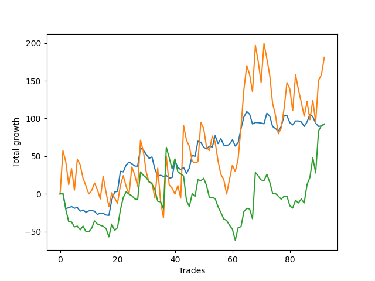

# Long Golden Two 
- Symbol: ES
- Date Range: 3/18/22 - 6/24/22
- Trading Period: 7:20-12:30
- Number of Trades: 81



| Name | Win Percent | Profit | Avg Profit / Trade |     | Name | Win Percent | Profit | Avg Profit / Trade |
| ---- | ----------- | ------ | ------------------ | --- | ---- | ----------- | ------ | ------------------ |
| Sorted By <br> Profit | | | | | Sorted By <br> Win Percentage ||||
| Thirty-Six | 35.80 | 55250.00 | 682.10 |     | Thirty-Five | 46.91 | 45750.00 | 564.81 |
| Thirty-Five | 46.91 | 45750.00 | 564.81 |     | Thirty-Six | 35.80 | 55250.00 | 682.10 |

### Test Thirty-Five
* Sell when the linear regression slope changes to negative
* No Stoploss
* Results:
```
Total Trades: 81
Percent Up: 46.91
Percent Down: 53.09
Total Points Moved Up: 91.50
Potential Profit: 45750.00
Total Points Ups: 294.75 Count Ups: 38
Total Points Downs: -203.25 Count Downs: 43
```

<details><summary>Trades</summary>

<code>In: 2022-03-18 06:46:00		Out: 2022-03-18 06:49:05		Total Position Time: 03:05		Total Move Up: 0.25		Total to Date: 0.25</code> <br />
<code>In: 2022-03-21 06:46:00		Out: 2022-03-21 07:06:05		Total Position Time: 20:05		Total Move Up: -19.75		Total to Date: -19.50</code> <br />
<code>In: 2022-03-21 08:37:00		Out: 2022-03-21 08:41:05		Total Position Time: 04:05		Total Move Up: 1.25		Total to Date: -18.25</code> <br />
<code>In: 2022-03-22 06:46:00		Out: 2022-03-22 06:52:05		Total Position Time: 06:05		Total Move Up: 1.50		Total to Date: -16.75</code> <br />
<code>In: 2022-03-23 07:16:00		Out: 2022-03-23 07:24:05		Total Position Time: 08:05		Total Move Up: -2.25		Total to Date: -19.00</code> <br />
<code>In: 2022-03-24 06:46:00		Out: 2022-03-24 06:51:05		Total Position Time: 05:05		Total Move Up: 1.00		Total to Date: -18.00</code> <br />
<code>In: 2022-03-25 06:52:00		Out: 2022-03-25 06:57:05		Total Position Time: 05:05		Total Move Up: -5.00		Total to Date: -23.00</code> <br />
<code>In: 2022-03-25 07:15:00		Out: 2022-03-25 07:17:05		Total Position Time: 02:05		Total Move Up: 1.75		Total to Date: -21.25</code> <br />
<code>In: 2022-03-25 12:05:00		Out: 2022-03-25 12:18:05		Total Position Time: 13:05		Total Move Up: -3.00		Total to Date: -24.25</code> <br />
<code>In: 2022-03-28 06:46:00		Out: 2022-03-28 06:48:05		Total Position Time: 02:05		Total Move Up: 1.75		Total to Date: -22.50</code> <br />
<code>In: 2022-03-28 12:06:00		Out: 2022-03-28 12:13:05		Total Position Time: 07:05		Total Move Up: 0.50		Total to Date: -22.00</code> <br />
<code>In: 2022-03-29 11:47:00		Out: 2022-03-29 11:51:05		Total Position Time: 04:05		Total Move Up: -1.00		Total to Date: -23.00</code> <br />
<code>In: 2022-03-30 07:01:00		Out: 2022-03-30 07:08:05		Total Position Time: 07:05		Total Move Up: -4.25		Total to Date: -27.25</code> <br />
<code>In: 2022-03-31 07:54:00		Out: 2022-03-31 07:56:05		Total Position Time: 02:05		Total Move Up: 1.75		Total to Date: -25.50</code> <br />
<code>In: 2022-04-04 06:46:00		Out: 2022-04-04 06:49:05		Total Position Time: 03:05		Total Move Up: -0.25		Total to Date: -25.75</code> <br />
<code>In: 2022-04-05 06:46:00		Out: 2022-04-05 06:49:05		Total Position Time: 03:05		Total Move Up: -2.25		Total to Date: -28.00</code> <br />
<code>In: 2022-04-06 11:08:00		Out: 2022-04-06 11:39:05		Total Position Time: 31:05		Total Move Up: -0.50		Total to Date: -28.50</code> <br />
<code>In: 2022-04-06 11:16:00		Out: 2022-04-06 11:39:05		Total Position Time: 23:05		Total Move Up: 20.50		Total to Date: -8.00</code> <br />
<code>In: 2022-04-06 11:54:00		Out: 2022-04-06 12:07:05		Total Position Time: 13:05		Total Move Up: 10.50		Total to Date: 2.50</code> <br />
<code>In: 2022-04-07 06:46:00		Out: 2022-04-07 07:05:05		Total Position Time: 19:05		Total Move Up: 1.00		Total to Date: 3.50</code> <br />
<code>In: 2022-04-07 11:30:00		Out: 2022-04-07 12:09:05		Total Position Time: 39:05		Total Move Up: 26.50		Total to Date: 30.00</code> <br />
<code>In: 2022-04-08 07:37:00		Out: 2022-04-08 07:39:05		Total Position Time: 02:05		Total Move Up: -0.75		Total to Date: 29.25</code> <br />
<code>In: 2022-04-12 06:46:00		Out: 2022-04-12 06:57:05		Total Position Time: 11:05		Total Move Up: 9.25		Total to Date: 38.50</code> <br />
<code>In: 2022-04-13 06:46:00		Out: 2022-04-13 06:53:05		Total Position Time: 07:05		Total Move Up: 3.75		Total to Date: 42.25</code> <br />
<code>In: 2022-04-13 07:25:00		Out: 2022-04-13 07:28:05		Total Position Time: 03:05		Total Move Up: -2.25		Total to Date: 40.00</code> <br />
<code>In: 2022-04-18 06:46:00		Out: 2022-04-18 06:52:05		Total Position Time: 06:05		Total Move Up: -3.00		Total to Date: 37.00</code> <br />
<code>In: 2022-04-18 07:34:00		Out: 2022-04-18 07:37:05		Total Position Time: 03:05		Total Move Up: -0.25		Total to Date: 36.75</code> <br />
<code>In: 2022-04-19 06:46:00		Out: 2022-04-19 07:06:05		Total Position Time: 20:05		Total Move Up: 24.25		Total to Date: 61.00</code> <br />
<code>In: 2022-04-20 07:50:00		Out: 2022-04-20 08:02:05		Total Position Time: 12:05		Total Move Up: -3.00		Total to Date: 58.00</code> <br />
<code>In: 2022-04-20 10:04:00		Out: 2022-04-20 10:09:05		Total Position Time: 05:05		Total Move Up: -5.50		Total to Date: 52.50</code> <br />
<code>In: 2022-04-21 06:52:00		Out: 2022-04-21 06:55:05		Total Position Time: 03:05		Total Move Up: -5.25		Total to Date: 47.25</code> <br />
<code>In: 2022-04-25 06:46:00		Out: 2022-04-25 06:56:05		Total Position Time: 10:05		Total Move Up: 1.75		Total to Date: 49.00</code> <br />
<code>In: 2022-04-25 07:40:00		Out: 2022-04-25 07:53:05		Total Position Time: 13:05		Total Move Up: -15.75		Total to Date: 33.25</code> <br />
<code>In: 2022-04-25 10:32:00		Out: 2022-04-25 10:35:05		Total Position Time: 03:05		Total Move Up: -9.50		Total to Date: 23.75</code> <br />
<code>In: 2022-04-27 06:46:00		Out: 2022-04-27 06:54:05		Total Position Time: 08:05		Total Move Up: 1.00		Total to Date: 24.75</code> <br />
<code>In: 2022-04-27 08:39:00		Out: 2022-04-27 08:41:05		Total Position Time: 02:05		Total Move Up: -1.50		Total to Date: 23.25</code> <br />
<code>In: 2022-04-28 08:58:00		Out: 2022-04-28 09:03:05		Total Position Time: 05:05		Total Move Up: 1.25		Total to Date: 24.50</code> <br />
<code>In: 2022-04-29 06:59:00		Out: 2022-04-29 07:04:05		Total Position Time: 05:05		Total Move Up: -3.50		Total to Date: 21.00</code> <br />
<code>In: 2022-05-02 06:53:00		Out: 2022-05-02 06:56:05		Total Position Time: 03:05		Total Move Up: 0.75		Total to Date: 21.75</code> <br />
<code>In: 2022-05-02 07:22:00		Out: 2022-05-02 07:37:05		Total Position Time: 15:05		Total Move Up: 22.00		Total to Date: 43.75</code> <br />
<code>In: 2022-05-03 07:01:00		Out: 2022-05-03 07:08:05		Total Position Time: 07:05		Total Move Up: -8.50		Total to Date: 35.25</code> <br />
<code>In: 2022-05-04 06:46:00		Out: 2022-05-04 06:53:05		Total Position Time: 07:05		Total Move Up: -3.00		Total to Date: 32.25</code> <br />
<code>In: 2022-05-04 09:53:00		Out: 2022-05-04 10:06:05		Total Position Time: 13:05		Total Move Up: 3.00		Total to Date: 35.25</code> <br />
<code>In: 2022-05-06 07:27:00		Out: 2022-05-06 07:29:05		Total Position Time: 02:05		Total Move Up: -8.00		Total to Date: 27.25</code> <br />
<code>In: 2022-05-09 06:46:00		Out: 2022-05-09 07:02:05		Total Position Time: 16:05		Total Move Up: 7.00		Total to Date: 34.25</code> <br />
<code>In: 2022-05-11 06:46:00		Out: 2022-05-11 06:56:05		Total Position Time: 10:05		Total Move Up: 17.25		Total to Date: 51.50</code> <br />
<code>In: 2022-05-12 06:50:00		Out: 2022-05-12 06:53:05		Total Position Time: 03:05		Total Move Up: -1.75		Total to Date: 49.75</code> <br />
<code>In: 2022-05-12 07:07:00		Out: 2022-05-12 07:18:05		Total Position Time: 11:05		Total Move Up: 20.25		Total to Date: 70.00</code> <br />
<code>In: 2022-05-13 06:46:00		Out: 2022-05-13 06:49:05		Total Position Time: 03:05		Total Move Up: -1.50		Total to Date: 68.50</code> <br />
<code>In: 2022-05-16 06:46:00		Out: 2022-05-16 07:02:05		Total Position Time: 16:05		Total Move Up: -6.50		Total to Date: 62.00</code> <br />
<code>In: 2022-05-16 07:21:00		Out: 2022-05-16 07:26:05		Total Position Time: 05:05		Total Move Up: -2.25		Total to Date: 59.75</code> <br />
<code>In: 2022-05-16 08:57:00		Out: 2022-05-16 09:02:05		Total Position Time: 05:05		Total Move Up: 3.50		Total to Date: 63.25</code> <br />
<code>In: 2022-05-17 09:29:00		Out: 2022-05-17 09:32:05		Total Position Time: 03:05		Total Move Up: -1.00		Total to Date: 62.25</code> <br />
<code>In: 2022-05-19 06:46:00		Out: 2022-05-19 07:08:05		Total Position Time: 22:05		Total Move Up: 15.00		Total to Date: 77.25</code> <br />
<code>In: 2022-05-19 07:18:00		Out: 2022-05-19 07:27:05		Total Position Time: 09:05		Total Move Up: -10.50		Total to Date: 66.75</code> <br />
<code>In: 2022-05-19 08:38:00		Out: 2022-05-19 08:47:05		Total Position Time: 09:05		Total Move Up: 6.50		Total to Date: 73.25</code> <br />
<code>In: 2022-05-20 06:46:00		Out: 2022-05-20 06:48:05		Total Position Time: 02:05		Total Move Up: -8.50		Total to Date: 64.75</code> <br />
<code>In: 2022-05-23 06:46:00		Out: 2022-05-23 06:55:05		Total Position Time: 09:05		Total Move Up: -0.75		Total to Date: 64.00</code> <br />
<code>In: 2022-05-23 07:33:00		Out: 2022-05-23 07:39:05		Total Position Time: 06:05		Total Move Up: 1.75		Total to Date: 65.75</code> <br />
<code>In: 2022-05-24 10:49:00		Out: 2022-05-24 10:55:05		Total Position Time: 06:05		Total Move Up: 6.00		Total to Date: 71.75</code> <br />
<code>In: 2022-05-25 06:46:00		Out: 2022-05-25 06:48:05		Total Position Time: 02:05		Total Move Up: -8.25		Total to Date: 63.50</code> <br />
<code>In: 2022-05-25 11:47:00		Out: 2022-05-25 11:51:05		Total Position Time: 04:05		Total Move Up: 4.50		Total to Date: 68.00</code> <br />
<code>In: 2022-05-26 06:46:00		Out: 2022-05-26 07:01:05		Total Position Time: 15:05		Total Move Up: 18.50		Total to Date: 86.50</code> <br />
<code>In: 2022-05-27 06:46:00		Out: 2022-05-27 07:00:05		Total Position Time: 14:05		Total Move Up: 15.50		Total to Date: 102.00</code> <br />
<code>In: 2022-05-31 07:30:00		Out: 2022-05-31 07:34:05		Total Position Time: 04:05		Total Move Up: 7.25		Total to Date: 109.25</code> <br />
<code>In: 2022-06-02 06:46:00		Out: 2022-06-02 06:52:05		Total Position Time: 06:05		Total Move Up: -3.50		Total to Date: 105.75</code> <br />
<code>In: 2022-06-02 07:15:00		Out: 2022-06-02 07:21:05		Total Position Time: 06:05		Total Move Up: -13.00		Total to Date: 92.75</code> <br />
<code>In: 2022-06-02 07:48:00		Out: 2022-06-02 07:52:05		Total Position Time: 04:05		Total Move Up: 2.00		Total to Date: 94.75</code> <br />
<code>In: 2022-06-03 07:05:00		Out: 2022-06-03 07:10:05		Total Position Time: 05:05		Total Move Up: -0.25		Total to Date: 94.50</code> <br />
<code>In: 2022-06-06 07:04:00		Out: 2022-06-06 07:12:05		Total Position Time: 08:05		Total Move Up: -0.50		Total to Date: 94.00</code> <br />
<code>In: 2022-06-07 06:46:00		Out: 2022-06-07 06:58:05		Total Position Time: 12:05		Total Move Up: -1.00		Total to Date: 93.00</code> <br />
<code>In: 2022-06-08 06:46:00		Out: 2022-06-08 07:00:05		Total Position Time: 14:05		Total Move Up: 14.00		Total to Date: 107.00</code> <br />
<code>In: 2022-06-09 06:54:00		Out: 2022-06-09 07:02:05		Total Position Time: 08:05		Total Move Up: -3.75		Total to Date: 103.25</code> <br />
<code>In: 2022-06-14 07:01:00		Out: 2022-06-14 07:06:05		Total Position Time: 05:05		Total Move Up: -13.75		Total to Date: 89.50</code> <br />
<code>In: 2022-06-15 06:46:00		Out: 2022-06-15 06:54:05		Total Position Time: 08:05		Total Move Up: -2.75		Total to Date: 86.75</code> <br />
<code>In: 2022-06-17 06:46:00		Out: 2022-06-17 06:49:05		Total Position Time: 03:05		Total Move Up: -3.50		Total to Date: 83.25</code> <br />
<code>In: 2022-06-17 10:33:00		Out: 2022-06-17 10:42:05		Total Position Time: 09:05		Total Move Up: 6.25		Total to Date: 89.50</code> <br />
<code>In: 2022-06-21 06:46:00		Out: 2022-06-21 07:09:05		Total Position Time: 23:05		Total Move Up: 14.25		Total to Date: 103.75</code> <br />
<code>In: 2022-06-22 06:46:00		Out: 2022-06-22 06:52:05		Total Position Time: 06:05		Total Move Up: 0.00		Total to Date: 103.75</code> <br />
<code>In: 2022-06-23 07:05:00		Out: 2022-06-23 07:09:05		Total Position Time: 04:05		Total Move Up: -9.25		Total to Date: 94.50</code> <br />
<code>In: 2022-06-23 07:23:00		Out: 2022-06-23 07:28:05		Total Position Time: 05:05		Total Move Up: -3.00		Total to Date: 91.50</code> <br />


</details>

### Test Thirty-Six
* Sell when the linear regression slope changes to negative
* No Stoploss
* Results:
```
Total Trades: 81
Percent Up: 35.80
Percent Down: 64.20
Total Points Moved Up: 110.50
Potential Profit: 55250.00
Total Points Ups: 978.00 Count Ups: 29
Total Points Downs: -867.50 Count Downs: 52
```

<details><summary>Trades</summary>

<code>In: 2022-03-18 06:46:00		Out: 2022-03-18 12:31:00		Total Position Time: 345:00		Total Move Up: 57.50		Total to Date: 57.50</code> <br />
<code>In: 2022-03-21 06:46:00		Out: 2022-03-21 06:55:05		Total Position Time: 09:05		Total Move Up: -15.00		Total to Date: 42.50</code> <br />
<code>In: 2022-03-21 08:37:00		Out: 2022-03-21 10:03:05		Total Position Time: 86:05		Total Move Up: -30.25		Total to Date: 12.25</code> <br />
<code>In: 2022-03-22 06:46:00		Out: 2022-03-22 12:31:00		Total Position Time: 345:00		Total Move Up: 21.25		Total to Date: 33.50</code> <br />
<code>In: 2022-03-23 07:16:00		Out: 2022-03-23 10:31:05		Total Position Time: 195:05		Total Move Up: -28.50		Total to Date: 5.00</code> <br />
<code>In: 2022-03-24 06:46:00		Out: 2022-03-24 12:31:00		Total Position Time: 345:00		Total Move Up: 40.75		Total to Date: 45.75</code> <br />
<code>In: 2022-03-25 06:52:00		Out: 2022-03-25 07:05:05		Total Position Time: 13:05		Total Move Up: -7.00		Total to Date: 38.75</code> <br />
<code>In: 2022-03-25 07:15:00		Out: 2022-03-25 08:31:05		Total Position Time: 76:05		Total Move Up: -18.00		Total to Date: 20.75</code> <br />
<code>In: 2022-03-25 12:05:00		Out: 2022-03-25 12:31:00		Total Position Time: 26:00		Total Move Up: -10.00		Total to Date: 10.75</code> <br />
<code>In: 2022-03-28 06:46:00		Out: 2022-03-28 08:36:05		Total Position Time: 110:05		Total Move Up: -10.75		Total to Date: 0.00</code> <br />
<code>In: 2022-03-28 12:06:00		Out: 2022-03-28 12:31:00		Total Position Time: 25:00		Total Move Up: 4.75		Total to Date: 4.75</code> <br />
<code>In: 2022-03-29 11:47:00		Out: 2022-03-29 12:31:00		Total Position Time: 44:00		Total Move Up: 9.75		Total to Date: 14.50</code> <br />
<code>In: 2022-03-30 07:01:00		Out: 2022-03-30 07:33:05		Total Position Time: 32:05		Total Move Up: -8.75		Total to Date: 5.75</code> <br />
<code>In: 2022-03-31 07:54:00		Out: 2022-03-31 09:36:05		Total Position Time: 102:05		Total Move Up: -12.50		Total to Date: -6.75</code> <br />
<code>In: 2022-04-04 06:46:00		Out: 2022-04-04 12:31:00		Total Position Time: 345:00		Total Move Up: 30.25		Total to Date: 23.50</code> <br />
<code>In: 2022-04-05 06:46:00		Out: 2022-04-05 07:14:05		Total Position Time: 28:05		Total Move Up: -21.25		Total to Date: 2.25</code> <br />
<code>In: 2022-04-06 11:08:00		Out: 2022-04-06 11:15:05		Total Position Time: 07:05		Total Move Up: -19.25		Total to Date: -17.00</code> <br />
<code>In: 2022-04-06 11:16:00		Out: 2022-04-06 12:31:00		Total Position Time: 75:00		Total Move Up: 18.50		Total to Date: 1.50</code> <br />
<code>In: 2022-04-06 11:54:00		Out: 2022-04-06 12:31:00		Total Position Time: 37:00		Total Move Up: -7.00		Total to Date: -5.50</code> <br />
<code>In: 2022-04-07 06:46:00		Out: 2022-04-07 07:21:05		Total Position Time: 35:05		Total Move Up: -6.75		Total to Date: -12.25</code> <br />
<code>In: 2022-04-07 11:30:00		Out: 2022-04-07 12:31:00		Total Position Time: 61:00		Total Move Up: 23.50		Total to Date: 11.25</code> <br />
<code>In: 2022-04-08 07:37:00		Out: 2022-04-08 12:31:00		Total Position Time: 294:00		Total Move Up: 13.00		Total to Date: 24.25</code> <br />
<code>In: 2022-04-12 06:46:00		Out: 2022-04-12 07:49:05		Total Position Time: 63:05		Total Move Up: -14.25		Total to Date: 10.00</code> <br />
<code>In: 2022-04-13 06:46:00		Out: 2022-04-13 07:13:05		Total Position Time: 27:05		Total Move Up: -10.00		Total to Date: 0.00</code> <br />
<code>In: 2022-04-13 07:25:00		Out: 2022-04-13 12:31:00		Total Position Time: 306:00		Total Move Up: 35.75		Total to Date: 35.75</code> <br />
<code>In: 2022-04-18 06:46:00		Out: 2022-04-18 06:58:05		Total Position Time: 12:05		Total Move Up: -10.50		Total to Date: 25.25</code> <br />
<code>In: 2022-04-18 07:34:00		Out: 2022-04-18 08:31:05		Total Position Time: 57:05		Total Move Up: -15.25		Total to Date: 10.00</code> <br />
<code>In: 2022-04-19 06:46:00		Out: 2022-04-19 12:31:00		Total Position Time: 345:00		Total Move Up: 61.25		Total to Date: 71.25</code> <br />
<code>In: 2022-04-20 07:50:00		Out: 2022-04-20 09:20:05		Total Position Time: 90:05		Total Move Up: -14.75		Total to Date: 56.50</code> <br />
<code>In: 2022-04-20 10:04:00		Out: 2022-04-20 11:59:05		Total Position Time: 115:05		Total Move Up: -27.50		Total to Date: 29.00</code> <br />
<code>In: 2022-04-21 06:52:00		Out: 2022-04-21 07:10:05		Total Position Time: 18:05		Total Move Up: -13.75		Total to Date: 15.25</code> <br />
<code>In: 2022-04-25 06:46:00		Out: 2022-04-25 06:48:05		Total Position Time: 02:05		Total Move Up: -0.50		Total to Date: 14.75</code> <br />
<code>In: 2022-04-25 07:40:00		Out: 2022-04-25 08:03:05		Total Position Time: 23:05		Total Move Up: -20.25		Total to Date: -5.50</code> <br />
<code>In: 2022-04-25 10:32:00		Out: 2022-04-25 12:31:00		Total Position Time: 119:00		Total Move Up: 39.75		Total to Date: 34.25</code> <br />
<code>In: 2022-04-27 06:46:00		Out: 2022-04-27 07:19:05		Total Position Time: 33:05		Total Move Up: -44.75		Total to Date: -10.50</code> <br />
<code>In: 2022-04-27 08:39:00		Out: 2022-04-27 12:31:00		Total Position Time: 232:00		Total Move Up: -21.25		Total to Date: -31.75</code> <br />
<code>In: 2022-04-28 08:58:00		Out: 2022-04-28 12:31:00		Total Position Time: 213:00		Total Move Up: 81.50		Total to Date: 49.75</code> <br />
<code>In: 2022-04-29 06:59:00		Out: 2022-04-29 07:24:05		Total Position Time: 25:05		Total Move Up: -37.75		Total to Date: 12.00</code> <br />
<code>In: 2022-05-02 06:53:00		Out: 2022-05-02 07:19:05		Total Position Time: 26:05		Total Move Up: -4.25		Total to Date: 7.75</code> <br />
<code>In: 2022-05-02 07:22:00		Out: 2022-05-02 08:34:05		Total Position Time: 72:05		Total Move Up: -8.00		Total to Date: -0.25</code> <br />
<code>In: 2022-05-03 07:01:00		Out: 2022-05-03 12:31:00		Total Position Time: 330:00		Total Move Up: 11.25		Total to Date: 11.00</code> <br />
<code>In: 2022-05-04 06:46:00		Out: 2022-05-04 07:01:05		Total Position Time: 15:05		Total Move Up: -16.50		Total to Date: -5.50</code> <br />
<code>In: 2022-05-04 09:53:00		Out: 2022-05-04 12:31:00		Total Position Time: 158:00		Total Move Up: 96.25		Total to Date: 90.75</code> <br />
<code>In: 2022-05-06 07:27:00		Out: 2022-05-06 12:31:00		Total Position Time: 304:00		Total Move Up: -19.25		Total to Date: 71.50</code> <br />
<code>In: 2022-05-09 06:46:00		Out: 2022-05-09 06:49:05		Total Position Time: 03:05		Total Move Up: -8.25		Total to Date: 63.25</code> <br />
<code>In: 2022-05-11 06:46:00		Out: 2022-05-11 09:48:05		Total Position Time: 182:05		Total Move Up: -20.00		Total to Date: 43.25</code> <br />
<code>In: 2022-05-12 06:50:00		Out: 2022-05-12 07:06:05		Total Position Time: 16:05		Total Move Up: -2.00		Total to Date: 41.25</code> <br />
<code>In: 2022-05-12 07:07:00		Out: 2022-05-12 10:25:05		Total Position Time: 198:05		Total Move Up: 1.50		Total to Date: 42.75</code> <br />
<code>In: 2022-05-13 06:46:00		Out: 2022-05-13 12:31:00		Total Position Time: 345:00		Total Move Up: 52.00		Total to Date: 94.75</code> <br />
<code>In: 2022-05-16 06:46:00		Out: 2022-05-16 06:49:05		Total Position Time: 03:05		Total Move Up: -7.75		Total to Date: 87.00</code> <br />
<code>In: 2022-05-16 07:21:00		Out: 2022-05-16 08:06:05		Total Position Time: 45:05		Total Move Up: -25.25		Total to Date: 61.75</code> <br />
<code>In: 2022-05-16 08:57:00		Out: 2022-05-16 12:31:00		Total Position Time: 214:00		Total Move Up: -4.25		Total to Date: 57.50</code> <br />
<code>In: 2022-05-17 09:29:00		Out: 2022-05-17 12:31:00		Total Position Time: 182:00		Total Move Up: 19.25		Total to Date: 76.75</code> <br />
<code>In: 2022-05-19 06:46:00		Out: 2022-05-19 06:48:05		Total Position Time: 02:05		Total Move Up: -8.00		Total to Date: 68.75</code> <br />
<code>In: 2022-05-19 07:18:00		Out: 2022-05-19 07:50:05		Total Position Time: 32:05		Total Move Up: -25.00		Total to Date: 43.75</code> <br />
<code>In: 2022-05-19 08:38:00		Out: 2022-05-19 12:31:00		Total Position Time: 233:00		Total Move Up: -17.75		Total to Date: 26.00</code> <br />
<code>In: 2022-05-20 06:46:00		Out: 2022-05-20 06:50:05		Total Position Time: 04:05		Total Move Up: -7.00		Total to Date: 19.00</code> <br />
<code>In: 2022-05-23 06:46:00		Out: 2022-05-23 07:06:05		Total Position Time: 20:05		Total Move Up: -19.25		Total to Date: -0.25</code> <br />
<code>In: 2022-05-23 07:33:00		Out: 2022-05-23 12:31:00		Total Position Time: 298:00		Total Move Up: 19.75		Total to Date: 19.50</code> <br />
<code>In: 2022-05-24 10:49:00		Out: 2022-05-24 12:31:00		Total Position Time: 102:00		Total Move Up: 18.75		Total to Date: 38.25</code> <br />
<code>In: 2022-05-25 06:46:00		Out: 2022-05-25 09:47:05		Total Position Time: 181:05		Total Move Up: -8.50		Total to Date: 29.75</code> <br />
<code>In: 2022-05-25 11:47:00		Out: 2022-05-25 12:31:00		Total Position Time: 44:00		Total Move Up: 16.75		Total to Date: 46.50</code> <br />
<code>In: 2022-05-26 06:46:00		Out: 2022-05-26 12:31:00		Total Position Time: 345:00		Total Move Up: 41.75		Total to Date: 88.25</code> <br />
<code>In: 2022-05-27 06:46:00		Out: 2022-05-27 12:31:00		Total Position Time: 345:00		Total Move Up: 50.00		Total to Date: 138.25</code> <br />
<code>In: 2022-05-31 07:30:00		Out: 2022-05-31 12:31:00		Total Position Time: 301:00		Total Move Up: 32.00		Total to Date: 170.25</code> <br />
<code>In: 2022-06-02 06:46:00		Out: 2022-06-02 06:58:05		Total Position Time: 12:05		Total Move Up: -11.75		Total to Date: 158.50</code> <br />
<code>In: 2022-06-02 07:15:00		Out: 2022-06-02 07:30:05		Total Position Time: 15:05		Total Move Up: -23.00		Total to Date: 135.50</code> <br />
<code>In: 2022-06-02 07:48:00		Out: 2022-06-02 12:31:00		Total Position Time: 283:00		Total Move Up: 61.50		Total to Date: 197.00</code> <br />
<code>In: 2022-06-03 07:05:00		Out: 2022-06-03 07:39:05		Total Position Time: 34:05		Total Move Up: -21.50		Total to Date: 175.50</code> <br />
<code>In: 2022-06-06 07:04:00		Out: 2022-06-06 08:32:05		Total Position Time: 88:05		Total Move Up: -27.75		Total to Date: 147.75</code> <br />
<code>In: 2022-06-07 06:46:00		Out: 2022-06-07 12:31:00		Total Position Time: 345:00		Total Move Up: 51.75		Total to Date: 199.50</code> <br />
<code>In: 2022-06-08 06:46:00		Out: 2022-06-08 09:47:05		Total Position Time: 181:05		Total Move Up: -20.00		Total to Date: 179.50</code> <br />
<code>In: 2022-06-09 06:54:00		Out: 2022-06-09 07:59:05		Total Position Time: 65:05		Total Move Up: -22.00		Total to Date: 157.50</code> <br />
<code>In: 2022-06-14 07:01:00		Out: 2022-06-14 07:21:05		Total Position Time: 20:05		Total Move Up: -37.25		Total to Date: 120.25</code> <br />
<code>In: 2022-06-15 06:46:00		Out: 2022-06-15 07:51:05		Total Position Time: 65:05		Total Move Up: -15.75		Total to Date: 104.50</code> <br />
<code>In: 2022-06-17 06:46:00		Out: 2022-06-17 07:19:05		Total Position Time: 33:05		Total Move Up: -24.75		Total to Date: 79.75</code> <br />
<code>In: 2022-06-17 10:33:00		Out: 2022-06-17 12:31:00		Total Position Time: 118:00		Total Move Up: 7.75		Total to Date: 87.50</code> <br />
<code>In: 2022-06-21 06:46:00		Out: 2022-06-21 12:31:00		Total Position Time: 345:00		Total Move Up: 25.75		Total to Date: 113.25</code> <br />
<code>In: 2022-06-22 06:46:00		Out: 2022-06-22 12:31:00		Total Position Time: 345:00		Total Move Up: 34.50		Total to Date: 147.75</code> <br />
<code>In: 2022-06-23 07:05:00		Out: 2022-06-23 07:17:05		Total Position Time: 12:05		Total Move Up: -8.50		Total to Date: 139.25</code> <br />
<code>In: 2022-06-23 07:23:00		Out: 2022-06-23 09:05:05		Total Position Time: 102:05		Total Move Up: -28.75		Total to Date: 110.50</code> <br />


</details>