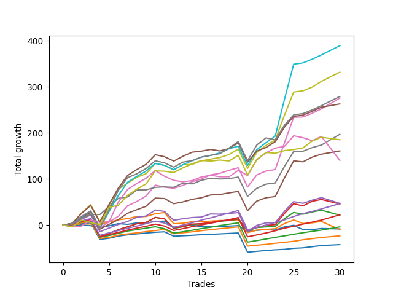

# Long Labrador 002 
- Symbol: ES
- Date Range: 03/18/2022 - 12/30/2022
- Trading Period: 8:30-12:30
- Number of Trades: 27



| Name | Win Percent | Profit | Avg Profit / Trade | Avg Time / Trade |      | Name | Win Percent | Profit | Avg Profit / Trade | Avg Time / Trade |
| ---- | ----------- | ------ | ------------------ | ---------------- | ---- | ---- | ----------- | ------ | ------------------ | ---------------- |
| Sorted By <br> Profit | | | | | | Sorted By <br> Win Percentage ||||
| BB-200 U/L 2SD | 85.19 | 116750.00 | 4324.07 | 52:11 |     | TP-2 | 88.89 | -15000.00 | -555.56 | 11:48 |
| BB-100 U/L 2SD | 85.19 | 110125.00 | 4078.70 | 50:05 |     | TP-1 | 88.89 | -23875.00 | -884.26 | 10:28 |
| V U/L 1SD | 85.19 | 107500.00 | 3981.48 | 41:48 |     | BB-200 U/L 2SD | 85.19 | 116750.00 | 4324.07 | 52:11 |
| NEWFI 000 | 81.48 | 97500.00 | 3611.11 | 46:14 |     | BB-100 U/L 2SD | 85.19 | 110125.00 | 4078.70 | 50:05 |
| BB-200 U/L 2SD SL-10 | 62.96 | 85750.00 | 3175.93 | 34:53 |     | V U/L 1SD | 85.19 | 107500.00 | 3981.48 | 41:48 |
| BB-200 Mid | 81.48 | 85625.00 | 3171.30 | 27:49 |     | BB-50 U/L 2SD | 85.19 | 76375.00 | 2828.70 | 33:00 |
| BB-100 U/L 2SD SL-10 | 62.96 | 79125.00 | 2930.56 | 32:47 |     | BB-100 Mid | 85.19 | 60750.00 | 2250.00 | 28:29 |
| BB-50 U/L 2SD | 85.19 | 76375.00 | 2828.70 | 33:00 |     | TP-8 | 85.19 | 47500.00 | 1759.26 | 29:16 |
| V U/L 1SD SL-10 | 62.96 | 73750.00 | 2731.48 | 25:45 |     | TP-7 | 85.19 | 34875.00 | 1291.67 | 28:20 |
| BB-100 Mid | 85.19 | 60750.00 | 2250.00 | 28:29 |     | TP-6 | 85.19 | 25500.00 | 944.44 | 26:38 |
| BB-200 U/L 2SD SL-5 | 44.44 | 58375.00 | 2162.04 | 24:19 |     | TP-5 | 85.19 | 14375.00 | 532.41 | 23:51 |
| TP-10 | 81.48 | 58250.00 | 2157.41 | 34:47 |     | TP-4 | 85.19 | 4125.00 | 152.78 | 21:44 |
| V Mid | 81.48 | 56500.00 | 2092.59 | 20:29 |     | TP-3 | 85.19 | -6875.00 | -254.63 | 19:40 |
| BB-100 U/L 2SD SL-5 | 44.44 | 51500.00 | 1907.41 | 22:47 |     | NEWFI 000 | 81.48 | 97500.00 | 3611.11 | 46:14 |
| NEWFI 0000 | 59.26 | 50375.00 | 1865.74 | 33:34 |     | BB-200 Mid | 81.48 | 85625.00 | 3171.30 | 27:49 |
| TP-9 | 81.48 | 48750.00 | 1805.56 | 31:46 |     | TP-10 | 81.48 | 58250.00 | 2157.41 | 34:47 |
| TP-8 | 85.19 | 47500.00 | 1759.26 | 29:16 |     | V Mid | 81.48 | 56500.00 | 2092.59 | 20:29 |
| BB-200 Mid SL-10 | 59.26 | 43750.00 | 1620.37 | 17:40 |     | TP-9 | 81.48 | 48750.00 | 1805.56 | 31:46 |
| V U/L 1SD SL-5 | 44.44 | 43250.00 | 1601.85 | 17:00 |     | BB-50 U/L 1SD | 81.48 | 37750.00 | 1398.15 | 27:08 |
| BB-50 U/L 2SD SL-10 | 62.96 | 41750.00 | 1546.30 | 18:41 |     | BB-20 U/L 2SD C | 74.07 | -3250.00 | -120.37 | 19:13 |
| BB-50 U/L 1SD | 81.48 | 37750.00 | 1398.15 | 27:08 |     | BB-20 U/L 2SD | 74.07 | -7625.00 | -282.41 | 18:02 |
| BB-100 Mid SL-10 | 62.96 | 36750.00 | 1361.11 | 17:02 |     | BB-20 U/L 1SD | 70.37 | -16500.00 | -611.11 | 11:48 |
| TP-7 | 85.19 | 34875.00 | 1291.67 | 28:20 |     | BB-50 Mid | 66.67 | -3750.00 | -138.89 | 18:55 |
| BB-50 U/L 2SD SL-5 | 44.44 | 33750.00 | 1250.00 | 13:14 |     | BB-20 U/L 2SD C SL-10 | 66.67 | -7875.00 | -291.67 | 10:17 |
| V Mid SL-10 | 62.96 | 27250.00 | 1009.26 | 11:57 |     | BB-20 U/L 2SD SL-10 | 66.67 | -9250.00 | -342.59 | 10:13 |
| TP-6 | 85.19 | 25500.00 | 944.44 | 26:38 |     | BB-200 U/L 2SD SL-10 | 62.96 | 85750.00 | 3175.93 | 34:53 |
| BB-100 Mid SL-5 | 44.44 | 21375.00 | 791.67 | 11:42 |     | BB-100 U/L 2SD SL-10 | 62.96 | 79125.00 | 2930.56 | 32:47 |
| V Mid SL-5 | 51.85 | 19125.00 | 708.33 | 07:23 |     | V U/L 1SD SL-10 | 62.96 | 73750.00 | 2731.48 | 25:45 |
| BB-200 Mid SL-5 | 40.74 | 17875.00 | 662.04 | 11:14 |     | BB-50 U/L 2SD SL-10 | 62.96 | 41750.00 | 1546.30 | 18:41 |
| BB-50 U/L 1SD SL-10 | 62.96 | 15875.00 | 587.96 | 15:46 |     | BB-100 Mid SL-10 | 62.96 | 36750.00 | 1361.11 | 17:02 |
| BB-50 U/L 1SD SL-5 | 48.15 | 15375.00 | 569.44 | 11:07 |     | V Mid SL-10 | 62.96 | 27250.00 | 1009.26 | 11:57 |
| TP-5 | 85.19 | 14375.00 | 532.41 | 23:51 |     | BB-50 U/L 1SD SL-10 | 62.96 | 15875.00 | 587.96 | 15:46 |
| BB-50 Mid SL-5 | 51.85 | 13625.00 | 504.63 | 06:44 |     | BB-50 Mid SL-10 | 62.96 | 3250.00 | 120.37 | 09:38 |
| TP-4 | 85.19 | 4125.00 | 152.78 | 21:44 |     | BB-20 U/L 1SD SL-10 | 62.96 | -17125.00 | -634.26 | 06:30 |
| BB-50 Mid SL-10 | 62.96 | 3250.00 | 120.37 | 09:38 |     | NEWFI 0000 | 59.26 | 50375.00 | 1865.74 | 33:34 |
| BB-20 U/L 2SD C SL-5 | 51.85 | -750.00 | -27.78 | 07:07 |     | BB-200 Mid SL-10 | 59.26 | 43750.00 | 1620.37 | 17:40 |
| BB-20 U/L 2SD SL-5 | 51.85 | -2000.00 | -74.07 | 07:03 |     | BB-20 U/L 1SD SL-5 | 59.26 | -5500.00 | -203.70 | 04:50 |
| BB-20 U/L 2SD C | 74.07 | -3250.00 | -120.37 | 19:13 |     | BB-20 Mid | 55.56 | -11000.00 | -407.41 | 05:18 |
| BB-50 Mid | 66.67 | -3750.00 | -138.89 | 18:55 |     | V Mid SL-5 | 51.85 | 19125.00 | 708.33 | 07:23 |
| BB-20 U/L 1SD SL-5 | 59.26 | -5500.00 | -203.70 | 04:50 |     | BB-50 Mid SL-5 | 51.85 | 13625.00 | 504.63 | 06:44 |
| TP-3 | 85.19 | -6875.00 | -254.63 | 19:40 |     | BB-20 U/L 2SD C SL-5 | 51.85 | -750.00 | -27.78 | 07:07 |
| BB-20 U/L 2SD | 74.07 | -7625.00 | -282.41 | 18:02 |     | BB-20 U/L 2SD SL-5 | 51.85 | -2000.00 | -74.07 | 07:03 |
| BB-20 U/L 2SD C SL-10 | 66.67 | -7875.00 | -291.67 | 10:17 |     | BB-20 Mid SL-5 | 51.85 | -8250.00 | -305.56 | 02:13 |
| BB-20 Mid SL-5 | 51.85 | -8250.00 | -305.56 | 02:13 |     | BB-20 Mid SL-10 | 51.85 | -15875.00 | -587.96 | 03:32 |
| BB-20 U/L 2SD SL-10 | 66.67 | -9250.00 | -342.59 | 10:13 |     | BB-50 U/L 1SD SL-5 | 48.15 | 15375.00 | 569.44 | 11:07 |
| BB-20 Mid | 55.56 | -11000.00 | -407.41 | 05:18 |     | BB-200 U/L 2SD SL-5 | 44.44 | 58375.00 | 2162.04 | 24:19 |
| TP-2 | 88.89 | -15000.00 | -555.56 | 11:48 |     | BB-100 U/L 2SD SL-5 | 44.44 | 51500.00 | 1907.41 | 22:47 |
| BB-20 Mid SL-10 | 51.85 | -15875.00 | -587.96 | 03:32 |     | V U/L 1SD SL-5 | 44.44 | 43250.00 | 1601.85 | 17:00 |
| BB-20 U/L 1SD | 70.37 | -16500.00 | -611.11 | 11:48 |     | BB-50 U/L 2SD SL-5 | 44.44 | 33750.00 | 1250.00 | 13:14 |
| BB-20 U/L 1SD SL-10 | 62.96 | -17125.00 | -634.26 | 06:30 |     | BB-100 Mid SL-5 | 44.44 | 21375.00 | 791.67 | 11:42 |
| TP-1 | 88.89 | -23875.00 | -884.26 | 10:28 |     | BB-200 Mid SL-5 | 40.74 | 17875.00 | 662.04 | 11:14 |

## NO STOPLOSS

### Test BB-20 Mid
* Sell when price hits the middle line of the 20p bollinger
* No Stoploss
* Results:
```
Total Trades: 27
Percent Up: 55.56
Percent Down: 44.44
Total Points Moved Up: -22.00
Potential Profit: -11000.00
Total Points Ups: 27.75 Count Ups: 15
Total Points Downs: -49.75 Count Downs: 12
```

<details><summary>Trades</summary>

<code>In: 2022-04-27 12:15:00		Out: 2022-04-27 12:20:10		Total Position Time: 05:10		Total Move Up: -2.50		Total to Date: -2.50</code> <br />
<code>In: 2022-05-03 11:29:00		Out: 2022-05-03 11:32:10		Total Position Time: 03:10		Total Move Up: 3.00		Total to Date: 0.50</code> <br />
<code>In: 2022-05-03 11:33:00		Out: 2022-05-03 11:34:10		Total Position Time: 01:10		Total Move Up: -2.00		Total to Date: -1.50</code> <br />
<code>In: 2022-05-13 10:14:00		Out: 2022-05-13 10:24:25		Total Position Time: 10:25		Total Move Up: -2.75		Total to Date: -4.25</code> <br />
<code>In: 2022-05-13 11:18:00		Out: 2022-05-13 11:19:15		Total Position Time: 01:15		Total Move Up: 2.50		Total to Date: -1.75</code> <br />
<code>In: 2022-05-13 11:30:00		Out: 2022-05-13 11:31:10		Total Position Time: 01:10		Total Move Up: 4.75		Total to Date: 3.00</code> <br />
<code>In: 2022-05-17 11:38:00		Out: 2022-05-17 11:39:10		Total Position Time: 01:10		Total Move Up: -1.50		Total to Date: 1.50</code> <br />
<code>In: 2022-05-26 12:29:00		Out: 2022-05-26 12:30:10		Total Position Time: 01:10		Total Move Up: 0.00		Total to Date: 1.50</code> <br />
<code>In: 2022-05-31 12:06:00		Out: 2022-05-31 12:07:20		Total Position Time: 01:20		Total Move Up: 3.00		Total to Date: 4.50</code> <br />
<code>In: 2022-06-27 09:19:00		Out: 2022-06-27 09:20:10		Total Position Time: 01:10		Total Move Up: 1.00		Total to Date: 5.50</code> <br />
<code>In: 2022-06-30 11:39:00		Out: 2022-06-30 12:02:20		Total Position Time: 23:20		Total Move Up: -13.25		Total to Date: -7.75</code> <br />
<code>In: 2022-07-08 09:46:00		Out: 2022-07-08 09:49:05		Total Position Time: 03:05		Total Move Up: 3.00		Total to Date: -4.75</code> <br />
<code>In: 2022-07-21 10:57:00		Out: 2022-07-21 10:59:25		Total Position Time: 02:25		Total Move Up: 1.25		Total to Date: -3.50</code> <br />
<code>In: 2022-08-01 10:37:00		Out: 2022-08-01 10:56:50		Total Position Time: 19:50		Total Move Up: -3.00		Total to Date: -6.50</code> <br />
<code>In: 2022-08-02 10:54:00		Out: 2022-08-02 10:55:10		Total Position Time: 01:10		Total Move Up: 0.75		Total to Date: -5.75</code> <br />
<code>In: 2022-08-04 11:45:00		Out: 2022-08-04 11:47:10		Total Position Time: 02:10		Total Move Up: -0.50		Total to Date: -6.25</code> <br />
<code>In: 2022-08-10 12:04:00		Out: 2022-08-10 12:05:10		Total Position Time: 01:10		Total Move Up: 1.00		Total to Date: -5.25</code> <br />
<code>In: 2022-08-24 11:50:00		Out: 2022-08-24 11:51:55		Total Position Time: 01:55		Total Move Up: 1.00		Total to Date: -4.25</code> <br />
<code>In: 2022-09-02 09:56:00		Out: 2022-09-02 10:18:10		Total Position Time: 22:10		Total Move Up: -12.50		Total to Date: -16.75</code> <br />
<code>In: 2022-09-08 09:25:00		Out: 2022-09-08 09:26:25		Total Position Time: 01:25		Total Move Up: 2.25		Total to Date: -14.50</code> <br />
<code>In: 2022-09-12 09:13:00		Out: 2022-09-12 09:14:10		Total Position Time: 01:10		Total Move Up: 1.75		Total to Date: -12.75</code> <br />
<code>In: 2022-09-19 09:09:00		Out: 2022-09-19 09:10:10		Total Position Time: 01:10		Total Move Up: -1.25		Total to Date: -14.00</code> <br />
<code>In: 2022-10-04 10:05:00		Out: 2022-10-04 10:26:10		Total Position Time: 21:10		Total Move Up: -9.50		Total to Date: -23.50</code> <br />
<code>In: 2022-10-11 12:07:00		Out: 2022-10-11 12:17:25		Total Position Time: 10:25		Total Move Up: 0.00		Total to Date: -23.50</code> <br />
<code>In: 2022-10-31 09:50:00		Out: 2022-10-31 09:51:10		Total Position Time: 01:10		Total Move Up: 2.50		Total to Date: -21.00</code> <br />
<code>In: 2022-11-08 11:15:00		Out: 2022-11-08 11:16:15		Total Position Time: 01:15		Total Move Up: -0.50		Total to Date: -21.50</code> <br />
<code>In: 2022-11-08 11:15:00		Out: 2022-11-08 11:16:15		Total Position Time: 01:15		Total Move Up: -0.50		Total to Date: -22.00</code> <br />


</details>

### Test BB-20 U/L 1SD
* Sell when the price hits the upper line of the 20p 1std bollinger
* No Stoploss
* Results:
```
Total Trades: 27
Percent Up: 70.37
Percent Down: 29.63
Total Points Moved Up: -33.00
Potential Profit: -16500.00
Total Points Ups: 45.25 Count Ups: 19
Total Points Downs: -78.25 Count Downs: 8
```

<details><summary>Trades</summary>

<code>In: 2022-04-27 12:15:00		Out: 2022-04-27 12:27:15		Total Position Time: 12:15		Total Move Up: 0.00		Total to Date: 0.00</code> <br />
<code>In: 2022-05-03 11:29:00		Out: 2022-05-03 11:32:25		Total Position Time: 03:25		Total Move Up: 2.75		Total to Date: 2.75</code> <br />
<code>In: 2022-05-03 11:33:00		Out: 2022-05-03 11:34:20		Total Position Time: 01:20		Total Move Up: -0.50		Total to Date: 2.25</code> <br />
<code>In: 2022-05-13 10:14:00		Out: 2022-05-13 10:26:10		Total Position Time: 12:10		Total Move Up: -0.25		Total to Date: 2.00</code> <br />
<code>In: 2022-05-13 11:18:00		Out: 2022-05-13 11:20:05		Total Position Time: 02:05		Total Move Up: 4.50		Total to Date: 6.50</code> <br />
<code>In: 2022-05-13 11:30:00		Out: 2022-05-13 11:31:10		Total Position Time: 01:10		Total Move Up: 4.75		Total to Date: 11.25</code> <br />
<code>In: 2022-05-17 11:38:00		Out: 2022-05-17 11:39:45		Total Position Time: 01:45		Total Move Up: 2.75		Total to Date: 14.00</code> <br />
<code>In: 2022-05-26 12:29:00		Out: 2022-05-26 12:33:45		Total Position Time: 04:45		Total Move Up: 0.25		Total to Date: 14.25</code> <br />
<code>In: 2022-05-31 12:06:00		Out: 2022-05-31 12:09:15		Total Position Time: 03:15		Total Move Up: 6.00		Total to Date: 20.25</code> <br />
<code>In: 2022-06-27 09:19:00		Out: 2022-06-27 09:20:20		Total Position Time: 01:20		Total Move Up: 2.50		Total to Date: 22.75</code> <br />
<code>In: 2022-06-30 11:39:00		Out: 2022-06-30 12:25:10		Total Position Time: 46:10		Total Move Up: -24.25		Total to Date: -1.50</code> <br />
<code>In: 2022-07-08 09:46:00		Out: 2022-07-08 10:06:55		Total Position Time: 20:55		Total Move Up: 1.25		Total to Date: -0.25</code> <br />
<code>In: 2022-07-21 10:57:00		Out: 2022-07-21 11:06:05		Total Position Time: 09:05		Total Move Up: 3.25		Total to Date: 3.00</code> <br />
<code>In: 2022-08-01 10:37:00		Out: 2022-08-01 10:59:05		Total Position Time: 22:05		Total Move Up: -0.25		Total to Date: 2.75</code> <br />
<code>In: 2022-08-02 10:54:00		Out: 2022-08-02 11:01:35		Total Position Time: 07:35		Total Move Up: 1.50		Total to Date: 4.25</code> <br />
<code>In: 2022-08-04 11:45:00		Out: 2022-08-04 11:48:05		Total Position Time: 03:05		Total Move Up: 1.25		Total to Date: 5.50</code> <br />
<code>In: 2022-08-10 12:04:00		Out: 2022-08-10 12:11:05		Total Position Time: 07:05		Total Move Up: 0.00		Total to Date: 5.50</code> <br />
<code>In: 2022-08-24 11:50:00		Out: 2022-08-24 11:52:20		Total Position Time: 02:20		Total Move Up: 1.50		Total to Date: 7.00</code> <br />
<code>In: 2022-09-02 09:56:00		Out: 2022-09-02 10:43:30		Total Position Time: 47:30		Total Move Up: -27.75		Total to Date: -20.75</code> <br />
<code>In: 2022-09-08 09:25:00		Out: 2022-09-08 09:29:00		Total Position Time: 04:00		Total Move Up: 5.50		Total to Date: -15.25</code> <br />
<code>In: 2022-09-12 09:13:00		Out: 2022-09-12 09:21:25		Total Position Time: 08:25		Total Move Up: 1.50		Total to Date: -13.75</code> <br />
<code>In: 2022-09-19 09:09:00		Out: 2022-09-19 09:13:10		Total Position Time: 04:10		Total Move Up: 1.50		Total to Date: -12.25</code> <br />
<code>In: 2022-10-04 10:05:00		Out: 2022-10-04 10:30:05		Total Position Time: 25:05		Total Move Up: -7.75		Total to Date: -20.00</code> <br />
<code>In: 2022-10-11 12:07:00		Out: 2022-10-11 12:20:40		Total Position Time: 13:40		Total Move Up: 1.50		Total to Date: -18.50</code> <br />
<code>In: 2022-10-31 09:50:00		Out: 2022-10-31 09:57:05		Total Position Time: 07:05		Total Move Up: 3.00		Total to Date: -15.50</code> <br />
<code>In: 2022-11-08 11:15:00		Out: 2022-11-08 11:38:35		Total Position Time: 23:35		Total Move Up: -8.75		Total to Date: -24.25</code> <br />
<code>In: 2022-11-08 11:15:00		Out: 2022-11-08 11:38:35		Total Position Time: 23:35		Total Move Up: -8.75		Total to Date: -33.00</code> <br />


</details>

### Test BB-20 U/L 2SD
* Sell when the price hits the upper line of the 20p 2std bollinger
* No Stoploss
* Results:
```
Total Trades: 27
Percent Up: 74.07
Percent Down: 25.93
Total Points Moved Up: -15.25
Potential Profit: -7625.00
Total Points Ups: 85.25 Count Ups: 20
Total Points Downs: -100.50 Count Downs: 7
```

<details><summary>Trades</summary>

<code>In: 2022-04-27 12:15:00		Out: 2022-04-27 12:31:20		Total Position Time: 16:20		Total Move Up: 2.00		Total to Date: 2.00</code> <br />
<code>In: 2022-05-03 11:29:00		Out: 2022-05-03 11:34:55		Total Position Time: 05:55		Total Move Up: 6.25		Total to Date: 8.25</code> <br />
<code>In: 2022-05-03 11:33:00		Out: 2022-05-03 11:34:55		Total Position Time: 01:55		Total Move Up: 2.00		Total to Date: 10.25</code> <br />
<code>In: 2022-05-13 10:14:00		Out: 2022-05-13 11:14:55		Total Position Time: 60:55		Total Move Up: -36.25		Total to Date: -26.00</code> <br />
<code>In: 2022-05-13 11:18:00		Out: 2022-05-13 11:31:20		Total Position Time: 13:20		Total Move Up: 8.00		Total to Date: -18.00</code> <br />
<code>In: 2022-05-13 11:30:00		Out: 2022-05-13 11:31:20		Total Position Time: 01:20		Total Move Up: 7.75		Total to Date: -10.25</code> <br />
<code>In: 2022-05-17 11:38:00		Out: 2022-05-17 11:40:05		Total Position Time: 02:05		Total Move Up: 6.50		Total to Date: -3.75</code> <br />
<code>In: 2022-05-26 12:29:00		Out: 2022-05-26 12:35:05		Total Position Time: 06:05		Total Move Up: 2.75		Total to Date: -1.00</code> <br />
<code>In: 2022-05-31 12:06:00		Out: 2022-05-31 12:15:05		Total Position Time: 09:05		Total Move Up: 11.00		Total to Date: 10.00</code> <br />
<code>In: 2022-06-27 09:19:00		Out: 2022-06-27 09:45:05		Total Position Time: 26:05		Total Move Up: -3.00		Total to Date: 7.00</code> <br />
<code>In: 2022-06-30 11:39:00		Out: 2022-06-30 12:25:55		Total Position Time: 46:55		Total Move Up: -20.75		Total to Date: -13.75</code> <br />
<code>In: 2022-07-08 09:46:00		Out: 2022-07-08 10:11:05		Total Position Time: 25:05		Total Move Up: 3.50		Total to Date: -10.25</code> <br />
<code>In: 2022-07-21 10:57:00		Out: 2022-07-21 11:07:15		Total Position Time: 10:15		Total Move Up: 5.00		Total to Date: -5.25</code> <br />
<code>In: 2022-08-01 10:37:00		Out: 2022-08-01 11:06:40		Total Position Time: 29:40		Total Move Up: 1.00		Total to Date: -4.25</code> <br />
<code>In: 2022-08-02 10:54:00		Out: 2022-08-02 11:06:45		Total Position Time: 12:45		Total Move Up: 2.50		Total to Date: -1.75</code> <br />
<code>In: 2022-08-04 11:45:00		Out: 2022-08-04 11:52:05		Total Position Time: 07:05		Total Move Up: 3.50		Total to Date: 1.75</code> <br />
<code>In: 2022-08-10 12:04:00		Out: 2022-08-10 12:14:35		Total Position Time: 10:35		Total Move Up: 1.50		Total to Date: 3.25</code> <br />
<code>In: 2022-08-24 11:50:00		Out: 2022-08-24 11:53:30		Total Position Time: 03:30		Total Move Up: 3.00		Total to Date: 6.25</code> <br />
<code>In: 2022-09-02 09:56:00		Out: 2022-09-02 10:43:50		Total Position Time: 47:50		Total Move Up: -25.75		Total to Date: -19.50</code> <br />
<code>In: 2022-09-08 09:25:00		Out: 2022-09-08 09:31:35		Total Position Time: 06:35		Total Move Up: 7.50		Total to Date: -12.00</code> <br />
<code>In: 2022-09-12 09:13:00		Out: 2022-09-12 09:21:25		Total Position Time: 08:25		Total Move Up: 1.50		Total to Date: -10.50</code> <br />
<code>In: 2022-09-19 09:09:00		Out: 2022-09-19 09:35:00		Total Position Time: 26:00		Total Move Up: 1.25		Total to Date: -9.25</code> <br />
<code>In: 2022-10-04 10:05:00		Out: 2022-10-04 10:32:15		Total Position Time: 27:15		Total Move Up: -3.75		Total to Date: -13.00</code> <br />
<code>In: 2022-10-11 12:07:00		Out: 2022-10-11 12:22:35		Total Position Time: 15:35		Total Move Up: 4.75		Total to Date: -8.25</code> <br />
<code>In: 2022-10-31 09:50:00		Out: 2022-10-31 10:02:05		Total Position Time: 12:05		Total Move Up: 4.00		Total to Date: -4.25</code> <br />
<code>In: 2022-11-08 11:15:00		Out: 2022-11-08 11:42:10		Total Position Time: 27:10		Total Move Up: -5.50		Total to Date: -9.75</code> <br />
<code>In: 2022-11-08 11:15:00		Out: 2022-11-08 11:42:10		Total Position Time: 27:10		Total Move Up: -5.50		Total to Date: -15.25</code> <br />


</details>

### Test BB-20 U/L 2SD C
* Sell when the price hits the upper line of the 20p 2std bollinger
* No Stoploss
* Results:
```
Total Trades: 27
Percent Up: 74.07
Percent Down: 25.93
Total Points Moved Up: -6.50
Potential Profit: -3250.00
Total Points Ups: 93.25 Count Ups: 20
Total Points Downs: -99.75 Count Downs: 7
```

<details><summary>Trades</summary>

<code>In: 2022-04-27 12:15:00		Out: 2022-04-27 12:31:20		Total Position Time: 16:20		Total Move Up: 2.00		Total to Date: 2.00</code> <br />
<code>In: 2022-05-03 11:29:00		Out: 2022-05-03 11:34:55		Total Position Time: 05:55		Total Move Up: 6.25		Total to Date: 8.25</code> <br />
<code>In: 2022-05-03 11:33:00		Out: 2022-05-03 11:34:55		Total Position Time: 01:55		Total Move Up: 2.00		Total to Date: 10.25</code> <br />
<code>In: 2022-05-13 10:14:00		Out: 2022-05-13 11:14:55		Total Position Time: 60:55		Total Move Up: -36.25		Total to Date: -26.00</code> <br />
<code>In: 2022-05-13 11:18:00		Out: 2022-05-13 11:31:20		Total Position Time: 13:20		Total Move Up: 8.00		Total to Date: -18.00</code> <br />
<code>In: 2022-05-13 11:30:00		Out: 2022-05-13 11:31:20		Total Position Time: 01:20		Total Move Up: 7.75		Total to Date: -10.25</code> <br />
<code>In: 2022-05-17 11:38:00		Out: 2022-05-17 11:40:05		Total Position Time: 02:05		Total Move Up: 6.50		Total to Date: -3.75</code> <br />
<code>In: 2022-05-26 12:29:00		Out: 2022-05-26 12:35:05		Total Position Time: 06:05		Total Move Up: 2.75		Total to Date: -1.00</code> <br />
<code>In: 2022-05-31 12:06:00		Out: 2022-05-31 12:15:05		Total Position Time: 09:05		Total Move Up: 11.00		Total to Date: 10.00</code> <br />
<code>In: 2022-06-27 09:19:00		Out: 2022-06-27 09:45:05		Total Position Time: 26:05		Total Move Up: -3.00		Total to Date: 7.00</code> <br />
<code>In: 2022-06-30 11:39:00		Out: 2022-06-30 12:26:05		Total Position Time: 47:05		Total Move Up: -20.00		Total to Date: -13.00</code> <br />
<code>In: 2022-07-08 09:46:00		Out: 2022-07-08 10:11:05		Total Position Time: 25:05		Total Move Up: 3.50		Total to Date: -9.50</code> <br />
<code>In: 2022-07-21 10:57:00		Out: 2022-07-21 11:07:15		Total Position Time: 10:15		Total Move Up: 5.00		Total to Date: -4.50</code> <br />
<code>In: 2022-08-01 10:37:00		Out: 2022-08-01 11:06:40		Total Position Time: 29:40		Total Move Up: 1.00		Total to Date: -3.50</code> <br />
<code>In: 2022-08-02 10:54:00		Out: 2022-08-02 11:06:45		Total Position Time: 12:45		Total Move Up: 2.50		Total to Date: -1.00</code> <br />
<code>In: 2022-08-04 11:45:00		Out: 2022-08-04 11:52:05		Total Position Time: 07:05		Total Move Up: 3.50		Total to Date: 2.50</code> <br />
<code>In: 2022-08-10 12:04:00		Out: 2022-08-10 12:14:35		Total Position Time: 10:35		Total Move Up: 1.50		Total to Date: 4.00</code> <br />
<code>In: 2022-08-24 11:50:00		Out: 2022-08-24 11:53:30		Total Position Time: 03:30		Total Move Up: 3.00		Total to Date: 7.00</code> <br />
<code>In: 2022-09-02 09:56:00		Out: 2022-09-02 10:43:50		Total Position Time: 47:50		Total Move Up: -25.75		Total to Date: -18.75</code> <br />
<code>In: 2022-09-08 09:25:00		Out: 2022-09-08 09:31:35		Total Position Time: 06:35		Total Move Up: 7.50		Total to Date: -11.25</code> <br />
<code>In: 2022-09-12 09:13:00		Out: 2022-09-12 09:23:10		Total Position Time: 10:10		Total Move Up: 4.00		Total to Date: -7.25</code> <br />
<code>In: 2022-09-19 09:09:00		Out: 2022-09-19 09:35:05		Total Position Time: 26:05		Total Move Up: 1.50		Total to Date: -5.75</code> <br />
<code>In: 2022-10-04 10:05:00		Out: 2022-10-04 10:47:40		Total Position Time: 42:40		Total Move Up: -4.75		Total to Date: -10.50</code> <br />
<code>In: 2022-10-11 12:07:00		Out: 2022-10-11 12:37:00		Total Position Time: 30:00		Total Move Up: 10.00		Total to Date: -0.50</code> <br />
<code>In: 2022-10-31 09:50:00		Out: 2022-10-31 10:02:05		Total Position Time: 12:05		Total Move Up: 4.00		Total to Date: 3.50</code> <br />
<code>In: 2022-11-08 11:15:00		Out: 2022-11-08 11:42:15		Total Position Time: 27:15		Total Move Up: -5.00		Total to Date: -1.50</code> <br />
<code>In: 2022-11-08 11:15:00		Out: 2022-11-08 11:42:15		Total Position Time: 27:15		Total Move Up: -5.00		Total to Date: -6.50</code> <br />


</details>

### Test BB-50 Mid
* Sell when price hits the middle line of the 50p bollinger
* No Stoploss
* Results:
```
Total Trades: 27
Percent Up: 66.67
Percent Down: 33.33
Total Points Moved Up: -7.50
Potential Profit: -3750.00
Total Points Ups: 111.00 Count Ups: 18
Total Points Downs: -118.50 Count Downs: 9
```

<details><summary>Trades</summary>

<code>In: 2022-04-27 12:15:00		Out: 2022-04-27 12:44:20		Total Position Time: 29:20		Total Move Up: -1.50		Total to Date: -1.50</code> <br />
<code>In: 2022-05-03 11:29:00		Out: 2022-05-03 11:36:10		Total Position Time: 07:10		Total Move Up: 13.75		Total to Date: 12.25</code> <br />
<code>In: 2022-05-03 11:33:00		Out: 2022-05-03 11:36:10		Total Position Time: 03:10		Total Move Up: 9.50		Total to Date: 21.75</code> <br />
<code>In: 2022-05-13 10:14:00		Out: 2022-05-13 11:14:55		Total Position Time: 60:55		Total Move Up: -36.25		Total to Date: -14.50</code> <br />
<code>In: 2022-05-13 11:18:00		Out: 2022-05-13 11:31:20		Total Position Time: 13:20		Total Move Up: 8.00		Total to Date: -6.50</code> <br />
<code>In: 2022-05-13 11:30:00		Out: 2022-05-13 11:31:20		Total Position Time: 01:20		Total Move Up: 7.75		Total to Date: 1.25</code> <br />
<code>In: 2022-05-17 11:38:00		Out: 2022-05-17 11:40:05		Total Position Time: 02:05		Total Move Up: 6.50		Total to Date: 7.75</code> <br />
<code>In: 2022-05-26 12:29:00		Out: 2022-05-26 12:34:25		Total Position Time: 05:25		Total Move Up: 2.75		Total to Date: 10.50</code> <br />
<code>In: 2022-05-31 12:06:00		Out: 2022-05-31 12:15:15		Total Position Time: 09:15		Total Move Up: 13.00		Total to Date: 23.50</code> <br />
<code>In: 2022-06-27 09:19:00		Out: 2022-06-27 09:45:05		Total Position Time: 26:05		Total Move Up: -3.00		Total to Date: 20.50</code> <br />
<code>In: 2022-06-30 11:39:00		Out: 2022-06-30 12:26:30		Total Position Time: 47:30		Total Move Up: -19.25		Total to Date: 1.25</code> <br />
<code>In: 2022-07-08 09:46:00		Out: 2022-07-08 10:11:10		Total Position Time: 25:10		Total Move Up: 3.50		Total to Date: 4.75</code> <br />
<code>In: 2022-07-21 10:57:00		Out: 2022-07-21 11:00:05		Total Position Time: 03:05		Total Move Up: 2.50		Total to Date: 7.25</code> <br />
<code>In: 2022-08-01 10:37:00		Out: 2022-08-01 11:07:00		Total Position Time: 30:00		Total Move Up: 1.00		Total to Date: 8.25</code> <br />
<code>In: 2022-08-02 10:54:00		Out: 2022-08-02 11:08:40		Total Position Time: 14:40		Total Move Up: 6.75		Total to Date: 15.00</code> <br />
<code>In: 2022-08-04 11:45:00		Out: 2022-08-04 11:47:10		Total Position Time: 02:10		Total Move Up: -0.50		Total to Date: 14.50</code> <br />
<code>In: 2022-08-10 12:04:00		Out: 2022-08-10 12:14:35		Total Position Time: 10:35		Total Move Up: 1.50		Total to Date: 16.00</code> <br />
<code>In: 2022-08-24 11:50:00		Out: 2022-08-24 11:52:30		Total Position Time: 02:30		Total Move Up: 2.00		Total to Date: 18.00</code> <br />
<code>In: 2022-09-02 09:56:00		Out: 2022-09-02 10:56:55		Total Position Time: 60:55		Total Move Up: -41.75		Total to Date: -23.75</code> <br />
<code>In: 2022-09-08 09:25:00		Out: 2022-09-08 09:39:40		Total Position Time: 14:40		Total Move Up: 14.00		Total to Date: -9.75</code> <br />
<code>In: 2022-09-12 09:13:00		Out: 2022-09-12 09:24:10		Total Position Time: 11:10		Total Move Up: 5.50		Total to Date: -4.25</code> <br />
<code>In: 2022-09-19 09:09:00		Out: 2022-09-19 09:10:45		Total Position Time: 01:45		Total Move Up: 0.50		Total to Date: -3.75</code> <br />
<code>In: 2022-10-04 10:05:00		Out: 2022-10-04 10:32:10		Total Position Time: 27:10		Total Move Up: -3.75		Total to Date: -7.50</code> <br />
<code>In: 2022-10-11 12:07:00		Out: 2022-10-11 12:36:35		Total Position Time: 29:35		Total Move Up: 7.00		Total to Date: -0.50</code> <br />
<code>In: 2022-10-31 09:50:00		Out: 2022-10-31 10:08:30		Total Position Time: 18:30		Total Move Up: 5.50		Total to Date: 5.00</code> <br />
<code>In: 2022-11-08 11:15:00		Out: 2022-11-08 11:41:40		Total Position Time: 26:40		Total Move Up: -6.25		Total to Date: -1.25</code> <br />
<code>In: 2022-11-08 11:15:00		Out: 2022-11-08 11:41:40		Total Position Time: 26:40		Total Move Up: -6.25		Total to Date: -7.50</code> <br />


</details>

### Test BB-50 U/L 1SD
* Sell when the price hits the upper line of the 50p 1std bollinger
* No Stoploss
* Results:
```
Total Trades: 27
Percent Up: 81.48
Percent Down: 18.52
Total Points Moved Up: 75.50
Potential Profit: 37750.00
Total Points Ups: 168.00 Count Ups: 22
Total Points Downs: -92.50 Count Downs: 5
```

<details><summary>Trades</summary>

<code>In: 2022-04-27 12:15:00		Out: 2022-04-27 12:46:05		Total Position Time: 31:05		Total Move Up: 1.00		Total to Date: 1.00</code> <br />
<code>In: 2022-05-03 11:29:00		Out: 2022-05-03 11:52:05		Total Position Time: 23:05		Total Move Up: 15.25		Total to Date: 16.25</code> <br />
<code>In: 2022-05-03 11:33:00		Out: 2022-05-03 11:52:05		Total Position Time: 19:05		Total Move Up: 11.00		Total to Date: 27.25</code> <br />
<code>In: 2022-05-13 10:14:00		Out: 2022-05-13 11:14:55		Total Position Time: 60:55		Total Move Up: -36.25		Total to Date: -9.00</code> <br />
<code>In: 2022-05-13 11:18:00		Out: 2022-05-13 11:43:05		Total Position Time: 25:05		Total Move Up: 10.50		Total to Date: 1.50</code> <br />
<code>In: 2022-05-13 11:30:00		Out: 2022-05-13 11:43:05		Total Position Time: 13:05		Total Move Up: 10.25		Total to Date: 11.75</code> <br />
<code>In: 2022-05-17 11:38:00		Out: 2022-05-17 11:44:30		Total Position Time: 06:30		Total Move Up: 13.75		Total to Date: 25.50</code> <br />
<code>In: 2022-05-26 12:29:00		Out: 2022-05-26 12:41:50		Total Position Time: 12:50		Total Move Up: 7.25		Total to Date: 32.75</code> <br />
<code>In: 2022-05-31 12:06:00		Out: 2022-05-31 12:28:25		Total Position Time: 22:25		Total Move Up: 18.00		Total to Date: 50.75</code> <br />
<code>In: 2022-06-27 09:19:00		Out: 2022-06-27 09:53:20		Total Position Time: 34:20		Total Move Up: -1.00		Total to Date: 49.75</code> <br />
<code>In: 2022-06-30 11:39:00		Out: 2022-06-30 12:30:20		Total Position Time: 51:20		Total Move Up: -11.25		Total to Date: 38.50</code> <br />
<code>In: 2022-07-08 09:46:00		Out: 2022-07-08 10:26:30		Total Position Time: 40:30		Total Move Up: 4.00		Total to Date: 42.50</code> <br />
<code>In: 2022-07-21 10:57:00		Out: 2022-07-21 11:07:45		Total Position Time: 10:45		Total Move Up: 5.50		Total to Date: 48.00</code> <br />
<code>In: 2022-08-01 10:37:00		Out: 2022-08-01 11:14:25		Total Position Time: 37:25		Total Move Up: 3.50		Total to Date: 51.50</code> <br />
<code>In: 2022-08-02 10:54:00		Out: 2022-08-02 11:22:35		Total Position Time: 28:35		Total Move Up: 6.00		Total to Date: 57.50</code> <br />
<code>In: 2022-08-04 11:45:00		Out: 2022-08-04 11:47:50		Total Position Time: 02:50		Total Move Up: 1.00		Total to Date: 58.50</code> <br />
<code>In: 2022-08-10 12:04:00		Out: 2022-08-10 12:21:40		Total Position Time: 17:40		Total Move Up: 3.50		Total to Date: 62.00</code> <br />
<code>In: 2022-08-24 11:50:00		Out: 2022-08-24 11:56:40		Total Position Time: 06:40		Total Move Up: 3.25		Total to Date: 65.25</code> <br />
<code>In: 2022-09-02 09:56:00		Out: 2022-09-02 10:56:55		Total Position Time: 60:55		Total Move Up: -41.75		Total to Date: 23.50</code> <br />
<code>In: 2022-09-08 09:25:00		Out: 2022-09-08 09:49:55		Total Position Time: 24:55		Total Move Up: 20.75		Total to Date: 44.25</code> <br />
<code>In: 2022-09-12 09:13:00		Out: 2022-09-12 09:37:50		Total Position Time: 24:50		Total Move Up: 7.25		Total to Date: 51.50</code> <br />
<code>In: 2022-09-19 09:09:00		Out: 2022-09-19 09:19:20		Total Position Time: 10:20		Total Move Up: 2.50		Total to Date: 54.00</code> <br />
<code>In: 2022-10-04 10:05:00		Out: 2022-10-04 10:48:05		Total Position Time: 43:05		Total Move Up: -2.25		Total to Date: 51.75</code> <br />
<code>In: 2022-10-11 12:07:00		Out: 2022-10-11 12:39:25		Total Position Time: 32:25		Total Move Up: 10.25		Total to Date: 62.00</code> <br />
<code>In: 2022-10-31 09:50:00		Out: 2022-10-31 10:16:15		Total Position Time: 26:15		Total Move Up: 6.50		Total to Date: 68.50</code> <br />
<code>In: 2022-11-08 11:15:00		Out: 2022-11-08 11:47:55		Total Position Time: 32:55		Total Move Up: 3.50		Total to Date: 72.00</code> <br />
<code>In: 2022-11-08 11:15:00		Out: 2022-11-08 11:47:55		Total Position Time: 32:55		Total Move Up: 3.50		Total to Date: 75.50</code> <br />


</details>

### Test BB-50 U/L 2SD
* Sell when the price hits the upper line of the 50p 2std bollinger
* No Stoploss
* Results:
```
Total Trades: 27
Percent Up: 85.19
Percent Down: 14.81
Total Points Moved Up: 152.75
Potential Profit: 76375.00
Total Points Ups: 237.50 Count Ups: 23
Total Points Downs: -84.75 Count Downs: 4
```

<details><summary>Trades</summary>

<code>In: 2022-04-27 12:15:00		Out: 2022-04-27 12:47:00		Total Position Time: 32:00		Total Move Up: 3.25		Total to Date: 3.25</code> <br />
<code>In: 2022-05-03 11:29:00		Out: 2022-05-03 11:56:15		Total Position Time: 27:15		Total Move Up: 15.75		Total to Date: 19.00</code> <br />
<code>In: 2022-05-03 11:33:00		Out: 2022-05-03 11:56:15		Total Position Time: 23:15		Total Move Up: 11.50		Total to Date: 30.50</code> <br />
<code>In: 2022-05-13 10:14:00		Out: 2022-05-13 11:14:55		Total Position Time: 60:55		Total Move Up: -36.25		Total to Date: -5.75</code> <br />
<code>In: 2022-05-13 11:18:00		Out: 2022-05-13 11:51:10		Total Position Time: 33:10		Total Move Up: 12.50		Total to Date: 6.75</code> <br />
<code>In: 2022-05-13 11:30:00		Out: 2022-05-13 11:51:10		Total Position Time: 21:10		Total Move Up: 12.25		Total to Date: 19.00</code> <br />
<code>In: 2022-05-17 11:38:00		Out: 2022-05-17 11:48:40		Total Position Time: 10:40		Total Move Up: 22.75		Total to Date: 41.75</code> <br />
<code>In: 2022-05-26 12:29:00		Out: 2022-05-26 12:45:15		Total Position Time: 16:15		Total Move Up: 12.00		Total to Date: 53.75</code> <br />
<code>In: 2022-05-31 12:06:00		Out: 2022-05-31 12:31:05		Total Position Time: 25:05		Total Move Up: 23.50		Total to Date: 77.25</code> <br />
<code>In: 2022-06-27 09:19:00		Out: 2022-06-27 10:19:55		Total Position Time: 60:55		Total Move Up: -4.25		Total to Date: 73.00</code> <br />
<code>In: 2022-06-30 11:39:00		Out: 2022-06-30 12:36:55		Total Position Time: 57:55		Total Move Up: -2.50		Total to Date: 70.50</code> <br />
<code>In: 2022-07-08 09:46:00		Out: 2022-07-08 10:27:00		Total Position Time: 41:00		Total Move Up: 6.25		Total to Date: 76.75</code> <br />
<code>In: 2022-07-21 10:57:00		Out: 2022-07-21 11:13:05		Total Position Time: 16:05		Total Move Up: 8.00		Total to Date: 84.75</code> <br />
<code>In: 2022-08-01 10:37:00		Out: 2022-08-01 11:15:25		Total Position Time: 38:25		Total Move Up: 5.75		Total to Date: 90.50</code> <br />
<code>In: 2022-08-02 10:54:00		Out: 2022-08-02 11:23:25		Total Position Time: 29:25		Total Move Up: 9.00		Total to Date: 99.50</code> <br />
<code>In: 2022-08-04 11:45:00		Out: 2022-08-04 11:52:05		Total Position Time: 07:05		Total Move Up: 3.50		Total to Date: 103.00</code> <br />
<code>In: 2022-08-10 12:04:00		Out: 2022-08-10 12:27:55		Total Position Time: 23:55		Total Move Up: 6.50		Total to Date: 109.50</code> <br />
<code>In: 2022-08-24 11:50:00		Out: 2022-08-24 11:59:40		Total Position Time: 09:40		Total Move Up: 5.50		Total to Date: 115.00</code> <br />
<code>In: 2022-09-02 09:56:00		Out: 2022-09-02 10:56:55		Total Position Time: 60:55		Total Move Up: -41.75		Total to Date: 73.25</code> <br />
<code>In: 2022-09-08 09:25:00		Out: 2022-09-08 09:53:05		Total Position Time: 28:05		Total Move Up: 26.25		Total to Date: 99.50</code> <br />
<code>In: 2022-09-12 09:13:00		Out: 2022-09-12 09:44:15		Total Position Time: 31:15		Total Move Up: 8.50		Total to Date: 108.00</code> <br />
<code>In: 2022-09-19 09:09:00		Out: 2022-09-19 09:35:30		Total Position Time: 26:30		Total Move Up: 3.00		Total to Date: 111.00</code> <br />
<code>In: 2022-10-04 10:05:00		Out: 2022-10-04 10:52:25		Total Position Time: 47:25		Total Move Up: 0.75		Total to Date: 111.75</code> <br />
<code>In: 2022-10-11 12:07:00		Out: 2022-10-11 12:47:00		Total Position Time: 40:00		Total Move Up: 8.00		Total to Date: 119.75</code> <br />
<code>In: 2022-10-31 09:50:00		Out: 2022-10-31 10:17:40		Total Position Time: 27:40		Total Move Up: 9.50		Total to Date: 129.25</code> <br />
<code>In: 2022-11-08 11:15:00		Out: 2022-11-08 12:02:35		Total Position Time: 47:35		Total Move Up: 11.75		Total to Date: 141.00</code> <br />
<code>In: 2022-11-08 11:15:00		Out: 2022-11-08 12:02:35		Total Position Time: 47:35		Total Move Up: 11.75		Total to Date: 152.75</code> <br />


</details>

### Test V Mid
* Sell when the price hits the middle line of the 1std VWAP
* No Stoploss
* Results:
```
Total Trades: 27
Percent Up: 81.48
Percent Down: 18.52
Total Points Moved Up: 113.00
Potential Profit: 56500.00
Total Points Ups: 159.75 Count Ups: 22
Total Points Downs: -46.75 Count Downs: 5
```

<details><summary>Trades</summary>

<code>In: 2022-04-27 12:15:00		Out: 2022-04-27 12:47:00		Total Position Time: 32:00		Total Move Up: 3.25		Total to Date: 3.25</code> <br />
<code>In: 2022-05-03 11:29:00		Out: 2022-05-03 11:36:05		Total Position Time: 07:05		Total Move Up: 12.00		Total to Date: 15.25</code> <br />
<code>In: 2022-05-03 11:33:00		Out: 2022-05-03 11:36:05		Total Position Time: 03:05		Total Move Up: 7.75		Total to Date: 23.00</code> <br />
<code>In: 2022-05-13 10:14:00		Out: 2022-05-13 10:15:10		Total Position Time: 01:10		Total Move Up: -0.25		Total to Date: 22.75</code> <br />
<code>In: 2022-05-13 11:18:00		Out: 2022-05-13 11:52:25		Total Position Time: 34:25		Total Move Up: 17.75		Total to Date: 40.50</code> <br />
<code>In: 2022-05-13 11:30:00		Out: 2022-05-13 11:52:25		Total Position Time: 22:25		Total Move Up: 17.50		Total to Date: 58.00</code> <br />
<code>In: 2022-05-17 11:38:00		Out: 2022-05-17 11:39:45		Total Position Time: 01:45		Total Move Up: 2.75		Total to Date: 60.75</code> <br />
<code>In: 2022-05-26 12:29:00		Out: 2022-05-26 12:30:10		Total Position Time: 01:10		Total Move Up: 0.00		Total to Date: 60.75</code> <br />
<code>In: 2022-05-31 12:06:00		Out: 2022-05-31 12:07:50		Total Position Time: 01:50		Total Move Up: 5.50		Total to Date: 66.25</code> <br />
<code>In: 2022-06-27 09:19:00		Out: 2022-06-27 09:20:10		Total Position Time: 01:10		Total Move Up: 1.00		Total to Date: 67.25</code> <br />
<code>In: 2022-06-30 11:39:00		Out: 2022-06-30 11:40:10		Total Position Time: 01:10		Total Move Up: -1.00		Total to Date: 66.25</code> <br />
<code>In: 2022-07-08 09:46:00		Out: 2022-07-08 10:29:10		Total Position Time: 43:10		Total Move Up: 9.25		Total to Date: 75.50</code> <br />
<code>In: 2022-07-21 10:57:00		Out: 2022-07-21 10:58:10		Total Position Time: 01:10		Total Move Up: -1.75		Total to Date: 73.75</code> <br />
<code>In: 2022-08-01 10:37:00		Out: 2022-08-01 11:37:55		Total Position Time: 60:55		Total Move Up: 7.75		Total to Date: 81.50</code> <br />
<code>In: 2022-08-02 10:54:00		Out: 2022-08-02 11:07:20		Total Position Time: 13:20		Total Move Up: 4.75		Total to Date: 86.25</code> <br />
<code>In: 2022-08-04 11:45:00		Out: 2022-08-04 11:46:10		Total Position Time: 01:10		Total Move Up: -2.00		Total to Date: 84.25</code> <br />
<code>In: 2022-08-10 12:04:00		Out: 2022-08-10 12:05:10		Total Position Time: 01:10		Total Move Up: 1.00		Total to Date: 85.25</code> <br />
<code>In: 2022-08-24 11:50:00		Out: 2022-08-24 11:55:05		Total Position Time: 05:05		Total Move Up: 3.25		Total to Date: 88.50</code> <br />
<code>In: 2022-09-02 09:56:00		Out: 2022-09-02 10:56:55		Total Position Time: 60:55		Total Move Up: -41.75		Total to Date: 46.75</code> <br />
<code>In: 2022-09-08 09:25:00		Out: 2022-09-08 09:41:45		Total Position Time: 16:45		Total Move Up: 17.50		Total to Date: 64.25</code> <br />
<code>In: 2022-09-12 09:13:00		Out: 2022-09-12 09:44:25		Total Position Time: 31:25		Total Move Up: 9.00		Total to Date: 73.25</code> <br />
<code>In: 2022-09-19 09:09:00		Out: 2022-09-19 09:19:20		Total Position Time: 10:20		Total Move Up: 2.50		Total to Date: 75.75</code> <br />
<code>In: 2022-10-04 10:05:00		Out: 2022-10-04 10:51:55		Total Position Time: 46:55		Total Move Up: 0.25		Total to Date: 76.00</code> <br />
<code>In: 2022-10-11 12:07:00		Out: 2022-10-11 12:47:00		Total Position Time: 40:00		Total Move Up: 8.00		Total to Date: 84.00</code> <br />
<code>In: 2022-10-31 09:50:00		Out: 2022-10-31 10:08:30		Total Position Time: 18:30		Total Move Up: 5.50		Total to Date: 89.50</code> <br />
<code>In: 2022-11-08 11:15:00		Out: 2022-11-08 12:02:35		Total Position Time: 47:35		Total Move Up: 11.75		Total to Date: 101.25</code> <br />
<code>In: 2022-11-08 11:15:00		Out: 2022-11-08 12:02:35		Total Position Time: 47:35		Total Move Up: 11.75		Total to Date: 113.00</code> <br />


</details>

### Test V U/L 1SD
* Sell when the price hits the upper line of the 1std VWAP
* No Stoploss
* Results:
```
Total Trades: 27
Percent Up: 85.19
Percent Down: 14.81
Total Points Moved Up: 215.00
Potential Profit: 107500.00
Total Points Ups: 306.75 Count Ups: 23
Total Points Downs: -91.75 Count Downs: 4
```

<details><summary>Trades</summary>

<code>In: 2022-04-27 12:15:00		Out: 2022-04-27 12:47:00		Total Position Time: 32:00		Total Move Up: 3.25		Total to Date: 3.25</code> <br />
<code>In: 2022-05-03 11:29:00		Out: 2022-05-03 12:00:05		Total Position Time: 31:05		Total Move Up: 22.50		Total to Date: 25.75</code> <br />
<code>In: 2022-05-03 11:33:00		Out: 2022-05-03 12:00:05		Total Position Time: 27:05		Total Move Up: 18.25		Total to Date: 44.00</code> <br />
<code>In: 2022-05-13 10:14:00		Out: 2022-05-13 11:14:55		Total Position Time: 60:55		Total Move Up: -36.25		Total to Date: 7.75</code> <br />
<code>In: 2022-05-13 11:18:00		Out: 2022-05-13 12:14:40		Total Position Time: 56:40		Total Move Up: 35.25		Total to Date: 43.00</code> <br />
<code>In: 2022-05-13 11:30:00		Out: 2022-05-13 12:14:40		Total Position Time: 44:40		Total Move Up: 35.00		Total to Date: 78.00</code> <br />
<code>In: 2022-05-17 11:38:00		Out: 2022-05-17 11:40:20		Total Position Time: 02:20		Total Move Up: 12.75		Total to Date: 90.75</code> <br />
<code>In: 2022-05-26 12:29:00		Out: 2022-05-26 12:43:05		Total Position Time: 14:05		Total Move Up: 7.75		Total to Date: 98.50</code> <br />
<code>In: 2022-05-31 12:06:00		Out: 2022-05-31 12:30:55		Total Position Time: 24:55		Total Move Up: 22.25		Total to Date: 120.75</code> <br />
<code>In: 2022-06-27 09:19:00		Out: 2022-06-27 10:19:55		Total Position Time: 60:55		Total Move Up: -4.25		Total to Date: 116.50</code> <br />
<code>In: 2022-06-30 11:39:00		Out: 2022-06-30 12:39:55		Total Position Time: 60:55		Total Move Up: -9.50		Total to Date: 107.00</code> <br />
<code>In: 2022-07-08 09:46:00		Out: 2022-07-08 10:46:55		Total Position Time: 60:55		Total Move Up: 11.00		Total to Date: 118.00</code> <br />
<code>In: 2022-07-21 10:57:00		Out: 2022-07-21 10:59:10		Total Position Time: 02:10		Total Move Up: 0.75		Total to Date: 118.75</code> <br />
<code>In: 2022-08-01 10:37:00		Out: 2022-08-01 11:37:55		Total Position Time: 60:55		Total Move Up: 7.75		Total to Date: 126.50</code> <br />
<code>In: 2022-08-02 10:54:00		Out: 2022-08-02 11:54:55		Total Position Time: 60:55		Total Move Up: 3.75		Total to Date: 130.25</code> <br />
<code>In: 2022-08-04 11:45:00		Out: 2022-08-04 11:52:05		Total Position Time: 07:05		Total Move Up: 3.50		Total to Date: 133.75</code> <br />
<code>In: 2022-08-10 12:04:00		Out: 2022-08-10 12:27:55		Total Position Time: 23:55		Total Move Up: 6.50		Total to Date: 140.25</code> <br />
<code>In: 2022-08-24 11:50:00		Out: 2022-08-24 12:14:40		Total Position Time: 24:40		Total Move Up: 11.75		Total to Date: 152.00</code> <br />
<code>In: 2022-09-02 09:56:00		Out: 2022-09-02 10:56:55		Total Position Time: 60:55		Total Move Up: -41.75		Total to Date: 110.25</code> <br />
<code>In: 2022-09-08 09:25:00		Out: 2022-09-08 10:13:25		Total Position Time: 48:25		Total Move Up: 34.50		Total to Date: 144.75</code> <br />
<code>In: 2022-09-12 09:13:00		Out: 2022-09-12 10:13:55		Total Position Time: 60:55		Total Move Up: 15.25		Total to Date: 160.00</code> <br />
<code>In: 2022-09-19 09:09:00		Out: 2022-09-19 09:54:35		Total Position Time: 45:35		Total Move Up: 11.75		Total to Date: 171.75</code> <br />
<code>In: 2022-10-04 10:05:00		Out: 2022-10-04 11:05:55		Total Position Time: 60:55		Total Move Up: 2.75		Total to Date: 174.50</code> <br />
<code>In: 2022-10-11 12:07:00		Out: 2022-10-11 12:47:00		Total Position Time: 40:00		Total Move Up: 8.00		Total to Date: 182.50</code> <br />
<code>In: 2022-10-31 09:50:00		Out: 2022-10-31 10:24:00		Total Position Time: 34:00		Total Move Up: 12.50		Total to Date: 195.00</code> <br />
<code>In: 2022-11-08 11:15:00		Out: 2022-11-08 12:15:55		Total Position Time: 60:55		Total Move Up: 10.00		Total to Date: 205.00</code> <br />
<code>In: 2022-11-08 11:15:00		Out: 2022-11-08 12:15:55		Total Position Time: 60:55		Total Move Up: 10.00		Total to Date: 215.00</code> <br />


</details>

### Test BB-100 Mid
* Move to BB100 Mid
* No Stoploss
* Results:
```
Total Trades: 27
Percent Up: 85.19
Percent Down: 14.81
Total Points Moved Up: 121.50
Potential Profit: 60750.00
Total Points Ups: 206.75 Count Ups: 23
Total Points Downs: -85.25 Count Downs: 4
```

<details><summary>Trades</summary>

<code>In: 2022-04-27 12:15:00		Out: 2022-04-27 12:47:00		Total Position Time: 32:00		Total Move Up: 3.25		Total to Date: 3.25</code> <br />
<code>In: 2022-05-03 11:29:00		Out: 2022-05-03 11:52:15		Total Position Time: 23:15		Total Move Up: 17.00		Total to Date: 20.25</code> <br />
<code>In: 2022-05-03 11:33:00		Out: 2022-05-03 11:52:15		Total Position Time: 19:15		Total Move Up: 12.75		Total to Date: 33.00</code> <br />
<code>In: 2022-05-13 10:14:00		Out: 2022-05-13 11:14:55		Total Position Time: 60:55		Total Move Up: -36.25		Total to Date: -3.25</code> <br />
<code>In: 2022-05-13 11:18:00		Out: 2022-05-13 11:51:35		Total Position Time: 33:35		Total Move Up: 14.50		Total to Date: 11.25</code> <br />
<code>In: 2022-05-13 11:30:00		Out: 2022-05-13 11:51:35		Total Position Time: 21:35		Total Move Up: 14.25		Total to Date: 25.50</code> <br />
<code>In: 2022-05-17 11:38:00		Out: 2022-05-17 11:40:15		Total Position Time: 02:15		Total Move Up: 10.50		Total to Date: 36.00</code> <br />
<code>In: 2022-05-26 12:29:00		Out: 2022-05-26 12:38:45		Total Position Time: 09:45		Total Move Up: 5.25		Total to Date: 41.25</code> <br />
<code>In: 2022-05-31 12:06:00		Out: 2022-05-31 12:30:15		Total Position Time: 24:15		Total Move Up: 19.50		Total to Date: 60.75</code> <br />
<code>In: 2022-06-27 09:19:00		Out: 2022-06-27 09:20:20		Total Position Time: 01:20		Total Move Up: 2.50		Total to Date: 63.25</code> <br />
<code>In: 2022-06-30 11:39:00		Out: 2022-06-30 12:32:55		Total Position Time: 53:55		Total Move Up: -6.75		Total to Date: 56.50</code> <br />
<code>In: 2022-07-08 09:46:00		Out: 2022-07-08 10:29:10		Total Position Time: 43:10		Total Move Up: 9.25		Total to Date: 65.75</code> <br />
<code>In: 2022-07-21 10:57:00		Out: 2022-07-21 11:08:15		Total Position Time: 11:15		Total Move Up: 6.00		Total to Date: 71.75</code> <br />
<code>In: 2022-08-01 10:37:00		Out: 2022-08-01 11:16:30		Total Position Time: 39:30		Total Move Up: 8.00		Total to Date: 79.75</code> <br />
<code>In: 2022-08-02 10:54:00		Out: 2022-08-02 11:32:45		Total Position Time: 38:45		Total Move Up: 13.00		Total to Date: 92.75</code> <br />
<code>In: 2022-08-04 11:45:00		Out: 2022-08-04 11:47:20		Total Position Time: 02:20		Total Move Up: -0.50		Total to Date: 92.25</code> <br />
<code>In: 2022-08-10 12:04:00		Out: 2022-08-10 12:21:40		Total Position Time: 17:40		Total Move Up: 3.50		Total to Date: 95.75</code> <br />
<code>In: 2022-08-24 11:50:00		Out: 2022-08-24 11:51:55		Total Position Time: 01:55		Total Move Up: 1.00		Total to Date: 96.75</code> <br />
<code>In: 2022-09-02 09:56:00		Out: 2022-09-02 10:56:55		Total Position Time: 60:55		Total Move Up: -41.75		Total to Date: 55.00</code> <br />
<code>In: 2022-09-08 09:25:00		Out: 2022-09-08 09:53:05		Total Position Time: 28:05		Total Move Up: 26.25		Total to Date: 81.25</code> <br />
<code>In: 2022-09-12 09:13:00		Out: 2022-09-12 09:37:50		Total Position Time: 24:50		Total Move Up: 7.25		Total to Date: 88.50</code> <br />
<code>In: 2022-09-19 09:09:00		Out: 2022-09-19 09:35:40		Total Position Time: 26:40		Total Move Up: 4.75		Total to Date: 93.25</code> <br />
<code>In: 2022-10-04 10:05:00		Out: 2022-10-04 10:51:55		Total Position Time: 46:55		Total Move Up: 0.25		Total to Date: 93.50</code> <br />
<code>In: 2022-10-11 12:07:00		Out: 2022-10-11 12:47:00		Total Position Time: 40:00		Total Move Up: 8.00		Total to Date: 101.50</code> <br />
<code>In: 2022-10-31 09:50:00		Out: 2022-10-31 10:17:20		Total Position Time: 27:20		Total Move Up: 8.50		Total to Date: 110.00</code> <br />
<code>In: 2022-11-08 11:15:00		Out: 2022-11-08 11:53:50		Total Position Time: 38:50		Total Move Up: 5.75		Total to Date: 115.75</code> <br />
<code>In: 2022-11-08 11:15:00		Out: 2022-11-08 11:53:50		Total Position Time: 38:50		Total Move Up: 5.75		Total to Date: 121.50</code> <br />


</details>

### Test BB-100 U/L 2SD
* Move to BB100 Upper Band
* No Stoploss
* Results:
```
Total Trades: 27
Percent Up: 85.19
Percent Down: 14.81
Total Points Moved Up: 220.25
Potential Profit: 110125.00
Total Points Ups: 312.00 Count Ups: 23
Total Points Downs: -91.75 Count Downs: 4
```

<details><summary>Trades</summary>

<code>In: 2022-04-27 12:15:00		Out: 2022-04-27 12:47:00		Total Position Time: 32:00		Total Move Up: 3.25		Total to Date: 3.25</code> <br />
<code>In: 2022-05-03 11:29:00		Out: 2022-05-03 12:29:55		Total Position Time: 60:55		Total Move Up: 14.25		Total to Date: 17.50</code> <br />
<code>In: 2022-05-03 11:33:00		Out: 2022-05-03 12:33:55		Total Position Time: 60:55		Total Move Up: 12.75		Total to Date: 30.25</code> <br />
<code>In: 2022-05-13 10:14:00		Out: 2022-05-13 11:14:55		Total Position Time: 60:55		Total Move Up: -36.25		Total to Date: -6.00</code> <br />
<code>In: 2022-05-13 11:18:00		Out: 2022-05-13 12:14:40		Total Position Time: 56:40		Total Move Up: 35.25		Total to Date: 29.25</code> <br />
<code>In: 2022-05-13 11:30:00		Out: 2022-05-13 12:14:40		Total Position Time: 44:40		Total Move Up: 35.00		Total to Date: 64.25</code> <br />
<code>In: 2022-05-17 11:38:00		Out: 2022-05-17 12:02:20		Total Position Time: 24:20		Total Move Up: 28.50		Total to Date: 92.75</code> <br />
<code>In: 2022-05-26 12:29:00		Out: 2022-05-26 12:47:00		Total Position Time: 18:00		Total Move Up: 11.50		Total to Date: 104.25</code> <br />
<code>In: 2022-05-31 12:06:00		Out: 2022-05-31 12:47:00		Total Position Time: 41:00		Total Move Up: 16.75		Total to Date: 121.00</code> <br />
<code>In: 2022-06-27 09:19:00		Out: 2022-06-27 10:19:55		Total Position Time: 60:55		Total Move Up: -4.25		Total to Date: 116.75</code> <br />
<code>In: 2022-06-30 11:39:00		Out: 2022-06-30 12:39:55		Total Position Time: 60:55		Total Move Up: -9.50		Total to Date: 107.25</code> <br />
<code>In: 2022-07-08 09:46:00		Out: 2022-07-08 10:46:55		Total Position Time: 60:55		Total Move Up: 11.00		Total to Date: 118.25</code> <br />
<code>In: 2022-07-21 10:57:00		Out: 2022-07-21 11:57:55		Total Position Time: 60:55		Total Move Up: 8.50		Total to Date: 126.75</code> <br />
<code>In: 2022-08-01 10:37:00		Out: 2022-08-01 11:37:55		Total Position Time: 60:55		Total Move Up: 7.75		Total to Date: 134.50</code> <br />
<code>In: 2022-08-02 10:54:00		Out: 2022-08-02 11:54:55		Total Position Time: 60:55		Total Move Up: 3.75		Total to Date: 138.25</code> <br />
<code>In: 2022-08-04 11:45:00		Out: 2022-08-04 12:13:10		Total Position Time: 28:10		Total Move Up: 5.50		Total to Date: 143.75</code> <br />
<code>In: 2022-08-10 12:04:00		Out: 2022-08-10 12:37:35		Total Position Time: 33:35		Total Move Up: 9.00		Total to Date: 152.75</code> <br />
<code>In: 2022-08-24 11:50:00		Out: 2022-08-24 11:59:40		Total Position Time: 09:40		Total Move Up: 5.50		Total to Date: 158.25</code> <br />
<code>In: 2022-09-02 09:56:00		Out: 2022-09-02 10:56:55		Total Position Time: 60:55		Total Move Up: -41.75		Total to Date: 116.50</code> <br />
<code>In: 2022-09-08 09:25:00		Out: 2022-09-08 10:25:55		Total Position Time: 60:55		Total Move Up: 34.25		Total to Date: 150.75</code> <br />
<code>In: 2022-09-12 09:13:00		Out: 2022-09-12 10:13:55		Total Position Time: 60:55		Total Move Up: 15.25		Total to Date: 166.00</code> <br />
<code>In: 2022-09-19 09:09:00		Out: 2022-09-19 09:58:50		Total Position Time: 49:50		Total Move Up: 14.25		Total to Date: 180.25</code> <br />
<code>In: 2022-10-04 10:05:00		Out: 2022-10-04 11:05:55		Total Position Time: 60:55		Total Move Up: 2.75		Total to Date: 183.00</code> <br />
<code>In: 2022-10-11 12:07:00		Out: 2022-10-11 12:47:00		Total Position Time: 40:00		Total Move Up: 8.00		Total to Date: 191.00</code> <br />
<code>In: 2022-10-31 09:50:00		Out: 2022-10-31 10:50:55		Total Position Time: 60:55		Total Move Up: 9.25		Total to Date: 200.25</code> <br />
<code>In: 2022-11-08 11:15:00		Out: 2022-11-08 12:15:55		Total Position Time: 60:55		Total Move Up: 10.00		Total to Date: 210.25</code> <br />
<code>In: 2022-11-08 11:15:00		Out: 2022-11-08 12:15:55		Total Position Time: 60:55		Total Move Up: 10.00		Total to Date: 220.25</code> <br />


</details>

### Test BB-200 Mid
* Move to BB200 Mid
* No Stoploss
* Results:
```
Total Trades: 27
Percent Up: 81.48
Percent Down: 18.52
Total Points Moved Up: 171.25
Potential Profit: 85625.00
Total Points Ups: 216.50 Count Ups: 22
Total Points Downs: -45.25 Count Downs: 5
```

<details><summary>Trades</summary>

<code>In: 2022-04-27 12:15:00		Out: 2022-04-27 12:47:00		Total Position Time: 32:00		Total Move Up: 3.25		Total to Date: 3.25</code> <br />
<code>In: 2022-05-03 11:29:00		Out: 2022-05-03 11:56:55		Total Position Time: 27:55		Total Move Up: 18.50		Total to Date: 21.75</code> <br />
<code>In: 2022-05-03 11:33:00		Out: 2022-05-03 11:56:55		Total Position Time: 23:55		Total Move Up: 14.25		Total to Date: 36.00</code> <br />
<code>In: 2022-05-13 10:14:00		Out: 2022-05-13 10:15:10		Total Position Time: 01:10		Total Move Up: -0.25		Total to Date: 35.75</code> <br />
<code>In: 2022-05-13 11:18:00		Out: 2022-05-13 12:00:05		Total Position Time: 42:05		Total Move Up: 24.00		Total to Date: 59.75</code> <br />
<code>In: 2022-05-13 11:30:00		Out: 2022-05-13 12:00:05		Total Position Time: 30:05		Total Move Up: 23.75		Total to Date: 83.50</code> <br />
<code>In: 2022-05-17 11:38:00		Out: 2022-05-17 11:40:10		Total Position Time: 02:10		Total Move Up: 9.50		Total to Date: 93.00</code> <br />
<code>In: 2022-05-26 12:29:00		Out: 2022-05-26 12:40:30		Total Position Time: 11:30		Total Move Up: 5.75		Total to Date: 98.75</code> <br />
<code>In: 2022-05-31 12:06:00		Out: 2022-05-31 12:30:15		Total Position Time: 24:15		Total Move Up: 19.50		Total to Date: 118.25</code> <br />
<code>In: 2022-06-27 09:19:00		Out: 2022-06-27 09:20:10		Total Position Time: 01:10		Total Move Up: 1.00		Total to Date: 119.25</code> <br />
<code>In: 2022-06-30 11:39:00		Out: 2022-06-30 11:40:35		Total Position Time: 01:35		Total Move Up: -0.25		Total to Date: 119.00</code> <br />
<code>In: 2022-07-08 09:46:00		Out: 2022-07-08 10:46:55		Total Position Time: 60:55		Total Move Up: 11.00		Total to Date: 130.00</code> <br />
<code>In: 2022-07-21 10:57:00		Out: 2022-07-21 10:58:10		Total Position Time: 01:10		Total Move Up: -1.75		Total to Date: 128.25</code> <br />
<code>In: 2022-08-01 10:37:00		Out: 2022-08-01 11:37:55		Total Position Time: 60:55		Total Move Up: 7.75		Total to Date: 136.00</code> <br />
<code>In: 2022-08-02 10:54:00		Out: 2022-08-02 11:54:55		Total Position Time: 60:55		Total Move Up: 3.75		Total to Date: 139.75</code> <br />
<code>In: 2022-08-04 11:45:00		Out: 2022-08-04 11:46:45		Total Position Time: 01:45		Total Move Up: -1.25		Total to Date: 138.50</code> <br />
<code>In: 2022-08-10 12:04:00		Out: 2022-08-10 12:20:40		Total Position Time: 16:40		Total Move Up: 3.00		Total to Date: 141.50</code> <br />
<code>In: 2022-08-24 11:50:00		Out: 2022-08-24 12:05:05		Total Position Time: 15:05		Total Move Up: 6.25		Total to Date: 147.75</code> <br />
<code>In: 2022-09-02 09:56:00		Out: 2022-09-02 10:56:55		Total Position Time: 60:55		Total Move Up: -41.75		Total to Date: 106.00</code> <br />
<code>In: 2022-09-08 09:25:00		Out: 2022-09-08 09:44:25		Total Position Time: 19:25		Total Move Up: 22.25		Total to Date: 128.25</code> <br />
<code>In: 2022-09-12 09:13:00		Out: 2022-09-12 09:14:15		Total Position Time: 01:15		Total Move Up: 1.75		Total to Date: 130.00</code> <br />
<code>In: 2022-09-19 09:09:00		Out: 2022-09-19 09:35:30		Total Position Time: 26:30		Total Move Up: 3.00		Total to Date: 133.00</code> <br />
<code>In: 2022-10-04 10:05:00		Out: 2022-10-04 10:52:45		Total Position Time: 47:45		Total Move Up: 4.75		Total to Date: 137.75</code> <br />
<code>In: 2022-10-11 12:07:00		Out: 2022-10-11 12:47:00		Total Position Time: 40:00		Total Move Up: 8.00		Total to Date: 145.75</code> <br />
<code>In: 2022-10-31 09:50:00		Out: 2022-10-31 10:08:30		Total Position Time: 18:30		Total Move Up: 5.50		Total to Date: 151.25</code> <br />
<code>In: 2022-11-08 11:15:00		Out: 2022-11-08 12:15:55		Total Position Time: 60:55		Total Move Up: 10.00		Total to Date: 161.25</code> <br />
<code>In: 2022-11-08 11:15:00		Out: 2022-11-08 12:15:55		Total Position Time: 60:55		Total Move Up: 10.00		Total to Date: 171.25</code> <br />


</details>

### Test BB-200 U/L 2SD
* Move to BB200 Upper Band
* No Stoploss
* Results:
```
Total Trades: 27
Percent Up: 85.19
Percent Down: 14.81
Total Points Moved Up: 233.50
Potential Profit: 116750.00
Total Points Ups: 325.25 Count Ups: 23
Total Points Downs: -91.75 Count Downs: 4
```

<details><summary>Trades</summary>

<code>In: 2022-04-27 12:15:00		Out: 2022-04-27 12:47:00		Total Position Time: 32:00		Total Move Up: 3.25		Total to Date: 3.25</code> <br />
<code>In: 2022-05-03 11:29:00		Out: 2022-05-03 12:29:55		Total Position Time: 60:55		Total Move Up: 14.25		Total to Date: 17.50</code> <br />
<code>In: 2022-05-03 11:33:00		Out: 2022-05-03 12:33:55		Total Position Time: 60:55		Total Move Up: 12.75		Total to Date: 30.25</code> <br />
<code>In: 2022-05-13 10:14:00		Out: 2022-05-13 11:14:55		Total Position Time: 60:55		Total Move Up: -36.25		Total to Date: -6.00</code> <br />
<code>In: 2022-05-13 11:18:00		Out: 2022-05-13 12:18:55		Total Position Time: 60:55		Total Move Up: 38.75		Total to Date: 32.75</code> <br />
<code>In: 2022-05-13 11:30:00		Out: 2022-05-13 12:30:55		Total Position Time: 60:55		Total Move Up: 42.75		Total to Date: 75.50</code> <br />
<code>In: 2022-05-17 11:38:00		Out: 2022-05-17 11:48:45		Total Position Time: 10:45		Total Move Up: 23.25		Total to Date: 98.75</code> <br />
<code>In: 2022-05-26 12:29:00		Out: 2022-05-26 12:47:00		Total Position Time: 18:00		Total Move Up: 11.50		Total to Date: 110.25</code> <br />
<code>In: 2022-05-31 12:06:00		Out: 2022-05-31 12:47:00		Total Position Time: 41:00		Total Move Up: 16.75		Total to Date: 127.00</code> <br />
<code>In: 2022-06-27 09:19:00		Out: 2022-06-27 10:19:55		Total Position Time: 60:55		Total Move Up: -4.25		Total to Date: 122.75</code> <br />
<code>In: 2022-06-30 11:39:00		Out: 2022-06-30 12:39:55		Total Position Time: 60:55		Total Move Up: -9.50		Total to Date: 113.25</code> <br />
<code>In: 2022-07-08 09:46:00		Out: 2022-07-08 10:46:55		Total Position Time: 60:55		Total Move Up: 11.00		Total to Date: 124.25</code> <br />
<code>In: 2022-07-21 10:57:00		Out: 2022-07-21 11:57:55		Total Position Time: 60:55		Total Move Up: 8.50		Total to Date: 132.75</code> <br />
<code>In: 2022-08-01 10:37:00		Out: 2022-08-01 11:37:55		Total Position Time: 60:55		Total Move Up: 7.75		Total to Date: 140.50</code> <br />
<code>In: 2022-08-02 10:54:00		Out: 2022-08-02 11:54:55		Total Position Time: 60:55		Total Move Up: 3.75		Total to Date: 144.25</code> <br />
<code>In: 2022-08-04 11:45:00		Out: 2022-08-04 12:13:30		Total Position Time: 28:30		Total Move Up: 7.00		Total to Date: 151.25</code> <br />
<code>In: 2022-08-10 12:04:00		Out: 2022-08-10 12:37:35		Total Position Time: 33:35		Total Move Up: 9.00		Total to Date: 160.25</code> <br />
<code>In: 2022-08-24 11:50:00		Out: 2022-08-24 12:38:05		Total Position Time: 48:05		Total Move Up: 15.25		Total to Date: 175.50</code> <br />
<code>In: 2022-09-02 09:56:00		Out: 2022-09-02 10:56:55		Total Position Time: 60:55		Total Move Up: -41.75		Total to Date: 133.75</code> <br />
<code>In: 2022-09-08 09:25:00		Out: 2022-09-08 10:25:55		Total Position Time: 60:55		Total Move Up: 34.25		Total to Date: 168.00</code> <br />
<code>In: 2022-09-12 09:13:00		Out: 2022-09-12 10:13:55		Total Position Time: 60:55		Total Move Up: 15.25		Total to Date: 183.25</code> <br />
<code>In: 2022-09-19 09:09:00		Out: 2022-09-19 10:09:55		Total Position Time: 60:55		Total Move Up: 10.25		Total to Date: 193.50</code> <br />
<code>In: 2022-10-04 10:05:00		Out: 2022-10-04 11:05:55		Total Position Time: 60:55		Total Move Up: 2.75		Total to Date: 196.25</code> <br />
<code>In: 2022-10-11 12:07:00		Out: 2022-10-11 12:47:00		Total Position Time: 40:00		Total Move Up: 8.00		Total to Date: 204.25</code> <br />
<code>In: 2022-10-31 09:50:00		Out: 2022-10-31 10:50:55		Total Position Time: 60:55		Total Move Up: 9.25		Total to Date: 213.50</code> <br />
<code>In: 2022-11-08 11:15:00		Out: 2022-11-08 12:15:55		Total Position Time: 60:55		Total Move Up: 10.00		Total to Date: 223.50</code> <br />
<code>In: 2022-11-08 11:15:00		Out: 2022-11-08 12:15:55		Total Position Time: 60:55		Total Move Up: 10.00		Total to Date: 233.50</code> <br />


</details>

## STOPLOSS OF 5

### Test BB-20 Mid SL-5
* Sell when price hits the middle line of the 20p bollinger
* Stoploss is 5 points
* Results:
```
Total Trades: 27
Percent Up: 51.85
Percent Down: 48.15
Total Points Moved Up: -16.50
Potential Profit: -8250.00
Total Points Ups: 27.75 Count Ups: 14
Total Points Downs: -44.25 Count Downs: 13
```

<details><summary>Trades</summary>

<code>In: 2022-04-27 12:15:00		Out: 2022-04-27 12:16:20		Total Position Time: 01:20		Total Move Up: -5.25		Total to Date: -5.25</code> <br />
<code>In: 2022-05-03 11:29:00		Out: 2022-05-03 11:32:10		Total Position Time: 03:10		Total Move Up: 3.00		Total to Date: -2.25</code> <br />
<code>In: 2022-05-03 11:33:00		Out: 2022-05-03 11:34:10		Total Position Time: 01:10		Total Move Up: -2.00		Total to Date: -4.25</code> <br />
<code>In: 2022-05-13 10:14:00		Out: 2022-05-13 10:19:20		Total Position Time: 05:20		Total Move Up: -5.00		Total to Date: -9.25</code> <br />
<code>In: 2022-05-13 11:18:00		Out: 2022-05-13 11:19:15		Total Position Time: 01:15		Total Move Up: 2.50		Total to Date: -6.75</code> <br />
<code>In: 2022-05-13 11:30:00		Out: 2022-05-13 11:31:10		Total Position Time: 01:10		Total Move Up: 4.75		Total to Date: -2.00</code> <br />
<code>In: 2022-05-17 11:38:00		Out: 2022-05-17 11:39:10		Total Position Time: 01:10		Total Move Up: -1.50		Total to Date: -3.50</code> <br />
<code>In: 2022-05-26 12:29:00		Out: 2022-05-26 12:30:10		Total Position Time: 01:10		Total Move Up: 0.00		Total to Date: -3.50</code> <br />
<code>In: 2022-05-31 12:06:00		Out: 2022-05-31 12:07:20		Total Position Time: 01:20		Total Move Up: 3.00		Total to Date: -0.50</code> <br />
<code>In: 2022-06-27 09:19:00		Out: 2022-06-27 09:20:10		Total Position Time: 01:10		Total Move Up: 1.00		Total to Date: 0.50</code> <br />
<code>In: 2022-06-30 11:39:00		Out: 2022-06-30 11:41:40		Total Position Time: 02:40		Total Move Up: -6.50		Total to Date: -6.00</code> <br />
<code>In: 2022-07-08 09:46:00		Out: 2022-07-08 09:49:05		Total Position Time: 03:05		Total Move Up: 3.00		Total to Date: -3.00</code> <br />
<code>In: 2022-07-21 10:57:00		Out: 2022-07-21 10:59:25		Total Position Time: 02:25		Total Move Up: 1.25		Total to Date: -1.75</code> <br />
<code>In: 2022-08-01 10:37:00		Out: 2022-08-01 10:45:45		Total Position Time: 08:45		Total Move Up: -5.25		Total to Date: -7.00</code> <br />
<code>In: 2022-08-02 10:54:00		Out: 2022-08-02 10:55:10		Total Position Time: 01:10		Total Move Up: 0.75		Total to Date: -6.25</code> <br />
<code>In: 2022-08-04 11:45:00		Out: 2022-08-04 11:47:10		Total Position Time: 02:10		Total Move Up: -0.50		Total to Date: -6.75</code> <br />
<code>In: 2022-08-10 12:04:00		Out: 2022-08-10 12:05:10		Total Position Time: 01:10		Total Move Up: 1.00		Total to Date: -5.75</code> <br />
<code>In: 2022-08-24 11:50:00		Out: 2022-08-24 11:51:55		Total Position Time: 01:55		Total Move Up: 1.00		Total to Date: -4.75</code> <br />
<code>In: 2022-09-02 09:56:00		Out: 2022-09-02 10:00:30		Total Position Time: 04:30		Total Move Up: -5.50		Total to Date: -10.25</code> <br />
<code>In: 2022-09-08 09:25:00		Out: 2022-09-08 09:26:25		Total Position Time: 01:25		Total Move Up: 2.25		Total to Date: -8.00</code> <br />
<code>In: 2022-09-12 09:13:00		Out: 2022-09-12 09:14:10		Total Position Time: 01:10		Total Move Up: 1.75		Total to Date: -6.25</code> <br />
<code>In: 2022-09-19 09:09:00		Out: 2022-09-19 09:10:10		Total Position Time: 01:10		Total Move Up: -1.25		Total to Date: -7.50</code> <br />
<code>In: 2022-10-04 10:05:00		Out: 2022-10-04 10:07:40		Total Position Time: 02:40		Total Move Up: -5.00		Total to Date: -12.50</code> <br />
<code>In: 2022-10-11 12:07:00		Out: 2022-10-11 12:11:00		Total Position Time: 04:00		Total Move Up: -5.50		Total to Date: -18.00</code> <br />
<code>In: 2022-10-31 09:50:00		Out: 2022-10-31 09:51:10		Total Position Time: 01:10		Total Move Up: 2.50		Total to Date: -15.50</code> <br />
<code>In: 2022-11-08 11:15:00		Out: 2022-11-08 11:16:15		Total Position Time: 01:15		Total Move Up: -0.50		Total to Date: -16.00</code> <br />
<code>In: 2022-11-08 11:15:00		Out: 2022-11-08 11:16:15		Total Position Time: 01:15		Total Move Up: -0.50		Total to Date: -16.50</code> <br />


</details>

### Test BB-20 U/L 1SD SL-5
* Sell when the price hits the upper line of the 20p 1std bollinger
* Stoploss is 5 points
* Results:
```
Total Trades: 27
Percent Up: 59.26
Percent Down: 40.74
Total Points Moved Up: -11.00
Potential Profit: -5500.00
Total Points Ups: 42.50 Count Ups: 16
Total Points Downs: -53.50 Count Downs: 11
```

<details><summary>Trades</summary>

<code>In: 2022-04-27 12:15:00		Out: 2022-04-27 12:16:20		Total Position Time: 01:20		Total Move Up: -5.25		Total to Date: -5.25</code> <br />
<code>In: 2022-05-03 11:29:00		Out: 2022-05-03 11:32:25		Total Position Time: 03:25		Total Move Up: 2.75		Total to Date: -2.50</code> <br />
<code>In: 2022-05-03 11:33:00		Out: 2022-05-03 11:34:20		Total Position Time: 01:20		Total Move Up: -0.50		Total to Date: -3.00</code> <br />
<code>In: 2022-05-13 10:14:00		Out: 2022-05-13 10:19:20		Total Position Time: 05:20		Total Move Up: -5.00		Total to Date: -8.00</code> <br />
<code>In: 2022-05-13 11:18:00		Out: 2022-05-13 11:20:05		Total Position Time: 02:05		Total Move Up: 4.50		Total to Date: -3.50</code> <br />
<code>In: 2022-05-13 11:30:00		Out: 2022-05-13 11:31:10		Total Position Time: 01:10		Total Move Up: 4.75		Total to Date: 1.25</code> <br />
<code>In: 2022-05-17 11:38:00		Out: 2022-05-17 11:39:45		Total Position Time: 01:45		Total Move Up: 2.75		Total to Date: 4.00</code> <br />
<code>In: 2022-05-26 12:29:00		Out: 2022-05-26 12:33:45		Total Position Time: 04:45		Total Move Up: 0.25		Total to Date: 4.25</code> <br />
<code>In: 2022-05-31 12:06:00		Out: 2022-05-31 12:09:15		Total Position Time: 03:15		Total Move Up: 6.00		Total to Date: 10.25</code> <br />
<code>In: 2022-06-27 09:19:00		Out: 2022-06-27 09:20:20		Total Position Time: 01:20		Total Move Up: 2.50		Total to Date: 12.75</code> <br />
<code>In: 2022-06-30 11:39:00		Out: 2022-06-30 11:41:40		Total Position Time: 02:40		Total Move Up: -6.50		Total to Date: 6.25</code> <br />
<code>In: 2022-07-08 09:46:00		Out: 2022-07-08 10:04:20		Total Position Time: 18:20		Total Move Up: -5.50		Total to Date: 0.75</code> <br />
<code>In: 2022-07-21 10:57:00		Out: 2022-07-21 11:06:05		Total Position Time: 09:05		Total Move Up: 3.25		Total to Date: 4.00</code> <br />
<code>In: 2022-08-01 10:37:00		Out: 2022-08-01 10:45:45		Total Position Time: 08:45		Total Move Up: -5.25		Total to Date: -1.25</code> <br />
<code>In: 2022-08-02 10:54:00		Out: 2022-08-02 11:01:35		Total Position Time: 07:35		Total Move Up: 1.50		Total to Date: 0.25</code> <br />
<code>In: 2022-08-04 11:45:00		Out: 2022-08-04 11:48:05		Total Position Time: 03:05		Total Move Up: 1.25		Total to Date: 1.50</code> <br />
<code>In: 2022-08-10 12:04:00		Out: 2022-08-10 12:11:05		Total Position Time: 07:05		Total Move Up: 0.00		Total to Date: 1.50</code> <br />
<code>In: 2022-08-24 11:50:00		Out: 2022-08-24 11:52:20		Total Position Time: 02:20		Total Move Up: 1.50		Total to Date: 3.00</code> <br />
<code>In: 2022-09-02 09:56:00		Out: 2022-09-02 10:00:30		Total Position Time: 04:30		Total Move Up: -5.50		Total to Date: -2.50</code> <br />
<code>In: 2022-09-08 09:25:00		Out: 2022-09-08 09:29:00		Total Position Time: 04:00		Total Move Up: 5.50		Total to Date: 3.00</code> <br />
<code>In: 2022-09-12 09:13:00		Out: 2022-09-12 09:21:25		Total Position Time: 08:25		Total Move Up: 1.50		Total to Date: 4.50</code> <br />
<code>In: 2022-09-19 09:09:00		Out: 2022-09-19 09:13:10		Total Position Time: 04:10		Total Move Up: 1.50		Total to Date: 6.00</code> <br />
<code>In: 2022-10-04 10:05:00		Out: 2022-10-04 10:07:40		Total Position Time: 02:40		Total Move Up: -5.00		Total to Date: 1.00</code> <br />
<code>In: 2022-10-11 12:07:00		Out: 2022-10-11 12:11:00		Total Position Time: 04:00		Total Move Up: -5.50		Total to Date: -4.50</code> <br />
<code>In: 2022-10-31 09:50:00		Out: 2022-10-31 09:57:05		Total Position Time: 07:05		Total Move Up: 3.00		Total to Date: -1.50</code> <br />
<code>In: 2022-11-08 11:15:00		Out: 2022-11-08 11:20:40		Total Position Time: 05:40		Total Move Up: -4.75		Total to Date: -6.25</code> <br />
<code>In: 2022-11-08 11:15:00		Out: 2022-11-08 11:20:40		Total Position Time: 05:40		Total Move Up: -4.75		Total to Date: -11.00</code> <br />


</details>

### Test BB-20 U/L 2SD SL-5
* Sell when the price hits the upper line of the 20p 2std bollinger
* Stoploss is 5 points
* Results:
```
Total Trades: 27
Percent Up: 51.85
Percent Down: 48.15
Total Points Moved Up: -4.00
Potential Profit: -2000.00
Total Points Ups: 64.75 Count Ups: 14
Total Points Downs: -68.75 Count Downs: 13
```

<details><summary>Trades</summary>

<code>In: 2022-04-27 12:15:00		Out: 2022-04-27 12:16:20		Total Position Time: 01:20		Total Move Up: -5.25		Total to Date: -5.25</code> <br />
<code>In: 2022-05-03 11:29:00		Out: 2022-05-03 11:34:55		Total Position Time: 05:55		Total Move Up: 6.25		Total to Date: 1.00</code> <br />
<code>In: 2022-05-03 11:33:00		Out: 2022-05-03 11:34:55		Total Position Time: 01:55		Total Move Up: 2.00		Total to Date: 3.00</code> <br />
<code>In: 2022-05-13 10:14:00		Out: 2022-05-13 10:19:20		Total Position Time: 05:20		Total Move Up: -5.00		Total to Date: -2.00</code> <br />
<code>In: 2022-05-13 11:18:00		Out: 2022-05-13 11:27:00		Total Position Time: 09:00		Total Move Up: -5.25		Total to Date: -7.25</code> <br />
<code>In: 2022-05-13 11:30:00		Out: 2022-05-13 11:31:20		Total Position Time: 01:20		Total Move Up: 7.75		Total to Date: 0.50</code> <br />
<code>In: 2022-05-17 11:38:00		Out: 2022-05-17 11:40:05		Total Position Time: 02:05		Total Move Up: 6.50		Total to Date: 7.00</code> <br />
<code>In: 2022-05-26 12:29:00		Out: 2022-05-26 12:35:05		Total Position Time: 06:05		Total Move Up: 2.75		Total to Date: 9.75</code> <br />
<code>In: 2022-05-31 12:06:00		Out: 2022-05-31 12:15:05		Total Position Time: 09:05		Total Move Up: 11.00		Total to Date: 20.75</code> <br />
<code>In: 2022-06-27 09:19:00		Out: 2022-06-27 09:25:25		Total Position Time: 06:25		Total Move Up: -5.50		Total to Date: 15.25</code> <br />
<code>In: 2022-06-30 11:39:00		Out: 2022-06-30 11:41:40		Total Position Time: 02:40		Total Move Up: -6.50		Total to Date: 8.75</code> <br />
<code>In: 2022-07-08 09:46:00		Out: 2022-07-08 10:04:20		Total Position Time: 18:20		Total Move Up: -5.50		Total to Date: 3.25</code> <br />
<code>In: 2022-07-21 10:57:00		Out: 2022-07-21 11:07:15		Total Position Time: 10:15		Total Move Up: 5.00		Total to Date: 8.25</code> <br />
<code>In: 2022-08-01 10:37:00		Out: 2022-08-01 10:45:45		Total Position Time: 08:45		Total Move Up: -5.25		Total to Date: 3.00</code> <br />
<code>In: 2022-08-02 10:54:00		Out: 2022-08-02 11:06:45		Total Position Time: 12:45		Total Move Up: 2.50		Total to Date: 5.50</code> <br />
<code>In: 2022-08-04 11:45:00		Out: 2022-08-04 11:52:05		Total Position Time: 07:05		Total Move Up: 3.50		Total to Date: 9.00</code> <br />
<code>In: 2022-08-10 12:04:00		Out: 2022-08-10 12:14:35		Total Position Time: 10:35		Total Move Up: 1.50		Total to Date: 10.50</code> <br />
<code>In: 2022-08-24 11:50:00		Out: 2022-08-24 11:53:30		Total Position Time: 03:30		Total Move Up: 3.00		Total to Date: 13.50</code> <br />
<code>In: 2022-09-02 09:56:00		Out: 2022-09-02 10:00:30		Total Position Time: 04:30		Total Move Up: -5.50		Total to Date: 8.00</code> <br />
<code>In: 2022-09-08 09:25:00		Out: 2022-09-08 09:31:35		Total Position Time: 06:35		Total Move Up: 7.50		Total to Date: 15.50</code> <br />
<code>In: 2022-09-12 09:13:00		Out: 2022-09-12 09:21:25		Total Position Time: 08:25		Total Move Up: 1.50		Total to Date: 17.00</code> <br />
<code>In: 2022-09-19 09:09:00		Out: 2022-09-19 09:27:25		Total Position Time: 18:25		Total Move Up: -5.00		Total to Date: 12.00</code> <br />
<code>In: 2022-10-04 10:05:00		Out: 2022-10-04 10:07:40		Total Position Time: 02:40		Total Move Up: -5.00		Total to Date: 7.00</code> <br />
<code>In: 2022-10-11 12:07:00		Out: 2022-10-11 12:11:00		Total Position Time: 04:00		Total Move Up: -5.50		Total to Date: 1.50</code> <br />
<code>In: 2022-10-31 09:50:00		Out: 2022-10-31 10:02:05		Total Position Time: 12:05		Total Move Up: 4.00		Total to Date: 5.50</code> <br />
<code>In: 2022-11-08 11:15:00		Out: 2022-11-08 11:20:40		Total Position Time: 05:40		Total Move Up: -4.75		Total to Date: 0.75</code> <br />
<code>In: 2022-11-08 11:15:00		Out: 2022-11-08 11:20:40		Total Position Time: 05:40		Total Move Up: -4.75		Total to Date: -4.00</code> <br />


</details>

### Test BB-20 U/L 2SD C SL-5
* Sell when the price hits the upper line of the 20p 2std bollinger
* Stoploss is 5 points
* Results:
```
Total Trades: 27
Percent Up: 51.85
Percent Down: 48.15
Total Points Moved Up: -1.50
Potential Profit: -750.00
Total Points Ups: 67.25 Count Ups: 14
Total Points Downs: -68.75 Count Downs: 13
```

<details><summary>Trades</summary>

<code>In: 2022-04-27 12:15:00		Out: 2022-04-27 12:16:20		Total Position Time: 01:20		Total Move Up: -5.25		Total to Date: -5.25</code> <br />
<code>In: 2022-05-03 11:29:00		Out: 2022-05-03 11:34:55		Total Position Time: 05:55		Total Move Up: 6.25		Total to Date: 1.00</code> <br />
<code>In: 2022-05-03 11:33:00		Out: 2022-05-03 11:34:55		Total Position Time: 01:55		Total Move Up: 2.00		Total to Date: 3.00</code> <br />
<code>In: 2022-05-13 10:14:00		Out: 2022-05-13 10:19:20		Total Position Time: 05:20		Total Move Up: -5.00		Total to Date: -2.00</code> <br />
<code>In: 2022-05-13 11:18:00		Out: 2022-05-13 11:27:00		Total Position Time: 09:00		Total Move Up: -5.25		Total to Date: -7.25</code> <br />
<code>In: 2022-05-13 11:30:00		Out: 2022-05-13 11:31:20		Total Position Time: 01:20		Total Move Up: 7.75		Total to Date: 0.50</code> <br />
<code>In: 2022-05-17 11:38:00		Out: 2022-05-17 11:40:05		Total Position Time: 02:05		Total Move Up: 6.50		Total to Date: 7.00</code> <br />
<code>In: 2022-05-26 12:29:00		Out: 2022-05-26 12:35:05		Total Position Time: 06:05		Total Move Up: 2.75		Total to Date: 9.75</code> <br />
<code>In: 2022-05-31 12:06:00		Out: 2022-05-31 12:15:05		Total Position Time: 09:05		Total Move Up: 11.00		Total to Date: 20.75</code> <br />
<code>In: 2022-06-27 09:19:00		Out: 2022-06-27 09:25:25		Total Position Time: 06:25		Total Move Up: -5.50		Total to Date: 15.25</code> <br />
<code>In: 2022-06-30 11:39:00		Out: 2022-06-30 11:41:40		Total Position Time: 02:40		Total Move Up: -6.50		Total to Date: 8.75</code> <br />
<code>In: 2022-07-08 09:46:00		Out: 2022-07-08 10:04:20		Total Position Time: 18:20		Total Move Up: -5.50		Total to Date: 3.25</code> <br />
<code>In: 2022-07-21 10:57:00		Out: 2022-07-21 11:07:15		Total Position Time: 10:15		Total Move Up: 5.00		Total to Date: 8.25</code> <br />
<code>In: 2022-08-01 10:37:00		Out: 2022-08-01 10:45:45		Total Position Time: 08:45		Total Move Up: -5.25		Total to Date: 3.00</code> <br />
<code>In: 2022-08-02 10:54:00		Out: 2022-08-02 11:06:45		Total Position Time: 12:45		Total Move Up: 2.50		Total to Date: 5.50</code> <br />
<code>In: 2022-08-04 11:45:00		Out: 2022-08-04 11:52:05		Total Position Time: 07:05		Total Move Up: 3.50		Total to Date: 9.00</code> <br />
<code>In: 2022-08-10 12:04:00		Out: 2022-08-10 12:14:35		Total Position Time: 10:35		Total Move Up: 1.50		Total to Date: 10.50</code> <br />
<code>In: 2022-08-24 11:50:00		Out: 2022-08-24 11:53:30		Total Position Time: 03:30		Total Move Up: 3.00		Total to Date: 13.50</code> <br />
<code>In: 2022-09-02 09:56:00		Out: 2022-09-02 10:00:30		Total Position Time: 04:30		Total Move Up: -5.50		Total to Date: 8.00</code> <br />
<code>In: 2022-09-08 09:25:00		Out: 2022-09-08 09:31:35		Total Position Time: 06:35		Total Move Up: 7.50		Total to Date: 15.50</code> <br />
<code>In: 2022-09-12 09:13:00		Out: 2022-09-12 09:23:10		Total Position Time: 10:10		Total Move Up: 4.00		Total to Date: 19.50</code> <br />
<code>In: 2022-09-19 09:09:00		Out: 2022-09-19 09:27:25		Total Position Time: 18:25		Total Move Up: -5.00		Total to Date: 14.50</code> <br />
<code>In: 2022-10-04 10:05:00		Out: 2022-10-04 10:07:40		Total Position Time: 02:40		Total Move Up: -5.00		Total to Date: 9.50</code> <br />
<code>In: 2022-10-11 12:07:00		Out: 2022-10-11 12:11:00		Total Position Time: 04:00		Total Move Up: -5.50		Total to Date: 4.00</code> <br />
<code>In: 2022-10-31 09:50:00		Out: 2022-10-31 10:02:05		Total Position Time: 12:05		Total Move Up: 4.00		Total to Date: 8.00</code> <br />
<code>In: 2022-11-08 11:15:00		Out: 2022-11-08 11:20:40		Total Position Time: 05:40		Total Move Up: -4.75		Total to Date: 3.25</code> <br />
<code>In: 2022-11-08 11:15:00		Out: 2022-11-08 11:20:40		Total Position Time: 05:40		Total Move Up: -4.75		Total to Date: -1.50</code> <br />


</details>

### Test BB-50 Mid SL-5
* Sell when price hits the middle line of the 50p bollinger
* Stoploss is 5 points
* Results:
```
Total Trades: 27
Percent Up: 51.85
Percent Down: 48.15
Total Points Moved Up: 27.25
Potential Profit: 13625.00
Total Points Ups: 91.50 Count Ups: 14
Total Points Downs: -64.25 Count Downs: 13
```

<details><summary>Trades</summary>

<code>In: 2022-04-27 12:15:00		Out: 2022-04-27 12:16:20		Total Position Time: 01:20		Total Move Up: -5.25		Total to Date: -5.25</code> <br />
<code>In: 2022-05-03 11:29:00		Out: 2022-05-03 11:36:10		Total Position Time: 07:10		Total Move Up: 13.75		Total to Date: 8.50</code> <br />
<code>In: 2022-05-03 11:33:00		Out: 2022-05-03 11:36:10		Total Position Time: 03:10		Total Move Up: 9.50		Total to Date: 18.00</code> <br />
<code>In: 2022-05-13 10:14:00		Out: 2022-05-13 10:19:20		Total Position Time: 05:20		Total Move Up: -5.00		Total to Date: 13.00</code> <br />
<code>In: 2022-05-13 11:18:00		Out: 2022-05-13 11:27:00		Total Position Time: 09:00		Total Move Up: -5.25		Total to Date: 7.75</code> <br />
<code>In: 2022-05-13 11:30:00		Out: 2022-05-13 11:31:20		Total Position Time: 01:20		Total Move Up: 7.75		Total to Date: 15.50</code> <br />
<code>In: 2022-05-17 11:38:00		Out: 2022-05-17 11:40:05		Total Position Time: 02:05		Total Move Up: 6.50		Total to Date: 22.00</code> <br />
<code>In: 2022-05-26 12:29:00		Out: 2022-05-26 12:34:25		Total Position Time: 05:25		Total Move Up: 2.75		Total to Date: 24.75</code> <br />
<code>In: 2022-05-31 12:06:00		Out: 2022-05-31 12:15:15		Total Position Time: 09:15		Total Move Up: 13.00		Total to Date: 37.75</code> <br />
<code>In: 2022-06-27 09:19:00		Out: 2022-06-27 09:25:25		Total Position Time: 06:25		Total Move Up: -5.50		Total to Date: 32.25</code> <br />
<code>In: 2022-06-30 11:39:00		Out: 2022-06-30 11:41:40		Total Position Time: 02:40		Total Move Up: -6.50		Total to Date: 25.75</code> <br />
<code>In: 2022-07-08 09:46:00		Out: 2022-07-08 10:04:20		Total Position Time: 18:20		Total Move Up: -5.50		Total to Date: 20.25</code> <br />
<code>In: 2022-07-21 10:57:00		Out: 2022-07-21 11:00:05		Total Position Time: 03:05		Total Move Up: 2.50		Total to Date: 22.75</code> <br />
<code>In: 2022-08-01 10:37:00		Out: 2022-08-01 10:45:45		Total Position Time: 08:45		Total Move Up: -5.25		Total to Date: 17.50</code> <br />
<code>In: 2022-08-02 10:54:00		Out: 2022-08-02 11:08:40		Total Position Time: 14:40		Total Move Up: 6.75		Total to Date: 24.25</code> <br />
<code>In: 2022-08-04 11:45:00		Out: 2022-08-04 11:47:10		Total Position Time: 02:10		Total Move Up: -0.50		Total to Date: 23.75</code> <br />
<code>In: 2022-08-10 12:04:00		Out: 2022-08-10 12:14:35		Total Position Time: 10:35		Total Move Up: 1.50		Total to Date: 25.25</code> <br />
<code>In: 2022-08-24 11:50:00		Out: 2022-08-24 11:52:30		Total Position Time: 02:30		Total Move Up: 2.00		Total to Date: 27.25</code> <br />
<code>In: 2022-09-02 09:56:00		Out: 2022-09-02 10:00:30		Total Position Time: 04:30		Total Move Up: -5.50		Total to Date: 21.75</code> <br />
<code>In: 2022-09-08 09:25:00		Out: 2022-09-08 09:39:40		Total Position Time: 14:40		Total Move Up: 14.00		Total to Date: 35.75</code> <br />
<code>In: 2022-09-12 09:13:00		Out: 2022-09-12 09:24:10		Total Position Time: 11:10		Total Move Up: 5.50		Total to Date: 41.25</code> <br />
<code>In: 2022-09-19 09:09:00		Out: 2022-09-19 09:10:45		Total Position Time: 01:45		Total Move Up: 0.50		Total to Date: 41.75</code> <br />
<code>In: 2022-10-04 10:05:00		Out: 2022-10-04 10:07:40		Total Position Time: 02:40		Total Move Up: -5.00		Total to Date: 36.75</code> <br />
<code>In: 2022-10-11 12:07:00		Out: 2022-10-11 12:11:00		Total Position Time: 04:00		Total Move Up: -5.50		Total to Date: 31.25</code> <br />
<code>In: 2022-10-31 09:50:00		Out: 2022-10-31 10:08:30		Total Position Time: 18:30		Total Move Up: 5.50		Total to Date: 36.75</code> <br />
<code>In: 2022-11-08 11:15:00		Out: 2022-11-08 11:20:40		Total Position Time: 05:40		Total Move Up: -4.75		Total to Date: 32.00</code> <br />
<code>In: 2022-11-08 11:15:00		Out: 2022-11-08 11:20:40		Total Position Time: 05:40		Total Move Up: -4.75		Total to Date: 27.25</code> <br />


</details>

### Test BB-50 U/L 1SD SL-5
* Sell when the price hits the upper line of the 50p 1std bollinger
* Stoploss is 5 points
* Results:
```
Total Trades: 27
Percent Up: 48.15
Percent Down: 51.85
Total Points Moved Up: 30.75
Potential Profit: 15375.00
Total Points Ups: 105.50 Count Ups: 13
Total Points Downs: -74.75 Count Downs: 14
```

<details><summary>Trades</summary>

<code>In: 2022-04-27 12:15:00		Out: 2022-04-27 12:16:20		Total Position Time: 01:20		Total Move Up: -5.25		Total to Date: -5.25</code> <br />
<code>In: 2022-05-03 11:29:00		Out: 2022-05-03 11:40:30		Total Position Time: 11:30		Total Move Up: -5.75		Total to Date: -11.00</code> <br />
<code>In: 2022-05-03 11:33:00		Out: 2022-05-03 11:40:05		Total Position Time: 07:05		Total Move Up: -5.25		Total to Date: -16.25</code> <br />
<code>In: 2022-05-13 10:14:00		Out: 2022-05-13 10:19:20		Total Position Time: 05:20		Total Move Up: -5.00		Total to Date: -21.25</code> <br />
<code>In: 2022-05-13 11:18:00		Out: 2022-05-13 11:27:00		Total Position Time: 09:00		Total Move Up: -5.25		Total to Date: -26.50</code> <br />
<code>In: 2022-05-13 11:30:00		Out: 2022-05-13 11:43:05		Total Position Time: 13:05		Total Move Up: 10.25		Total to Date: -16.25</code> <br />
<code>In: 2022-05-17 11:38:00		Out: 2022-05-17 11:44:30		Total Position Time: 06:30		Total Move Up: 13.75		Total to Date: -2.50</code> <br />
<code>In: 2022-05-26 12:29:00		Out: 2022-05-26 12:41:50		Total Position Time: 12:50		Total Move Up: 7.25		Total to Date: 4.75</code> <br />
<code>In: 2022-05-31 12:06:00		Out: 2022-05-31 12:28:25		Total Position Time: 22:25		Total Move Up: 18.00		Total to Date: 22.75</code> <br />
<code>In: 2022-06-27 09:19:00		Out: 2022-06-27 09:25:25		Total Position Time: 06:25		Total Move Up: -5.50		Total to Date: 17.25</code> <br />
<code>In: 2022-06-30 11:39:00		Out: 2022-06-30 11:41:40		Total Position Time: 02:40		Total Move Up: -6.50		Total to Date: 10.75</code> <br />
<code>In: 2022-07-08 09:46:00		Out: 2022-07-08 10:04:20		Total Position Time: 18:20		Total Move Up: -5.50		Total to Date: 5.25</code> <br />
<code>In: 2022-07-21 10:57:00		Out: 2022-07-21 11:07:45		Total Position Time: 10:45		Total Move Up: 5.50		Total to Date: 10.75</code> <br />
<code>In: 2022-08-01 10:37:00		Out: 2022-08-01 10:45:45		Total Position Time: 08:45		Total Move Up: -5.25		Total to Date: 5.50</code> <br />
<code>In: 2022-08-02 10:54:00		Out: 2022-08-02 11:22:35		Total Position Time: 28:35		Total Move Up: 6.00		Total to Date: 11.50</code> <br />
<code>In: 2022-08-04 11:45:00		Out: 2022-08-04 11:47:50		Total Position Time: 02:50		Total Move Up: 1.00		Total to Date: 12.50</code> <br />
<code>In: 2022-08-10 12:04:00		Out: 2022-08-10 12:21:40		Total Position Time: 17:40		Total Move Up: 3.50		Total to Date: 16.00</code> <br />
<code>In: 2022-08-24 11:50:00		Out: 2022-08-24 11:56:40		Total Position Time: 06:40		Total Move Up: 3.25		Total to Date: 19.25</code> <br />
<code>In: 2022-09-02 09:56:00		Out: 2022-09-02 10:00:30		Total Position Time: 04:30		Total Move Up: -5.50		Total to Date: 13.75</code> <br />
<code>In: 2022-09-08 09:25:00		Out: 2022-09-08 09:49:55		Total Position Time: 24:55		Total Move Up: 20.75		Total to Date: 34.50</code> <br />
<code>In: 2022-09-12 09:13:00		Out: 2022-09-12 09:37:50		Total Position Time: 24:50		Total Move Up: 7.25		Total to Date: 41.75</code> <br />
<code>In: 2022-09-19 09:09:00		Out: 2022-09-19 09:19:20		Total Position Time: 10:20		Total Move Up: 2.50		Total to Date: 44.25</code> <br />
<code>In: 2022-10-04 10:05:00		Out: 2022-10-04 10:07:40		Total Position Time: 02:40		Total Move Up: -5.00		Total to Date: 39.25</code> <br />
<code>In: 2022-10-11 12:07:00		Out: 2022-10-11 12:11:00		Total Position Time: 04:00		Total Move Up: -5.50		Total to Date: 33.75</code> <br />
<code>In: 2022-10-31 09:50:00		Out: 2022-10-31 10:16:15		Total Position Time: 26:15		Total Move Up: 6.50		Total to Date: 40.25</code> <br />
<code>In: 2022-11-08 11:15:00		Out: 2022-11-08 11:20:40		Total Position Time: 05:40		Total Move Up: -4.75		Total to Date: 35.50</code> <br />
<code>In: 2022-11-08 11:15:00		Out: 2022-11-08 11:20:40		Total Position Time: 05:40		Total Move Up: -4.75		Total to Date: 30.75</code> <br />


</details>

### Test BB-50 U/L 2SD SL-5
* Sell when the price hits the upper line of the 50p 2std bollinger
* Stoploss is 5 points
* Results:
```
Total Trades: 27
Percent Up: 44.44
Percent Down: 55.56
Total Points Moved Up: 67.50
Potential Profit: 33750.00
Total Points Ups: 147.25 Count Ups: 12
Total Points Downs: -79.75 Count Downs: 15
```

<details><summary>Trades</summary>

<code>In: 2022-04-27 12:15:00		Out: 2022-04-27 12:16:20		Total Position Time: 01:20		Total Move Up: -5.25		Total to Date: -5.25</code> <br />
<code>In: 2022-05-03 11:29:00		Out: 2022-05-03 11:40:30		Total Position Time: 11:30		Total Move Up: -5.75		Total to Date: -11.00</code> <br />
<code>In: 2022-05-03 11:33:00		Out: 2022-05-03 11:40:05		Total Position Time: 07:05		Total Move Up: -5.25		Total to Date: -16.25</code> <br />
<code>In: 2022-05-13 10:14:00		Out: 2022-05-13 10:19:20		Total Position Time: 05:20		Total Move Up: -5.00		Total to Date: -21.25</code> <br />
<code>In: 2022-05-13 11:18:00		Out: 2022-05-13 11:27:00		Total Position Time: 09:00		Total Move Up: -5.25		Total to Date: -26.50</code> <br />
<code>In: 2022-05-13 11:30:00		Out: 2022-05-13 11:51:10		Total Position Time: 21:10		Total Move Up: 12.25		Total to Date: -14.25</code> <br />
<code>In: 2022-05-17 11:38:00		Out: 2022-05-17 11:48:40		Total Position Time: 10:40		Total Move Up: 22.75		Total to Date: 8.50</code> <br />
<code>In: 2022-05-26 12:29:00		Out: 2022-05-26 12:45:15		Total Position Time: 16:15		Total Move Up: 12.00		Total to Date: 20.50</code> <br />
<code>In: 2022-05-31 12:06:00		Out: 2022-05-31 12:31:05		Total Position Time: 25:05		Total Move Up: 23.50		Total to Date: 44.00</code> <br />
<code>In: 2022-06-27 09:19:00		Out: 2022-06-27 09:25:25		Total Position Time: 06:25		Total Move Up: -5.50		Total to Date: 38.50</code> <br />
<code>In: 2022-06-30 11:39:00		Out: 2022-06-30 11:41:40		Total Position Time: 02:40		Total Move Up: -6.50		Total to Date: 32.00</code> <br />
<code>In: 2022-07-08 09:46:00		Out: 2022-07-08 10:04:20		Total Position Time: 18:20		Total Move Up: -5.50		Total to Date: 26.50</code> <br />
<code>In: 2022-07-21 10:57:00		Out: 2022-07-21 11:13:05		Total Position Time: 16:05		Total Move Up: 8.00		Total to Date: 34.50</code> <br />
<code>In: 2022-08-01 10:37:00		Out: 2022-08-01 10:45:45		Total Position Time: 08:45		Total Move Up: -5.25		Total to Date: 29.25</code> <br />
<code>In: 2022-08-02 10:54:00		Out: 2022-08-02 11:23:25		Total Position Time: 29:25		Total Move Up: 9.00		Total to Date: 38.25</code> <br />
<code>In: 2022-08-04 11:45:00		Out: 2022-08-04 11:52:05		Total Position Time: 07:05		Total Move Up: 3.50		Total to Date: 41.75</code> <br />
<code>In: 2022-08-10 12:04:00		Out: 2022-08-10 12:27:55		Total Position Time: 23:55		Total Move Up: 6.50		Total to Date: 48.25</code> <br />
<code>In: 2022-08-24 11:50:00		Out: 2022-08-24 11:59:40		Total Position Time: 09:40		Total Move Up: 5.50		Total to Date: 53.75</code> <br />
<code>In: 2022-09-02 09:56:00		Out: 2022-09-02 10:00:30		Total Position Time: 04:30		Total Move Up: -5.50		Total to Date: 48.25</code> <br />
<code>In: 2022-09-08 09:25:00		Out: 2022-09-08 09:53:05		Total Position Time: 28:05		Total Move Up: 26.25		Total to Date: 74.50</code> <br />
<code>In: 2022-09-12 09:13:00		Out: 2022-09-12 09:44:15		Total Position Time: 31:15		Total Move Up: 8.50		Total to Date: 83.00</code> <br />
<code>In: 2022-09-19 09:09:00		Out: 2022-09-19 09:27:25		Total Position Time: 18:25		Total Move Up: -5.00		Total to Date: 78.00</code> <br />
<code>In: 2022-10-04 10:05:00		Out: 2022-10-04 10:07:40		Total Position Time: 02:40		Total Move Up: -5.00		Total to Date: 73.00</code> <br />
<code>In: 2022-10-11 12:07:00		Out: 2022-10-11 12:11:00		Total Position Time: 04:00		Total Move Up: -5.50		Total to Date: 67.50</code> <br />
<code>In: 2022-10-31 09:50:00		Out: 2022-10-31 10:17:40		Total Position Time: 27:40		Total Move Up: 9.50		Total to Date: 77.00</code> <br />
<code>In: 2022-11-08 11:15:00		Out: 2022-11-08 11:20:40		Total Position Time: 05:40		Total Move Up: -4.75		Total to Date: 72.25</code> <br />
<code>In: 2022-11-08 11:15:00		Out: 2022-11-08 11:20:40		Total Position Time: 05:40		Total Move Up: -4.75		Total to Date: 67.50</code> <br />


</details>

### Test V Mid SL-5
* Sell when the price hits the middle line of the 1std VWAP
* Stoploss is 5 points
* Results:
```
Total Trades: 27
Percent Up: 51.85
Percent Down: 48.15
Total Points Moved Up: 38.25
Potential Profit: 19125.00
Total Points Ups: 90.00 Count Ups: 14
Total Points Downs: -51.75 Count Downs: 13
```

<details><summary>Trades</summary>

<code>In: 2022-04-27 12:15:00		Out: 2022-04-27 12:16:20		Total Position Time: 01:20		Total Move Up: -5.25		Total to Date: -5.25</code> <br />
<code>In: 2022-05-03 11:29:00		Out: 2022-05-03 11:36:05		Total Position Time: 07:05		Total Move Up: 12.00		Total to Date: 6.75</code> <br />
<code>In: 2022-05-03 11:33:00		Out: 2022-05-03 11:36:05		Total Position Time: 03:05		Total Move Up: 7.75		Total to Date: 14.50</code> <br />
<code>In: 2022-05-13 10:14:00		Out: 2022-05-13 10:15:10		Total Position Time: 01:10		Total Move Up: -0.25		Total to Date: 14.25</code> <br />
<code>In: 2022-05-13 11:18:00		Out: 2022-05-13 11:27:00		Total Position Time: 09:00		Total Move Up: -5.25		Total to Date: 9.00</code> <br />
<code>In: 2022-05-13 11:30:00		Out: 2022-05-13 11:52:25		Total Position Time: 22:25		Total Move Up: 17.50		Total to Date: 26.50</code> <br />
<code>In: 2022-05-17 11:38:00		Out: 2022-05-17 11:39:45		Total Position Time: 01:45		Total Move Up: 2.75		Total to Date: 29.25</code> <br />
<code>In: 2022-05-26 12:29:00		Out: 2022-05-26 12:30:10		Total Position Time: 01:10		Total Move Up: 0.00		Total to Date: 29.25</code> <br />
<code>In: 2022-05-31 12:06:00		Out: 2022-05-31 12:07:50		Total Position Time: 01:50		Total Move Up: 5.50		Total to Date: 34.75</code> <br />
<code>In: 2022-06-27 09:19:00		Out: 2022-06-27 09:20:10		Total Position Time: 01:10		Total Move Up: 1.00		Total to Date: 35.75</code> <br />
<code>In: 2022-06-30 11:39:00		Out: 2022-06-30 11:40:10		Total Position Time: 01:10		Total Move Up: -1.00		Total to Date: 34.75</code> <br />
<code>In: 2022-07-08 09:46:00		Out: 2022-07-08 10:04:20		Total Position Time: 18:20		Total Move Up: -5.50		Total to Date: 29.25</code> <br />
<code>In: 2022-07-21 10:57:00		Out: 2022-07-21 10:58:10		Total Position Time: 01:10		Total Move Up: -1.75		Total to Date: 27.50</code> <br />
<code>In: 2022-08-01 10:37:00		Out: 2022-08-01 10:45:45		Total Position Time: 08:45		Total Move Up: -5.25		Total to Date: 22.25</code> <br />
<code>In: 2022-08-02 10:54:00		Out: 2022-08-02 11:07:20		Total Position Time: 13:20		Total Move Up: 4.75		Total to Date: 27.00</code> <br />
<code>In: 2022-08-04 11:45:00		Out: 2022-08-04 11:46:10		Total Position Time: 01:10		Total Move Up: -2.00		Total to Date: 25.00</code> <br />
<code>In: 2022-08-10 12:04:00		Out: 2022-08-10 12:05:10		Total Position Time: 01:10		Total Move Up: 1.00		Total to Date: 26.00</code> <br />
<code>In: 2022-08-24 11:50:00		Out: 2022-08-24 11:55:05		Total Position Time: 05:05		Total Move Up: 3.25		Total to Date: 29.25</code> <br />
<code>In: 2022-09-02 09:56:00		Out: 2022-09-02 10:00:30		Total Position Time: 04:30		Total Move Up: -5.50		Total to Date: 23.75</code> <br />
<code>In: 2022-09-08 09:25:00		Out: 2022-09-08 09:41:45		Total Position Time: 16:45		Total Move Up: 17.50		Total to Date: 41.25</code> <br />
<code>In: 2022-09-12 09:13:00		Out: 2022-09-12 09:44:25		Total Position Time: 31:25		Total Move Up: 9.00		Total to Date: 50.25</code> <br />
<code>In: 2022-09-19 09:09:00		Out: 2022-09-19 09:19:20		Total Position Time: 10:20		Total Move Up: 2.50		Total to Date: 52.75</code> <br />
<code>In: 2022-10-04 10:05:00		Out: 2022-10-04 10:07:40		Total Position Time: 02:40		Total Move Up: -5.00		Total to Date: 47.75</code> <br />
<code>In: 2022-10-11 12:07:00		Out: 2022-10-11 12:11:00		Total Position Time: 04:00		Total Move Up: -5.50		Total to Date: 42.25</code> <br />
<code>In: 2022-10-31 09:50:00		Out: 2022-10-31 10:08:30		Total Position Time: 18:30		Total Move Up: 5.50		Total to Date: 47.75</code> <br />
<code>In: 2022-11-08 11:15:00		Out: 2022-11-08 11:20:40		Total Position Time: 05:40		Total Move Up: -4.75		Total to Date: 43.00</code> <br />
<code>In: 2022-11-08 11:15:00		Out: 2022-11-08 11:20:40		Total Position Time: 05:40		Total Move Up: -4.75		Total to Date: 38.25</code> <br />


</details>

### Test V U/L 1SD SL-5
* Sell when the price hits the upper line of the 1std VWAP
* Stoploss is 5 points
* Results:
```
Total Trades: 27
Percent Up: 44.44
Percent Down: 55.56
Total Points Moved Up: 86.50
Potential Profit: 43250.00
Total Points Ups: 166.25 Count Ups: 12
Total Points Downs: -79.75 Count Downs: 15
```

<details><summary>Trades</summary>

<code>In: 2022-04-27 12:15:00		Out: 2022-04-27 12:16:20		Total Position Time: 01:20		Total Move Up: -5.25		Total to Date: -5.25</code> <br />
<code>In: 2022-05-03 11:29:00		Out: 2022-05-03 11:40:30		Total Position Time: 11:30		Total Move Up: -5.75		Total to Date: -11.00</code> <br />
<code>In: 2022-05-03 11:33:00		Out: 2022-05-03 11:40:05		Total Position Time: 07:05		Total Move Up: -5.25		Total to Date: -16.25</code> <br />
<code>In: 2022-05-13 10:14:00		Out: 2022-05-13 10:19:20		Total Position Time: 05:20		Total Move Up: -5.00		Total to Date: -21.25</code> <br />
<code>In: 2022-05-13 11:18:00		Out: 2022-05-13 11:27:00		Total Position Time: 09:00		Total Move Up: -5.25		Total to Date: -26.50</code> <br />
<code>In: 2022-05-13 11:30:00		Out: 2022-05-13 12:14:40		Total Position Time: 44:40		Total Move Up: 35.00		Total to Date: 8.50</code> <br />
<code>In: 2022-05-17 11:38:00		Out: 2022-05-17 11:40:20		Total Position Time: 02:20		Total Move Up: 12.75		Total to Date: 21.25</code> <br />
<code>In: 2022-05-26 12:29:00		Out: 2022-05-26 12:43:05		Total Position Time: 14:05		Total Move Up: 7.75		Total to Date: 29.00</code> <br />
<code>In: 2022-05-31 12:06:00		Out: 2022-05-31 12:30:55		Total Position Time: 24:55		Total Move Up: 22.25		Total to Date: 51.25</code> <br />
<code>In: 2022-06-27 09:19:00		Out: 2022-06-27 09:25:25		Total Position Time: 06:25		Total Move Up: -5.50		Total to Date: 45.75</code> <br />
<code>In: 2022-06-30 11:39:00		Out: 2022-06-30 11:41:40		Total Position Time: 02:40		Total Move Up: -6.50		Total to Date: 39.25</code> <br />
<code>In: 2022-07-08 09:46:00		Out: 2022-07-08 10:04:20		Total Position Time: 18:20		Total Move Up: -5.50		Total to Date: 33.75</code> <br />
<code>In: 2022-07-21 10:57:00		Out: 2022-07-21 10:59:10		Total Position Time: 02:10		Total Move Up: 0.75		Total to Date: 34.50</code> <br />
<code>In: 2022-08-01 10:37:00		Out: 2022-08-01 10:45:45		Total Position Time: 08:45		Total Move Up: -5.25		Total to Date: 29.25</code> <br />
<code>In: 2022-08-02 10:54:00		Out: 2022-08-02 11:54:55		Total Position Time: 60:55		Total Move Up: 3.75		Total to Date: 33.00</code> <br />
<code>In: 2022-08-04 11:45:00		Out: 2022-08-04 11:52:05		Total Position Time: 07:05		Total Move Up: 3.50		Total to Date: 36.50</code> <br />
<code>In: 2022-08-10 12:04:00		Out: 2022-08-10 12:27:55		Total Position Time: 23:55		Total Move Up: 6.50		Total to Date: 43.00</code> <br />
<code>In: 2022-08-24 11:50:00		Out: 2022-08-24 12:14:40		Total Position Time: 24:40		Total Move Up: 11.75		Total to Date: 54.75</code> <br />
<code>In: 2022-09-02 09:56:00		Out: 2022-09-02 10:00:30		Total Position Time: 04:30		Total Move Up: -5.50		Total to Date: 49.25</code> <br />
<code>In: 2022-09-08 09:25:00		Out: 2022-09-08 10:13:25		Total Position Time: 48:25		Total Move Up: 34.50		Total to Date: 83.75</code> <br />
<code>In: 2022-09-12 09:13:00		Out: 2022-09-12 10:13:55		Total Position Time: 60:55		Total Move Up: 15.25		Total to Date: 99.00</code> <br />
<code>In: 2022-09-19 09:09:00		Out: 2022-09-19 09:27:25		Total Position Time: 18:25		Total Move Up: -5.00		Total to Date: 94.00</code> <br />
<code>In: 2022-10-04 10:05:00		Out: 2022-10-04 10:07:40		Total Position Time: 02:40		Total Move Up: -5.00		Total to Date: 89.00</code> <br />
<code>In: 2022-10-11 12:07:00		Out: 2022-10-11 12:11:00		Total Position Time: 04:00		Total Move Up: -5.50		Total to Date: 83.50</code> <br />
<code>In: 2022-10-31 09:50:00		Out: 2022-10-31 10:24:00		Total Position Time: 34:00		Total Move Up: 12.50		Total to Date: 96.00</code> <br />
<code>In: 2022-11-08 11:15:00		Out: 2022-11-08 11:20:40		Total Position Time: 05:40		Total Move Up: -4.75		Total to Date: 91.25</code> <br />
<code>In: 2022-11-08 11:15:00		Out: 2022-11-08 11:20:40		Total Position Time: 05:40		Total Move Up: -4.75		Total to Date: 86.50</code> <br />


</details>

### Test BB-100 Mid SL-5
* Move to BB100 Mid
* Stoploss is 5 points
* Results:
```
Total Trades: 27
Percent Up: 44.44
Percent Down: 55.56
Total Points Moved Up: 42.75
Potential Profit: 21375.00
Total Points Ups: 117.50 Count Ups: 12
Total Points Downs: -74.75 Count Downs: 15
```

<details><summary>Trades</summary>

<code>In: 2022-04-27 12:15:00		Out: 2022-04-27 12:16:20		Total Position Time: 01:20		Total Move Up: -5.25		Total to Date: -5.25</code> <br />
<code>In: 2022-05-03 11:29:00		Out: 2022-05-03 11:40:30		Total Position Time: 11:30		Total Move Up: -5.75		Total to Date: -11.00</code> <br />
<code>In: 2022-05-03 11:33:00		Out: 2022-05-03 11:40:05		Total Position Time: 07:05		Total Move Up: -5.25		Total to Date: -16.25</code> <br />
<code>In: 2022-05-13 10:14:00		Out: 2022-05-13 10:19:20		Total Position Time: 05:20		Total Move Up: -5.00		Total to Date: -21.25</code> <br />
<code>In: 2022-05-13 11:18:00		Out: 2022-05-13 11:27:00		Total Position Time: 09:00		Total Move Up: -5.25		Total to Date: -26.50</code> <br />
<code>In: 2022-05-13 11:30:00		Out: 2022-05-13 11:51:35		Total Position Time: 21:35		Total Move Up: 14.25		Total to Date: -12.25</code> <br />
<code>In: 2022-05-17 11:38:00		Out: 2022-05-17 11:40:15		Total Position Time: 02:15		Total Move Up: 10.50		Total to Date: -1.75</code> <br />
<code>In: 2022-05-26 12:29:00		Out: 2022-05-26 12:38:45		Total Position Time: 09:45		Total Move Up: 5.25		Total to Date: 3.50</code> <br />
<code>In: 2022-05-31 12:06:00		Out: 2022-05-31 12:30:15		Total Position Time: 24:15		Total Move Up: 19.50		Total to Date: 23.00</code> <br />
<code>In: 2022-06-27 09:19:00		Out: 2022-06-27 09:20:20		Total Position Time: 01:20		Total Move Up: 2.50		Total to Date: 25.50</code> <br />
<code>In: 2022-06-30 11:39:00		Out: 2022-06-30 11:41:40		Total Position Time: 02:40		Total Move Up: -6.50		Total to Date: 19.00</code> <br />
<code>In: 2022-07-08 09:46:00		Out: 2022-07-08 10:04:20		Total Position Time: 18:20		Total Move Up: -5.50		Total to Date: 13.50</code> <br />
<code>In: 2022-07-21 10:57:00		Out: 2022-07-21 11:08:15		Total Position Time: 11:15		Total Move Up: 6.00		Total to Date: 19.50</code> <br />
<code>In: 2022-08-01 10:37:00		Out: 2022-08-01 10:45:45		Total Position Time: 08:45		Total Move Up: -5.25		Total to Date: 14.25</code> <br />
<code>In: 2022-08-02 10:54:00		Out: 2022-08-02 11:32:45		Total Position Time: 38:45		Total Move Up: 13.00		Total to Date: 27.25</code> <br />
<code>In: 2022-08-04 11:45:00		Out: 2022-08-04 11:47:20		Total Position Time: 02:20		Total Move Up: -0.50		Total to Date: 26.75</code> <br />
<code>In: 2022-08-10 12:04:00		Out: 2022-08-10 12:21:40		Total Position Time: 17:40		Total Move Up: 3.50		Total to Date: 30.25</code> <br />
<code>In: 2022-08-24 11:50:00		Out: 2022-08-24 11:51:55		Total Position Time: 01:55		Total Move Up: 1.00		Total to Date: 31.25</code> <br />
<code>In: 2022-09-02 09:56:00		Out: 2022-09-02 10:00:30		Total Position Time: 04:30		Total Move Up: -5.50		Total to Date: 25.75</code> <br />
<code>In: 2022-09-08 09:25:00		Out: 2022-09-08 09:53:05		Total Position Time: 28:05		Total Move Up: 26.25		Total to Date: 52.00</code> <br />
<code>In: 2022-09-12 09:13:00		Out: 2022-09-12 09:37:50		Total Position Time: 24:50		Total Move Up: 7.25		Total to Date: 59.25</code> <br />
<code>In: 2022-09-19 09:09:00		Out: 2022-09-19 09:27:25		Total Position Time: 18:25		Total Move Up: -5.00		Total to Date: 54.25</code> <br />
<code>In: 2022-10-04 10:05:00		Out: 2022-10-04 10:07:40		Total Position Time: 02:40		Total Move Up: -5.00		Total to Date: 49.25</code> <br />
<code>In: 2022-10-11 12:07:00		Out: 2022-10-11 12:11:00		Total Position Time: 04:00		Total Move Up: -5.50		Total to Date: 43.75</code> <br />
<code>In: 2022-10-31 09:50:00		Out: 2022-10-31 10:17:20		Total Position Time: 27:20		Total Move Up: 8.50		Total to Date: 52.25</code> <br />
<code>In: 2022-11-08 11:15:00		Out: 2022-11-08 11:20:40		Total Position Time: 05:40		Total Move Up: -4.75		Total to Date: 47.50</code> <br />
<code>In: 2022-11-08 11:15:00		Out: 2022-11-08 11:20:40		Total Position Time: 05:40		Total Move Up: -4.75		Total to Date: 42.75</code> <br />


</details>

### Test BB-100 U/L 2SD SL-5
* Move to BB100 Upper Band
* Stoploss is 5 points
* Results:
```
Total Trades: 27
Percent Up: 44.44
Percent Down: 55.56
Total Points Moved Up: 103.00
Potential Profit: 51500.00
Total Points Ups: 182.75 Count Ups: 12
Total Points Downs: -79.75 Count Downs: 15
```

<details><summary>Trades</summary>

<code>In: 2022-04-27 12:15:00		Out: 2022-04-27 12:16:20		Total Position Time: 01:20		Total Move Up: -5.25		Total to Date: -5.25</code> <br />
<code>In: 2022-05-03 11:29:00		Out: 2022-05-03 11:40:30		Total Position Time: 11:30		Total Move Up: -5.75		Total to Date: -11.00</code> <br />
<code>In: 2022-05-03 11:33:00		Out: 2022-05-03 11:40:05		Total Position Time: 07:05		Total Move Up: -5.25		Total to Date: -16.25</code> <br />
<code>In: 2022-05-13 10:14:00		Out: 2022-05-13 10:19:20		Total Position Time: 05:20		Total Move Up: -5.00		Total to Date: -21.25</code> <br />
<code>In: 2022-05-13 11:18:00		Out: 2022-05-13 11:27:00		Total Position Time: 09:00		Total Move Up: -5.25		Total to Date: -26.50</code> <br />
<code>In: 2022-05-13 11:30:00		Out: 2022-05-13 12:14:40		Total Position Time: 44:40		Total Move Up: 35.00		Total to Date: 8.50</code> <br />
<code>In: 2022-05-17 11:38:00		Out: 2022-05-17 12:02:20		Total Position Time: 24:20		Total Move Up: 28.50		Total to Date: 37.00</code> <br />
<code>In: 2022-05-26 12:29:00		Out: 2022-05-26 12:47:00		Total Position Time: 18:00		Total Move Up: 11.50		Total to Date: 48.50</code> <br />
<code>In: 2022-05-31 12:06:00		Out: 2022-05-31 12:47:00		Total Position Time: 41:00		Total Move Up: 16.75		Total to Date: 65.25</code> <br />
<code>In: 2022-06-27 09:19:00		Out: 2022-06-27 09:25:25		Total Position Time: 06:25		Total Move Up: -5.50		Total to Date: 59.75</code> <br />
<code>In: 2022-06-30 11:39:00		Out: 2022-06-30 11:41:40		Total Position Time: 02:40		Total Move Up: -6.50		Total to Date: 53.25</code> <br />
<code>In: 2022-07-08 09:46:00		Out: 2022-07-08 10:04:20		Total Position Time: 18:20		Total Move Up: -5.50		Total to Date: 47.75</code> <br />
<code>In: 2022-07-21 10:57:00		Out: 2022-07-21 11:57:55		Total Position Time: 60:55		Total Move Up: 8.50		Total to Date: 56.25</code> <br />
<code>In: 2022-08-01 10:37:00		Out: 2022-08-01 10:45:45		Total Position Time: 08:45		Total Move Up: -5.25		Total to Date: 51.00</code> <br />
<code>In: 2022-08-02 10:54:00		Out: 2022-08-02 11:54:55		Total Position Time: 60:55		Total Move Up: 3.75		Total to Date: 54.75</code> <br />
<code>In: 2022-08-04 11:45:00		Out: 2022-08-04 12:13:10		Total Position Time: 28:10		Total Move Up: 5.50		Total to Date: 60.25</code> <br />
<code>In: 2022-08-10 12:04:00		Out: 2022-08-10 12:37:35		Total Position Time: 33:35		Total Move Up: 9.00		Total to Date: 69.25</code> <br />
<code>In: 2022-08-24 11:50:00		Out: 2022-08-24 11:59:40		Total Position Time: 09:40		Total Move Up: 5.50		Total to Date: 74.75</code> <br />
<code>In: 2022-09-02 09:56:00		Out: 2022-09-02 10:00:30		Total Position Time: 04:30		Total Move Up: -5.50		Total to Date: 69.25</code> <br />
<code>In: 2022-09-08 09:25:00		Out: 2022-09-08 10:25:55		Total Position Time: 60:55		Total Move Up: 34.25		Total to Date: 103.50</code> <br />
<code>In: 2022-09-12 09:13:00		Out: 2022-09-12 10:13:55		Total Position Time: 60:55		Total Move Up: 15.25		Total to Date: 118.75</code> <br />
<code>In: 2022-09-19 09:09:00		Out: 2022-09-19 09:27:25		Total Position Time: 18:25		Total Move Up: -5.00		Total to Date: 113.75</code> <br />
<code>In: 2022-10-04 10:05:00		Out: 2022-10-04 10:07:40		Total Position Time: 02:40		Total Move Up: -5.00		Total to Date: 108.75</code> <br />
<code>In: 2022-10-11 12:07:00		Out: 2022-10-11 12:11:00		Total Position Time: 04:00		Total Move Up: -5.50		Total to Date: 103.25</code> <br />
<code>In: 2022-10-31 09:50:00		Out: 2022-10-31 10:50:55		Total Position Time: 60:55		Total Move Up: 9.25		Total to Date: 112.50</code> <br />
<code>In: 2022-11-08 11:15:00		Out: 2022-11-08 11:20:40		Total Position Time: 05:40		Total Move Up: -4.75		Total to Date: 107.75</code> <br />
<code>In: 2022-11-08 11:15:00		Out: 2022-11-08 11:20:40		Total Position Time: 05:40		Total Move Up: -4.75		Total to Date: 103.00</code> <br />


</details>

### Test BB-200 Mid SL-5
* Move to BB200 Mid
* Stoploss is 5 points
* Results:
```
Total Trades: 27
Percent Up: 40.74
Percent Down: 59.26
Total Points Moved Up: 35.75
Potential Profit: 17875.00
Total Points Ups: 102.00 Count Ups: 11
Total Points Downs: -66.25 Count Downs: 16
```

<details><summary>Trades</summary>

<code>In: 2022-04-27 12:15:00		Out: 2022-04-27 12:16:20		Total Position Time: 01:20		Total Move Up: -5.25		Total to Date: -5.25</code> <br />
<code>In: 2022-05-03 11:29:00		Out: 2022-05-03 11:40:30		Total Position Time: 11:30		Total Move Up: -5.75		Total to Date: -11.00</code> <br />
<code>In: 2022-05-03 11:33:00		Out: 2022-05-03 11:40:05		Total Position Time: 07:05		Total Move Up: -5.25		Total to Date: -16.25</code> <br />
<code>In: 2022-05-13 10:14:00		Out: 2022-05-13 10:15:10		Total Position Time: 01:10		Total Move Up: -0.25		Total to Date: -16.50</code> <br />
<code>In: 2022-05-13 11:18:00		Out: 2022-05-13 11:27:00		Total Position Time: 09:00		Total Move Up: -5.25		Total to Date: -21.75</code> <br />
<code>In: 2022-05-13 11:30:00		Out: 2022-05-13 12:00:05		Total Position Time: 30:05		Total Move Up: 23.75		Total to Date: 2.00</code> <br />
<code>In: 2022-05-17 11:38:00		Out: 2022-05-17 11:40:10		Total Position Time: 02:10		Total Move Up: 9.50		Total to Date: 11.50</code> <br />
<code>In: 2022-05-26 12:29:00		Out: 2022-05-26 12:40:30		Total Position Time: 11:30		Total Move Up: 5.75		Total to Date: 17.25</code> <br />
<code>In: 2022-05-31 12:06:00		Out: 2022-05-31 12:30:15		Total Position Time: 24:15		Total Move Up: 19.50		Total to Date: 36.75</code> <br />
<code>In: 2022-06-27 09:19:00		Out: 2022-06-27 09:20:10		Total Position Time: 01:10		Total Move Up: 1.00		Total to Date: 37.75</code> <br />
<code>In: 2022-06-30 11:39:00		Out: 2022-06-30 11:40:35		Total Position Time: 01:35		Total Move Up: -0.25		Total to Date: 37.50</code> <br />
<code>In: 2022-07-08 09:46:00		Out: 2022-07-08 10:04:20		Total Position Time: 18:20		Total Move Up: -5.50		Total to Date: 32.00</code> <br />
<code>In: 2022-07-21 10:57:00		Out: 2022-07-21 10:58:10		Total Position Time: 01:10		Total Move Up: -1.75		Total to Date: 30.25</code> <br />
<code>In: 2022-08-01 10:37:00		Out: 2022-08-01 10:45:45		Total Position Time: 08:45		Total Move Up: -5.25		Total to Date: 25.00</code> <br />
<code>In: 2022-08-02 10:54:00		Out: 2022-08-02 11:54:55		Total Position Time: 60:55		Total Move Up: 3.75		Total to Date: 28.75</code> <br />
<code>In: 2022-08-04 11:45:00		Out: 2022-08-04 11:46:45		Total Position Time: 01:45		Total Move Up: -1.25		Total to Date: 27.50</code> <br />
<code>In: 2022-08-10 12:04:00		Out: 2022-08-10 12:20:40		Total Position Time: 16:40		Total Move Up: 3.00		Total to Date: 30.50</code> <br />
<code>In: 2022-08-24 11:50:00		Out: 2022-08-24 12:05:05		Total Position Time: 15:05		Total Move Up: 6.25		Total to Date: 36.75</code> <br />
<code>In: 2022-09-02 09:56:00		Out: 2022-09-02 10:00:30		Total Position Time: 04:30		Total Move Up: -5.50		Total to Date: 31.25</code> <br />
<code>In: 2022-09-08 09:25:00		Out: 2022-09-08 09:44:25		Total Position Time: 19:25		Total Move Up: 22.25		Total to Date: 53.50</code> <br />
<code>In: 2022-09-12 09:13:00		Out: 2022-09-12 09:14:15		Total Position Time: 01:15		Total Move Up: 1.75		Total to Date: 55.25</code> <br />
<code>In: 2022-09-19 09:09:00		Out: 2022-09-19 09:27:25		Total Position Time: 18:25		Total Move Up: -5.00		Total to Date: 50.25</code> <br />
<code>In: 2022-10-04 10:05:00		Out: 2022-10-04 10:07:40		Total Position Time: 02:40		Total Move Up: -5.00		Total to Date: 45.25</code> <br />
<code>In: 2022-10-11 12:07:00		Out: 2022-10-11 12:11:00		Total Position Time: 04:00		Total Move Up: -5.50		Total to Date: 39.75</code> <br />
<code>In: 2022-10-31 09:50:00		Out: 2022-10-31 10:08:30		Total Position Time: 18:30		Total Move Up: 5.50		Total to Date: 45.25</code> <br />
<code>In: 2022-11-08 11:15:00		Out: 2022-11-08 11:20:40		Total Position Time: 05:40		Total Move Up: -4.75		Total to Date: 40.50</code> <br />
<code>In: 2022-11-08 11:15:00		Out: 2022-11-08 11:20:40		Total Position Time: 05:40		Total Move Up: -4.75		Total to Date: 35.75</code> <br />


</details>

### Test BB-200 U/L 2SD SL-5
* Move to BB200 Upper Band
* Stoploss is 5 points
* Results:
```
Total Trades: 27
Percent Up: 44.44
Percent Down: 55.56
Total Points Moved Up: 116.75
Potential Profit: 58375.00
Total Points Ups: 196.50 Count Ups: 12
Total Points Downs: -79.75 Count Downs: 15
```

<details><summary>Trades</summary>

<code>In: 2022-04-27 12:15:00		Out: 2022-04-27 12:16:20		Total Position Time: 01:20		Total Move Up: -5.25		Total to Date: -5.25</code> <br />
<code>In: 2022-05-03 11:29:00		Out: 2022-05-03 11:40:30		Total Position Time: 11:30		Total Move Up: -5.75		Total to Date: -11.00</code> <br />
<code>In: 2022-05-03 11:33:00		Out: 2022-05-03 11:40:05		Total Position Time: 07:05		Total Move Up: -5.25		Total to Date: -16.25</code> <br />
<code>In: 2022-05-13 10:14:00		Out: 2022-05-13 10:19:20		Total Position Time: 05:20		Total Move Up: -5.00		Total to Date: -21.25</code> <br />
<code>In: 2022-05-13 11:18:00		Out: 2022-05-13 11:27:00		Total Position Time: 09:00		Total Move Up: -5.25		Total to Date: -26.50</code> <br />
<code>In: 2022-05-13 11:30:00		Out: 2022-05-13 12:30:55		Total Position Time: 60:55		Total Move Up: 42.75		Total to Date: 16.25</code> <br />
<code>In: 2022-05-17 11:38:00		Out: 2022-05-17 11:48:45		Total Position Time: 10:45		Total Move Up: 23.25		Total to Date: 39.50</code> <br />
<code>In: 2022-05-26 12:29:00		Out: 2022-05-26 12:47:00		Total Position Time: 18:00		Total Move Up: 11.50		Total to Date: 51.00</code> <br />
<code>In: 2022-05-31 12:06:00		Out: 2022-05-31 12:47:00		Total Position Time: 41:00		Total Move Up: 16.75		Total to Date: 67.75</code> <br />
<code>In: 2022-06-27 09:19:00		Out: 2022-06-27 09:25:25		Total Position Time: 06:25		Total Move Up: -5.50		Total to Date: 62.25</code> <br />
<code>In: 2022-06-30 11:39:00		Out: 2022-06-30 11:41:40		Total Position Time: 02:40		Total Move Up: -6.50		Total to Date: 55.75</code> <br />
<code>In: 2022-07-08 09:46:00		Out: 2022-07-08 10:04:20		Total Position Time: 18:20		Total Move Up: -5.50		Total to Date: 50.25</code> <br />
<code>In: 2022-07-21 10:57:00		Out: 2022-07-21 11:57:55		Total Position Time: 60:55		Total Move Up: 8.50		Total to Date: 58.75</code> <br />
<code>In: 2022-08-01 10:37:00		Out: 2022-08-01 10:45:45		Total Position Time: 08:45		Total Move Up: -5.25		Total to Date: 53.50</code> <br />
<code>In: 2022-08-02 10:54:00		Out: 2022-08-02 11:54:55		Total Position Time: 60:55		Total Move Up: 3.75		Total to Date: 57.25</code> <br />
<code>In: 2022-08-04 11:45:00		Out: 2022-08-04 12:13:30		Total Position Time: 28:30		Total Move Up: 7.00		Total to Date: 64.25</code> <br />
<code>In: 2022-08-10 12:04:00		Out: 2022-08-10 12:37:35		Total Position Time: 33:35		Total Move Up: 9.00		Total to Date: 73.25</code> <br />
<code>In: 2022-08-24 11:50:00		Out: 2022-08-24 12:38:05		Total Position Time: 48:05		Total Move Up: 15.25		Total to Date: 88.50</code> <br />
<code>In: 2022-09-02 09:56:00		Out: 2022-09-02 10:00:30		Total Position Time: 04:30		Total Move Up: -5.50		Total to Date: 83.00</code> <br />
<code>In: 2022-09-08 09:25:00		Out: 2022-09-08 10:25:55		Total Position Time: 60:55		Total Move Up: 34.25		Total to Date: 117.25</code> <br />
<code>In: 2022-09-12 09:13:00		Out: 2022-09-12 10:13:55		Total Position Time: 60:55		Total Move Up: 15.25		Total to Date: 132.50</code> <br />
<code>In: 2022-09-19 09:09:00		Out: 2022-09-19 09:27:25		Total Position Time: 18:25		Total Move Up: -5.00		Total to Date: 127.50</code> <br />
<code>In: 2022-10-04 10:05:00		Out: 2022-10-04 10:07:40		Total Position Time: 02:40		Total Move Up: -5.00		Total to Date: 122.50</code> <br />
<code>In: 2022-10-11 12:07:00		Out: 2022-10-11 12:11:00		Total Position Time: 04:00		Total Move Up: -5.50		Total to Date: 117.00</code> <br />
<code>In: 2022-10-31 09:50:00		Out: 2022-10-31 10:50:55		Total Position Time: 60:55		Total Move Up: 9.25		Total to Date: 126.25</code> <br />
<code>In: 2022-11-08 11:15:00		Out: 2022-11-08 11:20:40		Total Position Time: 05:40		Total Move Up: -4.75		Total to Date: 121.50</code> <br />
<code>In: 2022-11-08 11:15:00		Out: 2022-11-08 11:20:40		Total Position Time: 05:40		Total Move Up: -4.75		Total to Date: 116.75</code> <br />


</details>

## STOPLOSS OF 10

### Test BB-20 Mid SL-10
* Sell when price hits the middle line of the 20p bollinger
* Stoploss is 10 points
* Results:
```
Total Trades: 27
Percent Up: 51.85
Percent Down: 48.15
Total Points Moved Up: -31.75
Potential Profit: -15875.00
Total Points Ups: 27.75 Count Ups: 14
Total Points Downs: -59.50 Count Downs: 13
```

<details><summary>Trades</summary>

<code>In: 2022-04-27 12:15:00		Out: 2022-04-27 12:20:10		Total Position Time: 05:10		Total Move Up: -2.50		Total to Date: -2.50</code> <br />
<code>In: 2022-05-03 11:29:00		Out: 2022-05-03 11:32:10		Total Position Time: 03:10		Total Move Up: 3.00		Total to Date: 0.50</code> <br />
<code>In: 2022-05-03 11:33:00		Out: 2022-05-03 11:34:10		Total Position Time: 01:10		Total Move Up: -2.00		Total to Date: -1.50</code> <br />
<code>In: 2022-05-13 10:14:00		Out: 2022-05-13 10:24:25		Total Position Time: 10:25		Total Move Up: -2.75		Total to Date: -4.25</code> <br />
<code>In: 2022-05-13 11:18:00		Out: 2022-05-13 11:19:15		Total Position Time: 01:15		Total Move Up: 2.50		Total to Date: -1.75</code> <br />
<code>In: 2022-05-13 11:30:00		Out: 2022-05-13 11:31:10		Total Position Time: 01:10		Total Move Up: 4.75		Total to Date: 3.00</code> <br />
<code>In: 2022-05-17 11:38:00		Out: 2022-05-17 11:39:10		Total Position Time: 01:10		Total Move Up: -1.50		Total to Date: 1.50</code> <br />
<code>In: 2022-05-26 12:29:00		Out: 2022-05-26 12:30:10		Total Position Time: 01:10		Total Move Up: 0.00		Total to Date: 1.50</code> <br />
<code>In: 2022-05-31 12:06:00		Out: 2022-05-31 12:07:20		Total Position Time: 01:20		Total Move Up: 3.00		Total to Date: 4.50</code> <br />
<code>In: 2022-06-27 09:19:00		Out: 2022-06-27 09:20:10		Total Position Time: 01:10		Total Move Up: 1.00		Total to Date: 5.50</code> <br />
<code>In: 2022-06-30 11:39:00		Out: 2022-06-30 11:43:10		Total Position Time: 04:10		Total Move Up: -11.75		Total to Date: -6.25</code> <br />
<code>In: 2022-07-08 09:46:00		Out: 2022-07-08 09:49:05		Total Position Time: 03:05		Total Move Up: 3.00		Total to Date: -3.25</code> <br />
<code>In: 2022-07-21 10:57:00		Out: 2022-07-21 10:59:25		Total Position Time: 02:25		Total Move Up: 1.25		Total to Date: -2.00</code> <br />
<code>In: 2022-08-01 10:37:00		Out: 2022-08-01 10:56:50		Total Position Time: 19:50		Total Move Up: -3.00		Total to Date: -5.00</code> <br />
<code>In: 2022-08-02 10:54:00		Out: 2022-08-02 10:55:10		Total Position Time: 01:10		Total Move Up: 0.75		Total to Date: -4.25</code> <br />
<code>In: 2022-08-04 11:45:00		Out: 2022-08-04 11:47:10		Total Position Time: 02:10		Total Move Up: -0.50		Total to Date: -4.75</code> <br />
<code>In: 2022-08-10 12:04:00		Out: 2022-08-10 12:05:10		Total Position Time: 01:10		Total Move Up: 1.00		Total to Date: -3.75</code> <br />
<code>In: 2022-08-24 11:50:00		Out: 2022-08-24 11:51:55		Total Position Time: 01:55		Total Move Up: 1.00		Total to Date: -2.75</code> <br />
<code>In: 2022-09-02 09:56:00		Out: 2022-09-02 10:01:50		Total Position Time: 05:50		Total Move Up: -11.75		Total to Date: -14.50</code> <br />
<code>In: 2022-09-08 09:25:00		Out: 2022-09-08 09:26:25		Total Position Time: 01:25		Total Move Up: 2.25		Total to Date: -12.25</code> <br />
<code>In: 2022-09-12 09:13:00		Out: 2022-09-12 09:14:10		Total Position Time: 01:10		Total Move Up: 1.75		Total to Date: -10.50</code> <br />
<code>In: 2022-09-19 09:09:00		Out: 2022-09-19 09:10:10		Total Position Time: 01:10		Total Move Up: -1.25		Total to Date: -11.75</code> <br />
<code>In: 2022-10-04 10:05:00		Out: 2022-10-04 10:15:05		Total Position Time: 10:05		Total Move Up: -10.00		Total to Date: -21.75</code> <br />
<code>In: 2022-10-11 12:07:00		Out: 2022-10-11 12:16:00		Total Position Time: 09:00		Total Move Up: -11.50		Total to Date: -33.25</code> <br />
<code>In: 2022-10-31 09:50:00		Out: 2022-10-31 09:51:10		Total Position Time: 01:10		Total Move Up: 2.50		Total to Date: -30.75</code> <br />
<code>In: 2022-11-08 11:15:00		Out: 2022-11-08 11:16:15		Total Position Time: 01:15		Total Move Up: -0.50		Total to Date: -31.25</code> <br />
<code>In: 2022-11-08 11:15:00		Out: 2022-11-08 11:16:15		Total Position Time: 01:15		Total Move Up: -0.50		Total to Date: -31.75</code> <br />


</details>

### Test BB-20 U/L 1SD SL-10
* Sell when the price hits the upper line of the 20p 1std bollinger
* Stoploss is 10 points
* Results:
```
Total Trades: 27
Percent Up: 62.96
Percent Down: 37.04
Total Points Moved Up: -34.25
Potential Profit: -17125.00
Total Points Ups: 43.75 Count Ups: 17
Total Points Downs: -78.00 Count Downs: 10
```

<details><summary>Trades</summary>

<code>In: 2022-04-27 12:15:00		Out: 2022-04-27 12:21:05		Total Position Time: 06:05		Total Move Up: -10.00		Total to Date: -10.00</code> <br />
<code>In: 2022-05-03 11:29:00		Out: 2022-05-03 11:32:25		Total Position Time: 03:25		Total Move Up: 2.75		Total to Date: -7.25</code> <br />
<code>In: 2022-05-03 11:33:00		Out: 2022-05-03 11:34:20		Total Position Time: 01:20		Total Move Up: -0.50		Total to Date: -7.75</code> <br />
<code>In: 2022-05-13 10:14:00		Out: 2022-05-13 10:26:10		Total Position Time: 12:10		Total Move Up: -0.25		Total to Date: -8.00</code> <br />
<code>In: 2022-05-13 11:18:00		Out: 2022-05-13 11:20:05		Total Position Time: 02:05		Total Move Up: 4.50		Total to Date: -3.50</code> <br />
<code>In: 2022-05-13 11:30:00		Out: 2022-05-13 11:31:10		Total Position Time: 01:10		Total Move Up: 4.75		Total to Date: 1.25</code> <br />
<code>In: 2022-05-17 11:38:00		Out: 2022-05-17 11:39:45		Total Position Time: 01:45		Total Move Up: 2.75		Total to Date: 4.00</code> <br />
<code>In: 2022-05-26 12:29:00		Out: 2022-05-26 12:33:45		Total Position Time: 04:45		Total Move Up: 0.25		Total to Date: 4.25</code> <br />
<code>In: 2022-05-31 12:06:00		Out: 2022-05-31 12:09:15		Total Position Time: 03:15		Total Move Up: 6.00		Total to Date: 10.25</code> <br />
<code>In: 2022-06-27 09:19:00		Out: 2022-06-27 09:20:20		Total Position Time: 01:20		Total Move Up: 2.50		Total to Date: 12.75</code> <br />
<code>In: 2022-06-30 11:39:00		Out: 2022-06-30 11:43:10		Total Position Time: 04:10		Total Move Up: -11.75		Total to Date: 1.00</code> <br />
<code>In: 2022-07-08 09:46:00		Out: 2022-07-08 10:06:55		Total Position Time: 20:55		Total Move Up: 1.25		Total to Date: 2.25</code> <br />
<code>In: 2022-07-21 10:57:00		Out: 2022-07-21 11:06:05		Total Position Time: 09:05		Total Move Up: 3.25		Total to Date: 5.50</code> <br />
<code>In: 2022-08-01 10:37:00		Out: 2022-08-01 10:59:05		Total Position Time: 22:05		Total Move Up: -0.25		Total to Date: 5.25</code> <br />
<code>In: 2022-08-02 10:54:00		Out: 2022-08-02 11:01:35		Total Position Time: 07:35		Total Move Up: 1.50		Total to Date: 6.75</code> <br />
<code>In: 2022-08-04 11:45:00		Out: 2022-08-04 11:48:05		Total Position Time: 03:05		Total Move Up: 1.25		Total to Date: 8.00</code> <br />
<code>In: 2022-08-10 12:04:00		Out: 2022-08-10 12:11:05		Total Position Time: 07:05		Total Move Up: 0.00		Total to Date: 8.00</code> <br />
<code>In: 2022-08-24 11:50:00		Out: 2022-08-24 11:52:20		Total Position Time: 02:20		Total Move Up: 1.50		Total to Date: 9.50</code> <br />
<code>In: 2022-09-02 09:56:00		Out: 2022-09-02 10:01:50		Total Position Time: 05:50		Total Move Up: -11.75		Total to Date: -2.25</code> <br />
<code>In: 2022-09-08 09:25:00		Out: 2022-09-08 09:29:00		Total Position Time: 04:00		Total Move Up: 5.50		Total to Date: 3.25</code> <br />
<code>In: 2022-09-12 09:13:00		Out: 2022-09-12 09:21:25		Total Position Time: 08:25		Total Move Up: 1.50		Total to Date: 4.75</code> <br />
<code>In: 2022-09-19 09:09:00		Out: 2022-09-19 09:13:10		Total Position Time: 04:10		Total Move Up: 1.50		Total to Date: 6.25</code> <br />
<code>In: 2022-10-04 10:05:00		Out: 2022-10-04 10:15:05		Total Position Time: 10:05		Total Move Up: -10.00		Total to Date: -3.75</code> <br />
<code>In: 2022-10-11 12:07:00		Out: 2022-10-11 12:16:00		Total Position Time: 09:00		Total Move Up: -11.50		Total to Date: -15.25</code> <br />
<code>In: 2022-10-31 09:50:00		Out: 2022-10-31 09:57:05		Total Position Time: 07:05		Total Move Up: 3.00		Total to Date: -12.25</code> <br />
<code>In: 2022-11-08 11:15:00		Out: 2022-11-08 11:21:50		Total Position Time: 06:50		Total Move Up: -11.00		Total to Date: -23.25</code> <br />
<code>In: 2022-11-08 11:15:00		Out: 2022-11-08 11:21:50		Total Position Time: 06:50		Total Move Up: -11.00		Total to Date: -34.25</code> <br />


</details>

### Test BB-20 U/L 2SD SL-10
* Sell when the price hits the upper line of the 20p 2std bollinger
* Stoploss is 10 points
* Results:
```
Total Trades: 27
Percent Up: 66.67
Percent Down: 33.33
Total Points Moved Up: -18.50
Potential Profit: -9250.00
Total Points Ups: 78.50 Count Ups: 18
Total Points Downs: -97.00 Count Downs: 9
```

<details><summary>Trades</summary>

<code>In: 2022-04-27 12:15:00		Out: 2022-04-27 12:21:05		Total Position Time: 06:05		Total Move Up: -10.00		Total to Date: -10.00</code> <br />
<code>In: 2022-05-03 11:29:00		Out: 2022-05-03 11:34:55		Total Position Time: 05:55		Total Move Up: 6.25		Total to Date: -3.75</code> <br />
<code>In: 2022-05-03 11:33:00		Out: 2022-05-03 11:34:55		Total Position Time: 01:55		Total Move Up: 2.00		Total to Date: -1.75</code> <br />
<code>In: 2022-05-13 10:14:00		Out: 2022-05-13 10:40:10		Total Position Time: 26:10		Total Move Up: -10.00		Total to Date: -11.75</code> <br />
<code>In: 2022-05-13 11:18:00		Out: 2022-05-13 11:31:20		Total Position Time: 13:20		Total Move Up: 8.00		Total to Date: -3.75</code> <br />
<code>In: 2022-05-13 11:30:00		Out: 2022-05-13 11:31:20		Total Position Time: 01:20		Total Move Up: 7.75		Total to Date: 4.00</code> <br />
<code>In: 2022-05-17 11:38:00		Out: 2022-05-17 11:40:05		Total Position Time: 02:05		Total Move Up: 6.50		Total to Date: 10.50</code> <br />
<code>In: 2022-05-26 12:29:00		Out: 2022-05-26 12:35:05		Total Position Time: 06:05		Total Move Up: 2.75		Total to Date: 13.25</code> <br />
<code>In: 2022-05-31 12:06:00		Out: 2022-05-31 12:15:05		Total Position Time: 09:05		Total Move Up: 11.00		Total to Date: 24.25</code> <br />
<code>In: 2022-06-27 09:19:00		Out: 2022-06-27 09:28:30		Total Position Time: 09:30		Total Move Up: -10.00		Total to Date: 14.25</code> <br />
<code>In: 2022-06-30 11:39:00		Out: 2022-06-30 11:43:10		Total Position Time: 04:10		Total Move Up: -11.75		Total to Date: 2.50</code> <br />
<code>In: 2022-07-08 09:46:00		Out: 2022-07-08 10:11:05		Total Position Time: 25:05		Total Move Up: 3.50		Total to Date: 6.00</code> <br />
<code>In: 2022-07-21 10:57:00		Out: 2022-07-21 11:07:15		Total Position Time: 10:15		Total Move Up: 5.00		Total to Date: 11.00</code> <br />
<code>In: 2022-08-01 10:37:00		Out: 2022-08-01 11:06:40		Total Position Time: 29:40		Total Move Up: 1.00		Total to Date: 12.00</code> <br />
<code>In: 2022-08-02 10:54:00		Out: 2022-08-02 11:06:45		Total Position Time: 12:45		Total Move Up: 2.50		Total to Date: 14.50</code> <br />
<code>In: 2022-08-04 11:45:00		Out: 2022-08-04 11:52:05		Total Position Time: 07:05		Total Move Up: 3.50		Total to Date: 18.00</code> <br />
<code>In: 2022-08-10 12:04:00		Out: 2022-08-10 12:14:35		Total Position Time: 10:35		Total Move Up: 1.50		Total to Date: 19.50</code> <br />
<code>In: 2022-08-24 11:50:00		Out: 2022-08-24 11:53:30		Total Position Time: 03:30		Total Move Up: 3.00		Total to Date: 22.50</code> <br />
<code>In: 2022-09-02 09:56:00		Out: 2022-09-02 10:01:50		Total Position Time: 05:50		Total Move Up: -11.75		Total to Date: 10.75</code> <br />
<code>In: 2022-09-08 09:25:00		Out: 2022-09-08 09:31:35		Total Position Time: 06:35		Total Move Up: 7.50		Total to Date: 18.25</code> <br />
<code>In: 2022-09-12 09:13:00		Out: 2022-09-12 09:21:25		Total Position Time: 08:25		Total Move Up: 1.50		Total to Date: 19.75</code> <br />
<code>In: 2022-09-19 09:09:00		Out: 2022-09-19 09:35:00		Total Position Time: 26:00		Total Move Up: 1.25		Total to Date: 21.00</code> <br />
<code>In: 2022-10-04 10:05:00		Out: 2022-10-04 10:15:05		Total Position Time: 10:05		Total Move Up: -10.00		Total to Date: 11.00</code> <br />
<code>In: 2022-10-11 12:07:00		Out: 2022-10-11 12:16:00		Total Position Time: 09:00		Total Move Up: -11.50		Total to Date: -0.50</code> <br />
<code>In: 2022-10-31 09:50:00		Out: 2022-10-31 10:02:05		Total Position Time: 12:05		Total Move Up: 4.00		Total to Date: 3.50</code> <br />
<code>In: 2022-11-08 11:15:00		Out: 2022-11-08 11:21:50		Total Position Time: 06:50		Total Move Up: -11.00		Total to Date: -7.50</code> <br />
<code>In: 2022-11-08 11:15:00		Out: 2022-11-08 11:21:50		Total Position Time: 06:50		Total Move Up: -11.00		Total to Date: -18.50</code> <br />


</details>

### Test BB-20 U/L 2SD C SL-10
* Sell when the price hits the upper line of the 20p 2std bollinger
* Stoploss is 10 points
* Results:
```
Total Trades: 27
Percent Up: 66.67
Percent Down: 33.33
Total Points Moved Up: -15.75
Potential Profit: -7875.00
Total Points Ups: 81.25 Count Ups: 18
Total Points Downs: -97.00 Count Downs: 9
```

<details><summary>Trades</summary>

<code>In: 2022-04-27 12:15:00		Out: 2022-04-27 12:21:05		Total Position Time: 06:05		Total Move Up: -10.00		Total to Date: -10.00</code> <br />
<code>In: 2022-05-03 11:29:00		Out: 2022-05-03 11:34:55		Total Position Time: 05:55		Total Move Up: 6.25		Total to Date: -3.75</code> <br />
<code>In: 2022-05-03 11:33:00		Out: 2022-05-03 11:34:55		Total Position Time: 01:55		Total Move Up: 2.00		Total to Date: -1.75</code> <br />
<code>In: 2022-05-13 10:14:00		Out: 2022-05-13 10:40:10		Total Position Time: 26:10		Total Move Up: -10.00		Total to Date: -11.75</code> <br />
<code>In: 2022-05-13 11:18:00		Out: 2022-05-13 11:31:20		Total Position Time: 13:20		Total Move Up: 8.00		Total to Date: -3.75</code> <br />
<code>In: 2022-05-13 11:30:00		Out: 2022-05-13 11:31:20		Total Position Time: 01:20		Total Move Up: 7.75		Total to Date: 4.00</code> <br />
<code>In: 2022-05-17 11:38:00		Out: 2022-05-17 11:40:05		Total Position Time: 02:05		Total Move Up: 6.50		Total to Date: 10.50</code> <br />
<code>In: 2022-05-26 12:29:00		Out: 2022-05-26 12:35:05		Total Position Time: 06:05		Total Move Up: 2.75		Total to Date: 13.25</code> <br />
<code>In: 2022-05-31 12:06:00		Out: 2022-05-31 12:15:05		Total Position Time: 09:05		Total Move Up: 11.00		Total to Date: 24.25</code> <br />
<code>In: 2022-06-27 09:19:00		Out: 2022-06-27 09:28:30		Total Position Time: 09:30		Total Move Up: -10.00		Total to Date: 14.25</code> <br />
<code>In: 2022-06-30 11:39:00		Out: 2022-06-30 11:43:10		Total Position Time: 04:10		Total Move Up: -11.75		Total to Date: 2.50</code> <br />
<code>In: 2022-07-08 09:46:00		Out: 2022-07-08 10:11:05		Total Position Time: 25:05		Total Move Up: 3.50		Total to Date: 6.00</code> <br />
<code>In: 2022-07-21 10:57:00		Out: 2022-07-21 11:07:15		Total Position Time: 10:15		Total Move Up: 5.00		Total to Date: 11.00</code> <br />
<code>In: 2022-08-01 10:37:00		Out: 2022-08-01 11:06:40		Total Position Time: 29:40		Total Move Up: 1.00		Total to Date: 12.00</code> <br />
<code>In: 2022-08-02 10:54:00		Out: 2022-08-02 11:06:45		Total Position Time: 12:45		Total Move Up: 2.50		Total to Date: 14.50</code> <br />
<code>In: 2022-08-04 11:45:00		Out: 2022-08-04 11:52:05		Total Position Time: 07:05		Total Move Up: 3.50		Total to Date: 18.00</code> <br />
<code>In: 2022-08-10 12:04:00		Out: 2022-08-10 12:14:35		Total Position Time: 10:35		Total Move Up: 1.50		Total to Date: 19.50</code> <br />
<code>In: 2022-08-24 11:50:00		Out: 2022-08-24 11:53:30		Total Position Time: 03:30		Total Move Up: 3.00		Total to Date: 22.50</code> <br />
<code>In: 2022-09-02 09:56:00		Out: 2022-09-02 10:01:50		Total Position Time: 05:50		Total Move Up: -11.75		Total to Date: 10.75</code> <br />
<code>In: 2022-09-08 09:25:00		Out: 2022-09-08 09:31:35		Total Position Time: 06:35		Total Move Up: 7.50		Total to Date: 18.25</code> <br />
<code>In: 2022-09-12 09:13:00		Out: 2022-09-12 09:23:10		Total Position Time: 10:10		Total Move Up: 4.00		Total to Date: 22.25</code> <br />
<code>In: 2022-09-19 09:09:00		Out: 2022-09-19 09:35:05		Total Position Time: 26:05		Total Move Up: 1.50		Total to Date: 23.75</code> <br />
<code>In: 2022-10-04 10:05:00		Out: 2022-10-04 10:15:05		Total Position Time: 10:05		Total Move Up: -10.00		Total to Date: 13.75</code> <br />
<code>In: 2022-10-11 12:07:00		Out: 2022-10-11 12:16:00		Total Position Time: 09:00		Total Move Up: -11.50		Total to Date: 2.25</code> <br />
<code>In: 2022-10-31 09:50:00		Out: 2022-10-31 10:02:05		Total Position Time: 12:05		Total Move Up: 4.00		Total to Date: 6.25</code> <br />
<code>In: 2022-11-08 11:15:00		Out: 2022-11-08 11:21:50		Total Position Time: 06:50		Total Move Up: -11.00		Total to Date: -4.75</code> <br />
<code>In: 2022-11-08 11:15:00		Out: 2022-11-08 11:21:50		Total Position Time: 06:50		Total Move Up: -11.00		Total to Date: -15.75</code> <br />


</details>

### Test BB-50 Mid SL-10
* Sell when price hits the middle line of the 50p bollinger
* Stoploss is 10 points
* Results:
```
Total Trades: 27
Percent Up: 62.96
Percent Down: 37.04
Total Points Moved Up: 6.50
Potential Profit: 3250.00
Total Points Ups: 104.00 Count Ups: 17
Total Points Downs: -97.50 Count Downs: 10
```

<details><summary>Trades</summary>

<code>In: 2022-04-27 12:15:00		Out: 2022-04-27 12:21:05		Total Position Time: 06:05		Total Move Up: -10.00		Total to Date: -10.00</code> <br />
<code>In: 2022-05-03 11:29:00		Out: 2022-05-03 11:36:10		Total Position Time: 07:10		Total Move Up: 13.75		Total to Date: 3.75</code> <br />
<code>In: 2022-05-03 11:33:00		Out: 2022-05-03 11:36:10		Total Position Time: 03:10		Total Move Up: 9.50		Total to Date: 13.25</code> <br />
<code>In: 2022-05-13 10:14:00		Out: 2022-05-13 10:40:10		Total Position Time: 26:10		Total Move Up: -10.00		Total to Date: 3.25</code> <br />
<code>In: 2022-05-13 11:18:00		Out: 2022-05-13 11:31:20		Total Position Time: 13:20		Total Move Up: 8.00		Total to Date: 11.25</code> <br />
<code>In: 2022-05-13 11:30:00		Out: 2022-05-13 11:31:20		Total Position Time: 01:20		Total Move Up: 7.75		Total to Date: 19.00</code> <br />
<code>In: 2022-05-17 11:38:00		Out: 2022-05-17 11:40:05		Total Position Time: 02:05		Total Move Up: 6.50		Total to Date: 25.50</code> <br />
<code>In: 2022-05-26 12:29:00		Out: 2022-05-26 12:34:25		Total Position Time: 05:25		Total Move Up: 2.75		Total to Date: 28.25</code> <br />
<code>In: 2022-05-31 12:06:00		Out: 2022-05-31 12:15:15		Total Position Time: 09:15		Total Move Up: 13.00		Total to Date: 41.25</code> <br />
<code>In: 2022-06-27 09:19:00		Out: 2022-06-27 09:28:30		Total Position Time: 09:30		Total Move Up: -10.00		Total to Date: 31.25</code> <br />
<code>In: 2022-06-30 11:39:00		Out: 2022-06-30 11:43:10		Total Position Time: 04:10		Total Move Up: -11.75		Total to Date: 19.50</code> <br />
<code>In: 2022-07-08 09:46:00		Out: 2022-07-08 10:11:10		Total Position Time: 25:10		Total Move Up: 3.50		Total to Date: 23.00</code> <br />
<code>In: 2022-07-21 10:57:00		Out: 2022-07-21 11:00:05		Total Position Time: 03:05		Total Move Up: 2.50		Total to Date: 25.50</code> <br />
<code>In: 2022-08-01 10:37:00		Out: 2022-08-01 11:07:00		Total Position Time: 30:00		Total Move Up: 1.00		Total to Date: 26.50</code> <br />
<code>In: 2022-08-02 10:54:00		Out: 2022-08-02 11:08:40		Total Position Time: 14:40		Total Move Up: 6.75		Total to Date: 33.25</code> <br />
<code>In: 2022-08-04 11:45:00		Out: 2022-08-04 11:47:10		Total Position Time: 02:10		Total Move Up: -0.50		Total to Date: 32.75</code> <br />
<code>In: 2022-08-10 12:04:00		Out: 2022-08-10 12:14:35		Total Position Time: 10:35		Total Move Up: 1.50		Total to Date: 34.25</code> <br />
<code>In: 2022-08-24 11:50:00		Out: 2022-08-24 11:52:30		Total Position Time: 02:30		Total Move Up: 2.00		Total to Date: 36.25</code> <br />
<code>In: 2022-09-02 09:56:00		Out: 2022-09-02 10:01:50		Total Position Time: 05:50		Total Move Up: -11.75		Total to Date: 24.50</code> <br />
<code>In: 2022-09-08 09:25:00		Out: 2022-09-08 09:39:40		Total Position Time: 14:40		Total Move Up: 14.00		Total to Date: 38.50</code> <br />
<code>In: 2022-09-12 09:13:00		Out: 2022-09-12 09:24:10		Total Position Time: 11:10		Total Move Up: 5.50		Total to Date: 44.00</code> <br />
<code>In: 2022-09-19 09:09:00		Out: 2022-09-19 09:10:45		Total Position Time: 01:45		Total Move Up: 0.50		Total to Date: 44.50</code> <br />
<code>In: 2022-10-04 10:05:00		Out: 2022-10-04 10:15:05		Total Position Time: 10:05		Total Move Up: -10.00		Total to Date: 34.50</code> <br />
<code>In: 2022-10-11 12:07:00		Out: 2022-10-11 12:16:00		Total Position Time: 09:00		Total Move Up: -11.50		Total to Date: 23.00</code> <br />
<code>In: 2022-10-31 09:50:00		Out: 2022-10-31 10:08:30		Total Position Time: 18:30		Total Move Up: 5.50		Total to Date: 28.50</code> <br />
<code>In: 2022-11-08 11:15:00		Out: 2022-11-08 11:21:50		Total Position Time: 06:50		Total Move Up: -11.00		Total to Date: 17.50</code> <br />
<code>In: 2022-11-08 11:15:00		Out: 2022-11-08 11:21:50		Total Position Time: 06:50		Total Move Up: -11.00		Total to Date: 6.50</code> <br />


</details>

### Test BB-50 U/L 1SD SL-10
* Sell when the price hits the upper line of the 50p 1std bollinger
* Stoploss is 10 points
* Results:
```
Total Trades: 27
Percent Up: 62.96
Percent Down: 37.04
Total Points Moved Up: 31.75
Potential Profit: 15875.00
Total Points Ups: 138.75 Count Ups: 17
Total Points Downs: -107.00 Count Downs: 10
```

<details><summary>Trades</summary>

<code>In: 2022-04-27 12:15:00		Out: 2022-04-27 12:21:05		Total Position Time: 06:05		Total Move Up: -10.00		Total to Date: -10.00</code> <br />
<code>In: 2022-05-03 11:29:00		Out: 2022-05-03 11:52:05		Total Position Time: 23:05		Total Move Up: 15.25		Total to Date: 5.25</code> <br />
<code>In: 2022-05-03 11:33:00		Out: 2022-05-03 11:40:30		Total Position Time: 07:30		Total Move Up: -10.00		Total to Date: -4.75</code> <br />
<code>In: 2022-05-13 10:14:00		Out: 2022-05-13 10:40:10		Total Position Time: 26:10		Total Move Up: -10.00		Total to Date: -14.75</code> <br />
<code>In: 2022-05-13 11:18:00		Out: 2022-05-13 11:43:05		Total Position Time: 25:05		Total Move Up: 10.50		Total to Date: -4.25</code> <br />
<code>In: 2022-05-13 11:30:00		Out: 2022-05-13 11:43:05		Total Position Time: 13:05		Total Move Up: 10.25		Total to Date: 6.00</code> <br />
<code>In: 2022-05-17 11:38:00		Out: 2022-05-17 11:44:30		Total Position Time: 06:30		Total Move Up: 13.75		Total to Date: 19.75</code> <br />
<code>In: 2022-05-26 12:29:00		Out: 2022-05-26 12:41:50		Total Position Time: 12:50		Total Move Up: 7.25		Total to Date: 27.00</code> <br />
<code>In: 2022-05-31 12:06:00		Out: 2022-05-31 12:28:25		Total Position Time: 22:25		Total Move Up: 18.00		Total to Date: 45.00</code> <br />
<code>In: 2022-06-27 09:19:00		Out: 2022-06-27 09:28:30		Total Position Time: 09:30		Total Move Up: -10.00		Total to Date: 35.00</code> <br />
<code>In: 2022-06-30 11:39:00		Out: 2022-06-30 11:43:10		Total Position Time: 04:10		Total Move Up: -11.75		Total to Date: 23.25</code> <br />
<code>In: 2022-07-08 09:46:00		Out: 2022-07-08 10:26:30		Total Position Time: 40:30		Total Move Up: 4.00		Total to Date: 27.25</code> <br />
<code>In: 2022-07-21 10:57:00		Out: 2022-07-21 11:07:45		Total Position Time: 10:45		Total Move Up: 5.50		Total to Date: 32.75</code> <br />
<code>In: 2022-08-01 10:37:00		Out: 2022-08-01 11:14:25		Total Position Time: 37:25		Total Move Up: 3.50		Total to Date: 36.25</code> <br />
<code>In: 2022-08-02 10:54:00		Out: 2022-08-02 11:22:35		Total Position Time: 28:35		Total Move Up: 6.00		Total to Date: 42.25</code> <br />
<code>In: 2022-08-04 11:45:00		Out: 2022-08-04 11:47:50		Total Position Time: 02:50		Total Move Up: 1.00		Total to Date: 43.25</code> <br />
<code>In: 2022-08-10 12:04:00		Out: 2022-08-10 12:21:40		Total Position Time: 17:40		Total Move Up: 3.50		Total to Date: 46.75</code> <br />
<code>In: 2022-08-24 11:50:00		Out: 2022-08-24 11:56:40		Total Position Time: 06:40		Total Move Up: 3.25		Total to Date: 50.00</code> <br />
<code>In: 2022-09-02 09:56:00		Out: 2022-09-02 10:01:50		Total Position Time: 05:50		Total Move Up: -11.75		Total to Date: 38.25</code> <br />
<code>In: 2022-09-08 09:25:00		Out: 2022-09-08 09:49:55		Total Position Time: 24:55		Total Move Up: 20.75		Total to Date: 59.00</code> <br />
<code>In: 2022-09-12 09:13:00		Out: 2022-09-12 09:37:50		Total Position Time: 24:50		Total Move Up: 7.25		Total to Date: 66.25</code> <br />
<code>In: 2022-09-19 09:09:00		Out: 2022-09-19 09:19:20		Total Position Time: 10:20		Total Move Up: 2.50		Total to Date: 68.75</code> <br />
<code>In: 2022-10-04 10:05:00		Out: 2022-10-04 10:15:05		Total Position Time: 10:05		Total Move Up: -10.00		Total to Date: 58.75</code> <br />
<code>In: 2022-10-11 12:07:00		Out: 2022-10-11 12:16:00		Total Position Time: 09:00		Total Move Up: -11.50		Total to Date: 47.25</code> <br />
<code>In: 2022-10-31 09:50:00		Out: 2022-10-31 10:16:15		Total Position Time: 26:15		Total Move Up: 6.50		Total to Date: 53.75</code> <br />
<code>In: 2022-11-08 11:15:00		Out: 2022-11-08 11:21:50		Total Position Time: 06:50		Total Move Up: -11.00		Total to Date: 42.75</code> <br />
<code>In: 2022-11-08 11:15:00		Out: 2022-11-08 11:21:50		Total Position Time: 06:50		Total Move Up: -11.00		Total to Date: 31.75</code> <br />


</details>

### Test BB-50 U/L 2SD SL-10
* Sell when the price hits the upper line of the 50p 2std bollinger
* Stoploss is 10 points
* Results:
```
Total Trades: 27
Percent Up: 62.96
Percent Down: 37.04
Total Points Moved Up: 83.50
Potential Profit: 41750.00
Total Points Ups: 190.50 Count Ups: 17
Total Points Downs: -107.00 Count Downs: 10
```

<details><summary>Trades</summary>

<code>In: 2022-04-27 12:15:00		Out: 2022-04-27 12:21:05		Total Position Time: 06:05		Total Move Up: -10.00		Total to Date: -10.00</code> <br />
<code>In: 2022-05-03 11:29:00		Out: 2022-05-03 11:56:15		Total Position Time: 27:15		Total Move Up: 15.75		Total to Date: 5.75</code> <br />
<code>In: 2022-05-03 11:33:00		Out: 2022-05-03 11:40:30		Total Position Time: 07:30		Total Move Up: -10.00		Total to Date: -4.25</code> <br />
<code>In: 2022-05-13 10:14:00		Out: 2022-05-13 10:40:10		Total Position Time: 26:10		Total Move Up: -10.00		Total to Date: -14.25</code> <br />
<code>In: 2022-05-13 11:18:00		Out: 2022-05-13 11:51:10		Total Position Time: 33:10		Total Move Up: 12.50		Total to Date: -1.75</code> <br />
<code>In: 2022-05-13 11:30:00		Out: 2022-05-13 11:51:10		Total Position Time: 21:10		Total Move Up: 12.25		Total to Date: 10.50</code> <br />
<code>In: 2022-05-17 11:38:00		Out: 2022-05-17 11:48:40		Total Position Time: 10:40		Total Move Up: 22.75		Total to Date: 33.25</code> <br />
<code>In: 2022-05-26 12:29:00		Out: 2022-05-26 12:45:15		Total Position Time: 16:15		Total Move Up: 12.00		Total to Date: 45.25</code> <br />
<code>In: 2022-05-31 12:06:00		Out: 2022-05-31 12:31:05		Total Position Time: 25:05		Total Move Up: 23.50		Total to Date: 68.75</code> <br />
<code>In: 2022-06-27 09:19:00		Out: 2022-06-27 09:28:30		Total Position Time: 09:30		Total Move Up: -10.00		Total to Date: 58.75</code> <br />
<code>In: 2022-06-30 11:39:00		Out: 2022-06-30 11:43:10		Total Position Time: 04:10		Total Move Up: -11.75		Total to Date: 47.00</code> <br />
<code>In: 2022-07-08 09:46:00		Out: 2022-07-08 10:27:00		Total Position Time: 41:00		Total Move Up: 6.25		Total to Date: 53.25</code> <br />
<code>In: 2022-07-21 10:57:00		Out: 2022-07-21 11:13:05		Total Position Time: 16:05		Total Move Up: 8.00		Total to Date: 61.25</code> <br />
<code>In: 2022-08-01 10:37:00		Out: 2022-08-01 11:15:25		Total Position Time: 38:25		Total Move Up: 5.75		Total to Date: 67.00</code> <br />
<code>In: 2022-08-02 10:54:00		Out: 2022-08-02 11:23:25		Total Position Time: 29:25		Total Move Up: 9.00		Total to Date: 76.00</code> <br />
<code>In: 2022-08-04 11:45:00		Out: 2022-08-04 11:52:05		Total Position Time: 07:05		Total Move Up: 3.50		Total to Date: 79.50</code> <br />
<code>In: 2022-08-10 12:04:00		Out: 2022-08-10 12:27:55		Total Position Time: 23:55		Total Move Up: 6.50		Total to Date: 86.00</code> <br />
<code>In: 2022-08-24 11:50:00		Out: 2022-08-24 11:59:40		Total Position Time: 09:40		Total Move Up: 5.50		Total to Date: 91.50</code> <br />
<code>In: 2022-09-02 09:56:00		Out: 2022-09-02 10:01:50		Total Position Time: 05:50		Total Move Up: -11.75		Total to Date: 79.75</code> <br />
<code>In: 2022-09-08 09:25:00		Out: 2022-09-08 09:53:05		Total Position Time: 28:05		Total Move Up: 26.25		Total to Date: 106.00</code> <br />
<code>In: 2022-09-12 09:13:00		Out: 2022-09-12 09:44:15		Total Position Time: 31:15		Total Move Up: 8.50		Total to Date: 114.50</code> <br />
<code>In: 2022-09-19 09:09:00		Out: 2022-09-19 09:35:30		Total Position Time: 26:30		Total Move Up: 3.00		Total to Date: 117.50</code> <br />
<code>In: 2022-10-04 10:05:00		Out: 2022-10-04 10:15:05		Total Position Time: 10:05		Total Move Up: -10.00		Total to Date: 107.50</code> <br />
<code>In: 2022-10-11 12:07:00		Out: 2022-10-11 12:16:00		Total Position Time: 09:00		Total Move Up: -11.50		Total to Date: 96.00</code> <br />
<code>In: 2022-10-31 09:50:00		Out: 2022-10-31 10:17:40		Total Position Time: 27:40		Total Move Up: 9.50		Total to Date: 105.50</code> <br />
<code>In: 2022-11-08 11:15:00		Out: 2022-11-08 11:21:50		Total Position Time: 06:50		Total Move Up: -11.00		Total to Date: 94.50</code> <br />
<code>In: 2022-11-08 11:15:00		Out: 2022-11-08 11:21:50		Total Position Time: 06:50		Total Move Up: -11.00		Total to Date: 83.50</code> <br />


</details>

### Test V Mid SL-10
* Sell when the price hits the middle line of the 1std VWAP
* Stoploss is 10 points
* Results:
```
Total Trades: 27
Percent Up: 62.96
Percent Down: 37.04
Total Points Moved Up: 54.50
Potential Profit: 27250.00
Total Points Ups: 124.75 Count Ups: 17
Total Points Downs: -70.25 Count Downs: 10
```

<details><summary>Trades</summary>

<code>In: 2022-04-27 12:15:00		Out: 2022-04-27 12:21:05		Total Position Time: 06:05		Total Move Up: -10.00		Total to Date: -10.00</code> <br />
<code>In: 2022-05-03 11:29:00		Out: 2022-05-03 11:36:05		Total Position Time: 07:05		Total Move Up: 12.00		Total to Date: 2.00</code> <br />
<code>In: 2022-05-03 11:33:00		Out: 2022-05-03 11:36:05		Total Position Time: 03:05		Total Move Up: 7.75		Total to Date: 9.75</code> <br />
<code>In: 2022-05-13 10:14:00		Out: 2022-05-13 10:15:10		Total Position Time: 01:10		Total Move Up: -0.25		Total to Date: 9.50</code> <br />
<code>In: 2022-05-13 11:18:00		Out: 2022-05-13 11:52:25		Total Position Time: 34:25		Total Move Up: 17.75		Total to Date: 27.25</code> <br />
<code>In: 2022-05-13 11:30:00		Out: 2022-05-13 11:52:25		Total Position Time: 22:25		Total Move Up: 17.50		Total to Date: 44.75</code> <br />
<code>In: 2022-05-17 11:38:00		Out: 2022-05-17 11:39:45		Total Position Time: 01:45		Total Move Up: 2.75		Total to Date: 47.50</code> <br />
<code>In: 2022-05-26 12:29:00		Out: 2022-05-26 12:30:10		Total Position Time: 01:10		Total Move Up: 0.00		Total to Date: 47.50</code> <br />
<code>In: 2022-05-31 12:06:00		Out: 2022-05-31 12:07:50		Total Position Time: 01:50		Total Move Up: 5.50		Total to Date: 53.00</code> <br />
<code>In: 2022-06-27 09:19:00		Out: 2022-06-27 09:20:10		Total Position Time: 01:10		Total Move Up: 1.00		Total to Date: 54.00</code> <br />
<code>In: 2022-06-30 11:39:00		Out: 2022-06-30 11:40:10		Total Position Time: 01:10		Total Move Up: -1.00		Total to Date: 53.00</code> <br />
<code>In: 2022-07-08 09:46:00		Out: 2022-07-08 10:29:10		Total Position Time: 43:10		Total Move Up: 9.25		Total to Date: 62.25</code> <br />
<code>In: 2022-07-21 10:57:00		Out: 2022-07-21 10:58:10		Total Position Time: 01:10		Total Move Up: -1.75		Total to Date: 60.50</code> <br />
<code>In: 2022-08-01 10:37:00		Out: 2022-08-01 11:37:55		Total Position Time: 60:55		Total Move Up: 7.75		Total to Date: 68.25</code> <br />
<code>In: 2022-08-02 10:54:00		Out: 2022-08-02 11:07:20		Total Position Time: 13:20		Total Move Up: 4.75		Total to Date: 73.00</code> <br />
<code>In: 2022-08-04 11:45:00		Out: 2022-08-04 11:46:10		Total Position Time: 01:10		Total Move Up: -2.00		Total to Date: 71.00</code> <br />
<code>In: 2022-08-10 12:04:00		Out: 2022-08-10 12:05:10		Total Position Time: 01:10		Total Move Up: 1.00		Total to Date: 72.00</code> <br />
<code>In: 2022-08-24 11:50:00		Out: 2022-08-24 11:55:05		Total Position Time: 05:05		Total Move Up: 3.25		Total to Date: 75.25</code> <br />
<code>In: 2022-09-02 09:56:00		Out: 2022-09-02 10:01:50		Total Position Time: 05:50		Total Move Up: -11.75		Total to Date: 63.50</code> <br />
<code>In: 2022-09-08 09:25:00		Out: 2022-09-08 09:41:45		Total Position Time: 16:45		Total Move Up: 17.50		Total to Date: 81.00</code> <br />
<code>In: 2022-09-12 09:13:00		Out: 2022-09-12 09:44:25		Total Position Time: 31:25		Total Move Up: 9.00		Total to Date: 90.00</code> <br />
<code>In: 2022-09-19 09:09:00		Out: 2022-09-19 09:19:20		Total Position Time: 10:20		Total Move Up: 2.50		Total to Date: 92.50</code> <br />
<code>In: 2022-10-04 10:05:00		Out: 2022-10-04 10:15:05		Total Position Time: 10:05		Total Move Up: -10.00		Total to Date: 82.50</code> <br />
<code>In: 2022-10-11 12:07:00		Out: 2022-10-11 12:16:00		Total Position Time: 09:00		Total Move Up: -11.50		Total to Date: 71.00</code> <br />
<code>In: 2022-10-31 09:50:00		Out: 2022-10-31 10:08:30		Total Position Time: 18:30		Total Move Up: 5.50		Total to Date: 76.50</code> <br />
<code>In: 2022-11-08 11:15:00		Out: 2022-11-08 11:21:50		Total Position Time: 06:50		Total Move Up: -11.00		Total to Date: 65.50</code> <br />
<code>In: 2022-11-08 11:15:00		Out: 2022-11-08 11:21:50		Total Position Time: 06:50		Total Move Up: -11.00		Total to Date: 54.50</code> <br />


</details>

### Test V U/L 1SD SL-10
* Sell when the price hits the upper line of the 1std VWAP
* Stoploss is 10 points
* Results:
```
Total Trades: 27
Percent Up: 62.96
Percent Down: 37.04
Total Points Moved Up: 147.50
Potential Profit: 73750.00
Total Points Ups: 254.50 Count Ups: 17
Total Points Downs: -107.00 Count Downs: 10
```

<details><summary>Trades</summary>

<code>In: 2022-04-27 12:15:00		Out: 2022-04-27 12:21:05		Total Position Time: 06:05		Total Move Up: -10.00		Total to Date: -10.00</code> <br />
<code>In: 2022-05-03 11:29:00		Out: 2022-05-03 12:00:05		Total Position Time: 31:05		Total Move Up: 22.50		Total to Date: 12.50</code> <br />
<code>In: 2022-05-03 11:33:00		Out: 2022-05-03 11:40:30		Total Position Time: 07:30		Total Move Up: -10.00		Total to Date: 2.50</code> <br />
<code>In: 2022-05-13 10:14:00		Out: 2022-05-13 10:40:10		Total Position Time: 26:10		Total Move Up: -10.00		Total to Date: -7.50</code> <br />
<code>In: 2022-05-13 11:18:00		Out: 2022-05-13 12:14:40		Total Position Time: 56:40		Total Move Up: 35.25		Total to Date: 27.75</code> <br />
<code>In: 2022-05-13 11:30:00		Out: 2022-05-13 12:14:40		Total Position Time: 44:40		Total Move Up: 35.00		Total to Date: 62.75</code> <br />
<code>In: 2022-05-17 11:38:00		Out: 2022-05-17 11:40:20		Total Position Time: 02:20		Total Move Up: 12.75		Total to Date: 75.50</code> <br />
<code>In: 2022-05-26 12:29:00		Out: 2022-05-26 12:43:05		Total Position Time: 14:05		Total Move Up: 7.75		Total to Date: 83.25</code> <br />
<code>In: 2022-05-31 12:06:00		Out: 2022-05-31 12:30:55		Total Position Time: 24:55		Total Move Up: 22.25		Total to Date: 105.50</code> <br />
<code>In: 2022-06-27 09:19:00		Out: 2022-06-27 09:28:30		Total Position Time: 09:30		Total Move Up: -10.00		Total to Date: 95.50</code> <br />
<code>In: 2022-06-30 11:39:00		Out: 2022-06-30 11:43:10		Total Position Time: 04:10		Total Move Up: -11.75		Total to Date: 83.75</code> <br />
<code>In: 2022-07-08 09:46:00		Out: 2022-07-08 10:46:55		Total Position Time: 60:55		Total Move Up: 11.00		Total to Date: 94.75</code> <br />
<code>In: 2022-07-21 10:57:00		Out: 2022-07-21 10:59:10		Total Position Time: 02:10		Total Move Up: 0.75		Total to Date: 95.50</code> <br />
<code>In: 2022-08-01 10:37:00		Out: 2022-08-01 11:37:55		Total Position Time: 60:55		Total Move Up: 7.75		Total to Date: 103.25</code> <br />
<code>In: 2022-08-02 10:54:00		Out: 2022-08-02 11:54:55		Total Position Time: 60:55		Total Move Up: 3.75		Total to Date: 107.00</code> <br />
<code>In: 2022-08-04 11:45:00		Out: 2022-08-04 11:52:05		Total Position Time: 07:05		Total Move Up: 3.50		Total to Date: 110.50</code> <br />
<code>In: 2022-08-10 12:04:00		Out: 2022-08-10 12:27:55		Total Position Time: 23:55		Total Move Up: 6.50		Total to Date: 117.00</code> <br />
<code>In: 2022-08-24 11:50:00		Out: 2022-08-24 12:14:40		Total Position Time: 24:40		Total Move Up: 11.75		Total to Date: 128.75</code> <br />
<code>In: 2022-09-02 09:56:00		Out: 2022-09-02 10:01:50		Total Position Time: 05:50		Total Move Up: -11.75		Total to Date: 117.00</code> <br />
<code>In: 2022-09-08 09:25:00		Out: 2022-09-08 10:13:25		Total Position Time: 48:25		Total Move Up: 34.50		Total to Date: 151.50</code> <br />
<code>In: 2022-09-12 09:13:00		Out: 2022-09-12 10:13:55		Total Position Time: 60:55		Total Move Up: 15.25		Total to Date: 166.75</code> <br />
<code>In: 2022-09-19 09:09:00		Out: 2022-09-19 09:54:35		Total Position Time: 45:35		Total Move Up: 11.75		Total to Date: 178.50</code> <br />
<code>In: 2022-10-04 10:05:00		Out: 2022-10-04 10:15:05		Total Position Time: 10:05		Total Move Up: -10.00		Total to Date: 168.50</code> <br />
<code>In: 2022-10-11 12:07:00		Out: 2022-10-11 12:16:00		Total Position Time: 09:00		Total Move Up: -11.50		Total to Date: 157.00</code> <br />
<code>In: 2022-10-31 09:50:00		Out: 2022-10-31 10:24:00		Total Position Time: 34:00		Total Move Up: 12.50		Total to Date: 169.50</code> <br />
<code>In: 2022-11-08 11:15:00		Out: 2022-11-08 11:21:50		Total Position Time: 06:50		Total Move Up: -11.00		Total to Date: 158.50</code> <br />
<code>In: 2022-11-08 11:15:00		Out: 2022-11-08 11:21:50		Total Position Time: 06:50		Total Move Up: -11.00		Total to Date: 147.50</code> <br />


</details>

### Test BB-100 Mid SL-10
* Move to BB100 Mid
* Stoploss is 10 points
* Results:
```
Total Trades: 27
Percent Up: 62.96
Percent Down: 37.04
Total Points Moved Up: 73.50
Potential Profit: 36750.00
Total Points Ups: 171.00 Count Ups: 17
Total Points Downs: -97.50 Count Downs: 10
```

<details><summary>Trades</summary>

<code>In: 2022-04-27 12:15:00		Out: 2022-04-27 12:21:05		Total Position Time: 06:05		Total Move Up: -10.00		Total to Date: -10.00</code> <br />
<code>In: 2022-05-03 11:29:00		Out: 2022-05-03 11:52:15		Total Position Time: 23:15		Total Move Up: 17.00		Total to Date: 7.00</code> <br />
<code>In: 2022-05-03 11:33:00		Out: 2022-05-03 11:40:30		Total Position Time: 07:30		Total Move Up: -10.00		Total to Date: -3.00</code> <br />
<code>In: 2022-05-13 10:14:00		Out: 2022-05-13 10:40:10		Total Position Time: 26:10		Total Move Up: -10.00		Total to Date: -13.00</code> <br />
<code>In: 2022-05-13 11:18:00		Out: 2022-05-13 11:51:35		Total Position Time: 33:35		Total Move Up: 14.50		Total to Date: 1.50</code> <br />
<code>In: 2022-05-13 11:30:00		Out: 2022-05-13 11:51:35		Total Position Time: 21:35		Total Move Up: 14.25		Total to Date: 15.75</code> <br />
<code>In: 2022-05-17 11:38:00		Out: 2022-05-17 11:40:15		Total Position Time: 02:15		Total Move Up: 10.50		Total to Date: 26.25</code> <br />
<code>In: 2022-05-26 12:29:00		Out: 2022-05-26 12:38:45		Total Position Time: 09:45		Total Move Up: 5.25		Total to Date: 31.50</code> <br />
<code>In: 2022-05-31 12:06:00		Out: 2022-05-31 12:30:15		Total Position Time: 24:15		Total Move Up: 19.50		Total to Date: 51.00</code> <br />
<code>In: 2022-06-27 09:19:00		Out: 2022-06-27 09:20:20		Total Position Time: 01:20		Total Move Up: 2.50		Total to Date: 53.50</code> <br />
<code>In: 2022-06-30 11:39:00		Out: 2022-06-30 11:43:10		Total Position Time: 04:10		Total Move Up: -11.75		Total to Date: 41.75</code> <br />
<code>In: 2022-07-08 09:46:00		Out: 2022-07-08 10:29:10		Total Position Time: 43:10		Total Move Up: 9.25		Total to Date: 51.00</code> <br />
<code>In: 2022-07-21 10:57:00		Out: 2022-07-21 11:08:15		Total Position Time: 11:15		Total Move Up: 6.00		Total to Date: 57.00</code> <br />
<code>In: 2022-08-01 10:37:00		Out: 2022-08-01 11:16:30		Total Position Time: 39:30		Total Move Up: 8.00		Total to Date: 65.00</code> <br />
<code>In: 2022-08-02 10:54:00		Out: 2022-08-02 11:32:45		Total Position Time: 38:45		Total Move Up: 13.00		Total to Date: 78.00</code> <br />
<code>In: 2022-08-04 11:45:00		Out: 2022-08-04 11:47:20		Total Position Time: 02:20		Total Move Up: -0.50		Total to Date: 77.50</code> <br />
<code>In: 2022-08-10 12:04:00		Out: 2022-08-10 12:21:40		Total Position Time: 17:40		Total Move Up: 3.50		Total to Date: 81.00</code> <br />
<code>In: 2022-08-24 11:50:00		Out: 2022-08-24 11:51:55		Total Position Time: 01:55		Total Move Up: 1.00		Total to Date: 82.00</code> <br />
<code>In: 2022-09-02 09:56:00		Out: 2022-09-02 10:01:50		Total Position Time: 05:50		Total Move Up: -11.75		Total to Date: 70.25</code> <br />
<code>In: 2022-09-08 09:25:00		Out: 2022-09-08 09:53:05		Total Position Time: 28:05		Total Move Up: 26.25		Total to Date: 96.50</code> <br />
<code>In: 2022-09-12 09:13:00		Out: 2022-09-12 09:37:50		Total Position Time: 24:50		Total Move Up: 7.25		Total to Date: 103.75</code> <br />
<code>In: 2022-09-19 09:09:00		Out: 2022-09-19 09:35:40		Total Position Time: 26:40		Total Move Up: 4.75		Total to Date: 108.50</code> <br />
<code>In: 2022-10-04 10:05:00		Out: 2022-10-04 10:15:05		Total Position Time: 10:05		Total Move Up: -10.00		Total to Date: 98.50</code> <br />
<code>In: 2022-10-11 12:07:00		Out: 2022-10-11 12:16:00		Total Position Time: 09:00		Total Move Up: -11.50		Total to Date: 87.00</code> <br />
<code>In: 2022-10-31 09:50:00		Out: 2022-10-31 10:17:20		Total Position Time: 27:20		Total Move Up: 8.50		Total to Date: 95.50</code> <br />
<code>In: 2022-11-08 11:15:00		Out: 2022-11-08 11:21:50		Total Position Time: 06:50		Total Move Up: -11.00		Total to Date: 84.50</code> <br />
<code>In: 2022-11-08 11:15:00		Out: 2022-11-08 11:21:50		Total Position Time: 06:50		Total Move Up: -11.00		Total to Date: 73.50</code> <br />


</details>

### Test BB-100 U/L 2SD SL-10
* Move to BB100 Upper Band
* Stoploss is 10 points
* Results:
```
Total Trades: 27
Percent Up: 62.96
Percent Down: 37.04
Total Points Moved Up: 158.25
Potential Profit: 79125.00
Total Points Ups: 265.25 Count Ups: 17
Total Points Downs: -107.00 Count Downs: 10
```

<details><summary>Trades</summary>

<code>In: 2022-04-27 12:15:00		Out: 2022-04-27 12:21:05		Total Position Time: 06:05		Total Move Up: -10.00		Total to Date: -10.00</code> <br />
<code>In: 2022-05-03 11:29:00		Out: 2022-05-03 12:29:55		Total Position Time: 60:55		Total Move Up: 14.25		Total to Date: 4.25</code> <br />
<code>In: 2022-05-03 11:33:00		Out: 2022-05-03 11:40:30		Total Position Time: 07:30		Total Move Up: -10.00		Total to Date: -5.75</code> <br />
<code>In: 2022-05-13 10:14:00		Out: 2022-05-13 10:40:10		Total Position Time: 26:10		Total Move Up: -10.00		Total to Date: -15.75</code> <br />
<code>In: 2022-05-13 11:18:00		Out: 2022-05-13 12:14:40		Total Position Time: 56:40		Total Move Up: 35.25		Total to Date: 19.50</code> <br />
<code>In: 2022-05-13 11:30:00		Out: 2022-05-13 12:14:40		Total Position Time: 44:40		Total Move Up: 35.00		Total to Date: 54.50</code> <br />
<code>In: 2022-05-17 11:38:00		Out: 2022-05-17 12:02:20		Total Position Time: 24:20		Total Move Up: 28.50		Total to Date: 83.00</code> <br />
<code>In: 2022-05-26 12:29:00		Out: 2022-05-26 12:47:00		Total Position Time: 18:00		Total Move Up: 11.50		Total to Date: 94.50</code> <br />
<code>In: 2022-05-31 12:06:00		Out: 2022-05-31 12:47:00		Total Position Time: 41:00		Total Move Up: 16.75		Total to Date: 111.25</code> <br />
<code>In: 2022-06-27 09:19:00		Out: 2022-06-27 09:28:30		Total Position Time: 09:30		Total Move Up: -10.00		Total to Date: 101.25</code> <br />
<code>In: 2022-06-30 11:39:00		Out: 2022-06-30 11:43:10		Total Position Time: 04:10		Total Move Up: -11.75		Total to Date: 89.50</code> <br />
<code>In: 2022-07-08 09:46:00		Out: 2022-07-08 10:46:55		Total Position Time: 60:55		Total Move Up: 11.00		Total to Date: 100.50</code> <br />
<code>In: 2022-07-21 10:57:00		Out: 2022-07-21 11:57:55		Total Position Time: 60:55		Total Move Up: 8.50		Total to Date: 109.00</code> <br />
<code>In: 2022-08-01 10:37:00		Out: 2022-08-01 11:37:55		Total Position Time: 60:55		Total Move Up: 7.75		Total to Date: 116.75</code> <br />
<code>In: 2022-08-02 10:54:00		Out: 2022-08-02 11:54:55		Total Position Time: 60:55		Total Move Up: 3.75		Total to Date: 120.50</code> <br />
<code>In: 2022-08-04 11:45:00		Out: 2022-08-04 12:13:10		Total Position Time: 28:10		Total Move Up: 5.50		Total to Date: 126.00</code> <br />
<code>In: 2022-08-10 12:04:00		Out: 2022-08-10 12:37:35		Total Position Time: 33:35		Total Move Up: 9.00		Total to Date: 135.00</code> <br />
<code>In: 2022-08-24 11:50:00		Out: 2022-08-24 11:59:40		Total Position Time: 09:40		Total Move Up: 5.50		Total to Date: 140.50</code> <br />
<code>In: 2022-09-02 09:56:00		Out: 2022-09-02 10:01:50		Total Position Time: 05:50		Total Move Up: -11.75		Total to Date: 128.75</code> <br />
<code>In: 2022-09-08 09:25:00		Out: 2022-09-08 10:25:55		Total Position Time: 60:55		Total Move Up: 34.25		Total to Date: 163.00</code> <br />
<code>In: 2022-09-12 09:13:00		Out: 2022-09-12 10:13:55		Total Position Time: 60:55		Total Move Up: 15.25		Total to Date: 178.25</code> <br />
<code>In: 2022-09-19 09:09:00		Out: 2022-09-19 09:58:50		Total Position Time: 49:50		Total Move Up: 14.25		Total to Date: 192.50</code> <br />
<code>In: 2022-10-04 10:05:00		Out: 2022-10-04 10:15:05		Total Position Time: 10:05		Total Move Up: -10.00		Total to Date: 182.50</code> <br />
<code>In: 2022-10-11 12:07:00		Out: 2022-10-11 12:16:00		Total Position Time: 09:00		Total Move Up: -11.50		Total to Date: 171.00</code> <br />
<code>In: 2022-10-31 09:50:00		Out: 2022-10-31 10:50:55		Total Position Time: 60:55		Total Move Up: 9.25		Total to Date: 180.25</code> <br />
<code>In: 2022-11-08 11:15:00		Out: 2022-11-08 11:21:50		Total Position Time: 06:50		Total Move Up: -11.00		Total to Date: 169.25</code> <br />
<code>In: 2022-11-08 11:15:00		Out: 2022-11-08 11:21:50		Total Position Time: 06:50		Total Move Up: -11.00		Total to Date: 158.25</code> <br />


</details>

### Test BB-200 Mid SL-10
* Move to BB200 Mid
* Stoploss is 10 points
* Results:
```
Total Trades: 27
Percent Up: 59.26
Percent Down: 40.74
Total Points Moved Up: 87.50
Potential Profit: 43750.00
Total Points Ups: 166.25 Count Ups: 16
Total Points Downs: -78.75 Count Downs: 11
```

<details><summary>Trades</summary>

<code>In: 2022-04-27 12:15:00		Out: 2022-04-27 12:21:05		Total Position Time: 06:05		Total Move Up: -10.00		Total to Date: -10.00</code> <br />
<code>In: 2022-05-03 11:29:00		Out: 2022-05-03 11:56:55		Total Position Time: 27:55		Total Move Up: 18.50		Total to Date: 8.50</code> <br />
<code>In: 2022-05-03 11:33:00		Out: 2022-05-03 11:40:30		Total Position Time: 07:30		Total Move Up: -10.00		Total to Date: -1.50</code> <br />
<code>In: 2022-05-13 10:14:00		Out: 2022-05-13 10:15:10		Total Position Time: 01:10		Total Move Up: -0.25		Total to Date: -1.75</code> <br />
<code>In: 2022-05-13 11:18:00		Out: 2022-05-13 12:00:05		Total Position Time: 42:05		Total Move Up: 24.00		Total to Date: 22.25</code> <br />
<code>In: 2022-05-13 11:30:00		Out: 2022-05-13 12:00:05		Total Position Time: 30:05		Total Move Up: 23.75		Total to Date: 46.00</code> <br />
<code>In: 2022-05-17 11:38:00		Out: 2022-05-17 11:40:10		Total Position Time: 02:10		Total Move Up: 9.50		Total to Date: 55.50</code> <br />
<code>In: 2022-05-26 12:29:00		Out: 2022-05-26 12:40:30		Total Position Time: 11:30		Total Move Up: 5.75		Total to Date: 61.25</code> <br />
<code>In: 2022-05-31 12:06:00		Out: 2022-05-31 12:30:15		Total Position Time: 24:15		Total Move Up: 19.50		Total to Date: 80.75</code> <br />
<code>In: 2022-06-27 09:19:00		Out: 2022-06-27 09:20:10		Total Position Time: 01:10		Total Move Up: 1.00		Total to Date: 81.75</code> <br />
<code>In: 2022-06-30 11:39:00		Out: 2022-06-30 11:40:35		Total Position Time: 01:35		Total Move Up: -0.25		Total to Date: 81.50</code> <br />
<code>In: 2022-07-08 09:46:00		Out: 2022-07-08 10:46:55		Total Position Time: 60:55		Total Move Up: 11.00		Total to Date: 92.50</code> <br />
<code>In: 2022-07-21 10:57:00		Out: 2022-07-21 10:58:10		Total Position Time: 01:10		Total Move Up: -1.75		Total to Date: 90.75</code> <br />
<code>In: 2022-08-01 10:37:00		Out: 2022-08-01 11:37:55		Total Position Time: 60:55		Total Move Up: 7.75		Total to Date: 98.50</code> <br />
<code>In: 2022-08-02 10:54:00		Out: 2022-08-02 11:54:55		Total Position Time: 60:55		Total Move Up: 3.75		Total to Date: 102.25</code> <br />
<code>In: 2022-08-04 11:45:00		Out: 2022-08-04 11:46:45		Total Position Time: 01:45		Total Move Up: -1.25		Total to Date: 101.00</code> <br />
<code>In: 2022-08-10 12:04:00		Out: 2022-08-10 12:20:40		Total Position Time: 16:40		Total Move Up: 3.00		Total to Date: 104.00</code> <br />
<code>In: 2022-08-24 11:50:00		Out: 2022-08-24 12:05:05		Total Position Time: 15:05		Total Move Up: 6.25		Total to Date: 110.25</code> <br />
<code>In: 2022-09-02 09:56:00		Out: 2022-09-02 10:01:50		Total Position Time: 05:50		Total Move Up: -11.75		Total to Date: 98.50</code> <br />
<code>In: 2022-09-08 09:25:00		Out: 2022-09-08 09:44:25		Total Position Time: 19:25		Total Move Up: 22.25		Total to Date: 120.75</code> <br />
<code>In: 2022-09-12 09:13:00		Out: 2022-09-12 09:14:15		Total Position Time: 01:15		Total Move Up: 1.75		Total to Date: 122.50</code> <br />
<code>In: 2022-09-19 09:09:00		Out: 2022-09-19 09:35:30		Total Position Time: 26:30		Total Move Up: 3.00		Total to Date: 125.50</code> <br />
<code>In: 2022-10-04 10:05:00		Out: 2022-10-04 10:15:05		Total Position Time: 10:05		Total Move Up: -10.00		Total to Date: 115.50</code> <br />
<code>In: 2022-10-11 12:07:00		Out: 2022-10-11 12:16:00		Total Position Time: 09:00		Total Move Up: -11.50		Total to Date: 104.00</code> <br />
<code>In: 2022-10-31 09:50:00		Out: 2022-10-31 10:08:30		Total Position Time: 18:30		Total Move Up: 5.50		Total to Date: 109.50</code> <br />
<code>In: 2022-11-08 11:15:00		Out: 2022-11-08 11:21:50		Total Position Time: 06:50		Total Move Up: -11.00		Total to Date: 98.50</code> <br />
<code>In: 2022-11-08 11:15:00		Out: 2022-11-08 11:21:50		Total Position Time: 06:50		Total Move Up: -11.00		Total to Date: 87.50</code> <br />


</details>

### Test BB-200 U/L 2SD SL-10
* Move to BB200 Upper Band
* Stoploss is 10 points
* Results:
```
Total Trades: 27
Percent Up: 62.96
Percent Down: 37.04
Total Points Moved Up: 171.50
Potential Profit: 85750.00
Total Points Ups: 278.50 Count Ups: 17
Total Points Downs: -107.00 Count Downs: 10
```

<details><summary>Trades</summary>

<code>In: 2022-04-27 12:15:00		Out: 2022-04-27 12:21:05		Total Position Time: 06:05		Total Move Up: -10.00		Total to Date: -10.00</code> <br />
<code>In: 2022-05-03 11:29:00		Out: 2022-05-03 12:29:55		Total Position Time: 60:55		Total Move Up: 14.25		Total to Date: 4.25</code> <br />
<code>In: 2022-05-03 11:33:00		Out: 2022-05-03 11:40:30		Total Position Time: 07:30		Total Move Up: -10.00		Total to Date: -5.75</code> <br />
<code>In: 2022-05-13 10:14:00		Out: 2022-05-13 10:40:10		Total Position Time: 26:10		Total Move Up: -10.00		Total to Date: -15.75</code> <br />
<code>In: 2022-05-13 11:18:00		Out: 2022-05-13 12:18:55		Total Position Time: 60:55		Total Move Up: 38.75		Total to Date: 23.00</code> <br />
<code>In: 2022-05-13 11:30:00		Out: 2022-05-13 12:30:55		Total Position Time: 60:55		Total Move Up: 42.75		Total to Date: 65.75</code> <br />
<code>In: 2022-05-17 11:38:00		Out: 2022-05-17 11:48:45		Total Position Time: 10:45		Total Move Up: 23.25		Total to Date: 89.00</code> <br />
<code>In: 2022-05-26 12:29:00		Out: 2022-05-26 12:47:00		Total Position Time: 18:00		Total Move Up: 11.50		Total to Date: 100.50</code> <br />
<code>In: 2022-05-31 12:06:00		Out: 2022-05-31 12:47:00		Total Position Time: 41:00		Total Move Up: 16.75		Total to Date: 117.25</code> <br />
<code>In: 2022-06-27 09:19:00		Out: 2022-06-27 09:28:30		Total Position Time: 09:30		Total Move Up: -10.00		Total to Date: 107.25</code> <br />
<code>In: 2022-06-30 11:39:00		Out: 2022-06-30 11:43:10		Total Position Time: 04:10		Total Move Up: -11.75		Total to Date: 95.50</code> <br />
<code>In: 2022-07-08 09:46:00		Out: 2022-07-08 10:46:55		Total Position Time: 60:55		Total Move Up: 11.00		Total to Date: 106.50</code> <br />
<code>In: 2022-07-21 10:57:00		Out: 2022-07-21 11:57:55		Total Position Time: 60:55		Total Move Up: 8.50		Total to Date: 115.00</code> <br />
<code>In: 2022-08-01 10:37:00		Out: 2022-08-01 11:37:55		Total Position Time: 60:55		Total Move Up: 7.75		Total to Date: 122.75</code> <br />
<code>In: 2022-08-02 10:54:00		Out: 2022-08-02 11:54:55		Total Position Time: 60:55		Total Move Up: 3.75		Total to Date: 126.50</code> <br />
<code>In: 2022-08-04 11:45:00		Out: 2022-08-04 12:13:30		Total Position Time: 28:30		Total Move Up: 7.00		Total to Date: 133.50</code> <br />
<code>In: 2022-08-10 12:04:00		Out: 2022-08-10 12:37:35		Total Position Time: 33:35		Total Move Up: 9.00		Total to Date: 142.50</code> <br />
<code>In: 2022-08-24 11:50:00		Out: 2022-08-24 12:38:05		Total Position Time: 48:05		Total Move Up: 15.25		Total to Date: 157.75</code> <br />
<code>In: 2022-09-02 09:56:00		Out: 2022-09-02 10:01:50		Total Position Time: 05:50		Total Move Up: -11.75		Total to Date: 146.00</code> <br />
<code>In: 2022-09-08 09:25:00		Out: 2022-09-08 10:25:55		Total Position Time: 60:55		Total Move Up: 34.25		Total to Date: 180.25</code> <br />
<code>In: 2022-09-12 09:13:00		Out: 2022-09-12 10:13:55		Total Position Time: 60:55		Total Move Up: 15.25		Total to Date: 195.50</code> <br />
<code>In: 2022-09-19 09:09:00		Out: 2022-09-19 10:09:55		Total Position Time: 60:55		Total Move Up: 10.25		Total to Date: 205.75</code> <br />
<code>In: 2022-10-04 10:05:00		Out: 2022-10-04 10:15:05		Total Position Time: 10:05		Total Move Up: -10.00		Total to Date: 195.75</code> <br />
<code>In: 2022-10-11 12:07:00		Out: 2022-10-11 12:16:00		Total Position Time: 09:00		Total Move Up: -11.50		Total to Date: 184.25</code> <br />
<code>In: 2022-10-31 09:50:00		Out: 2022-10-31 10:50:55		Total Position Time: 60:55		Total Move Up: 9.25		Total to Date: 193.50</code> <br />
<code>In: 2022-11-08 11:15:00		Out: 2022-11-08 11:21:50		Total Position Time: 06:50		Total Move Up: -11.00		Total to Date: 182.50</code> <br />
<code>In: 2022-11-08 11:15:00		Out: 2022-11-08 11:21:50		Total Position Time: 06:50		Total Move Up: -11.00		Total to Date: 171.50</code> <br />


</details>

## TAKE PROFIT

### Test TP-1
* Take Profit of 1 Point
* No Stoploss
* Results:
```
Total Trades: 27
Percent Up: 88.89
Percent Down: 11.11
Total Points Moved Up: -47.75
Potential Profit: -23875.00
Total Points Ups: 39.75 Count Ups: 24
Total Points Downs: -87.50 Count Downs: 3
```

<details><summary>Trades</summary>

<code>In: 2022-04-27 12:15:00		Out: 2022-04-27 12:31:20		Total Position Time: 16:20		Total Move Up: 2.00		Total to Date: 2.00</code> <br />
<code>In: 2022-05-03 11:29:00		Out: 2022-05-03 11:31:10		Total Position Time: 02:10		Total Move Up: 1.50		Total to Date: 3.50</code> <br />
<code>In: 2022-05-03 11:33:00		Out: 2022-05-03 11:34:50		Total Position Time: 01:50		Total Move Up: 1.50		Total to Date: 5.00</code> <br />
<code>In: 2022-05-13 10:14:00		Out: 2022-05-13 11:14:55		Total Position Time: 60:55		Total Move Up: -36.25		Total to Date: -31.25</code> <br />
<code>In: 2022-05-13 11:18:00		Out: 2022-05-13 11:19:15		Total Position Time: 01:15		Total Move Up: 2.50		Total to Date: -28.75</code> <br />
<code>In: 2022-05-13 11:30:00		Out: 2022-05-13 11:31:10		Total Position Time: 01:10		Total Move Up: 4.75		Total to Date: -24.00</code> <br />
<code>In: 2022-05-17 11:38:00		Out: 2022-05-17 11:39:45		Total Position Time: 01:45		Total Move Up: 2.75		Total to Date: -21.25</code> <br />
<code>In: 2022-05-26 12:29:00		Out: 2022-05-26 12:30:20		Total Position Time: 01:20		Total Move Up: 1.75		Total to Date: -19.50</code> <br />
<code>In: 2022-05-31 12:06:00		Out: 2022-05-31 12:07:10		Total Position Time: 01:10		Total Move Up: 1.75		Total to Date: -17.75</code> <br />
<code>In: 2022-06-27 09:19:00		Out: 2022-06-27 09:20:10		Total Position Time: 01:10		Total Move Up: 1.00		Total to Date: -16.75</code> <br />
<code>In: 2022-06-30 11:39:00		Out: 2022-06-30 12:39:55		Total Position Time: 60:55		Total Move Up: -9.50		Total to Date: -26.25</code> <br />
<code>In: 2022-07-08 09:46:00		Out: 2022-07-08 09:47:35		Total Position Time: 01:35		Total Move Up: 1.00		Total to Date: -25.25</code> <br />
<code>In: 2022-07-21 10:57:00		Out: 2022-07-21 10:59:15		Total Position Time: 02:15		Total Move Up: 1.00		Total to Date: -24.25</code> <br />
<code>In: 2022-08-01 10:37:00		Out: 2022-08-01 10:38:15		Total Position Time: 01:15		Total Move Up: 1.25		Total to Date: -23.00</code> <br />
<code>In: 2022-08-02 10:54:00		Out: 2022-08-02 10:55:10		Total Position Time: 01:10		Total Move Up: 0.75		Total to Date: -22.25</code> <br />
<code>In: 2022-08-04 11:45:00		Out: 2022-08-04 11:47:50		Total Position Time: 02:50		Total Move Up: 1.00		Total to Date: -21.25</code> <br />
<code>In: 2022-08-10 12:04:00		Out: 2022-08-10 12:05:10		Total Position Time: 01:10		Total Move Up: 1.00		Total to Date: -20.25</code> <br />
<code>In: 2022-08-24 11:50:00		Out: 2022-08-24 11:51:55		Total Position Time: 01:55		Total Move Up: 1.00		Total to Date: -19.25</code> <br />
<code>In: 2022-09-02 09:56:00		Out: 2022-09-02 10:56:55		Total Position Time: 60:55		Total Move Up: -41.75		Total to Date: -61.00</code> <br />
<code>In: 2022-09-08 09:25:00		Out: 2022-09-08 09:26:15		Total Position Time: 01:15		Total Move Up: 2.00		Total to Date: -59.00</code> <br />
<code>In: 2022-09-12 09:13:00		Out: 2022-09-12 09:14:10		Total Position Time: 01:10		Total Move Up: 1.75		Total to Date: -57.25</code> <br />
<code>In: 2022-09-19 09:09:00		Out: 2022-09-19 09:13:10		Total Position Time: 04:10		Total Move Up: 1.50		Total to Date: -55.75</code> <br />
<code>In: 2022-10-04 10:05:00		Out: 2022-10-04 10:52:20		Total Position Time: 47:20		Total Move Up: 1.00		Total to Date: -54.75</code> <br />
<code>In: 2022-10-11 12:07:00		Out: 2022-10-11 12:08:10		Total Position Time: 01:10		Total Move Up: 2.50		Total to Date: -52.25</code> <br />
<code>In: 2022-10-31 09:50:00		Out: 2022-10-31 09:51:10		Total Position Time: 01:10		Total Move Up: 2.50		Total to Date: -49.75</code> <br />
<code>In: 2022-11-08 11:15:00		Out: 2022-11-08 11:16:45		Total Position Time: 01:45		Total Move Up: 1.00		Total to Date: -48.75</code> <br />
<code>In: 2022-11-08 11:15:00		Out: 2022-11-08 11:16:45		Total Position Time: 01:45		Total Move Up: 1.00		Total to Date: -47.75</code> <br />


</details>

### Test TP-2
* Take Profit of 2 Point
* No Stoploss
* Results:
```
Total Trades: 27
Percent Up: 88.89
Percent Down: 11.11
Total Points Moved Up: -30.00
Potential Profit: -15000.00
Total Points Ups: 57.50 Count Ups: 24
Total Points Downs: -87.50 Count Downs: 3
```

<details><summary>Trades</summary>

<code>In: 2022-04-27 12:15:00		Out: 2022-04-27 12:31:20		Total Position Time: 16:20		Total Move Up: 2.00		Total to Date: 2.00</code> <br />
<code>In: 2022-05-03 11:29:00		Out: 2022-05-03 11:32:10		Total Position Time: 03:10		Total Move Up: 3.00		Total to Date: 5.00</code> <br />
<code>In: 2022-05-03 11:33:00		Out: 2022-05-03 11:34:55		Total Position Time: 01:55		Total Move Up: 2.00		Total to Date: 7.00</code> <br />
<code>In: 2022-05-13 10:14:00		Out: 2022-05-13 11:14:55		Total Position Time: 60:55		Total Move Up: -36.25		Total to Date: -29.25</code> <br />
<code>In: 2022-05-13 11:18:00		Out: 2022-05-13 11:19:15		Total Position Time: 01:15		Total Move Up: 2.50		Total to Date: -26.75</code> <br />
<code>In: 2022-05-13 11:30:00		Out: 2022-05-13 11:31:10		Total Position Time: 01:10		Total Move Up: 4.75		Total to Date: -22.00</code> <br />
<code>In: 2022-05-17 11:38:00		Out: 2022-05-17 11:39:45		Total Position Time: 01:45		Total Move Up: 2.75		Total to Date: -19.25</code> <br />
<code>In: 2022-05-26 12:29:00		Out: 2022-05-26 12:34:25		Total Position Time: 05:25		Total Move Up: 2.75		Total to Date: -16.50</code> <br />
<code>In: 2022-05-31 12:06:00		Out: 2022-05-31 12:07:15		Total Position Time: 01:15		Total Move Up: 2.25		Total to Date: -14.25</code> <br />
<code>In: 2022-06-27 09:19:00		Out: 2022-06-27 09:20:20		Total Position Time: 01:20		Total Move Up: 2.50		Total to Date: -11.75</code> <br />
<code>In: 2022-06-30 11:39:00		Out: 2022-06-30 12:39:55		Total Position Time: 60:55		Total Move Up: -9.50		Total to Date: -21.25</code> <br />
<code>In: 2022-07-08 09:46:00		Out: 2022-07-08 09:48:20		Total Position Time: 02:20		Total Move Up: 2.25		Total to Date: -19.00</code> <br />
<code>In: 2022-07-21 10:57:00		Out: 2022-07-21 10:59:45		Total Position Time: 02:45		Total Move Up: 2.00		Total to Date: -17.00</code> <br />
<code>In: 2022-08-01 10:37:00		Out: 2022-08-01 10:38:25		Total Position Time: 01:25		Total Move Up: 2.50		Total to Date: -14.50</code> <br />
<code>In: 2022-08-02 10:54:00		Out: 2022-08-02 11:02:10		Total Position Time: 08:10		Total Move Up: 2.25		Total to Date: -12.25</code> <br />
<code>In: 2022-08-04 11:45:00		Out: 2022-08-04 11:51:15		Total Position Time: 06:15		Total Move Up: 2.00		Total to Date: -10.25</code> <br />
<code>In: 2022-08-10 12:04:00		Out: 2022-08-10 12:16:40		Total Position Time: 12:40		Total Move Up: 2.00		Total to Date: -8.25</code> <br />
<code>In: 2022-08-24 11:50:00		Out: 2022-08-24 11:52:25		Total Position Time: 02:25		Total Move Up: 2.00		Total to Date: -6.25</code> <br />
<code>In: 2022-09-02 09:56:00		Out: 2022-09-02 10:56:55		Total Position Time: 60:55		Total Move Up: -41.75		Total to Date: -48.00</code> <br />
<code>In: 2022-09-08 09:25:00		Out: 2022-09-08 09:26:15		Total Position Time: 01:15		Total Move Up: 2.00		Total to Date: -46.00</code> <br />
<code>In: 2022-09-12 09:13:00		Out: 2022-09-12 09:14:10		Total Position Time: 01:10		Total Move Up: 1.75		Total to Date: -44.25</code> <br />
<code>In: 2022-09-19 09:09:00		Out: 2022-09-19 09:19:20		Total Position Time: 10:20		Total Move Up: 2.50		Total to Date: -41.75</code> <br />
<code>In: 2022-10-04 10:05:00		Out: 2022-10-04 10:52:40		Total Position Time: 47:40		Total Move Up: 3.25		Total to Date: -38.50</code> <br />
<code>In: 2022-10-11 12:07:00		Out: 2022-10-11 12:08:10		Total Position Time: 01:10		Total Move Up: 2.50		Total to Date: -36.00</code> <br />
<code>In: 2022-10-31 09:50:00		Out: 2022-10-31 09:51:10		Total Position Time: 01:10		Total Move Up: 2.50		Total to Date: -33.50</code> <br />
<code>In: 2022-11-08 11:15:00		Out: 2022-11-08 11:16:55		Total Position Time: 01:55		Total Move Up: 1.75		Total to Date: -31.75</code> <br />
<code>In: 2022-11-08 11:15:00		Out: 2022-11-08 11:16:55		Total Position Time: 01:55		Total Move Up: 1.75		Total to Date: -30.00</code> <br />


</details>

### Test TP-3
* Take Profit of 3 Point
* No Stoploss
* Results:
```
Total Trades: 27
Percent Up: 85.19
Percent Down: 14.81
Total Points Moved Up: -13.75
Potential Profit: -6875.00
Total Points Ups: 78.00 Count Ups: 23
Total Points Downs: -91.75 Count Downs: 4
```

<details><summary>Trades</summary>

<code>In: 2022-04-27 12:15:00		Out: 2022-04-27 12:46:20		Total Position Time: 31:20		Total Move Up: 3.25		Total to Date: 3.25</code> <br />
<code>In: 2022-05-03 11:29:00		Out: 2022-05-03 11:32:15		Total Position Time: 03:15		Total Move Up: 3.25		Total to Date: 6.50</code> <br />
<code>In: 2022-05-03 11:33:00		Out: 2022-05-03 11:35:15		Total Position Time: 02:15		Total Move Up: 3.25		Total to Date: 9.75</code> <br />
<code>In: 2022-05-13 10:14:00		Out: 2022-05-13 11:14:55		Total Position Time: 60:55		Total Move Up: -36.25		Total to Date: -26.50</code> <br />
<code>In: 2022-05-13 11:18:00		Out: 2022-05-13 11:19:25		Total Position Time: 01:25		Total Move Up: 3.75		Total to Date: -22.75</code> <br />
<code>In: 2022-05-13 11:30:00		Out: 2022-05-13 11:31:10		Total Position Time: 01:10		Total Move Up: 4.75		Total to Date: -18.00</code> <br />
<code>In: 2022-05-17 11:38:00		Out: 2022-05-17 11:40:00		Total Position Time: 02:00		Total Move Up: 5.00		Total to Date: -13.00</code> <br />
<code>In: 2022-05-26 12:29:00		Out: 2022-05-26 12:34:30		Total Position Time: 05:30		Total Move Up: 3.25		Total to Date: -9.75</code> <br />
<code>In: 2022-05-31 12:06:00		Out: 2022-05-31 12:07:20		Total Position Time: 01:20		Total Move Up: 3.00		Total to Date: -6.75</code> <br />
<code>In: 2022-06-27 09:19:00		Out: 2022-06-27 10:19:55		Total Position Time: 60:55		Total Move Up: -4.25		Total to Date: -11.00</code> <br />
<code>In: 2022-06-30 11:39:00		Out: 2022-06-30 12:39:55		Total Position Time: 60:55		Total Move Up: -9.50		Total to Date: -20.50</code> <br />
<code>In: 2022-07-08 09:46:00		Out: 2022-07-08 09:48:40		Total Position Time: 02:40		Total Move Up: 3.00		Total to Date: -17.50</code> <br />
<code>In: 2022-07-21 10:57:00		Out: 2022-07-21 11:01:30		Total Position Time: 04:30		Total Move Up: 3.25		Total to Date: -14.25</code> <br />
<code>In: 2022-08-01 10:37:00		Out: 2022-08-01 11:14:25		Total Position Time: 37:25		Total Move Up: 3.50		Total to Date: -10.75</code> <br />
<code>In: 2022-08-02 10:54:00		Out: 2022-08-02 11:07:00		Total Position Time: 13:00		Total Move Up: 3.00		Total to Date: -7.75</code> <br />
<code>In: 2022-08-04 11:45:00		Out: 2022-08-04 11:52:05		Total Position Time: 07:05		Total Move Up: 3.50		Total to Date: -4.25</code> <br />
<code>In: 2022-08-10 12:04:00		Out: 2022-08-10 12:20:20		Total Position Time: 16:20		Total Move Up: 3.00		Total to Date: -1.25</code> <br />
<code>In: 2022-08-24 11:50:00		Out: 2022-08-24 11:54:20		Total Position Time: 04:20		Total Move Up: 3.00		Total to Date: 1.75</code> <br />
<code>In: 2022-09-02 09:56:00		Out: 2022-09-02 10:56:55		Total Position Time: 60:55		Total Move Up: -41.75		Total to Date: -40.00</code> <br />
<code>In: 2022-09-08 09:25:00		Out: 2022-09-08 09:26:35		Total Position Time: 01:35		Total Move Up: 3.25		Total to Date: -36.75</code> <br />
<code>In: 2022-09-12 09:13:00		Out: 2022-09-12 09:22:35		Total Position Time: 09:35		Total Move Up: 3.50		Total to Date: -33.25</code> <br />
<code>In: 2022-09-19 09:09:00		Out: 2022-09-19 09:35:35		Total Position Time: 26:35		Total Move Up: 3.50		Total to Date: -29.75</code> <br />
<code>In: 2022-10-04 10:05:00		Out: 2022-10-04 10:52:40		Total Position Time: 47:40		Total Move Up: 3.25		Total to Date: -26.50</code> <br />
<code>In: 2022-10-11 12:07:00		Out: 2022-10-11 12:08:15		Total Position Time: 01:15		Total Move Up: 3.00		Total to Date: -23.50</code> <br />
<code>In: 2022-10-31 09:50:00		Out: 2022-10-31 09:51:15		Total Position Time: 01:15		Total Move Up: 2.75		Total to Date: -20.75</code> <br />
<code>In: 2022-11-08 11:15:00		Out: 2022-11-08 11:47:55		Total Position Time: 32:55		Total Move Up: 3.50		Total to Date: -17.25</code> <br />
<code>In: 2022-11-08 11:15:00		Out: 2022-11-08 11:47:55		Total Position Time: 32:55		Total Move Up: 3.50		Total to Date: -13.75</code> <br />


</details>

### Test TP-4
* Take Profit of 4 Point
* No Stoploss
* Results:
```
Total Trades: 27
Percent Up: 85.19
Percent Down: 14.81
Total Points Moved Up: 8.25
Potential Profit: 4125.00
Total Points Ups: 100.00 Count Ups: 23
Total Points Downs: -91.75 Count Downs: 4
```

<details><summary>Trades</summary>

<code>In: 2022-04-27 12:15:00		Out: 2022-04-27 12:47:00		Total Position Time: 32:00		Total Move Up: 3.25		Total to Date: 3.25</code> <br />
<code>In: 2022-05-03 11:29:00		Out: 2022-05-03 11:32:20		Total Position Time: 03:20		Total Move Up: 4.00		Total to Date: 7.25</code> <br />
<code>In: 2022-05-03 11:33:00		Out: 2022-05-03 11:35:20		Total Position Time: 02:20		Total Move Up: 4.00		Total to Date: 11.25</code> <br />
<code>In: 2022-05-13 10:14:00		Out: 2022-05-13 11:14:55		Total Position Time: 60:55		Total Move Up: -36.25		Total to Date: -25.00</code> <br />
<code>In: 2022-05-13 11:18:00		Out: 2022-05-13 11:19:30		Total Position Time: 01:30		Total Move Up: 4.25		Total to Date: -20.75</code> <br />
<code>In: 2022-05-13 11:30:00		Out: 2022-05-13 11:31:10		Total Position Time: 01:10		Total Move Up: 4.75		Total to Date: -16.00</code> <br />
<code>In: 2022-05-17 11:38:00		Out: 2022-05-17 11:40:00		Total Position Time: 02:00		Total Move Up: 5.00		Total to Date: -11.00</code> <br />
<code>In: 2022-05-26 12:29:00		Out: 2022-05-26 12:38:30		Total Position Time: 09:30		Total Move Up: 4.00		Total to Date: -7.00</code> <br />
<code>In: 2022-05-31 12:06:00		Out: 2022-05-31 12:07:45		Total Position Time: 01:45		Total Move Up: 4.75		Total to Date: -2.25</code> <br />
<code>In: 2022-06-27 09:19:00		Out: 2022-06-27 10:19:55		Total Position Time: 60:55		Total Move Up: -4.25		Total to Date: -6.50</code> <br />
<code>In: 2022-06-30 11:39:00		Out: 2022-06-30 12:39:55		Total Position Time: 60:55		Total Move Up: -9.50		Total to Date: -16.00</code> <br />
<code>In: 2022-07-08 09:46:00		Out: 2022-07-08 09:49:45		Total Position Time: 03:45		Total Move Up: 4.00		Total to Date: -12.00</code> <br />
<code>In: 2022-07-21 10:57:00		Out: 2022-07-21 11:06:35		Total Position Time: 09:35		Total Move Up: 4.25		Total to Date: -7.75</code> <br />
<code>In: 2022-08-01 10:37:00		Out: 2022-08-01 11:14:30		Total Position Time: 37:30		Total Move Up: 3.75		Total to Date: -4.00</code> <br />
<code>In: 2022-08-02 10:54:00		Out: 2022-08-02 11:07:10		Total Position Time: 13:10		Total Move Up: 3.75		Total to Date: -0.25</code> <br />
<code>In: 2022-08-04 11:45:00		Out: 2022-08-04 11:52:20		Total Position Time: 07:20		Total Move Up: 4.00		Total to Date: 3.75</code> <br />
<code>In: 2022-08-10 12:04:00		Out: 2022-08-10 12:21:45		Total Position Time: 17:45		Total Move Up: 3.75		Total to Date: 7.50</code> <br />
<code>In: 2022-08-24 11:50:00		Out: 2022-08-24 11:59:15		Total Position Time: 09:15		Total Move Up: 4.50		Total to Date: 12.00</code> <br />
<code>In: 2022-09-02 09:56:00		Out: 2022-09-02 10:56:55		Total Position Time: 60:55		Total Move Up: -41.75		Total to Date: -29.75</code> <br />
<code>In: 2022-09-08 09:25:00		Out: 2022-09-08 09:27:05		Total Position Time: 02:05		Total Move Up: 4.00		Total to Date: -25.75</code> <br />
<code>In: 2022-09-12 09:13:00		Out: 2022-09-12 09:23:20		Total Position Time: 10:20		Total Move Up: 4.25		Total to Date: -21.50</code> <br />
<code>In: 2022-09-19 09:09:00		Out: 2022-09-19 09:35:40		Total Position Time: 26:40		Total Move Up: 4.75		Total to Date: -16.75</code> <br />
<code>In: 2022-10-04 10:05:00		Out: 2022-10-04 10:52:45		Total Position Time: 47:45		Total Move Up: 4.75		Total to Date: -12.00</code> <br />
<code>In: 2022-10-11 12:07:00		Out: 2022-10-11 12:21:30		Total Position Time: 14:30		Total Move Up: 4.25		Total to Date: -7.75</code> <br />
<code>In: 2022-10-31 09:50:00		Out: 2022-10-31 10:02:15		Total Position Time: 12:15		Total Move Up: 4.50		Total to Date: -3.25</code> <br />
<code>In: 2022-11-08 11:15:00		Out: 2022-11-08 11:53:50		Total Position Time: 38:50		Total Move Up: 5.75		Total to Date: 2.50</code> <br />
<code>In: 2022-11-08 11:15:00		Out: 2022-11-08 11:53:50		Total Position Time: 38:50		Total Move Up: 5.75		Total to Date: 8.25</code> <br />


</details>

### Test TP-5
* Take Profit of 5 Point
* No Stoploss
* Results:
```
Total Trades: 27
Percent Up: 85.19
Percent Down: 14.81
Total Points Moved Up: 28.75
Potential Profit: 14375.00
Total Points Ups: 120.50 Count Ups: 23
Total Points Downs: -91.75 Count Downs: 4
```

<details><summary>Trades</summary>

<code>In: 2022-04-27 12:15:00		Out: 2022-04-27 12:47:00		Total Position Time: 32:00		Total Move Up: 3.25		Total to Date: 3.25</code> <br />
<code>In: 2022-05-03 11:29:00		Out: 2022-05-03 11:34:50		Total Position Time: 05:50		Total Move Up: 5.75		Total to Date: 9.00</code> <br />
<code>In: 2022-05-03 11:33:00		Out: 2022-05-03 11:35:25		Total Position Time: 02:25		Total Move Up: 5.00		Total to Date: 14.00</code> <br />
<code>In: 2022-05-13 10:14:00		Out: 2022-05-13 11:14:55		Total Position Time: 60:55		Total Move Up: -36.25		Total to Date: -22.25</code> <br />
<code>In: 2022-05-13 11:18:00		Out: 2022-05-13 11:19:50		Total Position Time: 01:50		Total Move Up: 5.25		Total to Date: -17.00</code> <br />
<code>In: 2022-05-13 11:30:00		Out: 2022-05-13 11:31:15		Total Position Time: 01:15		Total Move Up: 5.00		Total to Date: -12.00</code> <br />
<code>In: 2022-05-17 11:38:00		Out: 2022-05-17 11:40:00		Total Position Time: 02:00		Total Move Up: 5.00		Total to Date: -7.00</code> <br />
<code>In: 2022-05-26 12:29:00		Out: 2022-05-26 12:38:45		Total Position Time: 09:45		Total Move Up: 5.25		Total to Date: -1.75</code> <br />
<code>In: 2022-05-31 12:06:00		Out: 2022-05-31 12:07:50		Total Position Time: 01:50		Total Move Up: 5.50		Total to Date: 3.75</code> <br />
<code>In: 2022-06-27 09:19:00		Out: 2022-06-27 10:19:55		Total Position Time: 60:55		Total Move Up: -4.25		Total to Date: -0.50</code> <br />
<code>In: 2022-06-30 11:39:00		Out: 2022-06-30 12:39:55		Total Position Time: 60:55		Total Move Up: -9.50		Total to Date: -10.00</code> <br />
<code>In: 2022-07-08 09:46:00		Out: 2022-07-08 10:12:25		Total Position Time: 26:25		Total Move Up: 5.25		Total to Date: -4.75</code> <br />
<code>In: 2022-07-21 10:57:00		Out: 2022-07-21 11:06:50		Total Position Time: 09:50		Total Move Up: 5.00		Total to Date: 0.25</code> <br />
<code>In: 2022-08-01 10:37:00		Out: 2022-08-01 11:14:55		Total Position Time: 37:55		Total Move Up: 5.75		Total to Date: 6.00</code> <br />
<code>In: 2022-08-02 10:54:00		Out: 2022-08-02 11:07:30		Total Position Time: 13:30		Total Move Up: 4.75		Total to Date: 10.75</code> <br />
<code>In: 2022-08-04 11:45:00		Out: 2022-08-04 12:13:10		Total Position Time: 28:10		Total Move Up: 5.50		Total to Date: 16.25</code> <br />
<code>In: 2022-08-10 12:04:00		Out: 2022-08-10 12:24:25		Total Position Time: 20:25		Total Move Up: 5.00		Total to Date: 21.25</code> <br />
<code>In: 2022-08-24 11:50:00		Out: 2022-08-24 11:59:40		Total Position Time: 09:40		Total Move Up: 5.50		Total to Date: 26.75</code> <br />
<code>In: 2022-09-02 09:56:00		Out: 2022-09-02 10:56:55		Total Position Time: 60:55		Total Move Up: -41.75		Total to Date: -15.00</code> <br />
<code>In: 2022-09-08 09:25:00		Out: 2022-09-08 09:27:30		Total Position Time: 02:30		Total Move Up: 5.00		Total to Date: -10.00</code> <br />
<code>In: 2022-09-12 09:13:00		Out: 2022-09-12 09:24:05		Total Position Time: 11:05		Total Move Up: 5.25		Total to Date: -4.75</code> <br />
<code>In: 2022-09-19 09:09:00		Out: 2022-09-19 09:35:45		Total Position Time: 26:45		Total Move Up: 5.50		Total to Date: 0.75</code> <br />
<code>In: 2022-10-04 10:05:00		Out: 2022-10-04 10:56:50		Total Position Time: 51:50		Total Move Up: 6.25		Total to Date: 7.00</code> <br />
<code>In: 2022-10-11 12:07:00		Out: 2022-10-11 12:22:35		Total Position Time: 15:35		Total Move Up: 4.75		Total to Date: 11.75</code> <br />
<code>In: 2022-10-31 09:50:00		Out: 2022-10-31 10:02:25		Total Position Time: 12:25		Total Move Up: 5.50		Total to Date: 17.25</code> <br />
<code>In: 2022-11-08 11:15:00		Out: 2022-11-08 11:53:50		Total Position Time: 38:50		Total Move Up: 5.75		Total to Date: 23.00</code> <br />
<code>In: 2022-11-08 11:15:00		Out: 2022-11-08 11:53:50		Total Position Time: 38:50		Total Move Up: 5.75		Total to Date: 28.75</code> <br />


</details>

### Test TP-6
* Take Profit of 6 Point
* No Stoploss
* Results:
```
Total Trades: 27
Percent Up: 85.19
Percent Down: 14.81
Total Points Moved Up: 51.00
Potential Profit: 25500.00
Total Points Ups: 142.75 Count Ups: 23
Total Points Downs: -91.75 Count Downs: 4
```

<details><summary>Trades</summary>

<code>In: 2022-04-27 12:15:00		Out: 2022-04-27 12:47:00		Total Position Time: 32:00		Total Move Up: 3.25		Total to Date: 3.25</code> <br />
<code>In: 2022-05-03 11:29:00		Out: 2022-05-03 11:34:55		Total Position Time: 05:55		Total Move Up: 6.25		Total to Date: 9.50</code> <br />
<code>In: 2022-05-03 11:33:00		Out: 2022-05-03 11:36:05		Total Position Time: 03:05		Total Move Up: 7.75		Total to Date: 17.25</code> <br />
<code>In: 2022-05-13 10:14:00		Out: 2022-05-13 11:14:55		Total Position Time: 60:55		Total Move Up: -36.25		Total to Date: -19.00</code> <br />
<code>In: 2022-05-13 11:18:00		Out: 2022-05-13 11:20:00		Total Position Time: 02:00		Total Move Up: 6.00		Total to Date: -13.00</code> <br />
<code>In: 2022-05-13 11:30:00		Out: 2022-05-13 11:31:20		Total Position Time: 01:20		Total Move Up: 7.75		Total to Date: -5.25</code> <br />
<code>In: 2022-05-17 11:38:00		Out: 2022-05-17 11:40:05		Total Position Time: 02:05		Total Move Up: 6.50		Total to Date: 1.25</code> <br />
<code>In: 2022-05-26 12:29:00		Out: 2022-05-26 12:41:40		Total Position Time: 12:40		Total Move Up: 6.25		Total to Date: 7.50</code> <br />
<code>In: 2022-05-31 12:06:00		Out: 2022-05-31 12:07:55		Total Position Time: 01:55		Total Move Up: 6.25		Total to Date: 13.75</code> <br />
<code>In: 2022-06-27 09:19:00		Out: 2022-06-27 10:19:55		Total Position Time: 60:55		Total Move Up: -4.25		Total to Date: 9.50</code> <br />
<code>In: 2022-06-30 11:39:00		Out: 2022-06-30 12:39:55		Total Position Time: 60:55		Total Move Up: -9.50		Total to Date: 0.00</code> <br />
<code>In: 2022-07-08 09:46:00		Out: 2022-07-08 10:27:00		Total Position Time: 41:00		Total Move Up: 6.25		Total to Date: 6.25</code> <br />
<code>In: 2022-07-21 10:57:00		Out: 2022-07-21 11:08:15		Total Position Time: 11:15		Total Move Up: 6.00		Total to Date: 12.25</code> <br />
<code>In: 2022-08-01 10:37:00		Out: 2022-08-01 11:15:10		Total Position Time: 38:10		Total Move Up: 6.00		Total to Date: 18.25</code> <br />
<code>In: 2022-08-02 10:54:00		Out: 2022-08-02 11:08:35		Total Position Time: 14:35		Total Move Up: 6.00		Total to Date: 24.25</code> <br />
<code>In: 2022-08-04 11:45:00		Out: 2022-08-04 12:13:15		Total Position Time: 28:15		Total Move Up: 6.50		Total to Date: 30.75</code> <br />
<code>In: 2022-08-10 12:04:00		Out: 2022-08-10 12:27:20		Total Position Time: 23:20		Total Move Up: 6.00		Total to Date: 36.75</code> <br />
<code>In: 2022-08-24 11:50:00		Out: 2022-08-24 12:05:05		Total Position Time: 15:05		Total Move Up: 6.25		Total to Date: 43.00</code> <br />
<code>In: 2022-09-02 09:56:00		Out: 2022-09-02 10:56:55		Total Position Time: 60:55		Total Move Up: -41.75		Total to Date: 1.25</code> <br />
<code>In: 2022-09-08 09:25:00		Out: 2022-09-08 09:29:05		Total Position Time: 04:05		Total Move Up: 6.00		Total to Date: 7.25</code> <br />
<code>In: 2022-09-12 09:13:00		Out: 2022-09-12 09:31:40		Total Position Time: 18:40		Total Move Up: 5.75		Total to Date: 13.00</code> <br />
<code>In: 2022-09-19 09:09:00		Out: 2022-09-19 09:36:05		Total Position Time: 27:05		Total Move Up: 6.00		Total to Date: 19.00</code> <br />
<code>In: 2022-10-04 10:05:00		Out: 2022-10-04 10:56:50		Total Position Time: 51:50		Total Move Up: 6.25		Total to Date: 25.25</code> <br />
<code>In: 2022-10-11 12:07:00		Out: 2022-10-11 12:36:35		Total Position Time: 29:35		Total Move Up: 7.00		Total to Date: 32.25</code> <br />
<code>In: 2022-10-31 09:50:00		Out: 2022-10-31 10:08:40		Total Position Time: 18:40		Total Move Up: 6.25		Total to Date: 38.50</code> <br />
<code>In: 2022-11-08 11:15:00		Out: 2022-11-08 12:01:35		Total Position Time: 46:35		Total Move Up: 6.25		Total to Date: 44.75</code> <br />
<code>In: 2022-11-08 11:15:00		Out: 2022-11-08 12:01:35		Total Position Time: 46:35		Total Move Up: 6.25		Total to Date: 51.00</code> <br />


</details>

### Test TP-7
* Take Profit of 7 Point
* No Stoploss
* Results:
```
Total Trades: 27
Percent Up: 85.19
Percent Down: 14.81
Total Points Moved Up: 69.75
Potential Profit: 34875.00
Total Points Ups: 161.50 Count Ups: 23
Total Points Downs: -91.75 Count Downs: 4
```

<details><summary>Trades</summary>

<code>In: 2022-04-27 12:15:00		Out: 2022-04-27 12:47:00		Total Position Time: 32:00		Total Move Up: 3.25		Total to Date: 3.25</code> <br />
<code>In: 2022-05-03 11:29:00		Out: 2022-05-03 11:35:10		Total Position Time: 06:10		Total Move Up: 7.25		Total to Date: 10.50</code> <br />
<code>In: 2022-05-03 11:33:00		Out: 2022-05-03 11:36:05		Total Position Time: 03:05		Total Move Up: 7.75		Total to Date: 18.25</code> <br />
<code>In: 2022-05-13 10:14:00		Out: 2022-05-13 11:14:55		Total Position Time: 60:55		Total Move Up: -36.25		Total to Date: -18.00</code> <br />
<code>In: 2022-05-13 11:18:00		Out: 2022-05-13 11:31:20		Total Position Time: 13:20		Total Move Up: 8.00		Total to Date: -10.00</code> <br />
<code>In: 2022-05-13 11:30:00		Out: 2022-05-13 11:31:20		Total Position Time: 01:20		Total Move Up: 7.75		Total to Date: -2.25</code> <br />
<code>In: 2022-05-17 11:38:00		Out: 2022-05-17 11:40:10		Total Position Time: 02:10		Total Move Up: 9.50		Total to Date: 7.25</code> <br />
<code>In: 2022-05-26 12:29:00		Out: 2022-05-26 12:41:50		Total Position Time: 12:50		Total Move Up: 7.25		Total to Date: 14.50</code> <br />
<code>In: 2022-05-31 12:06:00		Out: 2022-05-31 12:09:25		Total Position Time: 03:25		Total Move Up: 7.00		Total to Date: 21.50</code> <br />
<code>In: 2022-06-27 09:19:00		Out: 2022-06-27 10:19:55		Total Position Time: 60:55		Total Move Up: -4.25		Total to Date: 17.25</code> <br />
<code>In: 2022-06-30 11:39:00		Out: 2022-06-30 12:39:55		Total Position Time: 60:55		Total Move Up: -9.50		Total to Date: 7.75</code> <br />
<code>In: 2022-07-08 09:46:00		Out: 2022-07-08 10:28:10		Total Position Time: 42:10		Total Move Up: 7.00		Total to Date: 14.75</code> <br />
<code>In: 2022-07-21 10:57:00		Out: 2022-07-21 11:08:40		Total Position Time: 11:40		Total Move Up: 7.25		Total to Date: 22.00</code> <br />
<code>In: 2022-08-01 10:37:00		Out: 2022-08-01 11:15:45		Total Position Time: 38:45		Total Move Up: 7.00		Total to Date: 29.00</code> <br />
<code>In: 2022-08-02 10:54:00		Out: 2022-08-02 11:08:50		Total Position Time: 14:50		Total Move Up: 7.00		Total to Date: 36.00</code> <br />
<code>In: 2022-08-04 11:45:00		Out: 2022-08-04 12:13:30		Total Position Time: 28:30		Total Move Up: 7.00		Total to Date: 43.00</code> <br />
<code>In: 2022-08-10 12:04:00		Out: 2022-08-10 12:36:05		Total Position Time: 32:05		Total Move Up: 7.00		Total to Date: 50.00</code> <br />
<code>In: 2022-08-24 11:50:00		Out: 2022-08-24 12:05:15		Total Position Time: 15:15		Total Move Up: 7.00		Total to Date: 57.00</code> <br />
<code>In: 2022-09-02 09:56:00		Out: 2022-09-02 10:56:55		Total Position Time: 60:55		Total Move Up: -41.75		Total to Date: 15.25</code> <br />
<code>In: 2022-09-08 09:25:00		Out: 2022-09-08 09:31:15		Total Position Time: 06:15		Total Move Up: 7.00		Total to Date: 22.25</code> <br />
<code>In: 2022-09-12 09:13:00		Out: 2022-09-12 09:33:10		Total Position Time: 20:10		Total Move Up: 7.25		Total to Date: 29.50</code> <br />
<code>In: 2022-09-19 09:09:00		Out: 2022-09-19 09:36:15		Total Position Time: 27:15		Total Move Up: 7.25		Total to Date: 36.75</code> <br />
<code>In: 2022-10-04 10:05:00		Out: 2022-10-04 11:05:55		Total Position Time: 60:55		Total Move Up: 2.75		Total to Date: 39.50</code> <br />
<code>In: 2022-10-11 12:07:00		Out: 2022-10-11 12:36:35		Total Position Time: 29:35		Total Move Up: 7.00		Total to Date: 46.50</code> <br />
<code>In: 2022-10-31 09:50:00		Out: 2022-10-31 10:16:30		Total Position Time: 26:30		Total Move Up: 7.75		Total to Date: 54.25</code> <br />
<code>In: 2022-11-08 11:15:00		Out: 2022-11-08 12:01:45		Total Position Time: 46:45		Total Move Up: 7.75		Total to Date: 62.00</code> <br />
<code>In: 2022-11-08 11:15:00		Out: 2022-11-08 12:01:45		Total Position Time: 46:45		Total Move Up: 7.75		Total to Date: 69.75</code> <br />


</details>

### Test TP-8
* Take Profit of 8 Point
* No Stoploss
* Results:
```
Total Trades: 27
Percent Up: 85.19
Percent Down: 14.81
Total Points Moved Up: 95.00
Potential Profit: 47500.00
Total Points Ups: 186.75 Count Ups: 23
Total Points Downs: -91.75 Count Downs: 4
```

<details><summary>Trades</summary>

<code>In: 2022-04-27 12:15:00		Out: 2022-04-27 12:47:00		Total Position Time: 32:00		Total Move Up: 3.25		Total to Date: 3.25</code> <br />
<code>In: 2022-05-03 11:29:00		Out: 2022-05-03 11:35:20		Total Position Time: 06:20		Total Move Up: 8.25		Total to Date: 11.50</code> <br />
<code>In: 2022-05-03 11:33:00		Out: 2022-05-03 11:36:10		Total Position Time: 03:10		Total Move Up: 9.50		Total to Date: 21.00</code> <br />
<code>In: 2022-05-13 10:14:00		Out: 2022-05-13 11:14:55		Total Position Time: 60:55		Total Move Up: -36.25		Total to Date: -15.25</code> <br />
<code>In: 2022-05-13 11:18:00		Out: 2022-05-13 11:31:20		Total Position Time: 13:20		Total Move Up: 8.00		Total to Date: -7.25</code> <br />
<code>In: 2022-05-13 11:30:00		Out: 2022-05-13 11:31:25		Total Position Time: 01:25		Total Move Up: 8.25		Total to Date: 1.00</code> <br />
<code>In: 2022-05-17 11:38:00		Out: 2022-05-17 11:40:10		Total Position Time: 02:10		Total Move Up: 9.50		Total to Date: 10.50</code> <br />
<code>In: 2022-05-26 12:29:00		Out: 2022-05-26 12:43:15		Total Position Time: 14:15		Total Move Up: 8.50		Total to Date: 19.00</code> <br />
<code>In: 2022-05-31 12:06:00		Out: 2022-05-31 12:09:55		Total Position Time: 03:55		Total Move Up: 9.00		Total to Date: 28.00</code> <br />
<code>In: 2022-06-27 09:19:00		Out: 2022-06-27 10:19:55		Total Position Time: 60:55		Total Move Up: -4.25		Total to Date: 23.75</code> <br />
<code>In: 2022-06-30 11:39:00		Out: 2022-06-30 12:39:55		Total Position Time: 60:55		Total Move Up: -9.50		Total to Date: 14.25</code> <br />
<code>In: 2022-07-08 09:46:00		Out: 2022-07-08 10:28:40		Total Position Time: 42:40		Total Move Up: 8.00		Total to Date: 22.25</code> <br />
<code>In: 2022-07-21 10:57:00		Out: 2022-07-21 11:13:05		Total Position Time: 16:05		Total Move Up: 8.00		Total to Date: 30.25</code> <br />
<code>In: 2022-08-01 10:37:00		Out: 2022-08-01 11:16:30		Total Position Time: 39:30		Total Move Up: 8.00		Total to Date: 38.25</code> <br />
<code>In: 2022-08-02 10:54:00		Out: 2022-08-02 11:09:30		Total Position Time: 15:30		Total Move Up: 7.75		Total to Date: 46.00</code> <br />
<code>In: 2022-08-04 11:45:00		Out: 2022-08-04 12:15:55		Total Position Time: 30:55		Total Move Up: 8.75		Total to Date: 54.75</code> <br />
<code>In: 2022-08-10 12:04:00		Out: 2022-08-10 12:37:00		Total Position Time: 33:00		Total Move Up: 7.75		Total to Date: 62.50</code> <br />
<code>In: 2022-08-24 11:50:00		Out: 2022-08-24 12:05:30		Total Position Time: 15:30		Total Move Up: 8.50		Total to Date: 71.00</code> <br />
<code>In: 2022-09-02 09:56:00		Out: 2022-09-02 10:56:55		Total Position Time: 60:55		Total Move Up: -41.75		Total to Date: 29.25</code> <br />
<code>In: 2022-09-08 09:25:00		Out: 2022-09-08 09:31:45		Total Position Time: 06:45		Total Move Up: 9.00		Total to Date: 38.25</code> <br />
<code>In: 2022-09-12 09:13:00		Out: 2022-09-12 09:43:10		Total Position Time: 30:10		Total Move Up: 8.50		Total to Date: 46.75</code> <br />
<code>In: 2022-09-19 09:09:00		Out: 2022-09-19 09:36:20		Total Position Time: 27:20		Total Move Up: 8.50		Total to Date: 55.25</code> <br />
<code>In: 2022-10-04 10:05:00		Out: 2022-10-04 11:05:55		Total Position Time: 60:55		Total Move Up: 2.75		Total to Date: 58.00</code> <br />
<code>In: 2022-10-11 12:07:00		Out: 2022-10-11 12:37:00		Total Position Time: 30:00		Total Move Up: 10.00		Total to Date: 68.00</code> <br />
<code>In: 2022-10-31 09:50:00		Out: 2022-10-31 10:17:20		Total Position Time: 27:20		Total Move Up: 8.50		Total to Date: 76.50</code> <br />
<code>In: 2022-11-08 11:15:00		Out: 2022-11-08 12:02:10		Total Position Time: 47:10		Total Move Up: 9.25		Total to Date: 85.75</code> <br />
<code>In: 2022-11-08 11:15:00		Out: 2022-11-08 12:02:10		Total Position Time: 47:10		Total Move Up: 9.25		Total to Date: 95.00</code> <br />


</details>

### Test TP-9
* Take Profit of 9 Point
* No Stoploss
* Results:
```
Total Trades: 27
Percent Up: 81.48
Percent Down: 18.52
Total Points Moved Up: 97.50
Potential Profit: 48750.00
Total Points Ups: 192.50 Count Ups: 22
Total Points Downs: -95.00 Count Downs: 5
```

<details><summary>Trades</summary>

<code>In: 2022-04-27 12:15:00		Out: 2022-04-27 12:47:00		Total Position Time: 32:00		Total Move Up: 3.25		Total to Date: 3.25</code> <br />
<code>In: 2022-05-03 11:29:00		Out: 2022-05-03 11:35:25		Total Position Time: 06:25		Total Move Up: 9.25		Total to Date: 12.50</code> <br />
<code>In: 2022-05-03 11:33:00		Out: 2022-05-03 11:36:10		Total Position Time: 03:10		Total Move Up: 9.50		Total to Date: 22.00</code> <br />
<code>In: 2022-05-13 10:14:00		Out: 2022-05-13 11:14:55		Total Position Time: 60:55		Total Move Up: -36.25		Total to Date: -14.25</code> <br />
<code>In: 2022-05-13 11:18:00		Out: 2022-05-13 11:31:30		Total Position Time: 13:30		Total Move Up: 10.75		Total to Date: -3.50</code> <br />
<code>In: 2022-05-13 11:30:00		Out: 2022-05-13 11:31:30		Total Position Time: 01:30		Total Move Up: 10.50		Total to Date: 7.00</code> <br />
<code>In: 2022-05-17 11:38:00		Out: 2022-05-17 11:40:10		Total Position Time: 02:10		Total Move Up: 9.50		Total to Date: 16.50</code> <br />
<code>In: 2022-05-26 12:29:00		Out: 2022-05-26 12:43:55		Total Position Time: 14:55		Total Move Up: 9.75		Total to Date: 26.25</code> <br />
<code>In: 2022-05-31 12:06:00		Out: 2022-05-31 12:09:55		Total Position Time: 03:55		Total Move Up: 9.00		Total to Date: 35.25</code> <br />
<code>In: 2022-06-27 09:19:00		Out: 2022-06-27 10:19:55		Total Position Time: 60:55		Total Move Up: -4.25		Total to Date: 31.00</code> <br />
<code>In: 2022-06-30 11:39:00		Out: 2022-06-30 12:39:55		Total Position Time: 60:55		Total Move Up: -9.50		Total to Date: 21.50</code> <br />
<code>In: 2022-07-08 09:46:00		Out: 2022-07-08 10:29:10		Total Position Time: 43:10		Total Move Up: 9.25		Total to Date: 30.75</code> <br />
<code>In: 2022-07-21 10:57:00		Out: 2022-07-21 11:14:55		Total Position Time: 17:55		Total Move Up: 9.00		Total to Date: 39.75</code> <br />
<code>In: 2022-08-01 10:37:00		Out: 2022-08-01 11:37:55		Total Position Time: 60:55		Total Move Up: 7.75		Total to Date: 47.50</code> <br />
<code>In: 2022-08-02 10:54:00		Out: 2022-08-02 11:09:45		Total Position Time: 15:45		Total Move Up: 9.00		Total to Date: 56.50</code> <br />
<code>In: 2022-08-04 11:45:00		Out: 2022-08-04 12:45:55		Total Position Time: 60:55		Total Move Up: -3.25		Total to Date: 53.25</code> <br />
<code>In: 2022-08-10 12:04:00		Out: 2022-08-10 12:37:20		Total Position Time: 33:20		Total Move Up: 8.75		Total to Date: 62.00</code> <br />
<code>In: 2022-08-24 11:50:00		Out: 2022-08-24 12:06:45		Total Position Time: 16:45		Total Move Up: 8.75		Total to Date: 70.75</code> <br />
<code>In: 2022-09-02 09:56:00		Out: 2022-09-02 10:56:55		Total Position Time: 60:55		Total Move Up: -41.75		Total to Date: 29.00</code> <br />
<code>In: 2022-09-08 09:25:00		Out: 2022-09-08 09:32:30		Total Position Time: 07:30		Total Move Up: 10.00		Total to Date: 39.00</code> <br />
<code>In: 2022-09-12 09:13:00		Out: 2022-09-12 09:44:20		Total Position Time: 31:20		Total Move Up: 9.00		Total to Date: 48.00</code> <br />
<code>In: 2022-09-19 09:09:00		Out: 2022-09-19 09:45:10		Total Position Time: 36:10		Total Move Up: 8.75		Total to Date: 56.75</code> <br />
<code>In: 2022-10-04 10:05:00		Out: 2022-10-04 11:05:55		Total Position Time: 60:55		Total Move Up: 2.75		Total to Date: 59.50</code> <br />
<code>In: 2022-10-11 12:07:00		Out: 2022-10-11 12:37:00		Total Position Time: 30:00		Total Move Up: 10.00		Total to Date: 69.50</code> <br />
<code>In: 2022-10-31 09:50:00		Out: 2022-10-31 10:17:40		Total Position Time: 27:40		Total Move Up: 9.50		Total to Date: 79.00</code> <br />
<code>In: 2022-11-08 11:15:00		Out: 2022-11-08 12:02:10		Total Position Time: 47:10		Total Move Up: 9.25		Total to Date: 88.25</code> <br />
<code>In: 2022-11-08 11:15:00		Out: 2022-11-08 12:02:10		Total Position Time: 47:10		Total Move Up: 9.25		Total to Date: 97.50</code> <br />


</details>

### Test TP-10
* Take Profit of 10 Point
* No Stoploss
* Results:
```
Total Trades: 27
Percent Up: 81.48
Percent Down: 18.52
Total Points Moved Up: 116.50
Potential Profit: 58250.00
Total Points Ups: 211.50 Count Ups: 22
Total Points Downs: -95.00 Count Downs: 5
```

<details><summary>Trades</summary>

<code>In: 2022-04-27 12:15:00		Out: 2022-04-27 12:47:00		Total Position Time: 32:00		Total Move Up: 3.25		Total to Date: 3.25</code> <br />
<code>In: 2022-05-03 11:29:00		Out: 2022-05-03 11:36:05		Total Position Time: 07:05		Total Move Up: 12.00		Total to Date: 15.25</code> <br />
<code>In: 2022-05-03 11:33:00		Out: 2022-05-03 11:52:05		Total Position Time: 19:05		Total Move Up: 11.00		Total to Date: 26.25</code> <br />
<code>In: 2022-05-13 10:14:00		Out: 2022-05-13 11:14:55		Total Position Time: 60:55		Total Move Up: -36.25		Total to Date: -10.00</code> <br />
<code>In: 2022-05-13 11:18:00		Out: 2022-05-13 11:31:30		Total Position Time: 13:30		Total Move Up: 10.75		Total to Date: 0.75</code> <br />
<code>In: 2022-05-13 11:30:00		Out: 2022-05-13 11:31:30		Total Position Time: 01:30		Total Move Up: 10.50		Total to Date: 11.25</code> <br />
<code>In: 2022-05-17 11:38:00		Out: 2022-05-17 11:40:15		Total Position Time: 02:15		Total Move Up: 10.50		Total to Date: 21.75</code> <br />
<code>In: 2022-05-26 12:29:00		Out: 2022-05-26 12:44:00		Total Position Time: 15:00		Total Move Up: 10.50		Total to Date: 32.25</code> <br />
<code>In: 2022-05-31 12:06:00		Out: 2022-05-31 12:15:05		Total Position Time: 09:05		Total Move Up: 11.00		Total to Date: 43.25</code> <br />
<code>In: 2022-06-27 09:19:00		Out: 2022-06-27 10:19:55		Total Position Time: 60:55		Total Move Up: -4.25		Total to Date: 39.00</code> <br />
<code>In: 2022-06-30 11:39:00		Out: 2022-06-30 12:39:55		Total Position Time: 60:55		Total Move Up: -9.50		Total to Date: 29.50</code> <br />
<code>In: 2022-07-08 09:46:00		Out: 2022-07-08 10:39:20		Total Position Time: 53:20		Total Move Up: 10.25		Total to Date: 39.75</code> <br />
<code>In: 2022-07-21 10:57:00		Out: 2022-07-21 11:19:45		Total Position Time: 22:45		Total Move Up: 10.50		Total to Date: 50.25</code> <br />
<code>In: 2022-08-01 10:37:00		Out: 2022-08-01 11:37:55		Total Position Time: 60:55		Total Move Up: 7.75		Total to Date: 58.00</code> <br />
<code>In: 2022-08-02 10:54:00		Out: 2022-08-02 11:26:30		Total Position Time: 32:30		Total Move Up: 10.25		Total to Date: 68.25</code> <br />
<code>In: 2022-08-04 11:45:00		Out: 2022-08-04 12:45:55		Total Position Time: 60:55		Total Move Up: -3.25		Total to Date: 65.00</code> <br />
<code>In: 2022-08-10 12:04:00		Out: 2022-08-10 12:38:55		Total Position Time: 34:55		Total Move Up: 10.50		Total to Date: 75.50</code> <br />
<code>In: 2022-08-24 11:50:00		Out: 2022-08-24 12:11:40		Total Position Time: 21:40		Total Move Up: 10.00		Total to Date: 85.50</code> <br />
<code>In: 2022-09-02 09:56:00		Out: 2022-09-02 10:56:55		Total Position Time: 60:55		Total Move Up: -41.75		Total to Date: 43.75</code> <br />
<code>In: 2022-09-08 09:25:00		Out: 2022-09-08 09:32:30		Total Position Time: 07:30		Total Move Up: 10.00		Total to Date: 53.75</code> <br />
<code>In: 2022-09-12 09:13:00		Out: 2022-09-12 09:55:35		Total Position Time: 42:35		Total Move Up: 10.00		Total to Date: 63.75</code> <br />
<code>In: 2022-09-19 09:09:00		Out: 2022-09-19 09:52:35		Total Position Time: 43:35		Total Move Up: 10.25		Total to Date: 74.00</code> <br />
<code>In: 2022-10-04 10:05:00		Out: 2022-10-04 11:05:55		Total Position Time: 60:55		Total Move Up: 2.75		Total to Date: 76.75</code> <br />
<code>In: 2022-10-11 12:07:00		Out: 2022-10-11 12:37:00		Total Position Time: 30:00		Total Move Up: 10.00		Total to Date: 86.75</code> <br />
<code>In: 2022-10-31 09:50:00		Out: 2022-10-31 10:20:00		Total Position Time: 30:00		Total Move Up: 10.25		Total to Date: 97.00</code> <br />
<code>In: 2022-11-08 11:15:00		Out: 2022-11-08 12:02:15		Total Position Time: 47:15		Total Move Up: 9.75		Total to Date: 106.75</code> <br />
<code>In: 2022-11-08 11:15:00		Out: 2022-11-08 12:02:15		Total Position Time: 47:15		Total Move Up: 9.75		Total to Date: 116.50</code> <br />


</details>

## Indicator Exits

### Test NEWFI 000
* Newfi 0000
* No Stoploss
* Results:
```
Total Trades: 27
Percent Up: 81.48
Percent Down: 18.52
Total Points Moved Up: 195.00
Potential Profit: 97500.00
Total Points Ups: 290.00 Count Ups: 22
Total Points Downs: -95.00 Count Downs: 5
```

<details><summary>Trades</summary>

<code>In: 2022-04-27 12:15:00		Out: 2022-04-27 12:47:00		Total Position Time: 32:00		Total Move Up: 3.25		Total to Date: 3.25</code> <br />
<code>In: 2022-05-03 11:29:00		Out: 2022-05-03 12:04:05		Total Position Time: 35:05		Total Move Up: 21.75		Total to Date: 25.00</code> <br />
<code>In: 2022-05-03 11:33:00		Out: 2022-05-03 12:04:05		Total Position Time: 31:05		Total Move Up: 17.50		Total to Date: 42.50</code> <br />
<code>In: 2022-05-13 10:14:00		Out: 2022-05-13 11:14:55		Total Position Time: 60:55		Total Move Up: -36.25		Total to Date: 6.25</code> <br />
<code>In: 2022-05-13 11:18:00		Out: 2022-05-13 12:18:55		Total Position Time: 60:55		Total Move Up: 38.75		Total to Date: 45.00</code> <br />
<code>In: 2022-05-13 11:30:00		Out: 2022-05-13 12:22:05		Total Position Time: 52:05		Total Move Up: 35.25		Total to Date: 80.25</code> <br />
<code>In: 2022-05-17 11:38:00		Out: 2022-05-17 12:38:55		Total Position Time: 60:55		Total Move Up: 27.25		Total to Date: 107.50</code> <br />
<code>In: 2022-05-26 12:29:00		Out: 2022-05-26 12:47:00		Total Position Time: 18:00		Total Move Up: 11.50		Total to Date: 119.00</code> <br />
<code>In: 2022-05-31 12:06:00		Out: 2022-05-31 12:37:05		Total Position Time: 31:05		Total Move Up: 20.75		Total to Date: 139.75</code> <br />
<code>In: 2022-06-27 09:19:00		Out: 2022-06-27 10:19:55		Total Position Time: 60:55		Total Move Up: -4.25		Total to Date: 135.50</code> <br />
<code>In: 2022-06-30 11:39:00		Out: 2022-06-30 12:39:55		Total Position Time: 60:55		Total Move Up: -9.50		Total to Date: 126.00</code> <br />
<code>In: 2022-07-08 09:46:00		Out: 2022-07-08 10:45:05		Total Position Time: 59:05		Total Move Up: 10.50		Total to Date: 136.50</code> <br />
<code>In: 2022-07-21 10:57:00		Out: 2022-07-21 11:26:05		Total Position Time: 29:05		Total Move Up: 8.75		Total to Date: 145.25</code> <br />
<code>In: 2022-08-01 10:37:00		Out: 2022-08-01 11:28:05		Total Position Time: 51:05		Total Move Up: 2.25		Total to Date: 147.50</code> <br />
<code>In: 2022-08-02 10:54:00		Out: 2022-08-02 11:54:55		Total Position Time: 60:55		Total Move Up: 3.75		Total to Date: 151.25</code> <br />
<code>In: 2022-08-04 11:45:00		Out: 2022-08-04 12:45:55		Total Position Time: 60:55		Total Move Up: -3.25		Total to Date: 148.00</code> <br />
<code>In: 2022-08-10 12:04:00		Out: 2022-08-10 12:32:05		Total Position Time: 28:05		Total Move Up: 5.25		Total to Date: 153.25</code> <br />
<code>In: 2022-08-24 11:50:00		Out: 2022-08-24 12:18:05		Total Position Time: 28:05		Total Move Up: 12.25		Total to Date: 165.50</code> <br />
<code>In: 2022-09-02 09:56:00		Out: 2022-09-02 10:56:55		Total Position Time: 60:55		Total Move Up: -41.75		Total to Date: 123.75</code> <br />
<code>In: 2022-09-08 09:25:00		Out: 2022-09-08 09:56:05		Total Position Time: 31:05		Total Move Up: 24.00		Total to Date: 147.75</code> <br />
<code>In: 2022-09-12 09:13:00		Out: 2022-09-12 09:48:05		Total Position Time: 35:05		Total Move Up: 7.75		Total to Date: 155.50</code> <br />
<code>In: 2022-09-19 09:09:00		Out: 2022-09-19 10:03:05		Total Position Time: 54:05		Total Move Up: 12.50		Total to Date: 168.00</code> <br />
<code>In: 2022-10-04 10:05:00		Out: 2022-10-04 11:05:55		Total Position Time: 60:55		Total Move Up: 2.75		Total to Date: 170.75</code> <br />
<code>In: 2022-10-11 12:07:00		Out: 2022-10-11 12:47:00		Total Position Time: 40:00		Total Move Up: 8.00		Total to Date: 178.75</code> <br />
<code>In: 2022-10-31 09:50:00		Out: 2022-10-31 10:50:55		Total Position Time: 60:55		Total Move Up: 9.25		Total to Date: 188.00</code> <br />
<code>In: 2022-11-08 11:15:00		Out: 2022-11-08 11:57:05		Total Position Time: 42:05		Total Move Up: 3.50		Total to Date: 191.50</code> <br />
<code>In: 2022-11-08 11:15:00		Out: 2022-11-08 11:57:05		Total Position Time: 42:05		Total Move Up: 3.50		Total to Date: 195.00</code> <br />


</details>

### Test NEWFI 0000
* Newfi 0000
* No Stoploss
* Results:
```
Total Trades: 27
Percent Up: 59.26
Percent Down: 40.74
Total Points Moved Up: 100.75
Potential Profit: 50375.00
Total Points Ups: 211.50 Count Ups: 16
Total Points Downs: -110.75 Count Downs: 11
```

<details><summary>Trades</summary>

<code>In: 2022-04-27 12:15:00		Out: 2022-04-27 12:20:05		Total Position Time: 05:05		Total Move Up: -4.00		Total to Date: -4.00</code> <br />
<code>In: 2022-05-03 11:29:00		Out: 2022-05-03 11:32:05		Total Position Time: 03:05		Total Move Up: 1.75		Total to Date: -2.25</code> <br />
<code>In: 2022-05-03 11:33:00		Out: 2022-05-03 12:33:55		Total Position Time: 60:55		Total Move Up: 12.75		Total to Date: 10.50</code> <br />
<code>In: 2022-05-13 10:14:00		Out: 2022-05-13 10:24:05		Total Position Time: 10:05		Total Move Up: -4.75		Total to Date: 5.75</code> <br />
<code>In: 2022-05-13 11:18:00		Out: 2022-05-13 11:30:05		Total Position Time: 12:05		Total Move Up: 1.50		Total to Date: 7.25</code> <br />
<code>In: 2022-05-13 11:30:00		Out: 2022-05-13 12:30:55		Total Position Time: 60:55		Total Move Up: 42.75		Total to Date: 50.00</code> <br />
<code>In: 2022-05-17 11:38:00		Out: 2022-05-17 12:38:55		Total Position Time: 60:55		Total Move Up: 27.25		Total to Date: 77.25</code> <br />
<code>In: 2022-05-26 12:29:00		Out: 2022-05-26 12:47:00		Total Position Time: 18:00		Total Move Up: 11.50		Total to Date: 88.75</code> <br />
<code>In: 2022-05-31 12:06:00		Out: 2022-05-31 12:47:00		Total Position Time: 41:00		Total Move Up: 16.75		Total to Date: 105.50</code> <br />
<code>In: 2022-06-27 09:19:00		Out: 2022-06-27 09:33:05		Total Position Time: 14:05		Total Move Up: -12.50		Total to Date: 93.00</code> <br />
<code>In: 2022-06-30 11:39:00		Out: 2022-06-30 11:47:05		Total Position Time: 08:05		Total Move Up: -8.75		Total to Date: 84.25</code> <br />
<code>In: 2022-07-08 09:46:00		Out: 2022-07-08 10:02:05		Total Position Time: 16:05		Total Move Up: -3.25		Total to Date: 81.00</code> <br />
<code>In: 2022-07-21 10:57:00		Out: 2022-07-21 11:49:05		Total Position Time: 52:05		Total Move Up: 2.75		Total to Date: 83.75</code> <br />
<code>In: 2022-08-01 10:37:00		Out: 2022-08-01 11:37:55		Total Position Time: 60:55		Total Move Up: 7.75		Total to Date: 91.50</code> <br />
<code>In: 2022-08-02 10:54:00		Out: 2022-08-02 11:54:55		Total Position Time: 60:55		Total Move Up: 3.75		Total to Date: 95.25</code> <br />
<code>In: 2022-08-04 11:45:00		Out: 2022-08-04 12:45:55		Total Position Time: 60:55		Total Move Up: -3.25		Total to Date: 92.00</code> <br />
<code>In: 2022-08-10 12:04:00		Out: 2022-08-10 12:11:05		Total Position Time: 07:05		Total Move Up: 0.00		Total to Date: 92.00</code> <br />
<code>In: 2022-08-24 11:50:00		Out: 2022-08-24 12:47:00		Total Position Time: 57:00		Total Move Up: 14.00		Total to Date: 106.00</code> <br />
<code>In: 2022-09-02 09:56:00		Out: 2022-09-02 10:06:05		Total Position Time: 10:05		Total Move Up: -11.50		Total to Date: 94.50</code> <br />
<code>In: 2022-09-08 09:25:00		Out: 2022-09-08 10:25:55		Total Position Time: 60:55		Total Move Up: 34.25		Total to Date: 128.75</code> <br />
<code>In: 2022-09-12 09:13:00		Out: 2022-09-12 10:13:55		Total Position Time: 60:55		Total Move Up: 15.25		Total to Date: 144.00</code> <br />
<code>In: 2022-09-19 09:09:00		Out: 2022-09-19 10:09:55		Total Position Time: 60:55		Total Move Up: 10.25		Total to Date: 154.25</code> <br />
<code>In: 2022-10-04 10:05:00		Out: 2022-10-04 10:11:05		Total Position Time: 06:05		Total Move Up: -4.25		Total to Date: 150.00</code> <br />
<code>In: 2022-10-11 12:07:00		Out: 2022-10-11 12:14:05		Total Position Time: 07:05		Total Move Up: -6.50		Total to Date: 143.50</code> <br />
<code>In: 2022-10-31 09:50:00		Out: 2022-10-31 10:50:55		Total Position Time: 60:55		Total Move Up: 9.25		Total to Date: 152.75</code> <br />
<code>In: 2022-11-08 11:15:00		Out: 2022-11-08 11:30:05		Total Position Time: 15:05		Total Move Up: -26.00		Total to Date: 126.75</code> <br />
<code>In: 2022-11-08 11:15:00		Out: 2022-11-08 11:30:05		Total Position Time: 15:05		Total Move Up: -26.00		Total to Date: 100.75</code> <br />


</details>