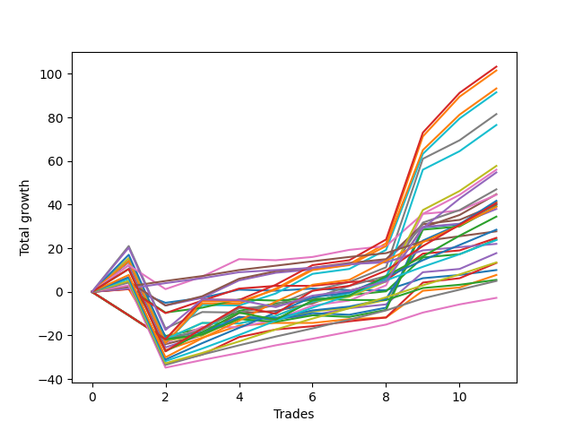

# Long Labrador 003 
- Symbol: ES
- Date Range: 09/26/2022 - 12/30/2022
- Trading Period: 8:30-12:30
- Number of Trades: 5



| Name | Win Percent | Profit | Avg Profit / Trade | Avg Time / Trade |      | Name | Win Percent | Profit | Avg Profit / Trade | Avg Time / Trade |
| ---- | ----------- | ------ | ------------------ | ---------------- | ---- | ---- | ----------- | ------ | ------------------ | ---------------- |
| Sorted By <br> Profit | | | | | | Sorted By <br> Win Percentage ||||
| MALAMUTE 001 | 80.00 | 41875.00 | 8375.00 | 50:58 |     | BB100 | 100.00 | 41625.00 | 8325.00 | 50:08 |
| BB100 | 100.00 | 41625.00 | 8325.00 | 50:08 |     | Seven | 100.00 | 40500.00 | 8100.00 | 31:53 |
| NEWFI 0000 | 80.00 | 41125.00 | 8225.00 | 51:10 |     | Five | 100.00 | 31125.00 | 6225.00 | 33:11 |
| Seven | 100.00 | 40500.00 | 8100.00 | 31:53 |     | NEWFI 000 | 100.00 | 28250.00 | 5650.00 | 42:49 |
| Five | 100.00 | 31125.00 | 6225.00 | 33:11 |     | Four | 100.00 | 25000.00 | 5000.00 | 15:47 |
| NEWFI 000 | 100.00 | 28250.00 | 5650.00 | 42:49 |     | Two_C | 100.00 | 14500.00 | 2900.00 | 08:25 |
| Four | 100.00 | 25000.00 | 5000.00 | 15:47 |     | Three | 100.00 | 14250.00 | 2850.00 | 08:01 |
| Six | 80.00 | 21250.00 | 4250.00 | 09:19 |     | Two | 100.00 | 13875.00 | 2775.00 | 07:41 |
| Two_C | 100.00 | 14500.00 | 2900.00 | 08:25 |     | Eighty-Five | 100.00 | 12875.00 | 2575.00 | 10:08 |
| Three | 100.00 | 14250.00 | 2850.00 | 08:01 |     | One | 100.00 | 11000.00 | 2200.00 | 04:43 |
| Two | 100.00 | 13875.00 | 2775.00 | 07:41 |     | Eighty-Four | 100.00 | 10875.00 | 2175.00 | 07:32 |
| Eighty-Five | 100.00 | 12875.00 | 2575.00 | 10:08 |     | Eighty-Three | 100.00 | 9375.00 | 1875.00 | 05:47 |
| One | 100.00 | 11000.00 | 2200.00 | 04:43 |     | Eighty-Two | 100.00 | 6875.00 | 1375.00 | 03:57 |
| MALAMUTE 002 | 60.00 | 11000.00 | 2200.00 | 08:41 |     | Eighty-One | 100.00 | 5500.00 | 1100.00 | 03:14 |
| Eighty-Four | 100.00 | 10875.00 | 2175.00 | 07:32 |     | MALAMUTE 001 | 80.00 | 41875.00 | 8375.00 | 50:58 |
| Eighty-Three | 100.00 | 9375.00 | 1875.00 | 05:47 |     | NEWFI 0000 | 80.00 | 41125.00 | 8225.00 | 51:10 |
| Eighty-Two | 100.00 | 6875.00 | 1375.00 | 03:57 |     | Six | 80.00 | 21250.00 | 4250.00 | 09:19 |
| Eighty-One | 100.00 | 5500.00 | 1100.00 | 03:14 |     | Zero | 80.00 | 4250.00 | 850.00 | 02:32 |
| Zero | 80.00 | 4250.00 | 850.00 | 02:32 |     | MALAMUTE 002 | 60.00 | 11000.00 | 2200.00 | 08:41 |

## NO STOPLOSS

### Test Zero
* Sell when price hits the middle line of the 20p bollinger
* No Stoploss
* Results:
```
Total Trades: 5
Percent Up: 80.00
Percent Down: 20.00
Total Points Moved Up: 8.50
Potential Profit: 4250.00
Total Points Ups: 9.25 Count Ups: 4
Total Points Downs: -0.75 Count Downs: 1
```

<details><summary>Trades</summary>

<code>In: 2022-10-17 11:29:00		Out: 2022-10-17 11:35:40		Total Position Time: 06:40		Total Move Up: -0.75		Total to Date: -0.75</code> <br />
<code>In: 2022-10-17 12:15:00		Out: 2022-10-17 12:16:15		Total Position Time: 01:15		Total Move Up: 0.00		Total to Date: -0.75</code> <br />
<code>In: 2022-11-08 11:36:00		Out: 2022-11-08 11:37:10		Total Position Time: 01:10		Total Move Up: 5.50		Total to Date: 4.75</code> <br />
<code>In: 2022-11-10 10:03:00		Out: 2022-11-10 10:04:10		Total Position Time: 01:10		Total Move Up: 1.50		Total to Date: 6.25</code> <br />
<code>In: 2022-11-11 08:34:00		Out: 2022-11-11 08:36:25		Total Position Time: 02:25		Total Move Up: 2.25		Total to Date: 8.50</code> <br />


</details>

### Test One
* Sell when the price hits the upper line of the 20p 1std bollinger
* No Stoploss
* Results:
```
Total Trades: 5
Percent Up: 100.00
Percent Down: 0.00
Total Points Moved Up: 22.00
Potential Profit: 11000.00
Total Points Ups: 22.00 Count Ups: 5
Total Points Downs: 0.00 Count Downs: 0
```

<details><summary>Trades</summary>

<code>In: 2022-10-17 11:29:00		Out: 2022-10-17 11:36:10		Total Position Time: 07:10		Total Move Up: 1.75		Total to Date: 1.75</code> <br />
<code>In: 2022-10-17 12:15:00		Out: 2022-10-17 12:20:05		Total Position Time: 05:05		Total Move Up: 0.75		Total to Date: 2.50</code> <br />
<code>In: 2022-11-08 11:36:00		Out: 2022-11-08 11:38:35		Total Position Time: 02:35		Total Move Up: 12.25		Total to Date: 14.75</code> <br />
<code>In: 2022-11-10 10:03:00		Out: 2022-11-10 10:04:10		Total Position Time: 01:10		Total Move Up: 1.50		Total to Date: 16.25</code> <br />
<code>In: 2022-11-11 08:34:00		Out: 2022-11-11 08:41:35		Total Position Time: 07:35		Total Move Up: 5.75		Total to Date: 22.00</code> <br />


</details>

### Test Two
* Sell when the price hits the upper line of the 20p 2std bollinger
* No Stoploss
* Results:
```
Total Trades: 5
Percent Up: 100.00
Percent Down: 0.00
Total Points Moved Up: 27.75
Potential Profit: 13875.00
Total Points Ups: 27.75 Count Ups: 5
Total Points Downs: 0.00 Count Downs: 0
```

<details><summary>Trades</summary>

<code>In: 2022-10-17 11:29:00		Out: 2022-10-17 11:37:30		Total Position Time: 08:30		Total Move Up: 2.25		Total to Date: 2.25</code> <br />
<code>In: 2022-10-17 12:15:00		Out: 2022-10-17 12:22:15		Total Position Time: 07:15		Total Move Up: 1.75		Total to Date: 4.00</code> <br />
<code>In: 2022-11-08 11:36:00		Out: 2022-11-08 11:42:10		Total Position Time: 06:10		Total Move Up: 15.50		Total to Date: 19.50</code> <br />
<code>In: 2022-11-10 10:03:00		Out: 2022-11-10 10:04:10		Total Position Time: 01:10		Total Move Up: 1.50		Total to Date: 21.00</code> <br />
<code>In: 2022-11-11 08:34:00		Out: 2022-11-11 08:49:20		Total Position Time: 15:20		Total Move Up: 6.75		Total to Date: 27.75</code> <br />


</details>

### Test Two_C
* Sell when the price hits the upper line of the 20p 2std bollinger
* No Stoploss
* Results:
```
Total Trades: 5
Percent Up: 100.00
Percent Down: 0.00
Total Points Moved Up: 29.00
Potential Profit: 14500.00
Total Points Ups: 29.00 Count Ups: 5
Total Points Downs: 0.00 Count Downs: 0
```

<details><summary>Trades</summary>

<code>In: 2022-10-17 11:29:00		Out: 2022-10-17 11:37:55		Total Position Time: 08:55		Total Move Up: 2.25		Total to Date: 2.25</code> <br />
<code>In: 2022-10-17 12:15:00		Out: 2022-10-17 12:23:05		Total Position Time: 08:05		Total Move Up: 1.75		Total to Date: 4.00</code> <br />
<code>In: 2022-11-08 11:36:00		Out: 2022-11-08 11:42:15		Total Position Time: 06:15		Total Move Up: 16.00		Total to Date: 20.00</code> <br />
<code>In: 2022-11-10 10:03:00		Out: 2022-11-10 10:06:10		Total Position Time: 03:10		Total Move Up: 2.00		Total to Date: 22.00</code> <br />
<code>In: 2022-11-11 08:34:00		Out: 2022-11-11 08:49:40		Total Position Time: 15:40		Total Move Up: 7.00		Total to Date: 29.00</code> <br />


</details>

### Test Three
* Sell when price hits the middle line of the 50p bollinger
* No Stoploss
* Results:
```
Total Trades: 5
Percent Up: 100.00
Percent Down: 0.00
Total Points Moved Up: 28.50
Potential Profit: 14250.00
Total Points Ups: 28.50 Count Ups: 5
Total Points Downs: 0.00 Count Downs: 0
```

<details><summary>Trades</summary>

<code>In: 2022-10-17 11:29:00		Out: 2022-10-17 11:39:15		Total Position Time: 10:15		Total Move Up: 3.25		Total to Date: 3.25</code> <br />
<code>In: 2022-10-17 12:15:00		Out: 2022-10-17 12:22:15		Total Position Time: 07:15		Total Move Up: 1.75		Total to Date: 5.00</code> <br />
<code>In: 2022-11-08 11:36:00		Out: 2022-11-08 11:41:40		Total Position Time: 05:40		Total Move Up: 14.75		Total to Date: 19.75</code> <br />
<code>In: 2022-11-10 10:03:00		Out: 2022-11-10 10:04:10		Total Position Time: 01:10		Total Move Up: 1.50		Total to Date: 21.25</code> <br />
<code>In: 2022-11-11 08:34:00		Out: 2022-11-11 08:49:45		Total Position Time: 15:45		Total Move Up: 7.25		Total to Date: 28.50</code> <br />


</details>

### Test Four
* Sell when the price hits the upper line of the 50p 1std bollinger
* No Stoploss
* Results:
```
Total Trades: 5
Percent Up: 100.00
Percent Down: 0.00
Total Points Moved Up: 50.00
Potential Profit: 25000.00
Total Points Ups: 50.00 Count Ups: 5
Total Points Downs: 0.00 Count Downs: 0
```

<details><summary>Trades</summary>

<code>In: 2022-10-17 11:29:00		Out: 2022-10-17 11:43:20		Total Position Time: 14:20		Total Move Up: 5.75		Total to Date: 5.75</code> <br />
<code>In: 2022-10-17 12:15:00		Out: 2022-10-17 12:32:35		Total Position Time: 17:35		Total Move Up: 4.50		Total to Date: 10.25</code> <br />
<code>In: 2022-11-08 11:36:00		Out: 2022-11-08 11:47:55		Total Position Time: 11:55		Total Move Up: 24.50		Total to Date: 34.75</code> <br />
<code>In: 2022-11-10 10:03:00		Out: 2022-11-10 10:13:45		Total Position Time: 10:45		Total Move Up: 5.75		Total to Date: 40.50</code> <br />
<code>In: 2022-11-11 08:34:00		Out: 2022-11-11 08:58:20		Total Position Time: 24:20		Total Move Up: 9.50		Total to Date: 50.00</code> <br />


</details>

### Test Five
* Sell when the price hits the upper line of the 50p 2std bollinger
* No Stoploss
* Results:
```
Total Trades: 5
Percent Up: 100.00
Percent Down: 0.00
Total Points Moved Up: 62.25
Potential Profit: 31125.00
Total Points Ups: 62.25 Count Ups: 5
Total Points Downs: 0.00 Count Downs: 0
```

<details><summary>Trades</summary>

<code>In: 2022-10-17 11:29:00		Out: 2022-10-17 12:29:55		Total Position Time: 60:55		Total Move Up: 2.25		Total to Date: 2.25</code> <br />
<code>In: 2022-10-17 12:15:00		Out: 2022-10-17 12:43:10		Total Position Time: 28:10		Total Move Up: 7.00		Total to Date: 9.25</code> <br />
<code>In: 2022-11-08 11:36:00		Out: 2022-11-08 12:02:35		Total Position Time: 26:35		Total Move Up: 32.75		Total to Date: 42.00</code> <br />
<code>In: 2022-11-10 10:03:00		Out: 2022-11-10 10:16:15		Total Position Time: 13:15		Total Move Up: 8.75		Total to Date: 50.75</code> <br />
<code>In: 2022-11-11 08:34:00		Out: 2022-11-11 09:11:00		Total Position Time: 37:00		Total Move Up: 11.50		Total to Date: 62.25</code> <br />


</details>

### Test Six
* Sell when the price hits the middle line of the 1std VWAP
* No Stoploss
* Results:
```
Total Trades: 5
Percent Up: 80.00
Percent Down: 20.00
Total Points Moved Up: 42.50
Potential Profit: 21250.00
Total Points Ups: 43.75 Count Ups: 4
Total Points Downs: -1.25 Count Downs: 1
```

<details><summary>Trades</summary>

<code>In: 2022-10-17 11:29:00		Out: 2022-10-17 11:30:10		Total Position Time: 01:10		Total Move Up: -1.25		Total to Date: -1.25</code> <br />
<code>In: 2022-10-17 12:15:00		Out: 2022-10-17 12:16:10		Total Position Time: 01:10		Total Move Up: 0.25		Total to Date: -1.00</code> <br />
<code>In: 2022-11-08 11:36:00		Out: 2022-11-08 12:02:35		Total Position Time: 26:35		Total Move Up: 32.75		Total to Date: 31.75</code> <br />
<code>In: 2022-11-10 10:03:00		Out: 2022-11-10 10:04:10		Total Position Time: 01:10		Total Move Up: 1.50		Total to Date: 33.25</code> <br />
<code>In: 2022-11-11 08:34:00		Out: 2022-11-11 08:50:30		Total Position Time: 16:30		Total Move Up: 9.25		Total to Date: 42.50</code> <br />


</details>

### Test Seven
* Sell when the price hits the upper line of the 1std VWAP
* No Stoploss
* Results:
```
Total Trades: 5
Percent Up: 100.00
Percent Down: 0.00
Total Points Moved Up: 81.00
Potential Profit: 40500.00
Total Points Ups: 81.00 Count Ups: 5
Total Points Downs: 0.00 Count Downs: 0
```

<details><summary>Trades</summary>

<code>In: 2022-10-17 11:29:00		Out: 2022-10-17 11:40:40		Total Position Time: 11:40		Total Move Up: 4.00		Total to Date: 4.00</code> <br />
<code>In: 2022-10-17 12:15:00		Out: 2022-10-17 12:33:15		Total Position Time: 18:15		Total Move Up: 6.75		Total to Date: 10.75</code> <br />
<code>In: 2022-11-08 11:36:00		Out: 2022-11-08 12:31:45		Total Position Time: 55:45		Total Move Up: 49.75		Total to Date: 60.50</code> <br />
<code>In: 2022-11-10 10:03:00		Out: 2022-11-10 10:15:50		Total Position Time: 12:50		Total Move Up: 8.50		Total to Date: 69.00</code> <br />
<code>In: 2022-11-11 08:34:00		Out: 2022-11-11 09:34:55		Total Position Time: 60:55		Total Move Up: 12.00		Total to Date: 81.00</code> <br />


</details>

### Test BB100
* Move to BB100 Upper Band
* No Stoploss
* Results:
```
Total Trades: 5
Percent Up: 100.00
Percent Down: 0.00
Total Points Moved Up: 83.25
Potential Profit: 41625.00
Total Points Ups: 83.25 Count Ups: 5
Total Points Downs: 0.00 Count Downs: 0
```

<details><summary>Trades</summary>

<code>In: 2022-10-17 11:29:00		Out: 2022-10-17 12:29:55		Total Position Time: 60:55		Total Move Up: 2.25		Total to Date: 2.25</code> <br />
<code>In: 2022-10-17 12:15:00		Out: 2022-10-17 12:44:10		Total Position Time: 29:10		Total Move Up: 8.75		Total to Date: 11.00</code> <br />
<code>In: 2022-11-08 11:36:00		Out: 2022-11-08 12:30:25		Total Position Time: 54:25		Total Move Up: 44.00		Total to Date: 55.00</code> <br />
<code>In: 2022-11-10 10:03:00		Out: 2022-11-10 10:48:15		Total Position Time: 45:15		Total Move Up: 16.25		Total to Date: 71.25</code> <br />
<code>In: 2022-11-11 08:34:00		Out: 2022-11-11 09:34:55		Total Position Time: 60:55		Total Move Up: 12.00		Total to Date: 83.25</code> <br />


</details>

## TAKE PROFIT

### Test Eighty-One
* Take Profit of 1 Point
* No Stoploss
* Results:
```
Total Trades: 5
Percent Up: 100.00
Percent Down: 0.00
Total Points Moved Up: 11.00
Potential Profit: 5500.00
Total Points Ups: 11.00 Count Ups: 5
Total Points Downs: 0.00 Count Downs: 0
```

<details><summary>Trades</summary>

<code>In: 2022-10-17 11:29:00		Out: 2022-10-17 11:36:10		Total Position Time: 07:10		Total Move Up: 1.75		Total to Date: 1.75</code> <br />
<code>In: 2022-10-17 12:15:00		Out: 2022-10-17 12:20:05		Total Position Time: 05:05		Total Move Up: 0.75		Total to Date: 2.50</code> <br />
<code>In: 2022-11-08 11:36:00		Out: 2022-11-08 11:37:10		Total Position Time: 01:10		Total Move Up: 5.50		Total to Date: 8.00</code> <br />
<code>In: 2022-11-10 10:03:00		Out: 2022-11-10 10:04:10		Total Position Time: 01:10		Total Move Up: 1.50		Total to Date: 9.50</code> <br />
<code>In: 2022-11-11 08:34:00		Out: 2022-11-11 08:35:35		Total Position Time: 01:35		Total Move Up: 1.50		Total to Date: 11.00</code> <br />


</details>

### Test Eighty-Two
* Take Profit of 2 Point
* No Stoploss
* Results:
```
Total Trades: 5
Percent Up: 100.00
Percent Down: 0.00
Total Points Moved Up: 13.75
Potential Profit: 6875.00
Total Points Ups: 13.75 Count Ups: 5
Total Points Downs: 0.00 Count Downs: 0
```

<details><summary>Trades</summary>

<code>In: 2022-10-17 11:29:00		Out: 2022-10-17 11:36:15		Total Position Time: 07:15		Total Move Up: 2.00		Total to Date: 2.00</code> <br />
<code>In: 2022-10-17 12:15:00		Out: 2022-10-17 12:22:20		Total Position Time: 07:20		Total Move Up: 1.75		Total to Date: 3.75</code> <br />
<code>In: 2022-11-08 11:36:00		Out: 2022-11-08 11:37:10		Total Position Time: 01:10		Total Move Up: 5.50		Total to Date: 9.25</code> <br />
<code>In: 2022-11-10 10:03:00		Out: 2022-11-10 10:04:40		Total Position Time: 01:40		Total Move Up: 2.25		Total to Date: 11.50</code> <br />
<code>In: 2022-11-11 08:34:00		Out: 2022-11-11 08:36:20		Total Position Time: 02:20		Total Move Up: 2.25		Total to Date: 13.75</code> <br />


</details>

### Test Eighty-Three
* Take Profit of 3 Point
* No Stoploss
* Results:
```
Total Trades: 5
Percent Up: 100.00
Percent Down: 0.00
Total Points Moved Up: 18.75
Potential Profit: 9375.00
Total Points Ups: 18.75 Count Ups: 5
Total Points Downs: 0.00 Count Downs: 0
```

<details><summary>Trades</summary>

<code>In: 2022-10-17 11:29:00		Out: 2022-10-17 11:39:15		Total Position Time: 10:15		Total Move Up: 3.25		Total to Date: 3.25</code> <br />
<code>In: 2022-10-17 12:15:00		Out: 2022-10-17 12:23:20		Total Position Time: 08:20		Total Move Up: 3.25		Total to Date: 6.50</code> <br />
<code>In: 2022-11-08 11:36:00		Out: 2022-11-08 11:37:10		Total Position Time: 01:10		Total Move Up: 5.50		Total to Date: 12.00</code> <br />
<code>In: 2022-11-10 10:03:00		Out: 2022-11-10 10:08:25		Total Position Time: 05:25		Total Move Up: 3.75		Total to Date: 15.75</code> <br />
<code>In: 2022-11-11 08:34:00		Out: 2022-11-11 08:37:45		Total Position Time: 03:45		Total Move Up: 3.00		Total to Date: 18.75</code> <br />


</details>

### Test Eighty-Four
* Take Profit of 4 Point
* No Stoploss
* Results:
```
Total Trades: 5
Percent Up: 100.00
Percent Down: 0.00
Total Points Moved Up: 21.75
Potential Profit: 10875.00
Total Points Ups: 21.75 Count Ups: 5
Total Points Downs: 0.00 Count Downs: 0
```

<details><summary>Trades</summary>

<code>In: 2022-10-17 11:29:00		Out: 2022-10-17 11:40:40		Total Position Time: 11:40		Total Move Up: 4.00		Total to Date: 4.00</code> <br />
<code>In: 2022-10-17 12:15:00		Out: 2022-10-17 12:29:55		Total Position Time: 14:55		Total Move Up: 4.25		Total to Date: 8.25</code> <br />
<code>In: 2022-11-08 11:36:00		Out: 2022-11-08 11:37:10		Total Position Time: 01:10		Total Move Up: 5.50		Total to Date: 13.75</code> <br />
<code>In: 2022-11-10 10:03:00		Out: 2022-11-10 10:08:30		Total Position Time: 05:30		Total Move Up: 4.00		Total to Date: 17.75</code> <br />
<code>In: 2022-11-11 08:34:00		Out: 2022-11-11 08:38:25		Total Position Time: 04:25		Total Move Up: 4.00		Total to Date: 21.75</code> <br />


</details>

### Test Eighty-Five
* Take Profit of 5 Point
* No Stoploss
* Results:
```
Total Trades: 5
Percent Up: 100.00
Percent Down: 0.00
Total Points Moved Up: 25.75
Potential Profit: 12875.00
Total Points Ups: 25.75 Count Ups: 5
Total Points Downs: 0.00 Count Downs: 0
```

<details><summary>Trades</summary>

<code>In: 2022-10-17 11:29:00		Out: 2022-10-17 11:42:40		Total Position Time: 13:40		Total Move Up: 4.75		Total to Date: 4.75</code> <br />
<code>In: 2022-10-17 12:15:00		Out: 2022-10-17 12:32:45		Total Position Time: 17:45		Total Move Up: 5.00		Total to Date: 9.75</code> <br />
<code>In: 2022-11-08 11:36:00		Out: 2022-11-08 11:37:10		Total Position Time: 01:10		Total Move Up: 5.50		Total to Date: 15.25</code> <br />
<code>In: 2022-11-10 10:03:00		Out: 2022-11-10 10:13:35		Total Position Time: 10:35		Total Move Up: 5.00		Total to Date: 20.25</code> <br />
<code>In: 2022-11-11 08:34:00		Out: 2022-11-11 08:41:30		Total Position Time: 07:30		Total Move Up: 5.50		Total to Date: 25.75</code> <br />


</details>

## Indicator Exits

### Test NEWFI 000
* Newfi 0000
* No Stoploss
* Results:
```
Total Trades: 5
Percent Up: 100.00
Percent Down: 0.00
Total Points Moved Up: 56.50
Potential Profit: 28250.00
Total Points Ups: 56.50 Count Ups: 5
Total Points Downs: 0.00 Count Downs: 0
```

<details><summary>Trades</summary>

<code>In: 2022-10-17 11:29:00		Out: 2022-10-17 12:29:55		Total Position Time: 60:55		Total Move Up: 2.25		Total to Date: 2.25</code> <br />
<code>In: 2022-10-17 12:15:00		Out: 2022-10-17 12:37:05		Total Position Time: 22:05		Total Move Up: 4.25		Total to Date: 6.50</code> <br />
<code>In: 2022-11-08 11:36:00		Out: 2022-11-08 11:57:05		Total Position Time: 21:05		Total Move Up: 24.50		Total to Date: 31.00</code> <br />
<code>In: 2022-11-10 10:03:00		Out: 2022-11-10 10:52:05		Total Position Time: 49:05		Total Move Up: 13.50		Total to Date: 44.50</code> <br />
<code>In: 2022-11-11 08:34:00		Out: 2022-11-11 09:34:55		Total Position Time: 60:55		Total Move Up: 12.00		Total to Date: 56.50</code> <br />


</details>

### Test NEWFI 0000
* Newfi 0000
* No Stoploss
* Results:
```
Total Trades: 5
Percent Up: 80.00
Percent Down: 20.00
Total Points Moved Up: 82.25
Potential Profit: 41125.00
Total Points Ups: 86.25 Count Ups: 4
Total Points Downs: -4.00 Count Downs: 1
```

<details><summary>Trades</summary>

<code>In: 2022-10-17 11:29:00		Out: 2022-10-17 12:10:05		Total Position Time: 41:05		Total Move Up: -4.00		Total to Date: -4.00</code> <br />
<code>In: 2022-10-17 12:15:00		Out: 2022-10-17 12:47:00		Total Position Time: 32:00		Total Move Up: 7.00		Total to Date: 3.00</code> <br />
<code>In: 2022-11-08 11:36:00		Out: 2022-11-08 12:36:55		Total Position Time: 60:55		Total Move Up: 49.00		Total to Date: 52.00</code> <br />
<code>In: 2022-11-10 10:03:00		Out: 2022-11-10 11:03:55		Total Position Time: 60:55		Total Move Up: 18.25		Total to Date: 70.25</code> <br />
<code>In: 2022-11-11 08:34:00		Out: 2022-11-11 09:34:55		Total Position Time: 60:55		Total Move Up: 12.00		Total to Date: 82.25</code> <br />


</details>

### Test MALAMUTE 001
* Malamute 001
* No Stoploss
* Results:
```
Total Trades: 5
Percent Up: 80.00
Percent Down: 20.00
Total Points Moved Up: 83.75
Potential Profit: 41875.00
Total Points Ups: 86.25 Count Ups: 4
Total Points Downs: -2.50 Count Downs: 1
```

<details><summary>Trades</summary>

<code>In: 2022-10-17 11:29:00		Out: 2022-10-17 12:09:05		Total Position Time: 40:05		Total Move Up: -2.50		Total to Date: -2.50</code> <br />
<code>In: 2022-10-17 12:15:00		Out: 2022-10-17 12:47:00		Total Position Time: 32:00		Total Move Up: 7.00		Total to Date: 4.50</code> <br />
<code>In: 2022-11-08 11:36:00		Out: 2022-11-08 12:36:55		Total Position Time: 60:55		Total Move Up: 49.00		Total to Date: 53.50</code> <br />
<code>In: 2022-11-10 10:03:00		Out: 2022-11-10 11:03:55		Total Position Time: 60:55		Total Move Up: 18.25		Total to Date: 71.75</code> <br />
<code>In: 2022-11-11 08:34:00		Out: 2022-11-11 09:34:55		Total Position Time: 60:55		Total Move Up: 12.00		Total to Date: 83.75</code> <br />


</details>

### Test MALAMUTE 002
* Malamute 001
* No Stoploss
* Results:
```
Total Trades: 5
Percent Up: 60.00
Percent Down: 40.00
Total Points Moved Up: 22.00
Potential Profit: 11000.00
Total Points Ups: 27.00 Count Ups: 3
Total Points Downs: -5.00 Count Downs: 2
```

<details><summary>Trades</summary>

<code>In: 2022-10-17 11:29:00		Out: 2022-10-17 11:33:05		Total Position Time: 04:05		Total Move Up: -3.25		Total to Date: -3.25</code> <br />
<code>In: 2022-10-17 12:15:00		Out: 2022-10-17 12:19:05		Total Position Time: 04:05		Total Move Up: -1.75		Total to Date: -5.00</code> <br />
<code>In: 2022-11-08 11:36:00		Out: 2022-11-08 11:53:05		Total Position Time: 17:05		Total Move Up: 22.75		Total to Date: 17.75</code> <br />
<code>In: 2022-11-10 10:03:00		Out: 2022-11-10 10:09:05		Total Position Time: 06:05		Total Move Up: 2.00		Total to Date: 19.75</code> <br />
<code>In: 2022-11-11 08:34:00		Out: 2022-11-11 08:46:05		Total Position Time: 12:05		Total Move Up: 2.25		Total to Date: 22.00</code> <br />


</details>