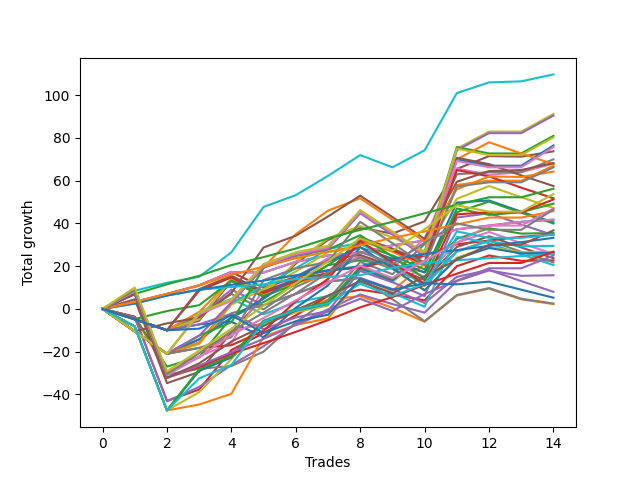

# Long Labrador 005 
- Symbol: ES
- Date Range: 03/18/2022 - 12/30/2022
- Trading Period: 8:30-12:30
- Number of Trades: 14



| Name | Win Percent | Profit | Avg Profit / Trade | Avg Time / Trade |      | Name | Win Percent | Profit | Avg Profit / Trade | Avg Time / Trade |
| ---- | ----------- | ------ | ------------------ | ---------------- | ---- | ---- | ----------- | ------ | ------------------ | ---------------- |
| Sorted By <br> Profit | | | | | | Sorted By <br> Win Percentage ||||
| BB-100 Mid | 92.86 | 54875.00 | 3919.64 | 27:23 |     | TP-4 | 100.00 | 28125.00 | 2008.93 | 10:41 |
| V U/L 1SD | 78.57 | 45625.00 | 3258.93 | 45:55 |     | TP-3 | 100.00 | 22875.00 | 1633.93 | 08:52 |
| V U/L 1SD SL-10 | 71.43 | 45250.00 | 3232.14 | 32:32 |     | TP-2 | 100.00 | 16625.00 | 1187.50 | 04:02 |
| BB-200 U/L 2SD | 71.43 | 40500.00 | 2892.86 | 52:01 |     | TP-1 | 100.00 | 12875.00 | 919.64 | 01:45 |
| BB-200 U/L 2SD SL-10 | 64.29 | 40125.00 | 2866.07 | 38:37 |     | BB-100 Mid | 92.86 | 54875.00 | 3919.64 | 27:23 |
| BB-100 U/L 2SD | 71.43 | 38250.00 | 2732.14 | 51:01 |     | BB-20 Mid SL-10 | 92.86 | 20875.00 | 1491.07 | 02:46 |
| BB-100 U/L 2SD SL-10 | 64.29 | 37875.00 | 2705.36 | 37:38 |     | BB-20 Mid | 92.86 | 20875.00 | 1491.07 | 02:46 |
| BB-50 U/L 1SD | 78.57 | 36875.00 | 2633.93 | 28:44 |     | TP-5 | 92.86 | 13375.00 | 955.36 | 17:53 |
| BB-100 Mid SL-10 | 78.57 | 34125.00 | 2437.50 | 20:57 |     | TP-8 | 85.71 | 23500.00 | 1678.57 | 28:11 |
| BB-50 U/L 2SD | 78.57 | 34000.00 | 2428.57 | 42:05 |     | TP-7 | 85.71 | 18375.00 | 1312.50 | 24:55 |
| BB-200 Mid | 78.57 | 33500.00 | 2392.86 | 40:17 |     | TP-6 | 85.71 | 12500.00 | 892.86 | 23:21 |
| BB-200 Mid SL-10 | 71.43 | 33125.00 | 2366.07 | 26:54 |     | V U/L 1SD | 78.57 | 45625.00 | 3258.93 | 45:55 |
| BB-50 U/L 1SD SL-10 | 64.29 | 32125.00 | 2294.64 | 19:17 |     | BB-50 U/L 1SD | 78.57 | 36875.00 | 2633.93 | 28:44 |
| TP-4 | 100.00 | 28125.00 | 2008.93 | 10:41 |     | BB-100 Mid SL-10 | 78.57 | 34125.00 | 2437.50 | 20:57 |
| TP-10 | 78.57 | 26875.00 | 1919.64 | 36:03 |     | BB-50 U/L 2SD | 78.57 | 34000.00 | 2428.57 | 42:05 |
| BB-50 U/L 2SD SL-10 | 64.29 | 24625.00 | 1758.93 | 31:10 |     | BB-200 Mid | 78.57 | 33500.00 | 2392.86 | 40:17 |
| TP-8 | 85.71 | 23500.00 | 1678.57 | 28:11 |     | TP-10 | 78.57 | 26875.00 | 1919.64 | 36:03 |
| TP-9 | 78.57 | 23250.00 | 1660.71 | 35:12 |     | TP-9 | 78.57 | 23250.00 | 1660.71 | 35:12 |
| TP-3 | 100.00 | 22875.00 | 1633.93 | 08:52 |     | V U/L 1SD SL-10 | 71.43 | 45250.00 | 3232.14 | 32:32 |
| BB-20 Mid SL-10 | 92.86 | 20875.00 | 1491.07 | 02:46 |     | BB-200 U/L 2SD | 71.43 | 40500.00 | 2892.86 | 52:01 |
| BB-20 Mid | 92.86 | 20875.00 | 1491.07 | 02:46 |     | BB-100 U/L 2SD | 71.43 | 38250.00 | 2732.14 | 51:01 |
| TP-7 | 85.71 | 18375.00 | 1312.50 | 24:55 |     | BB-200 Mid SL-10 | 71.43 | 33125.00 | 2366.07 | 26:54 |
| BB-20 U/L 2SD | 64.29 | 17750.00 | 1267.86 | 22:43 |     | NEWFI 000 | 71.43 | 17375.00 | 1241.07 | 44:38 |
| NEWFI 000 | 71.43 | 17375.00 | 1241.07 | 44:38 |     | BB-200 U/L 2SD SL-10 | 64.29 | 40125.00 | 2866.07 | 38:37 |
| TP-2 | 100.00 | 16625.00 | 1187.50 | 04:02 |     | BB-100 U/L 2SD SL-10 | 64.29 | 37875.00 | 2705.36 | 37:38 |
| BB-20 U/L 2SD C SL-10 | 64.29 | 14750.00 | 1053.57 | 15:22 |     | BB-50 U/L 1SD SL-10 | 64.29 | 32125.00 | 2294.64 | 19:17 |
| TP-5 | 92.86 | 13375.00 | 955.36 | 17:53 |     | BB-50 U/L 2SD SL-10 | 64.29 | 24625.00 | 1758.93 | 31:10 |
| BB-20 U/L 2SD SL-10 | 64.29 | 13375.00 | 955.36 | 15:17 |     | BB-20 U/L 2SD | 64.29 | 17750.00 | 1267.86 | 22:43 |
| BB-50 Mid SL-10 | 64.29 | 13125.00 | 937.50 | 13:58 |     | BB-20 U/L 2SD C SL-10 | 64.29 | 14750.00 | 1053.57 | 15:22 |
| TP-1 | 100.00 | 12875.00 | 919.64 | 01:45 |     | BB-20 U/L 2SD SL-10 | 64.29 | 13375.00 | 955.36 | 15:17 |
| TP-6 | 85.71 | 12500.00 | 892.86 | 23:21 |     | BB-50 Mid SL-10 | 64.29 | 13125.00 | 937.50 | 13:58 |
| BB-20 U/L 2SD C | 64.29 | 11375.00 | 812.50 | 23:26 |     | BB-20 U/L 2SD C | 64.29 | 11375.00 | 812.50 | 23:26 |
| BB-50 Mid | 64.29 | 7875.00 | 562.50 | 21:53 |     | BB-50 Mid | 64.29 | 7875.00 | 562.50 | 21:53 |
| BB-20 U/L 1SD SL-10 | 57.14 | 1250.00 | 89.29 | 12:36 |     | BB-20 U/L 1SD SL-10 | 57.14 | 1250.00 | 89.29 | 12:36 |
| BB-20 U/L 1SD | 57.14 | 1125.00 | 80.36 | 19:23 |     | BB-20 U/L 1SD | 57.14 | 1125.00 | 80.36 | 19:23 |

## NO STOPLOSS

### Test BB-20 Mid
* Sell when price hits the middle line of the 20p bollinger
* No Stoploss
* Results:
```
Total Trades: 14
Percent Up: 92.86
Percent Down: 7.14
Total Points Moved Up: 41.75
Potential Profit: 20875.00
Total Points Ups: 42.00 Count Ups: 13
Total Points Downs: -0.25 Count Downs: 1
```

<details><summary>Trades</summary>

<code>In: 2022-05-06 11:12:00		Out: 2022-05-06 11:15:05		Total Position Time: 03:05		Total Move Up: 3.25		Total to Date: 3.25</code> <br />
<code>In: 2022-05-12 10:12:00		Out: 2022-05-12 10:13:10		Total Position Time: 01:10		Total Move Up: 3.75		Total to Date: 7.00</code> <br />
<code>In: 2022-05-16 09:47:00		Out: 2022-05-16 09:48:15		Total Position Time: 01:15		Total Move Up: 4.00		Total to Date: 11.00</code> <br />
<code>In: 2022-06-17 12:18:00		Out: 2022-06-17 12:20:30		Total Position Time: 02:30		Total Move Up: 6.25		Total to Date: 17.25</code> <br />
<code>In: 2022-06-30 12:15:00		Out: 2022-06-30 12:22:25		Total Position Time: 07:25		Total Move Up: -0.25		Total to Date: 17.00</code> <br />
<code>In: 2022-07-20 10:18:00		Out: 2022-07-20 10:20:15		Total Position Time: 02:15		Total Move Up: 5.00		Total to Date: 22.00</code> <br />
<code>In: 2022-08-02 12:26:00		Out: 2022-08-02 12:27:45		Total Position Time: 01:45		Total Move Up: 3.00		Total to Date: 25.00</code> <br />
<code>In: 2022-09-06 10:18:00		Out: 2022-09-06 10:25:10		Total Position Time: 07:10		Total Move Up: 1.25		Total to Date: 26.25</code> <br />
<code>In: 2022-10-26 11:36:00		Out: 2022-10-26 11:37:10		Total Position Time: 01:10		Total Move Up: 3.50		Total to Date: 29.75</code> <br />
<code>In: 2022-11-08 11:14:00		Out: 2022-11-08 11:15:10		Total Position Time: 01:10		Total Move Up: 2.25		Total to Date: 32.00</code> <br />
<code>In: 2022-11-08 11:35:00		Out: 2022-11-08 11:37:05		Total Position Time: 02:05		Total Move Up: 5.25		Total to Date: 37.25</code> <br />
<code>In: 2022-12-27 09:52:00		Out: 2022-12-27 09:56:10		Total Position Time: 04:10		Total Move Up: 1.75		Total to Date: 39.00</code> <br />
<code>In: 2022-12-27 11:01:00		Out: 2022-12-27 11:03:20		Total Position Time: 02:20		Total Move Up: 1.75		Total to Date: 40.75</code> <br />
<code>In: 2022-12-27 11:24:00		Out: 2022-12-27 11:25:20		Total Position Time: 01:20		Total Move Up: 1.00		Total to Date: 41.75</code> <br />


</details>

### Test BB-20 U/L 1SD
* Sell when the price hits the upper line of the 20p 1std bollinger
* No Stoploss
* Results:
```
Total Trades: 14
Percent Up: 57.14
Percent Down: 42.86
Total Points Moved Up: 2.25
Potential Profit: 1125.00
Total Points Ups: 51.00 Count Ups: 8
Total Points Downs: -48.75 Count Downs: 6
```

<details><summary>Trades</summary>

<code>In: 2022-05-06 11:12:00		Out: 2022-05-06 11:49:10		Total Position Time: 37:10		Total Move Up: -3.75		Total to Date: -3.75</code> <br />
<code>In: 2022-05-12 10:12:00		Out: 2022-05-12 11:02:25		Total Position Time: 50:25		Total Move Up: -25.75		Total to Date: -29.50</code> <br />
<code>In: 2022-05-16 09:47:00		Out: 2022-05-16 09:50:05		Total Position Time: 03:05		Total Move Up: 6.75		Total to Date: -22.75</code> <br />
<code>In: 2022-06-17 12:18:00		Out: 2022-06-17 12:22:20		Total Position Time: 04:20		Total Move Up: 12.25		Total to Date: -10.50</code> <br />
<code>In: 2022-06-30 12:15:00		Out: 2022-06-30 12:25:10		Total Position Time: 10:10		Total Move Up: 3.75		Total to Date: -6.75</code> <br />
<code>In: 2022-07-20 10:18:00		Out: 2022-07-20 10:27:20		Total Position Time: 09:20		Total Move Up: 5.25		Total to Date: -1.50</code> <br />
<code>In: 2022-08-02 12:26:00		Out: 2022-08-02 12:29:05		Total Position Time: 03:05		Total Move Up: 5.75		Total to Date: 4.25</code> <br />
<code>In: 2022-09-06 10:18:00		Out: 2022-09-06 10:30:55		Total Position Time: 12:55		Total Move Up: 1.75		Total to Date: 6.00</code> <br />
<code>In: 2022-10-26 11:36:00		Out: 2022-10-26 12:15:05		Total Position Time: 39:05		Total Move Up: -5.50		Total to Date: 0.50</code> <br />
<code>In: 2022-11-08 11:14:00		Out: 2022-11-08 11:38:35		Total Position Time: 24:35		Total Move Up: -6.50		Total to Date: -6.00</code> <br />
<code>In: 2022-11-08 11:35:00		Out: 2022-11-08 11:38:35		Total Position Time: 03:35		Total Move Up: 12.25		Total to Date: 6.25</code> <br />
<code>In: 2022-12-27 09:52:00		Out: 2022-12-27 09:59:25		Total Position Time: 07:25		Total Move Up: 3.25		Total to Date: 9.50</code> <br />
<code>In: 2022-12-27 11:01:00		Out: 2022-12-27 11:45:40		Total Position Time: 44:40		Total Move Up: -5.00		Total to Date: 4.50</code> <br />
<code>In: 2022-12-27 11:24:00		Out: 2022-12-27 11:45:40		Total Position Time: 21:40		Total Move Up: -2.25		Total to Date: 2.25</code> <br />


</details>

### Test BB-20 U/L 2SD
* Sell when the price hits the upper line of the 20p 2std bollinger
* No Stoploss
* Results:
```
Total Trades: 14
Percent Up: 64.29
Percent Down: 35.71
Total Points Moved Up: 35.50
Potential Profit: 17750.00
Total Points Ups: 70.50 Count Ups: 9
Total Points Downs: -35.00 Count Downs: 5
```

<details><summary>Trades</summary>

<code>In: 2022-05-06 11:12:00		Out: 2022-05-06 11:49:10		Total Position Time: 37:10		Total Move Up: -3.75		Total to Date: -3.75</code> <br />
<code>In: 2022-05-12 10:12:00		Out: 2022-05-12 11:04:05		Total Position Time: 52:05		Total Move Up: -23.25		Total to Date: -27.00</code> <br />
<code>In: 2022-05-16 09:47:00		Out: 2022-05-16 10:06:30		Total Position Time: 19:30		Total Move Up: 4.50		Total to Date: -22.50</code> <br />
<code>In: 2022-06-17 12:18:00		Out: 2022-06-17 12:27:15		Total Position Time: 09:15		Total Move Up: 18.50		Total to Date: -4.00</code> <br />
<code>In: 2022-06-30 12:15:00		Out: 2022-06-30 12:25:55		Total Position Time: 10:55		Total Move Up: 7.25		Total to Date: 3.25</code> <br />
<code>In: 2022-07-20 10:18:00		Out: 2022-07-20 10:28:40		Total Position Time: 10:40		Total Move Up: 8.25		Total to Date: 11.50</code> <br />
<code>In: 2022-08-02 12:26:00		Out: 2022-08-02 12:36:40		Total Position Time: 10:40		Total Move Up: 9.00		Total to Date: 20.50</code> <br />
<code>In: 2022-09-06 10:18:00		Out: 2022-09-06 10:31:10		Total Position Time: 13:10		Total Move Up: 2.25		Total to Date: 22.75</code> <br />
<code>In: 2022-10-26 11:36:00		Out: 2022-10-26 12:19:00		Total Position Time: 43:00		Total Move Up: -2.25		Total to Date: 20.50</code> <br />
<code>In: 2022-11-08 11:14:00		Out: 2022-11-08 11:42:10		Total Position Time: 28:10		Total Move Up: -3.25		Total to Date: 17.25</code> <br />
<code>In: 2022-11-08 11:35:00		Out: 2022-11-08 11:42:10		Total Position Time: 07:10		Total Move Up: 15.50		Total to Date: 32.75</code> <br />
<code>In: 2022-12-27 09:52:00		Out: 2022-12-27 10:00:50		Total Position Time: 08:50		Total Move Up: 5.00		Total to Date: 37.75</code> <br />
<code>In: 2022-12-27 11:01:00		Out: 2022-12-27 11:46:20		Total Position Time: 45:20		Total Move Up: -2.50		Total to Date: 35.25</code> <br />
<code>In: 2022-12-27 11:24:00		Out: 2022-12-27 11:46:20		Total Position Time: 22:20		Total Move Up: 0.25		Total to Date: 35.50</code> <br />


</details>

### Test BB-20 U/L 2SD C
* Sell when the price hits the upper line of the 20p 2std bollinger
* No Stoploss
* Results:
```
Total Trades: 14
Percent Up: 64.29
Percent Down: 35.71
Total Points Moved Up: 22.75
Potential Profit: 11375.00
Total Points Ups: 73.25 Count Ups: 9
Total Points Downs: -50.50 Count Downs: 5
```

<details><summary>Trades</summary>

<code>In: 2022-05-06 11:12:00		Out: 2022-05-06 11:49:10		Total Position Time: 37:10		Total Move Up: -3.75		Total to Date: -3.75</code> <br />
<code>In: 2022-05-12 10:12:00		Out: 2022-05-12 11:12:55		Total Position Time: 60:55		Total Move Up: -39.25		Total to Date: -43.00</code> <br />
<code>In: 2022-05-16 09:47:00		Out: 2022-05-16 10:07:00		Total Position Time: 20:00		Total Move Up: 5.25		Total to Date: -37.75</code> <br />
<code>In: 2022-06-17 12:18:00		Out: 2022-06-17 12:27:15		Total Position Time: 09:15		Total Move Up: 18.50		Total to Date: -19.25</code> <br />
<code>In: 2022-06-30 12:15:00		Out: 2022-06-30 12:26:05		Total Position Time: 11:05		Total Move Up: 8.00		Total to Date: -11.25</code> <br />
<code>In: 2022-07-20 10:18:00		Out: 2022-07-20 10:28:40		Total Position Time: 10:40		Total Move Up: 8.25		Total to Date: -3.00</code> <br />
<code>In: 2022-08-02 12:26:00		Out: 2022-08-02 12:36:40		Total Position Time: 10:40		Total Move Up: 9.00		Total to Date: 6.00</code> <br />
<code>In: 2022-09-06 10:18:00		Out: 2022-09-06 10:31:30		Total Position Time: 13:30		Total Move Up: 3.00		Total to Date: 9.00</code> <br />
<code>In: 2022-10-26 11:36:00		Out: 2022-10-26 12:19:00		Total Position Time: 43:00		Total Move Up: -2.25		Total to Date: 6.75</code> <br />
<code>In: 2022-11-08 11:14:00		Out: 2022-11-08 11:42:15		Total Position Time: 28:15		Total Move Up: -2.75		Total to Date: 4.00</code> <br />
<code>In: 2022-11-08 11:35:00		Out: 2022-11-08 11:42:15		Total Position Time: 07:15		Total Move Up: 16.00		Total to Date: 20.00</code> <br />
<code>In: 2022-12-27 09:52:00		Out: 2022-12-27 10:00:50		Total Position Time: 08:50		Total Move Up: 5.00		Total to Date: 25.00</code> <br />
<code>In: 2022-12-27 11:01:00		Out: 2022-12-27 11:46:20		Total Position Time: 45:20		Total Move Up: -2.50		Total to Date: 22.50</code> <br />
<code>In: 2022-12-27 11:24:00		Out: 2022-12-27 11:46:20		Total Position Time: 22:20		Total Move Up: 0.25		Total to Date: 22.75</code> <br />


</details>

### Test BB-50 Mid
* Sell when price hits the middle line of the 50p bollinger
* No Stoploss
* Results:
```
Total Trades: 14
Percent Up: 64.29
Percent Down: 35.71
Total Points Moved Up: 15.75
Potential Profit: 7875.00
Total Points Ups: 70.00 Count Ups: 9
Total Points Downs: -54.25 Count Downs: 5
```

<details><summary>Trades</summary>

<code>In: 2022-05-06 11:12:00		Out: 2022-05-06 11:49:15		Total Position Time: 37:15		Total Move Up: -4.00		Total to Date: -4.00</code> <br />
<code>In: 2022-05-12 10:12:00		Out: 2022-05-12 11:12:55		Total Position Time: 60:55		Total Move Up: -39.25		Total to Date: -43.25</code> <br />
<code>In: 2022-05-16 09:47:00		Out: 2022-05-16 09:50:05		Total Position Time: 03:05		Total Move Up: 6.75		Total to Date: -36.50</code> <br />
<code>In: 2022-06-17 12:18:00		Out: 2022-06-17 12:21:20		Total Position Time: 03:20		Total Move Up: 10.25		Total to Date: -26.25</code> <br />
<code>In: 2022-06-30 12:15:00		Out: 2022-06-30 12:26:30		Total Position Time: 11:30		Total Move Up: 8.75		Total to Date: -17.50</code> <br />
<code>In: 2022-07-20 10:18:00		Out: 2022-07-20 10:30:00		Total Position Time: 12:00		Total Move Up: 10.50		Total to Date: -7.00</code> <br />
<code>In: 2022-08-02 12:26:00		Out: 2022-08-02 12:30:40		Total Position Time: 04:40		Total Move Up: 6.75		Total to Date: -0.25</code> <br />
<code>In: 2022-09-06 10:18:00		Out: 2022-09-06 10:39:40		Total Position Time: 21:40		Total Move Up: 7.00		Total to Date: 6.75</code> <br />
<code>In: 2022-10-26 11:36:00		Out: 2022-10-26 12:17:15		Total Position Time: 41:15		Total Move Up: -4.50		Total to Date: 2.25</code> <br />
<code>In: 2022-11-08 11:14:00		Out: 2022-11-08 11:41:40		Total Position Time: 27:40		Total Move Up: -4.00		Total to Date: -1.75</code> <br />
<code>In: 2022-11-08 11:35:00		Out: 2022-11-08 11:41:40		Total Position Time: 06:40		Total Move Up: 14.75		Total to Date: 13.00</code> <br />
<code>In: 2022-12-27 09:52:00		Out: 2022-12-27 10:00:50		Total Position Time: 08:50		Total Move Up: 5.00		Total to Date: 18.00</code> <br />
<code>In: 2022-12-27 11:01:00		Out: 2022-12-27 11:46:20		Total Position Time: 45:20		Total Move Up: -2.50		Total to Date: 15.50</code> <br />
<code>In: 2022-12-27 11:24:00		Out: 2022-12-27 11:46:20		Total Position Time: 22:20		Total Move Up: 0.25		Total to Date: 15.75</code> <br />


</details>

### Test BB-50 U/L 1SD
* Sell when the price hits the upper line of the 50p 1std bollinger
* No Stoploss
* Results:
```
Total Trades: 14
Percent Up: 78.57
Percent Down: 21.43
Total Points Moved Up: 73.75
Potential Profit: 36875.00
Total Points Ups: 116.00 Count Ups: 11
Total Points Downs: -42.25 Count Downs: 3
```

<details><summary>Trades</summary>

<code>In: 2022-05-06 11:12:00		Out: 2022-05-06 11:50:10		Total Position Time: 38:10		Total Move Up: 4.50		Total to Date: 4.50</code> <br />
<code>In: 2022-05-12 10:12:00		Out: 2022-05-12 11:12:55		Total Position Time: 60:55		Total Move Up: -39.25		Total to Date: -34.75</code> <br />
<code>In: 2022-05-16 09:47:00		Out: 2022-05-16 10:07:05		Total Position Time: 20:05		Total Move Up: 5.25		Total to Date: -29.50</code> <br />
<code>In: 2022-06-17 12:18:00		Out: 2022-06-17 12:27:15		Total Position Time: 09:15		Total Move Up: 18.50		Total to Date: -11.00</code> <br />
<code>In: 2022-06-30 12:15:00		Out: 2022-06-30 12:30:20		Total Position Time: 15:20		Total Move Up: 16.75		Total to Date: 5.75</code> <br />
<code>In: 2022-07-20 10:18:00		Out: 2022-07-20 10:32:45		Total Position Time: 14:45		Total Move Up: 15.50		Total to Date: 21.25</code> <br />
<code>In: 2022-08-02 12:26:00		Out: 2022-08-02 12:36:55		Total Position Time: 10:55		Total Move Up: 11.00		Total to Date: 32.25</code> <br />
<code>In: 2022-09-06 10:18:00		Out: 2022-09-06 10:56:40		Total Position Time: 38:40		Total Move Up: 5.75		Total to Date: 38.00</code> <br />
<code>In: 2022-10-26 11:36:00		Out: 2022-10-26 12:31:35		Total Position Time: 55:35		Total Move Up: -2.75		Total to Date: 35.25</code> <br />
<code>In: 2022-11-08 11:14:00		Out: 2022-11-08 11:47:55		Total Position Time: 33:55		Total Move Up: 5.75		Total to Date: 41.00</code> <br />
<code>In: 2022-11-08 11:35:00		Out: 2022-11-08 11:47:55		Total Position Time: 12:55		Total Move Up: 24.50		Total to Date: 65.50</code> <br />
<code>In: 2022-12-27 09:52:00		Out: 2022-12-27 10:06:45		Total Position Time: 14:45		Total Move Up: 6.00		Total to Date: 71.50</code> <br />
<code>In: 2022-12-27 11:01:00		Out: 2022-12-27 11:51:05		Total Position Time: 50:05		Total Move Up: -0.25		Total to Date: 71.25</code> <br />
<code>In: 2022-12-27 11:24:00		Out: 2022-12-27 11:51:05		Total Position Time: 27:05		Total Move Up: 2.50		Total to Date: 73.75</code> <br />


</details>

### Test BB-50 U/L 2SD
* Sell when the price hits the upper line of the 50p 2std bollinger
* No Stoploss
* Results:
```
Total Trades: 14
Percent Up: 78.57
Percent Down: 21.43
Total Points Moved Up: 68.00
Potential Profit: 34000.00
Total Points Ups: 116.00 Count Ups: 11
Total Points Downs: -48.00 Count Downs: 3
```

<details><summary>Trades</summary>

<code>In: 2022-05-06 11:12:00		Out: 2022-05-06 11:50:35		Total Position Time: 38:35		Total Move Up: 8.50		Total to Date: 8.50</code> <br />
<code>In: 2022-05-12 10:12:00		Out: 2022-05-12 11:12:55		Total Position Time: 60:55		Total Move Up: -39.25		Total to Date: -30.75</code> <br />
<code>In: 2022-05-16 09:47:00		Out: 2022-05-16 10:07:35		Total Position Time: 20:35		Total Move Up: 8.50		Total to Date: -22.25</code> <br />
<code>In: 2022-06-17 12:18:00		Out: 2022-06-17 12:47:00		Total Position Time: 29:00		Total Move Up: 6.25		Total to Date: -16.00</code> <br />
<code>In: 2022-06-30 12:15:00		Out: 2022-06-30 12:36:55		Total Position Time: 21:55		Total Move Up: 25.50		Total to Date: 9.50</code> <br />
<code>In: 2022-07-20 10:18:00		Out: 2022-07-20 11:18:55		Total Position Time: 60:55		Total Move Up: 5.50		Total to Date: 15.00</code> <br />
<code>In: 2022-08-02 12:26:00		Out: 2022-08-02 12:47:00		Total Position Time: 21:00		Total Move Up: 3.00		Total to Date: 18.00</code> <br />
<code>In: 2022-09-06 10:18:00		Out: 2022-09-06 10:58:55		Total Position Time: 40:55		Total Move Up: 6.75		Total to Date: 24.75</code> <br />
<code>In: 2022-10-26 11:36:00		Out: 2022-10-26 12:36:55		Total Position Time: 60:55		Total Move Up: -5.75		Total to Date: 19.00</code> <br />
<code>In: 2022-11-08 11:14:00		Out: 2022-11-08 12:02:35		Total Position Time: 48:35		Total Move Up: 14.00		Total to Date: 33.00</code> <br />
<code>In: 2022-11-08 11:35:00		Out: 2022-11-08 12:02:35		Total Position Time: 27:35		Total Move Up: 32.75		Total to Date: 65.75</code> <br />
<code>In: 2022-12-27 09:52:00		Out: 2022-12-27 10:52:55		Total Position Time: 60:55		Total Move Up: -3.00		Total to Date: 62.75</code> <br />
<code>In: 2022-12-27 11:01:00		Out: 2022-12-27 12:01:10		Total Position Time: 60:10		Total Move Up: 1.25		Total to Date: 64.00</code> <br />
<code>In: 2022-12-27 11:24:00		Out: 2022-12-27 12:01:10		Total Position Time: 37:10		Total Move Up: 4.00		Total to Date: 68.00</code> <br />


</details>

### Test V U/L 1SD
* Sell when the price hits the upper line of the 1std VWAP
* No Stoploss
* Results:
```
Total Trades: 14
Percent Up: 78.57
Percent Down: 21.43
Total Points Moved Up: 91.25
Potential Profit: 45625.00
Total Points Ups: 144.50 Count Ups: 11
Total Points Downs: -53.25 Count Downs: 3
```

<details><summary>Trades</summary>

<code>In: 2022-05-06 11:12:00		Out: 2022-05-06 12:12:55		Total Position Time: 60:55		Total Move Up: -8.25		Total to Date: -8.25</code> <br />
<code>In: 2022-05-12 10:12:00		Out: 2022-05-12 11:12:55		Total Position Time: 60:55		Total Move Up: -39.25		Total to Date: -47.50</code> <br />
<code>In: 2022-05-16 09:47:00		Out: 2022-05-16 10:07:35		Total Position Time: 20:35		Total Move Up: 8.50		Total to Date: -39.00</code> <br />
<code>In: 2022-06-17 12:18:00		Out: 2022-06-17 12:26:30		Total Position Time: 08:30		Total Move Up: 15.50		Total to Date: -23.50</code> <br />
<code>In: 2022-06-30 12:15:00		Out: 2022-06-30 12:47:00		Total Position Time: 32:00		Total Move Up: 16.50		Total to Date: -7.00</code> <br />
<code>In: 2022-07-20 10:18:00		Out: 2022-07-20 11:18:55		Total Position Time: 60:55		Total Move Up: 5.50		Total to Date: -1.50</code> <br />
<code>In: 2022-08-02 12:26:00		Out: 2022-08-02 12:47:00		Total Position Time: 21:00		Total Move Up: 3.00		Total to Date: 1.50</code> <br />
<code>In: 2022-09-06 10:18:00		Out: 2022-09-06 11:18:55		Total Position Time: 60:55		Total Move Up: 16.75		Total to Date: 18.25</code> <br />
<code>In: 2022-10-26 11:36:00		Out: 2022-10-26 12:36:55		Total Position Time: 60:55		Total Move Up: -5.75		Total to Date: 12.50</code> <br />
<code>In: 2022-11-08 11:14:00		Out: 2022-11-08 12:14:55		Total Position Time: 60:55		Total Move Up: 12.75		Total to Date: 25.25</code> <br />
<code>In: 2022-11-08 11:35:00		Out: 2022-11-08 12:31:45		Total Position Time: 56:45		Total Move Up: 49.75		Total to Date: 75.00</code> <br />
<code>In: 2022-12-27 09:52:00		Out: 2022-12-27 10:08:45		Total Position Time: 16:45		Total Move Up: 8.00		Total to Date: 83.00</code> <br />
<code>In: 2022-12-27 11:01:00		Out: 2022-12-27 12:01:55		Total Position Time: 60:55		Total Move Up: 0.00		Total to Date: 83.00</code> <br />
<code>In: 2022-12-27 11:24:00		Out: 2022-12-27 12:24:55		Total Position Time: 60:55		Total Move Up: 8.25		Total to Date: 91.25</code> <br />


</details>

### Test BB-100 Mid
* Move to BB100 Mid
* No Stoploss
* Results:
```
Total Trades: 14
Percent Up: 92.86
Percent Down: 7.14
Total Points Moved Up: 109.75
Potential Profit: 54875.00
Total Points Ups: 115.50 Count Ups: 13
Total Points Downs: -5.75 Count Downs: 1
```

<details><summary>Trades</summary>

<code>In: 2022-05-06 11:12:00		Out: 2022-05-06 11:50:35		Total Position Time: 38:35		Total Move Up: 8.50		Total to Date: 8.50</code> <br />
<code>In: 2022-05-12 10:12:00		Out: 2022-05-12 10:13:10		Total Position Time: 01:10		Total Move Up: 3.75		Total to Date: 12.25</code> <br />
<code>In: 2022-05-16 09:47:00		Out: 2022-05-16 09:48:10		Total Position Time: 01:10		Total Move Up: 2.75		Total to Date: 15.00</code> <br />
<code>In: 2022-06-17 12:18:00		Out: 2022-06-17 12:21:30		Total Position Time: 03:30		Total Move Up: 11.50		Total to Date: 26.50</code> <br />
<code>In: 2022-06-30 12:15:00		Out: 2022-06-30 12:32:55		Total Position Time: 17:55		Total Move Up: 21.25		Total to Date: 47.75</code> <br />
<code>In: 2022-07-20 10:18:00		Out: 2022-07-20 11:18:55		Total Position Time: 60:55		Total Move Up: 5.50		Total to Date: 53.25</code> <br />
<code>In: 2022-08-02 12:26:00		Out: 2022-08-02 12:36:40		Total Position Time: 10:40		Total Move Up: 9.00		Total to Date: 62.25</code> <br />
<code>In: 2022-09-06 10:18:00		Out: 2022-09-06 11:00:30		Total Position Time: 42:30		Total Move Up: 9.75		Total to Date: 72.00</code> <br />
<code>In: 2022-10-26 11:36:00		Out: 2022-10-26 12:36:55		Total Position Time: 60:55		Total Move Up: -5.75		Total to Date: 66.25</code> <br />
<code>In: 2022-11-08 11:14:00		Out: 2022-11-08 11:53:50		Total Position Time: 39:50		Total Move Up: 8.00		Total to Date: 74.25</code> <br />
<code>In: 2022-11-08 11:35:00		Out: 2022-11-08 11:53:50		Total Position Time: 18:50		Total Move Up: 26.75		Total to Date: 101.00</code> <br />
<code>In: 2022-12-27 09:52:00		Out: 2022-12-27 10:00:50		Total Position Time: 08:50		Total Move Up: 5.00		Total to Date: 106.00</code> <br />
<code>In: 2022-12-27 11:01:00		Out: 2022-12-27 11:51:50		Total Position Time: 50:50		Total Move Up: 0.50		Total to Date: 106.50</code> <br />
<code>In: 2022-12-27 11:24:00		Out: 2022-12-27 11:51:50		Total Position Time: 27:50		Total Move Up: 3.25		Total to Date: 109.75</code> <br />


</details>

### Test BB-100 U/L 2SD
* Move to BB100 Upper Band
* No Stoploss
* Results:
```
Total Trades: 14
Percent Up: 71.43
Percent Down: 28.57
Total Points Moved Up: 76.50
Potential Profit: 38250.00
Total Points Ups: 132.75 Count Ups: 10
Total Points Downs: -56.25 Count Downs: 4
```

<details><summary>Trades</summary>

<code>In: 2022-05-06 11:12:00		Out: 2022-05-06 12:12:55		Total Position Time: 60:55		Total Move Up: -8.25		Total to Date: -8.25</code> <br />
<code>In: 2022-05-12 10:12:00		Out: 2022-05-12 11:12:55		Total Position Time: 60:55		Total Move Up: -39.25		Total to Date: -47.50</code> <br />
<code>In: 2022-05-16 09:47:00		Out: 2022-05-16 10:24:00		Total Position Time: 37:00		Total Move Up: 18.50		Total to Date: -29.00</code> <br />
<code>In: 2022-06-17 12:18:00		Out: 2022-06-17 12:47:00		Total Position Time: 29:00		Total Move Up: 6.25		Total to Date: -22.75</code> <br />
<code>In: 2022-06-30 12:15:00		Out: 2022-06-30 12:47:00		Total Position Time: 32:00		Total Move Up: 16.50		Total to Date: -6.25</code> <br />
<code>In: 2022-07-20 10:18:00		Out: 2022-07-20 11:18:55		Total Position Time: 60:55		Total Move Up: 5.50		Total to Date: -0.75</code> <br />
<code>In: 2022-08-02 12:26:00		Out: 2022-08-02 12:47:00		Total Position Time: 21:00		Total Move Up: 3.00		Total to Date: 2.25</code> <br />
<code>In: 2022-09-06 10:18:00		Out: 2022-09-06 11:18:55		Total Position Time: 60:55		Total Move Up: 16.75		Total to Date: 19.00</code> <br />
<code>In: 2022-10-26 11:36:00		Out: 2022-10-26 12:36:55		Total Position Time: 60:55		Total Move Up: -5.75		Total to Date: 13.25</code> <br />
<code>In: 2022-11-08 11:14:00		Out: 2022-11-08 12:14:55		Total Position Time: 60:55		Total Move Up: 12.75		Total to Date: 26.00</code> <br />
<code>In: 2022-11-08 11:35:00		Out: 2022-11-08 12:30:25		Total Position Time: 55:25		Total Move Up: 44.00		Total to Date: 70.00</code> <br />
<code>In: 2022-12-27 09:52:00		Out: 2022-12-27 10:52:55		Total Position Time: 60:55		Total Move Up: -3.00		Total to Date: 67.00</code> <br />
<code>In: 2022-12-27 11:01:00		Out: 2022-12-27 12:01:55		Total Position Time: 60:55		Total Move Up: 0.00		Total to Date: 67.00</code> <br />
<code>In: 2022-12-27 11:24:00		Out: 2022-12-27 12:16:35		Total Position Time: 52:35		Total Move Up: 9.50		Total to Date: 76.50</code> <br />


</details>

### Test BB-200 Mid
* Move to BB200 Mid
* No Stoploss
* Results:
```
Total Trades: 14
Percent Up: 78.57
Percent Down: 21.43
Total Points Moved Up: 67.00
Potential Profit: 33500.00
Total Points Ups: 120.25 Count Ups: 11
Total Points Downs: -53.25 Count Downs: 3
```

<details><summary>Trades</summary>

<code>In: 2022-05-06 11:12:00		Out: 2022-05-06 12:12:55		Total Position Time: 60:55		Total Move Up: -8.25		Total to Date: -8.25</code> <br />
<code>In: 2022-05-12 10:12:00		Out: 2022-05-12 11:12:55		Total Position Time: 60:55		Total Move Up: -39.25		Total to Date: -47.50</code> <br />
<code>In: 2022-05-16 09:47:00		Out: 2022-05-16 09:48:10		Total Position Time: 01:10		Total Move Up: 2.75		Total to Date: -44.75</code> <br />
<code>In: 2022-06-17 12:18:00		Out: 2022-06-17 12:20:25		Total Position Time: 02:25		Total Move Up: 5.00		Total to Date: -39.75</code> <br />
<code>In: 2022-06-30 12:15:00		Out: 2022-06-30 12:38:00		Total Position Time: 23:00		Total Move Up: 26.75		Total to Date: -13.00</code> <br />
<code>In: 2022-07-20 10:18:00		Out: 2022-07-20 11:18:55		Total Position Time: 60:55		Total Move Up: 5.50		Total to Date: -7.50</code> <br />
<code>In: 2022-08-02 12:26:00		Out: 2022-08-02 12:47:00		Total Position Time: 21:00		Total Move Up: 3.00		Total to Date: -4.50</code> <br />
<code>In: 2022-09-06 10:18:00		Out: 2022-09-06 11:11:10		Total Position Time: 53:10		Total Move Up: 18.75		Total to Date: 14.25</code> <br />
<code>In: 2022-10-26 11:36:00		Out: 2022-10-26 12:36:55		Total Position Time: 60:55		Total Move Up: -5.75		Total to Date: 8.50</code> <br />
<code>In: 2022-11-08 11:14:00		Out: 2022-11-08 12:14:55		Total Position Time: 60:55		Total Move Up: 12.75		Total to Date: 21.25</code> <br />
<code>In: 2022-11-08 11:35:00		Out: 2022-11-08 12:20:05		Total Position Time: 45:05		Total Move Up: 36.75		Total to Date: 58.00</code> <br />
<code>In: 2022-12-27 09:52:00		Out: 2022-12-27 09:56:20		Total Position Time: 04:20		Total Move Up: 2.00		Total to Date: 60.00</code> <br />
<code>In: 2022-12-27 11:01:00		Out: 2022-12-27 12:01:55		Total Position Time: 60:55		Total Move Up: 0.00		Total to Date: 60.00</code> <br />
<code>In: 2022-12-27 11:24:00		Out: 2022-12-27 12:12:25		Total Position Time: 48:25		Total Move Up: 7.00		Total to Date: 67.00</code> <br />


</details>

### Test BB-200 U/L 2SD
* Move to BB200 Upper Band
* No Stoploss
* Results:
```
Total Trades: 14
Percent Up: 71.43
Percent Down: 28.57
Total Points Moved Up: 81.00
Potential Profit: 40500.00
Total Points Ups: 137.25 Count Ups: 10
Total Points Downs: -56.25 Count Downs: 4
```

<details><summary>Trades</summary>

<code>In: 2022-05-06 11:12:00		Out: 2022-05-06 12:12:55		Total Position Time: 60:55		Total Move Up: -8.25		Total to Date: -8.25</code> <br />
<code>In: 2022-05-12 10:12:00		Out: 2022-05-12 11:12:55		Total Position Time: 60:55		Total Move Up: -39.25		Total to Date: -47.50</code> <br />
<code>In: 2022-05-16 09:47:00		Out: 2022-05-16 10:24:05		Total Position Time: 37:05		Total Move Up: 19.25		Total to Date: -28.25</code> <br />
<code>In: 2022-06-17 12:18:00		Out: 2022-06-17 12:47:00		Total Position Time: 29:00		Total Move Up: 6.25		Total to Date: -22.00</code> <br />
<code>In: 2022-06-30 12:15:00		Out: 2022-06-30 12:47:00		Total Position Time: 32:00		Total Move Up: 16.50		Total to Date: -5.50</code> <br />
<code>In: 2022-07-20 10:18:00		Out: 2022-07-20 11:18:55		Total Position Time: 60:55		Total Move Up: 5.50		Total to Date: 0.00</code> <br />
<code>In: 2022-08-02 12:26:00		Out: 2022-08-02 12:47:00		Total Position Time: 21:00		Total Move Up: 3.00		Total to Date: 3.00</code> <br />
<code>In: 2022-09-06 10:18:00		Out: 2022-09-06 11:18:55		Total Position Time: 60:55		Total Move Up: 16.75		Total to Date: 19.75</code> <br />
<code>In: 2022-10-26 11:36:00		Out: 2022-10-26 12:36:55		Total Position Time: 60:55		Total Move Up: -5.75		Total to Date: 14.00</code> <br />
<code>In: 2022-11-08 11:14:00		Out: 2022-11-08 12:14:55		Total Position Time: 60:55		Total Move Up: 12.75		Total to Date: 26.75</code> <br />
<code>In: 2022-11-08 11:35:00		Out: 2022-11-08 12:35:55		Total Position Time: 60:55		Total Move Up: 49.00		Total to Date: 75.75</code> <br />
<code>In: 2022-12-27 09:52:00		Out: 2022-12-27 10:52:55		Total Position Time: 60:55		Total Move Up: -3.00		Total to Date: 72.75</code> <br />
<code>In: 2022-12-27 11:01:00		Out: 2022-12-27 12:01:55		Total Position Time: 60:55		Total Move Up: 0.00		Total to Date: 72.75</code> <br />
<code>In: 2022-12-27 11:24:00		Out: 2022-12-27 12:24:55		Total Position Time: 60:55		Total Move Up: 8.25		Total to Date: 81.00</code> <br />


</details>

## STOPLOSS OF 10

### Test BB-20 Mid SL-10
* Sell when price hits the middle line of the 20p bollinger
* Stoploss is 10 points
* Results:
```
Total Trades: 14
Percent Up: 92.86
Percent Down: 7.14
Total Points Moved Up: 41.75
Potential Profit: 20875.00
Total Points Ups: 42.00 Count Ups: 13
Total Points Downs: -0.25 Count Downs: 1
```

<details><summary>Trades</summary>

<code>In: 2022-05-06 11:12:00		Out: 2022-05-06 11:15:05		Total Position Time: 03:05		Total Move Up: 3.25		Total to Date: 3.25</code> <br />
<code>In: 2022-05-12 10:12:00		Out: 2022-05-12 10:13:10		Total Position Time: 01:10		Total Move Up: 3.75		Total to Date: 7.00</code> <br />
<code>In: 2022-05-16 09:47:00		Out: 2022-05-16 09:48:15		Total Position Time: 01:15		Total Move Up: 4.00		Total to Date: 11.00</code> <br />
<code>In: 2022-06-17 12:18:00		Out: 2022-06-17 12:20:30		Total Position Time: 02:30		Total Move Up: 6.25		Total to Date: 17.25</code> <br />
<code>In: 2022-06-30 12:15:00		Out: 2022-06-30 12:22:25		Total Position Time: 07:25		Total Move Up: -0.25		Total to Date: 17.00</code> <br />
<code>In: 2022-07-20 10:18:00		Out: 2022-07-20 10:20:15		Total Position Time: 02:15		Total Move Up: 5.00		Total to Date: 22.00</code> <br />
<code>In: 2022-08-02 12:26:00		Out: 2022-08-02 12:27:45		Total Position Time: 01:45		Total Move Up: 3.00		Total to Date: 25.00</code> <br />
<code>In: 2022-09-06 10:18:00		Out: 2022-09-06 10:25:10		Total Position Time: 07:10		Total Move Up: 1.25		Total to Date: 26.25</code> <br />
<code>In: 2022-10-26 11:36:00		Out: 2022-10-26 11:37:10		Total Position Time: 01:10		Total Move Up: 3.50		Total to Date: 29.75</code> <br />
<code>In: 2022-11-08 11:14:00		Out: 2022-11-08 11:15:10		Total Position Time: 01:10		Total Move Up: 2.25		Total to Date: 32.00</code> <br />
<code>In: 2022-11-08 11:35:00		Out: 2022-11-08 11:37:05		Total Position Time: 02:05		Total Move Up: 5.25		Total to Date: 37.25</code> <br />
<code>In: 2022-12-27 09:52:00		Out: 2022-12-27 09:56:10		Total Position Time: 04:10		Total Move Up: 1.75		Total to Date: 39.00</code> <br />
<code>In: 2022-12-27 11:01:00		Out: 2022-12-27 11:03:20		Total Position Time: 02:20		Total Move Up: 1.75		Total to Date: 40.75</code> <br />
<code>In: 2022-12-27 11:24:00		Out: 2022-12-27 11:25:20		Total Position Time: 01:20		Total Move Up: 1.00		Total to Date: 41.75</code> <br />


</details>

### Test BB-20 U/L 1SD SL-10
* Sell when the price hits the upper line of the 20p 1std bollinger
* Stoploss is 10 points
* Results:
```
Total Trades: 14
Percent Up: 57.14
Percent Down: 42.86
Total Points Moved Up: 2.50
Potential Profit: 1250.00
Total Points Ups: 51.00 Count Ups: 8
Total Points Downs: -48.50 Count Downs: 6
```

<details><summary>Trades</summary>

<code>In: 2022-05-06 11:12:00		Out: 2022-05-06 11:26:15		Total Position Time: 14:15		Total Move Up: -10.50		Total to Date: -10.50</code> <br />
<code>In: 2022-05-12 10:12:00		Out: 2022-05-12 10:19:05		Total Position Time: 07:05		Total Move Up: -10.50		Total to Date: -21.00</code> <br />
<code>In: 2022-05-16 09:47:00		Out: 2022-05-16 09:50:05		Total Position Time: 03:05		Total Move Up: 6.75		Total to Date: -14.25</code> <br />
<code>In: 2022-06-17 12:18:00		Out: 2022-06-17 12:22:20		Total Position Time: 04:20		Total Move Up: 12.25		Total to Date: -2.00</code> <br />
<code>In: 2022-06-30 12:15:00		Out: 2022-06-30 12:25:10		Total Position Time: 10:10		Total Move Up: 3.75		Total to Date: 1.75</code> <br />
<code>In: 2022-07-20 10:18:00		Out: 2022-07-20 10:27:20		Total Position Time: 09:20		Total Move Up: 5.25		Total to Date: 7.00</code> <br />
<code>In: 2022-08-02 12:26:00		Out: 2022-08-02 12:29:05		Total Position Time: 03:05		Total Move Up: 5.75		Total to Date: 12.75</code> <br />
<code>In: 2022-09-06 10:18:00		Out: 2022-09-06 10:30:55		Total Position Time: 12:55		Total Move Up: 1.75		Total to Date: 14.50</code> <br />
<code>In: 2022-10-26 11:36:00		Out: 2022-10-26 12:02:50		Total Position Time: 26:50		Total Move Up: -10.00		Total to Date: 4.50</code> <br />
<code>In: 2022-11-08 11:14:00		Out: 2022-11-08 11:22:05		Total Position Time: 08:05		Total Move Up: -10.25		Total to Date: -5.75</code> <br />
<code>In: 2022-11-08 11:35:00		Out: 2022-11-08 11:38:35		Total Position Time: 03:35		Total Move Up: 12.25		Total to Date: 6.50</code> <br />
<code>In: 2022-12-27 09:52:00		Out: 2022-12-27 09:59:25		Total Position Time: 07:25		Total Move Up: 3.25		Total to Date: 9.75</code> <br />
<code>In: 2022-12-27 11:01:00		Out: 2022-12-27 11:45:40		Total Position Time: 44:40		Total Move Up: -5.00		Total to Date: 4.75</code> <br />
<code>In: 2022-12-27 11:24:00		Out: 2022-12-27 11:45:40		Total Position Time: 21:40		Total Move Up: -2.25		Total to Date: 2.50</code> <br />


</details>

### Test BB-20 U/L 2SD SL-10
* Sell when the price hits the upper line of the 20p 2std bollinger
* Stoploss is 10 points
* Results:
```
Total Trades: 14
Percent Up: 64.29
Percent Down: 35.71
Total Points Moved Up: 26.75
Potential Profit: 13375.00
Total Points Ups: 70.50 Count Ups: 9
Total Points Downs: -43.75 Count Downs: 5
```

<details><summary>Trades</summary>

<code>In: 2022-05-06 11:12:00		Out: 2022-05-06 11:26:15		Total Position Time: 14:15		Total Move Up: -10.50		Total to Date: -10.50</code> <br />
<code>In: 2022-05-12 10:12:00		Out: 2022-05-12 10:19:05		Total Position Time: 07:05		Total Move Up: -10.50		Total to Date: -21.00</code> <br />
<code>In: 2022-05-16 09:47:00		Out: 2022-05-16 10:06:30		Total Position Time: 19:30		Total Move Up: 4.50		Total to Date: -16.50</code> <br />
<code>In: 2022-06-17 12:18:00		Out: 2022-06-17 12:27:15		Total Position Time: 09:15		Total Move Up: 18.50		Total to Date: 2.00</code> <br />
<code>In: 2022-06-30 12:15:00		Out: 2022-06-30 12:25:55		Total Position Time: 10:55		Total Move Up: 7.25		Total to Date: 9.25</code> <br />
<code>In: 2022-07-20 10:18:00		Out: 2022-07-20 10:28:40		Total Position Time: 10:40		Total Move Up: 8.25		Total to Date: 17.50</code> <br />
<code>In: 2022-08-02 12:26:00		Out: 2022-08-02 12:36:40		Total Position Time: 10:40		Total Move Up: 9.00		Total to Date: 26.50</code> <br />
<code>In: 2022-09-06 10:18:00		Out: 2022-09-06 10:31:10		Total Position Time: 13:10		Total Move Up: 2.25		Total to Date: 28.75</code> <br />
<code>In: 2022-10-26 11:36:00		Out: 2022-10-26 12:02:50		Total Position Time: 26:50		Total Move Up: -10.00		Total to Date: 18.75</code> <br />
<code>In: 2022-11-08 11:14:00		Out: 2022-11-08 11:22:05		Total Position Time: 08:05		Total Move Up: -10.25		Total to Date: 8.50</code> <br />
<code>In: 2022-11-08 11:35:00		Out: 2022-11-08 11:42:10		Total Position Time: 07:10		Total Move Up: 15.50		Total to Date: 24.00</code> <br />
<code>In: 2022-12-27 09:52:00		Out: 2022-12-27 10:00:50		Total Position Time: 08:50		Total Move Up: 5.00		Total to Date: 29.00</code> <br />
<code>In: 2022-12-27 11:01:00		Out: 2022-12-27 11:46:20		Total Position Time: 45:20		Total Move Up: -2.50		Total to Date: 26.50</code> <br />
<code>In: 2022-12-27 11:24:00		Out: 2022-12-27 11:46:20		Total Position Time: 22:20		Total Move Up: 0.25		Total to Date: 26.75</code> <br />


</details>

### Test BB-20 U/L 2SD C SL-10
* Sell when the price hits the upper line of the 20p 2std bollinger
* Stoploss is 10 points
* Results:
```
Total Trades: 14
Percent Up: 64.29
Percent Down: 35.71
Total Points Moved Up: 29.50
Potential Profit: 14750.00
Total Points Ups: 73.25 Count Ups: 9
Total Points Downs: -43.75 Count Downs: 5
```

<details><summary>Trades</summary>

<code>In: 2022-05-06 11:12:00		Out: 2022-05-06 11:26:15		Total Position Time: 14:15		Total Move Up: -10.50		Total to Date: -10.50</code> <br />
<code>In: 2022-05-12 10:12:00		Out: 2022-05-12 10:19:05		Total Position Time: 07:05		Total Move Up: -10.50		Total to Date: -21.00</code> <br />
<code>In: 2022-05-16 09:47:00		Out: 2022-05-16 10:07:00		Total Position Time: 20:00		Total Move Up: 5.25		Total to Date: -15.75</code> <br />
<code>In: 2022-06-17 12:18:00		Out: 2022-06-17 12:27:15		Total Position Time: 09:15		Total Move Up: 18.50		Total to Date: 2.75</code> <br />
<code>In: 2022-06-30 12:15:00		Out: 2022-06-30 12:26:05		Total Position Time: 11:05		Total Move Up: 8.00		Total to Date: 10.75</code> <br />
<code>In: 2022-07-20 10:18:00		Out: 2022-07-20 10:28:40		Total Position Time: 10:40		Total Move Up: 8.25		Total to Date: 19.00</code> <br />
<code>In: 2022-08-02 12:26:00		Out: 2022-08-02 12:36:40		Total Position Time: 10:40		Total Move Up: 9.00		Total to Date: 28.00</code> <br />
<code>In: 2022-09-06 10:18:00		Out: 2022-09-06 10:31:30		Total Position Time: 13:30		Total Move Up: 3.00		Total to Date: 31.00</code> <br />
<code>In: 2022-10-26 11:36:00		Out: 2022-10-26 12:02:50		Total Position Time: 26:50		Total Move Up: -10.00		Total to Date: 21.00</code> <br />
<code>In: 2022-11-08 11:14:00		Out: 2022-11-08 11:22:05		Total Position Time: 08:05		Total Move Up: -10.25		Total to Date: 10.75</code> <br />
<code>In: 2022-11-08 11:35:00		Out: 2022-11-08 11:42:15		Total Position Time: 07:15		Total Move Up: 16.00		Total to Date: 26.75</code> <br />
<code>In: 2022-12-27 09:52:00		Out: 2022-12-27 10:00:50		Total Position Time: 08:50		Total Move Up: 5.00		Total to Date: 31.75</code> <br />
<code>In: 2022-12-27 11:01:00		Out: 2022-12-27 11:46:20		Total Position Time: 45:20		Total Move Up: -2.50		Total to Date: 29.25</code> <br />
<code>In: 2022-12-27 11:24:00		Out: 2022-12-27 11:46:20		Total Position Time: 22:20		Total Move Up: 0.25		Total to Date: 29.50</code> <br />


</details>

### Test BB-50 Mid SL-10
* Sell when price hits the middle line of the 50p bollinger
* Stoploss is 10 points
* Results:
```
Total Trades: 14
Percent Up: 64.29
Percent Down: 35.71
Total Points Moved Up: 26.25
Potential Profit: 13125.00
Total Points Ups: 70.00 Count Ups: 9
Total Points Downs: -43.75 Count Downs: 5
```

<details><summary>Trades</summary>

<code>In: 2022-05-06 11:12:00		Out: 2022-05-06 11:26:15		Total Position Time: 14:15		Total Move Up: -10.50		Total to Date: -10.50</code> <br />
<code>In: 2022-05-12 10:12:00		Out: 2022-05-12 10:19:05		Total Position Time: 07:05		Total Move Up: -10.50		Total to Date: -21.00</code> <br />
<code>In: 2022-05-16 09:47:00		Out: 2022-05-16 09:50:05		Total Position Time: 03:05		Total Move Up: 6.75		Total to Date: -14.25</code> <br />
<code>In: 2022-06-17 12:18:00		Out: 2022-06-17 12:21:20		Total Position Time: 03:20		Total Move Up: 10.25		Total to Date: -4.00</code> <br />
<code>In: 2022-06-30 12:15:00		Out: 2022-06-30 12:26:30		Total Position Time: 11:30		Total Move Up: 8.75		Total to Date: 4.75</code> <br />
<code>In: 2022-07-20 10:18:00		Out: 2022-07-20 10:30:00		Total Position Time: 12:00		Total Move Up: 10.50		Total to Date: 15.25</code> <br />
<code>In: 2022-08-02 12:26:00		Out: 2022-08-02 12:30:40		Total Position Time: 04:40		Total Move Up: 6.75		Total to Date: 22.00</code> <br />
<code>In: 2022-09-06 10:18:00		Out: 2022-09-06 10:39:40		Total Position Time: 21:40		Total Move Up: 7.00		Total to Date: 29.00</code> <br />
<code>In: 2022-10-26 11:36:00		Out: 2022-10-26 12:02:50		Total Position Time: 26:50		Total Move Up: -10.00		Total to Date: 19.00</code> <br />
<code>In: 2022-11-08 11:14:00		Out: 2022-11-08 11:22:05		Total Position Time: 08:05		Total Move Up: -10.25		Total to Date: 8.75</code> <br />
<code>In: 2022-11-08 11:35:00		Out: 2022-11-08 11:41:40		Total Position Time: 06:40		Total Move Up: 14.75		Total to Date: 23.50</code> <br />
<code>In: 2022-12-27 09:52:00		Out: 2022-12-27 10:00:50		Total Position Time: 08:50		Total Move Up: 5.00		Total to Date: 28.50</code> <br />
<code>In: 2022-12-27 11:01:00		Out: 2022-12-27 11:46:20		Total Position Time: 45:20		Total Move Up: -2.50		Total to Date: 26.00</code> <br />
<code>In: 2022-12-27 11:24:00		Out: 2022-12-27 11:46:20		Total Position Time: 22:20		Total Move Up: 0.25		Total to Date: 26.25</code> <br />


</details>

### Test BB-50 U/L 1SD SL-10
* Sell when the price hits the upper line of the 50p 1std bollinger
* Stoploss is 10 points
* Results:
```
Total Trades: 14
Percent Up: 64.29
Percent Down: 35.71
Total Points Moved Up: 64.25
Potential Profit: 32125.00
Total Points Ups: 105.75 Count Ups: 9
Total Points Downs: -41.50 Count Downs: 5
```

<details><summary>Trades</summary>

<code>In: 2022-05-06 11:12:00		Out: 2022-05-06 11:26:15		Total Position Time: 14:15		Total Move Up: -10.50		Total to Date: -10.50</code> <br />
<code>In: 2022-05-12 10:12:00		Out: 2022-05-12 10:19:05		Total Position Time: 07:05		Total Move Up: -10.50		Total to Date: -21.00</code> <br />
<code>In: 2022-05-16 09:47:00		Out: 2022-05-16 10:07:05		Total Position Time: 20:05		Total Move Up: 5.25		Total to Date: -15.75</code> <br />
<code>In: 2022-06-17 12:18:00		Out: 2022-06-17 12:27:15		Total Position Time: 09:15		Total Move Up: 18.50		Total to Date: 2.75</code> <br />
<code>In: 2022-06-30 12:15:00		Out: 2022-06-30 12:30:20		Total Position Time: 15:20		Total Move Up: 16.75		Total to Date: 19.50</code> <br />
<code>In: 2022-07-20 10:18:00		Out: 2022-07-20 10:32:45		Total Position Time: 14:45		Total Move Up: 15.50		Total to Date: 35.00</code> <br />
<code>In: 2022-08-02 12:26:00		Out: 2022-08-02 12:36:55		Total Position Time: 10:55		Total Move Up: 11.00		Total to Date: 46.00</code> <br />
<code>In: 2022-09-06 10:18:00		Out: 2022-09-06 10:56:40		Total Position Time: 38:40		Total Move Up: 5.75		Total to Date: 51.75</code> <br />
<code>In: 2022-10-26 11:36:00		Out: 2022-10-26 12:02:50		Total Position Time: 26:50		Total Move Up: -10.00		Total to Date: 41.75</code> <br />
<code>In: 2022-11-08 11:14:00		Out: 2022-11-08 11:22:05		Total Position Time: 08:05		Total Move Up: -10.25		Total to Date: 31.50</code> <br />
<code>In: 2022-11-08 11:35:00		Out: 2022-11-08 11:47:55		Total Position Time: 12:55		Total Move Up: 24.50		Total to Date: 56.00</code> <br />
<code>In: 2022-12-27 09:52:00		Out: 2022-12-27 10:06:45		Total Position Time: 14:45		Total Move Up: 6.00		Total to Date: 62.00</code> <br />
<code>In: 2022-12-27 11:01:00		Out: 2022-12-27 11:51:05		Total Position Time: 50:05		Total Move Up: -0.25		Total to Date: 61.75</code> <br />
<code>In: 2022-12-27 11:24:00		Out: 2022-12-27 11:51:05		Total Position Time: 27:05		Total Move Up: 2.50		Total to Date: 64.25</code> <br />


</details>

### Test BB-50 U/L 2SD SL-10
* Sell when the price hits the upper line of the 50p 2std bollinger
* Stoploss is 10 points
* Results:
```
Total Trades: 14
Percent Up: 64.29
Percent Down: 35.71
Total Points Moved Up: 49.25
Potential Profit: 24625.00
Total Points Ups: 93.50 Count Ups: 9
Total Points Downs: -44.25 Count Downs: 5
```

<details><summary>Trades</summary>

<code>In: 2022-05-06 11:12:00		Out: 2022-05-06 11:26:15		Total Position Time: 14:15		Total Move Up: -10.50		Total to Date: -10.50</code> <br />
<code>In: 2022-05-12 10:12:00		Out: 2022-05-12 10:19:05		Total Position Time: 07:05		Total Move Up: -10.50		Total to Date: -21.00</code> <br />
<code>In: 2022-05-16 09:47:00		Out: 2022-05-16 10:07:35		Total Position Time: 20:35		Total Move Up: 8.50		Total to Date: -12.50</code> <br />
<code>In: 2022-06-17 12:18:00		Out: 2022-06-17 12:47:00		Total Position Time: 29:00		Total Move Up: 6.25		Total to Date: -6.25</code> <br />
<code>In: 2022-06-30 12:15:00		Out: 2022-06-30 12:36:55		Total Position Time: 21:55		Total Move Up: 25.50		Total to Date: 19.25</code> <br />
<code>In: 2022-07-20 10:18:00		Out: 2022-07-20 11:18:55		Total Position Time: 60:55		Total Move Up: 5.50		Total to Date: 24.75</code> <br />
<code>In: 2022-08-02 12:26:00		Out: 2022-08-02 12:47:00		Total Position Time: 21:00		Total Move Up: 3.00		Total to Date: 27.75</code> <br />
<code>In: 2022-09-06 10:18:00		Out: 2022-09-06 10:58:55		Total Position Time: 40:55		Total Move Up: 6.75		Total to Date: 34.50</code> <br />
<code>In: 2022-10-26 11:36:00		Out: 2022-10-26 12:02:50		Total Position Time: 26:50		Total Move Up: -10.00		Total to Date: 24.50</code> <br />
<code>In: 2022-11-08 11:14:00		Out: 2022-11-08 11:22:05		Total Position Time: 08:05		Total Move Up: -10.25		Total to Date: 14.25</code> <br />
<code>In: 2022-11-08 11:35:00		Out: 2022-11-08 12:02:35		Total Position Time: 27:35		Total Move Up: 32.75		Total to Date: 47.00</code> <br />
<code>In: 2022-12-27 09:52:00		Out: 2022-12-27 10:52:55		Total Position Time: 60:55		Total Move Up: -3.00		Total to Date: 44.00</code> <br />
<code>In: 2022-12-27 11:01:00		Out: 2022-12-27 12:01:10		Total Position Time: 60:10		Total Move Up: 1.25		Total to Date: 45.25</code> <br />
<code>In: 2022-12-27 11:24:00		Out: 2022-12-27 12:01:10		Total Position Time: 37:10		Total Move Up: 4.00		Total to Date: 49.25</code> <br />


</details>

### Test V U/L 1SD SL-10
* Sell when the price hits the upper line of the 1std VWAP
* Stoploss is 10 points
* Results:
```
Total Trades: 14
Percent Up: 71.43
Percent Down: 28.57
Total Points Moved Up: 90.50
Potential Profit: 45250.00
Total Points Ups: 131.75 Count Ups: 10
Total Points Downs: -41.25 Count Downs: 4
```

<details><summary>Trades</summary>

<code>In: 2022-05-06 11:12:00		Out: 2022-05-06 11:26:15		Total Position Time: 14:15		Total Move Up: -10.50		Total to Date: -10.50</code> <br />
<code>In: 2022-05-12 10:12:00		Out: 2022-05-12 10:19:05		Total Position Time: 07:05		Total Move Up: -10.50		Total to Date: -21.00</code> <br />
<code>In: 2022-05-16 09:47:00		Out: 2022-05-16 10:07:35		Total Position Time: 20:35		Total Move Up: 8.50		Total to Date: -12.50</code> <br />
<code>In: 2022-06-17 12:18:00		Out: 2022-06-17 12:26:30		Total Position Time: 08:30		Total Move Up: 15.50		Total to Date: 3.00</code> <br />
<code>In: 2022-06-30 12:15:00		Out: 2022-06-30 12:47:00		Total Position Time: 32:00		Total Move Up: 16.50		Total to Date: 19.50</code> <br />
<code>In: 2022-07-20 10:18:00		Out: 2022-07-20 11:18:55		Total Position Time: 60:55		Total Move Up: 5.50		Total to Date: 25.00</code> <br />
<code>In: 2022-08-02 12:26:00		Out: 2022-08-02 12:47:00		Total Position Time: 21:00		Total Move Up: 3.00		Total to Date: 28.00</code> <br />
<code>In: 2022-09-06 10:18:00		Out: 2022-09-06 11:18:55		Total Position Time: 60:55		Total Move Up: 16.75		Total to Date: 44.75</code> <br />
<code>In: 2022-10-26 11:36:00		Out: 2022-10-26 12:02:50		Total Position Time: 26:50		Total Move Up: -10.00		Total to Date: 34.75</code> <br />
<code>In: 2022-11-08 11:14:00		Out: 2022-11-08 11:22:05		Total Position Time: 08:05		Total Move Up: -10.25		Total to Date: 24.50</code> <br />
<code>In: 2022-11-08 11:35:00		Out: 2022-11-08 12:31:45		Total Position Time: 56:45		Total Move Up: 49.75		Total to Date: 74.25</code> <br />
<code>In: 2022-12-27 09:52:00		Out: 2022-12-27 10:08:45		Total Position Time: 16:45		Total Move Up: 8.00		Total to Date: 82.25</code> <br />
<code>In: 2022-12-27 11:01:00		Out: 2022-12-27 12:01:55		Total Position Time: 60:55		Total Move Up: 0.00		Total to Date: 82.25</code> <br />
<code>In: 2022-12-27 11:24:00		Out: 2022-12-27 12:24:55		Total Position Time: 60:55		Total Move Up: 8.25		Total to Date: 90.50</code> <br />


</details>

### Test BB-100 Mid SL-10
* Move to BB100 Mid
* Stoploss is 10 points
* Results:
```
Total Trades: 14
Percent Up: 78.57
Percent Down: 21.43
Total Points Moved Up: 68.25
Potential Profit: 34125.00
Total Points Ups: 99.00 Count Ups: 11
Total Points Downs: -30.75 Count Downs: 3
```

<details><summary>Trades</summary>

<code>In: 2022-05-06 11:12:00		Out: 2022-05-06 11:26:15		Total Position Time: 14:15		Total Move Up: -10.50		Total to Date: -10.50</code> <br />
<code>In: 2022-05-12 10:12:00		Out: 2022-05-12 10:13:10		Total Position Time: 01:10		Total Move Up: 3.75		Total to Date: -6.75</code> <br />
<code>In: 2022-05-16 09:47:00		Out: 2022-05-16 09:48:10		Total Position Time: 01:10		Total Move Up: 2.75		Total to Date: -4.00</code> <br />
<code>In: 2022-06-17 12:18:00		Out: 2022-06-17 12:21:30		Total Position Time: 03:30		Total Move Up: 11.50		Total to Date: 7.50</code> <br />
<code>In: 2022-06-30 12:15:00		Out: 2022-06-30 12:32:55		Total Position Time: 17:55		Total Move Up: 21.25		Total to Date: 28.75</code> <br />
<code>In: 2022-07-20 10:18:00		Out: 2022-07-20 11:18:55		Total Position Time: 60:55		Total Move Up: 5.50		Total to Date: 34.25</code> <br />
<code>In: 2022-08-02 12:26:00		Out: 2022-08-02 12:36:40		Total Position Time: 10:40		Total Move Up: 9.00		Total to Date: 43.25</code> <br />
<code>In: 2022-09-06 10:18:00		Out: 2022-09-06 11:00:30		Total Position Time: 42:30		Total Move Up: 9.75		Total to Date: 53.00</code> <br />
<code>In: 2022-10-26 11:36:00		Out: 2022-10-26 12:02:50		Total Position Time: 26:50		Total Move Up: -10.00		Total to Date: 43.00</code> <br />
<code>In: 2022-11-08 11:14:00		Out: 2022-11-08 11:22:05		Total Position Time: 08:05		Total Move Up: -10.25		Total to Date: 32.75</code> <br />
<code>In: 2022-11-08 11:35:00		Out: 2022-11-08 11:53:50		Total Position Time: 18:50		Total Move Up: 26.75		Total to Date: 59.50</code> <br />
<code>In: 2022-12-27 09:52:00		Out: 2022-12-27 10:00:50		Total Position Time: 08:50		Total Move Up: 5.00		Total to Date: 64.50</code> <br />
<code>In: 2022-12-27 11:01:00		Out: 2022-12-27 11:51:50		Total Position Time: 50:50		Total Move Up: 0.50		Total to Date: 65.00</code> <br />
<code>In: 2022-12-27 11:24:00		Out: 2022-12-27 11:51:50		Total Position Time: 27:50		Total Move Up: 3.25		Total to Date: 68.25</code> <br />


</details>

### Test BB-100 U/L 2SD SL-10
* Move to BB100 Upper Band
* Stoploss is 10 points
* Results:
```
Total Trades: 14
Percent Up: 64.29
Percent Down: 35.71
Total Points Moved Up: 75.75
Potential Profit: 37875.00
Total Points Ups: 120.00 Count Ups: 9
Total Points Downs: -44.25 Count Downs: 5
```

<details><summary>Trades</summary>

<code>In: 2022-05-06 11:12:00		Out: 2022-05-06 11:26:15		Total Position Time: 14:15		Total Move Up: -10.50		Total to Date: -10.50</code> <br />
<code>In: 2022-05-12 10:12:00		Out: 2022-05-12 10:19:05		Total Position Time: 07:05		Total Move Up: -10.50		Total to Date: -21.00</code> <br />
<code>In: 2022-05-16 09:47:00		Out: 2022-05-16 10:24:00		Total Position Time: 37:00		Total Move Up: 18.50		Total to Date: -2.50</code> <br />
<code>In: 2022-06-17 12:18:00		Out: 2022-06-17 12:47:00		Total Position Time: 29:00		Total Move Up: 6.25		Total to Date: 3.75</code> <br />
<code>In: 2022-06-30 12:15:00		Out: 2022-06-30 12:47:00		Total Position Time: 32:00		Total Move Up: 16.50		Total to Date: 20.25</code> <br />
<code>In: 2022-07-20 10:18:00		Out: 2022-07-20 11:18:55		Total Position Time: 60:55		Total Move Up: 5.50		Total to Date: 25.75</code> <br />
<code>In: 2022-08-02 12:26:00		Out: 2022-08-02 12:47:00		Total Position Time: 21:00		Total Move Up: 3.00		Total to Date: 28.75</code> <br />
<code>In: 2022-09-06 10:18:00		Out: 2022-09-06 11:18:55		Total Position Time: 60:55		Total Move Up: 16.75		Total to Date: 45.50</code> <br />
<code>In: 2022-10-26 11:36:00		Out: 2022-10-26 12:02:50		Total Position Time: 26:50		Total Move Up: -10.00		Total to Date: 35.50</code> <br />
<code>In: 2022-11-08 11:14:00		Out: 2022-11-08 11:22:05		Total Position Time: 08:05		Total Move Up: -10.25		Total to Date: 25.25</code> <br />
<code>In: 2022-11-08 11:35:00		Out: 2022-11-08 12:30:25		Total Position Time: 55:25		Total Move Up: 44.00		Total to Date: 69.25</code> <br />
<code>In: 2022-12-27 09:52:00		Out: 2022-12-27 10:52:55		Total Position Time: 60:55		Total Move Up: -3.00		Total to Date: 66.25</code> <br />
<code>In: 2022-12-27 11:01:00		Out: 2022-12-27 12:01:55		Total Position Time: 60:55		Total Move Up: 0.00		Total to Date: 66.25</code> <br />
<code>In: 2022-12-27 11:24:00		Out: 2022-12-27 12:16:35		Total Position Time: 52:35		Total Move Up: 9.50		Total to Date: 75.75</code> <br />


</details>

### Test BB-200 Mid SL-10
* Move to BB200 Mid
* Stoploss is 10 points
* Results:
```
Total Trades: 14
Percent Up: 71.43
Percent Down: 28.57
Total Points Moved Up: 66.25
Potential Profit: 33125.00
Total Points Ups: 107.50 Count Ups: 10
Total Points Downs: -41.25 Count Downs: 4
```

<details><summary>Trades</summary>

<code>In: 2022-05-06 11:12:00		Out: 2022-05-06 11:26:15		Total Position Time: 14:15		Total Move Up: -10.50		Total to Date: -10.50</code> <br />
<code>In: 2022-05-12 10:12:00		Out: 2022-05-12 10:19:05		Total Position Time: 07:05		Total Move Up: -10.50		Total to Date: -21.00</code> <br />
<code>In: 2022-05-16 09:47:00		Out: 2022-05-16 09:48:10		Total Position Time: 01:10		Total Move Up: 2.75		Total to Date: -18.25</code> <br />
<code>In: 2022-06-17 12:18:00		Out: 2022-06-17 12:20:25		Total Position Time: 02:25		Total Move Up: 5.00		Total to Date: -13.25</code> <br />
<code>In: 2022-06-30 12:15:00		Out: 2022-06-30 12:38:00		Total Position Time: 23:00		Total Move Up: 26.75		Total to Date: 13.50</code> <br />
<code>In: 2022-07-20 10:18:00		Out: 2022-07-20 11:18:55		Total Position Time: 60:55		Total Move Up: 5.50		Total to Date: 19.00</code> <br />
<code>In: 2022-08-02 12:26:00		Out: 2022-08-02 12:47:00		Total Position Time: 21:00		Total Move Up: 3.00		Total to Date: 22.00</code> <br />
<code>In: 2022-09-06 10:18:00		Out: 2022-09-06 11:11:10		Total Position Time: 53:10		Total Move Up: 18.75		Total to Date: 40.75</code> <br />
<code>In: 2022-10-26 11:36:00		Out: 2022-10-26 12:02:50		Total Position Time: 26:50		Total Move Up: -10.00		Total to Date: 30.75</code> <br />
<code>In: 2022-11-08 11:14:00		Out: 2022-11-08 11:22:05		Total Position Time: 08:05		Total Move Up: -10.25		Total to Date: 20.50</code> <br />
<code>In: 2022-11-08 11:35:00		Out: 2022-11-08 12:20:05		Total Position Time: 45:05		Total Move Up: 36.75		Total to Date: 57.25</code> <br />
<code>In: 2022-12-27 09:52:00		Out: 2022-12-27 09:56:20		Total Position Time: 04:20		Total Move Up: 2.00		Total to Date: 59.25</code> <br />
<code>In: 2022-12-27 11:01:00		Out: 2022-12-27 12:01:55		Total Position Time: 60:55		Total Move Up: 0.00		Total to Date: 59.25</code> <br />
<code>In: 2022-12-27 11:24:00		Out: 2022-12-27 12:12:25		Total Position Time: 48:25		Total Move Up: 7.00		Total to Date: 66.25</code> <br />


</details>

### Test BB-200 U/L 2SD SL-10
* Move to BB200 Upper Band
* Stoploss is 10 points
* Results:
```
Total Trades: 14
Percent Up: 64.29
Percent Down: 35.71
Total Points Moved Up: 80.25
Potential Profit: 40125.00
Total Points Ups: 124.50 Count Ups: 9
Total Points Downs: -44.25 Count Downs: 5
```

<details><summary>Trades</summary>

<code>In: 2022-05-06 11:12:00		Out: 2022-05-06 11:26:15		Total Position Time: 14:15		Total Move Up: -10.50		Total to Date: -10.50</code> <br />
<code>In: 2022-05-12 10:12:00		Out: 2022-05-12 10:19:05		Total Position Time: 07:05		Total Move Up: -10.50		Total to Date: -21.00</code> <br />
<code>In: 2022-05-16 09:47:00		Out: 2022-05-16 10:24:05		Total Position Time: 37:05		Total Move Up: 19.25		Total to Date: -1.75</code> <br />
<code>In: 2022-06-17 12:18:00		Out: 2022-06-17 12:47:00		Total Position Time: 29:00		Total Move Up: 6.25		Total to Date: 4.50</code> <br />
<code>In: 2022-06-30 12:15:00		Out: 2022-06-30 12:47:00		Total Position Time: 32:00		Total Move Up: 16.50		Total to Date: 21.00</code> <br />
<code>In: 2022-07-20 10:18:00		Out: 2022-07-20 11:18:55		Total Position Time: 60:55		Total Move Up: 5.50		Total to Date: 26.50</code> <br />
<code>In: 2022-08-02 12:26:00		Out: 2022-08-02 12:47:00		Total Position Time: 21:00		Total Move Up: 3.00		Total to Date: 29.50</code> <br />
<code>In: 2022-09-06 10:18:00		Out: 2022-09-06 11:18:55		Total Position Time: 60:55		Total Move Up: 16.75		Total to Date: 46.25</code> <br />
<code>In: 2022-10-26 11:36:00		Out: 2022-10-26 12:02:50		Total Position Time: 26:50		Total Move Up: -10.00		Total to Date: 36.25</code> <br />
<code>In: 2022-11-08 11:14:00		Out: 2022-11-08 11:22:05		Total Position Time: 08:05		Total Move Up: -10.25		Total to Date: 26.00</code> <br />
<code>In: 2022-11-08 11:35:00		Out: 2022-11-08 12:35:55		Total Position Time: 60:55		Total Move Up: 49.00		Total to Date: 75.00</code> <br />
<code>In: 2022-12-27 09:52:00		Out: 2022-12-27 10:52:55		Total Position Time: 60:55		Total Move Up: -3.00		Total to Date: 72.00</code> <br />
<code>In: 2022-12-27 11:01:00		Out: 2022-12-27 12:01:55		Total Position Time: 60:55		Total Move Up: 0.00		Total to Date: 72.00</code> <br />
<code>In: 2022-12-27 11:24:00		Out: 2022-12-27 12:24:55		Total Position Time: 60:55		Total Move Up: 8.25		Total to Date: 80.25</code> <br />


</details>

## TAKE PROFIT

### Test TP-1
* Take Profit of 1 Point
* No Stoploss
* Results:
```
Total Trades: 14
Percent Up: 100.00
Percent Down: 0.00
Total Points Moved Up: 25.75
Potential Profit: 12875.00
Total Points Ups: 25.75 Count Ups: 14
Total Points Downs: 0.00 Count Downs: 0
```

<details><summary>Trades</summary>

<code>In: 2022-05-06 11:12:00		Out: 2022-05-06 11:13:10		Total Position Time: 01:10		Total Move Up: 2.50		Total to Date: 2.50</code> <br />
<code>In: 2022-05-12 10:12:00		Out: 2022-05-12 10:13:10		Total Position Time: 01:10		Total Move Up: 3.75		Total to Date: 6.25</code> <br />
<code>In: 2022-05-16 09:47:00		Out: 2022-05-16 09:48:10		Total Position Time: 01:10		Total Move Up: 2.75		Total to Date: 9.00</code> <br />
<code>In: 2022-06-17 12:18:00		Out: 2022-06-17 12:19:10		Total Position Time: 01:10		Total Move Up: 1.25		Total to Date: 10.25</code> <br />
<code>In: 2022-06-30 12:15:00		Out: 2022-06-30 12:24:00		Total Position Time: 09:00		Total Move Up: 1.25		Total to Date: 11.50</code> <br />
<code>In: 2022-07-20 10:18:00		Out: 2022-07-20 10:19:10		Total Position Time: 01:10		Total Move Up: 2.50		Total to Date: 14.00</code> <br />
<code>In: 2022-08-02 12:26:00		Out: 2022-08-02 12:27:15		Total Position Time: 01:15		Total Move Up: 1.00		Total to Date: 15.00</code> <br />
<code>In: 2022-09-06 10:18:00		Out: 2022-09-06 10:19:10		Total Position Time: 01:10		Total Move Up: 0.75		Total to Date: 15.75</code> <br />
<code>In: 2022-10-26 11:36:00		Out: 2022-10-26 11:37:10		Total Position Time: 01:10		Total Move Up: 3.50		Total to Date: 19.25</code> <br />
<code>In: 2022-11-08 11:14:00		Out: 2022-11-08 11:15:10		Total Position Time: 01:10		Total Move Up: 2.25		Total to Date: 21.50</code> <br />
<code>In: 2022-11-08 11:35:00		Out: 2022-11-08 11:36:15		Total Position Time: 01:15		Total Move Up: 1.25		Total to Date: 22.75</code> <br />
<code>In: 2022-12-27 09:52:00		Out: 2022-12-27 09:53:10		Total Position Time: 01:10		Total Move Up: 1.00		Total to Date: 23.75</code> <br />
<code>In: 2022-12-27 11:01:00		Out: 2022-12-27 11:02:10		Total Position Time: 01:10		Total Move Up: 1.00		Total to Date: 24.75</code> <br />
<code>In: 2022-12-27 11:24:00		Out: 2022-12-27 11:25:20		Total Position Time: 01:20		Total Move Up: 1.00		Total to Date: 25.75</code> <br />


</details>

### Test TP-2
* Take Profit of 2 Point
* No Stoploss
* Results:
```
Total Trades: 14
Percent Up: 100.00
Percent Down: 0.00
Total Points Moved Up: 33.25
Potential Profit: 16625.00
Total Points Ups: 33.25 Count Ups: 14
Total Points Downs: 0.00 Count Downs: 0
```

<details><summary>Trades</summary>

<code>In: 2022-05-06 11:12:00		Out: 2022-05-06 11:13:10		Total Position Time: 01:10		Total Move Up: 2.50		Total to Date: 2.50</code> <br />
<code>In: 2022-05-12 10:12:00		Out: 2022-05-12 10:13:10		Total Position Time: 01:10		Total Move Up: 3.75		Total to Date: 6.25</code> <br />
<code>In: 2022-05-16 09:47:00		Out: 2022-05-16 09:48:10		Total Position Time: 01:10		Total Move Up: 2.75		Total to Date: 9.00</code> <br />
<code>In: 2022-06-17 12:18:00		Out: 2022-06-17 12:19:30		Total Position Time: 01:30		Total Move Up: 2.25		Total to Date: 11.25</code> <br />
<code>In: 2022-06-30 12:15:00		Out: 2022-06-30 12:24:15		Total Position Time: 09:15		Total Move Up: 2.00		Total to Date: 13.25</code> <br />
<code>In: 2022-07-20 10:18:00		Out: 2022-07-20 10:19:10		Total Position Time: 01:10		Total Move Up: 2.50		Total to Date: 15.75</code> <br />
<code>In: 2022-08-02 12:26:00		Out: 2022-08-02 12:27:35		Total Position Time: 01:35		Total Move Up: 2.25		Total to Date: 18.00</code> <br />
<code>In: 2022-09-06 10:18:00		Out: 2022-09-06 10:20:15		Total Position Time: 02:15		Total Move Up: 2.00		Total to Date: 20.00</code> <br />
<code>In: 2022-10-26 11:36:00		Out: 2022-10-26 11:37:10		Total Position Time: 01:10		Total Move Up: 3.50		Total to Date: 23.50</code> <br />
<code>In: 2022-11-08 11:14:00		Out: 2022-11-08 11:15:10		Total Position Time: 01:10		Total Move Up: 2.25		Total to Date: 25.75</code> <br />
<code>In: 2022-11-08 11:35:00		Out: 2022-11-08 11:36:20		Total Position Time: 01:20		Total Move Up: 1.75		Total to Date: 27.50</code> <br />
<code>In: 2022-12-27 09:52:00		Out: 2022-12-27 09:56:20		Total Position Time: 04:20		Total Move Up: 2.00		Total to Date: 29.50</code> <br />
<code>In: 2022-12-27 11:01:00		Out: 2022-12-27 11:03:20		Total Position Time: 02:20		Total Move Up: 1.75		Total to Date: 31.25</code> <br />
<code>In: 2022-12-27 11:24:00		Out: 2022-12-27 11:51:00		Total Position Time: 27:00		Total Move Up: 2.00		Total to Date: 33.25</code> <br />


</details>

### Test TP-3
* Take Profit of 3 Point
* No Stoploss
* Results:
```
Total Trades: 14
Percent Up: 100.00
Percent Down: 0.00
Total Points Moved Up: 45.75
Potential Profit: 22875.00
Total Points Ups: 45.75 Count Ups: 14
Total Points Downs: 0.00 Count Downs: 0
```

<details><summary>Trades</summary>

<code>In: 2022-05-06 11:12:00		Out: 2022-05-06 11:15:05		Total Position Time: 03:05		Total Move Up: 3.25		Total to Date: 3.25</code> <br />
<code>In: 2022-05-12 10:12:00		Out: 2022-05-12 10:13:10		Total Position Time: 01:10		Total Move Up: 3.75		Total to Date: 7.00</code> <br />
<code>In: 2022-05-16 09:47:00		Out: 2022-05-16 09:48:15		Total Position Time: 01:15		Total Move Up: 4.00		Total to Date: 11.00</code> <br />
<code>In: 2022-06-17 12:18:00		Out: 2022-06-17 12:20:25		Total Position Time: 02:25		Total Move Up: 5.00		Total to Date: 16.00</code> <br />
<code>In: 2022-06-30 12:15:00		Out: 2022-06-30 12:25:10		Total Position Time: 10:10		Total Move Up: 3.75		Total to Date: 19.75</code> <br />
<code>In: 2022-07-20 10:18:00		Out: 2022-07-20 10:19:20		Total Position Time: 01:20		Total Move Up: 4.00		Total to Date: 23.75</code> <br />
<code>In: 2022-08-02 12:26:00		Out: 2022-08-02 12:27:45		Total Position Time: 01:45		Total Move Up: 3.00		Total to Date: 26.75</code> <br />
<code>In: 2022-09-06 10:18:00		Out: 2022-09-06 10:20:20		Total Position Time: 02:20		Total Move Up: 3.00		Total to Date: 29.75</code> <br />
<code>In: 2022-10-26 11:36:00		Out: 2022-10-26 11:37:10		Total Position Time: 01:10		Total Move Up: 3.50		Total to Date: 33.25</code> <br />
<code>In: 2022-11-08 11:14:00		Out: 2022-11-08 11:16:25		Total Position Time: 02:25		Total Move Up: 3.00		Total to Date: 36.25</code> <br />
<code>In: 2022-11-08 11:35:00		Out: 2022-11-08 11:36:30		Total Position Time: 01:30		Total Move Up: 3.25		Total to Date: 39.50</code> <br />
<code>In: 2022-12-27 09:52:00		Out: 2022-12-27 09:59:25		Total Position Time: 07:25		Total Move Up: 3.25		Total to Date: 42.75</code> <br />
<code>In: 2022-12-27 11:01:00		Out: 2022-12-27 12:01:55		Total Position Time: 60:55		Total Move Up: 0.00		Total to Date: 42.75</code> <br />
<code>In: 2022-12-27 11:24:00		Out: 2022-12-27 11:51:20		Total Position Time: 27:20		Total Move Up: 3.00		Total to Date: 45.75</code> <br />


</details>

### Test TP-4
* Take Profit of 4 Point
* No Stoploss
* Results:
```
Total Trades: 14
Percent Up: 100.00
Percent Down: 0.00
Total Points Moved Up: 56.25
Potential Profit: 28125.00
Total Points Ups: 56.25 Count Ups: 14
Total Points Downs: 0.00 Count Downs: 0
```

<details><summary>Trades</summary>

<code>In: 2022-05-06 11:12:00		Out: 2022-05-06 11:15:50		Total Position Time: 03:50		Total Move Up: 7.00		Total to Date: 7.00</code> <br />
<code>In: 2022-05-12 10:12:00		Out: 2022-05-12 10:13:15		Total Position Time: 01:15		Total Move Up: 4.50		Total to Date: 11.50</code> <br />
<code>In: 2022-05-16 09:47:00		Out: 2022-05-16 09:48:15		Total Position Time: 01:15		Total Move Up: 4.00		Total to Date: 15.50</code> <br />
<code>In: 2022-06-17 12:18:00		Out: 2022-06-17 12:20:25		Total Position Time: 02:25		Total Move Up: 5.00		Total to Date: 20.50</code> <br />
<code>In: 2022-06-30 12:15:00		Out: 2022-06-30 12:25:10		Total Position Time: 10:10		Total Move Up: 3.75		Total to Date: 24.25</code> <br />
<code>In: 2022-07-20 10:18:00		Out: 2022-07-20 10:19:20		Total Position Time: 01:20		Total Move Up: 4.00		Total to Date: 28.25</code> <br />
<code>In: 2022-08-02 12:26:00		Out: 2022-08-02 12:28:50		Total Position Time: 02:50		Total Move Up: 4.75		Total to Date: 33.00</code> <br />
<code>In: 2022-09-06 10:18:00		Out: 2022-09-06 10:32:00		Total Position Time: 14:00		Total Move Up: 4.00		Total to Date: 37.00</code> <br />
<code>In: 2022-10-26 11:36:00		Out: 2022-10-26 11:37:15		Total Position Time: 01:15		Total Move Up: 3.75		Total to Date: 40.75</code> <br />
<code>In: 2022-11-08 11:14:00		Out: 2022-11-08 11:16:55		Total Position Time: 02:55		Total Move Up: 4.00		Total to Date: 44.75</code> <br />
<code>In: 2022-11-08 11:35:00		Out: 2022-11-08 11:36:50		Total Position Time: 01:50		Total Move Up: 4.00		Total to Date: 48.75</code> <br />
<code>In: 2022-12-27 09:52:00		Out: 2022-12-27 10:00:30		Total Position Time: 08:30		Total Move Up: 3.50		Total to Date: 52.25</code> <br />
<code>In: 2022-12-27 11:01:00		Out: 2022-12-27 12:01:55		Total Position Time: 60:55		Total Move Up: 0.00		Total to Date: 52.25</code> <br />
<code>In: 2022-12-27 11:24:00		Out: 2022-12-27 12:01:10		Total Position Time: 37:10		Total Move Up: 4.00		Total to Date: 56.25</code> <br />


</details>

### Test TP-5
* Take Profit of 5 Point
* No Stoploss
* Results:
```
Total Trades: 14
Percent Up: 92.86
Percent Down: 7.14
Total Points Moved Up: 26.75
Potential Profit: 13375.00
Total Points Ups: 66.00 Count Ups: 13
Total Points Downs: -39.25 Count Downs: 1
```

<details><summary>Trades</summary>

<code>In: 2022-05-06 11:12:00		Out: 2022-05-06 11:15:50		Total Position Time: 03:50		Total Move Up: 7.00		Total to Date: 7.00</code> <br />
<code>In: 2022-05-12 10:12:00		Out: 2022-05-12 11:12:55		Total Position Time: 60:55		Total Move Up: -39.25		Total to Date: -32.25</code> <br />
<code>In: 2022-05-16 09:47:00		Out: 2022-05-16 09:48:45		Total Position Time: 01:45		Total Move Up: 5.00		Total to Date: -27.25</code> <br />
<code>In: 2022-06-17 12:18:00		Out: 2022-06-17 12:20:30		Total Position Time: 02:30		Total Move Up: 6.25		Total to Date: -21.00</code> <br />
<code>In: 2022-06-30 12:15:00		Out: 2022-06-30 12:25:20		Total Position Time: 10:20		Total Move Up: 5.00		Total to Date: -16.00</code> <br />
<code>In: 2022-07-20 10:18:00		Out: 2022-07-20 10:19:40		Total Position Time: 01:40		Total Move Up: 5.25		Total to Date: -10.75</code> <br />
<code>In: 2022-08-02 12:26:00		Out: 2022-08-02 12:28:55		Total Position Time: 02:55		Total Move Up: 5.50		Total to Date: -5.25</code> <br />
<code>In: 2022-09-06 10:18:00		Out: 2022-09-06 10:32:05		Total Position Time: 14:05		Total Move Up: 6.00		Total to Date: 0.75</code> <br />
<code>In: 2022-10-26 11:36:00		Out: 2022-10-26 11:38:05		Total Position Time: 02:05		Total Move Up: 4.75		Total to Date: 5.50</code> <br />
<code>In: 2022-11-08 11:14:00		Out: 2022-11-08 11:47:55		Total Position Time: 33:55		Total Move Up: 5.75		Total to Date: 11.25</code> <br />
<code>In: 2022-11-08 11:35:00		Out: 2022-11-08 11:37:05		Total Position Time: 02:05		Total Move Up: 5.25		Total to Date: 16.50</code> <br />
<code>In: 2022-12-27 09:52:00		Out: 2022-12-27 10:00:50		Total Position Time: 08:50		Total Move Up: 5.00		Total to Date: 21.50</code> <br />
<code>In: 2022-12-27 11:01:00		Out: 2022-12-27 12:01:55		Total Position Time: 60:55		Total Move Up: 0.00		Total to Date: 21.50</code> <br />
<code>In: 2022-12-27 11:24:00		Out: 2022-12-27 12:08:35		Total Position Time: 44:35		Total Move Up: 5.25		Total to Date: 26.75</code> <br />


</details>

### Test TP-6
* Take Profit of 6 Point
* No Stoploss
* Results:
```
Total Trades: 14
Percent Up: 85.71
Percent Down: 14.29
Total Points Moved Up: 25.00
Potential Profit: 12500.00
Total Points Ups: 70.00 Count Ups: 12
Total Points Downs: -45.00 Count Downs: 2
```

<details><summary>Trades</summary>

<code>In: 2022-05-06 11:12:00		Out: 2022-05-06 11:15:50		Total Position Time: 03:50		Total Move Up: 7.00		Total to Date: 7.00</code> <br />
<code>In: 2022-05-12 10:12:00		Out: 2022-05-12 11:12:55		Total Position Time: 60:55		Total Move Up: -39.25		Total to Date: -32.25</code> <br />
<code>In: 2022-05-16 09:47:00		Out: 2022-05-16 09:50:00		Total Position Time: 03:00		Total Move Up: 5.75		Total to Date: -26.50</code> <br />
<code>In: 2022-06-17 12:18:00		Out: 2022-06-17 12:20:30		Total Position Time: 02:30		Total Move Up: 6.25		Total to Date: -20.25</code> <br />
<code>In: 2022-06-30 12:15:00		Out: 2022-06-30 12:25:40		Total Position Time: 10:40		Total Move Up: 6.25		Total to Date: -14.00</code> <br />
<code>In: 2022-07-20 10:18:00		Out: 2022-07-20 10:28:15		Total Position Time: 10:15		Total Move Up: 6.50		Total to Date: -7.50</code> <br />
<code>In: 2022-08-02 12:26:00		Out: 2022-08-02 12:29:10		Total Position Time: 03:10		Total Move Up: 6.25		Total to Date: -1.25</code> <br />
<code>In: 2022-09-06 10:18:00		Out: 2022-09-06 10:32:05		Total Position Time: 14:05		Total Move Up: 6.00		Total to Date: 4.75</code> <br />
<code>In: 2022-10-26 11:36:00		Out: 2022-10-26 12:36:55		Total Position Time: 60:55		Total Move Up: -5.75		Total to Date: -1.00</code> <br />
<code>In: 2022-11-08 11:14:00		Out: 2022-11-08 11:53:50		Total Position Time: 39:50		Total Move Up: 8.00		Total to Date: 7.00</code> <br />
<code>In: 2022-11-08 11:35:00		Out: 2022-11-08 11:37:15		Total Position Time: 02:15		Total Move Up: 6.25		Total to Date: 13.25</code> <br />
<code>In: 2022-12-27 09:52:00		Out: 2022-12-27 10:01:55		Total Position Time: 09:55		Total Move Up: 5.75		Total to Date: 19.00</code> <br />
<code>In: 2022-12-27 11:01:00		Out: 2022-12-27 12:01:55		Total Position Time: 60:55		Total Move Up: 0.00		Total to Date: 19.00</code> <br />
<code>In: 2022-12-27 11:24:00		Out: 2022-12-27 12:08:40		Total Position Time: 44:40		Total Move Up: 6.00		Total to Date: 25.00</code> <br />


</details>

### Test TP-7
* Take Profit of 7 Point
* No Stoploss
* Results:
```
Total Trades: 14
Percent Up: 85.71
Percent Down: 14.29
Total Points Moved Up: 36.75
Potential Profit: 18375.00
Total Points Ups: 81.75 Count Ups: 12
Total Points Downs: -45.00 Count Downs: 2
```

<details><summary>Trades</summary>

<code>In: 2022-05-06 11:12:00		Out: 2022-05-06 11:15:50		Total Position Time: 03:50		Total Move Up: 7.00		Total to Date: 7.00</code> <br />
<code>In: 2022-05-12 10:12:00		Out: 2022-05-12 11:12:55		Total Position Time: 60:55		Total Move Up: -39.25		Total to Date: -32.25</code> <br />
<code>In: 2022-05-16 09:47:00		Out: 2022-05-16 09:50:05		Total Position Time: 03:05		Total Move Up: 6.75		Total to Date: -25.50</code> <br />
<code>In: 2022-06-17 12:18:00		Out: 2022-06-17 12:21:10		Total Position Time: 03:10		Total Move Up: 10.25		Total to Date: -15.25</code> <br />
<code>In: 2022-06-30 12:15:00		Out: 2022-06-30 12:25:55		Total Position Time: 10:55		Total Move Up: 7.25		Total to Date: -8.00</code> <br />
<code>In: 2022-07-20 10:18:00		Out: 2022-07-20 10:28:20		Total Position Time: 10:20		Total Move Up: 7.25		Total to Date: -0.75</code> <br />
<code>In: 2022-08-02 12:26:00		Out: 2022-08-02 12:35:10		Total Position Time: 09:10		Total Move Up: 7.00		Total to Date: 6.25</code> <br />
<code>In: 2022-09-06 10:18:00		Out: 2022-09-06 10:34:05		Total Position Time: 16:05		Total Move Up: 6.75		Total to Date: 13.00</code> <br />
<code>In: 2022-10-26 11:36:00		Out: 2022-10-26 12:36:55		Total Position Time: 60:55		Total Move Up: -5.75		Total to Date: 7.25</code> <br />
<code>In: 2022-11-08 11:14:00		Out: 2022-11-08 11:53:50		Total Position Time: 39:50		Total Move Up: 8.00		Total to Date: 15.25</code> <br />
<code>In: 2022-11-08 11:35:00		Out: 2022-11-08 11:37:25		Total Position Time: 02:25		Total Move Up: 7.75		Total to Date: 23.00</code> <br />
<code>In: 2022-12-27 09:52:00		Out: 2022-12-27 10:08:30		Total Position Time: 16:30		Total Move Up: 7.00		Total to Date: 30.00</code> <br />
<code>In: 2022-12-27 11:01:00		Out: 2022-12-27 12:01:55		Total Position Time: 60:55		Total Move Up: 0.00		Total to Date: 30.00</code> <br />
<code>In: 2022-12-27 11:24:00		Out: 2022-12-27 12:14:55		Total Position Time: 50:55		Total Move Up: 6.75		Total to Date: 36.75</code> <br />


</details>

### Test TP-8
* Take Profit of 8 Point
* No Stoploss
* Results:
```
Total Trades: 14
Percent Up: 85.71
Percent Down: 14.29
Total Points Moved Up: 47.00
Potential Profit: 23500.00
Total Points Ups: 92.00 Count Ups: 12
Total Points Downs: -45.00 Count Downs: 2
```

<details><summary>Trades</summary>

<code>In: 2022-05-06 11:12:00		Out: 2022-05-06 11:16:05		Total Position Time: 04:05		Total Move Up: 8.25		Total to Date: 8.25</code> <br />
<code>In: 2022-05-12 10:12:00		Out: 2022-05-12 11:12:55		Total Position Time: 60:55		Total Move Up: -39.25		Total to Date: -31.00</code> <br />
<code>In: 2022-05-16 09:47:00		Out: 2022-05-16 10:07:35		Total Position Time: 20:35		Total Move Up: 8.50		Total to Date: -22.50</code> <br />
<code>In: 2022-06-17 12:18:00		Out: 2022-06-17 12:21:10		Total Position Time: 03:10		Total Move Up: 10.25		Total to Date: -12.25</code> <br />
<code>In: 2022-06-30 12:15:00		Out: 2022-06-30 12:26:05		Total Position Time: 11:05		Total Move Up: 8.00		Total to Date: -4.25</code> <br />
<code>In: 2022-07-20 10:18:00		Out: 2022-07-20 10:28:40		Total Position Time: 10:40		Total Move Up: 8.25		Total to Date: 4.00</code> <br />
<code>In: 2022-08-02 12:26:00		Out: 2022-08-02 12:35:55		Total Position Time: 09:55		Total Move Up: 8.25		Total to Date: 12.25</code> <br />
<code>In: 2022-09-06 10:18:00		Out: 2022-09-06 10:59:55		Total Position Time: 41:55		Total Move Up: 8.00		Total to Date: 20.25</code> <br />
<code>In: 2022-10-26 11:36:00		Out: 2022-10-26 12:36:55		Total Position Time: 60:55		Total Move Up: -5.75		Total to Date: 14.50</code> <br />
<code>In: 2022-11-08 11:14:00		Out: 2022-11-08 11:53:50		Total Position Time: 39:50		Total Move Up: 8.00		Total to Date: 22.50</code> <br />
<code>In: 2022-11-08 11:35:00		Out: 2022-11-08 11:37:35		Total Position Time: 02:35		Total Move Up: 8.50		Total to Date: 31.00</code> <br />
<code>In: 2022-12-27 09:52:00		Out: 2022-12-27 10:08:45		Total Position Time: 16:45		Total Move Up: 8.00		Total to Date: 39.00</code> <br />
<code>In: 2022-12-27 11:01:00		Out: 2022-12-27 12:01:55		Total Position Time: 60:55		Total Move Up: 0.00		Total to Date: 39.00</code> <br />
<code>In: 2022-12-27 11:24:00		Out: 2022-12-27 12:15:15		Total Position Time: 51:15		Total Move Up: 8.00		Total to Date: 47.00</code> <br />


</details>

### Test TP-9
* Take Profit of 9 Point
* No Stoploss
* Results:
```
Total Trades: 14
Percent Up: 78.57
Percent Down: 21.43
Total Points Moved Up: 46.50
Potential Profit: 23250.00
Total Points Ups: 94.50 Count Ups: 11
Total Points Downs: -48.00 Count Downs: 3
```

<details><summary>Trades</summary>

<code>In: 2022-05-06 11:12:00		Out: 2022-05-06 11:54:15		Total Position Time: 42:15		Total Move Up: 8.75		Total to Date: 8.75</code> <br />
<code>In: 2022-05-12 10:12:00		Out: 2022-05-12 11:12:55		Total Position Time: 60:55		Total Move Up: -39.25		Total to Date: -30.50</code> <br />
<code>In: 2022-05-16 09:47:00		Out: 2022-05-16 10:11:25		Total Position Time: 24:25		Total Move Up: 9.75		Total to Date: -20.75</code> <br />
<code>In: 2022-06-17 12:18:00		Out: 2022-06-17 12:21:10		Total Position Time: 03:10		Total Move Up: 10.25		Total to Date: -10.50</code> <br />
<code>In: 2022-06-30 12:15:00		Out: 2022-06-30 12:26:30		Total Position Time: 11:30		Total Move Up: 8.75		Total to Date: -1.75</code> <br />
<code>In: 2022-07-20 10:18:00		Out: 2022-07-20 10:29:40		Total Position Time: 11:40		Total Move Up: 9.00		Total to Date: 7.25</code> <br />
<code>In: 2022-08-02 12:26:00		Out: 2022-08-02 12:36:45		Total Position Time: 10:45		Total Move Up: 9.75		Total to Date: 17.00</code> <br />
<code>In: 2022-09-06 10:18:00		Out: 2022-09-06 11:00:30		Total Position Time: 42:30		Total Move Up: 9.75		Total to Date: 26.75</code> <br />
<code>In: 2022-10-26 11:36:00		Out: 2022-10-26 12:36:55		Total Position Time: 60:55		Total Move Up: -5.75		Total to Date: 21.00</code> <br />
<code>In: 2022-11-08 11:14:00		Out: 2022-11-08 12:01:45		Total Position Time: 47:45		Total Move Up: 10.00		Total to Date: 31.00</code> <br />
<code>In: 2022-11-08 11:35:00		Out: 2022-11-08 11:37:40		Total Position Time: 02:40		Total Move Up: 9.00		Total to Date: 40.00</code> <br />
<code>In: 2022-12-27 09:52:00		Out: 2022-12-27 10:52:55		Total Position Time: 60:55		Total Move Up: -3.00		Total to Date: 37.00</code> <br />
<code>In: 2022-12-27 11:01:00		Out: 2022-12-27 12:01:55		Total Position Time: 60:55		Total Move Up: 0.00		Total to Date: 37.00</code> <br />
<code>In: 2022-12-27 11:24:00		Out: 2022-12-27 12:16:35		Total Position Time: 52:35		Total Move Up: 9.50		Total to Date: 46.50</code> <br />


</details>

### Test TP-10
* Take Profit of 10 Point
* No Stoploss
* Results:
```
Total Trades: 14
Percent Up: 78.57
Percent Down: 21.43
Total Points Moved Up: 53.75
Potential Profit: 26875.00
Total Points Ups: 101.75 Count Ups: 11
Total Points Downs: -48.00 Count Downs: 3
```

<details><summary>Trades</summary>

<code>In: 2022-05-06 11:12:00		Out: 2022-05-06 11:55:05		Total Position Time: 43:05		Total Move Up: 10.00		Total to Date: 10.00</code> <br />
<code>In: 2022-05-12 10:12:00		Out: 2022-05-12 11:12:55		Total Position Time: 60:55		Total Move Up: -39.25		Total to Date: -29.25</code> <br />
<code>In: 2022-05-16 09:47:00		Out: 2022-05-16 10:11:30		Total Position Time: 24:30		Total Move Up: 9.75		Total to Date: -19.50</code> <br />
<code>In: 2022-06-17 12:18:00		Out: 2022-06-17 12:21:10		Total Position Time: 03:10		Total Move Up: 10.25		Total to Date: -9.25</code> <br />
<code>In: 2022-06-30 12:15:00		Out: 2022-06-30 12:28:25		Total Position Time: 13:25		Total Move Up: 10.75		Total to Date: 1.50</code> <br />
<code>In: 2022-07-20 10:18:00		Out: 2022-07-20 10:30:00		Total Position Time: 12:00		Total Move Up: 10.50		Total to Date: 12.00</code> <br />
<code>In: 2022-08-02 12:26:00		Out: 2022-08-02 12:36:50		Total Position Time: 10:50		Total Move Up: 10.25		Total to Date: 22.25</code> <br />
<code>In: 2022-09-06 10:18:00		Out: 2022-09-06 11:00:35		Total Position Time: 42:35		Total Move Up: 10.75		Total to Date: 33.00</code> <br />
<code>In: 2022-10-26 11:36:00		Out: 2022-10-26 12:36:55		Total Position Time: 60:55		Total Move Up: -5.75		Total to Date: 27.25</code> <br />
<code>In: 2022-11-08 11:14:00		Out: 2022-11-08 12:01:45		Total Position Time: 47:45		Total Move Up: 10.00		Total to Date: 37.25</code> <br />
<code>In: 2022-11-08 11:35:00		Out: 2022-11-08 11:37:55		Total Position Time: 02:55		Total Move Up: 11.25		Total to Date: 48.50</code> <br />
<code>In: 2022-12-27 09:52:00		Out: 2022-12-27 10:52:55		Total Position Time: 60:55		Total Move Up: -3.00		Total to Date: 45.50</code> <br />
<code>In: 2022-12-27 11:01:00		Out: 2022-12-27 12:01:55		Total Position Time: 60:55		Total Move Up: 0.00		Total to Date: 45.50</code> <br />
<code>In: 2022-12-27 11:24:00		Out: 2022-12-27 12:24:55		Total Position Time: 60:55		Total Move Up: 8.25		Total to Date: 53.75</code> <br />


</details>

## Indicator Exits

### Test NEWFI 000
* Newfi 0000
* No Stoploss
* Results:
```
Total Trades: 14
Percent Up: 71.43
Percent Down: 28.57
Total Points Moved Up: 34.75
Potential Profit: 17375.00
Total Points Ups: 91.00 Count Ups: 10
Total Points Downs: -56.25 Count Downs: 4
```

<details><summary>Trades</summary>

<code>In: 2022-05-06 11:12:00		Out: 2022-05-06 12:12:55		Total Position Time: 60:55		Total Move Up: -8.25		Total to Date: -8.25</code> <br />
<code>In: 2022-05-12 10:12:00		Out: 2022-05-12 11:12:55		Total Position Time: 60:55		Total Move Up: -39.25		Total to Date: -47.50</code> <br />
<code>In: 2022-05-16 09:47:00		Out: 2022-05-16 10:17:05		Total Position Time: 30:05		Total Move Up: 15.00		Total to Date: -32.50</code> <br />
<code>In: 2022-06-17 12:18:00		Out: 2022-06-17 12:47:00		Total Position Time: 29:00		Total Move Up: 6.25		Total to Date: -26.25</code> <br />
<code>In: 2022-06-30 12:15:00		Out: 2022-06-30 12:41:05		Total Position Time: 26:05		Total Move Up: 20.25		Total to Date: -6.00</code> <br />
<code>In: 2022-07-20 10:18:00		Out: 2022-07-20 11:18:55		Total Position Time: 60:55		Total Move Up: 5.50		Total to Date: -0.50</code> <br />
<code>In: 2022-08-02 12:26:00		Out: 2022-08-02 12:47:00		Total Position Time: 21:00		Total Move Up: 3.00		Total to Date: 2.50</code> <br />
<code>In: 2022-09-06 10:18:00		Out: 2022-09-06 11:05:05		Total Position Time: 47:05		Total Move Up: 9.25		Total to Date: 11.75</code> <br />
<code>In: 2022-10-26 11:36:00		Out: 2022-10-26 12:36:55		Total Position Time: 60:55		Total Move Up: -5.75		Total to Date: 6.00</code> <br />
<code>In: 2022-11-08 11:14:00		Out: 2022-11-08 11:57:05		Total Position Time: 43:05		Total Move Up: 5.75		Total to Date: 11.75</code> <br />
<code>In: 2022-11-08 11:35:00		Out: 2022-11-08 11:57:05		Total Position Time: 22:05		Total Move Up: 24.50		Total to Date: 36.25</code> <br />
<code>In: 2022-12-27 09:52:00		Out: 2022-12-27 10:52:55		Total Position Time: 60:55		Total Move Up: -3.00		Total to Date: 33.25</code> <br />
<code>In: 2022-12-27 11:01:00		Out: 2022-12-27 12:01:55		Total Position Time: 60:55		Total Move Up: 0.00		Total to Date: 33.25</code> <br />
<code>In: 2022-12-27 11:24:00		Out: 2022-12-27 12:05:05		Total Position Time: 41:05		Total Move Up: 1.50		Total to Date: 34.75</code> <br />


</details>