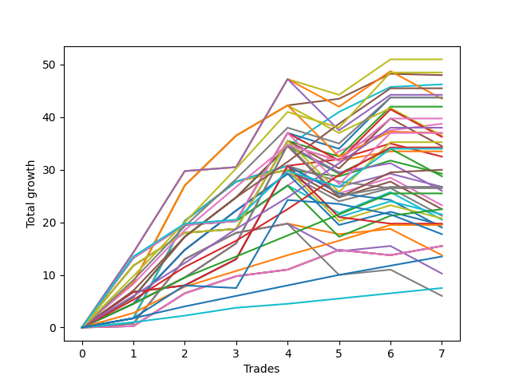

# Long Labrador 006 
- Symbol: ES
- Date Range: 03/18/2022 - 12/30/2022
- Trading Period: 8:30-12:30
- Number of Trades: 8



| Name | Win Percent | Profit | Avg Profit / Trade | Avg Time / Trade |      | Name | Win Percent | Profit | Avg Profit / Trade | Avg Time / Trade |
| ---- | ----------- | ------ | ------------------ | ---------------- | ---- | ---- | ----------- | ------ | ------------------ | ---------------- |
| Sorted By <br> Profit | | | | | | Sorted By <br> Win Percentage ||||
| TP-7 | 100.00 | 26500.00 | 3312.50 | 21:43 |     | TP-7 | 100.00 | 26500.00 | 3312.50 | 21:43 |
| TP-9 | 87.50 | 26375.00 | 3296.88 | 34:32 |     | TP-6 | 100.00 | 22125.00 | 2765.62 | 20:42 |
| TP-8 | 87.50 | 24125.00 | 3015.62 | 33:30 |     | TP-5 | 100.00 | 19625.00 | 2453.12 | 20:15 |
| TP-6 | 100.00 | 22125.00 | 2765.62 | 20:42 |     | TP-4 | 100.00 | 14750.00 | 1843.75 | 14:53 |
| BB-20 U/L 2SD C | 87.50 | 20625.00 | 2578.12 | 20:56 |     | TP-3 | 100.00 | 11750.00 | 1468.75 | 13:13 |
| V U/L 1SD | 75.00 | 20375.00 | 2546.88 | 45:12 |     | TP-2 | 100.00 | 8750.00 | 1093.75 | 04:45 |
| TP-5 | 100.00 | 19625.00 | 2453.12 | 20:15 |     | TP-1 | 100.00 | 4375.00 | 546.88 | 02:48 |
| TP-10 | 75.00 | 19125.00 | 2390.62 | 40:55 |     | TP-9 | 87.50 | 26375.00 | 3296.88 | 34:32 |
| BB-50 U/L 1SD | 75.00 | 18875.00 | 2359.38 | 31:23 |     | TP-8 | 87.50 | 24125.00 | 3015.62 | 33:30 |
| BB-20 U/L 2SD | 75.00 | 18500.00 | 2312.50 | 19:38 |     | BB-20 U/L 2SD C | 87.50 | 20625.00 | 2578.12 | 20:56 |
| BB-100 Mid | 87.50 | 18000.00 | 2250.00 | 34:20 |     | BB-100 Mid | 87.50 | 18000.00 | 2250.00 | 34:20 |
| BB-200 Mid | 87.50 | 17750.00 | 2218.75 | 26:35 |     | BB-200 Mid | 87.50 | 17750.00 | 2218.75 | 26:35 |
| BB-50 Mid | 75.00 | 17625.00 | 2203.12 | 20:18 |     | BB-50 U/L 2SD | 87.50 | 14250.00 | 1781.25 | 46:34 |
| BB-100 U/L 2SD | 75.00 | 16750.00 | 2093.75 | 53:08 |     | BB-20 Mid | 87.50 | 9750.00 | 1218.75 | 05:51 |
| BB-200 U/L 2SD | 75.00 | 15875.00 | 1984.38 | 56:55 |     | V U/L 1SD | 75.00 | 20375.00 | 2546.88 | 45:12 |
| V Mid | 75.00 | 15250.00 | 1906.25 | 25:48 |     | TP-10 | 75.00 | 19125.00 | 2390.62 | 40:55 |
| TP-4 | 100.00 | 14750.00 | 1843.75 | 14:53 |     | BB-50 U/L 1SD | 75.00 | 18875.00 | 2359.38 | 31:23 |
| BB-50 U/L 2SD | 87.50 | 14250.00 | 1781.25 | 46:34 |     | BB-20 U/L 2SD | 75.00 | 18500.00 | 2312.50 | 19:38 |
| NEWFI 000 | 75.00 | 11875.00 | 1484.38 | 51:29 |     | BB-50 Mid | 75.00 | 17625.00 | 2203.12 | 20:18 |
| TP-3 | 100.00 | 11750.00 | 1468.75 | 13:13 |     | BB-100 U/L 2SD | 75.00 | 16750.00 | 2093.75 | 53:08 |
| BB-20 U/L 1SD | 75.00 | 10375.00 | 1296.88 | 16:35 |     | BB-200 U/L 2SD | 75.00 | 15875.00 | 1984.38 | 56:55 |
| NEWFI 0000 | 50.00 | 9875.00 | 1234.38 | 18:33 |     | V Mid | 75.00 | 15250.00 | 1906.25 | 25:48 |
| BB-20 Mid | 87.50 | 9750.00 | 1218.75 | 05:51 |     | NEWFI 000 | 75.00 | 11875.00 | 1484.38 | 51:29 |
| TP-2 | 100.00 | 8750.00 | 1093.75 | 04:45 |     | BB-20 U/L 1SD | 75.00 | 10375.00 | 1296.88 | 16:35 |
| TP-1 | 100.00 | 4375.00 | 546.88 | 02:48 |     | NEWFI 0000 | 50.00 | 9875.00 | 1234.38 | 18:33 |

## NO STOPLOSS

### Test BB-20 Mid
* Sell when price hits the middle line of the 20p bollinger
* No Stoploss
* Results:
```
Total Trades: 8
Percent Up: 87.50
Percent Down: 12.50
Total Points Moved Up: 19.50
Potential Profit: 9750.00
Total Points Ups: 20.50 Count Ups: 7
Total Points Downs: -1.00 Count Downs: 1
```

<details><summary>Trades</summary>

<code>In: 2022-04-20 09:18:00		Out: 2022-04-20 09:30:50		Total Position Time: 12:50		Total Move Up: 0.25		Total to Date: 0.25</code> <br />
<code>In: 2022-05-25 08:41:00		Out: 2022-05-25 08:44:05		Total Position Time: 03:05		Total Move Up: 4.00		Total to Date: 4.25</code> <br />
<code>In: 2022-06-17 12:18:00		Out: 2022-06-17 12:20:30		Total Position Time: 02:30		Total Move Up: 6.25		Total to Date: 10.50</code> <br />
<code>In: 2022-06-27 09:36:00		Out: 2022-06-27 09:41:05		Total Position Time: 05:05		Total Move Up: 3.25		Total to Date: 13.75</code> <br />
<code>In: 2022-09-06 10:18:00		Out: 2022-09-06 10:25:10		Total Position Time: 07:10		Total Move Up: 1.25		Total to Date: 15.00</code> <br />
<code>In: 2022-09-20 10:37:00		Out: 2022-09-20 10:43:05		Total Position Time: 06:05		Total Move Up: 3.75		Total to Date: 18.75</code> <br />
<code>In: 2022-10-25 10:18:00		Out: 2022-10-25 10:25:45		Total Position Time: 07:45		Total Move Up: -1.00		Total to Date: 17.75</code> <br />
<code>In: 2022-12-27 11:01:00		Out: 2022-12-27 11:03:20		Total Position Time: 02:20		Total Move Up: 1.75		Total to Date: 19.50</code> <br />


</details>

### Test BB-20 U/L 1SD
* Sell when the price hits the upper line of the 20p 1std bollinger
* No Stoploss
* Results:
```
Total Trades: 8
Percent Up: 75.00
Percent Down: 25.00
Total Points Moved Up: 20.75
Potential Profit: 10375.00
Total Points Ups: 27.75 Count Ups: 6
Total Points Downs: -7.00 Count Downs: 2
```

<details><summary>Trades</summary>

<code>In: 2022-04-20 09:18:00		Out: 2022-04-20 09:31:05		Total Position Time: 13:05		Total Move Up: 0.75		Total to Date: 0.75</code> <br />
<code>In: 2022-05-25 08:41:00		Out: 2022-05-25 08:50:50		Total Position Time: 09:50		Total Move Up: 7.00		Total to Date: 7.75</code> <br />
<code>In: 2022-06-17 12:18:00		Out: 2022-06-17 12:22:20		Total Position Time: 04:20		Total Move Up: 12.25		Total to Date: 20.00</code> <br />
<code>In: 2022-06-27 09:36:00		Out: 2022-06-27 09:44:20		Total Position Time: 08:20		Total Move Up: 5.00		Total to Date: 25.00</code> <br />
<code>In: 2022-09-06 10:18:00		Out: 2022-09-06 10:30:55		Total Position Time: 12:55		Total Move Up: 1.75		Total to Date: 26.75</code> <br />
<code>In: 2022-09-20 10:37:00		Out: 2022-09-20 11:08:15		Total Position Time: 31:15		Total Move Up: -2.00		Total to Date: 24.75</code> <br />
<code>In: 2022-10-25 10:18:00		Out: 2022-10-25 10:26:20		Total Position Time: 08:20		Total Move Up: 1.00		Total to Date: 25.75</code> <br />
<code>In: 2022-12-27 11:01:00		Out: 2022-12-27 11:45:40		Total Position Time: 44:40		Total Move Up: -5.00		Total to Date: 20.75</code> <br />


</details>

### Test BB-20 U/L 2SD
* Sell when the price hits the upper line of the 20p 2std bollinger
* No Stoploss
* Results:
```
Total Trades: 8
Percent Up: 75.00
Percent Down: 25.00
Total Points Moved Up: 37.00
Potential Profit: 18500.00
Total Points Ups: 40.75 Count Ups: 6
Total Points Downs: -3.75 Count Downs: 2
```

<details><summary>Trades</summary>

<code>In: 2022-04-20 09:18:00		Out: 2022-04-20 09:31:35		Total Position Time: 13:35		Total Move Up: 1.75		Total to Date: 1.75</code> <br />
<code>In: 2022-05-25 08:41:00		Out: 2022-05-25 09:02:20		Total Position Time: 21:20		Total Move Up: 7.75		Total to Date: 9.50</code> <br />
<code>In: 2022-06-17 12:18:00		Out: 2022-06-17 12:27:15		Total Position Time: 09:15		Total Move Up: 18.50		Total to Date: 28.00</code> <br />
<code>In: 2022-06-27 09:36:00		Out: 2022-06-27 09:45:05		Total Position Time: 09:05		Total Move Up: 7.50		Total to Date: 35.50</code> <br />
<code>In: 2022-09-06 10:18:00		Out: 2022-09-06 10:31:10		Total Position Time: 13:10		Total Move Up: 2.25		Total to Date: 37.75</code> <br />
<code>In: 2022-09-20 10:37:00		Out: 2022-09-20 11:10:05		Total Position Time: 33:05		Total Move Up: -1.25		Total to Date: 36.50</code> <br />
<code>In: 2022-10-25 10:18:00		Out: 2022-10-25 10:30:20		Total Position Time: 12:20		Total Move Up: 3.00		Total to Date: 39.50</code> <br />
<code>In: 2022-12-27 11:01:00		Out: 2022-12-27 11:46:20		Total Position Time: 45:20		Total Move Up: -2.50		Total to Date: 37.00</code> <br />


</details>

### Test BB-20 U/L 2SD C
* Sell when the price hits the upper line of the 20p 2std bollinger
* No Stoploss
* Results:
```
Total Trades: 8
Percent Up: 87.50
Percent Down: 12.50
Total Points Moved Up: 41.25
Potential Profit: 20625.00
Total Points Ups: 43.75 Count Ups: 7
Total Points Downs: -2.50 Count Downs: 1
```

<details><summary>Trades</summary>

<code>In: 2022-04-20 09:18:00		Out: 2022-04-20 09:31:35		Total Position Time: 13:35		Total Move Up: 1.75		Total to Date: 1.75</code> <br />
<code>In: 2022-05-25 08:41:00		Out: 2022-05-25 09:02:30		Total Position Time: 21:30		Total Move Up: 8.75		Total to Date: 10.50</code> <br />
<code>In: 2022-06-17 12:18:00		Out: 2022-06-17 12:27:15		Total Position Time: 09:15		Total Move Up: 18.50		Total to Date: 29.00</code> <br />
<code>In: 2022-06-27 09:36:00		Out: 2022-06-27 09:45:05		Total Position Time: 09:05		Total Move Up: 7.50		Total to Date: 36.50</code> <br />
<code>In: 2022-09-06 10:18:00		Out: 2022-09-06 10:31:30		Total Position Time: 13:30		Total Move Up: 3.00		Total to Date: 39.50</code> <br />
<code>In: 2022-09-20 10:37:00		Out: 2022-09-20 11:19:55		Total Position Time: 42:55		Total Move Up: 1.25		Total to Date: 40.75</code> <br />
<code>In: 2022-10-25 10:18:00		Out: 2022-10-25 10:30:20		Total Position Time: 12:20		Total Move Up: 3.00		Total to Date: 43.75</code> <br />
<code>In: 2022-12-27 11:01:00		Out: 2022-12-27 11:46:20		Total Position Time: 45:20		Total Move Up: -2.50		Total to Date: 41.25</code> <br />


</details>

### Test BB-50 Mid
* Sell when price hits the middle line of the 50p bollinger
* No Stoploss
* Results:
```
Total Trades: 8
Percent Up: 75.00
Percent Down: 25.00
Total Points Moved Up: 35.25
Potential Profit: 17625.00
Total Points Ups: 40.25 Count Ups: 6
Total Points Downs: -5.00 Count Downs: 2
```

<details><summary>Trades</summary>

<code>In: 2022-04-20 09:18:00		Out: 2022-04-20 09:32:40		Total Position Time: 14:40		Total Move Up: 4.50		Total to Date: 4.50</code> <br />
<code>In: 2022-05-25 08:41:00		Out: 2022-05-25 08:58:25		Total Position Time: 17:25		Total Move Up: 8.50		Total to Date: 13.00</code> <br />
<code>In: 2022-06-17 12:18:00		Out: 2022-06-17 12:21:20		Total Position Time: 03:20		Total Move Up: 10.25		Total to Date: 23.25</code> <br />
<code>In: 2022-06-27 09:36:00		Out: 2022-06-27 09:45:05		Total Position Time: 09:05		Total Move Up: 7.50		Total to Date: 30.75</code> <br />
<code>In: 2022-09-06 10:18:00		Out: 2022-09-06 10:39:40		Total Position Time: 21:40		Total Move Up: 7.00		Total to Date: 37.75</code> <br />
<code>In: 2022-09-20 10:37:00		Out: 2022-09-20 11:19:15		Total Position Time: 42:15		Total Move Up: -2.50		Total to Date: 35.25</code> <br />
<code>In: 2022-10-25 10:18:00		Out: 2022-10-25 10:26:45		Total Position Time: 08:45		Total Move Up: 2.50		Total to Date: 37.75</code> <br />
<code>In: 2022-12-27 11:01:00		Out: 2022-12-27 11:46:20		Total Position Time: 45:20		Total Move Up: -2.50		Total to Date: 35.25</code> <br />


</details>

### Test BB-50 U/L 1SD
* Sell when the price hits the upper line of the 50p 1std bollinger
* No Stoploss
* Results:
```
Total Trades: 8
Percent Up: 75.00
Percent Down: 25.00
Total Points Moved Up: 37.75
Potential Profit: 18875.00
Total Points Ups: 48.25 Count Ups: 6
Total Points Downs: -10.50 Count Downs: 2
```

<details><summary>Trades</summary>

<code>In: 2022-04-20 09:18:00		Out: 2022-04-20 09:36:50		Total Position Time: 18:50		Total Move Up: 8.50		Total to Date: 8.50</code> <br />
<code>In: 2022-05-25 08:41:00		Out: 2022-05-25 09:41:55		Total Position Time: 60:55		Total Move Up: -10.25		Total to Date: -1.75</code> <br />
<code>In: 2022-06-17 12:18:00		Out: 2022-06-17 12:27:15		Total Position Time: 09:15		Total Move Up: 18.50		Total to Date: 16.75</code> <br />
<code>In: 2022-06-27 09:36:00		Out: 2022-06-27 09:53:20		Total Position Time: 17:20		Total Move Up: 9.50		Total to Date: 26.25</code> <br />
<code>In: 2022-09-06 10:18:00		Out: 2022-09-06 10:56:40		Total Position Time: 38:40		Total Move Up: 5.75		Total to Date: 32.00</code> <br />
<code>In: 2022-09-20 10:37:00		Out: 2022-09-20 11:19:55		Total Position Time: 42:55		Total Move Up: 1.25		Total to Date: 33.25</code> <br />
<code>In: 2022-10-25 10:18:00		Out: 2022-10-25 10:31:05		Total Position Time: 13:05		Total Move Up: 4.75		Total to Date: 38.00</code> <br />
<code>In: 2022-12-27 11:01:00		Out: 2022-12-27 11:51:05		Total Position Time: 50:05		Total Move Up: -0.25		Total to Date: 37.75</code> <br />


</details>

### Test BB-50 U/L 2SD
* Sell when the price hits the upper line of the 50p 2std bollinger
* No Stoploss
* Results:
```
Total Trades: 8
Percent Up: 87.50
Percent Down: 12.50
Total Points Moved Up: 28.50
Potential Profit: 14250.00
Total Points Ups: 38.75 Count Ups: 7
Total Points Downs: -10.25 Count Downs: 1
```

<details><summary>Trades</summary>

<code>In: 2022-04-20 09:18:00		Out: 2022-04-20 09:50:25		Total Position Time: 32:25		Total Move Up: 13.25		Total to Date: 13.25</code> <br />
<code>In: 2022-05-25 08:41:00		Out: 2022-05-25 09:41:55		Total Position Time: 60:55		Total Move Up: -10.25		Total to Date: 3.00</code> <br />
<code>In: 2022-06-17 12:18:00		Out: 2022-06-17 12:47:00		Total Position Time: 29:00		Total Move Up: 6.25		Total to Date: 9.25</code> <br />
<code>In: 2022-06-27 09:36:00		Out: 2022-06-27 10:36:55		Total Position Time: 60:55		Total Move Up: 0.75		Total to Date: 10.00</code> <br />
<code>In: 2022-09-06 10:18:00		Out: 2022-09-06 10:58:55		Total Position Time: 40:55		Total Move Up: 6.75		Total to Date: 16.75</code> <br />
<code>In: 2022-09-20 10:37:00		Out: 2022-09-20 11:21:45		Total Position Time: 44:45		Total Move Up: 6.50		Total to Date: 23.25</code> <br />
<code>In: 2022-10-25 10:18:00		Out: 2022-10-25 11:01:30		Total Position Time: 43:30		Total Move Up: 4.00		Total to Date: 27.25</code> <br />
<code>In: 2022-12-27 11:01:00		Out: 2022-12-27 12:01:10		Total Position Time: 60:10		Total Move Up: 1.25		Total to Date: 28.50</code> <br />


</details>

### Test V Mid
* Sell when the price hits the middle line of the 1std VWAP
* No Stoploss
* Results:
```
Total Trades: 8
Percent Up: 75.00
Percent Down: 25.00
Total Points Moved Up: 30.50
Potential Profit: 15250.00
Total Points Ups: 34.75 Count Ups: 6
Total Points Downs: -4.25 Count Downs: 2
```

<details><summary>Trades</summary>

<code>In: 2022-04-20 09:18:00		Out: 2022-04-20 09:35:50		Total Position Time: 17:50		Total Move Up: 6.75		Total to Date: 6.75</code> <br />
<code>In: 2022-05-25 08:41:00		Out: 2022-05-25 08:44:05		Total Position Time: 03:05		Total Move Up: 4.00		Total to Date: 10.75</code> <br />
<code>In: 2022-06-17 12:18:00		Out: 2022-06-17 12:19:10		Total Position Time: 01:10		Total Move Up: 1.25		Total to Date: 12.00</code> <br />
<code>In: 2022-06-27 09:36:00		Out: 2022-06-27 09:44:20		Total Position Time: 08:20		Total Move Up: 5.00		Total to Date: 17.00</code> <br />
<code>In: 2022-09-06 10:18:00		Out: 2022-09-06 11:11:05		Total Position Time: 53:05		Total Move Up: 17.75		Total to Date: 34.75</code> <br />
<code>In: 2022-09-20 10:37:00		Out: 2022-09-20 11:37:55		Total Position Time: 60:55		Total Move Up: -3.00		Total to Date: 31.75</code> <br />
<code>In: 2022-10-25 10:18:00		Out: 2022-10-25 10:19:10		Total Position Time: 01:10		Total Move Up: -1.25		Total to Date: 30.50</code> <br />
<code>In: 2022-12-27 11:01:00		Out: 2022-12-27 12:01:55		Total Position Time: 60:55		Total Move Up: 0.00		Total to Date: 30.50</code> <br />


</details>

### Test V U/L 1SD
* Sell when the price hits the upper line of the 1std VWAP
* No Stoploss
* Results:
```
Total Trades: 8
Percent Up: 75.00
Percent Down: 25.00
Total Points Moved Up: 40.75
Potential Profit: 20375.00
Total Points Ups: 54.00 Count Ups: 6
Total Points Downs: -13.25 Count Downs: 2
```

<details><summary>Trades</summary>

<code>In: 2022-04-20 09:18:00		Out: 2022-04-20 09:52:35		Total Position Time: 34:35		Total Move Up: 14.25		Total to Date: 14.25</code> <br />
<code>In: 2022-05-25 08:41:00		Out: 2022-05-25 09:41:55		Total Position Time: 60:55		Total Move Up: -10.25		Total to Date: 4.00</code> <br />
<code>In: 2022-06-17 12:18:00		Out: 2022-06-17 12:26:30		Total Position Time: 08:30		Total Move Up: 15.50		Total to Date: 19.50</code> <br />
<code>In: 2022-06-27 09:36:00		Out: 2022-06-27 10:36:55		Total Position Time: 60:55		Total Move Up: 0.75		Total to Date: 20.25</code> <br />
<code>In: 2022-09-06 10:18:00		Out: 2022-09-06 11:18:55		Total Position Time: 60:55		Total Move Up: 16.75		Total to Date: 37.00</code> <br />
<code>In: 2022-09-20 10:37:00		Out: 2022-09-20 11:37:55		Total Position Time: 60:55		Total Move Up: -3.00		Total to Date: 34.00</code> <br />
<code>In: 2022-10-25 10:18:00		Out: 2022-10-25 10:32:00		Total Position Time: 14:00		Total Move Up: 6.75		Total to Date: 40.75</code> <br />
<code>In: 2022-12-27 11:01:00		Out: 2022-12-27 12:01:55		Total Position Time: 60:55		Total Move Up: 0.00		Total to Date: 40.75</code> <br />


</details>

### Test BB-100 Mid
* Move to BB100 Mid
* No Stoploss
* Results:
```
Total Trades: 8
Percent Up: 87.50
Percent Down: 12.50
Total Points Moved Up: 36.00
Potential Profit: 18000.00
Total Points Ups: 46.25 Count Ups: 7
Total Points Downs: -10.25 Count Downs: 1
```

<details><summary>Trades</summary>

<code>In: 2022-04-20 09:18:00		Out: 2022-04-20 09:33:05		Total Position Time: 15:05		Total Move Up: 5.75		Total to Date: 5.75</code> <br />
<code>In: 2022-05-25 08:41:00		Out: 2022-05-25 09:41:55		Total Position Time: 60:55		Total Move Up: -10.25		Total to Date: -4.50</code> <br />
<code>In: 2022-06-17 12:18:00		Out: 2022-06-17 12:21:30		Total Position Time: 03:30		Total Move Up: 11.50		Total to Date: 7.00</code> <br />
<code>In: 2022-06-27 09:36:00		Out: 2022-06-27 10:20:05		Total Position Time: 44:05		Total Move Up: 7.50		Total to Date: 14.50</code> <br />
<code>In: 2022-09-06 10:18:00		Out: 2022-09-06 11:00:30		Total Position Time: 42:30		Total Move Up: 9.75		Total to Date: 24.25</code> <br />
<code>In: 2022-09-20 10:37:00		Out: 2022-09-20 11:21:45		Total Position Time: 44:45		Total Move Up: 6.50		Total to Date: 30.75</code> <br />
<code>In: 2022-10-25 10:18:00		Out: 2022-10-25 10:31:05		Total Position Time: 13:05		Total Move Up: 4.75		Total to Date: 35.50</code> <br />
<code>In: 2022-12-27 11:01:00		Out: 2022-12-27 11:51:50		Total Position Time: 50:50		Total Move Up: 0.50		Total to Date: 36.00</code> <br />


</details>

### Test BB-100 U/L 2SD
* Move to BB100 Upper Band
* No Stoploss
* Results:
```
Total Trades: 8
Percent Up: 75.00
Percent Down: 25.00
Total Points Moved Up: 33.50
Potential Profit: 16750.00
Total Points Ups: 46.75 Count Ups: 6
Total Points Downs: -13.25 Count Downs: 2
```

<details><summary>Trades</summary>

<code>In: 2022-04-20 09:18:00		Out: 2022-04-20 09:50:25		Total Position Time: 32:25		Total Move Up: 13.25		Total to Date: 13.25</code> <br />
<code>In: 2022-05-25 08:41:00		Out: 2022-05-25 09:41:55		Total Position Time: 60:55		Total Move Up: -10.25		Total to Date: 3.00</code> <br />
<code>In: 2022-06-17 12:18:00		Out: 2022-06-17 12:47:00		Total Position Time: 29:00		Total Move Up: 6.25		Total to Date: 9.25</code> <br />
<code>In: 2022-06-27 09:36:00		Out: 2022-06-27 10:36:55		Total Position Time: 60:55		Total Move Up: 0.75		Total to Date: 10.00</code> <br />
<code>In: 2022-09-06 10:18:00		Out: 2022-09-06 11:18:55		Total Position Time: 60:55		Total Move Up: 16.75		Total to Date: 26.75</code> <br />
<code>In: 2022-09-20 10:37:00		Out: 2022-09-20 11:37:55		Total Position Time: 60:55		Total Move Up: -3.00		Total to Date: 23.75</code> <br />
<code>In: 2022-10-25 10:18:00		Out: 2022-10-25 11:17:10		Total Position Time: 59:10		Total Move Up: 9.75		Total to Date: 33.50</code> <br />
<code>In: 2022-12-27 11:01:00		Out: 2022-12-27 12:01:55		Total Position Time: 60:55		Total Move Up: 0.00		Total to Date: 33.50</code> <br />


</details>

### Test BB-200 Mid
* Move to BB200 Mid
* No Stoploss
* Results:
```
Total Trades: 8
Percent Up: 87.50
Percent Down: 12.50
Total Points Moved Up: 35.50
Potential Profit: 17750.00
Total Points Ups: 38.50 Count Ups: 7
Total Points Downs: -3.00 Count Downs: 1
```

<details><summary>Trades</summary>

<code>In: 2022-04-20 09:18:00		Out: 2022-04-20 09:32:40		Total Position Time: 14:40		Total Move Up: 4.50		Total to Date: 4.50</code> <br />
<code>In: 2022-05-25 08:41:00		Out: 2022-05-25 08:44:00		Total Position Time: 03:00		Total Move Up: 2.00		Total to Date: 6.50</code> <br />
<code>In: 2022-06-17 12:18:00		Out: 2022-06-17 12:20:25		Total Position Time: 02:25		Total Move Up: 5.00		Total to Date: 11.50</code> <br />
<code>In: 2022-06-27 09:36:00		Out: 2022-06-27 09:45:00		Total Position Time: 09:00		Total Move Up: 6.50		Total to Date: 18.00</code> <br />
<code>In: 2022-09-06 10:18:00		Out: 2022-09-06 11:11:10		Total Position Time: 53:10		Total Move Up: 18.75		Total to Date: 36.75</code> <br />
<code>In: 2022-09-20 10:37:00		Out: 2022-09-20 11:37:55		Total Position Time: 60:55		Total Move Up: -3.00		Total to Date: 33.75</code> <br />
<code>In: 2022-10-25 10:18:00		Out: 2022-10-25 10:26:35		Total Position Time: 08:35		Total Move Up: 1.75		Total to Date: 35.50</code> <br />
<code>In: 2022-12-27 11:01:00		Out: 2022-12-27 12:01:55		Total Position Time: 60:55		Total Move Up: 0.00		Total to Date: 35.50</code> <br />


</details>

### Test BB-200 U/L 2SD
* Move to BB200 Upper Band
* No Stoploss
* Results:
```
Total Trades: 8
Percent Up: 75.00
Percent Down: 25.00
Total Points Moved Up: 31.75
Potential Profit: 15875.00
Total Points Ups: 45.00 Count Ups: 6
Total Points Downs: -13.25 Count Downs: 2
```

<details><summary>Trades</summary>

<code>In: 2022-04-20 09:18:00		Out: 2022-04-20 10:18:55		Total Position Time: 60:55		Total Move Up: 11.75		Total to Date: 11.75</code> <br />
<code>In: 2022-05-25 08:41:00		Out: 2022-05-25 09:41:55		Total Position Time: 60:55		Total Move Up: -10.25		Total to Date: 1.50</code> <br />
<code>In: 2022-06-17 12:18:00		Out: 2022-06-17 12:47:00		Total Position Time: 29:00		Total Move Up: 6.25		Total to Date: 7.75</code> <br />
<code>In: 2022-06-27 09:36:00		Out: 2022-06-27 10:36:55		Total Position Time: 60:55		Total Move Up: 0.75		Total to Date: 8.50</code> <br />
<code>In: 2022-09-06 10:18:00		Out: 2022-09-06 11:18:55		Total Position Time: 60:55		Total Move Up: 16.75		Total to Date: 25.25</code> <br />
<code>In: 2022-09-20 10:37:00		Out: 2022-09-20 11:37:55		Total Position Time: 60:55		Total Move Up: -3.00		Total to Date: 22.25</code> <br />
<code>In: 2022-10-25 10:18:00		Out: 2022-10-25 11:18:55		Total Position Time: 60:55		Total Move Up: 9.50		Total to Date: 31.75</code> <br />
<code>In: 2022-12-27 11:01:00		Out: 2022-12-27 12:01:55		Total Position Time: 60:55		Total Move Up: 0.00		Total to Date: 31.75</code> <br />


</details>

## TAKE PROFIT

### Test TP-1
* Take Profit of 1 Point
* No Stoploss
* Results:
```
Total Trades: 8
Percent Up: 100.00
Percent Down: 0.00
Total Points Moved Up: 8.75
Potential Profit: 4375.00
Total Points Ups: 8.75 Count Ups: 8
Total Points Downs: 0.00 Count Downs: 0
```

<details><summary>Trades</summary>

<code>In: 2022-04-20 09:18:00		Out: 2022-04-20 09:19:10		Total Position Time: 01:10		Total Move Up: 1.00		Total to Date: 1.00</code> <br />
<code>In: 2022-05-25 08:41:00		Out: 2022-05-25 08:43:55		Total Position Time: 02:55		Total Move Up: 1.25		Total to Date: 2.25</code> <br />
<code>In: 2022-06-17 12:18:00		Out: 2022-06-17 12:19:10		Total Position Time: 01:10		Total Move Up: 1.25		Total to Date: 3.50</code> <br />
<code>In: 2022-06-27 09:36:00		Out: 2022-06-27 09:38:00		Total Position Time: 02:00		Total Move Up: 1.50		Total to Date: 5.00</code> <br />
<code>In: 2022-09-06 10:18:00		Out: 2022-09-06 10:19:10		Total Position Time: 01:10		Total Move Up: 0.75		Total to Date: 5.75</code> <br />
<code>In: 2022-09-20 10:37:00		Out: 2022-09-20 10:41:30		Total Position Time: 04:30		Total Move Up: 1.00		Total to Date: 6.75</code> <br />
<code>In: 2022-10-25 10:18:00		Out: 2022-10-25 10:26:20		Total Position Time: 08:20		Total Move Up: 1.00		Total to Date: 7.75</code> <br />
<code>In: 2022-12-27 11:01:00		Out: 2022-12-27 11:02:10		Total Position Time: 01:10		Total Move Up: 1.00		Total to Date: 8.75</code> <br />


</details>

### Test TP-2
* Take Profit of 2 Point
* No Stoploss
* Results:
```
Total Trades: 8
Percent Up: 100.00
Percent Down: 0.00
Total Points Moved Up: 17.50
Potential Profit: 8750.00
Total Points Ups: 17.50 Count Ups: 8
Total Points Downs: 0.00 Count Downs: 0
```

<details><summary>Trades</summary>

<code>In: 2022-04-20 09:18:00		Out: 2022-04-20 09:31:35		Total Position Time: 13:35		Total Move Up: 1.75		Total to Date: 1.75</code> <br />
<code>In: 2022-05-25 08:41:00		Out: 2022-05-25 08:44:05		Total Position Time: 03:05		Total Move Up: 4.00		Total to Date: 5.75</code> <br />
<code>In: 2022-06-17 12:18:00		Out: 2022-06-17 12:19:30		Total Position Time: 01:30		Total Move Up: 2.25		Total to Date: 8.00</code> <br />
<code>In: 2022-06-27 09:36:00		Out: 2022-06-27 09:38:05		Total Position Time: 02:05		Total Move Up: 2.00		Total to Date: 10.00</code> <br />
<code>In: 2022-09-06 10:18:00		Out: 2022-09-06 10:20:15		Total Position Time: 02:15		Total Move Up: 2.00		Total to Date: 12.00</code> <br />
<code>In: 2022-09-20 10:37:00		Out: 2022-09-20 10:41:40		Total Position Time: 04:40		Total Move Up: 2.00		Total to Date: 14.00</code> <br />
<code>In: 2022-10-25 10:18:00		Out: 2022-10-25 10:26:35		Total Position Time: 08:35		Total Move Up: 1.75		Total to Date: 15.75</code> <br />
<code>In: 2022-12-27 11:01:00		Out: 2022-12-27 11:03:20		Total Position Time: 02:20		Total Move Up: 1.75		Total to Date: 17.50</code> <br />


</details>

### Test TP-3
* Take Profit of 3 Point
* No Stoploss
* Results:
```
Total Trades: 8
Percent Up: 100.00
Percent Down: 0.00
Total Points Moved Up: 23.50
Potential Profit: 11750.00
Total Points Ups: 23.50 Count Ups: 8
Total Points Downs: 0.00 Count Downs: 0
```

<details><summary>Trades</summary>

<code>In: 2022-04-20 09:18:00		Out: 2022-04-20 09:32:30		Total Position Time: 14:30		Total Move Up: 2.75		Total to Date: 2.75</code> <br />
<code>In: 2022-05-25 08:41:00		Out: 2022-05-25 08:44:05		Total Position Time: 03:05		Total Move Up: 4.00		Total to Date: 6.75</code> <br />
<code>In: 2022-06-17 12:18:00		Out: 2022-06-17 12:20:25		Total Position Time: 02:25		Total Move Up: 5.00		Total to Date: 11.75</code> <br />
<code>In: 2022-06-27 09:36:00		Out: 2022-06-27 09:41:00		Total Position Time: 05:00		Total Move Up: 3.00		Total to Date: 14.75</code> <br />
<code>In: 2022-09-06 10:18:00		Out: 2022-09-06 10:20:20		Total Position Time: 02:20		Total Move Up: 3.00		Total to Date: 17.75</code> <br />
<code>In: 2022-09-20 10:37:00		Out: 2022-09-20 10:42:10		Total Position Time: 05:10		Total Move Up: 2.75		Total to Date: 20.50</code> <br />
<code>In: 2022-10-25 10:18:00		Out: 2022-10-25 10:30:20		Total Position Time: 12:20		Total Move Up: 3.00		Total to Date: 23.50</code> <br />
<code>In: 2022-12-27 11:01:00		Out: 2022-12-27 12:01:55		Total Position Time: 60:55		Total Move Up: 0.00		Total to Date: 23.50</code> <br />


</details>

### Test TP-4
* Take Profit of 4 Point
* No Stoploss
* Results:
```
Total Trades: 8
Percent Up: 100.00
Percent Down: 0.00
Total Points Moved Up: 29.50
Potential Profit: 14750.00
Total Points Ups: 29.50 Count Ups: 8
Total Points Downs: 0.00 Count Downs: 0
```

<details><summary>Trades</summary>

<code>In: 2022-04-20 09:18:00		Out: 2022-04-20 09:32:40		Total Position Time: 14:40		Total Move Up: 4.50		Total to Date: 4.50</code> <br />
<code>In: 2022-05-25 08:41:00		Out: 2022-05-25 08:44:05		Total Position Time: 03:05		Total Move Up: 4.00		Total to Date: 8.50</code> <br />
<code>In: 2022-06-17 12:18:00		Out: 2022-06-17 12:20:25		Total Position Time: 02:25		Total Move Up: 5.00		Total to Date: 13.50</code> <br />
<code>In: 2022-06-27 09:36:00		Out: 2022-06-27 09:41:15		Total Position Time: 05:15		Total Move Up: 4.00		Total to Date: 17.50</code> <br />
<code>In: 2022-09-06 10:18:00		Out: 2022-09-06 10:32:00		Total Position Time: 14:00		Total Move Up: 4.00		Total to Date: 21.50</code> <br />
<code>In: 2022-09-20 10:37:00		Out: 2022-09-20 10:43:15		Total Position Time: 06:15		Total Move Up: 4.00		Total to Date: 25.50</code> <br />
<code>In: 2022-10-25 10:18:00		Out: 2022-10-25 10:30:30		Total Position Time: 12:30		Total Move Up: 4.00		Total to Date: 29.50</code> <br />
<code>In: 2022-12-27 11:01:00		Out: 2022-12-27 12:01:55		Total Position Time: 60:55		Total Move Up: 0.00		Total to Date: 29.50</code> <br />


</details>

### Test TP-5
* Take Profit of 5 Point
* No Stoploss
* Results:
```
Total Trades: 8
Percent Up: 100.00
Percent Down: 0.00
Total Points Moved Up: 39.25
Potential Profit: 19625.00
Total Points Ups: 39.25 Count Ups: 8
Total Points Downs: 0.00 Count Downs: 0
```

<details><summary>Trades</summary>

<code>In: 2022-04-20 09:18:00		Out: 2022-04-20 09:32:55		Total Position Time: 14:55		Total Move Up: 5.25		Total to Date: 5.25</code> <br />
<code>In: 2022-05-25 08:41:00		Out: 2022-05-25 08:44:20		Total Position Time: 03:20		Total Move Up: 5.00		Total to Date: 10.25</code> <br />
<code>In: 2022-06-17 12:18:00		Out: 2022-06-17 12:20:30		Total Position Time: 02:30		Total Move Up: 6.25		Total to Date: 16.50</code> <br />
<code>In: 2022-06-27 09:36:00		Out: 2022-06-27 09:44:20		Total Position Time: 08:20		Total Move Up: 5.00		Total to Date: 21.50</code> <br />
<code>In: 2022-09-06 10:18:00		Out: 2022-09-06 10:32:05		Total Position Time: 14:05		Total Move Up: 6.00		Total to Date: 27.50</code> <br />
<code>In: 2022-09-20 10:37:00		Out: 2022-09-20 11:21:45		Total Position Time: 44:45		Total Move Up: 6.50		Total to Date: 34.00</code> <br />
<code>In: 2022-10-25 10:18:00		Out: 2022-10-25 10:31:10		Total Position Time: 13:10		Total Move Up: 5.25		Total to Date: 39.25</code> <br />
<code>In: 2022-12-27 11:01:00		Out: 2022-12-27 12:01:55		Total Position Time: 60:55		Total Move Up: 0.00		Total to Date: 39.25</code> <br />


</details>

### Test TP-6
* Take Profit of 6 Point
* No Stoploss
* Results:
```
Total Trades: 8
Percent Up: 100.00
Percent Down: 0.00
Total Points Moved Up: 44.25
Potential Profit: 22125.00
Total Points Ups: 44.25 Count Ups: 8
Total Points Downs: 0.00 Count Downs: 0
```

<details><summary>Trades</summary>

<code>In: 2022-04-20 09:18:00		Out: 2022-04-20 09:33:10		Total Position Time: 15:10		Total Move Up: 6.00		Total to Date: 6.00</code> <br />
<code>In: 2022-05-25 08:41:00		Out: 2022-05-25 08:46:15		Total Position Time: 05:15		Total Move Up: 6.25		Total to Date: 12.25</code> <br />
<code>In: 2022-06-17 12:18:00		Out: 2022-06-17 12:20:30		Total Position Time: 02:30		Total Move Up: 6.25		Total to Date: 18.50</code> <br />
<code>In: 2022-06-27 09:36:00		Out: 2022-06-27 09:45:00		Total Position Time: 09:00		Total Move Up: 6.50		Total to Date: 25.00</code> <br />
<code>In: 2022-09-06 10:18:00		Out: 2022-09-06 10:32:05		Total Position Time: 14:05		Total Move Up: 6.00		Total to Date: 31.00</code> <br />
<code>In: 2022-09-20 10:37:00		Out: 2022-09-20 11:21:45		Total Position Time: 44:45		Total Move Up: 6.50		Total to Date: 37.50</code> <br />
<code>In: 2022-10-25 10:18:00		Out: 2022-10-25 10:32:00		Total Position Time: 14:00		Total Move Up: 6.75		Total to Date: 44.25</code> <br />
<code>In: 2022-12-27 11:01:00		Out: 2022-12-27 12:01:55		Total Position Time: 60:55		Total Move Up: 0.00		Total to Date: 44.25</code> <br />


</details>

### Test TP-7
* Take Profit of 7 Point
* No Stoploss
* Results:
```
Total Trades: 8
Percent Up: 100.00
Percent Down: 0.00
Total Points Moved Up: 53.00
Potential Profit: 26500.00
Total Points Ups: 53.00 Count Ups: 8
Total Points Downs: 0.00 Count Downs: 0
```

<details><summary>Trades</summary>

<code>In: 2022-04-20 09:18:00		Out: 2022-04-20 09:36:05		Total Position Time: 18:05		Total Move Up: 7.00		Total to Date: 7.00</code> <br />
<code>In: 2022-05-25 08:41:00		Out: 2022-05-25 08:48:35		Total Position Time: 07:35		Total Move Up: 7.50		Total to Date: 14.50</code> <br />
<code>In: 2022-06-17 12:18:00		Out: 2022-06-17 12:21:10		Total Position Time: 03:10		Total Move Up: 10.25		Total to Date: 24.75</code> <br />
<code>In: 2022-06-27 09:36:00		Out: 2022-06-27 09:45:05		Total Position Time: 09:05		Total Move Up: 7.50		Total to Date: 32.25</code> <br />
<code>In: 2022-09-06 10:18:00		Out: 2022-09-06 10:34:05		Total Position Time: 16:05		Total Move Up: 6.75		Total to Date: 39.00</code> <br />
<code>In: 2022-09-20 10:37:00		Out: 2022-09-20 11:21:55		Total Position Time: 44:55		Total Move Up: 7.25		Total to Date: 46.25</code> <br />
<code>In: 2022-10-25 10:18:00		Out: 2022-10-25 10:32:00		Total Position Time: 14:00		Total Move Up: 6.75		Total to Date: 53.00</code> <br />
<code>In: 2022-12-27 11:01:00		Out: 2022-12-27 12:01:55		Total Position Time: 60:55		Total Move Up: 0.00		Total to Date: 53.00</code> <br />


</details>

### Test TP-8
* Take Profit of 8 Point
* No Stoploss
* Results:
```
Total Trades: 8
Percent Up: 87.50
Percent Down: 12.50
Total Points Moved Up: 48.25
Potential Profit: 24125.00
Total Points Ups: 51.25 Count Ups: 7
Total Points Downs: -3.00 Count Downs: 1
```

<details><summary>Trades</summary>

<code>In: 2022-04-20 09:18:00		Out: 2022-04-20 09:36:40		Total Position Time: 18:40		Total Move Up: 8.25		Total to Date: 8.25</code> <br />
<code>In: 2022-05-25 08:41:00		Out: 2022-05-25 08:58:25		Total Position Time: 17:25		Total Move Up: 8.50		Total to Date: 16.75</code> <br />
<code>In: 2022-06-17 12:18:00		Out: 2022-06-17 12:21:10		Total Position Time: 03:10		Total Move Up: 10.25		Total to Date: 27.00</code> <br />
<code>In: 2022-06-27 09:36:00		Out: 2022-06-27 09:51:25		Total Position Time: 15:25		Total Move Up: 8.25		Total to Date: 35.25</code> <br />
<code>In: 2022-09-06 10:18:00		Out: 2022-09-06 10:59:55		Total Position Time: 41:55		Total Move Up: 8.00		Total to Date: 43.25</code> <br />
<code>In: 2022-09-20 10:37:00		Out: 2022-09-20 11:37:55		Total Position Time: 60:55		Total Move Up: -3.00		Total to Date: 40.25</code> <br />
<code>In: 2022-10-25 10:18:00		Out: 2022-10-25 11:07:35		Total Position Time: 49:35		Total Move Up: 8.00		Total to Date: 48.25</code> <br />
<code>In: 2022-12-27 11:01:00		Out: 2022-12-27 12:01:55		Total Position Time: 60:55		Total Move Up: 0.00		Total to Date: 48.25</code> <br />


</details>

### Test TP-9
* Take Profit of 9 Point
* No Stoploss
* Results:
```
Total Trades: 8
Percent Up: 87.50
Percent Down: 12.50
Total Points Moved Up: 52.75
Potential Profit: 26375.00
Total Points Ups: 55.75 Count Ups: 7
Total Points Downs: -3.00 Count Downs: 1
```

<details><summary>Trades</summary>

<code>In: 2022-04-20 09:18:00		Out: 2022-04-20 09:36:55		Total Position Time: 18:55		Total Move Up: 9.00		Total to Date: 9.00</code> <br />
<code>In: 2022-05-25 08:41:00		Out: 2022-05-25 09:03:00		Total Position Time: 22:00		Total Move Up: 9.00		Total to Date: 18.00</code> <br />
<code>In: 2022-06-17 12:18:00		Out: 2022-06-17 12:21:10		Total Position Time: 03:10		Total Move Up: 10.25		Total to Date: 28.25</code> <br />
<code>In: 2022-06-27 09:36:00		Out: 2022-06-27 09:52:45		Total Position Time: 16:45		Total Move Up: 9.00		Total to Date: 37.25</code> <br />
<code>In: 2022-09-06 10:18:00		Out: 2022-09-06 11:00:30		Total Position Time: 42:30		Total Move Up: 9.75		Total to Date: 47.00</code> <br />
<code>In: 2022-09-20 10:37:00		Out: 2022-09-20 11:37:55		Total Position Time: 60:55		Total Move Up: -3.00		Total to Date: 44.00</code> <br />
<code>In: 2022-10-25 10:18:00		Out: 2022-10-25 11:09:10		Total Position Time: 51:10		Total Move Up: 8.75		Total to Date: 52.75</code> <br />
<code>In: 2022-12-27 11:01:00		Out: 2022-12-27 12:01:55		Total Position Time: 60:55		Total Move Up: 0.00		Total to Date: 52.75</code> <br />


</details>

### Test TP-10
* Take Profit of 10 Point
* No Stoploss
* Results:
```
Total Trades: 8
Percent Up: 75.00
Percent Down: 25.00
Total Points Moved Up: 38.25
Potential Profit: 19125.00
Total Points Ups: 51.50 Count Ups: 6
Total Points Downs: -13.25 Count Downs: 2
```

<details><summary>Trades</summary>

<code>In: 2022-04-20 09:18:00		Out: 2022-04-20 09:38:05		Total Position Time: 20:05		Total Move Up: 9.75		Total to Date: 9.75</code> <br />
<code>In: 2022-05-25 08:41:00		Out: 2022-05-25 09:41:55		Total Position Time: 60:55		Total Move Up: -10.25		Total to Date: -0.50</code> <br />
<code>In: 2022-06-17 12:18:00		Out: 2022-06-17 12:21:10		Total Position Time: 03:10		Total Move Up: 10.25		Total to Date: 9.75</code> <br />
<code>In: 2022-06-27 09:36:00		Out: 2022-06-27 09:55:25		Total Position Time: 19:25		Total Move Up: 10.25		Total to Date: 20.00</code> <br />
<code>In: 2022-09-06 10:18:00		Out: 2022-09-06 11:00:35		Total Position Time: 42:35		Total Move Up: 10.75		Total to Date: 30.75</code> <br />
<code>In: 2022-09-20 10:37:00		Out: 2022-09-20 11:37:55		Total Position Time: 60:55		Total Move Up: -3.00		Total to Date: 27.75</code> <br />
<code>In: 2022-10-25 10:18:00		Out: 2022-10-25 11:17:25		Total Position Time: 59:25		Total Move Up: 10.50		Total to Date: 38.25</code> <br />
<code>In: 2022-12-27 11:01:00		Out: 2022-12-27 12:01:55		Total Position Time: 60:55		Total Move Up: 0.00		Total to Date: 38.25</code> <br />


</details>

## Indicator Exits

### Test NEWFI 000
* Newfi 0000
* No Stoploss
* Results:
```
Total Trades: 8
Percent Up: 75.00
Percent Down: 25.00
Total Points Moved Up: 23.75
Potential Profit: 11875.00
Total Points Ups: 37.00 Count Ups: 6
Total Points Downs: -13.25 Count Downs: 2
```

<details><summary>Trades</summary>

<code>In: 2022-04-20 09:18:00		Out: 2022-04-20 09:56:05		Total Position Time: 38:05		Total Move Up: 13.50		Total to Date: 13.50</code> <br />
<code>In: 2022-05-25 08:41:00		Out: 2022-05-25 09:41:55		Total Position Time: 60:55		Total Move Up: -10.25		Total to Date: 3.25</code> <br />
<code>In: 2022-06-17 12:18:00		Out: 2022-06-17 12:47:00		Total Position Time: 29:00		Total Move Up: 6.25		Total to Date: 9.50</code> <br />
<code>In: 2022-06-27 09:36:00		Out: 2022-06-27 10:36:55		Total Position Time: 60:55		Total Move Up: 0.75		Total to Date: 10.25</code> <br />
<code>In: 2022-09-06 10:18:00		Out: 2022-09-06 11:05:05		Total Position Time: 47:05		Total Move Up: 9.25		Total to Date: 19.50</code> <br />
<code>In: 2022-09-20 10:37:00		Out: 2022-09-20 11:37:55		Total Position Time: 60:55		Total Move Up: -3.00		Total to Date: 16.50</code> <br />
<code>In: 2022-10-25 10:18:00		Out: 2022-10-25 11:12:05		Total Position Time: 54:05		Total Move Up: 7.25		Total to Date: 23.75</code> <br />
<code>In: 2022-12-27 11:01:00		Out: 2022-12-27 12:01:55		Total Position Time: 60:55		Total Move Up: 0.00		Total to Date: 23.75</code> <br />


</details>

### Test NEWFI 0000
* Newfi 0000
* No Stoploss
* Results:
```
Total Trades: 8
Percent Up: 50.00
Percent Down: 50.00
Total Points Moved Up: 19.75
Potential Profit: 9875.00
Total Points Ups: 26.75 Count Ups: 4
Total Points Downs: -7.00 Count Downs: 4
```

<details><summary>Trades</summary>

<code>In: 2022-04-20 09:18:00		Out: 2022-04-20 09:19:05		Total Position Time: 01:05		Total Move Up: 1.75		Total to Date: 1.75</code> <br />
<code>In: 2022-05-25 08:41:00		Out: 2022-05-25 09:13:05		Total Position Time: 32:05		Total Move Up: 2.00		Total to Date: 3.75</code> <br />
<code>In: 2022-06-17 12:18:00		Out: 2022-06-17 12:47:00		Total Position Time: 29:00		Total Move Up: 6.25		Total to Date: 10.00</code> <br />
<code>In: 2022-06-27 09:36:00		Out: 2022-06-27 09:37:05		Total Position Time: 01:05		Total Move Up: -0.50		Total to Date: 9.50</code> <br />
<code>In: 2022-09-06 10:18:00		Out: 2022-09-06 11:18:55		Total Position Time: 60:55		Total Move Up: 16.75		Total to Date: 26.25</code> <br />
<code>In: 2022-09-20 10:37:00		Out: 2022-09-20 10:38:05		Total Position Time: 01:05		Total Move Up: -0.75		Total to Date: 25.50</code> <br />
<code>In: 2022-10-25 10:18:00		Out: 2022-10-25 10:19:05		Total Position Time: 01:05		Total Move Up: -2.00		Total to Date: 23.50</code> <br />
<code>In: 2022-12-27 11:01:00		Out: 2022-12-27 11:23:05		Total Position Time: 22:05		Total Move Up: -3.75		Total to Date: 19.75</code> <br />


</details>