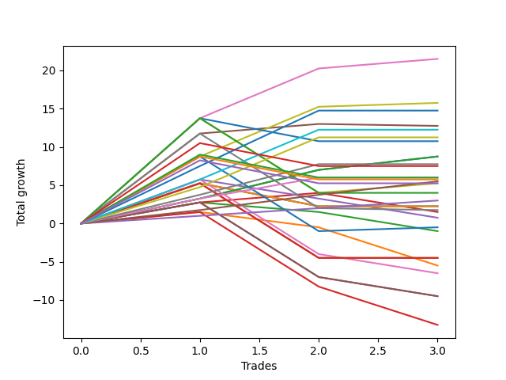

# Long Labrador 007 
- Symbol: ES
- Date Range: 03/18/2022 - 12/30/2022
- Trading Period: 8:30-12:30
- Number of Trades: 22



| Name | Win Percent | Profit | Avg Profit / Trade | Avg Time / Trade |      | Name | Win Percent | Profit | Avg Profit / Trade | Avg Time / Trade |
| ---- | ----------- | ------ | ------------------ | ---------------- | ---- | ---- | ----------- | ------ | ------------------ | ---------------- |
| Sorted By <br> Profit | | | | | | Sorted By <br> Win Percentage ||||
| Six | 27.27 | -7000.00 | -318.18 | 08:18 |     | Eighty-Four | 77.27 | -27250.00 | -1238.64 | 28:31 |
| MALAMUTE 002 | 18.18 | -12875.00 | -585.23 | 03:26 |     | Eighty-Three | 77.27 | -31875.00 | -1448.86 | 26:02 |
| Eighty-Four | 77.27 | -27250.00 | -1238.64 | 28:31 |     | Eighty-Two | 77.27 | -37250.00 | -1693.18 | 23:19 |
| NEWFI 0000 | 27.27 | -28625.00 | -1301.14 | 09:53 |     | Eighty-One | 77.27 | -44625.00 | -2028.41 | 21:14 |
| BB100 | 54.55 | -30625.00 | -1392.05 | 53:57 |     | Eighty-Five | 72.73 | -36125.00 | -1642.05 | 35:12 |
| Eighty-Three | 77.27 | -31875.00 | -1448.86 | 26:02 |     | Four | 63.64 | -57375.00 | -2607.95 | 42:56 |
| Seven | 31.82 | -33250.00 | -1511.36 | 24:25 |     | Five | 59.09 | -39750.00 | -1806.82 | 49:29 |
| Two_C | 45.45 | -34625.00 | -1573.86 | 25:46 |     | NEWFI 000 | 59.09 | -55250.00 | -2511.36 | 55:57 |
| Eighty-Five | 72.73 | -36125.00 | -1642.05 | 35:12 |     | BB100 | 54.55 | -30625.00 | -1392.05 | 53:57 |
| Eighty-Two | 77.27 | -37250.00 | -1693.18 | 23:19 |     | MALAMUTE 001 | 54.55 | -46000.00 | -2090.91 | 59:17 |
| One | 36.36 | -37500.00 | -1704.55 | 20:05 |     | Three | 54.55 | -80500.00 | -3659.09 | 37:36 |
| Five | 59.09 | -39750.00 | -1806.82 | 49:29 |     | Two_C | 45.45 | -34625.00 | -1573.86 | 25:46 |
| Two | 36.36 | -43250.00 | -1965.91 | 25:03 |     | Zero | 40.91 | -51375.00 | -2335.23 | 15:16 |
| Eighty-One | 77.27 | -44625.00 | -2028.41 | 21:14 |     | One | 36.36 | -37500.00 | -1704.55 | 20:05 |
| MALAMUTE 001 | 54.55 | -46000.00 | -2090.91 | 59:17 |     | Two | 36.36 | -43250.00 | -1965.91 | 25:03 |
| Zero | 40.91 | -51375.00 | -2335.23 | 15:16 |     | Seven | 31.82 | -33250.00 | -1511.36 | 24:25 |
| NEWFI 000 | 59.09 | -55250.00 | -2511.36 | 55:57 |     | Six | 27.27 | -7000.00 | -318.18 | 08:18 |
| Four | 63.64 | -57375.00 | -2607.95 | 42:56 |     | NEWFI 0000 | 27.27 | -28625.00 | -1301.14 | 09:53 |
| Three | 54.55 | -80500.00 | -3659.09 | 37:36 |     | MALAMUTE 002 | 18.18 | -12875.00 | -585.23 | 03:26 |

## NO STOPLOSS

### Test Zero
* Sell when price hits the middle line of the 20p bollinger
* No Stoploss
* Results:
```
Total Trades: 22
Percent Up: 40.91
Percent Down: 59.09
Total Points Moved Up: -102.75
Potential Profit: -51375.00
Total Points Ups: 34.25 Count Ups: 9
Total Points Downs: -137.00 Count Downs: 13
```

<details><summary>Trades</summary>

<code>In: 2022-04-08 11:34:00		Out: 2022-04-08 11:40:25		Total Position Time: 06:25		Total Move Up: 3.25		Total to Date: 3.25</code> <br />
<code>In: 2022-09-20 10:37:00		Out: 2022-09-20 10:43:05		Total Position Time: 06:05		Total Move Up: 3.75		Total to Date: 7.00</code> <br />
<code>In: 2022-09-21 11:09:00		Out: 2022-09-21 11:22:15		Total Position Time: 13:15		Total Move Up: -13.25		Total to Date: -6.25</code> <br />
<code>In: 2022-10-05 08:36:00		Out: 2022-10-05 08:48:10		Total Position Time: 12:10		Total Move Up: -4.75		Total to Date: -11.00</code> <br />
<code>In: 2022-10-07 08:37:00		Out: 2022-10-07 09:09:30		Total Position Time: 32:30		Total Move Up: -28.00		Total to Date: -39.00</code> <br />
<code>In: 2022-10-10 09:45:00		Out: 2022-10-10 09:59:45		Total Position Time: 14:45		Total Move Up: -1.00		Total to Date: -40.00</code> <br />
<code>In: 2022-10-27 08:59:00		Out: 2022-10-27 09:04:10		Total Position Time: 05:10		Total Move Up: 5.25		Total to Date: -34.75</code> <br />
<code>In: 2022-11-16 09:58:00		Out: 2022-11-16 10:01:45		Total Position Time: 03:45		Total Move Up: 3.75		Total to Date: -31.00</code> <br />
<code>In: 2022-11-17 08:36:00		Out: 2022-11-17 08:50:05		Total Position Time: 14:05		Total Move Up: 2.00		Total to Date: -29.00</code> <br />
<code>In: 2022-11-18 11:26:00		Out: 2022-11-18 11:29:25		Total Position Time: 03:25		Total Move Up: 2.75		Total to Date: -26.25</code> <br />
<code>In: 2022-11-28 08:36:00		Out: 2022-11-28 09:05:10		Total Position Time: 29:10		Total Move Up: -5.50		Total to Date: -31.75</code> <br />
<code>In: 2022-11-29 10:15:00		Out: 2022-11-29 10:32:05		Total Position Time: 17:05		Total Move Up: -5.50		Total to Date: -37.25</code> <br />
<code>In: 2022-11-30 11:27:00		Out: 2022-11-30 11:41:05		Total Position Time: 14:05		Total Move Up: -1.75		Total to Date: -39.00</code> <br />
<code>In: 2022-12-02 08:37:00		Out: 2022-12-02 08:55:30		Total Position Time: 18:30		Total Move Up: -4.50		Total to Date: -43.50</code> <br />
<code>In: 2022-12-02 08:38:00		Out: 2022-12-02 08:55:30		Total Position Time: 17:30		Total Move Up: -5.50		Total to Date: -49.00</code> <br />
<code>In: 2022-12-06 12:15:00		Out: 2022-12-06 12:36:15		Total Position Time: 21:15		Total Move Up: -3.50		Total to Date: -52.50</code> <br />
<code>In: 2022-12-15 08:39:00		Out: 2022-12-15 09:16:20		Total Position Time: 37:20		Total Move Up: -27.50		Total to Date: -80.00</code> <br />
<code>In: 2022-12-15 08:40:00		Out: 2022-12-15 09:16:20		Total Position Time: 36:20		Total Move Up: -29.00		Total to Date: -109.00</code> <br />
<code>In: 2022-12-16 08:36:00		Out: 2022-12-16 08:45:05		Total Position Time: 09:05		Total Move Up: 6.00		Total to Date: -103.00</code> <br />
<code>In: 2022-12-16 08:43:00		Out: 2022-12-16 08:45:05		Total Position Time: 02:05		Total Move Up: 6.25		Total to Date: -96.75</code> <br />
<code>In: 2022-12-20 08:52:00		Out: 2022-12-20 08:55:35		Total Position Time: 03:35		Total Move Up: 1.25		Total to Date: -95.50</code> <br />
<code>In: 2022-12-22 08:38:00		Out: 2022-12-22 08:56:30		Total Position Time: 18:30		Total Move Up: -7.25		Total to Date: -102.75</code> <br />


</details>

### Test One
* Sell when the price hits the upper line of the 20p 1std bollinger
* No Stoploss
* Results:
```
Total Trades: 22
Percent Up: 36.36
Percent Down: 63.64
Total Points Moved Up: -75.00
Potential Profit: -37500.00
Total Points Ups: 45.00 Count Ups: 8
Total Points Downs: -120.00 Count Downs: 14
```

<details><summary>Trades</summary>

<code>In: 2022-04-08 11:34:00		Out: 2022-04-08 11:46:25		Total Position Time: 12:25		Total Move Up: 1.50		Total to Date: 1.50</code> <br />
<code>In: 2022-09-20 10:37:00		Out: 2022-09-20 11:08:15		Total Position Time: 31:15		Total Move Up: -2.00		Total to Date: -0.50</code> <br />
<code>In: 2022-09-21 11:09:00		Out: 2022-09-21 11:25:25		Total Position Time: 16:25		Total Move Up: -9.00		Total to Date: -9.50</code> <br />
<code>In: 2022-10-05 08:36:00		Out: 2022-10-05 08:51:05		Total Position Time: 15:05		Total Move Up: -4.50		Total to Date: -14.00</code> <br />
<code>In: 2022-10-07 08:37:00		Out: 2022-10-07 09:13:20		Total Position Time: 36:20		Total Move Up: -26.50		Total to Date: -40.50</code> <br />
<code>In: 2022-10-10 09:45:00		Out: 2022-10-10 10:11:25		Total Position Time: 26:25		Total Move Up: -2.75		Total to Date: -43.25</code> <br />
<code>In: 2022-10-27 08:59:00		Out: 2022-10-27 09:05:15		Total Position Time: 06:15		Total Move Up: 12.50		Total to Date: -30.75</code> <br />
<code>In: 2022-11-16 09:58:00		Out: 2022-11-16 10:11:30		Total Position Time: 13:30		Total Move Up: 3.75		Total to Date: -27.00</code> <br />
<code>In: 2022-11-17 08:36:00		Out: 2022-11-17 08:51:05		Total Position Time: 15:05		Total Move Up: 3.00		Total to Date: -24.00</code> <br />
<code>In: 2022-11-18 11:26:00		Out: 2022-11-18 11:36:05		Total Position Time: 10:05		Total Move Up: 3.25		Total to Date: -20.75</code> <br />
<code>In: 2022-11-28 08:36:00		Out: 2022-11-28 09:13:35		Total Position Time: 37:35		Total Move Up: -5.50		Total to Date: -26.25</code> <br />
<code>In: 2022-11-29 10:15:00		Out: 2022-11-29 10:33:45		Total Position Time: 18:45		Total Move Up: -3.25		Total to Date: -29.50</code> <br />
<code>In: 2022-11-30 11:27:00		Out: 2022-11-30 11:41:55		Total Position Time: 14:55		Total Move Up: -0.75		Total to Date: -30.25</code> <br />
<code>In: 2022-12-02 08:37:00		Out: 2022-12-02 08:57:10		Total Position Time: 20:10		Total Move Up: -2.75		Total to Date: -33.00</code> <br />
<code>In: 2022-12-02 08:38:00		Out: 2022-12-02 08:57:10		Total Position Time: 19:10		Total Move Up: -3.75		Total to Date: -36.75</code> <br />
<code>In: 2022-12-06 12:15:00		Out: 2022-12-06 12:40:25		Total Position Time: 25:25		Total Move Up: -2.75		Total to Date: -39.50</code> <br />
<code>In: 2022-12-15 08:39:00		Out: 2022-12-15 09:17:40		Total Position Time: 38:40		Total Move Up: -24.25		Total to Date: -63.75</code> <br />
<code>In: 2022-12-15 08:40:00		Out: 2022-12-15 09:17:40		Total Position Time: 37:40		Total Move Up: -25.75		Total to Date: -89.50</code> <br />
<code>In: 2022-12-16 08:36:00		Out: 2022-12-16 08:50:00		Total Position Time: 14:00		Total Move Up: 7.00		Total to Date: -82.50</code> <br />
<code>In: 2022-12-16 08:43:00		Out: 2022-12-16 08:50:00		Total Position Time: 07:00		Total Move Up: 7.25		Total to Date: -75.25</code> <br />
<code>In: 2022-12-20 08:52:00		Out: 2022-12-20 08:56:15		Total Position Time: 04:15		Total Move Up: 6.75		Total to Date: -68.50</code> <br />
<code>In: 2022-12-22 08:38:00		Out: 2022-12-22 08:59:45		Total Position Time: 21:45		Total Move Up: -6.50		Total to Date: -75.00</code> <br />


</details>

### Test Two
* Sell when the price hits the upper line of the 20p 2std bollinger
* No Stoploss
* Results:
```
Total Trades: 22
Percent Up: 36.36
Percent Down: 63.64
Total Points Moved Up: -86.50
Potential Profit: -43250.00
Total Points Ups: 51.25 Count Ups: 8
Total Points Downs: -137.75 Count Downs: 14
```

<details><summary>Trades</summary>

<code>In: 2022-04-08 11:34:00		Out: 2022-04-08 11:47:10		Total Position Time: 13:10		Total Move Up: 2.75		Total to Date: 2.75</code> <br />
<code>In: 2022-09-20 10:37:00		Out: 2022-09-20 11:10:05		Total Position Time: 33:05		Total Move Up: -1.25		Total to Date: 1.50</code> <br />
<code>In: 2022-09-21 11:09:00		Out: 2022-09-21 11:31:40		Total Position Time: 22:40		Total Move Up: -3.50		Total to Date: -2.00</code> <br />
<code>In: 2022-10-05 08:36:00		Out: 2022-10-05 09:36:55		Total Position Time: 60:55		Total Move Up: -37.75		Total to Date: -39.75</code> <br />
<code>In: 2022-10-07 08:37:00		Out: 2022-10-07 09:16:20		Total Position Time: 39:20		Total Move Up: -26.00		Total to Date: -65.75</code> <br />
<code>In: 2022-10-10 09:45:00		Out: 2022-10-10 10:14:05		Total Position Time: 29:05		Total Move Up: -1.00		Total to Date: -66.75</code> <br />
<code>In: 2022-10-27 08:59:00		Out: 2022-10-27 09:07:05		Total Position Time: 08:05		Total Move Up: 15.50		Total to Date: -51.25</code> <br />
<code>In: 2022-11-16 09:58:00		Out: 2022-11-16 10:14:15		Total Position Time: 16:15		Total Move Up: 4.75		Total to Date: -46.50</code> <br />
<code>In: 2022-11-17 08:36:00		Out: 2022-11-17 09:15:15		Total Position Time: 39:15		Total Move Up: -0.50		Total to Date: -47.00</code> <br />
<code>In: 2022-11-18 11:26:00		Out: 2022-11-18 11:37:30		Total Position Time: 11:30		Total Move Up: 4.25		Total to Date: -42.75</code> <br />
<code>In: 2022-11-28 08:36:00		Out: 2022-11-28 09:14:50		Total Position Time: 38:50		Total Move Up: -4.00		Total to Date: -46.75</code> <br />
<code>In: 2022-11-29 10:15:00		Out: 2022-11-29 10:37:05		Total Position Time: 22:05		Total Move Up: -3.25		Total to Date: -50.00</code> <br />
<code>In: 2022-11-30 11:27:00		Out: 2022-11-30 11:42:30		Total Position Time: 15:30		Total Move Up: 1.25		Total to Date: -48.75</code> <br />
<code>In: 2022-12-02 08:37:00		Out: 2022-12-02 09:00:15		Total Position Time: 23:15		Total Move Up: -3.00		Total to Date: -51.75</code> <br />
<code>In: 2022-12-02 08:38:00		Out: 2022-12-02 09:00:15		Total Position Time: 22:15		Total Move Up: -4.00		Total to Date: -55.75</code> <br />
<code>In: 2022-12-06 12:15:00		Out: 2022-12-06 12:41:20		Total Position Time: 26:20		Total Move Up: -1.75		Total to Date: -57.50</code> <br />
<code>In: 2022-12-15 08:39:00		Out: 2022-12-15 09:19:05		Total Position Time: 40:05		Total Move Up: -22.50		Total to Date: -80.00</code> <br />
<code>In: 2022-12-15 08:40:00		Out: 2022-12-15 09:19:05		Total Position Time: 39:05		Total Move Up: -24.00		Total to Date: -104.00</code> <br />
<code>In: 2022-12-16 08:36:00		Out: 2022-12-16 08:51:05		Total Position Time: 15:05		Total Move Up: 5.25		Total to Date: -98.75</code> <br />
<code>In: 2022-12-16 08:43:00		Out: 2022-12-16 08:51:05		Total Position Time: 08:05		Total Move Up: 5.50		Total to Date: -93.25</code> <br />
<code>In: 2022-12-20 08:52:00		Out: 2022-12-20 08:57:20		Total Position Time: 05:20		Total Move Up: 12.00		Total to Date: -81.25</code> <br />
<code>In: 2022-12-22 08:38:00		Out: 2022-12-22 09:00:00		Total Position Time: 22:00		Total Move Up: -5.25		Total to Date: -86.50</code> <br />


</details>

### Test Two_C
* Sell when the price hits the upper line of the 20p 2std bollinger
* No Stoploss
* Results:
```
Total Trades: 22
Percent Up: 45.45
Percent Down: 54.55
Total Points Moved Up: -69.25
Potential Profit: -34625.00
Total Points Ups: 59.00 Count Ups: 10
Total Points Downs: -128.25 Count Downs: 12
```

<details><summary>Trades</summary>

<code>In: 2022-04-08 11:34:00		Out: 2022-04-08 11:47:10		Total Position Time: 13:10		Total Move Up: 2.75		Total to Date: 2.75</code> <br />
<code>In: 2022-09-20 10:37:00		Out: 2022-09-20 11:19:55		Total Position Time: 42:55		Total Move Up: 1.25		Total to Date: 4.00</code> <br />
<code>In: 2022-09-21 11:09:00		Out: 2022-09-21 11:33:20		Total Position Time: 24:20		Total Move Up: 4.25		Total to Date: 8.25</code> <br />
<code>In: 2022-10-05 08:36:00		Out: 2022-10-05 09:36:55		Total Position Time: 60:55		Total Move Up: -37.75		Total to Date: -29.50</code> <br />
<code>In: 2022-10-07 08:37:00		Out: 2022-10-07 09:16:45		Total Position Time: 39:45		Total Move Up: -25.00		Total to Date: -54.50</code> <br />
<code>In: 2022-10-10 09:45:00		Out: 2022-10-10 10:14:40		Total Position Time: 29:40		Total Move Up: -0.50		Total to Date: -55.00</code> <br />
<code>In: 2022-10-27 08:59:00		Out: 2022-10-27 09:09:40		Total Position Time: 10:40		Total Move Up: 16.25		Total to Date: -38.75</code> <br />
<code>In: 2022-11-16 09:58:00		Out: 2022-11-16 10:14:20		Total Position Time: 16:20		Total Move Up: 5.50		Total to Date: -33.25</code> <br />
<code>In: 2022-11-17 08:36:00		Out: 2022-11-17 09:15:15		Total Position Time: 39:15		Total Move Up: -0.50		Total to Date: -33.75</code> <br />
<code>In: 2022-11-18 11:26:00		Out: 2022-11-18 11:37:40		Total Position Time: 11:40		Total Move Up: 5.00		Total to Date: -28.75</code> <br />
<code>In: 2022-11-28 08:36:00		Out: 2022-11-28 09:14:50		Total Position Time: 38:50		Total Move Up: -4.00		Total to Date: -32.75</code> <br />
<code>In: 2022-11-29 10:15:00		Out: 2022-11-29 10:37:20		Total Position Time: 22:20		Total Move Up: -2.75		Total to Date: -35.50</code> <br />
<code>In: 2022-11-30 11:27:00		Out: 2022-11-30 11:42:30		Total Position Time: 15:30		Total Move Up: 1.25		Total to Date: -34.25</code> <br />
<code>In: 2022-12-02 08:37:00		Out: 2022-12-02 09:00:20		Total Position Time: 23:20		Total Move Up: -1.75		Total to Date: -36.00</code> <br />
<code>In: 2022-12-02 08:38:00		Out: 2022-12-02 09:00:20		Total Position Time: 22:20		Total Move Up: -2.75		Total to Date: -38.75</code> <br />
<code>In: 2022-12-06 12:15:00		Out: 2022-12-06 12:41:25		Total Position Time: 26:25		Total Move Up: -1.50		Total to Date: -40.25</code> <br />
<code>In: 2022-12-15 08:39:00		Out: 2022-12-15 09:19:05		Total Position Time: 40:05		Total Move Up: -22.50		Total to Date: -62.75</code> <br />
<code>In: 2022-12-15 08:40:00		Out: 2022-12-15 09:19:05		Total Position Time: 39:05		Total Move Up: -24.00		Total to Date: -86.75</code> <br />
<code>In: 2022-12-16 08:36:00		Out: 2022-12-16 08:51:05		Total Position Time: 15:05		Total Move Up: 5.25		Total to Date: -81.50</code> <br />
<code>In: 2022-12-16 08:43:00		Out: 2022-12-16 08:51:05		Total Position Time: 08:05		Total Move Up: 5.50		Total to Date: -76.00</code> <br />
<code>In: 2022-12-20 08:52:00		Out: 2022-12-20 08:57:20		Total Position Time: 05:20		Total Move Up: 12.00		Total to Date: -64.00</code> <br />
<code>In: 2022-12-22 08:38:00		Out: 2022-12-22 09:00:00		Total Position Time: 22:00		Total Move Up: -5.25		Total to Date: -69.25</code> <br />


</details>

### Test Three
* Sell when price hits the middle line of the 50p bollinger
* No Stoploss
* Results:
```
Total Trades: 22
Percent Up: 54.55
Percent Down: 45.45
Total Points Moved Up: -161.00
Potential Profit: -80500.00
Total Points Ups: 48.50 Count Ups: 12
Total Points Downs: -209.50 Count Downs: 10
```

<details><summary>Trades</summary>

<code>In: 2022-04-08 11:34:00		Out: 2022-04-08 11:50:30		Total Position Time: 16:30		Total Move Up: 5.75		Total to Date: 5.75</code> <br />
<code>In: 2022-09-20 10:37:00		Out: 2022-09-20 11:19:15		Total Position Time: 42:15		Total Move Up: -2.50		Total to Date: 3.25</code> <br />
<code>In: 2022-09-21 11:09:00		Out: 2022-09-21 11:33:20		Total Position Time: 24:20		Total Move Up: 4.25		Total to Date: 7.50</code> <br />
<code>In: 2022-10-05 08:36:00		Out: 2022-10-05 09:36:55		Total Position Time: 60:55		Total Move Up: -37.75		Total to Date: -30.25</code> <br />
<code>In: 2022-10-07 08:37:00		Out: 2022-10-07 09:23:00		Total Position Time: 46:00		Total Move Up: -20.75		Total to Date: -51.00</code> <br />
<code>In: 2022-10-10 09:45:00		Out: 2022-10-10 10:21:05		Total Position Time: 36:05		Total Move Up: 0.50		Total to Date: -50.50</code> <br />
<code>In: 2022-10-27 08:59:00		Out: 2022-10-27 09:05:35		Total Position Time: 06:35		Total Move Up: 15.50		Total to Date: -35.00</code> <br />
<code>In: 2022-11-16 09:58:00		Out: 2022-11-16 10:14:20		Total Position Time: 16:20		Total Move Up: 5.50		Total to Date: -29.50</code> <br />
<code>In: 2022-11-17 08:36:00		Out: 2022-11-17 09:17:05		Total Position Time: 41:05		Total Move Up: 1.50		Total to Date: -28.00</code> <br />
<code>In: 2022-11-18 11:26:00		Out: 2022-11-18 11:57:30		Total Position Time: 31:30		Total Move Up: 3.00		Total to Date: -25.00</code> <br />
<code>In: 2022-11-28 08:36:00		Out: 2022-11-28 09:19:45		Total Position Time: 43:45		Total Move Up: -3.75		Total to Date: -28.75</code> <br />
<code>In: 2022-11-29 10:15:00		Out: 2022-11-29 10:49:15		Total Position Time: 34:15		Total Move Up: -1.75		Total to Date: -30.50</code> <br />
<code>In: 2022-11-30 11:27:00		Out: 2022-11-30 11:53:50		Total Position Time: 26:50		Total Move Up: 2.50		Total to Date: -28.00</code> <br />
<code>In: 2022-12-02 08:37:00		Out: 2022-12-02 09:12:45		Total Position Time: 35:45		Total Move Up: 1.75		Total to Date: -26.25</code> <br />
<code>In: 2022-12-02 08:38:00		Out: 2022-12-02 09:12:45		Total Position Time: 34:45		Total Move Up: 0.75		Total to Date: -25.50</code> <br />
<code>In: 2022-12-06 12:15:00		Out: 2022-12-06 12:41:40		Total Position Time: 26:40		Total Move Up: 0.75		Total to Date: -24.75</code> <br />
<code>In: 2022-12-15 08:39:00		Out: 2022-12-15 09:37:55		Total Position Time: 58:55		Total Move Up: -24.00		Total to Date: -48.75</code> <br />
<code>In: 2022-12-15 08:40:00		Out: 2022-12-15 09:37:55		Total Position Time: 57:55		Total Move Up: -25.50		Total to Date: -74.25</code> <br />
<code>In: 2022-12-16 08:36:00		Out: 2022-12-16 09:36:55		Total Position Time: 60:55		Total Move Up: -36.75		Total to Date: -111.00</code> <br />
<code>In: 2022-12-16 08:43:00		Out: 2022-12-16 09:43:55		Total Position Time: 60:55		Total Move Up: -26.75		Total to Date: -137.75</code> <br />
<code>In: 2022-12-20 08:52:00		Out: 2022-12-20 08:56:15		Total Position Time: 04:15		Total Move Up: 6.75		Total to Date: -131.00</code> <br />
<code>In: 2022-12-22 08:38:00		Out: 2022-12-22 09:38:55		Total Position Time: 60:55		Total Move Up: -30.00		Total to Date: -161.00</code> <br />


</details>

### Test Four
* Sell when the price hits the upper line of the 50p 1std bollinger
* No Stoploss
* Results:
```
Total Trades: 22
Percent Up: 63.64
Percent Down: 36.36
Total Points Moved Up: -114.75
Potential Profit: -57375.00
Total Points Ups: 101.50 Count Ups: 14
Total Points Downs: -216.25 Count Downs: 8
```

<details><summary>Trades</summary>

<code>In: 2022-04-08 11:34:00		Out: 2022-04-08 11:53:20		Total Position Time: 19:20		Total Move Up: 11.75		Total to Date: 11.75</code> <br />
<code>In: 2022-09-20 10:37:00		Out: 2022-09-20 11:19:55		Total Position Time: 42:55		Total Move Up: 1.25		Total to Date: 13.00</code> <br />
<code>In: 2022-09-21 11:09:00		Out: 2022-09-21 11:42:10		Total Position Time: 33:10		Total Move Up: 20.25		Total to Date: 33.25</code> <br />
<code>In: 2022-10-05 08:36:00		Out: 2022-10-05 09:36:55		Total Position Time: 60:55		Total Move Up: -37.75		Total to Date: -4.50</code> <br />
<code>In: 2022-10-07 08:37:00		Out: 2022-10-07 09:37:55		Total Position Time: 60:55		Total Move Up: -28.75		Total to Date: -33.25</code> <br />
<code>In: 2022-10-10 09:45:00		Out: 2022-10-10 10:22:15		Total Position Time: 37:15		Total Move Up: 5.00		Total to Date: -28.25</code> <br />
<code>In: 2022-10-27 08:59:00		Out: 2022-10-27 09:12:55		Total Position Time: 13:55		Total Move Up: 24.25		Total to Date: -4.00</code> <br />
<code>In: 2022-11-16 09:58:00		Out: 2022-11-16 10:23:00		Total Position Time: 25:00		Total Move Up: 8.75		Total to Date: 4.75</code> <br />
<code>In: 2022-11-17 08:36:00		Out: 2022-11-17 09:20:15		Total Position Time: 44:15		Total Move Up: 6.25		Total to Date: 11.00</code> <br />
<code>In: 2022-11-18 11:26:00		Out: 2022-11-18 12:05:35		Total Position Time: 39:35		Total Move Up: 4.00		Total to Date: 15.00</code> <br />
<code>In: 2022-11-28 08:36:00		Out: 2022-11-28 09:36:55		Total Position Time: 60:55		Total Move Up: -10.00		Total to Date: 5.00</code> <br />
<code>In: 2022-11-29 10:15:00		Out: 2022-11-29 10:55:25		Total Position Time: 40:25		Total Move Up: 0.50		Total to Date: 5.50</code> <br />
<code>In: 2022-11-30 11:27:00		Out: 2022-11-30 12:04:00		Total Position Time: 37:00		Total Move Up: 3.75		Total to Date: 9.25</code> <br />
<code>In: 2022-12-02 08:37:00		Out: 2022-12-02 09:21:05		Total Position Time: 44:05		Total Move Up: 1.25		Total to Date: 10.50</code> <br />
<code>In: 2022-12-02 08:38:00		Out: 2022-12-02 09:21:05		Total Position Time: 43:05		Total Move Up: 0.25		Total to Date: 10.75</code> <br />
<code>In: 2022-12-06 12:15:00		Out: 2022-12-06 12:47:00		Total Position Time: 32:00		Total Move Up: 2.25		Total to Date: 13.00</code> <br />
<code>In: 2022-12-15 08:39:00		Out: 2022-12-15 09:39:55		Total Position Time: 60:55		Total Move Up: -21.75		Total to Date: -8.75</code> <br />
<code>In: 2022-12-15 08:40:00		Out: 2022-12-15 09:40:55		Total Position Time: 60:55		Total Move Up: -24.50		Total to Date: -33.25</code> <br />
<code>In: 2022-12-16 08:36:00		Out: 2022-12-16 09:36:55		Total Position Time: 60:55		Total Move Up: -36.75		Total to Date: -70.00</code> <br />
<code>In: 2022-12-16 08:43:00		Out: 2022-12-16 09:43:55		Total Position Time: 60:55		Total Move Up: -26.75		Total to Date: -96.75</code> <br />
<code>In: 2022-12-20 08:52:00		Out: 2022-12-20 08:57:20		Total Position Time: 05:20		Total Move Up: 12.00		Total to Date: -84.75</code> <br />
<code>In: 2022-12-22 08:38:00		Out: 2022-12-22 09:38:55		Total Position Time: 60:55		Total Move Up: -30.00		Total to Date: -114.75</code> <br />


</details>

### Test Five
* Sell when the price hits the upper line of the 50p 2std bollinger
* No Stoploss
* Results:
```
Total Trades: 22
Percent Up: 59.09
Percent Down: 40.91
Total Points Moved Up: -79.50
Potential Profit: -39750.00
Total Points Ups: 137.00 Count Ups: 13
Total Points Downs: -216.50 Count Downs: 9
```

<details><summary>Trades</summary>

<code>In: 2022-04-08 11:34:00		Out: 2022-04-08 12:13:50		Total Position Time: 39:50		Total Move Up: 13.75		Total to Date: 13.75</code> <br />
<code>In: 2022-09-20 10:37:00		Out: 2022-09-20 11:21:45		Total Position Time: 44:45		Total Move Up: 6.50		Total to Date: 20.25</code> <br />
<code>In: 2022-09-21 11:09:00		Out: 2022-09-21 11:43:40		Total Position Time: 34:40		Total Move Up: 38.25		Total to Date: 58.50</code> <br />
<code>In: 2022-10-05 08:36:00		Out: 2022-10-05 09:36:55		Total Position Time: 60:55		Total Move Up: -37.75		Total to Date: 20.75</code> <br />
<code>In: 2022-10-07 08:37:00		Out: 2022-10-07 09:37:55		Total Position Time: 60:55		Total Move Up: -28.75		Total to Date: -8.00</code> <br />
<code>In: 2022-10-10 09:45:00		Out: 2022-10-10 10:45:55		Total Position Time: 60:55		Total Move Up: -0.25		Total to Date: -8.25</code> <br />
<code>In: 2022-10-27 08:59:00		Out: 2022-10-27 09:59:55		Total Position Time: 60:55		Total Move Up: 11.75		Total to Date: 3.50</code> <br />
<code>In: 2022-11-16 09:58:00		Out: 2022-11-16 10:32:50		Total Position Time: 34:50		Total Move Up: 11.50		Total to Date: 15.00</code> <br />
<code>In: 2022-11-17 08:36:00		Out: 2022-11-17 09:21:05		Total Position Time: 45:05		Total Move Up: 7.00		Total to Date: 22.00</code> <br />
<code>In: 2022-11-18 11:26:00		Out: 2022-11-18 12:08:25		Total Position Time: 42:25		Total Move Up: 6.50		Total to Date: 28.50</code> <br />
<code>In: 2022-11-28 08:36:00		Out: 2022-11-28 09:36:55		Total Position Time: 60:55		Total Move Up: -10.00		Total to Date: 18.50</code> <br />
<code>In: 2022-11-29 10:15:00		Out: 2022-11-29 10:59:40		Total Position Time: 44:40		Total Move Up: 2.00		Total to Date: 20.50</code> <br />
<code>In: 2022-11-30 11:27:00		Out: 2022-11-30 12:05:05		Total Position Time: 38:05		Total Move Up: 5.50		Total to Date: 26.00</code> <br />
<code>In: 2022-12-02 08:37:00		Out: 2022-12-02 09:34:50		Total Position Time: 57:50		Total Move Up: 7.75		Total to Date: 33.75</code> <br />
<code>In: 2022-12-02 08:38:00		Out: 2022-12-02 09:34:50		Total Position Time: 56:50		Total Move Up: 6.75		Total to Date: 40.50</code> <br />
<code>In: 2022-12-06 12:15:00		Out: 2022-12-06 12:47:00		Total Position Time: 32:00		Total Move Up: 2.25		Total to Date: 42.75</code> <br />
<code>In: 2022-12-15 08:39:00		Out: 2022-12-15 09:39:55		Total Position Time: 60:55		Total Move Up: -21.75		Total to Date: 21.00</code> <br />
<code>In: 2022-12-15 08:40:00		Out: 2022-12-15 09:40:55		Total Position Time: 60:55		Total Move Up: -24.50		Total to Date: -3.50</code> <br />
<code>In: 2022-12-16 08:36:00		Out: 2022-12-16 09:36:55		Total Position Time: 60:55		Total Move Up: -36.75		Total to Date: -40.25</code> <br />
<code>In: 2022-12-16 08:43:00		Out: 2022-12-16 09:43:55		Total Position Time: 60:55		Total Move Up: -26.75		Total to Date: -67.00</code> <br />
<code>In: 2022-12-20 08:52:00		Out: 2022-12-20 09:00:30		Total Position Time: 08:30		Total Move Up: 17.50		Total to Date: -49.50</code> <br />
<code>In: 2022-12-22 08:38:00		Out: 2022-12-22 09:38:55		Total Position Time: 60:55		Total Move Up: -30.00		Total to Date: -79.50</code> <br />


</details>

### Test Six
* Sell when the price hits the middle line of the 1std VWAP
* No Stoploss
* Results:
```
Total Trades: 22
Percent Up: 27.27
Percent Down: 72.73
Total Points Moved Up: -14.00
Potential Profit: -7000.00
Total Points Ups: 21.50 Count Ups: 6
Total Points Downs: -35.50 Count Downs: 16
```

<details><summary>Trades</summary>

<code>In: 2022-04-08 11:34:00		Out: 2022-04-08 11:47:50		Total Position Time: 13:50		Total Move Up: 4.50		Total to Date: 4.50</code> <br />
<code>In: 2022-09-20 10:37:00		Out: 2022-09-20 11:37:55		Total Position Time: 60:55		Total Move Up: -3.00		Total to Date: 1.50</code> <br />
<code>In: 2022-09-21 11:09:00		Out: 2022-09-21 11:35:00		Total Position Time: 26:00		Total Move Up: 15.75		Total to Date: 17.25</code> <br />
<code>In: 2022-10-05 08:36:00		Out: 2022-10-05 08:37:10		Total Position Time: 01:10		Total Move Up: -0.25		Total to Date: 17.00</code> <br />
<code>In: 2022-10-07 08:37:00		Out: 2022-10-07 08:38:10		Total Position Time: 01:10		Total Move Up: -5.25		Total to Date: 11.75</code> <br />
<code>In: 2022-10-10 09:45:00		Out: 2022-10-10 10:45:55		Total Position Time: 60:55		Total Move Up: -0.25		Total to Date: 11.50</code> <br />
<code>In: 2022-10-27 08:59:00		Out: 2022-10-27 09:00:10		Total Position Time: 01:10		Total Move Up: -1.25		Total to Date: 10.25</code> <br />
<code>In: 2022-11-16 09:58:00		Out: 2022-11-16 09:59:10		Total Position Time: 01:10		Total Move Up: -0.75		Total to Date: 9.50</code> <br />
<code>In: 2022-11-17 08:36:00		Out: 2022-11-17 08:37:10		Total Position Time: 01:10		Total Move Up: -4.50		Total to Date: 5.00</code> <br />
<code>In: 2022-11-18 11:26:00		Out: 2022-11-18 11:27:10		Total Position Time: 01:10		Total Move Up: 1.00		Total to Date: 6.00</code> <br />
<code>In: 2022-11-28 08:36:00		Out: 2022-11-28 08:37:10		Total Position Time: 01:10		Total Move Up: 0.00		Total to Date: 6.00</code> <br />
<code>In: 2022-11-29 10:15:00		Out: 2022-11-29 10:16:10		Total Position Time: 01:10		Total Move Up: -2.50		Total to Date: 3.50</code> <br />
<code>In: 2022-11-30 11:27:00		Out: 2022-11-30 11:28:10		Total Position Time: 01:10		Total Move Up: 0.25		Total to Date: 3.75</code> <br />
<code>In: 2022-12-02 08:37:00		Out: 2022-12-02 08:38:10		Total Position Time: 01:10		Total Move Up: -1.25		Total to Date: 2.50</code> <br />
<code>In: 2022-12-02 08:38:00		Out: 2022-12-02 08:39:10		Total Position Time: 01:10		Total Move Up: -0.25		Total to Date: 2.25</code> <br />
<code>In: 2022-12-06 12:15:00		Out: 2022-12-06 12:16:10		Total Position Time: 01:10		Total Move Up: 0.00		Total to Date: 2.25</code> <br />
<code>In: 2022-12-15 08:39:00		Out: 2022-12-15 08:40:10		Total Position Time: 01:10		Total Move Up: -0.75		Total to Date: 1.50</code> <br />
<code>In: 2022-12-15 08:40:00		Out: 2022-12-15 08:41:10		Total Position Time: 01:10		Total Move Up: -3.75		Total to Date: -2.25</code> <br />
<code>In: 2022-12-16 08:36:00		Out: 2022-12-16 08:37:10		Total Position Time: 01:10		Total Move Up: -2.50		Total to Date: -4.75</code> <br />
<code>In: 2022-12-16 08:43:00		Out: 2022-12-16 08:44:10		Total Position Time: 01:10		Total Move Up: -2.50		Total to Date: -7.25</code> <br />
<code>In: 2022-12-20 08:52:00		Out: 2022-12-20 08:53:10		Total Position Time: 01:10		Total Move Up: -1.00		Total to Date: -8.25</code> <br />
<code>In: 2022-12-22 08:38:00		Out: 2022-12-22 08:39:10		Total Position Time: 01:10		Total Move Up: -5.75		Total to Date: -14.00</code> <br />


</details>

### Test Seven
* Sell when the price hits the upper line of the 1std VWAP
* No Stoploss
* Results:
```
Total Trades: 22
Percent Up: 31.82
Percent Down: 68.18
Total Points Moved Up: -66.50
Potential Profit: -33250.00
Total Points Ups: 74.25 Count Ups: 7
Total Points Downs: -140.75 Count Downs: 15
```

<details><summary>Trades</summary>

<code>In: 2022-04-08 11:34:00		Out: 2022-04-08 12:34:55		Total Position Time: 60:55		Total Move Up: 5.25		Total to Date: 5.25</code> <br />
<code>In: 2022-09-20 10:37:00		Out: 2022-09-20 11:37:55		Total Position Time: 60:55		Total Move Up: -3.00		Total to Date: 2.25</code> <br />
<code>In: 2022-09-21 11:09:00		Out: 2022-09-21 11:43:25		Total Position Time: 34:25		Total Move Up: 33.50		Total to Date: 35.75</code> <br />
<code>In: 2022-10-05 08:36:00		Out: 2022-10-05 08:37:10		Total Position Time: 01:10		Total Move Up: -0.25		Total to Date: 35.50</code> <br />
<code>In: 2022-10-07 08:37:00		Out: 2022-10-07 09:37:55		Total Position Time: 60:55		Total Move Up: -28.75		Total to Date: 6.75</code> <br />
<code>In: 2022-10-10 09:45:00		Out: 2022-10-10 10:45:55		Total Position Time: 60:55		Total Move Up: -0.25		Total to Date: 6.50</code> <br />
<code>In: 2022-10-27 08:59:00		Out: 2022-10-27 09:00:10		Total Position Time: 01:10		Total Move Up: -1.25		Total to Date: 5.25</code> <br />
<code>In: 2022-11-16 09:58:00		Out: 2022-11-16 09:59:10		Total Position Time: 01:10		Total Move Up: -0.75		Total to Date: 4.50</code> <br />
<code>In: 2022-11-17 08:36:00		Out: 2022-11-17 08:37:10		Total Position Time: 01:10		Total Move Up: -4.50		Total to Date: 0.00</code> <br />
<code>In: 2022-11-18 11:26:00		Out: 2022-11-18 11:27:10		Total Position Time: 01:10		Total Move Up: 1.00		Total to Date: 1.00</code> <br />
<code>In: 2022-11-28 08:36:00		Out: 2022-11-28 08:37:10		Total Position Time: 01:10		Total Move Up: 0.00		Total to Date: 1.00</code> <br />
<code>In: 2022-11-29 10:15:00		Out: 2022-11-29 10:16:10		Total Position Time: 01:10		Total Move Up: -2.50		Total to Date: -1.50</code> <br />
<code>In: 2022-11-30 11:27:00		Out: 2022-11-30 11:28:10		Total Position Time: 01:10		Total Move Up: 0.25		Total to Date: -1.25</code> <br />
<code>In: 2022-12-02 08:37:00		Out: 2022-12-02 08:38:10		Total Position Time: 01:10		Total Move Up: -1.25		Total to Date: -2.50</code> <br />
<code>In: 2022-12-02 08:38:00		Out: 2022-12-02 08:39:10		Total Position Time: 01:10		Total Move Up: -0.25		Total to Date: -2.75</code> <br />
<code>In: 2022-12-06 12:15:00		Out: 2022-12-06 12:16:35		Total Position Time: 01:35		Total Move Up: 1.00		Total to Date: -1.75</code> <br />
<code>In: 2022-12-15 08:39:00		Out: 2022-12-15 08:40:10		Total Position Time: 01:10		Total Move Up: -0.75		Total to Date: -2.50</code> <br />
<code>In: 2022-12-15 08:40:00		Out: 2022-12-15 08:41:10		Total Position Time: 01:10		Total Move Up: -3.75		Total to Date: -6.25</code> <br />
<code>In: 2022-12-16 08:36:00		Out: 2022-12-16 09:36:55		Total Position Time: 60:55		Total Move Up: -36.75		Total to Date: -43.00</code> <br />
<code>In: 2022-12-16 08:43:00		Out: 2022-12-16 09:43:55		Total Position Time: 60:55		Total Move Up: -26.75		Total to Date: -69.75</code> <br />
<code>In: 2022-12-20 08:52:00		Out: 2022-12-20 09:52:55		Total Position Time: 60:55		Total Move Up: 33.25		Total to Date: -36.50</code> <br />
<code>In: 2022-12-22 08:38:00		Out: 2022-12-22 09:38:55		Total Position Time: 60:55		Total Move Up: -30.00		Total to Date: -66.50</code> <br />


</details>

### Test BB100
* Move to BB100 Upper Band
* No Stoploss
* Results:
```
Total Trades: 22
Percent Up: 54.55
Percent Down: 45.45
Total Points Moved Up: -61.25
Potential Profit: -30625.00
Total Points Ups: 158.25 Count Ups: 12
Total Points Downs: -219.50 Count Downs: 10
```

<details><summary>Trades</summary>

<code>In: 2022-04-08 11:34:00		Out: 2022-04-08 12:34:55		Total Position Time: 60:55		Total Move Up: 5.25		Total to Date: 5.25</code> <br />
<code>In: 2022-09-20 10:37:00		Out: 2022-09-20 11:37:55		Total Position Time: 60:55		Total Move Up: -3.00		Total to Date: 2.25</code> <br />
<code>In: 2022-09-21 11:09:00		Out: 2022-09-21 11:45:30		Total Position Time: 36:30		Total Move Up: 59.50		Total to Date: 61.75</code> <br />
<code>In: 2022-10-05 08:36:00		Out: 2022-10-05 09:36:55		Total Position Time: 60:55		Total Move Up: -37.75		Total to Date: 24.00</code> <br />
<code>In: 2022-10-07 08:37:00		Out: 2022-10-07 09:37:55		Total Position Time: 60:55		Total Move Up: -28.75		Total to Date: -4.75</code> <br />
<code>In: 2022-10-10 09:45:00		Out: 2022-10-10 10:45:55		Total Position Time: 60:55		Total Move Up: -0.25		Total to Date: -5.00</code> <br />
<code>In: 2022-10-27 08:59:00		Out: 2022-10-27 09:14:15		Total Position Time: 15:15		Total Move Up: 31.75		Total to Date: 26.75</code> <br />
<code>In: 2022-11-16 09:58:00		Out: 2022-11-16 10:56:20		Total Position Time: 58:20		Total Move Up: 13.50		Total to Date: 40.25</code> <br />
<code>In: 2022-11-17 08:36:00		Out: 2022-11-17 09:36:55		Total Position Time: 60:55		Total Move Up: 1.75		Total to Date: 42.00</code> <br />
<code>In: 2022-11-18 11:26:00		Out: 2022-11-18 12:26:55		Total Position Time: 60:55		Total Move Up: 8.25		Total to Date: 50.25</code> <br />
<code>In: 2022-11-28 08:36:00		Out: 2022-11-28 09:36:55		Total Position Time: 60:55		Total Move Up: -10.00		Total to Date: 40.25</code> <br />
<code>In: 2022-11-29 10:15:00		Out: 2022-11-29 11:15:55		Total Position Time: 60:55		Total Move Up: 0.50		Total to Date: 40.75</code> <br />
<code>In: 2022-11-30 11:27:00		Out: 2022-11-30 12:27:55		Total Position Time: 60:55		Total Move Up: 8.50		Total to Date: 49.25</code> <br />
<code>In: 2022-12-02 08:37:00		Out: 2022-12-02 09:37:55		Total Position Time: 60:55		Total Move Up: 4.00		Total to Date: 53.25</code> <br />
<code>In: 2022-12-02 08:38:00		Out: 2022-12-02 09:38:55		Total Position Time: 60:55		Total Move Up: 3.50		Total to Date: 56.75</code> <br />
<code>In: 2022-12-06 12:15:00		Out: 2022-12-06 12:47:00		Total Position Time: 32:00		Total Move Up: 2.25		Total to Date: 59.00</code> <br />
<code>In: 2022-12-15 08:39:00		Out: 2022-12-15 09:39:55		Total Position Time: 60:55		Total Move Up: -21.75		Total to Date: 37.25</code> <br />
<code>In: 2022-12-15 08:40:00		Out: 2022-12-15 09:40:55		Total Position Time: 60:55		Total Move Up: -24.50		Total to Date: 12.75</code> <br />
<code>In: 2022-12-16 08:36:00		Out: 2022-12-16 09:36:55		Total Position Time: 60:55		Total Move Up: -36.75		Total to Date: -24.00</code> <br />
<code>In: 2022-12-16 08:43:00		Out: 2022-12-16 09:43:55		Total Position Time: 60:55		Total Move Up: -26.75		Total to Date: -50.75</code> <br />
<code>In: 2022-12-20 08:52:00		Out: 2022-12-20 09:01:20		Total Position Time: 09:20		Total Move Up: 19.50		Total to Date: -31.25</code> <br />
<code>In: 2022-12-22 08:38:00		Out: 2022-12-22 09:38:55		Total Position Time: 60:55		Total Move Up: -30.00		Total to Date: -61.25</code> <br />


</details>

## TAKE PROFIT

### Test Eighty-One
* Take Profit of 1 Point
* No Stoploss
* Results:
```
Total Trades: 22
Percent Up: 77.27
Percent Down: 22.73
Total Points Moved Up: -89.25
Potential Profit: -44625.00
Total Points Ups: 34.75 Count Ups: 17
Total Points Downs: -124.00 Count Downs: 5
```

<details><summary>Trades</summary>

<code>In: 2022-04-08 11:34:00		Out: 2022-04-08 11:37:20		Total Position Time: 03:20		Total Move Up: 1.00		Total to Date: 1.00</code> <br />
<code>In: 2022-09-20 10:37:00		Out: 2022-09-20 10:41:30		Total Position Time: 04:30		Total Move Up: 1.00		Total to Date: 2.00</code> <br />
<code>In: 2022-09-21 11:09:00		Out: 2022-09-21 11:33:20		Total Position Time: 24:20		Total Move Up: 4.25		Total to Date: 6.25</code> <br />
<code>In: 2022-10-05 08:36:00		Out: 2022-10-05 09:36:55		Total Position Time: 60:55		Total Move Up: -37.75		Total to Date: -31.50</code> <br />
<code>In: 2022-10-07 08:37:00		Out: 2022-10-07 08:40:10		Total Position Time: 03:10		Total Move Up: 1.25		Total to Date: -30.25</code> <br />
<code>In: 2022-10-10 09:45:00		Out: 2022-10-10 09:46:10		Total Position Time: 01:10		Total Move Up: 2.75		Total to Date: -27.50</code> <br />
<code>In: 2022-10-27 08:59:00		Out: 2022-10-27 09:02:15		Total Position Time: 03:15		Total Move Up: 1.25		Total to Date: -26.25</code> <br />
<code>In: 2022-11-16 09:58:00		Out: 2022-11-16 10:00:20		Total Position Time: 02:20		Total Move Up: 1.50		Total to Date: -24.75</code> <br />
<code>In: 2022-11-17 08:36:00		Out: 2022-11-17 08:45:40		Total Position Time: 09:40		Total Move Up: 1.25		Total to Date: -23.50</code> <br />
<code>In: 2022-11-18 11:26:00		Out: 2022-11-18 11:27:10		Total Position Time: 01:10		Total Move Up: 1.00		Total to Date: -22.50</code> <br />
<code>In: 2022-11-28 08:36:00		Out: 2022-11-28 09:36:55		Total Position Time: 60:55		Total Move Up: -10.00		Total to Date: -32.50</code> <br />
<code>In: 2022-11-29 10:15:00		Out: 2022-11-29 10:56:30		Total Position Time: 41:30		Total Move Up: 1.00		Total to Date: -31.50</code> <br />
<code>In: 2022-11-30 11:27:00		Out: 2022-11-30 11:42:30		Total Position Time: 15:30		Total Move Up: 1.25		Total to Date: -30.25</code> <br />
<code>In: 2022-12-02 08:37:00		Out: 2022-12-02 08:38:45		Total Position Time: 01:45		Total Move Up: 1.50		Total to Date: -28.75</code> <br />
<code>In: 2022-12-02 08:38:00		Out: 2022-12-02 09:12:50		Total Position Time: 34:50		Total Move Up: 1.25		Total to Date: -27.50</code> <br />
<code>In: 2022-12-06 12:15:00		Out: 2022-12-06 12:16:35		Total Position Time: 01:35		Total Move Up: 1.00		Total to Date: -26.50</code> <br />
<code>In: 2022-12-15 08:39:00		Out: 2022-12-15 09:39:55		Total Position Time: 60:55		Total Move Up: -21.75		Total to Date: -48.25</code> <br />
<code>In: 2022-12-15 08:40:00		Out: 2022-12-15 09:40:55		Total Position Time: 60:55		Total Move Up: -24.50		Total to Date: -72.75</code> <br />
<code>In: 2022-12-16 08:36:00		Out: 2022-12-16 08:45:05		Total Position Time: 09:05		Total Move Up: 6.00		Total to Date: -66.75</code> <br />
<code>In: 2022-12-16 08:43:00		Out: 2022-12-16 08:45:05		Total Position Time: 02:05		Total Move Up: 6.25		Total to Date: -60.50</code> <br />
<code>In: 2022-12-20 08:52:00		Out: 2022-12-20 08:55:35		Total Position Time: 03:35		Total Move Up: 1.25		Total to Date: -59.25</code> <br />
<code>In: 2022-12-22 08:38:00		Out: 2022-12-22 09:38:55		Total Position Time: 60:55		Total Move Up: -30.00		Total to Date: -89.25</code> <br />


</details>

### Test Eighty-Two
* Take Profit of 2 Point
* No Stoploss
* Results:
```
Total Trades: 22
Percent Up: 77.27
Percent Down: 22.73
Total Points Moved Up: -74.50
Potential Profit: -37250.00
Total Points Ups: 49.50 Count Ups: 17
Total Points Downs: -124.00 Count Downs: 5
```

<details><summary>Trades</summary>

<code>In: 2022-04-08 11:34:00		Out: 2022-04-08 11:39:30		Total Position Time: 05:30		Total Move Up: 1.75		Total to Date: 1.75</code> <br />
<code>In: 2022-09-20 10:37:00		Out: 2022-09-20 10:41:40		Total Position Time: 04:40		Total Move Up: 2.00		Total to Date: 3.75</code> <br />
<code>In: 2022-09-21 11:09:00		Out: 2022-09-21 11:33:20		Total Position Time: 24:20		Total Move Up: 4.25		Total to Date: 8.00</code> <br />
<code>In: 2022-10-05 08:36:00		Out: 2022-10-05 09:36:55		Total Position Time: 60:55		Total Move Up: -37.75		Total to Date: -29.75</code> <br />
<code>In: 2022-10-07 08:37:00		Out: 2022-10-07 08:40:15		Total Position Time: 03:15		Total Move Up: 4.00		Total to Date: -25.75</code> <br />
<code>In: 2022-10-10 09:45:00		Out: 2022-10-10 09:46:10		Total Position Time: 01:10		Total Move Up: 2.75		Total to Date: -23.00</code> <br />
<code>In: 2022-10-27 08:59:00		Out: 2022-10-27 09:03:50		Total Position Time: 04:50		Total Move Up: 2.50		Total to Date: -20.50</code> <br />
<code>In: 2022-11-16 09:58:00		Out: 2022-11-16 10:00:50		Total Position Time: 02:50		Total Move Up: 2.75		Total to Date: -17.75</code> <br />
<code>In: 2022-11-17 08:36:00		Out: 2022-11-17 08:45:45		Total Position Time: 09:45		Total Move Up: 2.25		Total to Date: -15.50</code> <br />
<code>In: 2022-11-18 11:26:00		Out: 2022-11-18 11:27:50		Total Position Time: 01:50		Total Move Up: 2.50		Total to Date: -13.00</code> <br />
<code>In: 2022-11-28 08:36:00		Out: 2022-11-28 09:36:55		Total Position Time: 60:55		Total Move Up: -10.00		Total to Date: -23.00</code> <br />
<code>In: 2022-11-29 10:15:00		Out: 2022-11-29 11:00:00		Total Position Time: 45:00		Total Move Up: 1.75		Total to Date: -21.25</code> <br />
<code>In: 2022-11-30 11:27:00		Out: 2022-11-30 11:43:50		Total Position Time: 16:50		Total Move Up: 2.00		Total to Date: -19.25</code> <br />
<code>In: 2022-12-02 08:37:00		Out: 2022-12-02 09:12:50		Total Position Time: 35:50		Total Move Up: 2.25		Total to Date: -17.00</code> <br />
<code>In: 2022-12-02 08:38:00		Out: 2022-12-02 09:13:10		Total Position Time: 35:10		Total Move Up: 3.00		Total to Date: -14.00</code> <br />
<code>In: 2022-12-06 12:15:00		Out: 2022-12-06 12:17:50		Total Position Time: 02:50		Total Move Up: 1.75		Total to Date: -12.25</code> <br />
<code>In: 2022-12-15 08:39:00		Out: 2022-12-15 09:39:55		Total Position Time: 60:55		Total Move Up: -21.75		Total to Date: -34.00</code> <br />
<code>In: 2022-12-15 08:40:00		Out: 2022-12-15 09:40:55		Total Position Time: 60:55		Total Move Up: -24.50		Total to Date: -58.50</code> <br />
<code>In: 2022-12-16 08:36:00		Out: 2022-12-16 08:45:05		Total Position Time: 09:05		Total Move Up: 6.00		Total to Date: -52.50</code> <br />
<code>In: 2022-12-16 08:43:00		Out: 2022-12-16 08:45:05		Total Position Time: 02:05		Total Move Up: 6.25		Total to Date: -46.25</code> <br />
<code>In: 2022-12-20 08:52:00		Out: 2022-12-20 08:55:40		Total Position Time: 03:40		Total Move Up: 1.75		Total to Date: -44.50</code> <br />
<code>In: 2022-12-22 08:38:00		Out: 2022-12-22 09:38:55		Total Position Time: 60:55		Total Move Up: -30.00		Total to Date: -74.50</code> <br />


</details>

### Test Eighty-Three
* Take Profit of 3 Point
* No Stoploss
* Results:
```
Total Trades: 22
Percent Up: 77.27
Percent Down: 22.73
Total Points Moved Up: -63.75
Potential Profit: -31875.00
Total Points Ups: 60.25 Count Ups: 17
Total Points Downs: -124.00 Count Downs: 5
```

<details><summary>Trades</summary>

<code>In: 2022-04-08 11:34:00		Out: 2022-04-08 11:39:40		Total Position Time: 05:40		Total Move Up: 3.25		Total to Date: 3.25</code> <br />
<code>In: 2022-09-20 10:37:00		Out: 2022-09-20 10:42:10		Total Position Time: 05:10		Total Move Up: 2.75		Total to Date: 6.00</code> <br />
<code>In: 2022-09-21 11:09:00		Out: 2022-09-21 11:33:20		Total Position Time: 24:20		Total Move Up: 4.25		Total to Date: 10.25</code> <br />
<code>In: 2022-10-05 08:36:00		Out: 2022-10-05 09:36:55		Total Position Time: 60:55		Total Move Up: -37.75		Total to Date: -27.50</code> <br />
<code>In: 2022-10-07 08:37:00		Out: 2022-10-07 08:40:15		Total Position Time: 03:15		Total Move Up: 4.00		Total to Date: -23.50</code> <br />
<code>In: 2022-10-10 09:45:00		Out: 2022-10-10 09:46:20		Total Position Time: 01:20		Total Move Up: 3.25		Total to Date: -20.25</code> <br />
<code>In: 2022-10-27 08:59:00		Out: 2022-10-27 09:03:55		Total Position Time: 04:55		Total Move Up: 3.50		Total to Date: -16.75</code> <br />
<code>In: 2022-11-16 09:58:00		Out: 2022-11-16 10:01:00		Total Position Time: 03:00		Total Move Up: 2.75		Total to Date: -14.00</code> <br />
<code>In: 2022-11-17 08:36:00		Out: 2022-11-17 08:45:55		Total Position Time: 09:55		Total Move Up: 3.25		Total to Date: -10.75</code> <br />
<code>In: 2022-11-18 11:26:00		Out: 2022-11-18 11:28:10		Total Position Time: 02:10		Total Move Up: 3.00		Total to Date: -7.75</code> <br />
<code>In: 2022-11-28 08:36:00		Out: 2022-11-28 09:36:55		Total Position Time: 60:55		Total Move Up: -10.00		Total to Date: -17.75</code> <br />
<code>In: 2022-11-29 10:15:00		Out: 2022-11-29 11:15:55		Total Position Time: 60:55		Total Move Up: 0.50		Total to Date: -17.25</code> <br />
<code>In: 2022-11-30 11:27:00		Out: 2022-11-30 11:55:25		Total Position Time: 28:25		Total Move Up: 3.25		Total to Date: -14.00</code> <br />
<code>In: 2022-12-02 08:37:00		Out: 2022-12-02 09:13:10		Total Position Time: 36:10		Total Move Up: 4.00		Total to Date: -10.00</code> <br />
<code>In: 2022-12-02 08:38:00		Out: 2022-12-02 09:13:40		Total Position Time: 35:40		Total Move Up: 3.75		Total to Date: -6.25</code> <br />
<code>In: 2022-12-06 12:15:00		Out: 2022-12-06 12:47:00		Total Position Time: 32:00		Total Move Up: 2.25		Total to Date: -4.00</code> <br />
<code>In: 2022-12-15 08:39:00		Out: 2022-12-15 09:39:55		Total Position Time: 60:55		Total Move Up: -21.75		Total to Date: -25.75</code> <br />
<code>In: 2022-12-15 08:40:00		Out: 2022-12-15 09:40:55		Total Position Time: 60:55		Total Move Up: -24.50		Total to Date: -50.25</code> <br />
<code>In: 2022-12-16 08:36:00		Out: 2022-12-16 08:45:05		Total Position Time: 09:05		Total Move Up: 6.00		Total to Date: -44.25</code> <br />
<code>In: 2022-12-16 08:43:00		Out: 2022-12-16 08:45:05		Total Position Time: 02:05		Total Move Up: 6.25		Total to Date: -38.00</code> <br />
<code>In: 2022-12-20 08:52:00		Out: 2022-12-20 08:56:05		Total Position Time: 04:05		Total Move Up: 4.25		Total to Date: -33.75</code> <br />
<code>In: 2022-12-22 08:38:00		Out: 2022-12-22 09:38:55		Total Position Time: 60:55		Total Move Up: -30.00		Total to Date: -63.75</code> <br />


</details>

### Test Eighty-Four
* Take Profit of 4 Point
* No Stoploss
* Results:
```
Total Trades: 22
Percent Up: 77.27
Percent Down: 22.73
Total Points Moved Up: -54.50
Potential Profit: -27250.00
Total Points Ups: 69.50 Count Ups: 17
Total Points Downs: -124.00 Count Downs: 5
```

<details><summary>Trades</summary>

<code>In: 2022-04-08 11:34:00		Out: 2022-04-08 11:40:45		Total Position Time: 06:45		Total Move Up: 3.75		Total to Date: 3.75</code> <br />
<code>In: 2022-09-20 10:37:00		Out: 2022-09-20 10:43:15		Total Position Time: 06:15		Total Move Up: 4.00		Total to Date: 7.75</code> <br />
<code>In: 2022-09-21 11:09:00		Out: 2022-09-21 11:33:20		Total Position Time: 24:20		Total Move Up: 4.25		Total to Date: 12.00</code> <br />
<code>In: 2022-10-05 08:36:00		Out: 2022-10-05 09:36:55		Total Position Time: 60:55		Total Move Up: -37.75		Total to Date: -25.75</code> <br />
<code>In: 2022-10-07 08:37:00		Out: 2022-10-07 08:40:20		Total Position Time: 03:20		Total Move Up: 4.25		Total to Date: -21.50</code> <br />
<code>In: 2022-10-10 09:45:00		Out: 2022-10-10 10:22:10		Total Position Time: 37:10		Total Move Up: 5.00		Total to Date: -16.50</code> <br />
<code>In: 2022-10-27 08:59:00		Out: 2022-10-27 09:04:00		Total Position Time: 05:00		Total Move Up: 4.00		Total to Date: -12.50</code> <br />
<code>In: 2022-11-16 09:58:00		Out: 2022-11-16 10:06:35		Total Position Time: 08:35		Total Move Up: 4.25		Total to Date: -8.25</code> <br />
<code>In: 2022-11-17 08:36:00		Out: 2022-11-17 08:46:10		Total Position Time: 10:10		Total Move Up: 4.00		Total to Date: -4.25</code> <br />
<code>In: 2022-11-18 11:26:00		Out: 2022-11-18 11:29:55		Total Position Time: 03:55		Total Move Up: 4.25		Total to Date: 0.00</code> <br />
<code>In: 2022-11-28 08:36:00		Out: 2022-11-28 09:36:55		Total Position Time: 60:55		Total Move Up: -10.00		Total to Date: -10.00</code> <br />
<code>In: 2022-11-29 10:15:00		Out: 2022-11-29 11:15:55		Total Position Time: 60:55		Total Move Up: 0.50		Total to Date: -9.50</code> <br />
<code>In: 2022-11-30 11:27:00		Out: 2022-11-30 12:04:05		Total Position Time: 37:05		Total Move Up: 4.00		Total to Date: -5.50</code> <br />
<code>In: 2022-12-02 08:37:00		Out: 2022-12-02 09:13:40		Total Position Time: 36:40		Total Move Up: 4.75		Total to Date: -0.75</code> <br />
<code>In: 2022-12-02 08:38:00		Out: 2022-12-02 09:13:40		Total Position Time: 35:40		Total Move Up: 3.75		Total to Date: 3.00</code> <br />
<code>In: 2022-12-06 12:15:00		Out: 2022-12-06 12:47:00		Total Position Time: 32:00		Total Move Up: 2.25		Total to Date: 5.25</code> <br />
<code>In: 2022-12-15 08:39:00		Out: 2022-12-15 09:39:55		Total Position Time: 60:55		Total Move Up: -21.75		Total to Date: -16.50</code> <br />
<code>In: 2022-12-15 08:40:00		Out: 2022-12-15 09:40:55		Total Position Time: 60:55		Total Move Up: -24.50		Total to Date: -41.00</code> <br />
<code>In: 2022-12-16 08:36:00		Out: 2022-12-16 08:45:05		Total Position Time: 09:05		Total Move Up: 6.00		Total to Date: -35.00</code> <br />
<code>In: 2022-12-16 08:43:00		Out: 2022-12-16 08:45:05		Total Position Time: 02:05		Total Move Up: 6.25		Total to Date: -28.75</code> <br />
<code>In: 2022-12-20 08:52:00		Out: 2022-12-20 08:56:05		Total Position Time: 04:05		Total Move Up: 4.25		Total to Date: -24.50</code> <br />
<code>In: 2022-12-22 08:38:00		Out: 2022-12-22 09:38:55		Total Position Time: 60:55		Total Move Up: -30.00		Total to Date: -54.50</code> <br />


</details>

### Test Eighty-Five
* Take Profit of 5 Point
* No Stoploss
* Results:
```
Total Trades: 22
Percent Up: 72.73
Percent Down: 27.27
Total Points Moved Up: -72.25
Potential Profit: -36125.00
Total Points Ups: 80.50 Count Ups: 16
Total Points Downs: -152.75 Count Downs: 6
```

<details><summary>Trades</summary>

<code>In: 2022-04-08 11:34:00		Out: 2022-04-08 11:49:05		Total Position Time: 15:05		Total Move Up: 4.75		Total to Date: 4.75</code> <br />
<code>In: 2022-09-20 10:37:00		Out: 2022-09-20 11:21:45		Total Position Time: 44:45		Total Move Up: 6.50		Total to Date: 11.25</code> <br />
<code>In: 2022-09-21 11:09:00		Out: 2022-09-21 11:33:35		Total Position Time: 24:35		Total Move Up: 7.00		Total to Date: 18.25</code> <br />
<code>In: 2022-10-05 08:36:00		Out: 2022-10-05 09:36:55		Total Position Time: 60:55		Total Move Up: -37.75		Total to Date: -19.50</code> <br />
<code>In: 2022-10-07 08:37:00		Out: 2022-10-07 09:37:55		Total Position Time: 60:55		Total Move Up: -28.75		Total to Date: -48.25</code> <br />
<code>In: 2022-10-10 09:45:00		Out: 2022-10-10 10:22:10		Total Position Time: 37:10		Total Move Up: 5.00		Total to Date: -43.25</code> <br />
<code>In: 2022-10-27 08:59:00		Out: 2022-10-27 09:04:10		Total Position Time: 05:10		Total Move Up: 5.25		Total to Date: -38.00</code> <br />
<code>In: 2022-11-16 09:58:00		Out: 2022-11-16 10:06:40		Total Position Time: 08:40		Total Move Up: 5.00		Total to Date: -33.00</code> <br />
<code>In: 2022-11-17 08:36:00		Out: 2022-11-17 09:19:55		Total Position Time: 43:55		Total Move Up: 4.75		Total to Date: -28.25</code> <br />
<code>In: 2022-11-18 11:26:00		Out: 2022-11-18 11:37:40		Total Position Time: 11:40		Total Move Up: 5.00		Total to Date: -23.25</code> <br />
<code>In: 2022-11-28 08:36:00		Out: 2022-11-28 09:36:55		Total Position Time: 60:55		Total Move Up: -10.00		Total to Date: -33.25</code> <br />
<code>In: 2022-11-29 10:15:00		Out: 2022-11-29 11:15:55		Total Position Time: 60:55		Total Move Up: 0.50		Total to Date: -32.75</code> <br />
<code>In: 2022-11-30 11:27:00		Out: 2022-11-30 12:04:15		Total Position Time: 37:15		Total Move Up: 5.25		Total to Date: -27.50</code> <br />
<code>In: 2022-12-02 08:37:00		Out: 2022-12-02 09:13:40		Total Position Time: 36:40		Total Move Up: 4.75		Total to Date: -22.75</code> <br />
<code>In: 2022-12-02 08:38:00		Out: 2022-12-02 09:13:55		Total Position Time: 35:55		Total Move Up: 6.75		Total to Date: -16.00</code> <br />
<code>In: 2022-12-06 12:15:00		Out: 2022-12-06 12:47:00		Total Position Time: 32:00		Total Move Up: 2.25		Total to Date: -13.75</code> <br />
<code>In: 2022-12-15 08:39:00		Out: 2022-12-15 09:39:55		Total Position Time: 60:55		Total Move Up: -21.75		Total to Date: -35.50</code> <br />
<code>In: 2022-12-15 08:40:00		Out: 2022-12-15 09:40:55		Total Position Time: 60:55		Total Move Up: -24.50		Total to Date: -60.00</code> <br />
<code>In: 2022-12-16 08:36:00		Out: 2022-12-16 08:45:05		Total Position Time: 09:05		Total Move Up: 6.00		Total to Date: -54.00</code> <br />
<code>In: 2022-12-16 08:43:00		Out: 2022-12-16 08:45:05		Total Position Time: 02:05		Total Move Up: 6.25		Total to Date: -47.75</code> <br />
<code>In: 2022-12-20 08:52:00		Out: 2022-12-20 08:56:10		Total Position Time: 04:10		Total Move Up: 5.50		Total to Date: -42.25</code> <br />
<code>In: 2022-12-22 08:38:00		Out: 2022-12-22 09:38:55		Total Position Time: 60:55		Total Move Up: -30.00		Total to Date: -72.25</code> <br />


</details>

## Indicator Exits

### Test NEWFI 000
* Newfi 0000
* No Stoploss
* Results:
```
Total Trades: 22
Percent Up: 59.09
Percent Down: 40.91
Total Points Moved Up: -110.50
Potential Profit: -55250.00
Total Points Ups: 108.75 Count Ups: 13
Total Points Downs: -219.25 Count Downs: 9
```

<details><summary>Trades</summary>

<code>In: 2022-04-08 11:34:00		Out: 2022-04-08 12:21:05		Total Position Time: 47:05		Total Move Up: 8.25		Total to Date: 8.25</code> <br />
<code>In: 2022-09-20 10:37:00		Out: 2022-09-20 11:37:55		Total Position Time: 60:55		Total Move Up: -3.00		Total to Date: 5.25</code> <br />
<code>In: 2022-09-21 11:09:00		Out: 2022-09-21 12:09:55		Total Position Time: 60:55		Total Move Up: 26.50		Total to Date: 31.75</code> <br />
<code>In: 2022-10-05 08:36:00		Out: 2022-10-05 09:36:55		Total Position Time: 60:55		Total Move Up: -37.75		Total to Date: -6.00</code> <br />
<code>In: 2022-10-07 08:37:00		Out: 2022-10-07 09:37:55		Total Position Time: 60:55		Total Move Up: -28.75		Total to Date: -34.75</code> <br />
<code>In: 2022-10-10 09:45:00		Out: 2022-10-10 10:27:05		Total Position Time: 42:05		Total Move Up: 0.50		Total to Date: -34.25</code> <br />
<code>In: 2022-10-27 08:59:00		Out: 2022-10-27 09:59:55		Total Position Time: 60:55		Total Move Up: 11.75		Total to Date: -22.50</code> <br />
<code>In: 2022-11-16 09:58:00		Out: 2022-11-16 10:58:55		Total Position Time: 60:55		Total Move Up: 11.25		Total to Date: -11.25</code> <br />
<code>In: 2022-11-17 08:36:00		Out: 2022-11-17 09:36:55		Total Position Time: 60:55		Total Move Up: 1.75		Total to Date: -9.50</code> <br />
<code>In: 2022-11-18 11:26:00		Out: 2022-11-18 12:26:55		Total Position Time: 60:55		Total Move Up: 8.25		Total to Date: -1.25</code> <br />
<code>In: 2022-11-28 08:36:00		Out: 2022-11-28 09:36:55		Total Position Time: 60:55		Total Move Up: -10.00		Total to Date: -11.25</code> <br />
<code>In: 2022-11-29 10:15:00		Out: 2022-11-29 11:10:05		Total Position Time: 55:05		Total Move Up: 0.75		Total to Date: -10.50</code> <br />
<code>In: 2022-11-30 11:27:00		Out: 2022-11-30 12:20:05		Total Position Time: 53:05		Total Move Up: 8.00		Total to Date: -2.50</code> <br />
<code>In: 2022-12-02 08:37:00		Out: 2022-12-02 09:37:55		Total Position Time: 60:55		Total Move Up: 4.00		Total to Date: 1.50</code> <br />
<code>In: 2022-12-02 08:38:00		Out: 2022-12-02 09:38:55		Total Position Time: 60:55		Total Move Up: 3.50		Total to Date: 5.00</code> <br />
<code>In: 2022-12-06 12:15:00		Out: 2022-12-06 12:47:00		Total Position Time: 32:00		Total Move Up: 2.25		Total to Date: 7.25</code> <br />
<code>In: 2022-12-15 08:39:00		Out: 2022-12-15 09:39:55		Total Position Time: 60:55		Total Move Up: -21.75		Total to Date: -14.50</code> <br />
<code>In: 2022-12-15 08:40:00		Out: 2022-12-15 09:40:55		Total Position Time: 60:55		Total Move Up: -24.50		Total to Date: -39.00</code> <br />
<code>In: 2022-12-16 08:36:00		Out: 2022-12-16 09:36:55		Total Position Time: 60:55		Total Move Up: -36.75		Total to Date: -75.75</code> <br />
<code>In: 2022-12-16 08:43:00		Out: 2022-12-16 09:43:55		Total Position Time: 60:55		Total Move Up: -26.75		Total to Date: -102.50</code> <br />
<code>In: 2022-12-20 08:52:00		Out: 2022-12-20 09:19:05		Total Position Time: 27:05		Total Move Up: 22.00		Total to Date: -80.50</code> <br />
<code>In: 2022-12-22 08:38:00		Out: 2022-12-22 09:38:55		Total Position Time: 60:55		Total Move Up: -30.00		Total to Date: -110.50</code> <br />


</details>

### Test NEWFI 0000
* Newfi 0000
* No Stoploss
* Results:
```
Total Trades: 22
Percent Up: 27.27
Percent Down: 72.73
Total Points Moved Up: -57.25
Potential Profit: -28625.00
Total Points Ups: 49.25 Count Ups: 6
Total Points Downs: -106.50 Count Downs: 16
```

<details><summary>Trades</summary>

<code>In: 2022-04-08 11:34:00		Out: 2022-04-08 11:35:05		Total Position Time: 01:05		Total Move Up: -1.50		Total to Date: -1.50</code> <br />
<code>In: 2022-09-20 10:37:00		Out: 2022-09-20 10:38:05		Total Position Time: 01:05		Total Move Up: -0.75		Total to Date: -2.25</code> <br />
<code>In: 2022-09-21 11:09:00		Out: 2022-09-21 11:17:05		Total Position Time: 08:05		Total Move Up: -25.00		Total to Date: -27.25</code> <br />
<code>In: 2022-10-05 08:36:00		Out: 2022-10-05 08:47:05		Total Position Time: 11:05		Total Move Up: -10.75		Total to Date: -38.00</code> <br />
<code>In: 2022-10-07 08:37:00		Out: 2022-10-07 08:41:05		Total Position Time: 04:05		Total Move Up: 0.00		Total to Date: -38.00</code> <br />
<code>In: 2022-10-10 09:45:00		Out: 2022-10-10 09:46:05		Total Position Time: 01:05		Total Move Up: 2.75		Total to Date: -35.25</code> <br />
<code>In: 2022-10-27 08:59:00		Out: 2022-10-27 09:59:55		Total Position Time: 60:55		Total Move Up: 11.75		Total to Date: -23.50</code> <br />
<code>In: 2022-11-16 09:58:00		Out: 2022-11-16 09:59:05		Total Position Time: 01:05		Total Move Up: -0.75		Total to Date: -24.25</code> <br />
<code>In: 2022-11-17 08:36:00		Out: 2022-11-17 08:37:05		Total Position Time: 01:05		Total Move Up: -3.50		Total to Date: -27.75</code> <br />
<code>In: 2022-11-18 11:26:00		Out: 2022-11-18 11:27:05		Total Position Time: 01:05		Total Move Up: 1.25		Total to Date: -26.50</code> <br />
<code>In: 2022-11-28 08:36:00		Out: 2022-11-28 08:45:05		Total Position Time: 09:05		Total Move Up: -1.00		Total to Date: -27.50</code> <br />
<code>In: 2022-11-29 10:15:00		Out: 2022-11-29 10:16:05		Total Position Time: 01:05		Total Move Up: -2.00		Total to Date: -29.50</code> <br />
<code>In: 2022-11-30 11:27:00		Out: 2022-11-30 11:28:05		Total Position Time: 01:05		Total Move Up: -0.50		Total to Date: -30.00</code> <br />
<code>In: 2022-12-02 08:37:00		Out: 2022-12-02 08:45:05		Total Position Time: 08:05		Total Move Up: -11.50		Total to Date: -41.50</code> <br />
<code>In: 2022-12-02 08:38:00		Out: 2022-12-02 08:45:05		Total Position Time: 07:05		Total Move Up: -12.50		Total to Date: -54.00</code> <br />
<code>In: 2022-12-06 12:15:00		Out: 2022-12-06 12:16:05		Total Position Time: 01:05		Total Move Up: -0.50		Total to Date: -54.50</code> <br />
<code>In: 2022-12-15 08:39:00		Out: 2022-12-15 08:40:05		Total Position Time: 01:05		Total Move Up: 0.25		Total to Date: -54.25</code> <br />
<code>In: 2022-12-15 08:40:00		Out: 2022-12-15 08:46:05		Total Position Time: 06:05		Total Move Up: -7.25		Total to Date: -61.50</code> <br />
<code>In: 2022-12-16 08:36:00		Out: 2022-12-16 08:37:05		Total Position Time: 01:05		Total Move Up: -3.25		Total to Date: -64.75</code> <br />
<code>In: 2022-12-16 08:43:00		Out: 2022-12-16 09:12:05		Total Position Time: 29:05		Total Move Up: -20.75		Total to Date: -85.50</code> <br />
<code>In: 2022-12-20 08:52:00		Out: 2022-12-20 09:52:55		Total Position Time: 60:55		Total Move Up: 33.25		Total to Date: -52.25</code> <br />
<code>In: 2022-12-22 08:38:00		Out: 2022-12-22 08:39:05		Total Position Time: 01:05		Total Move Up: -5.00		Total to Date: -57.25</code> <br />


</details>

### Test MALAMUTE 001
* Malamute 001
* No Stoploss
* Results:
```
Total Trades: 22
Percent Up: 54.55
Percent Down: 45.45
Total Points Moved Up: -92.00
Potential Profit: -46000.00
Total Points Ups: 127.50 Count Ups: 12
Total Points Downs: -219.50 Count Downs: 10
```

<details><summary>Trades</summary>

<code>In: 2022-04-08 11:34:00		Out: 2022-04-08 12:34:55		Total Position Time: 60:55		Total Move Up: 5.25		Total to Date: 5.25</code> <br />
<code>In: 2022-09-20 10:37:00		Out: 2022-09-20 11:37:55		Total Position Time: 60:55		Total Move Up: -3.00		Total to Date: 2.25</code> <br />
<code>In: 2022-09-21 11:09:00		Out: 2022-09-21 12:09:55		Total Position Time: 60:55		Total Move Up: 26.50		Total to Date: 28.75</code> <br />
<code>In: 2022-10-05 08:36:00		Out: 2022-10-05 09:36:55		Total Position Time: 60:55		Total Move Up: -37.75		Total to Date: -9.00</code> <br />
<code>In: 2022-10-07 08:37:00		Out: 2022-10-07 09:37:55		Total Position Time: 60:55		Total Move Up: -28.75		Total to Date: -37.75</code> <br />
<code>In: 2022-10-10 09:45:00		Out: 2022-10-10 10:45:55		Total Position Time: 60:55		Total Move Up: -0.25		Total to Date: -38.00</code> <br />
<code>In: 2022-10-27 08:59:00		Out: 2022-10-27 09:53:05		Total Position Time: 54:05		Total Move Up: 22.50		Total to Date: -15.50</code> <br />
<code>In: 2022-11-16 09:58:00		Out: 2022-11-16 10:58:55		Total Position Time: 60:55		Total Move Up: 11.25		Total to Date: -4.25</code> <br />
<code>In: 2022-11-17 08:36:00		Out: 2022-11-17 09:36:55		Total Position Time: 60:55		Total Move Up: 1.75		Total to Date: -2.50</code> <br />
<code>In: 2022-11-18 11:26:00		Out: 2022-11-18 12:26:55		Total Position Time: 60:55		Total Move Up: 8.25		Total to Date: 5.75</code> <br />
<code>In: 2022-11-28 08:36:00		Out: 2022-11-28 09:36:55		Total Position Time: 60:55		Total Move Up: -10.00		Total to Date: -4.25</code> <br />
<code>In: 2022-11-29 10:15:00		Out: 2022-11-29 11:15:55		Total Position Time: 60:55		Total Move Up: 0.50		Total to Date: -3.75</code> <br />
<code>In: 2022-11-30 11:27:00		Out: 2022-11-30 12:27:55		Total Position Time: 60:55		Total Move Up: 8.50		Total to Date: 4.75</code> <br />
<code>In: 2022-12-02 08:37:00		Out: 2022-12-02 09:37:55		Total Position Time: 60:55		Total Move Up: 4.00		Total to Date: 8.75</code> <br />
<code>In: 2022-12-02 08:38:00		Out: 2022-12-02 09:38:55		Total Position Time: 60:55		Total Move Up: 3.50		Total to Date: 12.25</code> <br />
<code>In: 2022-12-06 12:15:00		Out: 2022-12-06 12:47:00		Total Position Time: 32:00		Total Move Up: 2.25		Total to Date: 14.50</code> <br />
<code>In: 2022-12-15 08:39:00		Out: 2022-12-15 09:39:55		Total Position Time: 60:55		Total Move Up: -21.75		Total to Date: -7.25</code> <br />
<code>In: 2022-12-15 08:40:00		Out: 2022-12-15 09:40:55		Total Position Time: 60:55		Total Move Up: -24.50		Total to Date: -31.75</code> <br />
<code>In: 2022-12-16 08:36:00		Out: 2022-12-16 09:36:55		Total Position Time: 60:55		Total Move Up: -36.75		Total to Date: -68.50</code> <br />
<code>In: 2022-12-16 08:43:00		Out: 2022-12-16 09:43:55		Total Position Time: 60:55		Total Move Up: -26.75		Total to Date: -95.25</code> <br />
<code>In: 2022-12-20 08:52:00		Out: 2022-12-20 09:52:55		Total Position Time: 60:55		Total Move Up: 33.25		Total to Date: -62.00</code> <br />
<code>In: 2022-12-22 08:38:00		Out: 2022-12-22 09:38:55		Total Position Time: 60:55		Total Move Up: -30.00		Total to Date: -92.00</code> <br />


</details>

### Test MALAMUTE 002
* Malamute 001
* No Stoploss
* Results:
```
Total Trades: 22
Percent Up: 18.18
Percent Down: 81.82
Total Points Moved Up: -25.75
Potential Profit: -12875.00
Total Points Ups: 31.75 Count Ups: 4
Total Points Downs: -57.50 Count Downs: 18
```

<details><summary>Trades</summary>

<code>In: 2022-04-08 11:34:00		Out: 2022-04-08 11:35:05		Total Position Time: 01:05		Total Move Up: -1.50		Total to Date: -1.50</code> <br />
<code>In: 2022-09-20 10:37:00		Out: 2022-09-20 10:38:05		Total Position Time: 01:05		Total Move Up: -0.75		Total to Date: -2.25</code> <br />
<code>In: 2022-09-21 11:09:00		Out: 2022-09-21 11:13:05		Total Position Time: 04:05		Total Move Up: -15.00		Total to Date: -17.25</code> <br />
<code>In: 2022-10-05 08:36:00		Out: 2022-10-05 08:38:05		Total Position Time: 02:05		Total Move Up: -4.50		Total to Date: -21.75</code> <br />
<code>In: 2022-10-07 08:37:00		Out: 2022-10-07 08:39:05		Total Position Time: 02:05		Total Move Up: -4.25		Total to Date: -26.00</code> <br />
<code>In: 2022-10-10 09:45:00		Out: 2022-10-10 09:47:05		Total Position Time: 02:05		Total Move Up: 0.50		Total to Date: -25.50</code> <br />
<code>In: 2022-10-27 08:59:00		Out: 2022-10-27 09:11:05		Total Position Time: 12:05		Total Move Up: 10.75		Total to Date: -14.75</code> <br />
<code>In: 2022-11-16 09:58:00		Out: 2022-11-16 09:59:05		Total Position Time: 01:05		Total Move Up: -0.75		Total to Date: -15.50</code> <br />
<code>In: 2022-11-17 08:36:00		Out: 2022-11-17 08:37:05		Total Position Time: 01:05		Total Move Up: -3.50		Total to Date: -19.00</code> <br />
<code>In: 2022-11-18 11:26:00		Out: 2022-11-18 11:34:05		Total Position Time: 08:05		Total Move Up: 1.50		Total to Date: -17.50</code> <br />
<code>In: 2022-11-28 08:36:00		Out: 2022-11-28 08:41:05		Total Position Time: 05:05		Total Move Up: -2.75		Total to Date: -20.25</code> <br />
<code>In: 2022-11-29 10:15:00		Out: 2022-11-29 10:16:05		Total Position Time: 01:05		Total Move Up: -2.00		Total to Date: -22.25</code> <br />
<code>In: 2022-11-30 11:27:00		Out: 2022-11-30 11:29:05		Total Position Time: 02:05		Total Move Up: -0.50		Total to Date: -22.75</code> <br />
<code>In: 2022-12-02 08:37:00		Out: 2022-12-02 08:40:05		Total Position Time: 03:05		Total Move Up: -2.00		Total to Date: -24.75</code> <br />
<code>In: 2022-12-02 08:38:00		Out: 2022-12-02 08:40:05		Total Position Time: 02:05		Total Move Up: -3.00		Total to Date: -27.75</code> <br />
<code>In: 2022-12-06 12:15:00		Out: 2022-12-06 12:16:05		Total Position Time: 01:05		Total Move Up: -0.50		Total to Date: -28.25</code> <br />
<code>In: 2022-12-15 08:39:00		Out: 2022-12-15 08:41:05		Total Position Time: 02:05		Total Move Up: -3.00		Total to Date: -31.25</code> <br />
<code>In: 2022-12-15 08:40:00		Out: 2022-12-15 08:41:05		Total Position Time: 01:05		Total Move Up: -4.50		Total to Date: -35.75</code> <br />
<code>In: 2022-12-16 08:36:00		Out: 2022-12-16 08:37:05		Total Position Time: 01:05		Total Move Up: -3.25		Total to Date: -39.00</code> <br />
<code>In: 2022-12-16 08:43:00		Out: 2022-12-16 08:48:05		Total Position Time: 05:05		Total Move Up: -0.75		Total to Date: -39.75</code> <br />
<code>In: 2022-12-20 08:52:00		Out: 2022-12-20 09:08:05		Total Position Time: 16:05		Total Move Up: 19.00		Total to Date: -20.75</code> <br />
<code>In: 2022-12-22 08:38:00		Out: 2022-12-22 08:39:05		Total Position Time: 01:05		Total Move Up: -5.00		Total to Date: -25.75</code> <br />


</details>