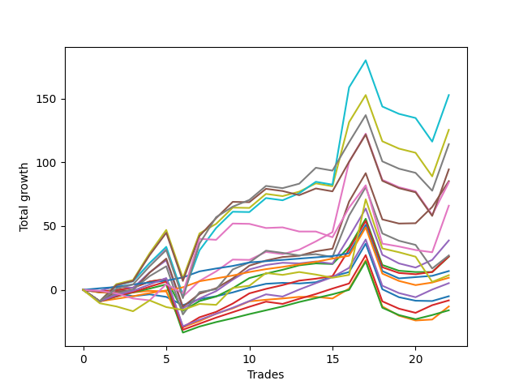

# Long Labrador 008 
- Symbol: ES
- Date Range: 03/18/2022 - 12/30/2022
- Trading Period: 8:30-12:30
- Number of Trades: 23



| Name | Win Percent | Profit | Avg Profit / Trade | Avg Time / Trade |      | Name | Win Percent | Profit | Avg Profit / Trade | Avg Time / Trade |
| ---- | ----------- | ------ | ------------------ | ---------------- | ---- | ---- | ----------- | ------ | ------------------ | ---------------- |
| Sorted By <br> Profit | | | | | | Sorted By <br> Win Percentage ||||
| BB-200 U/L 2SD | 78.26 | 140000.00 | 6086.96 | 52:53 |     | TP-1 | 100.00 | 21875.00 | 951.09 | 02:50 |
| BB-100 U/L 2SD | 78.26 | 132375.00 | 5755.43 | 49:55 |     | TP-2 | 95.65 | 22625.00 | 983.70 | 06:50 |
| V U/L 1SD | 78.26 | 119250.00 | 5184.78 | 40:10 |     | BB-50 U/L 1SD | 91.30 | 68625.00 | 2983.70 | 24:36 |
| BB-50 U/L 2SD | 82.61 | 93625.00 | 4070.65 | 35:29 |     | TP-3 | 91.30 | 12375.00 | 538.04 | 11:29 |
| NEWFI 000 | 73.91 | 86625.00 | 3766.30 | 48:15 |     | TP-8 | 86.96 | 56250.00 | 2445.65 | 27:10 |
| BB-200 Mid | 73.91 | 78750.00 | 3423.91 | 29:45 |     | TP-7 | 86.96 | 46500.00 | 2021.74 | 25:53 |
| BB-100 Mid | 82.61 | 71625.00 | 3114.13 | 28:06 |     | TP-6 | 86.96 | 41500.00 | 1804.35 | 22:03 |
| NEWFI 0000 | 52.17 | 70375.00 | 3059.78 | 35:42 |     | BB-20 U/L 2SD C | 86.96 | 33250.00 | 1445.65 | 15:30 |
| BB-50 U/L 1SD | 91.30 | 68625.00 | 2983.70 | 24:36 |     | TP-5 | 86.96 | 28375.00 | 1233.70 | 18:49 |
| V Mid | 73.91 | 60750.00 | 2641.30 | 24:33 |     | TP-4 | 86.96 | 19250.00 | 836.96 | 15:17 |
| TP-10 | 78.26 | 60000.00 | 2608.70 | 31:53 |     | BB-50 U/L 2SD | 82.61 | 93625.00 | 4070.65 | 35:29 |
| TP-8 | 86.96 | 56250.00 | 2445.65 | 27:10 |     | BB-100 Mid | 82.61 | 71625.00 | 3114.13 | 28:06 |
| TP-9 | 78.26 | 53000.00 | 2304.35 | 29:46 |     | BB-20 U/L 2SD | 82.61 | 30625.00 | 1331.52 | 13:37 |
| TP-7 | 86.96 | 46500.00 | 2021.74 | 25:53 |     | BB-200 U/L 2SD | 78.26 | 140000.00 | 6086.96 | 52:53 |
| TP-6 | 86.96 | 41500.00 | 1804.35 | 22:03 |     | BB-100 U/L 2SD | 78.26 | 132375.00 | 5755.43 | 49:55 |
| BB-50 Mid | 78.26 | 38250.00 | 1663.04 | 15:03 |     | V U/L 1SD | 78.26 | 119250.00 | 5184.78 | 40:10 |
| BB-20 U/L 2SD C | 86.96 | 33250.00 | 1445.65 | 15:30 |     | TP-10 | 78.26 | 60000.00 | 2608.70 | 31:53 |
| BB-20 U/L 2SD | 82.61 | 30625.00 | 1331.52 | 13:37 |     | TP-9 | 78.26 | 53000.00 | 2304.35 | 29:46 |
| TP-5 | 86.96 | 28375.00 | 1233.70 | 18:49 |     | BB-50 Mid | 78.26 | 38250.00 | 1663.04 | 15:03 |
| TP-2 | 95.65 | 22625.00 | 983.70 | 06:50 |     | BB-20 U/L 1SD | 78.26 | 8750.00 | 380.43 | 10:32 |
| TP-1 | 100.00 | 21875.00 | 951.09 | 02:50 |     | NEWFI 000 | 73.91 | 86625.00 | 3766.30 | 48:15 |
| TP-4 | 86.96 | 19250.00 | 836.96 | 15:17 |     | BB-200 Mid | 73.91 | 78750.00 | 3423.91 | 29:45 |
| BB-20 Mid | 65.22 | 12625.00 | 548.91 | 03:48 |     | V Mid | 73.91 | 60750.00 | 2641.30 | 24:33 |
| TP-3 | 91.30 | 12375.00 | 538.04 | 11:29 |     | BB-20 Mid | 65.22 | 12625.00 | 548.91 | 03:48 |
| BB-20 U/L 1SD | 78.26 | 8750.00 | 380.43 | 10:32 |     | NEWFI 0000 | 52.17 | 70375.00 | 3059.78 | 35:42 |

## NO STOPLOSS

### Test BB-20 Mid
* Sell when price hits the middle line of the 20p bollinger
* No Stoploss
* Results:
```
Total Trades: 23
Percent Up: 65.22
Percent Down: 34.78
Total Points Moved Up: 25.25
Potential Profit: 12625.00
Total Points Ups: 39.75 Count Ups: 15
Total Points Downs: -14.50 Count Downs: 8
```

<details><summary>Trades</summary>

<code>In: 2022-03-31 09:17:00		Out: 2022-03-31 09:32:35		Total Position Time: 15:35		Total Move Up: -2.00		Total to Date: -2.00</code> <br />
<code>In: 2022-04-20 09:19:00		Out: 2022-04-20 09:30:50		Total Position Time: 11:50		Total Move Up: -0.50		Total to Date: -2.50</code> <br />
<code>In: 2022-05-03 11:24:00		Out: 2022-05-03 11:32:10		Total Position Time: 08:10		Total Move Up: 1.50		Total to Date: -1.00</code> <br />
<code>In: 2022-05-03 11:33:00		Out: 2022-05-03 11:34:10		Total Position Time: 01:10		Total Move Up: -2.00		Total to Date: -3.00</code> <br />
<code>In: 2022-05-11 09:37:00		Out: 2022-05-11 09:49:20		Total Position Time: 12:20		Total Move Up: -6.50		Total to Date: -9.50</code> <br />
<code>In: 2022-05-13 11:30:00		Out: 2022-05-13 11:31:10		Total Position Time: 01:10		Total Move Up: 4.75		Total to Date: -4.75</code> <br />
<code>In: 2022-05-16 09:48:00		Out: 2022-05-16 09:49:10		Total Position Time: 01:10		Total Move Up: 2.25		Total to Date: -2.50</code> <br />
<code>In: 2022-05-25 09:40:00		Out: 2022-05-25 09:41:30		Total Position Time: 01:30		Total Move Up: 3.00		Total to Date: 0.50</code> <br />
<code>In: 2022-06-27 09:37:00		Out: 2022-06-27 09:41:05		Total Position Time: 04:05		Total Move Up: 3.75		Total to Date: 4.25</code> <br />
<code>In: 2022-07-08 09:46:00		Out: 2022-07-08 09:49:05		Total Position Time: 03:05		Total Move Up: 3.00		Total to Date: 7.25</code> <br />
<code>In: 2022-07-25 11:24:00		Out: 2022-07-25 11:25:35		Total Position Time: 01:35		Total Move Up: 0.75		Total to Date: 8.00</code> <br />
<code>In: 2022-08-04 11:45:00		Out: 2022-08-04 11:47:10		Total Position Time: 02:10		Total Move Up: -0.50		Total to Date: 7.50</code> <br />
<code>In: 2022-08-10 12:04:00		Out: 2022-08-10 12:05:10		Total Position Time: 01:10		Total Move Up: 1.00		Total to Date: 8.50</code> <br />
<code>In: 2022-09-20 10:38:00		Out: 2022-09-20 10:43:05		Total Position Time: 05:05		Total Move Up: 4.50		Total to Date: 13.00</code> <br />
<code>In: 2022-09-21 11:21:00		Out: 2022-09-21 11:22:15		Total Position Time: 01:15		Total Move Up: 3.50		Total to Date: 16.50</code> <br />
<code>In: 2022-10-11 12:18:00		Out: 2022-10-11 12:19:10		Total Position Time: 01:10		Total Move Up: -1.75		Total to Date: 14.75</code> <br />
<code>In: 2022-10-17 11:29:00		Out: 2022-10-17 11:35:40		Total Position Time: 06:40		Total Move Up: -0.75		Total to Date: 14.00</code> <br />
<code>In: 2022-10-17 12:15:00		Out: 2022-10-17 12:16:15		Total Position Time: 01:15		Total Move Up: 0.00		Total to Date: 14.00</code> <br />
<code>In: 2022-10-31 09:50:00		Out: 2022-10-31 09:51:10		Total Position Time: 01:10		Total Move Up: 2.50		Total to Date: 16.50</code> <br />
<code>In: 2022-11-08 11:15:00		Out: 2022-11-08 11:16:15		Total Position Time: 01:15		Total Move Up: -0.50		Total to Date: 16.00</code> <br />
<code>In: 2022-11-08 11:36:00		Out: 2022-11-08 11:37:10		Total Position Time: 01:10		Total Move Up: 5.50		Total to Date: 21.50</code> <br />
<code>In: 2022-11-10 10:03:00		Out: 2022-11-10 10:04:10		Total Position Time: 01:10		Total Move Up: 1.50		Total to Date: 23.00</code> <br />
<code>In: 2022-11-11 08:34:00		Out: 2022-11-11 08:36:25		Total Position Time: 02:25		Total Move Up: 2.25		Total to Date: 25.25</code> <br />


</details>

### Test BB-20 U/L 1SD
* Sell when the price hits the upper line of the 20p 1std bollinger
* No Stoploss
* Results:
```
Total Trades: 23
Percent Up: 78.26
Percent Down: 21.74
Total Points Moved Up: 17.50
Potential Profit: 8750.00
Total Points Ups: 58.00 Count Ups: 18
Total Points Downs: -40.50 Count Downs: 5
```

<details><summary>Trades</summary>

<code>In: 2022-03-31 09:17:00		Out: 2022-03-31 09:41:05		Total Position Time: 24:05		Total Move Up: -2.00		Total to Date: -2.00</code> <br />
<code>In: 2022-04-20 09:19:00		Out: 2022-04-20 09:31:05		Total Position Time: 12:05		Total Move Up: 0.00		Total to Date: -2.00</code> <br />
<code>In: 2022-05-03 11:24:00		Out: 2022-05-03 11:32:25		Total Position Time: 08:25		Total Move Up: 1.25		Total to Date: -0.75</code> <br />
<code>In: 2022-05-03 11:33:00		Out: 2022-05-03 11:34:20		Total Position Time: 01:20		Total Move Up: -0.50		Total to Date: -1.25</code> <br />
<code>In: 2022-05-11 09:37:00		Out: 2022-05-11 10:24:35		Total Position Time: 47:35		Total Move Up: -28.00		Total to Date: -29.25</code> <br />
<code>In: 2022-05-13 11:30:00		Out: 2022-05-13 11:31:10		Total Position Time: 01:10		Total Move Up: 4.75		Total to Date: -24.50</code> <br />
<code>In: 2022-05-16 09:48:00		Out: 2022-05-16 09:50:05		Total Position Time: 02:05		Total Move Up: 5.75		Total to Date: -18.75</code> <br />
<code>In: 2022-05-25 09:40:00		Out: 2022-05-25 09:44:25		Total Position Time: 04:25		Total Move Up: 4.25		Total to Date: -14.50</code> <br />
<code>In: 2022-06-27 09:37:00		Out: 2022-06-27 09:44:20		Total Position Time: 07:20		Total Move Up: 5.50		Total to Date: -9.00</code> <br />
<code>In: 2022-07-08 09:46:00		Out: 2022-07-08 10:06:55		Total Position Time: 20:55		Total Move Up: 1.25		Total to Date: -7.75</code> <br />
<code>In: 2022-07-25 11:24:00		Out: 2022-07-25 11:35:25		Total Position Time: 11:25		Total Move Up: 1.00		Total to Date: -6.75</code> <br />
<code>In: 2022-08-04 11:45:00		Out: 2022-08-04 11:48:05		Total Position Time: 03:05		Total Move Up: 1.25		Total to Date: -5.50</code> <br />
<code>In: 2022-08-10 12:04:00		Out: 2022-08-10 12:11:05		Total Position Time: 07:05		Total Move Up: 0.00		Total to Date: -5.50</code> <br />
<code>In: 2022-09-20 10:38:00		Out: 2022-09-20 11:08:15		Total Position Time: 30:15		Total Move Up: -1.25		Total to Date: -6.75</code> <br />
<code>In: 2022-09-21 11:21:00		Out: 2022-09-21 11:25:25		Total Position Time: 04:25		Total Move Up: 7.75		Total to Date: 1.00</code> <br />
<code>In: 2022-10-11 12:18:00		Out: 2022-10-11 12:20:40		Total Position Time: 02:40		Total Move Up: 0.25		Total to Date: 1.25</code> <br />
<code>In: 2022-10-17 11:29:00		Out: 2022-10-17 11:36:10		Total Position Time: 07:10		Total Move Up: 1.75		Total to Date: 3.00</code> <br />
<code>In: 2022-10-17 12:15:00		Out: 2022-10-17 12:20:05		Total Position Time: 05:05		Total Move Up: 0.75		Total to Date: 3.75</code> <br />
<code>In: 2022-10-31 09:50:00		Out: 2022-10-31 09:57:05		Total Position Time: 07:05		Total Move Up: 3.00		Total to Date: 6.75</code> <br />
<code>In: 2022-11-08 11:15:00		Out: 2022-11-08 11:38:35		Total Position Time: 23:35		Total Move Up: -8.75		Total to Date: -2.00</code> <br />
<code>In: 2022-11-08 11:36:00		Out: 2022-11-08 11:38:35		Total Position Time: 02:35		Total Move Up: 12.25		Total to Date: 10.25</code> <br />
<code>In: 2022-11-10 10:03:00		Out: 2022-11-10 10:04:10		Total Position Time: 01:10		Total Move Up: 1.50		Total to Date: 11.75</code> <br />
<code>In: 2022-11-11 08:34:00		Out: 2022-11-11 08:41:35		Total Position Time: 07:35		Total Move Up: 5.75		Total to Date: 17.50</code> <br />


</details>

### Test BB-20 U/L 2SD
* Sell when the price hits the upper line of the 20p 2std bollinger
* No Stoploss
* Results:
```
Total Trades: 23
Percent Up: 82.61
Percent Down: 17.39
Total Points Moved Up: 61.25
Potential Profit: 30625.00
Total Points Ups: 93.50 Count Ups: 19
Total Points Downs: -32.25 Count Downs: 4
```

<details><summary>Trades</summary>

<code>In: 2022-03-31 09:17:00		Out: 2022-03-31 09:44:20		Total Position Time: 27:20		Total Move Up: -1.25		Total to Date: -1.25</code> <br />
<code>In: 2022-04-20 09:19:00		Out: 2022-04-20 09:31:35		Total Position Time: 12:35		Total Move Up: 1.00		Total to Date: -0.25</code> <br />
<code>In: 2022-05-03 11:24:00		Out: 2022-05-03 11:34:55		Total Position Time: 10:55		Total Move Up: 4.75		Total to Date: 4.50</code> <br />
<code>In: 2022-05-03 11:33:00		Out: 2022-05-03 11:34:55		Total Position Time: 01:55		Total Move Up: 2.00		Total to Date: 6.50</code> <br />
<code>In: 2022-05-11 09:37:00		Out: 2022-05-11 10:24:50		Total Position Time: 47:50		Total Move Up: -25.00		Total to Date: -18.50</code> <br />
<code>In: 2022-05-13 11:30:00		Out: 2022-05-13 11:31:20		Total Position Time: 01:20		Total Move Up: 7.75		Total to Date: -10.75</code> <br />
<code>In: 2022-05-16 09:48:00		Out: 2022-05-16 10:06:30		Total Position Time: 18:30		Total Move Up: 3.50		Total to Date: -7.25</code> <br />
<code>In: 2022-05-25 09:40:00		Out: 2022-05-25 09:45:20		Total Position Time: 05:20		Total Move Up: 6.50		Total to Date: -0.75</code> <br />
<code>In: 2022-06-27 09:37:00		Out: 2022-06-27 09:45:05		Total Position Time: 08:05		Total Move Up: 8.00		Total to Date: 7.25</code> <br />
<code>In: 2022-07-08 09:46:00		Out: 2022-07-08 10:11:05		Total Position Time: 25:05		Total Move Up: 3.50		Total to Date: 10.75</code> <br />
<code>In: 2022-07-25 11:24:00		Out: 2022-07-25 11:35:50		Total Position Time: 11:50		Total Move Up: 3.00		Total to Date: 13.75</code> <br />
<code>In: 2022-08-04 11:45:00		Out: 2022-08-04 11:52:05		Total Position Time: 07:05		Total Move Up: 3.50		Total to Date: 17.25</code> <br />
<code>In: 2022-08-10 12:04:00		Out: 2022-08-10 12:14:35		Total Position Time: 10:35		Total Move Up: 1.50		Total to Date: 18.75</code> <br />
<code>In: 2022-09-20 10:38:00		Out: 2022-09-20 11:10:05		Total Position Time: 32:05		Total Move Up: -0.50		Total to Date: 18.25</code> <br />
<code>In: 2022-09-21 11:21:00		Out: 2022-09-21 11:31:40		Total Position Time: 10:40		Total Move Up: 13.25		Total to Date: 31.50</code> <br />
<code>In: 2022-10-11 12:18:00		Out: 2022-10-11 12:22:35		Total Position Time: 04:35		Total Move Up: 3.50		Total to Date: 35.00</code> <br />
<code>In: 2022-10-17 11:29:00		Out: 2022-10-17 11:37:30		Total Position Time: 08:30		Total Move Up: 2.25		Total to Date: 37.25</code> <br />
<code>In: 2022-10-17 12:15:00		Out: 2022-10-17 12:22:15		Total Position Time: 07:15		Total Move Up: 1.75		Total to Date: 39.00</code> <br />
<code>In: 2022-10-31 09:50:00		Out: 2022-10-31 10:02:05		Total Position Time: 12:05		Total Move Up: 4.00		Total to Date: 43.00</code> <br />
<code>In: 2022-11-08 11:15:00		Out: 2022-11-08 11:42:10		Total Position Time: 27:10		Total Move Up: -5.50		Total to Date: 37.50</code> <br />
<code>In: 2022-11-08 11:36:00		Out: 2022-11-08 11:42:10		Total Position Time: 06:10		Total Move Up: 15.50		Total to Date: 53.00</code> <br />
<code>In: 2022-11-10 10:03:00		Out: 2022-11-10 10:04:10		Total Position Time: 01:10		Total Move Up: 1.50		Total to Date: 54.50</code> <br />
<code>In: 2022-11-11 08:34:00		Out: 2022-11-11 08:49:20		Total Position Time: 15:20		Total Move Up: 6.75		Total to Date: 61.25</code> <br />


</details>

### Test BB-20 U/L 2SD C
* Sell when the price hits the upper line of the 20p 2std bollinger
* No Stoploss
* Results:
```
Total Trades: 23
Percent Up: 86.96
Percent Down: 13.04
Total Points Moved Up: 66.50
Potential Profit: 33250.00
Total Points Ups: 110.50 Count Ups: 20
Total Points Downs: -44.00 Count Downs: 3
```

<details><summary>Trades</summary>

<code>In: 2022-03-31 09:17:00		Out: 2022-03-31 09:44:20		Total Position Time: 27:20		Total Move Up: -1.25		Total to Date: -1.25</code> <br />
<code>In: 2022-04-20 09:19:00		Out: 2022-04-20 09:31:35		Total Position Time: 12:35		Total Move Up: 1.00		Total to Date: -0.25</code> <br />
<code>In: 2022-05-03 11:24:00		Out: 2022-05-03 11:34:55		Total Position Time: 10:55		Total Move Up: 4.75		Total to Date: 4.50</code> <br />
<code>In: 2022-05-03 11:33:00		Out: 2022-05-03 11:34:55		Total Position Time: 01:55		Total Move Up: 2.00		Total to Date: 6.50</code> <br />
<code>In: 2022-05-11 09:37:00		Out: 2022-05-11 10:37:55		Total Position Time: 60:55		Total Move Up: -37.75		Total to Date: -31.25</code> <br />
<code>In: 2022-05-13 11:30:00		Out: 2022-05-13 11:31:20		Total Position Time: 01:20		Total Move Up: 7.75		Total to Date: -23.50</code> <br />
<code>In: 2022-05-16 09:48:00		Out: 2022-05-16 10:07:00		Total Position Time: 19:00		Total Move Up: 4.25		Total to Date: -19.25</code> <br />
<code>In: 2022-05-25 09:40:00		Out: 2022-05-25 09:45:20		Total Position Time: 05:20		Total Move Up: 6.50		Total to Date: -12.75</code> <br />
<code>In: 2022-06-27 09:37:00		Out: 2022-06-27 09:45:05		Total Position Time: 08:05		Total Move Up: 8.00		Total to Date: -4.75</code> <br />
<code>In: 2022-07-08 09:46:00		Out: 2022-07-08 10:11:05		Total Position Time: 25:05		Total Move Up: 3.50		Total to Date: -1.25</code> <br />
<code>In: 2022-07-25 11:24:00		Out: 2022-07-25 11:35:50		Total Position Time: 11:50		Total Move Up: 3.00		Total to Date: 1.75</code> <br />
<code>In: 2022-08-04 11:45:00		Out: 2022-08-04 11:52:05		Total Position Time: 07:05		Total Move Up: 3.50		Total to Date: 5.25</code> <br />
<code>In: 2022-08-10 12:04:00		Out: 2022-08-10 12:14:35		Total Position Time: 10:35		Total Move Up: 1.50		Total to Date: 6.75</code> <br />
<code>In: 2022-09-20 10:38:00		Out: 2022-09-20 11:19:55		Total Position Time: 41:55		Total Move Up: 2.00		Total to Date: 8.75</code> <br />
<code>In: 2022-09-21 11:21:00		Out: 2022-09-21 11:33:20		Total Position Time: 12:20		Total Move Up: 21.00		Total to Date: 29.75</code> <br />
<code>In: 2022-10-11 12:18:00		Out: 2022-10-11 12:37:00		Total Position Time: 19:00		Total Move Up: 8.75		Total to Date: 38.50</code> <br />
<code>In: 2022-10-17 11:29:00		Out: 2022-10-17 11:37:55		Total Position Time: 08:55		Total Move Up: 2.25		Total to Date: 40.75</code> <br />
<code>In: 2022-10-17 12:15:00		Out: 2022-10-17 12:23:05		Total Position Time: 08:05		Total Move Up: 1.75		Total to Date: 42.50</code> <br />
<code>In: 2022-10-31 09:50:00		Out: 2022-10-31 10:02:05		Total Position Time: 12:05		Total Move Up: 4.00		Total to Date: 46.50</code> <br />
<code>In: 2022-11-08 11:15:00		Out: 2022-11-08 11:42:15		Total Position Time: 27:15		Total Move Up: -5.00		Total to Date: 41.50</code> <br />
<code>In: 2022-11-08 11:36:00		Out: 2022-11-08 11:42:15		Total Position Time: 06:15		Total Move Up: 16.00		Total to Date: 57.50</code> <br />
<code>In: 2022-11-10 10:03:00		Out: 2022-11-10 10:06:10		Total Position Time: 03:10		Total Move Up: 2.00		Total to Date: 59.50</code> <br />
<code>In: 2022-11-11 08:34:00		Out: 2022-11-11 08:49:40		Total Position Time: 15:40		Total Move Up: 7.00		Total to Date: 66.50</code> <br />


</details>

### Test BB-50 Mid
* Sell when price hits the middle line of the 50p bollinger
* No Stoploss
* Results:
```
Total Trades: 23
Percent Up: 78.26
Percent Down: 21.74
Total Points Moved Up: 76.50
Potential Profit: 38250.00
Total Points Ups: 123.50 Count Ups: 18
Total Points Downs: -47.00 Count Downs: 5
```

<details><summary>Trades</summary>

<code>In: 2022-03-31 09:17:00		Out: 2022-03-31 09:45:45		Total Position Time: 28:45		Total Move Up: -0.75		Total to Date: -0.75</code> <br />
<code>In: 2022-04-20 09:19:00		Out: 2022-04-20 09:32:40		Total Position Time: 13:40		Total Move Up: 3.75		Total to Date: 3.00</code> <br />
<code>In: 2022-05-03 11:24:00		Out: 2022-05-03 11:36:10		Total Position Time: 12:10		Total Move Up: 12.25		Total to Date: 15.25</code> <br />
<code>In: 2022-05-03 11:33:00		Out: 2022-05-03 11:36:10		Total Position Time: 03:10		Total Move Up: 9.50		Total to Date: 24.75</code> <br />
<code>In: 2022-05-11 09:37:00		Out: 2022-05-11 10:37:55		Total Position Time: 60:55		Total Move Up: -37.75		Total to Date: -13.00</code> <br />
<code>In: 2022-05-13 11:30:00		Out: 2022-05-13 11:31:20		Total Position Time: 01:20		Total Move Up: 7.75		Total to Date: -5.25</code> <br />
<code>In: 2022-05-16 09:48:00		Out: 2022-05-16 09:50:05		Total Position Time: 02:05		Total Move Up: 5.75		Total to Date: 0.50</code> <br />
<code>In: 2022-05-25 09:40:00		Out: 2022-05-25 09:49:05		Total Position Time: 09:05		Total Move Up: 9.00		Total to Date: 9.50</code> <br />
<code>In: 2022-06-27 09:37:00		Out: 2022-06-27 09:45:05		Total Position Time: 08:05		Total Move Up: 8.00		Total to Date: 17.50</code> <br />
<code>In: 2022-07-08 09:46:00		Out: 2022-07-08 10:11:10		Total Position Time: 25:10		Total Move Up: 3.50		Total to Date: 21.00</code> <br />
<code>In: 2022-07-25 11:24:00		Out: 2022-07-25 11:35:45		Total Position Time: 11:45		Total Move Up: 1.75		Total to Date: 22.75</code> <br />
<code>In: 2022-08-04 11:45:00		Out: 2022-08-04 11:47:10		Total Position Time: 02:10		Total Move Up: -0.50		Total to Date: 22.25</code> <br />
<code>In: 2022-08-10 12:04:00		Out: 2022-08-10 12:14:35		Total Position Time: 10:35		Total Move Up: 1.50		Total to Date: 23.75</code> <br />
<code>In: 2022-09-20 10:38:00		Out: 2022-09-20 11:19:15		Total Position Time: 41:15		Total Move Up: -1.75		Total to Date: 22.00</code> <br />
<code>In: 2022-09-21 11:21:00		Out: 2022-09-21 11:33:20		Total Position Time: 12:20		Total Move Up: 21.00		Total to Date: 43.00</code> <br />
<code>In: 2022-10-11 12:18:00		Out: 2022-10-11 12:36:35		Total Position Time: 18:35		Total Move Up: 5.75		Total to Date: 48.75</code> <br />
<code>In: 2022-10-17 11:29:00		Out: 2022-10-17 11:39:15		Total Position Time: 10:15		Total Move Up: 3.25		Total to Date: 52.00</code> <br />
<code>In: 2022-10-17 12:15:00		Out: 2022-10-17 12:22:15		Total Position Time: 07:15		Total Move Up: 1.75		Total to Date: 53.75</code> <br />
<code>In: 2022-10-31 09:50:00		Out: 2022-10-31 10:08:30		Total Position Time: 18:30		Total Move Up: 5.50		Total to Date: 59.25</code> <br />
<code>In: 2022-11-08 11:15:00		Out: 2022-11-08 11:41:40		Total Position Time: 26:40		Total Move Up: -6.25		Total to Date: 53.00</code> <br />
<code>In: 2022-11-08 11:36:00		Out: 2022-11-08 11:41:40		Total Position Time: 05:40		Total Move Up: 14.75		Total to Date: 67.75</code> <br />
<code>In: 2022-11-10 10:03:00		Out: 2022-11-10 10:04:10		Total Position Time: 01:10		Total Move Up: 1.50		Total to Date: 69.25</code> <br />
<code>In: 2022-11-11 08:34:00		Out: 2022-11-11 08:49:45		Total Position Time: 15:45		Total Move Up: 7.25		Total to Date: 76.50</code> <br />


</details>

### Test BB-50 U/L 1SD
* Sell when the price hits the upper line of the 50p 1std bollinger
* No Stoploss
* Results:
```
Total Trades: 23
Percent Up: 91.30
Percent Down: 8.70
Total Points Moved Up: 137.25
Potential Profit: 68625.00
Total Points Ups: 184.00 Count Ups: 21
Total Points Downs: -46.75 Count Downs: 2
```

<details><summary>Trades</summary>

<code>In: 2022-03-31 09:17:00		Out: 2022-03-31 10:17:55		Total Position Time: 60:55		Total Move Up: -9.00		Total to Date: -9.00</code> <br />
<code>In: 2022-04-20 09:19:00		Out: 2022-04-20 09:36:50		Total Position Time: 17:50		Total Move Up: 7.75		Total to Date: -1.25</code> <br />
<code>In: 2022-05-03 11:24:00		Out: 2022-05-03 11:52:05		Total Position Time: 28:05		Total Move Up: 13.75		Total to Date: 12.50</code> <br />
<code>In: 2022-05-03 11:33:00		Out: 2022-05-03 11:52:05		Total Position Time: 19:05		Total Move Up: 11.00		Total to Date: 23.50</code> <br />
<code>In: 2022-05-11 09:37:00		Out: 2022-05-11 10:37:55		Total Position Time: 60:55		Total Move Up: -37.75		Total to Date: -14.25</code> <br />
<code>In: 2022-05-13 11:30:00		Out: 2022-05-13 11:43:05		Total Position Time: 13:05		Total Move Up: 10.25		Total to Date: -4.00</code> <br />
<code>In: 2022-05-16 09:48:00		Out: 2022-05-16 10:07:05		Total Position Time: 19:05		Total Move Up: 4.25		Total to Date: 0.25</code> <br />
<code>In: 2022-05-25 09:40:00		Out: 2022-05-25 10:10:05		Total Position Time: 30:05		Total Move Up: 7.75		Total to Date: 8.00</code> <br />
<code>In: 2022-06-27 09:37:00		Out: 2022-06-27 09:53:20		Total Position Time: 16:20		Total Move Up: 10.00		Total to Date: 18.00</code> <br />
<code>In: 2022-07-08 09:46:00		Out: 2022-07-08 10:26:30		Total Position Time: 40:30		Total Move Up: 4.00		Total to Date: 22.00</code> <br />
<code>In: 2022-07-25 11:24:00		Out: 2022-07-25 11:41:00		Total Position Time: 17:00		Total Move Up: 2.75		Total to Date: 24.75</code> <br />
<code>In: 2022-08-04 11:45:00		Out: 2022-08-04 11:47:50		Total Position Time: 02:50		Total Move Up: 1.00		Total to Date: 25.75</code> <br />
<code>In: 2022-08-10 12:04:00		Out: 2022-08-10 12:21:40		Total Position Time: 17:40		Total Move Up: 3.50		Total to Date: 29.25</code> <br />
<code>In: 2022-09-20 10:38:00		Out: 2022-09-20 11:19:55		Total Position Time: 41:55		Total Move Up: 2.00		Total to Date: 31.25</code> <br />
<code>In: 2022-09-21 11:21:00		Out: 2022-09-21 11:42:10		Total Position Time: 21:10		Total Move Up: 37.00		Total to Date: 68.25</code> <br />
<code>In: 2022-10-11 12:18:00		Out: 2022-10-11 12:39:25		Total Position Time: 21:25		Total Move Up: 9.00		Total to Date: 77.25</code> <br />
<code>In: 2022-10-17 11:29:00		Out: 2022-10-17 11:43:20		Total Position Time: 14:20		Total Move Up: 5.75		Total to Date: 83.00</code> <br />
<code>In: 2022-10-17 12:15:00		Out: 2022-10-17 12:32:35		Total Position Time: 17:35		Total Move Up: 4.50		Total to Date: 87.50</code> <br />
<code>In: 2022-10-31 09:50:00		Out: 2022-10-31 10:16:15		Total Position Time: 26:15		Total Move Up: 6.50		Total to Date: 94.00</code> <br />
<code>In: 2022-11-08 11:15:00		Out: 2022-11-08 11:47:55		Total Position Time: 32:55		Total Move Up: 3.50		Total to Date: 97.50</code> <br />
<code>In: 2022-11-08 11:36:00		Out: 2022-11-08 11:47:55		Total Position Time: 11:55		Total Move Up: 24.50		Total to Date: 122.00</code> <br />
<code>In: 2022-11-10 10:03:00		Out: 2022-11-10 10:13:45		Total Position Time: 10:45		Total Move Up: 5.75		Total to Date: 127.75</code> <br />
<code>In: 2022-11-11 08:34:00		Out: 2022-11-11 08:58:20		Total Position Time: 24:20		Total Move Up: 9.50		Total to Date: 137.25</code> <br />


</details>

### Test BB-50 U/L 2SD
* Sell when the price hits the upper line of the 50p 2std bollinger
* No Stoploss
* Results:
```
Total Trades: 23
Percent Up: 82.61
Percent Down: 17.39
Total Points Moved Up: 187.25
Potential Profit: 93625.00
Total Points Ups: 236.00 Count Ups: 19
Total Points Downs: -48.75 Count Downs: 4
```

<details><summary>Trades</summary>

<code>In: 2022-03-31 09:17:00		Out: 2022-03-31 10:17:55		Total Position Time: 60:55		Total Move Up: -9.00		Total to Date: -9.00</code> <br />
<code>In: 2022-04-20 09:19:00		Out: 2022-04-20 09:50:25		Total Position Time: 31:25		Total Move Up: 12.50		Total to Date: 3.50</code> <br />
<code>In: 2022-05-03 11:24:00		Out: 2022-05-03 11:56:15		Total Position Time: 32:15		Total Move Up: 14.25		Total to Date: 17.75</code> <br />
<code>In: 2022-05-03 11:33:00		Out: 2022-05-03 11:56:15		Total Position Time: 23:15		Total Move Up: 11.50		Total to Date: 29.25</code> <br />
<code>In: 2022-05-11 09:37:00		Out: 2022-05-11 10:37:55		Total Position Time: 60:55		Total Move Up: -37.75		Total to Date: -8.50</code> <br />
<code>In: 2022-05-13 11:30:00		Out: 2022-05-13 11:51:10		Total Position Time: 21:10		Total Move Up: 12.25		Total to Date: 3.75</code> <br />
<code>In: 2022-05-16 09:48:00		Out: 2022-05-16 10:07:35		Total Position Time: 19:35		Total Move Up: 7.50		Total to Date: 11.25</code> <br />
<code>In: 2022-05-25 09:40:00		Out: 2022-05-25 10:16:30		Total Position Time: 36:30		Total Move Up: 9.25		Total to Date: 20.50</code> <br />
<code>In: 2022-06-27 09:37:00		Out: 2022-06-27 10:37:55		Total Position Time: 60:55		Total Move Up: -0.25		Total to Date: 20.25</code> <br />
<code>In: 2022-07-08 09:46:00		Out: 2022-07-08 10:27:00		Total Position Time: 41:00		Total Move Up: 6.25		Total to Date: 26.50</code> <br />
<code>In: 2022-07-25 11:24:00		Out: 2022-07-25 12:24:55		Total Position Time: 60:55		Total Move Up: -1.75		Total to Date: 24.75</code> <br />
<code>In: 2022-08-04 11:45:00		Out: 2022-08-04 11:52:05		Total Position Time: 07:05		Total Move Up: 3.50		Total to Date: 28.25</code> <br />
<code>In: 2022-08-10 12:04:00		Out: 2022-08-10 12:27:55		Total Position Time: 23:55		Total Move Up: 6.50		Total to Date: 34.75</code> <br />
<code>In: 2022-09-20 10:38:00		Out: 2022-09-20 11:21:45		Total Position Time: 43:45		Total Move Up: 7.25		Total to Date: 42.00</code> <br />
<code>In: 2022-09-21 11:21:00		Out: 2022-09-21 11:43:40		Total Position Time: 22:40		Total Move Up: 55.00		Total to Date: 97.00</code> <br />
<code>In: 2022-10-11 12:18:00		Out: 2022-10-11 12:47:00		Total Position Time: 29:00		Total Move Up: 6.75		Total to Date: 103.75</code> <br />
<code>In: 2022-10-17 11:29:00		Out: 2022-10-17 12:29:55		Total Position Time: 60:55		Total Move Up: 2.25		Total to Date: 106.00</code> <br />
<code>In: 2022-10-17 12:15:00		Out: 2022-10-17 12:43:10		Total Position Time: 28:10		Total Move Up: 7.00		Total to Date: 113.00</code> <br />
<code>In: 2022-10-31 09:50:00		Out: 2022-10-31 10:17:40		Total Position Time: 27:40		Total Move Up: 9.50		Total to Date: 122.50</code> <br />
<code>In: 2022-11-08 11:15:00		Out: 2022-11-08 12:02:35		Total Position Time: 47:35		Total Move Up: 11.75		Total to Date: 134.25</code> <br />
<code>In: 2022-11-08 11:36:00		Out: 2022-11-08 12:02:35		Total Position Time: 26:35		Total Move Up: 32.75		Total to Date: 167.00</code> <br />
<code>In: 2022-11-10 10:03:00		Out: 2022-11-10 10:16:15		Total Position Time: 13:15		Total Move Up: 8.75		Total to Date: 175.75</code> <br />
<code>In: 2022-11-11 08:34:00		Out: 2022-11-11 09:11:00		Total Position Time: 37:00		Total Move Up: 11.50		Total to Date: 187.25</code> <br />


</details>

### Test V Mid
* Sell when the price hits the middle line of the 1std VWAP
* No Stoploss
* Results:
```
Total Trades: 23
Percent Up: 73.91
Percent Down: 26.09
Total Points Moved Up: 121.50
Potential Profit: 60750.00
Total Points Ups: 175.50 Count Ups: 17
Total Points Downs: -54.00 Count Downs: 6
```

<details><summary>Trades</summary>

<code>In: 2022-03-31 09:17:00		Out: 2022-03-31 10:17:55		Total Position Time: 60:55		Total Move Up: -9.00		Total to Date: -9.00</code> <br />
<code>In: 2022-04-20 09:19:00		Out: 2022-04-20 09:35:50		Total Position Time: 16:50		Total Move Up: 6.00		Total to Date: -3.00</code> <br />
<code>In: 2022-05-03 11:24:00		Out: 2022-05-03 11:36:05		Total Position Time: 12:05		Total Move Up: 10.50		Total to Date: 7.50</code> <br />
<code>In: 2022-05-03 11:33:00		Out: 2022-05-03 11:36:05		Total Position Time: 03:05		Total Move Up: 7.75		Total to Date: 15.25</code> <br />
<code>In: 2022-05-11 09:37:00		Out: 2022-05-11 10:37:55		Total Position Time: 60:55		Total Move Up: -37.75		Total to Date: -22.50</code> <br />
<code>In: 2022-05-13 11:30:00		Out: 2022-05-13 11:52:25		Total Position Time: 22:25		Total Move Up: 17.50		Total to Date: -5.00</code> <br />
<code>In: 2022-05-16 09:48:00		Out: 2022-05-16 09:49:10		Total Position Time: 01:10		Total Move Up: 2.25		Total to Date: -2.75</code> <br />
<code>In: 2022-05-25 09:40:00		Out: 2022-05-25 10:37:05		Total Position Time: 57:05		Total Move Up: 15.50		Total to Date: 12.75</code> <br />
<code>In: 2022-06-27 09:37:00		Out: 2022-06-27 09:44:20		Total Position Time: 07:20		Total Move Up: 5.50		Total to Date: 18.25</code> <br />
<code>In: 2022-07-08 09:46:00		Out: 2022-07-08 10:29:10		Total Position Time: 43:10		Total Move Up: 9.25		Total to Date: 27.50</code> <br />
<code>In: 2022-07-25 11:24:00		Out: 2022-07-25 12:24:55		Total Position Time: 60:55		Total Move Up: -1.75		Total to Date: 25.75</code> <br />
<code>In: 2022-08-04 11:45:00		Out: 2022-08-04 11:46:10		Total Position Time: 01:10		Total Move Up: -2.00		Total to Date: 23.75</code> <br />
<code>In: 2022-08-10 12:04:00		Out: 2022-08-10 12:05:10		Total Position Time: 01:10		Total Move Up: 1.00		Total to Date: 24.75</code> <br />
<code>In: 2022-09-20 10:38:00		Out: 2022-09-20 11:38:55		Total Position Time: 60:55		Total Move Up: -2.25		Total to Date: 22.50</code> <br />
<code>In: 2022-09-21 11:21:00		Out: 2022-09-21 11:35:00		Total Position Time: 14:00		Total Move Up: 32.50		Total to Date: 55.00</code> <br />
<code>In: 2022-10-11 12:18:00		Out: 2022-10-11 12:47:00		Total Position Time: 29:00		Total Move Up: 6.75		Total to Date: 61.75</code> <br />
<code>In: 2022-10-17 11:29:00		Out: 2022-10-17 11:30:10		Total Position Time: 01:10		Total Move Up: -1.25		Total to Date: 60.50</code> <br />
<code>In: 2022-10-17 12:15:00		Out: 2022-10-17 12:16:10		Total Position Time: 01:10		Total Move Up: 0.25		Total to Date: 60.75</code> <br />
<code>In: 2022-10-31 09:50:00		Out: 2022-10-31 10:08:30		Total Position Time: 18:30		Total Move Up: 5.50		Total to Date: 66.25</code> <br />
<code>In: 2022-11-08 11:15:00		Out: 2022-11-08 12:02:35		Total Position Time: 47:35		Total Move Up: 11.75		Total to Date: 78.00</code> <br />
<code>In: 2022-11-08 11:36:00		Out: 2022-11-08 12:02:35		Total Position Time: 26:35		Total Move Up: 32.75		Total to Date: 110.75</code> <br />
<code>In: 2022-11-10 10:03:00		Out: 2022-11-10 10:04:10		Total Position Time: 01:10		Total Move Up: 1.50		Total to Date: 112.25</code> <br />
<code>In: 2022-11-11 08:34:00		Out: 2022-11-11 08:50:30		Total Position Time: 16:30		Total Move Up: 9.25		Total to Date: 121.50</code> <br />


</details>

### Test V U/L 1SD
* Sell when the price hits the upper line of the 1std VWAP
* No Stoploss
* Results:
```
Total Trades: 23
Percent Up: 78.26
Percent Down: 21.74
Total Points Moved Up: 238.50
Potential Profit: 119250.00
Total Points Ups: 289.50 Count Ups: 18
Total Points Downs: -51.00 Count Downs: 5
```

<details><summary>Trades</summary>

<code>In: 2022-03-31 09:17:00		Out: 2022-03-31 10:17:55		Total Position Time: 60:55		Total Move Up: -9.00		Total to Date: -9.00</code> <br />
<code>In: 2022-04-20 09:19:00		Out: 2022-04-20 09:52:35		Total Position Time: 33:35		Total Move Up: 13.50		Total to Date: 4.50</code> <br />
<code>In: 2022-05-03 11:24:00		Out: 2022-05-03 12:00:05		Total Position Time: 36:05		Total Move Up: 21.00		Total to Date: 25.50</code> <br />
<code>In: 2022-05-03 11:33:00		Out: 2022-05-03 12:00:05		Total Position Time: 27:05		Total Move Up: 18.25		Total to Date: 43.75</code> <br />
<code>In: 2022-05-11 09:37:00		Out: 2022-05-11 10:37:55		Total Position Time: 60:55		Total Move Up: -37.75		Total to Date: 6.00</code> <br />
<code>In: 2022-05-13 11:30:00		Out: 2022-05-13 12:14:40		Total Position Time: 44:40		Total Move Up: 35.00		Total to Date: 41.00</code> <br />
<code>In: 2022-05-16 09:48:00		Out: 2022-05-16 10:07:35		Total Position Time: 19:35		Total Move Up: 7.50		Total to Date: 48.50</code> <br />
<code>In: 2022-05-25 09:40:00		Out: 2022-05-25 10:40:55		Total Position Time: 60:55		Total Move Up: 12.75		Total to Date: 61.25</code> <br />
<code>In: 2022-06-27 09:37:00		Out: 2022-06-27 10:37:55		Total Position Time: 60:55		Total Move Up: -0.25		Total to Date: 61.00</code> <br />
<code>In: 2022-07-08 09:46:00		Out: 2022-07-08 10:46:55		Total Position Time: 60:55		Total Move Up: 11.00		Total to Date: 72.00</code> <br />
<code>In: 2022-07-25 11:24:00		Out: 2022-07-25 12:24:55		Total Position Time: 60:55		Total Move Up: -1.75		Total to Date: 70.25</code> <br />
<code>In: 2022-08-04 11:45:00		Out: 2022-08-04 11:52:05		Total Position Time: 07:05		Total Move Up: 3.50		Total to Date: 73.75</code> <br />
<code>In: 2022-08-10 12:04:00		Out: 2022-08-10 12:27:55		Total Position Time: 23:55		Total Move Up: 6.50		Total to Date: 80.25</code> <br />
<code>In: 2022-09-20 10:38:00		Out: 2022-09-20 11:38:55		Total Position Time: 60:55		Total Move Up: -2.25		Total to Date: 78.00</code> <br />
<code>In: 2022-09-21 11:21:00		Out: 2022-09-21 11:43:25		Total Position Time: 22:25		Total Move Up: 50.25		Total to Date: 128.25</code> <br />
<code>In: 2022-10-11 12:18:00		Out: 2022-10-11 12:47:00		Total Position Time: 29:00		Total Move Up: 6.75		Total to Date: 135.00</code> <br />
<code>In: 2022-10-17 11:29:00		Out: 2022-10-17 11:40:40		Total Position Time: 11:40		Total Move Up: 4.00		Total to Date: 139.00</code> <br />
<code>In: 2022-10-17 12:15:00		Out: 2022-10-17 12:33:15		Total Position Time: 18:15		Total Move Up: 6.75		Total to Date: 145.75</code> <br />
<code>In: 2022-10-31 09:50:00		Out: 2022-10-31 10:24:00		Total Position Time: 34:00		Total Move Up: 12.50		Total to Date: 158.25</code> <br />
<code>In: 2022-11-08 11:15:00		Out: 2022-11-08 12:15:55		Total Position Time: 60:55		Total Move Up: 10.00		Total to Date: 168.25</code> <br />
<code>In: 2022-11-08 11:36:00		Out: 2022-11-08 12:31:45		Total Position Time: 55:45		Total Move Up: 49.75		Total to Date: 218.00</code> <br />
<code>In: 2022-11-10 10:03:00		Out: 2022-11-10 10:15:50		Total Position Time: 12:50		Total Move Up: 8.50		Total to Date: 226.50</code> <br />
<code>In: 2022-11-11 08:34:00		Out: 2022-11-11 09:34:55		Total Position Time: 60:55		Total Move Up: 12.00		Total to Date: 238.50</code> <br />


</details>

### Test BB-100 Mid
* Move to BB100 Mid
* No Stoploss
* Results:
```
Total Trades: 23
Percent Up: 82.61
Percent Down: 17.39
Total Points Moved Up: 143.25
Potential Profit: 71625.00
Total Points Ups: 192.25 Count Ups: 19
Total Points Downs: -49.00 Count Downs: 4
```

<details><summary>Trades</summary>

<code>In: 2022-03-31 09:17:00		Out: 2022-03-31 10:17:55		Total Position Time: 60:55		Total Move Up: -9.00		Total to Date: -9.00</code> <br />
<code>In: 2022-04-20 09:19:00		Out: 2022-04-20 09:33:05		Total Position Time: 14:05		Total Move Up: 5.00		Total to Date: -4.00</code> <br />
<code>In: 2022-05-03 11:24:00		Out: 2022-05-03 11:52:15		Total Position Time: 28:15		Total Move Up: 15.50		Total to Date: 11.50</code> <br />
<code>In: 2022-05-03 11:33:00		Out: 2022-05-03 11:52:15		Total Position Time: 19:15		Total Move Up: 12.75		Total to Date: 24.25</code> <br />
<code>In: 2022-05-11 09:37:00		Out: 2022-05-11 10:37:55		Total Position Time: 60:55		Total Move Up: -37.75		Total to Date: -13.50</code> <br />
<code>In: 2022-05-13 11:30:00		Out: 2022-05-13 11:51:35		Total Position Time: 21:35		Total Move Up: 14.25		Total to Date: 0.75</code> <br />
<code>In: 2022-05-16 09:48:00		Out: 2022-05-16 09:49:10		Total Position Time: 01:10		Total Move Up: 2.25		Total to Date: 3.00</code> <br />
<code>In: 2022-05-25 09:40:00		Out: 2022-05-25 10:16:25		Total Position Time: 36:25		Total Move Up: 9.50		Total to Date: 12.50</code> <br />
<code>In: 2022-06-27 09:37:00		Out: 2022-06-27 10:20:05		Total Position Time: 43:05		Total Move Up: 8.00		Total to Date: 20.50</code> <br />
<code>In: 2022-07-08 09:46:00		Out: 2022-07-08 10:29:10		Total Position Time: 43:10		Total Move Up: 9.25		Total to Date: 29.75</code> <br />
<code>In: 2022-07-25 11:24:00		Out: 2022-07-25 12:24:55		Total Position Time: 60:55		Total Move Up: -1.75		Total to Date: 28.00</code> <br />
<code>In: 2022-08-04 11:45:00		Out: 2022-08-04 11:47:20		Total Position Time: 02:20		Total Move Up: -0.50		Total to Date: 27.50</code> <br />
<code>In: 2022-08-10 12:04:00		Out: 2022-08-10 12:21:40		Total Position Time: 17:40		Total Move Up: 3.50		Total to Date: 31.00</code> <br />
<code>In: 2022-09-20 10:38:00		Out: 2022-09-20 11:21:45		Total Position Time: 43:45		Total Move Up: 7.25		Total to Date: 38.25</code> <br />
<code>In: 2022-09-21 11:21:00		Out: 2022-09-21 11:34:55		Total Position Time: 13:55		Total Move Up: 33.75		Total to Date: 72.00</code> <br />
<code>In: 2022-10-11 12:18:00		Out: 2022-10-11 12:47:00		Total Position Time: 29:00		Total Move Up: 6.75		Total to Date: 78.75</code> <br />
<code>In: 2022-10-17 11:29:00		Out: 2022-10-17 11:36:10		Total Position Time: 07:10		Total Move Up: 1.75		Total to Date: 80.50</code> <br />
<code>In: 2022-10-17 12:15:00		Out: 2022-10-17 12:25:00		Total Position Time: 10:00		Total Move Up: 3.50		Total to Date: 84.00</code> <br />
<code>In: 2022-10-31 09:50:00		Out: 2022-10-31 10:17:20		Total Position Time: 27:20		Total Move Up: 8.50		Total to Date: 92.50</code> <br />
<code>In: 2022-11-08 11:15:00		Out: 2022-11-08 11:53:50		Total Position Time: 38:50		Total Move Up: 5.75		Total to Date: 98.25</code> <br />
<code>In: 2022-11-08 11:36:00		Out: 2022-11-08 11:53:50		Total Position Time: 17:50		Total Move Up: 26.75		Total to Date: 125.00</code> <br />
<code>In: 2022-11-10 10:03:00		Out: 2022-11-10 10:15:00		Total Position Time: 12:00		Total Move Up: 7.50		Total to Date: 132.50</code> <br />
<code>In: 2022-11-11 08:34:00		Out: 2022-11-11 09:10:50		Total Position Time: 36:50		Total Move Up: 10.75		Total to Date: 143.25</code> <br />


</details>

### Test BB-100 U/L 2SD
* Move to BB100 Upper Band
* No Stoploss
* Results:
```
Total Trades: 23
Percent Up: 78.26
Percent Down: 21.74
Total Points Moved Up: 264.75
Potential Profit: 132375.00
Total Points Ups: 315.75 Count Ups: 18
Total Points Downs: -51.00 Count Downs: 5
```

<details><summary>Trades</summary>

<code>In: 2022-03-31 09:17:00		Out: 2022-03-31 10:17:55		Total Position Time: 60:55		Total Move Up: -9.00		Total to Date: -9.00</code> <br />
<code>In: 2022-04-20 09:19:00		Out: 2022-04-20 09:50:25		Total Position Time: 31:25		Total Move Up: 12.50		Total to Date: 3.50</code> <br />
<code>In: 2022-05-03 11:24:00		Out: 2022-05-03 12:24:55		Total Position Time: 60:55		Total Move Up: 14.25		Total to Date: 17.75</code> <br />
<code>In: 2022-05-03 11:33:00		Out: 2022-05-03 12:33:55		Total Position Time: 60:55		Total Move Up: 12.75		Total to Date: 30.50</code> <br />
<code>In: 2022-05-11 09:37:00		Out: 2022-05-11 10:37:55		Total Position Time: 60:55		Total Move Up: -37.75		Total to Date: -7.25</code> <br />
<code>In: 2022-05-13 11:30:00		Out: 2022-05-13 12:14:40		Total Position Time: 44:40		Total Move Up: 35.00		Total to Date: 27.75</code> <br />
<code>In: 2022-05-16 09:48:00		Out: 2022-05-16 10:24:00		Total Position Time: 36:00		Total Move Up: 17.50		Total to Date: 45.25</code> <br />
<code>In: 2022-05-25 09:40:00		Out: 2022-05-25 10:40:55		Total Position Time: 60:55		Total Move Up: 12.75		Total to Date: 58.00</code> <br />
<code>In: 2022-06-27 09:37:00		Out: 2022-06-27 10:37:55		Total Position Time: 60:55		Total Move Up: -0.25		Total to Date: 57.75</code> <br />
<code>In: 2022-07-08 09:46:00		Out: 2022-07-08 10:46:55		Total Position Time: 60:55		Total Move Up: 11.00		Total to Date: 68.75</code> <br />
<code>In: 2022-07-25 11:24:00		Out: 2022-07-25 12:24:55		Total Position Time: 60:55		Total Move Up: -1.75		Total to Date: 67.00</code> <br />
<code>In: 2022-08-04 11:45:00		Out: 2022-08-04 12:13:10		Total Position Time: 28:10		Total Move Up: 5.50		Total to Date: 72.50</code> <br />
<code>In: 2022-08-10 12:04:00		Out: 2022-08-10 12:37:35		Total Position Time: 33:35		Total Move Up: 9.00		Total to Date: 81.50</code> <br />
<code>In: 2022-09-20 10:38:00		Out: 2022-09-20 11:38:55		Total Position Time: 60:55		Total Move Up: -2.25		Total to Date: 79.25</code> <br />
<code>In: 2022-09-21 11:21:00		Out: 2022-09-21 11:45:30		Total Position Time: 24:30		Total Move Up: 76.25		Total to Date: 155.50</code> <br />
<code>In: 2022-10-11 12:18:00		Out: 2022-10-11 12:47:00		Total Position Time: 29:00		Total Move Up: 6.75		Total to Date: 162.25</code> <br />
<code>In: 2022-10-17 11:29:00		Out: 2022-10-17 12:29:55		Total Position Time: 60:55		Total Move Up: 2.25		Total to Date: 164.50</code> <br />
<code>In: 2022-10-17 12:15:00		Out: 2022-10-17 12:44:10		Total Position Time: 29:10		Total Move Up: 8.75		Total to Date: 173.25</code> <br />
<code>In: 2022-10-31 09:50:00		Out: 2022-10-31 10:50:55		Total Position Time: 60:55		Total Move Up: 9.25		Total to Date: 182.50</code> <br />
<code>In: 2022-11-08 11:15:00		Out: 2022-11-08 12:15:55		Total Position Time: 60:55		Total Move Up: 10.00		Total to Date: 192.50</code> <br />
<code>In: 2022-11-08 11:36:00		Out: 2022-11-08 12:30:25		Total Position Time: 54:25		Total Move Up: 44.00		Total to Date: 236.50</code> <br />
<code>In: 2022-11-10 10:03:00		Out: 2022-11-10 10:48:15		Total Position Time: 45:15		Total Move Up: 16.25		Total to Date: 252.75</code> <br />
<code>In: 2022-11-11 08:34:00		Out: 2022-11-11 09:34:55		Total Position Time: 60:55		Total Move Up: 12.00		Total to Date: 264.75</code> <br />


</details>

### Test BB-200 Mid
* Move to BB200 Mid
* No Stoploss
* Results:
```
Total Trades: 23
Percent Up: 73.91
Percent Down: 26.09
Total Points Moved Up: 157.50
Potential Profit: 78750.00
Total Points Ups: 210.25 Count Ups: 17
Total Points Downs: -52.75 Count Downs: 6
```

<details><summary>Trades</summary>

<code>In: 2022-03-31 09:17:00		Out: 2022-03-31 10:17:55		Total Position Time: 60:55		Total Move Up: -9.00		Total to Date: -9.00</code> <br />
<code>In: 2022-04-20 09:19:00		Out: 2022-04-20 09:32:40		Total Position Time: 13:40		Total Move Up: 3.75		Total to Date: -5.25</code> <br />
<code>In: 2022-05-03 11:24:00		Out: 2022-05-03 11:56:55		Total Position Time: 32:55		Total Move Up: 17.00		Total to Date: 11.75</code> <br />
<code>In: 2022-05-03 11:33:00		Out: 2022-05-03 11:56:55		Total Position Time: 23:55		Total Move Up: 14.25		Total to Date: 26.00</code> <br />
<code>In: 2022-05-11 09:37:00		Out: 2022-05-11 10:37:55		Total Position Time: 60:55		Total Move Up: -37.75		Total to Date: -11.75</code> <br />
<code>In: 2022-05-13 11:30:00		Out: 2022-05-13 12:00:05		Total Position Time: 30:05		Total Move Up: 23.75		Total to Date: 12.00</code> <br />
<code>In: 2022-05-16 09:48:00		Out: 2022-05-16 09:49:10		Total Position Time: 01:10		Total Move Up: 2.25		Total to Date: 14.25</code> <br />
<code>In: 2022-05-25 09:40:00		Out: 2022-05-25 10:37:10		Total Position Time: 57:10		Total Move Up: 16.50		Total to Date: 30.75</code> <br />
<code>In: 2022-06-27 09:37:00		Out: 2022-06-27 09:45:00		Total Position Time: 08:00		Total Move Up: 7.00		Total to Date: 37.75</code> <br />
<code>In: 2022-07-08 09:46:00		Out: 2022-07-08 10:46:55		Total Position Time: 60:55		Total Move Up: 11.00		Total to Date: 48.75</code> <br />
<code>In: 2022-07-25 11:24:00		Out: 2022-07-25 12:24:55		Total Position Time: 60:55		Total Move Up: -1.75		Total to Date: 47.00</code> <br />
<code>In: 2022-08-04 11:45:00		Out: 2022-08-04 11:46:45		Total Position Time: 01:45		Total Move Up: -1.25		Total to Date: 45.75</code> <br />
<code>In: 2022-08-10 12:04:00		Out: 2022-08-10 12:20:40		Total Position Time: 16:40		Total Move Up: 3.00		Total to Date: 48.75</code> <br />
<code>In: 2022-09-20 10:38:00		Out: 2022-09-20 11:38:55		Total Position Time: 60:55		Total Move Up: -2.25		Total to Date: 46.50</code> <br />
<code>In: 2022-09-21 11:21:00		Out: 2022-09-21 11:35:40		Total Position Time: 14:40		Total Move Up: 38.75		Total to Date: 85.25</code> <br />
<code>In: 2022-10-11 12:18:00		Out: 2022-10-11 12:47:00		Total Position Time: 29:00		Total Move Up: 6.75		Total to Date: 92.00</code> <br />
<code>In: 2022-10-17 11:29:00		Out: 2022-10-17 11:30:20		Total Position Time: 01:20		Total Move Up: -0.75		Total to Date: 91.25</code> <br />
<code>In: 2022-10-17 12:15:00		Out: 2022-10-17 12:23:20		Total Position Time: 08:20		Total Move Up: 3.25		Total to Date: 94.50</code> <br />
<code>In: 2022-10-31 09:50:00		Out: 2022-10-31 10:08:30		Total Position Time: 18:30		Total Move Up: 5.50		Total to Date: 100.00</code> <br />
<code>In: 2022-11-08 11:15:00		Out: 2022-11-08 12:15:55		Total Position Time: 60:55		Total Move Up: 10.00		Total to Date: 110.00</code> <br />
<code>In: 2022-11-08 11:36:00		Out: 2022-11-08 12:20:05		Total Position Time: 44:05		Total Move Up: 36.75		Total to Date: 146.75</code> <br />
<code>In: 2022-11-10 10:03:00		Out: 2022-11-10 10:04:10		Total Position Time: 01:10		Total Move Up: 1.50		Total to Date: 148.25</code> <br />
<code>In: 2022-11-11 08:34:00		Out: 2022-11-11 08:50:30		Total Position Time: 16:30		Total Move Up: 9.25		Total to Date: 157.50</code> <br />


</details>

### Test BB-200 U/L 2SD
* Move to BB200 Upper Band
* No Stoploss
* Results:
```
Total Trades: 23
Percent Up: 78.26
Percent Down: 21.74
Total Points Moved Up: 280.00
Potential Profit: 140000.00
Total Points Ups: 331.00 Count Ups: 18
Total Points Downs: -51.00 Count Downs: 5
```

<details><summary>Trades</summary>

<code>In: 2022-03-31 09:17:00		Out: 2022-03-31 10:17:55		Total Position Time: 60:55		Total Move Up: -9.00		Total to Date: -9.00</code> <br />
<code>In: 2022-04-20 09:19:00		Out: 2022-04-20 10:19:55		Total Position Time: 60:55		Total Move Up: 10.00		Total to Date: 1.00</code> <br />
<code>In: 2022-05-03 11:24:00		Out: 2022-05-03 12:24:55		Total Position Time: 60:55		Total Move Up: 14.25		Total to Date: 15.25</code> <br />
<code>In: 2022-05-03 11:33:00		Out: 2022-05-03 12:33:55		Total Position Time: 60:55		Total Move Up: 12.75		Total to Date: 28.00</code> <br />
<code>In: 2022-05-11 09:37:00		Out: 2022-05-11 10:37:55		Total Position Time: 60:55		Total Move Up: -37.75		Total to Date: -9.75</code> <br />
<code>In: 2022-05-13 11:30:00		Out: 2022-05-13 12:30:55		Total Position Time: 60:55		Total Move Up: 42.75		Total to Date: 33.00</code> <br />
<code>In: 2022-05-16 09:48:00		Out: 2022-05-16 10:24:05		Total Position Time: 36:05		Total Move Up: 18.25		Total to Date: 51.25</code> <br />
<code>In: 2022-05-25 09:40:00		Out: 2022-05-25 10:40:55		Total Position Time: 60:55		Total Move Up: 12.75		Total to Date: 64.00</code> <br />
<code>In: 2022-06-27 09:37:00		Out: 2022-06-27 10:37:55		Total Position Time: 60:55		Total Move Up: -0.25		Total to Date: 63.75</code> <br />
<code>In: 2022-07-08 09:46:00		Out: 2022-07-08 10:46:55		Total Position Time: 60:55		Total Move Up: 11.00		Total to Date: 74.75</code> <br />
<code>In: 2022-07-25 11:24:00		Out: 2022-07-25 12:24:55		Total Position Time: 60:55		Total Move Up: -1.75		Total to Date: 73.00</code> <br />
<code>In: 2022-08-04 11:45:00		Out: 2022-08-04 12:13:30		Total Position Time: 28:30		Total Move Up: 7.00		Total to Date: 80.00</code> <br />
<code>In: 2022-08-10 12:04:00		Out: 2022-08-10 12:37:35		Total Position Time: 33:35		Total Move Up: 9.00		Total to Date: 89.00</code> <br />
<code>In: 2022-09-20 10:38:00		Out: 2022-09-20 11:38:55		Total Position Time: 60:55		Total Move Up: -2.25		Total to Date: 86.75</code> <br />
<code>In: 2022-09-21 11:21:00		Out: 2022-09-21 11:45:30		Total Position Time: 24:30		Total Move Up: 76.25		Total to Date: 163.00</code> <br />
<code>In: 2022-10-11 12:18:00		Out: 2022-10-11 12:47:00		Total Position Time: 29:00		Total Move Up: 6.75		Total to Date: 169.75</code> <br />
<code>In: 2022-10-17 11:29:00		Out: 2022-10-17 12:29:55		Total Position Time: 60:55		Total Move Up: 2.25		Total to Date: 172.00</code> <br />
<code>In: 2022-10-17 12:15:00		Out: 2022-10-17 12:44:20		Total Position Time: 29:20		Total Move Up: 9.50		Total to Date: 181.50</code> <br />
<code>In: 2022-10-31 09:50:00		Out: 2022-10-31 10:50:55		Total Position Time: 60:55		Total Move Up: 9.25		Total to Date: 190.75</code> <br />
<code>In: 2022-11-08 11:15:00		Out: 2022-11-08 12:15:55		Total Position Time: 60:55		Total Move Up: 10.00		Total to Date: 200.75</code> <br />
<code>In: 2022-11-08 11:36:00		Out: 2022-11-08 12:36:55		Total Position Time: 60:55		Total Move Up: 49.00		Total to Date: 249.75</code> <br />
<code>In: 2022-11-10 10:03:00		Out: 2022-11-10 11:03:55		Total Position Time: 60:55		Total Move Up: 18.25		Total to Date: 268.00</code> <br />
<code>In: 2022-11-11 08:34:00		Out: 2022-11-11 09:34:55		Total Position Time: 60:55		Total Move Up: 12.00		Total to Date: 280.00</code> <br />


</details>

## TAKE PROFIT

### Test TP-1
* Take Profit of 1 Point
* No Stoploss
* Results:
```
Total Trades: 23
Percent Up: 100.00
Percent Down: 0.00
Total Points Moved Up: 43.75
Potential Profit: 21875.00
Total Points Ups: 43.75 Count Ups: 23
Total Points Downs: 0.00 Count Downs: 0
```

<details><summary>Trades</summary>

<code>In: 2022-03-31 09:17:00		Out: 2022-03-31 09:19:05		Total Position Time: 02:05		Total Move Up: 1.25		Total to Date: 1.25</code> <br />
<code>In: 2022-04-20 09:19:00		Out: 2022-04-20 09:31:35		Total Position Time: 12:35		Total Move Up: 1.00		Total to Date: 2.25</code> <br />
<code>In: 2022-05-03 11:24:00		Out: 2022-05-03 11:32:10		Total Position Time: 08:10		Total Move Up: 1.50		Total to Date: 3.75</code> <br />
<code>In: 2022-05-03 11:33:00		Out: 2022-05-03 11:34:50		Total Position Time: 01:50		Total Move Up: 1.50		Total to Date: 5.25</code> <br />
<code>In: 2022-05-11 09:37:00		Out: 2022-05-11 09:40:45		Total Position Time: 03:45		Total Move Up: 2.50		Total to Date: 7.75</code> <br />
<code>In: 2022-05-13 11:30:00		Out: 2022-05-13 11:31:10		Total Position Time: 01:10		Total Move Up: 4.75		Total to Date: 12.50</code> <br />
<code>In: 2022-05-16 09:48:00		Out: 2022-05-16 09:49:10		Total Position Time: 01:10		Total Move Up: 2.25		Total to Date: 14.75</code> <br />
<code>In: 2022-05-25 09:40:00		Out: 2022-05-25 09:41:10		Total Position Time: 01:10		Total Move Up: 2.00		Total to Date: 16.75</code> <br />
<code>In: 2022-06-27 09:37:00		Out: 2022-06-27 09:38:10		Total Position Time: 01:10		Total Move Up: 2.75		Total to Date: 19.50</code> <br />
<code>In: 2022-07-08 09:46:00		Out: 2022-07-08 09:47:35		Total Position Time: 01:35		Total Move Up: 1.00		Total to Date: 20.50</code> <br />
<code>In: 2022-07-25 11:24:00		Out: 2022-07-25 11:25:40		Total Position Time: 01:40		Total Move Up: 1.00		Total to Date: 21.50</code> <br />
<code>In: 2022-08-04 11:45:00		Out: 2022-08-04 11:47:50		Total Position Time: 02:50		Total Move Up: 1.00		Total to Date: 22.50</code> <br />
<code>In: 2022-08-10 12:04:00		Out: 2022-08-10 12:05:10		Total Position Time: 01:10		Total Move Up: 1.00		Total to Date: 23.50</code> <br />
<code>In: 2022-09-20 10:38:00		Out: 2022-09-20 10:39:10		Total Position Time: 01:10		Total Move Up: 1.00		Total to Date: 24.50</code> <br />
<code>In: 2022-09-21 11:21:00		Out: 2022-09-21 11:22:10		Total Position Time: 01:10		Total Move Up: 2.25		Total to Date: 26.75</code> <br />
<code>In: 2022-10-11 12:18:00		Out: 2022-10-11 12:21:25		Total Position Time: 03:25		Total Move Up: 2.50		Total to Date: 29.25</code> <br />
<code>In: 2022-10-17 11:29:00		Out: 2022-10-17 11:36:10		Total Position Time: 07:10		Total Move Up: 1.75		Total to Date: 31.00</code> <br />
<code>In: 2022-10-17 12:15:00		Out: 2022-10-17 12:20:05		Total Position Time: 05:05		Total Move Up: 0.75		Total to Date: 31.75</code> <br />
<code>In: 2022-10-31 09:50:00		Out: 2022-10-31 09:51:10		Total Position Time: 01:10		Total Move Up: 2.50		Total to Date: 34.25</code> <br />
<code>In: 2022-11-08 11:15:00		Out: 2022-11-08 11:16:45		Total Position Time: 01:45		Total Move Up: 1.00		Total to Date: 35.25</code> <br />
<code>In: 2022-11-08 11:36:00		Out: 2022-11-08 11:37:10		Total Position Time: 01:10		Total Move Up: 5.50		Total to Date: 40.75</code> <br />
<code>In: 2022-11-10 10:03:00		Out: 2022-11-10 10:04:10		Total Position Time: 01:10		Total Move Up: 1.50		Total to Date: 42.25</code> <br />
<code>In: 2022-11-11 08:34:00		Out: 2022-11-11 08:35:35		Total Position Time: 01:35		Total Move Up: 1.50		Total to Date: 43.75</code> <br />


</details>

### Test TP-2
* Take Profit of 2 Point
* No Stoploss
* Results:
```
Total Trades: 23
Percent Up: 95.65
Percent Down: 4.35
Total Points Moved Up: 45.25
Potential Profit: 22625.00
Total Points Ups: 54.25 Count Ups: 22
Total Points Downs: -9.00 Count Downs: 1
```

<details><summary>Trades</summary>

<code>In: 2022-03-31 09:17:00		Out: 2022-03-31 10:17:55		Total Position Time: 60:55		Total Move Up: -9.00		Total to Date: -9.00</code> <br />
<code>In: 2022-04-20 09:19:00		Out: 2022-04-20 09:32:30		Total Position Time: 13:30		Total Move Up: 2.00		Total to Date: -7.00</code> <br />
<code>In: 2022-05-03 11:24:00		Out: 2022-05-03 11:32:20		Total Position Time: 08:20		Total Move Up: 2.50		Total to Date: -4.50</code> <br />
<code>In: 2022-05-03 11:33:00		Out: 2022-05-03 11:34:55		Total Position Time: 01:55		Total Move Up: 2.00		Total to Date: -2.50</code> <br />
<code>In: 2022-05-11 09:37:00		Out: 2022-05-11 09:40:45		Total Position Time: 03:45		Total Move Up: 2.50		Total to Date: 0.00</code> <br />
<code>In: 2022-05-13 11:30:00		Out: 2022-05-13 11:31:10		Total Position Time: 01:10		Total Move Up: 4.75		Total to Date: 4.75</code> <br />
<code>In: 2022-05-16 09:48:00		Out: 2022-05-16 09:49:10		Total Position Time: 01:10		Total Move Up: 2.25		Total to Date: 7.00</code> <br />
<code>In: 2022-05-25 09:40:00		Out: 2022-05-25 09:41:20		Total Position Time: 01:20		Total Move Up: 2.25		Total to Date: 9.25</code> <br />
<code>In: 2022-06-27 09:37:00		Out: 2022-06-27 09:38:10		Total Position Time: 01:10		Total Move Up: 2.75		Total to Date: 12.00</code> <br />
<code>In: 2022-07-08 09:46:00		Out: 2022-07-08 09:48:20		Total Position Time: 02:20		Total Move Up: 2.25		Total to Date: 14.25</code> <br />
<code>In: 2022-07-25 11:24:00		Out: 2022-07-25 11:35:45		Total Position Time: 11:45		Total Move Up: 1.75		Total to Date: 16.00</code> <br />
<code>In: 2022-08-04 11:45:00		Out: 2022-08-04 11:51:15		Total Position Time: 06:15		Total Move Up: 2.00		Total to Date: 18.00</code> <br />
<code>In: 2022-08-10 12:04:00		Out: 2022-08-10 12:16:40		Total Position Time: 12:40		Total Move Up: 2.00		Total to Date: 20.00</code> <br />
<code>In: 2022-09-20 10:38:00		Out: 2022-09-20 10:41:35		Total Position Time: 03:35		Total Move Up: 2.50		Total to Date: 22.50</code> <br />
<code>In: 2022-09-21 11:21:00		Out: 2022-09-21 11:22:10		Total Position Time: 01:10		Total Move Up: 2.25		Total to Date: 24.75</code> <br />
<code>In: 2022-10-11 12:18:00		Out: 2022-10-11 12:21:25		Total Position Time: 03:25		Total Move Up: 2.50		Total to Date: 27.25</code> <br />
<code>In: 2022-10-17 11:29:00		Out: 2022-10-17 11:36:15		Total Position Time: 07:15		Total Move Up: 2.00		Total to Date: 29.25</code> <br />
<code>In: 2022-10-17 12:15:00		Out: 2022-10-17 12:22:20		Total Position Time: 07:20		Total Move Up: 1.75		Total to Date: 31.00</code> <br />
<code>In: 2022-10-31 09:50:00		Out: 2022-10-31 09:51:10		Total Position Time: 01:10		Total Move Up: 2.50		Total to Date: 33.50</code> <br />
<code>In: 2022-11-08 11:15:00		Out: 2022-11-08 11:16:55		Total Position Time: 01:55		Total Move Up: 1.75		Total to Date: 35.25</code> <br />
<code>In: 2022-11-08 11:36:00		Out: 2022-11-08 11:37:10		Total Position Time: 01:10		Total Move Up: 5.50		Total to Date: 40.75</code> <br />
<code>In: 2022-11-10 10:03:00		Out: 2022-11-10 10:04:40		Total Position Time: 01:40		Total Move Up: 2.25		Total to Date: 43.00</code> <br />
<code>In: 2022-11-11 08:34:00		Out: 2022-11-11 08:36:20		Total Position Time: 02:20		Total Move Up: 2.25		Total to Date: 45.25</code> <br />


</details>

### Test TP-3
* Take Profit of 3 Point
* No Stoploss
* Results:
```
Total Trades: 23
Percent Up: 91.30
Percent Down: 8.70
Total Points Moved Up: 24.75
Potential Profit: 12375.00
Total Points Ups: 71.50 Count Ups: 21
Total Points Downs: -46.75 Count Downs: 2
```

<details><summary>Trades</summary>

<code>In: 2022-03-31 09:17:00		Out: 2022-03-31 10:17:55		Total Position Time: 60:55		Total Move Up: -9.00		Total to Date: -9.00</code> <br />
<code>In: 2022-04-20 09:19:00		Out: 2022-04-20 09:32:40		Total Position Time: 13:40		Total Move Up: 3.75		Total to Date: -5.25</code> <br />
<code>In: 2022-05-03 11:24:00		Out: 2022-05-03 11:34:45		Total Position Time: 10:45		Total Move Up: 3.00		Total to Date: -2.25</code> <br />
<code>In: 2022-05-03 11:33:00		Out: 2022-05-03 11:35:15		Total Position Time: 02:15		Total Move Up: 3.25		Total to Date: 1.00</code> <br />
<code>In: 2022-05-11 09:37:00		Out: 2022-05-11 10:37:55		Total Position Time: 60:55		Total Move Up: -37.75		Total to Date: -36.75</code> <br />
<code>In: 2022-05-13 11:30:00		Out: 2022-05-13 11:31:10		Total Position Time: 01:10		Total Move Up: 4.75		Total to Date: -32.00</code> <br />
<code>In: 2022-05-16 09:48:00		Out: 2022-05-16 09:49:15		Total Position Time: 01:15		Total Move Up: 3.50		Total to Date: -28.50</code> <br />
<code>In: 2022-05-25 09:40:00		Out: 2022-05-25 09:41:30		Total Position Time: 01:30		Total Move Up: 3.00		Total to Date: -25.50</code> <br />
<code>In: 2022-06-27 09:37:00		Out: 2022-06-27 09:39:20		Total Position Time: 02:20		Total Move Up: 3.25		Total to Date: -22.25</code> <br />
<code>In: 2022-07-08 09:46:00		Out: 2022-07-08 09:48:40		Total Position Time: 02:40		Total Move Up: 3.00		Total to Date: -19.25</code> <br />
<code>In: 2022-07-25 11:24:00		Out: 2022-07-25 11:35:50		Total Position Time: 11:50		Total Move Up: 3.00		Total to Date: -16.25</code> <br />
<code>In: 2022-08-04 11:45:00		Out: 2022-08-04 11:52:05		Total Position Time: 07:05		Total Move Up: 3.50		Total to Date: -12.75</code> <br />
<code>In: 2022-08-10 12:04:00		Out: 2022-08-10 12:20:20		Total Position Time: 16:20		Total Move Up: 3.00		Total to Date: -9.75</code> <br />
<code>In: 2022-09-20 10:38:00		Out: 2022-09-20 10:41:45		Total Position Time: 03:45		Total Move Up: 3.00		Total to Date: -6.75</code> <br />
<code>In: 2022-09-21 11:21:00		Out: 2022-09-21 11:22:15		Total Position Time: 01:15		Total Move Up: 3.50		Total to Date: -3.25</code> <br />
<code>In: 2022-10-11 12:18:00		Out: 2022-10-11 12:21:30		Total Position Time: 03:30		Total Move Up: 3.00		Total to Date: -0.25</code> <br />
<code>In: 2022-10-17 11:29:00		Out: 2022-10-17 11:39:15		Total Position Time: 10:15		Total Move Up: 3.25		Total to Date: 3.00</code> <br />
<code>In: 2022-10-17 12:15:00		Out: 2022-10-17 12:23:20		Total Position Time: 08:20		Total Move Up: 3.25		Total to Date: 6.25</code> <br />
<code>In: 2022-10-31 09:50:00		Out: 2022-10-31 09:51:15		Total Position Time: 01:15		Total Move Up: 2.75		Total to Date: 9.00</code> <br />
<code>In: 2022-11-08 11:15:00		Out: 2022-11-08 11:47:55		Total Position Time: 32:55		Total Move Up: 3.50		Total to Date: 12.50</code> <br />
<code>In: 2022-11-08 11:36:00		Out: 2022-11-08 11:37:10		Total Position Time: 01:10		Total Move Up: 5.50		Total to Date: 18.00</code> <br />
<code>In: 2022-11-10 10:03:00		Out: 2022-11-10 10:08:25		Total Position Time: 05:25		Total Move Up: 3.75		Total to Date: 21.75</code> <br />
<code>In: 2022-11-11 08:34:00		Out: 2022-11-11 08:37:45		Total Position Time: 03:45		Total Move Up: 3.00		Total to Date: 24.75</code> <br />


</details>

### Test TP-4
* Take Profit of 4 Point
* No Stoploss
* Results:
```
Total Trades: 23
Percent Up: 86.96
Percent Down: 13.04
Total Points Moved Up: 38.50
Potential Profit: 19250.00
Total Points Ups: 87.00 Count Ups: 20
Total Points Downs: -48.50 Count Downs: 3
```

<details><summary>Trades</summary>

<code>In: 2022-03-31 09:17:00		Out: 2022-03-31 10:17:55		Total Position Time: 60:55		Total Move Up: -9.00		Total to Date: -9.00</code> <br />
<code>In: 2022-04-20 09:19:00		Out: 2022-04-20 09:32:50		Total Position Time: 13:50		Total Move Up: 4.00		Total to Date: -5.00</code> <br />
<code>In: 2022-05-03 11:24:00		Out: 2022-05-03 11:34:50		Total Position Time: 10:50		Total Move Up: 4.25		Total to Date: -0.75</code> <br />
<code>In: 2022-05-03 11:33:00		Out: 2022-05-03 11:35:20		Total Position Time: 02:20		Total Move Up: 4.00		Total to Date: 3.25</code> <br />
<code>In: 2022-05-11 09:37:00		Out: 2022-05-11 10:37:55		Total Position Time: 60:55		Total Move Up: -37.75		Total to Date: -34.50</code> <br />
<code>In: 2022-05-13 11:30:00		Out: 2022-05-13 11:31:10		Total Position Time: 01:10		Total Move Up: 4.75		Total to Date: -29.75</code> <br />
<code>In: 2022-05-16 09:48:00		Out: 2022-05-16 09:49:25		Total Position Time: 01:25		Total Move Up: 4.75		Total to Date: -25.00</code> <br />
<code>In: 2022-05-25 09:40:00		Out: 2022-05-25 09:44:25		Total Position Time: 04:25		Total Move Up: 4.25		Total to Date: -20.75</code> <br />
<code>In: 2022-06-27 09:37:00		Out: 2022-06-27 09:41:10		Total Position Time: 04:10		Total Move Up: 4.25		Total to Date: -16.50</code> <br />
<code>In: 2022-07-08 09:46:00		Out: 2022-07-08 09:49:45		Total Position Time: 03:45		Total Move Up: 4.00		Total to Date: -12.50</code> <br />
<code>In: 2022-07-25 11:24:00		Out: 2022-07-25 12:24:55		Total Position Time: 60:55		Total Move Up: -1.75		Total to Date: -14.25</code> <br />
<code>In: 2022-08-04 11:45:00		Out: 2022-08-04 11:52:20		Total Position Time: 07:20		Total Move Up: 4.00		Total to Date: -10.25</code> <br />
<code>In: 2022-08-10 12:04:00		Out: 2022-08-10 12:21:45		Total Position Time: 17:45		Total Move Up: 3.75		Total to Date: -6.50</code> <br />
<code>In: 2022-09-20 10:38:00		Out: 2022-09-20 10:42:50		Total Position Time: 04:50		Total Move Up: 4.25		Total to Date: -2.25</code> <br />
<code>In: 2022-09-21 11:21:00		Out: 2022-09-21 11:24:45		Total Position Time: 03:45		Total Move Up: 4.00		Total to Date: 1.75</code> <br />
<code>In: 2022-10-11 12:18:00		Out: 2022-10-11 12:22:40		Total Position Time: 04:40		Total Move Up: 4.75		Total to Date: 6.50</code> <br />
<code>In: 2022-10-17 11:29:00		Out: 2022-10-17 11:40:40		Total Position Time: 11:40		Total Move Up: 4.00		Total to Date: 10.50</code> <br />
<code>In: 2022-10-17 12:15:00		Out: 2022-10-17 12:29:55		Total Position Time: 14:55		Total Move Up: 4.25		Total to Date: 14.75</code> <br />
<code>In: 2022-10-31 09:50:00		Out: 2022-10-31 10:02:15		Total Position Time: 12:15		Total Move Up: 4.50		Total to Date: 19.25</code> <br />
<code>In: 2022-11-08 11:15:00		Out: 2022-11-08 11:53:50		Total Position Time: 38:50		Total Move Up: 5.75		Total to Date: 25.00</code> <br />
<code>In: 2022-11-08 11:36:00		Out: 2022-11-08 11:37:10		Total Position Time: 01:10		Total Move Up: 5.50		Total to Date: 30.50</code> <br />
<code>In: 2022-11-10 10:03:00		Out: 2022-11-10 10:08:30		Total Position Time: 05:30		Total Move Up: 4.00		Total to Date: 34.50</code> <br />
<code>In: 2022-11-11 08:34:00		Out: 2022-11-11 08:38:25		Total Position Time: 04:25		Total Move Up: 4.00		Total to Date: 38.50</code> <br />


</details>

### Test TP-5
* Take Profit of 5 Point
* No Stoploss
* Results:
```
Total Trades: 23
Percent Up: 86.96
Percent Down: 13.04
Total Points Moved Up: 56.75
Potential Profit: 28375.00
Total Points Ups: 105.25 Count Ups: 20
Total Points Downs: -48.50 Count Downs: 3
```

<details><summary>Trades</summary>

<code>In: 2022-03-31 09:17:00		Out: 2022-03-31 10:17:55		Total Position Time: 60:55		Total Move Up: -9.00		Total to Date: -9.00</code> <br />
<code>In: 2022-04-20 09:19:00		Out: 2022-04-20 09:33:05		Total Position Time: 14:05		Total Move Up: 5.00		Total to Date: -4.00</code> <br />
<code>In: 2022-05-03 11:24:00		Out: 2022-05-03 11:35:00		Total Position Time: 11:00		Total Move Up: 5.00		Total to Date: 1.00</code> <br />
<code>In: 2022-05-03 11:33:00		Out: 2022-05-03 11:35:25		Total Position Time: 02:25		Total Move Up: 5.00		Total to Date: 6.00</code> <br />
<code>In: 2022-05-11 09:37:00		Out: 2022-05-11 10:37:55		Total Position Time: 60:55		Total Move Up: -37.75		Total to Date: -31.75</code> <br />
<code>In: 2022-05-13 11:30:00		Out: 2022-05-13 11:31:15		Total Position Time: 01:15		Total Move Up: 5.00		Total to Date: -26.75</code> <br />
<code>In: 2022-05-16 09:48:00		Out: 2022-05-16 09:50:00		Total Position Time: 02:00		Total Move Up: 4.75		Total to Date: -22.00</code> <br />
<code>In: 2022-05-25 09:40:00		Out: 2022-05-25 09:44:30		Total Position Time: 04:30		Total Move Up: 4.75		Total to Date: -17.25</code> <br />
<code>In: 2022-06-27 09:37:00		Out: 2022-06-27 09:44:15		Total Position Time: 07:15		Total Move Up: 5.25		Total to Date: -12.00</code> <br />
<code>In: 2022-07-08 09:46:00		Out: 2022-07-08 10:12:25		Total Position Time: 26:25		Total Move Up: 5.25		Total to Date: -6.75</code> <br />
<code>In: 2022-07-25 11:24:00		Out: 2022-07-25 12:24:55		Total Position Time: 60:55		Total Move Up: -1.75		Total to Date: -8.50</code> <br />
<code>In: 2022-08-04 11:45:00		Out: 2022-08-04 12:13:10		Total Position Time: 28:10		Total Move Up: 5.50		Total to Date: -3.00</code> <br />
<code>In: 2022-08-10 12:04:00		Out: 2022-08-10 12:24:25		Total Position Time: 20:25		Total Move Up: 5.00		Total to Date: 2.00</code> <br />
<code>In: 2022-09-20 10:38:00		Out: 2022-09-20 10:46:25		Total Position Time: 08:25		Total Move Up: 4.75		Total to Date: 6.75</code> <br />
<code>In: 2022-09-21 11:21:00		Out: 2022-09-21 11:24:50		Total Position Time: 03:50		Total Move Up: 7.25		Total to Date: 14.00</code> <br />
<code>In: 2022-10-11 12:18:00		Out: 2022-10-11 12:36:35		Total Position Time: 18:35		Total Move Up: 5.75		Total to Date: 19.75</code> <br />
<code>In: 2022-10-17 11:29:00		Out: 2022-10-17 11:42:40		Total Position Time: 13:40		Total Move Up: 4.75		Total to Date: 24.50</code> <br />
<code>In: 2022-10-17 12:15:00		Out: 2022-10-17 12:32:45		Total Position Time: 17:45		Total Move Up: 5.00		Total to Date: 29.50</code> <br />
<code>In: 2022-10-31 09:50:00		Out: 2022-10-31 10:02:25		Total Position Time: 12:25		Total Move Up: 5.50		Total to Date: 35.00</code> <br />
<code>In: 2022-11-08 11:15:00		Out: 2022-11-08 11:53:50		Total Position Time: 38:50		Total Move Up: 5.75		Total to Date: 40.75</code> <br />
<code>In: 2022-11-08 11:36:00		Out: 2022-11-08 11:37:10		Total Position Time: 01:10		Total Move Up: 5.50		Total to Date: 46.25</code> <br />
<code>In: 2022-11-10 10:03:00		Out: 2022-11-10 10:13:35		Total Position Time: 10:35		Total Move Up: 5.00		Total to Date: 51.25</code> <br />
<code>In: 2022-11-11 08:34:00		Out: 2022-11-11 08:41:30		Total Position Time: 07:30		Total Move Up: 5.50		Total to Date: 56.75</code> <br />


</details>

### Test TP-6
* Take Profit of 6 Point
* No Stoploss
* Results:
```
Total Trades: 23
Percent Up: 86.96
Percent Down: 13.04
Total Points Moved Up: 83.00
Potential Profit: 41500.00
Total Points Ups: 131.50 Count Ups: 20
Total Points Downs: -48.50 Count Downs: 3
```

<details><summary>Trades</summary>

<code>In: 2022-03-31 09:17:00		Out: 2022-03-31 10:17:55		Total Position Time: 60:55		Total Move Up: -9.00		Total to Date: -9.00</code> <br />
<code>In: 2022-04-20 09:19:00		Out: 2022-04-20 09:35:50		Total Position Time: 16:50		Total Move Up: 6.00		Total to Date: -3.00</code> <br />
<code>In: 2022-05-03 11:24:00		Out: 2022-05-03 11:35:15		Total Position Time: 11:15		Total Move Up: 6.00		Total to Date: 3.00</code> <br />
<code>In: 2022-05-03 11:33:00		Out: 2022-05-03 11:36:05		Total Position Time: 03:05		Total Move Up: 7.75		Total to Date: 10.75</code> <br />
<code>In: 2022-05-11 09:37:00		Out: 2022-05-11 10:37:55		Total Position Time: 60:55		Total Move Up: -37.75		Total to Date: -27.00</code> <br />
<code>In: 2022-05-13 11:30:00		Out: 2022-05-13 11:31:20		Total Position Time: 01:20		Total Move Up: 7.75		Total to Date: -19.25</code> <br />
<code>In: 2022-05-16 09:48:00		Out: 2022-05-16 09:50:05		Total Position Time: 02:05		Total Move Up: 5.75		Total to Date: -13.50</code> <br />
<code>In: 2022-05-25 09:40:00		Out: 2022-05-25 09:45:20		Total Position Time: 05:20		Total Move Up: 6.50		Total to Date: -7.00</code> <br />
<code>In: 2022-06-27 09:37:00		Out: 2022-06-27 09:44:55		Total Position Time: 07:55		Total Move Up: 6.25		Total to Date: -0.75</code> <br />
<code>In: 2022-07-08 09:46:00		Out: 2022-07-08 10:27:00		Total Position Time: 41:00		Total Move Up: 6.25		Total to Date: 5.50</code> <br />
<code>In: 2022-07-25 11:24:00		Out: 2022-07-25 12:24:55		Total Position Time: 60:55		Total Move Up: -1.75		Total to Date: 3.75</code> <br />
<code>In: 2022-08-04 11:45:00		Out: 2022-08-04 12:13:15		Total Position Time: 28:15		Total Move Up: 6.50		Total to Date: 10.25</code> <br />
<code>In: 2022-08-10 12:04:00		Out: 2022-08-10 12:27:20		Total Position Time: 23:20		Total Move Up: 6.00		Total to Date: 16.25</code> <br />
<code>In: 2022-09-20 10:38:00		Out: 2022-09-20 11:21:45		Total Position Time: 43:45		Total Move Up: 7.25		Total to Date: 23.50</code> <br />
<code>In: 2022-09-21 11:21:00		Out: 2022-09-21 11:24:50		Total Position Time: 03:50		Total Move Up: 7.25		Total to Date: 30.75</code> <br />
<code>In: 2022-10-11 12:18:00		Out: 2022-10-11 12:37:00		Total Position Time: 19:00		Total Move Up: 8.75		Total to Date: 39.50</code> <br />
<code>In: 2022-10-17 11:29:00		Out: 2022-10-17 11:43:20		Total Position Time: 14:20		Total Move Up: 5.75		Total to Date: 45.25</code> <br />
<code>In: 2022-10-17 12:15:00		Out: 2022-10-17 12:33:15		Total Position Time: 18:15		Total Move Up: 6.75		Total to Date: 52.00</code> <br />
<code>In: 2022-10-31 09:50:00		Out: 2022-10-31 10:08:40		Total Position Time: 18:40		Total Move Up: 6.25		Total to Date: 58.25</code> <br />
<code>In: 2022-11-08 11:15:00		Out: 2022-11-08 12:01:35		Total Position Time: 46:35		Total Move Up: 6.25		Total to Date: 64.50</code> <br />
<code>In: 2022-11-08 11:36:00		Out: 2022-11-08 11:37:15		Total Position Time: 01:15		Total Move Up: 6.25		Total to Date: 70.75</code> <br />
<code>In: 2022-11-10 10:03:00		Out: 2022-11-10 10:13:45		Total Position Time: 10:45		Total Move Up: 5.75		Total to Date: 76.50</code> <br />
<code>In: 2022-11-11 08:34:00		Out: 2022-11-11 08:41:40		Total Position Time: 07:40		Total Move Up: 6.50		Total to Date: 83.00</code> <br />


</details>

### Test TP-7
* Take Profit of 7 Point
* No Stoploss
* Results:
```
Total Trades: 23
Percent Up: 86.96
Percent Down: 13.04
Total Points Moved Up: 93.00
Potential Profit: 46500.00
Total Points Ups: 141.50 Count Ups: 20
Total Points Downs: -48.50 Count Downs: 3
```

<details><summary>Trades</summary>

<code>In: 2022-03-31 09:17:00		Out: 2022-03-31 10:17:55		Total Position Time: 60:55		Total Move Up: -9.00		Total to Date: -9.00</code> <br />
<code>In: 2022-04-20 09:19:00		Out: 2022-04-20 09:36:20		Total Position Time: 17:20		Total Move Up: 7.00		Total to Date: -2.00</code> <br />
<code>In: 2022-05-03 11:24:00		Out: 2022-05-03 11:35:20		Total Position Time: 11:20		Total Move Up: 6.75		Total to Date: 4.75</code> <br />
<code>In: 2022-05-03 11:33:00		Out: 2022-05-03 11:36:05		Total Position Time: 03:05		Total Move Up: 7.75		Total to Date: 12.50</code> <br />
<code>In: 2022-05-11 09:37:00		Out: 2022-05-11 10:37:55		Total Position Time: 60:55		Total Move Up: -37.75		Total to Date: -25.25</code> <br />
<code>In: 2022-05-13 11:30:00		Out: 2022-05-13 11:31:20		Total Position Time: 01:20		Total Move Up: 7.75		Total to Date: -17.50</code> <br />
<code>In: 2022-05-16 09:48:00		Out: 2022-05-16 10:07:35		Total Position Time: 19:35		Total Move Up: 7.50		Total to Date: -10.00</code> <br />
<code>In: 2022-05-25 09:40:00		Out: 2022-05-25 09:48:25		Total Position Time: 08:25		Total Move Up: 7.00		Total to Date: -3.00</code> <br />
<code>In: 2022-06-27 09:37:00		Out: 2022-06-27 09:45:00		Total Position Time: 08:00		Total Move Up: 7.00		Total to Date: 4.00</code> <br />
<code>In: 2022-07-08 09:46:00		Out: 2022-07-08 10:28:10		Total Position Time: 42:10		Total Move Up: 7.00		Total to Date: 11.00</code> <br />
<code>In: 2022-07-25 11:24:00		Out: 2022-07-25 12:24:55		Total Position Time: 60:55		Total Move Up: -1.75		Total to Date: 9.25</code> <br />
<code>In: 2022-08-04 11:45:00		Out: 2022-08-04 12:13:30		Total Position Time: 28:30		Total Move Up: 7.00		Total to Date: 16.25</code> <br />
<code>In: 2022-08-10 12:04:00		Out: 2022-08-10 12:36:05		Total Position Time: 32:05		Total Move Up: 7.00		Total to Date: 23.25</code> <br />
<code>In: 2022-09-20 10:38:00		Out: 2022-09-20 11:21:45		Total Position Time: 43:45		Total Move Up: 7.25		Total to Date: 30.50</code> <br />
<code>In: 2022-09-21 11:21:00		Out: 2022-09-21 11:24:50		Total Position Time: 03:50		Total Move Up: 7.25		Total to Date: 37.75</code> <br />
<code>In: 2022-10-11 12:18:00		Out: 2022-10-11 12:37:00		Total Position Time: 19:00		Total Move Up: 8.75		Total to Date: 46.50</code> <br />
<code>In: 2022-10-17 11:29:00		Out: 2022-10-17 12:29:55		Total Position Time: 60:55		Total Move Up: 2.25		Total to Date: 48.75</code> <br />
<code>In: 2022-10-17 12:15:00		Out: 2022-10-17 12:33:25		Total Position Time: 18:25		Total Move Up: 7.00		Total to Date: 55.75</code> <br />
<code>In: 2022-10-31 09:50:00		Out: 2022-10-31 10:16:30		Total Position Time: 26:30		Total Move Up: 7.75		Total to Date: 63.50</code> <br />
<code>In: 2022-11-08 11:15:00		Out: 2022-11-08 12:01:45		Total Position Time: 46:45		Total Move Up: 7.75		Total to Date: 71.25</code> <br />
<code>In: 2022-11-08 11:36:00		Out: 2022-11-08 11:37:25		Total Position Time: 01:25		Total Move Up: 7.75		Total to Date: 79.00</code> <br />
<code>In: 2022-11-10 10:03:00		Out: 2022-11-10 10:14:15		Total Position Time: 11:15		Total Move Up: 7.00		Total to Date: 86.00</code> <br />
<code>In: 2022-11-11 08:34:00		Out: 2022-11-11 08:43:10		Total Position Time: 09:10		Total Move Up: 7.00		Total to Date: 93.00</code> <br />


</details>

### Test TP-8
* Take Profit of 8 Point
* No Stoploss
* Results:
```
Total Trades: 23
Percent Up: 86.96
Percent Down: 13.04
Total Points Moved Up: 112.50
Potential Profit: 56250.00
Total Points Ups: 161.00 Count Ups: 20
Total Points Downs: -48.50 Count Downs: 3
```

<details><summary>Trades</summary>

<code>In: 2022-03-31 09:17:00		Out: 2022-03-31 10:17:55		Total Position Time: 60:55		Total Move Up: -9.00		Total to Date: -9.00</code> <br />
<code>In: 2022-04-20 09:19:00		Out: 2022-04-20 09:36:50		Total Position Time: 17:50		Total Move Up: 7.75		Total to Date: -1.25</code> <br />
<code>In: 2022-05-03 11:24:00		Out: 2022-05-03 11:35:45		Total Position Time: 11:45		Total Move Up: 7.75		Total to Date: 6.50</code> <br />
<code>In: 2022-05-03 11:33:00		Out: 2022-05-03 11:36:10		Total Position Time: 03:10		Total Move Up: 9.50		Total to Date: 16.00</code> <br />
<code>In: 2022-05-11 09:37:00		Out: 2022-05-11 10:37:55		Total Position Time: 60:55		Total Move Up: -37.75		Total to Date: -21.75</code> <br />
<code>In: 2022-05-13 11:30:00		Out: 2022-05-13 11:31:25		Total Position Time: 01:25		Total Move Up: 8.25		Total to Date: -13.50</code> <br />
<code>In: 2022-05-16 09:48:00		Out: 2022-05-16 10:11:25		Total Position Time: 23:25		Total Move Up: 8.75		Total to Date: -4.75</code> <br />
<code>In: 2022-05-25 09:40:00		Out: 2022-05-25 09:48:50		Total Position Time: 08:50		Total Move Up: 8.25		Total to Date: 3.50</code> <br />
<code>In: 2022-06-27 09:37:00		Out: 2022-06-27 09:45:05		Total Position Time: 08:05		Total Move Up: 8.00		Total to Date: 11.50</code> <br />
<code>In: 2022-07-08 09:46:00		Out: 2022-07-08 10:28:40		Total Position Time: 42:40		Total Move Up: 8.00		Total to Date: 19.50</code> <br />
<code>In: 2022-07-25 11:24:00		Out: 2022-07-25 12:24:55		Total Position Time: 60:55		Total Move Up: -1.75		Total to Date: 17.75</code> <br />
<code>In: 2022-08-04 11:45:00		Out: 2022-08-04 12:15:55		Total Position Time: 30:55		Total Move Up: 8.75		Total to Date: 26.50</code> <br />
<code>In: 2022-08-10 12:04:00		Out: 2022-08-10 12:37:00		Total Position Time: 33:00		Total Move Up: 7.75		Total to Date: 34.25</code> <br />
<code>In: 2022-09-20 10:38:00		Out: 2022-09-20 11:21:55		Total Position Time: 43:55		Total Move Up: 8.00		Total to Date: 42.25</code> <br />
<code>In: 2022-09-21 11:21:00		Out: 2022-09-21 11:24:55		Total Position Time: 03:55		Total Move Up: 8.00		Total to Date: 50.25</code> <br />
<code>In: 2022-10-11 12:18:00		Out: 2022-10-11 12:37:00		Total Position Time: 19:00		Total Move Up: 8.75		Total to Date: 59.00</code> <br />
<code>In: 2022-10-17 11:29:00		Out: 2022-10-17 12:29:55		Total Position Time: 60:55		Total Move Up: 2.25		Total to Date: 61.25</code> <br />
<code>In: 2022-10-17 12:15:00		Out: 2022-10-17 12:44:10		Total Position Time: 29:10		Total Move Up: 8.75		Total to Date: 70.00</code> <br />
<code>In: 2022-10-31 09:50:00		Out: 2022-10-31 10:17:20		Total Position Time: 27:20		Total Move Up: 8.50		Total to Date: 78.50</code> <br />
<code>In: 2022-11-08 11:15:00		Out: 2022-11-08 12:02:10		Total Position Time: 47:10		Total Move Up: 9.25		Total to Date: 87.75</code> <br />
<code>In: 2022-11-08 11:36:00		Out: 2022-11-08 11:37:35		Total Position Time: 01:35		Total Move Up: 8.50		Total to Date: 96.25</code> <br />
<code>In: 2022-11-10 10:03:00		Out: 2022-11-10 10:15:05		Total Position Time: 12:05		Total Move Up: 7.75		Total to Date: 104.00</code> <br />
<code>In: 2022-11-11 08:34:00		Out: 2022-11-11 08:50:10		Total Position Time: 16:10		Total Move Up: 8.50		Total to Date: 112.50</code> <br />


</details>

### Test TP-9
* Take Profit of 9 Point
* No Stoploss
* Results:
```
Total Trades: 23
Percent Up: 78.26
Percent Down: 21.74
Total Points Moved Up: 106.00
Potential Profit: 53000.00
Total Points Ups: 160.00 Count Ups: 18
Total Points Downs: -54.00 Count Downs: 5
```

<details><summary>Trades</summary>

<code>In: 2022-03-31 09:17:00		Out: 2022-03-31 10:17:55		Total Position Time: 60:55		Total Move Up: -9.00		Total to Date: -9.00</code> <br />
<code>In: 2022-04-20 09:19:00		Out: 2022-04-20 09:38:05		Total Position Time: 19:05		Total Move Up: 9.00		Total to Date: 0.00</code> <br />
<code>In: 2022-05-03 11:24:00		Out: 2022-05-03 11:36:05		Total Position Time: 12:05		Total Move Up: 10.50		Total to Date: 10.50</code> <br />
<code>In: 2022-05-03 11:33:00		Out: 2022-05-03 11:36:10		Total Position Time: 03:10		Total Move Up: 9.50		Total to Date: 20.00</code> <br />
<code>In: 2022-05-11 09:37:00		Out: 2022-05-11 10:37:55		Total Position Time: 60:55		Total Move Up: -37.75		Total to Date: -17.75</code> <br />
<code>In: 2022-05-13 11:30:00		Out: 2022-05-13 11:31:30		Total Position Time: 01:30		Total Move Up: 10.50		Total to Date: -7.25</code> <br />
<code>In: 2022-05-16 09:48:00		Out: 2022-05-16 10:11:30		Total Position Time: 23:30		Total Move Up: 8.75		Total to Date: 1.50</code> <br />
<code>In: 2022-05-25 09:40:00		Out: 2022-05-25 09:49:05		Total Position Time: 09:05		Total Move Up: 9.00		Total to Date: 10.50</code> <br />
<code>In: 2022-06-27 09:37:00		Out: 2022-06-27 09:52:35		Total Position Time: 15:35		Total Move Up: 9.00		Total to Date: 19.50</code> <br />
<code>In: 2022-07-08 09:46:00		Out: 2022-07-08 10:29:10		Total Position Time: 43:10		Total Move Up: 9.25		Total to Date: 28.75</code> <br />
<code>In: 2022-07-25 11:24:00		Out: 2022-07-25 12:24:55		Total Position Time: 60:55		Total Move Up: -1.75		Total to Date: 27.00</code> <br />
<code>In: 2022-08-04 11:45:00		Out: 2022-08-04 12:45:55		Total Position Time: 60:55		Total Move Up: -3.25		Total to Date: 23.75</code> <br />
<code>In: 2022-08-10 12:04:00		Out: 2022-08-10 12:37:20		Total Position Time: 33:20		Total Move Up: 8.75		Total to Date: 32.50</code> <br />
<code>In: 2022-09-20 10:38:00		Out: 2022-09-20 11:38:55		Total Position Time: 60:55		Total Move Up: -2.25		Total to Date: 30.25</code> <br />
<code>In: 2022-09-21 11:21:00		Out: 2022-09-21 11:25:35		Total Position Time: 04:35		Total Move Up: 9.75		Total to Date: 40.00</code> <br />
<code>In: 2022-10-11 12:18:00		Out: 2022-10-11 12:37:00		Total Position Time: 19:00		Total Move Up: 8.75		Total to Date: 48.75</code> <br />
<code>In: 2022-10-17 11:29:00		Out: 2022-10-17 12:29:55		Total Position Time: 60:55		Total Move Up: 2.25		Total to Date: 51.00</code> <br />
<code>In: 2022-10-17 12:15:00		Out: 2022-10-17 12:44:15		Total Position Time: 29:15		Total Move Up: 9.00		Total to Date: 60.00</code> <br />
<code>In: 2022-10-31 09:50:00		Out: 2022-10-31 10:17:40		Total Position Time: 27:40		Total Move Up: 9.50		Total to Date: 69.50</code> <br />
<code>In: 2022-11-08 11:15:00		Out: 2022-11-08 12:02:10		Total Position Time: 47:10		Total Move Up: 9.25		Total to Date: 78.75</code> <br />
<code>In: 2022-11-08 11:36:00		Out: 2022-11-08 11:37:40		Total Position Time: 01:40		Total Move Up: 9.00		Total to Date: 87.75</code> <br />
<code>In: 2022-11-10 10:03:00		Out: 2022-11-10 10:16:20		Total Position Time: 13:20		Total Move Up: 9.50		Total to Date: 97.25</code> <br />
<code>In: 2022-11-11 08:34:00		Out: 2022-11-11 08:50:15		Total Position Time: 16:15		Total Move Up: 8.75		Total to Date: 106.00</code> <br />


</details>

### Test TP-10
* Take Profit of 10 Point
* No Stoploss
* Results:
```
Total Trades: 23
Percent Up: 78.26
Percent Down: 21.74
Total Points Moved Up: 120.00
Potential Profit: 60000.00
Total Points Ups: 174.00 Count Ups: 18
Total Points Downs: -54.00 Count Downs: 5
```

<details><summary>Trades</summary>

<code>In: 2022-03-31 09:17:00		Out: 2022-03-31 10:17:55		Total Position Time: 60:55		Total Move Up: -9.00		Total to Date: -9.00</code> <br />
<code>In: 2022-04-20 09:19:00		Out: 2022-04-20 09:47:20		Total Position Time: 28:20		Total Move Up: 9.75		Total to Date: 0.75</code> <br />
<code>In: 2022-05-03 11:24:00		Out: 2022-05-03 11:36:05		Total Position Time: 12:05		Total Move Up: 10.50		Total to Date: 11.25</code> <br />
<code>In: 2022-05-03 11:33:00		Out: 2022-05-03 11:52:05		Total Position Time: 19:05		Total Move Up: 11.00		Total to Date: 22.25</code> <br />
<code>In: 2022-05-11 09:37:00		Out: 2022-05-11 10:37:55		Total Position Time: 60:55		Total Move Up: -37.75		Total to Date: -15.50</code> <br />
<code>In: 2022-05-13 11:30:00		Out: 2022-05-13 11:31:30		Total Position Time: 01:30		Total Move Up: 10.50		Total to Date: -5.00</code> <br />
<code>In: 2022-05-16 09:48:00		Out: 2022-05-16 10:11:35		Total Position Time: 23:35		Total Move Up: 10.50		Total to Date: 5.50</code> <br />
<code>In: 2022-05-25 09:40:00		Out: 2022-05-25 09:49:30		Total Position Time: 09:30		Total Move Up: 10.25		Total to Date: 15.75</code> <br />
<code>In: 2022-06-27 09:37:00		Out: 2022-06-27 09:53:20		Total Position Time: 16:20		Total Move Up: 10.00		Total to Date: 25.75</code> <br />
<code>In: 2022-07-08 09:46:00		Out: 2022-07-08 10:39:20		Total Position Time: 53:20		Total Move Up: 10.25		Total to Date: 36.00</code> <br />
<code>In: 2022-07-25 11:24:00		Out: 2022-07-25 12:24:55		Total Position Time: 60:55		Total Move Up: -1.75		Total to Date: 34.25</code> <br />
<code>In: 2022-08-04 11:45:00		Out: 2022-08-04 12:45:55		Total Position Time: 60:55		Total Move Up: -3.25		Total to Date: 31.00</code> <br />
<code>In: 2022-08-10 12:04:00		Out: 2022-08-10 12:38:55		Total Position Time: 34:55		Total Move Up: 10.50		Total to Date: 41.50</code> <br />
<code>In: 2022-09-20 10:38:00		Out: 2022-09-20 11:38:55		Total Position Time: 60:55		Total Move Up: -2.25		Total to Date: 39.25</code> <br />
<code>In: 2022-09-21 11:21:00		Out: 2022-09-21 11:26:00		Total Position Time: 05:00		Total Move Up: 10.50		Total to Date: 49.75</code> <br />
<code>In: 2022-10-11 12:18:00		Out: 2022-10-11 12:39:35		Total Position Time: 21:35		Total Move Up: 10.00		Total to Date: 59.75</code> <br />
<code>In: 2022-10-17 11:29:00		Out: 2022-10-17 12:29:55		Total Position Time: 60:55		Total Move Up: 2.25		Total to Date: 62.00</code> <br />
<code>In: 2022-10-17 12:15:00		Out: 2022-10-17 12:47:00		Total Position Time: 32:00		Total Move Up: 7.00		Total to Date: 69.00</code> <br />
<code>In: 2022-10-31 09:50:00		Out: 2022-10-31 10:20:00		Total Position Time: 30:00		Total Move Up: 10.25		Total to Date: 79.25</code> <br />
<code>In: 2022-11-08 11:15:00		Out: 2022-11-08 12:02:15		Total Position Time: 47:15		Total Move Up: 9.75		Total to Date: 89.00</code> <br />
<code>In: 2022-11-08 11:36:00		Out: 2022-11-08 11:37:55		Total Position Time: 01:55		Total Move Up: 11.25		Total to Date: 100.25</code> <br />
<code>In: 2022-11-10 10:03:00		Out: 2022-11-10 10:16:50		Total Position Time: 13:50		Total Move Up: 9.75		Total to Date: 110.00</code> <br />
<code>In: 2022-11-11 08:34:00		Out: 2022-11-11 08:51:50		Total Position Time: 17:50		Total Move Up: 10.00		Total to Date: 120.00</code> <br />


</details>

## Indicator Exits

### Test NEWFI 000
* Newfi 0000
* No Stoploss
* Results:
```
Total Trades: 23
Percent Up: 73.91
Percent Down: 26.09
Total Points Moved Up: 173.25
Potential Profit: 86625.00
Total Points Ups: 227.50 Count Ups: 17
Total Points Downs: -54.25 Count Downs: 6
```

<details><summary>Trades</summary>

<code>In: 2022-03-31 09:17:00		Out: 2022-03-31 10:17:55		Total Position Time: 60:55		Total Move Up: -9.00		Total to Date: -9.00</code> <br />
<code>In: 2022-04-20 09:19:00		Out: 2022-04-20 09:56:05		Total Position Time: 37:05		Total Move Up: 12.75		Total to Date: 3.75</code> <br />
<code>In: 2022-05-03 11:24:00		Out: 2022-05-03 12:04:05		Total Position Time: 40:05		Total Move Up: 20.25		Total to Date: 24.00</code> <br />
<code>In: 2022-05-03 11:33:00		Out: 2022-05-03 12:04:05		Total Position Time: 31:05		Total Move Up: 17.50		Total to Date: 41.50</code> <br />
<code>In: 2022-05-11 09:37:00		Out: 2022-05-11 10:37:55		Total Position Time: 60:55		Total Move Up: -37.75		Total to Date: 3.75</code> <br />
<code>In: 2022-05-13 11:30:00		Out: 2022-05-13 12:22:05		Total Position Time: 52:05		Total Move Up: 35.25		Total to Date: 39.00</code> <br />
<code>In: 2022-05-16 09:48:00		Out: 2022-05-16 10:17:05		Total Position Time: 29:05		Total Move Up: 14.00		Total to Date: 53.00</code> <br />
<code>In: 2022-05-25 09:40:00		Out: 2022-05-25 10:40:55		Total Position Time: 60:55		Total Move Up: 12.75		Total to Date: 65.75</code> <br />
<code>In: 2022-06-27 09:37:00		Out: 2022-06-27 10:37:55		Total Position Time: 60:55		Total Move Up: -0.25		Total to Date: 65.50</code> <br />
<code>In: 2022-07-08 09:46:00		Out: 2022-07-08 10:45:05		Total Position Time: 59:05		Total Move Up: 10.50		Total to Date: 76.00</code> <br />
<code>In: 2022-07-25 11:24:00		Out: 2022-07-25 12:24:55		Total Position Time: 60:55		Total Move Up: -1.75		Total to Date: 74.25</code> <br />
<code>In: 2022-08-04 11:45:00		Out: 2022-08-04 12:45:55		Total Position Time: 60:55		Total Move Up: -3.25		Total to Date: 71.00</code> <br />
<code>In: 2022-08-10 12:04:00		Out: 2022-08-10 12:32:05		Total Position Time: 28:05		Total Move Up: 5.25		Total to Date: 76.25</code> <br />
<code>In: 2022-09-20 10:38:00		Out: 2022-09-20 11:38:55		Total Position Time: 60:55		Total Move Up: -2.25		Total to Date: 74.00</code> <br />
<code>In: 2022-09-21 11:21:00		Out: 2022-09-21 12:21:55		Total Position Time: 60:55		Total Move Up: 23.25		Total to Date: 97.25</code> <br />
<code>In: 2022-10-11 12:18:00		Out: 2022-10-11 12:47:00		Total Position Time: 29:00		Total Move Up: 6.75		Total to Date: 104.00</code> <br />
<code>In: 2022-10-17 11:29:00		Out: 2022-10-17 12:29:55		Total Position Time: 60:55		Total Move Up: 2.25		Total to Date: 106.25</code> <br />
<code>In: 2022-10-17 12:15:00		Out: 2022-10-17 12:37:05		Total Position Time: 22:05		Total Move Up: 4.25		Total to Date: 110.50</code> <br />
<code>In: 2022-10-31 09:50:00		Out: 2022-10-31 10:50:55		Total Position Time: 60:55		Total Move Up: 9.25		Total to Date: 119.75</code> <br />
<code>In: 2022-11-08 11:15:00		Out: 2022-11-08 11:57:05		Total Position Time: 42:05		Total Move Up: 3.50		Total to Date: 123.25</code> <br />
<code>In: 2022-11-08 11:36:00		Out: 2022-11-08 11:57:05		Total Position Time: 21:05		Total Move Up: 24.50		Total to Date: 147.75</code> <br />
<code>In: 2022-11-10 10:03:00		Out: 2022-11-10 10:52:05		Total Position Time: 49:05		Total Move Up: 13.50		Total to Date: 161.25</code> <br />
<code>In: 2022-11-11 08:34:00		Out: 2022-11-11 09:34:55		Total Position Time: 60:55		Total Move Up: 12.00		Total to Date: 173.25</code> <br />


</details>

### Test NEWFI 0000
* Newfi 0000
* No Stoploss
* Results:
```
Total Trades: 23
Percent Up: 52.17
Percent Down: 47.83
Total Points Moved Up: 140.75
Potential Profit: 70375.00
Total Points Ups: 194.25 Count Ups: 12
Total Points Downs: -53.50 Count Downs: 11
```

<details><summary>Trades</summary>

<code>In: 2022-03-31 09:17:00		Out: 2022-03-31 09:20:05		Total Position Time: 03:05		Total Move Up: -0.75		Total to Date: -0.75</code> <br />
<code>In: 2022-04-20 09:19:00		Out: 2022-04-20 09:30:05		Total Position Time: 11:05		Total Move Up: -2.00		Total to Date: -2.75</code> <br />
<code>In: 2022-05-03 11:24:00		Out: 2022-05-03 11:29:05		Total Position Time: 05:05		Total Move Up: -1.50		Total to Date: -4.25</code> <br />
<code>In: 2022-05-03 11:33:00		Out: 2022-05-03 12:33:55		Total Position Time: 60:55		Total Move Up: 12.75		Total to Date: 8.50</code> <br />
<code>In: 2022-05-11 09:37:00		Out: 2022-05-11 09:50:05		Total Position Time: 13:05		Total Move Up: -7.25		Total to Date: 1.25</code> <br />
<code>In: 2022-05-13 11:30:00		Out: 2022-05-13 12:30:55		Total Position Time: 60:55		Total Move Up: 42.75		Total to Date: 44.00</code> <br />
<code>In: 2022-05-16 09:48:00		Out: 2022-05-16 10:03:05		Total Position Time: 15:05		Total Move Up: -0.75		Total to Date: 43.25</code> <br />
<code>In: 2022-05-25 09:40:00		Out: 2022-05-25 10:40:55		Total Position Time: 60:55		Total Move Up: 12.75		Total to Date: 56.00</code> <br />
<code>In: 2022-06-27 09:37:00		Out: 2022-06-27 10:36:05		Total Position Time: 59:05		Total Move Up: -0.25		Total to Date: 55.75</code> <br />
<code>In: 2022-07-08 09:46:00		Out: 2022-07-08 10:02:05		Total Position Time: 16:05		Total Move Up: -3.25		Total to Date: 52.50</code> <br />
<code>In: 2022-07-25 11:24:00		Out: 2022-07-25 11:33:05		Total Position Time: 09:05		Total Move Up: 0.50		Total to Date: 53.00</code> <br />
<code>In: 2022-08-04 11:45:00		Out: 2022-08-04 12:45:55		Total Position Time: 60:55		Total Move Up: -3.25		Total to Date: 49.75</code> <br />
<code>In: 2022-08-10 12:04:00		Out: 2022-08-10 12:11:05		Total Position Time: 07:05		Total Move Up: 0.00		Total to Date: 49.75</code> <br />
<code>In: 2022-09-20 10:38:00		Out: 2022-09-20 10:55:05		Total Position Time: 17:05		Total Move Up: -4.50		Total to Date: 45.25</code> <br />
<code>In: 2022-09-21 11:21:00		Out: 2022-09-21 12:21:55		Total Position Time: 60:55		Total Move Up: 23.25		Total to Date: 68.50</code> <br />
<code>In: 2022-10-11 12:18:00		Out: 2022-10-11 12:47:00		Total Position Time: 29:00		Total Move Up: 6.75		Total to Date: 75.25</code> <br />
<code>In: 2022-10-17 11:29:00		Out: 2022-10-17 12:10:05		Total Position Time: 41:05		Total Move Up: -4.00		Total to Date: 71.25</code> <br />
<code>In: 2022-10-17 12:15:00		Out: 2022-10-17 12:47:00		Total Position Time: 32:00		Total Move Up: 7.00		Total to Date: 78.25</code> <br />
<code>In: 2022-10-31 09:50:00		Out: 2022-10-31 10:50:55		Total Position Time: 60:55		Total Move Up: 9.25		Total to Date: 87.50</code> <br />
<code>In: 2022-11-08 11:15:00		Out: 2022-11-08 11:30:05		Total Position Time: 15:05		Total Move Up: -26.00		Total to Date: 61.50</code> <br />
<code>In: 2022-11-08 11:36:00		Out: 2022-11-08 12:36:55		Total Position Time: 60:55		Total Move Up: 49.00		Total to Date: 110.50</code> <br />
<code>In: 2022-11-10 10:03:00		Out: 2022-11-10 11:03:55		Total Position Time: 60:55		Total Move Up: 18.25		Total to Date: 128.75</code> <br />
<code>In: 2022-11-11 08:34:00		Out: 2022-11-11 09:34:55		Total Position Time: 60:55		Total Move Up: 12.00		Total to Date: 140.75</code> <br />


</details>