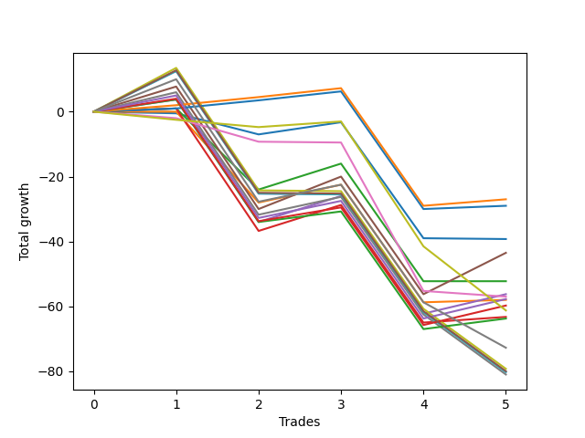

# Long Labrador 010 
- Symbol: ES
- Date Range: 03/18/2022 - 12/30/2022
- Trading Period: 8:30-12:30
- Number of Trades: 4



| Name | Win Percent | Profit | Avg Profit / Trade | Avg Time / Trade |      | Name | Win Percent | Profit | Avg Profit / Trade | Avg Time / Trade |
| ---- | ----------- | ------ | ------------------ | ---------------- | ---- | ---- | ----------- | ------ | ------------------ | ---------------- |
| Sorted By <br> Profit | | | | | | Sorted By <br> Win Percentage ||||
| BB-50 U/L 1SD SL-10 | 75.00 | 6250.00 | 1562.50 | 13:48 |     | TP-2 | 100.00 | 4625.00 | 1156.25 | 06:25 |
| TP-2 | 100.00 | 4625.00 | 1156.25 | 06:25 |     | TP-1 | 100.00 | 4000.00 | 1000.00 | 06:10 |
| TP-1 | 100.00 | 4000.00 | 1000.00 | 06:10 |     | BB-50 U/L 1SD SL-10 | 75.00 | 6250.00 | 1562.50 | 13:48 |
| V U/L 1SD SL-10 | 50.00 | 3125.00 | 781.25 | 28:13 |     | BB-50 Mid SL-10 | 75.00 | 2000.00 | 500.00 | 09:41 |
| BB-50 Mid SL-10 | 75.00 | 2000.00 | 500.00 | 09:41 |     | BB-100 Mid SL-10 | 75.00 | 1875.00 | 468.75 | 17:46 |
| BB-100 Mid SL-10 | 75.00 | 1875.00 | 468.75 | 17:46 |     | BB-20 U/L 2SD C SL-10 | 75.00 | 125.00 | 31.25 | 09:05 |
| BB-100 U/L 2SD SL-10 | 50.00 | 1750.00 | 437.50 | 40:00 |     | BB-20 U/L 2SD SL-10 | 75.00 | 125.00 | 31.25 | 08:58 |
| BB-50 U/L 2SD SL-10 | 50.00 | 1750.00 | 437.50 | 40:00 |     | BB-20 U/L 1SD SL-10 | 75.00 | -1875.00 | -468.75 | 08:20 |
| BB-200 U/L 2SD SL-10 | 50.00 | 500.00 | 125.00 | 47:22 |     | BB-20 U/L 2SD | 75.00 | -6875.00 | -1718.75 | 19:15 |
| BB-20 U/L 2SD C SL-10 | 75.00 | 125.00 | 31.25 | 09:05 |     | BB-50 U/L 1SD | 75.00 | -7125.00 | -1781.25 | 27:21 |
| BB-20 U/L 2SD SL-10 | 75.00 | 125.00 | 31.25 | 08:58 |     | TP-10 | 75.00 | -7875.00 | -1968.75 | 41:37 |
| BB-200 Mid SL-10 | 50.00 | -500.00 | -125.00 | 07:26 |     | TP-9 | 75.00 | -8750.00 | -2187.50 | 39:07 |
| BB-20 U/L 1SD SL-10 | 75.00 | -1875.00 | -468.75 | 08:20 |     | TP-8 | 75.00 | -9875.00 | -2468.75 | 36:56 |
| BB-20 Mid | 25.00 | -2000.00 | -500.00 | 08:43 |     | TP-6 | 75.00 | -9875.00 | -2468.75 | 25:00 |
| BB-20 Mid SL-10 | 25.00 | -4250.00 | -1062.50 | 07:20 |     | BB-20 U/L 1SD | 75.00 | -10375.00 | -2593.75 | 18:32 |
| BB-20 U/L 2SD | 75.00 | -6875.00 | -1718.75 | 19:15 |     | TP-7 | 75.00 | -10750.00 | -2687.50 | 36:47 |
| BB-50 U/L 1SD | 75.00 | -7125.00 | -1781.25 | 27:21 |     | TP-5 | 75.00 | -11375.00 | -2843.75 | 23:58 |
| TP-10 | 75.00 | -7875.00 | -1968.75 | 41:37 |     | BB-50 Mid | 75.00 | -11375.00 | -2843.75 | 23:13 |
| TP-9 | 75.00 | -8750.00 | -2187.50 | 39:07 |     | BB-100 Mid | 75.00 | -11500.00 | -2875.00 | 31:18 |
| TP-8 | 75.00 | -9875.00 | -2468.75 | 36:56 |     | TP-4 | 75.00 | -12750.00 | -3187.50 | 22:38 |
| TP-6 | 75.00 | -9875.00 | -2468.75 | 25:00 |     | BB-20 U/L 2SD C | 75.00 | -13250.00 | -3312.50 | 22:37 |
| V U/L 1SD | 50.00 | -10250.00 | -2562.50 | 41:46 |     | TP-3 | 75.00 | -13750.00 | -3437.50 | 21:47 |
| BB-20 U/L 1SD | 75.00 | -10375.00 | -2593.75 | 18:32 |     | V U/L 1SD SL-10 | 50.00 | 3125.00 | 781.25 | 28:13 |
| TP-7 | 75.00 | -10750.00 | -2687.50 | 36:47 |     | BB-100 U/L 2SD SL-10 | 50.00 | 1750.00 | 437.50 | 40:00 |
| TP-5 | 75.00 | -11375.00 | -2843.75 | 23:58 |     | BB-50 U/L 2SD SL-10 | 50.00 | 1750.00 | 437.50 | 40:00 |
| BB-50 Mid | 75.00 | -11375.00 | -2843.75 | 23:13 |     | BB-200 U/L 2SD SL-10 | 50.00 | 500.00 | 125.00 | 47:22 |
| BB-100 Mid | 75.00 | -11500.00 | -2875.00 | 31:18 |     | BB-200 Mid SL-10 | 50.00 | -500.00 | -125.00 | 07:26 |
| NEWFI 000 | 50.00 | -11500.00 | -2875.00 | 54:57 |     | V U/L 1SD | 50.00 | -10250.00 | -2562.50 | 41:46 |
| BB-100 U/L 2SD | 50.00 | -11625.00 | -2906.25 | 53:32 |     | NEWFI 000 | 50.00 | -11500.00 | -2875.00 | 54:57 |
| BB-50 U/L 2SD | 50.00 | -11625.00 | -2906.25 | 53:32 |     | BB-100 U/L 2SD | 50.00 | -11625.00 | -2906.25 | 53:32 |
| TP-4 | 75.00 | -12750.00 | -3187.50 | 22:38 |     | BB-50 U/L 2SD | 50.00 | -11625.00 | -2906.25 | 53:32 |
| BB-200 U/L 2SD | 50.00 | -12875.00 | -3218.75 | 60:55 |     | BB-200 U/L 2SD | 50.00 | -12875.00 | -3218.75 | 60:55 |
| BB-20 U/L 2SD C | 75.00 | -13250.00 | -3312.50 | 22:37 |     | BB-200 Mid | 50.00 | -13875.00 | -3468.75 | 20:58 |
| TP-3 | 75.00 | -13750.00 | -3437.50 | 21:47 |     | BB-20 Mid | 25.00 | -2000.00 | -500.00 | 08:43 |
| BB-200 Mid | 50.00 | -13875.00 | -3468.75 | 20:58 |     | BB-20 Mid SL-10 | 25.00 | -4250.00 | -1062.50 | 07:20 |

## NO STOPLOSS

### Test BB-20 Mid
* Sell when price hits the middle line of the 20p bollinger
* No Stoploss
* Results:
```
Total Trades: 4
Percent Up: 25.00
Percent Down: 75.00
Total Points Moved Up: -4.00
Potential Profit: -2000.00
Total Points Ups: 3.75 Count Ups: 1
Total Points Downs: -7.75 Count Downs: 3
```

<details><summary>Trades</summary>

<code>In: 2022-04-20 09:19:00		Out: 2022-04-20 09:30:50		Total Position Time: 11:50		Total Move Up: -0.50		Total to Date: -0.50</code> <br />
<code>In: 2022-05-11 09:37:00		Out: 2022-05-11 09:49:20		Total Position Time: 12:20		Total Move Up: -6.50		Total to Date: -7.00</code> <br />
<code>In: 2022-06-27 09:37:00		Out: 2022-06-27 09:41:05		Total Position Time: 04:05		Total Move Up: 3.75		Total to Date: -3.25</code> <br />
<code>In: 2022-10-17 11:29:00		Out: 2022-10-17 11:35:40		Total Position Time: 06:40		Total Move Up: -0.75		Total to Date: -4.00</code> <br />


</details>

### Test BB-20 U/L 1SD
* Sell when the price hits the upper line of the 20p 1std bollinger
* No Stoploss
* Results:
```
Total Trades: 4
Percent Up: 75.00
Percent Down: 25.00
Total Points Moved Up: -20.75
Potential Profit: -10375.00
Total Points Ups: 7.25 Count Ups: 3
Total Points Downs: -28.00 Count Downs: 1
```

<details><summary>Trades</summary>

<code>In: 2022-04-20 09:19:00		Out: 2022-04-20 09:31:05		Total Position Time: 12:05		Total Move Up: 0.00		Total to Date: 0.00</code> <br />
<code>In: 2022-05-11 09:37:00		Out: 2022-05-11 10:24:35		Total Position Time: 47:35		Total Move Up: -28.00		Total to Date: -28.00</code> <br />
<code>In: 2022-06-27 09:37:00		Out: 2022-06-27 09:44:20		Total Position Time: 07:20		Total Move Up: 5.50		Total to Date: -22.50</code> <br />
<code>In: 2022-10-17 11:29:00		Out: 2022-10-17 11:36:10		Total Position Time: 07:10		Total Move Up: 1.75		Total to Date: -20.75</code> <br />


</details>

### Test BB-20 U/L 2SD
* Sell when the price hits the upper line of the 20p 2std bollinger
* No Stoploss
* Results:
```
Total Trades: 4
Percent Up: 75.00
Percent Down: 25.00
Total Points Moved Up: -13.75
Potential Profit: -6875.00
Total Points Ups: 11.25 Count Ups: 3
Total Points Downs: -25.00 Count Downs: 1
```

<details><summary>Trades</summary>

<code>In: 2022-04-20 09:19:00		Out: 2022-04-20 09:31:35		Total Position Time: 12:35		Total Move Up: 1.00		Total to Date: 1.00</code> <br />
<code>In: 2022-05-11 09:37:00		Out: 2022-05-11 10:24:50		Total Position Time: 47:50		Total Move Up: -25.00		Total to Date: -24.00</code> <br />
<code>In: 2022-06-27 09:37:00		Out: 2022-06-27 09:45:05		Total Position Time: 08:05		Total Move Up: 8.00		Total to Date: -16.00</code> <br />
<code>In: 2022-10-17 11:29:00		Out: 2022-10-17 11:37:30		Total Position Time: 08:30		Total Move Up: 2.25		Total to Date: -13.75</code> <br />


</details>

### Test BB-20 U/L 2SD C
* Sell when the price hits the upper line of the 20p 2std bollinger
* No Stoploss
* Results:
```
Total Trades: 4
Percent Up: 75.00
Percent Down: 25.00
Total Points Moved Up: -26.50
Potential Profit: -13250.00
Total Points Ups: 11.25 Count Ups: 3
Total Points Downs: -37.75 Count Downs: 1
```

<details><summary>Trades</summary>

<code>In: 2022-04-20 09:19:00		Out: 2022-04-20 09:31:35		Total Position Time: 12:35		Total Move Up: 1.00		Total to Date: 1.00</code> <br />
<code>In: 2022-05-11 09:37:00		Out: 2022-05-11 10:37:55		Total Position Time: 60:55		Total Move Up: -37.75		Total to Date: -36.75</code> <br />
<code>In: 2022-06-27 09:37:00		Out: 2022-06-27 09:45:05		Total Position Time: 08:05		Total Move Up: 8.00		Total to Date: -28.75</code> <br />
<code>In: 2022-10-17 11:29:00		Out: 2022-10-17 11:37:55		Total Position Time: 08:55		Total Move Up: 2.25		Total to Date: -26.50</code> <br />


</details>

### Test BB-50 Mid
* Sell when price hits the middle line of the 50p bollinger
* No Stoploss
* Results:
```
Total Trades: 4
Percent Up: 75.00
Percent Down: 25.00
Total Points Moved Up: -22.75
Potential Profit: -11375.00
Total Points Ups: 15.00 Count Ups: 3
Total Points Downs: -37.75 Count Downs: 1
```

<details><summary>Trades</summary>

<code>In: 2022-04-20 09:19:00		Out: 2022-04-20 09:32:40		Total Position Time: 13:40		Total Move Up: 3.75		Total to Date: 3.75</code> <br />
<code>In: 2022-05-11 09:37:00		Out: 2022-05-11 10:37:55		Total Position Time: 60:55		Total Move Up: -37.75		Total to Date: -34.00</code> <br />
<code>In: 2022-06-27 09:37:00		Out: 2022-06-27 09:45:05		Total Position Time: 08:05		Total Move Up: 8.00		Total to Date: -26.00</code> <br />
<code>In: 2022-10-17 11:29:00		Out: 2022-10-17 11:39:15		Total Position Time: 10:15		Total Move Up: 3.25		Total to Date: -22.75</code> <br />


</details>

### Test BB-50 U/L 1SD
* Sell when the price hits the upper line of the 50p 1std bollinger
* No Stoploss
* Results:
```
Total Trades: 4
Percent Up: 75.00
Percent Down: 25.00
Total Points Moved Up: -14.25
Potential Profit: -7125.00
Total Points Ups: 23.50 Count Ups: 3
Total Points Downs: -37.75 Count Downs: 1
```

<details><summary>Trades</summary>

<code>In: 2022-04-20 09:19:00		Out: 2022-04-20 09:36:50		Total Position Time: 17:50		Total Move Up: 7.75		Total to Date: 7.75</code> <br />
<code>In: 2022-05-11 09:37:00		Out: 2022-05-11 10:37:55		Total Position Time: 60:55		Total Move Up: -37.75		Total to Date: -30.00</code> <br />
<code>In: 2022-06-27 09:37:00		Out: 2022-06-27 09:53:20		Total Position Time: 16:20		Total Move Up: 10.00		Total to Date: -20.00</code> <br />
<code>In: 2022-10-17 11:29:00		Out: 2022-10-17 11:43:20		Total Position Time: 14:20		Total Move Up: 5.75		Total to Date: -14.25</code> <br />


</details>

### Test BB-50 U/L 2SD
* Sell when the price hits the upper line of the 50p 2std bollinger
* No Stoploss
* Results:
```
Total Trades: 4
Percent Up: 50.00
Percent Down: 50.00
Total Points Moved Up: -23.25
Potential Profit: -11625.00
Total Points Ups: 14.75 Count Ups: 2
Total Points Downs: -38.00 Count Downs: 2
```

<details><summary>Trades</summary>

<code>In: 2022-04-20 09:19:00		Out: 2022-04-20 09:50:25		Total Position Time: 31:25		Total Move Up: 12.50		Total to Date: 12.50</code> <br />
<code>In: 2022-05-11 09:37:00		Out: 2022-05-11 10:37:55		Total Position Time: 60:55		Total Move Up: -37.75		Total to Date: -25.25</code> <br />
<code>In: 2022-06-27 09:37:00		Out: 2022-06-27 10:37:55		Total Position Time: 60:55		Total Move Up: -0.25		Total to Date: -25.50</code> <br />
<code>In: 2022-10-17 11:29:00		Out: 2022-10-17 12:29:55		Total Position Time: 60:55		Total Move Up: 2.25		Total to Date: -23.25</code> <br />


</details>

### Test V U/L 1SD
* Sell when the price hits the upper line of the 1std VWAP
* No Stoploss
* Results:
```
Total Trades: 4
Percent Up: 50.00
Percent Down: 50.00
Total Points Moved Up: -20.50
Potential Profit: -10250.00
Total Points Ups: 17.50 Count Ups: 2
Total Points Downs: -38.00 Count Downs: 2
```

<details><summary>Trades</summary>

<code>In: 2022-04-20 09:19:00		Out: 2022-04-20 09:52:35		Total Position Time: 33:35		Total Move Up: 13.50		Total to Date: 13.50</code> <br />
<code>In: 2022-05-11 09:37:00		Out: 2022-05-11 10:37:55		Total Position Time: 60:55		Total Move Up: -37.75		Total to Date: -24.25</code> <br />
<code>In: 2022-06-27 09:37:00		Out: 2022-06-27 10:37:55		Total Position Time: 60:55		Total Move Up: -0.25		Total to Date: -24.50</code> <br />
<code>In: 2022-10-17 11:29:00		Out: 2022-10-17 11:40:40		Total Position Time: 11:40		Total Move Up: 4.00		Total to Date: -20.50</code> <br />


</details>

### Test BB-100 Mid
* Move to BB100 Mid
* No Stoploss
* Results:
```
Total Trades: 4
Percent Up: 75.00
Percent Down: 25.00
Total Points Moved Up: -23.00
Potential Profit: -11500.00
Total Points Ups: 14.75 Count Ups: 3
Total Points Downs: -37.75 Count Downs: 1
```

<details><summary>Trades</summary>

<code>In: 2022-04-20 09:19:00		Out: 2022-04-20 09:33:05		Total Position Time: 14:05		Total Move Up: 5.00		Total to Date: 5.00</code> <br />
<code>In: 2022-05-11 09:37:00		Out: 2022-05-11 10:37:55		Total Position Time: 60:55		Total Move Up: -37.75		Total to Date: -32.75</code> <br />
<code>In: 2022-06-27 09:37:00		Out: 2022-06-27 10:20:05		Total Position Time: 43:05		Total Move Up: 8.00		Total to Date: -24.75</code> <br />
<code>In: 2022-10-17 11:29:00		Out: 2022-10-17 11:36:10		Total Position Time: 07:10		Total Move Up: 1.75		Total to Date: -23.00</code> <br />


</details>

### Test BB-100 U/L 2SD
* Move to BB100 Upper Band
* No Stoploss
* Results:
```
Total Trades: 4
Percent Up: 50.00
Percent Down: 50.00
Total Points Moved Up: -23.25
Potential Profit: -11625.00
Total Points Ups: 14.75 Count Ups: 2
Total Points Downs: -38.00 Count Downs: 2
```

<details><summary>Trades</summary>

<code>In: 2022-04-20 09:19:00		Out: 2022-04-20 09:50:25		Total Position Time: 31:25		Total Move Up: 12.50		Total to Date: 12.50</code> <br />
<code>In: 2022-05-11 09:37:00		Out: 2022-05-11 10:37:55		Total Position Time: 60:55		Total Move Up: -37.75		Total to Date: -25.25</code> <br />
<code>In: 2022-06-27 09:37:00		Out: 2022-06-27 10:37:55		Total Position Time: 60:55		Total Move Up: -0.25		Total to Date: -25.50</code> <br />
<code>In: 2022-10-17 11:29:00		Out: 2022-10-17 12:29:55		Total Position Time: 60:55		Total Move Up: 2.25		Total to Date: -23.25</code> <br />


</details>

### Test BB-200 Mid
* Move to BB200 Mid
* No Stoploss
* Results:
```
Total Trades: 4
Percent Up: 50.00
Percent Down: 50.00
Total Points Moved Up: -27.75
Potential Profit: -13875.00
Total Points Ups: 10.75 Count Ups: 2
Total Points Downs: -38.50 Count Downs: 2
```

<details><summary>Trades</summary>

<code>In: 2022-04-20 09:19:00		Out: 2022-04-20 09:32:40		Total Position Time: 13:40		Total Move Up: 3.75		Total to Date: 3.75</code> <br />
<code>In: 2022-05-11 09:37:00		Out: 2022-05-11 10:37:55		Total Position Time: 60:55		Total Move Up: -37.75		Total to Date: -34.00</code> <br />
<code>In: 2022-06-27 09:37:00		Out: 2022-06-27 09:45:00		Total Position Time: 08:00		Total Move Up: 7.00		Total to Date: -27.00</code> <br />
<code>In: 2022-10-17 11:29:00		Out: 2022-10-17 11:30:20		Total Position Time: 01:20		Total Move Up: -0.75		Total to Date: -27.75</code> <br />


</details>

### Test BB-200 U/L 2SD
* Move to BB200 Upper Band
* No Stoploss
* Results:
```
Total Trades: 4
Percent Up: 50.00
Percent Down: 50.00
Total Points Moved Up: -25.75
Potential Profit: -12875.00
Total Points Ups: 12.25 Count Ups: 2
Total Points Downs: -38.00 Count Downs: 2
```

<details><summary>Trades</summary>

<code>In: 2022-04-20 09:19:00		Out: 2022-04-20 10:19:55		Total Position Time: 60:55		Total Move Up: 10.00		Total to Date: 10.00</code> <br />
<code>In: 2022-05-11 09:37:00		Out: 2022-05-11 10:37:55		Total Position Time: 60:55		Total Move Up: -37.75		Total to Date: -27.75</code> <br />
<code>In: 2022-06-27 09:37:00		Out: 2022-06-27 10:37:55		Total Position Time: 60:55		Total Move Up: -0.25		Total to Date: -28.00</code> <br />
<code>In: 2022-10-17 11:29:00		Out: 2022-10-17 12:29:55		Total Position Time: 60:55		Total Move Up: 2.25		Total to Date: -25.75</code> <br />


</details>

## STOPLOSS OF 10

### Test BB-20 Mid SL-10
* Sell when price hits the middle line of the 20p bollinger
* Stoploss is 10 points
* Results:
```
Total Trades: 4
Percent Up: 25.00
Percent Down: 75.00
Total Points Moved Up: -8.50
Potential Profit: -4250.00
Total Points Ups: 3.75 Count Ups: 1
Total Points Downs: -12.25 Count Downs: 3
```

<details><summary>Trades</summary>

<code>In: 2022-04-20 09:19:00		Out: 2022-04-20 09:30:50		Total Position Time: 11:50		Total Move Up: -0.50		Total to Date: -0.50</code> <br />
<code>In: 2022-05-11 09:37:00		Out: 2022-05-11 09:43:45		Total Position Time: 06:45		Total Move Up: -11.00		Total to Date: -11.50</code> <br />
<code>In: 2022-06-27 09:37:00		Out: 2022-06-27 09:41:05		Total Position Time: 04:05		Total Move Up: 3.75		Total to Date: -7.75</code> <br />
<code>In: 2022-10-17 11:29:00		Out: 2022-10-17 11:35:40		Total Position Time: 06:40		Total Move Up: -0.75		Total to Date: -8.50</code> <br />


</details>

### Test BB-20 U/L 1SD SL-10
* Sell when the price hits the upper line of the 20p 1std bollinger
* Stoploss is 10 points
* Results:
```
Total Trades: 4
Percent Up: 75.00
Percent Down: 25.00
Total Points Moved Up: -3.75
Potential Profit: -1875.00
Total Points Ups: 7.25 Count Ups: 3
Total Points Downs: -11.00 Count Downs: 1
```

<details><summary>Trades</summary>

<code>In: 2022-04-20 09:19:00		Out: 2022-04-20 09:31:05		Total Position Time: 12:05		Total Move Up: 0.00		Total to Date: 0.00</code> <br />
<code>In: 2022-05-11 09:37:00		Out: 2022-05-11 09:43:45		Total Position Time: 06:45		Total Move Up: -11.00		Total to Date: -11.00</code> <br />
<code>In: 2022-06-27 09:37:00		Out: 2022-06-27 09:44:20		Total Position Time: 07:20		Total Move Up: 5.50		Total to Date: -5.50</code> <br />
<code>In: 2022-10-17 11:29:00		Out: 2022-10-17 11:36:10		Total Position Time: 07:10		Total Move Up: 1.75		Total to Date: -3.75</code> <br />


</details>

### Test BB-20 U/L 2SD SL-10
* Sell when the price hits the upper line of the 20p 2std bollinger
* Stoploss is 10 points
* Results:
```
Total Trades: 4
Percent Up: 75.00
Percent Down: 25.00
Total Points Moved Up: 0.25
Potential Profit: 125.00
Total Points Ups: 11.25 Count Ups: 3
Total Points Downs: -11.00 Count Downs: 1
```

<details><summary>Trades</summary>

<code>In: 2022-04-20 09:19:00		Out: 2022-04-20 09:31:35		Total Position Time: 12:35		Total Move Up: 1.00		Total to Date: 1.00</code> <br />
<code>In: 2022-05-11 09:37:00		Out: 2022-05-11 09:43:45		Total Position Time: 06:45		Total Move Up: -11.00		Total to Date: -10.00</code> <br />
<code>In: 2022-06-27 09:37:00		Out: 2022-06-27 09:45:05		Total Position Time: 08:05		Total Move Up: 8.00		Total to Date: -2.00</code> <br />
<code>In: 2022-10-17 11:29:00		Out: 2022-10-17 11:37:30		Total Position Time: 08:30		Total Move Up: 2.25		Total to Date: 0.25</code> <br />


</details>

### Test BB-20 U/L 2SD C SL-10
* Sell when the price hits the upper line of the 20p 2std bollinger
* Stoploss is 10 points
* Results:
```
Total Trades: 4
Percent Up: 75.00
Percent Down: 25.00
Total Points Moved Up: 0.25
Potential Profit: 125.00
Total Points Ups: 11.25 Count Ups: 3
Total Points Downs: -11.00 Count Downs: 1
```

<details><summary>Trades</summary>

<code>In: 2022-04-20 09:19:00		Out: 2022-04-20 09:31:35		Total Position Time: 12:35		Total Move Up: 1.00		Total to Date: 1.00</code> <br />
<code>In: 2022-05-11 09:37:00		Out: 2022-05-11 09:43:45		Total Position Time: 06:45		Total Move Up: -11.00		Total to Date: -10.00</code> <br />
<code>In: 2022-06-27 09:37:00		Out: 2022-06-27 09:45:05		Total Position Time: 08:05		Total Move Up: 8.00		Total to Date: -2.00</code> <br />
<code>In: 2022-10-17 11:29:00		Out: 2022-10-17 11:37:55		Total Position Time: 08:55		Total Move Up: 2.25		Total to Date: 0.25</code> <br />


</details>

### Test BB-50 Mid SL-10
* Sell when price hits the middle line of the 50p bollinger
* Stoploss is 10 points
* Results:
```
Total Trades: 4
Percent Up: 75.00
Percent Down: 25.00
Total Points Moved Up: 4.00
Potential Profit: 2000.00
Total Points Ups: 15.00 Count Ups: 3
Total Points Downs: -11.00 Count Downs: 1
```

<details><summary>Trades</summary>

<code>In: 2022-04-20 09:19:00		Out: 2022-04-20 09:32:40		Total Position Time: 13:40		Total Move Up: 3.75		Total to Date: 3.75</code> <br />
<code>In: 2022-05-11 09:37:00		Out: 2022-05-11 09:43:45		Total Position Time: 06:45		Total Move Up: -11.00		Total to Date: -7.25</code> <br />
<code>In: 2022-06-27 09:37:00		Out: 2022-06-27 09:45:05		Total Position Time: 08:05		Total Move Up: 8.00		Total to Date: 0.75</code> <br />
<code>In: 2022-10-17 11:29:00		Out: 2022-10-17 11:39:15		Total Position Time: 10:15		Total Move Up: 3.25		Total to Date: 4.00</code> <br />


</details>

### Test BB-50 U/L 1SD SL-10
* Sell when the price hits the upper line of the 50p 1std bollinger
* Stoploss is 10 points
* Results:
```
Total Trades: 4
Percent Up: 75.00
Percent Down: 25.00
Total Points Moved Up: 12.50
Potential Profit: 6250.00
Total Points Ups: 23.50 Count Ups: 3
Total Points Downs: -11.00 Count Downs: 1
```

<details><summary>Trades</summary>

<code>In: 2022-04-20 09:19:00		Out: 2022-04-20 09:36:50		Total Position Time: 17:50		Total Move Up: 7.75		Total to Date: 7.75</code> <br />
<code>In: 2022-05-11 09:37:00		Out: 2022-05-11 09:43:45		Total Position Time: 06:45		Total Move Up: -11.00		Total to Date: -3.25</code> <br />
<code>In: 2022-06-27 09:37:00		Out: 2022-06-27 09:53:20		Total Position Time: 16:20		Total Move Up: 10.00		Total to Date: 6.75</code> <br />
<code>In: 2022-10-17 11:29:00		Out: 2022-10-17 11:43:20		Total Position Time: 14:20		Total Move Up: 5.75		Total to Date: 12.50</code> <br />


</details>

### Test BB-50 U/L 2SD SL-10
* Sell when the price hits the upper line of the 50p 2std bollinger
* Stoploss is 10 points
* Results:
```
Total Trades: 4
Percent Up: 50.00
Percent Down: 50.00
Total Points Moved Up: 3.50
Potential Profit: 1750.00
Total Points Ups: 14.75 Count Ups: 2
Total Points Downs: -11.25 Count Downs: 2
```

<details><summary>Trades</summary>

<code>In: 2022-04-20 09:19:00		Out: 2022-04-20 09:50:25		Total Position Time: 31:25		Total Move Up: 12.50		Total to Date: 12.50</code> <br />
<code>In: 2022-05-11 09:37:00		Out: 2022-05-11 09:43:45		Total Position Time: 06:45		Total Move Up: -11.00		Total to Date: 1.50</code> <br />
<code>In: 2022-06-27 09:37:00		Out: 2022-06-27 10:37:55		Total Position Time: 60:55		Total Move Up: -0.25		Total to Date: 1.25</code> <br />
<code>In: 2022-10-17 11:29:00		Out: 2022-10-17 12:29:55		Total Position Time: 60:55		Total Move Up: 2.25		Total to Date: 3.50</code> <br />


</details>

### Test V U/L 1SD SL-10
* Sell when the price hits the upper line of the 1std VWAP
* Stoploss is 10 points
* Results:
```
Total Trades: 4
Percent Up: 50.00
Percent Down: 50.00
Total Points Moved Up: 6.25
Potential Profit: 3125.00
Total Points Ups: 17.50 Count Ups: 2
Total Points Downs: -11.25 Count Downs: 2
```

<details><summary>Trades</summary>

<code>In: 2022-04-20 09:19:00		Out: 2022-04-20 09:52:35		Total Position Time: 33:35		Total Move Up: 13.50		Total to Date: 13.50</code> <br />
<code>In: 2022-05-11 09:37:00		Out: 2022-05-11 09:43:45		Total Position Time: 06:45		Total Move Up: -11.00		Total to Date: 2.50</code> <br />
<code>In: 2022-06-27 09:37:00		Out: 2022-06-27 10:37:55		Total Position Time: 60:55		Total Move Up: -0.25		Total to Date: 2.25</code> <br />
<code>In: 2022-10-17 11:29:00		Out: 2022-10-17 11:40:40		Total Position Time: 11:40		Total Move Up: 4.00		Total to Date: 6.25</code> <br />


</details>

### Test BB-100 Mid SL-10
* Move to BB100 Mid
* Stoploss is 10 points
* Results:
```
Total Trades: 4
Percent Up: 75.00
Percent Down: 25.00
Total Points Moved Up: 3.75
Potential Profit: 1875.00
Total Points Ups: 14.75 Count Ups: 3
Total Points Downs: -11.00 Count Downs: 1
```

<details><summary>Trades</summary>

<code>In: 2022-04-20 09:19:00		Out: 2022-04-20 09:33:05		Total Position Time: 14:05		Total Move Up: 5.00		Total to Date: 5.00</code> <br />
<code>In: 2022-05-11 09:37:00		Out: 2022-05-11 09:43:45		Total Position Time: 06:45		Total Move Up: -11.00		Total to Date: -6.00</code> <br />
<code>In: 2022-06-27 09:37:00		Out: 2022-06-27 10:20:05		Total Position Time: 43:05		Total Move Up: 8.00		Total to Date: 2.00</code> <br />
<code>In: 2022-10-17 11:29:00		Out: 2022-10-17 11:36:10		Total Position Time: 07:10		Total Move Up: 1.75		Total to Date: 3.75</code> <br />


</details>

### Test BB-100 U/L 2SD SL-10
* Move to BB100 Upper Band
* Stoploss is 10 points
* Results:
```
Total Trades: 4
Percent Up: 50.00
Percent Down: 50.00
Total Points Moved Up: 3.50
Potential Profit: 1750.00
Total Points Ups: 14.75 Count Ups: 2
Total Points Downs: -11.25 Count Downs: 2
```

<details><summary>Trades</summary>

<code>In: 2022-04-20 09:19:00		Out: 2022-04-20 09:50:25		Total Position Time: 31:25		Total Move Up: 12.50		Total to Date: 12.50</code> <br />
<code>In: 2022-05-11 09:37:00		Out: 2022-05-11 09:43:45		Total Position Time: 06:45		Total Move Up: -11.00		Total to Date: 1.50</code> <br />
<code>In: 2022-06-27 09:37:00		Out: 2022-06-27 10:37:55		Total Position Time: 60:55		Total Move Up: -0.25		Total to Date: 1.25</code> <br />
<code>In: 2022-10-17 11:29:00		Out: 2022-10-17 12:29:55		Total Position Time: 60:55		Total Move Up: 2.25		Total to Date: 3.50</code> <br />


</details>

### Test BB-200 Mid SL-10
* Move to BB200 Mid
* Stoploss is 10 points
* Results:
```
Total Trades: 4
Percent Up: 50.00
Percent Down: 50.00
Total Points Moved Up: -1.00
Potential Profit: -500.00
Total Points Ups: 10.75 Count Ups: 2
Total Points Downs: -11.75 Count Downs: 2
```

<details><summary>Trades</summary>

<code>In: 2022-04-20 09:19:00		Out: 2022-04-20 09:32:40		Total Position Time: 13:40		Total Move Up: 3.75		Total to Date: 3.75</code> <br />
<code>In: 2022-05-11 09:37:00		Out: 2022-05-11 09:43:45		Total Position Time: 06:45		Total Move Up: -11.00		Total to Date: -7.25</code> <br />
<code>In: 2022-06-27 09:37:00		Out: 2022-06-27 09:45:00		Total Position Time: 08:00		Total Move Up: 7.00		Total to Date: -0.25</code> <br />
<code>In: 2022-10-17 11:29:00		Out: 2022-10-17 11:30:20		Total Position Time: 01:20		Total Move Up: -0.75		Total to Date: -1.00</code> <br />


</details>

### Test BB-200 U/L 2SD SL-10
* Move to BB200 Upper Band
* Stoploss is 10 points
* Results:
```
Total Trades: 4
Percent Up: 50.00
Percent Down: 50.00
Total Points Moved Up: 1.00
Potential Profit: 500.00
Total Points Ups: 12.25 Count Ups: 2
Total Points Downs: -11.25 Count Downs: 2
```

<details><summary>Trades</summary>

<code>In: 2022-04-20 09:19:00		Out: 2022-04-20 10:19:55		Total Position Time: 60:55		Total Move Up: 10.00		Total to Date: 10.00</code> <br />
<code>In: 2022-05-11 09:37:00		Out: 2022-05-11 09:43:45		Total Position Time: 06:45		Total Move Up: -11.00		Total to Date: -1.00</code> <br />
<code>In: 2022-06-27 09:37:00		Out: 2022-06-27 10:37:55		Total Position Time: 60:55		Total Move Up: -0.25		Total to Date: -1.25</code> <br />
<code>In: 2022-10-17 11:29:00		Out: 2022-10-17 12:29:55		Total Position Time: 60:55		Total Move Up: 2.25		Total to Date: 1.00</code> <br />


</details>

## TAKE PROFIT

### Test TP-1
* Take Profit of 1 Point
* No Stoploss
* Results:
```
Total Trades: 4
Percent Up: 100.00
Percent Down: 0.00
Total Points Moved Up: 8.00
Potential Profit: 4000.00
Total Points Ups: 8.00 Count Ups: 4
Total Points Downs: 0.00 Count Downs: 0
```

<details><summary>Trades</summary>

<code>In: 2022-04-20 09:19:00		Out: 2022-04-20 09:31:35		Total Position Time: 12:35		Total Move Up: 1.00		Total to Date: 1.00</code> <br />
<code>In: 2022-05-11 09:37:00		Out: 2022-05-11 09:40:45		Total Position Time: 03:45		Total Move Up: 2.50		Total to Date: 3.50</code> <br />
<code>In: 2022-06-27 09:37:00		Out: 2022-06-27 09:38:10		Total Position Time: 01:10		Total Move Up: 2.75		Total to Date: 6.25</code> <br />
<code>In: 2022-10-17 11:29:00		Out: 2022-10-17 11:36:10		Total Position Time: 07:10		Total Move Up: 1.75		Total to Date: 8.00</code> <br />


</details>

### Test TP-2
* Take Profit of 2 Point
* No Stoploss
* Results:
```
Total Trades: 4
Percent Up: 100.00
Percent Down: 0.00
Total Points Moved Up: 9.25
Potential Profit: 4625.00
Total Points Ups: 9.25 Count Ups: 4
Total Points Downs: 0.00 Count Downs: 0
```

<details><summary>Trades</summary>

<code>In: 2022-04-20 09:19:00		Out: 2022-04-20 09:32:30		Total Position Time: 13:30		Total Move Up: 2.00		Total to Date: 2.00</code> <br />
<code>In: 2022-05-11 09:37:00		Out: 2022-05-11 09:40:45		Total Position Time: 03:45		Total Move Up: 2.50		Total to Date: 4.50</code> <br />
<code>In: 2022-06-27 09:37:00		Out: 2022-06-27 09:38:10		Total Position Time: 01:10		Total Move Up: 2.75		Total to Date: 7.25</code> <br />
<code>In: 2022-10-17 11:29:00		Out: 2022-10-17 11:36:15		Total Position Time: 07:15		Total Move Up: 2.00		Total to Date: 9.25</code> <br />


</details>

### Test TP-3
* Take Profit of 3 Point
* No Stoploss
* Results:
```
Total Trades: 4
Percent Up: 75.00
Percent Down: 25.00
Total Points Moved Up: -27.50
Potential Profit: -13750.00
Total Points Ups: 10.25 Count Ups: 3
Total Points Downs: -37.75 Count Downs: 1
```

<details><summary>Trades</summary>

<code>In: 2022-04-20 09:19:00		Out: 2022-04-20 09:32:40		Total Position Time: 13:40		Total Move Up: 3.75		Total to Date: 3.75</code> <br />
<code>In: 2022-05-11 09:37:00		Out: 2022-05-11 10:37:55		Total Position Time: 60:55		Total Move Up: -37.75		Total to Date: -34.00</code> <br />
<code>In: 2022-06-27 09:37:00		Out: 2022-06-27 09:39:20		Total Position Time: 02:20		Total Move Up: 3.25		Total to Date: -30.75</code> <br />
<code>In: 2022-10-17 11:29:00		Out: 2022-10-17 11:39:15		Total Position Time: 10:15		Total Move Up: 3.25		Total to Date: -27.50</code> <br />


</details>

### Test TP-4
* Take Profit of 4 Point
* No Stoploss
* Results:
```
Total Trades: 4
Percent Up: 75.00
Percent Down: 25.00
Total Points Moved Up: -25.50
Potential Profit: -12750.00
Total Points Ups: 12.25 Count Ups: 3
Total Points Downs: -37.75 Count Downs: 1
```

<details><summary>Trades</summary>

<code>In: 2022-04-20 09:19:00		Out: 2022-04-20 09:32:50		Total Position Time: 13:50		Total Move Up: 4.00		Total to Date: 4.00</code> <br />
<code>In: 2022-05-11 09:37:00		Out: 2022-05-11 10:37:55		Total Position Time: 60:55		Total Move Up: -37.75		Total to Date: -33.75</code> <br />
<code>In: 2022-06-27 09:37:00		Out: 2022-06-27 09:41:10		Total Position Time: 04:10		Total Move Up: 4.25		Total to Date: -29.50</code> <br />
<code>In: 2022-10-17 11:29:00		Out: 2022-10-17 11:40:40		Total Position Time: 11:40		Total Move Up: 4.00		Total to Date: -25.50</code> <br />


</details>

### Test TP-5
* Take Profit of 5 Point
* No Stoploss
* Results:
```
Total Trades: 4
Percent Up: 75.00
Percent Down: 25.00
Total Points Moved Up: -22.75
Potential Profit: -11375.00
Total Points Ups: 15.00 Count Ups: 3
Total Points Downs: -37.75 Count Downs: 1
```

<details><summary>Trades</summary>

<code>In: 2022-04-20 09:19:00		Out: 2022-04-20 09:33:05		Total Position Time: 14:05		Total Move Up: 5.00		Total to Date: 5.00</code> <br />
<code>In: 2022-05-11 09:37:00		Out: 2022-05-11 10:37:55		Total Position Time: 60:55		Total Move Up: -37.75		Total to Date: -32.75</code> <br />
<code>In: 2022-06-27 09:37:00		Out: 2022-06-27 09:44:15		Total Position Time: 07:15		Total Move Up: 5.25		Total to Date: -27.50</code> <br />
<code>In: 2022-10-17 11:29:00		Out: 2022-10-17 11:42:40		Total Position Time: 13:40		Total Move Up: 4.75		Total to Date: -22.75</code> <br />


</details>

### Test TP-6
* Take Profit of 6 Point
* No Stoploss
* Results:
```
Total Trades: 4
Percent Up: 75.00
Percent Down: 25.00
Total Points Moved Up: -19.75
Potential Profit: -9875.00
Total Points Ups: 18.00 Count Ups: 3
Total Points Downs: -37.75 Count Downs: 1
```

<details><summary>Trades</summary>

<code>In: 2022-04-20 09:19:00		Out: 2022-04-20 09:35:50		Total Position Time: 16:50		Total Move Up: 6.00		Total to Date: 6.00</code> <br />
<code>In: 2022-05-11 09:37:00		Out: 2022-05-11 10:37:55		Total Position Time: 60:55		Total Move Up: -37.75		Total to Date: -31.75</code> <br />
<code>In: 2022-06-27 09:37:00		Out: 2022-06-27 09:44:55		Total Position Time: 07:55		Total Move Up: 6.25		Total to Date: -25.50</code> <br />
<code>In: 2022-10-17 11:29:00		Out: 2022-10-17 11:43:20		Total Position Time: 14:20		Total Move Up: 5.75		Total to Date: -19.75</code> <br />


</details>

### Test TP-7
* Take Profit of 7 Point
* No Stoploss
* Results:
```
Total Trades: 4
Percent Up: 75.00
Percent Down: 25.00
Total Points Moved Up: -21.50
Potential Profit: -10750.00
Total Points Ups: 16.25 Count Ups: 3
Total Points Downs: -37.75 Count Downs: 1
```

<details><summary>Trades</summary>

<code>In: 2022-04-20 09:19:00		Out: 2022-04-20 09:36:20		Total Position Time: 17:20		Total Move Up: 7.00		Total to Date: 7.00</code> <br />
<code>In: 2022-05-11 09:37:00		Out: 2022-05-11 10:37:55		Total Position Time: 60:55		Total Move Up: -37.75		Total to Date: -30.75</code> <br />
<code>In: 2022-06-27 09:37:00		Out: 2022-06-27 09:45:00		Total Position Time: 08:00		Total Move Up: 7.00		Total to Date: -23.75</code> <br />
<code>In: 2022-10-17 11:29:00		Out: 2022-10-17 12:29:55		Total Position Time: 60:55		Total Move Up: 2.25		Total to Date: -21.50</code> <br />


</details>

### Test TP-8
* Take Profit of 8 Point
* No Stoploss
* Results:
```
Total Trades: 4
Percent Up: 75.00
Percent Down: 25.00
Total Points Moved Up: -19.75
Potential Profit: -9875.00
Total Points Ups: 18.00 Count Ups: 3
Total Points Downs: -37.75 Count Downs: 1
```

<details><summary>Trades</summary>

<code>In: 2022-04-20 09:19:00		Out: 2022-04-20 09:36:50		Total Position Time: 17:50		Total Move Up: 7.75		Total to Date: 7.75</code> <br />
<code>In: 2022-05-11 09:37:00		Out: 2022-05-11 10:37:55		Total Position Time: 60:55		Total Move Up: -37.75		Total to Date: -30.00</code> <br />
<code>In: 2022-06-27 09:37:00		Out: 2022-06-27 09:45:05		Total Position Time: 08:05		Total Move Up: 8.00		Total to Date: -22.00</code> <br />
<code>In: 2022-10-17 11:29:00		Out: 2022-10-17 12:29:55		Total Position Time: 60:55		Total Move Up: 2.25		Total to Date: -19.75</code> <br />


</details>

### Test TP-9
* Take Profit of 9 Point
* No Stoploss
* Results:
```
Total Trades: 4
Percent Up: 75.00
Percent Down: 25.00
Total Points Moved Up: -17.50
Potential Profit: -8750.00
Total Points Ups: 20.25 Count Ups: 3
Total Points Downs: -37.75 Count Downs: 1
```

<details><summary>Trades</summary>

<code>In: 2022-04-20 09:19:00		Out: 2022-04-20 09:38:05		Total Position Time: 19:05		Total Move Up: 9.00		Total to Date: 9.00</code> <br />
<code>In: 2022-05-11 09:37:00		Out: 2022-05-11 10:37:55		Total Position Time: 60:55		Total Move Up: -37.75		Total to Date: -28.75</code> <br />
<code>In: 2022-06-27 09:37:00		Out: 2022-06-27 09:52:35		Total Position Time: 15:35		Total Move Up: 9.00		Total to Date: -19.75</code> <br />
<code>In: 2022-10-17 11:29:00		Out: 2022-10-17 12:29:55		Total Position Time: 60:55		Total Move Up: 2.25		Total to Date: -17.50</code> <br />


</details>

### Test TP-10
* Take Profit of 10 Point
* No Stoploss
* Results:
```
Total Trades: 4
Percent Up: 75.00
Percent Down: 25.00
Total Points Moved Up: -15.75
Potential Profit: -7875.00
Total Points Ups: 22.00 Count Ups: 3
Total Points Downs: -37.75 Count Downs: 1
```

<details><summary>Trades</summary>

<code>In: 2022-04-20 09:19:00		Out: 2022-04-20 09:47:20		Total Position Time: 28:20		Total Move Up: 9.75		Total to Date: 9.75</code> <br />
<code>In: 2022-05-11 09:37:00		Out: 2022-05-11 10:37:55		Total Position Time: 60:55		Total Move Up: -37.75		Total to Date: -28.00</code> <br />
<code>In: 2022-06-27 09:37:00		Out: 2022-06-27 09:53:20		Total Position Time: 16:20		Total Move Up: 10.00		Total to Date: -18.00</code> <br />
<code>In: 2022-10-17 11:29:00		Out: 2022-10-17 12:29:55		Total Position Time: 60:55		Total Move Up: 2.25		Total to Date: -15.75</code> <br />


</details>

## Indicator Exits

### Test NEWFI 000
* Newfi 0000
* No Stoploss
* Results:
```
Total Trades: 4
Percent Up: 50.00
Percent Down: 50.00
Total Points Moved Up: -23.00
Potential Profit: -11500.00
Total Points Ups: 15.00 Count Ups: 2
Total Points Downs: -38.00 Count Downs: 2
```

<details><summary>Trades</summary>

<code>In: 2022-04-20 09:19:00		Out: 2022-04-20 09:56:05		Total Position Time: 37:05		Total Move Up: 12.75		Total to Date: 12.75</code> <br />
<code>In: 2022-05-11 09:37:00		Out: 2022-05-11 10:37:55		Total Position Time: 60:55		Total Move Up: -37.75		Total to Date: -25.00</code> <br />
<code>In: 2022-06-27 09:37:00		Out: 2022-06-27 10:37:55		Total Position Time: 60:55		Total Move Up: -0.25		Total to Date: -25.25</code> <br />
<code>In: 2022-10-17 11:29:00		Out: 2022-10-17 12:29:55		Total Position Time: 60:55		Total Move Up: 2.25		Total to Date: -23.00</code> <br />


</details>