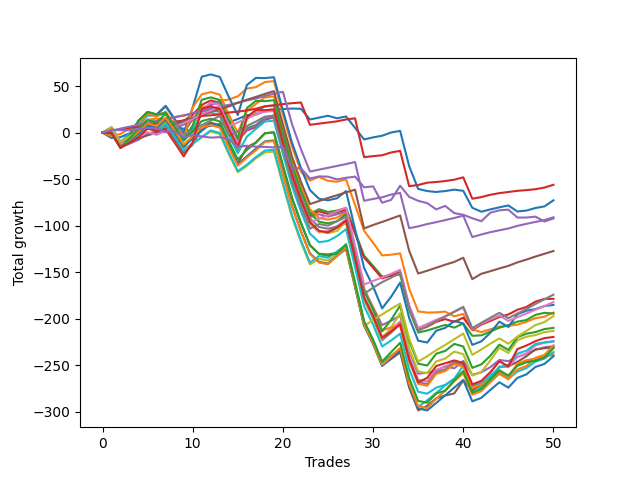

# Long Labrador 011 
- Symbol: ES
- Date Range: 03/18/2022 - 12/30/2022
- Trading Period: 8:30-12:30
- Number of Trades: 50



| Name | Win Percent | Profit | Avg Profit / Trade | Avg Time / Trade |      | Name | Win Percent | Profit | Avg Profit / Trade | Avg Time / Trade |
| ---- | ----------- | ------ | ------------------ | ---------------- | ---- | ---- | ----------- | ------ | ------------------ | ---------------- |
| Sorted By <br> Profit | | | | | | Sorted By <br> Win Percentage ||||
| TP-1 | 92.00 | -28000.00 | -560.00 | 07:44 |     | TP-1 | 92.00 | -28000.00 | -560.00 | 07:44 |
| BB-20 Mid | 68.00 | -36375.00 | -727.50 | 08:48 |     | TP-2 | 88.00 | -45500.00 | -910.00 | 12:13 |
| TP-2 | 88.00 | -45500.00 | -910.00 | 12:13 |     | TP-3 | 82.00 | -63625.00 | -1272.50 | 20:16 |
| NEWFI 0000 | 46.00 | -46125.00 | -922.50 | 11:01 |     | TP-4 | 74.00 | -91125.00 | -1822.50 | 26:16 |
| TP-3 | 82.00 | -63625.00 | -1272.50 | 20:16 |     | TP-5 | 70.00 | -87125.00 | -1742.50 | 29:32 |
| TP-5 | 70.00 | -87125.00 | -1742.50 | 29:32 |     | BB-20 Mid | 68.00 | -36375.00 | -727.50 | 08:48 |
| BB-20 U/L 2SD C | 66.00 | -89375.00 | -1787.50 | 26:15 |     | BB-20 U/L 2SD C | 66.00 | -89375.00 | -1787.50 | 26:15 |
| TP-4 | 74.00 | -91125.00 | -1822.50 | 26:16 |     | BB-20 U/L 2SD | 66.00 | -97250.00 | -1945.00 | 24:18 |
| BB-100 U/L 2SD | 50.00 | -92625.00 | -1852.50 | 52:42 |     | BB-20 U/L 1SD | 64.00 | -96750.00 | -1935.00 | 19:26 |
| BB-20 U/L 1SD | 64.00 | -96750.00 | -1935.00 | 19:26 |     | TP-6 | 64.00 | -98625.00 | -1972.50 | 34:18 |
| BB-20 U/L 2SD | 66.00 | -97250.00 | -1945.00 | 24:18 |     | BB-50 Mid | 64.00 | -114875.00 | -2297.50 | 29:40 |
| TP-6 | 64.00 | -98625.00 | -1972.50 | 34:18 |     | BB-100 Mid | 62.00 | -112125.00 | -2242.50 | 42:14 |
| BB-200 U/L 2SD | 50.00 | -105000.00 | -2100.00 | 52:47 |     | BB-50 U/L 1SD | 62.00 | -115375.00 | -2307.50 | 39:40 |
| V U/L 1SD | 50.00 | -106625.00 | -2132.50 | 51:39 |     | TP-7 | 58.00 | -118000.00 | -2360.00 | 37:48 |
| NEWFI 000 | 52.00 | -109875.00 | -2197.50 | 49:43 |     | BB-50 U/L 2SD | 54.00 | -112375.00 | -2247.50 | 45:00 |
| BB-100 Mid | 62.00 | -112125.00 | -2242.50 | 42:14 |     | TP-9 | 54.00 | -114375.00 | -2287.50 | 43:32 |
| BB-50 U/L 2SD | 54.00 | -112375.00 | -2247.50 | 45:00 |     | TP-10 | 54.00 | -115875.00 | -2317.50 | 45:03 |
| TP-9 | 54.00 | -114375.00 | -2287.50 | 43:32 |     | TP-8 | 54.00 | -120250.00 | -2405.00 | 41:17 |
| BB-50 Mid | 64.00 | -114875.00 | -2297.50 | 29:40 |     | NEWFI 000 | 52.00 | -109875.00 | -2197.50 | 49:43 |
| BB-50 U/L 1SD | 62.00 | -115375.00 | -2307.50 | 39:40 |     | BB-200 Mid | 52.00 | -119250.00 | -2385.00 | 46:37 |
| TP-10 | 54.00 | -115875.00 | -2317.50 | 45:03 |     | V Mid | 52.00 | -119625.00 | -2392.50 | 47:48 |
| TP-7 | 58.00 | -118000.00 | -2360.00 | 37:48 |     | BB-100 U/L 2SD | 50.00 | -92625.00 | -1852.50 | 52:42 |
| BB-200 Mid | 52.00 | -119250.00 | -2385.00 | 46:37 |     | BB-200 U/L 2SD | 50.00 | -105000.00 | -2100.00 | 52:47 |
| V Mid | 52.00 | -119625.00 | -2392.50 | 47:48 |     | V U/L 1SD | 50.00 | -106625.00 | -2132.50 | 51:39 |
| TP-8 | 54.00 | -120250.00 | -2405.00 | 41:17 |     | NEWFI 0000 | 46.00 | -46125.00 | -922.50 | 11:01 |

## NO STOPLOSS

### Test BB-20 Mid
* Sell when price hits the middle line of the 20p bollinger
* No Stoploss
* Results:
```
Total Trades: 50
Percent Up: 68.00
Percent Down: 32.00
Total Points Moved Up: -72.75
Potential Profit: -36375.00
Total Points Ups: 72.75 Count Ups: 34
Total Points Downs: -145.50 Count Downs: 16
```

<details><summary>Trades</summary>

<code>In: 2022-03-21 10:07:00		Out: 2022-03-21 10:26:15		Total Position Time: 19:15		Total Move Up: -5.75		Total to Date: -5.75</code> <br />
<code>In: 2022-03-23 09:49:00		Out: 2022-03-23 09:53:05		Total Position Time: 04:05		Total Move Up: 1.00		Total to Date: -4.75</code> <br />
<code>In: 2022-03-28 09:00:00		Out: 2022-03-28 09:01:50		Total Position Time: 01:50		Total Move Up: 4.25		Total to Date: -0.50</code> <br />
<code>In: 2022-03-28 09:21:00		Out: 2022-03-28 09:22:50		Total Position Time: 01:50		Total Move Up: 3.00		Total to Date: 2.50</code> <br />
<code>In: 2022-03-30 12:27:00		Out: 2022-03-30 12:28:20		Total Position Time: 01:20		Total Move Up: 2.25		Total to Date: 4.75</code> <br />
<code>In: 2022-03-31 09:38:00		Out: 2022-03-31 09:39:55		Total Position Time: 01:55		Total Move Up: 0.00		Total to Date: 4.75</code> <br />
<code>In: 2022-03-31 11:13:00		Out: 2022-03-31 11:23:30		Total Position Time: 10:30		Total Move Up: -0.50		Total to Date: 4.25</code> <br />
<code>In: 2022-04-12 11:26:00		Out: 2022-04-12 11:35:55		Total Position Time: 09:55		Total Move Up: 0.25		Total to Date: 4.50</code> <br />
<code>In: 2022-04-12 11:27:00		Out: 2022-04-12 11:35:55		Total Position Time: 08:55		Total Move Up: 0.00		Total to Date: 4.50</code> <br />
<code>In: 2022-05-11 10:50:00		Out: 2022-05-11 11:00:40		Total Position Time: 10:40		Total Move Up: -4.00		Total to Date: 0.50</code> <br />
<code>In: 2022-05-17 11:25:00		Out: 2022-05-17 11:31:35		Total Position Time: 06:35		Total Move Up: 5.00		Total to Date: 5.50</code> <br />
<code>In: 2022-06-06 09:15:00		Out: 2022-06-06 09:26:40		Total Position Time: 11:40		Total Move Up: 2.00		Total to Date: 7.50</code> <br />
<code>In: 2022-06-08 09:48:00		Out: 2022-06-08 09:53:05		Total Position Time: 05:05		Total Move Up: 1.75		Total to Date: 9.25</code> <br />
<code>In: 2022-06-09 12:13:00		Out: 2022-06-09 12:19:50		Total Position Time: 06:50		Total Move Up: 1.75		Total to Date: 11.00</code> <br />
<code>In: 2022-06-09 12:17:00		Out: 2022-06-09 12:19:50		Total Position Time: 02:50		Total Move Up: 3.75		Total to Date: 14.75</code> <br />
<code>In: 2022-06-14 12:21:00		Out: 2022-06-14 12:25:50		Total Position Time: 04:50		Total Move Up: 4.25		Total to Date: 19.00</code> <br />
<code>In: 2022-06-23 09:50:00		Out: 2022-06-23 09:54:00		Total Position Time: 04:00		Total Move Up: 0.50		Total to Date: 19.50</code> <br />
<code>In: 2022-06-27 09:37:00		Out: 2022-06-27 09:41:05		Total Position Time: 04:05		Total Move Up: 3.75		Total to Date: 23.25</code> <br />
<code>In: 2022-07-11 12:16:00		Out: 2022-07-11 12:22:10		Total Position Time: 06:10		Total Move Up: 1.00		Total to Date: 24.25</code> <br />
<code>In: 2022-07-12 11:44:00		Out: 2022-07-12 11:48:05		Total Position Time: 04:05		Total Move Up: 1.25		Total to Date: 25.50</code> <br />
<code>In: 2022-07-12 11:45:00		Out: 2022-07-12 11:48:05		Total Position Time: 03:05		Total Move Up: 0.50		Total to Date: 26.00</code> <br />
<code>In: 2022-07-18 10:02:00		Out: 2022-07-18 10:14:10		Total Position Time: 12:10		Total Move Up: -0.25		Total to Date: 25.75</code> <br />
<code>In: 2022-07-18 10:52:00		Out: 2022-07-18 11:13:30		Total Position Time: 21:30		Total Move Up: -11.50		Total to Date: 14.25</code> <br />
<code>In: 2022-07-18 11:06:00		Out: 2022-07-18 11:13:30		Total Position Time: 07:30		Total Move Up: 2.00		Total to Date: 16.25</code> <br />
<code>In: 2022-07-26 08:41:00		Out: 2022-07-26 08:43:45		Total Position Time: 02:45		Total Move Up: 2.00		Total to Date: 18.25</code> <br />
<code>In: 2022-08-08 09:22:00		Out: 2022-08-08 09:39:15		Total Position Time: 17:15		Total Move Up: -2.75		Total to Date: 15.50</code> <br />
<code>In: 2022-08-18 09:47:00		Out: 2022-08-18 09:48:10		Total Position Time: 01:10		Total Move Up: 2.00		Total to Date: 17.50</code> <br />
<code>In: 2022-09-02 09:55:00		Out: 2022-09-02 10:18:10		Total Position Time: 23:10		Total Move Up: -12.25		Total to Date: 5.25</code> <br />
<code>In: 2022-09-02 09:56:00		Out: 2022-09-02 10:18:10		Total Position Time: 22:10		Total Move Up: -12.50		Total to Date: -7.25</code> <br />
<code>In: 2022-09-02 10:11:00		Out: 2022-09-02 10:18:10		Total Position Time: 07:10		Total Move Up: 2.25		Total to Date: -5.00</code> <br />
<code>In: 2022-09-02 10:12:00		Out: 2022-09-02 10:18:10		Total Position Time: 06:10		Total Move Up: 1.75		Total to Date: -3.25</code> <br />
<code>In: 2022-09-12 09:07:00		Out: 2022-09-12 09:08:15		Total Position Time: 01:15		Total Move Up: 3.50		Total to Date: 0.25</code> <br />
<code>In: 2022-09-12 09:13:00		Out: 2022-09-12 09:14:10		Total Position Time: 01:10		Total Move Up: 1.75		Total to Date: 2.00</code> <br />
<code>In: 2022-09-13 11:57:00		Out: 2022-09-13 12:47:00		Total Position Time: 50:00		Total Move Up: -38.00		Total to Date: -36.00</code> <br />
<code>In: 2022-09-13 12:20:00		Out: 2022-09-13 12:47:00		Total Position Time: 27:00		Total Move Up: -24.50		Total to Date: -60.50</code> <br />
<code>In: 2022-09-14 11:00:00		Out: 2022-09-14 11:15:30		Total Position Time: 15:30		Total Move Up: -2.25		Total to Date: -62.75</code> <br />
<code>In: 2022-09-14 12:30:00		Out: 2022-09-14 12:34:20		Total Position Time: 04:20		Total Move Up: -1.00		Total to Date: -63.75</code> <br />
<code>In: 2022-09-15 12:22:00		Out: 2022-09-15 12:32:05		Total Position Time: 10:05		Total Move Up: 1.00		Total to Date: -62.75</code> <br />
<code>In: 2022-09-23 09:15:00		Out: 2022-09-23 09:19:50		Total Position Time: 04:50		Total Move Up: 1.50		Total to Date: -61.25</code> <br />
<code>In: 2022-09-26 09:37:00		Out: 2022-09-26 09:46:35		Total Position Time: 09:35		Total Move Up: -1.25		Total to Date: -62.50</code> <br />
<code>In: 2022-09-27 09:05:00		Out: 2022-09-27 09:27:30		Total Position Time: 22:30		Total Move Up: -18.25		Total to Date: -80.75</code> <br />
<code>In: 2022-10-11 12:06:00		Out: 2022-10-11 12:17:25		Total Position Time: 11:25		Total Move Up: -4.25		Total to Date: -85.00</code> <br />
<code>In: 2022-10-31 09:50:00		Out: 2022-10-31 09:51:10		Total Position Time: 01:10		Total Move Up: 2.50		Total to Date: -82.50</code> <br />
<code>In: 2022-10-31 12:12:00		Out: 2022-10-31 12:19:35		Total Position Time: 07:35		Total Move Up: 2.25		Total to Date: -80.25</code> <br />
<code>In: 2022-11-09 09:18:00		Out: 2022-11-09 09:20:55		Total Position Time: 02:55		Total Move Up: 2.00		Total to Date: -78.25</code> <br />
<code>In: 2022-11-15 10:31:00		Out: 2022-11-15 10:43:25		Total Position Time: 12:25		Total Move Up: -6.50		Total to Date: -84.75</code> <br />
<code>In: 2022-11-16 12:21:00		Out: 2022-11-16 12:23:20		Total Position Time: 02:20		Total Move Up: 1.00		Total to Date: -83.75</code> <br />
<code>In: 2022-12-19 08:43:00		Out: 2022-12-19 08:45:40		Total Position Time: 02:40		Total Move Up: 2.75		Total to Date: -81.00</code> <br />
<code>In: 2022-12-19 11:33:00		Out: 2022-12-19 11:34:10		Total Position Time: 01:10		Total Move Up: 1.75		Total to Date: -79.25</code> <br />
<code>In: 2022-12-30 10:29:00		Out: 2022-12-30 10:31:05		Total Position Time: 02:05		Total Move Up: 6.50		Total to Date: -72.75</code> <br />


</details>

### Test BB-20 U/L 1SD
* Sell when the price hits the upper line of the 20p 1std bollinger
* No Stoploss
* Results:
```
Total Trades: 50
Percent Up: 64.00
Percent Down: 36.00
Total Points Moved Up: -193.50
Potential Profit: -96750.00
Total Points Ups: 92.75 Count Ups: 32
Total Points Downs: -286.25 Count Downs: 18
```

<details><summary>Trades</summary>

<code>In: 2022-03-21 10:07:00		Out: 2022-03-21 10:32:05		Total Position Time: 25:05		Total Move Up: -3.75		Total to Date: -3.75</code> <br />
<code>In: 2022-03-23 09:49:00		Out: 2022-03-23 09:59:45		Total Position Time: 10:45		Total Move Up: 2.50		Total to Date: -1.25</code> <br />
<code>In: 2022-03-28 09:00:00		Out: 2022-03-28 09:05:15		Total Position Time: 05:15		Total Move Up: 5.75		Total to Date: 4.50</code> <br />
<code>In: 2022-03-28 09:21:00		Out: 2022-03-28 09:25:35		Total Position Time: 04:35		Total Move Up: 4.75		Total to Date: 9.25</code> <br />
<code>In: 2022-03-30 12:27:00		Out: 2022-03-30 12:32:20		Total Position Time: 05:20		Total Move Up: 4.75		Total to Date: 14.00</code> <br />
<code>In: 2022-03-31 09:38:00		Out: 2022-03-31 09:41:05		Total Position Time: 03:05		Total Move Up: 1.25		Total to Date: 15.25</code> <br />
<code>In: 2022-03-31 11:13:00		Out: 2022-03-31 11:29:15		Total Position Time: 16:15		Total Move Up: -0.25		Total to Date: 15.00</code> <br />
<code>In: 2022-04-12 11:26:00		Out: 2022-04-12 11:37:20		Total Position Time: 11:20		Total Move Up: 1.75		Total to Date: 16.75</code> <br />
<code>In: 2022-04-12 11:27:00		Out: 2022-04-12 11:37:20		Total Position Time: 10:20		Total Move Up: 1.50		Total to Date: 18.25</code> <br />
<code>In: 2022-05-11 10:50:00		Out: 2022-05-11 11:01:20		Total Position Time: 11:20		Total Move Up: 2.00		Total to Date: 20.25</code> <br />
<code>In: 2022-05-17 11:25:00		Out: 2022-05-17 11:39:45		Total Position Time: 14:45		Total Move Up: 7.25		Total to Date: 27.50</code> <br />
<code>In: 2022-06-06 09:15:00		Out: 2022-06-06 09:37:35		Total Position Time: 22:35		Total Move Up: 2.00		Total to Date: 29.50</code> <br />
<code>In: 2022-06-08 09:48:00		Out: 2022-06-08 09:59:05		Total Position Time: 11:05		Total Move Up: 4.75		Total to Date: 34.25</code> <br />
<code>In: 2022-06-09 12:13:00		Out: 2022-06-09 12:25:05		Total Position Time: 12:05		Total Move Up: 1.50		Total to Date: 35.75</code> <br />
<code>In: 2022-06-09 12:17:00		Out: 2022-06-09 12:25:05		Total Position Time: 08:05		Total Move Up: 3.50		Total to Date: 39.25</code> <br />
<code>In: 2022-06-14 12:21:00		Out: 2022-06-14 12:27:20		Total Position Time: 06:20		Total Move Up: 8.25		Total to Date: 47.50</code> <br />
<code>In: 2022-06-23 09:50:00		Out: 2022-06-23 09:56:15		Total Position Time: 06:15		Total Move Up: 1.50		Total to Date: 49.00</code> <br />
<code>In: 2022-06-27 09:37:00		Out: 2022-06-27 09:44:20		Total Position Time: 07:20		Total Move Up: 5.50		Total to Date: 54.50</code> <br />
<code>In: 2022-07-11 12:16:00		Out: 2022-07-11 12:29:20		Total Position Time: 13:20		Total Move Up: 1.00		Total to Date: 55.50</code> <br />
<code>In: 2022-07-12 11:44:00		Out: 2022-07-12 12:44:55		Total Position Time: 60:55		Total Move Up: -35.75		Total to Date: 19.75</code> <br />
<code>In: 2022-07-12 11:45:00		Out: 2022-07-12 12:45:55		Total Position Time: 60:55		Total Move Up: -34.50		Total to Date: -14.75</code> <br />
<code>In: 2022-07-18 10:02:00		Out: 2022-07-18 11:02:55		Total Position Time: 60:55		Total Move Up: -27.25		Total to Date: -42.00</code> <br />
<code>In: 2022-07-18 10:52:00		Out: 2022-07-18 11:15:45		Total Position Time: 23:45		Total Move Up: -9.50		Total to Date: -51.50</code> <br />
<code>In: 2022-07-18 11:06:00		Out: 2022-07-18 11:15:45		Total Position Time: 09:45		Total Move Up: 4.00		Total to Date: -47.50</code> <br />
<code>In: 2022-07-26 08:41:00		Out: 2022-07-26 09:15:35		Total Position Time: 34:35		Total Move Up: -4.25		Total to Date: -51.75</code> <br />
<code>In: 2022-08-08 09:22:00		Out: 2022-08-08 09:43:00		Total Position Time: 21:00		Total Move Up: -1.00		Total to Date: -52.75</code> <br />
<code>In: 2022-08-18 09:47:00		Out: 2022-08-18 09:55:25		Total Position Time: 08:25		Total Move Up: 2.50		Total to Date: -50.25</code> <br />
<code>In: 2022-09-02 09:55:00		Out: 2022-09-02 10:43:30		Total Position Time: 48:30		Total Move Up: -27.50		Total to Date: -77.75</code> <br />
<code>In: 2022-09-02 09:56:00		Out: 2022-09-02 10:43:30		Total Position Time: 47:30		Total Move Up: -27.75		Total to Date: -105.50</code> <br />
<code>In: 2022-09-02 10:11:00		Out: 2022-09-02 10:43:30		Total Position Time: 32:30		Total Move Up: -13.00		Total to Date: -118.50</code> <br />
<code>In: 2022-09-02 10:12:00		Out: 2022-09-02 10:43:30		Total Position Time: 31:30		Total Move Up: -13.50		Total to Date: -132.00</code> <br />
<code>In: 2022-09-12 09:07:00		Out: 2022-09-12 09:21:25		Total Position Time: 14:25		Total Move Up: 0.75		Total to Date: -131.25</code> <br />
<code>In: 2022-09-12 09:13:00		Out: 2022-09-12 09:21:25		Total Position Time: 08:25		Total Move Up: 1.50		Total to Date: -129.75</code> <br />
<code>In: 2022-09-13 11:57:00		Out: 2022-09-13 12:47:00		Total Position Time: 50:00		Total Move Up: -38.00		Total to Date: -167.75</code> <br />
<code>In: 2022-09-13 12:20:00		Out: 2022-09-13 12:47:00		Total Position Time: 27:00		Total Move Up: -24.50		Total to Date: -192.25</code> <br />
<code>In: 2022-09-14 11:00:00		Out: 2022-09-14 11:19:10		Total Position Time: 19:10		Total Move Up: -1.25		Total to Date: -193.50</code> <br />
<code>In: 2022-09-14 12:30:00		Out: 2022-09-14 12:34:45		Total Position Time: 04:45		Total Move Up: 0.25		Total to Date: -193.25</code> <br />
<code>In: 2022-09-15 12:22:00		Out: 2022-09-15 12:38:25		Total Position Time: 16:25		Total Move Up: 0.75		Total to Date: -192.50</code> <br />
<code>In: 2022-09-23 09:15:00		Out: 2022-09-23 09:46:10		Total Position Time: 31:10		Total Move Up: -5.00		Total to Date: -197.50</code> <br />
<code>In: 2022-09-26 09:37:00		Out: 2022-09-26 09:47:05		Total Position Time: 10:05		Total Move Up: 2.50		Total to Date: -195.00</code> <br />
<code>In: 2022-09-27 09:05:00		Out: 2022-09-27 09:31:05		Total Position Time: 26:05		Total Move Up: -16.75		Total to Date: -211.75</code> <br />
<code>In: 2022-10-11 12:06:00		Out: 2022-10-11 12:20:40		Total Position Time: 14:40		Total Move Up: -2.75		Total to Date: -214.50</code> <br />
<code>In: 2022-10-31 09:50:00		Out: 2022-10-31 09:57:05		Total Position Time: 07:05		Total Move Up: 3.00		Total to Date: -211.50</code> <br />
<code>In: 2022-10-31 12:12:00		Out: 2022-10-31 12:21:30		Total Position Time: 09:30		Total Move Up: 3.00		Total to Date: -208.50</code> <br />
<code>In: 2022-11-09 09:18:00		Out: 2022-11-09 09:32:45		Total Position Time: 14:45		Total Move Up: 0.75		Total to Date: -207.75</code> <br />
<code>In: 2022-11-15 10:31:00		Out: 2022-11-15 10:44:25		Total Position Time: 13:25		Total Move Up: 1.25		Total to Date: -206.50</code> <br />
<code>In: 2022-11-16 12:21:00		Out: 2022-11-16 12:25:20		Total Position Time: 04:20		Total Move Up: 3.00		Total to Date: -203.50</code> <br />
<code>In: 2022-12-19 08:43:00		Out: 2022-12-19 08:52:05		Total Position Time: 09:05		Total Move Up: 4.00		Total to Date: -199.50</code> <br />
<code>In: 2022-12-19 11:33:00		Out: 2022-12-19 11:45:05		Total Position Time: 12:05		Total Move Up: 1.50		Total to Date: -198.00</code> <br />
<code>In: 2022-12-30 10:29:00		Out: 2022-12-30 11:03:00		Total Position Time: 34:00		Total Move Up: 4.50		Total to Date: -193.50</code> <br />


</details>

### Test BB-20 U/L 2SD
* Sell when the price hits the upper line of the 20p 2std bollinger
* No Stoploss
* Results:
```
Total Trades: 50
Percent Up: 66.00
Percent Down: 34.00
Total Points Moved Up: -194.50
Potential Profit: -97250.00
Total Points Ups: 124.50 Count Ups: 33
Total Points Downs: -319.00 Count Downs: 17
```

<details><summary>Trades</summary>

<code>In: 2022-03-21 10:07:00		Out: 2022-03-21 10:34:15		Total Position Time: 27:15		Total Move Up: 0.25		Total to Date: 0.25</code> <br />
<code>In: 2022-03-23 09:49:00		Out: 2022-03-23 10:49:55		Total Position Time: 60:55		Total Move Up: -15.75		Total to Date: -15.50</code> <br />
<code>In: 2022-03-28 09:00:00		Out: 2022-03-28 09:07:10		Total Position Time: 07:10		Total Move Up: 7.50		Total to Date: -8.00</code> <br />
<code>In: 2022-03-28 09:21:00		Out: 2022-03-28 09:30:55		Total Position Time: 09:55		Total Move Up: 5.50		Total to Date: -2.50</code> <br />
<code>In: 2022-03-30 12:27:00		Out: 2022-03-30 12:36:05		Total Position Time: 09:05		Total Move Up: 7.25		Total to Date: 4.75</code> <br />
<code>In: 2022-03-31 09:38:00		Out: 2022-03-31 09:44:20		Total Position Time: 06:20		Total Move Up: 2.00		Total to Date: 6.75</code> <br />
<code>In: 2022-03-31 11:13:00		Out: 2022-03-31 11:29:25		Total Position Time: 16:25		Total Move Up: 0.75		Total to Date: 7.50</code> <br />
<code>In: 2022-04-12 11:26:00		Out: 2022-04-12 11:46:50		Total Position Time: 20:50		Total Move Up: 2.25		Total to Date: 9.75</code> <br />
<code>In: 2022-04-12 11:27:00		Out: 2022-04-12 11:46:50		Total Position Time: 19:50		Total Move Up: 2.00		Total to Date: 11.75</code> <br />
<code>In: 2022-05-11 10:50:00		Out: 2022-05-11 11:02:35		Total Position Time: 12:35		Total Move Up: 2.50		Total to Date: 14.25</code> <br />
<code>In: 2022-05-17 11:25:00		Out: 2022-05-17 11:40:05		Total Position Time: 15:05		Total Move Up: 11.00		Total to Date: 25.25</code> <br />
<code>In: 2022-06-06 09:15:00		Out: 2022-06-06 09:41:50		Total Position Time: 26:50		Total Move Up: 4.75		Total to Date: 30.00</code> <br />
<code>In: 2022-06-08 09:48:00		Out: 2022-06-08 10:00:05		Total Position Time: 12:05		Total Move Up: 4.25		Total to Date: 34.25</code> <br />
<code>In: 2022-06-09 12:13:00		Out: 2022-06-09 12:47:00		Total Position Time: 34:00		Total Move Up: -21.50		Total to Date: 12.75</code> <br />
<code>In: 2022-06-09 12:17:00		Out: 2022-06-09 12:47:00		Total Position Time: 30:00		Total Move Up: -19.50		Total to Date: -6.75</code> <br />
<code>In: 2022-06-14 12:21:00		Out: 2022-06-14 12:29:15		Total Position Time: 08:15		Total Move Up: 11.50		Total to Date: 4.75</code> <br />
<code>In: 2022-06-23 09:50:00		Out: 2022-06-23 10:07:40		Total Position Time: 17:40		Total Move Up: 3.50		Total to Date: 8.25</code> <br />
<code>In: 2022-06-27 09:37:00		Out: 2022-06-27 09:45:05		Total Position Time: 08:05		Total Move Up: 8.00		Total to Date: 16.25</code> <br />
<code>In: 2022-07-11 12:16:00		Out: 2022-07-11 12:29:40		Total Position Time: 13:40		Total Move Up: 2.50		Total to Date: 18.75</code> <br />
<code>In: 2022-07-12 11:44:00		Out: 2022-07-12 12:44:55		Total Position Time: 60:55		Total Move Up: -35.75		Total to Date: -17.00</code> <br />
<code>In: 2022-07-12 11:45:00		Out: 2022-07-12 12:45:55		Total Position Time: 60:55		Total Move Up: -34.50		Total to Date: -51.50</code> <br />
<code>In: 2022-07-18 10:02:00		Out: 2022-07-18 11:02:55		Total Position Time: 60:55		Total Move Up: -27.25		Total to Date: -78.75</code> <br />
<code>In: 2022-07-18 10:52:00		Out: 2022-07-18 11:16:05		Total Position Time: 24:05		Total Move Up: -8.50		Total to Date: -87.25</code> <br />
<code>In: 2022-07-18 11:06:00		Out: 2022-07-18 11:16:05		Total Position Time: 10:05		Total Move Up: 5.00		Total to Date: -82.25</code> <br />
<code>In: 2022-07-26 08:41:00		Out: 2022-07-26 09:16:25		Total Position Time: 35:25		Total Move Up: -3.00		Total to Date: -85.25</code> <br />
<code>In: 2022-08-08 09:22:00		Out: 2022-08-08 09:45:40		Total Position Time: 23:40		Total Move Up: 1.50		Total to Date: -83.75</code> <br />
<code>In: 2022-08-18 09:47:00		Out: 2022-08-18 10:06:05		Total Position Time: 19:05		Total Move Up: 2.75		Total to Date: -81.00</code> <br />
<code>In: 2022-09-02 09:55:00		Out: 2022-09-02 10:43:50		Total Position Time: 48:50		Total Move Up: -25.50		Total to Date: -106.50</code> <br />
<code>In: 2022-09-02 09:56:00		Out: 2022-09-02 10:43:50		Total Position Time: 47:50		Total Move Up: -25.75		Total to Date: -132.25</code> <br />
<code>In: 2022-09-02 10:11:00		Out: 2022-09-02 10:43:50		Total Position Time: 32:50		Total Move Up: -11.00		Total to Date: -143.25</code> <br />
<code>In: 2022-09-02 10:12:00		Out: 2022-09-02 10:43:50		Total Position Time: 31:50		Total Move Up: -11.50		Total to Date: -154.75</code> <br />
<code>In: 2022-09-12 09:07:00		Out: 2022-09-12 09:21:25		Total Position Time: 14:25		Total Move Up: 0.75		Total to Date: -154.00</code> <br />
<code>In: 2022-09-12 09:13:00		Out: 2022-09-12 09:21:25		Total Position Time: 08:25		Total Move Up: 1.50		Total to Date: -152.50</code> <br />
<code>In: 2022-09-13 11:57:00		Out: 2022-09-13 12:47:00		Total Position Time: 50:00		Total Move Up: -38.00		Total to Date: -190.50</code> <br />
<code>In: 2022-09-13 12:20:00		Out: 2022-09-13 12:47:00		Total Position Time: 27:00		Total Move Up: -24.50		Total to Date: -215.00</code> <br />
<code>In: 2022-09-14 11:00:00		Out: 2022-09-14 11:30:30		Total Position Time: 30:30		Total Move Up: 2.25		Total to Date: -212.75</code> <br />
<code>In: 2022-09-14 12:30:00		Out: 2022-09-14 12:41:30		Total Position Time: 11:30		Total Move Up: 3.00		Total to Date: -209.75</code> <br />
<code>In: 2022-09-15 12:22:00		Out: 2022-09-15 12:42:30		Total Position Time: 20:30		Total Move Up: 3.00		Total to Date: -206.75</code> <br />
<code>In: 2022-09-23 09:15:00		Out: 2022-09-23 09:46:55		Total Position Time: 31:55		Total Move Up: -3.00		Total to Date: -209.75</code> <br />
<code>In: 2022-09-26 09:37:00		Out: 2022-09-26 09:47:25		Total Position Time: 10:25		Total Move Up: 4.50		Total to Date: -205.25</code> <br />
<code>In: 2022-09-27 09:05:00		Out: 2022-09-27 09:34:25		Total Position Time: 29:25		Total Move Up: -13.25		Total to Date: -218.50</code> <br />
<code>In: 2022-10-11 12:06:00		Out: 2022-10-11 12:22:35		Total Position Time: 16:35		Total Move Up: 0.50		Total to Date: -218.00</code> <br />
<code>In: 2022-10-31 09:50:00		Out: 2022-10-31 10:02:05		Total Position Time: 12:05		Total Move Up: 4.00		Total to Date: -214.00</code> <br />
<code>In: 2022-10-31 12:12:00		Out: 2022-10-31 12:22:10		Total Position Time: 10:10		Total Move Up: 4.25		Total to Date: -209.75</code> <br />
<code>In: 2022-11-09 09:18:00		Out: 2022-11-09 09:34:10		Total Position Time: 16:10		Total Move Up: 2.75		Total to Date: -207.00</code> <br />
<code>In: 2022-11-15 10:31:00		Out: 2022-11-15 10:46:40		Total Position Time: 15:40		Total Move Up: 3.75		Total to Date: -203.25</code> <br />
<code>In: 2022-11-16 12:21:00		Out: 2022-11-16 12:28:05		Total Position Time: 07:05		Total Move Up: 1.75		Total to Date: -201.50</code> <br />
<code>In: 2022-12-19 08:43:00		Out: 2022-12-19 09:02:30		Total Position Time: 19:30		Total Move Up: 5.50		Total to Date: -196.00</code> <br />
<code>In: 2022-12-19 11:33:00		Out: 2022-12-19 11:45:15		Total Position Time: 12:15		Total Move Up: 2.25		Total to Date: -193.75</code> <br />
<code>In: 2022-12-30 10:29:00		Out: 2022-12-30 11:28:35		Total Position Time: 59:35		Total Move Up: -0.75		Total to Date: -194.50</code> <br />


</details>

### Test BB-20 U/L 2SD C
* Sell when the price hits the upper line of the 20p 2std bollinger
* No Stoploss
* Results:
```
Total Trades: 50
Percent Up: 66.00
Percent Down: 34.00
Total Points Moved Up: -178.75
Potential Profit: -89375.00
Total Points Ups: 142.25 Count Ups: 33
Total Points Downs: -321.00 Count Downs: 17
```

<details><summary>Trades</summary>

<code>In: 2022-03-21 10:07:00		Out: 2022-03-21 10:34:15		Total Position Time: 27:15		Total Move Up: 0.25		Total to Date: 0.25</code> <br />
<code>In: 2022-03-23 09:49:00		Out: 2022-03-23 10:49:55		Total Position Time: 60:55		Total Move Up: -15.75		Total to Date: -15.50</code> <br />
<code>In: 2022-03-28 09:00:00		Out: 2022-03-28 09:07:10		Total Position Time: 07:10		Total Move Up: 7.50		Total to Date: -8.00</code> <br />
<code>In: 2022-03-28 09:21:00		Out: 2022-03-28 09:30:55		Total Position Time: 09:55		Total Move Up: 5.50		Total to Date: -2.50</code> <br />
<code>In: 2022-03-30 12:27:00		Out: 2022-03-30 12:36:20		Total Position Time: 09:20		Total Move Up: 7.50		Total to Date: 5.00</code> <br />
<code>In: 2022-03-31 09:38:00		Out: 2022-03-31 09:44:20		Total Position Time: 06:20		Total Move Up: 2.00		Total to Date: 7.00</code> <br />
<code>In: 2022-03-31 11:13:00		Out: 2022-03-31 11:29:25		Total Position Time: 16:25		Total Move Up: 0.75		Total to Date: 7.75</code> <br />
<code>In: 2022-04-12 11:26:00		Out: 2022-04-12 11:47:00		Total Position Time: 21:00		Total Move Up: 2.75		Total to Date: 10.50</code> <br />
<code>In: 2022-04-12 11:27:00		Out: 2022-04-12 11:47:00		Total Position Time: 20:00		Total Move Up: 2.50		Total to Date: 13.00</code> <br />
<code>In: 2022-05-11 10:50:00		Out: 2022-05-11 11:04:55		Total Position Time: 14:55		Total Move Up: 6.00		Total to Date: 19.00</code> <br />
<code>In: 2022-05-17 11:25:00		Out: 2022-05-17 11:40:05		Total Position Time: 15:05		Total Move Up: 11.00		Total to Date: 30.00</code> <br />
<code>In: 2022-06-06 09:15:00		Out: 2022-06-06 09:41:50		Total Position Time: 26:50		Total Move Up: 4.75		Total to Date: 34.75</code> <br />
<code>In: 2022-06-08 09:48:00		Out: 2022-06-08 10:48:55		Total Position Time: 60:55		Total Move Up: -2.75		Total to Date: 32.00</code> <br />
<code>In: 2022-06-09 12:13:00		Out: 2022-06-09 12:47:00		Total Position Time: 34:00		Total Move Up: -21.50		Total to Date: 10.50</code> <br />
<code>In: 2022-06-09 12:17:00		Out: 2022-06-09 12:47:00		Total Position Time: 30:00		Total Move Up: -19.50		Total to Date: -9.00</code> <br />
<code>In: 2022-06-14 12:21:00		Out: 2022-06-14 12:29:20		Total Position Time: 08:20		Total Move Up: 11.50		Total to Date: 2.50</code> <br />
<code>In: 2022-06-23 09:50:00		Out: 2022-06-23 10:07:40		Total Position Time: 17:40		Total Move Up: 3.50		Total to Date: 6.00</code> <br />
<code>In: 2022-06-27 09:37:00		Out: 2022-06-27 09:45:05		Total Position Time: 08:05		Total Move Up: 8.00		Total to Date: 14.00</code> <br />
<code>In: 2022-07-11 12:16:00		Out: 2022-07-11 12:29:40		Total Position Time: 13:40		Total Move Up: 2.50		Total to Date: 16.50</code> <br />
<code>In: 2022-07-12 11:44:00		Out: 2022-07-12 12:44:55		Total Position Time: 60:55		Total Move Up: -35.75		Total to Date: -19.25</code> <br />
<code>In: 2022-07-12 11:45:00		Out: 2022-07-12 12:45:55		Total Position Time: 60:55		Total Move Up: -34.50		Total to Date: -53.75</code> <br />
<code>In: 2022-07-18 10:02:00		Out: 2022-07-18 11:02:55		Total Position Time: 60:55		Total Move Up: -27.25		Total to Date: -81.00</code> <br />
<code>In: 2022-07-18 10:52:00		Out: 2022-07-18 11:16:05		Total Position Time: 24:05		Total Move Up: -8.50		Total to Date: -89.50</code> <br />
<code>In: 2022-07-18 11:06:00		Out: 2022-07-18 11:16:05		Total Position Time: 10:05		Total Move Up: 5.00		Total to Date: -84.50</code> <br />
<code>In: 2022-07-26 08:41:00		Out: 2022-07-26 09:16:25		Total Position Time: 35:25		Total Move Up: -3.00		Total to Date: -87.50</code> <br />
<code>In: 2022-08-08 09:22:00		Out: 2022-08-08 09:45:55		Total Position Time: 23:55		Total Move Up: 1.75		Total to Date: -85.75</code> <br />
<code>In: 2022-08-18 09:47:00		Out: 2022-08-18 10:06:05		Total Position Time: 19:05		Total Move Up: 2.75		Total to Date: -83.00</code> <br />
<code>In: 2022-09-02 09:55:00		Out: 2022-09-02 10:43:50		Total Position Time: 48:50		Total Move Up: -25.50		Total to Date: -108.50</code> <br />
<code>In: 2022-09-02 09:56:00		Out: 2022-09-02 10:43:50		Total Position Time: 47:50		Total Move Up: -25.75		Total to Date: -134.25</code> <br />
<code>In: 2022-09-02 10:11:00		Out: 2022-09-02 10:43:50		Total Position Time: 32:50		Total Move Up: -11.00		Total to Date: -145.25</code> <br />
<code>In: 2022-09-02 10:12:00		Out: 2022-09-02 10:43:50		Total Position Time: 31:50		Total Move Up: -11.50		Total to Date: -156.75</code> <br />
<code>In: 2022-09-12 09:07:00		Out: 2022-09-12 09:23:10		Total Position Time: 16:10		Total Move Up: 3.25		Total to Date: -153.50</code> <br />
<code>In: 2022-09-12 09:13:00		Out: 2022-09-12 09:23:10		Total Position Time: 10:10		Total Move Up: 4.00		Total to Date: -149.50</code> <br />
<code>In: 2022-09-13 11:57:00		Out: 2022-09-13 12:47:00		Total Position Time: 50:00		Total Move Up: -38.00		Total to Date: -187.50</code> <br />
<code>In: 2022-09-13 12:20:00		Out: 2022-09-13 12:47:00		Total Position Time: 27:00		Total Move Up: -24.50		Total to Date: -212.00</code> <br />
<code>In: 2022-09-14 11:00:00		Out: 2022-09-14 11:30:55		Total Position Time: 30:55		Total Move Up: 3.25		Total to Date: -208.75</code> <br />
<code>In: 2022-09-14 12:30:00		Out: 2022-09-14 12:42:30		Total Position Time: 12:30		Total Move Up: 5.25		Total to Date: -203.50</code> <br />
<code>In: 2022-09-15 12:22:00		Out: 2022-09-15 12:42:30		Total Position Time: 20:30		Total Move Up: 3.00		Total to Date: -200.50</code> <br />
<code>In: 2022-09-23 09:15:00		Out: 2022-09-23 09:46:55		Total Position Time: 31:55		Total Move Up: -3.00		Total to Date: -203.50</code> <br />
<code>In: 2022-09-26 09:37:00		Out: 2022-09-26 09:47:25		Total Position Time: 10:25		Total Move Up: 4.50		Total to Date: -199.00</code> <br />
<code>In: 2022-09-27 09:05:00		Out: 2022-09-27 09:34:25		Total Position Time: 29:25		Total Move Up: -13.25		Total to Date: -212.25</code> <br />
<code>In: 2022-10-11 12:06:00		Out: 2022-10-11 12:37:00		Total Position Time: 31:00		Total Move Up: 5.75		Total to Date: -206.50</code> <br />
<code>In: 2022-10-31 09:50:00		Out: 2022-10-31 10:02:05		Total Position Time: 12:05		Total Move Up: 4.00		Total to Date: -202.50</code> <br />
<code>In: 2022-10-31 12:12:00		Out: 2022-10-31 12:22:10		Total Position Time: 10:10		Total Move Up: 4.25		Total to Date: -198.25</code> <br />
<code>In: 2022-11-09 09:18:00		Out: 2022-11-09 09:34:45		Total Position Time: 16:45		Total Move Up: 2.75		Total to Date: -195.50</code> <br />
<code>In: 2022-11-15 10:31:00		Out: 2022-11-15 11:10:05		Total Position Time: 39:05		Total Move Up: 5.00		Total to Date: -190.50</code> <br />
<code>In: 2022-11-16 12:21:00		Out: 2022-11-16 12:28:55		Total Position Time: 07:55		Total Move Up: 3.00		Total to Date: -187.50</code> <br />
<code>In: 2022-12-19 08:43:00		Out: 2022-12-19 09:02:35		Total Position Time: 19:35		Total Move Up: 5.75		Total to Date: -181.75</code> <br />
<code>In: 2022-12-19 11:33:00		Out: 2022-12-19 11:45:45		Total Position Time: 12:45		Total Move Up: 3.00		Total to Date: -178.75</code> <br />
<code>In: 2022-12-30 10:29:00		Out: 2022-12-30 11:28:45		Total Position Time: 59:45		Total Move Up: 0.00		Total to Date: -178.75</code> <br />


</details>

### Test BB-50 Mid
* Sell when price hits the middle line of the 50p bollinger
* No Stoploss
* Results:
```
Total Trades: 50
Percent Up: 64.00
Percent Down: 36.00
Total Points Moved Up: -229.75
Potential Profit: -114875.00
Total Points Ups: 141.50 Count Ups: 32
Total Points Downs: -371.25 Count Downs: 18
```

<details><summary>Trades</summary>

<code>In: 2022-03-21 10:07:00		Out: 2022-03-21 10:34:15		Total Position Time: 27:15		Total Move Up: 0.25		Total to Date: 0.25</code> <br />
<code>In: 2022-03-23 09:49:00		Out: 2022-03-23 10:49:55		Total Position Time: 60:55		Total Move Up: -15.75		Total to Date: -15.50</code> <br />
<code>In: 2022-03-28 09:00:00		Out: 2022-03-28 09:24:15		Total Position Time: 24:15		Total Move Up: 3.75		Total to Date: -11.75</code> <br />
<code>In: 2022-03-28 09:21:00		Out: 2022-03-28 09:24:15		Total Position Time: 03:15		Total Move Up: 4.25		Total to Date: -7.50</code> <br />
<code>In: 2022-03-30 12:27:00		Out: 2022-03-30 12:33:30		Total Position Time: 06:30		Total Move Up: 6.50		Total to Date: -1.00</code> <br />
<code>In: 2022-03-31 09:38:00		Out: 2022-03-31 09:45:45		Total Position Time: 07:45		Total Move Up: 2.50		Total to Date: 1.50</code> <br />
<code>In: 2022-03-31 11:13:00		Out: 2022-03-31 11:49:05		Total Position Time: 36:05		Total Move Up: -1.00		Total to Date: 0.50</code> <br />
<code>In: 2022-04-12 11:26:00		Out: 2022-04-12 11:47:05		Total Position Time: 21:05		Total Move Up: 4.25		Total to Date: 4.75</code> <br />
<code>In: 2022-04-12 11:27:00		Out: 2022-04-12 11:47:05		Total Position Time: 20:05		Total Move Up: 4.00		Total to Date: 8.75</code> <br />
<code>In: 2022-05-11 10:50:00		Out: 2022-05-11 11:04:45		Total Position Time: 14:45		Total Move Up: 4.75		Total to Date: 13.50</code> <br />
<code>In: 2022-05-17 11:25:00		Out: 2022-05-17 11:40:05		Total Position Time: 15:05		Total Move Up: 11.00		Total to Date: 24.50</code> <br />
<code>In: 2022-06-06 09:15:00		Out: 2022-06-06 09:43:15		Total Position Time: 28:15		Total Move Up: 5.75		Total to Date: 30.25</code> <br />
<code>In: 2022-06-08 09:48:00		Out: 2022-06-08 10:19:05		Total Position Time: 31:05		Total Move Up: 3.00		Total to Date: 33.25</code> <br />
<code>In: 2022-06-09 12:13:00		Out: 2022-06-09 12:47:00		Total Position Time: 34:00		Total Move Up: -21.50		Total to Date: 11.75</code> <br />
<code>In: 2022-06-09 12:17:00		Out: 2022-06-09 12:47:00		Total Position Time: 30:00		Total Move Up: -19.50		Total to Date: -7.75</code> <br />
<code>In: 2022-06-14 12:21:00		Out: 2022-06-14 12:29:10		Total Position Time: 08:10		Total Move Up: 11.25		Total to Date: 3.50</code> <br />
<code>In: 2022-06-23 09:50:00		Out: 2022-06-23 10:07:40		Total Position Time: 17:40		Total Move Up: 3.50		Total to Date: 7.00</code> <br />
<code>In: 2022-06-27 09:37:00		Out: 2022-06-27 09:45:05		Total Position Time: 08:05		Total Move Up: 8.00		Total to Date: 15.00</code> <br />
<code>In: 2022-07-11 12:16:00		Out: 2022-07-11 12:40:35		Total Position Time: 24:35		Total Move Up: 2.25		Total to Date: 17.25</code> <br />
<code>In: 2022-07-12 11:44:00		Out: 2022-07-12 12:44:55		Total Position Time: 60:55		Total Move Up: -35.75		Total to Date: -18.50</code> <br />
<code>In: 2022-07-12 11:45:00		Out: 2022-07-12 12:45:55		Total Position Time: 60:55		Total Move Up: -34.50		Total to Date: -53.00</code> <br />
<code>In: 2022-07-18 10:02:00		Out: 2022-07-18 11:02:55		Total Position Time: 60:55		Total Move Up: -27.25		Total to Date: -80.25</code> <br />
<code>In: 2022-07-18 10:52:00		Out: 2022-07-18 11:37:50		Total Position Time: 45:50		Total Move Up: -10.50		Total to Date: -90.75</code> <br />
<code>In: 2022-07-18 11:06:00		Out: 2022-07-18 11:37:50		Total Position Time: 31:50		Total Move Up: 3.00		Total to Date: -87.75</code> <br />
<code>In: 2022-07-26 08:41:00		Out: 2022-07-26 09:16:45		Total Position Time: 35:45		Total Move Up: -2.50		Total to Date: -90.25</code> <br />
<code>In: 2022-08-08 09:22:00		Out: 2022-08-08 09:49:00		Total Position Time: 27:00		Total Move Up: 2.50		Total to Date: -87.75</code> <br />
<code>In: 2022-08-18 09:47:00		Out: 2022-08-18 10:06:05		Total Position Time: 19:05		Total Move Up: 2.75		Total to Date: -85.00</code> <br />
<code>In: 2022-09-02 09:55:00		Out: 2022-09-02 10:55:55		Total Position Time: 60:55		Total Move Up: -41.00		Total to Date: -126.00</code> <br />
<code>In: 2022-09-02 09:56:00		Out: 2022-09-02 10:56:55		Total Position Time: 60:55		Total Move Up: -41.75		Total to Date: -167.75</code> <br />
<code>In: 2022-09-02 10:11:00		Out: 2022-09-02 11:11:55		Total Position Time: 60:55		Total Move Up: -20.00		Total to Date: -187.75</code> <br />
<code>In: 2022-09-02 10:12:00		Out: 2022-09-02 11:12:05		Total Position Time: 60:05		Total Move Up: -19.25		Total to Date: -207.00</code> <br />
<code>In: 2022-09-12 09:07:00		Out: 2022-09-12 09:24:10		Total Position Time: 17:10		Total Move Up: 4.75		Total to Date: -202.25</code> <br />
<code>In: 2022-09-12 09:13:00		Out: 2022-09-12 09:24:10		Total Position Time: 11:10		Total Move Up: 5.50		Total to Date: -196.75</code> <br />
<code>In: 2022-09-13 11:57:00		Out: 2022-09-13 12:47:00		Total Position Time: 50:00		Total Move Up: -38.00		Total to Date: -234.75</code> <br />
<code>In: 2022-09-13 12:20:00		Out: 2022-09-13 12:47:00		Total Position Time: 27:00		Total Move Up: -24.50		Total to Date: -259.25</code> <br />
<code>In: 2022-09-14 11:00:00		Out: 2022-09-14 11:29:30		Total Position Time: 29:30		Total Move Up: 1.00		Total to Date: -258.25</code> <br />
<code>In: 2022-09-14 12:30:00		Out: 2022-09-14 12:41:10		Total Position Time: 11:10		Total Move Up: 2.00		Total to Date: -256.25</code> <br />
<code>In: 2022-09-15 12:22:00		Out: 2022-09-15 12:44:05		Total Position Time: 22:05		Total Move Up: 5.00		Total to Date: -251.25</code> <br />
<code>In: 2022-09-23 09:15:00		Out: 2022-09-23 09:48:45		Total Position Time: 33:45		Total Move Up: -2.25		Total to Date: -253.50</code> <br />
<code>In: 2022-09-26 09:37:00		Out: 2022-09-26 09:52:50		Total Position Time: 15:50		Total Move Up: 8.00		Total to Date: -245.50</code> <br />
<code>In: 2022-09-27 09:05:00		Out: 2022-09-27 09:48:50		Total Position Time: 43:50		Total Move Up: -15.00		Total to Date: -260.50</code> <br />
<code>In: 2022-10-11 12:06:00		Out: 2022-10-11 12:36:35		Total Position Time: 30:35		Total Move Up: 2.75		Total to Date: -257.75</code> <br />
<code>In: 2022-10-31 09:50:00		Out: 2022-10-31 10:08:30		Total Position Time: 18:30		Total Move Up: 5.50		Total to Date: -252.25</code> <br />
<code>In: 2022-10-31 12:12:00		Out: 2022-10-31 12:29:45		Total Position Time: 17:45		Total Move Up: 7.75		Total to Date: -244.50</code> <br />
<code>In: 2022-11-09 09:18:00		Out: 2022-11-09 09:52:25		Total Position Time: 34:25		Total Move Up: -1.25		Total to Date: -245.75</code> <br />
<code>In: 2022-11-15 10:31:00		Out: 2022-11-15 10:57:35		Total Position Time: 26:35		Total Move Up: 4.50		Total to Date: -241.25</code> <br />
<code>In: 2022-11-16 12:21:00		Out: 2022-11-16 12:26:30		Total Position Time: 05:30		Total Move Up: 3.25		Total to Date: -238.00</code> <br />
<code>In: 2022-12-19 08:43:00		Out: 2022-12-19 08:54:45		Total Position Time: 11:45		Total Move Up: 4.25		Total to Date: -233.75</code> <br />
<code>In: 2022-12-19 11:33:00		Out: 2022-12-19 11:45:45		Total Position Time: 12:45		Total Move Up: 3.00		Total to Date: -230.75</code> <br />
<code>In: 2022-12-30 10:29:00		Out: 2022-12-30 11:29:20		Total Position Time: 60:20		Total Move Up: 1.00		Total to Date: -229.75</code> <br />


</details>

### Test BB-50 U/L 1SD
* Sell when the price hits the upper line of the 50p 1std bollinger
* No Stoploss
* Results:
```
Total Trades: 50
Percent Up: 62.00
Percent Down: 38.00
Total Points Moved Up: -230.75
Potential Profit: -115375.00
Total Points Ups: 188.75 Count Ups: 31
Total Points Downs: -419.50 Count Downs: 19
```

<details><summary>Trades</summary>

<code>In: 2022-03-21 10:07:00		Out: 2022-03-21 10:49:05		Total Position Time: 42:05		Total Move Up: 1.00		Total to Date: 1.00</code> <br />
<code>In: 2022-03-23 09:49:00		Out: 2022-03-23 10:49:55		Total Position Time: 60:55		Total Move Up: -15.75		Total to Date: -14.75</code> <br />
<code>In: 2022-03-28 09:00:00		Out: 2022-03-28 09:35:05		Total Position Time: 35:05		Total Move Up: 5.75		Total to Date: -9.00</code> <br />
<code>In: 2022-03-28 09:21:00		Out: 2022-03-28 09:35:05		Total Position Time: 14:05		Total Move Up: 6.25		Total to Date: -2.75</code> <br />
<code>In: 2022-03-30 12:27:00		Out: 2022-03-30 12:46:25		Total Position Time: 19:25		Total Move Up: 9.75		Total to Date: 7.00</code> <br />
<code>In: 2022-03-31 09:38:00		Out: 2022-03-31 10:29:50		Total Position Time: 51:50		Total Move Up: 0.25		Total to Date: 7.25</code> <br />
<code>In: 2022-03-31 11:13:00		Out: 2022-03-31 11:56:10		Total Position Time: 43:10		Total Move Up: 0.00		Total to Date: 7.25</code> <br />
<code>In: 2022-04-12 11:26:00		Out: 2022-04-12 12:26:55		Total Position Time: 60:55		Total Move Up: -14.25		Total to Date: -7.00</code> <br />
<code>In: 2022-04-12 11:27:00		Out: 2022-04-12 12:27:55		Total Position Time: 60:55		Total Move Up: -14.75		Total to Date: -21.75</code> <br />
<code>In: 2022-05-11 10:50:00		Out: 2022-05-11 11:18:15		Total Position Time: 28:15		Total Move Up: 9.00		Total to Date: -12.75</code> <br />
<code>In: 2022-05-17 11:25:00		Out: 2022-05-17 11:44:30		Total Position Time: 19:30		Total Move Up: 18.25		Total to Date: 5.50</code> <br />
<code>In: 2022-06-06 09:15:00		Out: 2022-06-06 09:55:15		Total Position Time: 40:15		Total Move Up: 5.25		Total to Date: 10.75</code> <br />
<code>In: 2022-06-08 09:48:00		Out: 2022-06-08 10:48:55		Total Position Time: 60:55		Total Move Up: -2.75		Total to Date: 8.00</code> <br />
<code>In: 2022-06-09 12:13:00		Out: 2022-06-09 12:47:00		Total Position Time: 34:00		Total Move Up: -21.50		Total to Date: -13.50</code> <br />
<code>In: 2022-06-09 12:17:00		Out: 2022-06-09 12:47:00		Total Position Time: 30:00		Total Move Up: -19.50		Total to Date: -33.00</code> <br />
<code>In: 2022-06-14 12:21:00		Out: 2022-06-14 12:30:45		Total Position Time: 09:45		Total Move Up: 17.25		Total to Date: -15.75</code> <br />
<code>In: 2022-06-23 09:50:00		Out: 2022-06-23 10:18:10		Total Position Time: 28:10		Total Move Up: 5.25		Total to Date: -10.50</code> <br />
<code>In: 2022-06-27 09:37:00		Out: 2022-06-27 09:53:20		Total Position Time: 16:20		Total Move Up: 10.00		Total to Date: -0.50</code> <br />
<code>In: 2022-07-11 12:16:00		Out: 2022-07-11 12:47:00		Total Position Time: 31:00		Total Move Up: 1.00		Total to Date: 0.50</code> <br />
<code>In: 2022-07-12 11:44:00		Out: 2022-07-12 12:44:55		Total Position Time: 60:55		Total Move Up: -35.75		Total to Date: -35.25</code> <br />
<code>In: 2022-07-12 11:45:00		Out: 2022-07-12 12:45:55		Total Position Time: 60:55		Total Move Up: -34.50		Total to Date: -69.75</code> <br />
<code>In: 2022-07-18 10:02:00		Out: 2022-07-18 11:02:55		Total Position Time: 60:55		Total Move Up: -27.25		Total to Date: -97.00</code> <br />
<code>In: 2022-07-18 10:52:00		Out: 2022-07-18 11:52:55		Total Position Time: 60:55		Total Move Up: -24.00		Total to Date: -121.00</code> <br />
<code>In: 2022-07-18 11:06:00		Out: 2022-07-18 12:06:55		Total Position Time: 60:55		Total Move Up: -9.25		Total to Date: -130.25</code> <br />
<code>In: 2022-07-26 08:41:00		Out: 2022-07-26 09:24:05		Total Position Time: 43:05		Total Move Up: -0.75		Total to Date: -131.00</code> <br />
<code>In: 2022-08-08 09:22:00		Out: 2022-08-08 10:06:15		Total Position Time: 44:15		Total Move Up: 1.75		Total to Date: -129.25</code> <br />
<code>In: 2022-08-18 09:47:00		Out: 2022-08-18 10:09:35		Total Position Time: 22:35		Total Move Up: 5.50		Total to Date: -123.75</code> <br />
<code>In: 2022-09-02 09:55:00		Out: 2022-09-02 10:55:55		Total Position Time: 60:55		Total Move Up: -41.00		Total to Date: -164.75</code> <br />
<code>In: 2022-09-02 09:56:00		Out: 2022-09-02 10:56:55		Total Position Time: 60:55		Total Move Up: -41.75		Total to Date: -206.50</code> <br />
<code>In: 2022-09-02 10:11:00		Out: 2022-09-02 11:11:55		Total Position Time: 60:55		Total Move Up: -20.00		Total to Date: -226.50</code> <br />
<code>In: 2022-09-02 10:12:00		Out: 2022-09-02 11:12:55		Total Position Time: 60:55		Total Move Up: -23.50		Total to Date: -250.00</code> <br />
<code>In: 2022-09-12 09:07:00		Out: 2022-09-12 09:37:50		Total Position Time: 30:50		Total Move Up: 6.50		Total to Date: -243.50</code> <br />
<code>In: 2022-09-12 09:13:00		Out: 2022-09-12 09:37:50		Total Position Time: 24:50		Total Move Up: 7.25		Total to Date: -236.25</code> <br />
<code>In: 2022-09-13 11:57:00		Out: 2022-09-13 12:47:00		Total Position Time: 50:00		Total Move Up: -38.00		Total to Date: -274.25</code> <br />
<code>In: 2022-09-13 12:20:00		Out: 2022-09-13 12:47:00		Total Position Time: 27:00		Total Move Up: -24.50		Total to Date: -298.75</code> <br />
<code>In: 2022-09-14 11:00:00		Out: 2022-09-14 11:32:05		Total Position Time: 32:05		Total Move Up: 5.00		Total to Date: -293.75</code> <br />
<code>In: 2022-09-14 12:30:00		Out: 2022-09-14 12:43:55		Total Position Time: 13:55		Total Move Up: 8.00		Total to Date: -285.75</code> <br />
<code>In: 2022-09-15 12:22:00		Out: 2022-09-15 12:47:00		Total Position Time: 25:00		Total Move Up: 3.00		Total to Date: -282.75</code> <br />
<code>In: 2022-09-23 09:15:00		Out: 2022-09-23 09:51:30		Total Position Time: 36:30		Total Move Up: 2.25		Total to Date: -280.50</code> <br />
<code>In: 2022-09-26 09:37:00		Out: 2022-09-26 09:58:20		Total Position Time: 21:20		Total Move Up: 14.00		Total to Date: -266.50</code> <br />
<code>In: 2022-09-27 09:05:00		Out: 2022-09-27 09:54:15		Total Position Time: 49:15		Total Move Up: -10.75		Total to Date: -277.25</code> <br />
<code>In: 2022-10-11 12:06:00		Out: 2022-10-11 12:39:25		Total Position Time: 33:25		Total Move Up: 6.00		Total to Date: -271.25</code> <br />
<code>In: 2022-10-31 09:50:00		Out: 2022-10-31 10:16:15		Total Position Time: 26:15		Total Move Up: 6.50		Total to Date: -264.75</code> <br />
<code>In: 2022-10-31 12:12:00		Out: 2022-10-31 12:36:15		Total Position Time: 24:15		Total Move Up: 13.00		Total to Date: -251.75</code> <br />
<code>In: 2022-11-09 09:18:00		Out: 2022-11-09 10:01:50		Total Position Time: 43:50		Total Move Up: 0.25		Total to Date: -251.50</code> <br />
<code>In: 2022-11-15 10:31:00		Out: 2022-11-15 11:10:05		Total Position Time: 39:05		Total Move Up: 5.00		Total to Date: -246.50</code> <br />
<code>In: 2022-11-16 12:21:00		Out: 2022-11-16 12:44:40		Total Position Time: 23:40		Total Move Up: 6.00		Total to Date: -240.50</code> <br />
<code>In: 2022-12-19 08:43:00		Out: 2022-12-19 09:07:05		Total Position Time: 24:05		Total Move Up: 7.50		Total to Date: -233.00</code> <br />
<code>In: 2022-12-19 11:33:00		Out: 2022-12-19 12:25:35		Total Position Time: 52:35		Total Move Up: 1.00		Total to Date: -232.00</code> <br />
<code>In: 2022-12-30 10:29:00		Out: 2022-12-30 11:29:55		Total Position Time: 60:55		Total Move Up: 1.25		Total to Date: -230.75</code> <br />


</details>

### Test BB-50 U/L 2SD
* Sell when the price hits the upper line of the 50p 2std bollinger
* No Stoploss
* Results:
```
Total Trades: 50
Percent Up: 54.00
Percent Down: 46.00
Total Points Moved Up: -224.75
Potential Profit: -112375.00
Total Points Ups: 219.75 Count Ups: 27
Total Points Downs: -444.50 Count Downs: 23
```

<details><summary>Trades</summary>

<code>In: 2022-03-21 10:07:00		Out: 2022-03-21 11:00:15		Total Position Time: 53:15		Total Move Up: 5.75		Total to Date: 5.75</code> <br />
<code>In: 2022-03-23 09:49:00		Out: 2022-03-23 10:49:55		Total Position Time: 60:55		Total Move Up: -15.75		Total to Date: -10.00</code> <br />
<code>In: 2022-03-28 09:00:00		Out: 2022-03-28 09:39:50		Total Position Time: 39:50		Total Move Up: 7.25		Total to Date: -2.75</code> <br />
<code>In: 2022-03-28 09:21:00		Out: 2022-03-28 09:39:50		Total Position Time: 18:50		Total Move Up: 7.75		Total to Date: 5.00</code> <br />
<code>In: 2022-03-30 12:27:00		Out: 2022-03-30 12:47:00		Total Position Time: 20:00		Total Move Up: 9.25		Total to Date: 14.25</code> <br />
<code>In: 2022-03-31 09:38:00		Out: 2022-03-31 10:38:55		Total Position Time: 60:55		Total Move Up: -2.75		Total to Date: 11.50</code> <br />
<code>In: 2022-03-31 11:13:00		Out: 2022-03-31 11:57:45		Total Position Time: 44:45		Total Move Up: 0.50		Total to Date: 12.00</code> <br />
<code>In: 2022-04-12 11:26:00		Out: 2022-04-12 12:26:55		Total Position Time: 60:55		Total Move Up: -14.25		Total to Date: -2.25</code> <br />
<code>In: 2022-04-12 11:27:00		Out: 2022-04-12 12:27:55		Total Position Time: 60:55		Total Move Up: -14.75		Total to Date: -17.00</code> <br />
<code>In: 2022-05-11 10:50:00		Out: 2022-05-11 11:23:40		Total Position Time: 33:40		Total Move Up: 14.25		Total to Date: -2.75</code> <br />
<code>In: 2022-05-17 11:25:00		Out: 2022-05-17 11:48:40		Total Position Time: 23:40		Total Move Up: 27.25		Total to Date: 24.50</code> <br />
<code>In: 2022-06-06 09:15:00		Out: 2022-06-06 09:56:20		Total Position Time: 41:20		Total Move Up: 8.00		Total to Date: 32.50</code> <br />
<code>In: 2022-06-08 09:48:00		Out: 2022-06-08 10:48:55		Total Position Time: 60:55		Total Move Up: -2.75		Total to Date: 29.75</code> <br />
<code>In: 2022-06-09 12:13:00		Out: 2022-06-09 12:47:00		Total Position Time: 34:00		Total Move Up: -21.50		Total to Date: 8.25</code> <br />
<code>In: 2022-06-09 12:17:00		Out: 2022-06-09 12:47:00		Total Position Time: 30:00		Total Move Up: -19.50		Total to Date: -11.25</code> <br />
<code>In: 2022-06-14 12:21:00		Out: 2022-06-14 12:37:50		Total Position Time: 16:50		Total Move Up: 25.75		Total to Date: 14.50</code> <br />
<code>In: 2022-06-23 09:50:00		Out: 2022-06-23 10:23:20		Total Position Time: 33:20		Total Move Up: 8.25		Total to Date: 22.75</code> <br />
<code>In: 2022-06-27 09:37:00		Out: 2022-06-27 10:37:55		Total Position Time: 60:55		Total Move Up: -0.25		Total to Date: 22.50</code> <br />
<code>In: 2022-07-11 12:16:00		Out: 2022-07-11 12:47:00		Total Position Time: 31:00		Total Move Up: 1.00		Total to Date: 23.50</code> <br />
<code>In: 2022-07-12 11:44:00		Out: 2022-07-12 12:44:55		Total Position Time: 60:55		Total Move Up: -35.75		Total to Date: -12.25</code> <br />
<code>In: 2022-07-12 11:45:00		Out: 2022-07-12 12:45:55		Total Position Time: 60:55		Total Move Up: -34.50		Total to Date: -46.75</code> <br />
<code>In: 2022-07-18 10:02:00		Out: 2022-07-18 11:02:55		Total Position Time: 60:55		Total Move Up: -27.25		Total to Date: -74.00</code> <br />
<code>In: 2022-07-18 10:52:00		Out: 2022-07-18 11:52:55		Total Position Time: 60:55		Total Move Up: -24.00		Total to Date: -98.00</code> <br />
<code>In: 2022-07-18 11:06:00		Out: 2022-07-18 12:06:55		Total Position Time: 60:55		Total Move Up: -9.25		Total to Date: -107.25</code> <br />
<code>In: 2022-07-26 08:41:00		Out: 2022-07-26 09:31:15		Total Position Time: 50:15		Total Move Up: 1.50		Total to Date: -105.75</code> <br />
<code>In: 2022-08-08 09:22:00		Out: 2022-08-08 10:13:20		Total Position Time: 51:20		Total Move Up: 5.25		Total to Date: -100.50</code> <br />
<code>In: 2022-08-18 09:47:00		Out: 2022-08-18 10:11:40		Total Position Time: 24:40		Total Move Up: 7.25		Total to Date: -93.25</code> <br />
<code>In: 2022-09-02 09:55:00		Out: 2022-09-02 10:55:55		Total Position Time: 60:55		Total Move Up: -41.00		Total to Date: -134.25</code> <br />
<code>In: 2022-09-02 09:56:00		Out: 2022-09-02 10:56:55		Total Position Time: 60:55		Total Move Up: -41.75		Total to Date: -176.00</code> <br />
<code>In: 2022-09-02 10:11:00		Out: 2022-09-02 11:11:55		Total Position Time: 60:55		Total Move Up: -20.00		Total to Date: -196.00</code> <br />
<code>In: 2022-09-02 10:12:00		Out: 2022-09-02 11:12:55		Total Position Time: 60:55		Total Move Up: -23.50		Total to Date: -219.50</code> <br />
<code>In: 2022-09-12 09:07:00		Out: 2022-09-12 09:44:15		Total Position Time: 37:15		Total Move Up: 7.75		Total to Date: -211.75</code> <br />
<code>In: 2022-09-12 09:13:00		Out: 2022-09-12 09:44:15		Total Position Time: 31:15		Total Move Up: 8.50		Total to Date: -203.25</code> <br />
<code>In: 2022-09-13 11:57:00		Out: 2022-09-13 12:47:00		Total Position Time: 50:00		Total Move Up: -38.00		Total to Date: -241.25</code> <br />
<code>In: 2022-09-13 12:20:00		Out: 2022-09-13 12:47:00		Total Position Time: 27:00		Total Move Up: -24.50		Total to Date: -265.75</code> <br />
<code>In: 2022-09-14 11:00:00		Out: 2022-09-14 12:00:55		Total Position Time: 60:55		Total Move Up: -2.00		Total to Date: -267.75</code> <br />
<code>In: 2022-09-14 12:30:00		Out: 2022-09-14 12:47:00		Total Position Time: 17:00		Total Move Up: 12.75		Total to Date: -255.00</code> <br />
<code>In: 2022-09-15 12:22:00		Out: 2022-09-15 12:47:00		Total Position Time: 25:00		Total Move Up: 3.00		Total to Date: -252.00</code> <br />
<code>In: 2022-09-23 09:15:00		Out: 2022-09-23 09:53:10		Total Position Time: 38:10		Total Move Up: 6.50		Total to Date: -245.50</code> <br />
<code>In: 2022-09-26 09:37:00		Out: 2022-09-26 10:37:55		Total Position Time: 60:55		Total Move Up: -2.75		Total to Date: -248.25</code> <br />
<code>In: 2022-09-27 09:05:00		Out: 2022-09-27 10:05:55		Total Position Time: 60:55		Total Move Up: -23.00		Total to Date: -271.25</code> <br />
<code>In: 2022-10-11 12:06:00		Out: 2022-10-11 12:47:00		Total Position Time: 41:00		Total Move Up: 3.75		Total to Date: -267.50</code> <br />
<code>In: 2022-10-31 09:50:00		Out: 2022-10-31 10:17:40		Total Position Time: 27:40		Total Move Up: 9.50		Total to Date: -258.00</code> <br />
<code>In: 2022-10-31 12:12:00		Out: 2022-10-31 12:47:00		Total Position Time: 35:00		Total Move Up: 12.00		Total to Date: -246.00</code> <br />
<code>In: 2022-11-09 09:18:00		Out: 2022-11-09 10:18:55		Total Position Time: 60:55		Total Move Up: -5.75		Total to Date: -251.75</code> <br />
<code>In: 2022-11-15 10:31:00		Out: 2022-11-15 11:10:20		Total Position Time: 39:20		Total Move Up: 10.50		Total to Date: -241.25</code> <br />
<code>In: 2022-11-16 12:21:00		Out: 2022-11-16 12:47:00		Total Position Time: 26:00		Total Move Up: 3.75		Total to Date: -237.50</code> <br />
<code>In: 2022-12-19 08:43:00		Out: 2022-12-19 09:14:55		Total Position Time: 31:55		Total Move Up: 8.75		Total to Date: -228.75</code> <br />
<code>In: 2022-12-19 11:33:00		Out: 2022-12-19 12:31:50		Total Position Time: 58:50		Total Move Up: 2.75		Total to Date: -226.00</code> <br />
<code>In: 2022-12-30 10:29:00		Out: 2022-12-30 11:29:55		Total Position Time: 60:55		Total Move Up: 1.25		Total to Date: -224.75</code> <br />


</details>

### Test V Mid
* Sell when the price hits the middle line of the 1std VWAP
* No Stoploss
* Results:
```
Total Trades: 50
Percent Up: 52.00
Percent Down: 48.00
Total Points Moved Up: -239.25
Potential Profit: -119625.00
Total Points Ups: 207.25 Count Ups: 26
Total Points Downs: -446.50 Count Downs: 24
```

<details><summary>Trades</summary>

<code>In: 2022-03-21 10:07:00		Out: 2022-03-21 11:07:55		Total Position Time: 60:55		Total Move Up: -0.50		Total to Date: -0.50</code> <br />
<code>In: 2022-03-23 09:49:00		Out: 2022-03-23 10:49:55		Total Position Time: 60:55		Total Move Up: -15.75		Total to Date: -16.25</code> <br />
<code>In: 2022-03-28 09:00:00		Out: 2022-03-28 10:00:55		Total Position Time: 60:55		Total Move Up: 13.25		Total to Date: -3.00</code> <br />
<code>In: 2022-03-28 09:21:00		Out: 2022-03-28 10:21:55		Total Position Time: 60:55		Total Move Up: 16.00		Total to Date: 13.00</code> <br />
<code>In: 2022-03-30 12:27:00		Out: 2022-03-30 12:47:00		Total Position Time: 20:00		Total Move Up: 9.25		Total to Date: 22.25</code> <br />
<code>In: 2022-03-31 09:38:00		Out: 2022-03-31 10:38:55		Total Position Time: 60:55		Total Move Up: -2.75		Total to Date: 19.50</code> <br />
<code>In: 2022-03-31 11:13:00		Out: 2022-03-31 12:02:15		Total Position Time: 49:15		Total Move Up: 8.75		Total to Date: 28.25</code> <br />
<code>In: 2022-04-12 11:26:00		Out: 2022-04-12 12:26:55		Total Position Time: 60:55		Total Move Up: -14.25		Total to Date: 14.00</code> <br />
<code>In: 2022-04-12 11:27:00		Out: 2022-04-12 12:27:55		Total Position Time: 60:55		Total Move Up: -14.75		Total to Date: -0.75</code> <br />
<code>In: 2022-05-11 10:50:00		Out: 2022-05-11 11:50:55		Total Position Time: 60:55		Total Move Up: 15.50		Total to Date: 14.75</code> <br />
<code>In: 2022-05-17 11:25:00		Out: 2022-05-17 11:27:25		Total Position Time: 02:25		Total Move Up: 7.75		Total to Date: 22.50</code> <br />
<code>In: 2022-06-06 09:15:00		Out: 2022-06-06 10:15:55		Total Position Time: 60:55		Total Move Up: 2.50		Total to Date: 25.00</code> <br />
<code>In: 2022-06-08 09:48:00		Out: 2022-06-08 10:48:55		Total Position Time: 60:55		Total Move Up: -2.75		Total to Date: 22.25</code> <br />
<code>In: 2022-06-09 12:13:00		Out: 2022-06-09 12:47:00		Total Position Time: 34:00		Total Move Up: -21.50		Total to Date: 0.75</code> <br />
<code>In: 2022-06-09 12:17:00		Out: 2022-06-09 12:47:00		Total Position Time: 30:00		Total Move Up: -19.50		Total to Date: -18.75</code> <br />
<code>In: 2022-06-14 12:21:00		Out: 2022-06-14 12:41:55		Total Position Time: 20:55		Total Move Up: 33.75		Total to Date: 15.00</code> <br />
<code>In: 2022-06-23 09:50:00		Out: 2022-06-23 10:50:55		Total Position Time: 60:55		Total Move Up: 7.75		Total to Date: 22.75</code> <br />
<code>In: 2022-06-27 09:37:00		Out: 2022-06-27 09:44:20		Total Position Time: 07:20		Total Move Up: 5.50		Total to Date: 28.25</code> <br />
<code>In: 2022-07-11 12:16:00		Out: 2022-07-11 12:47:00		Total Position Time: 31:00		Total Move Up: 1.00		Total to Date: 29.25</code> <br />
<code>In: 2022-07-12 11:44:00		Out: 2022-07-12 12:44:55		Total Position Time: 60:55		Total Move Up: -35.75		Total to Date: -6.50</code> <br />
<code>In: 2022-07-12 11:45:00		Out: 2022-07-12 12:45:55		Total Position Time: 60:55		Total Move Up: -34.50		Total to Date: -41.00</code> <br />
<code>In: 2022-07-18 10:02:00		Out: 2022-07-18 11:02:55		Total Position Time: 60:55		Total Move Up: -27.25		Total to Date: -68.25</code> <br />
<code>In: 2022-07-18 10:52:00		Out: 2022-07-18 11:52:55		Total Position Time: 60:55		Total Move Up: -24.00		Total to Date: -92.25</code> <br />
<code>In: 2022-07-18 11:06:00		Out: 2022-07-18 12:06:55		Total Position Time: 60:55		Total Move Up: -9.25		Total to Date: -101.50</code> <br />
<code>In: 2022-07-26 08:41:00		Out: 2022-07-26 09:41:55		Total Position Time: 60:55		Total Move Up: -1.75		Total to Date: -103.25</code> <br />
<code>In: 2022-08-08 09:22:00		Out: 2022-08-08 10:22:55		Total Position Time: 60:55		Total Move Up: 2.25		Total to Date: -101.00</code> <br />
<code>In: 2022-08-18 09:47:00		Out: 2022-08-18 10:06:30		Total Position Time: 19:30		Total Move Up: 4.00		Total to Date: -97.00</code> <br />
<code>In: 2022-09-02 09:55:00		Out: 2022-09-02 10:55:55		Total Position Time: 60:55		Total Move Up: -41.00		Total to Date: -138.00</code> <br />
<code>In: 2022-09-02 09:56:00		Out: 2022-09-02 10:56:55		Total Position Time: 60:55		Total Move Up: -41.75		Total to Date: -179.75</code> <br />
<code>In: 2022-09-02 10:11:00		Out: 2022-09-02 11:11:55		Total Position Time: 60:55		Total Move Up: -20.00		Total to Date: -199.75</code> <br />
<code>In: 2022-09-02 10:12:00		Out: 2022-09-02 11:12:55		Total Position Time: 60:55		Total Move Up: -23.50		Total to Date: -223.25</code> <br />
<code>In: 2022-09-12 09:07:00		Out: 2022-09-12 09:44:25		Total Position Time: 37:25		Total Move Up: 8.25		Total to Date: -215.00</code> <br />
<code>In: 2022-09-12 09:13:00		Out: 2022-09-12 09:44:25		Total Position Time: 31:25		Total Move Up: 9.00		Total to Date: -206.00</code> <br />
<code>In: 2022-09-13 11:57:00		Out: 2022-09-13 12:47:00		Total Position Time: 50:00		Total Move Up: -38.00		Total to Date: -244.00</code> <br />
<code>In: 2022-09-13 12:20:00		Out: 2022-09-13 12:47:00		Total Position Time: 27:00		Total Move Up: -24.50		Total to Date: -268.50</code> <br />
<code>In: 2022-09-14 11:00:00		Out: 2022-09-14 12:00:55		Total Position Time: 60:55		Total Move Up: -2.00		Total to Date: -270.50</code> <br />
<code>In: 2022-09-14 12:30:00		Out: 2022-09-14 12:47:00		Total Position Time: 17:00		Total Move Up: 12.75		Total to Date: -257.75</code> <br />
<code>In: 2022-09-15 12:22:00		Out: 2022-09-15 12:47:00		Total Position Time: 25:00		Total Move Up: 3.00		Total to Date: -254.75</code> <br />
<code>In: 2022-09-23 09:15:00		Out: 2022-09-23 10:15:55		Total Position Time: 60:55		Total Move Up: 7.50		Total to Date: -247.25</code> <br />
<code>In: 2022-09-26 09:37:00		Out: 2022-09-26 10:37:55		Total Position Time: 60:55		Total Move Up: -2.75		Total to Date: -250.00</code> <br />
<code>In: 2022-09-27 09:05:00		Out: 2022-09-27 10:05:55		Total Position Time: 60:55		Total Move Up: -23.00		Total to Date: -273.00</code> <br />
<code>In: 2022-10-11 12:06:00		Out: 2022-10-11 12:47:00		Total Position Time: 41:00		Total Move Up: 3.75		Total to Date: -269.25</code> <br />
<code>In: 2022-10-31 09:50:00		Out: 2022-10-31 10:08:30		Total Position Time: 18:30		Total Move Up: 5.50		Total to Date: -263.75</code> <br />
<code>In: 2022-10-31 12:12:00		Out: 2022-10-31 12:26:10		Total Position Time: 14:10		Total Move Up: 6.50		Total to Date: -257.25</code> <br />
<code>In: 2022-11-09 09:18:00		Out: 2022-11-09 10:18:55		Total Position Time: 60:55		Total Move Up: -5.75		Total to Date: -263.00</code> <br />
<code>In: 2022-11-15 10:31:00		Out: 2022-11-15 11:31:55		Total Position Time: 60:55		Total Move Up: 13.75		Total to Date: -249.25</code> <br />
<code>In: 2022-11-16 12:21:00		Out: 2022-11-16 12:47:00		Total Position Time: 26:00		Total Move Up: 3.75		Total to Date: -245.50</code> <br />
<code>In: 2022-12-19 08:43:00		Out: 2022-12-19 09:43:55		Total Position Time: 60:55		Total Move Up: 1.75		Total to Date: -243.75</code> <br />
<code>In: 2022-12-19 11:33:00		Out: 2022-12-19 12:33:55		Total Position Time: 60:55		Total Move Up: 3.25		Total to Date: -240.50</code> <br />
<code>In: 2022-12-30 10:29:00		Out: 2022-12-30 11:29:55		Total Position Time: 60:55		Total Move Up: 1.25		Total to Date: -239.25</code> <br />


</details>

### Test V U/L 1SD
* Sell when the price hits the upper line of the 1std VWAP
* No Stoploss
* Results:
```
Total Trades: 50
Percent Up: 50.00
Percent Down: 50.00
Total Points Moved Up: -213.25
Potential Profit: -106625.00
Total Points Ups: 233.50 Count Ups: 25
Total Points Downs: -446.75 Count Downs: 25
```

<details><summary>Trades</summary>

<code>In: 2022-03-21 10:07:00		Out: 2022-03-21 11:07:55		Total Position Time: 60:55		Total Move Up: -0.50		Total to Date: -0.50</code> <br />
<code>In: 2022-03-23 09:49:00		Out: 2022-03-23 10:49:55		Total Position Time: 60:55		Total Move Up: -15.75		Total to Date: -16.25</code> <br />
<code>In: 2022-03-28 09:00:00		Out: 2022-03-28 10:00:55		Total Position Time: 60:55		Total Move Up: 13.25		Total to Date: -3.00</code> <br />
<code>In: 2022-03-28 09:21:00		Out: 2022-03-28 10:21:55		Total Position Time: 60:55		Total Move Up: 16.00		Total to Date: 13.00</code> <br />
<code>In: 2022-03-30 12:27:00		Out: 2022-03-30 12:47:00		Total Position Time: 20:00		Total Move Up: 9.25		Total to Date: 22.25</code> <br />
<code>In: 2022-03-31 09:38:00		Out: 2022-03-31 10:38:55		Total Position Time: 60:55		Total Move Up: -2.75		Total to Date: 19.50</code> <br />
<code>In: 2022-03-31 11:13:00		Out: 2022-03-31 12:13:55		Total Position Time: 60:55		Total Move Up: 1.75		Total to Date: 21.25</code> <br />
<code>In: 2022-04-12 11:26:00		Out: 2022-04-12 12:26:55		Total Position Time: 60:55		Total Move Up: -14.25		Total to Date: 7.00</code> <br />
<code>In: 2022-04-12 11:27:00		Out: 2022-04-12 12:27:55		Total Position Time: 60:55		Total Move Up: -14.75		Total to Date: -7.75</code> <br />
<code>In: 2022-05-11 10:50:00		Out: 2022-05-11 11:50:55		Total Position Time: 60:55		Total Move Up: 15.50		Total to Date: 7.75</code> <br />
<code>In: 2022-05-17 11:25:00		Out: 2022-05-17 11:40:20		Total Position Time: 15:20		Total Move Up: 17.25		Total to Date: 25.00</code> <br />
<code>In: 2022-06-06 09:15:00		Out: 2022-06-06 10:15:55		Total Position Time: 60:55		Total Move Up: 2.50		Total to Date: 27.50</code> <br />
<code>In: 2022-06-08 09:48:00		Out: 2022-06-08 10:48:55		Total Position Time: 60:55		Total Move Up: -2.75		Total to Date: 24.75</code> <br />
<code>In: 2022-06-09 12:13:00		Out: 2022-06-09 12:47:00		Total Position Time: 34:00		Total Move Up: -21.50		Total to Date: 3.25</code> <br />
<code>In: 2022-06-09 12:17:00		Out: 2022-06-09 12:47:00		Total Position Time: 30:00		Total Move Up: -19.50		Total to Date: -16.25</code> <br />
<code>In: 2022-06-14 12:21:00		Out: 2022-06-14 12:47:00		Total Position Time: 26:00		Total Move Up: 32.25		Total to Date: 16.00</code> <br />
<code>In: 2022-06-23 09:50:00		Out: 2022-06-23 10:50:55		Total Position Time: 60:55		Total Move Up: 7.75		Total to Date: 23.75</code> <br />
<code>In: 2022-06-27 09:37:00		Out: 2022-06-27 10:37:55		Total Position Time: 60:55		Total Move Up: -0.25		Total to Date: 23.50</code> <br />
<code>In: 2022-07-11 12:16:00		Out: 2022-07-11 12:47:00		Total Position Time: 31:00		Total Move Up: 1.00		Total to Date: 24.50</code> <br />
<code>In: 2022-07-12 11:44:00		Out: 2022-07-12 12:44:55		Total Position Time: 60:55		Total Move Up: -35.75		Total to Date: -11.25</code> <br />
<code>In: 2022-07-12 11:45:00		Out: 2022-07-12 12:45:55		Total Position Time: 60:55		Total Move Up: -34.50		Total to Date: -45.75</code> <br />
<code>In: 2022-07-18 10:02:00		Out: 2022-07-18 11:02:55		Total Position Time: 60:55		Total Move Up: -27.25		Total to Date: -73.00</code> <br />
<code>In: 2022-07-18 10:52:00		Out: 2022-07-18 11:52:55		Total Position Time: 60:55		Total Move Up: -24.00		Total to Date: -97.00</code> <br />
<code>In: 2022-07-18 11:06:00		Out: 2022-07-18 12:06:55		Total Position Time: 60:55		Total Move Up: -9.25		Total to Date: -106.25</code> <br />
<code>In: 2022-07-26 08:41:00		Out: 2022-07-26 09:41:55		Total Position Time: 60:55		Total Move Up: -1.75		Total to Date: -108.00</code> <br />
<code>In: 2022-08-08 09:22:00		Out: 2022-08-08 10:22:55		Total Position Time: 60:55		Total Move Up: 2.25		Total to Date: -105.75</code> <br />
<code>In: 2022-08-18 09:47:00		Out: 2022-08-18 10:37:15		Total Position Time: 50:15		Total Move Up: 10.00		Total to Date: -95.75</code> <br />
<code>In: 2022-09-02 09:55:00		Out: 2022-09-02 10:55:55		Total Position Time: 60:55		Total Move Up: -41.00		Total to Date: -136.75</code> <br />
<code>In: 2022-09-02 09:56:00		Out: 2022-09-02 10:56:55		Total Position Time: 60:55		Total Move Up: -41.75		Total to Date: -178.50</code> <br />
<code>In: 2022-09-02 10:11:00		Out: 2022-09-02 11:11:55		Total Position Time: 60:55		Total Move Up: -20.00		Total to Date: -198.50</code> <br />
<code>In: 2022-09-02 10:12:00		Out: 2022-09-02 11:12:55		Total Position Time: 60:55		Total Move Up: -23.50		Total to Date: -222.00</code> <br />
<code>In: 2022-09-12 09:07:00		Out: 2022-09-12 10:07:55		Total Position Time: 60:55		Total Move Up: 12.50		Total to Date: -209.50</code> <br />
<code>In: 2022-09-12 09:13:00		Out: 2022-09-12 10:13:55		Total Position Time: 60:55		Total Move Up: 15.25		Total to Date: -194.25</code> <br />
<code>In: 2022-09-13 11:57:00		Out: 2022-09-13 12:47:00		Total Position Time: 50:00		Total Move Up: -38.00		Total to Date: -232.25</code> <br />
<code>In: 2022-09-13 12:20:00		Out: 2022-09-13 12:47:00		Total Position Time: 27:00		Total Move Up: -24.50		Total to Date: -256.75</code> <br />
<code>In: 2022-09-14 11:00:00		Out: 2022-09-14 12:00:55		Total Position Time: 60:55		Total Move Up: -2.00		Total to Date: -258.75</code> <br />
<code>In: 2022-09-14 12:30:00		Out: 2022-09-14 12:47:00		Total Position Time: 17:00		Total Move Up: 12.75		Total to Date: -246.00</code> <br />
<code>In: 2022-09-15 12:22:00		Out: 2022-09-15 12:47:00		Total Position Time: 25:00		Total Move Up: 3.00		Total to Date: -243.00</code> <br />
<code>In: 2022-09-23 09:15:00		Out: 2022-09-23 10:15:55		Total Position Time: 60:55		Total Move Up: 7.50		Total to Date: -235.50</code> <br />
<code>In: 2022-09-26 09:37:00		Out: 2022-09-26 10:37:55		Total Position Time: 60:55		Total Move Up: -2.75		Total to Date: -238.25</code> <br />
<code>In: 2022-09-27 09:05:00		Out: 2022-09-27 10:05:55		Total Position Time: 60:55		Total Move Up: -23.00		Total to Date: -261.25</code> <br />
<code>In: 2022-10-11 12:06:00		Out: 2022-10-11 12:47:00		Total Position Time: 41:00		Total Move Up: 3.75		Total to Date: -257.50</code> <br />
<code>In: 2022-10-31 09:50:00		Out: 2022-10-31 10:24:00		Total Position Time: 34:00		Total Move Up: 12.50		Total to Date: -245.00</code> <br />
<code>In: 2022-10-31 12:12:00		Out: 2022-10-31 12:36:30		Total Position Time: 24:30		Total Move Up: 13.75		Total to Date: -231.25</code> <br />
<code>In: 2022-11-09 09:18:00		Out: 2022-11-09 10:18:55		Total Position Time: 60:55		Total Move Up: -5.75		Total to Date: -237.00</code> <br />
<code>In: 2022-11-15 10:31:00		Out: 2022-11-15 11:31:55		Total Position Time: 60:55		Total Move Up: 13.75		Total to Date: -223.25</code> <br />
<code>In: 2022-11-16 12:21:00		Out: 2022-11-16 12:47:00		Total Position Time: 26:00		Total Move Up: 3.75		Total to Date: -219.50</code> <br />
<code>In: 2022-12-19 08:43:00		Out: 2022-12-19 09:43:55		Total Position Time: 60:55		Total Move Up: 1.75		Total to Date: -217.75</code> <br />
<code>In: 2022-12-19 11:33:00		Out: 2022-12-19 12:33:55		Total Position Time: 60:55		Total Move Up: 3.25		Total to Date: -214.50</code> <br />
<code>In: 2022-12-30 10:29:00		Out: 2022-12-30 11:29:55		Total Position Time: 60:55		Total Move Up: 1.25		Total to Date: -213.25</code> <br />


</details>

### Test BB-100 Mid
* Move to BB100 Mid
* No Stoploss
* Results:
```
Total Trades: 50
Percent Up: 62.00
Percent Down: 38.00
Total Points Moved Up: -224.25
Potential Profit: -112125.00
Total Points Ups: 208.75 Count Ups: 31
Total Points Downs: -433.00 Count Downs: 19
```

<details><summary>Trades</summary>

<code>In: 2022-03-21 10:07:00		Out: 2022-03-21 11:00:15		Total Position Time: 53:15		Total Move Up: 5.75		Total to Date: 5.75</code> <br />
<code>In: 2022-03-23 09:49:00		Out: 2022-03-23 10:49:55		Total Position Time: 60:55		Total Move Up: -15.75		Total to Date: -10.00</code> <br />
<code>In: 2022-03-28 09:00:00		Out: 2022-03-28 09:44:30		Total Position Time: 44:30		Total Move Up: 9.25		Total to Date: -0.75</code> <br />
<code>In: 2022-03-28 09:21:00		Out: 2022-03-28 09:44:30		Total Position Time: 23:30		Total Move Up: 9.75		Total to Date: 9.00</code> <br />
<code>In: 2022-03-30 12:27:00		Out: 2022-03-30 12:47:00		Total Position Time: 20:00		Total Move Up: 9.25		Total to Date: 18.25</code> <br />
<code>In: 2022-03-31 09:38:00		Out: 2022-03-31 10:31:05		Total Position Time: 53:05		Total Move Up: 0.25		Total to Date: 18.50</code> <br />
<code>In: 2022-03-31 11:13:00		Out: 2022-03-31 11:59:20		Total Position Time: 46:20		Total Move Up: 2.00		Total to Date: 20.50</code> <br />
<code>In: 2022-04-12 11:26:00		Out: 2022-04-12 12:26:55		Total Position Time: 60:55		Total Move Up: -14.25		Total to Date: 6.25</code> <br />
<code>In: 2022-04-12 11:27:00		Out: 2022-04-12 12:27:55		Total Position Time: 60:55		Total Move Up: -14.75		Total to Date: -8.50</code> <br />
<code>In: 2022-05-11 10:50:00		Out: 2022-05-11 11:23:10		Total Position Time: 33:10		Total Move Up: 12.75		Total to Date: 4.25</code> <br />
<code>In: 2022-05-17 11:25:00		Out: 2022-05-17 11:40:15		Total Position Time: 15:15		Total Move Up: 15.00		Total to Date: 19.25</code> <br />
<code>In: 2022-06-06 09:15:00		Out: 2022-06-06 10:15:55		Total Position Time: 60:55		Total Move Up: 2.50		Total to Date: 21.75</code> <br />
<code>In: 2022-06-08 09:48:00		Out: 2022-06-08 10:48:55		Total Position Time: 60:55		Total Move Up: -2.75		Total to Date: 19.00</code> <br />
<code>In: 2022-06-09 12:13:00		Out: 2022-06-09 12:47:00		Total Position Time: 34:00		Total Move Up: -21.50		Total to Date: -2.50</code> <br />
<code>In: 2022-06-09 12:17:00		Out: 2022-06-09 12:47:00		Total Position Time: 30:00		Total Move Up: -19.50		Total to Date: -22.00</code> <br />
<code>In: 2022-06-14 12:21:00		Out: 2022-06-14 12:30:50		Total Position Time: 09:50		Total Move Up: 17.75		Total to Date: -4.25</code> <br />
<code>In: 2022-06-23 09:50:00		Out: 2022-06-23 10:23:20		Total Position Time: 33:20		Total Move Up: 8.25		Total to Date: 4.00</code> <br />
<code>In: 2022-06-27 09:37:00		Out: 2022-06-27 10:20:05		Total Position Time: 43:05		Total Move Up: 8.00		Total to Date: 12.00</code> <br />
<code>In: 2022-07-11 12:16:00		Out: 2022-07-11 12:47:00		Total Position Time: 31:00		Total Move Up: 1.00		Total to Date: 13.00</code> <br />
<code>In: 2022-07-12 11:44:00		Out: 2022-07-12 12:44:55		Total Position Time: 60:55		Total Move Up: -35.75		Total to Date: -22.75</code> <br />
<code>In: 2022-07-12 11:45:00		Out: 2022-07-12 12:45:55		Total Position Time: 60:55		Total Move Up: -34.50		Total to Date: -57.25</code> <br />
<code>In: 2022-07-18 10:02:00		Out: 2022-07-18 11:02:55		Total Position Time: 60:55		Total Move Up: -27.25		Total to Date: -84.50</code> <br />
<code>In: 2022-07-18 10:52:00		Out: 2022-07-18 11:52:55		Total Position Time: 60:55		Total Move Up: -24.00		Total to Date: -108.50</code> <br />
<code>In: 2022-07-18 11:06:00		Out: 2022-07-18 12:06:55		Total Position Time: 60:55		Total Move Up: -9.25		Total to Date: -117.75</code> <br />
<code>In: 2022-07-26 08:41:00		Out: 2022-07-26 09:31:20		Total Position Time: 50:20		Total Move Up: 1.25		Total to Date: -116.50</code> <br />
<code>In: 2022-08-08 09:22:00		Out: 2022-08-08 10:13:15		Total Position Time: 51:15		Total Move Up: 5.25		Total to Date: -111.25</code> <br />
<code>In: 2022-08-18 09:47:00		Out: 2022-08-18 10:21:10		Total Position Time: 34:10		Total Move Up: 7.50		Total to Date: -103.75</code> <br />
<code>In: 2022-09-02 09:55:00		Out: 2022-09-02 10:55:55		Total Position Time: 60:55		Total Move Up: -41.00		Total to Date: -144.75</code> <br />
<code>In: 2022-09-02 09:56:00		Out: 2022-09-02 10:56:55		Total Position Time: 60:55		Total Move Up: -41.75		Total to Date: -186.50</code> <br />
<code>In: 2022-09-02 10:11:00		Out: 2022-09-02 11:11:55		Total Position Time: 60:55		Total Move Up: -20.00		Total to Date: -206.50</code> <br />
<code>In: 2022-09-02 10:12:00		Out: 2022-09-02 11:12:55		Total Position Time: 60:55		Total Move Up: -23.50		Total to Date: -230.00</code> <br />
<code>In: 2022-09-12 09:07:00		Out: 2022-09-12 09:37:50		Total Position Time: 30:50		Total Move Up: 6.50		Total to Date: -223.50</code> <br />
<code>In: 2022-09-12 09:13:00		Out: 2022-09-12 09:37:50		Total Position Time: 24:50		Total Move Up: 7.25		Total to Date: -216.25</code> <br />
<code>In: 2022-09-13 11:57:00		Out: 2022-09-13 12:47:00		Total Position Time: 50:00		Total Move Up: -38.00		Total to Date: -254.25</code> <br />
<code>In: 2022-09-13 12:20:00		Out: 2022-09-13 12:47:00		Total Position Time: 27:00		Total Move Up: -24.50		Total to Date: -278.75</code> <br />
<code>In: 2022-09-14 11:00:00		Out: 2022-09-14 12:00:55		Total Position Time: 60:55		Total Move Up: -2.00		Total to Date: -280.75</code> <br />
<code>In: 2022-09-14 12:30:00		Out: 2022-09-14 12:42:55		Total Position Time: 12:55		Total Move Up: 6.50		Total to Date: -274.25</code> <br />
<code>In: 2022-09-15 12:22:00		Out: 2022-09-15 12:47:00		Total Position Time: 25:00		Total Move Up: 3.00		Total to Date: -271.25</code> <br />
<code>In: 2022-09-23 09:15:00		Out: 2022-09-23 09:53:10		Total Position Time: 38:10		Total Move Up: 6.50		Total to Date: -264.75</code> <br />
<code>In: 2022-09-26 09:37:00		Out: 2022-09-26 09:58:20		Total Position Time: 21:20		Total Move Up: 14.00		Total to Date: -250.75</code> <br />
<code>In: 2022-09-27 09:05:00		Out: 2022-09-27 10:05:55		Total Position Time: 60:55		Total Move Up: -23.00		Total to Date: -273.75</code> <br />
<code>In: 2022-10-11 12:06:00		Out: 2022-10-11 12:47:00		Total Position Time: 41:00		Total Move Up: 3.75		Total to Date: -270.00</code> <br />
<code>In: 2022-10-31 09:50:00		Out: 2022-10-31 10:17:20		Total Position Time: 27:20		Total Move Up: 8.50		Total to Date: -261.50</code> <br />
<code>In: 2022-10-31 12:12:00		Out: 2022-10-31 12:32:20		Total Position Time: 20:20		Total Move Up: 9.00		Total to Date: -252.50</code> <br />
<code>In: 2022-11-09 09:18:00		Out: 2022-11-09 09:34:55		Total Position Time: 16:55		Total Move Up: 3.00		Total to Date: -249.50</code> <br />
<code>In: 2022-11-15 10:31:00		Out: 2022-11-15 11:11:15		Total Position Time: 40:15		Total Move Up: 11.75		Total to Date: -237.75</code> <br />
<code>In: 2022-11-16 12:21:00		Out: 2022-11-16 12:26:30		Total Position Time: 05:30		Total Move Up: 3.25		Total to Date: -234.50</code> <br />
<code>In: 2022-12-19 08:43:00		Out: 2022-12-19 09:14:15		Total Position Time: 31:15		Total Move Up: 7.25		Total to Date: -227.25</code> <br />
<code>In: 2022-12-19 11:33:00		Out: 2022-12-19 12:30:50		Total Position Time: 57:50		Total Move Up: 1.75		Total to Date: -225.50</code> <br />
<code>In: 2022-12-30 10:29:00		Out: 2022-12-30 11:29:55		Total Position Time: 60:55		Total Move Up: 1.25		Total to Date: -224.25</code> <br />


</details>

### Test BB-100 U/L 2SD
* Move to BB100 Upper Band
* No Stoploss
* Results:
```
Total Trades: 50
Percent Up: 50.00
Percent Down: 50.00
Total Points Moved Up: -185.25
Potential Profit: -92625.00
Total Points Ups: 261.50 Count Ups: 25
Total Points Downs: -446.75 Count Downs: 25
```

<details><summary>Trades</summary>

<code>In: 2022-03-21 10:07:00		Out: 2022-03-21 11:07:55		Total Position Time: 60:55		Total Move Up: -0.50		Total to Date: -0.50</code> <br />
<code>In: 2022-03-23 09:49:00		Out: 2022-03-23 10:49:55		Total Position Time: 60:55		Total Move Up: -15.75		Total to Date: -16.25</code> <br />
<code>In: 2022-03-28 09:00:00		Out: 2022-03-28 10:00:55		Total Position Time: 60:55		Total Move Up: 13.25		Total to Date: -3.00</code> <br />
<code>In: 2022-03-28 09:21:00		Out: 2022-03-28 10:21:55		Total Position Time: 60:55		Total Move Up: 16.00		Total to Date: 13.00</code> <br />
<code>In: 2022-03-30 12:27:00		Out: 2022-03-30 12:47:00		Total Position Time: 20:00		Total Move Up: 9.25		Total to Date: 22.25</code> <br />
<code>In: 2022-03-31 09:38:00		Out: 2022-03-31 10:38:55		Total Position Time: 60:55		Total Move Up: -2.75		Total to Date: 19.50</code> <br />
<code>In: 2022-03-31 11:13:00		Out: 2022-03-31 12:02:45		Total Position Time: 49:45		Total Move Up: 9.50		Total to Date: 29.00</code> <br />
<code>In: 2022-04-12 11:26:00		Out: 2022-04-12 12:26:55		Total Position Time: 60:55		Total Move Up: -14.25		Total to Date: 14.75</code> <br />
<code>In: 2022-04-12 11:27:00		Out: 2022-04-12 12:27:55		Total Position Time: 60:55		Total Move Up: -14.75		Total to Date: 0.00</code> <br />
<code>In: 2022-05-11 10:50:00		Out: 2022-05-11 11:43:50		Total Position Time: 53:50		Total Move Up: 27.25		Total to Date: 27.25</code> <br />
<code>In: 2022-05-17 11:25:00		Out: 2022-05-17 12:02:20		Total Position Time: 37:20		Total Move Up: 33.00		Total to Date: 60.25</code> <br />
<code>In: 2022-06-06 09:15:00		Out: 2022-06-06 10:15:55		Total Position Time: 60:55		Total Move Up: 2.50		Total to Date: 62.75</code> <br />
<code>In: 2022-06-08 09:48:00		Out: 2022-06-08 10:48:55		Total Position Time: 60:55		Total Move Up: -2.75		Total to Date: 60.00</code> <br />
<code>In: 2022-06-09 12:13:00		Out: 2022-06-09 12:47:00		Total Position Time: 34:00		Total Move Up: -21.50		Total to Date: 38.50</code> <br />
<code>In: 2022-06-09 12:17:00		Out: 2022-06-09 12:47:00		Total Position Time: 30:00		Total Move Up: -19.50		Total to Date: 19.00</code> <br />
<code>In: 2022-06-14 12:21:00		Out: 2022-06-14 12:47:00		Total Position Time: 26:00		Total Move Up: 32.25		Total to Date: 51.25</code> <br />
<code>In: 2022-06-23 09:50:00		Out: 2022-06-23 10:50:55		Total Position Time: 60:55		Total Move Up: 7.75		Total to Date: 59.00</code> <br />
<code>In: 2022-06-27 09:37:00		Out: 2022-06-27 10:37:55		Total Position Time: 60:55		Total Move Up: -0.25		Total to Date: 58.75</code> <br />
<code>In: 2022-07-11 12:16:00		Out: 2022-07-11 12:47:00		Total Position Time: 31:00		Total Move Up: 1.00		Total to Date: 59.75</code> <br />
<code>In: 2022-07-12 11:44:00		Out: 2022-07-12 12:44:55		Total Position Time: 60:55		Total Move Up: -35.75		Total to Date: 24.00</code> <br />
<code>In: 2022-07-12 11:45:00		Out: 2022-07-12 12:45:55		Total Position Time: 60:55		Total Move Up: -34.50		Total to Date: -10.50</code> <br />
<code>In: 2022-07-18 10:02:00		Out: 2022-07-18 11:02:55		Total Position Time: 60:55		Total Move Up: -27.25		Total to Date: -37.75</code> <br />
<code>In: 2022-07-18 10:52:00		Out: 2022-07-18 11:52:55		Total Position Time: 60:55		Total Move Up: -24.00		Total to Date: -61.75</code> <br />
<code>In: 2022-07-18 11:06:00		Out: 2022-07-18 12:06:55		Total Position Time: 60:55		Total Move Up: -9.25		Total to Date: -71.00</code> <br />
<code>In: 2022-07-26 08:41:00		Out: 2022-07-26 09:41:55		Total Position Time: 60:55		Total Move Up: -1.75		Total to Date: -72.75</code> <br />
<code>In: 2022-08-08 09:22:00		Out: 2022-08-08 10:22:55		Total Position Time: 60:55		Total Move Up: 2.25		Total to Date: -70.50</code> <br />
<code>In: 2022-08-18 09:47:00		Out: 2022-08-18 10:47:55		Total Position Time: 60:55		Total Move Up: 7.75		Total to Date: -62.75</code> <br />
<code>In: 2022-09-02 09:55:00		Out: 2022-09-02 10:55:55		Total Position Time: 60:55		Total Move Up: -41.00		Total to Date: -103.75</code> <br />
<code>In: 2022-09-02 09:56:00		Out: 2022-09-02 10:56:55		Total Position Time: 60:55		Total Move Up: -41.75		Total to Date: -145.50</code> <br />
<code>In: 2022-09-02 10:11:00		Out: 2022-09-02 11:11:55		Total Position Time: 60:55		Total Move Up: -20.00		Total to Date: -165.50</code> <br />
<code>In: 2022-09-02 10:12:00		Out: 2022-09-02 11:12:55		Total Position Time: 60:55		Total Move Up: -23.50		Total to Date: -189.00</code> <br />
<code>In: 2022-09-12 09:07:00		Out: 2022-09-12 10:07:55		Total Position Time: 60:55		Total Move Up: 12.50		Total to Date: -176.50</code> <br />
<code>In: 2022-09-12 09:13:00		Out: 2022-09-12 10:13:55		Total Position Time: 60:55		Total Move Up: 15.25		Total to Date: -161.25</code> <br />
<code>In: 2022-09-13 11:57:00		Out: 2022-09-13 12:47:00		Total Position Time: 50:00		Total Move Up: -38.00		Total to Date: -199.25</code> <br />
<code>In: 2022-09-13 12:20:00		Out: 2022-09-13 12:47:00		Total Position Time: 27:00		Total Move Up: -24.50		Total to Date: -223.75</code> <br />
<code>In: 2022-09-14 11:00:00		Out: 2022-09-14 12:00:55		Total Position Time: 60:55		Total Move Up: -2.00		Total to Date: -225.75</code> <br />
<code>In: 2022-09-14 12:30:00		Out: 2022-09-14 12:47:00		Total Position Time: 17:00		Total Move Up: 12.75		Total to Date: -213.00</code> <br />
<code>In: 2022-09-15 12:22:00		Out: 2022-09-15 12:47:00		Total Position Time: 25:00		Total Move Up: 3.00		Total to Date: -210.00</code> <br />
<code>In: 2022-09-23 09:15:00		Out: 2022-09-23 10:15:55		Total Position Time: 60:55		Total Move Up: 7.50		Total to Date: -202.50</code> <br />
<code>In: 2022-09-26 09:37:00		Out: 2022-09-26 10:37:55		Total Position Time: 60:55		Total Move Up: -2.75		Total to Date: -205.25</code> <br />
<code>In: 2022-09-27 09:05:00		Out: 2022-09-27 10:05:55		Total Position Time: 60:55		Total Move Up: -23.00		Total to Date: -228.25</code> <br />
<code>In: 2022-10-11 12:06:00		Out: 2022-10-11 12:47:00		Total Position Time: 41:00		Total Move Up: 3.75		Total to Date: -224.50</code> <br />
<code>In: 2022-10-31 09:50:00		Out: 2022-10-31 10:50:55		Total Position Time: 60:55		Total Move Up: 9.25		Total to Date: -215.25</code> <br />
<code>In: 2022-10-31 12:12:00		Out: 2022-10-31 12:47:00		Total Position Time: 35:00		Total Move Up: 12.00		Total to Date: -203.25</code> <br />
<code>In: 2022-11-09 09:18:00		Out: 2022-11-09 10:18:55		Total Position Time: 60:55		Total Move Up: -5.75		Total to Date: -209.00</code> <br />
<code>In: 2022-11-15 10:31:00		Out: 2022-11-15 11:31:55		Total Position Time: 60:55		Total Move Up: 13.75		Total to Date: -195.25</code> <br />
<code>In: 2022-11-16 12:21:00		Out: 2022-11-16 12:47:00		Total Position Time: 26:00		Total Move Up: 3.75		Total to Date: -191.50</code> <br />
<code>In: 2022-12-19 08:43:00		Out: 2022-12-19 09:43:55		Total Position Time: 60:55		Total Move Up: 1.75		Total to Date: -189.75</code> <br />
<code>In: 2022-12-19 11:33:00		Out: 2022-12-19 12:33:55		Total Position Time: 60:55		Total Move Up: 3.25		Total to Date: -186.50</code> <br />
<code>In: 2022-12-30 10:29:00		Out: 2022-12-30 11:29:55		Total Position Time: 60:55		Total Move Up: 1.25		Total to Date: -185.25</code> <br />


</details>

### Test BB-200 Mid
* Move to BB200 Mid
* No Stoploss
* Results:
```
Total Trades: 50
Percent Up: 52.00
Percent Down: 48.00
Total Points Moved Up: -238.50
Potential Profit: -119250.00
Total Points Ups: 208.00 Count Ups: 26
Total Points Downs: -446.50 Count Downs: 24
```

<details><summary>Trades</summary>

<code>In: 2022-03-21 10:07:00		Out: 2022-03-21 11:07:55		Total Position Time: 60:55		Total Move Up: -0.50		Total to Date: -0.50</code> <br />
<code>In: 2022-03-23 09:49:00		Out: 2022-03-23 10:49:55		Total Position Time: 60:55		Total Move Up: -15.75		Total to Date: -16.25</code> <br />
<code>In: 2022-03-28 09:00:00		Out: 2022-03-28 10:00:55		Total Position Time: 60:55		Total Move Up: 13.25		Total to Date: -3.00</code> <br />
<code>In: 2022-03-28 09:21:00		Out: 2022-03-28 10:20:05		Total Position Time: 59:05		Total Move Up: 14.00		Total to Date: 11.00</code> <br />
<code>In: 2022-03-30 12:27:00		Out: 2022-03-30 12:47:00		Total Position Time: 20:00		Total Move Up: 9.25		Total to Date: 20.25</code> <br />
<code>In: 2022-03-31 09:38:00		Out: 2022-03-31 10:38:55		Total Position Time: 60:55		Total Move Up: -2.75		Total to Date: 17.50</code> <br />
<code>In: 2022-03-31 11:13:00		Out: 2022-03-31 12:00:15		Total Position Time: 47:15		Total Move Up: 5.25		Total to Date: 22.75</code> <br />
<code>In: 2022-04-12 11:26:00		Out: 2022-04-12 12:26:55		Total Position Time: 60:55		Total Move Up: -14.25		Total to Date: 8.50</code> <br />
<code>In: 2022-04-12 11:27:00		Out: 2022-04-12 12:27:55		Total Position Time: 60:55		Total Move Up: -14.75		Total to Date: -6.25</code> <br />
<code>In: 2022-05-11 10:50:00		Out: 2022-05-11 11:45:00		Total Position Time: 55:00		Total Move Up: 33.50		Total to Date: 27.25</code> <br />
<code>In: 2022-05-17 11:25:00		Out: 2022-05-17 11:40:10		Total Position Time: 15:10		Total Move Up: 14.00		Total to Date: 41.25</code> <br />
<code>In: 2022-06-06 09:15:00		Out: 2022-06-06 10:15:55		Total Position Time: 60:55		Total Move Up: 2.50		Total to Date: 43.75</code> <br />
<code>In: 2022-06-08 09:48:00		Out: 2022-06-08 10:48:55		Total Position Time: 60:55		Total Move Up: -2.75		Total to Date: 41.00</code> <br />
<code>In: 2022-06-09 12:13:00		Out: 2022-06-09 12:47:00		Total Position Time: 34:00		Total Move Up: -21.50		Total to Date: 19.50</code> <br />
<code>In: 2022-06-09 12:17:00		Out: 2022-06-09 12:47:00		Total Position Time: 30:00		Total Move Up: -19.50		Total to Date: 0.00</code> <br />
<code>In: 2022-06-14 12:21:00		Out: 2022-06-14 12:37:45		Total Position Time: 16:45		Total Move Up: 23.25		Total to Date: 23.25</code> <br />
<code>In: 2022-06-23 09:50:00		Out: 2022-06-23 10:50:55		Total Position Time: 60:55		Total Move Up: 7.75		Total to Date: 31.00</code> <br />
<code>In: 2022-06-27 09:37:00		Out: 2022-06-27 09:45:00		Total Position Time: 08:00		Total Move Up: 7.00		Total to Date: 38.00</code> <br />
<code>In: 2022-07-11 12:16:00		Out: 2022-07-11 12:47:00		Total Position Time: 31:00		Total Move Up: 1.00		Total to Date: 39.00</code> <br />
<code>In: 2022-07-12 11:44:00		Out: 2022-07-12 12:44:55		Total Position Time: 60:55		Total Move Up: -35.75		Total to Date: 3.25</code> <br />
<code>In: 2022-07-12 11:45:00		Out: 2022-07-12 12:45:55		Total Position Time: 60:55		Total Move Up: -34.50		Total to Date: -31.25</code> <br />
<code>In: 2022-07-18 10:02:00		Out: 2022-07-18 11:02:55		Total Position Time: 60:55		Total Move Up: -27.25		Total to Date: -58.50</code> <br />
<code>In: 2022-07-18 10:52:00		Out: 2022-07-18 11:52:55		Total Position Time: 60:55		Total Move Up: -24.00		Total to Date: -82.50</code> <br />
<code>In: 2022-07-18 11:06:00		Out: 2022-07-18 12:06:55		Total Position Time: 60:55		Total Move Up: -9.25		Total to Date: -91.75</code> <br />
<code>In: 2022-07-26 08:41:00		Out: 2022-07-26 09:41:55		Total Position Time: 60:55		Total Move Up: -1.75		Total to Date: -93.50</code> <br />
<code>In: 2022-08-08 09:22:00		Out: 2022-08-08 10:22:55		Total Position Time: 60:55		Total Move Up: 2.25		Total to Date: -91.25</code> <br />
<code>In: 2022-08-18 09:47:00		Out: 2022-08-18 10:07:45		Total Position Time: 20:45		Total Move Up: 5.00		Total to Date: -86.25</code> <br />
<code>In: 2022-09-02 09:55:00		Out: 2022-09-02 10:55:55		Total Position Time: 60:55		Total Move Up: -41.00		Total to Date: -127.25</code> <br />
<code>In: 2022-09-02 09:56:00		Out: 2022-09-02 10:56:55		Total Position Time: 60:55		Total Move Up: -41.75		Total to Date: -169.00</code> <br />
<code>In: 2022-09-02 10:11:00		Out: 2022-09-02 11:11:55		Total Position Time: 60:55		Total Move Up: -20.00		Total to Date: -189.00</code> <br />
<code>In: 2022-09-02 10:12:00		Out: 2022-09-02 11:12:55		Total Position Time: 60:55		Total Move Up: -23.50		Total to Date: -212.50</code> <br />
<code>In: 2022-09-12 09:07:00		Out: 2022-09-12 09:08:10		Total Position Time: 01:10		Total Move Up: 3.00		Total to Date: -209.50</code> <br />
<code>In: 2022-09-12 09:13:00		Out: 2022-09-12 09:14:15		Total Position Time: 01:15		Total Move Up: 1.75		Total to Date: -207.75</code> <br />
<code>In: 2022-09-13 11:57:00		Out: 2022-09-13 12:47:00		Total Position Time: 50:00		Total Move Up: -38.00		Total to Date: -245.75</code> <br />
<code>In: 2022-09-13 12:20:00		Out: 2022-09-13 12:47:00		Total Position Time: 27:00		Total Move Up: -24.50		Total to Date: -270.25</code> <br />
<code>In: 2022-09-14 11:00:00		Out: 2022-09-14 12:00:55		Total Position Time: 60:55		Total Move Up: -2.00		Total to Date: -272.25</code> <br />
<code>In: 2022-09-14 12:30:00		Out: 2022-09-14 12:47:00		Total Position Time: 17:00		Total Move Up: 12.75		Total to Date: -259.50</code> <br />
<code>In: 2022-09-15 12:22:00		Out: 2022-09-15 12:47:00		Total Position Time: 25:00		Total Move Up: 3.00		Total to Date: -256.50</code> <br />
<code>In: 2022-09-23 09:15:00		Out: 2022-09-23 10:15:55		Total Position Time: 60:55		Total Move Up: 7.50		Total to Date: -249.00</code> <br />
<code>In: 2022-09-26 09:37:00		Out: 2022-09-26 10:37:55		Total Position Time: 60:55		Total Move Up: -2.75		Total to Date: -251.75</code> <br />
<code>In: 2022-09-27 09:05:00		Out: 2022-09-27 10:05:55		Total Position Time: 60:55		Total Move Up: -23.00		Total to Date: -274.75</code> <br />
<code>In: 2022-10-11 12:06:00		Out: 2022-10-11 12:47:00		Total Position Time: 41:00		Total Move Up: 3.75		Total to Date: -271.00</code> <br />
<code>In: 2022-10-31 09:50:00		Out: 2022-10-31 10:08:30		Total Position Time: 18:30		Total Move Up: 5.50		Total to Date: -265.50</code> <br />
<code>In: 2022-10-31 12:12:00		Out: 2022-10-31 12:32:20		Total Position Time: 20:20		Total Move Up: 9.00		Total to Date: -256.50</code> <br />
<code>In: 2022-11-09 09:18:00		Out: 2022-11-09 10:18:55		Total Position Time: 60:55		Total Move Up: -5.75		Total to Date: -262.25</code> <br />
<code>In: 2022-11-15 10:31:00		Out: 2022-11-15 11:31:55		Total Position Time: 60:55		Total Move Up: 13.75		Total to Date: -248.50</code> <br />
<code>In: 2022-11-16 12:21:00		Out: 2022-11-16 12:47:00		Total Position Time: 26:00		Total Move Up: 3.75		Total to Date: -244.75</code> <br />
<code>In: 2022-12-19 08:43:00		Out: 2022-12-19 09:43:55		Total Position Time: 60:55		Total Move Up: 1.75		Total to Date: -243.00</code> <br />
<code>In: 2022-12-19 11:33:00		Out: 2022-12-19 12:33:55		Total Position Time: 60:55		Total Move Up: 3.25		Total to Date: -239.75</code> <br />
<code>In: 2022-12-30 10:29:00		Out: 2022-12-30 11:29:55		Total Position Time: 60:55		Total Move Up: 1.25		Total to Date: -238.50</code> <br />


</details>

### Test BB-200 U/L 2SD
* Move to BB200 Upper Band
* No Stoploss
* Results:
```
Total Trades: 50
Percent Up: 50.00
Percent Down: 50.00
Total Points Moved Up: -210.00
Potential Profit: -105000.00
Total Points Ups: 236.75 Count Ups: 25
Total Points Downs: -446.75 Count Downs: 25
```

<details><summary>Trades</summary>

<code>In: 2022-03-21 10:07:00		Out: 2022-03-21 11:07:55		Total Position Time: 60:55		Total Move Up: -0.50		Total to Date: -0.50</code> <br />
<code>In: 2022-03-23 09:49:00		Out: 2022-03-23 10:49:55		Total Position Time: 60:55		Total Move Up: -15.75		Total to Date: -16.25</code> <br />
<code>In: 2022-03-28 09:00:00		Out: 2022-03-28 10:00:55		Total Position Time: 60:55		Total Move Up: 13.25		Total to Date: -3.00</code> <br />
<code>In: 2022-03-28 09:21:00		Out: 2022-03-28 10:21:55		Total Position Time: 60:55		Total Move Up: 16.00		Total to Date: 13.00</code> <br />
<code>In: 2022-03-30 12:27:00		Out: 2022-03-30 12:47:00		Total Position Time: 20:00		Total Move Up: 9.25		Total to Date: 22.25</code> <br />
<code>In: 2022-03-31 09:38:00		Out: 2022-03-31 10:38:55		Total Position Time: 60:55		Total Move Up: -2.75		Total to Date: 19.50</code> <br />
<code>In: 2022-03-31 11:13:00		Out: 2022-03-31 12:13:55		Total Position Time: 60:55		Total Move Up: 1.75		Total to Date: 21.25</code> <br />
<code>In: 2022-04-12 11:26:00		Out: 2022-04-12 12:26:55		Total Position Time: 60:55		Total Move Up: -14.25		Total to Date: 7.00</code> <br />
<code>In: 2022-04-12 11:27:00		Out: 2022-04-12 12:27:55		Total Position Time: 60:55		Total Move Up: -14.75		Total to Date: -7.75</code> <br />
<code>In: 2022-05-11 10:50:00		Out: 2022-05-11 11:50:55		Total Position Time: 60:55		Total Move Up: 15.50		Total to Date: 7.75</code> <br />
<code>In: 2022-05-17 11:25:00		Out: 2022-05-17 11:48:45		Total Position Time: 23:45		Total Move Up: 27.75		Total to Date: 35.50</code> <br />
<code>In: 2022-06-06 09:15:00		Out: 2022-06-06 10:15:55		Total Position Time: 60:55		Total Move Up: 2.50		Total to Date: 38.00</code> <br />
<code>In: 2022-06-08 09:48:00		Out: 2022-06-08 10:48:55		Total Position Time: 60:55		Total Move Up: -2.75		Total to Date: 35.25</code> <br />
<code>In: 2022-06-09 12:13:00		Out: 2022-06-09 12:47:00		Total Position Time: 34:00		Total Move Up: -21.50		Total to Date: 13.75</code> <br />
<code>In: 2022-06-09 12:17:00		Out: 2022-06-09 12:47:00		Total Position Time: 30:00		Total Move Up: -19.50		Total to Date: -5.75</code> <br />
<code>In: 2022-06-14 12:21:00		Out: 2022-06-14 12:47:00		Total Position Time: 26:00		Total Move Up: 32.25		Total to Date: 26.50</code> <br />
<code>In: 2022-06-23 09:50:00		Out: 2022-06-23 10:50:55		Total Position Time: 60:55		Total Move Up: 7.75		Total to Date: 34.25</code> <br />
<code>In: 2022-06-27 09:37:00		Out: 2022-06-27 10:37:55		Total Position Time: 60:55		Total Move Up: -0.25		Total to Date: 34.00</code> <br />
<code>In: 2022-07-11 12:16:00		Out: 2022-07-11 12:47:00		Total Position Time: 31:00		Total Move Up: 1.00		Total to Date: 35.00</code> <br />
<code>In: 2022-07-12 11:44:00		Out: 2022-07-12 12:44:55		Total Position Time: 60:55		Total Move Up: -35.75		Total to Date: -0.75</code> <br />
<code>In: 2022-07-12 11:45:00		Out: 2022-07-12 12:45:55		Total Position Time: 60:55		Total Move Up: -34.50		Total to Date: -35.25</code> <br />
<code>In: 2022-07-18 10:02:00		Out: 2022-07-18 11:02:55		Total Position Time: 60:55		Total Move Up: -27.25		Total to Date: -62.50</code> <br />
<code>In: 2022-07-18 10:52:00		Out: 2022-07-18 11:52:55		Total Position Time: 60:55		Total Move Up: -24.00		Total to Date: -86.50</code> <br />
<code>In: 2022-07-18 11:06:00		Out: 2022-07-18 12:06:55		Total Position Time: 60:55		Total Move Up: -9.25		Total to Date: -95.75</code> <br />
<code>In: 2022-07-26 08:41:00		Out: 2022-07-26 09:41:55		Total Position Time: 60:55		Total Move Up: -1.75		Total to Date: -97.50</code> <br />
<code>In: 2022-08-08 09:22:00		Out: 2022-08-08 10:22:55		Total Position Time: 60:55		Total Move Up: 2.25		Total to Date: -95.25</code> <br />
<code>In: 2022-08-18 09:47:00		Out: 2022-08-18 10:47:55		Total Position Time: 60:55		Total Move Up: 7.75		Total to Date: -87.50</code> <br />
<code>In: 2022-09-02 09:55:00		Out: 2022-09-02 10:55:55		Total Position Time: 60:55		Total Move Up: -41.00		Total to Date: -128.50</code> <br />
<code>In: 2022-09-02 09:56:00		Out: 2022-09-02 10:56:55		Total Position Time: 60:55		Total Move Up: -41.75		Total to Date: -170.25</code> <br />
<code>In: 2022-09-02 10:11:00		Out: 2022-09-02 11:11:55		Total Position Time: 60:55		Total Move Up: -20.00		Total to Date: -190.25</code> <br />
<code>In: 2022-09-02 10:12:00		Out: 2022-09-02 11:12:55		Total Position Time: 60:55		Total Move Up: -23.50		Total to Date: -213.75</code> <br />
<code>In: 2022-09-12 09:07:00		Out: 2022-09-12 10:07:55		Total Position Time: 60:55		Total Move Up: 12.50		Total to Date: -201.25</code> <br />
<code>In: 2022-09-12 09:13:00		Out: 2022-09-12 10:13:55		Total Position Time: 60:55		Total Move Up: 15.25		Total to Date: -186.00</code> <br />
<code>In: 2022-09-13 11:57:00		Out: 2022-09-13 12:47:00		Total Position Time: 50:00		Total Move Up: -38.00		Total to Date: -224.00</code> <br />
<code>In: 2022-09-13 12:20:00		Out: 2022-09-13 12:47:00		Total Position Time: 27:00		Total Move Up: -24.50		Total to Date: -248.50</code> <br />
<code>In: 2022-09-14 11:00:00		Out: 2022-09-14 12:00:55		Total Position Time: 60:55		Total Move Up: -2.00		Total to Date: -250.50</code> <br />
<code>In: 2022-09-14 12:30:00		Out: 2022-09-14 12:47:00		Total Position Time: 17:00		Total Move Up: 12.75		Total to Date: -237.75</code> <br />
<code>In: 2022-09-15 12:22:00		Out: 2022-09-15 12:47:00		Total Position Time: 25:00		Total Move Up: 3.00		Total to Date: -234.75</code> <br />
<code>In: 2022-09-23 09:15:00		Out: 2022-09-23 10:15:55		Total Position Time: 60:55		Total Move Up: 7.50		Total to Date: -227.25</code> <br />
<code>In: 2022-09-26 09:37:00		Out: 2022-09-26 10:37:55		Total Position Time: 60:55		Total Move Up: -2.75		Total to Date: -230.00</code> <br />
<code>In: 2022-09-27 09:05:00		Out: 2022-09-27 10:05:55		Total Position Time: 60:55		Total Move Up: -23.00		Total to Date: -253.00</code> <br />
<code>In: 2022-10-11 12:06:00		Out: 2022-10-11 12:47:00		Total Position Time: 41:00		Total Move Up: 3.75		Total to Date: -249.25</code> <br />
<code>In: 2022-10-31 09:50:00		Out: 2022-10-31 10:50:55		Total Position Time: 60:55		Total Move Up: 9.25		Total to Date: -240.00</code> <br />
<code>In: 2022-10-31 12:12:00		Out: 2022-10-31 12:47:00		Total Position Time: 35:00		Total Move Up: 12.00		Total to Date: -228.00</code> <br />
<code>In: 2022-11-09 09:18:00		Out: 2022-11-09 10:18:55		Total Position Time: 60:55		Total Move Up: -5.75		Total to Date: -233.75</code> <br />
<code>In: 2022-11-15 10:31:00		Out: 2022-11-15 11:31:55		Total Position Time: 60:55		Total Move Up: 13.75		Total to Date: -220.00</code> <br />
<code>In: 2022-11-16 12:21:00		Out: 2022-11-16 12:47:00		Total Position Time: 26:00		Total Move Up: 3.75		Total to Date: -216.25</code> <br />
<code>In: 2022-12-19 08:43:00		Out: 2022-12-19 09:43:55		Total Position Time: 60:55		Total Move Up: 1.75		Total to Date: -214.50</code> <br />
<code>In: 2022-12-19 11:33:00		Out: 2022-12-19 12:33:55		Total Position Time: 60:55		Total Move Up: 3.25		Total to Date: -211.25</code> <br />
<code>In: 2022-12-30 10:29:00		Out: 2022-12-30 11:29:55		Total Position Time: 60:55		Total Move Up: 1.25		Total to Date: -210.00</code> <br />


</details>

## TAKE PROFIT

### Test TP-1
* Take Profit of 1 Point
* No Stoploss
* Results:
```
Total Trades: 50
Percent Up: 92.00
Percent Down: 8.00
Total Points Moved Up: -56.00
Potential Profit: -28000.00
Total Points Ups: 70.75 Count Ups: 46
Total Points Downs: -126.75 Count Downs: 4
```

<details><summary>Trades</summary>

<code>In: 2022-03-21 10:07:00		Out: 2022-03-21 10:08:10		Total Position Time: 01:10		Total Move Up: 2.00		Total to Date: 2.00</code> <br />
<code>In: 2022-03-23 09:49:00		Out: 2022-03-23 09:52:50		Total Position Time: 03:50		Total Move Up: 1.50		Total to Date: 3.50</code> <br />
<code>In: 2022-03-28 09:00:00		Out: 2022-03-28 09:01:10		Total Position Time: 01:10		Total Move Up: 1.75		Total to Date: 5.25</code> <br />
<code>In: 2022-03-28 09:21:00		Out: 2022-03-28 09:22:10		Total Position Time: 01:10		Total Move Up: 1.25		Total to Date: 6.50</code> <br />
<code>In: 2022-03-30 12:27:00		Out: 2022-03-30 12:28:10		Total Position Time: 01:10		Total Move Up: 2.25		Total to Date: 8.75</code> <br />
<code>In: 2022-03-31 09:38:00		Out: 2022-03-31 09:40:45		Total Position Time: 02:45		Total Move Up: 1.00		Total to Date: 9.75</code> <br />
<code>In: 2022-03-31 11:13:00		Out: 2022-03-31 11:36:50		Total Position Time: 23:50		Total Move Up: 1.25		Total to Date: 11.00</code> <br />
<code>In: 2022-04-12 11:26:00		Out: 2022-04-12 11:28:25		Total Position Time: 02:25		Total Move Up: 0.75		Total to Date: 11.75</code> <br />
<code>In: 2022-04-12 11:27:00		Out: 2022-04-12 11:37:20		Total Position Time: 10:20		Total Move Up: 1.50		Total to Date: 13.25</code> <br />
<code>In: 2022-05-11 10:50:00		Out: 2022-05-11 10:51:10		Total Position Time: 01:10		Total Move Up: 1.75		Total to Date: 15.00</code> <br />
<code>In: 2022-05-17 11:25:00		Out: 2022-05-17 11:26:40		Total Position Time: 01:40		Total Move Up: 3.00		Total to Date: 18.00</code> <br />
<code>In: 2022-06-06 09:15:00		Out: 2022-06-06 09:16:45		Total Position Time: 01:45		Total Move Up: 0.75		Total to Date: 18.75</code> <br />
<code>In: 2022-06-08 09:48:00		Out: 2022-06-08 09:49:20		Total Position Time: 01:20		Total Move Up: 1.00		Total to Date: 19.75</code> <br />
<code>In: 2022-06-09 12:13:00		Out: 2022-06-09 12:18:50		Total Position Time: 05:50		Total Move Up: 2.00		Total to Date: 21.75</code> <br />
<code>In: 2022-06-09 12:17:00		Out: 2022-06-09 12:18:15		Total Position Time: 01:15		Total Move Up: 1.00		Total to Date: 22.75</code> <br />
<code>In: 2022-06-14 12:21:00		Out: 2022-06-14 12:22:10		Total Position Time: 01:10		Total Move Up: 1.25		Total to Date: 24.00</code> <br />
<code>In: 2022-06-23 09:50:00		Out: 2022-06-23 09:54:10		Total Position Time: 04:10		Total Move Up: 1.75		Total to Date: 25.75</code> <br />
<code>In: 2022-06-27 09:37:00		Out: 2022-06-27 09:38:10		Total Position Time: 01:10		Total Move Up: 2.75		Total to Date: 28.50</code> <br />
<code>In: 2022-07-11 12:16:00		Out: 2022-07-11 12:17:50		Total Position Time: 01:50		Total Move Up: 1.00		Total to Date: 29.50</code> <br />
<code>In: 2022-07-12 11:44:00		Out: 2022-07-12 11:45:20		Total Position Time: 01:20		Total Move Up: 1.25		Total to Date: 30.75</code> <br />
<code>In: 2022-07-12 11:45:00		Out: 2022-07-12 11:48:15		Total Position Time: 03:15		Total Move Up: 1.00		Total to Date: 31.75</code> <br />
<code>In: 2022-07-18 10:02:00		Out: 2022-07-18 10:05:00		Total Position Time: 03:00		Total Move Up: 0.75		Total to Date: 32.50</code> <br />
<code>In: 2022-07-18 10:52:00		Out: 2022-07-18 11:52:55		Total Position Time: 60:55		Total Move Up: -24.00		Total to Date: 8.50</code> <br />
<code>In: 2022-07-18 11:06:00		Out: 2022-07-18 11:07:35		Total Position Time: 01:35		Total Move Up: 1.25		Total to Date: 9.75</code> <br />
<code>In: 2022-07-26 08:41:00		Out: 2022-07-26 08:43:40		Total Position Time: 02:40		Total Move Up: 1.25		Total to Date: 11.00</code> <br />
<code>In: 2022-08-08 09:22:00		Out: 2022-08-08 09:23:40		Total Position Time: 01:40		Total Move Up: 1.25		Total to Date: 12.25</code> <br />
<code>In: 2022-08-18 09:47:00		Out: 2022-08-18 09:48:10		Total Position Time: 01:10		Total Move Up: 2.00		Total to Date: 14.25</code> <br />
<code>In: 2022-09-02 09:55:00		Out: 2022-09-02 09:56:15		Total Position Time: 01:15		Total Move Up: 1.25		Total to Date: 15.50</code> <br />
<code>In: 2022-09-02 09:56:00		Out: 2022-09-02 10:56:55		Total Position Time: 60:55		Total Move Up: -41.75		Total to Date: -26.25</code> <br />
<code>In: 2022-09-02 10:11:00		Out: 2022-09-02 10:12:10		Total Position Time: 01:10		Total Move Up: 1.00		Total to Date: -25.25</code> <br />
<code>In: 2022-09-02 10:12:00		Out: 2022-09-02 10:15:00		Total Position Time: 03:00		Total Move Up: 1.00		Total to Date: -24.25</code> <br />
<code>In: 2022-09-12 09:07:00		Out: 2022-09-12 09:08:10		Total Position Time: 01:10		Total Move Up: 3.00		Total to Date: -21.25</code> <br />
<code>In: 2022-09-12 09:13:00		Out: 2022-09-12 09:14:10		Total Position Time: 01:10		Total Move Up: 1.75		Total to Date: -19.50</code> <br />
<code>In: 2022-09-13 11:57:00		Out: 2022-09-13 12:47:00		Total Position Time: 50:00		Total Move Up: -38.00		Total to Date: -57.50</code> <br />
<code>In: 2022-09-13 12:20:00		Out: 2022-09-13 12:21:10		Total Position Time: 01:10		Total Move Up: 1.25		Total to Date: -56.25</code> <br />
<code>In: 2022-09-14 11:00:00		Out: 2022-09-14 11:01:10		Total Position Time: 01:10		Total Move Up: 2.50		Total to Date: -53.75</code> <br />
<code>In: 2022-09-14 12:30:00		Out: 2022-09-14 12:35:50		Total Position Time: 05:50		Total Move Up: 0.75		Total to Date: -53.00</code> <br />
<code>In: 2022-09-15 12:22:00		Out: 2022-09-15 12:24:25		Total Position Time: 02:25		Total Move Up: 1.00		Total to Date: -52.00</code> <br />
<code>In: 2022-09-23 09:15:00		Out: 2022-09-23 09:18:05		Total Position Time: 03:05		Total Move Up: 1.50		Total to Date: -50.50</code> <br />
<code>In: 2022-09-26 09:37:00		Out: 2022-09-26 09:47:05		Total Position Time: 10:05		Total Move Up: 2.50		Total to Date: -48.00</code> <br />
<code>In: 2022-09-27 09:05:00		Out: 2022-09-27 10:05:55		Total Position Time: 60:55		Total Move Up: -23.00		Total to Date: -71.00</code> <br />
<code>In: 2022-10-11 12:06:00		Out: 2022-10-11 12:22:40		Total Position Time: 16:40		Total Move Up: 1.75		Total to Date: -69.25</code> <br />
<code>In: 2022-10-31 09:50:00		Out: 2022-10-31 09:51:10		Total Position Time: 01:10		Total Move Up: 2.50		Total to Date: -66.75</code> <br />
<code>In: 2022-10-31 12:12:00		Out: 2022-10-31 12:13:10		Total Position Time: 01:10		Total Move Up: 1.75		Total to Date: -65.00</code> <br />
<code>In: 2022-11-09 09:18:00		Out: 2022-11-09 09:19:10		Total Position Time: 01:10		Total Move Up: 1.25		Total to Date: -63.75</code> <br />
<code>In: 2022-11-15 10:31:00		Out: 2022-11-15 10:44:25		Total Position Time: 13:25		Total Move Up: 1.25		Total to Date: -62.50</code> <br />
<code>In: 2022-11-16 12:21:00		Out: 2022-11-16 12:22:35		Total Position Time: 01:35		Total Move Up: 0.75		Total to Date: -61.75</code> <br />
<code>In: 2022-12-19 08:43:00		Out: 2022-12-19 08:44:30		Total Position Time: 01:30		Total Move Up: 1.00		Total to Date: -60.75</code> <br />
<code>In: 2022-12-19 11:33:00		Out: 2022-12-19 11:34:10		Total Position Time: 01:10		Total Move Up: 1.75		Total to Date: -59.00</code> <br />
<code>In: 2022-12-30 10:29:00		Out: 2022-12-30 10:30:10		Total Position Time: 01:10		Total Move Up: 3.00		Total to Date: -56.00</code> <br />


</details>

### Test TP-2
* Take Profit of 2 Point
* No Stoploss
* Results:
```
Total Trades: 50
Percent Up: 88.00
Percent Down: 12.00
Total Points Moved Up: -91.00
Potential Profit: -45500.00
Total Points Ups: 97.50 Count Ups: 44
Total Points Downs: -188.50 Count Downs: 6
```

<details><summary>Trades</summary>

<code>In: 2022-03-21 10:07:00		Out: 2022-03-21 10:08:10		Total Position Time: 01:10		Total Move Up: 2.00		Total to Date: 2.00</code> <br />
<code>In: 2022-03-23 09:49:00		Out: 2022-03-23 09:59:10		Total Position Time: 10:10		Total Move Up: 2.50		Total to Date: 4.50</code> <br />
<code>In: 2022-03-28 09:00:00		Out: 2022-03-28 09:01:30		Total Position Time: 01:30		Total Move Up: 2.00		Total to Date: 6.50</code> <br />
<code>In: 2022-03-28 09:21:00		Out: 2022-03-28 09:22:15		Total Position Time: 01:15		Total Move Up: 2.00		Total to Date: 8.50</code> <br />
<code>In: 2022-03-30 12:27:00		Out: 2022-03-30 12:28:10		Total Position Time: 01:10		Total Move Up: 2.25		Total to Date: 10.75</code> <br />
<code>In: 2022-03-31 09:38:00		Out: 2022-03-31 09:44:20		Total Position Time: 06:20		Total Move Up: 2.00		Total to Date: 12.75</code> <br />
<code>In: 2022-03-31 11:13:00		Out: 2022-03-31 11:59:20		Total Position Time: 46:20		Total Move Up: 2.00		Total to Date: 14.75</code> <br />
<code>In: 2022-04-12 11:26:00		Out: 2022-04-12 11:37:30		Total Position Time: 11:30		Total Move Up: 2.00		Total to Date: 16.75</code> <br />
<code>In: 2022-04-12 11:27:00		Out: 2022-04-12 11:37:35		Total Position Time: 10:35		Total Move Up: 2.00		Total to Date: 18.75</code> <br />
<code>In: 2022-05-11 10:50:00		Out: 2022-05-11 10:51:15		Total Position Time: 01:15		Total Move Up: 2.25		Total to Date: 21.00</code> <br />
<code>In: 2022-05-17 11:25:00		Out: 2022-05-17 11:26:40		Total Position Time: 01:40		Total Move Up: 3.00		Total to Date: 24.00</code> <br />
<code>In: 2022-06-06 09:15:00		Out: 2022-06-06 09:17:05		Total Position Time: 02:05		Total Move Up: 2.00		Total to Date: 26.00</code> <br />
<code>In: 2022-06-08 09:48:00		Out: 2022-06-08 09:51:35		Total Position Time: 03:35		Total Move Up: 2.00		Total to Date: 28.00</code> <br />
<code>In: 2022-06-09 12:13:00		Out: 2022-06-09 12:18:50		Total Position Time: 05:50		Total Move Up: 2.00		Total to Date: 30.00</code> <br />
<code>In: 2022-06-09 12:17:00		Out: 2022-06-09 12:18:20		Total Position Time: 01:20		Total Move Up: 2.25		Total to Date: 32.25</code> <br />
<code>In: 2022-06-14 12:21:00		Out: 2022-06-14 12:25:35		Total Position Time: 04:35		Total Move Up: 2.50		Total to Date: 34.75</code> <br />
<code>In: 2022-06-23 09:50:00		Out: 2022-06-23 09:56:40		Total Position Time: 06:40		Total Move Up: 2.00		Total to Date: 36.75</code> <br />
<code>In: 2022-06-27 09:37:00		Out: 2022-06-27 09:38:10		Total Position Time: 01:10		Total Move Up: 2.75		Total to Date: 39.50</code> <br />
<code>In: 2022-07-11 12:16:00		Out: 2022-07-11 12:29:40		Total Position Time: 13:40		Total Move Up: 2.50		Total to Date: 42.00</code> <br />
<code>In: 2022-07-12 11:44:00		Out: 2022-07-12 11:48:25		Total Position Time: 04:25		Total Move Up: 2.00		Total to Date: 44.00</code> <br />
<code>In: 2022-07-12 11:45:00		Out: 2022-07-12 12:45:55		Total Position Time: 60:55		Total Move Up: -34.50		Total to Date: 9.50</code> <br />
<code>In: 2022-07-18 10:02:00		Out: 2022-07-18 11:02:55		Total Position Time: 60:55		Total Move Up: -27.25		Total to Date: -17.75</code> <br />
<code>In: 2022-07-18 10:52:00		Out: 2022-07-18 11:52:55		Total Position Time: 60:55		Total Move Up: -24.00		Total to Date: -41.75</code> <br />
<code>In: 2022-07-18 11:06:00		Out: 2022-07-18 11:12:35		Total Position Time: 06:35		Total Move Up: 2.00		Total to Date: -39.75</code> <br />
<code>In: 2022-07-26 08:41:00		Out: 2022-07-26 08:43:45		Total Position Time: 02:45		Total Move Up: 2.00		Total to Date: -37.75</code> <br />
<code>In: 2022-08-08 09:22:00		Out: 2022-08-08 09:26:45		Total Position Time: 04:45		Total Move Up: 2.00		Total to Date: -35.75</code> <br />
<code>In: 2022-08-18 09:47:00		Out: 2022-08-18 09:48:10		Total Position Time: 01:10		Total Move Up: 2.00		Total to Date: -33.75</code> <br />
<code>In: 2022-09-02 09:55:00		Out: 2022-09-02 09:56:35		Total Position Time: 01:35		Total Move Up: 2.25		Total to Date: -31.50</code> <br />
<code>In: 2022-09-02 09:56:00		Out: 2022-09-02 10:56:55		Total Position Time: 60:55		Total Move Up: -41.75		Total to Date: -73.25</code> <br />
<code>In: 2022-09-02 10:11:00		Out: 2022-09-02 10:17:35		Total Position Time: 06:35		Total Move Up: 2.00		Total to Date: -71.25</code> <br />
<code>In: 2022-09-02 10:12:00		Out: 2022-09-02 10:17:40		Total Position Time: 05:40		Total Move Up: 1.75		Total to Date: -69.50</code> <br />
<code>In: 2022-09-12 09:07:00		Out: 2022-09-12 09:08:10		Total Position Time: 01:10		Total Move Up: 3.00		Total to Date: -66.50</code> <br />
<code>In: 2022-09-12 09:13:00		Out: 2022-09-12 09:14:10		Total Position Time: 01:10		Total Move Up: 1.75		Total to Date: -64.75</code> <br />
<code>In: 2022-09-13 11:57:00		Out: 2022-09-13 12:47:00		Total Position Time: 50:00		Total Move Up: -38.00		Total to Date: -102.75</code> <br />
<code>In: 2022-09-13 12:20:00		Out: 2022-09-13 12:21:15		Total Position Time: 01:15		Total Move Up: 2.00		Total to Date: -100.75</code> <br />
<code>In: 2022-09-14 11:00:00		Out: 2022-09-14 11:01:10		Total Position Time: 01:10		Total Move Up: 2.50		Total to Date: -98.25</code> <br />
<code>In: 2022-09-14 12:30:00		Out: 2022-09-14 12:36:10		Total Position Time: 06:10		Total Move Up: 2.00		Total to Date: -96.25</code> <br />
<code>In: 2022-09-15 12:22:00		Out: 2022-09-15 12:24:30		Total Position Time: 02:30		Total Move Up: 2.25		Total to Date: -94.00</code> <br />
<code>In: 2022-09-23 09:15:00		Out: 2022-09-23 09:18:20		Total Position Time: 03:20		Total Move Up: 2.25		Total to Date: -91.75</code> <br />
<code>In: 2022-09-26 09:37:00		Out: 2022-09-26 09:47:05		Total Position Time: 10:05		Total Move Up: 2.50		Total to Date: -89.25</code> <br />
<code>In: 2022-09-27 09:05:00		Out: 2022-09-27 10:05:55		Total Position Time: 60:55		Total Move Up: -23.00		Total to Date: -112.25</code> <br />
<code>In: 2022-10-11 12:06:00		Out: 2022-10-11 12:36:35		Total Position Time: 30:35		Total Move Up: 2.75		Total to Date: -109.50</code> <br />
<code>In: 2022-10-31 09:50:00		Out: 2022-10-31 09:51:10		Total Position Time: 01:10		Total Move Up: 2.50		Total to Date: -107.00</code> <br />
<code>In: 2022-10-31 12:12:00		Out: 2022-10-31 12:13:50		Total Position Time: 01:50		Total Move Up: 2.00		Total to Date: -105.00</code> <br />
<code>In: 2022-11-09 09:18:00		Out: 2022-11-09 09:20:55		Total Position Time: 02:55		Total Move Up: 2.00		Total to Date: -103.00</code> <br />
<code>In: 2022-11-15 10:31:00		Out: 2022-11-15 10:46:35		Total Position Time: 15:35		Total Move Up: 2.75		Total to Date: -100.25</code> <br />
<code>In: 2022-11-16 12:21:00		Out: 2022-11-16 12:25:10		Total Position Time: 04:10		Total Move Up: 2.25		Total to Date: -98.00</code> <br />
<code>In: 2022-12-19 08:43:00		Out: 2022-12-19 08:45:20		Total Position Time: 02:20		Total Move Up: 2.00		Total to Date: -96.00</code> <br />
<code>In: 2022-12-19 11:33:00		Out: 2022-12-19 11:37:50		Total Position Time: 04:50		Total Move Up: 2.00		Total to Date: -94.00</code> <br />
<code>In: 2022-12-30 10:29:00		Out: 2022-12-30 10:30:10		Total Position Time: 01:10		Total Move Up: 3.00		Total to Date: -91.00</code> <br />


</details>

### Test TP-3
* Take Profit of 3 Point
* No Stoploss
* Results:
```
Total Trades: 50
Percent Up: 82.00
Percent Down: 18.00
Total Points Moved Up: -127.25
Potential Profit: -63625.00
Total Points Ups: 137.25 Count Ups: 41
Total Points Downs: -264.50 Count Downs: 9
```

<details><summary>Trades</summary>

<code>In: 2022-03-21 10:07:00		Out: 2022-03-21 10:38:35		Total Position Time: 31:35		Total Move Up: 3.00		Total to Date: 3.00</code> <br />
<code>In: 2022-03-23 09:49:00		Out: 2022-03-23 10:49:55		Total Position Time: 60:55		Total Move Up: -15.75		Total to Date: -12.75</code> <br />
<code>In: 2022-03-28 09:00:00		Out: 2022-03-28 09:01:40		Total Position Time: 01:40		Total Move Up: 3.50		Total to Date: -9.25</code> <br />
<code>In: 2022-03-28 09:21:00		Out: 2022-03-28 09:22:50		Total Position Time: 01:50		Total Move Up: 3.00		Total to Date: -6.25</code> <br />
<code>In: 2022-03-30 12:27:00		Out: 2022-03-30 12:31:35		Total Position Time: 04:35		Total Move Up: 3.50		Total to Date: -2.75</code> <br />
<code>In: 2022-03-31 09:38:00		Out: 2022-03-31 09:46:15		Total Position Time: 08:15		Total Move Up: 2.75		Total to Date: 0.00</code> <br />
<code>In: 2022-03-31 11:13:00		Out: 2022-03-31 12:00:05		Total Position Time: 47:05		Total Move Up: 4.50		Total to Date: 4.50</code> <br />
<code>In: 2022-04-12 11:26:00		Out: 2022-04-12 11:47:05		Total Position Time: 21:05		Total Move Up: 4.25		Total to Date: 8.75</code> <br />
<code>In: 2022-04-12 11:27:00		Out: 2022-04-12 11:47:05		Total Position Time: 20:05		Total Move Up: 4.00		Total to Date: 12.75</code> <br />
<code>In: 2022-05-11 10:50:00		Out: 2022-05-11 10:52:55		Total Position Time: 02:55		Total Move Up: 3.25		Total to Date: 16.00</code> <br />
<code>In: 2022-05-17 11:25:00		Out: 2022-05-17 11:26:40		Total Position Time: 01:40		Total Move Up: 3.00		Total to Date: 19.00</code> <br />
<code>In: 2022-06-06 09:15:00		Out: 2022-06-06 09:19:35		Total Position Time: 04:35		Total Move Up: 3.50		Total to Date: 22.50</code> <br />
<code>In: 2022-06-08 09:48:00		Out: 2022-06-08 09:53:00		Total Position Time: 05:00		Total Move Up: 3.00		Total to Date: 25.50</code> <br />
<code>In: 2022-06-09 12:13:00		Out: 2022-06-09 12:20:50		Total Position Time: 07:50		Total Move Up: 2.75		Total to Date: 28.25</code> <br />
<code>In: 2022-06-09 12:17:00		Out: 2022-06-09 12:18:50		Total Position Time: 01:50		Total Move Up: 4.00		Total to Date: 32.25</code> <br />
<code>In: 2022-06-14 12:21:00		Out: 2022-06-14 12:25:40		Total Position Time: 04:40		Total Move Up: 3.25		Total to Date: 35.50</code> <br />
<code>In: 2022-06-23 09:50:00		Out: 2022-06-23 09:56:50		Total Position Time: 06:50		Total Move Up: 3.00		Total to Date: 38.50</code> <br />
<code>In: 2022-06-27 09:37:00		Out: 2022-06-27 09:39:20		Total Position Time: 02:20		Total Move Up: 3.25		Total to Date: 41.75</code> <br />
<code>In: 2022-07-11 12:16:00		Out: 2022-07-11 12:31:10		Total Position Time: 15:10		Total Move Up: 3.00		Total to Date: 44.75</code> <br />
<code>In: 2022-07-12 11:44:00		Out: 2022-07-12 12:44:55		Total Position Time: 60:55		Total Move Up: -35.75		Total to Date: 9.00</code> <br />
<code>In: 2022-07-12 11:45:00		Out: 2022-07-12 12:45:55		Total Position Time: 60:55		Total Move Up: -34.50		Total to Date: -25.50</code> <br />
<code>In: 2022-07-18 10:02:00		Out: 2022-07-18 11:02:55		Total Position Time: 60:55		Total Move Up: -27.25		Total to Date: -52.75</code> <br />
<code>In: 2022-07-18 10:52:00		Out: 2022-07-18 11:52:55		Total Position Time: 60:55		Total Move Up: -24.00		Total to Date: -76.75</code> <br />
<code>In: 2022-07-18 11:06:00		Out: 2022-07-18 11:13:55		Total Position Time: 07:55		Total Move Up: 3.25		Total to Date: -73.50</code> <br />
<code>In: 2022-07-26 08:41:00		Out: 2022-07-26 09:34:35		Total Position Time: 53:35		Total Move Up: 3.25		Total to Date: -70.25</code> <br />
<code>In: 2022-08-08 09:22:00		Out: 2022-08-08 09:50:40		Total Position Time: 28:40		Total Move Up: 3.00		Total to Date: -67.25</code> <br />
<code>In: 2022-08-18 09:47:00		Out: 2022-08-18 10:06:15		Total Position Time: 19:15		Total Move Up: 3.00		Total to Date: -64.25</code> <br />
<code>In: 2022-09-02 09:55:00		Out: 2022-09-02 09:56:40		Total Position Time: 01:40		Total Move Up: 3.00		Total to Date: -61.25</code> <br />
<code>In: 2022-09-02 09:56:00		Out: 2022-09-02 10:56:55		Total Position Time: 60:55		Total Move Up: -41.75		Total to Date: -103.00</code> <br />
<code>In: 2022-09-02 10:11:00		Out: 2022-09-02 10:18:15		Total Position Time: 07:15		Total Move Up: 3.75		Total to Date: -99.25</code> <br />
<code>In: 2022-09-02 10:12:00		Out: 2022-09-02 10:18:15		Total Position Time: 06:15		Total Move Up: 3.25		Total to Date: -96.00</code> <br />
<code>In: 2022-09-12 09:07:00		Out: 2022-09-12 09:08:15		Total Position Time: 01:15		Total Move Up: 3.50		Total to Date: -92.50</code> <br />
<code>In: 2022-09-12 09:13:00		Out: 2022-09-12 09:22:35		Total Position Time: 09:35		Total Move Up: 3.50		Total to Date: -89.00</code> <br />
<code>In: 2022-09-13 11:57:00		Out: 2022-09-13 12:47:00		Total Position Time: 50:00		Total Move Up: -38.00		Total to Date: -127.00</code> <br />
<code>In: 2022-09-13 12:20:00		Out: 2022-09-13 12:47:00		Total Position Time: 27:00		Total Move Up: -24.50		Total to Date: -151.50</code> <br />
<code>In: 2022-09-14 11:00:00		Out: 2022-09-14 11:30:40		Total Position Time: 30:40		Total Move Up: 3.00		Total to Date: -148.50</code> <br />
<code>In: 2022-09-14 12:30:00		Out: 2022-09-14 12:41:25		Total Position Time: 11:25		Total Move Up: 3.25		Total to Date: -145.25</code> <br />
<code>In: 2022-09-15 12:22:00		Out: 2022-09-15 12:24:35		Total Position Time: 02:35		Total Move Up: 3.25		Total to Date: -142.00</code> <br />
<code>In: 2022-09-23 09:15:00		Out: 2022-09-23 09:52:00		Total Position Time: 37:00		Total Move Up: 3.00		Total to Date: -139.00</code> <br />
<code>In: 2022-09-26 09:37:00		Out: 2022-09-26 09:47:25		Total Position Time: 10:25		Total Move Up: 4.50		Total to Date: -134.50</code> <br />
<code>In: 2022-09-27 09:05:00		Out: 2022-09-27 10:05:55		Total Position Time: 60:55		Total Move Up: -23.00		Total to Date: -157.50</code> <br />
<code>In: 2022-10-11 12:06:00		Out: 2022-10-11 12:37:00		Total Position Time: 31:00		Total Move Up: 5.75		Total to Date: -151.75</code> <br />
<code>In: 2022-10-31 09:50:00		Out: 2022-10-31 09:51:15		Total Position Time: 01:15		Total Move Up: 2.75		Total to Date: -149.00</code> <br />
<code>In: 2022-10-31 12:12:00		Out: 2022-10-31 12:19:45		Total Position Time: 07:45		Total Move Up: 3.00		Total to Date: -146.00</code> <br />
<code>In: 2022-11-09 09:18:00		Out: 2022-11-09 09:34:45		Total Position Time: 16:45		Total Move Up: 2.75		Total to Date: -143.25</code> <br />
<code>In: 2022-11-15 10:31:00		Out: 2022-11-15 10:46:40		Total Position Time: 15:40		Total Move Up: 3.75		Total to Date: -139.50</code> <br />
<code>In: 2022-11-16 12:21:00		Out: 2022-11-16 12:25:20		Total Position Time: 04:20		Total Move Up: 3.00		Total to Date: -136.50</code> <br />
<code>In: 2022-12-19 08:43:00		Out: 2022-12-19 08:45:45		Total Position Time: 02:45		Total Move Up: 3.25		Total to Date: -133.25</code> <br />
<code>In: 2022-12-19 11:33:00		Out: 2022-12-19 11:45:45		Total Position Time: 12:45		Total Move Up: 3.00		Total to Date: -130.25</code> <br />
<code>In: 2022-12-30 10:29:00		Out: 2022-12-30 10:30:10		Total Position Time: 01:10		Total Move Up: 3.00		Total to Date: -127.25</code> <br />


</details>

### Test TP-4
* Take Profit of 4 Point
* No Stoploss
* Results:
```
Total Trades: 50
Percent Up: 74.00
Percent Down: 26.00
Total Points Moved Up: -182.25
Potential Profit: -91125.00
Total Points Ups: 153.25 Count Ups: 37
Total Points Downs: -335.50 Count Downs: 13
```

<details><summary>Trades</summary>

<code>In: 2022-03-21 10:07:00		Out: 2022-03-21 10:38:40		Total Position Time: 31:40		Total Move Up: 3.75		Total to Date: 3.75</code> <br />
<code>In: 2022-03-23 09:49:00		Out: 2022-03-23 10:49:55		Total Position Time: 60:55		Total Move Up: -15.75		Total to Date: -12.00</code> <br />
<code>In: 2022-03-28 09:00:00		Out: 2022-03-28 09:01:50		Total Position Time: 01:50		Total Move Up: 4.25		Total to Date: -7.75</code> <br />
<code>In: 2022-03-28 09:21:00		Out: 2022-03-28 09:23:25		Total Position Time: 02:25		Total Move Up: 4.00		Total to Date: -3.75</code> <br />
<code>In: 2022-03-30 12:27:00		Out: 2022-03-30 12:32:15		Total Position Time: 05:15		Total Move Up: 4.25		Total to Date: 0.50</code> <br />
<code>In: 2022-03-31 09:38:00		Out: 2022-03-31 10:38:55		Total Position Time: 60:55		Total Move Up: -2.75		Total to Date: -2.25</code> <br />
<code>In: 2022-03-31 11:13:00		Out: 2022-03-31 12:00:05		Total Position Time: 47:05		Total Move Up: 4.50		Total to Date: 2.25</code> <br />
<code>In: 2022-04-12 11:26:00		Out: 2022-04-12 11:47:05		Total Position Time: 21:05		Total Move Up: 4.25		Total to Date: 6.50</code> <br />
<code>In: 2022-04-12 11:27:00		Out: 2022-04-12 11:47:05		Total Position Time: 20:05		Total Move Up: 4.00		Total to Date: 10.50</code> <br />
<code>In: 2022-05-11 10:50:00		Out: 2022-05-11 11:01:40		Total Position Time: 11:40		Total Move Up: 4.25		Total to Date: 14.75</code> <br />
<code>In: 2022-05-17 11:25:00		Out: 2022-05-17 11:27:05		Total Position Time: 02:05		Total Move Up: 5.25		Total to Date: 20.00</code> <br />
<code>In: 2022-06-06 09:15:00		Out: 2022-06-06 09:19:45		Total Position Time: 04:45		Total Move Up: 3.75		Total to Date: 23.75</code> <br />
<code>In: 2022-06-08 09:48:00		Out: 2022-06-08 09:59:05		Total Position Time: 11:05		Total Move Up: 4.75		Total to Date: 28.50</code> <br />
<code>In: 2022-06-09 12:13:00		Out: 2022-06-09 12:47:00		Total Position Time: 34:00		Total Move Up: -21.50		Total to Date: 7.00</code> <br />
<code>In: 2022-06-09 12:17:00		Out: 2022-06-09 12:18:50		Total Position Time: 01:50		Total Move Up: 4.00		Total to Date: 11.00</code> <br />
<code>In: 2022-06-14 12:21:00		Out: 2022-06-14 12:25:45		Total Position Time: 04:45		Total Move Up: 4.50		Total to Date: 15.50</code> <br />
<code>In: 2022-06-23 09:50:00		Out: 2022-06-23 10:07:45		Total Position Time: 17:45		Total Move Up: 4.00		Total to Date: 19.50</code> <br />
<code>In: 2022-06-27 09:37:00		Out: 2022-06-27 09:41:10		Total Position Time: 04:10		Total Move Up: 4.25		Total to Date: 23.75</code> <br />
<code>In: 2022-07-11 12:16:00		Out: 2022-07-11 12:47:00		Total Position Time: 31:00		Total Move Up: 1.00		Total to Date: 24.75</code> <br />
<code>In: 2022-07-12 11:44:00		Out: 2022-07-12 12:44:55		Total Position Time: 60:55		Total Move Up: -35.75		Total to Date: -11.00</code> <br />
<code>In: 2022-07-12 11:45:00		Out: 2022-07-12 12:45:55		Total Position Time: 60:55		Total Move Up: -34.50		Total to Date: -45.50</code> <br />
<code>In: 2022-07-18 10:02:00		Out: 2022-07-18 11:02:55		Total Position Time: 60:55		Total Move Up: -27.25		Total to Date: -72.75</code> <br />
<code>In: 2022-07-18 10:52:00		Out: 2022-07-18 11:52:55		Total Position Time: 60:55		Total Move Up: -24.00		Total to Date: -96.75</code> <br />
<code>In: 2022-07-18 11:06:00		Out: 2022-07-18 11:15:40		Total Position Time: 09:40		Total Move Up: 4.25		Total to Date: -92.50</code> <br />
<code>In: 2022-07-26 08:41:00		Out: 2022-07-26 09:36:00		Total Position Time: 55:00		Total Move Up: 3.75		Total to Date: -88.75</code> <br />
<code>In: 2022-08-08 09:22:00		Out: 2022-08-08 09:51:35		Total Position Time: 29:35		Total Move Up: 4.25		Total to Date: -84.50</code> <br />
<code>In: 2022-08-18 09:47:00		Out: 2022-08-18 10:06:30		Total Position Time: 19:30		Total Move Up: 4.00		Total to Date: -80.50</code> <br />
<code>In: 2022-09-02 09:55:00		Out: 2022-09-02 10:55:55		Total Position Time: 60:55		Total Move Up: -41.00		Total to Date: -121.50</code> <br />
<code>In: 2022-09-02 09:56:00		Out: 2022-09-02 10:56:55		Total Position Time: 60:55		Total Move Up: -41.75		Total to Date: -163.25</code> <br />
<code>In: 2022-09-02 10:11:00		Out: 2022-09-02 10:18:15		Total Position Time: 07:15		Total Move Up: 3.75		Total to Date: -159.50</code> <br />
<code>In: 2022-09-02 10:12:00		Out: 2022-09-02 10:18:25		Total Position Time: 06:25		Total Move Up: 3.75		Total to Date: -155.75</code> <br />
<code>In: 2022-09-12 09:07:00		Out: 2022-09-12 09:23:50		Total Position Time: 16:50		Total Move Up: 4.00		Total to Date: -151.75</code> <br />
<code>In: 2022-09-12 09:13:00		Out: 2022-09-12 09:23:20		Total Position Time: 10:20		Total Move Up: 4.25		Total to Date: -147.50</code> <br />
<code>In: 2022-09-13 11:57:00		Out: 2022-09-13 12:47:00		Total Position Time: 50:00		Total Move Up: -38.00		Total to Date: -185.50</code> <br />
<code>In: 2022-09-13 12:20:00		Out: 2022-09-13 12:47:00		Total Position Time: 27:00		Total Move Up: -24.50		Total to Date: -210.00</code> <br />
<code>In: 2022-09-14 11:00:00		Out: 2022-09-14 11:31:00		Total Position Time: 31:00		Total Move Up: 4.25		Total to Date: -205.75</code> <br />
<code>In: 2022-09-14 12:30:00		Out: 2022-09-14 12:42:10		Total Position Time: 12:10		Total Move Up: 4.50		Total to Date: -201.25</code> <br />
<code>In: 2022-09-15 12:22:00		Out: 2022-09-15 12:43:45		Total Position Time: 21:45		Total Move Up: 3.75		Total to Date: -197.50</code> <br />
<code>In: 2022-09-23 09:15:00		Out: 2022-09-23 09:52:40		Total Position Time: 37:40		Total Move Up: 4.75		Total to Date: -192.75</code> <br />
<code>In: 2022-09-26 09:37:00		Out: 2022-09-26 09:47:25		Total Position Time: 10:25		Total Move Up: 4.50		Total to Date: -188.25</code> <br />
<code>In: 2022-09-27 09:05:00		Out: 2022-09-27 10:05:55		Total Position Time: 60:55		Total Move Up: -23.00		Total to Date: -211.25</code> <br />
<code>In: 2022-10-11 12:06:00		Out: 2022-10-11 12:37:00		Total Position Time: 31:00		Total Move Up: 5.75		Total to Date: -205.50</code> <br />
<code>In: 2022-10-31 09:50:00		Out: 2022-10-31 10:02:15		Total Position Time: 12:15		Total Move Up: 4.50		Total to Date: -201.00</code> <br />
<code>In: 2022-10-31 12:12:00		Out: 2022-10-31 12:22:10		Total Position Time: 10:10		Total Move Up: 4.25		Total to Date: -196.75</code> <br />
<code>In: 2022-11-09 09:18:00		Out: 2022-11-09 10:18:55		Total Position Time: 60:55		Total Move Up: -5.75		Total to Date: -202.50</code> <br />
<code>In: 2022-11-15 10:31:00		Out: 2022-11-15 10:57:30		Total Position Time: 26:30		Total Move Up: 4.00		Total to Date: -198.50</code> <br />
<code>In: 2022-11-16 12:21:00		Out: 2022-11-16 12:30:55		Total Position Time: 09:55		Total Move Up: 4.00		Total to Date: -194.50</code> <br />
<code>In: 2022-12-19 08:43:00		Out: 2022-12-19 08:46:25		Total Position Time: 03:25		Total Move Up: 4.00		Total to Date: -190.50</code> <br />
<code>In: 2022-12-19 11:33:00		Out: 2022-12-19 11:45:50		Total Position Time: 12:50		Total Move Up: 4.00		Total to Date: -186.50</code> <br />
<code>In: 2022-12-30 10:29:00		Out: 2022-12-30 10:30:25		Total Position Time: 01:25		Total Move Up: 4.25		Total to Date: -182.25</code> <br />


</details>

### Test TP-5
* Take Profit of 5 Point
* No Stoploss
* Results:
```
Total Trades: 50
Percent Up: 70.00
Percent Down: 30.00
Total Points Moved Up: -174.25
Potential Profit: -87125.00
Total Points Ups: 177.75 Count Ups: 35
Total Points Downs: -352.00 Count Downs: 15
```

<details><summary>Trades</summary>

<code>In: 2022-03-21 10:07:00		Out: 2022-03-21 11:00:15		Total Position Time: 53:15		Total Move Up: 5.75		Total to Date: 5.75</code> <br />
<code>In: 2022-03-23 09:49:00		Out: 2022-03-23 10:49:55		Total Position Time: 60:55		Total Move Up: -15.75		Total to Date: -10.00</code> <br />
<code>In: 2022-03-28 09:00:00		Out: 2022-03-28 09:02:10		Total Position Time: 02:10		Total Move Up: 5.25		Total to Date: -4.75</code> <br />
<code>In: 2022-03-28 09:21:00		Out: 2022-03-28 09:25:35		Total Position Time: 04:35		Total Move Up: 4.75		Total to Date: 0.00</code> <br />
<code>In: 2022-03-30 12:27:00		Out: 2022-03-30 12:32:25		Total Position Time: 05:25		Total Move Up: 5.00		Total to Date: 5.00</code> <br />
<code>In: 2022-03-31 09:38:00		Out: 2022-03-31 10:38:55		Total Position Time: 60:55		Total Move Up: -2.75		Total to Date: 2.25</code> <br />
<code>In: 2022-03-31 11:13:00		Out: 2022-03-31 12:00:15		Total Position Time: 47:15		Total Move Up: 5.25		Total to Date: 7.50</code> <br />
<code>In: 2022-04-12 11:26:00		Out: 2022-04-12 11:55:20		Total Position Time: 29:20		Total Move Up: 5.00		Total to Date: 12.50</code> <br />
<code>In: 2022-04-12 11:27:00		Out: 2022-04-12 12:27:55		Total Position Time: 60:55		Total Move Up: -14.75		Total to Date: -2.25</code> <br />
<code>In: 2022-05-11 10:50:00		Out: 2022-05-11 11:04:50		Total Position Time: 14:50		Total Move Up: 5.25		Total to Date: 3.00</code> <br />
<code>In: 2022-05-17 11:25:00		Out: 2022-05-17 11:27:05		Total Position Time: 02:05		Total Move Up: 5.25		Total to Date: 8.25</code> <br />
<code>In: 2022-06-06 09:15:00		Out: 2022-06-06 09:41:50		Total Position Time: 26:50		Total Move Up: 4.75		Total to Date: 13.00</code> <br />
<code>In: 2022-06-08 09:48:00		Out: 2022-06-08 09:59:10		Total Position Time: 11:10		Total Move Up: 5.25		Total to Date: 18.25</code> <br />
<code>In: 2022-06-09 12:13:00		Out: 2022-06-09 12:47:00		Total Position Time: 34:00		Total Move Up: -21.50		Total to Date: -3.25</code> <br />
<code>In: 2022-06-09 12:17:00		Out: 2022-06-09 12:20:50		Total Position Time: 03:50		Total Move Up: 4.75		Total to Date: 1.50</code> <br />
<code>In: 2022-06-14 12:21:00		Out: 2022-06-14 12:27:05		Total Position Time: 06:05		Total Move Up: 5.75		Total to Date: 7.25</code> <br />
<code>In: 2022-06-23 09:50:00		Out: 2022-06-23 10:13:00		Total Position Time: 23:00		Total Move Up: 4.75		Total to Date: 12.00</code> <br />
<code>In: 2022-06-27 09:37:00		Out: 2022-06-27 09:44:15		Total Position Time: 07:15		Total Move Up: 5.25		Total to Date: 17.25</code> <br />
<code>In: 2022-07-11 12:16:00		Out: 2022-07-11 12:47:00		Total Position Time: 31:00		Total Move Up: 1.00		Total to Date: 18.25</code> <br />
<code>In: 2022-07-12 11:44:00		Out: 2022-07-12 12:44:55		Total Position Time: 60:55		Total Move Up: -35.75		Total to Date: -17.50</code> <br />
<code>In: 2022-07-12 11:45:00		Out: 2022-07-12 12:45:55		Total Position Time: 60:55		Total Move Up: -34.50		Total to Date: -52.00</code> <br />
<code>In: 2022-07-18 10:02:00		Out: 2022-07-18 11:02:55		Total Position Time: 60:55		Total Move Up: -27.25		Total to Date: -79.25</code> <br />
<code>In: 2022-07-18 10:52:00		Out: 2022-07-18 11:52:55		Total Position Time: 60:55		Total Move Up: -24.00		Total to Date: -103.25</code> <br />
<code>In: 2022-07-18 11:06:00		Out: 2022-07-18 11:16:05		Total Position Time: 10:05		Total Move Up: 5.00		Total to Date: -98.25</code> <br />
<code>In: 2022-07-26 08:41:00		Out: 2022-07-26 09:41:55		Total Position Time: 60:55		Total Move Up: -1.75		Total to Date: -100.00</code> <br />
<code>In: 2022-08-08 09:22:00		Out: 2022-08-08 09:52:15		Total Position Time: 30:15		Total Move Up: 4.75		Total to Date: -95.25</code> <br />
<code>In: 2022-08-18 09:47:00		Out: 2022-08-18 10:07:35		Total Position Time: 20:35		Total Move Up: 4.75		Total to Date: -90.50</code> <br />
<code>In: 2022-09-02 09:55:00		Out: 2022-09-02 10:55:55		Total Position Time: 60:55		Total Move Up: -41.00		Total to Date: -131.50</code> <br />
<code>In: 2022-09-02 09:56:00		Out: 2022-09-02 10:56:55		Total Position Time: 60:55		Total Move Up: -41.75		Total to Date: -173.25</code> <br />
<code>In: 2022-09-02 10:11:00		Out: 2022-09-02 10:18:40		Total Position Time: 07:40		Total Move Up: 6.50		Total to Date: -166.75</code> <br />
<code>In: 2022-09-02 10:12:00		Out: 2022-09-02 10:18:40		Total Position Time: 06:40		Total Move Up: 6.00		Total to Date: -160.75</code> <br />
<code>In: 2022-09-12 09:07:00		Out: 2022-09-12 09:24:10		Total Position Time: 17:10		Total Move Up: 4.75		Total to Date: -156.00</code> <br />
<code>In: 2022-09-12 09:13:00		Out: 2022-09-12 09:24:05		Total Position Time: 11:05		Total Move Up: 5.25		Total to Date: -150.75</code> <br />
<code>In: 2022-09-13 11:57:00		Out: 2022-09-13 12:47:00		Total Position Time: 50:00		Total Move Up: -38.00		Total to Date: -188.75</code> <br />
<code>In: 2022-09-13 12:20:00		Out: 2022-09-13 12:47:00		Total Position Time: 27:00		Total Move Up: -24.50		Total to Date: -213.25</code> <br />
<code>In: 2022-09-14 11:00:00		Out: 2022-09-14 11:32:00		Total Position Time: 32:00		Total Move Up: 5.25		Total to Date: -208.00</code> <br />
<code>In: 2022-09-14 12:30:00		Out: 2022-09-14 12:42:30		Total Position Time: 12:30		Total Move Up: 5.25		Total to Date: -202.75</code> <br />
<code>In: 2022-09-15 12:22:00		Out: 2022-09-15 12:44:05		Total Position Time: 22:05		Total Move Up: 5.00		Total to Date: -197.75</code> <br />
<code>In: 2022-09-23 09:15:00		Out: 2022-09-23 09:52:45		Total Position Time: 37:45		Total Move Up: 5.25		Total to Date: -192.50</code> <br />
<code>In: 2022-09-26 09:37:00		Out: 2022-09-26 09:48:20		Total Position Time: 11:20		Total Move Up: 5.25		Total to Date: -187.25</code> <br />
<code>In: 2022-09-27 09:05:00		Out: 2022-09-27 10:05:55		Total Position Time: 60:55		Total Move Up: -23.00		Total to Date: -210.25</code> <br />
<code>In: 2022-10-11 12:06:00		Out: 2022-10-11 12:37:00		Total Position Time: 31:00		Total Move Up: 5.75		Total to Date: -204.50</code> <br />
<code>In: 2022-10-31 09:50:00		Out: 2022-10-31 10:02:25		Total Position Time: 12:25		Total Move Up: 5.50		Total to Date: -199.00</code> <br />
<code>In: 2022-10-31 12:12:00		Out: 2022-10-31 12:22:15		Total Position Time: 10:15		Total Move Up: 5.25		Total to Date: -193.75</code> <br />
<code>In: 2022-11-09 09:18:00		Out: 2022-11-09 10:18:55		Total Position Time: 60:55		Total Move Up: -5.75		Total to Date: -199.50</code> <br />
<code>In: 2022-11-15 10:31:00		Out: 2022-11-15 11:10:05		Total Position Time: 39:05		Total Move Up: 5.00		Total to Date: -194.50</code> <br />
<code>In: 2022-11-16 12:21:00		Out: 2022-11-16 12:41:35		Total Position Time: 20:35		Total Move Up: 4.75		Total to Date: -189.75</code> <br />
<code>In: 2022-12-19 08:43:00		Out: 2022-12-19 09:02:30		Total Position Time: 19:30		Total Move Up: 5.50		Total to Date: -184.25</code> <br />
<code>In: 2022-12-19 11:33:00		Out: 2022-12-19 11:46:15		Total Position Time: 13:15		Total Move Up: 5.00		Total to Date: -179.25</code> <br />
<code>In: 2022-12-30 10:29:00		Out: 2022-12-30 10:30:35		Total Position Time: 01:35		Total Move Up: 5.00		Total to Date: -174.25</code> <br />


</details>

### Test TP-6
* Take Profit of 6 Point
* No Stoploss
* Results:
```
Total Trades: 50
Percent Up: 64.00
Percent Down: 36.00
Total Points Moved Up: -197.25
Potential Profit: -98625.00
Total Points Ups: 191.25 Count Ups: 32
Total Points Downs: -388.50 Count Downs: 18
```

<details><summary>Trades</summary>

<code>In: 2022-03-21 10:07:00		Out: 2022-03-21 11:00:20		Total Position Time: 53:20		Total Move Up: 6.00		Total to Date: 6.00</code> <br />
<code>In: 2022-03-23 09:49:00		Out: 2022-03-23 10:49:55		Total Position Time: 60:55		Total Move Up: -15.75		Total to Date: -9.75</code> <br />
<code>In: 2022-03-28 09:00:00		Out: 2022-03-28 09:03:00		Total Position Time: 03:00		Total Move Up: 5.75		Total to Date: -4.00</code> <br />
<code>In: 2022-03-28 09:21:00		Out: 2022-03-28 09:31:40		Total Position Time: 10:40		Total Move Up: 6.25		Total to Date: 2.25</code> <br />
<code>In: 2022-03-30 12:27:00		Out: 2022-03-30 12:32:40		Total Position Time: 05:40		Total Move Up: 5.75		Total to Date: 8.00</code> <br />
<code>In: 2022-03-31 09:38:00		Out: 2022-03-31 10:38:55		Total Position Time: 60:55		Total Move Up: -2.75		Total to Date: 5.25</code> <br />
<code>In: 2022-03-31 11:13:00		Out: 2022-03-31 12:00:25		Total Position Time: 47:25		Total Move Up: 6.00		Total to Date: 11.25</code> <br />
<code>In: 2022-04-12 11:26:00		Out: 2022-04-12 12:26:55		Total Position Time: 60:55		Total Move Up: -14.25		Total to Date: -3.00</code> <br />
<code>In: 2022-04-12 11:27:00		Out: 2022-04-12 12:27:55		Total Position Time: 60:55		Total Move Up: -14.75		Total to Date: -17.75</code> <br />
<code>In: 2022-05-11 10:50:00		Out: 2022-05-11 11:04:55		Total Position Time: 14:55		Total Move Up: 6.00		Total to Date: -11.75</code> <br />
<code>In: 2022-05-17 11:25:00		Out: 2022-05-17 11:27:20		Total Position Time: 02:20		Total Move Up: 7.00		Total to Date: -4.75</code> <br />
<code>In: 2022-06-06 09:15:00		Out: 2022-06-06 09:46:50		Total Position Time: 31:50		Total Move Up: 6.00		Total to Date: 1.25</code> <br />
<code>In: 2022-06-08 09:48:00		Out: 2022-06-08 10:48:55		Total Position Time: 60:55		Total Move Up: -2.75		Total to Date: -1.50</code> <br />
<code>In: 2022-06-09 12:13:00		Out: 2022-06-09 12:47:00		Total Position Time: 34:00		Total Move Up: -21.50		Total to Date: -23.00</code> <br />
<code>In: 2022-06-09 12:17:00		Out: 2022-06-09 12:47:00		Total Position Time: 30:00		Total Move Up: -19.50		Total to Date: -42.50</code> <br />
<code>In: 2022-06-14 12:21:00		Out: 2022-06-14 12:27:10		Total Position Time: 06:10		Total Move Up: 6.75		Total to Date: -35.75</code> <br />
<code>In: 2022-06-23 09:50:00		Out: 2022-06-23 10:23:20		Total Position Time: 33:20		Total Move Up: 8.25		Total to Date: -27.50</code> <br />
<code>In: 2022-06-27 09:37:00		Out: 2022-06-27 09:44:55		Total Position Time: 07:55		Total Move Up: 6.25		Total to Date: -21.25</code> <br />
<code>In: 2022-07-11 12:16:00		Out: 2022-07-11 12:47:00		Total Position Time: 31:00		Total Move Up: 1.00		Total to Date: -20.25</code> <br />
<code>In: 2022-07-12 11:44:00		Out: 2022-07-12 12:44:55		Total Position Time: 60:55		Total Move Up: -35.75		Total to Date: -56.00</code> <br />
<code>In: 2022-07-12 11:45:00		Out: 2022-07-12 12:45:55		Total Position Time: 60:55		Total Move Up: -34.50		Total to Date: -90.50</code> <br />
<code>In: 2022-07-18 10:02:00		Out: 2022-07-18 11:02:55		Total Position Time: 60:55		Total Move Up: -27.25		Total to Date: -117.75</code> <br />
<code>In: 2022-07-18 10:52:00		Out: 2022-07-18 11:52:55		Total Position Time: 60:55		Total Move Up: -24.00		Total to Date: -141.75</code> <br />
<code>In: 2022-07-18 11:06:00		Out: 2022-07-18 11:18:05		Total Position Time: 12:05		Total Move Up: 6.00		Total to Date: -135.75</code> <br />
<code>In: 2022-07-26 08:41:00		Out: 2022-07-26 09:41:55		Total Position Time: 60:55		Total Move Up: -1.75		Total to Date: -137.50</code> <br />
<code>In: 2022-08-08 09:22:00		Out: 2022-08-08 10:13:55		Total Position Time: 51:55		Total Move Up: 6.25		Total to Date: -131.25</code> <br />
<code>In: 2022-08-18 09:47:00		Out: 2022-08-18 10:09:55		Total Position Time: 22:55		Total Move Up: 6.00		Total to Date: -125.25</code> <br />
<code>In: 2022-09-02 09:55:00		Out: 2022-09-02 10:55:55		Total Position Time: 60:55		Total Move Up: -41.00		Total to Date: -166.25</code> <br />
<code>In: 2022-09-02 09:56:00		Out: 2022-09-02 10:56:55		Total Position Time: 60:55		Total Move Up: -41.75		Total to Date: -208.00</code> <br />
<code>In: 2022-09-02 10:11:00		Out: 2022-09-02 10:18:40		Total Position Time: 07:40		Total Move Up: 6.50		Total to Date: -201.50</code> <br />
<code>In: 2022-09-02 10:12:00		Out: 2022-09-02 10:18:40		Total Position Time: 06:40		Total Move Up: 6.00		Total to Date: -195.50</code> <br />
<code>In: 2022-09-12 09:07:00		Out: 2022-09-12 09:33:05		Total Position Time: 26:05		Total Move Up: 6.00		Total to Date: -189.50</code> <br />
<code>In: 2022-09-12 09:13:00		Out: 2022-09-12 09:31:40		Total Position Time: 18:40		Total Move Up: 5.75		Total to Date: -183.75</code> <br />
<code>In: 2022-09-13 11:57:00		Out: 2022-09-13 12:47:00		Total Position Time: 50:00		Total Move Up: -38.00		Total to Date: -221.75</code> <br />
<code>In: 2022-09-13 12:20:00		Out: 2022-09-13 12:47:00		Total Position Time: 27:00		Total Move Up: -24.50		Total to Date: -246.25</code> <br />
<code>In: 2022-09-14 11:00:00		Out: 2022-09-14 11:33:00		Total Position Time: 33:00		Total Move Up: 5.75		Total to Date: -240.50</code> <br />
<code>In: 2022-09-14 12:30:00		Out: 2022-09-14 12:42:55		Total Position Time: 12:55		Total Move Up: 6.50		Total to Date: -234.00</code> <br />
<code>In: 2022-09-15 12:22:00		Out: 2022-09-15 12:45:45		Total Position Time: 23:45		Total Move Up: 5.75		Total to Date: -228.25</code> <br />
<code>In: 2022-09-23 09:15:00		Out: 2022-09-23 09:52:50		Total Position Time: 37:50		Total Move Up: 6.00		Total to Date: -222.25</code> <br />
<code>In: 2022-09-26 09:37:00		Out: 2022-09-26 09:51:15		Total Position Time: 14:15		Total Move Up: 6.25		Total to Date: -216.00</code> <br />
<code>In: 2022-09-27 09:05:00		Out: 2022-09-27 10:05:55		Total Position Time: 60:55		Total Move Up: -23.00		Total to Date: -239.00</code> <br />
<code>In: 2022-10-11 12:06:00		Out: 2022-10-11 12:37:00		Total Position Time: 31:00		Total Move Up: 5.75		Total to Date: -233.25</code> <br />
<code>In: 2022-10-31 09:50:00		Out: 2022-10-31 10:08:40		Total Position Time: 18:40		Total Move Up: 6.25		Total to Date: -227.00</code> <br />
<code>In: 2022-10-31 12:12:00		Out: 2022-10-31 12:22:50		Total Position Time: 10:50		Total Move Up: 5.75		Total to Date: -221.25</code> <br />
<code>In: 2022-11-09 09:18:00		Out: 2022-11-09 10:18:55		Total Position Time: 60:55		Total Move Up: -5.75		Total to Date: -227.00</code> <br />
<code>In: 2022-11-15 10:31:00		Out: 2022-11-15 11:10:15		Total Position Time: 39:15		Total Move Up: 7.75		Total to Date: -219.25</code> <br />
<code>In: 2022-11-16 12:21:00		Out: 2022-11-16 12:44:40		Total Position Time: 23:40		Total Move Up: 6.00		Total to Date: -213.25</code> <br />
<code>In: 2022-12-19 08:43:00		Out: 2022-12-19 09:02:50		Total Position Time: 19:50		Total Move Up: 6.25		Total to Date: -207.00</code> <br />
<code>In: 2022-12-19 11:33:00		Out: 2022-12-19 12:33:55		Total Position Time: 60:55		Total Move Up: 3.25		Total to Date: -203.75</code> <br />
<code>In: 2022-12-30 10:29:00		Out: 2022-12-30 10:30:55		Total Position Time: 01:55		Total Move Up: 6.50		Total to Date: -197.25</code> <br />


</details>

### Test TP-7
* Take Profit of 7 Point
* No Stoploss
* Results:
```
Total Trades: 50
Percent Up: 58.00
Percent Down: 42.00
Total Points Moved Up: -236.00
Potential Profit: -118000.00
Total Points Ups: 196.50 Count Ups: 29
Total Points Downs: -432.50 Count Downs: 21
```

<details><summary>Trades</summary>

<code>In: 2022-03-21 10:07:00		Out: 2022-03-21 11:07:55		Total Position Time: 60:55		Total Move Up: -0.50		Total to Date: -0.50</code> <br />
<code>In: 2022-03-23 09:49:00		Out: 2022-03-23 10:49:55		Total Position Time: 60:55		Total Move Up: -15.75		Total to Date: -16.25</code> <br />
<code>In: 2022-03-28 09:00:00		Out: 2022-03-28 09:07:05		Total Position Time: 07:05		Total Move Up: 7.00		Total to Date: -9.25</code> <br />
<code>In: 2022-03-28 09:21:00		Out: 2022-03-28 09:36:00		Total Position Time: 15:00		Total Move Up: 7.25		Total to Date: -2.00</code> <br />
<code>In: 2022-03-30 12:27:00		Out: 2022-03-30 12:35:55		Total Position Time: 08:55		Total Move Up: 7.00		Total to Date: 5.00</code> <br />
<code>In: 2022-03-31 09:38:00		Out: 2022-03-31 10:38:55		Total Position Time: 60:55		Total Move Up: -2.75		Total to Date: 2.25</code> <br />
<code>In: 2022-03-31 11:13:00		Out: 2022-03-31 12:01:05		Total Position Time: 48:05		Total Move Up: 7.25		Total to Date: 9.50</code> <br />
<code>In: 2022-04-12 11:26:00		Out: 2022-04-12 12:26:55		Total Position Time: 60:55		Total Move Up: -14.25		Total to Date: -4.75</code> <br />
<code>In: 2022-04-12 11:27:00		Out: 2022-04-12 12:27:55		Total Position Time: 60:55		Total Move Up: -14.75		Total to Date: -19.50</code> <br />
<code>In: 2022-05-11 10:50:00		Out: 2022-05-11 11:05:00		Total Position Time: 15:00		Total Move Up: 7.75		Total to Date: -11.75</code> <br />
<code>In: 2022-05-17 11:25:00		Out: 2022-05-17 11:27:20		Total Position Time: 02:20		Total Move Up: 7.00		Total to Date: -4.75</code> <br />
<code>In: 2022-06-06 09:15:00		Out: 2022-06-06 09:56:10		Total Position Time: 41:10		Total Move Up: 7.25		Total to Date: 2.50</code> <br />
<code>In: 2022-06-08 09:48:00		Out: 2022-06-08 10:48:55		Total Position Time: 60:55		Total Move Up: -2.75		Total to Date: -0.25</code> <br />
<code>In: 2022-06-09 12:13:00		Out: 2022-06-09 12:47:00		Total Position Time: 34:00		Total Move Up: -21.50		Total to Date: -21.75</code> <br />
<code>In: 2022-06-09 12:17:00		Out: 2022-06-09 12:47:00		Total Position Time: 30:00		Total Move Up: -19.50		Total to Date: -41.25</code> <br />
<code>In: 2022-06-14 12:21:00		Out: 2022-06-14 12:27:10		Total Position Time: 06:10		Total Move Up: 6.75		Total to Date: -34.50</code> <br />
<code>In: 2022-06-23 09:50:00		Out: 2022-06-23 10:23:20		Total Position Time: 33:20		Total Move Up: 8.25		Total to Date: -26.25</code> <br />
<code>In: 2022-06-27 09:37:00		Out: 2022-06-27 09:45:00		Total Position Time: 08:00		Total Move Up: 7.00		Total to Date: -19.25</code> <br />
<code>In: 2022-07-11 12:16:00		Out: 2022-07-11 12:47:00		Total Position Time: 31:00		Total Move Up: 1.00		Total to Date: -18.25</code> <br />
<code>In: 2022-07-12 11:44:00		Out: 2022-07-12 12:44:55		Total Position Time: 60:55		Total Move Up: -35.75		Total to Date: -54.00</code> <br />
<code>In: 2022-07-12 11:45:00		Out: 2022-07-12 12:45:55		Total Position Time: 60:55		Total Move Up: -34.50		Total to Date: -88.50</code> <br />
<code>In: 2022-07-18 10:02:00		Out: 2022-07-18 11:02:55		Total Position Time: 60:55		Total Move Up: -27.25		Total to Date: -115.75</code> <br />
<code>In: 2022-07-18 10:52:00		Out: 2022-07-18 11:52:55		Total Position Time: 60:55		Total Move Up: -24.00		Total to Date: -139.75</code> <br />
<code>In: 2022-07-18 11:06:00		Out: 2022-07-18 11:20:45		Total Position Time: 14:45		Total Move Up: 7.00		Total to Date: -132.75</code> <br />
<code>In: 2022-07-26 08:41:00		Out: 2022-07-26 09:41:55		Total Position Time: 60:55		Total Move Up: -1.75		Total to Date: -134.50</code> <br />
<code>In: 2022-08-08 09:22:00		Out: 2022-08-08 10:14:10		Total Position Time: 52:10		Total Move Up: 6.75		Total to Date: -127.75</code> <br />
<code>In: 2022-08-18 09:47:00		Out: 2022-08-18 10:11:40		Total Position Time: 24:40		Total Move Up: 7.25		Total to Date: -120.50</code> <br />
<code>In: 2022-09-02 09:55:00		Out: 2022-09-02 10:55:55		Total Position Time: 60:55		Total Move Up: -41.00		Total to Date: -161.50</code> <br />
<code>In: 2022-09-02 09:56:00		Out: 2022-09-02 10:56:55		Total Position Time: 60:55		Total Move Up: -41.75		Total to Date: -203.25</code> <br />
<code>In: 2022-09-02 10:11:00		Out: 2022-09-02 11:11:55		Total Position Time: 60:55		Total Move Up: -20.00		Total to Date: -223.25</code> <br />
<code>In: 2022-09-02 10:12:00		Out: 2022-09-02 11:12:55		Total Position Time: 60:55		Total Move Up: -23.50		Total to Date: -246.75</code> <br />
<code>In: 2022-09-12 09:07:00		Out: 2022-09-12 09:39:50		Total Position Time: 32:50		Total Move Up: 7.00		Total to Date: -239.75</code> <br />
<code>In: 2022-09-12 09:13:00		Out: 2022-09-12 09:33:10		Total Position Time: 20:10		Total Move Up: 7.25		Total to Date: -232.50</code> <br />
<code>In: 2022-09-13 11:57:00		Out: 2022-09-13 12:47:00		Total Position Time: 50:00		Total Move Up: -38.00		Total to Date: -270.50</code> <br />
<code>In: 2022-09-13 12:20:00		Out: 2022-09-13 12:47:00		Total Position Time: 27:00		Total Move Up: -24.50		Total to Date: -295.00</code> <br />
<code>In: 2022-09-14 11:00:00		Out: 2022-09-14 11:41:25		Total Position Time: 41:25		Total Move Up: 7.00		Total to Date: -288.00</code> <br />
<code>In: 2022-09-14 12:30:00		Out: 2022-09-14 12:43:55		Total Position Time: 13:55		Total Move Up: 8.00		Total to Date: -280.00</code> <br />
<code>In: 2022-09-15 12:22:00		Out: 2022-09-15 12:45:55		Total Position Time: 23:55		Total Move Up: 8.25		Total to Date: -271.75</code> <br />
<code>In: 2022-09-23 09:15:00		Out: 2022-09-23 09:53:25		Total Position Time: 38:25		Total Move Up: 7.00		Total to Date: -264.75</code> <br />
<code>In: 2022-09-26 09:37:00		Out: 2022-09-26 09:52:40		Total Position Time: 15:40		Total Move Up: 7.00		Total to Date: -257.75</code> <br />
<code>In: 2022-09-27 09:05:00		Out: 2022-09-27 10:05:55		Total Position Time: 60:55		Total Move Up: -23.00		Total to Date: -280.75</code> <br />
<code>In: 2022-10-11 12:06:00		Out: 2022-10-11 12:39:35		Total Position Time: 33:35		Total Move Up: 7.00		Total to Date: -273.75</code> <br />
<code>In: 2022-10-31 09:50:00		Out: 2022-10-31 10:16:30		Total Position Time: 26:30		Total Move Up: 7.75		Total to Date: -266.00</code> <br />
<code>In: 2022-10-31 12:12:00		Out: 2022-10-31 12:23:20		Total Position Time: 11:20		Total Move Up: 7.00		Total to Date: -259.00</code> <br />
<code>In: 2022-11-09 09:18:00		Out: 2022-11-09 10:18:55		Total Position Time: 60:55		Total Move Up: -5.75		Total to Date: -264.75</code> <br />
<code>In: 2022-11-15 10:31:00		Out: 2022-11-15 11:10:15		Total Position Time: 39:15		Total Move Up: 7.75		Total to Date: -257.00</code> <br />
<code>In: 2022-11-16 12:21:00		Out: 2022-11-16 12:47:00		Total Position Time: 26:00		Total Move Up: 3.75		Total to Date: -253.25</code> <br />
<code>In: 2022-12-19 08:43:00		Out: 2022-12-19 09:03:10		Total Position Time: 20:10		Total Move Up: 7.00		Total to Date: -246.25</code> <br />
<code>In: 2022-12-19 11:33:00		Out: 2022-12-19 12:33:55		Total Position Time: 60:55		Total Move Up: 3.25		Total to Date: -243.00</code> <br />
<code>In: 2022-12-30 10:29:00		Out: 2022-12-30 10:31:00		Total Position Time: 02:00		Total Move Up: 7.00		Total to Date: -236.00</code> <br />


</details>

### Test TP-8
* Take Profit of 8 Point
* No Stoploss
* Results:
```
Total Trades: 50
Percent Up: 54.00
Percent Down: 46.00
Total Points Moved Up: -240.50
Potential Profit: -120250.00
Total Points Ups: 203.25 Count Ups: 27
Total Points Downs: -443.75 Count Downs: 23
```

<details><summary>Trades</summary>

<code>In: 2022-03-21 10:07:00		Out: 2022-03-21 11:07:55		Total Position Time: 60:55		Total Move Up: -0.50		Total to Date: -0.50</code> <br />
<code>In: 2022-03-23 09:49:00		Out: 2022-03-23 10:49:55		Total Position Time: 60:55		Total Move Up: -15.75		Total to Date: -16.25</code> <br />
<code>In: 2022-03-28 09:00:00		Out: 2022-03-28 09:40:15		Total Position Time: 40:15		Total Move Up: 7.75		Total to Date: -8.50</code> <br />
<code>In: 2022-03-28 09:21:00		Out: 2022-03-28 09:40:05		Total Position Time: 19:05		Total Move Up: 8.00		Total to Date: -0.50</code> <br />
<code>In: 2022-03-30 12:27:00		Out: 2022-03-30 12:36:55		Total Position Time: 09:55		Total Move Up: 8.50		Total to Date: 8.00</code> <br />
<code>In: 2022-03-31 09:38:00		Out: 2022-03-31 10:38:55		Total Position Time: 60:55		Total Move Up: -2.75		Total to Date: 5.25</code> <br />
<code>In: 2022-03-31 11:13:00		Out: 2022-03-31 12:02:15		Total Position Time: 49:15		Total Move Up: 8.75		Total to Date: 14.00</code> <br />
<code>In: 2022-04-12 11:26:00		Out: 2022-04-12 12:26:55		Total Position Time: 60:55		Total Move Up: -14.25		Total to Date: -0.25</code> <br />
<code>In: 2022-04-12 11:27:00		Out: 2022-04-12 12:27:55		Total Position Time: 60:55		Total Move Up: -14.75		Total to Date: -15.00</code> <br />
<code>In: 2022-05-11 10:50:00		Out: 2022-05-11 11:18:15		Total Position Time: 28:15		Total Move Up: 9.00		Total to Date: -6.00</code> <br />
<code>In: 2022-05-17 11:25:00		Out: 2022-05-17 11:27:30		Total Position Time: 02:30		Total Move Up: 8.00		Total to Date: 2.00</code> <br />
<code>In: 2022-06-06 09:15:00		Out: 2022-06-06 09:56:20		Total Position Time: 41:20		Total Move Up: 8.00		Total to Date: 10.00</code> <br />
<code>In: 2022-06-08 09:48:00		Out: 2022-06-08 10:48:55		Total Position Time: 60:55		Total Move Up: -2.75		Total to Date: 7.25</code> <br />
<code>In: 2022-06-09 12:13:00		Out: 2022-06-09 12:47:00		Total Position Time: 34:00		Total Move Up: -21.50		Total to Date: -14.25</code> <br />
<code>In: 2022-06-09 12:17:00		Out: 2022-06-09 12:47:00		Total Position Time: 30:00		Total Move Up: -19.50		Total to Date: -33.75</code> <br />
<code>In: 2022-06-14 12:21:00		Out: 2022-06-14 12:27:20		Total Position Time: 06:20		Total Move Up: 8.25		Total to Date: -25.50</code> <br />
<code>In: 2022-06-23 09:50:00		Out: 2022-06-23 10:23:20		Total Position Time: 33:20		Total Move Up: 8.25		Total to Date: -17.25</code> <br />
<code>In: 2022-06-27 09:37:00		Out: 2022-06-27 09:45:05		Total Position Time: 08:05		Total Move Up: 8.00		Total to Date: -9.25</code> <br />
<code>In: 2022-07-11 12:16:00		Out: 2022-07-11 12:47:00		Total Position Time: 31:00		Total Move Up: 1.00		Total to Date: -8.25</code> <br />
<code>In: 2022-07-12 11:44:00		Out: 2022-07-12 12:44:55		Total Position Time: 60:55		Total Move Up: -35.75		Total to Date: -44.00</code> <br />
<code>In: 2022-07-12 11:45:00		Out: 2022-07-12 12:45:55		Total Position Time: 60:55		Total Move Up: -34.50		Total to Date: -78.50</code> <br />
<code>In: 2022-07-18 10:02:00		Out: 2022-07-18 11:02:55		Total Position Time: 60:55		Total Move Up: -27.25		Total to Date: -105.75</code> <br />
<code>In: 2022-07-18 10:52:00		Out: 2022-07-18 11:52:55		Total Position Time: 60:55		Total Move Up: -24.00		Total to Date: -129.75</code> <br />
<code>In: 2022-07-18 11:06:00		Out: 2022-07-18 12:06:55		Total Position Time: 60:55		Total Move Up: -9.25		Total to Date: -139.00</code> <br />
<code>In: 2022-07-26 08:41:00		Out: 2022-07-26 09:41:55		Total Position Time: 60:55		Total Move Up: -1.75		Total to Date: -140.75</code> <br />
<code>In: 2022-08-08 09:22:00		Out: 2022-08-08 10:16:20		Total Position Time: 54:20		Total Move Up: 8.00		Total to Date: -132.75</code> <br />
<code>In: 2022-08-18 09:47:00		Out: 2022-08-18 10:21:20		Total Position Time: 34:20		Total Move Up: 8.00		Total to Date: -124.75</code> <br />
<code>In: 2022-09-02 09:55:00		Out: 2022-09-02 10:55:55		Total Position Time: 60:55		Total Move Up: -41.00		Total to Date: -165.75</code> <br />
<code>In: 2022-09-02 09:56:00		Out: 2022-09-02 10:56:55		Total Position Time: 60:55		Total Move Up: -41.75		Total to Date: -207.50</code> <br />
<code>In: 2022-09-02 10:11:00		Out: 2022-09-02 11:11:55		Total Position Time: 60:55		Total Move Up: -20.00		Total to Date: -227.50</code> <br />
<code>In: 2022-09-02 10:12:00		Out: 2022-09-02 11:12:55		Total Position Time: 60:55		Total Move Up: -23.50		Total to Date: -251.00</code> <br />
<code>In: 2022-09-12 09:07:00		Out: 2022-09-12 09:44:20		Total Position Time: 37:20		Total Move Up: 8.25		Total to Date: -242.75</code> <br />
<code>In: 2022-09-12 09:13:00		Out: 2022-09-12 09:43:10		Total Position Time: 30:10		Total Move Up: 8.50		Total to Date: -234.25</code> <br />
<code>In: 2022-09-13 11:57:00		Out: 2022-09-13 12:47:00		Total Position Time: 50:00		Total Move Up: -38.00		Total to Date: -272.25</code> <br />
<code>In: 2022-09-13 12:20:00		Out: 2022-09-13 12:47:00		Total Position Time: 27:00		Total Move Up: -24.50		Total to Date: -296.75</code> <br />
<code>In: 2022-09-14 11:00:00		Out: 2022-09-14 12:00:55		Total Position Time: 60:55		Total Move Up: -2.00		Total to Date: -298.75</code> <br />
<code>In: 2022-09-14 12:30:00		Out: 2022-09-14 12:43:55		Total Position Time: 13:55		Total Move Up: 8.00		Total to Date: -290.75</code> <br />
<code>In: 2022-09-15 12:22:00		Out: 2022-09-15 12:45:55		Total Position Time: 23:55		Total Move Up: 8.25		Total to Date: -282.50</code> <br />
<code>In: 2022-09-23 09:15:00		Out: 2022-09-23 10:02:05		Total Position Time: 47:05		Total Move Up: 8.25		Total to Date: -274.25</code> <br />
<code>In: 2022-09-26 09:37:00		Out: 2022-09-26 09:52:55		Total Position Time: 15:55		Total Move Up: 8.25		Total to Date: -266.00</code> <br />
<code>In: 2022-09-27 09:05:00		Out: 2022-09-27 10:05:55		Total Position Time: 60:55		Total Move Up: -23.00		Total to Date: -289.00</code> <br />
<code>In: 2022-10-11 12:06:00		Out: 2022-10-11 12:47:00		Total Position Time: 41:00		Total Move Up: 3.75		Total to Date: -285.25</code> <br />
<code>In: 2022-10-31 09:50:00		Out: 2022-10-31 10:17:20		Total Position Time: 27:20		Total Move Up: 8.50		Total to Date: -276.75</code> <br />
<code>In: 2022-10-31 12:12:00		Out: 2022-10-31 12:29:50		Total Position Time: 17:50		Total Move Up: 8.25		Total to Date: -268.50</code> <br />
<code>In: 2022-11-09 09:18:00		Out: 2022-11-09 10:18:55		Total Position Time: 60:55		Total Move Up: -5.75		Total to Date: -274.25</code> <br />
<code>In: 2022-11-15 10:31:00		Out: 2022-11-15 11:10:20		Total Position Time: 39:20		Total Move Up: 10.50		Total to Date: -263.75</code> <br />
<code>In: 2022-11-16 12:21:00		Out: 2022-11-16 12:47:00		Total Position Time: 26:00		Total Move Up: 3.75		Total to Date: -260.00</code> <br />
<code>In: 2022-12-19 08:43:00		Out: 2022-12-19 09:07:30		Total Position Time: 24:30		Total Move Up: 8.00		Total to Date: -252.00</code> <br />
<code>In: 2022-12-19 11:33:00		Out: 2022-12-19 12:33:55		Total Position Time: 60:55		Total Move Up: 3.25		Total to Date: -248.75</code> <br />
<code>In: 2022-12-30 10:29:00		Out: 2022-12-30 10:31:35		Total Position Time: 02:35		Total Move Up: 8.25		Total to Date: -240.50</code> <br />


</details>

### Test TP-9
* Take Profit of 9 Point
* No Stoploss
* Results:
```
Total Trades: 50
Percent Up: 54.00
Percent Down: 46.00
Total Points Moved Up: -228.75
Potential Profit: -114375.00
Total Points Ups: 215.00 Count Ups: 27
Total Points Downs: -443.75 Count Downs: 23
```

<details><summary>Trades</summary>

<code>In: 2022-03-21 10:07:00		Out: 2022-03-21 11:07:55		Total Position Time: 60:55		Total Move Up: -0.50		Total to Date: -0.50</code> <br />
<code>In: 2022-03-23 09:49:00		Out: 2022-03-23 10:49:55		Total Position Time: 60:55		Total Move Up: -15.75		Total to Date: -16.25</code> <br />
<code>In: 2022-03-28 09:00:00		Out: 2022-03-28 09:44:15		Total Position Time: 44:15		Total Move Up: 8.75		Total to Date: -7.50</code> <br />
<code>In: 2022-03-28 09:21:00		Out: 2022-03-28 09:42:55		Total Position Time: 21:55		Total Move Up: 8.75		Total to Date: 1.25</code> <br />
<code>In: 2022-03-30 12:27:00		Out: 2022-03-30 12:37:05		Total Position Time: 10:05		Total Move Up: 8.75		Total to Date: 10.00</code> <br />
<code>In: 2022-03-31 09:38:00		Out: 2022-03-31 10:38:55		Total Position Time: 60:55		Total Move Up: -2.75		Total to Date: 7.25</code> <br />
<code>In: 2022-03-31 11:13:00		Out: 2022-03-31 12:02:25		Total Position Time: 49:25		Total Move Up: 9.00		Total to Date: 16.25</code> <br />
<code>In: 2022-04-12 11:26:00		Out: 2022-04-12 12:26:55		Total Position Time: 60:55		Total Move Up: -14.25		Total to Date: 2.00</code> <br />
<code>In: 2022-04-12 11:27:00		Out: 2022-04-12 12:27:55		Total Position Time: 60:55		Total Move Up: -14.75		Total to Date: -12.75</code> <br />
<code>In: 2022-05-11 10:50:00		Out: 2022-05-11 11:18:15		Total Position Time: 28:15		Total Move Up: 9.00		Total to Date: -3.75</code> <br />
<code>In: 2022-05-17 11:25:00		Out: 2022-05-17 11:40:00		Total Position Time: 15:00		Total Move Up: 9.50		Total to Date: 5.75</code> <br />
<code>In: 2022-06-06 09:15:00		Out: 2022-06-06 10:15:55		Total Position Time: 60:55		Total Move Up: 2.50		Total to Date: 8.25</code> <br />
<code>In: 2022-06-08 09:48:00		Out: 2022-06-08 10:48:55		Total Position Time: 60:55		Total Move Up: -2.75		Total to Date: 5.50</code> <br />
<code>In: 2022-06-09 12:13:00		Out: 2022-06-09 12:47:00		Total Position Time: 34:00		Total Move Up: -21.50		Total to Date: -16.00</code> <br />
<code>In: 2022-06-09 12:17:00		Out: 2022-06-09 12:47:00		Total Position Time: 30:00		Total Move Up: -19.50		Total to Date: -35.50</code> <br />
<code>In: 2022-06-14 12:21:00		Out: 2022-06-14 12:27:30		Total Position Time: 06:30		Total Move Up: 8.75		Total to Date: -26.75</code> <br />
<code>In: 2022-06-23 09:50:00		Out: 2022-06-23 10:50:55		Total Position Time: 60:55		Total Move Up: 7.75		Total to Date: -19.00</code> <br />
<code>In: 2022-06-27 09:37:00		Out: 2022-06-27 09:52:35		Total Position Time: 15:35		Total Move Up: 9.00		Total to Date: -10.00</code> <br />
<code>In: 2022-07-11 12:16:00		Out: 2022-07-11 12:47:00		Total Position Time: 31:00		Total Move Up: 1.00		Total to Date: -9.00</code> <br />
<code>In: 2022-07-12 11:44:00		Out: 2022-07-12 12:44:55		Total Position Time: 60:55		Total Move Up: -35.75		Total to Date: -44.75</code> <br />
<code>In: 2022-07-12 11:45:00		Out: 2022-07-12 12:45:55		Total Position Time: 60:55		Total Move Up: -34.50		Total to Date: -79.25</code> <br />
<code>In: 2022-07-18 10:02:00		Out: 2022-07-18 11:02:55		Total Position Time: 60:55		Total Move Up: -27.25		Total to Date: -106.50</code> <br />
<code>In: 2022-07-18 10:52:00		Out: 2022-07-18 11:52:55		Total Position Time: 60:55		Total Move Up: -24.00		Total to Date: -130.50</code> <br />
<code>In: 2022-07-18 11:06:00		Out: 2022-07-18 12:06:55		Total Position Time: 60:55		Total Move Up: -9.25		Total to Date: -139.75</code> <br />
<code>In: 2022-07-26 08:41:00		Out: 2022-07-26 09:41:55		Total Position Time: 60:55		Total Move Up: -1.75		Total to Date: -141.50</code> <br />
<code>In: 2022-08-08 09:22:00		Out: 2022-08-08 10:16:40		Total Position Time: 54:40		Total Move Up: 8.75		Total to Date: -132.75</code> <br />
<code>In: 2022-08-18 09:47:00		Out: 2022-08-18 10:35:55		Total Position Time: 48:55		Total Move Up: 9.25		Total to Date: -123.50</code> <br />
<code>In: 2022-09-02 09:55:00		Out: 2022-09-02 10:55:55		Total Position Time: 60:55		Total Move Up: -41.00		Total to Date: -164.50</code> <br />
<code>In: 2022-09-02 09:56:00		Out: 2022-09-02 10:56:55		Total Position Time: 60:55		Total Move Up: -41.75		Total to Date: -206.25</code> <br />
<code>In: 2022-09-02 10:11:00		Out: 2022-09-02 11:11:55		Total Position Time: 60:55		Total Move Up: -20.00		Total to Date: -226.25</code> <br />
<code>In: 2022-09-02 10:12:00		Out: 2022-09-02 11:12:55		Total Position Time: 60:55		Total Move Up: -23.50		Total to Date: -249.75</code> <br />
<code>In: 2022-09-12 09:07:00		Out: 2022-09-12 09:47:45		Total Position Time: 40:45		Total Move Up: 9.00		Total to Date: -240.75</code> <br />
<code>In: 2022-09-12 09:13:00		Out: 2022-09-12 09:44:20		Total Position Time: 31:20		Total Move Up: 9.00		Total to Date: -231.75</code> <br />
<code>In: 2022-09-13 11:57:00		Out: 2022-09-13 12:47:00		Total Position Time: 50:00		Total Move Up: -38.00		Total to Date: -269.75</code> <br />
<code>In: 2022-09-13 12:20:00		Out: 2022-09-13 12:47:00		Total Position Time: 27:00		Total Move Up: -24.50		Total to Date: -294.25</code> <br />
<code>In: 2022-09-14 11:00:00		Out: 2022-09-14 12:00:55		Total Position Time: 60:55		Total Move Up: -2.00		Total to Date: -296.25</code> <br />
<code>In: 2022-09-14 12:30:00		Out: 2022-09-14 12:44:35		Total Position Time: 14:35		Total Move Up: 10.00		Total to Date: -286.25</code> <br />
<code>In: 2022-09-15 12:22:00		Out: 2022-09-15 12:46:00		Total Position Time: 24:00		Total Move Up: 8.75		Total to Date: -277.50</code> <br />
<code>In: 2022-09-23 09:15:00		Out: 2022-09-23 10:03:45		Total Position Time: 48:45		Total Move Up: 10.00		Total to Date: -267.50</code> <br />
<code>In: 2022-09-26 09:37:00		Out: 2022-09-26 09:55:05		Total Position Time: 18:05		Total Move Up: 8.75		Total to Date: -258.75</code> <br />
<code>In: 2022-09-27 09:05:00		Out: 2022-09-27 10:05:55		Total Position Time: 60:55		Total Move Up: -23.00		Total to Date: -281.75</code> <br />
<code>In: 2022-10-11 12:06:00		Out: 2022-10-11 12:47:00		Total Position Time: 41:00		Total Move Up: 3.75		Total to Date: -278.00</code> <br />
<code>In: 2022-10-31 09:50:00		Out: 2022-10-31 10:17:40		Total Position Time: 27:40		Total Move Up: 9.50		Total to Date: -268.50</code> <br />
<code>In: 2022-10-31 12:12:00		Out: 2022-10-31 12:32:20		Total Position Time: 20:20		Total Move Up: 9.00		Total to Date: -259.50</code> <br />
<code>In: 2022-11-09 09:18:00		Out: 2022-11-09 10:18:55		Total Position Time: 60:55		Total Move Up: -5.75		Total to Date: -265.25</code> <br />
<code>In: 2022-11-15 10:31:00		Out: 2022-11-15 11:10:20		Total Position Time: 39:20		Total Move Up: 10.50		Total to Date: -254.75</code> <br />
<code>In: 2022-11-16 12:21:00		Out: 2022-11-16 12:47:00		Total Position Time: 26:00		Total Move Up: 3.75		Total to Date: -251.00</code> <br />
<code>In: 2022-12-19 08:43:00		Out: 2022-12-19 09:15:05		Total Position Time: 32:05		Total Move Up: 8.75		Total to Date: -242.25</code> <br />
<code>In: 2022-12-19 11:33:00		Out: 2022-12-19 12:33:55		Total Position Time: 60:55		Total Move Up: 3.25		Total to Date: -239.00</code> <br />
<code>In: 2022-12-30 10:29:00		Out: 2022-12-30 10:35:10		Total Position Time: 06:10		Total Move Up: 10.25		Total to Date: -228.75</code> <br />


</details>

### Test TP-10
* Take Profit of 10 Point
* No Stoploss
* Results:
```
Total Trades: 50
Percent Up: 54.00
Percent Down: 46.00
Total Points Moved Up: -231.75
Potential Profit: -115875.00
Total Points Ups: 212.00 Count Ups: 27
Total Points Downs: -443.75 Count Downs: 23
```

<details><summary>Trades</summary>

<code>In: 2022-03-21 10:07:00		Out: 2022-03-21 11:07:55		Total Position Time: 60:55		Total Move Up: -0.50		Total to Date: -0.50</code> <br />
<code>In: 2022-03-23 09:49:00		Out: 2022-03-23 10:49:55		Total Position Time: 60:55		Total Move Up: -15.75		Total to Date: -16.25</code> <br />
<code>In: 2022-03-28 09:00:00		Out: 2022-03-28 09:44:35		Total Position Time: 44:35		Total Move Up: 10.00		Total to Date: -6.25</code> <br />
<code>In: 2022-03-28 09:21:00		Out: 2022-03-28 09:44:35		Total Position Time: 23:35		Total Move Up: 10.50		Total to Date: 4.25</code> <br />
<code>In: 2022-03-30 12:27:00		Out: 2022-03-30 12:47:00		Total Position Time: 20:00		Total Move Up: 9.25		Total to Date: 13.50</code> <br />
<code>In: 2022-03-31 09:38:00		Out: 2022-03-31 10:38:55		Total Position Time: 60:55		Total Move Up: -2.75		Total to Date: 10.75</code> <br />
<code>In: 2022-03-31 11:13:00		Out: 2022-03-31 12:03:15		Total Position Time: 50:15		Total Move Up: 9.75		Total to Date: 20.50</code> <br />
<code>In: 2022-04-12 11:26:00		Out: 2022-04-12 12:26:55		Total Position Time: 60:55		Total Move Up: -14.25		Total to Date: 6.25</code> <br />
<code>In: 2022-04-12 11:27:00		Out: 2022-04-12 12:27:55		Total Position Time: 60:55		Total Move Up: -14.75		Total to Date: -8.50</code> <br />
<code>In: 2022-05-11 10:50:00		Out: 2022-05-11 11:18:20		Total Position Time: 28:20		Total Move Up: 10.00		Total to Date: 1.50</code> <br />
<code>In: 2022-05-17 11:25:00		Out: 2022-05-17 11:40:05		Total Position Time: 15:05		Total Move Up: 11.00		Total to Date: 12.50</code> <br />
<code>In: 2022-06-06 09:15:00		Out: 2022-06-06 10:15:55		Total Position Time: 60:55		Total Move Up: 2.50		Total to Date: 15.00</code> <br />
<code>In: 2022-06-08 09:48:00		Out: 2022-06-08 10:48:55		Total Position Time: 60:55		Total Move Up: -2.75		Total to Date: 12.25</code> <br />
<code>In: 2022-06-09 12:13:00		Out: 2022-06-09 12:47:00		Total Position Time: 34:00		Total Move Up: -21.50		Total to Date: -9.25</code> <br />
<code>In: 2022-06-09 12:17:00		Out: 2022-06-09 12:47:00		Total Position Time: 30:00		Total Move Up: -19.50		Total to Date: -28.75</code> <br />
<code>In: 2022-06-14 12:21:00		Out: 2022-06-14 12:28:35		Total Position Time: 07:35		Total Move Up: 10.25		Total to Date: -18.50</code> <br />
<code>In: 2022-06-23 09:50:00		Out: 2022-06-23 10:50:55		Total Position Time: 60:55		Total Move Up: 7.75		Total to Date: -10.75</code> <br />
<code>In: 2022-06-27 09:37:00		Out: 2022-06-27 09:53:20		Total Position Time: 16:20		Total Move Up: 10.00		Total to Date: -0.75</code> <br />
<code>In: 2022-07-11 12:16:00		Out: 2022-07-11 12:47:00		Total Position Time: 31:00		Total Move Up: 1.00		Total to Date: 0.25</code> <br />
<code>In: 2022-07-12 11:44:00		Out: 2022-07-12 12:44:55		Total Position Time: 60:55		Total Move Up: -35.75		Total to Date: -35.50</code> <br />
<code>In: 2022-07-12 11:45:00		Out: 2022-07-12 12:45:55		Total Position Time: 60:55		Total Move Up: -34.50		Total to Date: -70.00</code> <br />
<code>In: 2022-07-18 10:02:00		Out: 2022-07-18 11:02:55		Total Position Time: 60:55		Total Move Up: -27.25		Total to Date: -97.25</code> <br />
<code>In: 2022-07-18 10:52:00		Out: 2022-07-18 11:52:55		Total Position Time: 60:55		Total Move Up: -24.00		Total to Date: -121.25</code> <br />
<code>In: 2022-07-18 11:06:00		Out: 2022-07-18 12:06:55		Total Position Time: 60:55		Total Move Up: -9.25		Total to Date: -130.50</code> <br />
<code>In: 2022-07-26 08:41:00		Out: 2022-07-26 09:41:55		Total Position Time: 60:55		Total Move Up: -1.75		Total to Date: -132.25</code> <br />
<code>In: 2022-08-08 09:22:00		Out: 2022-08-08 10:22:55		Total Position Time: 60:55		Total Move Up: 2.25		Total to Date: -130.00</code> <br />
<code>In: 2022-08-18 09:47:00		Out: 2022-08-18 10:37:10		Total Position Time: 50:10		Total Move Up: 10.00		Total to Date: -120.00</code> <br />
<code>In: 2022-09-02 09:55:00		Out: 2022-09-02 10:55:55		Total Position Time: 60:55		Total Move Up: -41.00		Total to Date: -161.00</code> <br />
<code>In: 2022-09-02 09:56:00		Out: 2022-09-02 10:56:55		Total Position Time: 60:55		Total Move Up: -41.75		Total to Date: -202.75</code> <br />
<code>In: 2022-09-02 10:11:00		Out: 2022-09-02 11:11:55		Total Position Time: 60:55		Total Move Up: -20.00		Total to Date: -222.75</code> <br />
<code>In: 2022-09-02 10:12:00		Out: 2022-09-02 11:12:55		Total Position Time: 60:55		Total Move Up: -23.50		Total to Date: -246.25</code> <br />
<code>In: 2022-09-12 09:07:00		Out: 2022-09-12 09:56:30		Total Position Time: 49:30		Total Move Up: 10.25		Total to Date: -236.00</code> <br />
<code>In: 2022-09-12 09:13:00		Out: 2022-09-12 09:55:35		Total Position Time: 42:35		Total Move Up: 10.00		Total to Date: -226.00</code> <br />
<code>In: 2022-09-13 11:57:00		Out: 2022-09-13 12:47:00		Total Position Time: 50:00		Total Move Up: -38.00		Total to Date: -264.00</code> <br />
<code>In: 2022-09-13 12:20:00		Out: 2022-09-13 12:47:00		Total Position Time: 27:00		Total Move Up: -24.50		Total to Date: -288.50</code> <br />
<code>In: 2022-09-14 11:00:00		Out: 2022-09-14 12:00:55		Total Position Time: 60:55		Total Move Up: -2.00		Total to Date: -290.50</code> <br />
<code>In: 2022-09-14 12:30:00		Out: 2022-09-14 12:44:40		Total Position Time: 14:40		Total Move Up: 10.00		Total to Date: -280.50</code> <br />
<code>In: 2022-09-15 12:22:00		Out: 2022-09-15 12:47:00		Total Position Time: 25:00		Total Move Up: 3.00		Total to Date: -277.50</code> <br />
<code>In: 2022-09-23 09:15:00		Out: 2022-09-23 10:03:55		Total Position Time: 48:55		Total Move Up: 11.00		Total to Date: -266.50</code> <br />
<code>In: 2022-09-26 09:37:00		Out: 2022-09-26 09:55:45		Total Position Time: 18:45		Total Move Up: 10.00		Total to Date: -256.50</code> <br />
<code>In: 2022-09-27 09:05:00		Out: 2022-09-27 10:05:55		Total Position Time: 60:55		Total Move Up: -23.00		Total to Date: -279.50</code> <br />
<code>In: 2022-10-11 12:06:00		Out: 2022-10-11 12:47:00		Total Position Time: 41:00		Total Move Up: 3.75		Total to Date: -275.75</code> <br />
<code>In: 2022-10-31 09:50:00		Out: 2022-10-31 10:20:00		Total Position Time: 30:00		Total Move Up: 10.25		Total to Date: -265.50</code> <br />
<code>In: 2022-10-31 12:12:00		Out: 2022-10-31 12:32:40		Total Position Time: 20:40		Total Move Up: 10.00		Total to Date: -255.50</code> <br />
<code>In: 2022-11-09 09:18:00		Out: 2022-11-09 10:18:55		Total Position Time: 60:55		Total Move Up: -5.75		Total to Date: -261.25</code> <br />
<code>In: 2022-11-15 10:31:00		Out: 2022-11-15 11:10:20		Total Position Time: 39:20		Total Move Up: 10.50		Total to Date: -250.75</code> <br />
<code>In: 2022-11-16 12:21:00		Out: 2022-11-16 12:47:00		Total Position Time: 26:00		Total Move Up: 3.75		Total to Date: -247.00</code> <br />
<code>In: 2022-12-19 08:43:00		Out: 2022-12-19 09:43:55		Total Position Time: 60:55		Total Move Up: 1.75		Total to Date: -245.25</code> <br />
<code>In: 2022-12-19 11:33:00		Out: 2022-12-19 12:33:55		Total Position Time: 60:55		Total Move Up: 3.25		Total to Date: -242.00</code> <br />
<code>In: 2022-12-30 10:29:00		Out: 2022-12-30 10:35:10		Total Position Time: 06:10		Total Move Up: 10.25		Total to Date: -231.75</code> <br />


</details>

## Indicator Exits

### Test NEWFI 000
* Newfi 0000
* No Stoploss
* Results:
```
Total Trades: 50
Percent Up: 52.00
Percent Down: 48.00
Total Points Moved Up: -219.75
Potential Profit: -109875.00
Total Points Ups: 225.00 Count Ups: 26
Total Points Downs: -444.75 Count Downs: 24
```

<details><summary>Trades</summary>

<code>In: 2022-03-21 10:07:00		Out: 2022-03-21 11:07:55		Total Position Time: 60:55		Total Move Up: -0.50		Total to Date: -0.50</code> <br />
<code>In: 2022-03-23 09:49:00		Out: 2022-03-23 10:49:55		Total Position Time: 60:55		Total Move Up: -15.75		Total to Date: -16.25</code> <br />
<code>In: 2022-03-28 09:00:00		Out: 2022-03-28 09:39:05		Total Position Time: 39:05		Total Move Up: 5.50		Total to Date: -10.75</code> <br />
<code>In: 2022-03-28 09:21:00		Out: 2022-03-28 09:39:05		Total Position Time: 18:05		Total Move Up: 6.00		Total to Date: -4.75</code> <br />
<code>In: 2022-03-30 12:27:00		Out: 2022-03-30 12:47:00		Total Position Time: 20:00		Total Move Up: 9.25		Total to Date: 4.50</code> <br />
<code>In: 2022-03-31 09:38:00		Out: 2022-03-31 10:38:55		Total Position Time: 60:55		Total Move Up: -2.75		Total to Date: 1.75</code> <br />
<code>In: 2022-03-31 11:13:00		Out: 2022-03-31 12:13:55		Total Position Time: 60:55		Total Move Up: 1.75		Total to Date: 3.50</code> <br />
<code>In: 2022-04-12 11:26:00		Out: 2022-04-12 12:26:55		Total Position Time: 60:55		Total Move Up: -14.25		Total to Date: -10.75</code> <br />
<code>In: 2022-04-12 11:27:00		Out: 2022-04-12 12:27:55		Total Position Time: 60:55		Total Move Up: -14.75		Total to Date: -25.50</code> <br />
<code>In: 2022-05-11 10:50:00		Out: 2022-05-11 11:50:55		Total Position Time: 60:55		Total Move Up: 15.50		Total to Date: -10.00</code> <br />
<code>In: 2022-05-17 11:25:00		Out: 2022-05-17 12:25:55		Total Position Time: 60:55		Total Move Up: 35.75		Total to Date: 25.75</code> <br />
<code>In: 2022-06-06 09:15:00		Out: 2022-06-06 10:15:55		Total Position Time: 60:55		Total Move Up: 2.50		Total to Date: 28.25</code> <br />
<code>In: 2022-06-08 09:48:00		Out: 2022-06-08 10:48:55		Total Position Time: 60:55		Total Move Up: -2.75		Total to Date: 25.50</code> <br />
<code>In: 2022-06-09 12:13:00		Out: 2022-06-09 12:47:00		Total Position Time: 34:00		Total Move Up: -21.50		Total to Date: 4.00</code> <br />
<code>In: 2022-06-09 12:17:00		Out: 2022-06-09 12:47:00		Total Position Time: 30:00		Total Move Up: -19.50		Total to Date: -15.50</code> <br />
<code>In: 2022-06-14 12:21:00		Out: 2022-06-14 12:47:00		Total Position Time: 26:00		Total Move Up: 32.25		Total to Date: 16.75</code> <br />
<code>In: 2022-06-23 09:50:00		Out: 2022-06-23 10:50:55		Total Position Time: 60:55		Total Move Up: 7.75		Total to Date: 24.50</code> <br />
<code>In: 2022-06-27 09:37:00		Out: 2022-06-27 10:37:55		Total Position Time: 60:55		Total Move Up: -0.25		Total to Date: 24.25</code> <br />
<code>In: 2022-07-11 12:16:00		Out: 2022-07-11 12:47:00		Total Position Time: 31:00		Total Move Up: 1.00		Total to Date: 25.25</code> <br />
<code>In: 2022-07-12 11:44:00		Out: 2022-07-12 12:44:55		Total Position Time: 60:55		Total Move Up: -35.75		Total to Date: -10.50</code> <br />
<code>In: 2022-07-12 11:45:00		Out: 2022-07-12 12:45:55		Total Position Time: 60:55		Total Move Up: -34.50		Total to Date: -45.00</code> <br />
<code>In: 2022-07-18 10:02:00		Out: 2022-07-18 11:02:55		Total Position Time: 60:55		Total Move Up: -27.25		Total to Date: -72.25</code> <br />
<code>In: 2022-07-18 10:52:00		Out: 2022-07-18 11:52:55		Total Position Time: 60:55		Total Move Up: -24.00		Total to Date: -96.25</code> <br />
<code>In: 2022-07-18 11:06:00		Out: 2022-07-18 12:06:55		Total Position Time: 60:55		Total Move Up: -9.25		Total to Date: -105.50</code> <br />
<code>In: 2022-07-26 08:41:00		Out: 2022-07-26 09:41:55		Total Position Time: 60:55		Total Move Up: -1.75		Total to Date: -107.25</code> <br />
<code>In: 2022-08-08 09:22:00		Out: 2022-08-08 10:21:05		Total Position Time: 59:05		Total Move Up: 5.00		Total to Date: -102.25</code> <br />
<code>In: 2022-08-18 09:47:00		Out: 2022-08-18 10:47:55		Total Position Time: 60:55		Total Move Up: 7.75		Total to Date: -94.50</code> <br />
<code>In: 2022-09-02 09:55:00		Out: 2022-09-02 10:55:55		Total Position Time: 60:55		Total Move Up: -41.00		Total to Date: -135.50</code> <br />
<code>In: 2022-09-02 09:56:00		Out: 2022-09-02 10:56:55		Total Position Time: 60:55		Total Move Up: -41.75		Total to Date: -177.25</code> <br />
<code>In: 2022-09-02 10:11:00		Out: 2022-09-02 11:11:55		Total Position Time: 60:55		Total Move Up: -20.00		Total to Date: -197.25</code> <br />
<code>In: 2022-09-02 10:12:00		Out: 2022-09-02 11:12:55		Total Position Time: 60:55		Total Move Up: -23.50		Total to Date: -220.75</code> <br />
<code>In: 2022-09-12 09:07:00		Out: 2022-09-12 09:48:05		Total Position Time: 41:05		Total Move Up: 7.00		Total to Date: -213.75</code> <br />
<code>In: 2022-09-12 09:13:00		Out: 2022-09-12 09:48:05		Total Position Time: 35:05		Total Move Up: 7.75		Total to Date: -206.00</code> <br />
<code>In: 2022-09-13 11:57:00		Out: 2022-09-13 12:47:00		Total Position Time: 50:00		Total Move Up: -38.00		Total to Date: -244.00</code> <br />
<code>In: 2022-09-13 12:20:00		Out: 2022-09-13 12:47:00		Total Position Time: 27:00		Total Move Up: -24.50		Total to Date: -268.50</code> <br />
<code>In: 2022-09-14 11:00:00		Out: 2022-09-14 11:40:05		Total Position Time: 40:05		Total Move Up: 4.75		Total to Date: -263.75</code> <br />
<code>In: 2022-09-14 12:30:00		Out: 2022-09-14 12:47:00		Total Position Time: 17:00		Total Move Up: 12.75		Total to Date: -251.00</code> <br />
<code>In: 2022-09-15 12:22:00		Out: 2022-09-15 12:47:00		Total Position Time: 25:00		Total Move Up: 3.00		Total to Date: -248.00</code> <br />
<code>In: 2022-09-23 09:15:00		Out: 2022-09-23 09:58:05		Total Position Time: 43:05		Total Move Up: 3.00		Total to Date: -245.00</code> <br />
<code>In: 2022-09-26 09:37:00		Out: 2022-09-26 10:37:55		Total Position Time: 60:55		Total Move Up: -2.75		Total to Date: -247.75</code> <br />
<code>In: 2022-09-27 09:05:00		Out: 2022-09-27 10:05:55		Total Position Time: 60:55		Total Move Up: -23.00		Total to Date: -270.75</code> <br />
<code>In: 2022-10-11 12:06:00		Out: 2022-10-11 12:47:00		Total Position Time: 41:00		Total Move Up: 3.75		Total to Date: -267.00</code> <br />
<code>In: 2022-10-31 09:50:00		Out: 2022-10-31 10:50:55		Total Position Time: 60:55		Total Move Up: 9.25		Total to Date: -257.75</code> <br />
<code>In: 2022-10-31 12:12:00		Out: 2022-10-31 12:47:00		Total Position Time: 35:00		Total Move Up: 12.00		Total to Date: -245.75</code> <br />
<code>In: 2022-11-09 09:18:00		Out: 2022-11-09 10:18:55		Total Position Time: 60:55		Total Move Up: -5.75		Total to Date: -251.50</code> <br />
<code>In: 2022-11-15 10:31:00		Out: 2022-11-15 11:25:05		Total Position Time: 54:05		Total Move Up: 18.75		Total to Date: -232.75</code> <br />
<code>In: 2022-11-16 12:21:00		Out: 2022-11-16 12:47:00		Total Position Time: 26:00		Total Move Up: 3.75		Total to Date: -229.00</code> <br />
<code>In: 2022-12-19 08:43:00		Out: 2022-12-19 09:11:05		Total Position Time: 28:05		Total Move Up: 4.75		Total to Date: -224.25</code> <br />
<code>In: 2022-12-19 11:33:00		Out: 2022-12-19 12:33:55		Total Position Time: 60:55		Total Move Up: 3.25		Total to Date: -221.00</code> <br />
<code>In: 2022-12-30 10:29:00		Out: 2022-12-30 11:29:55		Total Position Time: 60:55		Total Move Up: 1.25		Total to Date: -219.75</code> <br />


</details>

### Test NEWFI 0000
* Newfi 0000
* No Stoploss
* Results:
```
Total Trades: 50
Percent Up: 46.00
Percent Down: 54.00
Total Points Moved Up: -92.25
Potential Profit: -46125.00
Total Points Ups: 55.75 Count Ups: 23
Total Points Downs: -148.00 Count Downs: 27
```

<details><summary>Trades</summary>

<code>In: 2022-03-21 10:07:00		Out: 2022-03-21 10:08:05		Total Position Time: 01:05		Total Move Up: 3.25		Total to Date: 3.25</code> <br />
<code>In: 2022-03-23 09:49:00		Out: 2022-03-23 10:08:05		Total Position Time: 19:05		Total Move Up: -0.50		Total to Date: 2.75</code> <br />
<code>In: 2022-03-28 09:00:00		Out: 2022-03-28 09:21:05		Total Position Time: 21:05		Total Move Up: 0.00		Total to Date: 2.75</code> <br />
<code>In: 2022-03-28 09:21:00		Out: 2022-03-28 09:22:05		Total Position Time: 01:05		Total Move Up: 1.00		Total to Date: 3.75</code> <br />
<code>In: 2022-03-30 12:27:00		Out: 2022-03-30 12:28:05		Total Position Time: 01:05		Total Move Up: 1.50		Total to Date: 5.25</code> <br />
<code>In: 2022-03-31 09:38:00		Out: 2022-03-31 09:57:05		Total Position Time: 19:05		Total Move Up: -0.50		Total to Date: 4.75</code> <br />
<code>In: 2022-03-31 11:13:00		Out: 2022-03-31 11:19:05		Total Position Time: 06:05		Total Move Up: -3.75		Total to Date: 1.00</code> <br />
<code>In: 2022-04-12 11:26:00		Out: 2022-04-12 11:27:05		Total Position Time: 01:05		Total Move Up: 0.50		Total to Date: 1.50</code> <br />
<code>In: 2022-04-12 11:27:00		Out: 2022-04-12 11:33:05		Total Position Time: 06:05		Total Move Up: -6.50		Total to Date: -5.00</code> <br />
<code>In: 2022-05-11 10:50:00		Out: 2022-05-11 10:51:05		Total Position Time: 01:05		Total Move Up: 2.50		Total to Date: -2.50</code> <br />
<code>In: 2022-05-17 11:25:00		Out: 2022-05-17 11:26:05		Total Position Time: 01:05		Total Move Up: -1.50		Total to Date: -4.00</code> <br />
<code>In: 2022-06-06 09:15:00		Out: 2022-06-06 09:16:05		Total Position Time: 01:05		Total Move Up: -1.25		Total to Date: -5.25</code> <br />
<code>In: 2022-06-08 09:48:00		Out: 2022-06-08 10:08:05		Total Position Time: 20:05		Total Move Up: 0.50		Total to Date: -4.75</code> <br />
<code>In: 2022-06-09 12:13:00		Out: 2022-06-09 12:14:05		Total Position Time: 01:05		Total Move Up: -2.50		Total to Date: -7.25</code> <br />
<code>In: 2022-06-09 12:17:00		Out: 2022-06-09 12:37:05		Total Position Time: 20:05		Total Move Up: -7.75		Total to Date: -15.00</code> <br />
<code>In: 2022-06-14 12:21:00		Out: 2022-06-14 12:22:05		Total Position Time: 01:05		Total Move Up: 1.00		Total to Date: -14.00</code> <br />
<code>In: 2022-06-23 09:50:00		Out: 2022-06-23 10:06:05		Total Position Time: 16:05		Total Move Up: -1.00		Total to Date: -15.00</code> <br />
<code>In: 2022-06-27 09:37:00		Out: 2022-06-27 10:36:05		Total Position Time: 59:05		Total Move Up: -0.25		Total to Date: -15.25</code> <br />
<code>In: 2022-07-11 12:16:00		Out: 2022-07-11 12:19:05		Total Position Time: 03:05		Total Move Up: -0.50		Total to Date: -15.75</code> <br />
<code>In: 2022-07-12 11:44:00		Out: 2022-07-12 11:45:05		Total Position Time: 01:05		Total Move Up: 0.50		Total to Date: -15.25</code> <br />
<code>In: 2022-07-12 11:45:00		Out: 2022-07-12 12:08:05		Total Position Time: 23:05		Total Move Up: -23.00		Total to Date: -38.25</code> <br />
<code>In: 2022-07-18 10:02:00		Out: 2022-07-18 10:14:05		Total Position Time: 12:05		Total Move Up: 0.00		Total to Date: -38.25</code> <br />
<code>In: 2022-07-18 10:52:00		Out: 2022-07-18 11:01:05		Total Position Time: 09:05		Total Move Up: -11.00		Total to Date: -49.25</code> <br />
<code>In: 2022-07-18 11:06:00		Out: 2022-07-18 11:14:05		Total Position Time: 08:05		Total Move Up: 2.25		Total to Date: -47.00</code> <br />
<code>In: 2022-07-26 08:41:00		Out: 2022-07-26 08:42:05		Total Position Time: 01:05		Total Move Up: -0.25		Total to Date: -47.25</code> <br />
<code>In: 2022-08-08 09:22:00		Out: 2022-08-08 09:32:05		Total Position Time: 10:05		Total Move Up: -3.00		Total to Date: -50.25</code> <br />
<code>In: 2022-08-18 09:47:00		Out: 2022-08-18 09:48:05		Total Position Time: 01:05		Total Move Up: 1.75		Total to Date: -48.50</code> <br />
<code>In: 2022-09-02 09:55:00		Out: 2022-09-02 09:56:05		Total Position Time: 01:05		Total Move Up: 1.25		Total to Date: -47.25</code> <br />
<code>In: 2022-09-02 09:56:00		Out: 2022-09-02 10:06:05		Total Position Time: 10:05		Total Move Up: -11.50		Total to Date: -58.75</code> <br />
<code>In: 2022-09-02 10:11:00		Out: 2022-09-02 10:12:05		Total Position Time: 01:05		Total Move Up: 1.00		Total to Date: -57.75</code> <br />
<code>In: 2022-09-02 10:12:00		Out: 2022-09-02 10:28:05		Total Position Time: 16:05		Total Move Up: -17.50		Total to Date: -75.25</code> <br />
<code>In: 2022-09-12 09:07:00		Out: 2022-09-12 09:08:05		Total Position Time: 01:05		Total Move Up: 3.00		Total to Date: -72.25</code> <br />
<code>In: 2022-09-12 09:13:00		Out: 2022-09-12 10:13:55		Total Position Time: 60:55		Total Move Up: 15.25		Total to Date: -57.00</code> <br />
<code>In: 2022-09-13 11:57:00		Out: 2022-09-13 12:16:05		Total Position Time: 19:05		Total Move Up: -12.00		Total to Date: -69.00</code> <br />
<code>In: 2022-09-13 12:20:00		Out: 2022-09-13 12:29:05		Total Position Time: 09:05		Total Move Up: -4.25		Total to Date: -73.25</code> <br />
<code>In: 2022-09-14 11:00:00		Out: 2022-09-14 11:07:05		Total Position Time: 07:05		Total Move Up: -2.50		Total to Date: -75.75</code> <br />
<code>In: 2022-09-14 12:30:00		Out: 2022-09-14 12:31:05		Total Position Time: 01:05		Total Move Up: -6.75		Total to Date: -82.50</code> <br />
<code>In: 2022-09-15 12:22:00		Out: 2022-09-15 12:25:05		Total Position Time: 03:05		Total Move Up: 3.75		Total to Date: -78.75</code> <br />
<code>In: 2022-09-23 09:15:00		Out: 2022-09-23 09:34:05		Total Position Time: 19:05		Total Move Up: -7.75		Total to Date: -86.50</code> <br />
<code>In: 2022-09-26 09:37:00		Out: 2022-09-26 09:41:05		Total Position Time: 04:05		Total Move Up: -1.75		Total to Date: -88.25</code> <br />
<code>In: 2022-09-27 09:05:00		Out: 2022-09-27 09:06:05		Total Position Time: 01:05		Total Move Up: -3.75		Total to Date: -92.00</code> <br />
<code>In: 2022-10-11 12:06:00		Out: 2022-10-11 12:07:05		Total Position Time: 01:05		Total Move Up: -3.25		Total to Date: -95.25</code> <br />
<code>In: 2022-10-31 09:50:00		Out: 2022-10-31 10:50:55		Total Position Time: 60:55		Total Move Up: 9.25		Total to Date: -86.00</code> <br />
<code>In: 2022-10-31 12:12:00		Out: 2022-10-31 12:20:05		Total Position Time: 08:05		Total Move Up: 2.50		Total to Date: -83.50</code> <br />
<code>In: 2022-11-09 09:18:00		Out: 2022-11-09 09:19:05		Total Position Time: 01:05		Total Move Up: 0.75		Total to Date: -82.75</code> <br />
<code>In: 2022-11-15 10:31:00		Out: 2022-11-15 10:35:05		Total Position Time: 04:05		Total Move Up: -8.50		Total to Date: -91.25</code> <br />
<code>In: 2022-11-16 12:21:00		Out: 2022-11-16 12:22:05		Total Position Time: 01:05		Total Move Up: 0.00		Total to Date: -91.25</code> <br />
<code>In: 2022-12-19 08:43:00		Out: 2022-12-19 08:44:05		Total Position Time: 01:05		Total Move Up: 1.00		Total to Date: -90.25</code> <br />
<code>In: 2022-12-19 11:33:00		Out: 2022-12-19 12:05:05		Total Position Time: 32:05		Total Move Up: -5.25		Total to Date: -95.50</code> <br />
<code>In: 2022-12-30 10:29:00		Out: 2022-12-30 10:51:05		Total Position Time: 22:05		Total Move Up: 3.25		Total to Date: -92.25</code> <br />


</details>