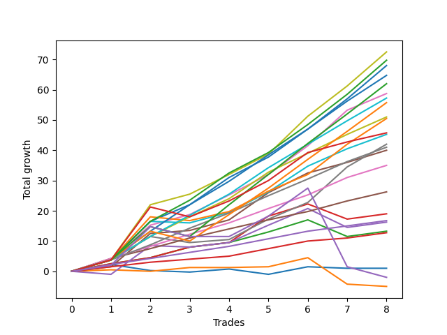

# Long Labrador 012_5 
- Symbol: ES
- Date Range: 03/18/2022 - 12/30/2022
- Trading Period: 8:30-12:30
- Number of Trades: 8



| Name | Win Percent | Profit | Avg Profit / Trade | Avg Time / Trade |      | Name | Win Percent | Profit | Avg Profit / Trade | Avg Time / Trade |
| ---- | ----------- | ------ | ------------------ | ---------------- | ---- | ---- | ----------- | ------ | ------------------ | ---------------- |
| Sorted By <br> Profit | | | | | | Sorted By <br> Win Percentage ||||
| V U/L 1SD | 100.00 | 36250.00 | 4531.25 | 34:51 |     | V U/L 1SD | 100.00 | 36250.00 | 4531.25 | 34:51 |
| BB-200 U/L 2SD | 100.00 | 34875.00 | 4359.38 | 46:20 |     | BB-200 U/L 2SD | 100.00 | 34875.00 | 4359.38 | 46:20 |
| BB-100 U/L 2SD | 100.00 | 34000.00 | 4250.00 | 43:53 |     | BB-100 U/L 2SD | 100.00 | 34000.00 | 4250.00 | 43:53 |
| TP-8 | 100.00 | 32375.00 | 4046.88 | 29:15 |     | TP-8 | 100.00 | 32375.00 | 4046.88 | 29:15 |
| TP-10 | 87.50 | 31000.00 | 3875.00 | 36:24 |     | BB-50 U/L 2SD | 100.00 | 29375.00 | 3671.88 | 27:35 |
| BB-50 U/L 2SD | 100.00 | 29375.00 | 3671.88 | 27:35 |     | TP-7 | 100.00 | 28625.00 | 3578.12 | 28:11 |
| TP-7 | 100.00 | 28625.00 | 3578.12 | 28:11 |     | TP-6 | 100.00 | 25500.00 | 3187.50 | 26:01 |
| TP-9 | 87.50 | 27875.00 | 3484.38 | 33:26 |     | TP-5 | 100.00 | 20500.00 | 2562.50 | 21:42 |
| TP-6 | 100.00 | 25500.00 | 3187.50 | 26:01 |     | BB-50 U/L 1SD | 100.00 | 20000.00 | 2500.00 | 21:25 |
| BB-200 Mid | 87.50 | 25250.00 | 3156.25 | 28:01 |     | TP-4 | 100.00 | 17500.00 | 2187.50 | 12:56 |
| NEWFI 000 | 87.50 | 22875.00 | 2859.38 | 39:46 |     | TP-3 | 100.00 | 13125.00 | 1640.62 | 10:06 |
| BB-100 Mid | 87.50 | 22625.00 | 2828.12 | 23:24 |     | TP-2 | 100.00 | 8375.00 | 1046.88 | 05:12 |
| V Mid | 87.50 | 21000.00 | 2625.00 | 21:16 |     | TP-1 | 100.00 | 6375.00 | 796.88 | 03:18 |
| TP-5 | 100.00 | 20500.00 | 2562.50 | 21:42 |     | TP-10 | 87.50 | 31000.00 | 3875.00 | 36:24 |
| BB-50 U/L 1SD | 100.00 | 20000.00 | 2500.00 | 21:25 |     | TP-9 | 87.50 | 27875.00 | 3484.38 | 33:26 |
| TP-4 | 100.00 | 17500.00 | 2187.50 | 12:56 |     | BB-200 Mid | 87.50 | 25250.00 | 3156.25 | 28:01 |
| TP-3 | 100.00 | 13125.00 | 1640.62 | 10:06 |     | NEWFI 000 | 87.50 | 22875.00 | 2859.38 | 39:46 |
| BB-20 U/L 2SD C | 87.50 | 9500.00 | 1187.50 | 13:41 |     | BB-100 Mid | 87.50 | 22625.00 | 2828.12 | 23:24 |
| TP-2 | 100.00 | 8375.00 | 1046.88 | 05:12 |     | V Mid | 87.50 | 21000.00 | 2625.00 | 21:16 |
| BB-50 Mid | 62.50 | 8125.00 | 1015.62 | 15:32 |     | BB-20 U/L 2SD C | 87.50 | 9500.00 | 1187.50 | 13:41 |
| BB-20 U/L 2SD | 87.50 | 6625.00 | 828.12 | 11:53 |     | BB-20 U/L 2SD | 87.50 | 6625.00 | 828.12 | 11:53 |
| TP-1 | 100.00 | 6375.00 | 796.88 | 03:18 |     | BB-20 U/L 2SD C SL-10 | 75.00 | 250.00 | 31.25 | 09:54 |
| BB-200 U/L 2SD SL-10 | 62.50 | 6125.00 | 765.62 | 29:42 |     | BB-20 U/L 2SD SL-10 | 75.00 | -2375.00 | -296.88 | 08:06 |
| BB-100 U/L 2SD SL-10 | 62.50 | 5250.00 | 656.25 | 27:15 |     | BB-50 Mid | 62.50 | 8125.00 | 1015.62 | 15:32 |
| V U/L 1SD SL-10 | 62.50 | 4750.00 | 593.75 | 22:27 |     | BB-200 U/L 2SD SL-10 | 62.50 | 6125.00 | 765.62 | 29:42 |
| V Mid SL-10 | 62.50 | 2750.00 | 343.75 | 12:58 |     | BB-100 U/L 2SD SL-10 | 62.50 | 5250.00 | 656.25 | 27:15 |
| BB-50 Mid SL-10 | 62.50 | 1250.00 | 156.25 | 10:11 |     | V U/L 1SD SL-10 | 62.50 | 4750.00 | 593.75 | 22:27 |
| BB-20 Mid SL-10 | 50.00 | 500.00 | 62.50 | 01:37 |     | V Mid SL-10 | 62.50 | 2750.00 | 343.75 | 12:58 |
| BB-20 Mid | 50.00 | 500.00 | 62.50 | 01:37 |     | BB-50 Mid SL-10 | 62.50 | 1250.00 | 156.25 | 10:11 |
| BB-50 U/L 2SD SL-10 | 62.50 | 375.00 | 46.88 | 17:19 |     | BB-50 U/L 2SD SL-10 | 62.50 | 375.00 | 46.88 | 17:19 |
| BB-20 U/L 2SD C SL-10 | 75.00 | 250.00 | 31.25 | 09:54 |     | BB-20 U/L 2SD SL-5 | 62.50 | -125.00 | -15.62 | 06:16 |
| BB-200 U/L 2SD SL-5 | 37.50 | 125.00 | 15.62 | 19:21 |     | NEWFI 0000 | 62.50 | -1000.00 | -125.00 | 30:53 |
| BB-20 U/L 2SD SL-5 | 62.50 | -125.00 | -15.62 | 06:16 |     | BB-20 U/L 1SD | 62.50 | -2500.00 | -312.50 | 08:58 |
| BB-100 U/L 2SD SL-5 | 37.50 | -625.00 | -78.12 | 19:18 |     | BB-50 U/L 1SD SL-10 | 62.50 | -3500.00 | -437.50 | 13:37 |
| NEWFI 0000 | 62.50 | -1000.00 | -125.00 | 30:53 |     | BB-20 Mid SL-10 | 50.00 | 500.00 | 62.50 | 01:37 |
| V U/L 1SD SL-5 | 37.50 | -1250.00 | -156.25 | 12:06 |     | BB-20 Mid | 50.00 | 500.00 | 62.50 | 01:37 |
| BB-50 Mid SL-5 | 37.50 | -1875.00 | -234.38 | 07:23 |     | BB-100 Mid SL-10 | 50.00 | -4000.00 | -500.00 | 14:44 |
| BB-20 U/L 2SD SL-10 | 75.00 | -2375.00 | -296.88 | 08:06 |     | BB-200 Mid SL-10 | 50.00 | -4250.00 | -531.25 | 16:00 |
| BB-20 U/L 1SD | 62.50 | -2500.00 | -312.50 | 08:58 |     | BB-20 U/L 2SD C SL-5 | 50.00 | -4375.00 | -546.88 | 07:03 |
| BB-50 U/L 2SD SL-5 | 37.50 | -2750.00 | -343.75 | 11:18 |     | BB-20 U/L 1SD SL-5 | 50.00 | -5375.00 | -671.88 | 04:23 |
| BB-20 Mid SL-5 | 37.50 | -3125.00 | -390.62 | 01:26 |     | BB-20 U/L 1SD SL-10 | 50.00 | -8875.00 | -1109.38 | 06:08 |
| BB-50 U/L 1SD SL-10 | 62.50 | -3500.00 | -437.50 | 13:37 |     | BB-200 U/L 2SD SL-5 | 37.50 | 125.00 | 15.62 | 19:21 |
| V Mid SL-5 | 37.50 | -3750.00 | -468.75 | 06:05 |     | BB-100 U/L 2SD SL-5 | 37.50 | -625.00 | -78.12 | 19:18 |
| BB-100 Mid SL-10 | 50.00 | -4000.00 | -500.00 | 14:44 |     | V U/L 1SD SL-5 | 37.50 | -1250.00 | -156.25 | 12:06 |
| BB-200 Mid SL-10 | 50.00 | -4250.00 | -531.25 | 16:00 |     | BB-50 Mid SL-5 | 37.50 | -1875.00 | -234.38 | 07:23 |
| BB-20 U/L 2SD C SL-5 | 50.00 | -4375.00 | -546.88 | 07:03 |     | BB-50 U/L 2SD SL-5 | 37.50 | -2750.00 | -343.75 | 11:18 |
| BB-20 U/L 1SD SL-5 | 50.00 | -5375.00 | -671.88 | 04:23 |     | BB-20 Mid SL-5 | 37.50 | -3125.00 | -390.62 | 01:26 |
| BB-100 Mid SL-5 | 25.00 | -6750.00 | -843.75 | 09:53 |     | V Mid SL-5 | 37.50 | -3750.00 | -468.75 | 06:05 |
| BB-50 U/L 1SD SL-5 | 37.50 | -7000.00 | -875.00 | 09:49 |     | BB-50 U/L 1SD SL-5 | 37.50 | -7000.00 | -875.00 | 09:49 |
| BB-20 U/L 1SD SL-10 | 50.00 | -8875.00 | -1109.38 | 06:08 |     | BB-100 Mid SL-5 | 25.00 | -6750.00 | -843.75 | 09:53 |
| BB-200 Mid SL-5 | 25.00 | -8875.00 | -1109.38 | 08:35 |     | BB-200 Mid SL-5 | 25.00 | -8875.00 | -1109.38 | 08:35 |

## NO STOPLOSS

### Test BB-20 Mid
* Sell when price hits the middle line of the 20p bollinger
* No Stoploss
* Results:
```
Total Trades: 8
Percent Up: 50.00
Percent Down: 50.00
Total Points Moved Up: 1.00
Potential Profit: 500.00
Total Points Ups: 5.75 Count Ups: 4
Total Points Downs: -4.75 Count Downs: 4
```

<details><summary>Trades</summary>

<code>In: 2022-04-27 12:11:00		Out: 2022-04-27 12:14:00		Total Position Time: 03:00		Total Move Up: 2.25		Total to Date: 2.25</code> <br />
<code>In: 2022-05-03 11:33:00		Out: 2022-05-03 11:34:10		Total Position Time: 01:10		Total Move Up: -2.00		Total to Date: 0.25</code> <br />
<code>In: 2022-08-04 11:45:00		Out: 2022-08-04 11:47:10		Total Position Time: 02:10		Total Move Up: -0.50		Total to Date: -0.25</code> <br />
<code>In: 2022-08-10 12:04:00		Out: 2022-08-10 12:05:10		Total Position Time: 01:10		Total Move Up: 1.00		Total to Date: 0.75</code> <br />
<code>In: 2022-10-11 12:18:00		Out: 2022-10-11 12:19:10		Total Position Time: 01:10		Total Move Up: -1.75		Total to Date: -1.00</code> <br />
<code>In: 2022-10-31 09:50:00		Out: 2022-10-31 09:51:10		Total Position Time: 01:10		Total Move Up: 2.50		Total to Date: 1.50</code> <br />
<code>In: 2022-11-08 11:15:00		Out: 2022-11-08 11:16:15		Total Position Time: 01:15		Total Move Up: -0.50		Total to Date: 1.00</code> <br />
<code>In: 2022-12-27 11:35:00		Out: 2022-12-27 11:36:55		Total Position Time: 01:55		Total Move Up: 0.00		Total to Date: 1.00</code> <br />


</details>

### Test BB-20 U/L 1SD
* Sell when the price hits the upper line of the 20p 1std bollinger
* No Stoploss
* Results:
```
Total Trades: 8
Percent Up: 62.50
Percent Down: 37.50
Total Points Moved Up: -5.00
Potential Profit: -2500.00
Total Points Ups: 5.00 Count Ups: 5
Total Points Downs: -10.00 Count Downs: 3
```

<details><summary>Trades</summary>

<code>In: 2022-04-27 12:11:00		Out: 2022-04-27 12:27:15		Total Position Time: 16:15		Total Move Up: 0.50		Total to Date: 0.50</code> <br />
<code>In: 2022-05-03 11:33:00		Out: 2022-05-03 11:34:20		Total Position Time: 01:20		Total Move Up: -0.50		Total to Date: 0.00</code> <br />
<code>In: 2022-08-04 11:45:00		Out: 2022-08-04 11:48:05		Total Position Time: 03:05		Total Move Up: 1.25		Total to Date: 1.25</code> <br />
<code>In: 2022-08-10 12:04:00		Out: 2022-08-10 12:11:05		Total Position Time: 07:05		Total Move Up: 0.00		Total to Date: 1.25</code> <br />
<code>In: 2022-10-11 12:18:00		Out: 2022-10-11 12:20:40		Total Position Time: 02:40		Total Move Up: 0.25		Total to Date: 1.50</code> <br />
<code>In: 2022-10-31 09:50:00		Out: 2022-10-31 09:57:05		Total Position Time: 07:05		Total Move Up: 3.00		Total to Date: 4.50</code> <br />
<code>In: 2022-11-08 11:15:00		Out: 2022-11-08 11:38:35		Total Position Time: 23:35		Total Move Up: -8.75		Total to Date: -4.25</code> <br />
<code>In: 2022-12-27 11:35:00		Out: 2022-12-27 11:45:40		Total Position Time: 10:40		Total Move Up: -0.75		Total to Date: -5.00</code> <br />


</details>

### Test BB-20 U/L 2SD
* Sell when the price hits the upper line of the 20p 2std bollinger
* No Stoploss
* Results:
```
Total Trades: 8
Percent Up: 87.50
Percent Down: 12.50
Total Points Moved Up: 13.25
Potential Profit: 6625.00
Total Points Ups: 18.75 Count Ups: 7
Total Points Downs: -5.50 Count Downs: 1
```

<details><summary>Trades</summary>

<code>In: 2022-04-27 12:11:00		Out: 2022-04-27 12:31:20		Total Position Time: 20:20		Total Move Up: 2.50		Total to Date: 2.50</code> <br />
<code>In: 2022-05-03 11:33:00		Out: 2022-05-03 11:34:55		Total Position Time: 01:55		Total Move Up: 2.00		Total to Date: 4.50</code> <br />
<code>In: 2022-08-04 11:45:00		Out: 2022-08-04 11:52:05		Total Position Time: 07:05		Total Move Up: 3.50		Total to Date: 8.00</code> <br />
<code>In: 2022-08-10 12:04:00		Out: 2022-08-10 12:14:35		Total Position Time: 10:35		Total Move Up: 1.50		Total to Date: 9.50</code> <br />
<code>In: 2022-10-11 12:18:00		Out: 2022-10-11 12:22:35		Total Position Time: 04:35		Total Move Up: 3.50		Total to Date: 13.00</code> <br />
<code>In: 2022-10-31 09:50:00		Out: 2022-10-31 10:02:05		Total Position Time: 12:05		Total Move Up: 4.00		Total to Date: 17.00</code> <br />
<code>In: 2022-11-08 11:15:00		Out: 2022-11-08 11:42:10		Total Position Time: 27:10		Total Move Up: -5.50		Total to Date: 11.50</code> <br />
<code>In: 2022-12-27 11:35:00		Out: 2022-12-27 11:46:20		Total Position Time: 11:20		Total Move Up: 1.75		Total to Date: 13.25</code> <br />


</details>

### Test BB-20 U/L 2SD C
* Sell when the price hits the upper line of the 20p 2std bollinger
* No Stoploss
* Results:
```
Total Trades: 8
Percent Up: 87.50
Percent Down: 12.50
Total Points Moved Up: 19.00
Potential Profit: 9500.00
Total Points Ups: 24.00 Count Ups: 7
Total Points Downs: -5.00 Count Downs: 1
```

<details><summary>Trades</summary>

<code>In: 2022-04-27 12:11:00		Out: 2022-04-27 12:31:20		Total Position Time: 20:20		Total Move Up: 2.50		Total to Date: 2.50</code> <br />
<code>In: 2022-05-03 11:33:00		Out: 2022-05-03 11:34:55		Total Position Time: 01:55		Total Move Up: 2.00		Total to Date: 4.50</code> <br />
<code>In: 2022-08-04 11:45:00		Out: 2022-08-04 11:52:05		Total Position Time: 07:05		Total Move Up: 3.50		Total to Date: 8.00</code> <br />
<code>In: 2022-08-10 12:04:00		Out: 2022-08-10 12:14:35		Total Position Time: 10:35		Total Move Up: 1.50		Total to Date: 9.50</code> <br />
<code>In: 2022-10-11 12:18:00		Out: 2022-10-11 12:37:00		Total Position Time: 19:00		Total Move Up: 8.75		Total to Date: 18.25</code> <br />
<code>In: 2022-10-31 09:50:00		Out: 2022-10-31 10:02:05		Total Position Time: 12:05		Total Move Up: 4.00		Total to Date: 22.25</code> <br />
<code>In: 2022-11-08 11:15:00		Out: 2022-11-08 11:42:15		Total Position Time: 27:15		Total Move Up: -5.00		Total to Date: 17.25</code> <br />
<code>In: 2022-12-27 11:35:00		Out: 2022-12-27 11:46:20		Total Position Time: 11:20		Total Move Up: 1.75		Total to Date: 19.00</code> <br />


</details>

### Test BB-50 Mid
* Sell when price hits the middle line of the 50p bollinger
* No Stoploss
* Results:
```
Total Trades: 8
Percent Up: 62.50
Percent Down: 37.50
Total Points Moved Up: 16.25
Potential Profit: 8125.00
Total Points Ups: 24.00 Count Ups: 5
Total Points Downs: -7.75 Count Downs: 3
```

<details><summary>Trades</summary>

<code>In: 2022-04-27 12:11:00		Out: 2022-04-27 12:44:20		Total Position Time: 33:20		Total Move Up: -1.00		Total to Date: -1.00</code> <br />
<code>In: 2022-05-03 11:33:00		Out: 2022-05-03 11:36:10		Total Position Time: 03:10		Total Move Up: 9.50		Total to Date: 8.50</code> <br />
<code>In: 2022-08-04 11:45:00		Out: 2022-08-04 11:47:10		Total Position Time: 02:10		Total Move Up: -0.50		Total to Date: 8.00</code> <br />
<code>In: 2022-08-10 12:04:00		Out: 2022-08-10 12:14:35		Total Position Time: 10:35		Total Move Up: 1.50		Total to Date: 9.50</code> <br />
<code>In: 2022-10-11 12:18:00		Out: 2022-10-11 12:36:35		Total Position Time: 18:35		Total Move Up: 5.75		Total to Date: 15.25</code> <br />
<code>In: 2022-10-31 09:50:00		Out: 2022-10-31 10:08:30		Total Position Time: 18:30		Total Move Up: 5.50		Total to Date: 20.75</code> <br />
<code>In: 2022-11-08 11:15:00		Out: 2022-11-08 11:41:40		Total Position Time: 26:40		Total Move Up: -6.25		Total to Date: 14.50</code> <br />
<code>In: 2022-12-27 11:35:00		Out: 2022-12-27 11:46:20		Total Position Time: 11:20		Total Move Up: 1.75		Total to Date: 16.25</code> <br />


</details>

### Test BB-50 U/L 1SD
* Sell when the price hits the upper line of the 50p 1std bollinger
* No Stoploss
* Results:
```
Total Trades: 8
Percent Up: 100.00
Percent Down: 0.00
Total Points Moved Up: 40.00
Potential Profit: 20000.00
Total Points Ups: 40.00 Count Ups: 8
Total Points Downs: 0.00 Count Downs: 0
```

<details><summary>Trades</summary>

<code>In: 2022-04-27 12:11:00		Out: 2022-04-27 12:46:05		Total Position Time: 35:05		Total Move Up: 1.50		Total to Date: 1.50</code> <br />
<code>In: 2022-05-03 11:33:00		Out: 2022-05-03 11:52:05		Total Position Time: 19:05		Total Move Up: 11.00		Total to Date: 12.50</code> <br />
<code>In: 2022-08-04 11:45:00		Out: 2022-08-04 11:47:50		Total Position Time: 02:50		Total Move Up: 1.00		Total to Date: 13.50</code> <br />
<code>In: 2022-08-10 12:04:00		Out: 2022-08-10 12:21:40		Total Position Time: 17:40		Total Move Up: 3.50		Total to Date: 17.00</code> <br />
<code>In: 2022-10-11 12:18:00		Out: 2022-10-11 12:39:25		Total Position Time: 21:25		Total Move Up: 9.00		Total to Date: 26.00</code> <br />
<code>In: 2022-10-31 09:50:00		Out: 2022-10-31 10:16:15		Total Position Time: 26:15		Total Move Up: 6.50		Total to Date: 32.50</code> <br />
<code>In: 2022-11-08 11:15:00		Out: 2022-11-08 11:47:55		Total Position Time: 32:55		Total Move Up: 3.50		Total to Date: 36.00</code> <br />
<code>In: 2022-12-27 11:35:00		Out: 2022-12-27 11:51:05		Total Position Time: 16:05		Total Move Up: 4.00		Total to Date: 40.00</code> <br />


</details>

### Test BB-50 U/L 2SD
* Sell when the price hits the upper line of the 50p 2std bollinger
* No Stoploss
* Results:
```
Total Trades: 8
Percent Up: 100.00
Percent Down: 0.00
Total Points Moved Up: 58.75
Potential Profit: 29375.00
Total Points Ups: 58.75 Count Ups: 8
Total Points Downs: 0.00 Count Downs: 0
```

<details><summary>Trades</summary>

<code>In: 2022-04-27 12:11:00		Out: 2022-04-27 12:47:00		Total Position Time: 36:00		Total Move Up: 3.75		Total to Date: 3.75</code> <br />
<code>In: 2022-05-03 11:33:00		Out: 2022-05-03 11:56:15		Total Position Time: 23:15		Total Move Up: 11.50		Total to Date: 15.25</code> <br />
<code>In: 2022-08-04 11:45:00		Out: 2022-08-04 11:52:05		Total Position Time: 07:05		Total Move Up: 3.50		Total to Date: 18.75</code> <br />
<code>In: 2022-08-10 12:04:00		Out: 2022-08-10 12:27:55		Total Position Time: 23:55		Total Move Up: 6.50		Total to Date: 25.25</code> <br />
<code>In: 2022-10-11 12:18:00		Out: 2022-10-11 12:47:00		Total Position Time: 29:00		Total Move Up: 6.75		Total to Date: 32.00</code> <br />
<code>In: 2022-10-31 09:50:00		Out: 2022-10-31 10:17:40		Total Position Time: 27:40		Total Move Up: 9.50		Total to Date: 41.50</code> <br />
<code>In: 2022-11-08 11:15:00		Out: 2022-11-08 12:02:35		Total Position Time: 47:35		Total Move Up: 11.75		Total to Date: 53.25</code> <br />
<code>In: 2022-12-27 11:35:00		Out: 2022-12-27 12:01:10		Total Position Time: 26:10		Total Move Up: 5.50		Total to Date: 58.75</code> <br />


</details>

### Test V Mid
* Sell when the price hits the middle line of the 1std VWAP
* No Stoploss
* Results:
```
Total Trades: 8
Percent Up: 87.50
Percent Down: 12.50
Total Points Moved Up: 42.00
Potential Profit: 21000.00
Total Points Ups: 44.00 Count Ups: 7
Total Points Downs: -2.00 Count Downs: 1
```

<details><summary>Trades</summary>

<code>In: 2022-04-27 12:11:00		Out: 2022-04-27 12:47:00		Total Position Time: 36:00		Total Move Up: 3.75		Total to Date: 3.75</code> <br />
<code>In: 2022-05-03 11:33:00		Out: 2022-05-03 11:36:05		Total Position Time: 03:05		Total Move Up: 7.75		Total to Date: 11.50</code> <br />
<code>In: 2022-08-04 11:45:00		Out: 2022-08-04 11:46:10		Total Position Time: 01:10		Total Move Up: -2.00		Total to Date: 9.50</code> <br />
<code>In: 2022-08-10 12:04:00		Out: 2022-08-10 12:05:10		Total Position Time: 01:10		Total Move Up: 1.00		Total to Date: 10.50</code> <br />
<code>In: 2022-10-11 12:18:00		Out: 2022-10-11 12:47:00		Total Position Time: 29:00		Total Move Up: 6.75		Total to Date: 17.25</code> <br />
<code>In: 2022-10-31 09:50:00		Out: 2022-10-31 10:08:30		Total Position Time: 18:30		Total Move Up: 5.50		Total to Date: 22.75</code> <br />
<code>In: 2022-11-08 11:15:00		Out: 2022-11-08 12:02:35		Total Position Time: 47:35		Total Move Up: 11.75		Total to Date: 34.50</code> <br />
<code>In: 2022-12-27 11:35:00		Out: 2022-12-27 12:08:40		Total Position Time: 33:40		Total Move Up: 7.50		Total to Date: 42.00</code> <br />


</details>

### Test V U/L 1SD
* Sell when the price hits the upper line of the 1std VWAP
* No Stoploss
* Results:
```
Total Trades: 8
Percent Up: 100.00
Percent Down: 0.00
Total Points Moved Up: 72.50
Potential Profit: 36250.00
Total Points Ups: 72.50 Count Ups: 8
Total Points Downs: 0.00 Count Downs: 0
```

<details><summary>Trades</summary>

<code>In: 2022-04-27 12:11:00		Out: 2022-04-27 12:47:00		Total Position Time: 36:00		Total Move Up: 3.75		Total to Date: 3.75</code> <br />
<code>In: 2022-05-03 11:33:00		Out: 2022-05-03 12:00:05		Total Position Time: 27:05		Total Move Up: 18.25		Total to Date: 22.00</code> <br />
<code>In: 2022-08-04 11:45:00		Out: 2022-08-04 11:52:05		Total Position Time: 07:05		Total Move Up: 3.50		Total to Date: 25.50</code> <br />
<code>In: 2022-08-10 12:04:00		Out: 2022-08-10 12:27:55		Total Position Time: 23:55		Total Move Up: 6.50		Total to Date: 32.00</code> <br />
<code>In: 2022-10-11 12:18:00		Out: 2022-10-11 12:47:00		Total Position Time: 29:00		Total Move Up: 6.75		Total to Date: 38.75</code> <br />
<code>In: 2022-10-31 09:50:00		Out: 2022-10-31 10:24:00		Total Position Time: 34:00		Total Move Up: 12.50		Total to Date: 51.25</code> <br />
<code>In: 2022-11-08 11:15:00		Out: 2022-11-08 12:15:55		Total Position Time: 60:55		Total Move Up: 10.00		Total to Date: 61.25</code> <br />
<code>In: 2022-12-27 11:35:00		Out: 2022-12-27 12:35:55		Total Position Time: 60:55		Total Move Up: 11.25		Total to Date: 72.50</code> <br />


</details>

### Test BB-100 Mid
* Move to BB100 Mid
* No Stoploss
* Results:
```
Total Trades: 8
Percent Up: 87.50
Percent Down: 12.50
Total Points Moved Up: 45.25
Potential Profit: 22625.00
Total Points Ups: 45.75 Count Ups: 7
Total Points Downs: -0.50 Count Downs: 1
```

<details><summary>Trades</summary>

<code>In: 2022-04-27 12:11:00		Out: 2022-04-27 12:47:00		Total Position Time: 36:00		Total Move Up: 3.75		Total to Date: 3.75</code> <br />
<code>In: 2022-05-03 11:33:00		Out: 2022-05-03 11:52:15		Total Position Time: 19:15		Total Move Up: 12.75		Total to Date: 16.50</code> <br />
<code>In: 2022-08-04 11:45:00		Out: 2022-08-04 11:47:20		Total Position Time: 02:20		Total Move Up: -0.50		Total to Date: 16.00</code> <br />
<code>In: 2022-08-10 12:04:00		Out: 2022-08-10 12:21:40		Total Position Time: 17:40		Total Move Up: 3.50		Total to Date: 19.50</code> <br />
<code>In: 2022-10-11 12:18:00		Out: 2022-10-11 12:47:00		Total Position Time: 29:00		Total Move Up: 6.75		Total to Date: 26.25</code> <br />
<code>In: 2022-10-31 09:50:00		Out: 2022-10-31 10:17:20		Total Position Time: 27:20		Total Move Up: 8.50		Total to Date: 34.75</code> <br />
<code>In: 2022-11-08 11:15:00		Out: 2022-11-08 11:53:50		Total Position Time: 38:50		Total Move Up: 5.75		Total to Date: 40.50</code> <br />
<code>In: 2022-12-27 11:35:00		Out: 2022-12-27 11:51:50		Total Position Time: 16:50		Total Move Up: 4.75		Total to Date: 45.25</code> <br />


</details>

### Test BB-100 U/L 2SD
* Move to BB100 Upper Band
* No Stoploss
* Results:
```
Total Trades: 8
Percent Up: 100.00
Percent Down: 0.00
Total Points Moved Up: 68.00
Potential Profit: 34000.00
Total Points Ups: 68.00 Count Ups: 8
Total Points Downs: 0.00 Count Downs: 0
```

<details><summary>Trades</summary>

<code>In: 2022-04-27 12:11:00		Out: 2022-04-27 12:47:00		Total Position Time: 36:00		Total Move Up: 3.75		Total to Date: 3.75</code> <br />
<code>In: 2022-05-03 11:33:00		Out: 2022-05-03 12:33:55		Total Position Time: 60:55		Total Move Up: 12.75		Total to Date: 16.50</code> <br />
<code>In: 2022-08-04 11:45:00		Out: 2022-08-04 12:13:10		Total Position Time: 28:10		Total Move Up: 5.50		Total to Date: 22.00</code> <br />
<code>In: 2022-08-10 12:04:00		Out: 2022-08-10 12:37:35		Total Position Time: 33:35		Total Move Up: 9.00		Total to Date: 31.00</code> <br />
<code>In: 2022-10-11 12:18:00		Out: 2022-10-11 12:47:00		Total Position Time: 29:00		Total Move Up: 6.75		Total to Date: 37.75</code> <br />
<code>In: 2022-10-31 09:50:00		Out: 2022-10-31 10:50:55		Total Position Time: 60:55		Total Move Up: 9.25		Total to Date: 47.00</code> <br />
<code>In: 2022-11-08 11:15:00		Out: 2022-11-08 12:15:55		Total Position Time: 60:55		Total Move Up: 10.00		Total to Date: 57.00</code> <br />
<code>In: 2022-12-27 11:35:00		Out: 2022-12-27 12:16:35		Total Position Time: 41:35		Total Move Up: 11.00		Total to Date: 68.00</code> <br />


</details>

### Test BB-200 Mid
* Move to BB200 Mid
* No Stoploss
* Results:
```
Total Trades: 8
Percent Up: 87.50
Percent Down: 12.50
Total Points Moved Up: 50.50
Potential Profit: 25250.00
Total Points Ups: 51.75 Count Ups: 7
Total Points Downs: -1.25 Count Downs: 1
```

<details><summary>Trades</summary>

<code>In: 2022-04-27 12:11:00		Out: 2022-04-27 12:47:00		Total Position Time: 36:00		Total Move Up: 3.75		Total to Date: 3.75</code> <br />
<code>In: 2022-05-03 11:33:00		Out: 2022-05-03 11:56:55		Total Position Time: 23:55		Total Move Up: 14.25		Total to Date: 18.00</code> <br />
<code>In: 2022-08-04 11:45:00		Out: 2022-08-04 11:46:45		Total Position Time: 01:45		Total Move Up: -1.25		Total to Date: 16.75</code> <br />
<code>In: 2022-08-10 12:04:00		Out: 2022-08-10 12:20:40		Total Position Time: 16:40		Total Move Up: 3.00		Total to Date: 19.75</code> <br />
<code>In: 2022-10-11 12:18:00		Out: 2022-10-11 12:47:00		Total Position Time: 29:00		Total Move Up: 6.75		Total to Date: 26.50</code> <br />
<code>In: 2022-10-31 09:50:00		Out: 2022-10-31 10:08:30		Total Position Time: 18:30		Total Move Up: 5.50		Total to Date: 32.00</code> <br />
<code>In: 2022-11-08 11:15:00		Out: 2022-11-08 12:15:55		Total Position Time: 60:55		Total Move Up: 10.00		Total to Date: 42.00</code> <br />
<code>In: 2022-12-27 11:35:00		Out: 2022-12-27 12:12:25		Total Position Time: 37:25		Total Move Up: 8.50		Total to Date: 50.50</code> <br />


</details>

### Test BB-200 U/L 2SD
* Move to BB200 Upper Band
* No Stoploss
* Results:
```
Total Trades: 8
Percent Up: 100.00
Percent Down: 0.00
Total Points Moved Up: 69.75
Potential Profit: 34875.00
Total Points Ups: 69.75 Count Ups: 8
Total Points Downs: 0.00 Count Downs: 0
```

<details><summary>Trades</summary>

<code>In: 2022-04-27 12:11:00		Out: 2022-04-27 12:47:00		Total Position Time: 36:00		Total Move Up: 3.75		Total to Date: 3.75</code> <br />
<code>In: 2022-05-03 11:33:00		Out: 2022-05-03 12:33:55		Total Position Time: 60:55		Total Move Up: 12.75		Total to Date: 16.50</code> <br />
<code>In: 2022-08-04 11:45:00		Out: 2022-08-04 12:13:30		Total Position Time: 28:30		Total Move Up: 7.00		Total to Date: 23.50</code> <br />
<code>In: 2022-08-10 12:04:00		Out: 2022-08-10 12:37:35		Total Position Time: 33:35		Total Move Up: 9.00		Total to Date: 32.50</code> <br />
<code>In: 2022-10-11 12:18:00		Out: 2022-10-11 12:47:00		Total Position Time: 29:00		Total Move Up: 6.75		Total to Date: 39.25</code> <br />
<code>In: 2022-10-31 09:50:00		Out: 2022-10-31 10:50:55		Total Position Time: 60:55		Total Move Up: 9.25		Total to Date: 48.50</code> <br />
<code>In: 2022-11-08 11:15:00		Out: 2022-11-08 12:15:55		Total Position Time: 60:55		Total Move Up: 10.00		Total to Date: 58.50</code> <br />
<code>In: 2022-12-27 11:35:00		Out: 2022-12-27 12:35:55		Total Position Time: 60:55		Total Move Up: 11.25		Total to Date: 69.75</code> <br />


</details>

## STOPLOSS OF 5

### Test BB-20 Mid SL-5
* Sell when price hits the middle line of the 20p bollinger
* Stoploss is 5 points
* Results:
```
Total Trades: 8
Percent Up: 37.50
Percent Down: 62.50
Total Points Moved Up: -6.25
Potential Profit: -3125.00
Total Points Ups: 3.50 Count Ups: 3
Total Points Downs: -9.75 Count Downs: 5
```

<details><summary>Trades</summary>

<code>In: 2022-04-27 12:11:00		Out: 2022-04-27 12:12:30		Total Position Time: 01:30		Total Move Up: -5.00		Total to Date: -5.00</code> <br />
<code>In: 2022-05-03 11:33:00		Out: 2022-05-03 11:34:10		Total Position Time: 01:10		Total Move Up: -2.00		Total to Date: -7.00</code> <br />
<code>In: 2022-08-04 11:45:00		Out: 2022-08-04 11:47:10		Total Position Time: 02:10		Total Move Up: -0.50		Total to Date: -7.50</code> <br />
<code>In: 2022-08-10 12:04:00		Out: 2022-08-10 12:05:10		Total Position Time: 01:10		Total Move Up: 1.00		Total to Date: -6.50</code> <br />
<code>In: 2022-10-11 12:18:00		Out: 2022-10-11 12:19:10		Total Position Time: 01:10		Total Move Up: -1.75		Total to Date: -8.25</code> <br />
<code>In: 2022-10-31 09:50:00		Out: 2022-10-31 09:51:10		Total Position Time: 01:10		Total Move Up: 2.50		Total to Date: -5.75</code> <br />
<code>In: 2022-11-08 11:15:00		Out: 2022-11-08 11:16:15		Total Position Time: 01:15		Total Move Up: -0.50		Total to Date: -6.25</code> <br />
<code>In: 2022-12-27 11:35:00		Out: 2022-12-27 11:36:55		Total Position Time: 01:55		Total Move Up: 0.00		Total to Date: -6.25</code> <br />


</details>

### Test BB-20 U/L 1SD SL-5
* Sell when the price hits the upper line of the 20p 1std bollinger
* Stoploss is 5 points
* Results:
```
Total Trades: 8
Percent Up: 50.00
Percent Down: 50.00
Total Points Moved Up: -10.75
Potential Profit: -5375.00
Total Points Ups: 4.50 Count Ups: 4
Total Points Downs: -15.25 Count Downs: 4
```

<details><summary>Trades</summary>

<code>In: 2022-04-27 12:11:00		Out: 2022-04-27 12:12:30		Total Position Time: 01:30		Total Move Up: -5.00		Total to Date: -5.00</code> <br />
<code>In: 2022-05-03 11:33:00		Out: 2022-05-03 11:34:20		Total Position Time: 01:20		Total Move Up: -0.50		Total to Date: -5.50</code> <br />
<code>In: 2022-08-04 11:45:00		Out: 2022-08-04 11:48:05		Total Position Time: 03:05		Total Move Up: 1.25		Total to Date: -4.25</code> <br />
<code>In: 2022-08-10 12:04:00		Out: 2022-08-10 12:11:05		Total Position Time: 07:05		Total Move Up: 0.00		Total to Date: -4.25</code> <br />
<code>In: 2022-10-11 12:18:00		Out: 2022-10-11 12:20:40		Total Position Time: 02:40		Total Move Up: 0.25		Total to Date: -4.00</code> <br />
<code>In: 2022-10-31 09:50:00		Out: 2022-10-31 09:57:05		Total Position Time: 07:05		Total Move Up: 3.00		Total to Date: -1.00</code> <br />
<code>In: 2022-11-08 11:15:00		Out: 2022-11-08 11:20:40		Total Position Time: 05:40		Total Move Up: -4.75		Total to Date: -5.75</code> <br />
<code>In: 2022-12-27 11:35:00		Out: 2022-12-27 11:41:45		Total Position Time: 06:45		Total Move Up: -5.00		Total to Date: -10.75</code> <br />


</details>

### Test BB-20 U/L 2SD SL-5
* Sell when the price hits the upper line of the 20p 2std bollinger
* Stoploss is 5 points
* Results:
```
Total Trades: 8
Percent Up: 62.50
Percent Down: 37.50
Total Points Moved Up: -0.25
Potential Profit: -125.00
Total Points Ups: 14.50 Count Ups: 5
Total Points Downs: -14.75 Count Downs: 3
```

<details><summary>Trades</summary>

<code>In: 2022-04-27 12:11:00		Out: 2022-04-27 12:12:30		Total Position Time: 01:30		Total Move Up: -5.00		Total to Date: -5.00</code> <br />
<code>In: 2022-05-03 11:33:00		Out: 2022-05-03 11:34:55		Total Position Time: 01:55		Total Move Up: 2.00		Total to Date: -3.00</code> <br />
<code>In: 2022-08-04 11:45:00		Out: 2022-08-04 11:52:05		Total Position Time: 07:05		Total Move Up: 3.50		Total to Date: 0.50</code> <br />
<code>In: 2022-08-10 12:04:00		Out: 2022-08-10 12:14:35		Total Position Time: 10:35		Total Move Up: 1.50		Total to Date: 2.00</code> <br />
<code>In: 2022-10-11 12:18:00		Out: 2022-10-11 12:22:35		Total Position Time: 04:35		Total Move Up: 3.50		Total to Date: 5.50</code> <br />
<code>In: 2022-10-31 09:50:00		Out: 2022-10-31 10:02:05		Total Position Time: 12:05		Total Move Up: 4.00		Total to Date: 9.50</code> <br />
<code>In: 2022-11-08 11:15:00		Out: 2022-11-08 11:20:40		Total Position Time: 05:40		Total Move Up: -4.75		Total to Date: 4.75</code> <br />
<code>In: 2022-12-27 11:35:00		Out: 2022-12-27 11:41:45		Total Position Time: 06:45		Total Move Up: -5.00		Total to Date: -0.25</code> <br />


</details>

### Test BB-20 U/L 2SD C SL-5
* Sell when the price hits the upper line of the 20p 2std bollinger
* Stoploss is 5 points
* Results:
```
Total Trades: 8
Percent Up: 50.00
Percent Down: 50.00
Total Points Moved Up: -8.75
Potential Profit: -4375.00
Total Points Ups: 11.00 Count Ups: 4
Total Points Downs: -19.75 Count Downs: 4
```

<details><summary>Trades</summary>

<code>In: 2022-04-27 12:11:00		Out: 2022-04-27 12:12:30		Total Position Time: 01:30		Total Move Up: -5.00		Total to Date: -5.00</code> <br />
<code>In: 2022-05-03 11:33:00		Out: 2022-05-03 11:34:55		Total Position Time: 01:55		Total Move Up: 2.00		Total to Date: -3.00</code> <br />
<code>In: 2022-08-04 11:45:00		Out: 2022-08-04 11:52:05		Total Position Time: 07:05		Total Move Up: 3.50		Total to Date: 0.50</code> <br />
<code>In: 2022-08-10 12:04:00		Out: 2022-08-10 12:14:35		Total Position Time: 10:35		Total Move Up: 1.50		Total to Date: 2.00</code> <br />
<code>In: 2022-10-11 12:18:00		Out: 2022-10-11 12:28:50		Total Position Time: 10:50		Total Move Up: -5.00		Total to Date: -3.00</code> <br />
<code>In: 2022-10-31 09:50:00		Out: 2022-10-31 10:02:05		Total Position Time: 12:05		Total Move Up: 4.00		Total to Date: 1.00</code> <br />
<code>In: 2022-11-08 11:15:00		Out: 2022-11-08 11:20:40		Total Position Time: 05:40		Total Move Up: -4.75		Total to Date: -3.75</code> <br />
<code>In: 2022-12-27 11:35:00		Out: 2022-12-27 11:41:45		Total Position Time: 06:45		Total Move Up: -5.00		Total to Date: -8.75</code> <br />


</details>

### Test BB-50 Mid SL-5
* Sell when price hits the middle line of the 50p bollinger
* Stoploss is 5 points
* Results:
```
Total Trades: 8
Percent Up: 37.50
Percent Down: 62.50
Total Points Moved Up: -3.75
Potential Profit: -1875.00
Total Points Ups: 16.50 Count Ups: 3
Total Points Downs: -20.25 Count Downs: 5
```

<details><summary>Trades</summary>

<code>In: 2022-04-27 12:11:00		Out: 2022-04-27 12:12:30		Total Position Time: 01:30		Total Move Up: -5.00		Total to Date: -5.00</code> <br />
<code>In: 2022-05-03 11:33:00		Out: 2022-05-03 11:36:10		Total Position Time: 03:10		Total Move Up: 9.50		Total to Date: 4.50</code> <br />
<code>In: 2022-08-04 11:45:00		Out: 2022-08-04 11:47:10		Total Position Time: 02:10		Total Move Up: -0.50		Total to Date: 4.00</code> <br />
<code>In: 2022-08-10 12:04:00		Out: 2022-08-10 12:14:35		Total Position Time: 10:35		Total Move Up: 1.50		Total to Date: 5.50</code> <br />
<code>In: 2022-10-11 12:18:00		Out: 2022-10-11 12:28:50		Total Position Time: 10:50		Total Move Up: -5.00		Total to Date: 0.50</code> <br />
<code>In: 2022-10-31 09:50:00		Out: 2022-10-31 10:08:30		Total Position Time: 18:30		Total Move Up: 5.50		Total to Date: 6.00</code> <br />
<code>In: 2022-11-08 11:15:00		Out: 2022-11-08 11:20:40		Total Position Time: 05:40		Total Move Up: -4.75		Total to Date: 1.25</code> <br />
<code>In: 2022-12-27 11:35:00		Out: 2022-12-27 11:41:45		Total Position Time: 06:45		Total Move Up: -5.00		Total to Date: -3.75</code> <br />


</details>

### Test BB-50 U/L 1SD SL-5
* Sell when the price hits the upper line of the 50p 1std bollinger
* Stoploss is 5 points
* Results:
```
Total Trades: 8
Percent Up: 37.50
Percent Down: 62.50
Total Points Moved Up: -14.00
Potential Profit: -7000.00
Total Points Ups: 11.00 Count Ups: 3
Total Points Downs: -25.00 Count Downs: 5
```

<details><summary>Trades</summary>

<code>In: 2022-04-27 12:11:00		Out: 2022-04-27 12:12:30		Total Position Time: 01:30		Total Move Up: -5.00		Total to Date: -5.00</code> <br />
<code>In: 2022-05-03 11:33:00		Out: 2022-05-03 11:40:05		Total Position Time: 07:05		Total Move Up: -5.25		Total to Date: -10.25</code> <br />
<code>In: 2022-08-04 11:45:00		Out: 2022-08-04 11:47:50		Total Position Time: 02:50		Total Move Up: 1.00		Total to Date: -9.25</code> <br />
<code>In: 2022-08-10 12:04:00		Out: 2022-08-10 12:21:40		Total Position Time: 17:40		Total Move Up: 3.50		Total to Date: -5.75</code> <br />
<code>In: 2022-10-11 12:18:00		Out: 2022-10-11 12:28:50		Total Position Time: 10:50		Total Move Up: -5.00		Total to Date: -10.75</code> <br />
<code>In: 2022-10-31 09:50:00		Out: 2022-10-31 10:16:15		Total Position Time: 26:15		Total Move Up: 6.50		Total to Date: -4.25</code> <br />
<code>In: 2022-11-08 11:15:00		Out: 2022-11-08 11:20:40		Total Position Time: 05:40		Total Move Up: -4.75		Total to Date: -9.00</code> <br />
<code>In: 2022-12-27 11:35:00		Out: 2022-12-27 11:41:45		Total Position Time: 06:45		Total Move Up: -5.00		Total to Date: -14.00</code> <br />


</details>

### Test BB-50 U/L 2SD SL-5
* Sell when the price hits the upper line of the 50p 2std bollinger
* Stoploss is 5 points
* Results:
```
Total Trades: 8
Percent Up: 37.50
Percent Down: 62.50
Total Points Moved Up: -5.50
Potential Profit: -2750.00
Total Points Ups: 19.50 Count Ups: 3
Total Points Downs: -25.00 Count Downs: 5
```

<details><summary>Trades</summary>

<code>In: 2022-04-27 12:11:00		Out: 2022-04-27 12:12:30		Total Position Time: 01:30		Total Move Up: -5.00		Total to Date: -5.00</code> <br />
<code>In: 2022-05-03 11:33:00		Out: 2022-05-03 11:40:05		Total Position Time: 07:05		Total Move Up: -5.25		Total to Date: -10.25</code> <br />
<code>In: 2022-08-04 11:45:00		Out: 2022-08-04 11:52:05		Total Position Time: 07:05		Total Move Up: 3.50		Total to Date: -6.75</code> <br />
<code>In: 2022-08-10 12:04:00		Out: 2022-08-10 12:27:55		Total Position Time: 23:55		Total Move Up: 6.50		Total to Date: -0.25</code> <br />
<code>In: 2022-10-11 12:18:00		Out: 2022-10-11 12:28:50		Total Position Time: 10:50		Total Move Up: -5.00		Total to Date: -5.25</code> <br />
<code>In: 2022-10-31 09:50:00		Out: 2022-10-31 10:17:40		Total Position Time: 27:40		Total Move Up: 9.50		Total to Date: 4.25</code> <br />
<code>In: 2022-11-08 11:15:00		Out: 2022-11-08 11:20:40		Total Position Time: 05:40		Total Move Up: -4.75		Total to Date: -0.50</code> <br />
<code>In: 2022-12-27 11:35:00		Out: 2022-12-27 11:41:45		Total Position Time: 06:45		Total Move Up: -5.00		Total to Date: -5.50</code> <br />


</details>

### Test V Mid SL-5
* Sell when the price hits the middle line of the 1std VWAP
* Stoploss is 5 points
* Results:
```
Total Trades: 8
Percent Up: 37.50
Percent Down: 62.50
Total Points Moved Up: -7.50
Potential Profit: -3750.00
Total Points Ups: 14.25 Count Ups: 3
Total Points Downs: -21.75 Count Downs: 5
```

<details><summary>Trades</summary>

<code>In: 2022-04-27 12:11:00		Out: 2022-04-27 12:12:30		Total Position Time: 01:30		Total Move Up: -5.00		Total to Date: -5.00</code> <br />
<code>In: 2022-05-03 11:33:00		Out: 2022-05-03 11:36:05		Total Position Time: 03:05		Total Move Up: 7.75		Total to Date: 2.75</code> <br />
<code>In: 2022-08-04 11:45:00		Out: 2022-08-04 11:46:10		Total Position Time: 01:10		Total Move Up: -2.00		Total to Date: 0.75</code> <br />
<code>In: 2022-08-10 12:04:00		Out: 2022-08-10 12:05:10		Total Position Time: 01:10		Total Move Up: 1.00		Total to Date: 1.75</code> <br />
<code>In: 2022-10-11 12:18:00		Out: 2022-10-11 12:28:50		Total Position Time: 10:50		Total Move Up: -5.00		Total to Date: -3.25</code> <br />
<code>In: 2022-10-31 09:50:00		Out: 2022-10-31 10:08:30		Total Position Time: 18:30		Total Move Up: 5.50		Total to Date: 2.25</code> <br />
<code>In: 2022-11-08 11:15:00		Out: 2022-11-08 11:20:40		Total Position Time: 05:40		Total Move Up: -4.75		Total to Date: -2.50</code> <br />
<code>In: 2022-12-27 11:35:00		Out: 2022-12-27 11:41:45		Total Position Time: 06:45		Total Move Up: -5.00		Total to Date: -7.50</code> <br />


</details>

### Test V U/L 1SD SL-5
* Sell when the price hits the upper line of the 1std VWAP
* Stoploss is 5 points
* Results:
```
Total Trades: 8
Percent Up: 37.50
Percent Down: 62.50
Total Points Moved Up: -2.50
Potential Profit: -1250.00
Total Points Ups: 22.50 Count Ups: 3
Total Points Downs: -25.00 Count Downs: 5
```

<details><summary>Trades</summary>

<code>In: 2022-04-27 12:11:00		Out: 2022-04-27 12:12:30		Total Position Time: 01:30		Total Move Up: -5.00		Total to Date: -5.00</code> <br />
<code>In: 2022-05-03 11:33:00		Out: 2022-05-03 11:40:05		Total Position Time: 07:05		Total Move Up: -5.25		Total to Date: -10.25</code> <br />
<code>In: 2022-08-04 11:45:00		Out: 2022-08-04 11:52:05		Total Position Time: 07:05		Total Move Up: 3.50		Total to Date: -6.75</code> <br />
<code>In: 2022-08-10 12:04:00		Out: 2022-08-10 12:27:55		Total Position Time: 23:55		Total Move Up: 6.50		Total to Date: -0.25</code> <br />
<code>In: 2022-10-11 12:18:00		Out: 2022-10-11 12:28:50		Total Position Time: 10:50		Total Move Up: -5.00		Total to Date: -5.25</code> <br />
<code>In: 2022-10-31 09:50:00		Out: 2022-10-31 10:24:00		Total Position Time: 34:00		Total Move Up: 12.50		Total to Date: 7.25</code> <br />
<code>In: 2022-11-08 11:15:00		Out: 2022-11-08 11:20:40		Total Position Time: 05:40		Total Move Up: -4.75		Total to Date: 2.50</code> <br />
<code>In: 2022-12-27 11:35:00		Out: 2022-12-27 11:41:45		Total Position Time: 06:45		Total Move Up: -5.00		Total to Date: -2.50</code> <br />


</details>

### Test BB-100 Mid SL-5
* Move to BB100 Mid
* Stoploss is 5 points
* Results:
```
Total Trades: 8
Percent Up: 25.00
Percent Down: 75.00
Total Points Moved Up: -13.50
Potential Profit: -6750.00
Total Points Ups: 12.00 Count Ups: 2
Total Points Downs: -25.50 Count Downs: 6
```

<details><summary>Trades</summary>

<code>In: 2022-04-27 12:11:00		Out: 2022-04-27 12:12:30		Total Position Time: 01:30		Total Move Up: -5.00		Total to Date: -5.00</code> <br />
<code>In: 2022-05-03 11:33:00		Out: 2022-05-03 11:40:05		Total Position Time: 07:05		Total Move Up: -5.25		Total to Date: -10.25</code> <br />
<code>In: 2022-08-04 11:45:00		Out: 2022-08-04 11:47:20		Total Position Time: 02:20		Total Move Up: -0.50		Total to Date: -10.75</code> <br />
<code>In: 2022-08-10 12:04:00		Out: 2022-08-10 12:21:40		Total Position Time: 17:40		Total Move Up: 3.50		Total to Date: -7.25</code> <br />
<code>In: 2022-10-11 12:18:00		Out: 2022-10-11 12:28:50		Total Position Time: 10:50		Total Move Up: -5.00		Total to Date: -12.25</code> <br />
<code>In: 2022-10-31 09:50:00		Out: 2022-10-31 10:17:20		Total Position Time: 27:20		Total Move Up: 8.50		Total to Date: -3.75</code> <br />
<code>In: 2022-11-08 11:15:00		Out: 2022-11-08 11:20:40		Total Position Time: 05:40		Total Move Up: -4.75		Total to Date: -8.50</code> <br />
<code>In: 2022-12-27 11:35:00		Out: 2022-12-27 11:41:45		Total Position Time: 06:45		Total Move Up: -5.00		Total to Date: -13.50</code> <br />


</details>

### Test BB-100 U/L 2SD SL-5
* Move to BB100 Upper Band
* Stoploss is 5 points
* Results:
```
Total Trades: 8
Percent Up: 37.50
Percent Down: 62.50
Total Points Moved Up: -1.25
Potential Profit: -625.00
Total Points Ups: 23.75 Count Ups: 3
Total Points Downs: -25.00 Count Downs: 5
```

<details><summary>Trades</summary>

<code>In: 2022-04-27 12:11:00		Out: 2022-04-27 12:12:30		Total Position Time: 01:30		Total Move Up: -5.00		Total to Date: -5.00</code> <br />
<code>In: 2022-05-03 11:33:00		Out: 2022-05-03 11:40:05		Total Position Time: 07:05		Total Move Up: -5.25		Total to Date: -10.25</code> <br />
<code>In: 2022-08-04 11:45:00		Out: 2022-08-04 12:13:10		Total Position Time: 28:10		Total Move Up: 5.50		Total to Date: -4.75</code> <br />
<code>In: 2022-08-10 12:04:00		Out: 2022-08-10 12:37:35		Total Position Time: 33:35		Total Move Up: 9.00		Total to Date: 4.25</code> <br />
<code>In: 2022-10-11 12:18:00		Out: 2022-10-11 12:28:50		Total Position Time: 10:50		Total Move Up: -5.00		Total to Date: -0.75</code> <br />
<code>In: 2022-10-31 09:50:00		Out: 2022-10-31 10:50:55		Total Position Time: 60:55		Total Move Up: 9.25		Total to Date: 8.50</code> <br />
<code>In: 2022-11-08 11:15:00		Out: 2022-11-08 11:20:40		Total Position Time: 05:40		Total Move Up: -4.75		Total to Date: 3.75</code> <br />
<code>In: 2022-12-27 11:35:00		Out: 2022-12-27 11:41:45		Total Position Time: 06:45		Total Move Up: -5.00		Total to Date: -1.25</code> <br />


</details>

### Test BB-200 Mid SL-5
* Move to BB200 Mid
* Stoploss is 5 points
* Results:
```
Total Trades: 8
Percent Up: 25.00
Percent Down: 75.00
Total Points Moved Up: -17.75
Potential Profit: -8875.00
Total Points Ups: 8.50 Count Ups: 2
Total Points Downs: -26.25 Count Downs: 6
```

<details><summary>Trades</summary>

<code>In: 2022-04-27 12:11:00		Out: 2022-04-27 12:12:30		Total Position Time: 01:30		Total Move Up: -5.00		Total to Date: -5.00</code> <br />
<code>In: 2022-05-03 11:33:00		Out: 2022-05-03 11:40:05		Total Position Time: 07:05		Total Move Up: -5.25		Total to Date: -10.25</code> <br />
<code>In: 2022-08-04 11:45:00		Out: 2022-08-04 11:46:45		Total Position Time: 01:45		Total Move Up: -1.25		Total to Date: -11.50</code> <br />
<code>In: 2022-08-10 12:04:00		Out: 2022-08-10 12:20:40		Total Position Time: 16:40		Total Move Up: 3.00		Total to Date: -8.50</code> <br />
<code>In: 2022-10-11 12:18:00		Out: 2022-10-11 12:28:50		Total Position Time: 10:50		Total Move Up: -5.00		Total to Date: -13.50</code> <br />
<code>In: 2022-10-31 09:50:00		Out: 2022-10-31 10:08:30		Total Position Time: 18:30		Total Move Up: 5.50		Total to Date: -8.00</code> <br />
<code>In: 2022-11-08 11:15:00		Out: 2022-11-08 11:20:40		Total Position Time: 05:40		Total Move Up: -4.75		Total to Date: -12.75</code> <br />
<code>In: 2022-12-27 11:35:00		Out: 2022-12-27 11:41:45		Total Position Time: 06:45		Total Move Up: -5.00		Total to Date: -17.75</code> <br />


</details>

### Test BB-200 U/L 2SD SL-5
* Move to BB200 Upper Band
* Stoploss is 5 points
* Results:
```
Total Trades: 8
Percent Up: 37.50
Percent Down: 62.50
Total Points Moved Up: 0.25
Potential Profit: 125.00
Total Points Ups: 25.25 Count Ups: 3
Total Points Downs: -25.00 Count Downs: 5
```

<details><summary>Trades</summary>

<code>In: 2022-04-27 12:11:00		Out: 2022-04-27 12:12:30		Total Position Time: 01:30		Total Move Up: -5.00		Total to Date: -5.00</code> <br />
<code>In: 2022-05-03 11:33:00		Out: 2022-05-03 11:40:05		Total Position Time: 07:05		Total Move Up: -5.25		Total to Date: -10.25</code> <br />
<code>In: 2022-08-04 11:45:00		Out: 2022-08-04 12:13:30		Total Position Time: 28:30		Total Move Up: 7.00		Total to Date: -3.25</code> <br />
<code>In: 2022-08-10 12:04:00		Out: 2022-08-10 12:37:35		Total Position Time: 33:35		Total Move Up: 9.00		Total to Date: 5.75</code> <br />
<code>In: 2022-10-11 12:18:00		Out: 2022-10-11 12:28:50		Total Position Time: 10:50		Total Move Up: -5.00		Total to Date: 0.75</code> <br />
<code>In: 2022-10-31 09:50:00		Out: 2022-10-31 10:50:55		Total Position Time: 60:55		Total Move Up: 9.25		Total to Date: 10.00</code> <br />
<code>In: 2022-11-08 11:15:00		Out: 2022-11-08 11:20:40		Total Position Time: 05:40		Total Move Up: -4.75		Total to Date: 5.25</code> <br />
<code>In: 2022-12-27 11:35:00		Out: 2022-12-27 11:41:45		Total Position Time: 06:45		Total Move Up: -5.00		Total to Date: 0.25</code> <br />


</details>

## STOPLOSS OF 10

### Test BB-20 Mid SL-10
* Sell when price hits the middle line of the 20p bollinger
* Stoploss is 10 points
* Results:
```
Total Trades: 8
Percent Up: 50.00
Percent Down: 50.00
Total Points Moved Up: 1.00
Potential Profit: 500.00
Total Points Ups: 5.75 Count Ups: 4
Total Points Downs: -4.75 Count Downs: 4
```

<details><summary>Trades</summary>

<code>In: 2022-04-27 12:11:00		Out: 2022-04-27 12:14:00		Total Position Time: 03:00		Total Move Up: 2.25		Total to Date: 2.25</code> <br />
<code>In: 2022-05-03 11:33:00		Out: 2022-05-03 11:34:10		Total Position Time: 01:10		Total Move Up: -2.00		Total to Date: 0.25</code> <br />
<code>In: 2022-08-04 11:45:00		Out: 2022-08-04 11:47:10		Total Position Time: 02:10		Total Move Up: -0.50		Total to Date: -0.25</code> <br />
<code>In: 2022-08-10 12:04:00		Out: 2022-08-10 12:05:10		Total Position Time: 01:10		Total Move Up: 1.00		Total to Date: 0.75</code> <br />
<code>In: 2022-10-11 12:18:00		Out: 2022-10-11 12:19:10		Total Position Time: 01:10		Total Move Up: -1.75		Total to Date: -1.00</code> <br />
<code>In: 2022-10-31 09:50:00		Out: 2022-10-31 09:51:10		Total Position Time: 01:10		Total Move Up: 2.50		Total to Date: 1.50</code> <br />
<code>In: 2022-11-08 11:15:00		Out: 2022-11-08 11:16:15		Total Position Time: 01:15		Total Move Up: -0.50		Total to Date: 1.00</code> <br />
<code>In: 2022-12-27 11:35:00		Out: 2022-12-27 11:36:55		Total Position Time: 01:55		Total Move Up: 0.00		Total to Date: 1.00</code> <br />


</details>

### Test BB-20 U/L 1SD SL-10
* Sell when the price hits the upper line of the 20p 1std bollinger
* Stoploss is 10 points
* Results:
```
Total Trades: 8
Percent Up: 50.00
Percent Down: 50.00
Total Points Moved Up: -17.75
Potential Profit: -8875.00
Total Points Ups: 4.50 Count Ups: 4
Total Points Downs: -22.25 Count Downs: 4
```

<details><summary>Trades</summary>

<code>In: 2022-04-27 12:11:00		Out: 2022-04-27 12:21:25		Total Position Time: 10:25		Total Move Up: -10.00		Total to Date: -10.00</code> <br />
<code>In: 2022-05-03 11:33:00		Out: 2022-05-03 11:34:20		Total Position Time: 01:20		Total Move Up: -0.50		Total to Date: -10.50</code> <br />
<code>In: 2022-08-04 11:45:00		Out: 2022-08-04 11:48:05		Total Position Time: 03:05		Total Move Up: 1.25		Total to Date: -9.25</code> <br />
<code>In: 2022-08-10 12:04:00		Out: 2022-08-10 12:11:05		Total Position Time: 07:05		Total Move Up: 0.00		Total to Date: -9.25</code> <br />
<code>In: 2022-10-11 12:18:00		Out: 2022-10-11 12:20:40		Total Position Time: 02:40		Total Move Up: 0.25		Total to Date: -9.00</code> <br />
<code>In: 2022-10-31 09:50:00		Out: 2022-10-31 09:57:05		Total Position Time: 07:05		Total Move Up: 3.00		Total to Date: -6.00</code> <br />
<code>In: 2022-11-08 11:15:00		Out: 2022-11-08 11:21:50		Total Position Time: 06:50		Total Move Up: -11.00		Total to Date: -17.00</code> <br />
<code>In: 2022-12-27 11:35:00		Out: 2022-12-27 11:45:40		Total Position Time: 10:40		Total Move Up: -0.75		Total to Date: -17.75</code> <br />


</details>

### Test BB-20 U/L 2SD SL-10
* Sell when the price hits the upper line of the 20p 2std bollinger
* Stoploss is 10 points
* Results:
```
Total Trades: 8
Percent Up: 75.00
Percent Down: 25.00
Total Points Moved Up: -4.75
Potential Profit: -2375.00
Total Points Ups: 16.25 Count Ups: 6
Total Points Downs: -21.00 Count Downs: 2
```

<details><summary>Trades</summary>

<code>In: 2022-04-27 12:11:00		Out: 2022-04-27 12:21:25		Total Position Time: 10:25		Total Move Up: -10.00		Total to Date: -10.00</code> <br />
<code>In: 2022-05-03 11:33:00		Out: 2022-05-03 11:34:55		Total Position Time: 01:55		Total Move Up: 2.00		Total to Date: -8.00</code> <br />
<code>In: 2022-08-04 11:45:00		Out: 2022-08-04 11:52:05		Total Position Time: 07:05		Total Move Up: 3.50		Total to Date: -4.50</code> <br />
<code>In: 2022-08-10 12:04:00		Out: 2022-08-10 12:14:35		Total Position Time: 10:35		Total Move Up: 1.50		Total to Date: -3.00</code> <br />
<code>In: 2022-10-11 12:18:00		Out: 2022-10-11 12:22:35		Total Position Time: 04:35		Total Move Up: 3.50		Total to Date: 0.50</code> <br />
<code>In: 2022-10-31 09:50:00		Out: 2022-10-31 10:02:05		Total Position Time: 12:05		Total Move Up: 4.00		Total to Date: 4.50</code> <br />
<code>In: 2022-11-08 11:15:00		Out: 2022-11-08 11:21:50		Total Position Time: 06:50		Total Move Up: -11.00		Total to Date: -6.50</code> <br />
<code>In: 2022-12-27 11:35:00		Out: 2022-12-27 11:46:20		Total Position Time: 11:20		Total Move Up: 1.75		Total to Date: -4.75</code> <br />


</details>

### Test BB-20 U/L 2SD C SL-10
* Sell when the price hits the upper line of the 20p 2std bollinger
* Stoploss is 10 points
* Results:
```
Total Trades: 8
Percent Up: 75.00
Percent Down: 25.00
Total Points Moved Up: 0.50
Potential Profit: 250.00
Total Points Ups: 21.50 Count Ups: 6
Total Points Downs: -21.00 Count Downs: 2
```

<details><summary>Trades</summary>

<code>In: 2022-04-27 12:11:00		Out: 2022-04-27 12:21:25		Total Position Time: 10:25		Total Move Up: -10.00		Total to Date: -10.00</code> <br />
<code>In: 2022-05-03 11:33:00		Out: 2022-05-03 11:34:55		Total Position Time: 01:55		Total Move Up: 2.00		Total to Date: -8.00</code> <br />
<code>In: 2022-08-04 11:45:00		Out: 2022-08-04 11:52:05		Total Position Time: 07:05		Total Move Up: 3.50		Total to Date: -4.50</code> <br />
<code>In: 2022-08-10 12:04:00		Out: 2022-08-10 12:14:35		Total Position Time: 10:35		Total Move Up: 1.50		Total to Date: -3.00</code> <br />
<code>In: 2022-10-11 12:18:00		Out: 2022-10-11 12:37:00		Total Position Time: 19:00		Total Move Up: 8.75		Total to Date: 5.75</code> <br />
<code>In: 2022-10-31 09:50:00		Out: 2022-10-31 10:02:05		Total Position Time: 12:05		Total Move Up: 4.00		Total to Date: 9.75</code> <br />
<code>In: 2022-11-08 11:15:00		Out: 2022-11-08 11:21:50		Total Position Time: 06:50		Total Move Up: -11.00		Total to Date: -1.25</code> <br />
<code>In: 2022-12-27 11:35:00		Out: 2022-12-27 11:46:20		Total Position Time: 11:20		Total Move Up: 1.75		Total to Date: 0.50</code> <br />


</details>

### Test BB-50 Mid SL-10
* Sell when price hits the middle line of the 50p bollinger
* Stoploss is 10 points
* Results:
```
Total Trades: 8
Percent Up: 62.50
Percent Down: 37.50
Total Points Moved Up: 2.50
Potential Profit: 1250.00
Total Points Ups: 24.00 Count Ups: 5
Total Points Downs: -21.50 Count Downs: 3
```

<details><summary>Trades</summary>

<code>In: 2022-04-27 12:11:00		Out: 2022-04-27 12:21:25		Total Position Time: 10:25		Total Move Up: -10.00		Total to Date: -10.00</code> <br />
<code>In: 2022-05-03 11:33:00		Out: 2022-05-03 11:36:10		Total Position Time: 03:10		Total Move Up: 9.50		Total to Date: -0.50</code> <br />
<code>In: 2022-08-04 11:45:00		Out: 2022-08-04 11:47:10		Total Position Time: 02:10		Total Move Up: -0.50		Total to Date: -1.00</code> <br />
<code>In: 2022-08-10 12:04:00		Out: 2022-08-10 12:14:35		Total Position Time: 10:35		Total Move Up: 1.50		Total to Date: 0.50</code> <br />
<code>In: 2022-10-11 12:18:00		Out: 2022-10-11 12:36:35		Total Position Time: 18:35		Total Move Up: 5.75		Total to Date: 6.25</code> <br />
<code>In: 2022-10-31 09:50:00		Out: 2022-10-31 10:08:30		Total Position Time: 18:30		Total Move Up: 5.50		Total to Date: 11.75</code> <br />
<code>In: 2022-11-08 11:15:00		Out: 2022-11-08 11:21:50		Total Position Time: 06:50		Total Move Up: -11.00		Total to Date: 0.75</code> <br />
<code>In: 2022-12-27 11:35:00		Out: 2022-12-27 11:46:20		Total Position Time: 11:20		Total Move Up: 1.75		Total to Date: 2.50</code> <br />


</details>

### Test BB-50 U/L 1SD SL-10
* Sell when the price hits the upper line of the 50p 1std bollinger
* Stoploss is 10 points
* Results:
```
Total Trades: 8
Percent Up: 62.50
Percent Down: 37.50
Total Points Moved Up: -7.00
Potential Profit: -3500.00
Total Points Ups: 24.00 Count Ups: 5
Total Points Downs: -31.00 Count Downs: 3
```

<details><summary>Trades</summary>

<code>In: 2022-04-27 12:11:00		Out: 2022-04-27 12:21:25		Total Position Time: 10:25		Total Move Up: -10.00		Total to Date: -10.00</code> <br />
<code>In: 2022-05-03 11:33:00		Out: 2022-05-03 11:40:30		Total Position Time: 07:30		Total Move Up: -10.00		Total to Date: -20.00</code> <br />
<code>In: 2022-08-04 11:45:00		Out: 2022-08-04 11:47:50		Total Position Time: 02:50		Total Move Up: 1.00		Total to Date: -19.00</code> <br />
<code>In: 2022-08-10 12:04:00		Out: 2022-08-10 12:21:40		Total Position Time: 17:40		Total Move Up: 3.50		Total to Date: -15.50</code> <br />
<code>In: 2022-10-11 12:18:00		Out: 2022-10-11 12:39:25		Total Position Time: 21:25		Total Move Up: 9.00		Total to Date: -6.50</code> <br />
<code>In: 2022-10-31 09:50:00		Out: 2022-10-31 10:16:15		Total Position Time: 26:15		Total Move Up: 6.50		Total to Date: 0.00</code> <br />
<code>In: 2022-11-08 11:15:00		Out: 2022-11-08 11:21:50		Total Position Time: 06:50		Total Move Up: -11.00		Total to Date: -11.00</code> <br />
<code>In: 2022-12-27 11:35:00		Out: 2022-12-27 11:51:05		Total Position Time: 16:05		Total Move Up: 4.00		Total to Date: -7.00</code> <br />


</details>

### Test BB-50 U/L 2SD SL-10
* Sell when the price hits the upper line of the 50p 2std bollinger
* Stoploss is 10 points
* Results:
```
Total Trades: 8
Percent Up: 62.50
Percent Down: 37.50
Total Points Moved Up: 0.75
Potential Profit: 375.00
Total Points Ups: 31.75 Count Ups: 5
Total Points Downs: -31.00 Count Downs: 3
```

<details><summary>Trades</summary>

<code>In: 2022-04-27 12:11:00		Out: 2022-04-27 12:21:25		Total Position Time: 10:25		Total Move Up: -10.00		Total to Date: -10.00</code> <br />
<code>In: 2022-05-03 11:33:00		Out: 2022-05-03 11:40:30		Total Position Time: 07:30		Total Move Up: -10.00		Total to Date: -20.00</code> <br />
<code>In: 2022-08-04 11:45:00		Out: 2022-08-04 11:52:05		Total Position Time: 07:05		Total Move Up: 3.50		Total to Date: -16.50</code> <br />
<code>In: 2022-08-10 12:04:00		Out: 2022-08-10 12:27:55		Total Position Time: 23:55		Total Move Up: 6.50		Total to Date: -10.00</code> <br />
<code>In: 2022-10-11 12:18:00		Out: 2022-10-11 12:47:00		Total Position Time: 29:00		Total Move Up: 6.75		Total to Date: -3.25</code> <br />
<code>In: 2022-10-31 09:50:00		Out: 2022-10-31 10:17:40		Total Position Time: 27:40		Total Move Up: 9.50		Total to Date: 6.25</code> <br />
<code>In: 2022-11-08 11:15:00		Out: 2022-11-08 11:21:50		Total Position Time: 06:50		Total Move Up: -11.00		Total to Date: -4.75</code> <br />
<code>In: 2022-12-27 11:35:00		Out: 2022-12-27 12:01:10		Total Position Time: 26:10		Total Move Up: 5.50		Total to Date: 0.75</code> <br />


</details>

### Test V Mid SL-10
* Sell when the price hits the middle line of the 1std VWAP
* Stoploss is 10 points
* Results:
```
Total Trades: 8
Percent Up: 62.50
Percent Down: 37.50
Total Points Moved Up: 5.50
Potential Profit: 2750.00
Total Points Ups: 28.50 Count Ups: 5
Total Points Downs: -23.00 Count Downs: 3
```

<details><summary>Trades</summary>

<code>In: 2022-04-27 12:11:00		Out: 2022-04-27 12:21:25		Total Position Time: 10:25		Total Move Up: -10.00		Total to Date: -10.00</code> <br />
<code>In: 2022-05-03 11:33:00		Out: 2022-05-03 11:36:05		Total Position Time: 03:05		Total Move Up: 7.75		Total to Date: -2.25</code> <br />
<code>In: 2022-08-04 11:45:00		Out: 2022-08-04 11:46:10		Total Position Time: 01:10		Total Move Up: -2.00		Total to Date: -4.25</code> <br />
<code>In: 2022-08-10 12:04:00		Out: 2022-08-10 12:05:10		Total Position Time: 01:10		Total Move Up: 1.00		Total to Date: -3.25</code> <br />
<code>In: 2022-10-11 12:18:00		Out: 2022-10-11 12:47:00		Total Position Time: 29:00		Total Move Up: 6.75		Total to Date: 3.50</code> <br />
<code>In: 2022-10-31 09:50:00		Out: 2022-10-31 10:08:30		Total Position Time: 18:30		Total Move Up: 5.50		Total to Date: 9.00</code> <br />
<code>In: 2022-11-08 11:15:00		Out: 2022-11-08 11:21:50		Total Position Time: 06:50		Total Move Up: -11.00		Total to Date: -2.00</code> <br />
<code>In: 2022-12-27 11:35:00		Out: 2022-12-27 12:08:40		Total Position Time: 33:40		Total Move Up: 7.50		Total to Date: 5.50</code> <br />


</details>

### Test V U/L 1SD SL-10
* Sell when the price hits the upper line of the 1std VWAP
* Stoploss is 10 points
* Results:
```
Total Trades: 8
Percent Up: 62.50
Percent Down: 37.50
Total Points Moved Up: 9.50
Potential Profit: 4750.00
Total Points Ups: 40.50 Count Ups: 5
Total Points Downs: -31.00 Count Downs: 3
```

<details><summary>Trades</summary>

<code>In: 2022-04-27 12:11:00		Out: 2022-04-27 12:21:25		Total Position Time: 10:25		Total Move Up: -10.00		Total to Date: -10.00</code> <br />
<code>In: 2022-05-03 11:33:00		Out: 2022-05-03 11:40:30		Total Position Time: 07:30		Total Move Up: -10.00		Total to Date: -20.00</code> <br />
<code>In: 2022-08-04 11:45:00		Out: 2022-08-04 11:52:05		Total Position Time: 07:05		Total Move Up: 3.50		Total to Date: -16.50</code> <br />
<code>In: 2022-08-10 12:04:00		Out: 2022-08-10 12:27:55		Total Position Time: 23:55		Total Move Up: 6.50		Total to Date: -10.00</code> <br />
<code>In: 2022-10-11 12:18:00		Out: 2022-10-11 12:47:00		Total Position Time: 29:00		Total Move Up: 6.75		Total to Date: -3.25</code> <br />
<code>In: 2022-10-31 09:50:00		Out: 2022-10-31 10:24:00		Total Position Time: 34:00		Total Move Up: 12.50		Total to Date: 9.25</code> <br />
<code>In: 2022-11-08 11:15:00		Out: 2022-11-08 11:21:50		Total Position Time: 06:50		Total Move Up: -11.00		Total to Date: -1.75</code> <br />
<code>In: 2022-12-27 11:35:00		Out: 2022-12-27 12:35:55		Total Position Time: 60:55		Total Move Up: 11.25		Total to Date: 9.50</code> <br />


</details>

### Test BB-100 Mid SL-10
* Move to BB100 Mid
* Stoploss is 10 points
* Results:
```
Total Trades: 8
Percent Up: 50.00
Percent Down: 50.00
Total Points Moved Up: -8.00
Potential Profit: -4000.00
Total Points Ups: 23.50 Count Ups: 4
Total Points Downs: -31.50 Count Downs: 4
```

<details><summary>Trades</summary>

<code>In: 2022-04-27 12:11:00		Out: 2022-04-27 12:21:25		Total Position Time: 10:25		Total Move Up: -10.00		Total to Date: -10.00</code> <br />
<code>In: 2022-05-03 11:33:00		Out: 2022-05-03 11:40:30		Total Position Time: 07:30		Total Move Up: -10.00		Total to Date: -20.00</code> <br />
<code>In: 2022-08-04 11:45:00		Out: 2022-08-04 11:47:20		Total Position Time: 02:20		Total Move Up: -0.50		Total to Date: -20.50</code> <br />
<code>In: 2022-08-10 12:04:00		Out: 2022-08-10 12:21:40		Total Position Time: 17:40		Total Move Up: 3.50		Total to Date: -17.00</code> <br />
<code>In: 2022-10-11 12:18:00		Out: 2022-10-11 12:47:00		Total Position Time: 29:00		Total Move Up: 6.75		Total to Date: -10.25</code> <br />
<code>In: 2022-10-31 09:50:00		Out: 2022-10-31 10:17:20		Total Position Time: 27:20		Total Move Up: 8.50		Total to Date: -1.75</code> <br />
<code>In: 2022-11-08 11:15:00		Out: 2022-11-08 11:21:50		Total Position Time: 06:50		Total Move Up: -11.00		Total to Date: -12.75</code> <br />
<code>In: 2022-12-27 11:35:00		Out: 2022-12-27 11:51:50		Total Position Time: 16:50		Total Move Up: 4.75		Total to Date: -8.00</code> <br />


</details>

### Test BB-100 U/L 2SD SL-10
* Move to BB100 Upper Band
* Stoploss is 10 points
* Results:
```
Total Trades: 8
Percent Up: 62.50
Percent Down: 37.50
Total Points Moved Up: 10.50
Potential Profit: 5250.00
Total Points Ups: 41.50 Count Ups: 5
Total Points Downs: -31.00 Count Downs: 3
```

<details><summary>Trades</summary>

<code>In: 2022-04-27 12:11:00		Out: 2022-04-27 12:21:25		Total Position Time: 10:25		Total Move Up: -10.00		Total to Date: -10.00</code> <br />
<code>In: 2022-05-03 11:33:00		Out: 2022-05-03 11:40:30		Total Position Time: 07:30		Total Move Up: -10.00		Total to Date: -20.00</code> <br />
<code>In: 2022-08-04 11:45:00		Out: 2022-08-04 12:13:10		Total Position Time: 28:10		Total Move Up: 5.50		Total to Date: -14.50</code> <br />
<code>In: 2022-08-10 12:04:00		Out: 2022-08-10 12:37:35		Total Position Time: 33:35		Total Move Up: 9.00		Total to Date: -5.50</code> <br />
<code>In: 2022-10-11 12:18:00		Out: 2022-10-11 12:47:00		Total Position Time: 29:00		Total Move Up: 6.75		Total to Date: 1.25</code> <br />
<code>In: 2022-10-31 09:50:00		Out: 2022-10-31 10:50:55		Total Position Time: 60:55		Total Move Up: 9.25		Total to Date: 10.50</code> <br />
<code>In: 2022-11-08 11:15:00		Out: 2022-11-08 11:21:50		Total Position Time: 06:50		Total Move Up: -11.00		Total to Date: -0.50</code> <br />
<code>In: 2022-12-27 11:35:00		Out: 2022-12-27 12:16:35		Total Position Time: 41:35		Total Move Up: 11.00		Total to Date: 10.50</code> <br />


</details>

### Test BB-200 Mid SL-10
* Move to BB200 Mid
* Stoploss is 10 points
* Results:
```
Total Trades: 8
Percent Up: 50.00
Percent Down: 50.00
Total Points Moved Up: -8.50
Potential Profit: -4250.00
Total Points Ups: 23.75 Count Ups: 4
Total Points Downs: -32.25 Count Downs: 4
```

<details><summary>Trades</summary>

<code>In: 2022-04-27 12:11:00		Out: 2022-04-27 12:21:25		Total Position Time: 10:25		Total Move Up: -10.00		Total to Date: -10.00</code> <br />
<code>In: 2022-05-03 11:33:00		Out: 2022-05-03 11:40:30		Total Position Time: 07:30		Total Move Up: -10.00		Total to Date: -20.00</code> <br />
<code>In: 2022-08-04 11:45:00		Out: 2022-08-04 11:46:45		Total Position Time: 01:45		Total Move Up: -1.25		Total to Date: -21.25</code> <br />
<code>In: 2022-08-10 12:04:00		Out: 2022-08-10 12:20:40		Total Position Time: 16:40		Total Move Up: 3.00		Total to Date: -18.25</code> <br />
<code>In: 2022-10-11 12:18:00		Out: 2022-10-11 12:47:00		Total Position Time: 29:00		Total Move Up: 6.75		Total to Date: -11.50</code> <br />
<code>In: 2022-10-31 09:50:00		Out: 2022-10-31 10:08:30		Total Position Time: 18:30		Total Move Up: 5.50		Total to Date: -6.00</code> <br />
<code>In: 2022-11-08 11:15:00		Out: 2022-11-08 11:21:50		Total Position Time: 06:50		Total Move Up: -11.00		Total to Date: -17.00</code> <br />
<code>In: 2022-12-27 11:35:00		Out: 2022-12-27 12:12:25		Total Position Time: 37:25		Total Move Up: 8.50		Total to Date: -8.50</code> <br />


</details>

### Test BB-200 U/L 2SD SL-10
* Move to BB200 Upper Band
* Stoploss is 10 points
* Results:
```
Total Trades: 8
Percent Up: 62.50
Percent Down: 37.50
Total Points Moved Up: 12.25
Potential Profit: 6125.00
Total Points Ups: 43.25 Count Ups: 5
Total Points Downs: -31.00 Count Downs: 3
```

<details><summary>Trades</summary>

<code>In: 2022-04-27 12:11:00		Out: 2022-04-27 12:21:25		Total Position Time: 10:25		Total Move Up: -10.00		Total to Date: -10.00</code> <br />
<code>In: 2022-05-03 11:33:00		Out: 2022-05-03 11:40:30		Total Position Time: 07:30		Total Move Up: -10.00		Total to Date: -20.00</code> <br />
<code>In: 2022-08-04 11:45:00		Out: 2022-08-04 12:13:30		Total Position Time: 28:30		Total Move Up: 7.00		Total to Date: -13.00</code> <br />
<code>In: 2022-08-10 12:04:00		Out: 2022-08-10 12:37:35		Total Position Time: 33:35		Total Move Up: 9.00		Total to Date: -4.00</code> <br />
<code>In: 2022-10-11 12:18:00		Out: 2022-10-11 12:47:00		Total Position Time: 29:00		Total Move Up: 6.75		Total to Date: 2.75</code> <br />
<code>In: 2022-10-31 09:50:00		Out: 2022-10-31 10:50:55		Total Position Time: 60:55		Total Move Up: 9.25		Total to Date: 12.00</code> <br />
<code>In: 2022-11-08 11:15:00		Out: 2022-11-08 11:21:50		Total Position Time: 06:50		Total Move Up: -11.00		Total to Date: 1.00</code> <br />
<code>In: 2022-12-27 11:35:00		Out: 2022-12-27 12:35:55		Total Position Time: 60:55		Total Move Up: 11.25		Total to Date: 12.25</code> <br />


</details>

## TAKE PROFIT

### Test TP-1
* Take Profit of 1 Point
* No Stoploss
* Results:
```
Total Trades: 8
Percent Up: 100.00
Percent Down: 0.00
Total Points Moved Up: 12.75
Potential Profit: 6375.00
Total Points Ups: 12.75 Count Ups: 8
Total Points Downs: 0.00 Count Downs: 0
```

<details><summary>Trades</summary>

<code>In: 2022-04-27 12:11:00		Out: 2022-04-27 12:13:55		Total Position Time: 02:55		Total Move Up: 1.50		Total to Date: 1.50</code> <br />
<code>In: 2022-05-03 11:33:00		Out: 2022-05-03 11:34:50		Total Position Time: 01:50		Total Move Up: 1.50		Total to Date: 3.00</code> <br />
<code>In: 2022-08-04 11:45:00		Out: 2022-08-04 11:47:50		Total Position Time: 02:50		Total Move Up: 1.00		Total to Date: 4.00</code> <br />
<code>In: 2022-08-10 12:04:00		Out: 2022-08-10 12:05:10		Total Position Time: 01:10		Total Move Up: 1.00		Total to Date: 5.00</code> <br />
<code>In: 2022-10-11 12:18:00		Out: 2022-10-11 12:21:25		Total Position Time: 03:25		Total Move Up: 2.50		Total to Date: 7.50</code> <br />
<code>In: 2022-10-31 09:50:00		Out: 2022-10-31 09:51:10		Total Position Time: 01:10		Total Move Up: 2.50		Total to Date: 10.00</code> <br />
<code>In: 2022-11-08 11:15:00		Out: 2022-11-08 11:16:45		Total Position Time: 01:45		Total Move Up: 1.00		Total to Date: 11.00</code> <br />
<code>In: 2022-12-27 11:35:00		Out: 2022-12-27 11:46:20		Total Position Time: 11:20		Total Move Up: 1.75		Total to Date: 12.75</code> <br />


</details>

### Test TP-2
* Take Profit of 2 Point
* No Stoploss
* Results:
```
Total Trades: 8
Percent Up: 100.00
Percent Down: 0.00
Total Points Moved Up: 16.75
Potential Profit: 8375.00
Total Points Ups: 16.75 Count Ups: 8
Total Points Downs: 0.00 Count Downs: 0
```

<details><summary>Trades</summary>

<code>In: 2022-04-27 12:11:00		Out: 2022-04-27 12:14:00		Total Position Time: 03:00		Total Move Up: 2.25		Total to Date: 2.25</code> <br />
<code>In: 2022-05-03 11:33:00		Out: 2022-05-03 11:34:55		Total Position Time: 01:55		Total Move Up: 2.00		Total to Date: 4.25</code> <br />
<code>In: 2022-08-04 11:45:00		Out: 2022-08-04 11:51:15		Total Position Time: 06:15		Total Move Up: 2.00		Total to Date: 6.25</code> <br />
<code>In: 2022-08-10 12:04:00		Out: 2022-08-10 12:16:40		Total Position Time: 12:40		Total Move Up: 2.00		Total to Date: 8.25</code> <br />
<code>In: 2022-10-11 12:18:00		Out: 2022-10-11 12:21:25		Total Position Time: 03:25		Total Move Up: 2.50		Total to Date: 10.75</code> <br />
<code>In: 2022-10-31 09:50:00		Out: 2022-10-31 09:51:10		Total Position Time: 01:10		Total Move Up: 2.50		Total to Date: 13.25</code> <br />
<code>In: 2022-11-08 11:15:00		Out: 2022-11-08 11:16:55		Total Position Time: 01:55		Total Move Up: 1.75		Total to Date: 15.00</code> <br />
<code>In: 2022-12-27 11:35:00		Out: 2022-12-27 11:46:20		Total Position Time: 11:20		Total Move Up: 1.75		Total to Date: 16.75</code> <br />


</details>

### Test TP-3
* Take Profit of 3 Point
* No Stoploss
* Results:
```
Total Trades: 8
Percent Up: 100.00
Percent Down: 0.00
Total Points Moved Up: 26.25
Potential Profit: 13125.00
Total Points Ups: 26.25 Count Ups: 8
Total Points Downs: 0.00 Count Downs: 0
```

<details><summary>Trades</summary>

<code>In: 2022-04-27 12:11:00		Out: 2022-04-27 12:15:20		Total Position Time: 04:20		Total Move Up: 4.25		Total to Date: 4.25</code> <br />
<code>In: 2022-05-03 11:33:00		Out: 2022-05-03 11:35:15		Total Position Time: 02:15		Total Move Up: 3.25		Total to Date: 7.50</code> <br />
<code>In: 2022-08-04 11:45:00		Out: 2022-08-04 11:52:05		Total Position Time: 07:05		Total Move Up: 3.50		Total to Date: 11.00</code> <br />
<code>In: 2022-08-10 12:04:00		Out: 2022-08-10 12:20:20		Total Position Time: 16:20		Total Move Up: 3.00		Total to Date: 14.00</code> <br />
<code>In: 2022-10-11 12:18:00		Out: 2022-10-11 12:21:30		Total Position Time: 03:30		Total Move Up: 3.00		Total to Date: 17.00</code> <br />
<code>In: 2022-10-31 09:50:00		Out: 2022-10-31 09:51:15		Total Position Time: 01:15		Total Move Up: 2.75		Total to Date: 19.75</code> <br />
<code>In: 2022-11-08 11:15:00		Out: 2022-11-08 11:47:55		Total Position Time: 32:55		Total Move Up: 3.50		Total to Date: 23.25</code> <br />
<code>In: 2022-12-27 11:35:00		Out: 2022-12-27 11:48:10		Total Position Time: 13:10		Total Move Up: 3.00		Total to Date: 26.25</code> <br />


</details>

### Test TP-4
* Take Profit of 4 Point
* No Stoploss
* Results:
```
Total Trades: 8
Percent Up: 100.00
Percent Down: 0.00
Total Points Moved Up: 35.00
Potential Profit: 17500.00
Total Points Ups: 35.00 Count Ups: 8
Total Points Downs: 0.00 Count Downs: 0
```

<details><summary>Trades</summary>

<code>In: 2022-04-27 12:11:00		Out: 2022-04-27 12:15:20		Total Position Time: 04:20		Total Move Up: 4.25		Total to Date: 4.25</code> <br />
<code>In: 2022-05-03 11:33:00		Out: 2022-05-03 11:35:20		Total Position Time: 02:20		Total Move Up: 4.00		Total to Date: 8.25</code> <br />
<code>In: 2022-08-04 11:45:00		Out: 2022-08-04 11:52:20		Total Position Time: 07:20		Total Move Up: 4.00		Total to Date: 12.25</code> <br />
<code>In: 2022-08-10 12:04:00		Out: 2022-08-10 12:21:45		Total Position Time: 17:45		Total Move Up: 3.75		Total to Date: 16.00</code> <br />
<code>In: 2022-10-11 12:18:00		Out: 2022-10-11 12:22:40		Total Position Time: 04:40		Total Move Up: 4.75		Total to Date: 20.75</code> <br />
<code>In: 2022-10-31 09:50:00		Out: 2022-10-31 10:02:15		Total Position Time: 12:15		Total Move Up: 4.50		Total to Date: 25.25</code> <br />
<code>In: 2022-11-08 11:15:00		Out: 2022-11-08 11:53:50		Total Position Time: 38:50		Total Move Up: 5.75		Total to Date: 31.00</code> <br />
<code>In: 2022-12-27 11:35:00		Out: 2022-12-27 11:51:05		Total Position Time: 16:05		Total Move Up: 4.00		Total to Date: 35.00</code> <br />


</details>

### Test TP-5
* Take Profit of 5 Point
* No Stoploss
* Results:
```
Total Trades: 8
Percent Up: 100.00
Percent Down: 0.00
Total Points Moved Up: 41.00
Potential Profit: 20500.00
Total Points Ups: 41.00 Count Ups: 8
Total Points Downs: 0.00 Count Downs: 0
```

<details><summary>Trades</summary>

<code>In: 2022-04-27 12:11:00		Out: 2022-04-27 12:47:00		Total Position Time: 36:00		Total Move Up: 3.75		Total to Date: 3.75</code> <br />
<code>In: 2022-05-03 11:33:00		Out: 2022-05-03 11:35:25		Total Position Time: 02:25		Total Move Up: 5.00		Total to Date: 8.75</code> <br />
<code>In: 2022-08-04 11:45:00		Out: 2022-08-04 12:13:10		Total Position Time: 28:10		Total Move Up: 5.50		Total to Date: 14.25</code> <br />
<code>In: 2022-08-10 12:04:00		Out: 2022-08-10 12:24:25		Total Position Time: 20:25		Total Move Up: 5.00		Total to Date: 19.25</code> <br />
<code>In: 2022-10-11 12:18:00		Out: 2022-10-11 12:36:35		Total Position Time: 18:35		Total Move Up: 5.75		Total to Date: 25.00</code> <br />
<code>In: 2022-10-31 09:50:00		Out: 2022-10-31 10:02:25		Total Position Time: 12:25		Total Move Up: 5.50		Total to Date: 30.50</code> <br />
<code>In: 2022-11-08 11:15:00		Out: 2022-11-08 11:53:50		Total Position Time: 38:50		Total Move Up: 5.75		Total to Date: 36.25</code> <br />
<code>In: 2022-12-27 11:35:00		Out: 2022-12-27 11:51:50		Total Position Time: 16:50		Total Move Up: 4.75		Total to Date: 41.00</code> <br />


</details>

### Test TP-6
* Take Profit of 6 Point
* No Stoploss
* Results:
```
Total Trades: 8
Percent Up: 100.00
Percent Down: 0.00
Total Points Moved Up: 51.00
Potential Profit: 25500.00
Total Points Ups: 51.00 Count Ups: 8
Total Points Downs: 0.00 Count Downs: 0
```

<details><summary>Trades</summary>

<code>In: 2022-04-27 12:11:00		Out: 2022-04-27 12:47:00		Total Position Time: 36:00		Total Move Up: 3.75		Total to Date: 3.75</code> <br />
<code>In: 2022-05-03 11:33:00		Out: 2022-05-03 11:36:05		Total Position Time: 03:05		Total Move Up: 7.75		Total to Date: 11.50</code> <br />
<code>In: 2022-08-04 11:45:00		Out: 2022-08-04 12:13:15		Total Position Time: 28:15		Total Move Up: 6.50		Total to Date: 18.00</code> <br />
<code>In: 2022-08-10 12:04:00		Out: 2022-08-10 12:27:20		Total Position Time: 23:20		Total Move Up: 6.00		Total to Date: 24.00</code> <br />
<code>In: 2022-10-11 12:18:00		Out: 2022-10-11 12:37:00		Total Position Time: 19:00		Total Move Up: 8.75		Total to Date: 32.75</code> <br />
<code>In: 2022-10-31 09:50:00		Out: 2022-10-31 10:08:40		Total Position Time: 18:40		Total Move Up: 6.25		Total to Date: 39.00</code> <br />
<code>In: 2022-11-08 11:15:00		Out: 2022-11-08 12:01:35		Total Position Time: 46:35		Total Move Up: 6.25		Total to Date: 45.25</code> <br />
<code>In: 2022-12-27 11:35:00		Out: 2022-12-27 12:08:15		Total Position Time: 33:15		Total Move Up: 5.75		Total to Date: 51.00</code> <br />


</details>

### Test TP-7
* Take Profit of 7 Point
* No Stoploss
* Results:
```
Total Trades: 8
Percent Up: 100.00
Percent Down: 0.00
Total Points Moved Up: 57.25
Potential Profit: 28625.00
Total Points Ups: 57.25 Count Ups: 8
Total Points Downs: 0.00 Count Downs: 0
```

<details><summary>Trades</summary>

<code>In: 2022-04-27 12:11:00		Out: 2022-04-27 12:47:00		Total Position Time: 36:00		Total Move Up: 3.75		Total to Date: 3.75</code> <br />
<code>In: 2022-05-03 11:33:00		Out: 2022-05-03 11:36:05		Total Position Time: 03:05		Total Move Up: 7.75		Total to Date: 11.50</code> <br />
<code>In: 2022-08-04 11:45:00		Out: 2022-08-04 12:13:30		Total Position Time: 28:30		Total Move Up: 7.00		Total to Date: 18.50</code> <br />
<code>In: 2022-08-10 12:04:00		Out: 2022-08-10 12:36:05		Total Position Time: 32:05		Total Move Up: 7.00		Total to Date: 25.50</code> <br />
<code>In: 2022-10-11 12:18:00		Out: 2022-10-11 12:37:00		Total Position Time: 19:00		Total Move Up: 8.75		Total to Date: 34.25</code> <br />
<code>In: 2022-10-31 09:50:00		Out: 2022-10-31 10:16:30		Total Position Time: 26:30		Total Move Up: 7.75		Total to Date: 42.00</code> <br />
<code>In: 2022-11-08 11:15:00		Out: 2022-11-08 12:01:45		Total Position Time: 46:45		Total Move Up: 7.75		Total to Date: 49.75</code> <br />
<code>In: 2022-12-27 11:35:00		Out: 2022-12-27 12:08:40		Total Position Time: 33:40		Total Move Up: 7.50		Total to Date: 57.25</code> <br />


</details>

### Test TP-8
* Take Profit of 8 Point
* No Stoploss
* Results:
```
Total Trades: 8
Percent Up: 100.00
Percent Down: 0.00
Total Points Moved Up: 64.75
Potential Profit: 32375.00
Total Points Ups: 64.75 Count Ups: 8
Total Points Downs: 0.00 Count Downs: 0
```

<details><summary>Trades</summary>

<code>In: 2022-04-27 12:11:00		Out: 2022-04-27 12:47:00		Total Position Time: 36:00		Total Move Up: 3.75		Total to Date: 3.75</code> <br />
<code>In: 2022-05-03 11:33:00		Out: 2022-05-03 11:36:10		Total Position Time: 03:10		Total Move Up: 9.50		Total to Date: 13.25</code> <br />
<code>In: 2022-08-04 11:45:00		Out: 2022-08-04 12:15:55		Total Position Time: 30:55		Total Move Up: 8.75		Total to Date: 22.00</code> <br />
<code>In: 2022-08-10 12:04:00		Out: 2022-08-10 12:37:00		Total Position Time: 33:00		Total Move Up: 7.75		Total to Date: 29.75</code> <br />
<code>In: 2022-10-11 12:18:00		Out: 2022-10-11 12:37:00		Total Position Time: 19:00		Total Move Up: 8.75		Total to Date: 38.50</code> <br />
<code>In: 2022-10-31 09:50:00		Out: 2022-10-31 10:17:20		Total Position Time: 27:20		Total Move Up: 8.50		Total to Date: 47.00</code> <br />
<code>In: 2022-11-08 11:15:00		Out: 2022-11-08 12:02:10		Total Position Time: 47:10		Total Move Up: 9.25		Total to Date: 56.25</code> <br />
<code>In: 2022-12-27 11:35:00		Out: 2022-12-27 12:12:25		Total Position Time: 37:25		Total Move Up: 8.50		Total to Date: 64.75</code> <br />


</details>

### Test TP-9
* Take Profit of 9 Point
* No Stoploss
* Results:
```
Total Trades: 8
Percent Up: 87.50
Percent Down: 12.50
Total Points Moved Up: 55.75
Potential Profit: 27875.00
Total Points Ups: 59.00 Count Ups: 7
Total Points Downs: -3.25 Count Downs: 1
```

<details><summary>Trades</summary>

<code>In: 2022-04-27 12:11:00		Out: 2022-04-27 12:47:00		Total Position Time: 36:00		Total Move Up: 3.75		Total to Date: 3.75</code> <br />
<code>In: 2022-05-03 11:33:00		Out: 2022-05-03 11:36:10		Total Position Time: 03:10		Total Move Up: 9.50		Total to Date: 13.25</code> <br />
<code>In: 2022-08-04 11:45:00		Out: 2022-08-04 12:45:55		Total Position Time: 60:55		Total Move Up: -3.25		Total to Date: 10.00</code> <br />
<code>In: 2022-08-10 12:04:00		Out: 2022-08-10 12:37:20		Total Position Time: 33:20		Total Move Up: 8.75		Total to Date: 18.75</code> <br />
<code>In: 2022-10-11 12:18:00		Out: 2022-10-11 12:37:00		Total Position Time: 19:00		Total Move Up: 8.75		Total to Date: 27.50</code> <br />
<code>In: 2022-10-31 09:50:00		Out: 2022-10-31 10:17:40		Total Position Time: 27:40		Total Move Up: 9.50		Total to Date: 37.00</code> <br />
<code>In: 2022-11-08 11:15:00		Out: 2022-11-08 12:02:10		Total Position Time: 47:10		Total Move Up: 9.25		Total to Date: 46.25</code> <br />
<code>In: 2022-12-27 11:35:00		Out: 2022-12-27 12:15:15		Total Position Time: 40:15		Total Move Up: 9.50		Total to Date: 55.75</code> <br />


</details>

### Test TP-10
* Take Profit of 10 Point
* No Stoploss
* Results:
```
Total Trades: 8
Percent Up: 87.50
Percent Down: 12.50
Total Points Moved Up: 62.00
Potential Profit: 31000.00
Total Points Ups: 65.25 Count Ups: 7
Total Points Downs: -3.25 Count Downs: 1
```

<details><summary>Trades</summary>

<code>In: 2022-04-27 12:11:00		Out: 2022-04-27 12:47:00		Total Position Time: 36:00		Total Move Up: 3.75		Total to Date: 3.75</code> <br />
<code>In: 2022-05-03 11:33:00		Out: 2022-05-03 11:52:05		Total Position Time: 19:05		Total Move Up: 11.00		Total to Date: 14.75</code> <br />
<code>In: 2022-08-04 11:45:00		Out: 2022-08-04 12:45:55		Total Position Time: 60:55		Total Move Up: -3.25		Total to Date: 11.50</code> <br />
<code>In: 2022-08-10 12:04:00		Out: 2022-08-10 12:38:55		Total Position Time: 34:55		Total Move Up: 10.50		Total to Date: 22.00</code> <br />
<code>In: 2022-10-11 12:18:00		Out: 2022-10-11 12:39:35		Total Position Time: 21:35		Total Move Up: 10.00		Total to Date: 32.00</code> <br />
<code>In: 2022-10-31 09:50:00		Out: 2022-10-31 10:20:00		Total Position Time: 30:00		Total Move Up: 10.25		Total to Date: 42.25</code> <br />
<code>In: 2022-11-08 11:15:00		Out: 2022-11-08 12:02:15		Total Position Time: 47:15		Total Move Up: 9.75		Total to Date: 52.00</code> <br />
<code>In: 2022-12-27 11:35:00		Out: 2022-12-27 12:16:30		Total Position Time: 41:30		Total Move Up: 10.00		Total to Date: 62.00</code> <br />


</details>

## Indicator Exits

### Test NEWFI 000
* Newfi 0000
* No Stoploss
* Results:
```
Total Trades: 8
Percent Up: 87.50
Percent Down: 12.50
Total Points Moved Up: 45.75
Potential Profit: 22875.00
Total Points Ups: 49.00 Count Ups: 7
Total Points Downs: -3.25 Count Downs: 1
```

<details><summary>Trades</summary>

<code>In: 2022-04-27 12:11:00		Out: 2022-04-27 12:47:00		Total Position Time: 36:00		Total Move Up: 3.75		Total to Date: 3.75</code> <br />
<code>In: 2022-05-03 11:33:00		Out: 2022-05-03 12:04:05		Total Position Time: 31:05		Total Move Up: 17.50		Total to Date: 21.25</code> <br />
<code>In: 2022-08-04 11:45:00		Out: 2022-08-04 12:45:55		Total Position Time: 60:55		Total Move Up: -3.25		Total to Date: 18.00</code> <br />
<code>In: 2022-08-10 12:04:00		Out: 2022-08-10 12:32:05		Total Position Time: 28:05		Total Move Up: 5.25		Total to Date: 23.25</code> <br />
<code>In: 2022-10-11 12:18:00		Out: 2022-10-11 12:47:00		Total Position Time: 29:00		Total Move Up: 6.75		Total to Date: 30.00</code> <br />
<code>In: 2022-10-31 09:50:00		Out: 2022-10-31 10:50:55		Total Position Time: 60:55		Total Move Up: 9.25		Total to Date: 39.25</code> <br />
<code>In: 2022-11-08 11:15:00		Out: 2022-11-08 11:57:05		Total Position Time: 42:05		Total Move Up: 3.50		Total to Date: 42.75</code> <br />
<code>In: 2022-12-27 11:35:00		Out: 2022-12-27 12:05:05		Total Position Time: 30:05		Total Move Up: 3.00		Total to Date: 45.75</code> <br />


</details>

### Test NEWFI 0000
* Newfi 0000
* No Stoploss
* Results:
```
Total Trades: 8
Percent Up: 62.50
Percent Down: 37.50
Total Points Moved Up: -2.00
Potential Profit: -1000.00
Total Points Ups: 30.75 Count Ups: 5
Total Points Downs: -32.75 Count Downs: 3
```

<details><summary>Trades</summary>

<code>In: 2022-04-27 12:11:00		Out: 2022-04-27 12:15:05		Total Position Time: 04:05		Total Move Up: 2.00		Total to Date: 2.00</code> <br />
<code>In: 2022-05-03 11:33:00		Out: 2022-05-03 12:33:55		Total Position Time: 60:55		Total Move Up: 12.75		Total to Date: 14.75</code> <br />
<code>In: 2022-08-04 11:45:00		Out: 2022-08-04 12:45:55		Total Position Time: 60:55		Total Move Up: -3.25		Total to Date: 11.50</code> <br />
<code>In: 2022-08-10 12:04:00		Out: 2022-08-10 12:11:05		Total Position Time: 07:05		Total Move Up: 0.00		Total to Date: 11.50</code> <br />
<code>In: 2022-10-11 12:18:00		Out: 2022-10-11 12:47:00		Total Position Time: 29:00		Total Move Up: 6.75		Total to Date: 18.25</code> <br />
<code>In: 2022-10-31 09:50:00		Out: 2022-10-31 10:50:55		Total Position Time: 60:55		Total Move Up: 9.25		Total to Date: 27.50</code> <br />
<code>In: 2022-11-08 11:15:00		Out: 2022-11-08 11:30:05		Total Position Time: 15:05		Total Move Up: -26.00		Total to Date: 1.50</code> <br />
<code>In: 2022-12-27 11:35:00		Out: 2022-12-27 11:44:05		Total Position Time: 09:05		Total Move Up: -3.50		Total to Date: -2.00</code> <br />


</details>