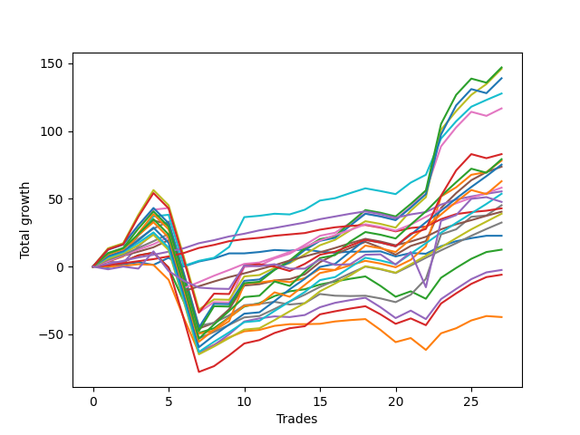

# Long Labrador 012 
- Symbol: ES
- Date Range: 03/18/2022 - 12/30/2022
- Trading Period: 8:30-12:30
- Number of Trades: 28



| Name | Win Percent | Profit | Avg Profit / Trade | Avg Time / Trade |      | Name | Win Percent | Profit | Avg Profit / Trade | Avg Time / Trade |
| ---- | ----------- | ------ | ------------------ | ---------------- | ---- | ---- | ----------- | ------ | ------------------ | ---------------- |
| Sorted By <br> Profit | | | | | | Sorted By <br> Win Percentage ||||
| BB-200 U/L 2SD | 71.43 | 69875.00 | 2495.54 | 50:10 |     | TP-2 | 92.86 | 28625.00 | 1022.32 | 09:25 |
| V U/L 1SD | 75.00 | 69375.00 | 2477.68 | 37:40 |     | TP-1 | 92.86 | 22000.00 | 785.71 | 07:50 |
| BB-100 U/L 2SD | 71.43 | 65875.00 | 2352.68 | 47:38 |     | TP-4 | 89.29 | 31125.00 | 1111.61 | 15:38 |
| BB-100 Mid | 85.71 | 65500.00 | 2339.29 | 24:09 |     | TP-3 | 89.29 | 21875.00 | 781.25 | 13:35 |
| BB-50 U/L 2SD | 75.00 | 54750.00 | 1955.36 | 36:32 |     | BB-100 Mid | 85.71 | 65500.00 | 2339.29 | 24:09 |
| BB-200 Mid | 75.00 | 39625.00 | 1415.18 | 26:17 |     | TP-5 | 85.71 | 18750.00 | 669.64 | 21:06 |
| BB-50 U/L 1SD | 82.14 | 38625.00 | 1379.46 | 25:23 |     | BB-50 U/L 1SD | 82.14 | 38625.00 | 1379.46 | 25:23 |
| NEWFI 000 | 64.29 | 37875.00 | 1352.68 | 45:01 |     | TP-8 | 78.57 | 34000.00 | 1214.29 | 31:38 |
| TP-10 | 71.43 | 36000.00 | 1285.71 | 36:28 |     | TP-7 | 78.57 | 23250.00 | 830.36 | 29:57 |
| TP-8 | 78.57 | 34000.00 | 1214.29 | 31:38 |     | TP-6 | 78.57 | 15875.00 | 566.96 | 25:57 |
| TP-4 | 89.29 | 31125.00 | 1111.61 | 15:38 |     | BB-20 U/L 2SD | 78.57 | 6750.00 | 241.07 | 17:10 |
| TP-2 | 92.86 | 28625.00 | 1022.32 | 09:25 |     | BB-20 U/L 2SD C | 78.57 | -1375.00 | -49.11 | 18:49 |
| TP-9 | 71.43 | 27875.00 | 995.54 | 34:46 |     | V U/L 1SD | 75.00 | 69375.00 | 2477.68 | 37:40 |
| TP-7 | 78.57 | 23250.00 | 830.36 | 29:57 |     | BB-50 U/L 2SD | 75.00 | 54750.00 | 1955.36 | 36:32 |
| V Mid | 75.00 | 23000.00 | 821.43 | 19:48 |     | BB-200 Mid | 75.00 | 39625.00 | 1415.18 | 26:17 |
| TP-1 | 92.86 | 22000.00 | 785.71 | 07:50 |     | V Mid | 75.00 | 23000.00 | 821.43 | 19:48 |
| TP-3 | 89.29 | 21875.00 | 781.25 | 13:35 |     | BB-200 U/L 2SD | 71.43 | 69875.00 | 2495.54 | 50:10 |
| NEWFI 0000 | 50.00 | 21125.00 | 754.46 | 23:49 |     | BB-100 U/L 2SD | 71.43 | 65875.00 | 2352.68 | 47:38 |
| TP-5 | 85.71 | 18750.00 | 669.64 | 21:06 |     | TP-10 | 71.43 | 36000.00 | 1285.71 | 36:28 |
| TP-6 | 78.57 | 15875.00 | 566.96 | 25:57 |     | TP-9 | 71.43 | 27875.00 | 995.54 | 34:46 |
| BB-20 Mid | 67.86 | 10000.00 | 357.14 | 03:52 |     | BB-50 Mid | 71.43 | -750.00 | -26.79 | 18:43 |
| BB-20 U/L 2SD | 78.57 | 6750.00 | 241.07 | 17:10 |     | BB-20 Mid | 67.86 | 10000.00 | 357.14 | 03:52 |
| BB-50 Mid | 71.43 | -750.00 | -26.79 | 18:43 |     | BB-20 U/L 1SD | 67.86 | -19125.00 | -683.04 | 13:48 |
| BB-20 U/L 2SD C | 78.57 | -1375.00 | -49.11 | 18:49 |     | NEWFI 000 | 64.29 | 37875.00 | 1352.68 | 45:01 |
| BB-20 U/L 1SD | 67.86 | -19125.00 | -683.04 | 13:48 |     | NEWFI 0000 | 50.00 | 21125.00 | 754.46 | 23:49 |

## NO STOPLOSS

### Test BB-20 Mid
* Sell when price hits the middle line of the 20p bollinger
* No Stoploss
* Results:
```
Total Trades: 28
Percent Up: 67.86
Percent Down: 32.14
Total Points Moved Up: 20.00
Potential Profit: 10000.00
Total Points Ups: 39.00 Count Ups: 19
Total Points Downs: -19.00 Count Downs: 9
```

<details><summary>Trades</summary>

<code>In: 2022-04-20 09:19:00		Out: 2022-04-20 09:30:50		Total Position Time: 11:50		Total Move Up: -0.50		Total to Date: -0.50</code> <br />
<code>In: 2022-04-27 12:11:00		Out: 2022-04-27 12:14:00		Total Position Time: 03:00		Total Move Up: 2.25		Total to Date: 1.75</code> <br />
<code>In: 2022-05-03 11:24:00		Out: 2022-05-03 11:32:10		Total Position Time: 08:10		Total Move Up: 1.50		Total to Date: 3.25</code> <br />
<code>In: 2022-05-03 11:33:00		Out: 2022-05-03 11:34:10		Total Position Time: 01:10		Total Move Up: -2.00		Total to Date: 1.25</code> <br />
<code>In: 2022-05-06 11:00:00		Out: 2022-05-06 11:02:20		Total Position Time: 02:20		Total Move Up: 5.25		Total to Date: 6.50</code> <br />
<code>In: 2022-05-11 09:37:00		Out: 2022-05-11 09:49:20		Total Position Time: 12:20		Total Move Up: -6.50		Total to Date: 0.00</code> <br />
<code>In: 2022-05-12 10:12:00		Out: 2022-05-12 10:13:10		Total Position Time: 01:10		Total Move Up: 3.75		Total to Date: 3.75</code> <br />
<code>In: 2022-05-16 09:48:00		Out: 2022-05-16 09:49:10		Total Position Time: 01:10		Total Move Up: 2.25		Total to Date: 6.00</code> <br />
<code>In: 2022-06-27 09:37:00		Out: 2022-06-27 09:41:05		Total Position Time: 04:05		Total Move Up: 3.75		Total to Date: 9.75</code> <br />
<code>In: 2022-06-30 12:22:00		Out: 2022-06-30 12:23:35		Total Position Time: 01:35		Total Move Up: 0.00		Total to Date: 9.75</code> <br />
<code>In: 2022-07-11 12:16:00		Out: 2022-07-11 12:22:10		Total Position Time: 06:10		Total Move Up: 1.00		Total to Date: 10.75</code> <br />
<code>In: 2022-08-04 11:44:00		Out: 2022-08-04 11:45:10		Total Position Time: 01:10		Total Move Up: 1.50		Total to Date: 12.25</code> <br />
<code>In: 2022-08-04 11:45:00		Out: 2022-08-04 11:47:10		Total Position Time: 02:10		Total Move Up: -0.50		Total to Date: 11.75</code> <br />
<code>In: 2022-08-10 12:04:00		Out: 2022-08-10 12:05:10		Total Position Time: 01:10		Total Move Up: 1.00		Total to Date: 12.75</code> <br />
<code>In: 2022-10-11 12:18:00		Out: 2022-10-11 12:19:10		Total Position Time: 01:10		Total Move Up: -1.75		Total to Date: 11.00</code> <br />
<code>In: 2022-10-12 09:35:00		Out: 2022-10-12 09:45:55		Total Position Time: 10:55		Total Move Up: -2.75		Total to Date: 8.25</code> <br />
<code>In: 2022-10-17 11:29:00		Out: 2022-10-17 11:35:40		Total Position Time: 06:40		Total Move Up: -0.75		Total to Date: 7.50</code> <br />
<code>In: 2022-10-17 12:14:00		Out: 2022-10-17 12:15:20		Total Position Time: 01:20		Total Move Up: 0.75		Total to Date: 8.25</code> <br />
<code>In: 2022-10-17 12:15:00		Out: 2022-10-17 12:16:15		Total Position Time: 01:15		Total Move Up: 0.00		Total to Date: 8.25</code> <br />
<code>In: 2022-10-26 10:04:00		Out: 2022-10-26 10:12:05		Total Position Time: 08:05		Total Move Up: 0.25		Total to Date: 8.50</code> <br />
<code>In: 2022-10-26 10:12:00		Out: 2022-10-26 10:20:10		Total Position Time: 08:10		Total Move Up: -3.75		Total to Date: 4.75</code> <br />
<code>In: 2022-10-31 09:50:00		Out: 2022-10-31 09:51:10		Total Position Time: 01:10		Total Move Up: 2.50		Total to Date: 7.25</code> <br />
<code>In: 2022-11-08 11:15:00		Out: 2022-11-08 11:16:15		Total Position Time: 01:15		Total Move Up: -0.50		Total to Date: 6.75</code> <br />
<code>In: 2022-11-08 11:36:00		Out: 2022-11-08 11:37:10		Total Position Time: 01:10		Total Move Up: 5.50		Total to Date: 12.25</code> <br />
<code>In: 2022-11-10 10:02:00		Out: 2022-11-10 10:03:10		Total Position Time: 01:10		Total Move Up: 3.75		Total to Date: 16.00</code> <br />
<code>In: 2022-11-11 08:34:00		Out: 2022-11-11 08:36:25		Total Position Time: 02:25		Total Move Up: 2.25		Total to Date: 18.25</code> <br />
<code>In: 2022-12-27 09:52:00		Out: 2022-12-27 09:56:10		Total Position Time: 04:10		Total Move Up: 1.75		Total to Date: 20.00</code> <br />
<code>In: 2022-12-27 11:35:00		Out: 2022-12-27 11:36:55		Total Position Time: 01:55		Total Move Up: 0.00		Total to Date: 20.00</code> <br />


</details>

### Test BB-20 U/L 1SD
* Sell when the price hits the upper line of the 20p 1std bollinger
* No Stoploss
* Results:
```
Total Trades: 28
Percent Up: 67.86
Percent Down: 32.14
Total Points Moved Up: -38.25
Potential Profit: -19125.00
Total Points Ups: 54.50 Count Ups: 19
Total Points Downs: -92.75 Count Downs: 9
```

<details><summary>Trades</summary>

<code>In: 2022-04-20 09:19:00		Out: 2022-04-20 09:31:05		Total Position Time: 12:05		Total Move Up: 0.00		Total to Date: 0.00</code> <br />
<code>In: 2022-04-27 12:11:00		Out: 2022-04-27 12:27:15		Total Position Time: 16:15		Total Move Up: 0.50		Total to Date: 0.50</code> <br />
<code>In: 2022-05-03 11:24:00		Out: 2022-05-03 11:32:25		Total Position Time: 08:25		Total Move Up: 1.25		Total to Date: 1.75</code> <br />
<code>In: 2022-05-03 11:33:00		Out: 2022-05-03 11:34:20		Total Position Time: 01:20		Total Move Up: -0.50		Total to Date: 1.25</code> <br />
<code>In: 2022-05-06 11:00:00		Out: 2022-05-06 11:49:10		Total Position Time: 49:10		Total Move Up: -11.00		Total to Date: -9.75</code> <br />
<code>In: 2022-05-11 09:37:00		Out: 2022-05-11 10:24:35		Total Position Time: 47:35		Total Move Up: -28.00		Total to Date: -37.75</code> <br />
<code>In: 2022-05-12 10:12:00		Out: 2022-05-12 11:02:25		Total Position Time: 50:25		Total Move Up: -25.75		Total to Date: -63.50</code> <br />
<code>In: 2022-05-16 09:48:00		Out: 2022-05-16 09:50:05		Total Position Time: 02:05		Total Move Up: 5.75		Total to Date: -57.75</code> <br />
<code>In: 2022-06-27 09:37:00		Out: 2022-06-27 09:44:20		Total Position Time: 07:20		Total Move Up: 5.50		Total to Date: -52.25</code> <br />
<code>In: 2022-06-30 12:22:00		Out: 2022-06-30 12:25:10		Total Position Time: 03:10		Total Move Up: 4.50		Total to Date: -47.75</code> <br />
<code>In: 2022-07-11 12:16:00		Out: 2022-07-11 12:29:20		Total Position Time: 13:20		Total Move Up: 1.00		Total to Date: -46.75</code> <br />
<code>In: 2022-08-04 11:44:00		Out: 2022-08-04 11:48:05		Total Position Time: 04:05		Total Move Up: 3.00		Total to Date: -43.75</code> <br />
<code>In: 2022-08-04 11:45:00		Out: 2022-08-04 11:48:05		Total Position Time: 03:05		Total Move Up: 1.25		Total to Date: -42.50</code> <br />
<code>In: 2022-08-10 12:04:00		Out: 2022-08-10 12:11:05		Total Position Time: 07:05		Total Move Up: 0.00		Total to Date: -42.50</code> <br />
<code>In: 2022-10-11 12:18:00		Out: 2022-10-11 12:20:40		Total Position Time: 02:40		Total Move Up: 0.25		Total to Date: -42.25</code> <br />
<code>In: 2022-10-12 09:35:00		Out: 2022-10-12 09:47:15		Total Position Time: 12:15		Total Move Up: -1.00		Total to Date: -43.25</code> <br />
<code>In: 2022-10-17 11:29:00		Out: 2022-10-17 11:36:10		Total Position Time: 07:10		Total Move Up: 1.75		Total to Date: -41.50</code> <br />
<code>In: 2022-10-17 12:14:00		Out: 2022-10-17 12:20:05		Total Position Time: 06:05		Total Move Up: 1.00		Total to Date: -40.50</code> <br />
<code>In: 2022-10-17 12:15:00		Out: 2022-10-17 12:20:05		Total Position Time: 05:05		Total Move Up: 0.75		Total to Date: -39.75</code> <br />
<code>In: 2022-10-26 10:04:00		Out: 2022-10-26 10:41:50		Total Position Time: 37:50		Total Move Up: -8.00		Total to Date: -47.75</code> <br />
<code>In: 2022-10-26 10:12:00		Out: 2022-10-26 10:41:50		Total Position Time: 29:50		Total Move Up: -9.00		Total to Date: -56.75</code> <br />
<code>In: 2022-10-31 09:50:00		Out: 2022-10-31 09:57:05		Total Position Time: 07:05		Total Move Up: 3.00		Total to Date: -53.75</code> <br />
<code>In: 2022-11-08 11:15:00		Out: 2022-11-08 11:38:35		Total Position Time: 23:35		Total Move Up: -8.75		Total to Date: -62.50</code> <br />
<code>In: 2022-11-08 11:36:00		Out: 2022-11-08 11:38:35		Total Position Time: 02:35		Total Move Up: 12.25		Total to Date: -50.25</code> <br />
<code>In: 2022-11-10 10:02:00		Out: 2022-11-10 10:03:10		Total Position Time: 01:10		Total Move Up: 3.75		Total to Date: -46.50</code> <br />
<code>In: 2022-11-11 08:34:00		Out: 2022-11-11 08:41:35		Total Position Time: 07:35		Total Move Up: 5.75		Total to Date: -40.75</code> <br />
<code>In: 2022-12-27 09:52:00		Out: 2022-12-27 09:59:25		Total Position Time: 07:25		Total Move Up: 3.25		Total to Date: -37.50</code> <br />
<code>In: 2022-12-27 11:35:00		Out: 2022-12-27 11:45:40		Total Position Time: 10:40		Total Move Up: -0.75		Total to Date: -38.25</code> <br />


</details>

### Test BB-20 U/L 2SD
* Sell when the price hits the upper line of the 20p 2std bollinger
* No Stoploss
* Results:
```
Total Trades: 28
Percent Up: 78.57
Percent Down: 21.43
Total Points Moved Up: 13.50
Potential Profit: 6750.00
Total Points Ups: 93.25 Count Ups: 22
Total Points Downs: -79.75 Count Downs: 6
```

<details><summary>Trades</summary>

<code>In: 2022-04-20 09:19:00		Out: 2022-04-20 09:31:35		Total Position Time: 12:35		Total Move Up: 1.00		Total to Date: 1.00</code> <br />
<code>In: 2022-04-27 12:11:00		Out: 2022-04-27 12:31:20		Total Position Time: 20:20		Total Move Up: 2.50		Total to Date: 3.50</code> <br />
<code>In: 2022-05-03 11:24:00		Out: 2022-05-03 11:34:55		Total Position Time: 10:55		Total Move Up: 4.75		Total to Date: 8.25</code> <br />
<code>In: 2022-05-03 11:33:00		Out: 2022-05-03 11:34:55		Total Position Time: 01:55		Total Move Up: 2.00		Total to Date: 10.25</code> <br />
<code>In: 2022-05-06 11:00:00		Out: 2022-05-06 11:49:10		Total Position Time: 49:10		Total Move Up: -11.00		Total to Date: -0.75</code> <br />
<code>In: 2022-05-11 09:37:00		Out: 2022-05-11 10:24:50		Total Position Time: 47:50		Total Move Up: -25.00		Total to Date: -25.75</code> <br />
<code>In: 2022-05-12 10:12:00		Out: 2022-05-12 11:04:05		Total Position Time: 52:05		Total Move Up: -23.25		Total to Date: -49.00</code> <br />
<code>In: 2022-05-16 09:48:00		Out: 2022-05-16 10:06:30		Total Position Time: 18:30		Total Move Up: 3.50		Total to Date: -45.50</code> <br />
<code>In: 2022-06-27 09:37:00		Out: 2022-06-27 09:45:05		Total Position Time: 08:05		Total Move Up: 8.00		Total to Date: -37.50</code> <br />
<code>In: 2022-06-30 12:22:00		Out: 2022-06-30 12:25:55		Total Position Time: 03:55		Total Move Up: 8.00		Total to Date: -29.50</code> <br />
<code>In: 2022-07-11 12:16:00		Out: 2022-07-11 12:29:40		Total Position Time: 13:40		Total Move Up: 2.50		Total to Date: -27.00</code> <br />
<code>In: 2022-08-04 11:44:00		Out: 2022-08-04 11:52:05		Total Position Time: 08:05		Total Move Up: 5.25		Total to Date: -21.75</code> <br />
<code>In: 2022-08-04 11:45:00		Out: 2022-08-04 11:52:05		Total Position Time: 07:05		Total Move Up: 3.50		Total to Date: -18.25</code> <br />
<code>In: 2022-08-10 12:04:00		Out: 2022-08-10 12:14:35		Total Position Time: 10:35		Total Move Up: 1.50		Total to Date: -16.75</code> <br />
<code>In: 2022-10-11 12:18:00		Out: 2022-10-11 12:22:35		Total Position Time: 04:35		Total Move Up: 3.50		Total to Date: -13.25</code> <br />
<code>In: 2022-10-12 09:35:00		Out: 2022-10-12 09:53:00		Total Position Time: 18:00		Total Move Up: 1.00		Total to Date: -12.25</code> <br />
<code>In: 2022-10-17 11:29:00		Out: 2022-10-17 11:37:30		Total Position Time: 08:30		Total Move Up: 2.25		Total to Date: -10.00</code> <br />
<code>In: 2022-10-17 12:14:00		Out: 2022-10-17 12:22:15		Total Position Time: 08:15		Total Move Up: 2.00		Total to Date: -8.00</code> <br />
<code>In: 2022-10-17 12:15:00		Out: 2022-10-17 12:22:15		Total Position Time: 07:15		Total Move Up: 1.75		Total to Date: -6.25</code> <br />
<code>In: 2022-10-26 10:04:00		Out: 2022-10-26 10:51:25		Total Position Time: 47:25		Total Move Up: -7.00		Total to Date: -13.25</code> <br />
<code>In: 2022-10-26 10:12:00		Out: 2022-10-26 10:51:25		Total Position Time: 39:25		Total Move Up: -8.00		Total to Date: -21.25</code> <br />
<code>In: 2022-10-31 09:50:00		Out: 2022-10-31 10:02:05		Total Position Time: 12:05		Total Move Up: 4.00		Total to Date: -17.25</code> <br />
<code>In: 2022-11-08 11:15:00		Out: 2022-11-08 11:42:10		Total Position Time: 27:10		Total Move Up: -5.50		Total to Date: -22.75</code> <br />
<code>In: 2022-11-08 11:36:00		Out: 2022-11-08 11:42:10		Total Position Time: 06:10		Total Move Up: 15.50		Total to Date: -7.25</code> <br />
<code>In: 2022-11-10 10:02:00		Out: 2022-11-10 10:03:45		Total Position Time: 01:45		Total Move Up: 7.25		Total to Date: 0.00</code> <br />
<code>In: 2022-11-11 08:34:00		Out: 2022-11-11 08:49:20		Total Position Time: 15:20		Total Move Up: 6.75		Total to Date: 6.75</code> <br />
<code>In: 2022-12-27 09:52:00		Out: 2022-12-27 10:00:50		Total Position Time: 08:50		Total Move Up: 5.00		Total to Date: 11.75</code> <br />
<code>In: 2022-12-27 11:35:00		Out: 2022-12-27 11:46:20		Total Position Time: 11:20		Total Move Up: 1.75		Total to Date: 13.50</code> <br />


</details>

### Test BB-20 U/L 2SD C
* Sell when the price hits the upper line of the 20p 2std bollinger
* No Stoploss
* Results:
```
Total Trades: 28
Percent Up: 78.57
Percent Down: 21.43
Total Points Moved Up: -2.75
Potential Profit: -1375.00
Total Points Ups: 103.25 Count Ups: 22
Total Points Downs: -106.00 Count Downs: 6
```

<details><summary>Trades</summary>

<code>In: 2022-04-20 09:19:00		Out: 2022-04-20 09:31:35		Total Position Time: 12:35		Total Move Up: 1.00		Total to Date: 1.00</code> <br />
<code>In: 2022-04-27 12:11:00		Out: 2022-04-27 12:31:20		Total Position Time: 20:20		Total Move Up: 2.50		Total to Date: 3.50</code> <br />
<code>In: 2022-05-03 11:24:00		Out: 2022-05-03 11:34:55		Total Position Time: 10:55		Total Move Up: 4.75		Total to Date: 8.25</code> <br />
<code>In: 2022-05-03 11:33:00		Out: 2022-05-03 11:34:55		Total Position Time: 01:55		Total Move Up: 2.00		Total to Date: 10.25</code> <br />
<code>In: 2022-05-06 11:00:00		Out: 2022-05-06 11:49:10		Total Position Time: 49:10		Total Move Up: -11.00		Total to Date: -0.75</code> <br />
<code>In: 2022-05-11 09:37:00		Out: 2022-05-11 10:37:55		Total Position Time: 60:55		Total Move Up: -37.75		Total to Date: -38.50</code> <br />
<code>In: 2022-05-12 10:12:00		Out: 2022-05-12 11:12:55		Total Position Time: 60:55		Total Move Up: -39.25		Total to Date: -77.75</code> <br />
<code>In: 2022-05-16 09:48:00		Out: 2022-05-16 10:07:00		Total Position Time: 19:00		Total Move Up: 4.25		Total to Date: -73.50</code> <br />
<code>In: 2022-06-27 09:37:00		Out: 2022-06-27 09:45:05		Total Position Time: 08:05		Total Move Up: 8.00		Total to Date: -65.50</code> <br />
<code>In: 2022-06-30 12:22:00		Out: 2022-06-30 12:26:05		Total Position Time: 04:05		Total Move Up: 8.75		Total to Date: -56.75</code> <br />
<code>In: 2022-07-11 12:16:00		Out: 2022-07-11 12:29:40		Total Position Time: 13:40		Total Move Up: 2.50		Total to Date: -54.25</code> <br />
<code>In: 2022-08-04 11:44:00		Out: 2022-08-04 11:52:05		Total Position Time: 08:05		Total Move Up: 5.25		Total to Date: -49.00</code> <br />
<code>In: 2022-08-04 11:45:00		Out: 2022-08-04 11:52:05		Total Position Time: 07:05		Total Move Up: 3.50		Total to Date: -45.50</code> <br />
<code>In: 2022-08-10 12:04:00		Out: 2022-08-10 12:14:35		Total Position Time: 10:35		Total Move Up: 1.50		Total to Date: -44.00</code> <br />
<code>In: 2022-10-11 12:18:00		Out: 2022-10-11 12:37:00		Total Position Time: 19:00		Total Move Up: 8.75		Total to Date: -35.25</code> <br />
<code>In: 2022-10-12 09:35:00		Out: 2022-10-12 09:56:50		Total Position Time: 21:50		Total Move Up: 3.25		Total to Date: -32.00</code> <br />
<code>In: 2022-10-17 11:29:00		Out: 2022-10-17 11:37:55		Total Position Time: 08:55		Total Move Up: 2.25		Total to Date: -29.75</code> <br />
<code>In: 2022-10-17 12:14:00		Out: 2022-10-17 12:23:05		Total Position Time: 09:05		Total Move Up: 2.00		Total to Date: -27.75</code> <br />
<code>In: 2022-10-17 12:15:00		Out: 2022-10-17 12:23:05		Total Position Time: 08:05		Total Move Up: 1.75		Total to Date: -26.00</code> <br />
<code>In: 2022-10-26 10:04:00		Out: 2022-10-26 10:52:40		Total Position Time: 48:40		Total Move Up: -6.00		Total to Date: -32.00</code> <br />
<code>In: 2022-10-26 10:12:00		Out: 2022-10-26 10:52:40		Total Position Time: 40:40		Total Move Up: -7.00		Total to Date: -39.00</code> <br />
<code>In: 2022-10-31 09:50:00		Out: 2022-10-31 10:02:05		Total Position Time: 12:05		Total Move Up: 4.00		Total to Date: -35.00</code> <br />
<code>In: 2022-11-08 11:15:00		Out: 2022-11-08 11:42:15		Total Position Time: 27:15		Total Move Up: -5.00		Total to Date: -40.00</code> <br />
<code>In: 2022-11-08 11:36:00		Out: 2022-11-08 11:42:15		Total Position Time: 06:15		Total Move Up: 16.00		Total to Date: -24.00</code> <br />
<code>In: 2022-11-10 10:02:00		Out: 2022-11-10 10:03:55		Total Position Time: 01:55		Total Move Up: 7.50		Total to Date: -16.50</code> <br />
<code>In: 2022-11-11 08:34:00		Out: 2022-11-11 08:49:40		Total Position Time: 15:40		Total Move Up: 7.00		Total to Date: -9.50</code> <br />
<code>In: 2022-12-27 09:52:00		Out: 2022-12-27 10:00:50		Total Position Time: 08:50		Total Move Up: 5.00		Total to Date: -4.50</code> <br />
<code>In: 2022-12-27 11:35:00		Out: 2022-12-27 11:46:20		Total Position Time: 11:20		Total Move Up: 1.75		Total to Date: -2.75</code> <br />


</details>

### Test BB-50 Mid
* Sell when price hits the middle line of the 50p bollinger
* No Stoploss
* Results:
```
Total Trades: 28
Percent Up: 71.43
Percent Down: 28.57
Total Points Moved Up: -1.50
Potential Profit: -750.00
Total Points Ups: 109.50 Count Ups: 20
Total Points Downs: -111.00 Count Downs: 8
```

<details><summary>Trades</summary>

<code>In: 2022-04-20 09:19:00		Out: 2022-04-20 09:32:40		Total Position Time: 13:40		Total Move Up: 3.75		Total to Date: 3.75</code> <br />
<code>In: 2022-04-27 12:11:00		Out: 2022-04-27 12:44:20		Total Position Time: 33:20		Total Move Up: -1.00		Total to Date: 2.75</code> <br />
<code>In: 2022-05-03 11:24:00		Out: 2022-05-03 11:36:10		Total Position Time: 12:10		Total Move Up: 12.25		Total to Date: 15.00</code> <br />
<code>In: 2022-05-03 11:33:00		Out: 2022-05-03 11:36:10		Total Position Time: 03:10		Total Move Up: 9.50		Total to Date: 24.50</code> <br />
<code>In: 2022-05-06 11:00:00		Out: 2022-05-06 11:49:15		Total Position Time: 49:15		Total Move Up: -11.25		Total to Date: 13.25</code> <br />
<code>In: 2022-05-11 09:37:00		Out: 2022-05-11 10:37:55		Total Position Time: 60:55		Total Move Up: -37.75		Total to Date: -24.50</code> <br />
<code>In: 2022-05-12 10:12:00		Out: 2022-05-12 11:12:55		Total Position Time: 60:55		Total Move Up: -39.25		Total to Date: -63.75</code> <br />
<code>In: 2022-05-16 09:48:00		Out: 2022-05-16 09:50:05		Total Position Time: 02:05		Total Move Up: 5.75		Total to Date: -58.00</code> <br />
<code>In: 2022-06-27 09:37:00		Out: 2022-06-27 09:45:05		Total Position Time: 08:05		Total Move Up: 8.00		Total to Date: -50.00</code> <br />
<code>In: 2022-06-30 12:22:00		Out: 2022-06-30 12:26:30		Total Position Time: 04:30		Total Move Up: 9.50		Total to Date: -40.50</code> <br />
<code>In: 2022-07-11 12:16:00		Out: 2022-07-11 12:40:35		Total Position Time: 24:35		Total Move Up: 2.25		Total to Date: -38.25</code> <br />
<code>In: 2022-08-04 11:44:00		Out: 2022-08-04 11:45:10		Total Position Time: 01:10		Total Move Up: 1.50		Total to Date: -36.75</code> <br />
<code>In: 2022-08-04 11:45:00		Out: 2022-08-04 11:47:10		Total Position Time: 02:10		Total Move Up: -0.50		Total to Date: -37.25</code> <br />
<code>In: 2022-08-10 12:04:00		Out: 2022-08-10 12:14:35		Total Position Time: 10:35		Total Move Up: 1.50		Total to Date: -35.75</code> <br />
<code>In: 2022-10-11 12:18:00		Out: 2022-10-11 12:36:35		Total Position Time: 18:35		Total Move Up: 5.75		Total to Date: -30.00</code> <br />
<code>In: 2022-10-12 09:35:00		Out: 2022-10-12 09:53:00		Total Position Time: 18:00		Total Move Up: 1.00		Total to Date: -29.00</code> <br />
<code>In: 2022-10-17 11:29:00		Out: 2022-10-17 11:39:15		Total Position Time: 10:15		Total Move Up: 3.25		Total to Date: -25.75</code> <br />
<code>In: 2022-10-17 12:14:00		Out: 2022-10-17 12:22:15		Total Position Time: 08:15		Total Move Up: 2.00		Total to Date: -23.75</code> <br />
<code>In: 2022-10-17 12:15:00		Out: 2022-10-17 12:22:15		Total Position Time: 07:15		Total Move Up: 1.75		Total to Date: -22.00</code> <br />
<code>In: 2022-10-26 10:04:00		Out: 2022-10-26 10:51:15		Total Position Time: 47:15		Total Move Up: -7.00		Total to Date: -29.00</code> <br />
<code>In: 2022-10-26 10:12:00		Out: 2022-10-26 10:51:15		Total Position Time: 39:15		Total Move Up: -8.00		Total to Date: -37.00</code> <br />
<code>In: 2022-10-31 09:50:00		Out: 2022-10-31 10:08:30		Total Position Time: 18:30		Total Move Up: 5.50		Total to Date: -31.50</code> <br />
<code>In: 2022-11-08 11:15:00		Out: 2022-11-08 11:41:40		Total Position Time: 26:40		Total Move Up: -6.25		Total to Date: -37.75</code> <br />
<code>In: 2022-11-08 11:36:00		Out: 2022-11-08 11:41:40		Total Position Time: 05:40		Total Move Up: 14.75		Total to Date: -23.00</code> <br />
<code>In: 2022-11-10 10:02:00		Out: 2022-11-10 10:03:55		Total Position Time: 01:55		Total Move Up: 7.50		Total to Date: -15.50</code> <br />
<code>In: 2022-11-11 08:34:00		Out: 2022-11-11 08:49:45		Total Position Time: 15:45		Total Move Up: 7.25		Total to Date: -8.25</code> <br />
<code>In: 2022-12-27 09:52:00		Out: 2022-12-27 10:00:50		Total Position Time: 08:50		Total Move Up: 5.00		Total to Date: -3.25</code> <br />
<code>In: 2022-12-27 11:35:00		Out: 2022-12-27 11:46:20		Total Position Time: 11:20		Total Move Up: 1.75		Total to Date: -1.50</code> <br />


</details>

### Test BB-50 U/L 1SD
* Sell when the price hits the upper line of the 50p 1std bollinger
* No Stoploss
* Results:
```
Total Trades: 28
Percent Up: 82.14
Percent Down: 17.86
Total Points Moved Up: 77.25
Potential Profit: 38625.00
Total Points Ups: 166.50 Count Ups: 23
Total Points Downs: -89.25 Count Downs: 5
```

<details><summary>Trades</summary>

<code>In: 2022-04-20 09:19:00		Out: 2022-04-20 09:36:50		Total Position Time: 17:50		Total Move Up: 7.75		Total to Date: 7.75</code> <br />
<code>In: 2022-04-27 12:11:00		Out: 2022-04-27 12:46:05		Total Position Time: 35:05		Total Move Up: 1.50		Total to Date: 9.25</code> <br />
<code>In: 2022-05-03 11:24:00		Out: 2022-05-03 11:52:05		Total Position Time: 28:05		Total Move Up: 13.75		Total to Date: 23.00</code> <br />
<code>In: 2022-05-03 11:33:00		Out: 2022-05-03 11:52:05		Total Position Time: 19:05		Total Move Up: 11.00		Total to Date: 34.00</code> <br />
<code>In: 2022-05-06 11:00:00		Out: 2022-05-06 11:50:10		Total Position Time: 50:10		Total Move Up: -2.75		Total to Date: 31.25</code> <br />
<code>In: 2022-05-11 09:37:00		Out: 2022-05-11 10:37:55		Total Position Time: 60:55		Total Move Up: -37.75		Total to Date: -6.50</code> <br />
<code>In: 2022-05-12 10:12:00		Out: 2022-05-12 11:12:55		Total Position Time: 60:55		Total Move Up: -39.25		Total to Date: -45.75</code> <br />
<code>In: 2022-05-16 09:48:00		Out: 2022-05-16 10:07:05		Total Position Time: 19:05		Total Move Up: 4.25		Total to Date: -41.50</code> <br />
<code>In: 2022-06-27 09:37:00		Out: 2022-06-27 09:53:20		Total Position Time: 16:20		Total Move Up: 10.00		Total to Date: -31.50</code> <br />
<code>In: 2022-06-30 12:22:00		Out: 2022-06-30 12:30:20		Total Position Time: 08:20		Total Move Up: 17.50		Total to Date: -14.00</code> <br />
<code>In: 2022-07-11 12:16:00		Out: 2022-07-11 12:47:00		Total Position Time: 31:00		Total Move Up: 1.00		Total to Date: -13.00</code> <br />
<code>In: 2022-08-04 11:44:00		Out: 2022-08-04 11:47:50		Total Position Time: 03:50		Total Move Up: 2.75		Total to Date: -10.25</code> <br />
<code>In: 2022-08-04 11:45:00		Out: 2022-08-04 11:47:50		Total Position Time: 02:50		Total Move Up: 1.00		Total to Date: -9.25</code> <br />
<code>In: 2022-08-10 12:04:00		Out: 2022-08-10 12:21:40		Total Position Time: 17:40		Total Move Up: 3.50		Total to Date: -5.75</code> <br />
<code>In: 2022-10-11 12:18:00		Out: 2022-10-11 12:39:25		Total Position Time: 21:25		Total Move Up: 9.00		Total to Date: 3.25</code> <br />
<code>In: 2022-10-12 09:35:00		Out: 2022-10-12 09:59:05		Total Position Time: 24:05		Total Move Up: 3.50		Total to Date: 6.75</code> <br />
<code>In: 2022-10-17 11:29:00		Out: 2022-10-17 11:43:20		Total Position Time: 14:20		Total Move Up: 5.75		Total to Date: 12.50</code> <br />
<code>In: 2022-10-17 12:14:00		Out: 2022-10-17 12:32:35		Total Position Time: 18:35		Total Move Up: 4.75		Total to Date: 17.25</code> <br />
<code>In: 2022-10-17 12:15:00		Out: 2022-10-17 12:32:35		Total Position Time: 17:35		Total Move Up: 4.50		Total to Date: 21.75</code> <br />
<code>In: 2022-10-26 10:04:00		Out: 2022-10-26 11:01:00		Total Position Time: 57:00		Total Move Up: -4.25		Total to Date: 17.50</code> <br />
<code>In: 2022-10-26 10:12:00		Out: 2022-10-26 11:01:00		Total Position Time: 49:00		Total Move Up: -5.25		Total to Date: 12.25</code> <br />
<code>In: 2022-10-31 09:50:00		Out: 2022-10-31 10:16:15		Total Position Time: 26:15		Total Move Up: 6.50		Total to Date: 18.75</code> <br />
<code>In: 2022-11-08 11:15:00		Out: 2022-11-08 11:47:55		Total Position Time: 32:55		Total Move Up: 3.50		Total to Date: 22.25</code> <br />
<code>In: 2022-11-08 11:36:00		Out: 2022-11-08 11:47:55		Total Position Time: 11:55		Total Move Up: 24.50		Total to Date: 46.75</code> <br />
<code>In: 2022-11-10 10:02:00		Out: 2022-11-10 10:13:45		Total Position Time: 11:45		Total Move Up: 11.00		Total to Date: 57.75</code> <br />
<code>In: 2022-11-11 08:34:00		Out: 2022-11-11 08:58:20		Total Position Time: 24:20		Total Move Up: 9.50		Total to Date: 67.25</code> <br />
<code>In: 2022-12-27 09:52:00		Out: 2022-12-27 10:06:45		Total Position Time: 14:45		Total Move Up: 6.00		Total to Date: 73.25</code> <br />
<code>In: 2022-12-27 11:35:00		Out: 2022-12-27 11:51:05		Total Position Time: 16:05		Total Move Up: 4.00		Total to Date: 77.25</code> <br />


</details>

### Test BB-50 U/L 2SD
* Sell when the price hits the upper line of the 50p 2std bollinger
* No Stoploss
* Results:
```
Total Trades: 28
Percent Up: 75.00
Percent Down: 25.00
Total Points Moved Up: 109.50
Potential Profit: 54750.00
Total Points Ups: 201.50 Count Ups: 21
Total Points Downs: -92.00 Count Downs: 7
```

<details><summary>Trades</summary>

<code>In: 2022-04-20 09:19:00		Out: 2022-04-20 09:50:25		Total Position Time: 31:25		Total Move Up: 12.50		Total to Date: 12.50</code> <br />
<code>In: 2022-04-27 12:11:00		Out: 2022-04-27 12:47:00		Total Position Time: 36:00		Total Move Up: 3.75		Total to Date: 16.25</code> <br />
<code>In: 2022-05-03 11:24:00		Out: 2022-05-03 11:56:15		Total Position Time: 32:15		Total Move Up: 14.25		Total to Date: 30.50</code> <br />
<code>In: 2022-05-03 11:33:00		Out: 2022-05-03 11:56:15		Total Position Time: 23:15		Total Move Up: 11.50		Total to Date: 42.00</code> <br />
<code>In: 2022-05-06 11:00:00		Out: 2022-05-06 11:50:35		Total Position Time: 50:35		Total Move Up: 1.25		Total to Date: 43.25</code> <br />
<code>In: 2022-05-11 09:37:00		Out: 2022-05-11 10:37:55		Total Position Time: 60:55		Total Move Up: -37.75		Total to Date: 5.50</code> <br />
<code>In: 2022-05-12 10:12:00		Out: 2022-05-12 11:12:55		Total Position Time: 60:55		Total Move Up: -39.25		Total to Date: -33.75</code> <br />
<code>In: 2022-05-16 09:48:00		Out: 2022-05-16 10:07:35		Total Position Time: 19:35		Total Move Up: 7.50		Total to Date: -26.25</code> <br />
<code>In: 2022-06-27 09:37:00		Out: 2022-06-27 10:37:55		Total Position Time: 60:55		Total Move Up: -0.25		Total to Date: -26.50</code> <br />
<code>In: 2022-06-30 12:22:00		Out: 2022-06-30 12:36:55		Total Position Time: 14:55		Total Move Up: 26.25		Total to Date: -0.25</code> <br />
<code>In: 2022-07-11 12:16:00		Out: 2022-07-11 12:47:00		Total Position Time: 31:00		Total Move Up: 1.00		Total to Date: 0.75</code> <br />
<code>In: 2022-08-04 11:44:00		Out: 2022-08-04 11:52:05		Total Position Time: 08:05		Total Move Up: 5.25		Total to Date: 6.00</code> <br />
<code>In: 2022-08-04 11:45:00		Out: 2022-08-04 11:52:05		Total Position Time: 07:05		Total Move Up: 3.50		Total to Date: 9.50</code> <br />
<code>In: 2022-08-10 12:04:00		Out: 2022-08-10 12:27:55		Total Position Time: 23:55		Total Move Up: 6.50		Total to Date: 16.00</code> <br />
<code>In: 2022-10-11 12:18:00		Out: 2022-10-11 12:47:00		Total Position Time: 29:00		Total Move Up: 6.75		Total to Date: 22.75</code> <br />
<code>In: 2022-10-12 09:35:00		Out: 2022-10-12 10:35:55		Total Position Time: 60:55		Total Move Up: -7.25		Total to Date: 15.50</code> <br />
<code>In: 2022-10-17 11:29:00		Out: 2022-10-17 12:29:55		Total Position Time: 60:55		Total Move Up: 2.25		Total to Date: 17.75</code> <br />
<code>In: 2022-10-17 12:14:00		Out: 2022-10-17 12:43:10		Total Position Time: 29:10		Total Move Up: 7.25		Total to Date: 25.00</code> <br />
<code>In: 2022-10-17 12:15:00		Out: 2022-10-17 12:43:10		Total Position Time: 28:10		Total Move Up: 7.00		Total to Date: 32.00</code> <br />
<code>In: 2022-10-26 10:04:00		Out: 2022-10-26 11:04:55		Total Position Time: 60:55		Total Move Up: -2.00		Total to Date: 30.00</code> <br />
<code>In: 2022-10-26 10:12:00		Out: 2022-10-26 11:05:05		Total Position Time: 53:05		Total Move Up: -2.50		Total to Date: 27.50</code> <br />
<code>In: 2022-10-31 09:50:00		Out: 2022-10-31 10:17:40		Total Position Time: 27:40		Total Move Up: 9.50		Total to Date: 37.00</code> <br />
<code>In: 2022-11-08 11:15:00		Out: 2022-11-08 12:02:35		Total Position Time: 47:35		Total Move Up: 11.75		Total to Date: 48.75</code> <br />
<code>In: 2022-11-08 11:36:00		Out: 2022-11-08 12:02:35		Total Position Time: 26:35		Total Move Up: 32.75		Total to Date: 81.50</code> <br />
<code>In: 2022-11-10 10:02:00		Out: 2022-11-10 10:16:15		Total Position Time: 14:15		Total Move Up: 14.00		Total to Date: 95.50</code> <br />
<code>In: 2022-11-11 08:34:00		Out: 2022-11-11 09:11:00		Total Position Time: 37:00		Total Move Up: 11.50		Total to Date: 107.00</code> <br />
<code>In: 2022-12-27 09:52:00		Out: 2022-12-27 10:52:55		Total Position Time: 60:55		Total Move Up: -3.00		Total to Date: 104.00</code> <br />
<code>In: 2022-12-27 11:35:00		Out: 2022-12-27 12:01:10		Total Position Time: 26:10		Total Move Up: 5.50		Total to Date: 109.50</code> <br />


</details>

### Test V Mid
* Sell when the price hits the middle line of the 1std VWAP
* No Stoploss
* Results:
```
Total Trades: 28
Percent Up: 75.00
Percent Down: 25.00
Total Points Moved Up: 46.00
Potential Profit: 23000.00
Total Points Ups: 131.25 Count Ups: 21
Total Points Downs: -85.25 Count Downs: 7
```

<details><summary>Trades</summary>

<code>In: 2022-04-20 09:19:00		Out: 2022-04-20 09:35:50		Total Position Time: 16:50		Total Move Up: 6.00		Total to Date: 6.00</code> <br />
<code>In: 2022-04-27 12:11:00		Out: 2022-04-27 12:47:00		Total Position Time: 36:00		Total Move Up: 3.75		Total to Date: 9.75</code> <br />
<code>In: 2022-05-03 11:24:00		Out: 2022-05-03 11:36:05		Total Position Time: 12:05		Total Move Up: 10.50		Total to Date: 20.25</code> <br />
<code>In: 2022-05-03 11:33:00		Out: 2022-05-03 11:36:05		Total Position Time: 03:05		Total Move Up: 7.75		Total to Date: 28.00</code> <br />
<code>In: 2022-05-06 11:00:00		Out: 2022-05-06 11:02:20		Total Position Time: 02:20		Total Move Up: 5.25		Total to Date: 33.25</code> <br />
<code>In: 2022-05-11 09:37:00		Out: 2022-05-11 10:37:55		Total Position Time: 60:55		Total Move Up: -37.75		Total to Date: -4.50</code> <br />
<code>In: 2022-05-12 10:12:00		Out: 2022-05-12 11:12:55		Total Position Time: 60:55		Total Move Up: -39.25		Total to Date: -43.75</code> <br />
<code>In: 2022-05-16 09:48:00		Out: 2022-05-16 09:49:10		Total Position Time: 01:10		Total Move Up: 2.25		Total to Date: -41.50</code> <br />
<code>In: 2022-06-27 09:37:00		Out: 2022-06-27 09:44:20		Total Position Time: 07:20		Total Move Up: 5.50		Total to Date: -36.00</code> <br />
<code>In: 2022-06-30 12:22:00		Out: 2022-06-30 12:25:45		Total Position Time: 03:45		Total Move Up: 7.50		Total to Date: -28.50</code> <br />
<code>In: 2022-07-11 12:16:00		Out: 2022-07-11 12:47:00		Total Position Time: 31:00		Total Move Up: 1.00		Total to Date: -27.50</code> <br />
<code>In: 2022-08-04 11:44:00		Out: 2022-08-04 11:45:10		Total Position Time: 01:10		Total Move Up: 1.50		Total to Date: -26.00</code> <br />
<code>In: 2022-08-04 11:45:00		Out: 2022-08-04 11:46:10		Total Position Time: 01:10		Total Move Up: -2.00		Total to Date: -28.00</code> <br />
<code>In: 2022-08-10 12:04:00		Out: 2022-08-10 12:05:10		Total Position Time: 01:10		Total Move Up: 1.00		Total to Date: -27.00</code> <br />
<code>In: 2022-10-11 12:18:00		Out: 2022-10-11 12:47:00		Total Position Time: 29:00		Total Move Up: 6.75		Total to Date: -20.25</code> <br />
<code>In: 2022-10-12 09:35:00		Out: 2022-10-12 09:51:20		Total Position Time: 16:20		Total Move Up: 0.75		Total to Date: -19.50</code> <br />
<code>In: 2022-10-17 11:29:00		Out: 2022-10-17 11:30:10		Total Position Time: 01:10		Total Move Up: -1.25		Total to Date: -20.75</code> <br />
<code>In: 2022-10-17 12:14:00		Out: 2022-10-17 12:15:10		Total Position Time: 01:10		Total Move Up: -0.25		Total to Date: -21.00</code> <br />
<code>In: 2022-10-17 12:15:00		Out: 2022-10-17 12:16:10		Total Position Time: 01:10		Total Move Up: 0.25		Total to Date: -20.75</code> <br />
<code>In: 2022-10-26 10:04:00		Out: 2022-10-26 11:04:55		Total Position Time: 60:55		Total Move Up: -2.00		Total to Date: -22.75</code> <br />
<code>In: 2022-10-26 10:12:00		Out: 2022-10-26 11:12:55		Total Position Time: 60:55		Total Move Up: -2.75		Total to Date: -25.50</code> <br />
<code>In: 2022-10-31 09:50:00		Out: 2022-10-31 10:08:30		Total Position Time: 18:30		Total Move Up: 5.50		Total to Date: -20.00</code> <br />
<code>In: 2022-11-08 11:15:00		Out: 2022-11-08 12:02:35		Total Position Time: 47:35		Total Move Up: 11.75		Total to Date: -8.25</code> <br />
<code>In: 2022-11-08 11:36:00		Out: 2022-11-08 12:02:35		Total Position Time: 26:35		Total Move Up: 32.75		Total to Date: 24.50</code> <br />
<code>In: 2022-11-10 10:02:00		Out: 2022-11-10 10:03:10		Total Position Time: 01:10		Total Move Up: 3.75		Total to Date: 28.25</code> <br />
<code>In: 2022-11-11 08:34:00		Out: 2022-11-11 08:50:30		Total Position Time: 16:30		Total Move Up: 9.25		Total to Date: 37.50</code> <br />
<code>In: 2022-12-27 09:52:00		Out: 2022-12-27 09:53:10		Total Position Time: 01:10		Total Move Up: 1.00		Total to Date: 38.50</code> <br />
<code>In: 2022-12-27 11:35:00		Out: 2022-12-27 12:08:40		Total Position Time: 33:40		Total Move Up: 7.50		Total to Date: 46.00</code> <br />


</details>

### Test V U/L 1SD
* Sell when the price hits the upper line of the 1std VWAP
* No Stoploss
* Results:
```
Total Trades: 28
Percent Up: 75.00
Percent Down: 25.00
Total Points Moved Up: 138.75
Potential Profit: 69375.00
Total Points Ups: 239.25 Count Ups: 21
Total Points Downs: -100.50 Count Downs: 7
```

<details><summary>Trades</summary>

<code>In: 2022-04-20 09:19:00		Out: 2022-04-20 09:52:35		Total Position Time: 33:35		Total Move Up: 13.50		Total to Date: 13.50</code> <br />
<code>In: 2022-04-27 12:11:00		Out: 2022-04-27 12:47:00		Total Position Time: 36:00		Total Move Up: 3.75		Total to Date: 17.25</code> <br />
<code>In: 2022-05-03 11:24:00		Out: 2022-05-03 12:00:05		Total Position Time: 36:05		Total Move Up: 21.00		Total to Date: 38.25</code> <br />
<code>In: 2022-05-03 11:33:00		Out: 2022-05-03 12:00:05		Total Position Time: 27:05		Total Move Up: 18.25		Total to Date: 56.50</code> <br />
<code>In: 2022-05-06 11:00:00		Out: 2022-05-06 12:00:55		Total Position Time: 60:55		Total Move Up: -11.25		Total to Date: 45.25</code> <br />
<code>In: 2022-05-11 09:37:00		Out: 2022-05-11 10:37:55		Total Position Time: 60:55		Total Move Up: -37.75		Total to Date: 7.50</code> <br />
<code>In: 2022-05-12 10:12:00		Out: 2022-05-12 11:12:55		Total Position Time: 60:55		Total Move Up: -39.25		Total to Date: -31.75</code> <br />
<code>In: 2022-05-16 09:48:00		Out: 2022-05-16 10:07:35		Total Position Time: 19:35		Total Move Up: 7.50		Total to Date: -24.25</code> <br />
<code>In: 2022-06-27 09:37:00		Out: 2022-06-27 10:37:55		Total Position Time: 60:55		Total Move Up: -0.25		Total to Date: -24.50</code> <br />
<code>In: 2022-06-30 12:22:00		Out: 2022-06-30 12:47:00		Total Position Time: 25:00		Total Move Up: 17.25		Total to Date: -7.25</code> <br />
<code>In: 2022-07-11 12:16:00		Out: 2022-07-11 12:47:00		Total Position Time: 31:00		Total Move Up: 1.00		Total to Date: -6.25</code> <br />
<code>In: 2022-08-04 11:44:00		Out: 2022-08-04 11:52:05		Total Position Time: 08:05		Total Move Up: 5.25		Total to Date: -1.00</code> <br />
<code>In: 2022-08-04 11:45:00		Out: 2022-08-04 11:52:05		Total Position Time: 07:05		Total Move Up: 3.50		Total to Date: 2.50</code> <br />
<code>In: 2022-08-10 12:04:00		Out: 2022-08-10 12:27:55		Total Position Time: 23:55		Total Move Up: 6.50		Total to Date: 9.00</code> <br />
<code>In: 2022-10-11 12:18:00		Out: 2022-10-11 12:47:00		Total Position Time: 29:00		Total Move Up: 6.75		Total to Date: 15.75</code> <br />
<code>In: 2022-10-12 09:35:00		Out: 2022-10-12 10:35:55		Total Position Time: 60:55		Total Move Up: -7.25		Total to Date: 8.50</code> <br />
<code>In: 2022-10-17 11:29:00		Out: 2022-10-17 11:40:40		Total Position Time: 11:40		Total Move Up: 4.00		Total to Date: 12.50</code> <br />
<code>In: 2022-10-17 12:14:00		Out: 2022-10-17 12:33:15		Total Position Time: 19:15		Total Move Up: 7.00		Total to Date: 19.50</code> <br />
<code>In: 2022-10-17 12:15:00		Out: 2022-10-17 12:33:15		Total Position Time: 18:15		Total Move Up: 6.75		Total to Date: 26.25</code> <br />
<code>In: 2022-10-26 10:04:00		Out: 2022-10-26 11:04:55		Total Position Time: 60:55		Total Move Up: -2.00		Total to Date: 24.25</code> <br />
<code>In: 2022-10-26 10:12:00		Out: 2022-10-26 11:12:55		Total Position Time: 60:55		Total Move Up: -2.75		Total to Date: 21.50</code> <br />
<code>In: 2022-10-31 09:50:00		Out: 2022-10-31 10:24:00		Total Position Time: 34:00		Total Move Up: 12.50		Total to Date: 34.00</code> <br />
<code>In: 2022-11-08 11:15:00		Out: 2022-11-08 12:15:55		Total Position Time: 60:55		Total Move Up: 10.00		Total to Date: 44.00</code> <br />
<code>In: 2022-11-08 11:36:00		Out: 2022-11-08 12:31:45		Total Position Time: 55:45		Total Move Up: 49.75		Total to Date: 93.75</code> <br />
<code>In: 2022-11-10 10:02:00		Out: 2022-11-10 10:15:50		Total Position Time: 13:50		Total Move Up: 13.75		Total to Date: 107.50</code> <br />
<code>In: 2022-11-11 08:34:00		Out: 2022-11-11 09:34:55		Total Position Time: 60:55		Total Move Up: 12.00		Total to Date: 119.50</code> <br />
<code>In: 2022-12-27 09:52:00		Out: 2022-12-27 10:08:45		Total Position Time: 16:45		Total Move Up: 8.00		Total to Date: 127.50</code> <br />
<code>In: 2022-12-27 11:35:00		Out: 2022-12-27 12:35:55		Total Position Time: 60:55		Total Move Up: 11.25		Total to Date: 138.75</code> <br />


</details>

### Test BB-100 Mid
* Move to BB100 Mid
* No Stoploss
* Results:
```
Total Trades: 28
Percent Up: 85.71
Percent Down: 14.29
Total Points Moved Up: 131.00
Potential Profit: 65500.00
Total Points Ups: 173.50 Count Ups: 24
Total Points Downs: -42.50 Count Downs: 4
```

<details><summary>Trades</summary>

<code>In: 2022-04-20 09:19:00		Out: 2022-04-20 09:33:05		Total Position Time: 14:05		Total Move Up: 5.00		Total to Date: 5.00</code> <br />
<code>In: 2022-04-27 12:11:00		Out: 2022-04-27 12:47:00		Total Position Time: 36:00		Total Move Up: 3.75		Total to Date: 8.75</code> <br />
<code>In: 2022-05-03 11:24:00		Out: 2022-05-03 11:52:15		Total Position Time: 28:15		Total Move Up: 15.50		Total to Date: 24.25</code> <br />
<code>In: 2022-05-03 11:33:00		Out: 2022-05-03 11:52:15		Total Position Time: 19:15		Total Move Up: 12.75		Total to Date: 37.00</code> <br />
<code>In: 2022-05-06 11:00:00		Out: 2022-05-06 11:50:35		Total Position Time: 50:35		Total Move Up: 1.25		Total to Date: 38.25</code> <br />
<code>In: 2022-05-11 09:37:00		Out: 2022-05-11 10:37:55		Total Position Time: 60:55		Total Move Up: -37.75		Total to Date: 0.50</code> <br />
<code>In: 2022-05-12 10:12:00		Out: 2022-05-12 10:13:10		Total Position Time: 01:10		Total Move Up: 3.75		Total to Date: 4.25</code> <br />
<code>In: 2022-05-16 09:48:00		Out: 2022-05-16 09:49:10		Total Position Time: 01:10		Total Move Up: 2.25		Total to Date: 6.50</code> <br />
<code>In: 2022-06-27 09:37:00		Out: 2022-06-27 10:20:05		Total Position Time: 43:05		Total Move Up: 8.00		Total to Date: 14.50</code> <br />
<code>In: 2022-06-30 12:22:00		Out: 2022-06-30 12:32:55		Total Position Time: 10:55		Total Move Up: 22.00		Total to Date: 36.50</code> <br />
<code>In: 2022-07-11 12:16:00		Out: 2022-07-11 12:47:00		Total Position Time: 31:00		Total Move Up: 1.00		Total to Date: 37.50</code> <br />
<code>In: 2022-08-04 11:44:00		Out: 2022-08-04 11:45:10		Total Position Time: 01:10		Total Move Up: 1.50		Total to Date: 39.00</code> <br />
<code>In: 2022-08-04 11:45:00		Out: 2022-08-04 11:47:20		Total Position Time: 02:20		Total Move Up: -0.50		Total to Date: 38.50</code> <br />
<code>In: 2022-08-10 12:04:00		Out: 2022-08-10 12:21:40		Total Position Time: 17:40		Total Move Up: 3.50		Total to Date: 42.00</code> <br />
<code>In: 2022-10-11 12:18:00		Out: 2022-10-11 12:47:00		Total Position Time: 29:00		Total Move Up: 6.75		Total to Date: 48.75</code> <br />
<code>In: 2022-10-12 09:35:00		Out: 2022-10-12 09:56:50		Total Position Time: 21:50		Total Move Up: 3.25		Total to Date: 52.00</code> <br />
<code>In: 2022-10-17 11:29:00		Out: 2022-10-17 11:36:10		Total Position Time: 07:10		Total Move Up: 1.75		Total to Date: 53.75</code> <br />
<code>In: 2022-10-17 12:14:00		Out: 2022-10-17 12:25:00		Total Position Time: 11:00		Total Move Up: 3.75		Total to Date: 57.50</code> <br />
<code>In: 2022-10-17 12:15:00		Out: 2022-10-17 12:25:00		Total Position Time: 10:00		Total Move Up: 3.50		Total to Date: 61.00</code> <br />
<code>In: 2022-10-26 10:04:00		Out: 2022-10-26 11:04:55		Total Position Time: 60:55		Total Move Up: -2.00		Total to Date: 59.00</code> <br />
<code>In: 2022-10-26 10:12:00		Out: 2022-10-26 11:11:30		Total Position Time: 59:30		Total Move Up: -2.25		Total to Date: 56.75</code> <br />
<code>In: 2022-10-31 09:50:00		Out: 2022-10-31 10:17:20		Total Position Time: 27:20		Total Move Up: 8.50		Total to Date: 65.25</code> <br />
<code>In: 2022-11-08 11:15:00		Out: 2022-11-08 11:53:50		Total Position Time: 38:50		Total Move Up: 5.75		Total to Date: 71.00</code> <br />
<code>In: 2022-11-08 11:36:00		Out: 2022-11-08 11:53:50		Total Position Time: 17:50		Total Move Up: 26.75		Total to Date: 97.75</code> <br />
<code>In: 2022-11-10 10:02:00		Out: 2022-11-10 10:15:00		Total Position Time: 13:00		Total Move Up: 12.75		Total to Date: 110.50</code> <br />
<code>In: 2022-11-11 08:34:00		Out: 2022-11-11 09:10:50		Total Position Time: 36:50		Total Move Up: 10.75		Total to Date: 121.25</code> <br />
<code>In: 2022-12-27 09:52:00		Out: 2022-12-27 10:00:50		Total Position Time: 08:50		Total Move Up: 5.00		Total to Date: 126.25</code> <br />
<code>In: 2022-12-27 11:35:00		Out: 2022-12-27 11:51:50		Total Position Time: 16:50		Total Move Up: 4.75		Total to Date: 131.00</code> <br />


</details>

### Test BB-100 U/L 2SD
* Move to BB100 Upper Band
* No Stoploss
* Results:
```
Total Trades: 28
Percent Up: 71.43
Percent Down: 28.57
Total Points Moved Up: 131.75
Potential Profit: 65875.00
Total Points Ups: 235.25 Count Ups: 20
Total Points Downs: -103.50 Count Downs: 8
```

<details><summary>Trades</summary>

<code>In: 2022-04-20 09:19:00		Out: 2022-04-20 09:50:25		Total Position Time: 31:25		Total Move Up: 12.50		Total to Date: 12.50</code> <br />
<code>In: 2022-04-27 12:11:00		Out: 2022-04-27 12:47:00		Total Position Time: 36:00		Total Move Up: 3.75		Total to Date: 16.25</code> <br />
<code>In: 2022-05-03 11:24:00		Out: 2022-05-03 12:24:55		Total Position Time: 60:55		Total Move Up: 14.25		Total to Date: 30.50</code> <br />
<code>In: 2022-05-03 11:33:00		Out: 2022-05-03 12:33:55		Total Position Time: 60:55		Total Move Up: 12.75		Total to Date: 43.25</code> <br />
<code>In: 2022-05-06 11:00:00		Out: 2022-05-06 12:00:55		Total Position Time: 60:55		Total Move Up: -11.25		Total to Date: 32.00</code> <br />
<code>In: 2022-05-11 09:37:00		Out: 2022-05-11 10:37:55		Total Position Time: 60:55		Total Move Up: -37.75		Total to Date: -5.75</code> <br />
<code>In: 2022-05-12 10:12:00		Out: 2022-05-12 11:12:55		Total Position Time: 60:55		Total Move Up: -39.25		Total to Date: -45.00</code> <br />
<code>In: 2022-05-16 09:48:00		Out: 2022-05-16 10:24:00		Total Position Time: 36:00		Total Move Up: 17.50		Total to Date: -27.50</code> <br />
<code>In: 2022-06-27 09:37:00		Out: 2022-06-27 10:37:55		Total Position Time: 60:55		Total Move Up: -0.25		Total to Date: -27.75</code> <br />
<code>In: 2022-06-30 12:22:00		Out: 2022-06-30 12:47:00		Total Position Time: 25:00		Total Move Up: 17.25		Total to Date: -10.50</code> <br />
<code>In: 2022-07-11 12:16:00		Out: 2022-07-11 12:47:00		Total Position Time: 31:00		Total Move Up: 1.00		Total to Date: -9.50</code> <br />
<code>In: 2022-08-04 11:44:00		Out: 2022-08-04 12:13:10		Total Position Time: 29:10		Total Move Up: 7.25		Total to Date: -2.25</code> <br />
<code>In: 2022-08-04 11:45:00		Out: 2022-08-04 12:13:10		Total Position Time: 28:10		Total Move Up: 5.50		Total to Date: 3.25</code> <br />
<code>In: 2022-08-10 12:04:00		Out: 2022-08-10 12:37:35		Total Position Time: 33:35		Total Move Up: 9.00		Total to Date: 12.25</code> <br />
<code>In: 2022-10-11 12:18:00		Out: 2022-10-11 12:47:00		Total Position Time: 29:00		Total Move Up: 6.75		Total to Date: 19.00</code> <br />
<code>In: 2022-10-12 09:35:00		Out: 2022-10-12 10:35:55		Total Position Time: 60:55		Total Move Up: -7.25		Total to Date: 11.75</code> <br />
<code>In: 2022-10-17 11:29:00		Out: 2022-10-17 12:29:55		Total Position Time: 60:55		Total Move Up: 2.25		Total to Date: 14.00</code> <br />
<code>In: 2022-10-17 12:14:00		Out: 2022-10-17 12:44:10		Total Position Time: 30:10		Total Move Up: 9.00		Total to Date: 23.00</code> <br />
<code>In: 2022-10-17 12:15:00		Out: 2022-10-17 12:44:10		Total Position Time: 29:10		Total Move Up: 8.75		Total to Date: 31.75</code> <br />
<code>In: 2022-10-26 10:04:00		Out: 2022-10-26 11:04:55		Total Position Time: 60:55		Total Move Up: -2.00		Total to Date: 29.75</code> <br />
<code>In: 2022-10-26 10:12:00		Out: 2022-10-26 11:12:55		Total Position Time: 60:55		Total Move Up: -2.75		Total to Date: 27.00</code> <br />
<code>In: 2022-10-31 09:50:00		Out: 2022-10-31 10:50:55		Total Position Time: 60:55		Total Move Up: 9.25		Total to Date: 36.25</code> <br />
<code>In: 2022-11-08 11:15:00		Out: 2022-11-08 12:15:55		Total Position Time: 60:55		Total Move Up: 10.00		Total to Date: 46.25</code> <br />
<code>In: 2022-11-08 11:36:00		Out: 2022-11-08 12:30:25		Total Position Time: 54:25		Total Move Up: 44.00		Total to Date: 90.25</code> <br />
<code>In: 2022-11-10 10:02:00		Out: 2022-11-10 10:48:15		Total Position Time: 46:15		Total Move Up: 21.50		Total to Date: 111.75</code> <br />
<code>In: 2022-11-11 08:34:00		Out: 2022-11-11 09:34:55		Total Position Time: 60:55		Total Move Up: 12.00		Total to Date: 123.75</code> <br />
<code>In: 2022-12-27 09:52:00		Out: 2022-12-27 10:52:55		Total Position Time: 60:55		Total Move Up: -3.00		Total to Date: 120.75</code> <br />
<code>In: 2022-12-27 11:35:00		Out: 2022-12-27 12:16:35		Total Position Time: 41:35		Total Move Up: 11.00		Total to Date: 131.75</code> <br />


</details>

### Test BB-200 Mid
* Move to BB200 Mid
* No Stoploss
* Results:
```
Total Trades: 28
Percent Up: 75.00
Percent Down: 25.00
Total Points Moved Up: 79.25
Potential Profit: 39625.00
Total Points Ups: 174.25 Count Ups: 21
Total Points Downs: -95.00 Count Downs: 7
```

<details><summary>Trades</summary>

<code>In: 2022-04-20 09:19:00		Out: 2022-04-20 09:32:40		Total Position Time: 13:40		Total Move Up: 3.75		Total to Date: 3.75</code> <br />
<code>In: 2022-04-27 12:11:00		Out: 2022-04-27 12:47:00		Total Position Time: 36:00		Total Move Up: 3.75		Total to Date: 7.50</code> <br />
<code>In: 2022-05-03 11:24:00		Out: 2022-05-03 11:56:55		Total Position Time: 32:55		Total Move Up: 17.00		Total to Date: 24.50</code> <br />
<code>In: 2022-05-03 11:33:00		Out: 2022-05-03 11:56:55		Total Position Time: 23:55		Total Move Up: 14.25		Total to Date: 38.75</code> <br />
<code>In: 2022-05-06 11:00:00		Out: 2022-05-06 12:00:55		Total Position Time: 60:55		Total Move Up: -11.25		Total to Date: 27.50</code> <br />
<code>In: 2022-05-11 09:37:00		Out: 2022-05-11 10:37:55		Total Position Time: 60:55		Total Move Up: -37.75		Total to Date: -10.25</code> <br />
<code>In: 2022-05-12 10:12:00		Out: 2022-05-12 11:12:55		Total Position Time: 60:55		Total Move Up: -39.25		Total to Date: -49.50</code> <br />
<code>In: 2022-05-16 09:48:00		Out: 2022-05-16 09:49:10		Total Position Time: 01:10		Total Move Up: 2.25		Total to Date: -47.25</code> <br />
<code>In: 2022-06-27 09:37:00		Out: 2022-06-27 09:45:00		Total Position Time: 08:00		Total Move Up: 7.00		Total to Date: -40.25</code> <br />
<code>In: 2022-06-30 12:22:00		Out: 2022-06-30 12:38:00		Total Position Time: 16:00		Total Move Up: 27.50		Total to Date: -12.75</code> <br />
<code>In: 2022-07-11 12:16:00		Out: 2022-07-11 12:47:00		Total Position Time: 31:00		Total Move Up: 1.00		Total to Date: -11.75</code> <br />
<code>In: 2022-08-04 11:44:00		Out: 2022-08-04 11:45:10		Total Position Time: 01:10		Total Move Up: 1.50		Total to Date: -10.25</code> <br />
<code>In: 2022-08-04 11:45:00		Out: 2022-08-04 11:46:45		Total Position Time: 01:45		Total Move Up: -1.25		Total to Date: -11.50</code> <br />
<code>In: 2022-08-10 12:04:00		Out: 2022-08-10 12:20:40		Total Position Time: 16:40		Total Move Up: 3.00		Total to Date: -8.50</code> <br />
<code>In: 2022-10-11 12:18:00		Out: 2022-10-11 12:47:00		Total Position Time: 29:00		Total Move Up: 6.75		Total to Date: -1.75</code> <br />
<code>In: 2022-10-12 09:35:00		Out: 2022-10-12 09:53:00		Total Position Time: 18:00		Total Move Up: 1.00		Total to Date: -0.75</code> <br />
<code>In: 2022-10-17 11:29:00		Out: 2022-10-17 11:30:20		Total Position Time: 01:20		Total Move Up: -0.75		Total to Date: -1.50</code> <br />
<code>In: 2022-10-17 12:14:00		Out: 2022-10-17 12:23:20		Total Position Time: 09:20		Total Move Up: 3.50		Total to Date: 2.00</code> <br />
<code>In: 2022-10-17 12:15:00		Out: 2022-10-17 12:23:20		Total Position Time: 08:20		Total Move Up: 3.25		Total to Date: 5.25</code> <br />
<code>In: 2022-10-26 10:04:00		Out: 2022-10-26 11:04:55		Total Position Time: 60:55		Total Move Up: -2.00		Total to Date: 3.25</code> <br />
<code>In: 2022-10-26 10:12:00		Out: 2022-10-26 11:12:55		Total Position Time: 60:55		Total Move Up: -2.75		Total to Date: 0.50</code> <br />
<code>In: 2022-10-31 09:50:00		Out: 2022-10-31 10:08:30		Total Position Time: 18:30		Total Move Up: 5.50		Total to Date: 6.00</code> <br />
<code>In: 2022-11-08 11:15:00		Out: 2022-11-08 12:15:55		Total Position Time: 60:55		Total Move Up: 10.00		Total to Date: 16.00</code> <br />
<code>In: 2022-11-08 11:36:00		Out: 2022-11-08 12:20:05		Total Position Time: 44:05		Total Move Up: 36.75		Total to Date: 52.75</code> <br />
<code>In: 2022-11-10 10:02:00		Out: 2022-11-10 10:03:35		Total Position Time: 01:35		Total Move Up: 6.75		Total to Date: 59.50</code> <br />
<code>In: 2022-11-11 08:34:00		Out: 2022-11-11 08:50:30		Total Position Time: 16:30		Total Move Up: 9.25		Total to Date: 68.75</code> <br />
<code>In: 2022-12-27 09:52:00		Out: 2022-12-27 09:56:20		Total Position Time: 04:20		Total Move Up: 2.00		Total to Date: 70.75</code> <br />
<code>In: 2022-12-27 11:35:00		Out: 2022-12-27 12:12:25		Total Position Time: 37:25		Total Move Up: 8.50		Total to Date: 79.25</code> <br />


</details>

### Test BB-200 U/L 2SD
* Move to BB200 Upper Band
* No Stoploss
* Results:
```
Total Trades: 28
Percent Up: 71.43
Percent Down: 28.57
Total Points Moved Up: 139.75
Potential Profit: 69875.00
Total Points Ups: 243.25 Count Ups: 20
Total Points Downs: -103.50 Count Downs: 8
```

<details><summary>Trades</summary>

<code>In: 2022-04-20 09:19:00		Out: 2022-04-20 10:19:55		Total Position Time: 60:55		Total Move Up: 10.00		Total to Date: 10.00</code> <br />
<code>In: 2022-04-27 12:11:00		Out: 2022-04-27 12:47:00		Total Position Time: 36:00		Total Move Up: 3.75		Total to Date: 13.75</code> <br />
<code>In: 2022-05-03 11:24:00		Out: 2022-05-03 12:24:55		Total Position Time: 60:55		Total Move Up: 14.25		Total to Date: 28.00</code> <br />
<code>In: 2022-05-03 11:33:00		Out: 2022-05-03 12:33:55		Total Position Time: 60:55		Total Move Up: 12.75		Total to Date: 40.75</code> <br />
<code>In: 2022-05-06 11:00:00		Out: 2022-05-06 12:00:55		Total Position Time: 60:55		Total Move Up: -11.25		Total to Date: 29.50</code> <br />
<code>In: 2022-05-11 09:37:00		Out: 2022-05-11 10:37:55		Total Position Time: 60:55		Total Move Up: -37.75		Total to Date: -8.25</code> <br />
<code>In: 2022-05-12 10:12:00		Out: 2022-05-12 11:12:55		Total Position Time: 60:55		Total Move Up: -39.25		Total to Date: -47.50</code> <br />
<code>In: 2022-05-16 09:48:00		Out: 2022-05-16 10:24:05		Total Position Time: 36:05		Total Move Up: 18.25		Total to Date: -29.25</code> <br />
<code>In: 2022-06-27 09:37:00		Out: 2022-06-27 10:37:55		Total Position Time: 60:55		Total Move Up: -0.25		Total to Date: -29.50</code> <br />
<code>In: 2022-06-30 12:22:00		Out: 2022-06-30 12:47:00		Total Position Time: 25:00		Total Move Up: 17.25		Total to Date: -12.25</code> <br />
<code>In: 2022-07-11 12:16:00		Out: 2022-07-11 12:47:00		Total Position Time: 31:00		Total Move Up: 1.00		Total to Date: -11.25</code> <br />
<code>In: 2022-08-04 11:44:00		Out: 2022-08-04 12:13:30		Total Position Time: 29:30		Total Move Up: 8.75		Total to Date: -2.50</code> <br />
<code>In: 2022-08-04 11:45:00		Out: 2022-08-04 12:13:30		Total Position Time: 28:30		Total Move Up: 7.00		Total to Date: 4.50</code> <br />
<code>In: 2022-08-10 12:04:00		Out: 2022-08-10 12:37:35		Total Position Time: 33:35		Total Move Up: 9.00		Total to Date: 13.50</code> <br />
<code>In: 2022-10-11 12:18:00		Out: 2022-10-11 12:47:00		Total Position Time: 29:00		Total Move Up: 6.75		Total to Date: 20.25</code> <br />
<code>In: 2022-10-12 09:35:00		Out: 2022-10-12 10:35:55		Total Position Time: 60:55		Total Move Up: -7.25		Total to Date: 13.00</code> <br />
<code>In: 2022-10-17 11:29:00		Out: 2022-10-17 12:29:55		Total Position Time: 60:55		Total Move Up: 2.25		Total to Date: 15.25</code> <br />
<code>In: 2022-10-17 12:14:00		Out: 2022-10-17 12:44:20		Total Position Time: 30:20		Total Move Up: 9.75		Total to Date: 25.00</code> <br />
<code>In: 2022-10-17 12:15:00		Out: 2022-10-17 12:44:20		Total Position Time: 29:20		Total Move Up: 9.50		Total to Date: 34.50</code> <br />
<code>In: 2022-10-26 10:04:00		Out: 2022-10-26 11:04:55		Total Position Time: 60:55		Total Move Up: -2.00		Total to Date: 32.50</code> <br />
<code>In: 2022-10-26 10:12:00		Out: 2022-10-26 11:12:55		Total Position Time: 60:55		Total Move Up: -2.75		Total to Date: 29.75</code> <br />
<code>In: 2022-10-31 09:50:00		Out: 2022-10-31 10:50:55		Total Position Time: 60:55		Total Move Up: 9.25		Total to Date: 39.00</code> <br />
<code>In: 2022-11-08 11:15:00		Out: 2022-11-08 12:15:55		Total Position Time: 60:55		Total Move Up: 10.00		Total to Date: 49.00</code> <br />
<code>In: 2022-11-08 11:36:00		Out: 2022-11-08 12:36:55		Total Position Time: 60:55		Total Move Up: 49.00		Total to Date: 98.00</code> <br />
<code>In: 2022-11-10 10:02:00		Out: 2022-11-10 11:02:55		Total Position Time: 60:55		Total Move Up: 21.50		Total to Date: 119.50</code> <br />
<code>In: 2022-11-11 08:34:00		Out: 2022-11-11 09:34:55		Total Position Time: 60:55		Total Move Up: 12.00		Total to Date: 131.50</code> <br />
<code>In: 2022-12-27 09:52:00		Out: 2022-12-27 10:52:55		Total Position Time: 60:55		Total Move Up: -3.00		Total to Date: 128.50</code> <br />
<code>In: 2022-12-27 11:35:00		Out: 2022-12-27 12:35:55		Total Position Time: 60:55		Total Move Up: 11.25		Total to Date: 139.75</code> <br />


</details>

## TAKE PROFIT

### Test TP-1
* Take Profit of 1 Point
* No Stoploss
* Results:
```
Total Trades: 28
Percent Up: 92.86
Percent Down: 7.14
Total Points Moved Up: 44.00
Potential Profit: 22000.00
Total Points Ups: 48.75 Count Ups: 26
Total Points Downs: -4.75 Count Downs: 2
```

<details><summary>Trades</summary>

<code>In: 2022-04-20 09:19:00		Out: 2022-04-20 09:31:35		Total Position Time: 12:35		Total Move Up: 1.00		Total to Date: 1.00</code> <br />
<code>In: 2022-04-27 12:11:00		Out: 2022-04-27 12:13:55		Total Position Time: 02:55		Total Move Up: 1.50		Total to Date: 2.50</code> <br />
<code>In: 2022-05-03 11:24:00		Out: 2022-05-03 11:32:10		Total Position Time: 08:10		Total Move Up: 1.50		Total to Date: 4.00</code> <br />
<code>In: 2022-05-03 11:33:00		Out: 2022-05-03 11:34:50		Total Position Time: 01:50		Total Move Up: 1.50		Total to Date: 5.50</code> <br />
<code>In: 2022-05-06 11:00:00		Out: 2022-05-06 11:01:20		Total Position Time: 01:20		Total Move Up: 2.00		Total to Date: 7.50</code> <br />
<code>In: 2022-05-11 09:37:00		Out: 2022-05-11 09:40:45		Total Position Time: 03:45		Total Move Up: 2.50		Total to Date: 10.00</code> <br />
<code>In: 2022-05-12 10:12:00		Out: 2022-05-12 10:13:10		Total Position Time: 01:10		Total Move Up: 3.75		Total to Date: 13.75</code> <br />
<code>In: 2022-05-16 09:48:00		Out: 2022-05-16 09:49:10		Total Position Time: 01:10		Total Move Up: 2.25		Total to Date: 16.00</code> <br />
<code>In: 2022-06-27 09:37:00		Out: 2022-06-27 09:38:10		Total Position Time: 01:10		Total Move Up: 2.75		Total to Date: 18.75</code> <br />
<code>In: 2022-06-30 12:22:00		Out: 2022-06-30 12:23:50		Total Position Time: 01:50		Total Move Up: 1.50		Total to Date: 20.25</code> <br />
<code>In: 2022-07-11 12:16:00		Out: 2022-07-11 12:17:50		Total Position Time: 01:50		Total Move Up: 1.00		Total to Date: 21.25</code> <br />
<code>In: 2022-08-04 11:44:00		Out: 2022-08-04 11:45:10		Total Position Time: 01:10		Total Move Up: 1.50		Total to Date: 22.75</code> <br />
<code>In: 2022-08-04 11:45:00		Out: 2022-08-04 11:47:50		Total Position Time: 02:50		Total Move Up: 1.00		Total to Date: 23.75</code> <br />
<code>In: 2022-08-10 12:04:00		Out: 2022-08-10 12:05:10		Total Position Time: 01:10		Total Move Up: 1.00		Total to Date: 24.75</code> <br />
<code>In: 2022-10-11 12:18:00		Out: 2022-10-11 12:21:25		Total Position Time: 03:25		Total Move Up: 2.50		Total to Date: 27.25</code> <br />
<code>In: 2022-10-12 09:35:00		Out: 2022-10-12 09:53:00		Total Position Time: 18:00		Total Move Up: 1.00		Total to Date: 28.25</code> <br />
<code>In: 2022-10-17 11:29:00		Out: 2022-10-17 11:36:10		Total Position Time: 07:10		Total Move Up: 1.75		Total to Date: 30.00</code> <br />
<code>In: 2022-10-17 12:14:00		Out: 2022-10-17 12:15:50		Total Position Time: 01:50		Total Move Up: 1.00		Total to Date: 31.00</code> <br />
<code>In: 2022-10-17 12:15:00		Out: 2022-10-17 12:20:05		Total Position Time: 05:05		Total Move Up: 0.75		Total to Date: 31.75</code> <br />
<code>In: 2022-10-26 10:04:00		Out: 2022-10-26 11:04:55		Total Position Time: 60:55		Total Move Up: -2.00		Total to Date: 29.75</code> <br />
<code>In: 2022-10-26 10:12:00		Out: 2022-10-26 11:12:55		Total Position Time: 60:55		Total Move Up: -2.75		Total to Date: 27.00</code> <br />
<code>In: 2022-10-31 09:50:00		Out: 2022-10-31 09:51:10		Total Position Time: 01:10		Total Move Up: 2.50		Total to Date: 29.50</code> <br />
<code>In: 2022-11-08 11:15:00		Out: 2022-11-08 11:16:45		Total Position Time: 01:45		Total Move Up: 1.00		Total to Date: 30.50</code> <br />
<code>In: 2022-11-08 11:36:00		Out: 2022-11-08 11:37:10		Total Position Time: 01:10		Total Move Up: 5.50		Total to Date: 36.00</code> <br />
<code>In: 2022-11-10 10:02:00		Out: 2022-11-10 10:03:10		Total Position Time: 01:10		Total Move Up: 3.75		Total to Date: 39.75</code> <br />
<code>In: 2022-11-11 08:34:00		Out: 2022-11-11 08:35:35		Total Position Time: 01:35		Total Move Up: 1.50		Total to Date: 41.25</code> <br />
<code>In: 2022-12-27 09:52:00		Out: 2022-12-27 09:53:10		Total Position Time: 01:10		Total Move Up: 1.00		Total to Date: 42.25</code> <br />
<code>In: 2022-12-27 11:35:00		Out: 2022-12-27 11:46:20		Total Position Time: 11:20		Total Move Up: 1.75		Total to Date: 44.00</code> <br />


</details>

### Test TP-2
* Take Profit of 2 Point
* No Stoploss
* Results:
```
Total Trades: 28
Percent Up: 92.86
Percent Down: 7.14
Total Points Moved Up: 57.25
Potential Profit: 28625.00
Total Points Ups: 62.00 Count Ups: 26
Total Points Downs: -4.75 Count Downs: 2
```

<details><summary>Trades</summary>

<code>In: 2022-04-20 09:19:00		Out: 2022-04-20 09:32:30		Total Position Time: 13:30		Total Move Up: 2.00		Total to Date: 2.00</code> <br />
<code>In: 2022-04-27 12:11:00		Out: 2022-04-27 12:14:00		Total Position Time: 03:00		Total Move Up: 2.25		Total to Date: 4.25</code> <br />
<code>In: 2022-05-03 11:24:00		Out: 2022-05-03 11:32:20		Total Position Time: 08:20		Total Move Up: 2.50		Total to Date: 6.75</code> <br />
<code>In: 2022-05-03 11:33:00		Out: 2022-05-03 11:34:55		Total Position Time: 01:55		Total Move Up: 2.00		Total to Date: 8.75</code> <br />
<code>In: 2022-05-06 11:00:00		Out: 2022-05-06 11:01:25		Total Position Time: 01:25		Total Move Up: 2.25		Total to Date: 11.00</code> <br />
<code>In: 2022-05-11 09:37:00		Out: 2022-05-11 09:40:45		Total Position Time: 03:45		Total Move Up: 2.50		Total to Date: 13.50</code> <br />
<code>In: 2022-05-12 10:12:00		Out: 2022-05-12 10:13:10		Total Position Time: 01:10		Total Move Up: 3.75		Total to Date: 17.25</code> <br />
<code>In: 2022-05-16 09:48:00		Out: 2022-05-16 09:49:10		Total Position Time: 01:10		Total Move Up: 2.25		Total to Date: 19.50</code> <br />
<code>In: 2022-06-27 09:37:00		Out: 2022-06-27 09:38:10		Total Position Time: 01:10		Total Move Up: 2.75		Total to Date: 22.25</code> <br />
<code>In: 2022-06-30 12:22:00		Out: 2022-06-30 12:24:00		Total Position Time: 02:00		Total Move Up: 2.00		Total to Date: 24.25</code> <br />
<code>In: 2022-07-11 12:16:00		Out: 2022-07-11 12:29:40		Total Position Time: 13:40		Total Move Up: 2.50		Total to Date: 26.75</code> <br />
<code>In: 2022-08-04 11:44:00		Out: 2022-08-04 11:45:25		Total Position Time: 01:25		Total Move Up: 1.75		Total to Date: 28.50</code> <br />
<code>In: 2022-08-04 11:45:00		Out: 2022-08-04 11:51:15		Total Position Time: 06:15		Total Move Up: 2.00		Total to Date: 30.50</code> <br />
<code>In: 2022-08-10 12:04:00		Out: 2022-08-10 12:16:40		Total Position Time: 12:40		Total Move Up: 2.00		Total to Date: 32.50</code> <br />
<code>In: 2022-10-11 12:18:00		Out: 2022-10-11 12:21:25		Total Position Time: 03:25		Total Move Up: 2.50		Total to Date: 35.00</code> <br />
<code>In: 2022-10-12 09:35:00		Out: 2022-10-12 09:56:10		Total Position Time: 21:10		Total Move Up: 1.75		Total to Date: 36.75</code> <br />
<code>In: 2022-10-17 11:29:00		Out: 2022-10-17 11:36:15		Total Position Time: 07:15		Total Move Up: 2.00		Total to Date: 38.75</code> <br />
<code>In: 2022-10-17 12:14:00		Out: 2022-10-17 12:22:10		Total Position Time: 08:10		Total Move Up: 2.00		Total to Date: 40.75</code> <br />
<code>In: 2022-10-17 12:15:00		Out: 2022-10-17 12:22:20		Total Position Time: 07:20		Total Move Up: 1.75		Total to Date: 42.50</code> <br />
<code>In: 2022-10-26 10:04:00		Out: 2022-10-26 11:04:55		Total Position Time: 60:55		Total Move Up: -2.00		Total to Date: 40.50</code> <br />
<code>In: 2022-10-26 10:12:00		Out: 2022-10-26 11:12:55		Total Position Time: 60:55		Total Move Up: -2.75		Total to Date: 37.75</code> <br />
<code>In: 2022-10-31 09:50:00		Out: 2022-10-31 09:51:10		Total Position Time: 01:10		Total Move Up: 2.50		Total to Date: 40.25</code> <br />
<code>In: 2022-11-08 11:15:00		Out: 2022-11-08 11:16:55		Total Position Time: 01:55		Total Move Up: 1.75		Total to Date: 42.00</code> <br />
<code>In: 2022-11-08 11:36:00		Out: 2022-11-08 11:37:10		Total Position Time: 01:10		Total Move Up: 5.50		Total to Date: 47.50</code> <br />
<code>In: 2022-11-10 10:02:00		Out: 2022-11-10 10:03:10		Total Position Time: 01:10		Total Move Up: 3.75		Total to Date: 51.25</code> <br />
<code>In: 2022-11-11 08:34:00		Out: 2022-11-11 08:36:20		Total Position Time: 02:20		Total Move Up: 2.25		Total to Date: 53.50</code> <br />
<code>In: 2022-12-27 09:52:00		Out: 2022-12-27 09:56:20		Total Position Time: 04:20		Total Move Up: 2.00		Total to Date: 55.50</code> <br />
<code>In: 2022-12-27 11:35:00		Out: 2022-12-27 11:46:20		Total Position Time: 11:20		Total Move Up: 1.75		Total to Date: 57.25</code> <br />


</details>

### Test TP-3
* Take Profit of 3 Point
* No Stoploss
* Results:
```
Total Trades: 28
Percent Up: 89.29
Percent Down: 10.71
Total Points Moved Up: 43.75
Potential Profit: 21875.00
Total Points Ups: 86.25 Count Ups: 25
Total Points Downs: -42.50 Count Downs: 3
```

<details><summary>Trades</summary>

<code>In: 2022-04-20 09:19:00		Out: 2022-04-20 09:32:40		Total Position Time: 13:40		Total Move Up: 3.75		Total to Date: 3.75</code> <br />
<code>In: 2022-04-27 12:11:00		Out: 2022-04-27 12:15:20		Total Position Time: 04:20		Total Move Up: 4.25		Total to Date: 8.00</code> <br />
<code>In: 2022-05-03 11:24:00		Out: 2022-05-03 11:34:45		Total Position Time: 10:45		Total Move Up: 3.00		Total to Date: 11.00</code> <br />
<code>In: 2022-05-03 11:33:00		Out: 2022-05-03 11:35:15		Total Position Time: 02:15		Total Move Up: 3.25		Total to Date: 14.25</code> <br />
<code>In: 2022-05-06 11:00:00		Out: 2022-05-06 11:02:20		Total Position Time: 02:20		Total Move Up: 5.25		Total to Date: 19.50</code> <br />
<code>In: 2022-05-11 09:37:00		Out: 2022-05-11 10:37:55		Total Position Time: 60:55		Total Move Up: -37.75		Total to Date: -18.25</code> <br />
<code>In: 2022-05-12 10:12:00		Out: 2022-05-12 10:13:10		Total Position Time: 01:10		Total Move Up: 3.75		Total to Date: -14.50</code> <br />
<code>In: 2022-05-16 09:48:00		Out: 2022-05-16 09:49:15		Total Position Time: 01:15		Total Move Up: 3.50		Total to Date: -11.00</code> <br />
<code>In: 2022-06-27 09:37:00		Out: 2022-06-27 09:39:20		Total Position Time: 02:20		Total Move Up: 3.25		Total to Date: -7.75</code> <br />
<code>In: 2022-06-30 12:22:00		Out: 2022-06-30 12:24:55		Total Position Time: 02:55		Total Move Up: 2.75		Total to Date: -5.00</code> <br />
<code>In: 2022-07-11 12:16:00		Out: 2022-07-11 12:31:10		Total Position Time: 15:10		Total Move Up: 3.00		Total to Date: -2.00</code> <br />
<code>In: 2022-08-04 11:44:00		Out: 2022-08-04 11:48:05		Total Position Time: 04:05		Total Move Up: 3.00		Total to Date: 1.00</code> <br />
<code>In: 2022-08-04 11:45:00		Out: 2022-08-04 11:52:05		Total Position Time: 07:05		Total Move Up: 3.50		Total to Date: 4.50</code> <br />
<code>In: 2022-08-10 12:04:00		Out: 2022-08-10 12:20:20		Total Position Time: 16:20		Total Move Up: 3.00		Total to Date: 7.50</code> <br />
<code>In: 2022-10-11 12:18:00		Out: 2022-10-11 12:21:30		Total Position Time: 03:30		Total Move Up: 3.00		Total to Date: 10.50</code> <br />
<code>In: 2022-10-12 09:35:00		Out: 2022-10-12 09:56:50		Total Position Time: 21:50		Total Move Up: 3.25		Total to Date: 13.75</code> <br />
<code>In: 2022-10-17 11:29:00		Out: 2022-10-17 11:39:15		Total Position Time: 10:15		Total Move Up: 3.25		Total to Date: 17.00</code> <br />
<code>In: 2022-10-17 12:14:00		Out: 2022-10-17 12:23:20		Total Position Time: 09:20		Total Move Up: 3.50		Total to Date: 20.50</code> <br />
<code>In: 2022-10-17 12:15:00		Out: 2022-10-17 12:23:20		Total Position Time: 08:20		Total Move Up: 3.25		Total to Date: 23.75</code> <br />
<code>In: 2022-10-26 10:04:00		Out: 2022-10-26 11:04:55		Total Position Time: 60:55		Total Move Up: -2.00		Total to Date: 21.75</code> <br />
<code>In: 2022-10-26 10:12:00		Out: 2022-10-26 11:12:55		Total Position Time: 60:55		Total Move Up: -2.75		Total to Date: 19.00</code> <br />
<code>In: 2022-10-31 09:50:00		Out: 2022-10-31 09:51:15		Total Position Time: 01:15		Total Move Up: 2.75		Total to Date: 21.75</code> <br />
<code>In: 2022-11-08 11:15:00		Out: 2022-11-08 11:47:55		Total Position Time: 32:55		Total Move Up: 3.50		Total to Date: 25.25</code> <br />
<code>In: 2022-11-08 11:36:00		Out: 2022-11-08 11:37:10		Total Position Time: 01:10		Total Move Up: 5.50		Total to Date: 30.75</code> <br />
<code>In: 2022-11-10 10:02:00		Out: 2022-11-10 10:03:10		Total Position Time: 01:10		Total Move Up: 3.75		Total to Date: 34.50</code> <br />
<code>In: 2022-11-11 08:34:00		Out: 2022-11-11 08:37:45		Total Position Time: 03:45		Total Move Up: 3.00		Total to Date: 37.50</code> <br />
<code>In: 2022-12-27 09:52:00		Out: 2022-12-27 09:59:25		Total Position Time: 07:25		Total Move Up: 3.25		Total to Date: 40.75</code> <br />
<code>In: 2022-12-27 11:35:00		Out: 2022-12-27 11:48:10		Total Position Time: 13:10		Total Move Up: 3.00		Total to Date: 43.75</code> <br />


</details>

### Test TP-4
* Take Profit of 4 Point
* No Stoploss
* Results:
```
Total Trades: 28
Percent Up: 89.29
Percent Down: 10.71
Total Points Moved Up: 62.25
Potential Profit: 31125.00
Total Points Ups: 104.75 Count Ups: 25
Total Points Downs: -42.50 Count Downs: 3
```

<details><summary>Trades</summary>

<code>In: 2022-04-20 09:19:00		Out: 2022-04-20 09:32:50		Total Position Time: 13:50		Total Move Up: 4.00		Total to Date: 4.00</code> <br />
<code>In: 2022-04-27 12:11:00		Out: 2022-04-27 12:15:20		Total Position Time: 04:20		Total Move Up: 4.25		Total to Date: 8.25</code> <br />
<code>In: 2022-05-03 11:24:00		Out: 2022-05-03 11:34:50		Total Position Time: 10:50		Total Move Up: 4.25		Total to Date: 12.50</code> <br />
<code>In: 2022-05-03 11:33:00		Out: 2022-05-03 11:35:20		Total Position Time: 02:20		Total Move Up: 4.00		Total to Date: 16.50</code> <br />
<code>In: 2022-05-06 11:00:00		Out: 2022-05-06 11:02:20		Total Position Time: 02:20		Total Move Up: 5.25		Total to Date: 21.75</code> <br />
<code>In: 2022-05-11 09:37:00		Out: 2022-05-11 10:37:55		Total Position Time: 60:55		Total Move Up: -37.75		Total to Date: -16.00</code> <br />
<code>In: 2022-05-12 10:12:00		Out: 2022-05-12 10:13:15		Total Position Time: 01:15		Total Move Up: 4.50		Total to Date: -11.50</code> <br />
<code>In: 2022-05-16 09:48:00		Out: 2022-05-16 09:49:25		Total Position Time: 01:25		Total Move Up: 4.75		Total to Date: -6.75</code> <br />
<code>In: 2022-06-27 09:37:00		Out: 2022-06-27 09:41:10		Total Position Time: 04:10		Total Move Up: 4.25		Total to Date: -2.50</code> <br />
<code>In: 2022-06-30 12:22:00		Out: 2022-06-30 12:25:10		Total Position Time: 03:10		Total Move Up: 4.50		Total to Date: 2.00</code> <br />
<code>In: 2022-07-11 12:16:00		Out: 2022-07-11 12:47:00		Total Position Time: 31:00		Total Move Up: 1.00		Total to Date: 3.00</code> <br />
<code>In: 2022-08-04 11:44:00		Out: 2022-08-04 11:51:15		Total Position Time: 07:15		Total Move Up: 3.75		Total to Date: 6.75</code> <br />
<code>In: 2022-08-04 11:45:00		Out: 2022-08-04 11:52:20		Total Position Time: 07:20		Total Move Up: 4.00		Total to Date: 10.75</code> <br />
<code>In: 2022-08-10 12:04:00		Out: 2022-08-10 12:21:45		Total Position Time: 17:45		Total Move Up: 3.75		Total to Date: 14.50</code> <br />
<code>In: 2022-10-11 12:18:00		Out: 2022-10-11 12:22:40		Total Position Time: 04:40		Total Move Up: 4.75		Total to Date: 19.25</code> <br />
<code>In: 2022-10-12 09:35:00		Out: 2022-10-12 09:58:20		Total Position Time: 23:20		Total Move Up: 4.00		Total to Date: 23.25</code> <br />
<code>In: 2022-10-17 11:29:00		Out: 2022-10-17 11:40:40		Total Position Time: 11:40		Total Move Up: 4.00		Total to Date: 27.25</code> <br />
<code>In: 2022-10-17 12:14:00		Out: 2022-10-17 12:25:00		Total Position Time: 11:00		Total Move Up: 3.75		Total to Date: 31.00</code> <br />
<code>In: 2022-10-17 12:15:00		Out: 2022-10-17 12:29:55		Total Position Time: 14:55		Total Move Up: 4.25		Total to Date: 35.25</code> <br />
<code>In: 2022-10-26 10:04:00		Out: 2022-10-26 11:04:55		Total Position Time: 60:55		Total Move Up: -2.00		Total to Date: 33.25</code> <br />
<code>In: 2022-10-26 10:12:00		Out: 2022-10-26 11:12:55		Total Position Time: 60:55		Total Move Up: -2.75		Total to Date: 30.50</code> <br />
<code>In: 2022-10-31 09:50:00		Out: 2022-10-31 10:02:15		Total Position Time: 12:15		Total Move Up: 4.50		Total to Date: 35.00</code> <br />
<code>In: 2022-11-08 11:15:00		Out: 2022-11-08 11:53:50		Total Position Time: 38:50		Total Move Up: 5.75		Total to Date: 40.75</code> <br />
<code>In: 2022-11-08 11:36:00		Out: 2022-11-08 11:37:10		Total Position Time: 01:10		Total Move Up: 5.50		Total to Date: 46.25</code> <br />
<code>In: 2022-11-10 10:02:00		Out: 2022-11-10 10:03:15		Total Position Time: 01:15		Total Move Up: 4.50		Total to Date: 50.75</code> <br />
<code>In: 2022-11-11 08:34:00		Out: 2022-11-11 08:38:25		Total Position Time: 04:25		Total Move Up: 4.00		Total to Date: 54.75</code> <br />
<code>In: 2022-12-27 09:52:00		Out: 2022-12-27 10:00:30		Total Position Time: 08:30		Total Move Up: 3.50		Total to Date: 58.25</code> <br />
<code>In: 2022-12-27 11:35:00		Out: 2022-12-27 11:51:05		Total Position Time: 16:05		Total Move Up: 4.00		Total to Date: 62.25</code> <br />


</details>

### Test TP-5
* Take Profit of 5 Point
* No Stoploss
* Results:
```
Total Trades: 28
Percent Up: 85.71
Percent Down: 14.29
Total Points Moved Up: 37.50
Potential Profit: 18750.00
Total Points Ups: 119.25 Count Ups: 24
Total Points Downs: -81.75 Count Downs: 4
```

<details><summary>Trades</summary>

<code>In: 2022-04-20 09:19:00		Out: 2022-04-20 09:33:05		Total Position Time: 14:05		Total Move Up: 5.00		Total to Date: 5.00</code> <br />
<code>In: 2022-04-27 12:11:00		Out: 2022-04-27 12:47:00		Total Position Time: 36:00		Total Move Up: 3.75		Total to Date: 8.75</code> <br />
<code>In: 2022-05-03 11:24:00		Out: 2022-05-03 11:35:00		Total Position Time: 11:00		Total Move Up: 5.00		Total to Date: 13.75</code> <br />
<code>In: 2022-05-03 11:33:00		Out: 2022-05-03 11:35:25		Total Position Time: 02:25		Total Move Up: 5.00		Total to Date: 18.75</code> <br />
<code>In: 2022-05-06 11:00:00		Out: 2022-05-06 11:02:20		Total Position Time: 02:20		Total Move Up: 5.25		Total to Date: 24.00</code> <br />
<code>In: 2022-05-11 09:37:00		Out: 2022-05-11 10:37:55		Total Position Time: 60:55		Total Move Up: -37.75		Total to Date: -13.75</code> <br />
<code>In: 2022-05-12 10:12:00		Out: 2022-05-12 11:12:55		Total Position Time: 60:55		Total Move Up: -39.25		Total to Date: -53.00</code> <br />
<code>In: 2022-05-16 09:48:00		Out: 2022-05-16 09:50:00		Total Position Time: 02:00		Total Move Up: 4.75		Total to Date: -48.25</code> <br />
<code>In: 2022-06-27 09:37:00		Out: 2022-06-27 09:44:15		Total Position Time: 07:15		Total Move Up: 5.25		Total to Date: -43.00</code> <br />
<code>In: 2022-06-30 12:22:00		Out: 2022-06-30 12:25:15		Total Position Time: 03:15		Total Move Up: 5.50		Total to Date: -37.50</code> <br />
<code>In: 2022-07-11 12:16:00		Out: 2022-07-11 12:47:00		Total Position Time: 31:00		Total Move Up: 1.00		Total to Date: -36.50</code> <br />
<code>In: 2022-08-04 11:44:00		Out: 2022-08-04 11:52:05		Total Position Time: 08:05		Total Move Up: 5.25		Total to Date: -31.25</code> <br />
<code>In: 2022-08-04 11:45:00		Out: 2022-08-04 12:13:10		Total Position Time: 28:10		Total Move Up: 5.50		Total to Date: -25.75</code> <br />
<code>In: 2022-08-10 12:04:00		Out: 2022-08-10 12:24:25		Total Position Time: 20:25		Total Move Up: 5.00		Total to Date: -20.75</code> <br />
<code>In: 2022-10-11 12:18:00		Out: 2022-10-11 12:36:35		Total Position Time: 18:35		Total Move Up: 5.75		Total to Date: -15.00</code> <br />
<code>In: 2022-10-12 09:35:00		Out: 2022-10-12 10:00:45		Total Position Time: 25:45		Total Move Up: 5.00		Total to Date: -10.00</code> <br />
<code>In: 2022-10-17 11:29:00		Out: 2022-10-17 11:42:40		Total Position Time: 13:40		Total Move Up: 4.75		Total to Date: -5.25</code> <br />
<code>In: 2022-10-17 12:14:00		Out: 2022-10-17 12:32:40		Total Position Time: 18:40		Total Move Up: 5.25		Total to Date: 0.00</code> <br />
<code>In: 2022-10-17 12:15:00		Out: 2022-10-17 12:32:45		Total Position Time: 17:45		Total Move Up: 5.00		Total to Date: 5.00</code> <br />
<code>In: 2022-10-26 10:04:00		Out: 2022-10-26 11:04:55		Total Position Time: 60:55		Total Move Up: -2.00		Total to Date: 3.00</code> <br />
<code>In: 2022-10-26 10:12:00		Out: 2022-10-26 11:12:55		Total Position Time: 60:55		Total Move Up: -2.75		Total to Date: 0.25</code> <br />
<code>In: 2022-10-31 09:50:00		Out: 2022-10-31 10:02:25		Total Position Time: 12:25		Total Move Up: 5.50		Total to Date: 5.75</code> <br />
<code>In: 2022-11-08 11:15:00		Out: 2022-11-08 11:53:50		Total Position Time: 38:50		Total Move Up: 5.75		Total to Date: 11.50</code> <br />
<code>In: 2022-11-08 11:36:00		Out: 2022-11-08 11:37:10		Total Position Time: 01:10		Total Move Up: 5.50		Total to Date: 17.00</code> <br />
<code>In: 2022-11-10 10:02:00		Out: 2022-11-10 10:03:25		Total Position Time: 01:25		Total Move Up: 5.25		Total to Date: 22.25</code> <br />
<code>In: 2022-11-11 08:34:00		Out: 2022-11-11 08:41:30		Total Position Time: 07:30		Total Move Up: 5.50		Total to Date: 27.75</code> <br />
<code>In: 2022-12-27 09:52:00		Out: 2022-12-27 10:00:50		Total Position Time: 08:50		Total Move Up: 5.00		Total to Date: 32.75</code> <br />
<code>In: 2022-12-27 11:35:00		Out: 2022-12-27 11:51:50		Total Position Time: 16:50		Total Move Up: 4.75		Total to Date: 37.50</code> <br />


</details>

### Test TP-6
* Take Profit of 6 Point
* No Stoploss
* Results:
```
Total Trades: 28
Percent Up: 78.57
Percent Down: 21.43
Total Points Moved Up: 31.75
Potential Profit: 15875.00
Total Points Ups: 132.00 Count Ups: 22
Total Points Downs: -100.25 Count Downs: 6
```

<details><summary>Trades</summary>

<code>In: 2022-04-20 09:19:00		Out: 2022-04-20 09:35:50		Total Position Time: 16:50		Total Move Up: 6.00		Total to Date: 6.00</code> <br />
<code>In: 2022-04-27 12:11:00		Out: 2022-04-27 12:47:00		Total Position Time: 36:00		Total Move Up: 3.75		Total to Date: 9.75</code> <br />
<code>In: 2022-05-03 11:24:00		Out: 2022-05-03 11:35:15		Total Position Time: 11:15		Total Move Up: 6.00		Total to Date: 15.75</code> <br />
<code>In: 2022-05-03 11:33:00		Out: 2022-05-03 11:36:05		Total Position Time: 03:05		Total Move Up: 7.75		Total to Date: 23.50</code> <br />
<code>In: 2022-05-06 11:00:00		Out: 2022-05-06 12:00:55		Total Position Time: 60:55		Total Move Up: -11.25		Total to Date: 12.25</code> <br />
<code>In: 2022-05-11 09:37:00		Out: 2022-05-11 10:37:55		Total Position Time: 60:55		Total Move Up: -37.75		Total to Date: -25.50</code> <br />
<code>In: 2022-05-12 10:12:00		Out: 2022-05-12 11:12:55		Total Position Time: 60:55		Total Move Up: -39.25		Total to Date: -64.75</code> <br />
<code>In: 2022-05-16 09:48:00		Out: 2022-05-16 09:50:05		Total Position Time: 02:05		Total Move Up: 5.75		Total to Date: -59.00</code> <br />
<code>In: 2022-06-27 09:37:00		Out: 2022-06-27 09:44:55		Total Position Time: 07:55		Total Move Up: 6.25		Total to Date: -52.75</code> <br />
<code>In: 2022-06-30 12:22:00		Out: 2022-06-30 12:25:30		Total Position Time: 03:30		Total Move Up: 6.25		Total to Date: -46.50</code> <br />
<code>In: 2022-07-11 12:16:00		Out: 2022-07-11 12:47:00		Total Position Time: 31:00		Total Move Up: 1.00		Total to Date: -45.50</code> <br />
<code>In: 2022-08-04 11:44:00		Out: 2022-08-04 11:52:40		Total Position Time: 08:40		Total Move Up: 6.00		Total to Date: -39.50</code> <br />
<code>In: 2022-08-04 11:45:00		Out: 2022-08-04 12:13:15		Total Position Time: 28:15		Total Move Up: 6.50		Total to Date: -33.00</code> <br />
<code>In: 2022-08-10 12:04:00		Out: 2022-08-10 12:27:20		Total Position Time: 23:20		Total Move Up: 6.00		Total to Date: -27.00</code> <br />
<code>In: 2022-10-11 12:18:00		Out: 2022-10-11 12:37:00		Total Position Time: 19:00		Total Move Up: 8.75		Total to Date: -18.25</code> <br />
<code>In: 2022-10-12 09:35:00		Out: 2022-10-12 10:35:55		Total Position Time: 60:55		Total Move Up: -7.25		Total to Date: -25.50</code> <br />
<code>In: 2022-10-17 11:29:00		Out: 2022-10-17 11:43:20		Total Position Time: 14:20		Total Move Up: 5.75		Total to Date: -19.75</code> <br />
<code>In: 2022-10-17 12:14:00		Out: 2022-10-17 12:32:50		Total Position Time: 18:50		Total Move Up: 6.00		Total to Date: -13.75</code> <br />
<code>In: 2022-10-17 12:15:00		Out: 2022-10-17 12:33:15		Total Position Time: 18:15		Total Move Up: 6.75		Total to Date: -7.00</code> <br />
<code>In: 2022-10-26 10:04:00		Out: 2022-10-26 11:04:55		Total Position Time: 60:55		Total Move Up: -2.00		Total to Date: -9.00</code> <br />
<code>In: 2022-10-26 10:12:00		Out: 2022-10-26 11:12:55		Total Position Time: 60:55		Total Move Up: -2.75		Total to Date: -11.75</code> <br />
<code>In: 2022-10-31 09:50:00		Out: 2022-10-31 10:08:40		Total Position Time: 18:40		Total Move Up: 6.25		Total to Date: -5.50</code> <br />
<code>In: 2022-11-08 11:15:00		Out: 2022-11-08 12:01:35		Total Position Time: 46:35		Total Move Up: 6.25		Total to Date: 0.75</code> <br />
<code>In: 2022-11-08 11:36:00		Out: 2022-11-08 11:37:15		Total Position Time: 01:15		Total Move Up: 6.25		Total to Date: 7.00</code> <br />
<code>In: 2022-11-10 10:02:00		Out: 2022-11-10 10:03:35		Total Position Time: 01:35		Total Move Up: 6.75		Total to Date: 13.75</code> <br />
<code>In: 2022-11-11 08:34:00		Out: 2022-11-11 08:41:40		Total Position Time: 07:40		Total Move Up: 6.50		Total to Date: 20.25</code> <br />
<code>In: 2022-12-27 09:52:00		Out: 2022-12-27 10:01:55		Total Position Time: 09:55		Total Move Up: 5.75		Total to Date: 26.00</code> <br />
<code>In: 2022-12-27 11:35:00		Out: 2022-12-27 12:08:15		Total Position Time: 33:15		Total Move Up: 5.75		Total to Date: 31.75</code> <br />


</details>

### Test TP-7
* Take Profit of 7 Point
* No Stoploss
* Results:
```
Total Trades: 28
Percent Up: 78.57
Percent Down: 21.43
Total Points Moved Up: 46.50
Potential Profit: 23250.00
Total Points Ups: 146.75 Count Ups: 22
Total Points Downs: -100.25 Count Downs: 6
```

<details><summary>Trades</summary>

<code>In: 2022-04-20 09:19:00		Out: 2022-04-20 09:36:20		Total Position Time: 17:20		Total Move Up: 7.00		Total to Date: 7.00</code> <br />
<code>In: 2022-04-27 12:11:00		Out: 2022-04-27 12:47:00		Total Position Time: 36:00		Total Move Up: 3.75		Total to Date: 10.75</code> <br />
<code>In: 2022-05-03 11:24:00		Out: 2022-05-03 11:35:20		Total Position Time: 11:20		Total Move Up: 6.75		Total to Date: 17.50</code> <br />
<code>In: 2022-05-03 11:33:00		Out: 2022-05-03 11:36:05		Total Position Time: 03:05		Total Move Up: 7.75		Total to Date: 25.25</code> <br />
<code>In: 2022-05-06 11:00:00		Out: 2022-05-06 12:00:55		Total Position Time: 60:55		Total Move Up: -11.25		Total to Date: 14.00</code> <br />
<code>In: 2022-05-11 09:37:00		Out: 2022-05-11 10:37:55		Total Position Time: 60:55		Total Move Up: -37.75		Total to Date: -23.75</code> <br />
<code>In: 2022-05-12 10:12:00		Out: 2022-05-12 11:12:55		Total Position Time: 60:55		Total Move Up: -39.25		Total to Date: -63.00</code> <br />
<code>In: 2022-05-16 09:48:00		Out: 2022-05-16 10:07:35		Total Position Time: 19:35		Total Move Up: 7.50		Total to Date: -55.50</code> <br />
<code>In: 2022-06-27 09:37:00		Out: 2022-06-27 09:45:00		Total Position Time: 08:00		Total Move Up: 7.00		Total to Date: -48.50</code> <br />
<code>In: 2022-06-30 12:22:00		Out: 2022-06-30 12:25:45		Total Position Time: 03:45		Total Move Up: 7.50		Total to Date: -41.00</code> <br />
<code>In: 2022-07-11 12:16:00		Out: 2022-07-11 12:47:00		Total Position Time: 31:00		Total Move Up: 1.00		Total to Date: -40.00</code> <br />
<code>In: 2022-08-04 11:44:00		Out: 2022-08-04 12:13:10		Total Position Time: 29:10		Total Move Up: 7.25		Total to Date: -32.75</code> <br />
<code>In: 2022-08-04 11:45:00		Out: 2022-08-04 12:13:30		Total Position Time: 28:30		Total Move Up: 7.00		Total to Date: -25.75</code> <br />
<code>In: 2022-08-10 12:04:00		Out: 2022-08-10 12:36:05		Total Position Time: 32:05		Total Move Up: 7.00		Total to Date: -18.75</code> <br />
<code>In: 2022-10-11 12:18:00		Out: 2022-10-11 12:37:00		Total Position Time: 19:00		Total Move Up: 8.75		Total to Date: -10.00</code> <br />
<code>In: 2022-10-12 09:35:00		Out: 2022-10-12 10:35:55		Total Position Time: 60:55		Total Move Up: -7.25		Total to Date: -17.25</code> <br />
<code>In: 2022-10-17 11:29:00		Out: 2022-10-17 12:29:55		Total Position Time: 60:55		Total Move Up: 2.25		Total to Date: -15.00</code> <br />
<code>In: 2022-10-17 12:14:00		Out: 2022-10-17 12:33:20		Total Position Time: 19:20		Total Move Up: 7.25		Total to Date: -7.75</code> <br />
<code>In: 2022-10-17 12:15:00		Out: 2022-10-17 12:33:25		Total Position Time: 18:25		Total Move Up: 7.00		Total to Date: -0.75</code> <br />
<code>In: 2022-10-26 10:04:00		Out: 2022-10-26 11:04:55		Total Position Time: 60:55		Total Move Up: -2.00		Total to Date: -2.75</code> <br />
<code>In: 2022-10-26 10:12:00		Out: 2022-10-26 11:12:55		Total Position Time: 60:55		Total Move Up: -2.75		Total to Date: -5.50</code> <br />
<code>In: 2022-10-31 09:50:00		Out: 2022-10-31 10:16:30		Total Position Time: 26:30		Total Move Up: 7.75		Total to Date: 2.25</code> <br />
<code>In: 2022-11-08 11:15:00		Out: 2022-11-08 12:01:45		Total Position Time: 46:45		Total Move Up: 7.75		Total to Date: 10.00</code> <br />
<code>In: 2022-11-08 11:36:00		Out: 2022-11-08 11:37:25		Total Position Time: 01:25		Total Move Up: 7.75		Total to Date: 17.75</code> <br />
<code>In: 2022-11-10 10:02:00		Out: 2022-11-10 10:03:45		Total Position Time: 01:45		Total Move Up: 7.25		Total to Date: 25.00</code> <br />
<code>In: 2022-11-11 08:34:00		Out: 2022-11-11 08:43:10		Total Position Time: 09:10		Total Move Up: 7.00		Total to Date: 32.00</code> <br />
<code>In: 2022-12-27 09:52:00		Out: 2022-12-27 10:08:30		Total Position Time: 16:30		Total Move Up: 7.00		Total to Date: 39.00</code> <br />
<code>In: 2022-12-27 11:35:00		Out: 2022-12-27 12:08:40		Total Position Time: 33:40		Total Move Up: 7.50		Total to Date: 46.50</code> <br />


</details>

### Test TP-8
* Take Profit of 8 Point
* No Stoploss
* Results:
```
Total Trades: 28
Percent Up: 78.57
Percent Down: 21.43
Total Points Moved Up: 68.00
Potential Profit: 34000.00
Total Points Ups: 168.25 Count Ups: 22
Total Points Downs: -100.25 Count Downs: 6
```

<details><summary>Trades</summary>

<code>In: 2022-04-20 09:19:00		Out: 2022-04-20 09:36:50		Total Position Time: 17:50		Total Move Up: 7.75		Total to Date: 7.75</code> <br />
<code>In: 2022-04-27 12:11:00		Out: 2022-04-27 12:47:00		Total Position Time: 36:00		Total Move Up: 3.75		Total to Date: 11.50</code> <br />
<code>In: 2022-05-03 11:24:00		Out: 2022-05-03 11:35:45		Total Position Time: 11:45		Total Move Up: 7.75		Total to Date: 19.25</code> <br />
<code>In: 2022-05-03 11:33:00		Out: 2022-05-03 11:36:10		Total Position Time: 03:10		Total Move Up: 9.50		Total to Date: 28.75</code> <br />
<code>In: 2022-05-06 11:00:00		Out: 2022-05-06 12:00:55		Total Position Time: 60:55		Total Move Up: -11.25		Total to Date: 17.50</code> <br />
<code>In: 2022-05-11 09:37:00		Out: 2022-05-11 10:37:55		Total Position Time: 60:55		Total Move Up: -37.75		Total to Date: -20.25</code> <br />
<code>In: 2022-05-12 10:12:00		Out: 2022-05-12 11:12:55		Total Position Time: 60:55		Total Move Up: -39.25		Total to Date: -59.50</code> <br />
<code>In: 2022-05-16 09:48:00		Out: 2022-05-16 10:11:25		Total Position Time: 23:25		Total Move Up: 8.75		Total to Date: -50.75</code> <br />
<code>In: 2022-06-27 09:37:00		Out: 2022-06-27 09:45:05		Total Position Time: 08:05		Total Move Up: 8.00		Total to Date: -42.75</code> <br />
<code>In: 2022-06-30 12:22:00		Out: 2022-06-30 12:25:55		Total Position Time: 03:55		Total Move Up: 8.00		Total to Date: -34.75</code> <br />
<code>In: 2022-07-11 12:16:00		Out: 2022-07-11 12:47:00		Total Position Time: 31:00		Total Move Up: 1.00		Total to Date: -33.75</code> <br />
<code>In: 2022-08-04 11:44:00		Out: 2022-08-04 12:13:15		Total Position Time: 29:15		Total Move Up: 8.25		Total to Date: -25.50</code> <br />
<code>In: 2022-08-04 11:45:00		Out: 2022-08-04 12:15:55		Total Position Time: 30:55		Total Move Up: 8.75		Total to Date: -16.75</code> <br />
<code>In: 2022-08-10 12:04:00		Out: 2022-08-10 12:37:00		Total Position Time: 33:00		Total Move Up: 7.75		Total to Date: -9.00</code> <br />
<code>In: 2022-10-11 12:18:00		Out: 2022-10-11 12:37:00		Total Position Time: 19:00		Total Move Up: 8.75		Total to Date: -0.25</code> <br />
<code>In: 2022-10-12 09:35:00		Out: 2022-10-12 10:35:55		Total Position Time: 60:55		Total Move Up: -7.25		Total to Date: -7.50</code> <br />
<code>In: 2022-10-17 11:29:00		Out: 2022-10-17 12:29:55		Total Position Time: 60:55		Total Move Up: 2.25		Total to Date: -5.25</code> <br />
<code>In: 2022-10-17 12:14:00		Out: 2022-10-17 12:44:10		Total Position Time: 30:10		Total Move Up: 9.00		Total to Date: 3.75</code> <br />
<code>In: 2022-10-17 12:15:00		Out: 2022-10-17 12:44:10		Total Position Time: 29:10		Total Move Up: 8.75		Total to Date: 12.50</code> <br />
<code>In: 2022-10-26 10:04:00		Out: 2022-10-26 11:04:55		Total Position Time: 60:55		Total Move Up: -2.00		Total to Date: 10.50</code> <br />
<code>In: 2022-10-26 10:12:00		Out: 2022-10-26 11:12:55		Total Position Time: 60:55		Total Move Up: -2.75		Total to Date: 7.75</code> <br />
<code>In: 2022-10-31 09:50:00		Out: 2022-10-31 10:17:20		Total Position Time: 27:20		Total Move Up: 8.50		Total to Date: 16.25</code> <br />
<code>In: 2022-11-08 11:15:00		Out: 2022-11-08 12:02:10		Total Position Time: 47:10		Total Move Up: 9.25		Total to Date: 25.50</code> <br />
<code>In: 2022-11-08 11:36:00		Out: 2022-11-08 11:37:35		Total Position Time: 01:35		Total Move Up: 8.50		Total to Date: 34.00</code> <br />
<code>In: 2022-11-10 10:02:00		Out: 2022-11-10 10:08:25		Total Position Time: 06:25		Total Move Up: 9.00		Total to Date: 43.00</code> <br />
<code>In: 2022-11-11 08:34:00		Out: 2022-11-11 08:50:10		Total Position Time: 16:10		Total Move Up: 8.50		Total to Date: 51.50</code> <br />
<code>In: 2022-12-27 09:52:00		Out: 2022-12-27 10:08:45		Total Position Time: 16:45		Total Move Up: 8.00		Total to Date: 59.50</code> <br />
<code>In: 2022-12-27 11:35:00		Out: 2022-12-27 12:12:25		Total Position Time: 37:25		Total Move Up: 8.50		Total to Date: 68.00</code> <br />


</details>

### Test TP-9
* Take Profit of 9 Point
* No Stoploss
* Results:
```
Total Trades: 28
Percent Up: 71.43
Percent Down: 28.57
Total Points Moved Up: 55.75
Potential Profit: 27875.00
Total Points Ups: 162.25 Count Ups: 20
Total Points Downs: -106.50 Count Downs: 8
```

<details><summary>Trades</summary>

<code>In: 2022-04-20 09:19:00		Out: 2022-04-20 09:38:05		Total Position Time: 19:05		Total Move Up: 9.00		Total to Date: 9.00</code> <br />
<code>In: 2022-04-27 12:11:00		Out: 2022-04-27 12:47:00		Total Position Time: 36:00		Total Move Up: 3.75		Total to Date: 12.75</code> <br />
<code>In: 2022-05-03 11:24:00		Out: 2022-05-03 11:36:05		Total Position Time: 12:05		Total Move Up: 10.50		Total to Date: 23.25</code> <br />
<code>In: 2022-05-03 11:33:00		Out: 2022-05-03 11:36:10		Total Position Time: 03:10		Total Move Up: 9.50		Total to Date: 32.75</code> <br />
<code>In: 2022-05-06 11:00:00		Out: 2022-05-06 12:00:55		Total Position Time: 60:55		Total Move Up: -11.25		Total to Date: 21.50</code> <br />
<code>In: 2022-05-11 09:37:00		Out: 2022-05-11 10:37:55		Total Position Time: 60:55		Total Move Up: -37.75		Total to Date: -16.25</code> <br />
<code>In: 2022-05-12 10:12:00		Out: 2022-05-12 11:12:55		Total Position Time: 60:55		Total Move Up: -39.25		Total to Date: -55.50</code> <br />
<code>In: 2022-05-16 09:48:00		Out: 2022-05-16 10:11:30		Total Position Time: 23:30		Total Move Up: 8.75		Total to Date: -46.75</code> <br />
<code>In: 2022-06-27 09:37:00		Out: 2022-06-27 09:52:35		Total Position Time: 15:35		Total Move Up: 9.00		Total to Date: -37.75</code> <br />
<code>In: 2022-06-30 12:22:00		Out: 2022-06-30 12:26:05		Total Position Time: 04:05		Total Move Up: 8.75		Total to Date: -29.00</code> <br />
<code>In: 2022-07-11 12:16:00		Out: 2022-07-11 12:47:00		Total Position Time: 31:00		Total Move Up: 1.00		Total to Date: -28.00</code> <br />
<code>In: 2022-08-04 11:44:00		Out: 2022-08-04 12:13:35		Total Position Time: 29:35		Total Move Up: 9.00		Total to Date: -19.00</code> <br />
<code>In: 2022-08-04 11:45:00		Out: 2022-08-04 12:45:55		Total Position Time: 60:55		Total Move Up: -3.25		Total to Date: -22.25</code> <br />
<code>In: 2022-08-10 12:04:00		Out: 2022-08-10 12:37:20		Total Position Time: 33:20		Total Move Up: 8.75		Total to Date: -13.50</code> <br />
<code>In: 2022-10-11 12:18:00		Out: 2022-10-11 12:37:00		Total Position Time: 19:00		Total Move Up: 8.75		Total to Date: -4.75</code> <br />
<code>In: 2022-10-12 09:35:00		Out: 2022-10-12 10:35:55		Total Position Time: 60:55		Total Move Up: -7.25		Total to Date: -12.00</code> <br />
<code>In: 2022-10-17 11:29:00		Out: 2022-10-17 12:29:55		Total Position Time: 60:55		Total Move Up: 2.25		Total to Date: -9.75</code> <br />
<code>In: 2022-10-17 12:14:00		Out: 2022-10-17 12:44:10		Total Position Time: 30:10		Total Move Up: 9.00		Total to Date: -0.75</code> <br />
<code>In: 2022-10-17 12:15:00		Out: 2022-10-17 12:44:15		Total Position Time: 29:15		Total Move Up: 9.00		Total to Date: 8.25</code> <br />
<code>In: 2022-10-26 10:04:00		Out: 2022-10-26 11:04:55		Total Position Time: 60:55		Total Move Up: -2.00		Total to Date: 6.25</code> <br />
<code>In: 2022-10-26 10:12:00		Out: 2022-10-26 11:12:55		Total Position Time: 60:55		Total Move Up: -2.75		Total to Date: 3.50</code> <br />
<code>In: 2022-10-31 09:50:00		Out: 2022-10-31 10:17:40		Total Position Time: 27:40		Total Move Up: 9.50		Total to Date: 13.00</code> <br />
<code>In: 2022-11-08 11:15:00		Out: 2022-11-08 12:02:10		Total Position Time: 47:10		Total Move Up: 9.25		Total to Date: 22.25</code> <br />
<code>In: 2022-11-08 11:36:00		Out: 2022-11-08 11:37:40		Total Position Time: 01:40		Total Move Up: 9.00		Total to Date: 31.25</code> <br />
<code>In: 2022-11-10 10:02:00		Out: 2022-11-10 10:08:30		Total Position Time: 06:30		Total Move Up: 9.25		Total to Date: 40.50</code> <br />
<code>In: 2022-11-11 08:34:00		Out: 2022-11-11 08:50:15		Total Position Time: 16:15		Total Move Up: 8.75		Total to Date: 49.25</code> <br />
<code>In: 2022-12-27 09:52:00		Out: 2022-12-27 10:52:55		Total Position Time: 60:55		Total Move Up: -3.00		Total to Date: 46.25</code> <br />
<code>In: 2022-12-27 11:35:00		Out: 2022-12-27 12:15:15		Total Position Time: 40:15		Total Move Up: 9.50		Total to Date: 55.75</code> <br />


</details>

### Test TP-10
* Take Profit of 10 Point
* No Stoploss
* Results:
```
Total Trades: 28
Percent Up: 71.43
Percent Down: 28.57
Total Points Moved Up: 72.00
Potential Profit: 36000.00
Total Points Ups: 178.50 Count Ups: 20
Total Points Downs: -106.50 Count Downs: 8
```

<details><summary>Trades</summary>

<code>In: 2022-04-20 09:19:00		Out: 2022-04-20 09:47:20		Total Position Time: 28:20		Total Move Up: 9.75		Total to Date: 9.75</code> <br />
<code>In: 2022-04-27 12:11:00		Out: 2022-04-27 12:47:00		Total Position Time: 36:00		Total Move Up: 3.75		Total to Date: 13.50</code> <br />
<code>In: 2022-05-03 11:24:00		Out: 2022-05-03 11:36:05		Total Position Time: 12:05		Total Move Up: 10.50		Total to Date: 24.00</code> <br />
<code>In: 2022-05-03 11:33:00		Out: 2022-05-03 11:52:05		Total Position Time: 19:05		Total Move Up: 11.00		Total to Date: 35.00</code> <br />
<code>In: 2022-05-06 11:00:00		Out: 2022-05-06 12:00:55		Total Position Time: 60:55		Total Move Up: -11.25		Total to Date: 23.75</code> <br />
<code>In: 2022-05-11 09:37:00		Out: 2022-05-11 10:37:55		Total Position Time: 60:55		Total Move Up: -37.75		Total to Date: -14.00</code> <br />
<code>In: 2022-05-12 10:12:00		Out: 2022-05-12 11:12:55		Total Position Time: 60:55		Total Move Up: -39.25		Total to Date: -53.25</code> <br />
<code>In: 2022-05-16 09:48:00		Out: 2022-05-16 10:11:35		Total Position Time: 23:35		Total Move Up: 10.50		Total to Date: -42.75</code> <br />
<code>In: 2022-06-27 09:37:00		Out: 2022-06-27 09:53:20		Total Position Time: 16:20		Total Move Up: 10.00		Total to Date: -32.75</code> <br />
<code>In: 2022-06-30 12:22:00		Out: 2022-06-30 12:27:50		Total Position Time: 05:50		Total Move Up: 10.25		Total to Date: -22.50</code> <br />
<code>In: 2022-07-11 12:16:00		Out: 2022-07-11 12:47:00		Total Position Time: 31:00		Total Move Up: 1.00		Total to Date: -21.50</code> <br />
<code>In: 2022-08-04 11:44:00		Out: 2022-08-04 12:15:55		Total Position Time: 31:55		Total Move Up: 10.50		Total to Date: -11.00</code> <br />
<code>In: 2022-08-04 11:45:00		Out: 2022-08-04 12:45:55		Total Position Time: 60:55		Total Move Up: -3.25		Total to Date: -14.25</code> <br />
<code>In: 2022-08-10 12:04:00		Out: 2022-08-10 12:38:55		Total Position Time: 34:55		Total Move Up: 10.50		Total to Date: -3.75</code> <br />
<code>In: 2022-10-11 12:18:00		Out: 2022-10-11 12:39:35		Total Position Time: 21:35		Total Move Up: 10.00		Total to Date: 6.25</code> <br />
<code>In: 2022-10-12 09:35:00		Out: 2022-10-12 10:35:55		Total Position Time: 60:55		Total Move Up: -7.25		Total to Date: -1.00</code> <br />
<code>In: 2022-10-17 11:29:00		Out: 2022-10-17 12:29:55		Total Position Time: 60:55		Total Move Up: 2.25		Total to Date: 1.25</code> <br />
<code>In: 2022-10-17 12:14:00		Out: 2022-10-17 12:44:25		Total Position Time: 30:25		Total Move Up: 10.00		Total to Date: 11.25</code> <br />
<code>In: 2022-10-17 12:15:00		Out: 2022-10-17 12:47:00		Total Position Time: 32:00		Total Move Up: 7.00		Total to Date: 18.25</code> <br />
<code>In: 2022-10-26 10:04:00		Out: 2022-10-26 11:04:55		Total Position Time: 60:55		Total Move Up: -2.00		Total to Date: 16.25</code> <br />
<code>In: 2022-10-26 10:12:00		Out: 2022-10-26 11:12:55		Total Position Time: 60:55		Total Move Up: -2.75		Total to Date: 13.50</code> <br />
<code>In: 2022-10-31 09:50:00		Out: 2022-10-31 10:20:00		Total Position Time: 30:00		Total Move Up: 10.25		Total to Date: 23.75</code> <br />
<code>In: 2022-11-08 11:15:00		Out: 2022-11-08 12:02:15		Total Position Time: 47:15		Total Move Up: 9.75		Total to Date: 33.50</code> <br />
<code>In: 2022-11-08 11:36:00		Out: 2022-11-08 11:37:55		Total Position Time: 01:55		Total Move Up: 11.25		Total to Date: 44.75</code> <br />
<code>In: 2022-11-10 10:02:00		Out: 2022-11-10 10:13:35		Total Position Time: 11:35		Total Move Up: 10.25		Total to Date: 55.00</code> <br />
<code>In: 2022-11-11 08:34:00		Out: 2022-11-11 08:51:50		Total Position Time: 17:50		Total Move Up: 10.00		Total to Date: 65.00</code> <br />
<code>In: 2022-12-27 09:52:00		Out: 2022-12-27 10:52:55		Total Position Time: 60:55		Total Move Up: -3.00		Total to Date: 62.00</code> <br />
<code>In: 2022-12-27 11:35:00		Out: 2022-12-27 12:16:30		Total Position Time: 41:30		Total Move Up: 10.00		Total to Date: 72.00</code> <br />


</details>

## Indicator Exits

### Test NEWFI 000
* Newfi 0000
* No Stoploss
* Results:
```
Total Trades: 28
Percent Up: 64.29
Percent Down: 35.71
Total Points Moved Up: 75.75
Potential Profit: 37875.00
Total Points Ups: 184.25 Count Ups: 18
Total Points Downs: -108.50 Count Downs: 10
```

<details><summary>Trades</summary>

<code>In: 2022-04-20 09:19:00		Out: 2022-04-20 09:56:05		Total Position Time: 37:05		Total Move Up: 12.75		Total to Date: 12.75</code> <br />
<code>In: 2022-04-27 12:11:00		Out: 2022-04-27 12:47:00		Total Position Time: 36:00		Total Move Up: 3.75		Total to Date: 16.50</code> <br />
<code>In: 2022-05-03 11:24:00		Out: 2022-05-03 12:04:05		Total Position Time: 40:05		Total Move Up: 20.25		Total to Date: 36.75</code> <br />
<code>In: 2022-05-03 11:33:00		Out: 2022-05-03 12:04:05		Total Position Time: 31:05		Total Move Up: 17.50		Total to Date: 54.25</code> <br />
<code>In: 2022-05-06 11:00:00		Out: 2022-05-06 12:00:55		Total Position Time: 60:55		Total Move Up: -11.25		Total to Date: 43.00</code> <br />
<code>In: 2022-05-11 09:37:00		Out: 2022-05-11 10:37:55		Total Position Time: 60:55		Total Move Up: -37.75		Total to Date: 5.25</code> <br />
<code>In: 2022-05-12 10:12:00		Out: 2022-05-12 11:12:55		Total Position Time: 60:55		Total Move Up: -39.25		Total to Date: -34.00</code> <br />
<code>In: 2022-05-16 09:48:00		Out: 2022-05-16 10:17:05		Total Position Time: 29:05		Total Move Up: 14.00		Total to Date: -20.00</code> <br />
<code>In: 2022-06-27 09:37:00		Out: 2022-06-27 10:37:55		Total Position Time: 60:55		Total Move Up: -0.25		Total to Date: -20.25</code> <br />
<code>In: 2022-06-30 12:22:00		Out: 2022-06-30 12:41:05		Total Position Time: 19:05		Total Move Up: 21.00		Total to Date: 0.75</code> <br />
<code>In: 2022-07-11 12:16:00		Out: 2022-07-11 12:47:00		Total Position Time: 31:00		Total Move Up: 1.00		Total to Date: 1.75</code> <br />
<code>In: 2022-08-04 11:44:00		Out: 2022-08-04 12:44:55		Total Position Time: 60:55		Total Move Up: -1.75		Total to Date: 0.00</code> <br />
<code>In: 2022-08-04 11:45:00		Out: 2022-08-04 12:45:55		Total Position Time: 60:55		Total Move Up: -3.25		Total to Date: -3.25</code> <br />
<code>In: 2022-08-10 12:04:00		Out: 2022-08-10 12:32:05		Total Position Time: 28:05		Total Move Up: 5.25		Total to Date: 2.00</code> <br />
<code>In: 2022-10-11 12:18:00		Out: 2022-10-11 12:47:00		Total Position Time: 29:00		Total Move Up: 6.75		Total to Date: 8.75</code> <br />
<code>In: 2022-10-12 09:35:00		Out: 2022-10-12 10:35:55		Total Position Time: 60:55		Total Move Up: -7.25		Total to Date: 1.50</code> <br />
<code>In: 2022-10-17 11:29:00		Out: 2022-10-17 12:29:55		Total Position Time: 60:55		Total Move Up: 2.25		Total to Date: 3.75</code> <br />
<code>In: 2022-10-17 12:14:00		Out: 2022-10-17 12:37:05		Total Position Time: 23:05		Total Move Up: 4.50		Total to Date: 8.25</code> <br />
<code>In: 2022-10-17 12:15:00		Out: 2022-10-17 12:37:05		Total Position Time: 22:05		Total Move Up: 4.25		Total to Date: 12.50</code> <br />
<code>In: 2022-10-26 10:04:00		Out: 2022-10-26 11:04:55		Total Position Time: 60:55		Total Move Up: -2.00		Total to Date: 10.50</code> <br />
<code>In: 2022-10-26 10:12:00		Out: 2022-10-26 11:12:55		Total Position Time: 60:55		Total Move Up: -2.75		Total to Date: 7.75</code> <br />
<code>In: 2022-10-31 09:50:00		Out: 2022-10-31 10:50:55		Total Position Time: 60:55		Total Move Up: 9.25		Total to Date: 17.00</code> <br />
<code>In: 2022-11-08 11:15:00		Out: 2022-11-08 11:57:05		Total Position Time: 42:05		Total Move Up: 3.50		Total to Date: 20.50</code> <br />
<code>In: 2022-11-08 11:36:00		Out: 2022-11-08 11:57:05		Total Position Time: 21:05		Total Move Up: 24.50		Total to Date: 45.00</code> <br />
<code>In: 2022-11-10 10:02:00		Out: 2022-11-10 10:52:05		Total Position Time: 50:05		Total Move Up: 18.75		Total to Date: 63.75</code> <br />
<code>In: 2022-11-11 08:34:00		Out: 2022-11-11 09:34:55		Total Position Time: 60:55		Total Move Up: 12.00		Total to Date: 75.75</code> <br />
<code>In: 2022-12-27 09:52:00		Out: 2022-12-27 10:52:55		Total Position Time: 60:55		Total Move Up: -3.00		Total to Date: 72.75</code> <br />
<code>In: 2022-12-27 11:35:00		Out: 2022-12-27 12:05:05		Total Position Time: 30:05		Total Move Up: 3.00		Total to Date: 75.75</code> <br />


</details>

### Test NEWFI 0000
* Newfi 0000
* No Stoploss
* Results:
```
Total Trades: 28
Percent Up: 50.00
Percent Down: 50.00
Total Points Moved Up: 42.25
Potential Profit: 21125.00
Total Points Ups: 123.75 Count Ups: 14
Total Points Downs: -81.50 Count Downs: 14
```

<details><summary>Trades</summary>

<code>In: 2022-04-20 09:19:00		Out: 2022-04-20 09:30:05		Total Position Time: 11:05		Total Move Up: -2.00		Total to Date: -2.00</code> <br />
<code>In: 2022-04-27 12:11:00		Out: 2022-04-27 12:15:05		Total Position Time: 04:05		Total Move Up: 2.00		Total to Date: 0.00</code> <br />
<code>In: 2022-05-03 11:24:00		Out: 2022-05-03 11:29:05		Total Position Time: 05:05		Total Move Up: -1.50		Total to Date: -1.50</code> <br />
<code>In: 2022-05-03 11:33:00		Out: 2022-05-03 12:33:55		Total Position Time: 60:55		Total Move Up: 12.75		Total to Date: 11.25</code> <br />
<code>In: 2022-05-06 11:00:00		Out: 2022-05-06 11:10:05		Total Position Time: 10:05		Total Move Up: -14.50		Total to Date: -3.25</code> <br />
<code>In: 2022-05-11 09:37:00		Out: 2022-05-11 09:50:05		Total Position Time: 13:05		Total Move Up: -7.25		Total to Date: -10.50</code> <br />
<code>In: 2022-05-12 10:12:00		Out: 2022-05-12 10:22:05		Total Position Time: 10:05		Total Move Up: -5.00		Total to Date: -15.50</code> <br />
<code>In: 2022-05-16 09:48:00		Out: 2022-05-16 10:03:05		Total Position Time: 15:05		Total Move Up: -0.75		Total to Date: -16.25</code> <br />
<code>In: 2022-06-27 09:37:00		Out: 2022-06-27 10:36:05		Total Position Time: 59:05		Total Move Up: -0.25		Total to Date: -16.50</code> <br />
<code>In: 2022-06-30 12:22:00		Out: 2022-06-30 12:47:00		Total Position Time: 25:00		Total Move Up: 17.25		Total to Date: 0.75</code> <br />
<code>In: 2022-07-11 12:16:00		Out: 2022-07-11 12:19:05		Total Position Time: 03:05		Total Move Up: -0.50		Total to Date: 0.25</code> <br />
<code>In: 2022-08-04 11:44:00		Out: 2022-08-04 11:45:05		Total Position Time: 01:05		Total Move Up: 1.50		Total to Date: 1.75</code> <br />
<code>In: 2022-08-04 11:45:00		Out: 2022-08-04 12:45:55		Total Position Time: 60:55		Total Move Up: -3.25		Total to Date: -1.50</code> <br />
<code>In: 2022-08-10 12:04:00		Out: 2022-08-10 12:11:05		Total Position Time: 07:05		Total Move Up: 0.00		Total to Date: -1.50</code> <br />
<code>In: 2022-10-11 12:18:00		Out: 2022-10-11 12:47:00		Total Position Time: 29:00		Total Move Up: 6.75		Total to Date: 5.25</code> <br />
<code>In: 2022-10-12 09:35:00		Out: 2022-10-12 09:40:05		Total Position Time: 05:05		Total Move Up: -5.50		Total to Date: -0.25</code> <br />
<code>In: 2022-10-17 11:29:00		Out: 2022-10-17 12:10:05		Total Position Time: 41:05		Total Move Up: -4.00		Total to Date: -4.25</code> <br />
<code>In: 2022-10-17 12:14:00		Out: 2022-10-17 12:15:05		Total Position Time: 01:05		Total Move Up: 0.50		Total to Date: -3.75</code> <br />
<code>In: 2022-10-17 12:15:00		Out: 2022-10-17 12:47:00		Total Position Time: 32:00		Total Move Up: 7.00		Total to Date: 3.25</code> <br />
<code>In: 2022-10-26 10:04:00		Out: 2022-10-26 10:12:05		Total Position Time: 08:05		Total Move Up: 0.25		Total to Date: 3.50</code> <br />
<code>In: 2022-10-26 10:12:00		Out: 2022-10-26 10:18:05		Total Position Time: 06:05		Total Move Up: -7.50		Total to Date: -4.00</code> <br />
<code>In: 2022-10-31 09:50:00		Out: 2022-10-31 10:50:55		Total Position Time: 60:55		Total Move Up: 9.25		Total to Date: 5.25</code> <br />
<code>In: 2022-11-08 11:15:00		Out: 2022-11-08 11:30:05		Total Position Time: 15:05		Total Move Up: -26.00		Total to Date: -20.75</code> <br />
<code>In: 2022-11-08 11:36:00		Out: 2022-11-08 12:36:55		Total Position Time: 60:55		Total Move Up: 49.00		Total to Date: 28.25</code> <br />
<code>In: 2022-11-10 10:02:00		Out: 2022-11-10 10:03:05		Total Position Time: 01:05		Total Move Up: 4.25		Total to Date: 32.50</code> <br />
<code>In: 2022-11-11 08:34:00		Out: 2022-11-11 09:34:55		Total Position Time: 60:55		Total Move Up: 12.00		Total to Date: 44.50</code> <br />
<code>In: 2022-12-27 09:52:00		Out: 2022-12-27 10:43:05		Total Position Time: 51:05		Total Move Up: 1.25		Total to Date: 45.75</code> <br />
<code>In: 2022-12-27 11:35:00		Out: 2022-12-27 11:44:05		Total Position Time: 09:05		Total Move Up: -3.50		Total to Date: 42.25</code> <br />


</details>