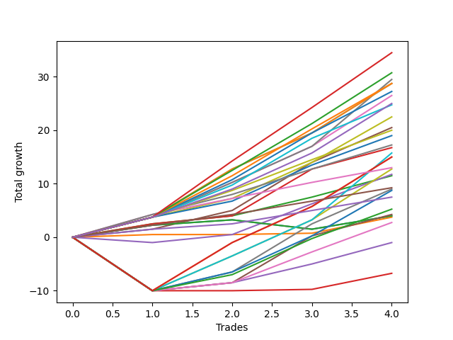

# Long Labrador 013_5 
- Symbol: ES
- Date Range: 03/18/2022 - 12/30/2022
- Trading Period: 8:30-12:30
- Number of Trades: 4



| Name | Win Percent | Profit | Avg Profit / Trade | Avg Time / Trade |      | Name | Win Percent | Profit | Avg Profit / Trade | Avg Time / Trade |
| ---- | ----------- | ------ | ------------------ | ---------------- | ---- | ---- | ----------- | ------ | ------------------ | ---------------- |
| Sorted By <br> Profit | | | | | | Sorted By <br> Win Percentage ||||
| TP-10 | 100.00 | 17250.00 | 4312.50 | 30:37 |     | TP-10 | 100.00 | 17250.00 | 4312.50 | 30:37 |
| TP-9 | 100.00 | 15375.00 | 3843.75 | 29:00 |     | TP-9 | 100.00 | 15375.00 | 3843.75 | 29:00 |
| V U/L 1SD | 100.00 | 14750.00 | 3687.50 | 30:43 |     | V U/L 1SD | 100.00 | 14750.00 | 3687.50 | 30:43 |
| TP-8 | 100.00 | 14375.00 | 3593.75 | 28:50 |     | TP-8 | 100.00 | 14375.00 | 3593.75 | 28:50 |
| BB-200 U/L 2SD | 100.00 | 14375.00 | 3593.75 | 39:52 |     | BB-200 U/L 2SD | 100.00 | 14375.00 | 3593.75 | 39:52 |
| BB-100 U/L 2SD | 100.00 | 14375.00 | 3593.75 | 39:52 |     | BB-100 U/L 2SD | 100.00 | 14375.00 | 3593.75 | 39:52 |
| TP-7 | 100.00 | 13625.00 | 3406.25 | 28:23 |     | TP-7 | 100.00 | 13625.00 | 3406.25 | 28:23 |
| BB-50 U/L 2SD | 100.00 | 13250.00 | 3312.50 | 29:08 |     | BB-50 U/L 2SD | 100.00 | 13250.00 | 3312.50 | 29:08 |
| NEWFI 000 | 100.00 | 12500.00 | 3125.00 | 38:30 |     | NEWFI 000 | 100.00 | 12500.00 | 3125.00 | 38:30 |
| TP-6 | 100.00 | 12375.00 | 3093.75 | 24:15 |     | TP-6 | 100.00 | 12375.00 | 3093.75 | 24:15 |
| BB-100 Mid | 100.00 | 11250.00 | 2812.50 | 27:30 |     | BB-100 Mid | 100.00 | 11250.00 | 2812.50 | 27:30 |
| BB-50 U/L 1SD | 100.00 | 10250.00 | 2562.50 | 25:06 |     | BB-50 U/L 1SD | 100.00 | 10250.00 | 2562.50 | 25:06 |
| TP-5 | 100.00 | 10000.00 | 2500.00 | 21:51 |     | TP-5 | 100.00 | 10000.00 | 2500.00 | 21:51 |
| BB-200 Mid | 100.00 | 9500.00 | 2375.00 | 25:02 |     | BB-200 Mid | 100.00 | 9500.00 | 2375.00 | 25:02 |
| NEWFI 0000 | 100.00 | 9000.00 | 2250.00 | 25:16 |     | NEWFI 0000 | 100.00 | 9000.00 | 2250.00 | 25:16 |
| TP-4 | 100.00 | 8625.00 | 2156.25 | 09:45 |     | TP-4 | 100.00 | 8625.00 | 2156.25 | 09:45 |
| V Mid | 100.00 | 8500.00 | 2125.00 | 21:10 |     | V Mid | 100.00 | 8500.00 | 2125.00 | 21:10 |
| BB-20 U/L 2SD C | 100.00 | 8375.00 | 2093.75 | 15:30 |     | BB-20 U/L 2SD C | 100.00 | 8375.00 | 2093.75 | 15:30 |
| TP-3 | 100.00 | 6500.00 | 1625.00 | 06:21 |     | TP-3 | 100.00 | 6500.00 | 1625.00 | 06:21 |
| BB-50 Mid | 75.00 | 5875.00 | 1468.75 | 20:15 |     | BB-20 U/L 2SD | 100.00 | 5750.00 | 1437.50 | 11:53 |
| BB-20 U/L 2SD | 100.00 | 5750.00 | 1437.50 | 11:53 |     | TP-2 | 100.00 | 4625.00 | 1156.25 | 05:03 |
| TP-2 | 100.00 | 4625.00 | 1156.25 | 05:03 |     | TP-1 | 100.00 | 3750.00 | 937.50 | 02:10 |
| TP-1 | 100.00 | 3750.00 | 937.50 | 02:10 |     | BB-20 U/L 1SD | 100.00 | 1875.00 | 468.75 | 08:16 |
| BB-20 Mid | 75.00 | 2000.00 | 500.00 | 01:37 |     | BB-50 Mid | 75.00 | 5875.00 | 1468.75 | 20:15 |
| BB-20 U/L 1SD | 100.00 | 1875.00 | 468.75 | 08:16 |     | BB-20 Mid | 75.00 | 2000.00 | 500.00 | 01:37 |

## NO STOPLOSS

### Test BB-20 Mid
* Sell when price hits the middle line of the 20p bollinger
* No Stoploss
* Results:
```
Total Trades: 4
Percent Up: 75.00
Percent Down: 25.00
Total Points Moved Up: 4.00
Potential Profit: 2000.00
Total Points Ups: 5.75 Count Ups: 3
Total Points Downs: -1.75 Count Downs: 1
```

<details><summary>Trades</summary>

<code>In: 2022-04-27 12:11:00		Out: 2022-04-27 12:14:00		Total Position Time: 03:00		Total Move Up: 2.25		Total to Date: 2.25</code> <br />
<code>In: 2022-08-10 12:04:00		Out: 2022-08-10 12:05:10		Total Position Time: 01:10		Total Move Up: 1.00		Total to Date: 3.25</code> <br />
<code>In: 2022-10-11 12:18:00		Out: 2022-10-11 12:19:10		Total Position Time: 01:10		Total Move Up: -1.75		Total to Date: 1.50</code> <br />
<code>In: 2022-10-31 09:50:00		Out: 2022-10-31 09:51:10		Total Position Time: 01:10		Total Move Up: 2.50		Total to Date: 4.00</code> <br />


</details>

### Test BB-20 U/L 1SD
* Sell when the price hits the upper line of the 20p 1std bollinger
* No Stoploss
* Results:
```
Total Trades: 4
Percent Up: 100.00
Percent Down: 0.00
Total Points Moved Up: 3.75
Potential Profit: 1875.00
Total Points Ups: 3.75 Count Ups: 4
Total Points Downs: 0.00 Count Downs: 0
```

<details><summary>Trades</summary>

<code>In: 2022-04-27 12:11:00		Out: 2022-04-27 12:27:15		Total Position Time: 16:15		Total Move Up: 0.50		Total to Date: 0.50</code> <br />
<code>In: 2022-08-10 12:04:00		Out: 2022-08-10 12:11:05		Total Position Time: 07:05		Total Move Up: 0.00		Total to Date: 0.50</code> <br />
<code>In: 2022-10-11 12:18:00		Out: 2022-10-11 12:20:40		Total Position Time: 02:40		Total Move Up: 0.25		Total to Date: 0.75</code> <br />
<code>In: 2022-10-31 09:50:00		Out: 2022-10-31 09:57:05		Total Position Time: 07:05		Total Move Up: 3.00		Total to Date: 3.75</code> <br />


</details>

### Test BB-20 U/L 2SD
* Sell when the price hits the upper line of the 20p 2std bollinger
* No Stoploss
* Results:
```
Total Trades: 4
Percent Up: 100.00
Percent Down: 0.00
Total Points Moved Up: 11.50
Potential Profit: 5750.00
Total Points Ups: 11.50 Count Ups: 4
Total Points Downs: 0.00 Count Downs: 0
```

<details><summary>Trades</summary>

<code>In: 2022-04-27 12:11:00		Out: 2022-04-27 12:31:20		Total Position Time: 20:20		Total Move Up: 2.50		Total to Date: 2.50</code> <br />
<code>In: 2022-08-10 12:04:00		Out: 2022-08-10 12:14:35		Total Position Time: 10:35		Total Move Up: 1.50		Total to Date: 4.00</code> <br />
<code>In: 2022-10-11 12:18:00		Out: 2022-10-11 12:22:35		Total Position Time: 04:35		Total Move Up: 3.50		Total to Date: 7.50</code> <br />
<code>In: 2022-10-31 09:50:00		Out: 2022-10-31 10:02:05		Total Position Time: 12:05		Total Move Up: 4.00		Total to Date: 11.50</code> <br />


</details>

### Test BB-20 U/L 2SD C
* Sell when the price hits the upper line of the 20p 2std bollinger
* No Stoploss
* Results:
```
Total Trades: 4
Percent Up: 100.00
Percent Down: 0.00
Total Points Moved Up: 16.75
Potential Profit: 8375.00
Total Points Ups: 16.75 Count Ups: 4
Total Points Downs: 0.00 Count Downs: 0
```

<details><summary>Trades</summary>

<code>In: 2022-04-27 12:11:00		Out: 2022-04-27 12:31:20		Total Position Time: 20:20		Total Move Up: 2.50		Total to Date: 2.50</code> <br />
<code>In: 2022-08-10 12:04:00		Out: 2022-08-10 12:14:35		Total Position Time: 10:35		Total Move Up: 1.50		Total to Date: 4.00</code> <br />
<code>In: 2022-10-11 12:18:00		Out: 2022-10-11 12:37:00		Total Position Time: 19:00		Total Move Up: 8.75		Total to Date: 12.75</code> <br />
<code>In: 2022-10-31 09:50:00		Out: 2022-10-31 10:02:05		Total Position Time: 12:05		Total Move Up: 4.00		Total to Date: 16.75</code> <br />


</details>

### Test BB-50 Mid
* Sell when price hits the middle line of the 50p bollinger
* No Stoploss
* Results:
```
Total Trades: 4
Percent Up: 75.00
Percent Down: 25.00
Total Points Moved Up: 11.75
Potential Profit: 5875.00
Total Points Ups: 12.75 Count Ups: 3
Total Points Downs: -1.00 Count Downs: 1
```

<details><summary>Trades</summary>

<code>In: 2022-04-27 12:11:00		Out: 2022-04-27 12:44:20		Total Position Time: 33:20		Total Move Up: -1.00		Total to Date: -1.00</code> <br />
<code>In: 2022-08-10 12:04:00		Out: 2022-08-10 12:14:35		Total Position Time: 10:35		Total Move Up: 1.50		Total to Date: 0.50</code> <br />
<code>In: 2022-10-11 12:18:00		Out: 2022-10-11 12:36:35		Total Position Time: 18:35		Total Move Up: 5.75		Total to Date: 6.25</code> <br />
<code>In: 2022-10-31 09:50:00		Out: 2022-10-31 10:08:30		Total Position Time: 18:30		Total Move Up: 5.50		Total to Date: 11.75</code> <br />


</details>

### Test BB-50 U/L 1SD
* Sell when the price hits the upper line of the 50p 1std bollinger
* No Stoploss
* Results:
```
Total Trades: 4
Percent Up: 100.00
Percent Down: 0.00
Total Points Moved Up: 20.50
Potential Profit: 10250.00
Total Points Ups: 20.50 Count Ups: 4
Total Points Downs: 0.00 Count Downs: 0
```

<details><summary>Trades</summary>

<code>In: 2022-04-27 12:11:00		Out: 2022-04-27 12:46:05		Total Position Time: 35:05		Total Move Up: 1.50		Total to Date: 1.50</code> <br />
<code>In: 2022-08-10 12:04:00		Out: 2022-08-10 12:21:40		Total Position Time: 17:40		Total Move Up: 3.50		Total to Date: 5.00</code> <br />
<code>In: 2022-10-11 12:18:00		Out: 2022-10-11 12:39:25		Total Position Time: 21:25		Total Move Up: 9.00		Total to Date: 14.00</code> <br />
<code>In: 2022-10-31 09:50:00		Out: 2022-10-31 10:16:15		Total Position Time: 26:15		Total Move Up: 6.50		Total to Date: 20.50</code> <br />


</details>

### Test BB-50 U/L 2SD
* Sell when the price hits the upper line of the 50p 2std bollinger
* No Stoploss
* Results:
```
Total Trades: 4
Percent Up: 100.00
Percent Down: 0.00
Total Points Moved Up: 26.50
Potential Profit: 13250.00
Total Points Ups: 26.50 Count Ups: 4
Total Points Downs: 0.00 Count Downs: 0
```

<details><summary>Trades</summary>

<code>In: 2022-04-27 12:11:00		Out: 2022-04-27 12:47:00		Total Position Time: 36:00		Total Move Up: 3.75		Total to Date: 3.75</code> <br />
<code>In: 2022-08-10 12:04:00		Out: 2022-08-10 12:27:55		Total Position Time: 23:55		Total Move Up: 6.50		Total to Date: 10.25</code> <br />
<code>In: 2022-10-11 12:18:00		Out: 2022-10-11 12:47:00		Total Position Time: 29:00		Total Move Up: 6.75		Total to Date: 17.00</code> <br />
<code>In: 2022-10-31 09:50:00		Out: 2022-10-31 10:17:40		Total Position Time: 27:40		Total Move Up: 9.50		Total to Date: 26.50</code> <br />


</details>

### Test V Mid
* Sell when the price hits the middle line of the 1std VWAP
* No Stoploss
* Results:
```
Total Trades: 4
Percent Up: 100.00
Percent Down: 0.00
Total Points Moved Up: 17.00
Potential Profit: 8500.00
Total Points Ups: 17.00 Count Ups: 4
Total Points Downs: 0.00 Count Downs: 0
```

<details><summary>Trades</summary>

<code>In: 2022-04-27 12:11:00		Out: 2022-04-27 12:47:00		Total Position Time: 36:00		Total Move Up: 3.75		Total to Date: 3.75</code> <br />
<code>In: 2022-08-10 12:04:00		Out: 2022-08-10 12:05:10		Total Position Time: 01:10		Total Move Up: 1.00		Total to Date: 4.75</code> <br />
<code>In: 2022-10-11 12:18:00		Out: 2022-10-11 12:47:00		Total Position Time: 29:00		Total Move Up: 6.75		Total to Date: 11.50</code> <br />
<code>In: 2022-10-31 09:50:00		Out: 2022-10-31 10:08:30		Total Position Time: 18:30		Total Move Up: 5.50		Total to Date: 17.00</code> <br />


</details>

### Test V U/L 1SD
* Sell when the price hits the upper line of the 1std VWAP
* No Stoploss
* Results:
```
Total Trades: 4
Percent Up: 100.00
Percent Down: 0.00
Total Points Moved Up: 29.50
Potential Profit: 14750.00
Total Points Ups: 29.50 Count Ups: 4
Total Points Downs: 0.00 Count Downs: 0
```

<details><summary>Trades</summary>

<code>In: 2022-04-27 12:11:00		Out: 2022-04-27 12:47:00		Total Position Time: 36:00		Total Move Up: 3.75		Total to Date: 3.75</code> <br />
<code>In: 2022-08-10 12:04:00		Out: 2022-08-10 12:27:55		Total Position Time: 23:55		Total Move Up: 6.50		Total to Date: 10.25</code> <br />
<code>In: 2022-10-11 12:18:00		Out: 2022-10-11 12:47:00		Total Position Time: 29:00		Total Move Up: 6.75		Total to Date: 17.00</code> <br />
<code>In: 2022-10-31 09:50:00		Out: 2022-10-31 10:24:00		Total Position Time: 34:00		Total Move Up: 12.50		Total to Date: 29.50</code> <br />


</details>

### Test BB-100 Mid
* Move to BB100 Mid
* No Stoploss
* Results:
```
Total Trades: 4
Percent Up: 100.00
Percent Down: 0.00
Total Points Moved Up: 22.50
Potential Profit: 11250.00
Total Points Ups: 22.50 Count Ups: 4
Total Points Downs: 0.00 Count Downs: 0
```

<details><summary>Trades</summary>

<code>In: 2022-04-27 12:11:00		Out: 2022-04-27 12:47:00		Total Position Time: 36:00		Total Move Up: 3.75		Total to Date: 3.75</code> <br />
<code>In: 2022-08-10 12:04:00		Out: 2022-08-10 12:21:40		Total Position Time: 17:40		Total Move Up: 3.50		Total to Date: 7.25</code> <br />
<code>In: 2022-10-11 12:18:00		Out: 2022-10-11 12:47:00		Total Position Time: 29:00		Total Move Up: 6.75		Total to Date: 14.00</code> <br />
<code>In: 2022-10-31 09:50:00		Out: 2022-10-31 10:17:20		Total Position Time: 27:20		Total Move Up: 8.50		Total to Date: 22.50</code> <br />


</details>

### Test BB-100 U/L 2SD
* Move to BB100 Upper Band
* No Stoploss
* Results:
```
Total Trades: 4
Percent Up: 100.00
Percent Down: 0.00
Total Points Moved Up: 28.75
Potential Profit: 14375.00
Total Points Ups: 28.75 Count Ups: 4
Total Points Downs: 0.00 Count Downs: 0
```

<details><summary>Trades</summary>

<code>In: 2022-04-27 12:11:00		Out: 2022-04-27 12:47:00		Total Position Time: 36:00		Total Move Up: 3.75		Total to Date: 3.75</code> <br />
<code>In: 2022-08-10 12:04:00		Out: 2022-08-10 12:37:35		Total Position Time: 33:35		Total Move Up: 9.00		Total to Date: 12.75</code> <br />
<code>In: 2022-10-11 12:18:00		Out: 2022-10-11 12:47:00		Total Position Time: 29:00		Total Move Up: 6.75		Total to Date: 19.50</code> <br />
<code>In: 2022-10-31 09:50:00		Out: 2022-10-31 10:50:55		Total Position Time: 60:55		Total Move Up: 9.25		Total to Date: 28.75</code> <br />


</details>

### Test BB-200 Mid
* Move to BB200 Mid
* No Stoploss
* Results:
```
Total Trades: 4
Percent Up: 100.00
Percent Down: 0.00
Total Points Moved Up: 19.00
Potential Profit: 9500.00
Total Points Ups: 19.00 Count Ups: 4
Total Points Downs: 0.00 Count Downs: 0
```

<details><summary>Trades</summary>

<code>In: 2022-04-27 12:11:00		Out: 2022-04-27 12:47:00		Total Position Time: 36:00		Total Move Up: 3.75		Total to Date: 3.75</code> <br />
<code>In: 2022-08-10 12:04:00		Out: 2022-08-10 12:20:40		Total Position Time: 16:40		Total Move Up: 3.00		Total to Date: 6.75</code> <br />
<code>In: 2022-10-11 12:18:00		Out: 2022-10-11 12:47:00		Total Position Time: 29:00		Total Move Up: 6.75		Total to Date: 13.50</code> <br />
<code>In: 2022-10-31 09:50:00		Out: 2022-10-31 10:08:30		Total Position Time: 18:30		Total Move Up: 5.50		Total to Date: 19.00</code> <br />


</details>

### Test BB-200 U/L 2SD
* Move to BB200 Upper Band
* No Stoploss
* Results:
```
Total Trades: 4
Percent Up: 100.00
Percent Down: 0.00
Total Points Moved Up: 28.75
Potential Profit: 14375.00
Total Points Ups: 28.75 Count Ups: 4
Total Points Downs: 0.00 Count Downs: 0
```

<details><summary>Trades</summary>

<code>In: 2022-04-27 12:11:00		Out: 2022-04-27 12:47:00		Total Position Time: 36:00		Total Move Up: 3.75		Total to Date: 3.75</code> <br />
<code>In: 2022-08-10 12:04:00		Out: 2022-08-10 12:37:35		Total Position Time: 33:35		Total Move Up: 9.00		Total to Date: 12.75</code> <br />
<code>In: 2022-10-11 12:18:00		Out: 2022-10-11 12:47:00		Total Position Time: 29:00		Total Move Up: 6.75		Total to Date: 19.50</code> <br />
<code>In: 2022-10-31 09:50:00		Out: 2022-10-31 10:50:55		Total Position Time: 60:55		Total Move Up: 9.25		Total to Date: 28.75</code> <br />


</details>

## TAKE PROFIT

### Test TP-1
* Take Profit of 1 Point
* No Stoploss
* Results:
```
Total Trades: 4
Percent Up: 100.00
Percent Down: 0.00
Total Points Moved Up: 7.50
Potential Profit: 3750.00
Total Points Ups: 7.50 Count Ups: 4
Total Points Downs: 0.00 Count Downs: 0
```

<details><summary>Trades</summary>

<code>In: 2022-04-27 12:11:00		Out: 2022-04-27 12:13:55		Total Position Time: 02:55		Total Move Up: 1.50		Total to Date: 1.50</code> <br />
<code>In: 2022-08-10 12:04:00		Out: 2022-08-10 12:05:10		Total Position Time: 01:10		Total Move Up: 1.00		Total to Date: 2.50</code> <br />
<code>In: 2022-10-11 12:18:00		Out: 2022-10-11 12:21:25		Total Position Time: 03:25		Total Move Up: 2.50		Total to Date: 5.00</code> <br />
<code>In: 2022-10-31 09:50:00		Out: 2022-10-31 09:51:10		Total Position Time: 01:10		Total Move Up: 2.50		Total to Date: 7.50</code> <br />


</details>

### Test TP-2
* Take Profit of 2 Point
* No Stoploss
* Results:
```
Total Trades: 4
Percent Up: 100.00
Percent Down: 0.00
Total Points Moved Up: 9.25
Potential Profit: 4625.00
Total Points Ups: 9.25 Count Ups: 4
Total Points Downs: 0.00 Count Downs: 0
```

<details><summary>Trades</summary>

<code>In: 2022-04-27 12:11:00		Out: 2022-04-27 12:14:00		Total Position Time: 03:00		Total Move Up: 2.25		Total to Date: 2.25</code> <br />
<code>In: 2022-08-10 12:04:00		Out: 2022-08-10 12:16:40		Total Position Time: 12:40		Total Move Up: 2.00		Total to Date: 4.25</code> <br />
<code>In: 2022-10-11 12:18:00		Out: 2022-10-11 12:21:25		Total Position Time: 03:25		Total Move Up: 2.50		Total to Date: 6.75</code> <br />
<code>In: 2022-10-31 09:50:00		Out: 2022-10-31 09:51:10		Total Position Time: 01:10		Total Move Up: 2.50		Total to Date: 9.25</code> <br />


</details>

### Test TP-3
* Take Profit of 3 Point
* No Stoploss
* Results:
```
Total Trades: 4
Percent Up: 100.00
Percent Down: 0.00
Total Points Moved Up: 13.00
Potential Profit: 6500.00
Total Points Ups: 13.00 Count Ups: 4
Total Points Downs: 0.00 Count Downs: 0
```

<details><summary>Trades</summary>

<code>In: 2022-04-27 12:11:00		Out: 2022-04-27 12:15:20		Total Position Time: 04:20		Total Move Up: 4.25		Total to Date: 4.25</code> <br />
<code>In: 2022-08-10 12:04:00		Out: 2022-08-10 12:20:20		Total Position Time: 16:20		Total Move Up: 3.00		Total to Date: 7.25</code> <br />
<code>In: 2022-10-11 12:18:00		Out: 2022-10-11 12:21:30		Total Position Time: 03:30		Total Move Up: 3.00		Total to Date: 10.25</code> <br />
<code>In: 2022-10-31 09:50:00		Out: 2022-10-31 09:51:15		Total Position Time: 01:15		Total Move Up: 2.75		Total to Date: 13.00</code> <br />


</details>

### Test TP-4
* Take Profit of 4 Point
* No Stoploss
* Results:
```
Total Trades: 4
Percent Up: 100.00
Percent Down: 0.00
Total Points Moved Up: 17.25
Potential Profit: 8625.00
Total Points Ups: 17.25 Count Ups: 4
Total Points Downs: 0.00 Count Downs: 0
```

<details><summary>Trades</summary>

<code>In: 2022-04-27 12:11:00		Out: 2022-04-27 12:15:20		Total Position Time: 04:20		Total Move Up: 4.25		Total to Date: 4.25</code> <br />
<code>In: 2022-08-10 12:04:00		Out: 2022-08-10 12:21:45		Total Position Time: 17:45		Total Move Up: 3.75		Total to Date: 8.00</code> <br />
<code>In: 2022-10-11 12:18:00		Out: 2022-10-11 12:22:40		Total Position Time: 04:40		Total Move Up: 4.75		Total to Date: 12.75</code> <br />
<code>In: 2022-10-31 09:50:00		Out: 2022-10-31 10:02:15		Total Position Time: 12:15		Total Move Up: 4.50		Total to Date: 17.25</code> <br />


</details>

### Test TP-5
* Take Profit of 5 Point
* No Stoploss
* Results:
```
Total Trades: 4
Percent Up: 100.00
Percent Down: 0.00
Total Points Moved Up: 20.00
Potential Profit: 10000.00
Total Points Ups: 20.00 Count Ups: 4
Total Points Downs: 0.00 Count Downs: 0
```

<details><summary>Trades</summary>

<code>In: 2022-04-27 12:11:00		Out: 2022-04-27 12:47:00		Total Position Time: 36:00		Total Move Up: 3.75		Total to Date: 3.75</code> <br />
<code>In: 2022-08-10 12:04:00		Out: 2022-08-10 12:24:25		Total Position Time: 20:25		Total Move Up: 5.00		Total to Date: 8.75</code> <br />
<code>In: 2022-10-11 12:18:00		Out: 2022-10-11 12:36:35		Total Position Time: 18:35		Total Move Up: 5.75		Total to Date: 14.50</code> <br />
<code>In: 2022-10-31 09:50:00		Out: 2022-10-31 10:02:25		Total Position Time: 12:25		Total Move Up: 5.50		Total to Date: 20.00</code> <br />


</details>

### Test TP-6
* Take Profit of 6 Point
* No Stoploss
* Results:
```
Total Trades: 4
Percent Up: 100.00
Percent Down: 0.00
Total Points Moved Up: 24.75
Potential Profit: 12375.00
Total Points Ups: 24.75 Count Ups: 4
Total Points Downs: 0.00 Count Downs: 0
```

<details><summary>Trades</summary>

<code>In: 2022-04-27 12:11:00		Out: 2022-04-27 12:47:00		Total Position Time: 36:00		Total Move Up: 3.75		Total to Date: 3.75</code> <br />
<code>In: 2022-08-10 12:04:00		Out: 2022-08-10 12:27:20		Total Position Time: 23:20		Total Move Up: 6.00		Total to Date: 9.75</code> <br />
<code>In: 2022-10-11 12:18:00		Out: 2022-10-11 12:37:00		Total Position Time: 19:00		Total Move Up: 8.75		Total to Date: 18.50</code> <br />
<code>In: 2022-10-31 09:50:00		Out: 2022-10-31 10:08:40		Total Position Time: 18:40		Total Move Up: 6.25		Total to Date: 24.75</code> <br />


</details>

### Test TP-7
* Take Profit of 7 Point
* No Stoploss
* Results:
```
Total Trades: 4
Percent Up: 100.00
Percent Down: 0.00
Total Points Moved Up: 27.25
Potential Profit: 13625.00
Total Points Ups: 27.25 Count Ups: 4
Total Points Downs: 0.00 Count Downs: 0
```

<details><summary>Trades</summary>

<code>In: 2022-04-27 12:11:00		Out: 2022-04-27 12:47:00		Total Position Time: 36:00		Total Move Up: 3.75		Total to Date: 3.75</code> <br />
<code>In: 2022-08-10 12:04:00		Out: 2022-08-10 12:36:05		Total Position Time: 32:05		Total Move Up: 7.00		Total to Date: 10.75</code> <br />
<code>In: 2022-10-11 12:18:00		Out: 2022-10-11 12:37:00		Total Position Time: 19:00		Total Move Up: 8.75		Total to Date: 19.50</code> <br />
<code>In: 2022-10-31 09:50:00		Out: 2022-10-31 10:16:30		Total Position Time: 26:30		Total Move Up: 7.75		Total to Date: 27.25</code> <br />


</details>

### Test TP-8
* Take Profit of 8 Point
* No Stoploss
* Results:
```
Total Trades: 4
Percent Up: 100.00
Percent Down: 0.00
Total Points Moved Up: 28.75
Potential Profit: 14375.00
Total Points Ups: 28.75 Count Ups: 4
Total Points Downs: 0.00 Count Downs: 0
```

<details><summary>Trades</summary>

<code>In: 2022-04-27 12:11:00		Out: 2022-04-27 12:47:00		Total Position Time: 36:00		Total Move Up: 3.75		Total to Date: 3.75</code> <br />
<code>In: 2022-08-10 12:04:00		Out: 2022-08-10 12:37:00		Total Position Time: 33:00		Total Move Up: 7.75		Total to Date: 11.50</code> <br />
<code>In: 2022-10-11 12:18:00		Out: 2022-10-11 12:37:00		Total Position Time: 19:00		Total Move Up: 8.75		Total to Date: 20.25</code> <br />
<code>In: 2022-10-31 09:50:00		Out: 2022-10-31 10:17:20		Total Position Time: 27:20		Total Move Up: 8.50		Total to Date: 28.75</code> <br />


</details>

### Test TP-9
* Take Profit of 9 Point
* No Stoploss
* Results:
```
Total Trades: 4
Percent Up: 100.00
Percent Down: 0.00
Total Points Moved Up: 30.75
Potential Profit: 15375.00
Total Points Ups: 30.75 Count Ups: 4
Total Points Downs: 0.00 Count Downs: 0
```

<details><summary>Trades</summary>

<code>In: 2022-04-27 12:11:00		Out: 2022-04-27 12:47:00		Total Position Time: 36:00		Total Move Up: 3.75		Total to Date: 3.75</code> <br />
<code>In: 2022-08-10 12:04:00		Out: 2022-08-10 12:37:20		Total Position Time: 33:20		Total Move Up: 8.75		Total to Date: 12.50</code> <br />
<code>In: 2022-10-11 12:18:00		Out: 2022-10-11 12:37:00		Total Position Time: 19:00		Total Move Up: 8.75		Total to Date: 21.25</code> <br />
<code>In: 2022-10-31 09:50:00		Out: 2022-10-31 10:17:40		Total Position Time: 27:40		Total Move Up: 9.50		Total to Date: 30.75</code> <br />


</details>

### Test TP-10
* Take Profit of 10 Point
* No Stoploss
* Results:
```
Total Trades: 4
Percent Up: 100.00
Percent Down: 0.00
Total Points Moved Up: 34.50
Potential Profit: 17250.00
Total Points Ups: 34.50 Count Ups: 4
Total Points Downs: 0.00 Count Downs: 0
```

<details><summary>Trades</summary>

<code>In: 2022-04-27 12:11:00		Out: 2022-04-27 12:47:00		Total Position Time: 36:00		Total Move Up: 3.75		Total to Date: 3.75</code> <br />
<code>In: 2022-08-10 12:04:00		Out: 2022-08-10 12:38:55		Total Position Time: 34:55		Total Move Up: 10.50		Total to Date: 14.25</code> <br />
<code>In: 2022-10-11 12:18:00		Out: 2022-10-11 12:39:35		Total Position Time: 21:35		Total Move Up: 10.00		Total to Date: 24.25</code> <br />
<code>In: 2022-10-31 09:50:00		Out: 2022-10-31 10:20:00		Total Position Time: 30:00		Total Move Up: 10.25		Total to Date: 34.50</code> <br />


</details>

## Indicator Exits

### Test NEWFI 000
* Newfi 0000
* No Stoploss
* Results:
```
Total Trades: 4
Percent Up: 100.00
Percent Down: 0.00
Total Points Moved Up: 25.00
Potential Profit: 12500.00
Total Points Ups: 25.00 Count Ups: 4
Total Points Downs: 0.00 Count Downs: 0
```

<details><summary>Trades</summary>

<code>In: 2022-04-27 12:11:00		Out: 2022-04-27 12:47:00		Total Position Time: 36:00		Total Move Up: 3.75		Total to Date: 3.75</code> <br />
<code>In: 2022-08-10 12:04:00		Out: 2022-08-10 12:32:05		Total Position Time: 28:05		Total Move Up: 5.25		Total to Date: 9.00</code> <br />
<code>In: 2022-10-11 12:18:00		Out: 2022-10-11 12:47:00		Total Position Time: 29:00		Total Move Up: 6.75		Total to Date: 15.75</code> <br />
<code>In: 2022-10-31 09:50:00		Out: 2022-10-31 10:50:55		Total Position Time: 60:55		Total Move Up: 9.25		Total to Date: 25.00</code> <br />


</details>

### Test NEWFI 0000
* Newfi 0000
* No Stoploss
* Results:
```
Total Trades: 4
Percent Up: 100.00
Percent Down: 0.00
Total Points Moved Up: 18.00
Potential Profit: 9000.00
Total Points Ups: 18.00 Count Ups: 4
Total Points Downs: 0.00 Count Downs: 0
```

<details><summary>Trades</summary>

<code>In: 2022-04-27 12:11:00		Out: 2022-04-27 12:15:05		Total Position Time: 04:05		Total Move Up: 2.00		Total to Date: 2.00</code> <br />
<code>In: 2022-08-10 12:04:00		Out: 2022-08-10 12:11:05		Total Position Time: 07:05		Total Move Up: 0.00		Total to Date: 2.00</code> <br />
<code>In: 2022-10-11 12:18:00		Out: 2022-10-11 12:47:00		Total Position Time: 29:00		Total Move Up: 6.75		Total to Date: 8.75</code> <br />
<code>In: 2022-10-31 09:50:00		Out: 2022-10-31 10:50:55		Total Position Time: 60:55		Total Move Up: 9.25		Total to Date: 18.00</code> <br />


</details>