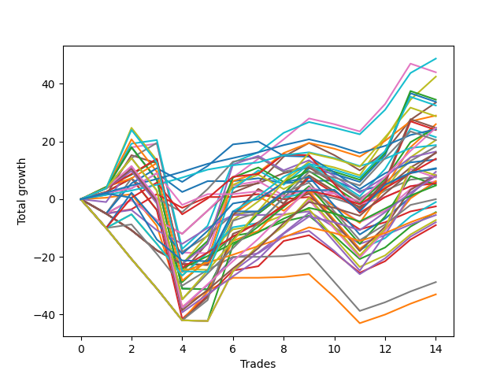

# Long Labrador 013 
- Symbol: ES
- Date Range: 03/18/2022 - 12/30/2022
- Trading Period: 8:30-12:30
- Number of Trades: 14



| Name | Win Percent | Profit | Avg Profit / Trade | Avg Time / Trade |      | Name | Win Percent | Profit | Avg Profit / Trade | Avg Time / Trade |
| ---- | ----------- | ------ | ------------------ | ---------------- | ---- | ---- | ----------- | ------ | ------------------ | ---------------- |
| Sorted By <br> Profit | | | | | | Sorted By <br> Win Percentage ||||
| BB-100 Mid | 78.57 | 24375.00 | 1741.07 | 32:38 |     | TP-2 | 85.71 | 12125.00 | 866.07 | 12:18 |
| BB-50 U/L 2SD | 64.29 | 22000.00 | 1571.43 | 39:36 |     | TP-1 | 85.71 | 9375.00 | 669.64 | 10:46 |
| NEWFI 06 | 57.14 | 21875.00 | 1562.50 | 50:23 |     | BB-100 Mid | 78.57 | 24375.00 | 1741.07 | 32:38 |
| V U/L 1SD | 64.29 | 21250.00 | 1517.86 | 38:27 |     | TP-5 | 78.57 | 7000.00 | 500.00 | 23:03 |
| BB-200 U/L 2SD | 57.14 | 17250.00 | 1232.14 | 50:09 |     | BB-20 Mid | 78.57 | 5375.00 | 383.93 | 04:08 |
| BB-100 U/L 2SD | 57.14 | 16875.00 | 1205.36 | 49:05 |     | BB-20 Mid SL-10 | 78.57 | 3125.00 | 223.21 | 03:44 |
| BB-50 U/L 1SD | 71.43 | 16750.00 | 1196.43 | 29:40 |     | TP-4 | 78.57 | 2375.00 | 169.64 | 18:47 |
| NEWFI 000 | 57.14 | 16250.00 | 1160.71 | 46:33 |     | TP-3 | 78.57 | -2375.00 | -169.64 | 17:27 |
| BB-200 Mid | 71.43 | 14500.00 | 1035.71 | 29:42 |     | BB-50 U/L 1SD | 71.43 | 16750.00 | 1196.43 | 29:40 |
| TP-10 | 64.29 | 14375.00 | 1026.79 | 35:57 |     | BB-200 Mid | 71.43 | 14500.00 | 1035.71 | 29:42 |
| V U/L 1SD SL-5 | 42.86 | 13000.00 | 928.57 | 16:40 |     | TP-8 | 71.43 | 12375.00 | 883.93 | 31:08 |
| TP-8 | 71.43 | 12375.00 | 883.93 | 31:08 |     | TP-7 | 71.43 | 8125.00 | 580.36 | 29:51 |
| BB-100 Mid SL-5 | 50.00 | 12375.00 | 883.93 | 12:15 |     | TP-6 | 71.43 | 4000.00 | 285.71 | 28:07 |
| BB-200 U/L 2SD SL-5 | 35.71 | 12375.00 | 883.93 | 26:36 |     | V Mid | 71.43 | 3875.00 | 276.79 | 21:10 |
| TP-2 | 85.71 | 12125.00 | 866.07 | 12:18 |     | BB-20 U/L 2SD | 71.43 | -2250.00 | -160.71 | 19:30 |
| BB-100 U/L 2SD SL-5 | 35.71 | 12000.00 | 857.14 | 25:32 |     | BB-20 U/L 2SD C | 71.43 | -4500.00 | -321.43 | 21:44 |
| BB-50 U/L 2SD SL-5 | 35.71 | 10750.00 | 767.86 | 19:23 |     | BB-20 U/L 1SD | 71.43 | -16500.00 | -1178.57 | 16:30 |
| TP-9 | 64.29 | 10250.00 | 732.14 | 34:55 |     | BB-50 U/L 2SD | 64.29 | 22000.00 | 1571.43 | 39:36 |
| BB-50 U/L 1SD SL-5 | 50.00 | 10250.00 | 732.14 | 10:57 |     | V U/L 1SD | 64.29 | 21250.00 | 1517.86 | 38:27 |
| TP-1 | 85.71 | 9375.00 | 669.64 | 10:46 |     | TP-10 | 64.29 | 14375.00 | 1026.79 | 35:57 |
| BB-50 Mid SL-5 | 57.14 | 9125.00 | 651.79 | 06:53 |     | TP-9 | 64.29 | 10250.00 | 732.14 | 34:55 |
| BB-200 Mid SL-5 | 50.00 | 8250.00 | 589.29 | 08:09 |     | BB-20 U/L 2SD SL-5 | 64.29 | 8000.00 | 571.43 | 05:50 |
| TP-7 | 71.43 | 8125.00 | 580.36 | 29:51 |     | NEWFI 0000 | 64.29 | 5250.00 | 375.00 | 20:03 |
| BB-20 U/L 2SD SL-5 | 64.29 | 8000.00 | 571.43 | 05:50 |     | BB-50 Mid SL-10 | 64.29 | 2875.00 | 205.36 | 10:46 |
| TP-5 | 78.57 | 7000.00 | 500.00 | 23:03 |     | V Mid SL-10 | 64.29 | 2750.00 | 196.43 | 09:21 |
| V Mid SL-5 | 57.14 | 6875.00 | 491.07 | 04:47 |     | BB-20 U/L 2SD C SL-10 | 64.29 | -500.00 | -35.71 | 10:17 |
| BB-20 Mid | 78.57 | 5375.00 | 383.93 | 04:08 |     | BB-20 Mid SL-5 | 64.29 | -1250.00 | -89.29 | 02:25 |
| NEWFI 0000 | 64.29 | 5250.00 | 375.00 | 20:03 |     | BB-20 U/L 1SD SL-5 | 64.29 | -2750.00 | -196.43 | 04:30 |
| V U/L 1SD SL-10 | 50.00 | 4750.00 | 339.29 | 21:30 |     | BB-20 U/L 2SD SL-10 | 64.29 | -3625.00 | -258.93 | 09:10 |
| BB-20 U/L 2SD C SL-5 | 57.14 | 4250.00 | 303.57 | 06:22 |     | BB-50 Mid | 64.29 | -4000.00 | -285.71 | 22:57 |
| BB-100 Mid SL-10 | 57.14 | 4125.00 | 294.64 | 17:05 |     | BB-20 U/L 1SD SL-10 | 64.29 | -14375.00 | -1026.79 | 07:50 |
| BB-200 U/L 2SD SL-10 | 42.86 | 4125.00 | 294.64 | 31:25 |     | NEWFI 06 | 57.14 | 21875.00 | 1562.50 | 50:23 |
| TP-6 | 71.43 | 4000.00 | 285.71 | 28:07 |     | BB-200 U/L 2SD | 57.14 | 17250.00 | 1232.14 | 50:09 |
| V Mid | 71.43 | 3875.00 | 276.79 | 21:10 |     | BB-100 U/L 2SD | 57.14 | 16875.00 | 1205.36 | 49:05 |
| BB-100 U/L 2SD SL-10 | 42.86 | 3750.00 | 267.86 | 30:22 |     | NEWFI 000 | 57.14 | 16250.00 | 1160.71 | 46:33 |
| BB-20 Mid SL-10 | 78.57 | 3125.00 | 223.21 | 03:44 |     | BB-50 Mid SL-5 | 57.14 | 9125.00 | 651.79 | 06:53 |
| BB-50 U/L 1SD SL-10 | 57.14 | 3125.00 | 223.21 | 15:15 |     | V Mid SL-5 | 57.14 | 6875.00 | 491.07 | 04:47 |
| BB-50 Mid SL-10 | 64.29 | 2875.00 | 205.36 | 10:46 |     | BB-20 U/L 2SD C SL-5 | 57.14 | 4250.00 | 303.57 | 06:22 |
| V Mid SL-10 | 64.29 | 2750.00 | 196.43 | 09:21 |     | BB-100 Mid SL-10 | 57.14 | 4125.00 | 294.64 | 17:05 |
| BB-50 U/L 2SD SL-10 | 42.86 | 2500.00 | 178.57 | 24:13 |     | BB-50 U/L 1SD SL-10 | 57.14 | 3125.00 | 223.21 | 15:15 |
| TP-4 | 78.57 | 2375.00 | 169.64 | 18:47 |     | BB-200 Mid SL-10 | 57.14 | 0.00 | 0.00 | 12:59 |
| BB-200 Mid SL-10 | 57.14 | 0.00 | 0.00 | 12:59 |     | BB-100 Mid SL-5 | 50.00 | 12375.00 | 883.93 | 12:15 |
| BB-20 U/L 2SD C SL-10 | 64.29 | -500.00 | -35.71 | 10:17 |     | BB-50 U/L 1SD SL-5 | 50.00 | 10250.00 | 732.14 | 10:57 |
| BB-20 Mid SL-5 | 64.29 | -1250.00 | -89.29 | 02:25 |     | BB-200 Mid SL-5 | 50.00 | 8250.00 | 589.29 | 08:09 |
| BB-20 U/L 2SD | 71.43 | -2250.00 | -160.71 | 19:30 |     | V U/L 1SD SL-10 | 50.00 | 4750.00 | 339.29 | 21:30 |
| TP-3 | 78.57 | -2375.00 | -169.64 | 17:27 |     | V U/L 1SD SL-5 | 42.86 | 13000.00 | 928.57 | 16:40 |
| BB-20 U/L 1SD SL-5 | 64.29 | -2750.00 | -196.43 | 04:30 |     | BB-200 U/L 2SD SL-10 | 42.86 | 4125.00 | 294.64 | 31:25 |
| BB-20 U/L 2SD SL-10 | 64.29 | -3625.00 | -258.93 | 09:10 |     | BB-100 U/L 2SD SL-10 | 42.86 | 3750.00 | 267.86 | 30:22 |
| BB-50 Mid | 64.29 | -4000.00 | -285.71 | 22:57 |     | BB-50 U/L 2SD SL-10 | 42.86 | 2500.00 | 178.57 | 24:13 |
| BB-20 U/L 2SD C | 71.43 | -4500.00 | -321.43 | 21:44 |     | BB-200 U/L 2SD SL-5 | 35.71 | 12375.00 | 883.93 | 26:36 |
| BB-20 U/L 1SD SL-10 | 64.29 | -14375.00 | -1026.79 | 07:50 |     | BB-100 U/L 2SD SL-5 | 35.71 | 12000.00 | 857.14 | 25:32 |
| BB-20 U/L 1SD | 71.43 | -16500.00 | -1178.57 | 16:30 |     | BB-50 U/L 2SD SL-5 | 35.71 | 10750.00 | 767.86 | 19:23 |

## NO STOPLOSS

### Test BB-20 Mid
* Sell when price hits the middle line of the 20p bollinger
* No Stoploss
* Results:
```
Total Trades: 14
Percent Up: 78.57
Percent Down: 21.43
Total Points Moved Up: 10.75
Potential Profit: 5375.00
Total Points Ups: 22.75 Count Ups: 11
Total Points Downs: -12.00 Count Downs: 3
```

<details><summary>Trades</summary>

<code>In: 2022-04-27 12:11:00		Out: 2022-04-27 12:14:00		Total Position Time: 03:00		Total Move Up: 2.25		Total to Date: 2.25</code> <br />
<code>In: 2022-05-03 11:24:00		Out: 2022-05-03 11:32:10		Total Position Time: 08:10		Total Move Up: 1.50		Total to Date: 3.75</code> <br />
<code>In: 2022-05-06 11:00:00		Out: 2022-05-06 11:02:20		Total Position Time: 02:20		Total Move Up: 5.25		Total to Date: 9.00</code> <br />
<code>In: 2022-05-11 09:37:00		Out: 2022-05-11 09:49:20		Total Position Time: 12:20		Total Move Up: -6.50		Total to Date: 2.50</code> <br />
<code>In: 2022-06-27 09:37:00		Out: 2022-06-27 09:41:05		Total Position Time: 04:05		Total Move Up: 3.75		Total to Date: 6.25</code> <br />
<code>In: 2022-06-30 12:22:00		Out: 2022-06-30 12:23:35		Total Position Time: 01:35		Total Move Up: 0.00		Total to Date: 6.25</code> <br />
<code>In: 2022-08-10 12:04:00		Out: 2022-08-10 12:05:10		Total Position Time: 01:10		Total Move Up: 1.00		Total to Date: 7.25</code> <br />
<code>In: 2022-10-11 12:18:00		Out: 2022-10-11 12:19:10		Total Position Time: 01:10		Total Move Up: -1.75		Total to Date: 5.50</code> <br />
<code>In: 2022-10-17 12:14:00		Out: 2022-10-17 12:15:20		Total Position Time: 01:20		Total Move Up: 0.75		Total to Date: 6.25</code> <br />
<code>In: 2022-10-26 10:04:00		Out: 2022-10-26 10:12:05		Total Position Time: 08:05		Total Move Up: 0.25		Total to Date: 6.50</code> <br />
<code>In: 2022-10-26 10:12:00		Out: 2022-10-26 10:20:10		Total Position Time: 08:10		Total Move Up: -3.75		Total to Date: 2.75</code> <br />
<code>In: 2022-10-31 09:50:00		Out: 2022-10-31 09:51:10		Total Position Time: 01:10		Total Move Up: 2.50		Total to Date: 5.25</code> <br />
<code>In: 2022-11-10 10:02:00		Out: 2022-11-10 10:03:10		Total Position Time: 01:10		Total Move Up: 3.75		Total to Date: 9.00</code> <br />
<code>In: 2022-12-27 09:52:00		Out: 2022-12-27 09:56:10		Total Position Time: 04:10		Total Move Up: 1.75		Total to Date: 10.75</code> <br />


</details>

### Test BB-20 U/L 1SD
* Sell when the price hits the upper line of the 20p 1std bollinger
* No Stoploss
* Results:
```
Total Trades: 14
Percent Up: 71.43
Percent Down: 28.57
Total Points Moved Up: -33.00
Potential Profit: -16500.00
Total Points Ups: 23.00 Count Ups: 10
Total Points Downs: -56.00 Count Downs: 4
```

<details><summary>Trades</summary>

<code>In: 2022-04-27 12:11:00		Out: 2022-04-27 12:27:15		Total Position Time: 16:15		Total Move Up: 0.50		Total to Date: 0.50</code> <br />
<code>In: 2022-05-03 11:24:00		Out: 2022-05-03 11:32:25		Total Position Time: 08:25		Total Move Up: 1.25		Total to Date: 1.75</code> <br />
<code>In: 2022-05-06 11:00:00		Out: 2022-05-06 11:49:10		Total Position Time: 49:10		Total Move Up: -11.00		Total to Date: -9.25</code> <br />
<code>In: 2022-05-11 09:37:00		Out: 2022-05-11 10:24:35		Total Position Time: 47:35		Total Move Up: -28.00		Total to Date: -37.25</code> <br />
<code>In: 2022-06-27 09:37:00		Out: 2022-06-27 09:44:20		Total Position Time: 07:20		Total Move Up: 5.50		Total to Date: -31.75</code> <br />
<code>In: 2022-06-30 12:22:00		Out: 2022-06-30 12:25:10		Total Position Time: 03:10		Total Move Up: 4.50		Total to Date: -27.25</code> <br />
<code>In: 2022-08-10 12:04:00		Out: 2022-08-10 12:11:05		Total Position Time: 07:05		Total Move Up: 0.00		Total to Date: -27.25</code> <br />
<code>In: 2022-10-11 12:18:00		Out: 2022-10-11 12:20:40		Total Position Time: 02:40		Total Move Up: 0.25		Total to Date: -27.00</code> <br />
<code>In: 2022-10-17 12:14:00		Out: 2022-10-17 12:20:05		Total Position Time: 06:05		Total Move Up: 1.00		Total to Date: -26.00</code> <br />
<code>In: 2022-10-26 10:04:00		Out: 2022-10-26 10:41:50		Total Position Time: 37:50		Total Move Up: -8.00		Total to Date: -34.00</code> <br />
<code>In: 2022-10-26 10:12:00		Out: 2022-10-26 10:41:50		Total Position Time: 29:50		Total Move Up: -9.00		Total to Date: -43.00</code> <br />
<code>In: 2022-10-31 09:50:00		Out: 2022-10-31 09:57:05		Total Position Time: 07:05		Total Move Up: 3.00		Total to Date: -40.00</code> <br />
<code>In: 2022-11-10 10:02:00		Out: 2022-11-10 10:03:10		Total Position Time: 01:10		Total Move Up: 3.75		Total to Date: -36.25</code> <br />
<code>In: 2022-12-27 09:52:00		Out: 2022-12-27 09:59:25		Total Position Time: 07:25		Total Move Up: 3.25		Total to Date: -33.00</code> <br />


</details>

### Test BB-20 U/L 2SD
* Sell when the price hits the upper line of the 20p 2std bollinger
* No Stoploss
* Results:
```
Total Trades: 14
Percent Up: 71.43
Percent Down: 28.57
Total Points Moved Up: -4.50
Potential Profit: -2250.00
Total Points Ups: 46.50 Count Ups: 10
Total Points Downs: -51.00 Count Downs: 4
```

<details><summary>Trades</summary>

<code>In: 2022-04-27 12:11:00		Out: 2022-04-27 12:31:20		Total Position Time: 20:20		Total Move Up: 2.50		Total to Date: 2.50</code> <br />
<code>In: 2022-05-03 11:24:00		Out: 2022-05-03 11:34:55		Total Position Time: 10:55		Total Move Up: 4.75		Total to Date: 7.25</code> <br />
<code>In: 2022-05-06 11:00:00		Out: 2022-05-06 11:49:10		Total Position Time: 49:10		Total Move Up: -11.00		Total to Date: -3.75</code> <br />
<code>In: 2022-05-11 09:37:00		Out: 2022-05-11 10:24:50		Total Position Time: 47:50		Total Move Up: -25.00		Total to Date: -28.75</code> <br />
<code>In: 2022-06-27 09:37:00		Out: 2022-06-27 09:45:05		Total Position Time: 08:05		Total Move Up: 8.00		Total to Date: -20.75</code> <br />
<code>In: 2022-06-30 12:22:00		Out: 2022-06-30 12:25:55		Total Position Time: 03:55		Total Move Up: 8.00		Total to Date: -12.75</code> <br />
<code>In: 2022-08-10 12:04:00		Out: 2022-08-10 12:14:35		Total Position Time: 10:35		Total Move Up: 1.50		Total to Date: -11.25</code> <br />
<code>In: 2022-10-11 12:18:00		Out: 2022-10-11 12:22:35		Total Position Time: 04:35		Total Move Up: 3.50		Total to Date: -7.75</code> <br />
<code>In: 2022-10-17 12:14:00		Out: 2022-10-17 12:22:15		Total Position Time: 08:15		Total Move Up: 2.00		Total to Date: -5.75</code> <br />
<code>In: 2022-10-26 10:04:00		Out: 2022-10-26 10:51:25		Total Position Time: 47:25		Total Move Up: -7.00		Total to Date: -12.75</code> <br />
<code>In: 2022-10-26 10:12:00		Out: 2022-10-26 10:51:25		Total Position Time: 39:25		Total Move Up: -8.00		Total to Date: -20.75</code> <br />
<code>In: 2022-10-31 09:50:00		Out: 2022-10-31 10:02:05		Total Position Time: 12:05		Total Move Up: 4.00		Total to Date: -16.75</code> <br />
<code>In: 2022-11-10 10:02:00		Out: 2022-11-10 10:03:45		Total Position Time: 01:45		Total Move Up: 7.25		Total to Date: -9.50</code> <br />
<code>In: 2022-12-27 09:52:00		Out: 2022-12-27 10:00:50		Total Position Time: 08:50		Total Move Up: 5.00		Total to Date: -4.50</code> <br />


</details>

### Test BB-20 U/L 2SD C
* Sell when the price hits the upper line of the 20p 2std bollinger
* No Stoploss
* Results:
```
Total Trades: 14
Percent Up: 71.43
Percent Down: 28.57
Total Points Moved Up: -9.00
Potential Profit: -4500.00
Total Points Ups: 52.75 Count Ups: 10
Total Points Downs: -61.75 Count Downs: 4
```

<details><summary>Trades</summary>

<code>In: 2022-04-27 12:11:00		Out: 2022-04-27 12:31:20		Total Position Time: 20:20		Total Move Up: 2.50		Total to Date: 2.50</code> <br />
<code>In: 2022-05-03 11:24:00		Out: 2022-05-03 11:34:55		Total Position Time: 10:55		Total Move Up: 4.75		Total to Date: 7.25</code> <br />
<code>In: 2022-05-06 11:00:00		Out: 2022-05-06 11:49:10		Total Position Time: 49:10		Total Move Up: -11.00		Total to Date: -3.75</code> <br />
<code>In: 2022-05-11 09:37:00		Out: 2022-05-11 10:37:55		Total Position Time: 60:55		Total Move Up: -37.75		Total to Date: -41.50</code> <br />
<code>In: 2022-06-27 09:37:00		Out: 2022-06-27 09:45:05		Total Position Time: 08:05		Total Move Up: 8.00		Total to Date: -33.50</code> <br />
<code>In: 2022-06-30 12:22:00		Out: 2022-06-30 12:26:05		Total Position Time: 04:05		Total Move Up: 8.75		Total to Date: -24.75</code> <br />
<code>In: 2022-08-10 12:04:00		Out: 2022-08-10 12:14:35		Total Position Time: 10:35		Total Move Up: 1.50		Total to Date: -23.25</code> <br />
<code>In: 2022-10-11 12:18:00		Out: 2022-10-11 12:37:00		Total Position Time: 19:00		Total Move Up: 8.75		Total to Date: -14.50</code> <br />
<code>In: 2022-10-17 12:14:00		Out: 2022-10-17 12:23:05		Total Position Time: 09:05		Total Move Up: 2.00		Total to Date: -12.50</code> <br />
<code>In: 2022-10-26 10:04:00		Out: 2022-10-26 10:52:40		Total Position Time: 48:40		Total Move Up: -6.00		Total to Date: -18.50</code> <br />
<code>In: 2022-10-26 10:12:00		Out: 2022-10-26 10:52:40		Total Position Time: 40:40		Total Move Up: -7.00		Total to Date: -25.50</code> <br />
<code>In: 2022-10-31 09:50:00		Out: 2022-10-31 10:02:05		Total Position Time: 12:05		Total Move Up: 4.00		Total to Date: -21.50</code> <br />
<code>In: 2022-11-10 10:02:00		Out: 2022-11-10 10:03:55		Total Position Time: 01:55		Total Move Up: 7.50		Total to Date: -14.00</code> <br />
<code>In: 2022-12-27 09:52:00		Out: 2022-12-27 10:00:50		Total Position Time: 08:50		Total Move Up: 5.00		Total to Date: -9.00</code> <br />


</details>

### Test BB-50 Mid
* Sell when price hits the middle line of the 50p bollinger
* No Stoploss
* Results:
```
Total Trades: 14
Percent Up: 64.29
Percent Down: 35.71
Total Points Moved Up: -8.00
Potential Profit: -4000.00
Total Points Ups: 57.00 Count Ups: 9
Total Points Downs: -65.00 Count Downs: 5
```

<details><summary>Trades</summary>

<code>In: 2022-04-27 12:11:00		Out: 2022-04-27 12:44:20		Total Position Time: 33:20		Total Move Up: -1.00		Total to Date: -1.00</code> <br />
<code>In: 2022-05-03 11:24:00		Out: 2022-05-03 11:36:10		Total Position Time: 12:10		Total Move Up: 12.25		Total to Date: 11.25</code> <br />
<code>In: 2022-05-06 11:00:00		Out: 2022-05-06 11:49:15		Total Position Time: 49:15		Total Move Up: -11.25		Total to Date: 0.00</code> <br />
<code>In: 2022-05-11 09:37:00		Out: 2022-05-11 10:37:55		Total Position Time: 60:55		Total Move Up: -37.75		Total to Date: -37.75</code> <br />
<code>In: 2022-06-27 09:37:00		Out: 2022-06-27 09:45:05		Total Position Time: 08:05		Total Move Up: 8.00		Total to Date: -29.75</code> <br />
<code>In: 2022-06-30 12:22:00		Out: 2022-06-30 12:26:30		Total Position Time: 04:30		Total Move Up: 9.50		Total to Date: -20.25</code> <br />
<code>In: 2022-08-10 12:04:00		Out: 2022-08-10 12:14:35		Total Position Time: 10:35		Total Move Up: 1.50		Total to Date: -18.75</code> <br />
<code>In: 2022-10-11 12:18:00		Out: 2022-10-11 12:36:35		Total Position Time: 18:35		Total Move Up: 5.75		Total to Date: -13.00</code> <br />
<code>In: 2022-10-17 12:14:00		Out: 2022-10-17 12:22:15		Total Position Time: 08:15		Total Move Up: 2.00		Total to Date: -11.00</code> <br />
<code>In: 2022-10-26 10:04:00		Out: 2022-10-26 10:51:15		Total Position Time: 47:15		Total Move Up: -7.00		Total to Date: -18.00</code> <br />
<code>In: 2022-10-26 10:12:00		Out: 2022-10-26 10:51:15		Total Position Time: 39:15		Total Move Up: -8.00		Total to Date: -26.00</code> <br />
<code>In: 2022-10-31 09:50:00		Out: 2022-10-31 10:08:30		Total Position Time: 18:30		Total Move Up: 5.50		Total to Date: -20.50</code> <br />
<code>In: 2022-11-10 10:02:00		Out: 2022-11-10 10:03:55		Total Position Time: 01:55		Total Move Up: 7.50		Total to Date: -13.00</code> <br />
<code>In: 2022-12-27 09:52:00		Out: 2022-12-27 10:00:50		Total Position Time: 08:50		Total Move Up: 5.00		Total to Date: -8.00</code> <br />


</details>

### Test BB-50 U/L 1SD
* Sell when the price hits the upper line of the 50p 1std bollinger
* No Stoploss
* Results:
```
Total Trades: 14
Percent Up: 71.43
Percent Down: 28.57
Total Points Moved Up: 33.50
Potential Profit: 16750.00
Total Points Ups: 83.50 Count Ups: 10
Total Points Downs: -50.00 Count Downs: 4
```

<details><summary>Trades</summary>

<code>In: 2022-04-27 12:11:00		Out: 2022-04-27 12:46:05		Total Position Time: 35:05		Total Move Up: 1.50		Total to Date: 1.50</code> <br />
<code>In: 2022-05-03 11:24:00		Out: 2022-05-03 11:52:05		Total Position Time: 28:05		Total Move Up: 13.75		Total to Date: 15.25</code> <br />
<code>In: 2022-05-06 11:00:00		Out: 2022-05-06 11:50:10		Total Position Time: 50:10		Total Move Up: -2.75		Total to Date: 12.50</code> <br />
<code>In: 2022-05-11 09:37:00		Out: 2022-05-11 10:37:55		Total Position Time: 60:55		Total Move Up: -37.75		Total to Date: -25.25</code> <br />
<code>In: 2022-06-27 09:37:00		Out: 2022-06-27 09:53:20		Total Position Time: 16:20		Total Move Up: 10.00		Total to Date: -15.25</code> <br />
<code>In: 2022-06-30 12:22:00		Out: 2022-06-30 12:30:20		Total Position Time: 08:20		Total Move Up: 17.50		Total to Date: 2.25</code> <br />
<code>In: 2022-08-10 12:04:00		Out: 2022-08-10 12:21:40		Total Position Time: 17:40		Total Move Up: 3.50		Total to Date: 5.75</code> <br />
<code>In: 2022-10-11 12:18:00		Out: 2022-10-11 12:39:25		Total Position Time: 21:25		Total Move Up: 9.00		Total to Date: 14.75</code> <br />
<code>In: 2022-10-17 12:14:00		Out: 2022-10-17 12:32:35		Total Position Time: 18:35		Total Move Up: 4.75		Total to Date: 19.50</code> <br />
<code>In: 2022-10-26 10:04:00		Out: 2022-10-26 11:01:00		Total Position Time: 57:00		Total Move Up: -4.25		Total to Date: 15.25</code> <br />
<code>In: 2022-10-26 10:12:00		Out: 2022-10-26 11:01:00		Total Position Time: 49:00		Total Move Up: -5.25		Total to Date: 10.00</code> <br />
<code>In: 2022-10-31 09:50:00		Out: 2022-10-31 10:16:15		Total Position Time: 26:15		Total Move Up: 6.50		Total to Date: 16.50</code> <br />
<code>In: 2022-11-10 10:02:00		Out: 2022-11-10 10:13:45		Total Position Time: 11:45		Total Move Up: 11.00		Total to Date: 27.50</code> <br />
<code>In: 2022-12-27 09:52:00		Out: 2022-12-27 10:06:45		Total Position Time: 14:45		Total Move Up: 6.00		Total to Date: 33.50</code> <br />


</details>

### Test BB-50 U/L 2SD
* Sell when the price hits the upper line of the 50p 2std bollinger
* No Stoploss
* Results:
```
Total Trades: 14
Percent Up: 64.29
Percent Down: 35.71
Total Points Moved Up: 44.00
Potential Profit: 22000.00
Total Points Ups: 89.50 Count Ups: 9
Total Points Downs: -45.50 Count Downs: 5
```

<details><summary>Trades</summary>

<code>In: 2022-04-27 12:11:00		Out: 2022-04-27 12:47:00		Total Position Time: 36:00		Total Move Up: 3.75		Total to Date: 3.75</code> <br />
<code>In: 2022-05-03 11:24:00		Out: 2022-05-03 11:56:15		Total Position Time: 32:15		Total Move Up: 14.25		Total to Date: 18.00</code> <br />
<code>In: 2022-05-06 11:00:00		Out: 2022-05-06 11:50:35		Total Position Time: 50:35		Total Move Up: 1.25		Total to Date: 19.25</code> <br />
<code>In: 2022-05-11 09:37:00		Out: 2022-05-11 10:37:55		Total Position Time: 60:55		Total Move Up: -37.75		Total to Date: -18.50</code> <br />
<code>In: 2022-06-27 09:37:00		Out: 2022-06-27 10:37:55		Total Position Time: 60:55		Total Move Up: -0.25		Total to Date: -18.75</code> <br />
<code>In: 2022-06-30 12:22:00		Out: 2022-06-30 12:36:55		Total Position Time: 14:55		Total Move Up: 26.25		Total to Date: 7.50</code> <br />
<code>In: 2022-08-10 12:04:00		Out: 2022-08-10 12:27:55		Total Position Time: 23:55		Total Move Up: 6.50		Total to Date: 14.00</code> <br />
<code>In: 2022-10-11 12:18:00		Out: 2022-10-11 12:47:00		Total Position Time: 29:00		Total Move Up: 6.75		Total to Date: 20.75</code> <br />
<code>In: 2022-10-17 12:14:00		Out: 2022-10-17 12:43:10		Total Position Time: 29:10		Total Move Up: 7.25		Total to Date: 28.00</code> <br />
<code>In: 2022-10-26 10:04:00		Out: 2022-10-26 11:04:55		Total Position Time: 60:55		Total Move Up: -2.00		Total to Date: 26.00</code> <br />
<code>In: 2022-10-26 10:12:00		Out: 2022-10-26 11:05:05		Total Position Time: 53:05		Total Move Up: -2.50		Total to Date: 23.50</code> <br />
<code>In: 2022-10-31 09:50:00		Out: 2022-10-31 10:17:40		Total Position Time: 27:40		Total Move Up: 9.50		Total to Date: 33.00</code> <br />
<code>In: 2022-11-10 10:02:00		Out: 2022-11-10 10:16:15		Total Position Time: 14:15		Total Move Up: 14.00		Total to Date: 47.00</code> <br />
<code>In: 2022-12-27 09:52:00		Out: 2022-12-27 10:52:55		Total Position Time: 60:55		Total Move Up: -3.00		Total to Date: 44.00</code> <br />


</details>

### Test V Mid
* Sell when the price hits the middle line of the 1std VWAP
* No Stoploss
* Results:
```
Total Trades: 14
Percent Up: 71.43
Percent Down: 28.57
Total Points Moved Up: 7.75
Potential Profit: 3875.00
Total Points Ups: 50.50 Count Ups: 10
Total Points Downs: -42.75 Count Downs: 4
```

<details><summary>Trades</summary>

<code>In: 2022-04-27 12:11:00		Out: 2022-04-27 12:47:00		Total Position Time: 36:00		Total Move Up: 3.75		Total to Date: 3.75</code> <br />
<code>In: 2022-05-03 11:24:00		Out: 2022-05-03 11:36:05		Total Position Time: 12:05		Total Move Up: 10.50		Total to Date: 14.25</code> <br />
<code>In: 2022-05-06 11:00:00		Out: 2022-05-06 11:02:20		Total Position Time: 02:20		Total Move Up: 5.25		Total to Date: 19.50</code> <br />
<code>In: 2022-05-11 09:37:00		Out: 2022-05-11 10:37:55		Total Position Time: 60:55		Total Move Up: -37.75		Total to Date: -18.25</code> <br />
<code>In: 2022-06-27 09:37:00		Out: 2022-06-27 09:44:20		Total Position Time: 07:20		Total Move Up: 5.50		Total to Date: -12.75</code> <br />
<code>In: 2022-06-30 12:22:00		Out: 2022-06-30 12:25:45		Total Position Time: 03:45		Total Move Up: 7.50		Total to Date: -5.25</code> <br />
<code>In: 2022-08-10 12:04:00		Out: 2022-08-10 12:05:10		Total Position Time: 01:10		Total Move Up: 1.00		Total to Date: -4.25</code> <br />
<code>In: 2022-10-11 12:18:00		Out: 2022-10-11 12:47:00		Total Position Time: 29:00		Total Move Up: 6.75		Total to Date: 2.50</code> <br />
<code>In: 2022-10-17 12:14:00		Out: 2022-10-17 12:15:10		Total Position Time: 01:10		Total Move Up: -0.25		Total to Date: 2.25</code> <br />
<code>In: 2022-10-26 10:04:00		Out: 2022-10-26 11:04:55		Total Position Time: 60:55		Total Move Up: -2.00		Total to Date: 0.25</code> <br />
<code>In: 2022-10-26 10:12:00		Out: 2022-10-26 11:12:55		Total Position Time: 60:55		Total Move Up: -2.75		Total to Date: -2.50</code> <br />
<code>In: 2022-10-31 09:50:00		Out: 2022-10-31 10:08:30		Total Position Time: 18:30		Total Move Up: 5.50		Total to Date: 3.00</code> <br />
<code>In: 2022-11-10 10:02:00		Out: 2022-11-10 10:03:10		Total Position Time: 01:10		Total Move Up: 3.75		Total to Date: 6.75</code> <br />
<code>In: 2022-12-27 09:52:00		Out: 2022-12-27 09:53:10		Total Position Time: 01:10		Total Move Up: 1.00		Total to Date: 7.75</code> <br />


</details>

### Test V U/L 1SD
* Sell when the price hits the upper line of the 1std VWAP
* No Stoploss
* Results:
```
Total Trades: 14
Percent Up: 64.29
Percent Down: 35.71
Total Points Moved Up: 42.50
Potential Profit: 21250.00
Total Points Ups: 96.50 Count Ups: 9
Total Points Downs: -54.00 Count Downs: 5
```

<details><summary>Trades</summary>

<code>In: 2022-04-27 12:11:00		Out: 2022-04-27 12:47:00		Total Position Time: 36:00		Total Move Up: 3.75		Total to Date: 3.75</code> <br />
<code>In: 2022-05-03 11:24:00		Out: 2022-05-03 12:00:05		Total Position Time: 36:05		Total Move Up: 21.00		Total to Date: 24.75</code> <br />
<code>In: 2022-05-06 11:00:00		Out: 2022-05-06 12:00:55		Total Position Time: 60:55		Total Move Up: -11.25		Total to Date: 13.50</code> <br />
<code>In: 2022-05-11 09:37:00		Out: 2022-05-11 10:37:55		Total Position Time: 60:55		Total Move Up: -37.75		Total to Date: -24.25</code> <br />
<code>In: 2022-06-27 09:37:00		Out: 2022-06-27 10:37:55		Total Position Time: 60:55		Total Move Up: -0.25		Total to Date: -24.50</code> <br />
<code>In: 2022-06-30 12:22:00		Out: 2022-06-30 12:47:00		Total Position Time: 25:00		Total Move Up: 17.25		Total to Date: -7.25</code> <br />
<code>In: 2022-08-10 12:04:00		Out: 2022-08-10 12:27:55		Total Position Time: 23:55		Total Move Up: 6.50		Total to Date: -0.75</code> <br />
<code>In: 2022-10-11 12:18:00		Out: 2022-10-11 12:47:00		Total Position Time: 29:00		Total Move Up: 6.75		Total to Date: 6.00</code> <br />
<code>In: 2022-10-17 12:14:00		Out: 2022-10-17 12:33:15		Total Position Time: 19:15		Total Move Up: 7.00		Total to Date: 13.00</code> <br />
<code>In: 2022-10-26 10:04:00		Out: 2022-10-26 11:04:55		Total Position Time: 60:55		Total Move Up: -2.00		Total to Date: 11.00</code> <br />
<code>In: 2022-10-26 10:12:00		Out: 2022-10-26 11:12:55		Total Position Time: 60:55		Total Move Up: -2.75		Total to Date: 8.25</code> <br />
<code>In: 2022-10-31 09:50:00		Out: 2022-10-31 10:24:00		Total Position Time: 34:00		Total Move Up: 12.50		Total to Date: 20.75</code> <br />
<code>In: 2022-11-10 10:02:00		Out: 2022-11-10 10:15:50		Total Position Time: 13:50		Total Move Up: 13.75		Total to Date: 34.50</code> <br />
<code>In: 2022-12-27 09:52:00		Out: 2022-12-27 10:08:45		Total Position Time: 16:45		Total Move Up: 8.00		Total to Date: 42.50</code> <br />


</details>

### Test BB-100 Mid
* Move to BB100 Mid
* No Stoploss
* Results:
```
Total Trades: 14
Percent Up: 78.57
Percent Down: 21.43
Total Points Moved Up: 48.75
Potential Profit: 24375.00
Total Points Ups: 90.75 Count Ups: 11
Total Points Downs: -42.00 Count Downs: 3
```

<details><summary>Trades</summary>

<code>In: 2022-04-27 12:11:00		Out: 2022-04-27 12:47:00		Total Position Time: 36:00		Total Move Up: 3.75		Total to Date: 3.75</code> <br />
<code>In: 2022-05-03 11:24:00		Out: 2022-05-03 11:52:15		Total Position Time: 28:15		Total Move Up: 15.50		Total to Date: 19.25</code> <br />
<code>In: 2022-05-06 11:00:00		Out: 2022-05-06 11:50:35		Total Position Time: 50:35		Total Move Up: 1.25		Total to Date: 20.50</code> <br />
<code>In: 2022-05-11 09:37:00		Out: 2022-05-11 10:37:55		Total Position Time: 60:55		Total Move Up: -37.75		Total to Date: -17.25</code> <br />
<code>In: 2022-06-27 09:37:00		Out: 2022-06-27 10:20:05		Total Position Time: 43:05		Total Move Up: 8.00		Total to Date: -9.25</code> <br />
<code>In: 2022-06-30 12:22:00		Out: 2022-06-30 12:32:55		Total Position Time: 10:55		Total Move Up: 22.00		Total to Date: 12.75</code> <br />
<code>In: 2022-08-10 12:04:00		Out: 2022-08-10 12:21:40		Total Position Time: 17:40		Total Move Up: 3.50		Total to Date: 16.25</code> <br />
<code>In: 2022-10-11 12:18:00		Out: 2022-10-11 12:47:00		Total Position Time: 29:00		Total Move Up: 6.75		Total to Date: 23.00</code> <br />
<code>In: 2022-10-17 12:14:00		Out: 2022-10-17 12:25:00		Total Position Time: 11:00		Total Move Up: 3.75		Total to Date: 26.75</code> <br />
<code>In: 2022-10-26 10:04:00		Out: 2022-10-26 11:04:55		Total Position Time: 60:55		Total Move Up: -2.00		Total to Date: 24.75</code> <br />
<code>In: 2022-10-26 10:12:00		Out: 2022-10-26 11:11:30		Total Position Time: 59:30		Total Move Up: -2.25		Total to Date: 22.50</code> <br />
<code>In: 2022-10-31 09:50:00		Out: 2022-10-31 10:17:20		Total Position Time: 27:20		Total Move Up: 8.50		Total to Date: 31.00</code> <br />
<code>In: 2022-11-10 10:02:00		Out: 2022-11-10 10:15:00		Total Position Time: 13:00		Total Move Up: 12.75		Total to Date: 43.75</code> <br />
<code>In: 2022-12-27 09:52:00		Out: 2022-12-27 10:00:50		Total Position Time: 08:50		Total Move Up: 5.00		Total to Date: 48.75</code> <br />


</details>

### Test BB-100 U/L 2SD
* Move to BB100 Upper Band
* No Stoploss
* Results:
```
Total Trades: 14
Percent Up: 57.14
Percent Down: 42.86
Total Points Moved Up: 33.75
Potential Profit: 16875.00
Total Points Ups: 90.75 Count Ups: 8
Total Points Downs: -57.00 Count Downs: 6
```

<details><summary>Trades</summary>

<code>In: 2022-04-27 12:11:00		Out: 2022-04-27 12:47:00		Total Position Time: 36:00		Total Move Up: 3.75		Total to Date: 3.75</code> <br />
<code>In: 2022-05-03 11:24:00		Out: 2022-05-03 12:24:55		Total Position Time: 60:55		Total Move Up: 14.25		Total to Date: 18.00</code> <br />
<code>In: 2022-05-06 11:00:00		Out: 2022-05-06 12:00:55		Total Position Time: 60:55		Total Move Up: -11.25		Total to Date: 6.75</code> <br />
<code>In: 2022-05-11 09:37:00		Out: 2022-05-11 10:37:55		Total Position Time: 60:55		Total Move Up: -37.75		Total to Date: -31.00</code> <br />
<code>In: 2022-06-27 09:37:00		Out: 2022-06-27 10:37:55		Total Position Time: 60:55		Total Move Up: -0.25		Total to Date: -31.25</code> <br />
<code>In: 2022-06-30 12:22:00		Out: 2022-06-30 12:47:00		Total Position Time: 25:00		Total Move Up: 17.25		Total to Date: -14.00</code> <br />
<code>In: 2022-08-10 12:04:00		Out: 2022-08-10 12:37:35		Total Position Time: 33:35		Total Move Up: 9.00		Total to Date: -5.00</code> <br />
<code>In: 2022-10-11 12:18:00		Out: 2022-10-11 12:47:00		Total Position Time: 29:00		Total Move Up: 6.75		Total to Date: 1.75</code> <br />
<code>In: 2022-10-17 12:14:00		Out: 2022-10-17 12:44:10		Total Position Time: 30:10		Total Move Up: 9.00		Total to Date: 10.75</code> <br />
<code>In: 2022-10-26 10:04:00		Out: 2022-10-26 11:04:55		Total Position Time: 60:55		Total Move Up: -2.00		Total to Date: 8.75</code> <br />
<code>In: 2022-10-26 10:12:00		Out: 2022-10-26 11:12:55		Total Position Time: 60:55		Total Move Up: -2.75		Total to Date: 6.00</code> <br />
<code>In: 2022-10-31 09:50:00		Out: 2022-10-31 10:50:55		Total Position Time: 60:55		Total Move Up: 9.25		Total to Date: 15.25</code> <br />
<code>In: 2022-11-10 10:02:00		Out: 2022-11-10 10:48:15		Total Position Time: 46:15		Total Move Up: 21.50		Total to Date: 36.75</code> <br />
<code>In: 2022-12-27 09:52:00		Out: 2022-12-27 10:52:55		Total Position Time: 60:55		Total Move Up: -3.00		Total to Date: 33.75</code> <br />


</details>

### Test BB-200 Mid
* Move to BB200 Mid
* No Stoploss
* Results:
```
Total Trades: 14
Percent Up: 71.43
Percent Down: 28.57
Total Points Moved Up: 29.00
Potential Profit: 14500.00
Total Points Ups: 82.75 Count Ups: 10
Total Points Downs: -53.75 Count Downs: 4
```

<details><summary>Trades</summary>

<code>In: 2022-04-27 12:11:00		Out: 2022-04-27 12:47:00		Total Position Time: 36:00		Total Move Up: 3.75		Total to Date: 3.75</code> <br />
<code>In: 2022-05-03 11:24:00		Out: 2022-05-03 11:56:55		Total Position Time: 32:55		Total Move Up: 17.00		Total to Date: 20.75</code> <br />
<code>In: 2022-05-06 11:00:00		Out: 2022-05-06 12:00:55		Total Position Time: 60:55		Total Move Up: -11.25		Total to Date: 9.50</code> <br />
<code>In: 2022-05-11 09:37:00		Out: 2022-05-11 10:37:55		Total Position Time: 60:55		Total Move Up: -37.75		Total to Date: -28.25</code> <br />
<code>In: 2022-06-27 09:37:00		Out: 2022-06-27 09:45:00		Total Position Time: 08:00		Total Move Up: 7.00		Total to Date: -21.25</code> <br />
<code>In: 2022-06-30 12:22:00		Out: 2022-06-30 12:38:00		Total Position Time: 16:00		Total Move Up: 27.50		Total to Date: 6.25</code> <br />
<code>In: 2022-08-10 12:04:00		Out: 2022-08-10 12:20:40		Total Position Time: 16:40		Total Move Up: 3.00		Total to Date: 9.25</code> <br />
<code>In: 2022-10-11 12:18:00		Out: 2022-10-11 12:47:00		Total Position Time: 29:00		Total Move Up: 6.75		Total to Date: 16.00</code> <br />
<code>In: 2022-10-17 12:14:00		Out: 2022-10-17 12:23:20		Total Position Time: 09:20		Total Move Up: 3.50		Total to Date: 19.50</code> <br />
<code>In: 2022-10-26 10:04:00		Out: 2022-10-26 11:04:55		Total Position Time: 60:55		Total Move Up: -2.00		Total to Date: 17.50</code> <br />
<code>In: 2022-10-26 10:12:00		Out: 2022-10-26 11:12:55		Total Position Time: 60:55		Total Move Up: -2.75		Total to Date: 14.75</code> <br />
<code>In: 2022-10-31 09:50:00		Out: 2022-10-31 10:08:30		Total Position Time: 18:30		Total Move Up: 5.50		Total to Date: 20.25</code> <br />
<code>In: 2022-11-10 10:02:00		Out: 2022-11-10 10:03:35		Total Position Time: 01:35		Total Move Up: 6.75		Total to Date: 27.00</code> <br />
<code>In: 2022-12-27 09:52:00		Out: 2022-12-27 09:56:20		Total Position Time: 04:20		Total Move Up: 2.00		Total to Date: 29.00</code> <br />


</details>

### Test BB-200 U/L 2SD
* Move to BB200 Upper Band
* No Stoploss
* Results:
```
Total Trades: 14
Percent Up: 57.14
Percent Down: 42.86
Total Points Moved Up: 34.50
Potential Profit: 17250.00
Total Points Ups: 91.50 Count Ups: 8
Total Points Downs: -57.00 Count Downs: 6
```

<details><summary>Trades</summary>

<code>In: 2022-04-27 12:11:00		Out: 2022-04-27 12:47:00		Total Position Time: 36:00		Total Move Up: 3.75		Total to Date: 3.75</code> <br />
<code>In: 2022-05-03 11:24:00		Out: 2022-05-03 12:24:55		Total Position Time: 60:55		Total Move Up: 14.25		Total to Date: 18.00</code> <br />
<code>In: 2022-05-06 11:00:00		Out: 2022-05-06 12:00:55		Total Position Time: 60:55		Total Move Up: -11.25		Total to Date: 6.75</code> <br />
<code>In: 2022-05-11 09:37:00		Out: 2022-05-11 10:37:55		Total Position Time: 60:55		Total Move Up: -37.75		Total to Date: -31.00</code> <br />
<code>In: 2022-06-27 09:37:00		Out: 2022-06-27 10:37:55		Total Position Time: 60:55		Total Move Up: -0.25		Total to Date: -31.25</code> <br />
<code>In: 2022-06-30 12:22:00		Out: 2022-06-30 12:47:00		Total Position Time: 25:00		Total Move Up: 17.25		Total to Date: -14.00</code> <br />
<code>In: 2022-08-10 12:04:00		Out: 2022-08-10 12:37:35		Total Position Time: 33:35		Total Move Up: 9.00		Total to Date: -5.00</code> <br />
<code>In: 2022-10-11 12:18:00		Out: 2022-10-11 12:47:00		Total Position Time: 29:00		Total Move Up: 6.75		Total to Date: 1.75</code> <br />
<code>In: 2022-10-17 12:14:00		Out: 2022-10-17 12:44:20		Total Position Time: 30:20		Total Move Up: 9.75		Total to Date: 11.50</code> <br />
<code>In: 2022-10-26 10:04:00		Out: 2022-10-26 11:04:55		Total Position Time: 60:55		Total Move Up: -2.00		Total to Date: 9.50</code> <br />
<code>In: 2022-10-26 10:12:00		Out: 2022-10-26 11:12:55		Total Position Time: 60:55		Total Move Up: -2.75		Total to Date: 6.75</code> <br />
<code>In: 2022-10-31 09:50:00		Out: 2022-10-31 10:50:55		Total Position Time: 60:55		Total Move Up: 9.25		Total to Date: 16.00</code> <br />
<code>In: 2022-11-10 10:02:00		Out: 2022-11-10 11:02:55		Total Position Time: 60:55		Total Move Up: 21.50		Total to Date: 37.50</code> <br />
<code>In: 2022-12-27 09:52:00		Out: 2022-12-27 10:52:55		Total Position Time: 60:55		Total Move Up: -3.00		Total to Date: 34.50</code> <br />


</details>

## STOPLOSS OF 5

### Test BB-20 Mid SL-5
* Sell when price hits the middle line of the 20p bollinger
* Stoploss is 5 points
* Results:
```
Total Trades: 14
Percent Up: 64.29
Percent Down: 35.71
Total Points Moved Up: -2.50
Potential Profit: -1250.00
Total Points Ups: 20.25 Count Ups: 9
Total Points Downs: -22.75 Count Downs: 5
```

<details><summary>Trades</summary>

<code>In: 2022-04-27 12:11:00		Out: 2022-04-27 12:12:30		Total Position Time: 01:30		Total Move Up: -5.00		Total to Date: -5.00</code> <br />
<code>In: 2022-05-03 11:24:00		Out: 2022-05-03 11:32:10		Total Position Time: 08:10		Total Move Up: 1.50		Total to Date: -3.50</code> <br />
<code>In: 2022-05-06 11:00:00		Out: 2022-05-06 11:02:20		Total Position Time: 02:20		Total Move Up: 5.25		Total to Date: 1.75</code> <br />
<code>In: 2022-05-11 09:37:00		Out: 2022-05-11 09:39:55		Total Position Time: 02:55		Total Move Up: -4.75		Total to Date: -3.00</code> <br />
<code>In: 2022-06-27 09:37:00		Out: 2022-06-27 09:41:05		Total Position Time: 04:05		Total Move Up: 3.75		Total to Date: 0.75</code> <br />
<code>In: 2022-06-30 12:22:00		Out: 2022-06-30 12:23:35		Total Position Time: 01:35		Total Move Up: 0.00		Total to Date: 0.75</code> <br />
<code>In: 2022-08-10 12:04:00		Out: 2022-08-10 12:05:10		Total Position Time: 01:10		Total Move Up: 1.00		Total to Date: 1.75</code> <br />
<code>In: 2022-10-11 12:18:00		Out: 2022-10-11 12:19:10		Total Position Time: 01:10		Total Move Up: -1.75		Total to Date: 0.00</code> <br />
<code>In: 2022-10-17 12:14:00		Out: 2022-10-17 12:15:20		Total Position Time: 01:20		Total Move Up: 0.75		Total to Date: 0.75</code> <br />
<code>In: 2022-10-26 10:04:00		Out: 2022-10-26 10:06:00		Total Position Time: 02:00		Total Move Up: -5.50		Total to Date: -4.75</code> <br />
<code>In: 2022-10-26 10:12:00		Out: 2022-10-26 10:13:10		Total Position Time: 01:10		Total Move Up: -5.75		Total to Date: -10.50</code> <br />
<code>In: 2022-10-31 09:50:00		Out: 2022-10-31 09:51:10		Total Position Time: 01:10		Total Move Up: 2.50		Total to Date: -8.00</code> <br />
<code>In: 2022-11-10 10:02:00		Out: 2022-11-10 10:03:10		Total Position Time: 01:10		Total Move Up: 3.75		Total to Date: -4.25</code> <br />
<code>In: 2022-12-27 09:52:00		Out: 2022-12-27 09:56:10		Total Position Time: 04:10		Total Move Up: 1.75		Total to Date: -2.50</code> <br />


</details>

### Test BB-20 U/L 1SD SL-5
* Sell when the price hits the upper line of the 20p 1std bollinger
* Stoploss is 5 points
* Results:
```
Total Trades: 14
Percent Up: 64.29
Percent Down: 35.71
Total Points Moved Up: -5.50
Potential Profit: -2750.00
Total Points Ups: 22.50 Count Ups: 9
Total Points Downs: -28.00 Count Downs: 5
```

<details><summary>Trades</summary>

<code>In: 2022-04-27 12:11:00		Out: 2022-04-27 12:12:30		Total Position Time: 01:30		Total Move Up: -5.00		Total to Date: -5.00</code> <br />
<code>In: 2022-05-03 11:24:00		Out: 2022-05-03 11:32:25		Total Position Time: 08:25		Total Move Up: 1.25		Total to Date: -3.75</code> <br />
<code>In: 2022-05-06 11:00:00		Out: 2022-05-06 11:05:10		Total Position Time: 05:10		Total Move Up: -7.00		Total to Date: -10.75</code> <br />
<code>In: 2022-05-11 09:37:00		Out: 2022-05-11 09:39:55		Total Position Time: 02:55		Total Move Up: -4.75		Total to Date: -15.50</code> <br />
<code>In: 2022-06-27 09:37:00		Out: 2022-06-27 09:44:20		Total Position Time: 07:20		Total Move Up: 5.50		Total to Date: -10.00</code> <br />
<code>In: 2022-06-30 12:22:00		Out: 2022-06-30 12:25:10		Total Position Time: 03:10		Total Move Up: 4.50		Total to Date: -5.50</code> <br />
<code>In: 2022-08-10 12:04:00		Out: 2022-08-10 12:11:05		Total Position Time: 07:05		Total Move Up: 0.00		Total to Date: -5.50</code> <br />
<code>In: 2022-10-11 12:18:00		Out: 2022-10-11 12:20:40		Total Position Time: 02:40		Total Move Up: 0.25		Total to Date: -5.25</code> <br />
<code>In: 2022-10-17 12:14:00		Out: 2022-10-17 12:20:05		Total Position Time: 06:05		Total Move Up: 1.00		Total to Date: -4.25</code> <br />
<code>In: 2022-10-26 10:04:00		Out: 2022-10-26 10:06:00		Total Position Time: 02:00		Total Move Up: -5.50		Total to Date: -9.75</code> <br />
<code>In: 2022-10-26 10:12:00		Out: 2022-10-26 10:13:10		Total Position Time: 01:10		Total Move Up: -5.75		Total to Date: -15.50</code> <br />
<code>In: 2022-10-31 09:50:00		Out: 2022-10-31 09:57:05		Total Position Time: 07:05		Total Move Up: 3.00		Total to Date: -12.50</code> <br />
<code>In: 2022-11-10 10:02:00		Out: 2022-11-10 10:03:10		Total Position Time: 01:10		Total Move Up: 3.75		Total to Date: -8.75</code> <br />
<code>In: 2022-12-27 09:52:00		Out: 2022-12-27 09:59:25		Total Position Time: 07:25		Total Move Up: 3.25		Total to Date: -5.50</code> <br />


</details>

### Test BB-20 U/L 2SD SL-5
* Sell when the price hits the upper line of the 20p 2std bollinger
* Stoploss is 5 points
* Results:
```
Total Trades: 14
Percent Up: 64.29
Percent Down: 35.71
Total Points Moved Up: 16.00
Potential Profit: 8000.00
Total Points Ups: 44.00 Count Ups: 9
Total Points Downs: -28.00 Count Downs: 5
```

<details><summary>Trades</summary>

<code>In: 2022-04-27 12:11:00		Out: 2022-04-27 12:12:30		Total Position Time: 01:30		Total Move Up: -5.00		Total to Date: -5.00</code> <br />
<code>In: 2022-05-03 11:24:00		Out: 2022-05-03 11:34:55		Total Position Time: 10:55		Total Move Up: 4.75		Total to Date: -0.25</code> <br />
<code>In: 2022-05-06 11:00:00		Out: 2022-05-06 11:05:10		Total Position Time: 05:10		Total Move Up: -7.00		Total to Date: -7.25</code> <br />
<code>In: 2022-05-11 09:37:00		Out: 2022-05-11 09:39:55		Total Position Time: 02:55		Total Move Up: -4.75		Total to Date: -12.00</code> <br />
<code>In: 2022-06-27 09:37:00		Out: 2022-06-27 09:45:05		Total Position Time: 08:05		Total Move Up: 8.00		Total to Date: -4.00</code> <br />
<code>In: 2022-06-30 12:22:00		Out: 2022-06-30 12:25:55		Total Position Time: 03:55		Total Move Up: 8.00		Total to Date: 4.00</code> <br />
<code>In: 2022-08-10 12:04:00		Out: 2022-08-10 12:14:35		Total Position Time: 10:35		Total Move Up: 1.50		Total to Date: 5.50</code> <br />
<code>In: 2022-10-11 12:18:00		Out: 2022-10-11 12:22:35		Total Position Time: 04:35		Total Move Up: 3.50		Total to Date: 9.00</code> <br />
<code>In: 2022-10-17 12:14:00		Out: 2022-10-17 12:22:15		Total Position Time: 08:15		Total Move Up: 2.00		Total to Date: 11.00</code> <br />
<code>In: 2022-10-26 10:04:00		Out: 2022-10-26 10:06:00		Total Position Time: 02:00		Total Move Up: -5.50		Total to Date: 5.50</code> <br />
<code>In: 2022-10-26 10:12:00		Out: 2022-10-26 10:13:10		Total Position Time: 01:10		Total Move Up: -5.75		Total to Date: -0.25</code> <br />
<code>In: 2022-10-31 09:50:00		Out: 2022-10-31 10:02:05		Total Position Time: 12:05		Total Move Up: 4.00		Total to Date: 3.75</code> <br />
<code>In: 2022-11-10 10:02:00		Out: 2022-11-10 10:03:45		Total Position Time: 01:45		Total Move Up: 7.25		Total to Date: 11.00</code> <br />
<code>In: 2022-12-27 09:52:00		Out: 2022-12-27 10:00:50		Total Position Time: 08:50		Total Move Up: 5.00		Total to Date: 16.00</code> <br />


</details>

### Test BB-20 U/L 2SD C SL-5
* Sell when the price hits the upper line of the 20p 2std bollinger
* Stoploss is 5 points
* Results:
```
Total Trades: 14
Percent Up: 57.14
Percent Down: 42.86
Total Points Moved Up: 8.50
Potential Profit: 4250.00
Total Points Ups: 41.50 Count Ups: 8
Total Points Downs: -33.00 Count Downs: 6
```

<details><summary>Trades</summary>

<code>In: 2022-04-27 12:11:00		Out: 2022-04-27 12:12:30		Total Position Time: 01:30		Total Move Up: -5.00		Total to Date: -5.00</code> <br />
<code>In: 2022-05-03 11:24:00		Out: 2022-05-03 11:34:55		Total Position Time: 10:55		Total Move Up: 4.75		Total to Date: -0.25</code> <br />
<code>In: 2022-05-06 11:00:00		Out: 2022-05-06 11:05:10		Total Position Time: 05:10		Total Move Up: -7.00		Total to Date: -7.25</code> <br />
<code>In: 2022-05-11 09:37:00		Out: 2022-05-11 09:39:55		Total Position Time: 02:55		Total Move Up: -4.75		Total to Date: -12.00</code> <br />
<code>In: 2022-06-27 09:37:00		Out: 2022-06-27 09:45:05		Total Position Time: 08:05		Total Move Up: 8.00		Total to Date: -4.00</code> <br />
<code>In: 2022-06-30 12:22:00		Out: 2022-06-30 12:26:05		Total Position Time: 04:05		Total Move Up: 8.75		Total to Date: 4.75</code> <br />
<code>In: 2022-08-10 12:04:00		Out: 2022-08-10 12:14:35		Total Position Time: 10:35		Total Move Up: 1.50		Total to Date: 6.25</code> <br />
<code>In: 2022-10-11 12:18:00		Out: 2022-10-11 12:28:50		Total Position Time: 10:50		Total Move Up: -5.00		Total to Date: 1.25</code> <br />
<code>In: 2022-10-17 12:14:00		Out: 2022-10-17 12:23:05		Total Position Time: 09:05		Total Move Up: 2.00		Total to Date: 3.25</code> <br />
<code>In: 2022-10-26 10:04:00		Out: 2022-10-26 10:06:00		Total Position Time: 02:00		Total Move Up: -5.50		Total to Date: -2.25</code> <br />
<code>In: 2022-10-26 10:12:00		Out: 2022-10-26 10:13:10		Total Position Time: 01:10		Total Move Up: -5.75		Total to Date: -8.00</code> <br />
<code>In: 2022-10-31 09:50:00		Out: 2022-10-31 10:02:05		Total Position Time: 12:05		Total Move Up: 4.00		Total to Date: -4.00</code> <br />
<code>In: 2022-11-10 10:02:00		Out: 2022-11-10 10:03:55		Total Position Time: 01:55		Total Move Up: 7.50		Total to Date: 3.50</code> <br />
<code>In: 2022-12-27 09:52:00		Out: 2022-12-27 10:00:50		Total Position Time: 08:50		Total Move Up: 5.00		Total to Date: 8.50</code> <br />


</details>

### Test BB-50 Mid SL-5
* Sell when price hits the middle line of the 50p bollinger
* Stoploss is 5 points
* Results:
```
Total Trades: 14
Percent Up: 57.14
Percent Down: 42.86
Total Points Moved Up: 18.25
Potential Profit: 9125.00
Total Points Ups: 51.25 Count Ups: 8
Total Points Downs: -33.00 Count Downs: 6
```

<details><summary>Trades</summary>

<code>In: 2022-04-27 12:11:00		Out: 2022-04-27 12:12:30		Total Position Time: 01:30		Total Move Up: -5.00		Total to Date: -5.00</code> <br />
<code>In: 2022-05-03 11:24:00		Out: 2022-05-03 11:36:10		Total Position Time: 12:10		Total Move Up: 12.25		Total to Date: 7.25</code> <br />
<code>In: 2022-05-06 11:00:00		Out: 2022-05-06 11:05:10		Total Position Time: 05:10		Total Move Up: -7.00		Total to Date: 0.25</code> <br />
<code>In: 2022-05-11 09:37:00		Out: 2022-05-11 09:39:55		Total Position Time: 02:55		Total Move Up: -4.75		Total to Date: -4.50</code> <br />
<code>In: 2022-06-27 09:37:00		Out: 2022-06-27 09:45:05		Total Position Time: 08:05		Total Move Up: 8.00		Total to Date: 3.50</code> <br />
<code>In: 2022-06-30 12:22:00		Out: 2022-06-30 12:26:30		Total Position Time: 04:30		Total Move Up: 9.50		Total to Date: 13.00</code> <br />
<code>In: 2022-08-10 12:04:00		Out: 2022-08-10 12:14:35		Total Position Time: 10:35		Total Move Up: 1.50		Total to Date: 14.50</code> <br />
<code>In: 2022-10-11 12:18:00		Out: 2022-10-11 12:28:50		Total Position Time: 10:50		Total Move Up: -5.00		Total to Date: 9.50</code> <br />
<code>In: 2022-10-17 12:14:00		Out: 2022-10-17 12:22:15		Total Position Time: 08:15		Total Move Up: 2.00		Total to Date: 11.50</code> <br />
<code>In: 2022-10-26 10:04:00		Out: 2022-10-26 10:06:00		Total Position Time: 02:00		Total Move Up: -5.50		Total to Date: 6.00</code> <br />
<code>In: 2022-10-26 10:12:00		Out: 2022-10-26 10:13:10		Total Position Time: 01:10		Total Move Up: -5.75		Total to Date: 0.25</code> <br />
<code>In: 2022-10-31 09:50:00		Out: 2022-10-31 10:08:30		Total Position Time: 18:30		Total Move Up: 5.50		Total to Date: 5.75</code> <br />
<code>In: 2022-11-10 10:02:00		Out: 2022-11-10 10:03:55		Total Position Time: 01:55		Total Move Up: 7.50		Total to Date: 13.25</code> <br />
<code>In: 2022-12-27 09:52:00		Out: 2022-12-27 10:00:50		Total Position Time: 08:50		Total Move Up: 5.00		Total to Date: 18.25</code> <br />


</details>

### Test BB-50 U/L 1SD SL-5
* Sell when the price hits the upper line of the 50p 1std bollinger
* Stoploss is 5 points
* Results:
```
Total Trades: 14
Percent Up: 50.00
Percent Down: 50.00
Total Points Moved Up: 20.50
Potential Profit: 10250.00
Total Points Ups: 59.25 Count Ups: 7
Total Points Downs: -38.75 Count Downs: 7
```

<details><summary>Trades</summary>

<code>In: 2022-04-27 12:11:00		Out: 2022-04-27 12:12:30		Total Position Time: 01:30		Total Move Up: -5.00		Total to Date: -5.00</code> <br />
<code>In: 2022-05-03 11:24:00		Out: 2022-05-03 11:40:15		Total Position Time: 16:15		Total Move Up: -5.75		Total to Date: -10.75</code> <br />
<code>In: 2022-05-06 11:00:00		Out: 2022-05-06 11:05:10		Total Position Time: 05:10		Total Move Up: -7.00		Total to Date: -17.75</code> <br />
<code>In: 2022-05-11 09:37:00		Out: 2022-05-11 09:39:55		Total Position Time: 02:55		Total Move Up: -4.75		Total to Date: -22.50</code> <br />
<code>In: 2022-06-27 09:37:00		Out: 2022-06-27 09:53:20		Total Position Time: 16:20		Total Move Up: 10.00		Total to Date: -12.50</code> <br />
<code>In: 2022-06-30 12:22:00		Out: 2022-06-30 12:30:20		Total Position Time: 08:20		Total Move Up: 17.50		Total to Date: 5.00</code> <br />
<code>In: 2022-08-10 12:04:00		Out: 2022-08-10 12:21:40		Total Position Time: 17:40		Total Move Up: 3.50		Total to Date: 8.50</code> <br />
<code>In: 2022-10-11 12:18:00		Out: 2022-10-11 12:28:50		Total Position Time: 10:50		Total Move Up: -5.00		Total to Date: 3.50</code> <br />
<code>In: 2022-10-17 12:14:00		Out: 2022-10-17 12:32:35		Total Position Time: 18:35		Total Move Up: 4.75		Total to Date: 8.25</code> <br />
<code>In: 2022-10-26 10:04:00		Out: 2022-10-26 10:06:00		Total Position Time: 02:00		Total Move Up: -5.50		Total to Date: 2.75</code> <br />
<code>In: 2022-10-26 10:12:00		Out: 2022-10-26 10:13:10		Total Position Time: 01:10		Total Move Up: -5.75		Total to Date: -3.00</code> <br />
<code>In: 2022-10-31 09:50:00		Out: 2022-10-31 10:16:15		Total Position Time: 26:15		Total Move Up: 6.50		Total to Date: 3.50</code> <br />
<code>In: 2022-11-10 10:02:00		Out: 2022-11-10 10:13:45		Total Position Time: 11:45		Total Move Up: 11.00		Total to Date: 14.50</code> <br />
<code>In: 2022-12-27 09:52:00		Out: 2022-12-27 10:06:45		Total Position Time: 14:45		Total Move Up: 6.00		Total to Date: 20.50</code> <br />


</details>

### Test BB-50 U/L 2SD SL-5
* Sell when the price hits the upper line of the 50p 2std bollinger
* Stoploss is 5 points
* Results:
```
Total Trades: 14
Percent Up: 35.71
Percent Down: 64.29
Total Points Moved Up: 21.50
Potential Profit: 10750.00
Total Points Ups: 63.50 Count Ups: 5
Total Points Downs: -42.00 Count Downs: 9
```

<details><summary>Trades</summary>

<code>In: 2022-04-27 12:11:00		Out: 2022-04-27 12:12:30		Total Position Time: 01:30		Total Move Up: -5.00		Total to Date: -5.00</code> <br />
<code>In: 2022-05-03 11:24:00		Out: 2022-05-03 11:40:15		Total Position Time: 16:15		Total Move Up: -5.75		Total to Date: -10.75</code> <br />
<code>In: 2022-05-06 11:00:00		Out: 2022-05-06 11:05:10		Total Position Time: 05:10		Total Move Up: -7.00		Total to Date: -17.75</code> <br />
<code>In: 2022-05-11 09:37:00		Out: 2022-05-11 09:39:55		Total Position Time: 02:55		Total Move Up: -4.75		Total to Date: -22.50</code> <br />
<code>In: 2022-06-27 09:37:00		Out: 2022-06-27 10:37:55		Total Position Time: 60:55		Total Move Up: -0.25		Total to Date: -22.75</code> <br />
<code>In: 2022-06-30 12:22:00		Out: 2022-06-30 12:36:55		Total Position Time: 14:55		Total Move Up: 26.25		Total to Date: 3.50</code> <br />
<code>In: 2022-08-10 12:04:00		Out: 2022-08-10 12:27:55		Total Position Time: 23:55		Total Move Up: 6.50		Total to Date: 10.00</code> <br />
<code>In: 2022-10-11 12:18:00		Out: 2022-10-11 12:28:50		Total Position Time: 10:50		Total Move Up: -5.00		Total to Date: 5.00</code> <br />
<code>In: 2022-10-17 12:14:00		Out: 2022-10-17 12:43:10		Total Position Time: 29:10		Total Move Up: 7.25		Total to Date: 12.25</code> <br />
<code>In: 2022-10-26 10:04:00		Out: 2022-10-26 10:06:00		Total Position Time: 02:00		Total Move Up: -5.50		Total to Date: 6.75</code> <br />
<code>In: 2022-10-26 10:12:00		Out: 2022-10-26 10:13:10		Total Position Time: 01:10		Total Move Up: -5.75		Total to Date: 1.00</code> <br />
<code>In: 2022-10-31 09:50:00		Out: 2022-10-31 10:17:40		Total Position Time: 27:40		Total Move Up: 9.50		Total to Date: 10.50</code> <br />
<code>In: 2022-11-10 10:02:00		Out: 2022-11-10 10:16:15		Total Position Time: 14:15		Total Move Up: 14.00		Total to Date: 24.50</code> <br />
<code>In: 2022-12-27 09:52:00		Out: 2022-12-27 10:52:55		Total Position Time: 60:55		Total Move Up: -3.00		Total to Date: 21.50</code> <br />


</details>

### Test V Mid SL-5
* Sell when the price hits the middle line of the 1std VWAP
* Stoploss is 5 points
* Results:
```
Total Trades: 14
Percent Up: 57.14
Percent Down: 42.86
Total Points Moved Up: 13.75
Potential Profit: 6875.00
Total Points Ups: 40.00 Count Ups: 8
Total Points Downs: -26.25 Count Downs: 6
```

<details><summary>Trades</summary>

<code>In: 2022-04-27 12:11:00		Out: 2022-04-27 12:12:30		Total Position Time: 01:30		Total Move Up: -5.00		Total to Date: -5.00</code> <br />
<code>In: 2022-05-03 11:24:00		Out: 2022-05-03 11:36:05		Total Position Time: 12:05		Total Move Up: 10.50		Total to Date: 5.50</code> <br />
<code>In: 2022-05-06 11:00:00		Out: 2022-05-06 11:02:20		Total Position Time: 02:20		Total Move Up: 5.25		Total to Date: 10.75</code> <br />
<code>In: 2022-05-11 09:37:00		Out: 2022-05-11 09:39:55		Total Position Time: 02:55		Total Move Up: -4.75		Total to Date: 6.00</code> <br />
<code>In: 2022-06-27 09:37:00		Out: 2022-06-27 09:44:20		Total Position Time: 07:20		Total Move Up: 5.50		Total to Date: 11.50</code> <br />
<code>In: 2022-06-30 12:22:00		Out: 2022-06-30 12:25:45		Total Position Time: 03:45		Total Move Up: 7.50		Total to Date: 19.00</code> <br />
<code>In: 2022-08-10 12:04:00		Out: 2022-08-10 12:05:10		Total Position Time: 01:10		Total Move Up: 1.00		Total to Date: 20.00</code> <br />
<code>In: 2022-10-11 12:18:00		Out: 2022-10-11 12:28:50		Total Position Time: 10:50		Total Move Up: -5.00		Total to Date: 15.00</code> <br />
<code>In: 2022-10-17 12:14:00		Out: 2022-10-17 12:15:10		Total Position Time: 01:10		Total Move Up: -0.25		Total to Date: 14.75</code> <br />
<code>In: 2022-10-26 10:04:00		Out: 2022-10-26 10:06:00		Total Position Time: 02:00		Total Move Up: -5.50		Total to Date: 9.25</code> <br />
<code>In: 2022-10-26 10:12:00		Out: 2022-10-26 10:13:10		Total Position Time: 01:10		Total Move Up: -5.75		Total to Date: 3.50</code> <br />
<code>In: 2022-10-31 09:50:00		Out: 2022-10-31 10:08:30		Total Position Time: 18:30		Total Move Up: 5.50		Total to Date: 9.00</code> <br />
<code>In: 2022-11-10 10:02:00		Out: 2022-11-10 10:03:10		Total Position Time: 01:10		Total Move Up: 3.75		Total to Date: 12.75</code> <br />
<code>In: 2022-12-27 09:52:00		Out: 2022-12-27 09:53:10		Total Position Time: 01:10		Total Move Up: 1.00		Total to Date: 13.75</code> <br />


</details>

### Test V U/L 1SD SL-5
* Sell when the price hits the upper line of the 1std VWAP
* Stoploss is 5 points
* Results:
```
Total Trades: 14
Percent Up: 42.86
Percent Down: 57.14
Total Points Moved Up: 26.00
Potential Profit: 13000.00
Total Points Ups: 65.00 Count Ups: 6
Total Points Downs: -39.00 Count Downs: 8
```

<details><summary>Trades</summary>

<code>In: 2022-04-27 12:11:00		Out: 2022-04-27 12:12:30		Total Position Time: 01:30		Total Move Up: -5.00		Total to Date: -5.00</code> <br />
<code>In: 2022-05-03 11:24:00		Out: 2022-05-03 11:40:15		Total Position Time: 16:15		Total Move Up: -5.75		Total to Date: -10.75</code> <br />
<code>In: 2022-05-06 11:00:00		Out: 2022-05-06 11:05:10		Total Position Time: 05:10		Total Move Up: -7.00		Total to Date: -17.75</code> <br />
<code>In: 2022-05-11 09:37:00		Out: 2022-05-11 09:39:55		Total Position Time: 02:55		Total Move Up: -4.75		Total to Date: -22.50</code> <br />
<code>In: 2022-06-27 09:37:00		Out: 2022-06-27 10:37:55		Total Position Time: 60:55		Total Move Up: -0.25		Total to Date: -22.75</code> <br />
<code>In: 2022-06-30 12:22:00		Out: 2022-06-30 12:47:00		Total Position Time: 25:00		Total Move Up: 17.25		Total to Date: -5.50</code> <br />
<code>In: 2022-08-10 12:04:00		Out: 2022-08-10 12:27:55		Total Position Time: 23:55		Total Move Up: 6.50		Total to Date: 1.00</code> <br />
<code>In: 2022-10-11 12:18:00		Out: 2022-10-11 12:28:50		Total Position Time: 10:50		Total Move Up: -5.00		Total to Date: -4.00</code> <br />
<code>In: 2022-10-17 12:14:00		Out: 2022-10-17 12:33:15		Total Position Time: 19:15		Total Move Up: 7.00		Total to Date: 3.00</code> <br />
<code>In: 2022-10-26 10:04:00		Out: 2022-10-26 10:06:00		Total Position Time: 02:00		Total Move Up: -5.50		Total to Date: -2.50</code> <br />
<code>In: 2022-10-26 10:12:00		Out: 2022-10-26 10:13:10		Total Position Time: 01:10		Total Move Up: -5.75		Total to Date: -8.25</code> <br />
<code>In: 2022-10-31 09:50:00		Out: 2022-10-31 10:24:00		Total Position Time: 34:00		Total Move Up: 12.50		Total to Date: 4.25</code> <br />
<code>In: 2022-11-10 10:02:00		Out: 2022-11-10 10:15:50		Total Position Time: 13:50		Total Move Up: 13.75		Total to Date: 18.00</code> <br />
<code>In: 2022-12-27 09:52:00		Out: 2022-12-27 10:08:45		Total Position Time: 16:45		Total Move Up: 8.00		Total to Date: 26.00</code> <br />


</details>

### Test BB-100 Mid SL-5
* Move to BB100 Mid
* Stoploss is 5 points
* Results:
```
Total Trades: 14
Percent Up: 50.00
Percent Down: 50.00
Total Points Moved Up: 24.75
Potential Profit: 12375.00
Total Points Ups: 63.50 Count Ups: 7
Total Points Downs: -38.75 Count Downs: 7
```

<details><summary>Trades</summary>

<code>In: 2022-04-27 12:11:00		Out: 2022-04-27 12:12:30		Total Position Time: 01:30		Total Move Up: -5.00		Total to Date: -5.00</code> <br />
<code>In: 2022-05-03 11:24:00		Out: 2022-05-03 11:40:15		Total Position Time: 16:15		Total Move Up: -5.75		Total to Date: -10.75</code> <br />
<code>In: 2022-05-06 11:00:00		Out: 2022-05-06 11:05:10		Total Position Time: 05:10		Total Move Up: -7.00		Total to Date: -17.75</code> <br />
<code>In: 2022-05-11 09:37:00		Out: 2022-05-11 09:39:55		Total Position Time: 02:55		Total Move Up: -4.75		Total to Date: -22.50</code> <br />
<code>In: 2022-06-27 09:37:00		Out: 2022-06-27 10:20:05		Total Position Time: 43:05		Total Move Up: 8.00		Total to Date: -14.50</code> <br />
<code>In: 2022-06-30 12:22:00		Out: 2022-06-30 12:32:55		Total Position Time: 10:55		Total Move Up: 22.00		Total to Date: 7.50</code> <br />
<code>In: 2022-08-10 12:04:00		Out: 2022-08-10 12:21:40		Total Position Time: 17:40		Total Move Up: 3.50		Total to Date: 11.00</code> <br />
<code>In: 2022-10-11 12:18:00		Out: 2022-10-11 12:28:50		Total Position Time: 10:50		Total Move Up: -5.00		Total to Date: 6.00</code> <br />
<code>In: 2022-10-17 12:14:00		Out: 2022-10-17 12:25:00		Total Position Time: 11:00		Total Move Up: 3.75		Total to Date: 9.75</code> <br />
<code>In: 2022-10-26 10:04:00		Out: 2022-10-26 10:06:00		Total Position Time: 02:00		Total Move Up: -5.50		Total to Date: 4.25</code> <br />
<code>In: 2022-10-26 10:12:00		Out: 2022-10-26 10:13:10		Total Position Time: 01:10		Total Move Up: -5.75		Total to Date: -1.50</code> <br />
<code>In: 2022-10-31 09:50:00		Out: 2022-10-31 10:17:20		Total Position Time: 27:20		Total Move Up: 8.50		Total to Date: 7.00</code> <br />
<code>In: 2022-11-10 10:02:00		Out: 2022-11-10 10:15:00		Total Position Time: 13:00		Total Move Up: 12.75		Total to Date: 19.75</code> <br />
<code>In: 2022-12-27 09:52:00		Out: 2022-12-27 10:00:50		Total Position Time: 08:50		Total Move Up: 5.00		Total to Date: 24.75</code> <br />


</details>

### Test BB-100 U/L 2SD SL-5
* Move to BB100 Upper Band
* Stoploss is 5 points
* Results:
```
Total Trades: 14
Percent Up: 35.71
Percent Down: 64.29
Total Points Moved Up: 24.00
Potential Profit: 12000.00
Total Points Ups: 66.00 Count Ups: 5
Total Points Downs: -42.00 Count Downs: 9
```

<details><summary>Trades</summary>

<code>In: 2022-04-27 12:11:00		Out: 2022-04-27 12:12:30		Total Position Time: 01:30		Total Move Up: -5.00		Total to Date: -5.00</code> <br />
<code>In: 2022-05-03 11:24:00		Out: 2022-05-03 11:40:15		Total Position Time: 16:15		Total Move Up: -5.75		Total to Date: -10.75</code> <br />
<code>In: 2022-05-06 11:00:00		Out: 2022-05-06 11:05:10		Total Position Time: 05:10		Total Move Up: -7.00		Total to Date: -17.75</code> <br />
<code>In: 2022-05-11 09:37:00		Out: 2022-05-11 09:39:55		Total Position Time: 02:55		Total Move Up: -4.75		Total to Date: -22.50</code> <br />
<code>In: 2022-06-27 09:37:00		Out: 2022-06-27 10:37:55		Total Position Time: 60:55		Total Move Up: -0.25		Total to Date: -22.75</code> <br />
<code>In: 2022-06-30 12:22:00		Out: 2022-06-30 12:47:00		Total Position Time: 25:00		Total Move Up: 17.25		Total to Date: -5.50</code> <br />
<code>In: 2022-08-10 12:04:00		Out: 2022-08-10 12:37:35		Total Position Time: 33:35		Total Move Up: 9.00		Total to Date: 3.50</code> <br />
<code>In: 2022-10-11 12:18:00		Out: 2022-10-11 12:28:50		Total Position Time: 10:50		Total Move Up: -5.00		Total to Date: -1.50</code> <br />
<code>In: 2022-10-17 12:14:00		Out: 2022-10-17 12:44:10		Total Position Time: 30:10		Total Move Up: 9.00		Total to Date: 7.50</code> <br />
<code>In: 2022-10-26 10:04:00		Out: 2022-10-26 10:06:00		Total Position Time: 02:00		Total Move Up: -5.50		Total to Date: 2.00</code> <br />
<code>In: 2022-10-26 10:12:00		Out: 2022-10-26 10:13:10		Total Position Time: 01:10		Total Move Up: -5.75		Total to Date: -3.75</code> <br />
<code>In: 2022-10-31 09:50:00		Out: 2022-10-31 10:50:55		Total Position Time: 60:55		Total Move Up: 9.25		Total to Date: 5.50</code> <br />
<code>In: 2022-11-10 10:02:00		Out: 2022-11-10 10:48:15		Total Position Time: 46:15		Total Move Up: 21.50		Total to Date: 27.00</code> <br />
<code>In: 2022-12-27 09:52:00		Out: 2022-12-27 10:52:55		Total Position Time: 60:55		Total Move Up: -3.00		Total to Date: 24.00</code> <br />


</details>

### Test BB-200 Mid SL-5
* Move to BB200 Mid
* Stoploss is 5 points
* Results:
```
Total Trades: 14
Percent Up: 50.00
Percent Down: 50.00
Total Points Moved Up: 16.50
Potential Profit: 8250.00
Total Points Ups: 55.25 Count Ups: 7
Total Points Downs: -38.75 Count Downs: 7
```

<details><summary>Trades</summary>

<code>In: 2022-04-27 12:11:00		Out: 2022-04-27 12:12:30		Total Position Time: 01:30		Total Move Up: -5.00		Total to Date: -5.00</code> <br />
<code>In: 2022-05-03 11:24:00		Out: 2022-05-03 11:40:15		Total Position Time: 16:15		Total Move Up: -5.75		Total to Date: -10.75</code> <br />
<code>In: 2022-05-06 11:00:00		Out: 2022-05-06 11:05:10		Total Position Time: 05:10		Total Move Up: -7.00		Total to Date: -17.75</code> <br />
<code>In: 2022-05-11 09:37:00		Out: 2022-05-11 09:39:55		Total Position Time: 02:55		Total Move Up: -4.75		Total to Date: -22.50</code> <br />
<code>In: 2022-06-27 09:37:00		Out: 2022-06-27 09:45:00		Total Position Time: 08:00		Total Move Up: 7.00		Total to Date: -15.50</code> <br />
<code>In: 2022-06-30 12:22:00		Out: 2022-06-30 12:38:00		Total Position Time: 16:00		Total Move Up: 27.50		Total to Date: 12.00</code> <br />
<code>In: 2022-08-10 12:04:00		Out: 2022-08-10 12:20:40		Total Position Time: 16:40		Total Move Up: 3.00		Total to Date: 15.00</code> <br />
<code>In: 2022-10-11 12:18:00		Out: 2022-10-11 12:28:50		Total Position Time: 10:50		Total Move Up: -5.00		Total to Date: 10.00</code> <br />
<code>In: 2022-10-17 12:14:00		Out: 2022-10-17 12:23:20		Total Position Time: 09:20		Total Move Up: 3.50		Total to Date: 13.50</code> <br />
<code>In: 2022-10-26 10:04:00		Out: 2022-10-26 10:06:00		Total Position Time: 02:00		Total Move Up: -5.50		Total to Date: 8.00</code> <br />
<code>In: 2022-10-26 10:12:00		Out: 2022-10-26 10:13:10		Total Position Time: 01:10		Total Move Up: -5.75		Total to Date: 2.25</code> <br />
<code>In: 2022-10-31 09:50:00		Out: 2022-10-31 10:08:30		Total Position Time: 18:30		Total Move Up: 5.50		Total to Date: 7.75</code> <br />
<code>In: 2022-11-10 10:02:00		Out: 2022-11-10 10:03:35		Total Position Time: 01:35		Total Move Up: 6.75		Total to Date: 14.50</code> <br />
<code>In: 2022-12-27 09:52:00		Out: 2022-12-27 09:56:20		Total Position Time: 04:20		Total Move Up: 2.00		Total to Date: 16.50</code> <br />


</details>

### Test BB-200 U/L 2SD SL-5
* Move to BB200 Upper Band
* Stoploss is 5 points
* Results:
```
Total Trades: 14
Percent Up: 35.71
Percent Down: 64.29
Total Points Moved Up: 24.75
Potential Profit: 12375.00
Total Points Ups: 66.75 Count Ups: 5
Total Points Downs: -42.00 Count Downs: 9
```

<details><summary>Trades</summary>

<code>In: 2022-04-27 12:11:00		Out: 2022-04-27 12:12:30		Total Position Time: 01:30		Total Move Up: -5.00		Total to Date: -5.00</code> <br />
<code>In: 2022-05-03 11:24:00		Out: 2022-05-03 11:40:15		Total Position Time: 16:15		Total Move Up: -5.75		Total to Date: -10.75</code> <br />
<code>In: 2022-05-06 11:00:00		Out: 2022-05-06 11:05:10		Total Position Time: 05:10		Total Move Up: -7.00		Total to Date: -17.75</code> <br />
<code>In: 2022-05-11 09:37:00		Out: 2022-05-11 09:39:55		Total Position Time: 02:55		Total Move Up: -4.75		Total to Date: -22.50</code> <br />
<code>In: 2022-06-27 09:37:00		Out: 2022-06-27 10:37:55		Total Position Time: 60:55		Total Move Up: -0.25		Total to Date: -22.75</code> <br />
<code>In: 2022-06-30 12:22:00		Out: 2022-06-30 12:47:00		Total Position Time: 25:00		Total Move Up: 17.25		Total to Date: -5.50</code> <br />
<code>In: 2022-08-10 12:04:00		Out: 2022-08-10 12:37:35		Total Position Time: 33:35		Total Move Up: 9.00		Total to Date: 3.50</code> <br />
<code>In: 2022-10-11 12:18:00		Out: 2022-10-11 12:28:50		Total Position Time: 10:50		Total Move Up: -5.00		Total to Date: -1.50</code> <br />
<code>In: 2022-10-17 12:14:00		Out: 2022-10-17 12:44:20		Total Position Time: 30:20		Total Move Up: 9.75		Total to Date: 8.25</code> <br />
<code>In: 2022-10-26 10:04:00		Out: 2022-10-26 10:06:00		Total Position Time: 02:00		Total Move Up: -5.50		Total to Date: 2.75</code> <br />
<code>In: 2022-10-26 10:12:00		Out: 2022-10-26 10:13:10		Total Position Time: 01:10		Total Move Up: -5.75		Total to Date: -3.00</code> <br />
<code>In: 2022-10-31 09:50:00		Out: 2022-10-31 10:50:55		Total Position Time: 60:55		Total Move Up: 9.25		Total to Date: 6.25</code> <br />
<code>In: 2022-11-10 10:02:00		Out: 2022-11-10 11:02:55		Total Position Time: 60:55		Total Move Up: 21.50		Total to Date: 27.75</code> <br />
<code>In: 2022-12-27 09:52:00		Out: 2022-12-27 10:52:55		Total Position Time: 60:55		Total Move Up: -3.00		Total to Date: 24.75</code> <br />


</details>

## STOPLOSS OF 10

### Test BB-20 Mid SL-10
* Sell when price hits the middle line of the 20p bollinger
* Stoploss is 10 points
* Results:
```
Total Trades: 14
Percent Up: 78.57
Percent Down: 21.43
Total Points Moved Up: 6.25
Potential Profit: 3125.00
Total Points Ups: 22.75 Count Ups: 11
Total Points Downs: -16.50 Count Downs: 3
```

<details><summary>Trades</summary>

<code>In: 2022-04-27 12:11:00		Out: 2022-04-27 12:14:00		Total Position Time: 03:00		Total Move Up: 2.25		Total to Date: 2.25</code> <br />
<code>In: 2022-05-03 11:24:00		Out: 2022-05-03 11:32:10		Total Position Time: 08:10		Total Move Up: 1.50		Total to Date: 3.75</code> <br />
<code>In: 2022-05-06 11:00:00		Out: 2022-05-06 11:02:20		Total Position Time: 02:20		Total Move Up: 5.25		Total to Date: 9.00</code> <br />
<code>In: 2022-05-11 09:37:00		Out: 2022-05-11 09:43:45		Total Position Time: 06:45		Total Move Up: -11.00		Total to Date: -2.00</code> <br />
<code>In: 2022-06-27 09:37:00		Out: 2022-06-27 09:41:05		Total Position Time: 04:05		Total Move Up: 3.75		Total to Date: 1.75</code> <br />
<code>In: 2022-06-30 12:22:00		Out: 2022-06-30 12:23:35		Total Position Time: 01:35		Total Move Up: 0.00		Total to Date: 1.75</code> <br />
<code>In: 2022-08-10 12:04:00		Out: 2022-08-10 12:05:10		Total Position Time: 01:10		Total Move Up: 1.00		Total to Date: 2.75</code> <br />
<code>In: 2022-10-11 12:18:00		Out: 2022-10-11 12:19:10		Total Position Time: 01:10		Total Move Up: -1.75		Total to Date: 1.00</code> <br />
<code>In: 2022-10-17 12:14:00		Out: 2022-10-17 12:15:20		Total Position Time: 01:20		Total Move Up: 0.75		Total to Date: 1.75</code> <br />
<code>In: 2022-10-26 10:04:00		Out: 2022-10-26 10:12:05		Total Position Time: 08:05		Total Move Up: 0.25		Total to Date: 2.00</code> <br />
<code>In: 2022-10-26 10:12:00		Out: 2022-10-26 10:20:10		Total Position Time: 08:10		Total Move Up: -3.75		Total to Date: -1.75</code> <br />
<code>In: 2022-10-31 09:50:00		Out: 2022-10-31 09:51:10		Total Position Time: 01:10		Total Move Up: 2.50		Total to Date: 0.75</code> <br />
<code>In: 2022-11-10 10:02:00		Out: 2022-11-10 10:03:10		Total Position Time: 01:10		Total Move Up: 3.75		Total to Date: 4.50</code> <br />
<code>In: 2022-12-27 09:52:00		Out: 2022-12-27 09:56:10		Total Position Time: 04:10		Total Move Up: 1.75		Total to Date: 6.25</code> <br />


</details>

### Test BB-20 U/L 1SD SL-10
* Sell when the price hits the upper line of the 20p 1std bollinger
* Stoploss is 10 points
* Results:
```
Total Trades: 14
Percent Up: 64.29
Percent Down: 35.71
Total Points Moved Up: -28.75
Potential Profit: -14375.00
Total Points Ups: 22.50 Count Ups: 9
Total Points Downs: -51.25 Count Downs: 5
```

<details><summary>Trades</summary>

<code>In: 2022-04-27 12:11:00		Out: 2022-04-27 12:21:25		Total Position Time: 10:25		Total Move Up: -10.00		Total to Date: -10.00</code> <br />
<code>In: 2022-05-03 11:24:00		Out: 2022-05-03 11:32:25		Total Position Time: 08:25		Total Move Up: 1.25		Total to Date: -8.75</code> <br />
<code>In: 2022-05-06 11:00:00		Out: 2022-05-06 11:06:05		Total Position Time: 06:05		Total Move Up: -10.25		Total to Date: -19.00</code> <br />
<code>In: 2022-05-11 09:37:00		Out: 2022-05-11 09:43:45		Total Position Time: 06:45		Total Move Up: -11.00		Total to Date: -30.00</code> <br />
<code>In: 2022-06-27 09:37:00		Out: 2022-06-27 09:44:20		Total Position Time: 07:20		Total Move Up: 5.50		Total to Date: -24.50</code> <br />
<code>In: 2022-06-30 12:22:00		Out: 2022-06-30 12:25:10		Total Position Time: 03:10		Total Move Up: 4.50		Total to Date: -20.00</code> <br />
<code>In: 2022-08-10 12:04:00		Out: 2022-08-10 12:11:05		Total Position Time: 07:05		Total Move Up: 0.00		Total to Date: -20.00</code> <br />
<code>In: 2022-10-11 12:18:00		Out: 2022-10-11 12:20:40		Total Position Time: 02:40		Total Move Up: 0.25		Total to Date: -19.75</code> <br />
<code>In: 2022-10-17 12:14:00		Out: 2022-10-17 12:20:05		Total Position Time: 06:05		Total Move Up: 1.00		Total to Date: -18.75</code> <br />
<code>In: 2022-10-26 10:04:00		Out: 2022-10-26 10:26:10		Total Position Time: 22:10		Total Move Up: -10.00		Total to Date: -28.75</code> <br />
<code>In: 2022-10-26 10:12:00		Out: 2022-10-26 10:26:00		Total Position Time: 14:00		Total Move Up: -10.00		Total to Date: -38.75</code> <br />
<code>In: 2022-10-31 09:50:00		Out: 2022-10-31 09:57:05		Total Position Time: 07:05		Total Move Up: 3.00		Total to Date: -35.75</code> <br />
<code>In: 2022-11-10 10:02:00		Out: 2022-11-10 10:03:10		Total Position Time: 01:10		Total Move Up: 3.75		Total to Date: -32.00</code> <br />
<code>In: 2022-12-27 09:52:00		Out: 2022-12-27 09:59:25		Total Position Time: 07:25		Total Move Up: 3.25		Total to Date: -28.75</code> <br />


</details>

### Test BB-20 U/L 2SD SL-10
* Sell when the price hits the upper line of the 20p 2std bollinger
* Stoploss is 10 points
* Results:
```
Total Trades: 14
Percent Up: 64.29
Percent Down: 35.71
Total Points Moved Up: -7.25
Potential Profit: -3625.00
Total Points Ups: 44.00 Count Ups: 9
Total Points Downs: -51.25 Count Downs: 5
```

<details><summary>Trades</summary>

<code>In: 2022-04-27 12:11:00		Out: 2022-04-27 12:21:25		Total Position Time: 10:25		Total Move Up: -10.00		Total to Date: -10.00</code> <br />
<code>In: 2022-05-03 11:24:00		Out: 2022-05-03 11:34:55		Total Position Time: 10:55		Total Move Up: 4.75		Total to Date: -5.25</code> <br />
<code>In: 2022-05-06 11:00:00		Out: 2022-05-06 11:06:05		Total Position Time: 06:05		Total Move Up: -10.25		Total to Date: -15.50</code> <br />
<code>In: 2022-05-11 09:37:00		Out: 2022-05-11 09:43:45		Total Position Time: 06:45		Total Move Up: -11.00		Total to Date: -26.50</code> <br />
<code>In: 2022-06-27 09:37:00		Out: 2022-06-27 09:45:05		Total Position Time: 08:05		Total Move Up: 8.00		Total to Date: -18.50</code> <br />
<code>In: 2022-06-30 12:22:00		Out: 2022-06-30 12:25:55		Total Position Time: 03:55		Total Move Up: 8.00		Total to Date: -10.50</code> <br />
<code>In: 2022-08-10 12:04:00		Out: 2022-08-10 12:14:35		Total Position Time: 10:35		Total Move Up: 1.50		Total to Date: -9.00</code> <br />
<code>In: 2022-10-11 12:18:00		Out: 2022-10-11 12:22:35		Total Position Time: 04:35		Total Move Up: 3.50		Total to Date: -5.50</code> <br />
<code>In: 2022-10-17 12:14:00		Out: 2022-10-17 12:22:15		Total Position Time: 08:15		Total Move Up: 2.00		Total to Date: -3.50</code> <br />
<code>In: 2022-10-26 10:04:00		Out: 2022-10-26 10:26:10		Total Position Time: 22:10		Total Move Up: -10.00		Total to Date: -13.50</code> <br />
<code>In: 2022-10-26 10:12:00		Out: 2022-10-26 10:26:00		Total Position Time: 14:00		Total Move Up: -10.00		Total to Date: -23.50</code> <br />
<code>In: 2022-10-31 09:50:00		Out: 2022-10-31 10:02:05		Total Position Time: 12:05		Total Move Up: 4.00		Total to Date: -19.50</code> <br />
<code>In: 2022-11-10 10:02:00		Out: 2022-11-10 10:03:45		Total Position Time: 01:45		Total Move Up: 7.25		Total to Date: -12.25</code> <br />
<code>In: 2022-12-27 09:52:00		Out: 2022-12-27 10:00:50		Total Position Time: 08:50		Total Move Up: 5.00		Total to Date: -7.25</code> <br />


</details>

### Test BB-20 U/L 2SD C SL-10
* Sell when the price hits the upper line of the 20p 2std bollinger
* Stoploss is 10 points
* Results:
```
Total Trades: 14
Percent Up: 64.29
Percent Down: 35.71
Total Points Moved Up: -1.00
Potential Profit: -500.00
Total Points Ups: 50.25 Count Ups: 9
Total Points Downs: -51.25 Count Downs: 5
```

<details><summary>Trades</summary>

<code>In: 2022-04-27 12:11:00		Out: 2022-04-27 12:21:25		Total Position Time: 10:25		Total Move Up: -10.00		Total to Date: -10.00</code> <br />
<code>In: 2022-05-03 11:24:00		Out: 2022-05-03 11:34:55		Total Position Time: 10:55		Total Move Up: 4.75		Total to Date: -5.25</code> <br />
<code>In: 2022-05-06 11:00:00		Out: 2022-05-06 11:06:05		Total Position Time: 06:05		Total Move Up: -10.25		Total to Date: -15.50</code> <br />
<code>In: 2022-05-11 09:37:00		Out: 2022-05-11 09:43:45		Total Position Time: 06:45		Total Move Up: -11.00		Total to Date: -26.50</code> <br />
<code>In: 2022-06-27 09:37:00		Out: 2022-06-27 09:45:05		Total Position Time: 08:05		Total Move Up: 8.00		Total to Date: -18.50</code> <br />
<code>In: 2022-06-30 12:22:00		Out: 2022-06-30 12:26:05		Total Position Time: 04:05		Total Move Up: 8.75		Total to Date: -9.75</code> <br />
<code>In: 2022-08-10 12:04:00		Out: 2022-08-10 12:14:35		Total Position Time: 10:35		Total Move Up: 1.50		Total to Date: -8.25</code> <br />
<code>In: 2022-10-11 12:18:00		Out: 2022-10-11 12:37:00		Total Position Time: 19:00		Total Move Up: 8.75		Total to Date: 0.50</code> <br />
<code>In: 2022-10-17 12:14:00		Out: 2022-10-17 12:23:05		Total Position Time: 09:05		Total Move Up: 2.00		Total to Date: 2.50</code> <br />
<code>In: 2022-10-26 10:04:00		Out: 2022-10-26 10:26:10		Total Position Time: 22:10		Total Move Up: -10.00		Total to Date: -7.50</code> <br />
<code>In: 2022-10-26 10:12:00		Out: 2022-10-26 10:26:00		Total Position Time: 14:00		Total Move Up: -10.00		Total to Date: -17.50</code> <br />
<code>In: 2022-10-31 09:50:00		Out: 2022-10-31 10:02:05		Total Position Time: 12:05		Total Move Up: 4.00		Total to Date: -13.50</code> <br />
<code>In: 2022-11-10 10:02:00		Out: 2022-11-10 10:03:55		Total Position Time: 01:55		Total Move Up: 7.50		Total to Date: -6.00</code> <br />
<code>In: 2022-12-27 09:52:00		Out: 2022-12-27 10:00:50		Total Position Time: 08:50		Total Move Up: 5.00		Total to Date: -1.00</code> <br />


</details>

### Test BB-50 Mid SL-10
* Sell when price hits the middle line of the 50p bollinger
* Stoploss is 10 points
* Results:
```
Total Trades: 14
Percent Up: 64.29
Percent Down: 35.71
Total Points Moved Up: 5.75
Potential Profit: 2875.00
Total Points Ups: 57.00 Count Ups: 9
Total Points Downs: -51.25 Count Downs: 5
```

<details><summary>Trades</summary>

<code>In: 2022-04-27 12:11:00		Out: 2022-04-27 12:21:25		Total Position Time: 10:25		Total Move Up: -10.00		Total to Date: -10.00</code> <br />
<code>In: 2022-05-03 11:24:00		Out: 2022-05-03 11:36:10		Total Position Time: 12:10		Total Move Up: 12.25		Total to Date: 2.25</code> <br />
<code>In: 2022-05-06 11:00:00		Out: 2022-05-06 11:06:05		Total Position Time: 06:05		Total Move Up: -10.25		Total to Date: -8.00</code> <br />
<code>In: 2022-05-11 09:37:00		Out: 2022-05-11 09:43:45		Total Position Time: 06:45		Total Move Up: -11.00		Total to Date: -19.00</code> <br />
<code>In: 2022-06-27 09:37:00		Out: 2022-06-27 09:45:05		Total Position Time: 08:05		Total Move Up: 8.00		Total to Date: -11.00</code> <br />
<code>In: 2022-06-30 12:22:00		Out: 2022-06-30 12:26:30		Total Position Time: 04:30		Total Move Up: 9.50		Total to Date: -1.50</code> <br />
<code>In: 2022-08-10 12:04:00		Out: 2022-08-10 12:14:35		Total Position Time: 10:35		Total Move Up: 1.50		Total to Date: 0.00</code> <br />
<code>In: 2022-10-11 12:18:00		Out: 2022-10-11 12:36:35		Total Position Time: 18:35		Total Move Up: 5.75		Total to Date: 5.75</code> <br />
<code>In: 2022-10-17 12:14:00		Out: 2022-10-17 12:22:15		Total Position Time: 08:15		Total Move Up: 2.00		Total to Date: 7.75</code> <br />
<code>In: 2022-10-26 10:04:00		Out: 2022-10-26 10:26:10		Total Position Time: 22:10		Total Move Up: -10.00		Total to Date: -2.25</code> <br />
<code>In: 2022-10-26 10:12:00		Out: 2022-10-26 10:26:00		Total Position Time: 14:00		Total Move Up: -10.00		Total to Date: -12.25</code> <br />
<code>In: 2022-10-31 09:50:00		Out: 2022-10-31 10:08:30		Total Position Time: 18:30		Total Move Up: 5.50		Total to Date: -6.75</code> <br />
<code>In: 2022-11-10 10:02:00		Out: 2022-11-10 10:03:55		Total Position Time: 01:55		Total Move Up: 7.50		Total to Date: 0.75</code> <br />
<code>In: 2022-12-27 09:52:00		Out: 2022-12-27 10:00:50		Total Position Time: 08:50		Total Move Up: 5.00		Total to Date: 5.75</code> <br />


</details>

### Test BB-50 U/L 1SD SL-10
* Sell when the price hits the upper line of the 50p 1std bollinger
* Stoploss is 10 points
* Results:
```
Total Trades: 14
Percent Up: 57.14
Percent Down: 42.86
Total Points Moved Up: 6.25
Potential Profit: 3125.00
Total Points Ups: 68.25 Count Ups: 8
Total Points Downs: -62.00 Count Downs: 6
```

<details><summary>Trades</summary>

<code>In: 2022-04-27 12:11:00		Out: 2022-04-27 12:21:25		Total Position Time: 10:25		Total Move Up: -10.00		Total to Date: -10.00</code> <br />
<code>In: 2022-05-03 11:24:00		Out: 2022-05-03 11:43:00		Total Position Time: 19:00		Total Move Up: -10.75		Total to Date: -20.75</code> <br />
<code>In: 2022-05-06 11:00:00		Out: 2022-05-06 11:06:05		Total Position Time: 06:05		Total Move Up: -10.25		Total to Date: -31.00</code> <br />
<code>In: 2022-05-11 09:37:00		Out: 2022-05-11 09:43:45		Total Position Time: 06:45		Total Move Up: -11.00		Total to Date: -42.00</code> <br />
<code>In: 2022-06-27 09:37:00		Out: 2022-06-27 09:53:20		Total Position Time: 16:20		Total Move Up: 10.00		Total to Date: -32.00</code> <br />
<code>In: 2022-06-30 12:22:00		Out: 2022-06-30 12:30:20		Total Position Time: 08:20		Total Move Up: 17.50		Total to Date: -14.50</code> <br />
<code>In: 2022-08-10 12:04:00		Out: 2022-08-10 12:21:40		Total Position Time: 17:40		Total Move Up: 3.50		Total to Date: -11.00</code> <br />
<code>In: 2022-10-11 12:18:00		Out: 2022-10-11 12:39:25		Total Position Time: 21:25		Total Move Up: 9.00		Total to Date: -2.00</code> <br />
<code>In: 2022-10-17 12:14:00		Out: 2022-10-17 12:32:35		Total Position Time: 18:35		Total Move Up: 4.75		Total to Date: 2.75</code> <br />
<code>In: 2022-10-26 10:04:00		Out: 2022-10-26 10:26:10		Total Position Time: 22:10		Total Move Up: -10.00		Total to Date: -7.25</code> <br />
<code>In: 2022-10-26 10:12:00		Out: 2022-10-26 10:26:00		Total Position Time: 14:00		Total Move Up: -10.00		Total to Date: -17.25</code> <br />
<code>In: 2022-10-31 09:50:00		Out: 2022-10-31 10:16:15		Total Position Time: 26:15		Total Move Up: 6.50		Total to Date: -10.75</code> <br />
<code>In: 2022-11-10 10:02:00		Out: 2022-11-10 10:13:45		Total Position Time: 11:45		Total Move Up: 11.00		Total to Date: 0.25</code> <br />
<code>In: 2022-12-27 09:52:00		Out: 2022-12-27 10:06:45		Total Position Time: 14:45		Total Move Up: 6.00		Total to Date: 6.25</code> <br />


</details>

### Test BB-50 U/L 2SD SL-10
* Sell when the price hits the upper line of the 50p 2std bollinger
* Stoploss is 10 points
* Results:
```
Total Trades: 14
Percent Up: 42.86
Percent Down: 57.14
Total Points Moved Up: 5.00
Potential Profit: 2500.00
Total Points Ups: 70.25 Count Ups: 6
Total Points Downs: -65.25 Count Downs: 8
```

<details><summary>Trades</summary>

<code>In: 2022-04-27 12:11:00		Out: 2022-04-27 12:21:25		Total Position Time: 10:25		Total Move Up: -10.00		Total to Date: -10.00</code> <br />
<code>In: 2022-05-03 11:24:00		Out: 2022-05-03 11:43:00		Total Position Time: 19:00		Total Move Up: -10.75		Total to Date: -20.75</code> <br />
<code>In: 2022-05-06 11:00:00		Out: 2022-05-06 11:06:05		Total Position Time: 06:05		Total Move Up: -10.25		Total to Date: -31.00</code> <br />
<code>In: 2022-05-11 09:37:00		Out: 2022-05-11 09:43:45		Total Position Time: 06:45		Total Move Up: -11.00		Total to Date: -42.00</code> <br />
<code>In: 2022-06-27 09:37:00		Out: 2022-06-27 10:37:55		Total Position Time: 60:55		Total Move Up: -0.25		Total to Date: -42.25</code> <br />
<code>In: 2022-06-30 12:22:00		Out: 2022-06-30 12:36:55		Total Position Time: 14:55		Total Move Up: 26.25		Total to Date: -16.00</code> <br />
<code>In: 2022-08-10 12:04:00		Out: 2022-08-10 12:27:55		Total Position Time: 23:55		Total Move Up: 6.50		Total to Date: -9.50</code> <br />
<code>In: 2022-10-11 12:18:00		Out: 2022-10-11 12:47:00		Total Position Time: 29:00		Total Move Up: 6.75		Total to Date: -2.75</code> <br />
<code>In: 2022-10-17 12:14:00		Out: 2022-10-17 12:43:10		Total Position Time: 29:10		Total Move Up: 7.25		Total to Date: 4.50</code> <br />
<code>In: 2022-10-26 10:04:00		Out: 2022-10-26 10:26:10		Total Position Time: 22:10		Total Move Up: -10.00		Total to Date: -5.50</code> <br />
<code>In: 2022-10-26 10:12:00		Out: 2022-10-26 10:26:00		Total Position Time: 14:00		Total Move Up: -10.00		Total to Date: -15.50</code> <br />
<code>In: 2022-10-31 09:50:00		Out: 2022-10-31 10:17:40		Total Position Time: 27:40		Total Move Up: 9.50		Total to Date: -6.00</code> <br />
<code>In: 2022-11-10 10:02:00		Out: 2022-11-10 10:16:15		Total Position Time: 14:15		Total Move Up: 14.00		Total to Date: 8.00</code> <br />
<code>In: 2022-12-27 09:52:00		Out: 2022-12-27 10:52:55		Total Position Time: 60:55		Total Move Up: -3.00		Total to Date: 5.00</code> <br />


</details>

### Test V Mid SL-10
* Sell when the price hits the middle line of the 1std VWAP
* Stoploss is 10 points
* Results:
```
Total Trades: 14
Percent Up: 64.29
Percent Down: 35.71
Total Points Moved Up: 5.50
Potential Profit: 2750.00
Total Points Ups: 46.75 Count Ups: 9
Total Points Downs: -41.25 Count Downs: 5
```

<details><summary>Trades</summary>

<code>In: 2022-04-27 12:11:00		Out: 2022-04-27 12:21:25		Total Position Time: 10:25		Total Move Up: -10.00		Total to Date: -10.00</code> <br />
<code>In: 2022-05-03 11:24:00		Out: 2022-05-03 11:36:05		Total Position Time: 12:05		Total Move Up: 10.50		Total to Date: 0.50</code> <br />
<code>In: 2022-05-06 11:00:00		Out: 2022-05-06 11:02:20		Total Position Time: 02:20		Total Move Up: 5.25		Total to Date: 5.75</code> <br />
<code>In: 2022-05-11 09:37:00		Out: 2022-05-11 09:43:45		Total Position Time: 06:45		Total Move Up: -11.00		Total to Date: -5.25</code> <br />
<code>In: 2022-06-27 09:37:00		Out: 2022-06-27 09:44:20		Total Position Time: 07:20		Total Move Up: 5.50		Total to Date: 0.25</code> <br />
<code>In: 2022-06-30 12:22:00		Out: 2022-06-30 12:25:45		Total Position Time: 03:45		Total Move Up: 7.50		Total to Date: 7.75</code> <br />
<code>In: 2022-08-10 12:04:00		Out: 2022-08-10 12:05:10		Total Position Time: 01:10		Total Move Up: 1.00		Total to Date: 8.75</code> <br />
<code>In: 2022-10-11 12:18:00		Out: 2022-10-11 12:47:00		Total Position Time: 29:00		Total Move Up: 6.75		Total to Date: 15.50</code> <br />
<code>In: 2022-10-17 12:14:00		Out: 2022-10-17 12:15:10		Total Position Time: 01:10		Total Move Up: -0.25		Total to Date: 15.25</code> <br />
<code>In: 2022-10-26 10:04:00		Out: 2022-10-26 10:26:10		Total Position Time: 22:10		Total Move Up: -10.00		Total to Date: 5.25</code> <br />
<code>In: 2022-10-26 10:12:00		Out: 2022-10-26 10:26:00		Total Position Time: 14:00		Total Move Up: -10.00		Total to Date: -4.75</code> <br />
<code>In: 2022-10-31 09:50:00		Out: 2022-10-31 10:08:30		Total Position Time: 18:30		Total Move Up: 5.50		Total to Date: 0.75</code> <br />
<code>In: 2022-11-10 10:02:00		Out: 2022-11-10 10:03:10		Total Position Time: 01:10		Total Move Up: 3.75		Total to Date: 4.50</code> <br />
<code>In: 2022-12-27 09:52:00		Out: 2022-12-27 09:53:10		Total Position Time: 01:10		Total Move Up: 1.00		Total to Date: 5.50</code> <br />


</details>

### Test V U/L 1SD SL-10
* Sell when the price hits the upper line of the 1std VWAP
* Stoploss is 10 points
* Results:
```
Total Trades: 14
Percent Up: 50.00
Percent Down: 50.00
Total Points Moved Up: 9.50
Potential Profit: 4750.00
Total Points Ups: 71.75 Count Ups: 7
Total Points Downs: -62.25 Count Downs: 7
```

<details><summary>Trades</summary>

<code>In: 2022-04-27 12:11:00		Out: 2022-04-27 12:21:25		Total Position Time: 10:25		Total Move Up: -10.00		Total to Date: -10.00</code> <br />
<code>In: 2022-05-03 11:24:00		Out: 2022-05-03 11:43:00		Total Position Time: 19:00		Total Move Up: -10.75		Total to Date: -20.75</code> <br />
<code>In: 2022-05-06 11:00:00		Out: 2022-05-06 11:06:05		Total Position Time: 06:05		Total Move Up: -10.25		Total to Date: -31.00</code> <br />
<code>In: 2022-05-11 09:37:00		Out: 2022-05-11 09:43:45		Total Position Time: 06:45		Total Move Up: -11.00		Total to Date: -42.00</code> <br />
<code>In: 2022-06-27 09:37:00		Out: 2022-06-27 10:37:55		Total Position Time: 60:55		Total Move Up: -0.25		Total to Date: -42.25</code> <br />
<code>In: 2022-06-30 12:22:00		Out: 2022-06-30 12:47:00		Total Position Time: 25:00		Total Move Up: 17.25		Total to Date: -25.00</code> <br />
<code>In: 2022-08-10 12:04:00		Out: 2022-08-10 12:27:55		Total Position Time: 23:55		Total Move Up: 6.50		Total to Date: -18.50</code> <br />
<code>In: 2022-10-11 12:18:00		Out: 2022-10-11 12:47:00		Total Position Time: 29:00		Total Move Up: 6.75		Total to Date: -11.75</code> <br />
<code>In: 2022-10-17 12:14:00		Out: 2022-10-17 12:33:15		Total Position Time: 19:15		Total Move Up: 7.00		Total to Date: -4.75</code> <br />
<code>In: 2022-10-26 10:04:00		Out: 2022-10-26 10:26:10		Total Position Time: 22:10		Total Move Up: -10.00		Total to Date: -14.75</code> <br />
<code>In: 2022-10-26 10:12:00		Out: 2022-10-26 10:26:00		Total Position Time: 14:00		Total Move Up: -10.00		Total to Date: -24.75</code> <br />
<code>In: 2022-10-31 09:50:00		Out: 2022-10-31 10:24:00		Total Position Time: 34:00		Total Move Up: 12.50		Total to Date: -12.25</code> <br />
<code>In: 2022-11-10 10:02:00		Out: 2022-11-10 10:15:50		Total Position Time: 13:50		Total Move Up: 13.75		Total to Date: 1.50</code> <br />
<code>In: 2022-12-27 09:52:00		Out: 2022-12-27 10:08:45		Total Position Time: 16:45		Total Move Up: 8.00		Total to Date: 9.50</code> <br />


</details>

### Test BB-100 Mid SL-10
* Move to BB100 Mid
* Stoploss is 10 points
* Results:
```
Total Trades: 14
Percent Up: 57.14
Percent Down: 42.86
Total Points Moved Up: 8.25
Potential Profit: 4125.00
Total Points Ups: 70.25 Count Ups: 8
Total Points Downs: -62.00 Count Downs: 6
```

<details><summary>Trades</summary>

<code>In: 2022-04-27 12:11:00		Out: 2022-04-27 12:21:25		Total Position Time: 10:25		Total Move Up: -10.00		Total to Date: -10.00</code> <br />
<code>In: 2022-05-03 11:24:00		Out: 2022-05-03 11:43:00		Total Position Time: 19:00		Total Move Up: -10.75		Total to Date: -20.75</code> <br />
<code>In: 2022-05-06 11:00:00		Out: 2022-05-06 11:06:05		Total Position Time: 06:05		Total Move Up: -10.25		Total to Date: -31.00</code> <br />
<code>In: 2022-05-11 09:37:00		Out: 2022-05-11 09:43:45		Total Position Time: 06:45		Total Move Up: -11.00		Total to Date: -42.00</code> <br />
<code>In: 2022-06-27 09:37:00		Out: 2022-06-27 10:20:05		Total Position Time: 43:05		Total Move Up: 8.00		Total to Date: -34.00</code> <br />
<code>In: 2022-06-30 12:22:00		Out: 2022-06-30 12:32:55		Total Position Time: 10:55		Total Move Up: 22.00		Total to Date: -12.00</code> <br />
<code>In: 2022-08-10 12:04:00		Out: 2022-08-10 12:21:40		Total Position Time: 17:40		Total Move Up: 3.50		Total to Date: -8.50</code> <br />
<code>In: 2022-10-11 12:18:00		Out: 2022-10-11 12:47:00		Total Position Time: 29:00		Total Move Up: 6.75		Total to Date: -1.75</code> <br />
<code>In: 2022-10-17 12:14:00		Out: 2022-10-17 12:25:00		Total Position Time: 11:00		Total Move Up: 3.75		Total to Date: 2.00</code> <br />
<code>In: 2022-10-26 10:04:00		Out: 2022-10-26 10:26:10		Total Position Time: 22:10		Total Move Up: -10.00		Total to Date: -8.00</code> <br />
<code>In: 2022-10-26 10:12:00		Out: 2022-10-26 10:26:00		Total Position Time: 14:00		Total Move Up: -10.00		Total to Date: -18.00</code> <br />
<code>In: 2022-10-31 09:50:00		Out: 2022-10-31 10:17:20		Total Position Time: 27:20		Total Move Up: 8.50		Total to Date: -9.50</code> <br />
<code>In: 2022-11-10 10:02:00		Out: 2022-11-10 10:15:00		Total Position Time: 13:00		Total Move Up: 12.75		Total to Date: 3.25</code> <br />
<code>In: 2022-12-27 09:52:00		Out: 2022-12-27 10:00:50		Total Position Time: 08:50		Total Move Up: 5.00		Total to Date: 8.25</code> <br />


</details>

### Test BB-100 U/L 2SD SL-10
* Move to BB100 Upper Band
* Stoploss is 10 points
* Results:
```
Total Trades: 14
Percent Up: 42.86
Percent Down: 57.14
Total Points Moved Up: 7.50
Potential Profit: 3750.00
Total Points Ups: 72.75 Count Ups: 6
Total Points Downs: -65.25 Count Downs: 8
```

<details><summary>Trades</summary>

<code>In: 2022-04-27 12:11:00		Out: 2022-04-27 12:21:25		Total Position Time: 10:25		Total Move Up: -10.00		Total to Date: -10.00</code> <br />
<code>In: 2022-05-03 11:24:00		Out: 2022-05-03 11:43:00		Total Position Time: 19:00		Total Move Up: -10.75		Total to Date: -20.75</code> <br />
<code>In: 2022-05-06 11:00:00		Out: 2022-05-06 11:06:05		Total Position Time: 06:05		Total Move Up: -10.25		Total to Date: -31.00</code> <br />
<code>In: 2022-05-11 09:37:00		Out: 2022-05-11 09:43:45		Total Position Time: 06:45		Total Move Up: -11.00		Total to Date: -42.00</code> <br />
<code>In: 2022-06-27 09:37:00		Out: 2022-06-27 10:37:55		Total Position Time: 60:55		Total Move Up: -0.25		Total to Date: -42.25</code> <br />
<code>In: 2022-06-30 12:22:00		Out: 2022-06-30 12:47:00		Total Position Time: 25:00		Total Move Up: 17.25		Total to Date: -25.00</code> <br />
<code>In: 2022-08-10 12:04:00		Out: 2022-08-10 12:37:35		Total Position Time: 33:35		Total Move Up: 9.00		Total to Date: -16.00</code> <br />
<code>In: 2022-10-11 12:18:00		Out: 2022-10-11 12:47:00		Total Position Time: 29:00		Total Move Up: 6.75		Total to Date: -9.25</code> <br />
<code>In: 2022-10-17 12:14:00		Out: 2022-10-17 12:44:10		Total Position Time: 30:10		Total Move Up: 9.00		Total to Date: -0.25</code> <br />
<code>In: 2022-10-26 10:04:00		Out: 2022-10-26 10:26:10		Total Position Time: 22:10		Total Move Up: -10.00		Total to Date: -10.25</code> <br />
<code>In: 2022-10-26 10:12:00		Out: 2022-10-26 10:26:00		Total Position Time: 14:00		Total Move Up: -10.00		Total to Date: -20.25</code> <br />
<code>In: 2022-10-31 09:50:00		Out: 2022-10-31 10:50:55		Total Position Time: 60:55		Total Move Up: 9.25		Total to Date: -11.00</code> <br />
<code>In: 2022-11-10 10:02:00		Out: 2022-11-10 10:48:15		Total Position Time: 46:15		Total Move Up: 21.50		Total to Date: 10.50</code> <br />
<code>In: 2022-12-27 09:52:00		Out: 2022-12-27 10:52:55		Total Position Time: 60:55		Total Move Up: -3.00		Total to Date: 7.50</code> <br />


</details>

### Test BB-200 Mid SL-10
* Move to BB200 Mid
* Stoploss is 10 points
* Results:
```
Total Trades: 14
Percent Up: 57.14
Percent Down: 42.86
Total Points Moved Up: 0.00
Potential Profit: 0.00
Total Points Ups: 62.00 Count Ups: 8
Total Points Downs: -62.00 Count Downs: 6
```

<details><summary>Trades</summary>

<code>In: 2022-04-27 12:11:00		Out: 2022-04-27 12:21:25		Total Position Time: 10:25		Total Move Up: -10.00		Total to Date: -10.00</code> <br />
<code>In: 2022-05-03 11:24:00		Out: 2022-05-03 11:43:00		Total Position Time: 19:00		Total Move Up: -10.75		Total to Date: -20.75</code> <br />
<code>In: 2022-05-06 11:00:00		Out: 2022-05-06 11:06:05		Total Position Time: 06:05		Total Move Up: -10.25		Total to Date: -31.00</code> <br />
<code>In: 2022-05-11 09:37:00		Out: 2022-05-11 09:43:45		Total Position Time: 06:45		Total Move Up: -11.00		Total to Date: -42.00</code> <br />
<code>In: 2022-06-27 09:37:00		Out: 2022-06-27 09:45:00		Total Position Time: 08:00		Total Move Up: 7.00		Total to Date: -35.00</code> <br />
<code>In: 2022-06-30 12:22:00		Out: 2022-06-30 12:38:00		Total Position Time: 16:00		Total Move Up: 27.50		Total to Date: -7.50</code> <br />
<code>In: 2022-08-10 12:04:00		Out: 2022-08-10 12:20:40		Total Position Time: 16:40		Total Move Up: 3.00		Total to Date: -4.50</code> <br />
<code>In: 2022-10-11 12:18:00		Out: 2022-10-11 12:47:00		Total Position Time: 29:00		Total Move Up: 6.75		Total to Date: 2.25</code> <br />
<code>In: 2022-10-17 12:14:00		Out: 2022-10-17 12:23:20		Total Position Time: 09:20		Total Move Up: 3.50		Total to Date: 5.75</code> <br />
<code>In: 2022-10-26 10:04:00		Out: 2022-10-26 10:26:10		Total Position Time: 22:10		Total Move Up: -10.00		Total to Date: -4.25</code> <br />
<code>In: 2022-10-26 10:12:00		Out: 2022-10-26 10:26:00		Total Position Time: 14:00		Total Move Up: -10.00		Total to Date: -14.25</code> <br />
<code>In: 2022-10-31 09:50:00		Out: 2022-10-31 10:08:30		Total Position Time: 18:30		Total Move Up: 5.50		Total to Date: -8.75</code> <br />
<code>In: 2022-11-10 10:02:00		Out: 2022-11-10 10:03:35		Total Position Time: 01:35		Total Move Up: 6.75		Total to Date: -2.00</code> <br />
<code>In: 2022-12-27 09:52:00		Out: 2022-12-27 09:56:20		Total Position Time: 04:20		Total Move Up: 2.00		Total to Date: 0.00</code> <br />


</details>

### Test BB-200 U/L 2SD SL-10
* Move to BB200 Upper Band
* Stoploss is 10 points
* Results:
```
Total Trades: 14
Percent Up: 42.86
Percent Down: 57.14
Total Points Moved Up: 8.25
Potential Profit: 4125.00
Total Points Ups: 73.50 Count Ups: 6
Total Points Downs: -65.25 Count Downs: 8
```

<details><summary>Trades</summary>

<code>In: 2022-04-27 12:11:00		Out: 2022-04-27 12:21:25		Total Position Time: 10:25		Total Move Up: -10.00		Total to Date: -10.00</code> <br />
<code>In: 2022-05-03 11:24:00		Out: 2022-05-03 11:43:00		Total Position Time: 19:00		Total Move Up: -10.75		Total to Date: -20.75</code> <br />
<code>In: 2022-05-06 11:00:00		Out: 2022-05-06 11:06:05		Total Position Time: 06:05		Total Move Up: -10.25		Total to Date: -31.00</code> <br />
<code>In: 2022-05-11 09:37:00		Out: 2022-05-11 09:43:45		Total Position Time: 06:45		Total Move Up: -11.00		Total to Date: -42.00</code> <br />
<code>In: 2022-06-27 09:37:00		Out: 2022-06-27 10:37:55		Total Position Time: 60:55		Total Move Up: -0.25		Total to Date: -42.25</code> <br />
<code>In: 2022-06-30 12:22:00		Out: 2022-06-30 12:47:00		Total Position Time: 25:00		Total Move Up: 17.25		Total to Date: -25.00</code> <br />
<code>In: 2022-08-10 12:04:00		Out: 2022-08-10 12:37:35		Total Position Time: 33:35		Total Move Up: 9.00		Total to Date: -16.00</code> <br />
<code>In: 2022-10-11 12:18:00		Out: 2022-10-11 12:47:00		Total Position Time: 29:00		Total Move Up: 6.75		Total to Date: -9.25</code> <br />
<code>In: 2022-10-17 12:14:00		Out: 2022-10-17 12:44:20		Total Position Time: 30:20		Total Move Up: 9.75		Total to Date: 0.50</code> <br />
<code>In: 2022-10-26 10:04:00		Out: 2022-10-26 10:26:10		Total Position Time: 22:10		Total Move Up: -10.00		Total to Date: -9.50</code> <br />
<code>In: 2022-10-26 10:12:00		Out: 2022-10-26 10:26:00		Total Position Time: 14:00		Total Move Up: -10.00		Total to Date: -19.50</code> <br />
<code>In: 2022-10-31 09:50:00		Out: 2022-10-31 10:50:55		Total Position Time: 60:55		Total Move Up: 9.25		Total to Date: -10.25</code> <br />
<code>In: 2022-11-10 10:02:00		Out: 2022-11-10 11:02:55		Total Position Time: 60:55		Total Move Up: 21.50		Total to Date: 11.25</code> <br />
<code>In: 2022-12-27 09:52:00		Out: 2022-12-27 10:52:55		Total Position Time: 60:55		Total Move Up: -3.00		Total to Date: 8.25</code> <br />


</details>

## TAKE PROFIT

### Test TP-1
* Take Profit of 1 Point
* No Stoploss
* Results:
```
Total Trades: 14
Percent Up: 85.71
Percent Down: 14.29
Total Points Moved Up: 18.75
Potential Profit: 9375.00
Total Points Ups: 23.50 Count Ups: 12
Total Points Downs: -4.75 Count Downs: 2
```

<details><summary>Trades</summary>

<code>In: 2022-04-27 12:11:00		Out: 2022-04-27 12:13:55		Total Position Time: 02:55		Total Move Up: 1.50		Total to Date: 1.50</code> <br />
<code>In: 2022-05-03 11:24:00		Out: 2022-05-03 11:32:10		Total Position Time: 08:10		Total Move Up: 1.50		Total to Date: 3.00</code> <br />
<code>In: 2022-05-06 11:00:00		Out: 2022-05-06 11:01:20		Total Position Time: 01:20		Total Move Up: 2.00		Total to Date: 5.00</code> <br />
<code>In: 2022-05-11 09:37:00		Out: 2022-05-11 09:40:45		Total Position Time: 03:45		Total Move Up: 2.50		Total to Date: 7.50</code> <br />
<code>In: 2022-06-27 09:37:00		Out: 2022-06-27 09:38:10		Total Position Time: 01:10		Total Move Up: 2.75		Total to Date: 10.25</code> <br />
<code>In: 2022-06-30 12:22:00		Out: 2022-06-30 12:23:50		Total Position Time: 01:50		Total Move Up: 1.50		Total to Date: 11.75</code> <br />
<code>In: 2022-08-10 12:04:00		Out: 2022-08-10 12:05:10		Total Position Time: 01:10		Total Move Up: 1.00		Total to Date: 12.75</code> <br />
<code>In: 2022-10-11 12:18:00		Out: 2022-10-11 12:21:25		Total Position Time: 03:25		Total Move Up: 2.50		Total to Date: 15.25</code> <br />
<code>In: 2022-10-17 12:14:00		Out: 2022-10-17 12:15:50		Total Position Time: 01:50		Total Move Up: 1.00		Total to Date: 16.25</code> <br />
<code>In: 2022-10-26 10:04:00		Out: 2022-10-26 11:04:55		Total Position Time: 60:55		Total Move Up: -2.00		Total to Date: 14.25</code> <br />
<code>In: 2022-10-26 10:12:00		Out: 2022-10-26 11:12:55		Total Position Time: 60:55		Total Move Up: -2.75		Total to Date: 11.50</code> <br />
<code>In: 2022-10-31 09:50:00		Out: 2022-10-31 09:51:10		Total Position Time: 01:10		Total Move Up: 2.50		Total to Date: 14.00</code> <br />
<code>In: 2022-11-10 10:02:00		Out: 2022-11-10 10:03:10		Total Position Time: 01:10		Total Move Up: 3.75		Total to Date: 17.75</code> <br />
<code>In: 2022-12-27 09:52:00		Out: 2022-12-27 09:53:10		Total Position Time: 01:10		Total Move Up: 1.00		Total to Date: 18.75</code> <br />


</details>

### Test TP-2
* Take Profit of 2 Point
* No Stoploss
* Results:
```
Total Trades: 14
Percent Up: 85.71
Percent Down: 14.29
Total Points Moved Up: 24.25
Potential Profit: 12125.00
Total Points Ups: 29.00 Count Ups: 12
Total Points Downs: -4.75 Count Downs: 2
```

<details><summary>Trades</summary>

<code>In: 2022-04-27 12:11:00		Out: 2022-04-27 12:14:00		Total Position Time: 03:00		Total Move Up: 2.25		Total to Date: 2.25</code> <br />
<code>In: 2022-05-03 11:24:00		Out: 2022-05-03 11:32:20		Total Position Time: 08:20		Total Move Up: 2.50		Total to Date: 4.75</code> <br />
<code>In: 2022-05-06 11:00:00		Out: 2022-05-06 11:01:25		Total Position Time: 01:25		Total Move Up: 2.25		Total to Date: 7.00</code> <br />
<code>In: 2022-05-11 09:37:00		Out: 2022-05-11 09:40:45		Total Position Time: 03:45		Total Move Up: 2.50		Total to Date: 9.50</code> <br />
<code>In: 2022-06-27 09:37:00		Out: 2022-06-27 09:38:10		Total Position Time: 01:10		Total Move Up: 2.75		Total to Date: 12.25</code> <br />
<code>In: 2022-06-30 12:22:00		Out: 2022-06-30 12:24:00		Total Position Time: 02:00		Total Move Up: 2.00		Total to Date: 14.25</code> <br />
<code>In: 2022-08-10 12:04:00		Out: 2022-08-10 12:16:40		Total Position Time: 12:40		Total Move Up: 2.00		Total to Date: 16.25</code> <br />
<code>In: 2022-10-11 12:18:00		Out: 2022-10-11 12:21:25		Total Position Time: 03:25		Total Move Up: 2.50		Total to Date: 18.75</code> <br />
<code>In: 2022-10-17 12:14:00		Out: 2022-10-17 12:22:10		Total Position Time: 08:10		Total Move Up: 2.00		Total to Date: 20.75</code> <br />
<code>In: 2022-10-26 10:04:00		Out: 2022-10-26 11:04:55		Total Position Time: 60:55		Total Move Up: -2.00		Total to Date: 18.75</code> <br />
<code>In: 2022-10-26 10:12:00		Out: 2022-10-26 11:12:55		Total Position Time: 60:55		Total Move Up: -2.75		Total to Date: 16.00</code> <br />
<code>In: 2022-10-31 09:50:00		Out: 2022-10-31 09:51:10		Total Position Time: 01:10		Total Move Up: 2.50		Total to Date: 18.50</code> <br />
<code>In: 2022-11-10 10:02:00		Out: 2022-11-10 10:03:10		Total Position Time: 01:10		Total Move Up: 3.75		Total to Date: 22.25</code> <br />
<code>In: 2022-12-27 09:52:00		Out: 2022-12-27 09:56:20		Total Position Time: 04:20		Total Move Up: 2.00		Total to Date: 24.25</code> <br />


</details>

### Test TP-3
* Take Profit of 3 Point
* No Stoploss
* Results:
```
Total Trades: 14
Percent Up: 78.57
Percent Down: 21.43
Total Points Moved Up: -4.75
Potential Profit: -2375.00
Total Points Ups: 37.75 Count Ups: 11
Total Points Downs: -42.50 Count Downs: 3
```

<details><summary>Trades</summary>

<code>In: 2022-04-27 12:11:00		Out: 2022-04-27 12:15:20		Total Position Time: 04:20		Total Move Up: 4.25		Total to Date: 4.25</code> <br />
<code>In: 2022-05-03 11:24:00		Out: 2022-05-03 11:34:45		Total Position Time: 10:45		Total Move Up: 3.00		Total to Date: 7.25</code> <br />
<code>In: 2022-05-06 11:00:00		Out: 2022-05-06 11:02:20		Total Position Time: 02:20		Total Move Up: 5.25		Total to Date: 12.50</code> <br />
<code>In: 2022-05-11 09:37:00		Out: 2022-05-11 10:37:55		Total Position Time: 60:55		Total Move Up: -37.75		Total to Date: -25.25</code> <br />
<code>In: 2022-06-27 09:37:00		Out: 2022-06-27 09:39:20		Total Position Time: 02:20		Total Move Up: 3.25		Total to Date: -22.00</code> <br />
<code>In: 2022-06-30 12:22:00		Out: 2022-06-30 12:24:55		Total Position Time: 02:55		Total Move Up: 2.75		Total to Date: -19.25</code> <br />
<code>In: 2022-08-10 12:04:00		Out: 2022-08-10 12:20:20		Total Position Time: 16:20		Total Move Up: 3.00		Total to Date: -16.25</code> <br />
<code>In: 2022-10-11 12:18:00		Out: 2022-10-11 12:21:30		Total Position Time: 03:30		Total Move Up: 3.00		Total to Date: -13.25</code> <br />
<code>In: 2022-10-17 12:14:00		Out: 2022-10-17 12:23:20		Total Position Time: 09:20		Total Move Up: 3.50		Total to Date: -9.75</code> <br />
<code>In: 2022-10-26 10:04:00		Out: 2022-10-26 11:04:55		Total Position Time: 60:55		Total Move Up: -2.00		Total to Date: -11.75</code> <br />
<code>In: 2022-10-26 10:12:00		Out: 2022-10-26 11:12:55		Total Position Time: 60:55		Total Move Up: -2.75		Total to Date: -14.50</code> <br />
<code>In: 2022-10-31 09:50:00		Out: 2022-10-31 09:51:15		Total Position Time: 01:15		Total Move Up: 2.75		Total to Date: -11.75</code> <br />
<code>In: 2022-11-10 10:02:00		Out: 2022-11-10 10:03:10		Total Position Time: 01:10		Total Move Up: 3.75		Total to Date: -8.00</code> <br />
<code>In: 2022-12-27 09:52:00		Out: 2022-12-27 09:59:25		Total Position Time: 07:25		Total Move Up: 3.25		Total to Date: -4.75</code> <br />


</details>

### Test TP-4
* Take Profit of 4 Point
* No Stoploss
* Results:
```
Total Trades: 14
Percent Up: 78.57
Percent Down: 21.43
Total Points Moved Up: 4.75
Potential Profit: 2375.00
Total Points Ups: 47.25 Count Ups: 11
Total Points Downs: -42.50 Count Downs: 3
```

<details><summary>Trades</summary>

<code>In: 2022-04-27 12:11:00		Out: 2022-04-27 12:15:20		Total Position Time: 04:20		Total Move Up: 4.25		Total to Date: 4.25</code> <br />
<code>In: 2022-05-03 11:24:00		Out: 2022-05-03 11:34:50		Total Position Time: 10:50		Total Move Up: 4.25		Total to Date: 8.50</code> <br />
<code>In: 2022-05-06 11:00:00		Out: 2022-05-06 11:02:20		Total Position Time: 02:20		Total Move Up: 5.25		Total to Date: 13.75</code> <br />
<code>In: 2022-05-11 09:37:00		Out: 2022-05-11 10:37:55		Total Position Time: 60:55		Total Move Up: -37.75		Total to Date: -24.00</code> <br />
<code>In: 2022-06-27 09:37:00		Out: 2022-06-27 09:41:10		Total Position Time: 04:10		Total Move Up: 4.25		Total to Date: -19.75</code> <br />
<code>In: 2022-06-30 12:22:00		Out: 2022-06-30 12:25:10		Total Position Time: 03:10		Total Move Up: 4.50		Total to Date: -15.25</code> <br />
<code>In: 2022-08-10 12:04:00		Out: 2022-08-10 12:21:45		Total Position Time: 17:45		Total Move Up: 3.75		Total to Date: -11.50</code> <br />
<code>In: 2022-10-11 12:18:00		Out: 2022-10-11 12:22:40		Total Position Time: 04:40		Total Move Up: 4.75		Total to Date: -6.75</code> <br />
<code>In: 2022-10-17 12:14:00		Out: 2022-10-17 12:25:00		Total Position Time: 11:00		Total Move Up: 3.75		Total to Date: -3.00</code> <br />
<code>In: 2022-10-26 10:04:00		Out: 2022-10-26 11:04:55		Total Position Time: 60:55		Total Move Up: -2.00		Total to Date: -5.00</code> <br />
<code>In: 2022-10-26 10:12:00		Out: 2022-10-26 11:12:55		Total Position Time: 60:55		Total Move Up: -2.75		Total to Date: -7.75</code> <br />
<code>In: 2022-10-31 09:50:00		Out: 2022-10-31 10:02:15		Total Position Time: 12:15		Total Move Up: 4.50		Total to Date: -3.25</code> <br />
<code>In: 2022-11-10 10:02:00		Out: 2022-11-10 10:03:15		Total Position Time: 01:15		Total Move Up: 4.50		Total to Date: 1.25</code> <br />
<code>In: 2022-12-27 09:52:00		Out: 2022-12-27 10:00:30		Total Position Time: 08:30		Total Move Up: 3.50		Total to Date: 4.75</code> <br />


</details>

### Test TP-5
* Take Profit of 5 Point
* No Stoploss
* Results:
```
Total Trades: 14
Percent Up: 78.57
Percent Down: 21.43
Total Points Moved Up: 14.00
Potential Profit: 7000.00
Total Points Ups: 56.50 Count Ups: 11
Total Points Downs: -42.50 Count Downs: 3
```

<details><summary>Trades</summary>

<code>In: 2022-04-27 12:11:00		Out: 2022-04-27 12:47:00		Total Position Time: 36:00		Total Move Up: 3.75		Total to Date: 3.75</code> <br />
<code>In: 2022-05-03 11:24:00		Out: 2022-05-03 11:35:00		Total Position Time: 11:00		Total Move Up: 5.00		Total to Date: 8.75</code> <br />
<code>In: 2022-05-06 11:00:00		Out: 2022-05-06 11:02:20		Total Position Time: 02:20		Total Move Up: 5.25		Total to Date: 14.00</code> <br />
<code>In: 2022-05-11 09:37:00		Out: 2022-05-11 10:37:55		Total Position Time: 60:55		Total Move Up: -37.75		Total to Date: -23.75</code> <br />
<code>In: 2022-06-27 09:37:00		Out: 2022-06-27 09:44:15		Total Position Time: 07:15		Total Move Up: 5.25		Total to Date: -18.50</code> <br />
<code>In: 2022-06-30 12:22:00		Out: 2022-06-30 12:25:15		Total Position Time: 03:15		Total Move Up: 5.50		Total to Date: -13.00</code> <br />
<code>In: 2022-08-10 12:04:00		Out: 2022-08-10 12:24:25		Total Position Time: 20:25		Total Move Up: 5.00		Total to Date: -8.00</code> <br />
<code>In: 2022-10-11 12:18:00		Out: 2022-10-11 12:36:35		Total Position Time: 18:35		Total Move Up: 5.75		Total to Date: -2.25</code> <br />
<code>In: 2022-10-17 12:14:00		Out: 2022-10-17 12:32:40		Total Position Time: 18:40		Total Move Up: 5.25		Total to Date: 3.00</code> <br />
<code>In: 2022-10-26 10:04:00		Out: 2022-10-26 11:04:55		Total Position Time: 60:55		Total Move Up: -2.00		Total to Date: 1.00</code> <br />
<code>In: 2022-10-26 10:12:00		Out: 2022-10-26 11:12:55		Total Position Time: 60:55		Total Move Up: -2.75		Total to Date: -1.75</code> <br />
<code>In: 2022-10-31 09:50:00		Out: 2022-10-31 10:02:25		Total Position Time: 12:25		Total Move Up: 5.50		Total to Date: 3.75</code> <br />
<code>In: 2022-11-10 10:02:00		Out: 2022-11-10 10:03:25		Total Position Time: 01:25		Total Move Up: 5.25		Total to Date: 9.00</code> <br />
<code>In: 2022-12-27 09:52:00		Out: 2022-12-27 10:00:50		Total Position Time: 08:50		Total Move Up: 5.00		Total to Date: 14.00</code> <br />


</details>

### Test TP-6
* Take Profit of 6 Point
* No Stoploss
* Results:
```
Total Trades: 14
Percent Up: 71.43
Percent Down: 28.57
Total Points Moved Up: 8.00
Potential Profit: 4000.00
Total Points Ups: 61.75 Count Ups: 10
Total Points Downs: -53.75 Count Downs: 4
```

<details><summary>Trades</summary>

<code>In: 2022-04-27 12:11:00		Out: 2022-04-27 12:47:00		Total Position Time: 36:00		Total Move Up: 3.75		Total to Date: 3.75</code> <br />
<code>In: 2022-05-03 11:24:00		Out: 2022-05-03 11:35:15		Total Position Time: 11:15		Total Move Up: 6.00		Total to Date: 9.75</code> <br />
<code>In: 2022-05-06 11:00:00		Out: 2022-05-06 12:00:55		Total Position Time: 60:55		Total Move Up: -11.25		Total to Date: -1.50</code> <br />
<code>In: 2022-05-11 09:37:00		Out: 2022-05-11 10:37:55		Total Position Time: 60:55		Total Move Up: -37.75		Total to Date: -39.25</code> <br />
<code>In: 2022-06-27 09:37:00		Out: 2022-06-27 09:44:55		Total Position Time: 07:55		Total Move Up: 6.25		Total to Date: -33.00</code> <br />
<code>In: 2022-06-30 12:22:00		Out: 2022-06-30 12:25:30		Total Position Time: 03:30		Total Move Up: 6.25		Total to Date: -26.75</code> <br />
<code>In: 2022-08-10 12:04:00		Out: 2022-08-10 12:27:20		Total Position Time: 23:20		Total Move Up: 6.00		Total to Date: -20.75</code> <br />
<code>In: 2022-10-11 12:18:00		Out: 2022-10-11 12:37:00		Total Position Time: 19:00		Total Move Up: 8.75		Total to Date: -12.00</code> <br />
<code>In: 2022-10-17 12:14:00		Out: 2022-10-17 12:32:50		Total Position Time: 18:50		Total Move Up: 6.00		Total to Date: -6.00</code> <br />
<code>In: 2022-10-26 10:04:00		Out: 2022-10-26 11:04:55		Total Position Time: 60:55		Total Move Up: -2.00		Total to Date: -8.00</code> <br />
<code>In: 2022-10-26 10:12:00		Out: 2022-10-26 11:12:55		Total Position Time: 60:55		Total Move Up: -2.75		Total to Date: -10.75</code> <br />
<code>In: 2022-10-31 09:50:00		Out: 2022-10-31 10:08:40		Total Position Time: 18:40		Total Move Up: 6.25		Total to Date: -4.50</code> <br />
<code>In: 2022-11-10 10:02:00		Out: 2022-11-10 10:03:35		Total Position Time: 01:35		Total Move Up: 6.75		Total to Date: 2.25</code> <br />
<code>In: 2022-12-27 09:52:00		Out: 2022-12-27 10:01:55		Total Position Time: 09:55		Total Move Up: 5.75		Total to Date: 8.00</code> <br />


</details>

### Test TP-7
* Take Profit of 7 Point
* No Stoploss
* Results:
```
Total Trades: 14
Percent Up: 71.43
Percent Down: 28.57
Total Points Moved Up: 16.25
Potential Profit: 8125.00
Total Points Ups: 70.00 Count Ups: 10
Total Points Downs: -53.75 Count Downs: 4
```

<details><summary>Trades</summary>

<code>In: 2022-04-27 12:11:00		Out: 2022-04-27 12:47:00		Total Position Time: 36:00		Total Move Up: 3.75		Total to Date: 3.75</code> <br />
<code>In: 2022-05-03 11:24:00		Out: 2022-05-03 11:35:20		Total Position Time: 11:20		Total Move Up: 6.75		Total to Date: 10.50</code> <br />
<code>In: 2022-05-06 11:00:00		Out: 2022-05-06 12:00:55		Total Position Time: 60:55		Total Move Up: -11.25		Total to Date: -0.75</code> <br />
<code>In: 2022-05-11 09:37:00		Out: 2022-05-11 10:37:55		Total Position Time: 60:55		Total Move Up: -37.75		Total to Date: -38.50</code> <br />
<code>In: 2022-06-27 09:37:00		Out: 2022-06-27 09:45:00		Total Position Time: 08:00		Total Move Up: 7.00		Total to Date: -31.50</code> <br />
<code>In: 2022-06-30 12:22:00		Out: 2022-06-30 12:25:45		Total Position Time: 03:45		Total Move Up: 7.50		Total to Date: -24.00</code> <br />
<code>In: 2022-08-10 12:04:00		Out: 2022-08-10 12:36:05		Total Position Time: 32:05		Total Move Up: 7.00		Total to Date: -17.00</code> <br />
<code>In: 2022-10-11 12:18:00		Out: 2022-10-11 12:37:00		Total Position Time: 19:00		Total Move Up: 8.75		Total to Date: -8.25</code> <br />
<code>In: 2022-10-17 12:14:00		Out: 2022-10-17 12:33:20		Total Position Time: 19:20		Total Move Up: 7.25		Total to Date: -1.00</code> <br />
<code>In: 2022-10-26 10:04:00		Out: 2022-10-26 11:04:55		Total Position Time: 60:55		Total Move Up: -2.00		Total to Date: -3.00</code> <br />
<code>In: 2022-10-26 10:12:00		Out: 2022-10-26 11:12:55		Total Position Time: 60:55		Total Move Up: -2.75		Total to Date: -5.75</code> <br />
<code>In: 2022-10-31 09:50:00		Out: 2022-10-31 10:16:30		Total Position Time: 26:30		Total Move Up: 7.75		Total to Date: 2.00</code> <br />
<code>In: 2022-11-10 10:02:00		Out: 2022-11-10 10:03:45		Total Position Time: 01:45		Total Move Up: 7.25		Total to Date: 9.25</code> <br />
<code>In: 2022-12-27 09:52:00		Out: 2022-12-27 10:08:30		Total Position Time: 16:30		Total Move Up: 7.00		Total to Date: 16.25</code> <br />


</details>

### Test TP-8
* Take Profit of 8 Point
* No Stoploss
* Results:
```
Total Trades: 14
Percent Up: 71.43
Percent Down: 28.57
Total Points Moved Up: 24.75
Potential Profit: 12375.00
Total Points Ups: 78.50 Count Ups: 10
Total Points Downs: -53.75 Count Downs: 4
```

<details><summary>Trades</summary>

<code>In: 2022-04-27 12:11:00		Out: 2022-04-27 12:47:00		Total Position Time: 36:00		Total Move Up: 3.75		Total to Date: 3.75</code> <br />
<code>In: 2022-05-03 11:24:00		Out: 2022-05-03 11:35:45		Total Position Time: 11:45		Total Move Up: 7.75		Total to Date: 11.50</code> <br />
<code>In: 2022-05-06 11:00:00		Out: 2022-05-06 12:00:55		Total Position Time: 60:55		Total Move Up: -11.25		Total to Date: 0.25</code> <br />
<code>In: 2022-05-11 09:37:00		Out: 2022-05-11 10:37:55		Total Position Time: 60:55		Total Move Up: -37.75		Total to Date: -37.50</code> <br />
<code>In: 2022-06-27 09:37:00		Out: 2022-06-27 09:45:05		Total Position Time: 08:05		Total Move Up: 8.00		Total to Date: -29.50</code> <br />
<code>In: 2022-06-30 12:22:00		Out: 2022-06-30 12:25:55		Total Position Time: 03:55		Total Move Up: 8.00		Total to Date: -21.50</code> <br />
<code>In: 2022-08-10 12:04:00		Out: 2022-08-10 12:37:00		Total Position Time: 33:00		Total Move Up: 7.75		Total to Date: -13.75</code> <br />
<code>In: 2022-10-11 12:18:00		Out: 2022-10-11 12:37:00		Total Position Time: 19:00		Total Move Up: 8.75		Total to Date: -5.00</code> <br />
<code>In: 2022-10-17 12:14:00		Out: 2022-10-17 12:44:10		Total Position Time: 30:10		Total Move Up: 9.00		Total to Date: 4.00</code> <br />
<code>In: 2022-10-26 10:04:00		Out: 2022-10-26 11:04:55		Total Position Time: 60:55		Total Move Up: -2.00		Total to Date: 2.00</code> <br />
<code>In: 2022-10-26 10:12:00		Out: 2022-10-26 11:12:55		Total Position Time: 60:55		Total Move Up: -2.75		Total to Date: -0.75</code> <br />
<code>In: 2022-10-31 09:50:00		Out: 2022-10-31 10:17:20		Total Position Time: 27:20		Total Move Up: 8.50		Total to Date: 7.75</code> <br />
<code>In: 2022-11-10 10:02:00		Out: 2022-11-10 10:08:25		Total Position Time: 06:25		Total Move Up: 9.00		Total to Date: 16.75</code> <br />
<code>In: 2022-12-27 09:52:00		Out: 2022-12-27 10:08:45		Total Position Time: 16:45		Total Move Up: 8.00		Total to Date: 24.75</code> <br />


</details>

### Test TP-9
* Take Profit of 9 Point
* No Stoploss
* Results:
```
Total Trades: 14
Percent Up: 64.29
Percent Down: 35.71
Total Points Moved Up: 20.50
Potential Profit: 10250.00
Total Points Ups: 77.25 Count Ups: 9
Total Points Downs: -56.75 Count Downs: 5
```

<details><summary>Trades</summary>

<code>In: 2022-04-27 12:11:00		Out: 2022-04-27 12:47:00		Total Position Time: 36:00		Total Move Up: 3.75		Total to Date: 3.75</code> <br />
<code>In: 2022-05-03 11:24:00		Out: 2022-05-03 11:36:05		Total Position Time: 12:05		Total Move Up: 10.50		Total to Date: 14.25</code> <br />
<code>In: 2022-05-06 11:00:00		Out: 2022-05-06 12:00:55		Total Position Time: 60:55		Total Move Up: -11.25		Total to Date: 3.00</code> <br />
<code>In: 2022-05-11 09:37:00		Out: 2022-05-11 10:37:55		Total Position Time: 60:55		Total Move Up: -37.75		Total to Date: -34.75</code> <br />
<code>In: 2022-06-27 09:37:00		Out: 2022-06-27 09:52:35		Total Position Time: 15:35		Total Move Up: 9.00		Total to Date: -25.75</code> <br />
<code>In: 2022-06-30 12:22:00		Out: 2022-06-30 12:26:05		Total Position Time: 04:05		Total Move Up: 8.75		Total to Date: -17.00</code> <br />
<code>In: 2022-08-10 12:04:00		Out: 2022-08-10 12:37:20		Total Position Time: 33:20		Total Move Up: 8.75		Total to Date: -8.25</code> <br />
<code>In: 2022-10-11 12:18:00		Out: 2022-10-11 12:37:00		Total Position Time: 19:00		Total Move Up: 8.75		Total to Date: 0.50</code> <br />
<code>In: 2022-10-17 12:14:00		Out: 2022-10-17 12:44:10		Total Position Time: 30:10		Total Move Up: 9.00		Total to Date: 9.50</code> <br />
<code>In: 2022-10-26 10:04:00		Out: 2022-10-26 11:04:55		Total Position Time: 60:55		Total Move Up: -2.00		Total to Date: 7.50</code> <br />
<code>In: 2022-10-26 10:12:00		Out: 2022-10-26 11:12:55		Total Position Time: 60:55		Total Move Up: -2.75		Total to Date: 4.75</code> <br />
<code>In: 2022-10-31 09:50:00		Out: 2022-10-31 10:17:40		Total Position Time: 27:40		Total Move Up: 9.50		Total to Date: 14.25</code> <br />
<code>In: 2022-11-10 10:02:00		Out: 2022-11-10 10:08:30		Total Position Time: 06:30		Total Move Up: 9.25		Total to Date: 23.50</code> <br />
<code>In: 2022-12-27 09:52:00		Out: 2022-12-27 10:52:55		Total Position Time: 60:55		Total Move Up: -3.00		Total to Date: 20.50</code> <br />


</details>

### Test TP-10
* Take Profit of 10 Point
* No Stoploss
* Results:
```
Total Trades: 14
Percent Up: 64.29
Percent Down: 35.71
Total Points Moved Up: 28.75
Potential Profit: 14375.00
Total Points Ups: 85.50 Count Ups: 9
Total Points Downs: -56.75 Count Downs: 5
```

<details><summary>Trades</summary>

<code>In: 2022-04-27 12:11:00		Out: 2022-04-27 12:47:00		Total Position Time: 36:00		Total Move Up: 3.75		Total to Date: 3.75</code> <br />
<code>In: 2022-05-03 11:24:00		Out: 2022-05-03 11:36:05		Total Position Time: 12:05		Total Move Up: 10.50		Total to Date: 14.25</code> <br />
<code>In: 2022-05-06 11:00:00		Out: 2022-05-06 12:00:55		Total Position Time: 60:55		Total Move Up: -11.25		Total to Date: 3.00</code> <br />
<code>In: 2022-05-11 09:37:00		Out: 2022-05-11 10:37:55		Total Position Time: 60:55		Total Move Up: -37.75		Total to Date: -34.75</code> <br />
<code>In: 2022-06-27 09:37:00		Out: 2022-06-27 09:53:20		Total Position Time: 16:20		Total Move Up: 10.00		Total to Date: -24.75</code> <br />
<code>In: 2022-06-30 12:22:00		Out: 2022-06-30 12:27:50		Total Position Time: 05:50		Total Move Up: 10.25		Total to Date: -14.50</code> <br />
<code>In: 2022-08-10 12:04:00		Out: 2022-08-10 12:38:55		Total Position Time: 34:55		Total Move Up: 10.50		Total to Date: -4.00</code> <br />
<code>In: 2022-10-11 12:18:00		Out: 2022-10-11 12:39:35		Total Position Time: 21:35		Total Move Up: 10.00		Total to Date: 6.00</code> <br />
<code>In: 2022-10-17 12:14:00		Out: 2022-10-17 12:44:25		Total Position Time: 30:25		Total Move Up: 10.00		Total to Date: 16.00</code> <br />
<code>In: 2022-10-26 10:04:00		Out: 2022-10-26 11:04:55		Total Position Time: 60:55		Total Move Up: -2.00		Total to Date: 14.00</code> <br />
<code>In: 2022-10-26 10:12:00		Out: 2022-10-26 11:12:55		Total Position Time: 60:55		Total Move Up: -2.75		Total to Date: 11.25</code> <br />
<code>In: 2022-10-31 09:50:00		Out: 2022-10-31 10:20:00		Total Position Time: 30:00		Total Move Up: 10.25		Total to Date: 21.50</code> <br />
<code>In: 2022-11-10 10:02:00		Out: 2022-11-10 10:13:35		Total Position Time: 11:35		Total Move Up: 10.25		Total to Date: 31.75</code> <br />
<code>In: 2022-12-27 09:52:00		Out: 2022-12-27 10:52:55		Total Position Time: 60:55		Total Move Up: -3.00		Total to Date: 28.75</code> <br />


</details>

## Indicator Exits

### Test NEWFI 000
* Newfi 0000
* No Stoploss
* Results:
```
Total Trades: 14
Percent Up: 57.14
Percent Down: 42.86
Total Points Moved Up: 32.50
Potential Profit: 16250.00
Total Points Ups: 89.50 Count Ups: 8
Total Points Downs: -57.00 Count Downs: 6
```

<details><summary>Trades</summary>

<code>In: 2022-04-27 12:11:00		Out: 2022-04-27 12:47:00		Total Position Time: 36:00		Total Move Up: 3.75		Total to Date: 3.75</code> <br />
<code>In: 2022-05-03 11:24:00		Out: 2022-05-03 12:04:05		Total Position Time: 40:05		Total Move Up: 20.25		Total to Date: 24.00</code> <br />
<code>In: 2022-05-06 11:00:00		Out: 2022-05-06 12:00:55		Total Position Time: 60:55		Total Move Up: -11.25		Total to Date: 12.75</code> <br />
<code>In: 2022-05-11 09:37:00		Out: 2022-05-11 10:37:55		Total Position Time: 60:55		Total Move Up: -37.75		Total to Date: -25.00</code> <br />
<code>In: 2022-06-27 09:37:00		Out: 2022-06-27 10:37:55		Total Position Time: 60:55		Total Move Up: -0.25		Total to Date: -25.25</code> <br />
<code>In: 2022-06-30 12:22:00		Out: 2022-06-30 12:41:05		Total Position Time: 19:05		Total Move Up: 21.00		Total to Date: -4.25</code> <br />
<code>In: 2022-08-10 12:04:00		Out: 2022-08-10 12:32:05		Total Position Time: 28:05		Total Move Up: 5.25		Total to Date: 1.00</code> <br />
<code>In: 2022-10-11 12:18:00		Out: 2022-10-11 12:47:00		Total Position Time: 29:00		Total Move Up: 6.75		Total to Date: 7.75</code> <br />
<code>In: 2022-10-17 12:14:00		Out: 2022-10-17 12:37:05		Total Position Time: 23:05		Total Move Up: 4.50		Total to Date: 12.25</code> <br />
<code>In: 2022-10-26 10:04:00		Out: 2022-10-26 11:04:55		Total Position Time: 60:55		Total Move Up: -2.00		Total to Date: 10.25</code> <br />
<code>In: 2022-10-26 10:12:00		Out: 2022-10-26 11:12:55		Total Position Time: 60:55		Total Move Up: -2.75		Total to Date: 7.50</code> <br />
<code>In: 2022-10-31 09:50:00		Out: 2022-10-31 10:50:55		Total Position Time: 60:55		Total Move Up: 9.25		Total to Date: 16.75</code> <br />
<code>In: 2022-11-10 10:02:00		Out: 2022-11-10 10:52:05		Total Position Time: 50:05		Total Move Up: 18.75		Total to Date: 35.50</code> <br />
<code>In: 2022-12-27 09:52:00		Out: 2022-12-27 10:52:55		Total Position Time: 60:55		Total Move Up: -3.00		Total to Date: 32.50</code> <br />


</details>

### Test NEWFI 0000
* Newfi 0000
* No Stoploss
* Results:
```
Total Trades: 14
Percent Up: 64.29
Percent Down: 35.71
Total Points Moved Up: 10.50
Potential Profit: 5250.00
Total Points Ups: 41.50 Count Ups: 9
Total Points Downs: -31.00 Count Downs: 5
```

<details><summary>Trades</summary>

<code>In: 2022-04-27 12:11:00		Out: 2022-04-27 12:15:05		Total Position Time: 04:05		Total Move Up: 2.00		Total to Date: 2.00</code> <br />
<code>In: 2022-05-03 11:24:00		Out: 2022-05-03 11:29:05		Total Position Time: 05:05		Total Move Up: -1.50		Total to Date: 0.50</code> <br />
<code>In: 2022-05-06 11:00:00		Out: 2022-05-06 11:10:05		Total Position Time: 10:05		Total Move Up: -14.50		Total to Date: -14.00</code> <br />
<code>In: 2022-05-11 09:37:00		Out: 2022-05-11 09:50:05		Total Position Time: 13:05		Total Move Up: -7.25		Total to Date: -21.25</code> <br />
<code>In: 2022-06-27 09:37:00		Out: 2022-06-27 10:36:05		Total Position Time: 59:05		Total Move Up: -0.25		Total to Date: -21.50</code> <br />
<code>In: 2022-06-30 12:22:00		Out: 2022-06-30 12:47:00		Total Position Time: 25:00		Total Move Up: 17.25		Total to Date: -4.25</code> <br />
<code>In: 2022-08-10 12:04:00		Out: 2022-08-10 12:11:05		Total Position Time: 07:05		Total Move Up: 0.00		Total to Date: -4.25</code> <br />
<code>In: 2022-10-11 12:18:00		Out: 2022-10-11 12:47:00		Total Position Time: 29:00		Total Move Up: 6.75		Total to Date: 2.50</code> <br />
<code>In: 2022-10-17 12:14:00		Out: 2022-10-17 12:15:05		Total Position Time: 01:05		Total Move Up: 0.50		Total to Date: 3.00</code> <br />
<code>In: 2022-10-26 10:04:00		Out: 2022-10-26 10:12:05		Total Position Time: 08:05		Total Move Up: 0.25		Total to Date: 3.25</code> <br />
<code>In: 2022-10-26 10:12:00		Out: 2022-10-26 10:18:05		Total Position Time: 06:05		Total Move Up: -7.50		Total to Date: -4.25</code> <br />
<code>In: 2022-10-31 09:50:00		Out: 2022-10-31 10:50:55		Total Position Time: 60:55		Total Move Up: 9.25		Total to Date: 5.00</code> <br />
<code>In: 2022-11-10 10:02:00		Out: 2022-11-10 10:03:05		Total Position Time: 01:05		Total Move Up: 4.25		Total to Date: 9.25</code> <br />
<code>In: 2022-12-27 09:52:00		Out: 2022-12-27 10:43:05		Total Position Time: 51:05		Total Move Up: 1.25		Total to Date: 10.50</code> <br />


</details>

### Test NEWFI 06
* Newfi 06
* No Stoploss
* Results:
```
Total Trades: 14
Percent Up: 57.14
Percent Down: 42.86
Total Points Moved Up: 43.75
Potential Profit: 21875.00
Total Points Ups: 100.75 Count Ups: 8
Total Points Downs: -57.00 Count Downs: 6
```

<details><summary>Trades</summary>

<code>In: 2022-04-27 12:11:00		Out: 2022-04-27 12:47:00		Total Position Time: 36:00		Total Move Up: 3.75		Total to Date: 3.75</code> <br />
<code>In: 2022-05-03 11:24:00		Out: 2022-05-03 12:16:05		Total Position Time: 52:05		Total Move Up: 22.50		Total to Date: 26.25</code> <br />
<code>In: 2022-05-06 11:00:00		Out: 2022-05-06 12:00:55		Total Position Time: 60:55		Total Move Up: -11.25		Total to Date: 15.00</code> <br />
<code>In: 2022-05-11 09:37:00		Out: 2022-05-11 10:37:55		Total Position Time: 60:55		Total Move Up: -37.75		Total to Date: -22.75</code> <br />
<code>In: 2022-06-27 09:37:00		Out: 2022-06-27 10:37:55		Total Position Time: 60:55		Total Move Up: -0.25		Total to Date: -23.00</code> <br />
<code>In: 2022-06-30 12:22:00		Out: 2022-06-30 12:47:00		Total Position Time: 25:00		Total Move Up: 17.25		Total to Date: -5.75</code> <br />
<code>In: 2022-08-10 12:04:00		Out: 2022-08-10 12:47:00		Total Position Time: 43:00		Total Move Up: 12.50		Total to Date: 6.75</code> <br />
<code>In: 2022-10-11 12:18:00		Out: 2022-10-11 12:47:00		Total Position Time: 29:00		Total Move Up: 6.75		Total to Date: 13.50</code> <br />
<code>In: 2022-10-17 12:14:00		Out: 2022-10-17 12:47:00		Total Position Time: 33:00		Total Move Up: 7.25		Total to Date: 20.75</code> <br />
<code>In: 2022-10-26 10:04:00		Out: 2022-10-26 11:04:55		Total Position Time: 60:55		Total Move Up: -2.00		Total to Date: 18.75</code> <br />
<code>In: 2022-10-26 10:12:00		Out: 2022-10-26 11:12:55		Total Position Time: 60:55		Total Move Up: -2.75		Total to Date: 16.00</code> <br />
<code>In: 2022-10-31 09:50:00		Out: 2022-10-31 10:50:55		Total Position Time: 60:55		Total Move Up: 9.25		Total to Date: 25.25</code> <br />
<code>In: 2022-11-10 10:02:00		Out: 2022-11-10 11:02:55		Total Position Time: 60:55		Total Move Up: 21.50		Total to Date: 46.75</code> <br />
<code>In: 2022-12-27 09:52:00		Out: 2022-12-27 10:52:55		Total Position Time: 60:55		Total Move Up: -3.00		Total to Date: 43.75</code> <br />


</details>