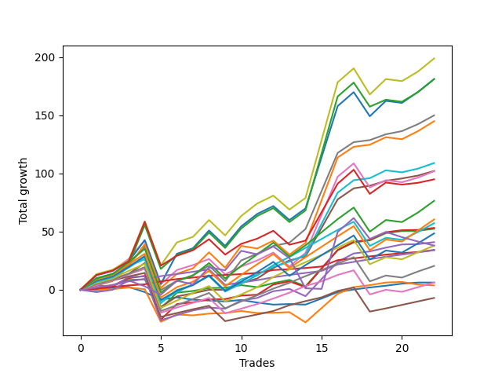

# Long Labrador 014 
- Symbol: ES
- Date Range: 03/18/2022 - 12/30/2022
- Trading Period: 8:30-12:30
- Number of Trades: 20



| Name | Win Percent | Profit | Avg Profit / Trade | Avg Time / Trade |      | Name | Win Percent | Profit | Avg Profit / Trade | Avg Time / Trade |
| ---- | ----------- | ------ | ------------------ | ---------------- | ---- | ---- | ----------- | ------ | ------------------ | ---------------- |
| Sorted By <br> Profit | | | | | | Sorted By <br> Win Percentage ||||
| V U/L 1SD | 80.00 | 108375.00 | 5418.75 | 52:36 |     | TP-1 | 100.00 | 15625.00 | 781.25 | 03:58 |
| BB-200 U/L 2SD | 80.00 | 98625.00 | 4931.25 | 56:22 |     | BB-50 U/L 1SD | 95.00 | 48625.00 | 2431.25 | 24:13 |
| BB-100 U/L 2SD | 80.00 | 98625.00 | 4931.25 | 50:54 |     | TP-2 | 95.00 | 14875.00 | 743.75 | 09:08 |
| V Mid | 90.00 | 71750.00 | 3587.50 | 29:59 |     | V Mid | 90.00 | 71750.00 | 3587.50 | 29:59 |
| BB-200 Mid | 75.00 | 69250.00 | 3462.50 | 38:19 |     | BB-20 U/L 2SD C | 90.00 | 25000.00 | 1250.00 | 17:09 |
| BB-50 U/L 2SD | 80.00 | 59250.00 | 2962.50 | 35:30 |     | TP-3 | 90.00 | 5250.00 | 262.50 | 15:04 |
| NEWFI 000 | 80.00 | 55500.00 | 2775.00 | 42:13 |     | BB-100 Mid | 85.00 | 51375.00 | 2568.75 | 30:14 |
| BB-100 Mid | 85.00 | 51375.00 | 2568.75 | 30:14 |     | TP-7 | 85.00 | 35625.00 | 1781.25 | 26:40 |
| BB-50 U/L 1SD | 95.00 | 48625.00 | 2431.25 | 24:13 |     | TP-6 | 85.00 | 26125.00 | 1306.25 | 25:24 |
| TP-10 | 80.00 | 46250.00 | 2312.50 | 36:29 |     | BB-20 U/L 2SD | 85.00 | 24625.00 | 1231.25 | 15:34 |
| TP-9 | 80.00 | 38250.00 | 1912.50 | 35:00 |     | TP-5 | 85.00 | 18000.00 | 900.00 | 23:43 |
| TP-7 | 85.00 | 35625.00 | 1781.25 | 26:40 |     | TP-4 | 85.00 | 11500.00 | 575.00 | 19:02 |
| TP-8 | 80.00 | 32250.00 | 1612.50 | 31:19 |     | V U/L 1SD | 80.00 | 108375.00 | 5418.75 | 52:36 |
| NEWFI 0000 | 45.00 | 29500.00 | 1475.00 | 31:13 |     | BB-200 U/L 2SD | 80.00 | 98625.00 | 4931.25 | 56:22 |
| TP-6 | 85.00 | 26125.00 | 1306.25 | 25:24 |     | BB-100 U/L 2SD | 80.00 | 98625.00 | 4931.25 | 50:54 |
| BB-20 U/L 2SD C | 90.00 | 25000.00 | 1250.00 | 17:09 |     | BB-50 U/L 2SD | 80.00 | 59250.00 | 2962.50 | 35:30 |
| BB-20 U/L 2SD | 85.00 | 24625.00 | 1231.25 | 15:34 |     | NEWFI 000 | 80.00 | 55500.00 | 2775.00 | 42:13 |
| TP-5 | 85.00 | 18000.00 | 900.00 | 23:43 |     | TP-10 | 80.00 | 46250.00 | 2312.50 | 36:29 |
| BB-50 Mid | 80.00 | 17625.00 | 881.25 | 16:09 |     | TP-9 | 80.00 | 38250.00 | 1912.50 | 35:00 |
| TP-1 | 100.00 | 15625.00 | 781.25 | 03:58 |     | TP-8 | 80.00 | 32250.00 | 1612.50 | 31:19 |
| TP-2 | 95.00 | 14875.00 | 743.75 | 09:08 |     | BB-50 Mid | 80.00 | 17625.00 | 881.25 | 16:09 |
| TP-4 | 85.00 | 11500.00 | 575.00 | 19:02 |     | BB-200 Mid | 75.00 | 69250.00 | 3462.50 | 38:19 |
| TP-3 | 90.00 | 5250.00 | 262.50 | 15:04 |     | BB-20 U/L 1SD | 70.00 | 1375.00 | 68.75 | 11:04 |
| BB-20 Mid | 60.00 | 3250.00 | 162.50 | 03:27 |     | BB-20 Mid | 60.00 | 3250.00 | 162.50 | 03:27 |
| BB-20 U/L 1SD | 70.00 | 1375.00 | 68.75 | 11:04 |     | NEWFI 0000 | 45.00 | 29500.00 | 1475.00 | 31:13 |

## NO STOPLOSS

### Test BB-20 Mid
* Sell when price hits the middle line of the 20p bollinger
* No Stoploss
* Results:
```
Total Trades: 20
Percent Up: 60.00
Percent Down: 40.00
Total Points Moved Up: 6.50
Potential Profit: 3250.00
Total Points Ups: 24.00 Count Ups: 12
Total Points Downs: -17.50 Count Downs: 8
```

<details><summary>Trades</summary>

<code>In: 2022-04-20 09:19:00		Out: 2022-04-20 09:30:50		Total Position Time: 11:50		Total Move Up: -0.50		Total to Date: -0.50</code> <br />
<code>In: 2022-04-27 12:11:00		Out: 2022-04-27 12:14:00		Total Position Time: 03:00		Total Move Up: 2.25		Total to Date: 1.75</code> <br />
<code>In: 2022-05-02 08:34:00		Out: 2022-05-02 08:35:10		Total Position Time: 01:10		Total Move Up: 0.75		Total to Date: 2.50</code> <br />
<code>In: 2022-05-06 12:20:00		Out: 2022-05-06 12:27:50		Total Position Time: 07:50		Total Move Up: -4.50		Total to Date: -2.00</code> <br />
<code>In: 2022-05-11 09:37:00		Out: 2022-05-11 09:49:20		Total Position Time: 12:20		Total Move Up: -6.50		Total to Date: -8.50</code> <br />
<code>In: 2022-05-19 10:19:00		Out: 2022-05-19 10:20:10		Total Position Time: 01:10		Total Move Up: 2.00		Total to Date: -6.50</code> <br />
<code>In: 2022-07-08 10:07:00		Out: 2022-07-08 10:08:10		Total Position Time: 01:10		Total Move Up: -0.75		Total to Date: -7.25</code> <br />
<code>In: 2022-07-25 11:07:00		Out: 2022-07-25 11:10:40		Total Position Time: 03:40		Total Move Up: -0.75		Total to Date: -8.00</code> <br />
<code>In: 2022-09-06 10:18:00		Out: 2022-09-06 10:25:10		Total Position Time: 07:10		Total Move Up: 1.25		Total to Date: -6.75</code> <br />
<code>In: 2022-09-12 09:08:00		Out: 2022-09-12 09:12:10		Total Position Time: 04:10		Total Move Up: -2.25		Total to Date: -9.00</code> <br />
<code>In: 2022-10-11 12:18:00		Out: 2022-10-11 12:19:10		Total Position Time: 01:10		Total Move Up: -1.75		Total to Date: -10.75</code> <br />
<code>In: 2022-10-19 08:39:00		Out: 2022-10-19 08:40:10		Total Position Time: 01:10		Total Move Up: 0.50		Total to Date: -10.25</code> <br />
<code>In: 2022-11-08 11:15:00		Out: 2022-11-08 11:16:15		Total Position Time: 01:15		Total Move Up: -0.50		Total to Date: -10.75</code> <br />
<code>In: 2022-11-08 11:35:00		Out: 2022-11-08 11:37:05		Total Position Time: 02:05		Total Move Up: 5.25		Total to Date: -5.50</code> <br />
<code>In: 2022-11-08 11:36:00		Out: 2022-11-08 11:37:10		Total Position Time: 01:10		Total Move Up: 5.50		Total to Date: 0.00</code> <br />
<code>In: 2022-11-11 08:34:00		Out: 2022-11-11 08:36:25		Total Position Time: 02:25		Total Move Up: 2.25		Total to Date: 2.25</code> <br />
<code>In: 2022-12-08 11:38:00		Out: 2022-12-08 11:39:10		Total Position Time: 01:10		Total Move Up: 1.50		Total to Date: 3.75</code> <br />
<code>In: 2022-12-09 10:15:00		Out: 2022-12-09 10:16:50		Total Position Time: 01:50		Total Move Up: 1.75		Total to Date: 5.50</code> <br />
<code>In: 2022-12-27 11:24:00		Out: 2022-12-27 11:25:20		Total Position Time: 01:20		Total Move Up: 1.00		Total to Date: 6.50</code> <br />
<code>In: 2022-12-27 11:35:00		Out: 2022-12-27 11:36:55		Total Position Time: 01:55		Total Move Up: 0.00		Total to Date: 6.50</code> <br />


</details>

### Test BB-20 U/L 1SD
* Sell when the price hits the upper line of the 20p 1std bollinger
* No Stoploss
* Results:
```
Total Trades: 20
Percent Up: 70.00
Percent Down: 30.00
Total Points Moved Up: 2.75
Potential Profit: 1375.00
Total Points Ups: 45.75 Count Ups: 14
Total Points Downs: -43.00 Count Downs: 6
```

<details><summary>Trades</summary>

<code>In: 2022-04-20 09:19:00		Out: 2022-04-20 09:31:05		Total Position Time: 12:05		Total Move Up: 0.00		Total to Date: 0.00</code> <br />
<code>In: 2022-04-27 12:11:00		Out: 2022-04-27 12:27:15		Total Position Time: 16:15		Total Move Up: 0.50		Total to Date: 0.50</code> <br />
<code>In: 2022-05-02 08:34:00		Out: 2022-05-02 08:36:15		Total Position Time: 02:15		Total Move Up: 1.50		Total to Date: 2.00</code> <br />
<code>In: 2022-05-06 12:20:00		Out: 2022-05-06 12:28:05		Total Position Time: 08:05		Total Move Up: -1.50		Total to Date: 0.50</code> <br />
<code>In: 2022-05-11 09:37:00		Out: 2022-05-11 10:24:35		Total Position Time: 47:35		Total Move Up: -28.00		Total to Date: -27.50</code> <br />
<code>In: 2022-05-19 10:19:00		Out: 2022-05-19 10:22:45		Total Position Time: 03:45		Total Move Up: 6.25		Total to Date: -21.25</code> <br />
<code>In: 2022-07-08 10:07:00		Out: 2022-07-08 10:09:40		Total Position Time: 02:40		Total Move Up: 1.50		Total to Date: -19.75</code> <br />
<code>In: 2022-07-25 11:07:00		Out: 2022-07-25 11:11:40		Total Position Time: 04:40		Total Move Up: 0.50		Total to Date: -19.25</code> <br />
<code>In: 2022-09-06 10:18:00		Out: 2022-09-06 10:30:55		Total Position Time: 12:55		Total Move Up: 1.75		Total to Date: -17.50</code> <br />
<code>In: 2022-09-12 09:08:00		Out: 2022-09-12 09:21:25		Total Position Time: 13:25		Total Move Up: -1.75		Total to Date: -19.25</code> <br />
<code>In: 2022-10-11 12:18:00		Out: 2022-10-11 12:20:40		Total Position Time: 02:40		Total Move Up: 0.25		Total to Date: -19.00</code> <br />
<code>In: 2022-10-19 08:39:00		Out: 2022-10-19 08:46:05		Total Position Time: 07:05		Total Move Up: 0.50		Total to Date: -18.50</code> <br />
<code>In: 2022-11-08 11:15:00		Out: 2022-11-08 11:38:35		Total Position Time: 23:35		Total Move Up: -8.75		Total to Date: -27.25</code> <br />
<code>In: 2022-11-08 11:35:00		Out: 2022-11-08 11:38:35		Total Position Time: 03:35		Total Move Up: 12.25		Total to Date: -15.00</code> <br />
<code>In: 2022-11-08 11:36:00		Out: 2022-11-08 11:38:35		Total Position Time: 02:35		Total Move Up: 12.25		Total to Date: -2.75</code> <br />
<code>In: 2022-11-11 08:34:00		Out: 2022-11-11 08:41:35		Total Position Time: 07:35		Total Move Up: 5.75		Total to Date: 3.00</code> <br />
<code>In: 2022-12-08 11:38:00		Out: 2022-12-08 11:40:45		Total Position Time: 02:45		Total Move Up: 2.25		Total to Date: 5.25</code> <br />
<code>In: 2022-12-09 10:15:00		Out: 2022-12-09 10:30:40		Total Position Time: 15:40		Total Move Up: 0.50		Total to Date: 5.75</code> <br />
<code>In: 2022-12-27 11:24:00		Out: 2022-12-27 11:45:40		Total Position Time: 21:40		Total Move Up: -2.25		Total to Date: 3.50</code> <br />
<code>In: 2022-12-27 11:35:00		Out: 2022-12-27 11:45:40		Total Position Time: 10:40		Total Move Up: -0.75		Total to Date: 2.75</code> <br />


</details>

### Test BB-20 U/L 2SD
* Sell when the price hits the upper line of the 20p 2std bollinger
* No Stoploss
* Results:
```
Total Trades: 20
Percent Up: 85.00
Percent Down: 15.00
Total Points Moved Up: 49.25
Potential Profit: 24625.00
Total Points Ups: 81.50 Count Ups: 17
Total Points Downs: -32.25 Count Downs: 3
```

<details><summary>Trades</summary>

<code>In: 2022-04-20 09:19:00		Out: 2022-04-20 09:31:35		Total Position Time: 12:35		Total Move Up: 1.00		Total to Date: 1.00</code> <br />
<code>In: 2022-04-27 12:11:00		Out: 2022-04-27 12:31:20		Total Position Time: 20:20		Total Move Up: 2.50		Total to Date: 3.50</code> <br />
<code>In: 2022-05-02 08:34:00		Out: 2022-05-02 08:36:35		Total Position Time: 02:35		Total Move Up: 5.00		Total to Date: 8.50</code> <br />
<code>In: 2022-05-06 12:20:00		Out: 2022-05-06 12:28:10		Total Position Time: 08:10		Total Move Up: 0.50		Total to Date: 9.00</code> <br />
<code>In: 2022-05-11 09:37:00		Out: 2022-05-11 10:24:50		Total Position Time: 47:50		Total Move Up: -25.00		Total to Date: -16.00</code> <br />
<code>In: 2022-05-19 10:19:00		Out: 2022-05-19 10:44:05		Total Position Time: 25:05		Total Move Up: 13.50		Total to Date: -2.50</code> <br />
<code>In: 2022-07-08 10:07:00		Out: 2022-07-08 10:11:05		Total Position Time: 04:05		Total Move Up: 2.50		Total to Date: 0.00</code> <br />
<code>In: 2022-07-25 11:07:00		Out: 2022-07-25 11:35:50		Total Position Time: 28:50		Total Move Up: 0.25		Total to Date: 0.25</code> <br />
<code>In: 2022-09-06 10:18:00		Out: 2022-09-06 10:31:10		Total Position Time: 13:10		Total Move Up: 2.25		Total to Date: 2.50</code> <br />
<code>In: 2022-09-12 09:08:00		Out: 2022-09-12 09:21:25		Total Position Time: 13:25		Total Move Up: -1.75		Total to Date: 0.75</code> <br />
<code>In: 2022-10-11 12:18:00		Out: 2022-10-11 12:22:35		Total Position Time: 04:35		Total Move Up: 3.50		Total to Date: 4.25</code> <br />
<code>In: 2022-10-19 08:39:00		Out: 2022-10-19 08:48:05		Total Position Time: 09:05		Total Move Up: 2.75		Total to Date: 7.00</code> <br />
<code>In: 2022-11-08 11:15:00		Out: 2022-11-08 11:42:10		Total Position Time: 27:10		Total Move Up: -5.50		Total to Date: 1.50</code> <br />
<code>In: 2022-11-08 11:35:00		Out: 2022-11-08 11:42:10		Total Position Time: 07:10		Total Move Up: 15.50		Total to Date: 17.00</code> <br />
<code>In: 2022-11-08 11:36:00		Out: 2022-11-08 11:42:10		Total Position Time: 06:10		Total Move Up: 15.50		Total to Date: 32.50</code> <br />
<code>In: 2022-11-11 08:34:00		Out: 2022-11-11 08:49:20		Total Position Time: 15:20		Total Move Up: 6.75		Total to Date: 39.25</code> <br />
<code>In: 2022-12-08 11:38:00		Out: 2022-12-08 11:53:55		Total Position Time: 15:55		Total Move Up: 6.25		Total to Date: 45.50</code> <br />
<code>In: 2022-12-09 10:15:00		Out: 2022-12-09 10:31:15		Total Position Time: 16:15		Total Move Up: 1.75		Total to Date: 47.25</code> <br />
<code>In: 2022-12-27 11:24:00		Out: 2022-12-27 11:46:20		Total Position Time: 22:20		Total Move Up: 0.25		Total to Date: 47.50</code> <br />
<code>In: 2022-12-27 11:35:00		Out: 2022-12-27 11:46:20		Total Position Time: 11:20		Total Move Up: 1.75		Total to Date: 49.25</code> <br />


</details>

### Test BB-20 U/L 2SD C
* Sell when the price hits the upper line of the 20p 2std bollinger
* No Stoploss
* Results:
```
Total Trades: 20
Percent Up: 90.00
Percent Down: 10.00
Total Points Moved Up: 50.00
Potential Profit: 25000.00
Total Points Ups: 92.75 Count Ups: 18
Total Points Downs: -42.75 Count Downs: 2
```

<details><summary>Trades</summary>

<code>In: 2022-04-20 09:19:00		Out: 2022-04-20 09:31:35		Total Position Time: 12:35		Total Move Up: 1.00		Total to Date: 1.00</code> <br />
<code>In: 2022-04-27 12:11:00		Out: 2022-04-27 12:31:20		Total Position Time: 20:20		Total Move Up: 2.50		Total to Date: 3.50</code> <br />
<code>In: 2022-05-02 08:34:00		Out: 2022-05-02 08:36:45		Total Position Time: 02:45		Total Move Up: 6.50		Total to Date: 10.00</code> <br />
<code>In: 2022-05-06 12:20:00		Out: 2022-05-06 12:28:50		Total Position Time: 08:50		Total Move Up: 2.00		Total to Date: 12.00</code> <br />
<code>In: 2022-05-11 09:37:00		Out: 2022-05-11 10:37:55		Total Position Time: 60:55		Total Move Up: -37.75		Total to Date: -25.75</code> <br />
<code>In: 2022-05-19 10:19:00		Out: 2022-05-19 10:44:05		Total Position Time: 25:05		Total Move Up: 13.50		Total to Date: -12.25</code> <br />
<code>In: 2022-07-08 10:07:00		Out: 2022-07-08 10:11:05		Total Position Time: 04:05		Total Move Up: 2.50		Total to Date: -9.75</code> <br />
<code>In: 2022-07-25 11:07:00		Out: 2022-07-25 11:35:50		Total Position Time: 28:50		Total Move Up: 0.25		Total to Date: -9.50</code> <br />
<code>In: 2022-09-06 10:18:00		Out: 2022-09-06 10:31:30		Total Position Time: 13:30		Total Move Up: 3.00		Total to Date: -6.50</code> <br />
<code>In: 2022-09-12 09:08:00		Out: 2022-09-12 09:23:10		Total Position Time: 15:10		Total Move Up: 0.75		Total to Date: -5.75</code> <br />
<code>In: 2022-10-11 12:18:00		Out: 2022-10-11 12:37:00		Total Position Time: 19:00		Total Move Up: 8.75		Total to Date: 3.00</code> <br />
<code>In: 2022-10-19 08:39:00		Out: 2022-10-19 08:48:45		Total Position Time: 09:45		Total Move Up: 2.75		Total to Date: 5.75</code> <br />
<code>In: 2022-11-08 11:15:00		Out: 2022-11-08 11:42:15		Total Position Time: 27:15		Total Move Up: -5.00		Total to Date: 0.75</code> <br />
<code>In: 2022-11-08 11:35:00		Out: 2022-11-08 11:42:15		Total Position Time: 07:15		Total Move Up: 16.00		Total to Date: 16.75</code> <br />
<code>In: 2022-11-08 11:36:00		Out: 2022-11-08 11:42:15		Total Position Time: 06:15		Total Move Up: 16.00		Total to Date: 32.75</code> <br />
<code>In: 2022-11-11 08:34:00		Out: 2022-11-11 08:49:40		Total Position Time: 15:40		Total Move Up: 7.00		Total to Date: 39.75</code> <br />
<code>In: 2022-12-08 11:38:00		Out: 2022-12-08 11:54:00		Total Position Time: 16:00		Total Move Up: 6.50		Total to Date: 46.25</code> <br />
<code>In: 2022-12-09 10:15:00		Out: 2022-12-09 10:31:20		Total Position Time: 16:20		Total Move Up: 1.75		Total to Date: 48.00</code> <br />
<code>In: 2022-12-27 11:24:00		Out: 2022-12-27 11:46:20		Total Position Time: 22:20		Total Move Up: 0.25		Total to Date: 48.25</code> <br />
<code>In: 2022-12-27 11:35:00		Out: 2022-12-27 11:46:20		Total Position Time: 11:20		Total Move Up: 1.75		Total to Date: 50.00</code> <br />


</details>

### Test BB-50 Mid
* Sell when price hits the middle line of the 50p bollinger
* No Stoploss
* Results:
```
Total Trades: 20
Percent Up: 80.00
Percent Down: 20.00
Total Points Moved Up: 35.25
Potential Profit: 17625.00
Total Points Ups: 81.25 Count Ups: 16
Total Points Downs: -46.00 Count Downs: 4
```

<details><summary>Trades</summary>

<code>In: 2022-04-20 09:19:00		Out: 2022-04-20 09:32:40		Total Position Time: 13:40		Total Move Up: 3.75		Total to Date: 3.75</code> <br />
<code>In: 2022-04-27 12:11:00		Out: 2022-04-27 12:44:20		Total Position Time: 33:20		Total Move Up: -1.00		Total to Date: 2.75</code> <br />
<code>In: 2022-05-02 08:34:00		Out: 2022-05-02 08:38:15		Total Position Time: 04:15		Total Move Up: 8.25		Total to Date: 11.00</code> <br />
<code>In: 2022-05-06 12:20:00		Out: 2022-05-06 12:28:10		Total Position Time: 08:10		Total Move Up: 0.50		Total to Date: 11.50</code> <br />
<code>In: 2022-05-11 09:37:00		Out: 2022-05-11 10:37:55		Total Position Time: 60:55		Total Move Up: -37.75		Total to Date: -26.25</code> <br />
<code>In: 2022-05-19 10:19:00		Out: 2022-05-19 10:21:15		Total Position Time: 02:15		Total Move Up: 4.50		Total to Date: -21.75</code> <br />
<code>In: 2022-07-08 10:07:00		Out: 2022-07-08 10:11:10		Total Position Time: 04:10		Total Move Up: 2.50		Total to Date: -19.25</code> <br />
<code>In: 2022-07-25 11:07:00		Out: 2022-07-25 11:35:45		Total Position Time: 28:45		Total Move Up: -1.00		Total to Date: -20.25</code> <br />
<code>In: 2022-09-06 10:18:00		Out: 2022-09-06 10:39:40		Total Position Time: 21:40		Total Move Up: 7.00		Total to Date: -13.25</code> <br />
<code>In: 2022-09-12 09:08:00		Out: 2022-09-12 09:24:10		Total Position Time: 16:10		Total Move Up: 2.25		Total to Date: -11.00</code> <br />
<code>In: 2022-10-11 12:18:00		Out: 2022-10-11 12:36:35		Total Position Time: 18:35		Total Move Up: 5.75		Total to Date: -5.25</code> <br />
<code>In: 2022-10-19 08:39:00		Out: 2022-10-19 08:40:30		Total Position Time: 01:30		Total Move Up: 2.00		Total to Date: -3.25</code> <br />
<code>In: 2022-11-08 11:15:00		Out: 2022-11-08 11:41:40		Total Position Time: 26:40		Total Move Up: -6.25		Total to Date: -9.50</code> <br />
<code>In: 2022-11-08 11:35:00		Out: 2022-11-08 11:41:40		Total Position Time: 06:40		Total Move Up: 14.75		Total to Date: 5.25</code> <br />
<code>In: 2022-11-08 11:36:00		Out: 2022-11-08 11:41:40		Total Position Time: 05:40		Total Move Up: 14.75		Total to Date: 20.00</code> <br />
<code>In: 2022-11-11 08:34:00		Out: 2022-11-11 08:49:45		Total Position Time: 15:45		Total Move Up: 7.25		Total to Date: 27.25</code> <br />
<code>In: 2022-12-08 11:38:00		Out: 2022-12-08 11:41:05		Total Position Time: 03:05		Total Move Up: 3.25		Total to Date: 30.50</code> <br />
<code>In: 2022-12-09 10:15:00		Out: 2022-12-09 10:33:05		Total Position Time: 18:05		Total Move Up: 2.75		Total to Date: 33.25</code> <br />
<code>In: 2022-12-27 11:24:00		Out: 2022-12-27 11:46:20		Total Position Time: 22:20		Total Move Up: 0.25		Total to Date: 33.50</code> <br />
<code>In: 2022-12-27 11:35:00		Out: 2022-12-27 11:46:20		Total Position Time: 11:20		Total Move Up: 1.75		Total to Date: 35.25</code> <br />


</details>

### Test BB-50 U/L 1SD
* Sell when the price hits the upper line of the 50p 1std bollinger
* No Stoploss
* Results:
```
Total Trades: 20
Percent Up: 95.00
Percent Down: 5.00
Total Points Moved Up: 97.25
Potential Profit: 48625.00
Total Points Ups: 135.00 Count Ups: 19
Total Points Downs: -37.75 Count Downs: 1
```

<details><summary>Trades</summary>

<code>In: 2022-04-20 09:19:00		Out: 2022-04-20 09:36:50		Total Position Time: 17:50		Total Move Up: 7.75		Total to Date: 7.75</code> <br />
<code>In: 2022-04-27 12:11:00		Out: 2022-04-27 12:46:05		Total Position Time: 35:05		Total Move Up: 1.50		Total to Date: 9.25</code> <br />
<code>In: 2022-05-02 08:34:00		Out: 2022-05-02 08:55:50		Total Position Time: 21:50		Total Move Up: 4.50		Total to Date: 13.75</code> <br />
<code>In: 2022-05-06 12:20:00		Out: 2022-05-06 12:30:30		Total Position Time: 10:30		Total Move Up: 9.25		Total to Date: 23.00</code> <br />
<code>In: 2022-05-11 09:37:00		Out: 2022-05-11 10:37:55		Total Position Time: 60:55		Total Move Up: -37.75		Total to Date: -14.75</code> <br />
<code>In: 2022-05-19 10:19:00		Out: 2022-05-19 10:25:40		Total Position Time: 06:40		Total Move Up: 9.00		Total to Date: -5.75</code> <br />
<code>In: 2022-07-08 10:07:00		Out: 2022-07-08 10:26:30		Total Position Time: 19:30		Total Move Up: 3.00		Total to Date: -2.75</code> <br />
<code>In: 2022-07-25 11:07:00		Out: 2022-07-25 11:41:00		Total Position Time: 34:00		Total Move Up: 0.00		Total to Date: -2.75</code> <br />
<code>In: 2022-09-06 10:18:00		Out: 2022-09-06 10:56:40		Total Position Time: 38:40		Total Move Up: 5.75		Total to Date: 3.00</code> <br />
<code>In: 2022-09-12 09:08:00		Out: 2022-09-12 09:37:50		Total Position Time: 29:50		Total Move Up: 4.00		Total to Date: 7.00</code> <br />
<code>In: 2022-10-11 12:18:00		Out: 2022-10-11 12:39:25		Total Position Time: 21:25		Total Move Up: 9.00		Total to Date: 16.00</code> <br />
<code>In: 2022-10-19 08:39:00		Out: 2022-10-19 08:52:10		Total Position Time: 13:10		Total Move Up: 6.50		Total to Date: 22.50</code> <br />
<code>In: 2022-11-08 11:15:00		Out: 2022-11-08 11:47:55		Total Position Time: 32:55		Total Move Up: 3.50		Total to Date: 26.00</code> <br />
<code>In: 2022-11-08 11:35:00		Out: 2022-11-08 11:47:55		Total Position Time: 12:55		Total Move Up: 24.50		Total to Date: 50.50</code> <br />
<code>In: 2022-11-08 11:36:00		Out: 2022-11-08 11:47:55		Total Position Time: 11:55		Total Move Up: 24.50		Total to Date: 75.00</code> <br />
<code>In: 2022-11-11 08:34:00		Out: 2022-11-11 08:58:20		Total Position Time: 24:20		Total Move Up: 9.50		Total to Date: 84.50</code> <br />
<code>In: 2022-12-08 11:38:00		Out: 2022-12-08 11:52:05		Total Position Time: 14:05		Total Move Up: 4.25		Total to Date: 88.75</code> <br />
<code>In: 2022-12-09 10:15:00		Out: 2022-12-09 10:50:45		Total Position Time: 35:45		Total Move Up: 2.00		Total to Date: 90.75</code> <br />
<code>In: 2022-12-27 11:24:00		Out: 2022-12-27 11:51:05		Total Position Time: 27:05		Total Move Up: 2.50		Total to Date: 93.25</code> <br />
<code>In: 2022-12-27 11:35:00		Out: 2022-12-27 11:51:05		Total Position Time: 16:05		Total Move Up: 4.00		Total to Date: 97.25</code> <br />


</details>

### Test BB-50 U/L 2SD
* Sell when the price hits the upper line of the 50p 2std bollinger
* No Stoploss
* Results:
```
Total Trades: 20
Percent Up: 80.00
Percent Down: 20.00
Total Points Moved Up: 118.50
Potential Profit: 59250.00
Total Points Ups: 183.25 Count Ups: 16
Total Points Downs: -64.75 Count Downs: 4
```

<details><summary>Trades</summary>

<code>In: 2022-04-20 09:19:00		Out: 2022-04-20 09:50:25		Total Position Time: 31:25		Total Move Up: 12.50		Total to Date: 12.50</code> <br />
<code>In: 2022-04-27 12:11:00		Out: 2022-04-27 12:47:00		Total Position Time: 36:00		Total Move Up: 3.75		Total to Date: 16.25</code> <br />
<code>In: 2022-05-02 08:34:00		Out: 2022-05-02 09:00:45		Total Position Time: 26:45		Total Move Up: 10.25		Total to Date: 26.50</code> <br />
<code>In: 2022-05-06 12:20:00		Out: 2022-05-06 12:35:40		Total Position Time: 15:40		Total Move Up: 16.00		Total to Date: 42.50</code> <br />
<code>In: 2022-05-11 09:37:00		Out: 2022-05-11 10:37:55		Total Position Time: 60:55		Total Move Up: -37.75		Total to Date: 4.75</code> <br />
<code>In: 2022-05-19 10:19:00		Out: 2022-05-19 10:31:30		Total Position Time: 12:30		Total Move Up: 12.25		Total to Date: 17.00</code> <br />
<code>In: 2022-07-08 10:07:00		Out: 2022-07-08 10:27:00		Total Position Time: 20:00		Total Move Up: 5.25		Total to Date: 22.25</code> <br />
<code>In: 2022-07-25 11:07:00		Out: 2022-07-25 12:07:55		Total Position Time: 60:55		Total Move Up: -13.25		Total to Date: 9.00</code> <br />
<code>In: 2022-09-06 10:18:00		Out: 2022-09-06 10:58:55		Total Position Time: 40:55		Total Move Up: 6.75		Total to Date: 15.75</code> <br />
<code>In: 2022-09-12 09:08:00		Out: 2022-09-12 09:44:15		Total Position Time: 36:15		Total Move Up: 5.25		Total to Date: 21.00</code> <br />
<code>In: 2022-10-11 12:18:00		Out: 2022-10-11 12:47:00		Total Position Time: 29:00		Total Move Up: 6.75		Total to Date: 27.75</code> <br />
<code>In: 2022-10-19 08:39:00		Out: 2022-10-19 09:39:55		Total Position Time: 60:55		Total Move Up: -12.00		Total to Date: 15.75</code> <br />
<code>In: 2022-11-08 11:15:00		Out: 2022-11-08 12:02:35		Total Position Time: 47:35		Total Move Up: 11.75		Total to Date: 27.50</code> <br />
<code>In: 2022-11-08 11:35:00		Out: 2022-11-08 12:02:35		Total Position Time: 27:35		Total Move Up: 32.75		Total to Date: 60.25</code> <br />
<code>In: 2022-11-08 11:36:00		Out: 2022-11-08 12:02:35		Total Position Time: 26:35		Total Move Up: 32.75		Total to Date: 93.00</code> <br />
<code>In: 2022-11-11 08:34:00		Out: 2022-11-11 09:11:00		Total Position Time: 37:00		Total Move Up: 11.50		Total to Date: 104.50</code> <br />
<code>In: 2022-12-08 11:38:00		Out: 2022-12-08 11:53:55		Total Position Time: 15:55		Total Move Up: 6.25		Total to Date: 110.75</code> <br />
<code>In: 2022-12-09 10:15:00		Out: 2022-12-09 11:15:55		Total Position Time: 60:55		Total Move Up: -1.75		Total to Date: 109.00</code> <br />
<code>In: 2022-12-27 11:24:00		Out: 2022-12-27 12:01:10		Total Position Time: 37:10		Total Move Up: 4.00		Total to Date: 113.00</code> <br />
<code>In: 2022-12-27 11:35:00		Out: 2022-12-27 12:01:10		Total Position Time: 26:10		Total Move Up: 5.50		Total to Date: 118.50</code> <br />


</details>

### Test V Mid
* Sell when the price hits the middle line of the 1std VWAP
* No Stoploss
* Results:
```
Total Trades: 20
Percent Up: 90.00
Percent Down: 10.00
Total Points Moved Up: 143.50
Potential Profit: 71750.00
Total Points Ups: 194.50 Count Ups: 18
Total Points Downs: -51.00 Count Downs: 2
```

<details><summary>Trades</summary>

<code>In: 2022-04-20 09:19:00		Out: 2022-04-20 09:35:50		Total Position Time: 16:50		Total Move Up: 6.00		Total to Date: 6.00</code> <br />
<code>In: 2022-04-27 12:11:00		Out: 2022-04-27 12:47:00		Total Position Time: 36:00		Total Move Up: 3.75		Total to Date: 9.75</code> <br />
<code>In: 2022-05-02 08:34:00		Out: 2022-05-02 09:00:50		Total Position Time: 26:50		Total Move Up: 11.75		Total to Date: 21.50</code> <br />
<code>In: 2022-05-06 12:20:00		Out: 2022-05-06 12:35:40		Total Position Time: 15:40		Total Move Up: 16.00		Total to Date: 37.50</code> <br />
<code>In: 2022-05-11 09:37:00		Out: 2022-05-11 10:37:55		Total Position Time: 60:55		Total Move Up: -37.75		Total to Date: -0.25</code> <br />
<code>In: 2022-05-19 10:19:00		Out: 2022-05-19 10:22:55		Total Position Time: 03:55		Total Move Up: 8.00		Total to Date: 7.75</code> <br />
<code>In: 2022-07-08 10:07:00		Out: 2022-07-08 10:29:10		Total Position Time: 22:10		Total Move Up: 8.25		Total to Date: 16.00</code> <br />
<code>In: 2022-07-25 11:07:00		Out: 2022-07-25 12:07:55		Total Position Time: 60:55		Total Move Up: -13.25		Total to Date: 2.75</code> <br />
<code>In: 2022-09-06 10:18:00		Out: 2022-09-06 11:11:05		Total Position Time: 53:05		Total Move Up: 17.75		Total to Date: 20.50</code> <br />
<code>In: 2022-09-12 09:08:00		Out: 2022-09-12 09:44:25		Total Position Time: 36:25		Total Move Up: 5.75		Total to Date: 26.25</code> <br />
<code>In: 2022-10-11 12:18:00		Out: 2022-10-11 12:47:00		Total Position Time: 29:00		Total Move Up: 6.75		Total to Date: 33.00</code> <br />
<code>In: 2022-10-19 08:39:00		Out: 2022-10-19 08:48:05		Total Position Time: 09:05		Total Move Up: 2.75		Total to Date: 35.75</code> <br />
<code>In: 2022-11-08 11:15:00		Out: 2022-11-08 12:02:35		Total Position Time: 47:35		Total Move Up: 11.75		Total to Date: 47.50</code> <br />
<code>In: 2022-11-08 11:35:00		Out: 2022-11-08 12:02:35		Total Position Time: 27:35		Total Move Up: 32.75		Total to Date: 80.25</code> <br />
<code>In: 2022-11-08 11:36:00		Out: 2022-11-08 12:02:35		Total Position Time: 26:35		Total Move Up: 32.75		Total to Date: 113.00</code> <br />
<code>In: 2022-11-11 08:34:00		Out: 2022-11-11 08:50:30		Total Position Time: 16:30		Total Move Up: 9.25		Total to Date: 122.25</code> <br />
<code>In: 2022-12-08 11:38:00		Out: 2022-12-08 11:52:25		Total Position Time: 14:25		Total Move Up: 5.00		Total to Date: 127.25</code> <br />
<code>In: 2022-12-09 10:15:00		Out: 2022-12-09 10:33:05		Total Position Time: 18:05		Total Move Up: 2.75		Total to Date: 130.00</code> <br />
<code>In: 2022-12-27 11:24:00		Out: 2022-12-27 12:08:40		Total Position Time: 44:40		Total Move Up: 6.00		Total to Date: 136.00</code> <br />
<code>In: 2022-12-27 11:35:00		Out: 2022-12-27 12:08:40		Total Position Time: 33:40		Total Move Up: 7.50		Total to Date: 143.50</code> <br />


</details>

### Test V U/L 1SD
* Sell when the price hits the upper line of the 1std VWAP
* No Stoploss
* Results:
```
Total Trades: 20
Percent Up: 80.00
Percent Down: 20.00
Total Points Moved Up: 216.75
Potential Profit: 108375.00
Total Points Ups: 281.50 Count Ups: 16
Total Points Downs: -64.75 Count Downs: 4
```

<details><summary>Trades</summary>

<code>In: 2022-04-20 09:19:00		Out: 2022-04-20 09:52:35		Total Position Time: 33:35		Total Move Up: 13.50		Total to Date: 13.50</code> <br />
<code>In: 2022-04-27 12:11:00		Out: 2022-04-27 12:47:00		Total Position Time: 36:00		Total Move Up: 3.75		Total to Date: 17.25</code> <br />
<code>In: 2022-05-02 08:34:00		Out: 2022-05-02 09:34:55		Total Position Time: 60:55		Total Move Up: 8.00		Total to Date: 25.25</code> <br />
<code>In: 2022-05-06 12:20:00		Out: 2022-05-06 12:40:00		Total Position Time: 20:00		Total Move Up: 33.50		Total to Date: 58.75</code> <br />
<code>In: 2022-05-11 09:37:00		Out: 2022-05-11 10:37:55		Total Position Time: 60:55		Total Move Up: -37.75		Total to Date: 21.00</code> <br />
<code>In: 2022-05-19 10:19:00		Out: 2022-05-19 10:55:35		Total Position Time: 36:35		Total Move Up: 19.75		Total to Date: 40.75</code> <br />
<code>In: 2022-07-08 10:07:00		Out: 2022-07-08 11:07:55		Total Position Time: 60:55		Total Move Up: 14.50		Total to Date: 55.25</code> <br />
<code>In: 2022-07-25 11:07:00		Out: 2022-07-25 12:07:55		Total Position Time: 60:55		Total Move Up: -13.25		Total to Date: 42.00</code> <br />
<code>In: 2022-09-06 10:18:00		Out: 2022-09-06 11:18:55		Total Position Time: 60:55		Total Move Up: 16.75		Total to Date: 58.75</code> <br />
<code>In: 2022-09-12 09:08:00		Out: 2022-09-12 10:08:55		Total Position Time: 60:55		Total Move Up: 10.75		Total to Date: 69.50</code> <br />
<code>In: 2022-10-11 12:18:00		Out: 2022-10-11 12:47:00		Total Position Time: 29:00		Total Move Up: 6.75		Total to Date: 76.25</code> <br />
<code>In: 2022-10-19 08:39:00		Out: 2022-10-19 09:39:55		Total Position Time: 60:55		Total Move Up: -12.00		Total to Date: 64.25</code> <br />
<code>In: 2022-11-08 11:15:00		Out: 2022-11-08 12:15:55		Total Position Time: 60:55		Total Move Up: 10.00		Total to Date: 74.25</code> <br />
<code>In: 2022-11-08 11:35:00		Out: 2022-11-08 12:31:45		Total Position Time: 56:45		Total Move Up: 49.75		Total to Date: 124.00</code> <br />
<code>In: 2022-11-08 11:36:00		Out: 2022-11-08 12:31:45		Total Position Time: 55:45		Total Move Up: 49.75		Total to Date: 173.75</code> <br />
<code>In: 2022-11-11 08:34:00		Out: 2022-11-11 09:34:55		Total Position Time: 60:55		Total Move Up: 12.00		Total to Date: 185.75</code> <br />
<code>In: 2022-12-08 11:38:00		Out: 2022-12-08 12:31:35		Total Position Time: 53:35		Total Move Up: 13.25		Total to Date: 199.00</code> <br />
<code>In: 2022-12-09 10:15:00		Out: 2022-12-09 11:15:55		Total Position Time: 60:55		Total Move Up: -1.75		Total to Date: 197.25</code> <br />
<code>In: 2022-12-27 11:24:00		Out: 2022-12-27 12:24:55		Total Position Time: 60:55		Total Move Up: 8.25		Total to Date: 205.50</code> <br />
<code>In: 2022-12-27 11:35:00		Out: 2022-12-27 12:35:55		Total Position Time: 60:55		Total Move Up: 11.25		Total to Date: 216.75</code> <br />


</details>

### Test BB-100 Mid
* Move to BB100 Mid
* No Stoploss
* Results:
```
Total Trades: 20
Percent Up: 85.00
Percent Down: 15.00
Total Points Moved Up: 102.75
Potential Profit: 51375.00
Total Points Ups: 155.50 Count Ups: 17
Total Points Downs: -52.75 Count Downs: 3
```

<details><summary>Trades</summary>

<code>In: 2022-04-20 09:19:00		Out: 2022-04-20 09:33:05		Total Position Time: 14:05		Total Move Up: 5.00		Total to Date: 5.00</code> <br />
<code>In: 2022-04-27 12:11:00		Out: 2022-04-27 12:47:00		Total Position Time: 36:00		Total Move Up: 3.75		Total to Date: 8.75</code> <br />
<code>In: 2022-05-02 08:34:00		Out: 2022-05-02 09:00:50		Total Position Time: 26:50		Total Move Up: 11.75		Total to Date: 20.50</code> <br />
<code>In: 2022-05-06 12:20:00		Out: 2022-05-06 12:30:20		Total Position Time: 10:20		Total Move Up: 5.75		Total to Date: 26.25</code> <br />
<code>In: 2022-05-11 09:37:00		Out: 2022-05-11 10:37:55		Total Position Time: 60:55		Total Move Up: -37.75		Total to Date: -11.50</code> <br />
<code>In: 2022-05-19 10:19:00		Out: 2022-05-19 10:44:00		Total Position Time: 25:00		Total Move Up: 11.25		Total to Date: -0.25</code> <br />
<code>In: 2022-07-08 10:07:00		Out: 2022-07-08 10:29:10		Total Position Time: 22:10		Total Move Up: 8.25		Total to Date: 8.00</code> <br />
<code>In: 2022-07-25 11:07:00		Out: 2022-07-25 12:07:55		Total Position Time: 60:55		Total Move Up: -13.25		Total to Date: -5.25</code> <br />
<code>In: 2022-09-06 10:18:00		Out: 2022-09-06 11:00:30		Total Position Time: 42:30		Total Move Up: 9.75		Total to Date: 4.50</code> <br />
<code>In: 2022-09-12 09:08:00		Out: 2022-09-12 09:37:50		Total Position Time: 29:50		Total Move Up: 4.00		Total to Date: 8.50</code> <br />
<code>In: 2022-10-11 12:18:00		Out: 2022-10-11 12:47:00		Total Position Time: 29:00		Total Move Up: 6.75		Total to Date: 15.25</code> <br />
<code>In: 2022-10-19 08:39:00		Out: 2022-10-19 08:52:00		Total Position Time: 13:00		Total Move Up: 4.50		Total to Date: 19.75</code> <br />
<code>In: 2022-11-08 11:15:00		Out: 2022-11-08 11:53:50		Total Position Time: 38:50		Total Move Up: 5.75		Total to Date: 25.50</code> <br />
<code>In: 2022-11-08 11:35:00		Out: 2022-11-08 11:53:50		Total Position Time: 18:50		Total Move Up: 26.75		Total to Date: 52.25</code> <br />
<code>In: 2022-11-08 11:36:00		Out: 2022-11-08 11:53:50		Total Position Time: 17:50		Total Move Up: 26.75		Total to Date: 79.00</code> <br />
<code>In: 2022-11-11 08:34:00		Out: 2022-11-11 09:10:50		Total Position Time: 36:50		Total Move Up: 10.75		Total to Date: 89.75</code> <br />
<code>In: 2022-12-08 11:38:00		Out: 2022-12-08 11:54:20		Total Position Time: 16:20		Total Move Up: 6.75		Total to Date: 96.50</code> <br />
<code>In: 2022-12-09 10:15:00		Out: 2022-12-09 11:15:55		Total Position Time: 60:55		Total Move Up: -1.75		Total to Date: 94.75</code> <br />
<code>In: 2022-12-27 11:24:00		Out: 2022-12-27 11:51:50		Total Position Time: 27:50		Total Move Up: 3.25		Total to Date: 98.00</code> <br />
<code>In: 2022-12-27 11:35:00		Out: 2022-12-27 11:51:50		Total Position Time: 16:50		Total Move Up: 4.75		Total to Date: 102.75</code> <br />


</details>

### Test BB-100 U/L 2SD
* Move to BB100 Upper Band
* No Stoploss
* Results:
```
Total Trades: 20
Percent Up: 80.00
Percent Down: 20.00
Total Points Moved Up: 197.25
Potential Profit: 98625.00
Total Points Ups: 262.00 Count Ups: 16
Total Points Downs: -64.75 Count Downs: 4
```

<details><summary>Trades</summary>

<code>In: 2022-04-20 09:19:00		Out: 2022-04-20 09:50:25		Total Position Time: 31:25		Total Move Up: 12.50		Total to Date: 12.50</code> <br />
<code>In: 2022-04-27 12:11:00		Out: 2022-04-27 12:47:00		Total Position Time: 36:00		Total Move Up: 3.75		Total to Date: 16.25</code> <br />
<code>In: 2022-05-02 08:34:00		Out: 2022-05-02 09:34:55		Total Position Time: 60:55		Total Move Up: 8.00		Total to Date: 24.25</code> <br />
<code>In: 2022-05-06 12:20:00		Out: 2022-05-06 12:37:10		Total Position Time: 17:10		Total Move Up: 18.50		Total to Date: 42.75</code> <br />
<code>In: 2022-05-11 09:37:00		Out: 2022-05-11 10:37:55		Total Position Time: 60:55		Total Move Up: -37.75		Total to Date: 5.00</code> <br />
<code>In: 2022-05-19 10:19:00		Out: 2022-05-19 10:57:05		Total Position Time: 38:05		Total Move Up: 26.00		Total to Date: 31.00</code> <br />
<code>In: 2022-07-08 10:07:00		Out: 2022-07-08 11:07:40		Total Position Time: 60:40		Total Move Up: 15.25		Total to Date: 46.25</code> <br />
<code>In: 2022-07-25 11:07:00		Out: 2022-07-25 12:07:55		Total Position Time: 60:55		Total Move Up: -13.25		Total to Date: 33.00</code> <br />
<code>In: 2022-09-06 10:18:00		Out: 2022-09-06 11:18:55		Total Position Time: 60:55		Total Move Up: 16.75		Total to Date: 49.75</code> <br />
<code>In: 2022-09-12 09:08:00		Out: 2022-09-12 10:08:55		Total Position Time: 60:55		Total Move Up: 10.75		Total to Date: 60.50</code> <br />
<code>In: 2022-10-11 12:18:00		Out: 2022-10-11 12:47:00		Total Position Time: 29:00		Total Move Up: 6.75		Total to Date: 67.25</code> <br />
<code>In: 2022-10-19 08:39:00		Out: 2022-10-19 09:39:55		Total Position Time: 60:55		Total Move Up: -12.00		Total to Date: 55.25</code> <br />
<code>In: 2022-11-08 11:15:00		Out: 2022-11-08 12:15:55		Total Position Time: 60:55		Total Move Up: 10.00		Total to Date: 65.25</code> <br />
<code>In: 2022-11-08 11:35:00		Out: 2022-11-08 12:30:25		Total Position Time: 55:25		Total Move Up: 44.00		Total to Date: 109.25</code> <br />
<code>In: 2022-11-08 11:36:00		Out: 2022-11-08 12:30:25		Total Position Time: 54:25		Total Move Up: 44.00		Total to Date: 153.25</code> <br />
<code>In: 2022-11-11 08:34:00		Out: 2022-11-11 09:34:55		Total Position Time: 60:55		Total Move Up: 12.00		Total to Date: 165.25</code> <br />
<code>In: 2022-12-08 11:38:00		Out: 2022-12-08 12:31:35		Total Position Time: 53:35		Total Move Up: 13.25		Total to Date: 178.50</code> <br />
<code>In: 2022-12-09 10:15:00		Out: 2022-12-09 11:15:55		Total Position Time: 60:55		Total Move Up: -1.75		Total to Date: 176.75</code> <br />
<code>In: 2022-12-27 11:24:00		Out: 2022-12-27 12:16:35		Total Position Time: 52:35		Total Move Up: 9.50		Total to Date: 186.25</code> <br />
<code>In: 2022-12-27 11:35:00		Out: 2022-12-27 12:16:35		Total Position Time: 41:35		Total Move Up: 11.00		Total to Date: 197.25</code> <br />


</details>

### Test BB-200 Mid
* Move to BB200 Mid
* No Stoploss
* Results:
```
Total Trades: 20
Percent Up: 75.00
Percent Down: 25.00
Total Points Moved Up: 138.50
Potential Profit: 69250.00
Total Points Ups: 205.50 Count Ups: 15
Total Points Downs: -67.00 Count Downs: 5
```

<details><summary>Trades</summary>

<code>In: 2022-04-20 09:19:00		Out: 2022-04-20 09:32:40		Total Position Time: 13:40		Total Move Up: 3.75		Total to Date: 3.75</code> <br />
<code>In: 2022-04-27 12:11:00		Out: 2022-04-27 12:47:00		Total Position Time: 36:00		Total Move Up: 3.75		Total to Date: 7.50</code> <br />
<code>In: 2022-05-02 08:34:00		Out: 2022-05-02 09:20:20		Total Position Time: 46:20		Total Move Up: 12.75		Total to Date: 20.25</code> <br />
<code>In: 2022-05-06 12:20:00		Out: 2022-05-06 12:37:15		Total Position Time: 17:15		Total Move Up: 19.00		Total to Date: 39.25</code> <br />
<code>In: 2022-05-11 09:37:00		Out: 2022-05-11 10:37:55		Total Position Time: 60:55		Total Move Up: -37.75		Total to Date: 1.50</code> <br />
<code>In: 2022-05-19 10:19:00		Out: 2022-05-19 10:31:30		Total Position Time: 12:30		Total Move Up: 12.25		Total to Date: 13.75</code> <br />
<code>In: 2022-07-08 10:07:00		Out: 2022-07-08 10:49:25		Total Position Time: 42:25		Total Move Up: 13.75		Total to Date: 27.50</code> <br />
<code>In: 2022-07-25 11:07:00		Out: 2022-07-25 12:07:55		Total Position Time: 60:55		Total Move Up: -13.25		Total to Date: 14.25</code> <br />
<code>In: 2022-09-06 10:18:00		Out: 2022-09-06 11:11:10		Total Position Time: 53:10		Total Move Up: 18.75		Total to Date: 33.00</code> <br />
<code>In: 2022-09-12 09:08:00		Out: 2022-09-12 09:12:10		Total Position Time: 04:10		Total Move Up: -2.25		Total to Date: 30.75</code> <br />
<code>In: 2022-10-11 12:18:00		Out: 2022-10-11 12:47:00		Total Position Time: 29:00		Total Move Up: 6.75		Total to Date: 37.50</code> <br />
<code>In: 2022-10-19 08:39:00		Out: 2022-10-19 09:39:55		Total Position Time: 60:55		Total Move Up: -12.00		Total to Date: 25.50</code> <br />
<code>In: 2022-11-08 11:15:00		Out: 2022-11-08 12:15:55		Total Position Time: 60:55		Total Move Up: 10.00		Total to Date: 35.50</code> <br />
<code>In: 2022-11-08 11:35:00		Out: 2022-11-08 12:20:05		Total Position Time: 45:05		Total Move Up: 36.75		Total to Date: 72.25</code> <br />
<code>In: 2022-11-08 11:36:00		Out: 2022-11-08 12:20:05		Total Position Time: 44:05		Total Move Up: 36.75		Total to Date: 109.00</code> <br />
<code>In: 2022-11-11 08:34:00		Out: 2022-11-11 08:50:30		Total Position Time: 16:30		Total Move Up: 9.25		Total to Date: 118.25</code> <br />
<code>In: 2022-12-08 11:38:00		Out: 2022-12-08 11:54:00		Total Position Time: 16:00		Total Move Up: 6.50		Total to Date: 124.75</code> <br />
<code>In: 2022-12-09 10:15:00		Out: 2022-12-09 11:15:55		Total Position Time: 60:55		Total Move Up: -1.75		Total to Date: 123.00</code> <br />
<code>In: 2022-12-27 11:24:00		Out: 2022-12-27 12:12:25		Total Position Time: 48:25		Total Move Up: 7.00		Total to Date: 130.00</code> <br />
<code>In: 2022-12-27 11:35:00		Out: 2022-12-27 12:12:25		Total Position Time: 37:25		Total Move Up: 8.50		Total to Date: 138.50</code> <br />


</details>

### Test BB-200 U/L 2SD
* Move to BB200 Upper Band
* No Stoploss
* Results:
```
Total Trades: 20
Percent Up: 80.00
Percent Down: 20.00
Total Points Moved Up: 197.25
Potential Profit: 98625.00
Total Points Ups: 262.00 Count Ups: 16
Total Points Downs: -64.75 Count Downs: 4
```

<details><summary>Trades</summary>

<code>In: 2022-04-20 09:19:00		Out: 2022-04-20 10:19:55		Total Position Time: 60:55		Total Move Up: 10.00		Total to Date: 10.00</code> <br />
<code>In: 2022-04-27 12:11:00		Out: 2022-04-27 12:47:00		Total Position Time: 36:00		Total Move Up: 3.75		Total to Date: 13.75</code> <br />
<code>In: 2022-05-02 08:34:00		Out: 2022-05-02 09:34:55		Total Position Time: 60:55		Total Move Up: 8.00		Total to Date: 21.75</code> <br />
<code>In: 2022-05-06 12:20:00		Out: 2022-05-06 12:47:00		Total Position Time: 27:00		Total Move Up: 34.00		Total to Date: 55.75</code> <br />
<code>In: 2022-05-11 09:37:00		Out: 2022-05-11 10:37:55		Total Position Time: 60:55		Total Move Up: -37.75		Total to Date: 18.00</code> <br />
<code>In: 2022-05-19 10:19:00		Out: 2022-05-19 11:19:55		Total Position Time: 60:55		Total Move Up: 12.00		Total to Date: 30.00</code> <br />
<code>In: 2022-07-08 10:07:00		Out: 2022-07-08 11:07:55		Total Position Time: 60:55		Total Move Up: 14.50		Total to Date: 44.50</code> <br />
<code>In: 2022-07-25 11:07:00		Out: 2022-07-25 12:07:55		Total Position Time: 60:55		Total Move Up: -13.25		Total to Date: 31.25</code> <br />
<code>In: 2022-09-06 10:18:00		Out: 2022-09-06 11:18:55		Total Position Time: 60:55		Total Move Up: 16.75		Total to Date: 48.00</code> <br />
<code>In: 2022-09-12 09:08:00		Out: 2022-09-12 10:08:55		Total Position Time: 60:55		Total Move Up: 10.75		Total to Date: 58.75</code> <br />
<code>In: 2022-10-11 12:18:00		Out: 2022-10-11 12:47:00		Total Position Time: 29:00		Total Move Up: 6.75		Total to Date: 65.50</code> <br />
<code>In: 2022-10-19 08:39:00		Out: 2022-10-19 09:39:55		Total Position Time: 60:55		Total Move Up: -12.00		Total to Date: 53.50</code> <br />
<code>In: 2022-11-08 11:15:00		Out: 2022-11-08 12:15:55		Total Position Time: 60:55		Total Move Up: 10.00		Total to Date: 63.50</code> <br />
<code>In: 2022-11-08 11:35:00		Out: 2022-11-08 12:35:55		Total Position Time: 60:55		Total Move Up: 49.00		Total to Date: 112.50</code> <br />
<code>In: 2022-11-08 11:36:00		Out: 2022-11-08 12:36:55		Total Position Time: 60:55		Total Move Up: 49.00		Total to Date: 161.50</code> <br />
<code>In: 2022-11-11 08:34:00		Out: 2022-11-11 09:34:55		Total Position Time: 60:55		Total Move Up: 12.00		Total to Date: 173.50</code> <br />
<code>In: 2022-12-08 11:38:00		Out: 2022-12-08 12:38:55		Total Position Time: 60:55		Total Move Up: 6.00		Total to Date: 179.50</code> <br />
<code>In: 2022-12-09 10:15:00		Out: 2022-12-09 11:15:55		Total Position Time: 60:55		Total Move Up: -1.75		Total to Date: 177.75</code> <br />
<code>In: 2022-12-27 11:24:00		Out: 2022-12-27 12:24:55		Total Position Time: 60:55		Total Move Up: 8.25		Total to Date: 186.00</code> <br />
<code>In: 2022-12-27 11:35:00		Out: 2022-12-27 12:35:55		Total Position Time: 60:55		Total Move Up: 11.25		Total to Date: 197.25</code> <br />


</details>

## TAKE PROFIT

### Test TP-1
* Take Profit of 1 Point
* No Stoploss
* Results:
```
Total Trades: 20
Percent Up: 100.00
Percent Down: 0.00
Total Points Moved Up: 31.25
Potential Profit: 15625.00
Total Points Ups: 31.25 Count Ups: 20
Total Points Downs: 0.00 Count Downs: 0
```

<details><summary>Trades</summary>

<code>In: 2022-04-20 09:19:00		Out: 2022-04-20 09:31:35		Total Position Time: 12:35		Total Move Up: 1.00		Total to Date: 1.00</code> <br />
<code>In: 2022-04-27 12:11:00		Out: 2022-04-27 12:13:55		Total Position Time: 02:55		Total Move Up: 1.50		Total to Date: 2.50</code> <br />
<code>In: 2022-05-02 08:34:00		Out: 2022-05-02 08:35:15		Total Position Time: 01:15		Total Move Up: 1.25		Total to Date: 3.75</code> <br />
<code>In: 2022-05-06 12:20:00		Out: 2022-05-06 12:28:25		Total Position Time: 08:25		Total Move Up: 1.00		Total to Date: 4.75</code> <br />
<code>In: 2022-05-11 09:37:00		Out: 2022-05-11 09:40:45		Total Position Time: 03:45		Total Move Up: 2.50		Total to Date: 7.25</code> <br />
<code>In: 2022-05-19 10:19:00		Out: 2022-05-19 10:20:10		Total Position Time: 01:10		Total Move Up: 2.00		Total to Date: 9.25</code> <br />
<code>In: 2022-07-08 10:07:00		Out: 2022-07-08 10:09:40		Total Position Time: 02:40		Total Move Up: 1.50		Total to Date: 10.75</code> <br />
<code>In: 2022-07-25 11:07:00		Out: 2022-07-25 11:11:45		Total Position Time: 04:45		Total Move Up: 0.75		Total to Date: 11.50</code> <br />
<code>In: 2022-09-06 10:18:00		Out: 2022-09-06 10:19:10		Total Position Time: 01:10		Total Move Up: 0.75		Total to Date: 12.25</code> <br />
<code>In: 2022-09-12 09:08:00		Out: 2022-09-12 09:23:20		Total Position Time: 15:20		Total Move Up: 1.00		Total to Date: 13.25</code> <br />
<code>In: 2022-10-11 12:18:00		Out: 2022-10-11 12:21:25		Total Position Time: 03:25		Total Move Up: 2.50		Total to Date: 15.75</code> <br />
<code>In: 2022-10-19 08:39:00		Out: 2022-10-19 08:40:25		Total Position Time: 01:25		Total Move Up: 0.75		Total to Date: 16.50</code> <br />
<code>In: 2022-11-08 11:15:00		Out: 2022-11-08 11:16:45		Total Position Time: 01:45		Total Move Up: 1.00		Total to Date: 17.50</code> <br />
<code>In: 2022-11-08 11:35:00		Out: 2022-11-08 11:36:15		Total Position Time: 01:15		Total Move Up: 1.25		Total to Date: 18.75</code> <br />
<code>In: 2022-11-08 11:36:00		Out: 2022-11-08 11:37:10		Total Position Time: 01:10		Total Move Up: 5.50		Total to Date: 24.25</code> <br />
<code>In: 2022-11-11 08:34:00		Out: 2022-11-11 08:35:35		Total Position Time: 01:35		Total Move Up: 1.50		Total to Date: 25.75</code> <br />
<code>In: 2022-12-08 11:38:00		Out: 2022-12-08 11:39:10		Total Position Time: 01:10		Total Move Up: 1.50		Total to Date: 27.25</code> <br />
<code>In: 2022-12-09 10:15:00		Out: 2022-12-09 10:16:10		Total Position Time: 01:10		Total Move Up: 1.25		Total to Date: 28.50</code> <br />
<code>In: 2022-12-27 11:24:00		Out: 2022-12-27 11:25:20		Total Position Time: 01:20		Total Move Up: 1.00		Total to Date: 29.50</code> <br />
<code>In: 2022-12-27 11:35:00		Out: 2022-12-27 11:46:20		Total Position Time: 11:20		Total Move Up: 1.75		Total to Date: 31.25</code> <br />


</details>

### Test TP-2
* Take Profit of 2 Point
* No Stoploss
* Results:
```
Total Trades: 20
Percent Up: 95.00
Percent Down: 5.00
Total Points Moved Up: 29.75
Potential Profit: 14875.00
Total Points Ups: 43.00 Count Ups: 19
Total Points Downs: -13.25 Count Downs: 1
```

<details><summary>Trades</summary>

<code>In: 2022-04-20 09:19:00		Out: 2022-04-20 09:32:30		Total Position Time: 13:30		Total Move Up: 2.00		Total to Date: 2.00</code> <br />
<code>In: 2022-04-27 12:11:00		Out: 2022-04-27 12:14:00		Total Position Time: 03:00		Total Move Up: 2.25		Total to Date: 4.25</code> <br />
<code>In: 2022-05-02 08:34:00		Out: 2022-05-02 08:36:20		Total Position Time: 02:20		Total Move Up: 3.00		Total to Date: 7.25</code> <br />
<code>In: 2022-05-06 12:20:00		Out: 2022-05-06 12:28:50		Total Position Time: 08:50		Total Move Up: 2.00		Total to Date: 9.25</code> <br />
<code>In: 2022-05-11 09:37:00		Out: 2022-05-11 09:40:45		Total Position Time: 03:45		Total Move Up: 2.50		Total to Date: 11.75</code> <br />
<code>In: 2022-05-19 10:19:00		Out: 2022-05-19 10:20:20		Total Position Time: 01:20		Total Move Up: 1.75		Total to Date: 13.50</code> <br />
<code>In: 2022-07-08 10:07:00		Out: 2022-07-08 10:10:05		Total Position Time: 03:05		Total Move Up: 2.00		Total to Date: 15.50</code> <br />
<code>In: 2022-07-25 11:07:00		Out: 2022-07-25 12:07:55		Total Position Time: 60:55		Total Move Up: -13.25		Total to Date: 2.25</code> <br />
<code>In: 2022-09-06 10:18:00		Out: 2022-09-06 10:20:15		Total Position Time: 02:15		Total Move Up: 2.00		Total to Date: 4.25</code> <br />
<code>In: 2022-09-12 09:08:00		Out: 2022-09-12 09:24:05		Total Position Time: 16:05		Total Move Up: 2.00		Total to Date: 6.25</code> <br />
<code>In: 2022-10-11 12:18:00		Out: 2022-10-11 12:21:25		Total Position Time: 03:25		Total Move Up: 2.50		Total to Date: 8.75</code> <br />
<code>In: 2022-10-19 08:39:00		Out: 2022-10-19 08:40:30		Total Position Time: 01:30		Total Move Up: 2.00		Total to Date: 10.75</code> <br />
<code>In: 2022-11-08 11:15:00		Out: 2022-11-08 11:16:55		Total Position Time: 01:55		Total Move Up: 1.75		Total to Date: 12.50</code> <br />
<code>In: 2022-11-08 11:35:00		Out: 2022-11-08 11:36:20		Total Position Time: 01:20		Total Move Up: 1.75		Total to Date: 14.25</code> <br />
<code>In: 2022-11-08 11:36:00		Out: 2022-11-08 11:37:10		Total Position Time: 01:10		Total Move Up: 5.50		Total to Date: 19.75</code> <br />
<code>In: 2022-11-11 08:34:00		Out: 2022-11-11 08:36:20		Total Position Time: 02:20		Total Move Up: 2.25		Total to Date: 22.00</code> <br />
<code>In: 2022-12-08 11:38:00		Out: 2022-12-08 11:39:25		Total Position Time: 01:25		Total Move Up: 2.25		Total to Date: 24.25</code> <br />
<code>In: 2022-12-09 10:15:00		Out: 2022-12-09 10:31:20		Total Position Time: 16:20		Total Move Up: 1.75		Total to Date: 26.00</code> <br />
<code>In: 2022-12-27 11:24:00		Out: 2022-12-27 11:51:00		Total Position Time: 27:00		Total Move Up: 2.00		Total to Date: 28.00</code> <br />
<code>In: 2022-12-27 11:35:00		Out: 2022-12-27 11:46:20		Total Position Time: 11:20		Total Move Up: 1.75		Total to Date: 29.75</code> <br />


</details>

### Test TP-3
* Take Profit of 3 Point
* No Stoploss
* Results:
```
Total Trades: 20
Percent Up: 90.00
Percent Down: 10.00
Total Points Moved Up: 10.50
Potential Profit: 5250.00
Total Points Ups: 61.50 Count Ups: 18
Total Points Downs: -51.00 Count Downs: 2
```

<details><summary>Trades</summary>

<code>In: 2022-04-20 09:19:00		Out: 2022-04-20 09:32:40		Total Position Time: 13:40		Total Move Up: 3.75		Total to Date: 3.75</code> <br />
<code>In: 2022-04-27 12:11:00		Out: 2022-04-27 12:15:20		Total Position Time: 04:20		Total Move Up: 4.25		Total to Date: 8.00</code> <br />
<code>In: 2022-05-02 08:34:00		Out: 2022-05-02 08:36:30		Total Position Time: 02:30		Total Move Up: 3.50		Total to Date: 11.50</code> <br />
<code>In: 2022-05-06 12:20:00		Out: 2022-05-06 12:28:55		Total Position Time: 08:55		Total Move Up: 3.00		Total to Date: 14.50</code> <br />
<code>In: 2022-05-11 09:37:00		Out: 2022-05-11 10:37:55		Total Position Time: 60:55		Total Move Up: -37.75		Total to Date: -23.25</code> <br />
<code>In: 2022-05-19 10:19:00		Out: 2022-05-19 10:20:55		Total Position Time: 01:55		Total Move Up: 3.25		Total to Date: -20.00</code> <br />
<code>In: 2022-07-08 10:07:00		Out: 2022-07-08 10:11:15		Total Position Time: 04:15		Total Move Up: 3.00		Total to Date: -17.00</code> <br />
<code>In: 2022-07-25 11:07:00		Out: 2022-07-25 12:07:55		Total Position Time: 60:55		Total Move Up: -13.25		Total to Date: -30.25</code> <br />
<code>In: 2022-09-06 10:18:00		Out: 2022-09-06 10:20:20		Total Position Time: 02:20		Total Move Up: 3.00		Total to Date: -27.25</code> <br />
<code>In: 2022-09-12 09:08:00		Out: 2022-09-12 09:32:15		Total Position Time: 24:15		Total Move Up: 2.75		Total to Date: -24.50</code> <br />
<code>In: 2022-10-11 12:18:00		Out: 2022-10-11 12:21:30		Total Position Time: 03:30		Total Move Up: 3.00		Total to Date: -21.50</code> <br />
<code>In: 2022-10-19 08:39:00		Out: 2022-10-19 08:51:50		Total Position Time: 12:50		Total Move Up: 5.00		Total to Date: -16.50</code> <br />
<code>In: 2022-11-08 11:15:00		Out: 2022-11-08 11:47:55		Total Position Time: 32:55		Total Move Up: 3.50		Total to Date: -13.00</code> <br />
<code>In: 2022-11-08 11:35:00		Out: 2022-11-08 11:36:30		Total Position Time: 01:30		Total Move Up: 3.25		Total to Date: -9.75</code> <br />
<code>In: 2022-11-08 11:36:00		Out: 2022-11-08 11:37:10		Total Position Time: 01:10		Total Move Up: 5.50		Total to Date: -4.25</code> <br />
<code>In: 2022-11-11 08:34:00		Out: 2022-11-11 08:37:45		Total Position Time: 03:45		Total Move Up: 3.00		Total to Date: -1.25</code> <br />
<code>In: 2022-12-08 11:38:00		Out: 2022-12-08 11:41:00		Total Position Time: 03:00		Total Move Up: 2.75		Total to Date: 1.50</code> <br />
<code>In: 2022-12-09 10:15:00		Out: 2022-12-09 10:33:10		Total Position Time: 18:10		Total Move Up: 3.00		Total to Date: 4.50</code> <br />
<code>In: 2022-12-27 11:24:00		Out: 2022-12-27 11:51:20		Total Position Time: 27:20		Total Move Up: 3.00		Total to Date: 7.50</code> <br />
<code>In: 2022-12-27 11:35:00		Out: 2022-12-27 11:48:10		Total Position Time: 13:10		Total Move Up: 3.00		Total to Date: 10.50</code> <br />


</details>

### Test TP-4
* Take Profit of 4 Point
* No Stoploss
* Results:
```
Total Trades: 20
Percent Up: 85.00
Percent Down: 15.00
Total Points Moved Up: 23.00
Potential Profit: 11500.00
Total Points Ups: 75.75 Count Ups: 17
Total Points Downs: -52.75 Count Downs: 3
```

<details><summary>Trades</summary>

<code>In: 2022-04-20 09:19:00		Out: 2022-04-20 09:32:50		Total Position Time: 13:50		Total Move Up: 4.00		Total to Date: 4.00</code> <br />
<code>In: 2022-04-27 12:11:00		Out: 2022-04-27 12:15:20		Total Position Time: 04:20		Total Move Up: 4.25		Total to Date: 8.25</code> <br />
<code>In: 2022-05-02 08:34:00		Out: 2022-05-02 08:36:35		Total Position Time: 02:35		Total Move Up: 5.00		Total to Date: 13.25</code> <br />
<code>In: 2022-05-06 12:20:00		Out: 2022-05-06 12:30:15		Total Position Time: 10:15		Total Move Up: 4.75		Total to Date: 18.00</code> <br />
<code>In: 2022-05-11 09:37:00		Out: 2022-05-11 10:37:55		Total Position Time: 60:55		Total Move Up: -37.75		Total to Date: -19.75</code> <br />
<code>In: 2022-05-19 10:19:00		Out: 2022-05-19 10:21:15		Total Position Time: 02:15		Total Move Up: 4.50		Total to Date: -15.25</code> <br />
<code>In: 2022-07-08 10:07:00		Out: 2022-07-08 10:12:25		Total Position Time: 05:25		Total Move Up: 4.25		Total to Date: -11.00</code> <br />
<code>In: 2022-07-25 11:07:00		Out: 2022-07-25 12:07:55		Total Position Time: 60:55		Total Move Up: -13.25		Total to Date: -24.25</code> <br />
<code>In: 2022-09-06 10:18:00		Out: 2022-09-06 10:32:00		Total Position Time: 14:00		Total Move Up: 4.00		Total to Date: -20.25</code> <br />
<code>In: 2022-09-12 09:08:00		Out: 2022-09-12 09:33:10		Total Position Time: 25:10		Total Move Up: 4.00		Total to Date: -16.25</code> <br />
<code>In: 2022-10-11 12:18:00		Out: 2022-10-11 12:22:40		Total Position Time: 04:40		Total Move Up: 4.75		Total to Date: -11.50</code> <br />
<code>In: 2022-10-19 08:39:00		Out: 2022-10-19 08:51:50		Total Position Time: 12:50		Total Move Up: 5.00		Total to Date: -6.50</code> <br />
<code>In: 2022-11-08 11:15:00		Out: 2022-11-08 11:53:50		Total Position Time: 38:50		Total Move Up: 5.75		Total to Date: -0.75</code> <br />
<code>In: 2022-11-08 11:35:00		Out: 2022-11-08 11:36:50		Total Position Time: 01:50		Total Move Up: 4.00		Total to Date: 3.25</code> <br />
<code>In: 2022-11-08 11:36:00		Out: 2022-11-08 11:37:10		Total Position Time: 01:10		Total Move Up: 5.50		Total to Date: 8.75</code> <br />
<code>In: 2022-11-11 08:34:00		Out: 2022-11-11 08:38:25		Total Position Time: 04:25		Total Move Up: 4.00		Total to Date: 12.75</code> <br />
<code>In: 2022-12-08 11:38:00		Out: 2022-12-08 11:41:10		Total Position Time: 03:10		Total Move Up: 4.00		Total to Date: 16.75</code> <br />
<code>In: 2022-12-09 10:15:00		Out: 2022-12-09 11:15:55		Total Position Time: 60:55		Total Move Up: -1.75		Total to Date: 15.00</code> <br />
<code>In: 2022-12-27 11:24:00		Out: 2022-12-27 12:01:10		Total Position Time: 37:10		Total Move Up: 4.00		Total to Date: 19.00</code> <br />
<code>In: 2022-12-27 11:35:00		Out: 2022-12-27 11:51:05		Total Position Time: 16:05		Total Move Up: 4.00		Total to Date: 23.00</code> <br />


</details>

### Test TP-5
* Take Profit of 5 Point
* No Stoploss
* Results:
```
Total Trades: 20
Percent Up: 85.00
Percent Down: 15.00
Total Points Moved Up: 36.00
Potential Profit: 18000.00
Total Points Ups: 88.75 Count Ups: 17
Total Points Downs: -52.75 Count Downs: 3
```

<details><summary>Trades</summary>

<code>In: 2022-04-20 09:19:00		Out: 2022-04-20 09:33:05		Total Position Time: 14:05		Total Move Up: 5.00		Total to Date: 5.00</code> <br />
<code>In: 2022-04-27 12:11:00		Out: 2022-04-27 12:47:00		Total Position Time: 36:00		Total Move Up: 3.75		Total to Date: 8.75</code> <br />
<code>In: 2022-05-02 08:34:00		Out: 2022-05-02 08:36:35		Total Position Time: 02:35		Total Move Up: 5.00		Total to Date: 13.75</code> <br />
<code>In: 2022-05-06 12:20:00		Out: 2022-05-06 12:30:20		Total Position Time: 10:20		Total Move Up: 5.75		Total to Date: 19.50</code> <br />
<code>In: 2022-05-11 09:37:00		Out: 2022-05-11 10:37:55		Total Position Time: 60:55		Total Move Up: -37.75		Total to Date: -18.25</code> <br />
<code>In: 2022-05-19 10:19:00		Out: 2022-05-19 10:21:35		Total Position Time: 02:35		Total Move Up: 5.00		Total to Date: -13.25</code> <br />
<code>In: 2022-07-08 10:07:00		Out: 2022-07-08 10:27:00		Total Position Time: 20:00		Total Move Up: 5.25		Total to Date: -8.00</code> <br />
<code>In: 2022-07-25 11:07:00		Out: 2022-07-25 12:07:55		Total Position Time: 60:55		Total Move Up: -13.25		Total to Date: -21.25</code> <br />
<code>In: 2022-09-06 10:18:00		Out: 2022-09-06 10:32:05		Total Position Time: 14:05		Total Move Up: 6.00		Total to Date: -15.25</code> <br />
<code>In: 2022-09-12 09:08:00		Out: 2022-09-12 09:43:10		Total Position Time: 35:10		Total Move Up: 5.25		Total to Date: -10.00</code> <br />
<code>In: 2022-10-11 12:18:00		Out: 2022-10-11 12:36:35		Total Position Time: 18:35		Total Move Up: 5.75		Total to Date: -4.25</code> <br />
<code>In: 2022-10-19 08:39:00		Out: 2022-10-19 08:51:50		Total Position Time: 12:50		Total Move Up: 5.00		Total to Date: 0.75</code> <br />
<code>In: 2022-11-08 11:15:00		Out: 2022-11-08 11:53:50		Total Position Time: 38:50		Total Move Up: 5.75		Total to Date: 6.50</code> <br />
<code>In: 2022-11-08 11:35:00		Out: 2022-11-08 11:37:05		Total Position Time: 02:05		Total Move Up: 5.25		Total to Date: 11.75</code> <br />
<code>In: 2022-11-08 11:36:00		Out: 2022-11-08 11:37:10		Total Position Time: 01:10		Total Move Up: 5.50		Total to Date: 17.25</code> <br />
<code>In: 2022-11-11 08:34:00		Out: 2022-11-11 08:41:30		Total Position Time: 07:30		Total Move Up: 5.50		Total to Date: 22.75</code> <br />
<code>In: 2022-12-08 11:38:00		Out: 2022-12-08 11:52:25		Total Position Time: 14:25		Total Move Up: 5.00		Total to Date: 27.75</code> <br />
<code>In: 2022-12-09 10:15:00		Out: 2022-12-09 11:15:55		Total Position Time: 60:55		Total Move Up: -1.75		Total to Date: 26.00</code> <br />
<code>In: 2022-12-27 11:24:00		Out: 2022-12-27 12:08:35		Total Position Time: 44:35		Total Move Up: 5.25		Total to Date: 31.25</code> <br />
<code>In: 2022-12-27 11:35:00		Out: 2022-12-27 11:51:50		Total Position Time: 16:50		Total Move Up: 4.75		Total to Date: 36.00</code> <br />


</details>

### Test TP-6
* Take Profit of 6 Point
* No Stoploss
* Results:
```
Total Trades: 20
Percent Up: 85.00
Percent Down: 15.00
Total Points Moved Up: 52.25
Potential Profit: 26125.00
Total Points Ups: 105.00 Count Ups: 17
Total Points Downs: -52.75 Count Downs: 3
```

<details><summary>Trades</summary>

<code>In: 2022-04-20 09:19:00		Out: 2022-04-20 09:35:50		Total Position Time: 16:50		Total Move Up: 6.00		Total to Date: 6.00</code> <br />
<code>In: 2022-04-27 12:11:00		Out: 2022-04-27 12:47:00		Total Position Time: 36:00		Total Move Up: 3.75		Total to Date: 9.75</code> <br />
<code>In: 2022-05-02 08:34:00		Out: 2022-05-02 08:36:45		Total Position Time: 02:45		Total Move Up: 6.50		Total to Date: 16.25</code> <br />
<code>In: 2022-05-06 12:20:00		Out: 2022-05-06 12:30:25		Total Position Time: 10:25		Total Move Up: 6.00		Total to Date: 22.25</code> <br />
<code>In: 2022-05-11 09:37:00		Out: 2022-05-11 10:37:55		Total Position Time: 60:55		Total Move Up: -37.75		Total to Date: -15.50</code> <br />
<code>In: 2022-05-19 10:19:00		Out: 2022-05-19 10:22:45		Total Position Time: 03:45		Total Move Up: 6.25		Total to Date: -9.25</code> <br />
<code>In: 2022-07-08 10:07:00		Out: 2022-07-08 10:28:10		Total Position Time: 21:10		Total Move Up: 6.00		Total to Date: -3.25</code> <br />
<code>In: 2022-07-25 11:07:00		Out: 2022-07-25 12:07:55		Total Position Time: 60:55		Total Move Up: -13.25		Total to Date: -16.50</code> <br />
<code>In: 2022-09-06 10:18:00		Out: 2022-09-06 10:32:05		Total Position Time: 14:05		Total Move Up: 6.00		Total to Date: -10.50</code> <br />
<code>In: 2022-09-12 09:08:00		Out: 2022-09-12 09:44:50		Total Position Time: 36:50		Total Move Up: 6.25		Total to Date: -4.25</code> <br />
<code>In: 2022-10-11 12:18:00		Out: 2022-10-11 12:37:00		Total Position Time: 19:00		Total Move Up: 8.75		Total to Date: 4.50</code> <br />
<code>In: 2022-10-19 08:39:00		Out: 2022-10-19 08:52:10		Total Position Time: 13:10		Total Move Up: 6.50		Total to Date: 11.00</code> <br />
<code>In: 2022-11-08 11:15:00		Out: 2022-11-08 12:01:35		Total Position Time: 46:35		Total Move Up: 6.25		Total to Date: 17.25</code> <br />
<code>In: 2022-11-08 11:35:00		Out: 2022-11-08 11:37:15		Total Position Time: 02:15		Total Move Up: 6.25		Total to Date: 23.50</code> <br />
<code>In: 2022-11-08 11:36:00		Out: 2022-11-08 11:37:15		Total Position Time: 01:15		Total Move Up: 6.25		Total to Date: 29.75</code> <br />
<code>In: 2022-11-11 08:34:00		Out: 2022-11-11 08:41:40		Total Position Time: 07:40		Total Move Up: 6.50		Total to Date: 36.25</code> <br />
<code>In: 2022-12-08 11:38:00		Out: 2022-12-08 11:53:50		Total Position Time: 15:50		Total Move Up: 6.00		Total to Date: 42.25</code> <br />
<code>In: 2022-12-09 10:15:00		Out: 2022-12-09 11:15:55		Total Position Time: 60:55		Total Move Up: -1.75		Total to Date: 40.50</code> <br />
<code>In: 2022-12-27 11:24:00		Out: 2022-12-27 12:08:40		Total Position Time: 44:40		Total Move Up: 6.00		Total to Date: 46.50</code> <br />
<code>In: 2022-12-27 11:35:00		Out: 2022-12-27 12:08:15		Total Position Time: 33:15		Total Move Up: 5.75		Total to Date: 52.25</code> <br />


</details>

### Test TP-7
* Take Profit of 7 Point
* No Stoploss
* Results:
```
Total Trades: 20
Percent Up: 85.00
Percent Down: 15.00
Total Points Moved Up: 71.25
Potential Profit: 35625.00
Total Points Ups: 124.00 Count Ups: 17
Total Points Downs: -52.75 Count Downs: 3
```

<details><summary>Trades</summary>

<code>In: 2022-04-20 09:19:00		Out: 2022-04-20 09:36:20		Total Position Time: 17:20		Total Move Up: 7.00		Total to Date: 7.00</code> <br />
<code>In: 2022-04-27 12:11:00		Out: 2022-04-27 12:47:00		Total Position Time: 36:00		Total Move Up: 3.75		Total to Date: 10.75</code> <br />
<code>In: 2022-05-02 08:34:00		Out: 2022-05-02 08:38:15		Total Position Time: 04:15		Total Move Up: 8.25		Total to Date: 19.00</code> <br />
<code>In: 2022-05-06 12:20:00		Out: 2022-05-06 12:30:30		Total Position Time: 10:30		Total Move Up: 9.25		Total to Date: 28.25</code> <br />
<code>In: 2022-05-11 09:37:00		Out: 2022-05-11 10:37:55		Total Position Time: 60:55		Total Move Up: -37.75		Total to Date: -9.50</code> <br />
<code>In: 2022-05-19 10:19:00		Out: 2022-05-19 10:22:50		Total Position Time: 03:50		Total Move Up: 7.50		Total to Date: -2.00</code> <br />
<code>In: 2022-07-08 10:07:00		Out: 2022-07-08 10:28:40		Total Position Time: 21:40		Total Move Up: 7.00		Total to Date: 5.00</code> <br />
<code>In: 2022-07-25 11:07:00		Out: 2022-07-25 12:07:55		Total Position Time: 60:55		Total Move Up: -13.25		Total to Date: -8.25</code> <br />
<code>In: 2022-09-06 10:18:00		Out: 2022-09-06 10:34:05		Total Position Time: 16:05		Total Move Up: 6.75		Total to Date: -1.50</code> <br />
<code>In: 2022-09-12 09:08:00		Out: 2022-09-12 09:55:55		Total Position Time: 47:55		Total Move Up: 7.25		Total to Date: 5.75</code> <br />
<code>In: 2022-10-11 12:18:00		Out: 2022-10-11 12:37:00		Total Position Time: 19:00		Total Move Up: 8.75		Total to Date: 14.50</code> <br />
<code>In: 2022-10-19 08:39:00		Out: 2022-10-19 08:52:15		Total Position Time: 13:15		Total Move Up: 7.00		Total to Date: 21.50</code> <br />
<code>In: 2022-11-08 11:15:00		Out: 2022-11-08 12:01:45		Total Position Time: 46:45		Total Move Up: 7.75		Total to Date: 29.25</code> <br />
<code>In: 2022-11-08 11:35:00		Out: 2022-11-08 11:37:25		Total Position Time: 02:25		Total Move Up: 7.75		Total to Date: 37.00</code> <br />
<code>In: 2022-11-08 11:36:00		Out: 2022-11-08 11:37:25		Total Position Time: 01:25		Total Move Up: 7.75		Total to Date: 44.75</code> <br />
<code>In: 2022-11-11 08:34:00		Out: 2022-11-11 08:43:10		Total Position Time: 09:10		Total Move Up: 7.00		Total to Date: 51.75</code> <br />
<code>In: 2022-12-08 11:38:00		Out: 2022-12-08 11:54:25		Total Position Time: 16:25		Total Move Up: 7.00		Total to Date: 58.75</code> <br />
<code>In: 2022-12-09 10:15:00		Out: 2022-12-09 11:15:55		Total Position Time: 60:55		Total Move Up: -1.75		Total to Date: 57.00</code> <br />
<code>In: 2022-12-27 11:24:00		Out: 2022-12-27 12:14:55		Total Position Time: 50:55		Total Move Up: 6.75		Total to Date: 63.75</code> <br />
<code>In: 2022-12-27 11:35:00		Out: 2022-12-27 12:08:40		Total Position Time: 33:40		Total Move Up: 7.50		Total to Date: 71.25</code> <br />


</details>

### Test TP-8
* Take Profit of 8 Point
* No Stoploss
* Results:
```
Total Trades: 20
Percent Up: 80.00
Percent Down: 20.00
Total Points Moved Up: 64.50
Potential Profit: 32250.00
Total Points Ups: 129.25 Count Ups: 16
Total Points Downs: -64.75 Count Downs: 4
```

<details><summary>Trades</summary>

<code>In: 2022-04-20 09:19:00		Out: 2022-04-20 09:36:50		Total Position Time: 17:50		Total Move Up: 7.75		Total to Date: 7.75</code> <br />
<code>In: 2022-04-27 12:11:00		Out: 2022-04-27 12:47:00		Total Position Time: 36:00		Total Move Up: 3.75		Total to Date: 11.50</code> <br />
<code>In: 2022-05-02 08:34:00		Out: 2022-05-02 08:38:15		Total Position Time: 04:15		Total Move Up: 8.25		Total to Date: 19.75</code> <br />
<code>In: 2022-05-06 12:20:00		Out: 2022-05-06 12:30:30		Total Position Time: 10:30		Total Move Up: 9.25		Total to Date: 29.00</code> <br />
<code>In: 2022-05-11 09:37:00		Out: 2022-05-11 10:37:55		Total Position Time: 60:55		Total Move Up: -37.75		Total to Date: -8.75</code> <br />
<code>In: 2022-05-19 10:19:00		Out: 2022-05-19 10:22:55		Total Position Time: 03:55		Total Move Up: 8.00		Total to Date: -0.75</code> <br />
<code>In: 2022-07-08 10:07:00		Out: 2022-07-08 10:29:10		Total Position Time: 22:10		Total Move Up: 8.25		Total to Date: 7.50</code> <br />
<code>In: 2022-07-25 11:07:00		Out: 2022-07-25 12:07:55		Total Position Time: 60:55		Total Move Up: -13.25		Total to Date: -5.75</code> <br />
<code>In: 2022-09-06 10:18:00		Out: 2022-09-06 10:59:55		Total Position Time: 41:55		Total Move Up: 8.00		Total to Date: 2.25</code> <br />
<code>In: 2022-09-12 09:08:00		Out: 2022-09-12 10:00:20		Total Position Time: 52:20		Total Move Up: 8.25		Total to Date: 10.50</code> <br />
<code>In: 2022-10-11 12:18:00		Out: 2022-10-11 12:37:00		Total Position Time: 19:00		Total Move Up: 8.75		Total to Date: 19.25</code> <br />
<code>In: 2022-10-19 08:39:00		Out: 2022-10-19 09:39:55		Total Position Time: 60:55		Total Move Up: -12.00		Total to Date: 7.25</code> <br />
<code>In: 2022-11-08 11:15:00		Out: 2022-11-08 12:02:10		Total Position Time: 47:10		Total Move Up: 9.25		Total to Date: 16.50</code> <br />
<code>In: 2022-11-08 11:35:00		Out: 2022-11-08 11:37:35		Total Position Time: 02:35		Total Move Up: 8.50		Total to Date: 25.00</code> <br />
<code>In: 2022-11-08 11:36:00		Out: 2022-11-08 11:37:35		Total Position Time: 01:35		Total Move Up: 8.50		Total to Date: 33.50</code> <br />
<code>In: 2022-11-11 08:34:00		Out: 2022-11-11 08:50:10		Total Position Time: 16:10		Total Move Up: 8.50		Total to Date: 42.00</code> <br />
<code>In: 2022-12-08 11:38:00		Out: 2022-12-08 11:56:35		Total Position Time: 18:35		Total Move Up: 7.75		Total to Date: 49.75</code> <br />
<code>In: 2022-12-09 10:15:00		Out: 2022-12-09 11:15:55		Total Position Time: 60:55		Total Move Up: -1.75		Total to Date: 48.00</code> <br />
<code>In: 2022-12-27 11:24:00		Out: 2022-12-27 12:15:15		Total Position Time: 51:15		Total Move Up: 8.00		Total to Date: 56.00</code> <br />
<code>In: 2022-12-27 11:35:00		Out: 2022-12-27 12:12:25		Total Position Time: 37:25		Total Move Up: 8.50		Total to Date: 64.50</code> <br />


</details>

### Test TP-9
* Take Profit of 9 Point
* No Stoploss
* Results:
```
Total Trades: 20
Percent Up: 80.00
Percent Down: 20.00
Total Points Moved Up: 76.50
Potential Profit: 38250.00
Total Points Ups: 141.25 Count Ups: 16
Total Points Downs: -64.75 Count Downs: 4
```

<details><summary>Trades</summary>

<code>In: 2022-04-20 09:19:00		Out: 2022-04-20 09:38:05		Total Position Time: 19:05		Total Move Up: 9.00		Total to Date: 9.00</code> <br />
<code>In: 2022-04-27 12:11:00		Out: 2022-04-27 12:47:00		Total Position Time: 36:00		Total Move Up: 3.75		Total to Date: 12.75</code> <br />
<code>In: 2022-05-02 08:34:00		Out: 2022-05-02 09:00:40		Total Position Time: 26:40		Total Move Up: 9.00		Total to Date: 21.75</code> <br />
<code>In: 2022-05-06 12:20:00		Out: 2022-05-06 12:30:30		Total Position Time: 10:30		Total Move Up: 9.25		Total to Date: 31.00</code> <br />
<code>In: 2022-05-11 09:37:00		Out: 2022-05-11 10:37:55		Total Position Time: 60:55		Total Move Up: -37.75		Total to Date: -6.75</code> <br />
<code>In: 2022-05-19 10:19:00		Out: 2022-05-19 10:23:20		Total Position Time: 04:20		Total Move Up: 9.00		Total to Date: 2.25</code> <br />
<code>In: 2022-07-08 10:07:00		Out: 2022-07-08 10:39:20		Total Position Time: 32:20		Total Move Up: 9.25		Total to Date: 11.50</code> <br />
<code>In: 2022-07-25 11:07:00		Out: 2022-07-25 12:07:55		Total Position Time: 60:55		Total Move Up: -13.25		Total to Date: -1.75</code> <br />
<code>In: 2022-09-06 10:18:00		Out: 2022-09-06 11:00:30		Total Position Time: 42:30		Total Move Up: 9.75		Total to Date: 8.00</code> <br />
<code>In: 2022-09-12 09:08:00		Out: 2022-09-12 10:07:15		Total Position Time: 59:15		Total Move Up: 9.25		Total to Date: 17.25</code> <br />
<code>In: 2022-10-11 12:18:00		Out: 2022-10-11 12:37:00		Total Position Time: 19:00		Total Move Up: 8.75		Total to Date: 26.00</code> <br />
<code>In: 2022-10-19 08:39:00		Out: 2022-10-19 09:39:55		Total Position Time: 60:55		Total Move Up: -12.00		Total to Date: 14.00</code> <br />
<code>In: 2022-11-08 11:15:00		Out: 2022-11-08 12:02:10		Total Position Time: 47:10		Total Move Up: 9.25		Total to Date: 23.25</code> <br />
<code>In: 2022-11-08 11:35:00		Out: 2022-11-08 11:37:40		Total Position Time: 02:40		Total Move Up: 9.00		Total to Date: 32.25</code> <br />
<code>In: 2022-11-08 11:36:00		Out: 2022-11-08 11:37:40		Total Position Time: 01:40		Total Move Up: 9.00		Total to Date: 41.25</code> <br />
<code>In: 2022-11-11 08:34:00		Out: 2022-11-11 08:50:15		Total Position Time: 16:15		Total Move Up: 8.75		Total to Date: 50.00</code> <br />
<code>In: 2022-12-08 11:38:00		Out: 2022-12-08 12:24:20		Total Position Time: 46:20		Total Move Up: 9.25		Total to Date: 59.25</code> <br />
<code>In: 2022-12-09 10:15:00		Out: 2022-12-09 11:15:55		Total Position Time: 60:55		Total Move Up: -1.75		Total to Date: 57.50</code> <br />
<code>In: 2022-12-27 11:24:00		Out: 2022-12-27 12:16:35		Total Position Time: 52:35		Total Move Up: 9.50		Total to Date: 67.00</code> <br />
<code>In: 2022-12-27 11:35:00		Out: 2022-12-27 12:15:15		Total Position Time: 40:15		Total Move Up: 9.50		Total to Date: 76.50</code> <br />


</details>

### Test TP-10
* Take Profit of 10 Point
* No Stoploss
* Results:
```
Total Trades: 20
Percent Up: 80.00
Percent Down: 20.00
Total Points Moved Up: 92.50
Potential Profit: 46250.00
Total Points Ups: 157.25 Count Ups: 16
Total Points Downs: -64.75 Count Downs: 4
```

<details><summary>Trades</summary>

<code>In: 2022-04-20 09:19:00		Out: 2022-04-20 09:47:20		Total Position Time: 28:20		Total Move Up: 9.75		Total to Date: 9.75</code> <br />
<code>In: 2022-04-27 12:11:00		Out: 2022-04-27 12:47:00		Total Position Time: 36:00		Total Move Up: 3.75		Total to Date: 13.50</code> <br />
<code>In: 2022-05-02 08:34:00		Out: 2022-05-02 09:00:45		Total Position Time: 26:45		Total Move Up: 10.25		Total to Date: 23.75</code> <br />
<code>In: 2022-05-06 12:20:00		Out: 2022-05-06 12:31:25		Total Position Time: 11:25		Total Move Up: 11.50		Total to Date: 35.25</code> <br />
<code>In: 2022-05-11 09:37:00		Out: 2022-05-11 10:37:55		Total Position Time: 60:55		Total Move Up: -37.75		Total to Date: -2.50</code> <br />
<code>In: 2022-05-19 10:19:00		Out: 2022-05-19 10:26:00		Total Position Time: 07:00		Total Move Up: 10.00		Total to Date: 7.50</code> <br />
<code>In: 2022-07-08 10:07:00		Out: 2022-07-08 10:40:55		Total Position Time: 33:55		Total Move Up: 10.75		Total to Date: 18.25</code> <br />
<code>In: 2022-07-25 11:07:00		Out: 2022-07-25 12:07:55		Total Position Time: 60:55		Total Move Up: -13.25		Total to Date: 5.00</code> <br />
<code>In: 2022-09-06 10:18:00		Out: 2022-09-06 11:00:35		Total Position Time: 42:35		Total Move Up: 10.75		Total to Date: 15.75</code> <br />
<code>In: 2022-09-12 09:08:00		Out: 2022-09-12 10:07:50		Total Position Time: 59:50		Total Move Up: 10.00		Total to Date: 25.75</code> <br />
<code>In: 2022-10-11 12:18:00		Out: 2022-10-11 12:39:35		Total Position Time: 21:35		Total Move Up: 10.00		Total to Date: 35.75</code> <br />
<code>In: 2022-10-19 08:39:00		Out: 2022-10-19 09:39:55		Total Position Time: 60:55		Total Move Up: -12.00		Total to Date: 23.75</code> <br />
<code>In: 2022-11-08 11:15:00		Out: 2022-11-08 12:02:15		Total Position Time: 47:15		Total Move Up: 9.75		Total to Date: 33.50</code> <br />
<code>In: 2022-11-08 11:35:00		Out: 2022-11-08 11:37:55		Total Position Time: 02:55		Total Move Up: 11.25		Total to Date: 44.75</code> <br />
<code>In: 2022-11-08 11:36:00		Out: 2022-11-08 11:37:55		Total Position Time: 01:55		Total Move Up: 11.25		Total to Date: 56.00</code> <br />
<code>In: 2022-11-11 08:34:00		Out: 2022-11-11 08:51:50		Total Position Time: 17:50		Total Move Up: 10.00		Total to Date: 66.00</code> <br />
<code>In: 2022-12-08 11:38:00		Out: 2022-12-08 12:24:25		Total Position Time: 46:25		Total Move Up: 10.00		Total to Date: 76.00</code> <br />
<code>In: 2022-12-09 10:15:00		Out: 2022-12-09 11:15:55		Total Position Time: 60:55		Total Move Up: -1.75		Total to Date: 74.25</code> <br />
<code>In: 2022-12-27 11:24:00		Out: 2022-12-27 12:24:55		Total Position Time: 60:55		Total Move Up: 8.25		Total to Date: 82.50</code> <br />
<code>In: 2022-12-27 11:35:00		Out: 2022-12-27 12:16:30		Total Position Time: 41:30		Total Move Up: 10.00		Total to Date: 92.50</code> <br />


</details>

## Indicator Exits

### Test NEWFI 000
* Newfi 0000
* No Stoploss
* Results:
```
Total Trades: 20
Percent Up: 80.00
Percent Down: 20.00
Total Points Moved Up: 111.00
Potential Profit: 55500.00
Total Points Ups: 175.75 Count Ups: 16
Total Points Downs: -64.75 Count Downs: 4
```

<details><summary>Trades</summary>

<code>In: 2022-04-20 09:19:00		Out: 2022-04-20 09:56:05		Total Position Time: 37:05		Total Move Up: 12.75		Total to Date: 12.75</code> <br />
<code>In: 2022-04-27 12:11:00		Out: 2022-04-27 12:47:00		Total Position Time: 36:00		Total Move Up: 3.75		Total to Date: 16.50</code> <br />
<code>In: 2022-05-02 08:34:00		Out: 2022-05-02 09:34:55		Total Position Time: 60:55		Total Move Up: 8.00		Total to Date: 24.50</code> <br />
<code>In: 2022-05-06 12:20:00		Out: 2022-05-06 12:47:00		Total Position Time: 27:00		Total Move Up: 34.00		Total to Date: 58.50</code> <br />
<code>In: 2022-05-11 09:37:00		Out: 2022-05-11 10:37:55		Total Position Time: 60:55		Total Move Up: -37.75		Total to Date: 20.75</code> <br />
<code>In: 2022-05-19 10:19:00		Out: 2022-05-19 10:36:05		Total Position Time: 17:05		Total Move Up: 8.50		Total to Date: 29.25</code> <br />
<code>In: 2022-07-08 10:07:00		Out: 2022-07-08 10:45:05		Total Position Time: 38:05		Total Move Up: 9.50		Total to Date: 38.75</code> <br />
<code>In: 2022-07-25 11:07:00		Out: 2022-07-25 12:07:55		Total Position Time: 60:55		Total Move Up: -13.25		Total to Date: 25.50</code> <br />
<code>In: 2022-09-06 10:18:00		Out: 2022-09-06 11:05:05		Total Position Time: 47:05		Total Move Up: 9.25		Total to Date: 34.75</code> <br />
<code>In: 2022-09-12 09:08:00		Out: 2022-09-12 09:48:05		Total Position Time: 40:05		Total Move Up: 4.50		Total to Date: 39.25</code> <br />
<code>In: 2022-10-11 12:18:00		Out: 2022-10-11 12:47:00		Total Position Time: 29:00		Total Move Up: 6.75		Total to Date: 46.00</code> <br />
<code>In: 2022-10-19 08:39:00		Out: 2022-10-19 09:39:55		Total Position Time: 60:55		Total Move Up: -12.00		Total to Date: 34.00</code> <br />
<code>In: 2022-11-08 11:15:00		Out: 2022-11-08 11:57:05		Total Position Time: 42:05		Total Move Up: 3.50		Total to Date: 37.50</code> <br />
<code>In: 2022-11-08 11:35:00		Out: 2022-11-08 11:57:05		Total Position Time: 22:05		Total Move Up: 24.50		Total to Date: 62.00</code> <br />
<code>In: 2022-11-08 11:36:00		Out: 2022-11-08 11:57:05		Total Position Time: 21:05		Total Move Up: 24.50		Total to Date: 86.50</code> <br />
<code>In: 2022-11-11 08:34:00		Out: 2022-11-11 09:34:55		Total Position Time: 60:55		Total Move Up: 12.00		Total to Date: 98.50</code> <br />
<code>In: 2022-12-08 11:38:00		Out: 2022-12-08 12:29:05		Total Position Time: 51:05		Total Move Up: 9.75		Total to Date: 108.25</code> <br />
<code>In: 2022-12-09 10:15:00		Out: 2022-12-09 11:15:55		Total Position Time: 60:55		Total Move Up: -1.75		Total to Date: 106.50</code> <br />
<code>In: 2022-12-27 11:24:00		Out: 2022-12-27 12:05:05		Total Position Time: 41:05		Total Move Up: 1.50		Total to Date: 108.00</code> <br />
<code>In: 2022-12-27 11:35:00		Out: 2022-12-27 12:05:05		Total Position Time: 30:05		Total Move Up: 3.00		Total to Date: 111.00</code> <br />


</details>

### Test NEWFI 0000
* Newfi 0000
* No Stoploss
* Results:
```
Total Trades: 20
Percent Up: 45.00
Percent Down: 55.00
Total Points Moved Up: 59.00
Potential Profit: 29500.00
Total Points Ups: 127.00 Count Ups: 9
Total Points Downs: -68.00 Count Downs: 11
```

<details><summary>Trades</summary>

<code>In: 2022-04-20 09:19:00		Out: 2022-04-20 09:30:05		Total Position Time: 11:05		Total Move Up: -2.00		Total to Date: -2.00</code> <br />
<code>In: 2022-04-27 12:11:00		Out: 2022-04-27 12:15:05		Total Position Time: 04:05		Total Move Up: 2.00		Total to Date: 0.00</code> <br />
<code>In: 2022-05-02 08:34:00		Out: 2022-05-02 09:34:55		Total Position Time: 60:55		Total Move Up: 8.00		Total to Date: 8.00</code> <br />
<code>In: 2022-05-06 12:20:00		Out: 2022-05-06 12:21:05		Total Position Time: 01:05		Total Move Up: -5.00		Total to Date: 3.00</code> <br />
<code>In: 2022-05-11 09:37:00		Out: 2022-05-11 09:50:05		Total Position Time: 13:05		Total Move Up: -7.25		Total to Date: -4.25</code> <br />
<code>In: 2022-05-19 10:19:00		Out: 2022-05-19 11:19:55		Total Position Time: 60:55		Total Move Up: 12.00		Total to Date: 7.75</code> <br />
<code>In: 2022-07-08 10:07:00		Out: 2022-07-08 11:07:55		Total Position Time: 60:55		Total Move Up: 14.50		Total to Date: 22.25</code> <br />
<code>In: 2022-07-25 11:07:00		Out: 2022-07-25 11:24:05		Total Position Time: 17:05		Total Move Up: -2.50		Total to Date: 19.75</code> <br />
<code>In: 2022-09-06 10:18:00		Out: 2022-09-06 11:18:55		Total Position Time: 60:55		Total Move Up: 16.75		Total to Date: 36.50</code> <br />
<code>In: 2022-09-12 09:08:00		Out: 2022-09-12 09:13:05		Total Position Time: 05:05		Total Move Up: -3.00		Total to Date: 33.50</code> <br />
<code>In: 2022-10-11 12:18:00		Out: 2022-10-11 12:47:00		Total Position Time: 29:00		Total Move Up: 6.75		Total to Date: 40.25</code> <br />
<code>In: 2022-10-19 08:39:00		Out: 2022-10-19 09:11:05		Total Position Time: 32:05		Total Move Up: -10.00		Total to Date: 30.25</code> <br />
<code>In: 2022-11-08 11:15:00		Out: 2022-11-08 11:30:05		Total Position Time: 15:05		Total Move Up: -26.00		Total to Date: 4.25</code> <br />
<code>In: 2022-11-08 11:35:00		Out: 2022-11-08 11:36:05		Total Position Time: 01:05		Total Move Up: -0.50		Total to Date: 3.75</code> <br />
<code>In: 2022-11-08 11:36:00		Out: 2022-11-08 12:36:55		Total Position Time: 60:55		Total Move Up: 49.00		Total to Date: 52.75</code> <br />
<code>In: 2022-11-11 08:34:00		Out: 2022-11-11 09:34:55		Total Position Time: 60:55		Total Move Up: 12.00		Total to Date: 64.75</code> <br />
<code>In: 2022-12-08 11:38:00		Out: 2022-12-08 12:38:55		Total Position Time: 60:55		Total Move Up: 6.00		Total to Date: 70.75</code> <br />
<code>In: 2022-12-09 10:15:00		Out: 2022-12-09 11:08:05		Total Position Time: 53:05		Total Move Up: -4.50		Total to Date: 66.25</code> <br />
<code>In: 2022-12-27 11:24:00		Out: 2022-12-27 11:31:05		Total Position Time: 07:05		Total Move Up: -3.75		Total to Date: 62.50</code> <br />
<code>In: 2022-12-27 11:35:00		Out: 2022-12-27 11:44:05		Total Position Time: 09:05		Total Move Up: -3.50		Total to Date: 59.00</code> <br />


</details>