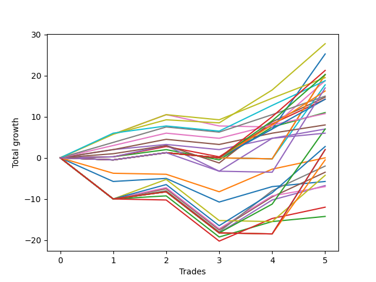

# Long Labrador 015 
- Symbol: ES
- Date Range: 03/18/2022 - 12/30/2022
- Trading Period: 8:30-12:30
- Number of Trades: 7



| Name | Win Percent | Profit | Avg Profit / Trade | Avg Time / Trade |      | Name | Win Percent | Profit | Avg Profit / Trade | Avg Time / Trade |
| ---- | ----------- | ------ | ------------------ | ---------------- | ---- | ---- | ----------- | ------ | ------------------ | ---------------- |
| Sorted By <br> Profit | | | | | | Sorted By <br> Win Percentage ||||
| V U/L 1SD | 57.14 | 35500.00 | 5071.43 | 55:54 |     | BB-100 Mid | 85.71 | 27750.00 | 3964.29 | 40:05 |
| BB-200 U/L 2SD | 57.14 | 35125.00 | 5017.86 | 56:38 |     | BB-50 U/L 1SD | 85.71 | 20125.00 | 2875.00 | 32:02 |
| BB-200 Mid | 71.43 | 31500.00 | 4500.00 | 44:24 |     | BB-20 U/L 2SD C | 85.71 | 16375.00 | 2339.29 | 16:50 |
| BB-100 U/L 2SD | 57.14 | 31375.00 | 4482.14 | 55:02 |     | BB-20 U/L 2SD | 85.71 | 14500.00 | 2071.43 | 15:24 |
| NEWFI 0000 | 42.86 | 30000.00 | 4285.71 | 30:02 |     | TP-6 | 85.71 | 13000.00 | 1857.14 | 33:19 |
| V Mid | 71.43 | 28875.00 | 4125.00 | 43:49 |     | TP-5 | 85.71 | 13000.00 | 1857.14 | 32:36 |
| BB-100 Mid | 85.71 | 27750.00 | 3964.29 | 40:05 |     | BB-50 Mid | 85.71 | 12000.00 | 1714.29 | 20:42 |
| BB-50 U/L 2SD | 71.43 | 26250.00 | 3750.00 | 43:28 |     | TP-4 | 85.71 | 10750.00 | 1535.71 | 24:04 |
| NEWFI 000 | 57.14 | 21250.00 | 3035.71 | 50:07 |     | TP-3 | 85.71 | 9625.00 | 1375.00 | 20:05 |
| BB-50 U/L 1SD | 85.71 | 20125.00 | 2875.00 | 32:02 |     | TP-2 | 85.71 | 8000.00 | 1142.86 | 14:25 |
| TP-10 | 71.43 | 16750.00 | 2392.86 | 35:57 |     | TP-1 | 85.71 | 6250.00 | 892.86 | 09:52 |
| BB-20 U/L 2SD C | 85.71 | 16375.00 | 2339.29 | 16:50 |     | BB-200 Mid | 71.43 | 31500.00 | 4500.00 | 44:24 |
| TP-9 | 71.43 | 15125.00 | 2160.71 | 35:49 |     | V Mid | 71.43 | 28875.00 | 4125.00 | 43:49 |
| BB-20 U/L 2SD | 85.71 | 14500.00 | 2071.43 | 15:24 |     | BB-50 U/L 2SD | 71.43 | 26250.00 | 3750.00 | 43:28 |
| TP-6 | 85.71 | 13000.00 | 1857.14 | 33:19 |     | TP-10 | 71.43 | 16750.00 | 2392.86 | 35:57 |
| TP-5 | 85.71 | 13000.00 | 1857.14 | 32:36 |     | TP-9 | 71.43 | 15125.00 | 2160.71 | 35:49 |
| TP-8 | 71.43 | 12875.00 | 1839.29 | 34:35 |     | TP-8 | 71.43 | 12875.00 | 1839.29 | 34:35 |
| BB-50 Mid | 85.71 | 12000.00 | 1714.29 | 20:42 |     | TP-7 | 71.43 | 11500.00 | 1642.86 | 34:31 |
| TP-7 | 71.43 | 11500.00 | 1642.86 | 34:31 |     | BB-20 Mid | 71.43 | 375.00 | 53.57 | 07:52 |
| TP-4 | 85.71 | 10750.00 | 1535.71 | 24:04 |     | V U/L 1SD | 57.14 | 35500.00 | 5071.43 | 55:54 |
| TP-3 | 85.71 | 9625.00 | 1375.00 | 20:05 |     | BB-200 U/L 2SD | 57.14 | 35125.00 | 5017.86 | 56:38 |
| TP-2 | 85.71 | 8000.00 | 1142.86 | 14:25 |     | BB-100 U/L 2SD | 57.14 | 31375.00 | 4482.14 | 55:02 |
| BB-20 U/L 1SD | 57.14 | 6625.00 | 946.43 | 13:30 |     | NEWFI 000 | 57.14 | 21250.00 | 3035.71 | 50:07 |
| TP-1 | 85.71 | 6250.00 | 892.86 | 09:52 |     | BB-20 U/L 1SD | 57.14 | 6625.00 | 946.43 | 13:30 |
| BB-20 Mid | 71.43 | 375.00 | 53.57 | 07:52 |     | NEWFI 0000 | 42.86 | 30000.00 | 4285.71 | 30:02 |

## NO STOPLOSS

### Test BB-20 Mid
* Sell when price hits the middle line of the 20p bollinger
* No Stoploss
* Results:
```
Total Trades: 7
Percent Up: 71.43
Percent Down: 28.57
Total Points Moved Up: 0.75
Potential Profit: 375.00
Total Points Ups: 12.25 Count Ups: 5
Total Points Downs: -11.50 Count Downs: 2
```

<details><summary>Trades</summary>

<code>In: 2022-03-21 10:07:00		Out: 2022-03-21 10:26:15		Total Position Time: 19:15		Total Move Up: -5.75		Total to Date: -5.75</code> <br />
<code>In: 2022-03-23 10:33:00		Out: 2022-03-23 10:38:30		Total Position Time: 05:30		Total Move Up: 0.75		Total to Date: -5.00</code> <br />
<code>In: 2022-03-28 08:44:00		Out: 2022-03-28 09:01:50		Total Position Time: 17:50		Total Move Up: -5.75		Total to Date: -10.75</code> <br />
<code>In: 2022-06-27 09:37:00		Out: 2022-06-27 09:41:05		Total Position Time: 04:05		Total Move Up: 3.75		Total to Date: -7.00</code> <br />
<code>In: 2022-07-11 12:16:00		Out: 2022-07-11 12:22:10		Total Position Time: 06:10		Total Move Up: 1.00		Total to Date: -6.00</code> <br />
<code>In: 2022-09-20 11:02:00		Out: 2022-09-20 11:03:10		Total Position Time: 01:10		Total Move Up: 1.25		Total to Date: -4.75</code> <br />
<code>In: 2022-11-08 11:36:00		Out: 2022-11-08 11:37:10		Total Position Time: 01:10		Total Move Up: 5.50		Total to Date: 0.75</code> <br />


</details>

### Test BB-20 U/L 1SD
* Sell when the price hits the upper line of the 20p 1std bollinger
* No Stoploss
* Results:
```
Total Trades: 7
Percent Up: 57.14
Percent Down: 42.86
Total Points Moved Up: 13.25
Potential Profit: 6625.00
Total Points Ups: 21.50 Count Ups: 4
Total Points Downs: -8.25 Count Downs: 3
```

<details><summary>Trades</summary>

<code>In: 2022-03-21 10:07:00		Out: 2022-03-21 10:32:05		Total Position Time: 25:05		Total Move Up: -3.75		Total to Date: -3.75</code> <br />
<code>In: 2022-03-23 10:33:00		Out: 2022-03-23 10:51:45		Total Position Time: 18:45		Total Move Up: -0.25		Total to Date: -4.00</code> <br />
<code>In: 2022-03-28 08:44:00		Out: 2022-03-28 09:05:15		Total Position Time: 21:15		Total Move Up: -4.25		Total to Date: -8.25</code> <br />
<code>In: 2022-06-27 09:37:00		Out: 2022-06-27 09:44:20		Total Position Time: 07:20		Total Move Up: 5.50		Total to Date: -2.75</code> <br />
<code>In: 2022-07-11 12:16:00		Out: 2022-07-11 12:29:20		Total Position Time: 13:20		Total Move Up: 1.00		Total to Date: -1.75</code> <br />
<code>In: 2022-09-20 11:02:00		Out: 2022-09-20 11:08:15		Total Position Time: 06:15		Total Move Up: 2.75		Total to Date: 1.00</code> <br />
<code>In: 2022-11-08 11:36:00		Out: 2022-11-08 11:38:35		Total Position Time: 02:35		Total Move Up: 12.25		Total to Date: 13.25</code> <br />


</details>

### Test BB-20 U/L 2SD
* Sell when the price hits the upper line of the 20p 2std bollinger
* No Stoploss
* Results:
```
Total Trades: 7
Percent Up: 85.71
Percent Down: 14.29
Total Points Moved Up: 29.00
Potential Profit: 14500.00
Total Points Ups: 31.50 Count Ups: 6
Total Points Downs: -2.50 Count Downs: 1
```

<details><summary>Trades</summary>

<code>In: 2022-03-21 10:07:00		Out: 2022-03-21 10:34:15		Total Position Time: 27:15		Total Move Up: 0.25		Total to Date: 0.25</code> <br />
<code>In: 2022-03-23 10:33:00		Out: 2022-03-23 10:54:25		Total Position Time: 21:25		Total Move Up: 1.75		Total to Date: 2.00</code> <br />
<code>In: 2022-03-28 08:44:00		Out: 2022-03-28 09:07:10		Total Position Time: 23:10		Total Move Up: -2.50		Total to Date: -0.50</code> <br />
<code>In: 2022-06-27 09:37:00		Out: 2022-06-27 09:45:05		Total Position Time: 08:05		Total Move Up: 8.00		Total to Date: 7.50</code> <br />
<code>In: 2022-07-11 12:16:00		Out: 2022-07-11 12:29:40		Total Position Time: 13:40		Total Move Up: 2.50		Total to Date: 10.00</code> <br />
<code>In: 2022-09-20 11:02:00		Out: 2022-09-20 11:10:05		Total Position Time: 08:05		Total Move Up: 3.50		Total to Date: 13.50</code> <br />
<code>In: 2022-11-08 11:36:00		Out: 2022-11-08 11:42:10		Total Position Time: 06:10		Total Move Up: 15.50		Total to Date: 29.00</code> <br />


</details>

### Test BB-20 U/L 2SD C
* Sell when the price hits the upper line of the 20p 2std bollinger
* No Stoploss
* Results:
```
Total Trades: 7
Percent Up: 85.71
Percent Down: 14.29
Total Points Moved Up: 32.75
Potential Profit: 16375.00
Total Points Ups: 35.25 Count Ups: 6
Total Points Downs: -2.50 Count Downs: 1
```

<details><summary>Trades</summary>

<code>In: 2022-03-21 10:07:00		Out: 2022-03-21 10:34:15		Total Position Time: 27:15		Total Move Up: 0.25		Total to Date: 0.25</code> <br />
<code>In: 2022-03-23 10:33:00		Out: 2022-03-23 10:54:30		Total Position Time: 21:30		Total Move Up: 2.50		Total to Date: 2.75</code> <br />
<code>In: 2022-03-28 08:44:00		Out: 2022-03-28 09:07:10		Total Position Time: 23:10		Total Move Up: -2.50		Total to Date: 0.25</code> <br />
<code>In: 2022-06-27 09:37:00		Out: 2022-06-27 09:45:05		Total Position Time: 08:05		Total Move Up: 8.00		Total to Date: 8.25</code> <br />
<code>In: 2022-07-11 12:16:00		Out: 2022-07-11 12:29:40		Total Position Time: 13:40		Total Move Up: 2.50		Total to Date: 10.75</code> <br />
<code>In: 2022-09-20 11:02:00		Out: 2022-09-20 11:19:55		Total Position Time: 17:55		Total Move Up: 6.00		Total to Date: 16.75</code> <br />
<code>In: 2022-11-08 11:36:00		Out: 2022-11-08 11:42:15		Total Position Time: 06:15		Total Move Up: 16.00		Total to Date: 32.75</code> <br />


</details>

### Test BB-50 Mid
* Sell when price hits the middle line of the 50p bollinger
* No Stoploss
* Results:
```
Total Trades: 7
Percent Up: 85.71
Percent Down: 14.29
Total Points Moved Up: 24.00
Potential Profit: 12000.00
Total Points Ups: 30.25 Count Ups: 6
Total Points Downs: -6.25 Count Downs: 1
```

<details><summary>Trades</summary>

<code>In: 2022-03-21 10:07:00		Out: 2022-03-21 10:34:15		Total Position Time: 27:15		Total Move Up: 0.25		Total to Date: 0.25</code> <br />
<code>In: 2022-03-23 10:33:00		Out: 2022-03-23 10:54:50		Total Position Time: 21:50		Total Move Up: 2.75		Total to Date: 3.00</code> <br />
<code>In: 2022-03-28 08:44:00		Out: 2022-03-28 09:24:15		Total Position Time: 40:15		Total Move Up: -6.25		Total to Date: -3.25</code> <br />
<code>In: 2022-06-27 09:37:00		Out: 2022-06-27 09:45:05		Total Position Time: 08:05		Total Move Up: 8.00		Total to Date: 4.75</code> <br />
<code>In: 2022-07-11 12:16:00		Out: 2022-07-11 12:40:35		Total Position Time: 24:35		Total Move Up: 2.25		Total to Date: 7.00</code> <br />
<code>In: 2022-09-20 11:02:00		Out: 2022-09-20 11:19:15		Total Position Time: 17:15		Total Move Up: 2.25		Total to Date: 9.25</code> <br />
<code>In: 2022-11-08 11:36:00		Out: 2022-11-08 11:41:40		Total Position Time: 05:40		Total Move Up: 14.75		Total to Date: 24.00</code> <br />


</details>

### Test BB-50 U/L 1SD
* Sell when the price hits the upper line of the 50p 1std bollinger
* No Stoploss
* Results:
```
Total Trades: 7
Percent Up: 85.71
Percent Down: 14.29
Total Points Moved Up: 40.25
Potential Profit: 20125.00
Total Points Ups: 44.50 Count Ups: 6
Total Points Downs: -4.25 Count Downs: 1
```

<details><summary>Trades</summary>

<code>In: 2022-03-21 10:07:00		Out: 2022-03-21 10:49:05		Total Position Time: 42:05		Total Move Up: 1.00		Total to Date: 1.00</code> <br />
<code>In: 2022-03-23 10:33:00		Out: 2022-03-23 11:27:00		Total Position Time: 54:00		Total Move Up: 2.00		Total to Date: 3.00</code> <br />
<code>In: 2022-03-28 08:44:00		Out: 2022-03-28 09:35:05		Total Position Time: 51:05		Total Move Up: -4.25		Total to Date: -1.25</code> <br />
<code>In: 2022-06-27 09:37:00		Out: 2022-06-27 09:53:20		Total Position Time: 16:20		Total Move Up: 10.00		Total to Date: 8.75</code> <br />
<code>In: 2022-07-11 12:16:00		Out: 2022-07-11 12:47:00		Total Position Time: 31:00		Total Move Up: 1.00		Total to Date: 9.75</code> <br />
<code>In: 2022-09-20 11:02:00		Out: 2022-09-20 11:19:55		Total Position Time: 17:55		Total Move Up: 6.00		Total to Date: 15.75</code> <br />
<code>In: 2022-11-08 11:36:00		Out: 2022-11-08 11:47:55		Total Position Time: 11:55		Total Move Up: 24.50		Total to Date: 40.25</code> <br />


</details>

### Test BB-50 U/L 2SD
* Sell when the price hits the upper line of the 50p 2std bollinger
* No Stoploss
* Results:
```
Total Trades: 7
Percent Up: 71.43
Percent Down: 28.57
Total Points Moved Up: 52.50
Potential Profit: 26250.00
Total Points Ups: 55.50 Count Ups: 5
Total Points Downs: -3.00 Count Downs: 2
```

<details><summary>Trades</summary>

<code>In: 2022-03-21 10:07:00		Out: 2022-03-21 11:00:15		Total Position Time: 53:15		Total Move Up: 5.75		Total to Date: 5.75</code> <br />
<code>In: 2022-03-23 10:33:00		Out: 2022-03-23 11:30:00		Total Position Time: 57:00		Total Move Up: 4.75		Total to Date: 10.50</code> <br />
<code>In: 2022-03-28 08:44:00		Out: 2022-03-28 09:39:50		Total Position Time: 55:50		Total Move Up: -2.75		Total to Date: 7.75</code> <br />
<code>In: 2022-06-27 09:37:00		Out: 2022-06-27 10:37:55		Total Position Time: 60:55		Total Move Up: -0.25		Total to Date: 7.50</code> <br />
<code>In: 2022-07-11 12:16:00		Out: 2022-07-11 12:47:00		Total Position Time: 31:00		Total Move Up: 1.00		Total to Date: 8.50</code> <br />
<code>In: 2022-09-20 11:02:00		Out: 2022-09-20 11:21:45		Total Position Time: 19:45		Total Move Up: 11.25		Total to Date: 19.75</code> <br />
<code>In: 2022-11-08 11:36:00		Out: 2022-11-08 12:02:35		Total Position Time: 26:35		Total Move Up: 32.75		Total to Date: 52.50</code> <br />


</details>

### Test V Mid
* Sell when the price hits the middle line of the 1std VWAP
* No Stoploss
* Results:
```
Total Trades: 7
Percent Up: 71.43
Percent Down: 28.57
Total Points Moved Up: 57.75
Potential Profit: 28875.00
Total Points Ups: 59.50 Count Ups: 5
Total Points Downs: -1.75 Count Downs: 2
```

<details><summary>Trades</summary>

<code>In: 2022-03-21 10:07:00		Out: 2022-03-21 11:07:55		Total Position Time: 60:55		Total Move Up: -0.50		Total to Date: -0.50</code> <br />
<code>In: 2022-03-23 10:33:00		Out: 2022-03-23 11:33:55		Total Position Time: 60:55		Total Move Up: 1.75		Total to Date: 1.25</code> <br />
<code>In: 2022-03-28 08:44:00		Out: 2022-03-28 09:44:55		Total Position Time: 60:55		Total Move Up: -1.25		Total to Date: 0.00</code> <br />
<code>In: 2022-06-27 09:37:00		Out: 2022-06-27 09:44:20		Total Position Time: 07:20		Total Move Up: 5.50		Total to Date: 5.50</code> <br />
<code>In: 2022-07-11 12:16:00		Out: 2022-07-11 12:47:00		Total Position Time: 31:00		Total Move Up: 1.00		Total to Date: 6.50</code> <br />
<code>In: 2022-09-20 11:02:00		Out: 2022-09-20 12:01:05		Total Position Time: 59:05		Total Move Up: 18.50		Total to Date: 25.00</code> <br />
<code>In: 2022-11-08 11:36:00		Out: 2022-11-08 12:02:35		Total Position Time: 26:35		Total Move Up: 32.75		Total to Date: 57.75</code> <br />


</details>

### Test V U/L 1SD
* Sell when the price hits the upper line of the 1std VWAP
* No Stoploss
* Results:
```
Total Trades: 7
Percent Up: 57.14
Percent Down: 42.86
Total Points Moved Up: 71.00
Potential Profit: 35500.00
Total Points Ups: 73.00 Count Ups: 4
Total Points Downs: -2.00 Count Downs: 3
```

<details><summary>Trades</summary>

<code>In: 2022-03-21 10:07:00		Out: 2022-03-21 11:07:55		Total Position Time: 60:55		Total Move Up: -0.50		Total to Date: -0.50</code> <br />
<code>In: 2022-03-23 10:33:00		Out: 2022-03-23 11:33:55		Total Position Time: 60:55		Total Move Up: 1.75		Total to Date: 1.25</code> <br />
<code>In: 2022-03-28 08:44:00		Out: 2022-03-28 09:44:55		Total Position Time: 60:55		Total Move Up: -1.25		Total to Date: 0.00</code> <br />
<code>In: 2022-06-27 09:37:00		Out: 2022-06-27 10:37:55		Total Position Time: 60:55		Total Move Up: -0.25		Total to Date: -0.25</code> <br />
<code>In: 2022-07-11 12:16:00		Out: 2022-07-11 12:47:00		Total Position Time: 31:00		Total Move Up: 1.00		Total to Date: 0.75</code> <br />
<code>In: 2022-09-20 11:02:00		Out: 2022-09-20 12:02:55		Total Position Time: 60:55		Total Move Up: 20.50		Total to Date: 21.25</code> <br />
<code>In: 2022-11-08 11:36:00		Out: 2022-11-08 12:31:45		Total Position Time: 55:45		Total Move Up: 49.75		Total to Date: 71.00</code> <br />


</details>

### Test BB-100 Mid
* Move to BB100 Mid
* No Stoploss
* Results:
```
Total Trades: 7
Percent Up: 85.71
Percent Down: 14.29
Total Points Moved Up: 55.50
Potential Profit: 27750.00
Total Points Ups: 56.25 Count Ups: 6
Total Points Downs: -0.75 Count Downs: 1
```

<details><summary>Trades</summary>

<code>In: 2022-03-21 10:07:00		Out: 2022-03-21 11:00:15		Total Position Time: 53:15		Total Move Up: 5.75		Total to Date: 5.75</code> <br />
<code>In: 2022-03-23 10:33:00		Out: 2022-03-23 11:28:15		Total Position Time: 55:15		Total Move Up: 3.50		Total to Date: 9.25</code> <br />
<code>In: 2022-03-28 08:44:00		Out: 2022-03-28 09:44:30		Total Position Time: 60:30		Total Move Up: -0.75		Total to Date: 8.50</code> <br />
<code>In: 2022-06-27 09:37:00		Out: 2022-06-27 10:20:05		Total Position Time: 43:05		Total Move Up: 8.00		Total to Date: 16.50</code> <br />
<code>In: 2022-07-11 12:16:00		Out: 2022-07-11 12:47:00		Total Position Time: 31:00		Total Move Up: 1.00		Total to Date: 17.50</code> <br />
<code>In: 2022-09-20 11:02:00		Out: 2022-09-20 11:21:45		Total Position Time: 19:45		Total Move Up: 11.25		Total to Date: 28.75</code> <br />
<code>In: 2022-11-08 11:36:00		Out: 2022-11-08 11:53:50		Total Position Time: 17:50		Total Move Up: 26.75		Total to Date: 55.50</code> <br />


</details>

### Test BB-100 U/L 2SD
* Move to BB100 Upper Band
* No Stoploss
* Results:
```
Total Trades: 7
Percent Up: 57.14
Percent Down: 42.86
Total Points Moved Up: 62.75
Potential Profit: 31375.00
Total Points Ups: 64.75 Count Ups: 4
Total Points Downs: -2.00 Count Downs: 3
```

<details><summary>Trades</summary>

<code>In: 2022-03-21 10:07:00		Out: 2022-03-21 11:07:55		Total Position Time: 60:55		Total Move Up: -0.50		Total to Date: -0.50</code> <br />
<code>In: 2022-03-23 10:33:00		Out: 2022-03-23 11:33:55		Total Position Time: 60:55		Total Move Up: 1.75		Total to Date: 1.25</code> <br />
<code>In: 2022-03-28 08:44:00		Out: 2022-03-28 09:44:55		Total Position Time: 60:55		Total Move Up: -1.25		Total to Date: 0.00</code> <br />
<code>In: 2022-06-27 09:37:00		Out: 2022-06-27 10:37:55		Total Position Time: 60:55		Total Move Up: -0.25		Total to Date: -0.25</code> <br />
<code>In: 2022-07-11 12:16:00		Out: 2022-07-11 12:47:00		Total Position Time: 31:00		Total Move Up: 1.00		Total to Date: 0.75</code> <br />
<code>In: 2022-09-20 11:02:00		Out: 2022-09-20 11:58:10		Total Position Time: 56:10		Total Move Up: 18.00		Total to Date: 18.75</code> <br />
<code>In: 2022-11-08 11:36:00		Out: 2022-11-08 12:30:25		Total Position Time: 54:25		Total Move Up: 44.00		Total to Date: 62.75</code> <br />


</details>

### Test BB-200 Mid
* Move to BB200 Mid
* No Stoploss
* Results:
```
Total Trades: 7
Percent Up: 71.43
Percent Down: 28.57
Total Points Moved Up: 63.00
Potential Profit: 31500.00
Total Points Ups: 64.75 Count Ups: 5
Total Points Downs: -1.75 Count Downs: 2
```

<details><summary>Trades</summary>

<code>In: 2022-03-21 10:07:00		Out: 2022-03-21 11:07:55		Total Position Time: 60:55		Total Move Up: -0.50		Total to Date: -0.50</code> <br />
<code>In: 2022-03-23 10:33:00		Out: 2022-03-23 11:33:55		Total Position Time: 60:55		Total Move Up: 1.75		Total to Date: 1.25</code> <br />
<code>In: 2022-03-28 08:44:00		Out: 2022-03-28 09:44:55		Total Position Time: 60:55		Total Move Up: -1.25		Total to Date: 0.00</code> <br />
<code>In: 2022-06-27 09:37:00		Out: 2022-06-27 09:45:00		Total Position Time: 08:00		Total Move Up: 7.00		Total to Date: 7.00</code> <br />
<code>In: 2022-07-11 12:16:00		Out: 2022-07-11 12:47:00		Total Position Time: 31:00		Total Move Up: 1.00		Total to Date: 8.00</code> <br />
<code>In: 2022-09-20 11:02:00		Out: 2022-09-20 11:47:00		Total Position Time: 45:00		Total Move Up: 18.25		Total to Date: 26.25</code> <br />
<code>In: 2022-11-08 11:36:00		Out: 2022-11-08 12:20:05		Total Position Time: 44:05		Total Move Up: 36.75		Total to Date: 63.00</code> <br />


</details>

### Test BB-200 U/L 2SD
* Move to BB200 Upper Band
* No Stoploss
* Results:
```
Total Trades: 7
Percent Up: 57.14
Percent Down: 42.86
Total Points Moved Up: 70.25
Potential Profit: 35125.00
Total Points Ups: 72.25 Count Ups: 4
Total Points Downs: -2.00 Count Downs: 3
```

<details><summary>Trades</summary>

<code>In: 2022-03-21 10:07:00		Out: 2022-03-21 11:07:55		Total Position Time: 60:55		Total Move Up: -0.50		Total to Date: -0.50</code> <br />
<code>In: 2022-03-23 10:33:00		Out: 2022-03-23 11:33:55		Total Position Time: 60:55		Total Move Up: 1.75		Total to Date: 1.25</code> <br />
<code>In: 2022-03-28 08:44:00		Out: 2022-03-28 09:44:55		Total Position Time: 60:55		Total Move Up: -1.25		Total to Date: 0.00</code> <br />
<code>In: 2022-06-27 09:37:00		Out: 2022-06-27 10:37:55		Total Position Time: 60:55		Total Move Up: -0.25		Total to Date: -0.25</code> <br />
<code>In: 2022-07-11 12:16:00		Out: 2022-07-11 12:47:00		Total Position Time: 31:00		Total Move Up: 1.00		Total to Date: 0.75</code> <br />
<code>In: 2022-09-20 11:02:00		Out: 2022-09-20 12:02:55		Total Position Time: 60:55		Total Move Up: 20.50		Total to Date: 21.25</code> <br />
<code>In: 2022-11-08 11:36:00		Out: 2022-11-08 12:36:55		Total Position Time: 60:55		Total Move Up: 49.00		Total to Date: 70.25</code> <br />


</details>

## TAKE PROFIT

### Test TP-1
* Take Profit of 1 Point
* No Stoploss
* Results:
```
Total Trades: 7
Percent Up: 85.71
Percent Down: 14.29
Total Points Moved Up: 12.50
Potential Profit: 6250.00
Total Points Ups: 13.75 Count Ups: 6
Total Points Downs: -1.25 Count Downs: 1
```

<details><summary>Trades</summary>

<code>In: 2022-03-21 10:07:00		Out: 2022-03-21 10:08:10		Total Position Time: 01:10		Total Move Up: 2.00		Total to Date: 2.00</code> <br />
<code>In: 2022-03-23 10:33:00		Out: 2022-03-23 10:34:40		Total Position Time: 01:40		Total Move Up: 1.25		Total to Date: 3.25</code> <br />
<code>In: 2022-03-28 08:44:00		Out: 2022-03-28 09:44:55		Total Position Time: 60:55		Total Move Up: -1.25		Total to Date: 2.00</code> <br />
<code>In: 2022-06-27 09:37:00		Out: 2022-06-27 09:38:10		Total Position Time: 01:10		Total Move Up: 2.75		Total to Date: 4.75</code> <br />
<code>In: 2022-07-11 12:16:00		Out: 2022-07-11 12:17:50		Total Position Time: 01:50		Total Move Up: 1.00		Total to Date: 5.75</code> <br />
<code>In: 2022-09-20 11:02:00		Out: 2022-09-20 11:03:10		Total Position Time: 01:10		Total Move Up: 1.25		Total to Date: 7.00</code> <br />
<code>In: 2022-11-08 11:36:00		Out: 2022-11-08 11:37:10		Total Position Time: 01:10		Total Move Up: 5.50		Total to Date: 12.50</code> <br />


</details>

### Test TP-2
* Take Profit of 2 Point
* No Stoploss
* Results:
```
Total Trades: 7
Percent Up: 85.71
Percent Down: 14.29
Total Points Moved Up: 16.00
Potential Profit: 8000.00
Total Points Ups: 17.25 Count Ups: 6
Total Points Downs: -1.25 Count Downs: 1
```

<details><summary>Trades</summary>

<code>In: 2022-03-21 10:07:00		Out: 2022-03-21 10:08:10		Total Position Time: 01:10		Total Move Up: 2.00		Total to Date: 2.00</code> <br />
<code>In: 2022-03-23 10:33:00		Out: 2022-03-23 10:54:30		Total Position Time: 21:30		Total Move Up: 2.50		Total to Date: 4.50</code> <br />
<code>In: 2022-03-28 08:44:00		Out: 2022-03-28 09:44:55		Total Position Time: 60:55		Total Move Up: -1.25		Total to Date: 3.25</code> <br />
<code>In: 2022-06-27 09:37:00		Out: 2022-06-27 09:38:10		Total Position Time: 01:10		Total Move Up: 2.75		Total to Date: 6.00</code> <br />
<code>In: 2022-07-11 12:16:00		Out: 2022-07-11 12:29:40		Total Position Time: 13:40		Total Move Up: 2.50		Total to Date: 8.50</code> <br />
<code>In: 2022-09-20 11:02:00		Out: 2022-09-20 11:03:20		Total Position Time: 01:20		Total Move Up: 2.00		Total to Date: 10.50</code> <br />
<code>In: 2022-11-08 11:36:00		Out: 2022-11-08 11:37:10		Total Position Time: 01:10		Total Move Up: 5.50		Total to Date: 16.00</code> <br />


</details>

### Test TP-3
* Take Profit of 3 Point
* No Stoploss
* Results:
```
Total Trades: 7
Percent Up: 85.71
Percent Down: 14.29
Total Points Moved Up: 19.25
Potential Profit: 9625.00
Total Points Ups: 20.50 Count Ups: 6
Total Points Downs: -1.25 Count Downs: 1
```

<details><summary>Trades</summary>

<code>In: 2022-03-21 10:07:00		Out: 2022-03-21 10:38:35		Total Position Time: 31:35		Total Move Up: 3.00		Total to Date: 3.00</code> <br />
<code>In: 2022-03-23 10:33:00		Out: 2022-03-23 10:55:00		Total Position Time: 22:00		Total Move Up: 3.00		Total to Date: 6.00</code> <br />
<code>In: 2022-03-28 08:44:00		Out: 2022-03-28 09:44:55		Total Position Time: 60:55		Total Move Up: -1.25		Total to Date: 4.75</code> <br />
<code>In: 2022-06-27 09:37:00		Out: 2022-06-27 09:39:20		Total Position Time: 02:20		Total Move Up: 3.25		Total to Date: 8.00</code> <br />
<code>In: 2022-07-11 12:16:00		Out: 2022-07-11 12:31:10		Total Position Time: 15:10		Total Move Up: 3.00		Total to Date: 11.00</code> <br />
<code>In: 2022-09-20 11:02:00		Out: 2022-09-20 11:09:30		Total Position Time: 07:30		Total Move Up: 2.75		Total to Date: 13.75</code> <br />
<code>In: 2022-11-08 11:36:00		Out: 2022-11-08 11:37:10		Total Position Time: 01:10		Total Move Up: 5.50		Total to Date: 19.25</code> <br />


</details>

### Test TP-4
* Take Profit of 4 Point
* No Stoploss
* Results:
```
Total Trades: 7
Percent Up: 85.71
Percent Down: 14.29
Total Points Moved Up: 21.50
Potential Profit: 10750.00
Total Points Ups: 22.75 Count Ups: 6
Total Points Downs: -1.25 Count Downs: 1
```

<details><summary>Trades</summary>

<code>In: 2022-03-21 10:07:00		Out: 2022-03-21 10:38:40		Total Position Time: 31:40		Total Move Up: 3.75		Total to Date: 3.75</code> <br />
<code>In: 2022-03-23 10:33:00		Out: 2022-03-23 10:55:10		Total Position Time: 22:10		Total Move Up: 3.75		Total to Date: 7.50</code> <br />
<code>In: 2022-03-28 08:44:00		Out: 2022-03-28 09:44:55		Total Position Time: 60:55		Total Move Up: -1.25		Total to Date: 6.25</code> <br />
<code>In: 2022-06-27 09:37:00		Out: 2022-06-27 09:41:10		Total Position Time: 04:10		Total Move Up: 4.25		Total to Date: 10.50</code> <br />
<code>In: 2022-07-11 12:16:00		Out: 2022-07-11 12:47:00		Total Position Time: 31:00		Total Move Up: 1.00		Total to Date: 11.50</code> <br />
<code>In: 2022-09-20 11:02:00		Out: 2022-09-20 11:19:25		Total Position Time: 17:25		Total Move Up: 4.50		Total to Date: 16.00</code> <br />
<code>In: 2022-11-08 11:36:00		Out: 2022-11-08 11:37:10		Total Position Time: 01:10		Total Move Up: 5.50		Total to Date: 21.50</code> <br />


</details>

### Test TP-5
* Take Profit of 5 Point
* No Stoploss
* Results:
```
Total Trades: 7
Percent Up: 85.71
Percent Down: 14.29
Total Points Moved Up: 26.00
Potential Profit: 13000.00
Total Points Ups: 27.25 Count Ups: 6
Total Points Downs: -1.25 Count Downs: 1
```

<details><summary>Trades</summary>

<code>In: 2022-03-21 10:07:00		Out: 2022-03-21 11:00:15		Total Position Time: 53:15		Total Move Up: 5.75		Total to Date: 5.75</code> <br />
<code>In: 2022-03-23 10:33:00		Out: 2022-03-23 11:30:00		Total Position Time: 57:00		Total Move Up: 4.75		Total to Date: 10.50</code> <br />
<code>In: 2022-03-28 08:44:00		Out: 2022-03-28 09:44:55		Total Position Time: 60:55		Total Move Up: -1.25		Total to Date: 9.25</code> <br />
<code>In: 2022-06-27 09:37:00		Out: 2022-06-27 09:44:15		Total Position Time: 07:15		Total Move Up: 5.25		Total to Date: 14.50</code> <br />
<code>In: 2022-07-11 12:16:00		Out: 2022-07-11 12:47:00		Total Position Time: 31:00		Total Move Up: 1.00		Total to Date: 15.50</code> <br />
<code>In: 2022-09-20 11:02:00		Out: 2022-09-20 11:19:40		Total Position Time: 17:40		Total Move Up: 5.00		Total to Date: 20.50</code> <br />
<code>In: 2022-11-08 11:36:00		Out: 2022-11-08 11:37:10		Total Position Time: 01:10		Total Move Up: 5.50		Total to Date: 26.00</code> <br />


</details>

### Test TP-6
* Take Profit of 6 Point
* No Stoploss
* Results:
```
Total Trades: 7
Percent Up: 85.71
Percent Down: 14.29
Total Points Moved Up: 26.00
Potential Profit: 13000.00
Total Points Ups: 27.25 Count Ups: 6
Total Points Downs: -1.25 Count Downs: 1
```

<details><summary>Trades</summary>

<code>In: 2022-03-21 10:07:00		Out: 2022-03-21 11:00:20		Total Position Time: 53:20		Total Move Up: 6.00		Total to Date: 6.00</code> <br />
<code>In: 2022-03-23 10:33:00		Out: 2022-03-23 11:33:55		Total Position Time: 60:55		Total Move Up: 1.75		Total to Date: 7.75</code> <br />
<code>In: 2022-03-28 08:44:00		Out: 2022-03-28 09:44:55		Total Position Time: 60:55		Total Move Up: -1.25		Total to Date: 6.50</code> <br />
<code>In: 2022-06-27 09:37:00		Out: 2022-06-27 09:44:55		Total Position Time: 07:55		Total Move Up: 6.25		Total to Date: 12.75</code> <br />
<code>In: 2022-07-11 12:16:00		Out: 2022-07-11 12:47:00		Total Position Time: 31:00		Total Move Up: 1.00		Total to Date: 13.75</code> <br />
<code>In: 2022-09-20 11:02:00		Out: 2022-09-20 11:19:55		Total Position Time: 17:55		Total Move Up: 6.00		Total to Date: 19.75</code> <br />
<code>In: 2022-11-08 11:36:00		Out: 2022-11-08 11:37:15		Total Position Time: 01:15		Total Move Up: 6.25		Total to Date: 26.00</code> <br />


</details>

### Test TP-7
* Take Profit of 7 Point
* No Stoploss
* Results:
```
Total Trades: 7
Percent Up: 71.43
Percent Down: 28.57
Total Points Moved Up: 23.00
Potential Profit: 11500.00
Total Points Ups: 24.75 Count Ups: 5
Total Points Downs: -1.75 Count Downs: 2
```

<details><summary>Trades</summary>

<code>In: 2022-03-21 10:07:00		Out: 2022-03-21 11:07:55		Total Position Time: 60:55		Total Move Up: -0.50		Total to Date: -0.50</code> <br />
<code>In: 2022-03-23 10:33:00		Out: 2022-03-23 11:33:55		Total Position Time: 60:55		Total Move Up: 1.75		Total to Date: 1.25</code> <br />
<code>In: 2022-03-28 08:44:00		Out: 2022-03-28 09:44:55		Total Position Time: 60:55		Total Move Up: -1.25		Total to Date: 0.00</code> <br />
<code>In: 2022-06-27 09:37:00		Out: 2022-06-27 09:45:00		Total Position Time: 08:00		Total Move Up: 7.00		Total to Date: 7.00</code> <br />
<code>In: 2022-07-11 12:16:00		Out: 2022-07-11 12:47:00		Total Position Time: 31:00		Total Move Up: 1.00		Total to Date: 8.00</code> <br />
<code>In: 2022-09-20 11:02:00		Out: 2022-09-20 11:20:30		Total Position Time: 18:30		Total Move Up: 7.25		Total to Date: 15.25</code> <br />
<code>In: 2022-11-08 11:36:00		Out: 2022-11-08 11:37:25		Total Position Time: 01:25		Total Move Up: 7.75		Total to Date: 23.00</code> <br />


</details>

### Test TP-8
* Take Profit of 8 Point
* No Stoploss
* Results:
```
Total Trades: 7
Percent Up: 71.43
Percent Down: 28.57
Total Points Moved Up: 25.75
Potential Profit: 12875.00
Total Points Ups: 27.50 Count Ups: 5
Total Points Downs: -1.75 Count Downs: 2
```

<details><summary>Trades</summary>

<code>In: 2022-03-21 10:07:00		Out: 2022-03-21 11:07:55		Total Position Time: 60:55		Total Move Up: -0.50		Total to Date: -0.50</code> <br />
<code>In: 2022-03-23 10:33:00		Out: 2022-03-23 11:33:55		Total Position Time: 60:55		Total Move Up: 1.75		Total to Date: 1.25</code> <br />
<code>In: 2022-03-28 08:44:00		Out: 2022-03-28 09:44:55		Total Position Time: 60:55		Total Move Up: -1.25		Total to Date: 0.00</code> <br />
<code>In: 2022-06-27 09:37:00		Out: 2022-06-27 09:45:05		Total Position Time: 08:05		Total Move Up: 8.00		Total to Date: 8.00</code> <br />
<code>In: 2022-07-11 12:16:00		Out: 2022-07-11 12:47:00		Total Position Time: 31:00		Total Move Up: 1.00		Total to Date: 9.00</code> <br />
<code>In: 2022-09-20 11:02:00		Out: 2022-09-20 11:20:40		Total Position Time: 18:40		Total Move Up: 8.25		Total to Date: 17.25</code> <br />
<code>In: 2022-11-08 11:36:00		Out: 2022-11-08 11:37:35		Total Position Time: 01:35		Total Move Up: 8.50		Total to Date: 25.75</code> <br />


</details>

### Test TP-9
* Take Profit of 9 Point
* No Stoploss
* Results:
```
Total Trades: 7
Percent Up: 71.43
Percent Down: 28.57
Total Points Moved Up: 30.25
Potential Profit: 15125.00
Total Points Ups: 32.00 Count Ups: 5
Total Points Downs: -1.75 Count Downs: 2
```

<details><summary>Trades</summary>

<code>In: 2022-03-21 10:07:00		Out: 2022-03-21 11:07:55		Total Position Time: 60:55		Total Move Up: -0.50		Total to Date: -0.50</code> <br />
<code>In: 2022-03-23 10:33:00		Out: 2022-03-23 11:33:55		Total Position Time: 60:55		Total Move Up: 1.75		Total to Date: 1.25</code> <br />
<code>In: 2022-03-28 08:44:00		Out: 2022-03-28 09:44:55		Total Position Time: 60:55		Total Move Up: -1.25		Total to Date: 0.00</code> <br />
<code>In: 2022-06-27 09:37:00		Out: 2022-06-27 09:52:35		Total Position Time: 15:35		Total Move Up: 9.00		Total to Date: 9.00</code> <br />
<code>In: 2022-07-11 12:16:00		Out: 2022-07-11 12:47:00		Total Position Time: 31:00		Total Move Up: 1.00		Total to Date: 10.00</code> <br />
<code>In: 2022-09-20 11:02:00		Out: 2022-09-20 11:21:45		Total Position Time: 19:45		Total Move Up: 11.25		Total to Date: 21.25</code> <br />
<code>In: 2022-11-08 11:36:00		Out: 2022-11-08 11:37:40		Total Position Time: 01:40		Total Move Up: 9.00		Total to Date: 30.25</code> <br />


</details>

### Test TP-10
* Take Profit of 10 Point
* No Stoploss
* Results:
```
Total Trades: 7
Percent Up: 71.43
Percent Down: 28.57
Total Points Moved Up: 33.50
Potential Profit: 16750.00
Total Points Ups: 35.25 Count Ups: 5
Total Points Downs: -1.75 Count Downs: 2
```

<details><summary>Trades</summary>

<code>In: 2022-03-21 10:07:00		Out: 2022-03-21 11:07:55		Total Position Time: 60:55		Total Move Up: -0.50		Total to Date: -0.50</code> <br />
<code>In: 2022-03-23 10:33:00		Out: 2022-03-23 11:33:55		Total Position Time: 60:55		Total Move Up: 1.75		Total to Date: 1.25</code> <br />
<code>In: 2022-03-28 08:44:00		Out: 2022-03-28 09:44:55		Total Position Time: 60:55		Total Move Up: -1.25		Total to Date: 0.00</code> <br />
<code>In: 2022-06-27 09:37:00		Out: 2022-06-27 09:53:20		Total Position Time: 16:20		Total Move Up: 10.00		Total to Date: 10.00</code> <br />
<code>In: 2022-07-11 12:16:00		Out: 2022-07-11 12:47:00		Total Position Time: 31:00		Total Move Up: 1.00		Total to Date: 11.00</code> <br />
<code>In: 2022-09-20 11:02:00		Out: 2022-09-20 11:21:45		Total Position Time: 19:45		Total Move Up: 11.25		Total to Date: 22.25</code> <br />
<code>In: 2022-11-08 11:36:00		Out: 2022-11-08 11:37:55		Total Position Time: 01:55		Total Move Up: 11.25		Total to Date: 33.50</code> <br />


</details>

## Indicator Exits

### Test NEWFI 000
* Newfi 0000
* No Stoploss
* Results:
```
Total Trades: 7
Percent Up: 57.14
Percent Down: 42.86
Total Points Moved Up: 42.50
Potential Profit: 21250.00
Total Points Ups: 47.75 Count Ups: 4
Total Points Downs: -5.25 Count Downs: 3
```

<details><summary>Trades</summary>

<code>In: 2022-03-21 10:07:00		Out: 2022-03-21 11:07:55		Total Position Time: 60:55		Total Move Up: -0.50		Total to Date: -0.50</code> <br />
<code>In: 2022-03-23 10:33:00		Out: 2022-03-23 11:33:55		Total Position Time: 60:55		Total Move Up: 1.75		Total to Date: 1.25</code> <br />
<code>In: 2022-03-28 08:44:00		Out: 2022-03-28 09:39:05		Total Position Time: 55:05		Total Move Up: -4.50		Total to Date: -3.25</code> <br />
<code>In: 2022-06-27 09:37:00		Out: 2022-06-27 10:37:55		Total Position Time: 60:55		Total Move Up: -0.25		Total to Date: -3.50</code> <br />
<code>In: 2022-07-11 12:16:00		Out: 2022-07-11 12:47:00		Total Position Time: 31:00		Total Move Up: 1.00		Total to Date: -2.50</code> <br />
<code>In: 2022-09-20 11:02:00		Out: 2022-09-20 12:02:55		Total Position Time: 60:55		Total Move Up: 20.50		Total to Date: 18.00</code> <br />
<code>In: 2022-11-08 11:36:00		Out: 2022-11-08 11:57:05		Total Position Time: 21:05		Total Move Up: 24.50		Total to Date: 42.50</code> <br />


</details>

### Test NEWFI 0000
* Newfi 0000
* No Stoploss
* Results:
```
Total Trades: 7
Percent Up: 42.86
Percent Down: 57.14
Total Points Moved Up: 60.00
Potential Profit: 30000.00
Total Points Ups: 72.75 Count Ups: 3
Total Points Downs: -12.75 Count Downs: 4
```

<details><summary>Trades</summary>

<code>In: 2022-03-21 10:07:00		Out: 2022-03-21 10:08:05		Total Position Time: 01:05		Total Move Up: 3.25		Total to Date: 3.25</code> <br />
<code>In: 2022-03-23 10:33:00		Out: 2022-03-23 10:50:05		Total Position Time: 17:05		Total Move Up: -5.00		Total to Date: -1.75</code> <br />
<code>In: 2022-03-28 08:44:00		Out: 2022-03-28 08:52:05		Total Position Time: 08:05		Total Move Up: -7.00		Total to Date: -8.75</code> <br />
<code>In: 2022-06-27 09:37:00		Out: 2022-06-27 10:36:05		Total Position Time: 59:05		Total Move Up: -0.25		Total to Date: -9.00</code> <br />
<code>In: 2022-07-11 12:16:00		Out: 2022-07-11 12:19:05		Total Position Time: 03:05		Total Move Up: -0.50		Total to Date: -9.50</code> <br />
<code>In: 2022-09-20 11:02:00		Out: 2022-09-20 12:02:55		Total Position Time: 60:55		Total Move Up: 20.50		Total to Date: 11.00</code> <br />
<code>In: 2022-11-08 11:36:00		Out: 2022-11-08 12:36:55		Total Position Time: 60:55		Total Move Up: 49.00		Total to Date: 60.00</code> <br />


</details>