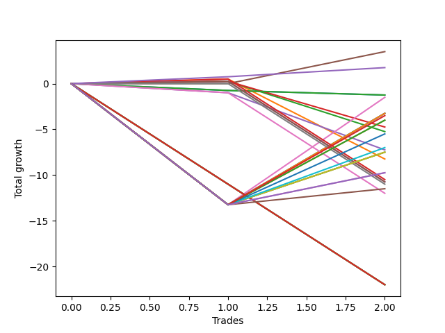

# Long Labrador 016 
- Symbol: ES
- Date Range: 03/18/2022 - 12/30/2022
- Trading Period: 8:30-11:30
- Number of Trades: 2



| Name | Win Percent | Profit | Avg Profit / Trade | Avg Time / Trade |      | Name | Win Percent | Profit | Avg Profit / Trade | Avg Time / Trade |
| ---- | ----------- | ------ | ------------------ | ---------------- | ---- | ---- | ----------- | ------ | ------------------ | ---------------- |
| Sorted By <br> Profit | | | | | | Sorted By <br> Win Percentage ||||
| BB-50 U/L 1SD | 100.00 | 1750.00 | 875.00 | 33:27 |     | BB-50 U/L 1SD | 100.00 | 1750.00 | 875.00 | 33:27 |
| TP-1 | 100.00 | 875.00 | 437.50 | 03:15 |     | TP-1 | 100.00 | 875.00 | 437.50 | 03:15 |
| BB-20 Mid SL-10 | 0.00 | -625.00 | -312.50 | 02:27 |     | V Mid | 50.00 | -750.00 | -375.00 | 54:15 |
| BB-20 Mid SL-5 | 0.00 | -625.00 | -312.50 | 02:27 |     | BB-50 U/L 2SD | 50.00 | -750.00 | -375.00 | 54:15 |
| BB-20 Mid | 0.00 | -625.00 | -312.50 | 02:27 |     | BB-200 U/L 2SD | 50.00 | -1625.00 | -812.50 | 60:55 |
| V Mid | 50.00 | -750.00 | -375.00 | 54:15 |     | BB-200 Mid | 50.00 | -1625.00 | -812.50 | 60:55 |
| BB-50 U/L 2SD | 50.00 | -750.00 | -375.00 | 54:15 |     | BB-100 U/L 2SD | 50.00 | -1625.00 | -812.50 | 60:55 |
| BB-200 U/L 2SD | 50.00 | -1625.00 | -812.50 | 60:55 |     | V U/L 1SD | 50.00 | -1625.00 | -812.50 | 60:55 |
| BB-200 Mid | 50.00 | -1625.00 | -812.50 | 60:55 |     | TP-10 | 50.00 | -1750.00 | -875.00 | 54:05 |
| BB-100 U/L 2SD | 50.00 | -1625.00 | -812.50 | 60:55 |     | TP-9 | 50.00 | -2000.00 | -1000.00 | 54:02 |
| V U/L 1SD | 50.00 | -1625.00 | -812.50 | 60:55 |     | TP-8 | 50.00 | -2000.00 | -1000.00 | 54:02 |
| TP-10 | 50.00 | -1750.00 | -875.00 | 54:05 |     | BB-20 U/L 1SD SL-5 | 50.00 | -2125.00 | -1062.50 | 05:10 |
| TP-9 | 50.00 | -2000.00 | -1000.00 | 54:02 |     | BB-20 U/L 2SD C | 50.00 | -2375.00 | -1187.50 | 28:02 |
| TP-8 | 50.00 | -2000.00 | -1000.00 | 54:02 |     | BB-20 U/L 2SD | 50.00 | -2625.00 | -1312.50 | 28:00 |
| BB-20 U/L 1SD SL-5 | 50.00 | -2125.00 | -1062.50 | 05:10 |     | TP-7 | 50.00 | -2750.00 | -1375.00 | 53:50 |
| BB-20 U/L 2SD C | 50.00 | -2375.00 | -1187.50 | 28:02 |     | TP-6 | 50.00 | -3500.00 | -1750.00 | 53:45 |
| BB-20 U/L 2SD | 50.00 | -2625.00 | -1312.50 | 28:00 |     | TP-5 | 50.00 | -3750.00 | -1875.00 | 49:52 |
| TP-7 | 50.00 | -2750.00 | -1375.00 | 53:50 |     | TP-4 | 50.00 | -3750.00 | -1875.00 | 49:52 |
| TP-6 | 50.00 | -3500.00 | -1750.00 | 53:45 |     | BB-100 Mid | 50.00 | -3750.00 | -1875.00 | 49:52 |
| BB-50 Mid | 0.00 | -3625.00 | -1812.50 | 27:42 |     | BB-20 U/L 1SD | 50.00 | -4125.00 | -2062.50 | 14:07 |
| TP-5 | 50.00 | -3750.00 | -1875.00 | 49:52 |     | NEWFI 000 | 50.00 | -4875.00 | -2437.50 | 51:30 |
| TP-4 | 50.00 | -3750.00 | -1875.00 | 49:52 |     | TP-3 | 50.00 | -4875.00 | -2437.50 | 46:55 |
| BB-100 Mid | 50.00 | -3750.00 | -1875.00 | 49:52 |     | BB-20 U/L 1SD SL-10 | 50.00 | -5250.00 | -2625.00 | 05:45 |
| BB-20 U/L 1SD | 50.00 | -4125.00 | -2062.50 | 14:07 |     | BB-20 U/L 2SD C SL-10 | 50.00 | -5375.00 | -2687.50 | 17:50 |
| NEWFI 000 | 50.00 | -4875.00 | -2437.50 | 51:30 |     | BB-20 U/L 2SD SL-10 | 50.00 | -5375.00 | -2687.50 | 17:50 |
| TP-3 | 50.00 | -4875.00 | -2437.50 | 46:55 |     | BB-50 U/L 1SD SL-10 | 50.00 | -5500.00 | -2750.00 | 20:25 |
| BB-200 U/L 2SD SL-5 | 0.00 | -4875.00 | -2437.50 | 09:32 |     | TP-2 | 50.00 | -5750.00 | -2875.00 | 31:25 |
| BB-200 Mid SL-5 | 0.00 | -4875.00 | -2437.50 | 09:32 |     | BB-20 Mid SL-10 | 0.00 | -625.00 | -312.50 | 02:27 |
| BB-100 U/L 2SD SL-5 | 0.00 | -4875.00 | -2437.50 | 09:32 |     | BB-20 Mid SL-5 | 0.00 | -625.00 | -312.50 | 02:27 |
| BB-100 Mid SL-5 | 0.00 | -4875.00 | -2437.50 | 09:32 |     | BB-20 Mid | 0.00 | -625.00 | -312.50 | 02:27 |
| V U/L 1SD SL-5 | 0.00 | -4875.00 | -2437.50 | 09:32 |     | BB-50 Mid | 0.00 | -3625.00 | -1812.50 | 27:42 |
| V Mid SL-5 | 0.00 | -4875.00 | -2437.50 | 09:32 |     | BB-200 U/L 2SD SL-5 | 0.00 | -4875.00 | -2437.50 | 09:32 |
| BB-50 U/L 2SD SL-5 | 0.00 | -4875.00 | -2437.50 | 09:32 |     | BB-200 Mid SL-5 | 0.00 | -4875.00 | -2437.50 | 09:32 |
| BB-50 U/L 1SD SL-5 | 0.00 | -4875.00 | -2437.50 | 09:32 |     | BB-100 U/L 2SD SL-5 | 0.00 | -4875.00 | -2437.50 | 09:32 |
| BB-50 Mid SL-5 | 0.00 | -4875.00 | -2437.50 | 09:32 |     | BB-100 Mid SL-5 | 0.00 | -4875.00 | -2437.50 | 09:32 |
| BB-20 U/L 2SD C SL-5 | 0.00 | -4875.00 | -2437.50 | 09:32 |     | V U/L 1SD SL-5 | 0.00 | -4875.00 | -2437.50 | 09:32 |
| BB-20 U/L 2SD SL-5 | 0.00 | -4875.00 | -2437.50 | 09:32 |     | V Mid SL-5 | 0.00 | -4875.00 | -2437.50 | 09:32 |
| BB-20 U/L 1SD SL-10 | 50.00 | -5250.00 | -2625.00 | 05:45 |     | BB-50 U/L 2SD SL-5 | 0.00 | -4875.00 | -2437.50 | 09:32 |
| BB-20 U/L 2SD C SL-10 | 50.00 | -5375.00 | -2687.50 | 17:50 |     | BB-50 U/L 1SD SL-5 | 0.00 | -4875.00 | -2437.50 | 09:32 |
| BB-20 U/L 2SD SL-10 | 50.00 | -5375.00 | -2687.50 | 17:50 |     | BB-50 Mid SL-5 | 0.00 | -4875.00 | -2437.50 | 09:32 |
| BB-50 U/L 1SD SL-10 | 50.00 | -5500.00 | -2750.00 | 20:25 |     | BB-20 U/L 2SD C SL-5 | 0.00 | -4875.00 | -2437.50 | 09:32 |
| TP-2 | 50.00 | -5750.00 | -2875.00 | 31:25 |     | BB-20 U/L 2SD SL-5 | 0.00 | -4875.00 | -2437.50 | 09:32 |
| BB-50 Mid SL-10 | 0.00 | -6000.00 | -3000.00 | 17:47 |     | BB-50 Mid SL-10 | 0.00 | -6000.00 | -3000.00 | 17:47 |
| BB-200 U/L 2SD SL-10 | 0.00 | -11000.00 | -5500.00 | 32:10 |     | BB-200 U/L 2SD SL-10 | 0.00 | -11000.00 | -5500.00 | 32:10 |
| BB-200 Mid SL-10 | 0.00 | -11000.00 | -5500.00 | 32:10 |     | BB-200 Mid SL-10 | 0.00 | -11000.00 | -5500.00 | 32:10 |
| BB-100 U/L 2SD SL-10 | 0.00 | -11000.00 | -5500.00 | 32:10 |     | BB-100 U/L 2SD SL-10 | 0.00 | -11000.00 | -5500.00 | 32:10 |
| BB-100 Mid SL-10 | 0.00 | -11000.00 | -5500.00 | 32:10 |     | BB-100 Mid SL-10 | 0.00 | -11000.00 | -5500.00 | 32:10 |
| V U/L 1SD SL-10 | 0.00 | -11000.00 | -5500.00 | 32:10 |     | V U/L 1SD SL-10 | 0.00 | -11000.00 | -5500.00 | 32:10 |
| V Mid SL-10 | 0.00 | -11000.00 | -5500.00 | 32:10 |     | V Mid SL-10 | 0.00 | -11000.00 | -5500.00 | 32:10 |
| BB-50 U/L 2SD SL-10 | 0.00 | -11000.00 | -5500.00 | 32:10 |     | BB-50 U/L 2SD SL-10 | 0.00 | -11000.00 | -5500.00 | 32:10 |
| NEWFI 0000 | 0.00 | -14250.00 | -7125.00 | 16:05 |     | NEWFI 0000 | 0.00 | -14250.00 | -7125.00 | 16:05 |

## NO STOPLOSS

### Test BB-20 Mid
* Sell when price hits the middle line of the 20p bollinger
* No Stoploss
* Results:
```
Total Trades: 2
Percent Up: 0.00
Percent Down: 100.00
Total Points Moved Up: -1.25
Potential Profit: -625.00
Total Points Ups: 0.00 Count Ups: 0
Total Points Downs: -1.25 Count Downs: 2
```

<details><summary>Trades</summary>

<code>In: 2022-07-25 11:07:00		Out: 2022-07-25 11:10:40		Total Position Time: 03:40		Total Move Up: -0.75		Total to Date: -0.75</code> <br />
<code>In: 2022-11-08 11:15:00		Out: 2022-11-08 11:16:15		Total Position Time: 01:15		Total Move Up: -0.50		Total to Date: -1.25</code> <br />


</details>

### Test BB-20 U/L 1SD
* Sell when the price hits the upper line of the 20p 1std bollinger
* No Stoploss
* Results:
```
Total Trades: 2
Percent Up: 50.00
Percent Down: 50.00
Total Points Moved Up: -8.25
Potential Profit: -4125.00
Total Points Ups: 0.50 Count Ups: 1
Total Points Downs: -8.75 Count Downs: 1
```

<details><summary>Trades</summary>

<code>In: 2022-07-25 11:07:00		Out: 2022-07-25 11:11:40		Total Position Time: 04:40		Total Move Up: 0.50		Total to Date: 0.50</code> <br />
<code>In: 2022-11-08 11:15:00		Out: 2022-11-08 11:38:35		Total Position Time: 23:35		Total Move Up: -8.75		Total to Date: -8.25</code> <br />


</details>

### Test BB-20 U/L 2SD
* Sell when the price hits the upper line of the 20p 2std bollinger
* No Stoploss
* Results:
```
Total Trades: 2
Percent Up: 50.00
Percent Down: 50.00
Total Points Moved Up: -5.25
Potential Profit: -2625.00
Total Points Ups: 0.25 Count Ups: 1
Total Points Downs: -5.50 Count Downs: 1
```

<details><summary>Trades</summary>

<code>In: 2022-07-25 11:07:00		Out: 2022-07-25 11:35:50		Total Position Time: 28:50		Total Move Up: 0.25		Total to Date: 0.25</code> <br />
<code>In: 2022-11-08 11:15:00		Out: 2022-11-08 11:42:10		Total Position Time: 27:10		Total Move Up: -5.50		Total to Date: -5.25</code> <br />


</details>

### Test BB-20 U/L 2SD C
* Sell when the price hits the upper line of the 20p 2std bollinger
* No Stoploss
* Results:
```
Total Trades: 2
Percent Up: 50.00
Percent Down: 50.00
Total Points Moved Up: -4.75
Potential Profit: -2375.00
Total Points Ups: 0.25 Count Ups: 1
Total Points Downs: -5.00 Count Downs: 1
```

<details><summary>Trades</summary>

<code>In: 2022-07-25 11:07:00		Out: 2022-07-25 11:35:50		Total Position Time: 28:50		Total Move Up: 0.25		Total to Date: 0.25</code> <br />
<code>In: 2022-11-08 11:15:00		Out: 2022-11-08 11:42:15		Total Position Time: 27:15		Total Move Up: -5.00		Total to Date: -4.75</code> <br />


</details>

### Test BB-50 Mid
* Sell when price hits the middle line of the 50p bollinger
* No Stoploss
* Results:
```
Total Trades: 2
Percent Up: 0.00
Percent Down: 100.00
Total Points Moved Up: -7.25
Potential Profit: -3625.00
Total Points Ups: 0.00 Count Ups: 0
Total Points Downs: -7.25 Count Downs: 2
```

<details><summary>Trades</summary>

<code>In: 2022-07-25 11:07:00		Out: 2022-07-25 11:35:45		Total Position Time: 28:45		Total Move Up: -1.00		Total to Date: -1.00</code> <br />
<code>In: 2022-11-08 11:15:00		Out: 2022-11-08 11:41:40		Total Position Time: 26:40		Total Move Up: -6.25		Total to Date: -7.25</code> <br />


</details>

### Test BB-50 U/L 1SD
* Sell when the price hits the upper line of the 50p 1std bollinger
* No Stoploss
* Results:
```
Total Trades: 2
Percent Up: 100.00
Percent Down: 0.00
Total Points Moved Up: 3.50
Potential Profit: 1750.00
Total Points Ups: 3.50 Count Ups: 2
Total Points Downs: 0.00 Count Downs: 0
```

<details><summary>Trades</summary>

<code>In: 2022-07-25 11:07:00		Out: 2022-07-25 11:41:00		Total Position Time: 34:00		Total Move Up: 0.00		Total to Date: 0.00</code> <br />
<code>In: 2022-11-08 11:15:00		Out: 2022-11-08 11:47:55		Total Position Time: 32:55		Total Move Up: 3.50		Total to Date: 3.50</code> <br />


</details>

### Test BB-50 U/L 2SD
* Sell when the price hits the upper line of the 50p 2std bollinger
* No Stoploss
* Results:
```
Total Trades: 2
Percent Up: 50.00
Percent Down: 50.00
Total Points Moved Up: -1.50
Potential Profit: -750.00
Total Points Ups: 11.75 Count Ups: 1
Total Points Downs: -13.25 Count Downs: 1
```

<details><summary>Trades</summary>

<code>In: 2022-07-25 11:07:00		Out: 2022-07-25 12:07:55		Total Position Time: 60:55		Total Move Up: -13.25		Total to Date: -13.25</code> <br />
<code>In: 2022-11-08 11:15:00		Out: 2022-11-08 12:02:35		Total Position Time: 47:35		Total Move Up: 11.75		Total to Date: -1.50</code> <br />


</details>

### Test V Mid
* Sell when the price hits the middle line of the 1std VWAP
* No Stoploss
* Results:
```
Total Trades: 2
Percent Up: 50.00
Percent Down: 50.00
Total Points Moved Up: -1.50
Potential Profit: -750.00
Total Points Ups: 11.75 Count Ups: 1
Total Points Downs: -13.25 Count Downs: 1
```

<details><summary>Trades</summary>

<code>In: 2022-07-25 11:07:00		Out: 2022-07-25 12:07:55		Total Position Time: 60:55		Total Move Up: -13.25		Total to Date: -13.25</code> <br />
<code>In: 2022-11-08 11:15:00		Out: 2022-11-08 12:02:35		Total Position Time: 47:35		Total Move Up: 11.75		Total to Date: -1.50</code> <br />


</details>

### Test V U/L 1SD
* Sell when the price hits the upper line of the 1std VWAP
* No Stoploss
* Results:
```
Total Trades: 2
Percent Up: 50.00
Percent Down: 50.00
Total Points Moved Up: -3.25
Potential Profit: -1625.00
Total Points Ups: 10.00 Count Ups: 1
Total Points Downs: -13.25 Count Downs: 1
```

<details><summary>Trades</summary>

<code>In: 2022-07-25 11:07:00		Out: 2022-07-25 12:07:55		Total Position Time: 60:55		Total Move Up: -13.25		Total to Date: -13.25</code> <br />
<code>In: 2022-11-08 11:15:00		Out: 2022-11-08 12:15:55		Total Position Time: 60:55		Total Move Up: 10.00		Total to Date: -3.25</code> <br />


</details>

### Test BB-100 Mid
* Move to BB100 Mid
* No Stoploss
* Results:
```
Total Trades: 2
Percent Up: 50.00
Percent Down: 50.00
Total Points Moved Up: -7.50
Potential Profit: -3750.00
Total Points Ups: 5.75 Count Ups: 1
Total Points Downs: -13.25 Count Downs: 1
```

<details><summary>Trades</summary>

<code>In: 2022-07-25 11:07:00		Out: 2022-07-25 12:07:55		Total Position Time: 60:55		Total Move Up: -13.25		Total to Date: -13.25</code> <br />
<code>In: 2022-11-08 11:15:00		Out: 2022-11-08 11:53:50		Total Position Time: 38:50		Total Move Up: 5.75		Total to Date: -7.50</code> <br />


</details>

### Test BB-100 U/L 2SD
* Move to BB100 Upper Band
* No Stoploss
* Results:
```
Total Trades: 2
Percent Up: 50.00
Percent Down: 50.00
Total Points Moved Up: -3.25
Potential Profit: -1625.00
Total Points Ups: 10.00 Count Ups: 1
Total Points Downs: -13.25 Count Downs: 1
```

<details><summary>Trades</summary>

<code>In: 2022-07-25 11:07:00		Out: 2022-07-25 12:07:55		Total Position Time: 60:55		Total Move Up: -13.25		Total to Date: -13.25</code> <br />
<code>In: 2022-11-08 11:15:00		Out: 2022-11-08 12:15:55		Total Position Time: 60:55		Total Move Up: 10.00		Total to Date: -3.25</code> <br />


</details>

### Test BB-200 Mid
* Move to BB200 Mid
* No Stoploss
* Results:
```
Total Trades: 2
Percent Up: 50.00
Percent Down: 50.00
Total Points Moved Up: -3.25
Potential Profit: -1625.00
Total Points Ups: 10.00 Count Ups: 1
Total Points Downs: -13.25 Count Downs: 1
```

<details><summary>Trades</summary>

<code>In: 2022-07-25 11:07:00		Out: 2022-07-25 12:07:55		Total Position Time: 60:55		Total Move Up: -13.25		Total to Date: -13.25</code> <br />
<code>In: 2022-11-08 11:15:00		Out: 2022-11-08 12:15:55		Total Position Time: 60:55		Total Move Up: 10.00		Total to Date: -3.25</code> <br />


</details>

### Test BB-200 U/L 2SD
* Move to BB200 Upper Band
* No Stoploss
* Results:
```
Total Trades: 2
Percent Up: 50.00
Percent Down: 50.00
Total Points Moved Up: -3.25
Potential Profit: -1625.00
Total Points Ups: 10.00 Count Ups: 1
Total Points Downs: -13.25 Count Downs: 1
```

<details><summary>Trades</summary>

<code>In: 2022-07-25 11:07:00		Out: 2022-07-25 12:07:55		Total Position Time: 60:55		Total Move Up: -13.25		Total to Date: -13.25</code> <br />
<code>In: 2022-11-08 11:15:00		Out: 2022-11-08 12:15:55		Total Position Time: 60:55		Total Move Up: 10.00		Total to Date: -3.25</code> <br />


</details>

## STOPLOSS OF 5

### Test BB-20 Mid SL-5
* Sell when price hits the middle line of the 20p bollinger
* Stoploss is 5 points
* Results:
```
Total Trades: 2
Percent Up: 0.00
Percent Down: 100.00
Total Points Moved Up: -1.25
Potential Profit: -625.00
Total Points Ups: 0.00 Count Ups: 0
Total Points Downs: -1.25 Count Downs: 2
```

<details><summary>Trades</summary>

<code>In: 2022-07-25 11:07:00		Out: 2022-07-25 11:10:40		Total Position Time: 03:40		Total Move Up: -0.75		Total to Date: -0.75</code> <br />
<code>In: 2022-11-08 11:15:00		Out: 2022-11-08 11:16:15		Total Position Time: 01:15		Total Move Up: -0.50		Total to Date: -1.25</code> <br />


</details>

### Test BB-20 U/L 1SD SL-5
* Sell when the price hits the upper line of the 20p 1std bollinger
* Stoploss is 5 points
* Results:
```
Total Trades: 2
Percent Up: 50.00
Percent Down: 50.00
Total Points Moved Up: -4.25
Potential Profit: -2125.00
Total Points Ups: 0.50 Count Ups: 1
Total Points Downs: -4.75 Count Downs: 1
```

<details><summary>Trades</summary>

<code>In: 2022-07-25 11:07:00		Out: 2022-07-25 11:11:40		Total Position Time: 04:40		Total Move Up: 0.50		Total to Date: 0.50</code> <br />
<code>In: 2022-11-08 11:15:00		Out: 2022-11-08 11:20:40		Total Position Time: 05:40		Total Move Up: -4.75		Total to Date: -4.25</code> <br />


</details>

### Test BB-20 U/L 2SD SL-5
* Sell when the price hits the upper line of the 20p 2std bollinger
* Stoploss is 5 points
* Results:
```
Total Trades: 2
Percent Up: 0.00
Percent Down: 100.00
Total Points Moved Up: -9.75
Potential Profit: -4875.00
Total Points Ups: 0.00 Count Ups: 0
Total Points Downs: -9.75 Count Downs: 2
```

<details><summary>Trades</summary>

<code>In: 2022-07-25 11:07:00		Out: 2022-07-25 11:20:25		Total Position Time: 13:25		Total Move Up: -5.00		Total to Date: -5.00</code> <br />
<code>In: 2022-11-08 11:15:00		Out: 2022-11-08 11:20:40		Total Position Time: 05:40		Total Move Up: -4.75		Total to Date: -9.75</code> <br />


</details>

### Test BB-20 U/L 2SD C SL-5
* Sell when the price hits the upper line of the 20p 2std bollinger
* Stoploss is 5 points
* Results:
```
Total Trades: 2
Percent Up: 0.00
Percent Down: 100.00
Total Points Moved Up: -9.75
Potential Profit: -4875.00
Total Points Ups: 0.00 Count Ups: 0
Total Points Downs: -9.75 Count Downs: 2
```

<details><summary>Trades</summary>

<code>In: 2022-07-25 11:07:00		Out: 2022-07-25 11:20:25		Total Position Time: 13:25		Total Move Up: -5.00		Total to Date: -5.00</code> <br />
<code>In: 2022-11-08 11:15:00		Out: 2022-11-08 11:20:40		Total Position Time: 05:40		Total Move Up: -4.75		Total to Date: -9.75</code> <br />


</details>

### Test BB-50 Mid SL-5
* Sell when price hits the middle line of the 50p bollinger
* Stoploss is 5 points
* Results:
```
Total Trades: 2
Percent Up: 0.00
Percent Down: 100.00
Total Points Moved Up: -9.75
Potential Profit: -4875.00
Total Points Ups: 0.00 Count Ups: 0
Total Points Downs: -9.75 Count Downs: 2
```

<details><summary>Trades</summary>

<code>In: 2022-07-25 11:07:00		Out: 2022-07-25 11:20:25		Total Position Time: 13:25		Total Move Up: -5.00		Total to Date: -5.00</code> <br />
<code>In: 2022-11-08 11:15:00		Out: 2022-11-08 11:20:40		Total Position Time: 05:40		Total Move Up: -4.75		Total to Date: -9.75</code> <br />


</details>

### Test BB-50 U/L 1SD SL-5
* Sell when the price hits the upper line of the 50p 1std bollinger
* Stoploss is 5 points
* Results:
```
Total Trades: 2
Percent Up: 0.00
Percent Down: 100.00
Total Points Moved Up: -9.75
Potential Profit: -4875.00
Total Points Ups: 0.00 Count Ups: 0
Total Points Downs: -9.75 Count Downs: 2
```

<details><summary>Trades</summary>

<code>In: 2022-07-25 11:07:00		Out: 2022-07-25 11:20:25		Total Position Time: 13:25		Total Move Up: -5.00		Total to Date: -5.00</code> <br />
<code>In: 2022-11-08 11:15:00		Out: 2022-11-08 11:20:40		Total Position Time: 05:40		Total Move Up: -4.75		Total to Date: -9.75</code> <br />


</details>

### Test BB-50 U/L 2SD SL-5
* Sell when the price hits the upper line of the 50p 2std bollinger
* Stoploss is 5 points
* Results:
```
Total Trades: 2
Percent Up: 0.00
Percent Down: 100.00
Total Points Moved Up: -9.75
Potential Profit: -4875.00
Total Points Ups: 0.00 Count Ups: 0
Total Points Downs: -9.75 Count Downs: 2
```

<details><summary>Trades</summary>

<code>In: 2022-07-25 11:07:00		Out: 2022-07-25 11:20:25		Total Position Time: 13:25		Total Move Up: -5.00		Total to Date: -5.00</code> <br />
<code>In: 2022-11-08 11:15:00		Out: 2022-11-08 11:20:40		Total Position Time: 05:40		Total Move Up: -4.75		Total to Date: -9.75</code> <br />


</details>

### Test V Mid SL-5
* Sell when the price hits the middle line of the 1std VWAP
* Stoploss is 5 points
* Results:
```
Total Trades: 2
Percent Up: 0.00
Percent Down: 100.00
Total Points Moved Up: -9.75
Potential Profit: -4875.00
Total Points Ups: 0.00 Count Ups: 0
Total Points Downs: -9.75 Count Downs: 2
```

<details><summary>Trades</summary>

<code>In: 2022-07-25 11:07:00		Out: 2022-07-25 11:20:25		Total Position Time: 13:25		Total Move Up: -5.00		Total to Date: -5.00</code> <br />
<code>In: 2022-11-08 11:15:00		Out: 2022-11-08 11:20:40		Total Position Time: 05:40		Total Move Up: -4.75		Total to Date: -9.75</code> <br />


</details>

### Test V U/L 1SD SL-5
* Sell when the price hits the upper line of the 1std VWAP
* Stoploss is 5 points
* Results:
```
Total Trades: 2
Percent Up: 0.00
Percent Down: 100.00
Total Points Moved Up: -9.75
Potential Profit: -4875.00
Total Points Ups: 0.00 Count Ups: 0
Total Points Downs: -9.75 Count Downs: 2
```

<details><summary>Trades</summary>

<code>In: 2022-07-25 11:07:00		Out: 2022-07-25 11:20:25		Total Position Time: 13:25		Total Move Up: -5.00		Total to Date: -5.00</code> <br />
<code>In: 2022-11-08 11:15:00		Out: 2022-11-08 11:20:40		Total Position Time: 05:40		Total Move Up: -4.75		Total to Date: -9.75</code> <br />


</details>

### Test BB-100 Mid SL-5
* Move to BB100 Mid
* Stoploss is 5 points
* Results:
```
Total Trades: 2
Percent Up: 0.00
Percent Down: 100.00
Total Points Moved Up: -9.75
Potential Profit: -4875.00
Total Points Ups: 0.00 Count Ups: 0
Total Points Downs: -9.75 Count Downs: 2
```

<details><summary>Trades</summary>

<code>In: 2022-07-25 11:07:00		Out: 2022-07-25 11:20:25		Total Position Time: 13:25		Total Move Up: -5.00		Total to Date: -5.00</code> <br />
<code>In: 2022-11-08 11:15:00		Out: 2022-11-08 11:20:40		Total Position Time: 05:40		Total Move Up: -4.75		Total to Date: -9.75</code> <br />


</details>

### Test BB-100 U/L 2SD SL-5
* Move to BB100 Upper Band
* Stoploss is 5 points
* Results:
```
Total Trades: 2
Percent Up: 0.00
Percent Down: 100.00
Total Points Moved Up: -9.75
Potential Profit: -4875.00
Total Points Ups: 0.00 Count Ups: 0
Total Points Downs: -9.75 Count Downs: 2
```

<details><summary>Trades</summary>

<code>In: 2022-07-25 11:07:00		Out: 2022-07-25 11:20:25		Total Position Time: 13:25		Total Move Up: -5.00		Total to Date: -5.00</code> <br />
<code>In: 2022-11-08 11:15:00		Out: 2022-11-08 11:20:40		Total Position Time: 05:40		Total Move Up: -4.75		Total to Date: -9.75</code> <br />


</details>

### Test BB-200 Mid SL-5
* Move to BB200 Mid
* Stoploss is 5 points
* Results:
```
Total Trades: 2
Percent Up: 0.00
Percent Down: 100.00
Total Points Moved Up: -9.75
Potential Profit: -4875.00
Total Points Ups: 0.00 Count Ups: 0
Total Points Downs: -9.75 Count Downs: 2
```

<details><summary>Trades</summary>

<code>In: 2022-07-25 11:07:00		Out: 2022-07-25 11:20:25		Total Position Time: 13:25		Total Move Up: -5.00		Total to Date: -5.00</code> <br />
<code>In: 2022-11-08 11:15:00		Out: 2022-11-08 11:20:40		Total Position Time: 05:40		Total Move Up: -4.75		Total to Date: -9.75</code> <br />


</details>

### Test BB-200 U/L 2SD SL-5
* Move to BB200 Upper Band
* Stoploss is 5 points
* Results:
```
Total Trades: 2
Percent Up: 0.00
Percent Down: 100.00
Total Points Moved Up: -9.75
Potential Profit: -4875.00
Total Points Ups: 0.00 Count Ups: 0
Total Points Downs: -9.75 Count Downs: 2
```

<details><summary>Trades</summary>

<code>In: 2022-07-25 11:07:00		Out: 2022-07-25 11:20:25		Total Position Time: 13:25		Total Move Up: -5.00		Total to Date: -5.00</code> <br />
<code>In: 2022-11-08 11:15:00		Out: 2022-11-08 11:20:40		Total Position Time: 05:40		Total Move Up: -4.75		Total to Date: -9.75</code> <br />


</details>

## STOPLOSS OF 10

### Test BB-20 Mid SL-10
* Sell when price hits the middle line of the 20p bollinger
* Stoploss is 10 points
* Results:
```
Total Trades: 2
Percent Up: 0.00
Percent Down: 100.00
Total Points Moved Up: -1.25
Potential Profit: -625.00
Total Points Ups: 0.00 Count Ups: 0
Total Points Downs: -1.25 Count Downs: 2
```

<details><summary>Trades</summary>

<code>In: 2022-07-25 11:07:00		Out: 2022-07-25 11:10:40		Total Position Time: 03:40		Total Move Up: -0.75		Total to Date: -0.75</code> <br />
<code>In: 2022-11-08 11:15:00		Out: 2022-11-08 11:16:15		Total Position Time: 01:15		Total Move Up: -0.50		Total to Date: -1.25</code> <br />


</details>

### Test BB-20 U/L 1SD SL-10
* Sell when the price hits the upper line of the 20p 1std bollinger
* Stoploss is 10 points
* Results:
```
Total Trades: 2
Percent Up: 50.00
Percent Down: 50.00
Total Points Moved Up: -10.50
Potential Profit: -5250.00
Total Points Ups: 0.50 Count Ups: 1
Total Points Downs: -11.00 Count Downs: 1
```

<details><summary>Trades</summary>

<code>In: 2022-07-25 11:07:00		Out: 2022-07-25 11:11:40		Total Position Time: 04:40		Total Move Up: 0.50		Total to Date: 0.50</code> <br />
<code>In: 2022-11-08 11:15:00		Out: 2022-11-08 11:21:50		Total Position Time: 06:50		Total Move Up: -11.00		Total to Date: -10.50</code> <br />


</details>

### Test BB-20 U/L 2SD SL-10
* Sell when the price hits the upper line of the 20p 2std bollinger
* Stoploss is 10 points
* Results:
```
Total Trades: 2
Percent Up: 50.00
Percent Down: 50.00
Total Points Moved Up: -10.75
Potential Profit: -5375.00
Total Points Ups: 0.25 Count Ups: 1
Total Points Downs: -11.00 Count Downs: 1
```

<details><summary>Trades</summary>

<code>In: 2022-07-25 11:07:00		Out: 2022-07-25 11:35:50		Total Position Time: 28:50		Total Move Up: 0.25		Total to Date: 0.25</code> <br />
<code>In: 2022-11-08 11:15:00		Out: 2022-11-08 11:21:50		Total Position Time: 06:50		Total Move Up: -11.00		Total to Date: -10.75</code> <br />


</details>

### Test BB-20 U/L 2SD C SL-10
* Sell when the price hits the upper line of the 20p 2std bollinger
* Stoploss is 10 points
* Results:
```
Total Trades: 2
Percent Up: 50.00
Percent Down: 50.00
Total Points Moved Up: -10.75
Potential Profit: -5375.00
Total Points Ups: 0.25 Count Ups: 1
Total Points Downs: -11.00 Count Downs: 1
```

<details><summary>Trades</summary>

<code>In: 2022-07-25 11:07:00		Out: 2022-07-25 11:35:50		Total Position Time: 28:50		Total Move Up: 0.25		Total to Date: 0.25</code> <br />
<code>In: 2022-11-08 11:15:00		Out: 2022-11-08 11:21:50		Total Position Time: 06:50		Total Move Up: -11.00		Total to Date: -10.75</code> <br />


</details>

### Test BB-50 Mid SL-10
* Sell when price hits the middle line of the 50p bollinger
* Stoploss is 10 points
* Results:
```
Total Trades: 2
Percent Up: 0.00
Percent Down: 100.00
Total Points Moved Up: -12.00
Potential Profit: -6000.00
Total Points Ups: 0.00 Count Ups: 0
Total Points Downs: -12.00 Count Downs: 2
```

<details><summary>Trades</summary>

<code>In: 2022-07-25 11:07:00		Out: 2022-07-25 11:35:45		Total Position Time: 28:45		Total Move Up: -1.00		Total to Date: -1.00</code> <br />
<code>In: 2022-11-08 11:15:00		Out: 2022-11-08 11:21:50		Total Position Time: 06:50		Total Move Up: -11.00		Total to Date: -12.00</code> <br />


</details>

### Test BB-50 U/L 1SD SL-10
* Sell when the price hits the upper line of the 50p 1std bollinger
* Stoploss is 10 points
* Results:
```
Total Trades: 2
Percent Up: 50.00
Percent Down: 50.00
Total Points Moved Up: -11.00
Potential Profit: -5500.00
Total Points Ups: 0.00 Count Ups: 1
Total Points Downs: -11.00 Count Downs: 1
```

<details><summary>Trades</summary>

<code>In: 2022-07-25 11:07:00		Out: 2022-07-25 11:41:00		Total Position Time: 34:00		Total Move Up: 0.00		Total to Date: 0.00</code> <br />
<code>In: 2022-11-08 11:15:00		Out: 2022-11-08 11:21:50		Total Position Time: 06:50		Total Move Up: -11.00		Total to Date: -11.00</code> <br />


</details>

### Test BB-50 U/L 2SD SL-10
* Sell when the price hits the upper line of the 50p 2std bollinger
* Stoploss is 10 points
* Results:
```
Total Trades: 2
Percent Up: 0.00
Percent Down: 100.00
Total Points Moved Up: -22.00
Potential Profit: -11000.00
Total Points Ups: 0.00 Count Ups: 0
Total Points Downs: -22.00 Count Downs: 2
```

<details><summary>Trades</summary>

<code>In: 2022-07-25 11:07:00		Out: 2022-07-25 12:04:30		Total Position Time: 57:30		Total Move Up: -11.00		Total to Date: -11.00</code> <br />
<code>In: 2022-11-08 11:15:00		Out: 2022-11-08 11:21:50		Total Position Time: 06:50		Total Move Up: -11.00		Total to Date: -22.00</code> <br />


</details>

### Test V Mid SL-10
* Sell when the price hits the middle line of the 1std VWAP
* Stoploss is 10 points
* Results:
```
Total Trades: 2
Percent Up: 0.00
Percent Down: 100.00
Total Points Moved Up: -22.00
Potential Profit: -11000.00
Total Points Ups: 0.00 Count Ups: 0
Total Points Downs: -22.00 Count Downs: 2
```

<details><summary>Trades</summary>

<code>In: 2022-07-25 11:07:00		Out: 2022-07-25 12:04:30		Total Position Time: 57:30		Total Move Up: -11.00		Total to Date: -11.00</code> <br />
<code>In: 2022-11-08 11:15:00		Out: 2022-11-08 11:21:50		Total Position Time: 06:50		Total Move Up: -11.00		Total to Date: -22.00</code> <br />


</details>

### Test V U/L 1SD SL-10
* Sell when the price hits the upper line of the 1std VWAP
* Stoploss is 10 points
* Results:
```
Total Trades: 2
Percent Up: 0.00
Percent Down: 100.00
Total Points Moved Up: -22.00
Potential Profit: -11000.00
Total Points Ups: 0.00 Count Ups: 0
Total Points Downs: -22.00 Count Downs: 2
```

<details><summary>Trades</summary>

<code>In: 2022-07-25 11:07:00		Out: 2022-07-25 12:04:30		Total Position Time: 57:30		Total Move Up: -11.00		Total to Date: -11.00</code> <br />
<code>In: 2022-11-08 11:15:00		Out: 2022-11-08 11:21:50		Total Position Time: 06:50		Total Move Up: -11.00		Total to Date: -22.00</code> <br />


</details>

### Test BB-100 Mid SL-10
* Move to BB100 Mid
* Stoploss is 10 points
* Results:
```
Total Trades: 2
Percent Up: 0.00
Percent Down: 100.00
Total Points Moved Up: -22.00
Potential Profit: -11000.00
Total Points Ups: 0.00 Count Ups: 0
Total Points Downs: -22.00 Count Downs: 2
```

<details><summary>Trades</summary>

<code>In: 2022-07-25 11:07:00		Out: 2022-07-25 12:04:30		Total Position Time: 57:30		Total Move Up: -11.00		Total to Date: -11.00</code> <br />
<code>In: 2022-11-08 11:15:00		Out: 2022-11-08 11:21:50		Total Position Time: 06:50		Total Move Up: -11.00		Total to Date: -22.00</code> <br />


</details>

### Test BB-100 U/L 2SD SL-10
* Move to BB100 Upper Band
* Stoploss is 10 points
* Results:
```
Total Trades: 2
Percent Up: 0.00
Percent Down: 100.00
Total Points Moved Up: -22.00
Potential Profit: -11000.00
Total Points Ups: 0.00 Count Ups: 0
Total Points Downs: -22.00 Count Downs: 2
```

<details><summary>Trades</summary>

<code>In: 2022-07-25 11:07:00		Out: 2022-07-25 12:04:30		Total Position Time: 57:30		Total Move Up: -11.00		Total to Date: -11.00</code> <br />
<code>In: 2022-11-08 11:15:00		Out: 2022-11-08 11:21:50		Total Position Time: 06:50		Total Move Up: -11.00		Total to Date: -22.00</code> <br />


</details>

### Test BB-200 Mid SL-10
* Move to BB200 Mid
* Stoploss is 10 points
* Results:
```
Total Trades: 2
Percent Up: 0.00
Percent Down: 100.00
Total Points Moved Up: -22.00
Potential Profit: -11000.00
Total Points Ups: 0.00 Count Ups: 0
Total Points Downs: -22.00 Count Downs: 2
```

<details><summary>Trades</summary>

<code>In: 2022-07-25 11:07:00		Out: 2022-07-25 12:04:30		Total Position Time: 57:30		Total Move Up: -11.00		Total to Date: -11.00</code> <br />
<code>In: 2022-11-08 11:15:00		Out: 2022-11-08 11:21:50		Total Position Time: 06:50		Total Move Up: -11.00		Total to Date: -22.00</code> <br />


</details>

### Test BB-200 U/L 2SD SL-10
* Move to BB200 Upper Band
* Stoploss is 10 points
* Results:
```
Total Trades: 2
Percent Up: 0.00
Percent Down: 100.00
Total Points Moved Up: -22.00
Potential Profit: -11000.00
Total Points Ups: 0.00 Count Ups: 0
Total Points Downs: -22.00 Count Downs: 2
```

<details><summary>Trades</summary>

<code>In: 2022-07-25 11:07:00		Out: 2022-07-25 12:04:30		Total Position Time: 57:30		Total Move Up: -11.00		Total to Date: -11.00</code> <br />
<code>In: 2022-11-08 11:15:00		Out: 2022-11-08 11:21:50		Total Position Time: 06:50		Total Move Up: -11.00		Total to Date: -22.00</code> <br />


</details>

## TAKE PROFIT

### Test TP-1
* Take Profit of 1 Point
* No Stoploss
* Results:
```
Total Trades: 2
Percent Up: 100.00
Percent Down: 0.00
Total Points Moved Up: 1.75
Potential Profit: 875.00
Total Points Ups: 1.75 Count Ups: 2
Total Points Downs: 0.00 Count Downs: 0
```

<details><summary>Trades</summary>

<code>In: 2022-07-25 11:07:00		Out: 2022-07-25 11:11:45		Total Position Time: 04:45		Total Move Up: 0.75		Total to Date: 0.75</code> <br />
<code>In: 2022-11-08 11:15:00		Out: 2022-11-08 11:16:45		Total Position Time: 01:45		Total Move Up: 1.00		Total to Date: 1.75</code> <br />


</details>

### Test TP-2
* Take Profit of 2 Point
* No Stoploss
* Results:
```
Total Trades: 2
Percent Up: 50.00
Percent Down: 50.00
Total Points Moved Up: -11.50
Potential Profit: -5750.00
Total Points Ups: 1.75 Count Ups: 1
Total Points Downs: -13.25 Count Downs: 1
```

<details><summary>Trades</summary>

<code>In: 2022-07-25 11:07:00		Out: 2022-07-25 12:07:55		Total Position Time: 60:55		Total Move Up: -13.25		Total to Date: -13.25</code> <br />
<code>In: 2022-11-08 11:15:00		Out: 2022-11-08 11:16:55		Total Position Time: 01:55		Total Move Up: 1.75		Total to Date: -11.50</code> <br />


</details>

### Test TP-3
* Take Profit of 3 Point
* No Stoploss
* Results:
```
Total Trades: 2
Percent Up: 50.00
Percent Down: 50.00
Total Points Moved Up: -9.75
Potential Profit: -4875.00
Total Points Ups: 3.50 Count Ups: 1
Total Points Downs: -13.25 Count Downs: 1
```

<details><summary>Trades</summary>

<code>In: 2022-07-25 11:07:00		Out: 2022-07-25 12:07:55		Total Position Time: 60:55		Total Move Up: -13.25		Total to Date: -13.25</code> <br />
<code>In: 2022-11-08 11:15:00		Out: 2022-11-08 11:47:55		Total Position Time: 32:55		Total Move Up: 3.50		Total to Date: -9.75</code> <br />


</details>

### Test TP-4
* Take Profit of 4 Point
* No Stoploss
* Results:
```
Total Trades: 2
Percent Up: 50.00
Percent Down: 50.00
Total Points Moved Up: -7.50
Potential Profit: -3750.00
Total Points Ups: 5.75 Count Ups: 1
Total Points Downs: -13.25 Count Downs: 1
```

<details><summary>Trades</summary>

<code>In: 2022-07-25 11:07:00		Out: 2022-07-25 12:07:55		Total Position Time: 60:55		Total Move Up: -13.25		Total to Date: -13.25</code> <br />
<code>In: 2022-11-08 11:15:00		Out: 2022-11-08 11:53:50		Total Position Time: 38:50		Total Move Up: 5.75		Total to Date: -7.50</code> <br />


</details>

### Test TP-5
* Take Profit of 5 Point
* No Stoploss
* Results:
```
Total Trades: 2
Percent Up: 50.00
Percent Down: 50.00
Total Points Moved Up: -7.50
Potential Profit: -3750.00
Total Points Ups: 5.75 Count Ups: 1
Total Points Downs: -13.25 Count Downs: 1
```

<details><summary>Trades</summary>

<code>In: 2022-07-25 11:07:00		Out: 2022-07-25 12:07:55		Total Position Time: 60:55		Total Move Up: -13.25		Total to Date: -13.25</code> <br />
<code>In: 2022-11-08 11:15:00		Out: 2022-11-08 11:53:50		Total Position Time: 38:50		Total Move Up: 5.75		Total to Date: -7.50</code> <br />


</details>

### Test TP-6
* Take Profit of 6 Point
* No Stoploss
* Results:
```
Total Trades: 2
Percent Up: 50.00
Percent Down: 50.00
Total Points Moved Up: -7.00
Potential Profit: -3500.00
Total Points Ups: 6.25 Count Ups: 1
Total Points Downs: -13.25 Count Downs: 1
```

<details><summary>Trades</summary>

<code>In: 2022-07-25 11:07:00		Out: 2022-07-25 12:07:55		Total Position Time: 60:55		Total Move Up: -13.25		Total to Date: -13.25</code> <br />
<code>In: 2022-11-08 11:15:00		Out: 2022-11-08 12:01:35		Total Position Time: 46:35		Total Move Up: 6.25		Total to Date: -7.00</code> <br />


</details>

### Test TP-7
* Take Profit of 7 Point
* No Stoploss
* Results:
```
Total Trades: 2
Percent Up: 50.00
Percent Down: 50.00
Total Points Moved Up: -5.50
Potential Profit: -2750.00
Total Points Ups: 7.75 Count Ups: 1
Total Points Downs: -13.25 Count Downs: 1
```

<details><summary>Trades</summary>

<code>In: 2022-07-25 11:07:00		Out: 2022-07-25 12:07:55		Total Position Time: 60:55		Total Move Up: -13.25		Total to Date: -13.25</code> <br />
<code>In: 2022-11-08 11:15:00		Out: 2022-11-08 12:01:45		Total Position Time: 46:45		Total Move Up: 7.75		Total to Date: -5.50</code> <br />


</details>

### Test TP-8
* Take Profit of 8 Point
* No Stoploss
* Results:
```
Total Trades: 2
Percent Up: 50.00
Percent Down: 50.00
Total Points Moved Up: -4.00
Potential Profit: -2000.00
Total Points Ups: 9.25 Count Ups: 1
Total Points Downs: -13.25 Count Downs: 1
```

<details><summary>Trades</summary>

<code>In: 2022-07-25 11:07:00		Out: 2022-07-25 12:07:55		Total Position Time: 60:55		Total Move Up: -13.25		Total to Date: -13.25</code> <br />
<code>In: 2022-11-08 11:15:00		Out: 2022-11-08 12:02:10		Total Position Time: 47:10		Total Move Up: 9.25		Total to Date: -4.00</code> <br />


</details>

### Test TP-9
* Take Profit of 9 Point
* No Stoploss
* Results:
```
Total Trades: 2
Percent Up: 50.00
Percent Down: 50.00
Total Points Moved Up: -4.00
Potential Profit: -2000.00
Total Points Ups: 9.25 Count Ups: 1
Total Points Downs: -13.25 Count Downs: 1
```

<details><summary>Trades</summary>

<code>In: 2022-07-25 11:07:00		Out: 2022-07-25 12:07:55		Total Position Time: 60:55		Total Move Up: -13.25		Total to Date: -13.25</code> <br />
<code>In: 2022-11-08 11:15:00		Out: 2022-11-08 12:02:10		Total Position Time: 47:10		Total Move Up: 9.25		Total to Date: -4.00</code> <br />


</details>

### Test TP-10
* Take Profit of 10 Point
* No Stoploss
* Results:
```
Total Trades: 2
Percent Up: 50.00
Percent Down: 50.00
Total Points Moved Up: -3.50
Potential Profit: -1750.00
Total Points Ups: 9.75 Count Ups: 1
Total Points Downs: -13.25 Count Downs: 1
```

<details><summary>Trades</summary>

<code>In: 2022-07-25 11:07:00		Out: 2022-07-25 12:07:55		Total Position Time: 60:55		Total Move Up: -13.25		Total to Date: -13.25</code> <br />
<code>In: 2022-11-08 11:15:00		Out: 2022-11-08 12:02:15		Total Position Time: 47:15		Total Move Up: 9.75		Total to Date: -3.50</code> <br />


</details>

## Indicator Exits

### Test NEWFI 000
* Newfi 0000
* No Stoploss
* Results:
```
Total Trades: 2
Percent Up: 50.00
Percent Down: 50.00
Total Points Moved Up: -9.75
Potential Profit: -4875.00
Total Points Ups: 3.50 Count Ups: 1
Total Points Downs: -13.25 Count Downs: 1
```

<details><summary>Trades</summary>

<code>In: 2022-07-25 11:07:00		Out: 2022-07-25 12:07:55		Total Position Time: 60:55		Total Move Up: -13.25		Total to Date: -13.25</code> <br />
<code>In: 2022-11-08 11:15:00		Out: 2022-11-08 11:57:05		Total Position Time: 42:05		Total Move Up: 3.50		Total to Date: -9.75</code> <br />


</details>

### Test NEWFI 0000
* Newfi 0000
* No Stoploss
* Results:
```
Total Trades: 2
Percent Up: 0.00
Percent Down: 100.00
Total Points Moved Up: -28.50
Potential Profit: -14250.00
Total Points Ups: 0.00 Count Ups: 0
Total Points Downs: -28.50 Count Downs: 2
```

<details><summary>Trades</summary>

<code>In: 2022-07-25 11:07:00		Out: 2022-07-25 11:24:05		Total Position Time: 17:05		Total Move Up: -2.50		Total to Date: -2.50</code> <br />
<code>In: 2022-11-08 11:15:00		Out: 2022-11-08 11:30:05		Total Position Time: 15:05		Total Move Up: -26.00		Total to Date: -28.50</code> <br />


</details>