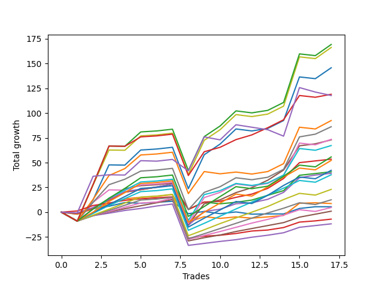

# Long Labrador 017 
- Symbol: ES
- Date Range: 03/18/2022 - 12/30/2022
- Trading Period: 8:30-12:30
- Number of Trades: 17



| Name | Win Percent | Profit | Avg Profit / Trade | Avg Time / Trade |      | Name | Win Percent | Profit | Avg Profit / Trade | Avg Time / Trade |
| ---- | ----------- | ------ | ------------------ | ---------------- | ---- | ---- | ----------- | ------ | ------------------ | ---------------- |
| Sorted By <br> Profit | | | | | | Sorted By <br> Win Percentage ||||
| BB-200 U/L 2SD SL-10 | 64.71 | 89375.00 | 5257.35 | 47:55 |     | TP-1 | 94.12 | -3500.00 | -205.88 | 06:54 |
| V U/L 1SD SL-10 | 64.71 | 87875.00 | 5169.12 | 46:12 |     | BB-50 U/L 1SD | 88.24 | 36500.00 | 2147.06 | 27:39 |
| BB-200 U/L 2SD | 70.59 | 84625.00 | 4977.94 | 53:06 |     | BB-20 U/L 2SD C | 88.24 | 26750.00 | 1573.53 | 15:52 |
| V U/L 1SD | 70.59 | 83125.00 | 4889.71 | 51:24 |     | BB-50 Mid | 88.24 | 19625.00 | 1154.41 | 18:29 |
| NEWFI 06 | 70.59 | 82625.00 | 4860.29 | 52:17 |     | TP-3 | 88.24 | 500.00 | 29.41 | 15:29 |
| BB-100 U/L 2SD SL-10 | 64.71 | 77625.00 | 4566.18 | 45:33 |     | TP-2 | 88.24 | -5875.00 | -345.59 | 12:14 |
| BB-100 U/L 2SD | 70.59 | 72875.00 | 4286.76 | 50:45 |     | V Mid | 82.35 | 43125.00 | 2536.76 | 33:32 |
| NEWFI 000 | 76.47 | 59500.00 | 3500.00 | 40:15 |     | BB-50 U/L 1SD SL-10 | 82.35 | 40125.00 | 2360.29 | 22:54 |
| NEWFI 0000 | 41.18 | 58875.00 | 3463.24 | 26:51 |     | BB-50 Mid SL-10 | 82.35 | 25375.00 | 1492.65 | 14:02 |
| V U/L 1SD SL-5 | 41.18 | 52125.00 | 3066.18 | 23:51 |     | BB-20 U/L 2SD C SL-10 | 82.35 | 23000.00 | 1352.94 | 12:10 |
| BB-200 U/L 2SD SL-5 | 41.18 | 51875.00 | 3051.47 | 25:18 |     | BB-20 U/L 2SD | 82.35 | 20375.00 | 1198.53 | 14:45 |
| BB-200 Mid SL-10 | 64.71 | 51000.00 | 3000.00 | 30:22 |     | TP-7 | 82.35 | 18875.00 | 1110.29 | 28:32 |
| V Mid SL-10 | 76.47 | 47875.00 | 2816.18 | 28:20 |     | TP-6 | 82.35 | 11500.00 | 676.47 | 26:20 |
| BB-200 Mid | 70.59 | 46250.00 | 2720.59 | 35:34 |     | TP-5 | 82.35 | 6250.00 | 367.65 | 23:42 |
| V Mid | 82.35 | 43125.00 | 2536.76 | 33:32 |     | TP-4 | 82.35 | 2375.00 | 139.71 | 20:30 |
| BB-100 U/L 2SD SL-5 | 41.18 | 42000.00 | 2470.59 | 24:20 |     | NEWFI 000 | 76.47 | 59500.00 | 3500.00 | 40:15 |
| BB-50 U/L 2SD SL-10 | 64.71 | 41500.00 | 2441.18 | 34:01 |     | V Mid SL-10 | 76.47 | 47875.00 | 2816.18 | 28:20 |
| BB-50 U/L 1SD SL-10 | 82.35 | 40125.00 | 2360.29 | 22:54 |     | BB-100 Mid | 76.47 | 33625.00 | 1977.94 | 36:11 |
| BB-100 Mid SL-10 | 70.59 | 38375.00 | 2257.35 | 30:59 |     | TP-10 | 76.47 | 27875.00 | 1639.71 | 35:39 |
| BB-50 U/L 2SD | 70.59 | 36750.00 | 2161.76 | 39:12 |     | TP-9 | 76.47 | 26125.00 | 1536.76 | 33:09 |
| BB-50 U/L 1SD | 88.24 | 36500.00 | 2147.06 | 27:39 |     | TP-8 | 76.47 | 21125.00 | 1242.65 | 30:53 |
| BB-100 Mid | 76.47 | 33625.00 | 1977.94 | 36:11 |     | BB-20 U/L 2SD SL-10 | 76.47 | 19250.00 | 1132.35 | 11:54 |
| BB-200 Mid SL-5 | 47.06 | 28750.00 | 1691.18 | 13:35 |     | BB-200 U/L 2SD | 70.59 | 84625.00 | 4977.94 | 53:06 |
| TP-10 | 76.47 | 27875.00 | 1639.71 | 35:39 |     | V U/L 1SD | 70.59 | 83125.00 | 4889.71 | 51:24 |
| BB-20 U/L 2SD C | 88.24 | 26750.00 | 1573.53 | 15:52 |     | NEWFI 06 | 70.59 | 82625.00 | 4860.29 | 52:17 |
| TP-9 | 76.47 | 26125.00 | 1536.76 | 33:09 |     | BB-100 U/L 2SD | 70.59 | 72875.00 | 4286.76 | 50:45 |
| BB-50 Mid SL-10 | 82.35 | 25375.00 | 1492.65 | 14:02 |     | BB-200 Mid | 70.59 | 46250.00 | 2720.59 | 35:34 |
| BB-20 U/L 2SD C SL-10 | 82.35 | 23000.00 | 1352.94 | 12:10 |     | BB-100 Mid SL-10 | 70.59 | 38375.00 | 2257.35 | 30:59 |
| V Mid SL-5 | 47.06 | 23000.00 | 1352.94 | 12:51 |     | BB-50 U/L 2SD | 70.59 | 36750.00 | 2161.76 | 39:12 |
| BB-50 U/L 2SD SL-5 | 41.18 | 22750.00 | 1338.24 | 16:32 |     | BB-20 U/L 1SD | 70.59 | 4375.00 | 257.35 | 11:50 |
| TP-8 | 76.47 | 21125.00 | 1242.65 | 30:53 |     | BB-20 Mid | 70.59 | 2750.00 | 161.76 | 05:50 |
| BB-20 U/L 2SD | 82.35 | 20375.00 | 1198.53 | 14:45 |     | BB-200 U/L 2SD SL-10 | 64.71 | 89375.00 | 5257.35 | 47:55 |
| BB-50 Mid | 88.24 | 19625.00 | 1154.41 | 18:29 |     | V U/L 1SD SL-10 | 64.71 | 87875.00 | 5169.12 | 46:12 |
| BB-100 Mid SL-5 | 47.06 | 19625.00 | 1154.41 | 14:24 |     | BB-100 U/L 2SD SL-10 | 64.71 | 77625.00 | 4566.18 | 45:33 |
| BB-20 U/L 2SD SL-10 | 76.47 | 19250.00 | 1132.35 | 11:54 |     | BB-200 Mid SL-10 | 64.71 | 51000.00 | 3000.00 | 30:22 |
| TP-7 | 82.35 | 18875.00 | 1110.29 | 28:32 |     | BB-50 U/L 2SD SL-10 | 64.71 | 41500.00 | 2441.18 | 34:01 |
| BB-50 U/L 1SD SL-5 | 47.06 | 15875.00 | 933.82 | 12:09 |     | BB-20 U/L 1SD SL-10 | 64.71 | 5875.00 | 345.59 | 09:06 |
| TP-6 | 82.35 | 11500.00 | 676.47 | 26:20 |     | BB-20 Mid SL-10 | 64.71 | -2625.00 | -154.41 | 04:47 |
| TP-5 | 82.35 | 6250.00 | 367.65 | 23:42 |     | BB-20 Mid SL-5 | 58.82 | -4375.00 | -257.35 | 03:01 |
| BB-20 U/L 1SD SL-10 | 64.71 | 5875.00 | 345.59 | 09:06 |     | BB-20 U/L 1SD SL-5 | 52.94 | -2250.00 | -132.35 | 05:19 |
| BB-20 U/L 1SD | 70.59 | 4375.00 | 257.35 | 11:50 |     | BB-200 Mid SL-5 | 47.06 | 28750.00 | 1691.18 | 13:35 |
| BB-50 Mid SL-5 | 47.06 | 3375.00 | 198.53 | 08:09 |     | V Mid SL-5 | 47.06 | 23000.00 | 1352.94 | 12:51 |
| BB-20 Mid | 70.59 | 2750.00 | 161.76 | 05:50 |     | BB-100 Mid SL-5 | 47.06 | 19625.00 | 1154.41 | 14:24 |
| TP-4 | 82.35 | 2375.00 | 139.71 | 20:30 |     | BB-50 U/L 1SD SL-5 | 47.06 | 15875.00 | 933.82 | 12:09 |
| TP-3 | 88.24 | 500.00 | 29.41 | 15:29 |     | BB-50 Mid SL-5 | 47.06 | 3375.00 | 198.53 | 08:09 |
| BB-20 U/L 2SD C SL-5 | 47.06 | 250.00 | 14.71 | 06:22 |     | BB-20 U/L 2SD C SL-5 | 47.06 | 250.00 | 14.71 | 06:22 |
| BB-20 U/L 2SD SL-5 | 47.06 | -1250.00 | -73.53 | 06:15 |     | BB-20 U/L 2SD SL-5 | 47.06 | -1250.00 | -73.53 | 06:15 |
| BB-20 U/L 1SD SL-5 | 52.94 | -2250.00 | -132.35 | 05:19 |     | NEWFI 0000 | 41.18 | 58875.00 | 3463.24 | 26:51 |
| BB-20 Mid SL-10 | 64.71 | -2625.00 | -154.41 | 04:47 |     | V U/L 1SD SL-5 | 41.18 | 52125.00 | 3066.18 | 23:51 |
| TP-1 | 94.12 | -3500.00 | -205.88 | 06:54 |     | BB-200 U/L 2SD SL-5 | 41.18 | 51875.00 | 3051.47 | 25:18 |
| BB-20 Mid SL-5 | 58.82 | -4375.00 | -257.35 | 03:01 |     | BB-100 U/L 2SD SL-5 | 41.18 | 42000.00 | 2470.59 | 24:20 |
| TP-2 | 88.24 | -5875.00 | -345.59 | 12:14 |     | BB-50 U/L 2SD SL-5 | 41.18 | 22750.00 | 1338.24 | 16:32 |

## NO STOPLOSS

### Test BB-20 Mid
* Sell when price hits the middle line of the 20p bollinger
* No Stoploss
* Results:
```
Total Trades: 17
Percent Up: 70.59
Percent Down: 29.41
Total Points Moved Up: 5.50
Potential Profit: 2750.00
Total Points Ups: 25.25 Count Ups: 12
Total Points Downs: -19.75 Count Downs: 5
```

<details><summary>Trades</summary>

<code>In: 2022-03-31 09:17:00		Out: 2022-03-31 09:32:35		Total Position Time: 15:35		Total Move Up: -2.00		Total to Date: -2.00</code> <br />
<code>In: 2022-05-06 12:28:00		Out: 2022-05-06 12:29:10		Total Position Time: 01:10		Total Move Up: 5.50		Total to Date: 3.50</code> <br />
<code>In: 2022-05-13 11:18:00		Out: 2022-05-13 11:19:15		Total Position Time: 01:15		Total Move Up: 2.50		Total to Date: 6.00</code> <br />
<code>In: 2022-06-27 09:37:00		Out: 2022-06-27 09:41:05		Total Position Time: 04:05		Total Move Up: 3.75		Total to Date: 9.75</code> <br />
<code>In: 2022-07-08 10:07:00		Out: 2022-07-08 10:08:10		Total Position Time: 01:10		Total Move Up: -0.75		Total to Date: 9.00</code> <br />
<code>In: 2022-07-11 12:16:00		Out: 2022-07-11 12:22:10		Total Position Time: 06:10		Total Move Up: 1.00		Total to Date: 10.00</code> <br />
<code>In: 2022-07-11 12:26:00		Out: 2022-07-11 12:27:35		Total Position Time: 01:35		Total Move Up: 1.00		Total to Date: 11.00</code> <br />
<code>In: 2022-09-02 09:56:00		Out: 2022-09-02 10:18:10		Total Position Time: 22:10		Total Move Up: -12.50		Total to Date: -1.50</code> <br />
<code>In: 2022-09-08 09:25:00		Out: 2022-09-08 09:26:25		Total Position Time: 01:25		Total Move Up: 2.25		Total to Date: 0.75</code> <br />
<code>In: 2022-09-12 09:08:00		Out: 2022-09-12 09:12:10		Total Position Time: 04:10		Total Move Up: -2.25		Total to Date: -1.50</code> <br />
<code>In: 2022-09-12 09:13:00		Out: 2022-09-12 09:14:10		Total Position Time: 01:10		Total Move Up: 1.75		Total to Date: 0.25</code> <br />
<code>In: 2022-09-14 11:00:00		Out: 2022-09-14 11:15:30		Total Position Time: 15:30		Total Move Up: -2.25		Total to Date: -2.00</code> <br />
<code>In: 2022-09-14 11:07:00		Out: 2022-09-14 11:15:30		Total Position Time: 08:30		Total Move Up: 0.25		Total to Date: -1.75</code> <br />
<code>In: 2022-10-11 12:07:00		Out: 2022-10-11 12:17:25		Total Position Time: 10:25		Total Move Up: 0.00		Total to Date: -1.75</code> <br />
<code>In: 2022-11-08 11:36:00		Out: 2022-11-08 11:37:10		Total Position Time: 01:10		Total Move Up: 5.50		Total to Date: 3.75</code> <br />
<code>In: 2022-12-09 10:15:00		Out: 2022-12-09 10:16:50		Total Position Time: 01:50		Total Move Up: 1.75		Total to Date: 5.50</code> <br />
<code>In: 2022-12-27 11:35:00		Out: 2022-12-27 11:36:55		Total Position Time: 01:55		Total Move Up: 0.00		Total to Date: 5.50</code> <br />


</details>

### Test BB-20 U/L 1SD
* Sell when the price hits the upper line of the 20p 1std bollinger
* No Stoploss
* Results:
```
Total Trades: 17
Percent Up: 70.59
Percent Down: 29.41
Total Points Moved Up: 8.75
Potential Profit: 4375.00
Total Points Ups: 42.25 Count Ups: 12
Total Points Downs: -33.50 Count Downs: 5
```

<details><summary>Trades</summary>

<code>In: 2022-03-31 09:17:00		Out: 2022-03-31 09:41:05		Total Position Time: 24:05		Total Move Up: -2.00		Total to Date: -2.00</code> <br />
<code>In: 2022-05-06 12:28:00		Out: 2022-05-06 12:29:10		Total Position Time: 01:10		Total Move Up: 5.50		Total to Date: 3.50</code> <br />
<code>In: 2022-05-13 11:18:00		Out: 2022-05-13 11:20:05		Total Position Time: 02:05		Total Move Up: 4.50		Total to Date: 8.00</code> <br />
<code>In: 2022-06-27 09:37:00		Out: 2022-06-27 09:44:20		Total Position Time: 07:20		Total Move Up: 5.50		Total to Date: 13.50</code> <br />
<code>In: 2022-07-08 10:07:00		Out: 2022-07-08 10:09:40		Total Position Time: 02:40		Total Move Up: 1.50		Total to Date: 15.00</code> <br />
<code>In: 2022-07-11 12:16:00		Out: 2022-07-11 12:29:20		Total Position Time: 13:20		Total Move Up: 1.00		Total to Date: 16.00</code> <br />
<code>In: 2022-07-11 12:26:00		Out: 2022-07-11 12:29:20		Total Position Time: 03:20		Total Move Up: 1.75		Total to Date: 17.75</code> <br />
<code>In: 2022-09-02 09:56:00		Out: 2022-09-02 10:43:30		Total Position Time: 47:30		Total Move Up: -27.75		Total to Date: -10.00</code> <br />
<code>In: 2022-09-08 09:25:00		Out: 2022-09-08 09:29:00		Total Position Time: 04:00		Total Move Up: 5.50		Total to Date: -4.50</code> <br />
<code>In: 2022-09-12 09:08:00		Out: 2022-09-12 09:21:25		Total Position Time: 13:25		Total Move Up: -1.75		Total to Date: -6.25</code> <br />
<code>In: 2022-09-12 09:13:00		Out: 2022-09-12 09:21:25		Total Position Time: 08:25		Total Move Up: 1.50		Total to Date: -4.75</code> <br />
<code>In: 2022-09-14 11:00:00		Out: 2022-09-14 11:19:10		Total Position Time: 19:10		Total Move Up: -1.25		Total to Date: -6.00</code> <br />
<code>In: 2022-09-14 11:07:00		Out: 2022-09-14 11:19:10		Total Position Time: 12:10		Total Move Up: 1.25		Total to Date: -4.75</code> <br />
<code>In: 2022-10-11 12:07:00		Out: 2022-10-11 12:20:40		Total Position Time: 13:40		Total Move Up: 1.50		Total to Date: -3.25</code> <br />
<code>In: 2022-11-08 11:36:00		Out: 2022-11-08 11:38:35		Total Position Time: 02:35		Total Move Up: 12.25		Total to Date: 9.00</code> <br />
<code>In: 2022-12-09 10:15:00		Out: 2022-12-09 10:30:40		Total Position Time: 15:40		Total Move Up: 0.50		Total to Date: 9.50</code> <br />
<code>In: 2022-12-27 11:35:00		Out: 2022-12-27 11:45:40		Total Position Time: 10:40		Total Move Up: -0.75		Total to Date: 8.75</code> <br />


</details>

### Test BB-20 U/L 2SD
* Sell when the price hits the upper line of the 20p 2std bollinger
* No Stoploss
* Results:
```
Total Trades: 17
Percent Up: 82.35
Percent Down: 17.65
Total Points Moved Up: 40.75
Potential Profit: 20375.00
Total Points Ups: 69.50 Count Ups: 14
Total Points Downs: -28.75 Count Downs: 3
```

<details><summary>Trades</summary>

<code>In: 2022-03-31 09:17:00		Out: 2022-03-31 09:44:20		Total Position Time: 27:20		Total Move Up: -1.25		Total to Date: -1.25</code> <br />
<code>In: 2022-05-06 12:28:00		Out: 2022-05-06 12:29:10		Total Position Time: 01:10		Total Move Up: 5.50		Total to Date: 4.25</code> <br />
<code>In: 2022-05-13 11:18:00		Out: 2022-05-13 11:31:20		Total Position Time: 13:20		Total Move Up: 8.00		Total to Date: 12.25</code> <br />
<code>In: 2022-06-27 09:37:00		Out: 2022-06-27 09:45:05		Total Position Time: 08:05		Total Move Up: 8.00		Total to Date: 20.25</code> <br />
<code>In: 2022-07-08 10:07:00		Out: 2022-07-08 10:11:05		Total Position Time: 04:05		Total Move Up: 2.50		Total to Date: 22.75</code> <br />
<code>In: 2022-07-11 12:16:00		Out: 2022-07-11 12:29:40		Total Position Time: 13:40		Total Move Up: 2.50		Total to Date: 25.25</code> <br />
<code>In: 2022-07-11 12:26:00		Out: 2022-07-11 12:29:40		Total Position Time: 03:40		Total Move Up: 3.25		Total to Date: 28.50</code> <br />
<code>In: 2022-09-02 09:56:00		Out: 2022-09-02 10:43:50		Total Position Time: 47:50		Total Move Up: -25.75		Total to Date: 2.75</code> <br />
<code>In: 2022-09-08 09:25:00		Out: 2022-09-08 09:31:35		Total Position Time: 06:35		Total Move Up: 7.50		Total to Date: 10.25</code> <br />
<code>In: 2022-09-12 09:08:00		Out: 2022-09-12 09:21:25		Total Position Time: 13:25		Total Move Up: -1.75		Total to Date: 8.50</code> <br />
<code>In: 2022-09-12 09:13:00		Out: 2022-09-12 09:21:25		Total Position Time: 08:25		Total Move Up: 1.50		Total to Date: 10.00</code> <br />
<code>In: 2022-09-14 11:00:00		Out: 2022-09-14 11:30:30		Total Position Time: 30:30		Total Move Up: 2.25		Total to Date: 12.25</code> <br />
<code>In: 2022-09-14 11:07:00		Out: 2022-09-14 11:30:30		Total Position Time: 23:30		Total Move Up: 4.75		Total to Date: 17.00</code> <br />
<code>In: 2022-10-11 12:07:00		Out: 2022-10-11 12:22:35		Total Position Time: 15:35		Total Move Up: 4.75		Total to Date: 21.75</code> <br />
<code>In: 2022-11-08 11:36:00		Out: 2022-11-08 11:42:10		Total Position Time: 06:10		Total Move Up: 15.50		Total to Date: 37.25</code> <br />
<code>In: 2022-12-09 10:15:00		Out: 2022-12-09 10:31:15		Total Position Time: 16:15		Total Move Up: 1.75		Total to Date: 39.00</code> <br />
<code>In: 2022-12-27 11:35:00		Out: 2022-12-27 11:46:20		Total Position Time: 11:20		Total Move Up: 1.75		Total to Date: 40.75</code> <br />


</details>

### Test BB-20 U/L 2SD C
* Sell when the price hits the upper line of the 20p 2std bollinger
* No Stoploss
* Results:
```
Total Trades: 17
Percent Up: 88.24
Percent Down: 11.76
Total Points Moved Up: 53.50
Potential Profit: 26750.00
Total Points Ups: 80.50 Count Ups: 15
Total Points Downs: -27.00 Count Downs: 2
```

<details><summary>Trades</summary>

<code>In: 2022-03-31 09:17:00		Out: 2022-03-31 09:44:20		Total Position Time: 27:20		Total Move Up: -1.25		Total to Date: -1.25</code> <br />
<code>In: 2022-05-06 12:28:00		Out: 2022-05-06 12:29:10		Total Position Time: 01:10		Total Move Up: 5.50		Total to Date: 4.25</code> <br />
<code>In: 2022-05-13 11:18:00		Out: 2022-05-13 11:31:20		Total Position Time: 13:20		Total Move Up: 8.00		Total to Date: 12.25</code> <br />
<code>In: 2022-06-27 09:37:00		Out: 2022-06-27 09:45:05		Total Position Time: 08:05		Total Move Up: 8.00		Total to Date: 20.25</code> <br />
<code>In: 2022-07-08 10:07:00		Out: 2022-07-08 10:11:05		Total Position Time: 04:05		Total Move Up: 2.50		Total to Date: 22.75</code> <br />
<code>In: 2022-07-11 12:16:00		Out: 2022-07-11 12:29:40		Total Position Time: 13:40		Total Move Up: 2.50		Total to Date: 25.25</code> <br />
<code>In: 2022-07-11 12:26:00		Out: 2022-07-11 12:29:40		Total Position Time: 03:40		Total Move Up: 3.25		Total to Date: 28.50</code> <br />
<code>In: 2022-09-02 09:56:00		Out: 2022-09-02 10:43:50		Total Position Time: 47:50		Total Move Up: -25.75		Total to Date: 2.75</code> <br />
<code>In: 2022-09-08 09:25:00		Out: 2022-09-08 09:31:35		Total Position Time: 06:35		Total Move Up: 7.50		Total to Date: 10.25</code> <br />
<code>In: 2022-09-12 09:08:00		Out: 2022-09-12 09:23:10		Total Position Time: 15:10		Total Move Up: 0.75		Total to Date: 11.00</code> <br />
<code>In: 2022-09-12 09:13:00		Out: 2022-09-12 09:23:10		Total Position Time: 10:10		Total Move Up: 4.00		Total to Date: 15.00</code> <br />
<code>In: 2022-09-14 11:00:00		Out: 2022-09-14 11:30:55		Total Position Time: 30:55		Total Move Up: 3.25		Total to Date: 18.25</code> <br />
<code>In: 2022-09-14 11:07:00		Out: 2022-09-14 11:30:55		Total Position Time: 23:55		Total Move Up: 5.75		Total to Date: 24.00</code> <br />
<code>In: 2022-10-11 12:07:00		Out: 2022-10-11 12:37:00		Total Position Time: 30:00		Total Move Up: 10.00		Total to Date: 34.00</code> <br />
<code>In: 2022-11-08 11:36:00		Out: 2022-11-08 11:42:15		Total Position Time: 06:15		Total Move Up: 16.00		Total to Date: 50.00</code> <br />
<code>In: 2022-12-09 10:15:00		Out: 2022-12-09 10:31:20		Total Position Time: 16:20		Total Move Up: 1.75		Total to Date: 51.75</code> <br />
<code>In: 2022-12-27 11:35:00		Out: 2022-12-27 11:46:20		Total Position Time: 11:20		Total Move Up: 1.75		Total to Date: 53.50</code> <br />


</details>

### Test BB-50 Mid
* Sell when price hits the middle line of the 50p bollinger
* No Stoploss
* Results:
```
Total Trades: 17
Percent Up: 88.24
Percent Down: 11.76
Total Points Moved Up: 39.25
Potential Profit: 19625.00
Total Points Ups: 81.75 Count Ups: 15
Total Points Downs: -42.50 Count Downs: 2
```

<details><summary>Trades</summary>

<code>In: 2022-03-31 09:17:00		Out: 2022-03-31 09:45:45		Total Position Time: 28:45		Total Move Up: -0.75		Total to Date: -0.75</code> <br />
<code>In: 2022-05-06 12:28:00		Out: 2022-05-06 12:29:10		Total Position Time: 01:10		Total Move Up: 5.50		Total to Date: 4.75</code> <br />
<code>In: 2022-05-13 11:18:00		Out: 2022-05-13 11:31:20		Total Position Time: 13:20		Total Move Up: 8.00		Total to Date: 12.75</code> <br />
<code>In: 2022-06-27 09:37:00		Out: 2022-06-27 09:45:05		Total Position Time: 08:05		Total Move Up: 8.00		Total to Date: 20.75</code> <br />
<code>In: 2022-07-08 10:07:00		Out: 2022-07-08 10:11:10		Total Position Time: 04:10		Total Move Up: 2.50		Total to Date: 23.25</code> <br />
<code>In: 2022-07-11 12:16:00		Out: 2022-07-11 12:40:35		Total Position Time: 24:35		Total Move Up: 2.25		Total to Date: 25.50</code> <br />
<code>In: 2022-07-11 12:26:00		Out: 2022-07-11 12:40:35		Total Position Time: 14:35		Total Move Up: 3.00		Total to Date: 28.50</code> <br />
<code>In: 2022-09-02 09:56:00		Out: 2022-09-02 10:56:55		Total Position Time: 60:55		Total Move Up: -41.75		Total to Date: -13.25</code> <br />
<code>In: 2022-09-08 09:25:00		Out: 2022-09-08 09:39:40		Total Position Time: 14:40		Total Move Up: 14.00		Total to Date: 0.75</code> <br />
<code>In: 2022-09-12 09:08:00		Out: 2022-09-12 09:24:10		Total Position Time: 16:10		Total Move Up: 2.25		Total to Date: 3.00</code> <br />
<code>In: 2022-09-12 09:13:00		Out: 2022-09-12 09:24:10		Total Position Time: 11:10		Total Move Up: 5.50		Total to Date: 8.50</code> <br />
<code>In: 2022-09-14 11:00:00		Out: 2022-09-14 11:29:30		Total Position Time: 29:30		Total Move Up: 1.00		Total to Date: 9.50</code> <br />
<code>In: 2022-09-14 11:07:00		Out: 2022-09-14 11:29:30		Total Position Time: 22:30		Total Move Up: 3.50		Total to Date: 13.00</code> <br />
<code>In: 2022-10-11 12:07:00		Out: 2022-10-11 12:36:35		Total Position Time: 29:35		Total Move Up: 7.00		Total to Date: 20.00</code> <br />
<code>In: 2022-11-08 11:36:00		Out: 2022-11-08 11:41:40		Total Position Time: 05:40		Total Move Up: 14.75		Total to Date: 34.75</code> <br />
<code>In: 2022-12-09 10:15:00		Out: 2022-12-09 10:33:05		Total Position Time: 18:05		Total Move Up: 2.75		Total to Date: 37.50</code> <br />
<code>In: 2022-12-27 11:35:00		Out: 2022-12-27 11:46:20		Total Position Time: 11:20		Total Move Up: 1.75		Total to Date: 39.25</code> <br />


</details>

### Test BB-50 U/L 1SD
* Sell when the price hits the upper line of the 50p 1std bollinger
* No Stoploss
* Results:
```
Total Trades: 17
Percent Up: 88.24
Percent Down: 11.76
Total Points Moved Up: 73.00
Potential Profit: 36500.00
Total Points Ups: 123.75 Count Ups: 15
Total Points Downs: -50.75 Count Downs: 2
```

<details><summary>Trades</summary>

<code>In: 2022-03-31 09:17:00		Out: 2022-03-31 10:17:55		Total Position Time: 60:55		Total Move Up: -9.00		Total to Date: -9.00</code> <br />
<code>In: 2022-05-06 12:28:00		Out: 2022-05-06 12:30:30		Total Position Time: 02:30		Total Move Up: 12.25		Total to Date: 3.25</code> <br />
<code>In: 2022-05-13 11:18:00		Out: 2022-05-13 11:43:05		Total Position Time: 25:05		Total Move Up: 10.50		Total to Date: 13.75</code> <br />
<code>In: 2022-06-27 09:37:00		Out: 2022-06-27 09:53:20		Total Position Time: 16:20		Total Move Up: 10.00		Total to Date: 23.75</code> <br />
<code>In: 2022-07-08 10:07:00		Out: 2022-07-08 10:26:30		Total Position Time: 19:30		Total Move Up: 3.00		Total to Date: 26.75</code> <br />
<code>In: 2022-07-11 12:16:00		Out: 2022-07-11 12:47:00		Total Position Time: 31:00		Total Move Up: 1.00		Total to Date: 27.75</code> <br />
<code>In: 2022-07-11 12:26:00		Out: 2022-07-11 12:47:00		Total Position Time: 21:00		Total Move Up: 1.75		Total to Date: 29.50</code> <br />
<code>In: 2022-09-02 09:56:00		Out: 2022-09-02 10:56:55		Total Position Time: 60:55		Total Move Up: -41.75		Total to Date: -12.25</code> <br />
<code>In: 2022-09-08 09:25:00		Out: 2022-09-08 09:49:55		Total Position Time: 24:55		Total Move Up: 20.75		Total to Date: 8.50</code> <br />
<code>In: 2022-09-12 09:08:00		Out: 2022-09-12 09:37:50		Total Position Time: 29:50		Total Move Up: 4.00		Total to Date: 12.50</code> <br />
<code>In: 2022-09-12 09:13:00		Out: 2022-09-12 09:37:50		Total Position Time: 24:50		Total Move Up: 7.25		Total to Date: 19.75</code> <br />
<code>In: 2022-09-14 11:00:00		Out: 2022-09-14 11:32:05		Total Position Time: 32:05		Total Move Up: 5.00		Total to Date: 24.75</code> <br />
<code>In: 2022-09-14 11:07:00		Out: 2022-09-14 11:32:05		Total Position Time: 25:05		Total Move Up: 7.50		Total to Date: 32.25</code> <br />
<code>In: 2022-10-11 12:07:00		Out: 2022-10-11 12:39:25		Total Position Time: 32:25		Total Move Up: 10.25		Total to Date: 42.50</code> <br />
<code>In: 2022-11-08 11:36:00		Out: 2022-11-08 11:47:55		Total Position Time: 11:55		Total Move Up: 24.50		Total to Date: 67.00</code> <br />
<code>In: 2022-12-09 10:15:00		Out: 2022-12-09 10:50:45		Total Position Time: 35:45		Total Move Up: 2.00		Total to Date: 69.00</code> <br />
<code>In: 2022-12-27 11:35:00		Out: 2022-12-27 11:51:05		Total Position Time: 16:05		Total Move Up: 4.00		Total to Date: 73.00</code> <br />


</details>

### Test BB-50 U/L 2SD
* Sell when the price hits the upper line of the 50p 2std bollinger
* No Stoploss
* Results:
```
Total Trades: 17
Percent Up: 70.59
Percent Down: 29.41
Total Points Moved Up: 73.50
Potential Profit: 36750.00
Total Points Ups: 128.25 Count Ups: 12
Total Points Downs: -54.75 Count Downs: 5
```

<details><summary>Trades</summary>

<code>In: 2022-03-31 09:17:00		Out: 2022-03-31 10:17:55		Total Position Time: 60:55		Total Move Up: -9.00		Total to Date: -9.00</code> <br />
<code>In: 2022-05-06 12:28:00		Out: 2022-05-06 12:35:40		Total Position Time: 07:40		Total Move Up: 19.00		Total to Date: 10.00</code> <br />
<code>In: 2022-05-13 11:18:00		Out: 2022-05-13 11:51:10		Total Position Time: 33:10		Total Move Up: 12.50		Total to Date: 22.50</code> <br />
<code>In: 2022-06-27 09:37:00		Out: 2022-06-27 10:37:55		Total Position Time: 60:55		Total Move Up: -0.25		Total to Date: 22.25</code> <br />
<code>In: 2022-07-08 10:07:00		Out: 2022-07-08 10:27:00		Total Position Time: 20:00		Total Move Up: 5.25		Total to Date: 27.50</code> <br />
<code>In: 2022-07-11 12:16:00		Out: 2022-07-11 12:47:00		Total Position Time: 31:00		Total Move Up: 1.00		Total to Date: 28.50</code> <br />
<code>In: 2022-07-11 12:26:00		Out: 2022-07-11 12:47:00		Total Position Time: 21:00		Total Move Up: 1.75		Total to Date: 30.25</code> <br />
<code>In: 2022-09-02 09:56:00		Out: 2022-09-02 10:56:55		Total Position Time: 60:55		Total Move Up: -41.75		Total to Date: -11.50</code> <br />
<code>In: 2022-09-08 09:25:00		Out: 2022-09-08 09:53:05		Total Position Time: 28:05		Total Move Up: 26.25		Total to Date: 14.75</code> <br />
<code>In: 2022-09-12 09:08:00		Out: 2022-09-12 09:44:15		Total Position Time: 36:15		Total Move Up: 5.25		Total to Date: 20.00</code> <br />
<code>In: 2022-09-12 09:13:00		Out: 2022-09-12 09:44:15		Total Position Time: 31:15		Total Move Up: 8.50		Total to Date: 28.50</code> <br />
<code>In: 2022-09-14 11:00:00		Out: 2022-09-14 12:00:55		Total Position Time: 60:55		Total Move Up: -2.00		Total to Date: 26.50</code> <br />
<code>In: 2022-09-14 11:07:00		Out: 2022-09-14 12:07:55		Total Position Time: 60:55		Total Move Up: 2.50		Total to Date: 29.00</code> <br />
<code>In: 2022-10-11 12:07:00		Out: 2022-10-11 12:47:00		Total Position Time: 40:00		Total Move Up: 8.00		Total to Date: 37.00</code> <br />
<code>In: 2022-11-08 11:36:00		Out: 2022-11-08 12:02:35		Total Position Time: 26:35		Total Move Up: 32.75		Total to Date: 69.75</code> <br />
<code>In: 2022-12-09 10:15:00		Out: 2022-12-09 11:15:55		Total Position Time: 60:55		Total Move Up: -1.75		Total to Date: 68.00</code> <br />
<code>In: 2022-12-27 11:35:00		Out: 2022-12-27 12:01:10		Total Position Time: 26:10		Total Move Up: 5.50		Total to Date: 73.50</code> <br />


</details>

### Test V Mid
* Sell when the price hits the middle line of the 1std VWAP
* No Stoploss
* Results:
```
Total Trades: 17
Percent Up: 82.35
Percent Down: 17.65
Total Points Moved Up: 86.25
Potential Profit: 43125.00
Total Points Ups: 139.00 Count Ups: 14
Total Points Downs: -52.75 Count Downs: 3
```

<details><summary>Trades</summary>

<code>In: 2022-03-31 09:17:00		Out: 2022-03-31 10:17:55		Total Position Time: 60:55		Total Move Up: -9.00		Total to Date: -9.00</code> <br />
<code>In: 2022-05-06 12:28:00		Out: 2022-05-06 12:35:40		Total Position Time: 07:40		Total Move Up: 19.00		Total to Date: 10.00</code> <br />
<code>In: 2022-05-13 11:18:00		Out: 2022-05-13 11:52:25		Total Position Time: 34:25		Total Move Up: 17.75		Total to Date: 27.75</code> <br />
<code>In: 2022-06-27 09:37:00		Out: 2022-06-27 09:44:20		Total Position Time: 07:20		Total Move Up: 5.50		Total to Date: 33.25</code> <br />
<code>In: 2022-07-08 10:07:00		Out: 2022-07-08 10:29:10		Total Position Time: 22:10		Total Move Up: 8.25		Total to Date: 41.50</code> <br />
<code>In: 2022-07-11 12:16:00		Out: 2022-07-11 12:47:00		Total Position Time: 31:00		Total Move Up: 1.00		Total to Date: 42.50</code> <br />
<code>In: 2022-07-11 12:26:00		Out: 2022-07-11 12:47:00		Total Position Time: 21:00		Total Move Up: 1.75		Total to Date: 44.25</code> <br />
<code>In: 2022-09-02 09:56:00		Out: 2022-09-02 10:56:55		Total Position Time: 60:55		Total Move Up: -41.75		Total to Date: 2.50</code> <br />
<code>In: 2022-09-08 09:25:00		Out: 2022-09-08 09:41:45		Total Position Time: 16:45		Total Move Up: 17.50		Total to Date: 20.00</code> <br />
<code>In: 2022-09-12 09:08:00		Out: 2022-09-12 09:44:25		Total Position Time: 36:25		Total Move Up: 5.75		Total to Date: 25.75</code> <br />
<code>In: 2022-09-12 09:13:00		Out: 2022-09-12 09:44:25		Total Position Time: 31:25		Total Move Up: 9.00		Total to Date: 34.75</code> <br />
<code>In: 2022-09-14 11:00:00		Out: 2022-09-14 12:00:55		Total Position Time: 60:55		Total Move Up: -2.00		Total to Date: 32.75</code> <br />
<code>In: 2022-09-14 11:07:00		Out: 2022-09-14 12:07:55		Total Position Time: 60:55		Total Move Up: 2.50		Total to Date: 35.25</code> <br />
<code>In: 2022-10-11 12:07:00		Out: 2022-10-11 12:47:00		Total Position Time: 40:00		Total Move Up: 8.00		Total to Date: 43.25</code> <br />
<code>In: 2022-11-08 11:36:00		Out: 2022-11-08 12:02:35		Total Position Time: 26:35		Total Move Up: 32.75		Total to Date: 76.00</code> <br />
<code>In: 2022-12-09 10:15:00		Out: 2022-12-09 10:33:05		Total Position Time: 18:05		Total Move Up: 2.75		Total to Date: 78.75</code> <br />
<code>In: 2022-12-27 11:35:00		Out: 2022-12-27 12:08:40		Total Position Time: 33:40		Total Move Up: 7.50		Total to Date: 86.25</code> <br />


</details>

### Test V U/L 1SD
* Sell when the price hits the upper line of the 1std VWAP
* No Stoploss
* Results:
```
Total Trades: 17
Percent Up: 70.59
Percent Down: 29.41
Total Points Moved Up: 166.25
Potential Profit: 83125.00
Total Points Ups: 221.00 Count Ups: 12
Total Points Downs: -54.75 Count Downs: 5
```

<details><summary>Trades</summary>

<code>In: 2022-03-31 09:17:00		Out: 2022-03-31 10:17:55		Total Position Time: 60:55		Total Move Up: -9.00		Total to Date: -9.00</code> <br />
<code>In: 2022-05-06 12:28:00		Out: 2022-05-06 12:40:00		Total Position Time: 12:00		Total Move Up: 36.50		Total to Date: 27.50</code> <br />
<code>In: 2022-05-13 11:18:00		Out: 2022-05-13 12:14:40		Total Position Time: 56:40		Total Move Up: 35.25		Total to Date: 62.75</code> <br />
<code>In: 2022-06-27 09:37:00		Out: 2022-06-27 10:37:55		Total Position Time: 60:55		Total Move Up: -0.25		Total to Date: 62.50</code> <br />
<code>In: 2022-07-08 10:07:00		Out: 2022-07-08 11:07:55		Total Position Time: 60:55		Total Move Up: 14.50		Total to Date: 77.00</code> <br />
<code>In: 2022-07-11 12:16:00		Out: 2022-07-11 12:47:00		Total Position Time: 31:00		Total Move Up: 1.00		Total to Date: 78.00</code> <br />
<code>In: 2022-07-11 12:26:00		Out: 2022-07-11 12:47:00		Total Position Time: 21:00		Total Move Up: 1.75		Total to Date: 79.75</code> <br />
<code>In: 2022-09-02 09:56:00		Out: 2022-09-02 10:56:55		Total Position Time: 60:55		Total Move Up: -41.75		Total to Date: 38.00</code> <br />
<code>In: 2022-09-08 09:25:00		Out: 2022-09-08 10:13:25		Total Position Time: 48:25		Total Move Up: 34.50		Total to Date: 72.50</code> <br />
<code>In: 2022-09-12 09:08:00		Out: 2022-09-12 10:08:55		Total Position Time: 60:55		Total Move Up: 10.75		Total to Date: 83.25</code> <br />
<code>In: 2022-09-12 09:13:00		Out: 2022-09-12 10:13:55		Total Position Time: 60:55		Total Move Up: 15.25		Total to Date: 98.50</code> <br />
<code>In: 2022-09-14 11:00:00		Out: 2022-09-14 12:00:55		Total Position Time: 60:55		Total Move Up: -2.00		Total to Date: 96.50</code> <br />
<code>In: 2022-09-14 11:07:00		Out: 2022-09-14 12:07:55		Total Position Time: 60:55		Total Move Up: 2.50		Total to Date: 99.00</code> <br />
<code>In: 2022-10-11 12:07:00		Out: 2022-10-11 12:47:00		Total Position Time: 40:00		Total Move Up: 8.00		Total to Date: 107.00</code> <br />
<code>In: 2022-11-08 11:36:00		Out: 2022-11-08 12:31:45		Total Position Time: 55:45		Total Move Up: 49.75		Total to Date: 156.75</code> <br />
<code>In: 2022-12-09 10:15:00		Out: 2022-12-09 11:15:55		Total Position Time: 60:55		Total Move Up: -1.75		Total to Date: 155.00</code> <br />
<code>In: 2022-12-27 11:35:00		Out: 2022-12-27 12:35:55		Total Position Time: 60:55		Total Move Up: 11.25		Total to Date: 166.25</code> <br />


</details>

### Test BB-100 Mid
* Move to BB100 Mid
* No Stoploss
* Results:
```
Total Trades: 17
Percent Up: 76.47
Percent Down: 23.53
Total Points Moved Up: 67.25
Potential Profit: 33625.00
Total Points Ups: 121.75 Count Ups: 13
Total Points Downs: -54.50 Count Downs: 4
```

<details><summary>Trades</summary>

<code>In: 2022-03-31 09:17:00		Out: 2022-03-31 10:17:55		Total Position Time: 60:55		Total Move Up: -9.00		Total to Date: -9.00</code> <br />
<code>In: 2022-05-06 12:28:00		Out: 2022-05-06 12:30:20		Total Position Time: 02:20		Total Move Up: 8.75		Total to Date: -0.25</code> <br />
<code>In: 2022-05-13 11:18:00		Out: 2022-05-13 11:51:35		Total Position Time: 33:35		Total Move Up: 14.50		Total to Date: 14.25</code> <br />
<code>In: 2022-06-27 09:37:00		Out: 2022-06-27 10:20:05		Total Position Time: 43:05		Total Move Up: 8.00		Total to Date: 22.25</code> <br />
<code>In: 2022-07-08 10:07:00		Out: 2022-07-08 10:29:10		Total Position Time: 22:10		Total Move Up: 8.25		Total to Date: 30.50</code> <br />
<code>In: 2022-07-11 12:16:00		Out: 2022-07-11 12:47:00		Total Position Time: 31:00		Total Move Up: 1.00		Total to Date: 31.50</code> <br />
<code>In: 2022-07-11 12:26:00		Out: 2022-07-11 12:47:00		Total Position Time: 21:00		Total Move Up: 1.75		Total to Date: 33.25</code> <br />
<code>In: 2022-09-02 09:56:00		Out: 2022-09-02 10:56:55		Total Position Time: 60:55		Total Move Up: -41.75		Total to Date: -8.50</code> <br />
<code>In: 2022-09-08 09:25:00		Out: 2022-09-08 09:53:05		Total Position Time: 28:05		Total Move Up: 26.25		Total to Date: 17.75</code> <br />
<code>In: 2022-09-12 09:08:00		Out: 2022-09-12 09:37:50		Total Position Time: 29:50		Total Move Up: 4.00		Total to Date: 21.75</code> <br />
<code>In: 2022-09-12 09:13:00		Out: 2022-09-12 09:37:50		Total Position Time: 24:50		Total Move Up: 7.25		Total to Date: 29.00</code> <br />
<code>In: 2022-09-14 11:00:00		Out: 2022-09-14 12:00:55		Total Position Time: 60:55		Total Move Up: -2.00		Total to Date: 27.00</code> <br />
<code>In: 2022-09-14 11:07:00		Out: 2022-09-14 12:07:55		Total Position Time: 60:55		Total Move Up: 2.50		Total to Date: 29.50</code> <br />
<code>In: 2022-10-11 12:07:00		Out: 2022-10-11 12:47:00		Total Position Time: 40:00		Total Move Up: 8.00		Total to Date: 37.50</code> <br />
<code>In: 2022-11-08 11:36:00		Out: 2022-11-08 11:53:50		Total Position Time: 17:50		Total Move Up: 26.75		Total to Date: 64.25</code> <br />
<code>In: 2022-12-09 10:15:00		Out: 2022-12-09 11:15:55		Total Position Time: 60:55		Total Move Up: -1.75		Total to Date: 62.50</code> <br />
<code>In: 2022-12-27 11:35:00		Out: 2022-12-27 11:51:50		Total Position Time: 16:50		Total Move Up: 4.75		Total to Date: 67.25</code> <br />


</details>

### Test BB-100 U/L 2SD
* Move to BB100 Upper Band
* No Stoploss
* Results:
```
Total Trades: 17
Percent Up: 70.59
Percent Down: 29.41
Total Points Moved Up: 145.75
Potential Profit: 72875.00
Total Points Ups: 200.50 Count Ups: 12
Total Points Downs: -54.75 Count Downs: 5
```

<details><summary>Trades</summary>

<code>In: 2022-03-31 09:17:00		Out: 2022-03-31 10:17:55		Total Position Time: 60:55		Total Move Up: -9.00		Total to Date: -9.00</code> <br />
<code>In: 2022-05-06 12:28:00		Out: 2022-05-06 12:37:10		Total Position Time: 09:10		Total Move Up: 21.50		Total to Date: 12.50</code> <br />
<code>In: 2022-05-13 11:18:00		Out: 2022-05-13 12:14:40		Total Position Time: 56:40		Total Move Up: 35.25		Total to Date: 47.75</code> <br />
<code>In: 2022-06-27 09:37:00		Out: 2022-06-27 10:37:55		Total Position Time: 60:55		Total Move Up: -0.25		Total to Date: 47.50</code> <br />
<code>In: 2022-07-08 10:07:00		Out: 2022-07-08 11:07:40		Total Position Time: 60:40		Total Move Up: 15.25		Total to Date: 62.75</code> <br />
<code>In: 2022-07-11 12:16:00		Out: 2022-07-11 12:47:00		Total Position Time: 31:00		Total Move Up: 1.00		Total to Date: 63.75</code> <br />
<code>In: 2022-07-11 12:26:00		Out: 2022-07-11 12:47:00		Total Position Time: 21:00		Total Move Up: 1.75		Total to Date: 65.50</code> <br />
<code>In: 2022-09-02 09:56:00		Out: 2022-09-02 10:56:55		Total Position Time: 60:55		Total Move Up: -41.75		Total to Date: 23.75</code> <br />
<code>In: 2022-09-08 09:25:00		Out: 2022-09-08 10:25:55		Total Position Time: 60:55		Total Move Up: 34.25		Total to Date: 58.00</code> <br />
<code>In: 2022-09-12 09:08:00		Out: 2022-09-12 10:08:55		Total Position Time: 60:55		Total Move Up: 10.75		Total to Date: 68.75</code> <br />
<code>In: 2022-09-12 09:13:00		Out: 2022-09-12 10:13:55		Total Position Time: 60:55		Total Move Up: 15.25		Total to Date: 84.00</code> <br />
<code>In: 2022-09-14 11:00:00		Out: 2022-09-14 12:00:55		Total Position Time: 60:55		Total Move Up: -2.00		Total to Date: 82.00</code> <br />
<code>In: 2022-09-14 11:07:00		Out: 2022-09-14 12:07:55		Total Position Time: 60:55		Total Move Up: 2.50		Total to Date: 84.50</code> <br />
<code>In: 2022-10-11 12:07:00		Out: 2022-10-11 12:47:00		Total Position Time: 40:00		Total Move Up: 8.00		Total to Date: 92.50</code> <br />
<code>In: 2022-11-08 11:36:00		Out: 2022-11-08 12:30:25		Total Position Time: 54:25		Total Move Up: 44.00		Total to Date: 136.50</code> <br />
<code>In: 2022-12-09 10:15:00		Out: 2022-12-09 11:15:55		Total Position Time: 60:55		Total Move Up: -1.75		Total to Date: 134.75</code> <br />
<code>In: 2022-12-27 11:35:00		Out: 2022-12-27 12:16:35		Total Position Time: 41:35		Total Move Up: 11.00		Total to Date: 145.75</code> <br />


</details>

### Test BB-200 Mid
* Move to BB200 Mid
* No Stoploss
* Results:
```
Total Trades: 17
Percent Up: 70.59
Percent Down: 29.41
Total Points Moved Up: 92.50
Potential Profit: 46250.00
Total Points Ups: 149.25 Count Ups: 12
Total Points Downs: -56.75 Count Downs: 5
```

<details><summary>Trades</summary>

<code>In: 2022-03-31 09:17:00		Out: 2022-03-31 10:17:55		Total Position Time: 60:55		Total Move Up: -9.00		Total to Date: -9.00</code> <br />
<code>In: 2022-05-06 12:28:00		Out: 2022-05-06 12:37:15		Total Position Time: 09:15		Total Move Up: 22.00		Total to Date: 13.00</code> <br />
<code>In: 2022-05-13 11:18:00		Out: 2022-05-13 12:00:05		Total Position Time: 42:05		Total Move Up: 24.00		Total to Date: 37.00</code> <br />
<code>In: 2022-06-27 09:37:00		Out: 2022-06-27 09:45:00		Total Position Time: 08:00		Total Move Up: 7.00		Total to Date: 44.00</code> <br />
<code>In: 2022-07-08 10:07:00		Out: 2022-07-08 10:49:25		Total Position Time: 42:25		Total Move Up: 13.75		Total to Date: 57.75</code> <br />
<code>In: 2022-07-11 12:16:00		Out: 2022-07-11 12:47:00		Total Position Time: 31:00		Total Move Up: 1.00		Total to Date: 58.75</code> <br />
<code>In: 2022-07-11 12:26:00		Out: 2022-07-11 12:47:00		Total Position Time: 21:00		Total Move Up: 1.75		Total to Date: 60.50</code> <br />
<code>In: 2022-09-02 09:56:00		Out: 2022-09-02 10:56:55		Total Position Time: 60:55		Total Move Up: -41.75		Total to Date: 18.75</code> <br />
<code>In: 2022-09-08 09:25:00		Out: 2022-09-08 09:44:25		Total Position Time: 19:25		Total Move Up: 22.25		Total to Date: 41.00</code> <br />
<code>In: 2022-09-12 09:08:00		Out: 2022-09-12 09:12:10		Total Position Time: 04:10		Total Move Up: -2.25		Total to Date: 38.75</code> <br />
<code>In: 2022-09-12 09:13:00		Out: 2022-09-12 09:14:15		Total Position Time: 01:15		Total Move Up: 1.75		Total to Date: 40.50</code> <br />
<code>In: 2022-09-14 11:00:00		Out: 2022-09-14 12:00:55		Total Position Time: 60:55		Total Move Up: -2.00		Total to Date: 38.50</code> <br />
<code>In: 2022-09-14 11:07:00		Out: 2022-09-14 12:07:55		Total Position Time: 60:55		Total Move Up: 2.50		Total to Date: 41.00</code> <br />
<code>In: 2022-10-11 12:07:00		Out: 2022-10-11 12:47:00		Total Position Time: 40:00		Total Move Up: 8.00		Total to Date: 49.00</code> <br />
<code>In: 2022-11-08 11:36:00		Out: 2022-11-08 12:20:05		Total Position Time: 44:05		Total Move Up: 36.75		Total to Date: 85.75</code> <br />
<code>In: 2022-12-09 10:15:00		Out: 2022-12-09 11:15:55		Total Position Time: 60:55		Total Move Up: -1.75		Total to Date: 84.00</code> <br />
<code>In: 2022-12-27 11:35:00		Out: 2022-12-27 12:12:25		Total Position Time: 37:25		Total Move Up: 8.50		Total to Date: 92.50</code> <br />


</details>

### Test BB-200 U/L 2SD
* Move to BB200 Upper Band
* No Stoploss
* Results:
```
Total Trades: 17
Percent Up: 70.59
Percent Down: 29.41
Total Points Moved Up: 169.25
Potential Profit: 84625.00
Total Points Ups: 224.00 Count Ups: 12
Total Points Downs: -54.75 Count Downs: 5
```

<details><summary>Trades</summary>

<code>In: 2022-03-31 09:17:00		Out: 2022-03-31 10:17:55		Total Position Time: 60:55		Total Move Up: -9.00		Total to Date: -9.00</code> <br />
<code>In: 2022-05-06 12:28:00		Out: 2022-05-06 12:47:00		Total Position Time: 19:00		Total Move Up: 37.00		Total to Date: 28.00</code> <br />
<code>In: 2022-05-13 11:18:00		Out: 2022-05-13 12:18:55		Total Position Time: 60:55		Total Move Up: 38.75		Total to Date: 66.75</code> <br />
<code>In: 2022-06-27 09:37:00		Out: 2022-06-27 10:37:55		Total Position Time: 60:55		Total Move Up: -0.25		Total to Date: 66.50</code> <br />
<code>In: 2022-07-08 10:07:00		Out: 2022-07-08 11:07:55		Total Position Time: 60:55		Total Move Up: 14.50		Total to Date: 81.00</code> <br />
<code>In: 2022-07-11 12:16:00		Out: 2022-07-11 12:47:00		Total Position Time: 31:00		Total Move Up: 1.00		Total to Date: 82.00</code> <br />
<code>In: 2022-07-11 12:26:00		Out: 2022-07-11 12:47:00		Total Position Time: 21:00		Total Move Up: 1.75		Total to Date: 83.75</code> <br />
<code>In: 2022-09-02 09:56:00		Out: 2022-09-02 10:56:55		Total Position Time: 60:55		Total Move Up: -41.75		Total to Date: 42.00</code> <br />
<code>In: 2022-09-08 09:25:00		Out: 2022-09-08 10:25:55		Total Position Time: 60:55		Total Move Up: 34.25		Total to Date: 76.25</code> <br />
<code>In: 2022-09-12 09:08:00		Out: 2022-09-12 10:08:55		Total Position Time: 60:55		Total Move Up: 10.75		Total to Date: 87.00</code> <br />
<code>In: 2022-09-12 09:13:00		Out: 2022-09-12 10:13:55		Total Position Time: 60:55		Total Move Up: 15.25		Total to Date: 102.25</code> <br />
<code>In: 2022-09-14 11:00:00		Out: 2022-09-14 12:00:55		Total Position Time: 60:55		Total Move Up: -2.00		Total to Date: 100.25</code> <br />
<code>In: 2022-09-14 11:07:00		Out: 2022-09-14 12:07:55		Total Position Time: 60:55		Total Move Up: 2.50		Total to Date: 102.75</code> <br />
<code>In: 2022-10-11 12:07:00		Out: 2022-10-11 12:47:00		Total Position Time: 40:00		Total Move Up: 8.00		Total to Date: 110.75</code> <br />
<code>In: 2022-11-08 11:36:00		Out: 2022-11-08 12:36:55		Total Position Time: 60:55		Total Move Up: 49.00		Total to Date: 159.75</code> <br />
<code>In: 2022-12-09 10:15:00		Out: 2022-12-09 11:15:55		Total Position Time: 60:55		Total Move Up: -1.75		Total to Date: 158.00</code> <br />
<code>In: 2022-12-27 11:35:00		Out: 2022-12-27 12:35:55		Total Position Time: 60:55		Total Move Up: 11.25		Total to Date: 169.25</code> <br />


</details>

## STOPLOSS OF 5

### Test BB-20 Mid SL-5
* Sell when price hits the middle line of the 20p bollinger
* Stoploss is 5 points
* Results:
```
Total Trades: 17
Percent Up: 58.82
Percent Down: 41.18
Total Points Moved Up: -8.75
Potential Profit: -4375.00
Total Points Ups: 25.00 Count Ups: 10
Total Points Downs: -33.75 Count Downs: 7
```

<details><summary>Trades</summary>

<code>In: 2022-03-31 09:17:00		Out: 2022-03-31 09:26:20		Total Position Time: 09:20		Total Move Up: -5.00		Total to Date: -5.00</code> <br />
<code>In: 2022-05-06 12:28:00		Out: 2022-05-06 12:29:10		Total Position Time: 01:10		Total Move Up: 5.50		Total to Date: 0.50</code> <br />
<code>In: 2022-05-13 11:18:00		Out: 2022-05-13 11:19:15		Total Position Time: 01:15		Total Move Up: 2.50		Total to Date: 3.00</code> <br />
<code>In: 2022-06-27 09:37:00		Out: 2022-06-27 09:41:05		Total Position Time: 04:05		Total Move Up: 3.75		Total to Date: 6.75</code> <br />
<code>In: 2022-07-08 10:07:00		Out: 2022-07-08 10:08:10		Total Position Time: 01:10		Total Move Up: -0.75		Total to Date: 6.00</code> <br />
<code>In: 2022-07-11 12:16:00		Out: 2022-07-11 12:22:10		Total Position Time: 06:10		Total Move Up: 1.00		Total to Date: 7.00</code> <br />
<code>In: 2022-07-11 12:26:00		Out: 2022-07-11 12:27:35		Total Position Time: 01:35		Total Move Up: 1.00		Total to Date: 8.00</code> <br />
<code>In: 2022-09-02 09:56:00		Out: 2022-09-02 10:00:30		Total Position Time: 04:30		Total Move Up: -5.50		Total to Date: 2.50</code> <br />
<code>In: 2022-09-08 09:25:00		Out: 2022-09-08 09:26:25		Total Position Time: 01:25		Total Move Up: 2.25		Total to Date: 4.75</code> <br />
<code>In: 2022-09-12 09:08:00		Out: 2022-09-12 09:09:20		Total Position Time: 01:20		Total Move Up: -6.25		Total to Date: -1.50</code> <br />
<code>In: 2022-09-12 09:13:00		Out: 2022-09-12 09:14:10		Total Position Time: 01:10		Total Move Up: 1.75		Total to Date: 0.25</code> <br />
<code>In: 2022-09-14 11:00:00		Out: 2022-09-14 11:04:20		Total Position Time: 04:20		Total Move Up: -5.00		Total to Date: -4.75</code> <br />
<code>In: 2022-09-14 11:07:00		Out: 2022-09-14 11:12:05		Total Position Time: 05:05		Total Move Up: -5.75		Total to Date: -10.50</code> <br />
<code>In: 2022-10-11 12:07:00		Out: 2022-10-11 12:11:00		Total Position Time: 04:00		Total Move Up: -5.50		Total to Date: -16.00</code> <br />
<code>In: 2022-11-08 11:36:00		Out: 2022-11-08 11:37:10		Total Position Time: 01:10		Total Move Up: 5.50		Total to Date: -10.50</code> <br />
<code>In: 2022-12-09 10:15:00		Out: 2022-12-09 10:16:50		Total Position Time: 01:50		Total Move Up: 1.75		Total to Date: -8.75</code> <br />
<code>In: 2022-12-27 11:35:00		Out: 2022-12-27 11:36:55		Total Position Time: 01:55		Total Move Up: 0.00		Total to Date: -8.75</code> <br />


</details>

### Test BB-20 U/L 1SD SL-5
* Sell when the price hits the upper line of the 20p 1std bollinger
* Stoploss is 5 points
* Results:
```
Total Trades: 17
Percent Up: 52.94
Percent Down: 47.06
Total Points Moved Up: -4.50
Potential Profit: -2250.00
Total Points Ups: 39.00 Count Ups: 9
Total Points Downs: -43.50 Count Downs: 8
```

<details><summary>Trades</summary>

<code>In: 2022-03-31 09:17:00		Out: 2022-03-31 09:26:20		Total Position Time: 09:20		Total Move Up: -5.00		Total to Date: -5.00</code> <br />
<code>In: 2022-05-06 12:28:00		Out: 2022-05-06 12:29:10		Total Position Time: 01:10		Total Move Up: 5.50		Total to Date: 0.50</code> <br />
<code>In: 2022-05-13 11:18:00		Out: 2022-05-13 11:20:05		Total Position Time: 02:05		Total Move Up: 4.50		Total to Date: 5.00</code> <br />
<code>In: 2022-06-27 09:37:00		Out: 2022-06-27 09:44:20		Total Position Time: 07:20		Total Move Up: 5.50		Total to Date: 10.50</code> <br />
<code>In: 2022-07-08 10:07:00		Out: 2022-07-08 10:09:40		Total Position Time: 02:40		Total Move Up: 1.50		Total to Date: 12.00</code> <br />
<code>In: 2022-07-11 12:16:00		Out: 2022-07-11 12:29:20		Total Position Time: 13:20		Total Move Up: 1.00		Total to Date: 13.00</code> <br />
<code>In: 2022-07-11 12:26:00		Out: 2022-07-11 12:29:20		Total Position Time: 03:20		Total Move Up: 1.75		Total to Date: 14.75</code> <br />
<code>In: 2022-09-02 09:56:00		Out: 2022-09-02 10:00:30		Total Position Time: 04:30		Total Move Up: -5.50		Total to Date: 9.25</code> <br />
<code>In: 2022-09-08 09:25:00		Out: 2022-09-08 09:29:00		Total Position Time: 04:00		Total Move Up: 5.50		Total to Date: 14.75</code> <br />
<code>In: 2022-09-12 09:08:00		Out: 2022-09-12 09:09:20		Total Position Time: 01:20		Total Move Up: -6.25		Total to Date: 8.50</code> <br />
<code>In: 2022-09-12 09:13:00		Out: 2022-09-12 09:21:25		Total Position Time: 08:25		Total Move Up: 1.50		Total to Date: 10.00</code> <br />
<code>In: 2022-09-14 11:00:00		Out: 2022-09-14 11:04:20		Total Position Time: 04:20		Total Move Up: -5.00		Total to Date: 5.00</code> <br />
<code>In: 2022-09-14 11:07:00		Out: 2022-09-14 11:12:05		Total Position Time: 05:05		Total Move Up: -5.75		Total to Date: -0.75</code> <br />
<code>In: 2022-10-11 12:07:00		Out: 2022-10-11 12:11:00		Total Position Time: 04:00		Total Move Up: -5.50		Total to Date: -6.25</code> <br />
<code>In: 2022-11-08 11:36:00		Out: 2022-11-08 11:38:35		Total Position Time: 02:35		Total Move Up: 12.25		Total to Date: 6.00</code> <br />
<code>In: 2022-12-09 10:15:00		Out: 2022-12-09 10:25:20		Total Position Time: 10:20		Total Move Up: -5.50		Total to Date: 0.50</code> <br />
<code>In: 2022-12-27 11:35:00		Out: 2022-12-27 11:41:45		Total Position Time: 06:45		Total Move Up: -5.00		Total to Date: -4.50</code> <br />


</details>

### Test BB-20 U/L 2SD SL-5
* Sell when the price hits the upper line of the 20p 2std bollinger
* Stoploss is 5 points
* Results:
```
Total Trades: 17
Percent Up: 47.06
Percent Down: 52.94
Total Points Moved Up: -2.50
Potential Profit: -1250.00
Total Points Ups: 46.25 Count Ups: 8
Total Points Downs: -48.75 Count Downs: 9
```

<details><summary>Trades</summary>

<code>In: 2022-03-31 09:17:00		Out: 2022-03-31 09:26:20		Total Position Time: 09:20		Total Move Up: -5.00		Total to Date: -5.00</code> <br />
<code>In: 2022-05-06 12:28:00		Out: 2022-05-06 12:29:10		Total Position Time: 01:10		Total Move Up: 5.50		Total to Date: 0.50</code> <br />
<code>In: 2022-05-13 11:18:00		Out: 2022-05-13 11:27:00		Total Position Time: 09:00		Total Move Up: -5.25		Total to Date: -4.75</code> <br />
<code>In: 2022-06-27 09:37:00		Out: 2022-06-27 09:45:05		Total Position Time: 08:05		Total Move Up: 8.00		Total to Date: 3.25</code> <br />
<code>In: 2022-07-08 10:07:00		Out: 2022-07-08 10:11:05		Total Position Time: 04:05		Total Move Up: 2.50		Total to Date: 5.75</code> <br />
<code>In: 2022-07-11 12:16:00		Out: 2022-07-11 12:29:40		Total Position Time: 13:40		Total Move Up: 2.50		Total to Date: 8.25</code> <br />
<code>In: 2022-07-11 12:26:00		Out: 2022-07-11 12:29:40		Total Position Time: 03:40		Total Move Up: 3.25		Total to Date: 11.50</code> <br />
<code>In: 2022-09-02 09:56:00		Out: 2022-09-02 10:00:30		Total Position Time: 04:30		Total Move Up: -5.50		Total to Date: 6.00</code> <br />
<code>In: 2022-09-08 09:25:00		Out: 2022-09-08 09:31:35		Total Position Time: 06:35		Total Move Up: 7.50		Total to Date: 13.50</code> <br />
<code>In: 2022-09-12 09:08:00		Out: 2022-09-12 09:09:20		Total Position Time: 01:20		Total Move Up: -6.25		Total to Date: 7.25</code> <br />
<code>In: 2022-09-12 09:13:00		Out: 2022-09-12 09:21:25		Total Position Time: 08:25		Total Move Up: 1.50		Total to Date: 8.75</code> <br />
<code>In: 2022-09-14 11:00:00		Out: 2022-09-14 11:04:20		Total Position Time: 04:20		Total Move Up: -5.00		Total to Date: 3.75</code> <br />
<code>In: 2022-09-14 11:07:00		Out: 2022-09-14 11:12:05		Total Position Time: 05:05		Total Move Up: -5.75		Total to Date: -2.00</code> <br />
<code>In: 2022-10-11 12:07:00		Out: 2022-10-11 12:11:00		Total Position Time: 04:00		Total Move Up: -5.50		Total to Date: -7.50</code> <br />
<code>In: 2022-11-08 11:36:00		Out: 2022-11-08 11:42:10		Total Position Time: 06:10		Total Move Up: 15.50		Total to Date: 8.00</code> <br />
<code>In: 2022-12-09 10:15:00		Out: 2022-12-09 10:25:20		Total Position Time: 10:20		Total Move Up: -5.50		Total to Date: 2.50</code> <br />
<code>In: 2022-12-27 11:35:00		Out: 2022-12-27 11:41:45		Total Position Time: 06:45		Total Move Up: -5.00		Total to Date: -2.50</code> <br />


</details>

### Test BB-20 U/L 2SD C SL-5
* Sell when the price hits the upper line of the 20p 2std bollinger
* Stoploss is 5 points
* Results:
```
Total Trades: 17
Percent Up: 47.06
Percent Down: 52.94
Total Points Moved Up: 0.50
Potential Profit: 250.00
Total Points Ups: 49.25 Count Ups: 8
Total Points Downs: -48.75 Count Downs: 9
```

<details><summary>Trades</summary>

<code>In: 2022-03-31 09:17:00		Out: 2022-03-31 09:26:20		Total Position Time: 09:20		Total Move Up: -5.00		Total to Date: -5.00</code> <br />
<code>In: 2022-05-06 12:28:00		Out: 2022-05-06 12:29:10		Total Position Time: 01:10		Total Move Up: 5.50		Total to Date: 0.50</code> <br />
<code>In: 2022-05-13 11:18:00		Out: 2022-05-13 11:27:00		Total Position Time: 09:00		Total Move Up: -5.25		Total to Date: -4.75</code> <br />
<code>In: 2022-06-27 09:37:00		Out: 2022-06-27 09:45:05		Total Position Time: 08:05		Total Move Up: 8.00		Total to Date: 3.25</code> <br />
<code>In: 2022-07-08 10:07:00		Out: 2022-07-08 10:11:05		Total Position Time: 04:05		Total Move Up: 2.50		Total to Date: 5.75</code> <br />
<code>In: 2022-07-11 12:16:00		Out: 2022-07-11 12:29:40		Total Position Time: 13:40		Total Move Up: 2.50		Total to Date: 8.25</code> <br />
<code>In: 2022-07-11 12:26:00		Out: 2022-07-11 12:29:40		Total Position Time: 03:40		Total Move Up: 3.25		Total to Date: 11.50</code> <br />
<code>In: 2022-09-02 09:56:00		Out: 2022-09-02 10:00:30		Total Position Time: 04:30		Total Move Up: -5.50		Total to Date: 6.00</code> <br />
<code>In: 2022-09-08 09:25:00		Out: 2022-09-08 09:31:35		Total Position Time: 06:35		Total Move Up: 7.50		Total to Date: 13.50</code> <br />
<code>In: 2022-09-12 09:08:00		Out: 2022-09-12 09:09:20		Total Position Time: 01:20		Total Move Up: -6.25		Total to Date: 7.25</code> <br />
<code>In: 2022-09-12 09:13:00		Out: 2022-09-12 09:23:10		Total Position Time: 10:10		Total Move Up: 4.00		Total to Date: 11.25</code> <br />
<code>In: 2022-09-14 11:00:00		Out: 2022-09-14 11:04:20		Total Position Time: 04:20		Total Move Up: -5.00		Total to Date: 6.25</code> <br />
<code>In: 2022-09-14 11:07:00		Out: 2022-09-14 11:12:05		Total Position Time: 05:05		Total Move Up: -5.75		Total to Date: 0.50</code> <br />
<code>In: 2022-10-11 12:07:00		Out: 2022-10-11 12:11:00		Total Position Time: 04:00		Total Move Up: -5.50		Total to Date: -5.00</code> <br />
<code>In: 2022-11-08 11:36:00		Out: 2022-11-08 11:42:15		Total Position Time: 06:15		Total Move Up: 16.00		Total to Date: 11.00</code> <br />
<code>In: 2022-12-09 10:15:00		Out: 2022-12-09 10:25:20		Total Position Time: 10:20		Total Move Up: -5.50		Total to Date: 5.50</code> <br />
<code>In: 2022-12-27 11:35:00		Out: 2022-12-27 11:41:45		Total Position Time: 06:45		Total Move Up: -5.00		Total to Date: 0.50</code> <br />


</details>

### Test BB-50 Mid SL-5
* Sell when price hits the middle line of the 50p bollinger
* Stoploss is 5 points
* Results:
```
Total Trades: 17
Percent Up: 47.06
Percent Down: 52.94
Total Points Moved Up: 6.75
Potential Profit: 3375.00
Total Points Ups: 55.50 Count Ups: 8
Total Points Downs: -48.75 Count Downs: 9
```

<details><summary>Trades</summary>

<code>In: 2022-03-31 09:17:00		Out: 2022-03-31 09:26:20		Total Position Time: 09:20		Total Move Up: -5.00		Total to Date: -5.00</code> <br />
<code>In: 2022-05-06 12:28:00		Out: 2022-05-06 12:29:10		Total Position Time: 01:10		Total Move Up: 5.50		Total to Date: 0.50</code> <br />
<code>In: 2022-05-13 11:18:00		Out: 2022-05-13 11:27:00		Total Position Time: 09:00		Total Move Up: -5.25		Total to Date: -4.75</code> <br />
<code>In: 2022-06-27 09:37:00		Out: 2022-06-27 09:45:05		Total Position Time: 08:05		Total Move Up: 8.00		Total to Date: 3.25</code> <br />
<code>In: 2022-07-08 10:07:00		Out: 2022-07-08 10:11:10		Total Position Time: 04:10		Total Move Up: 2.50		Total to Date: 5.75</code> <br />
<code>In: 2022-07-11 12:16:00		Out: 2022-07-11 12:40:35		Total Position Time: 24:35		Total Move Up: 2.25		Total to Date: 8.00</code> <br />
<code>In: 2022-07-11 12:26:00		Out: 2022-07-11 12:40:35		Total Position Time: 14:35		Total Move Up: 3.00		Total to Date: 11.00</code> <br />
<code>In: 2022-09-02 09:56:00		Out: 2022-09-02 10:00:30		Total Position Time: 04:30		Total Move Up: -5.50		Total to Date: 5.50</code> <br />
<code>In: 2022-09-08 09:25:00		Out: 2022-09-08 09:39:40		Total Position Time: 14:40		Total Move Up: 14.00		Total to Date: 19.50</code> <br />
<code>In: 2022-09-12 09:08:00		Out: 2022-09-12 09:09:20		Total Position Time: 01:20		Total Move Up: -6.25		Total to Date: 13.25</code> <br />
<code>In: 2022-09-12 09:13:00		Out: 2022-09-12 09:24:10		Total Position Time: 11:10		Total Move Up: 5.50		Total to Date: 18.75</code> <br />
<code>In: 2022-09-14 11:00:00		Out: 2022-09-14 11:04:20		Total Position Time: 04:20		Total Move Up: -5.00		Total to Date: 13.75</code> <br />
<code>In: 2022-09-14 11:07:00		Out: 2022-09-14 11:12:05		Total Position Time: 05:05		Total Move Up: -5.75		Total to Date: 8.00</code> <br />
<code>In: 2022-10-11 12:07:00		Out: 2022-10-11 12:11:00		Total Position Time: 04:00		Total Move Up: -5.50		Total to Date: 2.50</code> <br />
<code>In: 2022-11-08 11:36:00		Out: 2022-11-08 11:41:40		Total Position Time: 05:40		Total Move Up: 14.75		Total to Date: 17.25</code> <br />
<code>In: 2022-12-09 10:15:00		Out: 2022-12-09 10:25:20		Total Position Time: 10:20		Total Move Up: -5.50		Total to Date: 11.75</code> <br />
<code>In: 2022-12-27 11:35:00		Out: 2022-12-27 11:41:45		Total Position Time: 06:45		Total Move Up: -5.00		Total to Date: 6.75</code> <br />


</details>

### Test BB-50 U/L 1SD SL-5
* Sell when the price hits the upper line of the 50p 1std bollinger
* Stoploss is 5 points
* Results:
```
Total Trades: 17
Percent Up: 47.06
Percent Down: 52.94
Total Points Moved Up: 31.75
Potential Profit: 15875.00
Total Points Ups: 80.50 Count Ups: 8
Total Points Downs: -48.75 Count Downs: 9
```

<details><summary>Trades</summary>

<code>In: 2022-03-31 09:17:00		Out: 2022-03-31 09:26:20		Total Position Time: 09:20		Total Move Up: -5.00		Total to Date: -5.00</code> <br />
<code>In: 2022-05-06 12:28:00		Out: 2022-05-06 12:30:30		Total Position Time: 02:30		Total Move Up: 12.25		Total to Date: 7.25</code> <br />
<code>In: 2022-05-13 11:18:00		Out: 2022-05-13 11:27:00		Total Position Time: 09:00		Total Move Up: -5.25		Total to Date: 2.00</code> <br />
<code>In: 2022-06-27 09:37:00		Out: 2022-06-27 09:53:20		Total Position Time: 16:20		Total Move Up: 10.00		Total to Date: 12.00</code> <br />
<code>In: 2022-07-08 10:07:00		Out: 2022-07-08 10:26:30		Total Position Time: 19:30		Total Move Up: 3.00		Total to Date: 15.00</code> <br />
<code>In: 2022-07-11 12:16:00		Out: 2022-07-11 12:47:00		Total Position Time: 31:00		Total Move Up: 1.00		Total to Date: 16.00</code> <br />
<code>In: 2022-07-11 12:26:00		Out: 2022-07-11 12:47:00		Total Position Time: 21:00		Total Move Up: 1.75		Total to Date: 17.75</code> <br />
<code>In: 2022-09-02 09:56:00		Out: 2022-09-02 10:00:30		Total Position Time: 04:30		Total Move Up: -5.50		Total to Date: 12.25</code> <br />
<code>In: 2022-09-08 09:25:00		Out: 2022-09-08 09:49:55		Total Position Time: 24:55		Total Move Up: 20.75		Total to Date: 33.00</code> <br />
<code>In: 2022-09-12 09:08:00		Out: 2022-09-12 09:09:20		Total Position Time: 01:20		Total Move Up: -6.25		Total to Date: 26.75</code> <br />
<code>In: 2022-09-12 09:13:00		Out: 2022-09-12 09:37:50		Total Position Time: 24:50		Total Move Up: 7.25		Total to Date: 34.00</code> <br />
<code>In: 2022-09-14 11:00:00		Out: 2022-09-14 11:04:20		Total Position Time: 04:20		Total Move Up: -5.00		Total to Date: 29.00</code> <br />
<code>In: 2022-09-14 11:07:00		Out: 2022-09-14 11:12:05		Total Position Time: 05:05		Total Move Up: -5.75		Total to Date: 23.25</code> <br />
<code>In: 2022-10-11 12:07:00		Out: 2022-10-11 12:11:00		Total Position Time: 04:00		Total Move Up: -5.50		Total to Date: 17.75</code> <br />
<code>In: 2022-11-08 11:36:00		Out: 2022-11-08 11:47:55		Total Position Time: 11:55		Total Move Up: 24.50		Total to Date: 42.25</code> <br />
<code>In: 2022-12-09 10:15:00		Out: 2022-12-09 10:25:20		Total Position Time: 10:20		Total Move Up: -5.50		Total to Date: 36.75</code> <br />
<code>In: 2022-12-27 11:35:00		Out: 2022-12-27 11:41:45		Total Position Time: 06:45		Total Move Up: -5.00		Total to Date: 31.75</code> <br />


</details>

### Test BB-50 U/L 2SD SL-5
* Sell when the price hits the upper line of the 50p 2std bollinger
* Stoploss is 5 points
* Results:
```
Total Trades: 17
Percent Up: 41.18
Percent Down: 58.82
Total Points Moved Up: 45.50
Potential Profit: 22750.00
Total Points Ups: 94.50 Count Ups: 7
Total Points Downs: -49.00 Count Downs: 10
```

<details><summary>Trades</summary>

<code>In: 2022-03-31 09:17:00		Out: 2022-03-31 09:26:20		Total Position Time: 09:20		Total Move Up: -5.00		Total to Date: -5.00</code> <br />
<code>In: 2022-05-06 12:28:00		Out: 2022-05-06 12:35:40		Total Position Time: 07:40		Total Move Up: 19.00		Total to Date: 14.00</code> <br />
<code>In: 2022-05-13 11:18:00		Out: 2022-05-13 11:27:00		Total Position Time: 09:00		Total Move Up: -5.25		Total to Date: 8.75</code> <br />
<code>In: 2022-06-27 09:37:00		Out: 2022-06-27 10:37:55		Total Position Time: 60:55		Total Move Up: -0.25		Total to Date: 8.50</code> <br />
<code>In: 2022-07-08 10:07:00		Out: 2022-07-08 10:27:00		Total Position Time: 20:00		Total Move Up: 5.25		Total to Date: 13.75</code> <br />
<code>In: 2022-07-11 12:16:00		Out: 2022-07-11 12:47:00		Total Position Time: 31:00		Total Move Up: 1.00		Total to Date: 14.75</code> <br />
<code>In: 2022-07-11 12:26:00		Out: 2022-07-11 12:47:00		Total Position Time: 21:00		Total Move Up: 1.75		Total to Date: 16.50</code> <br />
<code>In: 2022-09-02 09:56:00		Out: 2022-09-02 10:00:30		Total Position Time: 04:30		Total Move Up: -5.50		Total to Date: 11.00</code> <br />
<code>In: 2022-09-08 09:25:00		Out: 2022-09-08 09:53:05		Total Position Time: 28:05		Total Move Up: 26.25		Total to Date: 37.25</code> <br />
<code>In: 2022-09-12 09:08:00		Out: 2022-09-12 09:09:20		Total Position Time: 01:20		Total Move Up: -6.25		Total to Date: 31.00</code> <br />
<code>In: 2022-09-12 09:13:00		Out: 2022-09-12 09:44:15		Total Position Time: 31:15		Total Move Up: 8.50		Total to Date: 39.50</code> <br />
<code>In: 2022-09-14 11:00:00		Out: 2022-09-14 11:04:20		Total Position Time: 04:20		Total Move Up: -5.00		Total to Date: 34.50</code> <br />
<code>In: 2022-09-14 11:07:00		Out: 2022-09-14 11:12:05		Total Position Time: 05:05		Total Move Up: -5.75		Total to Date: 28.75</code> <br />
<code>In: 2022-10-11 12:07:00		Out: 2022-10-11 12:11:00		Total Position Time: 04:00		Total Move Up: -5.50		Total to Date: 23.25</code> <br />
<code>In: 2022-11-08 11:36:00		Out: 2022-11-08 12:02:35		Total Position Time: 26:35		Total Move Up: 32.75		Total to Date: 56.00</code> <br />
<code>In: 2022-12-09 10:15:00		Out: 2022-12-09 10:25:20		Total Position Time: 10:20		Total Move Up: -5.50		Total to Date: 50.50</code> <br />
<code>In: 2022-12-27 11:35:00		Out: 2022-12-27 11:41:45		Total Position Time: 06:45		Total Move Up: -5.00		Total to Date: 45.50</code> <br />


</details>

### Test V Mid SL-5
* Sell when the price hits the middle line of the 1std VWAP
* Stoploss is 5 points
* Results:
```
Total Trades: 17
Percent Up: 47.06
Percent Down: 52.94
Total Points Moved Up: 46.00
Potential Profit: 23000.00
Total Points Ups: 94.75 Count Ups: 8
Total Points Downs: -48.75 Count Downs: 9
```

<details><summary>Trades</summary>

<code>In: 2022-03-31 09:17:00		Out: 2022-03-31 09:26:20		Total Position Time: 09:20		Total Move Up: -5.00		Total to Date: -5.00</code> <br />
<code>In: 2022-05-06 12:28:00		Out: 2022-05-06 12:35:40		Total Position Time: 07:40		Total Move Up: 19.00		Total to Date: 14.00</code> <br />
<code>In: 2022-05-13 11:18:00		Out: 2022-05-13 11:27:00		Total Position Time: 09:00		Total Move Up: -5.25		Total to Date: 8.75</code> <br />
<code>In: 2022-06-27 09:37:00		Out: 2022-06-27 09:44:20		Total Position Time: 07:20		Total Move Up: 5.50		Total to Date: 14.25</code> <br />
<code>In: 2022-07-08 10:07:00		Out: 2022-07-08 10:29:10		Total Position Time: 22:10		Total Move Up: 8.25		Total to Date: 22.50</code> <br />
<code>In: 2022-07-11 12:16:00		Out: 2022-07-11 12:47:00		Total Position Time: 31:00		Total Move Up: 1.00		Total to Date: 23.50</code> <br />
<code>In: 2022-07-11 12:26:00		Out: 2022-07-11 12:47:00		Total Position Time: 21:00		Total Move Up: 1.75		Total to Date: 25.25</code> <br />
<code>In: 2022-09-02 09:56:00		Out: 2022-09-02 10:00:30		Total Position Time: 04:30		Total Move Up: -5.50		Total to Date: 19.75</code> <br />
<code>In: 2022-09-08 09:25:00		Out: 2022-09-08 09:41:45		Total Position Time: 16:45		Total Move Up: 17.50		Total to Date: 37.25</code> <br />
<code>In: 2022-09-12 09:08:00		Out: 2022-09-12 09:09:20		Total Position Time: 01:20		Total Move Up: -6.25		Total to Date: 31.00</code> <br />
<code>In: 2022-09-12 09:13:00		Out: 2022-09-12 09:44:25		Total Position Time: 31:25		Total Move Up: 9.00		Total to Date: 40.00</code> <br />
<code>In: 2022-09-14 11:00:00		Out: 2022-09-14 11:04:20		Total Position Time: 04:20		Total Move Up: -5.00		Total to Date: 35.00</code> <br />
<code>In: 2022-09-14 11:07:00		Out: 2022-09-14 11:12:05		Total Position Time: 05:05		Total Move Up: -5.75		Total to Date: 29.25</code> <br />
<code>In: 2022-10-11 12:07:00		Out: 2022-10-11 12:11:00		Total Position Time: 04:00		Total Move Up: -5.50		Total to Date: 23.75</code> <br />
<code>In: 2022-11-08 11:36:00		Out: 2022-11-08 12:02:35		Total Position Time: 26:35		Total Move Up: 32.75		Total to Date: 56.50</code> <br />
<code>In: 2022-12-09 10:15:00		Out: 2022-12-09 10:25:20		Total Position Time: 10:20		Total Move Up: -5.50		Total to Date: 51.00</code> <br />
<code>In: 2022-12-27 11:35:00		Out: 2022-12-27 11:41:45		Total Position Time: 06:45		Total Move Up: -5.00		Total to Date: 46.00</code> <br />


</details>

### Test V U/L 1SD SL-5
* Sell when the price hits the upper line of the 1std VWAP
* Stoploss is 5 points
* Results:
```
Total Trades: 17
Percent Up: 41.18
Percent Down: 58.82
Total Points Moved Up: 104.25
Potential Profit: 52125.00
Total Points Ups: 153.25 Count Ups: 7
Total Points Downs: -49.00 Count Downs: 10
```

<details><summary>Trades</summary>

<code>In: 2022-03-31 09:17:00		Out: 2022-03-31 09:26:20		Total Position Time: 09:20		Total Move Up: -5.00		Total to Date: -5.00</code> <br />
<code>In: 2022-05-06 12:28:00		Out: 2022-05-06 12:40:00		Total Position Time: 12:00		Total Move Up: 36.50		Total to Date: 31.50</code> <br />
<code>In: 2022-05-13 11:18:00		Out: 2022-05-13 11:27:00		Total Position Time: 09:00		Total Move Up: -5.25		Total to Date: 26.25</code> <br />
<code>In: 2022-06-27 09:37:00		Out: 2022-06-27 10:37:55		Total Position Time: 60:55		Total Move Up: -0.25		Total to Date: 26.00</code> <br />
<code>In: 2022-07-08 10:07:00		Out: 2022-07-08 11:07:55		Total Position Time: 60:55		Total Move Up: 14.50		Total to Date: 40.50</code> <br />
<code>In: 2022-07-11 12:16:00		Out: 2022-07-11 12:47:00		Total Position Time: 31:00		Total Move Up: 1.00		Total to Date: 41.50</code> <br />
<code>In: 2022-07-11 12:26:00		Out: 2022-07-11 12:47:00		Total Position Time: 21:00		Total Move Up: 1.75		Total to Date: 43.25</code> <br />
<code>In: 2022-09-02 09:56:00		Out: 2022-09-02 10:00:30		Total Position Time: 04:30		Total Move Up: -5.50		Total to Date: 37.75</code> <br />
<code>In: 2022-09-08 09:25:00		Out: 2022-09-08 10:13:25		Total Position Time: 48:25		Total Move Up: 34.50		Total to Date: 72.25</code> <br />
<code>In: 2022-09-12 09:08:00		Out: 2022-09-12 09:09:20		Total Position Time: 01:20		Total Move Up: -6.25		Total to Date: 66.00</code> <br />
<code>In: 2022-09-12 09:13:00		Out: 2022-09-12 10:13:55		Total Position Time: 60:55		Total Move Up: 15.25		Total to Date: 81.25</code> <br />
<code>In: 2022-09-14 11:00:00		Out: 2022-09-14 11:04:20		Total Position Time: 04:20		Total Move Up: -5.00		Total to Date: 76.25</code> <br />
<code>In: 2022-09-14 11:07:00		Out: 2022-09-14 11:12:05		Total Position Time: 05:05		Total Move Up: -5.75		Total to Date: 70.50</code> <br />
<code>In: 2022-10-11 12:07:00		Out: 2022-10-11 12:11:00		Total Position Time: 04:00		Total Move Up: -5.50		Total to Date: 65.00</code> <br />
<code>In: 2022-11-08 11:36:00		Out: 2022-11-08 12:31:45		Total Position Time: 55:45		Total Move Up: 49.75		Total to Date: 114.75</code> <br />
<code>In: 2022-12-09 10:15:00		Out: 2022-12-09 10:25:20		Total Position Time: 10:20		Total Move Up: -5.50		Total to Date: 109.25</code> <br />
<code>In: 2022-12-27 11:35:00		Out: 2022-12-27 11:41:45		Total Position Time: 06:45		Total Move Up: -5.00		Total to Date: 104.25</code> <br />


</details>

### Test BB-100 Mid SL-5
* Move to BB100 Mid
* Stoploss is 5 points
* Results:
```
Total Trades: 17
Percent Up: 47.06
Percent Down: 52.94
Total Points Moved Up: 39.25
Potential Profit: 19625.00
Total Points Ups: 88.00 Count Ups: 8
Total Points Downs: -48.75 Count Downs: 9
```

<details><summary>Trades</summary>

<code>In: 2022-03-31 09:17:00		Out: 2022-03-31 09:26:20		Total Position Time: 09:20		Total Move Up: -5.00		Total to Date: -5.00</code> <br />
<code>In: 2022-05-06 12:28:00		Out: 2022-05-06 12:30:20		Total Position Time: 02:20		Total Move Up: 8.75		Total to Date: 3.75</code> <br />
<code>In: 2022-05-13 11:18:00		Out: 2022-05-13 11:27:00		Total Position Time: 09:00		Total Move Up: -5.25		Total to Date: -1.50</code> <br />
<code>In: 2022-06-27 09:37:00		Out: 2022-06-27 10:20:05		Total Position Time: 43:05		Total Move Up: 8.00		Total to Date: 6.50</code> <br />
<code>In: 2022-07-08 10:07:00		Out: 2022-07-08 10:29:10		Total Position Time: 22:10		Total Move Up: 8.25		Total to Date: 14.75</code> <br />
<code>In: 2022-07-11 12:16:00		Out: 2022-07-11 12:47:00		Total Position Time: 31:00		Total Move Up: 1.00		Total to Date: 15.75</code> <br />
<code>In: 2022-07-11 12:26:00		Out: 2022-07-11 12:47:00		Total Position Time: 21:00		Total Move Up: 1.75		Total to Date: 17.50</code> <br />
<code>In: 2022-09-02 09:56:00		Out: 2022-09-02 10:00:30		Total Position Time: 04:30		Total Move Up: -5.50		Total to Date: 12.00</code> <br />
<code>In: 2022-09-08 09:25:00		Out: 2022-09-08 09:53:05		Total Position Time: 28:05		Total Move Up: 26.25		Total to Date: 38.25</code> <br />
<code>In: 2022-09-12 09:08:00		Out: 2022-09-12 09:09:20		Total Position Time: 01:20		Total Move Up: -6.25		Total to Date: 32.00</code> <br />
<code>In: 2022-09-12 09:13:00		Out: 2022-09-12 09:37:50		Total Position Time: 24:50		Total Move Up: 7.25		Total to Date: 39.25</code> <br />
<code>In: 2022-09-14 11:00:00		Out: 2022-09-14 11:04:20		Total Position Time: 04:20		Total Move Up: -5.00		Total to Date: 34.25</code> <br />
<code>In: 2022-09-14 11:07:00		Out: 2022-09-14 11:12:05		Total Position Time: 05:05		Total Move Up: -5.75		Total to Date: 28.50</code> <br />
<code>In: 2022-10-11 12:07:00		Out: 2022-10-11 12:11:00		Total Position Time: 04:00		Total Move Up: -5.50		Total to Date: 23.00</code> <br />
<code>In: 2022-11-08 11:36:00		Out: 2022-11-08 11:53:50		Total Position Time: 17:50		Total Move Up: 26.75		Total to Date: 49.75</code> <br />
<code>In: 2022-12-09 10:15:00		Out: 2022-12-09 10:25:20		Total Position Time: 10:20		Total Move Up: -5.50		Total to Date: 44.25</code> <br />
<code>In: 2022-12-27 11:35:00		Out: 2022-12-27 11:41:45		Total Position Time: 06:45		Total Move Up: -5.00		Total to Date: 39.25</code> <br />


</details>

### Test BB-100 U/L 2SD SL-5
* Move to BB100 Upper Band
* Stoploss is 5 points
* Results:
```
Total Trades: 17
Percent Up: 41.18
Percent Down: 58.82
Total Points Moved Up: 84.00
Potential Profit: 42000.00
Total Points Ups: 133.00 Count Ups: 7
Total Points Downs: -49.00 Count Downs: 10
```

<details><summary>Trades</summary>

<code>In: 2022-03-31 09:17:00		Out: 2022-03-31 09:26:20		Total Position Time: 09:20		Total Move Up: -5.00		Total to Date: -5.00</code> <br />
<code>In: 2022-05-06 12:28:00		Out: 2022-05-06 12:37:10		Total Position Time: 09:10		Total Move Up: 21.50		Total to Date: 16.50</code> <br />
<code>In: 2022-05-13 11:18:00		Out: 2022-05-13 11:27:00		Total Position Time: 09:00		Total Move Up: -5.25		Total to Date: 11.25</code> <br />
<code>In: 2022-06-27 09:37:00		Out: 2022-06-27 10:37:55		Total Position Time: 60:55		Total Move Up: -0.25		Total to Date: 11.00</code> <br />
<code>In: 2022-07-08 10:07:00		Out: 2022-07-08 11:07:40		Total Position Time: 60:40		Total Move Up: 15.25		Total to Date: 26.25</code> <br />
<code>In: 2022-07-11 12:16:00		Out: 2022-07-11 12:47:00		Total Position Time: 31:00		Total Move Up: 1.00		Total to Date: 27.25</code> <br />
<code>In: 2022-07-11 12:26:00		Out: 2022-07-11 12:47:00		Total Position Time: 21:00		Total Move Up: 1.75		Total to Date: 29.00</code> <br />
<code>In: 2022-09-02 09:56:00		Out: 2022-09-02 10:00:30		Total Position Time: 04:30		Total Move Up: -5.50		Total to Date: 23.50</code> <br />
<code>In: 2022-09-08 09:25:00		Out: 2022-09-08 10:25:55		Total Position Time: 60:55		Total Move Up: 34.25		Total to Date: 57.75</code> <br />
<code>In: 2022-09-12 09:08:00		Out: 2022-09-12 09:09:20		Total Position Time: 01:20		Total Move Up: -6.25		Total to Date: 51.50</code> <br />
<code>In: 2022-09-12 09:13:00		Out: 2022-09-12 10:13:55		Total Position Time: 60:55		Total Move Up: 15.25		Total to Date: 66.75</code> <br />
<code>In: 2022-09-14 11:00:00		Out: 2022-09-14 11:04:20		Total Position Time: 04:20		Total Move Up: -5.00		Total to Date: 61.75</code> <br />
<code>In: 2022-09-14 11:07:00		Out: 2022-09-14 11:12:05		Total Position Time: 05:05		Total Move Up: -5.75		Total to Date: 56.00</code> <br />
<code>In: 2022-10-11 12:07:00		Out: 2022-10-11 12:11:00		Total Position Time: 04:00		Total Move Up: -5.50		Total to Date: 50.50</code> <br />
<code>In: 2022-11-08 11:36:00		Out: 2022-11-08 12:30:25		Total Position Time: 54:25		Total Move Up: 44.00		Total to Date: 94.50</code> <br />
<code>In: 2022-12-09 10:15:00		Out: 2022-12-09 10:25:20		Total Position Time: 10:20		Total Move Up: -5.50		Total to Date: 89.00</code> <br />
<code>In: 2022-12-27 11:35:00		Out: 2022-12-27 11:41:45		Total Position Time: 06:45		Total Move Up: -5.00		Total to Date: 84.00</code> <br />


</details>

### Test BB-200 Mid SL-5
* Move to BB200 Mid
* Stoploss is 5 points
* Results:
```
Total Trades: 17
Percent Up: 47.06
Percent Down: 52.94
Total Points Moved Up: 57.50
Potential Profit: 28750.00
Total Points Ups: 106.25 Count Ups: 8
Total Points Downs: -48.75 Count Downs: 9
```

<details><summary>Trades</summary>

<code>In: 2022-03-31 09:17:00		Out: 2022-03-31 09:26:20		Total Position Time: 09:20		Total Move Up: -5.00		Total to Date: -5.00</code> <br />
<code>In: 2022-05-06 12:28:00		Out: 2022-05-06 12:37:15		Total Position Time: 09:15		Total Move Up: 22.00		Total to Date: 17.00</code> <br />
<code>In: 2022-05-13 11:18:00		Out: 2022-05-13 11:27:00		Total Position Time: 09:00		Total Move Up: -5.25		Total to Date: 11.75</code> <br />
<code>In: 2022-06-27 09:37:00		Out: 2022-06-27 09:45:00		Total Position Time: 08:00		Total Move Up: 7.00		Total to Date: 18.75</code> <br />
<code>In: 2022-07-08 10:07:00		Out: 2022-07-08 10:49:25		Total Position Time: 42:25		Total Move Up: 13.75		Total to Date: 32.50</code> <br />
<code>In: 2022-07-11 12:16:00		Out: 2022-07-11 12:47:00		Total Position Time: 31:00		Total Move Up: 1.00		Total to Date: 33.50</code> <br />
<code>In: 2022-07-11 12:26:00		Out: 2022-07-11 12:47:00		Total Position Time: 21:00		Total Move Up: 1.75		Total to Date: 35.25</code> <br />
<code>In: 2022-09-02 09:56:00		Out: 2022-09-02 10:00:30		Total Position Time: 04:30		Total Move Up: -5.50		Total to Date: 29.75</code> <br />
<code>In: 2022-09-08 09:25:00		Out: 2022-09-08 09:44:25		Total Position Time: 19:25		Total Move Up: 22.25		Total to Date: 52.00</code> <br />
<code>In: 2022-09-12 09:08:00		Out: 2022-09-12 09:09:20		Total Position Time: 01:20		Total Move Up: -6.25		Total to Date: 45.75</code> <br />
<code>In: 2022-09-12 09:13:00		Out: 2022-09-12 09:14:15		Total Position Time: 01:15		Total Move Up: 1.75		Total to Date: 47.50</code> <br />
<code>In: 2022-09-14 11:00:00		Out: 2022-09-14 11:04:20		Total Position Time: 04:20		Total Move Up: -5.00		Total to Date: 42.50</code> <br />
<code>In: 2022-09-14 11:07:00		Out: 2022-09-14 11:12:05		Total Position Time: 05:05		Total Move Up: -5.75		Total to Date: 36.75</code> <br />
<code>In: 2022-10-11 12:07:00		Out: 2022-10-11 12:11:00		Total Position Time: 04:00		Total Move Up: -5.50		Total to Date: 31.25</code> <br />
<code>In: 2022-11-08 11:36:00		Out: 2022-11-08 12:20:05		Total Position Time: 44:05		Total Move Up: 36.75		Total to Date: 68.00</code> <br />
<code>In: 2022-12-09 10:15:00		Out: 2022-12-09 10:25:20		Total Position Time: 10:20		Total Move Up: -5.50		Total to Date: 62.50</code> <br />
<code>In: 2022-12-27 11:35:00		Out: 2022-12-27 11:41:45		Total Position Time: 06:45		Total Move Up: -5.00		Total to Date: 57.50</code> <br />


</details>

### Test BB-200 U/L 2SD SL-5
* Move to BB200 Upper Band
* Stoploss is 5 points
* Results:
```
Total Trades: 17
Percent Up: 41.18
Percent Down: 58.82
Total Points Moved Up: 103.75
Potential Profit: 51875.00
Total Points Ups: 152.75 Count Ups: 7
Total Points Downs: -49.00 Count Downs: 10
```

<details><summary>Trades</summary>

<code>In: 2022-03-31 09:17:00		Out: 2022-03-31 09:26:20		Total Position Time: 09:20		Total Move Up: -5.00		Total to Date: -5.00</code> <br />
<code>In: 2022-05-06 12:28:00		Out: 2022-05-06 12:47:00		Total Position Time: 19:00		Total Move Up: 37.00		Total to Date: 32.00</code> <br />
<code>In: 2022-05-13 11:18:00		Out: 2022-05-13 11:27:00		Total Position Time: 09:00		Total Move Up: -5.25		Total to Date: 26.75</code> <br />
<code>In: 2022-06-27 09:37:00		Out: 2022-06-27 10:37:55		Total Position Time: 60:55		Total Move Up: -0.25		Total to Date: 26.50</code> <br />
<code>In: 2022-07-08 10:07:00		Out: 2022-07-08 11:07:55		Total Position Time: 60:55		Total Move Up: 14.50		Total to Date: 41.00</code> <br />
<code>In: 2022-07-11 12:16:00		Out: 2022-07-11 12:47:00		Total Position Time: 31:00		Total Move Up: 1.00		Total to Date: 42.00</code> <br />
<code>In: 2022-07-11 12:26:00		Out: 2022-07-11 12:47:00		Total Position Time: 21:00		Total Move Up: 1.75		Total to Date: 43.75</code> <br />
<code>In: 2022-09-02 09:56:00		Out: 2022-09-02 10:00:30		Total Position Time: 04:30		Total Move Up: -5.50		Total to Date: 38.25</code> <br />
<code>In: 2022-09-08 09:25:00		Out: 2022-09-08 10:25:55		Total Position Time: 60:55		Total Move Up: 34.25		Total to Date: 72.50</code> <br />
<code>In: 2022-09-12 09:08:00		Out: 2022-09-12 09:09:20		Total Position Time: 01:20		Total Move Up: -6.25		Total to Date: 66.25</code> <br />
<code>In: 2022-09-12 09:13:00		Out: 2022-09-12 10:13:55		Total Position Time: 60:55		Total Move Up: 15.25		Total to Date: 81.50</code> <br />
<code>In: 2022-09-14 11:00:00		Out: 2022-09-14 11:04:20		Total Position Time: 04:20		Total Move Up: -5.00		Total to Date: 76.50</code> <br />
<code>In: 2022-09-14 11:07:00		Out: 2022-09-14 11:12:05		Total Position Time: 05:05		Total Move Up: -5.75		Total to Date: 70.75</code> <br />
<code>In: 2022-10-11 12:07:00		Out: 2022-10-11 12:11:00		Total Position Time: 04:00		Total Move Up: -5.50		Total to Date: 65.25</code> <br />
<code>In: 2022-11-08 11:36:00		Out: 2022-11-08 12:36:55		Total Position Time: 60:55		Total Move Up: 49.00		Total to Date: 114.25</code> <br />
<code>In: 2022-12-09 10:15:00		Out: 2022-12-09 10:25:20		Total Position Time: 10:20		Total Move Up: -5.50		Total to Date: 108.75</code> <br />
<code>In: 2022-12-27 11:35:00		Out: 2022-12-27 11:41:45		Total Position Time: 06:45		Total Move Up: -5.00		Total to Date: 103.75</code> <br />


</details>

## STOPLOSS OF 10

### Test BB-20 Mid SL-10
* Sell when price hits the middle line of the 20p bollinger
* Stoploss is 10 points
* Results:
```
Total Trades: 17
Percent Up: 64.71
Percent Down: 35.29
Total Points Moved Up: -5.25
Potential Profit: -2625.00
Total Points Ups: 25.25 Count Ups: 11
Total Points Downs: -30.50 Count Downs: 6
```

<details><summary>Trades</summary>

<code>In: 2022-03-31 09:17:00		Out: 2022-03-31 09:32:35		Total Position Time: 15:35		Total Move Up: -2.00		Total to Date: -2.00</code> <br />
<code>In: 2022-05-06 12:28:00		Out: 2022-05-06 12:29:10		Total Position Time: 01:10		Total Move Up: 5.50		Total to Date: 3.50</code> <br />
<code>In: 2022-05-13 11:18:00		Out: 2022-05-13 11:19:15		Total Position Time: 01:15		Total Move Up: 2.50		Total to Date: 6.00</code> <br />
<code>In: 2022-06-27 09:37:00		Out: 2022-06-27 09:41:05		Total Position Time: 04:05		Total Move Up: 3.75		Total to Date: 9.75</code> <br />
<code>In: 2022-07-08 10:07:00		Out: 2022-07-08 10:08:10		Total Position Time: 01:10		Total Move Up: -0.75		Total to Date: 9.00</code> <br />
<code>In: 2022-07-11 12:16:00		Out: 2022-07-11 12:22:10		Total Position Time: 06:10		Total Move Up: 1.00		Total to Date: 10.00</code> <br />
<code>In: 2022-07-11 12:26:00		Out: 2022-07-11 12:27:35		Total Position Time: 01:35		Total Move Up: 1.00		Total to Date: 11.00</code> <br />
<code>In: 2022-09-02 09:56:00		Out: 2022-09-02 10:01:50		Total Position Time: 05:50		Total Move Up: -11.75		Total to Date: -0.75</code> <br />
<code>In: 2022-09-08 09:25:00		Out: 2022-09-08 09:26:25		Total Position Time: 01:25		Total Move Up: 2.25		Total to Date: 1.50</code> <br />
<code>In: 2022-09-12 09:08:00		Out: 2022-09-12 09:12:10		Total Position Time: 04:10		Total Move Up: -2.25		Total to Date: -0.75</code> <br />
<code>In: 2022-09-12 09:13:00		Out: 2022-09-12 09:14:10		Total Position Time: 01:10		Total Move Up: 1.75		Total to Date: 1.00</code> <br />
<code>In: 2022-09-14 11:00:00		Out: 2022-09-14 11:15:30		Total Position Time: 15:30		Total Move Up: -2.25		Total to Date: -1.25</code> <br />
<code>In: 2022-09-14 11:07:00		Out: 2022-09-14 11:15:30		Total Position Time: 08:30		Total Move Up: 0.25		Total to Date: -1.00</code> <br />
<code>In: 2022-10-11 12:07:00		Out: 2022-10-11 12:16:00		Total Position Time: 09:00		Total Move Up: -11.50		Total to Date: -12.50</code> <br />
<code>In: 2022-11-08 11:36:00		Out: 2022-11-08 11:37:10		Total Position Time: 01:10		Total Move Up: 5.50		Total to Date: -7.00</code> <br />
<code>In: 2022-12-09 10:15:00		Out: 2022-12-09 10:16:50		Total Position Time: 01:50		Total Move Up: 1.75		Total to Date: -5.25</code> <br />
<code>In: 2022-12-27 11:35:00		Out: 2022-12-27 11:36:55		Total Position Time: 01:55		Total Move Up: 0.00		Total to Date: -5.25</code> <br />


</details>

### Test BB-20 U/L 1SD SL-10
* Sell when the price hits the upper line of the 20p 1std bollinger
* Stoploss is 10 points
* Results:
```
Total Trades: 17
Percent Up: 64.71
Percent Down: 35.29
Total Points Moved Up: 11.75
Potential Profit: 5875.00
Total Points Ups: 40.75 Count Ups: 11
Total Points Downs: -29.00 Count Downs: 6
```

<details><summary>Trades</summary>

<code>In: 2022-03-31 09:17:00		Out: 2022-03-31 09:41:05		Total Position Time: 24:05		Total Move Up: -2.00		Total to Date: -2.00</code> <br />
<code>In: 2022-05-06 12:28:00		Out: 2022-05-06 12:29:10		Total Position Time: 01:10		Total Move Up: 5.50		Total to Date: 3.50</code> <br />
<code>In: 2022-05-13 11:18:00		Out: 2022-05-13 11:20:05		Total Position Time: 02:05		Total Move Up: 4.50		Total to Date: 8.00</code> <br />
<code>In: 2022-06-27 09:37:00		Out: 2022-06-27 09:44:20		Total Position Time: 07:20		Total Move Up: 5.50		Total to Date: 13.50</code> <br />
<code>In: 2022-07-08 10:07:00		Out: 2022-07-08 10:09:40		Total Position Time: 02:40		Total Move Up: 1.50		Total to Date: 15.00</code> <br />
<code>In: 2022-07-11 12:16:00		Out: 2022-07-11 12:29:20		Total Position Time: 13:20		Total Move Up: 1.00		Total to Date: 16.00</code> <br />
<code>In: 2022-07-11 12:26:00		Out: 2022-07-11 12:29:20		Total Position Time: 03:20		Total Move Up: 1.75		Total to Date: 17.75</code> <br />
<code>In: 2022-09-02 09:56:00		Out: 2022-09-02 10:01:50		Total Position Time: 05:50		Total Move Up: -11.75		Total to Date: 6.00</code> <br />
<code>In: 2022-09-08 09:25:00		Out: 2022-09-08 09:29:00		Total Position Time: 04:00		Total Move Up: 5.50		Total to Date: 11.50</code> <br />
<code>In: 2022-09-12 09:08:00		Out: 2022-09-12 09:21:25		Total Position Time: 13:25		Total Move Up: -1.75		Total to Date: 9.75</code> <br />
<code>In: 2022-09-12 09:13:00		Out: 2022-09-12 09:21:25		Total Position Time: 08:25		Total Move Up: 1.50		Total to Date: 11.25</code> <br />
<code>In: 2022-09-14 11:00:00		Out: 2022-09-14 11:19:10		Total Position Time: 19:10		Total Move Up: -1.25		Total to Date: 10.00</code> <br />
<code>In: 2022-09-14 11:07:00		Out: 2022-09-14 11:19:10		Total Position Time: 12:10		Total Move Up: 1.25		Total to Date: 11.25</code> <br />
<code>In: 2022-10-11 12:07:00		Out: 2022-10-11 12:16:00		Total Position Time: 09:00		Total Move Up: -11.50		Total to Date: -0.25</code> <br />
<code>In: 2022-11-08 11:36:00		Out: 2022-11-08 11:38:35		Total Position Time: 02:35		Total Move Up: 12.25		Total to Date: 12.00</code> <br />
<code>In: 2022-12-09 10:15:00		Out: 2022-12-09 10:30:40		Total Position Time: 15:40		Total Move Up: 0.50		Total to Date: 12.50</code> <br />
<code>In: 2022-12-27 11:35:00		Out: 2022-12-27 11:45:40		Total Position Time: 10:40		Total Move Up: -0.75		Total to Date: 11.75</code> <br />


</details>

### Test BB-20 U/L 2SD SL-10
* Sell when the price hits the upper line of the 20p 2std bollinger
* Stoploss is 10 points
* Results:
```
Total Trades: 17
Percent Up: 76.47
Percent Down: 23.53
Total Points Moved Up: 38.50
Potential Profit: 19250.00
Total Points Ups: 64.75 Count Ups: 13
Total Points Downs: -26.25 Count Downs: 4
```

<details><summary>Trades</summary>

<code>In: 2022-03-31 09:17:00		Out: 2022-03-31 09:44:20		Total Position Time: 27:20		Total Move Up: -1.25		Total to Date: -1.25</code> <br />
<code>In: 2022-05-06 12:28:00		Out: 2022-05-06 12:29:10		Total Position Time: 01:10		Total Move Up: 5.50		Total to Date: 4.25</code> <br />
<code>In: 2022-05-13 11:18:00		Out: 2022-05-13 11:31:20		Total Position Time: 13:20		Total Move Up: 8.00		Total to Date: 12.25</code> <br />
<code>In: 2022-06-27 09:37:00		Out: 2022-06-27 09:45:05		Total Position Time: 08:05		Total Move Up: 8.00		Total to Date: 20.25</code> <br />
<code>In: 2022-07-08 10:07:00		Out: 2022-07-08 10:11:05		Total Position Time: 04:05		Total Move Up: 2.50		Total to Date: 22.75</code> <br />
<code>In: 2022-07-11 12:16:00		Out: 2022-07-11 12:29:40		Total Position Time: 13:40		Total Move Up: 2.50		Total to Date: 25.25</code> <br />
<code>In: 2022-07-11 12:26:00		Out: 2022-07-11 12:29:40		Total Position Time: 03:40		Total Move Up: 3.25		Total to Date: 28.50</code> <br />
<code>In: 2022-09-02 09:56:00		Out: 2022-09-02 10:01:50		Total Position Time: 05:50		Total Move Up: -11.75		Total to Date: 16.75</code> <br />
<code>In: 2022-09-08 09:25:00		Out: 2022-09-08 09:31:35		Total Position Time: 06:35		Total Move Up: 7.50		Total to Date: 24.25</code> <br />
<code>In: 2022-09-12 09:08:00		Out: 2022-09-12 09:21:25		Total Position Time: 13:25		Total Move Up: -1.75		Total to Date: 22.50</code> <br />
<code>In: 2022-09-12 09:13:00		Out: 2022-09-12 09:21:25		Total Position Time: 08:25		Total Move Up: 1.50		Total to Date: 24.00</code> <br />
<code>In: 2022-09-14 11:00:00		Out: 2022-09-14 11:30:30		Total Position Time: 30:30		Total Move Up: 2.25		Total to Date: 26.25</code> <br />
<code>In: 2022-09-14 11:07:00		Out: 2022-09-14 11:30:30		Total Position Time: 23:30		Total Move Up: 4.75		Total to Date: 31.00</code> <br />
<code>In: 2022-10-11 12:07:00		Out: 2022-10-11 12:16:00		Total Position Time: 09:00		Total Move Up: -11.50		Total to Date: 19.50</code> <br />
<code>In: 2022-11-08 11:36:00		Out: 2022-11-08 11:42:10		Total Position Time: 06:10		Total Move Up: 15.50		Total to Date: 35.00</code> <br />
<code>In: 2022-12-09 10:15:00		Out: 2022-12-09 10:31:15		Total Position Time: 16:15		Total Move Up: 1.75		Total to Date: 36.75</code> <br />
<code>In: 2022-12-27 11:35:00		Out: 2022-12-27 11:46:20		Total Position Time: 11:20		Total Move Up: 1.75		Total to Date: 38.50</code> <br />


</details>

### Test BB-20 U/L 2SD C SL-10
* Sell when the price hits the upper line of the 20p 2std bollinger
* Stoploss is 10 points
* Results:
```
Total Trades: 17
Percent Up: 82.35
Percent Down: 17.65
Total Points Moved Up: 46.00
Potential Profit: 23000.00
Total Points Ups: 70.50 Count Ups: 14
Total Points Downs: -24.50 Count Downs: 3
```

<details><summary>Trades</summary>

<code>In: 2022-03-31 09:17:00		Out: 2022-03-31 09:44:20		Total Position Time: 27:20		Total Move Up: -1.25		Total to Date: -1.25</code> <br />
<code>In: 2022-05-06 12:28:00		Out: 2022-05-06 12:29:10		Total Position Time: 01:10		Total Move Up: 5.50		Total to Date: 4.25</code> <br />
<code>In: 2022-05-13 11:18:00		Out: 2022-05-13 11:31:20		Total Position Time: 13:20		Total Move Up: 8.00		Total to Date: 12.25</code> <br />
<code>In: 2022-06-27 09:37:00		Out: 2022-06-27 09:45:05		Total Position Time: 08:05		Total Move Up: 8.00		Total to Date: 20.25</code> <br />
<code>In: 2022-07-08 10:07:00		Out: 2022-07-08 10:11:05		Total Position Time: 04:05		Total Move Up: 2.50		Total to Date: 22.75</code> <br />
<code>In: 2022-07-11 12:16:00		Out: 2022-07-11 12:29:40		Total Position Time: 13:40		Total Move Up: 2.50		Total to Date: 25.25</code> <br />
<code>In: 2022-07-11 12:26:00		Out: 2022-07-11 12:29:40		Total Position Time: 03:40		Total Move Up: 3.25		Total to Date: 28.50</code> <br />
<code>In: 2022-09-02 09:56:00		Out: 2022-09-02 10:01:50		Total Position Time: 05:50		Total Move Up: -11.75		Total to Date: 16.75</code> <br />
<code>In: 2022-09-08 09:25:00		Out: 2022-09-08 09:31:35		Total Position Time: 06:35		Total Move Up: 7.50		Total to Date: 24.25</code> <br />
<code>In: 2022-09-12 09:08:00		Out: 2022-09-12 09:23:10		Total Position Time: 15:10		Total Move Up: 0.75		Total to Date: 25.00</code> <br />
<code>In: 2022-09-12 09:13:00		Out: 2022-09-12 09:23:10		Total Position Time: 10:10		Total Move Up: 4.00		Total to Date: 29.00</code> <br />
<code>In: 2022-09-14 11:00:00		Out: 2022-09-14 11:30:55		Total Position Time: 30:55		Total Move Up: 3.25		Total to Date: 32.25</code> <br />
<code>In: 2022-09-14 11:07:00		Out: 2022-09-14 11:30:55		Total Position Time: 23:55		Total Move Up: 5.75		Total to Date: 38.00</code> <br />
<code>In: 2022-10-11 12:07:00		Out: 2022-10-11 12:16:00		Total Position Time: 09:00		Total Move Up: -11.50		Total to Date: 26.50</code> <br />
<code>In: 2022-11-08 11:36:00		Out: 2022-11-08 11:42:15		Total Position Time: 06:15		Total Move Up: 16.00		Total to Date: 42.50</code> <br />
<code>In: 2022-12-09 10:15:00		Out: 2022-12-09 10:31:20		Total Position Time: 16:20		Total Move Up: 1.75		Total to Date: 44.25</code> <br />
<code>In: 2022-12-27 11:35:00		Out: 2022-12-27 11:46:20		Total Position Time: 11:20		Total Move Up: 1.75		Total to Date: 46.00</code> <br />


</details>

### Test BB-50 Mid SL-10
* Sell when price hits the middle line of the 50p bollinger
* Stoploss is 10 points
* Results:
```
Total Trades: 17
Percent Up: 82.35
Percent Down: 17.65
Total Points Moved Up: 50.75
Potential Profit: 25375.00
Total Points Ups: 74.75 Count Ups: 14
Total Points Downs: -24.00 Count Downs: 3
```

<details><summary>Trades</summary>

<code>In: 2022-03-31 09:17:00		Out: 2022-03-31 09:45:45		Total Position Time: 28:45		Total Move Up: -0.75		Total to Date: -0.75</code> <br />
<code>In: 2022-05-06 12:28:00		Out: 2022-05-06 12:29:10		Total Position Time: 01:10		Total Move Up: 5.50		Total to Date: 4.75</code> <br />
<code>In: 2022-05-13 11:18:00		Out: 2022-05-13 11:31:20		Total Position Time: 13:20		Total Move Up: 8.00		Total to Date: 12.75</code> <br />
<code>In: 2022-06-27 09:37:00		Out: 2022-06-27 09:45:05		Total Position Time: 08:05		Total Move Up: 8.00		Total to Date: 20.75</code> <br />
<code>In: 2022-07-08 10:07:00		Out: 2022-07-08 10:11:10		Total Position Time: 04:10		Total Move Up: 2.50		Total to Date: 23.25</code> <br />
<code>In: 2022-07-11 12:16:00		Out: 2022-07-11 12:40:35		Total Position Time: 24:35		Total Move Up: 2.25		Total to Date: 25.50</code> <br />
<code>In: 2022-07-11 12:26:00		Out: 2022-07-11 12:40:35		Total Position Time: 14:35		Total Move Up: 3.00		Total to Date: 28.50</code> <br />
<code>In: 2022-09-02 09:56:00		Out: 2022-09-02 10:01:50		Total Position Time: 05:50		Total Move Up: -11.75		Total to Date: 16.75</code> <br />
<code>In: 2022-09-08 09:25:00		Out: 2022-09-08 09:39:40		Total Position Time: 14:40		Total Move Up: 14.00		Total to Date: 30.75</code> <br />
<code>In: 2022-09-12 09:08:00		Out: 2022-09-12 09:24:10		Total Position Time: 16:10		Total Move Up: 2.25		Total to Date: 33.00</code> <br />
<code>In: 2022-09-12 09:13:00		Out: 2022-09-12 09:24:10		Total Position Time: 11:10		Total Move Up: 5.50		Total to Date: 38.50</code> <br />
<code>In: 2022-09-14 11:00:00		Out: 2022-09-14 11:29:30		Total Position Time: 29:30		Total Move Up: 1.00		Total to Date: 39.50</code> <br />
<code>In: 2022-09-14 11:07:00		Out: 2022-09-14 11:29:30		Total Position Time: 22:30		Total Move Up: 3.50		Total to Date: 43.00</code> <br />
<code>In: 2022-10-11 12:07:00		Out: 2022-10-11 12:16:00		Total Position Time: 09:00		Total Move Up: -11.50		Total to Date: 31.50</code> <br />
<code>In: 2022-11-08 11:36:00		Out: 2022-11-08 11:41:40		Total Position Time: 05:40		Total Move Up: 14.75		Total to Date: 46.25</code> <br />
<code>In: 2022-12-09 10:15:00		Out: 2022-12-09 10:33:05		Total Position Time: 18:05		Total Move Up: 2.75		Total to Date: 49.00</code> <br />
<code>In: 2022-12-27 11:35:00		Out: 2022-12-27 11:46:20		Total Position Time: 11:20		Total Move Up: 1.75		Total to Date: 50.75</code> <br />


</details>

### Test BB-50 U/L 1SD SL-10
* Sell when the price hits the upper line of the 50p 1std bollinger
* Stoploss is 10 points
* Results:
```
Total Trades: 17
Percent Up: 82.35
Percent Down: 17.65
Total Points Moved Up: 80.25
Potential Profit: 40125.00
Total Points Ups: 113.50 Count Ups: 14
Total Points Downs: -33.25 Count Downs: 3
```

<details><summary>Trades</summary>

<code>In: 2022-03-31 09:17:00		Out: 2022-03-31 10:15:40		Total Position Time: 58:40		Total Move Up: -10.00		Total to Date: -10.00</code> <br />
<code>In: 2022-05-06 12:28:00		Out: 2022-05-06 12:30:30		Total Position Time: 02:30		Total Move Up: 12.25		Total to Date: 2.25</code> <br />
<code>In: 2022-05-13 11:18:00		Out: 2022-05-13 11:43:05		Total Position Time: 25:05		Total Move Up: 10.50		Total to Date: 12.75</code> <br />
<code>In: 2022-06-27 09:37:00		Out: 2022-06-27 09:53:20		Total Position Time: 16:20		Total Move Up: 10.00		Total to Date: 22.75</code> <br />
<code>In: 2022-07-08 10:07:00		Out: 2022-07-08 10:26:30		Total Position Time: 19:30		Total Move Up: 3.00		Total to Date: 25.75</code> <br />
<code>In: 2022-07-11 12:16:00		Out: 2022-07-11 12:47:00		Total Position Time: 31:00		Total Move Up: 1.00		Total to Date: 26.75</code> <br />
<code>In: 2022-07-11 12:26:00		Out: 2022-07-11 12:47:00		Total Position Time: 21:00		Total Move Up: 1.75		Total to Date: 28.50</code> <br />
<code>In: 2022-09-02 09:56:00		Out: 2022-09-02 10:01:50		Total Position Time: 05:50		Total Move Up: -11.75		Total to Date: 16.75</code> <br />
<code>In: 2022-09-08 09:25:00		Out: 2022-09-08 09:49:55		Total Position Time: 24:55		Total Move Up: 20.75		Total to Date: 37.50</code> <br />
<code>In: 2022-09-12 09:08:00		Out: 2022-09-12 09:37:50		Total Position Time: 29:50		Total Move Up: 4.00		Total to Date: 41.50</code> <br />
<code>In: 2022-09-12 09:13:00		Out: 2022-09-12 09:37:50		Total Position Time: 24:50		Total Move Up: 7.25		Total to Date: 48.75</code> <br />
<code>In: 2022-09-14 11:00:00		Out: 2022-09-14 11:32:05		Total Position Time: 32:05		Total Move Up: 5.00		Total to Date: 53.75</code> <br />
<code>In: 2022-09-14 11:07:00		Out: 2022-09-14 11:32:05		Total Position Time: 25:05		Total Move Up: 7.50		Total to Date: 61.25</code> <br />
<code>In: 2022-10-11 12:07:00		Out: 2022-10-11 12:16:00		Total Position Time: 09:00		Total Move Up: -11.50		Total to Date: 49.75</code> <br />
<code>In: 2022-11-08 11:36:00		Out: 2022-11-08 11:47:55		Total Position Time: 11:55		Total Move Up: 24.50		Total to Date: 74.25</code> <br />
<code>In: 2022-12-09 10:15:00		Out: 2022-12-09 10:50:45		Total Position Time: 35:45		Total Move Up: 2.00		Total to Date: 76.25</code> <br />
<code>In: 2022-12-27 11:35:00		Out: 2022-12-27 11:51:05		Total Position Time: 16:05		Total Move Up: 4.00		Total to Date: 80.25</code> <br />


</details>

### Test BB-50 U/L 2SD SL-10
* Sell when the price hits the upper line of the 50p 2std bollinger
* Stoploss is 10 points
* Results:
```
Total Trades: 17
Percent Up: 64.71
Percent Down: 35.29
Total Points Moved Up: 83.00
Potential Profit: 41500.00
Total Points Ups: 120.25 Count Ups: 11
Total Points Downs: -37.25 Count Downs: 6
```

<details><summary>Trades</summary>

<code>In: 2022-03-31 09:17:00		Out: 2022-03-31 10:15:40		Total Position Time: 58:40		Total Move Up: -10.00		Total to Date: -10.00</code> <br />
<code>In: 2022-05-06 12:28:00		Out: 2022-05-06 12:35:40		Total Position Time: 07:40		Total Move Up: 19.00		Total to Date: 9.00</code> <br />
<code>In: 2022-05-13 11:18:00		Out: 2022-05-13 11:51:10		Total Position Time: 33:10		Total Move Up: 12.50		Total to Date: 21.50</code> <br />
<code>In: 2022-06-27 09:37:00		Out: 2022-06-27 10:37:55		Total Position Time: 60:55		Total Move Up: -0.25		Total to Date: 21.25</code> <br />
<code>In: 2022-07-08 10:07:00		Out: 2022-07-08 10:27:00		Total Position Time: 20:00		Total Move Up: 5.25		Total to Date: 26.50</code> <br />
<code>In: 2022-07-11 12:16:00		Out: 2022-07-11 12:47:00		Total Position Time: 31:00		Total Move Up: 1.00		Total to Date: 27.50</code> <br />
<code>In: 2022-07-11 12:26:00		Out: 2022-07-11 12:47:00		Total Position Time: 21:00		Total Move Up: 1.75		Total to Date: 29.25</code> <br />
<code>In: 2022-09-02 09:56:00		Out: 2022-09-02 10:01:50		Total Position Time: 05:50		Total Move Up: -11.75		Total to Date: 17.50</code> <br />
<code>In: 2022-09-08 09:25:00		Out: 2022-09-08 09:53:05		Total Position Time: 28:05		Total Move Up: 26.25		Total to Date: 43.75</code> <br />
<code>In: 2022-09-12 09:08:00		Out: 2022-09-12 09:44:15		Total Position Time: 36:15		Total Move Up: 5.25		Total to Date: 49.00</code> <br />
<code>In: 2022-09-12 09:13:00		Out: 2022-09-12 09:44:15		Total Position Time: 31:15		Total Move Up: 8.50		Total to Date: 57.50</code> <br />
<code>In: 2022-09-14 11:00:00		Out: 2022-09-14 12:00:55		Total Position Time: 60:55		Total Move Up: -2.00		Total to Date: 55.50</code> <br />
<code>In: 2022-09-14 11:07:00		Out: 2022-09-14 12:07:55		Total Position Time: 60:55		Total Move Up: 2.50		Total to Date: 58.00</code> <br />
<code>In: 2022-10-11 12:07:00		Out: 2022-10-11 12:16:00		Total Position Time: 09:00		Total Move Up: -11.50		Total to Date: 46.50</code> <br />
<code>In: 2022-11-08 11:36:00		Out: 2022-11-08 12:02:35		Total Position Time: 26:35		Total Move Up: 32.75		Total to Date: 79.25</code> <br />
<code>In: 2022-12-09 10:15:00		Out: 2022-12-09 11:15:55		Total Position Time: 60:55		Total Move Up: -1.75		Total to Date: 77.50</code> <br />
<code>In: 2022-12-27 11:35:00		Out: 2022-12-27 12:01:10		Total Position Time: 26:10		Total Move Up: 5.50		Total to Date: 83.00</code> <br />


</details>

### Test V Mid SL-10
* Sell when the price hits the middle line of the 1std VWAP
* Stoploss is 10 points
* Results:
```
Total Trades: 17
Percent Up: 76.47
Percent Down: 23.53
Total Points Moved Up: 95.75
Potential Profit: 47875.00
Total Points Ups: 131.00 Count Ups: 13
Total Points Downs: -35.25 Count Downs: 4
```

<details><summary>Trades</summary>

<code>In: 2022-03-31 09:17:00		Out: 2022-03-31 10:15:40		Total Position Time: 58:40		Total Move Up: -10.00		Total to Date: -10.00</code> <br />
<code>In: 2022-05-06 12:28:00		Out: 2022-05-06 12:35:40		Total Position Time: 07:40		Total Move Up: 19.00		Total to Date: 9.00</code> <br />
<code>In: 2022-05-13 11:18:00		Out: 2022-05-13 11:52:25		Total Position Time: 34:25		Total Move Up: 17.75		Total to Date: 26.75</code> <br />
<code>In: 2022-06-27 09:37:00		Out: 2022-06-27 09:44:20		Total Position Time: 07:20		Total Move Up: 5.50		Total to Date: 32.25</code> <br />
<code>In: 2022-07-08 10:07:00		Out: 2022-07-08 10:29:10		Total Position Time: 22:10		Total Move Up: 8.25		Total to Date: 40.50</code> <br />
<code>In: 2022-07-11 12:16:00		Out: 2022-07-11 12:47:00		Total Position Time: 31:00		Total Move Up: 1.00		Total to Date: 41.50</code> <br />
<code>In: 2022-07-11 12:26:00		Out: 2022-07-11 12:47:00		Total Position Time: 21:00		Total Move Up: 1.75		Total to Date: 43.25</code> <br />
<code>In: 2022-09-02 09:56:00		Out: 2022-09-02 10:01:50		Total Position Time: 05:50		Total Move Up: -11.75		Total to Date: 31.50</code> <br />
<code>In: 2022-09-08 09:25:00		Out: 2022-09-08 09:41:45		Total Position Time: 16:45		Total Move Up: 17.50		Total to Date: 49.00</code> <br />
<code>In: 2022-09-12 09:08:00		Out: 2022-09-12 09:44:25		Total Position Time: 36:25		Total Move Up: 5.75		Total to Date: 54.75</code> <br />
<code>In: 2022-09-12 09:13:00		Out: 2022-09-12 09:44:25		Total Position Time: 31:25		Total Move Up: 9.00		Total to Date: 63.75</code> <br />
<code>In: 2022-09-14 11:00:00		Out: 2022-09-14 12:00:55		Total Position Time: 60:55		Total Move Up: -2.00		Total to Date: 61.75</code> <br />
<code>In: 2022-09-14 11:07:00		Out: 2022-09-14 12:07:55		Total Position Time: 60:55		Total Move Up: 2.50		Total to Date: 64.25</code> <br />
<code>In: 2022-10-11 12:07:00		Out: 2022-10-11 12:16:00		Total Position Time: 09:00		Total Move Up: -11.50		Total to Date: 52.75</code> <br />
<code>In: 2022-11-08 11:36:00		Out: 2022-11-08 12:02:35		Total Position Time: 26:35		Total Move Up: 32.75		Total to Date: 85.50</code> <br />
<code>In: 2022-12-09 10:15:00		Out: 2022-12-09 10:33:05		Total Position Time: 18:05		Total Move Up: 2.75		Total to Date: 88.25</code> <br />
<code>In: 2022-12-27 11:35:00		Out: 2022-12-27 12:08:40		Total Position Time: 33:40		Total Move Up: 7.50		Total to Date: 95.75</code> <br />


</details>

### Test V U/L 1SD SL-10
* Sell when the price hits the upper line of the 1std VWAP
* Stoploss is 10 points
* Results:
```
Total Trades: 17
Percent Up: 64.71
Percent Down: 35.29
Total Points Moved Up: 175.75
Potential Profit: 87875.00
Total Points Ups: 213.00 Count Ups: 11
Total Points Downs: -37.25 Count Downs: 6
```

<details><summary>Trades</summary>

<code>In: 2022-03-31 09:17:00		Out: 2022-03-31 10:15:40		Total Position Time: 58:40		Total Move Up: -10.00		Total to Date: -10.00</code> <br />
<code>In: 2022-05-06 12:28:00		Out: 2022-05-06 12:40:00		Total Position Time: 12:00		Total Move Up: 36.50		Total to Date: 26.50</code> <br />
<code>In: 2022-05-13 11:18:00		Out: 2022-05-13 12:14:40		Total Position Time: 56:40		Total Move Up: 35.25		Total to Date: 61.75</code> <br />
<code>In: 2022-06-27 09:37:00		Out: 2022-06-27 10:37:55		Total Position Time: 60:55		Total Move Up: -0.25		Total to Date: 61.50</code> <br />
<code>In: 2022-07-08 10:07:00		Out: 2022-07-08 11:07:55		Total Position Time: 60:55		Total Move Up: 14.50		Total to Date: 76.00</code> <br />
<code>In: 2022-07-11 12:16:00		Out: 2022-07-11 12:47:00		Total Position Time: 31:00		Total Move Up: 1.00		Total to Date: 77.00</code> <br />
<code>In: 2022-07-11 12:26:00		Out: 2022-07-11 12:47:00		Total Position Time: 21:00		Total Move Up: 1.75		Total to Date: 78.75</code> <br />
<code>In: 2022-09-02 09:56:00		Out: 2022-09-02 10:01:50		Total Position Time: 05:50		Total Move Up: -11.75		Total to Date: 67.00</code> <br />
<code>In: 2022-09-08 09:25:00		Out: 2022-09-08 10:13:25		Total Position Time: 48:25		Total Move Up: 34.50		Total to Date: 101.50</code> <br />
<code>In: 2022-09-12 09:08:00		Out: 2022-09-12 10:08:55		Total Position Time: 60:55		Total Move Up: 10.75		Total to Date: 112.25</code> <br />
<code>In: 2022-09-12 09:13:00		Out: 2022-09-12 10:13:55		Total Position Time: 60:55		Total Move Up: 15.25		Total to Date: 127.50</code> <br />
<code>In: 2022-09-14 11:00:00		Out: 2022-09-14 12:00:55		Total Position Time: 60:55		Total Move Up: -2.00		Total to Date: 125.50</code> <br />
<code>In: 2022-09-14 11:07:00		Out: 2022-09-14 12:07:55		Total Position Time: 60:55		Total Move Up: 2.50		Total to Date: 128.00</code> <br />
<code>In: 2022-10-11 12:07:00		Out: 2022-10-11 12:16:00		Total Position Time: 09:00		Total Move Up: -11.50		Total to Date: 116.50</code> <br />
<code>In: 2022-11-08 11:36:00		Out: 2022-11-08 12:31:45		Total Position Time: 55:45		Total Move Up: 49.75		Total to Date: 166.25</code> <br />
<code>In: 2022-12-09 10:15:00		Out: 2022-12-09 11:15:55		Total Position Time: 60:55		Total Move Up: -1.75		Total to Date: 164.50</code> <br />
<code>In: 2022-12-27 11:35:00		Out: 2022-12-27 12:35:55		Total Position Time: 60:55		Total Move Up: 11.25		Total to Date: 175.75</code> <br />


</details>

### Test BB-100 Mid SL-10
* Move to BB100 Mid
* Stoploss is 10 points
* Results:
```
Total Trades: 17
Percent Up: 70.59
Percent Down: 29.41
Total Points Moved Up: 76.75
Potential Profit: 38375.00
Total Points Ups: 113.75 Count Ups: 12
Total Points Downs: -37.00 Count Downs: 5
```

<details><summary>Trades</summary>

<code>In: 2022-03-31 09:17:00		Out: 2022-03-31 10:15:40		Total Position Time: 58:40		Total Move Up: -10.00		Total to Date: -10.00</code> <br />
<code>In: 2022-05-06 12:28:00		Out: 2022-05-06 12:30:20		Total Position Time: 02:20		Total Move Up: 8.75		Total to Date: -1.25</code> <br />
<code>In: 2022-05-13 11:18:00		Out: 2022-05-13 11:51:35		Total Position Time: 33:35		Total Move Up: 14.50		Total to Date: 13.25</code> <br />
<code>In: 2022-06-27 09:37:00		Out: 2022-06-27 10:20:05		Total Position Time: 43:05		Total Move Up: 8.00		Total to Date: 21.25</code> <br />
<code>In: 2022-07-08 10:07:00		Out: 2022-07-08 10:29:10		Total Position Time: 22:10		Total Move Up: 8.25		Total to Date: 29.50</code> <br />
<code>In: 2022-07-11 12:16:00		Out: 2022-07-11 12:47:00		Total Position Time: 31:00		Total Move Up: 1.00		Total to Date: 30.50</code> <br />
<code>In: 2022-07-11 12:26:00		Out: 2022-07-11 12:47:00		Total Position Time: 21:00		Total Move Up: 1.75		Total to Date: 32.25</code> <br />
<code>In: 2022-09-02 09:56:00		Out: 2022-09-02 10:01:50		Total Position Time: 05:50		Total Move Up: -11.75		Total to Date: 20.50</code> <br />
<code>In: 2022-09-08 09:25:00		Out: 2022-09-08 09:53:05		Total Position Time: 28:05		Total Move Up: 26.25		Total to Date: 46.75</code> <br />
<code>In: 2022-09-12 09:08:00		Out: 2022-09-12 09:37:50		Total Position Time: 29:50		Total Move Up: 4.00		Total to Date: 50.75</code> <br />
<code>In: 2022-09-12 09:13:00		Out: 2022-09-12 09:37:50		Total Position Time: 24:50		Total Move Up: 7.25		Total to Date: 58.00</code> <br />
<code>In: 2022-09-14 11:00:00		Out: 2022-09-14 12:00:55		Total Position Time: 60:55		Total Move Up: -2.00		Total to Date: 56.00</code> <br />
<code>In: 2022-09-14 11:07:00		Out: 2022-09-14 12:07:55		Total Position Time: 60:55		Total Move Up: 2.50		Total to Date: 58.50</code> <br />
<code>In: 2022-10-11 12:07:00		Out: 2022-10-11 12:16:00		Total Position Time: 09:00		Total Move Up: -11.50		Total to Date: 47.00</code> <br />
<code>In: 2022-11-08 11:36:00		Out: 2022-11-08 11:53:50		Total Position Time: 17:50		Total Move Up: 26.75		Total to Date: 73.75</code> <br />
<code>In: 2022-12-09 10:15:00		Out: 2022-12-09 11:15:55		Total Position Time: 60:55		Total Move Up: -1.75		Total to Date: 72.00</code> <br />
<code>In: 2022-12-27 11:35:00		Out: 2022-12-27 11:51:50		Total Position Time: 16:50		Total Move Up: 4.75		Total to Date: 76.75</code> <br />


</details>

### Test BB-100 U/L 2SD SL-10
* Move to BB100 Upper Band
* Stoploss is 10 points
* Results:
```
Total Trades: 17
Percent Up: 64.71
Percent Down: 35.29
Total Points Moved Up: 155.25
Potential Profit: 77625.00
Total Points Ups: 192.50 Count Ups: 11
Total Points Downs: -37.25 Count Downs: 6
```

<details><summary>Trades</summary>

<code>In: 2022-03-31 09:17:00		Out: 2022-03-31 10:15:40		Total Position Time: 58:40		Total Move Up: -10.00		Total to Date: -10.00</code> <br />
<code>In: 2022-05-06 12:28:00		Out: 2022-05-06 12:37:10		Total Position Time: 09:10		Total Move Up: 21.50		Total to Date: 11.50</code> <br />
<code>In: 2022-05-13 11:18:00		Out: 2022-05-13 12:14:40		Total Position Time: 56:40		Total Move Up: 35.25		Total to Date: 46.75</code> <br />
<code>In: 2022-06-27 09:37:00		Out: 2022-06-27 10:37:55		Total Position Time: 60:55		Total Move Up: -0.25		Total to Date: 46.50</code> <br />
<code>In: 2022-07-08 10:07:00		Out: 2022-07-08 11:07:40		Total Position Time: 60:40		Total Move Up: 15.25		Total to Date: 61.75</code> <br />
<code>In: 2022-07-11 12:16:00		Out: 2022-07-11 12:47:00		Total Position Time: 31:00		Total Move Up: 1.00		Total to Date: 62.75</code> <br />
<code>In: 2022-07-11 12:26:00		Out: 2022-07-11 12:47:00		Total Position Time: 21:00		Total Move Up: 1.75		Total to Date: 64.50</code> <br />
<code>In: 2022-09-02 09:56:00		Out: 2022-09-02 10:01:50		Total Position Time: 05:50		Total Move Up: -11.75		Total to Date: 52.75</code> <br />
<code>In: 2022-09-08 09:25:00		Out: 2022-09-08 10:25:55		Total Position Time: 60:55		Total Move Up: 34.25		Total to Date: 87.00</code> <br />
<code>In: 2022-09-12 09:08:00		Out: 2022-09-12 10:08:55		Total Position Time: 60:55		Total Move Up: 10.75		Total to Date: 97.75</code> <br />
<code>In: 2022-09-12 09:13:00		Out: 2022-09-12 10:13:55		Total Position Time: 60:55		Total Move Up: 15.25		Total to Date: 113.00</code> <br />
<code>In: 2022-09-14 11:00:00		Out: 2022-09-14 12:00:55		Total Position Time: 60:55		Total Move Up: -2.00		Total to Date: 111.00</code> <br />
<code>In: 2022-09-14 11:07:00		Out: 2022-09-14 12:07:55		Total Position Time: 60:55		Total Move Up: 2.50		Total to Date: 113.50</code> <br />
<code>In: 2022-10-11 12:07:00		Out: 2022-10-11 12:16:00		Total Position Time: 09:00		Total Move Up: -11.50		Total to Date: 102.00</code> <br />
<code>In: 2022-11-08 11:36:00		Out: 2022-11-08 12:30:25		Total Position Time: 54:25		Total Move Up: 44.00		Total to Date: 146.00</code> <br />
<code>In: 2022-12-09 10:15:00		Out: 2022-12-09 11:15:55		Total Position Time: 60:55		Total Move Up: -1.75		Total to Date: 144.25</code> <br />
<code>In: 2022-12-27 11:35:00		Out: 2022-12-27 12:16:35		Total Position Time: 41:35		Total Move Up: 11.00		Total to Date: 155.25</code> <br />


</details>

### Test BB-200 Mid SL-10
* Move to BB200 Mid
* Stoploss is 10 points
* Results:
```
Total Trades: 17
Percent Up: 64.71
Percent Down: 35.29
Total Points Moved Up: 102.00
Potential Profit: 51000.00
Total Points Ups: 141.25 Count Ups: 11
Total Points Downs: -39.25 Count Downs: 6
```

<details><summary>Trades</summary>

<code>In: 2022-03-31 09:17:00		Out: 2022-03-31 10:15:40		Total Position Time: 58:40		Total Move Up: -10.00		Total to Date: -10.00</code> <br />
<code>In: 2022-05-06 12:28:00		Out: 2022-05-06 12:37:15		Total Position Time: 09:15		Total Move Up: 22.00		Total to Date: 12.00</code> <br />
<code>In: 2022-05-13 11:18:00		Out: 2022-05-13 12:00:05		Total Position Time: 42:05		Total Move Up: 24.00		Total to Date: 36.00</code> <br />
<code>In: 2022-06-27 09:37:00		Out: 2022-06-27 09:45:00		Total Position Time: 08:00		Total Move Up: 7.00		Total to Date: 43.00</code> <br />
<code>In: 2022-07-08 10:07:00		Out: 2022-07-08 10:49:25		Total Position Time: 42:25		Total Move Up: 13.75		Total to Date: 56.75</code> <br />
<code>In: 2022-07-11 12:16:00		Out: 2022-07-11 12:47:00		Total Position Time: 31:00		Total Move Up: 1.00		Total to Date: 57.75</code> <br />
<code>In: 2022-07-11 12:26:00		Out: 2022-07-11 12:47:00		Total Position Time: 21:00		Total Move Up: 1.75		Total to Date: 59.50</code> <br />
<code>In: 2022-09-02 09:56:00		Out: 2022-09-02 10:01:50		Total Position Time: 05:50		Total Move Up: -11.75		Total to Date: 47.75</code> <br />
<code>In: 2022-09-08 09:25:00		Out: 2022-09-08 09:44:25		Total Position Time: 19:25		Total Move Up: 22.25		Total to Date: 70.00</code> <br />
<code>In: 2022-09-12 09:08:00		Out: 2022-09-12 09:12:10		Total Position Time: 04:10		Total Move Up: -2.25		Total to Date: 67.75</code> <br />
<code>In: 2022-09-12 09:13:00		Out: 2022-09-12 09:14:15		Total Position Time: 01:15		Total Move Up: 1.75		Total to Date: 69.50</code> <br />
<code>In: 2022-09-14 11:00:00		Out: 2022-09-14 12:00:55		Total Position Time: 60:55		Total Move Up: -2.00		Total to Date: 67.50</code> <br />
<code>In: 2022-09-14 11:07:00		Out: 2022-09-14 12:07:55		Total Position Time: 60:55		Total Move Up: 2.50		Total to Date: 70.00</code> <br />
<code>In: 2022-10-11 12:07:00		Out: 2022-10-11 12:16:00		Total Position Time: 09:00		Total Move Up: -11.50		Total to Date: 58.50</code> <br />
<code>In: 2022-11-08 11:36:00		Out: 2022-11-08 12:20:05		Total Position Time: 44:05		Total Move Up: 36.75		Total to Date: 95.25</code> <br />
<code>In: 2022-12-09 10:15:00		Out: 2022-12-09 11:15:55		Total Position Time: 60:55		Total Move Up: -1.75		Total to Date: 93.50</code> <br />
<code>In: 2022-12-27 11:35:00		Out: 2022-12-27 12:12:25		Total Position Time: 37:25		Total Move Up: 8.50		Total to Date: 102.00</code> <br />


</details>

### Test BB-200 U/L 2SD SL-10
* Move to BB200 Upper Band
* Stoploss is 10 points
* Results:
```
Total Trades: 17
Percent Up: 64.71
Percent Down: 35.29
Total Points Moved Up: 178.75
Potential Profit: 89375.00
Total Points Ups: 216.00 Count Ups: 11
Total Points Downs: -37.25 Count Downs: 6
```

<details><summary>Trades</summary>

<code>In: 2022-03-31 09:17:00		Out: 2022-03-31 10:15:40		Total Position Time: 58:40		Total Move Up: -10.00		Total to Date: -10.00</code> <br />
<code>In: 2022-05-06 12:28:00		Out: 2022-05-06 12:47:00		Total Position Time: 19:00		Total Move Up: 37.00		Total to Date: 27.00</code> <br />
<code>In: 2022-05-13 11:18:00		Out: 2022-05-13 12:18:55		Total Position Time: 60:55		Total Move Up: 38.75		Total to Date: 65.75</code> <br />
<code>In: 2022-06-27 09:37:00		Out: 2022-06-27 10:37:55		Total Position Time: 60:55		Total Move Up: -0.25		Total to Date: 65.50</code> <br />
<code>In: 2022-07-08 10:07:00		Out: 2022-07-08 11:07:55		Total Position Time: 60:55		Total Move Up: 14.50		Total to Date: 80.00</code> <br />
<code>In: 2022-07-11 12:16:00		Out: 2022-07-11 12:47:00		Total Position Time: 31:00		Total Move Up: 1.00		Total to Date: 81.00</code> <br />
<code>In: 2022-07-11 12:26:00		Out: 2022-07-11 12:47:00		Total Position Time: 21:00		Total Move Up: 1.75		Total to Date: 82.75</code> <br />
<code>In: 2022-09-02 09:56:00		Out: 2022-09-02 10:01:50		Total Position Time: 05:50		Total Move Up: -11.75		Total to Date: 71.00</code> <br />
<code>In: 2022-09-08 09:25:00		Out: 2022-09-08 10:25:55		Total Position Time: 60:55		Total Move Up: 34.25		Total to Date: 105.25</code> <br />
<code>In: 2022-09-12 09:08:00		Out: 2022-09-12 10:08:55		Total Position Time: 60:55		Total Move Up: 10.75		Total to Date: 116.00</code> <br />
<code>In: 2022-09-12 09:13:00		Out: 2022-09-12 10:13:55		Total Position Time: 60:55		Total Move Up: 15.25		Total to Date: 131.25</code> <br />
<code>In: 2022-09-14 11:00:00		Out: 2022-09-14 12:00:55		Total Position Time: 60:55		Total Move Up: -2.00		Total to Date: 129.25</code> <br />
<code>In: 2022-09-14 11:07:00		Out: 2022-09-14 12:07:55		Total Position Time: 60:55		Total Move Up: 2.50		Total to Date: 131.75</code> <br />
<code>In: 2022-10-11 12:07:00		Out: 2022-10-11 12:16:00		Total Position Time: 09:00		Total Move Up: -11.50		Total to Date: 120.25</code> <br />
<code>In: 2022-11-08 11:36:00		Out: 2022-11-08 12:36:55		Total Position Time: 60:55		Total Move Up: 49.00		Total to Date: 169.25</code> <br />
<code>In: 2022-12-09 10:15:00		Out: 2022-12-09 11:15:55		Total Position Time: 60:55		Total Move Up: -1.75		Total to Date: 167.50</code> <br />
<code>In: 2022-12-27 11:35:00		Out: 2022-12-27 12:35:55		Total Position Time: 60:55		Total Move Up: 11.25		Total to Date: 178.75</code> <br />


</details>

## TAKE PROFIT

### Test TP-1
* Take Profit of 1 Point
* No Stoploss
* Results:
```
Total Trades: 17
Percent Up: 94.12
Percent Down: 5.88
Total Points Moved Up: -7.00
Potential Profit: -3500.00
Total Points Ups: 34.75 Count Ups: 16
Total Points Downs: -41.75 Count Downs: 1
```

<details><summary>Trades</summary>

<code>In: 2022-03-31 09:17:00		Out: 2022-03-31 09:19:05		Total Position Time: 02:05		Total Move Up: 1.25		Total to Date: 1.25</code> <br />
<code>In: 2022-05-06 12:28:00		Out: 2022-05-06 12:29:10		Total Position Time: 01:10		Total Move Up: 5.50		Total to Date: 6.75</code> <br />
<code>In: 2022-05-13 11:18:00		Out: 2022-05-13 11:19:15		Total Position Time: 01:15		Total Move Up: 2.50		Total to Date: 9.25</code> <br />
<code>In: 2022-06-27 09:37:00		Out: 2022-06-27 09:38:10		Total Position Time: 01:10		Total Move Up: 2.75		Total to Date: 12.00</code> <br />
<code>In: 2022-07-08 10:07:00		Out: 2022-07-08 10:09:40		Total Position Time: 02:40		Total Move Up: 1.50		Total to Date: 13.50</code> <br />
<code>In: 2022-07-11 12:16:00		Out: 2022-07-11 12:17:50		Total Position Time: 01:50		Total Move Up: 1.00		Total to Date: 14.50</code> <br />
<code>In: 2022-07-11 12:26:00		Out: 2022-07-11 12:27:35		Total Position Time: 01:35		Total Move Up: 1.00		Total to Date: 15.50</code> <br />
<code>In: 2022-09-02 09:56:00		Out: 2022-09-02 10:56:55		Total Position Time: 60:55		Total Move Up: -41.75		Total to Date: -26.25</code> <br />
<code>In: 2022-09-08 09:25:00		Out: 2022-09-08 09:26:15		Total Position Time: 01:15		Total Move Up: 2.00		Total to Date: -24.25</code> <br />
<code>In: 2022-09-12 09:08:00		Out: 2022-09-12 09:23:20		Total Position Time: 15:20		Total Move Up: 1.00		Total to Date: -23.25</code> <br />
<code>In: 2022-09-12 09:13:00		Out: 2022-09-12 09:14:10		Total Position Time: 01:10		Total Move Up: 1.75		Total to Date: -21.50</code> <br />
<code>In: 2022-09-14 11:00:00		Out: 2022-09-14 11:01:10		Total Position Time: 01:10		Total Move Up: 2.50		Total to Date: -19.00</code> <br />
<code>In: 2022-09-14 11:07:00		Out: 2022-09-14 11:18:00		Total Position Time: 11:00		Total Move Up: 1.00		Total to Date: -18.00</code> <br />
<code>In: 2022-10-11 12:07:00		Out: 2022-10-11 12:08:10		Total Position Time: 01:10		Total Move Up: 2.50		Total to Date: -15.50</code> <br />
<code>In: 2022-11-08 11:36:00		Out: 2022-11-08 11:37:10		Total Position Time: 01:10		Total Move Up: 5.50		Total to Date: -10.00</code> <br />
<code>In: 2022-12-09 10:15:00		Out: 2022-12-09 10:16:10		Total Position Time: 01:10		Total Move Up: 1.25		Total to Date: -8.75</code> <br />
<code>In: 2022-12-27 11:35:00		Out: 2022-12-27 11:46:20		Total Position Time: 11:20		Total Move Up: 1.75		Total to Date: -7.00</code> <br />


</details>

### Test TP-2
* Take Profit of 2 Point
* No Stoploss
* Results:
```
Total Trades: 17
Percent Up: 88.24
Percent Down: 11.76
Total Points Moved Up: -11.75
Potential Profit: -5875.00
Total Points Ups: 39.00 Count Ups: 15
Total Points Downs: -50.75 Count Downs: 2
```

<details><summary>Trades</summary>

<code>In: 2022-03-31 09:17:00		Out: 2022-03-31 10:17:55		Total Position Time: 60:55		Total Move Up: -9.00		Total to Date: -9.00</code> <br />
<code>In: 2022-05-06 12:28:00		Out: 2022-05-06 12:29:10		Total Position Time: 01:10		Total Move Up: 5.50		Total to Date: -3.50</code> <br />
<code>In: 2022-05-13 11:18:00		Out: 2022-05-13 11:19:15		Total Position Time: 01:15		Total Move Up: 2.50		Total to Date: -1.00</code> <br />
<code>In: 2022-06-27 09:37:00		Out: 2022-06-27 09:38:10		Total Position Time: 01:10		Total Move Up: 2.75		Total to Date: 1.75</code> <br />
<code>In: 2022-07-08 10:07:00		Out: 2022-07-08 10:10:05		Total Position Time: 03:05		Total Move Up: 2.00		Total to Date: 3.75</code> <br />
<code>In: 2022-07-11 12:16:00		Out: 2022-07-11 12:29:40		Total Position Time: 13:40		Total Move Up: 2.50		Total to Date: 6.25</code> <br />
<code>In: 2022-07-11 12:26:00		Out: 2022-07-11 12:29:25		Total Position Time: 03:25		Total Move Up: 2.00		Total to Date: 8.25</code> <br />
<code>In: 2022-09-02 09:56:00		Out: 2022-09-02 10:56:55		Total Position Time: 60:55		Total Move Up: -41.75		Total to Date: -33.50</code> <br />
<code>In: 2022-09-08 09:25:00		Out: 2022-09-08 09:26:15		Total Position Time: 01:15		Total Move Up: 2.00		Total to Date: -31.50</code> <br />
<code>In: 2022-09-12 09:08:00		Out: 2022-09-12 09:24:05		Total Position Time: 16:05		Total Move Up: 2.00		Total to Date: -29.50</code> <br />
<code>In: 2022-09-12 09:13:00		Out: 2022-09-12 09:14:10		Total Position Time: 01:10		Total Move Up: 1.75		Total to Date: -27.75</code> <br />
<code>In: 2022-09-14 11:00:00		Out: 2022-09-14 11:01:10		Total Position Time: 01:10		Total Move Up: 2.50		Total to Date: -25.25</code> <br />
<code>In: 2022-09-14 11:07:00		Out: 2022-09-14 11:19:50		Total Position Time: 12:50		Total Move Up: 2.00		Total to Date: -23.25</code> <br />
<code>In: 2022-10-11 12:07:00		Out: 2022-10-11 12:08:10		Total Position Time: 01:10		Total Move Up: 2.50		Total to Date: -20.75</code> <br />
<code>In: 2022-11-08 11:36:00		Out: 2022-11-08 11:37:10		Total Position Time: 01:10		Total Move Up: 5.50		Total to Date: -15.25</code> <br />
<code>In: 2022-12-09 10:15:00		Out: 2022-12-09 10:31:20		Total Position Time: 16:20		Total Move Up: 1.75		Total to Date: -13.50</code> <br />
<code>In: 2022-12-27 11:35:00		Out: 2022-12-27 11:46:20		Total Position Time: 11:20		Total Move Up: 1.75		Total to Date: -11.75</code> <br />


</details>

### Test TP-3
* Take Profit of 3 Point
* No Stoploss
* Results:
```
Total Trades: 17
Percent Up: 88.24
Percent Down: 11.76
Total Points Moved Up: 1.00
Potential Profit: 500.00
Total Points Ups: 51.75 Count Ups: 15
Total Points Downs: -50.75 Count Downs: 2
```

<details><summary>Trades</summary>

<code>In: 2022-03-31 09:17:00		Out: 2022-03-31 10:17:55		Total Position Time: 60:55		Total Move Up: -9.00		Total to Date: -9.00</code> <br />
<code>In: 2022-05-06 12:28:00		Out: 2022-05-06 12:29:10		Total Position Time: 01:10		Total Move Up: 5.50		Total to Date: -3.50</code> <br />
<code>In: 2022-05-13 11:18:00		Out: 2022-05-13 11:19:25		Total Position Time: 01:25		Total Move Up: 3.75		Total to Date: 0.25</code> <br />
<code>In: 2022-06-27 09:37:00		Out: 2022-06-27 09:39:20		Total Position Time: 02:20		Total Move Up: 3.25		Total to Date: 3.50</code> <br />
<code>In: 2022-07-08 10:07:00		Out: 2022-07-08 10:11:15		Total Position Time: 04:15		Total Move Up: 3.00		Total to Date: 6.50</code> <br />
<code>In: 2022-07-11 12:16:00		Out: 2022-07-11 12:31:10		Total Position Time: 15:10		Total Move Up: 3.00		Total to Date: 9.50</code> <br />
<code>In: 2022-07-11 12:26:00		Out: 2022-07-11 12:29:40		Total Position Time: 03:40		Total Move Up: 3.25		Total to Date: 12.75</code> <br />
<code>In: 2022-09-02 09:56:00		Out: 2022-09-02 10:56:55		Total Position Time: 60:55		Total Move Up: -41.75		Total to Date: -29.00</code> <br />
<code>In: 2022-09-08 09:25:00		Out: 2022-09-08 09:26:35		Total Position Time: 01:35		Total Move Up: 3.25		Total to Date: -25.75</code> <br />
<code>In: 2022-09-12 09:08:00		Out: 2022-09-12 09:32:15		Total Position Time: 24:15		Total Move Up: 2.75		Total to Date: -23.00</code> <br />
<code>In: 2022-09-12 09:13:00		Out: 2022-09-12 09:22:35		Total Position Time: 09:35		Total Move Up: 3.50		Total to Date: -19.50</code> <br />
<code>In: 2022-09-14 11:00:00		Out: 2022-09-14 11:30:40		Total Position Time: 30:40		Total Move Up: 3.00		Total to Date: -16.50</code> <br />
<code>In: 2022-09-14 11:07:00		Out: 2022-09-14 11:20:35		Total Position Time: 13:35		Total Move Up: 3.00		Total to Date: -13.50</code> <br />
<code>In: 2022-10-11 12:07:00		Out: 2022-10-11 12:08:15		Total Position Time: 01:15		Total Move Up: 3.00		Total to Date: -10.50</code> <br />
<code>In: 2022-11-08 11:36:00		Out: 2022-11-08 11:37:10		Total Position Time: 01:10		Total Move Up: 5.50		Total to Date: -5.00</code> <br />
<code>In: 2022-12-09 10:15:00		Out: 2022-12-09 10:33:10		Total Position Time: 18:10		Total Move Up: 3.00		Total to Date: -2.00</code> <br />
<code>In: 2022-12-27 11:35:00		Out: 2022-12-27 11:48:10		Total Position Time: 13:10		Total Move Up: 3.00		Total to Date: 1.00</code> <br />


</details>

### Test TP-4
* Take Profit of 4 Point
* No Stoploss
* Results:
```
Total Trades: 17
Percent Up: 82.35
Percent Down: 17.65
Total Points Moved Up: 4.75
Potential Profit: 2375.00
Total Points Ups: 57.25 Count Ups: 14
Total Points Downs: -52.50 Count Downs: 3
```

<details><summary>Trades</summary>

<code>In: 2022-03-31 09:17:00		Out: 2022-03-31 10:17:55		Total Position Time: 60:55		Total Move Up: -9.00		Total to Date: -9.00</code> <br />
<code>In: 2022-05-06 12:28:00		Out: 2022-05-06 12:29:10		Total Position Time: 01:10		Total Move Up: 5.50		Total to Date: -3.50</code> <br />
<code>In: 2022-05-13 11:18:00		Out: 2022-05-13 11:19:30		Total Position Time: 01:30		Total Move Up: 4.25		Total to Date: 0.75</code> <br />
<code>In: 2022-06-27 09:37:00		Out: 2022-06-27 09:41:10		Total Position Time: 04:10		Total Move Up: 4.25		Total to Date: 5.00</code> <br />
<code>In: 2022-07-08 10:07:00		Out: 2022-07-08 10:12:25		Total Position Time: 05:25		Total Move Up: 4.25		Total to Date: 9.25</code> <br />
<code>In: 2022-07-11 12:16:00		Out: 2022-07-11 12:47:00		Total Position Time: 31:00		Total Move Up: 1.00		Total to Date: 10.25</code> <br />
<code>In: 2022-07-11 12:26:00		Out: 2022-07-11 12:31:15		Total Position Time: 05:15		Total Move Up: 4.00		Total to Date: 14.25</code> <br />
<code>In: 2022-09-02 09:56:00		Out: 2022-09-02 10:56:55		Total Position Time: 60:55		Total Move Up: -41.75		Total to Date: -27.50</code> <br />
<code>In: 2022-09-08 09:25:00		Out: 2022-09-08 09:27:05		Total Position Time: 02:05		Total Move Up: 4.00		Total to Date: -23.50</code> <br />
<code>In: 2022-09-12 09:08:00		Out: 2022-09-12 09:33:10		Total Position Time: 25:10		Total Move Up: 4.00		Total to Date: -19.50</code> <br />
<code>In: 2022-09-12 09:13:00		Out: 2022-09-12 09:23:20		Total Position Time: 10:20		Total Move Up: 4.25		Total to Date: -15.25</code> <br />
<code>In: 2022-09-14 11:00:00		Out: 2022-09-14 11:31:00		Total Position Time: 31:00		Total Move Up: 4.25		Total to Date: -11.00</code> <br />
<code>In: 2022-09-14 11:07:00		Out: 2022-09-14 11:24:05		Total Position Time: 17:05		Total Move Up: 3.75		Total to Date: -7.25</code> <br />
<code>In: 2022-10-11 12:07:00		Out: 2022-10-11 12:21:30		Total Position Time: 14:30		Total Move Up: 4.25		Total to Date: -3.00</code> <br />
<code>In: 2022-11-08 11:36:00		Out: 2022-11-08 11:37:10		Total Position Time: 01:10		Total Move Up: 5.50		Total to Date: 2.50</code> <br />
<code>In: 2022-12-09 10:15:00		Out: 2022-12-09 11:15:55		Total Position Time: 60:55		Total Move Up: -1.75		Total to Date: 0.75</code> <br />
<code>In: 2022-12-27 11:35:00		Out: 2022-12-27 11:51:05		Total Position Time: 16:05		Total Move Up: 4.00		Total to Date: 4.75</code> <br />


</details>

### Test TP-5
* Take Profit of 5 Point
* No Stoploss
* Results:
```
Total Trades: 17
Percent Up: 82.35
Percent Down: 17.65
Total Points Moved Up: 12.50
Potential Profit: 6250.00
Total Points Ups: 65.00 Count Ups: 14
Total Points Downs: -52.50 Count Downs: 3
```

<details><summary>Trades</summary>

<code>In: 2022-03-31 09:17:00		Out: 2022-03-31 10:17:55		Total Position Time: 60:55		Total Move Up: -9.00		Total to Date: -9.00</code> <br />
<code>In: 2022-05-06 12:28:00		Out: 2022-05-06 12:29:10		Total Position Time: 01:10		Total Move Up: 5.50		Total to Date: -3.50</code> <br />
<code>In: 2022-05-13 11:18:00		Out: 2022-05-13 11:19:50		Total Position Time: 01:50		Total Move Up: 5.25		Total to Date: 1.75</code> <br />
<code>In: 2022-06-27 09:37:00		Out: 2022-06-27 09:44:15		Total Position Time: 07:15		Total Move Up: 5.25		Total to Date: 7.00</code> <br />
<code>In: 2022-07-08 10:07:00		Out: 2022-07-08 10:27:00		Total Position Time: 20:00		Total Move Up: 5.25		Total to Date: 12.25</code> <br />
<code>In: 2022-07-11 12:16:00		Out: 2022-07-11 12:47:00		Total Position Time: 31:00		Total Move Up: 1.00		Total to Date: 13.25</code> <br />
<code>In: 2022-07-11 12:26:00		Out: 2022-07-11 12:47:00		Total Position Time: 21:00		Total Move Up: 1.75		Total to Date: 15.00</code> <br />
<code>In: 2022-09-02 09:56:00		Out: 2022-09-02 10:56:55		Total Position Time: 60:55		Total Move Up: -41.75		Total to Date: -26.75</code> <br />
<code>In: 2022-09-08 09:25:00		Out: 2022-09-08 09:27:30		Total Position Time: 02:30		Total Move Up: 5.00		Total to Date: -21.75</code> <br />
<code>In: 2022-09-12 09:08:00		Out: 2022-09-12 09:43:10		Total Position Time: 35:10		Total Move Up: 5.25		Total to Date: -16.50</code> <br />
<code>In: 2022-09-12 09:13:00		Out: 2022-09-12 09:24:05		Total Position Time: 11:05		Total Move Up: 5.25		Total to Date: -11.25</code> <br />
<code>In: 2022-09-14 11:00:00		Out: 2022-09-14 11:32:00		Total Position Time: 32:00		Total Move Up: 5.25		Total to Date: -6.00</code> <br />
<code>In: 2022-09-14 11:07:00		Out: 2022-09-14 11:30:35		Total Position Time: 23:35		Total Move Up: 5.25		Total to Date: -0.75</code> <br />
<code>In: 2022-10-11 12:07:00		Out: 2022-10-11 12:22:35		Total Position Time: 15:35		Total Move Up: 4.75		Total to Date: 4.00</code> <br />
<code>In: 2022-11-08 11:36:00		Out: 2022-11-08 11:37:10		Total Position Time: 01:10		Total Move Up: 5.50		Total to Date: 9.50</code> <br />
<code>In: 2022-12-09 10:15:00		Out: 2022-12-09 11:15:55		Total Position Time: 60:55		Total Move Up: -1.75		Total to Date: 7.75</code> <br />
<code>In: 2022-12-27 11:35:00		Out: 2022-12-27 11:51:50		Total Position Time: 16:50		Total Move Up: 4.75		Total to Date: 12.50</code> <br />


</details>

### Test TP-6
* Take Profit of 6 Point
* No Stoploss
* Results:
```
Total Trades: 17
Percent Up: 82.35
Percent Down: 17.65
Total Points Moved Up: 23.00
Potential Profit: 11500.00
Total Points Ups: 75.50 Count Ups: 14
Total Points Downs: -52.50 Count Downs: 3
```

<details><summary>Trades</summary>

<code>In: 2022-03-31 09:17:00		Out: 2022-03-31 10:17:55		Total Position Time: 60:55		Total Move Up: -9.00		Total to Date: -9.00</code> <br />
<code>In: 2022-05-06 12:28:00		Out: 2022-05-06 12:29:20		Total Position Time: 01:20		Total Move Up: 6.00		Total to Date: -3.00</code> <br />
<code>In: 2022-05-13 11:18:00		Out: 2022-05-13 11:20:00		Total Position Time: 02:00		Total Move Up: 6.00		Total to Date: 3.00</code> <br />
<code>In: 2022-06-27 09:37:00		Out: 2022-06-27 09:44:55		Total Position Time: 07:55		Total Move Up: 6.25		Total to Date: 9.25</code> <br />
<code>In: 2022-07-08 10:07:00		Out: 2022-07-08 10:28:10		Total Position Time: 21:10		Total Move Up: 6.00		Total to Date: 15.25</code> <br />
<code>In: 2022-07-11 12:16:00		Out: 2022-07-11 12:47:00		Total Position Time: 31:00		Total Move Up: 1.00		Total to Date: 16.25</code> <br />
<code>In: 2022-07-11 12:26:00		Out: 2022-07-11 12:47:00		Total Position Time: 21:00		Total Move Up: 1.75		Total to Date: 18.00</code> <br />
<code>In: 2022-09-02 09:56:00		Out: 2022-09-02 10:56:55		Total Position Time: 60:55		Total Move Up: -41.75		Total to Date: -23.75</code> <br />
<code>In: 2022-09-08 09:25:00		Out: 2022-09-08 09:29:05		Total Position Time: 04:05		Total Move Up: 6.00		Total to Date: -17.75</code> <br />
<code>In: 2022-09-12 09:08:00		Out: 2022-09-12 09:44:50		Total Position Time: 36:50		Total Move Up: 6.25		Total to Date: -11.50</code> <br />
<code>In: 2022-09-12 09:13:00		Out: 2022-09-12 09:31:40		Total Position Time: 18:40		Total Move Up: 5.75		Total to Date: -5.75</code> <br />
<code>In: 2022-09-14 11:00:00		Out: 2022-09-14 11:33:00		Total Position Time: 33:00		Total Move Up: 5.75		Total to Date: 0.00</code> <br />
<code>In: 2022-09-14 11:07:00		Out: 2022-09-14 11:30:55		Total Position Time: 23:55		Total Move Up: 5.75		Total to Date: 5.75</code> <br />
<code>In: 2022-10-11 12:07:00		Out: 2022-10-11 12:36:35		Total Position Time: 29:35		Total Move Up: 7.00		Total to Date: 12.75</code> <br />
<code>In: 2022-11-08 11:36:00		Out: 2022-11-08 11:37:15		Total Position Time: 01:15		Total Move Up: 6.25		Total to Date: 19.00</code> <br />
<code>In: 2022-12-09 10:15:00		Out: 2022-12-09 11:15:55		Total Position Time: 60:55		Total Move Up: -1.75		Total to Date: 17.25</code> <br />
<code>In: 2022-12-27 11:35:00		Out: 2022-12-27 12:08:15		Total Position Time: 33:15		Total Move Up: 5.75		Total to Date: 23.00</code> <br />


</details>

### Test TP-7
* Take Profit of 7 Point
* No Stoploss
* Results:
```
Total Trades: 17
Percent Up: 82.35
Percent Down: 17.65
Total Points Moved Up: 37.75
Potential Profit: 18875.00
Total Points Ups: 90.25 Count Ups: 14
Total Points Downs: -52.50 Count Downs: 3
```

<details><summary>Trades</summary>

<code>In: 2022-03-31 09:17:00		Out: 2022-03-31 10:17:55		Total Position Time: 60:55		Total Move Up: -9.00		Total to Date: -9.00</code> <br />
<code>In: 2022-05-06 12:28:00		Out: 2022-05-06 12:30:15		Total Position Time: 02:15		Total Move Up: 7.75		Total to Date: -1.25</code> <br />
<code>In: 2022-05-13 11:18:00		Out: 2022-05-13 11:31:20		Total Position Time: 13:20		Total Move Up: 8.00		Total to Date: 6.75</code> <br />
<code>In: 2022-06-27 09:37:00		Out: 2022-06-27 09:45:00		Total Position Time: 08:00		Total Move Up: 7.00		Total to Date: 13.75</code> <br />
<code>In: 2022-07-08 10:07:00		Out: 2022-07-08 10:28:40		Total Position Time: 21:40		Total Move Up: 7.00		Total to Date: 20.75</code> <br />
<code>In: 2022-07-11 12:16:00		Out: 2022-07-11 12:47:00		Total Position Time: 31:00		Total Move Up: 1.00		Total to Date: 21.75</code> <br />
<code>In: 2022-07-11 12:26:00		Out: 2022-07-11 12:47:00		Total Position Time: 21:00		Total Move Up: 1.75		Total to Date: 23.50</code> <br />
<code>In: 2022-09-02 09:56:00		Out: 2022-09-02 10:56:55		Total Position Time: 60:55		Total Move Up: -41.75		Total to Date: -18.25</code> <br />
<code>In: 2022-09-08 09:25:00		Out: 2022-09-08 09:31:15		Total Position Time: 06:15		Total Move Up: 7.00		Total to Date: -11.25</code> <br />
<code>In: 2022-09-12 09:08:00		Out: 2022-09-12 09:55:55		Total Position Time: 47:55		Total Move Up: 7.25		Total to Date: -4.00</code> <br />
<code>In: 2022-09-12 09:13:00		Out: 2022-09-12 09:33:10		Total Position Time: 20:10		Total Move Up: 7.25		Total to Date: 3.25</code> <br />
<code>In: 2022-09-14 11:00:00		Out: 2022-09-14 11:41:25		Total Position Time: 41:25		Total Move Up: 7.00		Total to Date: 10.25</code> <br />
<code>In: 2022-09-14 11:07:00		Out: 2022-09-14 11:31:40		Total Position Time: 24:40		Total Move Up: 7.00		Total to Date: 17.25</code> <br />
<code>In: 2022-10-11 12:07:00		Out: 2022-10-11 12:36:35		Total Position Time: 29:35		Total Move Up: 7.00		Total to Date: 24.25</code> <br />
<code>In: 2022-11-08 11:36:00		Out: 2022-11-08 11:37:25		Total Position Time: 01:25		Total Move Up: 7.75		Total to Date: 32.00</code> <br />
<code>In: 2022-12-09 10:15:00		Out: 2022-12-09 11:15:55		Total Position Time: 60:55		Total Move Up: -1.75		Total to Date: 30.25</code> <br />
<code>In: 2022-12-27 11:35:00		Out: 2022-12-27 12:08:40		Total Position Time: 33:40		Total Move Up: 7.50		Total to Date: 37.75</code> <br />


</details>

### Test TP-8
* Take Profit of 8 Point
* No Stoploss
* Results:
```
Total Trades: 17
Percent Up: 76.47
Percent Down: 23.53
Total Points Moved Up: 42.25
Potential Profit: 21125.00
Total Points Ups: 96.75 Count Ups: 13
Total Points Downs: -54.50 Count Downs: 4
```

<details><summary>Trades</summary>

<code>In: 2022-03-31 09:17:00		Out: 2022-03-31 10:17:55		Total Position Time: 60:55		Total Move Up: -9.00		Total to Date: -9.00</code> <br />
<code>In: 2022-05-06 12:28:00		Out: 2022-05-06 12:30:20		Total Position Time: 02:20		Total Move Up: 8.75		Total to Date: -0.25</code> <br />
<code>In: 2022-05-13 11:18:00		Out: 2022-05-13 11:31:20		Total Position Time: 13:20		Total Move Up: 8.00		Total to Date: 7.75</code> <br />
<code>In: 2022-06-27 09:37:00		Out: 2022-06-27 09:45:05		Total Position Time: 08:05		Total Move Up: 8.00		Total to Date: 15.75</code> <br />
<code>In: 2022-07-08 10:07:00		Out: 2022-07-08 10:29:10		Total Position Time: 22:10		Total Move Up: 8.25		Total to Date: 24.00</code> <br />
<code>In: 2022-07-11 12:16:00		Out: 2022-07-11 12:47:00		Total Position Time: 31:00		Total Move Up: 1.00		Total to Date: 25.00</code> <br />
<code>In: 2022-07-11 12:26:00		Out: 2022-07-11 12:47:00		Total Position Time: 21:00		Total Move Up: 1.75		Total to Date: 26.75</code> <br />
<code>In: 2022-09-02 09:56:00		Out: 2022-09-02 10:56:55		Total Position Time: 60:55		Total Move Up: -41.75		Total to Date: -15.00</code> <br />
<code>In: 2022-09-08 09:25:00		Out: 2022-09-08 09:31:45		Total Position Time: 06:45		Total Move Up: 9.00		Total to Date: -6.00</code> <br />
<code>In: 2022-09-12 09:08:00		Out: 2022-09-12 10:00:20		Total Position Time: 52:20		Total Move Up: 8.25		Total to Date: 2.25</code> <br />
<code>In: 2022-09-12 09:13:00		Out: 2022-09-12 09:43:10		Total Position Time: 30:10		Total Move Up: 8.50		Total to Date: 10.75</code> <br />
<code>In: 2022-09-14 11:00:00		Out: 2022-09-14 12:00:55		Total Position Time: 60:55		Total Move Up: -2.00		Total to Date: 8.75</code> <br />
<code>In: 2022-09-14 11:07:00		Out: 2022-09-14 11:32:20		Total Position Time: 25:20		Total Move Up: 8.25		Total to Date: 17.00</code> <br />
<code>In: 2022-10-11 12:07:00		Out: 2022-10-11 12:37:00		Total Position Time: 30:00		Total Move Up: 10.00		Total to Date: 27.00</code> <br />
<code>In: 2022-11-08 11:36:00		Out: 2022-11-08 11:37:35		Total Position Time: 01:35		Total Move Up: 8.50		Total to Date: 35.50</code> <br />
<code>In: 2022-12-09 10:15:00		Out: 2022-12-09 11:15:55		Total Position Time: 60:55		Total Move Up: -1.75		Total to Date: 33.75</code> <br />
<code>In: 2022-12-27 11:35:00		Out: 2022-12-27 12:12:25		Total Position Time: 37:25		Total Move Up: 8.50		Total to Date: 42.25</code> <br />


</details>

### Test TP-9
* Take Profit of 9 Point
* No Stoploss
* Results:
```
Total Trades: 17
Percent Up: 76.47
Percent Down: 23.53
Total Points Moved Up: 52.25
Potential Profit: 26125.00
Total Points Ups: 106.75 Count Ups: 13
Total Points Downs: -54.50 Count Downs: 4
```

<details><summary>Trades</summary>

<code>In: 2022-03-31 09:17:00		Out: 2022-03-31 10:17:55		Total Position Time: 60:55		Total Move Up: -9.00		Total to Date: -9.00</code> <br />
<code>In: 2022-05-06 12:28:00		Out: 2022-05-06 12:30:25		Total Position Time: 02:25		Total Move Up: 9.00		Total to Date: 0.00</code> <br />
<code>In: 2022-05-13 11:18:00		Out: 2022-05-13 11:31:30		Total Position Time: 13:30		Total Move Up: 10.75		Total to Date: 10.75</code> <br />
<code>In: 2022-06-27 09:37:00		Out: 2022-06-27 09:52:35		Total Position Time: 15:35		Total Move Up: 9.00		Total to Date: 19.75</code> <br />
<code>In: 2022-07-08 10:07:00		Out: 2022-07-08 10:39:20		Total Position Time: 32:20		Total Move Up: 9.25		Total to Date: 29.00</code> <br />
<code>In: 2022-07-11 12:16:00		Out: 2022-07-11 12:47:00		Total Position Time: 31:00		Total Move Up: 1.00		Total to Date: 30.00</code> <br />
<code>In: 2022-07-11 12:26:00		Out: 2022-07-11 12:47:00		Total Position Time: 21:00		Total Move Up: 1.75		Total to Date: 31.75</code> <br />
<code>In: 2022-09-02 09:56:00		Out: 2022-09-02 10:56:55		Total Position Time: 60:55		Total Move Up: -41.75		Total to Date: -10.00</code> <br />
<code>In: 2022-09-08 09:25:00		Out: 2022-09-08 09:32:30		Total Position Time: 07:30		Total Move Up: 10.00		Total to Date: 0.00</code> <br />
<code>In: 2022-09-12 09:08:00		Out: 2022-09-12 10:07:15		Total Position Time: 59:15		Total Move Up: 9.25		Total to Date: 9.25</code> <br />
<code>In: 2022-09-12 09:13:00		Out: 2022-09-12 09:44:20		Total Position Time: 31:20		Total Move Up: 9.00		Total to Date: 18.25</code> <br />
<code>In: 2022-09-14 11:00:00		Out: 2022-09-14 12:00:55		Total Position Time: 60:55		Total Move Up: -2.00		Total to Date: 16.25</code> <br />
<code>In: 2022-09-14 11:07:00		Out: 2022-09-14 11:41:15		Total Position Time: 34:15		Total Move Up: 9.25		Total to Date: 25.50</code> <br />
<code>In: 2022-10-11 12:07:00		Out: 2022-10-11 12:37:00		Total Position Time: 30:00		Total Move Up: 10.00		Total to Date: 35.50</code> <br />
<code>In: 2022-11-08 11:36:00		Out: 2022-11-08 11:37:40		Total Position Time: 01:40		Total Move Up: 9.00		Total to Date: 44.50</code> <br />
<code>In: 2022-12-09 10:15:00		Out: 2022-12-09 11:15:55		Total Position Time: 60:55		Total Move Up: -1.75		Total to Date: 42.75</code> <br />
<code>In: 2022-12-27 11:35:00		Out: 2022-12-27 12:15:15		Total Position Time: 40:15		Total Move Up: 9.50		Total to Date: 52.25</code> <br />


</details>

### Test TP-10
* Take Profit of 10 Point
* No Stoploss
* Results:
```
Total Trades: 17
Percent Up: 76.47
Percent Down: 23.53
Total Points Moved Up: 55.75
Potential Profit: 27875.00
Total Points Ups: 110.25 Count Ups: 13
Total Points Downs: -54.50 Count Downs: 4
```

<details><summary>Trades</summary>

<code>In: 2022-03-31 09:17:00		Out: 2022-03-31 10:17:55		Total Position Time: 60:55		Total Move Up: -9.00		Total to Date: -9.00</code> <br />
<code>In: 2022-05-06 12:28:00		Out: 2022-05-06 12:30:30		Total Position Time: 02:30		Total Move Up: 12.25		Total to Date: 3.25</code> <br />
<code>In: 2022-05-13 11:18:00		Out: 2022-05-13 11:31:30		Total Position Time: 13:30		Total Move Up: 10.75		Total to Date: 14.00</code> <br />
<code>In: 2022-06-27 09:37:00		Out: 2022-06-27 09:53:20		Total Position Time: 16:20		Total Move Up: 10.00		Total to Date: 24.00</code> <br />
<code>In: 2022-07-08 10:07:00		Out: 2022-07-08 10:40:55		Total Position Time: 33:55		Total Move Up: 10.75		Total to Date: 34.75</code> <br />
<code>In: 2022-07-11 12:16:00		Out: 2022-07-11 12:47:00		Total Position Time: 31:00		Total Move Up: 1.00		Total to Date: 35.75</code> <br />
<code>In: 2022-07-11 12:26:00		Out: 2022-07-11 12:47:00		Total Position Time: 21:00		Total Move Up: 1.75		Total to Date: 37.50</code> <br />
<code>In: 2022-09-02 09:56:00		Out: 2022-09-02 10:56:55		Total Position Time: 60:55		Total Move Up: -41.75		Total to Date: -4.25</code> <br />
<code>In: 2022-09-08 09:25:00		Out: 2022-09-08 09:32:30		Total Position Time: 07:30		Total Move Up: 10.00		Total to Date: 5.75</code> <br />
<code>In: 2022-09-12 09:08:00		Out: 2022-09-12 10:07:50		Total Position Time: 59:50		Total Move Up: 10.00		Total to Date: 15.75</code> <br />
<code>In: 2022-09-12 09:13:00		Out: 2022-09-12 09:55:35		Total Position Time: 42:35		Total Move Up: 10.00		Total to Date: 25.75</code> <br />
<code>In: 2022-09-14 11:00:00		Out: 2022-09-14 12:00:55		Total Position Time: 60:55		Total Move Up: -2.00		Total to Date: 23.75</code> <br />
<code>In: 2022-09-14 11:07:00		Out: 2022-09-14 12:07:55		Total Position Time: 60:55		Total Move Up: 2.50		Total to Date: 26.25</code> <br />
<code>In: 2022-10-11 12:07:00		Out: 2022-10-11 12:37:00		Total Position Time: 30:00		Total Move Up: 10.00		Total to Date: 36.25</code> <br />
<code>In: 2022-11-08 11:36:00		Out: 2022-11-08 11:37:55		Total Position Time: 01:55		Total Move Up: 11.25		Total to Date: 47.50</code> <br />
<code>In: 2022-12-09 10:15:00		Out: 2022-12-09 11:15:55		Total Position Time: 60:55		Total Move Up: -1.75		Total to Date: 45.75</code> <br />
<code>In: 2022-12-27 11:35:00		Out: 2022-12-27 12:16:30		Total Position Time: 41:30		Total Move Up: 10.00		Total to Date: 55.75</code> <br />


</details>

## Indicator Exits

### Test NEWFI 000
* Newfi 0000
* No Stoploss
* Results:
```
Total Trades: 17
Percent Up: 76.47
Percent Down: 23.53
Total Points Moved Up: 119.00
Potential Profit: 59500.00
Total Points Ups: 171.75 Count Ups: 13
Total Points Downs: -52.75 Count Downs: 4
```

<details><summary>Trades</summary>

<code>In: 2022-03-31 09:17:00		Out: 2022-03-31 10:17:55		Total Position Time: 60:55		Total Move Up: -9.00		Total to Date: -9.00</code> <br />
<code>In: 2022-05-06 12:28:00		Out: 2022-05-06 12:47:00		Total Position Time: 19:00		Total Move Up: 37.00		Total to Date: 28.00</code> <br />
<code>In: 2022-05-13 11:18:00		Out: 2022-05-13 12:18:55		Total Position Time: 60:55		Total Move Up: 38.75		Total to Date: 66.75</code> <br />
<code>In: 2022-06-27 09:37:00		Out: 2022-06-27 10:37:55		Total Position Time: 60:55		Total Move Up: -0.25		Total to Date: 66.50</code> <br />
<code>In: 2022-07-08 10:07:00		Out: 2022-07-08 10:45:05		Total Position Time: 38:05		Total Move Up: 9.50		Total to Date: 76.00</code> <br />
<code>In: 2022-07-11 12:16:00		Out: 2022-07-11 12:47:00		Total Position Time: 31:00		Total Move Up: 1.00		Total to Date: 77.00</code> <br />
<code>In: 2022-07-11 12:26:00		Out: 2022-07-11 12:47:00		Total Position Time: 21:00		Total Move Up: 1.75		Total to Date: 78.75</code> <br />
<code>In: 2022-09-02 09:56:00		Out: 2022-09-02 10:56:55		Total Position Time: 60:55		Total Move Up: -41.75		Total to Date: 37.00</code> <br />
<code>In: 2022-09-08 09:25:00		Out: 2022-09-08 09:56:05		Total Position Time: 31:05		Total Move Up: 24.00		Total to Date: 61.00</code> <br />
<code>In: 2022-09-12 09:08:00		Out: 2022-09-12 09:48:05		Total Position Time: 40:05		Total Move Up: 4.50		Total to Date: 65.50</code> <br />
<code>In: 2022-09-12 09:13:00		Out: 2022-09-12 09:48:05		Total Position Time: 35:05		Total Move Up: 7.75		Total to Date: 73.25</code> <br />
<code>In: 2022-09-14 11:00:00		Out: 2022-09-14 11:40:05		Total Position Time: 40:05		Total Move Up: 4.75		Total to Date: 78.00</code> <br />
<code>In: 2022-09-14 11:07:00		Out: 2022-09-14 11:40:05		Total Position Time: 33:05		Total Move Up: 7.25		Total to Date: 85.25</code> <br />
<code>In: 2022-10-11 12:07:00		Out: 2022-10-11 12:47:00		Total Position Time: 40:00		Total Move Up: 8.00		Total to Date: 93.25</code> <br />
<code>In: 2022-11-08 11:36:00		Out: 2022-11-08 11:57:05		Total Position Time: 21:05		Total Move Up: 24.50		Total to Date: 117.75</code> <br />
<code>In: 2022-12-09 10:15:00		Out: 2022-12-09 11:15:55		Total Position Time: 60:55		Total Move Up: -1.75		Total to Date: 116.00</code> <br />
<code>In: 2022-12-27 11:35:00		Out: 2022-12-27 12:05:05		Total Position Time: 30:05		Total Move Up: 3.00		Total to Date: 119.00</code> <br />


</details>

### Test NEWFI 0000
* Newfi 0000
* No Stoploss
* Results:
```
Total Trades: 17
Percent Up: 41.18
Percent Down: 58.82
Total Points Moved Up: 117.75
Potential Profit: 58875.00
Total Points Ups: 153.25 Count Ups: 7
Total Points Downs: -35.50 Count Downs: 10
```

<details><summary>Trades</summary>

<code>In: 2022-03-31 09:17:00		Out: 2022-03-31 09:20:05		Total Position Time: 03:05		Total Move Up: -0.75		Total to Date: -0.75</code> <br />
<code>In: 2022-05-06 12:28:00		Out: 2022-05-06 12:47:00		Total Position Time: 19:00		Total Move Up: 37.00		Total to Date: 36.25</code> <br />
<code>In: 2022-05-13 11:18:00		Out: 2022-05-13 11:30:05		Total Position Time: 12:05		Total Move Up: 1.50		Total to Date: 37.75</code> <br />
<code>In: 2022-06-27 09:37:00		Out: 2022-06-27 10:36:05		Total Position Time: 59:05		Total Move Up: -0.25		Total to Date: 37.50</code> <br />
<code>In: 2022-07-08 10:07:00		Out: 2022-07-08 11:07:55		Total Position Time: 60:55		Total Move Up: 14.50		Total to Date: 52.00</code> <br />
<code>In: 2022-07-11 12:16:00		Out: 2022-07-11 12:19:05		Total Position Time: 03:05		Total Move Up: -0.50		Total to Date: 51.50</code> <br />
<code>In: 2022-07-11 12:26:00		Out: 2022-07-11 12:47:00		Total Position Time: 21:00		Total Move Up: 1.75		Total to Date: 53.25</code> <br />
<code>In: 2022-09-02 09:56:00		Out: 2022-09-02 10:06:05		Total Position Time: 10:05		Total Move Up: -11.50		Total to Date: 41.75</code> <br />
<code>In: 2022-09-08 09:25:00		Out: 2022-09-08 10:25:55		Total Position Time: 60:55		Total Move Up: 34.25		Total to Date: 76.00</code> <br />
<code>In: 2022-09-12 09:08:00		Out: 2022-09-12 09:13:05		Total Position Time: 05:05		Total Move Up: -3.00		Total to Date: 73.00</code> <br />
<code>In: 2022-09-12 09:13:00		Out: 2022-09-12 10:13:55		Total Position Time: 60:55		Total Move Up: 15.25		Total to Date: 88.25</code> <br />
<code>In: 2022-09-14 11:00:00		Out: 2022-09-14 11:07:05		Total Position Time: 07:05		Total Move Up: -2.50		Total to Date: 85.75</code> <br />
<code>In: 2022-09-14 11:07:00		Out: 2022-09-14 11:11:05		Total Position Time: 04:05		Total Move Up: -2.50		Total to Date: 83.25</code> <br />
<code>In: 2022-10-11 12:07:00		Out: 2022-10-11 12:14:05		Total Position Time: 07:05		Total Move Up: -6.50		Total to Date: 76.75</code> <br />
<code>In: 2022-11-08 11:36:00		Out: 2022-11-08 12:36:55		Total Position Time: 60:55		Total Move Up: 49.00		Total to Date: 125.75</code> <br />
<code>In: 2022-12-09 10:15:00		Out: 2022-12-09 11:08:05		Total Position Time: 53:05		Total Move Up: -4.50		Total to Date: 121.25</code> <br />
<code>In: 2022-12-27 11:35:00		Out: 2022-12-27 11:44:05		Total Position Time: 09:05		Total Move Up: -3.50		Total to Date: 117.75</code> <br />


</details>

### Test NEWFI 06
* Newfi 06
* No Stoploss
* Results:
```
Total Trades: 17
Percent Up: 70.59
Percent Down: 29.41
Total Points Moved Up: 165.25
Potential Profit: 82625.00
Total Points Ups: 220.00 Count Ups: 12
Total Points Downs: -54.75 Count Downs: 5
```

<details><summary>Trades</summary>

<code>In: 2022-03-31 09:17:00		Out: 2022-03-31 10:17:55		Total Position Time: 60:55		Total Move Up: -9.00		Total to Date: -9.00</code> <br />
<code>In: 2022-05-06 12:28:00		Out: 2022-05-06 12:47:00		Total Position Time: 19:00		Total Move Up: 37.00		Total to Date: 28.00</code> <br />
<code>In: 2022-05-13 11:18:00		Out: 2022-05-13 12:18:55		Total Position Time: 60:55		Total Move Up: 38.75		Total to Date: 66.75</code> <br />
<code>In: 2022-06-27 09:37:00		Out: 2022-06-27 10:37:55		Total Position Time: 60:55		Total Move Up: -0.25		Total to Date: 66.50</code> <br />
<code>In: 2022-07-08 10:07:00		Out: 2022-07-08 11:07:55		Total Position Time: 60:55		Total Move Up: 14.50		Total to Date: 81.00</code> <br />
<code>In: 2022-07-11 12:16:00		Out: 2022-07-11 12:47:00		Total Position Time: 31:00		Total Move Up: 1.00		Total to Date: 82.00</code> <br />
<code>In: 2022-07-11 12:26:00		Out: 2022-07-11 12:47:00		Total Position Time: 21:00		Total Move Up: 1.75		Total to Date: 83.75</code> <br />
<code>In: 2022-09-02 09:56:00		Out: 2022-09-02 10:56:55		Total Position Time: 60:55		Total Move Up: -41.75		Total to Date: 42.00</code> <br />
<code>In: 2022-09-08 09:25:00		Out: 2022-09-08 10:25:55		Total Position Time: 60:55		Total Move Up: 34.25		Total to Date: 76.25</code> <br />
<code>In: 2022-09-12 09:08:00		Out: 2022-09-12 10:08:55		Total Position Time: 60:55		Total Move Up: 10.75		Total to Date: 87.00</code> <br />
<code>In: 2022-09-12 09:13:00		Out: 2022-09-12 10:13:55		Total Position Time: 60:55		Total Move Up: 15.25		Total to Date: 102.25</code> <br />
<code>In: 2022-09-14 11:00:00		Out: 2022-09-14 12:00:55		Total Position Time: 60:55		Total Move Up: -2.00		Total to Date: 100.25</code> <br />
<code>In: 2022-09-14 11:07:00		Out: 2022-09-14 12:07:55		Total Position Time: 60:55		Total Move Up: 2.50		Total to Date: 102.75</code> <br />
<code>In: 2022-10-11 12:07:00		Out: 2022-10-11 12:47:00		Total Position Time: 40:00		Total Move Up: 8.00		Total to Date: 110.75</code> <br />
<code>In: 2022-11-08 11:36:00		Out: 2022-11-08 12:36:55		Total Position Time: 60:55		Total Move Up: 49.00		Total to Date: 159.75</code> <br />
<code>In: 2022-12-09 10:15:00		Out: 2022-12-09 11:15:55		Total Position Time: 60:55		Total Move Up: -1.75		Total to Date: 158.00</code> <br />
<code>In: 2022-12-27 11:35:00		Out: 2022-12-27 12:22:05		Total Position Time: 47:05		Total Move Up: 7.25		Total to Date: 165.25</code> <br />


</details>