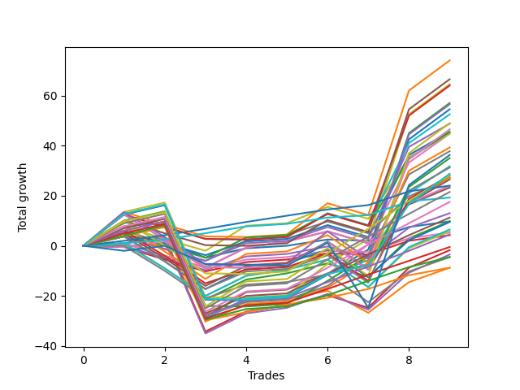

# Long Labrador 018 
- Symbol: ES
- Date Range: 03/18/2022 - 12/30/2022
- Trading Period: 8:30-12:30
- Number of Trades: 9



| Name | Win Percent | Profit | Avg Profit / Trade | Avg Time / Trade |      | Name | Win Percent | Profit | Avg Profit / Trade | Avg Time / Trade |
| ---- | ----------- | ------ | ------------------ | ---------------- | ---- | ---- | ----------- | ------ | ------------------ | ---------------- |
| Sorted By <br> Profit | | | | | | Sorted By <br> Win Percentage ||||
| V U/L 1SD SL-5 | 55.56 | 37000.00 | 4111.11 | 31:48 |     | TP-2 | 100.00 | 12000.00 | 1333.33 | 04:37 |
| BB-200 U/L 2SD SL-5 | 55.56 | 33250.00 | 3694.44 | 38:24 |     | TP-1 | 100.00 | 9625.00 | 1069.44 | 03:06 |
| V U/L 1SD | 77.78 | 32250.00 | 3583.33 | 48:13 |     | BB-200 Mid | 88.89 | 19625.00 | 2180.56 | 32:10 |
| BB-100 U/L 2SD SL-5 | 55.56 | 32000.00 | 3555.56 | 34:24 |     | V Mid | 88.89 | 18875.00 | 2097.22 | 29:01 |
| NEWFI 06 | 77.78 | 28500.00 | 3166.67 | 54:49 |     | BB-100 Mid | 88.89 | 15875.00 | 1763.89 | 33:59 |
| BB-200 U/L 2SD | 77.78 | 28500.00 | 3166.67 | 54:49 |     | TP-10 | 88.89 | 14000.00 | 1555.56 | 29:57 |
| V U/L 1SD SL-10 | 55.56 | 28250.00 | 3138.89 | 33:21 |     | BB-50 U/L 1SD | 88.89 | 13250.00 | 1472.22 | 28:30 |
| BB-100 U/L 2SD | 77.78 | 27250.00 | 3027.78 | 50:49 |     | TP-9 | 88.89 | 10750.00 | 1194.44 | 28:22 |
| BB-50 U/L 2SD SL-5 | 55.56 | 26250.00 | 2916.67 | 24:57 |     | TP-8 | 88.89 | 8750.00 | 972.22 | 27:20 |
| BB-200 U/L 2SD SL-10 | 55.56 | 24500.00 | 2722.22 | 39:57 |     | TP-7 | 88.89 | 5625.00 | 625.00 | 26:20 |
| BB-200 Mid SL-5 | 66.67 | 24375.00 | 2708.33 | 15:45 |     | TP-6 | 88.89 | 2250.00 | 250.00 | 25:12 |
| BB-100 U/L 2SD SL-10 | 55.56 | 23250.00 | 2583.33 | 35:57 |     | TP-5 | 88.89 | -250.00 | -27.78 | 23:14 |
| BB-100 Mid SL-5 | 66.67 | 22750.00 | 2527.78 | 20:01 |     | TP-4 | 88.89 | -2250.00 | -250.00 | 18:59 |
| V Mid SL-5 | 66.67 | 22750.00 | 2527.78 | 14:05 |     | TP-3 | 88.89 | -4375.00 | -486.11 | 15:03 |
| BB-50 U/L 2SD | 77.78 | 22375.00 | 2486.11 | 39:53 |     | V U/L 1SD | 77.78 | 32250.00 | 3583.33 | 48:13 |
| BB-50 U/L 1SD SL-5 | 66.67 | 22375.00 | 2486.11 | 15:18 |     | NEWFI 06 | 77.78 | 28500.00 | 3166.67 | 54:49 |
| BB-200 Mid | 88.89 | 19625.00 | 2180.56 | 32:10 |     | BB-200 U/L 2SD | 77.78 | 28500.00 | 3166.67 | 54:49 |
| V Mid | 88.89 | 18875.00 | 2097.22 | 29:01 |     | BB-100 U/L 2SD | 77.78 | 27250.00 | 3027.78 | 50:49 |
| NEWFI 0000 | 44.44 | 18125.00 | 2013.89 | 32:01 |     | BB-50 U/L 2SD | 77.78 | 22375.00 | 2486.11 | 39:53 |
| BB-50 U/L 2SD SL-10 | 55.56 | 17500.00 | 1944.44 | 26:30 |     | NEWFI 000 | 77.78 | 14375.00 | 1597.22 | 45:39 |
| BB-100 Mid | 88.89 | 15875.00 | 1763.89 | 33:59 |     | BB-20 U/L 2SD | 77.78 | 4875.00 | 541.67 | 18:08 |
| BB-200 Mid SL-10 | 66.67 | 15625.00 | 1736.11 | 17:18 |     | BB-20 U/L 2SD C | 77.78 | -875.00 | -97.22 | 19:38 |
| NEWFI 000 | 77.78 | 14375.00 | 1597.22 | 45:39 |     | BB-20 U/L 1SD | 77.78 | -4375.00 | -486.11 | 15:16 |
| TP-10 | 88.89 | 14000.00 | 1555.56 | 29:57 |     | BB-200 Mid SL-5 | 66.67 | 24375.00 | 2708.33 | 15:45 |
| BB-100 Mid SL-10 | 66.67 | 14000.00 | 1555.56 | 21:34 |     | BB-100 Mid SL-5 | 66.67 | 22750.00 | 2527.78 | 20:01 |
| V Mid SL-10 | 66.67 | 14000.00 | 1555.56 | 15:38 |     | V Mid SL-5 | 66.67 | 22750.00 | 2527.78 | 14:05 |
| BB-50 U/L 1SD SL-10 | 66.67 | 13625.00 | 1513.89 | 16:51 |     | BB-50 U/L 1SD SL-5 | 66.67 | 22375.00 | 2486.11 | 15:18 |
| BB-50 Mid SL-5 | 66.67 | 13500.00 | 1500.00 | 10:42 |     | BB-200 Mid SL-10 | 66.67 | 15625.00 | 1736.11 | 17:18 |
| BB-50 U/L 1SD | 88.89 | 13250.00 | 1472.22 | 28:30 |     | BB-100 Mid SL-10 | 66.67 | 14000.00 | 1555.56 | 21:34 |
| TP-2 | 100.00 | 12000.00 | 1333.33 | 04:37 |     | V Mid SL-10 | 66.67 | 14000.00 | 1555.56 | 15:38 |
| BB-20 U/L 2SD C SL-5 | 66.67 | 12000.00 | 1333.33 | 08:42 |     | BB-50 U/L 1SD SL-10 | 66.67 | 13625.00 | 1513.89 | 16:51 |
| BB-20 U/L 2SD SL-5 | 66.67 | 11625.00 | 1291.67 | 08:40 |     | BB-50 Mid SL-5 | 66.67 | 13500.00 | 1500.00 | 10:42 |
| TP-9 | 88.89 | 10750.00 | 1194.44 | 28:22 |     | BB-20 U/L 2SD C SL-5 | 66.67 | 12000.00 | 1333.33 | 08:42 |
| TP-1 | 100.00 | 9625.00 | 1069.44 | 03:06 |     | BB-20 U/L 2SD SL-5 | 66.67 | 11625.00 | 1291.67 | 08:40 |
| TP-8 | 88.89 | 8750.00 | 972.22 | 27:20 |     | BB-20 U/L 1SD SL-5 | 66.67 | 6500.00 | 722.22 | 06:40 |
| BB-20 U/L 1SD SL-5 | 66.67 | 6500.00 | 722.22 | 06:40 |     | BB-20 Mid | 66.67 | 4875.00 | 541.67 | 04:49 |
| TP-7 | 88.89 | 5625.00 | 625.00 | 26:20 |     | BB-50 Mid SL-10 | 66.67 | 4750.00 | 527.78 | 12:15 |
| BB-20 U/L 2SD | 77.78 | 4875.00 | 541.67 | 18:08 |     | BB-20 U/L 2SD C SL-10 | 66.67 | 3250.00 | 361.11 | 10:15 |
| BB-20 Mid | 66.67 | 4875.00 | 541.67 | 04:49 |     | BB-20 U/L 2SD SL-10 | 66.67 | 2875.00 | 319.44 | 10:12 |
| BB-50 Mid SL-10 | 66.67 | 4750.00 | 527.78 | 12:15 |     | BB-20 Mid SL-10 | 66.67 | 2625.00 | 291.67 | 04:12 |
| BB-20 U/L 2SD C SL-10 | 66.67 | 3250.00 | 361.11 | 10:15 |     | BB-50 Mid | 66.67 | -1750.00 | -194.44 | 23:01 |
| BB-20 U/L 2SD SL-10 | 66.67 | 2875.00 | 319.44 | 10:12 |     | BB-20 U/L 1SD SL-10 | 66.67 | -2250.00 | -250.00 | 08:13 |
| BB-20 Mid SL-10 | 66.67 | 2625.00 | 291.67 | 04:12 |     | V U/L 1SD SL-5 | 55.56 | 37000.00 | 4111.11 | 31:48 |
| TP-6 | 88.89 | 2250.00 | 250.00 | 25:12 |     | BB-200 U/L 2SD SL-5 | 55.56 | 33250.00 | 3694.44 | 38:24 |
| BB-20 Mid SL-5 | 55.56 | 2125.00 | 236.11 | 03:36 |     | BB-100 U/L 2SD SL-5 | 55.56 | 32000.00 | 3555.56 | 34:24 |
| TP-5 | 88.89 | -250.00 | -27.78 | 23:14 |     | V U/L 1SD SL-10 | 55.56 | 28250.00 | 3138.89 | 33:21 |
| BB-20 U/L 2SD C | 77.78 | -875.00 | -97.22 | 19:38 |     | BB-50 U/L 2SD SL-5 | 55.56 | 26250.00 | 2916.67 | 24:57 |
| BB-50 Mid | 66.67 | -1750.00 | -194.44 | 23:01 |     | BB-200 U/L 2SD SL-10 | 55.56 | 24500.00 | 2722.22 | 39:57 |
| TP-4 | 88.89 | -2250.00 | -250.00 | 18:59 |     | BB-100 U/L 2SD SL-10 | 55.56 | 23250.00 | 2583.33 | 35:57 |
| BB-20 U/L 1SD SL-10 | 66.67 | -2250.00 | -250.00 | 08:13 |     | BB-50 U/L 2SD SL-10 | 55.56 | 17500.00 | 1944.44 | 26:30 |
| TP-3 | 88.89 | -4375.00 | -486.11 | 15:03 |     | BB-20 Mid SL-5 | 55.56 | 2125.00 | 236.11 | 03:36 |
| BB-20 U/L 1SD | 77.78 | -4375.00 | -486.11 | 15:16 |     | NEWFI 0000 | 44.44 | 18125.00 | 2013.89 | 32:01 |

## NO STOPLOSS

### Test BB-20 Mid
* Sell when price hits the middle line of the 20p bollinger
* No Stoploss
* Results:
```
Total Trades: 9
Percent Up: 66.67
Percent Down: 33.33
Total Points Moved Up: 9.75
Potential Profit: 4875.00
Total Points Ups: 17.25 Count Ups: 6
Total Points Downs: -7.50 Count Downs: 3
```

<details><summary>Trades</summary>

<code>In: 2022-04-20 09:19:00		Out: 2022-04-20 09:30:50		Total Position Time: 11:50		Total Move Up: -0.50		Total to Date: -0.50</code> <br />
<code>In: 2022-04-27 12:11:00		Out: 2022-04-27 12:14:00		Total Position Time: 03:00		Total Move Up: 2.25		Total to Date: 1.75</code> <br />
<code>In: 2022-05-11 09:37:00		Out: 2022-05-11 09:49:20		Total Position Time: 12:20		Total Move Up: -6.50		Total to Date: -4.75</code> <br />
<code>In: 2022-06-27 09:37:00		Out: 2022-06-27 09:41:05		Total Position Time: 04:05		Total Move Up: 3.75		Total to Date: -1.00</code> <br />
<code>In: 2022-07-11 12:16:00		Out: 2022-07-11 12:22:10		Total Position Time: 06:10		Total Move Up: 1.00		Total to Date: 0.00</code> <br />
<code>In: 2022-10-31 09:50:00		Out: 2022-10-31 09:51:10		Total Position Time: 01:10		Total Move Up: 2.50		Total to Date: 2.50</code> <br />
<code>In: 2022-11-08 11:15:00		Out: 2022-11-08 11:16:15		Total Position Time: 01:15		Total Move Up: -0.50		Total to Date: 2.00</code> <br />
<code>In: 2022-11-08 11:36:00		Out: 2022-11-08 11:37:10		Total Position Time: 01:10		Total Move Up: 5.50		Total to Date: 7.50</code> <br />
<code>In: 2022-11-11 08:34:00		Out: 2022-11-11 08:36:25		Total Position Time: 02:25		Total Move Up: 2.25		Total to Date: 9.75</code> <br />


</details>

### Test BB-20 U/L 1SD
* Sell when the price hits the upper line of the 20p 1std bollinger
* No Stoploss
* Results:
```
Total Trades: 9
Percent Up: 77.78
Percent Down: 22.22
Total Points Moved Up: -8.75
Potential Profit: -4375.00
Total Points Ups: 28.00 Count Ups: 7
Total Points Downs: -36.75 Count Downs: 2
```

<details><summary>Trades</summary>

<code>In: 2022-04-20 09:19:00		Out: 2022-04-20 09:31:05		Total Position Time: 12:05		Total Move Up: 0.00		Total to Date: 0.00</code> <br />
<code>In: 2022-04-27 12:11:00		Out: 2022-04-27 12:27:15		Total Position Time: 16:15		Total Move Up: 0.50		Total to Date: 0.50</code> <br />
<code>In: 2022-05-11 09:37:00		Out: 2022-05-11 10:24:35		Total Position Time: 47:35		Total Move Up: -28.00		Total to Date: -27.50</code> <br />
<code>In: 2022-06-27 09:37:00		Out: 2022-06-27 09:44:20		Total Position Time: 07:20		Total Move Up: 5.50		Total to Date: -22.00</code> <br />
<code>In: 2022-07-11 12:16:00		Out: 2022-07-11 12:29:20		Total Position Time: 13:20		Total Move Up: 1.00		Total to Date: -21.00</code> <br />
<code>In: 2022-10-31 09:50:00		Out: 2022-10-31 09:57:05		Total Position Time: 07:05		Total Move Up: 3.00		Total to Date: -18.00</code> <br />
<code>In: 2022-11-08 11:15:00		Out: 2022-11-08 11:38:35		Total Position Time: 23:35		Total Move Up: -8.75		Total to Date: -26.75</code> <br />
<code>In: 2022-11-08 11:36:00		Out: 2022-11-08 11:38:35		Total Position Time: 02:35		Total Move Up: 12.25		Total to Date: -14.50</code> <br />
<code>In: 2022-11-11 08:34:00		Out: 2022-11-11 08:41:35		Total Position Time: 07:35		Total Move Up: 5.75		Total to Date: -8.75</code> <br />


</details>

### Test BB-20 U/L 2SD
* Sell when the price hits the upper line of the 20p 2std bollinger
* No Stoploss
* Results:
```
Total Trades: 9
Percent Up: 77.78
Percent Down: 22.22
Total Points Moved Up: 9.75
Potential Profit: 4875.00
Total Points Ups: 40.25 Count Ups: 7
Total Points Downs: -30.50 Count Downs: 2
```

<details><summary>Trades</summary>

<code>In: 2022-04-20 09:19:00		Out: 2022-04-20 09:31:35		Total Position Time: 12:35		Total Move Up: 1.00		Total to Date: 1.00</code> <br />
<code>In: 2022-04-27 12:11:00		Out: 2022-04-27 12:31:20		Total Position Time: 20:20		Total Move Up: 2.50		Total to Date: 3.50</code> <br />
<code>In: 2022-05-11 09:37:00		Out: 2022-05-11 10:24:50		Total Position Time: 47:50		Total Move Up: -25.00		Total to Date: -21.50</code> <br />
<code>In: 2022-06-27 09:37:00		Out: 2022-06-27 09:45:05		Total Position Time: 08:05		Total Move Up: 8.00		Total to Date: -13.50</code> <br />
<code>In: 2022-07-11 12:16:00		Out: 2022-07-11 12:29:40		Total Position Time: 13:40		Total Move Up: 2.50		Total to Date: -11.00</code> <br />
<code>In: 2022-10-31 09:50:00		Out: 2022-10-31 10:02:05		Total Position Time: 12:05		Total Move Up: 4.00		Total to Date: -7.00</code> <br />
<code>In: 2022-11-08 11:15:00		Out: 2022-11-08 11:42:10		Total Position Time: 27:10		Total Move Up: -5.50		Total to Date: -12.50</code> <br />
<code>In: 2022-11-08 11:36:00		Out: 2022-11-08 11:42:10		Total Position Time: 06:10		Total Move Up: 15.50		Total to Date: 3.00</code> <br />
<code>In: 2022-11-11 08:34:00		Out: 2022-11-11 08:49:20		Total Position Time: 15:20		Total Move Up: 6.75		Total to Date: 9.75</code> <br />


</details>

### Test BB-20 U/L 2SD C
* Sell when the price hits the upper line of the 20p 2std bollinger
* No Stoploss
* Results:
```
Total Trades: 9
Percent Up: 77.78
Percent Down: 22.22
Total Points Moved Up: -1.75
Potential Profit: -875.00
Total Points Ups: 41.00 Count Ups: 7
Total Points Downs: -42.75 Count Downs: 2
```

<details><summary>Trades</summary>

<code>In: 2022-04-20 09:19:00		Out: 2022-04-20 09:31:35		Total Position Time: 12:35		Total Move Up: 1.00		Total to Date: 1.00</code> <br />
<code>In: 2022-04-27 12:11:00		Out: 2022-04-27 12:31:20		Total Position Time: 20:20		Total Move Up: 2.50		Total to Date: 3.50</code> <br />
<code>In: 2022-05-11 09:37:00		Out: 2022-05-11 10:37:55		Total Position Time: 60:55		Total Move Up: -37.75		Total to Date: -34.25</code> <br />
<code>In: 2022-06-27 09:37:00		Out: 2022-06-27 09:45:05		Total Position Time: 08:05		Total Move Up: 8.00		Total to Date: -26.25</code> <br />
<code>In: 2022-07-11 12:16:00		Out: 2022-07-11 12:29:40		Total Position Time: 13:40		Total Move Up: 2.50		Total to Date: -23.75</code> <br />
<code>In: 2022-10-31 09:50:00		Out: 2022-10-31 10:02:05		Total Position Time: 12:05		Total Move Up: 4.00		Total to Date: -19.75</code> <br />
<code>In: 2022-11-08 11:15:00		Out: 2022-11-08 11:42:15		Total Position Time: 27:15		Total Move Up: -5.00		Total to Date: -24.75</code> <br />
<code>In: 2022-11-08 11:36:00		Out: 2022-11-08 11:42:15		Total Position Time: 06:15		Total Move Up: 16.00		Total to Date: -8.75</code> <br />
<code>In: 2022-11-11 08:34:00		Out: 2022-11-11 08:49:40		Total Position Time: 15:40		Total Move Up: 7.00		Total to Date: -1.75</code> <br />


</details>

### Test BB-50 Mid
* Sell when price hits the middle line of the 50p bollinger
* No Stoploss
* Results:
```
Total Trades: 9
Percent Up: 66.67
Percent Down: 33.33
Total Points Moved Up: -3.50
Potential Profit: -1750.00
Total Points Ups: 41.50 Count Ups: 6
Total Points Downs: -45.00 Count Downs: 3
```

<details><summary>Trades</summary>

<code>In: 2022-04-20 09:19:00		Out: 2022-04-20 09:32:40		Total Position Time: 13:40		Total Move Up: 3.75		Total to Date: 3.75</code> <br />
<code>In: 2022-04-27 12:11:00		Out: 2022-04-27 12:44:20		Total Position Time: 33:20		Total Move Up: -1.00		Total to Date: 2.75</code> <br />
<code>In: 2022-05-11 09:37:00		Out: 2022-05-11 10:37:55		Total Position Time: 60:55		Total Move Up: -37.75		Total to Date: -35.00</code> <br />
<code>In: 2022-06-27 09:37:00		Out: 2022-06-27 09:45:05		Total Position Time: 08:05		Total Move Up: 8.00		Total to Date: -27.00</code> <br />
<code>In: 2022-07-11 12:16:00		Out: 2022-07-11 12:40:35		Total Position Time: 24:35		Total Move Up: 2.25		Total to Date: -24.75</code> <br />
<code>In: 2022-10-31 09:50:00		Out: 2022-10-31 10:08:30		Total Position Time: 18:30		Total Move Up: 5.50		Total to Date: -19.25</code> <br />
<code>In: 2022-11-08 11:15:00		Out: 2022-11-08 11:41:40		Total Position Time: 26:40		Total Move Up: -6.25		Total to Date: -25.50</code> <br />
<code>In: 2022-11-08 11:36:00		Out: 2022-11-08 11:41:40		Total Position Time: 05:40		Total Move Up: 14.75		Total to Date: -10.75</code> <br />
<code>In: 2022-11-11 08:34:00		Out: 2022-11-11 08:49:45		Total Position Time: 15:45		Total Move Up: 7.25		Total to Date: -3.50</code> <br />


</details>

### Test BB-50 U/L 1SD
* Sell when the price hits the upper line of the 50p 1std bollinger
* No Stoploss
* Results:
```
Total Trades: 9
Percent Up: 88.89
Percent Down: 11.11
Total Points Moved Up: 26.50
Potential Profit: 13250.00
Total Points Ups: 64.25 Count Ups: 8
Total Points Downs: -37.75 Count Downs: 1
```

<details><summary>Trades</summary>

<code>In: 2022-04-20 09:19:00		Out: 2022-04-20 09:36:50		Total Position Time: 17:50		Total Move Up: 7.75		Total to Date: 7.75</code> <br />
<code>In: 2022-04-27 12:11:00		Out: 2022-04-27 12:46:05		Total Position Time: 35:05		Total Move Up: 1.50		Total to Date: 9.25</code> <br />
<code>In: 2022-05-11 09:37:00		Out: 2022-05-11 10:37:55		Total Position Time: 60:55		Total Move Up: -37.75		Total to Date: -28.50</code> <br />
<code>In: 2022-06-27 09:37:00		Out: 2022-06-27 09:53:20		Total Position Time: 16:20		Total Move Up: 10.00		Total to Date: -18.50</code> <br />
<code>In: 2022-07-11 12:16:00		Out: 2022-07-11 12:47:00		Total Position Time: 31:00		Total Move Up: 1.00		Total to Date: -17.50</code> <br />
<code>In: 2022-10-31 09:50:00		Out: 2022-10-31 10:16:15		Total Position Time: 26:15		Total Move Up: 6.50		Total to Date: -11.00</code> <br />
<code>In: 2022-11-08 11:15:00		Out: 2022-11-08 11:47:55		Total Position Time: 32:55		Total Move Up: 3.50		Total to Date: -7.50</code> <br />
<code>In: 2022-11-08 11:36:00		Out: 2022-11-08 11:47:55		Total Position Time: 11:55		Total Move Up: 24.50		Total to Date: 17.00</code> <br />
<code>In: 2022-11-11 08:34:00		Out: 2022-11-11 08:58:20		Total Position Time: 24:20		Total Move Up: 9.50		Total to Date: 26.50</code> <br />


</details>

### Test BB-50 U/L 2SD
* Sell when the price hits the upper line of the 50p 2std bollinger
* No Stoploss
* Results:
```
Total Trades: 9
Percent Up: 77.78
Percent Down: 22.22
Total Points Moved Up: 44.75
Potential Profit: 22375.00
Total Points Ups: 82.75 Count Ups: 7
Total Points Downs: -38.00 Count Downs: 2
```

<details><summary>Trades</summary>

<code>In: 2022-04-20 09:19:00		Out: 2022-04-20 09:50:25		Total Position Time: 31:25		Total Move Up: 12.50		Total to Date: 12.50</code> <br />
<code>In: 2022-04-27 12:11:00		Out: 2022-04-27 12:47:00		Total Position Time: 36:00		Total Move Up: 3.75		Total to Date: 16.25</code> <br />
<code>In: 2022-05-11 09:37:00		Out: 2022-05-11 10:37:55		Total Position Time: 60:55		Total Move Up: -37.75		Total to Date: -21.50</code> <br />
<code>In: 2022-06-27 09:37:00		Out: 2022-06-27 10:37:55		Total Position Time: 60:55		Total Move Up: -0.25		Total to Date: -21.75</code> <br />
<code>In: 2022-07-11 12:16:00		Out: 2022-07-11 12:47:00		Total Position Time: 31:00		Total Move Up: 1.00		Total to Date: -20.75</code> <br />
<code>In: 2022-10-31 09:50:00		Out: 2022-10-31 10:17:40		Total Position Time: 27:40		Total Move Up: 9.50		Total to Date: -11.25</code> <br />
<code>In: 2022-11-08 11:15:00		Out: 2022-11-08 12:02:35		Total Position Time: 47:35		Total Move Up: 11.75		Total to Date: 0.50</code> <br />
<code>In: 2022-11-08 11:36:00		Out: 2022-11-08 12:02:35		Total Position Time: 26:35		Total Move Up: 32.75		Total to Date: 33.25</code> <br />
<code>In: 2022-11-11 08:34:00		Out: 2022-11-11 09:11:00		Total Position Time: 37:00		Total Move Up: 11.50		Total to Date: 44.75</code> <br />


</details>

### Test V Mid
* Sell when the price hits the middle line of the 1std VWAP
* No Stoploss
* Results:
```
Total Trades: 9
Percent Up: 88.89
Percent Down: 11.11
Total Points Moved Up: 37.75
Potential Profit: 18875.00
Total Points Ups: 75.50 Count Ups: 8
Total Points Downs: -37.75 Count Downs: 1
```

<details><summary>Trades</summary>

<code>In: 2022-04-20 09:19:00		Out: 2022-04-20 09:35:50		Total Position Time: 16:50		Total Move Up: 6.00		Total to Date: 6.00</code> <br />
<code>In: 2022-04-27 12:11:00		Out: 2022-04-27 12:47:00		Total Position Time: 36:00		Total Move Up: 3.75		Total to Date: 9.75</code> <br />
<code>In: 2022-05-11 09:37:00		Out: 2022-05-11 10:37:55		Total Position Time: 60:55		Total Move Up: -37.75		Total to Date: -28.00</code> <br />
<code>In: 2022-06-27 09:37:00		Out: 2022-06-27 09:44:20		Total Position Time: 07:20		Total Move Up: 5.50		Total to Date: -22.50</code> <br />
<code>In: 2022-07-11 12:16:00		Out: 2022-07-11 12:47:00		Total Position Time: 31:00		Total Move Up: 1.00		Total to Date: -21.50</code> <br />
<code>In: 2022-10-31 09:50:00		Out: 2022-10-31 10:08:30		Total Position Time: 18:30		Total Move Up: 5.50		Total to Date: -16.00</code> <br />
<code>In: 2022-11-08 11:15:00		Out: 2022-11-08 12:02:35		Total Position Time: 47:35		Total Move Up: 11.75		Total to Date: -4.25</code> <br />
<code>In: 2022-11-08 11:36:00		Out: 2022-11-08 12:02:35		Total Position Time: 26:35		Total Move Up: 32.75		Total to Date: 28.50</code> <br />
<code>In: 2022-11-11 08:34:00		Out: 2022-11-11 08:50:30		Total Position Time: 16:30		Total Move Up: 9.25		Total to Date: 37.75</code> <br />


</details>

### Test V U/L 1SD
* Sell when the price hits the upper line of the 1std VWAP
* No Stoploss
* Results:
```
Total Trades: 9
Percent Up: 77.78
Percent Down: 22.22
Total Points Moved Up: 64.50
Potential Profit: 32250.00
Total Points Ups: 102.50 Count Ups: 7
Total Points Downs: -38.00 Count Downs: 2
```

<details><summary>Trades</summary>

<code>In: 2022-04-20 09:19:00		Out: 2022-04-20 09:52:35		Total Position Time: 33:35		Total Move Up: 13.50		Total to Date: 13.50</code> <br />
<code>In: 2022-04-27 12:11:00		Out: 2022-04-27 12:47:00		Total Position Time: 36:00		Total Move Up: 3.75		Total to Date: 17.25</code> <br />
<code>In: 2022-05-11 09:37:00		Out: 2022-05-11 10:37:55		Total Position Time: 60:55		Total Move Up: -37.75		Total to Date: -20.50</code> <br />
<code>In: 2022-06-27 09:37:00		Out: 2022-06-27 10:37:55		Total Position Time: 60:55		Total Move Up: -0.25		Total to Date: -20.75</code> <br />
<code>In: 2022-07-11 12:16:00		Out: 2022-07-11 12:47:00		Total Position Time: 31:00		Total Move Up: 1.00		Total to Date: -19.75</code> <br />
<code>In: 2022-10-31 09:50:00		Out: 2022-10-31 10:24:00		Total Position Time: 34:00		Total Move Up: 12.50		Total to Date: -7.25</code> <br />
<code>In: 2022-11-08 11:15:00		Out: 2022-11-08 12:15:55		Total Position Time: 60:55		Total Move Up: 10.00		Total to Date: 2.75</code> <br />
<code>In: 2022-11-08 11:36:00		Out: 2022-11-08 12:31:45		Total Position Time: 55:45		Total Move Up: 49.75		Total to Date: 52.50</code> <br />
<code>In: 2022-11-11 08:34:00		Out: 2022-11-11 09:34:55		Total Position Time: 60:55		Total Move Up: 12.00		Total to Date: 64.50</code> <br />


</details>

### Test BB-100 Mid
* Move to BB100 Mid
* No Stoploss
* Results:
```
Total Trades: 9
Percent Up: 88.89
Percent Down: 11.11
Total Points Moved Up: 31.75
Potential Profit: 15875.00
Total Points Ups: 69.50 Count Ups: 8
Total Points Downs: -37.75 Count Downs: 1
```

<details><summary>Trades</summary>

<code>In: 2022-04-20 09:19:00		Out: 2022-04-20 09:33:05		Total Position Time: 14:05		Total Move Up: 5.00		Total to Date: 5.00</code> <br />
<code>In: 2022-04-27 12:11:00		Out: 2022-04-27 12:47:00		Total Position Time: 36:00		Total Move Up: 3.75		Total to Date: 8.75</code> <br />
<code>In: 2022-05-11 09:37:00		Out: 2022-05-11 10:37:55		Total Position Time: 60:55		Total Move Up: -37.75		Total to Date: -29.00</code> <br />
<code>In: 2022-06-27 09:37:00		Out: 2022-06-27 10:20:05		Total Position Time: 43:05		Total Move Up: 8.00		Total to Date: -21.00</code> <br />
<code>In: 2022-07-11 12:16:00		Out: 2022-07-11 12:47:00		Total Position Time: 31:00		Total Move Up: 1.00		Total to Date: -20.00</code> <br />
<code>In: 2022-10-31 09:50:00		Out: 2022-10-31 10:17:20		Total Position Time: 27:20		Total Move Up: 8.50		Total to Date: -11.50</code> <br />
<code>In: 2022-11-08 11:15:00		Out: 2022-11-08 11:53:50		Total Position Time: 38:50		Total Move Up: 5.75		Total to Date: -5.75</code> <br />
<code>In: 2022-11-08 11:36:00		Out: 2022-11-08 11:53:50		Total Position Time: 17:50		Total Move Up: 26.75		Total to Date: 21.00</code> <br />
<code>In: 2022-11-11 08:34:00		Out: 2022-11-11 09:10:50		Total Position Time: 36:50		Total Move Up: 10.75		Total to Date: 31.75</code> <br />


</details>

### Test BB-100 U/L 2SD
* Move to BB100 Upper Band
* No Stoploss
* Results:
```
Total Trades: 9
Percent Up: 77.78
Percent Down: 22.22
Total Points Moved Up: 54.50
Potential Profit: 27250.00
Total Points Ups: 92.50 Count Ups: 7
Total Points Downs: -38.00 Count Downs: 2
```

<details><summary>Trades</summary>

<code>In: 2022-04-20 09:19:00		Out: 2022-04-20 09:50:25		Total Position Time: 31:25		Total Move Up: 12.50		Total to Date: 12.50</code> <br />
<code>In: 2022-04-27 12:11:00		Out: 2022-04-27 12:47:00		Total Position Time: 36:00		Total Move Up: 3.75		Total to Date: 16.25</code> <br />
<code>In: 2022-05-11 09:37:00		Out: 2022-05-11 10:37:55		Total Position Time: 60:55		Total Move Up: -37.75		Total to Date: -21.50</code> <br />
<code>In: 2022-06-27 09:37:00		Out: 2022-06-27 10:37:55		Total Position Time: 60:55		Total Move Up: -0.25		Total to Date: -21.75</code> <br />
<code>In: 2022-07-11 12:16:00		Out: 2022-07-11 12:47:00		Total Position Time: 31:00		Total Move Up: 1.00		Total to Date: -20.75</code> <br />
<code>In: 2022-10-31 09:50:00		Out: 2022-10-31 10:50:55		Total Position Time: 60:55		Total Move Up: 9.25		Total to Date: -11.50</code> <br />
<code>In: 2022-11-08 11:15:00		Out: 2022-11-08 12:15:55		Total Position Time: 60:55		Total Move Up: 10.00		Total to Date: -1.50</code> <br />
<code>In: 2022-11-08 11:36:00		Out: 2022-11-08 12:30:25		Total Position Time: 54:25		Total Move Up: 44.00		Total to Date: 42.50</code> <br />
<code>In: 2022-11-11 08:34:00		Out: 2022-11-11 09:34:55		Total Position Time: 60:55		Total Move Up: 12.00		Total to Date: 54.50</code> <br />


</details>

### Test BB-200 Mid
* Move to BB200 Mid
* No Stoploss
* Results:
```
Total Trades: 9
Percent Up: 88.89
Percent Down: 11.11
Total Points Moved Up: 39.25
Potential Profit: 19625.00
Total Points Ups: 77.00 Count Ups: 8
Total Points Downs: -37.75 Count Downs: 1
```

<details><summary>Trades</summary>

<code>In: 2022-04-20 09:19:00		Out: 2022-04-20 09:32:40		Total Position Time: 13:40		Total Move Up: 3.75		Total to Date: 3.75</code> <br />
<code>In: 2022-04-27 12:11:00		Out: 2022-04-27 12:47:00		Total Position Time: 36:00		Total Move Up: 3.75		Total to Date: 7.50</code> <br />
<code>In: 2022-05-11 09:37:00		Out: 2022-05-11 10:37:55		Total Position Time: 60:55		Total Move Up: -37.75		Total to Date: -30.25</code> <br />
<code>In: 2022-06-27 09:37:00		Out: 2022-06-27 09:45:00		Total Position Time: 08:00		Total Move Up: 7.00		Total to Date: -23.25</code> <br />
<code>In: 2022-07-11 12:16:00		Out: 2022-07-11 12:47:00		Total Position Time: 31:00		Total Move Up: 1.00		Total to Date: -22.25</code> <br />
<code>In: 2022-10-31 09:50:00		Out: 2022-10-31 10:08:30		Total Position Time: 18:30		Total Move Up: 5.50		Total to Date: -16.75</code> <br />
<code>In: 2022-11-08 11:15:00		Out: 2022-11-08 12:15:55		Total Position Time: 60:55		Total Move Up: 10.00		Total to Date: -6.75</code> <br />
<code>In: 2022-11-08 11:36:00		Out: 2022-11-08 12:20:05		Total Position Time: 44:05		Total Move Up: 36.75		Total to Date: 30.00</code> <br />
<code>In: 2022-11-11 08:34:00		Out: 2022-11-11 08:50:30		Total Position Time: 16:30		Total Move Up: 9.25		Total to Date: 39.25</code> <br />


</details>

### Test BB-200 U/L 2SD
* Move to BB200 Upper Band
* No Stoploss
* Results:
```
Total Trades: 9
Percent Up: 77.78
Percent Down: 22.22
Total Points Moved Up: 57.00
Potential Profit: 28500.00
Total Points Ups: 95.00 Count Ups: 7
Total Points Downs: -38.00 Count Downs: 2
```

<details><summary>Trades</summary>

<code>In: 2022-04-20 09:19:00		Out: 2022-04-20 10:19:55		Total Position Time: 60:55		Total Move Up: 10.00		Total to Date: 10.00</code> <br />
<code>In: 2022-04-27 12:11:00		Out: 2022-04-27 12:47:00		Total Position Time: 36:00		Total Move Up: 3.75		Total to Date: 13.75</code> <br />
<code>In: 2022-05-11 09:37:00		Out: 2022-05-11 10:37:55		Total Position Time: 60:55		Total Move Up: -37.75		Total to Date: -24.00</code> <br />
<code>In: 2022-06-27 09:37:00		Out: 2022-06-27 10:37:55		Total Position Time: 60:55		Total Move Up: -0.25		Total to Date: -24.25</code> <br />
<code>In: 2022-07-11 12:16:00		Out: 2022-07-11 12:47:00		Total Position Time: 31:00		Total Move Up: 1.00		Total to Date: -23.25</code> <br />
<code>In: 2022-10-31 09:50:00		Out: 2022-10-31 10:50:55		Total Position Time: 60:55		Total Move Up: 9.25		Total to Date: -14.00</code> <br />
<code>In: 2022-11-08 11:15:00		Out: 2022-11-08 12:15:55		Total Position Time: 60:55		Total Move Up: 10.00		Total to Date: -4.00</code> <br />
<code>In: 2022-11-08 11:36:00		Out: 2022-11-08 12:36:55		Total Position Time: 60:55		Total Move Up: 49.00		Total to Date: 45.00</code> <br />
<code>In: 2022-11-11 08:34:00		Out: 2022-11-11 09:34:55		Total Position Time: 60:55		Total Move Up: 12.00		Total to Date: 57.00</code> <br />


</details>

## STOPLOSS OF 5

### Test BB-20 Mid SL-5
* Sell when price hits the middle line of the 20p bollinger
* Stoploss is 5 points
* Results:
```
Total Trades: 9
Percent Up: 55.56
Percent Down: 44.44
Total Points Moved Up: 4.25
Potential Profit: 2125.00
Total Points Ups: 15.00 Count Ups: 5
Total Points Downs: -10.75 Count Downs: 4
```

<details><summary>Trades</summary>

<code>In: 2022-04-20 09:19:00		Out: 2022-04-20 09:30:50		Total Position Time: 11:50		Total Move Up: -0.50		Total to Date: -0.50</code> <br />
<code>In: 2022-04-27 12:11:00		Out: 2022-04-27 12:12:30		Total Position Time: 01:30		Total Move Up: -5.00		Total to Date: -5.50</code> <br />
<code>In: 2022-05-11 09:37:00		Out: 2022-05-11 09:39:55		Total Position Time: 02:55		Total Move Up: -4.75		Total to Date: -10.25</code> <br />
<code>In: 2022-06-27 09:37:00		Out: 2022-06-27 09:41:05		Total Position Time: 04:05		Total Move Up: 3.75		Total to Date: -6.50</code> <br />
<code>In: 2022-07-11 12:16:00		Out: 2022-07-11 12:22:10		Total Position Time: 06:10		Total Move Up: 1.00		Total to Date: -5.50</code> <br />
<code>In: 2022-10-31 09:50:00		Out: 2022-10-31 09:51:10		Total Position Time: 01:10		Total Move Up: 2.50		Total to Date: -3.00</code> <br />
<code>In: 2022-11-08 11:15:00		Out: 2022-11-08 11:16:15		Total Position Time: 01:15		Total Move Up: -0.50		Total to Date: -3.50</code> <br />
<code>In: 2022-11-08 11:36:00		Out: 2022-11-08 11:37:10		Total Position Time: 01:10		Total Move Up: 5.50		Total to Date: 2.00</code> <br />
<code>In: 2022-11-11 08:34:00		Out: 2022-11-11 08:36:25		Total Position Time: 02:25		Total Move Up: 2.25		Total to Date: 4.25</code> <br />


</details>

### Test BB-20 U/L 1SD SL-5
* Sell when the price hits the upper line of the 20p 1std bollinger
* Stoploss is 5 points
* Results:
```
Total Trades: 9
Percent Up: 66.67
Percent Down: 33.33
Total Points Moved Up: 13.00
Potential Profit: 6500.00
Total Points Ups: 27.50 Count Ups: 6
Total Points Downs: -14.50 Count Downs: 3
```

<details><summary>Trades</summary>

<code>In: 2022-04-20 09:19:00		Out: 2022-04-20 09:31:05		Total Position Time: 12:05		Total Move Up: 0.00		Total to Date: 0.00</code> <br />
<code>In: 2022-04-27 12:11:00		Out: 2022-04-27 12:12:30		Total Position Time: 01:30		Total Move Up: -5.00		Total to Date: -5.00</code> <br />
<code>In: 2022-05-11 09:37:00		Out: 2022-05-11 09:39:55		Total Position Time: 02:55		Total Move Up: -4.75		Total to Date: -9.75</code> <br />
<code>In: 2022-06-27 09:37:00		Out: 2022-06-27 09:44:20		Total Position Time: 07:20		Total Move Up: 5.50		Total to Date: -4.25</code> <br />
<code>In: 2022-07-11 12:16:00		Out: 2022-07-11 12:29:20		Total Position Time: 13:20		Total Move Up: 1.00		Total to Date: -3.25</code> <br />
<code>In: 2022-10-31 09:50:00		Out: 2022-10-31 09:57:05		Total Position Time: 07:05		Total Move Up: 3.00		Total to Date: -0.25</code> <br />
<code>In: 2022-11-08 11:15:00		Out: 2022-11-08 11:20:40		Total Position Time: 05:40		Total Move Up: -4.75		Total to Date: -5.00</code> <br />
<code>In: 2022-11-08 11:36:00		Out: 2022-11-08 11:38:35		Total Position Time: 02:35		Total Move Up: 12.25		Total to Date: 7.25</code> <br />
<code>In: 2022-11-11 08:34:00		Out: 2022-11-11 08:41:35		Total Position Time: 07:35		Total Move Up: 5.75		Total to Date: 13.00</code> <br />


</details>

### Test BB-20 U/L 2SD SL-5
* Sell when the price hits the upper line of the 20p 2std bollinger
* Stoploss is 5 points
* Results:
```
Total Trades: 9
Percent Up: 66.67
Percent Down: 33.33
Total Points Moved Up: 23.25
Potential Profit: 11625.00
Total Points Ups: 37.75 Count Ups: 6
Total Points Downs: -14.50 Count Downs: 3
```

<details><summary>Trades</summary>

<code>In: 2022-04-20 09:19:00		Out: 2022-04-20 09:31:35		Total Position Time: 12:35		Total Move Up: 1.00		Total to Date: 1.00</code> <br />
<code>In: 2022-04-27 12:11:00		Out: 2022-04-27 12:12:30		Total Position Time: 01:30		Total Move Up: -5.00		Total to Date: -4.00</code> <br />
<code>In: 2022-05-11 09:37:00		Out: 2022-05-11 09:39:55		Total Position Time: 02:55		Total Move Up: -4.75		Total to Date: -8.75</code> <br />
<code>In: 2022-06-27 09:37:00		Out: 2022-06-27 09:45:05		Total Position Time: 08:05		Total Move Up: 8.00		Total to Date: -0.75</code> <br />
<code>In: 2022-07-11 12:16:00		Out: 2022-07-11 12:29:40		Total Position Time: 13:40		Total Move Up: 2.50		Total to Date: 1.75</code> <br />
<code>In: 2022-10-31 09:50:00		Out: 2022-10-31 10:02:05		Total Position Time: 12:05		Total Move Up: 4.00		Total to Date: 5.75</code> <br />
<code>In: 2022-11-08 11:15:00		Out: 2022-11-08 11:20:40		Total Position Time: 05:40		Total Move Up: -4.75		Total to Date: 1.00</code> <br />
<code>In: 2022-11-08 11:36:00		Out: 2022-11-08 11:42:10		Total Position Time: 06:10		Total Move Up: 15.50		Total to Date: 16.50</code> <br />
<code>In: 2022-11-11 08:34:00		Out: 2022-11-11 08:49:20		Total Position Time: 15:20		Total Move Up: 6.75		Total to Date: 23.25</code> <br />


</details>

### Test BB-20 U/L 2SD C SL-5
* Sell when the price hits the upper line of the 20p 2std bollinger
* Stoploss is 5 points
* Results:
```
Total Trades: 9
Percent Up: 66.67
Percent Down: 33.33
Total Points Moved Up: 24.00
Potential Profit: 12000.00
Total Points Ups: 38.50 Count Ups: 6
Total Points Downs: -14.50 Count Downs: 3
```

<details><summary>Trades</summary>

<code>In: 2022-04-20 09:19:00		Out: 2022-04-20 09:31:35		Total Position Time: 12:35		Total Move Up: 1.00		Total to Date: 1.00</code> <br />
<code>In: 2022-04-27 12:11:00		Out: 2022-04-27 12:12:30		Total Position Time: 01:30		Total Move Up: -5.00		Total to Date: -4.00</code> <br />
<code>In: 2022-05-11 09:37:00		Out: 2022-05-11 09:39:55		Total Position Time: 02:55		Total Move Up: -4.75		Total to Date: -8.75</code> <br />
<code>In: 2022-06-27 09:37:00		Out: 2022-06-27 09:45:05		Total Position Time: 08:05		Total Move Up: 8.00		Total to Date: -0.75</code> <br />
<code>In: 2022-07-11 12:16:00		Out: 2022-07-11 12:29:40		Total Position Time: 13:40		Total Move Up: 2.50		Total to Date: 1.75</code> <br />
<code>In: 2022-10-31 09:50:00		Out: 2022-10-31 10:02:05		Total Position Time: 12:05		Total Move Up: 4.00		Total to Date: 5.75</code> <br />
<code>In: 2022-11-08 11:15:00		Out: 2022-11-08 11:20:40		Total Position Time: 05:40		Total Move Up: -4.75		Total to Date: 1.00</code> <br />
<code>In: 2022-11-08 11:36:00		Out: 2022-11-08 11:42:15		Total Position Time: 06:15		Total Move Up: 16.00		Total to Date: 17.00</code> <br />
<code>In: 2022-11-11 08:34:00		Out: 2022-11-11 08:49:40		Total Position Time: 15:40		Total Move Up: 7.00		Total to Date: 24.00</code> <br />


</details>

### Test BB-50 Mid SL-5
* Sell when price hits the middle line of the 50p bollinger
* Stoploss is 5 points
* Results:
```
Total Trades: 9
Percent Up: 66.67
Percent Down: 33.33
Total Points Moved Up: 27.00
Potential Profit: 13500.00
Total Points Ups: 41.50 Count Ups: 6
Total Points Downs: -14.50 Count Downs: 3
```

<details><summary>Trades</summary>

<code>In: 2022-04-20 09:19:00		Out: 2022-04-20 09:32:40		Total Position Time: 13:40		Total Move Up: 3.75		Total to Date: 3.75</code> <br />
<code>In: 2022-04-27 12:11:00		Out: 2022-04-27 12:12:30		Total Position Time: 01:30		Total Move Up: -5.00		Total to Date: -1.25</code> <br />
<code>In: 2022-05-11 09:37:00		Out: 2022-05-11 09:39:55		Total Position Time: 02:55		Total Move Up: -4.75		Total to Date: -6.00</code> <br />
<code>In: 2022-06-27 09:37:00		Out: 2022-06-27 09:45:05		Total Position Time: 08:05		Total Move Up: 8.00		Total to Date: 2.00</code> <br />
<code>In: 2022-07-11 12:16:00		Out: 2022-07-11 12:40:35		Total Position Time: 24:35		Total Move Up: 2.25		Total to Date: 4.25</code> <br />
<code>In: 2022-10-31 09:50:00		Out: 2022-10-31 10:08:30		Total Position Time: 18:30		Total Move Up: 5.50		Total to Date: 9.75</code> <br />
<code>In: 2022-11-08 11:15:00		Out: 2022-11-08 11:20:40		Total Position Time: 05:40		Total Move Up: -4.75		Total to Date: 5.00</code> <br />
<code>In: 2022-11-08 11:36:00		Out: 2022-11-08 11:41:40		Total Position Time: 05:40		Total Move Up: 14.75		Total to Date: 19.75</code> <br />
<code>In: 2022-11-11 08:34:00		Out: 2022-11-11 08:49:45		Total Position Time: 15:45		Total Move Up: 7.25		Total to Date: 27.00</code> <br />


</details>

### Test BB-50 U/L 1SD SL-5
* Sell when the price hits the upper line of the 50p 1std bollinger
* Stoploss is 5 points
* Results:
```
Total Trades: 9
Percent Up: 66.67
Percent Down: 33.33
Total Points Moved Up: 44.75
Potential Profit: 22375.00
Total Points Ups: 59.25 Count Ups: 6
Total Points Downs: -14.50 Count Downs: 3
```

<details><summary>Trades</summary>

<code>In: 2022-04-20 09:19:00		Out: 2022-04-20 09:36:50		Total Position Time: 17:50		Total Move Up: 7.75		Total to Date: 7.75</code> <br />
<code>In: 2022-04-27 12:11:00		Out: 2022-04-27 12:12:30		Total Position Time: 01:30		Total Move Up: -5.00		Total to Date: 2.75</code> <br />
<code>In: 2022-05-11 09:37:00		Out: 2022-05-11 09:39:55		Total Position Time: 02:55		Total Move Up: -4.75		Total to Date: -2.00</code> <br />
<code>In: 2022-06-27 09:37:00		Out: 2022-06-27 09:53:20		Total Position Time: 16:20		Total Move Up: 10.00		Total to Date: 8.00</code> <br />
<code>In: 2022-07-11 12:16:00		Out: 2022-07-11 12:47:00		Total Position Time: 31:00		Total Move Up: 1.00		Total to Date: 9.00</code> <br />
<code>In: 2022-10-31 09:50:00		Out: 2022-10-31 10:16:15		Total Position Time: 26:15		Total Move Up: 6.50		Total to Date: 15.50</code> <br />
<code>In: 2022-11-08 11:15:00		Out: 2022-11-08 11:20:40		Total Position Time: 05:40		Total Move Up: -4.75		Total to Date: 10.75</code> <br />
<code>In: 2022-11-08 11:36:00		Out: 2022-11-08 11:47:55		Total Position Time: 11:55		Total Move Up: 24.50		Total to Date: 35.25</code> <br />
<code>In: 2022-11-11 08:34:00		Out: 2022-11-11 08:58:20		Total Position Time: 24:20		Total Move Up: 9.50		Total to Date: 44.75</code> <br />


</details>

### Test BB-50 U/L 2SD SL-5
* Sell when the price hits the upper line of the 50p 2std bollinger
* Stoploss is 5 points
* Results:
```
Total Trades: 9
Percent Up: 55.56
Percent Down: 44.44
Total Points Moved Up: 52.50
Potential Profit: 26250.00
Total Points Ups: 67.25 Count Ups: 5
Total Points Downs: -14.75 Count Downs: 4
```

<details><summary>Trades</summary>

<code>In: 2022-04-20 09:19:00		Out: 2022-04-20 09:50:25		Total Position Time: 31:25		Total Move Up: 12.50		Total to Date: 12.50</code> <br />
<code>In: 2022-04-27 12:11:00		Out: 2022-04-27 12:12:30		Total Position Time: 01:30		Total Move Up: -5.00		Total to Date: 7.50</code> <br />
<code>In: 2022-05-11 09:37:00		Out: 2022-05-11 09:39:55		Total Position Time: 02:55		Total Move Up: -4.75		Total to Date: 2.75</code> <br />
<code>In: 2022-06-27 09:37:00		Out: 2022-06-27 10:37:55		Total Position Time: 60:55		Total Move Up: -0.25		Total to Date: 2.50</code> <br />
<code>In: 2022-07-11 12:16:00		Out: 2022-07-11 12:47:00		Total Position Time: 31:00		Total Move Up: 1.00		Total to Date: 3.50</code> <br />
<code>In: 2022-10-31 09:50:00		Out: 2022-10-31 10:17:40		Total Position Time: 27:40		Total Move Up: 9.50		Total to Date: 13.00</code> <br />
<code>In: 2022-11-08 11:15:00		Out: 2022-11-08 11:20:40		Total Position Time: 05:40		Total Move Up: -4.75		Total to Date: 8.25</code> <br />
<code>In: 2022-11-08 11:36:00		Out: 2022-11-08 12:02:35		Total Position Time: 26:35		Total Move Up: 32.75		Total to Date: 41.00</code> <br />
<code>In: 2022-11-11 08:34:00		Out: 2022-11-11 09:11:00		Total Position Time: 37:00		Total Move Up: 11.50		Total to Date: 52.50</code> <br />


</details>

### Test V Mid SL-5
* Sell when the price hits the middle line of the 1std VWAP
* Stoploss is 5 points
* Results:
```
Total Trades: 9
Percent Up: 66.67
Percent Down: 33.33
Total Points Moved Up: 45.50
Potential Profit: 22750.00
Total Points Ups: 60.00 Count Ups: 6
Total Points Downs: -14.50 Count Downs: 3
```

<details><summary>Trades</summary>

<code>In: 2022-04-20 09:19:00		Out: 2022-04-20 09:35:50		Total Position Time: 16:50		Total Move Up: 6.00		Total to Date: 6.00</code> <br />
<code>In: 2022-04-27 12:11:00		Out: 2022-04-27 12:12:30		Total Position Time: 01:30		Total Move Up: -5.00		Total to Date: 1.00</code> <br />
<code>In: 2022-05-11 09:37:00		Out: 2022-05-11 09:39:55		Total Position Time: 02:55		Total Move Up: -4.75		Total to Date: -3.75</code> <br />
<code>In: 2022-06-27 09:37:00		Out: 2022-06-27 09:44:20		Total Position Time: 07:20		Total Move Up: 5.50		Total to Date: 1.75</code> <br />
<code>In: 2022-07-11 12:16:00		Out: 2022-07-11 12:47:00		Total Position Time: 31:00		Total Move Up: 1.00		Total to Date: 2.75</code> <br />
<code>In: 2022-10-31 09:50:00		Out: 2022-10-31 10:08:30		Total Position Time: 18:30		Total Move Up: 5.50		Total to Date: 8.25</code> <br />
<code>In: 2022-11-08 11:15:00		Out: 2022-11-08 11:20:40		Total Position Time: 05:40		Total Move Up: -4.75		Total to Date: 3.50</code> <br />
<code>In: 2022-11-08 11:36:00		Out: 2022-11-08 12:02:35		Total Position Time: 26:35		Total Move Up: 32.75		Total to Date: 36.25</code> <br />
<code>In: 2022-11-11 08:34:00		Out: 2022-11-11 08:50:30		Total Position Time: 16:30		Total Move Up: 9.25		Total to Date: 45.50</code> <br />


</details>

### Test V U/L 1SD SL-5
* Sell when the price hits the upper line of the 1std VWAP
* Stoploss is 5 points
* Results:
```
Total Trades: 9
Percent Up: 55.56
Percent Down: 44.44
Total Points Moved Up: 74.00
Potential Profit: 37000.00
Total Points Ups: 88.75 Count Ups: 5
Total Points Downs: -14.75 Count Downs: 4
```

<details><summary>Trades</summary>

<code>In: 2022-04-20 09:19:00		Out: 2022-04-20 09:52:35		Total Position Time: 33:35		Total Move Up: 13.50		Total to Date: 13.50</code> <br />
<code>In: 2022-04-27 12:11:00		Out: 2022-04-27 12:12:30		Total Position Time: 01:30		Total Move Up: -5.00		Total to Date: 8.50</code> <br />
<code>In: 2022-05-11 09:37:00		Out: 2022-05-11 09:39:55		Total Position Time: 02:55		Total Move Up: -4.75		Total to Date: 3.75</code> <br />
<code>In: 2022-06-27 09:37:00		Out: 2022-06-27 10:37:55		Total Position Time: 60:55		Total Move Up: -0.25		Total to Date: 3.50</code> <br />
<code>In: 2022-07-11 12:16:00		Out: 2022-07-11 12:47:00		Total Position Time: 31:00		Total Move Up: 1.00		Total to Date: 4.50</code> <br />
<code>In: 2022-10-31 09:50:00		Out: 2022-10-31 10:24:00		Total Position Time: 34:00		Total Move Up: 12.50		Total to Date: 17.00</code> <br />
<code>In: 2022-11-08 11:15:00		Out: 2022-11-08 11:20:40		Total Position Time: 05:40		Total Move Up: -4.75		Total to Date: 12.25</code> <br />
<code>In: 2022-11-08 11:36:00		Out: 2022-11-08 12:31:45		Total Position Time: 55:45		Total Move Up: 49.75		Total to Date: 62.00</code> <br />
<code>In: 2022-11-11 08:34:00		Out: 2022-11-11 09:34:55		Total Position Time: 60:55		Total Move Up: 12.00		Total to Date: 74.00</code> <br />


</details>

### Test BB-100 Mid SL-5
* Move to BB100 Mid
* Stoploss is 5 points
* Results:
```
Total Trades: 9
Percent Up: 66.67
Percent Down: 33.33
Total Points Moved Up: 45.50
Potential Profit: 22750.00
Total Points Ups: 60.00 Count Ups: 6
Total Points Downs: -14.50 Count Downs: 3
```

<details><summary>Trades</summary>

<code>In: 2022-04-20 09:19:00		Out: 2022-04-20 09:33:05		Total Position Time: 14:05		Total Move Up: 5.00		Total to Date: 5.00</code> <br />
<code>In: 2022-04-27 12:11:00		Out: 2022-04-27 12:12:30		Total Position Time: 01:30		Total Move Up: -5.00		Total to Date: 0.00</code> <br />
<code>In: 2022-05-11 09:37:00		Out: 2022-05-11 09:39:55		Total Position Time: 02:55		Total Move Up: -4.75		Total to Date: -4.75</code> <br />
<code>In: 2022-06-27 09:37:00		Out: 2022-06-27 10:20:05		Total Position Time: 43:05		Total Move Up: 8.00		Total to Date: 3.25</code> <br />
<code>In: 2022-07-11 12:16:00		Out: 2022-07-11 12:47:00		Total Position Time: 31:00		Total Move Up: 1.00		Total to Date: 4.25</code> <br />
<code>In: 2022-10-31 09:50:00		Out: 2022-10-31 10:17:20		Total Position Time: 27:20		Total Move Up: 8.50		Total to Date: 12.75</code> <br />
<code>In: 2022-11-08 11:15:00		Out: 2022-11-08 11:20:40		Total Position Time: 05:40		Total Move Up: -4.75		Total to Date: 8.00</code> <br />
<code>In: 2022-11-08 11:36:00		Out: 2022-11-08 11:53:50		Total Position Time: 17:50		Total Move Up: 26.75		Total to Date: 34.75</code> <br />
<code>In: 2022-11-11 08:34:00		Out: 2022-11-11 09:10:50		Total Position Time: 36:50		Total Move Up: 10.75		Total to Date: 45.50</code> <br />


</details>

### Test BB-100 U/L 2SD SL-5
* Move to BB100 Upper Band
* Stoploss is 5 points
* Results:
```
Total Trades: 9
Percent Up: 55.56
Percent Down: 44.44
Total Points Moved Up: 64.00
Potential Profit: 32000.00
Total Points Ups: 78.75 Count Ups: 5
Total Points Downs: -14.75 Count Downs: 4
```

<details><summary>Trades</summary>

<code>In: 2022-04-20 09:19:00		Out: 2022-04-20 09:50:25		Total Position Time: 31:25		Total Move Up: 12.50		Total to Date: 12.50</code> <br />
<code>In: 2022-04-27 12:11:00		Out: 2022-04-27 12:12:30		Total Position Time: 01:30		Total Move Up: -5.00		Total to Date: 7.50</code> <br />
<code>In: 2022-05-11 09:37:00		Out: 2022-05-11 09:39:55		Total Position Time: 02:55		Total Move Up: -4.75		Total to Date: 2.75</code> <br />
<code>In: 2022-06-27 09:37:00		Out: 2022-06-27 10:37:55		Total Position Time: 60:55		Total Move Up: -0.25		Total to Date: 2.50</code> <br />
<code>In: 2022-07-11 12:16:00		Out: 2022-07-11 12:47:00		Total Position Time: 31:00		Total Move Up: 1.00		Total to Date: 3.50</code> <br />
<code>In: 2022-10-31 09:50:00		Out: 2022-10-31 10:50:55		Total Position Time: 60:55		Total Move Up: 9.25		Total to Date: 12.75</code> <br />
<code>In: 2022-11-08 11:15:00		Out: 2022-11-08 11:20:40		Total Position Time: 05:40		Total Move Up: -4.75		Total to Date: 8.00</code> <br />
<code>In: 2022-11-08 11:36:00		Out: 2022-11-08 12:30:25		Total Position Time: 54:25		Total Move Up: 44.00		Total to Date: 52.00</code> <br />
<code>In: 2022-11-11 08:34:00		Out: 2022-11-11 09:34:55		Total Position Time: 60:55		Total Move Up: 12.00		Total to Date: 64.00</code> <br />


</details>

### Test BB-200 Mid SL-5
* Move to BB200 Mid
* Stoploss is 5 points
* Results:
```
Total Trades: 9
Percent Up: 66.67
Percent Down: 33.33
Total Points Moved Up: 48.75
Potential Profit: 24375.00
Total Points Ups: 63.25 Count Ups: 6
Total Points Downs: -14.50 Count Downs: 3
```

<details><summary>Trades</summary>

<code>In: 2022-04-20 09:19:00		Out: 2022-04-20 09:32:40		Total Position Time: 13:40		Total Move Up: 3.75		Total to Date: 3.75</code> <br />
<code>In: 2022-04-27 12:11:00		Out: 2022-04-27 12:12:30		Total Position Time: 01:30		Total Move Up: -5.00		Total to Date: -1.25</code> <br />
<code>In: 2022-05-11 09:37:00		Out: 2022-05-11 09:39:55		Total Position Time: 02:55		Total Move Up: -4.75		Total to Date: -6.00</code> <br />
<code>In: 2022-06-27 09:37:00		Out: 2022-06-27 09:45:00		Total Position Time: 08:00		Total Move Up: 7.00		Total to Date: 1.00</code> <br />
<code>In: 2022-07-11 12:16:00		Out: 2022-07-11 12:47:00		Total Position Time: 31:00		Total Move Up: 1.00		Total to Date: 2.00</code> <br />
<code>In: 2022-10-31 09:50:00		Out: 2022-10-31 10:08:30		Total Position Time: 18:30		Total Move Up: 5.50		Total to Date: 7.50</code> <br />
<code>In: 2022-11-08 11:15:00		Out: 2022-11-08 11:20:40		Total Position Time: 05:40		Total Move Up: -4.75		Total to Date: 2.75</code> <br />
<code>In: 2022-11-08 11:36:00		Out: 2022-11-08 12:20:05		Total Position Time: 44:05		Total Move Up: 36.75		Total to Date: 39.50</code> <br />
<code>In: 2022-11-11 08:34:00		Out: 2022-11-11 08:50:30		Total Position Time: 16:30		Total Move Up: 9.25		Total to Date: 48.75</code> <br />


</details>

### Test BB-200 U/L 2SD SL-5
* Move to BB200 Upper Band
* Stoploss is 5 points
* Results:
```
Total Trades: 9
Percent Up: 55.56
Percent Down: 44.44
Total Points Moved Up: 66.50
Potential Profit: 33250.00
Total Points Ups: 81.25 Count Ups: 5
Total Points Downs: -14.75 Count Downs: 4
```

<details><summary>Trades</summary>

<code>In: 2022-04-20 09:19:00		Out: 2022-04-20 10:19:55		Total Position Time: 60:55		Total Move Up: 10.00		Total to Date: 10.00</code> <br />
<code>In: 2022-04-27 12:11:00		Out: 2022-04-27 12:12:30		Total Position Time: 01:30		Total Move Up: -5.00		Total to Date: 5.00</code> <br />
<code>In: 2022-05-11 09:37:00		Out: 2022-05-11 09:39:55		Total Position Time: 02:55		Total Move Up: -4.75		Total to Date: 0.25</code> <br />
<code>In: 2022-06-27 09:37:00		Out: 2022-06-27 10:37:55		Total Position Time: 60:55		Total Move Up: -0.25		Total to Date: 0.00</code> <br />
<code>In: 2022-07-11 12:16:00		Out: 2022-07-11 12:47:00		Total Position Time: 31:00		Total Move Up: 1.00		Total to Date: 1.00</code> <br />
<code>In: 2022-10-31 09:50:00		Out: 2022-10-31 10:50:55		Total Position Time: 60:55		Total Move Up: 9.25		Total to Date: 10.25</code> <br />
<code>In: 2022-11-08 11:15:00		Out: 2022-11-08 11:20:40		Total Position Time: 05:40		Total Move Up: -4.75		Total to Date: 5.50</code> <br />
<code>In: 2022-11-08 11:36:00		Out: 2022-11-08 12:36:55		Total Position Time: 60:55		Total Move Up: 49.00		Total to Date: 54.50</code> <br />
<code>In: 2022-11-11 08:34:00		Out: 2022-11-11 09:34:55		Total Position Time: 60:55		Total Move Up: 12.00		Total to Date: 66.50</code> <br />


</details>

## STOPLOSS OF 10

### Test BB-20 Mid SL-10
* Sell when price hits the middle line of the 20p bollinger
* Stoploss is 10 points
* Results:
```
Total Trades: 9
Percent Up: 66.67
Percent Down: 33.33
Total Points Moved Up: 5.25
Potential Profit: 2625.00
Total Points Ups: 17.25 Count Ups: 6
Total Points Downs: -12.00 Count Downs: 3
```

<details><summary>Trades</summary>

<code>In: 2022-04-20 09:19:00		Out: 2022-04-20 09:30:50		Total Position Time: 11:50		Total Move Up: -0.50		Total to Date: -0.50</code> <br />
<code>In: 2022-04-27 12:11:00		Out: 2022-04-27 12:14:00		Total Position Time: 03:00		Total Move Up: 2.25		Total to Date: 1.75</code> <br />
<code>In: 2022-05-11 09:37:00		Out: 2022-05-11 09:43:45		Total Position Time: 06:45		Total Move Up: -11.00		Total to Date: -9.25</code> <br />
<code>In: 2022-06-27 09:37:00		Out: 2022-06-27 09:41:05		Total Position Time: 04:05		Total Move Up: 3.75		Total to Date: -5.50</code> <br />
<code>In: 2022-07-11 12:16:00		Out: 2022-07-11 12:22:10		Total Position Time: 06:10		Total Move Up: 1.00		Total to Date: -4.50</code> <br />
<code>In: 2022-10-31 09:50:00		Out: 2022-10-31 09:51:10		Total Position Time: 01:10		Total Move Up: 2.50		Total to Date: -2.00</code> <br />
<code>In: 2022-11-08 11:15:00		Out: 2022-11-08 11:16:15		Total Position Time: 01:15		Total Move Up: -0.50		Total to Date: -2.50</code> <br />
<code>In: 2022-11-08 11:36:00		Out: 2022-11-08 11:37:10		Total Position Time: 01:10		Total Move Up: 5.50		Total to Date: 3.00</code> <br />
<code>In: 2022-11-11 08:34:00		Out: 2022-11-11 08:36:25		Total Position Time: 02:25		Total Move Up: 2.25		Total to Date: 5.25</code> <br />


</details>

### Test BB-20 U/L 1SD SL-10
* Sell when the price hits the upper line of the 20p 1std bollinger
* Stoploss is 10 points
* Results:
```
Total Trades: 9
Percent Up: 66.67
Percent Down: 33.33
Total Points Moved Up: -4.50
Potential Profit: -2250.00
Total Points Ups: 27.50 Count Ups: 6
Total Points Downs: -32.00 Count Downs: 3
```

<details><summary>Trades</summary>

<code>In: 2022-04-20 09:19:00		Out: 2022-04-20 09:31:05		Total Position Time: 12:05		Total Move Up: 0.00		Total to Date: 0.00</code> <br />
<code>In: 2022-04-27 12:11:00		Out: 2022-04-27 12:21:25		Total Position Time: 10:25		Total Move Up: -10.00		Total to Date: -10.00</code> <br />
<code>In: 2022-05-11 09:37:00		Out: 2022-05-11 09:43:45		Total Position Time: 06:45		Total Move Up: -11.00		Total to Date: -21.00</code> <br />
<code>In: 2022-06-27 09:37:00		Out: 2022-06-27 09:44:20		Total Position Time: 07:20		Total Move Up: 5.50		Total to Date: -15.50</code> <br />
<code>In: 2022-07-11 12:16:00		Out: 2022-07-11 12:29:20		Total Position Time: 13:20		Total Move Up: 1.00		Total to Date: -14.50</code> <br />
<code>In: 2022-10-31 09:50:00		Out: 2022-10-31 09:57:05		Total Position Time: 07:05		Total Move Up: 3.00		Total to Date: -11.50</code> <br />
<code>In: 2022-11-08 11:15:00		Out: 2022-11-08 11:21:50		Total Position Time: 06:50		Total Move Up: -11.00		Total to Date: -22.50</code> <br />
<code>In: 2022-11-08 11:36:00		Out: 2022-11-08 11:38:35		Total Position Time: 02:35		Total Move Up: 12.25		Total to Date: -10.25</code> <br />
<code>In: 2022-11-11 08:34:00		Out: 2022-11-11 08:41:35		Total Position Time: 07:35		Total Move Up: 5.75		Total to Date: -4.50</code> <br />


</details>

### Test BB-20 U/L 2SD SL-10
* Sell when the price hits the upper line of the 20p 2std bollinger
* Stoploss is 10 points
* Results:
```
Total Trades: 9
Percent Up: 66.67
Percent Down: 33.33
Total Points Moved Up: 5.75
Potential Profit: 2875.00
Total Points Ups: 37.75 Count Ups: 6
Total Points Downs: -32.00 Count Downs: 3
```

<details><summary>Trades</summary>

<code>In: 2022-04-20 09:19:00		Out: 2022-04-20 09:31:35		Total Position Time: 12:35		Total Move Up: 1.00		Total to Date: 1.00</code> <br />
<code>In: 2022-04-27 12:11:00		Out: 2022-04-27 12:21:25		Total Position Time: 10:25		Total Move Up: -10.00		Total to Date: -9.00</code> <br />
<code>In: 2022-05-11 09:37:00		Out: 2022-05-11 09:43:45		Total Position Time: 06:45		Total Move Up: -11.00		Total to Date: -20.00</code> <br />
<code>In: 2022-06-27 09:37:00		Out: 2022-06-27 09:45:05		Total Position Time: 08:05		Total Move Up: 8.00		Total to Date: -12.00</code> <br />
<code>In: 2022-07-11 12:16:00		Out: 2022-07-11 12:29:40		Total Position Time: 13:40		Total Move Up: 2.50		Total to Date: -9.50</code> <br />
<code>In: 2022-10-31 09:50:00		Out: 2022-10-31 10:02:05		Total Position Time: 12:05		Total Move Up: 4.00		Total to Date: -5.50</code> <br />
<code>In: 2022-11-08 11:15:00		Out: 2022-11-08 11:21:50		Total Position Time: 06:50		Total Move Up: -11.00		Total to Date: -16.50</code> <br />
<code>In: 2022-11-08 11:36:00		Out: 2022-11-08 11:42:10		Total Position Time: 06:10		Total Move Up: 15.50		Total to Date: -1.00</code> <br />
<code>In: 2022-11-11 08:34:00		Out: 2022-11-11 08:49:20		Total Position Time: 15:20		Total Move Up: 6.75		Total to Date: 5.75</code> <br />


</details>

### Test BB-20 U/L 2SD C SL-10
* Sell when the price hits the upper line of the 20p 2std bollinger
* Stoploss is 10 points
* Results:
```
Total Trades: 9
Percent Up: 66.67
Percent Down: 33.33
Total Points Moved Up: 6.50
Potential Profit: 3250.00
Total Points Ups: 38.50 Count Ups: 6
Total Points Downs: -32.00 Count Downs: 3
```

<details><summary>Trades</summary>

<code>In: 2022-04-20 09:19:00		Out: 2022-04-20 09:31:35		Total Position Time: 12:35		Total Move Up: 1.00		Total to Date: 1.00</code> <br />
<code>In: 2022-04-27 12:11:00		Out: 2022-04-27 12:21:25		Total Position Time: 10:25		Total Move Up: -10.00		Total to Date: -9.00</code> <br />
<code>In: 2022-05-11 09:37:00		Out: 2022-05-11 09:43:45		Total Position Time: 06:45		Total Move Up: -11.00		Total to Date: -20.00</code> <br />
<code>In: 2022-06-27 09:37:00		Out: 2022-06-27 09:45:05		Total Position Time: 08:05		Total Move Up: 8.00		Total to Date: -12.00</code> <br />
<code>In: 2022-07-11 12:16:00		Out: 2022-07-11 12:29:40		Total Position Time: 13:40		Total Move Up: 2.50		Total to Date: -9.50</code> <br />
<code>In: 2022-10-31 09:50:00		Out: 2022-10-31 10:02:05		Total Position Time: 12:05		Total Move Up: 4.00		Total to Date: -5.50</code> <br />
<code>In: 2022-11-08 11:15:00		Out: 2022-11-08 11:21:50		Total Position Time: 06:50		Total Move Up: -11.00		Total to Date: -16.50</code> <br />
<code>In: 2022-11-08 11:36:00		Out: 2022-11-08 11:42:15		Total Position Time: 06:15		Total Move Up: 16.00		Total to Date: -0.50</code> <br />
<code>In: 2022-11-11 08:34:00		Out: 2022-11-11 08:49:40		Total Position Time: 15:40		Total Move Up: 7.00		Total to Date: 6.50</code> <br />


</details>

### Test BB-50 Mid SL-10
* Sell when price hits the middle line of the 50p bollinger
* Stoploss is 10 points
* Results:
```
Total Trades: 9
Percent Up: 66.67
Percent Down: 33.33
Total Points Moved Up: 9.50
Potential Profit: 4750.00
Total Points Ups: 41.50 Count Ups: 6
Total Points Downs: -32.00 Count Downs: 3
```

<details><summary>Trades</summary>

<code>In: 2022-04-20 09:19:00		Out: 2022-04-20 09:32:40		Total Position Time: 13:40		Total Move Up: 3.75		Total to Date: 3.75</code> <br />
<code>In: 2022-04-27 12:11:00		Out: 2022-04-27 12:21:25		Total Position Time: 10:25		Total Move Up: -10.00		Total to Date: -6.25</code> <br />
<code>In: 2022-05-11 09:37:00		Out: 2022-05-11 09:43:45		Total Position Time: 06:45		Total Move Up: -11.00		Total to Date: -17.25</code> <br />
<code>In: 2022-06-27 09:37:00		Out: 2022-06-27 09:45:05		Total Position Time: 08:05		Total Move Up: 8.00		Total to Date: -9.25</code> <br />
<code>In: 2022-07-11 12:16:00		Out: 2022-07-11 12:40:35		Total Position Time: 24:35		Total Move Up: 2.25		Total to Date: -7.00</code> <br />
<code>In: 2022-10-31 09:50:00		Out: 2022-10-31 10:08:30		Total Position Time: 18:30		Total Move Up: 5.50		Total to Date: -1.50</code> <br />
<code>In: 2022-11-08 11:15:00		Out: 2022-11-08 11:21:50		Total Position Time: 06:50		Total Move Up: -11.00		Total to Date: -12.50</code> <br />
<code>In: 2022-11-08 11:36:00		Out: 2022-11-08 11:41:40		Total Position Time: 05:40		Total Move Up: 14.75		Total to Date: 2.25</code> <br />
<code>In: 2022-11-11 08:34:00		Out: 2022-11-11 08:49:45		Total Position Time: 15:45		Total Move Up: 7.25		Total to Date: 9.50</code> <br />


</details>

### Test BB-50 U/L 1SD SL-10
* Sell when the price hits the upper line of the 50p 1std bollinger
* Stoploss is 10 points
* Results:
```
Total Trades: 9
Percent Up: 66.67
Percent Down: 33.33
Total Points Moved Up: 27.25
Potential Profit: 13625.00
Total Points Ups: 59.25 Count Ups: 6
Total Points Downs: -32.00 Count Downs: 3
```

<details><summary>Trades</summary>

<code>In: 2022-04-20 09:19:00		Out: 2022-04-20 09:36:50		Total Position Time: 17:50		Total Move Up: 7.75		Total to Date: 7.75</code> <br />
<code>In: 2022-04-27 12:11:00		Out: 2022-04-27 12:21:25		Total Position Time: 10:25		Total Move Up: -10.00		Total to Date: -2.25</code> <br />
<code>In: 2022-05-11 09:37:00		Out: 2022-05-11 09:43:45		Total Position Time: 06:45		Total Move Up: -11.00		Total to Date: -13.25</code> <br />
<code>In: 2022-06-27 09:37:00		Out: 2022-06-27 09:53:20		Total Position Time: 16:20		Total Move Up: 10.00		Total to Date: -3.25</code> <br />
<code>In: 2022-07-11 12:16:00		Out: 2022-07-11 12:47:00		Total Position Time: 31:00		Total Move Up: 1.00		Total to Date: -2.25</code> <br />
<code>In: 2022-10-31 09:50:00		Out: 2022-10-31 10:16:15		Total Position Time: 26:15		Total Move Up: 6.50		Total to Date: 4.25</code> <br />
<code>In: 2022-11-08 11:15:00		Out: 2022-11-08 11:21:50		Total Position Time: 06:50		Total Move Up: -11.00		Total to Date: -6.75</code> <br />
<code>In: 2022-11-08 11:36:00		Out: 2022-11-08 11:47:55		Total Position Time: 11:55		Total Move Up: 24.50		Total to Date: 17.75</code> <br />
<code>In: 2022-11-11 08:34:00		Out: 2022-11-11 08:58:20		Total Position Time: 24:20		Total Move Up: 9.50		Total to Date: 27.25</code> <br />


</details>

### Test BB-50 U/L 2SD SL-10
* Sell when the price hits the upper line of the 50p 2std bollinger
* Stoploss is 10 points
* Results:
```
Total Trades: 9
Percent Up: 55.56
Percent Down: 44.44
Total Points Moved Up: 35.00
Potential Profit: 17500.00
Total Points Ups: 67.25 Count Ups: 5
Total Points Downs: -32.25 Count Downs: 4
```

<details><summary>Trades</summary>

<code>In: 2022-04-20 09:19:00		Out: 2022-04-20 09:50:25		Total Position Time: 31:25		Total Move Up: 12.50		Total to Date: 12.50</code> <br />
<code>In: 2022-04-27 12:11:00		Out: 2022-04-27 12:21:25		Total Position Time: 10:25		Total Move Up: -10.00		Total to Date: 2.50</code> <br />
<code>In: 2022-05-11 09:37:00		Out: 2022-05-11 09:43:45		Total Position Time: 06:45		Total Move Up: -11.00		Total to Date: -8.50</code> <br />
<code>In: 2022-06-27 09:37:00		Out: 2022-06-27 10:37:55		Total Position Time: 60:55		Total Move Up: -0.25		Total to Date: -8.75</code> <br />
<code>In: 2022-07-11 12:16:00		Out: 2022-07-11 12:47:00		Total Position Time: 31:00		Total Move Up: 1.00		Total to Date: -7.75</code> <br />
<code>In: 2022-10-31 09:50:00		Out: 2022-10-31 10:17:40		Total Position Time: 27:40		Total Move Up: 9.50		Total to Date: 1.75</code> <br />
<code>In: 2022-11-08 11:15:00		Out: 2022-11-08 11:21:50		Total Position Time: 06:50		Total Move Up: -11.00		Total to Date: -9.25</code> <br />
<code>In: 2022-11-08 11:36:00		Out: 2022-11-08 12:02:35		Total Position Time: 26:35		Total Move Up: 32.75		Total to Date: 23.50</code> <br />
<code>In: 2022-11-11 08:34:00		Out: 2022-11-11 09:11:00		Total Position Time: 37:00		Total Move Up: 11.50		Total to Date: 35.00</code> <br />


</details>

### Test V Mid SL-10
* Sell when the price hits the middle line of the 1std VWAP
* Stoploss is 10 points
* Results:
```
Total Trades: 9
Percent Up: 66.67
Percent Down: 33.33
Total Points Moved Up: 28.00
Potential Profit: 14000.00
Total Points Ups: 60.00 Count Ups: 6
Total Points Downs: -32.00 Count Downs: 3
```

<details><summary>Trades</summary>

<code>In: 2022-04-20 09:19:00		Out: 2022-04-20 09:35:50		Total Position Time: 16:50		Total Move Up: 6.00		Total to Date: 6.00</code> <br />
<code>In: 2022-04-27 12:11:00		Out: 2022-04-27 12:21:25		Total Position Time: 10:25		Total Move Up: -10.00		Total to Date: -4.00</code> <br />
<code>In: 2022-05-11 09:37:00		Out: 2022-05-11 09:43:45		Total Position Time: 06:45		Total Move Up: -11.00		Total to Date: -15.00</code> <br />
<code>In: 2022-06-27 09:37:00		Out: 2022-06-27 09:44:20		Total Position Time: 07:20		Total Move Up: 5.50		Total to Date: -9.50</code> <br />
<code>In: 2022-07-11 12:16:00		Out: 2022-07-11 12:47:00		Total Position Time: 31:00		Total Move Up: 1.00		Total to Date: -8.50</code> <br />
<code>In: 2022-10-31 09:50:00		Out: 2022-10-31 10:08:30		Total Position Time: 18:30		Total Move Up: 5.50		Total to Date: -3.00</code> <br />
<code>In: 2022-11-08 11:15:00		Out: 2022-11-08 11:21:50		Total Position Time: 06:50		Total Move Up: -11.00		Total to Date: -14.00</code> <br />
<code>In: 2022-11-08 11:36:00		Out: 2022-11-08 12:02:35		Total Position Time: 26:35		Total Move Up: 32.75		Total to Date: 18.75</code> <br />
<code>In: 2022-11-11 08:34:00		Out: 2022-11-11 08:50:30		Total Position Time: 16:30		Total Move Up: 9.25		Total to Date: 28.00</code> <br />


</details>

### Test V U/L 1SD SL-10
* Sell when the price hits the upper line of the 1std VWAP
* Stoploss is 10 points
* Results:
```
Total Trades: 9
Percent Up: 55.56
Percent Down: 44.44
Total Points Moved Up: 56.50
Potential Profit: 28250.00
Total Points Ups: 88.75 Count Ups: 5
Total Points Downs: -32.25 Count Downs: 4
```

<details><summary>Trades</summary>

<code>In: 2022-04-20 09:19:00		Out: 2022-04-20 09:52:35		Total Position Time: 33:35		Total Move Up: 13.50		Total to Date: 13.50</code> <br />
<code>In: 2022-04-27 12:11:00		Out: 2022-04-27 12:21:25		Total Position Time: 10:25		Total Move Up: -10.00		Total to Date: 3.50</code> <br />
<code>In: 2022-05-11 09:37:00		Out: 2022-05-11 09:43:45		Total Position Time: 06:45		Total Move Up: -11.00		Total to Date: -7.50</code> <br />
<code>In: 2022-06-27 09:37:00		Out: 2022-06-27 10:37:55		Total Position Time: 60:55		Total Move Up: -0.25		Total to Date: -7.75</code> <br />
<code>In: 2022-07-11 12:16:00		Out: 2022-07-11 12:47:00		Total Position Time: 31:00		Total Move Up: 1.00		Total to Date: -6.75</code> <br />
<code>In: 2022-10-31 09:50:00		Out: 2022-10-31 10:24:00		Total Position Time: 34:00		Total Move Up: 12.50		Total to Date: 5.75</code> <br />
<code>In: 2022-11-08 11:15:00		Out: 2022-11-08 11:21:50		Total Position Time: 06:50		Total Move Up: -11.00		Total to Date: -5.25</code> <br />
<code>In: 2022-11-08 11:36:00		Out: 2022-11-08 12:31:45		Total Position Time: 55:45		Total Move Up: 49.75		Total to Date: 44.50</code> <br />
<code>In: 2022-11-11 08:34:00		Out: 2022-11-11 09:34:55		Total Position Time: 60:55		Total Move Up: 12.00		Total to Date: 56.50</code> <br />


</details>

### Test BB-100 Mid SL-10
* Move to BB100 Mid
* Stoploss is 10 points
* Results:
```
Total Trades: 9
Percent Up: 66.67
Percent Down: 33.33
Total Points Moved Up: 28.00
Potential Profit: 14000.00
Total Points Ups: 60.00 Count Ups: 6
Total Points Downs: -32.00 Count Downs: 3
```

<details><summary>Trades</summary>

<code>In: 2022-04-20 09:19:00		Out: 2022-04-20 09:33:05		Total Position Time: 14:05		Total Move Up: 5.00		Total to Date: 5.00</code> <br />
<code>In: 2022-04-27 12:11:00		Out: 2022-04-27 12:21:25		Total Position Time: 10:25		Total Move Up: -10.00		Total to Date: -5.00</code> <br />
<code>In: 2022-05-11 09:37:00		Out: 2022-05-11 09:43:45		Total Position Time: 06:45		Total Move Up: -11.00		Total to Date: -16.00</code> <br />
<code>In: 2022-06-27 09:37:00		Out: 2022-06-27 10:20:05		Total Position Time: 43:05		Total Move Up: 8.00		Total to Date: -8.00</code> <br />
<code>In: 2022-07-11 12:16:00		Out: 2022-07-11 12:47:00		Total Position Time: 31:00		Total Move Up: 1.00		Total to Date: -7.00</code> <br />
<code>In: 2022-10-31 09:50:00		Out: 2022-10-31 10:17:20		Total Position Time: 27:20		Total Move Up: 8.50		Total to Date: 1.50</code> <br />
<code>In: 2022-11-08 11:15:00		Out: 2022-11-08 11:21:50		Total Position Time: 06:50		Total Move Up: -11.00		Total to Date: -9.50</code> <br />
<code>In: 2022-11-08 11:36:00		Out: 2022-11-08 11:53:50		Total Position Time: 17:50		Total Move Up: 26.75		Total to Date: 17.25</code> <br />
<code>In: 2022-11-11 08:34:00		Out: 2022-11-11 09:10:50		Total Position Time: 36:50		Total Move Up: 10.75		Total to Date: 28.00</code> <br />


</details>

### Test BB-100 U/L 2SD SL-10
* Move to BB100 Upper Band
* Stoploss is 10 points
* Results:
```
Total Trades: 9
Percent Up: 55.56
Percent Down: 44.44
Total Points Moved Up: 46.50
Potential Profit: 23250.00
Total Points Ups: 78.75 Count Ups: 5
Total Points Downs: -32.25 Count Downs: 4
```

<details><summary>Trades</summary>

<code>In: 2022-04-20 09:19:00		Out: 2022-04-20 09:50:25		Total Position Time: 31:25		Total Move Up: 12.50		Total to Date: 12.50</code> <br />
<code>In: 2022-04-27 12:11:00		Out: 2022-04-27 12:21:25		Total Position Time: 10:25		Total Move Up: -10.00		Total to Date: 2.50</code> <br />
<code>In: 2022-05-11 09:37:00		Out: 2022-05-11 09:43:45		Total Position Time: 06:45		Total Move Up: -11.00		Total to Date: -8.50</code> <br />
<code>In: 2022-06-27 09:37:00		Out: 2022-06-27 10:37:55		Total Position Time: 60:55		Total Move Up: -0.25		Total to Date: -8.75</code> <br />
<code>In: 2022-07-11 12:16:00		Out: 2022-07-11 12:47:00		Total Position Time: 31:00		Total Move Up: 1.00		Total to Date: -7.75</code> <br />
<code>In: 2022-10-31 09:50:00		Out: 2022-10-31 10:50:55		Total Position Time: 60:55		Total Move Up: 9.25		Total to Date: 1.50</code> <br />
<code>In: 2022-11-08 11:15:00		Out: 2022-11-08 11:21:50		Total Position Time: 06:50		Total Move Up: -11.00		Total to Date: -9.50</code> <br />
<code>In: 2022-11-08 11:36:00		Out: 2022-11-08 12:30:25		Total Position Time: 54:25		Total Move Up: 44.00		Total to Date: 34.50</code> <br />
<code>In: 2022-11-11 08:34:00		Out: 2022-11-11 09:34:55		Total Position Time: 60:55		Total Move Up: 12.00		Total to Date: 46.50</code> <br />


</details>

### Test BB-200 Mid SL-10
* Move to BB200 Mid
* Stoploss is 10 points
* Results:
```
Total Trades: 9
Percent Up: 66.67
Percent Down: 33.33
Total Points Moved Up: 31.25
Potential Profit: 15625.00
Total Points Ups: 63.25 Count Ups: 6
Total Points Downs: -32.00 Count Downs: 3
```

<details><summary>Trades</summary>

<code>In: 2022-04-20 09:19:00		Out: 2022-04-20 09:32:40		Total Position Time: 13:40		Total Move Up: 3.75		Total to Date: 3.75</code> <br />
<code>In: 2022-04-27 12:11:00		Out: 2022-04-27 12:21:25		Total Position Time: 10:25		Total Move Up: -10.00		Total to Date: -6.25</code> <br />
<code>In: 2022-05-11 09:37:00		Out: 2022-05-11 09:43:45		Total Position Time: 06:45		Total Move Up: -11.00		Total to Date: -17.25</code> <br />
<code>In: 2022-06-27 09:37:00		Out: 2022-06-27 09:45:00		Total Position Time: 08:00		Total Move Up: 7.00		Total to Date: -10.25</code> <br />
<code>In: 2022-07-11 12:16:00		Out: 2022-07-11 12:47:00		Total Position Time: 31:00		Total Move Up: 1.00		Total to Date: -9.25</code> <br />
<code>In: 2022-10-31 09:50:00		Out: 2022-10-31 10:08:30		Total Position Time: 18:30		Total Move Up: 5.50		Total to Date: -3.75</code> <br />
<code>In: 2022-11-08 11:15:00		Out: 2022-11-08 11:21:50		Total Position Time: 06:50		Total Move Up: -11.00		Total to Date: -14.75</code> <br />
<code>In: 2022-11-08 11:36:00		Out: 2022-11-08 12:20:05		Total Position Time: 44:05		Total Move Up: 36.75		Total to Date: 22.00</code> <br />
<code>In: 2022-11-11 08:34:00		Out: 2022-11-11 08:50:30		Total Position Time: 16:30		Total Move Up: 9.25		Total to Date: 31.25</code> <br />


</details>

### Test BB-200 U/L 2SD SL-10
* Move to BB200 Upper Band
* Stoploss is 10 points
* Results:
```
Total Trades: 9
Percent Up: 55.56
Percent Down: 44.44
Total Points Moved Up: 49.00
Potential Profit: 24500.00
Total Points Ups: 81.25 Count Ups: 5
Total Points Downs: -32.25 Count Downs: 4
```

<details><summary>Trades</summary>

<code>In: 2022-04-20 09:19:00		Out: 2022-04-20 10:19:55		Total Position Time: 60:55		Total Move Up: 10.00		Total to Date: 10.00</code> <br />
<code>In: 2022-04-27 12:11:00		Out: 2022-04-27 12:21:25		Total Position Time: 10:25		Total Move Up: -10.00		Total to Date: 0.00</code> <br />
<code>In: 2022-05-11 09:37:00		Out: 2022-05-11 09:43:45		Total Position Time: 06:45		Total Move Up: -11.00		Total to Date: -11.00</code> <br />
<code>In: 2022-06-27 09:37:00		Out: 2022-06-27 10:37:55		Total Position Time: 60:55		Total Move Up: -0.25		Total to Date: -11.25</code> <br />
<code>In: 2022-07-11 12:16:00		Out: 2022-07-11 12:47:00		Total Position Time: 31:00		Total Move Up: 1.00		Total to Date: -10.25</code> <br />
<code>In: 2022-10-31 09:50:00		Out: 2022-10-31 10:50:55		Total Position Time: 60:55		Total Move Up: 9.25		Total to Date: -1.00</code> <br />
<code>In: 2022-11-08 11:15:00		Out: 2022-11-08 11:21:50		Total Position Time: 06:50		Total Move Up: -11.00		Total to Date: -12.00</code> <br />
<code>In: 2022-11-08 11:36:00		Out: 2022-11-08 12:36:55		Total Position Time: 60:55		Total Move Up: 49.00		Total to Date: 37.00</code> <br />
<code>In: 2022-11-11 08:34:00		Out: 2022-11-11 09:34:55		Total Position Time: 60:55		Total Move Up: 12.00		Total to Date: 49.00</code> <br />


</details>

## TAKE PROFIT

### Test TP-1
* Take Profit of 1 Point
* No Stoploss
* Results:
```
Total Trades: 9
Percent Up: 100.00
Percent Down: 0.00
Total Points Moved Up: 19.25
Potential Profit: 9625.00
Total Points Ups: 19.25 Count Ups: 9
Total Points Downs: 0.00 Count Downs: 0
```

<details><summary>Trades</summary>

<code>In: 2022-04-20 09:19:00		Out: 2022-04-20 09:31:35		Total Position Time: 12:35		Total Move Up: 1.00		Total to Date: 1.00</code> <br />
<code>In: 2022-04-27 12:11:00		Out: 2022-04-27 12:13:55		Total Position Time: 02:55		Total Move Up: 1.50		Total to Date: 2.50</code> <br />
<code>In: 2022-05-11 09:37:00		Out: 2022-05-11 09:40:45		Total Position Time: 03:45		Total Move Up: 2.50		Total to Date: 5.00</code> <br />
<code>In: 2022-06-27 09:37:00		Out: 2022-06-27 09:38:10		Total Position Time: 01:10		Total Move Up: 2.75		Total to Date: 7.75</code> <br />
<code>In: 2022-07-11 12:16:00		Out: 2022-07-11 12:17:50		Total Position Time: 01:50		Total Move Up: 1.00		Total to Date: 8.75</code> <br />
<code>In: 2022-10-31 09:50:00		Out: 2022-10-31 09:51:10		Total Position Time: 01:10		Total Move Up: 2.50		Total to Date: 11.25</code> <br />
<code>In: 2022-11-08 11:15:00		Out: 2022-11-08 11:16:45		Total Position Time: 01:45		Total Move Up: 1.00		Total to Date: 12.25</code> <br />
<code>In: 2022-11-08 11:36:00		Out: 2022-11-08 11:37:10		Total Position Time: 01:10		Total Move Up: 5.50		Total to Date: 17.75</code> <br />
<code>In: 2022-11-11 08:34:00		Out: 2022-11-11 08:35:35		Total Position Time: 01:35		Total Move Up: 1.50		Total to Date: 19.25</code> <br />


</details>

### Test TP-2
* Take Profit of 2 Point
* No Stoploss
* Results:
```
Total Trades: 9
Percent Up: 100.00
Percent Down: 0.00
Total Points Moved Up: 24.00
Potential Profit: 12000.00
Total Points Ups: 24.00 Count Ups: 9
Total Points Downs: 0.00 Count Downs: 0
```

<details><summary>Trades</summary>

<code>In: 2022-04-20 09:19:00		Out: 2022-04-20 09:32:30		Total Position Time: 13:30		Total Move Up: 2.00		Total to Date: 2.00</code> <br />
<code>In: 2022-04-27 12:11:00		Out: 2022-04-27 12:14:00		Total Position Time: 03:00		Total Move Up: 2.25		Total to Date: 4.25</code> <br />
<code>In: 2022-05-11 09:37:00		Out: 2022-05-11 09:40:45		Total Position Time: 03:45		Total Move Up: 2.50		Total to Date: 6.75</code> <br />
<code>In: 2022-06-27 09:37:00		Out: 2022-06-27 09:38:10		Total Position Time: 01:10		Total Move Up: 2.75		Total to Date: 9.50</code> <br />
<code>In: 2022-07-11 12:16:00		Out: 2022-07-11 12:29:40		Total Position Time: 13:40		Total Move Up: 2.50		Total to Date: 12.00</code> <br />
<code>In: 2022-10-31 09:50:00		Out: 2022-10-31 09:51:10		Total Position Time: 01:10		Total Move Up: 2.50		Total to Date: 14.50</code> <br />
<code>In: 2022-11-08 11:15:00		Out: 2022-11-08 11:16:55		Total Position Time: 01:55		Total Move Up: 1.75		Total to Date: 16.25</code> <br />
<code>In: 2022-11-08 11:36:00		Out: 2022-11-08 11:37:10		Total Position Time: 01:10		Total Move Up: 5.50		Total to Date: 21.75</code> <br />
<code>In: 2022-11-11 08:34:00		Out: 2022-11-11 08:36:20		Total Position Time: 02:20		Total Move Up: 2.25		Total to Date: 24.00</code> <br />


</details>

### Test TP-3
* Take Profit of 3 Point
* No Stoploss
* Results:
```
Total Trades: 9
Percent Up: 88.89
Percent Down: 11.11
Total Points Moved Up: -8.75
Potential Profit: -4375.00
Total Points Ups: 29.00 Count Ups: 8
Total Points Downs: -37.75 Count Downs: 1
```

<details><summary>Trades</summary>

<code>In: 2022-04-20 09:19:00		Out: 2022-04-20 09:32:40		Total Position Time: 13:40		Total Move Up: 3.75		Total to Date: 3.75</code> <br />
<code>In: 2022-04-27 12:11:00		Out: 2022-04-27 12:15:20		Total Position Time: 04:20		Total Move Up: 4.25		Total to Date: 8.00</code> <br />
<code>In: 2022-05-11 09:37:00		Out: 2022-05-11 10:37:55		Total Position Time: 60:55		Total Move Up: -37.75		Total to Date: -29.75</code> <br />
<code>In: 2022-06-27 09:37:00		Out: 2022-06-27 09:39:20		Total Position Time: 02:20		Total Move Up: 3.25		Total to Date: -26.50</code> <br />
<code>In: 2022-07-11 12:16:00		Out: 2022-07-11 12:31:10		Total Position Time: 15:10		Total Move Up: 3.00		Total to Date: -23.50</code> <br />
<code>In: 2022-10-31 09:50:00		Out: 2022-10-31 09:51:15		Total Position Time: 01:15		Total Move Up: 2.75		Total to Date: -20.75</code> <br />
<code>In: 2022-11-08 11:15:00		Out: 2022-11-08 11:47:55		Total Position Time: 32:55		Total Move Up: 3.50		Total to Date: -17.25</code> <br />
<code>In: 2022-11-08 11:36:00		Out: 2022-11-08 11:37:10		Total Position Time: 01:10		Total Move Up: 5.50		Total to Date: -11.75</code> <br />
<code>In: 2022-11-11 08:34:00		Out: 2022-11-11 08:37:45		Total Position Time: 03:45		Total Move Up: 3.00		Total to Date: -8.75</code> <br />


</details>

### Test TP-4
* Take Profit of 4 Point
* No Stoploss
* Results:
```
Total Trades: 9
Percent Up: 88.89
Percent Down: 11.11
Total Points Moved Up: -4.50
Potential Profit: -2250.00
Total Points Ups: 33.25 Count Ups: 8
Total Points Downs: -37.75 Count Downs: 1
```

<details><summary>Trades</summary>

<code>In: 2022-04-20 09:19:00		Out: 2022-04-20 09:32:50		Total Position Time: 13:50		Total Move Up: 4.00		Total to Date: 4.00</code> <br />
<code>In: 2022-04-27 12:11:00		Out: 2022-04-27 12:15:20		Total Position Time: 04:20		Total Move Up: 4.25		Total to Date: 8.25</code> <br />
<code>In: 2022-05-11 09:37:00		Out: 2022-05-11 10:37:55		Total Position Time: 60:55		Total Move Up: -37.75		Total to Date: -29.50</code> <br />
<code>In: 2022-06-27 09:37:00		Out: 2022-06-27 09:41:10		Total Position Time: 04:10		Total Move Up: 4.25		Total to Date: -25.25</code> <br />
<code>In: 2022-07-11 12:16:00		Out: 2022-07-11 12:47:00		Total Position Time: 31:00		Total Move Up: 1.00		Total to Date: -24.25</code> <br />
<code>In: 2022-10-31 09:50:00		Out: 2022-10-31 10:02:15		Total Position Time: 12:15		Total Move Up: 4.50		Total to Date: -19.75</code> <br />
<code>In: 2022-11-08 11:15:00		Out: 2022-11-08 11:53:50		Total Position Time: 38:50		Total Move Up: 5.75		Total to Date: -14.00</code> <br />
<code>In: 2022-11-08 11:36:00		Out: 2022-11-08 11:37:10		Total Position Time: 01:10		Total Move Up: 5.50		Total to Date: -8.50</code> <br />
<code>In: 2022-11-11 08:34:00		Out: 2022-11-11 08:38:25		Total Position Time: 04:25		Total Move Up: 4.00		Total to Date: -4.50</code> <br />


</details>

### Test TP-5
* Take Profit of 5 Point
* No Stoploss
* Results:
```
Total Trades: 9
Percent Up: 88.89
Percent Down: 11.11
Total Points Moved Up: -0.50
Potential Profit: -250.00
Total Points Ups: 37.25 Count Ups: 8
Total Points Downs: -37.75 Count Downs: 1
```

<details><summary>Trades</summary>

<code>In: 2022-04-20 09:19:00		Out: 2022-04-20 09:33:05		Total Position Time: 14:05		Total Move Up: 5.00		Total to Date: 5.00</code> <br />
<code>In: 2022-04-27 12:11:00		Out: 2022-04-27 12:47:00		Total Position Time: 36:00		Total Move Up: 3.75		Total to Date: 8.75</code> <br />
<code>In: 2022-05-11 09:37:00		Out: 2022-05-11 10:37:55		Total Position Time: 60:55		Total Move Up: -37.75		Total to Date: -29.00</code> <br />
<code>In: 2022-06-27 09:37:00		Out: 2022-06-27 09:44:15		Total Position Time: 07:15		Total Move Up: 5.25		Total to Date: -23.75</code> <br />
<code>In: 2022-07-11 12:16:00		Out: 2022-07-11 12:47:00		Total Position Time: 31:00		Total Move Up: 1.00		Total to Date: -22.75</code> <br />
<code>In: 2022-10-31 09:50:00		Out: 2022-10-31 10:02:25		Total Position Time: 12:25		Total Move Up: 5.50		Total to Date: -17.25</code> <br />
<code>In: 2022-11-08 11:15:00		Out: 2022-11-08 11:53:50		Total Position Time: 38:50		Total Move Up: 5.75		Total to Date: -11.50</code> <br />
<code>In: 2022-11-08 11:36:00		Out: 2022-11-08 11:37:10		Total Position Time: 01:10		Total Move Up: 5.50		Total to Date: -6.00</code> <br />
<code>In: 2022-11-11 08:34:00		Out: 2022-11-11 08:41:30		Total Position Time: 07:30		Total Move Up: 5.50		Total to Date: -0.50</code> <br />


</details>

### Test TP-6
* Take Profit of 6 Point
* No Stoploss
* Results:
```
Total Trades: 9
Percent Up: 88.89
Percent Down: 11.11
Total Points Moved Up: 4.50
Potential Profit: 2250.00
Total Points Ups: 42.25 Count Ups: 8
Total Points Downs: -37.75 Count Downs: 1
```

<details><summary>Trades</summary>

<code>In: 2022-04-20 09:19:00		Out: 2022-04-20 09:35:50		Total Position Time: 16:50		Total Move Up: 6.00		Total to Date: 6.00</code> <br />
<code>In: 2022-04-27 12:11:00		Out: 2022-04-27 12:47:00		Total Position Time: 36:00		Total Move Up: 3.75		Total to Date: 9.75</code> <br />
<code>In: 2022-05-11 09:37:00		Out: 2022-05-11 10:37:55		Total Position Time: 60:55		Total Move Up: -37.75		Total to Date: -28.00</code> <br />
<code>In: 2022-06-27 09:37:00		Out: 2022-06-27 09:44:55		Total Position Time: 07:55		Total Move Up: 6.25		Total to Date: -21.75</code> <br />
<code>In: 2022-07-11 12:16:00		Out: 2022-07-11 12:47:00		Total Position Time: 31:00		Total Move Up: 1.00		Total to Date: -20.75</code> <br />
<code>In: 2022-10-31 09:50:00		Out: 2022-10-31 10:08:40		Total Position Time: 18:40		Total Move Up: 6.25		Total to Date: -14.50</code> <br />
<code>In: 2022-11-08 11:15:00		Out: 2022-11-08 12:01:35		Total Position Time: 46:35		Total Move Up: 6.25		Total to Date: -8.25</code> <br />
<code>In: 2022-11-08 11:36:00		Out: 2022-11-08 11:37:15		Total Position Time: 01:15		Total Move Up: 6.25		Total to Date: -2.00</code> <br />
<code>In: 2022-11-11 08:34:00		Out: 2022-11-11 08:41:40		Total Position Time: 07:40		Total Move Up: 6.50		Total to Date: 4.50</code> <br />


</details>

### Test TP-7
* Take Profit of 7 Point
* No Stoploss
* Results:
```
Total Trades: 9
Percent Up: 88.89
Percent Down: 11.11
Total Points Moved Up: 11.25
Potential Profit: 5625.00
Total Points Ups: 49.00 Count Ups: 8
Total Points Downs: -37.75 Count Downs: 1
```

<details><summary>Trades</summary>

<code>In: 2022-04-20 09:19:00		Out: 2022-04-20 09:36:20		Total Position Time: 17:20		Total Move Up: 7.00		Total to Date: 7.00</code> <br />
<code>In: 2022-04-27 12:11:00		Out: 2022-04-27 12:47:00		Total Position Time: 36:00		Total Move Up: 3.75		Total to Date: 10.75</code> <br />
<code>In: 2022-05-11 09:37:00		Out: 2022-05-11 10:37:55		Total Position Time: 60:55		Total Move Up: -37.75		Total to Date: -27.00</code> <br />
<code>In: 2022-06-27 09:37:00		Out: 2022-06-27 09:45:00		Total Position Time: 08:00		Total Move Up: 7.00		Total to Date: -20.00</code> <br />
<code>In: 2022-07-11 12:16:00		Out: 2022-07-11 12:47:00		Total Position Time: 31:00		Total Move Up: 1.00		Total to Date: -19.00</code> <br />
<code>In: 2022-10-31 09:50:00		Out: 2022-10-31 10:16:30		Total Position Time: 26:30		Total Move Up: 7.75		Total to Date: -11.25</code> <br />
<code>In: 2022-11-08 11:15:00		Out: 2022-11-08 12:01:45		Total Position Time: 46:45		Total Move Up: 7.75		Total to Date: -3.50</code> <br />
<code>In: 2022-11-08 11:36:00		Out: 2022-11-08 11:37:25		Total Position Time: 01:25		Total Move Up: 7.75		Total to Date: 4.25</code> <br />
<code>In: 2022-11-11 08:34:00		Out: 2022-11-11 08:43:10		Total Position Time: 09:10		Total Move Up: 7.00		Total to Date: 11.25</code> <br />


</details>

### Test TP-8
* Take Profit of 8 Point
* No Stoploss
* Results:
```
Total Trades: 9
Percent Up: 88.89
Percent Down: 11.11
Total Points Moved Up: 17.50
Potential Profit: 8750.00
Total Points Ups: 55.25 Count Ups: 8
Total Points Downs: -37.75 Count Downs: 1
```

<details><summary>Trades</summary>

<code>In: 2022-04-20 09:19:00		Out: 2022-04-20 09:36:50		Total Position Time: 17:50		Total Move Up: 7.75		Total to Date: 7.75</code> <br />
<code>In: 2022-04-27 12:11:00		Out: 2022-04-27 12:47:00		Total Position Time: 36:00		Total Move Up: 3.75		Total to Date: 11.50</code> <br />
<code>In: 2022-05-11 09:37:00		Out: 2022-05-11 10:37:55		Total Position Time: 60:55		Total Move Up: -37.75		Total to Date: -26.25</code> <br />
<code>In: 2022-06-27 09:37:00		Out: 2022-06-27 09:45:05		Total Position Time: 08:05		Total Move Up: 8.00		Total to Date: -18.25</code> <br />
<code>In: 2022-07-11 12:16:00		Out: 2022-07-11 12:47:00		Total Position Time: 31:00		Total Move Up: 1.00		Total to Date: -17.25</code> <br />
<code>In: 2022-10-31 09:50:00		Out: 2022-10-31 10:17:20		Total Position Time: 27:20		Total Move Up: 8.50		Total to Date: -8.75</code> <br />
<code>In: 2022-11-08 11:15:00		Out: 2022-11-08 12:02:10		Total Position Time: 47:10		Total Move Up: 9.25		Total to Date: 0.50</code> <br />
<code>In: 2022-11-08 11:36:00		Out: 2022-11-08 11:37:35		Total Position Time: 01:35		Total Move Up: 8.50		Total to Date: 9.00</code> <br />
<code>In: 2022-11-11 08:34:00		Out: 2022-11-11 08:50:10		Total Position Time: 16:10		Total Move Up: 8.50		Total to Date: 17.50</code> <br />


</details>

### Test TP-9
* Take Profit of 9 Point
* No Stoploss
* Results:
```
Total Trades: 9
Percent Up: 88.89
Percent Down: 11.11
Total Points Moved Up: 21.50
Potential Profit: 10750.00
Total Points Ups: 59.25 Count Ups: 8
Total Points Downs: -37.75 Count Downs: 1
```

<details><summary>Trades</summary>

<code>In: 2022-04-20 09:19:00		Out: 2022-04-20 09:38:05		Total Position Time: 19:05		Total Move Up: 9.00		Total to Date: 9.00</code> <br />
<code>In: 2022-04-27 12:11:00		Out: 2022-04-27 12:47:00		Total Position Time: 36:00		Total Move Up: 3.75		Total to Date: 12.75</code> <br />
<code>In: 2022-05-11 09:37:00		Out: 2022-05-11 10:37:55		Total Position Time: 60:55		Total Move Up: -37.75		Total to Date: -25.00</code> <br />
<code>In: 2022-06-27 09:37:00		Out: 2022-06-27 09:52:35		Total Position Time: 15:35		Total Move Up: 9.00		Total to Date: -16.00</code> <br />
<code>In: 2022-07-11 12:16:00		Out: 2022-07-11 12:47:00		Total Position Time: 31:00		Total Move Up: 1.00		Total to Date: -15.00</code> <br />
<code>In: 2022-10-31 09:50:00		Out: 2022-10-31 10:17:40		Total Position Time: 27:40		Total Move Up: 9.50		Total to Date: -5.50</code> <br />
<code>In: 2022-11-08 11:15:00		Out: 2022-11-08 12:02:10		Total Position Time: 47:10		Total Move Up: 9.25		Total to Date: 3.75</code> <br />
<code>In: 2022-11-08 11:36:00		Out: 2022-11-08 11:37:40		Total Position Time: 01:40		Total Move Up: 9.00		Total to Date: 12.75</code> <br />
<code>In: 2022-11-11 08:34:00		Out: 2022-11-11 08:50:15		Total Position Time: 16:15		Total Move Up: 8.75		Total to Date: 21.50</code> <br />


</details>

### Test TP-10
* Take Profit of 10 Point
* No Stoploss
* Results:
```
Total Trades: 9
Percent Up: 88.89
Percent Down: 11.11
Total Points Moved Up: 28.00
Potential Profit: 14000.00
Total Points Ups: 65.75 Count Ups: 8
Total Points Downs: -37.75 Count Downs: 1
```

<details><summary>Trades</summary>

<code>In: 2022-04-20 09:19:00		Out: 2022-04-20 09:47:20		Total Position Time: 28:20		Total Move Up: 9.75		Total to Date: 9.75</code> <br />
<code>In: 2022-04-27 12:11:00		Out: 2022-04-27 12:47:00		Total Position Time: 36:00		Total Move Up: 3.75		Total to Date: 13.50</code> <br />
<code>In: 2022-05-11 09:37:00		Out: 2022-05-11 10:37:55		Total Position Time: 60:55		Total Move Up: -37.75		Total to Date: -24.25</code> <br />
<code>In: 2022-06-27 09:37:00		Out: 2022-06-27 09:53:20		Total Position Time: 16:20		Total Move Up: 10.00		Total to Date: -14.25</code> <br />
<code>In: 2022-07-11 12:16:00		Out: 2022-07-11 12:47:00		Total Position Time: 31:00		Total Move Up: 1.00		Total to Date: -13.25</code> <br />
<code>In: 2022-10-31 09:50:00		Out: 2022-10-31 10:20:00		Total Position Time: 30:00		Total Move Up: 10.25		Total to Date: -3.00</code> <br />
<code>In: 2022-11-08 11:15:00		Out: 2022-11-08 12:02:15		Total Position Time: 47:15		Total Move Up: 9.75		Total to Date: 6.75</code> <br />
<code>In: 2022-11-08 11:36:00		Out: 2022-11-08 11:37:55		Total Position Time: 01:55		Total Move Up: 11.25		Total to Date: 18.00</code> <br />
<code>In: 2022-11-11 08:34:00		Out: 2022-11-11 08:51:50		Total Position Time: 17:50		Total Move Up: 10.00		Total to Date: 28.00</code> <br />


</details>

## Indicator Exits

### Test NEWFI 000
* Newfi 0000
* No Stoploss
* Results:
```
Total Trades: 9
Percent Up: 77.78
Percent Down: 22.22
Total Points Moved Up: 28.75
Potential Profit: 14375.00
Total Points Ups: 66.75 Count Ups: 7
Total Points Downs: -38.00 Count Downs: 2
```

<details><summary>Trades</summary>

<code>In: 2022-04-20 09:19:00		Out: 2022-04-20 09:56:05		Total Position Time: 37:05		Total Move Up: 12.75		Total to Date: 12.75</code> <br />
<code>In: 2022-04-27 12:11:00		Out: 2022-04-27 12:47:00		Total Position Time: 36:00		Total Move Up: 3.75		Total to Date: 16.50</code> <br />
<code>In: 2022-05-11 09:37:00		Out: 2022-05-11 10:37:55		Total Position Time: 60:55		Total Move Up: -37.75		Total to Date: -21.25</code> <br />
<code>In: 2022-06-27 09:37:00		Out: 2022-06-27 10:37:55		Total Position Time: 60:55		Total Move Up: -0.25		Total to Date: -21.50</code> <br />
<code>In: 2022-07-11 12:16:00		Out: 2022-07-11 12:47:00		Total Position Time: 31:00		Total Move Up: 1.00		Total to Date: -20.50</code> <br />
<code>In: 2022-10-31 09:50:00		Out: 2022-10-31 10:50:55		Total Position Time: 60:55		Total Move Up: 9.25		Total to Date: -11.25</code> <br />
<code>In: 2022-11-08 11:15:00		Out: 2022-11-08 11:57:05		Total Position Time: 42:05		Total Move Up: 3.50		Total to Date: -7.75</code> <br />
<code>In: 2022-11-08 11:36:00		Out: 2022-11-08 11:57:05		Total Position Time: 21:05		Total Move Up: 24.50		Total to Date: 16.75</code> <br />
<code>In: 2022-11-11 08:34:00		Out: 2022-11-11 09:34:55		Total Position Time: 60:55		Total Move Up: 12.00		Total to Date: 28.75</code> <br />


</details>

### Test NEWFI 0000
* Newfi 0000
* No Stoploss
* Results:
```
Total Trades: 9
Percent Up: 44.44
Percent Down: 55.56
Total Points Moved Up: 36.25
Potential Profit: 18125.00
Total Points Ups: 72.25 Count Ups: 4
Total Points Downs: -36.00 Count Downs: 5
```

<details><summary>Trades</summary>

<code>In: 2022-04-20 09:19:00		Out: 2022-04-20 09:30:05		Total Position Time: 11:05		Total Move Up: -2.00		Total to Date: -2.00</code> <br />
<code>In: 2022-04-27 12:11:00		Out: 2022-04-27 12:15:05		Total Position Time: 04:05		Total Move Up: 2.00		Total to Date: 0.00</code> <br />
<code>In: 2022-05-11 09:37:00		Out: 2022-05-11 09:50:05		Total Position Time: 13:05		Total Move Up: -7.25		Total to Date: -7.25</code> <br />
<code>In: 2022-06-27 09:37:00		Out: 2022-06-27 10:36:05		Total Position Time: 59:05		Total Move Up: -0.25		Total to Date: -7.50</code> <br />
<code>In: 2022-07-11 12:16:00		Out: 2022-07-11 12:19:05		Total Position Time: 03:05		Total Move Up: -0.50		Total to Date: -8.00</code> <br />
<code>In: 2022-10-31 09:50:00		Out: 2022-10-31 10:50:55		Total Position Time: 60:55		Total Move Up: 9.25		Total to Date: 1.25</code> <br />
<code>In: 2022-11-08 11:15:00		Out: 2022-11-08 11:30:05		Total Position Time: 15:05		Total Move Up: -26.00		Total to Date: -24.75</code> <br />
<code>In: 2022-11-08 11:36:00		Out: 2022-11-08 12:36:55		Total Position Time: 60:55		Total Move Up: 49.00		Total to Date: 24.25</code> <br />
<code>In: 2022-11-11 08:34:00		Out: 2022-11-11 09:34:55		Total Position Time: 60:55		Total Move Up: 12.00		Total to Date: 36.25</code> <br />


</details>

### Test NEWFI 06
* Newfi 06
* No Stoploss
* Results:
```
Total Trades: 9
Percent Up: 77.78
Percent Down: 22.22
Total Points Moved Up: 57.00
Potential Profit: 28500.00
Total Points Ups: 95.00 Count Ups: 7
Total Points Downs: -38.00 Count Downs: 2
```

<details><summary>Trades</summary>

<code>In: 2022-04-20 09:19:00		Out: 2022-04-20 10:19:55		Total Position Time: 60:55		Total Move Up: 10.00		Total to Date: 10.00</code> <br />
<code>In: 2022-04-27 12:11:00		Out: 2022-04-27 12:47:00		Total Position Time: 36:00		Total Move Up: 3.75		Total to Date: 13.75</code> <br />
<code>In: 2022-05-11 09:37:00		Out: 2022-05-11 10:37:55		Total Position Time: 60:55		Total Move Up: -37.75		Total to Date: -24.00</code> <br />
<code>In: 2022-06-27 09:37:00		Out: 2022-06-27 10:37:55		Total Position Time: 60:55		Total Move Up: -0.25		Total to Date: -24.25</code> <br />
<code>In: 2022-07-11 12:16:00		Out: 2022-07-11 12:47:00		Total Position Time: 31:00		Total Move Up: 1.00		Total to Date: -23.25</code> <br />
<code>In: 2022-10-31 09:50:00		Out: 2022-10-31 10:50:55		Total Position Time: 60:55		Total Move Up: 9.25		Total to Date: -14.00</code> <br />
<code>In: 2022-11-08 11:15:00		Out: 2022-11-08 12:15:55		Total Position Time: 60:55		Total Move Up: 10.00		Total to Date: -4.00</code> <br />
<code>In: 2022-11-08 11:36:00		Out: 2022-11-08 12:36:55		Total Position Time: 60:55		Total Move Up: 49.00		Total to Date: 45.00</code> <br />
<code>In: 2022-11-11 08:34:00		Out: 2022-11-11 09:34:55		Total Position Time: 60:55		Total Move Up: 12.00		Total to Date: 57.00</code> <br />


</details>