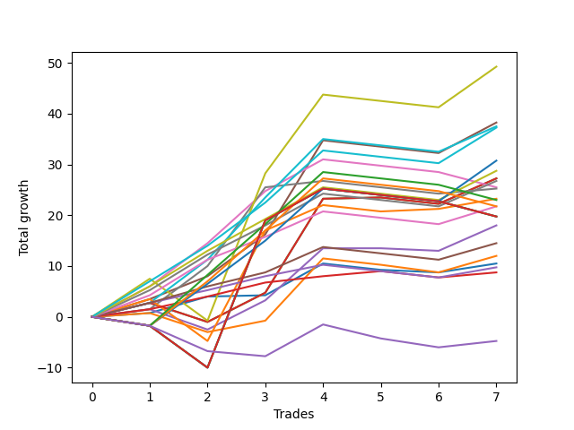

# Long Malinois 001 
- Symbol: ES
- Date Range: 03/18/2022 - 12/30/2022
- Trading Period: 8:30-12:30
- Number of Trades: 7



| Name | Win Percent | Profit | Avg Profit / Trade | Avg Time / Trade |      | Name | Win Percent | Profit | Avg Profit / Trade | Avg Time / Trade |
| ---- | ----------- | ------ | ------------------ | ---------------- | ---- | ---- | ----------- | ------ | ------------------ | ---------------- |
| Sorted By <br> Profit | | | | | | Sorted By <br> Win Percentage ||||
| V U/L 1SD | 57.14 | 24625.00 | 3517.86 | 31:32 |     | TP-1 | 85.71 | 4375.00 | 625.00 | 06:17 |
| V U/L 1SD SL-10 | 57.14 | 23500.00 | 3357.14 | 24:52 |     | BB-50 U/L 1SD | 71.43 | 19125.00 | 2732.14 | 23:46 |
| BB-50 U/L 1SD | 71.43 | 19125.00 | 2732.14 | 23:46 |     | BB-100 Mid | 71.43 | 18750.00 | 2678.57 | 23:21 |
| BB-100 Mid | 71.43 | 18750.00 | 2678.57 | 23:21 |     | TP-7 | 71.43 | 18625.00 | 2660.71 | 16:54 |
| TP-7 | 71.43 | 18625.00 | 2660.71 | 16:54 |     | TP-6 | 71.43 | 14375.00 | 2053.57 | 15:38 |
| TP-8 | 57.14 | 15375.00 | 2196.43 | 22:55 |     | BB-20 U/L 2SD C | 71.43 | 13625.00 | 1946.43 | 18:35 |
| TP-6 | 71.43 | 14375.00 | 2053.57 | 15:38 |     | BB-20 U/L 2SD | 71.43 | 13625.00 | 1946.43 | 18:35 |
| BB-20 U/L 2SD C | 71.43 | 13625.00 | 1946.43 | 18:35 |     | TP-5 | 71.43 | 13375.00 | 1910.71 | 15:25 |
| BB-20 U/L 2SD | 71.43 | 13625.00 | 1946.43 | 18:35 |     | BB-200 Mid | 71.43 | 11625.00 | 1660.71 | 24:55 |
| TP-5 | 71.43 | 13375.00 | 1910.71 | 15:25 |     | TP-4 | 71.43 | 10875.00 | 1553.57 | 12:37 |
| BB-50 U/L 2SD | 57.14 | 12750.00 | 1821.43 | 34:30 |     | BB-200 Mid SL-10 | 71.43 | 10500.00 | 1500.00 | 18:15 |
| BB-200 Mid | 71.43 | 11625.00 | 1660.71 | 24:55 |     | BB-20 U/L 2SD C SL-10 | 71.43 | 10250.00 | 1464.29 | 15:19 |
| BB-50 U/L 1SD SL-10 | 57.14 | 11625.00 | 1660.71 | 20:21 |     | BB-20 U/L 2SD SL-10 | 71.43 | 10250.00 | 1464.29 | 15:19 |
| TP-10 | 42.86 | 11500.00 | 1642.86 | 34:49 |     | BB-50 Mid | 71.43 | 9000.00 | 1285.71 | 17:07 |
| TP-4 | 71.43 | 10875.00 | 1553.57 | 12:37 |     | TP-3 | 71.43 | 7250.00 | 1035.71 | 12:09 |
| TP-9 | 42.86 | 10875.00 | 1553.57 | 34:42 |     | BB-50 Mid SL-10 | 71.43 | 5750.00 | 821.43 | 13:50 |
| BB-200 Mid SL-10 | 71.43 | 10500.00 | 1500.00 | 18:15 |     | BB-20 Mid SL-10 | 71.43 | 5250.00 | 750.00 | 05:23 |
| BB-20 U/L 2SD C SL-10 | 71.43 | 10250.00 | 1464.29 | 15:19 |     | BB-20 Mid | 71.43 | 5250.00 | 750.00 | 05:23 |
| BB-20 U/L 2SD SL-10 | 71.43 | 10250.00 | 1464.29 | 15:19 |     | TP-2 | 71.43 | 4875.00 | 696.43 | 11:17 |
| NEWFI 000 | 28.57 | 9875.00 | 1410.71 | 46:40 |     | V U/L 1SD | 57.14 | 24625.00 | 3517.86 | 31:32 |
| BB-200 U/L 2SD | 28.57 | 9875.00 | 1410.71 | 46:40 |     | V U/L 1SD SL-10 | 57.14 | 23500.00 | 3357.14 | 24:52 |
| BB-100 U/L 2SD | 28.57 | 9875.00 | 1410.71 | 46:40 |     | TP-8 | 57.14 | 15375.00 | 2196.43 | 22:55 |
| BB-100 Mid SL-10 | 57.14 | 9250.00 | 1321.43 | 19:52 |     | BB-50 U/L 2SD | 57.14 | 12750.00 | 1821.43 | 34:30 |
| BB-50 Mid | 71.43 | 9000.00 | 1285.71 | 17:07 |     | BB-50 U/L 1SD SL-10 | 57.14 | 11625.00 | 1660.71 | 20:21 |
| BB-200 U/L 2SD SL-10 | 28.57 | 8750.00 | 1250.00 | 40:00 |     | BB-100 Mid SL-10 | 57.14 | 9250.00 | 1321.43 | 19:52 |
| BB-100 U/L 2SD SL-10 | 28.57 | 8750.00 | 1250.00 | 40:00 |     | BB-20 U/L 1SD | 57.14 | 6000.00 | 857.14 | 15:41 |
| TP-3 | 71.43 | 7250.00 | 1035.71 | 12:09 |     | BB-20 U/L 1SD SL-10 | 57.14 | 2625.00 | 375.00 | 12:25 |
| BB-20 U/L 1SD | 57.14 | 6000.00 | 857.14 | 15:41 |     | TP-10 | 42.86 | 11500.00 | 1642.86 | 34:49 |
| BB-50 Mid SL-10 | 71.43 | 5750.00 | 821.43 | 13:50 |     | TP-9 | 42.86 | 10875.00 | 1553.57 | 34:42 |
| BB-20 Mid SL-10 | 71.43 | 5250.00 | 750.00 | 05:23 |     | BB-50 U/L 2SD SL-10 | 42.86 | 3250.00 | 464.29 | 31:01 |
| BB-20 Mid | 71.43 | 5250.00 | 750.00 | 05:23 |     | NEWFI 000 | 28.57 | 9875.00 | 1410.71 | 46:40 |
| TP-2 | 71.43 | 4875.00 | 696.43 | 11:17 |     | BB-200 U/L 2SD | 28.57 | 9875.00 | 1410.71 | 46:40 |
| TP-1 | 85.71 | 4375.00 | 625.00 | 06:17 |     | BB-100 U/L 2SD | 28.57 | 9875.00 | 1410.71 | 46:40 |
| BB-50 U/L 2SD SL-10 | 42.86 | 3250.00 | 464.29 | 31:01 |     | BB-200 U/L 2SD SL-10 | 28.57 | 8750.00 | 1250.00 | 40:00 |
| BB-20 U/L 1SD SL-10 | 57.14 | 2625.00 | 375.00 | 12:25 |     | BB-100 U/L 2SD SL-10 | 28.57 | 8750.00 | 1250.00 | 40:00 |

## NO STOPLOSS

### Test BB-20 Mid
* Sell when price hits the middle line of the 20p bollinger
* No Stoploss
* Results:
```
Total Trades: 7
Percent Up: 71.43
Percent Down: 28.57
Total Points Moved Up: 10.50
Potential Profit: 5250.00
Total Points Ups: 12.25 Count Ups: 5
Total Points Downs: -1.75 Count Downs: 2
```

<details><summary>Trades</summary>

<code>In: 2022-04-19 10:33:00		Out: 2022-04-19 10:37:15		Total Position Time: 04:15		Total Move Up: 0.75		Total to Date: 0.75</code> <br />
<code>In: 2022-05-06 11:12:00		Out: 2022-05-06 11:15:05		Total Position Time: 03:05		Total Move Up: 3.25		Total to Date: 4.00</code> <br />
<code>In: 2022-05-13 11:10:00		Out: 2022-05-13 11:19:15		Total Position Time: 09:15		Total Move Up: 0.25		Total to Date: 4.25</code> <br />
<code>In: 2022-06-17 12:18:00		Out: 2022-06-17 12:20:30		Total Position Time: 02:30		Total Move Up: 6.25		Total to Date: 10.50</code> <br />
<code>In: 2022-07-11 12:09:00		Out: 2022-07-11 12:22:10		Total Position Time: 13:10		Total Move Up: -1.25		Total to Date: 9.25</code> <br />
<code>In: 2022-11-21 12:31:00		Out: 2022-11-21 12:32:20		Total Position Time: 01:20		Total Move Up: -0.50		Total to Date: 8.75</code> <br />
<code>In: 2022-12-27 09:52:00		Out: 2022-12-27 09:56:10		Total Position Time: 04:10		Total Move Up: 1.75		Total to Date: 10.50</code> <br />


</details>

### Test BB-20 U/L 1SD
* Sell when the price hits the upper line of the 20p 1std bollinger
* No Stoploss
* Results:
```
Total Trades: 7
Percent Up: 57.14
Percent Down: 42.86
Total Points Moved Up: 12.00
Potential Profit: 6000.00
Total Points Ups: 18.50 Count Ups: 4
Total Points Downs: -6.50 Count Downs: 3
```

<details><summary>Trades</summary>

<code>In: 2022-04-19 10:33:00		Out: 2022-04-19 10:48:55		Total Position Time: 15:55		Total Move Up: 0.75		Total to Date: 0.75</code> <br />
<code>In: 2022-05-06 11:12:00		Out: 2022-05-06 11:49:10		Total Position Time: 37:10		Total Move Up: -3.75		Total to Date: -3.00</code> <br />
<code>In: 2022-05-13 11:10:00		Out: 2022-05-13 11:20:05		Total Position Time: 10:05		Total Move Up: 2.25		Total to Date: -0.75</code> <br />
<code>In: 2022-06-17 12:18:00		Out: 2022-06-17 12:22:20		Total Position Time: 04:20		Total Move Up: 12.25		Total to Date: 11.50</code> <br />
<code>In: 2022-07-11 12:09:00		Out: 2022-07-11 12:29:20		Total Position Time: 20:20		Total Move Up: -1.25		Total to Date: 10.25</code> <br />
<code>In: 2022-11-21 12:31:00		Out: 2022-11-21 12:45:35		Total Position Time: 14:35		Total Move Up: -1.50		Total to Date: 8.75</code> <br />
<code>In: 2022-12-27 09:52:00		Out: 2022-12-27 09:59:25		Total Position Time: 07:25		Total Move Up: 3.25		Total to Date: 12.00</code> <br />


</details>

### Test BB-20 U/L 2SD
* Sell when the price hits the upper line of the 20p 2std bollinger
* No Stoploss
* Results:
```
Total Trades: 7
Percent Up: 71.43
Percent Down: 28.57
Total Points Moved Up: 27.25
Potential Profit: 13625.00
Total Points Ups: 32.25 Count Ups: 5
Total Points Downs: -5.00 Count Downs: 2
```

<details><summary>Trades</summary>

<code>In: 2022-04-19 10:33:00		Out: 2022-04-19 10:49:55		Total Position Time: 16:55		Total Move Up: 2.75		Total to Date: 2.75</code> <br />
<code>In: 2022-05-06 11:12:00		Out: 2022-05-06 11:49:10		Total Position Time: 37:10		Total Move Up: -3.75		Total to Date: -1.00</code> <br />
<code>In: 2022-05-13 11:10:00		Out: 2022-05-13 11:31:20		Total Position Time: 21:20		Total Move Up: 5.75		Total to Date: 4.75</code> <br />
<code>In: 2022-06-17 12:18:00		Out: 2022-06-17 12:27:15		Total Position Time: 09:15		Total Move Up: 18.50		Total to Date: 23.25</code> <br />
<code>In: 2022-07-11 12:09:00		Out: 2022-07-11 12:29:40		Total Position Time: 20:40		Total Move Up: 0.25		Total to Date: 23.50</code> <br />
<code>In: 2022-11-21 12:31:00		Out: 2022-11-21 12:47:00		Total Position Time: 16:00		Total Move Up: -1.25		Total to Date: 22.25</code> <br />
<code>In: 2022-12-27 09:52:00		Out: 2022-12-27 10:00:50		Total Position Time: 08:50		Total Move Up: 5.00		Total to Date: 27.25</code> <br />


</details>

### Test BB-20 U/L 2SD C
* Sell when the price hits the upper line of the 20p 2std bollinger
* No Stoploss
* Results:
```
Total Trades: 7
Percent Up: 71.43
Percent Down: 28.57
Total Points Moved Up: 27.25
Potential Profit: 13625.00
Total Points Ups: 32.25 Count Ups: 5
Total Points Downs: -5.00 Count Downs: 2
```

<details><summary>Trades</summary>

<code>In: 2022-04-19 10:33:00		Out: 2022-04-19 10:49:55		Total Position Time: 16:55		Total Move Up: 2.75		Total to Date: 2.75</code> <br />
<code>In: 2022-05-06 11:12:00		Out: 2022-05-06 11:49:10		Total Position Time: 37:10		Total Move Up: -3.75		Total to Date: -1.00</code> <br />
<code>In: 2022-05-13 11:10:00		Out: 2022-05-13 11:31:20		Total Position Time: 21:20		Total Move Up: 5.75		Total to Date: 4.75</code> <br />
<code>In: 2022-06-17 12:18:00		Out: 2022-06-17 12:27:15		Total Position Time: 09:15		Total Move Up: 18.50		Total to Date: 23.25</code> <br />
<code>In: 2022-07-11 12:09:00		Out: 2022-07-11 12:29:40		Total Position Time: 20:40		Total Move Up: 0.25		Total to Date: 23.50</code> <br />
<code>In: 2022-11-21 12:31:00		Out: 2022-11-21 12:47:00		Total Position Time: 16:00		Total Move Up: -1.25		Total to Date: 22.25</code> <br />
<code>In: 2022-12-27 09:52:00		Out: 2022-12-27 10:00:50		Total Position Time: 08:50		Total Move Up: 5.00		Total to Date: 27.25</code> <br />


</details>

### Test BB-50 Mid
* Sell when price hits the middle line of the 50p bollinger
* No Stoploss
* Results:
```
Total Trades: 7
Percent Up: 71.43
Percent Down: 28.57
Total Points Moved Up: 18.00
Potential Profit: 9000.00
Total Points Ups: 22.50 Count Ups: 5
Total Points Downs: -4.50 Count Downs: 2
```

<details><summary>Trades</summary>

<code>In: 2022-04-19 10:33:00		Out: 2022-04-19 10:49:10		Total Position Time: 16:10		Total Move Up: 1.50		Total to Date: 1.50</code> <br />
<code>In: 2022-05-06 11:12:00		Out: 2022-05-06 11:49:15		Total Position Time: 37:15		Total Move Up: -4.00		Total to Date: -2.50</code> <br />
<code>In: 2022-05-13 11:10:00		Out: 2022-05-13 11:31:20		Total Position Time: 21:20		Total Move Up: 5.75		Total to Date: 3.25</code> <br />
<code>In: 2022-06-17 12:18:00		Out: 2022-06-17 12:21:20		Total Position Time: 03:20		Total Move Up: 10.25		Total to Date: 13.50</code> <br />
<code>In: 2022-07-11 12:09:00		Out: 2022-07-11 12:40:35		Total Position Time: 31:35		Total Move Up: 0.00		Total to Date: 13.50</code> <br />
<code>In: 2022-11-21 12:31:00		Out: 2022-11-21 12:32:20		Total Position Time: 01:20		Total Move Up: -0.50		Total to Date: 13.00</code> <br />
<code>In: 2022-12-27 09:52:00		Out: 2022-12-27 10:00:50		Total Position Time: 08:50		Total Move Up: 5.00		Total to Date: 18.00</code> <br />


</details>

### Test BB-50 U/L 1SD
* Sell when the price hits the upper line of the 50p 1std bollinger
* No Stoploss
* Results:
```
Total Trades: 7
Percent Up: 71.43
Percent Down: 28.57
Total Points Moved Up: 38.25
Potential Profit: 19125.00
Total Points Ups: 40.75 Count Ups: 5
Total Points Downs: -2.50 Count Downs: 2
```

<details><summary>Trades</summary>

<code>In: 2022-04-19 10:33:00		Out: 2022-04-19 10:50:10		Total Position Time: 17:10		Total Move Up: 3.50		Total to Date: 3.50</code> <br />
<code>In: 2022-05-06 11:12:00		Out: 2022-05-06 11:50:10		Total Position Time: 38:10		Total Move Up: 4.50		Total to Date: 8.00</code> <br />
<code>In: 2022-05-13 11:10:00		Out: 2022-05-13 11:43:05		Total Position Time: 33:05		Total Move Up: 8.25		Total to Date: 16.25</code> <br />
<code>In: 2022-06-17 12:18:00		Out: 2022-06-17 12:27:15		Total Position Time: 09:15		Total Move Up: 18.50		Total to Date: 34.75</code> <br />
<code>In: 2022-07-11 12:09:00		Out: 2022-07-11 12:47:00		Total Position Time: 38:00		Total Move Up: -1.25		Total to Date: 33.50</code> <br />
<code>In: 2022-11-21 12:31:00		Out: 2022-11-21 12:47:00		Total Position Time: 16:00		Total Move Up: -1.25		Total to Date: 32.25</code> <br />
<code>In: 2022-12-27 09:52:00		Out: 2022-12-27 10:06:45		Total Position Time: 14:45		Total Move Up: 6.00		Total to Date: 38.25</code> <br />


</details>

### Test BB-50 U/L 2SD
* Sell when the price hits the upper line of the 50p 2std bollinger
* No Stoploss
* Results:
```
Total Trades: 7
Percent Up: 57.14
Percent Down: 42.86
Total Points Moved Up: 25.50
Potential Profit: 12750.00
Total Points Ups: 31.00 Count Ups: 4
Total Points Downs: -5.50 Count Downs: 3
```

<details><summary>Trades</summary>

<code>In: 2022-04-19 10:33:00		Out: 2022-04-19 10:50:50		Total Position Time: 17:50		Total Move Up: 6.00		Total to Date: 6.00</code> <br />
<code>In: 2022-05-06 11:12:00		Out: 2022-05-06 11:50:35		Total Position Time: 38:35		Total Move Up: 8.50		Total to Date: 14.50</code> <br />
<code>In: 2022-05-13 11:10:00		Out: 2022-05-13 11:51:10		Total Position Time: 41:10		Total Move Up: 10.25		Total to Date: 24.75</code> <br />
<code>In: 2022-06-17 12:18:00		Out: 2022-06-17 12:47:00		Total Position Time: 29:00		Total Move Up: 6.25		Total to Date: 31.00</code> <br />
<code>In: 2022-07-11 12:09:00		Out: 2022-07-11 12:47:00		Total Position Time: 38:00		Total Move Up: -1.25		Total to Date: 29.75</code> <br />
<code>In: 2022-11-21 12:31:00		Out: 2022-11-21 12:47:00		Total Position Time: 16:00		Total Move Up: -1.25		Total to Date: 28.50</code> <br />
<code>In: 2022-12-27 09:52:00		Out: 2022-12-27 10:52:55		Total Position Time: 60:55		Total Move Up: -3.00		Total to Date: 25.50</code> <br />


</details>

### Test V U/L 1SD
* Sell when the price hits the upper line of the 1std VWAP
* No Stoploss
* Results:
```
Total Trades: 7
Percent Up: 57.14
Percent Down: 42.86
Total Points Moved Up: 49.25
Potential Profit: 24625.00
Total Points Ups: 60.00 Count Ups: 4
Total Points Downs: -10.75 Count Downs: 3
```

<details><summary>Trades</summary>

<code>In: 2022-04-19 10:33:00		Out: 2022-04-19 10:52:45		Total Position Time: 19:45		Total Move Up: 7.50		Total to Date: 7.50</code> <br />
<code>In: 2022-05-06 11:12:00		Out: 2022-05-06 12:12:55		Total Position Time: 60:55		Total Move Up: -8.25		Total to Date: -0.75</code> <br />
<code>In: 2022-05-13 11:10:00		Out: 2022-05-13 12:10:55		Total Position Time: 60:55		Total Move Up: 29.00		Total to Date: 28.25</code> <br />
<code>In: 2022-06-17 12:18:00		Out: 2022-06-17 12:26:30		Total Position Time: 08:30		Total Move Up: 15.50		Total to Date: 43.75</code> <br />
<code>In: 2022-07-11 12:09:00		Out: 2022-07-11 12:47:00		Total Position Time: 38:00		Total Move Up: -1.25		Total to Date: 42.50</code> <br />
<code>In: 2022-11-21 12:31:00		Out: 2022-11-21 12:47:00		Total Position Time: 16:00		Total Move Up: -1.25		Total to Date: 41.25</code> <br />
<code>In: 2022-12-27 09:52:00		Out: 2022-12-27 10:08:45		Total Position Time: 16:45		Total Move Up: 8.00		Total to Date: 49.25</code> <br />


</details>

### Test BB-100 Mid
* Move to BB100 Mid
* No Stoploss
* Results:
```
Total Trades: 7
Percent Up: 71.43
Percent Down: 28.57
Total Points Moved Up: 37.50
Potential Profit: 18750.00
Total Points Ups: 40.00 Count Ups: 5
Total Points Downs: -2.50 Count Downs: 2
```

<details><summary>Trades</summary>

<code>In: 2022-04-19 10:33:00		Out: 2022-04-19 10:50:00		Total Position Time: 17:00		Total Move Up: 2.75		Total to Date: 2.75</code> <br />
<code>In: 2022-05-06 11:12:00		Out: 2022-05-06 11:50:35		Total Position Time: 38:35		Total Move Up: 8.50		Total to Date: 11.25</code> <br />
<code>In: 2022-05-13 11:10:00		Out: 2022-05-13 11:51:35		Total Position Time: 41:35		Total Move Up: 12.25		Total to Date: 23.50</code> <br />
<code>In: 2022-06-17 12:18:00		Out: 2022-06-17 12:21:30		Total Position Time: 03:30		Total Move Up: 11.50		Total to Date: 35.00</code> <br />
<code>In: 2022-07-11 12:09:00		Out: 2022-07-11 12:47:00		Total Position Time: 38:00		Total Move Up: -1.25		Total to Date: 33.75</code> <br />
<code>In: 2022-11-21 12:31:00		Out: 2022-11-21 12:47:00		Total Position Time: 16:00		Total Move Up: -1.25		Total to Date: 32.50</code> <br />
<code>In: 2022-12-27 09:52:00		Out: 2022-12-27 10:00:50		Total Position Time: 08:50		Total Move Up: 5.00		Total to Date: 37.50</code> <br />


</details>

### Test BB-100 U/L 2SD
* Move to BB100 Upper Band
* No Stoploss
* Results:
```
Total Trades: 7
Percent Up: 28.57
Percent Down: 71.43
Total Points Moved Up: 19.75
Potential Profit: 9875.00
Total Points Ups: 35.25 Count Ups: 2
Total Points Downs: -15.50 Count Downs: 5
```

<details><summary>Trades</summary>

<code>In: 2022-04-19 10:33:00		Out: 2022-04-19 11:33:55		Total Position Time: 60:55		Total Move Up: -1.75		Total to Date: -1.75</code> <br />
<code>In: 2022-05-06 11:12:00		Out: 2022-05-06 12:12:55		Total Position Time: 60:55		Total Move Up: -8.25		Total to Date: -10.00</code> <br />
<code>In: 2022-05-13 11:10:00		Out: 2022-05-13 12:10:55		Total Position Time: 60:55		Total Move Up: 29.00		Total to Date: 19.00</code> <br />
<code>In: 2022-06-17 12:18:00		Out: 2022-06-17 12:47:00		Total Position Time: 29:00		Total Move Up: 6.25		Total to Date: 25.25</code> <br />
<code>In: 2022-07-11 12:09:00		Out: 2022-07-11 12:47:00		Total Position Time: 38:00		Total Move Up: -1.25		Total to Date: 24.00</code> <br />
<code>In: 2022-11-21 12:31:00		Out: 2022-11-21 12:47:00		Total Position Time: 16:00		Total Move Up: -1.25		Total to Date: 22.75</code> <br />
<code>In: 2022-12-27 09:52:00		Out: 2022-12-27 10:52:55		Total Position Time: 60:55		Total Move Up: -3.00		Total to Date: 19.75</code> <br />


</details>

### Test BB-200 Mid
* Move to BB200 Mid
* No Stoploss
* Results:
```
Total Trades: 7
Percent Up: 71.43
Percent Down: 28.57
Total Points Moved Up: 23.25
Potential Profit: 11625.00
Total Points Ups: 32.75 Count Ups: 5
Total Points Downs: -9.50 Count Downs: 2
```

<details><summary>Trades</summary>

<code>In: 2022-04-19 10:33:00		Out: 2022-04-19 10:50:05		Total Position Time: 17:05		Total Move Up: 3.50		Total to Date: 3.50</code> <br />
<code>In: 2022-05-06 11:12:00		Out: 2022-05-06 12:12:55		Total Position Time: 60:55		Total Move Up: -8.25		Total to Date: -4.75</code> <br />
<code>In: 2022-05-13 11:10:00		Out: 2022-05-13 12:00:05		Total Position Time: 50:05		Total Move Up: 21.75		Total to Date: 17.00</code> <br />
<code>In: 2022-06-17 12:18:00		Out: 2022-06-17 12:20:25		Total Position Time: 02:25		Total Move Up: 5.00		Total to Date: 22.00</code> <br />
<code>In: 2022-07-11 12:09:00		Out: 2022-07-11 12:47:00		Total Position Time: 38:00		Total Move Up: -1.25		Total to Date: 20.75</code> <br />
<code>In: 2022-11-21 12:31:00		Out: 2022-11-21 12:32:35		Total Position Time: 01:35		Total Move Up: 0.50		Total to Date: 21.25</code> <br />
<code>In: 2022-12-27 09:52:00		Out: 2022-12-27 09:56:20		Total Position Time: 04:20		Total Move Up: 2.00		Total to Date: 23.25</code> <br />


</details>

### Test BB-200 U/L 2SD
* Move to BB200 Upper Band
* No Stoploss
* Results:
```
Total Trades: 7
Percent Up: 28.57
Percent Down: 71.43
Total Points Moved Up: 19.75
Potential Profit: 9875.00
Total Points Ups: 35.25 Count Ups: 2
Total Points Downs: -15.50 Count Downs: 5
```

<details><summary>Trades</summary>

<code>In: 2022-04-19 10:33:00		Out: 2022-04-19 11:33:55		Total Position Time: 60:55		Total Move Up: -1.75		Total to Date: -1.75</code> <br />
<code>In: 2022-05-06 11:12:00		Out: 2022-05-06 12:12:55		Total Position Time: 60:55		Total Move Up: -8.25		Total to Date: -10.00</code> <br />
<code>In: 2022-05-13 11:10:00		Out: 2022-05-13 12:10:55		Total Position Time: 60:55		Total Move Up: 29.00		Total to Date: 19.00</code> <br />
<code>In: 2022-06-17 12:18:00		Out: 2022-06-17 12:47:00		Total Position Time: 29:00		Total Move Up: 6.25		Total to Date: 25.25</code> <br />
<code>In: 2022-07-11 12:09:00		Out: 2022-07-11 12:47:00		Total Position Time: 38:00		Total Move Up: -1.25		Total to Date: 24.00</code> <br />
<code>In: 2022-11-21 12:31:00		Out: 2022-11-21 12:47:00		Total Position Time: 16:00		Total Move Up: -1.25		Total to Date: 22.75</code> <br />
<code>In: 2022-12-27 09:52:00		Out: 2022-12-27 10:52:55		Total Position Time: 60:55		Total Move Up: -3.00		Total to Date: 19.75</code> <br />


</details>

## STOPLOSS OF 10

### Test BB-20 Mid SL-10
* Sell when price hits the middle line of the 20p bollinger
* Stoploss is 10 points
* Results:
```
Total Trades: 7
Percent Up: 71.43
Percent Down: 28.57
Total Points Moved Up: 10.50
Potential Profit: 5250.00
Total Points Ups: 12.25 Count Ups: 5
Total Points Downs: -1.75 Count Downs: 2
```

<details><summary>Trades</summary>

<code>In: 2022-04-19 10:33:00		Out: 2022-04-19 10:37:15		Total Position Time: 04:15		Total Move Up: 0.75		Total to Date: 0.75</code> <br />
<code>In: 2022-05-06 11:12:00		Out: 2022-05-06 11:15:05		Total Position Time: 03:05		Total Move Up: 3.25		Total to Date: 4.00</code> <br />
<code>In: 2022-05-13 11:10:00		Out: 2022-05-13 11:19:15		Total Position Time: 09:15		Total Move Up: 0.25		Total to Date: 4.25</code> <br />
<code>In: 2022-06-17 12:18:00		Out: 2022-06-17 12:20:30		Total Position Time: 02:30		Total Move Up: 6.25		Total to Date: 10.50</code> <br />
<code>In: 2022-07-11 12:09:00		Out: 2022-07-11 12:22:10		Total Position Time: 13:10		Total Move Up: -1.25		Total to Date: 9.25</code> <br />
<code>In: 2022-11-21 12:31:00		Out: 2022-11-21 12:32:20		Total Position Time: 01:20		Total Move Up: -0.50		Total to Date: 8.75</code> <br />
<code>In: 2022-12-27 09:52:00		Out: 2022-12-27 09:56:10		Total Position Time: 04:10		Total Move Up: 1.75		Total to Date: 10.50</code> <br />


</details>

### Test BB-20 U/L 1SD SL-10
* Sell when the price hits the upper line of the 20p 1std bollinger
* Stoploss is 10 points
* Results:
```
Total Trades: 7
Percent Up: 57.14
Percent Down: 42.86
Total Points Moved Up: 5.25
Potential Profit: 2625.00
Total Points Ups: 18.50 Count Ups: 4
Total Points Downs: -13.25 Count Downs: 3
```

<details><summary>Trades</summary>

<code>In: 2022-04-19 10:33:00		Out: 2022-04-19 10:48:55		Total Position Time: 15:55		Total Move Up: 0.75		Total to Date: 0.75</code> <br />
<code>In: 2022-05-06 11:12:00		Out: 2022-05-06 11:26:15		Total Position Time: 14:15		Total Move Up: -10.50		Total to Date: -9.75</code> <br />
<code>In: 2022-05-13 11:10:00		Out: 2022-05-13 11:20:05		Total Position Time: 10:05		Total Move Up: 2.25		Total to Date: -7.50</code> <br />
<code>In: 2022-06-17 12:18:00		Out: 2022-06-17 12:22:20		Total Position Time: 04:20		Total Move Up: 12.25		Total to Date: 4.75</code> <br />
<code>In: 2022-07-11 12:09:00		Out: 2022-07-11 12:29:20		Total Position Time: 20:20		Total Move Up: -1.25		Total to Date: 3.50</code> <br />
<code>In: 2022-11-21 12:31:00		Out: 2022-11-21 12:45:35		Total Position Time: 14:35		Total Move Up: -1.50		Total to Date: 2.00</code> <br />
<code>In: 2022-12-27 09:52:00		Out: 2022-12-27 09:59:25		Total Position Time: 07:25		Total Move Up: 3.25		Total to Date: 5.25</code> <br />


</details>

### Test BB-20 U/L 2SD SL-10
* Sell when the price hits the upper line of the 20p 2std bollinger
* Stoploss is 10 points
* Results:
```
Total Trades: 7
Percent Up: 71.43
Percent Down: 28.57
Total Points Moved Up: 20.50
Potential Profit: 10250.00
Total Points Ups: 32.25 Count Ups: 5
Total Points Downs: -11.75 Count Downs: 2
```

<details><summary>Trades</summary>

<code>In: 2022-04-19 10:33:00		Out: 2022-04-19 10:49:55		Total Position Time: 16:55		Total Move Up: 2.75		Total to Date: 2.75</code> <br />
<code>In: 2022-05-06 11:12:00		Out: 2022-05-06 11:26:15		Total Position Time: 14:15		Total Move Up: -10.50		Total to Date: -7.75</code> <br />
<code>In: 2022-05-13 11:10:00		Out: 2022-05-13 11:31:20		Total Position Time: 21:20		Total Move Up: 5.75		Total to Date: -2.00</code> <br />
<code>In: 2022-06-17 12:18:00		Out: 2022-06-17 12:27:15		Total Position Time: 09:15		Total Move Up: 18.50		Total to Date: 16.50</code> <br />
<code>In: 2022-07-11 12:09:00		Out: 2022-07-11 12:29:40		Total Position Time: 20:40		Total Move Up: 0.25		Total to Date: 16.75</code> <br />
<code>In: 2022-11-21 12:31:00		Out: 2022-11-21 12:47:00		Total Position Time: 16:00		Total Move Up: -1.25		Total to Date: 15.50</code> <br />
<code>In: 2022-12-27 09:52:00		Out: 2022-12-27 10:00:50		Total Position Time: 08:50		Total Move Up: 5.00		Total to Date: 20.50</code> <br />


</details>

### Test BB-20 U/L 2SD C SL-10
* Sell when the price hits the upper line of the 20p 2std bollinger
* Stoploss is 10 points
* Results:
```
Total Trades: 7
Percent Up: 71.43
Percent Down: 28.57
Total Points Moved Up: 20.50
Potential Profit: 10250.00
Total Points Ups: 32.25 Count Ups: 5
Total Points Downs: -11.75 Count Downs: 2
```

<details><summary>Trades</summary>

<code>In: 2022-04-19 10:33:00		Out: 2022-04-19 10:49:55		Total Position Time: 16:55		Total Move Up: 2.75		Total to Date: 2.75</code> <br />
<code>In: 2022-05-06 11:12:00		Out: 2022-05-06 11:26:15		Total Position Time: 14:15		Total Move Up: -10.50		Total to Date: -7.75</code> <br />
<code>In: 2022-05-13 11:10:00		Out: 2022-05-13 11:31:20		Total Position Time: 21:20		Total Move Up: 5.75		Total to Date: -2.00</code> <br />
<code>In: 2022-06-17 12:18:00		Out: 2022-06-17 12:27:15		Total Position Time: 09:15		Total Move Up: 18.50		Total to Date: 16.50</code> <br />
<code>In: 2022-07-11 12:09:00		Out: 2022-07-11 12:29:40		Total Position Time: 20:40		Total Move Up: 0.25		Total to Date: 16.75</code> <br />
<code>In: 2022-11-21 12:31:00		Out: 2022-11-21 12:47:00		Total Position Time: 16:00		Total Move Up: -1.25		Total to Date: 15.50</code> <br />
<code>In: 2022-12-27 09:52:00		Out: 2022-12-27 10:00:50		Total Position Time: 08:50		Total Move Up: 5.00		Total to Date: 20.50</code> <br />


</details>

### Test BB-50 Mid SL-10
* Sell when price hits the middle line of the 50p bollinger
* Stoploss is 10 points
* Results:
```
Total Trades: 7
Percent Up: 71.43
Percent Down: 28.57
Total Points Moved Up: 11.50
Potential Profit: 5750.00
Total Points Ups: 22.50 Count Ups: 5
Total Points Downs: -11.00 Count Downs: 2
```

<details><summary>Trades</summary>

<code>In: 2022-04-19 10:33:00		Out: 2022-04-19 10:49:10		Total Position Time: 16:10		Total Move Up: 1.50		Total to Date: 1.50</code> <br />
<code>In: 2022-05-06 11:12:00		Out: 2022-05-06 11:26:15		Total Position Time: 14:15		Total Move Up: -10.50		Total to Date: -9.00</code> <br />
<code>In: 2022-05-13 11:10:00		Out: 2022-05-13 11:31:20		Total Position Time: 21:20		Total Move Up: 5.75		Total to Date: -3.25</code> <br />
<code>In: 2022-06-17 12:18:00		Out: 2022-06-17 12:21:20		Total Position Time: 03:20		Total Move Up: 10.25		Total to Date: 7.00</code> <br />
<code>In: 2022-07-11 12:09:00		Out: 2022-07-11 12:40:35		Total Position Time: 31:35		Total Move Up: 0.00		Total to Date: 7.00</code> <br />
<code>In: 2022-11-21 12:31:00		Out: 2022-11-21 12:32:20		Total Position Time: 01:20		Total Move Up: -0.50		Total to Date: 6.50</code> <br />
<code>In: 2022-12-27 09:52:00		Out: 2022-12-27 10:00:50		Total Position Time: 08:50		Total Move Up: 5.00		Total to Date: 11.50</code> <br />


</details>

### Test BB-50 U/L 1SD SL-10
* Sell when the price hits the upper line of the 50p 1std bollinger
* Stoploss is 10 points
* Results:
```
Total Trades: 7
Percent Up: 57.14
Percent Down: 42.86
Total Points Moved Up: 23.25
Potential Profit: 11625.00
Total Points Ups: 36.25 Count Ups: 4
Total Points Downs: -13.00 Count Downs: 3
```

<details><summary>Trades</summary>

<code>In: 2022-04-19 10:33:00		Out: 2022-04-19 10:50:10		Total Position Time: 17:10		Total Move Up: 3.50		Total to Date: 3.50</code> <br />
<code>In: 2022-05-06 11:12:00		Out: 2022-05-06 11:26:15		Total Position Time: 14:15		Total Move Up: -10.50		Total to Date: -7.00</code> <br />
<code>In: 2022-05-13 11:10:00		Out: 2022-05-13 11:43:05		Total Position Time: 33:05		Total Move Up: 8.25		Total to Date: 1.25</code> <br />
<code>In: 2022-06-17 12:18:00		Out: 2022-06-17 12:27:15		Total Position Time: 09:15		Total Move Up: 18.50		Total to Date: 19.75</code> <br />
<code>In: 2022-07-11 12:09:00		Out: 2022-07-11 12:47:00		Total Position Time: 38:00		Total Move Up: -1.25		Total to Date: 18.50</code> <br />
<code>In: 2022-11-21 12:31:00		Out: 2022-11-21 12:47:00		Total Position Time: 16:00		Total Move Up: -1.25		Total to Date: 17.25</code> <br />
<code>In: 2022-12-27 09:52:00		Out: 2022-12-27 10:06:45		Total Position Time: 14:45		Total Move Up: 6.00		Total to Date: 23.25</code> <br />


</details>

### Test BB-50 U/L 2SD SL-10
* Sell when the price hits the upper line of the 50p 2std bollinger
* Stoploss is 10 points
* Results:
```
Total Trades: 7
Percent Up: 42.86
Percent Down: 57.14
Total Points Moved Up: 6.50
Potential Profit: 3250.00
Total Points Ups: 22.50 Count Ups: 3
Total Points Downs: -16.00 Count Downs: 4
```

<details><summary>Trades</summary>

<code>In: 2022-04-19 10:33:00		Out: 2022-04-19 10:50:50		Total Position Time: 17:50		Total Move Up: 6.00		Total to Date: 6.00</code> <br />
<code>In: 2022-05-06 11:12:00		Out: 2022-05-06 11:26:15		Total Position Time: 14:15		Total Move Up: -10.50		Total to Date: -4.50</code> <br />
<code>In: 2022-05-13 11:10:00		Out: 2022-05-13 11:51:10		Total Position Time: 41:10		Total Move Up: 10.25		Total to Date: 5.75</code> <br />
<code>In: 2022-06-17 12:18:00		Out: 2022-06-17 12:47:00		Total Position Time: 29:00		Total Move Up: 6.25		Total to Date: 12.00</code> <br />
<code>In: 2022-07-11 12:09:00		Out: 2022-07-11 12:47:00		Total Position Time: 38:00		Total Move Up: -1.25		Total to Date: 10.75</code> <br />
<code>In: 2022-11-21 12:31:00		Out: 2022-11-21 12:47:00		Total Position Time: 16:00		Total Move Up: -1.25		Total to Date: 9.50</code> <br />
<code>In: 2022-12-27 09:52:00		Out: 2022-12-27 10:52:55		Total Position Time: 60:55		Total Move Up: -3.00		Total to Date: 6.50</code> <br />


</details>

### Test V U/L 1SD SL-10
* Sell when the price hits the upper line of the 1std VWAP
* Stoploss is 10 points
* Results:
```
Total Trades: 7
Percent Up: 57.14
Percent Down: 42.86
Total Points Moved Up: 47.00
Potential Profit: 23500.00
Total Points Ups: 60.00 Count Ups: 4
Total Points Downs: -13.00 Count Downs: 3
```

<details><summary>Trades</summary>

<code>In: 2022-04-19 10:33:00		Out: 2022-04-19 10:52:45		Total Position Time: 19:45		Total Move Up: 7.50		Total to Date: 7.50</code> <br />
<code>In: 2022-05-06 11:12:00		Out: 2022-05-06 11:26:15		Total Position Time: 14:15		Total Move Up: -10.50		Total to Date: -3.00</code> <br />
<code>In: 2022-05-13 11:10:00		Out: 2022-05-13 12:10:55		Total Position Time: 60:55		Total Move Up: 29.00		Total to Date: 26.00</code> <br />
<code>In: 2022-06-17 12:18:00		Out: 2022-06-17 12:26:30		Total Position Time: 08:30		Total Move Up: 15.50		Total to Date: 41.50</code> <br />
<code>In: 2022-07-11 12:09:00		Out: 2022-07-11 12:47:00		Total Position Time: 38:00		Total Move Up: -1.25		Total to Date: 40.25</code> <br />
<code>In: 2022-11-21 12:31:00		Out: 2022-11-21 12:47:00		Total Position Time: 16:00		Total Move Up: -1.25		Total to Date: 39.00</code> <br />
<code>In: 2022-12-27 09:52:00		Out: 2022-12-27 10:08:45		Total Position Time: 16:45		Total Move Up: 8.00		Total to Date: 47.00</code> <br />


</details>

### Test BB-100 Mid SL-10
* Move to BB100 Mid
* Stoploss is 10 points
* Results:
```
Total Trades: 7
Percent Up: 57.14
Percent Down: 42.86
Total Points Moved Up: 18.50
Potential Profit: 9250.00
Total Points Ups: 31.50 Count Ups: 4
Total Points Downs: -13.00 Count Downs: 3
```

<details><summary>Trades</summary>

<code>In: 2022-04-19 10:33:00		Out: 2022-04-19 10:50:00		Total Position Time: 17:00		Total Move Up: 2.75		Total to Date: 2.75</code> <br />
<code>In: 2022-05-06 11:12:00		Out: 2022-05-06 11:26:15		Total Position Time: 14:15		Total Move Up: -10.50		Total to Date: -7.75</code> <br />
<code>In: 2022-05-13 11:10:00		Out: 2022-05-13 11:51:35		Total Position Time: 41:35		Total Move Up: 12.25		Total to Date: 4.50</code> <br />
<code>In: 2022-06-17 12:18:00		Out: 2022-06-17 12:21:30		Total Position Time: 03:30		Total Move Up: 11.50		Total to Date: 16.00</code> <br />
<code>In: 2022-07-11 12:09:00		Out: 2022-07-11 12:47:00		Total Position Time: 38:00		Total Move Up: -1.25		Total to Date: 14.75</code> <br />
<code>In: 2022-11-21 12:31:00		Out: 2022-11-21 12:47:00		Total Position Time: 16:00		Total Move Up: -1.25		Total to Date: 13.50</code> <br />
<code>In: 2022-12-27 09:52:00		Out: 2022-12-27 10:00:50		Total Position Time: 08:50		Total Move Up: 5.00		Total to Date: 18.50</code> <br />


</details>

### Test BB-100 U/L 2SD SL-10
* Move to BB100 Upper Band
* Stoploss is 10 points
* Results:
```
Total Trades: 7
Percent Up: 28.57
Percent Down: 71.43
Total Points Moved Up: 17.50
Potential Profit: 8750.00
Total Points Ups: 35.25 Count Ups: 2
Total Points Downs: -17.75 Count Downs: 5
```

<details><summary>Trades</summary>

<code>In: 2022-04-19 10:33:00		Out: 2022-04-19 11:33:55		Total Position Time: 60:55		Total Move Up: -1.75		Total to Date: -1.75</code> <br />
<code>In: 2022-05-06 11:12:00		Out: 2022-05-06 11:26:15		Total Position Time: 14:15		Total Move Up: -10.50		Total to Date: -12.25</code> <br />
<code>In: 2022-05-13 11:10:00		Out: 2022-05-13 12:10:55		Total Position Time: 60:55		Total Move Up: 29.00		Total to Date: 16.75</code> <br />
<code>In: 2022-06-17 12:18:00		Out: 2022-06-17 12:47:00		Total Position Time: 29:00		Total Move Up: 6.25		Total to Date: 23.00</code> <br />
<code>In: 2022-07-11 12:09:00		Out: 2022-07-11 12:47:00		Total Position Time: 38:00		Total Move Up: -1.25		Total to Date: 21.75</code> <br />
<code>In: 2022-11-21 12:31:00		Out: 2022-11-21 12:47:00		Total Position Time: 16:00		Total Move Up: -1.25		Total to Date: 20.50</code> <br />
<code>In: 2022-12-27 09:52:00		Out: 2022-12-27 10:52:55		Total Position Time: 60:55		Total Move Up: -3.00		Total to Date: 17.50</code> <br />


</details>

### Test BB-200 Mid SL-10
* Move to BB200 Mid
* Stoploss is 10 points
* Results:
```
Total Trades: 7
Percent Up: 71.43
Percent Down: 28.57
Total Points Moved Up: 21.00
Potential Profit: 10500.00
Total Points Ups: 32.75 Count Ups: 5
Total Points Downs: -11.75 Count Downs: 2
```

<details><summary>Trades</summary>

<code>In: 2022-04-19 10:33:00		Out: 2022-04-19 10:50:05		Total Position Time: 17:05		Total Move Up: 3.50		Total to Date: 3.50</code> <br />
<code>In: 2022-05-06 11:12:00		Out: 2022-05-06 11:26:15		Total Position Time: 14:15		Total Move Up: -10.50		Total to Date: -7.00</code> <br />
<code>In: 2022-05-13 11:10:00		Out: 2022-05-13 12:00:05		Total Position Time: 50:05		Total Move Up: 21.75		Total to Date: 14.75</code> <br />
<code>In: 2022-06-17 12:18:00		Out: 2022-06-17 12:20:25		Total Position Time: 02:25		Total Move Up: 5.00		Total to Date: 19.75</code> <br />
<code>In: 2022-07-11 12:09:00		Out: 2022-07-11 12:47:00		Total Position Time: 38:00		Total Move Up: -1.25		Total to Date: 18.50</code> <br />
<code>In: 2022-11-21 12:31:00		Out: 2022-11-21 12:32:35		Total Position Time: 01:35		Total Move Up: 0.50		Total to Date: 19.00</code> <br />
<code>In: 2022-12-27 09:52:00		Out: 2022-12-27 09:56:20		Total Position Time: 04:20		Total Move Up: 2.00		Total to Date: 21.00</code> <br />


</details>

### Test BB-200 U/L 2SD SL-10
* Move to BB200 Upper Band
* Stoploss is 10 points
* Results:
```
Total Trades: 7
Percent Up: 28.57
Percent Down: 71.43
Total Points Moved Up: 17.50
Potential Profit: 8750.00
Total Points Ups: 35.25 Count Ups: 2
Total Points Downs: -17.75 Count Downs: 5
```

<details><summary>Trades</summary>

<code>In: 2022-04-19 10:33:00		Out: 2022-04-19 11:33:55		Total Position Time: 60:55		Total Move Up: -1.75		Total to Date: -1.75</code> <br />
<code>In: 2022-05-06 11:12:00		Out: 2022-05-06 11:26:15		Total Position Time: 14:15		Total Move Up: -10.50		Total to Date: -12.25</code> <br />
<code>In: 2022-05-13 11:10:00		Out: 2022-05-13 12:10:55		Total Position Time: 60:55		Total Move Up: 29.00		Total to Date: 16.75</code> <br />
<code>In: 2022-06-17 12:18:00		Out: 2022-06-17 12:47:00		Total Position Time: 29:00		Total Move Up: 6.25		Total to Date: 23.00</code> <br />
<code>In: 2022-07-11 12:09:00		Out: 2022-07-11 12:47:00		Total Position Time: 38:00		Total Move Up: -1.25		Total to Date: 21.75</code> <br />
<code>In: 2022-11-21 12:31:00		Out: 2022-11-21 12:47:00		Total Position Time: 16:00		Total Move Up: -1.25		Total to Date: 20.50</code> <br />
<code>In: 2022-12-27 09:52:00		Out: 2022-12-27 10:52:55		Total Position Time: 60:55		Total Move Up: -3.00		Total to Date: 17.50</code> <br />


</details>

## TAKE PROFIT

### Test TP-1
* Take Profit of 1 Point
* No Stoploss
* Results:
```
Total Trades: 7
Percent Up: 85.71
Percent Down: 14.29
Total Points Moved Up: 8.75
Potential Profit: 4375.00
Total Points Ups: 10.00 Count Ups: 6
Total Points Downs: -1.25 Count Downs: 1
```

<details><summary>Trades</summary>

<code>In: 2022-04-19 10:33:00		Out: 2022-04-19 10:34:10		Total Position Time: 01:10		Total Move Up: 1.50		Total to Date: 1.50</code> <br />
<code>In: 2022-05-06 11:12:00		Out: 2022-05-06 11:13:10		Total Position Time: 01:10		Total Move Up: 2.50		Total to Date: 4.00</code> <br />
<code>In: 2022-05-13 11:10:00		Out: 2022-05-13 11:11:10		Total Position Time: 01:10		Total Move Up: 2.75		Total to Date: 6.75</code> <br />
<code>In: 2022-06-17 12:18:00		Out: 2022-06-17 12:19:10		Total Position Time: 01:10		Total Move Up: 1.25		Total to Date: 8.00</code> <br />
<code>In: 2022-07-11 12:09:00		Out: 2022-07-11 12:31:15		Total Position Time: 22:15		Total Move Up: 1.00		Total to Date: 9.00</code> <br />
<code>In: 2022-11-21 12:31:00		Out: 2022-11-21 12:47:00		Total Position Time: 16:00		Total Move Up: -1.25		Total to Date: 7.75</code> <br />
<code>In: 2022-12-27 09:52:00		Out: 2022-12-27 09:53:10		Total Position Time: 01:10		Total Move Up: 1.00		Total to Date: 8.75</code> <br />


</details>

### Test TP-2
* Take Profit of 2 Point
* No Stoploss
* Results:
```
Total Trades: 7
Percent Up: 71.43
Percent Down: 28.57
Total Points Moved Up: 9.75
Potential Profit: 4875.00
Total Points Ups: 12.25 Count Ups: 5
Total Points Downs: -2.50 Count Downs: 2
```

<details><summary>Trades</summary>

<code>In: 2022-04-19 10:33:00		Out: 2022-04-19 10:49:55		Total Position Time: 16:55		Total Move Up: 2.75		Total to Date: 2.75</code> <br />
<code>In: 2022-05-06 11:12:00		Out: 2022-05-06 11:13:10		Total Position Time: 01:10		Total Move Up: 2.50		Total to Date: 5.25</code> <br />
<code>In: 2022-05-13 11:10:00		Out: 2022-05-13 11:11:10		Total Position Time: 01:10		Total Move Up: 2.75		Total to Date: 8.00</code> <br />
<code>In: 2022-06-17 12:18:00		Out: 2022-06-17 12:19:30		Total Position Time: 01:30		Total Move Up: 2.25		Total to Date: 10.25</code> <br />
<code>In: 2022-07-11 12:09:00		Out: 2022-07-11 12:47:00		Total Position Time: 38:00		Total Move Up: -1.25		Total to Date: 9.00</code> <br />
<code>In: 2022-11-21 12:31:00		Out: 2022-11-21 12:47:00		Total Position Time: 16:00		Total Move Up: -1.25		Total to Date: 7.75</code> <br />
<code>In: 2022-12-27 09:52:00		Out: 2022-12-27 09:56:20		Total Position Time: 04:20		Total Move Up: 2.00		Total to Date: 9.75</code> <br />


</details>

### Test TP-3
* Take Profit of 3 Point
* No Stoploss
* Results:
```
Total Trades: 7
Percent Up: 71.43
Percent Down: 28.57
Total Points Moved Up: 14.50
Potential Profit: 7250.00
Total Points Ups: 17.00 Count Ups: 5
Total Points Downs: -2.50 Count Downs: 2
```

<details><summary>Trades</summary>

<code>In: 2022-04-19 10:33:00		Out: 2022-04-19 10:50:00		Total Position Time: 17:00		Total Move Up: 2.75		Total to Date: 2.75</code> <br />
<code>In: 2022-05-06 11:12:00		Out: 2022-05-06 11:15:05		Total Position Time: 03:05		Total Move Up: 3.25		Total to Date: 6.00</code> <br />
<code>In: 2022-05-13 11:10:00		Out: 2022-05-13 11:11:10		Total Position Time: 01:10		Total Move Up: 2.75		Total to Date: 8.75</code> <br />
<code>In: 2022-06-17 12:18:00		Out: 2022-06-17 12:20:25		Total Position Time: 02:25		Total Move Up: 5.00		Total to Date: 13.75</code> <br />
<code>In: 2022-07-11 12:09:00		Out: 2022-07-11 12:47:00		Total Position Time: 38:00		Total Move Up: -1.25		Total to Date: 12.50</code> <br />
<code>In: 2022-11-21 12:31:00		Out: 2022-11-21 12:47:00		Total Position Time: 16:00		Total Move Up: -1.25		Total to Date: 11.25</code> <br />
<code>In: 2022-12-27 09:52:00		Out: 2022-12-27 09:59:25		Total Position Time: 07:25		Total Move Up: 3.25		Total to Date: 14.50</code> <br />


</details>

### Test TP-4
* Take Profit of 4 Point
* No Stoploss
* Results:
```
Total Trades: 7
Percent Up: 71.43
Percent Down: 28.57
Total Points Moved Up: 21.75
Potential Profit: 10875.00
Total Points Ups: 24.25 Count Ups: 5
Total Points Downs: -2.50 Count Downs: 2
```

<details><summary>Trades</summary>

<code>In: 2022-04-19 10:33:00		Out: 2022-04-19 10:50:15		Total Position Time: 17:15		Total Move Up: 4.25		Total to Date: 4.25</code> <br />
<code>In: 2022-05-06 11:12:00		Out: 2022-05-06 11:15:50		Total Position Time: 03:50		Total Move Up: 7.00		Total to Date: 11.25</code> <br />
<code>In: 2022-05-13 11:10:00		Out: 2022-05-13 11:12:25		Total Position Time: 02:25		Total Move Up: 4.50		Total to Date: 15.75</code> <br />
<code>In: 2022-06-17 12:18:00		Out: 2022-06-17 12:20:25		Total Position Time: 02:25		Total Move Up: 5.00		Total to Date: 20.75</code> <br />
<code>In: 2022-07-11 12:09:00		Out: 2022-07-11 12:47:00		Total Position Time: 38:00		Total Move Up: -1.25		Total to Date: 19.50</code> <br />
<code>In: 2022-11-21 12:31:00		Out: 2022-11-21 12:47:00		Total Position Time: 16:00		Total Move Up: -1.25		Total to Date: 18.25</code> <br />
<code>In: 2022-12-27 09:52:00		Out: 2022-12-27 10:00:30		Total Position Time: 08:30		Total Move Up: 3.50		Total to Date: 21.75</code> <br />


</details>

### Test TP-5
* Take Profit of 5 Point
* No Stoploss
* Results:
```
Total Trades: 7
Percent Up: 71.43
Percent Down: 28.57
Total Points Moved Up: 26.75
Potential Profit: 13375.00
Total Points Ups: 29.25 Count Ups: 5
Total Points Downs: -2.50 Count Downs: 2
```

<details><summary>Trades</summary>

<code>In: 2022-04-19 10:33:00		Out: 2022-04-19 10:50:25		Total Position Time: 17:25		Total Move Up: 5.25		Total to Date: 5.25</code> <br />
<code>In: 2022-05-06 11:12:00		Out: 2022-05-06 11:15:50		Total Position Time: 03:50		Total Move Up: 7.00		Total to Date: 12.25</code> <br />
<code>In: 2022-05-13 11:10:00		Out: 2022-05-13 11:31:20		Total Position Time: 21:20		Total Move Up: 5.75		Total to Date: 18.00</code> <br />
<code>In: 2022-06-17 12:18:00		Out: 2022-06-17 12:20:30		Total Position Time: 02:30		Total Move Up: 6.25		Total to Date: 24.25</code> <br />
<code>In: 2022-07-11 12:09:00		Out: 2022-07-11 12:47:00		Total Position Time: 38:00		Total Move Up: -1.25		Total to Date: 23.00</code> <br />
<code>In: 2022-11-21 12:31:00		Out: 2022-11-21 12:47:00		Total Position Time: 16:00		Total Move Up: -1.25		Total to Date: 21.75</code> <br />
<code>In: 2022-12-27 09:52:00		Out: 2022-12-27 10:00:50		Total Position Time: 08:50		Total Move Up: 5.00		Total to Date: 26.75</code> <br />


</details>

### Test TP-6
* Take Profit of 6 Point
* No Stoploss
* Results:
```
Total Trades: 7
Percent Up: 71.43
Percent Down: 28.57
Total Points Moved Up: 28.75
Potential Profit: 14375.00
Total Points Ups: 31.25 Count Ups: 5
Total Points Downs: -2.50 Count Downs: 2
```

<details><summary>Trades</summary>

<code>In: 2022-04-19 10:33:00		Out: 2022-04-19 10:50:50		Total Position Time: 17:50		Total Move Up: 6.00		Total to Date: 6.00</code> <br />
<code>In: 2022-05-06 11:12:00		Out: 2022-05-06 11:15:50		Total Position Time: 03:50		Total Move Up: 7.00		Total to Date: 13.00</code> <br />
<code>In: 2022-05-13 11:10:00		Out: 2022-05-13 11:31:25		Total Position Time: 21:25		Total Move Up: 6.25		Total to Date: 19.25</code> <br />
<code>In: 2022-06-17 12:18:00		Out: 2022-06-17 12:20:30		Total Position Time: 02:30		Total Move Up: 6.25		Total to Date: 25.50</code> <br />
<code>In: 2022-07-11 12:09:00		Out: 2022-07-11 12:47:00		Total Position Time: 38:00		Total Move Up: -1.25		Total to Date: 24.25</code> <br />
<code>In: 2022-11-21 12:31:00		Out: 2022-11-21 12:47:00		Total Position Time: 16:00		Total Move Up: -1.25		Total to Date: 23.00</code> <br />
<code>In: 2022-12-27 09:52:00		Out: 2022-12-27 10:01:55		Total Position Time: 09:55		Total Move Up: 5.75		Total to Date: 28.75</code> <br />


</details>

### Test TP-7
* Take Profit of 7 Point
* No Stoploss
* Results:
```
Total Trades: 7
Percent Up: 71.43
Percent Down: 28.57
Total Points Moved Up: 37.25
Potential Profit: 18625.00
Total Points Ups: 39.75 Count Ups: 5
Total Points Downs: -2.50 Count Downs: 2
```

<details><summary>Trades</summary>

<code>In: 2022-04-19 10:33:00		Out: 2022-04-19 10:52:20		Total Position Time: 19:20		Total Move Up: 7.00		Total to Date: 7.00</code> <br />
<code>In: 2022-05-06 11:12:00		Out: 2022-05-06 11:15:50		Total Position Time: 03:50		Total Move Up: 7.00		Total to Date: 14.00</code> <br />
<code>In: 2022-05-13 11:10:00		Out: 2022-05-13 11:31:30		Total Position Time: 21:30		Total Move Up: 8.50		Total to Date: 22.50</code> <br />
<code>In: 2022-06-17 12:18:00		Out: 2022-06-17 12:21:10		Total Position Time: 03:10		Total Move Up: 10.25		Total to Date: 32.75</code> <br />
<code>In: 2022-07-11 12:09:00		Out: 2022-07-11 12:47:00		Total Position Time: 38:00		Total Move Up: -1.25		Total to Date: 31.50</code> <br />
<code>In: 2022-11-21 12:31:00		Out: 2022-11-21 12:47:00		Total Position Time: 16:00		Total Move Up: -1.25		Total to Date: 30.25</code> <br />
<code>In: 2022-12-27 09:52:00		Out: 2022-12-27 10:08:30		Total Position Time: 16:30		Total Move Up: 7.00		Total to Date: 37.25</code> <br />


</details>

### Test TP-8
* Take Profit of 8 Point
* No Stoploss
* Results:
```
Total Trades: 7
Percent Up: 57.14
Percent Down: 42.86
Total Points Moved Up: 30.75
Potential Profit: 15375.00
Total Points Ups: 35.00 Count Ups: 4
Total Points Downs: -4.25 Count Downs: 3
```

<details><summary>Trades</summary>

<code>In: 2022-04-19 10:33:00		Out: 2022-04-19 11:33:55		Total Position Time: 60:55		Total Move Up: -1.75		Total to Date: -1.75</code> <br />
<code>In: 2022-05-06 11:12:00		Out: 2022-05-06 11:16:05		Total Position Time: 04:05		Total Move Up: 8.25		Total to Date: 6.50</code> <br />
<code>In: 2022-05-13 11:10:00		Out: 2022-05-13 11:31:30		Total Position Time: 21:30		Total Move Up: 8.50		Total to Date: 15.00</code> <br />
<code>In: 2022-06-17 12:18:00		Out: 2022-06-17 12:21:10		Total Position Time: 03:10		Total Move Up: 10.25		Total to Date: 25.25</code> <br />
<code>In: 2022-07-11 12:09:00		Out: 2022-07-11 12:47:00		Total Position Time: 38:00		Total Move Up: -1.25		Total to Date: 24.00</code> <br />
<code>In: 2022-11-21 12:31:00		Out: 2022-11-21 12:47:00		Total Position Time: 16:00		Total Move Up: -1.25		Total to Date: 22.75</code> <br />
<code>In: 2022-12-27 09:52:00		Out: 2022-12-27 10:08:45		Total Position Time: 16:45		Total Move Up: 8.00		Total to Date: 30.75</code> <br />


</details>

### Test TP-9
* Take Profit of 9 Point
* No Stoploss
* Results:
```
Total Trades: 7
Percent Up: 42.86
Percent Down: 57.14
Total Points Moved Up: 21.75
Potential Profit: 10875.00
Total Points Ups: 29.00 Count Ups: 3
Total Points Downs: -7.25 Count Downs: 4
```

<details><summary>Trades</summary>

<code>In: 2022-04-19 10:33:00		Out: 2022-04-19 11:33:55		Total Position Time: 60:55		Total Move Up: -1.75		Total to Date: -1.75</code> <br />
<code>In: 2022-05-06 11:12:00		Out: 2022-05-06 11:54:15		Total Position Time: 42:15		Total Move Up: 8.75		Total to Date: 7.00</code> <br />
<code>In: 2022-05-13 11:10:00		Out: 2022-05-13 11:31:40		Total Position Time: 21:40		Total Move Up: 10.00		Total to Date: 17.00</code> <br />
<code>In: 2022-06-17 12:18:00		Out: 2022-06-17 12:21:10		Total Position Time: 03:10		Total Move Up: 10.25		Total to Date: 27.25</code> <br />
<code>In: 2022-07-11 12:09:00		Out: 2022-07-11 12:47:00		Total Position Time: 38:00		Total Move Up: -1.25		Total to Date: 26.00</code> <br />
<code>In: 2022-11-21 12:31:00		Out: 2022-11-21 12:47:00		Total Position Time: 16:00		Total Move Up: -1.25		Total to Date: 24.75</code> <br />
<code>In: 2022-12-27 09:52:00		Out: 2022-12-27 10:52:55		Total Position Time: 60:55		Total Move Up: -3.00		Total to Date: 21.75</code> <br />


</details>

### Test TP-10
* Take Profit of 10 Point
* No Stoploss
* Results:
```
Total Trades: 7
Percent Up: 42.86
Percent Down: 57.14
Total Points Moved Up: 23.00
Potential Profit: 11500.00
Total Points Ups: 30.25 Count Ups: 3
Total Points Downs: -7.25 Count Downs: 4
```

<details><summary>Trades</summary>

<code>In: 2022-04-19 10:33:00		Out: 2022-04-19 11:33:55		Total Position Time: 60:55		Total Move Up: -1.75		Total to Date: -1.75</code> <br />
<code>In: 2022-05-06 11:12:00		Out: 2022-05-06 11:55:05		Total Position Time: 43:05		Total Move Up: 10.00		Total to Date: 8.25</code> <br />
<code>In: 2022-05-13 11:10:00		Out: 2022-05-13 11:31:40		Total Position Time: 21:40		Total Move Up: 10.00		Total to Date: 18.25</code> <br />
<code>In: 2022-06-17 12:18:00		Out: 2022-06-17 12:21:10		Total Position Time: 03:10		Total Move Up: 10.25		Total to Date: 28.50</code> <br />
<code>In: 2022-07-11 12:09:00		Out: 2022-07-11 12:47:00		Total Position Time: 38:00		Total Move Up: -1.25		Total to Date: 27.25</code> <br />
<code>In: 2022-11-21 12:31:00		Out: 2022-11-21 12:47:00		Total Position Time: 16:00		Total Move Up: -1.25		Total to Date: 26.00</code> <br />
<code>In: 2022-12-27 09:52:00		Out: 2022-12-27 10:52:55		Total Position Time: 60:55		Total Move Up: -3.00		Total to Date: 23.00</code> <br />


</details>

## Indicator Exits

### Test NEWFI 000
* Newfi 0000
* No Stoploss
* Results:
```
Total Trades: 7
Percent Up: 28.57
Percent Down: 71.43
Total Points Moved Up: 19.75
Potential Profit: 9875.00
Total Points Ups: 35.25 Count Ups: 2
Total Points Downs: -15.50 Count Downs: 5
```

<details><summary>Trades</summary>

<code>In: 2022-04-19 10:33:00		Out: 2022-04-19 11:33:55		Total Position Time: 60:55		Total Move Up: -1.75		Total to Date: -1.75</code> <br />
<code>In: 2022-05-06 11:12:00		Out: 2022-05-06 12:12:55		Total Position Time: 60:55		Total Move Up: -8.25		Total to Date: -10.00</code> <br />
<code>In: 2022-05-13 11:10:00		Out: 2022-05-13 12:10:55		Total Position Time: 60:55		Total Move Up: 29.00		Total to Date: 19.00</code> <br />
<code>In: 2022-06-17 12:18:00		Out: 2022-06-17 12:47:00		Total Position Time: 29:00		Total Move Up: 6.25		Total to Date: 25.25</code> <br />
<code>In: 2022-07-11 12:09:00		Out: 2022-07-11 12:47:00		Total Position Time: 38:00		Total Move Up: -1.25		Total to Date: 24.00</code> <br />
<code>In: 2022-11-21 12:31:00		Out: 2022-11-21 12:47:00		Total Position Time: 16:00		Total Move Up: -1.25		Total to Date: 22.75</code> <br />
<code>In: 2022-12-27 09:52:00		Out: 2022-12-27 10:52:55		Total Position Time: 60:55		Total Move Up: -3.00		Total to Date: 19.75</code> <br />


</details>