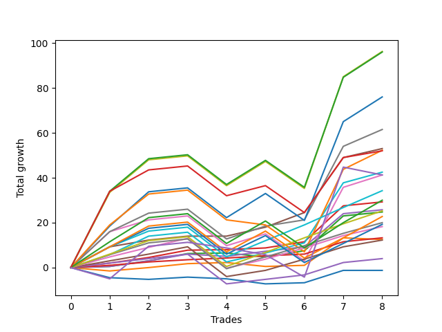

# Long Malinois 002 
- Symbol: ES
- Date Range: 03/18/2022 - 12/30/2022
- Trading Period: 8:30-12:30
- Number of Trades: 8



| Name | Win Percent | Profit | Avg Profit / Trade | Avg Time / Trade |      | Name | Win Percent | Profit | Avg Profit / Trade | Avg Time / Trade |
| ---- | ----------- | ------ | ------------------ | ---------------- | ---- | ---- | ----------- | ------ | ------------------ | ---------------- |
| Sorted By <br> Profit | | | | | | Sorted By <br> Win Percentage ||||
| V U/L 1SD | 75.00 | 48125.00 | 6015.62 | 50:10 |     | BB-50 U/L 1SD | 100.00 | 26500.00 | 3312.50 | 19:30 |
| BB-200 U/L 2SD | 75.00 | 48000.00 | 6000.00 | 51:41 |     | BB-20 U/L 2SD C | 100.00 | 14625.00 | 1828.12 | 10:59 |
| BB-100 U/L 2SD | 75.00 | 38000.00 | 4750.00 | 47:11 |     | TP-1 | 100.00 | 6625.00 | 828.12 | 05:50 |
| V Mid | 87.50 | 30750.00 | 3843.75 | 28:11 |     | V Mid | 87.50 | 30750.00 | 3843.75 | 28:11 |
| BB-50 U/L 1SD | 100.00 | 26500.00 | 3312.50 | 19:30 |     | BB-100 Mid | 87.50 | 21250.00 | 2656.25 | 23:59 |
| BB-200 Mid | 62.50 | 26125.00 | 3265.62 | 36:01 |     | TP-7 | 87.50 | 17125.00 | 2140.62 | 26:17 |
| NEWFI 000 | 75.00 | 26000.00 | 3250.00 | 37:23 |     | BB-50 Mid | 87.50 | 12875.00 | 1609.38 | 11:17 |
| BB-100 Mid | 87.50 | 21250.00 | 2656.25 | 23:59 |     | TP-6 | 87.50 | 12625.00 | 1578.12 | 24:45 |
| BB-50 U/L 2SD | 75.00 | 20625.00 | 2578.12 | 33:26 |     | BB-20 U/L 2SD | 87.50 | 12375.00 | 1546.88 | 10:35 |
| NEWFI 0000 | 37.50 | 20625.00 | 2578.12 | 25:54 |     | TP-5 | 87.50 | 10000.00 | 1250.00 | 22:16 |
| TP-7 | 87.50 | 17125.00 | 2140.62 | 26:17 |     | TP-4 | 87.50 | 9125.00 | 1140.62 | 17:08 |
| TP-10 | 75.00 | 15000.00 | 1875.00 | 36:25 |     | TP-3 | 87.50 | 6125.00 | 765.62 | 16:08 |
| BB-20 U/L 2SD C | 100.00 | 14625.00 | 1828.12 | 10:59 |     | TP-2 | 87.50 | 2000.00 | 250.00 | 13:17 |
| BB-50 Mid | 87.50 | 12875.00 | 1609.38 | 11:17 |     | V U/L 1SD | 75.00 | 48125.00 | 6015.62 | 50:10 |
| TP-6 | 87.50 | 12625.00 | 1578.12 | 24:45 |     | BB-200 U/L 2SD | 75.00 | 48000.00 | 6000.00 | 51:41 |
| BB-20 U/L 2SD | 87.50 | 12375.00 | 1546.88 | 10:35 |     | BB-100 U/L 2SD | 75.00 | 38000.00 | 4750.00 | 47:11 |
| TP-9 | 75.00 | 11375.00 | 1421.88 | 35:51 |     | NEWFI 000 | 75.00 | 26000.00 | 3250.00 | 37:23 |
| TP-5 | 87.50 | 10000.00 | 1250.00 | 22:16 |     | BB-50 U/L 2SD | 75.00 | 20625.00 | 2578.12 | 33:26 |
| TP-8 | 75.00 | 9625.00 | 1203.12 | 33:21 |     | TP-10 | 75.00 | 15000.00 | 1875.00 | 36:25 |
| TP-4 | 87.50 | 9125.00 | 1140.62 | 17:08 |     | TP-9 | 75.00 | 11375.00 | 1421.88 | 35:51 |
| TP-1 | 100.00 | 6625.00 | 828.12 | 05:50 |     | TP-8 | 75.00 | 9625.00 | 1203.12 | 33:21 |
| BB-20 U/L 1SD | 62.50 | 6250.00 | 781.25 | 06:33 |     | BB-200 Mid | 62.50 | 26125.00 | 3265.62 | 36:01 |
| TP-3 | 87.50 | 6125.00 | 765.62 | 16:08 |     | BB-20 U/L 1SD | 62.50 | 6250.00 | 781.25 | 06:33 |
| TP-2 | 87.50 | 2000.00 | 250.00 | 13:17 |     | BB-20 Mid | 50.00 | -625.00 | -78.12 | 02:50 |
| BB-20 Mid | 50.00 | -625.00 | -78.12 | 02:50 |     | NEWFI 0000 | 37.50 | 20625.00 | 2578.12 | 25:54 |

## NO STOPLOSS

### Test BB-20 Mid
* Sell when price hits the middle line of the 20p bollinger
* No Stoploss
* Results:
```
Total Trades: 8
Percent Up: 50.00
Percent Down: 50.00
Total Points Moved Up: -1.25
Potential Profit: -625.00
Total Points Ups: 7.00 Count Ups: 4
Total Points Downs: -8.25 Count Downs: 4
```

<details><summary>Trades</summary>

<code>In: 2022-05-06 12:20:00		Out: 2022-05-06 12:27:50		Total Position Time: 07:50		Total Move Up: -4.50		Total to Date: -4.50</code> <br />
<code>In: 2022-07-08 10:07:00		Out: 2022-07-08 10:08:10		Total Position Time: 01:10		Total Move Up: -0.75		Total to Date: -5.25</code> <br />
<code>In: 2022-07-11 12:26:00		Out: 2022-07-11 12:27:35		Total Position Time: 01:35		Total Move Up: 1.00		Total to Date: -4.25</code> <br />
<code>In: 2022-07-25 11:07:00		Out: 2022-07-25 11:10:40		Total Position Time: 03:40		Total Move Up: -0.75		Total to Date: -5.00</code> <br />
<code>In: 2022-09-12 09:08:00		Out: 2022-09-12 09:12:10		Total Position Time: 04:10		Total Move Up: -2.25		Total to Date: -7.25</code> <br />
<code>In: 2022-10-19 08:39:00		Out: 2022-10-19 08:40:10		Total Position Time: 01:10		Total Move Up: 0.50		Total to Date: -6.75</code> <br />
<code>In: 2022-11-08 11:36:00		Out: 2022-11-08 11:37:10		Total Position Time: 01:10		Total Move Up: 5.50		Total to Date: -1.25</code> <br />
<code>In: 2022-12-27 11:35:00		Out: 2022-12-27 11:36:55		Total Position Time: 01:55		Total Move Up: 0.00		Total to Date: -1.25</code> <br />


</details>

### Test BB-20 U/L 1SD
* Sell when the price hits the upper line of the 20p 1std bollinger
* No Stoploss
* Results:
```
Total Trades: 8
Percent Up: 62.50
Percent Down: 37.50
Total Points Moved Up: 12.50
Potential Profit: 6250.00
Total Points Ups: 16.50 Count Ups: 5
Total Points Downs: -4.00 Count Downs: 3
```

<details><summary>Trades</summary>

<code>In: 2022-05-06 12:20:00		Out: 2022-05-06 12:28:05		Total Position Time: 08:05		Total Move Up: -1.50		Total to Date: -1.50</code> <br />
<code>In: 2022-07-08 10:07:00		Out: 2022-07-08 10:09:40		Total Position Time: 02:40		Total Move Up: 1.50		Total to Date: 0.00</code> <br />
<code>In: 2022-07-11 12:26:00		Out: 2022-07-11 12:29:20		Total Position Time: 03:20		Total Move Up: 1.75		Total to Date: 1.75</code> <br />
<code>In: 2022-07-25 11:07:00		Out: 2022-07-25 11:11:40		Total Position Time: 04:40		Total Move Up: 0.50		Total to Date: 2.25</code> <br />
<code>In: 2022-09-12 09:08:00		Out: 2022-09-12 09:21:25		Total Position Time: 13:25		Total Move Up: -1.75		Total to Date: 0.50</code> <br />
<code>In: 2022-10-19 08:39:00		Out: 2022-10-19 08:46:05		Total Position Time: 07:05		Total Move Up: 0.50		Total to Date: 1.00</code> <br />
<code>In: 2022-11-08 11:36:00		Out: 2022-11-08 11:38:35		Total Position Time: 02:35		Total Move Up: 12.25		Total to Date: 13.25</code> <br />
<code>In: 2022-12-27 11:35:00		Out: 2022-12-27 11:45:40		Total Position Time: 10:40		Total Move Up: -0.75		Total to Date: 12.50</code> <br />


</details>

### Test BB-20 U/L 2SD
* Sell when the price hits the upper line of the 20p 2std bollinger
* No Stoploss
* Results:
```
Total Trades: 8
Percent Up: 87.50
Percent Down: 12.50
Total Points Moved Up: 24.75
Potential Profit: 12375.00
Total Points Ups: 26.50 Count Ups: 7
Total Points Downs: -1.75 Count Downs: 1
```

<details><summary>Trades</summary>

<code>In: 2022-05-06 12:20:00		Out: 2022-05-06 12:28:10		Total Position Time: 08:10		Total Move Up: 0.50		Total to Date: 0.50</code> <br />
<code>In: 2022-07-08 10:07:00		Out: 2022-07-08 10:11:05		Total Position Time: 04:05		Total Move Up: 2.50		Total to Date: 3.00</code> <br />
<code>In: 2022-07-11 12:26:00		Out: 2022-07-11 12:29:40		Total Position Time: 03:40		Total Move Up: 3.25		Total to Date: 6.25</code> <br />
<code>In: 2022-07-25 11:07:00		Out: 2022-07-25 11:35:50		Total Position Time: 28:50		Total Move Up: 0.25		Total to Date: 6.50</code> <br />
<code>In: 2022-09-12 09:08:00		Out: 2022-09-12 09:21:25		Total Position Time: 13:25		Total Move Up: -1.75		Total to Date: 4.75</code> <br />
<code>In: 2022-10-19 08:39:00		Out: 2022-10-19 08:48:05		Total Position Time: 09:05		Total Move Up: 2.75		Total to Date: 7.50</code> <br />
<code>In: 2022-11-08 11:36:00		Out: 2022-11-08 11:42:10		Total Position Time: 06:10		Total Move Up: 15.50		Total to Date: 23.00</code> <br />
<code>In: 2022-12-27 11:35:00		Out: 2022-12-27 11:46:20		Total Position Time: 11:20		Total Move Up: 1.75		Total to Date: 24.75</code> <br />


</details>

### Test BB-20 U/L 2SD C
* Sell when the price hits the upper line of the 20p 2std bollinger
* No Stoploss
* Results:
```
Total Trades: 8
Percent Up: 100.00
Percent Down: 0.00
Total Points Moved Up: 29.25
Potential Profit: 14625.00
Total Points Ups: 29.25 Count Ups: 8
Total Points Downs: 0.00 Count Downs: 0
```

<details><summary>Trades</summary>

<code>In: 2022-05-06 12:20:00		Out: 2022-05-06 12:28:50		Total Position Time: 08:50		Total Move Up: 2.00		Total to Date: 2.00</code> <br />
<code>In: 2022-07-08 10:07:00		Out: 2022-07-08 10:11:05		Total Position Time: 04:05		Total Move Up: 2.50		Total to Date: 4.50</code> <br />
<code>In: 2022-07-11 12:26:00		Out: 2022-07-11 12:29:40		Total Position Time: 03:40		Total Move Up: 3.25		Total to Date: 7.75</code> <br />
<code>In: 2022-07-25 11:07:00		Out: 2022-07-25 11:35:50		Total Position Time: 28:50		Total Move Up: 0.25		Total to Date: 8.00</code> <br />
<code>In: 2022-09-12 09:08:00		Out: 2022-09-12 09:23:10		Total Position Time: 15:10		Total Move Up: 0.75		Total to Date: 8.75</code> <br />
<code>In: 2022-10-19 08:39:00		Out: 2022-10-19 08:48:45		Total Position Time: 09:45		Total Move Up: 2.75		Total to Date: 11.50</code> <br />
<code>In: 2022-11-08 11:36:00		Out: 2022-11-08 11:42:15		Total Position Time: 06:15		Total Move Up: 16.00		Total to Date: 27.50</code> <br />
<code>In: 2022-12-27 11:35:00		Out: 2022-12-27 11:46:20		Total Position Time: 11:20		Total Move Up: 1.75		Total to Date: 29.25</code> <br />


</details>

### Test BB-50 Mid
* Sell when price hits the middle line of the 50p bollinger
* No Stoploss
* Results:
```
Total Trades: 8
Percent Up: 87.50
Percent Down: 12.50
Total Points Moved Up: 25.75
Potential Profit: 12875.00
Total Points Ups: 26.75 Count Ups: 7
Total Points Downs: -1.00 Count Downs: 1
```

<details><summary>Trades</summary>

<code>In: 2022-05-06 12:20:00		Out: 2022-05-06 12:28:10		Total Position Time: 08:10		Total Move Up: 0.50		Total to Date: 0.50</code> <br />
<code>In: 2022-07-08 10:07:00		Out: 2022-07-08 10:11:10		Total Position Time: 04:10		Total Move Up: 2.50		Total to Date: 3.00</code> <br />
<code>In: 2022-07-11 12:26:00		Out: 2022-07-11 12:40:35		Total Position Time: 14:35		Total Move Up: 3.00		Total to Date: 6.00</code> <br />
<code>In: 2022-07-25 11:07:00		Out: 2022-07-25 11:35:45		Total Position Time: 28:45		Total Move Up: -1.00		Total to Date: 5.00</code> <br />
<code>In: 2022-09-12 09:08:00		Out: 2022-09-12 09:24:10		Total Position Time: 16:10		Total Move Up: 2.25		Total to Date: 7.25</code> <br />
<code>In: 2022-10-19 08:39:00		Out: 2022-10-19 08:40:30		Total Position Time: 01:30		Total Move Up: 2.00		Total to Date: 9.25</code> <br />
<code>In: 2022-11-08 11:36:00		Out: 2022-11-08 11:41:40		Total Position Time: 05:40		Total Move Up: 14.75		Total to Date: 24.00</code> <br />
<code>In: 2022-12-27 11:35:00		Out: 2022-12-27 11:46:20		Total Position Time: 11:20		Total Move Up: 1.75		Total to Date: 25.75</code> <br />


</details>

### Test BB-50 U/L 1SD
* Sell when the price hits the upper line of the 50p 1std bollinger
* No Stoploss
* Results:
```
Total Trades: 8
Percent Up: 100.00
Percent Down: 0.00
Total Points Moved Up: 53.00
Potential Profit: 26500.00
Total Points Ups: 53.00 Count Ups: 8
Total Points Downs: 0.00 Count Downs: 0
```

<details><summary>Trades</summary>

<code>In: 2022-05-06 12:20:00		Out: 2022-05-06 12:30:30		Total Position Time: 10:30		Total Move Up: 9.25		Total to Date: 9.25</code> <br />
<code>In: 2022-07-08 10:07:00		Out: 2022-07-08 10:26:30		Total Position Time: 19:30		Total Move Up: 3.00		Total to Date: 12.25</code> <br />
<code>In: 2022-07-11 12:26:00		Out: 2022-07-11 12:47:00		Total Position Time: 21:00		Total Move Up: 1.75		Total to Date: 14.00</code> <br />
<code>In: 2022-07-25 11:07:00		Out: 2022-07-25 11:41:00		Total Position Time: 34:00		Total Move Up: 0.00		Total to Date: 14.00</code> <br />
<code>In: 2022-09-12 09:08:00		Out: 2022-09-12 09:37:50		Total Position Time: 29:50		Total Move Up: 4.00		Total to Date: 18.00</code> <br />
<code>In: 2022-10-19 08:39:00		Out: 2022-10-19 08:52:10		Total Position Time: 13:10		Total Move Up: 6.50		Total to Date: 24.50</code> <br />
<code>In: 2022-11-08 11:36:00		Out: 2022-11-08 11:47:55		Total Position Time: 11:55		Total Move Up: 24.50		Total to Date: 49.00</code> <br />
<code>In: 2022-12-27 11:35:00		Out: 2022-12-27 11:51:05		Total Position Time: 16:05		Total Move Up: 4.00		Total to Date: 53.00</code> <br />


</details>

### Test BB-50 U/L 2SD
* Sell when the price hits the upper line of the 50p 2std bollinger
* No Stoploss
* Results:
```
Total Trades: 8
Percent Up: 75.00
Percent Down: 25.00
Total Points Moved Up: 41.25
Potential Profit: 20625.00
Total Points Ups: 66.50 Count Ups: 6
Total Points Downs: -25.25 Count Downs: 2
```

<details><summary>Trades</summary>

<code>In: 2022-05-06 12:20:00		Out: 2022-05-06 12:35:40		Total Position Time: 15:40		Total Move Up: 16.00		Total to Date: 16.00</code> <br />
<code>In: 2022-07-08 10:07:00		Out: 2022-07-08 10:27:00		Total Position Time: 20:00		Total Move Up: 5.25		Total to Date: 21.25</code> <br />
<code>In: 2022-07-11 12:26:00		Out: 2022-07-11 12:47:00		Total Position Time: 21:00		Total Move Up: 1.75		Total to Date: 23.00</code> <br />
<code>In: 2022-07-25 11:07:00		Out: 2022-07-25 12:07:55		Total Position Time: 60:55		Total Move Up: -13.25		Total to Date: 9.75</code> <br />
<code>In: 2022-09-12 09:08:00		Out: 2022-09-12 09:44:15		Total Position Time: 36:15		Total Move Up: 5.25		Total to Date: 15.00</code> <br />
<code>In: 2022-10-19 08:39:00		Out: 2022-10-19 09:39:55		Total Position Time: 60:55		Total Move Up: -12.00		Total to Date: 3.00</code> <br />
<code>In: 2022-11-08 11:36:00		Out: 2022-11-08 12:02:35		Total Position Time: 26:35		Total Move Up: 32.75		Total to Date: 35.75</code> <br />
<code>In: 2022-12-27 11:35:00		Out: 2022-12-27 12:01:10		Total Position Time: 26:10		Total Move Up: 5.50		Total to Date: 41.25</code> <br />


</details>

### Test V Mid
* Sell when the price hits the middle line of the 1std VWAP
* No Stoploss
* Results:
```
Total Trades: 8
Percent Up: 87.50
Percent Down: 12.50
Total Points Moved Up: 61.50
Potential Profit: 30750.00
Total Points Ups: 74.75 Count Ups: 7
Total Points Downs: -13.25 Count Downs: 1
```

<details><summary>Trades</summary>

<code>In: 2022-05-06 12:20:00		Out: 2022-05-06 12:35:40		Total Position Time: 15:40		Total Move Up: 16.00		Total to Date: 16.00</code> <br />
<code>In: 2022-07-08 10:07:00		Out: 2022-07-08 10:29:10		Total Position Time: 22:10		Total Move Up: 8.25		Total to Date: 24.25</code> <br />
<code>In: 2022-07-11 12:26:00		Out: 2022-07-11 12:47:00		Total Position Time: 21:00		Total Move Up: 1.75		Total to Date: 26.00</code> <br />
<code>In: 2022-07-25 11:07:00		Out: 2022-07-25 12:07:55		Total Position Time: 60:55		Total Move Up: -13.25		Total to Date: 12.75</code> <br />
<code>In: 2022-09-12 09:08:00		Out: 2022-09-12 09:44:25		Total Position Time: 36:25		Total Move Up: 5.75		Total to Date: 18.50</code> <br />
<code>In: 2022-10-19 08:39:00		Out: 2022-10-19 08:48:05		Total Position Time: 09:05		Total Move Up: 2.75		Total to Date: 21.25</code> <br />
<code>In: 2022-11-08 11:36:00		Out: 2022-11-08 12:02:35		Total Position Time: 26:35		Total Move Up: 32.75		Total to Date: 54.00</code> <br />
<code>In: 2022-12-27 11:35:00		Out: 2022-12-27 12:08:40		Total Position Time: 33:40		Total Move Up: 7.50		Total to Date: 61.50</code> <br />


</details>

### Test V U/L 1SD
* Sell when the price hits the upper line of the 1std VWAP
* No Stoploss
* Results:
```
Total Trades: 8
Percent Up: 75.00
Percent Down: 25.00
Total Points Moved Up: 96.25
Potential Profit: 48125.00
Total Points Ups: 121.50 Count Ups: 6
Total Points Downs: -25.25 Count Downs: 2
```

<details><summary>Trades</summary>

<code>In: 2022-05-06 12:20:00		Out: 2022-05-06 12:40:00		Total Position Time: 20:00		Total Move Up: 33.50		Total to Date: 33.50</code> <br />
<code>In: 2022-07-08 10:07:00		Out: 2022-07-08 11:07:55		Total Position Time: 60:55		Total Move Up: 14.50		Total to Date: 48.00</code> <br />
<code>In: 2022-07-11 12:26:00		Out: 2022-07-11 12:47:00		Total Position Time: 21:00		Total Move Up: 1.75		Total to Date: 49.75</code> <br />
<code>In: 2022-07-25 11:07:00		Out: 2022-07-25 12:07:55		Total Position Time: 60:55		Total Move Up: -13.25		Total to Date: 36.50</code> <br />
<code>In: 2022-09-12 09:08:00		Out: 2022-09-12 10:08:55		Total Position Time: 60:55		Total Move Up: 10.75		Total to Date: 47.25</code> <br />
<code>In: 2022-10-19 08:39:00		Out: 2022-10-19 09:39:55		Total Position Time: 60:55		Total Move Up: -12.00		Total to Date: 35.25</code> <br />
<code>In: 2022-11-08 11:36:00		Out: 2022-11-08 12:31:45		Total Position Time: 55:45		Total Move Up: 49.75		Total to Date: 85.00</code> <br />
<code>In: 2022-12-27 11:35:00		Out: 2022-12-27 12:35:55		Total Position Time: 60:55		Total Move Up: 11.25		Total to Date: 96.25</code> <br />


</details>

### Test BB-100 Mid
* Move to BB100 Mid
* No Stoploss
* Results:
```
Total Trades: 8
Percent Up: 87.50
Percent Down: 12.50
Total Points Moved Up: 42.50
Potential Profit: 21250.00
Total Points Ups: 55.75 Count Ups: 7
Total Points Downs: -13.25 Count Downs: 1
```

<details><summary>Trades</summary>

<code>In: 2022-05-06 12:20:00		Out: 2022-05-06 12:30:20		Total Position Time: 10:20		Total Move Up: 5.75		Total to Date: 5.75</code> <br />
<code>In: 2022-07-08 10:07:00		Out: 2022-07-08 10:29:10		Total Position Time: 22:10		Total Move Up: 8.25		Total to Date: 14.00</code> <br />
<code>In: 2022-07-11 12:26:00		Out: 2022-07-11 12:47:00		Total Position Time: 21:00		Total Move Up: 1.75		Total to Date: 15.75</code> <br />
<code>In: 2022-07-25 11:07:00		Out: 2022-07-25 12:07:55		Total Position Time: 60:55		Total Move Up: -13.25		Total to Date: 2.50</code> <br />
<code>In: 2022-09-12 09:08:00		Out: 2022-09-12 09:37:50		Total Position Time: 29:50		Total Move Up: 4.00		Total to Date: 6.50</code> <br />
<code>In: 2022-10-19 08:39:00		Out: 2022-10-19 08:52:00		Total Position Time: 13:00		Total Move Up: 4.50		Total to Date: 11.00</code> <br />
<code>In: 2022-11-08 11:36:00		Out: 2022-11-08 11:53:50		Total Position Time: 17:50		Total Move Up: 26.75		Total to Date: 37.75</code> <br />
<code>In: 2022-12-27 11:35:00		Out: 2022-12-27 11:51:50		Total Position Time: 16:50		Total Move Up: 4.75		Total to Date: 42.50</code> <br />


</details>

### Test BB-100 U/L 2SD
* Move to BB100 Upper Band
* No Stoploss
* Results:
```
Total Trades: 8
Percent Up: 75.00
Percent Down: 25.00
Total Points Moved Up: 76.00
Potential Profit: 38000.00
Total Points Ups: 101.25 Count Ups: 6
Total Points Downs: -25.25 Count Downs: 2
```

<details><summary>Trades</summary>

<code>In: 2022-05-06 12:20:00		Out: 2022-05-06 12:37:10		Total Position Time: 17:10		Total Move Up: 18.50		Total to Date: 18.50</code> <br />
<code>In: 2022-07-08 10:07:00		Out: 2022-07-08 11:07:40		Total Position Time: 60:40		Total Move Up: 15.25		Total to Date: 33.75</code> <br />
<code>In: 2022-07-11 12:26:00		Out: 2022-07-11 12:47:00		Total Position Time: 21:00		Total Move Up: 1.75		Total to Date: 35.50</code> <br />
<code>In: 2022-07-25 11:07:00		Out: 2022-07-25 12:07:55		Total Position Time: 60:55		Total Move Up: -13.25		Total to Date: 22.25</code> <br />
<code>In: 2022-09-12 09:08:00		Out: 2022-09-12 10:08:55		Total Position Time: 60:55		Total Move Up: 10.75		Total to Date: 33.00</code> <br />
<code>In: 2022-10-19 08:39:00		Out: 2022-10-19 09:39:55		Total Position Time: 60:55		Total Move Up: -12.00		Total to Date: 21.00</code> <br />
<code>In: 2022-11-08 11:36:00		Out: 2022-11-08 12:30:25		Total Position Time: 54:25		Total Move Up: 44.00		Total to Date: 65.00</code> <br />
<code>In: 2022-12-27 11:35:00		Out: 2022-12-27 12:16:35		Total Position Time: 41:35		Total Move Up: 11.00		Total to Date: 76.00</code> <br />


</details>

### Test BB-200 Mid
* Move to BB200 Mid
* No Stoploss
* Results:
```
Total Trades: 8
Percent Up: 62.50
Percent Down: 37.50
Total Points Moved Up: 52.25
Potential Profit: 26125.00
Total Points Ups: 79.75 Count Ups: 5
Total Points Downs: -27.50 Count Downs: 3
```

<details><summary>Trades</summary>

<code>In: 2022-05-06 12:20:00		Out: 2022-05-06 12:37:15		Total Position Time: 17:15		Total Move Up: 19.00		Total to Date: 19.00</code> <br />
<code>In: 2022-07-08 10:07:00		Out: 2022-07-08 10:49:25		Total Position Time: 42:25		Total Move Up: 13.75		Total to Date: 32.75</code> <br />
<code>In: 2022-07-11 12:26:00		Out: 2022-07-11 12:47:00		Total Position Time: 21:00		Total Move Up: 1.75		Total to Date: 34.50</code> <br />
<code>In: 2022-07-25 11:07:00		Out: 2022-07-25 12:07:55		Total Position Time: 60:55		Total Move Up: -13.25		Total to Date: 21.25</code> <br />
<code>In: 2022-09-12 09:08:00		Out: 2022-09-12 09:12:10		Total Position Time: 04:10		Total Move Up: -2.25		Total to Date: 19.00</code> <br />
<code>In: 2022-10-19 08:39:00		Out: 2022-10-19 09:39:55		Total Position Time: 60:55		Total Move Up: -12.00		Total to Date: 7.00</code> <br />
<code>In: 2022-11-08 11:36:00		Out: 2022-11-08 12:20:05		Total Position Time: 44:05		Total Move Up: 36.75		Total to Date: 43.75</code> <br />
<code>In: 2022-12-27 11:35:00		Out: 2022-12-27 12:12:25		Total Position Time: 37:25		Total Move Up: 8.50		Total to Date: 52.25</code> <br />


</details>

### Test BB-200 U/L 2SD
* Move to BB200 Upper Band
* No Stoploss
* Results:
```
Total Trades: 8
Percent Up: 75.00
Percent Down: 25.00
Total Points Moved Up: 96.00
Potential Profit: 48000.00
Total Points Ups: 121.25 Count Ups: 6
Total Points Downs: -25.25 Count Downs: 2
```

<details><summary>Trades</summary>

<code>In: 2022-05-06 12:20:00		Out: 2022-05-06 12:47:00		Total Position Time: 27:00		Total Move Up: 34.00		Total to Date: 34.00</code> <br />
<code>In: 2022-07-08 10:07:00		Out: 2022-07-08 11:07:55		Total Position Time: 60:55		Total Move Up: 14.50		Total to Date: 48.50</code> <br />
<code>In: 2022-07-11 12:26:00		Out: 2022-07-11 12:47:00		Total Position Time: 21:00		Total Move Up: 1.75		Total to Date: 50.25</code> <br />
<code>In: 2022-07-25 11:07:00		Out: 2022-07-25 12:07:55		Total Position Time: 60:55		Total Move Up: -13.25		Total to Date: 37.00</code> <br />
<code>In: 2022-09-12 09:08:00		Out: 2022-09-12 10:08:55		Total Position Time: 60:55		Total Move Up: 10.75		Total to Date: 47.75</code> <br />
<code>In: 2022-10-19 08:39:00		Out: 2022-10-19 09:39:55		Total Position Time: 60:55		Total Move Up: -12.00		Total to Date: 35.75</code> <br />
<code>In: 2022-11-08 11:36:00		Out: 2022-11-08 12:36:55		Total Position Time: 60:55		Total Move Up: 49.00		Total to Date: 84.75</code> <br />
<code>In: 2022-12-27 11:35:00		Out: 2022-12-27 12:35:55		Total Position Time: 60:55		Total Move Up: 11.25		Total to Date: 96.00</code> <br />


</details>

## TAKE PROFIT

### Test TP-1
* Take Profit of 1 Point
* No Stoploss
* Results:
```
Total Trades: 8
Percent Up: 100.00
Percent Down: 0.00
Total Points Moved Up: 13.25
Potential Profit: 6625.00
Total Points Ups: 13.25 Count Ups: 8
Total Points Downs: 0.00 Count Downs: 0
```

<details><summary>Trades</summary>

<code>In: 2022-05-06 12:20:00		Out: 2022-05-06 12:28:25		Total Position Time: 08:25		Total Move Up: 1.00		Total to Date: 1.00</code> <br />
<code>In: 2022-07-08 10:07:00		Out: 2022-07-08 10:09:40		Total Position Time: 02:40		Total Move Up: 1.50		Total to Date: 2.50</code> <br />
<code>In: 2022-07-11 12:26:00		Out: 2022-07-11 12:27:35		Total Position Time: 01:35		Total Move Up: 1.00		Total to Date: 3.50</code> <br />
<code>In: 2022-07-25 11:07:00		Out: 2022-07-25 11:11:45		Total Position Time: 04:45		Total Move Up: 0.75		Total to Date: 4.25</code> <br />
<code>In: 2022-09-12 09:08:00		Out: 2022-09-12 09:23:20		Total Position Time: 15:20		Total Move Up: 1.00		Total to Date: 5.25</code> <br />
<code>In: 2022-10-19 08:39:00		Out: 2022-10-19 08:40:25		Total Position Time: 01:25		Total Move Up: 0.75		Total to Date: 6.00</code> <br />
<code>In: 2022-11-08 11:36:00		Out: 2022-11-08 11:37:10		Total Position Time: 01:10		Total Move Up: 5.50		Total to Date: 11.50</code> <br />
<code>In: 2022-12-27 11:35:00		Out: 2022-12-27 11:46:20		Total Position Time: 11:20		Total Move Up: 1.75		Total to Date: 13.25</code> <br />


</details>

### Test TP-2
* Take Profit of 2 Point
* No Stoploss
* Results:
```
Total Trades: 8
Percent Up: 87.50
Percent Down: 12.50
Total Points Moved Up: 4.00
Potential Profit: 2000.00
Total Points Ups: 17.25 Count Ups: 7
Total Points Downs: -13.25 Count Downs: 1
```

<details><summary>Trades</summary>

<code>In: 2022-05-06 12:20:00		Out: 2022-05-06 12:28:50		Total Position Time: 08:50		Total Move Up: 2.00		Total to Date: 2.00</code> <br />
<code>In: 2022-07-08 10:07:00		Out: 2022-07-08 10:10:05		Total Position Time: 03:05		Total Move Up: 2.00		Total to Date: 4.00</code> <br />
<code>In: 2022-07-11 12:26:00		Out: 2022-07-11 12:29:25		Total Position Time: 03:25		Total Move Up: 2.00		Total to Date: 6.00</code> <br />
<code>In: 2022-07-25 11:07:00		Out: 2022-07-25 12:07:55		Total Position Time: 60:55		Total Move Up: -13.25		Total to Date: -7.25</code> <br />
<code>In: 2022-09-12 09:08:00		Out: 2022-09-12 09:24:05		Total Position Time: 16:05		Total Move Up: 2.00		Total to Date: -5.25</code> <br />
<code>In: 2022-10-19 08:39:00		Out: 2022-10-19 08:40:30		Total Position Time: 01:30		Total Move Up: 2.00		Total to Date: -3.25</code> <br />
<code>In: 2022-11-08 11:36:00		Out: 2022-11-08 11:37:10		Total Position Time: 01:10		Total Move Up: 5.50		Total to Date: 2.25</code> <br />
<code>In: 2022-12-27 11:35:00		Out: 2022-12-27 11:46:20		Total Position Time: 11:20		Total Move Up: 1.75		Total to Date: 4.00</code> <br />


</details>

### Test TP-3
* Take Profit of 3 Point
* No Stoploss
* Results:
```
Total Trades: 8
Percent Up: 87.50
Percent Down: 12.50
Total Points Moved Up: 12.25
Potential Profit: 6125.00
Total Points Ups: 25.50 Count Ups: 7
Total Points Downs: -13.25 Count Downs: 1
```

<details><summary>Trades</summary>

<code>In: 2022-05-06 12:20:00		Out: 2022-05-06 12:28:55		Total Position Time: 08:55		Total Move Up: 3.00		Total to Date: 3.00</code> <br />
<code>In: 2022-07-08 10:07:00		Out: 2022-07-08 10:11:15		Total Position Time: 04:15		Total Move Up: 3.00		Total to Date: 6.00</code> <br />
<code>In: 2022-07-11 12:26:00		Out: 2022-07-11 12:29:40		Total Position Time: 03:40		Total Move Up: 3.25		Total to Date: 9.25</code> <br />
<code>In: 2022-07-25 11:07:00		Out: 2022-07-25 12:07:55		Total Position Time: 60:55		Total Move Up: -13.25		Total to Date: -4.00</code> <br />
<code>In: 2022-09-12 09:08:00		Out: 2022-09-12 09:32:15		Total Position Time: 24:15		Total Move Up: 2.75		Total to Date: -1.25</code> <br />
<code>In: 2022-10-19 08:39:00		Out: 2022-10-19 08:51:50		Total Position Time: 12:50		Total Move Up: 5.00		Total to Date: 3.75</code> <br />
<code>In: 2022-11-08 11:36:00		Out: 2022-11-08 11:37:10		Total Position Time: 01:10		Total Move Up: 5.50		Total to Date: 9.25</code> <br />
<code>In: 2022-12-27 11:35:00		Out: 2022-12-27 11:48:10		Total Position Time: 13:10		Total Move Up: 3.00		Total to Date: 12.25</code> <br />


</details>

### Test TP-4
* Take Profit of 4 Point
* No Stoploss
* Results:
```
Total Trades: 8
Percent Up: 87.50
Percent Down: 12.50
Total Points Moved Up: 18.25
Potential Profit: 9125.00
Total Points Ups: 31.50 Count Ups: 7
Total Points Downs: -13.25 Count Downs: 1
```

<details><summary>Trades</summary>

<code>In: 2022-05-06 12:20:00		Out: 2022-05-06 12:30:15		Total Position Time: 10:15		Total Move Up: 4.75		Total to Date: 4.75</code> <br />
<code>In: 2022-07-08 10:07:00		Out: 2022-07-08 10:12:25		Total Position Time: 05:25		Total Move Up: 4.25		Total to Date: 9.00</code> <br />
<code>In: 2022-07-11 12:26:00		Out: 2022-07-11 12:31:15		Total Position Time: 05:15		Total Move Up: 4.00		Total to Date: 13.00</code> <br />
<code>In: 2022-07-25 11:07:00		Out: 2022-07-25 12:07:55		Total Position Time: 60:55		Total Move Up: -13.25		Total to Date: -0.25</code> <br />
<code>In: 2022-09-12 09:08:00		Out: 2022-09-12 09:33:10		Total Position Time: 25:10		Total Move Up: 4.00		Total to Date: 3.75</code> <br />
<code>In: 2022-10-19 08:39:00		Out: 2022-10-19 08:51:50		Total Position Time: 12:50		Total Move Up: 5.00		Total to Date: 8.75</code> <br />
<code>In: 2022-11-08 11:36:00		Out: 2022-11-08 11:37:10		Total Position Time: 01:10		Total Move Up: 5.50		Total to Date: 14.25</code> <br />
<code>In: 2022-12-27 11:35:00		Out: 2022-12-27 11:51:05		Total Position Time: 16:05		Total Move Up: 4.00		Total to Date: 18.25</code> <br />


</details>

### Test TP-5
* Take Profit of 5 Point
* No Stoploss
* Results:
```
Total Trades: 8
Percent Up: 87.50
Percent Down: 12.50
Total Points Moved Up: 20.00
Potential Profit: 10000.00
Total Points Ups: 33.25 Count Ups: 7
Total Points Downs: -13.25 Count Downs: 1
```

<details><summary>Trades</summary>

<code>In: 2022-05-06 12:20:00		Out: 2022-05-06 12:30:20		Total Position Time: 10:20		Total Move Up: 5.75		Total to Date: 5.75</code> <br />
<code>In: 2022-07-08 10:07:00		Out: 2022-07-08 10:27:00		Total Position Time: 20:00		Total Move Up: 5.25		Total to Date: 11.00</code> <br />
<code>In: 2022-07-11 12:26:00		Out: 2022-07-11 12:47:00		Total Position Time: 21:00		Total Move Up: 1.75		Total to Date: 12.75</code> <br />
<code>In: 2022-07-25 11:07:00		Out: 2022-07-25 12:07:55		Total Position Time: 60:55		Total Move Up: -13.25		Total to Date: -0.50</code> <br />
<code>In: 2022-09-12 09:08:00		Out: 2022-09-12 09:43:10		Total Position Time: 35:10		Total Move Up: 5.25		Total to Date: 4.75</code> <br />
<code>In: 2022-10-19 08:39:00		Out: 2022-10-19 08:51:50		Total Position Time: 12:50		Total Move Up: 5.00		Total to Date: 9.75</code> <br />
<code>In: 2022-11-08 11:36:00		Out: 2022-11-08 11:37:10		Total Position Time: 01:10		Total Move Up: 5.50		Total to Date: 15.25</code> <br />
<code>In: 2022-12-27 11:35:00		Out: 2022-12-27 11:51:50		Total Position Time: 16:50		Total Move Up: 4.75		Total to Date: 20.00</code> <br />


</details>

### Test TP-6
* Take Profit of 6 Point
* No Stoploss
* Results:
```
Total Trades: 8
Percent Up: 87.50
Percent Down: 12.50
Total Points Moved Up: 25.25
Potential Profit: 12625.00
Total Points Ups: 38.50 Count Ups: 7
Total Points Downs: -13.25 Count Downs: 1
```

<details><summary>Trades</summary>

<code>In: 2022-05-06 12:20:00		Out: 2022-05-06 12:30:25		Total Position Time: 10:25		Total Move Up: 6.00		Total to Date: 6.00</code> <br />
<code>In: 2022-07-08 10:07:00		Out: 2022-07-08 10:28:10		Total Position Time: 21:10		Total Move Up: 6.00		Total to Date: 12.00</code> <br />
<code>In: 2022-07-11 12:26:00		Out: 2022-07-11 12:47:00		Total Position Time: 21:00		Total Move Up: 1.75		Total to Date: 13.75</code> <br />
<code>In: 2022-07-25 11:07:00		Out: 2022-07-25 12:07:55		Total Position Time: 60:55		Total Move Up: -13.25		Total to Date: 0.50</code> <br />
<code>In: 2022-09-12 09:08:00		Out: 2022-09-12 09:44:50		Total Position Time: 36:50		Total Move Up: 6.25		Total to Date: 6.75</code> <br />
<code>In: 2022-10-19 08:39:00		Out: 2022-10-19 08:52:10		Total Position Time: 13:10		Total Move Up: 6.50		Total to Date: 13.25</code> <br />
<code>In: 2022-11-08 11:36:00		Out: 2022-11-08 11:37:15		Total Position Time: 01:15		Total Move Up: 6.25		Total to Date: 19.50</code> <br />
<code>In: 2022-12-27 11:35:00		Out: 2022-12-27 12:08:15		Total Position Time: 33:15		Total Move Up: 5.75		Total to Date: 25.25</code> <br />


</details>

### Test TP-7
* Take Profit of 7 Point
* No Stoploss
* Results:
```
Total Trades: 8
Percent Up: 87.50
Percent Down: 12.50
Total Points Moved Up: 34.25
Potential Profit: 17125.00
Total Points Ups: 47.50 Count Ups: 7
Total Points Downs: -13.25 Count Downs: 1
```

<details><summary>Trades</summary>

<code>In: 2022-05-06 12:20:00		Out: 2022-05-06 12:30:30		Total Position Time: 10:30		Total Move Up: 9.25		Total to Date: 9.25</code> <br />
<code>In: 2022-07-08 10:07:00		Out: 2022-07-08 10:28:40		Total Position Time: 21:40		Total Move Up: 7.00		Total to Date: 16.25</code> <br />
<code>In: 2022-07-11 12:26:00		Out: 2022-07-11 12:47:00		Total Position Time: 21:00		Total Move Up: 1.75		Total to Date: 18.00</code> <br />
<code>In: 2022-07-25 11:07:00		Out: 2022-07-25 12:07:55		Total Position Time: 60:55		Total Move Up: -13.25		Total to Date: 4.75</code> <br />
<code>In: 2022-09-12 09:08:00		Out: 2022-09-12 09:55:55		Total Position Time: 47:55		Total Move Up: 7.25		Total to Date: 12.00</code> <br />
<code>In: 2022-10-19 08:39:00		Out: 2022-10-19 08:52:15		Total Position Time: 13:15		Total Move Up: 7.00		Total to Date: 19.00</code> <br />
<code>In: 2022-11-08 11:36:00		Out: 2022-11-08 11:37:25		Total Position Time: 01:25		Total Move Up: 7.75		Total to Date: 26.75</code> <br />
<code>In: 2022-12-27 11:35:00		Out: 2022-12-27 12:08:40		Total Position Time: 33:40		Total Move Up: 7.50		Total to Date: 34.25</code> <br />


</details>

### Test TP-8
* Take Profit of 8 Point
* No Stoploss
* Results:
```
Total Trades: 8
Percent Up: 75.00
Percent Down: 25.00
Total Points Moved Up: 19.25
Potential Profit: 9625.00
Total Points Ups: 44.50 Count Ups: 6
Total Points Downs: -25.25 Count Downs: 2
```

<details><summary>Trades</summary>

<code>In: 2022-05-06 12:20:00		Out: 2022-05-06 12:30:30		Total Position Time: 10:30		Total Move Up: 9.25		Total to Date: 9.25</code> <br />
<code>In: 2022-07-08 10:07:00		Out: 2022-07-08 10:29:10		Total Position Time: 22:10		Total Move Up: 8.25		Total to Date: 17.50</code> <br />
<code>In: 2022-07-11 12:26:00		Out: 2022-07-11 12:47:00		Total Position Time: 21:00		Total Move Up: 1.75		Total to Date: 19.25</code> <br />
<code>In: 2022-07-25 11:07:00		Out: 2022-07-25 12:07:55		Total Position Time: 60:55		Total Move Up: -13.25		Total to Date: 6.00</code> <br />
<code>In: 2022-09-12 09:08:00		Out: 2022-09-12 10:00:20		Total Position Time: 52:20		Total Move Up: 8.25		Total to Date: 14.25</code> <br />
<code>In: 2022-10-19 08:39:00		Out: 2022-10-19 09:39:55		Total Position Time: 60:55		Total Move Up: -12.00		Total to Date: 2.25</code> <br />
<code>In: 2022-11-08 11:36:00		Out: 2022-11-08 11:37:35		Total Position Time: 01:35		Total Move Up: 8.50		Total to Date: 10.75</code> <br />
<code>In: 2022-12-27 11:35:00		Out: 2022-12-27 12:12:25		Total Position Time: 37:25		Total Move Up: 8.50		Total to Date: 19.25</code> <br />


</details>

### Test TP-9
* Take Profit of 9 Point
* No Stoploss
* Results:
```
Total Trades: 8
Percent Up: 75.00
Percent Down: 25.00
Total Points Moved Up: 22.75
Potential Profit: 11375.00
Total Points Ups: 48.00 Count Ups: 6
Total Points Downs: -25.25 Count Downs: 2
```

<details><summary>Trades</summary>

<code>In: 2022-05-06 12:20:00		Out: 2022-05-06 12:30:30		Total Position Time: 10:30		Total Move Up: 9.25		Total to Date: 9.25</code> <br />
<code>In: 2022-07-08 10:07:00		Out: 2022-07-08 10:39:20		Total Position Time: 32:20		Total Move Up: 9.25		Total to Date: 18.50</code> <br />
<code>In: 2022-07-11 12:26:00		Out: 2022-07-11 12:47:00		Total Position Time: 21:00		Total Move Up: 1.75		Total to Date: 20.25</code> <br />
<code>In: 2022-07-25 11:07:00		Out: 2022-07-25 12:07:55		Total Position Time: 60:55		Total Move Up: -13.25		Total to Date: 7.00</code> <br />
<code>In: 2022-09-12 09:08:00		Out: 2022-09-12 10:07:15		Total Position Time: 59:15		Total Move Up: 9.25		Total to Date: 16.25</code> <br />
<code>In: 2022-10-19 08:39:00		Out: 2022-10-19 09:39:55		Total Position Time: 60:55		Total Move Up: -12.00		Total to Date: 4.25</code> <br />
<code>In: 2022-11-08 11:36:00		Out: 2022-11-08 11:37:40		Total Position Time: 01:40		Total Move Up: 9.00		Total to Date: 13.25</code> <br />
<code>In: 2022-12-27 11:35:00		Out: 2022-12-27 12:15:15		Total Position Time: 40:15		Total Move Up: 9.50		Total to Date: 22.75</code> <br />


</details>

### Test TP-10
* Take Profit of 10 Point
* No Stoploss
* Results:
```
Total Trades: 8
Percent Up: 75.00
Percent Down: 25.00
Total Points Moved Up: 30.00
Potential Profit: 15000.00
Total Points Ups: 55.25 Count Ups: 6
Total Points Downs: -25.25 Count Downs: 2
```

<details><summary>Trades</summary>

<code>In: 2022-05-06 12:20:00		Out: 2022-05-06 12:31:25		Total Position Time: 11:25		Total Move Up: 11.50		Total to Date: 11.50</code> <br />
<code>In: 2022-07-08 10:07:00		Out: 2022-07-08 10:40:55		Total Position Time: 33:55		Total Move Up: 10.75		Total to Date: 22.25</code> <br />
<code>In: 2022-07-11 12:26:00		Out: 2022-07-11 12:47:00		Total Position Time: 21:00		Total Move Up: 1.75		Total to Date: 24.00</code> <br />
<code>In: 2022-07-25 11:07:00		Out: 2022-07-25 12:07:55		Total Position Time: 60:55		Total Move Up: -13.25		Total to Date: 10.75</code> <br />
<code>In: 2022-09-12 09:08:00		Out: 2022-09-12 10:07:50		Total Position Time: 59:50		Total Move Up: 10.00		Total to Date: 20.75</code> <br />
<code>In: 2022-10-19 08:39:00		Out: 2022-10-19 09:39:55		Total Position Time: 60:55		Total Move Up: -12.00		Total to Date: 8.75</code> <br />
<code>In: 2022-11-08 11:36:00		Out: 2022-11-08 11:37:55		Total Position Time: 01:55		Total Move Up: 11.25		Total to Date: 20.00</code> <br />
<code>In: 2022-12-27 11:35:00		Out: 2022-12-27 12:16:30		Total Position Time: 41:30		Total Move Up: 10.00		Total to Date: 30.00</code> <br />


</details>

## Indicator Exits

### Test NEWFI 000
* Newfi 0000
* No Stoploss
* Results:
```
Total Trades: 8
Percent Up: 75.00
Percent Down: 25.00
Total Points Moved Up: 52.00
Potential Profit: 26000.00
Total Points Ups: 77.25 Count Ups: 6
Total Points Downs: -25.25 Count Downs: 2
```

<details><summary>Trades</summary>

<code>In: 2022-05-06 12:20:00		Out: 2022-05-06 12:47:00		Total Position Time: 27:00		Total Move Up: 34.00		Total to Date: 34.00</code> <br />
<code>In: 2022-07-08 10:07:00		Out: 2022-07-08 10:45:05		Total Position Time: 38:05		Total Move Up: 9.50		Total to Date: 43.50</code> <br />
<code>In: 2022-07-11 12:26:00		Out: 2022-07-11 12:47:00		Total Position Time: 21:00		Total Move Up: 1.75		Total to Date: 45.25</code> <br />
<code>In: 2022-07-25 11:07:00		Out: 2022-07-25 12:07:55		Total Position Time: 60:55		Total Move Up: -13.25		Total to Date: 32.00</code> <br />
<code>In: 2022-09-12 09:08:00		Out: 2022-09-12 09:48:05		Total Position Time: 40:05		Total Move Up: 4.50		Total to Date: 36.50</code> <br />
<code>In: 2022-10-19 08:39:00		Out: 2022-10-19 09:39:55		Total Position Time: 60:55		Total Move Up: -12.00		Total to Date: 24.50</code> <br />
<code>In: 2022-11-08 11:36:00		Out: 2022-11-08 11:57:05		Total Position Time: 21:05		Total Move Up: 24.50		Total to Date: 49.00</code> <br />
<code>In: 2022-12-27 11:35:00		Out: 2022-12-27 12:05:05		Total Position Time: 30:05		Total Move Up: 3.00		Total to Date: 52.00</code> <br />


</details>

### Test NEWFI 0000
* Newfi 0000
* No Stoploss
* Results:
```
Total Trades: 8
Percent Up: 37.50
Percent Down: 62.50
Total Points Moved Up: 41.25
Potential Profit: 20625.00
Total Points Ups: 65.25 Count Ups: 3
Total Points Downs: -24.00 Count Downs: 5
```

<details><summary>Trades</summary>

<code>In: 2022-05-06 12:20:00		Out: 2022-05-06 12:21:05		Total Position Time: 01:05		Total Move Up: -5.00		Total to Date: -5.00</code> <br />
<code>In: 2022-07-08 10:07:00		Out: 2022-07-08 11:07:55		Total Position Time: 60:55		Total Move Up: 14.50		Total to Date: 9.50</code> <br />
<code>In: 2022-07-11 12:26:00		Out: 2022-07-11 12:47:00		Total Position Time: 21:00		Total Move Up: 1.75		Total to Date: 11.25</code> <br />
<code>In: 2022-07-25 11:07:00		Out: 2022-07-25 11:24:05		Total Position Time: 17:05		Total Move Up: -2.50		Total to Date: 8.75</code> <br />
<code>In: 2022-09-12 09:08:00		Out: 2022-09-12 09:13:05		Total Position Time: 05:05		Total Move Up: -3.00		Total to Date: 5.75</code> <br />
<code>In: 2022-10-19 08:39:00		Out: 2022-10-19 09:11:05		Total Position Time: 32:05		Total Move Up: -10.00		Total to Date: -4.25</code> <br />
<code>In: 2022-11-08 11:36:00		Out: 2022-11-08 12:36:55		Total Position Time: 60:55		Total Move Up: 49.00		Total to Date: 44.75</code> <br />
<code>In: 2022-12-27 11:35:00		Out: 2022-12-27 11:44:05		Total Position Time: 09:05		Total Move Up: -3.50		Total to Date: 41.25</code> <br />


</details>