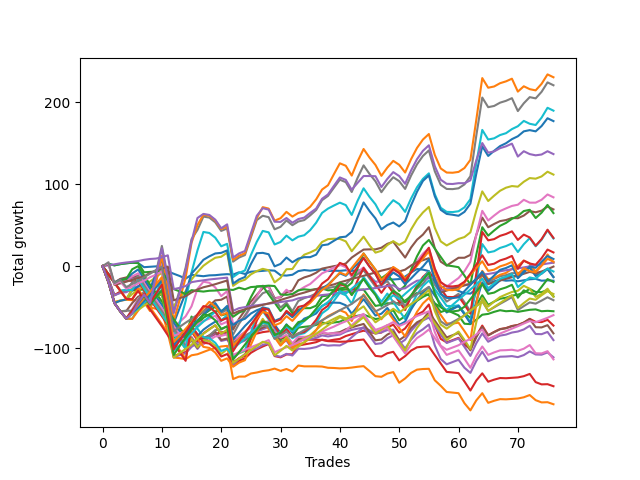

# Long Malinois 003 
- Symbol: ES
- Date Range: 03/18/2022 - 12/30/2022
- Trading Period: 8:30-12:30
- Number of Trades: 76



| Name | Win Percent | Profit | Avg Profit / Trade | Avg Time / Trade |      | Name | Win Percent | Profit | Avg Profit / Trade | Avg Time / Trade |
| ---- | ----------- | ------ | ------------------ | ---------------- | ---- | ---- | ----------- | ------ | ------------------ | ---------------- |
| Sorted By <br> Profit | | | | | | Sorted By <br> Win Percentage ||||
| BB-200 U/L 2SD | 59.21 | 115250.00 | 1516.45 | 56:25 |     | TP-1 | 94.74 | 2125.00 | 27.96 | 09:54 |
| V U/L 1SD | 61.84 | 110375.00 | 1452.30 | 52:39 |     | TP-2 | 89.47 | -250.00 | -3.29 | 16:30 |
| BB-100 U/L 2SD | 60.53 | 94875.00 | 1248.36 | 52:32 |     | V Mid | 80.26 | 82250.00 | 1082.24 | 29:50 |
| BB-200 Mid | 72.37 | 88500.00 | 1164.47 | 37:13 |     | TP-3 | 80.26 | -29875.00 | -393.09 | 22:45 |
| V Mid | 80.26 | 82250.00 | 1082.24 | 29:50 |     | BB-50 U/L 1SD | 78.95 | 34625.00 | 455.59 | 29:58 |
| NEWFI 000 | 60.53 | 68375.00 | 899.67 | 51:10 |     | TP-4 | 75.00 | -20750.00 | -273.03 | 27:44 |
| BB-100 Mid | 73.68 | 55875.00 | 735.20 | 33:08 |     | BB-100 Mid | 73.68 | 55875.00 | 735.20 | 33:08 |
| BB-50 U/L 2SD | 67.11 | 42000.00 | 552.63 | 41:23 |     | BB-200 Mid | 72.37 | 88500.00 | 1164.47 | 37:13 |
| NEWFI 0000 | 39.47 | 39250.00 | 516.45 | 28:23 |     | TP-5 | 71.05 | -17000.00 | -223.68 | 31:51 |
| BB-50 U/L 1SD | 78.95 | 34625.00 | 455.59 | 29:58 |     | BB-20 U/L 2SD | 71.05 | -18375.00 | -241.78 | 20:46 |
| BB-200 Mid SL-10 | 59.21 | 32375.00 | 425.99 | 22:56 |     | BB-20 U/L 2SD C | 71.05 | -36250.00 | -476.97 | 22:47 |
| V Mid SL-10 | 65.79 | 26125.00 | 343.75 | 17:43 |     | TP-6 | 69.74 | -3250.00 | -42.76 | 35:06 |
| BB-200 Mid SL-5 | 40.79 | 21000.00 | 276.32 | 14:41 |     | BB-50 U/L 2SD | 67.11 | 42000.00 | 552.63 | 41:23 |
| V Mid SL-5 | 48.68 | 17875.00 | 235.20 | 11:39 |     | TP-7 | 67.11 | 4375.00 | 57.57 | 38:29 |
| BB-200 U/L 2SD SL-10 | 44.74 | 17250.00 | 226.97 | 38:49 |     | V Mid SL-10 | 65.79 | 26125.00 | 343.75 | 17:43 |
| V U/L 1SD SL-10 | 47.37 | 16875.00 | 222.04 | 35:54 |     | TP-8 | 64.47 | 2750.00 | 36.18 | 40:56 |
| BB-200 U/L 2SD SL-5 | 25.00 | 14125.00 | 185.86 | 25:24 |     | BB-50 Mid | 64.47 | -55625.00 | -731.91 | 21:47 |
| V U/L 1SD SL-5 | 27.63 | 11125.00 | 146.38 | 22:44 |     | V U/L 1SD | 61.84 | 110375.00 | 1452.30 | 52:39 |
| TP-10 | 60.53 | 8375.00 | 110.20 | 44:25 |     | BB-20 U/L 2SD C SL-10 | 61.84 | -41000.00 | -539.47 | 13:18 |
| TP-7 | 67.11 | 4375.00 | 57.57 | 38:29 |     | BB-20 U/L 2SD SL-10 | 61.84 | -45125.00 | -593.75 | 12:22 |
| TP-8 | 64.47 | 2750.00 | 36.18 | 40:56 |     | BB-100 U/L 2SD | 60.53 | 94875.00 | 1248.36 | 52:32 |
| TP-1 | 94.74 | 2125.00 | 27.96 | 09:54 |     | NEWFI 000 | 60.53 | 68375.00 | 899.67 | 51:10 |
| BB-100 U/L 2SD SL-10 | 46.05 | 2125.00 | 27.96 | 35:27 |     | TP-10 | 60.53 | 8375.00 | 110.20 | 44:25 |
| TP-2 | 89.47 | -250.00 | -3.29 | 16:30 |     | BB-50 U/L 1SD SL-10 | 60.53 | -6500.00 | -85.53 | 18:43 |
| TP-6 | 69.74 | -3250.00 | -42.76 | 35:06 |     | TP-9 | 60.53 | -9625.00 | -126.64 | 43:16 |
| BB-100 U/L 2SD SL-5 | 26.32 | -3875.00 | -50.99 | 22:17 |     | BB-200 U/L 2SD | 59.21 | 115250.00 | 1516.45 | 56:25 |
| BB-50 U/L 1SD SL-10 | 60.53 | -6500.00 | -85.53 | 18:43 |     | BB-200 Mid SL-10 | 59.21 | 32375.00 | 425.99 | 22:56 |
| BB-100 Mid SL-10 | 57.89 | -6750.00 | -88.82 | 21:21 |     | BB-100 Mid SL-10 | 57.89 | -6750.00 | -88.82 | 21:21 |
| BB-20 U/L 2SD SL-5 | 52.63 | -8250.00 | -108.55 | 08:25 |     | BB-20 Mid | 56.58 | -8875.00 | -116.78 | 04:58 |
| BB-50 U/L 1SD SL-5 | 39.47 | -8500.00 | -111.84 | 12:32 |     | BB-20 Mid SL-10 | 56.58 | -27500.00 | -361.84 | 03:45 |
| BB-20 Mid | 56.58 | -8875.00 | -116.78 | 04:58 |     | BB-50 Mid SL-10 | 56.58 | -56875.00 | -748.36 | 12:35 |
| TP-9 | 60.53 | -9625.00 | -126.64 | 43:16 |     | BB-20 Mid SL-5 | 53.95 | -21125.00 | -277.96 | 02:39 |
| BB-20 U/L 2SD C SL-5 | 51.32 | -11250.00 | -148.03 | 09:14 |     | BB-20 U/L 1SD | 53.95 | -84250.00 | -1108.55 | 15:09 |
| TP-5 | 71.05 | -17000.00 | -223.68 | 31:51 |     | BB-20 U/L 2SD SL-5 | 52.63 | -8250.00 | -108.55 | 08:25 |
| BB-20 U/L 2SD | 71.05 | -18375.00 | -241.78 | 20:46 |     | BB-20 U/L 1SD SL-10 | 52.63 | -73250.00 | -963.82 | 09:07 |
| BB-50 U/L 2SD SL-10 | 51.32 | -18750.00 | -246.71 | 26:46 |     | BB-20 U/L 2SD C SL-5 | 51.32 | -11250.00 | -148.03 | 09:14 |
| TP-4 | 75.00 | -20750.00 | -273.03 | 27:44 |     | BB-50 U/L 2SD SL-10 | 51.32 | -18750.00 | -246.71 | 26:46 |
| BB-20 Mid SL-5 | 53.95 | -21125.00 | -277.96 | 02:39 |     | BB-20 U/L 1SD SL-5 | 51.32 | -41625.00 | -547.70 | 06:18 |
| BB-50 U/L 2SD SL-5 | 28.95 | -23500.00 | -309.21 | 17:34 |     | V Mid SL-5 | 48.68 | 17875.00 | 235.20 | 11:39 |
| BB-20 Mid SL-10 | 56.58 | -27500.00 | -361.84 | 03:45 |     | V U/L 1SD SL-10 | 47.37 | 16875.00 | 222.04 | 35:54 |
| BB-100 Mid SL-5 | 34.21 | -29250.00 | -384.87 | 13:17 |     | BB-100 U/L 2SD SL-10 | 46.05 | 2125.00 | 27.96 | 35:27 |
| TP-3 | 80.26 | -29875.00 | -393.09 | 22:45 |     | BB-200 U/L 2SD SL-10 | 44.74 | 17250.00 | 226.97 | 38:49 |
| BB-50 Mid SL-5 | 44.74 | -31875.00 | -419.41 | 08:04 |     | BB-50 Mid SL-5 | 44.74 | -31875.00 | -419.41 | 08:04 |
| BB-20 U/L 2SD C | 71.05 | -36250.00 | -476.97 | 22:47 |     | BB-200 Mid SL-5 | 40.79 | 21000.00 | 276.32 | 14:41 |
| BB-20 U/L 2SD C SL-10 | 61.84 | -41000.00 | -539.47 | 13:18 |     | NEWFI 0000 | 39.47 | 39250.00 | 516.45 | 28:23 |
| BB-20 U/L 1SD SL-5 | 51.32 | -41625.00 | -547.70 | 06:18 |     | BB-50 U/L 1SD SL-5 | 39.47 | -8500.00 | -111.84 | 12:32 |
| BB-20 U/L 2SD SL-10 | 61.84 | -45125.00 | -593.75 | 12:22 |     | BB-100 Mid SL-5 | 34.21 | -29250.00 | -384.87 | 13:17 |
| BB-50 Mid | 64.47 | -55625.00 | -731.91 | 21:47 |     | BB-50 U/L 2SD SL-5 | 28.95 | -23500.00 | -309.21 | 17:34 |
| BB-50 Mid SL-10 | 56.58 | -56875.00 | -748.36 | 12:35 |     | V U/L 1SD SL-5 | 27.63 | 11125.00 | 146.38 | 22:44 |
| BB-20 U/L 1SD SL-10 | 52.63 | -73250.00 | -963.82 | 09:07 |     | BB-100 U/L 2SD SL-5 | 26.32 | -3875.00 | -50.99 | 22:17 |
| BB-20 U/L 1SD | 53.95 | -84250.00 | -1108.55 | 15:09 |     | BB-200 U/L 2SD SL-5 | 25.00 | 14125.00 | 185.86 | 25:24 |

## NO STOPLOSS

### Test BB-20 Mid
* Sell when price hits the middle line of the 20p bollinger
* No Stoploss
* Results:
```
Total Trades: 76
Percent Up: 56.58
Percent Down: 43.42
Total Points Moved Up: -17.75
Potential Profit: -8875.00
Total Points Ups: 71.75 Count Ups: 43
Total Points Downs: -89.50 Count Downs: 33
```

<details><summary>Trades</summary>

<code>In: 2022-03-21 09:43:00		Out: 2022-03-21 09:45:05		Total Position Time: 02:05		Total Move Up: 2.75		Total to Date: 2.75</code> <br />
<code>In: 2022-03-21 09:45:00		Out: 2022-03-21 09:47:05		Total Position Time: 02:05		Total Move Up: -1.75		Total to Date: 1.00</code> <br />
<code>In: 2022-03-23 09:17:00		Out: 2022-03-23 09:19:25		Total Position Time: 02:25		Total Move Up: 1.50		Total to Date: 2.50</code> <br />
<code>In: 2022-03-31 08:41:00		Out: 2022-03-31 08:42:10		Total Position Time: 01:10		Total Move Up: 1.00		Total to Date: 3.50</code> <br />
<code>In: 2022-04-08 11:40:00		Out: 2022-04-08 11:41:10		Total Position Time: 01:10		Total Move Up: 0.75		Total to Date: 4.25</code> <br />
<code>In: 2022-04-20 09:19:00		Out: 2022-04-20 09:30:50		Total Position Time: 11:50		Total Move Up: -0.50		Total to Date: 3.75</code> <br />
<code>In: 2022-04-20 11:49:00		Out: 2022-04-20 12:01:15		Total Position Time: 12:15		Total Move Up: -5.00		Total to Date: -1.25</code> <br />
<code>In: 2022-05-06 11:13:00		Out: 2022-05-06 11:15:05		Total Position Time: 02:05		Total Move Up: 0.50		Total to Date: -0.75</code> <br />
<code>In: 2022-05-06 12:13:00		Out: 2022-05-06 12:19:15		Total Position Time: 06:15		Total Move Up: 0.50		Total to Date: -0.25</code> <br />
<code>In: 2022-05-06 12:14:00		Out: 2022-05-06 12:19:15		Total Position Time: 05:15		Total Move Up: 0.25		Total to Date: 0.00</code> <br />
<code>In: 2022-05-11 09:37:00		Out: 2022-05-11 09:49:20		Total Position Time: 12:20		Total Move Up: -6.50		Total to Date: -6.50</code> <br />
<code>In: 2022-05-12 10:13:00		Out: 2022-05-12 10:16:05		Total Position Time: 03:05		Total Move Up: -2.75		Total to Date: -9.25</code> <br />
<code>In: 2022-05-13 11:11:00		Out: 2022-05-13 11:19:15		Total Position Time: 08:15		Total Move Up: -2.75		Total to Date: -12.00</code> <br />
<code>In: 2022-05-13 11:12:00		Out: 2022-05-13 11:19:15		Total Position Time: 07:15		Total Move Up: -3.25		Total to Date: -15.25</code> <br />
<code>In: 2022-05-13 11:30:00		Out: 2022-05-13 11:31:10		Total Position Time: 01:10		Total Move Up: 4.75		Total to Date: -10.50</code> <br />
<code>In: 2022-05-17 11:28:00		Out: 2022-05-17 11:31:35		Total Position Time: 03:35		Total Move Up: -1.00		Total to Date: -11.50</code> <br />
<code>In: 2022-05-19 10:20:00		Out: 2022-05-19 10:21:10		Total Position Time: 01:10		Total Move Up: -0.75		Total to Date: -12.25</code> <br />
<code>In: 2022-06-27 09:39:00		Out: 2022-06-27 09:41:05		Total Position Time: 02:05		Total Move Up: 1.00		Total to Date: -11.25</code> <br />
<code>In: 2022-06-27 09:41:00		Out: 2022-06-27 09:42:10		Total Position Time: 01:10		Total Move Up: 0.25		Total to Date: -11.00</code> <br />
<code>In: 2022-06-27 10:12:00		Out: 2022-06-27 10:13:10		Total Position Time: 01:10		Total Move Up: 0.75		Total to Date: -10.25</code> <br />
<code>In: 2022-06-27 10:54:00		Out: 2022-06-27 10:55:15		Total Position Time: 01:15		Total Move Up: 0.50		Total to Date: -9.75</code> <br />
<code>In: 2022-07-12 11:39:00		Out: 2022-07-12 11:48:05		Total Position Time: 09:05		Total Move Up: -0.50		Total to Date: -10.25</code> <br />
<code>In: 2022-07-20 10:19:00		Out: 2022-07-20 10:20:15		Total Position Time: 01:15		Total Move Up: 2.75		Total to Date: -7.50</code> <br />
<code>In: 2022-07-20 10:20:00		Out: 2022-07-20 10:23:05		Total Position Time: 03:05		Total Move Up: -2.00		Total to Date: -9.50</code> <br />
<code>In: 2022-07-20 11:03:00		Out: 2022-07-20 11:04:25		Total Position Time: 01:25		Total Move Up: 2.75		Total to Date: -6.75</code> <br />
<code>In: 2022-07-20 11:04:00		Out: 2022-07-20 11:05:10		Total Position Time: 01:10		Total Move Up: 0.50		Total to Date: -6.25</code> <br />
<code>In: 2022-07-25 09:28:00		Out: 2022-07-25 09:29:10		Total Position Time: 01:10		Total Move Up: 0.50		Total to Date: -5.75</code> <br />
<code>In: 2022-07-25 11:24:00		Out: 2022-07-25 11:25:35		Total Position Time: 01:35		Total Move Up: 0.75		Total to Date: -5.00</code> <br />
<code>In: 2022-08-01 10:09:00		Out: 2022-08-01 10:14:20		Total Position Time: 05:20		Total Move Up: -0.50		Total to Date: -5.50</code> <br />
<code>In: 2022-08-01 10:42:00		Out: 2022-08-01 10:56:50		Total Position Time: 14:50		Total Move Up: -5.50		Total to Date: -11.00</code> <br />
<code>In: 2022-08-01 10:53:00		Out: 2022-08-01 10:56:50		Total Position Time: 03:50		Total Move Up: -0.50		Total to Date: -11.50</code> <br />
<code>In: 2022-08-02 12:05:00		Out: 2022-08-02 12:06:45		Total Position Time: 01:45		Total Move Up: 1.00		Total to Date: -10.50</code> <br />
<code>In: 2022-08-02 12:25:00		Out: 2022-08-02 12:27:45		Total Position Time: 02:45		Total Move Up: 4.50		Total to Date: -6.00</code> <br />
<code>In: 2022-08-05 08:33:00		Out: 2022-08-05 08:37:00		Total Position Time: 04:00		Total Move Up: 1.25		Total to Date: -4.75</code> <br />
<code>In: 2022-08-05 11:35:00		Out: 2022-08-05 11:44:30		Total Position Time: 09:30		Total Move Up: -0.75		Total to Date: -5.50</code> <br />
<code>In: 2022-08-10 12:04:00		Out: 2022-08-10 12:05:10		Total Position Time: 01:10		Total Move Up: 1.00		Total to Date: -4.50</code> <br />
<code>In: 2022-08-16 11:57:00		Out: 2022-08-16 11:58:10		Total Position Time: 01:10		Total Move Up: 0.75		Total to Date: -3.75</code> <br />
<code>In: 2022-08-18 09:35:00		Out: 2022-08-18 09:48:00		Total Position Time: 13:00		Total Move Up: -2.25		Total to Date: -6.00</code> <br />
<code>In: 2022-08-24 11:40:00		Out: 2022-08-24 11:41:10		Total Position Time: 01:10		Total Move Up: 0.50		Total to Date: -5.50</code> <br />
<code>In: 2022-08-24 11:41:00		Out: 2022-08-24 11:42:55		Total Position Time: 01:55		Total Move Up: -0.25		Total to Date: -5.75</code> <br />
<code>In: 2022-08-25 08:31:00		Out: 2022-08-25 08:32:10		Total Position Time: 01:10		Total Move Up: 0.75		Total to Date: -5.00</code> <br />
<code>In: 2022-09-06 09:31:00		Out: 2022-09-06 09:35:20		Total Position Time: 04:20		Total Move Up: -0.75		Total to Date: -5.75</code> <br />
<code>In: 2022-09-06 10:20:00		Out: 2022-09-06 10:25:10		Total Position Time: 05:10		Total Move Up: 0.50		Total to Date: -5.25</code> <br />
<code>In: 2022-09-06 10:21:00		Out: 2022-09-06 10:25:10		Total Position Time: 04:10		Total Move Up: 0.25		Total to Date: -5.00</code> <br />
<code>In: 2022-09-14 10:54:00		Out: 2022-09-14 11:15:30		Total Position Time: 21:30		Total Move Up: -7.00		Total to Date: -12.00</code> <br />
<code>In: 2022-09-14 10:55:00		Out: 2022-09-14 11:15:30		Total Position Time: 20:30		Total Move Up: -7.25		Total to Date: -19.25</code> <br />
<code>In: 2022-09-16 08:34:00		Out: 2022-09-16 08:35:10		Total Position Time: 01:10		Total Move Up: 1.25		Total to Date: -18.00</code> <br />
<code>In: 2022-09-19 08:44:00		Out: 2022-09-19 08:46:05		Total Position Time: 02:05		Total Move Up: 2.00		Total to Date: -16.00</code> <br />
<code>In: 2022-09-19 08:46:00		Out: 2022-09-19 08:47:10		Total Position Time: 01:10		Total Move Up: -0.25		Total to Date: -16.25</code> <br />
<code>In: 2022-09-20 10:24:00		Out: 2022-09-20 10:25:10		Total Position Time: 01:10		Total Move Up: 0.50		Total to Date: -15.75</code> <br />
<code>In: 2022-09-29 09:28:00		Out: 2022-09-29 09:32:20		Total Position Time: 04:20		Total Move Up: 3.00		Total to Date: -12.75</code> <br />
<code>In: 2022-10-04 10:25:00		Out: 2022-10-04 10:26:10		Total Position Time: 01:10		Total Move Up: 5.00		Total to Date: -7.75</code> <br />
<code>In: 2022-10-04 10:26:00		Out: 2022-10-04 10:27:10		Total Position Time: 01:10		Total Move Up: 4.25		Total to Date: -3.50</code> <br />
<code>In: 2022-10-04 10:27:00		Out: 2022-10-04 10:28:10		Total Position Time: 01:10		Total Move Up: -0.75		Total to Date: -4.25</code> <br />
<code>In: 2022-10-11 12:18:00		Out: 2022-10-11 12:19:10		Total Position Time: 01:10		Total Move Up: -1.75		Total to Date: -6.00</code> <br />
<code>In: 2022-10-20 09:18:00		Out: 2022-10-20 09:57:05		Total Position Time: 39:05		Total Move Up: -13.75		Total to Date: -19.75</code> <br />
<code>In: 2022-10-20 09:34:00		Out: 2022-10-20 09:57:05		Total Position Time: 23:05		Total Move Up: -6.50		Total to Date: -26.25</code> <br />
<code>In: 2022-10-26 11:37:00		Out: 2022-10-26 11:38:10		Total Position Time: 01:10		Total Move Up: 2.50		Total to Date: -23.75</code> <br />
<code>In: 2022-11-07 08:50:00		Out: 2022-11-07 09:07:00		Total Position Time: 17:00		Total Move Up: -3.25		Total to Date: -27.00</code> <br />
<code>In: 2022-11-07 08:52:00		Out: 2022-11-07 09:07:00		Total Position Time: 15:00		Total Move Up: -3.25		Total to Date: -30.25</code> <br />
<code>In: 2022-11-08 11:04:00		Out: 2022-11-08 11:15:05		Total Position Time: 11:05		Total Move Up: -2.75		Total to Date: -33.00</code> <br />
<code>In: 2022-11-08 11:15:00		Out: 2022-11-08 11:16:15		Total Position Time: 01:15		Total Move Up: -0.50		Total to Date: -33.50</code> <br />
<code>In: 2022-11-08 11:36:00		Out: 2022-11-08 11:37:10		Total Position Time: 01:10		Total Move Up: 5.50		Total to Date: -28.00</code> <br />
<code>In: 2022-11-08 11:37:00		Out: 2022-11-08 11:38:10		Total Position Time: 01:10		Total Move Up: 6.00		Total to Date: -22.00</code> <br />
<code>In: 2022-11-14 12:23:00		Out: 2022-11-14 12:27:15		Total Position Time: 04:15		Total Move Up: 1.00		Total to Date: -21.00</code> <br />
<code>In: 2022-12-08 11:15:00		Out: 2022-12-08 11:17:10		Total Position Time: 02:10		Total Move Up: 2.50		Total to Date: -18.50</code> <br />
<code>In: 2022-12-08 11:17:00		Out: 2022-12-08 11:18:10		Total Position Time: 01:10		Total Move Up: 2.00		Total to Date: -16.50</code> <br />
<code>In: 2022-12-08 11:18:00		Out: 2022-12-08 11:19:10		Total Position Time: 01:10		Total Move Up: -1.25		Total to Date: -17.75</code> <br />
<code>In: 2022-12-09 11:15:00		Out: 2022-12-09 11:16:10		Total Position Time: 01:10		Total Move Up: 0.50		Total to Date: -17.25</code> <br />
<code>In: 2022-12-09 11:49:00		Out: 2022-12-09 11:50:10		Total Position Time: 01:10		Total Move Up: -1.25		Total to Date: -18.50</code> <br />
<code>In: 2022-12-20 12:14:00		Out: 2022-12-20 12:15:10		Total Position Time: 01:10		Total Move Up: 1.25		Total to Date: -17.25</code> <br />
<code>In: 2022-12-27 09:53:00		Out: 2022-12-27 09:56:10		Total Position Time: 03:10		Total Move Up: 1.25		Total to Date: -16.00</code> <br />
<code>In: 2022-12-27 11:02:00		Out: 2022-12-27 11:03:20		Total Position Time: 01:20		Total Move Up: 0.50		Total to Date: -15.50</code> <br />
<code>In: 2022-12-27 11:26:00		Out: 2022-12-27 11:34:50		Total Position Time: 08:50		Total Move Up: -2.25		Total to Date: -17.75</code> <br />
<code>In: 2022-12-27 11:34:00		Out: 2022-12-27 11:35:10		Total Position Time: 01:10		Total Move Up: 0.50		Total to Date: -17.25</code> <br />
<code>In: 2022-12-30 10:31:00		Out: 2022-12-30 10:32:10		Total Position Time: 01:10		Total Move Up: -0.50		Total to Date: -17.75</code> <br />


</details>

### Test BB-20 U/L 1SD
* Sell when the price hits the upper line of the 20p 1std bollinger
* No Stoploss
* Results:
```
Total Trades: 76
Percent Up: 53.95
Percent Down: 46.05
Total Points Moved Up: -168.50
Potential Profit: -84250.00
Total Points Ups: 97.50 Count Ups: 41
Total Points Downs: -266.00 Count Downs: 35
```

<details><summary>Trades</summary>

<code>In: 2022-03-21 09:43:00		Out: 2022-03-21 10:32:05		Total Position Time: 49:05		Total Move Up: -20.00		Total to Date: -20.00</code> <br />
<code>In: 2022-03-21 09:45:00		Out: 2022-03-21 10:32:05		Total Position Time: 47:05		Total Move Up: -23.50		Total to Date: -43.50</code> <br />
<code>In: 2022-03-23 09:17:00		Out: 2022-03-23 09:30:05		Total Position Time: 13:05		Total Move Up: 1.50		Total to Date: -42.00</code> <br />
<code>In: 2022-03-31 08:41:00		Out: 2022-03-31 08:42:10		Total Position Time: 01:10		Total Move Up: 1.00		Total to Date: -41.00</code> <br />
<code>In: 2022-04-08 11:40:00		Out: 2022-04-08 11:46:25		Total Position Time: 06:25		Total Move Up: -0.50		Total to Date: -41.50</code> <br />
<code>In: 2022-04-20 09:19:00		Out: 2022-04-20 09:31:05		Total Position Time: 12:05		Total Move Up: 0.00		Total to Date: -41.50</code> <br />
<code>In: 2022-04-20 11:49:00		Out: 2022-04-20 12:04:20		Total Position Time: 15:20		Total Move Up: -2.25		Total to Date: -43.75</code> <br />
<code>In: 2022-05-06 11:13:00		Out: 2022-05-06 11:49:10		Total Position Time: 36:10		Total Move Up: -6.50		Total to Date: -50.25</code> <br />
<code>In: 2022-05-06 12:13:00		Out: 2022-05-06 12:28:05		Total Position Time: 15:05		Total Move Up: -1.75		Total to Date: -52.00</code> <br />
<code>In: 2022-05-06 12:14:00		Out: 2022-05-06 12:28:05		Total Position Time: 14:05		Total Move Up: -2.00		Total to Date: -54.00</code> <br />
<code>In: 2022-05-11 09:37:00		Out: 2022-05-11 10:24:35		Total Position Time: 47:35		Total Move Up: -28.00		Total to Date: -82.00</code> <br />
<code>In: 2022-05-12 10:13:00		Out: 2022-05-12 11:02:25		Total Position Time: 49:25		Total Move Up: -29.50		Total to Date: -111.50</code> <br />
<code>In: 2022-05-13 11:11:00		Out: 2022-05-13 11:20:05		Total Position Time: 09:05		Total Move Up: -0.75		Total to Date: -112.25</code> <br />
<code>In: 2022-05-13 11:12:00		Out: 2022-05-13 11:20:05		Total Position Time: 08:05		Total Move Up: -1.25		Total to Date: -113.50</code> <br />
<code>In: 2022-05-13 11:30:00		Out: 2022-05-13 11:31:10		Total Position Time: 01:10		Total Move Up: 4.75		Total to Date: -108.75</code> <br />
<code>In: 2022-05-17 11:28:00		Out: 2022-05-17 11:39:45		Total Position Time: 11:45		Total Move Up: 1.25		Total to Date: -107.50</code> <br />
<code>In: 2022-05-19 10:20:00		Out: 2022-05-19 10:22:45		Total Position Time: 02:45		Total Move Up: 2.75		Total to Date: -104.75</code> <br />
<code>In: 2022-06-27 09:39:00		Out: 2022-06-27 09:44:20		Total Position Time: 05:20		Total Move Up: 2.75		Total to Date: -102.00</code> <br />
<code>In: 2022-06-27 09:41:00		Out: 2022-06-27 09:44:20		Total Position Time: 03:20		Total Move Up: 2.00		Total to Date: -100.00</code> <br />
<code>In: 2022-06-27 10:12:00		Out: 2022-06-27 10:16:10		Total Position Time: 04:10		Total Move Up: 2.00		Total to Date: -98.00</code> <br />
<code>In: 2022-06-27 10:54:00		Out: 2022-06-27 11:03:15		Total Position Time: 09:15		Total Move Up: 0.75		Total to Date: -97.25</code> <br />
<code>In: 2022-07-12 11:39:00		Out: 2022-07-12 12:39:55		Total Position Time: 60:55		Total Move Up: -40.50		Total to Date: -137.75</code> <br />
<code>In: 2022-07-20 10:19:00		Out: 2022-07-20 10:27:20		Total Position Time: 08:20		Total Move Up: 3.00		Total to Date: -134.75</code> <br />
<code>In: 2022-07-20 10:20:00		Out: 2022-07-20 10:27:20		Total Position Time: 07:20		Total Move Up: 0.00		Total to Date: -134.75</code> <br />
<code>In: 2022-07-20 11:03:00		Out: 2022-07-20 11:09:20		Total Position Time: 06:20		Total Move Up: 3.75		Total to Date: -131.00</code> <br />
<code>In: 2022-07-20 11:04:00		Out: 2022-07-20 11:09:20		Total Position Time: 05:20		Total Move Up: 1.25		Total to Date: -129.75</code> <br />
<code>In: 2022-07-25 09:28:00		Out: 2022-07-25 09:30:40		Total Position Time: 02:40		Total Move Up: 1.75		Total to Date: -128.00</code> <br />
<code>In: 2022-07-25 11:24:00		Out: 2022-07-25 11:35:25		Total Position Time: 11:25		Total Move Up: 1.00		Total to Date: -127.00</code> <br />
<code>In: 2022-08-01 10:09:00		Out: 2022-08-01 10:16:10		Total Position Time: 07:10		Total Move Up: 2.00		Total to Date: -125.00</code> <br />
<code>In: 2022-08-01 10:42:00		Out: 2022-08-01 10:59:05		Total Position Time: 17:05		Total Move Up: -2.75		Total to Date: -127.75</code> <br />
<code>In: 2022-08-01 10:53:00		Out: 2022-08-01 10:59:05		Total Position Time: 06:05		Total Move Up: 2.25		Total to Date: -125.50</code> <br />
<code>In: 2022-08-02 12:05:00		Out: 2022-08-02 12:29:05		Total Position Time: 24:05		Total Move Up: -3.00		Total to Date: -128.50</code> <br />
<code>In: 2022-08-02 12:25:00		Out: 2022-08-02 12:29:05		Total Position Time: 04:05		Total Move Up: 7.25		Total to Date: -121.25</code> <br />
<code>In: 2022-08-05 08:33:00		Out: 2022-08-05 08:51:30		Total Position Time: 18:30		Total Move Up: -1.00		Total to Date: -122.25</code> <br />
<code>In: 2022-08-05 11:35:00		Out: 2022-08-05 11:46:50		Total Position Time: 11:50		Total Move Up: 0.00		Total to Date: -122.25</code> <br />
<code>In: 2022-08-10 12:04:00		Out: 2022-08-10 12:11:05		Total Position Time: 07:05		Total Move Up: 0.00		Total to Date: -122.25</code> <br />
<code>In: 2022-08-16 11:57:00		Out: 2022-08-16 12:06:35		Total Position Time: 09:35		Total Move Up: -0.25		Total to Date: -122.50</code> <br />
<code>In: 2022-08-18 09:35:00		Out: 2022-08-18 09:55:25		Total Position Time: 20:25		Total Move Up: -1.50		Total to Date: -124.00</code> <br />
<code>In: 2022-08-24 11:40:00		Out: 2022-08-24 11:52:20		Total Position Time: 12:20		Total Move Up: -0.25		Total to Date: -124.25</code> <br />
<code>In: 2022-08-24 11:41:00		Out: 2022-08-24 11:52:20		Total Position Time: 11:20		Total Move Up: -0.50		Total to Date: -124.75</code> <br />
<code>In: 2022-08-25 08:31:00		Out: 2022-08-25 08:37:30		Total Position Time: 06:30		Total Move Up: 0.25		Total to Date: -124.50</code> <br />
<code>In: 2022-09-06 09:31:00		Out: 2022-09-06 09:38:00		Total Position Time: 07:00		Total Move Up: 0.75		Total to Date: -123.75</code> <br />
<code>In: 2022-09-06 10:20:00		Out: 2022-09-06 10:30:55		Total Position Time: 10:55		Total Move Up: 1.00		Total to Date: -122.75</code> <br />
<code>In: 2022-09-06 10:21:00		Out: 2022-09-06 10:30:55		Total Position Time: 09:55		Total Move Up: 0.75		Total to Date: -122.00</code> <br />
<code>In: 2022-09-14 10:54:00		Out: 2022-09-14 11:19:10		Total Position Time: 25:10		Total Move Up: -6.00		Total to Date: -128.00</code> <br />
<code>In: 2022-09-14 10:55:00		Out: 2022-09-14 11:19:10		Total Position Time: 24:10		Total Move Up: -6.25		Total to Date: -134.25</code> <br />
<code>In: 2022-09-16 08:34:00		Out: 2022-09-16 08:51:25		Total Position Time: 17:25		Total Move Up: -0.75		Total to Date: -135.00</code> <br />
<code>In: 2022-09-19 08:44:00		Out: 2022-09-19 08:48:10		Total Position Time: 04:10		Total Move Up: 4.00		Total to Date: -131.00</code> <br />
<code>In: 2022-09-19 08:46:00		Out: 2022-09-19 08:48:10		Total Position Time: 02:10		Total Move Up: 1.75		Total to Date: -129.25</code> <br />
<code>In: 2022-09-20 10:24:00		Out: 2022-09-20 11:08:15		Total Position Time: 44:15		Total Move Up: -13.00		Total to Date: -142.25</code> <br />
<code>In: 2022-09-29 09:28:00		Out: 2022-09-29 09:35:05		Total Position Time: 07:05		Total Move Up: 5.25		Total to Date: -137.00</code> <br />
<code>In: 2022-10-04 10:25:00		Out: 2022-10-04 10:30:05		Total Position Time: 05:05		Total Move Up: 6.75		Total to Date: -130.25</code> <br />
<code>In: 2022-10-04 10:26:00		Out: 2022-10-04 10:30:05		Total Position Time: 04:05		Total Move Up: 4.00		Total to Date: -126.25</code> <br />
<code>In: 2022-10-04 10:27:00		Out: 2022-10-04 10:30:05		Total Position Time: 03:05		Total Move Up: 0.75		Total to Date: -125.50</code> <br />
<code>In: 2022-10-11 12:18:00		Out: 2022-10-11 12:20:40		Total Position Time: 02:40		Total Move Up: 0.25		Total to Date: -125.25</code> <br />
<code>In: 2022-10-20 09:18:00		Out: 2022-10-20 09:59:10		Total Position Time: 41:10		Total Move Up: -14.00		Total to Date: -139.25</code> <br />
<code>In: 2022-10-20 09:34:00		Out: 2022-10-20 09:59:10		Total Position Time: 25:10		Total Move Up: -6.75		Total to Date: -146.00</code> <br />
<code>In: 2022-10-26 11:37:00		Out: 2022-10-26 12:15:05		Total Position Time: 38:05		Total Move Up: -7.50		Total to Date: -153.50</code> <br />
<code>In: 2022-11-07 08:50:00		Out: 2022-11-07 09:07:20		Total Position Time: 17:20		Total Move Up: -0.75		Total to Date: -154.25</code> <br />
<code>In: 2022-11-07 08:52:00		Out: 2022-11-07 09:07:20		Total Position Time: 15:20		Total Move Up: -0.75		Total to Date: -155.00</code> <br />
<code>In: 2022-11-08 11:04:00		Out: 2022-11-08 11:38:35		Total Position Time: 34:35		Total Move Up: -12.25		Total to Date: -167.25</code> <br />
<code>In: 2022-11-08 11:15:00		Out: 2022-11-08 11:38:35		Total Position Time: 23:35		Total Move Up: -8.75		Total to Date: -176.00</code> <br />
<code>In: 2022-11-08 11:36:00		Out: 2022-11-08 11:38:35		Total Position Time: 02:35		Total Move Up: 12.25		Total to Date: -163.75</code> <br />
<code>In: 2022-11-08 11:37:00		Out: 2022-11-08 11:38:35		Total Position Time: 01:35		Total Move Up: 8.75		Total to Date: -155.00</code> <br />
<code>In: 2022-11-14 12:23:00		Out: 2022-11-14 12:47:00		Total Position Time: 24:00		Total Move Up: -11.75		Total to Date: -166.75</code> <br />
<code>In: 2022-12-08 11:15:00		Out: 2022-12-08 11:23:10		Total Position Time: 08:10		Total Move Up: 2.50		Total to Date: -164.25</code> <br />
<code>In: 2022-12-08 11:17:00		Out: 2022-12-08 11:23:10		Total Position Time: 06:10		Total Move Up: 2.00		Total to Date: -162.25</code> <br />
<code>In: 2022-12-08 11:18:00		Out: 2022-12-08 11:23:10		Total Position Time: 05:10		Total Move Up: -0.25		Total to Date: -162.50</code> <br />
<code>In: 2022-12-09 11:15:00		Out: 2022-12-09 11:16:10		Total Position Time: 01:10		Total Move Up: 0.50		Total to Date: -162.00</code> <br />
<code>In: 2022-12-09 11:49:00		Out: 2022-12-09 11:55:15		Total Position Time: 06:15		Total Move Up: 0.50		Total to Date: -161.50</code> <br />
<code>In: 2022-12-20 12:14:00		Out: 2022-12-20 12:15:15		Total Position Time: 01:15		Total Move Up: 1.50		Total to Date: -160.00</code> <br />
<code>In: 2022-12-27 09:53:00		Out: 2022-12-27 09:59:25		Total Position Time: 06:25		Total Move Up: 2.75		Total to Date: -157.25</code> <br />
<code>In: 2022-12-27 11:02:00		Out: 2022-12-27 11:45:40		Total Position Time: 43:40		Total Move Up: -6.25		Total to Date: -163.50</code> <br />
<code>In: 2022-12-27 11:26:00		Out: 2022-12-27 11:45:40		Total Position Time: 19:40		Total Move Up: -2.75		Total to Date: -166.25</code> <br />
<code>In: 2022-12-27 11:34:00		Out: 2022-12-27 11:45:40		Total Position Time: 11:40		Total Move Up: 0.25		Total to Date: -166.00</code> <br />
<code>In: 2022-12-30 10:31:00		Out: 2022-12-30 11:03:00		Total Position Time: 32:00		Total Move Up: -2.50		Total to Date: -168.50</code> <br />


</details>

### Test BB-20 U/L 2SD
* Sell when the price hits the upper line of the 20p 2std bollinger
* No Stoploss
* Results:
```
Total Trades: 76
Percent Up: 71.05
Percent Down: 28.95
Total Points Moved Up: -36.75
Potential Profit: -18375.00
Total Points Ups: 201.25 Count Ups: 54
Total Points Downs: -238.00 Count Downs: 22
```

<details><summary>Trades</summary>

<code>In: 2022-03-21 09:43:00		Out: 2022-03-21 10:34:15		Total Position Time: 51:15		Total Move Up: -16.00		Total to Date: -16.00</code> <br />
<code>In: 2022-03-21 09:45:00		Out: 2022-03-21 10:34:15		Total Position Time: 49:15		Total Move Up: -19.50		Total to Date: -35.50</code> <br />
<code>In: 2022-03-23 09:17:00		Out: 2022-03-23 09:31:05		Total Position Time: 14:05		Total Move Up: 4.00		Total to Date: -31.50</code> <br />
<code>In: 2022-03-31 08:41:00		Out: 2022-03-31 08:42:10		Total Position Time: 01:10		Total Move Up: 1.00		Total to Date: -30.50</code> <br />
<code>In: 2022-04-08 11:40:00		Out: 2022-04-08 11:47:10		Total Position Time: 07:10		Total Move Up: 0.75		Total to Date: -29.75</code> <br />
<code>In: 2022-04-20 09:19:00		Out: 2022-04-20 09:31:35		Total Position Time: 12:35		Total Move Up: 1.00		Total to Date: -28.75</code> <br />
<code>In: 2022-04-20 11:49:00		Out: 2022-04-20 12:12:35		Total Position Time: 23:35		Total Move Up: 0.00		Total to Date: -28.75</code> <br />
<code>In: 2022-05-06 11:13:00		Out: 2022-05-06 11:49:10		Total Position Time: 36:10		Total Move Up: -6.50		Total to Date: -35.25</code> <br />
<code>In: 2022-05-06 12:13:00		Out: 2022-05-06 12:28:10		Total Position Time: 15:10		Total Move Up: 0.25		Total to Date: -35.00</code> <br />
<code>In: 2022-05-06 12:14:00		Out: 2022-05-06 12:28:10		Total Position Time: 14:10		Total Move Up: 0.00		Total to Date: -35.00</code> <br />
<code>In: 2022-05-11 09:37:00		Out: 2022-05-11 10:24:50		Total Position Time: 47:50		Total Move Up: -25.00		Total to Date: -60.00</code> <br />
<code>In: 2022-05-12 10:13:00		Out: 2022-05-12 11:04:05		Total Position Time: 51:05		Total Move Up: -27.00		Total to Date: -87.00</code> <br />
<code>In: 2022-05-13 11:11:00		Out: 2022-05-13 11:31:20		Total Position Time: 20:20		Total Move Up: 2.75		Total to Date: -84.25</code> <br />
<code>In: 2022-05-13 11:12:00		Out: 2022-05-13 11:31:20		Total Position Time: 19:20		Total Move Up: 2.25		Total to Date: -82.00</code> <br />
<code>In: 2022-05-13 11:30:00		Out: 2022-05-13 11:31:20		Total Position Time: 01:20		Total Move Up: 7.75		Total to Date: -74.25</code> <br />
<code>In: 2022-05-17 11:28:00		Out: 2022-05-17 11:40:05		Total Position Time: 12:05		Total Move Up: 5.00		Total to Date: -69.25</code> <br />
<code>In: 2022-05-19 10:20:00		Out: 2022-05-19 10:44:05		Total Position Time: 24:05		Total Move Up: 10.00		Total to Date: -59.25</code> <br />
<code>In: 2022-06-27 09:39:00		Out: 2022-06-27 09:45:05		Total Position Time: 06:05		Total Move Up: 5.25		Total to Date: -54.00</code> <br />
<code>In: 2022-06-27 09:41:00		Out: 2022-06-27 09:45:05		Total Position Time: 04:05		Total Move Up: 4.50		Total to Date: -49.50</code> <br />
<code>In: 2022-06-27 10:12:00		Out: 2022-06-27 11:12:55		Total Position Time: 60:55		Total Move Up: -10.50		Total to Date: -60.00</code> <br />
<code>In: 2022-06-27 10:54:00		Out: 2022-06-27 11:13:35		Total Position Time: 19:35		Total Move Up: 1.75		Total to Date: -58.25</code> <br />
<code>In: 2022-07-12 11:39:00		Out: 2022-07-12 12:39:55		Total Position Time: 60:55		Total Move Up: -40.50		Total to Date: -98.75</code> <br />
<code>In: 2022-07-20 10:19:00		Out: 2022-07-20 10:28:40		Total Position Time: 09:40		Total Move Up: 6.00		Total to Date: -92.75</code> <br />
<code>In: 2022-07-20 10:20:00		Out: 2022-07-20 10:28:40		Total Position Time: 08:40		Total Move Up: 3.00		Total to Date: -89.75</code> <br />
<code>In: 2022-07-20 11:03:00		Out: 2022-07-20 11:16:15		Total Position Time: 13:15		Total Move Up: 6.75		Total to Date: -83.00</code> <br />
<code>In: 2022-07-20 11:04:00		Out: 2022-07-20 11:16:15		Total Position Time: 12:15		Total Move Up: 4.25		Total to Date: -78.75</code> <br />
<code>In: 2022-07-25 09:28:00		Out: 2022-07-25 09:32:05		Total Position Time: 04:05		Total Move Up: 2.75		Total to Date: -76.00</code> <br />
<code>In: 2022-07-25 11:24:00		Out: 2022-07-25 11:35:50		Total Position Time: 11:50		Total Move Up: 3.00		Total to Date: -73.00</code> <br />
<code>In: 2022-08-01 10:09:00		Out: 2022-08-01 11:06:40		Total Position Time: 57:40		Total Move Up: -14.75		Total to Date: -87.75</code> <br />
<code>In: 2022-08-01 10:42:00		Out: 2022-08-01 11:06:40		Total Position Time: 24:40		Total Move Up: -1.50		Total to Date: -89.25</code> <br />
<code>In: 2022-08-01 10:53:00		Out: 2022-08-01 11:06:40		Total Position Time: 13:40		Total Move Up: 3.50		Total to Date: -85.75</code> <br />
<code>In: 2022-08-02 12:05:00		Out: 2022-08-02 12:36:40		Total Position Time: 31:40		Total Move Up: 0.25		Total to Date: -85.50</code> <br />
<code>In: 2022-08-02 12:25:00		Out: 2022-08-02 12:36:40		Total Position Time: 11:40		Total Move Up: 10.50		Total to Date: -75.00</code> <br />
<code>In: 2022-08-05 08:33:00		Out: 2022-08-05 08:53:30		Total Position Time: 20:30		Total Move Up: 1.00		Total to Date: -74.00</code> <br />
<code>In: 2022-08-05 11:35:00		Out: 2022-08-05 11:54:15		Total Position Time: 19:15		Total Move Up: 0.75		Total to Date: -73.25</code> <br />
<code>In: 2022-08-10 12:04:00		Out: 2022-08-10 12:14:35		Total Position Time: 10:35		Total Move Up: 1.50		Total to Date: -71.75</code> <br />
<code>In: 2022-08-16 11:57:00		Out: 2022-08-16 12:23:05		Total Position Time: 26:05		Total Move Up: 3.00		Total to Date: -68.75</code> <br />
<code>In: 2022-08-18 09:35:00		Out: 2022-08-18 10:06:05		Total Position Time: 31:05		Total Move Up: -1.25		Total to Date: -70.00</code> <br />
<code>In: 2022-08-24 11:40:00		Out: 2022-08-24 11:53:30		Total Position Time: 13:30		Total Move Up: 1.25		Total to Date: -68.75</code> <br />
<code>In: 2022-08-24 11:41:00		Out: 2022-08-24 11:53:30		Total Position Time: 12:30		Total Move Up: 1.00		Total to Date: -67.75</code> <br />
<code>In: 2022-08-25 08:31:00		Out: 2022-08-25 08:43:20		Total Position Time: 12:20		Total Move Up: 3.50		Total to Date: -64.25</code> <br />
<code>In: 2022-09-06 09:31:00		Out: 2022-09-06 09:42:25		Total Position Time: 11:25		Total Move Up: 2.25		Total to Date: -62.00</code> <br />
<code>In: 2022-09-06 10:20:00		Out: 2022-09-06 10:31:10		Total Position Time: 11:10		Total Move Up: 1.50		Total to Date: -60.50</code> <br />
<code>In: 2022-09-06 10:21:00		Out: 2022-09-06 10:31:10		Total Position Time: 10:10		Total Move Up: 1.25		Total to Date: -59.25</code> <br />
<code>In: 2022-09-14 10:54:00		Out: 2022-09-14 11:30:30		Total Position Time: 36:30		Total Move Up: -2.50		Total to Date: -61.75</code> <br />
<code>In: 2022-09-14 10:55:00		Out: 2022-09-14 11:30:30		Total Position Time: 35:30		Total Move Up: -2.75		Total to Date: -64.50</code> <br />
<code>In: 2022-09-16 08:34:00		Out: 2022-09-16 08:51:35		Total Position Time: 17:35		Total Move Up: 1.00		Total to Date: -63.50</code> <br />
<code>In: 2022-09-19 08:44:00		Out: 2022-09-19 08:52:40		Total Position Time: 08:40		Total Move Up: 6.00		Total to Date: -57.50</code> <br />
<code>In: 2022-09-19 08:46:00		Out: 2022-09-19 08:52:40		Total Position Time: 06:40		Total Move Up: 3.75		Total to Date: -53.75</code> <br />
<code>In: 2022-09-20 10:24:00		Out: 2022-09-20 11:10:05		Total Position Time: 46:05		Total Move Up: -12.25		Total to Date: -66.00</code> <br />
<code>In: 2022-09-29 09:28:00		Out: 2022-09-29 09:38:20		Total Position Time: 10:20		Total Move Up: 5.00		Total to Date: -61.00</code> <br />
<code>In: 2022-10-04 10:25:00		Out: 2022-10-04 10:32:15		Total Position Time: 07:15		Total Move Up: 10.75		Total to Date: -50.25</code> <br />
<code>In: 2022-10-04 10:26:00		Out: 2022-10-04 10:32:15		Total Position Time: 06:15		Total Move Up: 8.00		Total to Date: -42.25</code> <br />
<code>In: 2022-10-04 10:27:00		Out: 2022-10-04 10:32:15		Total Position Time: 05:15		Total Move Up: 4.75		Total to Date: -37.50</code> <br />
<code>In: 2022-10-11 12:18:00		Out: 2022-10-11 12:22:35		Total Position Time: 04:35		Total Move Up: 3.50		Total to Date: -34.00</code> <br />
<code>In: 2022-10-20 09:18:00		Out: 2022-10-20 10:03:25		Total Position Time: 45:25		Total Move Up: -11.50		Total to Date: -45.50</code> <br />
<code>In: 2022-10-20 09:34:00		Out: 2022-10-20 10:03:25		Total Position Time: 29:25		Total Move Up: -4.25		Total to Date: -49.75</code> <br />
<code>In: 2022-10-26 11:37:00		Out: 2022-10-26 12:19:00		Total Position Time: 42:00		Total Move Up: -4.25		Total to Date: -54.00</code> <br />
<code>In: 2022-11-07 08:50:00		Out: 2022-11-07 09:13:00		Total Position Time: 23:00		Total Move Up: 2.75		Total to Date: -51.25</code> <br />
<code>In: 2022-11-07 08:52:00		Out: 2022-11-07 09:13:00		Total Position Time: 21:00		Total Move Up: 2.75		Total to Date: -48.50</code> <br />
<code>In: 2022-11-08 11:04:00		Out: 2022-11-08 11:42:10		Total Position Time: 38:10		Total Move Up: -9.00		Total to Date: -57.50</code> <br />
<code>In: 2022-11-08 11:15:00		Out: 2022-11-08 11:42:10		Total Position Time: 27:10		Total Move Up: -5.50		Total to Date: -63.00</code> <br />
<code>In: 2022-11-08 11:36:00		Out: 2022-11-08 11:42:10		Total Position Time: 06:10		Total Move Up: 15.50		Total to Date: -47.50</code> <br />
<code>In: 2022-11-08 11:37:00		Out: 2022-11-08 11:42:10		Total Position Time: 05:10		Total Move Up: 12.00		Total to Date: -35.50</code> <br />
<code>In: 2022-11-14 12:23:00		Out: 2022-11-14 12:47:00		Total Position Time: 24:00		Total Move Up: -11.75		Total to Date: -47.25</code> <br />
<code>In: 2022-12-08 11:15:00		Out: 2022-12-08 11:25:35		Total Position Time: 10:35		Total Move Up: 4.00		Total to Date: -43.25</code> <br />
<code>In: 2022-12-08 11:17:00		Out: 2022-12-08 11:25:35		Total Position Time: 08:35		Total Move Up: 3.50		Total to Date: -39.75</code> <br />
<code>In: 2022-12-08 11:18:00		Out: 2022-12-08 11:25:35		Total Position Time: 07:35		Total Move Up: 1.25		Total to Date: -38.50</code> <br />
<code>In: 2022-12-09 11:15:00		Out: 2022-12-09 11:34:45		Total Position Time: 19:45		Total Move Up: 2.50		Total to Date: -36.00</code> <br />
<code>In: 2022-12-09 11:49:00		Out: 2022-12-09 11:57:10		Total Position Time: 08:10		Total Move Up: 1.25		Total to Date: -34.75</code> <br />
<code>In: 2022-12-20 12:14:00		Out: 2022-12-20 12:19:10		Total Position Time: 05:10		Total Move Up: 2.50		Total to Date: -32.25</code> <br />
<code>In: 2022-12-27 09:53:00		Out: 2022-12-27 10:00:50		Total Position Time: 07:50		Total Move Up: 4.50		Total to Date: -27.75</code> <br />
<code>In: 2022-12-27 11:02:00		Out: 2022-12-27 11:46:20		Total Position Time: 44:20		Total Move Up: -3.75		Total to Date: -31.50</code> <br />
<code>In: 2022-12-27 11:26:00		Out: 2022-12-27 11:46:20		Total Position Time: 20:20		Total Move Up: -0.25		Total to Date: -31.75</code> <br />
<code>In: 2022-12-27 11:34:00		Out: 2022-12-27 11:46:20		Total Position Time: 12:20		Total Move Up: 2.75		Total to Date: -29.00</code> <br />
<code>In: 2022-12-30 10:31:00		Out: 2022-12-30 11:28:35		Total Position Time: 57:35		Total Move Up: -7.75		Total to Date: -36.75</code> <br />


</details>

### Test BB-20 U/L 2SD C
* Sell when the price hits the upper line of the 20p 2std bollinger
* No Stoploss
* Results:
```
Total Trades: 76
Percent Up: 71.05
Percent Down: 28.95
Total Points Moved Up: -72.50
Potential Profit: -36250.00
Total Points Ups: 212.50 Count Ups: 54
Total Points Downs: -285.00 Count Downs: 22
```

<details><summary>Trades</summary>

<code>In: 2022-03-21 09:43:00		Out: 2022-03-21 10:34:15		Total Position Time: 51:15		Total Move Up: -16.00		Total to Date: -16.00</code> <br />
<code>In: 2022-03-21 09:45:00		Out: 2022-03-21 10:34:15		Total Position Time: 49:15		Total Move Up: -19.50		Total to Date: -35.50</code> <br />
<code>In: 2022-03-23 09:17:00		Out: 2022-03-23 09:31:10		Total Position Time: 14:10		Total Move Up: 4.50		Total to Date: -31.00</code> <br />
<code>In: 2022-03-31 08:41:00		Out: 2022-03-31 08:42:25		Total Position Time: 01:25		Total Move Up: 1.75		Total to Date: -29.25</code> <br />
<code>In: 2022-04-08 11:40:00		Out: 2022-04-08 11:47:10		Total Position Time: 07:10		Total Move Up: 0.75		Total to Date: -28.50</code> <br />
<code>In: 2022-04-20 09:19:00		Out: 2022-04-20 09:31:35		Total Position Time: 12:35		Total Move Up: 1.00		Total to Date: -27.50</code> <br />
<code>In: 2022-04-20 11:49:00		Out: 2022-04-20 12:12:35		Total Position Time: 23:35		Total Move Up: 0.00		Total to Date: -27.50</code> <br />
<code>In: 2022-05-06 11:13:00		Out: 2022-05-06 11:49:10		Total Position Time: 36:10		Total Move Up: -6.50		Total to Date: -34.00</code> <br />
<code>In: 2022-05-06 12:13:00		Out: 2022-05-06 12:28:50		Total Position Time: 15:50		Total Move Up: 1.75		Total to Date: -32.25</code> <br />
<code>In: 2022-05-06 12:14:00		Out: 2022-05-06 12:28:50		Total Position Time: 14:50		Total Move Up: 1.50		Total to Date: -30.75</code> <br />
<code>In: 2022-05-11 09:37:00		Out: 2022-05-11 10:37:55		Total Position Time: 60:55		Total Move Up: -37.75		Total to Date: -68.50</code> <br />
<code>In: 2022-05-12 10:13:00		Out: 2022-05-12 11:13:55		Total Position Time: 60:55		Total Move Up: -41.25		Total to Date: -109.75</code> <br />
<code>In: 2022-05-13 11:11:00		Out: 2022-05-13 11:31:20		Total Position Time: 20:20		Total Move Up: 2.75		Total to Date: -107.00</code> <br />
<code>In: 2022-05-13 11:12:00		Out: 2022-05-13 11:31:20		Total Position Time: 19:20		Total Move Up: 2.25		Total to Date: -104.75</code> <br />
<code>In: 2022-05-13 11:30:00		Out: 2022-05-13 11:31:20		Total Position Time: 01:20		Total Move Up: 7.75		Total to Date: -97.00</code> <br />
<code>In: 2022-05-17 11:28:00		Out: 2022-05-17 11:40:05		Total Position Time: 12:05		Total Move Up: 5.00		Total to Date: -92.00</code> <br />
<code>In: 2022-05-19 10:20:00		Out: 2022-05-19 10:44:05		Total Position Time: 24:05		Total Move Up: 10.00		Total to Date: -82.00</code> <br />
<code>In: 2022-06-27 09:39:00		Out: 2022-06-27 09:45:05		Total Position Time: 06:05		Total Move Up: 5.25		Total to Date: -76.75</code> <br />
<code>In: 2022-06-27 09:41:00		Out: 2022-06-27 09:45:05		Total Position Time: 04:05		Total Move Up: 4.50		Total to Date: -72.25</code> <br />
<code>In: 2022-06-27 10:12:00		Out: 2022-06-27 11:12:55		Total Position Time: 60:55		Total Move Up: -10.50		Total to Date: -82.75</code> <br />
<code>In: 2022-06-27 10:54:00		Out: 2022-06-27 11:13:35		Total Position Time: 19:35		Total Move Up: 1.75		Total to Date: -81.00</code> <br />
<code>In: 2022-07-12 11:39:00		Out: 2022-07-12 12:39:55		Total Position Time: 60:55		Total Move Up: -40.50		Total to Date: -121.50</code> <br />
<code>In: 2022-07-20 10:19:00		Out: 2022-07-20 10:28:40		Total Position Time: 09:40		Total Move Up: 6.00		Total to Date: -115.50</code> <br />
<code>In: 2022-07-20 10:20:00		Out: 2022-07-20 10:28:40		Total Position Time: 08:40		Total Move Up: 3.00		Total to Date: -112.50</code> <br />
<code>In: 2022-07-20 11:03:00		Out: 2022-07-20 11:16:15		Total Position Time: 13:15		Total Move Up: 6.75		Total to Date: -105.75</code> <br />
<code>In: 2022-07-20 11:04:00		Out: 2022-07-20 11:16:15		Total Position Time: 12:15		Total Move Up: 4.25		Total to Date: -101.50</code> <br />
<code>In: 2022-07-25 09:28:00		Out: 2022-07-25 09:32:15		Total Position Time: 04:15		Total Move Up: 3.50		Total to Date: -98.00</code> <br />
<code>In: 2022-07-25 11:24:00		Out: 2022-07-25 11:35:50		Total Position Time: 11:50		Total Move Up: 3.00		Total to Date: -95.00</code> <br />
<code>In: 2022-08-01 10:09:00		Out: 2022-08-01 11:06:40		Total Position Time: 57:40		Total Move Up: -14.75		Total to Date: -109.75</code> <br />
<code>In: 2022-08-01 10:42:00		Out: 2022-08-01 11:06:40		Total Position Time: 24:40		Total Move Up: -1.50		Total to Date: -111.25</code> <br />
<code>In: 2022-08-01 10:53:00		Out: 2022-08-01 11:06:40		Total Position Time: 13:40		Total Move Up: 3.50		Total to Date: -107.75</code> <br />
<code>In: 2022-08-02 12:05:00		Out: 2022-08-02 12:36:40		Total Position Time: 31:40		Total Move Up: 0.25		Total to Date: -107.50</code> <br />
<code>In: 2022-08-02 12:25:00		Out: 2022-08-02 12:36:40		Total Position Time: 11:40		Total Move Up: 10.50		Total to Date: -97.00</code> <br />
<code>In: 2022-08-05 08:33:00		Out: 2022-08-05 08:53:50		Total Position Time: 20:50		Total Move Up: 1.50		Total to Date: -95.50</code> <br />
<code>In: 2022-08-05 11:35:00		Out: 2022-08-05 11:54:20		Total Position Time: 19:20		Total Move Up: 1.25		Total to Date: -94.25</code> <br />
<code>In: 2022-08-10 12:04:00		Out: 2022-08-10 12:14:35		Total Position Time: 10:35		Total Move Up: 1.50		Total to Date: -92.75</code> <br />
<code>In: 2022-08-16 11:57:00		Out: 2022-08-16 12:23:05		Total Position Time: 26:05		Total Move Up: 3.00		Total to Date: -89.75</code> <br />
<code>In: 2022-08-18 09:35:00		Out: 2022-08-18 10:06:05		Total Position Time: 31:05		Total Move Up: -1.25		Total to Date: -91.00</code> <br />
<code>In: 2022-08-24 11:40:00		Out: 2022-08-24 11:53:30		Total Position Time: 13:30		Total Move Up: 1.25		Total to Date: -89.75</code> <br />
<code>In: 2022-08-24 11:41:00		Out: 2022-08-24 11:53:30		Total Position Time: 12:30		Total Move Up: 1.00		Total to Date: -88.75</code> <br />
<code>In: 2022-08-25 08:31:00		Out: 2022-08-25 08:43:50		Total Position Time: 12:50		Total Move Up: 3.50		Total to Date: -85.25</code> <br />
<code>In: 2022-09-06 09:31:00		Out: 2022-09-06 09:42:25		Total Position Time: 11:25		Total Move Up: 2.25		Total to Date: -83.00</code> <br />
<code>In: 2022-09-06 10:20:00		Out: 2022-09-06 10:31:30		Total Position Time: 11:30		Total Move Up: 2.25		Total to Date: -80.75</code> <br />
<code>In: 2022-09-06 10:21:00		Out: 2022-09-06 10:31:30		Total Position Time: 10:30		Total Move Up: 2.00		Total to Date: -78.75</code> <br />
<code>In: 2022-09-14 10:54:00		Out: 2022-09-14 11:30:55		Total Position Time: 36:55		Total Move Up: -1.50		Total to Date: -80.25</code> <br />
<code>In: 2022-09-14 10:55:00		Out: 2022-09-14 11:30:55		Total Position Time: 35:55		Total Move Up: -1.75		Total to Date: -82.00</code> <br />
<code>In: 2022-09-16 08:34:00		Out: 2022-09-16 08:51:35		Total Position Time: 17:35		Total Move Up: 1.00		Total to Date: -81.00</code> <br />
<code>In: 2022-09-19 08:44:00		Out: 2022-09-19 08:52:40		Total Position Time: 08:40		Total Move Up: 6.00		Total to Date: -75.00</code> <br />
<code>In: 2022-09-19 08:46:00		Out: 2022-09-19 08:52:40		Total Position Time: 06:40		Total Move Up: 3.75		Total to Date: -71.25</code> <br />
<code>In: 2022-09-20 10:24:00		Out: 2022-09-20 11:19:55		Total Position Time: 55:55		Total Move Up: -9.75		Total to Date: -81.00</code> <br />
<code>In: 2022-09-29 09:28:00		Out: 2022-09-29 09:38:20		Total Position Time: 10:20		Total Move Up: 5.00		Total to Date: -76.00</code> <br />
<code>In: 2022-10-04 10:25:00		Out: 2022-10-04 10:47:40		Total Position Time: 22:40		Total Move Up: 9.75		Total to Date: -66.25</code> <br />
<code>In: 2022-10-04 10:26:00		Out: 2022-10-04 10:47:40		Total Position Time: 21:40		Total Move Up: 7.00		Total to Date: -59.25</code> <br />
<code>In: 2022-10-04 10:27:00		Out: 2022-10-04 10:47:40		Total Position Time: 20:40		Total Move Up: 3.75		Total to Date: -55.50</code> <br />
<code>In: 2022-10-11 12:18:00		Out: 2022-10-11 12:37:00		Total Position Time: 19:00		Total Move Up: 8.75		Total to Date: -46.75</code> <br />
<code>In: 2022-10-20 09:18:00		Out: 2022-10-20 10:18:55		Total Position Time: 60:55		Total Move Up: -25.50		Total to Date: -72.25</code> <br />
<code>In: 2022-10-20 09:34:00		Out: 2022-10-20 10:34:55		Total Position Time: 60:55		Total Move Up: -16.50		Total to Date: -88.75</code> <br />
<code>In: 2022-10-26 11:37:00		Out: 2022-10-26 12:19:00		Total Position Time: 42:00		Total Move Up: -4.25		Total to Date: -93.00</code> <br />
<code>In: 2022-11-07 08:50:00		Out: 2022-11-07 09:13:05		Total Position Time: 23:05		Total Move Up: 2.75		Total to Date: -90.25</code> <br />
<code>In: 2022-11-07 08:52:00		Out: 2022-11-07 09:13:05		Total Position Time: 21:05		Total Move Up: 2.75		Total to Date: -87.50</code> <br />
<code>In: 2022-11-08 11:04:00		Out: 2022-11-08 11:42:15		Total Position Time: 38:15		Total Move Up: -8.50		Total to Date: -96.00</code> <br />
<code>In: 2022-11-08 11:15:00		Out: 2022-11-08 11:42:15		Total Position Time: 27:15		Total Move Up: -5.00		Total to Date: -101.00</code> <br />
<code>In: 2022-11-08 11:36:00		Out: 2022-11-08 11:42:15		Total Position Time: 06:15		Total Move Up: 16.00		Total to Date: -85.00</code> <br />
<code>In: 2022-11-08 11:37:00		Out: 2022-11-08 11:42:15		Total Position Time: 05:15		Total Move Up: 12.50		Total to Date: -72.50</code> <br />
<code>In: 2022-11-14 12:23:00		Out: 2022-11-14 12:47:00		Total Position Time: 24:00		Total Move Up: -11.75		Total to Date: -84.25</code> <br />
<code>In: 2022-12-08 11:15:00		Out: 2022-12-08 11:25:35		Total Position Time: 10:35		Total Move Up: 4.00		Total to Date: -80.25</code> <br />
<code>In: 2022-12-08 11:17:00		Out: 2022-12-08 11:25:35		Total Position Time: 08:35		Total Move Up: 3.50		Total to Date: -76.75</code> <br />
<code>In: 2022-12-08 11:18:00		Out: 2022-12-08 11:25:35		Total Position Time: 07:35		Total Move Up: 1.25		Total to Date: -75.50</code> <br />
<code>In: 2022-12-09 11:15:00		Out: 2022-12-09 11:34:45		Total Position Time: 19:45		Total Move Up: 2.50		Total to Date: -73.00</code> <br />
<code>In: 2022-12-09 11:49:00		Out: 2022-12-09 11:57:10		Total Position Time: 08:10		Total Move Up: 1.25		Total to Date: -71.75</code> <br />
<code>In: 2022-12-20 12:14:00		Out: 2022-12-20 12:27:20		Total Position Time: 13:20		Total Move Up: 3.00		Total to Date: -68.75</code> <br />
<code>In: 2022-12-27 09:53:00		Out: 2022-12-27 10:00:50		Total Position Time: 07:50		Total Move Up: 4.50		Total to Date: -64.25</code> <br />
<code>In: 2022-12-27 11:02:00		Out: 2022-12-27 11:46:20		Total Position Time: 44:20		Total Move Up: -3.75		Total to Date: -68.00</code> <br />
<code>In: 2022-12-27 11:26:00		Out: 2022-12-27 11:46:20		Total Position Time: 20:20		Total Move Up: -0.25		Total to Date: -68.25</code> <br />
<code>In: 2022-12-27 11:34:00		Out: 2022-12-27 11:46:20		Total Position Time: 12:20		Total Move Up: 2.75		Total to Date: -65.50</code> <br />
<code>In: 2022-12-30 10:31:00		Out: 2022-12-30 11:28:45		Total Position Time: 57:45		Total Move Up: -7.00		Total to Date: -72.50</code> <br />


</details>

### Test BB-50 Mid
* Sell when price hits the middle line of the 50p bollinger
* No Stoploss
* Results:
```
Total Trades: 76
Percent Up: 64.47
Percent Down: 35.53
Total Points Moved Up: -111.25
Potential Profit: -55625.00
Total Points Ups: 190.25 Count Ups: 49
Total Points Downs: -301.50 Count Downs: 27
```

<details><summary>Trades</summary>

<code>In: 2022-03-21 09:43:00		Out: 2022-03-21 10:34:15		Total Position Time: 51:15		Total Move Up: -16.00		Total to Date: -16.00</code> <br />
<code>In: 2022-03-21 09:45:00		Out: 2022-03-21 10:34:15		Total Position Time: 49:15		Total Move Up: -19.50		Total to Date: -35.50</code> <br />
<code>In: 2022-03-23 09:17:00		Out: 2022-03-23 09:30:30		Total Position Time: 13:30		Total Move Up: 2.75		Total to Date: -32.75</code> <br />
<code>In: 2022-03-31 08:41:00		Out: 2022-03-31 08:42:10		Total Position Time: 01:10		Total Move Up: 1.00		Total to Date: -31.75</code> <br />
<code>In: 2022-04-08 11:40:00		Out: 2022-04-08 11:50:30		Total Position Time: 10:30		Total Move Up: 3.75		Total to Date: -28.00</code> <br />
<code>In: 2022-04-20 09:19:00		Out: 2022-04-20 09:32:40		Total Position Time: 13:40		Total Move Up: 3.75		Total to Date: -24.25</code> <br />
<code>In: 2022-04-20 11:49:00		Out: 2022-04-20 12:10:10		Total Position Time: 21:10		Total Move Up: -1.50		Total to Date: -25.75</code> <br />
<code>In: 2022-05-06 11:13:00		Out: 2022-05-06 11:49:15		Total Position Time: 36:15		Total Move Up: -6.75		Total to Date: -32.50</code> <br />
<code>In: 2022-05-06 12:13:00		Out: 2022-05-06 12:28:10		Total Position Time: 15:10		Total Move Up: 0.25		Total to Date: -32.25</code> <br />
<code>In: 2022-05-06 12:14:00		Out: 2022-05-06 12:28:10		Total Position Time: 14:10		Total Move Up: 0.00		Total to Date: -32.25</code> <br />
<code>In: 2022-05-11 09:37:00		Out: 2022-05-11 10:37:55		Total Position Time: 60:55		Total Move Up: -37.75		Total to Date: -70.00</code> <br />
<code>In: 2022-05-12 10:13:00		Out: 2022-05-12 11:13:55		Total Position Time: 60:55		Total Move Up: -41.25		Total to Date: -111.25</code> <br />
<code>In: 2022-05-13 11:11:00		Out: 2022-05-13 11:31:20		Total Position Time: 20:20		Total Move Up: 2.75		Total to Date: -108.50</code> <br />
<code>In: 2022-05-13 11:12:00		Out: 2022-05-13 11:31:20		Total Position Time: 19:20		Total Move Up: 2.25		Total to Date: -106.25</code> <br />
<code>In: 2022-05-13 11:30:00		Out: 2022-05-13 11:31:20		Total Position Time: 01:20		Total Move Up: 7.75		Total to Date: -98.50</code> <br />
<code>In: 2022-05-17 11:28:00		Out: 2022-05-17 11:40:05		Total Position Time: 12:05		Total Move Up: 5.00		Total to Date: -93.50</code> <br />
<code>In: 2022-05-19 10:20:00		Out: 2022-05-19 10:21:15		Total Position Time: 01:15		Total Move Up: 1.00		Total to Date: -92.50</code> <br />
<code>In: 2022-06-27 09:39:00		Out: 2022-06-27 09:45:05		Total Position Time: 06:05		Total Move Up: 5.25		Total to Date: -87.25</code> <br />
<code>In: 2022-06-27 09:41:00		Out: 2022-06-27 09:45:05		Total Position Time: 04:05		Total Move Up: 4.50		Total to Date: -82.75</code> <br />
<code>In: 2022-06-27 10:12:00		Out: 2022-06-27 10:13:10		Total Position Time: 01:10		Total Move Up: 0.75		Total to Date: -82.00</code> <br />
<code>In: 2022-06-27 10:54:00		Out: 2022-06-27 11:13:35		Total Position Time: 19:35		Total Move Up: 1.75		Total to Date: -80.25</code> <br />
<code>In: 2022-07-12 11:39:00		Out: 2022-07-12 12:39:55		Total Position Time: 60:55		Total Move Up: -40.50		Total to Date: -120.75</code> <br />
<code>In: 2022-07-20 10:19:00		Out: 2022-07-20 10:30:00		Total Position Time: 11:00		Total Move Up: 8.25		Total to Date: -112.50</code> <br />
<code>In: 2022-07-20 10:20:00		Out: 2022-07-20 10:30:00		Total Position Time: 10:00		Total Move Up: 5.25		Total to Date: -107.25</code> <br />
<code>In: 2022-07-20 11:03:00		Out: 2022-07-20 11:09:50		Total Position Time: 06:50		Total Move Up: 4.75		Total to Date: -102.50</code> <br />
<code>In: 2022-07-20 11:04:00		Out: 2022-07-20 11:09:50		Total Position Time: 05:50		Total Move Up: 2.25		Total to Date: -100.25</code> <br />
<code>In: 2022-07-25 09:28:00		Out: 2022-07-25 09:32:35		Total Position Time: 04:35		Total Move Up: 4.25		Total to Date: -96.00</code> <br />
<code>In: 2022-07-25 11:24:00		Out: 2022-07-25 11:35:45		Total Position Time: 11:45		Total Move Up: 1.75		Total to Date: -94.25</code> <br />
<code>In: 2022-08-01 10:09:00		Out: 2022-08-01 11:07:00		Total Position Time: 58:00		Total Move Up: -14.75		Total to Date: -109.00</code> <br />
<code>In: 2022-08-01 10:42:00		Out: 2022-08-01 11:07:00		Total Position Time: 25:00		Total Move Up: -1.50		Total to Date: -110.50</code> <br />
<code>In: 2022-08-01 10:53:00		Out: 2022-08-01 11:07:00		Total Position Time: 14:00		Total Move Up: 3.50		Total to Date: -107.00</code> <br />
<code>In: 2022-08-02 12:05:00		Out: 2022-08-02 12:30:40		Total Position Time: 25:40		Total Move Up: -2.00		Total to Date: -109.00</code> <br />
<code>In: 2022-08-02 12:25:00		Out: 2022-08-02 12:30:40		Total Position Time: 05:40		Total Move Up: 8.25		Total to Date: -100.75</code> <br />
<code>In: 2022-08-05 08:33:00		Out: 2022-08-05 09:03:40		Total Position Time: 30:40		Total Move Up: -0.25		Total to Date: -101.00</code> <br />
<code>In: 2022-08-05 11:35:00		Out: 2022-08-05 11:47:05		Total Position Time: 12:05		Total Move Up: 0.75		Total to Date: -100.25</code> <br />
<code>In: 2022-08-10 12:04:00		Out: 2022-08-10 12:14:35		Total Position Time: 10:35		Total Move Up: 1.50		Total to Date: -98.75</code> <br />
<code>In: 2022-08-16 11:57:00		Out: 2022-08-16 12:23:05		Total Position Time: 26:05		Total Move Up: 3.00		Total to Date: -95.75</code> <br />
<code>In: 2022-08-18 09:35:00		Out: 2022-08-18 10:06:05		Total Position Time: 31:05		Total Move Up: -1.25		Total to Date: -97.00</code> <br />
<code>In: 2022-08-24 11:40:00		Out: 2022-08-24 11:41:10		Total Position Time: 01:10		Total Move Up: 0.50		Total to Date: -96.50</code> <br />
<code>In: 2022-08-24 11:41:00		Out: 2022-08-24 11:42:55		Total Position Time: 01:55		Total Move Up: -0.25		Total to Date: -96.75</code> <br />
<code>In: 2022-08-25 08:31:00		Out: 2022-08-25 08:45:10		Total Position Time: 14:10		Total Move Up: 3.50		Total to Date: -93.25</code> <br />
<code>In: 2022-09-06 09:31:00		Out: 2022-09-06 09:47:05		Total Position Time: 16:05		Total Move Up: 6.50		Total to Date: -86.75</code> <br />
<code>In: 2022-09-06 10:20:00		Out: 2022-09-06 10:39:40		Total Position Time: 19:40		Total Move Up: 6.25		Total to Date: -80.50</code> <br />
<code>In: 2022-09-06 10:21:00		Out: 2022-09-06 10:39:40		Total Position Time: 18:40		Total Move Up: 6.00		Total to Date: -74.50</code> <br />
<code>In: 2022-09-14 10:54:00		Out: 2022-09-14 11:29:30		Total Position Time: 35:30		Total Move Up: -3.75		Total to Date: -78.25</code> <br />
<code>In: 2022-09-14 10:55:00		Out: 2022-09-14 11:29:30		Total Position Time: 34:30		Total Move Up: -4.00		Total to Date: -82.25</code> <br />
<code>In: 2022-09-16 08:34:00		Out: 2022-09-16 08:35:15		Total Position Time: 01:15		Total Move Up: 1.50		Total to Date: -80.75</code> <br />
<code>In: 2022-09-19 08:44:00		Out: 2022-09-19 09:10:45		Total Position Time: 26:45		Total Move Up: 2.75		Total to Date: -78.00</code> <br />
<code>In: 2022-09-19 08:46:00		Out: 2022-09-19 09:10:45		Total Position Time: 24:45		Total Move Up: 0.50		Total to Date: -77.50</code> <br />
<code>In: 2022-09-20 10:24:00		Out: 2022-09-20 11:19:15		Total Position Time: 55:15		Total Move Up: -13.50		Total to Date: -91.00</code> <br />
<code>In: 2022-09-29 09:28:00		Out: 2022-09-29 10:28:55		Total Position Time: 60:55		Total Move Up: -9.50		Total to Date: -100.50</code> <br />
<code>In: 2022-10-04 10:25:00		Out: 2022-10-04 10:32:10		Total Position Time: 07:10		Total Move Up: 10.75		Total to Date: -89.75</code> <br />
<code>In: 2022-10-04 10:26:00		Out: 2022-10-04 10:32:10		Total Position Time: 06:10		Total Move Up: 8.00		Total to Date: -81.75</code> <br />
<code>In: 2022-10-04 10:27:00		Out: 2022-10-04 10:32:10		Total Position Time: 05:10		Total Move Up: 4.75		Total to Date: -77.00</code> <br />
<code>In: 2022-10-11 12:18:00		Out: 2022-10-11 12:36:35		Total Position Time: 18:35		Total Move Up: 5.75		Total to Date: -71.25</code> <br />
<code>In: 2022-10-20 09:18:00		Out: 2022-10-20 10:18:55		Total Position Time: 60:55		Total Move Up: -25.50		Total to Date: -96.75</code> <br />
<code>In: 2022-10-20 09:34:00		Out: 2022-10-20 10:34:55		Total Position Time: 60:55		Total Move Up: -16.50		Total to Date: -113.25</code> <br />
<code>In: 2022-10-26 11:37:00		Out: 2022-10-26 12:17:15		Total Position Time: 40:15		Total Move Up: -6.50		Total to Date: -119.75</code> <br />
<code>In: 2022-11-07 08:50:00		Out: 2022-11-07 09:13:00		Total Position Time: 23:00		Total Move Up: 2.75		Total to Date: -117.00</code> <br />
<code>In: 2022-11-07 08:52:00		Out: 2022-11-07 09:13:00		Total Position Time: 21:00		Total Move Up: 2.75		Total to Date: -114.25</code> <br />
<code>In: 2022-11-08 11:04:00		Out: 2022-11-08 11:41:40		Total Position Time: 37:40		Total Move Up: -9.75		Total to Date: -124.00</code> <br />
<code>In: 2022-11-08 11:15:00		Out: 2022-11-08 11:41:40		Total Position Time: 26:40		Total Move Up: -6.25		Total to Date: -130.25</code> <br />
<code>In: 2022-11-08 11:36:00		Out: 2022-11-08 11:41:40		Total Position Time: 05:40		Total Move Up: 14.75		Total to Date: -115.50</code> <br />
<code>In: 2022-11-08 11:37:00		Out: 2022-11-08 11:41:40		Total Position Time: 04:40		Total Move Up: 11.25		Total to Date: -104.25</code> <br />
<code>In: 2022-11-14 12:23:00		Out: 2022-11-14 12:47:00		Total Position Time: 24:00		Total Move Up: -11.75		Total to Date: -116.00</code> <br />
<code>In: 2022-12-08 11:15:00		Out: 2022-12-08 11:41:05		Total Position Time: 26:05		Total Move Up: 3.00		Total to Date: -113.00</code> <br />
<code>In: 2022-12-08 11:17:00		Out: 2022-12-08 11:41:05		Total Position Time: 24:05		Total Move Up: 2.50		Total to Date: -110.50</code> <br />
<code>In: 2022-12-08 11:18:00		Out: 2022-12-08 11:41:05		Total Position Time: 23:05		Total Move Up: 0.25		Total to Date: -110.25</code> <br />
<code>In: 2022-12-09 11:15:00		Out: 2022-12-09 11:16:10		Total Position Time: 01:10		Total Move Up: 0.50		Total to Date: -109.75</code> <br />
<code>In: 2022-12-09 11:49:00		Out: 2022-12-09 11:50:10		Total Position Time: 01:10		Total Move Up: -1.25		Total to Date: -111.00</code> <br />
<code>In: 2022-12-20 12:14:00		Out: 2022-12-20 12:15:35		Total Position Time: 01:35		Total Move Up: 2.50		Total to Date: -108.50</code> <br />
<code>In: 2022-12-27 09:53:00		Out: 2022-12-27 10:00:50		Total Position Time: 07:50		Total Move Up: 4.50		Total to Date: -104.00</code> <br />
<code>In: 2022-12-27 11:02:00		Out: 2022-12-27 11:46:20		Total Position Time: 44:20		Total Move Up: -3.75		Total to Date: -107.75</code> <br />
<code>In: 2022-12-27 11:26:00		Out: 2022-12-27 11:46:20		Total Position Time: 20:20		Total Move Up: -0.25		Total to Date: -108.00</code> <br />
<code>In: 2022-12-27 11:34:00		Out: 2022-12-27 11:46:20		Total Position Time: 12:20		Total Move Up: 2.75		Total to Date: -105.25</code> <br />
<code>In: 2022-12-30 10:31:00		Out: 2022-12-30 11:29:20		Total Position Time: 58:20		Total Move Up: -6.00		Total to Date: -111.25</code> <br />


</details>

### Test BB-50 U/L 1SD
* Sell when the price hits the upper line of the 50p 1std bollinger
* No Stoploss
* Results:
```
Total Trades: 76
Percent Up: 78.95
Percent Down: 21.05
Total Points Moved Up: 69.25
Potential Profit: 34625.00
Total Points Ups: 341.75 Count Ups: 60
Total Points Downs: -272.50 Count Downs: 16
```

<details><summary>Trades</summary>

<code>In: 2022-03-21 09:43:00		Out: 2022-03-21 10:43:55		Total Position Time: 60:55		Total Move Up: -19.50		Total to Date: -19.50</code> <br />
<code>In: 2022-03-21 09:45:00		Out: 2022-03-21 10:45:55		Total Position Time: 60:55		Total Move Up: -25.50		Total to Date: -45.00</code> <br />
<code>In: 2022-03-23 09:17:00		Out: 2022-03-23 10:17:55		Total Position Time: 60:55		Total Move Up: -10.25		Total to Date: -55.25</code> <br />
<code>In: 2022-03-31 08:41:00		Out: 2022-03-31 09:00:15		Total Position Time: 19:15		Total Move Up: 0.50		Total to Date: -54.75</code> <br />
<code>In: 2022-04-08 11:40:00		Out: 2022-04-08 11:53:20		Total Position Time: 13:20		Total Move Up: 9.75		Total to Date: -45.00</code> <br />
<code>In: 2022-04-20 09:19:00		Out: 2022-04-20 09:36:50		Total Position Time: 17:50		Total Move Up: 7.75		Total to Date: -37.25</code> <br />
<code>In: 2022-04-20 11:49:00		Out: 2022-04-20 12:13:35		Total Position Time: 24:35		Total Move Up: 3.25		Total to Date: -34.00</code> <br />
<code>In: 2022-05-06 11:13:00		Out: 2022-05-06 11:50:10		Total Position Time: 37:10		Total Move Up: 1.75		Total to Date: -32.25</code> <br />
<code>In: 2022-05-06 12:13:00		Out: 2022-05-06 12:30:30		Total Position Time: 17:30		Total Move Up: 9.00		Total to Date: -23.25</code> <br />
<code>In: 2022-05-06 12:14:00		Out: 2022-05-06 12:30:30		Total Position Time: 16:30		Total Move Up: 8.75		Total to Date: -14.50</code> <br />
<code>In: 2022-05-11 09:37:00		Out: 2022-05-11 10:37:55		Total Position Time: 60:55		Total Move Up: -37.75		Total to Date: -52.25</code> <br />
<code>In: 2022-05-12 10:13:00		Out: 2022-05-12 11:13:55		Total Position Time: 60:55		Total Move Up: -41.25		Total to Date: -93.50</code> <br />
<code>In: 2022-05-13 11:11:00		Out: 2022-05-13 11:43:05		Total Position Time: 32:05		Total Move Up: 5.25		Total to Date: -88.25</code> <br />
<code>In: 2022-05-13 11:12:00		Out: 2022-05-13 11:43:05		Total Position Time: 31:05		Total Move Up: 4.75		Total to Date: -83.50</code> <br />
<code>In: 2022-05-13 11:30:00		Out: 2022-05-13 11:43:05		Total Position Time: 13:05		Total Move Up: 10.25		Total to Date: -73.25</code> <br />
<code>In: 2022-05-17 11:28:00		Out: 2022-05-17 11:44:30		Total Position Time: 16:30		Total Move Up: 12.25		Total to Date: -61.00</code> <br />
<code>In: 2022-05-19 10:20:00		Out: 2022-05-19 10:25:40		Total Position Time: 05:40		Total Move Up: 5.50		Total to Date: -55.50</code> <br />
<code>In: 2022-06-27 09:39:00		Out: 2022-06-27 09:53:20		Total Position Time: 14:20		Total Move Up: 7.25		Total to Date: -48.25</code> <br />
<code>In: 2022-06-27 09:41:00		Out: 2022-06-27 09:53:20		Total Position Time: 12:20		Total Move Up: 6.50		Total to Date: -41.75</code> <br />
<code>In: 2022-06-27 10:12:00		Out: 2022-06-27 10:13:10		Total Position Time: 01:10		Total Move Up: 0.75		Total to Date: -41.00</code> <br />
<code>In: 2022-06-27 10:54:00		Out: 2022-06-27 11:18:25		Total Position Time: 24:25		Total Move Up: 4.00		Total to Date: -37.00</code> <br />
<code>In: 2022-07-12 11:39:00		Out: 2022-07-12 12:39:55		Total Position Time: 60:55		Total Move Up: -40.50		Total to Date: -77.50</code> <br />
<code>In: 2022-07-20 10:19:00		Out: 2022-07-20 10:32:45		Total Position Time: 13:45		Total Move Up: 13.25		Total to Date: -64.25</code> <br />
<code>In: 2022-07-20 10:20:00		Out: 2022-07-20 10:32:45		Total Position Time: 12:45		Total Move Up: 10.25		Total to Date: -54.00</code> <br />
<code>In: 2022-07-20 11:03:00		Out: 2022-07-20 11:23:10		Total Position Time: 20:10		Total Move Up: 10.75		Total to Date: -43.25</code> <br />
<code>In: 2022-07-20 11:04:00		Out: 2022-07-20 11:23:10		Total Position Time: 19:10		Total Move Up: 8.25		Total to Date: -35.00</code> <br />
<code>In: 2022-07-25 09:28:00		Out: 2022-07-25 09:41:15		Total Position Time: 13:15		Total Move Up: 8.00		Total to Date: -27.00</code> <br />
<code>In: 2022-07-25 11:24:00		Out: 2022-07-25 11:41:00		Total Position Time: 17:00		Total Move Up: 2.75		Total to Date: -24.25</code> <br />
<code>In: 2022-08-01 10:09:00		Out: 2022-08-01 11:09:55		Total Position Time: 60:55		Total Move Up: -14.75		Total to Date: -39.00</code> <br />
<code>In: 2022-08-01 10:42:00		Out: 2022-08-01 11:14:25		Total Position Time: 32:25		Total Move Up: 1.00		Total to Date: -38.00</code> <br />
<code>In: 2022-08-01 10:53:00		Out: 2022-08-01 11:14:25		Total Position Time: 21:25		Total Move Up: 6.00		Total to Date: -32.00</code> <br />
<code>In: 2022-08-02 12:05:00		Out: 2022-08-02 12:36:55		Total Position Time: 31:55		Total Move Up: 2.25		Total to Date: -29.75</code> <br />
<code>In: 2022-08-02 12:25:00		Out: 2022-08-02 12:36:55		Total Position Time: 11:55		Total Move Up: 12.50		Total to Date: -17.25</code> <br />
<code>In: 2022-08-05 08:33:00		Out: 2022-08-05 09:05:15		Total Position Time: 32:15		Total Move Up: 3.50		Total to Date: -13.75</code> <br />
<code>In: 2022-08-05 11:35:00		Out: 2022-08-05 12:11:00		Total Position Time: 36:00		Total Move Up: 2.25		Total to Date: -11.50</code> <br />
<code>In: 2022-08-10 12:04:00		Out: 2022-08-10 12:21:40		Total Position Time: 17:40		Total Move Up: 3.50		Total to Date: -8.00</code> <br />
<code>In: 2022-08-16 11:57:00		Out: 2022-08-16 12:25:50		Total Position Time: 28:50		Total Move Up: 5.00		Total to Date: -3.00</code> <br />
<code>In: 2022-08-18 09:35:00		Out: 2022-08-18 10:09:35		Total Position Time: 34:35		Total Move Up: 1.50		Total to Date: -1.50</code> <br />
<code>In: 2022-08-24 11:40:00		Out: 2022-08-24 11:56:40		Total Position Time: 16:40		Total Move Up: 1.50		Total to Date: 0.00</code> <br />
<code>In: 2022-08-24 11:41:00		Out: 2022-08-24 11:56:40		Total Position Time: 15:40		Total Move Up: 1.25		Total to Date: 1.25</code> <br />
<code>In: 2022-08-25 08:31:00		Out: 2022-08-25 09:06:00		Total Position Time: 35:00		Total Move Up: 2.00		Total to Date: 3.25</code> <br />
<code>In: 2022-09-06 09:31:00		Out: 2022-09-06 09:57:15		Total Position Time: 26:15		Total Move Up: 7.25		Total to Date: 10.50</code> <br />
<code>In: 2022-09-06 10:20:00		Out: 2022-09-06 10:56:40		Total Position Time: 36:40		Total Move Up: 5.00		Total to Date: 15.50</code> <br />
<code>In: 2022-09-06 10:21:00		Out: 2022-09-06 10:56:40		Total Position Time: 35:40		Total Move Up: 4.75		Total to Date: 20.25</code> <br />
<code>In: 2022-09-14 10:54:00		Out: 2022-09-14 11:32:05		Total Position Time: 38:05		Total Move Up: 0.25		Total to Date: 20.50</code> <br />
<code>In: 2022-09-14 10:55:00		Out: 2022-09-14 11:32:05		Total Position Time: 37:05		Total Move Up: 0.00		Total to Date: 20.50</code> <br />
<code>In: 2022-09-16 08:34:00		Out: 2022-09-16 08:52:15		Total Position Time: 18:15		Total Move Up: 2.00		Total to Date: 22.50</code> <br />
<code>In: 2022-09-19 08:44:00		Out: 2022-09-19 09:19:20		Total Position Time: 35:20		Total Move Up: 4.75		Total to Date: 27.25</code> <br />
<code>In: 2022-09-19 08:46:00		Out: 2022-09-19 09:19:20		Total Position Time: 33:20		Total Move Up: 2.50		Total to Date: 29.75</code> <br />
<code>In: 2022-09-20 10:24:00		Out: 2022-09-20 11:19:55		Total Position Time: 55:55		Total Move Up: -9.75		Total to Date: 20.00</code> <br />
<code>In: 2022-09-29 09:28:00		Out: 2022-09-29 10:28:55		Total Position Time: 60:55		Total Move Up: -9.50		Total to Date: 10.50</code> <br />
<code>In: 2022-10-04 10:25:00		Out: 2022-10-04 10:48:05		Total Position Time: 23:05		Total Move Up: 12.25		Total to Date: 22.75</code> <br />
<code>In: 2022-10-04 10:26:00		Out: 2022-10-04 10:48:05		Total Position Time: 22:05		Total Move Up: 9.50		Total to Date: 32.25</code> <br />
<code>In: 2022-10-04 10:27:00		Out: 2022-10-04 10:48:05		Total Position Time: 21:05		Total Move Up: 6.25		Total to Date: 38.50</code> <br />
<code>In: 2022-10-11 12:18:00		Out: 2022-10-11 12:39:25		Total Position Time: 21:25		Total Move Up: 9.00		Total to Date: 47.50</code> <br />
<code>In: 2022-10-20 09:18:00		Out: 2022-10-20 10:18:55		Total Position Time: 60:55		Total Move Up: -25.50		Total to Date: 22.00</code> <br />
<code>In: 2022-10-20 09:34:00		Out: 2022-10-20 10:34:55		Total Position Time: 60:55		Total Move Up: -16.50		Total to Date: 5.50</code> <br />
<code>In: 2022-10-26 11:37:00		Out: 2022-10-26 12:31:35		Total Position Time: 54:35		Total Move Up: -4.75		Total to Date: 0.75</code> <br />
<code>In: 2022-11-07 08:50:00		Out: 2022-11-07 09:24:55		Total Position Time: 34:55		Total Move Up: 4.75		Total to Date: 5.50</code> <br />
<code>In: 2022-11-07 08:52:00		Out: 2022-11-07 09:24:55		Total Position Time: 32:55		Total Move Up: 4.75		Total to Date: 10.25</code> <br />
<code>In: 2022-11-08 11:04:00		Out: 2022-11-08 11:47:55		Total Position Time: 43:55		Total Move Up: 0.00		Total to Date: 10.25</code> <br />
<code>In: 2022-11-08 11:15:00		Out: 2022-11-08 11:47:55		Total Position Time: 32:55		Total Move Up: 3.50		Total to Date: 13.75</code> <br />
<code>In: 2022-11-08 11:36:00		Out: 2022-11-08 11:47:55		Total Position Time: 11:55		Total Move Up: 24.50		Total to Date: 38.25</code> <br />
<code>In: 2022-11-08 11:37:00		Out: 2022-11-08 11:47:55		Total Position Time: 10:55		Total Move Up: 21.00		Total to Date: 59.25</code> <br />
<code>In: 2022-11-14 12:23:00		Out: 2022-11-14 12:47:00		Total Position Time: 24:00		Total Move Up: -11.75		Total to Date: 47.50</code> <br />
<code>In: 2022-12-08 11:15:00		Out: 2022-12-08 11:52:05		Total Position Time: 37:05		Total Move Up: 4.00		Total to Date: 51.50</code> <br />
<code>In: 2022-12-08 11:17:00		Out: 2022-12-08 11:52:05		Total Position Time: 35:05		Total Move Up: 3.50		Total to Date: 55.00</code> <br />
<code>In: 2022-12-08 11:18:00		Out: 2022-12-08 11:52:05		Total Position Time: 34:05		Total Move Up: 1.25		Total to Date: 56.25</code> <br />
<code>In: 2022-12-09 11:15:00		Out: 2022-12-09 11:34:45		Total Position Time: 19:45		Total Move Up: 2.50		Total to Date: 58.75</code> <br />
<code>In: 2022-12-09 11:49:00		Out: 2022-12-09 11:54:40		Total Position Time: 05:40		Total Move Up: -0.25		Total to Date: 58.50</code> <br />
<code>In: 2022-12-20 12:14:00		Out: 2022-12-20 12:28:00		Total Position Time: 14:00		Total Move Up: 3.25		Total to Date: 61.75</code> <br />
<code>In: 2022-12-27 09:53:00		Out: 2022-12-27 10:06:45		Total Position Time: 13:45		Total Move Up: 5.50		Total to Date: 67.25</code> <br />
<code>In: 2022-12-27 11:02:00		Out: 2022-12-27 11:51:05		Total Position Time: 49:05		Total Move Up: -1.50		Total to Date: 65.75</code> <br />
<code>In: 2022-12-27 11:26:00		Out: 2022-12-27 11:51:05		Total Position Time: 25:05		Total Move Up: 2.00		Total to Date: 67.75</code> <br />
<code>In: 2022-12-27 11:34:00		Out: 2022-12-27 11:51:05		Total Position Time: 17:05		Total Move Up: 5.00		Total to Date: 72.75</code> <br />
<code>In: 2022-12-30 10:31:00		Out: 2022-12-30 11:31:55		Total Position Time: 60:55		Total Move Up: -3.50		Total to Date: 69.25</code> <br />


</details>

### Test BB-50 U/L 2SD
* Sell when the price hits the upper line of the 50p 2std bollinger
* No Stoploss
* Results:
```
Total Trades: 76
Percent Up: 67.11
Percent Down: 32.89
Total Points Moved Up: 84.00
Potential Profit: 42000.00
Total Points Ups: 421.50 Count Ups: 51
Total Points Downs: -337.50 Count Downs: 25
```

<details><summary>Trades</summary>

<code>In: 2022-03-21 09:43:00		Out: 2022-03-21 10:43:55		Total Position Time: 60:55		Total Move Up: -19.50		Total to Date: -19.50</code> <br />
<code>In: 2022-03-21 09:45:00		Out: 2022-03-21 10:45:55		Total Position Time: 60:55		Total Move Up: -25.50		Total to Date: -45.00</code> <br />
<code>In: 2022-03-23 09:17:00		Out: 2022-03-23 10:17:55		Total Position Time: 60:55		Total Move Up: -10.25		Total to Date: -55.25</code> <br />
<code>In: 2022-03-31 08:41:00		Out: 2022-03-31 09:41:55		Total Position Time: 60:55		Total Move Up: -8.75		Total to Date: -64.00</code> <br />
<code>In: 2022-04-08 11:40:00		Out: 2022-04-08 12:13:50		Total Position Time: 33:50		Total Move Up: 11.75		Total to Date: -52.25</code> <br />
<code>In: 2022-04-20 09:19:00		Out: 2022-04-20 09:50:25		Total Position Time: 31:25		Total Move Up: 12.50		Total to Date: -39.75</code> <br />
<code>In: 2022-04-20 11:49:00		Out: 2022-04-20 12:25:45		Total Position Time: 36:45		Total Move Up: 6.50		Total to Date: -33.25</code> <br />
<code>In: 2022-05-06 11:13:00		Out: 2022-05-06 11:50:35		Total Position Time: 37:35		Total Move Up: 5.75		Total to Date: -27.50</code> <br />
<code>In: 2022-05-06 12:13:00		Out: 2022-05-06 12:35:40		Total Position Time: 22:40		Total Move Up: 15.75		Total to Date: -11.75</code> <br />
<code>In: 2022-05-06 12:14:00		Out: 2022-05-06 12:35:40		Total Position Time: 21:40		Total Move Up: 15.50		Total to Date: 3.75</code> <br />
<code>In: 2022-05-11 09:37:00		Out: 2022-05-11 10:37:55		Total Position Time: 60:55		Total Move Up: -37.75		Total to Date: -34.00</code> <br />
<code>In: 2022-05-12 10:13:00		Out: 2022-05-12 11:13:55		Total Position Time: 60:55		Total Move Up: -41.25		Total to Date: -75.25</code> <br />
<code>In: 2022-05-13 11:11:00		Out: 2022-05-13 11:51:10		Total Position Time: 40:10		Total Move Up: 7.25		Total to Date: -68.00</code> <br />
<code>In: 2022-05-13 11:12:00		Out: 2022-05-13 11:51:10		Total Position Time: 39:10		Total Move Up: 6.75		Total to Date: -61.25</code> <br />
<code>In: 2022-05-13 11:30:00		Out: 2022-05-13 11:51:10		Total Position Time: 21:10		Total Move Up: 12.25		Total to Date: -49.00</code> <br />
<code>In: 2022-05-17 11:28:00		Out: 2022-05-17 11:48:40		Total Position Time: 20:40		Total Move Up: 21.25		Total to Date: -27.75</code> <br />
<code>In: 2022-05-19 10:20:00		Out: 2022-05-19 10:31:30		Total Position Time: 11:30		Total Move Up: 8.75		Total to Date: -19.00</code> <br />
<code>In: 2022-06-27 09:39:00		Out: 2022-06-27 10:39:55		Total Position Time: 60:55		Total Move Up: -1.25		Total to Date: -20.25</code> <br />
<code>In: 2022-06-27 09:41:00		Out: 2022-06-27 10:41:55		Total Position Time: 60:55		Total Move Up: -5.75		Total to Date: -26.00</code> <br />
<code>In: 2022-06-27 10:12:00		Out: 2022-06-27 11:12:55		Total Position Time: 60:55		Total Move Up: -10.50		Total to Date: -36.50</code> <br />
<code>In: 2022-06-27 10:54:00		Out: 2022-06-27 11:20:05		Total Position Time: 26:05		Total Move Up: 6.00		Total to Date: -30.50</code> <br />
<code>In: 2022-07-12 11:39:00		Out: 2022-07-12 12:39:55		Total Position Time: 60:55		Total Move Up: -40.50		Total to Date: -71.00</code> <br />
<code>In: 2022-07-20 10:19:00		Out: 2022-07-20 11:19:55		Total Position Time: 60:55		Total Move Up: 5.00		Total to Date: -66.00</code> <br />
<code>In: 2022-07-20 10:20:00		Out: 2022-07-20 11:20:55		Total Position Time: 60:55		Total Move Up: 3.00		Total to Date: -63.00</code> <br />
<code>In: 2022-07-20 11:03:00		Out: 2022-07-20 11:26:20		Total Position Time: 23:20		Total Move Up: 14.25		Total to Date: -48.75</code> <br />
<code>In: 2022-07-20 11:04:00		Out: 2022-07-20 11:26:20		Total Position Time: 22:20		Total Move Up: 11.75		Total to Date: -37.00</code> <br />
<code>In: 2022-07-25 09:28:00		Out: 2022-07-25 09:47:20		Total Position Time: 19:20		Total Move Up: 13.25		Total to Date: -23.75</code> <br />
<code>In: 2022-07-25 11:24:00		Out: 2022-07-25 12:24:55		Total Position Time: 60:55		Total Move Up: -1.75		Total to Date: -25.50</code> <br />
<code>In: 2022-08-01 10:09:00		Out: 2022-08-01 11:09:55		Total Position Time: 60:55		Total Move Up: -14.75		Total to Date: -40.25</code> <br />
<code>In: 2022-08-01 10:42:00		Out: 2022-08-01 11:15:25		Total Position Time: 33:25		Total Move Up: 3.25		Total to Date: -37.00</code> <br />
<code>In: 2022-08-01 10:53:00		Out: 2022-08-01 11:15:25		Total Position Time: 22:25		Total Move Up: 8.25		Total to Date: -28.75</code> <br />
<code>In: 2022-08-02 12:05:00		Out: 2022-08-02 12:47:00		Total Position Time: 42:00		Total Move Up: -5.75		Total to Date: -34.50</code> <br />
<code>In: 2022-08-02 12:25:00		Out: 2022-08-02 12:47:00		Total Position Time: 22:00		Total Move Up: 4.50		Total to Date: -30.00</code> <br />
<code>In: 2022-08-05 08:33:00		Out: 2022-08-05 09:11:25		Total Position Time: 38:25		Total Move Up: 4.50		Total to Date: -25.50</code> <br />
<code>In: 2022-08-05 11:35:00		Out: 2022-08-05 12:12:15		Total Position Time: 37:15		Total Move Up: 3.75		Total to Date: -21.75</code> <br />
<code>In: 2022-08-10 12:04:00		Out: 2022-08-10 12:27:55		Total Position Time: 23:55		Total Move Up: 6.50		Total to Date: -15.25</code> <br />
<code>In: 2022-08-16 11:57:00		Out: 2022-08-16 12:29:05		Total Position Time: 32:05		Total Move Up: 6.50		Total to Date: -8.75</code> <br />
<code>In: 2022-08-18 09:35:00		Out: 2022-08-18 10:11:40		Total Position Time: 36:40		Total Move Up: 3.25		Total to Date: -5.50</code> <br />
<code>In: 2022-08-24 11:40:00		Out: 2022-08-24 11:59:40		Total Position Time: 19:40		Total Move Up: 3.75		Total to Date: -1.75</code> <br />
<code>In: 2022-08-24 11:41:00		Out: 2022-08-24 11:59:40		Total Position Time: 18:40		Total Move Up: 3.50		Total to Date: 1.75</code> <br />
<code>In: 2022-08-25 08:31:00		Out: 2022-08-25 09:31:55		Total Position Time: 60:55		Total Move Up: -3.00		Total to Date: -1.25</code> <br />
<code>In: 2022-09-06 09:31:00		Out: 2022-09-06 10:31:55		Total Position Time: 60:55		Total Move Up: -12.00		Total to Date: -13.25</code> <br />
<code>In: 2022-09-06 10:20:00		Out: 2022-09-06 10:58:55		Total Position Time: 38:55		Total Move Up: 6.00		Total to Date: -7.25</code> <br />
<code>In: 2022-09-06 10:21:00		Out: 2022-09-06 10:58:55		Total Position Time: 37:55		Total Move Up: 5.75		Total to Date: -1.50</code> <br />
<code>In: 2022-09-14 10:54:00		Out: 2022-09-14 11:54:55		Total Position Time: 60:55		Total Move Up: -10.50		Total to Date: -12.00</code> <br />
<code>In: 2022-09-14 10:55:00		Out: 2022-09-14 11:55:55		Total Position Time: 60:55		Total Move Up: -9.00		Total to Date: -21.00</code> <br />
<code>In: 2022-09-16 08:34:00		Out: 2022-09-16 08:59:25		Total Position Time: 25:25		Total Move Up: 5.00		Total to Date: -16.00</code> <br />
<code>In: 2022-09-19 08:44:00		Out: 2022-09-19 09:35:30		Total Position Time: 51:30		Total Move Up: 5.25		Total to Date: -10.75</code> <br />
<code>In: 2022-09-19 08:46:00		Out: 2022-09-19 09:35:30		Total Position Time: 49:30		Total Move Up: 3.00		Total to Date: -7.75</code> <br />
<code>In: 2022-09-20 10:24:00		Out: 2022-09-20 11:21:45		Total Position Time: 57:45		Total Move Up: -4.50		Total to Date: -12.25</code> <br />
<code>In: 2022-09-29 09:28:00		Out: 2022-09-29 10:28:55		Total Position Time: 60:55		Total Move Up: -9.50		Total to Date: -21.75</code> <br />
<code>In: 2022-10-04 10:25:00		Out: 2022-10-04 10:52:25		Total Position Time: 27:25		Total Move Up: 15.25		Total to Date: -6.50</code> <br />
<code>In: 2022-10-04 10:26:00		Out: 2022-10-04 10:52:25		Total Position Time: 26:25		Total Move Up: 12.50		Total to Date: 6.00</code> <br />
<code>In: 2022-10-04 10:27:00		Out: 2022-10-04 10:52:25		Total Position Time: 25:25		Total Move Up: 9.25		Total to Date: 15.25</code> <br />
<code>In: 2022-10-11 12:18:00		Out: 2022-10-11 12:47:00		Total Position Time: 29:00		Total Move Up: 6.75		Total to Date: 22.00</code> <br />
<code>In: 2022-10-20 09:18:00		Out: 2022-10-20 10:18:55		Total Position Time: 60:55		Total Move Up: -25.50		Total to Date: -3.50</code> <br />
<code>In: 2022-10-20 09:34:00		Out: 2022-10-20 10:34:55		Total Position Time: 60:55		Total Move Up: -16.50		Total to Date: -20.00</code> <br />
<code>In: 2022-10-26 11:37:00		Out: 2022-10-26 12:37:55		Total Position Time: 60:55		Total Move Up: -5.00		Total to Date: -25.00</code> <br />
<code>In: 2022-11-07 08:50:00		Out: 2022-11-07 09:31:20		Total Position Time: 41:20		Total Move Up: 5.25		Total to Date: -19.75</code> <br />
<code>In: 2022-11-07 08:52:00		Out: 2022-11-07 09:31:20		Total Position Time: 39:20		Total Move Up: 5.25		Total to Date: -14.50</code> <br />
<code>In: 2022-11-08 11:04:00		Out: 2022-11-08 12:02:35		Total Position Time: 58:35		Total Move Up: 8.25		Total to Date: -6.25</code> <br />
<code>In: 2022-11-08 11:15:00		Out: 2022-11-08 12:02:35		Total Position Time: 47:35		Total Move Up: 11.75		Total to Date: 5.50</code> <br />
<code>In: 2022-11-08 11:36:00		Out: 2022-11-08 12:02:35		Total Position Time: 26:35		Total Move Up: 32.75		Total to Date: 38.25</code> <br />
<code>In: 2022-11-08 11:37:00		Out: 2022-11-08 12:02:35		Total Position Time: 25:35		Total Move Up: 29.25		Total to Date: 67.50</code> <br />
<code>In: 2022-11-14 12:23:00		Out: 2022-11-14 12:47:00		Total Position Time: 24:00		Total Move Up: -11.75		Total to Date: 55.75</code> <br />
<code>In: 2022-12-08 11:15:00		Out: 2022-12-08 11:53:55		Total Position Time: 38:55		Total Move Up: 6.00		Total to Date: 61.75</code> <br />
<code>In: 2022-12-08 11:17:00		Out: 2022-12-08 11:53:55		Total Position Time: 36:55		Total Move Up: 5.50		Total to Date: 67.25</code> <br />
<code>In: 2022-12-08 11:18:00		Out: 2022-12-08 11:53:55		Total Position Time: 35:55		Total Move Up: 3.25		Total to Date: 70.50</code> <br />
<code>In: 2022-12-09 11:15:00		Out: 2022-12-09 12:06:15		Total Position Time: 51:15		Total Move Up: 3.00		Total to Date: 73.50</code> <br />
<code>In: 2022-12-09 11:49:00		Out: 2022-12-09 12:06:15		Total Position Time: 17:15		Total Move Up: 1.50		Total to Date: 75.00</code> <br />
<code>In: 2022-12-20 12:14:00		Out: 2022-12-20 12:29:15		Total Position Time: 15:15		Total Move Up: 6.00		Total to Date: 81.00</code> <br />
<code>In: 2022-12-27 09:53:00		Out: 2022-12-27 10:53:55		Total Position Time: 60:55		Total Move Up: -3.50		Total to Date: 77.50</code> <br />
<code>In: 2022-12-27 11:02:00		Out: 2022-12-27 12:01:10		Total Position Time: 59:10		Total Move Up: 0.00		Total to Date: 77.50</code> <br />
<code>In: 2022-12-27 11:26:00		Out: 2022-12-27 12:01:10		Total Position Time: 35:10		Total Move Up: 3.50		Total to Date: 81.00</code> <br />
<code>In: 2022-12-27 11:34:00		Out: 2022-12-27 12:01:10		Total Position Time: 27:10		Total Move Up: 6.50		Total to Date: 87.50</code> <br />
<code>In: 2022-12-30 10:31:00		Out: 2022-12-30 11:31:55		Total Position Time: 60:55		Total Move Up: -3.50		Total to Date: 84.00</code> <br />


</details>

### Test V Mid
* Sell when the price hits the middle line of the 1std VWAP
* No Stoploss
* Results:
```
Total Trades: 76
Percent Up: 80.26
Percent Down: 19.74
Total Points Moved Up: 164.50
Potential Profit: 82250.00
Total Points Ups: 407.50 Count Ups: 61
Total Points Downs: -243.00 Count Downs: 15
```

<details><summary>Trades</summary>

<code>In: 2022-03-21 09:43:00		Out: 2022-03-21 10:43:55		Total Position Time: 60:55		Total Move Up: -19.50		Total to Date: -19.50</code> <br />
<code>In: 2022-03-21 09:45:00		Out: 2022-03-21 10:45:55		Total Position Time: 60:55		Total Move Up: -25.50		Total to Date: -45.00</code> <br />
<code>In: 2022-03-23 09:17:00		Out: 2022-03-23 09:18:10		Total Position Time: 01:10		Total Move Up: -0.50		Total to Date: -45.50</code> <br />
<code>In: 2022-03-31 08:41:00		Out: 2022-03-31 08:42:10		Total Position Time: 01:10		Total Move Up: 1.00		Total to Date: -44.50</code> <br />
<code>In: 2022-04-08 11:40:00		Out: 2022-04-08 11:47:50		Total Position Time: 07:50		Total Move Up: 2.50		Total to Date: -42.00</code> <br />
<code>In: 2022-04-20 09:19:00		Out: 2022-04-20 09:35:50		Total Position Time: 16:50		Total Move Up: 6.00		Total to Date: -36.00</code> <br />
<code>In: 2022-04-20 11:49:00		Out: 2022-04-20 12:25:50		Total Position Time: 36:50		Total Move Up: 7.75		Total to Date: -28.25</code> <br />
<code>In: 2022-05-06 11:13:00		Out: 2022-05-06 11:50:20		Total Position Time: 37:20		Total Move Up: 5.75		Total to Date: -22.50</code> <br />
<code>In: 2022-05-06 12:13:00		Out: 2022-05-06 12:35:40		Total Position Time: 22:40		Total Move Up: 15.75		Total to Date: -6.75</code> <br />
<code>In: 2022-05-06 12:14:00		Out: 2022-05-06 12:35:40		Total Position Time: 21:40		Total Move Up: 15.50		Total to Date: 8.75</code> <br />
<code>In: 2022-05-11 09:37:00		Out: 2022-05-11 10:37:55		Total Position Time: 60:55		Total Move Up: -37.75		Total to Date: -29.00</code> <br />
<code>In: 2022-05-12 10:13:00		Out: 2022-05-12 11:13:55		Total Position Time: 60:55		Total Move Up: -41.25		Total to Date: -70.25</code> <br />
<code>In: 2022-05-13 11:11:00		Out: 2022-05-13 11:52:25		Total Position Time: 41:25		Total Move Up: 12.50		Total to Date: -57.75</code> <br />
<code>In: 2022-05-13 11:12:00		Out: 2022-05-13 11:52:25		Total Position Time: 40:25		Total Move Up: 12.00		Total to Date: -45.75</code> <br />
<code>In: 2022-05-13 11:30:00		Out: 2022-05-13 11:52:25		Total Position Time: 22:25		Total Move Up: 17.50		Total to Date: -28.25</code> <br />
<code>In: 2022-05-17 11:28:00		Out: 2022-05-17 11:39:45		Total Position Time: 11:45		Total Move Up: 1.25		Total to Date: -27.00</code> <br />
<code>In: 2022-05-19 10:20:00		Out: 2022-05-19 10:22:55		Total Position Time: 02:55		Total Move Up: 4.50		Total to Date: -22.50</code> <br />
<code>In: 2022-06-27 09:39:00		Out: 2022-06-27 09:44:20		Total Position Time: 05:20		Total Move Up: 2.75		Total to Date: -19.75</code> <br />
<code>In: 2022-06-27 09:41:00		Out: 2022-06-27 09:44:20		Total Position Time: 03:20		Total Move Up: 2.00		Total to Date: -17.75</code> <br />
<code>In: 2022-06-27 10:12:00		Out: 2022-06-27 10:13:10		Total Position Time: 01:10		Total Move Up: 0.75		Total to Date: -17.00</code> <br />
<code>In: 2022-06-27 10:54:00		Out: 2022-06-27 11:38:50		Total Position Time: 44:50		Total Move Up: 7.75		Total to Date: -9.25</code> <br />
<code>In: 2022-07-12 11:39:00		Out: 2022-07-12 12:39:55		Total Position Time: 60:55		Total Move Up: -40.50		Total to Date: -49.75</code> <br />
<code>In: 2022-07-20 10:19:00		Out: 2022-07-20 10:32:15		Total Position Time: 13:15		Total Move Up: 11.50		Total to Date: -38.25</code> <br />
<code>In: 2022-07-20 10:20:00		Out: 2022-07-20 10:32:15		Total Position Time: 12:15		Total Move Up: 8.50		Total to Date: -29.75</code> <br />
<code>In: 2022-07-20 11:03:00		Out: 2022-07-20 11:23:10		Total Position Time: 20:10		Total Move Up: 10.75		Total to Date: -19.00</code> <br />
<code>In: 2022-07-20 11:04:00		Out: 2022-07-20 11:23:10		Total Position Time: 19:10		Total Move Up: 8.25		Total to Date: -10.75</code> <br />
<code>In: 2022-07-25 09:28:00		Out: 2022-07-25 09:29:10		Total Position Time: 01:10		Total Move Up: 0.50		Total to Date: -10.25</code> <br />
<code>In: 2022-07-25 11:24:00		Out: 2022-07-25 12:24:55		Total Position Time: 60:55		Total Move Up: -1.75		Total to Date: -12.00</code> <br />
<code>In: 2022-08-01 10:09:00		Out: 2022-08-01 10:15:05		Total Position Time: 06:05		Total Move Up: 1.00		Total to Date: -11.00</code> <br />
<code>In: 2022-08-01 10:42:00		Out: 2022-08-01 11:42:55		Total Position Time: 60:55		Total Move Up: 3.00		Total to Date: -8.00</code> <br />
<code>In: 2022-08-01 10:53:00		Out: 2022-08-01 11:53:55		Total Position Time: 60:55		Total Move Up: 7.75		Total to Date: -0.25</code> <br />
<code>In: 2022-08-02 12:05:00		Out: 2022-08-02 12:37:00		Total Position Time: 32:00		Total Move Up: 1.75		Total to Date: 1.50</code> <br />
<code>In: 2022-08-02 12:25:00		Out: 2022-08-02 12:37:00		Total Position Time: 12:00		Total Move Up: 12.00		Total to Date: 13.50</code> <br />
<code>In: 2022-08-05 08:33:00		Out: 2022-08-05 09:33:55		Total Position Time: 60:55		Total Move Up: 1.75		Total to Date: 15.25</code> <br />
<code>In: 2022-08-05 11:35:00		Out: 2022-08-05 11:36:10		Total Position Time: 01:10		Total Move Up: 0.00		Total to Date: 15.25</code> <br />
<code>In: 2022-08-10 12:04:00		Out: 2022-08-10 12:05:10		Total Position Time: 01:10		Total Move Up: 1.00		Total to Date: 16.25</code> <br />
<code>In: 2022-08-16 11:57:00		Out: 2022-08-16 11:58:20		Total Position Time: 01:20		Total Move Up: 1.50		Total to Date: 17.75</code> <br />
<code>In: 2022-08-18 09:35:00		Out: 2022-08-18 10:06:30		Total Position Time: 31:30		Total Move Up: 0.00		Total to Date: 17.75</code> <br />
<code>In: 2022-08-24 11:40:00		Out: 2022-08-24 11:55:05		Total Position Time: 15:05		Total Move Up: 1.50		Total to Date: 19.25</code> <br />
<code>In: 2022-08-24 11:41:00		Out: 2022-08-24 11:55:05		Total Position Time: 14:05		Total Move Up: 1.25		Total to Date: 20.50</code> <br />
<code>In: 2022-08-25 08:31:00		Out: 2022-08-25 08:43:20		Total Position Time: 12:20		Total Move Up: 3.50		Total to Date: 24.00</code> <br />
<code>In: 2022-09-06 09:31:00		Out: 2022-09-06 09:44:50		Total Position Time: 13:50		Total Move Up: 4.75		Total to Date: 28.75</code> <br />
<code>In: 2022-09-06 10:20:00		Out: 2022-09-06 11:11:05		Total Position Time: 51:05		Total Move Up: 17.00		Total to Date: 45.75</code> <br />
<code>In: 2022-09-06 10:21:00		Out: 2022-09-06 11:11:05		Total Position Time: 50:05		Total Move Up: 16.75		Total to Date: 62.50</code> <br />
<code>In: 2022-09-14 10:54:00		Out: 2022-09-14 11:54:55		Total Position Time: 60:55		Total Move Up: -10.50		Total to Date: 52.00</code> <br />
<code>In: 2022-09-14 10:55:00		Out: 2022-09-14 11:55:55		Total Position Time: 60:55		Total Move Up: -9.00		Total to Date: 43.00</code> <br />
<code>In: 2022-09-16 08:34:00		Out: 2022-09-16 08:52:15		Total Position Time: 18:15		Total Move Up: 2.00		Total to Date: 45.00</code> <br />
<code>In: 2022-09-19 08:44:00		Out: 2022-09-19 08:52:40		Total Position Time: 08:40		Total Move Up: 6.00		Total to Date: 51.00</code> <br />
<code>In: 2022-09-19 08:46:00		Out: 2022-09-19 08:52:40		Total Position Time: 06:40		Total Move Up: 3.75		Total to Date: 54.75</code> <br />
<code>In: 2022-09-20 10:24:00		Out: 2022-09-20 11:24:55		Total Position Time: 60:55		Total Move Up: -4.75		Total to Date: 50.00</code> <br />
<code>In: 2022-09-29 09:28:00		Out: 2022-09-29 09:30:50		Total Position Time: 02:50		Total Move Up: 2.25		Total to Date: 52.25</code> <br />
<code>In: 2022-10-04 10:25:00		Out: 2022-10-04 10:51:55		Total Position Time: 26:55		Total Move Up: 14.75		Total to Date: 67.00</code> <br />
<code>In: 2022-10-04 10:26:00		Out: 2022-10-04 10:51:55		Total Position Time: 25:55		Total Move Up: 12.00		Total to Date: 79.00</code> <br />
<code>In: 2022-10-04 10:27:00		Out: 2022-10-04 10:51:55		Total Position Time: 24:55		Total Move Up: 8.75		Total to Date: 87.75</code> <br />
<code>In: 2022-10-11 12:18:00		Out: 2022-10-11 12:47:00		Total Position Time: 29:00		Total Move Up: 6.75		Total to Date: 94.50</code> <br />
<code>In: 2022-10-20 09:18:00		Out: 2022-10-20 10:18:55		Total Position Time: 60:55		Total Move Up: -25.50		Total to Date: 69.00</code> <br />
<code>In: 2022-10-20 09:34:00		Out: 2022-10-20 10:34:55		Total Position Time: 60:55		Total Move Up: -16.50		Total to Date: 52.50</code> <br />
<code>In: 2022-10-26 11:37:00		Out: 2022-10-26 12:37:55		Total Position Time: 60:55		Total Move Up: -5.00		Total to Date: 47.50</code> <br />
<code>In: 2022-11-07 08:50:00		Out: 2022-11-07 09:13:00		Total Position Time: 23:00		Total Move Up: 2.75		Total to Date: 50.25</code> <br />
<code>In: 2022-11-07 08:52:00		Out: 2022-11-07 09:13:00		Total Position Time: 21:00		Total Move Up: 2.75		Total to Date: 53.00</code> <br />
<code>In: 2022-11-08 11:04:00		Out: 2022-11-08 12:02:35		Total Position Time: 58:35		Total Move Up: 8.25		Total to Date: 61.25</code> <br />
<code>In: 2022-11-08 11:15:00		Out: 2022-11-08 12:02:35		Total Position Time: 47:35		Total Move Up: 11.75		Total to Date: 73.00</code> <br />
<code>In: 2022-11-08 11:36:00		Out: 2022-11-08 12:02:35		Total Position Time: 26:35		Total Move Up: 32.75		Total to Date: 105.75</code> <br />
<code>In: 2022-11-08 11:37:00		Out: 2022-11-08 12:02:35		Total Position Time: 25:35		Total Move Up: 29.25		Total to Date: 135.00</code> <br />
<code>In: 2022-11-14 12:23:00		Out: 2022-11-14 12:26:50		Total Position Time: 03:50		Total Move Up: 0.75		Total to Date: 135.75</code> <br />
<code>In: 2022-12-08 11:15:00		Out: 2022-12-08 11:52:25		Total Position Time: 37:25		Total Move Up: 4.75		Total to Date: 140.50</code> <br />
<code>In: 2022-12-08 11:17:00		Out: 2022-12-08 11:52:25		Total Position Time: 35:25		Total Move Up: 4.25		Total to Date: 144.75</code> <br />
<code>In: 2022-12-08 11:18:00		Out: 2022-12-08 11:52:25		Total Position Time: 34:25		Total Move Up: 2.00		Total to Date: 146.75</code> <br />
<code>In: 2022-12-09 11:15:00		Out: 2022-12-09 12:06:30		Total Position Time: 51:30		Total Move Up: 4.25		Total to Date: 151.00</code> <br />
<code>In: 2022-12-09 11:49:00		Out: 2022-12-09 12:06:30		Total Position Time: 17:30		Total Move Up: 2.75		Total to Date: 153.75</code> <br />
<code>In: 2022-12-20 12:14:00		Out: 2022-12-20 12:15:10		Total Position Time: 01:10		Total Move Up: 1.25		Total to Date: 155.00</code> <br />
<code>In: 2022-12-27 09:53:00		Out: 2022-12-27 09:54:10		Total Position Time: 01:10		Total Move Up: 0.50		Total to Date: 155.50</code> <br />
<code>In: 2022-12-27 11:02:00		Out: 2022-12-27 12:02:55		Total Position Time: 60:55		Total Move Up: -1.50		Total to Date: 154.00</code> <br />
<code>In: 2022-12-27 11:26:00		Out: 2022-12-27 12:08:40		Total Position Time: 42:40		Total Move Up: 5.50		Total to Date: 159.50</code> <br />
<code>In: 2022-12-27 11:34:00		Out: 2022-12-27 12:08:40		Total Position Time: 34:40		Total Move Up: 8.50		Total to Date: 168.00</code> <br />
<code>In: 2022-12-30 10:31:00		Out: 2022-12-30 11:31:55		Total Position Time: 60:55		Total Move Up: -3.50		Total to Date: 164.50</code> <br />


</details>

### Test V U/L 1SD
* Sell when the price hits the upper line of the 1std VWAP
* No Stoploss
* Results:
```
Total Trades: 76
Percent Up: 61.84
Percent Down: 38.16
Total Points Moved Up: 220.75
Potential Profit: 110375.00
Total Points Ups: 588.00 Count Ups: 47
Total Points Downs: -367.25 Count Downs: 29
```

<details><summary>Trades</summary>

<code>In: 2022-03-21 09:43:00		Out: 2022-03-21 10:43:55		Total Position Time: 60:55		Total Move Up: -19.50		Total to Date: -19.50</code> <br />
<code>In: 2022-03-21 09:45:00		Out: 2022-03-21 10:45:55		Total Position Time: 60:55		Total Move Up: -25.50		Total to Date: -45.00</code> <br />
<code>In: 2022-03-23 09:17:00		Out: 2022-03-23 10:17:55		Total Position Time: 60:55		Total Move Up: -10.25		Total to Date: -55.25</code> <br />
<code>In: 2022-03-31 08:41:00		Out: 2022-03-31 08:42:10		Total Position Time: 01:10		Total Move Up: 1.00		Total to Date: -54.25</code> <br />
<code>In: 2022-04-08 11:40:00		Out: 2022-04-08 12:40:55		Total Position Time: 60:55		Total Move Up: -0.25		Total to Date: -54.50</code> <br />
<code>In: 2022-04-20 09:19:00		Out: 2022-04-20 09:52:35		Total Position Time: 33:35		Total Move Up: 13.50		Total to Date: -41.00</code> <br />
<code>In: 2022-04-20 11:49:00		Out: 2022-04-20 12:47:00		Total Position Time: 58:00		Total Move Up: 10.25		Total to Date: -30.75</code> <br />
<code>In: 2022-05-06 11:13:00		Out: 2022-05-06 12:13:55		Total Position Time: 60:55		Total Move Up: -10.75		Total to Date: -41.50</code> <br />
<code>In: 2022-05-06 12:13:00		Out: 2022-05-06 12:40:00		Total Position Time: 27:00		Total Move Up: 33.25		Total to Date: -8.25</code> <br />
<code>In: 2022-05-06 12:14:00		Out: 2022-05-06 12:40:00		Total Position Time: 26:00		Total Move Up: 33.00		Total to Date: 24.75</code> <br />
<code>In: 2022-05-11 09:37:00		Out: 2022-05-11 10:37:55		Total Position Time: 60:55		Total Move Up: -37.75		Total to Date: -13.00</code> <br />
<code>In: 2022-05-12 10:13:00		Out: 2022-05-12 11:13:55		Total Position Time: 60:55		Total Move Up: -41.25		Total to Date: -54.25</code> <br />
<code>In: 2022-05-13 11:11:00		Out: 2022-05-13 12:11:55		Total Position Time: 60:55		Total Move Up: 25.25		Total to Date: -29.00</code> <br />
<code>In: 2022-05-13 11:12:00		Out: 2022-05-13 12:12:55		Total Position Time: 60:55		Total Move Up: 27.00		Total to Date: -2.00</code> <br />
<code>In: 2022-05-13 11:30:00		Out: 2022-05-13 12:14:40		Total Position Time: 44:40		Total Move Up: 35.00		Total to Date: 33.00</code> <br />
<code>In: 2022-05-17 11:28:00		Out: 2022-05-17 11:40:20		Total Position Time: 12:20		Total Move Up: 11.25		Total to Date: 44.25</code> <br />
<code>In: 2022-05-19 10:20:00		Out: 2022-05-19 10:55:35		Total Position Time: 35:35		Total Move Up: 16.25		Total to Date: 60.50</code> <br />
<code>In: 2022-06-27 09:39:00		Out: 2022-06-27 10:39:55		Total Position Time: 60:55		Total Move Up: -1.25		Total to Date: 59.25</code> <br />
<code>In: 2022-06-27 09:41:00		Out: 2022-06-27 10:41:55		Total Position Time: 60:55		Total Move Up: -5.75		Total to Date: 53.50</code> <br />
<code>In: 2022-06-27 10:12:00		Out: 2022-06-27 11:12:55		Total Position Time: 60:55		Total Move Up: -10.50		Total to Date: 43.00</code> <br />
<code>In: 2022-06-27 10:54:00		Out: 2022-06-27 11:54:55		Total Position Time: 60:55		Total Move Up: 3.00		Total to Date: 46.00</code> <br />
<code>In: 2022-07-12 11:39:00		Out: 2022-07-12 12:39:55		Total Position Time: 60:55		Total Move Up: -40.50		Total to Date: 5.50</code> <br />
<code>In: 2022-07-20 10:19:00		Out: 2022-07-20 11:19:55		Total Position Time: 60:55		Total Move Up: 5.00		Total to Date: 10.50</code> <br />
<code>In: 2022-07-20 10:20:00		Out: 2022-07-20 11:20:55		Total Position Time: 60:55		Total Move Up: 3.00		Total to Date: 13.50</code> <br />
<code>In: 2022-07-20 11:03:00		Out: 2022-07-20 12:03:55		Total Position Time: 60:55		Total Move Up: 21.50		Total to Date: 35.00</code> <br />
<code>In: 2022-07-20 11:04:00		Out: 2022-07-20 12:04:25		Total Position Time: 60:25		Total Move Up: 21.25		Total to Date: 56.25</code> <br />
<code>In: 2022-07-25 09:28:00		Out: 2022-07-25 09:32:45		Total Position Time: 04:45		Total Move Up: 5.25		Total to Date: 61.50</code> <br />
<code>In: 2022-07-25 11:24:00		Out: 2022-07-25 12:24:55		Total Position Time: 60:55		Total Move Up: -1.75		Total to Date: 59.75</code> <br />
<code>In: 2022-08-01 10:09:00		Out: 2022-08-01 11:09:55		Total Position Time: 60:55		Total Move Up: -14.75		Total to Date: 45.00</code> <br />
<code>In: 2022-08-01 10:42:00		Out: 2022-08-01 11:42:55		Total Position Time: 60:55		Total Move Up: 3.00		Total to Date: 48.00</code> <br />
<code>In: 2022-08-01 10:53:00		Out: 2022-08-01 11:53:55		Total Position Time: 60:55		Total Move Up: 7.75		Total to Date: 55.75</code> <br />
<code>In: 2022-08-02 12:05:00		Out: 2022-08-02 12:47:00		Total Position Time: 42:00		Total Move Up: -5.75		Total to Date: 50.00</code> <br />
<code>In: 2022-08-02 12:25:00		Out: 2022-08-02 12:47:00		Total Position Time: 22:00		Total Move Up: 4.50		Total to Date: 54.50</code> <br />
<code>In: 2022-08-05 08:33:00		Out: 2022-08-05 09:33:55		Total Position Time: 60:55		Total Move Up: 1.75		Total to Date: 56.25</code> <br />
<code>In: 2022-08-05 11:35:00		Out: 2022-08-05 12:35:55		Total Position Time: 60:55		Total Move Up: 5.75		Total to Date: 62.00</code> <br />
<code>In: 2022-08-10 12:04:00		Out: 2022-08-10 12:27:55		Total Position Time: 23:55		Total Move Up: 6.50		Total to Date: 68.50</code> <br />
<code>In: 2022-08-16 11:57:00		Out: 2022-08-16 12:47:00		Total Position Time: 50:00		Total Move Up: 12.00		Total to Date: 80.50</code> <br />
<code>In: 2022-08-18 09:35:00		Out: 2022-08-18 10:35:55		Total Position Time: 60:55		Total Move Up: 5.25		Total to Date: 85.75</code> <br />
<code>In: 2022-08-24 11:40:00		Out: 2022-08-24 12:14:40		Total Position Time: 34:40		Total Move Up: 10.00		Total to Date: 95.75</code> <br />
<code>In: 2022-08-24 11:41:00		Out: 2022-08-24 12:14:40		Total Position Time: 33:40		Total Move Up: 9.75		Total to Date: 105.50</code> <br />
<code>In: 2022-08-25 08:31:00		Out: 2022-08-25 09:31:55		Total Position Time: 60:55		Total Move Up: -3.00		Total to Date: 102.50</code> <br />
<code>In: 2022-09-06 09:31:00		Out: 2022-09-06 10:31:55		Total Position Time: 60:55		Total Move Up: -12.00		Total to Date: 90.50</code> <br />
<code>In: 2022-09-06 10:20:00		Out: 2022-09-06 11:20:55		Total Position Time: 60:55		Total Move Up: 17.50		Total to Date: 108.00</code> <br />
<code>In: 2022-09-06 10:21:00		Out: 2022-09-06 11:21:55		Total Position Time: 60:55		Total Move Up: 15.00		Total to Date: 123.00</code> <br />
<code>In: 2022-09-14 10:54:00		Out: 2022-09-14 11:54:55		Total Position Time: 60:55		Total Move Up: -10.50		Total to Date: 112.50</code> <br />
<code>In: 2022-09-14 10:55:00		Out: 2022-09-14 11:55:55		Total Position Time: 60:55		Total Move Up: -9.00		Total to Date: 103.50</code> <br />
<code>In: 2022-09-16 08:34:00		Out: 2022-09-16 09:34:55		Total Position Time: 60:55		Total Move Up: -13.25		Total to Date: 90.25</code> <br />
<code>In: 2022-09-19 08:44:00		Out: 2022-09-19 09:44:55		Total Position Time: 60:55		Total Move Up: 10.00		Total to Date: 100.25</code> <br />
<code>In: 2022-09-19 08:46:00		Out: 2022-09-19 09:46:55		Total Position Time: 60:55		Total Move Up: 8.25		Total to Date: 108.50</code> <br />
<code>In: 2022-09-20 10:24:00		Out: 2022-09-20 11:24:55		Total Position Time: 60:55		Total Move Up: -4.75		Total to Date: 103.75</code> <br />
<code>In: 2022-09-29 09:28:00		Out: 2022-09-29 10:28:55		Total Position Time: 60:55		Total Move Up: -9.50		Total to Date: 94.25</code> <br />
<code>In: 2022-10-04 10:25:00		Out: 2022-10-04 11:25:55		Total Position Time: 60:55		Total Move Up: 16.25		Total to Date: 110.50</code> <br />
<code>In: 2022-10-04 10:26:00		Out: 2022-10-04 11:26:55		Total Position Time: 60:55		Total Move Up: 13.75		Total to Date: 124.25</code> <br />
<code>In: 2022-10-04 10:27:00		Out: 2022-10-04 11:27:55		Total Position Time: 60:55		Total Move Up: 10.25		Total to Date: 134.50</code> <br />
<code>In: 2022-10-11 12:18:00		Out: 2022-10-11 12:47:00		Total Position Time: 29:00		Total Move Up: 6.75		Total to Date: 141.25</code> <br />
<code>In: 2022-10-20 09:18:00		Out: 2022-10-20 10:18:55		Total Position Time: 60:55		Total Move Up: -25.50		Total to Date: 115.75</code> <br />
<code>In: 2022-10-20 09:34:00		Out: 2022-10-20 10:34:55		Total Position Time: 60:55		Total Move Up: -16.50		Total to Date: 99.25</code> <br />
<code>In: 2022-10-26 11:37:00		Out: 2022-10-26 12:37:55		Total Position Time: 60:55		Total Move Up: -5.00		Total to Date: 94.25</code> <br />
<code>In: 2022-11-07 08:50:00		Out: 2022-11-07 09:50:55		Total Position Time: 60:55		Total Move Up: -0.25		Total to Date: 94.00</code> <br />
<code>In: 2022-11-07 08:52:00		Out: 2022-11-07 09:52:55		Total Position Time: 60:55		Total Move Up: 1.00		Total to Date: 95.00</code> <br />
<code>In: 2022-11-08 11:04:00		Out: 2022-11-08 12:04:55		Total Position Time: 60:55		Total Move Up: 4.75		Total to Date: 99.75</code> <br />
<code>In: 2022-11-08 11:15:00		Out: 2022-11-08 12:15:55		Total Position Time: 60:55		Total Move Up: 10.00		Total to Date: 109.75</code> <br />
<code>In: 2022-11-08 11:36:00		Out: 2022-11-08 12:31:45		Total Position Time: 55:45		Total Move Up: 49.75		Total to Date: 159.50</code> <br />
<code>In: 2022-11-08 11:37:00		Out: 2022-11-08 12:31:45		Total Position Time: 54:45		Total Move Up: 46.25		Total to Date: 205.75</code> <br />
<code>In: 2022-11-14 12:23:00		Out: 2022-11-14 12:47:00		Total Position Time: 24:00		Total Move Up: -11.75		Total to Date: 194.00</code> <br />
<code>In: 2022-12-08 11:15:00		Out: 2022-12-08 12:15:55		Total Position Time: 60:55		Total Move Up: 1.50		Total to Date: 195.50</code> <br />
<code>In: 2022-12-08 11:17:00		Out: 2022-12-08 12:17:55		Total Position Time: 60:55		Total Move Up: 4.00		Total to Date: 199.50</code> <br />
<code>In: 2022-12-08 11:18:00		Out: 2022-12-08 12:18:55		Total Position Time: 60:55		Total Move Up: 2.25		Total to Date: 201.75</code> <br />
<code>In: 2022-12-09 11:15:00		Out: 2022-12-09 12:15:55		Total Position Time: 60:55		Total Move Up: 3.25		Total to Date: 205.00</code> <br />
<code>In: 2022-12-09 11:49:00		Out: 2022-12-09 12:47:00		Total Position Time: 58:00		Total Move Up: -15.75		Total to Date: 189.25</code> <br />
<code>In: 2022-12-20 12:14:00		Out: 2022-12-20 12:39:50		Total Position Time: 25:50		Total Move Up: 9.50		Total to Date: 198.75</code> <br />
<code>In: 2022-12-27 09:53:00		Out: 2022-12-27 10:08:45		Total Position Time: 15:45		Total Move Up: 7.50		Total to Date: 206.25</code> <br />
<code>In: 2022-12-27 11:02:00		Out: 2022-12-27 12:02:55		Total Position Time: 60:55		Total Move Up: -1.50		Total to Date: 204.75</code> <br />
<code>In: 2022-12-27 11:26:00		Out: 2022-12-27 12:26:55		Total Position Time: 60:55		Total Move Up: 8.00		Total to Date: 212.75</code> <br />
<code>In: 2022-12-27 11:34:00		Out: 2022-12-27 12:34:55		Total Position Time: 60:55		Total Move Up: 11.50		Total to Date: 224.25</code> <br />
<code>In: 2022-12-30 10:31:00		Out: 2022-12-30 11:31:55		Total Position Time: 60:55		Total Move Up: -3.50		Total to Date: 220.75</code> <br />


</details>

### Test BB-100 Mid
* Move to BB100 Mid
* No Stoploss
* Results:
```
Total Trades: 76
Percent Up: 73.68
Percent Down: 26.32
Total Points Moved Up: 111.75
Potential Profit: 55875.00
Total Points Ups: 357.25 Count Ups: 56
Total Points Downs: -245.50 Count Downs: 20
```

<details><summary>Trades</summary>

<code>In: 2022-03-21 09:43:00		Out: 2022-03-21 10:43:55		Total Position Time: 60:55		Total Move Up: -19.50		Total to Date: -19.50</code> <br />
<code>In: 2022-03-21 09:45:00		Out: 2022-03-21 10:45:55		Total Position Time: 60:55		Total Move Up: -25.50		Total to Date: -45.00</code> <br />
<code>In: 2022-03-23 09:17:00		Out: 2022-03-23 09:31:00		Total Position Time: 14:00		Total Move Up: 3.25		Total to Date: -41.75</code> <br />
<code>In: 2022-03-31 08:41:00		Out: 2022-03-31 08:42:10		Total Position Time: 01:10		Total Move Up: 1.00		Total to Date: -40.75</code> <br />
<code>In: 2022-04-08 11:40:00		Out: 2022-04-08 11:52:15		Total Position Time: 12:15		Total Move Up: 6.75		Total to Date: -34.00</code> <br />
<code>In: 2022-04-20 09:19:00		Out: 2022-04-20 09:33:05		Total Position Time: 14:05		Total Move Up: 5.00		Total to Date: -29.00</code> <br />
<code>In: 2022-04-20 11:49:00		Out: 2022-04-20 12:25:10		Total Position Time: 36:10		Total Move Up: 4.50		Total to Date: -24.50</code> <br />
<code>In: 2022-05-06 11:13:00		Out: 2022-05-06 11:50:35		Total Position Time: 37:35		Total Move Up: 5.75		Total to Date: -18.75</code> <br />
<code>In: 2022-05-06 12:13:00		Out: 2022-05-06 12:30:20		Total Position Time: 17:20		Total Move Up: 5.50		Total to Date: -13.25</code> <br />
<code>In: 2022-05-06 12:14:00		Out: 2022-05-06 12:30:20		Total Position Time: 16:20		Total Move Up: 5.25		Total to Date: -8.00</code> <br />
<code>In: 2022-05-11 09:37:00		Out: 2022-05-11 10:37:55		Total Position Time: 60:55		Total Move Up: -37.75		Total to Date: -45.75</code> <br />
<code>In: 2022-05-12 10:13:00		Out: 2022-05-12 10:16:05		Total Position Time: 03:05		Total Move Up: -2.75		Total to Date: -48.50</code> <br />
<code>In: 2022-05-13 11:11:00		Out: 2022-05-13 11:51:35		Total Position Time: 40:35		Total Move Up: 9.25		Total to Date: -39.25</code> <br />
<code>In: 2022-05-13 11:12:00		Out: 2022-05-13 11:51:35		Total Position Time: 39:35		Total Move Up: 8.75		Total to Date: -30.50</code> <br />
<code>In: 2022-05-13 11:30:00		Out: 2022-05-13 11:51:35		Total Position Time: 21:35		Total Move Up: 14.25		Total to Date: -16.25</code> <br />
<code>In: 2022-05-17 11:28:00		Out: 2022-05-17 11:40:15		Total Position Time: 12:15		Total Move Up: 9.00		Total to Date: -7.25</code> <br />
<code>In: 2022-05-19 10:20:00		Out: 2022-05-19 10:44:00		Total Position Time: 24:00		Total Move Up: 7.75		Total to Date: 0.50</code> <br />
<code>In: 2022-06-27 09:39:00		Out: 2022-06-27 10:20:05		Total Position Time: 41:05		Total Move Up: 5.25		Total to Date: 5.75</code> <br />
<code>In: 2022-06-27 09:41:00		Out: 2022-06-27 10:20:05		Total Position Time: 39:05		Total Move Up: 4.50		Total to Date: 10.25</code> <br />
<code>In: 2022-06-27 10:12:00		Out: 2022-06-27 10:20:05		Total Position Time: 08:05		Total Move Up: 1.25		Total to Date: 11.50</code> <br />
<code>In: 2022-06-27 10:54:00		Out: 2022-06-27 11:19:00		Total Position Time: 25:00		Total Move Up: 5.00		Total to Date: 16.50</code> <br />
<code>In: 2022-07-12 11:39:00		Out: 2022-07-12 12:39:55		Total Position Time: 60:55		Total Move Up: -40.50		Total to Date: -24.00</code> <br />
<code>In: 2022-07-20 10:19:00		Out: 2022-07-20 11:19:55		Total Position Time: 60:55		Total Move Up: 5.00		Total to Date: -19.00</code> <br />
<code>In: 2022-07-20 10:20:00		Out: 2022-07-20 11:20:45		Total Position Time: 60:45		Total Move Up: 2.50		Total to Date: -16.50</code> <br />
<code>In: 2022-07-20 11:03:00		Out: 2022-07-20 11:20:45		Total Position Time: 17:45		Total Move Up: 6.50		Total to Date: -10.00</code> <br />
<code>In: 2022-07-20 11:04:00		Out: 2022-07-20 11:20:45		Total Position Time: 16:45		Total Move Up: 4.00		Total to Date: -6.00</code> <br />
<code>In: 2022-07-25 09:28:00		Out: 2022-07-25 09:30:45		Total Position Time: 02:45		Total Move Up: 2.75		Total to Date: -3.25</code> <br />
<code>In: 2022-07-25 11:24:00		Out: 2022-07-25 12:24:55		Total Position Time: 60:55		Total Move Up: -1.75		Total to Date: -5.00</code> <br />
<code>In: 2022-08-01 10:09:00		Out: 2022-08-01 11:09:55		Total Position Time: 60:55		Total Move Up: -14.75		Total to Date: -19.75</code> <br />
<code>In: 2022-08-01 10:42:00		Out: 2022-08-01 11:16:30		Total Position Time: 34:30		Total Move Up: 5.50		Total to Date: -14.25</code> <br />
<code>In: 2022-08-01 10:53:00		Out: 2022-08-01 11:16:30		Total Position Time: 23:30		Total Move Up: 10.50		Total to Date: -3.75</code> <br />
<code>In: 2022-08-02 12:05:00		Out: 2022-08-02 12:36:40		Total Position Time: 31:40		Total Move Up: 0.25		Total to Date: -3.50</code> <br />
<code>In: 2022-08-02 12:25:00		Out: 2022-08-02 12:36:40		Total Position Time: 11:40		Total Move Up: 10.50		Total to Date: 7.00</code> <br />
<code>In: 2022-08-05 08:33:00		Out: 2022-08-05 09:15:55		Total Position Time: 42:55		Total Move Up: 7.00		Total to Date: 14.00</code> <br />
<code>In: 2022-08-05 11:35:00		Out: 2022-08-05 12:11:10		Total Position Time: 36:10		Total Move Up: 2.75		Total to Date: 16.75</code> <br />
<code>In: 2022-08-10 12:04:00		Out: 2022-08-10 12:21:40		Total Position Time: 17:40		Total Move Up: 3.50		Total to Date: 20.25</code> <br />
<code>In: 2022-08-16 11:57:00		Out: 2022-08-16 12:41:10		Total Position Time: 44:10		Total Move Up: 9.25		Total to Date: 29.50</code> <br />
<code>In: 2022-08-18 09:35:00		Out: 2022-08-18 10:21:10		Total Position Time: 46:10		Total Move Up: 3.50		Total to Date: 33.00</code> <br />
<code>In: 2022-08-24 11:40:00		Out: 2022-08-24 11:41:10		Total Position Time: 01:10		Total Move Up: 0.50		Total to Date: 33.50</code> <br />
<code>In: 2022-08-24 11:41:00		Out: 2022-08-24 11:42:10		Total Position Time: 01:10		Total Move Up: -0.25		Total to Date: 33.25</code> <br />
<code>In: 2022-08-25 08:31:00		Out: 2022-08-25 09:31:55		Total Position Time: 60:55		Total Move Up: -3.00		Total to Date: 30.25</code> <br />
<code>In: 2022-09-06 09:31:00		Out: 2022-09-06 10:31:55		Total Position Time: 60:55		Total Move Up: -12.00		Total to Date: 18.25</code> <br />
<code>In: 2022-09-06 10:20:00		Out: 2022-09-06 11:00:30		Total Position Time: 40:30		Total Move Up: 9.00		Total to Date: 27.25</code> <br />
<code>In: 2022-09-06 10:21:00		Out: 2022-09-06 11:00:30		Total Position Time: 39:30		Total Move Up: 8.75		Total to Date: 36.00</code> <br />
<code>In: 2022-09-14 10:54:00		Out: 2022-09-14 11:54:55		Total Position Time: 60:55		Total Move Up: -10.50		Total to Date: 25.50</code> <br />
<code>In: 2022-09-14 10:55:00		Out: 2022-09-14 11:55:55		Total Position Time: 60:55		Total Move Up: -9.00		Total to Date: 16.50</code> <br />
<code>In: 2022-09-16 08:34:00		Out: 2022-09-16 08:55:45		Total Position Time: 21:45		Total Move Up: 2.25		Total to Date: 18.75</code> <br />
<code>In: 2022-09-19 08:44:00		Out: 2022-09-19 09:35:40		Total Position Time: 51:40		Total Move Up: 7.00		Total to Date: 25.75</code> <br />
<code>In: 2022-09-19 08:46:00		Out: 2022-09-19 09:35:40		Total Position Time: 49:40		Total Move Up: 4.75		Total to Date: 30.50</code> <br />
<code>In: 2022-09-20 10:24:00		Out: 2022-09-20 11:21:45		Total Position Time: 57:45		Total Move Up: -4.50		Total to Date: 26.00</code> <br />
<code>In: 2022-09-29 09:28:00		Out: 2022-09-29 09:34:45		Total Position Time: 06:45		Total Move Up: 4.00		Total to Date: 30.00</code> <br />
<code>In: 2022-10-04 10:25:00		Out: 2022-10-04 10:51:55		Total Position Time: 26:55		Total Move Up: 14.75		Total to Date: 44.75</code> <br />
<code>In: 2022-10-04 10:26:00		Out: 2022-10-04 10:51:55		Total Position Time: 25:55		Total Move Up: 12.00		Total to Date: 56.75</code> <br />
<code>In: 2022-10-04 10:27:00		Out: 2022-10-04 10:51:55		Total Position Time: 24:55		Total Move Up: 8.75		Total to Date: 65.50</code> <br />
<code>In: 2022-10-11 12:18:00		Out: 2022-10-11 12:47:00		Total Position Time: 29:00		Total Move Up: 6.75		Total to Date: 72.25</code> <br />
<code>In: 2022-10-20 09:18:00		Out: 2022-10-20 10:18:55		Total Position Time: 60:55		Total Move Up: -25.50		Total to Date: 46.75</code> <br />
<code>In: 2022-10-20 09:34:00		Out: 2022-10-20 10:34:55		Total Position Time: 60:55		Total Move Up: -16.50		Total to Date: 30.25</code> <br />
<code>In: 2022-10-26 11:37:00		Out: 2022-10-26 12:37:55		Total Position Time: 60:55		Total Move Up: -5.00		Total to Date: 25.25</code> <br />
<code>In: 2022-11-07 08:50:00		Out: 2022-11-07 09:13:15		Total Position Time: 23:15		Total Move Up: 4.00		Total to Date: 29.25</code> <br />
<code>In: 2022-11-07 08:52:00		Out: 2022-11-07 09:13:15		Total Position Time: 21:15		Total Move Up: 4.00		Total to Date: 33.25</code> <br />
<code>In: 2022-11-08 11:04:00		Out: 2022-11-08 11:53:50		Total Position Time: 49:50		Total Move Up: 2.25		Total to Date: 35.50</code> <br />
<code>In: 2022-11-08 11:15:00		Out: 2022-11-08 11:53:50		Total Position Time: 38:50		Total Move Up: 5.75		Total to Date: 41.25</code> <br />
<code>In: 2022-11-08 11:36:00		Out: 2022-11-08 11:53:50		Total Position Time: 17:50		Total Move Up: 26.75		Total to Date: 68.00</code> <br />
<code>In: 2022-11-08 11:37:00		Out: 2022-11-08 11:53:50		Total Position Time: 16:50		Total Move Up: 23.25		Total to Date: 91.25</code> <br />
<code>In: 2022-11-14 12:23:00		Out: 2022-11-14 12:47:00		Total Position Time: 24:00		Total Move Up: -11.75		Total to Date: 79.50</code> <br />
<code>In: 2022-12-08 11:15:00		Out: 2022-12-08 11:54:20		Total Position Time: 39:20		Total Move Up: 6.50		Total to Date: 86.00</code> <br />
<code>In: 2022-12-08 11:17:00		Out: 2022-12-08 11:54:20		Total Position Time: 37:20		Total Move Up: 6.00		Total to Date: 92.00</code> <br />
<code>In: 2022-12-08 11:18:00		Out: 2022-12-08 11:54:20		Total Position Time: 36:20		Total Move Up: 3.75		Total to Date: 95.75</code> <br />
<code>In: 2022-12-09 11:15:00		Out: 2022-12-09 11:28:05		Total Position Time: 13:05		Total Move Up: 2.00		Total to Date: 97.75</code> <br />
<code>In: 2022-12-09 11:49:00		Out: 2022-12-09 11:53:05		Total Position Time: 04:05		Total Move Up: -0.75		Total to Date: 97.00</code> <br />
<code>In: 2022-12-20 12:14:00		Out: 2022-12-20 12:29:15		Total Position Time: 15:15		Total Move Up: 6.00		Total to Date: 103.00</code> <br />
<code>In: 2022-12-27 09:53:00		Out: 2022-12-27 10:00:50		Total Position Time: 07:50		Total Move Up: 4.50		Total to Date: 107.50</code> <br />
<code>In: 2022-12-27 11:02:00		Out: 2022-12-27 11:51:50		Total Position Time: 49:50		Total Move Up: -0.75		Total to Date: 106.75</code> <br />
<code>In: 2022-12-27 11:26:00		Out: 2022-12-27 11:51:50		Total Position Time: 25:50		Total Move Up: 2.75		Total to Date: 109.50</code> <br />
<code>In: 2022-12-27 11:34:00		Out: 2022-12-27 11:51:50		Total Position Time: 17:50		Total Move Up: 5.75		Total to Date: 115.25</code> <br />
<code>In: 2022-12-30 10:31:00		Out: 2022-12-30 11:31:55		Total Position Time: 60:55		Total Move Up: -3.50		Total to Date: 111.75</code> <br />


</details>

### Test BB-100 U/L 2SD
* Move to BB100 Upper Band
* No Stoploss
* Results:
```
Total Trades: 76
Percent Up: 60.53
Percent Down: 39.47
Total Points Moved Up: 189.75
Potential Profit: 94875.00
Total Points Ups: 553.50 Count Ups: 46
Total Points Downs: -363.75 Count Downs: 30
```

<details><summary>Trades</summary>

<code>In: 2022-03-21 09:43:00		Out: 2022-03-21 10:43:55		Total Position Time: 60:55		Total Move Up: -19.50		Total to Date: -19.50</code> <br />
<code>In: 2022-03-21 09:45:00		Out: 2022-03-21 10:45:55		Total Position Time: 60:55		Total Move Up: -25.50		Total to Date: -45.00</code> <br />
<code>In: 2022-03-23 09:17:00		Out: 2022-03-23 10:17:55		Total Position Time: 60:55		Total Move Up: -10.25		Total to Date: -55.25</code> <br />
<code>In: 2022-03-31 08:41:00		Out: 2022-03-31 09:41:55		Total Position Time: 60:55		Total Move Up: -8.75		Total to Date: -64.00</code> <br />
<code>In: 2022-04-08 11:40:00		Out: 2022-04-08 12:40:55		Total Position Time: 60:55		Total Move Up: -0.25		Total to Date: -64.25</code> <br />
<code>In: 2022-04-20 09:19:00		Out: 2022-04-20 09:50:25		Total Position Time: 31:25		Total Move Up: 12.50		Total to Date: -51.75</code> <br />
<code>In: 2022-04-20 11:49:00		Out: 2022-04-20 12:47:00		Total Position Time: 58:00		Total Move Up: 10.25		Total to Date: -41.50</code> <br />
<code>In: 2022-05-06 11:13:00		Out: 2022-05-06 12:13:55		Total Position Time: 60:55		Total Move Up: -10.75		Total to Date: -52.25</code> <br />
<code>In: 2022-05-06 12:13:00		Out: 2022-05-06 12:37:10		Total Position Time: 24:10		Total Move Up: 18.25		Total to Date: -34.00</code> <br />
<code>In: 2022-05-06 12:14:00		Out: 2022-05-06 12:37:10		Total Position Time: 23:10		Total Move Up: 18.00		Total to Date: -16.00</code> <br />
<code>In: 2022-05-11 09:37:00		Out: 2022-05-11 10:37:55		Total Position Time: 60:55		Total Move Up: -37.75		Total to Date: -53.75</code> <br />
<code>In: 2022-05-12 10:13:00		Out: 2022-05-12 11:13:55		Total Position Time: 60:55		Total Move Up: -41.25		Total to Date: -95.00</code> <br />
<code>In: 2022-05-13 11:11:00		Out: 2022-05-13 12:11:55		Total Position Time: 60:55		Total Move Up: 25.25		Total to Date: -69.75</code> <br />
<code>In: 2022-05-13 11:12:00		Out: 2022-05-13 12:12:55		Total Position Time: 60:55		Total Move Up: 27.00		Total to Date: -42.75</code> <br />
<code>In: 2022-05-13 11:30:00		Out: 2022-05-13 12:14:40		Total Position Time: 44:40		Total Move Up: 35.00		Total to Date: -7.75</code> <br />
<code>In: 2022-05-17 11:28:00		Out: 2022-05-17 12:02:20		Total Position Time: 34:20		Total Move Up: 27.00		Total to Date: 19.25</code> <br />
<code>In: 2022-05-19 10:20:00		Out: 2022-05-19 10:57:05		Total Position Time: 37:05		Total Move Up: 22.50		Total to Date: 41.75</code> <br />
<code>In: 2022-06-27 09:39:00		Out: 2022-06-27 10:39:55		Total Position Time: 60:55		Total Move Up: -1.25		Total to Date: 40.50</code> <br />
<code>In: 2022-06-27 09:41:00		Out: 2022-06-27 10:41:55		Total Position Time: 60:55		Total Move Up: -5.75		Total to Date: 34.75</code> <br />
<code>In: 2022-06-27 10:12:00		Out: 2022-06-27 11:12:55		Total Position Time: 60:55		Total Move Up: -10.50		Total to Date: 24.25</code> <br />
<code>In: 2022-06-27 10:54:00		Out: 2022-06-27 11:54:55		Total Position Time: 60:55		Total Move Up: 3.00		Total to Date: 27.25</code> <br />
<code>In: 2022-07-12 11:39:00		Out: 2022-07-12 12:39:55		Total Position Time: 60:55		Total Move Up: -40.50		Total to Date: -13.25</code> <br />
<code>In: 2022-07-20 10:19:00		Out: 2022-07-20 11:19:55		Total Position Time: 60:55		Total Move Up: 5.00		Total to Date: -8.25</code> <br />
<code>In: 2022-07-20 10:20:00		Out: 2022-07-20 11:20:55		Total Position Time: 60:55		Total Move Up: 3.00		Total to Date: -5.25</code> <br />
<code>In: 2022-07-20 11:03:00		Out: 2022-07-20 11:39:55		Total Position Time: 36:55		Total Move Up: 18.75		Total to Date: 13.50</code> <br />
<code>In: 2022-07-20 11:04:00		Out: 2022-07-20 11:39:55		Total Position Time: 35:55		Total Move Up: 16.25		Total to Date: 29.75</code> <br />
<code>In: 2022-07-25 09:28:00		Out: 2022-07-25 09:47:20		Total Position Time: 19:20		Total Move Up: 13.25		Total to Date: 43.00</code> <br />
<code>In: 2022-07-25 11:24:00		Out: 2022-07-25 12:24:55		Total Position Time: 60:55		Total Move Up: -1.75		Total to Date: 41.25</code> <br />
<code>In: 2022-08-01 10:09:00		Out: 2022-08-01 11:09:55		Total Position Time: 60:55		Total Move Up: -14.75		Total to Date: 26.50</code> <br />
<code>In: 2022-08-01 10:42:00		Out: 2022-08-01 11:42:55		Total Position Time: 60:55		Total Move Up: 3.00		Total to Date: 29.50</code> <br />
<code>In: 2022-08-01 10:53:00		Out: 2022-08-01 11:53:55		Total Position Time: 60:55		Total Move Up: 7.75		Total to Date: 37.25</code> <br />
<code>In: 2022-08-02 12:05:00		Out: 2022-08-02 12:47:00		Total Position Time: 42:00		Total Move Up: -5.75		Total to Date: 31.50</code> <br />
<code>In: 2022-08-02 12:25:00		Out: 2022-08-02 12:47:00		Total Position Time: 22:00		Total Move Up: 4.50		Total to Date: 36.00</code> <br />
<code>In: 2022-08-05 08:33:00		Out: 2022-08-05 09:33:55		Total Position Time: 60:55		Total Move Up: 1.75		Total to Date: 37.75</code> <br />
<code>In: 2022-08-05 11:35:00		Out: 2022-08-05 12:34:10		Total Position Time: 59:10		Total Move Up: 6.25		Total to Date: 44.00</code> <br />
<code>In: 2022-08-10 12:04:00		Out: 2022-08-10 12:37:35		Total Position Time: 33:35		Total Move Up: 9.00		Total to Date: 53.00</code> <br />
<code>In: 2022-08-16 11:57:00		Out: 2022-08-16 12:47:00		Total Position Time: 50:00		Total Move Up: 12.00		Total to Date: 65.00</code> <br />
<code>In: 2022-08-18 09:35:00		Out: 2022-08-18 10:35:55		Total Position Time: 60:55		Total Move Up: 5.25		Total to Date: 70.25</code> <br />
<code>In: 2022-08-24 11:40:00		Out: 2022-08-24 11:59:40		Total Position Time: 19:40		Total Move Up: 3.75		Total to Date: 74.00</code> <br />
<code>In: 2022-08-24 11:41:00		Out: 2022-08-24 11:59:40		Total Position Time: 18:40		Total Move Up: 3.50		Total to Date: 77.50</code> <br />
<code>In: 2022-08-25 08:31:00		Out: 2022-08-25 09:31:55		Total Position Time: 60:55		Total Move Up: -3.00		Total to Date: 74.50</code> <br />
<code>In: 2022-09-06 09:31:00		Out: 2022-09-06 10:31:55		Total Position Time: 60:55		Total Move Up: -12.00		Total to Date: 62.50</code> <br />
<code>In: 2022-09-06 10:20:00		Out: 2022-09-06 11:20:55		Total Position Time: 60:55		Total Move Up: 17.50		Total to Date: 80.00</code> <br />
<code>In: 2022-09-06 10:21:00		Out: 2022-09-06 11:21:55		Total Position Time: 60:55		Total Move Up: 15.00		Total to Date: 95.00</code> <br />
<code>In: 2022-09-14 10:54:00		Out: 2022-09-14 11:54:55		Total Position Time: 60:55		Total Move Up: -10.50		Total to Date: 84.50</code> <br />
<code>In: 2022-09-14 10:55:00		Out: 2022-09-14 11:55:55		Total Position Time: 60:55		Total Move Up: -9.00		Total to Date: 75.50</code> <br />
<code>In: 2022-09-16 08:34:00		Out: 2022-09-16 09:34:55		Total Position Time: 60:55		Total Move Up: -13.25		Total to Date: 62.25</code> <br />
<code>In: 2022-09-19 08:44:00		Out: 2022-09-19 09:44:55		Total Position Time: 60:55		Total Move Up: 10.00		Total to Date: 72.25</code> <br />
<code>In: 2022-09-19 08:46:00		Out: 2022-09-19 09:46:55		Total Position Time: 60:55		Total Move Up: 8.25		Total to Date: 80.50</code> <br />
<code>In: 2022-09-20 10:24:00		Out: 2022-09-20 11:24:55		Total Position Time: 60:55		Total Move Up: -4.75		Total to Date: 75.75</code> <br />
<code>In: 2022-09-29 09:28:00		Out: 2022-09-29 10:28:55		Total Position Time: 60:55		Total Move Up: -9.50		Total to Date: 66.25</code> <br />
<code>In: 2022-10-04 10:25:00		Out: 2022-10-04 11:25:55		Total Position Time: 60:55		Total Move Up: 16.25		Total to Date: 82.50</code> <br />
<code>In: 2022-10-04 10:26:00		Out: 2022-10-04 11:26:55		Total Position Time: 60:55		Total Move Up: 13.75		Total to Date: 96.25</code> <br />
<code>In: 2022-10-04 10:27:00		Out: 2022-10-04 11:27:55		Total Position Time: 60:55		Total Move Up: 10.25		Total to Date: 106.50</code> <br />
<code>In: 2022-10-11 12:18:00		Out: 2022-10-11 12:47:00		Total Position Time: 29:00		Total Move Up: 6.75		Total to Date: 113.25</code> <br />
<code>In: 2022-10-20 09:18:00		Out: 2022-10-20 10:18:55		Total Position Time: 60:55		Total Move Up: -25.50		Total to Date: 87.75</code> <br />
<code>In: 2022-10-20 09:34:00		Out: 2022-10-20 10:34:55		Total Position Time: 60:55		Total Move Up: -16.50		Total to Date: 71.25</code> <br />
<code>In: 2022-10-26 11:37:00		Out: 2022-10-26 12:37:55		Total Position Time: 60:55		Total Move Up: -5.00		Total to Date: 66.25</code> <br />
<code>In: 2022-11-07 08:50:00		Out: 2022-11-07 09:50:55		Total Position Time: 60:55		Total Move Up: -0.25		Total to Date: 66.00</code> <br />
<code>In: 2022-11-07 08:52:00		Out: 2022-11-07 09:52:55		Total Position Time: 60:55		Total Move Up: 1.00		Total to Date: 67.00</code> <br />
<code>In: 2022-11-08 11:04:00		Out: 2022-11-08 12:04:55		Total Position Time: 60:55		Total Move Up: 4.75		Total to Date: 71.75</code> <br />
<code>In: 2022-11-08 11:15:00		Out: 2022-11-08 12:15:55		Total Position Time: 60:55		Total Move Up: 10.00		Total to Date: 81.75</code> <br />
<code>In: 2022-11-08 11:36:00		Out: 2022-11-08 12:30:25		Total Position Time: 54:25		Total Move Up: 44.00		Total to Date: 125.75</code> <br />
<code>In: 2022-11-08 11:37:00		Out: 2022-11-08 12:30:25		Total Position Time: 53:25		Total Move Up: 40.50		Total to Date: 166.25</code> <br />
<code>In: 2022-11-14 12:23:00		Out: 2022-11-14 12:47:00		Total Position Time: 24:00		Total Move Up: -11.75		Total to Date: 154.50</code> <br />
<code>In: 2022-12-08 11:15:00		Out: 2022-12-08 12:15:55		Total Position Time: 60:55		Total Move Up: 1.50		Total to Date: 156.00</code> <br />
<code>In: 2022-12-08 11:17:00		Out: 2022-12-08 12:17:55		Total Position Time: 60:55		Total Move Up: 4.00		Total to Date: 160.00</code> <br />
<code>In: 2022-12-08 11:18:00		Out: 2022-12-08 12:18:55		Total Position Time: 60:55		Total Move Up: 2.25		Total to Date: 162.25</code> <br />
<code>In: 2022-12-09 11:15:00		Out: 2022-12-09 12:06:55		Total Position Time: 51:55		Total Move Up: 5.00		Total to Date: 167.25</code> <br />
<code>In: 2022-12-09 11:49:00		Out: 2022-12-09 12:06:55		Total Position Time: 17:55		Total Move Up: 3.50		Total to Date: 170.75</code> <br />
<code>In: 2022-12-20 12:14:00		Out: 2022-12-20 12:47:00		Total Position Time: 33:00		Total Move Up: 6.50		Total to Date: 177.25</code> <br />
<code>In: 2022-12-27 09:53:00		Out: 2022-12-27 10:53:55		Total Position Time: 60:55		Total Move Up: -3.50		Total to Date: 173.75</code> <br />
<code>In: 2022-12-27 11:02:00		Out: 2022-12-27 12:02:55		Total Position Time: 60:55		Total Move Up: -1.50		Total to Date: 172.25</code> <br />
<code>In: 2022-12-27 11:26:00		Out: 2022-12-27 12:16:35		Total Position Time: 50:35		Total Move Up: 9.00		Total to Date: 181.25</code> <br />
<code>In: 2022-12-27 11:34:00		Out: 2022-12-27 12:16:35		Total Position Time: 42:35		Total Move Up: 12.00		Total to Date: 193.25</code> <br />
<code>In: 2022-12-30 10:31:00		Out: 2022-12-30 11:31:55		Total Position Time: 60:55		Total Move Up: -3.50		Total to Date: 189.75</code> <br />


</details>

### Test BB-200 Mid
* Move to BB200 Mid
* No Stoploss
* Results:
```
Total Trades: 76
Percent Up: 72.37
Percent Down: 27.63
Total Points Moved Up: 177.00
Potential Profit: 88500.00
Total Points Ups: 478.00 Count Ups: 55
Total Points Downs: -301.00 Count Downs: 21
```

<details><summary>Trades</summary>

<code>In: 2022-03-21 09:43:00		Out: 2022-03-21 10:43:55		Total Position Time: 60:55		Total Move Up: -19.50		Total to Date: -19.50</code> <br />
<code>In: 2022-03-21 09:45:00		Out: 2022-03-21 10:45:55		Total Position Time: 60:55		Total Move Up: -25.50		Total to Date: -45.00</code> <br />
<code>In: 2022-03-23 09:17:00		Out: 2022-03-23 09:30:50		Total Position Time: 13:50		Total Move Up: 2.75		Total to Date: -42.25</code> <br />
<code>In: 2022-03-31 08:41:00		Out: 2022-03-31 08:42:25		Total Position Time: 01:25		Total Move Up: 1.75		Total to Date: -40.50</code> <br />
<code>In: 2022-04-08 11:40:00		Out: 2022-04-08 12:13:50		Total Position Time: 33:50		Total Move Up: 11.75		Total to Date: -28.75</code> <br />
<code>In: 2022-04-20 09:19:00		Out: 2022-04-20 09:32:40		Total Position Time: 13:40		Total Move Up: 3.75		Total to Date: -25.00</code> <br />
<code>In: 2022-04-20 11:49:00		Out: 2022-04-20 12:25:50		Total Position Time: 36:50		Total Move Up: 7.75		Total to Date: -17.25</code> <br />
<code>In: 2022-05-06 11:13:00		Out: 2022-05-06 12:13:55		Total Position Time: 60:55		Total Move Up: -10.75		Total to Date: -28.00</code> <br />
<code>In: 2022-05-06 12:13:00		Out: 2022-05-06 12:37:15		Total Position Time: 24:15		Total Move Up: 18.75		Total to Date: -9.25</code> <br />
<code>In: 2022-05-06 12:14:00		Out: 2022-05-06 12:37:15		Total Position Time: 23:15		Total Move Up: 18.50		Total to Date: 9.25</code> <br />
<code>In: 2022-05-11 09:37:00		Out: 2022-05-11 10:37:55		Total Position Time: 60:55		Total Move Up: -37.75		Total to Date: -28.50</code> <br />
<code>In: 2022-05-12 10:13:00		Out: 2022-05-12 11:13:55		Total Position Time: 60:55		Total Move Up: -41.25		Total to Date: -69.75</code> <br />
<code>In: 2022-05-13 11:11:00		Out: 2022-05-13 12:00:05		Total Position Time: 49:05		Total Move Up: 18.75		Total to Date: -51.00</code> <br />
<code>In: 2022-05-13 11:12:00		Out: 2022-05-13 12:00:05		Total Position Time: 48:05		Total Move Up: 18.25		Total to Date: -32.75</code> <br />
<code>In: 2022-05-13 11:30:00		Out: 2022-05-13 12:00:05		Total Position Time: 30:05		Total Move Up: 23.75		Total to Date: -9.00</code> <br />
<code>In: 2022-05-17 11:28:00		Out: 2022-05-17 11:40:10		Total Position Time: 12:10		Total Move Up: 8.00		Total to Date: -1.00</code> <br />
<code>In: 2022-05-19 10:20:00		Out: 2022-05-19 10:31:30		Total Position Time: 11:30		Total Move Up: 8.75		Total to Date: 7.75</code> <br />
<code>In: 2022-06-27 09:39:00		Out: 2022-06-27 09:45:00		Total Position Time: 06:00		Total Move Up: 4.25		Total to Date: 12.00</code> <br />
<code>In: 2022-06-27 09:41:00		Out: 2022-06-27 09:45:00		Total Position Time: 04:00		Total Move Up: 3.50		Total to Date: 15.50</code> <br />
<code>In: 2022-06-27 10:12:00		Out: 2022-06-27 10:13:10		Total Position Time: 01:10		Total Move Up: 0.75		Total to Date: 16.25</code> <br />
<code>In: 2022-06-27 10:54:00		Out: 2022-06-27 11:54:55		Total Position Time: 60:55		Total Move Up: 3.00		Total to Date: 19.25</code> <br />
<code>In: 2022-07-12 11:39:00		Out: 2022-07-12 12:39:55		Total Position Time: 60:55		Total Move Up: -40.50		Total to Date: -21.25</code> <br />
<code>In: 2022-07-20 10:19:00		Out: 2022-07-20 11:19:55		Total Position Time: 60:55		Total Move Up: 5.00		Total to Date: -16.25</code> <br />
<code>In: 2022-07-20 10:20:00		Out: 2022-07-20 11:20:55		Total Position Time: 60:55		Total Move Up: 3.00		Total to Date: -13.25</code> <br />
<code>In: 2022-07-20 11:03:00		Out: 2022-07-20 11:26:50		Total Position Time: 23:50		Total Move Up: 15.75		Total to Date: 2.50</code> <br />
<code>In: 2022-07-20 11:04:00		Out: 2022-07-20 11:26:50		Total Position Time: 22:50		Total Move Up: 13.25		Total to Date: 15.75</code> <br />
<code>In: 2022-07-25 09:28:00		Out: 2022-07-25 09:29:10		Total Position Time: 01:10		Total Move Up: 0.50		Total to Date: 16.25</code> <br />
<code>In: 2022-07-25 11:24:00		Out: 2022-07-25 12:24:55		Total Position Time: 60:55		Total Move Up: -1.75		Total to Date: 14.50</code> <br />
<code>In: 2022-08-01 10:09:00		Out: 2022-08-01 11:09:55		Total Position Time: 60:55		Total Move Up: -14.75		Total to Date: -0.25</code> <br />
<code>In: 2022-08-01 10:42:00		Out: 2022-08-01 11:42:55		Total Position Time: 60:55		Total Move Up: 3.00		Total to Date: 2.75</code> <br />
<code>In: 2022-08-01 10:53:00		Out: 2022-08-01 11:53:55		Total Position Time: 60:55		Total Move Up: 7.75		Total to Date: 10.50</code> <br />
<code>In: 2022-08-02 12:05:00		Out: 2022-08-02 12:47:00		Total Position Time: 42:00		Total Move Up: -5.75		Total to Date: 4.75</code> <br />
<code>In: 2022-08-02 12:25:00		Out: 2022-08-02 12:47:00		Total Position Time: 22:00		Total Move Up: 4.50		Total to Date: 9.25</code> <br />
<code>In: 2022-08-05 08:33:00		Out: 2022-08-05 09:33:55		Total Position Time: 60:55		Total Move Up: 1.75		Total to Date: 11.00</code> <br />
<code>In: 2022-08-05 11:35:00		Out: 2022-08-05 11:36:10		Total Position Time: 01:10		Total Move Up: 0.00		Total to Date: 11.00</code> <br />
<code>In: 2022-08-10 12:04:00		Out: 2022-08-10 12:20:40		Total Position Time: 16:40		Total Move Up: 3.00		Total to Date: 14.00</code> <br />
<code>In: 2022-08-16 11:57:00		Out: 2022-08-16 12:46:45		Total Position Time: 49:45		Total Move Up: 11.50		Total to Date: 25.50</code> <br />
<code>In: 2022-08-18 09:35:00		Out: 2022-08-18 10:07:45		Total Position Time: 32:45		Total Move Up: 1.00		Total to Date: 26.50</code> <br />
<code>In: 2022-08-24 11:40:00		Out: 2022-08-24 12:05:05		Total Position Time: 25:05		Total Move Up: 4.50		Total to Date: 31.00</code> <br />
<code>In: 2022-08-24 11:41:00		Out: 2022-08-24 12:05:05		Total Position Time: 24:05		Total Move Up: 4.25		Total to Date: 35.25</code> <br />
<code>In: 2022-08-25 08:31:00		Out: 2022-08-25 08:32:10		Total Position Time: 01:10		Total Move Up: 0.75		Total to Date: 36.00</code> <br />
<code>In: 2022-09-06 09:31:00		Out: 2022-09-06 09:44:55		Total Position Time: 13:55		Total Move Up: 6.00		Total to Date: 42.00</code> <br />
<code>In: 2022-09-06 10:20:00		Out: 2022-09-06 11:11:10		Total Position Time: 51:10		Total Move Up: 18.00		Total to Date: 60.00</code> <br />
<code>In: 2022-09-06 10:21:00		Out: 2022-09-06 11:11:10		Total Position Time: 50:10		Total Move Up: 17.75		Total to Date: 77.75</code> <br />
<code>In: 2022-09-14 10:54:00		Out: 2022-09-14 11:54:55		Total Position Time: 60:55		Total Move Up: -10.50		Total to Date: 67.25</code> <br />
<code>In: 2022-09-14 10:55:00		Out: 2022-09-14 11:55:55		Total Position Time: 60:55		Total Move Up: -9.00		Total to Date: 58.25</code> <br />
<code>In: 2022-09-16 08:34:00		Out: 2022-09-16 09:34:55		Total Position Time: 60:55		Total Move Up: -13.25		Total to Date: 45.00</code> <br />
<code>In: 2022-09-19 08:44:00		Out: 2022-09-19 09:35:30		Total Position Time: 51:30		Total Move Up: 5.25		Total to Date: 50.25</code> <br />
<code>In: 2022-09-19 08:46:00		Out: 2022-09-19 09:35:30		Total Position Time: 49:30		Total Move Up: 3.00		Total to Date: 53.25</code> <br />
<code>In: 2022-09-20 10:24:00		Out: 2022-09-20 11:24:55		Total Position Time: 60:55		Total Move Up: -4.75		Total to Date: 48.50</code> <br />
<code>In: 2022-09-29 09:28:00		Out: 2022-09-29 09:38:25		Total Position Time: 10:25		Total Move Up: 6.50		Total to Date: 55.00</code> <br />
<code>In: 2022-10-04 10:25:00		Out: 2022-10-04 10:52:45		Total Position Time: 27:45		Total Move Up: 19.25		Total to Date: 74.25</code> <br />
<code>In: 2022-10-04 10:26:00		Out: 2022-10-04 10:52:45		Total Position Time: 26:45		Total Move Up: 16.50		Total to Date: 90.75</code> <br />
<code>In: 2022-10-04 10:27:00		Out: 2022-10-04 10:52:45		Total Position Time: 25:45		Total Move Up: 13.25		Total to Date: 104.00</code> <br />
<code>In: 2022-10-11 12:18:00		Out: 2022-10-11 12:47:00		Total Position Time: 29:00		Total Move Up: 6.75		Total to Date: 110.75</code> <br />
<code>In: 2022-10-20 09:18:00		Out: 2022-10-20 10:18:55		Total Position Time: 60:55		Total Move Up: -25.50		Total to Date: 85.25</code> <br />
<code>In: 2022-10-20 09:34:00		Out: 2022-10-20 10:34:55		Total Position Time: 60:55		Total Move Up: -16.50		Total to Date: 68.75</code> <br />
<code>In: 2022-10-26 11:37:00		Out: 2022-10-26 12:37:55		Total Position Time: 60:55		Total Move Up: -5.00		Total to Date: 63.75</code> <br />
<code>In: 2022-11-07 08:50:00		Out: 2022-11-07 08:51:10		Total Position Time: 01:10		Total Move Up: -1.00		Total to Date: 62.75</code> <br />
<code>In: 2022-11-07 08:52:00		Out: 2022-11-07 08:53:10		Total Position Time: 01:10		Total Move Up: -1.25		Total to Date: 61.50</code> <br />
<code>In: 2022-11-08 11:04:00		Out: 2022-11-08 12:04:55		Total Position Time: 60:55		Total Move Up: 4.75		Total to Date: 66.25</code> <br />
<code>In: 2022-11-08 11:15:00		Out: 2022-11-08 12:15:55		Total Position Time: 60:55		Total Move Up: 10.00		Total to Date: 76.25</code> <br />
<code>In: 2022-11-08 11:36:00		Out: 2022-11-08 12:20:05		Total Position Time: 44:05		Total Move Up: 36.75		Total to Date: 113.00</code> <br />
<code>In: 2022-11-08 11:37:00		Out: 2022-11-08 12:20:05		Total Position Time: 43:05		Total Move Up: 33.25		Total to Date: 146.25</code> <br />
<code>In: 2022-11-14 12:23:00		Out: 2022-11-14 12:47:00		Total Position Time: 24:00		Total Move Up: -11.75		Total to Date: 134.50</code> <br />
<code>In: 2022-12-08 11:15:00		Out: 2022-12-08 11:54:00		Total Position Time: 39:00		Total Move Up: 6.25		Total to Date: 140.75</code> <br />
<code>In: 2022-12-08 11:17:00		Out: 2022-12-08 11:54:00		Total Position Time: 37:00		Total Move Up: 5.75		Total to Date: 146.50</code> <br />
<code>In: 2022-12-08 11:18:00		Out: 2022-12-08 11:54:00		Total Position Time: 36:00		Total Move Up: 3.50		Total to Date: 150.00</code> <br />
<code>In: 2022-12-09 11:15:00		Out: 2022-12-09 12:06:55		Total Position Time: 51:55		Total Move Up: 5.00		Total to Date: 155.00</code> <br />
<code>In: 2022-12-09 11:49:00		Out: 2022-12-09 12:06:55		Total Position Time: 17:55		Total Move Up: 3.50		Total to Date: 158.50</code> <br />
<code>In: 2022-12-20 12:14:00		Out: 2022-12-20 12:29:15		Total Position Time: 15:15		Total Move Up: 6.00		Total to Date: 164.50</code> <br />
<code>In: 2022-12-27 09:53:00		Out: 2022-12-27 09:56:20		Total Position Time: 03:20		Total Move Up: 1.50		Total to Date: 166.00</code> <br />
<code>In: 2022-12-27 11:02:00		Out: 2022-12-27 12:02:55		Total Position Time: 60:55		Total Move Up: -1.50		Total to Date: 164.50</code> <br />
<code>In: 2022-12-27 11:26:00		Out: 2022-12-27 12:12:25		Total Position Time: 46:25		Total Move Up: 6.50		Total to Date: 171.00</code> <br />
<code>In: 2022-12-27 11:34:00		Out: 2022-12-27 12:12:25		Total Position Time: 38:25		Total Move Up: 9.50		Total to Date: 180.50</code> <br />
<code>In: 2022-12-30 10:31:00		Out: 2022-12-30 11:31:55		Total Position Time: 60:55		Total Move Up: -3.50		Total to Date: 177.00</code> <br />


</details>

### Test BB-200 U/L 2SD
* Move to BB200 Upper Band
* No Stoploss
* Results:
```
Total Trades: 76
Percent Up: 59.21
Percent Down: 40.79
Total Points Moved Up: 230.50
Potential Profit: 115250.00
Total Points Ups: 610.00 Count Ups: 45
Total Points Downs: -379.50 Count Downs: 31
```

<details><summary>Trades</summary>

<code>In: 2022-03-21 09:43:00		Out: 2022-03-21 10:43:55		Total Position Time: 60:55		Total Move Up: -19.50		Total to Date: -19.50</code> <br />
<code>In: 2022-03-21 09:45:00		Out: 2022-03-21 10:45:55		Total Position Time: 60:55		Total Move Up: -25.50		Total to Date: -45.00</code> <br />
<code>In: 2022-03-23 09:17:00		Out: 2022-03-23 10:17:55		Total Position Time: 60:55		Total Move Up: -10.25		Total to Date: -55.25</code> <br />
<code>In: 2022-03-31 08:41:00		Out: 2022-03-31 09:41:55		Total Position Time: 60:55		Total Move Up: -8.75		Total to Date: -64.00</code> <br />
<code>In: 2022-04-08 11:40:00		Out: 2022-04-08 12:40:55		Total Position Time: 60:55		Total Move Up: -0.25		Total to Date: -64.25</code> <br />
<code>In: 2022-04-20 09:19:00		Out: 2022-04-20 10:19:55		Total Position Time: 60:55		Total Move Up: 10.00		Total to Date: -54.25</code> <br />
<code>In: 2022-04-20 11:49:00		Out: 2022-04-20 12:47:00		Total Position Time: 58:00		Total Move Up: 10.25		Total to Date: -44.00</code> <br />
<code>In: 2022-05-06 11:13:00		Out: 2022-05-06 12:13:55		Total Position Time: 60:55		Total Move Up: -10.75		Total to Date: -54.75</code> <br />
<code>In: 2022-05-06 12:13:00		Out: 2022-05-06 12:47:00		Total Position Time: 34:00		Total Move Up: 33.75		Total to Date: -21.00</code> <br />
<code>In: 2022-05-06 12:14:00		Out: 2022-05-06 12:47:00		Total Position Time: 33:00		Total Move Up: 33.50		Total to Date: 12.50</code> <br />
<code>In: 2022-05-11 09:37:00		Out: 2022-05-11 10:37:55		Total Position Time: 60:55		Total Move Up: -37.75		Total to Date: -25.25</code> <br />
<code>In: 2022-05-12 10:13:00		Out: 2022-05-12 11:13:55		Total Position Time: 60:55		Total Move Up: -41.25		Total to Date: -66.50</code> <br />
<code>In: 2022-05-13 11:11:00		Out: 2022-05-13 12:11:55		Total Position Time: 60:55		Total Move Up: 25.25		Total to Date: -41.25</code> <br />
<code>In: 2022-05-13 11:12:00		Out: 2022-05-13 12:12:55		Total Position Time: 60:55		Total Move Up: 27.00		Total to Date: -14.25</code> <br />
<code>In: 2022-05-13 11:30:00		Out: 2022-05-13 12:30:55		Total Position Time: 60:55		Total Move Up: 42.75		Total to Date: 28.50</code> <br />
<code>In: 2022-05-17 11:28:00		Out: 2022-05-17 11:48:45		Total Position Time: 20:45		Total Move Up: 21.75		Total to Date: 50.25</code> <br />
<code>In: 2022-05-19 10:20:00		Out: 2022-05-19 11:20:55		Total Position Time: 60:55		Total Move Up: 12.50		Total to Date: 62.75</code> <br />
<code>In: 2022-06-27 09:39:00		Out: 2022-06-27 10:39:55		Total Position Time: 60:55		Total Move Up: -1.25		Total to Date: 61.50</code> <br />
<code>In: 2022-06-27 09:41:00		Out: 2022-06-27 10:41:55		Total Position Time: 60:55		Total Move Up: -5.75		Total to Date: 55.75</code> <br />
<code>In: 2022-06-27 10:12:00		Out: 2022-06-27 11:12:55		Total Position Time: 60:55		Total Move Up: -10.50		Total to Date: 45.25</code> <br />
<code>In: 2022-06-27 10:54:00		Out: 2022-06-27 11:54:55		Total Position Time: 60:55		Total Move Up: 3.00		Total to Date: 48.25</code> <br />
<code>In: 2022-07-12 11:39:00		Out: 2022-07-12 12:39:55		Total Position Time: 60:55		Total Move Up: -40.50		Total to Date: 7.75</code> <br />
<code>In: 2022-07-20 10:19:00		Out: 2022-07-20 11:19:55		Total Position Time: 60:55		Total Move Up: 5.00		Total to Date: 12.75</code> <br />
<code>In: 2022-07-20 10:20:00		Out: 2022-07-20 11:20:55		Total Position Time: 60:55		Total Move Up: 3.00		Total to Date: 15.75</code> <br />
<code>In: 2022-07-20 11:03:00		Out: 2022-07-20 12:03:55		Total Position Time: 60:55		Total Move Up: 21.50		Total to Date: 37.25</code> <br />
<code>In: 2022-07-20 11:04:00		Out: 2022-07-20 12:04:55		Total Position Time: 60:55		Total Move Up: 21.50		Total to Date: 58.75</code> <br />
<code>In: 2022-07-25 09:28:00		Out: 2022-07-25 09:47:20		Total Position Time: 19:20		Total Move Up: 13.25		Total to Date: 72.00</code> <br />
<code>In: 2022-07-25 11:24:00		Out: 2022-07-25 12:24:55		Total Position Time: 60:55		Total Move Up: -1.75		Total to Date: 70.25</code> <br />
<code>In: 2022-08-01 10:09:00		Out: 2022-08-01 11:09:55		Total Position Time: 60:55		Total Move Up: -14.75		Total to Date: 55.50</code> <br />
<code>In: 2022-08-01 10:42:00		Out: 2022-08-01 11:42:55		Total Position Time: 60:55		Total Move Up: 3.00		Total to Date: 58.50</code> <br />
<code>In: 2022-08-01 10:53:00		Out: 2022-08-01 11:53:55		Total Position Time: 60:55		Total Move Up: 7.75		Total to Date: 66.25</code> <br />
<code>In: 2022-08-02 12:05:00		Out: 2022-08-02 12:47:00		Total Position Time: 42:00		Total Move Up: -5.75		Total to Date: 60.50</code> <br />
<code>In: 2022-08-02 12:25:00		Out: 2022-08-02 12:47:00		Total Position Time: 22:00		Total Move Up: 4.50		Total to Date: 65.00</code> <br />
<code>In: 2022-08-05 08:33:00		Out: 2022-08-05 09:33:55		Total Position Time: 60:55		Total Move Up: 1.75		Total to Date: 66.75</code> <br />
<code>In: 2022-08-05 11:35:00		Out: 2022-08-05 12:35:55		Total Position Time: 60:55		Total Move Up: 5.75		Total to Date: 72.50</code> <br />
<code>In: 2022-08-10 12:04:00		Out: 2022-08-10 12:37:35		Total Position Time: 33:35		Total Move Up: 9.00		Total to Date: 81.50</code> <br />
<code>In: 2022-08-16 11:57:00		Out: 2022-08-16 12:47:00		Total Position Time: 50:00		Total Move Up: 12.00		Total to Date: 93.50</code> <br />
<code>In: 2022-08-18 09:35:00		Out: 2022-08-18 10:35:55		Total Position Time: 60:55		Total Move Up: 5.25		Total to Date: 98.75</code> <br />
<code>In: 2022-08-24 11:40:00		Out: 2022-08-24 12:38:05		Total Position Time: 58:05		Total Move Up: 13.50		Total to Date: 112.25</code> <br />
<code>In: 2022-08-24 11:41:00		Out: 2022-08-24 12:38:05		Total Position Time: 57:05		Total Move Up: 13.25		Total to Date: 125.50</code> <br />
<code>In: 2022-08-25 08:31:00		Out: 2022-08-25 09:31:55		Total Position Time: 60:55		Total Move Up: -3.00		Total to Date: 122.50</code> <br />
<code>In: 2022-09-06 09:31:00		Out: 2022-09-06 10:31:55		Total Position Time: 60:55		Total Move Up: -12.00		Total to Date: 110.50</code> <br />
<code>In: 2022-09-06 10:20:00		Out: 2022-09-06 11:20:55		Total Position Time: 60:55		Total Move Up: 17.50		Total to Date: 128.00</code> <br />
<code>In: 2022-09-06 10:21:00		Out: 2022-09-06 11:21:55		Total Position Time: 60:55		Total Move Up: 15.00		Total to Date: 143.00</code> <br />
<code>In: 2022-09-14 10:54:00		Out: 2022-09-14 11:54:55		Total Position Time: 60:55		Total Move Up: -10.50		Total to Date: 132.50</code> <br />
<code>In: 2022-09-14 10:55:00		Out: 2022-09-14 11:55:55		Total Position Time: 60:55		Total Move Up: -9.00		Total to Date: 123.50</code> <br />
<code>In: 2022-09-16 08:34:00		Out: 2022-09-16 09:34:55		Total Position Time: 60:55		Total Move Up: -13.25		Total to Date: 110.25</code> <br />
<code>In: 2022-09-19 08:44:00		Out: 2022-09-19 09:44:55		Total Position Time: 60:55		Total Move Up: 10.00		Total to Date: 120.25</code> <br />
<code>In: 2022-09-19 08:46:00		Out: 2022-09-19 09:46:55		Total Position Time: 60:55		Total Move Up: 8.25		Total to Date: 128.50</code> <br />
<code>In: 2022-09-20 10:24:00		Out: 2022-09-20 11:24:55		Total Position Time: 60:55		Total Move Up: -4.75		Total to Date: 123.75</code> <br />
<code>In: 2022-09-29 09:28:00		Out: 2022-09-29 10:28:55		Total Position Time: 60:55		Total Move Up: -9.50		Total to Date: 114.25</code> <br />
<code>In: 2022-10-04 10:25:00		Out: 2022-10-04 11:25:55		Total Position Time: 60:55		Total Move Up: 16.25		Total to Date: 130.50</code> <br />
<code>In: 2022-10-04 10:26:00		Out: 2022-10-04 11:26:55		Total Position Time: 60:55		Total Move Up: 13.75		Total to Date: 144.25</code> <br />
<code>In: 2022-10-04 10:27:00		Out: 2022-10-04 11:27:55		Total Position Time: 60:55		Total Move Up: 10.25		Total to Date: 154.50</code> <br />
<code>In: 2022-10-11 12:18:00		Out: 2022-10-11 12:47:00		Total Position Time: 29:00		Total Move Up: 6.75		Total to Date: 161.25</code> <br />
<code>In: 2022-10-20 09:18:00		Out: 2022-10-20 10:18:55		Total Position Time: 60:55		Total Move Up: -25.50		Total to Date: 135.75</code> <br />
<code>In: 2022-10-20 09:34:00		Out: 2022-10-20 10:34:55		Total Position Time: 60:55		Total Move Up: -16.50		Total to Date: 119.25</code> <br />
<code>In: 2022-10-26 11:37:00		Out: 2022-10-26 12:37:55		Total Position Time: 60:55		Total Move Up: -5.00		Total to Date: 114.25</code> <br />
<code>In: 2022-11-07 08:50:00		Out: 2022-11-07 09:50:55		Total Position Time: 60:55		Total Move Up: -0.25		Total to Date: 114.00</code> <br />
<code>In: 2022-11-07 08:52:00		Out: 2022-11-07 09:52:55		Total Position Time: 60:55		Total Move Up: 1.00		Total to Date: 115.00</code> <br />
<code>In: 2022-11-08 11:04:00		Out: 2022-11-08 12:04:55		Total Position Time: 60:55		Total Move Up: 4.75		Total to Date: 119.75</code> <br />
<code>In: 2022-11-08 11:15:00		Out: 2022-11-08 12:15:55		Total Position Time: 60:55		Total Move Up: 10.00		Total to Date: 129.75</code> <br />
<code>In: 2022-11-08 11:36:00		Out: 2022-11-08 12:36:55		Total Position Time: 60:55		Total Move Up: 49.00		Total to Date: 178.75</code> <br />
<code>In: 2022-11-08 11:37:00		Out: 2022-11-08 12:37:55		Total Position Time: 60:55		Total Move Up: 50.75		Total to Date: 229.50</code> <br />
<code>In: 2022-11-14 12:23:00		Out: 2022-11-14 12:47:00		Total Position Time: 24:00		Total Move Up: -11.75		Total to Date: 217.75</code> <br />
<code>In: 2022-12-08 11:15:00		Out: 2022-12-08 12:15:55		Total Position Time: 60:55		Total Move Up: 1.50		Total to Date: 219.25</code> <br />
<code>In: 2022-12-08 11:17:00		Out: 2022-12-08 12:17:55		Total Position Time: 60:55		Total Move Up: 4.00		Total to Date: 223.25</code> <br />
<code>In: 2022-12-08 11:18:00		Out: 2022-12-08 12:18:55		Total Position Time: 60:55		Total Move Up: 2.25		Total to Date: 225.50</code> <br />
<code>In: 2022-12-09 11:15:00		Out: 2022-12-09 12:15:55		Total Position Time: 60:55		Total Move Up: 3.25		Total to Date: 228.75</code> <br />
<code>In: 2022-12-09 11:49:00		Out: 2022-12-09 12:47:00		Total Position Time: 58:00		Total Move Up: -15.75		Total to Date: 213.00</code> <br />
<code>In: 2022-12-20 12:14:00		Out: 2022-12-20 12:47:00		Total Position Time: 33:00		Total Move Up: 6.50		Total to Date: 219.50</code> <br />
<code>In: 2022-12-27 09:53:00		Out: 2022-12-27 10:53:55		Total Position Time: 60:55		Total Move Up: -3.50		Total to Date: 216.00</code> <br />
<code>In: 2022-12-27 11:02:00		Out: 2022-12-27 12:02:55		Total Position Time: 60:55		Total Move Up: -1.50		Total to Date: 214.50</code> <br />
<code>In: 2022-12-27 11:26:00		Out: 2022-12-27 12:26:55		Total Position Time: 60:55		Total Move Up: 8.00		Total to Date: 222.50</code> <br />
<code>In: 2022-12-27 11:34:00		Out: 2022-12-27 12:34:55		Total Position Time: 60:55		Total Move Up: 11.50		Total to Date: 234.00</code> <br />
<code>In: 2022-12-30 10:31:00		Out: 2022-12-30 11:31:55		Total Position Time: 60:55		Total Move Up: -3.50		Total to Date: 230.50</code> <br />


</details>

## STOPLOSS OF 5

### Test BB-20 Mid SL-5
* Sell when price hits the middle line of the 20p bollinger
* Stoploss is 5 points
* Results:
```
Total Trades: 76
Percent Up: 53.95
Percent Down: 46.05
Total Points Moved Up: -42.25
Potential Profit: -21125.00
Total Points Ups: 71.00 Count Ups: 41
Total Points Downs: -113.25 Count Downs: 35
```

<details><summary>Trades</summary>

<code>In: 2022-03-21 09:43:00		Out: 2022-03-21 09:45:05		Total Position Time: 02:05		Total Move Up: 2.75		Total to Date: 2.75</code> <br />
<code>In: 2022-03-21 09:45:00		Out: 2022-03-21 09:47:05		Total Position Time: 02:05		Total Move Up: -1.75		Total to Date: 1.00</code> <br />
<code>In: 2022-03-23 09:17:00		Out: 2022-03-23 09:19:25		Total Position Time: 02:25		Total Move Up: 1.50		Total to Date: 2.50</code> <br />
<code>In: 2022-03-31 08:41:00		Out: 2022-03-31 08:42:10		Total Position Time: 01:10		Total Move Up: 1.00		Total to Date: 3.50</code> <br />
<code>In: 2022-04-08 11:40:00		Out: 2022-04-08 11:41:10		Total Position Time: 01:10		Total Move Up: 0.75		Total to Date: 4.25</code> <br />
<code>In: 2022-04-20 09:19:00		Out: 2022-04-20 09:30:50		Total Position Time: 11:50		Total Move Up: -0.50		Total to Date: 3.75</code> <br />
<code>In: 2022-04-20 11:49:00		Out: 2022-04-20 11:51:50		Total Position Time: 02:50		Total Move Up: -5.00		Total to Date: -1.25</code> <br />
<code>In: 2022-05-06 11:13:00		Out: 2022-05-06 11:15:05		Total Position Time: 02:05		Total Move Up: 0.50		Total to Date: -0.75</code> <br />
<code>In: 2022-05-06 12:13:00		Out: 2022-05-06 12:17:10		Total Position Time: 04:10		Total Move Up: -5.00		Total to Date: -5.75</code> <br />
<code>In: 2022-05-06 12:14:00		Out: 2022-05-06 12:17:05		Total Position Time: 03:05		Total Move Up: -5.00		Total to Date: -10.75</code> <br />
<code>In: 2022-05-11 09:37:00		Out: 2022-05-11 09:39:55		Total Position Time: 02:55		Total Move Up: -4.75		Total to Date: -15.50</code> <br />
<code>In: 2022-05-12 10:13:00		Out: 2022-05-12 10:14:10		Total Position Time: 01:10		Total Move Up: -8.00		Total to Date: -23.50</code> <br />
<code>In: 2022-05-13 11:11:00		Out: 2022-05-13 11:14:00		Total Position Time: 03:00		Total Move Up: -5.25		Total to Date: -28.75</code> <br />
<code>In: 2022-05-13 11:12:00		Out: 2022-05-13 11:14:00		Total Position Time: 02:00		Total Move Up: -5.75		Total to Date: -34.50</code> <br />
<code>In: 2022-05-13 11:30:00		Out: 2022-05-13 11:31:10		Total Position Time: 01:10		Total Move Up: 4.75		Total to Date: -29.75</code> <br />
<code>In: 2022-05-17 11:28:00		Out: 2022-05-17 11:30:05		Total Position Time: 02:05		Total Move Up: -7.50		Total to Date: -37.25</code> <br />
<code>In: 2022-05-19 10:20:00		Out: 2022-05-19 10:21:10		Total Position Time: 01:10		Total Move Up: -0.75		Total to Date: -38.00</code> <br />
<code>In: 2022-06-27 09:39:00		Out: 2022-06-27 09:41:05		Total Position Time: 02:05		Total Move Up: 1.00		Total to Date: -37.00</code> <br />
<code>In: 2022-06-27 09:41:00		Out: 2022-06-27 09:42:10		Total Position Time: 01:10		Total Move Up: 0.25		Total to Date: -36.75</code> <br />
<code>In: 2022-06-27 10:12:00		Out: 2022-06-27 10:13:10		Total Position Time: 01:10		Total Move Up: 0.75		Total to Date: -36.00</code> <br />
<code>In: 2022-06-27 10:54:00		Out: 2022-06-27 10:55:15		Total Position Time: 01:15		Total Move Up: 0.50		Total to Date: -35.50</code> <br />
<code>In: 2022-07-12 11:39:00		Out: 2022-07-12 11:48:05		Total Position Time: 09:05		Total Move Up: -0.50		Total to Date: -36.00</code> <br />
<code>In: 2022-07-20 10:19:00		Out: 2022-07-20 10:20:15		Total Position Time: 01:15		Total Move Up: 2.75		Total to Date: -33.25</code> <br />
<code>In: 2022-07-20 10:20:00		Out: 2022-07-20 10:23:05		Total Position Time: 03:05		Total Move Up: -2.00		Total to Date: -35.25</code> <br />
<code>In: 2022-07-20 11:03:00		Out: 2022-07-20 11:04:25		Total Position Time: 01:25		Total Move Up: 2.75		Total to Date: -32.50</code> <br />
<code>In: 2022-07-20 11:04:00		Out: 2022-07-20 11:05:10		Total Position Time: 01:10		Total Move Up: 0.50		Total to Date: -32.00</code> <br />
<code>In: 2022-07-25 09:28:00		Out: 2022-07-25 09:29:10		Total Position Time: 01:10		Total Move Up: 0.50		Total to Date: -31.50</code> <br />
<code>In: 2022-07-25 11:24:00		Out: 2022-07-25 11:25:35		Total Position Time: 01:35		Total Move Up: 0.75		Total to Date: -30.75</code> <br />
<code>In: 2022-08-01 10:09:00		Out: 2022-08-01 10:14:20		Total Position Time: 05:20		Total Move Up: -0.50		Total to Date: -31.25</code> <br />
<code>In: 2022-08-01 10:42:00		Out: 2022-08-01 10:43:50		Total Position Time: 01:50		Total Move Up: -5.50		Total to Date: -36.75</code> <br />
<code>In: 2022-08-01 10:53:00		Out: 2022-08-01 10:56:50		Total Position Time: 03:50		Total Move Up: -0.50		Total to Date: -37.25</code> <br />
<code>In: 2022-08-02 12:05:00		Out: 2022-08-02 12:06:45		Total Position Time: 01:45		Total Move Up: 1.00		Total to Date: -36.25</code> <br />
<code>In: 2022-08-02 12:25:00		Out: 2022-08-02 12:27:45		Total Position Time: 02:45		Total Move Up: 4.50		Total to Date: -31.75</code> <br />
<code>In: 2022-08-05 08:33:00		Out: 2022-08-05 08:37:00		Total Position Time: 04:00		Total Move Up: 1.25		Total to Date: -30.50</code> <br />
<code>In: 2022-08-05 11:35:00		Out: 2022-08-05 11:44:30		Total Position Time: 09:30		Total Move Up: -0.75		Total to Date: -31.25</code> <br />
<code>In: 2022-08-10 12:04:00		Out: 2022-08-10 12:05:10		Total Position Time: 01:10		Total Move Up: 1.00		Total to Date: -30.25</code> <br />
<code>In: 2022-08-16 11:57:00		Out: 2022-08-16 11:58:10		Total Position Time: 01:10		Total Move Up: 0.75		Total to Date: -29.50</code> <br />
<code>In: 2022-08-18 09:35:00		Out: 2022-08-18 09:44:05		Total Position Time: 09:05		Total Move Up: -4.75		Total to Date: -34.25</code> <br />
<code>In: 2022-08-24 11:40:00		Out: 2022-08-24 11:41:10		Total Position Time: 01:10		Total Move Up: 0.50		Total to Date: -33.75</code> <br />
<code>In: 2022-08-24 11:41:00		Out: 2022-08-24 11:42:55		Total Position Time: 01:55		Total Move Up: -0.25		Total to Date: -34.00</code> <br />
<code>In: 2022-08-25 08:31:00		Out: 2022-08-25 08:32:10		Total Position Time: 01:10		Total Move Up: 0.75		Total to Date: -33.25</code> <br />
<code>In: 2022-09-06 09:31:00		Out: 2022-09-06 09:35:20		Total Position Time: 04:20		Total Move Up: -0.75		Total to Date: -34.00</code> <br />
<code>In: 2022-09-06 10:20:00		Out: 2022-09-06 10:25:10		Total Position Time: 05:10		Total Move Up: 0.50		Total to Date: -33.50</code> <br />
<code>In: 2022-09-06 10:21:00		Out: 2022-09-06 10:25:10		Total Position Time: 04:10		Total Move Up: 0.25		Total to Date: -33.25</code> <br />
<code>In: 2022-09-14 10:54:00		Out: 2022-09-14 10:56:25		Total Position Time: 02:25		Total Move Up: -5.75		Total to Date: -39.00</code> <br />
<code>In: 2022-09-14 10:55:00		Out: 2022-09-14 10:56:25		Total Position Time: 01:25		Total Move Up: -6.00		Total to Date: -45.00</code> <br />
<code>In: 2022-09-16 08:34:00		Out: 2022-09-16 08:35:10		Total Position Time: 01:10		Total Move Up: 1.25		Total to Date: -43.75</code> <br />
<code>In: 2022-09-19 08:44:00		Out: 2022-09-19 08:46:05		Total Position Time: 02:05		Total Move Up: 2.00		Total to Date: -41.75</code> <br />
<code>In: 2022-09-19 08:46:00		Out: 2022-09-19 08:47:10		Total Position Time: 01:10		Total Move Up: -0.25		Total to Date: -42.00</code> <br />
<code>In: 2022-09-20 10:24:00		Out: 2022-09-20 10:25:10		Total Position Time: 01:10		Total Move Up: 0.50		Total to Date: -41.50</code> <br />
<code>In: 2022-09-29 09:28:00		Out: 2022-09-29 09:32:20		Total Position Time: 04:20		Total Move Up: 3.00		Total to Date: -38.50</code> <br />
<code>In: 2022-10-04 10:25:00		Out: 2022-10-04 10:26:10		Total Position Time: 01:10		Total Move Up: 5.00		Total to Date: -33.50</code> <br />
<code>In: 2022-10-04 10:26:00		Out: 2022-10-04 10:27:10		Total Position Time: 01:10		Total Move Up: 4.25		Total to Date: -29.25</code> <br />
<code>In: 2022-10-04 10:27:00		Out: 2022-10-04 10:28:10		Total Position Time: 01:10		Total Move Up: -0.75		Total to Date: -30.00</code> <br />
<code>In: 2022-10-11 12:18:00		Out: 2022-10-11 12:19:10		Total Position Time: 01:10		Total Move Up: -1.75		Total to Date: -31.75</code> <br />
<code>In: 2022-10-20 09:18:00		Out: 2022-10-20 09:20:45		Total Position Time: 02:45		Total Move Up: -5.50		Total to Date: -37.25</code> <br />
<code>In: 2022-10-20 09:34:00		Out: 2022-10-20 09:38:30		Total Position Time: 04:30		Total Move Up: -5.75		Total to Date: -43.00</code> <br />
<code>In: 2022-10-26 11:37:00		Out: 2022-10-26 11:38:10		Total Position Time: 01:10		Total Move Up: 2.50		Total to Date: -40.50</code> <br />
<code>In: 2022-11-07 08:50:00		Out: 2022-11-07 08:59:50		Total Position Time: 09:50		Total Move Up: -4.75		Total to Date: -45.25</code> <br />
<code>In: 2022-11-07 08:52:00		Out: 2022-11-07 08:59:50		Total Position Time: 07:50		Total Move Up: -4.75		Total to Date: -50.00</code> <br />
<code>In: 2022-11-08 11:04:00		Out: 2022-11-08 11:07:00		Total Position Time: 03:00		Total Move Up: -4.75		Total to Date: -54.75</code> <br />
<code>In: 2022-11-08 11:15:00		Out: 2022-11-08 11:16:15		Total Position Time: 01:15		Total Move Up: -0.50		Total to Date: -55.25</code> <br />
<code>In: 2022-11-08 11:36:00		Out: 2022-11-08 11:37:10		Total Position Time: 01:10		Total Move Up: 5.50		Total to Date: -49.75</code> <br />
<code>In: 2022-11-08 11:37:00		Out: 2022-11-08 11:38:10		Total Position Time: 01:10		Total Move Up: 6.00		Total to Date: -43.75</code> <br />
<code>In: 2022-11-14 12:23:00		Out: 2022-11-14 12:27:15		Total Position Time: 04:15		Total Move Up: 1.00		Total to Date: -42.75</code> <br />
<code>In: 2022-12-08 11:15:00		Out: 2022-12-08 11:17:10		Total Position Time: 02:10		Total Move Up: 2.50		Total to Date: -40.25</code> <br />
<code>In: 2022-12-08 11:17:00		Out: 2022-12-08 11:18:10		Total Position Time: 01:10		Total Move Up: 2.00		Total to Date: -38.25</code> <br />
<code>In: 2022-12-08 11:18:00		Out: 2022-12-08 11:19:10		Total Position Time: 01:10		Total Move Up: -1.25		Total to Date: -39.50</code> <br />
<code>In: 2022-12-09 11:15:00		Out: 2022-12-09 11:16:10		Total Position Time: 01:10		Total Move Up: 0.50		Total to Date: -39.00</code> <br />
<code>In: 2022-12-09 11:49:00		Out: 2022-12-09 11:50:10		Total Position Time: 01:10		Total Move Up: -1.25		Total to Date: -40.25</code> <br />
<code>In: 2022-12-20 12:14:00		Out: 2022-12-20 12:15:10		Total Position Time: 01:10		Total Move Up: 1.25		Total to Date: -39.00</code> <br />
<code>In: 2022-12-27 09:53:00		Out: 2022-12-27 09:56:10		Total Position Time: 03:10		Total Move Up: 1.25		Total to Date: -37.75</code> <br />
<code>In: 2022-12-27 11:02:00		Out: 2022-12-27 11:03:20		Total Position Time: 01:20		Total Move Up: 0.50		Total to Date: -37.25</code> <br />
<code>In: 2022-12-27 11:26:00		Out: 2022-12-27 11:28:30		Total Position Time: 02:30		Total Move Up: -5.00		Total to Date: -42.25</code> <br />
<code>In: 2022-12-27 11:34:00		Out: 2022-12-27 11:35:10		Total Position Time: 01:10		Total Move Up: 0.50		Total to Date: -41.75</code> <br />
<code>In: 2022-12-30 10:31:00		Out: 2022-12-30 10:32:10		Total Position Time: 01:10		Total Move Up: -0.50		Total to Date: -42.25</code> <br />


</details>

### Test BB-20 U/L 1SD SL-5
* Sell when the price hits the upper line of the 20p 1std bollinger
* Stoploss is 5 points
* Results:
```
Total Trades: 76
Percent Up: 51.32
Percent Down: 48.68
Total Points Moved Up: -83.25
Potential Profit: -41625.00
Total Points Ups: 95.50 Count Ups: 39
Total Points Downs: -178.75 Count Downs: 37
```

<details><summary>Trades</summary>

<code>In: 2022-03-21 09:43:00		Out: 2022-03-21 09:51:50		Total Position Time: 08:50		Total Move Up: -5.25		Total to Date: -5.25</code> <br />
<code>In: 2022-03-21 09:45:00		Out: 2022-03-21 09:51:20		Total Position Time: 06:20		Total Move Up: -6.00		Total to Date: -11.25</code> <br />
<code>In: 2022-03-23 09:17:00		Out: 2022-03-23 09:30:05		Total Position Time: 13:05		Total Move Up: 1.50		Total to Date: -9.75</code> <br />
<code>In: 2022-03-31 08:41:00		Out: 2022-03-31 08:42:10		Total Position Time: 01:10		Total Move Up: 1.00		Total to Date: -8.75</code> <br />
<code>In: 2022-04-08 11:40:00		Out: 2022-04-08 11:46:25		Total Position Time: 06:25		Total Move Up: -0.50		Total to Date: -9.25</code> <br />
<code>In: 2022-04-20 09:19:00		Out: 2022-04-20 09:31:05		Total Position Time: 12:05		Total Move Up: 0.00		Total to Date: -9.25</code> <br />
<code>In: 2022-04-20 11:49:00		Out: 2022-04-20 11:51:50		Total Position Time: 02:50		Total Move Up: -5.00		Total to Date: -14.25</code> <br />
<code>In: 2022-05-06 11:13:00		Out: 2022-05-06 11:20:30		Total Position Time: 07:30		Total Move Up: -5.25		Total to Date: -19.50</code> <br />
<code>In: 2022-05-06 12:13:00		Out: 2022-05-06 12:17:10		Total Position Time: 04:10		Total Move Up: -5.00		Total to Date: -24.50</code> <br />
<code>In: 2022-05-06 12:14:00		Out: 2022-05-06 12:17:05		Total Position Time: 03:05		Total Move Up: -5.00		Total to Date: -29.50</code> <br />
<code>In: 2022-05-11 09:37:00		Out: 2022-05-11 09:39:55		Total Position Time: 02:55		Total Move Up: -4.75		Total to Date: -34.25</code> <br />
<code>In: 2022-05-12 10:13:00		Out: 2022-05-12 10:14:10		Total Position Time: 01:10		Total Move Up: -8.00		Total to Date: -42.25</code> <br />
<code>In: 2022-05-13 11:11:00		Out: 2022-05-13 11:14:00		Total Position Time: 03:00		Total Move Up: -5.25		Total to Date: -47.50</code> <br />
<code>In: 2022-05-13 11:12:00		Out: 2022-05-13 11:14:00		Total Position Time: 02:00		Total Move Up: -5.75		Total to Date: -53.25</code> <br />
<code>In: 2022-05-13 11:30:00		Out: 2022-05-13 11:31:10		Total Position Time: 01:10		Total Move Up: 4.75		Total to Date: -48.50</code> <br />
<code>In: 2022-05-17 11:28:00		Out: 2022-05-17 11:30:05		Total Position Time: 02:05		Total Move Up: -7.50		Total to Date: -56.00</code> <br />
<code>In: 2022-05-19 10:20:00		Out: 2022-05-19 10:22:45		Total Position Time: 02:45		Total Move Up: 2.75		Total to Date: -53.25</code> <br />
<code>In: 2022-06-27 09:39:00		Out: 2022-06-27 09:44:20		Total Position Time: 05:20		Total Move Up: 2.75		Total to Date: -50.50</code> <br />
<code>In: 2022-06-27 09:41:00		Out: 2022-06-27 09:44:20		Total Position Time: 03:20		Total Move Up: 2.00		Total to Date: -48.50</code> <br />
<code>In: 2022-06-27 10:12:00		Out: 2022-06-27 10:16:10		Total Position Time: 04:10		Total Move Up: 2.00		Total to Date: -46.50</code> <br />
<code>In: 2022-06-27 10:54:00		Out: 2022-06-27 11:01:05		Total Position Time: 07:05		Total Move Up: -5.25		Total to Date: -51.75</code> <br />
<code>In: 2022-07-12 11:39:00		Out: 2022-07-12 11:56:00		Total Position Time: 17:00		Total Move Up: -4.75		Total to Date: -56.50</code> <br />
<code>In: 2022-07-20 10:19:00		Out: 2022-07-20 10:27:20		Total Position Time: 08:20		Total Move Up: 3.00		Total to Date: -53.50</code> <br />
<code>In: 2022-07-20 10:20:00		Out: 2022-07-20 10:27:20		Total Position Time: 07:20		Total Move Up: 0.00		Total to Date: -53.50</code> <br />
<code>In: 2022-07-20 11:03:00		Out: 2022-07-20 11:09:20		Total Position Time: 06:20		Total Move Up: 3.75		Total to Date: -49.75</code> <br />
<code>In: 2022-07-20 11:04:00		Out: 2022-07-20 11:09:20		Total Position Time: 05:20		Total Move Up: 1.25		Total to Date: -48.50</code> <br />
<code>In: 2022-07-25 09:28:00		Out: 2022-07-25 09:30:40		Total Position Time: 02:40		Total Move Up: 1.75		Total to Date: -46.75</code> <br />
<code>In: 2022-07-25 11:24:00		Out: 2022-07-25 11:35:25		Total Position Time: 11:25		Total Move Up: 1.00		Total to Date: -45.75</code> <br />
<code>In: 2022-08-01 10:09:00		Out: 2022-08-01 10:16:10		Total Position Time: 07:10		Total Move Up: 2.00		Total to Date: -43.75</code> <br />
<code>In: 2022-08-01 10:42:00		Out: 2022-08-01 10:43:50		Total Position Time: 01:50		Total Move Up: -5.50		Total to Date: -49.25</code> <br />
<code>In: 2022-08-01 10:53:00		Out: 2022-08-01 10:59:05		Total Position Time: 06:05		Total Move Up: 2.25		Total to Date: -47.00</code> <br />
<code>In: 2022-08-02 12:05:00		Out: 2022-08-02 12:10:50		Total Position Time: 05:50		Total Move Up: -5.25		Total to Date: -52.25</code> <br />
<code>In: 2022-08-02 12:25:00		Out: 2022-08-02 12:29:05		Total Position Time: 04:05		Total Move Up: 7.25		Total to Date: -45.00</code> <br />
<code>In: 2022-08-05 08:33:00		Out: 2022-08-05 08:46:45		Total Position Time: 13:45		Total Move Up: -5.50		Total to Date: -50.50</code> <br />
<code>In: 2022-08-05 11:35:00		Out: 2022-08-05 11:46:50		Total Position Time: 11:50		Total Move Up: 0.00		Total to Date: -50.50</code> <br />
<code>In: 2022-08-10 12:04:00		Out: 2022-08-10 12:11:05		Total Position Time: 07:05		Total Move Up: 0.00		Total to Date: -50.50</code> <br />
<code>In: 2022-08-16 11:57:00		Out: 2022-08-16 12:03:35		Total Position Time: 06:35		Total Move Up: -4.75		Total to Date: -55.25</code> <br />
<code>In: 2022-08-18 09:35:00		Out: 2022-08-18 09:44:05		Total Position Time: 09:05		Total Move Up: -4.75		Total to Date: -60.00</code> <br />
<code>In: 2022-08-24 11:40:00		Out: 2022-08-24 11:52:20		Total Position Time: 12:20		Total Move Up: -0.25		Total to Date: -60.25</code> <br />
<code>In: 2022-08-24 11:41:00		Out: 2022-08-24 11:52:20		Total Position Time: 11:20		Total Move Up: -0.50		Total to Date: -60.75</code> <br />
<code>In: 2022-08-25 08:31:00		Out: 2022-08-25 08:37:30		Total Position Time: 06:30		Total Move Up: 0.25		Total to Date: -60.50</code> <br />
<code>In: 2022-09-06 09:31:00		Out: 2022-09-06 09:38:00		Total Position Time: 07:00		Total Move Up: 0.75		Total to Date: -59.75</code> <br />
<code>In: 2022-09-06 10:20:00		Out: 2022-09-06 10:30:55		Total Position Time: 10:55		Total Move Up: 1.00		Total to Date: -58.75</code> <br />
<code>In: 2022-09-06 10:21:00		Out: 2022-09-06 10:30:55		Total Position Time: 09:55		Total Move Up: 0.75		Total to Date: -58.00</code> <br />
<code>In: 2022-09-14 10:54:00		Out: 2022-09-14 10:56:25		Total Position Time: 02:25		Total Move Up: -5.75		Total to Date: -63.75</code> <br />
<code>In: 2022-09-14 10:55:00		Out: 2022-09-14 10:56:25		Total Position Time: 01:25		Total Move Up: -6.00		Total to Date: -69.75</code> <br />
<code>In: 2022-09-16 08:34:00		Out: 2022-09-16 08:37:20		Total Position Time: 03:20		Total Move Up: -5.50		Total to Date: -75.25</code> <br />
<code>In: 2022-09-19 08:44:00		Out: 2022-09-19 08:48:10		Total Position Time: 04:10		Total Move Up: 4.00		Total to Date: -71.25</code> <br />
<code>In: 2022-09-19 08:46:00		Out: 2022-09-19 08:48:10		Total Position Time: 02:10		Total Move Up: 1.75		Total to Date: -69.50</code> <br />
<code>In: 2022-09-20 10:24:00		Out: 2022-09-20 10:29:05		Total Position Time: 05:05		Total Move Up: -5.00		Total to Date: -74.50</code> <br />
<code>In: 2022-09-29 09:28:00		Out: 2022-09-29 09:35:05		Total Position Time: 07:05		Total Move Up: 5.25		Total to Date: -69.25</code> <br />
<code>In: 2022-10-04 10:25:00		Out: 2022-10-04 10:30:05		Total Position Time: 05:05		Total Move Up: 6.75		Total to Date: -62.50</code> <br />
<code>In: 2022-10-04 10:26:00		Out: 2022-10-04 10:30:05		Total Position Time: 04:05		Total Move Up: 4.00		Total to Date: -58.50</code> <br />
<code>In: 2022-10-04 10:27:00		Out: 2022-10-04 10:30:05		Total Position Time: 03:05		Total Move Up: 0.75		Total to Date: -57.75</code> <br />
<code>In: 2022-10-11 12:18:00		Out: 2022-10-11 12:20:40		Total Position Time: 02:40		Total Move Up: 0.25		Total to Date: -57.50</code> <br />
<code>In: 2022-10-20 09:18:00		Out: 2022-10-20 09:20:45		Total Position Time: 02:45		Total Move Up: -5.50		Total to Date: -63.00</code> <br />
<code>In: 2022-10-20 09:34:00		Out: 2022-10-20 09:38:30		Total Position Time: 04:30		Total Move Up: -5.75		Total to Date: -68.75</code> <br />
<code>In: 2022-10-26 11:37:00		Out: 2022-10-26 11:43:20		Total Position Time: 06:20		Total Move Up: -6.00		Total to Date: -74.75</code> <br />
<code>In: 2022-11-07 08:50:00		Out: 2022-11-07 08:59:50		Total Position Time: 09:50		Total Move Up: -4.75		Total to Date: -79.50</code> <br />
<code>In: 2022-11-07 08:52:00		Out: 2022-11-07 08:59:50		Total Position Time: 07:50		Total Move Up: -4.75		Total to Date: -84.25</code> <br />
<code>In: 2022-11-08 11:04:00		Out: 2022-11-08 11:07:00		Total Position Time: 03:00		Total Move Up: -4.75		Total to Date: -89.00</code> <br />
<code>In: 2022-11-08 11:15:00		Out: 2022-11-08 11:20:40		Total Position Time: 05:40		Total Move Up: -4.75		Total to Date: -93.75</code> <br />
<code>In: 2022-11-08 11:36:00		Out: 2022-11-08 11:38:35		Total Position Time: 02:35		Total Move Up: 12.25		Total to Date: -81.50</code> <br />
<code>In: 2022-11-08 11:37:00		Out: 2022-11-08 11:38:35		Total Position Time: 01:35		Total Move Up: 8.75		Total to Date: -72.75</code> <br />
<code>In: 2022-11-14 12:23:00		Out: 2022-11-14 12:33:20		Total Position Time: 10:20		Total Move Up: -5.00		Total to Date: -77.75</code> <br />
<code>In: 2022-12-08 11:15:00		Out: 2022-12-08 11:23:10		Total Position Time: 08:10		Total Move Up: 2.50		Total to Date: -75.25</code> <br />
<code>In: 2022-12-08 11:17:00		Out: 2022-12-08 11:23:10		Total Position Time: 06:10		Total Move Up: 2.00		Total to Date: -73.25</code> <br />
<code>In: 2022-12-08 11:18:00		Out: 2022-12-08 11:23:10		Total Position Time: 05:10		Total Move Up: -0.25		Total to Date: -73.50</code> <br />
<code>In: 2022-12-09 11:15:00		Out: 2022-12-09 11:16:10		Total Position Time: 01:10		Total Move Up: 0.50		Total to Date: -73.00</code> <br />
<code>In: 2022-12-09 11:49:00		Out: 2022-12-09 11:55:15		Total Position Time: 06:15		Total Move Up: 0.50		Total to Date: -72.50</code> <br />
<code>In: 2022-12-20 12:14:00		Out: 2022-12-20 12:15:15		Total Position Time: 01:15		Total Move Up: 1.50		Total to Date: -71.00</code> <br />
<code>In: 2022-12-27 09:53:00		Out: 2022-12-27 09:59:25		Total Position Time: 06:25		Total Move Up: 2.75		Total to Date: -68.25</code> <br />
<code>In: 2022-12-27 11:02:00		Out: 2022-12-27 11:16:10		Total Position Time: 14:10		Total Move Up: -5.25		Total to Date: -73.50</code> <br />
<code>In: 2022-12-27 11:26:00		Out: 2022-12-27 11:28:30		Total Position Time: 02:30		Total Move Up: -5.00		Total to Date: -78.50</code> <br />
<code>In: 2022-12-27 11:34:00		Out: 2022-12-27 11:45:40		Total Position Time: 11:40		Total Move Up: 0.25		Total to Date: -78.25</code> <br />
<code>In: 2022-12-30 10:31:00		Out: 2022-12-30 11:02:45		Total Position Time: 31:45		Total Move Up: -5.00		Total to Date: -83.25</code> <br />


</details>

### Test BB-20 U/L 2SD SL-5
* Sell when the price hits the upper line of the 20p 2std bollinger
* Stoploss is 5 points
* Results:
```
Total Trades: 76
Percent Up: 52.63
Percent Down: 47.37
Total Points Moved Up: -16.50
Potential Profit: -8250.00
Total Points Ups: 176.25 Count Ups: 40
Total Points Downs: -192.75 Count Downs: 36
```

<details><summary>Trades</summary>

<code>In: 2022-03-21 09:43:00		Out: 2022-03-21 09:51:50		Total Position Time: 08:50		Total Move Up: -5.25		Total to Date: -5.25</code> <br />
<code>In: 2022-03-21 09:45:00		Out: 2022-03-21 09:51:20		Total Position Time: 06:20		Total Move Up: -6.00		Total to Date: -11.25</code> <br />
<code>In: 2022-03-23 09:17:00		Out: 2022-03-23 09:31:05		Total Position Time: 14:05		Total Move Up: 4.00		Total to Date: -7.25</code> <br />
<code>In: 2022-03-31 08:41:00		Out: 2022-03-31 08:42:10		Total Position Time: 01:10		Total Move Up: 1.00		Total to Date: -6.25</code> <br />
<code>In: 2022-04-08 11:40:00		Out: 2022-04-08 11:47:10		Total Position Time: 07:10		Total Move Up: 0.75		Total to Date: -5.50</code> <br />
<code>In: 2022-04-20 09:19:00		Out: 2022-04-20 09:31:35		Total Position Time: 12:35		Total Move Up: 1.00		Total to Date: -4.50</code> <br />
<code>In: 2022-04-20 11:49:00		Out: 2022-04-20 11:51:50		Total Position Time: 02:50		Total Move Up: -5.00		Total to Date: -9.50</code> <br />
<code>In: 2022-05-06 11:13:00		Out: 2022-05-06 11:20:30		Total Position Time: 07:30		Total Move Up: -5.25		Total to Date: -14.75</code> <br />
<code>In: 2022-05-06 12:13:00		Out: 2022-05-06 12:17:10		Total Position Time: 04:10		Total Move Up: -5.00		Total to Date: -19.75</code> <br />
<code>In: 2022-05-06 12:14:00		Out: 2022-05-06 12:17:05		Total Position Time: 03:05		Total Move Up: -5.00		Total to Date: -24.75</code> <br />
<code>In: 2022-05-11 09:37:00		Out: 2022-05-11 09:39:55		Total Position Time: 02:55		Total Move Up: -4.75		Total to Date: -29.50</code> <br />
<code>In: 2022-05-12 10:13:00		Out: 2022-05-12 10:14:10		Total Position Time: 01:10		Total Move Up: -8.00		Total to Date: -37.50</code> <br />
<code>In: 2022-05-13 11:11:00		Out: 2022-05-13 11:14:00		Total Position Time: 03:00		Total Move Up: -5.25		Total to Date: -42.75</code> <br />
<code>In: 2022-05-13 11:12:00		Out: 2022-05-13 11:14:00		Total Position Time: 02:00		Total Move Up: -5.75		Total to Date: -48.50</code> <br />
<code>In: 2022-05-13 11:30:00		Out: 2022-05-13 11:31:20		Total Position Time: 01:20		Total Move Up: 7.75		Total to Date: -40.75</code> <br />
<code>In: 2022-05-17 11:28:00		Out: 2022-05-17 11:30:05		Total Position Time: 02:05		Total Move Up: -7.50		Total to Date: -48.25</code> <br />
<code>In: 2022-05-19 10:20:00		Out: 2022-05-19 10:44:05		Total Position Time: 24:05		Total Move Up: 10.00		Total to Date: -38.25</code> <br />
<code>In: 2022-06-27 09:39:00		Out: 2022-06-27 09:45:05		Total Position Time: 06:05		Total Move Up: 5.25		Total to Date: -33.00</code> <br />
<code>In: 2022-06-27 09:41:00		Out: 2022-06-27 09:45:05		Total Position Time: 04:05		Total Move Up: 4.50		Total to Date: -28.50</code> <br />
<code>In: 2022-06-27 10:12:00		Out: 2022-06-27 10:30:50		Total Position Time: 18:50		Total Move Up: -5.25		Total to Date: -33.75</code> <br />
<code>In: 2022-06-27 10:54:00		Out: 2022-06-27 11:01:05		Total Position Time: 07:05		Total Move Up: -5.25		Total to Date: -39.00</code> <br />
<code>In: 2022-07-12 11:39:00		Out: 2022-07-12 11:56:00		Total Position Time: 17:00		Total Move Up: -4.75		Total to Date: -43.75</code> <br />
<code>In: 2022-07-20 10:19:00		Out: 2022-07-20 10:28:40		Total Position Time: 09:40		Total Move Up: 6.00		Total to Date: -37.75</code> <br />
<code>In: 2022-07-20 10:20:00		Out: 2022-07-20 10:28:40		Total Position Time: 08:40		Total Move Up: 3.00		Total to Date: -34.75</code> <br />
<code>In: 2022-07-20 11:03:00		Out: 2022-07-20 11:16:15		Total Position Time: 13:15		Total Move Up: 6.75		Total to Date: -28.00</code> <br />
<code>In: 2022-07-20 11:04:00		Out: 2022-07-20 11:16:15		Total Position Time: 12:15		Total Move Up: 4.25		Total to Date: -23.75</code> <br />
<code>In: 2022-07-25 09:28:00		Out: 2022-07-25 09:32:05		Total Position Time: 04:05		Total Move Up: 2.75		Total to Date: -21.00</code> <br />
<code>In: 2022-07-25 11:24:00		Out: 2022-07-25 11:35:50		Total Position Time: 11:50		Total Move Up: 3.00		Total to Date: -18.00</code> <br />
<code>In: 2022-08-01 10:09:00		Out: 2022-08-01 10:18:55		Total Position Time: 09:55		Total Move Up: -5.00		Total to Date: -23.00</code> <br />
<code>In: 2022-08-01 10:42:00		Out: 2022-08-01 10:43:50		Total Position Time: 01:50		Total Move Up: -5.50		Total to Date: -28.50</code> <br />
<code>In: 2022-08-01 10:53:00		Out: 2022-08-01 11:06:40		Total Position Time: 13:40		Total Move Up: 3.50		Total to Date: -25.00</code> <br />
<code>In: 2022-08-02 12:05:00		Out: 2022-08-02 12:10:50		Total Position Time: 05:50		Total Move Up: -5.25		Total to Date: -30.25</code> <br />
<code>In: 2022-08-02 12:25:00		Out: 2022-08-02 12:36:40		Total Position Time: 11:40		Total Move Up: 10.50		Total to Date: -19.75</code> <br />
<code>In: 2022-08-05 08:33:00		Out: 2022-08-05 08:46:45		Total Position Time: 13:45		Total Move Up: -5.50		Total to Date: -25.25</code> <br />
<code>In: 2022-08-05 11:35:00		Out: 2022-08-05 11:54:15		Total Position Time: 19:15		Total Move Up: 0.75		Total to Date: -24.50</code> <br />
<code>In: 2022-08-10 12:04:00		Out: 2022-08-10 12:14:35		Total Position Time: 10:35		Total Move Up: 1.50		Total to Date: -23.00</code> <br />
<code>In: 2022-08-16 11:57:00		Out: 2022-08-16 12:03:35		Total Position Time: 06:35		Total Move Up: -4.75		Total to Date: -27.75</code> <br />
<code>In: 2022-08-18 09:35:00		Out: 2022-08-18 09:44:05		Total Position Time: 09:05		Total Move Up: -4.75		Total to Date: -32.50</code> <br />
<code>In: 2022-08-24 11:40:00		Out: 2022-08-24 11:53:30		Total Position Time: 13:30		Total Move Up: 1.25		Total to Date: -31.25</code> <br />
<code>In: 2022-08-24 11:41:00		Out: 2022-08-24 11:53:30		Total Position Time: 12:30		Total Move Up: 1.00		Total to Date: -30.25</code> <br />
<code>In: 2022-08-25 08:31:00		Out: 2022-08-25 08:43:20		Total Position Time: 12:20		Total Move Up: 3.50		Total to Date: -26.75</code> <br />
<code>In: 2022-09-06 09:31:00		Out: 2022-09-06 09:41:00		Total Position Time: 10:00		Total Move Up: -5.25		Total to Date: -32.00</code> <br />
<code>In: 2022-09-06 10:20:00		Out: 2022-09-06 10:31:10		Total Position Time: 11:10		Total Move Up: 1.50		Total to Date: -30.50</code> <br />
<code>In: 2022-09-06 10:21:00		Out: 2022-09-06 10:31:10		Total Position Time: 10:10		Total Move Up: 1.25		Total to Date: -29.25</code> <br />
<code>In: 2022-09-14 10:54:00		Out: 2022-09-14 10:56:25		Total Position Time: 02:25		Total Move Up: -5.75		Total to Date: -35.00</code> <br />
<code>In: 2022-09-14 10:55:00		Out: 2022-09-14 10:56:25		Total Position Time: 01:25		Total Move Up: -6.00		Total to Date: -41.00</code> <br />
<code>In: 2022-09-16 08:34:00		Out: 2022-09-16 08:37:20		Total Position Time: 03:20		Total Move Up: -5.50		Total to Date: -46.50</code> <br />
<code>In: 2022-09-19 08:44:00		Out: 2022-09-19 08:52:40		Total Position Time: 08:40		Total Move Up: 6.00		Total to Date: -40.50</code> <br />
<code>In: 2022-09-19 08:46:00		Out: 2022-09-19 08:52:40		Total Position Time: 06:40		Total Move Up: 3.75		Total to Date: -36.75</code> <br />
<code>In: 2022-09-20 10:24:00		Out: 2022-09-20 10:29:05		Total Position Time: 05:05		Total Move Up: -5.00		Total to Date: -41.75</code> <br />
<code>In: 2022-09-29 09:28:00		Out: 2022-09-29 09:38:20		Total Position Time: 10:20		Total Move Up: 5.00		Total to Date: -36.75</code> <br />
<code>In: 2022-10-04 10:25:00		Out: 2022-10-04 10:32:15		Total Position Time: 07:15		Total Move Up: 10.75		Total to Date: -26.00</code> <br />
<code>In: 2022-10-04 10:26:00		Out: 2022-10-04 10:32:15		Total Position Time: 06:15		Total Move Up: 8.00		Total to Date: -18.00</code> <br />
<code>In: 2022-10-04 10:27:00		Out: 2022-10-04 10:32:15		Total Position Time: 05:15		Total Move Up: 4.75		Total to Date: -13.25</code> <br />
<code>In: 2022-10-11 12:18:00		Out: 2022-10-11 12:22:35		Total Position Time: 04:35		Total Move Up: 3.50		Total to Date: -9.75</code> <br />
<code>In: 2022-10-20 09:18:00		Out: 2022-10-20 09:20:45		Total Position Time: 02:45		Total Move Up: -5.50		Total to Date: -15.25</code> <br />
<code>In: 2022-10-20 09:34:00		Out: 2022-10-20 09:38:30		Total Position Time: 04:30		Total Move Up: -5.75		Total to Date: -21.00</code> <br />
<code>In: 2022-10-26 11:37:00		Out: 2022-10-26 11:43:20		Total Position Time: 06:20		Total Move Up: -6.00		Total to Date: -27.00</code> <br />
<code>In: 2022-11-07 08:50:00		Out: 2022-11-07 08:59:50		Total Position Time: 09:50		Total Move Up: -4.75		Total to Date: -31.75</code> <br />
<code>In: 2022-11-07 08:52:00		Out: 2022-11-07 08:59:50		Total Position Time: 07:50		Total Move Up: -4.75		Total to Date: -36.50</code> <br />
<code>In: 2022-11-08 11:04:00		Out: 2022-11-08 11:07:00		Total Position Time: 03:00		Total Move Up: -4.75		Total to Date: -41.25</code> <br />
<code>In: 2022-11-08 11:15:00		Out: 2022-11-08 11:20:40		Total Position Time: 05:40		Total Move Up: -4.75		Total to Date: -46.00</code> <br />
<code>In: 2022-11-08 11:36:00		Out: 2022-11-08 11:42:10		Total Position Time: 06:10		Total Move Up: 15.50		Total to Date: -30.50</code> <br />
<code>In: 2022-11-08 11:37:00		Out: 2022-11-08 11:42:10		Total Position Time: 05:10		Total Move Up: 12.00		Total to Date: -18.50</code> <br />
<code>In: 2022-11-14 12:23:00		Out: 2022-11-14 12:33:20		Total Position Time: 10:20		Total Move Up: -5.00		Total to Date: -23.50</code> <br />
<code>In: 2022-12-08 11:15:00		Out: 2022-12-08 11:25:35		Total Position Time: 10:35		Total Move Up: 4.00		Total to Date: -19.50</code> <br />
<code>In: 2022-12-08 11:17:00		Out: 2022-12-08 11:25:35		Total Position Time: 08:35		Total Move Up: 3.50		Total to Date: -16.00</code> <br />
<code>In: 2022-12-08 11:18:00		Out: 2022-12-08 11:25:35		Total Position Time: 07:35		Total Move Up: 1.25		Total to Date: -14.75</code> <br />
<code>In: 2022-12-09 11:15:00		Out: 2022-12-09 11:34:45		Total Position Time: 19:45		Total Move Up: 2.50		Total to Date: -12.25</code> <br />
<code>In: 2022-12-09 11:49:00		Out: 2022-12-09 11:57:10		Total Position Time: 08:10		Total Move Up: 1.25		Total to Date: -11.00</code> <br />
<code>In: 2022-12-20 12:14:00		Out: 2022-12-20 12:19:10		Total Position Time: 05:10		Total Move Up: 2.50		Total to Date: -8.50</code> <br />
<code>In: 2022-12-27 09:53:00		Out: 2022-12-27 10:00:50		Total Position Time: 07:50		Total Move Up: 4.50		Total to Date: -4.00</code> <br />
<code>In: 2022-12-27 11:02:00		Out: 2022-12-27 11:16:10		Total Position Time: 14:10		Total Move Up: -5.25		Total to Date: -9.25</code> <br />
<code>In: 2022-12-27 11:26:00		Out: 2022-12-27 11:28:30		Total Position Time: 02:30		Total Move Up: -5.00		Total to Date: -14.25</code> <br />
<code>In: 2022-12-27 11:34:00		Out: 2022-12-27 11:46:20		Total Position Time: 12:20		Total Move Up: 2.75		Total to Date: -11.50</code> <br />
<code>In: 2022-12-30 10:31:00		Out: 2022-12-30 11:02:45		Total Position Time: 31:45		Total Move Up: -5.00		Total to Date: -16.50</code> <br />


</details>

### Test BB-20 U/L 2SD C SL-5
* Sell when the price hits the upper line of the 20p 2std bollinger
* Stoploss is 5 points
* Results:
```
Total Trades: 76
Percent Up: 51.32
Percent Down: 48.68
Total Points Moved Up: -22.50
Potential Profit: -11250.00
Total Points Ups: 175.25 Count Ups: 39
Total Points Downs: -197.75 Count Downs: 37
```

<details><summary>Trades</summary>

<code>In: 2022-03-21 09:43:00		Out: 2022-03-21 09:51:50		Total Position Time: 08:50		Total Move Up: -5.25		Total to Date: -5.25</code> <br />
<code>In: 2022-03-21 09:45:00		Out: 2022-03-21 09:51:20		Total Position Time: 06:20		Total Move Up: -6.00		Total to Date: -11.25</code> <br />
<code>In: 2022-03-23 09:17:00		Out: 2022-03-23 09:31:10		Total Position Time: 14:10		Total Move Up: 4.50		Total to Date: -6.75</code> <br />
<code>In: 2022-03-31 08:41:00		Out: 2022-03-31 08:42:25		Total Position Time: 01:25		Total Move Up: 1.75		Total to Date: -5.00</code> <br />
<code>In: 2022-04-08 11:40:00		Out: 2022-04-08 11:47:10		Total Position Time: 07:10		Total Move Up: 0.75		Total to Date: -4.25</code> <br />
<code>In: 2022-04-20 09:19:00		Out: 2022-04-20 09:31:35		Total Position Time: 12:35		Total Move Up: 1.00		Total to Date: -3.25</code> <br />
<code>In: 2022-04-20 11:49:00		Out: 2022-04-20 11:51:50		Total Position Time: 02:50		Total Move Up: -5.00		Total to Date: -8.25</code> <br />
<code>In: 2022-05-06 11:13:00		Out: 2022-05-06 11:20:30		Total Position Time: 07:30		Total Move Up: -5.25		Total to Date: -13.50</code> <br />
<code>In: 2022-05-06 12:13:00		Out: 2022-05-06 12:17:10		Total Position Time: 04:10		Total Move Up: -5.00		Total to Date: -18.50</code> <br />
<code>In: 2022-05-06 12:14:00		Out: 2022-05-06 12:17:05		Total Position Time: 03:05		Total Move Up: -5.00		Total to Date: -23.50</code> <br />
<code>In: 2022-05-11 09:37:00		Out: 2022-05-11 09:39:55		Total Position Time: 02:55		Total Move Up: -4.75		Total to Date: -28.25</code> <br />
<code>In: 2022-05-12 10:13:00		Out: 2022-05-12 10:14:10		Total Position Time: 01:10		Total Move Up: -8.00		Total to Date: -36.25</code> <br />
<code>In: 2022-05-13 11:11:00		Out: 2022-05-13 11:14:00		Total Position Time: 03:00		Total Move Up: -5.25		Total to Date: -41.50</code> <br />
<code>In: 2022-05-13 11:12:00		Out: 2022-05-13 11:14:00		Total Position Time: 02:00		Total Move Up: -5.75		Total to Date: -47.25</code> <br />
<code>In: 2022-05-13 11:30:00		Out: 2022-05-13 11:31:20		Total Position Time: 01:20		Total Move Up: 7.75		Total to Date: -39.50</code> <br />
<code>In: 2022-05-17 11:28:00		Out: 2022-05-17 11:30:05		Total Position Time: 02:05		Total Move Up: -7.50		Total to Date: -47.00</code> <br />
<code>In: 2022-05-19 10:20:00		Out: 2022-05-19 10:44:05		Total Position Time: 24:05		Total Move Up: 10.00		Total to Date: -37.00</code> <br />
<code>In: 2022-06-27 09:39:00		Out: 2022-06-27 09:45:05		Total Position Time: 06:05		Total Move Up: 5.25		Total to Date: -31.75</code> <br />
<code>In: 2022-06-27 09:41:00		Out: 2022-06-27 09:45:05		Total Position Time: 04:05		Total Move Up: 4.50		Total to Date: -27.25</code> <br />
<code>In: 2022-06-27 10:12:00		Out: 2022-06-27 10:30:50		Total Position Time: 18:50		Total Move Up: -5.25		Total to Date: -32.50</code> <br />
<code>In: 2022-06-27 10:54:00		Out: 2022-06-27 11:01:05		Total Position Time: 07:05		Total Move Up: -5.25		Total to Date: -37.75</code> <br />
<code>In: 2022-07-12 11:39:00		Out: 2022-07-12 11:56:00		Total Position Time: 17:00		Total Move Up: -4.75		Total to Date: -42.50</code> <br />
<code>In: 2022-07-20 10:19:00		Out: 2022-07-20 10:28:40		Total Position Time: 09:40		Total Move Up: 6.00		Total to Date: -36.50</code> <br />
<code>In: 2022-07-20 10:20:00		Out: 2022-07-20 10:28:40		Total Position Time: 08:40		Total Move Up: 3.00		Total to Date: -33.50</code> <br />
<code>In: 2022-07-20 11:03:00		Out: 2022-07-20 11:16:15		Total Position Time: 13:15		Total Move Up: 6.75		Total to Date: -26.75</code> <br />
<code>In: 2022-07-20 11:04:00		Out: 2022-07-20 11:16:15		Total Position Time: 12:15		Total Move Up: 4.25		Total to Date: -22.50</code> <br />
<code>In: 2022-07-25 09:28:00		Out: 2022-07-25 09:32:15		Total Position Time: 04:15		Total Move Up: 3.50		Total to Date: -19.00</code> <br />
<code>In: 2022-07-25 11:24:00		Out: 2022-07-25 11:35:50		Total Position Time: 11:50		Total Move Up: 3.00		Total to Date: -16.00</code> <br />
<code>In: 2022-08-01 10:09:00		Out: 2022-08-01 10:18:55		Total Position Time: 09:55		Total Move Up: -5.00		Total to Date: -21.00</code> <br />
<code>In: 2022-08-01 10:42:00		Out: 2022-08-01 10:43:50		Total Position Time: 01:50		Total Move Up: -5.50		Total to Date: -26.50</code> <br />
<code>In: 2022-08-01 10:53:00		Out: 2022-08-01 11:06:40		Total Position Time: 13:40		Total Move Up: 3.50		Total to Date: -23.00</code> <br />
<code>In: 2022-08-02 12:05:00		Out: 2022-08-02 12:10:50		Total Position Time: 05:50		Total Move Up: -5.25		Total to Date: -28.25</code> <br />
<code>In: 2022-08-02 12:25:00		Out: 2022-08-02 12:36:40		Total Position Time: 11:40		Total Move Up: 10.50		Total to Date: -17.75</code> <br />
<code>In: 2022-08-05 08:33:00		Out: 2022-08-05 08:46:45		Total Position Time: 13:45		Total Move Up: -5.50		Total to Date: -23.25</code> <br />
<code>In: 2022-08-05 11:35:00		Out: 2022-08-05 11:54:20		Total Position Time: 19:20		Total Move Up: 1.25		Total to Date: -22.00</code> <br />
<code>In: 2022-08-10 12:04:00		Out: 2022-08-10 12:14:35		Total Position Time: 10:35		Total Move Up: 1.50		Total to Date: -20.50</code> <br />
<code>In: 2022-08-16 11:57:00		Out: 2022-08-16 12:03:35		Total Position Time: 06:35		Total Move Up: -4.75		Total to Date: -25.25</code> <br />
<code>In: 2022-08-18 09:35:00		Out: 2022-08-18 09:44:05		Total Position Time: 09:05		Total Move Up: -4.75		Total to Date: -30.00</code> <br />
<code>In: 2022-08-24 11:40:00		Out: 2022-08-24 11:53:30		Total Position Time: 13:30		Total Move Up: 1.25		Total to Date: -28.75</code> <br />
<code>In: 2022-08-24 11:41:00		Out: 2022-08-24 11:53:30		Total Position Time: 12:30		Total Move Up: 1.00		Total to Date: -27.75</code> <br />
<code>In: 2022-08-25 08:31:00		Out: 2022-08-25 08:43:50		Total Position Time: 12:50		Total Move Up: 3.50		Total to Date: -24.25</code> <br />
<code>In: 2022-09-06 09:31:00		Out: 2022-09-06 09:41:00		Total Position Time: 10:00		Total Move Up: -5.25		Total to Date: -29.50</code> <br />
<code>In: 2022-09-06 10:20:00		Out: 2022-09-06 10:31:30		Total Position Time: 11:30		Total Move Up: 2.25		Total to Date: -27.25</code> <br />
<code>In: 2022-09-06 10:21:00		Out: 2022-09-06 10:31:30		Total Position Time: 10:30		Total Move Up: 2.00		Total to Date: -25.25</code> <br />
<code>In: 2022-09-14 10:54:00		Out: 2022-09-14 10:56:25		Total Position Time: 02:25		Total Move Up: -5.75		Total to Date: -31.00</code> <br />
<code>In: 2022-09-14 10:55:00		Out: 2022-09-14 10:56:25		Total Position Time: 01:25		Total Move Up: -6.00		Total to Date: -37.00</code> <br />
<code>In: 2022-09-16 08:34:00		Out: 2022-09-16 08:37:20		Total Position Time: 03:20		Total Move Up: -5.50		Total to Date: -42.50</code> <br />
<code>In: 2022-09-19 08:44:00		Out: 2022-09-19 08:52:40		Total Position Time: 08:40		Total Move Up: 6.00		Total to Date: -36.50</code> <br />
<code>In: 2022-09-19 08:46:00		Out: 2022-09-19 08:52:40		Total Position Time: 06:40		Total Move Up: 3.75		Total to Date: -32.75</code> <br />
<code>In: 2022-09-20 10:24:00		Out: 2022-09-20 10:29:05		Total Position Time: 05:05		Total Move Up: -5.00		Total to Date: -37.75</code> <br />
<code>In: 2022-09-29 09:28:00		Out: 2022-09-29 09:38:20		Total Position Time: 10:20		Total Move Up: 5.00		Total to Date: -32.75</code> <br />
<code>In: 2022-10-04 10:25:00		Out: 2022-10-04 10:47:40		Total Position Time: 22:40		Total Move Up: 9.75		Total to Date: -23.00</code> <br />
<code>In: 2022-10-04 10:26:00		Out: 2022-10-04 10:47:40		Total Position Time: 21:40		Total Move Up: 7.00		Total to Date: -16.00</code> <br />
<code>In: 2022-10-04 10:27:00		Out: 2022-10-04 10:47:40		Total Position Time: 20:40		Total Move Up: 3.75		Total to Date: -12.25</code> <br />
<code>In: 2022-10-11 12:18:00		Out: 2022-10-11 12:28:50		Total Position Time: 10:50		Total Move Up: -5.00		Total to Date: -17.25</code> <br />
<code>In: 2022-10-20 09:18:00		Out: 2022-10-20 09:20:45		Total Position Time: 02:45		Total Move Up: -5.50		Total to Date: -22.75</code> <br />
<code>In: 2022-10-20 09:34:00		Out: 2022-10-20 09:38:30		Total Position Time: 04:30		Total Move Up: -5.75		Total to Date: -28.50</code> <br />
<code>In: 2022-10-26 11:37:00		Out: 2022-10-26 11:43:20		Total Position Time: 06:20		Total Move Up: -6.00		Total to Date: -34.50</code> <br />
<code>In: 2022-11-07 08:50:00		Out: 2022-11-07 08:59:50		Total Position Time: 09:50		Total Move Up: -4.75		Total to Date: -39.25</code> <br />
<code>In: 2022-11-07 08:52:00		Out: 2022-11-07 08:59:50		Total Position Time: 07:50		Total Move Up: -4.75		Total to Date: -44.00</code> <br />
<code>In: 2022-11-08 11:04:00		Out: 2022-11-08 11:07:00		Total Position Time: 03:00		Total Move Up: -4.75		Total to Date: -48.75</code> <br />
<code>In: 2022-11-08 11:15:00		Out: 2022-11-08 11:20:40		Total Position Time: 05:40		Total Move Up: -4.75		Total to Date: -53.50</code> <br />
<code>In: 2022-11-08 11:36:00		Out: 2022-11-08 11:42:15		Total Position Time: 06:15		Total Move Up: 16.00		Total to Date: -37.50</code> <br />
<code>In: 2022-11-08 11:37:00		Out: 2022-11-08 11:42:15		Total Position Time: 05:15		Total Move Up: 12.50		Total to Date: -25.00</code> <br />
<code>In: 2022-11-14 12:23:00		Out: 2022-11-14 12:33:20		Total Position Time: 10:20		Total Move Up: -5.00		Total to Date: -30.00</code> <br />
<code>In: 2022-12-08 11:15:00		Out: 2022-12-08 11:25:35		Total Position Time: 10:35		Total Move Up: 4.00		Total to Date: -26.00</code> <br />
<code>In: 2022-12-08 11:17:00		Out: 2022-12-08 11:25:35		Total Position Time: 08:35		Total Move Up: 3.50		Total to Date: -22.50</code> <br />
<code>In: 2022-12-08 11:18:00		Out: 2022-12-08 11:25:35		Total Position Time: 07:35		Total Move Up: 1.25		Total to Date: -21.25</code> <br />
<code>In: 2022-12-09 11:15:00		Out: 2022-12-09 11:34:45		Total Position Time: 19:45		Total Move Up: 2.50		Total to Date: -18.75</code> <br />
<code>In: 2022-12-09 11:49:00		Out: 2022-12-09 11:57:10		Total Position Time: 08:10		Total Move Up: 1.25		Total to Date: -17.50</code> <br />
<code>In: 2022-12-20 12:14:00		Out: 2022-12-20 12:27:20		Total Position Time: 13:20		Total Move Up: 3.00		Total to Date: -14.50</code> <br />
<code>In: 2022-12-27 09:53:00		Out: 2022-12-27 10:00:50		Total Position Time: 07:50		Total Move Up: 4.50		Total to Date: -10.00</code> <br />
<code>In: 2022-12-27 11:02:00		Out: 2022-12-27 11:16:10		Total Position Time: 14:10		Total Move Up: -5.25		Total to Date: -15.25</code> <br />
<code>In: 2022-12-27 11:26:00		Out: 2022-12-27 11:28:30		Total Position Time: 02:30		Total Move Up: -5.00		Total to Date: -20.25</code> <br />
<code>In: 2022-12-27 11:34:00		Out: 2022-12-27 11:46:20		Total Position Time: 12:20		Total Move Up: 2.75		Total to Date: -17.50</code> <br />
<code>In: 2022-12-30 10:31:00		Out: 2022-12-30 11:02:45		Total Position Time: 31:45		Total Move Up: -5.00		Total to Date: -22.50</code> <br />


</details>

### Test BB-50 Mid SL-5
* Sell when price hits the middle line of the 50p bollinger
* Stoploss is 5 points
* Results:
```
Total Trades: 76
Percent Up: 44.74
Percent Down: 55.26
Total Points Moved Up: -63.75
Potential Profit: -31875.00
Total Points Ups: 151.50 Count Ups: 34
Total Points Downs: -215.25 Count Downs: 42
```

<details><summary>Trades</summary>

<code>In: 2022-03-21 09:43:00		Out: 2022-03-21 09:51:50		Total Position Time: 08:50		Total Move Up: -5.25		Total to Date: -5.25</code> <br />
<code>In: 2022-03-21 09:45:00		Out: 2022-03-21 09:51:20		Total Position Time: 06:20		Total Move Up: -6.00		Total to Date: -11.25</code> <br />
<code>In: 2022-03-23 09:17:00		Out: 2022-03-23 09:30:30		Total Position Time: 13:30		Total Move Up: 2.75		Total to Date: -8.50</code> <br />
<code>In: 2022-03-31 08:41:00		Out: 2022-03-31 08:42:10		Total Position Time: 01:10		Total Move Up: 1.00		Total to Date: -7.50</code> <br />
<code>In: 2022-04-08 11:40:00		Out: 2022-04-08 11:50:30		Total Position Time: 10:30		Total Move Up: 3.75		Total to Date: -3.75</code> <br />
<code>In: 2022-04-20 09:19:00		Out: 2022-04-20 09:32:40		Total Position Time: 13:40		Total Move Up: 3.75		Total to Date: 0.00</code> <br />
<code>In: 2022-04-20 11:49:00		Out: 2022-04-20 11:51:50		Total Position Time: 02:50		Total Move Up: -5.00		Total to Date: -5.00</code> <br />
<code>In: 2022-05-06 11:13:00		Out: 2022-05-06 11:20:30		Total Position Time: 07:30		Total Move Up: -5.25		Total to Date: -10.25</code> <br />
<code>In: 2022-05-06 12:13:00		Out: 2022-05-06 12:17:10		Total Position Time: 04:10		Total Move Up: -5.00		Total to Date: -15.25</code> <br />
<code>In: 2022-05-06 12:14:00		Out: 2022-05-06 12:17:05		Total Position Time: 03:05		Total Move Up: -5.00		Total to Date: -20.25</code> <br />
<code>In: 2022-05-11 09:37:00		Out: 2022-05-11 09:39:55		Total Position Time: 02:55		Total Move Up: -4.75		Total to Date: -25.00</code> <br />
<code>In: 2022-05-12 10:13:00		Out: 2022-05-12 10:14:10		Total Position Time: 01:10		Total Move Up: -8.00		Total to Date: -33.00</code> <br />
<code>In: 2022-05-13 11:11:00		Out: 2022-05-13 11:14:00		Total Position Time: 03:00		Total Move Up: -5.25		Total to Date: -38.25</code> <br />
<code>In: 2022-05-13 11:12:00		Out: 2022-05-13 11:14:00		Total Position Time: 02:00		Total Move Up: -5.75		Total to Date: -44.00</code> <br />
<code>In: 2022-05-13 11:30:00		Out: 2022-05-13 11:31:20		Total Position Time: 01:20		Total Move Up: 7.75		Total to Date: -36.25</code> <br />
<code>In: 2022-05-17 11:28:00		Out: 2022-05-17 11:30:05		Total Position Time: 02:05		Total Move Up: -7.50		Total to Date: -43.75</code> <br />
<code>In: 2022-05-19 10:20:00		Out: 2022-05-19 10:21:15		Total Position Time: 01:15		Total Move Up: 1.00		Total to Date: -42.75</code> <br />
<code>In: 2022-06-27 09:39:00		Out: 2022-06-27 09:45:05		Total Position Time: 06:05		Total Move Up: 5.25		Total to Date: -37.50</code> <br />
<code>In: 2022-06-27 09:41:00		Out: 2022-06-27 09:45:05		Total Position Time: 04:05		Total Move Up: 4.50		Total to Date: -33.00</code> <br />
<code>In: 2022-06-27 10:12:00		Out: 2022-06-27 10:13:10		Total Position Time: 01:10		Total Move Up: 0.75		Total to Date: -32.25</code> <br />
<code>In: 2022-06-27 10:54:00		Out: 2022-06-27 11:01:05		Total Position Time: 07:05		Total Move Up: -5.25		Total to Date: -37.50</code> <br />
<code>In: 2022-07-12 11:39:00		Out: 2022-07-12 11:56:00		Total Position Time: 17:00		Total Move Up: -4.75		Total to Date: -42.25</code> <br />
<code>In: 2022-07-20 10:19:00		Out: 2022-07-20 10:30:00		Total Position Time: 11:00		Total Move Up: 8.25		Total to Date: -34.00</code> <br />
<code>In: 2022-07-20 10:20:00		Out: 2022-07-20 10:30:00		Total Position Time: 10:00		Total Move Up: 5.25		Total to Date: -28.75</code> <br />
<code>In: 2022-07-20 11:03:00		Out: 2022-07-20 11:09:50		Total Position Time: 06:50		Total Move Up: 4.75		Total to Date: -24.00</code> <br />
<code>In: 2022-07-20 11:04:00		Out: 2022-07-20 11:09:50		Total Position Time: 05:50		Total Move Up: 2.25		Total to Date: -21.75</code> <br />
<code>In: 2022-07-25 09:28:00		Out: 2022-07-25 09:32:35		Total Position Time: 04:35		Total Move Up: 4.25		Total to Date: -17.50</code> <br />
<code>In: 2022-07-25 11:24:00		Out: 2022-07-25 11:35:45		Total Position Time: 11:45		Total Move Up: 1.75		Total to Date: -15.75</code> <br />
<code>In: 2022-08-01 10:09:00		Out: 2022-08-01 10:18:55		Total Position Time: 09:55		Total Move Up: -5.00		Total to Date: -20.75</code> <br />
<code>In: 2022-08-01 10:42:00		Out: 2022-08-01 10:43:50		Total Position Time: 01:50		Total Move Up: -5.50		Total to Date: -26.25</code> <br />
<code>In: 2022-08-01 10:53:00		Out: 2022-08-01 11:07:00		Total Position Time: 14:00		Total Move Up: 3.50		Total to Date: -22.75</code> <br />
<code>In: 2022-08-02 12:05:00		Out: 2022-08-02 12:10:50		Total Position Time: 05:50		Total Move Up: -5.25		Total to Date: -28.00</code> <br />
<code>In: 2022-08-02 12:25:00		Out: 2022-08-02 12:30:40		Total Position Time: 05:40		Total Move Up: 8.25		Total to Date: -19.75</code> <br />
<code>In: 2022-08-05 08:33:00		Out: 2022-08-05 08:46:45		Total Position Time: 13:45		Total Move Up: -5.50		Total to Date: -25.25</code> <br />
<code>In: 2022-08-05 11:35:00		Out: 2022-08-05 11:47:05		Total Position Time: 12:05		Total Move Up: 0.75		Total to Date: -24.50</code> <br />
<code>In: 2022-08-10 12:04:00		Out: 2022-08-10 12:14:35		Total Position Time: 10:35		Total Move Up: 1.50		Total to Date: -23.00</code> <br />
<code>In: 2022-08-16 11:57:00		Out: 2022-08-16 12:03:35		Total Position Time: 06:35		Total Move Up: -4.75		Total to Date: -27.75</code> <br />
<code>In: 2022-08-18 09:35:00		Out: 2022-08-18 09:44:05		Total Position Time: 09:05		Total Move Up: -4.75		Total to Date: -32.50</code> <br />
<code>In: 2022-08-24 11:40:00		Out: 2022-08-24 11:41:10		Total Position Time: 01:10		Total Move Up: 0.50		Total to Date: -32.00</code> <br />
<code>In: 2022-08-24 11:41:00		Out: 2022-08-24 11:42:55		Total Position Time: 01:55		Total Move Up: -0.25		Total to Date: -32.25</code> <br />
<code>In: 2022-08-25 08:31:00		Out: 2022-08-25 08:45:10		Total Position Time: 14:10		Total Move Up: 3.50		Total to Date: -28.75</code> <br />
<code>In: 2022-09-06 09:31:00		Out: 2022-09-06 09:41:00		Total Position Time: 10:00		Total Move Up: -5.25		Total to Date: -34.00</code> <br />
<code>In: 2022-09-06 10:20:00		Out: 2022-09-06 10:39:40		Total Position Time: 19:40		Total Move Up: 6.25		Total to Date: -27.75</code> <br />
<code>In: 2022-09-06 10:21:00		Out: 2022-09-06 10:39:40		Total Position Time: 18:40		Total Move Up: 6.00		Total to Date: -21.75</code> <br />
<code>In: 2022-09-14 10:54:00		Out: 2022-09-14 10:56:25		Total Position Time: 02:25		Total Move Up: -5.75		Total to Date: -27.50</code> <br />
<code>In: 2022-09-14 10:55:00		Out: 2022-09-14 10:56:25		Total Position Time: 01:25		Total Move Up: -6.00		Total to Date: -33.50</code> <br />
<code>In: 2022-09-16 08:34:00		Out: 2022-09-16 08:35:15		Total Position Time: 01:15		Total Move Up: 1.50		Total to Date: -32.00</code> <br />
<code>In: 2022-09-19 08:44:00		Out: 2022-09-19 09:06:35		Total Position Time: 22:35		Total Move Up: -6.25		Total to Date: -38.25</code> <br />
<code>In: 2022-09-19 08:46:00		Out: 2022-09-19 08:57:20		Total Position Time: 11:20		Total Move Up: -4.75		Total to Date: -43.00</code> <br />
<code>In: 2022-09-20 10:24:00		Out: 2022-09-20 10:29:05		Total Position Time: 05:05		Total Move Up: -5.00		Total to Date: -48.00</code> <br />
<code>In: 2022-09-29 09:28:00		Out: 2022-09-29 09:57:20		Total Position Time: 29:20		Total Move Up: -5.75		Total to Date: -53.75</code> <br />
<code>In: 2022-10-04 10:25:00		Out: 2022-10-04 10:32:10		Total Position Time: 07:10		Total Move Up: 10.75		Total to Date: -43.00</code> <br />
<code>In: 2022-10-04 10:26:00		Out: 2022-10-04 10:32:10		Total Position Time: 06:10		Total Move Up: 8.00		Total to Date: -35.00</code> <br />
<code>In: 2022-10-04 10:27:00		Out: 2022-10-04 10:32:10		Total Position Time: 05:10		Total Move Up: 4.75		Total to Date: -30.25</code> <br />
<code>In: 2022-10-11 12:18:00		Out: 2022-10-11 12:28:50		Total Position Time: 10:50		Total Move Up: -5.00		Total to Date: -35.25</code> <br />
<code>In: 2022-10-20 09:18:00		Out: 2022-10-20 09:20:45		Total Position Time: 02:45		Total Move Up: -5.50		Total to Date: -40.75</code> <br />
<code>In: 2022-10-20 09:34:00		Out: 2022-10-20 09:38:30		Total Position Time: 04:30		Total Move Up: -5.75		Total to Date: -46.50</code> <br />
<code>In: 2022-10-26 11:37:00		Out: 2022-10-26 11:43:20		Total Position Time: 06:20		Total Move Up: -6.00		Total to Date: -52.50</code> <br />
<code>In: 2022-11-07 08:50:00		Out: 2022-11-07 08:59:50		Total Position Time: 09:50		Total Move Up: -4.75		Total to Date: -57.25</code> <br />
<code>In: 2022-11-07 08:52:00		Out: 2022-11-07 08:59:50		Total Position Time: 07:50		Total Move Up: -4.75		Total to Date: -62.00</code> <br />
<code>In: 2022-11-08 11:04:00		Out: 2022-11-08 11:07:00		Total Position Time: 03:00		Total Move Up: -4.75		Total to Date: -66.75</code> <br />
<code>In: 2022-11-08 11:15:00		Out: 2022-11-08 11:20:40		Total Position Time: 05:40		Total Move Up: -4.75		Total to Date: -71.50</code> <br />
<code>In: 2022-11-08 11:36:00		Out: 2022-11-08 11:41:40		Total Position Time: 05:40		Total Move Up: 14.75		Total to Date: -56.75</code> <br />
<code>In: 2022-11-08 11:37:00		Out: 2022-11-08 11:41:40		Total Position Time: 04:40		Total Move Up: 11.25		Total to Date: -45.50</code> <br />
<code>In: 2022-11-14 12:23:00		Out: 2022-11-14 12:33:20		Total Position Time: 10:20		Total Move Up: -5.00		Total to Date: -50.50</code> <br />
<code>In: 2022-12-08 11:15:00		Out: 2022-12-08 11:41:05		Total Position Time: 26:05		Total Move Up: 3.00		Total to Date: -47.50</code> <br />
<code>In: 2022-12-08 11:17:00		Out: 2022-12-08 11:30:55		Total Position Time: 13:55		Total Move Up: -5.25		Total to Date: -52.75</code> <br />
<code>In: 2022-12-08 11:18:00		Out: 2022-12-08 11:30:30		Total Position Time: 12:30		Total Move Up: -4.75		Total to Date: -57.50</code> <br />
<code>In: 2022-12-09 11:15:00		Out: 2022-12-09 11:16:10		Total Position Time: 01:10		Total Move Up: 0.50		Total to Date: -57.00</code> <br />
<code>In: 2022-12-09 11:49:00		Out: 2022-12-09 11:50:10		Total Position Time: 01:10		Total Move Up: -1.25		Total to Date: -58.25</code> <br />
<code>In: 2022-12-20 12:14:00		Out: 2022-12-20 12:15:35		Total Position Time: 01:35		Total Move Up: 2.50		Total to Date: -55.75</code> <br />
<code>In: 2022-12-27 09:53:00		Out: 2022-12-27 10:00:50		Total Position Time: 07:50		Total Move Up: 4.50		Total to Date: -51.25</code> <br />
<code>In: 2022-12-27 11:02:00		Out: 2022-12-27 11:16:10		Total Position Time: 14:10		Total Move Up: -5.25		Total to Date: -56.50</code> <br />
<code>In: 2022-12-27 11:26:00		Out: 2022-12-27 11:28:30		Total Position Time: 02:30		Total Move Up: -5.00		Total to Date: -61.50</code> <br />
<code>In: 2022-12-27 11:34:00		Out: 2022-12-27 11:46:20		Total Position Time: 12:20		Total Move Up: 2.75		Total to Date: -58.75</code> <br />
<code>In: 2022-12-30 10:31:00		Out: 2022-12-30 11:02:45		Total Position Time: 31:45		Total Move Up: -5.00		Total to Date: -63.75</code> <br />


</details>

### Test BB-50 U/L 1SD SL-5
* Sell when the price hits the upper line of the 50p 1std bollinger
* Stoploss is 5 points
* Results:
```
Total Trades: 76
Percent Up: 39.47
Percent Down: 60.53
Total Points Moved Up: -17.00
Potential Profit: -8500.00
Total Points Ups: 222.00 Count Ups: 30
Total Points Downs: -239.00 Count Downs: 46
```

<details><summary>Trades</summary>

<code>In: 2022-03-21 09:43:00		Out: 2022-03-21 09:51:50		Total Position Time: 08:50		Total Move Up: -5.25		Total to Date: -5.25</code> <br />
<code>In: 2022-03-21 09:45:00		Out: 2022-03-21 09:51:20		Total Position Time: 06:20		Total Move Up: -6.00		Total to Date: -11.25</code> <br />
<code>In: 2022-03-23 09:17:00		Out: 2022-03-23 09:42:25		Total Position Time: 25:25		Total Move Up: -5.00		Total to Date: -16.25</code> <br />
<code>In: 2022-03-31 08:41:00		Out: 2022-03-31 09:00:15		Total Position Time: 19:15		Total Move Up: 0.50		Total to Date: -15.75</code> <br />
<code>In: 2022-04-08 11:40:00		Out: 2022-04-08 11:53:20		Total Position Time: 13:20		Total Move Up: 9.75		Total to Date: -6.00</code> <br />
<code>In: 2022-04-20 09:19:00		Out: 2022-04-20 09:36:50		Total Position Time: 17:50		Total Move Up: 7.75		Total to Date: 1.75</code> <br />
<code>In: 2022-04-20 11:49:00		Out: 2022-04-20 11:51:50		Total Position Time: 02:50		Total Move Up: -5.00		Total to Date: -3.25</code> <br />
<code>In: 2022-05-06 11:13:00		Out: 2022-05-06 11:20:30		Total Position Time: 07:30		Total Move Up: -5.25		Total to Date: -8.50</code> <br />
<code>In: 2022-05-06 12:13:00		Out: 2022-05-06 12:17:10		Total Position Time: 04:10		Total Move Up: -5.00		Total to Date: -13.50</code> <br />
<code>In: 2022-05-06 12:14:00		Out: 2022-05-06 12:17:05		Total Position Time: 03:05		Total Move Up: -5.00		Total to Date: -18.50</code> <br />
<code>In: 2022-05-11 09:37:00		Out: 2022-05-11 09:39:55		Total Position Time: 02:55		Total Move Up: -4.75		Total to Date: -23.25</code> <br />
<code>In: 2022-05-12 10:13:00		Out: 2022-05-12 10:14:10		Total Position Time: 01:10		Total Move Up: -8.00		Total to Date: -31.25</code> <br />
<code>In: 2022-05-13 11:11:00		Out: 2022-05-13 11:14:00		Total Position Time: 03:00		Total Move Up: -5.25		Total to Date: -36.50</code> <br />
<code>In: 2022-05-13 11:12:00		Out: 2022-05-13 11:14:00		Total Position Time: 02:00		Total Move Up: -5.75		Total to Date: -42.25</code> <br />
<code>In: 2022-05-13 11:30:00		Out: 2022-05-13 11:43:05		Total Position Time: 13:05		Total Move Up: 10.25		Total to Date: -32.00</code> <br />
<code>In: 2022-05-17 11:28:00		Out: 2022-05-17 11:30:05		Total Position Time: 02:05		Total Move Up: -7.50		Total to Date: -39.50</code> <br />
<code>In: 2022-05-19 10:20:00		Out: 2022-05-19 10:25:40		Total Position Time: 05:40		Total Move Up: 5.50		Total to Date: -34.00</code> <br />
<code>In: 2022-06-27 09:39:00		Out: 2022-06-27 09:53:20		Total Position Time: 14:20		Total Move Up: 7.25		Total to Date: -26.75</code> <br />
<code>In: 2022-06-27 09:41:00		Out: 2022-06-27 09:53:20		Total Position Time: 12:20		Total Move Up: 6.50		Total to Date: -20.25</code> <br />
<code>In: 2022-06-27 10:12:00		Out: 2022-06-27 10:13:10		Total Position Time: 01:10		Total Move Up: 0.75		Total to Date: -19.50</code> <br />
<code>In: 2022-06-27 10:54:00		Out: 2022-06-27 11:01:05		Total Position Time: 07:05		Total Move Up: -5.25		Total to Date: -24.75</code> <br />
<code>In: 2022-07-12 11:39:00		Out: 2022-07-12 11:56:00		Total Position Time: 17:00		Total Move Up: -4.75		Total to Date: -29.50</code> <br />
<code>In: 2022-07-20 10:19:00		Out: 2022-07-20 10:32:45		Total Position Time: 13:45		Total Move Up: 13.25		Total to Date: -16.25</code> <br />
<code>In: 2022-07-20 10:20:00		Out: 2022-07-20 10:32:45		Total Position Time: 12:45		Total Move Up: 10.25		Total to Date: -6.00</code> <br />
<code>In: 2022-07-20 11:03:00		Out: 2022-07-20 11:23:10		Total Position Time: 20:10		Total Move Up: 10.75		Total to Date: 4.75</code> <br />
<code>In: 2022-07-20 11:04:00		Out: 2022-07-20 11:23:10		Total Position Time: 19:10		Total Move Up: 8.25		Total to Date: 13.00</code> <br />
<code>In: 2022-07-25 09:28:00		Out: 2022-07-25 09:41:15		Total Position Time: 13:15		Total Move Up: 8.00		Total to Date: 21.00</code> <br />
<code>In: 2022-07-25 11:24:00		Out: 2022-07-25 11:41:00		Total Position Time: 17:00		Total Move Up: 2.75		Total to Date: 23.75</code> <br />
<code>In: 2022-08-01 10:09:00		Out: 2022-08-01 10:18:55		Total Position Time: 09:55		Total Move Up: -5.00		Total to Date: 18.75</code> <br />
<code>In: 2022-08-01 10:42:00		Out: 2022-08-01 10:43:50		Total Position Time: 01:50		Total Move Up: -5.50		Total to Date: 13.25</code> <br />
<code>In: 2022-08-01 10:53:00		Out: 2022-08-01 11:14:25		Total Position Time: 21:25		Total Move Up: 6.00		Total to Date: 19.25</code> <br />
<code>In: 2022-08-02 12:05:00		Out: 2022-08-02 12:10:50		Total Position Time: 05:50		Total Move Up: -5.25		Total to Date: 14.00</code> <br />
<code>In: 2022-08-02 12:25:00		Out: 2022-08-02 12:36:55		Total Position Time: 11:55		Total Move Up: 12.50		Total to Date: 26.50</code> <br />
<code>In: 2022-08-05 08:33:00		Out: 2022-08-05 08:46:45		Total Position Time: 13:45		Total Move Up: -5.50		Total to Date: 21.00</code> <br />
<code>In: 2022-08-05 11:35:00		Out: 2022-08-05 11:56:55		Total Position Time: 21:55		Total Move Up: -5.00		Total to Date: 16.00</code> <br />
<code>In: 2022-08-10 12:04:00		Out: 2022-08-10 12:21:40		Total Position Time: 17:40		Total Move Up: 3.50		Total to Date: 19.50</code> <br />
<code>In: 2022-08-16 11:57:00		Out: 2022-08-16 12:03:35		Total Position Time: 06:35		Total Move Up: -4.75		Total to Date: 14.75</code> <br />
<code>In: 2022-08-18 09:35:00		Out: 2022-08-18 09:44:05		Total Position Time: 09:05		Total Move Up: -4.75		Total to Date: 10.00</code> <br />
<code>In: 2022-08-24 11:40:00		Out: 2022-08-24 11:56:40		Total Position Time: 16:40		Total Move Up: 1.50		Total to Date: 11.50</code> <br />
<code>In: 2022-08-24 11:41:00		Out: 2022-08-24 11:56:40		Total Position Time: 15:40		Total Move Up: 1.25		Total to Date: 12.75</code> <br />
<code>In: 2022-08-25 08:31:00		Out: 2022-08-25 09:06:00		Total Position Time: 35:00		Total Move Up: 2.00		Total to Date: 14.75</code> <br />
<code>In: 2022-09-06 09:31:00		Out: 2022-09-06 09:41:00		Total Position Time: 10:00		Total Move Up: -5.25		Total to Date: 9.50</code> <br />
<code>In: 2022-09-06 10:20:00		Out: 2022-09-06 10:51:35		Total Position Time: 31:35		Total Move Up: -4.75		Total to Date: 4.75</code> <br />
<code>In: 2022-09-06 10:21:00		Out: 2022-09-06 10:51:25		Total Position Time: 30:25		Total Move Up: -4.75		Total to Date: 0.00</code> <br />
<code>In: 2022-09-14 10:54:00		Out: 2022-09-14 10:56:25		Total Position Time: 02:25		Total Move Up: -5.75		Total to Date: -5.75</code> <br />
<code>In: 2022-09-14 10:55:00		Out: 2022-09-14 10:56:25		Total Position Time: 01:25		Total Move Up: -6.00		Total to Date: -11.75</code> <br />
<code>In: 2022-09-16 08:34:00		Out: 2022-09-16 08:37:20		Total Position Time: 03:20		Total Move Up: -5.50		Total to Date: -17.25</code> <br />
<code>In: 2022-09-19 08:44:00		Out: 2022-09-19 09:06:35		Total Position Time: 22:35		Total Move Up: -6.25		Total to Date: -23.50</code> <br />
<code>In: 2022-09-19 08:46:00		Out: 2022-09-19 08:57:20		Total Position Time: 11:20		Total Move Up: -4.75		Total to Date: -28.25</code> <br />
<code>In: 2022-09-20 10:24:00		Out: 2022-09-20 10:29:05		Total Position Time: 05:05		Total Move Up: -5.00		Total to Date: -33.25</code> <br />
<code>In: 2022-09-29 09:28:00		Out: 2022-09-29 09:57:20		Total Position Time: 29:20		Total Move Up: -5.75		Total to Date: -39.00</code> <br />
<code>In: 2022-10-04 10:25:00		Out: 2022-10-04 10:48:05		Total Position Time: 23:05		Total Move Up: 12.25		Total to Date: -26.75</code> <br />
<code>In: 2022-10-04 10:26:00		Out: 2022-10-04 10:48:05		Total Position Time: 22:05		Total Move Up: 9.50		Total to Date: -17.25</code> <br />
<code>In: 2022-10-04 10:27:00		Out: 2022-10-04 10:48:05		Total Position Time: 21:05		Total Move Up: 6.25		Total to Date: -11.00</code> <br />
<code>In: 2022-10-11 12:18:00		Out: 2022-10-11 12:28:50		Total Position Time: 10:50		Total Move Up: -5.00		Total to Date: -16.00</code> <br />
<code>In: 2022-10-20 09:18:00		Out: 2022-10-20 09:20:45		Total Position Time: 02:45		Total Move Up: -5.50		Total to Date: -21.50</code> <br />
<code>In: 2022-10-20 09:34:00		Out: 2022-10-20 09:38:30		Total Position Time: 04:30		Total Move Up: -5.75		Total to Date: -27.25</code> <br />
<code>In: 2022-10-26 11:37:00		Out: 2022-10-26 11:43:20		Total Position Time: 06:20		Total Move Up: -6.00		Total to Date: -33.25</code> <br />
<code>In: 2022-11-07 08:50:00		Out: 2022-11-07 08:59:50		Total Position Time: 09:50		Total Move Up: -4.75		Total to Date: -38.00</code> <br />
<code>In: 2022-11-07 08:52:00		Out: 2022-11-07 08:59:50		Total Position Time: 07:50		Total Move Up: -4.75		Total to Date: -42.75</code> <br />
<code>In: 2022-11-08 11:04:00		Out: 2022-11-08 11:07:00		Total Position Time: 03:00		Total Move Up: -4.75		Total to Date: -47.50</code> <br />
<code>In: 2022-11-08 11:15:00		Out: 2022-11-08 11:20:40		Total Position Time: 05:40		Total Move Up: -4.75		Total to Date: -52.25</code> <br />
<code>In: 2022-11-08 11:36:00		Out: 2022-11-08 11:47:55		Total Position Time: 11:55		Total Move Up: 24.50		Total to Date: -27.75</code> <br />
<code>In: 2022-11-08 11:37:00		Out: 2022-11-08 11:47:55		Total Position Time: 10:55		Total Move Up: 21.00		Total to Date: -6.75</code> <br />
<code>In: 2022-11-14 12:23:00		Out: 2022-11-14 12:33:20		Total Position Time: 10:20		Total Move Up: -5.00		Total to Date: -11.75</code> <br />
<code>In: 2022-12-08 11:15:00		Out: 2022-12-08 11:52:05		Total Position Time: 37:05		Total Move Up: 4.00		Total to Date: -7.75</code> <br />
<code>In: 2022-12-08 11:17:00		Out: 2022-12-08 11:30:55		Total Position Time: 13:55		Total Move Up: -5.25		Total to Date: -13.00</code> <br />
<code>In: 2022-12-08 11:18:00		Out: 2022-12-08 11:30:30		Total Position Time: 12:30		Total Move Up: -4.75		Total to Date: -17.75</code> <br />
<code>In: 2022-12-09 11:15:00		Out: 2022-12-09 11:34:45		Total Position Time: 19:45		Total Move Up: 2.50		Total to Date: -15.25</code> <br />
<code>In: 2022-12-09 11:49:00		Out: 2022-12-09 11:54:40		Total Position Time: 05:40		Total Move Up: -0.25		Total to Date: -15.50</code> <br />
<code>In: 2022-12-20 12:14:00		Out: 2022-12-20 12:28:00		Total Position Time: 14:00		Total Move Up: 3.25		Total to Date: -12.25</code> <br />
<code>In: 2022-12-27 09:53:00		Out: 2022-12-27 10:06:45		Total Position Time: 13:45		Total Move Up: 5.50		Total to Date: -6.75</code> <br />
<code>In: 2022-12-27 11:02:00		Out: 2022-12-27 11:16:10		Total Position Time: 14:10		Total Move Up: -5.25		Total to Date: -12.00</code> <br />
<code>In: 2022-12-27 11:26:00		Out: 2022-12-27 11:28:30		Total Position Time: 02:30		Total Move Up: -5.00		Total to Date: -17.00</code> <br />
<code>In: 2022-12-27 11:34:00		Out: 2022-12-27 11:51:05		Total Position Time: 17:05		Total Move Up: 5.00		Total to Date: -12.00</code> <br />
<code>In: 2022-12-30 10:31:00		Out: 2022-12-30 11:02:45		Total Position Time: 31:45		Total Move Up: -5.00		Total to Date: -17.00</code> <br />


</details>

### Test BB-50 U/L 2SD SL-5
* Sell when the price hits the upper line of the 50p 2std bollinger
* Stoploss is 5 points
* Results:
```
Total Trades: 76
Percent Up: 28.95
Percent Down: 71.05
Total Points Moved Up: -47.00
Potential Profit: -23500.00
Total Points Ups: 233.00 Count Ups: 22
Total Points Downs: -280.00 Count Downs: 54
```

<details><summary>Trades</summary>

<code>In: 2022-03-21 09:43:00		Out: 2022-03-21 09:51:50		Total Position Time: 08:50		Total Move Up: -5.25		Total to Date: -5.25</code> <br />
<code>In: 2022-03-21 09:45:00		Out: 2022-03-21 09:51:20		Total Position Time: 06:20		Total Move Up: -6.00		Total to Date: -11.25</code> <br />
<code>In: 2022-03-23 09:17:00		Out: 2022-03-23 09:42:25		Total Position Time: 25:25		Total Move Up: -5.00		Total to Date: -16.25</code> <br />
<code>In: 2022-03-31 08:41:00		Out: 2022-03-31 09:05:30		Total Position Time: 24:30		Total Move Up: -4.75		Total to Date: -21.00</code> <br />
<code>In: 2022-04-08 11:40:00		Out: 2022-04-08 12:13:50		Total Position Time: 33:50		Total Move Up: 11.75		Total to Date: -9.25</code> <br />
<code>In: 2022-04-20 09:19:00		Out: 2022-04-20 09:50:25		Total Position Time: 31:25		Total Move Up: 12.50		Total to Date: 3.25</code> <br />
<code>In: 2022-04-20 11:49:00		Out: 2022-04-20 11:51:50		Total Position Time: 02:50		Total Move Up: -5.00		Total to Date: -1.75</code> <br />
<code>In: 2022-05-06 11:13:00		Out: 2022-05-06 11:20:30		Total Position Time: 07:30		Total Move Up: -5.25		Total to Date: -7.00</code> <br />
<code>In: 2022-05-06 12:13:00		Out: 2022-05-06 12:17:10		Total Position Time: 04:10		Total Move Up: -5.00		Total to Date: -12.00</code> <br />
<code>In: 2022-05-06 12:14:00		Out: 2022-05-06 12:17:05		Total Position Time: 03:05		Total Move Up: -5.00		Total to Date: -17.00</code> <br />
<code>In: 2022-05-11 09:37:00		Out: 2022-05-11 09:39:55		Total Position Time: 02:55		Total Move Up: -4.75		Total to Date: -21.75</code> <br />
<code>In: 2022-05-12 10:13:00		Out: 2022-05-12 10:14:10		Total Position Time: 01:10		Total Move Up: -8.00		Total to Date: -29.75</code> <br />
<code>In: 2022-05-13 11:11:00		Out: 2022-05-13 11:14:00		Total Position Time: 03:00		Total Move Up: -5.25		Total to Date: -35.00</code> <br />
<code>In: 2022-05-13 11:12:00		Out: 2022-05-13 11:14:00		Total Position Time: 02:00		Total Move Up: -5.75		Total to Date: -40.75</code> <br />
<code>In: 2022-05-13 11:30:00		Out: 2022-05-13 11:51:10		Total Position Time: 21:10		Total Move Up: 12.25		Total to Date: -28.50</code> <br />
<code>In: 2022-05-17 11:28:00		Out: 2022-05-17 11:30:05		Total Position Time: 02:05		Total Move Up: -7.50		Total to Date: -36.00</code> <br />
<code>In: 2022-05-19 10:20:00		Out: 2022-05-19 10:31:30		Total Position Time: 11:30		Total Move Up: 8.75		Total to Date: -27.25</code> <br />
<code>In: 2022-06-27 09:39:00		Out: 2022-06-27 10:39:55		Total Position Time: 60:55		Total Move Up: -1.25		Total to Date: -28.50</code> <br />
<code>In: 2022-06-27 09:41:00		Out: 2022-06-27 10:07:05		Total Position Time: 26:05		Total Move Up: -5.25		Total to Date: -33.75</code> <br />
<code>In: 2022-06-27 10:12:00		Out: 2022-06-27 10:30:50		Total Position Time: 18:50		Total Move Up: -5.25		Total to Date: -39.00</code> <br />
<code>In: 2022-06-27 10:54:00		Out: 2022-06-27 11:01:05		Total Position Time: 07:05		Total Move Up: -5.25		Total to Date: -44.25</code> <br />
<code>In: 2022-07-12 11:39:00		Out: 2022-07-12 11:56:00		Total Position Time: 17:00		Total Move Up: -4.75		Total to Date: -49.00</code> <br />
<code>In: 2022-07-20 10:19:00		Out: 2022-07-20 10:57:10		Total Position Time: 38:10		Total Move Up: -5.00		Total to Date: -54.00</code> <br />
<code>In: 2022-07-20 10:20:00		Out: 2022-07-20 10:56:55		Total Position Time: 36:55		Total Move Up: -5.00		Total to Date: -59.00</code> <br />
<code>In: 2022-07-20 11:03:00		Out: 2022-07-20 11:26:20		Total Position Time: 23:20		Total Move Up: 14.25		Total to Date: -44.75</code> <br />
<code>In: 2022-07-20 11:04:00		Out: 2022-07-20 11:26:20		Total Position Time: 22:20		Total Move Up: 11.75		Total to Date: -33.00</code> <br />
<code>In: 2022-07-25 09:28:00		Out: 2022-07-25 09:47:20		Total Position Time: 19:20		Total Move Up: 13.25		Total to Date: -19.75</code> <br />
<code>In: 2022-07-25 11:24:00		Out: 2022-07-25 11:53:40		Total Position Time: 29:40		Total Move Up: -4.75		Total to Date: -24.50</code> <br />
<code>In: 2022-08-01 10:09:00		Out: 2022-08-01 10:18:55		Total Position Time: 09:55		Total Move Up: -5.00		Total to Date: -29.50</code> <br />
<code>In: 2022-08-01 10:42:00		Out: 2022-08-01 10:43:50		Total Position Time: 01:50		Total Move Up: -5.50		Total to Date: -35.00</code> <br />
<code>In: 2022-08-01 10:53:00		Out: 2022-08-01 11:15:25		Total Position Time: 22:25		Total Move Up: 8.25		Total to Date: -26.75</code> <br />
<code>In: 2022-08-02 12:05:00		Out: 2022-08-02 12:10:50		Total Position Time: 05:50		Total Move Up: -5.25		Total to Date: -32.00</code> <br />
<code>In: 2022-08-02 12:25:00		Out: 2022-08-02 12:47:00		Total Position Time: 22:00		Total Move Up: 4.50		Total to Date: -27.50</code> <br />
<code>In: 2022-08-05 08:33:00		Out: 2022-08-05 08:46:45		Total Position Time: 13:45		Total Move Up: -5.50		Total to Date: -33.00</code> <br />
<code>In: 2022-08-05 11:35:00		Out: 2022-08-05 11:56:55		Total Position Time: 21:55		Total Move Up: -5.00		Total to Date: -38.00</code> <br />
<code>In: 2022-08-10 12:04:00		Out: 2022-08-10 12:27:55		Total Position Time: 23:55		Total Move Up: 6.50		Total to Date: -31.50</code> <br />
<code>In: 2022-08-16 11:57:00		Out: 2022-08-16 12:03:35		Total Position Time: 06:35		Total Move Up: -4.75		Total to Date: -36.25</code> <br />
<code>In: 2022-08-18 09:35:00		Out: 2022-08-18 09:44:05		Total Position Time: 09:05		Total Move Up: -4.75		Total to Date: -41.00</code> <br />
<code>In: 2022-08-24 11:40:00		Out: 2022-08-24 11:59:40		Total Position Time: 19:40		Total Move Up: 3.75		Total to Date: -37.25</code> <br />
<code>In: 2022-08-24 11:41:00		Out: 2022-08-24 11:59:40		Total Position Time: 18:40		Total Move Up: 3.50		Total to Date: -33.75</code> <br />
<code>In: 2022-08-25 08:31:00		Out: 2022-08-25 09:14:25		Total Position Time: 43:25		Total Move Up: -6.50		Total to Date: -40.25</code> <br />
<code>In: 2022-09-06 09:31:00		Out: 2022-09-06 09:41:00		Total Position Time: 10:00		Total Move Up: -5.25		Total to Date: -45.50</code> <br />
<code>In: 2022-09-06 10:20:00		Out: 2022-09-06 10:51:35		Total Position Time: 31:35		Total Move Up: -4.75		Total to Date: -50.25</code> <br />
<code>In: 2022-09-06 10:21:00		Out: 2022-09-06 10:51:25		Total Position Time: 30:25		Total Move Up: -4.75		Total to Date: -55.00</code> <br />
<code>In: 2022-09-14 10:54:00		Out: 2022-09-14 10:56:25		Total Position Time: 02:25		Total Move Up: -5.75		Total to Date: -60.75</code> <br />
<code>In: 2022-09-14 10:55:00		Out: 2022-09-14 10:56:25		Total Position Time: 01:25		Total Move Up: -6.00		Total to Date: -66.75</code> <br />
<code>In: 2022-09-16 08:34:00		Out: 2022-09-16 08:37:20		Total Position Time: 03:20		Total Move Up: -5.50		Total to Date: -72.25</code> <br />
<code>In: 2022-09-19 08:44:00		Out: 2022-09-19 09:06:35		Total Position Time: 22:35		Total Move Up: -6.25		Total to Date: -78.50</code> <br />
<code>In: 2022-09-19 08:46:00		Out: 2022-09-19 08:57:20		Total Position Time: 11:20		Total Move Up: -4.75		Total to Date: -83.25</code> <br />
<code>In: 2022-09-20 10:24:00		Out: 2022-09-20 10:29:05		Total Position Time: 05:05		Total Move Up: -5.00		Total to Date: -88.25</code> <br />
<code>In: 2022-09-29 09:28:00		Out: 2022-09-29 09:57:20		Total Position Time: 29:20		Total Move Up: -5.75		Total to Date: -94.00</code> <br />
<code>In: 2022-10-04 10:25:00		Out: 2022-10-04 10:52:25		Total Position Time: 27:25		Total Move Up: 15.25		Total to Date: -78.75</code> <br />
<code>In: 2022-10-04 10:26:00		Out: 2022-10-04 10:52:25		Total Position Time: 26:25		Total Move Up: 12.50		Total to Date: -66.25</code> <br />
<code>In: 2022-10-04 10:27:00		Out: 2022-10-04 10:52:25		Total Position Time: 25:25		Total Move Up: 9.25		Total to Date: -57.00</code> <br />
<code>In: 2022-10-11 12:18:00		Out: 2022-10-11 12:28:50		Total Position Time: 10:50		Total Move Up: -5.00		Total to Date: -62.00</code> <br />
<code>In: 2022-10-20 09:18:00		Out: 2022-10-20 09:20:45		Total Position Time: 02:45		Total Move Up: -5.50		Total to Date: -67.50</code> <br />
<code>In: 2022-10-20 09:34:00		Out: 2022-10-20 09:38:30		Total Position Time: 04:30		Total Move Up: -5.75		Total to Date: -73.25</code> <br />
<code>In: 2022-10-26 11:37:00		Out: 2022-10-26 11:43:20		Total Position Time: 06:20		Total Move Up: -6.00		Total to Date: -79.25</code> <br />
<code>In: 2022-11-07 08:50:00		Out: 2022-11-07 08:59:50		Total Position Time: 09:50		Total Move Up: -4.75		Total to Date: -84.00</code> <br />
<code>In: 2022-11-07 08:52:00		Out: 2022-11-07 08:59:50		Total Position Time: 07:50		Total Move Up: -4.75		Total to Date: -88.75</code> <br />
<code>In: 2022-11-08 11:04:00		Out: 2022-11-08 11:07:00		Total Position Time: 03:00		Total Move Up: -4.75		Total to Date: -93.50</code> <br />
<code>In: 2022-11-08 11:15:00		Out: 2022-11-08 11:20:40		Total Position Time: 05:40		Total Move Up: -4.75		Total to Date: -98.25</code> <br />
<code>In: 2022-11-08 11:36:00		Out: 2022-11-08 12:02:35		Total Position Time: 26:35		Total Move Up: 32.75		Total to Date: -65.50</code> <br />
<code>In: 2022-11-08 11:37:00		Out: 2022-11-08 12:02:35		Total Position Time: 25:35		Total Move Up: 29.25		Total to Date: -36.25</code> <br />
<code>In: 2022-11-14 12:23:00		Out: 2022-11-14 12:33:20		Total Position Time: 10:20		Total Move Up: -5.00		Total to Date: -41.25</code> <br />
<code>In: 2022-12-08 11:15:00		Out: 2022-12-08 11:53:55		Total Position Time: 38:55		Total Move Up: 6.00		Total to Date: -35.25</code> <br />
<code>In: 2022-12-08 11:17:00		Out: 2022-12-08 11:30:55		Total Position Time: 13:55		Total Move Up: -5.25		Total to Date: -40.50</code> <br />
<code>In: 2022-12-08 11:18:00		Out: 2022-12-08 11:30:30		Total Position Time: 12:30		Total Move Up: -4.75		Total to Date: -45.25</code> <br />
<code>In: 2022-12-09 11:15:00		Out: 2022-12-09 12:06:15		Total Position Time: 51:15		Total Move Up: 3.00		Total to Date: -42.25</code> <br />
<code>In: 2022-12-09 11:49:00		Out: 2022-12-09 12:06:15		Total Position Time: 17:15		Total Move Up: 1.50		Total to Date: -40.75</code> <br />
<code>In: 2022-12-20 12:14:00		Out: 2022-12-20 12:29:15		Total Position Time: 15:15		Total Move Up: 6.00		Total to Date: -34.75</code> <br />
<code>In: 2022-12-27 09:53:00		Out: 2022-12-27 10:53:55		Total Position Time: 60:55		Total Move Up: -3.50		Total to Date: -38.25</code> <br />
<code>In: 2022-12-27 11:02:00		Out: 2022-12-27 11:16:10		Total Position Time: 14:10		Total Move Up: -5.25		Total to Date: -43.50</code> <br />
<code>In: 2022-12-27 11:26:00		Out: 2022-12-27 11:28:30		Total Position Time: 02:30		Total Move Up: -5.00		Total to Date: -48.50</code> <br />
<code>In: 2022-12-27 11:34:00		Out: 2022-12-27 12:01:10		Total Position Time: 27:10		Total Move Up: 6.50		Total to Date: -42.00</code> <br />
<code>In: 2022-12-30 10:31:00		Out: 2022-12-30 11:02:45		Total Position Time: 31:45		Total Move Up: -5.00		Total to Date: -47.00</code> <br />


</details>

### Test V Mid SL-5
* Sell when the price hits the middle line of the 1std VWAP
* Stoploss is 5 points
* Results:
```
Total Trades: 76
Percent Up: 48.68
Percent Down: 51.32
Total Points Moved Up: 35.75
Potential Profit: 17875.00
Total Points Ups: 238.25 Count Ups: 37
Total Points Downs: -202.50 Count Downs: 39
```

<details><summary>Trades</summary>

<code>In: 2022-03-21 09:43:00		Out: 2022-03-21 09:51:50		Total Position Time: 08:50		Total Move Up: -5.25		Total to Date: -5.25</code> <br />
<code>In: 2022-03-21 09:45:00		Out: 2022-03-21 09:51:20		Total Position Time: 06:20		Total Move Up: -6.00		Total to Date: -11.25</code> <br />
<code>In: 2022-03-23 09:17:00		Out: 2022-03-23 09:18:10		Total Position Time: 01:10		Total Move Up: -0.50		Total to Date: -11.75</code> <br />
<code>In: 2022-03-31 08:41:00		Out: 2022-03-31 08:42:10		Total Position Time: 01:10		Total Move Up: 1.00		Total to Date: -10.75</code> <br />
<code>In: 2022-04-08 11:40:00		Out: 2022-04-08 11:47:50		Total Position Time: 07:50		Total Move Up: 2.50		Total to Date: -8.25</code> <br />
<code>In: 2022-04-20 09:19:00		Out: 2022-04-20 09:35:50		Total Position Time: 16:50		Total Move Up: 6.00		Total to Date: -2.25</code> <br />
<code>In: 2022-04-20 11:49:00		Out: 2022-04-20 11:51:50		Total Position Time: 02:50		Total Move Up: -5.00		Total to Date: -7.25</code> <br />
<code>In: 2022-05-06 11:13:00		Out: 2022-05-06 11:20:30		Total Position Time: 07:30		Total Move Up: -5.25		Total to Date: -12.50</code> <br />
<code>In: 2022-05-06 12:13:00		Out: 2022-05-06 12:17:10		Total Position Time: 04:10		Total Move Up: -5.00		Total to Date: -17.50</code> <br />
<code>In: 2022-05-06 12:14:00		Out: 2022-05-06 12:17:05		Total Position Time: 03:05		Total Move Up: -5.00		Total to Date: -22.50</code> <br />
<code>In: 2022-05-11 09:37:00		Out: 2022-05-11 09:39:55		Total Position Time: 02:55		Total Move Up: -4.75		Total to Date: -27.25</code> <br />
<code>In: 2022-05-12 10:13:00		Out: 2022-05-12 10:14:10		Total Position Time: 01:10		Total Move Up: -8.00		Total to Date: -35.25</code> <br />
<code>In: 2022-05-13 11:11:00		Out: 2022-05-13 11:14:00		Total Position Time: 03:00		Total Move Up: -5.25		Total to Date: -40.50</code> <br />
<code>In: 2022-05-13 11:12:00		Out: 2022-05-13 11:14:00		Total Position Time: 02:00		Total Move Up: -5.75		Total to Date: -46.25</code> <br />
<code>In: 2022-05-13 11:30:00		Out: 2022-05-13 11:52:25		Total Position Time: 22:25		Total Move Up: 17.50		Total to Date: -28.75</code> <br />
<code>In: 2022-05-17 11:28:00		Out: 2022-05-17 11:30:05		Total Position Time: 02:05		Total Move Up: -7.50		Total to Date: -36.25</code> <br />
<code>In: 2022-05-19 10:20:00		Out: 2022-05-19 10:22:55		Total Position Time: 02:55		Total Move Up: 4.50		Total to Date: -31.75</code> <br />
<code>In: 2022-06-27 09:39:00		Out: 2022-06-27 09:44:20		Total Position Time: 05:20		Total Move Up: 2.75		Total to Date: -29.00</code> <br />
<code>In: 2022-06-27 09:41:00		Out: 2022-06-27 09:44:20		Total Position Time: 03:20		Total Move Up: 2.00		Total to Date: -27.00</code> <br />
<code>In: 2022-06-27 10:12:00		Out: 2022-06-27 10:13:10		Total Position Time: 01:10		Total Move Up: 0.75		Total to Date: -26.25</code> <br />
<code>In: 2022-06-27 10:54:00		Out: 2022-06-27 11:01:05		Total Position Time: 07:05		Total Move Up: -5.25		Total to Date: -31.50</code> <br />
<code>In: 2022-07-12 11:39:00		Out: 2022-07-12 11:56:00		Total Position Time: 17:00		Total Move Up: -4.75		Total to Date: -36.25</code> <br />
<code>In: 2022-07-20 10:19:00		Out: 2022-07-20 10:32:15		Total Position Time: 13:15		Total Move Up: 11.50		Total to Date: -24.75</code> <br />
<code>In: 2022-07-20 10:20:00		Out: 2022-07-20 10:32:15		Total Position Time: 12:15		Total Move Up: 8.50		Total to Date: -16.25</code> <br />
<code>In: 2022-07-20 11:03:00		Out: 2022-07-20 11:23:10		Total Position Time: 20:10		Total Move Up: 10.75		Total to Date: -5.50</code> <br />
<code>In: 2022-07-20 11:04:00		Out: 2022-07-20 11:23:10		Total Position Time: 19:10		Total Move Up: 8.25		Total to Date: 2.75</code> <br />
<code>In: 2022-07-25 09:28:00		Out: 2022-07-25 09:29:10		Total Position Time: 01:10		Total Move Up: 0.50		Total to Date: 3.25</code> <br />
<code>In: 2022-07-25 11:24:00		Out: 2022-07-25 11:53:40		Total Position Time: 29:40		Total Move Up: -4.75		Total to Date: -1.50</code> <br />
<code>In: 2022-08-01 10:09:00		Out: 2022-08-01 10:15:05		Total Position Time: 06:05		Total Move Up: 1.00		Total to Date: -0.50</code> <br />
<code>In: 2022-08-01 10:42:00		Out: 2022-08-01 10:43:50		Total Position Time: 01:50		Total Move Up: -5.50		Total to Date: -6.00</code> <br />
<code>In: 2022-08-01 10:53:00		Out: 2022-08-01 11:53:55		Total Position Time: 60:55		Total Move Up: 7.75		Total to Date: 1.75</code> <br />
<code>In: 2022-08-02 12:05:00		Out: 2022-08-02 12:10:50		Total Position Time: 05:50		Total Move Up: -5.25		Total to Date: -3.50</code> <br />
<code>In: 2022-08-02 12:25:00		Out: 2022-08-02 12:37:00		Total Position Time: 12:00		Total Move Up: 12.00		Total to Date: 8.50</code> <br />
<code>In: 2022-08-05 08:33:00		Out: 2022-08-05 08:46:45		Total Position Time: 13:45		Total Move Up: -5.50		Total to Date: 3.00</code> <br />
<code>In: 2022-08-05 11:35:00		Out: 2022-08-05 11:36:10		Total Position Time: 01:10		Total Move Up: 0.00		Total to Date: 3.00</code> <br />
<code>In: 2022-08-10 12:04:00		Out: 2022-08-10 12:05:10		Total Position Time: 01:10		Total Move Up: 1.00		Total to Date: 4.00</code> <br />
<code>In: 2022-08-16 11:57:00		Out: 2022-08-16 11:58:20		Total Position Time: 01:20		Total Move Up: 1.50		Total to Date: 5.50</code> <br />
<code>In: 2022-08-18 09:35:00		Out: 2022-08-18 09:44:05		Total Position Time: 09:05		Total Move Up: -4.75		Total to Date: 0.75</code> <br />
<code>In: 2022-08-24 11:40:00		Out: 2022-08-24 11:55:05		Total Position Time: 15:05		Total Move Up: 1.50		Total to Date: 2.25</code> <br />
<code>In: 2022-08-24 11:41:00		Out: 2022-08-24 11:55:05		Total Position Time: 14:05		Total Move Up: 1.25		Total to Date: 3.50</code> <br />
<code>In: 2022-08-25 08:31:00		Out: 2022-08-25 08:43:20		Total Position Time: 12:20		Total Move Up: 3.50		Total to Date: 7.00</code> <br />
<code>In: 2022-09-06 09:31:00		Out: 2022-09-06 09:41:00		Total Position Time: 10:00		Total Move Up: -5.25		Total to Date: 1.75</code> <br />
<code>In: 2022-09-06 10:20:00		Out: 2022-09-06 10:51:35		Total Position Time: 31:35		Total Move Up: -4.75		Total to Date: -3.00</code> <br />
<code>In: 2022-09-06 10:21:00		Out: 2022-09-06 10:51:25		Total Position Time: 30:25		Total Move Up: -4.75		Total to Date: -7.75</code> <br />
<code>In: 2022-09-14 10:54:00		Out: 2022-09-14 10:56:25		Total Position Time: 02:25		Total Move Up: -5.75		Total to Date: -13.50</code> <br />
<code>In: 2022-09-14 10:55:00		Out: 2022-09-14 10:56:25		Total Position Time: 01:25		Total Move Up: -6.00		Total to Date: -19.50</code> <br />
<code>In: 2022-09-16 08:34:00		Out: 2022-09-16 08:37:20		Total Position Time: 03:20		Total Move Up: -5.50		Total to Date: -25.00</code> <br />
<code>In: 2022-09-19 08:44:00		Out: 2022-09-19 08:52:40		Total Position Time: 08:40		Total Move Up: 6.00		Total to Date: -19.00</code> <br />
<code>In: 2022-09-19 08:46:00		Out: 2022-09-19 08:52:40		Total Position Time: 06:40		Total Move Up: 3.75		Total to Date: -15.25</code> <br />
<code>In: 2022-09-20 10:24:00		Out: 2022-09-20 10:29:05		Total Position Time: 05:05		Total Move Up: -5.00		Total to Date: -20.25</code> <br />
<code>In: 2022-09-29 09:28:00		Out: 2022-09-29 09:30:50		Total Position Time: 02:50		Total Move Up: 2.25		Total to Date: -18.00</code> <br />
<code>In: 2022-10-04 10:25:00		Out: 2022-10-04 10:51:55		Total Position Time: 26:55		Total Move Up: 14.75		Total to Date: -3.25</code> <br />
<code>In: 2022-10-04 10:26:00		Out: 2022-10-04 10:51:55		Total Position Time: 25:55		Total Move Up: 12.00		Total to Date: 8.75</code> <br />
<code>In: 2022-10-04 10:27:00		Out: 2022-10-04 10:51:55		Total Position Time: 24:55		Total Move Up: 8.75		Total to Date: 17.50</code> <br />
<code>In: 2022-10-11 12:18:00		Out: 2022-10-11 12:28:50		Total Position Time: 10:50		Total Move Up: -5.00		Total to Date: 12.50</code> <br />
<code>In: 2022-10-20 09:18:00		Out: 2022-10-20 09:20:45		Total Position Time: 02:45		Total Move Up: -5.50		Total to Date: 7.00</code> <br />
<code>In: 2022-10-20 09:34:00		Out: 2022-10-20 09:38:30		Total Position Time: 04:30		Total Move Up: -5.75		Total to Date: 1.25</code> <br />
<code>In: 2022-10-26 11:37:00		Out: 2022-10-26 11:43:20		Total Position Time: 06:20		Total Move Up: -6.00		Total to Date: -4.75</code> <br />
<code>In: 2022-11-07 08:50:00		Out: 2022-11-07 08:59:50		Total Position Time: 09:50		Total Move Up: -4.75		Total to Date: -9.50</code> <br />
<code>In: 2022-11-07 08:52:00		Out: 2022-11-07 08:59:50		Total Position Time: 07:50		Total Move Up: -4.75		Total to Date: -14.25</code> <br />
<code>In: 2022-11-08 11:04:00		Out: 2022-11-08 11:07:00		Total Position Time: 03:00		Total Move Up: -4.75		Total to Date: -19.00</code> <br />
<code>In: 2022-11-08 11:15:00		Out: 2022-11-08 11:20:40		Total Position Time: 05:40		Total Move Up: -4.75		Total to Date: -23.75</code> <br />
<code>In: 2022-11-08 11:36:00		Out: 2022-11-08 12:02:35		Total Position Time: 26:35		Total Move Up: 32.75		Total to Date: 9.00</code> <br />
<code>In: 2022-11-08 11:37:00		Out: 2022-11-08 12:02:35		Total Position Time: 25:35		Total Move Up: 29.25		Total to Date: 38.25</code> <br />
<code>In: 2022-11-14 12:23:00		Out: 2022-11-14 12:26:50		Total Position Time: 03:50		Total Move Up: 0.75		Total to Date: 39.00</code> <br />
<code>In: 2022-12-08 11:15:00		Out: 2022-12-08 11:52:25		Total Position Time: 37:25		Total Move Up: 4.75		Total to Date: 43.75</code> <br />
<code>In: 2022-12-08 11:17:00		Out: 2022-12-08 11:30:55		Total Position Time: 13:55		Total Move Up: -5.25		Total to Date: 38.50</code> <br />
<code>In: 2022-12-08 11:18:00		Out: 2022-12-08 11:30:30		Total Position Time: 12:30		Total Move Up: -4.75		Total to Date: 33.75</code> <br />
<code>In: 2022-12-09 11:15:00		Out: 2022-12-09 12:06:30		Total Position Time: 51:30		Total Move Up: 4.25		Total to Date: 38.00</code> <br />
<code>In: 2022-12-09 11:49:00		Out: 2022-12-09 12:06:30		Total Position Time: 17:30		Total Move Up: 2.75		Total to Date: 40.75</code> <br />
<code>In: 2022-12-20 12:14:00		Out: 2022-12-20 12:15:10		Total Position Time: 01:10		Total Move Up: 1.25		Total to Date: 42.00</code> <br />
<code>In: 2022-12-27 09:53:00		Out: 2022-12-27 09:54:10		Total Position Time: 01:10		Total Move Up: 0.50		Total to Date: 42.50</code> <br />
<code>In: 2022-12-27 11:02:00		Out: 2022-12-27 11:16:10		Total Position Time: 14:10		Total Move Up: -5.25		Total to Date: 37.25</code> <br />
<code>In: 2022-12-27 11:26:00		Out: 2022-12-27 11:28:30		Total Position Time: 02:30		Total Move Up: -5.00		Total to Date: 32.25</code> <br />
<code>In: 2022-12-27 11:34:00		Out: 2022-12-27 12:08:40		Total Position Time: 34:40		Total Move Up: 8.50		Total to Date: 40.75</code> <br />
<code>In: 2022-12-30 10:31:00		Out: 2022-12-30 11:02:45		Total Position Time: 31:45		Total Move Up: -5.00		Total to Date: 35.75</code> <br />


</details>

### Test V U/L 1SD SL-5
* Sell when the price hits the upper line of the 1std VWAP
* Stoploss is 5 points
* Results:
```
Total Trades: 76
Percent Up: 27.63
Percent Down: 72.37
Total Points Moved Up: 22.25
Potential Profit: 11125.00
Total Points Ups: 305.50 Count Ups: 21
Total Points Downs: -283.25 Count Downs: 55
```

<details><summary>Trades</summary>

<code>In: 2022-03-21 09:43:00		Out: 2022-03-21 09:51:50		Total Position Time: 08:50		Total Move Up: -5.25		Total to Date: -5.25</code> <br />
<code>In: 2022-03-21 09:45:00		Out: 2022-03-21 09:51:20		Total Position Time: 06:20		Total Move Up: -6.00		Total to Date: -11.25</code> <br />
<code>In: 2022-03-23 09:17:00		Out: 2022-03-23 09:42:25		Total Position Time: 25:25		Total Move Up: -5.00		Total to Date: -16.25</code> <br />
<code>In: 2022-03-31 08:41:00		Out: 2022-03-31 08:42:10		Total Position Time: 01:10		Total Move Up: 1.00		Total to Date: -15.25</code> <br />
<code>In: 2022-04-08 11:40:00		Out: 2022-04-08 12:40:55		Total Position Time: 60:55		Total Move Up: -0.25		Total to Date: -15.50</code> <br />
<code>In: 2022-04-20 09:19:00		Out: 2022-04-20 09:52:35		Total Position Time: 33:35		Total Move Up: 13.50		Total to Date: -2.00</code> <br />
<code>In: 2022-04-20 11:49:00		Out: 2022-04-20 11:51:50		Total Position Time: 02:50		Total Move Up: -5.00		Total to Date: -7.00</code> <br />
<code>In: 2022-05-06 11:13:00		Out: 2022-05-06 11:20:30		Total Position Time: 07:30		Total Move Up: -5.25		Total to Date: -12.25</code> <br />
<code>In: 2022-05-06 12:13:00		Out: 2022-05-06 12:17:10		Total Position Time: 04:10		Total Move Up: -5.00		Total to Date: -17.25</code> <br />
<code>In: 2022-05-06 12:14:00		Out: 2022-05-06 12:17:05		Total Position Time: 03:05		Total Move Up: -5.00		Total to Date: -22.25</code> <br />
<code>In: 2022-05-11 09:37:00		Out: 2022-05-11 09:39:55		Total Position Time: 02:55		Total Move Up: -4.75		Total to Date: -27.00</code> <br />
<code>In: 2022-05-12 10:13:00		Out: 2022-05-12 10:14:10		Total Position Time: 01:10		Total Move Up: -8.00		Total to Date: -35.00</code> <br />
<code>In: 2022-05-13 11:11:00		Out: 2022-05-13 11:14:00		Total Position Time: 03:00		Total Move Up: -5.25		Total to Date: -40.25</code> <br />
<code>In: 2022-05-13 11:12:00		Out: 2022-05-13 11:14:00		Total Position Time: 02:00		Total Move Up: -5.75		Total to Date: -46.00</code> <br />
<code>In: 2022-05-13 11:30:00		Out: 2022-05-13 12:14:40		Total Position Time: 44:40		Total Move Up: 35.00		Total to Date: -11.00</code> <br />
<code>In: 2022-05-17 11:28:00		Out: 2022-05-17 11:30:05		Total Position Time: 02:05		Total Move Up: -7.50		Total to Date: -18.50</code> <br />
<code>In: 2022-05-19 10:20:00		Out: 2022-05-19 10:48:20		Total Position Time: 28:20		Total Move Up: -5.00		Total to Date: -23.50</code> <br />
<code>In: 2022-06-27 09:39:00		Out: 2022-06-27 10:39:55		Total Position Time: 60:55		Total Move Up: -1.25		Total to Date: -24.75</code> <br />
<code>In: 2022-06-27 09:41:00		Out: 2022-06-27 10:07:05		Total Position Time: 26:05		Total Move Up: -5.25		Total to Date: -30.00</code> <br />
<code>In: 2022-06-27 10:12:00		Out: 2022-06-27 10:30:50		Total Position Time: 18:50		Total Move Up: -5.25		Total to Date: -35.25</code> <br />
<code>In: 2022-06-27 10:54:00		Out: 2022-06-27 11:01:05		Total Position Time: 07:05		Total Move Up: -5.25		Total to Date: -40.50</code> <br />
<code>In: 2022-07-12 11:39:00		Out: 2022-07-12 11:56:00		Total Position Time: 17:00		Total Move Up: -4.75		Total to Date: -45.25</code> <br />
<code>In: 2022-07-20 10:19:00		Out: 2022-07-20 10:57:10		Total Position Time: 38:10		Total Move Up: -5.00		Total to Date: -50.25</code> <br />
<code>In: 2022-07-20 10:20:00		Out: 2022-07-20 10:56:55		Total Position Time: 36:55		Total Move Up: -5.00		Total to Date: -55.25</code> <br />
<code>In: 2022-07-20 11:03:00		Out: 2022-07-20 12:03:55		Total Position Time: 60:55		Total Move Up: 21.50		Total to Date: -33.75</code> <br />
<code>In: 2022-07-20 11:04:00		Out: 2022-07-20 12:04:25		Total Position Time: 60:25		Total Move Up: 21.25		Total to Date: -12.50</code> <br />
<code>In: 2022-07-25 09:28:00		Out: 2022-07-25 09:32:45		Total Position Time: 04:45		Total Move Up: 5.25		Total to Date: -7.25</code> <br />
<code>In: 2022-07-25 11:24:00		Out: 2022-07-25 11:53:40		Total Position Time: 29:40		Total Move Up: -4.75		Total to Date: -12.00</code> <br />
<code>In: 2022-08-01 10:09:00		Out: 2022-08-01 10:18:55		Total Position Time: 09:55		Total Move Up: -5.00		Total to Date: -17.00</code> <br />
<code>In: 2022-08-01 10:42:00		Out: 2022-08-01 10:43:50		Total Position Time: 01:50		Total Move Up: -5.50		Total to Date: -22.50</code> <br />
<code>In: 2022-08-01 10:53:00		Out: 2022-08-01 11:53:55		Total Position Time: 60:55		Total Move Up: 7.75		Total to Date: -14.75</code> <br />
<code>In: 2022-08-02 12:05:00		Out: 2022-08-02 12:10:50		Total Position Time: 05:50		Total Move Up: -5.25		Total to Date: -20.00</code> <br />
<code>In: 2022-08-02 12:25:00		Out: 2022-08-02 12:47:00		Total Position Time: 22:00		Total Move Up: 4.50		Total to Date: -15.50</code> <br />
<code>In: 2022-08-05 08:33:00		Out: 2022-08-05 08:46:45		Total Position Time: 13:45		Total Move Up: -5.50		Total to Date: -21.00</code> <br />
<code>In: 2022-08-05 11:35:00		Out: 2022-08-05 11:56:55		Total Position Time: 21:55		Total Move Up: -5.00		Total to Date: -26.00</code> <br />
<code>In: 2022-08-10 12:04:00		Out: 2022-08-10 12:27:55		Total Position Time: 23:55		Total Move Up: 6.50		Total to Date: -19.50</code> <br />
<code>In: 2022-08-16 11:57:00		Out: 2022-08-16 12:03:35		Total Position Time: 06:35		Total Move Up: -4.75		Total to Date: -24.25</code> <br />
<code>In: 2022-08-18 09:35:00		Out: 2022-08-18 09:44:05		Total Position Time: 09:05		Total Move Up: -4.75		Total to Date: -29.00</code> <br />
<code>In: 2022-08-24 11:40:00		Out: 2022-08-24 12:14:40		Total Position Time: 34:40		Total Move Up: 10.00		Total to Date: -19.00</code> <br />
<code>In: 2022-08-24 11:41:00		Out: 2022-08-24 12:14:40		Total Position Time: 33:40		Total Move Up: 9.75		Total to Date: -9.25</code> <br />
<code>In: 2022-08-25 08:31:00		Out: 2022-08-25 09:14:25		Total Position Time: 43:25		Total Move Up: -6.50		Total to Date: -15.75</code> <br />
<code>In: 2022-09-06 09:31:00		Out: 2022-09-06 09:41:00		Total Position Time: 10:00		Total Move Up: -5.25		Total to Date: -21.00</code> <br />
<code>In: 2022-09-06 10:20:00		Out: 2022-09-06 10:51:35		Total Position Time: 31:35		Total Move Up: -4.75		Total to Date: -25.75</code> <br />
<code>In: 2022-09-06 10:21:00		Out: 2022-09-06 10:51:25		Total Position Time: 30:25		Total Move Up: -4.75		Total to Date: -30.50</code> <br />
<code>In: 2022-09-14 10:54:00		Out: 2022-09-14 10:56:25		Total Position Time: 02:25		Total Move Up: -5.75		Total to Date: -36.25</code> <br />
<code>In: 2022-09-14 10:55:00		Out: 2022-09-14 10:56:25		Total Position Time: 01:25		Total Move Up: -6.00		Total to Date: -42.25</code> <br />
<code>In: 2022-09-16 08:34:00		Out: 2022-09-16 08:37:20		Total Position Time: 03:20		Total Move Up: -5.50		Total to Date: -47.75</code> <br />
<code>In: 2022-09-19 08:44:00		Out: 2022-09-19 09:06:35		Total Position Time: 22:35		Total Move Up: -6.25		Total to Date: -54.00</code> <br />
<code>In: 2022-09-19 08:46:00		Out: 2022-09-19 08:57:20		Total Position Time: 11:20		Total Move Up: -4.75		Total to Date: -58.75</code> <br />
<code>In: 2022-09-20 10:24:00		Out: 2022-09-20 10:29:05		Total Position Time: 05:05		Total Move Up: -5.00		Total to Date: -63.75</code> <br />
<code>In: 2022-09-29 09:28:00		Out: 2022-09-29 09:57:20		Total Position Time: 29:20		Total Move Up: -5.75		Total to Date: -69.50</code> <br />
<code>In: 2022-10-04 10:25:00		Out: 2022-10-04 11:25:55		Total Position Time: 60:55		Total Move Up: 16.25		Total to Date: -53.25</code> <br />
<code>In: 2022-10-04 10:26:00		Out: 2022-10-04 11:26:55		Total Position Time: 60:55		Total Move Up: 13.75		Total to Date: -39.50</code> <br />
<code>In: 2022-10-04 10:27:00		Out: 2022-10-04 11:27:55		Total Position Time: 60:55		Total Move Up: 10.25		Total to Date: -29.25</code> <br />
<code>In: 2022-10-11 12:18:00		Out: 2022-10-11 12:28:50		Total Position Time: 10:50		Total Move Up: -5.00		Total to Date: -34.25</code> <br />
<code>In: 2022-10-20 09:18:00		Out: 2022-10-20 09:20:45		Total Position Time: 02:45		Total Move Up: -5.50		Total to Date: -39.75</code> <br />
<code>In: 2022-10-20 09:34:00		Out: 2022-10-20 09:38:30		Total Position Time: 04:30		Total Move Up: -5.75		Total to Date: -45.50</code> <br />
<code>In: 2022-10-26 11:37:00		Out: 2022-10-26 11:43:20		Total Position Time: 06:20		Total Move Up: -6.00		Total to Date: -51.50</code> <br />
<code>In: 2022-11-07 08:50:00		Out: 2022-11-07 08:59:50		Total Position Time: 09:50		Total Move Up: -4.75		Total to Date: -56.25</code> <br />
<code>In: 2022-11-07 08:52:00		Out: 2022-11-07 08:59:50		Total Position Time: 07:50		Total Move Up: -4.75		Total to Date: -61.00</code> <br />
<code>In: 2022-11-08 11:04:00		Out: 2022-11-08 11:07:00		Total Position Time: 03:00		Total Move Up: -4.75		Total to Date: -65.75</code> <br />
<code>In: 2022-11-08 11:15:00		Out: 2022-11-08 11:20:40		Total Position Time: 05:40		Total Move Up: -4.75		Total to Date: -70.50</code> <br />
<code>In: 2022-11-08 11:36:00		Out: 2022-11-08 12:31:45		Total Position Time: 55:45		Total Move Up: 49.75		Total to Date: -20.75</code> <br />
<code>In: 2022-11-08 11:37:00		Out: 2022-11-08 12:31:45		Total Position Time: 54:45		Total Move Up: 46.25		Total to Date: 25.50</code> <br />
<code>In: 2022-11-14 12:23:00		Out: 2022-11-14 12:33:20		Total Position Time: 10:20		Total Move Up: -5.00		Total to Date: 20.50</code> <br />
<code>In: 2022-12-08 11:15:00		Out: 2022-12-08 12:15:55		Total Position Time: 60:55		Total Move Up: 1.50		Total to Date: 22.00</code> <br />
<code>In: 2022-12-08 11:17:00		Out: 2022-12-08 11:30:55		Total Position Time: 13:55		Total Move Up: -5.25		Total to Date: 16.75</code> <br />
<code>In: 2022-12-08 11:18:00		Out: 2022-12-08 11:30:30		Total Position Time: 12:30		Total Move Up: -4.75		Total to Date: 12.00</code> <br />
<code>In: 2022-12-09 11:15:00		Out: 2022-12-09 12:15:55		Total Position Time: 60:55		Total Move Up: 3.25		Total to Date: 15.25</code> <br />
<code>In: 2022-12-09 11:49:00		Out: 2022-12-09 12:30:05		Total Position Time: 41:05		Total Move Up: -6.25		Total to Date: 9.00</code> <br />
<code>In: 2022-12-20 12:14:00		Out: 2022-12-20 12:39:50		Total Position Time: 25:50		Total Move Up: 9.50		Total to Date: 18.50</code> <br />
<code>In: 2022-12-27 09:53:00		Out: 2022-12-27 10:08:45		Total Position Time: 15:45		Total Move Up: 7.50		Total to Date: 26.00</code> <br />
<code>In: 2022-12-27 11:02:00		Out: 2022-12-27 11:16:10		Total Position Time: 14:10		Total Move Up: -5.25		Total to Date: 20.75</code> <br />
<code>In: 2022-12-27 11:26:00		Out: 2022-12-27 11:28:30		Total Position Time: 02:30		Total Move Up: -5.00		Total to Date: 15.75</code> <br />
<code>In: 2022-12-27 11:34:00		Out: 2022-12-27 12:34:55		Total Position Time: 60:55		Total Move Up: 11.50		Total to Date: 27.25</code> <br />
<code>In: 2022-12-30 10:31:00		Out: 2022-12-30 11:02:45		Total Position Time: 31:45		Total Move Up: -5.00		Total to Date: 22.25</code> <br />


</details>

### Test BB-100 Mid SL-5
* Move to BB100 Mid
* Stoploss is 5 points
* Results:
```
Total Trades: 76
Percent Up: 34.21
Percent Down: 65.79
Total Points Moved Up: -58.50
Potential Profit: -29250.00
Total Points Ups: 197.00 Count Ups: 26
Total Points Downs: -255.50 Count Downs: 50
```

<details><summary>Trades</summary>

<code>In: 2022-03-21 09:43:00		Out: 2022-03-21 09:51:50		Total Position Time: 08:50		Total Move Up: -5.25		Total to Date: -5.25</code> <br />
<code>In: 2022-03-21 09:45:00		Out: 2022-03-21 09:51:20		Total Position Time: 06:20		Total Move Up: -6.00		Total to Date: -11.25</code> <br />
<code>In: 2022-03-23 09:17:00		Out: 2022-03-23 09:31:00		Total Position Time: 14:00		Total Move Up: 3.25		Total to Date: -8.00</code> <br />
<code>In: 2022-03-31 08:41:00		Out: 2022-03-31 08:42:10		Total Position Time: 01:10		Total Move Up: 1.00		Total to Date: -7.00</code> <br />
<code>In: 2022-04-08 11:40:00		Out: 2022-04-08 11:52:15		Total Position Time: 12:15		Total Move Up: 6.75		Total to Date: -0.25</code> <br />
<code>In: 2022-04-20 09:19:00		Out: 2022-04-20 09:33:05		Total Position Time: 14:05		Total Move Up: 5.00		Total to Date: 4.75</code> <br />
<code>In: 2022-04-20 11:49:00		Out: 2022-04-20 11:51:50		Total Position Time: 02:50		Total Move Up: -5.00		Total to Date: -0.25</code> <br />
<code>In: 2022-05-06 11:13:00		Out: 2022-05-06 11:20:30		Total Position Time: 07:30		Total Move Up: -5.25		Total to Date: -5.50</code> <br />
<code>In: 2022-05-06 12:13:00		Out: 2022-05-06 12:17:10		Total Position Time: 04:10		Total Move Up: -5.00		Total to Date: -10.50</code> <br />
<code>In: 2022-05-06 12:14:00		Out: 2022-05-06 12:17:05		Total Position Time: 03:05		Total Move Up: -5.00		Total to Date: -15.50</code> <br />
<code>In: 2022-05-11 09:37:00		Out: 2022-05-11 09:39:55		Total Position Time: 02:55		Total Move Up: -4.75		Total to Date: -20.25</code> <br />
<code>In: 2022-05-12 10:13:00		Out: 2022-05-12 10:14:10		Total Position Time: 01:10		Total Move Up: -8.00		Total to Date: -28.25</code> <br />
<code>In: 2022-05-13 11:11:00		Out: 2022-05-13 11:14:00		Total Position Time: 03:00		Total Move Up: -5.25		Total to Date: -33.50</code> <br />
<code>In: 2022-05-13 11:12:00		Out: 2022-05-13 11:14:00		Total Position Time: 02:00		Total Move Up: -5.75		Total to Date: -39.25</code> <br />
<code>In: 2022-05-13 11:30:00		Out: 2022-05-13 11:51:35		Total Position Time: 21:35		Total Move Up: 14.25		Total to Date: -25.00</code> <br />
<code>In: 2022-05-17 11:28:00		Out: 2022-05-17 11:30:05		Total Position Time: 02:05		Total Move Up: -7.50		Total to Date: -32.50</code> <br />
<code>In: 2022-05-19 10:20:00		Out: 2022-05-19 10:44:00		Total Position Time: 24:00		Total Move Up: 7.75		Total to Date: -24.75</code> <br />
<code>In: 2022-06-27 09:39:00		Out: 2022-06-27 10:20:05		Total Position Time: 41:05		Total Move Up: 5.25		Total to Date: -19.50</code> <br />
<code>In: 2022-06-27 09:41:00		Out: 2022-06-27 10:07:05		Total Position Time: 26:05		Total Move Up: -5.25		Total to Date: -24.75</code> <br />
<code>In: 2022-06-27 10:12:00		Out: 2022-06-27 10:20:05		Total Position Time: 08:05		Total Move Up: 1.25		Total to Date: -23.50</code> <br />
<code>In: 2022-06-27 10:54:00		Out: 2022-06-27 11:01:05		Total Position Time: 07:05		Total Move Up: -5.25		Total to Date: -28.75</code> <br />
<code>In: 2022-07-12 11:39:00		Out: 2022-07-12 11:56:00		Total Position Time: 17:00		Total Move Up: -4.75		Total to Date: -33.50</code> <br />
<code>In: 2022-07-20 10:19:00		Out: 2022-07-20 10:57:10		Total Position Time: 38:10		Total Move Up: -5.00		Total to Date: -38.50</code> <br />
<code>In: 2022-07-20 10:20:00		Out: 2022-07-20 10:56:55		Total Position Time: 36:55		Total Move Up: -5.00		Total to Date: -43.50</code> <br />
<code>In: 2022-07-20 11:03:00		Out: 2022-07-20 11:20:45		Total Position Time: 17:45		Total Move Up: 6.50		Total to Date: -37.00</code> <br />
<code>In: 2022-07-20 11:04:00		Out: 2022-07-20 11:20:45		Total Position Time: 16:45		Total Move Up: 4.00		Total to Date: -33.00</code> <br />
<code>In: 2022-07-25 09:28:00		Out: 2022-07-25 09:30:45		Total Position Time: 02:45		Total Move Up: 2.75		Total to Date: -30.25</code> <br />
<code>In: 2022-07-25 11:24:00		Out: 2022-07-25 11:53:40		Total Position Time: 29:40		Total Move Up: -4.75		Total to Date: -35.00</code> <br />
<code>In: 2022-08-01 10:09:00		Out: 2022-08-01 10:18:55		Total Position Time: 09:55		Total Move Up: -5.00		Total to Date: -40.00</code> <br />
<code>In: 2022-08-01 10:42:00		Out: 2022-08-01 10:43:50		Total Position Time: 01:50		Total Move Up: -5.50		Total to Date: -45.50</code> <br />
<code>In: 2022-08-01 10:53:00		Out: 2022-08-01 11:16:30		Total Position Time: 23:30		Total Move Up: 10.50		Total to Date: -35.00</code> <br />
<code>In: 2022-08-02 12:05:00		Out: 2022-08-02 12:10:50		Total Position Time: 05:50		Total Move Up: -5.25		Total to Date: -40.25</code> <br />
<code>In: 2022-08-02 12:25:00		Out: 2022-08-02 12:36:40		Total Position Time: 11:40		Total Move Up: 10.50		Total to Date: -29.75</code> <br />
<code>In: 2022-08-05 08:33:00		Out: 2022-08-05 08:46:45		Total Position Time: 13:45		Total Move Up: -5.50		Total to Date: -35.25</code> <br />
<code>In: 2022-08-05 11:35:00		Out: 2022-08-05 11:56:55		Total Position Time: 21:55		Total Move Up: -5.00		Total to Date: -40.25</code> <br />
<code>In: 2022-08-10 12:04:00		Out: 2022-08-10 12:21:40		Total Position Time: 17:40		Total Move Up: 3.50		Total to Date: -36.75</code> <br />
<code>In: 2022-08-16 11:57:00		Out: 2022-08-16 12:03:35		Total Position Time: 06:35		Total Move Up: -4.75		Total to Date: -41.50</code> <br />
<code>In: 2022-08-18 09:35:00		Out: 2022-08-18 09:44:05		Total Position Time: 09:05		Total Move Up: -4.75		Total to Date: -46.25</code> <br />
<code>In: 2022-08-24 11:40:00		Out: 2022-08-24 11:41:10		Total Position Time: 01:10		Total Move Up: 0.50		Total to Date: -45.75</code> <br />
<code>In: 2022-08-24 11:41:00		Out: 2022-08-24 11:42:10		Total Position Time: 01:10		Total Move Up: -0.25		Total to Date: -46.00</code> <br />
<code>In: 2022-08-25 08:31:00		Out: 2022-08-25 09:14:25		Total Position Time: 43:25		Total Move Up: -6.50		Total to Date: -52.50</code> <br />
<code>In: 2022-09-06 09:31:00		Out: 2022-09-06 09:41:00		Total Position Time: 10:00		Total Move Up: -5.25		Total to Date: -57.75</code> <br />
<code>In: 2022-09-06 10:20:00		Out: 2022-09-06 10:51:35		Total Position Time: 31:35		Total Move Up: -4.75		Total to Date: -62.50</code> <br />
<code>In: 2022-09-06 10:21:00		Out: 2022-09-06 10:51:25		Total Position Time: 30:25		Total Move Up: -4.75		Total to Date: -67.25</code> <br />
<code>In: 2022-09-14 10:54:00		Out: 2022-09-14 10:56:25		Total Position Time: 02:25		Total Move Up: -5.75		Total to Date: -73.00</code> <br />
<code>In: 2022-09-14 10:55:00		Out: 2022-09-14 10:56:25		Total Position Time: 01:25		Total Move Up: -6.00		Total to Date: -79.00</code> <br />
<code>In: 2022-09-16 08:34:00		Out: 2022-09-16 08:37:20		Total Position Time: 03:20		Total Move Up: -5.50		Total to Date: -84.50</code> <br />
<code>In: 2022-09-19 08:44:00		Out: 2022-09-19 09:06:35		Total Position Time: 22:35		Total Move Up: -6.25		Total to Date: -90.75</code> <br />
<code>In: 2022-09-19 08:46:00		Out: 2022-09-19 08:57:20		Total Position Time: 11:20		Total Move Up: -4.75		Total to Date: -95.50</code> <br />
<code>In: 2022-09-20 10:24:00		Out: 2022-09-20 10:29:05		Total Position Time: 05:05		Total Move Up: -5.00		Total to Date: -100.50</code> <br />
<code>In: 2022-09-29 09:28:00		Out: 2022-09-29 09:34:45		Total Position Time: 06:45		Total Move Up: 4.00		Total to Date: -96.50</code> <br />
<code>In: 2022-10-04 10:25:00		Out: 2022-10-04 10:51:55		Total Position Time: 26:55		Total Move Up: 14.75		Total to Date: -81.75</code> <br />
<code>In: 2022-10-04 10:26:00		Out: 2022-10-04 10:51:55		Total Position Time: 25:55		Total Move Up: 12.00		Total to Date: -69.75</code> <br />
<code>In: 2022-10-04 10:27:00		Out: 2022-10-04 10:51:55		Total Position Time: 24:55		Total Move Up: 8.75		Total to Date: -61.00</code> <br />
<code>In: 2022-10-11 12:18:00		Out: 2022-10-11 12:28:50		Total Position Time: 10:50		Total Move Up: -5.00		Total to Date: -66.00</code> <br />
<code>In: 2022-10-20 09:18:00		Out: 2022-10-20 09:20:45		Total Position Time: 02:45		Total Move Up: -5.50		Total to Date: -71.50</code> <br />
<code>In: 2022-10-20 09:34:00		Out: 2022-10-20 09:38:30		Total Position Time: 04:30		Total Move Up: -5.75		Total to Date: -77.25</code> <br />
<code>In: 2022-10-26 11:37:00		Out: 2022-10-26 11:43:20		Total Position Time: 06:20		Total Move Up: -6.00		Total to Date: -83.25</code> <br />
<code>In: 2022-11-07 08:50:00		Out: 2022-11-07 08:59:50		Total Position Time: 09:50		Total Move Up: -4.75		Total to Date: -88.00</code> <br />
<code>In: 2022-11-07 08:52:00		Out: 2022-11-07 08:59:50		Total Position Time: 07:50		Total Move Up: -4.75		Total to Date: -92.75</code> <br />
<code>In: 2022-11-08 11:04:00		Out: 2022-11-08 11:07:00		Total Position Time: 03:00		Total Move Up: -4.75		Total to Date: -97.50</code> <br />
<code>In: 2022-11-08 11:15:00		Out: 2022-11-08 11:20:40		Total Position Time: 05:40		Total Move Up: -4.75		Total to Date: -102.25</code> <br />
<code>In: 2022-11-08 11:36:00		Out: 2022-11-08 11:53:50		Total Position Time: 17:50		Total Move Up: 26.75		Total to Date: -75.50</code> <br />
<code>In: 2022-11-08 11:37:00		Out: 2022-11-08 11:53:50		Total Position Time: 16:50		Total Move Up: 23.25		Total to Date: -52.25</code> <br />
<code>In: 2022-11-14 12:23:00		Out: 2022-11-14 12:33:20		Total Position Time: 10:20		Total Move Up: -5.00		Total to Date: -57.25</code> <br />
<code>In: 2022-12-08 11:15:00		Out: 2022-12-08 11:54:20		Total Position Time: 39:20		Total Move Up: 6.50		Total to Date: -50.75</code> <br />
<code>In: 2022-12-08 11:17:00		Out: 2022-12-08 11:30:55		Total Position Time: 13:55		Total Move Up: -5.25		Total to Date: -56.00</code> <br />
<code>In: 2022-12-08 11:18:00		Out: 2022-12-08 11:30:30		Total Position Time: 12:30		Total Move Up: -4.75		Total to Date: -60.75</code> <br />
<code>In: 2022-12-09 11:15:00		Out: 2022-12-09 11:28:05		Total Position Time: 13:05		Total Move Up: 2.00		Total to Date: -58.75</code> <br />
<code>In: 2022-12-09 11:49:00		Out: 2022-12-09 11:53:05		Total Position Time: 04:05		Total Move Up: -0.75		Total to Date: -59.50</code> <br />
<code>In: 2022-12-20 12:14:00		Out: 2022-12-20 12:29:15		Total Position Time: 15:15		Total Move Up: 6.00		Total to Date: -53.50</code> <br />
<code>In: 2022-12-27 09:53:00		Out: 2022-12-27 10:00:50		Total Position Time: 07:50		Total Move Up: 4.50		Total to Date: -49.00</code> <br />
<code>In: 2022-12-27 11:02:00		Out: 2022-12-27 11:16:10		Total Position Time: 14:10		Total Move Up: -5.25		Total to Date: -54.25</code> <br />
<code>In: 2022-12-27 11:26:00		Out: 2022-12-27 11:28:30		Total Position Time: 02:30		Total Move Up: -5.00		Total to Date: -59.25</code> <br />
<code>In: 2022-12-27 11:34:00		Out: 2022-12-27 11:51:50		Total Position Time: 17:50		Total Move Up: 5.75		Total to Date: -53.50</code> <br />
<code>In: 2022-12-30 10:31:00		Out: 2022-12-30 11:02:45		Total Position Time: 31:45		Total Move Up: -5.00		Total to Date: -58.50</code> <br />


</details>

### Test BB-100 U/L 2SD SL-5
* Move to BB100 Upper Band
* Stoploss is 5 points
* Results:
```
Total Trades: 76
Percent Up: 26.32
Percent Down: 73.68
Total Points Moved Up: -7.75
Potential Profit: -3875.00
Total Points Ups: 277.50 Count Ups: 20
Total Points Downs: -285.25 Count Downs: 56
```

<details><summary>Trades</summary>

<code>In: 2022-03-21 09:43:00		Out: 2022-03-21 09:51:50		Total Position Time: 08:50		Total Move Up: -5.25		Total to Date: -5.25</code> <br />
<code>In: 2022-03-21 09:45:00		Out: 2022-03-21 09:51:20		Total Position Time: 06:20		Total Move Up: -6.00		Total to Date: -11.25</code> <br />
<code>In: 2022-03-23 09:17:00		Out: 2022-03-23 09:42:25		Total Position Time: 25:25		Total Move Up: -5.00		Total to Date: -16.25</code> <br />
<code>In: 2022-03-31 08:41:00		Out: 2022-03-31 09:05:30		Total Position Time: 24:30		Total Move Up: -4.75		Total to Date: -21.00</code> <br />
<code>In: 2022-04-08 11:40:00		Out: 2022-04-08 12:40:55		Total Position Time: 60:55		Total Move Up: -0.25		Total to Date: -21.25</code> <br />
<code>In: 2022-04-20 09:19:00		Out: 2022-04-20 09:50:25		Total Position Time: 31:25		Total Move Up: 12.50		Total to Date: -8.75</code> <br />
<code>In: 2022-04-20 11:49:00		Out: 2022-04-20 11:51:50		Total Position Time: 02:50		Total Move Up: -5.00		Total to Date: -13.75</code> <br />
<code>In: 2022-05-06 11:13:00		Out: 2022-05-06 11:20:30		Total Position Time: 07:30		Total Move Up: -5.25		Total to Date: -19.00</code> <br />
<code>In: 2022-05-06 12:13:00		Out: 2022-05-06 12:17:10		Total Position Time: 04:10		Total Move Up: -5.00		Total to Date: -24.00</code> <br />
<code>In: 2022-05-06 12:14:00		Out: 2022-05-06 12:17:05		Total Position Time: 03:05		Total Move Up: -5.00		Total to Date: -29.00</code> <br />
<code>In: 2022-05-11 09:37:00		Out: 2022-05-11 09:39:55		Total Position Time: 02:55		Total Move Up: -4.75		Total to Date: -33.75</code> <br />
<code>In: 2022-05-12 10:13:00		Out: 2022-05-12 10:14:10		Total Position Time: 01:10		Total Move Up: -8.00		Total to Date: -41.75</code> <br />
<code>In: 2022-05-13 11:11:00		Out: 2022-05-13 11:14:00		Total Position Time: 03:00		Total Move Up: -5.25		Total to Date: -47.00</code> <br />
<code>In: 2022-05-13 11:12:00		Out: 2022-05-13 11:14:00		Total Position Time: 02:00		Total Move Up: -5.75		Total to Date: -52.75</code> <br />
<code>In: 2022-05-13 11:30:00		Out: 2022-05-13 12:14:40		Total Position Time: 44:40		Total Move Up: 35.00		Total to Date: -17.75</code> <br />
<code>In: 2022-05-17 11:28:00		Out: 2022-05-17 11:30:05		Total Position Time: 02:05		Total Move Up: -7.50		Total to Date: -25.25</code> <br />
<code>In: 2022-05-19 10:20:00		Out: 2022-05-19 10:48:20		Total Position Time: 28:20		Total Move Up: -5.00		Total to Date: -30.25</code> <br />
<code>In: 2022-06-27 09:39:00		Out: 2022-06-27 10:39:55		Total Position Time: 60:55		Total Move Up: -1.25		Total to Date: -31.50</code> <br />
<code>In: 2022-06-27 09:41:00		Out: 2022-06-27 10:07:05		Total Position Time: 26:05		Total Move Up: -5.25		Total to Date: -36.75</code> <br />
<code>In: 2022-06-27 10:12:00		Out: 2022-06-27 10:30:50		Total Position Time: 18:50		Total Move Up: -5.25		Total to Date: -42.00</code> <br />
<code>In: 2022-06-27 10:54:00		Out: 2022-06-27 11:01:05		Total Position Time: 07:05		Total Move Up: -5.25		Total to Date: -47.25</code> <br />
<code>In: 2022-07-12 11:39:00		Out: 2022-07-12 11:56:00		Total Position Time: 17:00		Total Move Up: -4.75		Total to Date: -52.00</code> <br />
<code>In: 2022-07-20 10:19:00		Out: 2022-07-20 10:57:10		Total Position Time: 38:10		Total Move Up: -5.00		Total to Date: -57.00</code> <br />
<code>In: 2022-07-20 10:20:00		Out: 2022-07-20 10:56:55		Total Position Time: 36:55		Total Move Up: -5.00		Total to Date: -62.00</code> <br />
<code>In: 2022-07-20 11:03:00		Out: 2022-07-20 11:39:55		Total Position Time: 36:55		Total Move Up: 18.75		Total to Date: -43.25</code> <br />
<code>In: 2022-07-20 11:04:00		Out: 2022-07-20 11:39:55		Total Position Time: 35:55		Total Move Up: 16.25		Total to Date: -27.00</code> <br />
<code>In: 2022-07-25 09:28:00		Out: 2022-07-25 09:47:20		Total Position Time: 19:20		Total Move Up: 13.25		Total to Date: -13.75</code> <br />
<code>In: 2022-07-25 11:24:00		Out: 2022-07-25 11:53:40		Total Position Time: 29:40		Total Move Up: -4.75		Total to Date: -18.50</code> <br />
<code>In: 2022-08-01 10:09:00		Out: 2022-08-01 10:18:55		Total Position Time: 09:55		Total Move Up: -5.00		Total to Date: -23.50</code> <br />
<code>In: 2022-08-01 10:42:00		Out: 2022-08-01 10:43:50		Total Position Time: 01:50		Total Move Up: -5.50		Total to Date: -29.00</code> <br />
<code>In: 2022-08-01 10:53:00		Out: 2022-08-01 11:53:55		Total Position Time: 60:55		Total Move Up: 7.75		Total to Date: -21.25</code> <br />
<code>In: 2022-08-02 12:05:00		Out: 2022-08-02 12:10:50		Total Position Time: 05:50		Total Move Up: -5.25		Total to Date: -26.50</code> <br />
<code>In: 2022-08-02 12:25:00		Out: 2022-08-02 12:47:00		Total Position Time: 22:00		Total Move Up: 4.50		Total to Date: -22.00</code> <br />
<code>In: 2022-08-05 08:33:00		Out: 2022-08-05 08:46:45		Total Position Time: 13:45		Total Move Up: -5.50		Total to Date: -27.50</code> <br />
<code>In: 2022-08-05 11:35:00		Out: 2022-08-05 11:56:55		Total Position Time: 21:55		Total Move Up: -5.00		Total to Date: -32.50</code> <br />
<code>In: 2022-08-10 12:04:00		Out: 2022-08-10 12:37:35		Total Position Time: 33:35		Total Move Up: 9.00		Total to Date: -23.50</code> <br />
<code>In: 2022-08-16 11:57:00		Out: 2022-08-16 12:03:35		Total Position Time: 06:35		Total Move Up: -4.75		Total to Date: -28.25</code> <br />
<code>In: 2022-08-18 09:35:00		Out: 2022-08-18 09:44:05		Total Position Time: 09:05		Total Move Up: -4.75		Total to Date: -33.00</code> <br />
<code>In: 2022-08-24 11:40:00		Out: 2022-08-24 11:59:40		Total Position Time: 19:40		Total Move Up: 3.75		Total to Date: -29.25</code> <br />
<code>In: 2022-08-24 11:41:00		Out: 2022-08-24 11:59:40		Total Position Time: 18:40		Total Move Up: 3.50		Total to Date: -25.75</code> <br />
<code>In: 2022-08-25 08:31:00		Out: 2022-08-25 09:14:25		Total Position Time: 43:25		Total Move Up: -6.50		Total to Date: -32.25</code> <br />
<code>In: 2022-09-06 09:31:00		Out: 2022-09-06 09:41:00		Total Position Time: 10:00		Total Move Up: -5.25		Total to Date: -37.50</code> <br />
<code>In: 2022-09-06 10:20:00		Out: 2022-09-06 10:51:35		Total Position Time: 31:35		Total Move Up: -4.75		Total to Date: -42.25</code> <br />
<code>In: 2022-09-06 10:21:00		Out: 2022-09-06 10:51:25		Total Position Time: 30:25		Total Move Up: -4.75		Total to Date: -47.00</code> <br />
<code>In: 2022-09-14 10:54:00		Out: 2022-09-14 10:56:25		Total Position Time: 02:25		Total Move Up: -5.75		Total to Date: -52.75</code> <br />
<code>In: 2022-09-14 10:55:00		Out: 2022-09-14 10:56:25		Total Position Time: 01:25		Total Move Up: -6.00		Total to Date: -58.75</code> <br />
<code>In: 2022-09-16 08:34:00		Out: 2022-09-16 08:37:20		Total Position Time: 03:20		Total Move Up: -5.50		Total to Date: -64.25</code> <br />
<code>In: 2022-09-19 08:44:00		Out: 2022-09-19 09:06:35		Total Position Time: 22:35		Total Move Up: -6.25		Total to Date: -70.50</code> <br />
<code>In: 2022-09-19 08:46:00		Out: 2022-09-19 08:57:20		Total Position Time: 11:20		Total Move Up: -4.75		Total to Date: -75.25</code> <br />
<code>In: 2022-09-20 10:24:00		Out: 2022-09-20 10:29:05		Total Position Time: 05:05		Total Move Up: -5.00		Total to Date: -80.25</code> <br />
<code>In: 2022-09-29 09:28:00		Out: 2022-09-29 09:57:20		Total Position Time: 29:20		Total Move Up: -5.75		Total to Date: -86.00</code> <br />
<code>In: 2022-10-04 10:25:00		Out: 2022-10-04 11:25:55		Total Position Time: 60:55		Total Move Up: 16.25		Total to Date: -69.75</code> <br />
<code>In: 2022-10-04 10:26:00		Out: 2022-10-04 11:26:55		Total Position Time: 60:55		Total Move Up: 13.75		Total to Date: -56.00</code> <br />
<code>In: 2022-10-04 10:27:00		Out: 2022-10-04 11:27:55		Total Position Time: 60:55		Total Move Up: 10.25		Total to Date: -45.75</code> <br />
<code>In: 2022-10-11 12:18:00		Out: 2022-10-11 12:28:50		Total Position Time: 10:50		Total Move Up: -5.00		Total to Date: -50.75</code> <br />
<code>In: 2022-10-20 09:18:00		Out: 2022-10-20 09:20:45		Total Position Time: 02:45		Total Move Up: -5.50		Total to Date: -56.25</code> <br />
<code>In: 2022-10-20 09:34:00		Out: 2022-10-20 09:38:30		Total Position Time: 04:30		Total Move Up: -5.75		Total to Date: -62.00</code> <br />
<code>In: 2022-10-26 11:37:00		Out: 2022-10-26 11:43:20		Total Position Time: 06:20		Total Move Up: -6.00		Total to Date: -68.00</code> <br />
<code>In: 2022-11-07 08:50:00		Out: 2022-11-07 08:59:50		Total Position Time: 09:50		Total Move Up: -4.75		Total to Date: -72.75</code> <br />
<code>In: 2022-11-07 08:52:00		Out: 2022-11-07 08:59:50		Total Position Time: 07:50		Total Move Up: -4.75		Total to Date: -77.50</code> <br />
<code>In: 2022-11-08 11:04:00		Out: 2022-11-08 11:07:00		Total Position Time: 03:00		Total Move Up: -4.75		Total to Date: -82.25</code> <br />
<code>In: 2022-11-08 11:15:00		Out: 2022-11-08 11:20:40		Total Position Time: 05:40		Total Move Up: -4.75		Total to Date: -87.00</code> <br />
<code>In: 2022-11-08 11:36:00		Out: 2022-11-08 12:30:25		Total Position Time: 54:25		Total Move Up: 44.00		Total to Date: -43.00</code> <br />
<code>In: 2022-11-08 11:37:00		Out: 2022-11-08 12:30:25		Total Position Time: 53:25		Total Move Up: 40.50		Total to Date: -2.50</code> <br />
<code>In: 2022-11-14 12:23:00		Out: 2022-11-14 12:33:20		Total Position Time: 10:20		Total Move Up: -5.00		Total to Date: -7.50</code> <br />
<code>In: 2022-12-08 11:15:00		Out: 2022-12-08 12:15:55		Total Position Time: 60:55		Total Move Up: 1.50		Total to Date: -6.00</code> <br />
<code>In: 2022-12-08 11:17:00		Out: 2022-12-08 11:30:55		Total Position Time: 13:55		Total Move Up: -5.25		Total to Date: -11.25</code> <br />
<code>In: 2022-12-08 11:18:00		Out: 2022-12-08 11:30:30		Total Position Time: 12:30		Total Move Up: -4.75		Total to Date: -16.00</code> <br />
<code>In: 2022-12-09 11:15:00		Out: 2022-12-09 12:06:55		Total Position Time: 51:55		Total Move Up: 5.00		Total to Date: -11.00</code> <br />
<code>In: 2022-12-09 11:49:00		Out: 2022-12-09 12:06:55		Total Position Time: 17:55		Total Move Up: 3.50		Total to Date: -7.50</code> <br />
<code>In: 2022-12-20 12:14:00		Out: 2022-12-20 12:47:00		Total Position Time: 33:00		Total Move Up: 6.50		Total to Date: -1.00</code> <br />
<code>In: 2022-12-27 09:53:00		Out: 2022-12-27 10:53:55		Total Position Time: 60:55		Total Move Up: -3.50		Total to Date: -4.50</code> <br />
<code>In: 2022-12-27 11:02:00		Out: 2022-12-27 11:16:10		Total Position Time: 14:10		Total Move Up: -5.25		Total to Date: -9.75</code> <br />
<code>In: 2022-12-27 11:26:00		Out: 2022-12-27 11:28:30		Total Position Time: 02:30		Total Move Up: -5.00		Total to Date: -14.75</code> <br />
<code>In: 2022-12-27 11:34:00		Out: 2022-12-27 12:16:35		Total Position Time: 42:35		Total Move Up: 12.00		Total to Date: -2.75</code> <br />
<code>In: 2022-12-30 10:31:00		Out: 2022-12-30 11:02:45		Total Position Time: 31:45		Total Move Up: -5.00		Total to Date: -7.75</code> <br />


</details>

### Test BB-200 Mid SL-5
* Move to BB200 Mid
* Stoploss is 5 points
* Results:
```
Total Trades: 76
Percent Up: 40.79
Percent Down: 59.21
Total Points Moved Up: 42.00
Potential Profit: 21000.00
Total Points Ups: 272.50 Count Ups: 31
Total Points Downs: -230.50 Count Downs: 45
```

<details><summary>Trades</summary>

<code>In: 2022-03-21 09:43:00		Out: 2022-03-21 09:51:50		Total Position Time: 08:50		Total Move Up: -5.25		Total to Date: -5.25</code> <br />
<code>In: 2022-03-21 09:45:00		Out: 2022-03-21 09:51:20		Total Position Time: 06:20		Total Move Up: -6.00		Total to Date: -11.25</code> <br />
<code>In: 2022-03-23 09:17:00		Out: 2022-03-23 09:30:50		Total Position Time: 13:50		Total Move Up: 2.75		Total to Date: -8.50</code> <br />
<code>In: 2022-03-31 08:41:00		Out: 2022-03-31 08:42:25		Total Position Time: 01:25		Total Move Up: 1.75		Total to Date: -6.75</code> <br />
<code>In: 2022-04-08 11:40:00		Out: 2022-04-08 12:13:50		Total Position Time: 33:50		Total Move Up: 11.75		Total to Date: 5.00</code> <br />
<code>In: 2022-04-20 09:19:00		Out: 2022-04-20 09:32:40		Total Position Time: 13:40		Total Move Up: 3.75		Total to Date: 8.75</code> <br />
<code>In: 2022-04-20 11:49:00		Out: 2022-04-20 11:51:50		Total Position Time: 02:50		Total Move Up: -5.00		Total to Date: 3.75</code> <br />
<code>In: 2022-05-06 11:13:00		Out: 2022-05-06 11:20:30		Total Position Time: 07:30		Total Move Up: -5.25		Total to Date: -1.50</code> <br />
<code>In: 2022-05-06 12:13:00		Out: 2022-05-06 12:17:10		Total Position Time: 04:10		Total Move Up: -5.00		Total to Date: -6.50</code> <br />
<code>In: 2022-05-06 12:14:00		Out: 2022-05-06 12:17:05		Total Position Time: 03:05		Total Move Up: -5.00		Total to Date: -11.50</code> <br />
<code>In: 2022-05-11 09:37:00		Out: 2022-05-11 09:39:55		Total Position Time: 02:55		Total Move Up: -4.75		Total to Date: -16.25</code> <br />
<code>In: 2022-05-12 10:13:00		Out: 2022-05-12 10:14:10		Total Position Time: 01:10		Total Move Up: -8.00		Total to Date: -24.25</code> <br />
<code>In: 2022-05-13 11:11:00		Out: 2022-05-13 11:14:00		Total Position Time: 03:00		Total Move Up: -5.25		Total to Date: -29.50</code> <br />
<code>In: 2022-05-13 11:12:00		Out: 2022-05-13 11:14:00		Total Position Time: 02:00		Total Move Up: -5.75		Total to Date: -35.25</code> <br />
<code>In: 2022-05-13 11:30:00		Out: 2022-05-13 12:00:05		Total Position Time: 30:05		Total Move Up: 23.75		Total to Date: -11.50</code> <br />
<code>In: 2022-05-17 11:28:00		Out: 2022-05-17 11:30:05		Total Position Time: 02:05		Total Move Up: -7.50		Total to Date: -19.00</code> <br />
<code>In: 2022-05-19 10:20:00		Out: 2022-05-19 10:31:30		Total Position Time: 11:30		Total Move Up: 8.75		Total to Date: -10.25</code> <br />
<code>In: 2022-06-27 09:39:00		Out: 2022-06-27 09:45:00		Total Position Time: 06:00		Total Move Up: 4.25		Total to Date: -6.00</code> <br />
<code>In: 2022-06-27 09:41:00		Out: 2022-06-27 09:45:00		Total Position Time: 04:00		Total Move Up: 3.50		Total to Date: -2.50</code> <br />
<code>In: 2022-06-27 10:12:00		Out: 2022-06-27 10:13:10		Total Position Time: 01:10		Total Move Up: 0.75		Total to Date: -1.75</code> <br />
<code>In: 2022-06-27 10:54:00		Out: 2022-06-27 11:01:05		Total Position Time: 07:05		Total Move Up: -5.25		Total to Date: -7.00</code> <br />
<code>In: 2022-07-12 11:39:00		Out: 2022-07-12 11:56:00		Total Position Time: 17:00		Total Move Up: -4.75		Total to Date: -11.75</code> <br />
<code>In: 2022-07-20 10:19:00		Out: 2022-07-20 10:57:10		Total Position Time: 38:10		Total Move Up: -5.00		Total to Date: -16.75</code> <br />
<code>In: 2022-07-20 10:20:00		Out: 2022-07-20 10:56:55		Total Position Time: 36:55		Total Move Up: -5.00		Total to Date: -21.75</code> <br />
<code>In: 2022-07-20 11:03:00		Out: 2022-07-20 11:26:50		Total Position Time: 23:50		Total Move Up: 15.75		Total to Date: -6.00</code> <br />
<code>In: 2022-07-20 11:04:00		Out: 2022-07-20 11:26:50		Total Position Time: 22:50		Total Move Up: 13.25		Total to Date: 7.25</code> <br />
<code>In: 2022-07-25 09:28:00		Out: 2022-07-25 09:29:10		Total Position Time: 01:10		Total Move Up: 0.50		Total to Date: 7.75</code> <br />
<code>In: 2022-07-25 11:24:00		Out: 2022-07-25 11:53:40		Total Position Time: 29:40		Total Move Up: -4.75		Total to Date: 3.00</code> <br />
<code>In: 2022-08-01 10:09:00		Out: 2022-08-01 10:18:55		Total Position Time: 09:55		Total Move Up: -5.00		Total to Date: -2.00</code> <br />
<code>In: 2022-08-01 10:42:00		Out: 2022-08-01 10:43:50		Total Position Time: 01:50		Total Move Up: -5.50		Total to Date: -7.50</code> <br />
<code>In: 2022-08-01 10:53:00		Out: 2022-08-01 11:53:55		Total Position Time: 60:55		Total Move Up: 7.75		Total to Date: 0.25</code> <br />
<code>In: 2022-08-02 12:05:00		Out: 2022-08-02 12:10:50		Total Position Time: 05:50		Total Move Up: -5.25		Total to Date: -5.00</code> <br />
<code>In: 2022-08-02 12:25:00		Out: 2022-08-02 12:47:00		Total Position Time: 22:00		Total Move Up: 4.50		Total to Date: -0.50</code> <br />
<code>In: 2022-08-05 08:33:00		Out: 2022-08-05 08:46:45		Total Position Time: 13:45		Total Move Up: -5.50		Total to Date: -6.00</code> <br />
<code>In: 2022-08-05 11:35:00		Out: 2022-08-05 11:36:10		Total Position Time: 01:10		Total Move Up: 0.00		Total to Date: -6.00</code> <br />
<code>In: 2022-08-10 12:04:00		Out: 2022-08-10 12:20:40		Total Position Time: 16:40		Total Move Up: 3.00		Total to Date: -3.00</code> <br />
<code>In: 2022-08-16 11:57:00		Out: 2022-08-16 12:03:35		Total Position Time: 06:35		Total Move Up: -4.75		Total to Date: -7.75</code> <br />
<code>In: 2022-08-18 09:35:00		Out: 2022-08-18 09:44:05		Total Position Time: 09:05		Total Move Up: -4.75		Total to Date: -12.50</code> <br />
<code>In: 2022-08-24 11:40:00		Out: 2022-08-24 12:05:05		Total Position Time: 25:05		Total Move Up: 4.50		Total to Date: -8.00</code> <br />
<code>In: 2022-08-24 11:41:00		Out: 2022-08-24 12:05:05		Total Position Time: 24:05		Total Move Up: 4.25		Total to Date: -3.75</code> <br />
<code>In: 2022-08-25 08:31:00		Out: 2022-08-25 08:32:10		Total Position Time: 01:10		Total Move Up: 0.75		Total to Date: -3.00</code> <br />
<code>In: 2022-09-06 09:31:00		Out: 2022-09-06 09:41:00		Total Position Time: 10:00		Total Move Up: -5.25		Total to Date: -8.25</code> <br />
<code>In: 2022-09-06 10:20:00		Out: 2022-09-06 10:51:35		Total Position Time: 31:35		Total Move Up: -4.75		Total to Date: -13.00</code> <br />
<code>In: 2022-09-06 10:21:00		Out: 2022-09-06 10:51:25		Total Position Time: 30:25		Total Move Up: -4.75		Total to Date: -17.75</code> <br />
<code>In: 2022-09-14 10:54:00		Out: 2022-09-14 10:56:25		Total Position Time: 02:25		Total Move Up: -5.75		Total to Date: -23.50</code> <br />
<code>In: 2022-09-14 10:55:00		Out: 2022-09-14 10:56:25		Total Position Time: 01:25		Total Move Up: -6.00		Total to Date: -29.50</code> <br />
<code>In: 2022-09-16 08:34:00		Out: 2022-09-16 08:37:20		Total Position Time: 03:20		Total Move Up: -5.50		Total to Date: -35.00</code> <br />
<code>In: 2022-09-19 08:44:00		Out: 2022-09-19 09:06:35		Total Position Time: 22:35		Total Move Up: -6.25		Total to Date: -41.25</code> <br />
<code>In: 2022-09-19 08:46:00		Out: 2022-09-19 08:57:20		Total Position Time: 11:20		Total Move Up: -4.75		Total to Date: -46.00</code> <br />
<code>In: 2022-09-20 10:24:00		Out: 2022-09-20 10:29:05		Total Position Time: 05:05		Total Move Up: -5.00		Total to Date: -51.00</code> <br />
<code>In: 2022-09-29 09:28:00		Out: 2022-09-29 09:38:25		Total Position Time: 10:25		Total Move Up: 6.50		Total to Date: -44.50</code> <br />
<code>In: 2022-10-04 10:25:00		Out: 2022-10-04 10:52:45		Total Position Time: 27:45		Total Move Up: 19.25		Total to Date: -25.25</code> <br />
<code>In: 2022-10-04 10:26:00		Out: 2022-10-04 10:52:45		Total Position Time: 26:45		Total Move Up: 16.50		Total to Date: -8.75</code> <br />
<code>In: 2022-10-04 10:27:00		Out: 2022-10-04 10:52:45		Total Position Time: 25:45		Total Move Up: 13.25		Total to Date: 4.50</code> <br />
<code>In: 2022-10-11 12:18:00		Out: 2022-10-11 12:28:50		Total Position Time: 10:50		Total Move Up: -5.00		Total to Date: -0.50</code> <br />
<code>In: 2022-10-20 09:18:00		Out: 2022-10-20 09:20:45		Total Position Time: 02:45		Total Move Up: -5.50		Total to Date: -6.00</code> <br />
<code>In: 2022-10-20 09:34:00		Out: 2022-10-20 09:38:30		Total Position Time: 04:30		Total Move Up: -5.75		Total to Date: -11.75</code> <br />
<code>In: 2022-10-26 11:37:00		Out: 2022-10-26 11:43:20		Total Position Time: 06:20		Total Move Up: -6.00		Total to Date: -17.75</code> <br />
<code>In: 2022-11-07 08:50:00		Out: 2022-11-07 08:51:10		Total Position Time: 01:10		Total Move Up: -1.00		Total to Date: -18.75</code> <br />
<code>In: 2022-11-07 08:52:00		Out: 2022-11-07 08:53:10		Total Position Time: 01:10		Total Move Up: -1.25		Total to Date: -20.00</code> <br />
<code>In: 2022-11-08 11:04:00		Out: 2022-11-08 11:07:00		Total Position Time: 03:00		Total Move Up: -4.75		Total to Date: -24.75</code> <br />
<code>In: 2022-11-08 11:15:00		Out: 2022-11-08 11:20:40		Total Position Time: 05:40		Total Move Up: -4.75		Total to Date: -29.50</code> <br />
<code>In: 2022-11-08 11:36:00		Out: 2022-11-08 12:20:05		Total Position Time: 44:05		Total Move Up: 36.75		Total to Date: 7.25</code> <br />
<code>In: 2022-11-08 11:37:00		Out: 2022-11-08 12:20:05		Total Position Time: 43:05		Total Move Up: 33.25		Total to Date: 40.50</code> <br />
<code>In: 2022-11-14 12:23:00		Out: 2022-11-14 12:33:20		Total Position Time: 10:20		Total Move Up: -5.00		Total to Date: 35.50</code> <br />
<code>In: 2022-12-08 11:15:00		Out: 2022-12-08 11:54:00		Total Position Time: 39:00		Total Move Up: 6.25		Total to Date: 41.75</code> <br />
<code>In: 2022-12-08 11:17:00		Out: 2022-12-08 11:30:55		Total Position Time: 13:55		Total Move Up: -5.25		Total to Date: 36.50</code> <br />
<code>In: 2022-12-08 11:18:00		Out: 2022-12-08 11:30:30		Total Position Time: 12:30		Total Move Up: -4.75		Total to Date: 31.75</code> <br />
<code>In: 2022-12-09 11:15:00		Out: 2022-12-09 12:06:55		Total Position Time: 51:55		Total Move Up: 5.00		Total to Date: 36.75</code> <br />
<code>In: 2022-12-09 11:49:00		Out: 2022-12-09 12:06:55		Total Position Time: 17:55		Total Move Up: 3.50		Total to Date: 40.25</code> <br />
<code>In: 2022-12-20 12:14:00		Out: 2022-12-20 12:29:15		Total Position Time: 15:15		Total Move Up: 6.00		Total to Date: 46.25</code> <br />
<code>In: 2022-12-27 09:53:00		Out: 2022-12-27 09:56:20		Total Position Time: 03:20		Total Move Up: 1.50		Total to Date: 47.75</code> <br />
<code>In: 2022-12-27 11:02:00		Out: 2022-12-27 11:16:10		Total Position Time: 14:10		Total Move Up: -5.25		Total to Date: 42.50</code> <br />
<code>In: 2022-12-27 11:26:00		Out: 2022-12-27 11:28:30		Total Position Time: 02:30		Total Move Up: -5.00		Total to Date: 37.50</code> <br />
<code>In: 2022-12-27 11:34:00		Out: 2022-12-27 12:12:25		Total Position Time: 38:25		Total Move Up: 9.50		Total to Date: 47.00</code> <br />
<code>In: 2022-12-30 10:31:00		Out: 2022-12-30 11:02:45		Total Position Time: 31:45		Total Move Up: -5.00		Total to Date: 42.00</code> <br />


</details>

### Test BB-200 U/L 2SD SL-5
* Move to BB200 Upper Band
* Stoploss is 5 points
* Results:
```
Total Trades: 76
Percent Up: 25.00
Percent Down: 75.00
Total Points Moved Up: 28.25
Potential Profit: 14125.00
Total Points Ups: 319.75 Count Ups: 19
Total Points Downs: -291.50 Count Downs: 57
```

<details><summary>Trades</summary>

<code>In: 2022-03-21 09:43:00		Out: 2022-03-21 09:51:50		Total Position Time: 08:50		Total Move Up: -5.25		Total to Date: -5.25</code> <br />
<code>In: 2022-03-21 09:45:00		Out: 2022-03-21 09:51:20		Total Position Time: 06:20		Total Move Up: -6.00		Total to Date: -11.25</code> <br />
<code>In: 2022-03-23 09:17:00		Out: 2022-03-23 09:42:25		Total Position Time: 25:25		Total Move Up: -5.00		Total to Date: -16.25</code> <br />
<code>In: 2022-03-31 08:41:00		Out: 2022-03-31 09:05:30		Total Position Time: 24:30		Total Move Up: -4.75		Total to Date: -21.00</code> <br />
<code>In: 2022-04-08 11:40:00		Out: 2022-04-08 12:40:55		Total Position Time: 60:55		Total Move Up: -0.25		Total to Date: -21.25</code> <br />
<code>In: 2022-04-20 09:19:00		Out: 2022-04-20 10:19:55		Total Position Time: 60:55		Total Move Up: 10.00		Total to Date: -11.25</code> <br />
<code>In: 2022-04-20 11:49:00		Out: 2022-04-20 11:51:50		Total Position Time: 02:50		Total Move Up: -5.00		Total to Date: -16.25</code> <br />
<code>In: 2022-05-06 11:13:00		Out: 2022-05-06 11:20:30		Total Position Time: 07:30		Total Move Up: -5.25		Total to Date: -21.50</code> <br />
<code>In: 2022-05-06 12:13:00		Out: 2022-05-06 12:17:10		Total Position Time: 04:10		Total Move Up: -5.00		Total to Date: -26.50</code> <br />
<code>In: 2022-05-06 12:14:00		Out: 2022-05-06 12:17:05		Total Position Time: 03:05		Total Move Up: -5.00		Total to Date: -31.50</code> <br />
<code>In: 2022-05-11 09:37:00		Out: 2022-05-11 09:39:55		Total Position Time: 02:55		Total Move Up: -4.75		Total to Date: -36.25</code> <br />
<code>In: 2022-05-12 10:13:00		Out: 2022-05-12 10:14:10		Total Position Time: 01:10		Total Move Up: -8.00		Total to Date: -44.25</code> <br />
<code>In: 2022-05-13 11:11:00		Out: 2022-05-13 11:14:00		Total Position Time: 03:00		Total Move Up: -5.25		Total to Date: -49.50</code> <br />
<code>In: 2022-05-13 11:12:00		Out: 2022-05-13 11:14:00		Total Position Time: 02:00		Total Move Up: -5.75		Total to Date: -55.25</code> <br />
<code>In: 2022-05-13 11:30:00		Out: 2022-05-13 12:30:55		Total Position Time: 60:55		Total Move Up: 42.75		Total to Date: -12.50</code> <br />
<code>In: 2022-05-17 11:28:00		Out: 2022-05-17 11:30:05		Total Position Time: 02:05		Total Move Up: -7.50		Total to Date: -20.00</code> <br />
<code>In: 2022-05-19 10:20:00		Out: 2022-05-19 10:48:20		Total Position Time: 28:20		Total Move Up: -5.00		Total to Date: -25.00</code> <br />
<code>In: 2022-06-27 09:39:00		Out: 2022-06-27 10:39:55		Total Position Time: 60:55		Total Move Up: -1.25		Total to Date: -26.25</code> <br />
<code>In: 2022-06-27 09:41:00		Out: 2022-06-27 10:07:05		Total Position Time: 26:05		Total Move Up: -5.25		Total to Date: -31.50</code> <br />
<code>In: 2022-06-27 10:12:00		Out: 2022-06-27 10:30:50		Total Position Time: 18:50		Total Move Up: -5.25		Total to Date: -36.75</code> <br />
<code>In: 2022-06-27 10:54:00		Out: 2022-06-27 11:01:05		Total Position Time: 07:05		Total Move Up: -5.25		Total to Date: -42.00</code> <br />
<code>In: 2022-07-12 11:39:00		Out: 2022-07-12 11:56:00		Total Position Time: 17:00		Total Move Up: -4.75		Total to Date: -46.75</code> <br />
<code>In: 2022-07-20 10:19:00		Out: 2022-07-20 10:57:10		Total Position Time: 38:10		Total Move Up: -5.00		Total to Date: -51.75</code> <br />
<code>In: 2022-07-20 10:20:00		Out: 2022-07-20 10:56:55		Total Position Time: 36:55		Total Move Up: -5.00		Total to Date: -56.75</code> <br />
<code>In: 2022-07-20 11:03:00		Out: 2022-07-20 12:03:55		Total Position Time: 60:55		Total Move Up: 21.50		Total to Date: -35.25</code> <br />
<code>In: 2022-07-20 11:04:00		Out: 2022-07-20 12:04:55		Total Position Time: 60:55		Total Move Up: 21.50		Total to Date: -13.75</code> <br />
<code>In: 2022-07-25 09:28:00		Out: 2022-07-25 09:47:20		Total Position Time: 19:20		Total Move Up: 13.25		Total to Date: -0.50</code> <br />
<code>In: 2022-07-25 11:24:00		Out: 2022-07-25 11:53:40		Total Position Time: 29:40		Total Move Up: -4.75		Total to Date: -5.25</code> <br />
<code>In: 2022-08-01 10:09:00		Out: 2022-08-01 10:18:55		Total Position Time: 09:55		Total Move Up: -5.00		Total to Date: -10.25</code> <br />
<code>In: 2022-08-01 10:42:00		Out: 2022-08-01 10:43:50		Total Position Time: 01:50		Total Move Up: -5.50		Total to Date: -15.75</code> <br />
<code>In: 2022-08-01 10:53:00		Out: 2022-08-01 11:53:55		Total Position Time: 60:55		Total Move Up: 7.75		Total to Date: -8.00</code> <br />
<code>In: 2022-08-02 12:05:00		Out: 2022-08-02 12:10:50		Total Position Time: 05:50		Total Move Up: -5.25		Total to Date: -13.25</code> <br />
<code>In: 2022-08-02 12:25:00		Out: 2022-08-02 12:47:00		Total Position Time: 22:00		Total Move Up: 4.50		Total to Date: -8.75</code> <br />
<code>In: 2022-08-05 08:33:00		Out: 2022-08-05 08:46:45		Total Position Time: 13:45		Total Move Up: -5.50		Total to Date: -14.25</code> <br />
<code>In: 2022-08-05 11:35:00		Out: 2022-08-05 11:56:55		Total Position Time: 21:55		Total Move Up: -5.00		Total to Date: -19.25</code> <br />
<code>In: 2022-08-10 12:04:00		Out: 2022-08-10 12:37:35		Total Position Time: 33:35		Total Move Up: 9.00		Total to Date: -10.25</code> <br />
<code>In: 2022-08-16 11:57:00		Out: 2022-08-16 12:03:35		Total Position Time: 06:35		Total Move Up: -4.75		Total to Date: -15.00</code> <br />
<code>In: 2022-08-18 09:35:00		Out: 2022-08-18 09:44:05		Total Position Time: 09:05		Total Move Up: -4.75		Total to Date: -19.75</code> <br />
<code>In: 2022-08-24 11:40:00		Out: 2022-08-24 12:38:05		Total Position Time: 58:05		Total Move Up: 13.50		Total to Date: -6.25</code> <br />
<code>In: 2022-08-24 11:41:00		Out: 2022-08-24 12:38:05		Total Position Time: 57:05		Total Move Up: 13.25		Total to Date: 7.00</code> <br />
<code>In: 2022-08-25 08:31:00		Out: 2022-08-25 09:14:25		Total Position Time: 43:25		Total Move Up: -6.50		Total to Date: 0.50</code> <br />
<code>In: 2022-09-06 09:31:00		Out: 2022-09-06 09:41:00		Total Position Time: 10:00		Total Move Up: -5.25		Total to Date: -4.75</code> <br />
<code>In: 2022-09-06 10:20:00		Out: 2022-09-06 10:51:35		Total Position Time: 31:35		Total Move Up: -4.75		Total to Date: -9.50</code> <br />
<code>In: 2022-09-06 10:21:00		Out: 2022-09-06 10:51:25		Total Position Time: 30:25		Total Move Up: -4.75		Total to Date: -14.25</code> <br />
<code>In: 2022-09-14 10:54:00		Out: 2022-09-14 10:56:25		Total Position Time: 02:25		Total Move Up: -5.75		Total to Date: -20.00</code> <br />
<code>In: 2022-09-14 10:55:00		Out: 2022-09-14 10:56:25		Total Position Time: 01:25		Total Move Up: -6.00		Total to Date: -26.00</code> <br />
<code>In: 2022-09-16 08:34:00		Out: 2022-09-16 08:37:20		Total Position Time: 03:20		Total Move Up: -5.50		Total to Date: -31.50</code> <br />
<code>In: 2022-09-19 08:44:00		Out: 2022-09-19 09:06:35		Total Position Time: 22:35		Total Move Up: -6.25		Total to Date: -37.75</code> <br />
<code>In: 2022-09-19 08:46:00		Out: 2022-09-19 08:57:20		Total Position Time: 11:20		Total Move Up: -4.75		Total to Date: -42.50</code> <br />
<code>In: 2022-09-20 10:24:00		Out: 2022-09-20 10:29:05		Total Position Time: 05:05		Total Move Up: -5.00		Total to Date: -47.50</code> <br />
<code>In: 2022-09-29 09:28:00		Out: 2022-09-29 09:57:20		Total Position Time: 29:20		Total Move Up: -5.75		Total to Date: -53.25</code> <br />
<code>In: 2022-10-04 10:25:00		Out: 2022-10-04 11:25:55		Total Position Time: 60:55		Total Move Up: 16.25		Total to Date: -37.00</code> <br />
<code>In: 2022-10-04 10:26:00		Out: 2022-10-04 11:26:55		Total Position Time: 60:55		Total Move Up: 13.75		Total to Date: -23.25</code> <br />
<code>In: 2022-10-04 10:27:00		Out: 2022-10-04 11:27:55		Total Position Time: 60:55		Total Move Up: 10.25		Total to Date: -13.00</code> <br />
<code>In: 2022-10-11 12:18:00		Out: 2022-10-11 12:28:50		Total Position Time: 10:50		Total Move Up: -5.00		Total to Date: -18.00</code> <br />
<code>In: 2022-10-20 09:18:00		Out: 2022-10-20 09:20:45		Total Position Time: 02:45		Total Move Up: -5.50		Total to Date: -23.50</code> <br />
<code>In: 2022-10-20 09:34:00		Out: 2022-10-20 09:38:30		Total Position Time: 04:30		Total Move Up: -5.75		Total to Date: -29.25</code> <br />
<code>In: 2022-10-26 11:37:00		Out: 2022-10-26 11:43:20		Total Position Time: 06:20		Total Move Up: -6.00		Total to Date: -35.25</code> <br />
<code>In: 2022-11-07 08:50:00		Out: 2022-11-07 08:59:50		Total Position Time: 09:50		Total Move Up: -4.75		Total to Date: -40.00</code> <br />
<code>In: 2022-11-07 08:52:00		Out: 2022-11-07 08:59:50		Total Position Time: 07:50		Total Move Up: -4.75		Total to Date: -44.75</code> <br />
<code>In: 2022-11-08 11:04:00		Out: 2022-11-08 11:07:00		Total Position Time: 03:00		Total Move Up: -4.75		Total to Date: -49.50</code> <br />
<code>In: 2022-11-08 11:15:00		Out: 2022-11-08 11:20:40		Total Position Time: 05:40		Total Move Up: -4.75		Total to Date: -54.25</code> <br />
<code>In: 2022-11-08 11:36:00		Out: 2022-11-08 12:36:55		Total Position Time: 60:55		Total Move Up: 49.00		Total to Date: -5.25</code> <br />
<code>In: 2022-11-08 11:37:00		Out: 2022-11-08 12:37:55		Total Position Time: 60:55		Total Move Up: 50.75		Total to Date: 45.50</code> <br />
<code>In: 2022-11-14 12:23:00		Out: 2022-11-14 12:33:20		Total Position Time: 10:20		Total Move Up: -5.00		Total to Date: 40.50</code> <br />
<code>In: 2022-12-08 11:15:00		Out: 2022-12-08 12:15:55		Total Position Time: 60:55		Total Move Up: 1.50		Total to Date: 42.00</code> <br />
<code>In: 2022-12-08 11:17:00		Out: 2022-12-08 11:30:55		Total Position Time: 13:55		Total Move Up: -5.25		Total to Date: 36.75</code> <br />
<code>In: 2022-12-08 11:18:00		Out: 2022-12-08 11:30:30		Total Position Time: 12:30		Total Move Up: -4.75		Total to Date: 32.00</code> <br />
<code>In: 2022-12-09 11:15:00		Out: 2022-12-09 12:15:55		Total Position Time: 60:55		Total Move Up: 3.25		Total to Date: 35.25</code> <br />
<code>In: 2022-12-09 11:49:00		Out: 2022-12-09 12:30:05		Total Position Time: 41:05		Total Move Up: -6.25		Total to Date: 29.00</code> <br />
<code>In: 2022-12-20 12:14:00		Out: 2022-12-20 12:47:00		Total Position Time: 33:00		Total Move Up: 6.50		Total to Date: 35.50</code> <br />
<code>In: 2022-12-27 09:53:00		Out: 2022-12-27 10:53:55		Total Position Time: 60:55		Total Move Up: -3.50		Total to Date: 32.00</code> <br />
<code>In: 2022-12-27 11:02:00		Out: 2022-12-27 11:16:10		Total Position Time: 14:10		Total Move Up: -5.25		Total to Date: 26.75</code> <br />
<code>In: 2022-12-27 11:26:00		Out: 2022-12-27 11:28:30		Total Position Time: 02:30		Total Move Up: -5.00		Total to Date: 21.75</code> <br />
<code>In: 2022-12-27 11:34:00		Out: 2022-12-27 12:34:55		Total Position Time: 60:55		Total Move Up: 11.50		Total to Date: 33.25</code> <br />
<code>In: 2022-12-30 10:31:00		Out: 2022-12-30 11:02:45		Total Position Time: 31:45		Total Move Up: -5.00		Total to Date: 28.25</code> <br />


</details>

## STOPLOSS OF 10

### Test BB-20 Mid SL-10
* Sell when price hits the middle line of the 20p bollinger
* Stoploss is 10 points
* Results:
```
Total Trades: 76
Percent Up: 56.58
Percent Down: 43.42
Total Points Moved Up: -55.00
Potential Profit: -27500.00
Total Points Ups: 71.75 Count Ups: 43
Total Points Downs: -126.75 Count Downs: 33
```

<details><summary>Trades</summary>

<code>In: 2022-03-21 09:43:00		Out: 2022-03-21 09:45:05		Total Position Time: 02:05		Total Move Up: 2.75		Total to Date: 2.75</code> <br />
<code>In: 2022-03-21 09:45:00		Out: 2022-03-21 09:47:05		Total Position Time: 02:05		Total Move Up: -1.75		Total to Date: 1.00</code> <br />
<code>In: 2022-03-23 09:17:00		Out: 2022-03-23 09:19:25		Total Position Time: 02:25		Total Move Up: 1.50		Total to Date: 2.50</code> <br />
<code>In: 2022-03-31 08:41:00		Out: 2022-03-31 08:42:10		Total Position Time: 01:10		Total Move Up: 1.00		Total to Date: 3.50</code> <br />
<code>In: 2022-04-08 11:40:00		Out: 2022-04-08 11:41:10		Total Position Time: 01:10		Total Move Up: 0.75		Total to Date: 4.25</code> <br />
<code>In: 2022-04-20 09:19:00		Out: 2022-04-20 09:30:50		Total Position Time: 11:50		Total Move Up: -0.50		Total to Date: 3.75</code> <br />
<code>In: 2022-04-20 11:49:00		Out: 2022-04-20 11:54:35		Total Position Time: 05:35		Total Move Up: -11.25		Total to Date: -7.50</code> <br />
<code>In: 2022-05-06 11:13:00		Out: 2022-05-06 11:15:05		Total Position Time: 02:05		Total Move Up: 0.50		Total to Date: -7.00</code> <br />
<code>In: 2022-05-06 12:13:00		Out: 2022-05-06 12:19:15		Total Position Time: 06:15		Total Move Up: 0.50		Total to Date: -6.50</code> <br />
<code>In: 2022-05-06 12:14:00		Out: 2022-05-06 12:19:15		Total Position Time: 05:15		Total Move Up: 0.25		Total to Date: -6.25</code> <br />
<code>In: 2022-05-11 09:37:00		Out: 2022-05-11 09:43:45		Total Position Time: 06:45		Total Move Up: -11.00		Total to Date: -17.25</code> <br />
<code>In: 2022-05-12 10:13:00		Out: 2022-05-12 10:14:35		Total Position Time: 01:35		Total Move Up: -10.75		Total to Date: -28.00</code> <br />
<code>In: 2022-05-13 11:11:00		Out: 2022-05-13 11:19:15		Total Position Time: 08:15		Total Move Up: -2.75		Total to Date: -30.75</code> <br />
<code>In: 2022-05-13 11:12:00		Out: 2022-05-13 11:19:15		Total Position Time: 07:15		Total Move Up: -3.25		Total to Date: -34.00</code> <br />
<code>In: 2022-05-13 11:30:00		Out: 2022-05-13 11:31:10		Total Position Time: 01:10		Total Move Up: 4.75		Total to Date: -29.25</code> <br />
<code>In: 2022-05-17 11:28:00		Out: 2022-05-17 11:31:35		Total Position Time: 03:35		Total Move Up: -1.00		Total to Date: -30.25</code> <br />
<code>In: 2022-05-19 10:20:00		Out: 2022-05-19 10:21:10		Total Position Time: 01:10		Total Move Up: -0.75		Total to Date: -31.00</code> <br />
<code>In: 2022-06-27 09:39:00		Out: 2022-06-27 09:41:05		Total Position Time: 02:05		Total Move Up: 1.00		Total to Date: -30.00</code> <br />
<code>In: 2022-06-27 09:41:00		Out: 2022-06-27 09:42:10		Total Position Time: 01:10		Total Move Up: 0.25		Total to Date: -29.75</code> <br />
<code>In: 2022-06-27 10:12:00		Out: 2022-06-27 10:13:10		Total Position Time: 01:10		Total Move Up: 0.75		Total to Date: -29.00</code> <br />
<code>In: 2022-06-27 10:54:00		Out: 2022-06-27 10:55:15		Total Position Time: 01:15		Total Move Up: 0.50		Total to Date: -28.50</code> <br />
<code>In: 2022-07-12 11:39:00		Out: 2022-07-12 11:48:05		Total Position Time: 09:05		Total Move Up: -0.50		Total to Date: -29.00</code> <br />
<code>In: 2022-07-20 10:19:00		Out: 2022-07-20 10:20:15		Total Position Time: 01:15		Total Move Up: 2.75		Total to Date: -26.25</code> <br />
<code>In: 2022-07-20 10:20:00		Out: 2022-07-20 10:23:05		Total Position Time: 03:05		Total Move Up: -2.00		Total to Date: -28.25</code> <br />
<code>In: 2022-07-20 11:03:00		Out: 2022-07-20 11:04:25		Total Position Time: 01:25		Total Move Up: 2.75		Total to Date: -25.50</code> <br />
<code>In: 2022-07-20 11:04:00		Out: 2022-07-20 11:05:10		Total Position Time: 01:10		Total Move Up: 0.50		Total to Date: -25.00</code> <br />
<code>In: 2022-07-25 09:28:00		Out: 2022-07-25 09:29:10		Total Position Time: 01:10		Total Move Up: 0.50		Total to Date: -24.50</code> <br />
<code>In: 2022-07-25 11:24:00		Out: 2022-07-25 11:25:35		Total Position Time: 01:35		Total Move Up: 0.75		Total to Date: -23.75</code> <br />
<code>In: 2022-08-01 10:09:00		Out: 2022-08-01 10:14:20		Total Position Time: 05:20		Total Move Up: -0.50		Total to Date: -24.25</code> <br />
<code>In: 2022-08-01 10:42:00		Out: 2022-08-01 10:46:20		Total Position Time: 04:20		Total Move Up: -10.25		Total to Date: -34.50</code> <br />
<code>In: 2022-08-01 10:53:00		Out: 2022-08-01 10:56:50		Total Position Time: 03:50		Total Move Up: -0.50		Total to Date: -35.00</code> <br />
<code>In: 2022-08-02 12:05:00		Out: 2022-08-02 12:06:45		Total Position Time: 01:45		Total Move Up: 1.00		Total to Date: -34.00</code> <br />
<code>In: 2022-08-02 12:25:00		Out: 2022-08-02 12:27:45		Total Position Time: 02:45		Total Move Up: 4.50		Total to Date: -29.50</code> <br />
<code>In: 2022-08-05 08:33:00		Out: 2022-08-05 08:37:00		Total Position Time: 04:00		Total Move Up: 1.25		Total to Date: -28.25</code> <br />
<code>In: 2022-08-05 11:35:00		Out: 2022-08-05 11:44:30		Total Position Time: 09:30		Total Move Up: -0.75		Total to Date: -29.00</code> <br />
<code>In: 2022-08-10 12:04:00		Out: 2022-08-10 12:05:10		Total Position Time: 01:10		Total Move Up: 1.00		Total to Date: -28.00</code> <br />
<code>In: 2022-08-16 11:57:00		Out: 2022-08-16 11:58:10		Total Position Time: 01:10		Total Move Up: 0.75		Total to Date: -27.25</code> <br />
<code>In: 2022-08-18 09:35:00		Out: 2022-08-18 09:48:00		Total Position Time: 13:00		Total Move Up: -2.25		Total to Date: -29.50</code> <br />
<code>In: 2022-08-24 11:40:00		Out: 2022-08-24 11:41:10		Total Position Time: 01:10		Total Move Up: 0.50		Total to Date: -29.00</code> <br />
<code>In: 2022-08-24 11:41:00		Out: 2022-08-24 11:42:55		Total Position Time: 01:55		Total Move Up: -0.25		Total to Date: -29.25</code> <br />
<code>In: 2022-08-25 08:31:00		Out: 2022-08-25 08:32:10		Total Position Time: 01:10		Total Move Up: 0.75		Total to Date: -28.50</code> <br />
<code>In: 2022-09-06 09:31:00		Out: 2022-09-06 09:35:20		Total Position Time: 04:20		Total Move Up: -0.75		Total to Date: -29.25</code> <br />
<code>In: 2022-09-06 10:20:00		Out: 2022-09-06 10:25:10		Total Position Time: 05:10		Total Move Up: 0.50		Total to Date: -28.75</code> <br />
<code>In: 2022-09-06 10:21:00		Out: 2022-09-06 10:25:10		Total Position Time: 04:10		Total Move Up: 0.25		Total to Date: -28.50</code> <br />
<code>In: 2022-09-14 10:54:00		Out: 2022-09-14 11:04:25		Total Position Time: 10:25		Total Move Up: -10.00		Total to Date: -38.50</code> <br />
<code>In: 2022-09-14 10:55:00		Out: 2022-09-14 11:04:20		Total Position Time: 09:20		Total Move Up: -10.00		Total to Date: -48.50</code> <br />
<code>In: 2022-09-16 08:34:00		Out: 2022-09-16 08:35:10		Total Position Time: 01:10		Total Move Up: 1.25		Total to Date: -47.25</code> <br />
<code>In: 2022-09-19 08:44:00		Out: 2022-09-19 08:46:05		Total Position Time: 02:05		Total Move Up: 2.00		Total to Date: -45.25</code> <br />
<code>In: 2022-09-19 08:46:00		Out: 2022-09-19 08:47:10		Total Position Time: 01:10		Total Move Up: -0.25		Total to Date: -45.50</code> <br />
<code>In: 2022-09-20 10:24:00		Out: 2022-09-20 10:25:10		Total Position Time: 01:10		Total Move Up: 0.50		Total to Date: -45.00</code> <br />
<code>In: 2022-09-29 09:28:00		Out: 2022-09-29 09:32:20		Total Position Time: 04:20		Total Move Up: 3.00		Total to Date: -42.00</code> <br />
<code>In: 2022-10-04 10:25:00		Out: 2022-10-04 10:26:10		Total Position Time: 01:10		Total Move Up: 5.00		Total to Date: -37.00</code> <br />
<code>In: 2022-10-04 10:26:00		Out: 2022-10-04 10:27:10		Total Position Time: 01:10		Total Move Up: 4.25		Total to Date: -32.75</code> <br />
<code>In: 2022-10-04 10:27:00		Out: 2022-10-04 10:28:10		Total Position Time: 01:10		Total Move Up: -0.75		Total to Date: -33.50</code> <br />
<code>In: 2022-10-11 12:18:00		Out: 2022-10-11 12:19:10		Total Position Time: 01:10		Total Move Up: -1.75		Total to Date: -35.25</code> <br />
<code>In: 2022-10-20 09:18:00		Out: 2022-10-20 09:27:05		Total Position Time: 09:05		Total Move Up: -10.50		Total to Date: -45.75</code> <br />
<code>In: 2022-10-20 09:34:00		Out: 2022-10-20 09:46:00		Total Position Time: 12:00		Total Move Up: -10.25		Total to Date: -56.00</code> <br />
<code>In: 2022-10-26 11:37:00		Out: 2022-10-26 11:38:10		Total Position Time: 01:10		Total Move Up: 2.50		Total to Date: -53.50</code> <br />
<code>In: 2022-11-07 08:50:00		Out: 2022-11-07 09:07:00		Total Position Time: 17:00		Total Move Up: -3.25		Total to Date: -56.75</code> <br />
<code>In: 2022-11-07 08:52:00		Out: 2022-11-07 09:07:00		Total Position Time: 15:00		Total Move Up: -3.25		Total to Date: -60.00</code> <br />
<code>In: 2022-11-08 11:04:00		Out: 2022-11-08 11:10:10		Total Position Time: 06:10		Total Move Up: -10.25		Total to Date: -70.25</code> <br />
<code>In: 2022-11-08 11:15:00		Out: 2022-11-08 11:16:15		Total Position Time: 01:15		Total Move Up: -0.50		Total to Date: -70.75</code> <br />
<code>In: 2022-11-08 11:36:00		Out: 2022-11-08 11:37:10		Total Position Time: 01:10		Total Move Up: 5.50		Total to Date: -65.25</code> <br />
<code>In: 2022-11-08 11:37:00		Out: 2022-11-08 11:38:10		Total Position Time: 01:10		Total Move Up: 6.00		Total to Date: -59.25</code> <br />
<code>In: 2022-11-14 12:23:00		Out: 2022-11-14 12:27:15		Total Position Time: 04:15		Total Move Up: 1.00		Total to Date: -58.25</code> <br />
<code>In: 2022-12-08 11:15:00		Out: 2022-12-08 11:17:10		Total Position Time: 02:10		Total Move Up: 2.50		Total to Date: -55.75</code> <br />
<code>In: 2022-12-08 11:17:00		Out: 2022-12-08 11:18:10		Total Position Time: 01:10		Total Move Up: 2.00		Total to Date: -53.75</code> <br />
<code>In: 2022-12-08 11:18:00		Out: 2022-12-08 11:19:10		Total Position Time: 01:10		Total Move Up: -1.25		Total to Date: -55.00</code> <br />
<code>In: 2022-12-09 11:15:00		Out: 2022-12-09 11:16:10		Total Position Time: 01:10		Total Move Up: 0.50		Total to Date: -54.50</code> <br />
<code>In: 2022-12-09 11:49:00		Out: 2022-12-09 11:50:10		Total Position Time: 01:10		Total Move Up: -1.25		Total to Date: -55.75</code> <br />
<code>In: 2022-12-20 12:14:00		Out: 2022-12-20 12:15:10		Total Position Time: 01:10		Total Move Up: 1.25		Total to Date: -54.50</code> <br />
<code>In: 2022-12-27 09:53:00		Out: 2022-12-27 09:56:10		Total Position Time: 03:10		Total Move Up: 1.25		Total to Date: -53.25</code> <br />
<code>In: 2022-12-27 11:02:00		Out: 2022-12-27 11:03:20		Total Position Time: 01:20		Total Move Up: 0.50		Total to Date: -52.75</code> <br />
<code>In: 2022-12-27 11:26:00		Out: 2022-12-27 11:34:50		Total Position Time: 08:50		Total Move Up: -2.25		Total to Date: -55.00</code> <br />
<code>In: 2022-12-27 11:34:00		Out: 2022-12-27 11:35:10		Total Position Time: 01:10		Total Move Up: 0.50		Total to Date: -54.50</code> <br />
<code>In: 2022-12-30 10:31:00		Out: 2022-12-30 10:32:10		Total Position Time: 01:10		Total Move Up: -0.50		Total to Date: -55.00</code> <br />


</details>

### Test BB-20 U/L 1SD SL-10
* Sell when the price hits the upper line of the 20p 1std bollinger
* Stoploss is 10 points
* Results:
```
Total Trades: 76
Percent Up: 52.63
Percent Down: 47.37
Total Points Moved Up: -146.50
Potential Profit: -73250.00
Total Points Ups: 96.25 Count Ups: 40
Total Points Downs: -242.75 Count Downs: 36
```

<details><summary>Trades</summary>

<code>In: 2022-03-21 09:43:00		Out: 2022-03-21 09:54:20		Total Position Time: 11:20		Total Move Up: -10.00		Total to Date: -10.00</code> <br />
<code>In: 2022-03-21 09:45:00		Out: 2022-03-21 09:52:35		Total Position Time: 07:35		Total Move Up: -10.00		Total to Date: -20.00</code> <br />
<code>In: 2022-03-23 09:17:00		Out: 2022-03-23 09:30:05		Total Position Time: 13:05		Total Move Up: 1.50		Total to Date: -18.50</code> <br />
<code>In: 2022-03-31 08:41:00		Out: 2022-03-31 08:42:10		Total Position Time: 01:10		Total Move Up: 1.00		Total to Date: -17.50</code> <br />
<code>In: 2022-04-08 11:40:00		Out: 2022-04-08 11:46:25		Total Position Time: 06:25		Total Move Up: -0.50		Total to Date: -18.00</code> <br />
<code>In: 2022-04-20 09:19:00		Out: 2022-04-20 09:31:05		Total Position Time: 12:05		Total Move Up: 0.00		Total to Date: -18.00</code> <br />
<code>In: 2022-04-20 11:49:00		Out: 2022-04-20 11:54:35		Total Position Time: 05:35		Total Move Up: -11.25		Total to Date: -29.25</code> <br />
<code>In: 2022-05-06 11:13:00		Out: 2022-05-06 11:25:55		Total Position Time: 12:55		Total Move Up: -11.25		Total to Date: -40.50</code> <br />
<code>In: 2022-05-06 12:13:00		Out: 2022-05-06 12:21:40		Total Position Time: 08:40		Total Move Up: -10.25		Total to Date: -50.75</code> <br />
<code>In: 2022-05-06 12:14:00		Out: 2022-05-06 12:21:35		Total Position Time: 07:35		Total Move Up: -10.25		Total to Date: -61.00</code> <br />
<code>In: 2022-05-11 09:37:00		Out: 2022-05-11 09:43:45		Total Position Time: 06:45		Total Move Up: -11.00		Total to Date: -72.00</code> <br />
<code>In: 2022-05-12 10:13:00		Out: 2022-05-12 10:14:35		Total Position Time: 01:35		Total Move Up: -10.75		Total to Date: -82.75</code> <br />
<code>In: 2022-05-13 11:11:00		Out: 2022-05-13 11:20:05		Total Position Time: 09:05		Total Move Up: -0.75		Total to Date: -83.50</code> <br />
<code>In: 2022-05-13 11:12:00		Out: 2022-05-13 11:20:05		Total Position Time: 08:05		Total Move Up: -1.25		Total to Date: -84.75</code> <br />
<code>In: 2022-05-13 11:30:00		Out: 2022-05-13 11:31:10		Total Position Time: 01:10		Total Move Up: 4.75		Total to Date: -80.00</code> <br />
<code>In: 2022-05-17 11:28:00		Out: 2022-05-17 11:34:45		Total Position Time: 06:45		Total Move Up: -10.25		Total to Date: -90.25</code> <br />
<code>In: 2022-05-19 10:20:00		Out: 2022-05-19 10:22:45		Total Position Time: 02:45		Total Move Up: 2.75		Total to Date: -87.50</code> <br />
<code>In: 2022-06-27 09:39:00		Out: 2022-06-27 09:44:20		Total Position Time: 05:20		Total Move Up: 2.75		Total to Date: -84.75</code> <br />
<code>In: 2022-06-27 09:41:00		Out: 2022-06-27 09:44:20		Total Position Time: 03:20		Total Move Up: 2.00		Total to Date: -82.75</code> <br />
<code>In: 2022-06-27 10:12:00		Out: 2022-06-27 10:16:10		Total Position Time: 04:10		Total Move Up: 2.00		Total to Date: -80.75</code> <br />
<code>In: 2022-06-27 10:54:00		Out: 2022-06-27 11:03:15		Total Position Time: 09:15		Total Move Up: 0.75		Total to Date: -80.00</code> <br />
<code>In: 2022-07-12 11:39:00		Out: 2022-07-12 12:00:05		Total Position Time: 21:05		Total Move Up: -10.25		Total to Date: -90.25</code> <br />
<code>In: 2022-07-20 10:19:00		Out: 2022-07-20 10:27:20		Total Position Time: 08:20		Total Move Up: 3.00		Total to Date: -87.25</code> <br />
<code>In: 2022-07-20 10:20:00		Out: 2022-07-20 10:27:20		Total Position Time: 07:20		Total Move Up: 0.00		Total to Date: -87.25</code> <br />
<code>In: 2022-07-20 11:03:00		Out: 2022-07-20 11:09:20		Total Position Time: 06:20		Total Move Up: 3.75		Total to Date: -83.50</code> <br />
<code>In: 2022-07-20 11:04:00		Out: 2022-07-20 11:09:20		Total Position Time: 05:20		Total Move Up: 1.25		Total to Date: -82.25</code> <br />
<code>In: 2022-07-25 09:28:00		Out: 2022-07-25 09:30:40		Total Position Time: 02:40		Total Move Up: 1.75		Total to Date: -80.50</code> <br />
<code>In: 2022-07-25 11:24:00		Out: 2022-07-25 11:35:25		Total Position Time: 11:25		Total Move Up: 1.00		Total to Date: -79.50</code> <br />
<code>In: 2022-08-01 10:09:00		Out: 2022-08-01 10:16:10		Total Position Time: 07:10		Total Move Up: 2.00		Total to Date: -77.50</code> <br />
<code>In: 2022-08-01 10:42:00		Out: 2022-08-01 10:46:20		Total Position Time: 04:20		Total Move Up: -10.25		Total to Date: -87.75</code> <br />
<code>In: 2022-08-01 10:53:00		Out: 2022-08-01 10:59:05		Total Position Time: 06:05		Total Move Up: 2.25		Total to Date: -85.50</code> <br />
<code>In: 2022-08-02 12:05:00		Out: 2022-08-02 12:18:50		Total Position Time: 13:50		Total Move Up: -10.50		Total to Date: -96.00</code> <br />
<code>In: 2022-08-02 12:25:00		Out: 2022-08-02 12:29:05		Total Position Time: 04:05		Total Move Up: 7.25		Total to Date: -88.75</code> <br />
<code>In: 2022-08-05 08:33:00		Out: 2022-08-05 08:51:30		Total Position Time: 18:30		Total Move Up: -1.00		Total to Date: -89.75</code> <br />
<code>In: 2022-08-05 11:35:00		Out: 2022-08-05 11:46:50		Total Position Time: 11:50		Total Move Up: 0.00		Total to Date: -89.75</code> <br />
<code>In: 2022-08-10 12:04:00		Out: 2022-08-10 12:11:05		Total Position Time: 07:05		Total Move Up: 0.00		Total to Date: -89.75</code> <br />
<code>In: 2022-08-16 11:57:00		Out: 2022-08-16 12:06:35		Total Position Time: 09:35		Total Move Up: -0.25		Total to Date: -90.00</code> <br />
<code>In: 2022-08-18 09:35:00		Out: 2022-08-18 09:55:25		Total Position Time: 20:25		Total Move Up: -1.50		Total to Date: -91.50</code> <br />
<code>In: 2022-08-24 11:40:00		Out: 2022-08-24 11:52:20		Total Position Time: 12:20		Total Move Up: -0.25		Total to Date: -91.75</code> <br />
<code>In: 2022-08-24 11:41:00		Out: 2022-08-24 11:52:20		Total Position Time: 11:20		Total Move Up: -0.50		Total to Date: -92.25</code> <br />
<code>In: 2022-08-25 08:31:00		Out: 2022-08-25 08:37:30		Total Position Time: 06:30		Total Move Up: 0.25		Total to Date: -92.00</code> <br />
<code>In: 2022-09-06 09:31:00		Out: 2022-09-06 09:38:00		Total Position Time: 07:00		Total Move Up: 0.75		Total to Date: -91.25</code> <br />
<code>In: 2022-09-06 10:20:00		Out: 2022-09-06 10:30:55		Total Position Time: 10:55		Total Move Up: 1.00		Total to Date: -90.25</code> <br />
<code>In: 2022-09-06 10:21:00		Out: 2022-09-06 10:30:55		Total Position Time: 09:55		Total Move Up: 0.75		Total to Date: -89.50</code> <br />
<code>In: 2022-09-14 10:54:00		Out: 2022-09-14 11:04:25		Total Position Time: 10:25		Total Move Up: -10.00		Total to Date: -99.50</code> <br />
<code>In: 2022-09-14 10:55:00		Out: 2022-09-14 11:04:20		Total Position Time: 09:20		Total Move Up: -10.00		Total to Date: -109.50</code> <br />
<code>In: 2022-09-16 08:34:00		Out: 2022-09-16 08:51:25		Total Position Time: 17:25		Total Move Up: -0.75		Total to Date: -110.25</code> <br />
<code>In: 2022-09-19 08:44:00		Out: 2022-09-19 08:48:10		Total Position Time: 04:10		Total Move Up: 4.00		Total to Date: -106.25</code> <br />
<code>In: 2022-09-19 08:46:00		Out: 2022-09-19 08:48:10		Total Position Time: 02:10		Total Move Up: 1.75		Total to Date: -104.50</code> <br />
<code>In: 2022-09-20 10:24:00		Out: 2022-09-20 10:30:10		Total Position Time: 06:10		Total Move Up: -10.50		Total to Date: -115.00</code> <br />
<code>In: 2022-09-29 09:28:00		Out: 2022-09-29 09:35:05		Total Position Time: 07:05		Total Move Up: 5.25		Total to Date: -109.75</code> <br />
<code>In: 2022-10-04 10:25:00		Out: 2022-10-04 10:30:05		Total Position Time: 05:05		Total Move Up: 6.75		Total to Date: -103.00</code> <br />
<code>In: 2022-10-04 10:26:00		Out: 2022-10-04 10:30:05		Total Position Time: 04:05		Total Move Up: 4.00		Total to Date: -99.00</code> <br />
<code>In: 2022-10-04 10:27:00		Out: 2022-10-04 10:30:05		Total Position Time: 03:05		Total Move Up: 0.75		Total to Date: -98.25</code> <br />
<code>In: 2022-10-11 12:18:00		Out: 2022-10-11 12:20:40		Total Position Time: 02:40		Total Move Up: 0.25		Total to Date: -98.00</code> <br />
<code>In: 2022-10-20 09:18:00		Out: 2022-10-20 09:27:05		Total Position Time: 09:05		Total Move Up: -10.50		Total to Date: -108.50</code> <br />
<code>In: 2022-10-20 09:34:00		Out: 2022-10-20 09:46:00		Total Position Time: 12:00		Total Move Up: -10.25		Total to Date: -118.75</code> <br />
<code>In: 2022-10-26 11:37:00		Out: 2022-10-26 12:01:00		Total Position Time: 24:00		Total Move Up: -10.25		Total to Date: -129.00</code> <br />
<code>In: 2022-11-07 08:50:00		Out: 2022-11-07 09:07:20		Total Position Time: 17:20		Total Move Up: -0.75		Total to Date: -129.75</code> <br />
<code>In: 2022-11-07 08:52:00		Out: 2022-11-07 09:07:20		Total Position Time: 15:20		Total Move Up: -0.75		Total to Date: -130.50</code> <br />
<code>In: 2022-11-08 11:04:00		Out: 2022-11-08 11:10:10		Total Position Time: 06:10		Total Move Up: -10.25		Total to Date: -140.75</code> <br />
<code>In: 2022-11-08 11:15:00		Out: 2022-11-08 11:21:50		Total Position Time: 06:50		Total Move Up: -11.00		Total to Date: -151.75</code> <br />
<code>In: 2022-11-08 11:36:00		Out: 2022-11-08 11:38:35		Total Position Time: 02:35		Total Move Up: 12.25		Total to Date: -139.50</code> <br />
<code>In: 2022-11-08 11:37:00		Out: 2022-11-08 11:38:35		Total Position Time: 01:35		Total Move Up: 8.75		Total to Date: -130.75</code> <br />
<code>In: 2022-11-14 12:23:00		Out: 2022-11-14 12:44:35		Total Position Time: 21:35		Total Move Up: -10.25		Total to Date: -141.00</code> <br />
<code>In: 2022-12-08 11:15:00		Out: 2022-12-08 11:23:10		Total Position Time: 08:10		Total Move Up: 2.50		Total to Date: -138.50</code> <br />
<code>In: 2022-12-08 11:17:00		Out: 2022-12-08 11:23:10		Total Position Time: 06:10		Total Move Up: 2.00		Total to Date: -136.50</code> <br />
<code>In: 2022-12-08 11:18:00		Out: 2022-12-08 11:23:10		Total Position Time: 05:10		Total Move Up: -0.25		Total to Date: -136.75</code> <br />
<code>In: 2022-12-09 11:15:00		Out: 2022-12-09 11:16:10		Total Position Time: 01:10		Total Move Up: 0.50		Total to Date: -136.25</code> <br />
<code>In: 2022-12-09 11:49:00		Out: 2022-12-09 11:55:15		Total Position Time: 06:15		Total Move Up: 0.50		Total to Date: -135.75</code> <br />
<code>In: 2022-12-20 12:14:00		Out: 2022-12-20 12:15:15		Total Position Time: 01:15		Total Move Up: 1.50		Total to Date: -134.25</code> <br />
<code>In: 2022-12-27 09:53:00		Out: 2022-12-27 09:59:25		Total Position Time: 06:25		Total Move Up: 2.75		Total to Date: -131.50</code> <br />
<code>In: 2022-12-27 11:02:00		Out: 2022-12-27 11:40:45		Total Position Time: 38:45		Total Move Up: -10.00		Total to Date: -141.50</code> <br />
<code>In: 2022-12-27 11:26:00		Out: 2022-12-27 11:45:40		Total Position Time: 19:40		Total Move Up: -2.75		Total to Date: -144.25</code> <br />
<code>In: 2022-12-27 11:34:00		Out: 2022-12-27 11:45:40		Total Position Time: 11:40		Total Move Up: 0.25		Total to Date: -144.00</code> <br />
<code>In: 2022-12-30 10:31:00		Out: 2022-12-30 11:03:00		Total Position Time: 32:00		Total Move Up: -2.50		Total to Date: -146.50</code> <br />


</details>

### Test BB-20 U/L 2SD SL-10
* Sell when the price hits the upper line of the 20p 2std bollinger
* Stoploss is 10 points
* Results:
```
Total Trades: 76
Percent Up: 61.84
Percent Down: 38.16
Total Points Moved Up: -90.25
Potential Profit: -45125.00
Total Points Ups: 190.75 Count Ups: 47
Total Points Downs: -281.00 Count Downs: 29
```

<details><summary>Trades</summary>

<code>In: 2022-03-21 09:43:00		Out: 2022-03-21 09:54:20		Total Position Time: 11:20		Total Move Up: -10.00		Total to Date: -10.00</code> <br />
<code>In: 2022-03-21 09:45:00		Out: 2022-03-21 09:52:35		Total Position Time: 07:35		Total Move Up: -10.00		Total to Date: -20.00</code> <br />
<code>In: 2022-03-23 09:17:00		Out: 2022-03-23 09:31:05		Total Position Time: 14:05		Total Move Up: 4.00		Total to Date: -16.00</code> <br />
<code>In: 2022-03-31 08:41:00		Out: 2022-03-31 08:42:10		Total Position Time: 01:10		Total Move Up: 1.00		Total to Date: -15.00</code> <br />
<code>In: 2022-04-08 11:40:00		Out: 2022-04-08 11:47:10		Total Position Time: 07:10		Total Move Up: 0.75		Total to Date: -14.25</code> <br />
<code>In: 2022-04-20 09:19:00		Out: 2022-04-20 09:31:35		Total Position Time: 12:35		Total Move Up: 1.00		Total to Date: -13.25</code> <br />
<code>In: 2022-04-20 11:49:00		Out: 2022-04-20 11:54:35		Total Position Time: 05:35		Total Move Up: -11.25		Total to Date: -24.50</code> <br />
<code>In: 2022-05-06 11:13:00		Out: 2022-05-06 11:25:55		Total Position Time: 12:55		Total Move Up: -11.25		Total to Date: -35.75</code> <br />
<code>In: 2022-05-06 12:13:00		Out: 2022-05-06 12:21:40		Total Position Time: 08:40		Total Move Up: -10.25		Total to Date: -46.00</code> <br />
<code>In: 2022-05-06 12:14:00		Out: 2022-05-06 12:21:35		Total Position Time: 07:35		Total Move Up: -10.25		Total to Date: -56.25</code> <br />
<code>In: 2022-05-11 09:37:00		Out: 2022-05-11 09:43:45		Total Position Time: 06:45		Total Move Up: -11.00		Total to Date: -67.25</code> <br />
<code>In: 2022-05-12 10:13:00		Out: 2022-05-12 10:14:35		Total Position Time: 01:35		Total Move Up: -10.75		Total to Date: -78.00</code> <br />
<code>In: 2022-05-13 11:11:00		Out: 2022-05-13 11:26:55		Total Position Time: 15:55		Total Move Up: -10.00		Total to Date: -88.00</code> <br />
<code>In: 2022-05-13 11:12:00		Out: 2022-05-13 11:26:55		Total Position Time: 14:55		Total Move Up: -10.50		Total to Date: -98.50</code> <br />
<code>In: 2022-05-13 11:30:00		Out: 2022-05-13 11:31:20		Total Position Time: 01:20		Total Move Up: 7.75		Total to Date: -90.75</code> <br />
<code>In: 2022-05-17 11:28:00		Out: 2022-05-17 11:34:45		Total Position Time: 06:45		Total Move Up: -10.25		Total to Date: -101.00</code> <br />
<code>In: 2022-05-19 10:20:00		Out: 2022-05-19 10:44:05		Total Position Time: 24:05		Total Move Up: 10.00		Total to Date: -91.00</code> <br />
<code>In: 2022-06-27 09:39:00		Out: 2022-06-27 09:45:05		Total Position Time: 06:05		Total Move Up: 5.25		Total to Date: -85.75</code> <br />
<code>In: 2022-06-27 09:41:00		Out: 2022-06-27 09:45:05		Total Position Time: 04:05		Total Move Up: 4.50		Total to Date: -81.25</code> <br />
<code>In: 2022-06-27 10:12:00		Out: 2022-06-27 10:41:40		Total Position Time: 29:40		Total Move Up: -10.00		Total to Date: -91.25</code> <br />
<code>In: 2022-06-27 10:54:00		Out: 2022-06-27 11:13:35		Total Position Time: 19:35		Total Move Up: 1.75		Total to Date: -89.50</code> <br />
<code>In: 2022-07-12 11:39:00		Out: 2022-07-12 12:00:05		Total Position Time: 21:05		Total Move Up: -10.25		Total to Date: -99.75</code> <br />
<code>In: 2022-07-20 10:19:00		Out: 2022-07-20 10:28:40		Total Position Time: 09:40		Total Move Up: 6.00		Total to Date: -93.75</code> <br />
<code>In: 2022-07-20 10:20:00		Out: 2022-07-20 10:28:40		Total Position Time: 08:40		Total Move Up: 3.00		Total to Date: -90.75</code> <br />
<code>In: 2022-07-20 11:03:00		Out: 2022-07-20 11:16:15		Total Position Time: 13:15		Total Move Up: 6.75		Total to Date: -84.00</code> <br />
<code>In: 2022-07-20 11:04:00		Out: 2022-07-20 11:16:15		Total Position Time: 12:15		Total Move Up: 4.25		Total to Date: -79.75</code> <br />
<code>In: 2022-07-25 09:28:00		Out: 2022-07-25 09:32:05		Total Position Time: 04:05		Total Move Up: 2.75		Total to Date: -77.00</code> <br />
<code>In: 2022-07-25 11:24:00		Out: 2022-07-25 11:35:50		Total Position Time: 11:50		Total Move Up: 3.00		Total to Date: -74.00</code> <br />
<code>In: 2022-08-01 10:09:00		Out: 2022-08-01 10:22:00		Total Position Time: 13:00		Total Move Up: -10.00		Total to Date: -84.00</code> <br />
<code>In: 2022-08-01 10:42:00		Out: 2022-08-01 10:46:20		Total Position Time: 04:20		Total Move Up: -10.25		Total to Date: -94.25</code> <br />
<code>In: 2022-08-01 10:53:00		Out: 2022-08-01 11:06:40		Total Position Time: 13:40		Total Move Up: 3.50		Total to Date: -90.75</code> <br />
<code>In: 2022-08-02 12:05:00		Out: 2022-08-02 12:18:50		Total Position Time: 13:50		Total Move Up: -10.50		Total to Date: -101.25</code> <br />
<code>In: 2022-08-02 12:25:00		Out: 2022-08-02 12:36:40		Total Position Time: 11:40		Total Move Up: 10.50		Total to Date: -90.75</code> <br />
<code>In: 2022-08-05 08:33:00		Out: 2022-08-05 08:53:30		Total Position Time: 20:30		Total Move Up: 1.00		Total to Date: -89.75</code> <br />
<code>In: 2022-08-05 11:35:00		Out: 2022-08-05 11:54:15		Total Position Time: 19:15		Total Move Up: 0.75		Total to Date: -89.00</code> <br />
<code>In: 2022-08-10 12:04:00		Out: 2022-08-10 12:14:35		Total Position Time: 10:35		Total Move Up: 1.50		Total to Date: -87.50</code> <br />
<code>In: 2022-08-16 11:57:00		Out: 2022-08-16 12:23:05		Total Position Time: 26:05		Total Move Up: 3.00		Total to Date: -84.50</code> <br />
<code>In: 2022-08-18 09:35:00		Out: 2022-08-18 10:06:05		Total Position Time: 31:05		Total Move Up: -1.25		Total to Date: -85.75</code> <br />
<code>In: 2022-08-24 11:40:00		Out: 2022-08-24 11:53:30		Total Position Time: 13:30		Total Move Up: 1.25		Total to Date: -84.50</code> <br />
<code>In: 2022-08-24 11:41:00		Out: 2022-08-24 11:53:30		Total Position Time: 12:30		Total Move Up: 1.00		Total to Date: -83.50</code> <br />
<code>In: 2022-08-25 08:31:00		Out: 2022-08-25 08:43:20		Total Position Time: 12:20		Total Move Up: 3.50		Total to Date: -80.00</code> <br />
<code>In: 2022-09-06 09:31:00		Out: 2022-09-06 09:42:25		Total Position Time: 11:25		Total Move Up: 2.25		Total to Date: -77.75</code> <br />
<code>In: 2022-09-06 10:20:00		Out: 2022-09-06 10:31:10		Total Position Time: 11:10		Total Move Up: 1.50		Total to Date: -76.25</code> <br />
<code>In: 2022-09-06 10:21:00		Out: 2022-09-06 10:31:10		Total Position Time: 10:10		Total Move Up: 1.25		Total to Date: -75.00</code> <br />
<code>In: 2022-09-14 10:54:00		Out: 2022-09-14 11:04:25		Total Position Time: 10:25		Total Move Up: -10.00		Total to Date: -85.00</code> <br />
<code>In: 2022-09-14 10:55:00		Out: 2022-09-14 11:04:20		Total Position Time: 09:20		Total Move Up: -10.00		Total to Date: -95.00</code> <br />
<code>In: 2022-09-16 08:34:00		Out: 2022-09-16 08:51:35		Total Position Time: 17:35		Total Move Up: 1.00		Total to Date: -94.00</code> <br />
<code>In: 2022-09-19 08:44:00		Out: 2022-09-19 08:52:40		Total Position Time: 08:40		Total Move Up: 6.00		Total to Date: -88.00</code> <br />
<code>In: 2022-09-19 08:46:00		Out: 2022-09-19 08:52:40		Total Position Time: 06:40		Total Move Up: 3.75		Total to Date: -84.25</code> <br />
<code>In: 2022-09-20 10:24:00		Out: 2022-09-20 10:30:10		Total Position Time: 06:10		Total Move Up: -10.50		Total to Date: -94.75</code> <br />
<code>In: 2022-09-29 09:28:00		Out: 2022-09-29 09:38:20		Total Position Time: 10:20		Total Move Up: 5.00		Total to Date: -89.75</code> <br />
<code>In: 2022-10-04 10:25:00		Out: 2022-10-04 10:32:15		Total Position Time: 07:15		Total Move Up: 10.75		Total to Date: -79.00</code> <br />
<code>In: 2022-10-04 10:26:00		Out: 2022-10-04 10:32:15		Total Position Time: 06:15		Total Move Up: 8.00		Total to Date: -71.00</code> <br />
<code>In: 2022-10-04 10:27:00		Out: 2022-10-04 10:32:15		Total Position Time: 05:15		Total Move Up: 4.75		Total to Date: -66.25</code> <br />
<code>In: 2022-10-11 12:18:00		Out: 2022-10-11 12:22:35		Total Position Time: 04:35		Total Move Up: 3.50		Total to Date: -62.75</code> <br />
<code>In: 2022-10-20 09:18:00		Out: 2022-10-20 09:27:05		Total Position Time: 09:05		Total Move Up: -10.50		Total to Date: -73.25</code> <br />
<code>In: 2022-10-20 09:34:00		Out: 2022-10-20 09:46:00		Total Position Time: 12:00		Total Move Up: -10.25		Total to Date: -83.50</code> <br />
<code>In: 2022-10-26 11:37:00		Out: 2022-10-26 12:01:00		Total Position Time: 24:00		Total Move Up: -10.25		Total to Date: -93.75</code> <br />
<code>In: 2022-11-07 08:50:00		Out: 2022-11-07 09:13:00		Total Position Time: 23:00		Total Move Up: 2.75		Total to Date: -91.00</code> <br />
<code>In: 2022-11-07 08:52:00		Out: 2022-11-07 09:13:00		Total Position Time: 21:00		Total Move Up: 2.75		Total to Date: -88.25</code> <br />
<code>In: 2022-11-08 11:04:00		Out: 2022-11-08 11:10:10		Total Position Time: 06:10		Total Move Up: -10.25		Total to Date: -98.50</code> <br />
<code>In: 2022-11-08 11:15:00		Out: 2022-11-08 11:21:50		Total Position Time: 06:50		Total Move Up: -11.00		Total to Date: -109.50</code> <br />
<code>In: 2022-11-08 11:36:00		Out: 2022-11-08 11:42:10		Total Position Time: 06:10		Total Move Up: 15.50		Total to Date: -94.00</code> <br />
<code>In: 2022-11-08 11:37:00		Out: 2022-11-08 11:42:10		Total Position Time: 05:10		Total Move Up: 12.00		Total to Date: -82.00</code> <br />
<code>In: 2022-11-14 12:23:00		Out: 2022-11-14 12:44:35		Total Position Time: 21:35		Total Move Up: -10.25		Total to Date: -92.25</code> <br />
<code>In: 2022-12-08 11:15:00		Out: 2022-12-08 11:25:35		Total Position Time: 10:35		Total Move Up: 4.00		Total to Date: -88.25</code> <br />
<code>In: 2022-12-08 11:17:00		Out: 2022-12-08 11:25:35		Total Position Time: 08:35		Total Move Up: 3.50		Total to Date: -84.75</code> <br />
<code>In: 2022-12-08 11:18:00		Out: 2022-12-08 11:25:35		Total Position Time: 07:35		Total Move Up: 1.25		Total to Date: -83.50</code> <br />
<code>In: 2022-12-09 11:15:00		Out: 2022-12-09 11:34:45		Total Position Time: 19:45		Total Move Up: 2.50		Total to Date: -81.00</code> <br />
<code>In: 2022-12-09 11:49:00		Out: 2022-12-09 11:57:10		Total Position Time: 08:10		Total Move Up: 1.25		Total to Date: -79.75</code> <br />
<code>In: 2022-12-20 12:14:00		Out: 2022-12-20 12:19:10		Total Position Time: 05:10		Total Move Up: 2.50		Total to Date: -77.25</code> <br />
<code>In: 2022-12-27 09:53:00		Out: 2022-12-27 10:00:50		Total Position Time: 07:50		Total Move Up: 4.50		Total to Date: -72.75</code> <br />
<code>In: 2022-12-27 11:02:00		Out: 2022-12-27 11:40:45		Total Position Time: 38:45		Total Move Up: -10.00		Total to Date: -82.75</code> <br />
<code>In: 2022-12-27 11:26:00		Out: 2022-12-27 11:46:20		Total Position Time: 20:20		Total Move Up: -0.25		Total to Date: -83.00</code> <br />
<code>In: 2022-12-27 11:34:00		Out: 2022-12-27 11:46:20		Total Position Time: 12:20		Total Move Up: 2.75		Total to Date: -80.25</code> <br />
<code>In: 2022-12-30 10:31:00		Out: 2022-12-30 11:09:50		Total Position Time: 38:50		Total Move Up: -10.00		Total to Date: -90.25</code> <br />


</details>

### Test BB-20 U/L 2SD C SL-10
* Sell when the price hits the upper line of the 20p 2std bollinger
* Stoploss is 10 points
* Results:
```
Total Trades: 76
Percent Up: 61.84
Percent Down: 38.16
Total Points Moved Up: -82.00
Potential Profit: -41000.00
Total Points Ups: 199.00 Count Ups: 47
Total Points Downs: -281.00 Count Downs: 29
```

<details><summary>Trades</summary>

<code>In: 2022-03-21 09:43:00		Out: 2022-03-21 09:54:20		Total Position Time: 11:20		Total Move Up: -10.00		Total to Date: -10.00</code> <br />
<code>In: 2022-03-21 09:45:00		Out: 2022-03-21 09:52:35		Total Position Time: 07:35		Total Move Up: -10.00		Total to Date: -20.00</code> <br />
<code>In: 2022-03-23 09:17:00		Out: 2022-03-23 09:31:10		Total Position Time: 14:10		Total Move Up: 4.50		Total to Date: -15.50</code> <br />
<code>In: 2022-03-31 08:41:00		Out: 2022-03-31 08:42:25		Total Position Time: 01:25		Total Move Up: 1.75		Total to Date: -13.75</code> <br />
<code>In: 2022-04-08 11:40:00		Out: 2022-04-08 11:47:10		Total Position Time: 07:10		Total Move Up: 0.75		Total to Date: -13.00</code> <br />
<code>In: 2022-04-20 09:19:00		Out: 2022-04-20 09:31:35		Total Position Time: 12:35		Total Move Up: 1.00		Total to Date: -12.00</code> <br />
<code>In: 2022-04-20 11:49:00		Out: 2022-04-20 11:54:35		Total Position Time: 05:35		Total Move Up: -11.25		Total to Date: -23.25</code> <br />
<code>In: 2022-05-06 11:13:00		Out: 2022-05-06 11:25:55		Total Position Time: 12:55		Total Move Up: -11.25		Total to Date: -34.50</code> <br />
<code>In: 2022-05-06 12:13:00		Out: 2022-05-06 12:21:40		Total Position Time: 08:40		Total Move Up: -10.25		Total to Date: -44.75</code> <br />
<code>In: 2022-05-06 12:14:00		Out: 2022-05-06 12:21:35		Total Position Time: 07:35		Total Move Up: -10.25		Total to Date: -55.00</code> <br />
<code>In: 2022-05-11 09:37:00		Out: 2022-05-11 09:43:45		Total Position Time: 06:45		Total Move Up: -11.00		Total to Date: -66.00</code> <br />
<code>In: 2022-05-12 10:13:00		Out: 2022-05-12 10:14:35		Total Position Time: 01:35		Total Move Up: -10.75		Total to Date: -76.75</code> <br />
<code>In: 2022-05-13 11:11:00		Out: 2022-05-13 11:26:55		Total Position Time: 15:55		Total Move Up: -10.00		Total to Date: -86.75</code> <br />
<code>In: 2022-05-13 11:12:00		Out: 2022-05-13 11:26:55		Total Position Time: 14:55		Total Move Up: -10.50		Total to Date: -97.25</code> <br />
<code>In: 2022-05-13 11:30:00		Out: 2022-05-13 11:31:20		Total Position Time: 01:20		Total Move Up: 7.75		Total to Date: -89.50</code> <br />
<code>In: 2022-05-17 11:28:00		Out: 2022-05-17 11:34:45		Total Position Time: 06:45		Total Move Up: -10.25		Total to Date: -99.75</code> <br />
<code>In: 2022-05-19 10:20:00		Out: 2022-05-19 10:44:05		Total Position Time: 24:05		Total Move Up: 10.00		Total to Date: -89.75</code> <br />
<code>In: 2022-06-27 09:39:00		Out: 2022-06-27 09:45:05		Total Position Time: 06:05		Total Move Up: 5.25		Total to Date: -84.50</code> <br />
<code>In: 2022-06-27 09:41:00		Out: 2022-06-27 09:45:05		Total Position Time: 04:05		Total Move Up: 4.50		Total to Date: -80.00</code> <br />
<code>In: 2022-06-27 10:12:00		Out: 2022-06-27 10:41:40		Total Position Time: 29:40		Total Move Up: -10.00		Total to Date: -90.00</code> <br />
<code>In: 2022-06-27 10:54:00		Out: 2022-06-27 11:13:35		Total Position Time: 19:35		Total Move Up: 1.75		Total to Date: -88.25</code> <br />
<code>In: 2022-07-12 11:39:00		Out: 2022-07-12 12:00:05		Total Position Time: 21:05		Total Move Up: -10.25		Total to Date: -98.50</code> <br />
<code>In: 2022-07-20 10:19:00		Out: 2022-07-20 10:28:40		Total Position Time: 09:40		Total Move Up: 6.00		Total to Date: -92.50</code> <br />
<code>In: 2022-07-20 10:20:00		Out: 2022-07-20 10:28:40		Total Position Time: 08:40		Total Move Up: 3.00		Total to Date: -89.50</code> <br />
<code>In: 2022-07-20 11:03:00		Out: 2022-07-20 11:16:15		Total Position Time: 13:15		Total Move Up: 6.75		Total to Date: -82.75</code> <br />
<code>In: 2022-07-20 11:04:00		Out: 2022-07-20 11:16:15		Total Position Time: 12:15		Total Move Up: 4.25		Total to Date: -78.50</code> <br />
<code>In: 2022-07-25 09:28:00		Out: 2022-07-25 09:32:15		Total Position Time: 04:15		Total Move Up: 3.50		Total to Date: -75.00</code> <br />
<code>In: 2022-07-25 11:24:00		Out: 2022-07-25 11:35:50		Total Position Time: 11:50		Total Move Up: 3.00		Total to Date: -72.00</code> <br />
<code>In: 2022-08-01 10:09:00		Out: 2022-08-01 10:22:00		Total Position Time: 13:00		Total Move Up: -10.00		Total to Date: -82.00</code> <br />
<code>In: 2022-08-01 10:42:00		Out: 2022-08-01 10:46:20		Total Position Time: 04:20		Total Move Up: -10.25		Total to Date: -92.25</code> <br />
<code>In: 2022-08-01 10:53:00		Out: 2022-08-01 11:06:40		Total Position Time: 13:40		Total Move Up: 3.50		Total to Date: -88.75</code> <br />
<code>In: 2022-08-02 12:05:00		Out: 2022-08-02 12:18:50		Total Position Time: 13:50		Total Move Up: -10.50		Total to Date: -99.25</code> <br />
<code>In: 2022-08-02 12:25:00		Out: 2022-08-02 12:36:40		Total Position Time: 11:40		Total Move Up: 10.50		Total to Date: -88.75</code> <br />
<code>In: 2022-08-05 08:33:00		Out: 2022-08-05 08:53:50		Total Position Time: 20:50		Total Move Up: 1.50		Total to Date: -87.25</code> <br />
<code>In: 2022-08-05 11:35:00		Out: 2022-08-05 11:54:20		Total Position Time: 19:20		Total Move Up: 1.25		Total to Date: -86.00</code> <br />
<code>In: 2022-08-10 12:04:00		Out: 2022-08-10 12:14:35		Total Position Time: 10:35		Total Move Up: 1.50		Total to Date: -84.50</code> <br />
<code>In: 2022-08-16 11:57:00		Out: 2022-08-16 12:23:05		Total Position Time: 26:05		Total Move Up: 3.00		Total to Date: -81.50</code> <br />
<code>In: 2022-08-18 09:35:00		Out: 2022-08-18 10:06:05		Total Position Time: 31:05		Total Move Up: -1.25		Total to Date: -82.75</code> <br />
<code>In: 2022-08-24 11:40:00		Out: 2022-08-24 11:53:30		Total Position Time: 13:30		Total Move Up: 1.25		Total to Date: -81.50</code> <br />
<code>In: 2022-08-24 11:41:00		Out: 2022-08-24 11:53:30		Total Position Time: 12:30		Total Move Up: 1.00		Total to Date: -80.50</code> <br />
<code>In: 2022-08-25 08:31:00		Out: 2022-08-25 08:43:50		Total Position Time: 12:50		Total Move Up: 3.50		Total to Date: -77.00</code> <br />
<code>In: 2022-09-06 09:31:00		Out: 2022-09-06 09:42:25		Total Position Time: 11:25		Total Move Up: 2.25		Total to Date: -74.75</code> <br />
<code>In: 2022-09-06 10:20:00		Out: 2022-09-06 10:31:30		Total Position Time: 11:30		Total Move Up: 2.25		Total to Date: -72.50</code> <br />
<code>In: 2022-09-06 10:21:00		Out: 2022-09-06 10:31:30		Total Position Time: 10:30		Total Move Up: 2.00		Total to Date: -70.50</code> <br />
<code>In: 2022-09-14 10:54:00		Out: 2022-09-14 11:04:25		Total Position Time: 10:25		Total Move Up: -10.00		Total to Date: -80.50</code> <br />
<code>In: 2022-09-14 10:55:00		Out: 2022-09-14 11:04:20		Total Position Time: 09:20		Total Move Up: -10.00		Total to Date: -90.50</code> <br />
<code>In: 2022-09-16 08:34:00		Out: 2022-09-16 08:51:35		Total Position Time: 17:35		Total Move Up: 1.00		Total to Date: -89.50</code> <br />
<code>In: 2022-09-19 08:44:00		Out: 2022-09-19 08:52:40		Total Position Time: 08:40		Total Move Up: 6.00		Total to Date: -83.50</code> <br />
<code>In: 2022-09-19 08:46:00		Out: 2022-09-19 08:52:40		Total Position Time: 06:40		Total Move Up: 3.75		Total to Date: -79.75</code> <br />
<code>In: 2022-09-20 10:24:00		Out: 2022-09-20 10:30:10		Total Position Time: 06:10		Total Move Up: -10.50		Total to Date: -90.25</code> <br />
<code>In: 2022-09-29 09:28:00		Out: 2022-09-29 09:38:20		Total Position Time: 10:20		Total Move Up: 5.00		Total to Date: -85.25</code> <br />
<code>In: 2022-10-04 10:25:00		Out: 2022-10-04 10:47:40		Total Position Time: 22:40		Total Move Up: 9.75		Total to Date: -75.50</code> <br />
<code>In: 2022-10-04 10:26:00		Out: 2022-10-04 10:47:40		Total Position Time: 21:40		Total Move Up: 7.00		Total to Date: -68.50</code> <br />
<code>In: 2022-10-04 10:27:00		Out: 2022-10-04 10:47:40		Total Position Time: 20:40		Total Move Up: 3.75		Total to Date: -64.75</code> <br />
<code>In: 2022-10-11 12:18:00		Out: 2022-10-11 12:37:00		Total Position Time: 19:00		Total Move Up: 8.75		Total to Date: -56.00</code> <br />
<code>In: 2022-10-20 09:18:00		Out: 2022-10-20 09:27:05		Total Position Time: 09:05		Total Move Up: -10.50		Total to Date: -66.50</code> <br />
<code>In: 2022-10-20 09:34:00		Out: 2022-10-20 09:46:00		Total Position Time: 12:00		Total Move Up: -10.25		Total to Date: -76.75</code> <br />
<code>In: 2022-10-26 11:37:00		Out: 2022-10-26 12:01:00		Total Position Time: 24:00		Total Move Up: -10.25		Total to Date: -87.00</code> <br />
<code>In: 2022-11-07 08:50:00		Out: 2022-11-07 09:13:05		Total Position Time: 23:05		Total Move Up: 2.75		Total to Date: -84.25</code> <br />
<code>In: 2022-11-07 08:52:00		Out: 2022-11-07 09:13:05		Total Position Time: 21:05		Total Move Up: 2.75		Total to Date: -81.50</code> <br />
<code>In: 2022-11-08 11:04:00		Out: 2022-11-08 11:10:10		Total Position Time: 06:10		Total Move Up: -10.25		Total to Date: -91.75</code> <br />
<code>In: 2022-11-08 11:15:00		Out: 2022-11-08 11:21:50		Total Position Time: 06:50		Total Move Up: -11.00		Total to Date: -102.75</code> <br />
<code>In: 2022-11-08 11:36:00		Out: 2022-11-08 11:42:15		Total Position Time: 06:15		Total Move Up: 16.00		Total to Date: -86.75</code> <br />
<code>In: 2022-11-08 11:37:00		Out: 2022-11-08 11:42:15		Total Position Time: 05:15		Total Move Up: 12.50		Total to Date: -74.25</code> <br />
<code>In: 2022-11-14 12:23:00		Out: 2022-11-14 12:44:35		Total Position Time: 21:35		Total Move Up: -10.25		Total to Date: -84.50</code> <br />
<code>In: 2022-12-08 11:15:00		Out: 2022-12-08 11:25:35		Total Position Time: 10:35		Total Move Up: 4.00		Total to Date: -80.50</code> <br />
<code>In: 2022-12-08 11:17:00		Out: 2022-12-08 11:25:35		Total Position Time: 08:35		Total Move Up: 3.50		Total to Date: -77.00</code> <br />
<code>In: 2022-12-08 11:18:00		Out: 2022-12-08 11:25:35		Total Position Time: 07:35		Total Move Up: 1.25		Total to Date: -75.75</code> <br />
<code>In: 2022-12-09 11:15:00		Out: 2022-12-09 11:34:45		Total Position Time: 19:45		Total Move Up: 2.50		Total to Date: -73.25</code> <br />
<code>In: 2022-12-09 11:49:00		Out: 2022-12-09 11:57:10		Total Position Time: 08:10		Total Move Up: 1.25		Total to Date: -72.00</code> <br />
<code>In: 2022-12-20 12:14:00		Out: 2022-12-20 12:27:20		Total Position Time: 13:20		Total Move Up: 3.00		Total to Date: -69.00</code> <br />
<code>In: 2022-12-27 09:53:00		Out: 2022-12-27 10:00:50		Total Position Time: 07:50		Total Move Up: 4.50		Total to Date: -64.50</code> <br />
<code>In: 2022-12-27 11:02:00		Out: 2022-12-27 11:40:45		Total Position Time: 38:45		Total Move Up: -10.00		Total to Date: -74.50</code> <br />
<code>In: 2022-12-27 11:26:00		Out: 2022-12-27 11:46:20		Total Position Time: 20:20		Total Move Up: -0.25		Total to Date: -74.75</code> <br />
<code>In: 2022-12-27 11:34:00		Out: 2022-12-27 11:46:20		Total Position Time: 12:20		Total Move Up: 2.75		Total to Date: -72.00</code> <br />
<code>In: 2022-12-30 10:31:00		Out: 2022-12-30 11:09:50		Total Position Time: 38:50		Total Move Up: -10.00		Total to Date: -82.00</code> <br />


</details>

### Test BB-50 Mid SL-10
* Sell when price hits the middle line of the 50p bollinger
* Stoploss is 10 points
* Results:
```
Total Trades: 76
Percent Up: 56.58
Percent Down: 43.42
Total Points Moved Up: -113.75
Potential Profit: -56875.00
Total Points Ups: 179.50 Count Ups: 43
Total Points Downs: -293.25 Count Downs: 33
```

<details><summary>Trades</summary>

<code>In: 2022-03-21 09:43:00		Out: 2022-03-21 09:54:20		Total Position Time: 11:20		Total Move Up: -10.00		Total to Date: -10.00</code> <br />
<code>In: 2022-03-21 09:45:00		Out: 2022-03-21 09:52:35		Total Position Time: 07:35		Total Move Up: -10.00		Total to Date: -20.00</code> <br />
<code>In: 2022-03-23 09:17:00		Out: 2022-03-23 09:30:30		Total Position Time: 13:30		Total Move Up: 2.75		Total to Date: -17.25</code> <br />
<code>In: 2022-03-31 08:41:00		Out: 2022-03-31 08:42:10		Total Position Time: 01:10		Total Move Up: 1.00		Total to Date: -16.25</code> <br />
<code>In: 2022-04-08 11:40:00		Out: 2022-04-08 11:50:30		Total Position Time: 10:30		Total Move Up: 3.75		Total to Date: -12.50</code> <br />
<code>In: 2022-04-20 09:19:00		Out: 2022-04-20 09:32:40		Total Position Time: 13:40		Total Move Up: 3.75		Total to Date: -8.75</code> <br />
<code>In: 2022-04-20 11:49:00		Out: 2022-04-20 11:54:35		Total Position Time: 05:35		Total Move Up: -11.25		Total to Date: -20.00</code> <br />
<code>In: 2022-05-06 11:13:00		Out: 2022-05-06 11:25:55		Total Position Time: 12:55		Total Move Up: -11.25		Total to Date: -31.25</code> <br />
<code>In: 2022-05-06 12:13:00		Out: 2022-05-06 12:21:40		Total Position Time: 08:40		Total Move Up: -10.25		Total to Date: -41.50</code> <br />
<code>In: 2022-05-06 12:14:00		Out: 2022-05-06 12:21:35		Total Position Time: 07:35		Total Move Up: -10.25		Total to Date: -51.75</code> <br />
<code>In: 2022-05-11 09:37:00		Out: 2022-05-11 09:43:45		Total Position Time: 06:45		Total Move Up: -11.00		Total to Date: -62.75</code> <br />
<code>In: 2022-05-12 10:13:00		Out: 2022-05-12 10:14:35		Total Position Time: 01:35		Total Move Up: -10.75		Total to Date: -73.50</code> <br />
<code>In: 2022-05-13 11:11:00		Out: 2022-05-13 11:26:55		Total Position Time: 15:55		Total Move Up: -10.00		Total to Date: -83.50</code> <br />
<code>In: 2022-05-13 11:12:00		Out: 2022-05-13 11:26:55		Total Position Time: 14:55		Total Move Up: -10.50		Total to Date: -94.00</code> <br />
<code>In: 2022-05-13 11:30:00		Out: 2022-05-13 11:31:20		Total Position Time: 01:20		Total Move Up: 7.75		Total to Date: -86.25</code> <br />
<code>In: 2022-05-17 11:28:00		Out: 2022-05-17 11:34:45		Total Position Time: 06:45		Total Move Up: -10.25		Total to Date: -96.50</code> <br />
<code>In: 2022-05-19 10:20:00		Out: 2022-05-19 10:21:15		Total Position Time: 01:15		Total Move Up: 1.00		Total to Date: -95.50</code> <br />
<code>In: 2022-06-27 09:39:00		Out: 2022-06-27 09:45:05		Total Position Time: 06:05		Total Move Up: 5.25		Total to Date: -90.25</code> <br />
<code>In: 2022-06-27 09:41:00		Out: 2022-06-27 09:45:05		Total Position Time: 04:05		Total Move Up: 4.50		Total to Date: -85.75</code> <br />
<code>In: 2022-06-27 10:12:00		Out: 2022-06-27 10:13:10		Total Position Time: 01:10		Total Move Up: 0.75		Total to Date: -85.00</code> <br />
<code>In: 2022-06-27 10:54:00		Out: 2022-06-27 11:13:35		Total Position Time: 19:35		Total Move Up: 1.75		Total to Date: -83.25</code> <br />
<code>In: 2022-07-12 11:39:00		Out: 2022-07-12 12:00:05		Total Position Time: 21:05		Total Move Up: -10.25		Total to Date: -93.50</code> <br />
<code>In: 2022-07-20 10:19:00		Out: 2022-07-20 10:30:00		Total Position Time: 11:00		Total Move Up: 8.25		Total to Date: -85.25</code> <br />
<code>In: 2022-07-20 10:20:00		Out: 2022-07-20 10:30:00		Total Position Time: 10:00		Total Move Up: 5.25		Total to Date: -80.00</code> <br />
<code>In: 2022-07-20 11:03:00		Out: 2022-07-20 11:09:50		Total Position Time: 06:50		Total Move Up: 4.75		Total to Date: -75.25</code> <br />
<code>In: 2022-07-20 11:04:00		Out: 2022-07-20 11:09:50		Total Position Time: 05:50		Total Move Up: 2.25		Total to Date: -73.00</code> <br />
<code>In: 2022-07-25 09:28:00		Out: 2022-07-25 09:32:35		Total Position Time: 04:35		Total Move Up: 4.25		Total to Date: -68.75</code> <br />
<code>In: 2022-07-25 11:24:00		Out: 2022-07-25 11:35:45		Total Position Time: 11:45		Total Move Up: 1.75		Total to Date: -67.00</code> <br />
<code>In: 2022-08-01 10:09:00		Out: 2022-08-01 10:22:00		Total Position Time: 13:00		Total Move Up: -10.00		Total to Date: -77.00</code> <br />
<code>In: 2022-08-01 10:42:00		Out: 2022-08-01 10:46:20		Total Position Time: 04:20		Total Move Up: -10.25		Total to Date: -87.25</code> <br />
<code>In: 2022-08-01 10:53:00		Out: 2022-08-01 11:07:00		Total Position Time: 14:00		Total Move Up: 3.50		Total to Date: -83.75</code> <br />
<code>In: 2022-08-02 12:05:00		Out: 2022-08-02 12:18:50		Total Position Time: 13:50		Total Move Up: -10.50		Total to Date: -94.25</code> <br />
<code>In: 2022-08-02 12:25:00		Out: 2022-08-02 12:30:40		Total Position Time: 05:40		Total Move Up: 8.25		Total to Date: -86.00</code> <br />
<code>In: 2022-08-05 08:33:00		Out: 2022-08-05 09:03:40		Total Position Time: 30:40		Total Move Up: -0.25		Total to Date: -86.25</code> <br />
<code>In: 2022-08-05 11:35:00		Out: 2022-08-05 11:47:05		Total Position Time: 12:05		Total Move Up: 0.75		Total to Date: -85.50</code> <br />
<code>In: 2022-08-10 12:04:00		Out: 2022-08-10 12:14:35		Total Position Time: 10:35		Total Move Up: 1.50		Total to Date: -84.00</code> <br />
<code>In: 2022-08-16 11:57:00		Out: 2022-08-16 12:23:05		Total Position Time: 26:05		Total Move Up: 3.00		Total to Date: -81.00</code> <br />
<code>In: 2022-08-18 09:35:00		Out: 2022-08-18 10:06:05		Total Position Time: 31:05		Total Move Up: -1.25		Total to Date: -82.25</code> <br />
<code>In: 2022-08-24 11:40:00		Out: 2022-08-24 11:41:10		Total Position Time: 01:10		Total Move Up: 0.50		Total to Date: -81.75</code> <br />
<code>In: 2022-08-24 11:41:00		Out: 2022-08-24 11:42:55		Total Position Time: 01:55		Total Move Up: -0.25		Total to Date: -82.00</code> <br />
<code>In: 2022-08-25 08:31:00		Out: 2022-08-25 08:45:10		Total Position Time: 14:10		Total Move Up: 3.50		Total to Date: -78.50</code> <br />
<code>In: 2022-09-06 09:31:00		Out: 2022-09-06 09:47:05		Total Position Time: 16:05		Total Move Up: 6.50		Total to Date: -72.00</code> <br />
<code>In: 2022-09-06 10:20:00		Out: 2022-09-06 10:39:40		Total Position Time: 19:40		Total Move Up: 6.25		Total to Date: -65.75</code> <br />
<code>In: 2022-09-06 10:21:00		Out: 2022-09-06 10:39:40		Total Position Time: 18:40		Total Move Up: 6.00		Total to Date: -59.75</code> <br />
<code>In: 2022-09-14 10:54:00		Out: 2022-09-14 11:04:25		Total Position Time: 10:25		Total Move Up: -10.00		Total to Date: -69.75</code> <br />
<code>In: 2022-09-14 10:55:00		Out: 2022-09-14 11:04:20		Total Position Time: 09:20		Total Move Up: -10.00		Total to Date: -79.75</code> <br />
<code>In: 2022-09-16 08:34:00		Out: 2022-09-16 08:35:15		Total Position Time: 01:15		Total Move Up: 1.50		Total to Date: -78.25</code> <br />
<code>In: 2022-09-19 08:44:00		Out: 2022-09-19 09:10:45		Total Position Time: 26:45		Total Move Up: 2.75		Total to Date: -75.50</code> <br />
<code>In: 2022-09-19 08:46:00		Out: 2022-09-19 09:06:55		Total Position Time: 20:55		Total Move Up: -10.25		Total to Date: -85.75</code> <br />
<code>In: 2022-09-20 10:24:00		Out: 2022-09-20 10:30:10		Total Position Time: 06:10		Total Move Up: -10.50		Total to Date: -96.25</code> <br />
<code>In: 2022-09-29 09:28:00		Out: 2022-09-29 10:07:10		Total Position Time: 39:10		Total Move Up: -10.25		Total to Date: -106.50</code> <br />
<code>In: 2022-10-04 10:25:00		Out: 2022-10-04 10:32:10		Total Position Time: 07:10		Total Move Up: 10.75		Total to Date: -95.75</code> <br />
<code>In: 2022-10-04 10:26:00		Out: 2022-10-04 10:32:10		Total Position Time: 06:10		Total Move Up: 8.00		Total to Date: -87.75</code> <br />
<code>In: 2022-10-04 10:27:00		Out: 2022-10-04 10:32:10		Total Position Time: 05:10		Total Move Up: 4.75		Total to Date: -83.00</code> <br />
<code>In: 2022-10-11 12:18:00		Out: 2022-10-11 12:36:35		Total Position Time: 18:35		Total Move Up: 5.75		Total to Date: -77.25</code> <br />
<code>In: 2022-10-20 09:18:00		Out: 2022-10-20 09:27:05		Total Position Time: 09:05		Total Move Up: -10.50		Total to Date: -87.75</code> <br />
<code>In: 2022-10-20 09:34:00		Out: 2022-10-20 09:46:00		Total Position Time: 12:00		Total Move Up: -10.25		Total to Date: -98.00</code> <br />
<code>In: 2022-10-26 11:37:00		Out: 2022-10-26 12:01:00		Total Position Time: 24:00		Total Move Up: -10.25		Total to Date: -108.25</code> <br />
<code>In: 2022-11-07 08:50:00		Out: 2022-11-07 09:13:00		Total Position Time: 23:00		Total Move Up: 2.75		Total to Date: -105.50</code> <br />
<code>In: 2022-11-07 08:52:00		Out: 2022-11-07 09:13:00		Total Position Time: 21:00		Total Move Up: 2.75		Total to Date: -102.75</code> <br />
<code>In: 2022-11-08 11:04:00		Out: 2022-11-08 11:10:10		Total Position Time: 06:10		Total Move Up: -10.25		Total to Date: -113.00</code> <br />
<code>In: 2022-11-08 11:15:00		Out: 2022-11-08 11:21:50		Total Position Time: 06:50		Total Move Up: -11.00		Total to Date: -124.00</code> <br />
<code>In: 2022-11-08 11:36:00		Out: 2022-11-08 11:41:40		Total Position Time: 05:40		Total Move Up: 14.75		Total to Date: -109.25</code> <br />
<code>In: 2022-11-08 11:37:00		Out: 2022-11-08 11:41:40		Total Position Time: 04:40		Total Move Up: 11.25		Total to Date: -98.00</code> <br />
<code>In: 2022-11-14 12:23:00		Out: 2022-11-14 12:44:35		Total Position Time: 21:35		Total Move Up: -10.25		Total to Date: -108.25</code> <br />
<code>In: 2022-12-08 11:15:00		Out: 2022-12-08 11:41:05		Total Position Time: 26:05		Total Move Up: 3.00		Total to Date: -105.25</code> <br />
<code>In: 2022-12-08 11:17:00		Out: 2022-12-08 11:41:05		Total Position Time: 24:05		Total Move Up: 2.50		Total to Date: -102.75</code> <br />
<code>In: 2022-12-08 11:18:00		Out: 2022-12-08 11:41:05		Total Position Time: 23:05		Total Move Up: 0.25		Total to Date: -102.50</code> <br />
<code>In: 2022-12-09 11:15:00		Out: 2022-12-09 11:16:10		Total Position Time: 01:10		Total Move Up: 0.50		Total to Date: -102.00</code> <br />
<code>In: 2022-12-09 11:49:00		Out: 2022-12-09 11:50:10		Total Position Time: 01:10		Total Move Up: -1.25		Total to Date: -103.25</code> <br />
<code>In: 2022-12-20 12:14:00		Out: 2022-12-20 12:15:35		Total Position Time: 01:35		Total Move Up: 2.50		Total to Date: -100.75</code> <br />
<code>In: 2022-12-27 09:53:00		Out: 2022-12-27 10:00:50		Total Position Time: 07:50		Total Move Up: 4.50		Total to Date: -96.25</code> <br />
<code>In: 2022-12-27 11:02:00		Out: 2022-12-27 11:40:45		Total Position Time: 38:45		Total Move Up: -10.00		Total to Date: -106.25</code> <br />
<code>In: 2022-12-27 11:26:00		Out: 2022-12-27 11:46:20		Total Position Time: 20:20		Total Move Up: -0.25		Total to Date: -106.50</code> <br />
<code>In: 2022-12-27 11:34:00		Out: 2022-12-27 11:46:20		Total Position Time: 12:20		Total Move Up: 2.75		Total to Date: -103.75</code> <br />
<code>In: 2022-12-30 10:31:00		Out: 2022-12-30 11:09:50		Total Position Time: 38:50		Total Move Up: -10.00		Total to Date: -113.75</code> <br />


</details>

### Test BB-50 U/L 1SD SL-10
* Sell when the price hits the upper line of the 50p 1std bollinger
* Stoploss is 10 points
* Results:
```
Total Trades: 76
Percent Up: 60.53
Percent Down: 39.47
Total Points Moved Up: -13.00
Potential Profit: -6500.00
Total Points Ups: 287.25 Count Ups: 46
Total Points Downs: -300.25 Count Downs: 30
```

<details><summary>Trades</summary>

<code>In: 2022-03-21 09:43:00		Out: 2022-03-21 09:54:20		Total Position Time: 11:20		Total Move Up: -10.00		Total to Date: -10.00</code> <br />
<code>In: 2022-03-21 09:45:00		Out: 2022-03-21 09:52:35		Total Position Time: 07:35		Total Move Up: -10.00		Total to Date: -20.00</code> <br />
<code>In: 2022-03-23 09:17:00		Out: 2022-03-23 09:46:00		Total Position Time: 29:00		Total Move Up: -10.00		Total to Date: -30.00</code> <br />
<code>In: 2022-03-31 08:41:00		Out: 2022-03-31 09:00:15		Total Position Time: 19:15		Total Move Up: 0.50		Total to Date: -29.50</code> <br />
<code>In: 2022-04-08 11:40:00		Out: 2022-04-08 11:53:20		Total Position Time: 13:20		Total Move Up: 9.75		Total to Date: -19.75</code> <br />
<code>In: 2022-04-20 09:19:00		Out: 2022-04-20 09:36:50		Total Position Time: 17:50		Total Move Up: 7.75		Total to Date: -12.00</code> <br />
<code>In: 2022-04-20 11:49:00		Out: 2022-04-20 11:54:35		Total Position Time: 05:35		Total Move Up: -11.25		Total to Date: -23.25</code> <br />
<code>In: 2022-05-06 11:13:00		Out: 2022-05-06 11:25:55		Total Position Time: 12:55		Total Move Up: -11.25		Total to Date: -34.50</code> <br />
<code>In: 2022-05-06 12:13:00		Out: 2022-05-06 12:21:40		Total Position Time: 08:40		Total Move Up: -10.25		Total to Date: -44.75</code> <br />
<code>In: 2022-05-06 12:14:00		Out: 2022-05-06 12:21:35		Total Position Time: 07:35		Total Move Up: -10.25		Total to Date: -55.00</code> <br />
<code>In: 2022-05-11 09:37:00		Out: 2022-05-11 09:43:45		Total Position Time: 06:45		Total Move Up: -11.00		Total to Date: -66.00</code> <br />
<code>In: 2022-05-12 10:13:00		Out: 2022-05-12 10:14:35		Total Position Time: 01:35		Total Move Up: -10.75		Total to Date: -76.75</code> <br />
<code>In: 2022-05-13 11:11:00		Out: 2022-05-13 11:26:55		Total Position Time: 15:55		Total Move Up: -10.00		Total to Date: -86.75</code> <br />
<code>In: 2022-05-13 11:12:00		Out: 2022-05-13 11:26:55		Total Position Time: 14:55		Total Move Up: -10.50		Total to Date: -97.25</code> <br />
<code>In: 2022-05-13 11:30:00		Out: 2022-05-13 11:43:05		Total Position Time: 13:05		Total Move Up: 10.25		Total to Date: -87.00</code> <br />
<code>In: 2022-05-17 11:28:00		Out: 2022-05-17 11:34:45		Total Position Time: 06:45		Total Move Up: -10.25		Total to Date: -97.25</code> <br />
<code>In: 2022-05-19 10:20:00		Out: 2022-05-19 10:25:40		Total Position Time: 05:40		Total Move Up: 5.50		Total to Date: -91.75</code> <br />
<code>In: 2022-06-27 09:39:00		Out: 2022-06-27 09:53:20		Total Position Time: 14:20		Total Move Up: 7.25		Total to Date: -84.50</code> <br />
<code>In: 2022-06-27 09:41:00		Out: 2022-06-27 09:53:20		Total Position Time: 12:20		Total Move Up: 6.50		Total to Date: -78.00</code> <br />
<code>In: 2022-06-27 10:12:00		Out: 2022-06-27 10:13:10		Total Position Time: 01:10		Total Move Up: 0.75		Total to Date: -77.25</code> <br />
<code>In: 2022-06-27 10:54:00		Out: 2022-06-27 11:18:25		Total Position Time: 24:25		Total Move Up: 4.00		Total to Date: -73.25</code> <br />
<code>In: 2022-07-12 11:39:00		Out: 2022-07-12 12:00:05		Total Position Time: 21:05		Total Move Up: -10.25		Total to Date: -83.50</code> <br />
<code>In: 2022-07-20 10:19:00		Out: 2022-07-20 10:32:45		Total Position Time: 13:45		Total Move Up: 13.25		Total to Date: -70.25</code> <br />
<code>In: 2022-07-20 10:20:00		Out: 2022-07-20 10:32:45		Total Position Time: 12:45		Total Move Up: 10.25		Total to Date: -60.00</code> <br />
<code>In: 2022-07-20 11:03:00		Out: 2022-07-20 11:23:10		Total Position Time: 20:10		Total Move Up: 10.75		Total to Date: -49.25</code> <br />
<code>In: 2022-07-20 11:04:00		Out: 2022-07-20 11:23:10		Total Position Time: 19:10		Total Move Up: 8.25		Total to Date: -41.00</code> <br />
<code>In: 2022-07-25 09:28:00		Out: 2022-07-25 09:41:15		Total Position Time: 13:15		Total Move Up: 8.00		Total to Date: -33.00</code> <br />
<code>In: 2022-07-25 11:24:00		Out: 2022-07-25 11:41:00		Total Position Time: 17:00		Total Move Up: 2.75		Total to Date: -30.25</code> <br />
<code>In: 2022-08-01 10:09:00		Out: 2022-08-01 10:22:00		Total Position Time: 13:00		Total Move Up: -10.00		Total to Date: -40.25</code> <br />
<code>In: 2022-08-01 10:42:00		Out: 2022-08-01 10:46:20		Total Position Time: 04:20		Total Move Up: -10.25		Total to Date: -50.50</code> <br />
<code>In: 2022-08-01 10:53:00		Out: 2022-08-01 11:14:25		Total Position Time: 21:25		Total Move Up: 6.00		Total to Date: -44.50</code> <br />
<code>In: 2022-08-02 12:05:00		Out: 2022-08-02 12:18:50		Total Position Time: 13:50		Total Move Up: -10.50		Total to Date: -55.00</code> <br />
<code>In: 2022-08-02 12:25:00		Out: 2022-08-02 12:36:55		Total Position Time: 11:55		Total Move Up: 12.50		Total to Date: -42.50</code> <br />
<code>In: 2022-08-05 08:33:00		Out: 2022-08-05 09:05:15		Total Position Time: 32:15		Total Move Up: 3.50		Total to Date: -39.00</code> <br />
<code>In: 2022-08-05 11:35:00		Out: 2022-08-05 12:11:00		Total Position Time: 36:00		Total Move Up: 2.25		Total to Date: -36.75</code> <br />
<code>In: 2022-08-10 12:04:00		Out: 2022-08-10 12:21:40		Total Position Time: 17:40		Total Move Up: 3.50		Total to Date: -33.25</code> <br />
<code>In: 2022-08-16 11:57:00		Out: 2022-08-16 12:25:50		Total Position Time: 28:50		Total Move Up: 5.00		Total to Date: -28.25</code> <br />
<code>In: 2022-08-18 09:35:00		Out: 2022-08-18 10:09:35		Total Position Time: 34:35		Total Move Up: 1.50		Total to Date: -26.75</code> <br />
<code>In: 2022-08-24 11:40:00		Out: 2022-08-24 11:56:40		Total Position Time: 16:40		Total Move Up: 1.50		Total to Date: -25.25</code> <br />
<code>In: 2022-08-24 11:41:00		Out: 2022-08-24 11:56:40		Total Position Time: 15:40		Total Move Up: 1.25		Total to Date: -24.00</code> <br />
<code>In: 2022-08-25 08:31:00		Out: 2022-08-25 09:06:00		Total Position Time: 35:00		Total Move Up: 2.00		Total to Date: -22.00</code> <br />
<code>In: 2022-09-06 09:31:00		Out: 2022-09-06 09:57:15		Total Position Time: 26:15		Total Move Up: 7.25		Total to Date: -14.75</code> <br />
<code>In: 2022-09-06 10:20:00		Out: 2022-09-06 10:56:40		Total Position Time: 36:40		Total Move Up: 5.00		Total to Date: -9.75</code> <br />
<code>In: 2022-09-06 10:21:00		Out: 2022-09-06 10:56:40		Total Position Time: 35:40		Total Move Up: 4.75		Total to Date: -5.00</code> <br />
<code>In: 2022-09-14 10:54:00		Out: 2022-09-14 11:04:25		Total Position Time: 10:25		Total Move Up: -10.00		Total to Date: -15.00</code> <br />
<code>In: 2022-09-14 10:55:00		Out: 2022-09-14 11:04:20		Total Position Time: 09:20		Total Move Up: -10.00		Total to Date: -25.00</code> <br />
<code>In: 2022-09-16 08:34:00		Out: 2022-09-16 08:52:15		Total Position Time: 18:15		Total Move Up: 2.00		Total to Date: -23.00</code> <br />
<code>In: 2022-09-19 08:44:00		Out: 2022-09-19 09:19:20		Total Position Time: 35:20		Total Move Up: 4.75		Total to Date: -18.25</code> <br />
<code>In: 2022-09-19 08:46:00		Out: 2022-09-19 09:06:55		Total Position Time: 20:55		Total Move Up: -10.25		Total to Date: -28.50</code> <br />
<code>In: 2022-09-20 10:24:00		Out: 2022-09-20 10:30:10		Total Position Time: 06:10		Total Move Up: -10.50		Total to Date: -39.00</code> <br />
<code>In: 2022-09-29 09:28:00		Out: 2022-09-29 10:07:10		Total Position Time: 39:10		Total Move Up: -10.25		Total to Date: -49.25</code> <br />
<code>In: 2022-10-04 10:25:00		Out: 2022-10-04 10:48:05		Total Position Time: 23:05		Total Move Up: 12.25		Total to Date: -37.00</code> <br />
<code>In: 2022-10-04 10:26:00		Out: 2022-10-04 10:48:05		Total Position Time: 22:05		Total Move Up: 9.50		Total to Date: -27.50</code> <br />
<code>In: 2022-10-04 10:27:00		Out: 2022-10-04 10:48:05		Total Position Time: 21:05		Total Move Up: 6.25		Total to Date: -21.25</code> <br />
<code>In: 2022-10-11 12:18:00		Out: 2022-10-11 12:39:25		Total Position Time: 21:25		Total Move Up: 9.00		Total to Date: -12.25</code> <br />
<code>In: 2022-10-20 09:18:00		Out: 2022-10-20 09:27:05		Total Position Time: 09:05		Total Move Up: -10.50		Total to Date: -22.75</code> <br />
<code>In: 2022-10-20 09:34:00		Out: 2022-10-20 09:46:00		Total Position Time: 12:00		Total Move Up: -10.25		Total to Date: -33.00</code> <br />
<code>In: 2022-10-26 11:37:00		Out: 2022-10-26 12:01:00		Total Position Time: 24:00		Total Move Up: -10.25		Total to Date: -43.25</code> <br />
<code>In: 2022-11-07 08:50:00		Out: 2022-11-07 09:24:55		Total Position Time: 34:55		Total Move Up: 4.75		Total to Date: -38.50</code> <br />
<code>In: 2022-11-07 08:52:00		Out: 2022-11-07 09:24:55		Total Position Time: 32:55		Total Move Up: 4.75		Total to Date: -33.75</code> <br />
<code>In: 2022-11-08 11:04:00		Out: 2022-11-08 11:10:10		Total Position Time: 06:10		Total Move Up: -10.25		Total to Date: -44.00</code> <br />
<code>In: 2022-11-08 11:15:00		Out: 2022-11-08 11:21:50		Total Position Time: 06:50		Total Move Up: -11.00		Total to Date: -55.00</code> <br />
<code>In: 2022-11-08 11:36:00		Out: 2022-11-08 11:47:55		Total Position Time: 11:55		Total Move Up: 24.50		Total to Date: -30.50</code> <br />
<code>In: 2022-11-08 11:37:00		Out: 2022-11-08 11:47:55		Total Position Time: 10:55		Total Move Up: 21.00		Total to Date: -9.50</code> <br />
<code>In: 2022-11-14 12:23:00		Out: 2022-11-14 12:44:35		Total Position Time: 21:35		Total Move Up: -10.25		Total to Date: -19.75</code> <br />
<code>In: 2022-12-08 11:15:00		Out: 2022-12-08 11:52:05		Total Position Time: 37:05		Total Move Up: 4.00		Total to Date: -15.75</code> <br />
<code>In: 2022-12-08 11:17:00		Out: 2022-12-08 11:52:05		Total Position Time: 35:05		Total Move Up: 3.50		Total to Date: -12.25</code> <br />
<code>In: 2022-12-08 11:18:00		Out: 2022-12-08 11:52:05		Total Position Time: 34:05		Total Move Up: 1.25		Total to Date: -11.00</code> <br />
<code>In: 2022-12-09 11:15:00		Out: 2022-12-09 11:34:45		Total Position Time: 19:45		Total Move Up: 2.50		Total to Date: -8.50</code> <br />
<code>In: 2022-12-09 11:49:00		Out: 2022-12-09 11:54:40		Total Position Time: 05:40		Total Move Up: -0.25		Total to Date: -8.75</code> <br />
<code>In: 2022-12-20 12:14:00		Out: 2022-12-20 12:28:00		Total Position Time: 14:00		Total Move Up: 3.25		Total to Date: -5.50</code> <br />
<code>In: 2022-12-27 09:53:00		Out: 2022-12-27 10:06:45		Total Position Time: 13:45		Total Move Up: 5.50		Total to Date: 0.00</code> <br />
<code>In: 2022-12-27 11:02:00		Out: 2022-12-27 11:40:45		Total Position Time: 38:45		Total Move Up: -10.00		Total to Date: -10.00</code> <br />
<code>In: 2022-12-27 11:26:00		Out: 2022-12-27 11:51:05		Total Position Time: 25:05		Total Move Up: 2.00		Total to Date: -8.00</code> <br />
<code>In: 2022-12-27 11:34:00		Out: 2022-12-27 11:51:05		Total Position Time: 17:05		Total Move Up: 5.00		Total to Date: -3.00</code> <br />
<code>In: 2022-12-30 10:31:00		Out: 2022-12-30 11:09:50		Total Position Time: 38:50		Total Move Up: -10.00		Total to Date: -13.00</code> <br />


</details>

### Test BB-50 U/L 2SD SL-10
* Sell when the price hits the upper line of the 50p 2std bollinger
* Stoploss is 10 points
* Results:
```
Total Trades: 76
Percent Up: 51.32
Percent Down: 48.68
Total Points Moved Up: -37.50
Potential Profit: -18750.00
Total Points Ups: 316.50 Count Ups: 39
Total Points Downs: -354.00 Count Downs: 37
```

<details><summary>Trades</summary>

<code>In: 2022-03-21 09:43:00		Out: 2022-03-21 09:54:20		Total Position Time: 11:20		Total Move Up: -10.00		Total to Date: -10.00</code> <br />
<code>In: 2022-03-21 09:45:00		Out: 2022-03-21 09:52:35		Total Position Time: 07:35		Total Move Up: -10.00		Total to Date: -20.00</code> <br />
<code>In: 2022-03-23 09:17:00		Out: 2022-03-23 09:46:00		Total Position Time: 29:00		Total Move Up: -10.00		Total to Date: -30.00</code> <br />
<code>In: 2022-03-31 08:41:00		Out: 2022-03-31 09:25:00		Total Position Time: 44:00		Total Move Up: -10.00		Total to Date: -40.00</code> <br />
<code>In: 2022-04-08 11:40:00		Out: 2022-04-08 12:13:50		Total Position Time: 33:50		Total Move Up: 11.75		Total to Date: -28.25</code> <br />
<code>In: 2022-04-20 09:19:00		Out: 2022-04-20 09:50:25		Total Position Time: 31:25		Total Move Up: 12.50		Total to Date: -15.75</code> <br />
<code>In: 2022-04-20 11:49:00		Out: 2022-04-20 11:54:35		Total Position Time: 05:35		Total Move Up: -11.25		Total to Date: -27.00</code> <br />
<code>In: 2022-05-06 11:13:00		Out: 2022-05-06 11:25:55		Total Position Time: 12:55		Total Move Up: -11.25		Total to Date: -38.25</code> <br />
<code>In: 2022-05-06 12:13:00		Out: 2022-05-06 12:21:40		Total Position Time: 08:40		Total Move Up: -10.25		Total to Date: -48.50</code> <br />
<code>In: 2022-05-06 12:14:00		Out: 2022-05-06 12:21:35		Total Position Time: 07:35		Total Move Up: -10.25		Total to Date: -58.75</code> <br />
<code>In: 2022-05-11 09:37:00		Out: 2022-05-11 09:43:45		Total Position Time: 06:45		Total Move Up: -11.00		Total to Date: -69.75</code> <br />
<code>In: 2022-05-12 10:13:00		Out: 2022-05-12 10:14:35		Total Position Time: 01:35		Total Move Up: -10.75		Total to Date: -80.50</code> <br />
<code>In: 2022-05-13 11:11:00		Out: 2022-05-13 11:26:55		Total Position Time: 15:55		Total Move Up: -10.00		Total to Date: -90.50</code> <br />
<code>In: 2022-05-13 11:12:00		Out: 2022-05-13 11:26:55		Total Position Time: 14:55		Total Move Up: -10.50		Total to Date: -101.00</code> <br />
<code>In: 2022-05-13 11:30:00		Out: 2022-05-13 11:51:10		Total Position Time: 21:10		Total Move Up: 12.25		Total to Date: -88.75</code> <br />
<code>In: 2022-05-17 11:28:00		Out: 2022-05-17 11:34:45		Total Position Time: 06:45		Total Move Up: -10.25		Total to Date: -99.00</code> <br />
<code>In: 2022-05-19 10:20:00		Out: 2022-05-19 10:31:30		Total Position Time: 11:30		Total Move Up: 8.75		Total to Date: -90.25</code> <br />
<code>In: 2022-06-27 09:39:00		Out: 2022-06-27 10:39:55		Total Position Time: 60:55		Total Move Up: -1.25		Total to Date: -91.50</code> <br />
<code>In: 2022-06-27 09:41:00		Out: 2022-06-27 10:41:55		Total Position Time: 60:55		Total Move Up: -5.75		Total to Date: -97.25</code> <br />
<code>In: 2022-06-27 10:12:00		Out: 2022-06-27 10:41:40		Total Position Time: 29:40		Total Move Up: -10.00		Total to Date: -107.25</code> <br />
<code>In: 2022-06-27 10:54:00		Out: 2022-06-27 11:20:05		Total Position Time: 26:05		Total Move Up: 6.00		Total to Date: -101.25</code> <br />
<code>In: 2022-07-12 11:39:00		Out: 2022-07-12 12:00:05		Total Position Time: 21:05		Total Move Up: -10.25		Total to Date: -111.50</code> <br />
<code>In: 2022-07-20 10:19:00		Out: 2022-07-20 11:19:55		Total Position Time: 60:55		Total Move Up: 5.00		Total to Date: -106.50</code> <br />
<code>In: 2022-07-20 10:20:00		Out: 2022-07-20 11:20:55		Total Position Time: 60:55		Total Move Up: 3.00		Total to Date: -103.50</code> <br />
<code>In: 2022-07-20 11:03:00		Out: 2022-07-20 11:26:20		Total Position Time: 23:20		Total Move Up: 14.25		Total to Date: -89.25</code> <br />
<code>In: 2022-07-20 11:04:00		Out: 2022-07-20 11:26:20		Total Position Time: 22:20		Total Move Up: 11.75		Total to Date: -77.50</code> <br />
<code>In: 2022-07-25 09:28:00		Out: 2022-07-25 09:47:20		Total Position Time: 19:20		Total Move Up: 13.25		Total to Date: -64.25</code> <br />
<code>In: 2022-07-25 11:24:00		Out: 2022-07-25 12:06:30		Total Position Time: 42:30		Total Move Up: -10.25		Total to Date: -74.50</code> <br />
<code>In: 2022-08-01 10:09:00		Out: 2022-08-01 10:22:00		Total Position Time: 13:00		Total Move Up: -10.00		Total to Date: -84.50</code> <br />
<code>In: 2022-08-01 10:42:00		Out: 2022-08-01 10:46:20		Total Position Time: 04:20		Total Move Up: -10.25		Total to Date: -94.75</code> <br />
<code>In: 2022-08-01 10:53:00		Out: 2022-08-01 11:15:25		Total Position Time: 22:25		Total Move Up: 8.25		Total to Date: -86.50</code> <br />
<code>In: 2022-08-02 12:05:00		Out: 2022-08-02 12:18:50		Total Position Time: 13:50		Total Move Up: -10.50		Total to Date: -97.00</code> <br />
<code>In: 2022-08-02 12:25:00		Out: 2022-08-02 12:47:00		Total Position Time: 22:00		Total Move Up: 4.50		Total to Date: -92.50</code> <br />
<code>In: 2022-08-05 08:33:00		Out: 2022-08-05 09:11:25		Total Position Time: 38:25		Total Move Up: 4.50		Total to Date: -88.00</code> <br />
<code>In: 2022-08-05 11:35:00		Out: 2022-08-05 12:12:15		Total Position Time: 37:15		Total Move Up: 3.75		Total to Date: -84.25</code> <br />
<code>In: 2022-08-10 12:04:00		Out: 2022-08-10 12:27:55		Total Position Time: 23:55		Total Move Up: 6.50		Total to Date: -77.75</code> <br />
<code>In: 2022-08-16 11:57:00		Out: 2022-08-16 12:29:05		Total Position Time: 32:05		Total Move Up: 6.50		Total to Date: -71.25</code> <br />
<code>In: 2022-08-18 09:35:00		Out: 2022-08-18 10:11:40		Total Position Time: 36:40		Total Move Up: 3.25		Total to Date: -68.00</code> <br />
<code>In: 2022-08-24 11:40:00		Out: 2022-08-24 11:59:40		Total Position Time: 19:40		Total Move Up: 3.75		Total to Date: -64.25</code> <br />
<code>In: 2022-08-24 11:41:00		Out: 2022-08-24 11:59:40		Total Position Time: 18:40		Total Move Up: 3.50		Total to Date: -60.75</code> <br />
<code>In: 2022-08-25 08:31:00		Out: 2022-08-25 09:31:55		Total Position Time: 60:55		Total Move Up: -3.00		Total to Date: -63.75</code> <br />
<code>In: 2022-09-06 09:31:00		Out: 2022-09-06 10:08:00		Total Position Time: 37:00		Total Move Up: -10.25		Total to Date: -74.00</code> <br />
<code>In: 2022-09-06 10:20:00		Out: 2022-09-06 10:58:55		Total Position Time: 38:55		Total Move Up: 6.00		Total to Date: -68.00</code> <br />
<code>In: 2022-09-06 10:21:00		Out: 2022-09-06 10:58:55		Total Position Time: 37:55		Total Move Up: 5.75		Total to Date: -62.25</code> <br />
<code>In: 2022-09-14 10:54:00		Out: 2022-09-14 11:04:25		Total Position Time: 10:25		Total Move Up: -10.00		Total to Date: -72.25</code> <br />
<code>In: 2022-09-14 10:55:00		Out: 2022-09-14 11:04:20		Total Position Time: 09:20		Total Move Up: -10.00		Total to Date: -82.25</code> <br />
<code>In: 2022-09-16 08:34:00		Out: 2022-09-16 08:59:25		Total Position Time: 25:25		Total Move Up: 5.00		Total to Date: -77.25</code> <br />
<code>In: 2022-09-19 08:44:00		Out: 2022-09-19 09:35:30		Total Position Time: 51:30		Total Move Up: 5.25		Total to Date: -72.00</code> <br />
<code>In: 2022-09-19 08:46:00		Out: 2022-09-19 09:06:55		Total Position Time: 20:55		Total Move Up: -10.25		Total to Date: -82.25</code> <br />
<code>In: 2022-09-20 10:24:00		Out: 2022-09-20 10:30:10		Total Position Time: 06:10		Total Move Up: -10.50		Total to Date: -92.75</code> <br />
<code>In: 2022-09-29 09:28:00		Out: 2022-09-29 10:07:10		Total Position Time: 39:10		Total Move Up: -10.25		Total to Date: -103.00</code> <br />
<code>In: 2022-10-04 10:25:00		Out: 2022-10-04 10:52:25		Total Position Time: 27:25		Total Move Up: 15.25		Total to Date: -87.75</code> <br />
<code>In: 2022-10-04 10:26:00		Out: 2022-10-04 10:52:25		Total Position Time: 26:25		Total Move Up: 12.50		Total to Date: -75.25</code> <br />
<code>In: 2022-10-04 10:27:00		Out: 2022-10-04 10:52:25		Total Position Time: 25:25		Total Move Up: 9.25		Total to Date: -66.00</code> <br />
<code>In: 2022-10-11 12:18:00		Out: 2022-10-11 12:47:00		Total Position Time: 29:00		Total Move Up: 6.75		Total to Date: -59.25</code> <br />
<code>In: 2022-10-20 09:18:00		Out: 2022-10-20 09:27:05		Total Position Time: 09:05		Total Move Up: -10.50		Total to Date: -69.75</code> <br />
<code>In: 2022-10-20 09:34:00		Out: 2022-10-20 09:46:00		Total Position Time: 12:00		Total Move Up: -10.25		Total to Date: -80.00</code> <br />
<code>In: 2022-10-26 11:37:00		Out: 2022-10-26 12:01:00		Total Position Time: 24:00		Total Move Up: -10.25		Total to Date: -90.25</code> <br />
<code>In: 2022-11-07 08:50:00		Out: 2022-11-07 09:31:20		Total Position Time: 41:20		Total Move Up: 5.25		Total to Date: -85.00</code> <br />
<code>In: 2022-11-07 08:52:00		Out: 2022-11-07 09:31:20		Total Position Time: 39:20		Total Move Up: 5.25		Total to Date: -79.75</code> <br />
<code>In: 2022-11-08 11:04:00		Out: 2022-11-08 11:10:10		Total Position Time: 06:10		Total Move Up: -10.25		Total to Date: -90.00</code> <br />
<code>In: 2022-11-08 11:15:00		Out: 2022-11-08 11:21:50		Total Position Time: 06:50		Total Move Up: -11.00		Total to Date: -101.00</code> <br />
<code>In: 2022-11-08 11:36:00		Out: 2022-11-08 12:02:35		Total Position Time: 26:35		Total Move Up: 32.75		Total to Date: -68.25</code> <br />
<code>In: 2022-11-08 11:37:00		Out: 2022-11-08 12:02:35		Total Position Time: 25:35		Total Move Up: 29.25		Total to Date: -39.00</code> <br />
<code>In: 2022-11-14 12:23:00		Out: 2022-11-14 12:44:35		Total Position Time: 21:35		Total Move Up: -10.25		Total to Date: -49.25</code> <br />
<code>In: 2022-12-08 11:15:00		Out: 2022-12-08 11:53:55		Total Position Time: 38:55		Total Move Up: 6.00		Total to Date: -43.25</code> <br />
<code>In: 2022-12-08 11:17:00		Out: 2022-12-08 11:53:55		Total Position Time: 36:55		Total Move Up: 5.50		Total to Date: -37.75</code> <br />
<code>In: 2022-12-08 11:18:00		Out: 2022-12-08 11:53:55		Total Position Time: 35:55		Total Move Up: 3.25		Total to Date: -34.50</code> <br />
<code>In: 2022-12-09 11:15:00		Out: 2022-12-09 12:06:15		Total Position Time: 51:15		Total Move Up: 3.00		Total to Date: -31.50</code> <br />
<code>In: 2022-12-09 11:49:00		Out: 2022-12-09 12:06:15		Total Position Time: 17:15		Total Move Up: 1.50		Total to Date: -30.00</code> <br />
<code>In: 2022-12-20 12:14:00		Out: 2022-12-20 12:29:15		Total Position Time: 15:15		Total Move Up: 6.00		Total to Date: -24.00</code> <br />
<code>In: 2022-12-27 09:53:00		Out: 2022-12-27 10:53:55		Total Position Time: 60:55		Total Move Up: -3.50		Total to Date: -27.50</code> <br />
<code>In: 2022-12-27 11:02:00		Out: 2022-12-27 11:40:45		Total Position Time: 38:45		Total Move Up: -10.00		Total to Date: -37.50</code> <br />
<code>In: 2022-12-27 11:26:00		Out: 2022-12-27 12:01:10		Total Position Time: 35:10		Total Move Up: 3.50		Total to Date: -34.00</code> <br />
<code>In: 2022-12-27 11:34:00		Out: 2022-12-27 12:01:10		Total Position Time: 27:10		Total Move Up: 6.50		Total to Date: -27.50</code> <br />
<code>In: 2022-12-30 10:31:00		Out: 2022-12-30 11:09:50		Total Position Time: 38:50		Total Move Up: -10.00		Total to Date: -37.50</code> <br />


</details>

### Test V Mid SL-10
* Sell when the price hits the middle line of the 1std VWAP
* Stoploss is 10 points
* Results:
```
Total Trades: 76
Percent Up: 65.79
Percent Down: 34.21
Total Points Moved Up: 52.25
Potential Profit: 26125.00
Total Points Ups: 312.25 Count Ups: 50
Total Points Downs: -260.00 Count Downs: 26
```

<details><summary>Trades</summary>

<code>In: 2022-03-21 09:43:00		Out: 2022-03-21 09:54:20		Total Position Time: 11:20		Total Move Up: -10.00		Total to Date: -10.00</code> <br />
<code>In: 2022-03-21 09:45:00		Out: 2022-03-21 09:52:35		Total Position Time: 07:35		Total Move Up: -10.00		Total to Date: -20.00</code> <br />
<code>In: 2022-03-23 09:17:00		Out: 2022-03-23 09:18:10		Total Position Time: 01:10		Total Move Up: -0.50		Total to Date: -20.50</code> <br />
<code>In: 2022-03-31 08:41:00		Out: 2022-03-31 08:42:10		Total Position Time: 01:10		Total Move Up: 1.00		Total to Date: -19.50</code> <br />
<code>In: 2022-04-08 11:40:00		Out: 2022-04-08 11:47:50		Total Position Time: 07:50		Total Move Up: 2.50		Total to Date: -17.00</code> <br />
<code>In: 2022-04-20 09:19:00		Out: 2022-04-20 09:35:50		Total Position Time: 16:50		Total Move Up: 6.00		Total to Date: -11.00</code> <br />
<code>In: 2022-04-20 11:49:00		Out: 2022-04-20 11:54:35		Total Position Time: 05:35		Total Move Up: -11.25		Total to Date: -22.25</code> <br />
<code>In: 2022-05-06 11:13:00		Out: 2022-05-06 11:25:55		Total Position Time: 12:55		Total Move Up: -11.25		Total to Date: -33.50</code> <br />
<code>In: 2022-05-06 12:13:00		Out: 2022-05-06 12:21:40		Total Position Time: 08:40		Total Move Up: -10.25		Total to Date: -43.75</code> <br />
<code>In: 2022-05-06 12:14:00		Out: 2022-05-06 12:21:35		Total Position Time: 07:35		Total Move Up: -10.25		Total to Date: -54.00</code> <br />
<code>In: 2022-05-11 09:37:00		Out: 2022-05-11 09:43:45		Total Position Time: 06:45		Total Move Up: -11.00		Total to Date: -65.00</code> <br />
<code>In: 2022-05-12 10:13:00		Out: 2022-05-12 10:14:35		Total Position Time: 01:35		Total Move Up: -10.75		Total to Date: -75.75</code> <br />
<code>In: 2022-05-13 11:11:00		Out: 2022-05-13 11:26:55		Total Position Time: 15:55		Total Move Up: -10.00		Total to Date: -85.75</code> <br />
<code>In: 2022-05-13 11:12:00		Out: 2022-05-13 11:26:55		Total Position Time: 14:55		Total Move Up: -10.50		Total to Date: -96.25</code> <br />
<code>In: 2022-05-13 11:30:00		Out: 2022-05-13 11:52:25		Total Position Time: 22:25		Total Move Up: 17.50		Total to Date: -78.75</code> <br />
<code>In: 2022-05-17 11:28:00		Out: 2022-05-17 11:34:45		Total Position Time: 06:45		Total Move Up: -10.25		Total to Date: -89.00</code> <br />
<code>In: 2022-05-19 10:20:00		Out: 2022-05-19 10:22:55		Total Position Time: 02:55		Total Move Up: 4.50		Total to Date: -84.50</code> <br />
<code>In: 2022-06-27 09:39:00		Out: 2022-06-27 09:44:20		Total Position Time: 05:20		Total Move Up: 2.75		Total to Date: -81.75</code> <br />
<code>In: 2022-06-27 09:41:00		Out: 2022-06-27 09:44:20		Total Position Time: 03:20		Total Move Up: 2.00		Total to Date: -79.75</code> <br />
<code>In: 2022-06-27 10:12:00		Out: 2022-06-27 10:13:10		Total Position Time: 01:10		Total Move Up: 0.75		Total to Date: -79.00</code> <br />
<code>In: 2022-06-27 10:54:00		Out: 2022-06-27 11:38:50		Total Position Time: 44:50		Total Move Up: 7.75		Total to Date: -71.25</code> <br />
<code>In: 2022-07-12 11:39:00		Out: 2022-07-12 12:00:05		Total Position Time: 21:05		Total Move Up: -10.25		Total to Date: -81.50</code> <br />
<code>In: 2022-07-20 10:19:00		Out: 2022-07-20 10:32:15		Total Position Time: 13:15		Total Move Up: 11.50		Total to Date: -70.00</code> <br />
<code>In: 2022-07-20 10:20:00		Out: 2022-07-20 10:32:15		Total Position Time: 12:15		Total Move Up: 8.50		Total to Date: -61.50</code> <br />
<code>In: 2022-07-20 11:03:00		Out: 2022-07-20 11:23:10		Total Position Time: 20:10		Total Move Up: 10.75		Total to Date: -50.75</code> <br />
<code>In: 2022-07-20 11:04:00		Out: 2022-07-20 11:23:10		Total Position Time: 19:10		Total Move Up: 8.25		Total to Date: -42.50</code> <br />
<code>In: 2022-07-25 09:28:00		Out: 2022-07-25 09:29:10		Total Position Time: 01:10		Total Move Up: 0.50		Total to Date: -42.00</code> <br />
<code>In: 2022-07-25 11:24:00		Out: 2022-07-25 12:06:30		Total Position Time: 42:30		Total Move Up: -10.25		Total to Date: -52.25</code> <br />
<code>In: 2022-08-01 10:09:00		Out: 2022-08-01 10:15:05		Total Position Time: 06:05		Total Move Up: 1.00		Total to Date: -51.25</code> <br />
<code>In: 2022-08-01 10:42:00		Out: 2022-08-01 10:46:20		Total Position Time: 04:20		Total Move Up: -10.25		Total to Date: -61.50</code> <br />
<code>In: 2022-08-01 10:53:00		Out: 2022-08-01 11:53:55		Total Position Time: 60:55		Total Move Up: 7.75		Total to Date: -53.75</code> <br />
<code>In: 2022-08-02 12:05:00		Out: 2022-08-02 12:18:50		Total Position Time: 13:50		Total Move Up: -10.50		Total to Date: -64.25</code> <br />
<code>In: 2022-08-02 12:25:00		Out: 2022-08-02 12:37:00		Total Position Time: 12:00		Total Move Up: 12.00		Total to Date: -52.25</code> <br />
<code>In: 2022-08-05 08:33:00		Out: 2022-08-05 09:33:55		Total Position Time: 60:55		Total Move Up: 1.75		Total to Date: -50.50</code> <br />
<code>In: 2022-08-05 11:35:00		Out: 2022-08-05 11:36:10		Total Position Time: 01:10		Total Move Up: 0.00		Total to Date: -50.50</code> <br />
<code>In: 2022-08-10 12:04:00		Out: 2022-08-10 12:05:10		Total Position Time: 01:10		Total Move Up: 1.00		Total to Date: -49.50</code> <br />
<code>In: 2022-08-16 11:57:00		Out: 2022-08-16 11:58:20		Total Position Time: 01:20		Total Move Up: 1.50		Total to Date: -48.00</code> <br />
<code>In: 2022-08-18 09:35:00		Out: 2022-08-18 10:06:30		Total Position Time: 31:30		Total Move Up: 0.00		Total to Date: -48.00</code> <br />
<code>In: 2022-08-24 11:40:00		Out: 2022-08-24 11:55:05		Total Position Time: 15:05		Total Move Up: 1.50		Total to Date: -46.50</code> <br />
<code>In: 2022-08-24 11:41:00		Out: 2022-08-24 11:55:05		Total Position Time: 14:05		Total Move Up: 1.25		Total to Date: -45.25</code> <br />
<code>In: 2022-08-25 08:31:00		Out: 2022-08-25 08:43:20		Total Position Time: 12:20		Total Move Up: 3.50		Total to Date: -41.75</code> <br />
<code>In: 2022-09-06 09:31:00		Out: 2022-09-06 09:44:50		Total Position Time: 13:50		Total Move Up: 4.75		Total to Date: -37.00</code> <br />
<code>In: 2022-09-06 10:20:00		Out: 2022-09-06 11:11:05		Total Position Time: 51:05		Total Move Up: 17.00		Total to Date: -20.00</code> <br />
<code>In: 2022-09-06 10:21:00		Out: 2022-09-06 11:11:05		Total Position Time: 50:05		Total Move Up: 16.75		Total to Date: -3.25</code> <br />
<code>In: 2022-09-14 10:54:00		Out: 2022-09-14 11:04:25		Total Position Time: 10:25		Total Move Up: -10.00		Total to Date: -13.25</code> <br />
<code>In: 2022-09-14 10:55:00		Out: 2022-09-14 11:04:20		Total Position Time: 09:20		Total Move Up: -10.00		Total to Date: -23.25</code> <br />
<code>In: 2022-09-16 08:34:00		Out: 2022-09-16 08:52:15		Total Position Time: 18:15		Total Move Up: 2.00		Total to Date: -21.25</code> <br />
<code>In: 2022-09-19 08:44:00		Out: 2022-09-19 08:52:40		Total Position Time: 08:40		Total Move Up: 6.00		Total to Date: -15.25</code> <br />
<code>In: 2022-09-19 08:46:00		Out: 2022-09-19 08:52:40		Total Position Time: 06:40		Total Move Up: 3.75		Total to Date: -11.50</code> <br />
<code>In: 2022-09-20 10:24:00		Out: 2022-09-20 10:30:10		Total Position Time: 06:10		Total Move Up: -10.50		Total to Date: -22.00</code> <br />
<code>In: 2022-09-29 09:28:00		Out: 2022-09-29 09:30:50		Total Position Time: 02:50		Total Move Up: 2.25		Total to Date: -19.75</code> <br />
<code>In: 2022-10-04 10:25:00		Out: 2022-10-04 10:51:55		Total Position Time: 26:55		Total Move Up: 14.75		Total to Date: -5.00</code> <br />
<code>In: 2022-10-04 10:26:00		Out: 2022-10-04 10:51:55		Total Position Time: 25:55		Total Move Up: 12.00		Total to Date: 7.00</code> <br />
<code>In: 2022-10-04 10:27:00		Out: 2022-10-04 10:51:55		Total Position Time: 24:55		Total Move Up: 8.75		Total to Date: 15.75</code> <br />
<code>In: 2022-10-11 12:18:00		Out: 2022-10-11 12:47:00		Total Position Time: 29:00		Total Move Up: 6.75		Total to Date: 22.50</code> <br />
<code>In: 2022-10-20 09:18:00		Out: 2022-10-20 09:27:05		Total Position Time: 09:05		Total Move Up: -10.50		Total to Date: 12.00</code> <br />
<code>In: 2022-10-20 09:34:00		Out: 2022-10-20 09:46:00		Total Position Time: 12:00		Total Move Up: -10.25		Total to Date: 1.75</code> <br />
<code>In: 2022-10-26 11:37:00		Out: 2022-10-26 12:01:00		Total Position Time: 24:00		Total Move Up: -10.25		Total to Date: -8.50</code> <br />
<code>In: 2022-11-07 08:50:00		Out: 2022-11-07 09:13:00		Total Position Time: 23:00		Total Move Up: 2.75		Total to Date: -5.75</code> <br />
<code>In: 2022-11-07 08:52:00		Out: 2022-11-07 09:13:00		Total Position Time: 21:00		Total Move Up: 2.75		Total to Date: -3.00</code> <br />
<code>In: 2022-11-08 11:04:00		Out: 2022-11-08 11:10:10		Total Position Time: 06:10		Total Move Up: -10.25		Total to Date: -13.25</code> <br />
<code>In: 2022-11-08 11:15:00		Out: 2022-11-08 11:21:50		Total Position Time: 06:50		Total Move Up: -11.00		Total to Date: -24.25</code> <br />
<code>In: 2022-11-08 11:36:00		Out: 2022-11-08 12:02:35		Total Position Time: 26:35		Total Move Up: 32.75		Total to Date: 8.50</code> <br />
<code>In: 2022-11-08 11:37:00		Out: 2022-11-08 12:02:35		Total Position Time: 25:35		Total Move Up: 29.25		Total to Date: 37.75</code> <br />
<code>In: 2022-11-14 12:23:00		Out: 2022-11-14 12:26:50		Total Position Time: 03:50		Total Move Up: 0.75		Total to Date: 38.50</code> <br />
<code>In: 2022-12-08 11:15:00		Out: 2022-12-08 11:52:25		Total Position Time: 37:25		Total Move Up: 4.75		Total to Date: 43.25</code> <br />
<code>In: 2022-12-08 11:17:00		Out: 2022-12-08 11:52:25		Total Position Time: 35:25		Total Move Up: 4.25		Total to Date: 47.50</code> <br />
<code>In: 2022-12-08 11:18:00		Out: 2022-12-08 11:52:25		Total Position Time: 34:25		Total Move Up: 2.00		Total to Date: 49.50</code> <br />
<code>In: 2022-12-09 11:15:00		Out: 2022-12-09 12:06:30		Total Position Time: 51:30		Total Move Up: 4.25		Total to Date: 53.75</code> <br />
<code>In: 2022-12-09 11:49:00		Out: 2022-12-09 12:06:30		Total Position Time: 17:30		Total Move Up: 2.75		Total to Date: 56.50</code> <br />
<code>In: 2022-12-20 12:14:00		Out: 2022-12-20 12:15:10		Total Position Time: 01:10		Total Move Up: 1.25		Total to Date: 57.75</code> <br />
<code>In: 2022-12-27 09:53:00		Out: 2022-12-27 09:54:10		Total Position Time: 01:10		Total Move Up: 0.50		Total to Date: 58.25</code> <br />
<code>In: 2022-12-27 11:02:00		Out: 2022-12-27 11:40:45		Total Position Time: 38:45		Total Move Up: -10.00		Total to Date: 48.25</code> <br />
<code>In: 2022-12-27 11:26:00		Out: 2022-12-27 12:08:40		Total Position Time: 42:40		Total Move Up: 5.50		Total to Date: 53.75</code> <br />
<code>In: 2022-12-27 11:34:00		Out: 2022-12-27 12:08:40		Total Position Time: 34:40		Total Move Up: 8.50		Total to Date: 62.25</code> <br />
<code>In: 2022-12-30 10:31:00		Out: 2022-12-30 11:09:50		Total Position Time: 38:50		Total Move Up: -10.00		Total to Date: 52.25</code> <br />


</details>

### Test V U/L 1SD SL-10
* Sell when the price hits the upper line of the 1std VWAP
* Stoploss is 10 points
* Results:
```
Total Trades: 76
Percent Up: 47.37
Percent Down: 52.63
Total Points Moved Up: 33.75
Potential Profit: 16875.00
Total Points Ups: 405.75 Count Ups: 36
Total Points Downs: -372.00 Count Downs: 40
```

<details><summary>Trades</summary>

<code>In: 2022-03-21 09:43:00		Out: 2022-03-21 09:54:20		Total Position Time: 11:20		Total Move Up: -10.00		Total to Date: -10.00</code> <br />
<code>In: 2022-03-21 09:45:00		Out: 2022-03-21 09:52:35		Total Position Time: 07:35		Total Move Up: -10.00		Total to Date: -20.00</code> <br />
<code>In: 2022-03-23 09:17:00		Out: 2022-03-23 09:46:00		Total Position Time: 29:00		Total Move Up: -10.00		Total to Date: -30.00</code> <br />
<code>In: 2022-03-31 08:41:00		Out: 2022-03-31 08:42:10		Total Position Time: 01:10		Total Move Up: 1.00		Total to Date: -29.00</code> <br />
<code>In: 2022-04-08 11:40:00		Out: 2022-04-08 12:40:55		Total Position Time: 60:55		Total Move Up: -0.25		Total to Date: -29.25</code> <br />
<code>In: 2022-04-20 09:19:00		Out: 2022-04-20 09:52:35		Total Position Time: 33:35		Total Move Up: 13.50		Total to Date: -15.75</code> <br />
<code>In: 2022-04-20 11:49:00		Out: 2022-04-20 11:54:35		Total Position Time: 05:35		Total Move Up: -11.25		Total to Date: -27.00</code> <br />
<code>In: 2022-05-06 11:13:00		Out: 2022-05-06 11:25:55		Total Position Time: 12:55		Total Move Up: -11.25		Total to Date: -38.25</code> <br />
<code>In: 2022-05-06 12:13:00		Out: 2022-05-06 12:21:40		Total Position Time: 08:40		Total Move Up: -10.25		Total to Date: -48.50</code> <br />
<code>In: 2022-05-06 12:14:00		Out: 2022-05-06 12:21:35		Total Position Time: 07:35		Total Move Up: -10.25		Total to Date: -58.75</code> <br />
<code>In: 2022-05-11 09:37:00		Out: 2022-05-11 09:43:45		Total Position Time: 06:45		Total Move Up: -11.00		Total to Date: -69.75</code> <br />
<code>In: 2022-05-12 10:13:00		Out: 2022-05-12 10:14:35		Total Position Time: 01:35		Total Move Up: -10.75		Total to Date: -80.50</code> <br />
<code>In: 2022-05-13 11:11:00		Out: 2022-05-13 11:26:55		Total Position Time: 15:55		Total Move Up: -10.00		Total to Date: -90.50</code> <br />
<code>In: 2022-05-13 11:12:00		Out: 2022-05-13 11:26:55		Total Position Time: 14:55		Total Move Up: -10.50		Total to Date: -101.00</code> <br />
<code>In: 2022-05-13 11:30:00		Out: 2022-05-13 12:14:40		Total Position Time: 44:40		Total Move Up: 35.00		Total to Date: -66.00</code> <br />
<code>In: 2022-05-17 11:28:00		Out: 2022-05-17 11:34:45		Total Position Time: 06:45		Total Move Up: -10.25		Total to Date: -76.25</code> <br />
<code>In: 2022-05-19 10:20:00		Out: 2022-05-19 10:49:45		Total Position Time: 29:45		Total Move Up: -10.25		Total to Date: -86.50</code> <br />
<code>In: 2022-06-27 09:39:00		Out: 2022-06-27 10:39:55		Total Position Time: 60:55		Total Move Up: -1.25		Total to Date: -87.75</code> <br />
<code>In: 2022-06-27 09:41:00		Out: 2022-06-27 10:41:55		Total Position Time: 60:55		Total Move Up: -5.75		Total to Date: -93.50</code> <br />
<code>In: 2022-06-27 10:12:00		Out: 2022-06-27 10:41:40		Total Position Time: 29:40		Total Move Up: -10.00		Total to Date: -103.50</code> <br />
<code>In: 2022-06-27 10:54:00		Out: 2022-06-27 11:54:55		Total Position Time: 60:55		Total Move Up: 3.00		Total to Date: -100.50</code> <br />
<code>In: 2022-07-12 11:39:00		Out: 2022-07-12 12:00:05		Total Position Time: 21:05		Total Move Up: -10.25		Total to Date: -110.75</code> <br />
<code>In: 2022-07-20 10:19:00		Out: 2022-07-20 11:19:55		Total Position Time: 60:55		Total Move Up: 5.00		Total to Date: -105.75</code> <br />
<code>In: 2022-07-20 10:20:00		Out: 2022-07-20 11:20:55		Total Position Time: 60:55		Total Move Up: 3.00		Total to Date: -102.75</code> <br />
<code>In: 2022-07-20 11:03:00		Out: 2022-07-20 12:03:55		Total Position Time: 60:55		Total Move Up: 21.50		Total to Date: -81.25</code> <br />
<code>In: 2022-07-20 11:04:00		Out: 2022-07-20 12:04:25		Total Position Time: 60:25		Total Move Up: 21.25		Total to Date: -60.00</code> <br />
<code>In: 2022-07-25 09:28:00		Out: 2022-07-25 09:32:45		Total Position Time: 04:45		Total Move Up: 5.25		Total to Date: -54.75</code> <br />
<code>In: 2022-07-25 11:24:00		Out: 2022-07-25 12:06:30		Total Position Time: 42:30		Total Move Up: -10.25		Total to Date: -65.00</code> <br />
<code>In: 2022-08-01 10:09:00		Out: 2022-08-01 10:22:00		Total Position Time: 13:00		Total Move Up: -10.00		Total to Date: -75.00</code> <br />
<code>In: 2022-08-01 10:42:00		Out: 2022-08-01 10:46:20		Total Position Time: 04:20		Total Move Up: -10.25		Total to Date: -85.25</code> <br />
<code>In: 2022-08-01 10:53:00		Out: 2022-08-01 11:53:55		Total Position Time: 60:55		Total Move Up: 7.75		Total to Date: -77.50</code> <br />
<code>In: 2022-08-02 12:05:00		Out: 2022-08-02 12:18:50		Total Position Time: 13:50		Total Move Up: -10.50		Total to Date: -88.00</code> <br />
<code>In: 2022-08-02 12:25:00		Out: 2022-08-02 12:47:00		Total Position Time: 22:00		Total Move Up: 4.50		Total to Date: -83.50</code> <br />
<code>In: 2022-08-05 08:33:00		Out: 2022-08-05 09:33:55		Total Position Time: 60:55		Total Move Up: 1.75		Total to Date: -81.75</code> <br />
<code>In: 2022-08-05 11:35:00		Out: 2022-08-05 12:35:55		Total Position Time: 60:55		Total Move Up: 5.75		Total to Date: -76.00</code> <br />
<code>In: 2022-08-10 12:04:00		Out: 2022-08-10 12:27:55		Total Position Time: 23:55		Total Move Up: 6.50		Total to Date: -69.50</code> <br />
<code>In: 2022-08-16 11:57:00		Out: 2022-08-16 12:47:00		Total Position Time: 50:00		Total Move Up: 12.00		Total to Date: -57.50</code> <br />
<code>In: 2022-08-18 09:35:00		Out: 2022-08-18 10:35:55		Total Position Time: 60:55		Total Move Up: 5.25		Total to Date: -52.25</code> <br />
<code>In: 2022-08-24 11:40:00		Out: 2022-08-24 12:14:40		Total Position Time: 34:40		Total Move Up: 10.00		Total to Date: -42.25</code> <br />
<code>In: 2022-08-24 11:41:00		Out: 2022-08-24 12:14:40		Total Position Time: 33:40		Total Move Up: 9.75		Total to Date: -32.50</code> <br />
<code>In: 2022-08-25 08:31:00		Out: 2022-08-25 09:31:55		Total Position Time: 60:55		Total Move Up: -3.00		Total to Date: -35.50</code> <br />
<code>In: 2022-09-06 09:31:00		Out: 2022-09-06 10:08:00		Total Position Time: 37:00		Total Move Up: -10.25		Total to Date: -45.75</code> <br />
<code>In: 2022-09-06 10:20:00		Out: 2022-09-06 11:20:55		Total Position Time: 60:55		Total Move Up: 17.50		Total to Date: -28.25</code> <br />
<code>In: 2022-09-06 10:21:00		Out: 2022-09-06 11:21:55		Total Position Time: 60:55		Total Move Up: 15.00		Total to Date: -13.25</code> <br />
<code>In: 2022-09-14 10:54:00		Out: 2022-09-14 11:04:25		Total Position Time: 10:25		Total Move Up: -10.00		Total to Date: -23.25</code> <br />
<code>In: 2022-09-14 10:55:00		Out: 2022-09-14 11:04:20		Total Position Time: 09:20		Total Move Up: -10.00		Total to Date: -33.25</code> <br />
<code>In: 2022-09-16 08:34:00		Out: 2022-09-16 09:17:50		Total Position Time: 43:50		Total Move Up: -10.25		Total to Date: -43.50</code> <br />
<code>In: 2022-09-19 08:44:00		Out: 2022-09-19 09:44:55		Total Position Time: 60:55		Total Move Up: 10.00		Total to Date: -33.50</code> <br />
<code>In: 2022-09-19 08:46:00		Out: 2022-09-19 09:06:55		Total Position Time: 20:55		Total Move Up: -10.25		Total to Date: -43.75</code> <br />
<code>In: 2022-09-20 10:24:00		Out: 2022-09-20 10:30:10		Total Position Time: 06:10		Total Move Up: -10.50		Total to Date: -54.25</code> <br />
<code>In: 2022-09-29 09:28:00		Out: 2022-09-29 10:07:10		Total Position Time: 39:10		Total Move Up: -10.25		Total to Date: -64.50</code> <br />
<code>In: 2022-10-04 10:25:00		Out: 2022-10-04 11:25:55		Total Position Time: 60:55		Total Move Up: 16.25		Total to Date: -48.25</code> <br />
<code>In: 2022-10-04 10:26:00		Out: 2022-10-04 11:26:55		Total Position Time: 60:55		Total Move Up: 13.75		Total to Date: -34.50</code> <br />
<code>In: 2022-10-04 10:27:00		Out: 2022-10-04 11:27:55		Total Position Time: 60:55		Total Move Up: 10.25		Total to Date: -24.25</code> <br />
<code>In: 2022-10-11 12:18:00		Out: 2022-10-11 12:47:00		Total Position Time: 29:00		Total Move Up: 6.75		Total to Date: -17.50</code> <br />
<code>In: 2022-10-20 09:18:00		Out: 2022-10-20 09:27:05		Total Position Time: 09:05		Total Move Up: -10.50		Total to Date: -28.00</code> <br />
<code>In: 2022-10-20 09:34:00		Out: 2022-10-20 09:46:00		Total Position Time: 12:00		Total Move Up: -10.25		Total to Date: -38.25</code> <br />
<code>In: 2022-10-26 11:37:00		Out: 2022-10-26 12:01:00		Total Position Time: 24:00		Total Move Up: -10.25		Total to Date: -48.50</code> <br />
<code>In: 2022-11-07 08:50:00		Out: 2022-11-07 09:50:55		Total Position Time: 60:55		Total Move Up: -0.25		Total to Date: -48.75</code> <br />
<code>In: 2022-11-07 08:52:00		Out: 2022-11-07 09:52:55		Total Position Time: 60:55		Total Move Up: 1.00		Total to Date: -47.75</code> <br />
<code>In: 2022-11-08 11:04:00		Out: 2022-11-08 11:10:10		Total Position Time: 06:10		Total Move Up: -10.25		Total to Date: -58.00</code> <br />
<code>In: 2022-11-08 11:15:00		Out: 2022-11-08 11:21:50		Total Position Time: 06:50		Total Move Up: -11.00		Total to Date: -69.00</code> <br />
<code>In: 2022-11-08 11:36:00		Out: 2022-11-08 12:31:45		Total Position Time: 55:45		Total Move Up: 49.75		Total to Date: -19.25</code> <br />
<code>In: 2022-11-08 11:37:00		Out: 2022-11-08 12:31:45		Total Position Time: 54:45		Total Move Up: 46.25		Total to Date: 27.00</code> <br />
<code>In: 2022-11-14 12:23:00		Out: 2022-11-14 12:44:35		Total Position Time: 21:35		Total Move Up: -10.25		Total to Date: 16.75</code> <br />
<code>In: 2022-12-08 11:15:00		Out: 2022-12-08 12:15:55		Total Position Time: 60:55		Total Move Up: 1.50		Total to Date: 18.25</code> <br />
<code>In: 2022-12-08 11:17:00		Out: 2022-12-08 12:17:55		Total Position Time: 60:55		Total Move Up: 4.00		Total to Date: 22.25</code> <br />
<code>In: 2022-12-08 11:18:00		Out: 2022-12-08 12:18:55		Total Position Time: 60:55		Total Move Up: 2.25		Total to Date: 24.50</code> <br />
<code>In: 2022-12-09 11:15:00		Out: 2022-12-09 12:15:55		Total Position Time: 60:55		Total Move Up: 3.25		Total to Date: 27.75</code> <br />
<code>In: 2022-12-09 11:49:00		Out: 2022-12-09 12:37:15		Total Position Time: 48:15		Total Move Up: -10.50		Total to Date: 17.25</code> <br />
<code>In: 2022-12-20 12:14:00		Out: 2022-12-20 12:39:50		Total Position Time: 25:50		Total Move Up: 9.50		Total to Date: 26.75</code> <br />
<code>In: 2022-12-27 09:53:00		Out: 2022-12-27 10:08:45		Total Position Time: 15:45		Total Move Up: 7.50		Total to Date: 34.25</code> <br />
<code>In: 2022-12-27 11:02:00		Out: 2022-12-27 11:40:45		Total Position Time: 38:45		Total Move Up: -10.00		Total to Date: 24.25</code> <br />
<code>In: 2022-12-27 11:26:00		Out: 2022-12-27 12:26:55		Total Position Time: 60:55		Total Move Up: 8.00		Total to Date: 32.25</code> <br />
<code>In: 2022-12-27 11:34:00		Out: 2022-12-27 12:34:55		Total Position Time: 60:55		Total Move Up: 11.50		Total to Date: 43.75</code> <br />
<code>In: 2022-12-30 10:31:00		Out: 2022-12-30 11:09:50		Total Position Time: 38:50		Total Move Up: -10.00		Total to Date: 33.75</code> <br />


</details>

### Test BB-100 Mid SL-10
* Move to BB100 Mid
* Stoploss is 10 points
* Results:
```
Total Trades: 76
Percent Up: 57.89
Percent Down: 42.11
Total Points Moved Up: -13.50
Potential Profit: -6750.00
Total Points Ups: 290.75 Count Ups: 44
Total Points Downs: -304.25 Count Downs: 32
```

<details><summary>Trades</summary>

<code>In: 2022-03-21 09:43:00		Out: 2022-03-21 09:54:20		Total Position Time: 11:20		Total Move Up: -10.00		Total to Date: -10.00</code> <br />
<code>In: 2022-03-21 09:45:00		Out: 2022-03-21 09:52:35		Total Position Time: 07:35		Total Move Up: -10.00		Total to Date: -20.00</code> <br />
<code>In: 2022-03-23 09:17:00		Out: 2022-03-23 09:31:00		Total Position Time: 14:00		Total Move Up: 3.25		Total to Date: -16.75</code> <br />
<code>In: 2022-03-31 08:41:00		Out: 2022-03-31 08:42:10		Total Position Time: 01:10		Total Move Up: 1.00		Total to Date: -15.75</code> <br />
<code>In: 2022-04-08 11:40:00		Out: 2022-04-08 11:52:15		Total Position Time: 12:15		Total Move Up: 6.75		Total to Date: -9.00</code> <br />
<code>In: 2022-04-20 09:19:00		Out: 2022-04-20 09:33:05		Total Position Time: 14:05		Total Move Up: 5.00		Total to Date: -4.00</code> <br />
<code>In: 2022-04-20 11:49:00		Out: 2022-04-20 11:54:35		Total Position Time: 05:35		Total Move Up: -11.25		Total to Date: -15.25</code> <br />
<code>In: 2022-05-06 11:13:00		Out: 2022-05-06 11:25:55		Total Position Time: 12:55		Total Move Up: -11.25		Total to Date: -26.50</code> <br />
<code>In: 2022-05-06 12:13:00		Out: 2022-05-06 12:21:40		Total Position Time: 08:40		Total Move Up: -10.25		Total to Date: -36.75</code> <br />
<code>In: 2022-05-06 12:14:00		Out: 2022-05-06 12:21:35		Total Position Time: 07:35		Total Move Up: -10.25		Total to Date: -47.00</code> <br />
<code>In: 2022-05-11 09:37:00		Out: 2022-05-11 09:43:45		Total Position Time: 06:45		Total Move Up: -11.00		Total to Date: -58.00</code> <br />
<code>In: 2022-05-12 10:13:00		Out: 2022-05-12 10:14:35		Total Position Time: 01:35		Total Move Up: -10.75		Total to Date: -68.75</code> <br />
<code>In: 2022-05-13 11:11:00		Out: 2022-05-13 11:26:55		Total Position Time: 15:55		Total Move Up: -10.00		Total to Date: -78.75</code> <br />
<code>In: 2022-05-13 11:12:00		Out: 2022-05-13 11:26:55		Total Position Time: 14:55		Total Move Up: -10.50		Total to Date: -89.25</code> <br />
<code>In: 2022-05-13 11:30:00		Out: 2022-05-13 11:51:35		Total Position Time: 21:35		Total Move Up: 14.25		Total to Date: -75.00</code> <br />
<code>In: 2022-05-17 11:28:00		Out: 2022-05-17 11:34:45		Total Position Time: 06:45		Total Move Up: -10.25		Total to Date: -85.25</code> <br />
<code>In: 2022-05-19 10:20:00		Out: 2022-05-19 10:44:00		Total Position Time: 24:00		Total Move Up: 7.75		Total to Date: -77.50</code> <br />
<code>In: 2022-06-27 09:39:00		Out: 2022-06-27 10:20:05		Total Position Time: 41:05		Total Move Up: 5.25		Total to Date: -72.25</code> <br />
<code>In: 2022-06-27 09:41:00		Out: 2022-06-27 10:20:05		Total Position Time: 39:05		Total Move Up: 4.50		Total to Date: -67.75</code> <br />
<code>In: 2022-06-27 10:12:00		Out: 2022-06-27 10:20:05		Total Position Time: 08:05		Total Move Up: 1.25		Total to Date: -66.50</code> <br />
<code>In: 2022-06-27 10:54:00		Out: 2022-06-27 11:19:00		Total Position Time: 25:00		Total Move Up: 5.00		Total to Date: -61.50</code> <br />
<code>In: 2022-07-12 11:39:00		Out: 2022-07-12 12:00:05		Total Position Time: 21:05		Total Move Up: -10.25		Total to Date: -71.75</code> <br />
<code>In: 2022-07-20 10:19:00		Out: 2022-07-20 11:19:55		Total Position Time: 60:55		Total Move Up: 5.00		Total to Date: -66.75</code> <br />
<code>In: 2022-07-20 10:20:00		Out: 2022-07-20 11:20:45		Total Position Time: 60:45		Total Move Up: 2.50		Total to Date: -64.25</code> <br />
<code>In: 2022-07-20 11:03:00		Out: 2022-07-20 11:20:45		Total Position Time: 17:45		Total Move Up: 6.50		Total to Date: -57.75</code> <br />
<code>In: 2022-07-20 11:04:00		Out: 2022-07-20 11:20:45		Total Position Time: 16:45		Total Move Up: 4.00		Total to Date: -53.75</code> <br />
<code>In: 2022-07-25 09:28:00		Out: 2022-07-25 09:30:45		Total Position Time: 02:45		Total Move Up: 2.75		Total to Date: -51.00</code> <br />
<code>In: 2022-07-25 11:24:00		Out: 2022-07-25 12:06:30		Total Position Time: 42:30		Total Move Up: -10.25		Total to Date: -61.25</code> <br />
<code>In: 2022-08-01 10:09:00		Out: 2022-08-01 10:22:00		Total Position Time: 13:00		Total Move Up: -10.00		Total to Date: -71.25</code> <br />
<code>In: 2022-08-01 10:42:00		Out: 2022-08-01 10:46:20		Total Position Time: 04:20		Total Move Up: -10.25		Total to Date: -81.50</code> <br />
<code>In: 2022-08-01 10:53:00		Out: 2022-08-01 11:16:30		Total Position Time: 23:30		Total Move Up: 10.50		Total to Date: -71.00</code> <br />
<code>In: 2022-08-02 12:05:00		Out: 2022-08-02 12:18:50		Total Position Time: 13:50		Total Move Up: -10.50		Total to Date: -81.50</code> <br />
<code>In: 2022-08-02 12:25:00		Out: 2022-08-02 12:36:40		Total Position Time: 11:40		Total Move Up: 10.50		Total to Date: -71.00</code> <br />
<code>In: 2022-08-05 08:33:00		Out: 2022-08-05 09:15:55		Total Position Time: 42:55		Total Move Up: 7.00		Total to Date: -64.00</code> <br />
<code>In: 2022-08-05 11:35:00		Out: 2022-08-05 12:11:10		Total Position Time: 36:10		Total Move Up: 2.75		Total to Date: -61.25</code> <br />
<code>In: 2022-08-10 12:04:00		Out: 2022-08-10 12:21:40		Total Position Time: 17:40		Total Move Up: 3.50		Total to Date: -57.75</code> <br />
<code>In: 2022-08-16 11:57:00		Out: 2022-08-16 12:41:10		Total Position Time: 44:10		Total Move Up: 9.25		Total to Date: -48.50</code> <br />
<code>In: 2022-08-18 09:35:00		Out: 2022-08-18 10:21:10		Total Position Time: 46:10		Total Move Up: 3.50		Total to Date: -45.00</code> <br />
<code>In: 2022-08-24 11:40:00		Out: 2022-08-24 11:41:10		Total Position Time: 01:10		Total Move Up: 0.50		Total to Date: -44.50</code> <br />
<code>In: 2022-08-24 11:41:00		Out: 2022-08-24 11:42:10		Total Position Time: 01:10		Total Move Up: -0.25		Total to Date: -44.75</code> <br />
<code>In: 2022-08-25 08:31:00		Out: 2022-08-25 09:31:55		Total Position Time: 60:55		Total Move Up: -3.00		Total to Date: -47.75</code> <br />
<code>In: 2022-09-06 09:31:00		Out: 2022-09-06 10:08:00		Total Position Time: 37:00		Total Move Up: -10.25		Total to Date: -58.00</code> <br />
<code>In: 2022-09-06 10:20:00		Out: 2022-09-06 11:00:30		Total Position Time: 40:30		Total Move Up: 9.00		Total to Date: -49.00</code> <br />
<code>In: 2022-09-06 10:21:00		Out: 2022-09-06 11:00:30		Total Position Time: 39:30		Total Move Up: 8.75		Total to Date: -40.25</code> <br />
<code>In: 2022-09-14 10:54:00		Out: 2022-09-14 11:04:25		Total Position Time: 10:25		Total Move Up: -10.00		Total to Date: -50.25</code> <br />
<code>In: 2022-09-14 10:55:00		Out: 2022-09-14 11:04:20		Total Position Time: 09:20		Total Move Up: -10.00		Total to Date: -60.25</code> <br />
<code>In: 2022-09-16 08:34:00		Out: 2022-09-16 08:55:45		Total Position Time: 21:45		Total Move Up: 2.25		Total to Date: -58.00</code> <br />
<code>In: 2022-09-19 08:44:00		Out: 2022-09-19 09:35:40		Total Position Time: 51:40		Total Move Up: 7.00		Total to Date: -51.00</code> <br />
<code>In: 2022-09-19 08:46:00		Out: 2022-09-19 09:06:55		Total Position Time: 20:55		Total Move Up: -10.25		Total to Date: -61.25</code> <br />
<code>In: 2022-09-20 10:24:00		Out: 2022-09-20 10:30:10		Total Position Time: 06:10		Total Move Up: -10.50		Total to Date: -71.75</code> <br />
<code>In: 2022-09-29 09:28:00		Out: 2022-09-29 09:34:45		Total Position Time: 06:45		Total Move Up: 4.00		Total to Date: -67.75</code> <br />
<code>In: 2022-10-04 10:25:00		Out: 2022-10-04 10:51:55		Total Position Time: 26:55		Total Move Up: 14.75		Total to Date: -53.00</code> <br />
<code>In: 2022-10-04 10:26:00		Out: 2022-10-04 10:51:55		Total Position Time: 25:55		Total Move Up: 12.00		Total to Date: -41.00</code> <br />
<code>In: 2022-10-04 10:27:00		Out: 2022-10-04 10:51:55		Total Position Time: 24:55		Total Move Up: 8.75		Total to Date: -32.25</code> <br />
<code>In: 2022-10-11 12:18:00		Out: 2022-10-11 12:47:00		Total Position Time: 29:00		Total Move Up: 6.75		Total to Date: -25.50</code> <br />
<code>In: 2022-10-20 09:18:00		Out: 2022-10-20 09:27:05		Total Position Time: 09:05		Total Move Up: -10.50		Total to Date: -36.00</code> <br />
<code>In: 2022-10-20 09:34:00		Out: 2022-10-20 09:46:00		Total Position Time: 12:00		Total Move Up: -10.25		Total to Date: -46.25</code> <br />
<code>In: 2022-10-26 11:37:00		Out: 2022-10-26 12:01:00		Total Position Time: 24:00		Total Move Up: -10.25		Total to Date: -56.50</code> <br />
<code>In: 2022-11-07 08:50:00		Out: 2022-11-07 09:13:15		Total Position Time: 23:15		Total Move Up: 4.00		Total to Date: -52.50</code> <br />
<code>In: 2022-11-07 08:52:00		Out: 2022-11-07 09:13:15		Total Position Time: 21:15		Total Move Up: 4.00		Total to Date: -48.50</code> <br />
<code>In: 2022-11-08 11:04:00		Out: 2022-11-08 11:10:10		Total Position Time: 06:10		Total Move Up: -10.25		Total to Date: -58.75</code> <br />
<code>In: 2022-11-08 11:15:00		Out: 2022-11-08 11:21:50		Total Position Time: 06:50		Total Move Up: -11.00		Total to Date: -69.75</code> <br />
<code>In: 2022-11-08 11:36:00		Out: 2022-11-08 11:53:50		Total Position Time: 17:50		Total Move Up: 26.75		Total to Date: -43.00</code> <br />
<code>In: 2022-11-08 11:37:00		Out: 2022-11-08 11:53:50		Total Position Time: 16:50		Total Move Up: 23.25		Total to Date: -19.75</code> <br />
<code>In: 2022-11-14 12:23:00		Out: 2022-11-14 12:44:35		Total Position Time: 21:35		Total Move Up: -10.25		Total to Date: -30.00</code> <br />
<code>In: 2022-12-08 11:15:00		Out: 2022-12-08 11:54:20		Total Position Time: 39:20		Total Move Up: 6.50		Total to Date: -23.50</code> <br />
<code>In: 2022-12-08 11:17:00		Out: 2022-12-08 11:54:20		Total Position Time: 37:20		Total Move Up: 6.00		Total to Date: -17.50</code> <br />
<code>In: 2022-12-08 11:18:00		Out: 2022-12-08 11:54:20		Total Position Time: 36:20		Total Move Up: 3.75		Total to Date: -13.75</code> <br />
<code>In: 2022-12-09 11:15:00		Out: 2022-12-09 11:28:05		Total Position Time: 13:05		Total Move Up: 2.00		Total to Date: -11.75</code> <br />
<code>In: 2022-12-09 11:49:00		Out: 2022-12-09 11:53:05		Total Position Time: 04:05		Total Move Up: -0.75		Total to Date: -12.50</code> <br />
<code>In: 2022-12-20 12:14:00		Out: 2022-12-20 12:29:15		Total Position Time: 15:15		Total Move Up: 6.00		Total to Date: -6.50</code> <br />
<code>In: 2022-12-27 09:53:00		Out: 2022-12-27 10:00:50		Total Position Time: 07:50		Total Move Up: 4.50		Total to Date: -2.00</code> <br />
<code>In: 2022-12-27 11:02:00		Out: 2022-12-27 11:40:45		Total Position Time: 38:45		Total Move Up: -10.00		Total to Date: -12.00</code> <br />
<code>In: 2022-12-27 11:26:00		Out: 2022-12-27 11:51:50		Total Position Time: 25:50		Total Move Up: 2.75		Total to Date: -9.25</code> <br />
<code>In: 2022-12-27 11:34:00		Out: 2022-12-27 11:51:50		Total Position Time: 17:50		Total Move Up: 5.75		Total to Date: -3.50</code> <br />
<code>In: 2022-12-30 10:31:00		Out: 2022-12-30 11:09:50		Total Position Time: 38:50		Total Move Up: -10.00		Total to Date: -13.50</code> <br />


</details>

### Test BB-100 U/L 2SD SL-10
* Move to BB100 Upper Band
* Stoploss is 10 points
* Results:
```
Total Trades: 76
Percent Up: 46.05
Percent Down: 53.95
Total Points Moved Up: 4.25
Potential Profit: 2125.00
Total Points Ups: 379.25 Count Ups: 35
Total Points Downs: -375.00 Count Downs: 41
```

<details><summary>Trades</summary>

<code>In: 2022-03-21 09:43:00		Out: 2022-03-21 09:54:20		Total Position Time: 11:20		Total Move Up: -10.00		Total to Date: -10.00</code> <br />
<code>In: 2022-03-21 09:45:00		Out: 2022-03-21 09:52:35		Total Position Time: 07:35		Total Move Up: -10.00		Total to Date: -20.00</code> <br />
<code>In: 2022-03-23 09:17:00		Out: 2022-03-23 09:46:00		Total Position Time: 29:00		Total Move Up: -10.00		Total to Date: -30.00</code> <br />
<code>In: 2022-03-31 08:41:00		Out: 2022-03-31 09:25:00		Total Position Time: 44:00		Total Move Up: -10.00		Total to Date: -40.00</code> <br />
<code>In: 2022-04-08 11:40:00		Out: 2022-04-08 12:40:55		Total Position Time: 60:55		Total Move Up: -0.25		Total to Date: -40.25</code> <br />
<code>In: 2022-04-20 09:19:00		Out: 2022-04-20 09:50:25		Total Position Time: 31:25		Total Move Up: 12.50		Total to Date: -27.75</code> <br />
<code>In: 2022-04-20 11:49:00		Out: 2022-04-20 11:54:35		Total Position Time: 05:35		Total Move Up: -11.25		Total to Date: -39.00</code> <br />
<code>In: 2022-05-06 11:13:00		Out: 2022-05-06 11:25:55		Total Position Time: 12:55		Total Move Up: -11.25		Total to Date: -50.25</code> <br />
<code>In: 2022-05-06 12:13:00		Out: 2022-05-06 12:21:40		Total Position Time: 08:40		Total Move Up: -10.25		Total to Date: -60.50</code> <br />
<code>In: 2022-05-06 12:14:00		Out: 2022-05-06 12:21:35		Total Position Time: 07:35		Total Move Up: -10.25		Total to Date: -70.75</code> <br />
<code>In: 2022-05-11 09:37:00		Out: 2022-05-11 09:43:45		Total Position Time: 06:45		Total Move Up: -11.00		Total to Date: -81.75</code> <br />
<code>In: 2022-05-12 10:13:00		Out: 2022-05-12 10:14:35		Total Position Time: 01:35		Total Move Up: -10.75		Total to Date: -92.50</code> <br />
<code>In: 2022-05-13 11:11:00		Out: 2022-05-13 11:26:55		Total Position Time: 15:55		Total Move Up: -10.00		Total to Date: -102.50</code> <br />
<code>In: 2022-05-13 11:12:00		Out: 2022-05-13 11:26:55		Total Position Time: 14:55		Total Move Up: -10.50		Total to Date: -113.00</code> <br />
<code>In: 2022-05-13 11:30:00		Out: 2022-05-13 12:14:40		Total Position Time: 44:40		Total Move Up: 35.00		Total to Date: -78.00</code> <br />
<code>In: 2022-05-17 11:28:00		Out: 2022-05-17 11:34:45		Total Position Time: 06:45		Total Move Up: -10.25		Total to Date: -88.25</code> <br />
<code>In: 2022-05-19 10:20:00		Out: 2022-05-19 10:49:45		Total Position Time: 29:45		Total Move Up: -10.25		Total to Date: -98.50</code> <br />
<code>In: 2022-06-27 09:39:00		Out: 2022-06-27 10:39:55		Total Position Time: 60:55		Total Move Up: -1.25		Total to Date: -99.75</code> <br />
<code>In: 2022-06-27 09:41:00		Out: 2022-06-27 10:41:55		Total Position Time: 60:55		Total Move Up: -5.75		Total to Date: -105.50</code> <br />
<code>In: 2022-06-27 10:12:00		Out: 2022-06-27 10:41:40		Total Position Time: 29:40		Total Move Up: -10.00		Total to Date: -115.50</code> <br />
<code>In: 2022-06-27 10:54:00		Out: 2022-06-27 11:54:55		Total Position Time: 60:55		Total Move Up: 3.00		Total to Date: -112.50</code> <br />
<code>In: 2022-07-12 11:39:00		Out: 2022-07-12 12:00:05		Total Position Time: 21:05		Total Move Up: -10.25		Total to Date: -122.75</code> <br />
<code>In: 2022-07-20 10:19:00		Out: 2022-07-20 11:19:55		Total Position Time: 60:55		Total Move Up: 5.00		Total to Date: -117.75</code> <br />
<code>In: 2022-07-20 10:20:00		Out: 2022-07-20 11:20:55		Total Position Time: 60:55		Total Move Up: 3.00		Total to Date: -114.75</code> <br />
<code>In: 2022-07-20 11:03:00		Out: 2022-07-20 11:39:55		Total Position Time: 36:55		Total Move Up: 18.75		Total to Date: -96.00</code> <br />
<code>In: 2022-07-20 11:04:00		Out: 2022-07-20 11:39:55		Total Position Time: 35:55		Total Move Up: 16.25		Total to Date: -79.75</code> <br />
<code>In: 2022-07-25 09:28:00		Out: 2022-07-25 09:47:20		Total Position Time: 19:20		Total Move Up: 13.25		Total to Date: -66.50</code> <br />
<code>In: 2022-07-25 11:24:00		Out: 2022-07-25 12:06:30		Total Position Time: 42:30		Total Move Up: -10.25		Total to Date: -76.75</code> <br />
<code>In: 2022-08-01 10:09:00		Out: 2022-08-01 10:22:00		Total Position Time: 13:00		Total Move Up: -10.00		Total to Date: -86.75</code> <br />
<code>In: 2022-08-01 10:42:00		Out: 2022-08-01 10:46:20		Total Position Time: 04:20		Total Move Up: -10.25		Total to Date: -97.00</code> <br />
<code>In: 2022-08-01 10:53:00		Out: 2022-08-01 11:53:55		Total Position Time: 60:55		Total Move Up: 7.75		Total to Date: -89.25</code> <br />
<code>In: 2022-08-02 12:05:00		Out: 2022-08-02 12:18:50		Total Position Time: 13:50		Total Move Up: -10.50		Total to Date: -99.75</code> <br />
<code>In: 2022-08-02 12:25:00		Out: 2022-08-02 12:47:00		Total Position Time: 22:00		Total Move Up: 4.50		Total to Date: -95.25</code> <br />
<code>In: 2022-08-05 08:33:00		Out: 2022-08-05 09:33:55		Total Position Time: 60:55		Total Move Up: 1.75		Total to Date: -93.50</code> <br />
<code>In: 2022-08-05 11:35:00		Out: 2022-08-05 12:34:10		Total Position Time: 59:10		Total Move Up: 6.25		Total to Date: -87.25</code> <br />
<code>In: 2022-08-10 12:04:00		Out: 2022-08-10 12:37:35		Total Position Time: 33:35		Total Move Up: 9.00		Total to Date: -78.25</code> <br />
<code>In: 2022-08-16 11:57:00		Out: 2022-08-16 12:47:00		Total Position Time: 50:00		Total Move Up: 12.00		Total to Date: -66.25</code> <br />
<code>In: 2022-08-18 09:35:00		Out: 2022-08-18 10:35:55		Total Position Time: 60:55		Total Move Up: 5.25		Total to Date: -61.00</code> <br />
<code>In: 2022-08-24 11:40:00		Out: 2022-08-24 11:59:40		Total Position Time: 19:40		Total Move Up: 3.75		Total to Date: -57.25</code> <br />
<code>In: 2022-08-24 11:41:00		Out: 2022-08-24 11:59:40		Total Position Time: 18:40		Total Move Up: 3.50		Total to Date: -53.75</code> <br />
<code>In: 2022-08-25 08:31:00		Out: 2022-08-25 09:31:55		Total Position Time: 60:55		Total Move Up: -3.00		Total to Date: -56.75</code> <br />
<code>In: 2022-09-06 09:31:00		Out: 2022-09-06 10:08:00		Total Position Time: 37:00		Total Move Up: -10.25		Total to Date: -67.00</code> <br />
<code>In: 2022-09-06 10:20:00		Out: 2022-09-06 11:20:55		Total Position Time: 60:55		Total Move Up: 17.50		Total to Date: -49.50</code> <br />
<code>In: 2022-09-06 10:21:00		Out: 2022-09-06 11:21:55		Total Position Time: 60:55		Total Move Up: 15.00		Total to Date: -34.50</code> <br />
<code>In: 2022-09-14 10:54:00		Out: 2022-09-14 11:04:25		Total Position Time: 10:25		Total Move Up: -10.00		Total to Date: -44.50</code> <br />
<code>In: 2022-09-14 10:55:00		Out: 2022-09-14 11:04:20		Total Position Time: 09:20		Total Move Up: -10.00		Total to Date: -54.50</code> <br />
<code>In: 2022-09-16 08:34:00		Out: 2022-09-16 09:17:50		Total Position Time: 43:50		Total Move Up: -10.25		Total to Date: -64.75</code> <br />
<code>In: 2022-09-19 08:44:00		Out: 2022-09-19 09:44:55		Total Position Time: 60:55		Total Move Up: 10.00		Total to Date: -54.75</code> <br />
<code>In: 2022-09-19 08:46:00		Out: 2022-09-19 09:06:55		Total Position Time: 20:55		Total Move Up: -10.25		Total to Date: -65.00</code> <br />
<code>In: 2022-09-20 10:24:00		Out: 2022-09-20 10:30:10		Total Position Time: 06:10		Total Move Up: -10.50		Total to Date: -75.50</code> <br />
<code>In: 2022-09-29 09:28:00		Out: 2022-09-29 10:07:10		Total Position Time: 39:10		Total Move Up: -10.25		Total to Date: -85.75</code> <br />
<code>In: 2022-10-04 10:25:00		Out: 2022-10-04 11:25:55		Total Position Time: 60:55		Total Move Up: 16.25		Total to Date: -69.50</code> <br />
<code>In: 2022-10-04 10:26:00		Out: 2022-10-04 11:26:55		Total Position Time: 60:55		Total Move Up: 13.75		Total to Date: -55.75</code> <br />
<code>In: 2022-10-04 10:27:00		Out: 2022-10-04 11:27:55		Total Position Time: 60:55		Total Move Up: 10.25		Total to Date: -45.50</code> <br />
<code>In: 2022-10-11 12:18:00		Out: 2022-10-11 12:47:00		Total Position Time: 29:00		Total Move Up: 6.75		Total to Date: -38.75</code> <br />
<code>In: 2022-10-20 09:18:00		Out: 2022-10-20 09:27:05		Total Position Time: 09:05		Total Move Up: -10.50		Total to Date: -49.25</code> <br />
<code>In: 2022-10-20 09:34:00		Out: 2022-10-20 09:46:00		Total Position Time: 12:00		Total Move Up: -10.25		Total to Date: -59.50</code> <br />
<code>In: 2022-10-26 11:37:00		Out: 2022-10-26 12:01:00		Total Position Time: 24:00		Total Move Up: -10.25		Total to Date: -69.75</code> <br />
<code>In: 2022-11-07 08:50:00		Out: 2022-11-07 09:50:55		Total Position Time: 60:55		Total Move Up: -0.25		Total to Date: -70.00</code> <br />
<code>In: 2022-11-07 08:52:00		Out: 2022-11-07 09:52:55		Total Position Time: 60:55		Total Move Up: 1.00		Total to Date: -69.00</code> <br />
<code>In: 2022-11-08 11:04:00		Out: 2022-11-08 11:10:10		Total Position Time: 06:10		Total Move Up: -10.25		Total to Date: -79.25</code> <br />
<code>In: 2022-11-08 11:15:00		Out: 2022-11-08 11:21:50		Total Position Time: 06:50		Total Move Up: -11.00		Total to Date: -90.25</code> <br />
<code>In: 2022-11-08 11:36:00		Out: 2022-11-08 12:30:25		Total Position Time: 54:25		Total Move Up: 44.00		Total to Date: -46.25</code> <br />
<code>In: 2022-11-08 11:37:00		Out: 2022-11-08 12:30:25		Total Position Time: 53:25		Total Move Up: 40.50		Total to Date: -5.75</code> <br />
<code>In: 2022-11-14 12:23:00		Out: 2022-11-14 12:44:35		Total Position Time: 21:35		Total Move Up: -10.25		Total to Date: -16.00</code> <br />
<code>In: 2022-12-08 11:15:00		Out: 2022-12-08 12:15:55		Total Position Time: 60:55		Total Move Up: 1.50		Total to Date: -14.50</code> <br />
<code>In: 2022-12-08 11:17:00		Out: 2022-12-08 12:17:55		Total Position Time: 60:55		Total Move Up: 4.00		Total to Date: -10.50</code> <br />
<code>In: 2022-12-08 11:18:00		Out: 2022-12-08 12:18:55		Total Position Time: 60:55		Total Move Up: 2.25		Total to Date: -8.25</code> <br />
<code>In: 2022-12-09 11:15:00		Out: 2022-12-09 12:06:55		Total Position Time: 51:55		Total Move Up: 5.00		Total to Date: -3.25</code> <br />
<code>In: 2022-12-09 11:49:00		Out: 2022-12-09 12:06:55		Total Position Time: 17:55		Total Move Up: 3.50		Total to Date: 0.25</code> <br />
<code>In: 2022-12-20 12:14:00		Out: 2022-12-20 12:47:00		Total Position Time: 33:00		Total Move Up: 6.50		Total to Date: 6.75</code> <br />
<code>In: 2022-12-27 09:53:00		Out: 2022-12-27 10:53:55		Total Position Time: 60:55		Total Move Up: -3.50		Total to Date: 3.25</code> <br />
<code>In: 2022-12-27 11:02:00		Out: 2022-12-27 11:40:45		Total Position Time: 38:45		Total Move Up: -10.00		Total to Date: -6.75</code> <br />
<code>In: 2022-12-27 11:26:00		Out: 2022-12-27 12:16:35		Total Position Time: 50:35		Total Move Up: 9.00		Total to Date: 2.25</code> <br />
<code>In: 2022-12-27 11:34:00		Out: 2022-12-27 12:16:35		Total Position Time: 42:35		Total Move Up: 12.00		Total to Date: 14.25</code> <br />
<code>In: 2022-12-30 10:31:00		Out: 2022-12-30 11:09:50		Total Position Time: 38:50		Total Move Up: -10.00		Total to Date: 4.25</code> <br />


</details>

### Test BB-200 Mid SL-10
* Move to BB200 Mid
* Stoploss is 10 points
* Results:
```
Total Trades: 76
Percent Up: 59.21
Percent Down: 40.79
Total Points Moved Up: 64.75
Potential Profit: 32375.00
Total Points Ups: 367.25 Count Ups: 45
Total Points Downs: -302.50 Count Downs: 31
```

<details><summary>Trades</summary>

<code>In: 2022-03-21 09:43:00		Out: 2022-03-21 09:54:20		Total Position Time: 11:20		Total Move Up: -10.00		Total to Date: -10.00</code> <br />
<code>In: 2022-03-21 09:45:00		Out: 2022-03-21 09:52:35		Total Position Time: 07:35		Total Move Up: -10.00		Total to Date: -20.00</code> <br />
<code>In: 2022-03-23 09:17:00		Out: 2022-03-23 09:30:50		Total Position Time: 13:50		Total Move Up: 2.75		Total to Date: -17.25</code> <br />
<code>In: 2022-03-31 08:41:00		Out: 2022-03-31 08:42:25		Total Position Time: 01:25		Total Move Up: 1.75		Total to Date: -15.50</code> <br />
<code>In: 2022-04-08 11:40:00		Out: 2022-04-08 12:13:50		Total Position Time: 33:50		Total Move Up: 11.75		Total to Date: -3.75</code> <br />
<code>In: 2022-04-20 09:19:00		Out: 2022-04-20 09:32:40		Total Position Time: 13:40		Total Move Up: 3.75		Total to Date: 0.00</code> <br />
<code>In: 2022-04-20 11:49:00		Out: 2022-04-20 11:54:35		Total Position Time: 05:35		Total Move Up: -11.25		Total to Date: -11.25</code> <br />
<code>In: 2022-05-06 11:13:00		Out: 2022-05-06 11:25:55		Total Position Time: 12:55		Total Move Up: -11.25		Total to Date: -22.50</code> <br />
<code>In: 2022-05-06 12:13:00		Out: 2022-05-06 12:21:40		Total Position Time: 08:40		Total Move Up: -10.25		Total to Date: -32.75</code> <br />
<code>In: 2022-05-06 12:14:00		Out: 2022-05-06 12:21:35		Total Position Time: 07:35		Total Move Up: -10.25		Total to Date: -43.00</code> <br />
<code>In: 2022-05-11 09:37:00		Out: 2022-05-11 09:43:45		Total Position Time: 06:45		Total Move Up: -11.00		Total to Date: -54.00</code> <br />
<code>In: 2022-05-12 10:13:00		Out: 2022-05-12 10:14:35		Total Position Time: 01:35		Total Move Up: -10.75		Total to Date: -64.75</code> <br />
<code>In: 2022-05-13 11:11:00		Out: 2022-05-13 11:26:55		Total Position Time: 15:55		Total Move Up: -10.00		Total to Date: -74.75</code> <br />
<code>In: 2022-05-13 11:12:00		Out: 2022-05-13 11:26:55		Total Position Time: 14:55		Total Move Up: -10.50		Total to Date: -85.25</code> <br />
<code>In: 2022-05-13 11:30:00		Out: 2022-05-13 12:00:05		Total Position Time: 30:05		Total Move Up: 23.75		Total to Date: -61.50</code> <br />
<code>In: 2022-05-17 11:28:00		Out: 2022-05-17 11:34:45		Total Position Time: 06:45		Total Move Up: -10.25		Total to Date: -71.75</code> <br />
<code>In: 2022-05-19 10:20:00		Out: 2022-05-19 10:31:30		Total Position Time: 11:30		Total Move Up: 8.75		Total to Date: -63.00</code> <br />
<code>In: 2022-06-27 09:39:00		Out: 2022-06-27 09:45:00		Total Position Time: 06:00		Total Move Up: 4.25		Total to Date: -58.75</code> <br />
<code>In: 2022-06-27 09:41:00		Out: 2022-06-27 09:45:00		Total Position Time: 04:00		Total Move Up: 3.50		Total to Date: -55.25</code> <br />
<code>In: 2022-06-27 10:12:00		Out: 2022-06-27 10:13:10		Total Position Time: 01:10		Total Move Up: 0.75		Total to Date: -54.50</code> <br />
<code>In: 2022-06-27 10:54:00		Out: 2022-06-27 11:54:55		Total Position Time: 60:55		Total Move Up: 3.00		Total to Date: -51.50</code> <br />
<code>In: 2022-07-12 11:39:00		Out: 2022-07-12 12:00:05		Total Position Time: 21:05		Total Move Up: -10.25		Total to Date: -61.75</code> <br />
<code>In: 2022-07-20 10:19:00		Out: 2022-07-20 11:19:55		Total Position Time: 60:55		Total Move Up: 5.00		Total to Date: -56.75</code> <br />
<code>In: 2022-07-20 10:20:00		Out: 2022-07-20 11:20:55		Total Position Time: 60:55		Total Move Up: 3.00		Total to Date: -53.75</code> <br />
<code>In: 2022-07-20 11:03:00		Out: 2022-07-20 11:26:50		Total Position Time: 23:50		Total Move Up: 15.75		Total to Date: -38.00</code> <br />
<code>In: 2022-07-20 11:04:00		Out: 2022-07-20 11:26:50		Total Position Time: 22:50		Total Move Up: 13.25		Total to Date: -24.75</code> <br />
<code>In: 2022-07-25 09:28:00		Out: 2022-07-25 09:29:10		Total Position Time: 01:10		Total Move Up: 0.50		Total to Date: -24.25</code> <br />
<code>In: 2022-07-25 11:24:00		Out: 2022-07-25 12:06:30		Total Position Time: 42:30		Total Move Up: -10.25		Total to Date: -34.50</code> <br />
<code>In: 2022-08-01 10:09:00		Out: 2022-08-01 10:22:00		Total Position Time: 13:00		Total Move Up: -10.00		Total to Date: -44.50</code> <br />
<code>In: 2022-08-01 10:42:00		Out: 2022-08-01 10:46:20		Total Position Time: 04:20		Total Move Up: -10.25		Total to Date: -54.75</code> <br />
<code>In: 2022-08-01 10:53:00		Out: 2022-08-01 11:53:55		Total Position Time: 60:55		Total Move Up: 7.75		Total to Date: -47.00</code> <br />
<code>In: 2022-08-02 12:05:00		Out: 2022-08-02 12:18:50		Total Position Time: 13:50		Total Move Up: -10.50		Total to Date: -57.50</code> <br />
<code>In: 2022-08-02 12:25:00		Out: 2022-08-02 12:47:00		Total Position Time: 22:00		Total Move Up: 4.50		Total to Date: -53.00</code> <br />
<code>In: 2022-08-05 08:33:00		Out: 2022-08-05 09:33:55		Total Position Time: 60:55		Total Move Up: 1.75		Total to Date: -51.25</code> <br />
<code>In: 2022-08-05 11:35:00		Out: 2022-08-05 11:36:10		Total Position Time: 01:10		Total Move Up: 0.00		Total to Date: -51.25</code> <br />
<code>In: 2022-08-10 12:04:00		Out: 2022-08-10 12:20:40		Total Position Time: 16:40		Total Move Up: 3.00		Total to Date: -48.25</code> <br />
<code>In: 2022-08-16 11:57:00		Out: 2022-08-16 12:46:45		Total Position Time: 49:45		Total Move Up: 11.50		Total to Date: -36.75</code> <br />
<code>In: 2022-08-18 09:35:00		Out: 2022-08-18 10:07:45		Total Position Time: 32:45		Total Move Up: 1.00		Total to Date: -35.75</code> <br />
<code>In: 2022-08-24 11:40:00		Out: 2022-08-24 12:05:05		Total Position Time: 25:05		Total Move Up: 4.50		Total to Date: -31.25</code> <br />
<code>In: 2022-08-24 11:41:00		Out: 2022-08-24 12:05:05		Total Position Time: 24:05		Total Move Up: 4.25		Total to Date: -27.00</code> <br />
<code>In: 2022-08-25 08:31:00		Out: 2022-08-25 08:32:10		Total Position Time: 01:10		Total Move Up: 0.75		Total to Date: -26.25</code> <br />
<code>In: 2022-09-06 09:31:00		Out: 2022-09-06 09:44:55		Total Position Time: 13:55		Total Move Up: 6.00		Total to Date: -20.25</code> <br />
<code>In: 2022-09-06 10:20:00		Out: 2022-09-06 11:11:10		Total Position Time: 51:10		Total Move Up: 18.00		Total to Date: -2.25</code> <br />
<code>In: 2022-09-06 10:21:00		Out: 2022-09-06 11:11:10		Total Position Time: 50:10		Total Move Up: 17.75		Total to Date: 15.50</code> <br />
<code>In: 2022-09-14 10:54:00		Out: 2022-09-14 11:04:25		Total Position Time: 10:25		Total Move Up: -10.00		Total to Date: 5.50</code> <br />
<code>In: 2022-09-14 10:55:00		Out: 2022-09-14 11:04:20		Total Position Time: 09:20		Total Move Up: -10.00		Total to Date: -4.50</code> <br />
<code>In: 2022-09-16 08:34:00		Out: 2022-09-16 09:17:50		Total Position Time: 43:50		Total Move Up: -10.25		Total to Date: -14.75</code> <br />
<code>In: 2022-09-19 08:44:00		Out: 2022-09-19 09:35:30		Total Position Time: 51:30		Total Move Up: 5.25		Total to Date: -9.50</code> <br />
<code>In: 2022-09-19 08:46:00		Out: 2022-09-19 09:06:55		Total Position Time: 20:55		Total Move Up: -10.25		Total to Date: -19.75</code> <br />
<code>In: 2022-09-20 10:24:00		Out: 2022-09-20 10:30:10		Total Position Time: 06:10		Total Move Up: -10.50		Total to Date: -30.25</code> <br />
<code>In: 2022-09-29 09:28:00		Out: 2022-09-29 09:38:25		Total Position Time: 10:25		Total Move Up: 6.50		Total to Date: -23.75</code> <br />
<code>In: 2022-10-04 10:25:00		Out: 2022-10-04 10:52:45		Total Position Time: 27:45		Total Move Up: 19.25		Total to Date: -4.50</code> <br />
<code>In: 2022-10-04 10:26:00		Out: 2022-10-04 10:52:45		Total Position Time: 26:45		Total Move Up: 16.50		Total to Date: 12.00</code> <br />
<code>In: 2022-10-04 10:27:00		Out: 2022-10-04 10:52:45		Total Position Time: 25:45		Total Move Up: 13.25		Total to Date: 25.25</code> <br />
<code>In: 2022-10-11 12:18:00		Out: 2022-10-11 12:47:00		Total Position Time: 29:00		Total Move Up: 6.75		Total to Date: 32.00</code> <br />
<code>In: 2022-10-20 09:18:00		Out: 2022-10-20 09:27:05		Total Position Time: 09:05		Total Move Up: -10.50		Total to Date: 21.50</code> <br />
<code>In: 2022-10-20 09:34:00		Out: 2022-10-20 09:46:00		Total Position Time: 12:00		Total Move Up: -10.25		Total to Date: 11.25</code> <br />
<code>In: 2022-10-26 11:37:00		Out: 2022-10-26 12:01:00		Total Position Time: 24:00		Total Move Up: -10.25		Total to Date: 1.00</code> <br />
<code>In: 2022-11-07 08:50:00		Out: 2022-11-07 08:51:10		Total Position Time: 01:10		Total Move Up: -1.00		Total to Date: 0.00</code> <br />
<code>In: 2022-11-07 08:52:00		Out: 2022-11-07 08:53:10		Total Position Time: 01:10		Total Move Up: -1.25		Total to Date: -1.25</code> <br />
<code>In: 2022-11-08 11:04:00		Out: 2022-11-08 11:10:10		Total Position Time: 06:10		Total Move Up: -10.25		Total to Date: -11.50</code> <br />
<code>In: 2022-11-08 11:15:00		Out: 2022-11-08 11:21:50		Total Position Time: 06:50		Total Move Up: -11.00		Total to Date: -22.50</code> <br />
<code>In: 2022-11-08 11:36:00		Out: 2022-11-08 12:20:05		Total Position Time: 44:05		Total Move Up: 36.75		Total to Date: 14.25</code> <br />
<code>In: 2022-11-08 11:37:00		Out: 2022-11-08 12:20:05		Total Position Time: 43:05		Total Move Up: 33.25		Total to Date: 47.50</code> <br />
<code>In: 2022-11-14 12:23:00		Out: 2022-11-14 12:44:35		Total Position Time: 21:35		Total Move Up: -10.25		Total to Date: 37.25</code> <br />
<code>In: 2022-12-08 11:15:00		Out: 2022-12-08 11:54:00		Total Position Time: 39:00		Total Move Up: 6.25		Total to Date: 43.50</code> <br />
<code>In: 2022-12-08 11:17:00		Out: 2022-12-08 11:54:00		Total Position Time: 37:00		Total Move Up: 5.75		Total to Date: 49.25</code> <br />
<code>In: 2022-12-08 11:18:00		Out: 2022-12-08 11:54:00		Total Position Time: 36:00		Total Move Up: 3.50		Total to Date: 52.75</code> <br />
<code>In: 2022-12-09 11:15:00		Out: 2022-12-09 12:06:55		Total Position Time: 51:55		Total Move Up: 5.00		Total to Date: 57.75</code> <br />
<code>In: 2022-12-09 11:49:00		Out: 2022-12-09 12:06:55		Total Position Time: 17:55		Total Move Up: 3.50		Total to Date: 61.25</code> <br />
<code>In: 2022-12-20 12:14:00		Out: 2022-12-20 12:29:15		Total Position Time: 15:15		Total Move Up: 6.00		Total to Date: 67.25</code> <br />
<code>In: 2022-12-27 09:53:00		Out: 2022-12-27 09:56:20		Total Position Time: 03:20		Total Move Up: 1.50		Total to Date: 68.75</code> <br />
<code>In: 2022-12-27 11:02:00		Out: 2022-12-27 11:40:45		Total Position Time: 38:45		Total Move Up: -10.00		Total to Date: 58.75</code> <br />
<code>In: 2022-12-27 11:26:00		Out: 2022-12-27 12:12:25		Total Position Time: 46:25		Total Move Up: 6.50		Total to Date: 65.25</code> <br />
<code>In: 2022-12-27 11:34:00		Out: 2022-12-27 12:12:25		Total Position Time: 38:25		Total Move Up: 9.50		Total to Date: 74.75</code> <br />
<code>In: 2022-12-30 10:31:00		Out: 2022-12-30 11:09:50		Total Position Time: 38:50		Total Move Up: -10.00		Total to Date: 64.75</code> <br />


</details>

### Test BB-200 U/L 2SD SL-10
* Move to BB200 Upper Band
* Stoploss is 10 points
* Results:
```
Total Trades: 76
Percent Up: 44.74
Percent Down: 55.26
Total Points Moved Up: 34.50
Potential Profit: 17250.00
Total Points Ups: 420.00 Count Ups: 34
Total Points Downs: -385.50 Count Downs: 42
```

<details><summary>Trades</summary>

<code>In: 2022-03-21 09:43:00		Out: 2022-03-21 09:54:20		Total Position Time: 11:20		Total Move Up: -10.00		Total to Date: -10.00</code> <br />
<code>In: 2022-03-21 09:45:00		Out: 2022-03-21 09:52:35		Total Position Time: 07:35		Total Move Up: -10.00		Total to Date: -20.00</code> <br />
<code>In: 2022-03-23 09:17:00		Out: 2022-03-23 09:46:00		Total Position Time: 29:00		Total Move Up: -10.00		Total to Date: -30.00</code> <br />
<code>In: 2022-03-31 08:41:00		Out: 2022-03-31 09:25:00		Total Position Time: 44:00		Total Move Up: -10.00		Total to Date: -40.00</code> <br />
<code>In: 2022-04-08 11:40:00		Out: 2022-04-08 12:40:55		Total Position Time: 60:55		Total Move Up: -0.25		Total to Date: -40.25</code> <br />
<code>In: 2022-04-20 09:19:00		Out: 2022-04-20 10:19:55		Total Position Time: 60:55		Total Move Up: 10.00		Total to Date: -30.25</code> <br />
<code>In: 2022-04-20 11:49:00		Out: 2022-04-20 11:54:35		Total Position Time: 05:35		Total Move Up: -11.25		Total to Date: -41.50</code> <br />
<code>In: 2022-05-06 11:13:00		Out: 2022-05-06 11:25:55		Total Position Time: 12:55		Total Move Up: -11.25		Total to Date: -52.75</code> <br />
<code>In: 2022-05-06 12:13:00		Out: 2022-05-06 12:21:40		Total Position Time: 08:40		Total Move Up: -10.25		Total to Date: -63.00</code> <br />
<code>In: 2022-05-06 12:14:00		Out: 2022-05-06 12:21:35		Total Position Time: 07:35		Total Move Up: -10.25		Total to Date: -73.25</code> <br />
<code>In: 2022-05-11 09:37:00		Out: 2022-05-11 09:43:45		Total Position Time: 06:45		Total Move Up: -11.00		Total to Date: -84.25</code> <br />
<code>In: 2022-05-12 10:13:00		Out: 2022-05-12 10:14:35		Total Position Time: 01:35		Total Move Up: -10.75		Total to Date: -95.00</code> <br />
<code>In: 2022-05-13 11:11:00		Out: 2022-05-13 11:26:55		Total Position Time: 15:55		Total Move Up: -10.00		Total to Date: -105.00</code> <br />
<code>In: 2022-05-13 11:12:00		Out: 2022-05-13 11:26:55		Total Position Time: 14:55		Total Move Up: -10.50		Total to Date: -115.50</code> <br />
<code>In: 2022-05-13 11:30:00		Out: 2022-05-13 12:30:55		Total Position Time: 60:55		Total Move Up: 42.75		Total to Date: -72.75</code> <br />
<code>In: 2022-05-17 11:28:00		Out: 2022-05-17 11:34:45		Total Position Time: 06:45		Total Move Up: -10.25		Total to Date: -83.00</code> <br />
<code>In: 2022-05-19 10:20:00		Out: 2022-05-19 10:49:45		Total Position Time: 29:45		Total Move Up: -10.25		Total to Date: -93.25</code> <br />
<code>In: 2022-06-27 09:39:00		Out: 2022-06-27 10:39:55		Total Position Time: 60:55		Total Move Up: -1.25		Total to Date: -94.50</code> <br />
<code>In: 2022-06-27 09:41:00		Out: 2022-06-27 10:41:55		Total Position Time: 60:55		Total Move Up: -5.75		Total to Date: -100.25</code> <br />
<code>In: 2022-06-27 10:12:00		Out: 2022-06-27 10:41:40		Total Position Time: 29:40		Total Move Up: -10.00		Total to Date: -110.25</code> <br />
<code>In: 2022-06-27 10:54:00		Out: 2022-06-27 11:54:55		Total Position Time: 60:55		Total Move Up: 3.00		Total to Date: -107.25</code> <br />
<code>In: 2022-07-12 11:39:00		Out: 2022-07-12 12:00:05		Total Position Time: 21:05		Total Move Up: -10.25		Total to Date: -117.50</code> <br />
<code>In: 2022-07-20 10:19:00		Out: 2022-07-20 11:19:55		Total Position Time: 60:55		Total Move Up: 5.00		Total to Date: -112.50</code> <br />
<code>In: 2022-07-20 10:20:00		Out: 2022-07-20 11:20:55		Total Position Time: 60:55		Total Move Up: 3.00		Total to Date: -109.50</code> <br />
<code>In: 2022-07-20 11:03:00		Out: 2022-07-20 12:03:55		Total Position Time: 60:55		Total Move Up: 21.50		Total to Date: -88.00</code> <br />
<code>In: 2022-07-20 11:04:00		Out: 2022-07-20 12:04:55		Total Position Time: 60:55		Total Move Up: 21.50		Total to Date: -66.50</code> <br />
<code>In: 2022-07-25 09:28:00		Out: 2022-07-25 09:47:20		Total Position Time: 19:20		Total Move Up: 13.25		Total to Date: -53.25</code> <br />
<code>In: 2022-07-25 11:24:00		Out: 2022-07-25 12:06:30		Total Position Time: 42:30		Total Move Up: -10.25		Total to Date: -63.50</code> <br />
<code>In: 2022-08-01 10:09:00		Out: 2022-08-01 10:22:00		Total Position Time: 13:00		Total Move Up: -10.00		Total to Date: -73.50</code> <br />
<code>In: 2022-08-01 10:42:00		Out: 2022-08-01 10:46:20		Total Position Time: 04:20		Total Move Up: -10.25		Total to Date: -83.75</code> <br />
<code>In: 2022-08-01 10:53:00		Out: 2022-08-01 11:53:55		Total Position Time: 60:55		Total Move Up: 7.75		Total to Date: -76.00</code> <br />
<code>In: 2022-08-02 12:05:00		Out: 2022-08-02 12:18:50		Total Position Time: 13:50		Total Move Up: -10.50		Total to Date: -86.50</code> <br />
<code>In: 2022-08-02 12:25:00		Out: 2022-08-02 12:47:00		Total Position Time: 22:00		Total Move Up: 4.50		Total to Date: -82.00</code> <br />
<code>In: 2022-08-05 08:33:00		Out: 2022-08-05 09:33:55		Total Position Time: 60:55		Total Move Up: 1.75		Total to Date: -80.25</code> <br />
<code>In: 2022-08-05 11:35:00		Out: 2022-08-05 12:35:55		Total Position Time: 60:55		Total Move Up: 5.75		Total to Date: -74.50</code> <br />
<code>In: 2022-08-10 12:04:00		Out: 2022-08-10 12:37:35		Total Position Time: 33:35		Total Move Up: 9.00		Total to Date: -65.50</code> <br />
<code>In: 2022-08-16 11:57:00		Out: 2022-08-16 12:47:00		Total Position Time: 50:00		Total Move Up: 12.00		Total to Date: -53.50</code> <br />
<code>In: 2022-08-18 09:35:00		Out: 2022-08-18 10:35:55		Total Position Time: 60:55		Total Move Up: 5.25		Total to Date: -48.25</code> <br />
<code>In: 2022-08-24 11:40:00		Out: 2022-08-24 12:38:05		Total Position Time: 58:05		Total Move Up: 13.50		Total to Date: -34.75</code> <br />
<code>In: 2022-08-24 11:41:00		Out: 2022-08-24 12:38:05		Total Position Time: 57:05		Total Move Up: 13.25		Total to Date: -21.50</code> <br />
<code>In: 2022-08-25 08:31:00		Out: 2022-08-25 09:31:55		Total Position Time: 60:55		Total Move Up: -3.00		Total to Date: -24.50</code> <br />
<code>In: 2022-09-06 09:31:00		Out: 2022-09-06 10:08:00		Total Position Time: 37:00		Total Move Up: -10.25		Total to Date: -34.75</code> <br />
<code>In: 2022-09-06 10:20:00		Out: 2022-09-06 11:20:55		Total Position Time: 60:55		Total Move Up: 17.50		Total to Date: -17.25</code> <br />
<code>In: 2022-09-06 10:21:00		Out: 2022-09-06 11:21:55		Total Position Time: 60:55		Total Move Up: 15.00		Total to Date: -2.25</code> <br />
<code>In: 2022-09-14 10:54:00		Out: 2022-09-14 11:04:25		Total Position Time: 10:25		Total Move Up: -10.00		Total to Date: -12.25</code> <br />
<code>In: 2022-09-14 10:55:00		Out: 2022-09-14 11:04:20		Total Position Time: 09:20		Total Move Up: -10.00		Total to Date: -22.25</code> <br />
<code>In: 2022-09-16 08:34:00		Out: 2022-09-16 09:17:50		Total Position Time: 43:50		Total Move Up: -10.25		Total to Date: -32.50</code> <br />
<code>In: 2022-09-19 08:44:00		Out: 2022-09-19 09:44:55		Total Position Time: 60:55		Total Move Up: 10.00		Total to Date: -22.50</code> <br />
<code>In: 2022-09-19 08:46:00		Out: 2022-09-19 09:06:55		Total Position Time: 20:55		Total Move Up: -10.25		Total to Date: -32.75</code> <br />
<code>In: 2022-09-20 10:24:00		Out: 2022-09-20 10:30:10		Total Position Time: 06:10		Total Move Up: -10.50		Total to Date: -43.25</code> <br />
<code>In: 2022-09-29 09:28:00		Out: 2022-09-29 10:07:10		Total Position Time: 39:10		Total Move Up: -10.25		Total to Date: -53.50</code> <br />
<code>In: 2022-10-04 10:25:00		Out: 2022-10-04 11:25:55		Total Position Time: 60:55		Total Move Up: 16.25		Total to Date: -37.25</code> <br />
<code>In: 2022-10-04 10:26:00		Out: 2022-10-04 11:26:55		Total Position Time: 60:55		Total Move Up: 13.75		Total to Date: -23.50</code> <br />
<code>In: 2022-10-04 10:27:00		Out: 2022-10-04 11:27:55		Total Position Time: 60:55		Total Move Up: 10.25		Total to Date: -13.25</code> <br />
<code>In: 2022-10-11 12:18:00		Out: 2022-10-11 12:47:00		Total Position Time: 29:00		Total Move Up: 6.75		Total to Date: -6.50</code> <br />
<code>In: 2022-10-20 09:18:00		Out: 2022-10-20 09:27:05		Total Position Time: 09:05		Total Move Up: -10.50		Total to Date: -17.00</code> <br />
<code>In: 2022-10-20 09:34:00		Out: 2022-10-20 09:46:00		Total Position Time: 12:00		Total Move Up: -10.25		Total to Date: -27.25</code> <br />
<code>In: 2022-10-26 11:37:00		Out: 2022-10-26 12:01:00		Total Position Time: 24:00		Total Move Up: -10.25		Total to Date: -37.50</code> <br />
<code>In: 2022-11-07 08:50:00		Out: 2022-11-07 09:50:55		Total Position Time: 60:55		Total Move Up: -0.25		Total to Date: -37.75</code> <br />
<code>In: 2022-11-07 08:52:00		Out: 2022-11-07 09:52:55		Total Position Time: 60:55		Total Move Up: 1.00		Total to Date: -36.75</code> <br />
<code>In: 2022-11-08 11:04:00		Out: 2022-11-08 11:10:10		Total Position Time: 06:10		Total Move Up: -10.25		Total to Date: -47.00</code> <br />
<code>In: 2022-11-08 11:15:00		Out: 2022-11-08 11:21:50		Total Position Time: 06:50		Total Move Up: -11.00		Total to Date: -58.00</code> <br />
<code>In: 2022-11-08 11:36:00		Out: 2022-11-08 12:36:55		Total Position Time: 60:55		Total Move Up: 49.00		Total to Date: -9.00</code> <br />
<code>In: 2022-11-08 11:37:00		Out: 2022-11-08 12:37:55		Total Position Time: 60:55		Total Move Up: 50.75		Total to Date: 41.75</code> <br />
<code>In: 2022-11-14 12:23:00		Out: 2022-11-14 12:44:35		Total Position Time: 21:35		Total Move Up: -10.25		Total to Date: 31.50</code> <br />
<code>In: 2022-12-08 11:15:00		Out: 2022-12-08 12:15:55		Total Position Time: 60:55		Total Move Up: 1.50		Total to Date: 33.00</code> <br />
<code>In: 2022-12-08 11:17:00		Out: 2022-12-08 12:17:55		Total Position Time: 60:55		Total Move Up: 4.00		Total to Date: 37.00</code> <br />
<code>In: 2022-12-08 11:18:00		Out: 2022-12-08 12:18:55		Total Position Time: 60:55		Total Move Up: 2.25		Total to Date: 39.25</code> <br />
<code>In: 2022-12-09 11:15:00		Out: 2022-12-09 12:15:55		Total Position Time: 60:55		Total Move Up: 3.25		Total to Date: 42.50</code> <br />
<code>In: 2022-12-09 11:49:00		Out: 2022-12-09 12:37:15		Total Position Time: 48:15		Total Move Up: -10.50		Total to Date: 32.00</code> <br />
<code>In: 2022-12-20 12:14:00		Out: 2022-12-20 12:47:00		Total Position Time: 33:00		Total Move Up: 6.50		Total to Date: 38.50</code> <br />
<code>In: 2022-12-27 09:53:00		Out: 2022-12-27 10:53:55		Total Position Time: 60:55		Total Move Up: -3.50		Total to Date: 35.00</code> <br />
<code>In: 2022-12-27 11:02:00		Out: 2022-12-27 11:40:45		Total Position Time: 38:45		Total Move Up: -10.00		Total to Date: 25.00</code> <br />
<code>In: 2022-12-27 11:26:00		Out: 2022-12-27 12:26:55		Total Position Time: 60:55		Total Move Up: 8.00		Total to Date: 33.00</code> <br />
<code>In: 2022-12-27 11:34:00		Out: 2022-12-27 12:34:55		Total Position Time: 60:55		Total Move Up: 11.50		Total to Date: 44.50</code> <br />
<code>In: 2022-12-30 10:31:00		Out: 2022-12-30 11:09:50		Total Position Time: 38:50		Total Move Up: -10.00		Total to Date: 34.50</code> <br />


</details>

## TAKE PROFIT

### Test TP-1
* Take Profit of 1 Point
* No Stoploss
* Results:
```
Total Trades: 76
Percent Up: 94.74
Percent Down: 5.26
Total Points Moved Up: 4.25
Potential Profit: 2125.00
Total Points Ups: 107.25 Count Ups: 72
Total Points Downs: -103.00 Count Downs: 4
```

<details><summary>Trades</summary>

<code>In: 2022-03-21 09:43:00		Out: 2022-03-21 09:44:15		Total Position Time: 01:15		Total Move Up: 1.00		Total to Date: 1.00</code> <br />
<code>In: 2022-03-21 09:45:00		Out: 2022-03-21 09:49:45		Total Position Time: 04:45		Total Move Up: 1.25		Total to Date: 2.25</code> <br />
<code>In: 2022-03-23 09:17:00		Out: 2022-03-23 09:18:40		Total Position Time: 01:40		Total Move Up: 1.25		Total to Date: 3.50</code> <br />
<code>In: 2022-03-31 08:41:00		Out: 2022-03-31 08:42:10		Total Position Time: 01:10		Total Move Up: 1.00		Total to Date: 4.50</code> <br />
<code>In: 2022-04-08 11:40:00		Out: 2022-04-08 11:41:10		Total Position Time: 01:10		Total Move Up: 0.75		Total to Date: 5.25</code> <br />
<code>In: 2022-04-20 09:19:00		Out: 2022-04-20 09:31:35		Total Position Time: 12:35		Total Move Up: 1.00		Total to Date: 6.25</code> <br />
<code>In: 2022-04-20 11:49:00		Out: 2022-04-20 12:12:50		Total Position Time: 23:50		Total Move Up: 1.50		Total to Date: 7.75</code> <br />
<code>In: 2022-05-06 11:13:00		Out: 2022-05-06 11:15:45		Total Position Time: 02:45		Total Move Up: 1.00		Total to Date: 8.75</code> <br />
<code>In: 2022-05-06 12:13:00		Out: 2022-05-06 12:15:25		Total Position Time: 02:25		Total Move Up: 0.50		Total to Date: 9.25</code> <br />
<code>In: 2022-05-06 12:14:00		Out: 2022-05-06 12:28:50		Total Position Time: 14:50		Total Move Up: 1.50		Total to Date: 10.75</code> <br />
<code>In: 2022-05-11 09:37:00		Out: 2022-05-11 09:40:45		Total Position Time: 03:45		Total Move Up: 2.50		Total to Date: 13.25</code> <br />
<code>In: 2022-05-12 10:13:00		Out: 2022-05-12 11:13:55		Total Position Time: 60:55		Total Move Up: -41.25		Total to Date: -28.00</code> <br />
<code>In: 2022-05-13 11:11:00		Out: 2022-05-13 11:12:25		Total Position Time: 01:25		Total Move Up: 1.50		Total to Date: -26.50</code> <br />
<code>In: 2022-05-13 11:12:00		Out: 2022-05-13 11:31:20		Total Position Time: 19:20		Total Move Up: 2.25		Total to Date: -24.25</code> <br />
<code>In: 2022-05-13 11:30:00		Out: 2022-05-13 11:31:10		Total Position Time: 01:10		Total Move Up: 4.75		Total to Date: -19.50</code> <br />
<code>In: 2022-05-17 11:28:00		Out: 2022-05-17 11:39:45		Total Position Time: 11:45		Total Move Up: 1.25		Total to Date: -18.25</code> <br />
<code>In: 2022-05-19 10:20:00		Out: 2022-05-19 10:21:15		Total Position Time: 01:15		Total Move Up: 1.00		Total to Date: -17.25</code> <br />
<code>In: 2022-06-27 09:39:00		Out: 2022-06-27 09:41:05		Total Position Time: 02:05		Total Move Up: 1.00		Total to Date: -16.25</code> <br />
<code>In: 2022-06-27 09:41:00		Out: 2022-06-27 09:42:55		Total Position Time: 01:55		Total Move Up: 0.75		Total to Date: -15.50</code> <br />
<code>In: 2022-06-27 10:12:00		Out: 2022-06-27 10:13:10		Total Position Time: 01:10		Total Move Up: 0.75		Total to Date: -14.75</code> <br />
<code>In: 2022-06-27 10:54:00		Out: 2022-06-27 10:57:55		Total Position Time: 03:55		Total Move Up: 0.75		Total to Date: -14.00</code> <br />
<code>In: 2022-07-12 11:39:00		Out: 2022-07-12 12:39:55		Total Position Time: 60:55		Total Move Up: -40.50		Total to Date: -54.50</code> <br />
<code>In: 2022-07-20 10:19:00		Out: 2022-07-20 10:20:10		Total Position Time: 01:10		Total Move Up: 3.25		Total to Date: -51.25</code> <br />
<code>In: 2022-07-20 10:20:00		Out: 2022-07-20 10:28:15		Total Position Time: 08:15		Total Move Up: 1.25		Total to Date: -50.00</code> <br />
<code>In: 2022-07-20 11:03:00		Out: 2022-07-20 11:04:10		Total Position Time: 01:10		Total Move Up: 1.50		Total to Date: -48.50</code> <br />
<code>In: 2022-07-20 11:04:00		Out: 2022-07-20 11:06:20		Total Position Time: 02:20		Total Move Up: 0.75		Total to Date: -47.75</code> <br />
<code>In: 2022-07-25 09:28:00		Out: 2022-07-25 09:29:40		Total Position Time: 01:40		Total Move Up: 1.00		Total to Date: -46.75</code> <br />
<code>In: 2022-07-25 11:24:00		Out: 2022-07-25 11:25:40		Total Position Time: 01:40		Total Move Up: 1.00		Total to Date: -45.75</code> <br />
<code>In: 2022-08-01 10:09:00		Out: 2022-08-01 10:15:00		Total Position Time: 06:00		Total Move Up: 1.00		Total to Date: -44.75</code> <br />
<code>In: 2022-08-01 10:42:00		Out: 2022-08-01 11:14:25		Total Position Time: 32:25		Total Move Up: 1.00		Total to Date: -43.75</code> <br />
<code>In: 2022-08-01 10:53:00		Out: 2022-08-01 10:57:10		Total Position Time: 04:10		Total Move Up: 1.00		Total to Date: -42.75</code> <br />
<code>In: 2022-08-02 12:05:00		Out: 2022-08-02 12:06:40		Total Position Time: 01:40		Total Move Up: 1.00		Total to Date: -41.75</code> <br />
<code>In: 2022-08-02 12:25:00		Out: 2022-08-02 12:26:10		Total Position Time: 01:10		Total Move Up: 2.50		Total to Date: -39.25</code> <br />
<code>In: 2022-08-05 08:33:00		Out: 2022-08-05 08:37:00		Total Position Time: 04:00		Total Move Up: 1.25		Total to Date: -38.00</code> <br />
<code>In: 2022-08-05 11:35:00		Out: 2022-08-05 11:47:05		Total Position Time: 12:05		Total Move Up: 0.75		Total to Date: -37.25</code> <br />
<code>In: 2022-08-10 12:04:00		Out: 2022-08-10 12:05:10		Total Position Time: 01:10		Total Move Up: 1.00		Total to Date: -36.25</code> <br />
<code>In: 2022-08-16 11:57:00		Out: 2022-08-16 11:58:15		Total Position Time: 01:15		Total Move Up: 1.00		Total to Date: -35.25</code> <br />
<code>In: 2022-08-18 09:35:00		Out: 2022-08-18 10:07:35		Total Position Time: 32:35		Total Move Up: 0.75		Total to Date: -34.50</code> <br />
<code>In: 2022-08-24 11:40:00		Out: 2022-08-24 11:53:30		Total Position Time: 13:30		Total Move Up: 1.25		Total to Date: -33.25</code> <br />
<code>In: 2022-08-24 11:41:00		Out: 2022-08-24 11:54:20		Total Position Time: 13:20		Total Move Up: 1.00		Total to Date: -32.25</code> <br />
<code>In: 2022-08-25 08:31:00		Out: 2022-08-25 08:32:10		Total Position Time: 01:10		Total Move Up: 0.75		Total to Date: -31.50</code> <br />
<code>In: 2022-09-06 09:31:00		Out: 2022-09-06 09:38:00		Total Position Time: 07:00		Total Move Up: 0.75		Total to Date: -30.75</code> <br />
<code>In: 2022-09-06 10:20:00		Out: 2022-09-06 10:21:20		Total Position Time: 01:20		Total Move Up: 1.25		Total to Date: -29.50</code> <br />
<code>In: 2022-09-06 10:21:00		Out: 2022-09-06 10:31:05		Total Position Time: 10:05		Total Move Up: 1.00		Total to Date: -28.50</code> <br />
<code>In: 2022-09-14 10:54:00		Out: 2022-09-14 11:33:00		Total Position Time: 39:00		Total Move Up: 1.00		Total to Date: -27.50</code> <br />
<code>In: 2022-09-14 10:55:00		Out: 2022-09-14 11:33:00		Total Position Time: 38:00		Total Move Up: 0.75		Total to Date: -26.75</code> <br />
<code>In: 2022-09-16 08:34:00		Out: 2022-09-16 08:35:10		Total Position Time: 01:10		Total Move Up: 1.25		Total to Date: -25.50</code> <br />
<code>In: 2022-09-19 08:44:00		Out: 2022-09-19 08:45:25		Total Position Time: 01:25		Total Move Up: 1.25		Total to Date: -24.25</code> <br />
<code>In: 2022-09-19 08:46:00		Out: 2022-09-19 08:47:35		Total Position Time: 01:35		Total Move Up: 1.00		Total to Date: -23.25</code> <br />
<code>In: 2022-09-20 10:24:00		Out: 2022-09-20 11:24:55		Total Position Time: 60:55		Total Move Up: -4.75		Total to Date: -28.00</code> <br />
<code>In: 2022-09-29 09:28:00		Out: 2022-09-29 09:29:45		Total Position Time: 01:45		Total Move Up: 1.00		Total to Date: -27.00</code> <br />
<code>In: 2022-10-04 10:25:00		Out: 2022-10-04 10:26:10		Total Position Time: 01:10		Total Move Up: 5.00		Total to Date: -22.00</code> <br />
<code>In: 2022-10-04 10:26:00		Out: 2022-10-04 10:27:10		Total Position Time: 01:10		Total Move Up: 4.25		Total to Date: -17.75</code> <br />
<code>In: 2022-10-04 10:27:00		Out: 2022-10-04 10:29:35		Total Position Time: 02:35		Total Move Up: 0.75		Total to Date: -17.00</code> <br />
<code>In: 2022-10-11 12:18:00		Out: 2022-10-11 12:21:25		Total Position Time: 03:25		Total Move Up: 2.50		Total to Date: -14.50</code> <br />
<code>In: 2022-10-20 09:18:00		Out: 2022-10-20 09:19:25		Total Position Time: 01:25		Total Move Up: 1.00		Total to Date: -13.50</code> <br />
<code>In: 2022-10-20 09:34:00		Out: 2022-10-20 10:34:55		Total Position Time: 60:55		Total Move Up: -16.50		Total to Date: -30.00</code> <br />
<code>In: 2022-10-26 11:37:00		Out: 2022-10-26 11:38:10		Total Position Time: 01:10		Total Move Up: 2.50		Total to Date: -27.50</code> <br />
<code>In: 2022-11-07 08:50:00		Out: 2022-11-07 09:08:05		Total Position Time: 18:05		Total Move Up: 1.25		Total to Date: -26.25</code> <br />
<code>In: 2022-11-07 08:52:00		Out: 2022-11-07 09:08:05		Total Position Time: 16:05		Total Move Up: 1.25		Total to Date: -25.00</code> <br />
<code>In: 2022-11-08 11:04:00		Out: 2022-11-08 11:53:50		Total Position Time: 49:50		Total Move Up: 2.25		Total to Date: -22.75</code> <br />
<code>In: 2022-11-08 11:15:00		Out: 2022-11-08 11:16:45		Total Position Time: 01:45		Total Move Up: 1.00		Total to Date: -21.75</code> <br />
<code>In: 2022-11-08 11:36:00		Out: 2022-11-08 11:37:10		Total Position Time: 01:10		Total Move Up: 5.50		Total to Date: -16.25</code> <br />
<code>In: 2022-11-08 11:37:00		Out: 2022-11-08 11:38:10		Total Position Time: 01:10		Total Move Up: 6.00		Total to Date: -10.25</code> <br />
<code>In: 2022-11-14 12:23:00		Out: 2022-11-14 12:26:50		Total Position Time: 03:50		Total Move Up: 0.75		Total to Date: -9.50</code> <br />
<code>In: 2022-12-08 11:15:00		Out: 2022-12-08 11:17:05		Total Position Time: 02:05		Total Move Up: 1.25		Total to Date: -8.25</code> <br />
<code>In: 2022-12-08 11:17:00		Out: 2022-12-08 11:18:10		Total Position Time: 01:10		Total Move Up: 2.00		Total to Date: -6.25</code> <br />
<code>In: 2022-12-08 11:18:00		Out: 2022-12-08 11:23:30		Total Position Time: 05:30		Total Move Up: 1.25		Total to Date: -5.00</code> <br />
<code>In: 2022-12-09 11:15:00		Out: 2022-12-09 11:16:55		Total Position Time: 01:55		Total Move Up: 1.25		Total to Date: -3.75</code> <br />
<code>In: 2022-12-09 11:49:00		Out: 2022-12-09 11:56:50		Total Position Time: 07:50		Total Move Up: 1.00		Total to Date: -2.75</code> <br />
<code>In: 2022-12-20 12:14:00		Out: 2022-12-20 12:15:10		Total Position Time: 01:10		Total Move Up: 1.25		Total to Date: -1.50</code> <br />
<code>In: 2022-12-27 09:53:00		Out: 2022-12-27 09:56:10		Total Position Time: 03:10		Total Move Up: 1.25		Total to Date: -0.25</code> <br />
<code>In: 2022-12-27 11:02:00		Out: 2022-12-27 11:04:05		Total Position Time: 02:05		Total Move Up: 1.25		Total to Date: 1.00</code> <br />
<code>In: 2022-12-27 11:26:00		Out: 2022-12-27 11:48:10		Total Position Time: 22:10		Total Move Up: 1.00		Total to Date: 2.00</code> <br />
<code>In: 2022-12-27 11:34:00		Out: 2022-12-27 11:35:15		Total Position Time: 01:15		Total Move Up: 1.25		Total to Date: 3.25</code> <br />
<code>In: 2022-12-30 10:31:00		Out: 2022-12-30 10:33:10		Total Position Time: 02:10		Total Move Up: 1.00		Total to Date: 4.25</code> <br />


</details>

### Test TP-2
* Take Profit of 2 Point
* No Stoploss
* Results:
```
Total Trades: 76
Percent Up: 89.47
Percent Down: 10.53
Total Points Moved Up: -0.50
Potential Profit: -250.00
Total Points Ups: 166.75 Count Ups: 68
Total Points Downs: -167.25 Count Downs: 8
```

<details><summary>Trades</summary>

<code>In: 2022-03-21 09:43:00		Out: 2022-03-21 09:44:55		Total Position Time: 01:55		Total Move Up: 2.75		Total to Date: 2.75</code> <br />
<code>In: 2022-03-21 09:45:00		Out: 2022-03-21 10:45:55		Total Position Time: 60:55		Total Move Up: -25.50		Total to Date: -22.75</code> <br />
<code>In: 2022-03-23 09:17:00		Out: 2022-03-23 09:19:40		Total Position Time: 02:40		Total Move Up: 1.75		Total to Date: -21.00</code> <br />
<code>In: 2022-03-31 08:41:00		Out: 2022-03-31 08:42:35		Total Position Time: 01:35		Total Move Up: 2.00		Total to Date: -19.00</code> <br />
<code>In: 2022-04-08 11:40:00		Out: 2022-04-08 11:47:50		Total Position Time: 07:50		Total Move Up: 2.50		Total to Date: -16.50</code> <br />
<code>In: 2022-04-20 09:19:00		Out: 2022-04-20 09:32:30		Total Position Time: 13:30		Total Move Up: 2.00		Total to Date: -14.50</code> <br />
<code>In: 2022-04-20 11:49:00		Out: 2022-04-20 12:12:55		Total Position Time: 23:55		Total Move Up: 2.00		Total to Date: -12.50</code> <br />
<code>In: 2022-05-06 11:13:00		Out: 2022-05-06 11:15:50		Total Position Time: 02:50		Total Move Up: 4.25		Total to Date: -8.25</code> <br />
<code>In: 2022-05-06 12:13:00		Out: 2022-05-06 12:28:55		Total Position Time: 15:55		Total Move Up: 2.75		Total to Date: -5.50</code> <br />
<code>In: 2022-05-06 12:14:00		Out: 2022-05-06 12:28:55		Total Position Time: 14:55		Total Move Up: 2.50		Total to Date: -3.00</code> <br />
<code>In: 2022-05-11 09:37:00		Out: 2022-05-11 09:40:45		Total Position Time: 03:45		Total Move Up: 2.50		Total to Date: -0.50</code> <br />
<code>In: 2022-05-12 10:13:00		Out: 2022-05-12 11:13:55		Total Position Time: 60:55		Total Move Up: -41.25		Total to Date: -41.75</code> <br />
<code>In: 2022-05-13 11:11:00		Out: 2022-05-13 11:31:20		Total Position Time: 20:20		Total Move Up: 2.75		Total to Date: -39.00</code> <br />
<code>In: 2022-05-13 11:12:00		Out: 2022-05-13 11:31:20		Total Position Time: 19:20		Total Move Up: 2.25		Total to Date: -36.75</code> <br />
<code>In: 2022-05-13 11:30:00		Out: 2022-05-13 11:31:10		Total Position Time: 01:10		Total Move Up: 4.75		Total to Date: -32.00</code> <br />
<code>In: 2022-05-17 11:28:00		Out: 2022-05-17 11:40:00		Total Position Time: 12:00		Total Move Up: 3.50		Total to Date: -28.50</code> <br />
<code>In: 2022-05-19 10:20:00		Out: 2022-05-19 10:22:45		Total Position Time: 02:45		Total Move Up: 2.75		Total to Date: -25.75</code> <br />
<code>In: 2022-06-27 09:39:00		Out: 2022-06-27 09:41:15		Total Position Time: 02:15		Total Move Up: 1.75		Total to Date: -24.00</code> <br />
<code>In: 2022-06-27 09:41:00		Out: 2022-06-27 09:44:20		Total Position Time: 03:20		Total Move Up: 2.00		Total to Date: -22.00</code> <br />
<code>In: 2022-06-27 10:12:00		Out: 2022-06-27 10:16:15		Total Position Time: 04:15		Total Move Up: 2.25		Total to Date: -19.75</code> <br />
<code>In: 2022-06-27 10:54:00		Out: 2022-06-27 11:14:45		Total Position Time: 20:45		Total Move Up: 2.25		Total to Date: -17.50</code> <br />
<code>In: 2022-07-12 11:39:00		Out: 2022-07-12 12:39:55		Total Position Time: 60:55		Total Move Up: -40.50		Total to Date: -58.00</code> <br />
<code>In: 2022-07-20 10:19:00		Out: 2022-07-20 10:20:10		Total Position Time: 01:10		Total Move Up: 3.25		Total to Date: -54.75</code> <br />
<code>In: 2022-07-20 10:20:00		Out: 2022-07-20 10:28:20		Total Position Time: 08:20		Total Move Up: 2.00		Total to Date: -52.75</code> <br />
<code>In: 2022-07-20 11:03:00		Out: 2022-07-20 11:04:20		Total Position Time: 01:20		Total Move Up: 2.00		Total to Date: -50.75</code> <br />
<code>In: 2022-07-20 11:04:00		Out: 2022-07-20 11:09:40		Total Position Time: 05:40		Total Move Up: 1.75		Total to Date: -49.00</code> <br />
<code>In: 2022-07-25 09:28:00		Out: 2022-07-25 09:30:30		Total Position Time: 02:30		Total Move Up: 1.75		Total to Date: -47.25</code> <br />
<code>In: 2022-07-25 11:24:00		Out: 2022-07-25 11:35:45		Total Position Time: 11:45		Total Move Up: 1.75		Total to Date: -45.50</code> <br />
<code>In: 2022-08-01 10:09:00		Out: 2022-08-01 10:16:10		Total Position Time: 07:10		Total Move Up: 2.00		Total to Date: -43.50</code> <br />
<code>In: 2022-08-01 10:42:00		Out: 2022-08-01 11:14:50		Total Position Time: 32:50		Total Move Up: 2.25		Total to Date: -41.25</code> <br />
<code>In: 2022-08-01 10:53:00		Out: 2022-08-01 10:59:00		Total Position Time: 06:00		Total Move Up: 2.25		Total to Date: -39.00</code> <br />
<code>In: 2022-08-02 12:05:00		Out: 2022-08-02 12:36:55		Total Position Time: 31:55		Total Move Up: 2.25		Total to Date: -36.75</code> <br />
<code>In: 2022-08-02 12:25:00		Out: 2022-08-02 12:26:10		Total Position Time: 01:10		Total Move Up: 2.50		Total to Date: -34.25</code> <br />
<code>In: 2022-08-05 08:33:00		Out: 2022-08-05 09:04:00		Total Position Time: 31:00		Total Move Up: 2.00		Total to Date: -32.25</code> <br />
<code>In: 2022-08-05 11:35:00		Out: 2022-08-05 12:11:00		Total Position Time: 36:00		Total Move Up: 2.25		Total to Date: -30.00</code> <br />
<code>In: 2022-08-10 12:04:00		Out: 2022-08-10 12:16:40		Total Position Time: 12:40		Total Move Up: 2.00		Total to Date: -28.00</code> <br />
<code>In: 2022-08-16 11:57:00		Out: 2022-08-16 11:58:40		Total Position Time: 01:40		Total Move Up: 2.00		Total to Date: -26.00</code> <br />
<code>In: 2022-08-18 09:35:00		Out: 2022-08-18 10:09:55		Total Position Time: 34:55		Total Move Up: 2.00		Total to Date: -24.00</code> <br />
<code>In: 2022-08-24 11:40:00		Out: 2022-08-24 11:58:45		Total Position Time: 18:45		Total Move Up: 1.75		Total to Date: -22.25</code> <br />
<code>In: 2022-08-24 11:41:00		Out: 2022-08-24 11:59:15		Total Position Time: 18:15		Total Move Up: 2.50		Total to Date: -19.75</code> <br />
<code>In: 2022-08-25 08:31:00		Out: 2022-08-25 08:42:50		Total Position Time: 11:50		Total Move Up: 2.00		Total to Date: -17.75</code> <br />
<code>In: 2022-09-06 09:31:00		Out: 2022-09-06 09:42:25		Total Position Time: 11:25		Total Move Up: 2.25		Total to Date: -15.50</code> <br />
<code>In: 2022-09-06 10:20:00		Out: 2022-09-06 10:21:40		Total Position Time: 01:40		Total Move Up: 1.75		Total to Date: -13.75</code> <br />
<code>In: 2022-09-06 10:21:00		Out: 2022-09-06 10:31:30		Total Position Time: 10:30		Total Move Up: 2.00		Total to Date: -11.75</code> <br />
<code>In: 2022-09-14 10:54:00		Out: 2022-09-14 11:41:15		Total Position Time: 47:15		Total Move Up: 2.00		Total to Date: -9.75</code> <br />
<code>In: 2022-09-14 10:55:00		Out: 2022-09-14 11:41:25		Total Position Time: 46:25		Total Move Up: 2.00		Total to Date: -7.75</code> <br />
<code>In: 2022-09-16 08:34:00		Out: 2022-09-16 08:52:20		Total Position Time: 18:20		Total Move Up: 2.25		Total to Date: -5.50</code> <br />
<code>In: 2022-09-19 08:44:00		Out: 2022-09-19 08:45:45		Total Position Time: 01:45		Total Move Up: 1.75		Total to Date: -3.75</code> <br />
<code>In: 2022-09-19 08:46:00		Out: 2022-09-19 08:48:00		Total Position Time: 02:00		Total Move Up: 2.00		Total to Date: -1.75</code> <br />
<code>In: 2022-09-20 10:24:00		Out: 2022-09-20 11:24:55		Total Position Time: 60:55		Total Move Up: -4.75		Total to Date: -6.50</code> <br />
<code>In: 2022-09-29 09:28:00		Out: 2022-09-29 09:30:50		Total Position Time: 02:50		Total Move Up: 2.25		Total to Date: -4.25</code> <br />
<code>In: 2022-10-04 10:25:00		Out: 2022-10-04 10:26:10		Total Position Time: 01:10		Total Move Up: 5.00		Total to Date: 0.75</code> <br />
<code>In: 2022-10-04 10:26:00		Out: 2022-10-04 10:27:10		Total Position Time: 01:10		Total Move Up: 4.25		Total to Date: 5.00</code> <br />
<code>In: 2022-10-04 10:27:00		Out: 2022-10-04 10:30:35		Total Position Time: 03:35		Total Move Up: 2.25		Total to Date: 7.25</code> <br />
<code>In: 2022-10-11 12:18:00		Out: 2022-10-11 12:21:25		Total Position Time: 03:25		Total Move Up: 2.50		Total to Date: 9.75</code> <br />
<code>In: 2022-10-20 09:18:00		Out: 2022-10-20 10:18:55		Total Position Time: 60:55		Total Move Up: -25.50		Total to Date: -15.75</code> <br />
<code>In: 2022-10-20 09:34:00		Out: 2022-10-20 10:34:55		Total Position Time: 60:55		Total Move Up: -16.50		Total to Date: -32.25</code> <br />
<code>In: 2022-10-26 11:37:00		Out: 2022-10-26 11:38:10		Total Position Time: 01:10		Total Move Up: 2.50		Total to Date: -29.75</code> <br />
<code>In: 2022-11-07 08:50:00		Out: 2022-11-07 09:11:05		Total Position Time: 21:05		Total Move Up: 2.00		Total to Date: -27.75</code> <br />
<code>In: 2022-11-07 08:52:00		Out: 2022-11-07 09:11:05		Total Position Time: 19:05		Total Move Up: 2.00		Total to Date: -25.75</code> <br />
<code>In: 2022-11-08 11:04:00		Out: 2022-11-08 11:53:50		Total Position Time: 49:50		Total Move Up: 2.25		Total to Date: -23.50</code> <br />
<code>In: 2022-11-08 11:15:00		Out: 2022-11-08 11:16:55		Total Position Time: 01:55		Total Move Up: 1.75		Total to Date: -21.75</code> <br />
<code>In: 2022-11-08 11:36:00		Out: 2022-11-08 11:37:10		Total Position Time: 01:10		Total Move Up: 5.50		Total to Date: -16.25</code> <br />
<code>In: 2022-11-08 11:37:00		Out: 2022-11-08 11:38:10		Total Position Time: 01:10		Total Move Up: 6.00		Total to Date: -10.25</code> <br />
<code>In: 2022-11-14 12:23:00		Out: 2022-11-14 12:47:00		Total Position Time: 24:00		Total Move Up: -11.75		Total to Date: -22.00</code> <br />
<code>In: 2022-12-08 11:15:00		Out: 2022-12-08 11:17:10		Total Position Time: 02:10		Total Move Up: 2.50		Total to Date: -19.50</code> <br />
<code>In: 2022-12-08 11:17:00		Out: 2022-12-08 11:18:10		Total Position Time: 01:10		Total Move Up: 2.00		Total to Date: -17.50</code> <br />
<code>In: 2022-12-08 11:18:00		Out: 2022-12-08 11:52:25		Total Position Time: 34:25		Total Move Up: 2.00		Total to Date: -15.50</code> <br />
<code>In: 2022-12-09 11:15:00		Out: 2022-12-09 11:18:05		Total Position Time: 03:05		Total Move Up: 2.00		Total to Date: -13.50</code> <br />
<code>In: 2022-12-09 11:49:00		Out: 2022-12-09 12:06:20		Total Position Time: 17:20		Total Move Up: 2.00		Total to Date: -11.50</code> <br />
<code>In: 2022-12-20 12:14:00		Out: 2022-12-20 12:15:30		Total Position Time: 01:30		Total Move Up: 2.25		Total to Date: -9.25</code> <br />
<code>In: 2022-12-27 09:53:00		Out: 2022-12-27 09:59:00		Total Position Time: 06:00		Total Move Up: 2.25		Total to Date: -7.00</code> <br />
<code>In: 2022-12-27 11:02:00		Out: 2022-12-27 12:02:55		Total Position Time: 60:55		Total Move Up: -1.50		Total to Date: -8.50</code> <br />
<code>In: 2022-12-27 11:26:00		Out: 2022-12-27 11:51:05		Total Position Time: 25:05		Total Move Up: 2.00		Total to Date: -6.50</code> <br />
<code>In: 2022-12-27 11:34:00		Out: 2022-12-27 11:46:20		Total Position Time: 12:20		Total Move Up: 2.75		Total to Date: -3.75</code> <br />
<code>In: 2022-12-30 10:31:00		Out: 2022-12-30 10:35:10		Total Position Time: 04:10		Total Move Up: 3.25		Total to Date: -0.50</code> <br />


</details>

### Test TP-3
* Take Profit of 3 Point
* No Stoploss
* Results:
```
Total Trades: 76
Percent Up: 80.26
Percent Down: 19.74
Total Points Moved Up: -59.75
Potential Profit: -29875.00
Total Points Ups: 203.75 Count Ups: 61
Total Points Downs: -263.50 Count Downs: 15
```

<details><summary>Trades</summary>

<code>In: 2022-03-21 09:43:00		Out: 2022-03-21 09:45:00		Total Position Time: 02:00		Total Move Up: 3.50		Total to Date: 3.50</code> <br />
<code>In: 2022-03-21 09:45:00		Out: 2022-03-21 10:45:55		Total Position Time: 60:55		Total Move Up: -25.50		Total to Date: -22.00</code> <br />
<code>In: 2022-03-23 09:17:00		Out: 2022-03-23 09:30:55		Total Position Time: 13:55		Total Move Up: 3.25		Total to Date: -18.75</code> <br />
<code>In: 2022-03-31 08:41:00		Out: 2022-03-31 09:41:55		Total Position Time: 60:55		Total Move Up: -8.75		Total to Date: -27.50</code> <br />
<code>In: 2022-04-08 11:40:00		Out: 2022-04-08 11:49:05		Total Position Time: 09:05		Total Move Up: 2.75		Total to Date: -24.75</code> <br />
<code>In: 2022-04-20 09:19:00		Out: 2022-04-20 09:32:40		Total Position Time: 13:40		Total Move Up: 3.75		Total to Date: -21.00</code> <br />
<code>In: 2022-04-20 11:49:00		Out: 2022-04-20 12:13:35		Total Position Time: 24:35		Total Move Up: 3.25		Total to Date: -17.75</code> <br />
<code>In: 2022-05-06 11:13:00		Out: 2022-05-06 11:15:50		Total Position Time: 02:50		Total Move Up: 4.25		Total to Date: -13.50</code> <br />
<code>In: 2022-05-06 12:13:00		Out: 2022-05-06 12:29:25		Total Position Time: 16:25		Total Move Up: 3.00		Total to Date: -10.50</code> <br />
<code>In: 2022-05-06 12:14:00		Out: 2022-05-06 12:30:15		Total Position Time: 16:15		Total Move Up: 4.25		Total to Date: -6.25</code> <br />
<code>In: 2022-05-11 09:37:00		Out: 2022-05-11 10:37:55		Total Position Time: 60:55		Total Move Up: -37.75		Total to Date: -44.00</code> <br />
<code>In: 2022-05-12 10:13:00		Out: 2022-05-12 11:13:55		Total Position Time: 60:55		Total Move Up: -41.25		Total to Date: -85.25</code> <br />
<code>In: 2022-05-13 11:11:00		Out: 2022-05-13 11:31:25		Total Position Time: 20:25		Total Move Up: 3.25		Total to Date: -82.00</code> <br />
<code>In: 2022-05-13 11:12:00		Out: 2022-05-13 11:31:25		Total Position Time: 19:25		Total Move Up: 2.75		Total to Date: -79.25</code> <br />
<code>In: 2022-05-13 11:30:00		Out: 2022-05-13 11:31:10		Total Position Time: 01:10		Total Move Up: 4.75		Total to Date: -74.50</code> <br />
<code>In: 2022-05-17 11:28:00		Out: 2022-05-17 11:40:00		Total Position Time: 12:00		Total Move Up: 3.50		Total to Date: -71.00</code> <br />
<code>In: 2022-05-19 10:20:00		Out: 2022-05-19 10:22:50		Total Position Time: 02:50		Total Move Up: 4.00		Total to Date: -67.00</code> <br />
<code>In: 2022-06-27 09:39:00		Out: 2022-06-27 09:44:25		Total Position Time: 05:25		Total Move Up: 3.00		Total to Date: -64.00</code> <br />
<code>In: 2022-06-27 09:41:00		Out: 2022-06-27 09:45:00		Total Position Time: 04:00		Total Move Up: 3.50		Total to Date: -60.50</code> <br />
<code>In: 2022-06-27 10:12:00		Out: 2022-06-27 11:12:55		Total Position Time: 60:55		Total Move Up: -10.50		Total to Date: -71.00</code> <br />
<code>In: 2022-06-27 10:54:00		Out: 2022-06-27 11:16:55		Total Position Time: 22:55		Total Move Up: 3.25		Total to Date: -67.75</code> <br />
<code>In: 2022-07-12 11:39:00		Out: 2022-07-12 12:39:55		Total Position Time: 60:55		Total Move Up: -40.50		Total to Date: -108.25</code> <br />
<code>In: 2022-07-20 10:19:00		Out: 2022-07-20 10:20:10		Total Position Time: 01:10		Total Move Up: 3.25		Total to Date: -105.00</code> <br />
<code>In: 2022-07-20 10:20:00		Out: 2022-07-20 10:28:40		Total Position Time: 08:40		Total Move Up: 3.00		Total to Date: -102.00</code> <br />
<code>In: 2022-07-20 11:03:00		Out: 2022-07-20 11:05:00		Total Position Time: 02:00		Total Move Up: 3.00		Total to Date: -99.00</code> <br />
<code>In: 2022-07-20 11:04:00		Out: 2022-07-20 11:09:55		Total Position Time: 05:55		Total Move Up: 3.00		Total to Date: -96.00</code> <br />
<code>In: 2022-07-25 09:28:00		Out: 2022-07-25 09:32:05		Total Position Time: 04:05		Total Move Up: 2.75		Total to Date: -93.25</code> <br />
<code>In: 2022-07-25 11:24:00		Out: 2022-07-25 11:35:50		Total Position Time: 11:50		Total Move Up: 3.00		Total to Date: -90.25</code> <br />
<code>In: 2022-08-01 10:09:00		Out: 2022-08-01 11:09:55		Total Position Time: 60:55		Total Move Up: -14.75		Total to Date: -105.00</code> <br />
<code>In: 2022-08-01 10:42:00		Out: 2022-08-01 11:14:55		Total Position Time: 32:55		Total Move Up: 3.25		Total to Date: -101.75</code> <br />
<code>In: 2022-08-01 10:53:00		Out: 2022-08-01 10:59:30		Total Position Time: 06:30		Total Move Up: 2.75		Total to Date: -99.00</code> <br />
<code>In: 2022-08-02 12:05:00		Out: 2022-08-02 12:37:30		Total Position Time: 32:30		Total Move Up: 2.75		Total to Date: -96.25</code> <br />
<code>In: 2022-08-02 12:25:00		Out: 2022-08-02 12:27:30		Total Position Time: 02:30		Total Move Up: 3.25		Total to Date: -93.00</code> <br />
<code>In: 2022-08-05 08:33:00		Out: 2022-08-05 09:04:25		Total Position Time: 31:25		Total Move Up: 3.75		Total to Date: -89.25</code> <br />
<code>In: 2022-08-05 11:35:00		Out: 2022-08-05 12:11:15		Total Position Time: 36:15		Total Move Up: 3.25		Total to Date: -86.00</code> <br />
<code>In: 2022-08-10 12:04:00		Out: 2022-08-10 12:20:20		Total Position Time: 16:20		Total Move Up: 3.00		Total to Date: -83.00</code> <br />
<code>In: 2022-08-16 11:57:00		Out: 2022-08-16 12:23:05		Total Position Time: 26:05		Total Move Up: 3.00		Total to Date: -80.00</code> <br />
<code>In: 2022-08-18 09:35:00		Out: 2022-08-18 10:11:40		Total Position Time: 36:40		Total Move Up: 3.25		Total to Date: -76.75</code> <br />
<code>In: 2022-08-24 11:40:00		Out: 2022-08-24 11:59:30		Total Position Time: 19:30		Total Move Up: 3.00		Total to Date: -73.75</code> <br />
<code>In: 2022-08-24 11:41:00		Out: 2022-08-24 11:59:40		Total Position Time: 18:40		Total Move Up: 3.50		Total to Date: -70.25</code> <br />
<code>In: 2022-08-25 08:31:00		Out: 2022-08-25 08:43:15		Total Position Time: 12:15		Total Move Up: 3.00		Total to Date: -67.25</code> <br />
<code>In: 2022-09-06 09:31:00		Out: 2022-09-06 09:43:55		Total Position Time: 12:55		Total Move Up: 3.00		Total to Date: -64.25</code> <br />
<code>In: 2022-09-06 10:20:00		Out: 2022-09-06 10:31:55		Total Position Time: 11:55		Total Move Up: 3.00		Total to Date: -61.25</code> <br />
<code>In: 2022-09-06 10:21:00		Out: 2022-09-06 10:32:00		Total Position Time: 11:00		Total Move Up: 3.00		Total to Date: -58.25</code> <br />
<code>In: 2022-09-14 10:54:00		Out: 2022-09-14 11:54:55		Total Position Time: 60:55		Total Move Up: -10.50		Total to Date: -68.75</code> <br />
<code>In: 2022-09-14 10:55:00		Out: 2022-09-14 11:55:55		Total Position Time: 60:55		Total Move Up: -9.00		Total to Date: -77.75</code> <br />
<code>In: 2022-09-16 08:34:00		Out: 2022-09-16 08:59:05		Total Position Time: 25:05		Total Move Up: 2.50		Total to Date: -75.25</code> <br />
<code>In: 2022-09-19 08:44:00		Out: 2022-09-19 08:47:35		Total Position Time: 03:35		Total Move Up: 3.25		Total to Date: -72.00</code> <br />
<code>In: 2022-09-19 08:46:00		Out: 2022-09-19 08:52:40		Total Position Time: 06:40		Total Move Up: 3.75		Total to Date: -68.25</code> <br />
<code>In: 2022-09-20 10:24:00		Out: 2022-09-20 11:24:55		Total Position Time: 60:55		Total Move Up: -4.75		Total to Date: -73.00</code> <br />
<code>In: 2022-09-29 09:28:00		Out: 2022-09-29 09:31:30		Total Position Time: 03:30		Total Move Up: 3.00		Total to Date: -70.00</code> <br />
<code>In: 2022-10-04 10:25:00		Out: 2022-10-04 10:26:10		Total Position Time: 01:10		Total Move Up: 5.00		Total to Date: -65.00</code> <br />
<code>In: 2022-10-04 10:26:00		Out: 2022-10-04 10:27:10		Total Position Time: 01:10		Total Move Up: 4.25		Total to Date: -60.75</code> <br />
<code>In: 2022-10-04 10:27:00		Out: 2022-10-04 10:31:30		Total Position Time: 04:30		Total Move Up: 2.75		Total to Date: -58.00</code> <br />
<code>In: 2022-10-11 12:18:00		Out: 2022-10-11 12:21:30		Total Position Time: 03:30		Total Move Up: 3.00		Total to Date: -55.00</code> <br />
<code>In: 2022-10-20 09:18:00		Out: 2022-10-20 10:18:55		Total Position Time: 60:55		Total Move Up: -25.50		Total to Date: -80.50</code> <br />
<code>In: 2022-10-20 09:34:00		Out: 2022-10-20 10:34:55		Total Position Time: 60:55		Total Move Up: -16.50		Total to Date: -97.00</code> <br />
<code>In: 2022-10-26 11:37:00		Out: 2022-10-26 12:37:55		Total Position Time: 60:55		Total Move Up: -5.00		Total to Date: -102.00</code> <br />
<code>In: 2022-11-07 08:50:00		Out: 2022-11-07 09:13:05		Total Position Time: 23:05		Total Move Up: 2.75		Total to Date: -99.25</code> <br />
<code>In: 2022-11-07 08:52:00		Out: 2022-11-07 09:13:05		Total Position Time: 21:05		Total Move Up: 2.75		Total to Date: -96.50</code> <br />
<code>In: 2022-11-08 11:04:00		Out: 2022-11-08 12:01:45		Total Position Time: 57:45		Total Move Up: 4.25		Total to Date: -92.25</code> <br />
<code>In: 2022-11-08 11:15:00		Out: 2022-11-08 11:47:55		Total Position Time: 32:55		Total Move Up: 3.50		Total to Date: -88.75</code> <br />
<code>In: 2022-11-08 11:36:00		Out: 2022-11-08 11:37:10		Total Position Time: 01:10		Total Move Up: 5.50		Total to Date: -83.25</code> <br />
<code>In: 2022-11-08 11:37:00		Out: 2022-11-08 11:38:10		Total Position Time: 01:10		Total Move Up: 6.00		Total to Date: -77.25</code> <br />
<code>In: 2022-11-14 12:23:00		Out: 2022-11-14 12:47:00		Total Position Time: 24:00		Total Move Up: -11.75		Total to Date: -89.00</code> <br />
<code>In: 2022-12-08 11:15:00		Out: 2022-12-08 11:17:35		Total Position Time: 02:35		Total Move Up: 3.25		Total to Date: -85.75</code> <br />
<code>In: 2022-12-08 11:17:00		Out: 2022-12-08 11:23:30		Total Position Time: 06:30		Total Move Up: 3.50		Total to Date: -82.25</code> <br />
<code>In: 2022-12-08 11:18:00		Out: 2022-12-08 11:53:50		Total Position Time: 35:50		Total Move Up: 3.00		Total to Date: -79.25</code> <br />
<code>In: 2022-12-09 11:15:00		Out: 2022-12-09 11:28:15		Total Position Time: 13:15		Total Move Up: 3.00		Total to Date: -76.25</code> <br />
<code>In: 2022-12-09 11:49:00		Out: 2022-12-09 12:06:50		Total Position Time: 17:50		Total Move Up: 3.00		Total to Date: -73.25</code> <br />
<code>In: 2022-12-20 12:14:00		Out: 2022-12-20 12:27:45		Total Position Time: 13:45		Total Move Up: 3.25		Total to Date: -70.00</code> <br />
<code>In: 2022-12-27 09:53:00		Out: 2022-12-27 09:59:30		Total Position Time: 06:30		Total Move Up: 3.00		Total to Date: -67.00</code> <br />
<code>In: 2022-12-27 11:02:00		Out: 2022-12-27 12:02:55		Total Position Time: 60:55		Total Move Up: -1.50		Total to Date: -68.50</code> <br />
<code>In: 2022-12-27 11:26:00		Out: 2022-12-27 11:51:50		Total Position Time: 25:50		Total Move Up: 2.75		Total to Date: -65.75</code> <br />
<code>In: 2022-12-27 11:34:00		Out: 2022-12-27 11:46:20		Total Position Time: 12:20		Total Move Up: 2.75		Total to Date: -63.00</code> <br />
<code>In: 2022-12-30 10:31:00		Out: 2022-12-30 10:35:10		Total Position Time: 04:10		Total Move Up: 3.25		Total to Date: -59.75</code> <br />


</details>

### Test TP-4
* Take Profit of 4 Point
* No Stoploss
* Results:
```
Total Trades: 76
Percent Up: 75.00
Percent Down: 25.00
Total Points Moved Up: -41.50
Potential Profit: -20750.00
Total Points Ups: 248.75 Count Ups: 57
Total Points Downs: -290.25 Count Downs: 19
```

<details><summary>Trades</summary>

<code>In: 2022-03-21 09:43:00		Out: 2022-03-21 09:49:45		Total Position Time: 06:45		Total Move Up: 4.75		Total to Date: 4.75</code> <br />
<code>In: 2022-03-21 09:45:00		Out: 2022-03-21 10:45:55		Total Position Time: 60:55		Total Move Up: -25.50		Total to Date: -20.75</code> <br />
<code>In: 2022-03-23 09:17:00		Out: 2022-03-23 09:31:05		Total Position Time: 14:05		Total Move Up: 4.00		Total to Date: -16.75</code> <br />
<code>In: 2022-03-31 08:41:00		Out: 2022-03-31 09:41:55		Total Position Time: 60:55		Total Move Up: -8.75		Total to Date: -25.50</code> <br />
<code>In: 2022-04-08 11:40:00		Out: 2022-04-08 11:50:30		Total Position Time: 10:30		Total Move Up: 3.75		Total to Date: -21.75</code> <br />
<code>In: 2022-04-20 09:19:00		Out: 2022-04-20 09:32:50		Total Position Time: 13:50		Total Move Up: 4.00		Total to Date: -17.75</code> <br />
<code>In: 2022-04-20 11:49:00		Out: 2022-04-20 12:13:55		Total Position Time: 24:55		Total Move Up: 4.25		Total to Date: -13.50</code> <br />
<code>In: 2022-05-06 11:13:00		Out: 2022-05-06 11:15:50		Total Position Time: 02:50		Total Move Up: 4.25		Total to Date: -9.25</code> <br />
<code>In: 2022-05-06 12:13:00		Out: 2022-05-06 12:30:15		Total Position Time: 17:15		Total Move Up: 4.50		Total to Date: -4.75</code> <br />
<code>In: 2022-05-06 12:14:00		Out: 2022-05-06 12:30:15		Total Position Time: 16:15		Total Move Up: 4.25		Total to Date: -0.50</code> <br />
<code>In: 2022-05-11 09:37:00		Out: 2022-05-11 10:37:55		Total Position Time: 60:55		Total Move Up: -37.75		Total to Date: -38.25</code> <br />
<code>In: 2022-05-12 10:13:00		Out: 2022-05-12 11:13:55		Total Position Time: 60:55		Total Move Up: -41.25		Total to Date: -79.50</code> <br />
<code>In: 2022-05-13 11:11:00		Out: 2022-05-13 11:31:30		Total Position Time: 20:30		Total Move Up: 5.50		Total to Date: -74.00</code> <br />
<code>In: 2022-05-13 11:12:00		Out: 2022-05-13 11:31:30		Total Position Time: 19:30		Total Move Up: 5.00		Total to Date: -69.00</code> <br />
<code>In: 2022-05-13 11:30:00		Out: 2022-05-13 11:31:10		Total Position Time: 01:10		Total Move Up: 4.75		Total to Date: -64.25</code> <br />
<code>In: 2022-05-17 11:28:00		Out: 2022-05-17 11:40:05		Total Position Time: 12:05		Total Move Up: 5.00		Total to Date: -59.25</code> <br />
<code>In: 2022-05-19 10:20:00		Out: 2022-05-19 10:22:50		Total Position Time: 02:50		Total Move Up: 4.00		Total to Date: -55.25</code> <br />
<code>In: 2022-06-27 09:39:00		Out: 2022-06-27 09:45:00		Total Position Time: 06:00		Total Move Up: 4.25		Total to Date: -51.00</code> <br />
<code>In: 2022-06-27 09:41:00		Out: 2022-06-27 09:45:05		Total Position Time: 04:05		Total Move Up: 4.50		Total to Date: -46.50</code> <br />
<code>In: 2022-06-27 10:12:00		Out: 2022-06-27 11:12:55		Total Position Time: 60:55		Total Move Up: -10.50		Total to Date: -57.00</code> <br />
<code>In: 2022-06-27 10:54:00		Out: 2022-06-27 11:18:25		Total Position Time: 24:25		Total Move Up: 4.00		Total to Date: -53.00</code> <br />
<code>In: 2022-07-12 11:39:00		Out: 2022-07-12 12:39:55		Total Position Time: 60:55		Total Move Up: -40.50		Total to Date: -93.50</code> <br />
<code>In: 2022-07-20 10:19:00		Out: 2022-07-20 10:28:15		Total Position Time: 09:15		Total Move Up: 4.25		Total to Date: -89.25</code> <br />
<code>In: 2022-07-20 10:20:00		Out: 2022-07-20 10:29:50		Total Position Time: 09:50		Total Move Up: 4.50		Total to Date: -84.75</code> <br />
<code>In: 2022-07-20 11:03:00		Out: 2022-07-20 11:07:25		Total Position Time: 04:25		Total Move Up: 4.00		Total to Date: -80.75</code> <br />
<code>In: 2022-07-20 11:04:00		Out: 2022-07-20 11:16:15		Total Position Time: 12:15		Total Move Up: 4.25		Total to Date: -76.50</code> <br />
<code>In: 2022-07-25 09:28:00		Out: 2022-07-25 09:32:30		Total Position Time: 04:30		Total Move Up: 4.25		Total to Date: -72.25</code> <br />
<code>In: 2022-07-25 11:24:00		Out: 2022-07-25 12:24:55		Total Position Time: 60:55		Total Move Up: -1.75		Total to Date: -74.00</code> <br />
<code>In: 2022-08-01 10:09:00		Out: 2022-08-01 11:09:55		Total Position Time: 60:55		Total Move Up: -14.75		Total to Date: -88.75</code> <br />
<code>In: 2022-08-01 10:42:00		Out: 2022-08-01 11:15:45		Total Position Time: 33:45		Total Move Up: 4.50		Total to Date: -84.25</code> <br />
<code>In: 2022-08-01 10:53:00		Out: 2022-08-01 10:59:35		Total Position Time: 06:35		Total Move Up: 4.00		Total to Date: -80.25</code> <br />
<code>In: 2022-08-02 12:05:00		Out: 2022-08-02 12:47:00		Total Position Time: 42:00		Total Move Up: -5.75		Total to Date: -86.00</code> <br />
<code>In: 2022-08-02 12:25:00		Out: 2022-08-02 12:27:35		Total Position Time: 02:35		Total Move Up: 3.75		Total to Date: -82.25</code> <br />
<code>In: 2022-08-05 08:33:00		Out: 2022-08-05 09:05:20		Total Position Time: 32:20		Total Move Up: 4.25		Total to Date: -78.00</code> <br />
<code>In: 2022-08-05 11:35:00		Out: 2022-08-05 12:13:10		Total Position Time: 38:10		Total Move Up: 4.00		Total to Date: -74.00</code> <br />
<code>In: 2022-08-10 12:04:00		Out: 2022-08-10 12:21:45		Total Position Time: 17:45		Total Move Up: 3.75		Total to Date: -70.25</code> <br />
<code>In: 2022-08-16 11:57:00		Out: 2022-08-16 12:25:15		Total Position Time: 28:15		Total Move Up: 4.25		Total to Date: -66.00</code> <br />
<code>In: 2022-08-18 09:35:00		Out: 2022-08-18 10:21:20		Total Position Time: 46:20		Total Move Up: 4.00		Total to Date: -62.00</code> <br />
<code>In: 2022-08-24 11:40:00		Out: 2022-08-24 12:04:50		Total Position Time: 24:50		Total Move Up: 4.00		Total to Date: -58.00</code> <br />
<code>In: 2022-08-24 11:41:00		Out: 2022-08-24 12:05:05		Total Position Time: 24:05		Total Move Up: 4.25		Total to Date: -53.75</code> <br />
<code>In: 2022-08-25 08:31:00		Out: 2022-08-25 08:59:40		Total Position Time: 28:40		Total Move Up: 3.75		Total to Date: -50.00</code> <br />
<code>In: 2022-09-06 09:31:00		Out: 2022-09-06 09:44:20		Total Position Time: 13:20		Total Move Up: 4.00		Total to Date: -46.00</code> <br />
<code>In: 2022-09-06 10:20:00		Out: 2022-09-06 10:32:05		Total Position Time: 12:05		Total Move Up: 5.25		Total to Date: -40.75</code> <br />
<code>In: 2022-09-06 10:21:00		Out: 2022-09-06 10:32:05		Total Position Time: 11:05		Total Move Up: 5.00		Total to Date: -35.75</code> <br />
<code>In: 2022-09-14 10:54:00		Out: 2022-09-14 11:54:55		Total Position Time: 60:55		Total Move Up: -10.50		Total to Date: -46.25</code> <br />
<code>In: 2022-09-14 10:55:00		Out: 2022-09-14 11:55:55		Total Position Time: 60:55		Total Move Up: -9.00		Total to Date: -55.25</code> <br />
<code>In: 2022-09-16 08:34:00		Out: 2022-09-16 08:59:15		Total Position Time: 25:15		Total Move Up: 3.75		Total to Date: -51.50</code> <br />
<code>In: 2022-09-19 08:44:00		Out: 2022-09-19 08:47:55		Total Position Time: 03:55		Total Move Up: 4.00		Total to Date: -47.50</code> <br />
<code>In: 2022-09-19 08:46:00		Out: 2022-09-19 09:35:40		Total Position Time: 49:40		Total Move Up: 4.75		Total to Date: -42.75</code> <br />
<code>In: 2022-09-20 10:24:00		Out: 2022-09-20 11:24:55		Total Position Time: 60:55		Total Move Up: -4.75		Total to Date: -47.50</code> <br />
<code>In: 2022-09-29 09:28:00		Out: 2022-09-29 09:34:45		Total Position Time: 06:45		Total Move Up: 4.00		Total to Date: -43.50</code> <br />
<code>In: 2022-10-04 10:25:00		Out: 2022-10-04 10:26:10		Total Position Time: 01:10		Total Move Up: 5.00		Total to Date: -38.50</code> <br />
<code>In: 2022-10-04 10:26:00		Out: 2022-10-04 10:27:10		Total Position Time: 01:10		Total Move Up: 4.25		Total to Date: -34.25</code> <br />
<code>In: 2022-10-04 10:27:00		Out: 2022-10-04 10:32:05		Total Position Time: 05:05		Total Move Up: 4.25		Total to Date: -30.00</code> <br />
<code>In: 2022-10-11 12:18:00		Out: 2022-10-11 12:22:40		Total Position Time: 04:40		Total Move Up: 4.75		Total to Date: -25.25</code> <br />
<code>In: 2022-10-20 09:18:00		Out: 2022-10-20 10:18:55		Total Position Time: 60:55		Total Move Up: -25.50		Total to Date: -50.75</code> <br />
<code>In: 2022-10-20 09:34:00		Out: 2022-10-20 10:34:55		Total Position Time: 60:55		Total Move Up: -16.50		Total to Date: -67.25</code> <br />
<code>In: 2022-10-26 11:37:00		Out: 2022-10-26 12:37:55		Total Position Time: 60:55		Total Move Up: -5.00		Total to Date: -72.25</code> <br />
<code>In: 2022-11-07 08:50:00		Out: 2022-11-07 09:13:15		Total Position Time: 23:15		Total Move Up: 4.00		Total to Date: -68.25</code> <br />
<code>In: 2022-11-07 08:52:00		Out: 2022-11-07 09:13:15		Total Position Time: 21:15		Total Move Up: 4.00		Total to Date: -64.25</code> <br />
<code>In: 2022-11-08 11:04:00		Out: 2022-11-08 12:01:45		Total Position Time: 57:45		Total Move Up: 4.25		Total to Date: -60.00</code> <br />
<code>In: 2022-11-08 11:15:00		Out: 2022-11-08 11:53:50		Total Position Time: 38:50		Total Move Up: 5.75		Total to Date: -54.25</code> <br />
<code>In: 2022-11-08 11:36:00		Out: 2022-11-08 11:37:10		Total Position Time: 01:10		Total Move Up: 5.50		Total to Date: -48.75</code> <br />
<code>In: 2022-11-08 11:37:00		Out: 2022-11-08 11:38:10		Total Position Time: 01:10		Total Move Up: 6.00		Total to Date: -42.75</code> <br />
<code>In: 2022-11-14 12:23:00		Out: 2022-11-14 12:47:00		Total Position Time: 24:00		Total Move Up: -11.75		Total to Date: -54.50</code> <br />
<code>In: 2022-12-08 11:15:00		Out: 2022-12-08 11:23:35		Total Position Time: 08:35		Total Move Up: 4.25		Total to Date: -50.25</code> <br />
<code>In: 2022-12-08 11:17:00		Out: 2022-12-08 11:52:25		Total Position Time: 35:25		Total Move Up: 4.25		Total to Date: -46.00</code> <br />
<code>In: 2022-12-08 11:18:00		Out: 2022-12-08 11:54:25		Total Position Time: 36:25		Total Move Up: 4.00		Total to Date: -42.00</code> <br />
<code>In: 2022-12-09 11:15:00		Out: 2022-12-09 12:06:30		Total Position Time: 51:30		Total Move Up: 4.25		Total to Date: -37.75</code> <br />
<code>In: 2022-12-09 11:49:00		Out: 2022-12-09 12:47:00		Total Position Time: 58:00		Total Move Up: -15.75		Total to Date: -53.50</code> <br />
<code>In: 2022-12-20 12:14:00		Out: 2022-12-20 12:29:10		Total Position Time: 15:10		Total Move Up: 4.75		Total to Date: -48.75</code> <br />
<code>In: 2022-12-27 09:53:00		Out: 2022-12-27 10:00:50		Total Position Time: 07:50		Total Move Up: 4.50		Total to Date: -44.25</code> <br />
<code>In: 2022-12-27 11:02:00		Out: 2022-12-27 12:02:55		Total Position Time: 60:55		Total Move Up: -1.50		Total to Date: -45.75</code> <br />
<code>In: 2022-12-27 11:26:00		Out: 2022-12-27 12:08:15		Total Position Time: 42:15		Total Move Up: 3.75		Total to Date: -42.00</code> <br />
<code>In: 2022-12-27 11:34:00		Out: 2022-12-27 11:48:10		Total Position Time: 14:10		Total Move Up: 4.00		Total to Date: -38.00</code> <br />
<code>In: 2022-12-30 10:31:00		Out: 2022-12-30 11:31:55		Total Position Time: 60:55		Total Move Up: -3.50		Total to Date: -41.50</code> <br />


</details>

### Test TP-5
* Take Profit of 5 Point
* No Stoploss
* Results:
```
Total Trades: 76
Percent Up: 71.05
Percent Down: 28.95
Total Points Moved Up: -34.00
Potential Profit: -17000.00
Total Points Ups: 289.00 Count Ups: 54
Total Points Downs: -323.00 Count Downs: 22
```

<details><summary>Trades</summary>

<code>In: 2022-03-21 09:43:00		Out: 2022-03-21 10:43:55		Total Position Time: 60:55		Total Move Up: -19.50		Total to Date: -19.50</code> <br />
<code>In: 2022-03-21 09:45:00		Out: 2022-03-21 10:45:55		Total Position Time: 60:55		Total Move Up: -25.50		Total to Date: -45.00</code> <br />
<code>In: 2022-03-23 09:17:00		Out: 2022-03-23 10:17:55		Total Position Time: 60:55		Total Move Up: -10.25		Total to Date: -55.25</code> <br />
<code>In: 2022-03-31 08:41:00		Out: 2022-03-31 09:41:55		Total Position Time: 60:55		Total Move Up: -8.75		Total to Date: -64.00</code> <br />
<code>In: 2022-04-08 11:40:00		Out: 2022-04-08 11:52:05		Total Position Time: 12:05		Total Move Up: 5.50		Total to Date: -58.50</code> <br />
<code>In: 2022-04-20 09:19:00		Out: 2022-04-20 09:33:05		Total Position Time: 14:05		Total Move Up: 5.00		Total to Date: -53.50</code> <br />
<code>In: 2022-04-20 11:49:00		Out: 2022-04-20 12:25:15		Total Position Time: 36:15		Total Move Up: 5.25		Total to Date: -48.25</code> <br />
<code>In: 2022-05-06 11:13:00		Out: 2022-05-06 11:16:00		Total Position Time: 03:00		Total Move Up: 5.00		Total to Date: -43.25</code> <br />
<code>In: 2022-05-06 12:13:00		Out: 2022-05-06 12:30:20		Total Position Time: 17:20		Total Move Up: 5.50		Total to Date: -37.75</code> <br />
<code>In: 2022-05-06 12:14:00		Out: 2022-05-06 12:30:20		Total Position Time: 16:20		Total Move Up: 5.25		Total to Date: -32.50</code> <br />
<code>In: 2022-05-11 09:37:00		Out: 2022-05-11 10:37:55		Total Position Time: 60:55		Total Move Up: -37.75		Total to Date: -70.25</code> <br />
<code>In: 2022-05-12 10:13:00		Out: 2022-05-12 11:13:55		Total Position Time: 60:55		Total Move Up: -41.25		Total to Date: -111.50</code> <br />
<code>In: 2022-05-13 11:11:00		Out: 2022-05-13 11:31:30		Total Position Time: 20:30		Total Move Up: 5.50		Total to Date: -106.00</code> <br />
<code>In: 2022-05-13 11:12:00		Out: 2022-05-13 11:31:30		Total Position Time: 19:30		Total Move Up: 5.00		Total to Date: -101.00</code> <br />
<code>In: 2022-05-13 11:30:00		Out: 2022-05-13 11:31:15		Total Position Time: 01:15		Total Move Up: 5.00		Total to Date: -96.00</code> <br />
<code>In: 2022-05-17 11:28:00		Out: 2022-05-17 11:40:10		Total Position Time: 12:10		Total Move Up: 8.00		Total to Date: -88.00</code> <br />
<code>In: 2022-05-19 10:20:00		Out: 2022-05-19 10:23:20		Total Position Time: 03:20		Total Move Up: 5.50		Total to Date: -82.50</code> <br />
<code>In: 2022-06-27 09:39:00		Out: 2022-06-27 09:45:05		Total Position Time: 06:05		Total Move Up: 5.25		Total to Date: -77.25</code> <br />
<code>In: 2022-06-27 09:41:00		Out: 2022-06-27 09:51:25		Total Position Time: 10:25		Total Move Up: 5.25		Total to Date: -72.00</code> <br />
<code>In: 2022-06-27 10:12:00		Out: 2022-06-27 11:12:55		Total Position Time: 60:55		Total Move Up: -10.50		Total to Date: -82.50</code> <br />
<code>In: 2022-06-27 10:54:00		Out: 2022-06-27 11:19:00		Total Position Time: 25:00		Total Move Up: 5.00		Total to Date: -77.50</code> <br />
<code>In: 2022-07-12 11:39:00		Out: 2022-07-12 12:39:55		Total Position Time: 60:55		Total Move Up: -40.50		Total to Date: -118.00</code> <br />
<code>In: 2022-07-20 10:19:00		Out: 2022-07-20 10:28:20		Total Position Time: 09:20		Total Move Up: 5.00		Total to Date: -113.00</code> <br />
<code>In: 2022-07-20 10:20:00		Out: 2022-07-20 10:30:00		Total Position Time: 10:00		Total Move Up: 5.25		Total to Date: -107.75</code> <br />
<code>In: 2022-07-20 11:03:00		Out: 2022-07-20 11:09:55		Total Position Time: 06:55		Total Move Up: 5.50		Total to Date: -102.25</code> <br />
<code>In: 2022-07-20 11:04:00		Out: 2022-07-20 11:21:25		Total Position Time: 17:25		Total Move Up: 4.75		Total to Date: -97.50</code> <br />
<code>In: 2022-07-25 09:28:00		Out: 2022-07-25 09:32:45		Total Position Time: 04:45		Total Move Up: 5.25		Total to Date: -92.25</code> <br />
<code>In: 2022-07-25 11:24:00		Out: 2022-07-25 12:24:55		Total Position Time: 60:55		Total Move Up: -1.75		Total to Date: -94.00</code> <br />
<code>In: 2022-08-01 10:09:00		Out: 2022-08-01 11:09:55		Total Position Time: 60:55		Total Move Up: -14.75		Total to Date: -108.75</code> <br />
<code>In: 2022-08-01 10:42:00		Out: 2022-08-01 11:16:30		Total Position Time: 34:30		Total Move Up: 5.50		Total to Date: -103.25</code> <br />
<code>In: 2022-08-01 10:53:00		Out: 2022-08-01 11:14:25		Total Position Time: 21:25		Total Move Up: 6.00		Total to Date: -97.25</code> <br />
<code>In: 2022-08-02 12:05:00		Out: 2022-08-02 12:47:00		Total Position Time: 42:00		Total Move Up: -5.75		Total to Date: -103.00</code> <br />
<code>In: 2022-08-02 12:25:00		Out: 2022-08-02 12:27:55		Total Position Time: 02:55		Total Move Up: 5.00		Total to Date: -98.00</code> <br />
<code>In: 2022-08-05 08:33:00		Out: 2022-08-05 09:05:45		Total Position Time: 32:45		Total Move Up: 5.50		Total to Date: -92.50</code> <br />
<code>In: 2022-08-05 11:35:00		Out: 2022-08-05 12:31:35		Total Position Time: 56:35		Total Move Up: 5.00		Total to Date: -87.50</code> <br />
<code>In: 2022-08-10 12:04:00		Out: 2022-08-10 12:24:25		Total Position Time: 20:25		Total Move Up: 5.00		Total to Date: -82.50</code> <br />
<code>In: 2022-08-16 11:57:00		Out: 2022-08-16 12:25:50		Total Position Time: 28:50		Total Move Up: 5.00		Total to Date: -77.50</code> <br />
<code>In: 2022-08-18 09:35:00		Out: 2022-08-18 10:35:55		Total Position Time: 60:55		Total Move Up: 5.25		Total to Date: -72.25</code> <br />
<code>In: 2022-08-24 11:40:00		Out: 2022-08-24 12:05:10		Total Position Time: 25:10		Total Move Up: 5.00		Total to Date: -67.25</code> <br />
<code>In: 2022-08-24 11:41:00		Out: 2022-08-24 12:05:15		Total Position Time: 24:15		Total Move Up: 5.00		Total to Date: -62.25</code> <br />
<code>In: 2022-08-25 08:31:00		Out: 2022-08-25 09:31:55		Total Position Time: 60:55		Total Move Up: -3.00		Total to Date: -65.25</code> <br />
<code>In: 2022-09-06 09:31:00		Out: 2022-09-06 09:44:55		Total Position Time: 13:55		Total Move Up: 6.00		Total to Date: -59.25</code> <br />
<code>In: 2022-09-06 10:20:00		Out: 2022-09-06 10:32:05		Total Position Time: 12:05		Total Move Up: 5.25		Total to Date: -54.00</code> <br />
<code>In: 2022-09-06 10:21:00		Out: 2022-09-06 10:32:05		Total Position Time: 11:05		Total Move Up: 5.00		Total to Date: -49.00</code> <br />
<code>In: 2022-09-14 10:54:00		Out: 2022-09-14 11:54:55		Total Position Time: 60:55		Total Move Up: -10.50		Total to Date: -59.50</code> <br />
<code>In: 2022-09-14 10:55:00		Out: 2022-09-14 11:55:55		Total Position Time: 60:55		Total Move Up: -9.00		Total to Date: -68.50</code> <br />
<code>In: 2022-09-16 08:34:00		Out: 2022-09-16 08:59:25		Total Position Time: 25:25		Total Move Up: 5.00		Total to Date: -63.50</code> <br />
<code>In: 2022-09-19 08:44:00		Out: 2022-09-19 08:52:40		Total Position Time: 08:40		Total Move Up: 6.00		Total to Date: -57.50</code> <br />
<code>In: 2022-09-19 08:46:00		Out: 2022-09-19 09:35:45		Total Position Time: 49:45		Total Move Up: 5.50		Total to Date: -52.00</code> <br />
<code>In: 2022-09-20 10:24:00		Out: 2022-09-20 11:24:55		Total Position Time: 60:55		Total Move Up: -4.75		Total to Date: -56.75</code> <br />
<code>In: 2022-09-29 09:28:00		Out: 2022-09-29 09:35:00		Total Position Time: 07:00		Total Move Up: 5.50		Total to Date: -51.25</code> <br />
<code>In: 2022-10-04 10:25:00		Out: 2022-10-04 10:26:10		Total Position Time: 01:10		Total Move Up: 5.00		Total to Date: -46.25</code> <br />
<code>In: 2022-10-04 10:26:00		Out: 2022-10-04 10:27:50		Total Position Time: 01:50		Total Move Up: 5.00		Total to Date: -41.25</code> <br />
<code>In: 2022-10-04 10:27:00		Out: 2022-10-04 10:48:05		Total Position Time: 21:05		Total Move Up: 6.25		Total to Date: -35.00</code> <br />
<code>In: 2022-10-11 12:18:00		Out: 2022-10-11 12:36:35		Total Position Time: 18:35		Total Move Up: 5.75		Total to Date: -29.25</code> <br />
<code>In: 2022-10-20 09:18:00		Out: 2022-10-20 10:18:55		Total Position Time: 60:55		Total Move Up: -25.50		Total to Date: -54.75</code> <br />
<code>In: 2022-10-20 09:34:00		Out: 2022-10-20 10:34:55		Total Position Time: 60:55		Total Move Up: -16.50		Total to Date: -71.25</code> <br />
<code>In: 2022-10-26 11:37:00		Out: 2022-10-26 12:37:55		Total Position Time: 60:55		Total Move Up: -5.00		Total to Date: -76.25</code> <br />
<code>In: 2022-11-07 08:50:00		Out: 2022-11-07 09:25:00		Total Position Time: 35:00		Total Move Up: 5.25		Total to Date: -71.00</code> <br />
<code>In: 2022-11-07 08:52:00		Out: 2022-11-07 09:25:00		Total Position Time: 33:00		Total Move Up: 5.25		Total to Date: -65.75</code> <br />
<code>In: 2022-11-08 11:04:00		Out: 2022-11-08 12:02:10		Total Position Time: 58:10		Total Move Up: 5.75		Total to Date: -60.00</code> <br />
<code>In: 2022-11-08 11:15:00		Out: 2022-11-08 11:53:50		Total Position Time: 38:50		Total Move Up: 5.75		Total to Date: -54.25</code> <br />
<code>In: 2022-11-08 11:36:00		Out: 2022-11-08 11:37:10		Total Position Time: 01:10		Total Move Up: 5.50		Total to Date: -48.75</code> <br />
<code>In: 2022-11-08 11:37:00		Out: 2022-11-08 11:38:10		Total Position Time: 01:10		Total Move Up: 6.00		Total to Date: -42.75</code> <br />
<code>In: 2022-11-14 12:23:00		Out: 2022-11-14 12:47:00		Total Position Time: 24:00		Total Move Up: -11.75		Total to Date: -54.50</code> <br />
<code>In: 2022-12-08 11:15:00		Out: 2022-12-08 11:53:00		Total Position Time: 38:00		Total Move Up: 4.75		Total to Date: -49.75</code> <br />
<code>In: 2022-12-08 11:17:00		Out: 2022-12-08 11:53:45		Total Position Time: 36:45		Total Move Up: 4.75		Total to Date: -45.00</code> <br />
<code>In: 2022-12-08 11:18:00		Out: 2022-12-08 11:56:35		Total Position Time: 38:35		Total Move Up: 4.75		Total to Date: -40.25</code> <br />
<code>In: 2022-12-09 11:15:00		Out: 2022-12-09 12:06:55		Total Position Time: 51:55		Total Move Up: 5.00		Total to Date: -35.25</code> <br />
<code>In: 2022-12-09 11:49:00		Out: 2022-12-09 12:47:00		Total Position Time: 58:00		Total Move Up: -15.75		Total to Date: -51.00</code> <br />
<code>In: 2022-12-20 12:14:00		Out: 2022-12-20 12:29:15		Total Position Time: 15:15		Total Move Up: 6.00		Total to Date: -45.00</code> <br />
<code>In: 2022-12-27 09:53:00		Out: 2022-12-27 10:01:15		Total Position Time: 08:15		Total Move Up: 5.50		Total to Date: -39.50</code> <br />
<code>In: 2022-12-27 11:02:00		Out: 2022-12-27 12:02:55		Total Position Time: 60:55		Total Move Up: -1.50		Total to Date: -41.00</code> <br />
<code>In: 2022-12-27 11:26:00		Out: 2022-12-27 12:08:40		Total Position Time: 42:40		Total Move Up: 5.50		Total to Date: -35.50</code> <br />
<code>In: 2022-12-27 11:34:00		Out: 2022-12-27 11:51:05		Total Position Time: 17:05		Total Move Up: 5.00		Total to Date: -30.50</code> <br />
<code>In: 2022-12-30 10:31:00		Out: 2022-12-30 11:31:55		Total Position Time: 60:55		Total Move Up: -3.50		Total to Date: -34.00</code> <br />


</details>

### Test TP-6
* Take Profit of 6 Point
* No Stoploss
* Results:
```
Total Trades: 76
Percent Up: 69.74
Percent Down: 30.26
Total Points Moved Up: -6.50
Potential Profit: -3250.00
Total Points Ups: 329.75 Count Ups: 53
Total Points Downs: -336.25 Count Downs: 23
```

<details><summary>Trades</summary>

<code>In: 2022-03-21 09:43:00		Out: 2022-03-21 10:43:55		Total Position Time: 60:55		Total Move Up: -19.50		Total to Date: -19.50</code> <br />
<code>In: 2022-03-21 09:45:00		Out: 2022-03-21 10:45:55		Total Position Time: 60:55		Total Move Up: -25.50		Total to Date: -45.00</code> <br />
<code>In: 2022-03-23 09:17:00		Out: 2022-03-23 10:17:55		Total Position Time: 60:55		Total Move Up: -10.25		Total to Date: -55.25</code> <br />
<code>In: 2022-03-31 08:41:00		Out: 2022-03-31 09:41:55		Total Position Time: 60:55		Total Move Up: -8.75		Total to Date: -64.00</code> <br />
<code>In: 2022-04-08 11:40:00		Out: 2022-04-08 11:52:15		Total Position Time: 12:15		Total Move Up: 6.75		Total to Date: -57.25</code> <br />
<code>In: 2022-04-20 09:19:00		Out: 2022-04-20 09:35:50		Total Position Time: 16:50		Total Move Up: 6.00		Total to Date: -51.25</code> <br />
<code>In: 2022-04-20 11:49:00		Out: 2022-04-20 12:25:45		Total Position Time: 36:45		Total Move Up: 6.50		Total to Date: -44.75</code> <br />
<code>In: 2022-05-06 11:13:00		Out: 2022-05-06 11:50:30		Total Position Time: 37:30		Total Move Up: 5.75		Total to Date: -39.00</code> <br />
<code>In: 2022-05-06 12:13:00		Out: 2022-05-06 12:30:25		Total Position Time: 17:25		Total Move Up: 5.75		Total to Date: -33.25</code> <br />
<code>In: 2022-05-06 12:14:00		Out: 2022-05-06 12:30:30		Total Position Time: 16:30		Total Move Up: 8.75		Total to Date: -24.50</code> <br />
<code>In: 2022-05-11 09:37:00		Out: 2022-05-11 10:37:55		Total Position Time: 60:55		Total Move Up: -37.75		Total to Date: -62.25</code> <br />
<code>In: 2022-05-12 10:13:00		Out: 2022-05-12 11:13:55		Total Position Time: 60:55		Total Move Up: -41.25		Total to Date: -103.50</code> <br />
<code>In: 2022-05-13 11:11:00		Out: 2022-05-13 11:31:40		Total Position Time: 20:40		Total Move Up: 7.00		Total to Date: -96.50</code> <br />
<code>In: 2022-05-13 11:12:00		Out: 2022-05-13 11:31:40		Total Position Time: 19:40		Total Move Up: 6.50		Total to Date: -90.00</code> <br />
<code>In: 2022-05-13 11:30:00		Out: 2022-05-13 11:31:20		Total Position Time: 01:20		Total Move Up: 7.75		Total to Date: -82.25</code> <br />
<code>In: 2022-05-17 11:28:00		Out: 2022-05-17 11:40:10		Total Position Time: 12:10		Total Move Up: 8.00		Total to Date: -74.25</code> <br />
<code>In: 2022-05-19 10:20:00		Out: 2022-05-19 10:23:35		Total Position Time: 03:35		Total Move Up: 6.50		Total to Date: -67.75</code> <br />
<code>In: 2022-06-27 09:39:00		Out: 2022-06-27 09:51:25		Total Position Time: 12:25		Total Move Up: 6.00		Total to Date: -61.75</code> <br />
<code>In: 2022-06-27 09:41:00		Out: 2022-06-27 09:52:45		Total Position Time: 11:45		Total Move Up: 6.00		Total to Date: -55.75</code> <br />
<code>In: 2022-06-27 10:12:00		Out: 2022-06-27 11:12:55		Total Position Time: 60:55		Total Move Up: -10.50		Total to Date: -66.25</code> <br />
<code>In: 2022-06-27 10:54:00		Out: 2022-06-27 11:20:10		Total Position Time: 26:10		Total Move Up: 6.25		Total to Date: -60.00</code> <br />
<code>In: 2022-07-12 11:39:00		Out: 2022-07-12 12:39:55		Total Position Time: 60:55		Total Move Up: -40.50		Total to Date: -100.50</code> <br />
<code>In: 2022-07-20 10:19:00		Out: 2022-07-20 10:28:40		Total Position Time: 09:40		Total Move Up: 6.00		Total to Date: -94.50</code> <br />
<code>In: 2022-07-20 10:20:00		Out: 2022-07-20 10:31:10		Total Position Time: 11:10		Total Move Up: 6.00		Total to Date: -88.50</code> <br />
<code>In: 2022-07-20 11:03:00		Out: 2022-07-20 11:16:15		Total Position Time: 13:15		Total Move Up: 6.75		Total to Date: -81.75</code> <br />
<code>In: 2022-07-20 11:04:00		Out: 2022-07-20 11:22:35		Total Position Time: 18:35		Total Move Up: 6.25		Total to Date: -75.50</code> <br />
<code>In: 2022-07-25 09:28:00		Out: 2022-07-25 09:32:55		Total Position Time: 04:55		Total Move Up: 6.25		Total to Date: -69.25</code> <br />
<code>In: 2022-07-25 11:24:00		Out: 2022-07-25 12:24:55		Total Position Time: 60:55		Total Move Up: -1.75		Total to Date: -71.00</code> <br />
<code>In: 2022-08-01 10:09:00		Out: 2022-08-01 11:09:55		Total Position Time: 60:55		Total Move Up: -14.75		Total to Date: -85.75</code> <br />
<code>In: 2022-08-01 10:42:00		Out: 2022-08-01 11:38:20		Total Position Time: 56:20		Total Move Up: 6.00		Total to Date: -79.75</code> <br />
<code>In: 2022-08-01 10:53:00		Out: 2022-08-01 11:14:25		Total Position Time: 21:25		Total Move Up: 6.00		Total to Date: -73.75</code> <br />
<code>In: 2022-08-02 12:05:00		Out: 2022-08-02 12:47:00		Total Position Time: 42:00		Total Move Up: -5.75		Total to Date: -79.50</code> <br />
<code>In: 2022-08-02 12:25:00		Out: 2022-08-02 12:28:50		Total Position Time: 03:50		Total Move Up: 6.25		Total to Date: -73.25</code> <br />
<code>In: 2022-08-05 08:33:00		Out: 2022-08-05 09:15:50		Total Position Time: 42:50		Total Move Up: 6.25		Total to Date: -67.00</code> <br />
<code>In: 2022-08-05 11:35:00		Out: 2022-08-05 12:34:05		Total Position Time: 59:05		Total Move Up: 6.25		Total to Date: -60.75</code> <br />
<code>In: 2022-08-10 12:04:00		Out: 2022-08-10 12:27:20		Total Position Time: 23:20		Total Move Up: 6.00		Total to Date: -54.75</code> <br />
<code>In: 2022-08-16 11:57:00		Out: 2022-08-16 12:28:15		Total Position Time: 31:15		Total Move Up: 5.75		Total to Date: -49.00</code> <br />
<code>In: 2022-08-18 09:35:00		Out: 2022-08-18 10:35:55		Total Position Time: 60:55		Total Move Up: 5.25		Total to Date: -43.75</code> <br />
<code>In: 2022-08-24 11:40:00		Out: 2022-08-24 12:05:30		Total Position Time: 25:30		Total Move Up: 6.75		Total to Date: -37.00</code> <br />
<code>In: 2022-08-24 11:41:00		Out: 2022-08-24 12:05:30		Total Position Time: 24:30		Total Move Up: 6.50		Total to Date: -30.50</code> <br />
<code>In: 2022-08-25 08:31:00		Out: 2022-08-25 09:31:55		Total Position Time: 60:55		Total Move Up: -3.00		Total to Date: -33.50</code> <br />
<code>In: 2022-09-06 09:31:00		Out: 2022-09-06 09:44:55		Total Position Time: 13:55		Total Move Up: 6.00		Total to Date: -27.50</code> <br />
<code>In: 2022-09-06 10:20:00		Out: 2022-09-06 10:34:00		Total Position Time: 14:00		Total Move Up: 6.00		Total to Date: -21.50</code> <br />
<code>In: 2022-09-06 10:21:00		Out: 2022-09-06 10:34:05		Total Position Time: 13:05		Total Move Up: 5.75		Total to Date: -15.75</code> <br />
<code>In: 2022-09-14 10:54:00		Out: 2022-09-14 11:54:55		Total Position Time: 60:55		Total Move Up: -10.50		Total to Date: -26.25</code> <br />
<code>In: 2022-09-14 10:55:00		Out: 2022-09-14 11:55:55		Total Position Time: 60:55		Total Move Up: -9.00		Total to Date: -35.25</code> <br />
<code>In: 2022-09-16 08:34:00		Out: 2022-09-16 09:34:55		Total Position Time: 60:55		Total Move Up: -13.25		Total to Date: -48.50</code> <br />
<code>In: 2022-09-19 08:44:00		Out: 2022-09-19 09:35:40		Total Position Time: 51:40		Total Move Up: 7.00		Total to Date: -41.50</code> <br />
<code>In: 2022-09-19 08:46:00		Out: 2022-09-19 09:36:05		Total Position Time: 50:05		Total Move Up: 6.00		Total to Date: -35.50</code> <br />
<code>In: 2022-09-20 10:24:00		Out: 2022-09-20 11:24:55		Total Position Time: 60:55		Total Move Up: -4.75		Total to Date: -40.25</code> <br />
<code>In: 2022-09-29 09:28:00		Out: 2022-09-29 09:38:25		Total Position Time: 10:25		Total Move Up: 6.50		Total to Date: -33.75</code> <br />
<code>In: 2022-10-04 10:25:00		Out: 2022-10-04 10:26:15		Total Position Time: 01:15		Total Move Up: 6.25		Total to Date: -27.50</code> <br />
<code>In: 2022-10-04 10:26:00		Out: 2022-10-04 10:31:30		Total Position Time: 05:30		Total Move Up: 6.00		Total to Date: -21.50</code> <br />
<code>In: 2022-10-04 10:27:00		Out: 2022-10-04 10:48:05		Total Position Time: 21:05		Total Move Up: 6.25		Total to Date: -15.25</code> <br />
<code>In: 2022-10-11 12:18:00		Out: 2022-10-11 12:37:00		Total Position Time: 19:00		Total Move Up: 8.75		Total to Date: -6.50</code> <br />
<code>In: 2022-10-20 09:18:00		Out: 2022-10-20 10:18:55		Total Position Time: 60:55		Total Move Up: -25.50		Total to Date: -32.00</code> <br />
<code>In: 2022-10-20 09:34:00		Out: 2022-10-20 10:34:55		Total Position Time: 60:55		Total Move Up: -16.50		Total to Date: -48.50</code> <br />
<code>In: 2022-10-26 11:37:00		Out: 2022-10-26 12:37:55		Total Position Time: 60:55		Total Move Up: -5.00		Total to Date: -53.50</code> <br />
<code>In: 2022-11-07 08:50:00		Out: 2022-11-07 09:31:25		Total Position Time: 41:25		Total Move Up: 6.25		Total to Date: -47.25</code> <br />
<code>In: 2022-11-07 08:52:00		Out: 2022-11-07 09:31:25		Total Position Time: 39:25		Total Move Up: 6.25		Total to Date: -41.00</code> <br />
<code>In: 2022-11-08 11:04:00		Out: 2022-11-08 12:02:15		Total Position Time: 58:15		Total Move Up: 6.25		Total to Date: -34.75</code> <br />
<code>In: 2022-11-08 11:15:00		Out: 2022-11-08 12:01:35		Total Position Time: 46:35		Total Move Up: 6.25		Total to Date: -28.50</code> <br />
<code>In: 2022-11-08 11:36:00		Out: 2022-11-08 11:37:15		Total Position Time: 01:15		Total Move Up: 6.25		Total to Date: -22.25</code> <br />
<code>In: 2022-11-08 11:37:00		Out: 2022-11-08 11:38:15		Total Position Time: 01:15		Total Move Up: 7.00		Total to Date: -15.25</code> <br />
<code>In: 2022-11-14 12:23:00		Out: 2022-11-14 12:47:00		Total Position Time: 24:00		Total Move Up: -11.75		Total to Date: -27.00</code> <br />
<code>In: 2022-12-08 11:15:00		Out: 2022-12-08 11:53:55		Total Position Time: 38:55		Total Move Up: 6.00		Total to Date: -21.00</code> <br />
<code>In: 2022-12-08 11:17:00		Out: 2022-12-08 11:54:00		Total Position Time: 37:00		Total Move Up: 5.75		Total to Date: -15.25</code> <br />
<code>In: 2022-12-08 11:18:00		Out: 2022-12-08 12:18:55		Total Position Time: 60:55		Total Move Up: 2.25		Total to Date: -13.00</code> <br />
<code>In: 2022-12-09 11:15:00		Out: 2022-12-09 12:15:55		Total Position Time: 60:55		Total Move Up: 3.25		Total to Date: -9.75</code> <br />
<code>In: 2022-12-09 11:49:00		Out: 2022-12-09 12:47:00		Total Position Time: 58:00		Total Move Up: -15.75		Total to Date: -25.50</code> <br />
<code>In: 2022-12-20 12:14:00		Out: 2022-12-20 12:29:15		Total Position Time: 15:15		Total Move Up: 6.00		Total to Date: -19.50</code> <br />
<code>In: 2022-12-27 09:53:00		Out: 2022-12-27 10:02:20		Total Position Time: 09:20		Total Move Up: 5.75		Total to Date: -13.75</code> <br />
<code>In: 2022-12-27 11:02:00		Out: 2022-12-27 12:02:55		Total Position Time: 60:55		Total Move Up: -1.50		Total to Date: -15.25</code> <br />
<code>In: 2022-12-27 11:26:00		Out: 2022-12-27 12:12:25		Total Position Time: 46:25		Total Move Up: 6.50		Total to Date: -8.75</code> <br />
<code>In: 2022-12-27 11:34:00		Out: 2022-12-27 11:51:50		Total Position Time: 17:50		Total Move Up: 5.75		Total to Date: -3.00</code> <br />
<code>In: 2022-12-30 10:31:00		Out: 2022-12-30 11:31:55		Total Position Time: 60:55		Total Move Up: -3.50		Total to Date: -6.50</code> <br />


</details>

### Test TP-7
* Take Profit of 7 Point
* No Stoploss
* Results:
```
Total Trades: 76
Percent Up: 67.11
Percent Down: 32.89
Total Points Moved Up: 8.75
Potential Profit: 4375.00
Total Points Ups: 354.75 Count Ups: 51
Total Points Downs: -346.00 Count Downs: 25
```

<details><summary>Trades</summary>

<code>In: 2022-03-21 09:43:00		Out: 2022-03-21 10:43:55		Total Position Time: 60:55		Total Move Up: -19.50		Total to Date: -19.50</code> <br />
<code>In: 2022-03-21 09:45:00		Out: 2022-03-21 10:45:55		Total Position Time: 60:55		Total Move Up: -25.50		Total to Date: -45.00</code> <br />
<code>In: 2022-03-23 09:17:00		Out: 2022-03-23 10:17:55		Total Position Time: 60:55		Total Move Up: -10.25		Total to Date: -55.25</code> <br />
<code>In: 2022-03-31 08:41:00		Out: 2022-03-31 09:41:55		Total Position Time: 60:55		Total Move Up: -8.75		Total to Date: -64.00</code> <br />
<code>In: 2022-04-08 11:40:00		Out: 2022-04-08 11:52:20		Total Position Time: 12:20		Total Move Up: 7.00		Total to Date: -57.00</code> <br />
<code>In: 2022-04-20 09:19:00		Out: 2022-04-20 09:36:20		Total Position Time: 17:20		Total Move Up: 7.00		Total to Date: -50.00</code> <br />
<code>In: 2022-04-20 11:49:00		Out: 2022-04-20 12:25:50		Total Position Time: 36:50		Total Move Up: 7.75		Total to Date: -42.25</code> <br />
<code>In: 2022-05-06 11:13:00		Out: 2022-05-06 11:55:05		Total Position Time: 42:05		Total Move Up: 7.25		Total to Date: -35.00</code> <br />
<code>In: 2022-05-06 12:13:00		Out: 2022-05-06 12:30:30		Total Position Time: 17:30		Total Move Up: 9.00		Total to Date: -26.00</code> <br />
<code>In: 2022-05-06 12:14:00		Out: 2022-05-06 12:30:30		Total Position Time: 16:30		Total Move Up: 8.75		Total to Date: -17.25</code> <br />
<code>In: 2022-05-11 09:37:00		Out: 2022-05-11 10:37:55		Total Position Time: 60:55		Total Move Up: -37.75		Total to Date: -55.00</code> <br />
<code>In: 2022-05-12 10:13:00		Out: 2022-05-12 11:13:55		Total Position Time: 60:55		Total Move Up: -41.25		Total to Date: -96.25</code> <br />
<code>In: 2022-05-13 11:11:00		Out: 2022-05-13 11:31:40		Total Position Time: 20:40		Total Move Up: 7.00		Total to Date: -89.25</code> <br />
<code>In: 2022-05-13 11:12:00		Out: 2022-05-13 11:31:45		Total Position Time: 19:45		Total Move Up: 7.25		Total to Date: -82.00</code> <br />
<code>In: 2022-05-13 11:30:00		Out: 2022-05-13 11:31:20		Total Position Time: 01:20		Total Move Up: 7.75		Total to Date: -74.25</code> <br />
<code>In: 2022-05-17 11:28:00		Out: 2022-05-17 11:40:10		Total Position Time: 12:10		Total Move Up: 8.00		Total to Date: -66.25</code> <br />
<code>In: 2022-05-19 10:20:00		Out: 2022-05-19 10:31:20		Total Position Time: 11:20		Total Move Up: 7.25		Total to Date: -59.00</code> <br />
<code>In: 2022-06-27 09:39:00		Out: 2022-06-27 09:52:45		Total Position Time: 13:45		Total Move Up: 6.75		Total to Date: -52.25</code> <br />
<code>In: 2022-06-27 09:41:00		Out: 2022-06-27 09:55:25		Total Position Time: 14:25		Total Move Up: 7.25		Total to Date: -45.00</code> <br />
<code>In: 2022-06-27 10:12:00		Out: 2022-06-27 11:12:55		Total Position Time: 60:55		Total Move Up: -10.50		Total to Date: -55.50</code> <br />
<code>In: 2022-06-27 10:54:00		Out: 2022-06-27 11:38:35		Total Position Time: 44:35		Total Move Up: 7.00		Total to Date: -48.50</code> <br />
<code>In: 2022-07-12 11:39:00		Out: 2022-07-12 12:39:55		Total Position Time: 60:55		Total Move Up: -40.50		Total to Date: -89.00</code> <br />
<code>In: 2022-07-20 10:19:00		Out: 2022-07-20 10:29:50		Total Position Time: 10:50		Total Move Up: 7.50		Total to Date: -81.50</code> <br />
<code>In: 2022-07-20 10:20:00		Out: 2022-07-20 10:32:15		Total Position Time: 12:15		Total Move Up: 8.50		Total to Date: -73.00</code> <br />
<code>In: 2022-07-20 11:03:00		Out: 2022-07-20 11:20:50		Total Position Time: 17:50		Total Move Up: 7.25		Total to Date: -65.75</code> <br />
<code>In: 2022-07-20 11:04:00		Out: 2022-07-20 11:23:10		Total Position Time: 19:10		Total Move Up: 8.25		Total to Date: -57.50</code> <br />
<code>In: 2022-07-25 09:28:00		Out: 2022-07-25 09:36:15		Total Position Time: 08:15		Total Move Up: 7.25		Total to Date: -50.25</code> <br />
<code>In: 2022-07-25 11:24:00		Out: 2022-07-25 12:24:55		Total Position Time: 60:55		Total Move Up: -1.75		Total to Date: -52.00</code> <br />
<code>In: 2022-08-01 10:09:00		Out: 2022-08-01 11:09:55		Total Position Time: 60:55		Total Move Up: -14.75		Total to Date: -66.75</code> <br />
<code>In: 2022-08-01 10:42:00		Out: 2022-08-01 11:42:55		Total Position Time: 60:55		Total Move Up: 3.00		Total to Date: -63.75</code> <br />
<code>In: 2022-08-01 10:53:00		Out: 2022-08-01 11:14:50		Total Position Time: 21:50		Total Move Up: 7.25		Total to Date: -56.50</code> <br />
<code>In: 2022-08-02 12:05:00		Out: 2022-08-02 12:47:00		Total Position Time: 42:00		Total Move Up: -5.75		Total to Date: -62.25</code> <br />
<code>In: 2022-08-02 12:25:00		Out: 2022-08-02 12:29:00		Total Position Time: 04:00		Total Move Up: 7.00		Total to Date: -55.25</code> <br />
<code>In: 2022-08-05 08:33:00		Out: 2022-08-05 09:15:55		Total Position Time: 42:55		Total Move Up: 7.00		Total to Date: -48.25</code> <br />
<code>In: 2022-08-05 11:35:00		Out: 2022-08-05 12:35:55		Total Position Time: 60:55		Total Move Up: 5.75		Total to Date: -42.50</code> <br />
<code>In: 2022-08-10 12:04:00		Out: 2022-08-10 12:36:05		Total Position Time: 32:05		Total Move Up: 7.00		Total to Date: -35.50</code> <br />
<code>In: 2022-08-16 11:57:00		Out: 2022-08-16 12:31:05		Total Position Time: 34:05		Total Move Up: 7.75		Total to Date: -27.75</code> <br />
<code>In: 2022-08-18 09:35:00		Out: 2022-08-18 10:35:55		Total Position Time: 60:55		Total Move Up: 5.25		Total to Date: -22.50</code> <br />
<code>In: 2022-08-24 11:40:00		Out: 2022-08-24 12:06:45		Total Position Time: 26:45		Total Move Up: 7.00		Total to Date: -15.50</code> <br />
<code>In: 2022-08-24 11:41:00		Out: 2022-08-24 12:06:45		Total Position Time: 25:45		Total Move Up: 6.75		Total to Date: -8.75</code> <br />
<code>In: 2022-08-25 08:31:00		Out: 2022-08-25 09:31:55		Total Position Time: 60:55		Total Move Up: -3.00		Total to Date: -11.75</code> <br />
<code>In: 2022-09-06 09:31:00		Out: 2022-09-06 09:57:10		Total Position Time: 26:10		Total Move Up: 7.50		Total to Date: -4.25</code> <br />
<code>In: 2022-09-06 10:20:00		Out: 2022-09-06 10:59:55		Total Position Time: 39:55		Total Move Up: 7.25		Total to Date: 3.00</code> <br />
<code>In: 2022-09-06 10:21:00		Out: 2022-09-06 10:59:55		Total Position Time: 38:55		Total Move Up: 7.00		Total to Date: 10.00</code> <br />
<code>In: 2022-09-14 10:54:00		Out: 2022-09-14 11:54:55		Total Position Time: 60:55		Total Move Up: -10.50		Total to Date: -0.50</code> <br />
<code>In: 2022-09-14 10:55:00		Out: 2022-09-14 11:55:55		Total Position Time: 60:55		Total Move Up: -9.00		Total to Date: -9.50</code> <br />
<code>In: 2022-09-16 08:34:00		Out: 2022-09-16 09:34:55		Total Position Time: 60:55		Total Move Up: -13.25		Total to Date: -22.75</code> <br />
<code>In: 2022-09-19 08:44:00		Out: 2022-09-19 09:35:45		Total Position Time: 51:45		Total Move Up: 7.75		Total to Date: -15.00</code> <br />
<code>In: 2022-09-19 08:46:00		Out: 2022-09-19 09:36:15		Total Position Time: 50:15		Total Move Up: 7.25		Total to Date: -7.75</code> <br />
<code>In: 2022-09-20 10:24:00		Out: 2022-09-20 11:24:55		Total Position Time: 60:55		Total Move Up: -4.75		Total to Date: -12.50</code> <br />
<code>In: 2022-09-29 09:28:00		Out: 2022-09-29 10:28:55		Total Position Time: 60:55		Total Move Up: -9.50		Total to Date: -22.00</code> <br />
<code>In: 2022-10-04 10:25:00		Out: 2022-10-04 10:26:30		Total Position Time: 01:30		Total Move Up: 7.00		Total to Date: -15.00</code> <br />
<code>In: 2022-10-04 10:26:00		Out: 2022-10-04 10:32:05		Total Position Time: 06:05		Total Move Up: 7.50		Total to Date: -7.50</code> <br />
<code>In: 2022-10-04 10:27:00		Out: 2022-10-04 10:48:35		Total Position Time: 21:35		Total Move Up: 7.00		Total to Date: -0.50</code> <br />
<code>In: 2022-10-11 12:18:00		Out: 2022-10-11 12:37:00		Total Position Time: 19:00		Total Move Up: 8.75		Total to Date: 8.25</code> <br />
<code>In: 2022-10-20 09:18:00		Out: 2022-10-20 10:18:55		Total Position Time: 60:55		Total Move Up: -25.50		Total to Date: -17.25</code> <br />
<code>In: 2022-10-20 09:34:00		Out: 2022-10-20 10:34:55		Total Position Time: 60:55		Total Move Up: -16.50		Total to Date: -33.75</code> <br />
<code>In: 2022-10-26 11:37:00		Out: 2022-10-26 12:37:55		Total Position Time: 60:55		Total Move Up: -5.00		Total to Date: -38.75</code> <br />
<code>In: 2022-11-07 08:50:00		Out: 2022-11-07 09:50:55		Total Position Time: 60:55		Total Move Up: -0.25		Total to Date: -39.00</code> <br />
<code>In: 2022-11-07 08:52:00		Out: 2022-11-07 09:52:55		Total Position Time: 60:55		Total Move Up: 1.00		Total to Date: -38.00</code> <br />
<code>In: 2022-11-08 11:04:00		Out: 2022-11-08 12:02:20		Total Position Time: 58:20		Total Move Up: 7.50		Total to Date: -30.50</code> <br />
<code>In: 2022-11-08 11:15:00		Out: 2022-11-08 12:01:45		Total Position Time: 46:45		Total Move Up: 7.75		Total to Date: -22.75</code> <br />
<code>In: 2022-11-08 11:36:00		Out: 2022-11-08 11:37:25		Total Position Time: 01:25		Total Move Up: 7.75		Total to Date: -15.00</code> <br />
<code>In: 2022-11-08 11:37:00		Out: 2022-11-08 11:38:20		Total Position Time: 01:20		Total Move Up: 8.25		Total to Date: -6.75</code> <br />
<code>In: 2022-11-14 12:23:00		Out: 2022-11-14 12:47:00		Total Position Time: 24:00		Total Move Up: -11.75		Total to Date: -18.50</code> <br />
<code>In: 2022-12-08 11:15:00		Out: 2022-12-08 11:54:35		Total Position Time: 39:35		Total Move Up: 7.00		Total to Date: -11.50</code> <br />
<code>In: 2022-12-08 11:17:00		Out: 2022-12-08 11:56:35		Total Position Time: 39:35		Total Move Up: 7.00		Total to Date: -4.50</code> <br />
<code>In: 2022-12-08 11:18:00		Out: 2022-12-08 12:18:55		Total Position Time: 60:55		Total Move Up: 2.25		Total to Date: -2.25</code> <br />
<code>In: 2022-12-09 11:15:00		Out: 2022-12-09 12:15:55		Total Position Time: 60:55		Total Move Up: 3.25		Total to Date: 1.00</code> <br />
<code>In: 2022-12-09 11:49:00		Out: 2022-12-09 12:47:00		Total Position Time: 58:00		Total Move Up: -15.75		Total to Date: -14.75</code> <br />
<code>In: 2022-12-20 12:14:00		Out: 2022-12-20 12:31:50		Total Position Time: 17:50		Total Move Up: 7.00		Total to Date: -7.75</code> <br />
<code>In: 2022-12-27 09:53:00		Out: 2022-12-27 10:08:35		Total Position Time: 15:35		Total Move Up: 7.25		Total to Date: -0.50</code> <br />
<code>In: 2022-12-27 11:02:00		Out: 2022-12-27 12:02:55		Total Position Time: 60:55		Total Move Up: -1.50		Total to Date: -2.00</code> <br />
<code>In: 2022-12-27 11:26:00		Out: 2022-12-27 12:15:15		Total Position Time: 49:15		Total Move Up: 7.50		Total to Date: 5.50</code> <br />
<code>In: 2022-12-27 11:34:00		Out: 2022-12-27 12:08:15		Total Position Time: 34:15		Total Move Up: 6.75		Total to Date: 12.25</code> <br />
<code>In: 2022-12-30 10:31:00		Out: 2022-12-30 11:31:55		Total Position Time: 60:55		Total Move Up: -3.50		Total to Date: 8.75</code> <br />


</details>

### Test TP-8
* Take Profit of 8 Point
* No Stoploss
* Results:
```
Total Trades: 76
Percent Up: 64.47
Percent Down: 35.53
Total Points Moved Up: 5.50
Potential Profit: 2750.00
Total Points Ups: 360.75 Count Ups: 49
Total Points Downs: -355.25 Count Downs: 27
```

<details><summary>Trades</summary>

<code>In: 2022-03-21 09:43:00		Out: 2022-03-21 10:43:55		Total Position Time: 60:55		Total Move Up: -19.50		Total to Date: -19.50</code> <br />
<code>In: 2022-03-21 09:45:00		Out: 2022-03-21 10:45:55		Total Position Time: 60:55		Total Move Up: -25.50		Total to Date: -45.00</code> <br />
<code>In: 2022-03-23 09:17:00		Out: 2022-03-23 10:17:55		Total Position Time: 60:55		Total Move Up: -10.25		Total to Date: -55.25</code> <br />
<code>In: 2022-03-31 08:41:00		Out: 2022-03-31 09:41:55		Total Position Time: 60:55		Total Move Up: -8.75		Total to Date: -64.00</code> <br />
<code>In: 2022-04-08 11:40:00		Out: 2022-04-08 11:53:15		Total Position Time: 13:15		Total Move Up: 8.50		Total to Date: -55.50</code> <br />
<code>In: 2022-04-20 09:19:00		Out: 2022-04-20 09:36:50		Total Position Time: 17:50		Total Move Up: 7.75		Total to Date: -47.75</code> <br />
<code>In: 2022-04-20 11:49:00		Out: 2022-04-20 12:26:10		Total Position Time: 37:10		Total Move Up: 8.50		Total to Date: -39.25</code> <br />
<code>In: 2022-05-06 11:13:00		Out: 2022-05-06 11:55:15		Total Position Time: 42:15		Total Move Up: 8.00		Total to Date: -31.25</code> <br />
<code>In: 2022-05-06 12:13:00		Out: 2022-05-06 12:30:30		Total Position Time: 17:30		Total Move Up: 9.00		Total to Date: -22.25</code> <br />
<code>In: 2022-05-06 12:14:00		Out: 2022-05-06 12:30:30		Total Position Time: 16:30		Total Move Up: 8.75		Total to Date: -13.50</code> <br />
<code>In: 2022-05-11 09:37:00		Out: 2022-05-11 10:37:55		Total Position Time: 60:55		Total Move Up: -37.75		Total to Date: -51.25</code> <br />
<code>In: 2022-05-12 10:13:00		Out: 2022-05-12 11:13:55		Total Position Time: 60:55		Total Move Up: -41.25		Total to Date: -92.50</code> <br />
<code>In: 2022-05-13 11:11:00		Out: 2022-05-13 11:31:45		Total Position Time: 20:45		Total Move Up: 7.75		Total to Date: -84.75</code> <br />
<code>In: 2022-05-13 11:12:00		Out: 2022-05-13 11:31:55		Total Position Time: 19:55		Total Move Up: 8.25		Total to Date: -76.50</code> <br />
<code>In: 2022-05-13 11:30:00		Out: 2022-05-13 11:31:25		Total Position Time: 01:25		Total Move Up: 8.25		Total to Date: -68.25</code> <br />
<code>In: 2022-05-17 11:28:00		Out: 2022-05-17 11:40:10		Total Position Time: 12:10		Total Move Up: 8.00		Total to Date: -60.25</code> <br />
<code>In: 2022-05-19 10:20:00		Out: 2022-05-19 10:31:30		Total Position Time: 11:30		Total Move Up: 8.75		Total to Date: -51.50</code> <br />
<code>In: 2022-06-27 09:39:00		Out: 2022-06-27 09:55:25		Total Position Time: 16:25		Total Move Up: 8.00		Total to Date: -43.50</code> <br />
<code>In: 2022-06-27 09:41:00		Out: 2022-06-27 10:41:55		Total Position Time: 60:55		Total Move Up: -5.75		Total to Date: -49.25</code> <br />
<code>In: 2022-06-27 10:12:00		Out: 2022-06-27 11:12:55		Total Position Time: 60:55		Total Move Up: -10.50		Total to Date: -59.75</code> <br />
<code>In: 2022-06-27 10:54:00		Out: 2022-06-27 11:54:55		Total Position Time: 60:55		Total Move Up: 3.00		Total to Date: -56.75</code> <br />
<code>In: 2022-07-12 11:39:00		Out: 2022-07-12 12:39:55		Total Position Time: 60:55		Total Move Up: -40.50		Total to Date: -97.25</code> <br />
<code>In: 2022-07-20 10:19:00		Out: 2022-07-20 10:30:00		Total Position Time: 11:00		Total Move Up: 8.25		Total to Date: -89.00</code> <br />
<code>In: 2022-07-20 10:20:00		Out: 2022-07-20 10:32:15		Total Position Time: 12:15		Total Move Up: 8.50		Total to Date: -80.50</code> <br />
<code>In: 2022-07-20 11:03:00		Out: 2022-07-20 11:22:25		Total Position Time: 19:25		Total Move Up: 8.50		Total to Date: -72.00</code> <br />
<code>In: 2022-07-20 11:04:00		Out: 2022-07-20 11:23:10		Total Position Time: 19:10		Total Move Up: 8.25		Total to Date: -63.75</code> <br />
<code>In: 2022-07-25 09:28:00		Out: 2022-07-25 09:41:15		Total Position Time: 13:15		Total Move Up: 8.00		Total to Date: -55.75</code> <br />
<code>In: 2022-07-25 11:24:00		Out: 2022-07-25 12:24:55		Total Position Time: 60:55		Total Move Up: -1.75		Total to Date: -57.50</code> <br />
<code>In: 2022-08-01 10:09:00		Out: 2022-08-01 11:09:55		Total Position Time: 60:55		Total Move Up: -14.75		Total to Date: -72.25</code> <br />
<code>In: 2022-08-01 10:42:00		Out: 2022-08-01 11:42:55		Total Position Time: 60:55		Total Move Up: 3.00		Total to Date: -69.25</code> <br />
<code>In: 2022-08-01 10:53:00		Out: 2022-08-01 11:14:55		Total Position Time: 21:55		Total Move Up: 8.25		Total to Date: -61.00</code> <br />
<code>In: 2022-08-02 12:05:00		Out: 2022-08-02 12:47:00		Total Position Time: 42:00		Total Move Up: -5.75		Total to Date: -66.75</code> <br />
<code>In: 2022-08-02 12:25:00		Out: 2022-08-02 12:29:50		Total Position Time: 04:50		Total Move Up: 8.25		Total to Date: -58.50</code> <br />
<code>In: 2022-08-05 08:33:00		Out: 2022-08-05 09:17:05		Total Position Time: 44:05		Total Move Up: 8.00		Total to Date: -50.50</code> <br />
<code>In: 2022-08-05 11:35:00		Out: 2022-08-05 12:35:55		Total Position Time: 60:55		Total Move Up: 5.75		Total to Date: -44.75</code> <br />
<code>In: 2022-08-10 12:04:00		Out: 2022-08-10 12:37:00		Total Position Time: 33:00		Total Move Up: 7.75		Total to Date: -37.00</code> <br />
<code>In: 2022-08-16 11:57:00		Out: 2022-08-16 12:31:30		Total Position Time: 34:30		Total Move Up: 8.00		Total to Date: -29.00</code> <br />
<code>In: 2022-08-18 09:35:00		Out: 2022-08-18 10:35:55		Total Position Time: 60:55		Total Move Up: 5.25		Total to Date: -23.75</code> <br />
<code>In: 2022-08-24 11:40:00		Out: 2022-08-24 12:08:45		Total Position Time: 28:45		Total Move Up: 8.00		Total to Date: -15.75</code> <br />
<code>In: 2022-08-24 11:41:00		Out: 2022-08-24 12:11:40		Total Position Time: 30:40		Total Move Up: 8.00		Total to Date: -7.75</code> <br />
<code>In: 2022-08-25 08:31:00		Out: 2022-08-25 09:31:55		Total Position Time: 60:55		Total Move Up: -3.00		Total to Date: -10.75</code> <br />
<code>In: 2022-09-06 09:31:00		Out: 2022-09-06 09:57:20		Total Position Time: 26:20		Total Move Up: 8.50		Total to Date: -2.25</code> <br />
<code>In: 2022-09-06 10:20:00		Out: 2022-09-06 11:00:30		Total Position Time: 40:30		Total Move Up: 9.00		Total to Date: 6.75</code> <br />
<code>In: 2022-09-06 10:21:00		Out: 2022-09-06 11:00:30		Total Position Time: 39:30		Total Move Up: 8.75		Total to Date: 15.50</code> <br />
<code>In: 2022-09-14 10:54:00		Out: 2022-09-14 11:54:55		Total Position Time: 60:55		Total Move Up: -10.50		Total to Date: 5.00</code> <br />
<code>In: 2022-09-14 10:55:00		Out: 2022-09-14 11:55:55		Total Position Time: 60:55		Total Move Up: -9.00		Total to Date: -4.00</code> <br />
<code>In: 2022-09-16 08:34:00		Out: 2022-09-16 09:34:55		Total Position Time: 60:55		Total Move Up: -13.25		Total to Date: -17.25</code> <br />
<code>In: 2022-09-19 08:44:00		Out: 2022-09-19 09:35:45		Total Position Time: 51:45		Total Move Up: 7.75		Total to Date: -9.50</code> <br />
<code>In: 2022-09-19 08:46:00		Out: 2022-09-19 09:36:20		Total Position Time: 50:20		Total Move Up: 8.50		Total to Date: -1.00</code> <br />
<code>In: 2022-09-20 10:24:00		Out: 2022-09-20 11:24:55		Total Position Time: 60:55		Total Move Up: -4.75		Total to Date: -5.75</code> <br />
<code>In: 2022-09-29 09:28:00		Out: 2022-09-29 10:28:55		Total Position Time: 60:55		Total Move Up: -9.50		Total to Date: -15.25</code> <br />
<code>In: 2022-10-04 10:25:00		Out: 2022-10-04 10:27:50		Total Position Time: 02:50		Total Move Up: 7.75		Total to Date: -7.50</code> <br />
<code>In: 2022-10-04 10:26:00		Out: 2022-10-04 10:32:15		Total Position Time: 06:15		Total Move Up: 8.00		Total to Date: 0.50</code> <br />
<code>In: 2022-10-04 10:27:00		Out: 2022-10-04 10:51:55		Total Position Time: 24:55		Total Move Up: 8.75		Total to Date: 9.25</code> <br />
<code>In: 2022-10-11 12:18:00		Out: 2022-10-11 12:37:00		Total Position Time: 19:00		Total Move Up: 8.75		Total to Date: 18.00</code> <br />
<code>In: 2022-10-20 09:18:00		Out: 2022-10-20 10:18:55		Total Position Time: 60:55		Total Move Up: -25.50		Total to Date: -7.50</code> <br />
<code>In: 2022-10-20 09:34:00		Out: 2022-10-20 10:34:55		Total Position Time: 60:55		Total Move Up: -16.50		Total to Date: -24.00</code> <br />
<code>In: 2022-10-26 11:37:00		Out: 2022-10-26 12:37:55		Total Position Time: 60:55		Total Move Up: -5.00		Total to Date: -29.00</code> <br />
<code>In: 2022-11-07 08:50:00		Out: 2022-11-07 09:50:55		Total Position Time: 60:55		Total Move Up: -0.25		Total to Date: -29.25</code> <br />
<code>In: 2022-11-07 08:52:00		Out: 2022-11-07 09:52:55		Total Position Time: 60:55		Total Move Up: 1.00		Total to Date: -28.25</code> <br />
<code>In: 2022-11-08 11:04:00		Out: 2022-11-08 12:02:35		Total Position Time: 58:35		Total Move Up: 8.25		Total to Date: -20.00</code> <br />
<code>In: 2022-11-08 11:15:00		Out: 2022-11-08 12:02:10		Total Position Time: 47:10		Total Move Up: 9.25		Total to Date: -10.75</code> <br />
<code>In: 2022-11-08 11:36:00		Out: 2022-11-08 11:37:35		Total Position Time: 01:35		Total Move Up: 8.50		Total to Date: -2.25</code> <br />
<code>In: 2022-11-08 11:37:00		Out: 2022-11-08 11:38:20		Total Position Time: 01:20		Total Move Up: 8.25		Total to Date: 6.00</code> <br />
<code>In: 2022-11-14 12:23:00		Out: 2022-11-14 12:47:00		Total Position Time: 24:00		Total Move Up: -11.75		Total to Date: -5.75</code> <br />
<code>In: 2022-12-08 11:15:00		Out: 2022-12-08 12:15:55		Total Position Time: 60:55		Total Move Up: 1.50		Total to Date: -4.25</code> <br />
<code>In: 2022-12-08 11:17:00		Out: 2022-12-08 12:17:55		Total Position Time: 60:55		Total Move Up: 4.00		Total to Date: -0.25</code> <br />
<code>In: 2022-12-08 11:18:00		Out: 2022-12-08 12:18:55		Total Position Time: 60:55		Total Move Up: 2.25		Total to Date: 2.00</code> <br />
<code>In: 2022-12-09 11:15:00		Out: 2022-12-09 12:15:55		Total Position Time: 60:55		Total Move Up: 3.25		Total to Date: 5.25</code> <br />
<code>In: 2022-12-09 11:49:00		Out: 2022-12-09 12:47:00		Total Position Time: 58:00		Total Move Up: -15.75		Total to Date: -10.50</code> <br />
<code>In: 2022-12-20 12:14:00		Out: 2022-12-20 12:36:50		Total Position Time: 22:50		Total Move Up: 8.00		Total to Date: -2.50</code> <br />
<code>In: 2022-12-27 09:53:00		Out: 2022-12-27 10:53:55		Total Position Time: 60:55		Total Move Up: -3.50		Total to Date: -6.00</code> <br />
<code>In: 2022-12-27 11:02:00		Out: 2022-12-27 12:02:55		Total Position Time: 60:55		Total Move Up: -1.50		Total to Date: -7.50</code> <br />
<code>In: 2022-12-27 11:26:00		Out: 2022-12-27 12:16:30		Total Position Time: 50:30		Total Move Up: 8.00		Total to Date: 0.50</code> <br />
<code>In: 2022-12-27 11:34:00		Out: 2022-12-27 12:08:40		Total Position Time: 34:40		Total Move Up: 8.50		Total to Date: 9.00</code> <br />
<code>In: 2022-12-30 10:31:00		Out: 2022-12-30 11:31:55		Total Position Time: 60:55		Total Move Up: -3.50		Total to Date: 5.50</code> <br />


</details>

### Test TP-9
* Take Profit of 9 Point
* No Stoploss
* Results:
```
Total Trades: 76
Percent Up: 60.53
Percent Down: 39.47
Total Points Moved Up: -19.25
Potential Profit: -9625.00
Total Points Ups: 360.00 Count Ups: 46
Total Points Downs: -379.25 Count Downs: 30
```

<details><summary>Trades</summary>

<code>In: 2022-03-21 09:43:00		Out: 2022-03-21 10:43:55		Total Position Time: 60:55		Total Move Up: -19.50		Total to Date: -19.50</code> <br />
<code>In: 2022-03-21 09:45:00		Out: 2022-03-21 10:45:55		Total Position Time: 60:55		Total Move Up: -25.50		Total to Date: -45.00</code> <br />
<code>In: 2022-03-23 09:17:00		Out: 2022-03-23 10:17:55		Total Position Time: 60:55		Total Move Up: -10.25		Total to Date: -55.25</code> <br />
<code>In: 2022-03-31 08:41:00		Out: 2022-03-31 09:41:55		Total Position Time: 60:55		Total Move Up: -8.75		Total to Date: -64.00</code> <br />
<code>In: 2022-04-08 11:40:00		Out: 2022-04-08 11:53:20		Total Position Time: 13:20		Total Move Up: 9.75		Total to Date: -54.25</code> <br />
<code>In: 2022-04-20 09:19:00		Out: 2022-04-20 09:38:05		Total Position Time: 19:05		Total Move Up: 9.00		Total to Date: -45.25</code> <br />
<code>In: 2022-04-20 11:49:00		Out: 2022-04-20 12:26:15		Total Position Time: 37:15		Total Move Up: 9.00		Total to Date: -36.25</code> <br />
<code>In: 2022-05-06 11:13:00		Out: 2022-05-06 12:13:55		Total Position Time: 60:55		Total Move Up: -10.75		Total to Date: -47.00</code> <br />
<code>In: 2022-05-06 12:13:00		Out: 2022-05-06 12:30:30		Total Position Time: 17:30		Total Move Up: 9.00		Total to Date: -38.00</code> <br />
<code>In: 2022-05-06 12:14:00		Out: 2022-05-06 12:30:30		Total Position Time: 16:30		Total Move Up: 8.75		Total to Date: -29.25</code> <br />
<code>In: 2022-05-11 09:37:00		Out: 2022-05-11 10:37:55		Total Position Time: 60:55		Total Move Up: -37.75		Total to Date: -67.00</code> <br />
<code>In: 2022-05-12 10:13:00		Out: 2022-05-12 11:13:55		Total Position Time: 60:55		Total Move Up: -41.25		Total to Date: -108.25</code> <br />
<code>In: 2022-05-13 11:11:00		Out: 2022-05-13 11:32:00		Total Position Time: 21:00		Total Move Up: 10.75		Total to Date: -97.50</code> <br />
<code>In: 2022-05-13 11:12:00		Out: 2022-05-13 11:32:00		Total Position Time: 20:00		Total Move Up: 10.25		Total to Date: -87.25</code> <br />
<code>In: 2022-05-13 11:30:00		Out: 2022-05-13 11:31:30		Total Position Time: 01:30		Total Move Up: 10.50		Total to Date: -76.75</code> <br />
<code>In: 2022-05-17 11:28:00		Out: 2022-05-17 11:40:15		Total Position Time: 12:15		Total Move Up: 9.00		Total to Date: -67.75</code> <br />
<code>In: 2022-05-19 10:20:00		Out: 2022-05-19 10:32:05		Total Position Time: 12:05		Total Move Up: 8.75		Total to Date: -59.00</code> <br />
<code>In: 2022-06-27 09:39:00		Out: 2022-06-27 10:39:55		Total Position Time: 60:55		Total Move Up: -1.25		Total to Date: -60.25</code> <br />
<code>In: 2022-06-27 09:41:00		Out: 2022-06-27 10:41:55		Total Position Time: 60:55		Total Move Up: -5.75		Total to Date: -66.00</code> <br />
<code>In: 2022-06-27 10:12:00		Out: 2022-06-27 11:12:55		Total Position Time: 60:55		Total Move Up: -10.50		Total to Date: -76.50</code> <br />
<code>In: 2022-06-27 10:54:00		Out: 2022-06-27 11:54:55		Total Position Time: 60:55		Total Move Up: 3.00		Total to Date: -73.50</code> <br />
<code>In: 2022-07-12 11:39:00		Out: 2022-07-12 12:39:55		Total Position Time: 60:55		Total Move Up: -40.50		Total to Date: -114.00</code> <br />
<code>In: 2022-07-20 10:19:00		Out: 2022-07-20 10:31:10		Total Position Time: 12:10		Total Move Up: 9.00		Total to Date: -105.00</code> <br />
<code>In: 2022-07-20 10:20:00		Out: 2022-07-20 10:32:35		Total Position Time: 12:35		Total Move Up: 9.25		Total to Date: -95.75</code> <br />
<code>In: 2022-07-20 11:03:00		Out: 2022-07-20 11:22:50		Total Position Time: 19:50		Total Move Up: 9.50		Total to Date: -86.25</code> <br />
<code>In: 2022-07-20 11:04:00		Out: 2022-07-20 11:24:40		Total Position Time: 20:40		Total Move Up: 8.75		Total to Date: -77.50</code> <br />
<code>In: 2022-07-25 09:28:00		Out: 2022-07-25 09:41:40		Total Position Time: 13:40		Total Move Up: 10.00		Total to Date: -67.50</code> <br />
<code>In: 2022-07-25 11:24:00		Out: 2022-07-25 12:24:55		Total Position Time: 60:55		Total Move Up: -1.75		Total to Date: -69.25</code> <br />
<code>In: 2022-08-01 10:09:00		Out: 2022-08-01 11:09:55		Total Position Time: 60:55		Total Move Up: -14.75		Total to Date: -84.00</code> <br />
<code>In: 2022-08-01 10:42:00		Out: 2022-08-01 11:42:55		Total Position Time: 60:55		Total Move Up: 3.00		Total to Date: -81.00</code> <br />
<code>In: 2022-08-01 10:53:00		Out: 2022-08-01 11:15:45		Total Position Time: 22:45		Total Move Up: 9.50		Total to Date: -71.50</code> <br />
<code>In: 2022-08-02 12:05:00		Out: 2022-08-02 12:47:00		Total Position Time: 42:00		Total Move Up: -5.75		Total to Date: -77.25</code> <br />
<code>In: 2022-08-02 12:25:00		Out: 2022-08-02 12:35:35		Total Position Time: 10:35		Total Move Up: 9.00		Total to Date: -68.25</code> <br />
<code>In: 2022-08-05 08:33:00		Out: 2022-08-05 09:33:55		Total Position Time: 60:55		Total Move Up: 1.75		Total to Date: -66.50</code> <br />
<code>In: 2022-08-05 11:35:00		Out: 2022-08-05 12:35:55		Total Position Time: 60:55		Total Move Up: 5.75		Total to Date: -60.75</code> <br />
<code>In: 2022-08-10 12:04:00		Out: 2022-08-10 12:37:20		Total Position Time: 33:20		Total Move Up: 8.75		Total to Date: -52.00</code> <br />
<code>In: 2022-08-16 11:57:00		Out: 2022-08-16 12:35:25		Total Position Time: 38:25		Total Move Up: 8.75		Total to Date: -43.25</code> <br />
<code>In: 2022-08-18 09:35:00		Out: 2022-08-18 10:35:55		Total Position Time: 60:55		Total Move Up: 5.25		Total to Date: -38.00</code> <br />
<code>In: 2022-08-24 11:40:00		Out: 2022-08-24 12:13:00		Total Position Time: 33:00		Total Move Up: 9.00		Total to Date: -29.00</code> <br />
<code>In: 2022-08-24 11:41:00		Out: 2022-08-24 12:13:05		Total Position Time: 32:05		Total Move Up: 8.75		Total to Date: -20.25</code> <br />
<code>In: 2022-08-25 08:31:00		Out: 2022-08-25 09:31:55		Total Position Time: 60:55		Total Move Up: -3.00		Total to Date: -23.25</code> <br />
<code>In: 2022-09-06 09:31:00		Out: 2022-09-06 10:31:55		Total Position Time: 60:55		Total Move Up: -12.00		Total to Date: -35.25</code> <br />
<code>In: 2022-09-06 10:20:00		Out: 2022-09-06 11:00:35		Total Position Time: 40:35		Total Move Up: 10.00		Total to Date: -25.25</code> <br />
<code>In: 2022-09-06 10:21:00		Out: 2022-09-06 11:00:35		Total Position Time: 39:35		Total Move Up: 9.75		Total to Date: -15.50</code> <br />
<code>In: 2022-09-14 10:54:00		Out: 2022-09-14 11:54:55		Total Position Time: 60:55		Total Move Up: -10.50		Total to Date: -26.00</code> <br />
<code>In: 2022-09-14 10:55:00		Out: 2022-09-14 11:55:55		Total Position Time: 60:55		Total Move Up: -9.00		Total to Date: -35.00</code> <br />
<code>In: 2022-09-16 08:34:00		Out: 2022-09-16 09:34:55		Total Position Time: 60:55		Total Move Up: -13.25		Total to Date: -48.25</code> <br />
<code>In: 2022-09-19 08:44:00		Out: 2022-09-19 09:36:15		Total Position Time: 52:15		Total Move Up: 9.50		Total to Date: -38.75</code> <br />
<code>In: 2022-09-19 08:46:00		Out: 2022-09-19 09:45:10		Total Position Time: 59:10		Total Move Up: 8.75		Total to Date: -30.00</code> <br />
<code>In: 2022-09-20 10:24:00		Out: 2022-09-20 11:24:55		Total Position Time: 60:55		Total Move Up: -4.75		Total to Date: -34.75</code> <br />
<code>In: 2022-09-29 09:28:00		Out: 2022-09-29 10:28:55		Total Position Time: 60:55		Total Move Up: -9.50		Total to Date: -44.25</code> <br />
<code>In: 2022-10-04 10:25:00		Out: 2022-10-04 10:31:30		Total Position Time: 06:30		Total Move Up: 8.75		Total to Date: -35.50</code> <br />
<code>In: 2022-10-04 10:26:00		Out: 2022-10-04 10:48:05		Total Position Time: 22:05		Total Move Up: 9.50		Total to Date: -26.00</code> <br />
<code>In: 2022-10-04 10:27:00		Out: 2022-10-04 10:52:05		Total Position Time: 25:05		Total Move Up: 9.25		Total to Date: -16.75</code> <br />
<code>In: 2022-10-11 12:18:00		Out: 2022-10-11 12:37:00		Total Position Time: 19:00		Total Move Up: 8.75		Total to Date: -8.00</code> <br />
<code>In: 2022-10-20 09:18:00		Out: 2022-10-20 10:18:55		Total Position Time: 60:55		Total Move Up: -25.50		Total to Date: -33.50</code> <br />
<code>In: 2022-10-20 09:34:00		Out: 2022-10-20 10:34:55		Total Position Time: 60:55		Total Move Up: -16.50		Total to Date: -50.00</code> <br />
<code>In: 2022-10-26 11:37:00		Out: 2022-10-26 12:37:55		Total Position Time: 60:55		Total Move Up: -5.00		Total to Date: -55.00</code> <br />
<code>In: 2022-11-07 08:50:00		Out: 2022-11-07 09:50:55		Total Position Time: 60:55		Total Move Up: -0.25		Total to Date: -55.25</code> <br />
<code>In: 2022-11-07 08:52:00		Out: 2022-11-07 09:52:55		Total Position Time: 60:55		Total Move Up: 1.00		Total to Date: -54.25</code> <br />
<code>In: 2022-11-08 11:04:00		Out: 2022-11-08 12:04:55		Total Position Time: 60:55		Total Move Up: 4.75		Total to Date: -49.50</code> <br />
<code>In: 2022-11-08 11:15:00		Out: 2022-11-08 12:02:10		Total Position Time: 47:10		Total Move Up: 9.25		Total to Date: -40.25</code> <br />
<code>In: 2022-11-08 11:36:00		Out: 2022-11-08 11:37:40		Total Position Time: 01:40		Total Move Up: 9.00		Total to Date: -31.25</code> <br />
<code>In: 2022-11-08 11:37:00		Out: 2022-11-08 11:39:10		Total Position Time: 02:10		Total Move Up: 9.25		Total to Date: -22.00</code> <br />
<code>In: 2022-11-14 12:23:00		Out: 2022-11-14 12:47:00		Total Position Time: 24:00		Total Move Up: -11.75		Total to Date: -33.75</code> <br />
<code>In: 2022-12-08 11:15:00		Out: 2022-12-08 12:15:55		Total Position Time: 60:55		Total Move Up: 1.50		Total to Date: -32.25</code> <br />
<code>In: 2022-12-08 11:17:00		Out: 2022-12-08 12:17:55		Total Position Time: 60:55		Total Move Up: 4.00		Total to Date: -28.25</code> <br />
<code>In: 2022-12-08 11:18:00		Out: 2022-12-08 12:18:55		Total Position Time: 60:55		Total Move Up: 2.25		Total to Date: -26.00</code> <br />
<code>In: 2022-12-09 11:15:00		Out: 2022-12-09 12:15:55		Total Position Time: 60:55		Total Move Up: 3.25		Total to Date: -22.75</code> <br />
<code>In: 2022-12-09 11:49:00		Out: 2022-12-09 12:47:00		Total Position Time: 58:00		Total Move Up: -15.75		Total to Date: -38.50</code> <br />
<code>In: 2022-12-20 12:14:00		Out: 2022-12-20 12:39:40		Total Position Time: 25:40		Total Move Up: 9.00		Total to Date: -29.50</code> <br />
<code>In: 2022-12-27 09:53:00		Out: 2022-12-27 10:53:55		Total Position Time: 60:55		Total Move Up: -3.50		Total to Date: -33.00</code> <br />
<code>In: 2022-12-27 11:02:00		Out: 2022-12-27 12:02:55		Total Position Time: 60:55		Total Move Up: -1.50		Total to Date: -34.50</code> <br />
<code>In: 2022-12-27 11:26:00		Out: 2022-12-27 12:16:40		Total Position Time: 50:40		Total Move Up: 9.25		Total to Date: -25.25</code> <br />
<code>In: 2022-12-27 11:34:00		Out: 2022-12-27 12:12:25		Total Position Time: 38:25		Total Move Up: 9.50		Total to Date: -15.75</code> <br />
<code>In: 2022-12-30 10:31:00		Out: 2022-12-30 11:31:55		Total Position Time: 60:55		Total Move Up: -3.50		Total to Date: -19.25</code> <br />


</details>

### Test TP-10
* Take Profit of 10 Point
* No Stoploss
* Results:
```
Total Trades: 76
Percent Up: 60.53
Percent Down: 39.47
Total Points Moved Up: 16.75
Potential Profit: 8375.00
Total Points Ups: 396.00 Count Ups: 46
Total Points Downs: -379.25 Count Downs: 30
```

<details><summary>Trades</summary>

<code>In: 2022-03-21 09:43:00		Out: 2022-03-21 10:43:55		Total Position Time: 60:55		Total Move Up: -19.50		Total to Date: -19.50</code> <br />
<code>In: 2022-03-21 09:45:00		Out: 2022-03-21 10:45:55		Total Position Time: 60:55		Total Move Up: -25.50		Total to Date: -45.00</code> <br />
<code>In: 2022-03-23 09:17:00		Out: 2022-03-23 10:17:55		Total Position Time: 60:55		Total Move Up: -10.25		Total to Date: -55.25</code> <br />
<code>In: 2022-03-31 08:41:00		Out: 2022-03-31 09:41:55		Total Position Time: 60:55		Total Move Up: -8.75		Total to Date: -64.00</code> <br />
<code>In: 2022-04-08 11:40:00		Out: 2022-04-08 11:53:20		Total Position Time: 13:20		Total Move Up: 9.75		Total to Date: -54.25</code> <br />
<code>In: 2022-04-20 09:19:00		Out: 2022-04-20 09:47:20		Total Position Time: 28:20		Total Move Up: 9.75		Total to Date: -44.50</code> <br />
<code>In: 2022-04-20 11:49:00		Out: 2022-04-20 12:46:35		Total Position Time: 57:35		Total Move Up: 10.50		Total to Date: -34.00</code> <br />
<code>In: 2022-05-06 11:13:00		Out: 2022-05-06 12:13:55		Total Position Time: 60:55		Total Move Up: -10.75		Total to Date: -44.75</code> <br />
<code>In: 2022-05-06 12:13:00		Out: 2022-05-06 12:31:25		Total Position Time: 18:25		Total Move Up: 11.25		Total to Date: -33.50</code> <br />
<code>In: 2022-05-06 12:14:00		Out: 2022-05-06 12:31:25		Total Position Time: 17:25		Total Move Up: 11.00		Total to Date: -22.50</code> <br />
<code>In: 2022-05-11 09:37:00		Out: 2022-05-11 10:37:55		Total Position Time: 60:55		Total Move Up: -37.75		Total to Date: -60.25</code> <br />
<code>In: 2022-05-12 10:13:00		Out: 2022-05-12 11:13:55		Total Position Time: 60:55		Total Move Up: -41.25		Total to Date: -101.50</code> <br />
<code>In: 2022-05-13 11:11:00		Out: 2022-05-13 11:32:00		Total Position Time: 21:00		Total Move Up: 10.75		Total to Date: -90.75</code> <br />
<code>In: 2022-05-13 11:12:00		Out: 2022-05-13 11:32:00		Total Position Time: 20:00		Total Move Up: 10.25		Total to Date: -80.50</code> <br />
<code>In: 2022-05-13 11:30:00		Out: 2022-05-13 11:31:30		Total Position Time: 01:30		Total Move Up: 10.50		Total to Date: -70.00</code> <br />
<code>In: 2022-05-17 11:28:00		Out: 2022-05-17 11:40:20		Total Position Time: 12:20		Total Move Up: 11.25		Total to Date: -58.75</code> <br />
<code>In: 2022-05-19 10:20:00		Out: 2022-05-19 10:44:10		Total Position Time: 24:10		Total Move Up: 10.00		Total to Date: -48.75</code> <br />
<code>In: 2022-06-27 09:39:00		Out: 2022-06-27 10:39:55		Total Position Time: 60:55		Total Move Up: -1.25		Total to Date: -50.00</code> <br />
<code>In: 2022-06-27 09:41:00		Out: 2022-06-27 10:41:55		Total Position Time: 60:55		Total Move Up: -5.75		Total to Date: -55.75</code> <br />
<code>In: 2022-06-27 10:12:00		Out: 2022-06-27 11:12:55		Total Position Time: 60:55		Total Move Up: -10.50		Total to Date: -66.25</code> <br />
<code>In: 2022-06-27 10:54:00		Out: 2022-06-27 11:54:55		Total Position Time: 60:55		Total Move Up: 3.00		Total to Date: -63.25</code> <br />
<code>In: 2022-07-12 11:39:00		Out: 2022-07-12 12:39:55		Total Position Time: 60:55		Total Move Up: -40.50		Total to Date: -103.75</code> <br />
<code>In: 2022-07-20 10:19:00		Out: 2022-07-20 10:32:15		Total Position Time: 13:15		Total Move Up: 11.50		Total to Date: -92.25</code> <br />
<code>In: 2022-07-20 10:20:00		Out: 2022-07-20 10:32:45		Total Position Time: 12:45		Total Move Up: 10.25		Total to Date: -82.00</code> <br />
<code>In: 2022-07-20 11:03:00		Out: 2022-07-20 11:23:10		Total Position Time: 20:10		Total Move Up: 10.75		Total to Date: -71.25</code> <br />
<code>In: 2022-07-20 11:04:00		Out: 2022-07-20 11:25:20		Total Position Time: 21:20		Total Move Up: 9.75		Total to Date: -61.50</code> <br />
<code>In: 2022-07-25 09:28:00		Out: 2022-07-25 09:41:40		Total Position Time: 13:40		Total Move Up: 10.00		Total to Date: -51.50</code> <br />
<code>In: 2022-07-25 11:24:00		Out: 2022-07-25 12:24:55		Total Position Time: 60:55		Total Move Up: -1.75		Total to Date: -53.25</code> <br />
<code>In: 2022-08-01 10:09:00		Out: 2022-08-01 11:09:55		Total Position Time: 60:55		Total Move Up: -14.75		Total to Date: -68.00</code> <br />
<code>In: 2022-08-01 10:42:00		Out: 2022-08-01 11:42:55		Total Position Time: 60:55		Total Move Up: 3.00		Total to Date: -65.00</code> <br />
<code>In: 2022-08-01 10:53:00		Out: 2022-08-01 11:16:30		Total Position Time: 23:30		Total Move Up: 10.50		Total to Date: -54.50</code> <br />
<code>In: 2022-08-02 12:05:00		Out: 2022-08-02 12:47:00		Total Position Time: 42:00		Total Move Up: -5.75		Total to Date: -60.25</code> <br />
<code>In: 2022-08-02 12:25:00		Out: 2022-08-02 12:36:40		Total Position Time: 11:40		Total Move Up: 10.50		Total to Date: -49.75</code> <br />
<code>In: 2022-08-05 08:33:00		Out: 2022-08-05 09:33:55		Total Position Time: 60:55		Total Move Up: 1.75		Total to Date: -48.00</code> <br />
<code>In: 2022-08-05 11:35:00		Out: 2022-08-05 12:35:55		Total Position Time: 60:55		Total Move Up: 5.75		Total to Date: -42.25</code> <br />
<code>In: 2022-08-10 12:04:00		Out: 2022-08-10 12:38:55		Total Position Time: 34:55		Total Move Up: 10.50		Total to Date: -31.75</code> <br />
<code>In: 2022-08-16 11:57:00		Out: 2022-08-16 12:46:35		Total Position Time: 49:35		Total Move Up: 10.50		Total to Date: -21.25</code> <br />
<code>In: 2022-08-18 09:35:00		Out: 2022-08-18 10:35:55		Total Position Time: 60:55		Total Move Up: 5.25		Total to Date: -16.00</code> <br />
<code>In: 2022-08-24 11:40:00		Out: 2022-08-24 12:14:40		Total Position Time: 34:40		Total Move Up: 10.00		Total to Date: -6.00</code> <br />
<code>In: 2022-08-24 11:41:00		Out: 2022-08-24 12:14:50		Total Position Time: 33:50		Total Move Up: 10.00		Total to Date: 4.00</code> <br />
<code>In: 2022-08-25 08:31:00		Out: 2022-08-25 09:31:55		Total Position Time: 60:55		Total Move Up: -3.00		Total to Date: 1.00</code> <br />
<code>In: 2022-09-06 09:31:00		Out: 2022-09-06 10:31:55		Total Position Time: 60:55		Total Move Up: -12.00		Total to Date: -11.00</code> <br />
<code>In: 2022-09-06 10:20:00		Out: 2022-09-06 11:00:35		Total Position Time: 40:35		Total Move Up: 10.00		Total to Date: -1.00</code> <br />
<code>In: 2022-09-06 10:21:00		Out: 2022-09-06 11:02:00		Total Position Time: 41:00		Total Move Up: 11.00		Total to Date: 10.00</code> <br />
<code>In: 2022-09-14 10:54:00		Out: 2022-09-14 11:54:55		Total Position Time: 60:55		Total Move Up: -10.50		Total to Date: -0.50</code> <br />
<code>In: 2022-09-14 10:55:00		Out: 2022-09-14 11:55:55		Total Position Time: 60:55		Total Move Up: -9.00		Total to Date: -9.50</code> <br />
<code>In: 2022-09-16 08:34:00		Out: 2022-09-16 09:34:55		Total Position Time: 60:55		Total Move Up: -13.25		Total to Date: -22.75</code> <br />
<code>In: 2022-09-19 08:44:00		Out: 2022-09-19 09:36:20		Total Position Time: 52:20		Total Move Up: 10.75		Total to Date: -12.00</code> <br />
<code>In: 2022-09-19 08:46:00		Out: 2022-09-19 09:46:55		Total Position Time: 60:55		Total Move Up: 8.25		Total to Date: -3.75</code> <br />
<code>In: 2022-09-20 10:24:00		Out: 2022-09-20 11:24:55		Total Position Time: 60:55		Total Move Up: -4.75		Total to Date: -8.50</code> <br />
<code>In: 2022-09-29 09:28:00		Out: 2022-09-29 10:28:55		Total Position Time: 60:55		Total Move Up: -9.50		Total to Date: -18.00</code> <br />
<code>In: 2022-10-04 10:25:00		Out: 2022-10-04 10:32:05		Total Position Time: 07:05		Total Move Up: 10.25		Total to Date: -7.75</code> <br />
<code>In: 2022-10-04 10:26:00		Out: 2022-10-04 10:48:35		Total Position Time: 22:35		Total Move Up: 10.25		Total to Date: 2.50</code> <br />
<code>In: 2022-10-04 10:27:00		Out: 2022-10-04 10:52:35		Total Position Time: 25:35		Total Move Up: 10.00		Total to Date: 12.50</code> <br />
<code>In: 2022-10-11 12:18:00		Out: 2022-10-11 12:39:35		Total Position Time: 21:35		Total Move Up: 10.00		Total to Date: 22.50</code> <br />
<code>In: 2022-10-20 09:18:00		Out: 2022-10-20 10:18:55		Total Position Time: 60:55		Total Move Up: -25.50		Total to Date: -3.00</code> <br />
<code>In: 2022-10-20 09:34:00		Out: 2022-10-20 10:34:55		Total Position Time: 60:55		Total Move Up: -16.50		Total to Date: -19.50</code> <br />
<code>In: 2022-10-26 11:37:00		Out: 2022-10-26 12:37:55		Total Position Time: 60:55		Total Move Up: -5.00		Total to Date: -24.50</code> <br />
<code>In: 2022-11-07 08:50:00		Out: 2022-11-07 09:50:55		Total Position Time: 60:55		Total Move Up: -0.25		Total to Date: -24.75</code> <br />
<code>In: 2022-11-07 08:52:00		Out: 2022-11-07 09:52:55		Total Position Time: 60:55		Total Move Up: 1.00		Total to Date: -23.75</code> <br />
<code>In: 2022-11-08 11:04:00		Out: 2022-11-08 12:04:55		Total Position Time: 60:55		Total Move Up: 4.75		Total to Date: -19.00</code> <br />
<code>In: 2022-11-08 11:15:00		Out: 2022-11-08 12:02:15		Total Position Time: 47:15		Total Move Up: 9.75		Total to Date: -9.25</code> <br />
<code>In: 2022-11-08 11:36:00		Out: 2022-11-08 11:37:55		Total Position Time: 01:55		Total Move Up: 11.25		Total to Date: 2.00</code> <br />
<code>In: 2022-11-08 11:37:00		Out: 2022-11-08 11:41:40		Total Position Time: 04:40		Total Move Up: 11.25		Total to Date: 13.25</code> <br />
<code>In: 2022-11-14 12:23:00		Out: 2022-11-14 12:47:00		Total Position Time: 24:00		Total Move Up: -11.75		Total to Date: 1.50</code> <br />
<code>In: 2022-12-08 11:15:00		Out: 2022-12-08 12:15:55		Total Position Time: 60:55		Total Move Up: 1.50		Total to Date: 3.00</code> <br />
<code>In: 2022-12-08 11:17:00		Out: 2022-12-08 12:17:55		Total Position Time: 60:55		Total Move Up: 4.00		Total to Date: 7.00</code> <br />
<code>In: 2022-12-08 11:18:00		Out: 2022-12-08 12:18:55		Total Position Time: 60:55		Total Move Up: 2.25		Total to Date: 9.25</code> <br />
<code>In: 2022-12-09 11:15:00		Out: 2022-12-09 12:15:55		Total Position Time: 60:55		Total Move Up: 3.25		Total to Date: 12.50</code> <br />
<code>In: 2022-12-09 11:49:00		Out: 2022-12-09 12:47:00		Total Position Time: 58:00		Total Move Up: -15.75		Total to Date: -3.25</code> <br />
<code>In: 2022-12-20 12:14:00		Out: 2022-12-20 12:40:00		Total Position Time: 26:00		Total Move Up: 10.00		Total to Date: 6.75</code> <br />
<code>In: 2022-12-27 09:53:00		Out: 2022-12-27 10:53:55		Total Position Time: 60:55		Total Move Up: -3.50		Total to Date: 3.25</code> <br />
<code>In: 2022-12-27 11:02:00		Out: 2022-12-27 12:02:55		Total Position Time: 60:55		Total Move Up: -1.50		Total to Date: 1.75</code> <br />
<code>In: 2022-12-27 11:26:00		Out: 2022-12-27 12:26:55		Total Position Time: 60:55		Total Move Up: 8.00		Total to Date: 9.75</code> <br />
<code>In: 2022-12-27 11:34:00		Out: 2022-12-27 12:15:15		Total Position Time: 41:15		Total Move Up: 10.50		Total to Date: 20.25</code> <br />
<code>In: 2022-12-30 10:31:00		Out: 2022-12-30 11:31:55		Total Position Time: 60:55		Total Move Up: -3.50		Total to Date: 16.75</code> <br />


</details>

## Indicator Exits

### Test NEWFI 000
* Newfi 0000
* No Stoploss
* Results:
```
Total Trades: 76
Percent Up: 60.53
Percent Down: 39.47
Total Points Moved Up: 136.75
Potential Profit: 68375.00
Total Points Ups: 497.00 Count Ups: 46
Total Points Downs: -360.25 Count Downs: 30
```

<details><summary>Trades</summary>

<code>In: 2022-03-21 09:43:00		Out: 2022-03-21 10:43:55		Total Position Time: 60:55		Total Move Up: -19.50		Total to Date: -19.50</code> <br />
<code>In: 2022-03-21 09:45:00		Out: 2022-03-21 10:45:55		Total Position Time: 60:55		Total Move Up: -25.50		Total to Date: -45.00</code> <br />
<code>In: 2022-03-23 09:17:00		Out: 2022-03-23 10:17:55		Total Position Time: 60:55		Total Move Up: -10.25		Total to Date: -55.25</code> <br />
<code>In: 2022-03-31 08:41:00		Out: 2022-03-31 09:41:55		Total Position Time: 60:55		Total Move Up: -8.75		Total to Date: -64.00</code> <br />
<code>In: 2022-04-08 11:40:00		Out: 2022-04-08 12:21:05		Total Position Time: 41:05		Total Move Up: 6.25		Total to Date: -57.75</code> <br />
<code>In: 2022-04-20 09:19:00		Out: 2022-04-20 09:56:05		Total Position Time: 37:05		Total Move Up: 12.75		Total to Date: -45.00</code> <br />
<code>In: 2022-04-20 11:49:00		Out: 2022-04-20 12:47:00		Total Position Time: 58:00		Total Move Up: 10.25		Total to Date: -34.75</code> <br />
<code>In: 2022-05-06 11:13:00		Out: 2022-05-06 12:13:55		Total Position Time: 60:55		Total Move Up: -10.75		Total to Date: -45.50</code> <br />
<code>In: 2022-05-06 12:13:00		Out: 2022-05-06 12:47:00		Total Position Time: 34:00		Total Move Up: 33.75		Total to Date: -11.75</code> <br />
<code>In: 2022-05-06 12:14:00		Out: 2022-05-06 12:47:00		Total Position Time: 33:00		Total Move Up: 33.50		Total to Date: 21.75</code> <br />
<code>In: 2022-05-11 09:37:00		Out: 2022-05-11 10:37:55		Total Position Time: 60:55		Total Move Up: -37.75		Total to Date: -16.00</code> <br />
<code>In: 2022-05-12 10:13:00		Out: 2022-05-12 11:13:55		Total Position Time: 60:55		Total Move Up: -41.25		Total to Date: -57.25</code> <br />
<code>In: 2022-05-13 11:11:00		Out: 2022-05-13 12:11:55		Total Position Time: 60:55		Total Move Up: 25.25		Total to Date: -32.00</code> <br />
<code>In: 2022-05-13 11:12:00		Out: 2022-05-13 12:12:55		Total Position Time: 60:55		Total Move Up: 27.00		Total to Date: -5.00</code> <br />
<code>In: 2022-05-13 11:30:00		Out: 2022-05-13 12:22:05		Total Position Time: 52:05		Total Move Up: 35.25		Total to Date: 30.25</code> <br />
<code>In: 2022-05-17 11:28:00		Out: 2022-05-17 12:28:55		Total Position Time: 60:55		Total Move Up: 28.50		Total to Date: 58.75</code> <br />
<code>In: 2022-05-19 10:20:00		Out: 2022-05-19 10:36:05		Total Position Time: 16:05		Total Move Up: 5.00		Total to Date: 63.75</code> <br />
<code>In: 2022-06-27 09:39:00		Out: 2022-06-27 10:39:55		Total Position Time: 60:55		Total Move Up: -1.25		Total to Date: 62.50</code> <br />
<code>In: 2022-06-27 09:41:00		Out: 2022-06-27 10:41:55		Total Position Time: 60:55		Total Move Up: -5.75		Total to Date: 56.75</code> <br />
<code>In: 2022-06-27 10:12:00		Out: 2022-06-27 11:12:55		Total Position Time: 60:55		Total Move Up: -10.50		Total to Date: 46.25</code> <br />
<code>In: 2022-06-27 10:54:00		Out: 2022-06-27 11:23:05		Total Position Time: 29:05		Total Move Up: 4.75		Total to Date: 51.00</code> <br />
<code>In: 2022-07-12 11:39:00		Out: 2022-07-12 12:39:55		Total Position Time: 60:55		Total Move Up: -40.50		Total to Date: 10.50</code> <br />
<code>In: 2022-07-20 10:19:00		Out: 2022-07-20 11:19:55		Total Position Time: 60:55		Total Move Up: 5.00		Total to Date: 15.50</code> <br />
<code>In: 2022-07-20 10:20:00		Out: 2022-07-20 11:20:55		Total Position Time: 60:55		Total Move Up: 3.00		Total to Date: 18.50</code> <br />
<code>In: 2022-07-20 11:03:00		Out: 2022-07-20 12:03:55		Total Position Time: 60:55		Total Move Up: 21.50		Total to Date: 40.00</code> <br />
<code>In: 2022-07-20 11:04:00		Out: 2022-07-20 12:04:55		Total Position Time: 60:55		Total Move Up: 21.50		Total to Date: 61.50</code> <br />
<code>In: 2022-07-25 09:28:00		Out: 2022-07-25 09:46:05		Total Position Time: 18:05		Total Move Up: 9.25		Total to Date: 70.75</code> <br />
<code>In: 2022-07-25 11:24:00		Out: 2022-07-25 12:24:55		Total Position Time: 60:55		Total Move Up: -1.75		Total to Date: 69.00</code> <br />
<code>In: 2022-08-01 10:09:00		Out: 2022-08-01 11:09:55		Total Position Time: 60:55		Total Move Up: -14.75		Total to Date: 54.25</code> <br />
<code>In: 2022-08-01 10:42:00		Out: 2022-08-01 11:28:05		Total Position Time: 46:05		Total Move Up: -0.25		Total to Date: 54.00</code> <br />
<code>In: 2022-08-01 10:53:00		Out: 2022-08-01 11:28:05		Total Position Time: 35:05		Total Move Up: 4.75		Total to Date: 58.75</code> <br />
<code>In: 2022-08-02 12:05:00		Out: 2022-08-02 12:47:00		Total Position Time: 42:00		Total Move Up: -5.75		Total to Date: 53.00</code> <br />
<code>In: 2022-08-02 12:25:00		Out: 2022-08-02 12:47:00		Total Position Time: 22:00		Total Move Up: 4.50		Total to Date: 57.50</code> <br />
<code>In: 2022-08-05 08:33:00		Out: 2022-08-05 09:33:55		Total Position Time: 60:55		Total Move Up: 1.75		Total to Date: 59.25</code> <br />
<code>In: 2022-08-05 11:35:00		Out: 2022-08-05 12:35:55		Total Position Time: 60:55		Total Move Up: 5.75		Total to Date: 65.00</code> <br />
<code>In: 2022-08-10 12:04:00		Out: 2022-08-10 12:32:05		Total Position Time: 28:05		Total Move Up: 5.25		Total to Date: 70.25</code> <br />
<code>In: 2022-08-16 11:57:00		Out: 2022-08-16 12:47:00		Total Position Time: 50:00		Total Move Up: 12.00		Total to Date: 82.25</code> <br />
<code>In: 2022-08-18 09:35:00		Out: 2022-08-18 10:35:55		Total Position Time: 60:55		Total Move Up: 5.25		Total to Date: 87.50</code> <br />
<code>In: 2022-08-24 11:40:00		Out: 2022-08-24 12:18:05		Total Position Time: 38:05		Total Move Up: 10.50		Total to Date: 98.00</code> <br />
<code>In: 2022-08-24 11:41:00		Out: 2022-08-24 12:18:05		Total Position Time: 37:05		Total Move Up: 10.25		Total to Date: 108.25</code> <br />
<code>In: 2022-08-25 08:31:00		Out: 2022-08-25 09:31:55		Total Position Time: 60:55		Total Move Up: -3.00		Total to Date: 105.25</code> <br />
<code>In: 2022-09-06 09:31:00		Out: 2022-09-06 10:31:55		Total Position Time: 60:55		Total Move Up: -12.00		Total to Date: 93.25</code> <br />
<code>In: 2022-09-06 10:20:00		Out: 2022-09-06 11:05:05		Total Position Time: 45:05		Total Move Up: 8.50		Total to Date: 101.75</code> <br />
<code>In: 2022-09-06 10:21:00		Out: 2022-09-06 11:05:05		Total Position Time: 44:05		Total Move Up: 8.25		Total to Date: 110.00</code> <br />
<code>In: 2022-09-14 10:54:00		Out: 2022-09-14 11:40:05		Total Position Time: 46:05		Total Move Up: 0.00		Total to Date: 110.00</code> <br />
<code>In: 2022-09-14 10:55:00		Out: 2022-09-14 11:40:05		Total Position Time: 45:05		Total Move Up: -0.25		Total to Date: 109.75</code> <br />
<code>In: 2022-09-16 08:34:00		Out: 2022-09-16 09:34:55		Total Position Time: 60:55		Total Move Up: -13.25		Total to Date: 96.50</code> <br />
<code>In: 2022-09-19 08:44:00		Out: 2022-09-19 09:44:55		Total Position Time: 60:55		Total Move Up: 10.00		Total to Date: 106.50</code> <br />
<code>In: 2022-09-19 08:46:00		Out: 2022-09-19 09:46:55		Total Position Time: 60:55		Total Move Up: 8.25		Total to Date: 114.75</code> <br />
<code>In: 2022-09-20 10:24:00		Out: 2022-09-20 11:24:55		Total Position Time: 60:55		Total Move Up: -4.75		Total to Date: 110.00</code> <br />
<code>In: 2022-09-29 09:28:00		Out: 2022-09-29 10:28:55		Total Position Time: 60:55		Total Move Up: -9.50		Total to Date: 100.50</code> <br />
<code>In: 2022-10-04 10:25:00		Out: 2022-10-04 11:25:55		Total Position Time: 60:55		Total Move Up: 16.25		Total to Date: 116.75</code> <br />
<code>In: 2022-10-04 10:26:00		Out: 2022-10-04 11:26:55		Total Position Time: 60:55		Total Move Up: 13.75		Total to Date: 130.50</code> <br />
<code>In: 2022-10-04 10:27:00		Out: 2022-10-04 11:27:55		Total Position Time: 60:55		Total Move Up: 10.25		Total to Date: 140.75</code> <br />
<code>In: 2022-10-11 12:18:00		Out: 2022-10-11 12:47:00		Total Position Time: 29:00		Total Move Up: 6.75		Total to Date: 147.50</code> <br />
<code>In: 2022-10-20 09:18:00		Out: 2022-10-20 10:18:55		Total Position Time: 60:55		Total Move Up: -25.50		Total to Date: 122.00</code> <br />
<code>In: 2022-10-20 09:34:00		Out: 2022-10-20 10:34:55		Total Position Time: 60:55		Total Move Up: -16.50		Total to Date: 105.50</code> <br />
<code>In: 2022-10-26 11:37:00		Out: 2022-10-26 12:37:55		Total Position Time: 60:55		Total Move Up: -5.00		Total to Date: 100.50</code> <br />
<code>In: 2022-11-07 08:50:00		Out: 2022-11-07 09:50:55		Total Position Time: 60:55		Total Move Up: -0.25		Total to Date: 100.25</code> <br />
<code>In: 2022-11-07 08:52:00		Out: 2022-11-07 09:52:55		Total Position Time: 60:55		Total Move Up: 1.00		Total to Date: 101.25</code> <br />
<code>In: 2022-11-08 11:04:00		Out: 2022-11-08 11:57:05		Total Position Time: 53:05		Total Move Up: 0.00		Total to Date: 101.25</code> <br />
<code>In: 2022-11-08 11:15:00		Out: 2022-11-08 11:57:05		Total Position Time: 42:05		Total Move Up: 3.50		Total to Date: 104.75</code> <br />
<code>In: 2022-11-08 11:36:00		Out: 2022-11-08 11:57:05		Total Position Time: 21:05		Total Move Up: 24.50		Total to Date: 129.25</code> <br />
<code>In: 2022-11-08 11:37:00		Out: 2022-11-08 11:57:05		Total Position Time: 20:05		Total Move Up: 21.00		Total to Date: 150.25</code> <br />
<code>In: 2022-11-14 12:23:00		Out: 2022-11-14 12:47:00		Total Position Time: 24:00		Total Move Up: -11.75		Total to Date: 138.50</code> <br />
<code>In: 2022-12-08 11:15:00		Out: 2022-12-08 12:15:55		Total Position Time: 60:55		Total Move Up: 1.50		Total to Date: 140.00</code> <br />
<code>In: 2022-12-08 11:17:00		Out: 2022-12-08 12:17:55		Total Position Time: 60:55		Total Move Up: 4.00		Total to Date: 144.00</code> <br />
<code>In: 2022-12-08 11:18:00		Out: 2022-12-08 12:18:55		Total Position Time: 60:55		Total Move Up: 2.25		Total to Date: 146.25</code> <br />
<code>In: 2022-12-09 11:15:00		Out: 2022-12-09 12:15:55		Total Position Time: 60:55		Total Move Up: 3.25		Total to Date: 149.50</code> <br />
<code>In: 2022-12-09 11:49:00		Out: 2022-12-09 12:47:00		Total Position Time: 58:00		Total Move Up: -15.75		Total to Date: 133.75</code> <br />
<code>In: 2022-12-20 12:14:00		Out: 2022-12-20 12:47:00		Total Position Time: 33:00		Total Move Up: 6.50		Total to Date: 140.25</code> <br />
<code>In: 2022-12-27 09:53:00		Out: 2022-12-27 10:53:55		Total Position Time: 60:55		Total Move Up: -3.50		Total to Date: 136.75</code> <br />
<code>In: 2022-12-27 11:02:00		Out: 2022-12-27 12:02:55		Total Position Time: 60:55		Total Move Up: -1.50		Total to Date: 135.25</code> <br />
<code>In: 2022-12-27 11:26:00		Out: 2022-12-27 12:05:05		Total Position Time: 39:05		Total Move Up: 1.00		Total to Date: 136.25</code> <br />
<code>In: 2022-12-27 11:34:00		Out: 2022-12-27 12:05:05		Total Position Time: 31:05		Total Move Up: 4.00		Total to Date: 140.25</code> <br />
<code>In: 2022-12-30 10:31:00		Out: 2022-12-30 11:31:55		Total Position Time: 60:55		Total Move Up: -3.50		Total to Date: 136.75</code> <br />


</details>

### Test NEWFI 0000
* Newfi 0000
* No Stoploss
* Results:
```
Total Trades: 76
Percent Up: 39.47
Percent Down: 60.53
Total Points Moved Up: 78.50
Potential Profit: 39250.00
Total Points Ups: 337.75 Count Ups: 30
Total Points Downs: -259.25 Count Downs: 46
```

<details><summary>Trades</summary>

<code>In: 2022-03-21 09:43:00		Out: 2022-03-21 09:57:05		Total Position Time: 14:05		Total Move Up: -10.25		Total to Date: -10.25</code> <br />
<code>In: 2022-03-21 09:45:00		Out: 2022-03-21 09:57:05		Total Position Time: 12:05		Total Move Up: -13.75		Total to Date: -24.00</code> <br />
<code>In: 2022-03-23 09:17:00		Out: 2022-03-23 09:48:05		Total Position Time: 31:05		Total Move Up: -7.50		Total to Date: -31.50</code> <br />
<code>In: 2022-03-31 08:41:00		Out: 2022-03-31 08:56:05		Total Position Time: 15:05		Total Move Up: -1.75		Total to Date: -33.25</code> <br />
<code>In: 2022-04-08 11:40:00		Out: 2022-04-08 12:40:55		Total Position Time: 60:55		Total Move Up: -0.25		Total to Date: -33.50</code> <br />
<code>In: 2022-04-20 09:19:00		Out: 2022-04-20 09:30:05		Total Position Time: 11:05		Total Move Up: -2.00		Total to Date: -35.50</code> <br />
<code>In: 2022-04-20 11:49:00		Out: 2022-04-20 11:59:05		Total Position Time: 10:05		Total Move Up: -11.00		Total to Date: -46.50</code> <br />
<code>In: 2022-05-06 11:13:00		Out: 2022-05-06 11:29:05		Total Position Time: 16:05		Total Move Up: -7.75		Total to Date: -54.25</code> <br />
<code>In: 2022-05-06 12:13:00		Out: 2022-05-06 12:20:05		Total Position Time: 07:05		Total Move Up: -1.25		Total to Date: -55.50</code> <br />
<code>In: 2022-05-06 12:14:00		Out: 2022-05-06 12:20:05		Total Position Time: 06:05		Total Move Up: -1.50		Total to Date: -57.00</code> <br />
<code>In: 2022-05-11 09:37:00		Out: 2022-05-11 09:50:05		Total Position Time: 13:05		Total Move Up: -7.25		Total to Date: -64.25</code> <br />
<code>In: 2022-05-12 10:13:00		Out: 2022-05-12 10:22:05		Total Position Time: 09:05		Total Move Up: -8.75		Total to Date: -73.00</code> <br />
<code>In: 2022-05-13 11:11:00		Out: 2022-05-13 11:18:05		Total Position Time: 07:05		Total Move Up: -4.00		Total to Date: -77.00</code> <br />
<code>In: 2022-05-13 11:12:00		Out: 2022-05-13 11:18:05		Total Position Time: 06:05		Total Move Up: -4.50		Total to Date: -81.50</code> <br />
<code>In: 2022-05-13 11:30:00		Out: 2022-05-13 12:30:55		Total Position Time: 60:55		Total Move Up: 42.75		Total to Date: -38.75</code> <br />
<code>In: 2022-05-17 11:28:00		Out: 2022-05-17 11:38:05		Total Position Time: 10:05		Total Move Up: -2.25		Total to Date: -41.00</code> <br />
<code>In: 2022-05-19 10:20:00		Out: 2022-05-19 11:20:55		Total Position Time: 60:55		Total Move Up: 12.50		Total to Date: -28.50</code> <br />
<code>In: 2022-06-27 09:39:00		Out: 2022-06-27 10:36:05		Total Position Time: 57:05		Total Move Up: -3.00		Total to Date: -31.50</code> <br />
<code>In: 2022-06-27 09:41:00		Out: 2022-06-27 10:36:05		Total Position Time: 55:05		Total Move Up: -3.75		Total to Date: -35.25</code> <br />
<code>In: 2022-06-27 10:12:00		Out: 2022-06-27 10:36:05		Total Position Time: 24:05		Total Move Up: -7.00		Total to Date: -42.25</code> <br />
<code>In: 2022-06-27 10:54:00		Out: 2022-06-27 11:54:55		Total Position Time: 60:55		Total Move Up: 3.00		Total to Date: -39.25</code> <br />
<code>In: 2022-07-12 11:39:00		Out: 2022-07-12 11:44:05		Total Position Time: 05:05		Total Move Up: -1.75		Total to Date: -41.00</code> <br />
<code>In: 2022-07-20 10:19:00		Out: 2022-07-20 11:19:55		Total Position Time: 60:55		Total Move Up: 5.00		Total to Date: -36.00</code> <br />
<code>In: 2022-07-20 10:20:00		Out: 2022-07-20 11:20:55		Total Position Time: 60:55		Total Move Up: 3.00		Total to Date: -33.00</code> <br />
<code>In: 2022-07-20 11:03:00		Out: 2022-07-20 12:03:55		Total Position Time: 60:55		Total Move Up: 21.50		Total to Date: -11.50</code> <br />
<code>In: 2022-07-20 11:04:00		Out: 2022-07-20 12:04:55		Total Position Time: 60:55		Total Move Up: 21.50		Total to Date: 10.00</code> <br />
<code>In: 2022-07-25 09:28:00		Out: 2022-07-25 10:25:05		Total Position Time: 57:05		Total Move Up: 5.75		Total to Date: 15.75</code> <br />
<code>In: 2022-07-25 11:24:00		Out: 2022-07-25 11:33:05		Total Position Time: 09:05		Total Move Up: 0.50		Total to Date: 16.25</code> <br />
<code>In: 2022-08-01 10:09:00		Out: 2022-08-01 10:24:05		Total Position Time: 15:05		Total Move Up: -8.75		Total to Date: 7.50</code> <br />
<code>In: 2022-08-01 10:42:00		Out: 2022-08-01 11:42:55		Total Position Time: 60:55		Total Move Up: 3.00		Total to Date: 10.50</code> <br />
<code>In: 2022-08-01 10:53:00		Out: 2022-08-01 11:53:55		Total Position Time: 60:55		Total Move Up: 7.75		Total to Date: 18.25</code> <br />
<code>In: 2022-08-02 12:05:00		Out: 2022-08-02 12:15:05		Total Position Time: 10:05		Total Move Up: 0.00		Total to Date: 18.25</code> <br />
<code>In: 2022-08-02 12:25:00		Out: 2022-08-02 12:26:05		Total Position Time: 01:05		Total Move Up: 2.00		Total to Date: 20.25</code> <br />
<code>In: 2022-08-05 08:33:00		Out: 2022-08-05 08:51:05		Total Position Time: 18:05		Total Move Up: -1.50		Total to Date: 18.75</code> <br />
<code>In: 2022-08-05 11:35:00		Out: 2022-08-05 11:43:05		Total Position Time: 08:05		Total Move Up: -4.00		Total to Date: 14.75</code> <br />
<code>In: 2022-08-10 12:04:00		Out: 2022-08-10 12:11:05		Total Position Time: 07:05		Total Move Up: 0.00		Total to Date: 14.75</code> <br />
<code>In: 2022-08-16 11:57:00		Out: 2022-08-16 12:47:00		Total Position Time: 50:00		Total Move Up: 12.00		Total to Date: 26.75</code> <br />
<code>In: 2022-08-18 09:35:00		Out: 2022-08-18 09:39:05		Total Position Time: 04:05		Total Move Up: -2.25		Total to Date: 24.50</code> <br />
<code>In: 2022-08-24 11:40:00		Out: 2022-08-24 11:50:05		Total Position Time: 10:05		Total Move Up: -1.50		Total to Date: 23.00</code> <br />
<code>In: 2022-08-24 11:41:00		Out: 2022-08-24 11:50:05		Total Position Time: 09:05		Total Move Up: -1.75		Total to Date: 21.25</code> <br />
<code>In: 2022-08-25 08:31:00		Out: 2022-08-25 09:19:05		Total Position Time: 48:05		Total Move Up: -4.75		Total to Date: 16.50</code> <br />
<code>In: 2022-09-06 09:31:00		Out: 2022-09-06 10:16:05		Total Position Time: 45:05		Total Move Up: -19.50		Total to Date: -3.00</code> <br />
<code>In: 2022-09-06 10:20:00		Out: 2022-09-06 11:20:55		Total Position Time: 60:55		Total Move Up: 17.50		Total to Date: 14.50</code> <br />
<code>In: 2022-09-06 10:21:00		Out: 2022-09-06 11:21:55		Total Position Time: 60:55		Total Move Up: 15.00		Total to Date: 29.50</code> <br />
<code>In: 2022-09-14 10:54:00		Out: 2022-09-14 11:00:05		Total Position Time: 06:05		Total Move Up: -4.75		Total to Date: 24.75</code> <br />
<code>In: 2022-09-14 10:55:00		Out: 2022-09-14 11:00:05		Total Position Time: 05:05		Total Move Up: -5.00		Total to Date: 19.75</code> <br />
<code>In: 2022-09-16 08:34:00		Out: 2022-09-16 08:42:05		Total Position Time: 08:05		Total Move Up: -5.00		Total to Date: 14.75</code> <br />
<code>In: 2022-09-19 08:44:00		Out: 2022-09-19 09:09:05		Total Position Time: 25:05		Total Move Up: 3.00		Total to Date: 17.75</code> <br />
<code>In: 2022-09-19 08:46:00		Out: 2022-09-19 09:09:05		Total Position Time: 23:05		Total Move Up: 0.75		Total to Date: 18.50</code> <br />
<code>In: 2022-09-20 10:24:00		Out: 2022-09-20 10:38:05		Total Position Time: 14:05		Total Move Up: -11.75		Total to Date: 6.75</code> <br />
<code>In: 2022-09-29 09:28:00		Out: 2022-09-29 09:54:05		Total Position Time: 26:05		Total Move Up: 3.00		Total to Date: 9.75</code> <br />
<code>In: 2022-10-04 10:25:00		Out: 2022-10-04 11:25:55		Total Position Time: 60:55		Total Move Up: 16.25		Total to Date: 26.00</code> <br />
<code>In: 2022-10-04 10:26:00		Out: 2022-10-04 11:26:55		Total Position Time: 60:55		Total Move Up: 13.75		Total to Date: 39.75</code> <br />
<code>In: 2022-10-04 10:27:00		Out: 2022-10-04 11:27:55		Total Position Time: 60:55		Total Move Up: 10.25		Total to Date: 50.00</code> <br />
<code>In: 2022-10-11 12:18:00		Out: 2022-10-11 12:47:00		Total Position Time: 29:00		Total Move Up: 6.75		Total to Date: 56.75</code> <br />
<code>In: 2022-10-20 09:18:00		Out: 2022-10-20 09:24:05		Total Position Time: 06:05		Total Move Up: -6.00		Total to Date: 50.75</code> <br />
<code>In: 2022-10-20 09:34:00		Out: 2022-10-20 09:42:05		Total Position Time: 08:05		Total Move Up: -2.75		Total to Date: 48.00</code> <br />
<code>In: 2022-10-26 11:37:00		Out: 2022-10-26 11:51:05		Total Position Time: 14:05		Total Move Up: -7.00		Total to Date: 41.00</code> <br />
<code>In: 2022-11-07 08:50:00		Out: 2022-11-07 09:04:05		Total Position Time: 14:05		Total Move Up: -4.75		Total to Date: 36.25</code> <br />
<code>In: 2022-11-07 08:52:00		Out: 2022-11-07 09:04:05		Total Position Time: 12:05		Total Move Up: -4.75		Total to Date: 31.50</code> <br />
<code>In: 2022-11-08 11:04:00		Out: 2022-11-08 11:14:05		Total Position Time: 10:05		Total Move Up: -5.50		Total to Date: 26.00</code> <br />
<code>In: 2022-11-08 11:15:00		Out: 2022-11-08 11:30:05		Total Position Time: 15:05		Total Move Up: -26.00		Total to Date: 0.00</code> <br />
<code>In: 2022-11-08 11:36:00		Out: 2022-11-08 12:36:55		Total Position Time: 60:55		Total Move Up: 49.00		Total to Date: 49.00</code> <br />
<code>In: 2022-11-08 11:37:00		Out: 2022-11-08 12:37:55		Total Position Time: 60:55		Total Move Up: 50.75		Total to Date: 99.75</code> <br />
<code>In: 2022-11-14 12:23:00		Out: 2022-11-14 12:38:05		Total Position Time: 15:05		Total Move Up: -6.75		Total to Date: 93.00</code> <br />
<code>In: 2022-12-08 11:15:00		Out: 2022-12-08 11:34:05		Total Position Time: 19:05		Total Move Up: -1.25		Total to Date: 91.75</code> <br />
<code>In: 2022-12-08 11:17:00		Out: 2022-12-08 11:34:05		Total Position Time: 17:05		Total Move Up: -1.75		Total to Date: 90.00</code> <br />
<code>In: 2022-12-08 11:18:00		Out: 2022-12-08 11:34:05		Total Position Time: 16:05		Total Move Up: -4.00		Total to Date: 86.00</code> <br />
<code>In: 2022-12-09 11:15:00		Out: 2022-12-09 12:15:55		Total Position Time: 60:55		Total Move Up: 3.25		Total to Date: 89.25</code> <br />
<code>In: 2022-12-09 11:49:00		Out: 2022-12-09 12:35:05		Total Position Time: 46:05		Total Move Up: -6.00		Total to Date: 83.25</code> <br />
<code>In: 2022-12-20 12:14:00		Out: 2022-12-20 12:47:00		Total Position Time: 33:00		Total Move Up: 6.50		Total to Date: 89.75</code> <br />
<code>In: 2022-12-27 09:53:00		Out: 2022-12-27 10:43:05		Total Position Time: 50:05		Total Move Up: 0.75		Total to Date: 90.50</code> <br />
<code>In: 2022-12-27 11:02:00		Out: 2022-12-27 11:23:05		Total Position Time: 21:05		Total Move Up: -5.00		Total to Date: 85.50</code> <br />
<code>In: 2022-12-27 11:26:00		Out: 2022-12-27 11:31:05		Total Position Time: 05:05		Total Move Up: -4.25		Total to Date: 81.25</code> <br />
<code>In: 2022-12-27 11:34:00		Out: 2022-12-27 11:35:05		Total Position Time: 01:05		Total Move Up: 1.00		Total to Date: 82.25</code> <br />
<code>In: 2022-12-30 10:31:00		Out: 2022-12-30 10:51:05		Total Position Time: 20:05		Total Move Up: -3.75		Total to Date: 78.50</code> <br />


</details>