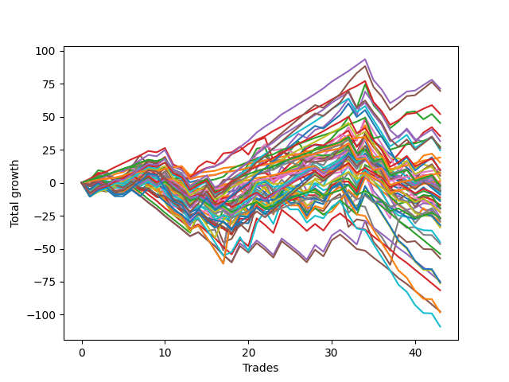

# Long Pointer 001 AB 
- Symbol: ES
- Date Range: 03/18/2022 - 07/15/2022
- Trading Period: 7:20-12:30
- Number of Trades: 43



| Name | Win Percent | Profit | Avg Profit / Trade | Avg Time / Trade |      | Name | Win Percent | Profit | Avg Profit / Trade | Avg Time / Trade |
| ---- | ----------- | ------ | ------------------ | ---------------- | ---- | ---- | ----------- | ------ | ------------------ | ---------------- |
| Sorted By <br> Profit | | | | | | Sorted By <br> Win Percentage ||||
| Eighty-Four | 79.07 | 35625.00 | 828.49 | 13:28 |     | Eighty-One | 90.70 | 9500.00 | 220.93 | 05:21 |
| Eighty-Five | 72.09 | 34750.00 | 808.14 | 16:29 |     | One Hundred Twenty-One | 88.37 | 5125.00 | 119.19 | 03:47 |
| Eighty-Three | 81.40 | 26000.00 | 604.65 | 11:58 |     | One Hundred Twenty-Six | 88.37 | 3625.00 | 84.30 | 04:04 |
| Two | 67.44 | 22625.00 | 526.16 | 17:16 |     | Eighty-Two | 83.72 | 13625.00 | 316.86 | 09:39 |
| Three | 65.12 | 17625.00 | 409.88 | 17:31 |     | Eighty-Three | 81.40 | 26000.00 | 604.65 | 11:58 |
| One Hundred Twenty-Nine | 72.09 | 15750.00 | 366.28 | 09:32 |     | One Hundred Eleven | 81.40 | 3625.00 | 84.30 | 01:55 |
| Eighty-Two | 83.72 | 13625.00 | 316.86 | 09:39 |     | Eighty-Four | 79.07 | 35625.00 | 828.49 | 13:28 |
| Sixty-Six | 58.14 | 13125.00 | 305.23 | 11:33 |     | One Hundred Sixteen | 79.07 | 625.00 | 14.53 | 01:52 |
| One Hundred Thirty | 62.79 | 13000.00 | 302.33 | 11:23 |     | One Hundred Twenty-Seven | 76.74 | -1500.00 | -34.88 | 06:36 |
| One Hundred Twenty-Four | 72.09 | 12250.00 | 284.88 | 09:29 |     | One Hundred Twenty-Two | 76.74 | -2625.00 | -61.05 | 06:26 |
| Eighty-One | 90.70 | 9500.00 | 220.93 | 05:21 |     | Eighty-Five | 72.09 | 34750.00 | 808.14 | 16:29 |
| One | 62.79 | 7625.00 | 177.33 | 12:34 |     | One Hundred Twenty-Nine | 72.09 | 15750.00 | 366.28 | 09:32 |
| One Hundred Twenty-One | 88.37 | 5125.00 | 119.19 | 03:47 |     | One Hundred Twenty-Four | 72.09 | 12250.00 | 284.88 | 09:29 |
| One Hundred Twenty-Eight | 72.09 | 4750.00 | 110.47 | 08:13 |     | One Hundred Twenty-Eight | 72.09 | 4750.00 | 110.47 | 08:13 |
| One Hundred Twenty-Five | 62.79 | 4625.00 | 107.56 | 11:47 |     | One Hundred Twenty-Three | 72.09 | 1250.00 | 29.07 | 08:10 |
| Fifty | 39.53 | 3750.00 | 87.21 | 05:26 |     | Zero | 69.77 | -3000.00 | -69.77 | 07:41 |
| One Hundred Twenty-Six | 88.37 | 3625.00 | 84.30 | 04:04 |     | Sixty-Four | 69.77 | -9500.00 | -220.93 | 05:25 |
| One Hundred Eleven | 81.40 | 3625.00 | 84.30 | 01:55 |     | Fifty-Six | 69.77 | -13250.00 | -308.14 | 05:18 |
| Sixty-Seven | 55.81 | 2625.00 | 61.05 | 11:38 |     | Two | 67.44 | 22625.00 | 526.16 | 17:16 |
| One Hundred Twenty-Three | 72.09 | 1250.00 | 29.07 | 08:10 |     | Three | 65.12 | 17625.00 | 409.88 | 17:31 |
| One Hundred Sixteen | 79.07 | 625.00 | 14.53 | 01:52 |     | One Hundred Thirty | 62.79 | 13000.00 | 302.33 | 11:23 |
| Forty-Eight | 62.79 | -125.00 | -2.91 | 02:35 |     | One | 62.79 | 7625.00 | 177.33 | 12:34 |
| Fifty-One | 41.86 | -750.00 | -17.44 | 05:13 |     | One Hundred Twenty-Five | 62.79 | 4625.00 | 107.56 | 11:47 |
| Sixty-Five | 60.47 | -1125.00 | -26.16 | 08:40 |     | Forty-Eight | 62.79 | -125.00 | -2.91 | 02:35 |
| Forty-Nine | 48.84 | -1375.00 | -31.98 | 04:16 |     | Forty | 62.79 | -3375.00 | -78.49 | 03:15 |
| One Hundred Twenty-Seven | 76.74 | -1500.00 | -34.88 | 06:36 |     | Sixty-Five | 60.47 | -1125.00 | -26.16 | 08:40 |
| One Hundred Ninteen | 48.84 | -2125.00 | -49.42 | 03:54 |     | Fifty-Seven | 60.47 | -9875.00 | -229.65 | 08:44 |
| One Hundred Twenty-Two | 76.74 | -2625.00 | -61.05 | 06:26 |     | One Hundred Twelve | 60.47 | -13500.00 | -313.95 | 02:47 |
| Zero | 69.77 | -3000.00 | -69.77 | 07:41 |     | Sixty-Six | 58.14 | 13125.00 | 305.23 | 11:33 |
| One Hundred Twenty | 41.86 | -3125.00 | -72.67 | 04:41 |     | Fifty-Eight | 58.14 | -3375.00 | -78.49 | 12:29 |
| Forty | 62.79 | -3375.00 | -78.49 | 03:15 |     | One Hundred Seventeen | 58.14 | -13375.00 | -311.05 | 02:35 |
| Fifty-Eight | 58.14 | -3375.00 | -78.49 | 12:29 |     | Sixty-Seven | 55.81 | 2625.00 | 61.05 | 11:38 |
| One Hundred Fourteen | 53.49 | -3500.00 | -81.40 | 04:40 |     | Fifty-Nine | 55.81 | -14625.00 | -340.12 | 12:47 |
| Forty-One | 51.16 | -4125.00 | -95.93 | 05:17 |     | One Hundred Fourteen | 53.49 | -3500.00 | -81.40 | 04:40 |
| Forty-Two | 39.53 | -4625.00 | -107.56 | 07:28 |     | One Hundred Eighteen | 53.49 | -5625.00 | -130.81 | 03:29 |
| One Hundred Eighteen | 53.49 | -5625.00 | -130.81 | 03:29 |     | One Hundred Thirteen | 53.49 | -11125.00 | -258.72 | 04:02 |
| Fifty-Four | 37.21 | -6375.00 | -148.26 | 06:59 |     | Forty-One | 51.16 | -4125.00 | -95.93 | 05:17 |
| One Hundred Fifteen | 46.51 | -7000.00 | -162.79 | 05:59 |     | Four | 51.16 | -13750.00 | -319.77 | 24:05 |
| Fifty-Three | 37.21 | -8375.00 | -194.77 | 06:26 |     | Forty-Nine | 48.84 | -1375.00 | -31.98 | 04:16 |
| Fifty-Five | 37.21 | -8500.00 | -197.67 | 07:08 |     | One Hundred Ninteen | 48.84 | -2125.00 | -49.42 | 03:54 |
| Sixty-Four | 69.77 | -9500.00 | -220.93 | 05:25 |     | One Hundred Fifteen | 46.51 | -7000.00 | -162.79 | 05:59 |
| Fifty-Two | 37.21 | -9625.00 | -223.84 | 06:02 |     | Six | 46.51 | -11000.00 | -255.81 | 28:06 |
| Fifty-Seven | 60.47 | -9875.00 | -229.65 | 08:44 |     | Seven | 44.19 | -23250.00 | -540.70 | 29:23 |
| Six | 46.51 | -11000.00 | -255.81 | 28:06 |     | Five | 44.19 | -28625.00 | -665.70 | 26:41 |
| One Hundred Thirteen | 53.49 | -11125.00 | -258.72 | 04:02 |     | Fifty-One | 41.86 | -750.00 | -17.44 | 05:13 |
| Sixty-Eight | 41.86 | -11375.00 | -264.53 | 15:13 |     | One Hundred Twenty | 41.86 | -3125.00 | -72.67 | 04:41 |
| Fifty-Six | 69.77 | -13250.00 | -308.14 | 05:18 |     | Sixty-Eight | 41.86 | -11375.00 | -264.53 | 15:13 |
| One Hundred Seventeen | 58.14 | -13375.00 | -311.05 | 02:35 |     | Sixty | 41.86 | -38125.00 | -886.63 | 17:30 |
| One Hundred Twelve | 60.47 | -13500.00 | -313.95 | 02:47 |     | Fifty | 39.53 | 3750.00 | 87.21 | 05:26 |
| Four | 51.16 | -13750.00 | -319.77 | 24:05 |     | Forty-Two | 39.53 | -4625.00 | -107.56 | 07:28 |
| Fifty-Nine | 55.81 | -14625.00 | -340.12 | 12:47 |     | Forty-Three | 39.53 | -14875.00 | -345.93 | 07:14 |
| Forty-Three | 39.53 | -14875.00 | -345.93 | 07:14 |     | Fifty-Four | 37.21 | -6375.00 | -148.26 | 06:59 |
| Seventy-Three | 34.88 | -16000.00 | -372.09 | 07:27 |     | Fifty-Three | 37.21 | -8375.00 | -194.77 | 06:26 |
| Sixty-Nine | 37.21 | -16500.00 | -383.72 | 16:34 |     | Fifty-Five | 37.21 | -8500.00 | -197.67 | 07:08 |
| Seventy | 37.21 | -17000.00 | -395.35 | 18:07 |     | Fifty-Two | 37.21 | -9625.00 | -223.84 | 06:02 |
| Seventy-One | 37.21 | -22500.00 | -523.26 | 18:41 |     | Sixty-Nine | 37.21 | -16500.00 | -383.72 | 16:34 |
| Seven | 44.19 | -23250.00 | -540.70 | 29:23 |     | Seventy | 37.21 | -17000.00 | -395.35 | 18:07 |
| Forty-Four | 27.91 | -27000.00 | -627.91 | 10:04 |     | Seventy-One | 37.21 | -22500.00 | -523.26 | 18:41 |
| Five | 44.19 | -28625.00 | -665.70 | 26:41 |     | Sixty-Two | 37.21 | -37750.00 | -877.91 | 21:30 |
| Forty-Six | 25.58 | -37375.00 | -869.19 | 12:58 |     | Seventy-Three | 34.88 | -16000.00 | -372.09 | 07:27 |
| Sixty-Two | 37.21 | -37750.00 | -877.91 | 21:30 |     | Sixty-Three | 34.88 | -49125.00 | -1142.44 | 22:32 |
| Sixty | 41.86 | -38125.00 | -886.63 | 17:30 |     | Sixty-One | 34.88 | -54500.00 | -1267.44 | 19:49 |
| Forty-Five | 23.26 | -40750.00 | -947.67 | 11:45 |     | Forty-Four | 27.91 | -27000.00 | -627.91 | 10:04 |
| Forty-Seven | 23.26 | -48750.00 | -1133.72 | 14:00 |     | Forty-Six | 25.58 | -37375.00 | -869.19 | 12:58 |
| Sixty-Three | 34.88 | -49125.00 | -1142.44 | 22:32 |     | Forty-Five | 23.26 | -40750.00 | -947.67 | 11:45 |
| Sixty-One | 34.88 | -54500.00 | -1267.44 | 19:49 |     | Forty-Seven | 23.26 | -48750.00 | -1133.72 | 14:00 |

## NO STOPLOSS

### Test Zero
* Sell when price hits the middle line of the 20p bollinger
* No Stoploss
* Results:
```
Total Trades: 43
Percent Up: 69.77
Percent Down: 30.23
Total Points Moved Up: -6.00
Potential Profit: -3000.00
Total Points Ups: 73.75 Count Ups: 30
Total Points Downs: -79.75 Count Downs: 13
```

<details><summary>Trades</summary>

<code>In: 2022-03-30 12:14:00		Out: 2022-03-30 12:15:25		Total Position Time: 01:25		Total Move Up: 2.25		Total to Date: 2.25</code> <br />
<code>In: 2022-03-30 12:27:00		Out: 2022-03-30 12:28:15		Total Position Time: 01:15		Total Move Up: 2.50		Total to Date: 4.75</code> <br />
<code>In: 2022-03-31 10:02:00		Out: 2022-03-31 10:04:00		Total Position Time: 02:00		Total Move Up: 0.75		Total to Date: 5.50</code> <br />
<code>In: 2022-04-05 09:04:00		Out: 2022-04-05 09:06:05		Total Position Time: 02:05		Total Move Up: 2.75		Total to Date: 8.25</code> <br />
<code>In: 2022-04-06 09:23:00		Out: 2022-04-06 09:31:15		Total Position Time: 08:15		Total Move Up: 1.50		Total to Date: 9.75</code> <br />
<code>In: 2022-04-07 08:56:00		Out: 2022-04-07 08:56:10		Total Position Time: 00:10		Total Move Up: 2.00		Total to Date: 11.75</code> <br />
<code>In: 2022-04-12 07:53:00		Out: 2022-04-12 08:02:05		Total Position Time: 09:05		Total Move Up: 0.75		Total to Date: 12.50</code> <br />
<code>In: 2022-04-12 11:35:00		Out: 2022-04-12 11:35:50		Total Position Time: 00:50		Total Move Up: 1.50		Total to Date: 14.00</code> <br />
<code>In: 2022-04-14 09:32:00		Out: 2022-04-14 09:56:10		Total Position Time: 24:10		Total Move Up: -5.25		Total to Date: 8.75</code> <br />
<code>In: 2022-04-21 08:25:00		Out: 2022-04-21 08:25:15		Total Position Time: 00:15		Total Move Up: 2.75		Total to Date: 11.50</code> <br />
<code>In: 2022-04-21 09:02:00		Out: 2022-04-21 09:19:05		Total Position Time: 17:05		Total Move Up: -5.25		Total to Date: 6.25</code> <br />
<code>In: 2022-04-21 09:12:00		Out: 2022-04-21 09:19:05		Total Position Time: 07:05		Total Move Up: 0.25		Total to Date: 6.50</code> <br />
<code>In: 2022-04-21 09:56:00		Out: 2022-04-21 10:13:30		Total Position Time: 17:30		Total Move Up: -6.25		Total to Date: 0.25</code> <br />
<code>In: 2022-04-21 10:21:00		Out: 2022-04-21 10:21:10		Total Position Time: 00:10		Total Move Up: 1.75		Total to Date: 2.00</code> <br />
<code>In: 2022-04-21 12:06:00		Out: 2022-04-21 12:18:10		Total Position Time: 12:10		Total Move Up: -2.25		Total to Date: -0.25</code> <br />
<code>In: 2022-05-02 10:37:00		Out: 2022-05-02 10:59:15		Total Position Time: 22:15		Total Move Up: -8.50		Total to Date: -8.75</code> <br />
<code>In: 2022-05-02 10:51:00		Out: 2022-05-02 10:59:15		Total Position Time: 08:15		Total Move Up: 1.50		Total to Date: -7.25</code> <br />
<code>In: 2022-05-02 11:46:00		Out: 2022-05-02 11:46:10		Total Position Time: 00:10		Total Move Up: 0.75		Total to Date: -6.50</code> <br />
<code>In: 2022-05-04 08:37:00		Out: 2022-05-04 08:39:20		Total Position Time: 02:20		Total Move Up: 2.00		Total to Date: -4.50</code> <br />
<code>In: 2022-05-09 07:42:00		Out: 2022-05-09 07:42:30		Total Position Time: 00:30		Total Move Up: 4.75		Total to Date: 0.25</code> <br />
<code>In: 2022-05-09 08:34:00		Out: 2022-05-09 08:35:10		Total Position Time: 01:10		Total Move Up: 6.25		Total to Date: 6.50</code> <br />
<code>In: 2022-05-09 10:03:00		Out: 2022-05-09 10:09:25		Total Position Time: 06:25		Total Move Up: 1.00		Total to Date: 7.50</code> <br />
<code>In: 2022-05-10 07:52:00		Out: 2022-05-10 07:59:00		Total Position Time: 07:00		Total Move Up: 5.25		Total to Date: 12.75</code> <br />
<code>In: 2022-05-11 11:01:00		Out: 2022-05-11 11:01:10		Total Position Time: 00:10		Total Move Up: 1.50		Total to Date: 14.25</code> <br />
<code>In: 2022-05-18 08:32:00		Out: 2022-05-18 08:36:55		Total Position Time: 04:55		Total Move Up: 4.00		Total to Date: 18.25</code> <br />
<code>In: 2022-05-18 09:12:00		Out: 2022-05-18 09:14:45		Total Position Time: 02:45		Total Move Up: 2.25		Total to Date: 20.50</code> <br />
<code>In: 2022-05-20 09:48:00		Out: 2022-05-20 09:50:00		Total Position Time: 02:00		Total Move Up: 7.00		Total to Date: 27.50</code> <br />
<code>In: 2022-05-25 10:15:00		Out: 2022-05-25 10:15:20		Total Position Time: 00:20		Total Move Up: 1.00		Total to Date: 28.50</code> <br />
<code>In: 2022-06-08 11:31:00		Out: 2022-06-08 11:31:10		Total Position Time: 00:10		Total Move Up: -0.75		Total to Date: 27.75</code> <br />
<code>In: 2022-06-08 12:11:00		Out: 2022-06-08 12:11:20		Total Position Time: 00:20		Total Move Up: 0.75		Total to Date: 28.50</code> <br />
<code>In: 2022-06-09 08:10:00		Out: 2022-06-09 08:10:55		Total Position Time: 00:55		Total Move Up: 2.25		Total to Date: 30.75</code> <br />
<code>In: 2022-06-13 12:17:00		Out: 2022-06-13 12:17:10		Total Position Time: 00:10		Total Move Up: 4.00		Total to Date: 34.75</code> <br />
<code>In: 2022-06-14 07:32:00		Out: 2022-06-14 07:46:40		Total Position Time: 14:40		Total Move Up: -6.75		Total to Date: 28.00</code> <br />
<code>In: 2022-06-14 07:45:00		Out: 2022-06-14 07:46:40		Total Position Time: 01:40		Total Move Up: 3.75		Total to Date: 31.75</code> <br />
<code>In: 2022-06-14 11:52:00		Out: 2022-06-14 12:21:55		Total Position Time: 29:55		Total Move Up: -15.75		Total to Date: 16.00</code> <br />
<code>In: 2022-06-15 07:57:00		Out: 2022-06-15 08:26:55		Total Position Time: 29:55		Total Move Up: -7.25		Total to Date: 8.75</code> <br />
<code>In: 2022-06-16 11:02:00		Out: 2022-06-16 11:31:55		Total Position Time: 29:55		Total Move Up: -10.25		Total to Date: -1.50</code> <br />
<code>In: 2022-06-17 07:38:00		Out: 2022-06-17 07:55:05		Total Position Time: 17:05		Total Move Up: -2.75		Total to Date: -4.25</code> <br />
<code>In: 2022-06-23 09:07:00		Out: 2022-06-23 09:14:30		Total Position Time: 07:30		Total Move Up: 2.00		Total to Date: -2.25</code> <br />
<code>In: 2022-06-29 09:16:00		Out: 2022-06-29 09:21:05		Total Position Time: 05:05		Total Move Up: 1.50		Total to Date: -0.75</code> <br />
<code>In: 2022-07-06 08:12:00		Out: 2022-07-06 08:14:30		Total Position Time: 02:30		Total Move Up: 3.50		Total to Date: 2.75</code> <br />
<code>In: 2022-07-06 08:35:00		Out: 2022-07-06 08:46:05		Total Position Time: 11:05		Total Move Up: -1.00		Total to Date: 1.75</code> <br />
<code>In: 2022-07-12 12:27:00		Out: 2022-07-12 12:45:05		Total Position Time: 18:05		Total Move Up: -7.75		Total to Date: -6.00</code> <br />


</details>

### Test One
* Sell when the price hits the upper line of the 20p 1std bollinger
* No Stoploss
* Results:
```
Total Trades: 43
Percent Up: 62.79
Percent Down: 37.21
Total Points Moved Up: 15.25
Potential Profit: 7625.00
Total Points Ups: 110.75 Count Ups: 27
Total Points Downs: -95.50 Count Downs: 16
```

<details><summary>Trades</summary>

<code>In: 2022-03-30 12:14:00		Out: 2022-03-30 12:32:20		Total Position Time: 18:20		Total Move Up: -0.75		Total to Date: -0.75</code> <br />
<code>In: 2022-03-30 12:27:00		Out: 2022-03-30 12:32:20		Total Position Time: 05:20		Total Move Up: 4.75		Total to Date: 4.00</code> <br />
<code>In: 2022-03-31 10:02:00		Out: 2022-03-31 10:19:20		Total Position Time: 17:20		Total Move Up: -1.00		Total to Date: 3.00</code> <br />
<code>In: 2022-04-05 09:04:00		Out: 2022-04-05 09:13:35		Total Position Time: 09:35		Total Move Up: 3.50		Total to Date: 6.50</code> <br />
<code>In: 2022-04-06 09:23:00		Out: 2022-04-06 09:34:05		Total Position Time: 11:05		Total Move Up: 1.50		Total to Date: 8.00</code> <br />
<code>In: 2022-04-07 08:56:00		Out: 2022-04-07 09:02:50		Total Position Time: 06:50		Total Move Up: 3.25		Total to Date: 11.25</code> <br />
<code>In: 2022-04-12 07:53:00		Out: 2022-04-12 08:02:35		Total Position Time: 09:35		Total Move Up: 2.75		Total to Date: 14.00</code> <br />
<code>In: 2022-04-12 11:35:00		Out: 2022-04-12 11:37:20		Total Position Time: 02:20		Total Move Up: 3.50		Total to Date: 17.50</code> <br />
<code>In: 2022-04-14 09:32:00		Out: 2022-04-14 09:58:15		Total Position Time: 26:15		Total Move Up: -4.00		Total to Date: 13.50</code> <br />
<code>In: 2022-04-21 08:25:00		Out: 2022-04-21 08:27:15		Total Position Time: 02:15		Total Move Up: 4.75		Total to Date: 18.25</code> <br />
<code>In: 2022-04-21 09:02:00		Out: 2022-04-21 09:31:55		Total Position Time: 29:55		Total Move Up: -12.50		Total to Date: 5.75</code> <br />
<code>In: 2022-04-21 09:12:00		Out: 2022-04-21 09:34:10		Total Position Time: 22:10		Total Move Up: -1.75		Total to Date: 4.00</code> <br />
<code>In: 2022-04-21 09:56:00		Out: 2022-04-21 10:21:20		Total Position Time: 25:20		Total Move Up: -6.25		Total to Date: -2.25</code> <br />
<code>In: 2022-04-21 10:21:00		Out: 2022-04-21 10:21:20		Total Position Time: 00:20		Total Move Up: 4.00		Total to Date: 1.75</code> <br />
<code>In: 2022-04-21 12:06:00		Out: 2022-04-21 12:23:10		Total Position Time: 17:10		Total Move Up: -1.00		Total to Date: 0.75</code> <br />
<code>In: 2022-05-02 10:37:00		Out: 2022-05-02 11:02:25		Total Position Time: 25:25		Total Move Up: -6.50		Total to Date: -5.75</code> <br />
<code>In: 2022-05-02 10:51:00		Out: 2022-05-02 11:02:25		Total Position Time: 11:25		Total Move Up: 3.50		Total to Date: -2.25</code> <br />
<code>In: 2022-05-02 11:46:00		Out: 2022-05-02 11:46:10		Total Position Time: 00:10		Total Move Up: 0.75		Total to Date: -1.50</code> <br />
<code>In: 2022-05-04 08:37:00		Out: 2022-05-04 08:40:55		Total Position Time: 03:55		Total Move Up: 5.00		Total to Date: 3.50</code> <br />
<code>In: 2022-05-09 07:42:00		Out: 2022-05-09 07:45:10		Total Position Time: 03:10		Total Move Up: 4.50		Total to Date: 8.00</code> <br />
<code>In: 2022-05-09 08:34:00		Out: 2022-05-09 08:38:35		Total Position Time: 04:35		Total Move Up: 7.50		Total to Date: 15.50</code> <br />
<code>In: 2022-05-09 10:03:00		Out: 2022-05-09 10:18:05		Total Position Time: 15:05		Total Move Up: 1.25		Total to Date: 16.75</code> <br />
<code>In: 2022-05-10 07:52:00		Out: 2022-05-10 08:21:55		Total Position Time: 29:55		Total Move Up: -17.25		Total to Date: -0.50</code> <br />
<code>In: 2022-05-11 11:01:00		Out: 2022-05-11 11:01:20		Total Position Time: 00:20		Total Move Up: 5.25		Total to Date: 4.75</code> <br />
<code>In: 2022-05-18 08:32:00		Out: 2022-05-18 08:41:15		Total Position Time: 09:15		Total Move Up: 6.00		Total to Date: 10.75</code> <br />
<code>In: 2022-05-18 09:12:00		Out: 2022-05-18 09:16:25		Total Position Time: 04:25		Total Move Up: 4.75		Total to Date: 15.50</code> <br />
<code>In: 2022-05-20 09:48:00		Out: 2022-05-20 09:56:10		Total Position Time: 08:10		Total Move Up: 6.75		Total to Date: 22.25</code> <br />
<code>In: 2022-05-25 10:15:00		Out: 2022-05-25 10:15:30		Total Position Time: 00:30		Total Move Up: 3.25		Total to Date: 25.50</code> <br />
<code>In: 2022-06-08 11:31:00		Out: 2022-06-08 11:43:05		Total Position Time: 12:05		Total Move Up: -0.75		Total to Date: 24.75</code> <br />
<code>In: 2022-06-08 12:11:00		Out: 2022-06-08 12:12:15		Total Position Time: 01:15		Total Move Up: 3.50		Total to Date: 28.25</code> <br />
<code>In: 2022-06-09 08:10:00		Out: 2022-06-09 08:20:50		Total Position Time: 10:50		Total Move Up: 3.75		Total to Date: 32.00</code> <br />
<code>In: 2022-06-13 12:17:00		Out: 2022-06-13 12:17:10		Total Position Time: 00:10		Total Move Up: 4.00		Total to Date: 36.00</code> <br />
<code>In: 2022-06-14 07:32:00		Out: 2022-06-14 07:47:10		Total Position Time: 15:10		Total Move Up: -1.50		Total to Date: 34.50</code> <br />
<code>In: 2022-06-14 07:45:00		Out: 2022-06-14 07:47:10		Total Position Time: 02:10		Total Move Up: 9.00		Total to Date: 43.50</code> <br />
<code>In: 2022-06-14 11:52:00		Out: 2022-06-14 12:21:55		Total Position Time: 29:55		Total Move Up: -15.75		Total to Date: 27.75</code> <br />
<code>In: 2022-06-15 07:57:00		Out: 2022-06-15 08:26:55		Total Position Time: 29:55		Total Move Up: -7.25		Total to Date: 20.50</code> <br />
<code>In: 2022-06-16 11:02:00		Out: 2022-06-16 11:31:55		Total Position Time: 29:55		Total Move Up: -10.25		Total to Date: 10.25</code> <br />
<code>In: 2022-06-17 07:38:00		Out: 2022-06-17 07:56:15		Total Position Time: 18:15		Total Move Up: 0.50		Total to Date: 10.75</code> <br />
<code>In: 2022-06-23 09:07:00		Out: 2022-06-23 09:18:25		Total Position Time: 11:25		Total Move Up: 4.75		Total to Date: 15.50</code> <br />
<code>In: 2022-06-29 09:16:00		Out: 2022-06-29 09:37:15		Total Position Time: 21:15		Total Move Up: -2.25		Total to Date: 13.25</code> <br />
<code>In: 2022-07-06 08:12:00		Out: 2022-07-06 08:17:50		Total Position Time: 05:50		Total Move Up: 7.25		Total to Date: 20.50</code> <br />
<code>In: 2022-07-06 08:35:00		Out: 2022-07-06 08:48:10		Total Position Time: 13:10		Total Move Up: 1.50		Total to Date: 22.00</code> <br />
<code>In: 2022-07-12 12:27:00		Out: 2022-07-12 12:46:00		Total Position Time: 19:00		Total Move Up: -6.75		Total to Date: 15.25</code> <br />


</details>

### Test Two
* Sell when the price hits the upper line of the 20p 2std bollinger
* No Stoploss
* Results:
```
Total Trades: 43
Percent Up: 67.44
Percent Down: 32.56
Total Points Moved Up: 45.25
Potential Profit: 22625.00
Total Points Ups: 164.75 Count Ups: 29
Total Points Downs: -119.50 Count Downs: 14
```

<details><summary>Trades</summary>

<code>In: 2022-03-30 12:14:00		Out: 2022-03-30 12:36:20		Total Position Time: 22:20		Total Move Up: 2.00		Total to Date: 2.00</code> <br />
<code>In: 2022-03-30 12:27:00		Out: 2022-03-30 12:36:20		Total Position Time: 09:20		Total Move Up: 7.50		Total to Date: 9.50</code> <br />
<code>In: 2022-03-31 10:02:00		Out: 2022-03-31 10:27:00		Total Position Time: 25:00		Total Move Up: -1.50		Total to Date: 8.00</code> <br />
<code>In: 2022-04-05 09:04:00		Out: 2022-04-05 09:33:55		Total Position Time: 29:55		Total Move Up: -5.25		Total to Date: 2.75</code> <br />
<code>In: 2022-04-06 09:23:00		Out: 2022-04-06 09:34:25		Total Position Time: 11:25		Total Move Up: 2.75		Total to Date: 5.50</code> <br />
<code>In: 2022-04-07 08:56:00		Out: 2022-04-07 09:08:20		Total Position Time: 12:20		Total Move Up: 4.00		Total to Date: 9.50</code> <br />
<code>In: 2022-04-12 07:53:00		Out: 2022-04-12 08:15:45		Total Position Time: 22:45		Total Move Up: 2.25		Total to Date: 11.75</code> <br />
<code>In: 2022-04-12 11:35:00		Out: 2022-04-12 11:47:00		Total Position Time: 12:00		Total Move Up: 4.50		Total to Date: 16.25</code> <br />
<code>In: 2022-04-14 09:32:00		Out: 2022-04-14 09:58:55		Total Position Time: 26:55		Total Move Up: -2.25		Total to Date: 14.00</code> <br />
<code>In: 2022-04-21 08:25:00		Out: 2022-04-21 08:54:55		Total Position Time: 29:55		Total Move Up: -15.00		Total to Date: -1.00</code> <br />
<code>In: 2022-04-21 09:02:00		Out: 2022-04-21 09:31:55		Total Position Time: 29:55		Total Move Up: -12.50		Total to Date: -13.50</code> <br />
<code>In: 2022-04-21 09:12:00		Out: 2022-04-21 09:35:40		Total Position Time: 23:40		Total Move Up: 0.00		Total to Date: -13.50</code> <br />
<code>In: 2022-04-21 09:56:00		Out: 2022-04-21 10:21:30		Total Position Time: 25:30		Total Move Up: -4.25		Total to Date: -17.75</code> <br />
<code>In: 2022-04-21 10:21:00		Out: 2022-04-21 10:21:30		Total Position Time: 00:30		Total Move Up: 6.00		Total to Date: -11.75</code> <br />
<code>In: 2022-04-21 12:06:00		Out: 2022-04-21 12:24:30		Total Position Time: 18:30		Total Move Up: 1.00		Total to Date: -10.75</code> <br />
<code>In: 2022-05-02 10:37:00		Out: 2022-05-02 11:03:45		Total Position Time: 26:45		Total Move Up: -3.75		Total to Date: -14.50</code> <br />
<code>In: 2022-05-02 10:51:00		Out: 2022-05-02 11:03:45		Total Position Time: 12:45		Total Move Up: 6.25		Total to Date: -8.25</code> <br />
<code>In: 2022-05-02 11:46:00		Out: 2022-05-02 11:53:35		Total Position Time: 07:35		Total Move Up: 6.00		Total to Date: -2.25</code> <br />
<code>In: 2022-05-04 08:37:00		Out: 2022-05-04 08:47:05		Total Position Time: 10:05		Total Move Up: 8.00		Total to Date: 5.75</code> <br />
<code>In: 2022-05-09 07:42:00		Out: 2022-05-09 07:48:05		Total Position Time: 06:05		Total Move Up: 8.00		Total to Date: 13.75</code> <br />
<code>In: 2022-05-09 08:34:00		Out: 2022-05-09 08:39:15		Total Position Time: 05:15		Total Move Up: 12.00		Total to Date: 25.75</code> <br />
<code>In: 2022-05-09 10:03:00		Out: 2022-05-09 10:18:05		Total Position Time: 15:05		Total Move Up: 1.25		Total to Date: 27.00</code> <br />
<code>In: 2022-05-10 07:52:00		Out: 2022-05-10 08:21:55		Total Position Time: 29:55		Total Move Up: -17.25		Total to Date: 9.75</code> <br />
<code>In: 2022-05-11 11:01:00		Out: 2022-05-11 11:02:35		Total Position Time: 01:35		Total Move Up: 5.75		Total to Date: 15.50</code> <br />
<code>In: 2022-05-18 08:32:00		Out: 2022-05-18 08:42:55		Total Position Time: 10:55		Total Move Up: 8.75		Total to Date: 24.25</code> <br />
<code>In: 2022-05-18 09:12:00		Out: 2022-05-18 09:17:50		Total Position Time: 05:50		Total Move Up: 7.00		Total to Date: 31.25</code> <br />
<code>In: 2022-05-20 09:48:00		Out: 2022-05-20 10:17:55		Total Position Time: 29:55		Total Move Up: -11.75		Total to Date: 19.50</code> <br />
<code>In: 2022-05-25 10:15:00		Out: 2022-05-25 10:29:40		Total Position Time: 14:40		Total Move Up: 6.25		Total to Date: 25.75</code> <br />
<code>In: 2022-06-08 11:31:00		Out: 2022-06-08 11:43:35		Total Position Time: 12:35		Total Move Up: 2.25		Total to Date: 28.00</code> <br />
<code>In: 2022-06-08 12:11:00		Out: 2022-06-08 12:13:25		Total Position Time: 02:25		Total Move Up: 5.75		Total to Date: 33.75</code> <br />
<code>In: 2022-06-09 08:10:00		Out: 2022-06-09 08:22:35		Total Position Time: 12:35		Total Move Up: 7.00		Total to Date: 40.75</code> <br />
<code>In: 2022-06-13 12:17:00		Out: 2022-06-13 12:17:15		Total Position Time: 00:15		Total Move Up: 8.75		Total to Date: 49.50</code> <br />
<code>In: 2022-06-14 07:32:00		Out: 2022-06-14 07:51:00		Total Position Time: 19:00		Total Move Up: 7.25		Total to Date: 56.75</code> <br />
<code>In: 2022-06-14 07:45:00		Out: 2022-06-14 07:51:00		Total Position Time: 06:00		Total Move Up: 17.75		Total to Date: 74.50</code> <br />
<code>In: 2022-06-14 11:52:00		Out: 2022-06-14 12:21:55		Total Position Time: 29:55		Total Move Up: -15.75		Total to Date: 58.75</code> <br />
<code>In: 2022-06-15 07:57:00		Out: 2022-06-15 08:26:55		Total Position Time: 29:55		Total Move Up: -7.25		Total to Date: 51.50</code> <br />
<code>In: 2022-06-16 11:02:00		Out: 2022-06-16 11:31:55		Total Position Time: 29:55		Total Move Up: -10.25		Total to Date: 41.25</code> <br />
<code>In: 2022-06-17 07:38:00		Out: 2022-06-17 08:02:25		Total Position Time: 24:25		Total Move Up: 5.00		Total to Date: 46.25</code> <br />
<code>In: 2022-06-23 09:07:00		Out: 2022-06-23 09:19:05		Total Position Time: 12:05		Total Move Up: 7.00		Total to Date: 53.25</code> <br />
<code>In: 2022-06-29 09:16:00		Out: 2022-06-29 09:38:30		Total Position Time: 22:30		Total Move Up: 0.75		Total to Date: 54.00</code> <br />
<code>In: 2022-07-06 08:12:00		Out: 2022-07-06 08:41:55		Total Position Time: 29:55		Total Move Up: -6.00		Total to Date: 48.00</code> <br />
<code>In: 2022-07-06 08:35:00		Out: 2022-07-06 08:51:15		Total Position Time: 16:15		Total Move Up: 4.00		Total to Date: 52.00</code> <br />
<code>In: 2022-07-12 12:27:00		Out: 2022-07-12 12:46:00		Total Position Time: 19:00		Total Move Up: -6.75		Total to Date: 45.25</code> <br />


</details>

### Test Three
* Sell when price hits the middle line of the 50p bollinger
* No Stoploss
* Results:
```
Total Trades: 43
Percent Up: 65.12
Percent Down: 34.88
Total Points Moved Up: 35.25
Potential Profit: 17625.00
Total Points Ups: 142.75 Count Ups: 28
Total Points Downs: -107.50 Count Downs: 15
```

<details><summary>Trades</summary>

<code>In: 2022-03-30 12:14:00		Out: 2022-03-30 12:33:25		Total Position Time: 19:25		Total Move Up: 1.00		Total to Date: 1.00</code> <br />
<code>In: 2022-03-30 12:27:00		Out: 2022-03-30 12:33:25		Total Position Time: 06:25		Total Move Up: 6.50		Total to Date: 7.50</code> <br />
<code>In: 2022-03-31 10:02:00		Out: 2022-03-31 10:27:25		Total Position Time: 25:25		Total Move Up: -1.00		Total to Date: 6.50</code> <br />
<code>In: 2022-04-05 09:04:00		Out: 2022-04-05 09:33:55		Total Position Time: 29:55		Total Move Up: -5.25		Total to Date: 1.25</code> <br />
<code>In: 2022-04-06 09:23:00		Out: 2022-04-06 09:48:50		Total Position Time: 25:50		Total Move Up: 2.50		Total to Date: 3.75</code> <br />
<code>In: 2022-04-07 08:56:00		Out: 2022-04-07 09:02:50		Total Position Time: 06:50		Total Move Up: 3.25		Total to Date: 7.00</code> <br />
<code>In: 2022-04-12 07:53:00		Out: 2022-04-12 08:15:40		Total Position Time: 22:40		Total Move Up: 3.00		Total to Date: 10.00</code> <br />
<code>In: 2022-04-12 11:35:00		Out: 2022-04-12 11:47:05		Total Position Time: 12:05		Total Move Up: 6.00		Total to Date: 16.00</code> <br />
<code>In: 2022-04-14 09:32:00		Out: 2022-04-14 09:59:25		Total Position Time: 27:25		Total Move Up: -1.25		Total to Date: 14.75</code> <br />
<code>In: 2022-04-21 08:25:00		Out: 2022-04-21 08:27:15		Total Position Time: 02:15		Total Move Up: 4.75		Total to Date: 19.50</code> <br />
<code>In: 2022-04-21 09:02:00		Out: 2022-04-21 09:31:55		Total Position Time: 29:55		Total Move Up: -12.50		Total to Date: 7.00</code> <br />
<code>In: 2022-04-21 09:12:00		Out: 2022-04-21 09:41:55		Total Position Time: 29:55		Total Move Up: -2.75		Total to Date: 4.25</code> <br />
<code>In: 2022-04-21 09:56:00		Out: 2022-04-21 10:22:25		Total Position Time: 26:25		Total Move Up: -1.25		Total to Date: 3.00</code> <br />
<code>In: 2022-04-21 10:21:00		Out: 2022-04-21 10:22:25		Total Position Time: 01:25		Total Move Up: 9.00		Total to Date: 12.00</code> <br />
<code>In: 2022-04-21 12:06:00		Out: 2022-04-21 12:29:40		Total Position Time: 23:40		Total Move Up: 4.25		Total to Date: 16.25</code> <br />
<code>In: 2022-05-02 10:37:00		Out: 2022-05-02 11:04:00		Total Position Time: 27:00		Total Move Up: -2.00		Total to Date: 14.25</code> <br />
<code>In: 2022-05-02 10:51:00		Out: 2022-05-02 11:04:00		Total Position Time: 13:00		Total Move Up: 8.00		Total to Date: 22.25</code> <br />
<code>In: 2022-05-02 11:46:00		Out: 2022-05-02 11:46:10		Total Position Time: 00:10		Total Move Up: 0.75		Total to Date: 23.00</code> <br />
<code>In: 2022-05-04 08:37:00		Out: 2022-05-04 08:41:00		Total Position Time: 04:00		Total Move Up: 4.25		Total to Date: 27.25</code> <br />
<code>In: 2022-05-09 07:42:00		Out: 2022-05-09 08:11:55		Total Position Time: 29:55		Total Move Up: -6.00		Total to Date: 21.25</code> <br />
<code>In: 2022-05-09 08:34:00		Out: 2022-05-09 08:39:00		Total Position Time: 05:00		Total Move Up: 10.50		Total to Date: 31.75</code> <br />
<code>In: 2022-05-09 10:03:00		Out: 2022-05-09 10:25:15		Total Position Time: 22:15		Total Move Up: 2.25		Total to Date: 34.00</code> <br />
<code>In: 2022-05-10 07:52:00		Out: 2022-05-10 08:21:55		Total Position Time: 29:55		Total Move Up: -17.25		Total to Date: 16.75</code> <br />
<code>In: 2022-05-11 11:01:00		Out: 2022-05-11 11:04:45		Total Position Time: 03:45		Total Move Up: 8.00		Total to Date: 24.75</code> <br />
<code>In: 2022-05-18 08:32:00		Out: 2022-05-18 09:01:55		Total Position Time: 29:55		Total Move Up: -6.50		Total to Date: 18.25</code> <br />
<code>In: 2022-05-18 09:12:00		Out: 2022-05-18 09:36:05		Total Position Time: 24:05		Total Move Up: 2.75		Total to Date: 21.00</code> <br />
<code>In: 2022-05-20 09:48:00		Out: 2022-05-20 10:17:55		Total Position Time: 29:55		Total Move Up: -11.75		Total to Date: 9.25</code> <br />
<code>In: 2022-05-25 10:15:00		Out: 2022-05-25 10:15:10		Total Position Time: 00:10		Total Move Up: 0.00		Total to Date: 9.25</code> <br />
<code>In: 2022-06-08 11:31:00		Out: 2022-06-08 11:43:20		Total Position Time: 12:20		Total Move Up: 0.75		Total to Date: 10.00</code> <br />
<code>In: 2022-06-08 12:11:00		Out: 2022-06-08 12:11:45		Total Position Time: 00:45		Total Move Up: 2.00		Total to Date: 12.00</code> <br />
<code>In: 2022-06-09 08:10:00		Out: 2022-06-09 08:22:45		Total Position Time: 12:45		Total Move Up: 7.75		Total to Date: 19.75</code> <br />
<code>In: 2022-06-13 12:17:00		Out: 2022-06-13 12:17:15		Total Position Time: 00:15		Total Move Up: 8.75		Total to Date: 28.50</code> <br />
<code>In: 2022-06-14 07:32:00		Out: 2022-06-14 07:50:00		Total Position Time: 18:00		Total Move Up: 4.50		Total to Date: 33.00</code> <br />
<code>In: 2022-06-14 07:45:00		Out: 2022-06-14 07:50:00		Total Position Time: 05:00		Total Move Up: 15.00		Total to Date: 48.00</code> <br />
<code>In: 2022-06-14 11:52:00		Out: 2022-06-14 12:21:55		Total Position Time: 29:55		Total Move Up: -15.75		Total to Date: 32.25</code> <br />
<code>In: 2022-06-15 07:57:00		Out: 2022-06-15 08:26:55		Total Position Time: 29:55		Total Move Up: -7.25		Total to Date: 25.00</code> <br />
<code>In: 2022-06-16 11:02:00		Out: 2022-06-16 11:31:55		Total Position Time: 29:55		Total Move Up: -10.25		Total to Date: 14.75</code> <br />
<code>In: 2022-06-17 07:38:00		Out: 2022-06-17 08:02:30		Total Position Time: 24:30		Total Move Up: 7.00		Total to Date: 21.75</code> <br />
<code>In: 2022-06-23 09:07:00		Out: 2022-06-23 09:21:10		Total Position Time: 14:10		Total Move Up: 8.00		Total to Date: 29.75</code> <br />
<code>In: 2022-06-29 09:16:00		Out: 2022-06-29 09:38:30		Total Position Time: 22:30		Total Move Up: 0.75		Total to Date: 30.50</code> <br />
<code>In: 2022-07-06 08:12:00		Out: 2022-07-06 08:21:30		Total Position Time: 09:30		Total Move Up: 7.50		Total to Date: 38.00</code> <br />
<code>In: 2022-07-06 08:35:00		Out: 2022-07-06 08:51:15		Total Position Time: 16:15		Total Move Up: 4.00		Total to Date: 42.00</code> <br />
<code>In: 2022-07-12 12:27:00		Out: 2022-07-12 12:46:00		Total Position Time: 19:00		Total Move Up: -6.75		Total to Date: 35.25</code> <br />


</details>

### Test Four
* Sell when the price hits the upper line of the 50p 1std bollinger
* No Stoploss
* Results:
```
Total Trades: 43
Percent Up: 51.16
Percent Down: 48.84
Total Points Moved Up: -27.50
Potential Profit: -13750.00
Total Points Ups: 151.75 Count Ups: 22
Total Points Downs: -179.25 Count Downs: 21
```

<details><summary>Trades</summary>

<code>In: 2022-03-30 12:14:00		Out: 2022-03-30 12:43:55		Total Position Time: 29:55		Total Move Up: -1.25		Total to Date: -1.25</code> <br />
<code>In: 2022-03-30 12:27:00		Out: 2022-03-30 12:46:00		Total Position Time: 19:00		Total Move Up: 7.25		Total to Date: 6.00</code> <br />
<code>In: 2022-03-31 10:02:00		Out: 2022-03-31 10:29:50		Total Position Time: 27:50		Total Move Up: 1.50		Total to Date: 7.50</code> <br />
<code>In: 2022-04-05 09:04:00		Out: 2022-04-05 09:33:55		Total Position Time: 29:55		Total Move Up: -5.25		Total to Date: 2.25</code> <br />
<code>In: 2022-04-06 09:23:00		Out: 2022-04-06 09:52:55		Total Position Time: 29:55		Total Move Up: 0.00		Total to Date: 2.25</code> <br />
<code>In: 2022-04-07 08:56:00		Out: 2022-04-07 09:10:15		Total Position Time: 14:15		Total Move Up: 5.50		Total to Date: 7.75</code> <br />
<code>In: 2022-04-12 07:53:00		Out: 2022-04-12 08:19:45		Total Position Time: 26:45		Total Move Up: 5.25		Total to Date: 13.00</code> <br />
<code>In: 2022-04-12 11:35:00		Out: 2022-04-12 12:04:55		Total Position Time: 29:55		Total Move Up: -7.50		Total to Date: 5.50</code> <br />
<code>In: 2022-04-14 09:32:00		Out: 2022-04-14 10:01:55		Total Position Time: 29:55		Total Move Up: -1.00		Total to Date: 4.50</code> <br />
<code>In: 2022-04-21 08:25:00		Out: 2022-04-21 08:54:55		Total Position Time: 29:55		Total Move Up: -15.00		Total to Date: -10.50</code> <br />
<code>In: 2022-04-21 09:02:00		Out: 2022-04-21 09:31:55		Total Position Time: 29:55		Total Move Up: -12.50		Total to Date: -23.00</code> <br />
<code>In: 2022-04-21 09:12:00		Out: 2022-04-21 09:41:55		Total Position Time: 29:55		Total Move Up: -2.75		Total to Date: -25.75</code> <br />
<code>In: 2022-04-21 09:56:00		Out: 2022-04-21 10:25:55		Total Position Time: 29:55		Total Move Up: -6.75		Total to Date: -32.50</code> <br />
<code>In: 2022-04-21 10:21:00		Out: 2022-04-21 10:31:15		Total Position Time: 10:15		Total Move Up: 14.25		Total to Date: -18.25</code> <br />
<code>In: 2022-04-21 12:06:00		Out: 2022-04-21 12:35:55		Total Position Time: 29:55		Total Move Up: -9.00		Total to Date: -27.25</code> <br />
<code>In: 2022-05-02 10:37:00		Out: 2022-05-02 11:06:55		Total Position Time: 29:55		Total Move Up: 1.25		Total to Date: -26.00</code> <br />
<code>In: 2022-05-02 10:51:00		Out: 2022-05-02 11:07:10		Total Position Time: 16:10		Total Move Up: 13.75		Total to Date: -12.25</code> <br />
<code>In: 2022-05-02 11:46:00		Out: 2022-05-02 11:53:35		Total Position Time: 07:35		Total Move Up: 6.00		Total to Date: -6.25</code> <br />
<code>In: 2022-05-04 08:37:00		Out: 2022-05-04 08:47:05		Total Position Time: 10:05		Total Move Up: 8.00		Total to Date: 1.75</code> <br />
<code>In: 2022-05-09 07:42:00		Out: 2022-05-09 08:11:55		Total Position Time: 29:55		Total Move Up: -6.00		Total to Date: -4.25</code> <br />
<code>In: 2022-05-09 08:34:00		Out: 2022-05-09 08:40:00		Total Position Time: 06:00		Total Move Up: 15.25		Total to Date: 11.00</code> <br />
<code>In: 2022-05-09 10:03:00		Out: 2022-05-09 10:29:25		Total Position Time: 26:25		Total Move Up: 6.25		Total to Date: 17.25</code> <br />
<code>In: 2022-05-10 07:52:00		Out: 2022-05-10 08:21:55		Total Position Time: 29:55		Total Move Up: -17.25		Total to Date: 0.00</code> <br />
<code>In: 2022-05-11 11:01:00		Out: 2022-05-11 11:18:15		Total Position Time: 17:15		Total Move Up: 12.25		Total to Date: 12.25</code> <br />
<code>In: 2022-05-18 08:32:00		Out: 2022-05-18 09:01:55		Total Position Time: 29:55		Total Move Up: -6.50		Total to Date: 5.75</code> <br />
<code>In: 2022-05-18 09:12:00		Out: 2022-05-18 09:41:55		Total Position Time: 29:55		Total Move Up: 0.00		Total to Date: 5.75</code> <br />
<code>In: 2022-05-20 09:48:00		Out: 2022-05-20 10:17:55		Total Position Time: 29:55		Total Move Up: -11.75		Total to Date: -6.00</code> <br />
<code>In: 2022-05-25 10:15:00		Out: 2022-05-25 10:15:30		Total Position Time: 00:30		Total Move Up: 3.25		Total to Date: -2.75</code> <br />
<code>In: 2022-06-08 11:31:00		Out: 2022-06-08 11:45:30		Total Position Time: 14:30		Total Move Up: 4.25		Total to Date: 1.50</code> <br />
<code>In: 2022-06-08 12:11:00		Out: 2022-06-08 12:12:25		Total Position Time: 01:25		Total Move Up: 4.75		Total to Date: 6.25</code> <br />
<code>In: 2022-06-09 08:10:00		Out: 2022-06-09 08:39:45		Total Position Time: 29:45		Total Move Up: 6.25		Total to Date: 12.50</code> <br />
<code>In: 2022-06-13 12:17:00		Out: 2022-06-13 12:46:00		Total Position Time: 29:00		Total Move Up: -25.00		Total to Date: -12.50</code> <br />
<code>In: 2022-06-14 07:32:00		Out: 2022-06-14 08:01:15		Total Position Time: 29:15		Total Move Up: 5.75		Total to Date: -6.75</code> <br />
<code>In: 2022-06-14 07:45:00		Out: 2022-06-14 08:01:15		Total Position Time: 16:15		Total Move Up: 16.25		Total to Date: 9.50</code> <br />
<code>In: 2022-06-14 11:52:00		Out: 2022-06-14 12:21:55		Total Position Time: 29:55		Total Move Up: -15.75		Total to Date: -6.25</code> <br />
<code>In: 2022-06-15 07:57:00		Out: 2022-06-15 08:26:55		Total Position Time: 29:55		Total Move Up: -7.25		Total to Date: -13.50</code> <br />
<code>In: 2022-06-16 11:02:00		Out: 2022-06-16 11:31:55		Total Position Time: 29:55		Total Move Up: -10.25		Total to Date: -23.75</code> <br />
<code>In: 2022-06-17 07:38:00		Out: 2022-06-17 08:04:40		Total Position Time: 26:40		Total Move Up: 14.00		Total to Date: -9.75</code> <br />
<code>In: 2022-06-23 09:07:00		Out: 2022-06-23 09:36:55		Total Position Time: 29:55		Total Move Up: -5.50		Total to Date: -15.25</code> <br />
<code>In: 2022-06-29 09:16:00		Out: 2022-06-29 09:45:55		Total Position Time: 29:55		Total Move Up: 0.75		Total to Date: -14.50</code> <br />
<code>In: 2022-07-06 08:12:00		Out: 2022-07-06 08:41:55		Total Position Time: 29:55		Total Move Up: -6.00		Total to Date: -20.50</code> <br />
<code>In: 2022-07-06 08:35:00		Out: 2022-07-06 09:04:55		Total Position Time: 29:55		Total Move Up: -0.25		Total to Date: -20.75</code> <br />
<code>In: 2022-07-12 12:27:00		Out: 2022-07-12 12:46:00		Total Position Time: 19:00		Total Move Up: -6.75		Total to Date: -27.50</code> <br />


</details>

### Test Five
* Sell when the price hits the upper line of the 50p 2std bollinger
* No Stoploss
* Results:
```
Total Trades: 43
Percent Up: 44.19
Percent Down: 55.81
Total Points Moved Up: -57.25
Potential Profit: -28625.00
Total Points Ups: 141.00 Count Ups: 19
Total Points Downs: -198.25 Count Downs: 24
```

<details><summary>Trades</summary>

<code>In: 2022-03-30 12:14:00		Out: 2022-03-30 12:43:55		Total Position Time: 29:55		Total Move Up: -1.25		Total to Date: -1.25</code> <br />
<code>In: 2022-03-30 12:27:00		Out: 2022-03-30 12:46:00		Total Position Time: 19:00		Total Move Up: 7.25		Total to Date: 6.00</code> <br />
<code>In: 2022-03-31 10:02:00		Out: 2022-03-31 10:31:55		Total Position Time: 29:55		Total Move Up: 2.00		Total to Date: 8.00</code> <br />
<code>In: 2022-04-05 09:04:00		Out: 2022-04-05 09:33:55		Total Position Time: 29:55		Total Move Up: -5.25		Total to Date: 2.75</code> <br />
<code>In: 2022-04-06 09:23:00		Out: 2022-04-06 09:52:55		Total Position Time: 29:55		Total Move Up: 0.00		Total to Date: 2.75</code> <br />
<code>In: 2022-04-07 08:56:00		Out: 2022-04-07 09:11:00		Total Position Time: 15:00		Total Move Up: 9.00		Total to Date: 11.75</code> <br />
<code>In: 2022-04-12 07:53:00		Out: 2022-04-12 08:21:10		Total Position Time: 28:10		Total Move Up: 9.00		Total to Date: 20.75</code> <br />
<code>In: 2022-04-12 11:35:00		Out: 2022-04-12 12:04:55		Total Position Time: 29:55		Total Move Up: -7.50		Total to Date: 13.25</code> <br />
<code>In: 2022-04-14 09:32:00		Out: 2022-04-14 10:01:55		Total Position Time: 29:55		Total Move Up: -1.00		Total to Date: 12.25</code> <br />
<code>In: 2022-04-21 08:25:00		Out: 2022-04-21 08:54:55		Total Position Time: 29:55		Total Move Up: -15.00		Total to Date: -2.75</code> <br />
<code>In: 2022-04-21 09:02:00		Out: 2022-04-21 09:31:55		Total Position Time: 29:55		Total Move Up: -12.50		Total to Date: -15.25</code> <br />
<code>In: 2022-04-21 09:12:00		Out: 2022-04-21 09:41:55		Total Position Time: 29:55		Total Move Up: -2.75		Total to Date: -18.00</code> <br />
<code>In: 2022-04-21 09:56:00		Out: 2022-04-21 10:25:55		Total Position Time: 29:55		Total Move Up: -6.75		Total to Date: -24.75</code> <br />
<code>In: 2022-04-21 10:21:00		Out: 2022-04-21 10:50:55		Total Position Time: 29:55		Total Move Up: 3.00		Total to Date: -21.75</code> <br />
<code>In: 2022-04-21 12:06:00		Out: 2022-04-21 12:35:55		Total Position Time: 29:55		Total Move Up: -9.00		Total to Date: -30.75</code> <br />
<code>In: 2022-05-02 10:37:00		Out: 2022-05-02 11:06:55		Total Position Time: 29:55		Total Move Up: 1.25		Total to Date: -29.50</code> <br />
<code>In: 2022-05-02 10:51:00		Out: 2022-05-02 11:20:55		Total Position Time: 29:55		Total Move Up: -15.75		Total to Date: -45.25</code> <br />
<code>In: 2022-05-02 11:46:00		Out: 2022-05-02 12:01:10		Total Position Time: 15:10		Total Move Up: 2.75		Total to Date: -42.50</code> <br />
<code>In: 2022-05-04 08:37:00		Out: 2022-05-04 08:48:35		Total Position Time: 11:35		Total Move Up: 11.25		Total to Date: -31.25</code> <br />
<code>In: 2022-05-09 07:42:00		Out: 2022-05-09 08:11:55		Total Position Time: 29:55		Total Move Up: -6.00		Total to Date: -37.25</code> <br />
<code>In: 2022-05-09 08:34:00		Out: 2022-05-09 08:43:15		Total Position Time: 09:15		Total Move Up: 21.00		Total to Date: -16.25</code> <br />
<code>In: 2022-05-09 10:03:00		Out: 2022-05-09 10:29:30		Total Position Time: 26:30		Total Move Up: 9.50		Total to Date: -6.75</code> <br />
<code>In: 2022-05-10 07:52:00		Out: 2022-05-10 08:21:55		Total Position Time: 29:55		Total Move Up: -17.25		Total to Date: -24.00</code> <br />
<code>In: 2022-05-11 11:01:00		Out: 2022-05-11 11:23:40		Total Position Time: 22:40		Total Move Up: 17.50		Total to Date: -6.50</code> <br />
<code>In: 2022-05-18 08:32:00		Out: 2022-05-18 09:01:55		Total Position Time: 29:55		Total Move Up: -6.50		Total to Date: -13.00</code> <br />
<code>In: 2022-05-18 09:12:00		Out: 2022-05-18 09:41:55		Total Position Time: 29:55		Total Move Up: 0.00		Total to Date: -13.00</code> <br />
<code>In: 2022-05-20 09:48:00		Out: 2022-05-20 10:17:55		Total Position Time: 29:55		Total Move Up: -11.75		Total to Date: -24.75</code> <br />
<code>In: 2022-05-25 10:15:00		Out: 2022-05-25 10:29:25		Total Position Time: 14:25		Total Move Up: 5.25		Total to Date: -19.50</code> <br />
<code>In: 2022-06-08 11:31:00		Out: 2022-06-08 12:00:55		Total Position Time: 29:55		Total Move Up: -2.00		Total to Date: -21.50</code> <br />
<code>In: 2022-06-08 12:11:00		Out: 2022-06-08 12:21:15		Total Position Time: 10:15		Total Move Up: 8.75		Total to Date: -12.75</code> <br />
<code>In: 2022-06-09 08:10:00		Out: 2022-06-09 08:39:55		Total Position Time: 29:55		Total Move Up: 4.25		Total to Date: -8.50</code> <br />
<code>In: 2022-06-13 12:17:00		Out: 2022-06-13 12:46:00		Total Position Time: 29:00		Total Move Up: -25.00		Total to Date: -33.50</code> <br />
<code>In: 2022-06-14 07:32:00		Out: 2022-06-14 08:01:55		Total Position Time: 29:55		Total Move Up: 5.75		Total to Date: -27.75</code> <br />
<code>In: 2022-06-14 07:45:00		Out: 2022-06-14 08:14:55		Total Position Time: 29:55		Total Move Up: -1.25		Total to Date: -29.00</code> <br />
<code>In: 2022-06-14 11:52:00		Out: 2022-06-14 12:21:55		Total Position Time: 29:55		Total Move Up: -15.75		Total to Date: -44.75</code> <br />
<code>In: 2022-06-15 07:57:00		Out: 2022-06-15 08:26:55		Total Position Time: 29:55		Total Move Up: -7.25		Total to Date: -52.00</code> <br />
<code>In: 2022-06-16 11:02:00		Out: 2022-06-16 11:31:55		Total Position Time: 29:55		Total Move Up: -10.25		Total to Date: -62.25</code> <br />
<code>In: 2022-06-17 07:38:00		Out: 2022-06-17 08:07:55		Total Position Time: 29:55		Total Move Up: 22.75		Total to Date: -39.50</code> <br />
<code>In: 2022-06-23 09:07:00		Out: 2022-06-23 09:36:55		Total Position Time: 29:55		Total Move Up: -5.50		Total to Date: -45.00</code> <br />
<code>In: 2022-06-29 09:16:00		Out: 2022-06-29 09:45:55		Total Position Time: 29:55		Total Move Up: 0.75		Total to Date: -44.25</code> <br />
<code>In: 2022-07-06 08:12:00		Out: 2022-07-06 08:41:55		Total Position Time: 29:55		Total Move Up: -6.00		Total to Date: -50.25</code> <br />
<code>In: 2022-07-06 08:35:00		Out: 2022-07-06 09:04:55		Total Position Time: 29:55		Total Move Up: -0.25		Total to Date: -50.50</code> <br />
<code>In: 2022-07-12 12:27:00		Out: 2022-07-12 12:46:00		Total Position Time: 19:00		Total Move Up: -6.75		Total to Date: -57.25</code> <br />


</details>

### Test Six
* Sell when the price hits the middle line of the 1std VWAP
* No Stoploss
* Results:
```
Total Trades: 43
Percent Up: 46.51
Percent Down: 53.49
Total Points Moved Up: -22.00
Potential Profit: -11000.00
Total Points Ups: 175.00 Count Ups: 20
Total Points Downs: -197.00 Count Downs: 23
```

<details><summary>Trades</summary>

<code>In: 2022-03-30 12:14:00		Out: 2022-03-30 12:43:55		Total Position Time: 29:55		Total Move Up: -1.25		Total to Date: -1.25</code> <br />
<code>In: 2022-03-30 12:27:00		Out: 2022-03-30 12:46:00		Total Position Time: 19:00		Total Move Up: 7.25		Total to Date: 6.00</code> <br />
<code>In: 2022-03-31 10:02:00		Out: 2022-03-31 10:31:55		Total Position Time: 29:55		Total Move Up: 2.00		Total to Date: 8.00</code> <br />
<code>In: 2022-04-05 09:04:00		Out: 2022-04-05 09:33:55		Total Position Time: 29:55		Total Move Up: -5.25		Total to Date: 2.75</code> <br />
<code>In: 2022-04-06 09:23:00		Out: 2022-04-06 09:52:55		Total Position Time: 29:55		Total Move Up: 0.00		Total to Date: 2.75</code> <br />
<code>In: 2022-04-07 08:56:00		Out: 2022-04-07 09:25:55		Total Position Time: 29:55		Total Move Up: 3.00		Total to Date: 5.75</code> <br />
<code>In: 2022-04-12 07:53:00		Out: 2022-04-12 08:22:55		Total Position Time: 29:55		Total Move Up: 9.00		Total to Date: 14.75</code> <br />
<code>In: 2022-04-12 11:35:00		Out: 2022-04-12 12:04:55		Total Position Time: 29:55		Total Move Up: -7.50		Total to Date: 7.25</code> <br />
<code>In: 2022-04-14 09:32:00		Out: 2022-04-14 10:01:55		Total Position Time: 29:55		Total Move Up: -1.00		Total to Date: 6.25</code> <br />
<code>In: 2022-04-21 08:25:00		Out: 2022-04-21 08:54:55		Total Position Time: 29:55		Total Move Up: -15.00		Total to Date: -8.75</code> <br />
<code>In: 2022-04-21 09:02:00		Out: 2022-04-21 09:31:55		Total Position Time: 29:55		Total Move Up: -12.50		Total to Date: -21.25</code> <br />
<code>In: 2022-04-21 09:12:00		Out: 2022-04-21 09:41:55		Total Position Time: 29:55		Total Move Up: -2.75		Total to Date: -24.00</code> <br />
<code>In: 2022-04-21 09:56:00		Out: 2022-04-21 10:25:55		Total Position Time: 29:55		Total Move Up: -6.75		Total to Date: -30.75</code> <br />
<code>In: 2022-04-21 10:21:00		Out: 2022-04-21 10:50:55		Total Position Time: 29:55		Total Move Up: 3.00		Total to Date: -27.75</code> <br />
<code>In: 2022-04-21 12:06:00		Out: 2022-04-21 12:35:55		Total Position Time: 29:55		Total Move Up: -9.00		Total to Date: -36.75</code> <br />
<code>In: 2022-05-02 10:37:00		Out: 2022-05-02 11:06:55		Total Position Time: 29:55		Total Move Up: 1.25		Total to Date: -35.50</code> <br />
<code>In: 2022-05-02 10:51:00		Out: 2022-05-02 11:20:55		Total Position Time: 29:55		Total Move Up: -15.75		Total to Date: -51.25</code> <br />
<code>In: 2022-05-02 11:46:00		Out: 2022-05-02 12:15:55		Total Position Time: 29:55		Total Move Up: 36.25		Total to Date: -15.00</code> <br />
<code>In: 2022-05-04 08:37:00		Out: 2022-05-04 08:54:15		Total Position Time: 17:15		Total Move Up: 14.25		Total to Date: -0.75</code> <br />
<code>In: 2022-05-09 07:42:00		Out: 2022-05-09 08:11:55		Total Position Time: 29:55		Total Move Up: -6.00		Total to Date: -6.75</code> <br />
<code>In: 2022-05-09 08:34:00		Out: 2022-05-09 09:03:55		Total Position Time: 29:55		Total Move Up: 7.25		Total to Date: 0.50</code> <br />
<code>In: 2022-05-09 10:03:00		Out: 2022-05-09 10:32:55		Total Position Time: 29:55		Total Move Up: 2.75		Total to Date: 3.25</code> <br />
<code>In: 2022-05-10 07:52:00		Out: 2022-05-10 08:21:55		Total Position Time: 29:55		Total Move Up: -17.25		Total to Date: -14.00</code> <br />
<code>In: 2022-05-11 11:01:00		Out: 2022-05-11 11:30:55		Total Position Time: 29:55		Total Move Up: 12.50		Total to Date: -1.50</code> <br />
<code>In: 2022-05-18 08:32:00		Out: 2022-05-18 09:01:55		Total Position Time: 29:55		Total Move Up: -6.50		Total to Date: -8.00</code> <br />
<code>In: 2022-05-18 09:12:00		Out: 2022-05-18 09:41:55		Total Position Time: 29:55		Total Move Up: 0.00		Total to Date: -8.00</code> <br />
<code>In: 2022-05-20 09:48:00		Out: 2022-05-20 10:17:55		Total Position Time: 29:55		Total Move Up: -11.75		Total to Date: -19.75</code> <br />
<code>In: 2022-05-25 10:15:00		Out: 2022-05-25 10:37:05		Total Position Time: 22:05		Total Move Up: 11.00		Total to Date: -8.75</code> <br />
<code>In: 2022-06-08 11:31:00		Out: 2022-06-08 12:00:55		Total Position Time: 29:55		Total Move Up: -2.00		Total to Date: -10.75</code> <br />
<code>In: 2022-06-08 12:11:00		Out: 2022-06-08 12:40:55		Total Position Time: 29:55		Total Move Up: 12.25		Total to Date: 1.50</code> <br />
<code>In: 2022-06-09 08:10:00		Out: 2022-06-09 08:39:55		Total Position Time: 29:55		Total Move Up: 4.25		Total to Date: 5.75</code> <br />
<code>In: 2022-06-13 12:17:00		Out: 2022-06-13 12:46:00		Total Position Time: 29:00		Total Move Up: -25.00		Total to Date: -19.25</code> <br />
<code>In: 2022-06-14 07:32:00		Out: 2022-06-14 07:51:05		Total Position Time: 19:05		Total Move Up: 7.50		Total to Date: -11.75</code> <br />
<code>In: 2022-06-14 07:45:00		Out: 2022-06-14 07:51:05		Total Position Time: 06:05		Total Move Up: 18.00		Total to Date: 6.25</code> <br />
<code>In: 2022-06-14 11:52:00		Out: 2022-06-14 12:21:55		Total Position Time: 29:55		Total Move Up: -15.75		Total to Date: -9.50</code> <br />
<code>In: 2022-06-15 07:57:00		Out: 2022-06-15 08:26:55		Total Position Time: 29:55		Total Move Up: -7.25		Total to Date: -16.75</code> <br />
<code>In: 2022-06-16 11:02:00		Out: 2022-06-16 11:31:55		Total Position Time: 29:55		Total Move Up: -10.25		Total to Date: -27.00</code> <br />
<code>In: 2022-06-17 07:38:00		Out: 2022-06-17 08:07:55		Total Position Time: 29:55		Total Move Up: 22.75		Total to Date: -4.25</code> <br />
<code>In: 2022-06-23 09:07:00		Out: 2022-06-23 09:36:55		Total Position Time: 29:55		Total Move Up: -5.50		Total to Date: -9.75</code> <br />
<code>In: 2022-06-29 09:16:00		Out: 2022-06-29 09:45:55		Total Position Time: 29:55		Total Move Up: 0.75		Total to Date: -9.00</code> <br />
<code>In: 2022-07-06 08:12:00		Out: 2022-07-06 08:41:55		Total Position Time: 29:55		Total Move Up: -6.00		Total to Date: -15.00</code> <br />
<code>In: 2022-07-06 08:35:00		Out: 2022-07-06 09:04:55		Total Position Time: 29:55		Total Move Up: -0.25		Total to Date: -15.25</code> <br />
<code>In: 2022-07-12 12:27:00		Out: 2022-07-12 12:46:00		Total Position Time: 19:00		Total Move Up: -6.75		Total to Date: -22.00</code> <br />


</details>

### Test Seven
* Sell when the price hits the upper line of the 1std VWAP
* No Stoploss
* Results:
```
Total Trades: 43
Percent Up: 44.19
Percent Down: 55.81
Total Points Moved Up: -46.50
Potential Profit: -23250.00
Total Points Ups: 151.75 Count Ups: 19
Total Points Downs: -198.25 Count Downs: 24
```

<details><summary>Trades</summary>

<code>In: 2022-03-30 12:14:00		Out: 2022-03-30 12:43:55		Total Position Time: 29:55		Total Move Up: -1.25		Total to Date: -1.25</code> <br />
<code>In: 2022-03-30 12:27:00		Out: 2022-03-30 12:46:00		Total Position Time: 19:00		Total Move Up: 7.25		Total to Date: 6.00</code> <br />
<code>In: 2022-03-31 10:02:00		Out: 2022-03-31 10:31:55		Total Position Time: 29:55		Total Move Up: 2.00		Total to Date: 8.00</code> <br />
<code>In: 2022-04-05 09:04:00		Out: 2022-04-05 09:33:55		Total Position Time: 29:55		Total Move Up: -5.25		Total to Date: 2.75</code> <br />
<code>In: 2022-04-06 09:23:00		Out: 2022-04-06 09:52:55		Total Position Time: 29:55		Total Move Up: 0.00		Total to Date: 2.75</code> <br />
<code>In: 2022-04-07 08:56:00		Out: 2022-04-07 09:25:55		Total Position Time: 29:55		Total Move Up: 3.00		Total to Date: 5.75</code> <br />
<code>In: 2022-04-12 07:53:00		Out: 2022-04-12 08:22:55		Total Position Time: 29:55		Total Move Up: 9.00		Total to Date: 14.75</code> <br />
<code>In: 2022-04-12 11:35:00		Out: 2022-04-12 12:04:55		Total Position Time: 29:55		Total Move Up: -7.50		Total to Date: 7.25</code> <br />
<code>In: 2022-04-14 09:32:00		Out: 2022-04-14 10:01:55		Total Position Time: 29:55		Total Move Up: -1.00		Total to Date: 6.25</code> <br />
<code>In: 2022-04-21 08:25:00		Out: 2022-04-21 08:54:55		Total Position Time: 29:55		Total Move Up: -15.00		Total to Date: -8.75</code> <br />
<code>In: 2022-04-21 09:02:00		Out: 2022-04-21 09:31:55		Total Position Time: 29:55		Total Move Up: -12.50		Total to Date: -21.25</code> <br />
<code>In: 2022-04-21 09:12:00		Out: 2022-04-21 09:41:55		Total Position Time: 29:55		Total Move Up: -2.75		Total to Date: -24.00</code> <br />
<code>In: 2022-04-21 09:56:00		Out: 2022-04-21 10:25:55		Total Position Time: 29:55		Total Move Up: -6.75		Total to Date: -30.75</code> <br />
<code>In: 2022-04-21 10:21:00		Out: 2022-04-21 10:50:55		Total Position Time: 29:55		Total Move Up: 3.00		Total to Date: -27.75</code> <br />
<code>In: 2022-04-21 12:06:00		Out: 2022-04-21 12:35:55		Total Position Time: 29:55		Total Move Up: -9.00		Total to Date: -36.75</code> <br />
<code>In: 2022-05-02 10:37:00		Out: 2022-05-02 11:06:55		Total Position Time: 29:55		Total Move Up: 1.25		Total to Date: -35.50</code> <br />
<code>In: 2022-05-02 10:51:00		Out: 2022-05-02 11:20:55		Total Position Time: 29:55		Total Move Up: -15.75		Total to Date: -51.25</code> <br />
<code>In: 2022-05-02 11:46:00		Out: 2022-05-02 12:15:55		Total Position Time: 29:55		Total Move Up: 36.25		Total to Date: -15.00</code> <br />
<code>In: 2022-05-04 08:37:00		Out: 2022-05-04 09:06:55		Total Position Time: 29:55		Total Move Up: 12.25		Total to Date: -2.75</code> <br />
<code>In: 2022-05-09 07:42:00		Out: 2022-05-09 08:11:55		Total Position Time: 29:55		Total Move Up: -6.00		Total to Date: -8.75</code> <br />
<code>In: 2022-05-09 08:34:00		Out: 2022-05-09 09:03:55		Total Position Time: 29:55		Total Move Up: 7.25		Total to Date: -1.50</code> <br />
<code>In: 2022-05-09 10:03:00		Out: 2022-05-09 10:32:55		Total Position Time: 29:55		Total Move Up: 2.75		Total to Date: 1.25</code> <br />
<code>In: 2022-05-10 07:52:00		Out: 2022-05-10 08:21:55		Total Position Time: 29:55		Total Move Up: -17.25		Total to Date: -16.00</code> <br />
<code>In: 2022-05-11 11:01:00		Out: 2022-05-11 11:30:55		Total Position Time: 29:55		Total Move Up: 12.50		Total to Date: -3.50</code> <br />
<code>In: 2022-05-18 08:32:00		Out: 2022-05-18 09:01:55		Total Position Time: 29:55		Total Move Up: -6.50		Total to Date: -10.00</code> <br />
<code>In: 2022-05-18 09:12:00		Out: 2022-05-18 09:41:55		Total Position Time: 29:55		Total Move Up: 0.00		Total to Date: -10.00</code> <br />
<code>In: 2022-05-20 09:48:00		Out: 2022-05-20 10:17:55		Total Position Time: 29:55		Total Move Up: -11.75		Total to Date: -21.75</code> <br />
<code>In: 2022-05-25 10:15:00		Out: 2022-05-25 10:44:55		Total Position Time: 29:55		Total Move Up: 9.50		Total to Date: -12.25</code> <br />
<code>In: 2022-06-08 11:31:00		Out: 2022-06-08 12:00:55		Total Position Time: 29:55		Total Move Up: -2.00		Total to Date: -14.25</code> <br />
<code>In: 2022-06-08 12:11:00		Out: 2022-06-08 12:40:55		Total Position Time: 29:55		Total Move Up: 12.25		Total to Date: -2.00</code> <br />
<code>In: 2022-06-09 08:10:00		Out: 2022-06-09 08:39:55		Total Position Time: 29:55		Total Move Up: 4.25		Total to Date: 2.25</code> <br />
<code>In: 2022-06-13 12:17:00		Out: 2022-06-13 12:46:00		Total Position Time: 29:00		Total Move Up: -25.00		Total to Date: -22.75</code> <br />
<code>In: 2022-06-14 07:32:00		Out: 2022-06-14 08:01:55		Total Position Time: 29:55		Total Move Up: 5.75		Total to Date: -17.00</code> <br />
<code>In: 2022-06-14 07:45:00		Out: 2022-06-14 08:14:55		Total Position Time: 29:55		Total Move Up: -1.25		Total to Date: -18.25</code> <br />
<code>In: 2022-06-14 11:52:00		Out: 2022-06-14 12:21:55		Total Position Time: 29:55		Total Move Up: -15.75		Total to Date: -34.00</code> <br />
<code>In: 2022-06-15 07:57:00		Out: 2022-06-15 08:26:55		Total Position Time: 29:55		Total Move Up: -7.25		Total to Date: -41.25</code> <br />
<code>In: 2022-06-16 11:02:00		Out: 2022-06-16 11:31:55		Total Position Time: 29:55		Total Move Up: -10.25		Total to Date: -51.50</code> <br />
<code>In: 2022-06-17 07:38:00		Out: 2022-06-17 08:07:55		Total Position Time: 29:55		Total Move Up: 22.75		Total to Date: -28.75</code> <br />
<code>In: 2022-06-23 09:07:00		Out: 2022-06-23 09:36:55		Total Position Time: 29:55		Total Move Up: -5.50		Total to Date: -34.25</code> <br />
<code>In: 2022-06-29 09:16:00		Out: 2022-06-29 09:45:55		Total Position Time: 29:55		Total Move Up: 0.75		Total to Date: -33.50</code> <br />
<code>In: 2022-07-06 08:12:00		Out: 2022-07-06 08:41:55		Total Position Time: 29:55		Total Move Up: -6.00		Total to Date: -39.50</code> <br />
<code>In: 2022-07-06 08:35:00		Out: 2022-07-06 09:04:55		Total Position Time: 29:55		Total Move Up: -0.25		Total to Date: -39.75</code> <br />
<code>In: 2022-07-12 12:27:00		Out: 2022-07-12 12:46:00		Total Position Time: 19:00		Total Move Up: -6.75		Total to Date: -46.50</code> <br />


</details>

## STOPLOSS OF 5

### Test Forty
* Sell when price hits the middle line of the 20p bollinger
* Stoploss is 5 points
* Results:
```
Total Trades: 43
Percent Up: 62.79
Percent Down: 37.21
Total Points Moved Up: -6.75
Potential Profit: -3375.00
Total Points Ups: 70.75 Count Ups: 27
Total Points Downs: -77.50 Count Downs: 16
```

<details><summary>Trades</summary>

<code>In: 2022-03-30 12:14:00		Out: 2022-03-30 12:15:25		Total Position Time: 01:25		Total Move Up: 2.25		Total to Date: 2.25</code> <br />
<code>In: 2022-03-30 12:27:00		Out: 2022-03-30 12:28:15		Total Position Time: 01:15		Total Move Up: 2.50		Total to Date: 4.75</code> <br />
<code>In: 2022-03-31 10:02:00		Out: 2022-03-31 10:04:00		Total Position Time: 02:00		Total Move Up: 0.75		Total to Date: 5.50</code> <br />
<code>In: 2022-04-05 09:04:00		Out: 2022-04-05 09:06:05		Total Position Time: 02:05		Total Move Up: 2.75		Total to Date: 8.25</code> <br />
<code>In: 2022-04-06 09:23:00		Out: 2022-04-06 09:31:15		Total Position Time: 08:15		Total Move Up: 1.50		Total to Date: 9.75</code> <br />
<code>In: 2022-04-07 08:56:00		Out: 2022-04-07 08:56:10		Total Position Time: 00:10		Total Move Up: 2.00		Total to Date: 11.75</code> <br />
<code>In: 2022-04-12 07:53:00		Out: 2022-04-12 08:00:35		Total Position Time: 07:35		Total Move Up: -4.75		Total to Date: 7.00</code> <br />
<code>In: 2022-04-12 11:35:00		Out: 2022-04-12 11:35:50		Total Position Time: 00:50		Total Move Up: 1.50		Total to Date: 8.50</code> <br />
<code>In: 2022-04-14 09:32:00		Out: 2022-04-14 09:41:25		Total Position Time: 09:25		Total Move Up: -4.75		Total to Date: 3.75</code> <br />
<code>In: 2022-04-21 08:25:00		Out: 2022-04-21 08:25:15		Total Position Time: 00:15		Total Move Up: 2.75		Total to Date: 6.50</code> <br />
<code>In: 2022-04-21 09:02:00		Out: 2022-04-21 09:03:55		Total Position Time: 01:55		Total Move Up: -5.00		Total to Date: 1.50</code> <br />
<code>In: 2022-04-21 09:12:00		Out: 2022-04-21 09:13:45		Total Position Time: 01:45		Total Move Up: -5.00		Total to Date: -3.50</code> <br />
<code>In: 2022-04-21 09:56:00		Out: 2022-04-21 10:01:40		Total Position Time: 05:40		Total Move Up: -5.25		Total to Date: -8.75</code> <br />
<code>In: 2022-04-21 10:21:00		Out: 2022-04-21 10:21:10		Total Position Time: 00:10		Total Move Up: 1.75		Total to Date: -7.00</code> <br />
<code>In: 2022-04-21 12:06:00		Out: 2022-04-21 12:09:00		Total Position Time: 03:00		Total Move Up: -5.50		Total to Date: -12.50</code> <br />
<code>In: 2022-05-02 10:37:00		Out: 2022-05-02 10:39:35		Total Position Time: 02:35		Total Move Up: -5.00		Total to Date: -17.50</code> <br />
<code>In: 2022-05-02 10:51:00		Out: 2022-05-02 10:59:15		Total Position Time: 08:15		Total Move Up: 1.50		Total to Date: -16.00</code> <br />
<code>In: 2022-05-02 11:46:00		Out: 2022-05-02 11:46:10		Total Position Time: 00:10		Total Move Up: 0.75		Total to Date: -15.25</code> <br />
<code>In: 2022-05-04 08:37:00		Out: 2022-05-04 08:39:20		Total Position Time: 02:20		Total Move Up: 2.00		Total to Date: -13.25</code> <br />
<code>In: 2022-05-09 07:42:00		Out: 2022-05-09 07:42:30		Total Position Time: 00:30		Total Move Up: 4.75		Total to Date: -8.50</code> <br />
<code>In: 2022-05-09 08:34:00		Out: 2022-05-09 08:35:10		Total Position Time: 01:10		Total Move Up: 6.25		Total to Date: -2.25</code> <br />
<code>In: 2022-05-09 10:03:00		Out: 2022-05-09 10:09:25		Total Position Time: 06:25		Total Move Up: 1.00		Total to Date: -1.25</code> <br />
<code>In: 2022-05-10 07:52:00		Out: 2022-05-10 07:59:00		Total Position Time: 07:00		Total Move Up: 5.25		Total to Date: 4.00</code> <br />
<code>In: 2022-05-11 11:01:00		Out: 2022-05-11 11:01:10		Total Position Time: 00:10		Total Move Up: 1.50		Total to Date: 5.50</code> <br />
<code>In: 2022-05-18 08:32:00		Out: 2022-05-18 08:36:55		Total Position Time: 04:55		Total Move Up: 4.00		Total to Date: 9.50</code> <br />
<code>In: 2022-05-18 09:12:00		Out: 2022-05-18 09:14:45		Total Position Time: 02:45		Total Move Up: 2.25		Total to Date: 11.75</code> <br />
<code>In: 2022-05-20 09:48:00		Out: 2022-05-20 09:50:00		Total Position Time: 02:00		Total Move Up: 7.00		Total to Date: 18.75</code> <br />
<code>In: 2022-05-25 10:15:00		Out: 2022-05-25 10:15:20		Total Position Time: 00:20		Total Move Up: 1.00		Total to Date: 19.75</code> <br />
<code>In: 2022-06-08 11:31:00		Out: 2022-06-08 11:31:10		Total Position Time: 00:10		Total Move Up: -0.75		Total to Date: 19.00</code> <br />
<code>In: 2022-06-08 12:11:00		Out: 2022-06-08 12:11:20		Total Position Time: 00:20		Total Move Up: 0.75		Total to Date: 19.75</code> <br />
<code>In: 2022-06-09 08:10:00		Out: 2022-06-09 08:10:55		Total Position Time: 00:55		Total Move Up: 2.25		Total to Date: 22.00</code> <br />
<code>In: 2022-06-13 12:17:00		Out: 2022-06-13 12:17:10		Total Position Time: 00:10		Total Move Up: 4.00		Total to Date: 26.00</code> <br />
<code>In: 2022-06-14 07:32:00		Out: 2022-06-14 07:32:20		Total Position Time: 00:20		Total Move Up: -5.75		Total to Date: 20.25</code> <br />
<code>In: 2022-06-14 07:45:00		Out: 2022-06-14 07:46:40		Total Position Time: 01:40		Total Move Up: 3.75		Total to Date: 24.00</code> <br />
<code>In: 2022-06-14 11:52:00		Out: 2022-06-14 11:54:45		Total Position Time: 02:45		Total Move Up: -5.25		Total to Date: 18.75</code> <br />
<code>In: 2022-06-15 07:57:00		Out: 2022-06-15 08:10:15		Total Position Time: 13:15		Total Move Up: -4.75		Total to Date: 14.00</code> <br />
<code>In: 2022-06-16 11:02:00		Out: 2022-06-16 11:02:30		Total Position Time: 00:30		Total Move Up: -5.00		Total to Date: 9.00</code> <br />
<code>In: 2022-06-17 07:38:00		Out: 2022-06-17 07:47:40		Total Position Time: 09:40		Total Move Up: -5.75		Total to Date: 3.25</code> <br />
<code>In: 2022-06-23 09:07:00		Out: 2022-06-23 09:09:30		Total Position Time: 02:30		Total Move Up: -4.50		Total to Date: -1.25</code> <br />
<code>In: 2022-06-29 09:16:00		Out: 2022-06-29 09:21:05		Total Position Time: 05:05		Total Move Up: 1.50		Total to Date: 0.25</code> <br />
<code>In: 2022-07-06 08:12:00		Out: 2022-07-06 08:14:30		Total Position Time: 02:30		Total Move Up: 3.50		Total to Date: 3.75</code> <br />
<code>In: 2022-07-06 08:35:00		Out: 2022-07-06 08:45:15		Total Position Time: 10:15		Total Move Up: -5.25		Total to Date: -1.50</code> <br />
<code>In: 2022-07-12 12:27:00		Out: 2022-07-12 12:33:00		Total Position Time: 06:00		Total Move Up: -5.25		Total to Date: -6.75</code> <br />


</details>

### Test Forty-One
* Sell when the price hits the upper line of the 20p 1std bollinger
* Stoploss is 5 points
* Results:
```
Total Trades: 43
Percent Up: 51.16
Percent Down: 48.84
Total Points Moved Up: -8.25
Potential Profit: -4125.00
Total Points Ups: 100.00 Count Ups: 22
Total Points Downs: -108.25 Count Downs: 21
```

<details><summary>Trades</summary>

<code>In: 2022-03-30 12:14:00		Out: 2022-03-30 12:19:15		Total Position Time: 05:15		Total Move Up: -5.25		Total to Date: -5.25</code> <br />
<code>In: 2022-03-30 12:27:00		Out: 2022-03-30 12:32:20		Total Position Time: 05:20		Total Move Up: 4.75		Total to Date: -0.50</code> <br />
<code>In: 2022-03-31 10:02:00		Out: 2022-03-31 10:15:15		Total Position Time: 13:15		Total Move Up: -5.00		Total to Date: -5.50</code> <br />
<code>In: 2022-04-05 09:04:00		Out: 2022-04-05 09:13:35		Total Position Time: 09:35		Total Move Up: 3.50		Total to Date: -2.00</code> <br />
<code>In: 2022-04-06 09:23:00		Out: 2022-04-06 09:34:05		Total Position Time: 11:05		Total Move Up: 1.50		Total to Date: -0.50</code> <br />
<code>In: 2022-04-07 08:56:00		Out: 2022-04-07 09:02:50		Total Position Time: 06:50		Total Move Up: 3.25		Total to Date: 2.75</code> <br />
<code>In: 2022-04-12 07:53:00		Out: 2022-04-12 08:00:35		Total Position Time: 07:35		Total Move Up: -4.75		Total to Date: -2.00</code> <br />
<code>In: 2022-04-12 11:35:00		Out: 2022-04-12 11:37:20		Total Position Time: 02:20		Total Move Up: 3.50		Total to Date: 1.50</code> <br />
<code>In: 2022-04-14 09:32:00		Out: 2022-04-14 09:41:25		Total Position Time: 09:25		Total Move Up: -4.75		Total to Date: -3.25</code> <br />
<code>In: 2022-04-21 08:25:00		Out: 2022-04-21 08:27:15		Total Position Time: 02:15		Total Move Up: 4.75		Total to Date: 1.50</code> <br />
<code>In: 2022-04-21 09:02:00		Out: 2022-04-21 09:03:55		Total Position Time: 01:55		Total Move Up: -5.00		Total to Date: -3.50</code> <br />
<code>In: 2022-04-21 09:12:00		Out: 2022-04-21 09:13:45		Total Position Time: 01:45		Total Move Up: -5.00		Total to Date: -8.50</code> <br />
<code>In: 2022-04-21 09:56:00		Out: 2022-04-21 10:01:40		Total Position Time: 05:40		Total Move Up: -5.25		Total to Date: -13.75</code> <br />
<code>In: 2022-04-21 10:21:00		Out: 2022-04-21 10:21:20		Total Position Time: 00:20		Total Move Up: 4.00		Total to Date: -9.75</code> <br />
<code>In: 2022-04-21 12:06:00		Out: 2022-04-21 12:09:00		Total Position Time: 03:00		Total Move Up: -5.50		Total to Date: -15.25</code> <br />
<code>In: 2022-05-02 10:37:00		Out: 2022-05-02 10:39:35		Total Position Time: 02:35		Total Move Up: -5.00		Total to Date: -20.25</code> <br />
<code>In: 2022-05-02 10:51:00		Out: 2022-05-02 11:02:25		Total Position Time: 11:25		Total Move Up: 3.50		Total to Date: -16.75</code> <br />
<code>In: 2022-05-02 11:46:00		Out: 2022-05-02 11:46:10		Total Position Time: 00:10		Total Move Up: 0.75		Total to Date: -16.00</code> <br />
<code>In: 2022-05-04 08:37:00		Out: 2022-05-04 08:40:55		Total Position Time: 03:55		Total Move Up: 5.00		Total to Date: -11.00</code> <br />
<code>In: 2022-05-09 07:42:00		Out: 2022-05-09 07:45:10		Total Position Time: 03:10		Total Move Up: 4.50		Total to Date: -6.50</code> <br />
<code>In: 2022-05-09 08:34:00		Out: 2022-05-09 08:38:35		Total Position Time: 04:35		Total Move Up: 7.50		Total to Date: 1.00</code> <br />
<code>In: 2022-05-09 10:03:00		Out: 2022-05-09 10:10:20		Total Position Time: 07:20		Total Move Up: -5.00		Total to Date: -4.00</code> <br />
<code>In: 2022-05-10 07:52:00		Out: 2022-05-10 08:01:00		Total Position Time: 09:00		Total Move Up: -6.00		Total to Date: -10.00</code> <br />
<code>In: 2022-05-11 11:01:00		Out: 2022-05-11 11:01:20		Total Position Time: 00:20		Total Move Up: 5.25		Total to Date: -4.75</code> <br />
<code>In: 2022-05-18 08:32:00		Out: 2022-05-18 08:41:15		Total Position Time: 09:15		Total Move Up: 6.00		Total to Date: 1.25</code> <br />
<code>In: 2022-05-18 09:12:00		Out: 2022-05-18 09:16:25		Total Position Time: 04:25		Total Move Up: 4.75		Total to Date: 6.00</code> <br />
<code>In: 2022-05-20 09:48:00		Out: 2022-05-20 09:56:10		Total Position Time: 08:10		Total Move Up: 6.75		Total to Date: 12.75</code> <br />
<code>In: 2022-05-25 10:15:00		Out: 2022-05-25 10:15:30		Total Position Time: 00:30		Total Move Up: 3.25		Total to Date: 16.00</code> <br />
<code>In: 2022-06-08 11:31:00		Out: 2022-06-08 11:34:35		Total Position Time: 03:35		Total Move Up: -5.00		Total to Date: 11.00</code> <br />
<code>In: 2022-06-08 12:11:00		Out: 2022-06-08 12:12:15		Total Position Time: 01:15		Total Move Up: 3.50		Total to Date: 14.50</code> <br />
<code>In: 2022-06-09 08:10:00		Out: 2022-06-09 08:20:50		Total Position Time: 10:50		Total Move Up: 3.75		Total to Date: 18.25</code> <br />
<code>In: 2022-06-13 12:17:00		Out: 2022-06-13 12:17:10		Total Position Time: 00:10		Total Move Up: 4.00		Total to Date: 22.25</code> <br />
<code>In: 2022-06-14 07:32:00		Out: 2022-06-14 07:32:20		Total Position Time: 00:20		Total Move Up: -5.75		Total to Date: 16.50</code> <br />
<code>In: 2022-06-14 07:45:00		Out: 2022-06-14 07:47:10		Total Position Time: 02:10		Total Move Up: 9.00		Total to Date: 25.50</code> <br />
<code>In: 2022-06-14 11:52:00		Out: 2022-06-14 11:54:45		Total Position Time: 02:45		Total Move Up: -5.25		Total to Date: 20.25</code> <br />
<code>In: 2022-06-15 07:57:00		Out: 2022-06-15 08:10:15		Total Position Time: 13:15		Total Move Up: -4.75		Total to Date: 15.50</code> <br />
<code>In: 2022-06-16 11:02:00		Out: 2022-06-16 11:02:30		Total Position Time: 00:30		Total Move Up: -5.00		Total to Date: 10.50</code> <br />
<code>In: 2022-06-17 07:38:00		Out: 2022-06-17 07:47:40		Total Position Time: 09:40		Total Move Up: -5.75		Total to Date: 4.75</code> <br />
<code>In: 2022-06-23 09:07:00		Out: 2022-06-23 09:09:30		Total Position Time: 02:30		Total Move Up: -4.50		Total to Date: 0.25</code> <br />
<code>In: 2022-06-29 09:16:00		Out: 2022-06-29 09:23:45		Total Position Time: 07:45		Total Move Up: -5.25		Total to Date: -5.00</code> <br />
<code>In: 2022-07-06 08:12:00		Out: 2022-07-06 08:17:50		Total Position Time: 05:50		Total Move Up: 7.25		Total to Date: 2.25</code> <br />
<code>In: 2022-07-06 08:35:00		Out: 2022-07-06 08:45:15		Total Position Time: 10:15		Total Move Up: -5.25		Total to Date: -3.00</code> <br />
<code>In: 2022-07-12 12:27:00		Out: 2022-07-12 12:33:00		Total Position Time: 06:00		Total Move Up: -5.25		Total to Date: -8.25</code> <br />


</details>

### Test Forty-Two
* Sell when the price hits the upper line of the 20p 2std bollinger
* Stoploss is 5 points
* Results:
```
Total Trades: 43
Percent Up: 39.53
Percent Down: 60.47
Total Points Moved Up: -9.25
Potential Profit: -4625.00
Total Points Ups: 126.00 Count Ups: 17
Total Points Downs: -135.25 Count Downs: 26
```

<details><summary>Trades</summary>

<code>In: 2022-03-30 12:14:00		Out: 2022-03-30 12:19:15		Total Position Time: 05:15		Total Move Up: -5.25		Total to Date: -5.25</code> <br />
<code>In: 2022-03-30 12:27:00		Out: 2022-03-30 12:36:20		Total Position Time: 09:20		Total Move Up: 7.50		Total to Date: 2.25</code> <br />
<code>In: 2022-03-31 10:02:00		Out: 2022-03-31 10:15:15		Total Position Time: 13:15		Total Move Up: -5.00		Total to Date: -2.75</code> <br />
<code>In: 2022-04-05 09:04:00		Out: 2022-04-05 09:22:20		Total Position Time: 18:20		Total Move Up: -5.00		Total to Date: -7.75</code> <br />
<code>In: 2022-04-06 09:23:00		Out: 2022-04-06 09:34:25		Total Position Time: 11:25		Total Move Up: 2.75		Total to Date: -5.00</code> <br />
<code>In: 2022-04-07 08:56:00		Out: 2022-04-07 09:08:20		Total Position Time: 12:20		Total Move Up: 4.00		Total to Date: -1.00</code> <br />
<code>In: 2022-04-12 07:53:00		Out: 2022-04-12 08:00:35		Total Position Time: 07:35		Total Move Up: -4.75		Total to Date: -5.75</code> <br />
<code>In: 2022-04-12 11:35:00		Out: 2022-04-12 11:47:00		Total Position Time: 12:00		Total Move Up: 4.50		Total to Date: -1.25</code> <br />
<code>In: 2022-04-14 09:32:00		Out: 2022-04-14 09:41:25		Total Position Time: 09:25		Total Move Up: -4.75		Total to Date: -6.00</code> <br />
<code>In: 2022-04-21 08:25:00		Out: 2022-04-21 08:32:30		Total Position Time: 07:30		Total Move Up: -5.50		Total to Date: -11.50</code> <br />
<code>In: 2022-04-21 09:02:00		Out: 2022-04-21 09:03:55		Total Position Time: 01:55		Total Move Up: -5.00		Total to Date: -16.50</code> <br />
<code>In: 2022-04-21 09:12:00		Out: 2022-04-21 09:13:45		Total Position Time: 01:45		Total Move Up: -5.00		Total to Date: -21.50</code> <br />
<code>In: 2022-04-21 09:56:00		Out: 2022-04-21 10:01:40		Total Position Time: 05:40		Total Move Up: -5.25		Total to Date: -26.75</code> <br />
<code>In: 2022-04-21 10:21:00		Out: 2022-04-21 10:21:30		Total Position Time: 00:30		Total Move Up: 6.00		Total to Date: -20.75</code> <br />
<code>In: 2022-04-21 12:06:00		Out: 2022-04-21 12:09:00		Total Position Time: 03:00		Total Move Up: -5.50		Total to Date: -26.25</code> <br />
<code>In: 2022-05-02 10:37:00		Out: 2022-05-02 10:39:35		Total Position Time: 02:35		Total Move Up: -5.00		Total to Date: -31.25</code> <br />
<code>In: 2022-05-02 10:51:00		Out: 2022-05-02 11:03:45		Total Position Time: 12:45		Total Move Up: 6.25		Total to Date: -25.00</code> <br />
<code>In: 2022-05-02 11:46:00		Out: 2022-05-02 11:50:55		Total Position Time: 04:55		Total Move Up: -5.50		Total to Date: -30.50</code> <br />
<code>In: 2022-05-04 08:37:00		Out: 2022-05-04 08:47:05		Total Position Time: 10:05		Total Move Up: 8.00		Total to Date: -22.50</code> <br />
<code>In: 2022-05-09 07:42:00		Out: 2022-05-09 07:48:05		Total Position Time: 06:05		Total Move Up: 8.00		Total to Date: -14.50</code> <br />
<code>In: 2022-05-09 08:34:00		Out: 2022-05-09 08:39:15		Total Position Time: 05:15		Total Move Up: 12.00		Total to Date: -2.50</code> <br />
<code>In: 2022-05-09 10:03:00		Out: 2022-05-09 10:10:20		Total Position Time: 07:20		Total Move Up: -5.00		Total to Date: -7.50</code> <br />
<code>In: 2022-05-10 07:52:00		Out: 2022-05-10 08:01:00		Total Position Time: 09:00		Total Move Up: -6.00		Total to Date: -13.50</code> <br />
<code>In: 2022-05-11 11:01:00		Out: 2022-05-11 11:02:35		Total Position Time: 01:35		Total Move Up: 5.75		Total to Date: -7.75</code> <br />
<code>In: 2022-05-18 08:32:00		Out: 2022-05-18 08:42:55		Total Position Time: 10:55		Total Move Up: 8.75		Total to Date: 1.00</code> <br />
<code>In: 2022-05-18 09:12:00		Out: 2022-05-18 09:17:50		Total Position Time: 05:50		Total Move Up: 7.00		Total to Date: 8.00</code> <br />
<code>In: 2022-05-20 09:48:00		Out: 2022-05-20 10:02:15		Total Position Time: 14:15		Total Move Up: -6.00		Total to Date: 2.00</code> <br />
<code>In: 2022-05-25 10:15:00		Out: 2022-05-25 10:29:40		Total Position Time: 14:40		Total Move Up: 6.25		Total to Date: 8.25</code> <br />
<code>In: 2022-06-08 11:31:00		Out: 2022-06-08 11:34:35		Total Position Time: 03:35		Total Move Up: -5.00		Total to Date: 3.25</code> <br />
<code>In: 2022-06-08 12:11:00		Out: 2022-06-08 12:13:25		Total Position Time: 02:25		Total Move Up: 5.75		Total to Date: 9.00</code> <br />
<code>In: 2022-06-09 08:10:00		Out: 2022-06-09 08:22:35		Total Position Time: 12:35		Total Move Up: 7.00		Total to Date: 16.00</code> <br />
<code>In: 2022-06-13 12:17:00		Out: 2022-06-13 12:17:15		Total Position Time: 00:15		Total Move Up: 8.75		Total to Date: 24.75</code> <br />
<code>In: 2022-06-14 07:32:00		Out: 2022-06-14 07:32:20		Total Position Time: 00:20		Total Move Up: -5.75		Total to Date: 19.00</code> <br />
<code>In: 2022-06-14 07:45:00		Out: 2022-06-14 07:51:00		Total Position Time: 06:00		Total Move Up: 17.75		Total to Date: 36.75</code> <br />
<code>In: 2022-06-14 11:52:00		Out: 2022-06-14 11:54:45		Total Position Time: 02:45		Total Move Up: -5.25		Total to Date: 31.50</code> <br />
<code>In: 2022-06-15 07:57:00		Out: 2022-06-15 08:10:15		Total Position Time: 13:15		Total Move Up: -4.75		Total to Date: 26.75</code> <br />
<code>In: 2022-06-16 11:02:00		Out: 2022-06-16 11:02:30		Total Position Time: 00:30		Total Move Up: -5.00		Total to Date: 21.75</code> <br />
<code>In: 2022-06-17 07:38:00		Out: 2022-06-17 07:47:40		Total Position Time: 09:40		Total Move Up: -5.75		Total to Date: 16.00</code> <br />
<code>In: 2022-06-23 09:07:00		Out: 2022-06-23 09:09:30		Total Position Time: 02:30		Total Move Up: -4.50		Total to Date: 11.50</code> <br />
<code>In: 2022-06-29 09:16:00		Out: 2022-06-29 09:23:45		Total Position Time: 07:45		Total Move Up: -5.25		Total to Date: 6.25</code> <br />
<code>In: 2022-07-06 08:12:00		Out: 2022-07-06 08:31:00		Total Position Time: 19:00		Total Move Up: -5.00		Total to Date: 1.25</code> <br />
<code>In: 2022-07-06 08:35:00		Out: 2022-07-06 08:45:15		Total Position Time: 10:15		Total Move Up: -5.25		Total to Date: -4.00</code> <br />
<code>In: 2022-07-12 12:27:00		Out: 2022-07-12 12:33:00		Total Position Time: 06:00		Total Move Up: -5.25		Total to Date: -9.25</code> <br />


</details>

### Test Forty-Three
* Sell when price hits the middle line of the 50p bollinger
* Stoploss is 5 points
* Results:
```
Total Trades: 43
Percent Up: 39.53
Percent Down: 60.47
Total Points Moved Up: -29.75
Potential Profit: -14875.00
Total Points Ups: 104.50 Count Ups: 17
Total Points Downs: -134.25 Count Downs: 26
```

<details><summary>Trades</summary>

<code>In: 2022-03-30 12:14:00		Out: 2022-03-30 12:19:15		Total Position Time: 05:15		Total Move Up: -5.25		Total to Date: -5.25</code> <br />
<code>In: 2022-03-30 12:27:00		Out: 2022-03-30 12:33:25		Total Position Time: 06:25		Total Move Up: 6.50		Total to Date: 1.25</code> <br />
<code>In: 2022-03-31 10:02:00		Out: 2022-03-31 10:15:15		Total Position Time: 13:15		Total Move Up: -5.00		Total to Date: -3.75</code> <br />
<code>In: 2022-04-05 09:04:00		Out: 2022-04-05 09:22:20		Total Position Time: 18:20		Total Move Up: -5.00		Total to Date: -8.75</code> <br />
<code>In: 2022-04-06 09:23:00		Out: 2022-04-06 09:48:50		Total Position Time: 25:50		Total Move Up: 2.50		Total to Date: -6.25</code> <br />
<code>In: 2022-04-07 08:56:00		Out: 2022-04-07 09:02:50		Total Position Time: 06:50		Total Move Up: 3.25		Total to Date: -3.00</code> <br />
<code>In: 2022-04-12 07:53:00		Out: 2022-04-12 08:00:35		Total Position Time: 07:35		Total Move Up: -4.75		Total to Date: -7.75</code> <br />
<code>In: 2022-04-12 11:35:00		Out: 2022-04-12 11:47:05		Total Position Time: 12:05		Total Move Up: 6.00		Total to Date: -1.75</code> <br />
<code>In: 2022-04-14 09:32:00		Out: 2022-04-14 09:41:25		Total Position Time: 09:25		Total Move Up: -4.75		Total to Date: -6.50</code> <br />
<code>In: 2022-04-21 08:25:00		Out: 2022-04-21 08:27:15		Total Position Time: 02:15		Total Move Up: 4.75		Total to Date: -1.75</code> <br />
<code>In: 2022-04-21 09:02:00		Out: 2022-04-21 09:03:55		Total Position Time: 01:55		Total Move Up: -5.00		Total to Date: -6.75</code> <br />
<code>In: 2022-04-21 09:12:00		Out: 2022-04-21 09:13:45		Total Position Time: 01:45		Total Move Up: -5.00		Total to Date: -11.75</code> <br />
<code>In: 2022-04-21 09:56:00		Out: 2022-04-21 10:01:40		Total Position Time: 05:40		Total Move Up: -5.25		Total to Date: -17.00</code> <br />
<code>In: 2022-04-21 10:21:00		Out: 2022-04-21 10:22:25		Total Position Time: 01:25		Total Move Up: 9.00		Total to Date: -8.00</code> <br />
<code>In: 2022-04-21 12:06:00		Out: 2022-04-21 12:09:00		Total Position Time: 03:00		Total Move Up: -5.50		Total to Date: -13.50</code> <br />
<code>In: 2022-05-02 10:37:00		Out: 2022-05-02 10:39:35		Total Position Time: 02:35		Total Move Up: -5.00		Total to Date: -18.50</code> <br />
<code>In: 2022-05-02 10:51:00		Out: 2022-05-02 11:04:00		Total Position Time: 13:00		Total Move Up: 8.00		Total to Date: -10.50</code> <br />
<code>In: 2022-05-02 11:46:00		Out: 2022-05-02 11:46:10		Total Position Time: 00:10		Total Move Up: 0.75		Total to Date: -9.75</code> <br />
<code>In: 2022-05-04 08:37:00		Out: 2022-05-04 08:41:00		Total Position Time: 04:00		Total Move Up: 4.25		Total to Date: -5.50</code> <br />
<code>In: 2022-05-09 07:42:00		Out: 2022-05-09 07:54:10		Total Position Time: 12:10		Total Move Up: -5.00		Total to Date: -10.50</code> <br />
<code>In: 2022-05-09 08:34:00		Out: 2022-05-09 08:39:00		Total Position Time: 05:00		Total Move Up: 10.50		Total to Date: 0.00</code> <br />
<code>In: 2022-05-09 10:03:00		Out: 2022-05-09 10:10:20		Total Position Time: 07:20		Total Move Up: -5.00		Total to Date: -5.00</code> <br />
<code>In: 2022-05-10 07:52:00		Out: 2022-05-10 08:01:00		Total Position Time: 09:00		Total Move Up: -6.00		Total to Date: -11.00</code> <br />
<code>In: 2022-05-11 11:01:00		Out: 2022-05-11 11:04:45		Total Position Time: 03:45		Total Move Up: 8.00		Total to Date: -3.00</code> <br />
<code>In: 2022-05-18 08:32:00		Out: 2022-05-18 08:54:35		Total Position Time: 22:35		Total Move Up: -5.00		Total to Date: -8.00</code> <br />
<code>In: 2022-05-18 09:12:00		Out: 2022-05-18 09:23:25		Total Position Time: 11:25		Total Move Up: -5.00		Total to Date: -13.00</code> <br />
<code>In: 2022-05-20 09:48:00		Out: 2022-05-20 10:02:15		Total Position Time: 14:15		Total Move Up: -6.00		Total to Date: -19.00</code> <br />
<code>In: 2022-05-25 10:15:00		Out: 2022-05-25 10:15:10		Total Position Time: 00:10		Total Move Up: 0.00		Total to Date: -19.00</code> <br />
<code>In: 2022-06-08 11:31:00		Out: 2022-06-08 11:34:35		Total Position Time: 03:35		Total Move Up: -5.00		Total to Date: -24.00</code> <br />
<code>In: 2022-06-08 12:11:00		Out: 2022-06-08 12:11:45		Total Position Time: 00:45		Total Move Up: 2.00		Total to Date: -22.00</code> <br />
<code>In: 2022-06-09 08:10:00		Out: 2022-06-09 08:22:45		Total Position Time: 12:45		Total Move Up: 7.75		Total to Date: -14.25</code> <br />
<code>In: 2022-06-13 12:17:00		Out: 2022-06-13 12:17:15		Total Position Time: 00:15		Total Move Up: 8.75		Total to Date: -5.50</code> <br />
<code>In: 2022-06-14 07:32:00		Out: 2022-06-14 07:32:20		Total Position Time: 00:20		Total Move Up: -5.75		Total to Date: -11.25</code> <br />
<code>In: 2022-06-14 07:45:00		Out: 2022-06-14 07:50:00		Total Position Time: 05:00		Total Move Up: 15.00		Total to Date: 3.75</code> <br />
<code>In: 2022-06-14 11:52:00		Out: 2022-06-14 11:54:45		Total Position Time: 02:45		Total Move Up: -5.25		Total to Date: -1.50</code> <br />
<code>In: 2022-06-15 07:57:00		Out: 2022-06-15 08:10:15		Total Position Time: 13:15		Total Move Up: -4.75		Total to Date: -6.25</code> <br />
<code>In: 2022-06-16 11:02:00		Out: 2022-06-16 11:02:30		Total Position Time: 00:30		Total Move Up: -5.00		Total to Date: -11.25</code> <br />
<code>In: 2022-06-17 07:38:00		Out: 2022-06-17 07:47:40		Total Position Time: 09:40		Total Move Up: -5.75		Total to Date: -17.00</code> <br />
<code>In: 2022-06-23 09:07:00		Out: 2022-06-23 09:09:30		Total Position Time: 02:30		Total Move Up: -4.50		Total to Date: -21.50</code> <br />
<code>In: 2022-06-29 09:16:00		Out: 2022-06-29 09:23:45		Total Position Time: 07:45		Total Move Up: -5.25		Total to Date: -26.75</code> <br />
<code>In: 2022-07-06 08:12:00		Out: 2022-07-06 08:21:30		Total Position Time: 09:30		Total Move Up: 7.50		Total to Date: -19.25</code> <br />
<code>In: 2022-07-06 08:35:00		Out: 2022-07-06 08:45:15		Total Position Time: 10:15		Total Move Up: -5.25		Total to Date: -24.50</code> <br />
<code>In: 2022-07-12 12:27:00		Out: 2022-07-12 12:33:00		Total Position Time: 06:00		Total Move Up: -5.25		Total to Date: -29.75</code> <br />


</details>

### Test Forty-Four
* Sell when the price hits the upper line of the 50p 1std bollinger
* Stoploss is 5 points
* Results:
```
Total Trades: 43
Percent Up: 27.91
Percent Down: 72.09
Total Points Moved Up: -54.00
Potential Profit: -27000.00
Total Points Ups: 106.75 Count Ups: 12
Total Points Downs: -160.75 Count Downs: 31
```

<details><summary>Trades</summary>

<code>In: 2022-03-30 12:14:00		Out: 2022-03-30 12:19:15		Total Position Time: 05:15		Total Move Up: -5.25		Total to Date: -5.25</code> <br />
<code>In: 2022-03-30 12:27:00		Out: 2022-03-30 12:46:00		Total Position Time: 19:00		Total Move Up: 7.25		Total to Date: 2.00</code> <br />
<code>In: 2022-03-31 10:02:00		Out: 2022-03-31 10:15:15		Total Position Time: 13:15		Total Move Up: -5.00		Total to Date: -3.00</code> <br />
<code>In: 2022-04-05 09:04:00		Out: 2022-04-05 09:22:20		Total Position Time: 18:20		Total Move Up: -5.00		Total to Date: -8.00</code> <br />
<code>In: 2022-04-06 09:23:00		Out: 2022-04-06 09:52:55		Total Position Time: 29:55		Total Move Up: 0.00		Total to Date: -8.00</code> <br />
<code>In: 2022-04-07 08:56:00		Out: 2022-04-07 09:10:15		Total Position Time: 14:15		Total Move Up: 5.50		Total to Date: -2.50</code> <br />
<code>In: 2022-04-12 07:53:00		Out: 2022-04-12 08:00:35		Total Position Time: 07:35		Total Move Up: -4.75		Total to Date: -7.25</code> <br />
<code>In: 2022-04-12 11:35:00		Out: 2022-04-12 12:03:05		Total Position Time: 28:05		Total Move Up: -5.25		Total to Date: -12.50</code> <br />
<code>In: 2022-04-14 09:32:00		Out: 2022-04-14 09:41:25		Total Position Time: 09:25		Total Move Up: -4.75		Total to Date: -17.25</code> <br />
<code>In: 2022-04-21 08:25:00		Out: 2022-04-21 08:32:30		Total Position Time: 07:30		Total Move Up: -5.50		Total to Date: -22.75</code> <br />
<code>In: 2022-04-21 09:02:00		Out: 2022-04-21 09:03:55		Total Position Time: 01:55		Total Move Up: -5.00		Total to Date: -27.75</code> <br />
<code>In: 2022-04-21 09:12:00		Out: 2022-04-21 09:13:45		Total Position Time: 01:45		Total Move Up: -5.00		Total to Date: -32.75</code> <br />
<code>In: 2022-04-21 09:56:00		Out: 2022-04-21 10:01:40		Total Position Time: 05:40		Total Move Up: -5.25		Total to Date: -38.00</code> <br />
<code>In: 2022-04-21 10:21:00		Out: 2022-04-21 10:31:15		Total Position Time: 10:15		Total Move Up: 14.25		Total to Date: -23.75</code> <br />
<code>In: 2022-04-21 12:06:00		Out: 2022-04-21 12:09:00		Total Position Time: 03:00		Total Move Up: -5.50		Total to Date: -29.25</code> <br />
<code>In: 2022-05-02 10:37:00		Out: 2022-05-02 10:39:35		Total Position Time: 02:35		Total Move Up: -5.00		Total to Date: -34.25</code> <br />
<code>In: 2022-05-02 10:51:00		Out: 2022-05-02 11:07:10		Total Position Time: 16:10		Total Move Up: 13.75		Total to Date: -20.50</code> <br />
<code>In: 2022-05-02 11:46:00		Out: 2022-05-02 11:50:55		Total Position Time: 04:55		Total Move Up: -5.50		Total to Date: -26.00</code> <br />
<code>In: 2022-05-04 08:37:00		Out: 2022-05-04 08:47:05		Total Position Time: 10:05		Total Move Up: 8.00		Total to Date: -18.00</code> <br />
<code>In: 2022-05-09 07:42:00		Out: 2022-05-09 07:54:10		Total Position Time: 12:10		Total Move Up: -5.00		Total to Date: -23.00</code> <br />
<code>In: 2022-05-09 08:34:00		Out: 2022-05-09 08:40:00		Total Position Time: 06:00		Total Move Up: 15.25		Total to Date: -7.75</code> <br />
<code>In: 2022-05-09 10:03:00		Out: 2022-05-09 10:10:20		Total Position Time: 07:20		Total Move Up: -5.00		Total to Date: -12.75</code> <br />
<code>In: 2022-05-10 07:52:00		Out: 2022-05-10 08:01:00		Total Position Time: 09:00		Total Move Up: -6.00		Total to Date: -18.75</code> <br />
<code>In: 2022-05-11 11:01:00		Out: 2022-05-11 11:18:15		Total Position Time: 17:15		Total Move Up: 12.25		Total to Date: -6.50</code> <br />
<code>In: 2022-05-18 08:32:00		Out: 2022-05-18 08:54:35		Total Position Time: 22:35		Total Move Up: -5.00		Total to Date: -11.50</code> <br />
<code>In: 2022-05-18 09:12:00		Out: 2022-05-18 09:23:25		Total Position Time: 11:25		Total Move Up: -5.00		Total to Date: -16.50</code> <br />
<code>In: 2022-05-20 09:48:00		Out: 2022-05-20 10:02:15		Total Position Time: 14:15		Total Move Up: -6.00		Total to Date: -22.50</code> <br />
<code>In: 2022-05-25 10:15:00		Out: 2022-05-25 10:15:30		Total Position Time: 00:30		Total Move Up: 3.25		Total to Date: -19.25</code> <br />
<code>In: 2022-06-08 11:31:00		Out: 2022-06-08 11:34:35		Total Position Time: 03:35		Total Move Up: -5.00		Total to Date: -24.25</code> <br />
<code>In: 2022-06-08 12:11:00		Out: 2022-06-08 12:12:25		Total Position Time: 01:25		Total Move Up: 4.75		Total to Date: -19.50</code> <br />
<code>In: 2022-06-09 08:10:00		Out: 2022-06-09 08:39:45		Total Position Time: 29:45		Total Move Up: 6.25		Total to Date: -13.25</code> <br />
<code>In: 2022-06-13 12:17:00		Out: 2022-06-13 12:17:55		Total Position Time: 00:55		Total Move Up: -5.25		Total to Date: -18.50</code> <br />
<code>In: 2022-06-14 07:32:00		Out: 2022-06-14 07:32:20		Total Position Time: 00:20		Total Move Up: -5.75		Total to Date: -24.25</code> <br />
<code>In: 2022-06-14 07:45:00		Out: 2022-06-14 08:01:15		Total Position Time: 16:15		Total Move Up: 16.25		Total to Date: -8.00</code> <br />
<code>In: 2022-06-14 11:52:00		Out: 2022-06-14 11:54:45		Total Position Time: 02:45		Total Move Up: -5.25		Total to Date: -13.25</code> <br />
<code>In: 2022-06-15 07:57:00		Out: 2022-06-15 08:10:15		Total Position Time: 13:15		Total Move Up: -4.75		Total to Date: -18.00</code> <br />
<code>In: 2022-06-16 11:02:00		Out: 2022-06-16 11:02:30		Total Position Time: 00:30		Total Move Up: -5.00		Total to Date: -23.00</code> <br />
<code>In: 2022-06-17 07:38:00		Out: 2022-06-17 07:47:40		Total Position Time: 09:40		Total Move Up: -5.75		Total to Date: -28.75</code> <br />
<code>In: 2022-06-23 09:07:00		Out: 2022-06-23 09:09:30		Total Position Time: 02:30		Total Move Up: -4.50		Total to Date: -33.25</code> <br />
<code>In: 2022-06-29 09:16:00		Out: 2022-06-29 09:23:45		Total Position Time: 07:45		Total Move Up: -5.25		Total to Date: -38.50</code> <br />
<code>In: 2022-07-06 08:12:00		Out: 2022-07-06 08:31:00		Total Position Time: 19:00		Total Move Up: -5.00		Total to Date: -43.50</code> <br />
<code>In: 2022-07-06 08:35:00		Out: 2022-07-06 08:45:15		Total Position Time: 10:15		Total Move Up: -5.25		Total to Date: -48.75</code> <br />
<code>In: 2022-07-12 12:27:00		Out: 2022-07-12 12:33:00		Total Position Time: 06:00		Total Move Up: -5.25		Total to Date: -54.00</code> <br />


</details>

### Test Forty-Five
* Sell when the price hits the upper line of the 50p 2std bollinger
* Stoploss is 5 points
* Results:
```
Total Trades: 43
Percent Up: 23.26
Percent Down: 76.74
Total Points Moved Up: -81.50
Potential Profit: -40750.00
Total Points Ups: 87.25 Count Ups: 10
Total Points Downs: -168.75 Count Downs: 33
```

<details><summary>Trades</summary>

<code>In: 2022-03-30 12:14:00		Out: 2022-03-30 12:19:15		Total Position Time: 05:15		Total Move Up: -5.25		Total to Date: -5.25</code> <br />
<code>In: 2022-03-30 12:27:00		Out: 2022-03-30 12:46:00		Total Position Time: 19:00		Total Move Up: 7.25		Total to Date: 2.00</code> <br />
<code>In: 2022-03-31 10:02:00		Out: 2022-03-31 10:15:15		Total Position Time: 13:15		Total Move Up: -5.00		Total to Date: -3.00</code> <br />
<code>In: 2022-04-05 09:04:00		Out: 2022-04-05 09:22:20		Total Position Time: 18:20		Total Move Up: -5.00		Total to Date: -8.00</code> <br />
<code>In: 2022-04-06 09:23:00		Out: 2022-04-06 09:52:55		Total Position Time: 29:55		Total Move Up: 0.00		Total to Date: -8.00</code> <br />
<code>In: 2022-04-07 08:56:00		Out: 2022-04-07 09:11:00		Total Position Time: 15:00		Total Move Up: 9.00		Total to Date: 1.00</code> <br />
<code>In: 2022-04-12 07:53:00		Out: 2022-04-12 08:00:35		Total Position Time: 07:35		Total Move Up: -4.75		Total to Date: -3.75</code> <br />
<code>In: 2022-04-12 11:35:00		Out: 2022-04-12 12:03:05		Total Position Time: 28:05		Total Move Up: -5.25		Total to Date: -9.00</code> <br />
<code>In: 2022-04-14 09:32:00		Out: 2022-04-14 09:41:25		Total Position Time: 09:25		Total Move Up: -4.75		Total to Date: -13.75</code> <br />
<code>In: 2022-04-21 08:25:00		Out: 2022-04-21 08:32:30		Total Position Time: 07:30		Total Move Up: -5.50		Total to Date: -19.25</code> <br />
<code>In: 2022-04-21 09:02:00		Out: 2022-04-21 09:03:55		Total Position Time: 01:55		Total Move Up: -5.00		Total to Date: -24.25</code> <br />
<code>In: 2022-04-21 09:12:00		Out: 2022-04-21 09:13:45		Total Position Time: 01:45		Total Move Up: -5.00		Total to Date: -29.25</code> <br />
<code>In: 2022-04-21 09:56:00		Out: 2022-04-21 10:01:40		Total Position Time: 05:40		Total Move Up: -5.25		Total to Date: -34.50</code> <br />
<code>In: 2022-04-21 10:21:00		Out: 2022-04-21 10:50:55		Total Position Time: 29:55		Total Move Up: 3.00		Total to Date: -31.50</code> <br />
<code>In: 2022-04-21 12:06:00		Out: 2022-04-21 12:09:00		Total Position Time: 03:00		Total Move Up: -5.50		Total to Date: -37.00</code> <br />
<code>In: 2022-05-02 10:37:00		Out: 2022-05-02 10:39:35		Total Position Time: 02:35		Total Move Up: -5.00		Total to Date: -42.00</code> <br />
<code>In: 2022-05-02 10:51:00		Out: 2022-05-02 11:12:30		Total Position Time: 21:30		Total Move Up: -6.75		Total to Date: -48.75</code> <br />
<code>In: 2022-05-02 11:46:00		Out: 2022-05-02 11:50:55		Total Position Time: 04:55		Total Move Up: -5.50		Total to Date: -54.25</code> <br />
<code>In: 2022-05-04 08:37:00		Out: 2022-05-04 08:48:35		Total Position Time: 11:35		Total Move Up: 11.25		Total to Date: -43.00</code> <br />
<code>In: 2022-05-09 07:42:00		Out: 2022-05-09 07:54:10		Total Position Time: 12:10		Total Move Up: -5.00		Total to Date: -48.00</code> <br />
<code>In: 2022-05-09 08:34:00		Out: 2022-05-09 08:43:15		Total Position Time: 09:15		Total Move Up: 21.00		Total to Date: -27.00</code> <br />
<code>In: 2022-05-09 10:03:00		Out: 2022-05-09 10:10:20		Total Position Time: 07:20		Total Move Up: -5.00		Total to Date: -32.00</code> <br />
<code>In: 2022-05-10 07:52:00		Out: 2022-05-10 08:01:00		Total Position Time: 09:00		Total Move Up: -6.00		Total to Date: -38.00</code> <br />
<code>In: 2022-05-11 11:01:00		Out: 2022-05-11 11:23:40		Total Position Time: 22:40		Total Move Up: 17.50		Total to Date: -20.50</code> <br />
<code>In: 2022-05-18 08:32:00		Out: 2022-05-18 08:54:35		Total Position Time: 22:35		Total Move Up: -5.00		Total to Date: -25.50</code> <br />
<code>In: 2022-05-18 09:12:00		Out: 2022-05-18 09:23:25		Total Position Time: 11:25		Total Move Up: -5.00		Total to Date: -30.50</code> <br />
<code>In: 2022-05-20 09:48:00		Out: 2022-05-20 10:02:15		Total Position Time: 14:15		Total Move Up: -6.00		Total to Date: -36.50</code> <br />
<code>In: 2022-05-25 10:15:00		Out: 2022-05-25 10:29:25		Total Position Time: 14:25		Total Move Up: 5.25		Total to Date: -31.25</code> <br />
<code>In: 2022-06-08 11:31:00		Out: 2022-06-08 11:34:35		Total Position Time: 03:35		Total Move Up: -5.00		Total to Date: -36.25</code> <br />
<code>In: 2022-06-08 12:11:00		Out: 2022-06-08 12:21:15		Total Position Time: 10:15		Total Move Up: 8.75		Total to Date: -27.50</code> <br />
<code>In: 2022-06-09 08:10:00		Out: 2022-06-09 08:39:55		Total Position Time: 29:55		Total Move Up: 4.25		Total to Date: -23.25</code> <br />
<code>In: 2022-06-13 12:17:00		Out: 2022-06-13 12:17:55		Total Position Time: 00:55		Total Move Up: -5.25		Total to Date: -28.50</code> <br />
<code>In: 2022-06-14 07:32:00		Out: 2022-06-14 07:32:20		Total Position Time: 00:20		Total Move Up: -5.75		Total to Date: -34.25</code> <br />
<code>In: 2022-06-14 07:45:00		Out: 2022-06-14 08:14:55		Total Position Time: 29:55		Total Move Up: -1.25		Total to Date: -35.50</code> <br />
<code>In: 2022-06-14 11:52:00		Out: 2022-06-14 11:54:45		Total Position Time: 02:45		Total Move Up: -5.25		Total to Date: -40.75</code> <br />
<code>In: 2022-06-15 07:57:00		Out: 2022-06-15 08:10:15		Total Position Time: 13:15		Total Move Up: -4.75		Total to Date: -45.50</code> <br />
<code>In: 2022-06-16 11:02:00		Out: 2022-06-16 11:02:30		Total Position Time: 00:30		Total Move Up: -5.00		Total to Date: -50.50</code> <br />
<code>In: 2022-06-17 07:38:00		Out: 2022-06-17 07:47:40		Total Position Time: 09:40		Total Move Up: -5.75		Total to Date: -56.25</code> <br />
<code>In: 2022-06-23 09:07:00		Out: 2022-06-23 09:09:30		Total Position Time: 02:30		Total Move Up: -4.50		Total to Date: -60.75</code> <br />
<code>In: 2022-06-29 09:16:00		Out: 2022-06-29 09:23:45		Total Position Time: 07:45		Total Move Up: -5.25		Total to Date: -66.00</code> <br />
<code>In: 2022-07-06 08:12:00		Out: 2022-07-06 08:31:00		Total Position Time: 19:00		Total Move Up: -5.00		Total to Date: -71.00</code> <br />
<code>In: 2022-07-06 08:35:00		Out: 2022-07-06 08:45:15		Total Position Time: 10:15		Total Move Up: -5.25		Total to Date: -76.25</code> <br />
<code>In: 2022-07-12 12:27:00		Out: 2022-07-12 12:33:00		Total Position Time: 06:00		Total Move Up: -5.25		Total to Date: -81.50</code> <br />


</details>

### Test Forty-Six
* Sell when the price hits the middle line of the 1std VWAP
* Stoploss is 5 points
* Results:
```
Total Trades: 43
Percent Up: 25.58
Percent Down: 74.42
Total Points Moved Up: -74.75
Potential Profit: -37375.00
Total Points Ups: 92.75 Count Ups: 11
Total Points Downs: -167.50 Count Downs: 32
```

<details><summary>Trades</summary>

<code>In: 2022-03-30 12:14:00		Out: 2022-03-30 12:19:15		Total Position Time: 05:15		Total Move Up: -5.25		Total to Date: -5.25</code> <br />
<code>In: 2022-03-30 12:27:00		Out: 2022-03-30 12:46:00		Total Position Time: 19:00		Total Move Up: 7.25		Total to Date: 2.00</code> <br />
<code>In: 2022-03-31 10:02:00		Out: 2022-03-31 10:15:15		Total Position Time: 13:15		Total Move Up: -5.00		Total to Date: -3.00</code> <br />
<code>In: 2022-04-05 09:04:00		Out: 2022-04-05 09:22:20		Total Position Time: 18:20		Total Move Up: -5.00		Total to Date: -8.00</code> <br />
<code>In: 2022-04-06 09:23:00		Out: 2022-04-06 09:52:55		Total Position Time: 29:55		Total Move Up: 0.00		Total to Date: -8.00</code> <br />
<code>In: 2022-04-07 08:56:00		Out: 2022-04-07 09:25:55		Total Position Time: 29:55		Total Move Up: 3.00		Total to Date: -5.00</code> <br />
<code>In: 2022-04-12 07:53:00		Out: 2022-04-12 08:00:35		Total Position Time: 07:35		Total Move Up: -4.75		Total to Date: -9.75</code> <br />
<code>In: 2022-04-12 11:35:00		Out: 2022-04-12 12:03:05		Total Position Time: 28:05		Total Move Up: -5.25		Total to Date: -15.00</code> <br />
<code>In: 2022-04-14 09:32:00		Out: 2022-04-14 09:41:25		Total Position Time: 09:25		Total Move Up: -4.75		Total to Date: -19.75</code> <br />
<code>In: 2022-04-21 08:25:00		Out: 2022-04-21 08:32:30		Total Position Time: 07:30		Total Move Up: -5.50		Total to Date: -25.25</code> <br />
<code>In: 2022-04-21 09:02:00		Out: 2022-04-21 09:03:55		Total Position Time: 01:55		Total Move Up: -5.00		Total to Date: -30.25</code> <br />
<code>In: 2022-04-21 09:12:00		Out: 2022-04-21 09:13:45		Total Position Time: 01:45		Total Move Up: -5.00		Total to Date: -35.25</code> <br />
<code>In: 2022-04-21 09:56:00		Out: 2022-04-21 10:01:40		Total Position Time: 05:40		Total Move Up: -5.25		Total to Date: -40.50</code> <br />
<code>In: 2022-04-21 10:21:00		Out: 2022-04-21 10:50:55		Total Position Time: 29:55		Total Move Up: 3.00		Total to Date: -37.50</code> <br />
<code>In: 2022-04-21 12:06:00		Out: 2022-04-21 12:09:00		Total Position Time: 03:00		Total Move Up: -5.50		Total to Date: -43.00</code> <br />
<code>In: 2022-05-02 10:37:00		Out: 2022-05-02 10:39:35		Total Position Time: 02:35		Total Move Up: -5.00		Total to Date: -48.00</code> <br />
<code>In: 2022-05-02 10:51:00		Out: 2022-05-02 11:12:30		Total Position Time: 21:30		Total Move Up: -6.75		Total to Date: -54.75</code> <br />
<code>In: 2022-05-02 11:46:00		Out: 2022-05-02 11:50:55		Total Position Time: 04:55		Total Move Up: -5.50		Total to Date: -60.25</code> <br />
<code>In: 2022-05-04 08:37:00		Out: 2022-05-04 08:54:15		Total Position Time: 17:15		Total Move Up: 14.25		Total to Date: -46.00</code> <br />
<code>In: 2022-05-09 07:42:00		Out: 2022-05-09 07:54:10		Total Position Time: 12:10		Total Move Up: -5.00		Total to Date: -51.00</code> <br />
<code>In: 2022-05-09 08:34:00		Out: 2022-05-09 09:03:55		Total Position Time: 29:55		Total Move Up: 7.25		Total to Date: -43.75</code> <br />
<code>In: 2022-05-09 10:03:00		Out: 2022-05-09 10:10:20		Total Position Time: 07:20		Total Move Up: -5.00		Total to Date: -48.75</code> <br />
<code>In: 2022-05-10 07:52:00		Out: 2022-05-10 08:01:00		Total Position Time: 09:00		Total Move Up: -6.00		Total to Date: -54.75</code> <br />
<code>In: 2022-05-11 11:01:00		Out: 2022-05-11 11:30:55		Total Position Time: 29:55		Total Move Up: 12.50		Total to Date: -42.25</code> <br />
<code>In: 2022-05-18 08:32:00		Out: 2022-05-18 08:54:35		Total Position Time: 22:35		Total Move Up: -5.00		Total to Date: -47.25</code> <br />
<code>In: 2022-05-18 09:12:00		Out: 2022-05-18 09:23:25		Total Position Time: 11:25		Total Move Up: -5.00		Total to Date: -52.25</code> <br />
<code>In: 2022-05-20 09:48:00		Out: 2022-05-20 10:02:15		Total Position Time: 14:15		Total Move Up: -6.00		Total to Date: -58.25</code> <br />
<code>In: 2022-05-25 10:15:00		Out: 2022-05-25 10:37:05		Total Position Time: 22:05		Total Move Up: 11.00		Total to Date: -47.25</code> <br />
<code>In: 2022-06-08 11:31:00		Out: 2022-06-08 11:34:35		Total Position Time: 03:35		Total Move Up: -5.00		Total to Date: -52.25</code> <br />
<code>In: 2022-06-08 12:11:00		Out: 2022-06-08 12:40:55		Total Position Time: 29:55		Total Move Up: 12.25		Total to Date: -40.00</code> <br />
<code>In: 2022-06-09 08:10:00		Out: 2022-06-09 08:39:55		Total Position Time: 29:55		Total Move Up: 4.25		Total to Date: -35.75</code> <br />
<code>In: 2022-06-13 12:17:00		Out: 2022-06-13 12:17:55		Total Position Time: 00:55		Total Move Up: -5.25		Total to Date: -41.00</code> <br />
<code>In: 2022-06-14 07:32:00		Out: 2022-06-14 07:32:20		Total Position Time: 00:20		Total Move Up: -5.75		Total to Date: -46.75</code> <br />
<code>In: 2022-06-14 07:45:00		Out: 2022-06-14 07:51:05		Total Position Time: 06:05		Total Move Up: 18.00		Total to Date: -28.75</code> <br />
<code>In: 2022-06-14 11:52:00		Out: 2022-06-14 11:54:45		Total Position Time: 02:45		Total Move Up: -5.25		Total to Date: -34.00</code> <br />
<code>In: 2022-06-15 07:57:00		Out: 2022-06-15 08:10:15		Total Position Time: 13:15		Total Move Up: -4.75		Total to Date: -38.75</code> <br />
<code>In: 2022-06-16 11:02:00		Out: 2022-06-16 11:02:30		Total Position Time: 00:30		Total Move Up: -5.00		Total to Date: -43.75</code> <br />
<code>In: 2022-06-17 07:38:00		Out: 2022-06-17 07:47:40		Total Position Time: 09:40		Total Move Up: -5.75		Total to Date: -49.50</code> <br />
<code>In: 2022-06-23 09:07:00		Out: 2022-06-23 09:09:30		Total Position Time: 02:30		Total Move Up: -4.50		Total to Date: -54.00</code> <br />
<code>In: 2022-06-29 09:16:00		Out: 2022-06-29 09:23:45		Total Position Time: 07:45		Total Move Up: -5.25		Total to Date: -59.25</code> <br />
<code>In: 2022-07-06 08:12:00		Out: 2022-07-06 08:31:00		Total Position Time: 19:00		Total Move Up: -5.00		Total to Date: -64.25</code> <br />
<code>In: 2022-07-06 08:35:00		Out: 2022-07-06 08:45:15		Total Position Time: 10:15		Total Move Up: -5.25		Total to Date: -69.50</code> <br />
<code>In: 2022-07-12 12:27:00		Out: 2022-07-12 12:33:00		Total Position Time: 06:00		Total Move Up: -5.25		Total to Date: -74.75</code> <br />


</details>

### Test Forty-Seven
* Sell when the price hits the upper line of the 1std VWAP
* Stoploss is 5 points
* Results:
```
Total Trades: 43
Percent Up: 23.26
Percent Down: 76.74
Total Points Moved Up: -97.50
Potential Profit: -48750.00
Total Points Ups: 71.25 Count Ups: 10
Total Points Downs: -168.75 Count Downs: 33
```

<details><summary>Trades</summary>

<code>In: 2022-03-30 12:14:00		Out: 2022-03-30 12:19:15		Total Position Time: 05:15		Total Move Up: -5.25		Total to Date: -5.25</code> <br />
<code>In: 2022-03-30 12:27:00		Out: 2022-03-30 12:46:00		Total Position Time: 19:00		Total Move Up: 7.25		Total to Date: 2.00</code> <br />
<code>In: 2022-03-31 10:02:00		Out: 2022-03-31 10:15:15		Total Position Time: 13:15		Total Move Up: -5.00		Total to Date: -3.00</code> <br />
<code>In: 2022-04-05 09:04:00		Out: 2022-04-05 09:22:20		Total Position Time: 18:20		Total Move Up: -5.00		Total to Date: -8.00</code> <br />
<code>In: 2022-04-06 09:23:00		Out: 2022-04-06 09:52:55		Total Position Time: 29:55		Total Move Up: 0.00		Total to Date: -8.00</code> <br />
<code>In: 2022-04-07 08:56:00		Out: 2022-04-07 09:25:55		Total Position Time: 29:55		Total Move Up: 3.00		Total to Date: -5.00</code> <br />
<code>In: 2022-04-12 07:53:00		Out: 2022-04-12 08:00:35		Total Position Time: 07:35		Total Move Up: -4.75		Total to Date: -9.75</code> <br />
<code>In: 2022-04-12 11:35:00		Out: 2022-04-12 12:03:05		Total Position Time: 28:05		Total Move Up: -5.25		Total to Date: -15.00</code> <br />
<code>In: 2022-04-14 09:32:00		Out: 2022-04-14 09:41:25		Total Position Time: 09:25		Total Move Up: -4.75		Total to Date: -19.75</code> <br />
<code>In: 2022-04-21 08:25:00		Out: 2022-04-21 08:32:30		Total Position Time: 07:30		Total Move Up: -5.50		Total to Date: -25.25</code> <br />
<code>In: 2022-04-21 09:02:00		Out: 2022-04-21 09:03:55		Total Position Time: 01:55		Total Move Up: -5.00		Total to Date: -30.25</code> <br />
<code>In: 2022-04-21 09:12:00		Out: 2022-04-21 09:13:45		Total Position Time: 01:45		Total Move Up: -5.00		Total to Date: -35.25</code> <br />
<code>In: 2022-04-21 09:56:00		Out: 2022-04-21 10:01:40		Total Position Time: 05:40		Total Move Up: -5.25		Total to Date: -40.50</code> <br />
<code>In: 2022-04-21 10:21:00		Out: 2022-04-21 10:50:55		Total Position Time: 29:55		Total Move Up: 3.00		Total to Date: -37.50</code> <br />
<code>In: 2022-04-21 12:06:00		Out: 2022-04-21 12:09:00		Total Position Time: 03:00		Total Move Up: -5.50		Total to Date: -43.00</code> <br />
<code>In: 2022-05-02 10:37:00		Out: 2022-05-02 10:39:35		Total Position Time: 02:35		Total Move Up: -5.00		Total to Date: -48.00</code> <br />
<code>In: 2022-05-02 10:51:00		Out: 2022-05-02 11:12:30		Total Position Time: 21:30		Total Move Up: -6.75		Total to Date: -54.75</code> <br />
<code>In: 2022-05-02 11:46:00		Out: 2022-05-02 11:50:55		Total Position Time: 04:55		Total Move Up: -5.50		Total to Date: -60.25</code> <br />
<code>In: 2022-05-04 08:37:00		Out: 2022-05-04 09:06:55		Total Position Time: 29:55		Total Move Up: 12.25		Total to Date: -48.00</code> <br />
<code>In: 2022-05-09 07:42:00		Out: 2022-05-09 07:54:10		Total Position Time: 12:10		Total Move Up: -5.00		Total to Date: -53.00</code> <br />
<code>In: 2022-05-09 08:34:00		Out: 2022-05-09 09:03:55		Total Position Time: 29:55		Total Move Up: 7.25		Total to Date: -45.75</code> <br />
<code>In: 2022-05-09 10:03:00		Out: 2022-05-09 10:10:20		Total Position Time: 07:20		Total Move Up: -5.00		Total to Date: -50.75</code> <br />
<code>In: 2022-05-10 07:52:00		Out: 2022-05-10 08:01:00		Total Position Time: 09:00		Total Move Up: -6.00		Total to Date: -56.75</code> <br />
<code>In: 2022-05-11 11:01:00		Out: 2022-05-11 11:30:55		Total Position Time: 29:55		Total Move Up: 12.50		Total to Date: -44.25</code> <br />
<code>In: 2022-05-18 08:32:00		Out: 2022-05-18 08:54:35		Total Position Time: 22:35		Total Move Up: -5.00		Total to Date: -49.25</code> <br />
<code>In: 2022-05-18 09:12:00		Out: 2022-05-18 09:23:25		Total Position Time: 11:25		Total Move Up: -5.00		Total to Date: -54.25</code> <br />
<code>In: 2022-05-20 09:48:00		Out: 2022-05-20 10:02:15		Total Position Time: 14:15		Total Move Up: -6.00		Total to Date: -60.25</code> <br />
<code>In: 2022-05-25 10:15:00		Out: 2022-05-25 10:44:55		Total Position Time: 29:55		Total Move Up: 9.50		Total to Date: -50.75</code> <br />
<code>In: 2022-06-08 11:31:00		Out: 2022-06-08 11:34:35		Total Position Time: 03:35		Total Move Up: -5.00		Total to Date: -55.75</code> <br />
<code>In: 2022-06-08 12:11:00		Out: 2022-06-08 12:40:55		Total Position Time: 29:55		Total Move Up: 12.25		Total to Date: -43.50</code> <br />
<code>In: 2022-06-09 08:10:00		Out: 2022-06-09 08:39:55		Total Position Time: 29:55		Total Move Up: 4.25		Total to Date: -39.25</code> <br />
<code>In: 2022-06-13 12:17:00		Out: 2022-06-13 12:17:55		Total Position Time: 00:55		Total Move Up: -5.25		Total to Date: -44.50</code> <br />
<code>In: 2022-06-14 07:32:00		Out: 2022-06-14 07:32:20		Total Position Time: 00:20		Total Move Up: -5.75		Total to Date: -50.25</code> <br />
<code>In: 2022-06-14 07:45:00		Out: 2022-06-14 08:14:55		Total Position Time: 29:55		Total Move Up: -1.25		Total to Date: -51.50</code> <br />
<code>In: 2022-06-14 11:52:00		Out: 2022-06-14 11:54:45		Total Position Time: 02:45		Total Move Up: -5.25		Total to Date: -56.75</code> <br />
<code>In: 2022-06-15 07:57:00		Out: 2022-06-15 08:10:15		Total Position Time: 13:15		Total Move Up: -4.75		Total to Date: -61.50</code> <br />
<code>In: 2022-06-16 11:02:00		Out: 2022-06-16 11:02:30		Total Position Time: 00:30		Total Move Up: -5.00		Total to Date: -66.50</code> <br />
<code>In: 2022-06-17 07:38:00		Out: 2022-06-17 07:47:40		Total Position Time: 09:40		Total Move Up: -5.75		Total to Date: -72.25</code> <br />
<code>In: 2022-06-23 09:07:00		Out: 2022-06-23 09:09:30		Total Position Time: 02:30		Total Move Up: -4.50		Total to Date: -76.75</code> <br />
<code>In: 2022-06-29 09:16:00		Out: 2022-06-29 09:23:45		Total Position Time: 07:45		Total Move Up: -5.25		Total to Date: -82.00</code> <br />
<code>In: 2022-07-06 08:12:00		Out: 2022-07-06 08:31:00		Total Position Time: 19:00		Total Move Up: -5.00		Total to Date: -87.00</code> <br />
<code>In: 2022-07-06 08:35:00		Out: 2022-07-06 08:45:15		Total Position Time: 10:15		Total Move Up: -5.25		Total to Date: -92.25</code> <br />
<code>In: 2022-07-12 12:27:00		Out: 2022-07-12 12:33:00		Total Position Time: 06:00		Total Move Up: -5.25		Total to Date: -97.50</code> <br />


</details>

## TRAIL STOP OF 5

### Test Forty-Eight
* Sell when price hits the middle line of the 20p bollinger
* Trailing Stop is 5 points
* Results:
```
Total Trades: 43
Percent Up: 62.79
Percent Down: 37.21
Total Points Moved Up: -0.25
Potential Profit: -125.00
Total Points Ups: 65.50 Count Ups: 27
Total Points Downs: -65.75 Count Downs: 16
```

<details><summary>Trades</summary>

<code>In: 2022-03-30 12:14:00		Out: 2022-03-30 12:15:25		Total Position Time: 01:25		Total Move Up: 2.25		Total to Date: 2.25</code> <br />
<code>In: 2022-03-30 12:27:00		Out: 2022-03-30 12:28:15		Total Position Time: 01:15		Total Move Up: 2.50		Total to Date: 4.75</code> <br />
<code>In: 2022-03-31 10:02:00		Out: 2022-03-31 10:04:00		Total Position Time: 02:00		Total Move Up: 0.75		Total to Date: 5.50</code> <br />
<code>In: 2022-04-05 09:04:00		Out: 2022-04-05 09:06:05		Total Position Time: 02:05		Total Move Up: 2.75		Total to Date: 8.25</code> <br />
<code>In: 2022-04-06 09:23:00		Out: 2022-04-06 09:31:15		Total Position Time: 08:15		Total Move Up: 1.50		Total to Date: 9.75</code> <br />
<code>In: 2022-04-07 08:56:00		Out: 2022-04-07 08:56:10		Total Position Time: 00:10		Total Move Up: 2.00		Total to Date: 11.75</code> <br />
<code>In: 2022-04-12 07:53:00		Out: 2022-04-12 08:00:35		Total Position Time: 07:35		Total Move Up: -4.75		Total to Date: 7.00</code> <br />
<code>In: 2022-04-12 11:35:00		Out: 2022-04-12 11:35:50		Total Position Time: 00:50		Total Move Up: 1.50		Total to Date: 8.50</code> <br />
<code>In: 2022-04-14 09:32:00		Out: 2022-04-14 09:41:25		Total Position Time: 09:25		Total Move Up: -4.75		Total to Date: 3.75</code> <br />
<code>In: 2022-04-21 08:25:00		Out: 2022-04-21 08:25:15		Total Position Time: 00:15		Total Move Up: 2.75		Total to Date: 6.50</code> <br />
<code>In: 2022-04-21 09:02:00		Out: 2022-04-21 09:03:45		Total Position Time: 01:45		Total Move Up: -4.75		Total to Date: 1.75</code> <br />
<code>In: 2022-04-21 09:12:00		Out: 2022-04-21 09:13:45		Total Position Time: 01:45		Total Move Up: -5.00		Total to Date: -3.25</code> <br />
<code>In: 2022-04-21 09:56:00		Out: 2022-04-21 10:01:25		Total Position Time: 05:25		Total Move Up: -4.50		Total to Date: -7.75</code> <br />
<code>In: 2022-04-21 10:21:00		Out: 2022-04-21 10:21:10		Total Position Time: 00:10		Total Move Up: 1.75		Total to Date: -6.00</code> <br />
<code>In: 2022-04-21 12:06:00		Out: 2022-04-21 12:07:30		Total Position Time: 01:30		Total Move Up: -4.00		Total to Date: -10.00</code> <br />
<code>In: 2022-05-02 10:37:00		Out: 2022-05-02 10:39:25		Total Position Time: 02:25		Total Move Up: -4.00		Total to Date: -14.00</code> <br />
<code>In: 2022-05-02 10:51:00		Out: 2022-05-02 10:59:15		Total Position Time: 08:15		Total Move Up: 1.50		Total to Date: -12.50</code> <br />
<code>In: 2022-05-02 11:46:00		Out: 2022-05-02 11:46:10		Total Position Time: 00:10		Total Move Up: 0.75		Total to Date: -11.75</code> <br />
<code>In: 2022-05-04 08:37:00		Out: 2022-05-04 08:39:20		Total Position Time: 02:20		Total Move Up: 2.00		Total to Date: -9.75</code> <br />
<code>In: 2022-05-09 07:42:00		Out: 2022-05-09 07:42:30		Total Position Time: 00:30		Total Move Up: 4.75		Total to Date: -5.00</code> <br />
<code>In: 2022-05-09 08:34:00		Out: 2022-05-09 08:35:10		Total Position Time: 01:10		Total Move Up: 6.25		Total to Date: 1.25</code> <br />
<code>In: 2022-05-09 10:03:00		Out: 2022-05-09 10:09:25		Total Position Time: 06:25		Total Move Up: 1.00		Total to Date: 2.25</code> <br />
<code>In: 2022-05-10 07:52:00		Out: 2022-05-10 07:55:20		Total Position Time: 03:20		Total Move Up: -0.25		Total to Date: 2.00</code> <br />
<code>In: 2022-05-11 11:01:00		Out: 2022-05-11 11:01:10		Total Position Time: 00:10		Total Move Up: 1.50		Total to Date: 3.50</code> <br />
<code>In: 2022-05-18 08:32:00		Out: 2022-05-18 08:36:55		Total Position Time: 04:55		Total Move Up: 4.00		Total to Date: 7.50</code> <br />
<code>In: 2022-05-18 09:12:00		Out: 2022-05-18 09:14:45		Total Position Time: 02:45		Total Move Up: 2.25		Total to Date: 9.75</code> <br />
<code>In: 2022-05-20 09:48:00		Out: 2022-05-20 09:50:00		Total Position Time: 02:00		Total Move Up: 7.00		Total to Date: 16.75</code> <br />
<code>In: 2022-05-25 10:15:00		Out: 2022-05-25 10:15:20		Total Position Time: 00:20		Total Move Up: 1.00		Total to Date: 17.75</code> <br />
<code>In: 2022-06-08 11:31:00		Out: 2022-06-08 11:31:10		Total Position Time: 00:10		Total Move Up: -0.75		Total to Date: 17.00</code> <br />
<code>In: 2022-06-08 12:11:00		Out: 2022-06-08 12:11:20		Total Position Time: 00:20		Total Move Up: 0.75		Total to Date: 17.75</code> <br />
<code>In: 2022-06-09 08:10:00		Out: 2022-06-09 08:10:55		Total Position Time: 00:55		Total Move Up: 2.25		Total to Date: 20.00</code> <br />
<code>In: 2022-06-13 12:17:00		Out: 2022-06-13 12:17:10		Total Position Time: 00:10		Total Move Up: 4.00		Total to Date: 24.00</code> <br />
<code>In: 2022-06-14 07:32:00		Out: 2022-06-14 07:33:25		Total Position Time: 01:25		Total Move Up: -7.50		Total to Date: 16.50</code> <br />
<code>In: 2022-06-14 07:45:00		Out: 2022-06-14 07:46:40		Total Position Time: 01:40		Total Move Up: 3.75		Total to Date: 20.25</code> <br />
<code>In: 2022-06-14 11:52:00		Out: 2022-06-14 11:52:20		Total Position Time: 00:20		Total Move Up: -3.75		Total to Date: 16.50</code> <br />
<code>In: 2022-06-15 07:57:00		Out: 2022-06-15 07:57:15		Total Position Time: 00:15		Total Move Up: -3.50		Total to Date: 13.00</code> <br />
<code>In: 2022-06-16 11:02:00		Out: 2022-06-16 11:07:05		Total Position Time: 05:05		Total Move Up: -8.00		Total to Date: 5.00</code> <br />
<code>In: 2022-06-17 07:38:00		Out: 2022-06-17 07:40:05		Total Position Time: 02:05		Total Move Up: 0.00		Total to Date: 5.00</code> <br />
<code>In: 2022-06-23 09:07:00		Out: 2022-06-23 09:08:55		Total Position Time: 01:55		Total Move Up: -3.75		Total to Date: 1.25</code> <br />
<code>In: 2022-06-29 09:16:00		Out: 2022-06-29 09:21:05		Total Position Time: 05:05		Total Move Up: 1.50		Total to Date: 2.75</code> <br />
<code>In: 2022-07-06 08:12:00		Out: 2022-07-06 08:14:30		Total Position Time: 02:30		Total Move Up: 3.50		Total to Date: 6.25</code> <br />
<code>In: 2022-07-06 08:35:00		Out: 2022-07-06 08:41:35		Total Position Time: 06:35		Total Move Up: -2.50		Total to Date: 3.75</code> <br />
<code>In: 2022-07-12 12:27:00		Out: 2022-07-12 12:31:10		Total Position Time: 04:10		Total Move Up: -4.00		Total to Date: -0.25</code> <br />


</details>

### Test Forty-Nine
* Sell when the price hits the upper line of the 20p 1std bollinger
* Trailing Stop is 5 points
* Results:
```
Total Trades: 43
Percent Up: 48.84
Percent Down: 51.16
Total Points Moved Up: -2.75
Potential Profit: -1375.00
Total Points Ups: 84.75 Count Ups: 21
Total Points Downs: -87.50 Count Downs: 22
```

<details><summary>Trades</summary>

<code>In: 2022-03-30 12:14:00		Out: 2022-03-30 12:17:40		Total Position Time: 03:40		Total Move Up: -2.50		Total to Date: -2.50</code> <br />
<code>In: 2022-03-30 12:27:00		Out: 2022-03-30 12:32:20		Total Position Time: 05:20		Total Move Up: 4.75		Total to Date: 2.25</code> <br />
<code>In: 2022-03-31 10:02:00		Out: 2022-03-31 10:11:55		Total Position Time: 09:55		Total Move Up: -4.00		Total to Date: -1.75</code> <br />
<code>In: 2022-04-05 09:04:00		Out: 2022-04-05 09:13:35		Total Position Time: 09:35		Total Move Up: 3.50		Total to Date: 1.75</code> <br />
<code>In: 2022-04-06 09:23:00		Out: 2022-04-06 09:34:05		Total Position Time: 11:05		Total Move Up: 1.50		Total to Date: 3.25</code> <br />
<code>In: 2022-04-07 08:56:00		Out: 2022-04-07 09:02:50		Total Position Time: 06:50		Total Move Up: 3.25		Total to Date: 6.50</code> <br />
<code>In: 2022-04-12 07:53:00		Out: 2022-04-12 08:00:35		Total Position Time: 07:35		Total Move Up: -4.75		Total to Date: 1.75</code> <br />
<code>In: 2022-04-12 11:35:00		Out: 2022-04-12 11:37:20		Total Position Time: 02:20		Total Move Up: 3.50		Total to Date: 5.25</code> <br />
<code>In: 2022-04-14 09:32:00		Out: 2022-04-14 09:41:25		Total Position Time: 09:25		Total Move Up: -4.75		Total to Date: 0.50</code> <br />
<code>In: 2022-04-21 08:25:00		Out: 2022-04-21 08:27:15		Total Position Time: 02:15		Total Move Up: 4.75		Total to Date: 5.25</code> <br />
<code>In: 2022-04-21 09:02:00		Out: 2022-04-21 09:03:45		Total Position Time: 01:45		Total Move Up: -4.75		Total to Date: 0.50</code> <br />
<code>In: 2022-04-21 09:12:00		Out: 2022-04-21 09:13:45		Total Position Time: 01:45		Total Move Up: -5.00		Total to Date: -4.50</code> <br />
<code>In: 2022-04-21 09:56:00		Out: 2022-04-21 10:01:25		Total Position Time: 05:25		Total Move Up: -4.50		Total to Date: -9.00</code> <br />
<code>In: 2022-04-21 10:21:00		Out: 2022-04-21 10:21:10		Total Position Time: 00:10		Total Move Up: 1.75		Total to Date: -7.25</code> <br />
<code>In: 2022-04-21 12:06:00		Out: 2022-04-21 12:07:30		Total Position Time: 01:30		Total Move Up: -4.00		Total to Date: -11.25</code> <br />
<code>In: 2022-05-02 10:37:00		Out: 2022-05-02 10:39:25		Total Position Time: 02:25		Total Move Up: -4.00		Total to Date: -15.25</code> <br />
<code>In: 2022-05-02 10:51:00		Out: 2022-05-02 11:00:30		Total Position Time: 09:30		Total Move Up: -2.50		Total to Date: -17.75</code> <br />
<code>In: 2022-05-02 11:46:00		Out: 2022-05-02 11:46:10		Total Position Time: 00:10		Total Move Up: 0.75		Total to Date: -17.00</code> <br />
<code>In: 2022-05-04 08:37:00		Out: 2022-05-04 08:40:55		Total Position Time: 03:55		Total Move Up: 5.00		Total to Date: -12.00</code> <br />
<code>In: 2022-05-09 07:42:00		Out: 2022-05-09 07:44:05		Total Position Time: 02:05		Total Move Up: -0.50		Total to Date: -12.50</code> <br />
<code>In: 2022-05-09 08:34:00		Out: 2022-05-09 08:38:35		Total Position Time: 04:35		Total Move Up: 7.50		Total to Date: -5.00</code> <br />
<code>In: 2022-05-09 10:03:00		Out: 2022-05-09 10:10:15		Total Position Time: 07:15		Total Move Up: -4.50		Total to Date: -9.50</code> <br />
<code>In: 2022-05-10 07:52:00		Out: 2022-05-10 07:55:20		Total Position Time: 03:20		Total Move Up: -0.25		Total to Date: -9.75</code> <br />
<code>In: 2022-05-11 11:01:00		Out: 2022-05-11 11:01:20		Total Position Time: 00:20		Total Move Up: 5.25		Total to Date: -4.50</code> <br />
<code>In: 2022-05-18 08:32:00		Out: 2022-05-18 08:41:15		Total Position Time: 09:15		Total Move Up: 6.00		Total to Date: 1.50</code> <br />
<code>In: 2022-05-18 09:12:00		Out: 2022-05-18 09:16:25		Total Position Time: 04:25		Total Move Up: 4.75		Total to Date: 6.25</code> <br />
<code>In: 2022-05-20 09:48:00		Out: 2022-05-20 09:52:05		Total Position Time: 04:05		Total Move Up: 1.75		Total to Date: 8.00</code> <br />
<code>In: 2022-05-25 10:15:00		Out: 2022-05-25 10:15:30		Total Position Time: 00:30		Total Move Up: 3.25		Total to Date: 11.25</code> <br />
<code>In: 2022-06-08 11:31:00		Out: 2022-06-08 11:34:30		Total Position Time: 03:30		Total Move Up: -4.75		Total to Date: 6.50</code> <br />
<code>In: 2022-06-08 12:11:00		Out: 2022-06-08 12:12:15		Total Position Time: 01:15		Total Move Up: 3.50		Total to Date: 10.00</code> <br />
<code>In: 2022-06-09 08:10:00		Out: 2022-06-09 08:20:50		Total Position Time: 10:50		Total Move Up: 3.75		Total to Date: 13.75</code> <br />
<code>In: 2022-06-13 12:17:00		Out: 2022-06-13 12:17:10		Total Position Time: 00:10		Total Move Up: 4.00		Total to Date: 17.75</code> <br />
<code>In: 2022-06-14 07:32:00		Out: 2022-06-14 07:33:25		Total Position Time: 01:25		Total Move Up: -7.50		Total to Date: 10.25</code> <br />
<code>In: 2022-06-14 07:45:00		Out: 2022-06-14 07:47:10		Total Position Time: 02:10		Total Move Up: 9.00		Total to Date: 19.25</code> <br />
<code>In: 2022-06-14 11:52:00		Out: 2022-06-14 11:52:20		Total Position Time: 00:20		Total Move Up: -3.75		Total to Date: 15.50</code> <br />
<code>In: 2022-06-15 07:57:00		Out: 2022-06-15 07:57:15		Total Position Time: 00:15		Total Move Up: -3.50		Total to Date: 12.00</code> <br />
<code>In: 2022-06-16 11:02:00		Out: 2022-06-16 11:07:05		Total Position Time: 05:05		Total Move Up: -8.00		Total to Date: 4.00</code> <br />
<code>In: 2022-06-17 07:38:00		Out: 2022-06-17 07:40:05		Total Position Time: 02:05		Total Move Up: 0.00		Total to Date: 4.00</code> <br />
<code>In: 2022-06-23 09:07:00		Out: 2022-06-23 09:08:55		Total Position Time: 01:55		Total Move Up: -3.75		Total to Date: 0.25</code> <br />
<code>In: 2022-06-29 09:16:00		Out: 2022-06-29 09:23:30		Total Position Time: 07:30		Total Move Up: -3.75		Total to Date: -3.50</code> <br />
<code>In: 2022-07-06 08:12:00		Out: 2022-07-06 08:17:50		Total Position Time: 05:50		Total Move Up: 7.25		Total to Date: 3.75</code> <br />
<code>In: 2022-07-06 08:35:00		Out: 2022-07-06 08:41:35		Total Position Time: 06:35		Total Move Up: -2.50		Total to Date: 1.25</code> <br />
<code>In: 2022-07-12 12:27:00		Out: 2022-07-12 12:31:10		Total Position Time: 04:10		Total Move Up: -4.00		Total to Date: -2.75</code> <br />


</details>

### Test Fifty
* Sell when the price hits the upper line of the 20p 2std bollinger
* Trailing Stop is 5 points
* Results:
```
Total Trades: 43
Percent Up: 39.53
Percent Down: 60.47
Total Points Moved Up: 7.50
Potential Profit: 3750.00
Total Points Ups: 101.50 Count Ups: 17
Total Points Downs: -94.00 Count Downs: 26
```

<details><summary>Trades</summary>

<code>In: 2022-03-30 12:14:00		Out: 2022-03-30 12:17:40		Total Position Time: 03:40		Total Move Up: -2.50		Total to Date: -2.50</code> <br />
<code>In: 2022-03-30 12:27:00		Out: 2022-03-30 12:36:20		Total Position Time: 09:20		Total Move Up: 7.50		Total to Date: 5.00</code> <br />
<code>In: 2022-03-31 10:02:00		Out: 2022-03-31 10:11:55		Total Position Time: 09:55		Total Move Up: -4.00		Total to Date: 1.00</code> <br />
<code>In: 2022-04-05 09:04:00		Out: 2022-04-05 09:17:20		Total Position Time: 13:20		Total Move Up: -0.25		Total to Date: 0.75</code> <br />
<code>In: 2022-04-06 09:23:00		Out: 2022-04-06 09:34:25		Total Position Time: 11:25		Total Move Up: 2.75		Total to Date: 3.50</code> <br />
<code>In: 2022-04-07 08:56:00		Out: 2022-04-07 09:08:20		Total Position Time: 12:20		Total Move Up: 4.00		Total to Date: 7.50</code> <br />
<code>In: 2022-04-12 07:53:00		Out: 2022-04-12 08:00:35		Total Position Time: 07:35		Total Move Up: -4.75		Total to Date: 2.75</code> <br />
<code>In: 2022-04-12 11:35:00		Out: 2022-04-12 11:40:05		Total Position Time: 05:05		Total Move Up: -0.75		Total to Date: 2.00</code> <br />
<code>In: 2022-04-14 09:32:00		Out: 2022-04-14 09:41:25		Total Position Time: 09:25		Total Move Up: -4.75		Total to Date: -2.75</code> <br />
<code>In: 2022-04-21 08:25:00		Out: 2022-04-21 08:29:05		Total Position Time: 04:05		Total Move Up: -1.00		Total to Date: -3.75</code> <br />
<code>In: 2022-04-21 09:02:00		Out: 2022-04-21 09:03:45		Total Position Time: 01:45		Total Move Up: -4.75		Total to Date: -8.50</code> <br />
<code>In: 2022-04-21 09:12:00		Out: 2022-04-21 09:13:45		Total Position Time: 01:45		Total Move Up: -5.00		Total to Date: -13.50</code> <br />
<code>In: 2022-04-21 09:56:00		Out: 2022-04-21 10:01:25		Total Position Time: 05:25		Total Move Up: -4.50		Total to Date: -18.00</code> <br />
<code>In: 2022-04-21 10:21:00		Out: 2022-04-21 10:21:10		Total Position Time: 00:10		Total Move Up: 1.75		Total to Date: -16.25</code> <br />
<code>In: 2022-04-21 12:06:00		Out: 2022-04-21 12:07:30		Total Position Time: 01:30		Total Move Up: -4.00		Total to Date: -20.25</code> <br />
<code>In: 2022-05-02 10:37:00		Out: 2022-05-02 10:39:25		Total Position Time: 02:25		Total Move Up: -4.00		Total to Date: -24.25</code> <br />
<code>In: 2022-05-02 10:51:00		Out: 2022-05-02 11:00:30		Total Position Time: 09:30		Total Move Up: -2.50		Total to Date: -26.75</code> <br />
<code>In: 2022-05-02 11:46:00		Out: 2022-05-02 11:50:25		Total Position Time: 04:25		Total Move Up: -4.50		Total to Date: -31.25</code> <br />
<code>In: 2022-05-04 08:37:00		Out: 2022-05-04 08:47:05		Total Position Time: 10:05		Total Move Up: 8.00		Total to Date: -23.25</code> <br />
<code>In: 2022-05-09 07:42:00		Out: 2022-05-09 07:44:05		Total Position Time: 02:05		Total Move Up: -0.50		Total to Date: -23.75</code> <br />
<code>In: 2022-05-09 08:34:00		Out: 2022-05-09 08:39:15		Total Position Time: 05:15		Total Move Up: 12.00		Total to Date: -11.75</code> <br />
<code>In: 2022-05-09 10:03:00		Out: 2022-05-09 10:10:15		Total Position Time: 07:15		Total Move Up: -4.50		Total to Date: -16.25</code> <br />
<code>In: 2022-05-10 07:52:00		Out: 2022-05-10 07:55:20		Total Position Time: 03:20		Total Move Up: -0.25		Total to Date: -16.50</code> <br />
<code>In: 2022-05-11 11:01:00		Out: 2022-05-11 11:02:35		Total Position Time: 01:35		Total Move Up: 5.75		Total to Date: -10.75</code> <br />
<code>In: 2022-05-18 08:32:00		Out: 2022-05-18 08:42:55		Total Position Time: 10:55		Total Move Up: 8.75		Total to Date: -2.00</code> <br />
<code>In: 2022-05-18 09:12:00		Out: 2022-05-18 09:17:50		Total Position Time: 05:50		Total Move Up: 7.00		Total to Date: 5.00</code> <br />
<code>In: 2022-05-20 09:48:00		Out: 2022-05-20 09:52:05		Total Position Time: 04:05		Total Move Up: 1.75		Total to Date: 6.75</code> <br />
<code>In: 2022-05-25 10:15:00		Out: 2022-05-25 10:20:35		Total Position Time: 05:35		Total Move Up: 0.00		Total to Date: 6.75</code> <br />
<code>In: 2022-06-08 11:31:00		Out: 2022-06-08 11:34:30		Total Position Time: 03:30		Total Move Up: -4.75		Total to Date: 2.00</code> <br />
<code>In: 2022-06-08 12:11:00		Out: 2022-06-08 12:13:25		Total Position Time: 02:25		Total Move Up: 5.75		Total to Date: 7.75</code> <br />
<code>In: 2022-06-09 08:10:00		Out: 2022-06-09 08:22:35		Total Position Time: 12:35		Total Move Up: 7.00		Total to Date: 14.75</code> <br />
<code>In: 2022-06-13 12:17:00		Out: 2022-06-13 12:17:15		Total Position Time: 00:15		Total Move Up: 8.75		Total to Date: 23.50</code> <br />
<code>In: 2022-06-14 07:32:00		Out: 2022-06-14 07:33:25		Total Position Time: 01:25		Total Move Up: -7.50		Total to Date: 16.00</code> <br />
<code>In: 2022-06-14 07:45:00		Out: 2022-06-14 07:51:00		Total Position Time: 06:00		Total Move Up: 17.75		Total to Date: 33.75</code> <br />
<code>In: 2022-06-14 11:52:00		Out: 2022-06-14 11:52:20		Total Position Time: 00:20		Total Move Up: -3.75		Total to Date: 30.00</code> <br />
<code>In: 2022-06-15 07:57:00		Out: 2022-06-15 07:57:15		Total Position Time: 00:15		Total Move Up: -3.50		Total to Date: 26.50</code> <br />
<code>In: 2022-06-16 11:02:00		Out: 2022-06-16 11:07:05		Total Position Time: 05:05		Total Move Up: -8.00		Total to Date: 18.50</code> <br />
<code>In: 2022-06-17 07:38:00		Out: 2022-06-17 07:40:05		Total Position Time: 02:05		Total Move Up: 0.00		Total to Date: 18.50</code> <br />
<code>In: 2022-06-23 09:07:00		Out: 2022-06-23 09:08:55		Total Position Time: 01:55		Total Move Up: -3.75		Total to Date: 14.75</code> <br />
<code>In: 2022-06-29 09:16:00		Out: 2022-06-29 09:23:30		Total Position Time: 07:30		Total Move Up: -3.75		Total to Date: 11.00</code> <br />
<code>In: 2022-07-06 08:12:00		Out: 2022-07-06 08:22:35		Total Position Time: 10:35		Total Move Up: 3.00		Total to Date: 14.00</code> <br />
<code>In: 2022-07-06 08:35:00		Out: 2022-07-06 08:41:35		Total Position Time: 06:35		Total Move Up: -2.50		Total to Date: 11.50</code> <br />
<code>In: 2022-07-12 12:27:00		Out: 2022-07-12 12:31:10		Total Position Time: 04:10		Total Move Up: -4.00		Total to Date: 7.50</code> <br />


</details>

### Test Fifty-One
* Sell when price hits the middle line of the 50p bollinger
* Trailing Stop is 5 points
* Results:
```
Total Trades: 43
Percent Up: 41.86
Percent Down: 58.14
Total Points Moved Up: -1.50
Potential Profit: -750.00
Total Points Ups: 89.00 Count Ups: 18
Total Points Downs: -90.50 Count Downs: 25
```

<details><summary>Trades</summary>

<code>In: 2022-03-30 12:14:00		Out: 2022-03-30 12:17:40		Total Position Time: 03:40		Total Move Up: -2.50		Total to Date: -2.50</code> <br />
<code>In: 2022-03-30 12:27:00		Out: 2022-03-30 12:33:25		Total Position Time: 06:25		Total Move Up: 6.50		Total to Date: 4.00</code> <br />
<code>In: 2022-03-31 10:02:00		Out: 2022-03-31 10:11:55		Total Position Time: 09:55		Total Move Up: -4.00		Total to Date: 0.00</code> <br />
<code>In: 2022-04-05 09:04:00		Out: 2022-04-05 09:17:20		Total Position Time: 13:20		Total Move Up: -0.25		Total to Date: -0.25</code> <br />
<code>In: 2022-04-06 09:23:00		Out: 2022-04-06 09:46:35		Total Position Time: 23:35		Total Move Up: -2.00		Total to Date: -2.25</code> <br />
<code>In: 2022-04-07 08:56:00		Out: 2022-04-07 09:02:50		Total Position Time: 06:50		Total Move Up: 3.25		Total to Date: 1.00</code> <br />
<code>In: 2022-04-12 07:53:00		Out: 2022-04-12 08:00:35		Total Position Time: 07:35		Total Move Up: -4.75		Total to Date: -3.75</code> <br />
<code>In: 2022-04-12 11:35:00		Out: 2022-04-12 11:40:05		Total Position Time: 05:05		Total Move Up: -0.75		Total to Date: -4.50</code> <br />
<code>In: 2022-04-14 09:32:00		Out: 2022-04-14 09:41:25		Total Position Time: 09:25		Total Move Up: -4.75		Total to Date: -9.25</code> <br />
<code>In: 2022-04-21 08:25:00		Out: 2022-04-21 08:27:15		Total Position Time: 02:15		Total Move Up: 4.75		Total to Date: -4.50</code> <br />
<code>In: 2022-04-21 09:02:00		Out: 2022-04-21 09:03:45		Total Position Time: 01:45		Total Move Up: -4.75		Total to Date: -9.25</code> <br />
<code>In: 2022-04-21 09:12:00		Out: 2022-04-21 09:13:45		Total Position Time: 01:45		Total Move Up: -5.00		Total to Date: -14.25</code> <br />
<code>In: 2022-04-21 09:56:00		Out: 2022-04-21 10:01:25		Total Position Time: 05:25		Total Move Up: -4.50		Total to Date: -18.75</code> <br />
<code>In: 2022-04-21 10:21:00		Out: 2022-04-21 10:21:10		Total Position Time: 00:10		Total Move Up: 1.75		Total to Date: -17.00</code> <br />
<code>In: 2022-04-21 12:06:00		Out: 2022-04-21 12:07:30		Total Position Time: 01:30		Total Move Up: -4.00		Total to Date: -21.00</code> <br />
<code>In: 2022-05-02 10:37:00		Out: 2022-05-02 10:39:25		Total Position Time: 02:25		Total Move Up: -4.00		Total to Date: -25.00</code> <br />
<code>In: 2022-05-02 10:51:00		Out: 2022-05-02 11:00:30		Total Position Time: 09:30		Total Move Up: -2.50		Total to Date: -27.50</code> <br />
<code>In: 2022-05-02 11:46:00		Out: 2022-05-02 11:46:10		Total Position Time: 00:10		Total Move Up: 0.75		Total to Date: -26.75</code> <br />
<code>In: 2022-05-04 08:37:00		Out: 2022-05-04 08:41:00		Total Position Time: 04:00		Total Move Up: 4.25		Total to Date: -22.50</code> <br />
<code>In: 2022-05-09 07:42:00		Out: 2022-05-09 07:44:05		Total Position Time: 02:05		Total Move Up: -0.50		Total to Date: -23.00</code> <br />
<code>In: 2022-05-09 08:34:00		Out: 2022-05-09 08:39:00		Total Position Time: 05:00		Total Move Up: 10.50		Total to Date: -12.50</code> <br />
<code>In: 2022-05-09 10:03:00		Out: 2022-05-09 10:10:15		Total Position Time: 07:15		Total Move Up: -4.50		Total to Date: -17.00</code> <br />
<code>In: 2022-05-10 07:52:00		Out: 2022-05-10 07:55:20		Total Position Time: 03:20		Total Move Up: -0.25		Total to Date: -17.25</code> <br />
<code>In: 2022-05-11 11:01:00		Out: 2022-05-11 11:04:45		Total Position Time: 03:45		Total Move Up: 8.00		Total to Date: -9.25</code> <br />
<code>In: 2022-05-18 08:32:00		Out: 2022-05-18 08:45:55		Total Position Time: 13:55		Total Move Up: 4.25		Total to Date: -5.00</code> <br />
<code>In: 2022-05-18 09:12:00		Out: 2022-05-18 09:20:55		Total Position Time: 08:55		Total Move Up: 2.25		Total to Date: -2.75</code> <br />
<code>In: 2022-05-20 09:48:00		Out: 2022-05-20 09:52:05		Total Position Time: 04:05		Total Move Up: 1.75		Total to Date: -1.00</code> <br />
<code>In: 2022-05-25 10:15:00		Out: 2022-05-25 10:15:10		Total Position Time: 00:10		Total Move Up: 0.00		Total to Date: -1.00</code> <br />
<code>In: 2022-06-08 11:31:00		Out: 2022-06-08 11:34:30		Total Position Time: 03:30		Total Move Up: -4.75		Total to Date: -5.75</code> <br />
<code>In: 2022-06-08 12:11:00		Out: 2022-06-08 12:11:45		Total Position Time: 00:45		Total Move Up: 2.00		Total to Date: -3.75</code> <br />
<code>In: 2022-06-09 08:10:00		Out: 2022-06-09 08:22:45		Total Position Time: 12:45		Total Move Up: 7.75		Total to Date: 4.00</code> <br />
<code>In: 2022-06-13 12:17:00		Out: 2022-06-13 12:17:15		Total Position Time: 00:15		Total Move Up: 8.75		Total to Date: 12.75</code> <br />
<code>In: 2022-06-14 07:32:00		Out: 2022-06-14 07:33:25		Total Position Time: 01:25		Total Move Up: -7.50		Total to Date: 5.25</code> <br />
<code>In: 2022-06-14 07:45:00		Out: 2022-06-14 07:50:00		Total Position Time: 05:00		Total Move Up: 15.00		Total to Date: 20.25</code> <br />
<code>In: 2022-06-14 11:52:00		Out: 2022-06-14 11:52:20		Total Position Time: 00:20		Total Move Up: -3.75		Total to Date: 16.50</code> <br />
<code>In: 2022-06-15 07:57:00		Out: 2022-06-15 07:57:15		Total Position Time: 00:15		Total Move Up: -3.50		Total to Date: 13.00</code> <br />
<code>In: 2022-06-16 11:02:00		Out: 2022-06-16 11:07:05		Total Position Time: 05:05		Total Move Up: -8.00		Total to Date: 5.00</code> <br />
<code>In: 2022-06-17 07:38:00		Out: 2022-06-17 07:40:05		Total Position Time: 02:05		Total Move Up: 0.00		Total to Date: 5.00</code> <br />
<code>In: 2022-06-23 09:07:00		Out: 2022-06-23 09:08:55		Total Position Time: 01:55		Total Move Up: -3.75		Total to Date: 1.25</code> <br />
<code>In: 2022-06-29 09:16:00		Out: 2022-06-29 09:23:30		Total Position Time: 07:30		Total Move Up: -3.75		Total to Date: -2.50</code> <br />
<code>In: 2022-07-06 08:12:00		Out: 2022-07-06 08:21:30		Total Position Time: 09:30		Total Move Up: 7.50		Total to Date: 5.00</code> <br />
<code>In: 2022-07-06 08:35:00		Out: 2022-07-06 08:41:35		Total Position Time: 06:35		Total Move Up: -2.50		Total to Date: 2.50</code> <br />
<code>In: 2022-07-12 12:27:00		Out: 2022-07-12 12:31:10		Total Position Time: 04:10		Total Move Up: -4.00		Total to Date: -1.50</code> <br />


</details>

### Test Fifty-Two
* Sell when the price hits the upper line of the 50p 1std bollinger
* Trailing Stop is 5 points
* Results:
```
Total Trades: 43
Percent Up: 37.21
Percent Down: 62.79
Total Points Moved Up: -19.25
Potential Profit: -9625.00
Total Points Ups: 76.75 Count Ups: 16
Total Points Downs: -96.00 Count Downs: 27
```

<details><summary>Trades</summary>

<code>In: 2022-03-30 12:14:00		Out: 2022-03-30 12:17:40		Total Position Time: 03:40		Total Move Up: -2.50		Total to Date: -2.50</code> <br />
<code>In: 2022-03-30 12:27:00		Out: 2022-03-30 12:38:50		Total Position Time: 11:50		Total Move Up: 3.75		Total to Date: 1.25</code> <br />
<code>In: 2022-03-31 10:02:00		Out: 2022-03-31 10:11:55		Total Position Time: 09:55		Total Move Up: -4.00		Total to Date: -2.75</code> <br />
<code>In: 2022-04-05 09:04:00		Out: 2022-04-05 09:17:20		Total Position Time: 13:20		Total Move Up: -0.25		Total to Date: -3.00</code> <br />
<code>In: 2022-04-06 09:23:00		Out: 2022-04-06 09:46:35		Total Position Time: 23:35		Total Move Up: -2.00		Total to Date: -5.00</code> <br />
<code>In: 2022-04-07 08:56:00		Out: 2022-04-07 09:10:15		Total Position Time: 14:15		Total Move Up: 5.50		Total to Date: 0.50</code> <br />
<code>In: 2022-04-12 07:53:00		Out: 2022-04-12 08:00:35		Total Position Time: 07:35		Total Move Up: -4.75		Total to Date: -4.25</code> <br />
<code>In: 2022-04-12 11:35:00		Out: 2022-04-12 11:40:05		Total Position Time: 05:05		Total Move Up: -0.75		Total to Date: -5.00</code> <br />
<code>In: 2022-04-14 09:32:00		Out: 2022-04-14 09:41:25		Total Position Time: 09:25		Total Move Up: -4.75		Total to Date: -9.75</code> <br />
<code>In: 2022-04-21 08:25:00		Out: 2022-04-21 08:29:05		Total Position Time: 04:05		Total Move Up: -1.00		Total to Date: -10.75</code> <br />
<code>In: 2022-04-21 09:02:00		Out: 2022-04-21 09:03:45		Total Position Time: 01:45		Total Move Up: -4.75		Total to Date: -15.50</code> <br />
<code>In: 2022-04-21 09:12:00		Out: 2022-04-21 09:13:45		Total Position Time: 01:45		Total Move Up: -5.00		Total to Date: -20.50</code> <br />
<code>In: 2022-04-21 09:56:00		Out: 2022-04-21 10:01:25		Total Position Time: 05:25		Total Move Up: -4.50		Total to Date: -25.00</code> <br />
<code>In: 2022-04-21 10:21:00		Out: 2022-04-21 10:21:10		Total Position Time: 00:10		Total Move Up: 1.75		Total to Date: -23.25</code> <br />
<code>In: 2022-04-21 12:06:00		Out: 2022-04-21 12:07:30		Total Position Time: 01:30		Total Move Up: -4.00		Total to Date: -27.25</code> <br />
<code>In: 2022-05-02 10:37:00		Out: 2022-05-02 10:39:25		Total Position Time: 02:25		Total Move Up: -4.00		Total to Date: -31.25</code> <br />
<code>In: 2022-05-02 10:51:00		Out: 2022-05-02 11:00:30		Total Position Time: 09:30		Total Move Up: -2.50		Total to Date: -33.75</code> <br />
<code>In: 2022-05-02 11:46:00		Out: 2022-05-02 11:50:25		Total Position Time: 04:25		Total Move Up: -4.50		Total to Date: -38.25</code> <br />
<code>In: 2022-05-04 08:37:00		Out: 2022-05-04 08:47:05		Total Position Time: 10:05		Total Move Up: 8.00		Total to Date: -30.25</code> <br />
<code>In: 2022-05-09 07:42:00		Out: 2022-05-09 07:44:05		Total Position Time: 02:05		Total Move Up: -0.50		Total to Date: -30.75</code> <br />
<code>In: 2022-05-09 08:34:00		Out: 2022-05-09 08:40:00		Total Position Time: 06:00		Total Move Up: 15.25		Total to Date: -15.50</code> <br />
<code>In: 2022-05-09 10:03:00		Out: 2022-05-09 10:10:15		Total Position Time: 07:15		Total Move Up: -4.50		Total to Date: -20.00</code> <br />
<code>In: 2022-05-10 07:52:00		Out: 2022-05-10 07:55:20		Total Position Time: 03:20		Total Move Up: -0.25		Total to Date: -20.25</code> <br />
<code>In: 2022-05-11 11:01:00		Out: 2022-05-11 11:06:55		Total Position Time: 05:55		Total Move Up: 4.50		Total to Date: -15.75</code> <br />
<code>In: 2022-05-18 08:32:00		Out: 2022-05-18 08:45:55		Total Position Time: 13:55		Total Move Up: 4.25		Total to Date: -11.50</code> <br />
<code>In: 2022-05-18 09:12:00		Out: 2022-05-18 09:20:55		Total Position Time: 08:55		Total Move Up: 2.25		Total to Date: -9.25</code> <br />
<code>In: 2022-05-20 09:48:00		Out: 2022-05-20 09:52:05		Total Position Time: 04:05		Total Move Up: 1.75		Total to Date: -7.50</code> <br />
<code>In: 2022-05-25 10:15:00		Out: 2022-05-25 10:15:30		Total Position Time: 00:30		Total Move Up: 3.25		Total to Date: -4.25</code> <br />
<code>In: 2022-06-08 11:31:00		Out: 2022-06-08 11:34:30		Total Position Time: 03:30		Total Move Up: -4.75		Total to Date: -9.00</code> <br />
<code>In: 2022-06-08 12:11:00		Out: 2022-06-08 12:12:25		Total Position Time: 01:25		Total Move Up: 4.75		Total to Date: -4.25</code> <br />
<code>In: 2022-06-09 08:10:00		Out: 2022-06-09 08:23:40		Total Position Time: 13:40		Total Move Up: 2.75		Total to Date: -1.50</code> <br />
<code>In: 2022-06-13 12:17:00		Out: 2022-06-13 12:17:30		Total Position Time: 00:30		Total Move Up: 0.00		Total to Date: -1.50</code> <br />
<code>In: 2022-06-14 07:32:00		Out: 2022-06-14 07:33:25		Total Position Time: 01:25		Total Move Up: -7.50		Total to Date: -9.00</code> <br />
<code>In: 2022-06-14 07:45:00		Out: 2022-06-14 07:54:15		Total Position Time: 09:15		Total Move Up: 16.00		Total to Date: 7.00</code> <br />
<code>In: 2022-06-14 11:52:00		Out: 2022-06-14 11:52:20		Total Position Time: 00:20		Total Move Up: -3.75		Total to Date: 3.25</code> <br />
<code>In: 2022-06-15 07:57:00		Out: 2022-06-15 07:57:15		Total Position Time: 00:15		Total Move Up: -3.50		Total to Date: -0.25</code> <br />
<code>In: 2022-06-16 11:02:00		Out: 2022-06-16 11:07:05		Total Position Time: 05:05		Total Move Up: -8.00		Total to Date: -8.25</code> <br />
<code>In: 2022-06-17 07:38:00		Out: 2022-06-17 07:40:05		Total Position Time: 02:05		Total Move Up: 0.00		Total to Date: -8.25</code> <br />
<code>In: 2022-06-23 09:07:00		Out: 2022-06-23 09:08:55		Total Position Time: 01:55		Total Move Up: -3.75		Total to Date: -12.00</code> <br />
<code>In: 2022-06-29 09:16:00		Out: 2022-06-29 09:23:30		Total Position Time: 07:30		Total Move Up: -3.75		Total to Date: -15.75</code> <br />
<code>In: 2022-07-06 08:12:00		Out: 2022-07-06 08:22:35		Total Position Time: 10:35		Total Move Up: 3.00		Total to Date: -12.75</code> <br />
<code>In: 2022-07-06 08:35:00		Out: 2022-07-06 08:41:35		Total Position Time: 06:35		Total Move Up: -2.50		Total to Date: -15.25</code> <br />
<code>In: 2022-07-12 12:27:00		Out: 2022-07-12 12:31:10		Total Position Time: 04:10		Total Move Up: -4.00		Total to Date: -19.25</code> <br />


</details>

### Test Fifty-Three
* Sell when the price hits the upper line of the 50p 2std bollinger
* Trailing Stop is 5 points
* Results:
```
Total Trades: 43
Percent Up: 37.21
Percent Down: 62.79
Total Points Moved Up: -16.75
Potential Profit: -8375.00
Total Points Ups: 79.25 Count Ups: 16
Total Points Downs: -96.00 Count Downs: 27
```

<details><summary>Trades</summary>

<code>In: 2022-03-30 12:14:00		Out: 2022-03-30 12:17:40		Total Position Time: 03:40		Total Move Up: -2.50		Total to Date: -2.50</code> <br />
<code>In: 2022-03-30 12:27:00		Out: 2022-03-30 12:38:50		Total Position Time: 11:50		Total Move Up: 3.75		Total to Date: 1.25</code> <br />
<code>In: 2022-03-31 10:02:00		Out: 2022-03-31 10:11:55		Total Position Time: 09:55		Total Move Up: -4.00		Total to Date: -2.75</code> <br />
<code>In: 2022-04-05 09:04:00		Out: 2022-04-05 09:17:20		Total Position Time: 13:20		Total Move Up: -0.25		Total to Date: -3.00</code> <br />
<code>In: 2022-04-06 09:23:00		Out: 2022-04-06 09:46:35		Total Position Time: 23:35		Total Move Up: -2.00		Total to Date: -5.00</code> <br />
<code>In: 2022-04-07 08:56:00		Out: 2022-04-07 09:11:00		Total Position Time: 15:00		Total Move Up: 9.00		Total to Date: 4.00</code> <br />
<code>In: 2022-04-12 07:53:00		Out: 2022-04-12 08:00:35		Total Position Time: 07:35		Total Move Up: -4.75		Total to Date: -0.75</code> <br />
<code>In: 2022-04-12 11:35:00		Out: 2022-04-12 11:40:05		Total Position Time: 05:05		Total Move Up: -0.75		Total to Date: -1.50</code> <br />
<code>In: 2022-04-14 09:32:00		Out: 2022-04-14 09:41:25		Total Position Time: 09:25		Total Move Up: -4.75		Total to Date: -6.25</code> <br />
<code>In: 2022-04-21 08:25:00		Out: 2022-04-21 08:29:05		Total Position Time: 04:05		Total Move Up: -1.00		Total to Date: -7.25</code> <br />
<code>In: 2022-04-21 09:02:00		Out: 2022-04-21 09:03:45		Total Position Time: 01:45		Total Move Up: -4.75		Total to Date: -12.00</code> <br />
<code>In: 2022-04-21 09:12:00		Out: 2022-04-21 09:13:45		Total Position Time: 01:45		Total Move Up: -5.00		Total to Date: -17.00</code> <br />
<code>In: 2022-04-21 09:56:00		Out: 2022-04-21 10:01:25		Total Position Time: 05:25		Total Move Up: -4.50		Total to Date: -21.50</code> <br />
<code>In: 2022-04-21 10:21:00		Out: 2022-04-21 10:21:10		Total Position Time: 00:10		Total Move Up: 1.75		Total to Date: -19.75</code> <br />
<code>In: 2022-04-21 12:06:00		Out: 2022-04-21 12:07:30		Total Position Time: 01:30		Total Move Up: -4.00		Total to Date: -23.75</code> <br />
<code>In: 2022-05-02 10:37:00		Out: 2022-05-02 10:39:25		Total Position Time: 02:25		Total Move Up: -4.00		Total to Date: -27.75</code> <br />
<code>In: 2022-05-02 10:51:00		Out: 2022-05-02 11:00:30		Total Position Time: 09:30		Total Move Up: -2.50		Total to Date: -30.25</code> <br />
<code>In: 2022-05-02 11:46:00		Out: 2022-05-02 11:50:25		Total Position Time: 04:25		Total Move Up: -4.50		Total to Date: -34.75</code> <br />
<code>In: 2022-05-04 08:37:00		Out: 2022-05-04 08:48:35		Total Position Time: 11:35		Total Move Up: 11.25		Total to Date: -23.50</code> <br />
<code>In: 2022-05-09 07:42:00		Out: 2022-05-09 07:44:05		Total Position Time: 02:05		Total Move Up: -0.50		Total to Date: -24.00</code> <br />
<code>In: 2022-05-09 08:34:00		Out: 2022-05-09 08:40:55		Total Position Time: 06:55		Total Move Up: 10.25		Total to Date: -13.75</code> <br />
<code>In: 2022-05-09 10:03:00		Out: 2022-05-09 10:10:15		Total Position Time: 07:15		Total Move Up: -4.50		Total to Date: -18.25</code> <br />
<code>In: 2022-05-10 07:52:00		Out: 2022-05-10 07:55:20		Total Position Time: 03:20		Total Move Up: -0.25		Total to Date: -18.50</code> <br />
<code>In: 2022-05-11 11:01:00		Out: 2022-05-11 11:06:55		Total Position Time: 05:55		Total Move Up: 4.50		Total to Date: -14.00</code> <br />
<code>In: 2022-05-18 08:32:00		Out: 2022-05-18 08:45:55		Total Position Time: 13:55		Total Move Up: 4.25		Total to Date: -9.75</code> <br />
<code>In: 2022-05-18 09:12:00		Out: 2022-05-18 09:20:55		Total Position Time: 08:55		Total Move Up: 2.25		Total to Date: -7.50</code> <br />
<code>In: 2022-05-20 09:48:00		Out: 2022-05-20 09:52:05		Total Position Time: 04:05		Total Move Up: 1.75		Total to Date: -5.75</code> <br />
<code>In: 2022-05-25 10:15:00		Out: 2022-05-25 10:20:35		Total Position Time: 05:35		Total Move Up: 0.00		Total to Date: -5.75</code> <br />
<code>In: 2022-06-08 11:31:00		Out: 2022-06-08 11:34:30		Total Position Time: 03:30		Total Move Up: -4.75		Total to Date: -10.50</code> <br />
<code>In: 2022-06-08 12:11:00		Out: 2022-06-08 12:21:15		Total Position Time: 10:15		Total Move Up: 8.75		Total to Date: -1.75</code> <br />
<code>In: 2022-06-09 08:10:00		Out: 2022-06-09 08:23:40		Total Position Time: 13:40		Total Move Up: 2.75		Total to Date: 1.00</code> <br />
<code>In: 2022-06-13 12:17:00		Out: 2022-06-13 12:17:30		Total Position Time: 00:30		Total Move Up: 0.00		Total to Date: 1.00</code> <br />
<code>In: 2022-06-14 07:32:00		Out: 2022-06-14 07:33:25		Total Position Time: 01:25		Total Move Up: -7.50		Total to Date: -6.50</code> <br />
<code>In: 2022-06-14 07:45:00		Out: 2022-06-14 07:54:15		Total Position Time: 09:15		Total Move Up: 16.00		Total to Date: 9.50</code> <br />
<code>In: 2022-06-14 11:52:00		Out: 2022-06-14 11:52:20		Total Position Time: 00:20		Total Move Up: -3.75		Total to Date: 5.75</code> <br />
<code>In: 2022-06-15 07:57:00		Out: 2022-06-15 07:57:15		Total Position Time: 00:15		Total Move Up: -3.50		Total to Date: 2.25</code> <br />
<code>In: 2022-06-16 11:02:00		Out: 2022-06-16 11:07:05		Total Position Time: 05:05		Total Move Up: -8.00		Total to Date: -5.75</code> <br />
<code>In: 2022-06-17 07:38:00		Out: 2022-06-17 07:40:05		Total Position Time: 02:05		Total Move Up: 0.00		Total to Date: -5.75</code> <br />
<code>In: 2022-06-23 09:07:00		Out: 2022-06-23 09:08:55		Total Position Time: 01:55		Total Move Up: -3.75		Total to Date: -9.50</code> <br />
<code>In: 2022-06-29 09:16:00		Out: 2022-06-29 09:23:30		Total Position Time: 07:30		Total Move Up: -3.75		Total to Date: -13.25</code> <br />
<code>In: 2022-07-06 08:12:00		Out: 2022-07-06 08:22:35		Total Position Time: 10:35		Total Move Up: 3.00		Total to Date: -10.25</code> <br />
<code>In: 2022-07-06 08:35:00		Out: 2022-07-06 08:41:35		Total Position Time: 06:35		Total Move Up: -2.50		Total to Date: -12.75</code> <br />
<code>In: 2022-07-12 12:27:00		Out: 2022-07-12 12:31:10		Total Position Time: 04:10		Total Move Up: -4.00		Total to Date: -16.75</code> <br />


</details>

### Test Fifty-Four
* Sell when the price hits the middle line of the 1std VWAP
* Trailing Stop is 5 points
* Results:
```
Total Trades: 43
Percent Up: 37.21
Percent Down: 62.79
Total Points Moved Up: -12.75
Potential Profit: -6375.00
Total Points Ups: 83.25 Count Ups: 16
Total Points Downs: -96.00 Count Downs: 27
```

<details><summary>Trades</summary>

<code>In: 2022-03-30 12:14:00		Out: 2022-03-30 12:17:40		Total Position Time: 03:40		Total Move Up: -2.50		Total to Date: -2.50</code> <br />
<code>In: 2022-03-30 12:27:00		Out: 2022-03-30 12:38:50		Total Position Time: 11:50		Total Move Up: 3.75		Total to Date: 1.25</code> <br />
<code>In: 2022-03-31 10:02:00		Out: 2022-03-31 10:11:55		Total Position Time: 09:55		Total Move Up: -4.00		Total to Date: -2.75</code> <br />
<code>In: 2022-04-05 09:04:00		Out: 2022-04-05 09:17:20		Total Position Time: 13:20		Total Move Up: -0.25		Total to Date: -3.00</code> <br />
<code>In: 2022-04-06 09:23:00		Out: 2022-04-06 09:46:35		Total Position Time: 23:35		Total Move Up: -2.00		Total to Date: -5.00</code> <br />
<code>In: 2022-04-07 08:56:00		Out: 2022-04-07 09:12:35		Total Position Time: 16:35		Total Move Up: 4.50		Total to Date: -0.50</code> <br />
<code>In: 2022-04-12 07:53:00		Out: 2022-04-12 08:00:35		Total Position Time: 07:35		Total Move Up: -4.75		Total to Date: -5.25</code> <br />
<code>In: 2022-04-12 11:35:00		Out: 2022-04-12 11:40:05		Total Position Time: 05:05		Total Move Up: -0.75		Total to Date: -6.00</code> <br />
<code>In: 2022-04-14 09:32:00		Out: 2022-04-14 09:41:25		Total Position Time: 09:25		Total Move Up: -4.75		Total to Date: -10.75</code> <br />
<code>In: 2022-04-21 08:25:00		Out: 2022-04-21 08:29:05		Total Position Time: 04:05		Total Move Up: -1.00		Total to Date: -11.75</code> <br />
<code>In: 2022-04-21 09:02:00		Out: 2022-04-21 09:03:45		Total Position Time: 01:45		Total Move Up: -4.75		Total to Date: -16.50</code> <br />
<code>In: 2022-04-21 09:12:00		Out: 2022-04-21 09:13:45		Total Position Time: 01:45		Total Move Up: -5.00		Total to Date: -21.50</code> <br />
<code>In: 2022-04-21 09:56:00		Out: 2022-04-21 10:01:25		Total Position Time: 05:25		Total Move Up: -4.50		Total to Date: -26.00</code> <br />
<code>In: 2022-04-21 10:21:00		Out: 2022-04-21 10:21:10		Total Position Time: 00:10		Total Move Up: 1.75		Total to Date: -24.25</code> <br />
<code>In: 2022-04-21 12:06:00		Out: 2022-04-21 12:07:30		Total Position Time: 01:30		Total Move Up: -4.00		Total to Date: -28.25</code> <br />
<code>In: 2022-05-02 10:37:00		Out: 2022-05-02 10:39:25		Total Position Time: 02:25		Total Move Up: -4.00		Total to Date: -32.25</code> <br />
<code>In: 2022-05-02 10:51:00		Out: 2022-05-02 11:00:30		Total Position Time: 09:30		Total Move Up: -2.50		Total to Date: -34.75</code> <br />
<code>In: 2022-05-02 11:46:00		Out: 2022-05-02 11:50:25		Total Position Time: 04:25		Total Move Up: -4.50		Total to Date: -39.25</code> <br />
<code>In: 2022-05-04 08:37:00		Out: 2022-05-04 08:54:15		Total Position Time: 17:15		Total Move Up: 14.25		Total to Date: -25.00</code> <br />
<code>In: 2022-05-09 07:42:00		Out: 2022-05-09 07:44:05		Total Position Time: 02:05		Total Move Up: -0.50		Total to Date: -25.50</code> <br />
<code>In: 2022-05-09 08:34:00		Out: 2022-05-09 08:40:55		Total Position Time: 06:55		Total Move Up: 10.25		Total to Date: -15.25</code> <br />
<code>In: 2022-05-09 10:03:00		Out: 2022-05-09 10:10:15		Total Position Time: 07:15		Total Move Up: -4.50		Total to Date: -19.75</code> <br />
<code>In: 2022-05-10 07:52:00		Out: 2022-05-10 07:55:20		Total Position Time: 03:20		Total Move Up: -0.25		Total to Date: -20.00</code> <br />
<code>In: 2022-05-11 11:01:00		Out: 2022-05-11 11:06:55		Total Position Time: 05:55		Total Move Up: 4.50		Total to Date: -15.50</code> <br />
<code>In: 2022-05-18 08:32:00		Out: 2022-05-18 08:45:55		Total Position Time: 13:55		Total Move Up: 4.25		Total to Date: -11.25</code> <br />
<code>In: 2022-05-18 09:12:00		Out: 2022-05-18 09:20:55		Total Position Time: 08:55		Total Move Up: 2.25		Total to Date: -9.00</code> <br />
<code>In: 2022-05-20 09:48:00		Out: 2022-05-20 09:52:05		Total Position Time: 04:05		Total Move Up: 1.75		Total to Date: -7.25</code> <br />
<code>In: 2022-05-25 10:15:00		Out: 2022-05-25 10:20:35		Total Position Time: 05:35		Total Move Up: 0.00		Total to Date: -7.25</code> <br />
<code>In: 2022-06-08 11:31:00		Out: 2022-06-08 11:34:30		Total Position Time: 03:30		Total Move Up: -4.75		Total to Date: -12.00</code> <br />
<code>In: 2022-06-08 12:11:00		Out: 2022-06-08 12:40:55		Total Position Time: 29:55		Total Move Up: 12.25		Total to Date: 0.25</code> <br />
<code>In: 2022-06-09 08:10:00		Out: 2022-06-09 08:23:40		Total Position Time: 13:40		Total Move Up: 2.75		Total to Date: 3.00</code> <br />
<code>In: 2022-06-13 12:17:00		Out: 2022-06-13 12:17:30		Total Position Time: 00:30		Total Move Up: 0.00		Total to Date: 3.00</code> <br />
<code>In: 2022-06-14 07:32:00		Out: 2022-06-14 07:33:25		Total Position Time: 01:25		Total Move Up: -7.50		Total to Date: -4.50</code> <br />
<code>In: 2022-06-14 07:45:00		Out: 2022-06-14 07:51:05		Total Position Time: 06:05		Total Move Up: 18.00		Total to Date: 13.50</code> <br />
<code>In: 2022-06-14 11:52:00		Out: 2022-06-14 11:52:20		Total Position Time: 00:20		Total Move Up: -3.75		Total to Date: 9.75</code> <br />
<code>In: 2022-06-15 07:57:00		Out: 2022-06-15 07:57:15		Total Position Time: 00:15		Total Move Up: -3.50		Total to Date: 6.25</code> <br />
<code>In: 2022-06-16 11:02:00		Out: 2022-06-16 11:07:05		Total Position Time: 05:05		Total Move Up: -8.00		Total to Date: -1.75</code> <br />
<code>In: 2022-06-17 07:38:00		Out: 2022-06-17 07:40:05		Total Position Time: 02:05		Total Move Up: 0.00		Total to Date: -1.75</code> <br />
<code>In: 2022-06-23 09:07:00		Out: 2022-06-23 09:08:55		Total Position Time: 01:55		Total Move Up: -3.75		Total to Date: -5.50</code> <br />
<code>In: 2022-06-29 09:16:00		Out: 2022-06-29 09:23:30		Total Position Time: 07:30		Total Move Up: -3.75		Total to Date: -9.25</code> <br />
<code>In: 2022-07-06 08:12:00		Out: 2022-07-06 08:22:35		Total Position Time: 10:35		Total Move Up: 3.00		Total to Date: -6.25</code> <br />
<code>In: 2022-07-06 08:35:00		Out: 2022-07-06 08:41:35		Total Position Time: 06:35		Total Move Up: -2.50		Total to Date: -8.75</code> <br />
<code>In: 2022-07-12 12:27:00		Out: 2022-07-12 12:31:10		Total Position Time: 04:10		Total Move Up: -4.00		Total to Date: -12.75</code> <br />


</details>

### Test Fifty-Five
* Sell when the price hits the upper line of the 1std VWAP
* Trailing Stop is 5 points
* Results:
```
Total Trades: 43
Percent Up: 37.21
Percent Down: 62.79
Total Points Moved Up: -17.00
Potential Profit: -8500.00
Total Points Ups: 79.00 Count Ups: 16
Total Points Downs: -96.00 Count Downs: 27
```

<details><summary>Trades</summary>

<code>In: 2022-03-30 12:14:00		Out: 2022-03-30 12:17:40		Total Position Time: 03:40		Total Move Up: -2.50		Total to Date: -2.50</code> <br />
<code>In: 2022-03-30 12:27:00		Out: 2022-03-30 12:38:50		Total Position Time: 11:50		Total Move Up: 3.75		Total to Date: 1.25</code> <br />
<code>In: 2022-03-31 10:02:00		Out: 2022-03-31 10:11:55		Total Position Time: 09:55		Total Move Up: -4.00		Total to Date: -2.75</code> <br />
<code>In: 2022-04-05 09:04:00		Out: 2022-04-05 09:17:20		Total Position Time: 13:20		Total Move Up: -0.25		Total to Date: -3.00</code> <br />
<code>In: 2022-04-06 09:23:00		Out: 2022-04-06 09:46:35		Total Position Time: 23:35		Total Move Up: -2.00		Total to Date: -5.00</code> <br />
<code>In: 2022-04-07 08:56:00		Out: 2022-04-07 09:12:35		Total Position Time: 16:35		Total Move Up: 4.50		Total to Date: -0.50</code> <br />
<code>In: 2022-04-12 07:53:00		Out: 2022-04-12 08:00:35		Total Position Time: 07:35		Total Move Up: -4.75		Total to Date: -5.25</code> <br />
<code>In: 2022-04-12 11:35:00		Out: 2022-04-12 11:40:05		Total Position Time: 05:05		Total Move Up: -0.75		Total to Date: -6.00</code> <br />
<code>In: 2022-04-14 09:32:00		Out: 2022-04-14 09:41:25		Total Position Time: 09:25		Total Move Up: -4.75		Total to Date: -10.75</code> <br />
<code>In: 2022-04-21 08:25:00		Out: 2022-04-21 08:29:05		Total Position Time: 04:05		Total Move Up: -1.00		Total to Date: -11.75</code> <br />
<code>In: 2022-04-21 09:02:00		Out: 2022-04-21 09:03:45		Total Position Time: 01:45		Total Move Up: -4.75		Total to Date: -16.50</code> <br />
<code>In: 2022-04-21 09:12:00		Out: 2022-04-21 09:13:45		Total Position Time: 01:45		Total Move Up: -5.00		Total to Date: -21.50</code> <br />
<code>In: 2022-04-21 09:56:00		Out: 2022-04-21 10:01:25		Total Position Time: 05:25		Total Move Up: -4.50		Total to Date: -26.00</code> <br />
<code>In: 2022-04-21 10:21:00		Out: 2022-04-21 10:21:10		Total Position Time: 00:10		Total Move Up: 1.75		Total to Date: -24.25</code> <br />
<code>In: 2022-04-21 12:06:00		Out: 2022-04-21 12:07:30		Total Position Time: 01:30		Total Move Up: -4.00		Total to Date: -28.25</code> <br />
<code>In: 2022-05-02 10:37:00		Out: 2022-05-02 10:39:25		Total Position Time: 02:25		Total Move Up: -4.00		Total to Date: -32.25</code> <br />
<code>In: 2022-05-02 10:51:00		Out: 2022-05-02 11:00:30		Total Position Time: 09:30		Total Move Up: -2.50		Total to Date: -34.75</code> <br />
<code>In: 2022-05-02 11:46:00		Out: 2022-05-02 11:50:25		Total Position Time: 04:25		Total Move Up: -4.50		Total to Date: -39.25</code> <br />
<code>In: 2022-05-04 08:37:00		Out: 2022-05-04 08:57:30		Total Position Time: 20:30		Total Move Up: 12.00		Total to Date: -27.25</code> <br />
<code>In: 2022-05-09 07:42:00		Out: 2022-05-09 07:44:05		Total Position Time: 02:05		Total Move Up: -0.50		Total to Date: -27.75</code> <br />
<code>In: 2022-05-09 08:34:00		Out: 2022-05-09 08:40:55		Total Position Time: 06:55		Total Move Up: 10.25		Total to Date: -17.50</code> <br />
<code>In: 2022-05-09 10:03:00		Out: 2022-05-09 10:10:15		Total Position Time: 07:15		Total Move Up: -4.50		Total to Date: -22.00</code> <br />
<code>In: 2022-05-10 07:52:00		Out: 2022-05-10 07:55:20		Total Position Time: 03:20		Total Move Up: -0.25		Total to Date: -22.25</code> <br />
<code>In: 2022-05-11 11:01:00		Out: 2022-05-11 11:06:55		Total Position Time: 05:55		Total Move Up: 4.50		Total to Date: -17.75</code> <br />
<code>In: 2022-05-18 08:32:00		Out: 2022-05-18 08:45:55		Total Position Time: 13:55		Total Move Up: 4.25		Total to Date: -13.50</code> <br />
<code>In: 2022-05-18 09:12:00		Out: 2022-05-18 09:20:55		Total Position Time: 08:55		Total Move Up: 2.25		Total to Date: -11.25</code> <br />
<code>In: 2022-05-20 09:48:00		Out: 2022-05-20 09:52:05		Total Position Time: 04:05		Total Move Up: 1.75		Total to Date: -9.50</code> <br />
<code>In: 2022-05-25 10:15:00		Out: 2022-05-25 10:20:35		Total Position Time: 05:35		Total Move Up: 0.00		Total to Date: -9.50</code> <br />
<code>In: 2022-06-08 11:31:00		Out: 2022-06-08 11:34:30		Total Position Time: 03:30		Total Move Up: -4.75		Total to Date: -14.25</code> <br />
<code>In: 2022-06-08 12:11:00		Out: 2022-06-08 12:40:55		Total Position Time: 29:55		Total Move Up: 12.25		Total to Date: -2.00</code> <br />
<code>In: 2022-06-09 08:10:00		Out: 2022-06-09 08:23:40		Total Position Time: 13:40		Total Move Up: 2.75		Total to Date: 0.75</code> <br />
<code>In: 2022-06-13 12:17:00		Out: 2022-06-13 12:17:30		Total Position Time: 00:30		Total Move Up: 0.00		Total to Date: 0.75</code> <br />
<code>In: 2022-06-14 07:32:00		Out: 2022-06-14 07:33:25		Total Position Time: 01:25		Total Move Up: -7.50		Total to Date: -6.75</code> <br />
<code>In: 2022-06-14 07:45:00		Out: 2022-06-14 07:54:15		Total Position Time: 09:15		Total Move Up: 16.00		Total to Date: 9.25</code> <br />
<code>In: 2022-06-14 11:52:00		Out: 2022-06-14 11:52:20		Total Position Time: 00:20		Total Move Up: -3.75		Total to Date: 5.50</code> <br />
<code>In: 2022-06-15 07:57:00		Out: 2022-06-15 07:57:15		Total Position Time: 00:15		Total Move Up: -3.50		Total to Date: 2.00</code> <br />
<code>In: 2022-06-16 11:02:00		Out: 2022-06-16 11:07:05		Total Position Time: 05:05		Total Move Up: -8.00		Total to Date: -6.00</code> <br />
<code>In: 2022-06-17 07:38:00		Out: 2022-06-17 07:40:05		Total Position Time: 02:05		Total Move Up: 0.00		Total to Date: -6.00</code> <br />
<code>In: 2022-06-23 09:07:00		Out: 2022-06-23 09:08:55		Total Position Time: 01:55		Total Move Up: -3.75		Total to Date: -9.75</code> <br />
<code>In: 2022-06-29 09:16:00		Out: 2022-06-29 09:23:30		Total Position Time: 07:30		Total Move Up: -3.75		Total to Date: -13.50</code> <br />
<code>In: 2022-07-06 08:12:00		Out: 2022-07-06 08:22:35		Total Position Time: 10:35		Total Move Up: 3.00		Total to Date: -10.50</code> <br />
<code>In: 2022-07-06 08:35:00		Out: 2022-07-06 08:41:35		Total Position Time: 06:35		Total Move Up: -2.50		Total to Date: -13.00</code> <br />
<code>In: 2022-07-12 12:27:00		Out: 2022-07-12 12:31:10		Total Position Time: 04:10		Total Move Up: -4.00		Total to Date: -17.00</code> <br />


</details>

## STOPLOSS OF 10

### Test Fifty-Six
* Sell when price hits the middle line of the 20p bollinger
* Stoploss is 10 points
* Results:
```
Total Trades: 43
Percent Up: 69.77
Percent Down: 30.23
Total Points Moved Up: -26.50
Potential Profit: -13250.00
Total Points Ups: 73.75 Count Ups: 30
Total Points Downs: -100.25 Count Downs: 13
```

<details><summary>Trades</summary>

<code>In: 2022-03-30 12:14:00		Out: 2022-03-30 12:15:25		Total Position Time: 01:25		Total Move Up: 2.25		Total to Date: 2.25</code> <br />
<code>In: 2022-03-30 12:27:00		Out: 2022-03-30 12:28:15		Total Position Time: 01:15		Total Move Up: 2.50		Total to Date: 4.75</code> <br />
<code>In: 2022-03-31 10:02:00		Out: 2022-03-31 10:04:00		Total Position Time: 02:00		Total Move Up: 0.75		Total to Date: 5.50</code> <br />
<code>In: 2022-04-05 09:04:00		Out: 2022-04-05 09:06:05		Total Position Time: 02:05		Total Move Up: 2.75		Total to Date: 8.25</code> <br />
<code>In: 2022-04-06 09:23:00		Out: 2022-04-06 09:31:15		Total Position Time: 08:15		Total Move Up: 1.50		Total to Date: 9.75</code> <br />
<code>In: 2022-04-07 08:56:00		Out: 2022-04-07 08:56:10		Total Position Time: 00:10		Total Move Up: 2.00		Total to Date: 11.75</code> <br />
<code>In: 2022-04-12 07:53:00		Out: 2022-04-12 08:02:05		Total Position Time: 09:05		Total Move Up: 0.75		Total to Date: 12.50</code> <br />
<code>In: 2022-04-12 11:35:00		Out: 2022-04-12 11:35:50		Total Position Time: 00:50		Total Move Up: 1.50		Total to Date: 14.00</code> <br />
<code>In: 2022-04-14 09:32:00		Out: 2022-04-14 09:56:10		Total Position Time: 24:10		Total Move Up: -5.25		Total to Date: 8.75</code> <br />
<code>In: 2022-04-21 08:25:00		Out: 2022-04-21 08:25:15		Total Position Time: 00:15		Total Move Up: 2.75		Total to Date: 11.50</code> <br />
<code>In: 2022-04-21 09:02:00		Out: 2022-04-21 09:10:40		Total Position Time: 08:40		Total Move Up: -9.75		Total to Date: 1.75</code> <br />
<code>In: 2022-04-21 09:12:00		Out: 2022-04-21 09:19:05		Total Position Time: 07:05		Total Move Up: 0.25		Total to Date: 2.00</code> <br />
<code>In: 2022-04-21 09:56:00		Out: 2022-04-21 10:04:25		Total Position Time: 08:25		Total Move Up: -10.00		Total to Date: -8.00</code> <br />
<code>In: 2022-04-21 10:21:00		Out: 2022-04-21 10:21:10		Total Position Time: 00:10		Total Move Up: 1.75		Total to Date: -6.25</code> <br />
<code>In: 2022-04-21 12:06:00		Out: 2022-04-21 12:18:10		Total Position Time: 12:10		Total Move Up: -2.25		Total to Date: -8.50</code> <br />
<code>In: 2022-05-02 10:37:00		Out: 2022-05-02 10:46:10		Total Position Time: 09:10		Total Move Up: -9.75		Total to Date: -18.25</code> <br />
<code>In: 2022-05-02 10:51:00		Out: 2022-05-02 10:59:15		Total Position Time: 08:15		Total Move Up: 1.50		Total to Date: -16.75</code> <br />
<code>In: 2022-05-02 11:46:00		Out: 2022-05-02 11:46:10		Total Position Time: 00:10		Total Move Up: 0.75		Total to Date: -16.00</code> <br />
<code>In: 2022-05-04 08:37:00		Out: 2022-05-04 08:39:20		Total Position Time: 02:20		Total Move Up: 2.00		Total to Date: -14.00</code> <br />
<code>In: 2022-05-09 07:42:00		Out: 2022-05-09 07:42:30		Total Position Time: 00:30		Total Move Up: 4.75		Total to Date: -9.25</code> <br />
<code>In: 2022-05-09 08:34:00		Out: 2022-05-09 08:35:10		Total Position Time: 01:10		Total Move Up: 6.25		Total to Date: -3.00</code> <br />
<code>In: 2022-05-09 10:03:00		Out: 2022-05-09 10:09:25		Total Position Time: 06:25		Total Move Up: 1.00		Total to Date: -2.00</code> <br />
<code>In: 2022-05-10 07:52:00		Out: 2022-05-10 07:59:00		Total Position Time: 07:00		Total Move Up: 5.25		Total to Date: 3.25</code> <br />
<code>In: 2022-05-11 11:01:00		Out: 2022-05-11 11:01:10		Total Position Time: 00:10		Total Move Up: 1.50		Total to Date: 4.75</code> <br />
<code>In: 2022-05-18 08:32:00		Out: 2022-05-18 08:36:55		Total Position Time: 04:55		Total Move Up: 4.00		Total to Date: 8.75</code> <br />
<code>In: 2022-05-18 09:12:00		Out: 2022-05-18 09:14:45		Total Position Time: 02:45		Total Move Up: 2.25		Total to Date: 11.00</code> <br />
<code>In: 2022-05-20 09:48:00		Out: 2022-05-20 09:50:00		Total Position Time: 02:00		Total Move Up: 7.00		Total to Date: 18.00</code> <br />
<code>In: 2022-05-25 10:15:00		Out: 2022-05-25 10:15:20		Total Position Time: 00:20		Total Move Up: 1.00		Total to Date: 19.00</code> <br />
<code>In: 2022-06-08 11:31:00		Out: 2022-06-08 11:31:10		Total Position Time: 00:10		Total Move Up: -0.75		Total to Date: 18.25</code> <br />
<code>In: 2022-06-08 12:11:00		Out: 2022-06-08 12:11:20		Total Position Time: 00:20		Total Move Up: 0.75		Total to Date: 19.00</code> <br />
<code>In: 2022-06-09 08:10:00		Out: 2022-06-09 08:10:55		Total Position Time: 00:55		Total Move Up: 2.25		Total to Date: 21.25</code> <br />
<code>In: 2022-06-13 12:17:00		Out: 2022-06-13 12:17:10		Total Position Time: 00:10		Total Move Up: 4.00		Total to Date: 25.25</code> <br />
<code>In: 2022-06-14 07:32:00		Out: 2022-06-14 07:39:40		Total Position Time: 07:40		Total Move Up: -10.25		Total to Date: 15.00</code> <br />
<code>In: 2022-06-14 07:45:00		Out: 2022-06-14 07:46:40		Total Position Time: 01:40		Total Move Up: 3.75		Total to Date: 18.75</code> <br />
<code>In: 2022-06-14 11:52:00		Out: 2022-06-14 12:08:20		Total Position Time: 16:20		Total Move Up: -10.50		Total to Date: 8.25</code> <br />
<code>In: 2022-06-15 07:57:00		Out: 2022-06-15 08:15:20		Total Position Time: 18:20		Total Move Up: -10.00		Total to Date: -1.75</code> <br />
<code>In: 2022-06-16 11:02:00		Out: 2022-06-16 11:08:05		Total Position Time: 06:05		Total Move Up: -10.00		Total to Date: -11.75</code> <br />
<code>In: 2022-06-17 07:38:00		Out: 2022-06-17 07:48:40		Total Position Time: 10:40		Total Move Up: -10.75		Total to Date: -22.50</code> <br />
<code>In: 2022-06-23 09:07:00		Out: 2022-06-23 09:14:30		Total Position Time: 07:30		Total Move Up: 2.00		Total to Date: -20.50</code> <br />
<code>In: 2022-06-29 09:16:00		Out: 2022-06-29 09:21:05		Total Position Time: 05:05		Total Move Up: 1.50		Total to Date: -19.00</code> <br />
<code>In: 2022-07-06 08:12:00		Out: 2022-07-06 08:14:30		Total Position Time: 02:30		Total Move Up: 3.50		Total to Date: -15.50</code> <br />
<code>In: 2022-07-06 08:35:00		Out: 2022-07-06 08:46:05		Total Position Time: 11:05		Total Move Up: -1.00		Total to Date: -16.50</code> <br />
<code>In: 2022-07-12 12:27:00		Out: 2022-07-12 12:35:20		Total Position Time: 08:20		Total Move Up: -10.00		Total to Date: -26.50</code> <br />


</details>

### Test Fifty-Seven
* Sell when the price hits the upper line of the 20p 1std bollinger
* Stoploss is 10 points
* Results:
```
Total Trades: 43
Percent Up: 60.47
Percent Down: 39.53
Total Points Moved Up: -19.75
Potential Profit: -9875.00
Total Points Ups: 110.25 Count Ups: 26
Total Points Downs: -130.00 Count Downs: 17
```

<details><summary>Trades</summary>

<code>In: 2022-03-30 12:14:00		Out: 2022-03-30 12:24:40		Total Position Time: 10:40		Total Move Up: -10.50		Total to Date: -10.50</code> <br />
<code>In: 2022-03-30 12:27:00		Out: 2022-03-30 12:32:20		Total Position Time: 05:20		Total Move Up: 4.75		Total to Date: -5.75</code> <br />
<code>In: 2022-03-31 10:02:00		Out: 2022-03-31 10:19:20		Total Position Time: 17:20		Total Move Up: -1.00		Total to Date: -6.75</code> <br />
<code>In: 2022-04-05 09:04:00		Out: 2022-04-05 09:13:35		Total Position Time: 09:35		Total Move Up: 3.50		Total to Date: -3.25</code> <br />
<code>In: 2022-04-06 09:23:00		Out: 2022-04-06 09:34:05		Total Position Time: 11:05		Total Move Up: 1.50		Total to Date: -1.75</code> <br />
<code>In: 2022-04-07 08:56:00		Out: 2022-04-07 09:02:50		Total Position Time: 06:50		Total Move Up: 3.25		Total to Date: 1.50</code> <br />
<code>In: 2022-04-12 07:53:00		Out: 2022-04-12 08:02:35		Total Position Time: 09:35		Total Move Up: 2.75		Total to Date: 4.25</code> <br />
<code>In: 2022-04-12 11:35:00		Out: 2022-04-12 11:37:20		Total Position Time: 02:20		Total Move Up: 3.50		Total to Date: 7.75</code> <br />
<code>In: 2022-04-14 09:32:00		Out: 2022-04-14 09:58:15		Total Position Time: 26:15		Total Move Up: -4.00		Total to Date: 3.75</code> <br />
<code>In: 2022-04-21 08:25:00		Out: 2022-04-21 08:27:15		Total Position Time: 02:15		Total Move Up: 4.75		Total to Date: 8.50</code> <br />
<code>In: 2022-04-21 09:02:00		Out: 2022-04-21 09:10:40		Total Position Time: 08:40		Total Move Up: -9.75		Total to Date: -1.25</code> <br />
<code>In: 2022-04-21 09:12:00		Out: 2022-04-21 09:34:10		Total Position Time: 22:10		Total Move Up: -1.75		Total to Date: -3.00</code> <br />
<code>In: 2022-04-21 09:56:00		Out: 2022-04-21 10:04:25		Total Position Time: 08:25		Total Move Up: -10.00		Total to Date: -13.00</code> <br />
<code>In: 2022-04-21 10:21:00		Out: 2022-04-21 10:21:20		Total Position Time: 00:20		Total Move Up: 4.00		Total to Date: -9.00</code> <br />
<code>In: 2022-04-21 12:06:00		Out: 2022-04-21 12:23:10		Total Position Time: 17:10		Total Move Up: -1.00		Total to Date: -10.00</code> <br />
<code>In: 2022-05-02 10:37:00		Out: 2022-05-02 10:46:10		Total Position Time: 09:10		Total Move Up: -9.75		Total to Date: -19.75</code> <br />
<code>In: 2022-05-02 10:51:00		Out: 2022-05-02 11:02:25		Total Position Time: 11:25		Total Move Up: 3.50		Total to Date: -16.25</code> <br />
<code>In: 2022-05-02 11:46:00		Out: 2022-05-02 11:46:10		Total Position Time: 00:10		Total Move Up: 0.75		Total to Date: -15.50</code> <br />
<code>In: 2022-05-04 08:37:00		Out: 2022-05-04 08:40:55		Total Position Time: 03:55		Total Move Up: 5.00		Total to Date: -10.50</code> <br />
<code>In: 2022-05-09 07:42:00		Out: 2022-05-09 07:45:10		Total Position Time: 03:10		Total Move Up: 4.50		Total to Date: -6.00</code> <br />
<code>In: 2022-05-09 08:34:00		Out: 2022-05-09 08:38:35		Total Position Time: 04:35		Total Move Up: 7.50		Total to Date: 1.50</code> <br />
<code>In: 2022-05-09 10:03:00		Out: 2022-05-09 10:18:05		Total Position Time: 15:05		Total Move Up: 1.25		Total to Date: 2.75</code> <br />
<code>In: 2022-05-10 07:52:00		Out: 2022-05-10 08:04:00		Total Position Time: 12:00		Total Move Up: -10.00		Total to Date: -7.25</code> <br />
<code>In: 2022-05-11 11:01:00		Out: 2022-05-11 11:01:20		Total Position Time: 00:20		Total Move Up: 5.25		Total to Date: -2.00</code> <br />
<code>In: 2022-05-18 08:32:00		Out: 2022-05-18 08:41:15		Total Position Time: 09:15		Total Move Up: 6.00		Total to Date: 4.00</code> <br />
<code>In: 2022-05-18 09:12:00		Out: 2022-05-18 09:16:25		Total Position Time: 04:25		Total Move Up: 4.75		Total to Date: 8.75</code> <br />
<code>In: 2022-05-20 09:48:00		Out: 2022-05-20 09:56:10		Total Position Time: 08:10		Total Move Up: 6.75		Total to Date: 15.50</code> <br />
<code>In: 2022-05-25 10:15:00		Out: 2022-05-25 10:15:30		Total Position Time: 00:30		Total Move Up: 3.25		Total to Date: 18.75</code> <br />
<code>In: 2022-06-08 11:31:00		Out: 2022-06-08 11:43:05		Total Position Time: 12:05		Total Move Up: -0.75		Total to Date: 18.00</code> <br />
<code>In: 2022-06-08 12:11:00		Out: 2022-06-08 12:12:15		Total Position Time: 01:15		Total Move Up: 3.50		Total to Date: 21.50</code> <br />
<code>In: 2022-06-09 08:10:00		Out: 2022-06-09 08:20:50		Total Position Time: 10:50		Total Move Up: 3.75		Total to Date: 25.25</code> <br />
<code>In: 2022-06-13 12:17:00		Out: 2022-06-13 12:17:10		Total Position Time: 00:10		Total Move Up: 4.00		Total to Date: 29.25</code> <br />
<code>In: 2022-06-14 07:32:00		Out: 2022-06-14 07:39:40		Total Position Time: 07:40		Total Move Up: -10.25		Total to Date: 19.00</code> <br />
<code>In: 2022-06-14 07:45:00		Out: 2022-06-14 07:47:10		Total Position Time: 02:10		Total Move Up: 9.00		Total to Date: 28.00</code> <br />
<code>In: 2022-06-14 11:52:00		Out: 2022-06-14 12:08:20		Total Position Time: 16:20		Total Move Up: -10.50		Total to Date: 17.50</code> <br />
<code>In: 2022-06-15 07:57:00		Out: 2022-06-15 08:15:20		Total Position Time: 18:20		Total Move Up: -10.00		Total to Date: 7.50</code> <br />
<code>In: 2022-06-16 11:02:00		Out: 2022-06-16 11:08:05		Total Position Time: 06:05		Total Move Up: -10.00		Total to Date: -2.50</code> <br />
<code>In: 2022-06-17 07:38:00		Out: 2022-06-17 07:48:40		Total Position Time: 10:40		Total Move Up: -10.75		Total to Date: -13.25</code> <br />
<code>In: 2022-06-23 09:07:00		Out: 2022-06-23 09:18:25		Total Position Time: 11:25		Total Move Up: 4.75		Total to Date: -8.50</code> <br />
<code>In: 2022-06-29 09:16:00		Out: 2022-06-29 09:27:25		Total Position Time: 11:25		Total Move Up: -10.00		Total to Date: -18.50</code> <br />
<code>In: 2022-07-06 08:12:00		Out: 2022-07-06 08:17:50		Total Position Time: 05:50		Total Move Up: 7.25		Total to Date: -11.25</code> <br />
<code>In: 2022-07-06 08:35:00		Out: 2022-07-06 08:48:10		Total Position Time: 13:10		Total Move Up: 1.50		Total to Date: -9.75</code> <br />
<code>In: 2022-07-12 12:27:00		Out: 2022-07-12 12:35:20		Total Position Time: 08:20		Total Move Up: -10.00		Total to Date: -19.75</code> <br />


</details>

### Test Fifty-Eight
* Sell when the price hits the upper line of the 20p 2std bollinger
* Stoploss is 10 points
* Results:
```
Total Trades: 43
Percent Up: 58.14
Percent Down: 41.86
Total Points Moved Up: -6.75
Potential Profit: -3375.00
Total Points Ups: 149.75 Count Ups: 25
Total Points Downs: -156.50 Count Downs: 18
```

<details><summary>Trades</summary>

<code>In: 2022-03-30 12:14:00		Out: 2022-03-30 12:24:40		Total Position Time: 10:40		Total Move Up: -10.50		Total to Date: -10.50</code> <br />
<code>In: 2022-03-30 12:27:00		Out: 2022-03-30 12:36:20		Total Position Time: 09:20		Total Move Up: 7.50		Total to Date: -3.00</code> <br />
<code>In: 2022-03-31 10:02:00		Out: 2022-03-31 10:27:00		Total Position Time: 25:00		Total Move Up: -1.50		Total to Date: -4.50</code> <br />
<code>In: 2022-04-05 09:04:00		Out: 2022-04-05 09:33:55		Total Position Time: 29:55		Total Move Up: -5.25		Total to Date: -9.75</code> <br />
<code>In: 2022-04-06 09:23:00		Out: 2022-04-06 09:34:25		Total Position Time: 11:25		Total Move Up: 2.75		Total to Date: -7.00</code> <br />
<code>In: 2022-04-07 08:56:00		Out: 2022-04-07 09:08:20		Total Position Time: 12:20		Total Move Up: 4.00		Total to Date: -3.00</code> <br />
<code>In: 2022-04-12 07:53:00		Out: 2022-04-12 08:15:45		Total Position Time: 22:45		Total Move Up: 2.25		Total to Date: -0.75</code> <br />
<code>In: 2022-04-12 11:35:00		Out: 2022-04-12 11:47:00		Total Position Time: 12:00		Total Move Up: 4.50		Total to Date: 3.75</code> <br />
<code>In: 2022-04-14 09:32:00		Out: 2022-04-14 09:58:55		Total Position Time: 26:55		Total Move Up: -2.25		Total to Date: 1.50</code> <br />
<code>In: 2022-04-21 08:25:00		Out: 2022-04-21 08:39:20		Total Position Time: 14:20		Total Move Up: -10.00		Total to Date: -8.50</code> <br />
<code>In: 2022-04-21 09:02:00		Out: 2022-04-21 09:10:40		Total Position Time: 08:40		Total Move Up: -9.75		Total to Date: -18.25</code> <br />
<code>In: 2022-04-21 09:12:00		Out: 2022-04-21 09:35:40		Total Position Time: 23:40		Total Move Up: 0.00		Total to Date: -18.25</code> <br />
<code>In: 2022-04-21 09:56:00		Out: 2022-04-21 10:04:25		Total Position Time: 08:25		Total Move Up: -10.00		Total to Date: -28.25</code> <br />
<code>In: 2022-04-21 10:21:00		Out: 2022-04-21 10:21:30		Total Position Time: 00:30		Total Move Up: 6.00		Total to Date: -22.25</code> <br />
<code>In: 2022-04-21 12:06:00		Out: 2022-04-21 12:24:30		Total Position Time: 18:30		Total Move Up: 1.00		Total to Date: -21.25</code> <br />
<code>In: 2022-05-02 10:37:00		Out: 2022-05-02 10:46:10		Total Position Time: 09:10		Total Move Up: -9.75		Total to Date: -31.00</code> <br />
<code>In: 2022-05-02 10:51:00		Out: 2022-05-02 11:03:45		Total Position Time: 12:45		Total Move Up: 6.25		Total to Date: -24.75</code> <br />
<code>In: 2022-05-02 11:46:00		Out: 2022-05-02 11:53:35		Total Position Time: 07:35		Total Move Up: 6.00		Total to Date: -18.75</code> <br />
<code>In: 2022-05-04 08:37:00		Out: 2022-05-04 08:47:05		Total Position Time: 10:05		Total Move Up: 8.00		Total to Date: -10.75</code> <br />
<code>In: 2022-05-09 07:42:00		Out: 2022-05-09 07:48:05		Total Position Time: 06:05		Total Move Up: 8.00		Total to Date: -2.75</code> <br />
<code>In: 2022-05-09 08:34:00		Out: 2022-05-09 08:39:15		Total Position Time: 05:15		Total Move Up: 12.00		Total to Date: 9.25</code> <br />
<code>In: 2022-05-09 10:03:00		Out: 2022-05-09 10:18:05		Total Position Time: 15:05		Total Move Up: 1.25		Total to Date: 10.50</code> <br />
<code>In: 2022-05-10 07:52:00		Out: 2022-05-10 08:04:00		Total Position Time: 12:00		Total Move Up: -10.00		Total to Date: 0.50</code> <br />
<code>In: 2022-05-11 11:01:00		Out: 2022-05-11 11:02:35		Total Position Time: 01:35		Total Move Up: 5.75		Total to Date: 6.25</code> <br />
<code>In: 2022-05-18 08:32:00		Out: 2022-05-18 08:42:55		Total Position Time: 10:55		Total Move Up: 8.75		Total to Date: 15.00</code> <br />
<code>In: 2022-05-18 09:12:00		Out: 2022-05-18 09:17:50		Total Position Time: 05:50		Total Move Up: 7.00		Total to Date: 22.00</code> <br />
<code>In: 2022-05-20 09:48:00		Out: 2022-05-20 10:08:40		Total Position Time: 20:40		Total Move Up: -10.00		Total to Date: 12.00</code> <br />
<code>In: 2022-05-25 10:15:00		Out: 2022-05-25 10:29:40		Total Position Time: 14:40		Total Move Up: 6.25		Total to Date: 18.25</code> <br />
<code>In: 2022-06-08 11:31:00		Out: 2022-06-08 11:43:35		Total Position Time: 12:35		Total Move Up: 2.25		Total to Date: 20.50</code> <br />
<code>In: 2022-06-08 12:11:00		Out: 2022-06-08 12:13:25		Total Position Time: 02:25		Total Move Up: 5.75		Total to Date: 26.25</code> <br />
<code>In: 2022-06-09 08:10:00		Out: 2022-06-09 08:22:35		Total Position Time: 12:35		Total Move Up: 7.00		Total to Date: 33.25</code> <br />
<code>In: 2022-06-13 12:17:00		Out: 2022-06-13 12:17:15		Total Position Time: 00:15		Total Move Up: 8.75		Total to Date: 42.00</code> <br />
<code>In: 2022-06-14 07:32:00		Out: 2022-06-14 07:39:40		Total Position Time: 07:40		Total Move Up: -10.25		Total to Date: 31.75</code> <br />
<code>In: 2022-06-14 07:45:00		Out: 2022-06-14 07:51:00		Total Position Time: 06:00		Total Move Up: 17.75		Total to Date: 49.50</code> <br />
<code>In: 2022-06-14 11:52:00		Out: 2022-06-14 12:08:20		Total Position Time: 16:20		Total Move Up: -10.50		Total to Date: 39.00</code> <br />
<code>In: 2022-06-15 07:57:00		Out: 2022-06-15 08:15:20		Total Position Time: 18:20		Total Move Up: -10.00		Total to Date: 29.00</code> <br />
<code>In: 2022-06-16 11:02:00		Out: 2022-06-16 11:08:05		Total Position Time: 06:05		Total Move Up: -10.00		Total to Date: 19.00</code> <br />
<code>In: 2022-06-17 07:38:00		Out: 2022-06-17 07:48:40		Total Position Time: 10:40		Total Move Up: -10.75		Total to Date: 8.25</code> <br />
<code>In: 2022-06-23 09:07:00		Out: 2022-06-23 09:19:05		Total Position Time: 12:05		Total Move Up: 7.00		Total to Date: 15.25</code> <br />
<code>In: 2022-06-29 09:16:00		Out: 2022-06-29 09:27:25		Total Position Time: 11:25		Total Move Up: -10.00		Total to Date: 5.25</code> <br />
<code>In: 2022-07-06 08:12:00		Out: 2022-07-06 08:41:55		Total Position Time: 29:55		Total Move Up: -6.00		Total to Date: -0.75</code> <br />
<code>In: 2022-07-06 08:35:00		Out: 2022-07-06 08:51:15		Total Position Time: 16:15		Total Move Up: 4.00		Total to Date: 3.25</code> <br />
<code>In: 2022-07-12 12:27:00		Out: 2022-07-12 12:35:20		Total Position Time: 08:20		Total Move Up: -10.00		Total to Date: -6.75</code> <br />


</details>

### Test Fifty-Nine
* Sell when price hits the middle line of the 50p bollinger
* Stoploss is 10 points
* Results:
```
Total Trades: 43
Percent Up: 55.81
Percent Down: 44.19
Total Points Moved Up: -29.25
Potential Profit: -14625.00
Total Points Ups: 129.50 Count Ups: 24
Total Points Downs: -158.75 Count Downs: 19
```

<details><summary>Trades</summary>

<code>In: 2022-03-30 12:14:00		Out: 2022-03-30 12:24:40		Total Position Time: 10:40		Total Move Up: -10.50		Total to Date: -10.50</code> <br />
<code>In: 2022-03-30 12:27:00		Out: 2022-03-30 12:33:25		Total Position Time: 06:25		Total Move Up: 6.50		Total to Date: -4.00</code> <br />
<code>In: 2022-03-31 10:02:00		Out: 2022-03-31 10:27:25		Total Position Time: 25:25		Total Move Up: -1.00		Total to Date: -5.00</code> <br />
<code>In: 2022-04-05 09:04:00		Out: 2022-04-05 09:33:55		Total Position Time: 29:55		Total Move Up: -5.25		Total to Date: -10.25</code> <br />
<code>In: 2022-04-06 09:23:00		Out: 2022-04-06 09:48:50		Total Position Time: 25:50		Total Move Up: 2.50		Total to Date: -7.75</code> <br />
<code>In: 2022-04-07 08:56:00		Out: 2022-04-07 09:02:50		Total Position Time: 06:50		Total Move Up: 3.25		Total to Date: -4.50</code> <br />
<code>In: 2022-04-12 07:53:00		Out: 2022-04-12 08:15:40		Total Position Time: 22:40		Total Move Up: 3.00		Total to Date: -1.50</code> <br />
<code>In: 2022-04-12 11:35:00		Out: 2022-04-12 11:47:05		Total Position Time: 12:05		Total Move Up: 6.00		Total to Date: 4.50</code> <br />
<code>In: 2022-04-14 09:32:00		Out: 2022-04-14 09:59:25		Total Position Time: 27:25		Total Move Up: -1.25		Total to Date: 3.25</code> <br />
<code>In: 2022-04-21 08:25:00		Out: 2022-04-21 08:27:15		Total Position Time: 02:15		Total Move Up: 4.75		Total to Date: 8.00</code> <br />
<code>In: 2022-04-21 09:02:00		Out: 2022-04-21 09:10:40		Total Position Time: 08:40		Total Move Up: -9.75		Total to Date: -1.75</code> <br />
<code>In: 2022-04-21 09:12:00		Out: 2022-04-21 09:41:55		Total Position Time: 29:55		Total Move Up: -2.75		Total to Date: -4.50</code> <br />
<code>In: 2022-04-21 09:56:00		Out: 2022-04-21 10:04:25		Total Position Time: 08:25		Total Move Up: -10.00		Total to Date: -14.50</code> <br />
<code>In: 2022-04-21 10:21:00		Out: 2022-04-21 10:22:25		Total Position Time: 01:25		Total Move Up: 9.00		Total to Date: -5.50</code> <br />
<code>In: 2022-04-21 12:06:00		Out: 2022-04-21 12:29:40		Total Position Time: 23:40		Total Move Up: 4.25		Total to Date: -1.25</code> <br />
<code>In: 2022-05-02 10:37:00		Out: 2022-05-02 10:46:10		Total Position Time: 09:10		Total Move Up: -9.75		Total to Date: -11.00</code> <br />
<code>In: 2022-05-02 10:51:00		Out: 2022-05-02 11:04:00		Total Position Time: 13:00		Total Move Up: 8.00		Total to Date: -3.00</code> <br />
<code>In: 2022-05-02 11:46:00		Out: 2022-05-02 11:46:10		Total Position Time: 00:10		Total Move Up: 0.75		Total to Date: -2.25</code> <br />
<code>In: 2022-05-04 08:37:00		Out: 2022-05-04 08:41:00		Total Position Time: 04:00		Total Move Up: 4.25		Total to Date: 2.00</code> <br />
<code>In: 2022-05-09 07:42:00		Out: 2022-05-09 07:56:20		Total Position Time: 14:20		Total Move Up: -10.50		Total to Date: -8.50</code> <br />
<code>In: 2022-05-09 08:34:00		Out: 2022-05-09 08:39:00		Total Position Time: 05:00		Total Move Up: 10.50		Total to Date: 2.00</code> <br />
<code>In: 2022-05-09 10:03:00		Out: 2022-05-09 10:25:15		Total Position Time: 22:15		Total Move Up: 2.25		Total to Date: 4.25</code> <br />
<code>In: 2022-05-10 07:52:00		Out: 2022-05-10 08:04:00		Total Position Time: 12:00		Total Move Up: -10.00		Total to Date: -5.75</code> <br />
<code>In: 2022-05-11 11:01:00		Out: 2022-05-11 11:04:45		Total Position Time: 03:45		Total Move Up: 8.00		Total to Date: 2.25</code> <br />
<code>In: 2022-05-18 08:32:00		Out: 2022-05-18 09:01:55		Total Position Time: 29:55		Total Move Up: -6.50		Total to Date: -4.25</code> <br />
<code>In: 2022-05-18 09:12:00		Out: 2022-05-18 09:36:05		Total Position Time: 24:05		Total Move Up: 2.75		Total to Date: -1.50</code> <br />
<code>In: 2022-05-20 09:48:00		Out: 2022-05-20 10:08:40		Total Position Time: 20:40		Total Move Up: -10.00		Total to Date: -11.50</code> <br />
<code>In: 2022-05-25 10:15:00		Out: 2022-05-25 10:15:10		Total Position Time: 00:10		Total Move Up: 0.00		Total to Date: -11.50</code> <br />
<code>In: 2022-06-08 11:31:00		Out: 2022-06-08 11:43:20		Total Position Time: 12:20		Total Move Up: 0.75		Total to Date: -10.75</code> <br />
<code>In: 2022-06-08 12:11:00		Out: 2022-06-08 12:11:45		Total Position Time: 00:45		Total Move Up: 2.00		Total to Date: -8.75</code> <br />
<code>In: 2022-06-09 08:10:00		Out: 2022-06-09 08:22:45		Total Position Time: 12:45		Total Move Up: 7.75		Total to Date: -1.00</code> <br />
<code>In: 2022-06-13 12:17:00		Out: 2022-06-13 12:17:15		Total Position Time: 00:15		Total Move Up: 8.75		Total to Date: 7.75</code> <br />
<code>In: 2022-06-14 07:32:00		Out: 2022-06-14 07:39:40		Total Position Time: 07:40		Total Move Up: -10.25		Total to Date: -2.50</code> <br />
<code>In: 2022-06-14 07:45:00		Out: 2022-06-14 07:50:00		Total Position Time: 05:00		Total Move Up: 15.00		Total to Date: 12.50</code> <br />
<code>In: 2022-06-14 11:52:00		Out: 2022-06-14 12:08:20		Total Position Time: 16:20		Total Move Up: -10.50		Total to Date: 2.00</code> <br />
<code>In: 2022-06-15 07:57:00		Out: 2022-06-15 08:15:20		Total Position Time: 18:20		Total Move Up: -10.00		Total to Date: -8.00</code> <br />
<code>In: 2022-06-16 11:02:00		Out: 2022-06-16 11:08:05		Total Position Time: 06:05		Total Move Up: -10.00		Total to Date: -18.00</code> <br />
<code>In: 2022-06-17 07:38:00		Out: 2022-06-17 07:48:40		Total Position Time: 10:40		Total Move Up: -10.75		Total to Date: -28.75</code> <br />
<code>In: 2022-06-23 09:07:00		Out: 2022-06-23 09:21:10		Total Position Time: 14:10		Total Move Up: 8.00		Total to Date: -20.75</code> <br />
<code>In: 2022-06-29 09:16:00		Out: 2022-06-29 09:27:25		Total Position Time: 11:25		Total Move Up: -10.00		Total to Date: -30.75</code> <br />
<code>In: 2022-07-06 08:12:00		Out: 2022-07-06 08:21:30		Total Position Time: 09:30		Total Move Up: 7.50		Total to Date: -23.25</code> <br />
<code>In: 2022-07-06 08:35:00		Out: 2022-07-06 08:51:15		Total Position Time: 16:15		Total Move Up: 4.00		Total to Date: -19.25</code> <br />
<code>In: 2022-07-12 12:27:00		Out: 2022-07-12 12:35:20		Total Position Time: 08:20		Total Move Up: -10.00		Total to Date: -29.25</code> <br />


</details>

### Test Sixty
* Sell when the price hits the upper line of the 50p 1std bollinger
* Stoploss is 10 points
* Results:
```
Total Trades: 43
Percent Up: 41.86
Percent Down: 58.14
Total Points Moved Up: -76.25
Potential Profit: -38125.00
Total Points Ups: 130.00 Count Ups: 18
Total Points Downs: -206.25 Count Downs: 25
```

<details><summary>Trades</summary>

<code>In: 2022-03-30 12:14:00		Out: 2022-03-30 12:24:40		Total Position Time: 10:40		Total Move Up: -10.50		Total to Date: -10.50</code> <br />
<code>In: 2022-03-30 12:27:00		Out: 2022-03-30 12:46:00		Total Position Time: 19:00		Total Move Up: 7.25		Total to Date: -3.25</code> <br />
<code>In: 2022-03-31 10:02:00		Out: 2022-03-31 10:29:50		Total Position Time: 27:50		Total Move Up: 1.50		Total to Date: -1.75</code> <br />
<code>In: 2022-04-05 09:04:00		Out: 2022-04-05 09:33:55		Total Position Time: 29:55		Total Move Up: -5.25		Total to Date: -7.00</code> <br />
<code>In: 2022-04-06 09:23:00		Out: 2022-04-06 09:52:55		Total Position Time: 29:55		Total Move Up: 0.00		Total to Date: -7.00</code> <br />
<code>In: 2022-04-07 08:56:00		Out: 2022-04-07 09:10:15		Total Position Time: 14:15		Total Move Up: 5.50		Total to Date: -1.50</code> <br />
<code>In: 2022-04-12 07:53:00		Out: 2022-04-12 08:19:45		Total Position Time: 26:45		Total Move Up: 5.25		Total to Date: 3.75</code> <br />
<code>In: 2022-04-12 11:35:00		Out: 2022-04-12 12:04:55		Total Position Time: 29:55		Total Move Up: -7.50		Total to Date: -3.75</code> <br />
<code>In: 2022-04-14 09:32:00		Out: 2022-04-14 10:01:55		Total Position Time: 29:55		Total Move Up: -1.00		Total to Date: -4.75</code> <br />
<code>In: 2022-04-21 08:25:00		Out: 2022-04-21 08:39:20		Total Position Time: 14:20		Total Move Up: -10.00		Total to Date: -14.75</code> <br />
<code>In: 2022-04-21 09:02:00		Out: 2022-04-21 09:10:40		Total Position Time: 08:40		Total Move Up: -9.75		Total to Date: -24.50</code> <br />
<code>In: 2022-04-21 09:12:00		Out: 2022-04-21 09:41:55		Total Position Time: 29:55		Total Move Up: -2.75		Total to Date: -27.25</code> <br />
<code>In: 2022-04-21 09:56:00		Out: 2022-04-21 10:04:25		Total Position Time: 08:25		Total Move Up: -10.00		Total to Date: -37.25</code> <br />
<code>In: 2022-04-21 10:21:00		Out: 2022-04-21 10:31:15		Total Position Time: 10:15		Total Move Up: 14.25		Total to Date: -23.00</code> <br />
<code>In: 2022-04-21 12:06:00		Out: 2022-04-21 12:35:55		Total Position Time: 29:55		Total Move Up: -9.00		Total to Date: -32.00</code> <br />
<code>In: 2022-05-02 10:37:00		Out: 2022-05-02 10:46:10		Total Position Time: 09:10		Total Move Up: -9.75		Total to Date: -41.75</code> <br />
<code>In: 2022-05-02 10:51:00		Out: 2022-05-02 11:07:10		Total Position Time: 16:10		Total Move Up: 13.75		Total to Date: -28.00</code> <br />
<code>In: 2022-05-02 11:46:00		Out: 2022-05-02 11:53:35		Total Position Time: 07:35		Total Move Up: 6.00		Total to Date: -22.00</code> <br />
<code>In: 2022-05-04 08:37:00		Out: 2022-05-04 08:47:05		Total Position Time: 10:05		Total Move Up: 8.00		Total to Date: -14.00</code> <br />
<code>In: 2022-05-09 07:42:00		Out: 2022-05-09 07:56:20		Total Position Time: 14:20		Total Move Up: -10.50		Total to Date: -24.50</code> <br />
<code>In: 2022-05-09 08:34:00		Out: 2022-05-09 08:40:00		Total Position Time: 06:00		Total Move Up: 15.25		Total to Date: -9.25</code> <br />
<code>In: 2022-05-09 10:03:00		Out: 2022-05-09 10:29:25		Total Position Time: 26:25		Total Move Up: 6.25		Total to Date: -3.00</code> <br />
<code>In: 2022-05-10 07:52:00		Out: 2022-05-10 08:04:00		Total Position Time: 12:00		Total Move Up: -10.00		Total to Date: -13.00</code> <br />
<code>In: 2022-05-11 11:01:00		Out: 2022-05-11 11:18:15		Total Position Time: 17:15		Total Move Up: 12.25		Total to Date: -0.75</code> <br />
<code>In: 2022-05-18 08:32:00		Out: 2022-05-18 09:01:55		Total Position Time: 29:55		Total Move Up: -6.50		Total to Date: -7.25</code> <br />
<code>In: 2022-05-18 09:12:00		Out: 2022-05-18 09:41:55		Total Position Time: 29:55		Total Move Up: 0.00		Total to Date: -7.25</code> <br />
<code>In: 2022-05-20 09:48:00		Out: 2022-05-20 10:08:40		Total Position Time: 20:40		Total Move Up: -10.00		Total to Date: -17.25</code> <br />
<code>In: 2022-05-25 10:15:00		Out: 2022-05-25 10:15:30		Total Position Time: 00:30		Total Move Up: 3.25		Total to Date: -14.00</code> <br />
<code>In: 2022-06-08 11:31:00		Out: 2022-06-08 11:45:30		Total Position Time: 14:30		Total Move Up: 4.25		Total to Date: -9.75</code> <br />
<code>In: 2022-06-08 12:11:00		Out: 2022-06-08 12:12:25		Total Position Time: 01:25		Total Move Up: 4.75		Total to Date: -5.00</code> <br />
<code>In: 2022-06-09 08:10:00		Out: 2022-06-09 08:39:45		Total Position Time: 29:45		Total Move Up: 6.25		Total to Date: 1.25</code> <br />
<code>In: 2022-06-13 12:17:00		Out: 2022-06-13 12:19:25		Total Position Time: 02:25		Total Move Up: -10.50		Total to Date: -9.25</code> <br />
<code>In: 2022-06-14 07:32:00		Out: 2022-06-14 07:39:40		Total Position Time: 07:40		Total Move Up: -10.25		Total to Date: -19.50</code> <br />
<code>In: 2022-06-14 07:45:00		Out: 2022-06-14 08:01:15		Total Position Time: 16:15		Total Move Up: 16.25		Total to Date: -3.25</code> <br />
<code>In: 2022-06-14 11:52:00		Out: 2022-06-14 12:08:20		Total Position Time: 16:20		Total Move Up: -10.50		Total to Date: -13.75</code> <br />
<code>In: 2022-06-15 07:57:00		Out: 2022-06-15 08:15:20		Total Position Time: 18:20		Total Move Up: -10.00		Total to Date: -23.75</code> <br />
<code>In: 2022-06-16 11:02:00		Out: 2022-06-16 11:08:05		Total Position Time: 06:05		Total Move Up: -10.00		Total to Date: -33.75</code> <br />
<code>In: 2022-06-17 07:38:00		Out: 2022-06-17 07:48:40		Total Position Time: 10:40		Total Move Up: -10.75		Total to Date: -44.50</code> <br />
<code>In: 2022-06-23 09:07:00		Out: 2022-06-23 09:36:55		Total Position Time: 29:55		Total Move Up: -5.50		Total to Date: -50.00</code> <br />
<code>In: 2022-06-29 09:16:00		Out: 2022-06-29 09:27:25		Total Position Time: 11:25		Total Move Up: -10.00		Total to Date: -60.00</code> <br />
<code>In: 2022-07-06 08:12:00		Out: 2022-07-06 08:41:55		Total Position Time: 29:55		Total Move Up: -6.00		Total to Date: -66.00</code> <br />
<code>In: 2022-07-06 08:35:00		Out: 2022-07-06 09:04:55		Total Position Time: 29:55		Total Move Up: -0.25		Total to Date: -66.25</code> <br />
<code>In: 2022-07-12 12:27:00		Out: 2022-07-12 12:35:20		Total Position Time: 08:20		Total Move Up: -10.00		Total to Date: -76.25</code> <br />


</details>

### Test Sixty-One
* Sell when the price hits the upper line of the 50p 2std bollinger
* Stoploss is 10 points
* Results:
```
Total Trades: 43
Percent Up: 34.88
Percent Down: 65.12
Total Points Moved Up: -109.00
Potential Profit: -54500.00
Total Points Ups: 110.50 Count Ups: 15
Total Points Downs: -219.50 Count Downs: 28
```

<details><summary>Trades</summary>

<code>In: 2022-03-30 12:14:00		Out: 2022-03-30 12:24:40		Total Position Time: 10:40		Total Move Up: -10.50		Total to Date: -10.50</code> <br />
<code>In: 2022-03-30 12:27:00		Out: 2022-03-30 12:46:00		Total Position Time: 19:00		Total Move Up: 7.25		Total to Date: -3.25</code> <br />
<code>In: 2022-03-31 10:02:00		Out: 2022-03-31 10:31:55		Total Position Time: 29:55		Total Move Up: 2.00		Total to Date: -1.25</code> <br />
<code>In: 2022-04-05 09:04:00		Out: 2022-04-05 09:33:55		Total Position Time: 29:55		Total Move Up: -5.25		Total to Date: -6.50</code> <br />
<code>In: 2022-04-06 09:23:00		Out: 2022-04-06 09:52:55		Total Position Time: 29:55		Total Move Up: 0.00		Total to Date: -6.50</code> <br />
<code>In: 2022-04-07 08:56:00		Out: 2022-04-07 09:11:00		Total Position Time: 15:00		Total Move Up: 9.00		Total to Date: 2.50</code> <br />
<code>In: 2022-04-12 07:53:00		Out: 2022-04-12 08:21:10		Total Position Time: 28:10		Total Move Up: 9.00		Total to Date: 11.50</code> <br />
<code>In: 2022-04-12 11:35:00		Out: 2022-04-12 12:04:55		Total Position Time: 29:55		Total Move Up: -7.50		Total to Date: 4.00</code> <br />
<code>In: 2022-04-14 09:32:00		Out: 2022-04-14 10:01:55		Total Position Time: 29:55		Total Move Up: -1.00		Total to Date: 3.00</code> <br />
<code>In: 2022-04-21 08:25:00		Out: 2022-04-21 08:39:20		Total Position Time: 14:20		Total Move Up: -10.00		Total to Date: -7.00</code> <br />
<code>In: 2022-04-21 09:02:00		Out: 2022-04-21 09:10:40		Total Position Time: 08:40		Total Move Up: -9.75		Total to Date: -16.75</code> <br />
<code>In: 2022-04-21 09:12:00		Out: 2022-04-21 09:41:55		Total Position Time: 29:55		Total Move Up: -2.75		Total to Date: -19.50</code> <br />
<code>In: 2022-04-21 09:56:00		Out: 2022-04-21 10:04:25		Total Position Time: 08:25		Total Move Up: -10.00		Total to Date: -29.50</code> <br />
<code>In: 2022-04-21 10:21:00		Out: 2022-04-21 10:50:55		Total Position Time: 29:55		Total Move Up: 3.00		Total to Date: -26.50</code> <br />
<code>In: 2022-04-21 12:06:00		Out: 2022-04-21 12:35:55		Total Position Time: 29:55		Total Move Up: -9.00		Total to Date: -35.50</code> <br />
<code>In: 2022-05-02 10:37:00		Out: 2022-05-02 10:46:10		Total Position Time: 09:10		Total Move Up: -9.75		Total to Date: -45.25</code> <br />
<code>In: 2022-05-02 10:51:00		Out: 2022-05-02 11:13:35		Total Position Time: 22:35		Total Move Up: -10.00		Total to Date: -55.25</code> <br />
<code>In: 2022-05-02 11:46:00		Out: 2022-05-02 12:01:10		Total Position Time: 15:10		Total Move Up: 2.75		Total to Date: -52.50</code> <br />
<code>In: 2022-05-04 08:37:00		Out: 2022-05-04 08:48:35		Total Position Time: 11:35		Total Move Up: 11.25		Total to Date: -41.25</code> <br />
<code>In: 2022-05-09 07:42:00		Out: 2022-05-09 07:56:20		Total Position Time: 14:20		Total Move Up: -10.50		Total to Date: -51.75</code> <br />
<code>In: 2022-05-09 08:34:00		Out: 2022-05-09 08:43:15		Total Position Time: 09:15		Total Move Up: 21.00		Total to Date: -30.75</code> <br />
<code>In: 2022-05-09 10:03:00		Out: 2022-05-09 10:29:30		Total Position Time: 26:30		Total Move Up: 9.50		Total to Date: -21.25</code> <br />
<code>In: 2022-05-10 07:52:00		Out: 2022-05-10 08:04:00		Total Position Time: 12:00		Total Move Up: -10.00		Total to Date: -31.25</code> <br />
<code>In: 2022-05-11 11:01:00		Out: 2022-05-11 11:23:40		Total Position Time: 22:40		Total Move Up: 17.50		Total to Date: -13.75</code> <br />
<code>In: 2022-05-18 08:32:00		Out: 2022-05-18 09:01:55		Total Position Time: 29:55		Total Move Up: -6.50		Total to Date: -20.25</code> <br />
<code>In: 2022-05-18 09:12:00		Out: 2022-05-18 09:41:55		Total Position Time: 29:55		Total Move Up: 0.00		Total to Date: -20.25</code> <br />
<code>In: 2022-05-20 09:48:00		Out: 2022-05-20 10:08:40		Total Position Time: 20:40		Total Move Up: -10.00		Total to Date: -30.25</code> <br />
<code>In: 2022-05-25 10:15:00		Out: 2022-05-25 10:29:25		Total Position Time: 14:25		Total Move Up: 5.25		Total to Date: -25.00</code> <br />
<code>In: 2022-06-08 11:31:00		Out: 2022-06-08 12:00:55		Total Position Time: 29:55		Total Move Up: -2.00		Total to Date: -27.00</code> <br />
<code>In: 2022-06-08 12:11:00		Out: 2022-06-08 12:21:15		Total Position Time: 10:15		Total Move Up: 8.75		Total to Date: -18.25</code> <br />
<code>In: 2022-06-09 08:10:00		Out: 2022-06-09 08:39:55		Total Position Time: 29:55		Total Move Up: 4.25		Total to Date: -14.00</code> <br />
<code>In: 2022-06-13 12:17:00		Out: 2022-06-13 12:19:25		Total Position Time: 02:25		Total Move Up: -10.50		Total to Date: -24.50</code> <br />
<code>In: 2022-06-14 07:32:00		Out: 2022-06-14 07:39:40		Total Position Time: 07:40		Total Move Up: -10.25		Total to Date: -34.75</code> <br />
<code>In: 2022-06-14 07:45:00		Out: 2022-06-14 08:14:55		Total Position Time: 29:55		Total Move Up: -1.25		Total to Date: -36.00</code> <br />
<code>In: 2022-06-14 11:52:00		Out: 2022-06-14 12:08:20		Total Position Time: 16:20		Total Move Up: -10.50		Total to Date: -46.50</code> <br />
<code>In: 2022-06-15 07:57:00		Out: 2022-06-15 08:15:20		Total Position Time: 18:20		Total Move Up: -10.00		Total to Date: -56.50</code> <br />
<code>In: 2022-06-16 11:02:00		Out: 2022-06-16 11:08:05		Total Position Time: 06:05		Total Move Up: -10.00		Total to Date: -66.50</code> <br />
<code>In: 2022-06-17 07:38:00		Out: 2022-06-17 07:48:40		Total Position Time: 10:40		Total Move Up: -10.75		Total to Date: -77.25</code> <br />
<code>In: 2022-06-23 09:07:00		Out: 2022-06-23 09:36:55		Total Position Time: 29:55		Total Move Up: -5.50		Total to Date: -82.75</code> <br />
<code>In: 2022-06-29 09:16:00		Out: 2022-06-29 09:27:25		Total Position Time: 11:25		Total Move Up: -10.00		Total to Date: -92.75</code> <br />
<code>In: 2022-07-06 08:12:00		Out: 2022-07-06 08:41:55		Total Position Time: 29:55		Total Move Up: -6.00		Total to Date: -98.75</code> <br />
<code>In: 2022-07-06 08:35:00		Out: 2022-07-06 09:04:55		Total Position Time: 29:55		Total Move Up: -0.25		Total to Date: -99.00</code> <br />
<code>In: 2022-07-12 12:27:00		Out: 2022-07-12 12:35:20		Total Position Time: 08:20		Total Move Up: -10.00		Total to Date: -109.00</code> <br />


</details>

### Test Sixty-Two
* Sell when the price hits the middle line of the 1std VWAP
* Stoploss is 10 points
* Results:
```
Total Trades: 43
Percent Up: 37.21
Percent Down: 62.79
Total Points Moved Up: -75.50
Potential Profit: -37750.00
Total Points Ups: 142.75 Count Ups: 16
Total Points Downs: -218.25 Count Downs: 27
```

<details><summary>Trades</summary>

<code>In: 2022-03-30 12:14:00		Out: 2022-03-30 12:24:40		Total Position Time: 10:40		Total Move Up: -10.50		Total to Date: -10.50</code> <br />
<code>In: 2022-03-30 12:27:00		Out: 2022-03-30 12:46:00		Total Position Time: 19:00		Total Move Up: 7.25		Total to Date: -3.25</code> <br />
<code>In: 2022-03-31 10:02:00		Out: 2022-03-31 10:31:55		Total Position Time: 29:55		Total Move Up: 2.00		Total to Date: -1.25</code> <br />
<code>In: 2022-04-05 09:04:00		Out: 2022-04-05 09:33:55		Total Position Time: 29:55		Total Move Up: -5.25		Total to Date: -6.50</code> <br />
<code>In: 2022-04-06 09:23:00		Out: 2022-04-06 09:52:55		Total Position Time: 29:55		Total Move Up: 0.00		Total to Date: -6.50</code> <br />
<code>In: 2022-04-07 08:56:00		Out: 2022-04-07 09:25:55		Total Position Time: 29:55		Total Move Up: 3.00		Total to Date: -3.50</code> <br />
<code>In: 2022-04-12 07:53:00		Out: 2022-04-12 08:22:55		Total Position Time: 29:55		Total Move Up: 9.00		Total to Date: 5.50</code> <br />
<code>In: 2022-04-12 11:35:00		Out: 2022-04-12 12:04:55		Total Position Time: 29:55		Total Move Up: -7.50		Total to Date: -2.00</code> <br />
<code>In: 2022-04-14 09:32:00		Out: 2022-04-14 10:01:55		Total Position Time: 29:55		Total Move Up: -1.00		Total to Date: -3.00</code> <br />
<code>In: 2022-04-21 08:25:00		Out: 2022-04-21 08:39:20		Total Position Time: 14:20		Total Move Up: -10.00		Total to Date: -13.00</code> <br />
<code>In: 2022-04-21 09:02:00		Out: 2022-04-21 09:10:40		Total Position Time: 08:40		Total Move Up: -9.75		Total to Date: -22.75</code> <br />
<code>In: 2022-04-21 09:12:00		Out: 2022-04-21 09:41:55		Total Position Time: 29:55		Total Move Up: -2.75		Total to Date: -25.50</code> <br />
<code>In: 2022-04-21 09:56:00		Out: 2022-04-21 10:04:25		Total Position Time: 08:25		Total Move Up: -10.00		Total to Date: -35.50</code> <br />
<code>In: 2022-04-21 10:21:00		Out: 2022-04-21 10:50:55		Total Position Time: 29:55		Total Move Up: 3.00		Total to Date: -32.50</code> <br />
<code>In: 2022-04-21 12:06:00		Out: 2022-04-21 12:35:55		Total Position Time: 29:55		Total Move Up: -9.00		Total to Date: -41.50</code> <br />
<code>In: 2022-05-02 10:37:00		Out: 2022-05-02 10:46:10		Total Position Time: 09:10		Total Move Up: -9.75		Total to Date: -51.25</code> <br />
<code>In: 2022-05-02 10:51:00		Out: 2022-05-02 11:13:35		Total Position Time: 22:35		Total Move Up: -10.00		Total to Date: -61.25</code> <br />
<code>In: 2022-05-02 11:46:00		Out: 2022-05-02 12:15:55		Total Position Time: 29:55		Total Move Up: 36.25		Total to Date: -25.00</code> <br />
<code>In: 2022-05-04 08:37:00		Out: 2022-05-04 08:54:15		Total Position Time: 17:15		Total Move Up: 14.25		Total to Date: -10.75</code> <br />
<code>In: 2022-05-09 07:42:00		Out: 2022-05-09 07:56:20		Total Position Time: 14:20		Total Move Up: -10.50		Total to Date: -21.25</code> <br />
<code>In: 2022-05-09 08:34:00		Out: 2022-05-09 09:03:55		Total Position Time: 29:55		Total Move Up: 7.25		Total to Date: -14.00</code> <br />
<code>In: 2022-05-09 10:03:00		Out: 2022-05-09 10:32:55		Total Position Time: 29:55		Total Move Up: 2.75		Total to Date: -11.25</code> <br />
<code>In: 2022-05-10 07:52:00		Out: 2022-05-10 08:04:00		Total Position Time: 12:00		Total Move Up: -10.00		Total to Date: -21.25</code> <br />
<code>In: 2022-05-11 11:01:00		Out: 2022-05-11 11:30:55		Total Position Time: 29:55		Total Move Up: 12.50		Total to Date: -8.75</code> <br />
<code>In: 2022-05-18 08:32:00		Out: 2022-05-18 09:01:55		Total Position Time: 29:55		Total Move Up: -6.50		Total to Date: -15.25</code> <br />
<code>In: 2022-05-18 09:12:00		Out: 2022-05-18 09:41:55		Total Position Time: 29:55		Total Move Up: 0.00		Total to Date: -15.25</code> <br />
<code>In: 2022-05-20 09:48:00		Out: 2022-05-20 10:08:40		Total Position Time: 20:40		Total Move Up: -10.00		Total to Date: -25.25</code> <br />
<code>In: 2022-05-25 10:15:00		Out: 2022-05-25 10:37:05		Total Position Time: 22:05		Total Move Up: 11.00		Total to Date: -14.25</code> <br />
<code>In: 2022-06-08 11:31:00		Out: 2022-06-08 12:00:55		Total Position Time: 29:55		Total Move Up: -2.00		Total to Date: -16.25</code> <br />
<code>In: 2022-06-08 12:11:00		Out: 2022-06-08 12:40:55		Total Position Time: 29:55		Total Move Up: 12.25		Total to Date: -4.00</code> <br />
<code>In: 2022-06-09 08:10:00		Out: 2022-06-09 08:39:55		Total Position Time: 29:55		Total Move Up: 4.25		Total to Date: 0.25</code> <br />
<code>In: 2022-06-13 12:17:00		Out: 2022-06-13 12:19:25		Total Position Time: 02:25		Total Move Up: -10.50		Total to Date: -10.25</code> <br />
<code>In: 2022-06-14 07:32:00		Out: 2022-06-14 07:39:40		Total Position Time: 07:40		Total Move Up: -10.25		Total to Date: -20.50</code> <br />
<code>In: 2022-06-14 07:45:00		Out: 2022-06-14 07:51:05		Total Position Time: 06:05		Total Move Up: 18.00		Total to Date: -2.50</code> <br />
<code>In: 2022-06-14 11:52:00		Out: 2022-06-14 12:08:20		Total Position Time: 16:20		Total Move Up: -10.50		Total to Date: -13.00</code> <br />
<code>In: 2022-06-15 07:57:00		Out: 2022-06-15 08:15:20		Total Position Time: 18:20		Total Move Up: -10.00		Total to Date: -23.00</code> <br />
<code>In: 2022-06-16 11:02:00		Out: 2022-06-16 11:08:05		Total Position Time: 06:05		Total Move Up: -10.00		Total to Date: -33.00</code> <br />
<code>In: 2022-06-17 07:38:00		Out: 2022-06-17 07:48:40		Total Position Time: 10:40		Total Move Up: -10.75		Total to Date: -43.75</code> <br />
<code>In: 2022-06-23 09:07:00		Out: 2022-06-23 09:36:55		Total Position Time: 29:55		Total Move Up: -5.50		Total to Date: -49.25</code> <br />
<code>In: 2022-06-29 09:16:00		Out: 2022-06-29 09:27:25		Total Position Time: 11:25		Total Move Up: -10.00		Total to Date: -59.25</code> <br />
<code>In: 2022-07-06 08:12:00		Out: 2022-07-06 08:41:55		Total Position Time: 29:55		Total Move Up: -6.00		Total to Date: -65.25</code> <br />
<code>In: 2022-07-06 08:35:00		Out: 2022-07-06 09:04:55		Total Position Time: 29:55		Total Move Up: -0.25		Total to Date: -65.50</code> <br />
<code>In: 2022-07-12 12:27:00		Out: 2022-07-12 12:35:20		Total Position Time: 08:20		Total Move Up: -10.00		Total to Date: -75.50</code> <br />


</details>

### Test Sixty-Three
* Sell when the price hits the upper line of the 1std VWAP
* Stoploss is 10 points
* Results:
```
Total Trades: 43
Percent Up: 34.88
Percent Down: 65.12
Total Points Moved Up: -98.25
Potential Profit: -49125.00
Total Points Ups: 121.25 Count Ups: 15
Total Points Downs: -219.50 Count Downs: 28
```

<details><summary>Trades</summary>

<code>In: 2022-03-30 12:14:00		Out: 2022-03-30 12:24:40		Total Position Time: 10:40		Total Move Up: -10.50		Total to Date: -10.50</code> <br />
<code>In: 2022-03-30 12:27:00		Out: 2022-03-30 12:46:00		Total Position Time: 19:00		Total Move Up: 7.25		Total to Date: -3.25</code> <br />
<code>In: 2022-03-31 10:02:00		Out: 2022-03-31 10:31:55		Total Position Time: 29:55		Total Move Up: 2.00		Total to Date: -1.25</code> <br />
<code>In: 2022-04-05 09:04:00		Out: 2022-04-05 09:33:55		Total Position Time: 29:55		Total Move Up: -5.25		Total to Date: -6.50</code> <br />
<code>In: 2022-04-06 09:23:00		Out: 2022-04-06 09:52:55		Total Position Time: 29:55		Total Move Up: 0.00		Total to Date: -6.50</code> <br />
<code>In: 2022-04-07 08:56:00		Out: 2022-04-07 09:25:55		Total Position Time: 29:55		Total Move Up: 3.00		Total to Date: -3.50</code> <br />
<code>In: 2022-04-12 07:53:00		Out: 2022-04-12 08:22:55		Total Position Time: 29:55		Total Move Up: 9.00		Total to Date: 5.50</code> <br />
<code>In: 2022-04-12 11:35:00		Out: 2022-04-12 12:04:55		Total Position Time: 29:55		Total Move Up: -7.50		Total to Date: -2.00</code> <br />
<code>In: 2022-04-14 09:32:00		Out: 2022-04-14 10:01:55		Total Position Time: 29:55		Total Move Up: -1.00		Total to Date: -3.00</code> <br />
<code>In: 2022-04-21 08:25:00		Out: 2022-04-21 08:39:20		Total Position Time: 14:20		Total Move Up: -10.00		Total to Date: -13.00</code> <br />
<code>In: 2022-04-21 09:02:00		Out: 2022-04-21 09:10:40		Total Position Time: 08:40		Total Move Up: -9.75		Total to Date: -22.75</code> <br />
<code>In: 2022-04-21 09:12:00		Out: 2022-04-21 09:41:55		Total Position Time: 29:55		Total Move Up: -2.75		Total to Date: -25.50</code> <br />
<code>In: 2022-04-21 09:56:00		Out: 2022-04-21 10:04:25		Total Position Time: 08:25		Total Move Up: -10.00		Total to Date: -35.50</code> <br />
<code>In: 2022-04-21 10:21:00		Out: 2022-04-21 10:50:55		Total Position Time: 29:55		Total Move Up: 3.00		Total to Date: -32.50</code> <br />
<code>In: 2022-04-21 12:06:00		Out: 2022-04-21 12:35:55		Total Position Time: 29:55		Total Move Up: -9.00		Total to Date: -41.50</code> <br />
<code>In: 2022-05-02 10:37:00		Out: 2022-05-02 10:46:10		Total Position Time: 09:10		Total Move Up: -9.75		Total to Date: -51.25</code> <br />
<code>In: 2022-05-02 10:51:00		Out: 2022-05-02 11:13:35		Total Position Time: 22:35		Total Move Up: -10.00		Total to Date: -61.25</code> <br />
<code>In: 2022-05-02 11:46:00		Out: 2022-05-02 12:15:55		Total Position Time: 29:55		Total Move Up: 36.25		Total to Date: -25.00</code> <br />
<code>In: 2022-05-04 08:37:00		Out: 2022-05-04 09:06:55		Total Position Time: 29:55		Total Move Up: 12.25		Total to Date: -12.75</code> <br />
<code>In: 2022-05-09 07:42:00		Out: 2022-05-09 07:56:20		Total Position Time: 14:20		Total Move Up: -10.50		Total to Date: -23.25</code> <br />
<code>In: 2022-05-09 08:34:00		Out: 2022-05-09 09:03:55		Total Position Time: 29:55		Total Move Up: 7.25		Total to Date: -16.00</code> <br />
<code>In: 2022-05-09 10:03:00		Out: 2022-05-09 10:32:55		Total Position Time: 29:55		Total Move Up: 2.75		Total to Date: -13.25</code> <br />
<code>In: 2022-05-10 07:52:00		Out: 2022-05-10 08:04:00		Total Position Time: 12:00		Total Move Up: -10.00		Total to Date: -23.25</code> <br />
<code>In: 2022-05-11 11:01:00		Out: 2022-05-11 11:30:55		Total Position Time: 29:55		Total Move Up: 12.50		Total to Date: -10.75</code> <br />
<code>In: 2022-05-18 08:32:00		Out: 2022-05-18 09:01:55		Total Position Time: 29:55		Total Move Up: -6.50		Total to Date: -17.25</code> <br />
<code>In: 2022-05-18 09:12:00		Out: 2022-05-18 09:41:55		Total Position Time: 29:55		Total Move Up: 0.00		Total to Date: -17.25</code> <br />
<code>In: 2022-05-20 09:48:00		Out: 2022-05-20 10:08:40		Total Position Time: 20:40		Total Move Up: -10.00		Total to Date: -27.25</code> <br />
<code>In: 2022-05-25 10:15:00		Out: 2022-05-25 10:44:55		Total Position Time: 29:55		Total Move Up: 9.50		Total to Date: -17.75</code> <br />
<code>In: 2022-06-08 11:31:00		Out: 2022-06-08 12:00:55		Total Position Time: 29:55		Total Move Up: -2.00		Total to Date: -19.75</code> <br />
<code>In: 2022-06-08 12:11:00		Out: 2022-06-08 12:40:55		Total Position Time: 29:55		Total Move Up: 12.25		Total to Date: -7.50</code> <br />
<code>In: 2022-06-09 08:10:00		Out: 2022-06-09 08:39:55		Total Position Time: 29:55		Total Move Up: 4.25		Total to Date: -3.25</code> <br />
<code>In: 2022-06-13 12:17:00		Out: 2022-06-13 12:19:25		Total Position Time: 02:25		Total Move Up: -10.50		Total to Date: -13.75</code> <br />
<code>In: 2022-06-14 07:32:00		Out: 2022-06-14 07:39:40		Total Position Time: 07:40		Total Move Up: -10.25		Total to Date: -24.00</code> <br />
<code>In: 2022-06-14 07:45:00		Out: 2022-06-14 08:14:55		Total Position Time: 29:55		Total Move Up: -1.25		Total to Date: -25.25</code> <br />
<code>In: 2022-06-14 11:52:00		Out: 2022-06-14 12:08:20		Total Position Time: 16:20		Total Move Up: -10.50		Total to Date: -35.75</code> <br />
<code>In: 2022-06-15 07:57:00		Out: 2022-06-15 08:15:20		Total Position Time: 18:20		Total Move Up: -10.00		Total to Date: -45.75</code> <br />
<code>In: 2022-06-16 11:02:00		Out: 2022-06-16 11:08:05		Total Position Time: 06:05		Total Move Up: -10.00		Total to Date: -55.75</code> <br />
<code>In: 2022-06-17 07:38:00		Out: 2022-06-17 07:48:40		Total Position Time: 10:40		Total Move Up: -10.75		Total to Date: -66.50</code> <br />
<code>In: 2022-06-23 09:07:00		Out: 2022-06-23 09:36:55		Total Position Time: 29:55		Total Move Up: -5.50		Total to Date: -72.00</code> <br />
<code>In: 2022-06-29 09:16:00		Out: 2022-06-29 09:27:25		Total Position Time: 11:25		Total Move Up: -10.00		Total to Date: -82.00</code> <br />
<code>In: 2022-07-06 08:12:00		Out: 2022-07-06 08:41:55		Total Position Time: 29:55		Total Move Up: -6.00		Total to Date: -88.00</code> <br />
<code>In: 2022-07-06 08:35:00		Out: 2022-07-06 09:04:55		Total Position Time: 29:55		Total Move Up: -0.25		Total to Date: -88.25</code> <br />
<code>In: 2022-07-12 12:27:00		Out: 2022-07-12 12:35:20		Total Position Time: 08:20		Total Move Up: -10.00		Total to Date: -98.25</code> <br />


</details>

## TRAIL STOP OF 10

### Test Sixty-Four
* Sell when price hits the middle line of the 20p bollinger
* Trailing Stop is 10 points
* Results:
```
Total Trades: 43
Percent Up: 69.77
Percent Down: 30.23
Total Points Moved Up: -19.00
Potential Profit: -9500.00
Total Points Ups: 73.75 Count Ups: 30
Total Points Downs: -92.75 Count Downs: 13
```

<details><summary>Trades</summary>

<code>In: 2022-03-30 12:14:00		Out: 2022-03-30 12:15:25		Total Position Time: 01:25		Total Move Up: 2.25		Total to Date: 2.25</code> <br />
<code>In: 2022-03-30 12:27:00		Out: 2022-03-30 12:28:15		Total Position Time: 01:15		Total Move Up: 2.50		Total to Date: 4.75</code> <br />
<code>In: 2022-03-31 10:02:00		Out: 2022-03-31 10:04:00		Total Position Time: 02:00		Total Move Up: 0.75		Total to Date: 5.50</code> <br />
<code>In: 2022-04-05 09:04:00		Out: 2022-04-05 09:06:05		Total Position Time: 02:05		Total Move Up: 2.75		Total to Date: 8.25</code> <br />
<code>In: 2022-04-06 09:23:00		Out: 2022-04-06 09:31:15		Total Position Time: 08:15		Total Move Up: 1.50		Total to Date: 9.75</code> <br />
<code>In: 2022-04-07 08:56:00		Out: 2022-04-07 08:56:10		Total Position Time: 00:10		Total Move Up: 2.00		Total to Date: 11.75</code> <br />
<code>In: 2022-04-12 07:53:00		Out: 2022-04-12 08:02:05		Total Position Time: 09:05		Total Move Up: 0.75		Total to Date: 12.50</code> <br />
<code>In: 2022-04-12 11:35:00		Out: 2022-04-12 11:35:50		Total Position Time: 00:50		Total Move Up: 1.50		Total to Date: 14.00</code> <br />
<code>In: 2022-04-14 09:32:00		Out: 2022-04-14 09:56:10		Total Position Time: 24:10		Total Move Up: -5.25		Total to Date: 8.75</code> <br />
<code>In: 2022-04-21 08:25:00		Out: 2022-04-21 08:25:15		Total Position Time: 00:15		Total Move Up: 2.75		Total to Date: 11.50</code> <br />
<code>In: 2022-04-21 09:02:00		Out: 2022-04-21 09:09:45		Total Position Time: 07:45		Total Move Up: -8.25		Total to Date: 3.25</code> <br />
<code>In: 2022-04-21 09:12:00		Out: 2022-04-21 09:19:05		Total Position Time: 07:05		Total Move Up: 0.25		Total to Date: 3.50</code> <br />
<code>In: 2022-04-21 09:56:00		Out: 2022-04-21 10:04:15		Total Position Time: 08:15		Total Move Up: -9.75		Total to Date: -6.25</code> <br />
<code>In: 2022-04-21 10:21:00		Out: 2022-04-21 10:21:10		Total Position Time: 00:10		Total Move Up: 1.75		Total to Date: -4.50</code> <br />
<code>In: 2022-04-21 12:06:00		Out: 2022-04-21 12:18:10		Total Position Time: 12:10		Total Move Up: -2.25		Total to Date: -6.75</code> <br />
<code>In: 2022-05-02 10:37:00		Out: 2022-05-02 10:45:45		Total Position Time: 08:45		Total Move Up: -9.25		Total to Date: -16.00</code> <br />
<code>In: 2022-05-02 10:51:00		Out: 2022-05-02 10:59:15		Total Position Time: 08:15		Total Move Up: 1.50		Total to Date: -14.50</code> <br />
<code>In: 2022-05-02 11:46:00		Out: 2022-05-02 11:46:10		Total Position Time: 00:10		Total Move Up: 0.75		Total to Date: -13.75</code> <br />
<code>In: 2022-05-04 08:37:00		Out: 2022-05-04 08:39:20		Total Position Time: 02:20		Total Move Up: 2.00		Total to Date: -11.75</code> <br />
<code>In: 2022-05-09 07:42:00		Out: 2022-05-09 07:42:30		Total Position Time: 00:30		Total Move Up: 4.75		Total to Date: -7.00</code> <br />
<code>In: 2022-05-09 08:34:00		Out: 2022-05-09 08:35:10		Total Position Time: 01:10		Total Move Up: 6.25		Total to Date: -0.75</code> <br />
<code>In: 2022-05-09 10:03:00		Out: 2022-05-09 10:09:25		Total Position Time: 06:25		Total Move Up: 1.00		Total to Date: 0.25</code> <br />
<code>In: 2022-05-10 07:52:00		Out: 2022-05-10 07:59:00		Total Position Time: 07:00		Total Move Up: 5.25		Total to Date: 5.50</code> <br />
<code>In: 2022-05-11 11:01:00		Out: 2022-05-11 11:01:10		Total Position Time: 00:10		Total Move Up: 1.50		Total to Date: 7.00</code> <br />
<code>In: 2022-05-18 08:32:00		Out: 2022-05-18 08:36:55		Total Position Time: 04:55		Total Move Up: 4.00		Total to Date: 11.00</code> <br />
<code>In: 2022-05-18 09:12:00		Out: 2022-05-18 09:14:45		Total Position Time: 02:45		Total Move Up: 2.25		Total to Date: 13.25</code> <br />
<code>In: 2022-05-20 09:48:00		Out: 2022-05-20 09:50:00		Total Position Time: 02:00		Total Move Up: 7.00		Total to Date: 20.25</code> <br />
<code>In: 2022-05-25 10:15:00		Out: 2022-05-25 10:15:20		Total Position Time: 00:20		Total Move Up: 1.00		Total to Date: 21.25</code> <br />
<code>In: 2022-06-08 11:31:00		Out: 2022-06-08 11:31:10		Total Position Time: 00:10		Total Move Up: -0.75		Total to Date: 20.50</code> <br />
<code>In: 2022-06-08 12:11:00		Out: 2022-06-08 12:11:20		Total Position Time: 00:20		Total Move Up: 0.75		Total to Date: 21.25</code> <br />
<code>In: 2022-06-09 08:10:00		Out: 2022-06-09 08:10:55		Total Position Time: 00:55		Total Move Up: 2.25		Total to Date: 23.50</code> <br />
<code>In: 2022-06-13 12:17:00		Out: 2022-06-13 12:17:10		Total Position Time: 00:10		Total Move Up: 4.00		Total to Date: 27.50</code> <br />
<code>In: 2022-06-14 07:32:00		Out: 2022-06-14 07:41:30		Total Position Time: 09:30		Total Move Up: -12.50		Total to Date: 15.00</code> <br />
<code>In: 2022-06-14 07:45:00		Out: 2022-06-14 07:46:40		Total Position Time: 01:40		Total Move Up: 3.75		Total to Date: 18.75</code> <br />
<code>In: 2022-06-14 11:52:00		Out: 2022-06-14 12:03:10		Total Position Time: 11:10		Total Move Up: -9.00		Total to Date: 9.75</code> <br />
<code>In: 2022-06-15 07:57:00		Out: 2022-06-15 08:11:30		Total Position Time: 14:30		Total Move Up: -7.75		Total to Date: 2.00</code> <br />
<code>In: 2022-06-16 11:02:00		Out: 2022-06-16 11:23:40		Total Position Time: 21:40		Total Move Up: -12.50		Total to Date: -10.50</code> <br />
<code>In: 2022-06-17 07:38:00		Out: 2022-06-17 07:47:40		Total Position Time: 09:40		Total Move Up: -5.75		Total to Date: -16.25</code> <br />
<code>In: 2022-06-23 09:07:00		Out: 2022-06-23 09:14:30		Total Position Time: 07:30		Total Move Up: 2.00		Total to Date: -14.25</code> <br />
<code>In: 2022-06-29 09:16:00		Out: 2022-06-29 09:21:05		Total Position Time: 05:05		Total Move Up: 1.50		Total to Date: -12.75</code> <br />
<code>In: 2022-07-06 08:12:00		Out: 2022-07-06 08:14:30		Total Position Time: 02:30		Total Move Up: 3.50		Total to Date: -9.25</code> <br />
<code>In: 2022-07-06 08:35:00		Out: 2022-07-06 08:46:05		Total Position Time: 11:05		Total Move Up: -1.00		Total to Date: -10.25</code> <br />
<code>In: 2022-07-12 12:27:00		Out: 2022-07-12 12:34:50		Total Position Time: 07:50		Total Move Up: -8.75		Total to Date: -19.00</code> <br />


</details>

### Test Sixty-Five
* Sell when the price hits the upper line of the 20p 1std bollinger
* Trailing Stop is 10 points
* Results:
```
Total Trades: 43
Percent Up: 60.47
Percent Down: 39.53
Total Points Moved Up: -2.25
Potential Profit: -1125.00
Total Points Ups: 110.25 Count Ups: 26
Total Points Downs: -112.50 Count Downs: 17
```

<details><summary>Trades</summary>

<code>In: 2022-03-30 12:14:00		Out: 2022-03-30 12:23:10		Total Position Time: 09:10		Total Move Up: -8.00		Total to Date: -8.00</code> <br />
<code>In: 2022-03-30 12:27:00		Out: 2022-03-30 12:32:20		Total Position Time: 05:20		Total Move Up: 4.75		Total to Date: -3.25</code> <br />
<code>In: 2022-03-31 10:02:00		Out: 2022-03-31 10:19:20		Total Position Time: 17:20		Total Move Up: -1.00		Total to Date: -4.25</code> <br />
<code>In: 2022-04-05 09:04:00		Out: 2022-04-05 09:13:35		Total Position Time: 09:35		Total Move Up: 3.50		Total to Date: -0.75</code> <br />
<code>In: 2022-04-06 09:23:00		Out: 2022-04-06 09:34:05		Total Position Time: 11:05		Total Move Up: 1.50		Total to Date: 0.75</code> <br />
<code>In: 2022-04-07 08:56:00		Out: 2022-04-07 09:02:50		Total Position Time: 06:50		Total Move Up: 3.25		Total to Date: 4.00</code> <br />
<code>In: 2022-04-12 07:53:00		Out: 2022-04-12 08:02:35		Total Position Time: 09:35		Total Move Up: 2.75		Total to Date: 6.75</code> <br />
<code>In: 2022-04-12 11:35:00		Out: 2022-04-12 11:37:20		Total Position Time: 02:20		Total Move Up: 3.50		Total to Date: 10.25</code> <br />
<code>In: 2022-04-14 09:32:00		Out: 2022-04-14 09:58:15		Total Position Time: 26:15		Total Move Up: -4.00		Total to Date: 6.25</code> <br />
<code>In: 2022-04-21 08:25:00		Out: 2022-04-21 08:27:15		Total Position Time: 02:15		Total Move Up: 4.75		Total to Date: 11.00</code> <br />
<code>In: 2022-04-21 09:02:00		Out: 2022-04-21 09:09:45		Total Position Time: 07:45		Total Move Up: -8.25		Total to Date: 2.75</code> <br />
<code>In: 2022-04-21 09:12:00		Out: 2022-04-21 09:34:10		Total Position Time: 22:10		Total Move Up: -1.75		Total to Date: 1.00</code> <br />
<code>In: 2022-04-21 09:56:00		Out: 2022-04-21 10:04:15		Total Position Time: 08:15		Total Move Up: -9.75		Total to Date: -8.75</code> <br />
<code>In: 2022-04-21 10:21:00		Out: 2022-04-21 10:21:20		Total Position Time: 00:20		Total Move Up: 4.00		Total to Date: -4.75</code> <br />
<code>In: 2022-04-21 12:06:00		Out: 2022-04-21 12:23:10		Total Position Time: 17:10		Total Move Up: -1.00		Total to Date: -5.75</code> <br />
<code>In: 2022-05-02 10:37:00		Out: 2022-05-02 10:45:45		Total Position Time: 08:45		Total Move Up: -9.25		Total to Date: -15.00</code> <br />
<code>In: 2022-05-02 10:51:00		Out: 2022-05-02 11:02:25		Total Position Time: 11:25		Total Move Up: 3.50		Total to Date: -11.50</code> <br />
<code>In: 2022-05-02 11:46:00		Out: 2022-05-02 11:46:10		Total Position Time: 00:10		Total Move Up: 0.75		Total to Date: -10.75</code> <br />
<code>In: 2022-05-04 08:37:00		Out: 2022-05-04 08:40:55		Total Position Time: 03:55		Total Move Up: 5.00		Total to Date: -5.75</code> <br />
<code>In: 2022-05-09 07:42:00		Out: 2022-05-09 07:45:10		Total Position Time: 03:10		Total Move Up: 4.50		Total to Date: -1.25</code> <br />
<code>In: 2022-05-09 08:34:00		Out: 2022-05-09 08:38:35		Total Position Time: 04:35		Total Move Up: 7.50		Total to Date: 6.25</code> <br />
<code>In: 2022-05-09 10:03:00		Out: 2022-05-09 10:18:05		Total Position Time: 15:05		Total Move Up: 1.25		Total to Date: 7.50</code> <br />
<code>In: 2022-05-10 07:52:00		Out: 2022-05-10 07:59:35		Total Position Time: 07:35		Total Move Up: -4.50		Total to Date: 3.00</code> <br />
<code>In: 2022-05-11 11:01:00		Out: 2022-05-11 11:01:20		Total Position Time: 00:20		Total Move Up: 5.25		Total to Date: 8.25</code> <br />
<code>In: 2022-05-18 08:32:00		Out: 2022-05-18 08:41:15		Total Position Time: 09:15		Total Move Up: 6.00		Total to Date: 14.25</code> <br />
<code>In: 2022-05-18 09:12:00		Out: 2022-05-18 09:16:25		Total Position Time: 04:25		Total Move Up: 4.75		Total to Date: 19.00</code> <br />
<code>In: 2022-05-20 09:48:00		Out: 2022-05-20 09:56:10		Total Position Time: 08:10		Total Move Up: 6.75		Total to Date: 25.75</code> <br />
<code>In: 2022-05-25 10:15:00		Out: 2022-05-25 10:15:30		Total Position Time: 00:30		Total Move Up: 3.25		Total to Date: 29.00</code> <br />
<code>In: 2022-06-08 11:31:00		Out: 2022-06-08 11:43:05		Total Position Time: 12:05		Total Move Up: -0.75		Total to Date: 28.25</code> <br />
<code>In: 2022-06-08 12:11:00		Out: 2022-06-08 12:12:15		Total Position Time: 01:15		Total Move Up: 3.50		Total to Date: 31.75</code> <br />
<code>In: 2022-06-09 08:10:00		Out: 2022-06-09 08:20:50		Total Position Time: 10:50		Total Move Up: 3.75		Total to Date: 35.50</code> <br />
<code>In: 2022-06-13 12:17:00		Out: 2022-06-13 12:17:10		Total Position Time: 00:10		Total Move Up: 4.00		Total to Date: 39.50</code> <br />
<code>In: 2022-06-14 07:32:00		Out: 2022-06-14 07:41:30		Total Position Time: 09:30		Total Move Up: -12.50		Total to Date: 27.00</code> <br />
<code>In: 2022-06-14 07:45:00		Out: 2022-06-14 07:47:10		Total Position Time: 02:10		Total Move Up: 9.00		Total to Date: 36.00</code> <br />
<code>In: 2022-06-14 11:52:00		Out: 2022-06-14 12:03:10		Total Position Time: 11:10		Total Move Up: -9.00		Total to Date: 27.00</code> <br />
<code>In: 2022-06-15 07:57:00		Out: 2022-06-15 08:11:30		Total Position Time: 14:30		Total Move Up: -7.75		Total to Date: 19.25</code> <br />
<code>In: 2022-06-16 11:02:00		Out: 2022-06-16 11:23:40		Total Position Time: 21:40		Total Move Up: -12.50		Total to Date: 6.75</code> <br />
<code>In: 2022-06-17 07:38:00		Out: 2022-06-17 07:47:40		Total Position Time: 09:40		Total Move Up: -5.75		Total to Date: 1.00</code> <br />
<code>In: 2022-06-23 09:07:00		Out: 2022-06-23 09:18:25		Total Position Time: 11:25		Total Move Up: 4.75		Total to Date: 5.75</code> <br />
<code>In: 2022-06-29 09:16:00		Out: 2022-06-29 09:24:40		Total Position Time: 08:40		Total Move Up: -8.00		Total to Date: -2.25</code> <br />
<code>In: 2022-07-06 08:12:00		Out: 2022-07-06 08:17:50		Total Position Time: 05:50		Total Move Up: 7.25		Total to Date: 5.00</code> <br />
<code>In: 2022-07-06 08:35:00		Out: 2022-07-06 08:48:10		Total Position Time: 13:10		Total Move Up: 1.50		Total to Date: 6.50</code> <br />
<code>In: 2022-07-12 12:27:00		Out: 2022-07-12 12:34:50		Total Position Time: 07:50		Total Move Up: -8.75		Total to Date: -2.25</code> <br />


</details>

### Test Sixty-Six
* Sell when the price hits the upper line of the 20p 2std bollinger
* Trailing Stop is 10 points
* Results:
```
Total Trades: 43
Percent Up: 58.14
Percent Down: 41.86
Total Points Moved Up: 26.25
Potential Profit: 13125.00
Total Points Ups: 149.75 Count Ups: 25
Total Points Downs: -123.50 Count Downs: 18
```

<details><summary>Trades</summary>

<code>In: 2022-03-30 12:14:00		Out: 2022-03-30 12:23:10		Total Position Time: 09:10		Total Move Up: -8.00		Total to Date: -8.00</code> <br />
<code>In: 2022-03-30 12:27:00		Out: 2022-03-30 12:36:20		Total Position Time: 09:20		Total Move Up: 7.50		Total to Date: -0.50</code> <br />
<code>In: 2022-03-31 10:02:00		Out: 2022-03-31 10:27:00		Total Position Time: 25:00		Total Move Up: -1.50		Total to Date: -2.00</code> <br />
<code>In: 2022-04-05 09:04:00		Out: 2022-04-05 09:22:25		Total Position Time: 18:25		Total Move Up: -5.00		Total to Date: -7.00</code> <br />
<code>In: 2022-04-06 09:23:00		Out: 2022-04-06 09:34:25		Total Position Time: 11:25		Total Move Up: 2.75		Total to Date: -4.25</code> <br />
<code>In: 2022-04-07 08:56:00		Out: 2022-04-07 09:08:20		Total Position Time: 12:20		Total Move Up: 4.00		Total to Date: -0.25</code> <br />
<code>In: 2022-04-12 07:53:00		Out: 2022-04-12 08:15:45		Total Position Time: 22:45		Total Move Up: 2.25		Total to Date: 2.00</code> <br />
<code>In: 2022-04-12 11:35:00		Out: 2022-04-12 11:47:00		Total Position Time: 12:00		Total Move Up: 4.50		Total to Date: 6.50</code> <br />
<code>In: 2022-04-14 09:32:00		Out: 2022-04-14 09:58:55		Total Position Time: 26:55		Total Move Up: -2.25		Total to Date: 4.25</code> <br />
<code>In: 2022-04-21 08:25:00		Out: 2022-04-21 08:32:30		Total Position Time: 07:30		Total Move Up: -5.50		Total to Date: -1.25</code> <br />
<code>In: 2022-04-21 09:02:00		Out: 2022-04-21 09:09:45		Total Position Time: 07:45		Total Move Up: -8.25		Total to Date: -9.50</code> <br />
<code>In: 2022-04-21 09:12:00		Out: 2022-04-21 09:35:40		Total Position Time: 23:40		Total Move Up: 0.00		Total to Date: -9.50</code> <br />
<code>In: 2022-04-21 09:56:00		Out: 2022-04-21 10:04:15		Total Position Time: 08:15		Total Move Up: -9.75		Total to Date: -19.25</code> <br />
<code>In: 2022-04-21 10:21:00		Out: 2022-04-21 10:21:30		Total Position Time: 00:30		Total Move Up: 6.00		Total to Date: -13.25</code> <br />
<code>In: 2022-04-21 12:06:00		Out: 2022-04-21 12:24:30		Total Position Time: 18:30		Total Move Up: 1.00		Total to Date: -12.25</code> <br />
<code>In: 2022-05-02 10:37:00		Out: 2022-05-02 10:45:45		Total Position Time: 08:45		Total Move Up: -9.25		Total to Date: -21.50</code> <br />
<code>In: 2022-05-02 10:51:00		Out: 2022-05-02 11:03:45		Total Position Time: 12:45		Total Move Up: 6.25		Total to Date: -15.25</code> <br />
<code>In: 2022-05-02 11:46:00		Out: 2022-05-02 11:53:35		Total Position Time: 07:35		Total Move Up: 6.00		Total to Date: -9.25</code> <br />
<code>In: 2022-05-04 08:37:00		Out: 2022-05-04 08:47:05		Total Position Time: 10:05		Total Move Up: 8.00		Total to Date: -1.25</code> <br />
<code>In: 2022-05-09 07:42:00		Out: 2022-05-09 07:48:05		Total Position Time: 06:05		Total Move Up: 8.00		Total to Date: 6.75</code> <br />
<code>In: 2022-05-09 08:34:00		Out: 2022-05-09 08:39:15		Total Position Time: 05:15		Total Move Up: 12.00		Total to Date: 18.75</code> <br />
<code>In: 2022-05-09 10:03:00		Out: 2022-05-09 10:18:05		Total Position Time: 15:05		Total Move Up: 1.25		Total to Date: 20.00</code> <br />
<code>In: 2022-05-10 07:52:00		Out: 2022-05-10 07:59:35		Total Position Time: 07:35		Total Move Up: -4.50		Total to Date: 15.50</code> <br />
<code>In: 2022-05-11 11:01:00		Out: 2022-05-11 11:02:35		Total Position Time: 01:35		Total Move Up: 5.75		Total to Date: 21.25</code> <br />
<code>In: 2022-05-18 08:32:00		Out: 2022-05-18 08:42:55		Total Position Time: 10:55		Total Move Up: 8.75		Total to Date: 30.00</code> <br />
<code>In: 2022-05-18 09:12:00		Out: 2022-05-18 09:17:50		Total Position Time: 05:50		Total Move Up: 7.00		Total to Date: 37.00</code> <br />
<code>In: 2022-05-20 09:48:00		Out: 2022-05-20 10:01:40		Total Position Time: 13:40		Total Move Up: -3.25		Total to Date: 33.75</code> <br />
<code>In: 2022-05-25 10:15:00		Out: 2022-05-25 10:29:40		Total Position Time: 14:40		Total Move Up: 6.25		Total to Date: 40.00</code> <br />
<code>In: 2022-06-08 11:31:00		Out: 2022-06-08 11:43:35		Total Position Time: 12:35		Total Move Up: 2.25		Total to Date: 42.25</code> <br />
<code>In: 2022-06-08 12:11:00		Out: 2022-06-08 12:13:25		Total Position Time: 02:25		Total Move Up: 5.75		Total to Date: 48.00</code> <br />
<code>In: 2022-06-09 08:10:00		Out: 2022-06-09 08:22:35		Total Position Time: 12:35		Total Move Up: 7.00		Total to Date: 55.00</code> <br />
<code>In: 2022-06-13 12:17:00		Out: 2022-06-13 12:17:15		Total Position Time: 00:15		Total Move Up: 8.75		Total to Date: 63.75</code> <br />
<code>In: 2022-06-14 07:32:00		Out: 2022-06-14 07:41:30		Total Position Time: 09:30		Total Move Up: -12.50		Total to Date: 51.25</code> <br />
<code>In: 2022-06-14 07:45:00		Out: 2022-06-14 07:51:00		Total Position Time: 06:00		Total Move Up: 17.75		Total to Date: 69.00</code> <br />
<code>In: 2022-06-14 11:52:00		Out: 2022-06-14 12:03:10		Total Position Time: 11:10		Total Move Up: -9.00		Total to Date: 60.00</code> <br />
<code>In: 2022-06-15 07:57:00		Out: 2022-06-15 08:11:30		Total Position Time: 14:30		Total Move Up: -7.75		Total to Date: 52.25</code> <br />
<code>In: 2022-06-16 11:02:00		Out: 2022-06-16 11:23:40		Total Position Time: 21:40		Total Move Up: -12.50		Total to Date: 39.75</code> <br />
<code>In: 2022-06-17 07:38:00		Out: 2022-06-17 07:47:40		Total Position Time: 09:40		Total Move Up: -5.75		Total to Date: 34.00</code> <br />
<code>In: 2022-06-23 09:07:00		Out: 2022-06-23 09:19:05		Total Position Time: 12:05		Total Move Up: 7.00		Total to Date: 41.00</code> <br />
<code>In: 2022-06-29 09:16:00		Out: 2022-06-29 09:24:40		Total Position Time: 08:40		Total Move Up: -8.00		Total to Date: 33.00</code> <br />
<code>In: 2022-07-06 08:12:00		Out: 2022-07-06 08:30:45		Total Position Time: 18:45		Total Move Up: -2.00		Total to Date: 31.00</code> <br />
<code>In: 2022-07-06 08:35:00		Out: 2022-07-06 08:51:15		Total Position Time: 16:15		Total Move Up: 4.00		Total to Date: 35.00</code> <br />
<code>In: 2022-07-12 12:27:00		Out: 2022-07-12 12:34:50		Total Position Time: 07:50		Total Move Up: -8.75		Total to Date: 26.25</code> <br />


</details>

### Test Sixty-Seven
* Sell when price hits the middle line of the 50p bollinger
* Trailing Stop is 10 points
* Results:
```
Total Trades: 43
Percent Up: 55.81
Percent Down: 44.19
Total Points Moved Up: 5.25
Potential Profit: 2625.00
Total Points Ups: 126.75 Count Ups: 24
Total Points Downs: -121.50 Count Downs: 19
```

<details><summary>Trades</summary>

<code>In: 2022-03-30 12:14:00		Out: 2022-03-30 12:23:10		Total Position Time: 09:10		Total Move Up: -8.00		Total to Date: -8.00</code> <br />
<code>In: 2022-03-30 12:27:00		Out: 2022-03-30 12:33:25		Total Position Time: 06:25		Total Move Up: 6.50		Total to Date: -1.50</code> <br />
<code>In: 2022-03-31 10:02:00		Out: 2022-03-31 10:27:25		Total Position Time: 25:25		Total Move Up: -1.00		Total to Date: -2.50</code> <br />
<code>In: 2022-04-05 09:04:00		Out: 2022-04-05 09:22:25		Total Position Time: 18:25		Total Move Up: -5.00		Total to Date: -7.50</code> <br />
<code>In: 2022-04-06 09:23:00		Out: 2022-04-06 09:48:50		Total Position Time: 25:50		Total Move Up: 2.50		Total to Date: -5.00</code> <br />
<code>In: 2022-04-07 08:56:00		Out: 2022-04-07 09:02:50		Total Position Time: 06:50		Total Move Up: 3.25		Total to Date: -1.75</code> <br />
<code>In: 2022-04-12 07:53:00		Out: 2022-04-12 08:15:40		Total Position Time: 22:40		Total Move Up: 3.00		Total to Date: 1.25</code> <br />
<code>In: 2022-04-12 11:35:00		Out: 2022-04-12 11:47:05		Total Position Time: 12:05		Total Move Up: 6.00		Total to Date: 7.25</code> <br />
<code>In: 2022-04-14 09:32:00		Out: 2022-04-14 09:59:25		Total Position Time: 27:25		Total Move Up: -1.25		Total to Date: 6.00</code> <br />
<code>In: 2022-04-21 08:25:00		Out: 2022-04-21 08:27:15		Total Position Time: 02:15		Total Move Up: 4.75		Total to Date: 10.75</code> <br />
<code>In: 2022-04-21 09:02:00		Out: 2022-04-21 09:09:45		Total Position Time: 07:45		Total Move Up: -8.25		Total to Date: 2.50</code> <br />
<code>In: 2022-04-21 09:12:00		Out: 2022-04-21 09:41:55		Total Position Time: 29:55		Total Move Up: -2.75		Total to Date: -0.25</code> <br />
<code>In: 2022-04-21 09:56:00		Out: 2022-04-21 10:04:15		Total Position Time: 08:15		Total Move Up: -9.75		Total to Date: -10.00</code> <br />
<code>In: 2022-04-21 10:21:00		Out: 2022-04-21 10:22:25		Total Position Time: 01:25		Total Move Up: 9.00		Total to Date: -1.00</code> <br />
<code>In: 2022-04-21 12:06:00		Out: 2022-04-21 12:29:40		Total Position Time: 23:40		Total Move Up: 4.25		Total to Date: 3.25</code> <br />
<code>In: 2022-05-02 10:37:00		Out: 2022-05-02 10:45:45		Total Position Time: 08:45		Total Move Up: -9.25		Total to Date: -6.00</code> <br />
<code>In: 2022-05-02 10:51:00		Out: 2022-05-02 11:04:00		Total Position Time: 13:00		Total Move Up: 8.00		Total to Date: 2.00</code> <br />
<code>In: 2022-05-02 11:46:00		Out: 2022-05-02 11:46:10		Total Position Time: 00:10		Total Move Up: 0.75		Total to Date: 2.75</code> <br />
<code>In: 2022-05-04 08:37:00		Out: 2022-05-04 08:41:00		Total Position Time: 04:00		Total Move Up: 4.25		Total to Date: 7.00</code> <br />
<code>In: 2022-05-09 07:42:00		Out: 2022-05-09 07:51:30		Total Position Time: 09:30		Total Move Up: 0.00		Total to Date: 7.00</code> <br />
<code>In: 2022-05-09 08:34:00		Out: 2022-05-09 08:39:00		Total Position Time: 05:00		Total Move Up: 10.50		Total to Date: 17.50</code> <br />
<code>In: 2022-05-09 10:03:00		Out: 2022-05-09 10:25:15		Total Position Time: 22:15		Total Move Up: 2.25		Total to Date: 19.75</code> <br />
<code>In: 2022-05-10 07:52:00		Out: 2022-05-10 07:59:35		Total Position Time: 07:35		Total Move Up: -4.50		Total to Date: 15.25</code> <br />
<code>In: 2022-05-11 11:01:00		Out: 2022-05-11 11:04:45		Total Position Time: 03:45		Total Move Up: 8.00		Total to Date: 23.25</code> <br />
<code>In: 2022-05-18 08:32:00		Out: 2022-05-18 08:53:20		Total Position Time: 21:20		Total Move Up: -1.75		Total to Date: 21.50</code> <br />
<code>In: 2022-05-18 09:12:00		Out: 2022-05-18 09:22:00		Total Position Time: 10:00		Total Move Up: -2.50		Total to Date: 19.00</code> <br />
<code>In: 2022-05-20 09:48:00		Out: 2022-05-20 10:01:40		Total Position Time: 13:40		Total Move Up: -3.25		Total to Date: 15.75</code> <br />
<code>In: 2022-05-25 10:15:00		Out: 2022-05-25 10:15:10		Total Position Time: 00:10		Total Move Up: 0.00		Total to Date: 15.75</code> <br />
<code>In: 2022-06-08 11:31:00		Out: 2022-06-08 11:43:20		Total Position Time: 12:20		Total Move Up: 0.75		Total to Date: 16.50</code> <br />
<code>In: 2022-06-08 12:11:00		Out: 2022-06-08 12:11:45		Total Position Time: 00:45		Total Move Up: 2.00		Total to Date: 18.50</code> <br />
<code>In: 2022-06-09 08:10:00		Out: 2022-06-09 08:22:45		Total Position Time: 12:45		Total Move Up: 7.75		Total to Date: 26.25</code> <br />
<code>In: 2022-06-13 12:17:00		Out: 2022-06-13 12:17:15		Total Position Time: 00:15		Total Move Up: 8.75		Total to Date: 35.00</code> <br />
<code>In: 2022-06-14 07:32:00		Out: 2022-06-14 07:41:30		Total Position Time: 09:30		Total Move Up: -12.50		Total to Date: 22.50</code> <br />
<code>In: 2022-06-14 07:45:00		Out: 2022-06-14 07:50:00		Total Position Time: 05:00		Total Move Up: 15.00		Total to Date: 37.50</code> <br />
<code>In: 2022-06-14 11:52:00		Out: 2022-06-14 12:03:10		Total Position Time: 11:10		Total Move Up: -9.00		Total to Date: 28.50</code> <br />
<code>In: 2022-06-15 07:57:00		Out: 2022-06-15 08:11:30		Total Position Time: 14:30		Total Move Up: -7.75		Total to Date: 20.75</code> <br />
<code>In: 2022-06-16 11:02:00		Out: 2022-06-16 11:23:40		Total Position Time: 21:40		Total Move Up: -12.50		Total to Date: 8.25</code> <br />
<code>In: 2022-06-17 07:38:00		Out: 2022-06-17 07:47:40		Total Position Time: 09:40		Total Move Up: -5.75		Total to Date: 2.50</code> <br />
<code>In: 2022-06-23 09:07:00		Out: 2022-06-23 09:21:10		Total Position Time: 14:10		Total Move Up: 8.00		Total to Date: 10.50</code> <br />
<code>In: 2022-06-29 09:16:00		Out: 2022-06-29 09:24:40		Total Position Time: 08:40		Total Move Up: -8.00		Total to Date: 2.50</code> <br />
<code>In: 2022-07-06 08:12:00		Out: 2022-07-06 08:21:30		Total Position Time: 09:30		Total Move Up: 7.50		Total to Date: 10.00</code> <br />
<code>In: 2022-07-06 08:35:00		Out: 2022-07-06 08:51:15		Total Position Time: 16:15		Total Move Up: 4.00		Total to Date: 14.00</code> <br />
<code>In: 2022-07-12 12:27:00		Out: 2022-07-12 12:34:50		Total Position Time: 07:50		Total Move Up: -8.75		Total to Date: 5.25</code> <br />


</details>

### Test Sixty-Eight
* Sell when the price hits the upper line of the 50p 1std bollinger
* Trailing Stop is 10 points
* Results:
```
Total Trades: 43
Percent Up: 41.86
Percent Down: 58.14
Total Points Moved Up: -22.75
Potential Profit: -11375.00
Total Points Ups: 113.00 Count Ups: 18
Total Points Downs: -135.75 Count Downs: 25
```

<details><summary>Trades</summary>

<code>In: 2022-03-30 12:14:00		Out: 2022-03-30 12:23:10		Total Position Time: 09:10		Total Move Up: -8.00		Total to Date: -8.00</code> <br />
<code>In: 2022-03-30 12:27:00		Out: 2022-03-30 12:46:00		Total Position Time: 19:00		Total Move Up: 7.25		Total to Date: -0.75</code> <br />
<code>In: 2022-03-31 10:02:00		Out: 2022-03-31 10:29:50		Total Position Time: 27:50		Total Move Up: 1.50		Total to Date: 0.75</code> <br />
<code>In: 2022-04-05 09:04:00		Out: 2022-04-05 09:22:25		Total Position Time: 18:25		Total Move Up: -5.00		Total to Date: -4.25</code> <br />
<code>In: 2022-04-06 09:23:00		Out: 2022-04-06 09:52:55		Total Position Time: 29:55		Total Move Up: 0.00		Total to Date: -4.25</code> <br />
<code>In: 2022-04-07 08:56:00		Out: 2022-04-07 09:10:15		Total Position Time: 14:15		Total Move Up: 5.50		Total to Date: 1.25</code> <br />
<code>In: 2022-04-12 07:53:00		Out: 2022-04-12 08:19:45		Total Position Time: 26:45		Total Move Up: 5.25		Total to Date: 6.50</code> <br />
<code>In: 2022-04-12 11:35:00		Out: 2022-04-12 12:02:50		Total Position Time: 27:50		Total Move Up: -3.75		Total to Date: 2.75</code> <br />
<code>In: 2022-04-14 09:32:00		Out: 2022-04-14 10:01:55		Total Position Time: 29:55		Total Move Up: -1.00		Total to Date: 1.75</code> <br />
<code>In: 2022-04-21 08:25:00		Out: 2022-04-21 08:32:30		Total Position Time: 07:30		Total Move Up: -5.50		Total to Date: -3.75</code> <br />
<code>In: 2022-04-21 09:02:00		Out: 2022-04-21 09:09:45		Total Position Time: 07:45		Total Move Up: -8.25		Total to Date: -12.00</code> <br />
<code>In: 2022-04-21 09:12:00		Out: 2022-04-21 09:41:55		Total Position Time: 29:55		Total Move Up: -2.75		Total to Date: -14.75</code> <br />
<code>In: 2022-04-21 09:56:00		Out: 2022-04-21 10:04:15		Total Position Time: 08:15		Total Move Up: -9.75		Total to Date: -24.50</code> <br />
<code>In: 2022-04-21 10:21:00		Out: 2022-04-21 10:31:15		Total Position Time: 10:15		Total Move Up: 14.25		Total to Date: -10.25</code> <br />
<code>In: 2022-04-21 12:06:00		Out: 2022-04-21 12:33:55		Total Position Time: 27:55		Total Move Up: -0.75		Total to Date: -11.00</code> <br />
<code>In: 2022-05-02 10:37:00		Out: 2022-05-02 10:45:45		Total Position Time: 08:45		Total Move Up: -9.25		Total to Date: -20.25</code> <br />
<code>In: 2022-05-02 10:51:00		Out: 2022-05-02 11:07:10		Total Position Time: 16:10		Total Move Up: 13.75		Total to Date: -6.50</code> <br />
<code>In: 2022-05-02 11:46:00		Out: 2022-05-02 11:53:35		Total Position Time: 07:35		Total Move Up: 6.00		Total to Date: -0.50</code> <br />
<code>In: 2022-05-04 08:37:00		Out: 2022-05-04 08:47:05		Total Position Time: 10:05		Total Move Up: 8.00		Total to Date: 7.50</code> <br />
<code>In: 2022-05-09 07:42:00		Out: 2022-05-09 07:51:30		Total Position Time: 09:30		Total Move Up: 0.00		Total to Date: 7.50</code> <br />
<code>In: 2022-05-09 08:34:00		Out: 2022-05-09 08:40:00		Total Position Time: 06:00		Total Move Up: 15.25		Total to Date: 22.75</code> <br />
<code>In: 2022-05-09 10:03:00		Out: 2022-05-09 10:29:25		Total Position Time: 26:25		Total Move Up: 6.25		Total to Date: 29.00</code> <br />
<code>In: 2022-05-10 07:52:00		Out: 2022-05-10 07:59:35		Total Position Time: 07:35		Total Move Up: -4.50		Total to Date: 24.50</code> <br />
<code>In: 2022-05-11 11:01:00		Out: 2022-05-11 11:10:00		Total Position Time: 09:00		Total Move Up: 1.00		Total to Date: 25.50</code> <br />
<code>In: 2022-05-18 08:32:00		Out: 2022-05-18 08:53:20		Total Position Time: 21:20		Total Move Up: -1.75		Total to Date: 23.75</code> <br />
<code>In: 2022-05-18 09:12:00		Out: 2022-05-18 09:22:00		Total Position Time: 10:00		Total Move Up: -2.50		Total to Date: 21.25</code> <br />
<code>In: 2022-05-20 09:48:00		Out: 2022-05-20 10:01:40		Total Position Time: 13:40		Total Move Up: -3.25		Total to Date: 18.00</code> <br />
<code>In: 2022-05-25 10:15:00		Out: 2022-05-25 10:15:30		Total Position Time: 00:30		Total Move Up: 3.25		Total to Date: 21.25</code> <br />
<code>In: 2022-06-08 11:31:00		Out: 2022-06-08 11:45:30		Total Position Time: 14:30		Total Move Up: 4.25		Total to Date: 25.50</code> <br />
<code>In: 2022-06-08 12:11:00		Out: 2022-06-08 12:12:25		Total Position Time: 01:25		Total Move Up: 4.75		Total to Date: 30.25</code> <br />
<code>In: 2022-06-09 08:10:00		Out: 2022-06-09 08:39:45		Total Position Time: 29:45		Total Move Up: 6.25		Total to Date: 36.50</code> <br />
<code>In: 2022-06-13 12:17:00		Out: 2022-06-13 12:17:40		Total Position Time: 00:40		Total Move Up: -2.00		Total to Date: 34.50</code> <br />
<code>In: 2022-06-14 07:32:00		Out: 2022-06-14 07:41:30		Total Position Time: 09:30		Total Move Up: -12.50		Total to Date: 22.00</code> <br />
<code>In: 2022-06-14 07:45:00		Out: 2022-06-14 07:55:10		Total Position Time: 10:10		Total Move Up: 10.50		Total to Date: 32.50</code> <br />
<code>In: 2022-06-14 11:52:00		Out: 2022-06-14 12:03:10		Total Position Time: 11:10		Total Move Up: -9.00		Total to Date: 23.50</code> <br />
<code>In: 2022-06-15 07:57:00		Out: 2022-06-15 08:11:30		Total Position Time: 14:30		Total Move Up: -7.75		Total to Date: 15.75</code> <br />
<code>In: 2022-06-16 11:02:00		Out: 2022-06-16 11:23:40		Total Position Time: 21:40		Total Move Up: -12.50		Total to Date: 3.25</code> <br />
<code>In: 2022-06-17 07:38:00		Out: 2022-06-17 07:47:40		Total Position Time: 09:40		Total Move Up: -5.75		Total to Date: -2.50</code> <br />
<code>In: 2022-06-23 09:07:00		Out: 2022-06-23 09:32:00		Total Position Time: 25:00		Total Move Up: -1.25		Total to Date: -3.75</code> <br />
<code>In: 2022-06-29 09:16:00		Out: 2022-06-29 09:24:40		Total Position Time: 08:40		Total Move Up: -8.00		Total to Date: -11.75</code> <br />
<code>In: 2022-07-06 08:12:00		Out: 2022-07-06 08:30:45		Total Position Time: 18:45		Total Move Up: -2.00		Total to Date: -13.75</code> <br />
<code>In: 2022-07-06 08:35:00		Out: 2022-07-06 09:04:55		Total Position Time: 29:55		Total Move Up: -0.25		Total to Date: -14.00</code> <br />
<code>In: 2022-07-12 12:27:00		Out: 2022-07-12 12:34:50		Total Position Time: 07:50		Total Move Up: -8.75		Total to Date: -22.75</code> <br />


</details>

### Test Sixty-Nine
* Sell when the price hits the upper line of the 50p 2std bollinger
* Trailing Stop is 10 points
* Results:
```
Total Trades: 43
Percent Up: 37.21
Percent Down: 62.79
Total Points Moved Up: -33.00
Potential Profit: -16500.00
Total Points Ups: 107.00 Count Ups: 16
Total Points Downs: -140.00 Count Downs: 27
```

<details><summary>Trades</summary>

<code>In: 2022-03-30 12:14:00		Out: 2022-03-30 12:23:10		Total Position Time: 09:10		Total Move Up: -8.00		Total to Date: -8.00</code> <br />
<code>In: 2022-03-30 12:27:00		Out: 2022-03-30 12:46:00		Total Position Time: 19:00		Total Move Up: 7.25		Total to Date: -0.75</code> <br />
<code>In: 2022-03-31 10:02:00		Out: 2022-03-31 10:31:55		Total Position Time: 29:55		Total Move Up: 2.00		Total to Date: 1.25</code> <br />
<code>In: 2022-04-05 09:04:00		Out: 2022-04-05 09:22:25		Total Position Time: 18:25		Total Move Up: -5.00		Total to Date: -3.75</code> <br />
<code>In: 2022-04-06 09:23:00		Out: 2022-04-06 09:52:55		Total Position Time: 29:55		Total Move Up: 0.00		Total to Date: -3.75</code> <br />
<code>In: 2022-04-07 08:56:00		Out: 2022-04-07 09:11:00		Total Position Time: 15:00		Total Move Up: 9.00		Total to Date: 5.25</code> <br />
<code>In: 2022-04-12 07:53:00		Out: 2022-04-12 08:21:10		Total Position Time: 28:10		Total Move Up: 9.00		Total to Date: 14.25</code> <br />
<code>In: 2022-04-12 11:35:00		Out: 2022-04-12 12:02:50		Total Position Time: 27:50		Total Move Up: -3.75		Total to Date: 10.50</code> <br />
<code>In: 2022-04-14 09:32:00		Out: 2022-04-14 10:01:55		Total Position Time: 29:55		Total Move Up: -1.00		Total to Date: 9.50</code> <br />
<code>In: 2022-04-21 08:25:00		Out: 2022-04-21 08:32:30		Total Position Time: 07:30		Total Move Up: -5.50		Total to Date: 4.00</code> <br />
<code>In: 2022-04-21 09:02:00		Out: 2022-04-21 09:09:45		Total Position Time: 07:45		Total Move Up: -8.25		Total to Date: -4.25</code> <br />
<code>In: 2022-04-21 09:12:00		Out: 2022-04-21 09:41:55		Total Position Time: 29:55		Total Move Up: -2.75		Total to Date: -7.00</code> <br />
<code>In: 2022-04-21 09:56:00		Out: 2022-04-21 10:04:15		Total Position Time: 08:15		Total Move Up: -9.75		Total to Date: -16.75</code> <br />
<code>In: 2022-04-21 10:21:00		Out: 2022-04-21 10:36:45		Total Position Time: 15:45		Total Move Up: 4.75		Total to Date: -12.00</code> <br />
<code>In: 2022-04-21 12:06:00		Out: 2022-04-21 12:33:55		Total Position Time: 27:55		Total Move Up: -0.75		Total to Date: -12.75</code> <br />
<code>In: 2022-05-02 10:37:00		Out: 2022-05-02 10:45:45		Total Position Time: 08:45		Total Move Up: -9.25		Total to Date: -22.00</code> <br />
<code>In: 2022-05-02 10:51:00		Out: 2022-05-02 11:09:25		Total Position Time: 18:25		Total Move Up: 3.50		Total to Date: -18.50</code> <br />
<code>In: 2022-05-02 11:46:00		Out: 2022-05-02 11:56:35		Total Position Time: 10:35		Total Move Up: -2.25		Total to Date: -20.75</code> <br />
<code>In: 2022-05-04 08:37:00		Out: 2022-05-04 08:48:35		Total Position Time: 11:35		Total Move Up: 11.25		Total to Date: -9.50</code> <br />
<code>In: 2022-05-09 07:42:00		Out: 2022-05-09 07:51:30		Total Position Time: 09:30		Total Move Up: 0.00		Total to Date: -9.50</code> <br />
<code>In: 2022-05-09 08:34:00		Out: 2022-05-09 08:43:15		Total Position Time: 09:15		Total Move Up: 21.00		Total to Date: 11.50</code> <br />
<code>In: 2022-05-09 10:03:00		Out: 2022-05-09 10:29:30		Total Position Time: 26:30		Total Move Up: 9.50		Total to Date: 21.00</code> <br />
<code>In: 2022-05-10 07:52:00		Out: 2022-05-10 07:59:35		Total Position Time: 07:35		Total Move Up: -4.50		Total to Date: 16.50</code> <br />
<code>In: 2022-05-11 11:01:00		Out: 2022-05-11 11:10:00		Total Position Time: 09:00		Total Move Up: 1.00		Total to Date: 17.50</code> <br />
<code>In: 2022-05-18 08:32:00		Out: 2022-05-18 08:53:20		Total Position Time: 21:20		Total Move Up: -1.75		Total to Date: 15.75</code> <br />
<code>In: 2022-05-18 09:12:00		Out: 2022-05-18 09:22:00		Total Position Time: 10:00		Total Move Up: -2.50		Total to Date: 13.25</code> <br />
<code>In: 2022-05-20 09:48:00		Out: 2022-05-20 10:01:40		Total Position Time: 13:40		Total Move Up: -3.25		Total to Date: 10.00</code> <br />
<code>In: 2022-05-25 10:15:00		Out: 2022-05-25 10:29:25		Total Position Time: 14:25		Total Move Up: 5.25		Total to Date: 15.25</code> <br />
<code>In: 2022-06-08 11:31:00		Out: 2022-06-08 12:00:55		Total Position Time: 29:55		Total Move Up: -2.00		Total to Date: 13.25</code> <br />
<code>In: 2022-06-08 12:11:00		Out: 2022-06-08 12:21:15		Total Position Time: 10:15		Total Move Up: 8.75		Total to Date: 22.00</code> <br />
<code>In: 2022-06-09 08:10:00		Out: 2022-06-09 08:39:55		Total Position Time: 29:55		Total Move Up: 4.25		Total to Date: 26.25</code> <br />
<code>In: 2022-06-13 12:17:00		Out: 2022-06-13 12:17:40		Total Position Time: 00:40		Total Move Up: -2.00		Total to Date: 24.25</code> <br />
<code>In: 2022-06-14 07:32:00		Out: 2022-06-14 07:41:30		Total Position Time: 09:30		Total Move Up: -12.50		Total to Date: 11.75</code> <br />
<code>In: 2022-06-14 07:45:00		Out: 2022-06-14 07:55:10		Total Position Time: 10:10		Total Move Up: 10.50		Total to Date: 22.25</code> <br />
<code>In: 2022-06-14 11:52:00		Out: 2022-06-14 12:03:10		Total Position Time: 11:10		Total Move Up: -9.00		Total to Date: 13.25</code> <br />
<code>In: 2022-06-15 07:57:00		Out: 2022-06-15 08:11:30		Total Position Time: 14:30		Total Move Up: -7.75		Total to Date: 5.50</code> <br />
<code>In: 2022-06-16 11:02:00		Out: 2022-06-16 11:23:40		Total Position Time: 21:40		Total Move Up: -12.50		Total to Date: -7.00</code> <br />
<code>In: 2022-06-17 07:38:00		Out: 2022-06-17 07:47:40		Total Position Time: 09:40		Total Move Up: -5.75		Total to Date: -12.75</code> <br />
<code>In: 2022-06-23 09:07:00		Out: 2022-06-23 09:32:00		Total Position Time: 25:00		Total Move Up: -1.25		Total to Date: -14.00</code> <br />
<code>In: 2022-06-29 09:16:00		Out: 2022-06-29 09:24:40		Total Position Time: 08:40		Total Move Up: -8.00		Total to Date: -22.00</code> <br />
<code>In: 2022-07-06 08:12:00		Out: 2022-07-06 08:30:45		Total Position Time: 18:45		Total Move Up: -2.00		Total to Date: -24.00</code> <br />
<code>In: 2022-07-06 08:35:00		Out: 2022-07-06 09:04:55		Total Position Time: 29:55		Total Move Up: -0.25		Total to Date: -24.25</code> <br />
<code>In: 2022-07-12 12:27:00		Out: 2022-07-12 12:34:50		Total Position Time: 07:50		Total Move Up: -8.75		Total to Date: -33.00</code> <br />


</details>

### Test Seventy
* Sell when the price hits the middle line of the 1std VWAP
* Trailing Stop is 10 points
* Results:
```
Total Trades: 43
Percent Up: 37.21
Percent Down: 62.79
Total Points Moved Up: -34.00
Potential Profit: -17000.00
Total Points Ups: 106.00 Count Ups: 16
Total Points Downs: -140.00 Count Downs: 27
```

<details><summary>Trades</summary>

<code>In: 2022-03-30 12:14:00		Out: 2022-03-30 12:23:10		Total Position Time: 09:10		Total Move Up: -8.00		Total to Date: -8.00</code> <br />
<code>In: 2022-03-30 12:27:00		Out: 2022-03-30 12:46:00		Total Position Time: 19:00		Total Move Up: 7.25		Total to Date: -0.75</code> <br />
<code>In: 2022-03-31 10:02:00		Out: 2022-03-31 10:31:55		Total Position Time: 29:55		Total Move Up: 2.00		Total to Date: 1.25</code> <br />
<code>In: 2022-04-05 09:04:00		Out: 2022-04-05 09:22:25		Total Position Time: 18:25		Total Move Up: -5.00		Total to Date: -3.75</code> <br />
<code>In: 2022-04-06 09:23:00		Out: 2022-04-06 09:52:55		Total Position Time: 29:55		Total Move Up: 0.00		Total to Date: -3.75</code> <br />
<code>In: 2022-04-07 08:56:00		Out: 2022-04-07 09:25:55		Total Position Time: 29:55		Total Move Up: 3.00		Total to Date: -0.75</code> <br />
<code>In: 2022-04-12 07:53:00		Out: 2022-04-12 08:22:55		Total Position Time: 29:55		Total Move Up: 9.00		Total to Date: 8.25</code> <br />
<code>In: 2022-04-12 11:35:00		Out: 2022-04-12 12:02:50		Total Position Time: 27:50		Total Move Up: -3.75		Total to Date: 4.50</code> <br />
<code>In: 2022-04-14 09:32:00		Out: 2022-04-14 10:01:55		Total Position Time: 29:55		Total Move Up: -1.00		Total to Date: 3.50</code> <br />
<code>In: 2022-04-21 08:25:00		Out: 2022-04-21 08:32:30		Total Position Time: 07:30		Total Move Up: -5.50		Total to Date: -2.00</code> <br />
<code>In: 2022-04-21 09:02:00		Out: 2022-04-21 09:09:45		Total Position Time: 07:45		Total Move Up: -8.25		Total to Date: -10.25</code> <br />
<code>In: 2022-04-21 09:12:00		Out: 2022-04-21 09:41:55		Total Position Time: 29:55		Total Move Up: -2.75		Total to Date: -13.00</code> <br />
<code>In: 2022-04-21 09:56:00		Out: 2022-04-21 10:04:15		Total Position Time: 08:15		Total Move Up: -9.75		Total to Date: -22.75</code> <br />
<code>In: 2022-04-21 10:21:00		Out: 2022-04-21 10:36:45		Total Position Time: 15:45		Total Move Up: 4.75		Total to Date: -18.00</code> <br />
<code>In: 2022-04-21 12:06:00		Out: 2022-04-21 12:33:55		Total Position Time: 27:55		Total Move Up: -0.75		Total to Date: -18.75</code> <br />
<code>In: 2022-05-02 10:37:00		Out: 2022-05-02 10:45:45		Total Position Time: 08:45		Total Move Up: -9.25		Total to Date: -28.00</code> <br />
<code>In: 2022-05-02 10:51:00		Out: 2022-05-02 11:09:25		Total Position Time: 18:25		Total Move Up: 3.50		Total to Date: -24.50</code> <br />
<code>In: 2022-05-02 11:46:00		Out: 2022-05-02 11:56:35		Total Position Time: 10:35		Total Move Up: -2.25		Total to Date: -26.75</code> <br />
<code>In: 2022-05-04 08:37:00		Out: 2022-05-04 08:54:15		Total Position Time: 17:15		Total Move Up: 14.25		Total to Date: -12.50</code> <br />
<code>In: 2022-05-09 07:42:00		Out: 2022-05-09 07:51:30		Total Position Time: 09:30		Total Move Up: 0.00		Total to Date: -12.50</code> <br />
<code>In: 2022-05-09 08:34:00		Out: 2022-05-09 09:01:00		Total Position Time: 27:00		Total Move Up: 13.00		Total to Date: 0.50</code> <br />
<code>In: 2022-05-09 10:03:00		Out: 2022-05-09 10:32:55		Total Position Time: 29:55		Total Move Up: 2.75		Total to Date: 3.25</code> <br />
<code>In: 2022-05-10 07:52:00		Out: 2022-05-10 07:59:35		Total Position Time: 07:35		Total Move Up: -4.50		Total to Date: -1.25</code> <br />
<code>In: 2022-05-11 11:01:00		Out: 2022-05-11 11:10:00		Total Position Time: 09:00		Total Move Up: 1.00		Total to Date: -0.25</code> <br />
<code>In: 2022-05-18 08:32:00		Out: 2022-05-18 08:53:20		Total Position Time: 21:20		Total Move Up: -1.75		Total to Date: -2.00</code> <br />
<code>In: 2022-05-18 09:12:00		Out: 2022-05-18 09:22:00		Total Position Time: 10:00		Total Move Up: -2.50		Total to Date: -4.50</code> <br />
<code>In: 2022-05-20 09:48:00		Out: 2022-05-20 10:01:40		Total Position Time: 13:40		Total Move Up: -3.25		Total to Date: -7.75</code> <br />
<code>In: 2022-05-25 10:15:00		Out: 2022-05-25 10:37:05		Total Position Time: 22:05		Total Move Up: 11.00		Total to Date: 3.25</code> <br />
<code>In: 2022-06-08 11:31:00		Out: 2022-06-08 12:00:55		Total Position Time: 29:55		Total Move Up: -2.00		Total to Date: 1.25</code> <br />
<code>In: 2022-06-08 12:11:00		Out: 2022-06-08 12:40:55		Total Position Time: 29:55		Total Move Up: 12.25		Total to Date: 13.50</code> <br />
<code>In: 2022-06-09 08:10:00		Out: 2022-06-09 08:39:55		Total Position Time: 29:55		Total Move Up: 4.25		Total to Date: 17.75</code> <br />
<code>In: 2022-06-13 12:17:00		Out: 2022-06-13 12:17:40		Total Position Time: 00:40		Total Move Up: -2.00		Total to Date: 15.75</code> <br />
<code>In: 2022-06-14 07:32:00		Out: 2022-06-14 07:41:30		Total Position Time: 09:30		Total Move Up: -12.50		Total to Date: 3.25</code> <br />
<code>In: 2022-06-14 07:45:00		Out: 2022-06-14 07:51:05		Total Position Time: 06:05		Total Move Up: 18.00		Total to Date: 21.25</code> <br />
<code>In: 2022-06-14 11:52:00		Out: 2022-06-14 12:03:10		Total Position Time: 11:10		Total Move Up: -9.00		Total to Date: 12.25</code> <br />
<code>In: 2022-06-15 07:57:00		Out: 2022-06-15 08:11:30		Total Position Time: 14:30		Total Move Up: -7.75		Total to Date: 4.50</code> <br />
<code>In: 2022-06-16 11:02:00		Out: 2022-06-16 11:23:40		Total Position Time: 21:40		Total Move Up: -12.50		Total to Date: -8.00</code> <br />
<code>In: 2022-06-17 07:38:00		Out: 2022-06-17 07:47:40		Total Position Time: 09:40		Total Move Up: -5.75		Total to Date: -13.75</code> <br />
<code>In: 2022-06-23 09:07:00		Out: 2022-06-23 09:32:00		Total Position Time: 25:00		Total Move Up: -1.25		Total to Date: -15.00</code> <br />
<code>In: 2022-06-29 09:16:00		Out: 2022-06-29 09:24:40		Total Position Time: 08:40		Total Move Up: -8.00		Total to Date: -23.00</code> <br />
<code>In: 2022-07-06 08:12:00		Out: 2022-07-06 08:30:45		Total Position Time: 18:45		Total Move Up: -2.00		Total to Date: -25.00</code> <br />
<code>In: 2022-07-06 08:35:00		Out: 2022-07-06 09:04:55		Total Position Time: 29:55		Total Move Up: -0.25		Total to Date: -25.25</code> <br />
<code>In: 2022-07-12 12:27:00		Out: 2022-07-12 12:34:50		Total Position Time: 07:50		Total Move Up: -8.75		Total to Date: -34.00</code> <br />


</details>

### Test Seventy-One
* Sell when the price hits the upper line of the 1std VWAP
* Trailing Stop is 10 points
* Results:
```
Total Trades: 43
Percent Up: 37.21
Percent Down: 62.79
Total Points Moved Up: -45.00
Potential Profit: -22500.00
Total Points Ups: 95.00 Count Ups: 16
Total Points Downs: -140.00 Count Downs: 27
```

<details><summary>Trades</summary>

<code>In: 2022-03-30 12:14:00		Out: 2022-03-30 12:23:10		Total Position Time: 09:10		Total Move Up: -8.00		Total to Date: -8.00</code> <br />
<code>In: 2022-03-30 12:27:00		Out: 2022-03-30 12:46:00		Total Position Time: 19:00		Total Move Up: 7.25		Total to Date: -0.75</code> <br />
<code>In: 2022-03-31 10:02:00		Out: 2022-03-31 10:31:55		Total Position Time: 29:55		Total Move Up: 2.00		Total to Date: 1.25</code> <br />
<code>In: 2022-04-05 09:04:00		Out: 2022-04-05 09:22:25		Total Position Time: 18:25		Total Move Up: -5.00		Total to Date: -3.75</code> <br />
<code>In: 2022-04-06 09:23:00		Out: 2022-04-06 09:52:55		Total Position Time: 29:55		Total Move Up: 0.00		Total to Date: -3.75</code> <br />
<code>In: 2022-04-07 08:56:00		Out: 2022-04-07 09:25:55		Total Position Time: 29:55		Total Move Up: 3.00		Total to Date: -0.75</code> <br />
<code>In: 2022-04-12 07:53:00		Out: 2022-04-12 08:22:55		Total Position Time: 29:55		Total Move Up: 9.00		Total to Date: 8.25</code> <br />
<code>In: 2022-04-12 11:35:00		Out: 2022-04-12 12:02:50		Total Position Time: 27:50		Total Move Up: -3.75		Total to Date: 4.50</code> <br />
<code>In: 2022-04-14 09:32:00		Out: 2022-04-14 10:01:55		Total Position Time: 29:55		Total Move Up: -1.00		Total to Date: 3.50</code> <br />
<code>In: 2022-04-21 08:25:00		Out: 2022-04-21 08:32:30		Total Position Time: 07:30		Total Move Up: -5.50		Total to Date: -2.00</code> <br />
<code>In: 2022-04-21 09:02:00		Out: 2022-04-21 09:09:45		Total Position Time: 07:45		Total Move Up: -8.25		Total to Date: -10.25</code> <br />
<code>In: 2022-04-21 09:12:00		Out: 2022-04-21 09:41:55		Total Position Time: 29:55		Total Move Up: -2.75		Total to Date: -13.00</code> <br />
<code>In: 2022-04-21 09:56:00		Out: 2022-04-21 10:04:15		Total Position Time: 08:15		Total Move Up: -9.75		Total to Date: -22.75</code> <br />
<code>In: 2022-04-21 10:21:00		Out: 2022-04-21 10:36:45		Total Position Time: 15:45		Total Move Up: 4.75		Total to Date: -18.00</code> <br />
<code>In: 2022-04-21 12:06:00		Out: 2022-04-21 12:33:55		Total Position Time: 27:55		Total Move Up: -0.75		Total to Date: -18.75</code> <br />
<code>In: 2022-05-02 10:37:00		Out: 2022-05-02 10:45:45		Total Position Time: 08:45		Total Move Up: -9.25		Total to Date: -28.00</code> <br />
<code>In: 2022-05-02 10:51:00		Out: 2022-05-02 11:09:25		Total Position Time: 18:25		Total Move Up: 3.50		Total to Date: -24.50</code> <br />
<code>In: 2022-05-02 11:46:00		Out: 2022-05-02 11:56:35		Total Position Time: 10:35		Total Move Up: -2.25		Total to Date: -26.75</code> <br />
<code>In: 2022-05-04 08:37:00		Out: 2022-05-04 09:06:55		Total Position Time: 29:55		Total Move Up: 12.25		Total to Date: -14.50</code> <br />
<code>In: 2022-05-09 07:42:00		Out: 2022-05-09 07:51:30		Total Position Time: 09:30		Total Move Up: 0.00		Total to Date: -14.50</code> <br />
<code>In: 2022-05-09 08:34:00		Out: 2022-05-09 09:01:00		Total Position Time: 27:00		Total Move Up: 13.00		Total to Date: -1.50</code> <br />
<code>In: 2022-05-09 10:03:00		Out: 2022-05-09 10:32:55		Total Position Time: 29:55		Total Move Up: 2.75		Total to Date: 1.25</code> <br />
<code>In: 2022-05-10 07:52:00		Out: 2022-05-10 07:59:35		Total Position Time: 07:35		Total Move Up: -4.50		Total to Date: -3.25</code> <br />
<code>In: 2022-05-11 11:01:00		Out: 2022-05-11 11:10:00		Total Position Time: 09:00		Total Move Up: 1.00		Total to Date: -2.25</code> <br />
<code>In: 2022-05-18 08:32:00		Out: 2022-05-18 08:53:20		Total Position Time: 21:20		Total Move Up: -1.75		Total to Date: -4.00</code> <br />
<code>In: 2022-05-18 09:12:00		Out: 2022-05-18 09:22:00		Total Position Time: 10:00		Total Move Up: -2.50		Total to Date: -6.50</code> <br />
<code>In: 2022-05-20 09:48:00		Out: 2022-05-20 10:01:40		Total Position Time: 13:40		Total Move Up: -3.25		Total to Date: -9.75</code> <br />
<code>In: 2022-05-25 10:15:00		Out: 2022-05-25 10:44:55		Total Position Time: 29:55		Total Move Up: 9.50		Total to Date: -0.25</code> <br />
<code>In: 2022-06-08 11:31:00		Out: 2022-06-08 12:00:55		Total Position Time: 29:55		Total Move Up: -2.00		Total to Date: -2.25</code> <br />
<code>In: 2022-06-08 12:11:00		Out: 2022-06-08 12:40:55		Total Position Time: 29:55		Total Move Up: 12.25		Total to Date: 10.00</code> <br />
<code>In: 2022-06-09 08:10:00		Out: 2022-06-09 08:39:55		Total Position Time: 29:55		Total Move Up: 4.25		Total to Date: 14.25</code> <br />
<code>In: 2022-06-13 12:17:00		Out: 2022-06-13 12:17:40		Total Position Time: 00:40		Total Move Up: -2.00		Total to Date: 12.25</code> <br />
<code>In: 2022-06-14 07:32:00		Out: 2022-06-14 07:41:30		Total Position Time: 09:30		Total Move Up: -12.50		Total to Date: -0.25</code> <br />
<code>In: 2022-06-14 07:45:00		Out: 2022-06-14 07:55:10		Total Position Time: 10:10		Total Move Up: 10.50		Total to Date: 10.25</code> <br />
<code>In: 2022-06-14 11:52:00		Out: 2022-06-14 12:03:10		Total Position Time: 11:10		Total Move Up: -9.00		Total to Date: 1.25</code> <br />
<code>In: 2022-06-15 07:57:00		Out: 2022-06-15 08:11:30		Total Position Time: 14:30		Total Move Up: -7.75		Total to Date: -6.50</code> <br />
<code>In: 2022-06-16 11:02:00		Out: 2022-06-16 11:23:40		Total Position Time: 21:40		Total Move Up: -12.50		Total to Date: -19.00</code> <br />
<code>In: 2022-06-17 07:38:00		Out: 2022-06-17 07:47:40		Total Position Time: 09:40		Total Move Up: -5.75		Total to Date: -24.75</code> <br />
<code>In: 2022-06-23 09:07:00		Out: 2022-06-23 09:32:00		Total Position Time: 25:00		Total Move Up: -1.25		Total to Date: -26.00</code> <br />
<code>In: 2022-06-29 09:16:00		Out: 2022-06-29 09:24:40		Total Position Time: 08:40		Total Move Up: -8.00		Total to Date: -34.00</code> <br />
<code>In: 2022-07-06 08:12:00		Out: 2022-07-06 08:30:45		Total Position Time: 18:45		Total Move Up: -2.00		Total to Date: -36.00</code> <br />
<code>In: 2022-07-06 08:35:00		Out: 2022-07-06 09:04:55		Total Position Time: 29:55		Total Move Up: -0.25		Total to Date: -36.25</code> <br />
<code>In: 2022-07-12 12:27:00		Out: 2022-07-12 12:34:50		Total Position Time: 07:50		Total Move Up: -8.75		Total to Date: -45.00</code> <br />


</details>

## SPECIAL EXIT CONDITIONS 

### Test Seventy-Three
* Sell when the linear regression slope changes to negative
* No Stoploss
* Results:
```
Total Trades: 43
Percent Up: 34.88
Percent Down: 65.12
Total Points Moved Up: -32.00
Potential Profit: -16000.00
Total Points Ups: 69.00 Count Ups: 15
Total Points Downs: -101.00 Count Downs: 28
```

<details><summary>Trades</summary>

<code>In: 2022-03-30 12:14:00		Out: 2022-03-30 12:17:05		Total Position Time: 03:05		Total Move Up: -2.25		Total to Date: -2.25</code> <br />
<code>In: 2022-03-30 12:27:00		Out: 2022-03-30 12:39:05		Total Position Time: 12:05		Total Move Up: 3.50		Total to Date: 1.25</code> <br />
<code>In: 2022-03-31 10:02:00		Out: 2022-03-31 10:05:05		Total Position Time: 03:05		Total Move Up: -1.00		Total to Date: 0.25</code> <br />
<code>In: 2022-04-05 09:04:00		Out: 2022-04-05 09:16:05		Total Position Time: 12:05		Total Move Up: 1.00		Total to Date: 1.25</code> <br />
<code>In: 2022-04-06 09:23:00		Out: 2022-04-06 09:24:05		Total Position Time: 01:05		Total Move Up: -1.25		Total to Date: 0.00</code> <br />
<code>In: 2022-04-07 08:56:00		Out: 2022-04-07 09:07:05		Total Position Time: 11:05		Total Move Up: 1.25		Total to Date: 1.25</code> <br />
<code>In: 2022-04-12 07:53:00		Out: 2022-04-12 07:58:05		Total Position Time: 05:05		Total Move Up: -0.75		Total to Date: 0.50</code> <br />
<code>In: 2022-04-12 11:35:00		Out: 2022-04-12 11:40:05		Total Position Time: 05:05		Total Move Up: -0.75		Total to Date: -0.25</code> <br />
<code>In: 2022-04-14 09:32:00		Out: 2022-04-14 09:33:05		Total Position Time: 01:05		Total Move Up: -1.50		Total to Date: -1.75</code> <br />
<code>In: 2022-04-21 08:25:00		Out: 2022-04-21 08:30:05		Total Position Time: 05:05		Total Move Up: -2.75		Total to Date: -4.50</code> <br />
<code>In: 2022-04-21 09:02:00		Out: 2022-04-21 09:10:05		Total Position Time: 08:05		Total Move Up: -8.00		Total to Date: -12.50</code> <br />
<code>In: 2022-04-21 09:12:00		Out: 2022-04-21 09:13:05		Total Position Time: 01:05		Total Move Up: -1.75		Total to Date: -14.25</code> <br />
<code>In: 2022-04-21 09:56:00		Out: 2022-04-21 10:04:05		Total Position Time: 08:05		Total Move Up: -8.25		Total to Date: -22.50</code> <br />
<code>In: 2022-04-21 10:21:00		Out: 2022-04-21 10:26:05		Total Position Time: 05:05		Total Move Up: 2.75		Total to Date: -19.75</code> <br />
<code>In: 2022-04-21 12:06:00		Out: 2022-04-21 12:16:05		Total Position Time: 10:05		Total Move Up: -7.00		Total to Date: -26.75</code> <br />
<code>In: 2022-05-02 10:37:00		Out: 2022-05-02 10:39:05		Total Position Time: 02:05		Total Move Up: -1.75		Total to Date: -28.50</code> <br />
<code>In: 2022-05-02 10:51:00		Out: 2022-05-02 11:01:05		Total Position Time: 10:05		Total Move Up: -1.00		Total to Date: -29.50</code> <br />
<code>In: 2022-05-02 11:46:00		Out: 2022-05-02 11:51:05		Total Position Time: 05:05		Total Move Up: -6.50		Total to Date: -36.00</code> <br />
<code>In: 2022-05-04 08:37:00		Out: 2022-05-04 08:58:05		Total Position Time: 21:05		Total Move Up: 10.75		Total to Date: -25.25</code> <br />
<code>In: 2022-05-09 07:42:00		Out: 2022-05-09 07:52:05		Total Position Time: 10:05		Total Move Up: -1.00		Total to Date: -26.25</code> <br />
<code>In: 2022-05-09 08:34:00		Out: 2022-05-09 08:48:05		Total Position Time: 14:05		Total Move Up: 14.50		Total to Date: -11.75</code> <br />
<code>In: 2022-05-09 10:03:00		Out: 2022-05-09 10:05:05		Total Position Time: 02:05		Total Move Up: -2.25		Total to Date: -14.00</code> <br />
<code>In: 2022-05-10 07:52:00		Out: 2022-05-10 07:56:05		Total Position Time: 04:05		Total Move Up: 1.25		Total to Date: -12.75</code> <br />
<code>In: 2022-05-11 11:01:00		Out: 2022-05-11 11:10:05		Total Position Time: 09:05		Total Move Up: -1.00		Total to Date: -13.75</code> <br />
<code>In: 2022-05-18 08:32:00		Out: 2022-05-18 08:46:05		Total Position Time: 14:05		Total Move Up: 3.00		Total to Date: -10.75</code> <br />
<code>In: 2022-05-18 09:12:00		Out: 2022-05-18 09:13:05		Total Position Time: 01:05		Total Move Up: 0.75		Total to Date: -10.00</code> <br />
<code>In: 2022-05-20 09:48:00		Out: 2022-05-20 09:54:05		Total Position Time: 06:05		Total Move Up: -2.50		Total to Date: -12.50</code> <br />
<code>In: 2022-05-25 10:15:00		Out: 2022-05-25 10:21:05		Total Position Time: 06:05		Total Move Up: 0.50		Total to Date: -12.00</code> <br />
<code>In: 2022-06-08 11:31:00		Out: 2022-06-08 11:33:05		Total Position Time: 02:05		Total Move Up: -2.00		Total to Date: -14.00</code> <br />
<code>In: 2022-06-08 12:11:00		Out: 2022-06-08 12:32:05		Total Position Time: 21:05		Total Move Up: 9.50		Total to Date: -4.50</code> <br />
<code>In: 2022-06-09 08:10:00		Out: 2022-06-09 08:22:05		Total Position Time: 12:05		Total Move Up: 4.00		Total to Date: -0.50</code> <br />
<code>In: 2022-06-13 12:17:00		Out: 2022-06-13 12:23:05		Total Position Time: 06:05		Total Move Up: -11.25		Total to Date: -11.75</code> <br />
<code>In: 2022-06-14 07:32:00		Out: 2022-06-14 07:34:05		Total Position Time: 02:05		Total Move Up: -9.00		Total to Date: -20.75</code> <br />
<code>In: 2022-06-14 07:45:00		Out: 2022-06-14 07:56:05		Total Position Time: 11:05		Total Move Up: 12.00		Total to Date: -8.75</code> <br />
<code>In: 2022-06-14 11:52:00		Out: 2022-06-14 11:55:05		Total Position Time: 03:05		Total Move Up: -6.00		Total to Date: -14.75</code> <br />
<code>In: 2022-06-15 07:57:00		Out: 2022-06-15 08:08:05		Total Position Time: 11:05		Total Move Up: 0.25		Total to Date: -14.50</code> <br />
<code>In: 2022-06-16 11:02:00		Out: 2022-06-16 11:05:05		Total Position Time: 03:05		Total Move Up: -4.25		Total to Date: -18.75</code> <br />
<code>In: 2022-06-17 07:38:00		Out: 2022-06-17 07:41:05		Total Position Time: 03:05		Total Move Up: -3.50		Total to Date: -22.25</code> <br />
<code>In: 2022-06-23 09:07:00		Out: 2022-06-23 09:12:05		Total Position Time: 05:05		Total Move Up: -3.50		Total to Date: -25.75</code> <br />
<code>In: 2022-06-29 09:16:00		Out: 2022-06-29 09:23:05		Total Position Time: 07:05		Total Move Up: -2.00		Total to Date: -27.75</code> <br />
<code>In: 2022-07-06 08:12:00		Out: 2022-07-06 08:23:05		Total Position Time: 11:05		Total Move Up: 4.00		Total to Date: -23.75</code> <br />
<code>In: 2022-07-06 08:35:00		Out: 2022-07-06 08:42:05		Total Position Time: 07:05		Total Move Up: -1.50		Total to Date: -25.25</code> <br />
<code>In: 2022-07-12 12:27:00		Out: 2022-07-12 12:46:00		Total Position Time: 19:00		Total Move Up: -6.75		Total to Date: -32.00</code> <br />


</details>

## TAKE PROFIT

### Test Eighty-One
* Take Profit of 1 Point
* No Stoploss
* Results:
```
Total Trades: 43
Percent Up: 90.70
Percent Down: 9.30
Total Points Moved Up: 19.00
Potential Profit: 9500.00
Total Points Ups: 52.75 Count Ups: 39
Total Points Downs: -33.75 Count Downs: 4
```

<details><summary>Trades</summary>

<code>In: 2022-03-30 12:14:00		Out: 2022-03-30 12:14:50		Total Position Time: 00:50		Total Move Up: 1.25		Total to Date: 1.25</code> <br />
<code>In: 2022-03-30 12:27:00		Out: 2022-03-30 12:27:35		Total Position Time: 00:35		Total Move Up: 1.00		Total to Date: 2.25</code> <br />
<code>In: 2022-03-31 10:02:00		Out: 2022-03-31 10:29:40		Total Position Time: 27:40		Total Move Up: 0.75		Total to Date: 3.00</code> <br />
<code>In: 2022-04-05 09:04:00		Out: 2022-04-05 09:04:45		Total Position Time: 00:45		Total Move Up: 0.75		Total to Date: 3.75</code> <br />
<code>In: 2022-04-06 09:23:00		Out: 2022-04-06 09:31:15		Total Position Time: 08:15		Total Move Up: 1.50		Total to Date: 5.25</code> <br />
<code>In: 2022-04-07 08:56:00		Out: 2022-04-07 08:56:10		Total Position Time: 00:10		Total Move Up: 2.00		Total to Date: 7.25</code> <br />
<code>In: 2022-04-12 07:53:00		Out: 2022-04-12 07:57:25		Total Position Time: 04:25		Total Move Up: 1.00		Total to Date: 8.25</code> <br />
<code>In: 2022-04-12 11:35:00		Out: 2022-04-12 11:35:45		Total Position Time: 00:45		Total Move Up: 1.25		Total to Date: 9.50</code> <br />
<code>In: 2022-04-14 09:32:00		Out: 2022-04-14 10:01:55		Total Position Time: 29:55		Total Move Up: -1.00		Total to Date: 8.50</code> <br />
<code>In: 2022-04-21 08:25:00		Out: 2022-04-21 08:25:10		Total Position Time: 00:10		Total Move Up: 2.00		Total to Date: 10.50</code> <br />
<code>In: 2022-04-21 09:02:00		Out: 2022-04-21 09:02:15		Total Position Time: 00:15		Total Move Up: 1.00		Total to Date: 11.50</code> <br />
<code>In: 2022-04-21 09:12:00		Out: 2022-04-21 09:20:35		Total Position Time: 08:35		Total Move Up: 1.00		Total to Date: 12.50</code> <br />
<code>In: 2022-04-21 09:56:00		Out: 2022-04-21 10:25:55		Total Position Time: 29:55		Total Move Up: -6.75		Total to Date: 5.75</code> <br />
<code>In: 2022-04-21 10:21:00		Out: 2022-04-21 10:21:10		Total Position Time: 00:10		Total Move Up: 1.75		Total to Date: 7.50</code> <br />
<code>In: 2022-04-21 12:06:00		Out: 2022-04-21 12:06:25		Total Position Time: 00:25		Total Move Up: 0.75		Total to Date: 8.25</code> <br />
<code>In: 2022-05-02 10:37:00		Out: 2022-05-02 10:38:00		Total Position Time: 01:00		Total Move Up: 0.75		Total to Date: 9.00</code> <br />
<code>In: 2022-05-02 10:51:00		Out: 2022-05-02 10:55:45		Total Position Time: 04:45		Total Move Up: 2.00		Total to Date: 11.00</code> <br />
<code>In: 2022-05-02 11:46:00		Out: 2022-05-02 11:46:10		Total Position Time: 00:10		Total Move Up: 0.75		Total to Date: 11.75</code> <br />
<code>In: 2022-05-04 08:37:00		Out: 2022-05-04 08:38:10		Total Position Time: 01:10		Total Move Up: 1.00		Total to Date: 12.75</code> <br />
<code>In: 2022-05-09 07:42:00		Out: 2022-05-09 07:42:20		Total Position Time: 00:20		Total Move Up: 1.50		Total to Date: 14.25</code> <br />
<code>In: 2022-05-09 08:34:00		Out: 2022-05-09 08:34:10		Total Position Time: 00:10		Total Move Up: 1.50		Total to Date: 15.75</code> <br />
<code>In: 2022-05-09 10:03:00		Out: 2022-05-09 10:09:25		Total Position Time: 06:25		Total Move Up: 1.00		Total to Date: 16.75</code> <br />
<code>In: 2022-05-10 07:52:00		Out: 2022-05-10 07:52:20		Total Position Time: 00:20		Total Move Up: 1.25		Total to Date: 18.00</code> <br />
<code>In: 2022-05-11 11:01:00		Out: 2022-05-11 11:01:10		Total Position Time: 00:10		Total Move Up: 1.50		Total to Date: 19.50</code> <br />
<code>In: 2022-05-18 08:32:00		Out: 2022-05-18 08:33:20		Total Position Time: 01:20		Total Move Up: 1.25		Total to Date: 20.75</code> <br />
<code>In: 2022-05-18 09:12:00		Out: 2022-05-18 09:13:05		Total Position Time: 01:05		Total Move Up: 0.75		Total to Date: 21.50</code> <br />
<code>In: 2022-05-20 09:48:00		Out: 2022-05-20 09:48:25		Total Position Time: 00:25		Total Move Up: 2.25		Total to Date: 23.75</code> <br />
<code>In: 2022-05-25 10:15:00		Out: 2022-05-25 10:15:20		Total Position Time: 00:20		Total Move Up: 1.00		Total to Date: 24.75</code> <br />
<code>In: 2022-06-08 11:31:00		Out: 2022-06-08 11:43:30		Total Position Time: 12:30		Total Move Up: 2.00		Total to Date: 26.75</code> <br />
<code>In: 2022-06-08 12:11:00		Out: 2022-06-08 12:11:10		Total Position Time: 00:10		Total Move Up: 1.00		Total to Date: 27.75</code> <br />
<code>In: 2022-06-09 08:10:00		Out: 2022-06-09 08:10:35		Total Position Time: 00:35		Total Move Up: 1.25		Total to Date: 29.00</code> <br />
<code>In: 2022-06-13 12:17:00		Out: 2022-06-13 12:17:10		Total Position Time: 00:10		Total Move Up: 4.00		Total to Date: 33.00</code> <br />
<code>In: 2022-06-14 07:32:00		Out: 2022-06-14 07:48:25		Total Position Time: 16:25		Total Move Up: 0.75		Total to Date: 33.75</code> <br />
<code>In: 2022-06-14 07:45:00		Out: 2022-06-14 07:46:15		Total Position Time: 01:15		Total Move Up: 1.00		Total to Date: 34.75</code> <br />
<code>In: 2022-06-14 11:52:00		Out: 2022-06-14 12:21:55		Total Position Time: 29:55		Total Move Up: -15.75		Total to Date: 19.00</code> <br />
<code>In: 2022-06-15 07:57:00		Out: 2022-06-15 07:59:05		Total Position Time: 02:05		Total Move Up: 1.25		Total to Date: 20.25</code> <br />
<code>In: 2022-06-16 11:02:00		Out: 2022-06-16 11:31:55		Total Position Time: 29:55		Total Move Up: -10.25		Total to Date: 10.00</code> <br />
<code>In: 2022-06-17 07:38:00		Out: 2022-06-17 07:38:10		Total Position Time: 00:10		Total Move Up: 2.00		Total to Date: 12.00</code> <br />
<code>In: 2022-06-23 09:07:00		Out: 2022-06-23 09:07:10		Total Position Time: 00:10		Total Move Up: 1.00		Total to Date: 13.00</code> <br />
<code>In: 2022-06-29 09:16:00		Out: 2022-06-29 09:20:20		Total Position Time: 04:20		Total Move Up: 1.75		Total to Date: 14.75</code> <br />
<code>In: 2022-07-06 08:12:00		Out: 2022-07-06 08:12:15		Total Position Time: 00:15		Total Move Up: 2.00		Total to Date: 16.75</code> <br />
<code>In: 2022-07-06 08:35:00		Out: 2022-07-06 08:36:55		Total Position Time: 01:55		Total Move Up: 1.00		Total to Date: 17.75</code> <br />
<code>In: 2022-07-12 12:27:00		Out: 2022-07-12 12:27:10		Total Position Time: 00:10		Total Move Up: 1.25		Total to Date: 19.00</code> <br />


</details>

### Test Eighty-Two
* Take Profit of 2 Point
* No Stoploss
* Results:
```
Total Trades: 43
Percent Up: 83.72
Percent Down: 16.28
Total Points Moved Up: 27.25
Potential Profit: 13625.00
Total Points Ups: 83.00 Count Ups: 36
Total Points Downs: -55.75 Count Downs: 7
```

<details><summary>Trades</summary>

<code>In: 2022-03-30 12:14:00		Out: 2022-03-30 12:15:20		Total Position Time: 01:20		Total Move Up: 2.00		Total to Date: 2.00</code> <br />
<code>In: 2022-03-30 12:27:00		Out: 2022-03-30 12:28:00		Total Position Time: 01:00		Total Move Up: 1.75		Total to Date: 3.75</code> <br />
<code>In: 2022-03-31 10:02:00		Out: 2022-03-31 10:31:20		Total Position Time: 29:20		Total Move Up: 2.25		Total to Date: 6.00</code> <br />
<code>In: 2022-04-05 09:04:00		Out: 2022-04-05 09:05:20		Total Position Time: 01:20		Total Move Up: 2.25		Total to Date: 8.25</code> <br />
<code>In: 2022-04-06 09:23:00		Out: 2022-04-06 09:31:25		Total Position Time: 08:25		Total Move Up: 2.25		Total to Date: 10.50</code> <br />
<code>In: 2022-04-07 08:56:00		Out: 2022-04-07 08:56:10		Total Position Time: 00:10		Total Move Up: 2.00		Total to Date: 12.50</code> <br />
<code>In: 2022-04-12 07:53:00		Out: 2022-04-12 08:02:35		Total Position Time: 09:35		Total Move Up: 2.75		Total to Date: 15.25</code> <br />
<code>In: 2022-04-12 11:35:00		Out: 2022-04-12 11:35:55		Total Position Time: 00:55		Total Move Up: 2.00		Total to Date: 17.25</code> <br />
<code>In: 2022-04-14 09:32:00		Out: 2022-04-14 10:01:55		Total Position Time: 29:55		Total Move Up: -1.00		Total to Date: 16.25</code> <br />
<code>In: 2022-04-21 08:25:00		Out: 2022-04-21 08:25:10		Total Position Time: 00:10		Total Move Up: 2.00		Total to Date: 18.25</code> <br />
<code>In: 2022-04-21 09:02:00		Out: 2022-04-21 09:31:55		Total Position Time: 29:55		Total Move Up: -12.50		Total to Date: 5.75</code> <br />
<code>In: 2022-04-21 09:12:00		Out: 2022-04-21 09:41:55		Total Position Time: 29:55		Total Move Up: -2.75		Total to Date: 3.00</code> <br />
<code>In: 2022-04-21 09:56:00		Out: 2022-04-21 10:25:55		Total Position Time: 29:55		Total Move Up: -6.75		Total to Date: -3.75</code> <br />
<code>In: 2022-04-21 10:21:00		Out: 2022-04-21 10:21:15		Total Position Time: 00:15		Total Move Up: 2.75		Total to Date: -1.00</code> <br />
<code>In: 2022-04-21 12:06:00		Out: 2022-04-21 12:24:40		Total Position Time: 18:40		Total Move Up: 2.25		Total to Date: 1.25</code> <br />
<code>In: 2022-05-02 10:37:00		Out: 2022-05-02 11:06:55		Total Position Time: 29:55		Total Move Up: 1.25		Total to Date: 2.50</code> <br />
<code>In: 2022-05-02 10:51:00		Out: 2022-05-02 10:55:45		Total Position Time: 04:45		Total Move Up: 2.00		Total to Date: 4.50</code> <br />
<code>In: 2022-05-02 11:46:00		Out: 2022-05-02 11:53:35		Total Position Time: 07:35		Total Move Up: 6.00		Total to Date: 10.50</code> <br />
<code>In: 2022-05-04 08:37:00		Out: 2022-05-04 08:39:25		Total Position Time: 02:25		Total Move Up: 2.75		Total to Date: 13.25</code> <br />
<code>In: 2022-05-09 07:42:00		Out: 2022-05-09 07:42:25		Total Position Time: 00:25		Total Move Up: 2.50		Total to Date: 15.75</code> <br />
<code>In: 2022-05-09 08:34:00		Out: 2022-05-09 08:34:15		Total Position Time: 00:15		Total Move Up: 2.25		Total to Date: 18.00</code> <br />
<code>In: 2022-05-09 10:03:00		Out: 2022-05-09 10:19:05		Total Position Time: 16:05		Total Move Up: 1.75		Total to Date: 19.75</code> <br />
<code>In: 2022-05-10 07:52:00		Out: 2022-05-10 07:54:10		Total Position Time: 02:10		Total Move Up: 1.75		Total to Date: 21.50</code> <br />
<code>In: 2022-05-11 11:01:00		Out: 2022-05-11 11:01:15		Total Position Time: 00:15		Total Move Up: 3.25		Total to Date: 24.75</code> <br />
<code>In: 2022-05-18 08:32:00		Out: 2022-05-18 08:35:00		Total Position Time: 03:00		Total Move Up: 2.25		Total to Date: 27.00</code> <br />
<code>In: 2022-05-18 09:12:00		Out: 2022-05-18 09:14:45		Total Position Time: 02:45		Total Move Up: 2.25		Total to Date: 29.25</code> <br />
<code>In: 2022-05-20 09:48:00		Out: 2022-05-20 09:48:25		Total Position Time: 00:25		Total Move Up: 2.25		Total to Date: 31.50</code> <br />
<code>In: 2022-05-25 10:15:00		Out: 2022-05-25 10:15:25		Total Position Time: 00:25		Total Move Up: 2.50		Total to Date: 34.00</code> <br />
<code>In: 2022-06-08 11:31:00		Out: 2022-06-08 11:43:30		Total Position Time: 12:30		Total Move Up: 2.00		Total to Date: 36.00</code> <br />
<code>In: 2022-06-08 12:11:00		Out: 2022-06-08 12:11:45		Total Position Time: 00:45		Total Move Up: 2.00		Total to Date: 38.00</code> <br />
<code>In: 2022-06-09 08:10:00		Out: 2022-06-09 08:10:45		Total Position Time: 00:45		Total Move Up: 2.00		Total to Date: 40.00</code> <br />
<code>In: 2022-06-13 12:17:00		Out: 2022-06-13 12:17:10		Total Position Time: 00:10		Total Move Up: 4.00		Total to Date: 44.00</code> <br />
<code>In: 2022-06-14 07:32:00		Out: 2022-06-14 07:48:30		Total Position Time: 16:30		Total Move Up: 2.25		Total to Date: 46.25</code> <br />
<code>In: 2022-06-14 07:45:00		Out: 2022-06-14 07:46:35		Total Position Time: 01:35		Total Move Up: 3.00		Total to Date: 49.25</code> <br />
<code>In: 2022-06-14 11:52:00		Out: 2022-06-14 12:21:55		Total Position Time: 29:55		Total Move Up: -15.75		Total to Date: 33.50</code> <br />
<code>In: 2022-06-15 07:57:00		Out: 2022-06-15 08:00:20		Total Position Time: 03:20		Total Move Up: 1.75		Total to Date: 35.25</code> <br />
<code>In: 2022-06-16 11:02:00		Out: 2022-06-16 11:31:55		Total Position Time: 29:55		Total Move Up: -10.25		Total to Date: 25.00</code> <br />
<code>In: 2022-06-17 07:38:00		Out: 2022-06-17 07:38:10		Total Position Time: 00:10		Total Move Up: 2.00		Total to Date: 27.00</code> <br />
<code>In: 2022-06-23 09:07:00		Out: 2022-06-23 09:14:30		Total Position Time: 07:30		Total Move Up: 2.00		Total to Date: 29.00</code> <br />
<code>In: 2022-06-29 09:16:00		Out: 2022-06-29 09:45:55		Total Position Time: 29:55		Total Move Up: 0.75		Total to Date: 29.75</code> <br />
<code>In: 2022-07-06 08:12:00		Out: 2022-07-06 08:12:15		Total Position Time: 00:15		Total Move Up: 2.00		Total to Date: 31.75</code> <br />
<code>In: 2022-07-06 08:35:00		Out: 2022-07-06 08:37:05		Total Position Time: 02:05		Total Move Up: 2.25		Total to Date: 34.00</code> <br />
<code>In: 2022-07-12 12:27:00		Out: 2022-07-12 12:46:00		Total Position Time: 19:00		Total Move Up: -6.75		Total to Date: 27.25</code> <br />


</details>

### Test Eighty-Three
* Take Profit of 3 Point
* No Stoploss
* Results:
```
Total Trades: 43
Percent Up: 81.40
Percent Down: 18.60
Total Points Moved Up: 52.00
Potential Profit: 26000.00
Total Points Ups: 115.00 Count Ups: 35
Total Points Downs: -63.00 Count Downs: 8
```

<details><summary>Trades</summary>

<code>In: 2022-03-30 12:14:00		Out: 2022-03-30 12:36:55		Total Position Time: 22:55		Total Move Up: 3.00		Total to Date: 3.00</code> <br />
<code>In: 2022-03-30 12:27:00		Out: 2022-03-30 12:31:35		Total Position Time: 04:35		Total Move Up: 3.50		Total to Date: 6.50</code> <br />
<code>In: 2022-03-31 10:02:00		Out: 2022-03-31 10:31:55		Total Position Time: 29:55		Total Move Up: 2.00		Total to Date: 8.50</code> <br />
<code>In: 2022-04-05 09:04:00		Out: 2022-04-05 09:06:10		Total Position Time: 02:10		Total Move Up: 3.25		Total to Date: 11.75</code> <br />
<code>In: 2022-04-06 09:23:00		Out: 2022-04-06 09:41:10		Total Position Time: 18:10		Total Move Up: 3.00		Total to Date: 14.75</code> <br />
<code>In: 2022-04-07 08:56:00		Out: 2022-04-07 09:02:45		Total Position Time: 06:45		Total Move Up: 3.00		Total to Date: 17.75</code> <br />
<code>In: 2022-04-12 07:53:00		Out: 2022-04-12 08:02:55		Total Position Time: 09:55		Total Move Up: 2.75		Total to Date: 20.50</code> <br />
<code>In: 2022-04-12 11:35:00		Out: 2022-04-12 11:37:20		Total Position Time: 02:20		Total Move Up: 3.50		Total to Date: 24.00</code> <br />
<code>In: 2022-04-14 09:32:00		Out: 2022-04-14 10:01:55		Total Position Time: 29:55		Total Move Up: -1.00		Total to Date: 23.00</code> <br />
<code>In: 2022-04-21 08:25:00		Out: 2022-04-21 08:25:20		Total Position Time: 00:20		Total Move Up: 3.25		Total to Date: 26.25</code> <br />
<code>In: 2022-04-21 09:02:00		Out: 2022-04-21 09:31:55		Total Position Time: 29:55		Total Move Up: -12.50		Total to Date: 13.75</code> <br />
<code>In: 2022-04-21 09:12:00		Out: 2022-04-21 09:41:55		Total Position Time: 29:55		Total Move Up: -2.75		Total to Date: 11.00</code> <br />
<code>In: 2022-04-21 09:56:00		Out: 2022-04-21 10:25:55		Total Position Time: 29:55		Total Move Up: -6.75		Total to Date: 4.25</code> <br />
<code>In: 2022-04-21 10:21:00		Out: 2022-04-21 10:21:20		Total Position Time: 00:20		Total Move Up: 4.00		Total to Date: 8.25</code> <br />
<code>In: 2022-04-21 12:06:00		Out: 2022-04-21 12:25:00		Total Position Time: 19:00		Total Move Up: 3.00		Total to Date: 11.25</code> <br />
<code>In: 2022-05-02 10:37:00		Out: 2022-05-02 11:06:55		Total Position Time: 29:55		Total Move Up: 1.25		Total to Date: 12.50</code> <br />
<code>In: 2022-05-02 10:51:00		Out: 2022-05-02 11:00:05		Total Position Time: 09:05		Total Move Up: 3.00		Total to Date: 15.50</code> <br />
<code>In: 2022-05-02 11:46:00		Out: 2022-05-02 11:53:35		Total Position Time: 07:35		Total Move Up: 6.00		Total to Date: 21.50</code> <br />
<code>In: 2022-05-04 08:37:00		Out: 2022-05-04 08:39:30		Total Position Time: 02:30		Total Move Up: 3.00		Total to Date: 24.50</code> <br />
<code>In: 2022-05-09 07:42:00		Out: 2022-05-09 07:42:30		Total Position Time: 00:30		Total Move Up: 4.75		Total to Date: 29.25</code> <br />
<code>In: 2022-05-09 08:34:00		Out: 2022-05-09 08:34:40		Total Position Time: 00:40		Total Move Up: 3.25		Total to Date: 32.50</code> <br />
<code>In: 2022-05-09 10:03:00		Out: 2022-05-09 10:19:10		Total Position Time: 16:10		Total Move Up: 2.75		Total to Date: 35.25</code> <br />
<code>In: 2022-05-10 07:52:00		Out: 2022-05-10 07:54:15		Total Position Time: 02:15		Total Move Up: 4.00		Total to Date: 39.25</code> <br />
<code>In: 2022-05-11 11:01:00		Out: 2022-05-11 11:01:15		Total Position Time: 00:15		Total Move Up: 3.25		Total to Date: 42.50</code> <br />
<code>In: 2022-05-18 08:32:00		Out: 2022-05-18 08:35:30		Total Position Time: 03:30		Total Move Up: 3.75		Total to Date: 46.25</code> <br />
<code>In: 2022-05-18 09:12:00		Out: 2022-05-18 09:15:20		Total Position Time: 03:20		Total Move Up: 3.50		Total to Date: 49.75</code> <br />
<code>In: 2022-05-20 09:48:00		Out: 2022-05-20 09:49:10		Total Position Time: 01:10		Total Move Up: 3.00		Total to Date: 52.75</code> <br />
<code>In: 2022-05-25 10:15:00		Out: 2022-05-25 10:15:30		Total Position Time: 00:30		Total Move Up: 3.25		Total to Date: 56.00</code> <br />
<code>In: 2022-06-08 11:31:00		Out: 2022-06-08 11:45:20		Total Position Time: 14:20		Total Move Up: 3.25		Total to Date: 59.25</code> <br />
<code>In: 2022-06-08 12:11:00		Out: 2022-06-08 12:12:10		Total Position Time: 01:10		Total Move Up: 3.75		Total to Date: 63.00</code> <br />
<code>In: 2022-06-09 08:10:00		Out: 2022-06-09 08:11:10		Total Position Time: 01:10		Total Move Up: 3.25		Total to Date: 66.25</code> <br />
<code>In: 2022-06-13 12:17:00		Out: 2022-06-13 12:17:10		Total Position Time: 00:10		Total Move Up: 4.00		Total to Date: 70.25</code> <br />
<code>In: 2022-06-14 07:32:00		Out: 2022-06-14 07:48:50		Total Position Time: 16:50		Total Move Up: 3.00		Total to Date: 73.25</code> <br />
<code>In: 2022-06-14 07:45:00		Out: 2022-06-14 07:46:40		Total Position Time: 01:40		Total Move Up: 3.75		Total to Date: 77.00</code> <br />
<code>In: 2022-06-14 11:52:00		Out: 2022-06-14 12:21:55		Total Position Time: 29:55		Total Move Up: -15.75		Total to Date: 61.25</code> <br />
<code>In: 2022-06-15 07:57:00		Out: 2022-06-15 08:26:55		Total Position Time: 29:55		Total Move Up: -7.25		Total to Date: 54.00</code> <br />
<code>In: 2022-06-16 11:02:00		Out: 2022-06-16 11:31:55		Total Position Time: 29:55		Total Move Up: -10.25		Total to Date: 43.75</code> <br />
<code>In: 2022-06-17 07:38:00		Out: 2022-06-17 07:38:20		Total Position Time: 00:20		Total Move Up: 3.50		Total to Date: 47.25</code> <br />
<code>In: 2022-06-23 09:07:00		Out: 2022-06-23 09:18:25		Total Position Time: 11:25		Total Move Up: 4.75		Total to Date: 52.00</code> <br />
<code>In: 2022-06-29 09:16:00		Out: 2022-06-29 09:45:55		Total Position Time: 29:55		Total Move Up: 0.75		Total to Date: 52.75</code> <br />
<code>In: 2022-07-06 08:12:00		Out: 2022-07-06 08:13:15		Total Position Time: 01:15		Total Move Up: 3.25		Total to Date: 56.00</code> <br />
<code>In: 2022-07-06 08:35:00		Out: 2022-07-06 08:49:20		Total Position Time: 14:20		Total Move Up: 2.75		Total to Date: 58.75</code> <br />
<code>In: 2022-07-12 12:27:00		Out: 2022-07-12 12:46:00		Total Position Time: 19:00		Total Move Up: -6.75		Total to Date: 52.00</code> <br />


</details>

### Test Eighty-Four
* Take Profit of 4 Point
* No Stoploss
* Results:
```
Total Trades: 43
Percent Up: 79.07
Percent Down: 20.93
Total Points Moved Up: 71.25
Potential Profit: 35625.00
Total Points Ups: 135.50 Count Ups: 34
Total Points Downs: -64.25 Count Downs: 9
```

<details><summary>Trades</summary>

<code>In: 2022-03-30 12:14:00		Out: 2022-03-30 12:43:55		Total Position Time: 29:55		Total Move Up: -1.25		Total to Date: -1.25</code> <br />
<code>In: 2022-03-30 12:27:00		Out: 2022-03-30 12:32:15		Total Position Time: 05:15		Total Move Up: 4.25		Total to Date: 3.00</code> <br />
<code>In: 2022-03-31 10:02:00		Out: 2022-03-31 10:31:55		Total Position Time: 29:55		Total Move Up: 2.00		Total to Date: 5.00</code> <br />
<code>In: 2022-04-05 09:04:00		Out: 2022-04-05 09:07:10		Total Position Time: 03:10		Total Move Up: 3.75		Total to Date: 8.75</code> <br />
<code>In: 2022-04-06 09:23:00		Out: 2022-04-06 09:52:55		Total Position Time: 29:55		Total Move Up: 0.00		Total to Date: 8.75</code> <br />
<code>In: 2022-04-07 08:56:00		Out: 2022-04-07 09:06:15		Total Position Time: 10:15		Total Move Up: 4.00		Total to Date: 12.75</code> <br />
<code>In: 2022-04-12 07:53:00		Out: 2022-04-12 08:18:50		Total Position Time: 25:50		Total Move Up: 4.25		Total to Date: 17.00</code> <br />
<code>In: 2022-04-12 11:35:00		Out: 2022-04-12 11:37:35		Total Position Time: 02:35		Total Move Up: 4.00		Total to Date: 21.00</code> <br />
<code>In: 2022-04-14 09:32:00		Out: 2022-04-14 10:01:55		Total Position Time: 29:55		Total Move Up: -1.00		Total to Date: 20.00</code> <br />
<code>In: 2022-04-21 08:25:00		Out: 2022-04-21 08:27:10		Total Position Time: 02:10		Total Move Up: 4.75		Total to Date: 24.75</code> <br />
<code>In: 2022-04-21 09:02:00		Out: 2022-04-21 09:31:55		Total Position Time: 29:55		Total Move Up: -12.50		Total to Date: 12.25</code> <br />
<code>In: 2022-04-21 09:12:00		Out: 2022-04-21 09:41:55		Total Position Time: 29:55		Total Move Up: -2.75		Total to Date: 9.50</code> <br />
<code>In: 2022-04-21 09:56:00		Out: 2022-04-21 10:25:55		Total Position Time: 29:55		Total Move Up: -6.75		Total to Date: 2.75</code> <br />
<code>In: 2022-04-21 10:21:00		Out: 2022-04-21 10:21:20		Total Position Time: 00:20		Total Move Up: 4.00		Total to Date: 6.75</code> <br />
<code>In: 2022-04-21 12:06:00		Out: 2022-04-21 12:29:40		Total Position Time: 23:40		Total Move Up: 4.25		Total to Date: 11.00</code> <br />
<code>In: 2022-05-02 10:37:00		Out: 2022-05-02 11:06:55		Total Position Time: 29:55		Total Move Up: 1.25		Total to Date: 12.25</code> <br />
<code>In: 2022-05-02 10:51:00		Out: 2022-05-02 11:02:40		Total Position Time: 11:40		Total Move Up: 3.75		Total to Date: 16.00</code> <br />
<code>In: 2022-05-02 11:46:00		Out: 2022-05-02 11:53:35		Total Position Time: 07:35		Total Move Up: 6.00		Total to Date: 22.00</code> <br />
<code>In: 2022-05-04 08:37:00		Out: 2022-05-04 08:40:55		Total Position Time: 03:55		Total Move Up: 5.00		Total to Date: 27.00</code> <br />
<code>In: 2022-05-09 07:42:00		Out: 2022-05-09 07:42:30		Total Position Time: 00:30		Total Move Up: 4.75		Total to Date: 31.75</code> <br />
<code>In: 2022-05-09 08:34:00		Out: 2022-05-09 08:35:10		Total Position Time: 01:10		Total Move Up: 6.25		Total to Date: 38.00</code> <br />
<code>In: 2022-05-09 10:03:00		Out: 2022-05-09 10:25:40		Total Position Time: 22:40		Total Move Up: 4.50		Total to Date: 42.50</code> <br />
<code>In: 2022-05-10 07:52:00		Out: 2022-05-10 07:54:15		Total Position Time: 02:15		Total Move Up: 4.00		Total to Date: 46.50</code> <br />
<code>In: 2022-05-11 11:01:00		Out: 2022-05-11 11:01:20		Total Position Time: 00:20		Total Move Up: 5.25		Total to Date: 51.75</code> <br />
<code>In: 2022-05-18 08:32:00		Out: 2022-05-18 08:35:35		Total Position Time: 03:35		Total Move Up: 3.75		Total to Date: 55.50</code> <br />
<code>In: 2022-05-18 09:12:00		Out: 2022-05-18 09:15:25		Total Position Time: 03:25		Total Move Up: 4.00		Total to Date: 59.50</code> <br />
<code>In: 2022-05-20 09:48:00		Out: 2022-05-20 09:49:20		Total Position Time: 01:20		Total Move Up: 3.75		Total to Date: 63.25</code> <br />
<code>In: 2022-05-25 10:15:00		Out: 2022-05-25 10:15:55		Total Position Time: 00:55		Total Move Up: 4.00		Total to Date: 67.25</code> <br />
<code>In: 2022-06-08 11:31:00		Out: 2022-06-08 11:45:30		Total Position Time: 14:30		Total Move Up: 4.25		Total to Date: 71.50</code> <br />
<code>In: 2022-06-08 12:11:00		Out: 2022-06-08 12:12:20		Total Position Time: 01:20		Total Move Up: 5.00		Total to Date: 76.50</code> <br />
<code>In: 2022-06-09 08:10:00		Out: 2022-06-09 08:11:30		Total Position Time: 01:30		Total Move Up: 4.00		Total to Date: 80.50</code> <br />
<code>In: 2022-06-13 12:17:00		Out: 2022-06-13 12:17:10		Total Position Time: 00:10		Total Move Up: 4.00		Total to Date: 84.50</code> <br />
<code>In: 2022-06-14 07:32:00		Out: 2022-06-14 07:50:00		Total Position Time: 18:00		Total Move Up: 4.50		Total to Date: 89.00</code> <br />
<code>In: 2022-06-14 07:45:00		Out: 2022-06-14 07:46:50		Total Position Time: 01:50		Total Move Up: 4.50		Total to Date: 93.50</code> <br />
<code>In: 2022-06-14 11:52:00		Out: 2022-06-14 12:21:55		Total Position Time: 29:55		Total Move Up: -15.75		Total to Date: 77.75</code> <br />
<code>In: 2022-06-15 07:57:00		Out: 2022-06-15 08:26:55		Total Position Time: 29:55		Total Move Up: -7.25		Total to Date: 70.50</code> <br />
<code>In: 2022-06-16 11:02:00		Out: 2022-06-16 11:31:55		Total Position Time: 29:55		Total Move Up: -10.25		Total to Date: 60.25</code> <br />
<code>In: 2022-06-17 07:38:00		Out: 2022-06-17 07:38:25		Total Position Time: 00:25		Total Move Up: 4.00		Total to Date: 64.25</code> <br />
<code>In: 2022-06-23 09:07:00		Out: 2022-06-23 09:18:25		Total Position Time: 11:25		Total Move Up: 4.75		Total to Date: 69.00</code> <br />
<code>In: 2022-06-29 09:16:00		Out: 2022-06-29 09:45:55		Total Position Time: 29:55		Total Move Up: 0.75		Total to Date: 69.75</code> <br />
<code>In: 2022-07-06 08:12:00		Out: 2022-07-06 08:15:05		Total Position Time: 03:05		Total Move Up: 4.25		Total to Date: 74.00</code> <br />
<code>In: 2022-07-06 08:35:00		Out: 2022-07-06 08:51:15		Total Position Time: 16:15		Total Move Up: 4.00		Total to Date: 78.00</code> <br />
<code>In: 2022-07-12 12:27:00		Out: 2022-07-12 12:46:00		Total Position Time: 19:00		Total Move Up: -6.75		Total to Date: 71.25</code> <br />


</details>

### Test Eighty-Five
* Take Profit of 5 Point
* No Stoploss
* Results:
```
Total Trades: 43
Percent Up: 72.09
Percent Down: 27.91
Total Points Moved Up: 69.50
Potential Profit: 34750.00
Total Points Ups: 156.00 Count Ups: 31
Total Points Downs: -86.50 Count Downs: 12
```

<details><summary>Trades</summary>

<code>In: 2022-03-30 12:14:00		Out: 2022-03-30 12:43:55		Total Position Time: 29:55		Total Move Up: -1.25		Total to Date: -1.25</code> <br />
<code>In: 2022-03-30 12:27:00		Out: 2022-03-30 12:32:25		Total Position Time: 05:25		Total Move Up: 5.00		Total to Date: 3.75</code> <br />
<code>In: 2022-03-31 10:02:00		Out: 2022-03-31 10:31:55		Total Position Time: 29:55		Total Move Up: 2.00		Total to Date: 5.75</code> <br />
<code>In: 2022-04-05 09:04:00		Out: 2022-04-05 09:33:55		Total Position Time: 29:55		Total Move Up: -5.25		Total to Date: 0.50</code> <br />
<code>In: 2022-04-06 09:23:00		Out: 2022-04-06 09:52:55		Total Position Time: 29:55		Total Move Up: 0.00		Total to Date: 0.50</code> <br />
<code>In: 2022-04-07 08:56:00		Out: 2022-04-07 09:09:05		Total Position Time: 13:05		Total Move Up: 4.75		Total to Date: 5.25</code> <br />
<code>In: 2022-04-12 07:53:00		Out: 2022-04-12 08:19:00		Total Position Time: 26:00		Total Move Up: 4.75		Total to Date: 10.00</code> <br />
<code>In: 2022-04-12 11:35:00		Out: 2022-04-12 11:47:05		Total Position Time: 12:05		Total Move Up: 6.00		Total to Date: 16.00</code> <br />
<code>In: 2022-04-14 09:32:00		Out: 2022-04-14 10:01:55		Total Position Time: 29:55		Total Move Up: -1.00		Total to Date: 15.00</code> <br />
<code>In: 2022-04-21 08:25:00		Out: 2022-04-21 08:54:55		Total Position Time: 29:55		Total Move Up: -15.00		Total to Date: 0.00</code> <br />
<code>In: 2022-04-21 09:02:00		Out: 2022-04-21 09:31:55		Total Position Time: 29:55		Total Move Up: -12.50		Total to Date: -12.50</code> <br />
<code>In: 2022-04-21 09:12:00		Out: 2022-04-21 09:41:55		Total Position Time: 29:55		Total Move Up: -2.75		Total to Date: -15.25</code> <br />
<code>In: 2022-04-21 09:56:00		Out: 2022-04-21 10:25:55		Total Position Time: 29:55		Total Move Up: -6.75		Total to Date: -22.00</code> <br />
<code>In: 2022-04-21 10:21:00		Out: 2022-04-21 10:21:25		Total Position Time: 00:25		Total Move Up: 6.25		Total to Date: -15.75</code> <br />
<code>In: 2022-04-21 12:06:00		Out: 2022-04-21 12:29:55		Total Position Time: 23:55		Total Move Up: 9.50		Total to Date: -6.25</code> <br />
<code>In: 2022-05-02 10:37:00		Out: 2022-05-02 11:06:55		Total Position Time: 29:55		Total Move Up: 1.25		Total to Date: -5.00</code> <br />
<code>In: 2022-05-02 10:51:00		Out: 2022-05-02 11:02:45		Total Position Time: 11:45		Total Move Up: 4.75		Total to Date: -0.25</code> <br />
<code>In: 2022-05-02 11:46:00		Out: 2022-05-02 11:53:35		Total Position Time: 07:35		Total Move Up: 6.00		Total to Date: 5.75</code> <br />
<code>In: 2022-05-04 08:37:00		Out: 2022-05-04 08:40:55		Total Position Time: 03:55		Total Move Up: 5.00		Total to Date: 10.75</code> <br />
<code>In: 2022-05-09 07:42:00		Out: 2022-05-09 07:42:30		Total Position Time: 00:30		Total Move Up: 4.75		Total to Date: 15.50</code> <br />
<code>In: 2022-05-09 08:34:00		Out: 2022-05-09 08:35:10		Total Position Time: 01:10		Total Move Up: 6.25		Total to Date: 21.75</code> <br />
<code>In: 2022-05-09 10:03:00		Out: 2022-05-09 10:26:00		Total Position Time: 23:00		Total Move Up: 4.75		Total to Date: 26.50</code> <br />
<code>In: 2022-05-10 07:52:00		Out: 2022-05-10 07:54:20		Total Position Time: 02:20		Total Move Up: 5.75		Total to Date: 32.25</code> <br />
<code>In: 2022-05-11 11:01:00		Out: 2022-05-11 11:01:20		Total Position Time: 00:20		Total Move Up: 5.25		Total to Date: 37.50</code> <br />
<code>In: 2022-05-18 08:32:00		Out: 2022-05-18 08:37:40		Total Position Time: 05:40		Total Move Up: 5.50		Total to Date: 43.00</code> <br />
<code>In: 2022-05-18 09:12:00		Out: 2022-05-18 09:16:30		Total Position Time: 04:30		Total Move Up: 5.25		Total to Date: 48.25</code> <br />
<code>In: 2022-05-20 09:48:00		Out: 2022-05-20 09:49:30		Total Position Time: 01:30		Total Move Up: 5.50		Total to Date: 53.75</code> <br />
<code>In: 2022-05-25 10:15:00		Out: 2022-05-25 10:16:25		Total Position Time: 01:25		Total Move Up: 5.00		Total to Date: 58.75</code> <br />
<code>In: 2022-06-08 11:31:00		Out: 2022-06-08 12:00:55		Total Position Time: 29:55		Total Move Up: -2.00		Total to Date: 56.75</code> <br />
<code>In: 2022-06-08 12:11:00		Out: 2022-06-08 12:12:35		Total Position Time: 01:35		Total Move Up: 5.25		Total to Date: 62.00</code> <br />
<code>In: 2022-06-09 08:10:00		Out: 2022-06-09 08:21:15		Total Position Time: 11:15		Total Move Up: 5.00		Total to Date: 67.00</code> <br />
<code>In: 2022-06-13 12:17:00		Out: 2022-06-13 12:17:15		Total Position Time: 00:15		Total Move Up: 8.75		Total to Date: 75.75</code> <br />
<code>In: 2022-06-14 07:32:00		Out: 2022-06-14 07:51:00		Total Position Time: 19:00		Total Move Up: 7.25		Total to Date: 83.00</code> <br />
<code>In: 2022-06-14 07:45:00		Out: 2022-06-14 07:47:00		Total Position Time: 02:00		Total Move Up: 5.25		Total to Date: 88.25</code> <br />
<code>In: 2022-06-14 11:52:00		Out: 2022-06-14 12:21:55		Total Position Time: 29:55		Total Move Up: -15.75		Total to Date: 72.50</code> <br />
<code>In: 2022-06-15 07:57:00		Out: 2022-06-15 08:26:55		Total Position Time: 29:55		Total Move Up: -7.25		Total to Date: 65.25</code> <br />
<code>In: 2022-06-16 11:02:00		Out: 2022-06-16 11:31:55		Total Position Time: 29:55		Total Move Up: -10.25		Total to Date: 55.00</code> <br />
<code>In: 2022-06-17 07:38:00		Out: 2022-06-17 08:02:25		Total Position Time: 24:25		Total Move Up: 5.00		Total to Date: 60.00</code> <br />
<code>In: 2022-06-23 09:07:00		Out: 2022-06-23 09:18:40		Total Position Time: 11:40		Total Move Up: 5.50		Total to Date: 65.50</code> <br />
<code>In: 2022-06-29 09:16:00		Out: 2022-06-29 09:45:55		Total Position Time: 29:55		Total Move Up: 0.75		Total to Date: 66.25</code> <br />
<code>In: 2022-07-06 08:12:00		Out: 2022-07-06 08:15:15		Total Position Time: 03:15		Total Move Up: 5.00		Total to Date: 71.25</code> <br />
<code>In: 2022-07-06 08:35:00		Out: 2022-07-06 08:58:10		Total Position Time: 23:10		Total Move Up: 5.00		Total to Date: 76.25</code> <br />
<code>In: 2022-07-12 12:27:00		Out: 2022-07-12 12:46:00		Total Position Time: 19:00		Total Move Up: -6.75		Total to Date: 69.50</code> <br />


</details>

## TAKE PROFIT Stoploss of Five

### Test One Hundred Eleven
* Take Profit of 1 Point
* Stoploss is 5 points
* Results:
```
Total Trades: 43
Percent Up: 81.40
Percent Down: 18.60
Total Points Moved Up: 7.25
Potential Profit: 3625.00
Total Points Ups: 48.25 Count Ups: 35
Total Points Downs: -41.00 Count Downs: 8
```

<details><summary>Trades</summary>

<code>In: 2022-03-30 12:14:00		Out: 2022-03-30 12:14:50		Total Position Time: 00:50		Total Move Up: 1.25		Total to Date: 1.25</code> <br />
<code>In: 2022-03-30 12:27:00		Out: 2022-03-30 12:27:35		Total Position Time: 00:35		Total Move Up: 1.00		Total to Date: 2.25</code> <br />
<code>In: 2022-03-31 10:02:00		Out: 2022-03-31 10:15:15		Total Position Time: 13:15		Total Move Up: -5.00		Total to Date: -2.75</code> <br />
<code>In: 2022-04-05 09:04:00		Out: 2022-04-05 09:04:45		Total Position Time: 00:45		Total Move Up: 0.75		Total to Date: -2.00</code> <br />
<code>In: 2022-04-06 09:23:00		Out: 2022-04-06 09:31:15		Total Position Time: 08:15		Total Move Up: 1.50		Total to Date: -0.50</code> <br />
<code>In: 2022-04-07 08:56:00		Out: 2022-04-07 08:56:10		Total Position Time: 00:10		Total Move Up: 2.00		Total to Date: 1.50</code> <br />
<code>In: 2022-04-12 07:53:00		Out: 2022-04-12 07:57:25		Total Position Time: 04:25		Total Move Up: 1.00		Total to Date: 2.50</code> <br />
<code>In: 2022-04-12 11:35:00		Out: 2022-04-12 11:35:45		Total Position Time: 00:45		Total Move Up: 1.25		Total to Date: 3.75</code> <br />
<code>In: 2022-04-14 09:32:00		Out: 2022-04-14 09:41:25		Total Position Time: 09:25		Total Move Up: -4.75		Total to Date: -1.00</code> <br />
<code>In: 2022-04-21 08:25:00		Out: 2022-04-21 08:25:10		Total Position Time: 00:10		Total Move Up: 2.00		Total to Date: 1.00</code> <br />
<code>In: 2022-04-21 09:02:00		Out: 2022-04-21 09:02:15		Total Position Time: 00:15		Total Move Up: 1.00		Total to Date: 2.00</code> <br />
<code>In: 2022-04-21 09:12:00		Out: 2022-04-21 09:13:45		Total Position Time: 01:45		Total Move Up: -5.00		Total to Date: -3.00</code> <br />
<code>In: 2022-04-21 09:56:00		Out: 2022-04-21 10:01:40		Total Position Time: 05:40		Total Move Up: -5.25		Total to Date: -8.25</code> <br />
<code>In: 2022-04-21 10:21:00		Out: 2022-04-21 10:21:10		Total Position Time: 00:10		Total Move Up: 1.75		Total to Date: -6.50</code> <br />
<code>In: 2022-04-21 12:06:00		Out: 2022-04-21 12:06:25		Total Position Time: 00:25		Total Move Up: 0.75		Total to Date: -5.75</code> <br />
<code>In: 2022-05-02 10:37:00		Out: 2022-05-02 10:38:00		Total Position Time: 01:00		Total Move Up: 0.75		Total to Date: -5.00</code> <br />
<code>In: 2022-05-02 10:51:00		Out: 2022-05-02 10:55:45		Total Position Time: 04:45		Total Move Up: 2.00		Total to Date: -3.00</code> <br />
<code>In: 2022-05-02 11:46:00		Out: 2022-05-02 11:46:10		Total Position Time: 00:10		Total Move Up: 0.75		Total to Date: -2.25</code> <br />
<code>In: 2022-05-04 08:37:00		Out: 2022-05-04 08:38:10		Total Position Time: 01:10		Total Move Up: 1.00		Total to Date: -1.25</code> <br />
<code>In: 2022-05-09 07:42:00		Out: 2022-05-09 07:42:20		Total Position Time: 00:20		Total Move Up: 1.50		Total to Date: 0.25</code> <br />
<code>In: 2022-05-09 08:34:00		Out: 2022-05-09 08:34:10		Total Position Time: 00:10		Total Move Up: 1.50		Total to Date: 1.75</code> <br />
<code>In: 2022-05-09 10:03:00		Out: 2022-05-09 10:09:25		Total Position Time: 06:25		Total Move Up: 1.00		Total to Date: 2.75</code> <br />
<code>In: 2022-05-10 07:52:00		Out: 2022-05-10 07:52:20		Total Position Time: 00:20		Total Move Up: 1.25		Total to Date: 4.00</code> <br />
<code>In: 2022-05-11 11:01:00		Out: 2022-05-11 11:01:10		Total Position Time: 00:10		Total Move Up: 1.50		Total to Date: 5.50</code> <br />
<code>In: 2022-05-18 08:32:00		Out: 2022-05-18 08:33:20		Total Position Time: 01:20		Total Move Up: 1.25		Total to Date: 6.75</code> <br />
<code>In: 2022-05-18 09:12:00		Out: 2022-05-18 09:13:05		Total Position Time: 01:05		Total Move Up: 0.75		Total to Date: 7.50</code> <br />
<code>In: 2022-05-20 09:48:00		Out: 2022-05-20 09:48:25		Total Position Time: 00:25		Total Move Up: 2.25		Total to Date: 9.75</code> <br />
<code>In: 2022-05-25 10:15:00		Out: 2022-05-25 10:15:20		Total Position Time: 00:20		Total Move Up: 1.00		Total to Date: 10.75</code> <br />
<code>In: 2022-06-08 11:31:00		Out: 2022-06-08 11:34:35		Total Position Time: 03:35		Total Move Up: -5.00		Total to Date: 5.75</code> <br />
<code>In: 2022-06-08 12:11:00		Out: 2022-06-08 12:11:10		Total Position Time: 00:10		Total Move Up: 1.00		Total to Date: 6.75</code> <br />
<code>In: 2022-06-09 08:10:00		Out: 2022-06-09 08:10:35		Total Position Time: 00:35		Total Move Up: 1.25		Total to Date: 8.00</code> <br />
<code>In: 2022-06-13 12:17:00		Out: 2022-06-13 12:17:10		Total Position Time: 00:10		Total Move Up: 4.00		Total to Date: 12.00</code> <br />
<code>In: 2022-06-14 07:32:00		Out: 2022-06-14 07:32:20		Total Position Time: 00:20		Total Move Up: -5.75		Total to Date: 6.25</code> <br />
<code>In: 2022-06-14 07:45:00		Out: 2022-06-14 07:46:15		Total Position Time: 01:15		Total Move Up: 1.00		Total to Date: 7.25</code> <br />
<code>In: 2022-06-14 11:52:00		Out: 2022-06-14 11:54:45		Total Position Time: 02:45		Total Move Up: -5.25		Total to Date: 2.00</code> <br />
<code>In: 2022-06-15 07:57:00		Out: 2022-06-15 07:59:05		Total Position Time: 02:05		Total Move Up: 1.25		Total to Date: 3.25</code> <br />
<code>In: 2022-06-16 11:02:00		Out: 2022-06-16 11:02:30		Total Position Time: 00:30		Total Move Up: -5.00		Total to Date: -1.75</code> <br />
<code>In: 2022-06-17 07:38:00		Out: 2022-06-17 07:38:10		Total Position Time: 00:10		Total Move Up: 2.00		Total to Date: 0.25</code> <br />
<code>In: 2022-06-23 09:07:00		Out: 2022-06-23 09:07:10		Total Position Time: 00:10		Total Move Up: 1.00		Total to Date: 1.25</code> <br />
<code>In: 2022-06-29 09:16:00		Out: 2022-06-29 09:20:20		Total Position Time: 04:20		Total Move Up: 1.75		Total to Date: 3.00</code> <br />
<code>In: 2022-07-06 08:12:00		Out: 2022-07-06 08:12:15		Total Position Time: 00:15		Total Move Up: 2.00		Total to Date: 5.00</code> <br />
<code>In: 2022-07-06 08:35:00		Out: 2022-07-06 08:36:55		Total Position Time: 01:55		Total Move Up: 1.00		Total to Date: 6.00</code> <br />
<code>In: 2022-07-12 12:27:00		Out: 2022-07-12 12:27:10		Total Position Time: 00:10		Total Move Up: 1.25		Total to Date: 7.25</code> <br />


</details>

### Test One Hundred Twelve
* Take Profit of 2 Point
* Stoploss is 5 points
* Results:
```
Total Trades: 43
Percent Up: 60.47
Percent Down: 39.53
Total Points Moved Up: -27.00
Potential Profit: -13500.00
Total Points Ups: 59.75 Count Ups: 26
Total Points Downs: -86.75 Count Downs: 17
```

<details><summary>Trades</summary>

<code>In: 2022-03-30 12:14:00		Out: 2022-03-30 12:15:20		Total Position Time: 01:20		Total Move Up: 2.00		Total to Date: 2.00</code> <br />
<code>In: 2022-03-30 12:27:00		Out: 2022-03-30 12:28:00		Total Position Time: 01:00		Total Move Up: 1.75		Total to Date: 3.75</code> <br />
<code>In: 2022-03-31 10:02:00		Out: 2022-03-31 10:15:15		Total Position Time: 13:15		Total Move Up: -5.00		Total to Date: -1.25</code> <br />
<code>In: 2022-04-05 09:04:00		Out: 2022-04-05 09:05:20		Total Position Time: 01:20		Total Move Up: 2.25		Total to Date: 1.00</code> <br />
<code>In: 2022-04-06 09:23:00		Out: 2022-04-06 09:31:25		Total Position Time: 08:25		Total Move Up: 2.25		Total to Date: 3.25</code> <br />
<code>In: 2022-04-07 08:56:00		Out: 2022-04-07 08:56:10		Total Position Time: 00:10		Total Move Up: 2.00		Total to Date: 5.25</code> <br />
<code>In: 2022-04-12 07:53:00		Out: 2022-04-12 08:00:35		Total Position Time: 07:35		Total Move Up: -4.75		Total to Date: 0.50</code> <br />
<code>In: 2022-04-12 11:35:00		Out: 2022-04-12 11:35:55		Total Position Time: 00:55		Total Move Up: 2.00		Total to Date: 2.50</code> <br />
<code>In: 2022-04-14 09:32:00		Out: 2022-04-14 09:41:25		Total Position Time: 09:25		Total Move Up: -4.75		Total to Date: -2.25</code> <br />
<code>In: 2022-04-21 08:25:00		Out: 2022-04-21 08:25:10		Total Position Time: 00:10		Total Move Up: 2.00		Total to Date: -0.25</code> <br />
<code>In: 2022-04-21 09:02:00		Out: 2022-04-21 09:03:55		Total Position Time: 01:55		Total Move Up: -5.00		Total to Date: -5.25</code> <br />
<code>In: 2022-04-21 09:12:00		Out: 2022-04-21 09:13:45		Total Position Time: 01:45		Total Move Up: -5.00		Total to Date: -10.25</code> <br />
<code>In: 2022-04-21 09:56:00		Out: 2022-04-21 10:01:40		Total Position Time: 05:40		Total Move Up: -5.25		Total to Date: -15.50</code> <br />
<code>In: 2022-04-21 10:21:00		Out: 2022-04-21 10:21:15		Total Position Time: 00:15		Total Move Up: 2.75		Total to Date: -12.75</code> <br />
<code>In: 2022-04-21 12:06:00		Out: 2022-04-21 12:09:00		Total Position Time: 03:00		Total Move Up: -5.50		Total to Date: -18.25</code> <br />
<code>In: 2022-05-02 10:37:00		Out: 2022-05-02 10:39:35		Total Position Time: 02:35		Total Move Up: -5.00		Total to Date: -23.25</code> <br />
<code>In: 2022-05-02 10:51:00		Out: 2022-05-02 10:55:45		Total Position Time: 04:45		Total Move Up: 2.00		Total to Date: -21.25</code> <br />
<code>In: 2022-05-02 11:46:00		Out: 2022-05-02 11:50:55		Total Position Time: 04:55		Total Move Up: -5.50		Total to Date: -26.75</code> <br />
<code>In: 2022-05-04 08:37:00		Out: 2022-05-04 08:39:25		Total Position Time: 02:25		Total Move Up: 2.75		Total to Date: -24.00</code> <br />
<code>In: 2022-05-09 07:42:00		Out: 2022-05-09 07:42:25		Total Position Time: 00:25		Total Move Up: 2.50		Total to Date: -21.50</code> <br />
<code>In: 2022-05-09 08:34:00		Out: 2022-05-09 08:34:15		Total Position Time: 00:15		Total Move Up: 2.25		Total to Date: -19.25</code> <br />
<code>In: 2022-05-09 10:03:00		Out: 2022-05-09 10:10:20		Total Position Time: 07:20		Total Move Up: -5.00		Total to Date: -24.25</code> <br />
<code>In: 2022-05-10 07:52:00		Out: 2022-05-10 07:54:10		Total Position Time: 02:10		Total Move Up: 1.75		Total to Date: -22.50</code> <br />
<code>In: 2022-05-11 11:01:00		Out: 2022-05-11 11:01:15		Total Position Time: 00:15		Total Move Up: 3.25		Total to Date: -19.25</code> <br />
<code>In: 2022-05-18 08:32:00		Out: 2022-05-18 08:35:00		Total Position Time: 03:00		Total Move Up: 2.25		Total to Date: -17.00</code> <br />
<code>In: 2022-05-18 09:12:00		Out: 2022-05-18 09:14:45		Total Position Time: 02:45		Total Move Up: 2.25		Total to Date: -14.75</code> <br />
<code>In: 2022-05-20 09:48:00		Out: 2022-05-20 09:48:25		Total Position Time: 00:25		Total Move Up: 2.25		Total to Date: -12.50</code> <br />
<code>In: 2022-05-25 10:15:00		Out: 2022-05-25 10:15:25		Total Position Time: 00:25		Total Move Up: 2.50		Total to Date: -10.00</code> <br />
<code>In: 2022-06-08 11:31:00		Out: 2022-06-08 11:34:35		Total Position Time: 03:35		Total Move Up: -5.00		Total to Date: -15.00</code> <br />
<code>In: 2022-06-08 12:11:00		Out: 2022-06-08 12:11:45		Total Position Time: 00:45		Total Move Up: 2.00		Total to Date: -13.00</code> <br />
<code>In: 2022-06-09 08:10:00		Out: 2022-06-09 08:10:45		Total Position Time: 00:45		Total Move Up: 2.00		Total to Date: -11.00</code> <br />
<code>In: 2022-06-13 12:17:00		Out: 2022-06-13 12:17:10		Total Position Time: 00:10		Total Move Up: 4.00		Total to Date: -7.00</code> <br />
<code>In: 2022-06-14 07:32:00		Out: 2022-06-14 07:32:20		Total Position Time: 00:20		Total Move Up: -5.75		Total to Date: -12.75</code> <br />
<code>In: 2022-06-14 07:45:00		Out: 2022-06-14 07:46:35		Total Position Time: 01:35		Total Move Up: 3.00		Total to Date: -9.75</code> <br />
<code>In: 2022-06-14 11:52:00		Out: 2022-06-14 11:54:45		Total Position Time: 02:45		Total Move Up: -5.25		Total to Date: -15.00</code> <br />
<code>In: 2022-06-15 07:57:00		Out: 2022-06-15 08:00:20		Total Position Time: 03:20		Total Move Up: 1.75		Total to Date: -13.25</code> <br />
<code>In: 2022-06-16 11:02:00		Out: 2022-06-16 11:02:30		Total Position Time: 00:30		Total Move Up: -5.00		Total to Date: -18.25</code> <br />
<code>In: 2022-06-17 07:38:00		Out: 2022-06-17 07:38:10		Total Position Time: 00:10		Total Move Up: 2.00		Total to Date: -16.25</code> <br />
<code>In: 2022-06-23 09:07:00		Out: 2022-06-23 09:09:30		Total Position Time: 02:30		Total Move Up: -4.50		Total to Date: -20.75</code> <br />
<code>In: 2022-06-29 09:16:00		Out: 2022-06-29 09:23:45		Total Position Time: 07:45		Total Move Up: -5.25		Total to Date: -26.00</code> <br />
<code>In: 2022-07-06 08:12:00		Out: 2022-07-06 08:12:15		Total Position Time: 00:15		Total Move Up: 2.00		Total to Date: -24.00</code> <br />
<code>In: 2022-07-06 08:35:00		Out: 2022-07-06 08:37:05		Total Position Time: 02:05		Total Move Up: 2.25		Total to Date: -21.75</code> <br />
<code>In: 2022-07-12 12:27:00		Out: 2022-07-12 12:33:00		Total Position Time: 06:00		Total Move Up: -5.25		Total to Date: -27.00</code> <br />


</details>

### Test One Hundred Thirteen
* Take Profit of 3 Point
* Stoploss is 5 points
* Results:
```
Total Trades: 43
Percent Up: 53.49
Percent Down: 46.51
Total Points Moved Up: -22.25
Potential Profit: -11125.00
Total Points Ups: 79.75 Count Ups: 23
Total Points Downs: -102.00 Count Downs: 20
```

<details><summary>Trades</summary>

<code>In: 2022-03-30 12:14:00		Out: 2022-03-30 12:19:15		Total Position Time: 05:15		Total Move Up: -5.25		Total to Date: -5.25</code> <br />
<code>In: 2022-03-30 12:27:00		Out: 2022-03-30 12:31:35		Total Position Time: 04:35		Total Move Up: 3.50		Total to Date: -1.75</code> <br />
<code>In: 2022-03-31 10:02:00		Out: 2022-03-31 10:15:15		Total Position Time: 13:15		Total Move Up: -5.00		Total to Date: -6.75</code> <br />
<code>In: 2022-04-05 09:04:00		Out: 2022-04-05 09:06:10		Total Position Time: 02:10		Total Move Up: 3.25		Total to Date: -3.50</code> <br />
<code>In: 2022-04-06 09:23:00		Out: 2022-04-06 09:41:10		Total Position Time: 18:10		Total Move Up: 3.00		Total to Date: -0.50</code> <br />
<code>In: 2022-04-07 08:56:00		Out: 2022-04-07 09:02:45		Total Position Time: 06:45		Total Move Up: 3.00		Total to Date: 2.50</code> <br />
<code>In: 2022-04-12 07:53:00		Out: 2022-04-12 08:00:35		Total Position Time: 07:35		Total Move Up: -4.75		Total to Date: -2.25</code> <br />
<code>In: 2022-04-12 11:35:00		Out: 2022-04-12 11:37:20		Total Position Time: 02:20		Total Move Up: 3.50		Total to Date: 1.25</code> <br />
<code>In: 2022-04-14 09:32:00		Out: 2022-04-14 09:41:25		Total Position Time: 09:25		Total Move Up: -4.75		Total to Date: -3.50</code> <br />
<code>In: 2022-04-21 08:25:00		Out: 2022-04-21 08:25:20		Total Position Time: 00:20		Total Move Up: 3.25		Total to Date: -0.25</code> <br />
<code>In: 2022-04-21 09:02:00		Out: 2022-04-21 09:03:55		Total Position Time: 01:55		Total Move Up: -5.00		Total to Date: -5.25</code> <br />
<code>In: 2022-04-21 09:12:00		Out: 2022-04-21 09:13:45		Total Position Time: 01:45		Total Move Up: -5.00		Total to Date: -10.25</code> <br />
<code>In: 2022-04-21 09:56:00		Out: 2022-04-21 10:01:40		Total Position Time: 05:40		Total Move Up: -5.25		Total to Date: -15.50</code> <br />
<code>In: 2022-04-21 10:21:00		Out: 2022-04-21 10:21:20		Total Position Time: 00:20		Total Move Up: 4.00		Total to Date: -11.50</code> <br />
<code>In: 2022-04-21 12:06:00		Out: 2022-04-21 12:09:00		Total Position Time: 03:00		Total Move Up: -5.50		Total to Date: -17.00</code> <br />
<code>In: 2022-05-02 10:37:00		Out: 2022-05-02 10:39:35		Total Position Time: 02:35		Total Move Up: -5.00		Total to Date: -22.00</code> <br />
<code>In: 2022-05-02 10:51:00		Out: 2022-05-02 11:00:05		Total Position Time: 09:05		Total Move Up: 3.00		Total to Date: -19.00</code> <br />
<code>In: 2022-05-02 11:46:00		Out: 2022-05-02 11:50:55		Total Position Time: 04:55		Total Move Up: -5.50		Total to Date: -24.50</code> <br />
<code>In: 2022-05-04 08:37:00		Out: 2022-05-04 08:39:30		Total Position Time: 02:30		Total Move Up: 3.00		Total to Date: -21.50</code> <br />
<code>In: 2022-05-09 07:42:00		Out: 2022-05-09 07:42:30		Total Position Time: 00:30		Total Move Up: 4.75		Total to Date: -16.75</code> <br />
<code>In: 2022-05-09 08:34:00		Out: 2022-05-09 08:34:40		Total Position Time: 00:40		Total Move Up: 3.25		Total to Date: -13.50</code> <br />
<code>In: 2022-05-09 10:03:00		Out: 2022-05-09 10:10:20		Total Position Time: 07:20		Total Move Up: -5.00		Total to Date: -18.50</code> <br />
<code>In: 2022-05-10 07:52:00		Out: 2022-05-10 07:54:15		Total Position Time: 02:15		Total Move Up: 4.00		Total to Date: -14.50</code> <br />
<code>In: 2022-05-11 11:01:00		Out: 2022-05-11 11:01:15		Total Position Time: 00:15		Total Move Up: 3.25		Total to Date: -11.25</code> <br />
<code>In: 2022-05-18 08:32:00		Out: 2022-05-18 08:35:30		Total Position Time: 03:30		Total Move Up: 3.75		Total to Date: -7.50</code> <br />
<code>In: 2022-05-18 09:12:00		Out: 2022-05-18 09:15:20		Total Position Time: 03:20		Total Move Up: 3.50		Total to Date: -4.00</code> <br />
<code>In: 2022-05-20 09:48:00		Out: 2022-05-20 09:49:10		Total Position Time: 01:10		Total Move Up: 3.00		Total to Date: -1.00</code> <br />
<code>In: 2022-05-25 10:15:00		Out: 2022-05-25 10:15:30		Total Position Time: 00:30		Total Move Up: 3.25		Total to Date: 2.25</code> <br />
<code>In: 2022-06-08 11:31:00		Out: 2022-06-08 11:34:35		Total Position Time: 03:35		Total Move Up: -5.00		Total to Date: -2.75</code> <br />
<code>In: 2022-06-08 12:11:00		Out: 2022-06-08 12:12:10		Total Position Time: 01:10		Total Move Up: 3.75		Total to Date: 1.00</code> <br />
<code>In: 2022-06-09 08:10:00		Out: 2022-06-09 08:11:10		Total Position Time: 01:10		Total Move Up: 3.25		Total to Date: 4.25</code> <br />
<code>In: 2022-06-13 12:17:00		Out: 2022-06-13 12:17:10		Total Position Time: 00:10		Total Move Up: 4.00		Total to Date: 8.25</code> <br />
<code>In: 2022-06-14 07:32:00		Out: 2022-06-14 07:32:20		Total Position Time: 00:20		Total Move Up: -5.75		Total to Date: 2.50</code> <br />
<code>In: 2022-06-14 07:45:00		Out: 2022-06-14 07:46:40		Total Position Time: 01:40		Total Move Up: 3.75		Total to Date: 6.25</code> <br />
<code>In: 2022-06-14 11:52:00		Out: 2022-06-14 11:54:45		Total Position Time: 02:45		Total Move Up: -5.25		Total to Date: 1.00</code> <br />
<code>In: 2022-06-15 07:57:00		Out: 2022-06-15 08:10:15		Total Position Time: 13:15		Total Move Up: -4.75		Total to Date: -3.75</code> <br />
<code>In: 2022-06-16 11:02:00		Out: 2022-06-16 11:02:30		Total Position Time: 00:30		Total Move Up: -5.00		Total to Date: -8.75</code> <br />
<code>In: 2022-06-17 07:38:00		Out: 2022-06-17 07:38:20		Total Position Time: 00:20		Total Move Up: 3.50		Total to Date: -5.25</code> <br />
<code>In: 2022-06-23 09:07:00		Out: 2022-06-23 09:09:30		Total Position Time: 02:30		Total Move Up: -4.50		Total to Date: -9.75</code> <br />
<code>In: 2022-06-29 09:16:00		Out: 2022-06-29 09:23:45		Total Position Time: 07:45		Total Move Up: -5.25		Total to Date: -15.00</code> <br />
<code>In: 2022-07-06 08:12:00		Out: 2022-07-06 08:13:15		Total Position Time: 01:15		Total Move Up: 3.25		Total to Date: -11.75</code> <br />
<code>In: 2022-07-06 08:35:00		Out: 2022-07-06 08:45:15		Total Position Time: 10:15		Total Move Up: -5.25		Total to Date: -17.00</code> <br />
<code>In: 2022-07-12 12:27:00		Out: 2022-07-12 12:33:00		Total Position Time: 06:00		Total Move Up: -5.25		Total to Date: -22.25</code> <br />


</details>

### Test One Hundred Fourteen
* Take Profit of 4 Point
* Stoploss is 5 points
* Results:
```
Total Trades: 43
Percent Up: 53.49
Percent Down: 46.51
Total Points Moved Up: -7.00
Potential Profit: -3500.00
Total Points Ups: 95.00 Count Ups: 23
Total Points Downs: -102.00 Count Downs: 20
```

<details><summary>Trades</summary>

<code>In: 2022-03-30 12:14:00		Out: 2022-03-30 12:19:15		Total Position Time: 05:15		Total Move Up: -5.25		Total to Date: -5.25</code> <br />
<code>In: 2022-03-30 12:27:00		Out: 2022-03-30 12:32:15		Total Position Time: 05:15		Total Move Up: 4.25		Total to Date: -1.00</code> <br />
<code>In: 2022-03-31 10:02:00		Out: 2022-03-31 10:15:15		Total Position Time: 13:15		Total Move Up: -5.00		Total to Date: -6.00</code> <br />
<code>In: 2022-04-05 09:04:00		Out: 2022-04-05 09:07:10		Total Position Time: 03:10		Total Move Up: 3.75		Total to Date: -2.25</code> <br />
<code>In: 2022-04-06 09:23:00		Out: 2022-04-06 09:52:55		Total Position Time: 29:55		Total Move Up: 0.00		Total to Date: -2.25</code> <br />
<code>In: 2022-04-07 08:56:00		Out: 2022-04-07 09:06:15		Total Position Time: 10:15		Total Move Up: 4.00		Total to Date: 1.75</code> <br />
<code>In: 2022-04-12 07:53:00		Out: 2022-04-12 08:00:35		Total Position Time: 07:35		Total Move Up: -4.75		Total to Date: -3.00</code> <br />
<code>In: 2022-04-12 11:35:00		Out: 2022-04-12 11:37:35		Total Position Time: 02:35		Total Move Up: 4.00		Total to Date: 1.00</code> <br />
<code>In: 2022-04-14 09:32:00		Out: 2022-04-14 09:41:25		Total Position Time: 09:25		Total Move Up: -4.75		Total to Date: -3.75</code> <br />
<code>In: 2022-04-21 08:25:00		Out: 2022-04-21 08:27:10		Total Position Time: 02:10		Total Move Up: 4.75		Total to Date: 1.00</code> <br />
<code>In: 2022-04-21 09:02:00		Out: 2022-04-21 09:03:55		Total Position Time: 01:55		Total Move Up: -5.00		Total to Date: -4.00</code> <br />
<code>In: 2022-04-21 09:12:00		Out: 2022-04-21 09:13:45		Total Position Time: 01:45		Total Move Up: -5.00		Total to Date: -9.00</code> <br />
<code>In: 2022-04-21 09:56:00		Out: 2022-04-21 10:01:40		Total Position Time: 05:40		Total Move Up: -5.25		Total to Date: -14.25</code> <br />
<code>In: 2022-04-21 10:21:00		Out: 2022-04-21 10:21:20		Total Position Time: 00:20		Total Move Up: 4.00		Total to Date: -10.25</code> <br />
<code>In: 2022-04-21 12:06:00		Out: 2022-04-21 12:09:00		Total Position Time: 03:00		Total Move Up: -5.50		Total to Date: -15.75</code> <br />
<code>In: 2022-05-02 10:37:00		Out: 2022-05-02 10:39:35		Total Position Time: 02:35		Total Move Up: -5.00		Total to Date: -20.75</code> <br />
<code>In: 2022-05-02 10:51:00		Out: 2022-05-02 11:02:40		Total Position Time: 11:40		Total Move Up: 3.75		Total to Date: -17.00</code> <br />
<code>In: 2022-05-02 11:46:00		Out: 2022-05-02 11:50:55		Total Position Time: 04:55		Total Move Up: -5.50		Total to Date: -22.50</code> <br />
<code>In: 2022-05-04 08:37:00		Out: 2022-05-04 08:40:55		Total Position Time: 03:55		Total Move Up: 5.00		Total to Date: -17.50</code> <br />
<code>In: 2022-05-09 07:42:00		Out: 2022-05-09 07:42:30		Total Position Time: 00:30		Total Move Up: 4.75		Total to Date: -12.75</code> <br />
<code>In: 2022-05-09 08:34:00		Out: 2022-05-09 08:35:10		Total Position Time: 01:10		Total Move Up: 6.25		Total to Date: -6.50</code> <br />
<code>In: 2022-05-09 10:03:00		Out: 2022-05-09 10:10:20		Total Position Time: 07:20		Total Move Up: -5.00		Total to Date: -11.50</code> <br />
<code>In: 2022-05-10 07:52:00		Out: 2022-05-10 07:54:15		Total Position Time: 02:15		Total Move Up: 4.00		Total to Date: -7.50</code> <br />
<code>In: 2022-05-11 11:01:00		Out: 2022-05-11 11:01:20		Total Position Time: 00:20		Total Move Up: 5.25		Total to Date: -2.25</code> <br />
<code>In: 2022-05-18 08:32:00		Out: 2022-05-18 08:35:35		Total Position Time: 03:35		Total Move Up: 3.75		Total to Date: 1.50</code> <br />
<code>In: 2022-05-18 09:12:00		Out: 2022-05-18 09:15:25		Total Position Time: 03:25		Total Move Up: 4.00		Total to Date: 5.50</code> <br />
<code>In: 2022-05-20 09:48:00		Out: 2022-05-20 09:49:20		Total Position Time: 01:20		Total Move Up: 3.75		Total to Date: 9.25</code> <br />
<code>In: 2022-05-25 10:15:00		Out: 2022-05-25 10:15:55		Total Position Time: 00:55		Total Move Up: 4.00		Total to Date: 13.25</code> <br />
<code>In: 2022-06-08 11:31:00		Out: 2022-06-08 11:34:35		Total Position Time: 03:35		Total Move Up: -5.00		Total to Date: 8.25</code> <br />
<code>In: 2022-06-08 12:11:00		Out: 2022-06-08 12:12:20		Total Position Time: 01:20		Total Move Up: 5.00		Total to Date: 13.25</code> <br />
<code>In: 2022-06-09 08:10:00		Out: 2022-06-09 08:11:30		Total Position Time: 01:30		Total Move Up: 4.00		Total to Date: 17.25</code> <br />
<code>In: 2022-06-13 12:17:00		Out: 2022-06-13 12:17:10		Total Position Time: 00:10		Total Move Up: 4.00		Total to Date: 21.25</code> <br />
<code>In: 2022-06-14 07:32:00		Out: 2022-06-14 07:32:20		Total Position Time: 00:20		Total Move Up: -5.75		Total to Date: 15.50</code> <br />
<code>In: 2022-06-14 07:45:00		Out: 2022-06-14 07:46:50		Total Position Time: 01:50		Total Move Up: 4.50		Total to Date: 20.00</code> <br />
<code>In: 2022-06-14 11:52:00		Out: 2022-06-14 11:54:45		Total Position Time: 02:45		Total Move Up: -5.25		Total to Date: 14.75</code> <br />
<code>In: 2022-06-15 07:57:00		Out: 2022-06-15 08:10:15		Total Position Time: 13:15		Total Move Up: -4.75		Total to Date: 10.00</code> <br />
<code>In: 2022-06-16 11:02:00		Out: 2022-06-16 11:02:30		Total Position Time: 00:30		Total Move Up: -5.00		Total to Date: 5.00</code> <br />
<code>In: 2022-06-17 07:38:00		Out: 2022-06-17 07:38:25		Total Position Time: 00:25		Total Move Up: 4.00		Total to Date: 9.00</code> <br />
<code>In: 2022-06-23 09:07:00		Out: 2022-06-23 09:09:30		Total Position Time: 02:30		Total Move Up: -4.50		Total to Date: 4.50</code> <br />
<code>In: 2022-06-29 09:16:00		Out: 2022-06-29 09:23:45		Total Position Time: 07:45		Total Move Up: -5.25		Total to Date: -0.75</code> <br />
<code>In: 2022-07-06 08:12:00		Out: 2022-07-06 08:15:05		Total Position Time: 03:05		Total Move Up: 4.25		Total to Date: 3.50</code> <br />
<code>In: 2022-07-06 08:35:00		Out: 2022-07-06 08:45:15		Total Position Time: 10:15		Total Move Up: -5.25		Total to Date: -1.75</code> <br />
<code>In: 2022-07-12 12:27:00		Out: 2022-07-12 12:33:00		Total Position Time: 06:00		Total Move Up: -5.25		Total to Date: -7.00</code> <br />


</details>

### Test One Hundred Fifteen
* Take Profit of 5 Point
* Stoploss is 5 points
* Results:
```
Total Trades: 43
Percent Up: 46.51
Percent Down: 53.49
Total Points Moved Up: -14.00
Potential Profit: -7000.00
Total Points Ups: 104.25 Count Ups: 20
Total Points Downs: -118.25 Count Downs: 23
```

<details><summary>Trades</summary>

<code>In: 2022-03-30 12:14:00		Out: 2022-03-30 12:19:15		Total Position Time: 05:15		Total Move Up: -5.25		Total to Date: -5.25</code> <br />
<code>In: 2022-03-30 12:27:00		Out: 2022-03-30 12:32:25		Total Position Time: 05:25		Total Move Up: 5.00		Total to Date: -0.25</code> <br />
<code>In: 2022-03-31 10:02:00		Out: 2022-03-31 10:15:15		Total Position Time: 13:15		Total Move Up: -5.00		Total to Date: -5.25</code> <br />
<code>In: 2022-04-05 09:04:00		Out: 2022-04-05 09:22:20		Total Position Time: 18:20		Total Move Up: -5.00		Total to Date: -10.25</code> <br />
<code>In: 2022-04-06 09:23:00		Out: 2022-04-06 09:52:55		Total Position Time: 29:55		Total Move Up: 0.00		Total to Date: -10.25</code> <br />
<code>In: 2022-04-07 08:56:00		Out: 2022-04-07 09:09:05		Total Position Time: 13:05		Total Move Up: 4.75		Total to Date: -5.50</code> <br />
<code>In: 2022-04-12 07:53:00		Out: 2022-04-12 08:00:35		Total Position Time: 07:35		Total Move Up: -4.75		Total to Date: -10.25</code> <br />
<code>In: 2022-04-12 11:35:00		Out: 2022-04-12 11:47:05		Total Position Time: 12:05		Total Move Up: 6.00		Total to Date: -4.25</code> <br />
<code>In: 2022-04-14 09:32:00		Out: 2022-04-14 09:41:25		Total Position Time: 09:25		Total Move Up: -4.75		Total to Date: -9.00</code> <br />
<code>In: 2022-04-21 08:25:00		Out: 2022-04-21 08:32:30		Total Position Time: 07:30		Total Move Up: -5.50		Total to Date: -14.50</code> <br />
<code>In: 2022-04-21 09:02:00		Out: 2022-04-21 09:03:55		Total Position Time: 01:55		Total Move Up: -5.00		Total to Date: -19.50</code> <br />
<code>In: 2022-04-21 09:12:00		Out: 2022-04-21 09:13:45		Total Position Time: 01:45		Total Move Up: -5.00		Total to Date: -24.50</code> <br />
<code>In: 2022-04-21 09:56:00		Out: 2022-04-21 10:01:40		Total Position Time: 05:40		Total Move Up: -5.25		Total to Date: -29.75</code> <br />
<code>In: 2022-04-21 10:21:00		Out: 2022-04-21 10:21:25		Total Position Time: 00:25		Total Move Up: 6.25		Total to Date: -23.50</code> <br />
<code>In: 2022-04-21 12:06:00		Out: 2022-04-21 12:09:00		Total Position Time: 03:00		Total Move Up: -5.50		Total to Date: -29.00</code> <br />
<code>In: 2022-05-02 10:37:00		Out: 2022-05-02 10:39:35		Total Position Time: 02:35		Total Move Up: -5.00		Total to Date: -34.00</code> <br />
<code>In: 2022-05-02 10:51:00		Out: 2022-05-02 11:02:45		Total Position Time: 11:45		Total Move Up: 4.75		Total to Date: -29.25</code> <br />
<code>In: 2022-05-02 11:46:00		Out: 2022-05-02 11:50:55		Total Position Time: 04:55		Total Move Up: -5.50		Total to Date: -34.75</code> <br />
<code>In: 2022-05-04 08:37:00		Out: 2022-05-04 08:40:55		Total Position Time: 03:55		Total Move Up: 5.00		Total to Date: -29.75</code> <br />
<code>In: 2022-05-09 07:42:00		Out: 2022-05-09 07:42:30		Total Position Time: 00:30		Total Move Up: 4.75		Total to Date: -25.00</code> <br />
<code>In: 2022-05-09 08:34:00		Out: 2022-05-09 08:35:10		Total Position Time: 01:10		Total Move Up: 6.25		Total to Date: -18.75</code> <br />
<code>In: 2022-05-09 10:03:00		Out: 2022-05-09 10:10:20		Total Position Time: 07:20		Total Move Up: -5.00		Total to Date: -23.75</code> <br />
<code>In: 2022-05-10 07:52:00		Out: 2022-05-10 07:54:20		Total Position Time: 02:20		Total Move Up: 5.75		Total to Date: -18.00</code> <br />
<code>In: 2022-05-11 11:01:00		Out: 2022-05-11 11:01:20		Total Position Time: 00:20		Total Move Up: 5.25		Total to Date: -12.75</code> <br />
<code>In: 2022-05-18 08:32:00		Out: 2022-05-18 08:37:40		Total Position Time: 05:40		Total Move Up: 5.50		Total to Date: -7.25</code> <br />
<code>In: 2022-05-18 09:12:00		Out: 2022-05-18 09:16:30		Total Position Time: 04:30		Total Move Up: 5.25		Total to Date: -2.00</code> <br />
<code>In: 2022-05-20 09:48:00		Out: 2022-05-20 09:49:30		Total Position Time: 01:30		Total Move Up: 5.50		Total to Date: 3.50</code> <br />
<code>In: 2022-05-25 10:15:00		Out: 2022-05-25 10:16:25		Total Position Time: 01:25		Total Move Up: 5.00		Total to Date: 8.50</code> <br />
<code>In: 2022-06-08 11:31:00		Out: 2022-06-08 11:34:35		Total Position Time: 03:35		Total Move Up: -5.00		Total to Date: 3.50</code> <br />
<code>In: 2022-06-08 12:11:00		Out: 2022-06-08 12:12:35		Total Position Time: 01:35		Total Move Up: 5.25		Total to Date: 8.75</code> <br />
<code>In: 2022-06-09 08:10:00		Out: 2022-06-09 08:21:15		Total Position Time: 11:15		Total Move Up: 5.00		Total to Date: 13.75</code> <br />
<code>In: 2022-06-13 12:17:00		Out: 2022-06-13 12:17:15		Total Position Time: 00:15		Total Move Up: 8.75		Total to Date: 22.50</code> <br />
<code>In: 2022-06-14 07:32:00		Out: 2022-06-14 07:32:20		Total Position Time: 00:20		Total Move Up: -5.75		Total to Date: 16.75</code> <br />
<code>In: 2022-06-14 07:45:00		Out: 2022-06-14 07:47:00		Total Position Time: 02:00		Total Move Up: 5.25		Total to Date: 22.00</code> <br />
<code>In: 2022-06-14 11:52:00		Out: 2022-06-14 11:54:45		Total Position Time: 02:45		Total Move Up: -5.25		Total to Date: 16.75</code> <br />
<code>In: 2022-06-15 07:57:00		Out: 2022-06-15 08:10:15		Total Position Time: 13:15		Total Move Up: -4.75		Total to Date: 12.00</code> <br />
<code>In: 2022-06-16 11:02:00		Out: 2022-06-16 11:02:30		Total Position Time: 00:30		Total Move Up: -5.00		Total to Date: 7.00</code> <br />
<code>In: 2022-06-17 07:38:00		Out: 2022-06-17 07:47:40		Total Position Time: 09:40		Total Move Up: -5.75		Total to Date: 1.25</code> <br />
<code>In: 2022-06-23 09:07:00		Out: 2022-06-23 09:09:30		Total Position Time: 02:30		Total Move Up: -4.50		Total to Date: -3.25</code> <br />
<code>In: 2022-06-29 09:16:00		Out: 2022-06-29 09:23:45		Total Position Time: 07:45		Total Move Up: -5.25		Total to Date: -8.50</code> <br />
<code>In: 2022-07-06 08:12:00		Out: 2022-07-06 08:15:15		Total Position Time: 03:15		Total Move Up: 5.00		Total to Date: -3.50</code> <br />
<code>In: 2022-07-06 08:35:00		Out: 2022-07-06 08:45:15		Total Position Time: 10:15		Total Move Up: -5.25		Total to Date: -8.75</code> <br />
<code>In: 2022-07-12 12:27:00		Out: 2022-07-12 12:33:00		Total Position Time: 06:00		Total Move Up: -5.25		Total to Date: -14.00</code> <br />


</details>

## TAKE PROFIT Trailstop of Five

### Test One Hundred Sixteen
* Take Profit of 1 Point
* Trailing stop is 5 points
* Results:
```
Total Trades: 43
Percent Up: 79.07
Percent Down: 20.93
Total Points Moved Up: 1.25
Potential Profit: 625.00
Total Points Ups: 47.00 Count Ups: 34
Total Points Downs: -45.75 Count Downs: 9
```

<details><summary>Trades</summary>

<code>In: 2022-03-30 12:14:00		Out: 2022-03-30 12:14:50		Total Position Time: 00:50		Total Move Up: 1.25		Total to Date: 1.25</code> <br />
<code>In: 2022-03-30 12:27:00		Out: 2022-03-30 12:27:35		Total Position Time: 00:35		Total Move Up: 1.00		Total to Date: 2.25</code> <br />
<code>In: 2022-03-31 10:02:00		Out: 2022-03-31 10:11:55		Total Position Time: 09:55		Total Move Up: -4.00		Total to Date: -1.75</code> <br />
<code>In: 2022-04-05 09:04:00		Out: 2022-04-05 09:04:45		Total Position Time: 00:45		Total Move Up: 0.75		Total to Date: -1.00</code> <br />
<code>In: 2022-04-06 09:23:00		Out: 2022-04-06 09:31:15		Total Position Time: 08:15		Total Move Up: 1.50		Total to Date: 0.50</code> <br />
<code>In: 2022-04-07 08:56:00		Out: 2022-04-07 08:56:10		Total Position Time: 00:10		Total Move Up: 2.00		Total to Date: 2.50</code> <br />
<code>In: 2022-04-12 07:53:00		Out: 2022-04-12 07:57:25		Total Position Time: 04:25		Total Move Up: 1.00		Total to Date: 3.50</code> <br />
<code>In: 2022-04-12 11:35:00		Out: 2022-04-12 11:35:45		Total Position Time: 00:45		Total Move Up: 1.25		Total to Date: 4.75</code> <br />
<code>In: 2022-04-14 09:32:00		Out: 2022-04-14 09:41:25		Total Position Time: 09:25		Total Move Up: -4.75		Total to Date: 0.00</code> <br />
<code>In: 2022-04-21 08:25:00		Out: 2022-04-21 08:25:10		Total Position Time: 00:10		Total Move Up: 2.00		Total to Date: 2.00</code> <br />
<code>In: 2022-04-21 09:02:00		Out: 2022-04-21 09:02:15		Total Position Time: 00:15		Total Move Up: 1.00		Total to Date: 3.00</code> <br />
<code>In: 2022-04-21 09:12:00		Out: 2022-04-21 09:13:45		Total Position Time: 01:45		Total Move Up: -5.00		Total to Date: -2.00</code> <br />
<code>In: 2022-04-21 09:56:00		Out: 2022-04-21 10:01:25		Total Position Time: 05:25		Total Move Up: -4.50		Total to Date: -6.50</code> <br />
<code>In: 2022-04-21 10:21:00		Out: 2022-04-21 10:21:10		Total Position Time: 00:10		Total Move Up: 1.75		Total to Date: -4.75</code> <br />
<code>In: 2022-04-21 12:06:00		Out: 2022-04-21 12:06:25		Total Position Time: 00:25		Total Move Up: 0.75		Total to Date: -4.00</code> <br />
<code>In: 2022-05-02 10:37:00		Out: 2022-05-02 10:38:00		Total Position Time: 01:00		Total Move Up: 0.75		Total to Date: -3.25</code> <br />
<code>In: 2022-05-02 10:51:00		Out: 2022-05-02 10:55:45		Total Position Time: 04:45		Total Move Up: 2.00		Total to Date: -1.25</code> <br />
<code>In: 2022-05-02 11:46:00		Out: 2022-05-02 11:46:10		Total Position Time: 00:10		Total Move Up: 0.75		Total to Date: -0.50</code> <br />
<code>In: 2022-05-04 08:37:00		Out: 2022-05-04 08:38:10		Total Position Time: 01:10		Total Move Up: 1.00		Total to Date: 0.50</code> <br />
<code>In: 2022-05-09 07:42:00		Out: 2022-05-09 07:42:20		Total Position Time: 00:20		Total Move Up: 1.50		Total to Date: 2.00</code> <br />
<code>In: 2022-05-09 08:34:00		Out: 2022-05-09 08:34:10		Total Position Time: 00:10		Total Move Up: 1.50		Total to Date: 3.50</code> <br />
<code>In: 2022-05-09 10:03:00		Out: 2022-05-09 10:09:25		Total Position Time: 06:25		Total Move Up: 1.00		Total to Date: 4.50</code> <br />
<code>In: 2022-05-10 07:52:00		Out: 2022-05-10 07:52:20		Total Position Time: 00:20		Total Move Up: 1.25		Total to Date: 5.75</code> <br />
<code>In: 2022-05-11 11:01:00		Out: 2022-05-11 11:01:10		Total Position Time: 00:10		Total Move Up: 1.50		Total to Date: 7.25</code> <br />
<code>In: 2022-05-18 08:32:00		Out: 2022-05-18 08:33:20		Total Position Time: 01:20		Total Move Up: 1.25		Total to Date: 8.50</code> <br />
<code>In: 2022-05-18 09:12:00		Out: 2022-05-18 09:13:05		Total Position Time: 01:05		Total Move Up: 0.75		Total to Date: 9.25</code> <br />
<code>In: 2022-05-20 09:48:00		Out: 2022-05-20 09:48:25		Total Position Time: 00:25		Total Move Up: 2.25		Total to Date: 11.50</code> <br />
<code>In: 2022-05-25 10:15:00		Out: 2022-05-25 10:15:20		Total Position Time: 00:20		Total Move Up: 1.00		Total to Date: 12.50</code> <br />
<code>In: 2022-06-08 11:31:00		Out: 2022-06-08 11:34:30		Total Position Time: 03:30		Total Move Up: -4.75		Total to Date: 7.75</code> <br />
<code>In: 2022-06-08 12:11:00		Out: 2022-06-08 12:11:10		Total Position Time: 00:10		Total Move Up: 1.00		Total to Date: 8.75</code> <br />
<code>In: 2022-06-09 08:10:00		Out: 2022-06-09 08:10:35		Total Position Time: 00:35		Total Move Up: 1.25		Total to Date: 10.00</code> <br />
<code>In: 2022-06-13 12:17:00		Out: 2022-06-13 12:17:10		Total Position Time: 00:10		Total Move Up: 4.00		Total to Date: 14.00</code> <br />
<code>In: 2022-06-14 07:32:00		Out: 2022-06-14 07:33:25		Total Position Time: 01:25		Total Move Up: -7.50		Total to Date: 6.50</code> <br />
<code>In: 2022-06-14 07:45:00		Out: 2022-06-14 07:46:15		Total Position Time: 01:15		Total Move Up: 1.00		Total to Date: 7.50</code> <br />
<code>In: 2022-06-14 11:52:00		Out: 2022-06-14 11:52:20		Total Position Time: 00:20		Total Move Up: -3.75		Total to Date: 3.75</code> <br />
<code>In: 2022-06-15 07:57:00		Out: 2022-06-15 07:57:15		Total Position Time: 00:15		Total Move Up: -3.50		Total to Date: 0.25</code> <br />
<code>In: 2022-06-16 11:02:00		Out: 2022-06-16 11:07:05		Total Position Time: 05:05		Total Move Up: -8.00		Total to Date: -7.75</code> <br />
<code>In: 2022-06-17 07:38:00		Out: 2022-06-17 07:38:10		Total Position Time: 00:10		Total Move Up: 2.00		Total to Date: -5.75</code> <br />
<code>In: 2022-06-23 09:07:00		Out: 2022-06-23 09:07:10		Total Position Time: 00:10		Total Move Up: 1.00		Total to Date: -4.75</code> <br />
<code>In: 2022-06-29 09:16:00		Out: 2022-06-29 09:20:20		Total Position Time: 04:20		Total Move Up: 1.75		Total to Date: -3.00</code> <br />
<code>In: 2022-07-06 08:12:00		Out: 2022-07-06 08:12:15		Total Position Time: 00:15		Total Move Up: 2.00		Total to Date: -1.00</code> <br />
<code>In: 2022-07-06 08:35:00		Out: 2022-07-06 08:36:55		Total Position Time: 01:55		Total Move Up: 1.00		Total to Date: 0.00</code> <br />
<code>In: 2022-07-12 12:27:00		Out: 2022-07-12 12:27:10		Total Position Time: 00:10		Total Move Up: 1.25		Total to Date: 1.25</code> <br />


</details>

### Test One Hundred Seventeen
* Take Profit of 2 Point
* Trailing stop is 5 points
* Results:
```
Total Trades: 43
Percent Up: 58.14
Percent Down: 41.86
Total Points Moved Up: -26.75
Potential Profit: -13375.00
Total Points Ups: 57.00 Count Ups: 25
Total Points Downs: -83.75 Count Downs: 18
```

<details><summary>Trades</summary>

<code>In: 2022-03-30 12:14:00		Out: 2022-03-30 12:15:20		Total Position Time: 01:20		Total Move Up: 2.00		Total to Date: 2.00</code> <br />
<code>In: 2022-03-30 12:27:00		Out: 2022-03-30 12:28:00		Total Position Time: 01:00		Total Move Up: 1.75		Total to Date: 3.75</code> <br />
<code>In: 2022-03-31 10:02:00		Out: 2022-03-31 10:11:55		Total Position Time: 09:55		Total Move Up: -4.00		Total to Date: -0.25</code> <br />
<code>In: 2022-04-05 09:04:00		Out: 2022-04-05 09:05:20		Total Position Time: 01:20		Total Move Up: 2.25		Total to Date: 2.00</code> <br />
<code>In: 2022-04-06 09:23:00		Out: 2022-04-06 09:31:25		Total Position Time: 08:25		Total Move Up: 2.25		Total to Date: 4.25</code> <br />
<code>In: 2022-04-07 08:56:00		Out: 2022-04-07 08:56:10		Total Position Time: 00:10		Total Move Up: 2.00		Total to Date: 6.25</code> <br />
<code>In: 2022-04-12 07:53:00		Out: 2022-04-12 08:00:35		Total Position Time: 07:35		Total Move Up: -4.75		Total to Date: 1.50</code> <br />
<code>In: 2022-04-12 11:35:00		Out: 2022-04-12 11:35:55		Total Position Time: 00:55		Total Move Up: 2.00		Total to Date: 3.50</code> <br />
<code>In: 2022-04-14 09:32:00		Out: 2022-04-14 09:41:25		Total Position Time: 09:25		Total Move Up: -4.75		Total to Date: -1.25</code> <br />
<code>In: 2022-04-21 08:25:00		Out: 2022-04-21 08:25:10		Total Position Time: 00:10		Total Move Up: 2.00		Total to Date: 0.75</code> <br />
<code>In: 2022-04-21 09:02:00		Out: 2022-04-21 09:03:45		Total Position Time: 01:45		Total Move Up: -4.75		Total to Date: -4.00</code> <br />
<code>In: 2022-04-21 09:12:00		Out: 2022-04-21 09:13:45		Total Position Time: 01:45		Total Move Up: -5.00		Total to Date: -9.00</code> <br />
<code>In: 2022-04-21 09:56:00		Out: 2022-04-21 10:01:25		Total Position Time: 05:25		Total Move Up: -4.50		Total to Date: -13.50</code> <br />
<code>In: 2022-04-21 10:21:00		Out: 2022-04-21 10:21:10		Total Position Time: 00:10		Total Move Up: 1.75		Total to Date: -11.75</code> <br />
<code>In: 2022-04-21 12:06:00		Out: 2022-04-21 12:07:30		Total Position Time: 01:30		Total Move Up: -4.00		Total to Date: -15.75</code> <br />
<code>In: 2022-05-02 10:37:00		Out: 2022-05-02 10:39:25		Total Position Time: 02:25		Total Move Up: -4.00		Total to Date: -19.75</code> <br />
<code>In: 2022-05-02 10:51:00		Out: 2022-05-02 10:55:45		Total Position Time: 04:45		Total Move Up: 2.00		Total to Date: -17.75</code> <br />
<code>In: 2022-05-02 11:46:00		Out: 2022-05-02 11:50:25		Total Position Time: 04:25		Total Move Up: -4.50		Total to Date: -22.25</code> <br />
<code>In: 2022-05-04 08:37:00		Out: 2022-05-04 08:39:25		Total Position Time: 02:25		Total Move Up: 2.75		Total to Date: -19.50</code> <br />
<code>In: 2022-05-09 07:42:00		Out: 2022-05-09 07:42:25		Total Position Time: 00:25		Total Move Up: 2.50		Total to Date: -17.00</code> <br />
<code>In: 2022-05-09 08:34:00		Out: 2022-05-09 08:34:15		Total Position Time: 00:15		Total Move Up: 2.25		Total to Date: -14.75</code> <br />
<code>In: 2022-05-09 10:03:00		Out: 2022-05-09 10:10:15		Total Position Time: 07:15		Total Move Up: -4.50		Total to Date: -19.25</code> <br />
<code>In: 2022-05-10 07:52:00		Out: 2022-05-10 07:54:10		Total Position Time: 02:10		Total Move Up: 1.75		Total to Date: -17.50</code> <br />
<code>In: 2022-05-11 11:01:00		Out: 2022-05-11 11:01:15		Total Position Time: 00:15		Total Move Up: 3.25		Total to Date: -14.25</code> <br />
<code>In: 2022-05-18 08:32:00		Out: 2022-05-18 08:35:00		Total Position Time: 03:00		Total Move Up: 2.25		Total to Date: -12.00</code> <br />
<code>In: 2022-05-18 09:12:00		Out: 2022-05-18 09:14:45		Total Position Time: 02:45		Total Move Up: 2.25		Total to Date: -9.75</code> <br />
<code>In: 2022-05-20 09:48:00		Out: 2022-05-20 09:48:25		Total Position Time: 00:25		Total Move Up: 2.25		Total to Date: -7.50</code> <br />
<code>In: 2022-05-25 10:15:00		Out: 2022-05-25 10:15:25		Total Position Time: 00:25		Total Move Up: 2.50		Total to Date: -5.00</code> <br />
<code>In: 2022-06-08 11:31:00		Out: 2022-06-08 11:34:30		Total Position Time: 03:30		Total Move Up: -4.75		Total to Date: -9.75</code> <br />
<code>In: 2022-06-08 12:11:00		Out: 2022-06-08 12:11:45		Total Position Time: 00:45		Total Move Up: 2.00		Total to Date: -7.75</code> <br />
<code>In: 2022-06-09 08:10:00		Out: 2022-06-09 08:10:45		Total Position Time: 00:45		Total Move Up: 2.00		Total to Date: -5.75</code> <br />
<code>In: 2022-06-13 12:17:00		Out: 2022-06-13 12:17:10		Total Position Time: 00:10		Total Move Up: 4.00		Total to Date: -1.75</code> <br />
<code>In: 2022-06-14 07:32:00		Out: 2022-06-14 07:33:25		Total Position Time: 01:25		Total Move Up: -7.50		Total to Date: -9.25</code> <br />
<code>In: 2022-06-14 07:45:00		Out: 2022-06-14 07:46:35		Total Position Time: 01:35		Total Move Up: 3.00		Total to Date: -6.25</code> <br />
<code>In: 2022-06-14 11:52:00		Out: 2022-06-14 11:52:20		Total Position Time: 00:20		Total Move Up: -3.75		Total to Date: -10.00</code> <br />
<code>In: 2022-06-15 07:57:00		Out: 2022-06-15 07:57:15		Total Position Time: 00:15		Total Move Up: -3.50		Total to Date: -13.50</code> <br />
<code>In: 2022-06-16 11:02:00		Out: 2022-06-16 11:07:05		Total Position Time: 05:05		Total Move Up: -8.00		Total to Date: -21.50</code> <br />
<code>In: 2022-06-17 07:38:00		Out: 2022-06-17 07:38:10		Total Position Time: 00:10		Total Move Up: 2.00		Total to Date: -19.50</code> <br />
<code>In: 2022-06-23 09:07:00		Out: 2022-06-23 09:08:55		Total Position Time: 01:55		Total Move Up: -3.75		Total to Date: -23.25</code> <br />
<code>In: 2022-06-29 09:16:00		Out: 2022-06-29 09:23:30		Total Position Time: 07:30		Total Move Up: -3.75		Total to Date: -27.00</code> <br />
<code>In: 2022-07-06 08:12:00		Out: 2022-07-06 08:12:15		Total Position Time: 00:15		Total Move Up: 2.00		Total to Date: -25.00</code> <br />
<code>In: 2022-07-06 08:35:00		Out: 2022-07-06 08:37:05		Total Position Time: 02:05		Total Move Up: 2.25		Total to Date: -22.75</code> <br />
<code>In: 2022-07-12 12:27:00		Out: 2022-07-12 12:31:10		Total Position Time: 04:10		Total Move Up: -4.00		Total to Date: -26.75</code> <br />


</details>

### Test One Hundred Eighteen
* Take Profit of 3 Point
* Trailing stop is 5 points
* Results:
```
Total Trades: 43
Percent Up: 53.49
Percent Down: 46.51
Total Points Moved Up: -11.25
Potential Profit: -5625.00
Total Points Ups: 77.50 Count Ups: 23
Total Points Downs: -88.75 Count Downs: 20
```

<details><summary>Trades</summary>

<code>In: 2022-03-30 12:14:00		Out: 2022-03-30 12:17:40		Total Position Time: 03:40		Total Move Up: -2.50		Total to Date: -2.50</code> <br />
<code>In: 2022-03-30 12:27:00		Out: 2022-03-30 12:31:35		Total Position Time: 04:35		Total Move Up: 3.50		Total to Date: 1.00</code> <br />
<code>In: 2022-03-31 10:02:00		Out: 2022-03-31 10:11:55		Total Position Time: 09:55		Total Move Up: -4.00		Total to Date: -3.00</code> <br />
<code>In: 2022-04-05 09:04:00		Out: 2022-04-05 09:06:10		Total Position Time: 02:10		Total Move Up: 3.25		Total to Date: 0.25</code> <br />
<code>In: 2022-04-06 09:23:00		Out: 2022-04-06 09:41:10		Total Position Time: 18:10		Total Move Up: 3.00		Total to Date: 3.25</code> <br />
<code>In: 2022-04-07 08:56:00		Out: 2022-04-07 09:02:45		Total Position Time: 06:45		Total Move Up: 3.00		Total to Date: 6.25</code> <br />
<code>In: 2022-04-12 07:53:00		Out: 2022-04-12 08:00:35		Total Position Time: 07:35		Total Move Up: -4.75		Total to Date: 1.50</code> <br />
<code>In: 2022-04-12 11:35:00		Out: 2022-04-12 11:37:20		Total Position Time: 02:20		Total Move Up: 3.50		Total to Date: 5.00</code> <br />
<code>In: 2022-04-14 09:32:00		Out: 2022-04-14 09:41:25		Total Position Time: 09:25		Total Move Up: -4.75		Total to Date: 0.25</code> <br />
<code>In: 2022-04-21 08:25:00		Out: 2022-04-21 08:25:20		Total Position Time: 00:20		Total Move Up: 3.25		Total to Date: 3.50</code> <br />
<code>In: 2022-04-21 09:02:00		Out: 2022-04-21 09:03:45		Total Position Time: 01:45		Total Move Up: -4.75		Total to Date: -1.25</code> <br />
<code>In: 2022-04-21 09:12:00		Out: 2022-04-21 09:13:45		Total Position Time: 01:45		Total Move Up: -5.00		Total to Date: -6.25</code> <br />
<code>In: 2022-04-21 09:56:00		Out: 2022-04-21 10:01:25		Total Position Time: 05:25		Total Move Up: -4.50		Total to Date: -10.75</code> <br />
<code>In: 2022-04-21 10:21:00		Out: 2022-04-21 10:21:10		Total Position Time: 00:10		Total Move Up: 1.75		Total to Date: -9.00</code> <br />
<code>In: 2022-04-21 12:06:00		Out: 2022-04-21 12:07:30		Total Position Time: 01:30		Total Move Up: -4.00		Total to Date: -13.00</code> <br />
<code>In: 2022-05-02 10:37:00		Out: 2022-05-02 10:39:25		Total Position Time: 02:25		Total Move Up: -4.00		Total to Date: -17.00</code> <br />
<code>In: 2022-05-02 10:51:00		Out: 2022-05-02 11:00:05		Total Position Time: 09:05		Total Move Up: 3.00		Total to Date: -14.00</code> <br />
<code>In: 2022-05-02 11:46:00		Out: 2022-05-02 11:50:25		Total Position Time: 04:25		Total Move Up: -4.50		Total to Date: -18.50</code> <br />
<code>In: 2022-05-04 08:37:00		Out: 2022-05-04 08:39:30		Total Position Time: 02:30		Total Move Up: 3.00		Total to Date: -15.50</code> <br />
<code>In: 2022-05-09 07:42:00		Out: 2022-05-09 07:42:30		Total Position Time: 00:30		Total Move Up: 4.75		Total to Date: -10.75</code> <br />
<code>In: 2022-05-09 08:34:00		Out: 2022-05-09 08:34:40		Total Position Time: 00:40		Total Move Up: 3.25		Total to Date: -7.50</code> <br />
<code>In: 2022-05-09 10:03:00		Out: 2022-05-09 10:10:15		Total Position Time: 07:15		Total Move Up: -4.50		Total to Date: -12.00</code> <br />
<code>In: 2022-05-10 07:52:00		Out: 2022-05-10 07:54:15		Total Position Time: 02:15		Total Move Up: 4.00		Total to Date: -8.00</code> <br />
<code>In: 2022-05-11 11:01:00		Out: 2022-05-11 11:01:15		Total Position Time: 00:15		Total Move Up: 3.25		Total to Date: -4.75</code> <br />
<code>In: 2022-05-18 08:32:00		Out: 2022-05-18 08:35:30		Total Position Time: 03:30		Total Move Up: 3.75		Total to Date: -1.00</code> <br />
<code>In: 2022-05-18 09:12:00		Out: 2022-05-18 09:15:20		Total Position Time: 03:20		Total Move Up: 3.50		Total to Date: 2.50</code> <br />
<code>In: 2022-05-20 09:48:00		Out: 2022-05-20 09:49:10		Total Position Time: 01:10		Total Move Up: 3.00		Total to Date: 5.50</code> <br />
<code>In: 2022-05-25 10:15:00		Out: 2022-05-25 10:15:30		Total Position Time: 00:30		Total Move Up: 3.25		Total to Date: 8.75</code> <br />
<code>In: 2022-06-08 11:31:00		Out: 2022-06-08 11:34:30		Total Position Time: 03:30		Total Move Up: -4.75		Total to Date: 4.00</code> <br />
<code>In: 2022-06-08 12:11:00		Out: 2022-06-08 12:12:10		Total Position Time: 01:10		Total Move Up: 3.75		Total to Date: 7.75</code> <br />
<code>In: 2022-06-09 08:10:00		Out: 2022-06-09 08:11:10		Total Position Time: 01:10		Total Move Up: 3.25		Total to Date: 11.00</code> <br />
<code>In: 2022-06-13 12:17:00		Out: 2022-06-13 12:17:10		Total Position Time: 00:10		Total Move Up: 4.00		Total to Date: 15.00</code> <br />
<code>In: 2022-06-14 07:32:00		Out: 2022-06-14 07:33:25		Total Position Time: 01:25		Total Move Up: -7.50		Total to Date: 7.50</code> <br />
<code>In: 2022-06-14 07:45:00		Out: 2022-06-14 07:46:40		Total Position Time: 01:40		Total Move Up: 3.75		Total to Date: 11.25</code> <br />
<code>In: 2022-06-14 11:52:00		Out: 2022-06-14 11:52:20		Total Position Time: 00:20		Total Move Up: -3.75		Total to Date: 7.50</code> <br />
<code>In: 2022-06-15 07:57:00		Out: 2022-06-15 07:57:15		Total Position Time: 00:15		Total Move Up: -3.50		Total to Date: 4.00</code> <br />
<code>In: 2022-06-16 11:02:00		Out: 2022-06-16 11:07:05		Total Position Time: 05:05		Total Move Up: -8.00		Total to Date: -4.00</code> <br />
<code>In: 2022-06-17 07:38:00		Out: 2022-06-17 07:38:20		Total Position Time: 00:20		Total Move Up: 3.50		Total to Date: -0.50</code> <br />
<code>In: 2022-06-23 09:07:00		Out: 2022-06-23 09:08:55		Total Position Time: 01:55		Total Move Up: -3.75		Total to Date: -4.25</code> <br />
<code>In: 2022-06-29 09:16:00		Out: 2022-06-29 09:23:30		Total Position Time: 07:30		Total Move Up: -3.75		Total to Date: -8.00</code> <br />
<code>In: 2022-07-06 08:12:00		Out: 2022-07-06 08:13:15		Total Position Time: 01:15		Total Move Up: 3.25		Total to Date: -4.75</code> <br />
<code>In: 2022-07-06 08:35:00		Out: 2022-07-06 08:41:35		Total Position Time: 06:35		Total Move Up: -2.50		Total to Date: -7.25</code> <br />
<code>In: 2022-07-12 12:27:00		Out: 2022-07-12 12:31:10		Total Position Time: 04:10		Total Move Up: -4.00		Total to Date: -11.25</code> <br />


</details>

### Test One Hundred Ninteen
* Take Profit of 4 Point
* Trailing stop is 5 points
* Results:
```
Total Trades: 43
Percent Up: 48.84
Percent Down: 51.16
Total Points Moved Up: -4.25
Potential Profit: -2125.00
Total Points Ups: 89.00 Count Ups: 21
Total Points Downs: -93.25 Count Downs: 22
```

<details><summary>Trades</summary>

<code>In: 2022-03-30 12:14:00		Out: 2022-03-30 12:17:40		Total Position Time: 03:40		Total Move Up: -2.50		Total to Date: -2.50</code> <br />
<code>In: 2022-03-30 12:27:00		Out: 2022-03-30 12:32:15		Total Position Time: 05:15		Total Move Up: 4.25		Total to Date: 1.75</code> <br />
<code>In: 2022-03-31 10:02:00		Out: 2022-03-31 10:11:55		Total Position Time: 09:55		Total Move Up: -4.00		Total to Date: -2.25</code> <br />
<code>In: 2022-04-05 09:04:00		Out: 2022-04-05 09:07:10		Total Position Time: 03:10		Total Move Up: 3.75		Total to Date: 1.50</code> <br />
<code>In: 2022-04-06 09:23:00		Out: 2022-04-06 09:46:35		Total Position Time: 23:35		Total Move Up: -2.00		Total to Date: -0.50</code> <br />
<code>In: 2022-04-07 08:56:00		Out: 2022-04-07 09:06:15		Total Position Time: 10:15		Total Move Up: 4.00		Total to Date: 3.50</code> <br />
<code>In: 2022-04-12 07:53:00		Out: 2022-04-12 08:00:35		Total Position Time: 07:35		Total Move Up: -4.75		Total to Date: -1.25</code> <br />
<code>In: 2022-04-12 11:35:00		Out: 2022-04-12 11:37:35		Total Position Time: 02:35		Total Move Up: 4.00		Total to Date: 2.75</code> <br />
<code>In: 2022-04-14 09:32:00		Out: 2022-04-14 09:41:25		Total Position Time: 09:25		Total Move Up: -4.75		Total to Date: -2.00</code> <br />
<code>In: 2022-04-21 08:25:00		Out: 2022-04-21 08:27:10		Total Position Time: 02:10		Total Move Up: 4.75		Total to Date: 2.75</code> <br />
<code>In: 2022-04-21 09:02:00		Out: 2022-04-21 09:03:45		Total Position Time: 01:45		Total Move Up: -4.75		Total to Date: -2.00</code> <br />
<code>In: 2022-04-21 09:12:00		Out: 2022-04-21 09:13:45		Total Position Time: 01:45		Total Move Up: -5.00		Total to Date: -7.00</code> <br />
<code>In: 2022-04-21 09:56:00		Out: 2022-04-21 10:01:25		Total Position Time: 05:25		Total Move Up: -4.50		Total to Date: -11.50</code> <br />
<code>In: 2022-04-21 10:21:00		Out: 2022-04-21 10:21:10		Total Position Time: 00:10		Total Move Up: 1.75		Total to Date: -9.75</code> <br />
<code>In: 2022-04-21 12:06:00		Out: 2022-04-21 12:07:30		Total Position Time: 01:30		Total Move Up: -4.00		Total to Date: -13.75</code> <br />
<code>In: 2022-05-02 10:37:00		Out: 2022-05-02 10:39:25		Total Position Time: 02:25		Total Move Up: -4.00		Total to Date: -17.75</code> <br />
<code>In: 2022-05-02 10:51:00		Out: 2022-05-02 11:00:30		Total Position Time: 09:30		Total Move Up: -2.50		Total to Date: -20.25</code> <br />
<code>In: 2022-05-02 11:46:00		Out: 2022-05-02 11:50:25		Total Position Time: 04:25		Total Move Up: -4.50		Total to Date: -24.75</code> <br />
<code>In: 2022-05-04 08:37:00		Out: 2022-05-04 08:40:55		Total Position Time: 03:55		Total Move Up: 5.00		Total to Date: -19.75</code> <br />
<code>In: 2022-05-09 07:42:00		Out: 2022-05-09 07:42:30		Total Position Time: 00:30		Total Move Up: 4.75		Total to Date: -15.00</code> <br />
<code>In: 2022-05-09 08:34:00		Out: 2022-05-09 08:35:10		Total Position Time: 01:10		Total Move Up: 6.25		Total to Date: -8.75</code> <br />
<code>In: 2022-05-09 10:03:00		Out: 2022-05-09 10:10:15		Total Position Time: 07:15		Total Move Up: -4.50		Total to Date: -13.25</code> <br />
<code>In: 2022-05-10 07:52:00		Out: 2022-05-10 07:54:15		Total Position Time: 02:15		Total Move Up: 4.00		Total to Date: -9.25</code> <br />
<code>In: 2022-05-11 11:01:00		Out: 2022-05-11 11:01:20		Total Position Time: 00:20		Total Move Up: 5.25		Total to Date: -4.00</code> <br />
<code>In: 2022-05-18 08:32:00		Out: 2022-05-18 08:35:35		Total Position Time: 03:35		Total Move Up: 3.75		Total to Date: -0.25</code> <br />
<code>In: 2022-05-18 09:12:00		Out: 2022-05-18 09:15:25		Total Position Time: 03:25		Total Move Up: 4.00		Total to Date: 3.75</code> <br />
<code>In: 2022-05-20 09:48:00		Out: 2022-05-20 09:49:20		Total Position Time: 01:20		Total Move Up: 3.75		Total to Date: 7.50</code> <br />
<code>In: 2022-05-25 10:15:00		Out: 2022-05-25 10:15:55		Total Position Time: 00:55		Total Move Up: 4.00		Total to Date: 11.50</code> <br />
<code>In: 2022-06-08 11:31:00		Out: 2022-06-08 11:34:30		Total Position Time: 03:30		Total Move Up: -4.75		Total to Date: 6.75</code> <br />
<code>In: 2022-06-08 12:11:00		Out: 2022-06-08 12:12:20		Total Position Time: 01:20		Total Move Up: 5.00		Total to Date: 11.75</code> <br />
<code>In: 2022-06-09 08:10:00		Out: 2022-06-09 08:11:30		Total Position Time: 01:30		Total Move Up: 4.00		Total to Date: 15.75</code> <br />
<code>In: 2022-06-13 12:17:00		Out: 2022-06-13 12:17:10		Total Position Time: 00:10		Total Move Up: 4.00		Total to Date: 19.75</code> <br />
<code>In: 2022-06-14 07:32:00		Out: 2022-06-14 07:33:25		Total Position Time: 01:25		Total Move Up: -7.50		Total to Date: 12.25</code> <br />
<code>In: 2022-06-14 07:45:00		Out: 2022-06-14 07:46:50		Total Position Time: 01:50		Total Move Up: 4.50		Total to Date: 16.75</code> <br />
<code>In: 2022-06-14 11:52:00		Out: 2022-06-14 11:52:20		Total Position Time: 00:20		Total Move Up: -3.75		Total to Date: 13.00</code> <br />
<code>In: 2022-06-15 07:57:00		Out: 2022-06-15 07:57:15		Total Position Time: 00:15		Total Move Up: -3.50		Total to Date: 9.50</code> <br />
<code>In: 2022-06-16 11:02:00		Out: 2022-06-16 11:07:05		Total Position Time: 05:05		Total Move Up: -8.00		Total to Date: 1.50</code> <br />
<code>In: 2022-06-17 07:38:00		Out: 2022-06-17 07:38:25		Total Position Time: 00:25		Total Move Up: 4.00		Total to Date: 5.50</code> <br />
<code>In: 2022-06-23 09:07:00		Out: 2022-06-23 09:08:55		Total Position Time: 01:55		Total Move Up: -3.75		Total to Date: 1.75</code> <br />
<code>In: 2022-06-29 09:16:00		Out: 2022-06-29 09:23:30		Total Position Time: 07:30		Total Move Up: -3.75		Total to Date: -2.00</code> <br />
<code>In: 2022-07-06 08:12:00		Out: 2022-07-06 08:15:05		Total Position Time: 03:05		Total Move Up: 4.25		Total to Date: 2.25</code> <br />
<code>In: 2022-07-06 08:35:00		Out: 2022-07-06 08:41:35		Total Position Time: 06:35		Total Move Up: -2.50		Total to Date: -0.25</code> <br />
<code>In: 2022-07-12 12:27:00		Out: 2022-07-12 12:31:10		Total Position Time: 04:10		Total Move Up: -4.00		Total to Date: -4.25</code> <br />


</details>

### Test One Hundred Twenty
* Take Profit of 5 Point
* Trailing stop is 5 points
* Results:
```
Total Trades: 43
Percent Up: 41.86
Percent Down: 58.14
Total Points Moved Up: -6.25
Potential Profit: -3125.00
Total Points Ups: 89.00 Count Ups: 18
Total Points Downs: -95.25 Count Downs: 25
```

<details><summary>Trades</summary>

<code>In: 2022-03-30 12:14:00		Out: 2022-03-30 12:17:40		Total Position Time: 03:40		Total Move Up: -2.50		Total to Date: -2.50</code> <br />
<code>In: 2022-03-30 12:27:00		Out: 2022-03-30 12:32:25		Total Position Time: 05:25		Total Move Up: 5.00		Total to Date: 2.50</code> <br />
<code>In: 2022-03-31 10:02:00		Out: 2022-03-31 10:11:55		Total Position Time: 09:55		Total Move Up: -4.00		Total to Date: -1.50</code> <br />
<code>In: 2022-04-05 09:04:00		Out: 2022-04-05 09:17:20		Total Position Time: 13:20		Total Move Up: -0.25		Total to Date: -1.75</code> <br />
<code>In: 2022-04-06 09:23:00		Out: 2022-04-06 09:46:35		Total Position Time: 23:35		Total Move Up: -2.00		Total to Date: -3.75</code> <br />
<code>In: 2022-04-07 08:56:00		Out: 2022-04-07 09:09:05		Total Position Time: 13:05		Total Move Up: 4.75		Total to Date: 1.00</code> <br />
<code>In: 2022-04-12 07:53:00		Out: 2022-04-12 08:00:35		Total Position Time: 07:35		Total Move Up: -4.75		Total to Date: -3.75</code> <br />
<code>In: 2022-04-12 11:35:00		Out: 2022-04-12 11:40:05		Total Position Time: 05:05		Total Move Up: -0.75		Total to Date: -4.50</code> <br />
<code>In: 2022-04-14 09:32:00		Out: 2022-04-14 09:41:25		Total Position Time: 09:25		Total Move Up: -4.75		Total to Date: -9.25</code> <br />
<code>In: 2022-04-21 08:25:00		Out: 2022-04-21 08:29:05		Total Position Time: 04:05		Total Move Up: -1.00		Total to Date: -10.25</code> <br />
<code>In: 2022-04-21 09:02:00		Out: 2022-04-21 09:03:45		Total Position Time: 01:45		Total Move Up: -4.75		Total to Date: -15.00</code> <br />
<code>In: 2022-04-21 09:12:00		Out: 2022-04-21 09:13:45		Total Position Time: 01:45		Total Move Up: -5.00		Total to Date: -20.00</code> <br />
<code>In: 2022-04-21 09:56:00		Out: 2022-04-21 10:01:25		Total Position Time: 05:25		Total Move Up: -4.50		Total to Date: -24.50</code> <br />
<code>In: 2022-04-21 10:21:00		Out: 2022-04-21 10:21:10		Total Position Time: 00:10		Total Move Up: 1.75		Total to Date: -22.75</code> <br />
<code>In: 2022-04-21 12:06:00		Out: 2022-04-21 12:07:30		Total Position Time: 01:30		Total Move Up: -4.00		Total to Date: -26.75</code> <br />
<code>In: 2022-05-02 10:37:00		Out: 2022-05-02 10:39:25		Total Position Time: 02:25		Total Move Up: -4.00		Total to Date: -30.75</code> <br />
<code>In: 2022-05-02 10:51:00		Out: 2022-05-02 11:00:30		Total Position Time: 09:30		Total Move Up: -2.50		Total to Date: -33.25</code> <br />
<code>In: 2022-05-02 11:46:00		Out: 2022-05-02 11:50:25		Total Position Time: 04:25		Total Move Up: -4.50		Total to Date: -37.75</code> <br />
<code>In: 2022-05-04 08:37:00		Out: 2022-05-04 08:40:55		Total Position Time: 03:55		Total Move Up: 5.00		Total to Date: -32.75</code> <br />
<code>In: 2022-05-09 07:42:00		Out: 2022-05-09 07:42:30		Total Position Time: 00:30		Total Move Up: 4.75		Total to Date: -28.00</code> <br />
<code>In: 2022-05-09 08:34:00		Out: 2022-05-09 08:35:10		Total Position Time: 01:10		Total Move Up: 6.25		Total to Date: -21.75</code> <br />
<code>In: 2022-05-09 10:03:00		Out: 2022-05-09 10:10:15		Total Position Time: 07:15		Total Move Up: -4.50		Total to Date: -26.25</code> <br />
<code>In: 2022-05-10 07:52:00		Out: 2022-05-10 07:54:20		Total Position Time: 02:20		Total Move Up: 5.75		Total to Date: -20.50</code> <br />
<code>In: 2022-05-11 11:01:00		Out: 2022-05-11 11:01:20		Total Position Time: 00:20		Total Move Up: 5.25		Total to Date: -15.25</code> <br />
<code>In: 2022-05-18 08:32:00		Out: 2022-05-18 08:37:40		Total Position Time: 05:40		Total Move Up: 5.50		Total to Date: -9.75</code> <br />
<code>In: 2022-05-18 09:12:00		Out: 2022-05-18 09:16:30		Total Position Time: 04:30		Total Move Up: 5.25		Total to Date: -4.50</code> <br />
<code>In: 2022-05-20 09:48:00		Out: 2022-05-20 09:49:30		Total Position Time: 01:30		Total Move Up: 5.50		Total to Date: 1.00</code> <br />
<code>In: 2022-05-25 10:15:00		Out: 2022-05-25 10:16:25		Total Position Time: 01:25		Total Move Up: 5.00		Total to Date: 6.00</code> <br />
<code>In: 2022-06-08 11:31:00		Out: 2022-06-08 11:34:30		Total Position Time: 03:30		Total Move Up: -4.75		Total to Date: 1.25</code> <br />
<code>In: 2022-06-08 12:11:00		Out: 2022-06-08 12:12:35		Total Position Time: 01:35		Total Move Up: 5.25		Total to Date: 6.50</code> <br />
<code>In: 2022-06-09 08:10:00		Out: 2022-06-09 08:21:15		Total Position Time: 11:15		Total Move Up: 5.00		Total to Date: 11.50</code> <br />
<code>In: 2022-06-13 12:17:00		Out: 2022-06-13 12:17:15		Total Position Time: 00:15		Total Move Up: 8.75		Total to Date: 20.25</code> <br />
<code>In: 2022-06-14 07:32:00		Out: 2022-06-14 07:33:25		Total Position Time: 01:25		Total Move Up: -7.50		Total to Date: 12.75</code> <br />
<code>In: 2022-06-14 07:45:00		Out: 2022-06-14 07:47:00		Total Position Time: 02:00		Total Move Up: 5.25		Total to Date: 18.00</code> <br />
<code>In: 2022-06-14 11:52:00		Out: 2022-06-14 11:52:20		Total Position Time: 00:20		Total Move Up: -3.75		Total to Date: 14.25</code> <br />
<code>In: 2022-06-15 07:57:00		Out: 2022-06-15 07:57:15		Total Position Time: 00:15		Total Move Up: -3.50		Total to Date: 10.75</code> <br />
<code>In: 2022-06-16 11:02:00		Out: 2022-06-16 11:07:05		Total Position Time: 05:05		Total Move Up: -8.00		Total to Date: 2.75</code> <br />
<code>In: 2022-06-17 07:38:00		Out: 2022-06-17 07:40:05		Total Position Time: 02:05		Total Move Up: 0.00		Total to Date: 2.75</code> <br />
<code>In: 2022-06-23 09:07:00		Out: 2022-06-23 09:08:55		Total Position Time: 01:55		Total Move Up: -3.75		Total to Date: -1.00</code> <br />
<code>In: 2022-06-29 09:16:00		Out: 2022-06-29 09:23:30		Total Position Time: 07:30		Total Move Up: -3.75		Total to Date: -4.75</code> <br />
<code>In: 2022-07-06 08:12:00		Out: 2022-07-06 08:15:15		Total Position Time: 03:15		Total Move Up: 5.00		Total to Date: 0.25</code> <br />
<code>In: 2022-07-06 08:35:00		Out: 2022-07-06 08:41:35		Total Position Time: 06:35		Total Move Up: -2.50		Total to Date: -2.25</code> <br />
<code>In: 2022-07-12 12:27:00		Out: 2022-07-12 12:31:10		Total Position Time: 04:10		Total Move Up: -4.00		Total to Date: -6.25</code> <br />


</details>

## TAKE PROFIT Stoploss of Ten

### Test One Hundred Twenty-One
* Take Profit of 1 Point
* Stoploss is 10 points
* Results:
```
Total Trades: 43
Percent Up: 88.37
Percent Down: 11.63
Total Points Moved Up: 10.25
Potential Profit: 5125.00
Total Points Ups: 52.00 Count Ups: 38
Total Points Downs: -41.75 Count Downs: 5
```

<details><summary>Trades</summary>

<code>In: 2022-03-30 12:14:00		Out: 2022-03-30 12:14:50		Total Position Time: 00:50		Total Move Up: 1.25		Total to Date: 1.25</code> <br />
<code>In: 2022-03-30 12:27:00		Out: 2022-03-30 12:27:35		Total Position Time: 00:35		Total Move Up: 1.00		Total to Date: 2.25</code> <br />
<code>In: 2022-03-31 10:02:00		Out: 2022-03-31 10:29:40		Total Position Time: 27:40		Total Move Up: 0.75		Total to Date: 3.00</code> <br />
<code>In: 2022-04-05 09:04:00		Out: 2022-04-05 09:04:45		Total Position Time: 00:45		Total Move Up: 0.75		Total to Date: 3.75</code> <br />
<code>In: 2022-04-06 09:23:00		Out: 2022-04-06 09:31:15		Total Position Time: 08:15		Total Move Up: 1.50		Total to Date: 5.25</code> <br />
<code>In: 2022-04-07 08:56:00		Out: 2022-04-07 08:56:10		Total Position Time: 00:10		Total Move Up: 2.00		Total to Date: 7.25</code> <br />
<code>In: 2022-04-12 07:53:00		Out: 2022-04-12 07:57:25		Total Position Time: 04:25		Total Move Up: 1.00		Total to Date: 8.25</code> <br />
<code>In: 2022-04-12 11:35:00		Out: 2022-04-12 11:35:45		Total Position Time: 00:45		Total Move Up: 1.25		Total to Date: 9.50</code> <br />
<code>In: 2022-04-14 09:32:00		Out: 2022-04-14 10:01:55		Total Position Time: 29:55		Total Move Up: -1.00		Total to Date: 8.50</code> <br />
<code>In: 2022-04-21 08:25:00		Out: 2022-04-21 08:25:10		Total Position Time: 00:10		Total Move Up: 2.00		Total to Date: 10.50</code> <br />
<code>In: 2022-04-21 09:02:00		Out: 2022-04-21 09:02:15		Total Position Time: 00:15		Total Move Up: 1.00		Total to Date: 11.50</code> <br />
<code>In: 2022-04-21 09:12:00		Out: 2022-04-21 09:20:35		Total Position Time: 08:35		Total Move Up: 1.00		Total to Date: 12.50</code> <br />
<code>In: 2022-04-21 09:56:00		Out: 2022-04-21 10:04:25		Total Position Time: 08:25		Total Move Up: -10.00		Total to Date: 2.50</code> <br />
<code>In: 2022-04-21 10:21:00		Out: 2022-04-21 10:21:10		Total Position Time: 00:10		Total Move Up: 1.75		Total to Date: 4.25</code> <br />
<code>In: 2022-04-21 12:06:00		Out: 2022-04-21 12:06:25		Total Position Time: 00:25		Total Move Up: 0.75		Total to Date: 5.00</code> <br />
<code>In: 2022-05-02 10:37:00		Out: 2022-05-02 10:38:00		Total Position Time: 01:00		Total Move Up: 0.75		Total to Date: 5.75</code> <br />
<code>In: 2022-05-02 10:51:00		Out: 2022-05-02 10:55:45		Total Position Time: 04:45		Total Move Up: 2.00		Total to Date: 7.75</code> <br />
<code>In: 2022-05-02 11:46:00		Out: 2022-05-02 11:46:10		Total Position Time: 00:10		Total Move Up: 0.75		Total to Date: 8.50</code> <br />
<code>In: 2022-05-04 08:37:00		Out: 2022-05-04 08:38:10		Total Position Time: 01:10		Total Move Up: 1.00		Total to Date: 9.50</code> <br />
<code>In: 2022-05-09 07:42:00		Out: 2022-05-09 07:42:20		Total Position Time: 00:20		Total Move Up: 1.50		Total to Date: 11.00</code> <br />
<code>In: 2022-05-09 08:34:00		Out: 2022-05-09 08:34:10		Total Position Time: 00:10		Total Move Up: 1.50		Total to Date: 12.50</code> <br />
<code>In: 2022-05-09 10:03:00		Out: 2022-05-09 10:09:25		Total Position Time: 06:25		Total Move Up: 1.00		Total to Date: 13.50</code> <br />
<code>In: 2022-05-10 07:52:00		Out: 2022-05-10 07:52:20		Total Position Time: 00:20		Total Move Up: 1.25		Total to Date: 14.75</code> <br />
<code>In: 2022-05-11 11:01:00		Out: 2022-05-11 11:01:10		Total Position Time: 00:10		Total Move Up: 1.50		Total to Date: 16.25</code> <br />
<code>In: 2022-05-18 08:32:00		Out: 2022-05-18 08:33:20		Total Position Time: 01:20		Total Move Up: 1.25		Total to Date: 17.50</code> <br />
<code>In: 2022-05-18 09:12:00		Out: 2022-05-18 09:13:05		Total Position Time: 01:05		Total Move Up: 0.75		Total to Date: 18.25</code> <br />
<code>In: 2022-05-20 09:48:00		Out: 2022-05-20 09:48:25		Total Position Time: 00:25		Total Move Up: 2.25		Total to Date: 20.50</code> <br />
<code>In: 2022-05-25 10:15:00		Out: 2022-05-25 10:15:20		Total Position Time: 00:20		Total Move Up: 1.00		Total to Date: 21.50</code> <br />
<code>In: 2022-06-08 11:31:00		Out: 2022-06-08 11:43:30		Total Position Time: 12:30		Total Move Up: 2.00		Total to Date: 23.50</code> <br />
<code>In: 2022-06-08 12:11:00		Out: 2022-06-08 12:11:10		Total Position Time: 00:10		Total Move Up: 1.00		Total to Date: 24.50</code> <br />
<code>In: 2022-06-09 08:10:00		Out: 2022-06-09 08:10:35		Total Position Time: 00:35		Total Move Up: 1.25		Total to Date: 25.75</code> <br />
<code>In: 2022-06-13 12:17:00		Out: 2022-06-13 12:17:10		Total Position Time: 00:10		Total Move Up: 4.00		Total to Date: 29.75</code> <br />
<code>In: 2022-06-14 07:32:00		Out: 2022-06-14 07:39:40		Total Position Time: 07:40		Total Move Up: -10.25		Total to Date: 19.50</code> <br />
<code>In: 2022-06-14 07:45:00		Out: 2022-06-14 07:46:15		Total Position Time: 01:15		Total Move Up: 1.00		Total to Date: 20.50</code> <br />
<code>In: 2022-06-14 11:52:00		Out: 2022-06-14 12:08:20		Total Position Time: 16:20		Total Move Up: -10.50		Total to Date: 10.00</code> <br />
<code>In: 2022-06-15 07:57:00		Out: 2022-06-15 07:59:05		Total Position Time: 02:05		Total Move Up: 1.25		Total to Date: 11.25</code> <br />
<code>In: 2022-06-16 11:02:00		Out: 2022-06-16 11:08:05		Total Position Time: 06:05		Total Move Up: -10.00		Total to Date: 1.25</code> <br />
<code>In: 2022-06-17 07:38:00		Out: 2022-06-17 07:38:10		Total Position Time: 00:10		Total Move Up: 2.00		Total to Date: 3.25</code> <br />
<code>In: 2022-06-23 09:07:00		Out: 2022-06-23 09:07:10		Total Position Time: 00:10		Total Move Up: 1.00		Total to Date: 4.25</code> <br />
<code>In: 2022-06-29 09:16:00		Out: 2022-06-29 09:20:20		Total Position Time: 04:20		Total Move Up: 1.75		Total to Date: 6.00</code> <br />
<code>In: 2022-07-06 08:12:00		Out: 2022-07-06 08:12:15		Total Position Time: 00:15		Total Move Up: 2.00		Total to Date: 8.00</code> <br />
<code>In: 2022-07-06 08:35:00		Out: 2022-07-06 08:36:55		Total Position Time: 01:55		Total Move Up: 1.00		Total to Date: 9.00</code> <br />
<code>In: 2022-07-12 12:27:00		Out: 2022-07-12 12:27:10		Total Position Time: 00:10		Total Move Up: 1.25		Total to Date: 10.25</code> <br />


</details>

### Test One Hundred Twenty-Two
* Take Profit of 2 Point
* Stoploss is 10 points
* Results:
```
Total Trades: 43
Percent Up: 76.74
Percent Down: 23.26
Total Points Moved Up: -5.25
Potential Profit: -2625.00
Total Points Ups: 78.75 Count Ups: 33
Total Points Downs: -84.00 Count Downs: 10
```

<details><summary>Trades</summary>

<code>In: 2022-03-30 12:14:00		Out: 2022-03-30 12:15:20		Total Position Time: 01:20		Total Move Up: 2.00		Total to Date: 2.00</code> <br />
<code>In: 2022-03-30 12:27:00		Out: 2022-03-30 12:28:00		Total Position Time: 01:00		Total Move Up: 1.75		Total to Date: 3.75</code> <br />
<code>In: 2022-03-31 10:02:00		Out: 2022-03-31 10:31:20		Total Position Time: 29:20		Total Move Up: 2.25		Total to Date: 6.00</code> <br />
<code>In: 2022-04-05 09:04:00		Out: 2022-04-05 09:05:20		Total Position Time: 01:20		Total Move Up: 2.25		Total to Date: 8.25</code> <br />
<code>In: 2022-04-06 09:23:00		Out: 2022-04-06 09:31:25		Total Position Time: 08:25		Total Move Up: 2.25		Total to Date: 10.50</code> <br />
<code>In: 2022-04-07 08:56:00		Out: 2022-04-07 08:56:10		Total Position Time: 00:10		Total Move Up: 2.00		Total to Date: 12.50</code> <br />
<code>In: 2022-04-12 07:53:00		Out: 2022-04-12 08:02:35		Total Position Time: 09:35		Total Move Up: 2.75		Total to Date: 15.25</code> <br />
<code>In: 2022-04-12 11:35:00		Out: 2022-04-12 11:35:55		Total Position Time: 00:55		Total Move Up: 2.00		Total to Date: 17.25</code> <br />
<code>In: 2022-04-14 09:32:00		Out: 2022-04-14 10:01:55		Total Position Time: 29:55		Total Move Up: -1.00		Total to Date: 16.25</code> <br />
<code>In: 2022-04-21 08:25:00		Out: 2022-04-21 08:25:10		Total Position Time: 00:10		Total Move Up: 2.00		Total to Date: 18.25</code> <br />
<code>In: 2022-04-21 09:02:00		Out: 2022-04-21 09:10:40		Total Position Time: 08:40		Total Move Up: -9.75		Total to Date: 8.50</code> <br />
<code>In: 2022-04-21 09:12:00		Out: 2022-04-21 09:41:55		Total Position Time: 29:55		Total Move Up: -2.75		Total to Date: 5.75</code> <br />
<code>In: 2022-04-21 09:56:00		Out: 2022-04-21 10:04:25		Total Position Time: 08:25		Total Move Up: -10.00		Total to Date: -4.25</code> <br />
<code>In: 2022-04-21 10:21:00		Out: 2022-04-21 10:21:15		Total Position Time: 00:15		Total Move Up: 2.75		Total to Date: -1.50</code> <br />
<code>In: 2022-04-21 12:06:00		Out: 2022-04-21 12:24:40		Total Position Time: 18:40		Total Move Up: 2.25		Total to Date: 0.75</code> <br />
<code>In: 2022-05-02 10:37:00		Out: 2022-05-02 10:46:10		Total Position Time: 09:10		Total Move Up: -9.75		Total to Date: -9.00</code> <br />
<code>In: 2022-05-02 10:51:00		Out: 2022-05-02 10:55:45		Total Position Time: 04:45		Total Move Up: 2.00		Total to Date: -7.00</code> <br />
<code>In: 2022-05-02 11:46:00		Out: 2022-05-02 11:53:35		Total Position Time: 07:35		Total Move Up: 6.00		Total to Date: -1.00</code> <br />
<code>In: 2022-05-04 08:37:00		Out: 2022-05-04 08:39:25		Total Position Time: 02:25		Total Move Up: 2.75		Total to Date: 1.75</code> <br />
<code>In: 2022-05-09 07:42:00		Out: 2022-05-09 07:42:25		Total Position Time: 00:25		Total Move Up: 2.50		Total to Date: 4.25</code> <br />
<code>In: 2022-05-09 08:34:00		Out: 2022-05-09 08:34:15		Total Position Time: 00:15		Total Move Up: 2.25		Total to Date: 6.50</code> <br />
<code>In: 2022-05-09 10:03:00		Out: 2022-05-09 10:19:05		Total Position Time: 16:05		Total Move Up: 1.75		Total to Date: 8.25</code> <br />
<code>In: 2022-05-10 07:52:00		Out: 2022-05-10 07:54:10		Total Position Time: 02:10		Total Move Up: 1.75		Total to Date: 10.00</code> <br />
<code>In: 2022-05-11 11:01:00		Out: 2022-05-11 11:01:15		Total Position Time: 00:15		Total Move Up: 3.25		Total to Date: 13.25</code> <br />
<code>In: 2022-05-18 08:32:00		Out: 2022-05-18 08:35:00		Total Position Time: 03:00		Total Move Up: 2.25		Total to Date: 15.50</code> <br />
<code>In: 2022-05-18 09:12:00		Out: 2022-05-18 09:14:45		Total Position Time: 02:45		Total Move Up: 2.25		Total to Date: 17.75</code> <br />
<code>In: 2022-05-20 09:48:00		Out: 2022-05-20 09:48:25		Total Position Time: 00:25		Total Move Up: 2.25		Total to Date: 20.00</code> <br />
<code>In: 2022-05-25 10:15:00		Out: 2022-05-25 10:15:25		Total Position Time: 00:25		Total Move Up: 2.50		Total to Date: 22.50</code> <br />
<code>In: 2022-06-08 11:31:00		Out: 2022-06-08 11:43:30		Total Position Time: 12:30		Total Move Up: 2.00		Total to Date: 24.50</code> <br />
<code>In: 2022-06-08 12:11:00		Out: 2022-06-08 12:11:45		Total Position Time: 00:45		Total Move Up: 2.00		Total to Date: 26.50</code> <br />
<code>In: 2022-06-09 08:10:00		Out: 2022-06-09 08:10:45		Total Position Time: 00:45		Total Move Up: 2.00		Total to Date: 28.50</code> <br />
<code>In: 2022-06-13 12:17:00		Out: 2022-06-13 12:17:10		Total Position Time: 00:10		Total Move Up: 4.00		Total to Date: 32.50</code> <br />
<code>In: 2022-06-14 07:32:00		Out: 2022-06-14 07:39:40		Total Position Time: 07:40		Total Move Up: -10.25		Total to Date: 22.25</code> <br />
<code>In: 2022-06-14 07:45:00		Out: 2022-06-14 07:46:35		Total Position Time: 01:35		Total Move Up: 3.00		Total to Date: 25.25</code> <br />
<code>In: 2022-06-14 11:52:00		Out: 2022-06-14 12:08:20		Total Position Time: 16:20		Total Move Up: -10.50		Total to Date: 14.75</code> <br />
<code>In: 2022-06-15 07:57:00		Out: 2022-06-15 08:00:20		Total Position Time: 03:20		Total Move Up: 1.75		Total to Date: 16.50</code> <br />
<code>In: 2022-06-16 11:02:00		Out: 2022-06-16 11:08:05		Total Position Time: 06:05		Total Move Up: -10.00		Total to Date: 6.50</code> <br />
<code>In: 2022-06-17 07:38:00		Out: 2022-06-17 07:38:10		Total Position Time: 00:10		Total Move Up: 2.00		Total to Date: 8.50</code> <br />
<code>In: 2022-06-23 09:07:00		Out: 2022-06-23 09:14:30		Total Position Time: 07:30		Total Move Up: 2.00		Total to Date: 10.50</code> <br />
<code>In: 2022-06-29 09:16:00		Out: 2022-06-29 09:27:25		Total Position Time: 11:25		Total Move Up: -10.00		Total to Date: 0.50</code> <br />
<code>In: 2022-07-06 08:12:00		Out: 2022-07-06 08:12:15		Total Position Time: 00:15		Total Move Up: 2.00		Total to Date: 2.50</code> <br />
<code>In: 2022-07-06 08:35:00		Out: 2022-07-06 08:37:05		Total Position Time: 02:05		Total Move Up: 2.25		Total to Date: 4.75</code> <br />
<code>In: 2022-07-12 12:27:00		Out: 2022-07-12 12:35:20		Total Position Time: 08:20		Total Move Up: -10.00		Total to Date: -5.25</code> <br />


</details>

### Test One Hundred Twenty-Three
* Take Profit of 3 Point
* Stoploss is 10 points
* Results:
```
Total Trades: 43
Percent Up: 72.09
Percent Down: 27.91
Total Points Moved Up: 2.50
Potential Profit: 1250.00
Total Points Ups: 107.00 Count Ups: 31
Total Points Downs: -104.50 Count Downs: 12
```

<details><summary>Trades</summary>

<code>In: 2022-03-30 12:14:00		Out: 2022-03-30 12:24:40		Total Position Time: 10:40		Total Move Up: -10.50		Total to Date: -10.50</code> <br />
<code>In: 2022-03-30 12:27:00		Out: 2022-03-30 12:31:35		Total Position Time: 04:35		Total Move Up: 3.50		Total to Date: -7.00</code> <br />
<code>In: 2022-03-31 10:02:00		Out: 2022-03-31 10:31:55		Total Position Time: 29:55		Total Move Up: 2.00		Total to Date: -5.00</code> <br />
<code>In: 2022-04-05 09:04:00		Out: 2022-04-05 09:06:10		Total Position Time: 02:10		Total Move Up: 3.25		Total to Date: -1.75</code> <br />
<code>In: 2022-04-06 09:23:00		Out: 2022-04-06 09:41:10		Total Position Time: 18:10		Total Move Up: 3.00		Total to Date: 1.25</code> <br />
<code>In: 2022-04-07 08:56:00		Out: 2022-04-07 09:02:45		Total Position Time: 06:45		Total Move Up: 3.00		Total to Date: 4.25</code> <br />
<code>In: 2022-04-12 07:53:00		Out: 2022-04-12 08:02:55		Total Position Time: 09:55		Total Move Up: 2.75		Total to Date: 7.00</code> <br />
<code>In: 2022-04-12 11:35:00		Out: 2022-04-12 11:37:20		Total Position Time: 02:20		Total Move Up: 3.50		Total to Date: 10.50</code> <br />
<code>In: 2022-04-14 09:32:00		Out: 2022-04-14 10:01:55		Total Position Time: 29:55		Total Move Up: -1.00		Total to Date: 9.50</code> <br />
<code>In: 2022-04-21 08:25:00		Out: 2022-04-21 08:25:20		Total Position Time: 00:20		Total Move Up: 3.25		Total to Date: 12.75</code> <br />
<code>In: 2022-04-21 09:02:00		Out: 2022-04-21 09:10:40		Total Position Time: 08:40		Total Move Up: -9.75		Total to Date: 3.00</code> <br />
<code>In: 2022-04-21 09:12:00		Out: 2022-04-21 09:41:55		Total Position Time: 29:55		Total Move Up: -2.75		Total to Date: 0.25</code> <br />
<code>In: 2022-04-21 09:56:00		Out: 2022-04-21 10:04:25		Total Position Time: 08:25		Total Move Up: -10.00		Total to Date: -9.75</code> <br />
<code>In: 2022-04-21 10:21:00		Out: 2022-04-21 10:21:20		Total Position Time: 00:20		Total Move Up: 4.00		Total to Date: -5.75</code> <br />
<code>In: 2022-04-21 12:06:00		Out: 2022-04-21 12:25:00		Total Position Time: 19:00		Total Move Up: 3.00		Total to Date: -2.75</code> <br />
<code>In: 2022-05-02 10:37:00		Out: 2022-05-02 10:46:10		Total Position Time: 09:10		Total Move Up: -9.75		Total to Date: -12.50</code> <br />
<code>In: 2022-05-02 10:51:00		Out: 2022-05-02 11:00:05		Total Position Time: 09:05		Total Move Up: 3.00		Total to Date: -9.50</code> <br />
<code>In: 2022-05-02 11:46:00		Out: 2022-05-02 11:53:35		Total Position Time: 07:35		Total Move Up: 6.00		Total to Date: -3.50</code> <br />
<code>In: 2022-05-04 08:37:00		Out: 2022-05-04 08:39:30		Total Position Time: 02:30		Total Move Up: 3.00		Total to Date: -0.50</code> <br />
<code>In: 2022-05-09 07:42:00		Out: 2022-05-09 07:42:30		Total Position Time: 00:30		Total Move Up: 4.75		Total to Date: 4.25</code> <br />
<code>In: 2022-05-09 08:34:00		Out: 2022-05-09 08:34:40		Total Position Time: 00:40		Total Move Up: 3.25		Total to Date: 7.50</code> <br />
<code>In: 2022-05-09 10:03:00		Out: 2022-05-09 10:19:10		Total Position Time: 16:10		Total Move Up: 2.75		Total to Date: 10.25</code> <br />
<code>In: 2022-05-10 07:52:00		Out: 2022-05-10 07:54:15		Total Position Time: 02:15		Total Move Up: 4.00		Total to Date: 14.25</code> <br />
<code>In: 2022-05-11 11:01:00		Out: 2022-05-11 11:01:15		Total Position Time: 00:15		Total Move Up: 3.25		Total to Date: 17.50</code> <br />
<code>In: 2022-05-18 08:32:00		Out: 2022-05-18 08:35:30		Total Position Time: 03:30		Total Move Up: 3.75		Total to Date: 21.25</code> <br />
<code>In: 2022-05-18 09:12:00		Out: 2022-05-18 09:15:20		Total Position Time: 03:20		Total Move Up: 3.50		Total to Date: 24.75</code> <br />
<code>In: 2022-05-20 09:48:00		Out: 2022-05-20 09:49:10		Total Position Time: 01:10		Total Move Up: 3.00		Total to Date: 27.75</code> <br />
<code>In: 2022-05-25 10:15:00		Out: 2022-05-25 10:15:30		Total Position Time: 00:30		Total Move Up: 3.25		Total to Date: 31.00</code> <br />
<code>In: 2022-06-08 11:31:00		Out: 2022-06-08 11:45:20		Total Position Time: 14:20		Total Move Up: 3.25		Total to Date: 34.25</code> <br />
<code>In: 2022-06-08 12:11:00		Out: 2022-06-08 12:12:10		Total Position Time: 01:10		Total Move Up: 3.75		Total to Date: 38.00</code> <br />
<code>In: 2022-06-09 08:10:00		Out: 2022-06-09 08:11:10		Total Position Time: 01:10		Total Move Up: 3.25		Total to Date: 41.25</code> <br />
<code>In: 2022-06-13 12:17:00		Out: 2022-06-13 12:17:10		Total Position Time: 00:10		Total Move Up: 4.00		Total to Date: 45.25</code> <br />
<code>In: 2022-06-14 07:32:00		Out: 2022-06-14 07:39:40		Total Position Time: 07:40		Total Move Up: -10.25		Total to Date: 35.00</code> <br />
<code>In: 2022-06-14 07:45:00		Out: 2022-06-14 07:46:40		Total Position Time: 01:40		Total Move Up: 3.75		Total to Date: 38.75</code> <br />
<code>In: 2022-06-14 11:52:00		Out: 2022-06-14 12:08:20		Total Position Time: 16:20		Total Move Up: -10.50		Total to Date: 28.25</code> <br />
<code>In: 2022-06-15 07:57:00		Out: 2022-06-15 08:15:20		Total Position Time: 18:20		Total Move Up: -10.00		Total to Date: 18.25</code> <br />
<code>In: 2022-06-16 11:02:00		Out: 2022-06-16 11:08:05		Total Position Time: 06:05		Total Move Up: -10.00		Total to Date: 8.25</code> <br />
<code>In: 2022-06-17 07:38:00		Out: 2022-06-17 07:38:20		Total Position Time: 00:20		Total Move Up: 3.50		Total to Date: 11.75</code> <br />
<code>In: 2022-06-23 09:07:00		Out: 2022-06-23 09:18:25		Total Position Time: 11:25		Total Move Up: 4.75		Total to Date: 16.50</code> <br />
<code>In: 2022-06-29 09:16:00		Out: 2022-06-29 09:27:25		Total Position Time: 11:25		Total Move Up: -10.00		Total to Date: 6.50</code> <br />
<code>In: 2022-07-06 08:12:00		Out: 2022-07-06 08:13:15		Total Position Time: 01:15		Total Move Up: 3.25		Total to Date: 9.75</code> <br />
<code>In: 2022-07-06 08:35:00		Out: 2022-07-06 08:49:20		Total Position Time: 14:20		Total Move Up: 2.75		Total to Date: 12.50</code> <br />
<code>In: 2022-07-12 12:27:00		Out: 2022-07-12 12:35:20		Total Position Time: 08:20		Total Move Up: -10.00		Total to Date: 2.50</code> <br />


</details>

### Test One Hundred Twenty-Four
* Take Profit of 4 Point
* Stoploss is 10 points
* Results:
```
Total Trades: 43
Percent Up: 72.09
Percent Down: 27.91
Total Points Moved Up: 24.50
Potential Profit: 12250.00
Total Points Ups: 129.00 Count Ups: 31
Total Points Downs: -104.50 Count Downs: 12
```

<details><summary>Trades</summary>

<code>In: 2022-03-30 12:14:00		Out: 2022-03-30 12:24:40		Total Position Time: 10:40		Total Move Up: -10.50		Total to Date: -10.50</code> <br />
<code>In: 2022-03-30 12:27:00		Out: 2022-03-30 12:32:15		Total Position Time: 05:15		Total Move Up: 4.25		Total to Date: -6.25</code> <br />
<code>In: 2022-03-31 10:02:00		Out: 2022-03-31 10:31:55		Total Position Time: 29:55		Total Move Up: 2.00		Total to Date: -4.25</code> <br />
<code>In: 2022-04-05 09:04:00		Out: 2022-04-05 09:07:10		Total Position Time: 03:10		Total Move Up: 3.75		Total to Date: -0.50</code> <br />
<code>In: 2022-04-06 09:23:00		Out: 2022-04-06 09:52:55		Total Position Time: 29:55		Total Move Up: 0.00		Total to Date: -0.50</code> <br />
<code>In: 2022-04-07 08:56:00		Out: 2022-04-07 09:06:15		Total Position Time: 10:15		Total Move Up: 4.00		Total to Date: 3.50</code> <br />
<code>In: 2022-04-12 07:53:00		Out: 2022-04-12 08:18:50		Total Position Time: 25:50		Total Move Up: 4.25		Total to Date: 7.75</code> <br />
<code>In: 2022-04-12 11:35:00		Out: 2022-04-12 11:37:35		Total Position Time: 02:35		Total Move Up: 4.00		Total to Date: 11.75</code> <br />
<code>In: 2022-04-14 09:32:00		Out: 2022-04-14 10:01:55		Total Position Time: 29:55		Total Move Up: -1.00		Total to Date: 10.75</code> <br />
<code>In: 2022-04-21 08:25:00		Out: 2022-04-21 08:27:10		Total Position Time: 02:10		Total Move Up: 4.75		Total to Date: 15.50</code> <br />
<code>In: 2022-04-21 09:02:00		Out: 2022-04-21 09:10:40		Total Position Time: 08:40		Total Move Up: -9.75		Total to Date: 5.75</code> <br />
<code>In: 2022-04-21 09:12:00		Out: 2022-04-21 09:41:55		Total Position Time: 29:55		Total Move Up: -2.75		Total to Date: 3.00</code> <br />
<code>In: 2022-04-21 09:56:00		Out: 2022-04-21 10:04:25		Total Position Time: 08:25		Total Move Up: -10.00		Total to Date: -7.00</code> <br />
<code>In: 2022-04-21 10:21:00		Out: 2022-04-21 10:21:20		Total Position Time: 00:20		Total Move Up: 4.00		Total to Date: -3.00</code> <br />
<code>In: 2022-04-21 12:06:00		Out: 2022-04-21 12:29:40		Total Position Time: 23:40		Total Move Up: 4.25		Total to Date: 1.25</code> <br />
<code>In: 2022-05-02 10:37:00		Out: 2022-05-02 10:46:10		Total Position Time: 09:10		Total Move Up: -9.75		Total to Date: -8.50</code> <br />
<code>In: 2022-05-02 10:51:00		Out: 2022-05-02 11:02:40		Total Position Time: 11:40		Total Move Up: 3.75		Total to Date: -4.75</code> <br />
<code>In: 2022-05-02 11:46:00		Out: 2022-05-02 11:53:35		Total Position Time: 07:35		Total Move Up: 6.00		Total to Date: 1.25</code> <br />
<code>In: 2022-05-04 08:37:00		Out: 2022-05-04 08:40:55		Total Position Time: 03:55		Total Move Up: 5.00		Total to Date: 6.25</code> <br />
<code>In: 2022-05-09 07:42:00		Out: 2022-05-09 07:42:30		Total Position Time: 00:30		Total Move Up: 4.75		Total to Date: 11.00</code> <br />
<code>In: 2022-05-09 08:34:00		Out: 2022-05-09 08:35:10		Total Position Time: 01:10		Total Move Up: 6.25		Total to Date: 17.25</code> <br />
<code>In: 2022-05-09 10:03:00		Out: 2022-05-09 10:25:40		Total Position Time: 22:40		Total Move Up: 4.50		Total to Date: 21.75</code> <br />
<code>In: 2022-05-10 07:52:00		Out: 2022-05-10 07:54:15		Total Position Time: 02:15		Total Move Up: 4.00		Total to Date: 25.75</code> <br />
<code>In: 2022-05-11 11:01:00		Out: 2022-05-11 11:01:20		Total Position Time: 00:20		Total Move Up: 5.25		Total to Date: 31.00</code> <br />
<code>In: 2022-05-18 08:32:00		Out: 2022-05-18 08:35:35		Total Position Time: 03:35		Total Move Up: 3.75		Total to Date: 34.75</code> <br />
<code>In: 2022-05-18 09:12:00		Out: 2022-05-18 09:15:25		Total Position Time: 03:25		Total Move Up: 4.00		Total to Date: 38.75</code> <br />
<code>In: 2022-05-20 09:48:00		Out: 2022-05-20 09:49:20		Total Position Time: 01:20		Total Move Up: 3.75		Total to Date: 42.50</code> <br />
<code>In: 2022-05-25 10:15:00		Out: 2022-05-25 10:15:55		Total Position Time: 00:55		Total Move Up: 4.00		Total to Date: 46.50</code> <br />
<code>In: 2022-06-08 11:31:00		Out: 2022-06-08 11:45:30		Total Position Time: 14:30		Total Move Up: 4.25		Total to Date: 50.75</code> <br />
<code>In: 2022-06-08 12:11:00		Out: 2022-06-08 12:12:20		Total Position Time: 01:20		Total Move Up: 5.00		Total to Date: 55.75</code> <br />
<code>In: 2022-06-09 08:10:00		Out: 2022-06-09 08:11:30		Total Position Time: 01:30		Total Move Up: 4.00		Total to Date: 59.75</code> <br />
<code>In: 2022-06-13 12:17:00		Out: 2022-06-13 12:17:10		Total Position Time: 00:10		Total Move Up: 4.00		Total to Date: 63.75</code> <br />
<code>In: 2022-06-14 07:32:00		Out: 2022-06-14 07:39:40		Total Position Time: 07:40		Total Move Up: -10.25		Total to Date: 53.50</code> <br />
<code>In: 2022-06-14 07:45:00		Out: 2022-06-14 07:46:50		Total Position Time: 01:50		Total Move Up: 4.50		Total to Date: 58.00</code> <br />
<code>In: 2022-06-14 11:52:00		Out: 2022-06-14 12:08:20		Total Position Time: 16:20		Total Move Up: -10.50		Total to Date: 47.50</code> <br />
<code>In: 2022-06-15 07:57:00		Out: 2022-06-15 08:15:20		Total Position Time: 18:20		Total Move Up: -10.00		Total to Date: 37.50</code> <br />
<code>In: 2022-06-16 11:02:00		Out: 2022-06-16 11:08:05		Total Position Time: 06:05		Total Move Up: -10.00		Total to Date: 27.50</code> <br />
<code>In: 2022-06-17 07:38:00		Out: 2022-06-17 07:38:25		Total Position Time: 00:25		Total Move Up: 4.00		Total to Date: 31.50</code> <br />
<code>In: 2022-06-23 09:07:00		Out: 2022-06-23 09:18:25		Total Position Time: 11:25		Total Move Up: 4.75		Total to Date: 36.25</code> <br />
<code>In: 2022-06-29 09:16:00		Out: 2022-06-29 09:27:25		Total Position Time: 11:25		Total Move Up: -10.00		Total to Date: 26.25</code> <br />
<code>In: 2022-07-06 08:12:00		Out: 2022-07-06 08:15:05		Total Position Time: 03:05		Total Move Up: 4.25		Total to Date: 30.50</code> <br />
<code>In: 2022-07-06 08:35:00		Out: 2022-07-06 08:51:15		Total Position Time: 16:15		Total Move Up: 4.00		Total to Date: 34.50</code> <br />
<code>In: 2022-07-12 12:27:00		Out: 2022-07-12 12:35:20		Total Position Time: 08:20		Total Move Up: -10.00		Total to Date: 24.50</code> <br />


</details>

### Test One Hundred Twenty-Five
* Take Profit of 5 Point
* Stoploss is 10 points
* Results:
```
Total Trades: 43
Percent Up: 62.79
Percent Down: 37.21
Total Points Moved Up: 9.25
Potential Profit: 4625.00
Total Points Ups: 141.75 Count Ups: 27
Total Points Downs: -132.50 Count Downs: 16
```

<details><summary>Trades</summary>

<code>In: 2022-03-30 12:14:00		Out: 2022-03-30 12:24:40		Total Position Time: 10:40		Total Move Up: -10.50		Total to Date: -10.50</code> <br />
<code>In: 2022-03-30 12:27:00		Out: 2022-03-30 12:32:25		Total Position Time: 05:25		Total Move Up: 5.00		Total to Date: -5.50</code> <br />
<code>In: 2022-03-31 10:02:00		Out: 2022-03-31 10:31:55		Total Position Time: 29:55		Total Move Up: 2.00		Total to Date: -3.50</code> <br />
<code>In: 2022-04-05 09:04:00		Out: 2022-04-05 09:33:55		Total Position Time: 29:55		Total Move Up: -5.25		Total to Date: -8.75</code> <br />
<code>In: 2022-04-06 09:23:00		Out: 2022-04-06 09:52:55		Total Position Time: 29:55		Total Move Up: 0.00		Total to Date: -8.75</code> <br />
<code>In: 2022-04-07 08:56:00		Out: 2022-04-07 09:09:05		Total Position Time: 13:05		Total Move Up: 4.75		Total to Date: -4.00</code> <br />
<code>In: 2022-04-12 07:53:00		Out: 2022-04-12 08:19:00		Total Position Time: 26:00		Total Move Up: 4.75		Total to Date: 0.75</code> <br />
<code>In: 2022-04-12 11:35:00		Out: 2022-04-12 11:47:05		Total Position Time: 12:05		Total Move Up: 6.00		Total to Date: 6.75</code> <br />
<code>In: 2022-04-14 09:32:00		Out: 2022-04-14 10:01:55		Total Position Time: 29:55		Total Move Up: -1.00		Total to Date: 5.75</code> <br />
<code>In: 2022-04-21 08:25:00		Out: 2022-04-21 08:39:20		Total Position Time: 14:20		Total Move Up: -10.00		Total to Date: -4.25</code> <br />
<code>In: 2022-04-21 09:02:00		Out: 2022-04-21 09:10:40		Total Position Time: 08:40		Total Move Up: -9.75		Total to Date: -14.00</code> <br />
<code>In: 2022-04-21 09:12:00		Out: 2022-04-21 09:41:55		Total Position Time: 29:55		Total Move Up: -2.75		Total to Date: -16.75</code> <br />
<code>In: 2022-04-21 09:56:00		Out: 2022-04-21 10:04:25		Total Position Time: 08:25		Total Move Up: -10.00		Total to Date: -26.75</code> <br />
<code>In: 2022-04-21 10:21:00		Out: 2022-04-21 10:21:25		Total Position Time: 00:25		Total Move Up: 6.25		Total to Date: -20.50</code> <br />
<code>In: 2022-04-21 12:06:00		Out: 2022-04-21 12:29:55		Total Position Time: 23:55		Total Move Up: 9.50		Total to Date: -11.00</code> <br />
<code>In: 2022-05-02 10:37:00		Out: 2022-05-02 10:46:10		Total Position Time: 09:10		Total Move Up: -9.75		Total to Date: -20.75</code> <br />
<code>In: 2022-05-02 10:51:00		Out: 2022-05-02 11:02:45		Total Position Time: 11:45		Total Move Up: 4.75		Total to Date: -16.00</code> <br />
<code>In: 2022-05-02 11:46:00		Out: 2022-05-02 11:53:35		Total Position Time: 07:35		Total Move Up: 6.00		Total to Date: -10.00</code> <br />
<code>In: 2022-05-04 08:37:00		Out: 2022-05-04 08:40:55		Total Position Time: 03:55		Total Move Up: 5.00		Total to Date: -5.00</code> <br />
<code>In: 2022-05-09 07:42:00		Out: 2022-05-09 07:42:30		Total Position Time: 00:30		Total Move Up: 4.75		Total to Date: -0.25</code> <br />
<code>In: 2022-05-09 08:34:00		Out: 2022-05-09 08:35:10		Total Position Time: 01:10		Total Move Up: 6.25		Total to Date: 6.00</code> <br />
<code>In: 2022-05-09 10:03:00		Out: 2022-05-09 10:26:00		Total Position Time: 23:00		Total Move Up: 4.75		Total to Date: 10.75</code> <br />
<code>In: 2022-05-10 07:52:00		Out: 2022-05-10 07:54:20		Total Position Time: 02:20		Total Move Up: 5.75		Total to Date: 16.50</code> <br />
<code>In: 2022-05-11 11:01:00		Out: 2022-05-11 11:01:20		Total Position Time: 00:20		Total Move Up: 5.25		Total to Date: 21.75</code> <br />
<code>In: 2022-05-18 08:32:00		Out: 2022-05-18 08:37:40		Total Position Time: 05:40		Total Move Up: 5.50		Total to Date: 27.25</code> <br />
<code>In: 2022-05-18 09:12:00		Out: 2022-05-18 09:16:30		Total Position Time: 04:30		Total Move Up: 5.25		Total to Date: 32.50</code> <br />
<code>In: 2022-05-20 09:48:00		Out: 2022-05-20 09:49:30		Total Position Time: 01:30		Total Move Up: 5.50		Total to Date: 38.00</code> <br />
<code>In: 2022-05-25 10:15:00		Out: 2022-05-25 10:16:25		Total Position Time: 01:25		Total Move Up: 5.00		Total to Date: 43.00</code> <br />
<code>In: 2022-06-08 11:31:00		Out: 2022-06-08 12:00:55		Total Position Time: 29:55		Total Move Up: -2.00		Total to Date: 41.00</code> <br />
<code>In: 2022-06-08 12:11:00		Out: 2022-06-08 12:12:35		Total Position Time: 01:35		Total Move Up: 5.25		Total to Date: 46.25</code> <br />
<code>In: 2022-06-09 08:10:00		Out: 2022-06-09 08:21:15		Total Position Time: 11:15		Total Move Up: 5.00		Total to Date: 51.25</code> <br />
<code>In: 2022-06-13 12:17:00		Out: 2022-06-13 12:17:15		Total Position Time: 00:15		Total Move Up: 8.75		Total to Date: 60.00</code> <br />
<code>In: 2022-06-14 07:32:00		Out: 2022-06-14 07:39:40		Total Position Time: 07:40		Total Move Up: -10.25		Total to Date: 49.75</code> <br />
<code>In: 2022-06-14 07:45:00		Out: 2022-06-14 07:47:00		Total Position Time: 02:00		Total Move Up: 5.25		Total to Date: 55.00</code> <br />
<code>In: 2022-06-14 11:52:00		Out: 2022-06-14 12:08:20		Total Position Time: 16:20		Total Move Up: -10.50		Total to Date: 44.50</code> <br />
<code>In: 2022-06-15 07:57:00		Out: 2022-06-15 08:15:20		Total Position Time: 18:20		Total Move Up: -10.00		Total to Date: 34.50</code> <br />
<code>In: 2022-06-16 11:02:00		Out: 2022-06-16 11:08:05		Total Position Time: 06:05		Total Move Up: -10.00		Total to Date: 24.50</code> <br />
<code>In: 2022-06-17 07:38:00		Out: 2022-06-17 07:48:40		Total Position Time: 10:40		Total Move Up: -10.75		Total to Date: 13.75</code> <br />
<code>In: 2022-06-23 09:07:00		Out: 2022-06-23 09:18:40		Total Position Time: 11:40		Total Move Up: 5.50		Total to Date: 19.25</code> <br />
<code>In: 2022-06-29 09:16:00		Out: 2022-06-29 09:27:25		Total Position Time: 11:25		Total Move Up: -10.00		Total to Date: 9.25</code> <br />
<code>In: 2022-07-06 08:12:00		Out: 2022-07-06 08:15:15		Total Position Time: 03:15		Total Move Up: 5.00		Total to Date: 14.25</code> <br />
<code>In: 2022-07-06 08:35:00		Out: 2022-07-06 08:58:10		Total Position Time: 23:10		Total Move Up: 5.00		Total to Date: 19.25</code> <br />
<code>In: 2022-07-12 12:27:00		Out: 2022-07-12 12:35:20		Total Position Time: 08:20		Total Move Up: -10.00		Total to Date: 9.25</code> <br />


</details>

## TAKE PROFIT Trailstop of Ten

### Test One Hundred Twenty-Six
* Take Profit of 1 Point
* Trailing stop is 10 points
* Results:
```
Total Trades: 43
Percent Up: 88.37
Percent Down: 11.63
Total Points Moved Up: 7.25
Potential Profit: 3625.00
Total Points Ups: 52.00 Count Ups: 38
Total Points Downs: -44.75 Count Downs: 5
```

<details><summary>Trades</summary>

<code>In: 2022-03-30 12:14:00		Out: 2022-03-30 12:14:50		Total Position Time: 00:50		Total Move Up: 1.25		Total to Date: 1.25</code> <br />
<code>In: 2022-03-30 12:27:00		Out: 2022-03-30 12:27:35		Total Position Time: 00:35		Total Move Up: 1.00		Total to Date: 2.25</code> <br />
<code>In: 2022-03-31 10:02:00		Out: 2022-03-31 10:29:40		Total Position Time: 27:40		Total Move Up: 0.75		Total to Date: 3.00</code> <br />
<code>In: 2022-04-05 09:04:00		Out: 2022-04-05 09:04:45		Total Position Time: 00:45		Total Move Up: 0.75		Total to Date: 3.75</code> <br />
<code>In: 2022-04-06 09:23:00		Out: 2022-04-06 09:31:15		Total Position Time: 08:15		Total Move Up: 1.50		Total to Date: 5.25</code> <br />
<code>In: 2022-04-07 08:56:00		Out: 2022-04-07 08:56:10		Total Position Time: 00:10		Total Move Up: 2.00		Total to Date: 7.25</code> <br />
<code>In: 2022-04-12 07:53:00		Out: 2022-04-12 07:57:25		Total Position Time: 04:25		Total Move Up: 1.00		Total to Date: 8.25</code> <br />
<code>In: 2022-04-12 11:35:00		Out: 2022-04-12 11:35:45		Total Position Time: 00:45		Total Move Up: 1.25		Total to Date: 9.50</code> <br />
<code>In: 2022-04-14 09:32:00		Out: 2022-04-14 10:01:55		Total Position Time: 29:55		Total Move Up: -1.00		Total to Date: 8.50</code> <br />
<code>In: 2022-04-21 08:25:00		Out: 2022-04-21 08:25:10		Total Position Time: 00:10		Total Move Up: 2.00		Total to Date: 10.50</code> <br />
<code>In: 2022-04-21 09:02:00		Out: 2022-04-21 09:02:15		Total Position Time: 00:15		Total Move Up: 1.00		Total to Date: 11.50</code> <br />
<code>In: 2022-04-21 09:12:00		Out: 2022-04-21 09:20:35		Total Position Time: 08:35		Total Move Up: 1.00		Total to Date: 12.50</code> <br />
<code>In: 2022-04-21 09:56:00		Out: 2022-04-21 10:04:15		Total Position Time: 08:15		Total Move Up: -9.75		Total to Date: 2.75</code> <br />
<code>In: 2022-04-21 10:21:00		Out: 2022-04-21 10:21:10		Total Position Time: 00:10		Total Move Up: 1.75		Total to Date: 4.50</code> <br />
<code>In: 2022-04-21 12:06:00		Out: 2022-04-21 12:06:25		Total Position Time: 00:25		Total Move Up: 0.75		Total to Date: 5.25</code> <br />
<code>In: 2022-05-02 10:37:00		Out: 2022-05-02 10:38:00		Total Position Time: 01:00		Total Move Up: 0.75		Total to Date: 6.00</code> <br />
<code>In: 2022-05-02 10:51:00		Out: 2022-05-02 10:55:45		Total Position Time: 04:45		Total Move Up: 2.00		Total to Date: 8.00</code> <br />
<code>In: 2022-05-02 11:46:00		Out: 2022-05-02 11:46:10		Total Position Time: 00:10		Total Move Up: 0.75		Total to Date: 8.75</code> <br />
<code>In: 2022-05-04 08:37:00		Out: 2022-05-04 08:38:10		Total Position Time: 01:10		Total Move Up: 1.00		Total to Date: 9.75</code> <br />
<code>In: 2022-05-09 07:42:00		Out: 2022-05-09 07:42:20		Total Position Time: 00:20		Total Move Up: 1.50		Total to Date: 11.25</code> <br />
<code>In: 2022-05-09 08:34:00		Out: 2022-05-09 08:34:10		Total Position Time: 00:10		Total Move Up: 1.50		Total to Date: 12.75</code> <br />
<code>In: 2022-05-09 10:03:00		Out: 2022-05-09 10:09:25		Total Position Time: 06:25		Total Move Up: 1.00		Total to Date: 13.75</code> <br />
<code>In: 2022-05-10 07:52:00		Out: 2022-05-10 07:52:20		Total Position Time: 00:20		Total Move Up: 1.25		Total to Date: 15.00</code> <br />
<code>In: 2022-05-11 11:01:00		Out: 2022-05-11 11:01:10		Total Position Time: 00:10		Total Move Up: 1.50		Total to Date: 16.50</code> <br />
<code>In: 2022-05-18 08:32:00		Out: 2022-05-18 08:33:20		Total Position Time: 01:20		Total Move Up: 1.25		Total to Date: 17.75</code> <br />
<code>In: 2022-05-18 09:12:00		Out: 2022-05-18 09:13:05		Total Position Time: 01:05		Total Move Up: 0.75		Total to Date: 18.50</code> <br />
<code>In: 2022-05-20 09:48:00		Out: 2022-05-20 09:48:25		Total Position Time: 00:25		Total Move Up: 2.25		Total to Date: 20.75</code> <br />
<code>In: 2022-05-25 10:15:00		Out: 2022-05-25 10:15:20		Total Position Time: 00:20		Total Move Up: 1.00		Total to Date: 21.75</code> <br />
<code>In: 2022-06-08 11:31:00		Out: 2022-06-08 11:43:30		Total Position Time: 12:30		Total Move Up: 2.00		Total to Date: 23.75</code> <br />
<code>In: 2022-06-08 12:11:00		Out: 2022-06-08 12:11:10		Total Position Time: 00:10		Total Move Up: 1.00		Total to Date: 24.75</code> <br />
<code>In: 2022-06-09 08:10:00		Out: 2022-06-09 08:10:35		Total Position Time: 00:35		Total Move Up: 1.25		Total to Date: 26.00</code> <br />
<code>In: 2022-06-13 12:17:00		Out: 2022-06-13 12:17:10		Total Position Time: 00:10		Total Move Up: 4.00		Total to Date: 30.00</code> <br />
<code>In: 2022-06-14 07:32:00		Out: 2022-06-14 07:41:30		Total Position Time: 09:30		Total Move Up: -12.50		Total to Date: 17.50</code> <br />
<code>In: 2022-06-14 07:45:00		Out: 2022-06-14 07:46:15		Total Position Time: 01:15		Total Move Up: 1.00		Total to Date: 18.50</code> <br />
<code>In: 2022-06-14 11:52:00		Out: 2022-06-14 12:03:10		Total Position Time: 11:10		Total Move Up: -9.00		Total to Date: 9.50</code> <br />
<code>In: 2022-06-15 07:57:00		Out: 2022-06-15 07:59:05		Total Position Time: 02:05		Total Move Up: 1.25		Total to Date: 10.75</code> <br />
<code>In: 2022-06-16 11:02:00		Out: 2022-06-16 11:23:40		Total Position Time: 21:40		Total Move Up: -12.50		Total to Date: -1.75</code> <br />
<code>In: 2022-06-17 07:38:00		Out: 2022-06-17 07:38:10		Total Position Time: 00:10		Total Move Up: 2.00		Total to Date: 0.25</code> <br />
<code>In: 2022-06-23 09:07:00		Out: 2022-06-23 09:07:10		Total Position Time: 00:10		Total Move Up: 1.00		Total to Date: 1.25</code> <br />
<code>In: 2022-06-29 09:16:00		Out: 2022-06-29 09:20:20		Total Position Time: 04:20		Total Move Up: 1.75		Total to Date: 3.00</code> <br />
<code>In: 2022-07-06 08:12:00		Out: 2022-07-06 08:12:15		Total Position Time: 00:15		Total Move Up: 2.00		Total to Date: 5.00</code> <br />
<code>In: 2022-07-06 08:35:00		Out: 2022-07-06 08:36:55		Total Position Time: 01:55		Total Move Up: 1.00		Total to Date: 6.00</code> <br />
<code>In: 2022-07-12 12:27:00		Out: 2022-07-12 12:27:10		Total Position Time: 00:10		Total Move Up: 1.25		Total to Date: 7.25</code> <br />


</details>

### Test One Hundred Twenty-Seven
* Take Profit of 2 Point
* Trailing stop is 10 points
* Results:
```
Total Trades: 43
Percent Up: 76.74
Percent Down: 23.26
Total Points Moved Up: -3.00
Potential Profit: -1500.00
Total Points Ups: 78.75 Count Ups: 33
Total Points Downs: -81.75 Count Downs: 10
```

<details><summary>Trades</summary>

<code>In: 2022-03-30 12:14:00		Out: 2022-03-30 12:15:20		Total Position Time: 01:20		Total Move Up: 2.00		Total to Date: 2.00</code> <br />
<code>In: 2022-03-30 12:27:00		Out: 2022-03-30 12:28:00		Total Position Time: 01:00		Total Move Up: 1.75		Total to Date: 3.75</code> <br />
<code>In: 2022-03-31 10:02:00		Out: 2022-03-31 10:31:20		Total Position Time: 29:20		Total Move Up: 2.25		Total to Date: 6.00</code> <br />
<code>In: 2022-04-05 09:04:00		Out: 2022-04-05 09:05:20		Total Position Time: 01:20		Total Move Up: 2.25		Total to Date: 8.25</code> <br />
<code>In: 2022-04-06 09:23:00		Out: 2022-04-06 09:31:25		Total Position Time: 08:25		Total Move Up: 2.25		Total to Date: 10.50</code> <br />
<code>In: 2022-04-07 08:56:00		Out: 2022-04-07 08:56:10		Total Position Time: 00:10		Total Move Up: 2.00		Total to Date: 12.50</code> <br />
<code>In: 2022-04-12 07:53:00		Out: 2022-04-12 08:02:35		Total Position Time: 09:35		Total Move Up: 2.75		Total to Date: 15.25</code> <br />
<code>In: 2022-04-12 11:35:00		Out: 2022-04-12 11:35:55		Total Position Time: 00:55		Total Move Up: 2.00		Total to Date: 17.25</code> <br />
<code>In: 2022-04-14 09:32:00		Out: 2022-04-14 10:01:55		Total Position Time: 29:55		Total Move Up: -1.00		Total to Date: 16.25</code> <br />
<code>In: 2022-04-21 08:25:00		Out: 2022-04-21 08:25:10		Total Position Time: 00:10		Total Move Up: 2.00		Total to Date: 18.25</code> <br />
<code>In: 2022-04-21 09:02:00		Out: 2022-04-21 09:09:45		Total Position Time: 07:45		Total Move Up: -8.25		Total to Date: 10.00</code> <br />
<code>In: 2022-04-21 09:12:00		Out: 2022-04-21 09:41:55		Total Position Time: 29:55		Total Move Up: -2.75		Total to Date: 7.25</code> <br />
<code>In: 2022-04-21 09:56:00		Out: 2022-04-21 10:04:15		Total Position Time: 08:15		Total Move Up: -9.75		Total to Date: -2.50</code> <br />
<code>In: 2022-04-21 10:21:00		Out: 2022-04-21 10:21:15		Total Position Time: 00:15		Total Move Up: 2.75		Total to Date: 0.25</code> <br />
<code>In: 2022-04-21 12:06:00		Out: 2022-04-21 12:24:40		Total Position Time: 18:40		Total Move Up: 2.25		Total to Date: 2.50</code> <br />
<code>In: 2022-05-02 10:37:00		Out: 2022-05-02 10:45:45		Total Position Time: 08:45		Total Move Up: -9.25		Total to Date: -6.75</code> <br />
<code>In: 2022-05-02 10:51:00		Out: 2022-05-02 10:55:45		Total Position Time: 04:45		Total Move Up: 2.00		Total to Date: -4.75</code> <br />
<code>In: 2022-05-02 11:46:00		Out: 2022-05-02 11:53:35		Total Position Time: 07:35		Total Move Up: 6.00		Total to Date: 1.25</code> <br />
<code>In: 2022-05-04 08:37:00		Out: 2022-05-04 08:39:25		Total Position Time: 02:25		Total Move Up: 2.75		Total to Date: 4.00</code> <br />
<code>In: 2022-05-09 07:42:00		Out: 2022-05-09 07:42:25		Total Position Time: 00:25		Total Move Up: 2.50		Total to Date: 6.50</code> <br />
<code>In: 2022-05-09 08:34:00		Out: 2022-05-09 08:34:15		Total Position Time: 00:15		Total Move Up: 2.25		Total to Date: 8.75</code> <br />
<code>In: 2022-05-09 10:03:00		Out: 2022-05-09 10:19:05		Total Position Time: 16:05		Total Move Up: 1.75		Total to Date: 10.50</code> <br />
<code>In: 2022-05-10 07:52:00		Out: 2022-05-10 07:54:10		Total Position Time: 02:10		Total Move Up: 1.75		Total to Date: 12.25</code> <br />
<code>In: 2022-05-11 11:01:00		Out: 2022-05-11 11:01:15		Total Position Time: 00:15		Total Move Up: 3.25		Total to Date: 15.50</code> <br />
<code>In: 2022-05-18 08:32:00		Out: 2022-05-18 08:35:00		Total Position Time: 03:00		Total Move Up: 2.25		Total to Date: 17.75</code> <br />
<code>In: 2022-05-18 09:12:00		Out: 2022-05-18 09:14:45		Total Position Time: 02:45		Total Move Up: 2.25		Total to Date: 20.00</code> <br />
<code>In: 2022-05-20 09:48:00		Out: 2022-05-20 09:48:25		Total Position Time: 00:25		Total Move Up: 2.25		Total to Date: 22.25</code> <br />
<code>In: 2022-05-25 10:15:00		Out: 2022-05-25 10:15:25		Total Position Time: 00:25		Total Move Up: 2.50		Total to Date: 24.75</code> <br />
<code>In: 2022-06-08 11:31:00		Out: 2022-06-08 11:43:30		Total Position Time: 12:30		Total Move Up: 2.00		Total to Date: 26.75</code> <br />
<code>In: 2022-06-08 12:11:00		Out: 2022-06-08 12:11:45		Total Position Time: 00:45		Total Move Up: 2.00		Total to Date: 28.75</code> <br />
<code>In: 2022-06-09 08:10:00		Out: 2022-06-09 08:10:45		Total Position Time: 00:45		Total Move Up: 2.00		Total to Date: 30.75</code> <br />
<code>In: 2022-06-13 12:17:00		Out: 2022-06-13 12:17:10		Total Position Time: 00:10		Total Move Up: 4.00		Total to Date: 34.75</code> <br />
<code>In: 2022-06-14 07:32:00		Out: 2022-06-14 07:41:30		Total Position Time: 09:30		Total Move Up: -12.50		Total to Date: 22.25</code> <br />
<code>In: 2022-06-14 07:45:00		Out: 2022-06-14 07:46:35		Total Position Time: 01:35		Total Move Up: 3.00		Total to Date: 25.25</code> <br />
<code>In: 2022-06-14 11:52:00		Out: 2022-06-14 12:03:10		Total Position Time: 11:10		Total Move Up: -9.00		Total to Date: 16.25</code> <br />
<code>In: 2022-06-15 07:57:00		Out: 2022-06-15 08:00:20		Total Position Time: 03:20		Total Move Up: 1.75		Total to Date: 18.00</code> <br />
<code>In: 2022-06-16 11:02:00		Out: 2022-06-16 11:23:40		Total Position Time: 21:40		Total Move Up: -12.50		Total to Date: 5.50</code> <br />
<code>In: 2022-06-17 07:38:00		Out: 2022-06-17 07:38:10		Total Position Time: 00:10		Total Move Up: 2.00		Total to Date: 7.50</code> <br />
<code>In: 2022-06-23 09:07:00		Out: 2022-06-23 09:14:30		Total Position Time: 07:30		Total Move Up: 2.00		Total to Date: 9.50</code> <br />
<code>In: 2022-06-29 09:16:00		Out: 2022-06-29 09:24:40		Total Position Time: 08:40		Total Move Up: -8.00		Total to Date: 1.50</code> <br />
<code>In: 2022-07-06 08:12:00		Out: 2022-07-06 08:12:15		Total Position Time: 00:15		Total Move Up: 2.00		Total to Date: 3.50</code> <br />
<code>In: 2022-07-06 08:35:00		Out: 2022-07-06 08:37:05		Total Position Time: 02:05		Total Move Up: 2.25		Total to Date: 5.75</code> <br />
<code>In: 2022-07-12 12:27:00		Out: 2022-07-12 12:34:50		Total Position Time: 07:50		Total Move Up: -8.75		Total to Date: -3.00</code> <br />


</details>

### Test One Hundred Twenty-Eight
* Take Profit of 3 Point
* Trailing stop is 10 points
* Results:
```
Total Trades: 43
Percent Up: 72.09
Percent Down: 27.91
Total Points Moved Up: 9.50
Potential Profit: 4750.00
Total Points Ups: 107.00 Count Ups: 31
Total Points Downs: -97.50 Count Downs: 12
```

<details><summary>Trades</summary>

<code>In: 2022-03-30 12:14:00		Out: 2022-03-30 12:23:10		Total Position Time: 09:10		Total Move Up: -8.00		Total to Date: -8.00</code> <br />
<code>In: 2022-03-30 12:27:00		Out: 2022-03-30 12:31:35		Total Position Time: 04:35		Total Move Up: 3.50		Total to Date: -4.50</code> <br />
<code>In: 2022-03-31 10:02:00		Out: 2022-03-31 10:31:55		Total Position Time: 29:55		Total Move Up: 2.00		Total to Date: -2.50</code> <br />
<code>In: 2022-04-05 09:04:00		Out: 2022-04-05 09:06:10		Total Position Time: 02:10		Total Move Up: 3.25		Total to Date: 0.75</code> <br />
<code>In: 2022-04-06 09:23:00		Out: 2022-04-06 09:41:10		Total Position Time: 18:10		Total Move Up: 3.00		Total to Date: 3.75</code> <br />
<code>In: 2022-04-07 08:56:00		Out: 2022-04-07 09:02:45		Total Position Time: 06:45		Total Move Up: 3.00		Total to Date: 6.75</code> <br />
<code>In: 2022-04-12 07:53:00		Out: 2022-04-12 08:02:55		Total Position Time: 09:55		Total Move Up: 2.75		Total to Date: 9.50</code> <br />
<code>In: 2022-04-12 11:35:00		Out: 2022-04-12 11:37:20		Total Position Time: 02:20		Total Move Up: 3.50		Total to Date: 13.00</code> <br />
<code>In: 2022-04-14 09:32:00		Out: 2022-04-14 10:01:55		Total Position Time: 29:55		Total Move Up: -1.00		Total to Date: 12.00</code> <br />
<code>In: 2022-04-21 08:25:00		Out: 2022-04-21 08:25:20		Total Position Time: 00:20		Total Move Up: 3.25		Total to Date: 15.25</code> <br />
<code>In: 2022-04-21 09:02:00		Out: 2022-04-21 09:09:45		Total Position Time: 07:45		Total Move Up: -8.25		Total to Date: 7.00</code> <br />
<code>In: 2022-04-21 09:12:00		Out: 2022-04-21 09:41:55		Total Position Time: 29:55		Total Move Up: -2.75		Total to Date: 4.25</code> <br />
<code>In: 2022-04-21 09:56:00		Out: 2022-04-21 10:04:15		Total Position Time: 08:15		Total Move Up: -9.75		Total to Date: -5.50</code> <br />
<code>In: 2022-04-21 10:21:00		Out: 2022-04-21 10:21:20		Total Position Time: 00:20		Total Move Up: 4.00		Total to Date: -1.50</code> <br />
<code>In: 2022-04-21 12:06:00		Out: 2022-04-21 12:25:00		Total Position Time: 19:00		Total Move Up: 3.00		Total to Date: 1.50</code> <br />
<code>In: 2022-05-02 10:37:00		Out: 2022-05-02 10:45:45		Total Position Time: 08:45		Total Move Up: -9.25		Total to Date: -7.75</code> <br />
<code>In: 2022-05-02 10:51:00		Out: 2022-05-02 11:00:05		Total Position Time: 09:05		Total Move Up: 3.00		Total to Date: -4.75</code> <br />
<code>In: 2022-05-02 11:46:00		Out: 2022-05-02 11:53:35		Total Position Time: 07:35		Total Move Up: 6.00		Total to Date: 1.25</code> <br />
<code>In: 2022-05-04 08:37:00		Out: 2022-05-04 08:39:30		Total Position Time: 02:30		Total Move Up: 3.00		Total to Date: 4.25</code> <br />
<code>In: 2022-05-09 07:42:00		Out: 2022-05-09 07:42:30		Total Position Time: 00:30		Total Move Up: 4.75		Total to Date: 9.00</code> <br />
<code>In: 2022-05-09 08:34:00		Out: 2022-05-09 08:34:40		Total Position Time: 00:40		Total Move Up: 3.25		Total to Date: 12.25</code> <br />
<code>In: 2022-05-09 10:03:00		Out: 2022-05-09 10:19:10		Total Position Time: 16:10		Total Move Up: 2.75		Total to Date: 15.00</code> <br />
<code>In: 2022-05-10 07:52:00		Out: 2022-05-10 07:54:15		Total Position Time: 02:15		Total Move Up: 4.00		Total to Date: 19.00</code> <br />
<code>In: 2022-05-11 11:01:00		Out: 2022-05-11 11:01:15		Total Position Time: 00:15		Total Move Up: 3.25		Total to Date: 22.25</code> <br />
<code>In: 2022-05-18 08:32:00		Out: 2022-05-18 08:35:30		Total Position Time: 03:30		Total Move Up: 3.75		Total to Date: 26.00</code> <br />
<code>In: 2022-05-18 09:12:00		Out: 2022-05-18 09:15:20		Total Position Time: 03:20		Total Move Up: 3.50		Total to Date: 29.50</code> <br />
<code>In: 2022-05-20 09:48:00		Out: 2022-05-20 09:49:10		Total Position Time: 01:10		Total Move Up: 3.00		Total to Date: 32.50</code> <br />
<code>In: 2022-05-25 10:15:00		Out: 2022-05-25 10:15:30		Total Position Time: 00:30		Total Move Up: 3.25		Total to Date: 35.75</code> <br />
<code>In: 2022-06-08 11:31:00		Out: 2022-06-08 11:45:20		Total Position Time: 14:20		Total Move Up: 3.25		Total to Date: 39.00</code> <br />
<code>In: 2022-06-08 12:11:00		Out: 2022-06-08 12:12:10		Total Position Time: 01:10		Total Move Up: 3.75		Total to Date: 42.75</code> <br />
<code>In: 2022-06-09 08:10:00		Out: 2022-06-09 08:11:10		Total Position Time: 01:10		Total Move Up: 3.25		Total to Date: 46.00</code> <br />
<code>In: 2022-06-13 12:17:00		Out: 2022-06-13 12:17:10		Total Position Time: 00:10		Total Move Up: 4.00		Total to Date: 50.00</code> <br />
<code>In: 2022-06-14 07:32:00		Out: 2022-06-14 07:41:30		Total Position Time: 09:30		Total Move Up: -12.50		Total to Date: 37.50</code> <br />
<code>In: 2022-06-14 07:45:00		Out: 2022-06-14 07:46:40		Total Position Time: 01:40		Total Move Up: 3.75		Total to Date: 41.25</code> <br />
<code>In: 2022-06-14 11:52:00		Out: 2022-06-14 12:03:10		Total Position Time: 11:10		Total Move Up: -9.00		Total to Date: 32.25</code> <br />
<code>In: 2022-06-15 07:57:00		Out: 2022-06-15 08:11:30		Total Position Time: 14:30		Total Move Up: -7.75		Total to Date: 24.50</code> <br />
<code>In: 2022-06-16 11:02:00		Out: 2022-06-16 11:23:40		Total Position Time: 21:40		Total Move Up: -12.50		Total to Date: 12.00</code> <br />
<code>In: 2022-06-17 07:38:00		Out: 2022-06-17 07:38:20		Total Position Time: 00:20		Total Move Up: 3.50		Total to Date: 15.50</code> <br />
<code>In: 2022-06-23 09:07:00		Out: 2022-06-23 09:18:25		Total Position Time: 11:25		Total Move Up: 4.75		Total to Date: 20.25</code> <br />
<code>In: 2022-06-29 09:16:00		Out: 2022-06-29 09:24:40		Total Position Time: 08:40		Total Move Up: -8.00		Total to Date: 12.25</code> <br />
<code>In: 2022-07-06 08:12:00		Out: 2022-07-06 08:13:15		Total Position Time: 01:15		Total Move Up: 3.25		Total to Date: 15.50</code> <br />
<code>In: 2022-07-06 08:35:00		Out: 2022-07-06 08:49:20		Total Position Time: 14:20		Total Move Up: 2.75		Total to Date: 18.25</code> <br />
<code>In: 2022-07-12 12:27:00		Out: 2022-07-12 12:34:50		Total Position Time: 07:50		Total Move Up: -8.75		Total to Date: 9.50</code> <br />


</details>

### Test One Hundred Twenty-Nine
* Take Profit of 4 Point
* Trailing stop is 10 points
* Results:
```
Total Trades: 43
Percent Up: 72.09
Percent Down: 27.91
Total Points Moved Up: 31.50
Potential Profit: 15750.00
Total Points Ups: 129.00 Count Ups: 31
Total Points Downs: -97.50 Count Downs: 12
```

<details><summary>Trades</summary>

<code>In: 2022-03-30 12:14:00		Out: 2022-03-30 12:23:10		Total Position Time: 09:10		Total Move Up: -8.00		Total to Date: -8.00</code> <br />
<code>In: 2022-03-30 12:27:00		Out: 2022-03-30 12:32:15		Total Position Time: 05:15		Total Move Up: 4.25		Total to Date: -3.75</code> <br />
<code>In: 2022-03-31 10:02:00		Out: 2022-03-31 10:31:55		Total Position Time: 29:55		Total Move Up: 2.00		Total to Date: -1.75</code> <br />
<code>In: 2022-04-05 09:04:00		Out: 2022-04-05 09:07:10		Total Position Time: 03:10		Total Move Up: 3.75		Total to Date: 2.00</code> <br />
<code>In: 2022-04-06 09:23:00		Out: 2022-04-06 09:52:55		Total Position Time: 29:55		Total Move Up: 0.00		Total to Date: 2.00</code> <br />
<code>In: 2022-04-07 08:56:00		Out: 2022-04-07 09:06:15		Total Position Time: 10:15		Total Move Up: 4.00		Total to Date: 6.00</code> <br />
<code>In: 2022-04-12 07:53:00		Out: 2022-04-12 08:18:50		Total Position Time: 25:50		Total Move Up: 4.25		Total to Date: 10.25</code> <br />
<code>In: 2022-04-12 11:35:00		Out: 2022-04-12 11:37:35		Total Position Time: 02:35		Total Move Up: 4.00		Total to Date: 14.25</code> <br />
<code>In: 2022-04-14 09:32:00		Out: 2022-04-14 10:01:55		Total Position Time: 29:55		Total Move Up: -1.00		Total to Date: 13.25</code> <br />
<code>In: 2022-04-21 08:25:00		Out: 2022-04-21 08:27:10		Total Position Time: 02:10		Total Move Up: 4.75		Total to Date: 18.00</code> <br />
<code>In: 2022-04-21 09:02:00		Out: 2022-04-21 09:09:45		Total Position Time: 07:45		Total Move Up: -8.25		Total to Date: 9.75</code> <br />
<code>In: 2022-04-21 09:12:00		Out: 2022-04-21 09:41:55		Total Position Time: 29:55		Total Move Up: -2.75		Total to Date: 7.00</code> <br />
<code>In: 2022-04-21 09:56:00		Out: 2022-04-21 10:04:15		Total Position Time: 08:15		Total Move Up: -9.75		Total to Date: -2.75</code> <br />
<code>In: 2022-04-21 10:21:00		Out: 2022-04-21 10:21:20		Total Position Time: 00:20		Total Move Up: 4.00		Total to Date: 1.25</code> <br />
<code>In: 2022-04-21 12:06:00		Out: 2022-04-21 12:29:40		Total Position Time: 23:40		Total Move Up: 4.25		Total to Date: 5.50</code> <br />
<code>In: 2022-05-02 10:37:00		Out: 2022-05-02 10:45:45		Total Position Time: 08:45		Total Move Up: -9.25		Total to Date: -3.75</code> <br />
<code>In: 2022-05-02 10:51:00		Out: 2022-05-02 11:02:40		Total Position Time: 11:40		Total Move Up: 3.75		Total to Date: 0.00</code> <br />
<code>In: 2022-05-02 11:46:00		Out: 2022-05-02 11:53:35		Total Position Time: 07:35		Total Move Up: 6.00		Total to Date: 6.00</code> <br />
<code>In: 2022-05-04 08:37:00		Out: 2022-05-04 08:40:55		Total Position Time: 03:55		Total Move Up: 5.00		Total to Date: 11.00</code> <br />
<code>In: 2022-05-09 07:42:00		Out: 2022-05-09 07:42:30		Total Position Time: 00:30		Total Move Up: 4.75		Total to Date: 15.75</code> <br />
<code>In: 2022-05-09 08:34:00		Out: 2022-05-09 08:35:10		Total Position Time: 01:10		Total Move Up: 6.25		Total to Date: 22.00</code> <br />
<code>In: 2022-05-09 10:03:00		Out: 2022-05-09 10:25:40		Total Position Time: 22:40		Total Move Up: 4.50		Total to Date: 26.50</code> <br />
<code>In: 2022-05-10 07:52:00		Out: 2022-05-10 07:54:15		Total Position Time: 02:15		Total Move Up: 4.00		Total to Date: 30.50</code> <br />
<code>In: 2022-05-11 11:01:00		Out: 2022-05-11 11:01:20		Total Position Time: 00:20		Total Move Up: 5.25		Total to Date: 35.75</code> <br />
<code>In: 2022-05-18 08:32:00		Out: 2022-05-18 08:35:35		Total Position Time: 03:35		Total Move Up: 3.75		Total to Date: 39.50</code> <br />
<code>In: 2022-05-18 09:12:00		Out: 2022-05-18 09:15:25		Total Position Time: 03:25		Total Move Up: 4.00		Total to Date: 43.50</code> <br />
<code>In: 2022-05-20 09:48:00		Out: 2022-05-20 09:49:20		Total Position Time: 01:20		Total Move Up: 3.75		Total to Date: 47.25</code> <br />
<code>In: 2022-05-25 10:15:00		Out: 2022-05-25 10:15:55		Total Position Time: 00:55		Total Move Up: 4.00		Total to Date: 51.25</code> <br />
<code>In: 2022-06-08 11:31:00		Out: 2022-06-08 11:45:30		Total Position Time: 14:30		Total Move Up: 4.25		Total to Date: 55.50</code> <br />
<code>In: 2022-06-08 12:11:00		Out: 2022-06-08 12:12:20		Total Position Time: 01:20		Total Move Up: 5.00		Total to Date: 60.50</code> <br />
<code>In: 2022-06-09 08:10:00		Out: 2022-06-09 08:11:30		Total Position Time: 01:30		Total Move Up: 4.00		Total to Date: 64.50</code> <br />
<code>In: 2022-06-13 12:17:00		Out: 2022-06-13 12:17:10		Total Position Time: 00:10		Total Move Up: 4.00		Total to Date: 68.50</code> <br />
<code>In: 2022-06-14 07:32:00		Out: 2022-06-14 07:41:30		Total Position Time: 09:30		Total Move Up: -12.50		Total to Date: 56.00</code> <br />
<code>In: 2022-06-14 07:45:00		Out: 2022-06-14 07:46:50		Total Position Time: 01:50		Total Move Up: 4.50		Total to Date: 60.50</code> <br />
<code>In: 2022-06-14 11:52:00		Out: 2022-06-14 12:03:10		Total Position Time: 11:10		Total Move Up: -9.00		Total to Date: 51.50</code> <br />
<code>In: 2022-06-15 07:57:00		Out: 2022-06-15 08:11:30		Total Position Time: 14:30		Total Move Up: -7.75		Total to Date: 43.75</code> <br />
<code>In: 2022-06-16 11:02:00		Out: 2022-06-16 11:23:40		Total Position Time: 21:40		Total Move Up: -12.50		Total to Date: 31.25</code> <br />
<code>In: 2022-06-17 07:38:00		Out: 2022-06-17 07:38:25		Total Position Time: 00:25		Total Move Up: 4.00		Total to Date: 35.25</code> <br />
<code>In: 2022-06-23 09:07:00		Out: 2022-06-23 09:18:25		Total Position Time: 11:25		Total Move Up: 4.75		Total to Date: 40.00</code> <br />
<code>In: 2022-06-29 09:16:00		Out: 2022-06-29 09:24:40		Total Position Time: 08:40		Total Move Up: -8.00		Total to Date: 32.00</code> <br />
<code>In: 2022-07-06 08:12:00		Out: 2022-07-06 08:15:05		Total Position Time: 03:05		Total Move Up: 4.25		Total to Date: 36.25</code> <br />
<code>In: 2022-07-06 08:35:00		Out: 2022-07-06 08:51:15		Total Position Time: 16:15		Total Move Up: 4.00		Total to Date: 40.25</code> <br />
<code>In: 2022-07-12 12:27:00		Out: 2022-07-12 12:34:50		Total Position Time: 07:50		Total Move Up: -8.75		Total to Date: 31.50</code> <br />


</details>

### Test One Hundred Thirty
* Take Profit of 5 Point
* Trailing stop is 10 points
* Results:
```
Total Trades: 43
Percent Up: 62.79
Percent Down: 37.21
Total Points Moved Up: 26.00
Potential Profit: 13000.00
Total Points Ups: 141.75 Count Ups: 27
Total Points Downs: -115.75 Count Downs: 16
```

<details><summary>Trades</summary>

<code>In: 2022-03-30 12:14:00		Out: 2022-03-30 12:23:10		Total Position Time: 09:10		Total Move Up: -8.00		Total to Date: -8.00</code> <br />
<code>In: 2022-03-30 12:27:00		Out: 2022-03-30 12:32:25		Total Position Time: 05:25		Total Move Up: 5.00		Total to Date: -3.00</code> <br />
<code>In: 2022-03-31 10:02:00		Out: 2022-03-31 10:31:55		Total Position Time: 29:55		Total Move Up: 2.00		Total to Date: -1.00</code> <br />
<code>In: 2022-04-05 09:04:00		Out: 2022-04-05 09:22:25		Total Position Time: 18:25		Total Move Up: -5.00		Total to Date: -6.00</code> <br />
<code>In: 2022-04-06 09:23:00		Out: 2022-04-06 09:52:55		Total Position Time: 29:55		Total Move Up: 0.00		Total to Date: -6.00</code> <br />
<code>In: 2022-04-07 08:56:00		Out: 2022-04-07 09:09:05		Total Position Time: 13:05		Total Move Up: 4.75		Total to Date: -1.25</code> <br />
<code>In: 2022-04-12 07:53:00		Out: 2022-04-12 08:19:00		Total Position Time: 26:00		Total Move Up: 4.75		Total to Date: 3.50</code> <br />
<code>In: 2022-04-12 11:35:00		Out: 2022-04-12 11:47:05		Total Position Time: 12:05		Total Move Up: 6.00		Total to Date: 9.50</code> <br />
<code>In: 2022-04-14 09:32:00		Out: 2022-04-14 10:01:55		Total Position Time: 29:55		Total Move Up: -1.00		Total to Date: 8.50</code> <br />
<code>In: 2022-04-21 08:25:00		Out: 2022-04-21 08:32:30		Total Position Time: 07:30		Total Move Up: -5.50		Total to Date: 3.00</code> <br />
<code>In: 2022-04-21 09:02:00		Out: 2022-04-21 09:09:45		Total Position Time: 07:45		Total Move Up: -8.25		Total to Date: -5.25</code> <br />
<code>In: 2022-04-21 09:12:00		Out: 2022-04-21 09:41:55		Total Position Time: 29:55		Total Move Up: -2.75		Total to Date: -8.00</code> <br />
<code>In: 2022-04-21 09:56:00		Out: 2022-04-21 10:04:15		Total Position Time: 08:15		Total Move Up: -9.75		Total to Date: -17.75</code> <br />
<code>In: 2022-04-21 10:21:00		Out: 2022-04-21 10:21:25		Total Position Time: 00:25		Total Move Up: 6.25		Total to Date: -11.50</code> <br />
<code>In: 2022-04-21 12:06:00		Out: 2022-04-21 12:29:55		Total Position Time: 23:55		Total Move Up: 9.50		Total to Date: -2.00</code> <br />
<code>In: 2022-05-02 10:37:00		Out: 2022-05-02 10:45:45		Total Position Time: 08:45		Total Move Up: -9.25		Total to Date: -11.25</code> <br />
<code>In: 2022-05-02 10:51:00		Out: 2022-05-02 11:02:45		Total Position Time: 11:45		Total Move Up: 4.75		Total to Date: -6.50</code> <br />
<code>In: 2022-05-02 11:46:00		Out: 2022-05-02 11:53:35		Total Position Time: 07:35		Total Move Up: 6.00		Total to Date: -0.50</code> <br />
<code>In: 2022-05-04 08:37:00		Out: 2022-05-04 08:40:55		Total Position Time: 03:55		Total Move Up: 5.00		Total to Date: 4.50</code> <br />
<code>In: 2022-05-09 07:42:00		Out: 2022-05-09 07:42:30		Total Position Time: 00:30		Total Move Up: 4.75		Total to Date: 9.25</code> <br />
<code>In: 2022-05-09 08:34:00		Out: 2022-05-09 08:35:10		Total Position Time: 01:10		Total Move Up: 6.25		Total to Date: 15.50</code> <br />
<code>In: 2022-05-09 10:03:00		Out: 2022-05-09 10:26:00		Total Position Time: 23:00		Total Move Up: 4.75		Total to Date: 20.25</code> <br />
<code>In: 2022-05-10 07:52:00		Out: 2022-05-10 07:54:20		Total Position Time: 02:20		Total Move Up: 5.75		Total to Date: 26.00</code> <br />
<code>In: 2022-05-11 11:01:00		Out: 2022-05-11 11:01:20		Total Position Time: 00:20		Total Move Up: 5.25		Total to Date: 31.25</code> <br />
<code>In: 2022-05-18 08:32:00		Out: 2022-05-18 08:37:40		Total Position Time: 05:40		Total Move Up: 5.50		Total to Date: 36.75</code> <br />
<code>In: 2022-05-18 09:12:00		Out: 2022-05-18 09:16:30		Total Position Time: 04:30		Total Move Up: 5.25		Total to Date: 42.00</code> <br />
<code>In: 2022-05-20 09:48:00		Out: 2022-05-20 09:49:30		Total Position Time: 01:30		Total Move Up: 5.50		Total to Date: 47.50</code> <br />
<code>In: 2022-05-25 10:15:00		Out: 2022-05-25 10:16:25		Total Position Time: 01:25		Total Move Up: 5.00		Total to Date: 52.50</code> <br />
<code>In: 2022-06-08 11:31:00		Out: 2022-06-08 12:00:55		Total Position Time: 29:55		Total Move Up: -2.00		Total to Date: 50.50</code> <br />
<code>In: 2022-06-08 12:11:00		Out: 2022-06-08 12:12:35		Total Position Time: 01:35		Total Move Up: 5.25		Total to Date: 55.75</code> <br />
<code>In: 2022-06-09 08:10:00		Out: 2022-06-09 08:21:15		Total Position Time: 11:15		Total Move Up: 5.00		Total to Date: 60.75</code> <br />
<code>In: 2022-06-13 12:17:00		Out: 2022-06-13 12:17:15		Total Position Time: 00:15		Total Move Up: 8.75		Total to Date: 69.50</code> <br />
<code>In: 2022-06-14 07:32:00		Out: 2022-06-14 07:41:30		Total Position Time: 09:30		Total Move Up: -12.50		Total to Date: 57.00</code> <br />
<code>In: 2022-06-14 07:45:00		Out: 2022-06-14 07:47:00		Total Position Time: 02:00		Total Move Up: 5.25		Total to Date: 62.25</code> <br />
<code>In: 2022-06-14 11:52:00		Out: 2022-06-14 12:03:10		Total Position Time: 11:10		Total Move Up: -9.00		Total to Date: 53.25</code> <br />
<code>In: 2022-06-15 07:57:00		Out: 2022-06-15 08:11:30		Total Position Time: 14:30		Total Move Up: -7.75		Total to Date: 45.50</code> <br />
<code>In: 2022-06-16 11:02:00		Out: 2022-06-16 11:23:40		Total Position Time: 21:40		Total Move Up: -12.50		Total to Date: 33.00</code> <br />
<code>In: 2022-06-17 07:38:00		Out: 2022-06-17 07:47:40		Total Position Time: 09:40		Total Move Up: -5.75		Total to Date: 27.25</code> <br />
<code>In: 2022-06-23 09:07:00		Out: 2022-06-23 09:18:40		Total Position Time: 11:40		Total Move Up: 5.50		Total to Date: 32.75</code> <br />
<code>In: 2022-06-29 09:16:00		Out: 2022-06-29 09:24:40		Total Position Time: 08:40		Total Move Up: -8.00		Total to Date: 24.75</code> <br />
<code>In: 2022-07-06 08:12:00		Out: 2022-07-06 08:15:15		Total Position Time: 03:15		Total Move Up: 5.00		Total to Date: 29.75</code> <br />
<code>In: 2022-07-06 08:35:00		Out: 2022-07-06 08:58:10		Total Position Time: 23:10		Total Move Up: 5.00		Total to Date: 34.75</code> <br />
<code>In: 2022-07-12 12:27:00		Out: 2022-07-12 12:34:50		Total Position Time: 07:50		Total Move Up: -8.75		Total to Date: 26.00</code> <br />


</details>