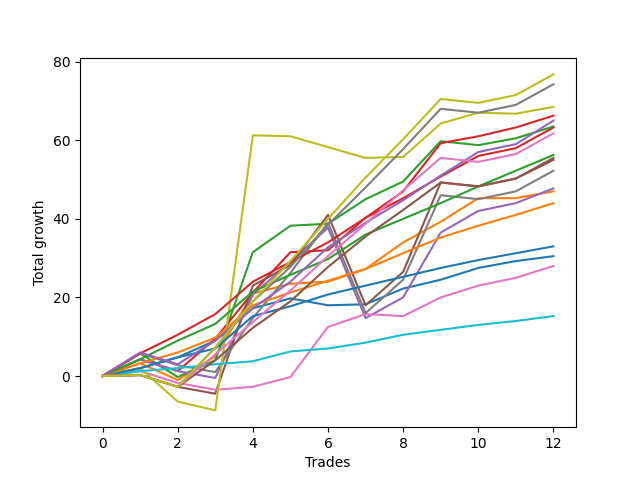

# Long Pointer 001 DB SD 
- Symbol: ES
- Date Range: 03/18/2022 - 07/15/2022
- Trading Period: 7:20-12:30
- Number of Trades: 12



| Name | Win Percent | Profit | Avg Profit / Trade | Avg Time / Trade |      | Name | Win Percent | Profit | Avg Profit / Trade | Avg Time / Trade |
| ---- | ----------- | ------ | ------------------ | ---------------- | ---- | ---- | ----------- | ------ | ------------------ | ---------------- |
| Sorted By <br> Profit | | | | | | Sorted By <br> Win Percentage ||||
| Ninety | 83.33 | 38375.00 | 3197.92 | 20:05 |     | Eighty-Five | 100.00 | 31625.00 | 2635.42 | 09:24 |
| Eighty-Nine | 83.33 | 37125.00 | 3093.75 | 20:04 |     | Eighty-Four | 100.00 | 28125.00 | 2343.75 | 07:42 |
| Seventy-Three | 50.00 | 34250.00 | 2854.17 | 09:00 |     | Eighty-Three | 100.00 | 22000.00 | 1833.33 | 06:31 |
| Three | 91.67 | 33125.00 | 2760.42 | 11:43 |     | Eighty-Two | 100.00 | 16500.00 | 1375.00 | 03:13 |
| Eighty-Six | 91.67 | 32500.00 | 2708.33 | 12:30 |     | Eighty-One | 100.00 | 7625.00 | 635.42 | 00:45 |
| Two | 83.33 | 31750.00 | 2645.83 | 14:24 |     | Three | 91.67 | 33125.00 | 2760.42 | 11:43 |
| Eighty-Five | 100.00 | 31625.00 | 2635.42 | 09:24 |     | Eighty-Six | 91.67 | 32500.00 | 2708.33 | 12:30 |
| Eighty-Eight | 83.33 | 30875.00 | 2572.92 | 18:44 |     | One | 91.67 | 23500.00 | 1958.33 | 09:26 |
| Eighty-Four | 100.00 | 28125.00 | 2343.75 | 07:42 |     | Zero | 91.67 | 15250.00 | 1270.83 | 02:56 |
| Eighty-Seven | 83.33 | 27750.00 | 2312.50 | 17:06 |     | Ninety | 83.33 | 38375.00 | 3197.92 | 20:05 |
| Five | 66.67 | 27500.00 | 2291.67 | 26:02 |     | Eighty-Nine | 83.33 | 37125.00 | 3093.75 | 20:04 |
| Seven | 66.67 | 26125.00 | 2177.08 | 22:26 |     | Two | 83.33 | 31750.00 | 2645.83 | 14:24 |
| Four | 75.00 | 23875.00 | 1989.58 | 21:46 |     | Eighty-Eight | 83.33 | 30875.00 | 2572.92 | 18:44 |
| One | 91.67 | 23500.00 | 1958.33 | 09:26 |     | Eighty-Seven | 83.33 | 27750.00 | 2312.50 | 17:06 |
| Eighty-Three | 100.00 | 22000.00 | 1833.33 | 06:31 |     | Four | 75.00 | 23875.00 | 1989.58 | 21:46 |
| Eighty-Two | 100.00 | 16500.00 | 1375.00 | 03:13 |     | Six | 75.00 | 14000.00 | 1166.67 | 10:49 |
| Zero | 91.67 | 15250.00 | 1270.83 | 02:56 |     | Five | 66.67 | 27500.00 | 2291.67 | 26:02 |
| Six | 75.00 | 14000.00 | 1166.67 | 10:49 |     | Seven | 66.67 | 26125.00 | 2177.08 | 22:26 |
| Eighty-One | 100.00 | 7625.00 | 635.42 | 00:45 |     | Seventy-Three | 50.00 | 34250.00 | 2854.17 | 09:00 |

## NO STOPLOSS

### Test Zero
* Sell when price hits the middle line of the 20p bollinger
* No Stoploss
* Results:
```
Total Trades: 12
Percent Up: 91.67
Percent Down: 8.33
Total Points Moved Up: 30.50
Potential Profit: 15250.00
Total Points Ups: 32.25 Count Ups: 11
Total Points Downs: -1.75 Count Downs: 1
```

<details><summary>Trades</summary>

<code>In: 2022-03-31 08:37:00		Out: 2022-03-31 08:38:15		Total Position Time: 01:15		Total Move Up: 2.00		Total to Date: 2.00</code> <br />
<code>In: 2022-05-02 08:07:00		Out: 2022-05-02 08:13:20		Total Position Time: 06:20		Total Move Up: 2.75		Total to Date: 4.75</code> <br />
<code>In: 2022-05-02 08:22:00		Out: 2022-05-02 08:26:05		Total Position Time: 04:05		Total Move Up: 4.25		Total to Date: 9.00</code> <br />
<code>In: 2022-05-04 11:36:00		Out: 2022-05-04 11:36:40		Total Position Time: 00:40		Total Move Up: 8.25		Total to Date: 17.25</code> <br />
<code>In: 2022-05-06 09:03:00		Out: 2022-05-06 09:03:10		Total Position Time: 00:10		Total Move Up: 2.50		Total to Date: 19.75</code> <br />
<code>In: 2022-05-06 11:28:00		Out: 2022-05-06 11:40:25		Total Position Time: 12:25		Total Move Up: -1.75		Total to Date: 18.00</code> <br />
<code>In: 2022-05-11 09:14:00		Out: 2022-05-11 09:17:50		Total Position Time: 03:50		Total Move Up: 0.25		Total to Date: 18.25</code> <br />
<code>In: 2022-05-16 09:47:00		Out: 2022-05-16 09:48:15		Total Position Time: 01:15		Total Move Up: 4.00		Total to Date: 22.25</code> <br />
<code>In: 2022-05-31 12:05:00		Out: 2022-05-31 12:07:20		Total Position Time: 02:20		Total Move Up: 2.25		Total to Date: 24.50</code> <br />
<code>In: 2022-06-27 10:10:00		Out: 2022-06-27 10:11:25		Total Position Time: 01:25		Total Move Up: 3.00		Total to Date: 27.50</code> <br />
<code>In: 2022-07-08 09:48:00		Out: 2022-07-08 09:48:40		Total Position Time: 00:40		Total Move Up: 1.75		Total to Date: 29.25</code> <br />
<code>In: 2022-07-12 10:28:00		Out: 2022-07-12 10:28:50		Total Position Time: 00:50		Total Move Up: 1.25		Total to Date: 30.50</code> <br />


</details>

### Test One
* Sell when the price hits the upper line of the 20p 1std bollinger
* No Stoploss
* Results:
```
Total Trades: 12
Percent Up: 91.67
Percent Down: 8.33
Total Points Moved Up: 47.00
Potential Profit: 23500.00
Total Points Ups: 51.25 Count Ups: 11
Total Points Downs: -4.25 Count Downs: 1
```

<details><summary>Trades</summary>

<code>In: 2022-03-31 08:37:00		Out: 2022-03-31 08:40:35		Total Position Time: 03:35		Total Move Up: 3.25		Total to Date: 3.25</code> <br />
<code>In: 2022-05-02 08:07:00		Out: 2022-05-02 08:34:10		Total Position Time: 27:10		Total Move Up: -4.25		Total to Date: -1.00</code> <br />
<code>In: 2022-05-02 08:22:00		Out: 2022-05-02 08:34:10		Total Position Time: 12:10		Total Move Up: 6.00		Total to Date: 5.00</code> <br />
<code>In: 2022-05-04 11:36:00		Out: 2022-05-04 11:41:35		Total Position Time: 05:35		Total Move Up: 16.00		Total to Date: 21.00</code> <br />
<code>In: 2022-05-06 09:03:00		Out: 2022-05-06 09:03:10		Total Position Time: 00:10		Total Move Up: 2.50		Total to Date: 23.50</code> <br />
<code>In: 2022-05-06 11:28:00		Out: 2022-05-06 11:49:10		Total Position Time: 21:10		Total Move Up: 0.50		Total to Date: 24.00</code> <br />
<code>In: 2022-05-11 09:14:00		Out: 2022-05-11 09:23:10		Total Position Time: 09:10		Total Move Up: 3.25		Total to Date: 27.25</code> <br />
<code>In: 2022-05-16 09:47:00		Out: 2022-05-16 09:50:05		Total Position Time: 03:05		Total Move Up: 6.75		Total to Date: 34.00</code> <br />
<code>In: 2022-05-31 12:05:00		Out: 2022-05-31 12:09:15		Total Position Time: 04:15		Total Move Up: 5.25		Total to Date: 39.25</code> <br />
<code>In: 2022-06-27 10:10:00		Out: 2022-06-27 10:15:55		Total Position Time: 05:55		Total Move Up: 6.00		Total to Date: 45.25</code> <br />
<code>In: 2022-07-08 09:48:00		Out: 2022-07-08 10:06:55		Total Position Time: 18:55		Total Move Up: 0.00		Total to Date: 45.25</code> <br />
<code>In: 2022-07-12 10:28:00		Out: 2022-07-12 10:30:05		Total Position Time: 02:05		Total Move Up: 1.75		Total to Date: 47.00</code> <br />


</details>

### Test Two
* Sell when the price hits the upper line of the 20p 2std bollinger
* No Stoploss
* Results:
```
Total Trades: 12
Percent Up: 83.33
Percent Down: 16.67
Total Points Moved Up: 63.50
Potential Profit: 31750.00
Total Points Ups: 70.50 Count Ups: 10
Total Points Downs: -7.00 Count Downs: 2
```

<details><summary>Trades</summary>

<code>In: 2022-03-31 08:37:00		Out: 2022-03-31 08:41:10		Total Position Time: 04:10		Total Move Up: 5.75		Total to Date: 5.75</code> <br />
<code>In: 2022-05-02 08:07:00		Out: 2022-05-02 08:36:25		Total Position Time: 29:25		Total Move Up: -6.00		Total to Date: -0.25</code> <br />
<code>In: 2022-05-02 08:22:00		Out: 2022-05-02 08:36:25		Total Position Time: 14:25		Total Move Up: 4.25		Total to Date: 4.00</code> <br />
<code>In: 2022-05-04 11:36:00		Out: 2022-05-04 11:43:45		Total Position Time: 07:45		Total Move Up: 27.50		Total to Date: 31.50</code> <br />
<code>In: 2022-05-06 09:03:00		Out: 2022-05-06 09:03:55		Total Position Time: 00:55		Total Move Up: 6.75		Total to Date: 38.25</code> <br />
<code>In: 2022-05-06 11:28:00		Out: 2022-05-06 11:49:10		Total Position Time: 21:10		Total Move Up: 0.50		Total to Date: 38.75</code> <br />
<code>In: 2022-05-11 09:14:00		Out: 2022-05-11 09:23:35		Total Position Time: 09:35		Total Move Up: 6.25		Total to Date: 45.00</code> <br />
<code>In: 2022-05-16 09:47:00		Out: 2022-05-16 10:06:30		Total Position Time: 19:30		Total Move Up: 4.50		Total to Date: 49.50</code> <br />
<code>In: 2022-05-31 12:05:00		Out: 2022-05-31 12:15:05		Total Position Time: 10:05		Total Move Up: 10.25		Total to Date: 59.75</code> <br />
<code>In: 2022-06-27 10:10:00		Out: 2022-06-27 10:39:55		Total Position Time: 29:55		Total Move Up: -1.00		Total to Date: 58.75</code> <br />
<code>In: 2022-07-08 09:48:00		Out: 2022-07-08 10:10:30		Total Position Time: 22:30		Total Move Up: 1.75		Total to Date: 60.50</code> <br />
<code>In: 2022-07-12 10:28:00		Out: 2022-07-12 10:31:30		Total Position Time: 03:30		Total Move Up: 3.00		Total to Date: 63.50</code> <br />


</details>

### Test Three
* Sell when price hits the middle line of the 50p bollinger
* No Stoploss
* Results:
```
Total Trades: 12
Percent Up: 91.67
Percent Down: 8.33
Total Points Moved Up: 66.25
Potential Profit: 33125.00
Total Points Ups: 69.25 Count Ups: 11
Total Points Downs: -3.00 Count Downs: 1
```

<details><summary>Trades</summary>

<code>In: 2022-03-31 08:37:00		Out: 2022-03-31 08:41:05		Total Position Time: 04:05		Total Move Up: 4.25		Total to Date: 4.25</code> <br />
<code>In: 2022-05-02 08:07:00		Out: 2022-05-02 08:36:55		Total Position Time: 29:55		Total Move Up: -3.00		Total to Date: 1.25</code> <br />
<code>In: 2022-05-02 08:22:00		Out: 2022-05-02 08:38:10		Total Position Time: 16:10		Total Move Up: 8.25		Total to Date: 9.50</code> <br />
<code>In: 2022-05-04 11:36:00		Out: 2022-05-04 11:41:15		Total Position Time: 05:15		Total Move Up: 11.75		Total to Date: 21.25</code> <br />
<code>In: 2022-05-06 09:03:00		Out: 2022-05-06 09:06:05		Total Position Time: 03:05		Total Move Up: 10.25		Total to Date: 31.50</code> <br />
<code>In: 2022-05-06 11:28:00		Out: 2022-05-06 11:49:10		Total Position Time: 21:10		Total Move Up: 0.50		Total to Date: 32.00</code> <br />
<code>In: 2022-05-11 09:14:00		Out: 2022-05-11 09:23:45		Total Position Time: 09:45		Total Move Up: 8.25		Total to Date: 40.25</code> <br />
<code>In: 2022-05-16 09:47:00		Out: 2022-05-16 09:50:05		Total Position Time: 03:05		Total Move Up: 6.75		Total to Date: 47.00</code> <br />
<code>In: 2022-05-31 12:05:00		Out: 2022-05-31 12:15:15		Total Position Time: 10:15		Total Move Up: 12.25		Total to Date: 59.25</code> <br />
<code>In: 2022-06-27 10:10:00		Out: 2022-06-27 10:11:15		Total Position Time: 01:15		Total Move Up: 1.75		Total to Date: 61.00</code> <br />
<code>In: 2022-07-08 09:48:00		Out: 2022-07-08 10:11:05		Total Position Time: 23:05		Total Move Up: 2.25		Total to Date: 63.25</code> <br />
<code>In: 2022-07-12 10:28:00		Out: 2022-07-12 10:41:35		Total Position Time: 13:35		Total Move Up: 3.00		Total to Date: 66.25</code> <br />


</details>

### Test Four
* Sell when the price hits the upper line of the 50p 1std bollinger
* No Stoploss
* Results:
```
Total Trades: 12
Percent Up: 75.00
Percent Down: 25.00
Total Points Moved Up: 47.75
Potential Profit: 23875.00
Total Points Ups: 75.50 Count Ups: 9
Total Points Downs: -27.75 Count Downs: 3
```

<details><summary>Trades</summary>

<code>In: 2022-03-31 08:37:00		Out: 2022-03-31 09:00:15		Total Position Time: 23:15		Total Move Up: 4.25		Total to Date: 4.25</code> <br />
<code>In: 2022-05-02 08:07:00		Out: 2022-05-02 08:36:55		Total Position Time: 29:55		Total Move Up: -3.00		Total to Date: 1.25</code> <br />
<code>In: 2022-05-02 08:22:00		Out: 2022-05-02 08:51:55		Total Position Time: 29:55		Total Move Up: -1.75		Total to Date: -0.50</code> <br />
<code>In: 2022-05-04 11:36:00		Out: 2022-05-04 11:42:00		Total Position Time: 06:00		Total Move Up: 21.25		Total to Date: 20.75</code> <br />
<code>In: 2022-05-06 09:03:00		Out: 2022-05-06 09:22:25		Total Position Time: 19:25		Total Move Up: 8.25		Total to Date: 29.00</code> <br />
<code>In: 2022-05-06 11:28:00		Out: 2022-05-06 11:50:10		Total Position Time: 22:10		Total Move Up: 8.75		Total to Date: 37.75</code> <br />
<code>In: 2022-05-11 09:14:00		Out: 2022-05-11 09:43:55		Total Position Time: 29:55		Total Move Up: -23.00		Total to Date: 14.75</code> <br />
<code>In: 2022-05-16 09:47:00		Out: 2022-05-16 10:07:00		Total Position Time: 20:00		Total Move Up: 5.25		Total to Date: 20.00</code> <br />
<code>In: 2022-05-31 12:05:00		Out: 2022-05-31 12:28:20		Total Position Time: 23:20		Total Move Up: 16.50		Total to Date: 36.50</code> <br />
<code>In: 2022-06-27 10:10:00		Out: 2022-06-27 10:13:05		Total Position Time: 03:05		Total Move Up: 5.50		Total to Date: 42.00</code> <br />
<code>In: 2022-07-08 09:48:00		Out: 2022-07-08 10:17:55		Total Position Time: 29:55		Total Move Up: 2.00		Total to Date: 44.00</code> <br />
<code>In: 2022-07-12 10:28:00		Out: 2022-07-12 10:52:25		Total Position Time: 24:25		Total Move Up: 3.75		Total to Date: 47.75</code> <br />


</details>

### Test Five
* Sell when the price hits the upper line of the 50p 2std bollinger
* No Stoploss
* Results:
```
Total Trades: 12
Percent Up: 66.67
Percent Down: 33.33
Total Points Moved Up: 55.00
Potential Profit: 27500.00
Total Points Ups: 83.75 Count Ups: 8
Total Points Downs: -28.75 Count Downs: 4
```

<details><summary>Trades</summary>

<code>In: 2022-03-31 08:37:00		Out: 2022-03-31 09:06:55		Total Position Time: 29:55		Total Move Up: 0.25		Total to Date: 0.25</code> <br />
<code>In: 2022-05-02 08:07:00		Out: 2022-05-02 08:36:55		Total Position Time: 29:55		Total Move Up: -3.00		Total to Date: -2.75</code> <br />
<code>In: 2022-05-02 08:22:00		Out: 2022-05-02 08:51:55		Total Position Time: 29:55		Total Move Up: -1.75		Total to Date: -4.50</code> <br />
<code>In: 2022-05-04 11:36:00		Out: 2022-05-04 11:43:45		Total Position Time: 07:45		Total Move Up: 27.50		Total to Date: 23.00</code> <br />
<code>In: 2022-05-06 09:03:00		Out: 2022-05-06 09:32:55		Total Position Time: 29:55		Total Move Up: 5.25		Total to Date: 28.25</code> <br />
<code>In: 2022-05-06 11:28:00		Out: 2022-05-06 11:50:35		Total Position Time: 22:35		Total Move Up: 12.75		Total to Date: 41.00</code> <br />
<code>In: 2022-05-11 09:14:00		Out: 2022-05-11 09:43:55		Total Position Time: 29:55		Total Move Up: -23.00		Total to Date: 18.00</code> <br />
<code>In: 2022-05-16 09:47:00		Out: 2022-05-16 10:07:35		Total Position Time: 20:35		Total Move Up: 8.50		Total to Date: 26.50</code> <br />
<code>In: 2022-05-31 12:05:00		Out: 2022-05-31 12:31:05		Total Position Time: 26:05		Total Move Up: 22.75		Total to Date: 49.25</code> <br />
<code>In: 2022-06-27 10:10:00		Out: 2022-06-27 10:39:55		Total Position Time: 29:55		Total Move Up: -1.00		Total to Date: 48.25</code> <br />
<code>In: 2022-07-08 09:48:00		Out: 2022-07-08 10:17:55		Total Position Time: 29:55		Total Move Up: 2.00		Total to Date: 50.25</code> <br />
<code>In: 2022-07-12 10:28:00		Out: 2022-07-12 10:54:05		Total Position Time: 26:05		Total Move Up: 4.75		Total to Date: 55.00</code> <br />


</details>

### Test Six
* Sell when the price hits the middle line of the 1std VWAP
* No Stoploss
* Results:
```
Total Trades: 12
Percent Up: 75.00
Percent Down: 25.00
Total Points Moved Up: 28.00
Potential Profit: 14000.00
Total Points Ups: 33.25 Count Ups: 9
Total Points Downs: -5.25 Count Downs: 3
```

<details><summary>Trades</summary>

<code>In: 2022-03-31 08:37:00		Out: 2022-03-31 08:37:40		Total Position Time: 00:40		Total Move Up: 1.25		Total to Date: 1.25</code> <br />
<code>In: 2022-05-02 08:07:00		Out: 2022-05-02 08:36:55		Total Position Time: 29:55		Total Move Up: -3.00		Total to Date: -1.75</code> <br />
<code>In: 2022-05-02 08:22:00		Out: 2022-05-02 08:51:55		Total Position Time: 29:55		Total Move Up: -1.75		Total to Date: -3.50</code> <br />
<code>In: 2022-05-04 11:36:00		Out: 2022-05-04 11:36:10		Total Position Time: 00:10		Total Move Up: 0.75		Total to Date: -2.75</code> <br />
<code>In: 2022-05-06 09:03:00		Out: 2022-05-06 09:03:10		Total Position Time: 00:10		Total Move Up: 2.50		Total to Date: -0.25</code> <br />
<code>In: 2022-05-06 11:28:00		Out: 2022-05-06 11:50:20		Total Position Time: 22:20		Total Move Up: 12.75		Total to Date: 12.50</code> <br />
<code>In: 2022-05-11 09:14:00		Out: 2022-05-11 09:23:10		Total Position Time: 09:10		Total Move Up: 3.25		Total to Date: 15.75</code> <br />
<code>In: 2022-05-16 09:47:00		Out: 2022-05-16 09:47:10		Total Position Time: 00:10		Total Move Up: -0.50		Total to Date: 15.25</code> <br />
<code>In: 2022-05-31 12:05:00		Out: 2022-05-31 12:07:50		Total Position Time: 02:50		Total Move Up: 4.75		Total to Date: 20.00</code> <br />
<code>In: 2022-06-27 10:10:00		Out: 2022-06-27 10:11:25		Total Position Time: 01:25		Total Move Up: 3.00		Total to Date: 23.00</code> <br />
<code>In: 2022-07-08 09:48:00		Out: 2022-07-08 10:17:55		Total Position Time: 29:55		Total Move Up: 2.00		Total to Date: 25.00</code> <br />
<code>In: 2022-07-12 10:28:00		Out: 2022-07-12 10:31:15		Total Position Time: 03:15		Total Move Up: 3.00		Total to Date: 28.00</code> <br />


</details>

### Test Seven
* Sell when the price hits the upper line of the 1std VWAP
* No Stoploss
* Results:
```
Total Trades: 12
Percent Up: 66.67
Percent Down: 33.33
Total Points Moved Up: 52.25
Potential Profit: 26125.00
Total Points Ups: 81.00 Count Ups: 8
Total Points Downs: -28.75 Count Downs: 4
```

<details><summary>Trades</summary>

<code>In: 2022-03-31 08:37:00		Out: 2022-03-31 08:41:10		Total Position Time: 04:10		Total Move Up: 5.75		Total to Date: 5.75</code> <br />
<code>In: 2022-05-02 08:07:00		Out: 2022-05-02 08:36:55		Total Position Time: 29:55		Total Move Up: -3.00		Total to Date: 2.75</code> <br />
<code>In: 2022-05-02 08:22:00		Out: 2022-05-02 08:51:55		Total Position Time: 29:55		Total Move Up: -1.75		Total to Date: 1.00</code> <br />
<code>In: 2022-05-04 11:36:00		Out: 2022-05-04 11:41:30		Total Position Time: 05:30		Total Move Up: 13.75		Total to Date: 14.75</code> <br />
<code>In: 2022-05-06 09:03:00		Out: 2022-05-06 09:06:40		Total Position Time: 03:40		Total Move Up: 11.50		Total to Date: 26.25</code> <br />
<code>In: 2022-05-06 11:28:00		Out: 2022-05-06 11:57:55		Total Position Time: 29:55		Total Move Up: 12.75		Total to Date: 39.00</code> <br />
<code>In: 2022-05-11 09:14:00		Out: 2022-05-11 09:43:55		Total Position Time: 29:55		Total Move Up: -23.00		Total to Date: 16.00</code> <br />
<code>In: 2022-05-16 09:47:00		Out: 2022-05-16 10:07:35		Total Position Time: 20:35		Total Move Up: 8.50		Total to Date: 24.50</code> <br />
<code>In: 2022-05-31 12:05:00		Out: 2022-05-31 12:30:55		Total Position Time: 25:55		Total Move Up: 21.50		Total to Date: 46.00</code> <br />
<code>In: 2022-06-27 10:10:00		Out: 2022-06-27 10:39:55		Total Position Time: 29:55		Total Move Up: -1.00		Total to Date: 45.00</code> <br />
<code>In: 2022-07-08 09:48:00		Out: 2022-07-08 10:17:55		Total Position Time: 29:55		Total Move Up: 2.00		Total to Date: 47.00</code> <br />
<code>In: 2022-07-12 10:28:00		Out: 2022-07-12 10:57:55		Total Position Time: 29:55		Total Move Up: 5.25		Total to Date: 52.25</code> <br />


</details>

## SPECIAL EXIT CONDITIONS 

### Test Seventy-Three
* Sell when the linear regression slope changes to negative
* No Stoploss
* Results:
```
Total Trades: 12
Percent Up: 50.00
Percent Down: 50.00
Total Points Moved Up: 68.50
Potential Profit: 34250.00
Total Points Ups: 85.25 Count Ups: 6
Total Points Downs: -16.75 Count Downs: 6
```

<details><summary>Trades</summary>

<code>In: 2022-03-31 08:37:00		Out: 2022-03-31 08:48:05		Total Position Time: 11:05		Total Move Up: 2.00		Total to Date: 2.00</code> <br />
<code>In: 2022-05-02 08:07:00		Out: 2022-05-02 08:17:05		Total Position Time: 10:05		Total Move Up: -8.50		Total to Date: -6.50</code> <br />
<code>In: 2022-05-02 08:22:00		Out: 2022-05-02 08:25:05		Total Position Time: 03:05		Total Move Up: -2.25		Total to Date: -8.75</code> <br />
<code>In: 2022-05-04 11:36:00		Out: 2022-05-04 11:58:05		Total Position Time: 22:05		Total Move Up: 70.00		Total to Date: 61.25</code> <br />
<code>In: 2022-05-06 09:03:00		Out: 2022-05-06 09:12:05		Total Position Time: 09:05		Total Move Up: -0.25		Total to Date: 61.00</code> <br />
<code>In: 2022-05-06 11:28:00		Out: 2022-05-06 11:31:05		Total Position Time: 03:05		Total Move Up: -2.75		Total to Date: 58.25</code> <br />
<code>In: 2022-05-11 09:14:00		Out: 2022-05-11 09:15:05		Total Position Time: 01:05		Total Move Up: -2.75		Total to Date: 55.50</code> <br />
<code>In: 2022-05-16 09:47:00		Out: 2022-05-16 09:54:05		Total Position Time: 07:05		Total Move Up: 0.25		Total to Date: 55.75</code> <br />
<code>In: 2022-05-31 12:05:00		Out: 2022-05-31 12:20:05		Total Position Time: 15:05		Total Move Up: 8.50		Total to Date: 64.25</code> <br />
<code>In: 2022-06-27 10:10:00		Out: 2022-06-27 10:21:05		Total Position Time: 11:05		Total Move Up: 2.75		Total to Date: 67.00</code> <br />
<code>In: 2022-07-08 09:48:00		Out: 2022-07-08 09:53:05		Total Position Time: 05:05		Total Move Up: -0.25		Total to Date: 66.75</code> <br />
<code>In: 2022-07-12 10:28:00		Out: 2022-07-12 10:38:05		Total Position Time: 10:05		Total Move Up: 1.75		Total to Date: 68.50</code> <br />


</details>

## TAKE PROFIT

### Test Eighty-One
* Take Profit of 1 Point
* No Stoploss
* Results:
```
Total Trades: 12
Percent Up: 100.00
Percent Down: 0.00
Total Points Moved Up: 15.25
Potential Profit: 7625.00
Total Points Ups: 15.25 Count Ups: 12
Total Points Downs: 0.00 Count Downs: 0
```

<details><summary>Trades</summary>

<code>In: 2022-03-31 08:37:00		Out: 2022-03-31 08:37:40		Total Position Time: 00:40		Total Move Up: 1.25		Total to Date: 1.25</code> <br />
<code>In: 2022-05-02 08:07:00		Out: 2022-05-02 08:07:10		Total Position Time: 00:10		Total Move Up: 0.75		Total to Date: 2.00</code> <br />
<code>In: 2022-05-02 08:22:00		Out: 2022-05-02 08:22:30		Total Position Time: 00:30		Total Move Up: 1.00		Total to Date: 3.00</code> <br />
<code>In: 2022-05-04 11:36:00		Out: 2022-05-04 11:36:10		Total Position Time: 00:10		Total Move Up: 0.75		Total to Date: 3.75</code> <br />
<code>In: 2022-05-06 09:03:00		Out: 2022-05-06 09:03:10		Total Position Time: 00:10		Total Move Up: 2.50		Total to Date: 6.25</code> <br />
<code>In: 2022-05-06 11:28:00		Out: 2022-05-06 11:30:35		Total Position Time: 02:35		Total Move Up: 0.75		Total to Date: 7.00</code> <br />
<code>In: 2022-05-11 09:14:00		Out: 2022-05-11 09:14:25		Total Position Time: 00:25		Total Move Up: 1.50		Total to Date: 8.50</code> <br />
<code>In: 2022-05-16 09:47:00		Out: 2022-05-16 09:47:50		Total Position Time: 00:50		Total Move Up: 2.00		Total to Date: 10.50</code> <br />
<code>In: 2022-05-31 12:05:00		Out: 2022-05-31 12:07:05		Total Position Time: 02:05		Total Move Up: 1.25		Total to Date: 11.75</code> <br />
<code>In: 2022-06-27 10:10:00		Out: 2022-06-27 10:10:25		Total Position Time: 00:25		Total Move Up: 1.25		Total to Date: 13.00</code> <br />
<code>In: 2022-07-08 09:48:00		Out: 2022-07-08 09:48:20		Total Position Time: 00:20		Total Move Up: 1.00		Total to Date: 14.00</code> <br />
<code>In: 2022-07-12 10:28:00		Out: 2022-07-12 10:28:50		Total Position Time: 00:50		Total Move Up: 1.25		Total to Date: 15.25</code> <br />


</details>

### Test Eighty-Two
* Take Profit of 2 Point
* No Stoploss
* Results:
```
Total Trades: 12
Percent Up: 100.00
Percent Down: 0.00
Total Points Moved Up: 33.00
Potential Profit: 16500.00
Total Points Ups: 33.00 Count Ups: 12
Total Points Downs: 0.00 Count Downs: 0
```

<details><summary>Trades</summary>

<code>In: 2022-03-31 08:37:00		Out: 2022-03-31 08:38:15		Total Position Time: 01:15		Total Move Up: 2.00		Total to Date: 2.00</code> <br />
<code>In: 2022-05-02 08:07:00		Out: 2022-05-02 08:13:20		Total Position Time: 06:20		Total Move Up: 2.75		Total to Date: 4.75</code> <br />
<code>In: 2022-05-02 08:22:00		Out: 2022-05-02 08:22:55		Total Position Time: 00:55		Total Move Up: 2.25		Total to Date: 7.00</code> <br />
<code>In: 2022-05-04 11:36:00		Out: 2022-05-04 11:36:40		Total Position Time: 00:40		Total Move Up: 8.25		Total to Date: 15.25</code> <br />
<code>In: 2022-05-06 09:03:00		Out: 2022-05-06 09:03:10		Total Position Time: 00:10		Total Move Up: 2.50		Total to Date: 17.75</code> <br />
<code>In: 2022-05-06 11:28:00		Out: 2022-05-06 11:49:25		Total Position Time: 21:25		Total Move Up: 3.00		Total to Date: 20.75</code> <br />
<code>In: 2022-05-11 09:14:00		Out: 2022-05-11 09:14:30		Total Position Time: 00:30		Total Move Up: 2.25		Total to Date: 23.00</code> <br />
<code>In: 2022-05-16 09:47:00		Out: 2022-05-16 09:47:55		Total Position Time: 00:55		Total Move Up: 2.25		Total to Date: 25.25</code> <br />
<code>In: 2022-05-31 12:05:00		Out: 2022-05-31 12:07:20		Total Position Time: 02:20		Total Move Up: 2.25		Total to Date: 27.50</code> <br />
<code>In: 2022-06-27 10:10:00		Out: 2022-06-27 10:11:10		Total Position Time: 01:10		Total Move Up: 2.00		Total to Date: 29.50</code> <br />
<code>In: 2022-07-08 09:48:00		Out: 2022-07-08 09:49:00		Total Position Time: 01:00		Total Move Up: 1.75		Total to Date: 31.25</code> <br />
<code>In: 2022-07-12 10:28:00		Out: 2022-07-12 10:30:05		Total Position Time: 02:05		Total Move Up: 1.75		Total to Date: 33.00</code> <br />


</details>

### Test Eighty-Three
* Take Profit of 3 Point
* No Stoploss
* Results:
```
Total Trades: 12
Percent Up: 100.00
Percent Down: 0.00
Total Points Moved Up: 44.00
Potential Profit: 22000.00
Total Points Ups: 44.00 Count Ups: 12
Total Points Downs: 0.00 Count Downs: 0
```

<details><summary>Trades</summary>

<code>In: 2022-03-31 08:37:00		Out: 2022-03-31 08:40:35		Total Position Time: 03:35		Total Move Up: 3.25		Total to Date: 3.25</code> <br />
<code>In: 2022-05-02 08:07:00		Out: 2022-05-02 08:14:55		Total Position Time: 07:55		Total Move Up: 2.75		Total to Date: 6.00</code> <br />
<code>In: 2022-05-02 08:22:00		Out: 2022-05-02 08:26:00		Total Position Time: 04:00		Total Move Up: 3.75		Total to Date: 9.75</code> <br />
<code>In: 2022-05-04 11:36:00		Out: 2022-05-04 11:36:40		Total Position Time: 00:40		Total Move Up: 8.25		Total to Date: 18.00</code> <br />
<code>In: 2022-05-06 09:03:00		Out: 2022-05-06 09:03:40		Total Position Time: 00:40		Total Move Up: 3.25		Total to Date: 21.25</code> <br />
<code>In: 2022-05-06 11:28:00		Out: 2022-05-06 11:49:25		Total Position Time: 21:25		Total Move Up: 3.00		Total to Date: 24.25</code> <br />
<code>In: 2022-05-11 09:14:00		Out: 2022-05-11 09:22:05		Total Position Time: 08:05		Total Move Up: 3.00		Total to Date: 27.25</code> <br />
<code>In: 2022-05-16 09:47:00		Out: 2022-05-16 09:48:15		Total Position Time: 01:15		Total Move Up: 4.00		Total to Date: 31.25</code> <br />
<code>In: 2022-05-31 12:05:00		Out: 2022-05-31 12:07:45		Total Position Time: 02:45		Total Move Up: 4.00		Total to Date: 35.25</code> <br />
<code>In: 2022-06-27 10:10:00		Out: 2022-06-27 10:11:25		Total Position Time: 01:25		Total Move Up: 3.00		Total to Date: 38.25</code> <br />
<code>In: 2022-07-08 09:48:00		Out: 2022-07-08 10:11:20		Total Position Time: 23:20		Total Move Up: 2.75		Total to Date: 41.00</code> <br />
<code>In: 2022-07-12 10:28:00		Out: 2022-07-12 10:31:15		Total Position Time: 03:15		Total Move Up: 3.00		Total to Date: 44.00</code> <br />


</details>

### Test Eighty-Four
* Take Profit of 4 Point
* No Stoploss
* Results:
```
Total Trades: 12
Percent Up: 100.00
Percent Down: 0.00
Total Points Moved Up: 56.25
Potential Profit: 28125.00
Total Points Ups: 56.25 Count Ups: 12
Total Points Downs: 0.00 Count Downs: 0
```

<details><summary>Trades</summary>

<code>In: 2022-03-31 08:37:00		Out: 2022-03-31 08:41:05		Total Position Time: 04:05		Total Move Up: 4.25		Total to Date: 4.25</code> <br />
<code>In: 2022-05-02 08:07:00		Out: 2022-05-02 08:15:00		Total Position Time: 08:00		Total Move Up: 4.75		Total to Date: 9.00</code> <br />
<code>In: 2022-05-02 08:22:00		Out: 2022-05-02 08:26:05		Total Position Time: 04:05		Total Move Up: 4.25		Total to Date: 13.25</code> <br />
<code>In: 2022-05-04 11:36:00		Out: 2022-05-04 11:36:40		Total Position Time: 00:40		Total Move Up: 8.25		Total to Date: 21.50</code> <br />
<code>In: 2022-05-06 09:03:00		Out: 2022-05-06 09:03:45		Total Position Time: 00:45		Total Move Up: 4.25		Total to Date: 25.75</code> <br />
<code>In: 2022-05-06 11:28:00		Out: 2022-05-06 11:49:30		Total Position Time: 21:30		Total Move Up: 4.00		Total to Date: 29.75</code> <br />
<code>In: 2022-05-11 09:14:00		Out: 2022-05-11 09:23:15		Total Position Time: 09:15		Total Move Up: 6.25		Total to Date: 36.00</code> <br />
<code>In: 2022-05-16 09:47:00		Out: 2022-05-16 09:48:15		Total Position Time: 01:15		Total Move Up: 4.00		Total to Date: 40.00</code> <br />
<code>In: 2022-05-31 12:05:00		Out: 2022-05-31 12:07:45		Total Position Time: 02:45		Total Move Up: 4.00		Total to Date: 44.00</code> <br />
<code>In: 2022-06-27 10:10:00		Out: 2022-06-27 10:12:00		Total Position Time: 02:00		Total Move Up: 4.25		Total to Date: 48.25</code> <br />
<code>In: 2022-07-08 09:48:00		Out: 2022-07-08 10:12:25		Total Position Time: 24:25		Total Move Up: 4.00		Total to Date: 52.25</code> <br />
<code>In: 2022-07-12 10:28:00		Out: 2022-07-12 10:41:40		Total Position Time: 13:40		Total Move Up: 4.00		Total to Date: 56.25</code> <br />


</details>

### Test Eighty-Five
* Take Profit of 5 Point
* No Stoploss
* Results:
```
Total Trades: 12
Percent Up: 100.00
Percent Down: 0.00
Total Points Moved Up: 63.25
Potential Profit: 31625.00
Total Points Ups: 63.25 Count Ups: 12
Total Points Downs: 0.00 Count Downs: 0
```

<details><summary>Trades</summary>

<code>In: 2022-03-31 08:37:00		Out: 2022-03-31 08:41:10		Total Position Time: 04:10		Total Move Up: 5.75		Total to Date: 5.75</code> <br />
<code>In: 2022-05-02 08:07:00		Out: 2022-05-02 08:15:00		Total Position Time: 08:00		Total Move Up: 4.75		Total to Date: 10.50</code> <br />
<code>In: 2022-05-02 08:22:00		Out: 2022-05-02 08:26:10		Total Position Time: 04:10		Total Move Up: 5.25		Total to Date: 15.75</code> <br />
<code>In: 2022-05-04 11:36:00		Out: 2022-05-04 11:36:40		Total Position Time: 00:40		Total Move Up: 8.25		Total to Date: 24.00</code> <br />
<code>In: 2022-05-06 09:03:00		Out: 2022-05-06 09:03:50		Total Position Time: 00:50		Total Move Up: 5.00		Total to Date: 29.00</code> <br />
<code>In: 2022-05-06 11:28:00		Out: 2022-05-06 11:50:05		Total Position Time: 22:05		Total Move Up: 5.00		Total to Date: 34.00</code> <br />
<code>In: 2022-05-11 09:14:00		Out: 2022-05-11 09:23:15		Total Position Time: 09:15		Total Move Up: 6.25		Total to Date: 40.25</code> <br />
<code>In: 2022-05-16 09:47:00		Out: 2022-05-16 09:48:45		Total Position Time: 01:45		Total Move Up: 5.00		Total to Date: 45.25</code> <br />
<code>In: 2022-05-31 12:05:00		Out: 2022-05-31 12:07:55		Total Position Time: 02:55		Total Move Up: 5.50		Total to Date: 50.75</code> <br />
<code>In: 2022-06-27 10:10:00		Out: 2022-06-27 10:12:55		Total Position Time: 02:55		Total Move Up: 5.25		Total to Date: 56.00</code> <br />
<code>In: 2022-07-08 09:48:00		Out: 2022-07-08 10:17:55		Total Position Time: 29:55		Total Move Up: 2.00		Total to Date: 58.00</code> <br />
<code>In: 2022-07-12 10:28:00		Out: 2022-07-12 10:54:15		Total Position Time: 26:15		Total Move Up: 5.25		Total to Date: 63.25</code> <br />


</details>

### Test Eighty-Six
* Take Profit of 6 Point
* No Stoploss
* Results:
```
Total Trades: 12
Percent Up: 91.67
Percent Down: 8.33
Total Points Moved Up: 65.00
Potential Profit: 32500.00
Total Points Ups: 68.00 Count Ups: 11
Total Points Downs: -3.00 Count Downs: 1
```

<details><summary>Trades</summary>

<code>In: 2022-03-31 08:37:00		Out: 2022-03-31 08:41:50		Total Position Time: 04:50		Total Move Up: 6.00		Total to Date: 6.00</code> <br />
<code>In: 2022-05-02 08:07:00		Out: 2022-05-02 08:36:55		Total Position Time: 29:55		Total Move Up: -3.00		Total to Date: 3.00</code> <br />
<code>In: 2022-05-02 08:22:00		Out: 2022-05-02 08:34:10		Total Position Time: 12:10		Total Move Up: 6.00		Total to Date: 9.00</code> <br />
<code>In: 2022-05-04 11:36:00		Out: 2022-05-04 11:36:40		Total Position Time: 00:40		Total Move Up: 8.25		Total to Date: 17.25</code> <br />
<code>In: 2022-05-06 09:03:00		Out: 2022-05-06 09:03:55		Total Position Time: 00:55		Total Move Up: 6.75		Total to Date: 24.00</code> <br />
<code>In: 2022-05-06 11:28:00		Out: 2022-05-06 11:50:10		Total Position Time: 22:10		Total Move Up: 8.75		Total to Date: 32.75</code> <br />
<code>In: 2022-05-11 09:14:00		Out: 2022-05-11 09:23:15		Total Position Time: 09:15		Total Move Up: 6.25		Total to Date: 39.00</code> <br />
<code>In: 2022-05-16 09:47:00		Out: 2022-05-16 09:50:00		Total Position Time: 03:00		Total Move Up: 5.75		Total to Date: 44.75</code> <br />
<code>In: 2022-05-31 12:05:00		Out: 2022-05-31 12:09:20		Total Position Time: 04:20		Total Move Up: 6.25		Total to Date: 51.00</code> <br />
<code>In: 2022-06-27 10:10:00		Out: 2022-06-27 10:15:55		Total Position Time: 05:55		Total Move Up: 6.00		Total to Date: 57.00</code> <br />
<code>In: 2022-07-08 09:48:00		Out: 2022-07-08 10:17:55		Total Position Time: 29:55		Total Move Up: 2.00		Total to Date: 59.00</code> <br />
<code>In: 2022-07-12 10:28:00		Out: 2022-07-12 10:55:00		Total Position Time: 27:00		Total Move Up: 6.00		Total to Date: 65.00</code> <br />


</details>

### Test Eighty-Seven
* Take Profit of 7 Point
* No Stoploss
* Results:
```
Total Trades: 12
Percent Up: 83.33
Percent Down: 16.67
Total Points Moved Up: 55.50
Potential Profit: 27750.00
Total Points Ups: 59.50 Count Ups: 10
Total Points Downs: -4.00 Count Downs: 2
```

<details><summary>Trades</summary>

<code>In: 2022-03-31 08:37:00		Out: 2022-03-31 09:06:55		Total Position Time: 29:55		Total Move Up: 0.25		Total to Date: 0.25</code> <br />
<code>In: 2022-05-02 08:07:00		Out: 2022-05-02 08:36:55		Total Position Time: 29:55		Total Move Up: -3.00		Total to Date: -2.75</code> <br />
<code>In: 2022-05-02 08:22:00		Out: 2022-05-02 08:36:35		Total Position Time: 14:35		Total Move Up: 6.75		Total to Date: 4.00</code> <br />
<code>In: 2022-05-04 11:36:00		Out: 2022-05-04 11:36:40		Total Position Time: 00:40		Total Move Up: 8.25		Total to Date: 12.25</code> <br />
<code>In: 2022-05-06 09:03:00		Out: 2022-05-06 09:03:55		Total Position Time: 00:55		Total Move Up: 6.75		Total to Date: 19.00</code> <br />
<code>In: 2022-05-06 11:28:00		Out: 2022-05-06 11:50:10		Total Position Time: 22:10		Total Move Up: 8.75		Total to Date: 27.75</code> <br />
<code>In: 2022-05-11 09:14:00		Out: 2022-05-11 09:23:40		Total Position Time: 09:40		Total Move Up: 7.75		Total to Date: 35.50</code> <br />
<code>In: 2022-05-16 09:47:00		Out: 2022-05-16 09:50:05		Total Position Time: 03:05		Total Move Up: 6.75		Total to Date: 42.25</code> <br />
<code>In: 2022-05-31 12:05:00		Out: 2022-05-31 12:09:40		Total Position Time: 04:40		Total Move Up: 7.00		Total to Date: 49.25</code> <br />
<code>In: 2022-06-27 10:10:00		Out: 2022-06-27 10:39:55		Total Position Time: 29:55		Total Move Up: -1.00		Total to Date: 48.25</code> <br />
<code>In: 2022-07-08 09:48:00		Out: 2022-07-08 10:17:55		Total Position Time: 29:55		Total Move Up: 2.00		Total to Date: 50.25</code> <br />
<code>In: 2022-07-12 10:28:00		Out: 2022-07-12 10:57:55		Total Position Time: 29:55		Total Move Up: 5.25		Total to Date: 55.50</code> <br />


</details>

### Test Eighty-Eight
* Take Profit of 8 Point
* No Stoploss
* Results:
```
Total Trades: 12
Percent Up: 83.33
Percent Down: 16.67
Total Points Moved Up: 61.75
Potential Profit: 30875.00
Total Points Ups: 65.75 Count Ups: 10
Total Points Downs: -4.00 Count Downs: 2
```

<details><summary>Trades</summary>

<code>In: 2022-03-31 08:37:00		Out: 2022-03-31 09:06:55		Total Position Time: 29:55		Total Move Up: 0.25		Total to Date: 0.25</code> <br />
<code>In: 2022-05-02 08:07:00		Out: 2022-05-02 08:36:55		Total Position Time: 29:55		Total Move Up: -3.00		Total to Date: -2.75</code> <br />
<code>In: 2022-05-02 08:22:00		Out: 2022-05-02 08:36:45		Total Position Time: 14:45		Total Move Up: 8.25		Total to Date: 5.50</code> <br />
<code>In: 2022-05-04 11:36:00		Out: 2022-05-04 11:36:40		Total Position Time: 00:40		Total Move Up: 8.25		Total to Date: 13.75</code> <br />
<code>In: 2022-05-06 09:03:00		Out: 2022-05-06 09:05:30		Total Position Time: 02:30		Total Move Up: 8.00		Total to Date: 21.75</code> <br />
<code>In: 2022-05-06 11:28:00		Out: 2022-05-06 11:50:10		Total Position Time: 22:10		Total Move Up: 8.75		Total to Date: 30.50</code> <br />
<code>In: 2022-05-11 09:14:00		Out: 2022-05-11 09:23:45		Total Position Time: 09:45		Total Move Up: 8.25		Total to Date: 38.75</code> <br />
<code>In: 2022-05-16 09:47:00		Out: 2022-05-16 10:07:35		Total Position Time: 20:35		Total Move Up: 8.50		Total to Date: 47.25</code> <br />
<code>In: 2022-05-31 12:05:00		Out: 2022-05-31 12:09:55		Total Position Time: 04:55		Total Move Up: 8.25		Total to Date: 55.50</code> <br />
<code>In: 2022-06-27 10:10:00		Out: 2022-06-27 10:39:55		Total Position Time: 29:55		Total Move Up: -1.00		Total to Date: 54.50</code> <br />
<code>In: 2022-07-08 09:48:00		Out: 2022-07-08 10:17:55		Total Position Time: 29:55		Total Move Up: 2.00		Total to Date: 56.50</code> <br />
<code>In: 2022-07-12 10:28:00		Out: 2022-07-12 10:57:55		Total Position Time: 29:55		Total Move Up: 5.25		Total to Date: 61.75</code> <br />


</details>

### Test Eighty-Nine
* Take Profit of 9 Point
* No Stoploss
* Results:
```
Total Trades: 12
Percent Up: 83.33
Percent Down: 16.67
Total Points Moved Up: 74.25
Potential Profit: 37125.00
Total Points Ups: 78.25 Count Ups: 10
Total Points Downs: -4.00 Count Downs: 2
```

<details><summary>Trades</summary>

<code>In: 2022-03-31 08:37:00		Out: 2022-03-31 09:06:55		Total Position Time: 29:55		Total Move Up: 0.25		Total to Date: 0.25</code> <br />
<code>In: 2022-05-02 08:07:00		Out: 2022-05-02 08:36:55		Total Position Time: 29:55		Total Move Up: -3.00		Total to Date: -2.75</code> <br />
<code>In: 2022-05-02 08:22:00		Out: 2022-05-02 08:38:15		Total Position Time: 16:15		Total Move Up: 10.00		Total to Date: 7.25</code> <br />
<code>In: 2022-05-04 11:36:00		Out: 2022-05-04 11:41:15		Total Position Time: 05:15		Total Move Up: 11.75		Total to Date: 19.00</code> <br />
<code>In: 2022-05-06 09:03:00		Out: 2022-05-06 09:06:00		Total Position Time: 03:00		Total Move Up: 8.75		Total to Date: 27.75</code> <br />
<code>In: 2022-05-06 11:28:00		Out: 2022-05-06 11:50:15		Total Position Time: 22:15		Total Move Up: 10.75		Total to Date: 38.50</code> <br />
<code>In: 2022-05-11 09:14:00		Out: 2022-05-11 09:24:05		Total Position Time: 10:05		Total Move Up: 9.50		Total to Date: 48.00</code> <br />
<code>In: 2022-05-16 09:47:00		Out: 2022-05-16 10:11:25		Total Position Time: 24:25		Total Move Up: 9.75		Total to Date: 57.75</code> <br />
<code>In: 2022-05-31 12:05:00		Out: 2022-05-31 12:15:05		Total Position Time: 10:05		Total Move Up: 10.25		Total to Date: 68.00</code> <br />
<code>In: 2022-06-27 10:10:00		Out: 2022-06-27 10:39:55		Total Position Time: 29:55		Total Move Up: -1.00		Total to Date: 67.00</code> <br />
<code>In: 2022-07-08 09:48:00		Out: 2022-07-08 10:17:55		Total Position Time: 29:55		Total Move Up: 2.00		Total to Date: 69.00</code> <br />
<code>In: 2022-07-12 10:28:00		Out: 2022-07-12 10:57:55		Total Position Time: 29:55		Total Move Up: 5.25		Total to Date: 74.25</code> <br />


</details>

### Test Ninety
* Take Profit of 10 Point
* No Stoploss
* Results:
```
Total Trades: 12
Percent Up: 83.33
Percent Down: 16.67
Total Points Moved Up: 76.75
Potential Profit: 38375.00
Total Points Ups: 80.75 Count Ups: 10
Total Points Downs: -4.00 Count Downs: 2
```

<details><summary>Trades</summary>

<code>In: 2022-03-31 08:37:00		Out: 2022-03-31 09:06:55		Total Position Time: 29:55		Total Move Up: 0.25		Total to Date: 0.25</code> <br />
<code>In: 2022-05-02 08:07:00		Out: 2022-05-02 08:36:55		Total Position Time: 29:55		Total Move Up: -3.00		Total to Date: -2.75</code> <br />
<code>In: 2022-05-02 08:22:00		Out: 2022-05-02 08:38:15		Total Position Time: 16:15		Total Move Up: 10.00		Total to Date: 7.25</code> <br />
<code>In: 2022-05-04 11:36:00		Out: 2022-05-04 11:41:15		Total Position Time: 05:15		Total Move Up: 11.75		Total to Date: 19.00</code> <br />
<code>In: 2022-05-06 09:03:00		Out: 2022-05-06 09:06:05		Total Position Time: 03:05		Total Move Up: 10.25		Total to Date: 29.25</code> <br />
<code>In: 2022-05-06 11:28:00		Out: 2022-05-06 11:50:15		Total Position Time: 22:15		Total Move Up: 10.75		Total to Date: 40.00</code> <br />
<code>In: 2022-05-11 09:14:00		Out: 2022-05-11 09:24:10		Total Position Time: 10:10		Total Move Up: 10.50		Total to Date: 50.50</code> <br />
<code>In: 2022-05-16 09:47:00		Out: 2022-05-16 10:11:30		Total Position Time: 24:30		Total Move Up: 9.75		Total to Date: 60.25</code> <br />
<code>In: 2022-05-31 12:05:00		Out: 2022-05-31 12:15:05		Total Position Time: 10:05		Total Move Up: 10.25		Total to Date: 70.50</code> <br />
<code>In: 2022-06-27 10:10:00		Out: 2022-06-27 10:39:55		Total Position Time: 29:55		Total Move Up: -1.00		Total to Date: 69.50</code> <br />
<code>In: 2022-07-08 09:48:00		Out: 2022-07-08 10:17:55		Total Position Time: 29:55		Total Move Up: 2.00		Total to Date: 71.50</code> <br />
<code>In: 2022-07-12 10:28:00		Out: 2022-07-12 10:57:55		Total Position Time: 29:55		Total Move Up: 5.25		Total to Date: 76.75</code> <br />


</details>